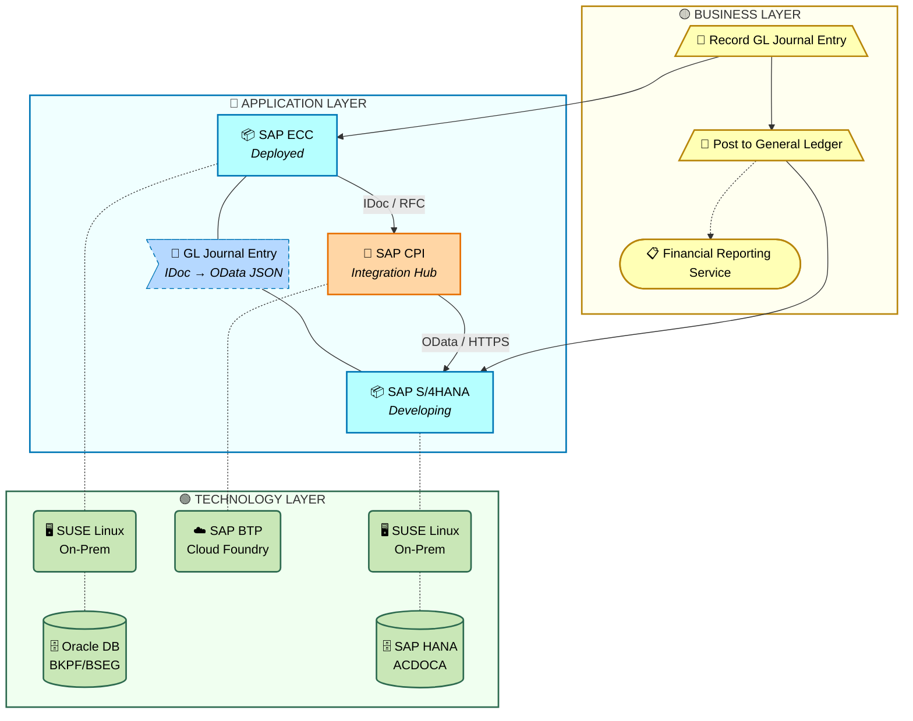

# IAO Architecture — Jupyter Notebook Automation Build Plan

## 1. Executive Summary

This plan converts the existing PowerShell-based IAO Architecture SAD generation framework into a **Python/Jupyter Notebook** pipeline that pulls live data from enterprise APIs (IAPM, SAP BIC, Smartsheet, SAP S/4HANA OData) and generates **TOGAF BDAT-aligned** architecture documents per capability under each tower:
- **Business Architecture** — process flows, roles, task details (from BIC BPMN)
- **Data Architecture** — data entities, flows, ownership, governance (from enriched flows + RICEFW)
- **Application Architecture** — system components, integrations, Mermaid diagrams (from IAPM + flows)
- **Technology/Platform Architecture** — infrastructure, middleware, deployment topology (from IAPM + SAP OData)

The notebooks will be version-controlled in GitHub and scheduled for periodic execution.

### Current State (PowerShell Framework)
```
Phase 0: Manual browser-console JS exports (IAPM, Signavio/BIC)
Phase 1: Build-Lookup.ps1 → System_IAPM_Lookup.csv
Phase 2: Enrich-Flows.ps1 → enriched *Flows.csv
Phase 3: Distribute-Bpmn.ps1 → BPMN files per capability
Phase 4: Generate-SAD.ps1 → Markdown architecture documents
```

### Target State (Jupyter Notebook + API Pipeline)
```
Notebook 01: IAPM API extraction (application portfolio, lifecycle)
Notebook 02: SAP BIC API extraction (BPMN process models)  ← replaces Signavio
Notebook 03: Smartsheet API extraction (timelines, RICEFW, requirements, RAID logs)
Notebook 04: SAP S/4HANA OData extraction (dev objects, transports)
Notebook 05: Build lookups & enrich flows
Notebook 06: BPMN → Mermaid conversion
Notebook 07: Generate Business Architecture documents
Notebook 08: Generate Systems Architecture documents (TOGAF BDAT: Data + Application + Technology)
Notebook 09: Orchestration
```

---

## 2. Architecture Overview

### 2.1 Target Folder Structure

The notebook workspace (`IAO-JPNotebookPython/`) will mirror the existing `IAO-Architecture/` output structure:

```
IAO-JPNotebookPython/
├── README.md
├── requirements.txt
├── .env.example                          # Template for secrets (never committed)
├── .gitignore
├── config/
│   ├── towers.yaml                       # Master tower/capability registry
│   ├── api_endpoints.yaml                # All API endpoint configurations
│   ├── scheduling.yaml                   # Cron schedules per notebook
│   └── sharepoint.yaml                   # SharePoint site URL, drive ID, folder paths
│
├── notebooks/
│   ├── 01_Extract_IAPM.ipynb             # IAPM API data extraction
│   ├── 02_Extract_BIC.ipynb              # SAP BIC BPMN extraction (Signavio fallback)
│   ├── 03_Extract_Smartsheet.ipynb       # Smartsheet API data extraction
│   ├── 04_Extract_SAP_OData.ipynb        # SAP S/4HANA OData extraction
│   ├── 05_Build_Lookup_Enrich.ipynb      # Build lookup tables & enrich flows
│   ├── 06_Process_BPMN.ipynb            # BPMN → Mermaid conversion
│   ├── 07_Gen_Business_Architecture.ipynb # Generate business arch docs
│   ├── 08_Gen_Systems_Architecture.ipynb  # Generate systems arch docs
│   └── 09_Orchestrator.ipynb             # Run all notebooks in sequence
│
├── src/                                  # Reusable Python modules
│   ├── __init__.py
│   ├── iapm_client.py                    # IAPM API client
│   ├── bic_client.py                     # SAP BIC API client (replaces Signavio)
│   ├── smartsheet_client.py              # Smartsheet API client
│   ├── sap_odata_client.py              # SAP S/4HANA OData client
│   ├── bpmn_parser.py                    # BPMN XML → structured data
│   ├── bpmn_to_mermaid.py               # BPMN → Mermaid flowchart
│   ├── doc_generator.py                  # Markdown + PDF document assembly
│   ├── flow_enricher.py                  # Flow CSV enrichment logic
│   ├── lookup_builder.py                 # System_IAPM_Lookup builder
│   ├── sharepoint_sync.py                # SharePoint ↔ Git bidirectional sync
│   └── utils.py                          # Shared helpers (auth, CSV, YAML)
│
├── templates/                            # Jinja2 Markdown templates
│   ├── assets/
│   │   ├── cover_image.png               # Branded cover image for all docs
│   │   ├── footer.css                    # CSS for PDF export (page numbers, margins)
│   │   └── pandoc_defaults.yaml          # Pandoc/md-to-pdf settings
│   ├── business_architecture.md.j2       # Business Architecture template
│   ├── systems_architecture.md.j2        # Systems Architecture template (BDAT: D+A+T)
│   ├── CurrentFlows_TEMPLATE.csv
│   └── FutureFlows_TEMPLATE.csv
│
├── data/                                 # Extracted raw data (git-ignored)
│   ├── iapm/
│   ├── bic/                              # BIC BPMN exports (replaces signavio/)
│   ├── smartsheet/
│   │   ├── timelines/                    # Program timelines, milestones
│   │   ├── ricefw/                       # Requirements & RICEFW tracker data
│   │   └── raid/                         # Risk, Action, Issue, Decision logs
│   └── sap_odata/
│
├── output/                               # Mirrors IAO-Architecture/towers structure
│   └── towers/
│       ├── FPR/
│       │   └── DS Provide Decision Support/
│       │       └── DS-020/
│       │           └── output/docs/
│       │               ├── business-architecture/   # .md (Git) + .pdf (Git + SharePoint)
│       │               └── systems-architecture/    # .md (Git) + .pdf (Git + SharePoint)
│       ├── OTC-IF/
│       ├── OTC-IP/
│       ├── FTS-IF/
│       ├── FTS-IP/
│       ├── PTP/
│       ├── MDM/
│       └── E2E/
│
└── tests/                                # Unit tests
    ├── test_iapm_client.py
    ├── test_bpmn_parser.py
    └── test_doc_generator.py
```

### 2.2 Data Flow Diagram

```
┌─────────────────────────────────────────────────────────────────────────────────────┐
│                          DATA SOURCES (APIs)                                        │
├──────────────┬──────────────┬──────────────────┬────────────────────────────────────┤
│  IAPM API    │  SAP BIC     │  Smartsheet API  │  SAP S/4HANA OData                │
│  (REST)      │  API (REST)  │  (REST)          │  (OData v2/v4)                    │
└──────┬───────┴──────┬───────┴────────┬─────────┴──────────────┬─────────────────────┘
       │              │                │                        │
       ▼              ▼                ▼                        ▼
┌─────────────────────────────────────────────────────────────────────────────────────┐
│                       EXTRACTION LAYER (Notebooks 01-04)                            │
│  ┌──────────────┐ ┌──────────────┐ ┌──────────────┐ ┌──────────────────────────┐   │
│  │ 01_IAPM      │ │ 02_BIC       │ │ 03_Smartsheet│ │ 04_SAP_OData             │   │
│  │ • All Apps   │ │ • BPMN XML   │ │ • Timelines  │ │ • Dev objects by env     │   │
│  │ • Lifecycle  │ │ • Process    │ │ • RICEFW     │ │ • Transport requests     │   │
│  │ • Owners     │ │   models     │ │ • Requiremts │ │ • Custom tables/CDS      │   │
│  │              │ │              │ │ • RAID Logs  │ │                          │   │
│  └──────┬───────┘ └──────┬───────┘ └──────┬───────┘ └────────────┬───────────────┘  │
│         │                │                │                      │                   │
│         ▼                ▼                ▼                      ▼                   │
│  ┌──────────────────────────────────────────────────────────────────────────────┐    │
│  │                  data/ (raw extracted files — CSV, JSON, BPMN)               │    │
│  └──────────────────────────────────────────────────────────────────────────────┘    │
└─────────────────────────────────────────────────────────────────────────────────────┘
                                        │
                                        ▼
┌─────────────────────────────────────────────────────────────────────────────────────┐
│                      ENRICHMENT LAYER (Notebook 05-06)                              │
│  ┌──────────────────────────────────┐  ┌──────────────────────────────────────┐     │
│  │ 05_Build_Lookup_Enrich           │  │ 06_Process_BPMN                      │     │
│  │ • IAPM_All_Solutions → Lookup    │  │ • BPMN XML → parsed structure        │     │
│  │ • Enrich *Flows.csv w/ IAPM     │  │ • BPMN → Mermaid flowcharts          │     │
│  │ • Merge Smartsheet timelines     │  │ • Lane/task/gateway extraction       │     │
│  │ • Merge SAP OData dev status     │  │ • Process statistics computation     │     │
│  └──────────────────────────────────┘  └──────────────────────────────────────┘     │
└─────────────────────────────────────────────────────────────────────────────────────┘
                                        │
                                        ▼
┌─────────────────────────────────────────────────────────────────────────────────────┐
│                     GENERATION LAYER (Notebooks 07-08)                              │
│  ┌──────────────────────────────────┐  ┌──────────────────────────────────────┐     │
│  │ 07_Gen_Business_Architecture     │  │ 08_Gen_Systems_Architecture          │     │
│  │ Per capability:                  │  │ Per capability (TOGAF D+A+T):        │     │
│  │ • BPMN Process Inventory table   │  │ • Executive Summary                 │     │
│  │ • Process Flow Diagrams (Mermaid)│  │ • Business Context & Objectives     │     │
│  │ • Process Classification         │  │ ■ DATA ARCHITECTURE                 │     │
│  │ • Roles / Lanes                  │  │   • Data entities, flows, lineage   │     │
│  │ • Task Details table             │  │   • RICEFW data objects              │     │
│  │ • Process Statistics             │  │ ■ APPLICATION ARCHITECTURE           │     │
│  │                                  │  │   • System diagrams (Mermaid)       │     │
│  │ ► Architect input: Mermaid       │  │   • RICEFW (R/I/C/E/F/W)           │     │
│  │   diagrams for current/future    │  │   • Integration patterns            │     │
│  │   flows committed per release    │  │ ■ TECHNOLOGY ARCHITECTURE            │     │
│  │                                  │  │   • Platform & infrastructure       │     │
│  │                                  │  │   • SAP dev objects & transports    │     │
│  │                                  │  │   • NFRs & security                 │     │
│  │                                  │  │ ■ PROJECT CONTEXT                    │     │
│  │                                  │  │   • Roadmap & RAID (Smartsheet)     │     │
│  └──────────────────────────────────┘  └──────────────────────────────────────┘     │
└─────────────────────────────────────────────────────────────────────────────────────┘
                                        │
                                        ▼
┌─────────────────────────────────────────────────────────────────────────────────────┐
│                           OUTPUT (TOGAF BDAT)                                       │
│  output/towers/{Tower}/{L1 Process Group}/{Capability}/output/docs/                 │
│      ├── business-architecture/{Cap}_Business_Architecture .md + .pdf  (B)          │
│      └── systems-architecture/{Cap}-Architecture .md + .pdf            (D+A+T)      │
└─────────────────────────────────────────────────────────────────────────────────────┘
```

---

## 3. Notebook Specifications

### 3.0 Data Persistence & Extraction Strategy

All extraction notebooks (01–04) follow a **"extract once, store locally"** pattern. This is
necessary because the POC uses ephemeral browser sessions (Playwright + SSO) and personal API
tokens — the connection is transient and may become unavailable after the session expires.

#### Why Store Locally?

| Factor | Implication |
|--------|------------|
| **Session-based auth** | Playwright SSO sessions expire (timeout, idle, token refresh). Once the browser closes, the API is no longer reachable. |
| **Rate limits** | Repeated full extractions hit rate limits (Smartsheet: 300 req/min, SAP OData: connection pooling). Cache locally to avoid redundant calls. |
| **Data stability for generation** | Notebooks 05–08 (enrichment + document generation) must work on a stable snapshot. If the API returns different data mid-pipeline, documents become inconsistent. |
| **Offline development** | Architects and developers can work on enrichment/generation logic without network/VPN access. |
| **Audit trail** | Local CSVs provide a timestamped record of what was extracted and when, enabling diff-based change detection. |

#### Dual-Mode Architecture (Per Extraction Notebook)

Each extraction notebook (01–04) implements **two modes** with a shared output contract:

```
┌───────────────────────────────────────────────────────────────────────┐
│                   EXTRACTION NOTEBOOK (01, 02, 03, 04)               │
├───────────────────────────────────────────────────────────────────────┤
│                                                                       │
│  MODE A: Playwright / Browser Extraction  (POC — ACTIVE NOW)          │
│  ┌─────────────────────────────────────────────────────────────┐      │
│  │ • Launches browser (headless=False)                         │      │
│  │ • SSO authenticates via your Windows login                  │      │
│  │ • Injects JS scripts or navigates API via browser context   │      │
│  │ • Downloads/captures response data                          │      │
│  │ • Writes to data/{source}/*.csv with extraction timestamp   │      │
│  └─────────────────────────────────────────────────────────────┘      │
│                      │                                                │
│                      ▼                                                │
│  ┌─────────────────────────────────────────────────────────────┐      │
│  │            LOCAL DATA STORE  (data/{source}/)               │      │
│  │  • CSV files with extraction timestamp                      │      │
│  │  • _extraction_metadata.json (date, mode, record count)     │      │
│  │  • Git-ignored (not committed to repo)                      │      │
│  └─────────────────────────────────────────────────────────────┘      │
│                      ▲                                                │
│  MODE B: Direct API  (PLACEHOLDER — activate when creds available)    │
│  ┌─────────────────────────────────────────────────────────────┐      │
│  │ • Python requests / SDK with service credentials            │      │
│  │ • MSAL token (IAPM), OAuth2 (BIC), Bearer (Smartsheet),     │      │
│  │   Basic Auth (SAP OData)                                    │      │
│  │ • Same output contract: data/{source}/*.csv + metadata      │      │
│  │ • Can run unattended (CI/CD, scheduled)                     │      │
│  └─────────────────────────────────────────────────────────────┘      │
│                                                                       │
└───────────────────────────────────────────────────────────────────────┘
```

**Mode selection** is controlled by a config flag in each notebook's first cell:

```python
# ── Extraction Mode ──
# Set to 'browser' for POC (Playwright + SSO)
# Set to 'api' when direct API credentials are available
EXTRACTION_MODE = os.getenv('EXTRACTION_MODE', 'browser')  # default: browser
```

When `EXTRACTION_MODE='api'` but no credentials are configured, the notebook falls back to
`'browser'` mode automatically and logs a warning.

#### Extraction Metadata File

Every extraction writes a `_extraction_metadata.json` alongside the data files. Downstream
notebooks (05–08) check this file to determine data freshness and warn if data is stale:

```json
{
  "source": "iapm",
  "extraction_mode": "browser",
  "extraction_timestamp": "2026-03-24T14:30:00Z",
  "record_count": 30372,
  "files": ["IAPM_All_Solutions.csv"],
  "stale_after_days": 7,
  "user": "sajivfra"
}
```

Staleness thresholds (configurable per source):

| Source | Default `stale_after_days` | Rationale |
|--------|---------------------------|----------|
| IAPM | 7 | Portfolio changes are infrequent |
| SAP BIC | 14 | BPMN models change during design phases |
| Smartsheet | 3 | Timelines and RICEFW status change frequently |
| SAP OData | 7 | Dev objects change during active sprints |

Notebook 05 (enrichment) checks metadata freshness at startup:
```python
def check_data_freshness(source_dir: str, source_name: str) -> None:
    meta_path = os.path.join(source_dir, '_extraction_metadata.json')
    if not os.path.exists(meta_path):
        logger.warning(f"⚠️  No extraction metadata for {source_name} — data may be outdated")
        return
    meta = json.load(open(meta_path))
    extracted = datetime.fromisoformat(meta['extraction_timestamp'])
    stale_days = meta.get('stale_after_days', 7)
    if (datetime.now(timezone.utc) - extracted).days > stale_days:
        logger.warning(
            f"⚠️  {source_name} data is {(datetime.now(timezone.utc) - extracted).days} days old "
            f"(threshold: {stale_days} days). Re-run Notebook {meta.get('notebook', '??')} to refresh."
        )
```

#### Downstream Impact: Notebooks 05–08 Always Read Local

Notebooks 05–08 **never call APIs directly**. They always read from the local `data/` folder.
This means:
- If the API is unavailable, enrichment and document generation still work on the last extracted snapshot
- Switching from Mode A (browser) to Mode B (direct API) is invisible to downstream notebooks
- The same enrichment and generation logic works in CI/CD (where only Mode B is available)

---

### 3.1 Extraction Status & POC Blockers (as of 2026-03-24)

This section summarizes what data is **available now** for the POC, what is **blocked**, and what
data is **missing** from the POC pipeline. Blocked items are parked — they can be resolved later
with appropriate permissions when the POC demonstrates value.

#### What Works — Available for POC

| Source | Mode | Sheets/Endpoints | Rows | Key Data | NB |
|--------|------|-----------------|------|----------|-----|
| Smartsheet (Direct API) | B | IAO Master RAID Log | 3,255 | Risks, Actions, Issues, Decisions (P0-P3, L1-L4) | 03 |
| Smartsheet (Direct API) | B | E2E RAID Log | 425 | E2E-level RAID with tower tags | 03 |
| Smartsheet (Direct API) | B | IAO TMO RAID Log | 50 | Executive governance RAID | 03 |
| Smartsheet (Direct API) | B | SCP-PMO WRICEF | 188 | RICEFW objects: type, tower, status, complexity, sprint | 03 |
| Smartsheet (Direct API) | B | E2E Workplan | 401 | Program tasks, milestones (ITC2/ITC3/UAT1/UAT2) | 03 |
| Smartsheet (Direct API) | B | EA Gantt | 437 | Enterprise Architecture timeline, 30 cols | 03 |
| IAPM (Local export) | — | IAPM_All_Solutions.csv | 30,372 | 54-column app portfolio (existing extract) | 01 |
| IAPM (Local export) | — | System_IAPM_Lookup.csv | 61 | Flow system → IAPM app mapping | 05 |
| BIC/Signavio (Local) | — | BPMN manifest | 3,337 | BPMN model inventory (3,078 OK, 259 failed) | 02 |
| Flow Data (Local) | — | DS-020 CurrentFlows.csv | 36 | Reference capability integration flows | 05 |

**Total POC-ready rows**: ~38,262 across 10 data sources — sufficient to demonstrate the full NB01→NB08 pipeline.

#### What's Blocked — MFA Policy (Smartsheet Error 1362)

The IDM 2.0 Implementation workspace enforces an **MFA Policy** that blocks API-token-only access
(Smartsheet error 1362: *"This action is restricted by an MFA Policy"*). All 44 sheets below have
`accessLevel=EDITOR` — permissions are not the issue. The workspace policy requires MFA-verified
sessions, which bare API tokens cannot provide.

**Playwright browser extraction was tested and failed**: Smartsheet uses Canvas rendering (not HTML
tables), proprietary JavaScript data loading (`jsdSchema.ajaxMegaBulkRecordInsert`), and CORS
blocks in-browser API calls. Cookie replay does not transfer MFA context to the REST API.

| Category | Sheets | Key Data We're Missing | Impact on POC |
|----------|--------|----------------------|---------------|
| **S4/ECA Object Trackers** | 4 | RICEFW object status, build dates, FUT readiness per tower | POC uses SCP-PMO WRICEF (188 objects) as partial substitute; missing S4/ECA-specific detail |
| **RICEFW Console & Reports** | 3 | ERP RICEFW request pipeline, consolidated metrics | SCP-PMO WRICEF covers SCP towers; ERP console adds OTC/FPR/PTP RICEFW |
| **Transport Trackers** | 7 | Per-tower transport request status (FPR, OTC-IF, OTC-IP, PTP, FTS-IF, FTS-IP, MDM) | No transport data in POC — gap in Technology Architecture deployment tracking |
| **Config Trackers** | 7 | Per-tower SAP configuration status, L2 mapping | No config status in POC — gap in customization/gap analysis |
| **User Story Trackers** | 6 | Per-tower sprint-level user story progress, burndown | No user story data — gap in sprint velocity and delivery tracking |
| **Deliverables Tracker** | 3 | Deliverable sign-off status, approvals | No deliverable tracking in POC |
| **Change Control** | 9 | Program change request log, CR metrics, ITC exceptions | No change control data — gap in scope management |
| **L2/L3 Repository** | 4 | Consolidated L2/L3 process hierarchy, Signavio mapping, SOW | Missing process-to-BPMN mapping — gap in Business Architecture |
| **Integrated Plan** | 1 | Master program timeline with all towers | E2E Workplan (401 rows) is partial substitute |
| **Scope & Misc** | 2 | ERP scope volatility, user story completion metrics | No scope drift data |

**Total blocked**: 44+ sheets with EDITOR access, ~estimated 20,000+ rows of program data.

#### POC Workarounds

| Option | Effort | Description |
|--------|--------|-------------|
| **Mode C — Manual CSV export** | 2 min/sheet | User exports from browser (File → Export → CSV), places in `data/smartsheet/manual_exports/`. Notebook 03 auto-detects and ingests. |
| **Mode D — MFA policy exemption** | Admin request | Ask workspace admin to exempt API tokens from MFA enforcement. If granted, all 44 sheets become direct API immediately. |
| **Mode E — OAuth2 with MFA** | App registration | Smartsheet Enterprise OAuth2 flow that satisfies MFA programmatically. Requires Intel Smartsheet admin. |

#### What's Blocked — Other Sources

| Source | Blocker | What We're Missing | Workaround |
|--------|---------|-------------------|------------|
| **IAPM (Live API)** | Bearer token "signature is invalid" — reverse proxy/gateway rejects direct Python calls | Live 30K-record refresh (currently using local CSV export from prior session) | Playwright browser extraction or IAPM admin provides service principal |
| **SAP BIC/Signavio** | IAO BPMN models not migrated to BIC; Signavio requires browser SSO | Tower-organized BPMN diagrams for process architecture | Local BPMN manifest (3,337 models) available; Playwright for Signavio when needed |
| **SAP S/4HANA OData** | Sandbox (PTF client 210) connectivity confirmed; IDM DEV system access not yet provisioned | IDM-specific transport requests, RICEFW objects, CDS views, deployment status | Sandbox proves pattern (Windows SSO works, 92 services, ADT search works). Need IDM DEV gateway hostname from SAP BASIS. |

#### Recommended Admin Request (Copy-Paste Ready)

> **To: IDM 2.0 Smartsheet Workspace Admin**
>
> Subject: API Access — MFA Policy Exemption for Architecture Automation
>
> The IDM 2.0 Implementation workspace has an MFA policy that blocks Smartsheet API
> token access (error 1362). I have EDITOR access on all sheets and can view them
> in the browser, but the API token cannot satisfy the MFA requirement.
>
> **Request**: Please exempt my API token from the workspace MFA enforcement policy,
> or disable MFA enforcement for API access on this workspace. I need programmatic
> read access for an enterprise architecture automation pipeline that generates
> TOGAF-aligned architecture documents from project data.
>
> This affects 44+ sheets including Object Trackers, Transport Trackers, Config
> Trackers, User Story Trackers, Change Control, Deliverables, and the L2/L3
> Process Repository. The 6 sheets without MFA restriction (RAID logs, WRICEF,
> Workplan, EA Gantt) are already working via API.

---

### Notebook 01: Extract IAPM Data (`01_Extract_IAPM.ipynb`)

**Purpose**: Extract the IAPM application portfolio. POC uses Playwright + SSO to ride the existing
browser-based JS export. Direct API mode is a placeholder for when MSAL credentials are obtained.

| Item | Detail |
|------|--------|
| **API Base** | `https://iapm.intel.com/internal/api/AllSolution/` (REST/JSON) |
| **Discovered Endpoints** | `GetAllSolutionsCount?includeInactive=N&includeSoftwareProduct=N` (count) |
| | `GetAllSolutions?includeInactive=N&includeSoftwareProduct=N&pageNumber=1&pageSize=100` (data — paginated, guessed) |
| **App ID** | `d6696e64-1ce1-4938-8c3b-8d93bf125ed5` (Azure AD) |
| **Azure AD Tenant** | `46c98d88-e344-4ed4-8496-4ed7712e255d` |
| **Auth (Browser/POC)** | Playwright + Windows SSO — reuses existing `iapm-console-export.js`. **Browser context required** — Bearer token alone returns `"signature is invalid"` due to reverse proxy/gateway validation. |
| **Auth (Direct API)** | **PLACEHOLDER** — requires investigation. Token signature validation fails outside browser context. May need service principal registration with IAPM team, or a different auth flow (e.g., on-behalf-of). Activate when IAPM admin provides guidance. |
| **Output** | `data/iapm/IAPM_All_Solutions.csv` |
| | `data/iapm/_extraction_metadata.json` |
| **Columns** | Application ID, Name, Lifecycle Status, Owner, Product Owner, URL, etc. (54 columns) |
| **Schedule** | Weekly (or on-demand) |

**Cells**:
1. Configuration: extraction mode selection (browser vs. api), output paths
2. **Mode A — Browser extraction** (POC, default):
   - Launch Playwright browser (headless=False)
   - Navigate to IAPM → Windows SSO auto-authenticates
   - Inject `iapm-console-export.js` → capture CSV download
   - (YOUR EXISTING JS SCRIPT — NO CHANGES)
3. **Mode B — Direct API** (placeholder, activate when MSAL creds available):
   - MSAL token acquisition (interactive browser flow or client credentials)
   - Fetch all solutions (paginated if needed)
   - Normalize JSON → pandas DataFrame
4. Write to CSV with timestamp
5. Write `_extraction_metadata.json`
6. Summary statistics & validation

**Key Considerations**:
- **POC uses Playwright** — the existing JS script runs in a browser context authenticated via Windows SSO. This is the proven, zero-credential path.
- **Direct API is deferred** — requires MSAL app registration with IAPM API scope. Keep as a placeholder; activate when credentials are received.
- Both modes produce identical output (`data/iapm/IAPM_All_Solutions.csv`), so downstream notebooks are unaffected by the switch.
- Investigate whether the API requires VPN access or specific network boundaries.
- Must handle large result sets (30K+ records per the existing script).

---

### Notebook 02: Extract BPMN Process Models (`02_Extract_BPMN.ipynb`)

**Purpose**: Extract BPMN 2.0 process models organized by tower/capability. **Signavio is the
primary source** — it holds 3,337 tower-organized models. SAP BIC is the future target platform
but IAO models have not been migrated yet (BIC sandbox has only incomplete, unstructured content).
POC uses Playwright + SSO for Signavio. BIC extraction is a placeholder for when migration completes.

| Item | Detail |
|------|--------|
| **Primary Source** | Signavio: `https://app-us.signavio.com/p/` — 3,337 BPMN models organized by tower |
| **Future Source** | SAP BIC: `https://processdesign.intel.bicplatform.com/` — **PLACEHOLDER** (IAO models not yet migrated) |
| **BIC Tenant ID** | `5d97db39-3691-4099-bb52-8a55abd077e0` |
| **BIC Repository IDs** | Main: `afc086a0-cfd8-4bea-9547-b4d29b64f0d2` (empty); Sandbox: `02d1c18c-319c-42b4-9d49-d75f11c40f5f` (incomplete) |
| **Auth (Signavio/POC)** | Playwright + SSO → session cookie + CSRF token (`x-signavio-id`) |
| **Auth (BIC/Future)** | **PLACEHOLDER** — Playwright + SAML SSO or SAP BTP IAS OAuth2 (activate when models migrated) |
| **Output** | `data/bic/bpmn-towers/**/*.bpmn` and `data/bic/bpmn-e2e/**/*.bpmn` |
| | `data/bic/_extraction_metadata.json` |
| **Schedule** | Weekly (or on BPMN model change) |

**Cells**:
1. Configuration: source platform selection (signavio vs. bic), extraction mode (browser vs. api)
2. **Mode A — Signavio Browser extraction** (POC, default, active now):
   - Launch Playwright browser (headless=False)
   - Authenticate via SSO redirect to Signavio
   - Navigate process repository tree (tower → L1 → capability)
   - Reuse existing `signavio-bpmn-export.js` logic for BPMN download
3. **Mode B — BIC Browser extraction** (placeholder, activate when BIC migration complete):
   - Launch Playwright browser (headless=False)
   - Authenticate via SAML SSO to BIC
   - Navigate BIC repository using tenant/repository IDs
   - Download BPMN 2.0 XML per model via frontend API
4. **Mode C — BIC Direct API** (placeholder, activate when BTP creds available):
   - OAuth2 client credentials flow against SAP BTP IAS
   - REST API calls to BIC Process Design endpoints
5. For each BPMN model: download BPMN 2.0 XML
6. Organize downloads into tower/e2e structure (mirror existing `shared/bpmn-towers/`)
7. Write `_extraction_metadata.json` (includes source platform: signavio or bic)
8. Validation: count models per tower, flag missing processes vs. previous extraction
9. Distribute BPMN files to per-capability folders

**Platform Selection Logic**:
```python
# Priority for BPMN source platform:
# 1. If BIC has tower-organized models → use BIC (future state)
# 2. If Signavio is accessible → use Signavio (current state)
# 3. If neither → use last local extraction (data/bic/ cache)

BPMN_SOURCE = os.getenv('BPMN_SOURCE', 'signavio')  # 'signavio' | 'bic' | 'cache'
```

**Key Considerations**:
- **Signavio is the primary source NOW.** It has 3,337 BPMN models organized by tower (3,078 OK, 259 failed in previous export). BIC has only a sandbox with incomplete, unstructured content.
- **BIC migration status**: IAO tower-organized models have NOT been migrated from Signavio to BIC. The BIC main repository is empty; the sandbox repository has incomplete diagrams not organized by tower. Monitor BIC periodically — when models appear in the main repository, switch `BPMN_SOURCE` to `'bic'`.
- **POC uses Playwright** — browser session handles SSO for either platform. Once the browser closes, the API is not reachable until the next interactive session.
- **Direct BIC API is deferred** — requires SAP BTP IAS OAuth2 client registration. Keep as placeholder.
- Both Signavio and BIC extraction modes produce identical output (`data/bic/**/*.bpmn` organized by tower), so downstream notebooks (06, 07) are unaffected by the source switch.
- Rate-limiting: apply 300ms delay between calls (matching the existing Signavio JS script pattern).
- Model type filtering: only export `BPMN 2.0` model types (`MODEL_TYPE_FILTER = ['BPMN']`).
- The `src/bic_client.py` module abstracts the platform difference so downstream notebooks are unaware of which source provided the BPMN.

---

### Notebook 03: Extract Smartsheet Data (`03_Extract_Smartsheet.ipynb`)

**Purpose**: Pull project timelines, RICEFW/Object trackers, change control, deliverables, user stories, config trackers, transport trackers, and RAID logs from Smartsheet.

| Item | Detail |
|------|--------|
| **API** | `https://api.smartsheet.com/2.0/` (REST/JSON) |
| **Auth** | API Access Token (Bearer `RP22i...`) — persistent, no browser session needed |
| **Workspace** | IDM 2.0 Implementation (id=5613773210838916), permalink `926rJ2w...` |
| **Token visibility** | 1,227 sheets with EDITOR access |
| **MFA Policy** | Workspace enforces MFA — 6 sheets readable via API, 44+ return error 1362 |
| **Extraction modes** | **Mode B (Direct API)**: 6 non-MFA sheets. **Mode A (Playwright)**: 44+ MFA-blocked sheets |
| **Outputs** | `data/smartsheet/raid/*.csv` |
| | `data/smartsheet/ricefw/*.csv` |
| | `data/smartsheet/timelines/*.csv` |
| | `data/smartsheet/object_trackers/*.csv` |
| | `data/smartsheet/transport_trackers/*.csv` |
| | `data/smartsheet/config_trackers/*.csv` |
| | `data/smartsheet/user_stories/*.csv` |
| | `data/smartsheet/change_control/*.csv` |
| | `data/smartsheet/deliverables/*.csv` |
| | `data/smartsheet/l2_l3_repository/*.csv` |
| | `data/smartsheet/_extraction_metadata.json` |
| **Schedule** | Daily or twice-weekly |

#### API Access Classification (Probed 2026-03-24)

**Mode B — Direct API (no MFA required, 6 sheets)**:

| Sheet | ID | Rows | Cols | NB03 Section |
|-------|----|------|------|-------------|
| IAO Master RAID Log | 2062365868642180 | 3,255 | 48 | RAID logs |
| E2E RAID Log | 2147893813137284 | 425 | 32 | RAID logs |
| IAO TMO RAID Log | 8532290086850436 | 50 | 32 | RAID logs |
| E2E Workplan | 1834853108502404 | 401 | 16 | Timelines |
| SCP-PMO WRICEF | 5352213586071428 | 188 | 110 | RICEFW |
| EA Gantt | 5810176758075268 | 437 | 30 | Timelines |

**Mode A — Playwright required (MFA Policy error 1362, 44+ sheets)**:
All have `accessLevel=EDITOR` but API returns `errorCode 1362: "This action is restricted by an MFA Policy"`.

| Category | Sheets | Key Sheet IDs |
|----------|--------|---------------|
| Object Trackers | S4 R3, ECA R3, R1/R2, FUT | 5077868279189380, 5042493213069188, 6022866990485380, 4947944298991492 |
| RICEFW Console & Reports | Console, Consolidated, Issues | 216957114601348, 5009410606714756, 6388577386581892 |
| Transport Trackers (7 towers) | FPR, OTC-IF, OTC-IP, PTP, FTS-IF, FTS-IP, MDM | 776566959198084, 2292621695209348, 6831818011529092, 1553681161867140, 8238299541884804, 4721301147045764, 6268314007326596 |
| Config Trackers (7 towers) | FPR, OTC-IF, OTC-IP, PTP, FTS-IF, FTS-IP, MDM | 765066727083908, 3478874142756740, 1126733021400964, 893351075204996, 2232006482022276, 208033208553348, 4541806473596804 |
| User Story Trackers (6 towers) | FPR, OTC-IF, OTC-IP, PTP, FTS-IF, FTS-IP | 5599933126102916, 465097860272004, 5274780479475588, 7440833418579844, 55641448075140, 2423233580060548 |
| Deliverables Tracker | 3 sheets | 8568208059486084, 4321189485825924, 2297542419107716 |
| Change Control | CR Log + metrics + exceptions | 8701667910307716 + various |
| L2/L3 Repository | Consolidated, Signavio, SOW, Separation | 6956209458335620, 8945793852460932, 8761819615154052, 7407506977410948 |
| Integrated Plan | Master program timeline | 3514737224535940 |
| Scope & Misc | Scope Volatility, Completion Tracker | 8727490970210180, 8028476577632132 |

#### Tower/Horizontal Folder Structure

Each tower has a consistent sub-folder pattern:

| Tower # | Tower Name | Transport Tracker | Config Tracker | User Story Tracker |
|---------|-----------|-------------------|----------------|-------------------|
| 03 | FPR | 776566959198084 | 765066727083908 | 5599933126102916 |
| 04 | OTC IF | 2292621695209348 | 3478874142756740 | 465097860272004 |
| 05 | OTC IP | 6831818011529092 | 1126733021400964 | 5274780479475588 |
| 06 | PTP | 1553681161867140 | 893351075204996 | 7440833418579844 |
| 07 | FTS IF | 8238299541884804 | 2232006482022276 | 55641448075140 |
| 08 | FTS IP | 4721301147045764 | 208033208553348 | 2423233580060548 |
| 09A | Master Data | 6268314007326596 | 4541806473596804 | — |

Additional horizontal folders: E2E Process Integration (with L2/L3 Repository), 09B Data Migration, 09C PDM, 10 Analytics, 11 Technology, 12 Infrastructure, 13 Security, 14 OCM, 16 Testing, 17 Cutover, 18 Hypercare.

**Cells**:
1. Configuration & authentication (token from `.env`, set `EXTRACTION_MODE`)
2. **Mode B cells (direct API)** — extract 6 non-MFA sheets:
   a. RAID log extraction (3 sheets → combine, deduplicate)
   b. E2E Workplan extraction (timelines, milestones)
   c. SCP-PMO WRICEF extraction (RICEFW objects)
   d. EA Gantt extraction (architecture timeline)
3. **Mode C cells (manual CSV ingest)** — load user-exported CSVs for MFA-blocked sheets:
   a. Scan `data/smartsheet/manual_exports/` for CSVs matching naming convention
   b. Object Trackers (S4 R3, ECA R3) → `object_trackers/`
   c. Transport Trackers (7 towers) → `transport_trackers/`
   d. Config Trackers (7 towers) → `config_trackers/`
   e. User Story Trackers (6 towers) → `user_stories/`
   f. Change Control (CR Log + metrics) → `change_control/`
   g. Deliverables Tracker → `deliverables/`
   h. L2/L3 Repository (4 sheets) → `l2_l3_repository/`
   i. Integrated Plan → `timelines/`
4. **For each sheet**: flatten hierarchy, normalize column names, tag with tower
5. Cross-reference capability IDs (DS-020, O-020, etc.) with tower.yaml registry
6. Write structured CSVs with timestamp per category
7. Generate `_extraction_metadata.json` with per-sheet staleness tracking

**Mode A — MFA-Blocked Sheets: Findings & Approach (Probed 2026-03-24)**:

Playwright extraction was attempted against Smartsheet MFA-blocked sheets. Findings:
- **Cookie replay**: Browser cookies captured but MFA is enforced server-side at the API layer — cookies alone don't transfer MFA context to REST API
- **In-browser fetch()**: CORS blocks cross-origin calls from `app.smartsheet.com` to `api.smartsheet.com`
- **CSV export URL**: Returns HTML login page, not CSV data
- **DOM scraping**: Smartsheet renders grid via **Canvas** (not HTML table/grid elements) — zero DOM elements found
- **Network intercept**: Page loads proprietary JS data via `jsdSchema.ajaxMegaBulkRecordInsert()` — workspace metadata captured (161KB) but sheet row data loads via internal SPA mechanism, not standard JSON API calls

**Conclusion**: Smartsheet's SPA architecture is not amenable to Playwright extraction. MFA-blocked sheets require one of:

1. **Mode C — Manual CSV export (recommended POC workaround)**:
   - User manually exports sheets from browser: File → Export → CSV
   - Place CSVs in `data/smartsheet/manual_exports/` with naming convention: `{category}_{tower}.csv`
   - Notebook 03 detects and ingests manual CSVs alongside API-extracted data
   - Low-tech but reliable — works today with no dependencies

2. **Mode D — MFA policy exemption (request from admin)**:
   - Ask IDM workspace admin to exempt API tokens from MFA enforcement
   - If granted, all 44+ sheets become Mode B (direct API) immediately

3. **Mode E — OAuth2 with MFA (future)**:
   - Smartsheet Enterprise supports OAuth2 flows that can satisfy MFA programmatically
   - Requires app registration with Intel's Smartsheet Enterprise admin

#### Mode C — POC Data Inventory (Manual Excel Downloads, Probed 2026-03-24)

The following files were manually exported from Smartsheet and converted to pipeline CSVs.
They live in `data/smartsheet/` alongside API-extracted data. **Downstream notebooks consume
the CSVs identically regardless of extraction mode** — when MFA is exempted, NB03 replaces
these with direct API extractions and the pipeline doesn't change.

| File | Location | Rows × Cols | Source Sheet ID | Extraction Mode |
|------|----------|-------------|-----------------|----------------|
| **S4 R3 Object Tracker** | `data/smartsheet/object_trackers/s4_r3_object_tracker.csv` | 1,635 × 212 | 5077868279189380 | Mode C (manual) → Mode B (API) |
| **Boundary App Tracker** | `data/smartsheet/boundary_apps/boundary_app_tracker.csv` | 821 × 18 | TBD | Mode C (manual) → Mode B (API) |
| **SCP-PMO WRICEF** | (via API — Mode B) | 188 × 110 | 5352213586071428 | Mode B (direct API) |

##### S4 R3 Object Tracker — Key Columns for Flow CSV Mapping

**1,635 RICEFW objects across all 8 towers, 212 columns.** This is the richest data source for the Architecture pipeline.

| OT Column # | Column Name | Flow CSV Column | Match Quality | Notes |
|------|------------|----------------|---------------|-------|
| 32 | `Source System` | Col 3: `Source System` | **Exact** | Direct system name match |
| 33 | `Target System` | Col 5: `Target System` | **Exact** | Direct system name match |
| 34 | `Middleware` | Col 33: `Middleware / Platform` | **Exact** | e.g., SAP PO, CPI, NA |
| 4 | `Object ID` | Col 38: `Interface ID` | **Direct** | For Object Type = "02.Interface" |
| 5 | `Object Type` | RICEFW type | **Direct** | Prefixed: 02.Interface, 06.Workflow, 12.Manual Conversion, etc. |
| 7 | `Description` | Col 10: `Data Description` | **Partial** | Object-oriented, not flow-oriented |
| 8 | `Tower Name` | Folder routing | **Direct** | e.g., "06. PTP", "08. FTS IP" |
| 9 | `Sub-Tower Name` | L1 process group | **Direct** | e.g., "6.2 PTP - Procurement" |
| 10 | `Object Status` | Deployment status | **Direct** | e.g., "10. Object Complete" |
| 24 | `FS Responsible Team` | Col 13: Owner | **Team** | "01.Deloitte", "02.Intel" |
| 25 | `Middleware Responsible Team` | Owner enrichment | **New** | Not in WRICEF |
| 26 | `S/4 DEV Responsible Team` | Owner enrichment | **New** | Not in WRICEF |
| 30 | `Boundary App. IAPM ID` | IAPM cross-ref | **Direct** | Links to 30K IAPM extract |
| 31 | `Boundary Application Name` | Col 3/5 enrichment | **Direct** | External system name |
| 103 | `Development System` | Env scope | **New** | Which SAP system |
| 113 | `Rev-Trac ID` | Transport xref | **Exact** | Links to Transport Tracker |
| 114 | `Fiori application type` | App Architecture | **New** | Fiori tile type |
| 115 | `Interface – Approach / Clean Core` | Col 32: Integration Pattern | **New** | Clean core adherence |
| 2 | `Release Name` | Current/Future split | **Direct** | e.g., "03.R3" |
| 27 | `Technical Complexity` | Tech Architecture | **New** | Sizing input |
| 168 | `Technical Effort (hours)` | Sizing | **New** | Effort estimation |

##### Boundary App Tracker — Key Columns

**821 external applications** with IAPM cross-references:

| BA Column # | Column Name | Pipeline Use | Notes |
|------|------------|-------------|-------|
| 2 | `IAPM ID` | Join to IAPM extract | Direct link to 30K records |
| 3 | `Application Name` | System name for flow CSVs | Boundary system name |
| 8 | `Primary Tower` | Tower routing | e.g., "FPR", "PTP" |
| 9 | `Supplementary Tower` | Cross-tower mapping | Secondary tower |
| 13 | `IAO Time Category` | Architecture state | "Migrate", "Tolerate", "Remediate" |
| 14 | `Planned by Release` | Current/Future/ByRelease split | Release assignment |
| 5 | `Tier Support` | NFR section | "Tier 1 Class B Mission Critical" |

##### Combined Flow CSV Coverage (OT + WRICEF + BA Tracker)

| Flow CSV Column Range | Coverage | Primary Source |
|---|---|---|
| Cols 3, 5 (Source/Target System) | **~70%** | Object Tracker cols 32, 33 + BA Tracker col 3 |
| Col 33 (Middleware / Platform) | **~60%** | Object Tracker col 34 |
| Col 38 (Interface ID) | **~80%** for interfaces | Object Tracker col 4 (Object ID) |
| Col 10 (Data Description) | **~40%** | Object Tracker col 7 (object-oriented) |
| Col 13 (Owner) | **Team-level** | Object Tracker col 24/25/26 |
| Col 15 (Scope/Release) | **~90%** | Object Tracker col 2 + BA Tracker col 14 |
| Col 32 (Integration Pattern) | **~30%** | Object Tracker col 115 (Clean Core) |
| Cols 1, 2, 4, 6 (Flow Chain, Hop, Lanes) | **0%** | Architect value-add |
| Cols 7-9, 11 (Interface, Direction, Freq, Purpose) | **~15%** | Inference from OT data |
| Cols 26-31 (Data Architecture) | **~20%** | NB05 inference from OT description + IAPM |
| Cols 42-47 (Endpoint-level) | **~25%** | NB05 inference from IAPM tech stack |

##### Extraction Mode Pivot Design

The pipeline uses a **mode-agnostic output contract**. Each extraction writes the same CSV schema
regardless of how the data was obtained:

```
┌─────────────────────────────────────────────────────────────────────────┐
│                    EXTRACTION MODE ABSTRACTION                         │
├─────────────────────────────────────────────────────────────────────────┤
│                                                                         │
│  data/smartsheet/{category}/{file}.csv    ← same file, same schema      │
│  data/smartsheet/_extraction_metadata.json ← tracks source per file     │
│                                                                         │
│  ┌─────────────────┐  ┌─────────────────┐  ┌─────────────────────────┐  │
│  │ Mode B          │  │ Mode C          │  │ Mode D (future)         │  │
│  │ Direct API      │  │ Manual Excel    │  │ API (MFA exempted)      │  │
│  │                 │  │ download        │  │                         │  │
│  │ NB03 cell:      │  │ convert script  │  │ NB03 cell:              │  │
│  │ smartsheet SDK  │  │ or NB03 ingest  │  │ smartsheet SDK          │  │
│  │ → write CSV     │  │ → write CSV     │  │ → write CSV (all 44+)   │  │
│  └────────┬────────┘  └────────┬────────┘  └────────────┬────────────┘  │
│           │                    │                        │               │
│           └────────────────────┼────────────────────────┘               │
│                                ▼                                        │
│           ┌─────────────────────────────────────────────┐               │
│           │ data/smartsheet/{cat}/{file}.csv             │               │
│           │ (identical schema regardless of mode)        │               │
│           └─────────────────────────────────────────────┘               │
│                                ▼                                        │
│           NB05 (Enrich) + NB08 (Cross-Ref) + NB07 (Generate)           │
│           → consume CSVs, unaware of extraction mode                    │
└─────────────────────────────────────────────────────────────────────────┘
```

**Pivot mechanism**: Change `extraction_mode` in `config/api_endpoints.yaml` from `manual` to `api`.
NB03 reads the mode, uses SDK for API mode or scans `manual_exports/` for manual mode.
Metadata tracks which mode produced each file — audit trail for reproducibility.

**Key Considerations**:
- Smartsheet has a 300 requests/min rate limit for API calls. Mode B uses the Python SDK (`smartsheet-python-sdk`).
- The RICEFW tracker is critical input for the TOGAF **Application Architecture** section — drives the RICEFW tables in Notebook 08.
- RAID data feeds the **Project Context** section and risk/dependency analysis.
- Transport/Config/User Story trackers provide per-tower build progress data for gap analysis.
- Change Control data feeds scope management and decision audit trail.
- L2/L3 Repository maps to Signavio BPMN models — critical for Business Architecture section.
- The 6 direct-API sheets (Mode B) are sufficient for an initial POC; MFA-blocked sheets can be loaded via manual CSV export (Mode C) until direct API access is unlocked.

---

### Notebook 04: Extract SAP S/4HANA OData (`04_Extract_SAP_OData.ipynb`)

**Purpose**: Extract development objects, transport requests, and environment-specific deployment status from SAP S/4HANA on-prem OData endpoints.

| Item | Detail |
|------|--------|
| **Gateway (Sandbox/POC)** | `https://sapptfci.intel.com:8300` — SAP system PTF, client 210 |
| **Auth (POC)** | **Windows SSO (SPNEGO/Kerberos)** — uses `requests-negotiate-sspi`, no password needed |
| **Auth (Direct API)** | **PLACEHOLDER** — SAP technical/service user with `S_SERVICE` authorization (activate when provisioned by SAP BASIS) |
| **Gateway (IDM DEV)** | **TBD** — Need hostname for the actual IDM 2.0 development system |
| **Fiori Launchpad** | `https://sapptfci.intel.com:8300/sap/bc/ui2/flp?sap-client=210&sap-language=EN` |
| **Output** | `data/sap_odata/dev_objects_{env}.csv` (per environment) |
| | `data/sap_odata/transport_requests.csv` |
| | `data/sap_odata/custom_cds_views.csv` |
| | `data/sap_odata/service_catalog.csv` |
| | `data/sap_odata/_extraction_metadata.json` |
| **Schedule** | Weekly |

#### SAP OData Probe Findings (2026-03-24, Sandbox PTF client 210)

| Test | Result | Detail |
|------|--------|--------|
| **Network reachability** | ✓ PASS | `sapptfci.intel.com:8300` responds |
| **Authentication** | ✓ PASS | Windows SSO (SPNEGO/Negotiate) — automatic, no password |
| **Service catalog** | ✓ PASS | 92 OData services discovered via IWFND CATALOGSERVICE |
| **ADT Repository Search** | ✓ PASS | Custom objects found: 11 ABAP classes, 3 CDS views, packages |
| **CSRF Token** | ✓ PASS | `azTk8xdf0fGpzbP3dxVGxQ==` — write operations possible |
| **Standard APIs (API_*)** | ✗ 403 | Not activated on sandbox: Repository Object, Transport, CDS View APIs |
| **Z-custom OData services** | ✗ 403/500 | In catalog but namespace routing or backend alias issues |
| **ADT transport search** | ⚠ 406 | Content negotiation issue — needs different Accept header |

**Key services in sandbox catalog (92 total)**:

| Category | Services | Examples |
|----------|----------|---------|
| ABAP Dev Tools | 1 | ADT (repository search, package listing) |
| CDS View Browsing | 2 | ZCDSALLVIEWS, ZVDM_CDSVIEW_BROWSER |
| Transport Mgmt | 1 | ZTRANSPORT |
| BOM / Manufacturing | 4 | ZBILLOFMATERIALV2_SRV, ZBOMWHEREUSED_SRV, ZBOM_COMPARISON, ZBOM_EXPLOSION_V2 |
| MRP / Production | 6 | ZPP_MRP_COCKPIT_SRV, ZPP_MRP_MATERIAL_COVERAGE_SRV, etc. |
| HR / Payroll | 16 | HRSFEC_*, PYC_*, PYD_* services |
| Fiori Infrastructure | 12 | /UI2/FDM_*, PAGE_BUILDER, SMART_BUSINESS |
| Gateway / Platform | 8 | /IWFND/*, /IWBEP/* test services |

**What works on the sandbox**: The **ADT (ABAP Development Tools)** REST API at `/sap/bc/adt/` is the richest
data source. Repository search found custom ABAP classes (`ZCL_DF_*`, `ZCL_IM_BIFPR_*`), CDS views
(`ZCDS_E_GLACCOUNTLINEITEMS`), packages, and data elements. The ADT path is the recommended extraction
approach for development objects.

**Sandbox limitation**: This is PTF (pre-test/functional test), not the IDM 2.0 development system.
No IDM-specific objects found (`Z_IDM*`, `Z_IAO*` = 0 results). The actual IDM DEV system will have
tower-specific custom objects, transport requests, and RICEFW development artifacts.

**Candidate OData Endpoints** (for IDM DEV system when access is granted):

| Endpoint | Purpose | Sandbox Status |
|----------|---------|---------------|
| `/sap/bc/adt/repository/informationsystem/search` | Repository object search (classes, CDS, packages) | ✓ Working |
| `/sap/bc/adt/cts/transportrequests` | Transport request search | ⚠ 406 (content negotiation) |
| `/sap/opu/odata/iwfnd/CATALOGSERVICE;v=2/ServiceCollection` | Service catalog discovery | ✓ Working |
| `/sap/opu/odata/sap/API_REPOSITORY_OBJECT_SRV` | Repository objects (standard API) | 403 on sandbox |
| `/sap/opu/odata/sap/ATO_TRANSPORT_REQUEST_SRV` | Transport requests (standard API) | 403 on sandbox |
| `/sap/opu/odata/sap/RSRT_CDS_VIEWS_SRV` | CDS View catalog | 403 on sandbox |
| `/sap/opu/odata/sap/API_BUSINESS_PARTNER` | Business Partner master data | 403 on sandbox |

**Cells**:
1. Configuration: gateway URL, client, environment selection (sandbox/DEV/QAS/PRD)
2. Authentication: Windows SSO via `requests-negotiate-sspi` (no password needed)
3. **Service discovery**: Query CATALOGSERVICE to list available OData services → `service_catalog.csv`
4. **ADT Repository Search**: Search for custom objects by prefix (Z*, Y*, ZCL_*, ZCDS_*)
5. **Transport requests** (when ADT content negotiation is resolved or on IDM DEV)
6. **OData service data** (when standard APIs are activated on target system)
7. Cross-reference with Smartsheet RICEFW/Object Tracker to map objects to towers/capabilities
8. Write output CSVs with environment status columns

**Key Considerations**:
- **Windows SSO works** — `requests-negotiate-sspi` authenticates via Kerberos ticket, no password storage needed
- SAP environments: PTF (sandbox), IDM DEV, QAS, PRD — each needs its own gateway URL
- ADT REST API is more reliable than OData for development object extraction on test systems
- SAP OData pagination: handle `$top`/`$skip` and server-driven `__next` links
- The sandbox proves the extraction pattern; actual IDM data requires DEV system access

---

### Notebook 05: Build Lookup & Enrich Flows (`05_Build_Lookup_Enrich.ipynb`)

**Purpose**: Replace `Build-Lookup.ps1` and `Enrich-Flows.ps1` — build the system lookup table and enrich flow CSVs.

| Item | Detail |
|------|--------|
| **Input** | `data/iapm/IAPM_All_Solutions.csv` |
| | `data/smartsheet/Capability_Status.csv` |
| | `data/sap_odata/dev_objects_*.csv` |
| | `config/towers.yaml` (capability registry) |
| **Output** | `data/enriched/System_IAPM_Lookup.csv` |
| | `output/towers/{Tower}/{L1}/{Cap}/input/data/CurrentFlows.csv` (enriched) |
| | `output/towers/{Tower}/{L1}/{Cap}/input/data/FutureFlows.csv` (enriched) |
| **Schedule** | After any extraction notebook runs |

**Cells**:
1. Load IAPM_All_Solutions.csv → DataFrame
2. Build `System_IAPM_Lookup.csv`:
   - Extract: ApplicationId, Name, LifecycleStatus, ProductOwner, URL
   - Normalize system names for fuzzy matching
3. Load existing CurrentFlows / FutureFlows CSVs per capability
4. Enrich each flow record with IAPM data:
   - Match Source/Target system names → IAPM ID, Status, URL, Owner
   - Flag unmatched systems for review
5. Merge Smartsheet timeline data:
   - Add project milestone dates to flow records
   - Add capability readiness status
6. Merge SAP OData dev object status:
   - Add development object counts per system/environment
   - Add transport request status (open/released/imported)
7. Write enriched CSVs to output tree
8. Generate enrichment summary report (match rates, gaps)

---

### Notebook 06: Process BPMN (`06_Process_BPMN.ipynb`)

**Purpose**: Replace `Process-Bpmn.ps1` and `Convert-BpmnToMermaid-v2.ps1` — parse BPMN XML and generate Mermaid diagrams.

| Item | Detail |
|------|--------|
| **Input** | `data/bic/bpmn-towers/**/*.bpmn` |
| **Output** | Per-process Mermaid flowchart strings (stored in JSON intermediary) |
| | Process metadata (tasks, gateways, lanes, statistics) |
| **Schedule** | After Notebook 02 runs |

**Cells**:
1. Discover all `.bpmn` files under `data/bic/bpmn-towers/`
2. For each BPMN file:
   - Parse XML with `xml.etree.ElementTree`
   - Extract: process name, lanes, tasks (user/service/manual), gateways, events
   - Compute statistics: task count by type, gateway count, integration events
3. Convert BPMN structure → Mermaid `flowchart TD` syntax:
   - Map lanes → subgraphs
   - Map tasks → styled nodes (rounded rect, double-border for subprocess)
   - Map gateways → diamond nodes with labels
   - Map sequence flows → edges with condition labels
4. Store results as JSON per capability:
   ```json
   {
     "process_id": "DS-020-020",
     "name": "Perform Cumulative Costing Run",
     "mermaid": "flowchart TD\n  ...",
     "statistics": {"user_tasks": 8, "service_tasks": 2, "gateways": 3},
     "tasks": [{"id": "...", "name": "...", "type": "Manual", "system": "ERP"}],
     "lanes": ["Cost Analyst"]
   }
   ```
5. Validation: compare process counts against tower.yaml expectations

---

### Notebook 07: Generate Business Architecture (`07_Gen_Business_Architecture.ipynb`)

**Purpose**: Generate `{Capability}_Process_Documentation.md` per capability (matching the existing DS-020 example format).

| Item | Detail |
|------|--------|
| **Input** | Processed BPMN data (from Notebook 06) |
| | `config/towers.yaml` (capability metadata) |
| **Output** | `output/towers/{Tower}/{L1}/{Cap}/output/docs/business-architecture/{Cap}_Business_Architecture.md` (Git) |
| | `output/towers/{Tower}/{L1}/{Cap}/output/docs/business-architecture/{Cap}_Business_Architecture.pdf` (Git + SharePoint) |
| **Template** | `templates/business_architecture.md.j2` |
| **Schedule** | After Notebook 06 runs |

**Document Sections** (matching existing example):
1. **Cover Page**: Tower, Capability, Process count, Generation date
2. **Table of Contents**: Linked process list with L2 capability
3. **BPMN Process Inventory**: Full table — Process, Tower, Process Group, Capability, Source File
4. **Per-Process Sections** (for each BPMN process):
   - Process Classification (Tower L0, Process Group L1, Capability L2)
   - Process Description
   - Roles / Lanes
   - Process Statistics table
   - Task Details table (task name, type, system)
   - Process Flow (Mermaid flowchart)

**Architect Input Mechanism**:
- Architects commit Mermaid diagram files for **current vs. to-be flows** per release
- Path: `output/towers/{Tower}/{L1}/{Cap}/input/architect-diagrams/{release}/`
- Files: `current_flow.mmd`, `future_flow.mmd`
- The notebook includes these architect-authored diagrams in the document when present
- This allows architects to maintain diagram accuracy while the rest of the document is auto-generated

---

### Notebook 08: Generate Systems Architecture (`08_Gen_Systems_Architecture.ipynb`)

**Purpose**: Generate `{Capability}-Architecture.md` per capability following **TOGAF BDAT** structure (Data + Application + Technology architecture sections). The Business Architecture is covered by Notebook 07; this notebook covers the remaining three domains.

| Item | Detail |
|------|--------|
| **Input** | Enriched CurrentFlows.csv / FutureFlows.csv |
| | System_IAPM_Lookup.csv |
| | Smartsheet: timeline, RICEFW, requirements, RAID data |
| | SAP OData dev object status |
| | Architect-authored Mermaid diagrams (optional override) |
| **Output** | `output/towers/{Tower}/{L1}/{Cap}/output/docs/systems-architecture/{Cap}-Architecture.md` (Git) |
| | `output/towers/{Tower}/{L1}/{Cap}/output/docs/systems-architecture/{Cap}-Architecture.pdf` (Git + SharePoint) |
| **Template** | `templates/systems_architecture.md.j2` |
| **Schedule** | After Notebooks 05 & 06 run |

**Document Sections (TOGAF BDAT — D+A+T):**

1. **Cover Page**: Tower, Capability, Version, Date, TOGAF Domain Badge (D+A+T)
2. **Table of Contents**
3. **Executive Summary**: System count, key outcomes, timeline, RICEFW summary counts

4. **Business Context & Objectives** *(bridging section — links to Business Architecture doc)*:
   - Business Drivers table
   - Tower Classification (APQC PCF aligned)
   - Success Criteria table
   - Link to companion Business Architecture document (Notebook 07 output)

5. **DATA ARCHITECTURE (TOGAF "D")**:
   - 5.1 Data Entities & Ownership: entities identified from flows, mapped to systems
   - 5.2 Data Flow Diagrams: **Mermaid diagrams** showing data movement between systems (generated from CurrentFlows.csv / FutureFlows.csv)
   - 5.3 Data Lineage: source → transformation → target tables (from flow CSVs + OData CDS views)
   - 5.4 RICEFW Data Objects: Conversions (C) and Reports (R) from Smartsheet RICEFW tracker — data-centric items that define data transformation and reporting needs
   - 5.5 Data Governance & Quality: ownership, classification, retention requirements

6. **APPLICATION ARCHITECTURE (TOGAF "A")**:
   - 6.1 Current-State Application Landscape:
     - Overview narrative
     - **Mermaid Architecture Diagram** (generated from CurrentFlows.csv):
       - Systems grouped into subgraphs by Source/Target Lane
       - Nodes styled by IAPM lifecycle status (Deployed=green, Developing=blue, EOL=red)
       - Click links to IAPM application pages
       - Legend subgraph
     - Flow Narrative table (from CurrentFlows.csv)
   - 6.2 Future-State Application Landscape:
     - Same structure as current, from FutureFlows.csv
   - 6.3 Component Overview:
     - Tables by layer: ERP Core, Integration, Data Platform, Analytics, Security
     - IAPM ID, Status, Role
   - 6.4 RICEFW Inventory (from Smartsheet):
     - **Reports (R)**: reporting objects and dashboards
     - **Interfaces (I)**: integration points, APIs, IDocs
     - **Conversions (C)**: data migration and conversion programs
     - **Enhancements (E)**: custom extensions, user exits, BAdIs
     - **Forms (F)**: print forms, Smart Forms, Adobe Forms
     - **Workflows (W)**: approval and process workflows
     - Each item: ID, Name, Description, Status, Owner, Target Release
   - 6.5 Integration Patterns:
     - Key Data Flows as Mermaid sequence diagrams (top 5 critical flows)
   - 6.6 Business Process Flows:
     - Collapsible accordion per process with Mermaid flowchart (from BPMN)

7. **TECHNOLOGY ARCHITECTURE (TOGAF "T")**:
   - 7.1 Platform & Infrastructure:
     - Technology stack overview
     - Environment topology (DEV / QAS / PRD)
     - Middleware and integration platform
   - 7.2 SAP Development Object Status (from OData):
     - Table of dev objects per environment (DEV/QAS/PRD)
     - Transport request status
     - Custom code readiness %
     - CDS views and Fiori apps
   - 7.3 NFRs & Design Principles:
     - Performance, scalability, availability requirements
     - Security controls and compliance
     - Standards and constraints

8. **PROJECT CONTEXT**:
   - 8.1 Project Roadmap & Go-Live Plan (from Smartsheet timeline):
     - Milestone dates, dependencies
     - Release phasing
   - 8.2 Functional Requirements Summary (from Smartsheet requirements):
     - Key requirements linked to BDAT sections
   - 8.3 RAID Log (from Smartsheet RAID):
     - Risks, Actions, Issues, Decisions — with status and owners
   - 8.4 Recommendations & Next Steps

**Architect Input Mechanism**:
- Architects can commit override Mermaid diagrams at:
  `output/towers/{Tower}/{L1}/{Cap}/input/architect-diagrams/{release}/`
  - `current_architecture.mmd` → overrides auto-generated current diagram (§6.1)
  - `future_architecture.mmd` → overrides auto-generated future diagram (§6.2)
  - `sequence_{flow_name}.mmd` → overrides specific sequence diagrams (§6.5)
  - `data_flow.mmd` → overrides auto-generated data flow diagram (§5.2)
- When override files exist, the notebook uses them instead of auto-generating
- When absent, the notebook auto-generates from flow CSVs (as it does today)

---

### ArchiMate-Inspired Mermaid Diagram Specification

All auto-generated Mermaid diagrams in Notebook 08 follow an **ArchiMate-inspired visual style**
that uses TOGAF layer colors, distinct shapes per element type, and emoji prefixes as element-type
indicators. This ensures architects immediately recognize Business, Application, Data, and
Technology layer elements using familiar ArchiMate conventions.

#### Color Palette (ArchiMate Standard Layers)

| TOGAF Layer | ArchiMate Color | Mermaid `classDef` | Hex Fill | Hex Stroke |
|-------------|----------------|-------------------|----------|------------|
| Business | Yellow/Gold | `business` | `#FFFFB5` | `#B8860B` |
| Application | Blue/Cyan | `app` | `#B5FFFF` | `#0077B6` |
| Data | Light Blue | `data` | `#B5D8FF` | `#0077B6` |
| Technology | Green | `tech` | `#C9E7B7` | `#2D6A4F` |
| Middleware/Integration | Orange | `middleware` | `#FFD6A5` | `#E76F00` |
| Deprecated/EOL | Red/Pink | `eol` | `#FFB5B5` | `#CC0000` |

#### Element Shape Mapping

| Element Type | ArchiMate Concept | Mermaid Shape | Syntax | Emoji Prefix | Example |
|-------------|-------------------|---------------|--------|--------------|---------|
| Business Process | Process | Trapezoid | `[/"text"\]` | 🔄 | `[/"🔄 GL Posting"\]:::business` |
| Business Service | Service | Stadium | `(["text"])` | 📋 | `(["📋 Financial Reporting"]):::business` |
| Application Component | Application Component | Rectangle | `["text"]` | 📦 | `["📦 SAP S/4HANA"]:::app` |
| Database / Data Store | Data Object | Cylinder | `[("text")]` | 🗄️ | `[("🗄️ SAP HANA<br/>ACDOCA")]:::tech` |
| Data Entity (in flight) | Data Object | Asymmetric | `>"text"]` | 📄 | `>"📄 GL Journal Entry"]:::data` |
| Technology Platform | Node / Device | Rounded rect | `("text")` | 🖥️ | `("🖥️ SUSE Linux / On-Prem"):::tech` |
| Cloud Platform | Node (cloud) | Rounded rect | `("text")` | ☁️ | `("☁️ SaaS / AWS"):::tech` |
| Middleware / Integration | Infrastructure Service | Rectangle | `["text"]` | 🔗 | `["🔗 SAP CPI"]:::middleware` |

> **Why emoji prefixes?** Mermaid does not support ArchiMate's corner-icon notation (the small
> type-indicator symbols on element shapes). Emoji prefixes are the closest visual approximation
> and are universally rendered in Markdown, PDF, and browser contexts.

#### Standard `classDef` Block (Included in Every Auto-Generated Diagram)

```mermaid
%%{ init: { 'theme': 'base', 'themeVariables': { 'fontSize': '14px' } } }%%
flowchart TB
    %% ── ArchiMate-inspired style classes ──
    classDef business   fill:#FFFFB5,stroke:#B8860B,stroke-width:2px,color:#000
    classDef app        fill:#B5FFFF,stroke:#0077B6,stroke-width:2px,color:#000
    classDef data       fill:#B5D8FF,stroke:#0077B6,stroke-width:1px,color:#000,stroke-dasharray: 5 5
    classDef tech       fill:#C9E7B7,stroke:#2D6A4F,stroke-width:2px,color:#000
    classDef middleware fill:#FFD6A5,stroke:#E76F00,stroke-width:2px,color:#000
    classDef eol        fill:#FFB5B5,stroke:#CC0000,stroke-width:2px,color:#000
```

#### Layer Subgraph Layout (Top-Down: Business → Application → Technology)

Every auto-generated architecture diagram uses three subgraphs arranged top-to-bottom,
mirroring the ArchiMate layered viewpoint:



#### Relationship Arrow Mapping (ArchiMate → Mermaid)

| ArchiMate Relationship | Meaning | Mermaid Arrow | When Used |
|----------------------|---------|---------------|-----------|
| **Flow** | Data/control flow between elements | `-->` solid arrow | Application-to-application hops (from flow CSV) |
| **Labeled Flow** | Flow with protocol/format annotation | `-->\|"label"\|` | Hop with Interface/Technology label (col 7) |
| **Serving / Used-By** | Service realization | `-.->` dashed arrow | Business process → Application it uses |
| **Realization** | Technology realizes application | `-.-` dotted line (no arrow) | Application → Technology platform below it |
| **Association** | General relationship | `---` solid line (no arrow) | Data entity association with systems |
| **Triggering** | Process triggers next process | `==>` thick arrow | Business process sequencing |

#### How Flow CSV Columns Map to Diagram Elements

The Mermaid generation logic in `src/doc_generator.py` reads the enriched flow CSV and maps
columns to diagram elements:

| CSV Column(s) | Diagram Element | Layer | Shape | Class |
|---------------|----------------|-------|-------|-------|
| `Source System` (col 3) | Application node (source) | Application | `["📦 {name}"]` | `app` or `eol` (based on IAPM lifecycle) |
| `Target System` (col 5) | Application node (target) | Application | `["📦 {name}"]` | `app` or `eol` |
| `Source Lane` / `Target Lane` (cols 4, 6) | Subgraph grouping within Application layer | — | — | — |
| `Interface / Technology` (col 7) | Edge label between app nodes | — | `-->\|"label"\|` | — |
| `Data Entity` (col 26) | Data object node | Application | `>"📄 {entity}"]` | `data` |
| `Data Format` (col 27) | Appended to data object label | — | `<br/><i>{format}</i>` | — |
| `Source DB Platform` (col 42) | Database node (source side) | Technology | `[("🗄️ {db}")]` | `tech` |
| `Target DB Platform` (col 43) | Database node (target side) | Technology | `[("🗄️ {db}")]` | `tech` |
| `Source Schema/Object` (col 44) | Appended to source DB label | — | `<br/>{schema}` | — |
| `Target Schema/Object` (col 45) | Appended to target DB label | — | `<br/>{schema}` | — |
| `Source Tech Platform` (col 46) | Platform node (source side) | Technology | `("🖥️ {platform}")` | `tech` |
| `Target Tech Platform` (col 47) | Platform node (target side) | Technology | `("🖥️ {platform}")` | `tech` |
| `Middleware / Platform` (col 33) | Integration node (between apps) | Application | `["🔗 {middleware}"]` | `middleware` |
| `Integration Pattern` (col 32) | Edge style selection | — | P2P=solid, Hub=via middleware node | — |
| IAPM `LifecycleStatus` (enriched) | Node class override | — | Deployed=`app`, EOL=`eol` | `app`/`eol` |

#### Diagram Types by Document Section

| Section | Diagram Type | Layers Shown | Generated From |
|---------|-------------|--------------|----------------|
| §5.2 Data Flow Diagrams | Data-focused | Data + Application (no Tech) | Cols 3,5,10,14,26-31 |
| §5.3 Data Lineage | Lineage chain | Data + Technology (schemas) | Cols 42-45 + OData CDS views |
| §6.1 Current-State Landscape | Full ArchiMate 3-layer | Business + Application + Technology | CurrentFlows.csv (all cols) |
| §6.2 Future-State Landscape | Full ArchiMate 3-layer | Business + Application + Technology | FutureFlows.csv (all cols) |
| §6.5 Integration Patterns | Sequence diagrams | Application + Middleware | Cols 3,5,7,32-34 (top 5 flows) |
| §7.1 Platform & Infrastructure | Technology-focused | Technology only | Cols 42-43, 46-47 (deduplicated) |

#### IAPM Lifecycle → Node Styling Override

When IAPM enrichment data is available, application nodes are styled by lifecycle status:

| IAPM Lifecycle Status | Mermaid Class | Visual Effect |
|----------------------|---------------|---------------|
| `Deployed` / `Active` | `app` (default blue) | Blue fill — standard |
| `Developing` / `In Development` | `app` with italic status label | Blue fill + `<i>Developing</i>` |
| `End of Life` / `Decommissioning` | `eol` (red) | Red fill — immediate visual alert |
| `Planning` | `app` with dashed stroke override | Blue fill + dashed border |

#### Legend Subgraph

Every auto-generated diagram includes a legend subgraph at the bottom:

```mermaid
    subgraph Legend["📐 LEGEND"]
        direction LR
        L1[/"🔄 Business Process"\]:::business
        L2["📦 Application"]:::app
        L3>"📄 Data Entity"]:::data
        L4[("🗄️ Database")]:::tech
        L5("🖥️ Platform"):::tech
        L6["🔗 Middleware"]:::middleware
        L7["⛔ End-of-Life"]:::eol
    end
    style Legend fill:#F5F5F5,stroke:#999,stroke-width:1px
```

#### Node Deduplication Rules

When multiple flow CSV rows reference the same system or database, the generator ensures:

1. **Application nodes**: Deduplicated by `Source System` / `Target System` name. One node per unique system, even if it appears in multiple hops.
2. **Database nodes**: Deduplicated by `Source/Target DB Platform` + `Source/Target Schema/Object`. If the same DB appears under multiple apps, it's drawn once with realization lines to each app.
3. **Platform nodes**: Deduplicated by `Source/Target Tech Platform`. If multiple apps share the same platform (e.g., both on SUSE Linux), one platform node with multiple realization lines.
4. **Middleware nodes**: Deduplicated by `Middleware / Platform` value. One middleware node per unique integration platform (SAP CPI appears once even if used by 10 hops).
5. **IAPM click links**: Each application node gets a `click` directive linking to its IAPM page: `click AC1 "https://iapm.intel.com/..." _blank`

#### Python Generation Template (in `src/doc_generator.py`)

```python
ARCHIMATE_CLASSDEFS = """
    %% ── ArchiMate-inspired style classes ──
    classDef business   fill:#FFFFB5,stroke:#B8860B,stroke-width:2px,color:#000
    classDef app        fill:#B5FFFF,stroke:#0077B6,stroke-width:2px,color:#000
    classDef data       fill:#B5D8FF,stroke:#0077B6,stroke-width:1px,color:#000,stroke-dasharray: 5 5
    classDef tech       fill:#C9E7B7,stroke:#2D6A4F,stroke-width:2px,color:#000
    classDef middleware fill:#FFD6A5,stroke:#E76F00,stroke-width:2px,color:#000
    classDef eol        fill:#FFB5B5,stroke:#CC0000,stroke-width:2px,color:#000
"""

LAYER_STYLES = """
    style BL fill:#FFFFF0,stroke:#B8860B,stroke-width:2px
    style AL fill:#F0FFFF,stroke:#0077B6,stroke-width:2px
    style TL fill:#F0FFF0,stroke:#2D6A4F,stroke-width:2px
"""

EMOJI_PREFIX = {
    'business_process': '🔄',
    'business_service': '📋',
    'application':      '📦',
    'middleware':        '🔗',
    'data_entity':      '📄',
    'database':         '🗄️',
    'platform':         '🖥️',
    'cloud':            '☁️',
    'eol':              '⛔',
}

def build_archimate_mermaid(flows_df, iapm_lookup, view='full'):
    """
    Generate ArchiMate-inspired Mermaid flowchart from enriched flow CSV.

    Args:
        flows_df:    DataFrame of enriched CurrentFlows or FutureFlows
        iapm_lookup: DataFrame of System_IAPM_Lookup (for lifecycle status)
        view:        'full' (3-layer), 'data' (D+A), 'tech' (T only), 'app' (A only)

    Returns:
        str: Complete Mermaid flowchart definition
    """
    lines = ['flowchart TB', ARCHIMATE_CLASSDEFS]

    # Collect unique elements from flow rows
    apps = deduplicate_apps(flows_df, iapm_lookup)
    databases = deduplicate_databases(flows_df)
    platforms = deduplicate_platforms(flows_df)
    middlewares = deduplicate_middlewares(flows_df)
    data_entities = deduplicate_data_entities(flows_df)

    # Build Business Layer (from linked BPMN processes, if available)
    if view in ('full',):
        lines.append('    subgraph BL["🟡 BUSINESS LAYER"]')
        lines.append('        direction LR')
        for bp in get_linked_processes(flows_df):
            lines.append(f'        {bp.id}[/"🔄 {bp.name}"\\]:::business')
        lines.append('    end')

    # Build Application Layer
    if view in ('full', 'data', 'app'):
        lines.append('    subgraph AL["🔵 APPLICATION LAYER"]')
        lines.append('        direction LR')
        for app in apps:
            cls = 'eol' if app.lifecycle == 'End of Life' else 'app'
            status = f'<br/><i>{app.lifecycle}</i>' if app.lifecycle else ''
            lines.append(f'        {app.id}["📦 {app.name}{status}"]:::{cls}')
        for mw in middlewares:
            lines.append(f'        {mw.id}["🔗 {mw.name}"]:::middleware')
        for de in data_entities:
            fmt = f'<br/><i>{de.format}</i>' if de.format else ''
            lines.append(f'        {de.id}>"📄 {de.name}{fmt}"]:::data')
        lines.append('    end')

    # Build Technology Layer
    if view in ('full', 'data', 'tech'):
        lines.append('    subgraph TL["🟢 TECHNOLOGY LAYER"]')
        lines.append('        direction LR')
        for plat in platforms:
            emoji = '☁️' if 'saas' in plat.name.lower() or 'aws' in plat.name.lower() else '🖥️'
            lines.append(f'        {plat.id}("{emoji} {plat.name}"):::tech')
        for db in databases:
            schema = f'<br/>{db.schema}' if db.schema else ''
            lines.append(f'        {db.id}[("🗄️ {db.name}{schema}")]:::tech')
        lines.append('    end')

    # Build relationships from flow hops
    for _, row in flows_df.iterrows():
        src = app_id(row['Source System'])
        tgt = app_id(row['Target System'])
        label = row.get('Interface / Technology', '')
        if row.get('Middleware / Platform'):
            mw = mw_id(row['Middleware / Platform'])
            lines.append(f'    {src} -->|"{label}"| {mw}')
            lines.append(f'    {mw} --> {tgt}')
        else:
            lines.append(f'    {src} -->|"{label}"| {tgt}')

    # Realization lines (app → platform, platform → DB)
    for app in apps:
        if app.platform_id:
            lines.append(f'    {app.id} -.- {app.platform_id}')
        if app.db_id:
            lines.append(f'    {app.platform_id} -.- {app.db_id}')

    # IAPM click links
    for app in apps:
        if app.iapm_url:
            lines.append(f'    click {app.id} "{app.iapm_url}" _blank')

    # Layer styles + Legend
    lines.append(LAYER_STYLES)
    lines.append(build_legend_subgraph())

    return '\n'.join(lines)
```

---

### Document Formatting & Pagination Requirements

Both the Business Architecture (Notebook 07) and Systems Architecture (Notebook 08) documents
must follow professional formatting standards. The Jinja2 templates and the `src/doc_generator.py`
module enforce these rules.

#### Title Page

Every generated document begins with a title page containing:

| Element | Source | Placement |
|---------|--------|-----------|
| **Cover Image** | `templates/assets/cover_image.png` — same branded image for all documents | Top of title page, centered |
| **Document Title** | Template: `{Capability} — Business Architecture` or `{Capability} — Systems Architecture (BDAT)` | Below image, centered |
| **Tower / Capability** | From `towers.yaml`: Tower name, L1 Process Group, L2 Capability ID | Below title |
| **Generation Date** | `datetime.now()` — the date/time the script was run | Below metadata |
| **Version** | Git-based: incremented only when the generated output differs from the previous committed version | Below generation date |
| **Author** | `Generated by IAO Architecture Pipeline` | Footer of title page |

The generation date is critical for versioning. The pipeline compares the newly generated
Markdown against the last committed version in Git:
- **If content changed** → commit with incremented version, new generation date
- **If content identical** → skip commit, no new version (diagrams remain as-is)

This ensures version numbers reflect actual changes, not just re-runs.

#### Footer (All Pages)

Every page includes a footer rendered via the Jinja2 template footer block:

```
───────────────────────────────────────────────────────────────────────
{Document Title}  │  {Tower} / {Capability}  │  Generated: {Date}  │  Page {n} of {total}
```

> **Note on Markdown page numbering**: Native Markdown has no page concept. The footer
> is rendered as HTML-compatible constructs that appear correctly when exported to PDF via
> `md-to-pdf`, `pandoc`, or rendered in GitHub markdown preview:
> - For **PDF export** (recommended for formal deliverables): use `pandoc` or `md-to-pdf` with
>   CSS `@page` rules that inject headers/footers and page numbers automatically.
> - For **Markdown preview** (day-to-day use): the footer is a horizontal rule + metadata line
>   at the end of each major section.

#### Table of Contents & Page Separation

| Requirement | Implementation |
|-------------|---------------|
| **TOC on its own page** | Insert `<div style="page-break-before: always;"></div>` before and after TOC block. The TOC uses Markdown heading links (`- [§5 Data Architecture](#5-data-architecture)`). |
| **Major sections start on new page** | Insert `<div style="page-break-before: always;"></div>` before each `##`-level heading in the template (Data Architecture, Application Architecture, Technology Architecture, Project Context). |
| **Minimal spillover** | Each major section (§4 Business Context, §5 Data Arch, §6 App Arch, §7 Tech Arch, §8 Project Context) begins on a fresh page. Sub-sections (§5.1, §5.2, etc.) flow continuously within their parent section. |
| **Collapsible sub-sections** | Use HTML `<details><summary>` for large tables and per-process BPMN flows to reduce visual page length. |

#### Template Assets

```
templates/
├── assets/
│   ├── cover_image.png                   # Branded cover image (shared across all docs)
│   ├── footer.css                        # CSS for PDF export (page numbers, margins)
│   └── pandoc_defaults.yaml              # Pandoc/md-to-pdf settings (margins, font, header/footer)
├── business_architecture.md.j2
├── systems_architecture.md.j2
├── CurrentFlows_TEMPLATE.csv
└── FutureFlows_TEMPLATE.csv
```

#### Version-on-Change Logic (Git Integration)

```python
import subprocess, hashlib

def should_commit_new_version(output_path: str) -> bool:
    """Compare generated content against last committed version.
    Returns True only if content has actually changed."""
    # Hash the newly generated file
    new_hash = hashlib.sha256(open(output_path, 'rb').read()).hexdigest()

    # Get hash of the file at HEAD
    try:
        result = subprocess.run(
            ['git', 'show', f'HEAD:{output_path}'],
            capture_output=True, check=True
        )
        old_hash = hashlib.sha256(result.stdout).hexdigest()
    except subprocess.CalledProcessError:
        return True  # File doesn't exist in Git yet — always commit

    return new_hash != old_hash
```

When `should_commit_new_version()` returns `True`, the pipeline:
1. Increments the version in the document metadata
2. Updates the generation date
3. Stages and commits with message: `docs({Cap}): v{N} — regenerated {date}`

When it returns `False`, the file is silently skipped — no noise in Git history.

---

### Notebook 09: Orchestrator (`09_Orchestrator.ipynb`)

**Purpose**: Execute the full pipeline in dependency order: sync inputs from SharePoint, run extraction and generation notebooks, sync outputs back to SharePoint.

**Cells**:
1. Configuration: select towers/capabilities to process (all or subset)
2. **STEP 1 — SharePoint Input Sync**: Download changed CSVs from SharePoint `input/` to Git working tree. If no changes detected, log and skip Steps 3–11.
3. Run Notebook 01 (IAPM extraction)
4. Run Notebook 02 (SAP BIC extraction)
5. Run Notebook 03 (Smartsheet extraction)
6. Run Notebook 04 (SAP OData extraction)
7. Run Notebook 05 (Build Lookup & Enrich)
8. Run Notebook 06 (Process BPMN)
9. Run Notebook 07 (Generate Business Architecture — Markdown + PDF)
10. Run Notebook 08 (Generate Systems Architecture — Markdown + PDF)
11. **STEP 2 — Git Commit**: Version-on-change commit of generated Markdown + PDF (only if content differs)
12. **STEP 3 — SharePoint Output Sync**: Upload new/changed **PDFs only** to SharePoint `output/` tree
13. **STEP 4 — Summary**: Log run summary to GitHub Actions, report success/failure per notebook, documents generated, data freshness

**Execution**: Uses `papermill` library to execute notebooks programmatically with parameters.

---

## 4. Authentication Strategy & API Access

### 4.1 Two-Phase Approach: POC (Local) → Production (Unattended)

The build follows two distinct phases for authentication:

| Phase | Mode | How You Run It | Auth Approach |
|-------|------|---------------|---------------|
| **POC** | Local, interactive, your machine | Run notebooks in VS Code / JupyterLab | Your personal credentials — Windows SSO + personal API tokens |
| **Production** | Unattended, scheduled, CI/CD | GitHub Actions / Cron | Service accounts + API keys in Key Vault |

**POC comes first.** We build and validate all notebooks using your personal credentials. Once
the outputs are acceptable and reviewed, we then work on getting dedicated API access for
unattended execution. This avoids blocking the build on admin approvals.

### 4.2 POC Auth — What You Need Right Now

| System | POC Auth Method | What You Need to Do | Effort |
|--------|----------------|--------------------|---------|
| **IAPM** | Playwright + existing JS script (rides your Windows SSO) | Nothing — your Windows login handles it | Zero |
| **SAP BIC** | Playwright + SSO (once access is provisioned) | Confirm BIC access granted; verify SSO login works in browser | ~5 min to verify |
| **Smartsheet** | Personal API Access Token | Go to Smartsheet > Account > Personal Settings > API Access > Generate Token. Save in `.env` file. | 2 minutes |
| **SAP S/4HANA OData** | Windows SSO (SPNEGO/Kerberos) via `requests-negotiate-sspi` | Nothing — your Windows Kerberos ticket handles it. `pip install requests-negotiate-sspi`. | 1 minute (pip install) |

**Total POC setup effort: ~10 minutes.** IAPM and SAP BIC use SSO (zero extra credentials once access is provisioned).

### 4.3 POC Auth Flow Diagram

```
┌─────────────────────────────────────────────────────────────────────────┐
│              POC — LOCAL EXECUTION (your machine, your creds)           │
├─────────────────────────────────────────────────────────────────────────┤
│                                                                         │
│  Your Windows Login (Entra ID / Kerberos)                               │
│  │                                                                      │
│  ├─► IAPM:       Playwright opens browser                               │
│  │               → Windows SSO auto-authenticates                       │
│  │               → Inject iapm-console-export.js                        │
│  │               → Capture IAPM_All_Solutions.csv download               │
│  │               (YOUR EXISTING JS SCRIPT — NO CHANGES)                 │
│  │                                                                      │
│  ├─► SAP BIC:    Playwright opens browser                               │
│  │               → SSO redirect to SAP BTP IAS / Intel IdP              │
│  │               → Navigate BIC process repository via API              │
│  │               → Download BPMN 2.0 XML per model                      │
│  │               (Signavio fallback available during transition)         │
│  │                                                                      │
│  ├─► Smartsheet:  Python requests + Bearer token                        │
│  │               → Token from .env (SMARTSHEET_API_TOKEN=xxx)           │
│  │               → Direct REST API calls                                │
│  │                                                                      │
│  └─► SAP OData:  Python requests + Basic Auth                           │
│                  → Credentials from .env (SAP_USER=xxx, SAP_PASS=xxx)   │
│                  → OData v2/v4 calls per environment                    │
│                                                                         │
│  .env file (git-ignored, your machine only):                            │
│  ┌────────────────────────────────────────────────────────────┐         │
│  │ SMARTSHEET_API_TOKEN=your_token_here                       │         │
│  │ SAP_USER=sajivfra                                          │         │
│  │ SAP_PASS=your_sap_password                                 │         │
│  │ SAP_HOST_DEV=sapdev.intel.com:44300                        │         │
│  │ SAP_HOST_QAS=sapqas.intel.com:44300                        │         │
│  │ SAP_HOST_PRD=sapprd.intel.com:44300                        │         │
│  │ # SharePoint (Production only — POC uses manual copy)      │         │
│  │ # SP_SITE_URL=https://intel.sharepoint.com/sites/IAOArch   │         │
│  │ # SP_CLIENT_ID=azure_app_client_id                         │         │
│  │ # SP_CLIENT_SECRET=azure_app_client_secret                 │         │
│  │ # SP_TENANT_ID=your_tenant_id                              │         │
│  └────────────────────────────────────────────────────────────┘         │
└─────────────────────────────────────────────────────────────────────────┘
```

### 4.4 Production Auth — Deferred Until POC Outputs Are Accepted

Once POC outputs are reviewed and accepted, we migrate to service credentials:

| System | Production Auth | What's Needed | Who Approves |
|--------|----------------|--------------|-------------|
| **IAPM** | Option A: MSAL Service Principal (client credentials) | Azure AD App Registration with IAPM API scope | IAPM Admin |
| | Option B: MSAL IWA (Kerberos) on domain-joined runner | IAPM's `client_id` + `scope` identifiers | IAPM Admin |
| **SAP BIC** | Service principal via SAP BTP IAS (OAuth2 client credentials) | SAP BTP service binding + OAuth2 client registration | SAP BTP Admin / BPM Team |
| **Smartsheet** | API token for service account (or OAuth2 app) | Dedicated Smartsheet service user, or OAuth2 app registration | Smartsheet Admin |
| **SAP OData** | Technical/service user with `S_SERVICE` authorization | SAP technical user + password in Key Vault | SAP BASIS Team |

> **These are not needed for the POC.** We will request them in parallel while building.

### 4.5 Playwright JS-Reuse Pattern (POC — IAPM & BIC)

The existing JavaScript scripts are reused as-is inside Playwright. This is the
fastest path — zero new credentials, proven scripts, exact same output:

```python
from playwright.sync_api import sync_playwright
import os

def extract_iapm_via_browser(download_dir: str):
    """
    POC: Launches a browser, navigates to IAPM (SSO via your Windows login),
    injects the existing JS export script, and captures the CSV download.
    """
    with sync_playwright() as p:
        # headless=False for POC — you'll see the browser and SSO prompt
        browser = p.chromium.launch(headless=False)
        context = browser.new_context(accept_downloads=True)
        page = context.new_page()

        # Navigate — Windows SSO (Entra ID) handles auth automatically
        page.goto("https://iapm.intel.com/#/allsolution")
        page.wait_for_load_state("networkidle")

        # Read and inject the existing JS export script — NO CHANGES to JS
        js_script = open("shared/scripts/iapm-console-export.js").read()

        # Capture the CSV download triggered by the JS script
        with page.expect_download() as download_info:
            page.evaluate(js_script)
        download = download_info.value
        download.save_as(os.path.join(download_dir, "IAPM_All_Solutions.csv"))

        browser.close()
```

Same pattern applies for SAP BIC during the transition — Playwright opens the browser, SSO redirect
authenticates you, then the BIC process repository API is used to download BPMN models.
During transition, the Signavio `signavio-bpmn-export.js` can serve as a fallback.

### 4.6 POC Credential Summary

| System | Credential | Where to Store | POC Ready? |
|--------|-----------|---------------|------------|
| IAPM | (none — Windows SSO) | N/A | Yes |
| SAP BIC | (none — Windows SSO, once access granted) | N/A | After access provisioned |
| Smartsheet | Personal API token | `.env` → `SMARTSHEET_API_TOKEN` | After 2-min setup |
| SAP S/4HANA | Your SAP user + password | `.env` → `SAP_USER`, `SAP_PASS` | After confirming SAP hostnames |

**Environment Matrix** (to be configured for SAP OData):
| Environment | Host | Purpose |
|-------------|------|---------|
| IF S/4 HANA DEV | TBD | Development objects |
| IF S/4 HANA QAS | TBD | Testing stage |
| Corp/IP S/4 HANA DEV | TBD | Development objects |
| SAP ECC PRD | TBD | Production baseline |

---

## 5. Data Scoping — What We Actually Need from Each API

You're right — each API returns a large volume of information, most of which is not needed. This
section narrows down **exactly** which fields from each source feed which document sections.

### 5.1 IAPM — Minimal Required Fields

From the 30K+ records and many columns in `IAPM_All_Solutions.csv`, the existing `Build-Lookup.ps1`
and `System_IAPM_Lookup.csv` tell us **exactly** what's consumed:

| IAPM Field | Maps To | Used In Document Section |
|------------|---------|------------------------|
| `applicationId` | `iapmApplicationId` | IAPM link URLs, click targets in Mermaid diagrams |
| `applicationNm` | `iapmApplicationNm` | System name display in component tables |
| `applicationAcronymNm` | `applicationAcronymNm` | System name matching against flow CSVs |
| `applicationUrl` | `applicationUrl` | IAPM link in click events: `click node href "..."` |
| `productOwnerNm` | `productOwnerNm` | Component overview tables |
| `productOwnerEmailTxt` | `productOwnerEmailTxt` | Contact info in component tables |
| `applicationLifecycleStatusNm` | Status | **Node styling** in Mermaid (green=Deployed, blue=Developing, red=EOL) |
| `applicationLifecycleStatusEndDtm` | Status end date | EOL timeline tracking |
| `applicationClassificationNm` | Classification | Component categorization |
| `tmModelNm` | TM Model | Platform status (Invest, Sustain, Migrate) |
| `applicationUsageClassificationNm` | Usage scope | Component tables |
| `informationTechnologySupportTierNm` | Support tier | NFR section |
| `paceLayeringNm` | PACE layer | Architecture classification |
| `logicalPlatformGroupNm` | Platform group | Vendor landscape mapping |

**Scoping strategy**: Fetch all records (needed for name-matching), but only persist the 16 columns above.
The Build-Lookup step further narrows to ~60-100 systems that appear in IAO flow CSVs.

### 5.2 SAP BIC — Minimal Required Data

| BIC Data | Format | Used In Document Section |
|----------|--------|------------------------|
| BPMN 2.0 XML per process model | `.bpmn` XML | Business Architecture: process flow diagrams, task tables, statistics |
| Model name | String (from repository metadata) | Process inventory table, TOC |
| Directory path (tower/capability mapping) | String | Routing BPMN to correct capability folder |

**Scoping strategy**: Only download models matching `MODEL_TYPE_FILTER = ['BPMN']`.
Only traverse the IAO directory tree (not the entire BIC repository).
During the transition period, the notebook checks BIC first; if a process model is not yet migrated to BIC, it falls back to Signavio.

### 5.3 Smartsheet — What Specifically to Extract

The Smartsheet data feeds multiple sections across the architecture documents. The existing
`IAO Program Timeline Master(IAO Timeline).csv` is a Gantt-style export with work weeks.
We need structured data across four categories, not just the raw Gantt.

#### 5.3.1 Timeline & Milestones

| Smartsheet Data Point | Document Section (BDAT) | How to Categorize |
|----------------------|------------------------|-------------------|
| **Go-Live dates per release** (R3, R4, etc.) | §8.1 Project Roadmap & Go-Live Plan | By release → by tower |
| **Milestone dates** (Design Complete, Build Complete, UAT, etc.) | §8.1 Project Roadmap table | By release → by milestone type |
| **Capability readiness %** | §4 Business Context (Status) | By tower → by capability ID |
| **Sprint assignments** (which capabilities in which sprint) | §8.1 Phased delivery plan | By release → by sprint |
| **Dependencies** (predecessor/successor) | §8.3 RAID Log (Dependencies) | By tower → cross-tower |

#### 5.3.2 RICEFW Tracker

| Smartsheet Data Point | Document Section (BDAT) | How to Categorize |
|----------------------|------------------------|-------------------|
| **Reports (R)** | §5.4 RICEFW Data Objects + §6.4 RICEFW Inventory | By capability → by type |
| **Interfaces (I)** | §6.4 RICEFW Inventory + §6.5 Integration Patterns | By capability → by interface type |
| **Conversions (C)** | §5.4 RICEFW Data Objects + §6.4 RICEFW Inventory | By capability → by data entity |
| **Enhancements (E)** | §6.4 RICEFW Inventory | By capability → by enhancement type |
| **Forms (F)** | §6.4 RICEFW Inventory | By capability → by form type |
| **Workflows (W)** | §6.4 RICEFW Inventory | By capability → by process |

#### 5.3.3 Functional Requirements

| Smartsheet Data Point | Document Section (BDAT) | How to Categorize |
|----------------------|------------------------|-------------------|
| **Requirement ID & Title** | §8.2 Requirements Summary | By capability → by priority |
| **Acceptance Criteria** | §8.2 Requirements Summary | By capability |
| **Status** (Draft, Approved, Implemented, Tested) | §8.2 Requirements Summary | By lifecycle stage |
| **Traceability** (links to RICEFW items) | §6.4 cross-reference | By RICEFW_ID |

#### 5.3.4 RAID Log

| Smartsheet Data Point | Document Section (BDAT) | How to Categorize |
|----------------------|------------------------|-------------------|
| **Risks** — probability, impact, mitigation | §8.3 RAID Log | By tower → by severity |
| **Actions** — owner, due date, status | §8.3 RAID Log | By tower → by status |
| **Issues** — severity, resolution | §8.3 RAID Log | By tower → by severity |
| **Decisions** — made by, date, rationale | §8.3 RAID Log | By tower → by date |

**Scoping strategy**: Target extraction per category:
1. **Timelines**: Search for sheets matching `IAO*Timeline*` or `IAO*Program*`. Flatten rows into: `Release | Tower | Capability | Milestone | Date | Status | % Complete`
2. **RICEFW**: Search for sheets matching `IAO*RICEFW*` or `*RICEF*`. Extract: `RICEFW_ID | Type | Name | Description | Tower | Capability | Status | Priority | Owner | Target_Release`
3. **Requirements**: Search for sheets matching `IAO*Requirement*` or `*Functional*Spec*`. Extract: `Req_ID | Title | Description | Tower | Capability | Priority | Status | Acceptance_Criteria`
4. **RAID**: Search for sheets matching `IAO*RAID*` or `*Risk*Issue*`. Extract: `RAID_ID | Type (R/A/I/D) | Description | Tower | Capability | Severity | Status | Owner | Due_Date | Mitigation`

### 5.4 SAP S/4HANA OData — Focused Extraction Scope

We do NOT need the entire SAP system catalog. The focus is narrow:

| SAP Data Point | Extraction Path (Proven on Sandbox) | Document Section |
|---------------|-------------------------------------|-----------------|
| **Custom ABAP classes/objects** in IAO packages | **ADT Repository Search** `/sap/bc/adt/repository/informationsystem/search` ✓ | §12 Dev object inventory |
| **CDS views** (custom Z*/Y*) | **ADT Repository Search** (type=DDLS) ✓ | §12 Analytics objects |
| **Development packages** | **ADT Package Listing** `/sap/bc/adt/packages` ✓ | §12 Package structure |
| **Transport requests** for IAO-related packages | **ADT Transport Search** `/sap/bc/adt/cts/transportrequests` ⚠ (needs Accept header fix) | §12 SAP Dev Object Status |
| **Transport status** (open, released, imported to QAS/PRD) | ADT Transport or `ATO_TRANSPORT_REQUEST_SRV` (if activated) | §12 Environment status |
| **OData service catalog** | **CATALOGSERVICE** `/sap/opu/odata/iwfnd/CATALOGSERVICE;v=2/ServiceCollection` ✓ | §5 Component Overview |
| **Fiori apps** deployed | `APS_IAM_API_APPTYPE_SRV` (if activated on target system) | §5 Component Overview |

**Auth model**: Windows SSO (SPNEGO/Kerberos) via `requests-negotiate-sspi` — no password needed.

**Scoping strategy**:
1. Filter by **development package** (e.g., `ZIAO*`, `YFPR*`, or however IAO objects are packaged)
2. Filter by **transport request prefix** if a naming convention exists
3. Extract per environment (DEV, QAS, PRD) and derive status:
   - Exists in DEV only → "In Development"
   - Exists in DEV + QAS → "In Testing"
   - Exists in DEV + QAS + PRD → "Deployed"
4. Cross-reference with Smartsheet to map objects to capabilities to towers

**Sandbox POC confirmed**: ADT Repository Search + Package Listing + Service Catalog all work on PTF client 210.
The extraction pattern is proven. Need IDM DEV gateway hostname to access real IDM objects.

### 5.5 Data Flow: Source to Document Section Mapping (TOGAF BDAT)

```
┌────────────────────┐     ┌─────────────────────────────────────────────────────────┐
│ IAPM API           │────►│ §6.1/6.2 Architecture Diagrams (node styling, links)    │
│ (16 fields)        │────►│ §6.3     Component Overview tables (ID, status, owner)  │
│                    │────►│ §3       Executive Summary (system count, EOL count)     │
└────────────────────┘     └─────────────────────────────────────────────────────────┘

┌────────────────────┐     ┌─────────────────────────────────────────────────────────┐
│ SAP BIC            │────►│ §6.6  Business Process Flows (Mermaid from BPMN)        │
│ (BPMN XML only)    │────►│ §6.6  Process Classification, Roles, Statistics, Tasks  │
│                    │────►│ Business Architecture doc (entire doc — Notebook 07)    │
└────────────────────┘     └─────────────────────────────────────────────────────────┘

┌────────────────────┐     ┌─────────────────────────────────────────────────────────┐
│ Smartsheet         │                                                               │
│ ├ Timelines        │────►│ §8.1  Project Roadmap & Go-Live Plan                    │
│ │                  │────►│ §4    Business Context (readiness %)                    │
│ ├ RICEFW           │────►│ §5.4  RICEFW Data Objects (R, C)                        │
│ │                  │────►│ §6.4  RICEFW Inventory (R/I/C/E/F/W)                   │
│ │                  │────►│ §6.5  Integration Patterns (I — interfaces)            │
│ ├ Requirements     │────►│ §8.2  Functional Requirements Summary                   │
│ └ RAID             │────►│ §8.3  RAID Log (Risks, Actions, Issues, Decisions)      │
└────────────────────┘     └─────────────────────────────────────────────────────────┘

┌────────────────────┐     ┌─────────────────────────────────────────────────────────┐
│ SAP S/4 OData      │────►│ §7.2  SAP Development Object Status                    │
│ (transports, objs) │────►│ §6.3  Component Overview (Fiori apps count)            │
│                    │────►│ §5.3  Data Lineage (CDS views)                          │
│                    │────►│ §8.1  Roadmap (dev completion %)                        │
└────────────────────┘     └─────────────────────────────────────────────────────────┘

┌────────────────────┐     ┌─────────────────────────────────────────────────────────┐
│ Architect CSVs     │────►│ §5.2/6.1/6.2 Architecture & Data Flow Diagrams          │
│ (Current/Future    │────►│ §6.1/6.2     Flow Narrative tables                      │
│  Flows per release)│────►│ §6.5         Sequence diagrams (integration patterns)   │
│                    │────►│ §6.3         Component Overview (system list from flows) │
│ Architect .mmd     │────►│ §5.2/6.1/6.2 Diagrams (override auto-generated)        │
│ (optional override)│────►│ §6.5         Sequence diagrams (override auto-gen)      │
└────────────────────┘     └─────────────────────────────────────────────────────────┘
```

---

## 6. Architect Input & Release Fallback Logic

A critical requirement is enabling architects to maintain diagram accuracy for current vs. to-be flows per release.

### 5.1 Release Resolution — Priority Cascade

The existing `Generate-SAD.ps1` already implements a smart fallback. The Python notebooks
will replicate this exact priority chain:

```
PRIORITY 1: Explicit release parameter   (e.g., -Release R3)
            → Use R3_CurrentFlows.csv + R3_FutureFlows.csv

PRIORITY 2: Auto-discovered release CSVs  (scan for {X}_CurrentFlows.csv)
            → Use first discovered pair (e.g., R3_CurrentFlows + R3_FutureFlows)

PRIORITY 3: Base CSVs (default)
            → Use CurrentFlows.csv + FutureFlows.csv

A CSV is "usable" only if it exists AND has at least 1 data row.
If the priority-1 file is empty/missing, fall through to next tier.
```

### 5.2 Architect-Maintained Files

Architects maintain their flow CSVs and diagram overrides on **SharePoint** (not directly in Git).
The monthly pipeline syncs SharePoint → GitHub before execution (see §7.4).

**SharePoint location** (architect-facing):
```
SharePoint: IAO Program / Architecture / input / towers /
    {Tower}/{L1}/{Cap}/
        CurrentFlows.csv, FutureFlows.csv, R3_*.csv, ...
        architect-diagrams/R3/*.mmd
```

**Git location** (synced automatically):
```
output/towers/{Tower}/{L1}/{Cap}/input/
├── data/                                 # Flow CSVs (architect + automated enrichment)
│   ├── CurrentFlows.csv                  # Default current-state flows
│   ├── FutureFlows.csv                   # Default future-state flows
│   ├── R3_CurrentFlows.csv               # Release 3 current-state flows
│   ├── R3_FutureFlows.csv                # Release 3 future-state flows
│   ├── R4_CurrentFlows.csv               # Release 4 current-state flows (when ready)
│   └── R4_FutureFlows.csv               # Release 4 future-state flows
│
├── architect-diagrams/                   # Optional Mermaid overrides
│   ├── R3/
│   │   ├── current_architecture.mmd      # Architect's current-state diagram
│   │   ├── future_architecture.mmd       # Architect's future-state diagram
│   │   └── sequences/
│   │       ├── factory_to_s4.mmd         # Specific sequence diagram overrides
│   │       └── gl_posting.mmd
│   ├── R4/
│   │   └── ...
│   └── README.md                         # Instructions for architects
```

### 5.3 Extended Flow CSV Schema — Single Input for Multi-Architecture Views

The architects maintain ONE flow CSV per capability per state (Current/Future/Release). This
single file must carry enough information for Notebook 08 to generate **four** architecture
views: Application, Data, Technology, and Interface. We achieve this by extending the existing
25-column CSV with **architecture-domain columns** that the architect optionally populates.

#### 5.3.1 Current CSV Columns (Unchanged — Backward Compatible)

These 25 columns remain as-is. Existing flow CSVs work without modification:

| # | Column | Used By | Arch Domain |
|---|--------|---------|-------------|
| 1 | `Flow Chain` | App Arch §6.1/6.2 diagram grouping | A |
| 2 | `Hop #` | App Arch §6.1/6.2 sequence ordering | A |
| 3 | `Source System` | App Arch §6.1/6.2 nodes + Component Overview §6.3 | A |
| 4 | `Source Lane` | App Arch §6.1/6.2 subgraph grouping | A |
| 5 | `Target System` | App Arch §6.1/6.2 nodes + Component Overview §6.3 | A |
| 6 | `Target Lane` | App Arch §6.1/6.2 subgraph grouping | A |
| 7 | `Interface / Technology` | Interface Arch + Tech Arch §7.1 | A, T |
| 8 | `Direction` | App Arch diagram arrows | A |
| 9 | `Frequency` | Data Arch §5.1 data freshness + Tech Arch §7.1 load | D, T |
| 10 | `Data Description` | Data Arch §5.1 entity identification | D |
| 11 | `Flow Purpose` | App Arch §6.1/6.2 narrative + Data Arch §5.2 | A, D |
| 12 | `Notes / Corrections` | All | — |
| 13 | `Process/System Owner` | App Arch §6.3 | A |
| 14 | `Data Owner` | Data Arch §5.1 ownership | D |
| 15 | `Applicable Scope` | All | — |
| 16–25 | `Src/Tgt Web Address, Business Owner, Product Owner, Product Owner Email, IAPM URL` | App Arch §6.3 Component Overview | A |

#### 5.3.2 New Architecture-Domain Columns (Architect-Populated, Optional)

These columns are **appended** to the CSV. If left blank, Notebook 08 applies inference logic
(described below). This makes it zero-effort for architects who don't need the extended views
initially, while allowing progressive enrichment.

**DATA ARCHITECTURE columns:**

| # | Column | Description | Example Values | Used In |
|---|--------|-------------|----------------|---------|
| 26 | `Data Entity` | Business data entity being moved | `GL Journal Entry`, `Purchase Order`, `BOM` | §5.1 Data Entities & Ownership table |
| 27 | `Data Format` | Payload format | `IDoc`, `JSON`, `CSV`, `OData`, `RFC`, `BAPI` | §5.2 Data Flow Diagrams |
| 28 | `Data Classification` | Sensitivity/classification | `Confidential`, `Internal`, `Public` | §5.5 Data Governance |
| 29 | `Data Volume` | Approx volume per cycle | `10K records/day`, `500 MB/batch` | §5.1 + Tech Arch §7.1 sizing |
| 30 | `Master/Transaction` | Data type | `Master Data`, `Transaction`, `Reference`, `Config` | §5.1 categorization |
| 31 | `Data Lineage Notes` | Source-of-truth and transformation logic | `BKPF/BSEG → ACDOCA → CDS View` | §5.3 Data Lineage |

**TECHNOLOGY ARCHITECTURE columns:**

| # | Column | Description | Example Values | Used In |
|---|--------|-------------|----------------|---------|
| 32 | `Integration Pattern` | How systems connect | `Point-to-Point`, `Hub-and-Spoke`, `Event-Driven`, `API Gateway`, `Batch ETL` | §6.5 Integration Patterns + Tech Arch §7.1 |
| 33 | `Middleware / Platform` | Integration platform | `SAP CPI`, `MuleSoft`, `Azure Service Bus`, `Direct RFC` | Tech Arch §7.1 Platform & Infrastructure |
| 34 | `Protocol` | Transport protocol | `HTTPS`, `RFC`, `SFTP`, `AMQP`, `OData`, `SOAP` | Tech Arch §7.1 + Interface Arch |
| 35 | `Auth Method` | How this flow authenticates | `OAuth2`, `Basic Auth`, `X.509 Cert`, `API Key`, `SSO` | Tech Arch §7.3 Security |
| 36 | `Environment Scope` | Which SAP environments | `DEV,QAS,PRD`, `DEV only`, `PRD only` | Tech Arch §7.2 env mapping |
| 37 | `SLA / Latency` | Expected delivery time | `< 5 min`, `< 24 hrs`, `Real-time` | Tech Arch §7.3 NFRs |

**INTERFACE ARCHITECTURE columns:**

| # | Column | Description | Example Values | Used In |
|---|--------|-------------|----------------|---------|
| 38 | `Interface ID` | Unique ID linking to RICEFW | `I-FPR-001`, `I-OTC-042` | §6.4 RICEFW cross-ref |
| 39 | `Interface Type` | Interface classification | `Inbound`, `Outbound`, `Bidirectional` | §6.5 Integration Patterns |
| 40 | `Error Handling` | Failure behavior | `Retry 3x`, `Dead Letter Queue`, `Manual Reprocess` | Tech Arch §7.3 NFRs |
| 41 | `Monitoring` | How the flow is monitored | `SAP CPI Dashboard`, `Splunk Alert`, `SNOW Incident` | Tech Arch §7.3 |

**DATA-AT-REST columns (endpoint-level — Source/Target pairs):**

Unlike the link-level columns above, these describe **properties of the systems at each end** of
the hop. Database platform and schema are inherently different for Source and Target, so
Source/Target pairs are used here.

| # | Column | Description | Example Values | Used In |
|---|--------|-------------|----------------|--------|
| 42 | `Source DB Platform` | Database engine at the source system | `SAP HANA`, `Oracle`, `PostgreSQL`, `SQL Server`, `Snowflake`, `Cosmos DB`, `ADLS/Delta` | §5.1 Data Entities & Ownership, §7.1 Platform |
| 43 | `Target DB Platform` | Database engine at the target system | Same as above | §5.1 Data Entities & Ownership, §7.1 Platform |
| 44 | `Source Schema/Object` | Source table, view, or CDS entity | `BKPF`, `ACDOCA`, `CDS: I_JournalEntry`, `public.gl_entries`, `bronze.sap_fi` | §5.3 Data Lineage |
| 45 | `Target Schema/Object` | Target table, view, or object | Same as above | §5.3 Data Lineage |
| 46 | `Source Tech Platform` | OS / hosting / compute platform at source | `SUSE Linux / On-Prem`, `Windows Server 2019`, `Azure VM`, `AWS EKS`, `SaaS` | §7.1 Platform & Infrastructure |
| 47 | `Target Tech Platform` | OS / hosting / compute platform at target | Same as above | §7.1 Platform & Infrastructure |

> **Why Source/Target pairs here?** The link-level columns (26–37) describe properties of the
> **hop** — data format, protocol, middleware. The endpoint-level columns (42–47) describe
> properties of the **systems at each end** — DB engine, schema, and hosting platform. These are
> inherently different per side (e.g., SAP HANA on SUSE Linux → Snowflake SaaS on AWS).
>
> **Three distinct layers per endpoint:**
> - **Application** (cols 3/5): `SAP S/4HANA`, `Snowflake` — already in base columns
> - **Database** (cols 42/43): `SAP HANA`, `Snowflake` — the persistence engine
> - **Platform/Infra** (cols 46/47): `SUSE Linux / On-Prem`, `SaaS / AWS` — the hosting layer
>
> Col 33 (`Middleware / Platform`) remains link-level — it captures the integration platform
> (SAP CPI, MuleSoft) that sits *between* source and target, not *under* them.

#### 5.3.3 Inference Logic — When Architect Columns Are Blank

Notebook 05 (enrichment) and Notebook 08 (generation) apply inference when the new columns are empty:

| Column | Inference Rule |
|--------|---------------|
| `Data Entity` | Extract from `Data Description` using NLP keyword matching (e.g., "GL Journal" → `GL Journal Entry`) |
| `Data Format` | Infer from `Interface / Technology`: "IDoc" → `IDoc`, "OData" → `OData`, "RFC" → `RFC`, else `Unknown` |
| `Data Classification` | Default to `Internal` |
| `Data Volume` | Leave blank (shown as "TBD" in document) |
| `Master/Transaction` | Infer from `Data Entity` keywords: "Master" → Master Data, "Order/Invoice/Posting" → Transaction |
| `Data Lineage Notes` | Leave blank (section omitted if all blank for capability) |
| `Integration Pattern` | Infer from `Interface / Technology` + `Direction`: direct connection → `Point-to-Point`, middleware name → `Hub-and-Spoke` |
| `Middleware / Platform` | Infer from `Interface / Technology` column (e.g., "CPI" → `SAP CPI`, "MuleSoft" → `MuleSoft`) |
| `Protocol` | Infer from `Interface / Technology`: "RFC" → `RFC`, "OData" → `HTTPS/OData`, "IDoc" → `RFC/ALE` |
| `Auth Method` | Default to `Unknown` (shown as "TBD") |
| `Environment Scope` | Default to `DEV,QAS,PRD` |
| `SLA / Latency` | Infer from `Frequency`: "Real-Time"→`< 1 min`, "Near Real-Time"→`< 5 min`, "Daily"→`< 24 hrs` |
| `Interface ID` | Auto-generate as `I-{Tower}-{seq}` if blank, cross-ref with Smartsheet RICEFW if available |
| `Interface Type` | Infer from `Direction`: "->" → `Outbound`, "<-" → `Inbound`, "<->" → `Bidirectional` |
| `Error Handling` | Default to `TBD` |
| `Monitoring` | Default to `TBD` |
| `Source DB Platform` | Infer from `Source System` via IAPM lookup (if IAPM has technology stack data); else from known platform mappings (e.g., `S/4HANA` → `SAP HANA`, `SAP ECC` → `SAP HANA or Oracle`). Default `Unknown` |
| `Target DB Platform` | Same logic as Source DB Platform, using `Target System` |
| `Source Schema/Object` | Infer from `Data Entity` + `Source System`: if SAP and entity is `GL Journal Entry` → `ACDOCA`. If OData CDS views extracted in Notebook 04, cross-reference. Else leave blank |
| `Target Schema/Object` | Same logic as Source Schema/Object, using `Target System` |
| `Source Tech Platform` | Infer from `Source System` via IAPM lookup (if IAPM captures infra data); else from known mappings: `S/4HANA` → `SUSE Linux / On-Prem`, `Snowflake` → `SaaS / AWS`, `Salesforce` → `SaaS`. Default `Unknown` |
| `Target Tech Platform` | Same logic as Source Tech Platform, using `Target System` |

#### 5.3.4 How Each Architecture View Reads the Same CSV

```
                    ┌──────────────────────────────────┐
                    │   CurrentFlows.csv / FutureFlows  │
                    │   (47 columns, 1 file per state)  │
                    └──────────┬───────────────────────┘
                               │
              ┌────────────────┼────────────────────┬──────────────────┐
              ▼                ▼                    ▼                  ▼
     ┌─────────────┐  ┌──────────────┐  ┌──────────────────┐  ┌──────────────┐
     │ DATA ARCH   │  │ APP ARCH     │  │ TECHNOLOGY ARCH  │  │ INTERFACE    │
     │ (§5)        │  │ (§6)         │  │ (§7)             │  │ ARCH (§6.4+) │
     ├─────────────┤  ├──────────────┤  ├──────────────────┤  ├──────────────┤
     │ Cols used:  │  │ Cols used:   │  │ Cols used:       │  │ Cols used:   │
     │ 10,14,26-31 │  │ 1-9,11,13,  │  │ 7,9,32-37,       │  │ 7,38-41      │
     │ 42-45       │  │ 16-25        │  │ 42-43,46-47      │  │ Interface ID │
     │ Data Entity │  │ Flow Chain   │  │ Integ Pattern    │  │ RICEFW xref  │
     │ Data Format │  │ Source/Tgt   │  │ Middleware       │  │ Error Handle │
     │ Data Class  │  │ Lane         │  │ Protocol         │  │ Monitoring   │
     │ Volume      │  │ Direction    │  │ Auth Method      │  │ Intf Type    │
     │ Lineage     │  │              │  │ Env Scope        │  │              │
     │ Src/Tgt DB  │  │              │  │ Src/Tgt DB Plat  │  │              │
     │ Src/Tgt Obj │  │              │  │ Src/Tgt TechPlat │  │              │
     └─────────────┘  └──────────────┘  └──────────────────┘  └──────────────┘
```

#### 5.3.5 Template Update

The `templates/CurrentFlows_TEMPLATE.csv` and `templates/FutureFlows_TEMPLATE.csv` will be updated
with all 47 columns. Columns 26–47 will have header names but empty values, so architects only
fill them in when they need the extended architecture views. Existing CSVs with 25 columns
continue to work — Notebook 05 pads missing columns with blanks during enrichment.

> **Column design rationale**: Columns 26–37 are **link-level** attributes (they describe the
> hop/edge — data format, protocol, middleware). Columns 42–47 are **endpoint-level** attributes
> (they describe the systems at each end — DB platform, schema/table, hosting platform). This is
> why only 42–47 use Source/Target pairs while the rest don't.
>
> The three endpoint layers per system are:
> - **Application** (cols 3/5): What software — `SAP S/4HANA`, `Snowflake`
> - **Database** (cols 42/43): What DB engine — `SAP HANA`, `PostgreSQL`
> - **Platform/Infra** (cols 46/47): What hosting — `SUSE Linux / On-Prem`, `SaaS / AWS`

| Artifact | Owner | Format | How It Works |
|----------|-------|--------|-------------|
| **Flow CSVs** (CurrentFlows, FutureFlows, per release) | **Architect** populates on **SharePoint**; **Notebook 05** enriches | CSV / Excel | Architect edits on SharePoint `input/towers/.../`. Monthly sync downloads to Git. Notebook adds IAPM IDs, lifecycle status, owner data, Smartsheet timeline. |
| **Mermaid architecture diagrams** (optional override) | **Architect** uploads to **SharePoint** (when they want exact control) | `.mmd` files | If present, notebook uses these instead of auto-generating from CSV. If absent, notebook auto-generates. |
| **BPMN process flows** | **SAP BIC** (source of truth; Signavio fallback during transition) | `.bpmn` XML | Extracted via API, converted to Mermaid automatically. Architects update in BIC, not in the repo. |
| **Process documentation** | **Automated** (Notebook 07) | Markdown | Fully generated from BPMN data. Published to SharePoint `output/`. |
| **Systems architecture doc** | **Automated** (Notebook 08) with architect inputs | Markdown | Generated from enriched CSVs + architect diagrams. Published to SharePoint `output/`. |

### 5.4 Merge Logic in Document Generation

```python
def resolve_architecture_diagram(cap_dir: str, release: str, view: str) -> str:
    """
    Resolve which Mermaid diagram to use for a capability/release/view.

    Priority:
      1. Architect override:  input/architect-diagrams/{release}/{view}_architecture.mmd
      2. Auto-generate:       from enriched {release}_{view}Flows.csv
      3. Fallback auto-gen:   from base {view}Flows.csv
      4. Placeholder:         "No architecture data available for this view"
    """
    # Check for architect override
    override_path = f"{cap_dir}/input/architect-diagrams/{release}/{view}_architecture.mmd"
    if os.path.exists(override_path):
        return open(override_path).read()  # Architect owns this diagram

    # Auto-generate from release CSV
    release_csv = f"{cap_dir}/input/data/{release}_{view.title()}Flows.csv"
    if csv_is_usable(release_csv):
        return generate_mermaid_from_flows(release_csv)

    # Fallback to base CSV
    base_csv = f"{cap_dir}/input/data/{view.title()}Flows.csv"
    if csv_is_usable(base_csv):
        return generate_mermaid_from_flows(base_csv)

    return "<!-- No architecture data available -->"
```

### 5.5 Excel Support

Architects may prefer Excel over CSV for maintaining flows. The notebooks will support both:

```python
def load_flows(path: str) -> pd.DataFrame:
    """Load flow data from CSV or Excel, auto-detecting format."""
    if path.endswith('.xlsx') or path.endswith('.xls'):
        return pd.read_excel(path)
    return pd.read_csv(path)

# Scan order: R3_CurrentFlows.xlsx → R3_CurrentFlows.csv → CurrentFlows.xlsx → CurrentFlows.csv
```

---

## 7. GitHub & Scheduling Strategy

### 7.1 Repository Structure

```
GitHub Repo: IAO-Architecture-Notebooks
├── .github/
│   └── workflows/
│       ├── monthly-full-pipeline.yml   # 1st of month: SP sync → pipeline → SP upload
│       ├── on-demand-refresh.yml       # Manual trigger: full pipeline without waiting for cron
│       └── on-push-generate.yml        # On architect diagram push (direct Git): regen affected docs
├── notebooks/
├── src/
├── config/
├── templates/
└── ...
```

### 7.2 GitHub Actions Schedule

| Workflow | Trigger | Steps Executed |
|----------|---------|---------------|
| **Monthly Full Pipeline** | Cron: `0 2 1 * *` (1st of month, 2 AM) | SP input sync → 01–08 → Git commit → SP output sync → SP log |
| **On-Demand Refresh** | Manual (`workflow_dispatch`) | Same as monthly — for ad-hoc re-runs |
| **Architect Push** | `push` to `**/input/data/**` or `**/architect-diagrams/**` | 05 → 06 → 07 → 08 (affected capability only) → SP output sync |

### 7.3 Execution Environment Options

| Option | Pros | Cons |
|--------|------|------|
| **GitHub Actions + Self-Hosted Runner** | Access to internal network (IAPM, SAP OData), version-controlled | Runner maintenance, needs VPN/proxy for SAP |
| **Azure DevOps Pipeline** | Intel enterprise standard, Azure AD integration | Different CI/CD tooling |
| **JupyterHub (Enterprise)** | Interactive + scheduled, native notebook experience | Infrastructure setup |
| **Papermill + Cron (On-Prem)** | Simple, full network access | Manual server maintenance |

**Recommendation**: Start with **Papermill + local cron** for development/testing, then migrate to **GitHub Actions + self-hosted runner** for production scheduling.

### 7.4 SharePoint Integration — Architect Input/Output Surface

Architects edit flow CSVs and review generated documents on **SharePoint**, not directly in
GitHub. This separates the architect-facing editing surface from the developer-facing code
repository. A sync step bridges the two.

#### 7.4.1 SharePoint Folder Structure

The SharePoint site is kept **minimal** — only the files architects need to edit (input) and
the finished documents they need to review (output PDFs). All technical files (templates,
configs, scripts, logs, intermediate data) remain on GitHub.

```
SharePoint: IAO Program / Architecture
├── input/                                          # ← ARCHITECTS EDIT HERE
│   └── towers/
│       ├── FPR/
│       │   ├── DC Manage Accounting and Control Data/
│       │   │   ├── DC-010/
│       │   │   │   ├── CurrentFlows.csv
│       │   │   │   ├── FutureFlows.csv
│       │   │   │   ├── R3_CurrentFlows.csv
│       │   │   │   └── R3_FutureFlows.csv
│       │   │   ├── DC-020/
│       │   │   │   └── ...
│       │   │   └── ...
│       │   ├── DS Provide Decision Support/
│       │   │   ├── DS-020/
│       │   │   │   ├── CurrentFlows.csv
│       │   │   │   └── FutureFlows.csv
│       │   │   └── ...
│       │   └── ...
│       ├── OTC-IF/
│       ├── OTC-IP/
│       ├── FTS-IF/
│       ├── FTS-IP/
│       ├── PTP/
│       ├── MDM/
│       └── E2E/
│
└── output/                                         # ← GENERATED PDFs (read-only for architects)
    └── towers/
        ├── FPR/
        │   ├── DS Provide Decision Support/
        │   │   └── DS-020/
        │   │       ├── DS-020_Business_Architecture.pdf
        │   │       └── DS-020-Architecture.pdf
        │   └── ...
        ├── OTC-IF/
        └── ...
```

**What lives WHERE:**

| Content | Location | Why |
|---------|----------|-----|
| Flow CSVs (Current/Future/Release) | **SharePoint** `input/` | Architects edit these |
| Mermaid diagram overrides (`.mmd`) | **GitHub** only (via PR or direct push) | Technical files — only power-users need these |
| CSV templates (blank) | **GitHub** `templates/` | Seeded to SharePoint `input/` once during setup |
| Generated Markdown | **GitHub** `output/.../docs/` | Version-controlled source of truth |
| Generated PDFs | **SharePoint** `output/` | Polished deliverables for architect review |
| Pipeline logs | **GitHub** Actions logs | Technical — not needed on SharePoint |
| Config, scripts, notebooks | **GitHub** only | Development artifacts |

#### 7.4.2 Sync Workflow — SharePoint ↔ GitHub ↔ Pipeline

The monthly pipeline follows this sequence:

```
┌─────────────────────────────────────────────────────────────────────────┐
│                    MONTHLY PIPELINE EXECUTION                           │
│                    Cron: 1st of each month, 2 AM                        │
├─────────────────────────────────────────────────────────────────────────┤
│                                                                         │
│  STEP 1: SYNC INPUT (SharePoint → GitHub)                               │
│  ┌─────────────────────────────────────────────────────────────┐       │
│  │  src/sharepoint_sync.py --direction=download --scope=input  │       │
│  │                                                             │       │
│  │  • Connect to SharePoint via Microsoft Graph API            │       │
│  │  • Download input/towers/**/*.csv and **/*.mmd              │       │
│  │  • Compare SHA-256 hashes against local copies              │       │
│  │  • Copy only changed files to Git working tree:             │       │
│  │    SP: input/towers/{T}/{L1}/{Cap}/*.csv                    │       │
│  │    → Git: output/towers/{T}/{L1}/{Cap}/input/data/*.csv     │       │
│  │    SP: input/towers/{T}/{L1}/{Cap}/architect-diagrams/**     │       │
│  │    → Git: output/towers/{T}/{L1}/{Cap}/input/architect-     │       │
│  │           diagrams/**                                       │       │
│  │  • git add + git commit (only if changes detected)          │       │
│  └─────────────────────────────────────────────────────────────┘       │
│         │                                                               │
│         ▼ (changes detected? if no changes → skip to summary)           │
│                                                                         │
│  STEP 2: EXECUTE PIPELINE (GitHub → generate docs)                      │
│  ┌─────────────────────────────────────────────────────────────┐       │
│  │  Notebook 09: Orchestrator                                  │       │
│  │                                                             │       │
│  │  01 Extract IAPM → 02 Extract BIC → 03 Extract Smartsheet  │       │
│  │  → 04 Extract SAP OData → 05 Build Lookup & Enrich         │       │
│  │  → 06 Process BPMN → 07 Gen Business Arch → 08 Gen Systems │       │
│  │                                                             │       │
│  │  • Version-on-change: only commit docs that actually differ │       │
│  │  • git push to GitHub                                       │       │
│  └─────────────────────────────────────────────────────────────┘       │
│         │                                                               │
│         ▼                                                               │
│                                                                         │
│  STEP 3: SYNC OUTPUT (GitHub → SharePoint as PDF)                       │
│  ┌─────────────────────────────────────────────────────────────┐       │
│  │  src/sharepoint_sync.py --direction=upload --scope=output   │       │
│  │                                                             │       │
│  │  • Render Markdown → PDF via pandoc + CSS (cover page,      │       │
│  │    page breaks, footers, page numbers)                      │       │
│  │  • Upload PDFs to SharePoint output/ tree (flat per cap):   │       │
│  │    Git: output/towers/{T}/{L1}/{Cap}/output/docs/**/*.md    │       │
│  │    → render → {Cap}_Business_Architecture.pdf               │       │
│  │              {Cap}-Architecture.pdf                          │       │
│  │    → SP: output/towers/{T}/{L1}/{Cap}/*.pdf                 │       │
│  │  • Only upload if PDF content changed (hash comparison)     │       │
│  │  • Preserve SharePoint version history                      │       │
│  └─────────────────────────────────────────────────────────────┘       │
│         │                                                               │
│         ▼                                                               │
│                                                                         │
│  STEP 4: SUMMARY & LOG                                                  │
│  ┌─────────────────────────────────────────────────────────────┐       │
│  │  • Log run summary to GitHub Actions (not SharePoint)       │       │
│  │  • Contents: CSVs changed, docs regenerated, errors, skips  │       │
│  │  • Send email/Teams notification (optional)                 │       │
│  └─────────────────────────────────────────────────────────────┘       │
│                                                                         │
└─────────────────────────────────────────────────────────────────────────┘
```

#### 7.4.3 SharePoint API — Microsoft Graph

The `src/sharepoint_sync.py` module uses Microsoft Graph API for file operations:

| Operation | Graph API Endpoint | Purpose |
|-----------|-------------------|---------|
| List files | `GET /sites/{site-id}/drive/root:/{path}:/children` | Discover changed CSVs/MMDs |
| Download file | `GET /sites/{site-id}/drive/items/{item-id}/content` | Download input files |
| Upload file | `PUT /sites/{site-id}/drive/root:/{path}:/content` | Upload generated docs |
| Get file metadata | `GET /sites/{site-id}/drive/items/{item-id}` | Hash comparison (eTag / SHA1) |
| Create folder | `POST /sites/{site-id}/drive/root:/{path}:/children` | Scaffold new capability folders |

**Authentication**:
- **POC**: Interactive browser auth via `msal` (device code flow or interactive)
- **Production**: Azure AD App Registration with `Sites.ReadWrite.All` permission, client credentials flow

#### 7.4.4 Change Detection Strategy

The pipeline avoids unnecessary runs by detecting whether architects actually changed anything:

```python
def sync_sharepoint_inputs(sp_client, git_input_root: str) -> dict:
    """
    Download changed input files from SharePoint to Git working tree.
    Returns: {"changed_files": [...], "unchanged_count": N, "new_files": [...]}
    """
    changes = {"changed_files": [], "unchanged_count": 0, "new_files": []}

    for sp_file in sp_client.list_recursive("input/towers/"):
        local_path = map_sp_to_git_path(sp_file.path)  # SP input/ → Git output/.../input/data/

        if not os.path.exists(local_path):
            # New file — architect added a new capability or release CSV
            sp_client.download(sp_file, local_path)
            changes["new_files"].append(local_path)
        elif sp_file.sha1_hash != local_file_hash(local_path):
            # Changed — architect updated this CSV
            sp_client.download(sp_file, local_path)
            changes["changed_files"].append(local_path)
        else:
            changes["unchanged_count"] += 1

    return changes
```

If `changed_files` and `new_files` are both empty, the pipeline skips Steps 2 and 3 entirely
— no API calls, no document regeneration, no version noise.

#### 7.4.5 Path Mapping — SharePoint ↔ GitHub

| SharePoint Path | GitHub Path | Direction |
|-----------------|-------------|-----------|
| `input/towers/{T}/{L1}/{Cap}/CurrentFlows.csv` | `output/towers/{T}/{L1}/{Cap}/input/data/CurrentFlows.csv` | SP → Git |
| `input/towers/{T}/{L1}/{Cap}/R3_CurrentFlows.csv` | `output/towers/{T}/{L1}/{Cap}/input/data/R3_CurrentFlows.csv` | SP → Git |
| `output/towers/{T}/{L1}/{Cap}/{Cap}_Business_Architecture.pdf` | `output/towers/{T}/{L1}/{Cap}/output/docs/business-architecture/{Cap}_Business_Architecture.md` → rendered to PDF | Git → SP |
| `output/towers/{T}/{L1}/{Cap}/{Cap}-Architecture.pdf` | `output/towers/{T}/{L1}/{Cap}/output/docs/systems-architecture/{Cap}-Architecture.md` → rendered to PDF | Git → SP |

> **Note**: Mermaid diagram overrides (`.mmd` files) live on GitHub only, managed via PR or direct push by technical users.
> CSV templates are seeded to SharePoint `input/` once during initial setup (Phase 5.6), then maintained by architects.

#### 7.4.6 Architect Workflow (New)

The architect's day-to-day workflow becomes:

```
1. Open SharePoint: IAO Program / Architecture / input / towers / {your tower}
2. Navigate to the capability you're working on (e.g., DS-020/)
3. Download or edit-in-browser the CurrentFlows.csv / FutureFlows.csv / R3_*.csv
4. Upload your changes (or save if editing in browser)
5. Done — the monthly pipeline will pick up your changes automatically

After the pipeline runs:
6. Go to SharePoint: IAO Program / Architecture / output / towers / {your tower}
7. Open the generated PDF documents:
   • {Cap}_Business_Architecture.pdf
   • {Cap}-Architecture.pdf
8. Review the polished documents — they reflect your latest flow CSV updates
```

No Git knowledge required. No command line. No pull requests.
Architects interact exclusively with SharePoint — CSVs in, PDFs out.

---

## 8. Python Dependencies

```
# requirements.txt
# ── Core ──
python>=3.10
pandas>=2.0
pyyaml>=6.0
jinja2>=3.1
requests>=2.31

# ── API Clients ──
msal>=1.24                    # Azure AD / IAPM auth (Tier 2: IWA)
smartsheet-python-sdk>=3.0    # Smartsheet API
pyodata>=1.10                 # SAP OData typed client
msgraph-sdk>=1.0              # Microsoft Graph API (SharePoint sync)
azure-identity>=1.14          # Azure AD token provider for Graph SDK

# ── Browser Automation (Tier 1 Auth: reuse existing JS via SSO) ──
playwright>=1.40              # Chromium automation for IAPM / Signavio SSO

# ── BPMN Processing ──
lxml>=4.9                     # XML parsing (BPMN)

# ── Notebook Execution ──
papermill>=2.4                # Parameterized notebook execution
jupyter>=1.0
ipykernel>=6.0
nbformat>=5.0

# ── Utilities ──
python-dotenv>=1.0            # .env file loading
fuzzywuzzy>=0.18              # Fuzzy string matching (system name normalization)
python-Levenshtein>=0.21      # Fast Levenshtein for fuzzywuzzy
tqdm>=4.65                    # Progress bars

# ── PDF Generation ──
weasyprint>=60.0              # Markdown/HTML → PDF rendering (cover page, footers, page numbers)
markdown>=3.5                 # Markdown → HTML conversion (input to weasyprint)

# ── Testing ──
pytest>=7.0
pytest-cov>=4.0

# ── Optional: Diagram Rendering ──
# (for local Mermaid preview — production uses embedded Mermaid in MD)
# npm install -g @mermaid-js/mermaid-cli
```

---

## 9. Implementation Roadmap

The roadmap is split into two stages: **POC** (local execution, your credentials, validate
outputs) and **Production** (service accounts, CI/CD, scheduling). All POC work runs
locally on your machine with `headless=False` for browser-based APIs.

```
┌─────────────────────────────────────┐   ┌──────────────────────────────────────┐
│        STAGE A: POC (Local)         │   │    STAGE B: PRODUCTION (Scheduled)   │
│   Your creds, interactive browser   │   │    Service accounts, CI/CD, cron     │
│   Validate outputs before moving on │──►│    Migrate after POC sign-off        │
│   Phases 1–4                        │   │    Phase 5                           │
└─────────────────────────────────────┘   └──────────────────────────────────────┘
```

---

### STAGE A: POC — Local Execution with Your Credentials

### Phase 0: API Frontend Discovery & Data Assessment (Week 0)

**Purpose**: Before writing extraction code, manually explore each API through its web frontend
using your personal credentials. This establishes what data is actually available, what fields
matter, and how the output documents should be formatted.

| # | Task | Description | Deliverable |
|---|------|-------------|-------------|
| 0.1 | **IAPM Frontend Exploration** | Log in to `https://iapm.intel.com` via browser. Navigate the solution catalog. Identify: (a) what fields are visible per application, (b) which filters/search options exist, (c) export formats available. Screenshot key pages. | Field inventory + screenshots |
| 0.2 | **BIC Frontend Exploration** | Log in to `https://processdesign.intel.bicplatform.com` once access is provisioned. Navigate the process repository. Identify: (a) folder/directory structure, (b) available BPMN model types, (c) export options (BPMN XML, SVG, PDF), (d) API documentation if accessible via portal. Screenshot key pages. | BIC data catalog + screenshots |
| 0.3 | **Smartsheet Frontend Exploration** | Open IAO-related Smartsheet workspaces. Identify: (a) which sheets exist (timelines, RICEFW, requirements, RAID), (b) exact column names in each sheet, (c) data quality (are all columns populated?), (d) which sheet IDs / workspace IDs to target. Export sample data. | Sheet inventory + column mapping + sample exports |
| 0.4 | **Data-to-Document Mapping Workshop** | With the field inventories from 0.1–0.3, map discovered fields to document sections (BDAT). Validate that the extended flow CSV schema (§5.3) covers the data available. Adjust column definitions if needed. | Confirmed field-to-section mapping |
| 0.5 | **Document Format Mockup** | Using the field inventory, create a formatted Markdown mockup of one capability document (e.g., DS-020) with: title page, TOC, page breaks, footers, and all BDAT sections populated with real field names. Review and refine formatting. | Format-approved Markdown template |
| 0.6 | **Template Asset Preparation** | Prepare: (a) cover image (`templates/assets/cover_image.png`), (b) footer CSS for PDF export, (c) pandoc/md-to-pdf configuration. Test PDF rendering of the mockup. | Template assets ready |

> **Why Phase 0 matters**: Building extraction notebooks without knowing the actual API data
> structures leads to rework. By exploring the frontends first, we design the extraction to
> capture exactly what's needed — no more, no less — and format the documents correctly
> from the start.

### Phase 1: Foundation & IAPM Extraction (Week 1)

| # | Task | Description | Deliverable |
|---|------|-------------|-------------|
| 1.1 | Set up Python project structure | Create folder structure, `requirements.txt`, `.gitignore`, `.env.example` | Project scaffold |
| 1.2 | Install Playwright + browsers | `pip install playwright && playwright install chromium` | Working browser automation |
| 1.3 | Build `config/towers.yaml` | Convert all tower.yaml files into unified registry | Master config |
| 1.4 | Build Playwright IAPM extractor (`src/iapm_client.py`) | Playwright + existing JS script, SSO via your Windows login | Tested module |
| 1.5 | Build Notebook 01: Extract IAPM | Runs locally, opens browser, SSO authenticates, JS extracts CSV | Working notebook |
| 1.6 | Build Lookup Builder (`src/lookup_builder.py`) | Port Build-Lookup.ps1 logic to Python | Tested module |
| 1.7 | **Validate**: compare Python output vs. existing CSV | Ensure `System_IAPM_Lookup.csv` matches | Diff report |

### Phase 2: SAP BIC + BPMN Processing (Week 2)

| # | Task | Description | Deliverable |
|---|------|-------------|-------------|
| 2.1 | Build BIC client (`src/bic_client.py`) | Playwright + SSO at `processdesign.intel.bicplatform.com`. Uses Phase 0 discovery to target the right API endpoints. Signavio JS script as fallback during transition. | Tested module |
| 2.2 | Build Notebook 02: Extract BIC | Opens browser, SSO authenticates, navigates BIC process repository, downloads BPMN XML | Working notebook |
| 2.3 | Build BPMN Parser (`src/bpmn_parser.py`) | XML → structured process data (tasks, lanes, gateways) | Tested module |
| 2.4 | Build BPMN→Mermaid converter (`src/bpmn_to_mermaid.py`) | Port Convert-BpmnToMermaid-v2.ps1 logic to Python | Tested module |
| 2.5 | Build Notebook 06: Process BPMN | Parse all BPMN files, generate Mermaid for each process | Working notebook |
| 2.6 | **Validate**: compare Mermaid output vs. existing | Diff against existing DS-020 Mermaid diagrams | Diff report |

### Phase 3: Smartsheet + SAP OData + Enrichment (Weeks 3–4)

| # | Task | Description | Deliverable |
|---|------|-------------|-------------|
| 3.1 | **Pre-req**: Generate Smartsheet API token | Account > Personal Settings > API Access | Token in `.env` |
| 3.2 | **Pre-req**: Confirm SAP Gateway hostnames per env | Get hostnames from BASIS team | Hostnames in `.env` |
| 3.3 | Build Smartsheet client (`src/smartsheet_client.py`) | Bearer token auth, sheet discovery, multi-category extraction (timelines, RICEFW, requirements, RAID) | Tested module |
| 3.4 | Build Notebook 03: Extract Smartsheet | Pull timeline, RICEFW tracker, requirements, RAID logs locally | Working notebook |
| 3.5 | Identify SAP OData endpoints | Query `/sap/opu/odata/sap/` service catalog per env | Endpoint catalog |
| 3.6 | Build SAP OData client (`src/sap_odata_client.py`) | Basic Auth with your SAP user, paginated fetch | Tested module |
| 3.7 | Build Notebook 04: Extract SAP OData | Pull dev objects, transports per env locally | Working notebook |
| 3.8 | Build Flow Enricher (`src/flow_enricher.py`) | Port Enrich-Flows.ps1 + Smartsheet/OData merge. Handle extended 41-column CSV schema (pad missing columns, apply inference logic per §5.3.3) | Tested module |
| 3.9 | Build Notebook 05: Build Lookup & Enrich | Full enrichment pipeline, merges all sources | Working notebook |

### Phase 4: Document Generation & POC Validation (Weeks 5–6)

| # | Task | Description | Deliverable |
|---|------|-------------|-------------|
| 4.1 | Build Jinja2 templates with formatting | `business_architecture.md.j2`, `systems_architecture.md.j2` — includes title page with cover image, page-break directives, footer blocks, TOC on separate page | Templates |
| 4.2 | Build Document Generator (`src/doc_generator.py`) | Template rendering + Mermaid insertion + architect override logic + version-on-change Git integration + multi-arch view extraction from 41-column CSV | Tested module |
| 4.3 | Build Notebook 07: Gen Business Architecture | Per-capability business arch doc from BPMN data, with title page/TOC/pagination | Working notebook |
| 4.4 | Build Notebook 08: Gen Systems Architecture | Per-capability systems arch doc (BDAT D+A+T) from enriched flows, with RICEFW tables, formatted title page, page breaks between major sections | Working notebook |
| 4.5 | **POC Validation**: run full pipeline for FPR/DS-020 | Extract → Enrich → Generate for one known capability | Business arch + Systems arch docs |
| 4.6 | **POC Validation**: diff against existing DS-020 docs | Compare auto-generated output vs. existing hand-built docs | Diff report with gaps identified |
| 4.7 | **POC Review Gate**: present outputs for review | Present generated docs to stakeholders for acceptance | Go / No-Go for Stage B |

---

### STAGE B: PRODUCTION — Deferred Until POC Outputs Accepted

### Phase 5: Service Accounts, CI/CD, SharePoint & Scheduling

| # | Task | Description | Deliverable |
|---|------|-------------|-------------|
| 5.1 | Request IAPM Service Principal or MSAL IWA access | Work with IAPM admin for unattended auth | Service credentials |
| 5.2 | Request SAP BIC service principal | Work with SAP BTP admin for OAuth2 client credentials at `processdesign.intel.bicplatform.com` | Service credentials |
| 5.3 | Request SAP technical user for OData | Work with BASIS team for service user | Service credentials |
| 5.4 | Migrate auth layer from Playwright-interactive to direct API | Swap Playwright calls for direct `requests` using service creds | Updated modules |
| 5.5 | **Set up SharePoint site** | Create SharePoint site (`IAO Program / Architecture`) with `input/`, `output/`, `templates/`, `logs/` folder structure per §7.4.1. Set permissions: architects = Contribute on `input/`, Read on `output/`. | SharePoint site live |
| 5.6 | **Seed SharePoint input folder** | Copy existing tower/capability folder structure and CSV templates to SharePoint `input/towers/`. Pre-populate with existing flow CSVs from `IAO-Architecture/towers/`. | Input tree populated |
| 5.7 | **Register Azure AD app for Graph API** | App Registration with `Sites.ReadWrite.All` scope for unattended SharePoint sync. Store client ID + secret in Key Vault. | SP service principal |
| 5.8 | **Build SharePoint sync module** (`src/sharepoint_sync.py`) | Microsoft Graph API client: list/download/upload files, hash comparison, recursive traversal, path mapping (§7.4.5) | Tested module |
| 5.9 | **Build Notebook 09: Orchestrator** | Full pipeline with SP sync steps: download inputs → run 01–08 → commit → upload outputs → write log (§7.4.2) | Working notebook |
| 5.10 | Build `config/sharepoint.yaml` | SharePoint site URL, drive ID, input/output root paths, file-type filters | Config file |
| 5.11 | Push to GitHub repo | Finalize `.gitignore`, secrets handling (Key Vault), branch strategy | GitHub repo |
| 5.12 | Build GitHub Actions workflows | Monthly pipeline (`0 2 1 * *`), on-demand, on-push — each includes SP sync bookends | CI/CD pipelines |
| 5.13 | Set up self-hosted runner | Domain-joined VM with VPN access to IAPM/SAP and Graph API outbound | Runner configured |
| 5.14 | End-to-end pipeline test (with SharePoint) | Full unattended run: SP download → extract → generate → SP upload for all towers | All tower docs on SharePoint |
| 5.15 | Documentation & handoff | README, runbook, **architect SharePoint guide** (how to edit CSVs, where to find output docs) | Documentation |

---

## 10. Risks & Mitigations

### POC Risks

| # | Risk | Impact | Likelihood | Mitigation |
|---|------|--------|------------|------------|
| 1 | Playwright SSO flow changes or multi-factor auth prompt interrupts extraction | IAPM/BIC extraction fails | Low | Playwright supports MFA wait; add `page.wait_for_url()` patterns for SSO redirects. If problematic, user manually logs in once and Playwright reuses the session. |
| 2 | SAP OData endpoints not activated on S/4HANA | Cannot extract dev objects in POC | Medium | Run ICF service discovery first (Phase 3.5). If not available, defer SAP OData to Stage B and use Smartsheet as sole status source for POC. |
| 3 | Smartsheet sheet structure doesn't match expectations | Timeline data extraction fails | Low | Use search API to discover sheets; build flexible column-mapping config rather than hardcoded column names. |
| 4 | BPMN-to-Mermaid conversion parity with existing PS1 output | Diagrams differ from existing docs | Low | Side-by-side diff validation in Phase 2.6. Accept minor styling differences; focus on structural accuracy. |
| 5 | SAP dev package naming doesn't map cleanly to tower/capabilities | Dev object status can't be categorized | Medium | Survey SAP dev leads for package/transport naming conventions in Phase 3.2. |
| 6 | BIC access delayed or API differs from expectations | BPMN extraction delayed | Medium | POC uses Signavio as fallback (existing JS scripts). Once BIC access is granted, `src/bic_client.py` abstracts the difference — downstream parser/converter unchanged. Phase 0.2 discovery mitigates API surprises. |

### Production Risks (Stage B — deferred)

| # | Risk | Impact | Likelihood | Mitigation |
|---|------|--------|------------|------------|
| 7 | IAPM admin denies Service Principal access | Cannot schedule unattended IAPM extraction | Medium | Fallback: Playwright headless on domain-joined machine with cached Kerberos ticket |
| 8 | Network access from CI runner to IAPM/SAP | Pipeline fails in GitHub Actions | Medium | Self-hosted runner on domain-joined VM with VPN; or keep on-prem cron job |
| 9 | Smartsheet API token tied to personal account; user leaves/rotates | Scheduled extraction stops | Low | Migrate to OAuth2 app-level token or dedicated service account in Stage B |
| 10 | Azure AD admin denies `Sites.ReadWrite.All` for Graph API | Cannot sync SharePoint programmatically | Medium | Fallback: use `rclone` with OneDrive/SharePoint backend (uses personal auth), or manual CSV upload/download as interim |
| 11 | SharePoint file locking / co-authoring conflicts | Sync fails if architect has file open in browser during pipeline run | Low | Graph API uses eTag-based conflict detection; retry with exponential backoff. Schedule pipeline at 2 AM to minimize conflicts. |
| 12 | SharePoint folder structure drift (architects create ad-hoc folders) | Sync path mapping breaks | Low | Validate folder structure against `towers.yaml` registry before sync; log warnings for unrecognized paths. |

---

## 11. Open Questions & Decisions Needed

### Blockers for POC (need answers before/during build)

| # | Question | Owner | Status | Needed By |
|---|----------|-------|--------|----------|
| 1 | **Smartsheet API token**: Generate a personal API Access Token. | You (sajivfra) | Open | Phase 3 start |
| 2 | **Smartsheet sheet names**: What sheets contain IAO program timelines, status, and RAIDM? | PMO / You | Open | Phase 3 start |
| 3 | **SAP hostnames**: What are the SAP Gateway hostnames/ports per environment (DEV/QAS/PRD)? | BASIS Team / You | Open | Phase 3.5 |
| 4 | **SAP dev packages**: What naming convention maps IAO objects? (e.g., `ZIAO*`, `YFPR*`) | SAP Dev Lead | Open | Phase 3.6 |
| 5 | **Signavio vs. BIC**: Is Signavio being replaced? What's the timeline? | BPM Team | Open | Phase 2 (non-blocking — we build Signavio-first) |

### Deferred to Stage B (Production)

| # | Question | Owner | Status | Notes |
|---|----------|-------|--------|-------|
| 6 | **IAPM Service Principal**: Does IAPM support MSAL IWA or client credentials? | IAPM Admin | Deferred | Not needed for POC — Playwright + SSO works. |
| 7 | **Signavio service account**: Can we get a non-SSO login for headless? | BPM Team / IT | Deferred | Not needed for POC — Playwright + SSO works. |
| 8 | **SAP technical user**: Service user with `S_SERVICE` for OData. | BASIS Team | Deferred | POC uses your personal SAP credentials. |
| 9 | **GitHub repo location**: Enterprise GitHub or github.com? | DevOps | Deferred | POC runs locally; repo setup in Stage B. |
| 10 | **Secret storage**: Azure Key Vault, GitHub Secrets, or other? | Security | Deferred | POC uses local `.env` file (git-ignored). |
| 11 | **SharePoint site URL**: What is the SharePoint site for IAO Program? | PMO / You | Deferred | Needed for Stage B (§7.4). Provide the site URL so we can derive the site-id and drive-id for Graph API. |
| 12 | **SharePoint permissions**: Who should have Contribute access to `input/`? Read access to `output/`? | PMO / Architecture Lead | Deferred | Need SharePoint group names or user list for permission setup. |
| 13 | **Azure AD App Registration for Graph API**: Who can approve `Sites.ReadWrite.All` scope? | Azure AD Admin / IT | Deferred | Required for unattended SharePoint sync in production. |

---

## 12. Success Criteria

### POC Success (Stage A — what we validate first)

| Metric | Target |
|--------|--------|
| IAPM Extraction | Playwright + JS successfully extracts `IAPM_All_Solutions.csv` using your Windows SSO |
| Signavio Extraction | Playwright + JS successfully extracts all BPMN files using your Windows SSO |
| Smartsheet Extraction | Python SDK pulls timeline, status, and RAIDM data using your personal API token |
| SAP OData Extraction | Python fetches dev objects and transport status using your SAP credentials (if endpoints available) |
| Lookup Parity | Python-generated `System_IAPM_Lookup.csv` matches existing PS1-generated version |
| Mermaid Parity | BPMN → Mermaid conversion produces structurally equivalent diagrams to existing PS1 output |
| Document Parity | Generated business & systems arch docs for **FPR/DS-020** match existing docs in format and content |
| Release Fallback | Notebook correctly selects R3 CSVs when available, falls back to base CSVs when not |

### Production Success (Stage B — after POC acceptance)

| Metric | Target |
|--------|--------|
| Unattended Execution | Full pipeline runs without manual interaction using service credentials |
| Tower Coverage | Documents generated for all 8 towers (FPR, OTC-IF, OTC-IP, FTS-IF, FTS-IP, PTP, MDM, E2E) |
| Data Freshness | Documents reflect data no older than 30 days (monthly cycle) |
| **SharePoint Input Sync** | Pipeline downloads changed CSVs/MMDs from SharePoint `input/` and commits to Git |
| **SharePoint Output Sync** | Generated docs uploaded to SharePoint `output/` within same pipeline run |
| **Architect Workflow** | Architects edit CSVs on SharePoint (no Git knowledge required), see updated docs in `output/` after next monthly run |
| **Change Detection** | Pipeline skips regeneration when no input changes detected (no version noise) |
| GitHub Integration | Code version-controlled, push events trigger appropriate regeneration |
| Monthly Schedule | Pipeline runs unattended on 1st of each month; on-demand trigger available |

---

<details>
<summary>View the Prompt Used</summary>

```markdown
Can you refer the following folder and come up with a plan to build a jupyter notebook that can be executed by accessing API endpoints for each section outlined below and create a business & systems architecture document by capability under each tower. The goal should be that the LLM or python script built for each workflows accesses the API's for IAPM, Signavio / BIC for business process, Smartsheet API for tracking project related information for IAO etc., once this information is retrieved, we will have to update the SAD - Systems Architecture document & business architecture document with similar output as below for example.

Please check this folder to understand the construct:
"C:\Users\sajivfra\Documents\IAO-Architecture"

Please review the following documentation as an example for business architecture:
"C:\Users\sajivfra\Documents\IAO-Architecture\towers\FPR\DS Provide Decision Support\DS-020\output\docs\business-architecture\DS-020_Process_Documentation.md"

Please review the following documentation as an example for systems architecture:
"C:\Users\sajivfra\Documents\IAO-Architecture\towers\FPR\DS Provide Decision Support\DS-020\output\docs\systems-architecture\DS-020-Architecture-legacy.md"

Please retain the folder structure for the IAO Architecture, the goal is to build similar results through Jupyter notebook, update the code in github and have them run on schedule to get the most up to date data from IAPM, Signavio / BIC, Smartsheet etc., If possible, I would like to explore the ODATA API endpoints provided by SAP S4HANA for on-prem to extract the development objects currently in each environment and include the status of each by combining with data from the smartsheet. Smartsheet also have the program timelines and other relevant information that we need to categorize appropriately at a high level in order for the business & systems architecture document to be accurate. Additionally, the systems architecture has to have input from the architects for current versus to be flows or by release, this way, they will be responsible to update the diagram flows through mermaid.

For now, can you generate a plan that we can review and work on this build after review and adjustments?
```

</details>
