  
  <h1 style="font-size:36px; margin-top:24px;">IAO Program Architecture Summary</h1>
  <h2 style="font-size:24px;">TOGAF BDAT — Aggregated Architecture View</h2>
  
IDM 2.0 — All Towers (R1 – R5)

  
IAO Program · R1 – R5 
  Generated: April 2026 
  Sajiv Francis

  
IAO Architecture Pipeline — Intel Confidential

Page 1<a href="#toc">↑ Back to TOC</a>IAO Program Architecture Summary

## Table of Contents

- [1. Executive Summary](#1-executive-summary)
- [2. Capability Inventory](#2-capability-inventory)
- [3. Current-State Architecture](#3-current-state-architecture)
   - [3.1 Application Architecture](#31-application-architecture)
   - [3.2 Data Architecture](#32-data-architecture)
   - [3.3 Technology Architecture](#33-technology-architecture)
- [4. Future-State Architecture](#4-future-state-architecture)
   - [4.1 Application Architecture](#41-application-architecture)
   - [4.2 Data Architecture](#42-data-architecture)
   - [4.3 Technology Architecture](#43-technology-architecture)
- [5. Transformation Analysis](#5-transformation-analysis)
   - [5.1 System Landscape Changes](#51-system-landscape-changes)
   - [5.2 Integration Complexity Delta](#52-integration-complexity-delta)
   - [5.3 Release-over-Release Changes](#53-release-over-release-changes)
- [6. Capability Detail Reference](#6-capability-detail-reference)

Page 2<a href="#toc">↑ Back to TOC</a>IAO Program Architecture Summary

## 1 Executive Summary

This **Program** summary aggregates architecture diagrams from **184** L2 capabilities across **IDM 2.0 — All Towers (R1 – R5)**.

The diagrams below show the consolidated current-state and future-state system landscape **without duplicates** — each system and connection appears only once even when shared across capabilities. For detailed data flows, integration patterns, technology stacks, and business architecture, refer to the individual L2 capability documents linked in [§6 Capability Detail Reference](#6-capability-detail-reference).

| Metric | Current-State | Future-State | Delta |
|--------|:---:|:---:|:---:|
| **Unique Systems** | 28 | 44 | +16 |
| **System Connections** | 32 | 54 | +22 |
| **Total Flow Hops** | 89 | 167 | +78 |
| **Capabilities Covered** | 184 | 184 | — |

Page 3<a href="#toc">↑ Back to TOC</a>IAO Program Architecture Summary

## 2 Capability Inventory

The following **184** capabilities are aggregated in this summary.
Click a capability ID to view its full TOGAF BDAT architecture document.

| # | Capability ID | Capability Name | L1 Process Group | Current Hops | Future Hops |
|:---:|:---:|---|---|:---:|:---:|
| 1 | [E2E-80](/towers/E2E/E2E-80-R2-Customer-Requests-Expedite/E2E-80/output/docs/systems-architecture/E2E-80-Architecture.html) | R2A Option 1  Customer Requests Expedite - Service Fee with Existing SO | E2E · E2E-80 R2 Customer Requests Expedite | 1 | 1 |
| 2 | [E2E-08](/towers/E2E/Forecast-to-Stock/E2E-08/output/docs/systems-architecture/E2E-08-Architecture.html) | E2E-08 | E2E · Forecast to Stock | 1 | 1 |
| 3 | [E2E-110](/towers/E2E/Forecast-to-Stock/E2E-110/output/docs/systems-architecture/E2E-110-Architecture.html) | IMR Flow | E2E · Forecast to Stock | 1 | 1 |
| 4 | [E2E-113](/towers/E2E/Forecast-to-Stock/E2E-113/output/docs/systems-architecture/E2E-113-Architecture.html) | R3 IMR Labs Process | E2E · Forecast to Stock | 1 | 1 |
| 5 | [E2E-117](/towers/E2E/Forecast-to-Stock/E2E-117/output/docs/systems-architecture/E2E-117-Architecture.html) | E2E-117 | E2E · Forecast to Stock | 1 | 1 |
| 6 | [E2E-118](/towers/E2E/Forecast-to-Stock/E2E-118/output/docs/systems-architecture/E2E-118-Architecture.html) | E2E-118 | E2E · Forecast to Stock | 1 | 1 |
| 7 | [E2E-122](/towers/E2E/Forecast-to-Stock/E2E-122/output/docs/systems-architecture/E2E-122-Architecture.html) | E2E-122 | E2E · Forecast to Stock | 1 | 1 |
| 8 | [E2E-45](/towers/E2E/Forecast-to-Stock/E2E-45/output/docs/systems-architecture/E2E-45-Architecture.html) | E2E-45 | E2E · Forecast to Stock | 1 | 1 |
| 9 | [E2E-67](/towers/E2E/Forecast-to-Stock/E2E-67/output/docs/systems-architecture/E2E-67-Architecture.html) | E2E-67 | E2E · Forecast to Stock | 1 | 1 |
| 10 | [E2E-68](/towers/E2E/Forecast-to-Stock/E2E-68/output/docs/systems-architecture/E2E-68-Architecture.html) | -Intel Foundry   NPI planning and execution processes | E2E · Forecast to Stock | 1 | 1 |
| 11 | [E2E-71](/towers/E2E/Forecast-to-Stock/E2E-71/output/docs/systems-architecture/E2E-71-Architecture.html) | E2E-71 | E2E · Forecast to Stock | 1 | 1 |
| 12 | [E2E-72](/towers/E2E/Forecast-to-Stock/E2E-72/output/docs/systems-architecture/E2E-72-Architecture.html) | IP | E2E · Forecast to Stock | 1 | 1 |
| 13 | [E2E-73](/towers/E2E/Forecast-to-Stock/E2E-73/output/docs/systems-architecture/E2E-73-Architecture.html) | R3 Hybrid Manufacturing process with external Wafer Procurement & Internal processing of | E2E · Forecast to Stock | 1 | 1 |
| 14 | [E2E-74](/towers/E2E/Forecast-to-Stock/E2E-74/output/docs/systems-architecture/E2E-74-Architecture.html) | R3 Internal manufacturing process for Finished Goods in Intel Foundry with Planning integrati | E2E · Forecast to Stock | 1 | 1 |
| 15 | [E2E-76](/towers/E2E/Forecast-to-Stock/E2E-76/output/docs/systems-architecture/E2E-76-Architecture.html) | Internal manufacturing process for Finished Goods in Intel Foundry with sales to External cus | E2E · Forecast to Stock | 1 | 1 |
| 16 | [E2E-84](/towers/E2E/Forecast-to-Stock/E2E-84/output/docs/systems-architecture/E2E-84-Architecture.html) | Intel Foundry - Inventory Transfer  Shipment of goods through Stock transfer (Interim State) | E2E · Forecast to Stock | 1 | 1 |
| 17 | [E2E-94](/towers/E2E/Forecast-to-Stock/E2E-94/output/docs/systems-architecture/E2E-94-Architecture.html) | R3 Intel Foundry Maintenance process through spare parts (SWAP) | E2E · Forecast to Stock | 1 | 1 |
| 18 | [E2E-89](/towers/E2E/Master-Data/E2E-89/output/docs/systems-architecture/E2E-89-Architecture.html) | R3 Customer Master Data | E2E · Master Data | 1 | 1 |
| 19 | [E2E-90](/towers/E2E/Master-Data/E2E-90/output/docs/systems-architecture/E2E-90-Architecture.html) | R3 Material Master Data | E2E · Master Data | 1 | 1 |
| 20 | [E2E-91](/towers/E2E/Master-Data/E2E-91/output/docs/systems-architecture/E2E-91-Architecture.html) | R3 Bill of Material BOM Data | E2E · Master Data | 1 | 1 |
| 21 | [E2E-92](/towers/E2E/Master-Data/E2E-92/output/docs/systems-architecture/E2E-92-Architecture.html) | R3 Vendor Master Data | E2E · Master Data | 1 | 1 |
| 22 | [IF_Simplified_PO-SO_Model](/towers/E2E/Order-to-Cash/IF_Simplified_PO-SO_Model/output/docs/systems-architecture/IF_Simplified_PO-SO_Model-Architecture.html) | IF Simplified PO-SO Model | E2E · Order to Cash | 1 | 1 |
| 23 | [Order_to_Cash_IF](/towers/E2E/Order-to-Cash/Order_to_Cash_IF/output/docs/systems-architecture/Order_to_Cash_IF-Architecture.html) | Order to Cash (IF) | E2E · Order to Cash | 1 | 1 |
| 24 | [Order_to_Cash_IP](/towers/E2E/Order-to-Cash/Order_to_Cash_IP/output/docs/systems-architecture/Order_to_Cash_IP-Architecture.html) | Order to Cash (IP) | E2E · Order to Cash | 1 | 1 |
| 25 | [E2E-100](/towers/E2E/Procure-to-Pay/E2E-100/output/docs/systems-architecture/E2E-100-Architecture.html) | R3 - Purchase Requisition to Payments for Direct procurement with Planning Integration (Box | E2E · Procure to Pay | 1 | 1 |
| 26 | [E2E-103](/towers/E2E/Procure-to-Pay/E2E-103/output/docs/systems-architecture/E2E-103-Architecture.html) | R3 Procurement of WIINGS Replacement Related Commodities | E2E · Procure to Pay | 1 | 1 |
| 27 | [E2E-107](/towers/E2E/Procure-to-Pay/E2E-107/output/docs/systems-architecture/E2E-107-Architecture.html) | R3 - Partner Owned Equipment Order | E2E · Procure to Pay | 1 | 1 |
| 28 | [E2E-112](/towers/E2E/Procure-to-Pay/E2E-112/output/docs/systems-architecture/E2E-112-Architecture.html) | R3 Raw Silicon Procurement | E2E · Procure to Pay | 1 | 1 |
| 29 | [E2E-114](/towers/E2E/Procure-to-Pay/E2E-114/output/docs/systems-architecture/E2E-114-Architecture.html) | R4 SIMS Harvest Process | E2E · Procure to Pay | 1 | 1 |
| 30 | [E2E-115](/towers/E2E/Procure-to-Pay/E2E-115/output/docs/systems-architecture/E2E-115-Architecture.html) | R3 Inter-company Asset Transfer Process | E2E · Procure to Pay | 1 | 1 |
| 31 | [E2E-116](/towers/E2E/Procure-to-Pay/E2E-116/output/docs/systems-architecture/E2E-116-Architecture.html) | R3 Wafer Reclaim Process | E2E · Procure to Pay | 1 | 1 |
| 32 | [E2E-119](/towers/E2E/Procure-to-Pay/E2E-119/output/docs/systems-architecture/E2E-119-Architecture.html) | R3 Shipping Rejects Inventory Movement | E2E · Procure to Pay | 1 | 1 |
| 33 | [E2E-121](/towers/E2E/Procure-to-Pay/E2E-121/output/docs/systems-architecture/E2E-121-Architecture.html) | R3 RM Bailed Inventory Movement (Straddle) | E2E · Procure to Pay | 1 | 1 |
| 34 | [E2E-123](/towers/E2E/Procure-to-Pay/E2E-123/output/docs/systems-architecture/E2E-123-Architecture.html) | TD Substrates Manufacturing Process | E2E · Procure to Pay | 1 | 1 |
| 35 | [E2E-40](/towers/E2E/Procure-to-Pay/E2E-40/output/docs/systems-architecture/E2E-40-Architecture.html) | R3 Sourcing Request-Project to Contracts for Direct-Capital on Ariba with Pricing Updates | E2E · Procure to Pay | 1 | 1 |
| 36 | [E2E-41](/towers/E2E/Procure-to-Pay/E2E-41/output/docs/systems-architecture/E2E-41-Architecture.html) | R3 Sourcing Request | E2E · Procure to Pay | 1 | 1 |
| 37 | [E2E-43](/towers/E2E/Procure-to-Pay/E2E-43/output/docs/systems-architecture/E2E-43-Architecture.html) | Process Procurement Card Invoice | E2E · Procure to Pay | 1 | 1 |
| 38 | [E2E-44](/towers/E2E/Procure-to-Pay/E2E-44/output/docs/systems-architecture/E2E-44-Architecture.html) | R3 - Intel Owned Consignment with Planning Integration | E2E · Procure to Pay | 1 | 1 |
| 39 | [E2E-46](/towers/E2E/Procure-to-Pay/E2E-46/output/docs/systems-architecture/E2E-46-Architecture.html) | R3 Direct procurement with Planning Integration-AT | E2E · Procure to Pay | 1 | 1 |
| 40 | [E2E-47](/towers/E2E/Procure-to-Pay/E2E-47/output/docs/systems-architecture/E2E-47-Architecture.html) | Purchase Requisition to Payments for Direct procurement with planning integration - Fab Mater | E2E · Procure to Pay | 1 | 1 |
| 41 | [E2E-49](/towers/E2E/Procure-to-Pay/E2E-49/output/docs/systems-architecture/E2E-49-Architecture.html) | R3 Purchase Requisition to Payments for procurement with financial planning and asset managem | E2E · Procure to Pay | 1 | 1 |
| 42 | [E2E-50](/towers/E2E/Procure-to-Pay/E2E-50/output/docs/systems-architecture/E2E-50-Architecture.html) | Purchase Requisition to Payments for Indirect - Construction (Small Construction IPCS, Mainte | E2E · Procure to Pay | 1 | 1 |
| 43 | [E2E-51](/towers/E2E/Procure-to-Pay/E2E-51/output/docs/systems-architecture/E2E-51-Architecture.html) | Purchase Requisition to Payments for Indirect Materials (Non-IPN and Non-Inventoried) ​ | E2E · Procure to Pay | 1 | 1 |
| 44 | [E2E-52](/towers/E2E/Procure-to-Pay/E2E-52/output/docs/systems-architecture/E2E-52-Architecture.html) | Purchase Requisition to Payments for Indirect Non-Mfg. &amp; Mfg. procurement | E2E · Procure to Pay | 1 | 1 |
| 45 | [E2E-53](/towers/E2E/Procure-to-Pay/E2E-53/output/docs/systems-architecture/E2E-53-Architecture.html) | Purchase Requisition to Payments for Indirect procurement (simple material or services like H | E2E · Procure to Pay | 1 | 1 |
| 46 | [E2E-57](/towers/E2E/Procure-to-Pay/E2E-57/output/docs/systems-architecture/E2E-57-Architecture.html) | R3 Subcontracting with Planning integration- Foundry,OSAT,ODM | E2E · Procure to Pay | 1 | 1 |
| 47 | [E2E-59](/towers/E2E/Procure-to-Pay/E2E-59/output/docs/systems-architecture/E2E-59-Architecture.html) | R3 Rework Re-localization in Factory​ | E2E · Procure to Pay | 1 | 1 |
| 48 | [E2E-61](/towers/E2E/Procure-to-Pay/E2E-61/output/docs/systems-architecture/E2E-61-Architecture.html) | R3 Consignment Material - Vendor | E2E · Procure to Pay | 1 | 1 |
| 49 | [E2E-62](/towers/E2E/Procure-to-Pay/E2E-62/output/docs/systems-architecture/E2E-62-Architecture.html) | R3 Vendor Return for Direct Material | E2E · Procure to Pay | 1 | 1 |
| 50 | [E2E-70](/towers/E2E/Procure-to-Pay/E2E-70/output/docs/systems-architecture/E2E-70-Architecture.html) | R3 - Substrates - (PTP) PR to PO scope for Internal Manufacturing (Intel Foundry) & Exte | E2E · Procure to Pay | 1 | 1 |
| 51 | [E2E-88](/towers/E2E/Procure-to-Pay/E2E-88/output/docs/systems-architecture/E2E-88-Architecture.html) | R3 Construction materials & equipment procurement process inclusive of OFCI (Like equipme | E2E · Procure to Pay | 1 | 1 |
| 52 | [E2E-96](/towers/E2E/Procure-to-Pay/E2E-96/output/docs/systems-architecture/E2E-96-Architecture.html) | R3 Straddle & R4 SIMS Design with Returns | E2E · Procure to Pay | 1 | 1 |
| 53 | [E2E-98](/towers/E2E/Procure-to-Pay/E2E-98/output/docs/systems-architecture/E2E-98-Architecture.html) | R3 Equipment Product Supporting Items (PSI) Procurement | E2E · Procure to Pay | 1 | 1 |
| 54 | [DC-010](/towers/FPR/DC-Manage-Accounting-and-Control-Data/DC-010/output/docs/systems-architecture/DC-010-Architecture.html) | Perform Transaction Processing | FPR · DC Manage Accounting and Control Data | 0 | 0 |
| 55 | [DC-020](/towers/FPR/DC-Manage-Accounting-and-Control-Data/DC-020/output/docs/systems-architecture/DC-020-Architecture.html) | Manage the General Ledger | FPR · DC Manage Accounting and Control Data | 0 | 0 |
| 56 | [DC-030](/towers/FPR/DC-Manage-Accounting-and-Control-Data/DC-030/output/docs/systems-architecture/DC-030-Architecture.html) | Perform Closing | FPR · DC Manage Accounting and Control Data | 0 | 0 |
| 57 | [DC-040](/towers/FPR/DC-Manage-Accounting-and-Control-Data/DC-040/output/docs/systems-architecture/DC-040-Architecture.html) | Perform Fixed Asset Accounting | FPR · DC Manage Accounting and Control Data | 0 | 0 |
| 58 | [DC-050](/towers/FPR/DC-Manage-Accounting-and-Control-Data/DC-050/output/docs/systems-architecture/DC-050-Architecture.html) | Project Accounting | FPR · DC Manage Accounting and Control Data | 0 | 0 |
| 59 | [DC-060](/towers/FPR/DC-Manage-Accounting-and-Control-Data/DC-060/output/docs/systems-architecture/DC-060-Architecture.html) | Manage Taxes | FPR · DC Manage Accounting and Control Data | 0 | 0 |
| 60 | [DC-100](/towers/FPR/DC-Manage-Accounting-and-Control-Data/DC-100/output/docs/systems-architecture/DC-100-Architecture.html) | Revenue Recognition | FPR · DC Manage Accounting and Control Data | 0 | 0 |
| 61 | [DC-110](/towers/FPR/DC-Manage-Accounting-and-Control-Data/DC-110/output/docs/systems-architecture/DC-110-Architecture.html) | Manage Intercompany | FPR · DC Manage Accounting and Control Data | 0 | 0 |
| 62 | [DC-120](/towers/FPR/DC-Manage-Accounting-and-Control-Data/DC-120/output/docs/systems-architecture/DC-120-Architecture.html) | Maintenance & Management Accounting | FPR · DC Manage Accounting and Control Data | 0 | 0 |
| 63 | [DS-010](/towers/FPR/DS-Provide-Decision-Support/DS-010/output/docs/systems-architecture/DS-010-Architecture.html) | Perform Overhead Accounting and Allocation | FPR · DS Provide Decision Support | 0 | 0 |
| 64 | [DS-020](/towers/FPR/DS-Provide-Decision-Support/DS-020/output/docs/systems-architecture/DS-020-Architecture.html) | Perform Product Costing and Inventory Valuation | FPR · DS Provide Decision Support | 36 | 114 |
| 65 | [DS-030](/towers/FPR/DS-Provide-Decision-Support/DS-030/output/docs/systems-architecture/DS-030-Architecture.html) | Perform Customer and Product Profitability Analysis | FPR · DS Provide Decision Support | 0 | 0 |
| 66 | [MB-060](/towers/FPR/MB-Plan-and-Manage-Business/MB-060/output/docs/systems-architecture/MB-060-Architecture.html) | Plan the Business | FPR · MB Plan and Manage Business | 0 | 0 |
| 67 | [MB-070](/towers/FPR/MB-Plan-and-Manage-Business/MB-070/output/docs/systems-architecture/MB-070-Architecture.html) | Prepare Budgets | FPR · MB Plan and Manage Business | 0 | 0 |
| 68 | [MR-010](/towers/FPR/MR-Manage-Capital-and-Risk/MR-010/output/docs/systems-architecture/MR-010-Architecture.html) | Manage Liquidity | FPR · MR Manage Capital and Risk | 0 | 0 |
| 69 | [MR-020](/towers/FPR/MR-Manage-Capital-and-Risk/MR-020/output/docs/systems-architecture/MR-020-Architecture.html) | Manage Capital Structure | FPR · MR Manage Capital and Risk | 0 | 0 |
| 70 | [MR-030](/towers/FPR/MR-Manage-Capital-and-Risk/MR-030/output/docs/systems-architecture/MR-030-Architecture.html) | Manage Financial Risk | FPR · MR Manage Capital and Risk | 0 | 0 |
| 71 | [MR-070](/towers/FPR/MR-Manage-Capital-and-Risk/MR-070/output/docs/systems-architecture/MR-070-Architecture.html) | In-House Banking | FPR · MR Manage Capital and Risk | 0 | 0 |
| 72 | [OR-140](/towers/FPR/OR-Receivables-Management/OR-140/output/docs/systems-architecture/OR-140-Architecture.html) | Process Receipts | FPR · OR Receivables Management | 0 | 0 |
| 73 | [L-040](/towers/FTS-IF/L-Logistics-and-Inventory-Management---FTS-(IF)/L-040/output/docs/systems-architecture/L-040-Architecture.html) | Receive and Put-away Product - FTS (IF) | FTS-IF · L Logistics and Inventory Management - FTS (IF) | 0 | 0 |
| 74 | [L-060](/towers/FTS-IF/L-Logistics-and-Inventory-Management---FTS-(IF)/L-060/output/docs/systems-architecture/L-060-Architecture.html) | Manage Storage & Internal Movement of Inventory - FTS (IF) | FTS-IF · L Logistics and Inventory Management - FTS (IF) | 0 | 0 |
| 75 | [L-110](/towers/FTS-IF/L-Logistics-and-Inventory-Management---FTS-(IF)/L-110/output/docs/systems-architecture/L-110-Architecture.html) | Manage Lots Batches - FTS (IF) | FTS-IF · L Logistics and Inventory Management - FTS (IF) | 0 | 0 |
| 76 | [L-120](/towers/FTS-IF/L-Logistics-and-Inventory-Management---FTS-(IF)/L-120/output/docs/systems-architecture/L-120-Architecture.html) | Manage Line Replenishment - FTS (IF) | FTS-IF · L Logistics and Inventory Management - FTS (IF) | 0 | 0 |
| 77 | [LI-120](/towers/FTS-IF/LI-Logistics-Management-Inbound---FTS-(IF)/LI-120/output/docs/systems-architecture/LI-120-Architecture.html) | Receive Materials and Services - FTS (IF) | FTS-IF · LI Logistics Management Inbound - FTS (IF) | 0 | 0 |
| 78 | [LO-160](/towers/FTS-IF/LO-Logistics-Management-Outbound---FTS-(IF)/LO-160/output/docs/systems-architecture/LO-160-Architecture.html) | Pick Orders- FTS (IF) | FTS-IF · LO Logistics Management Outbound - FTS (IF) | 0 | 0 |
| 79 | [LO-170](/towers/FTS-IF/LO-Logistics-Management-Outbound---FTS-(IF)/LO-170/output/docs/systems-architecture/LO-170-Architecture.html) | Pack Order - FTS  (IF) | FTS-IF · LO Logistics Management Outbound - FTS (IF) | 0 | 0 |
| 80 | [LO-180](/towers/FTS-IF/LO-Logistics-Management-Outbound---FTS-(IF)/LO-180/output/docs/systems-architecture/LO-180-Architecture.html) | Manage Outbound Transportation - FTS (IF) | FTS-IF · LO Logistics Management Outbound - FTS (IF) | 0 | 0 |
| 81 | [LO-190](/towers/FTS-IF/L-Logistics-and-Inventory-Management---FTS-(IF)/LO-190/output/docs/systems-architecture/LO-190-Architecture.html) | Ship | FTS-IF · LO Logistics Management Outbound - FTS (IF) | 0 | 0 |
| 82 | [M-080](/towers/FTS-IF/M-Mfg.-Schedule-and-Execution-(IF)/M-080/output/docs/systems-architecture/M-080-Architecture.html) | Perform Materials Requirement Planning (IF) | FTS-IF · M Mfg. Schedule and Execution (IF) | 0 | 0 |
| 83 | [M-090](/towers/FTS-IF/M-Mfg.-Schedule-and-Execution-(IF)/M-090/output/docs/systems-architecture/M-090-Architecture.html) | Schedule Production (IF) | FTS-IF · M Mfg. Schedule and Execution (IF) | 0 | 0 |
| 84 | [M-100](/towers/FTS-IF/M-Mfg.-Schedule-and-Execution-(IF)/M-100/output/docs/systems-architecture/M-100-Architecture.html) | Execute Production (IF) | FTS-IF · M Mfg. Schedule and Execution (IF) | 0 | 0 |
| 85 | [M-170](/towers/FTS-IF/M-Mfg.-Schedule-and-Execution-(IF)/M-170/output/docs/systems-architecture/M-170-Architecture.html) | Control and Report Production Operations (IF) | FTS-IF · M Mfg. Schedule and Execution (IF) | 0 | 0 |
| 86 | [PE-020](/towers/FTS-IF/PE-Manage-Plant,-Equipment-and-Facilities-(IF)/PE-020/output/docs/systems-architecture/PE-020-Architecture.html) | Identify Maintenance Structure | FTS-IF · PE Manage Plant, Equipment and Facilities | 0 | 0 |
| 87 | [PE-040](/towers/FTS-IF/PE-Manage-Plant,-Equipment-and-Facilities-(IF)/PE-040/output/docs/systems-architecture/PE-040-Architecture.html) | Monitor | FTS-IF · PE Manage Plant, Equipment and Facilities | 0 | 0 |
| 88 | [PE-050](/towers/FTS-IF/PE-Manage-Plant,-Equipment-and-Facilities-(IF)/PE-050/output/docs/systems-architecture/PE-050-Architecture.html) | Maintain Work Order Historical Documentation | FTS-IF · PE Manage Plant, Equipment and Facilities | 0 | 0 |
| 89 | [PE-060](/towers/FTS-IF/PE-Manage-Plant,-Equipment-and-Facilities-(IF)/PE-060/output/docs/systems-architecture/PE-060-Architecture.html) | Maintain and Manage Master Maintenance Records | FTS-IF · PE Manage Plant, Equipment and Facilities | 0 | 0 |
| 90 | [PE-070](/towers/FTS-IF/PE-Manage-Plant,-Equipment-and-Facilities-(IF)/PE-070/output/docs/systems-architecture/PE-070-Architecture.html) | Identify and Plan Plant Maintenance | FTS-IF · PE Manage Plant, Equipment and Facilities | 0 | 0 |
| 91 | [PE-090](/towers/FTS-IF/PE-Manage-Plant,-Equipment-and-Facilities-(IF)/PE-090/output/docs/systems-architecture/PE-090-Architecture.html) | Execute Plant Maintenance | FTS-IF · PE Manage Plant, Equipment and Facilities | 0 | 0 |
| 92 | [PLB-020](/towers/FTS-IF/PLB-Supply-Chain-Planning-(IF)/PLB-020/output/docs/systems-architecture/PLB-020-Architecture.html) | Supply Planning & Management (IF) | FTS-IF · PLB Supply Chain Planning (IF) | 0 | 0 |
| 93 | [Q-140](/towers/FTS-IF/Q-Quality-Management-(IF)/Q-140/output/docs/systems-architecture/Q-140-Architecture.html) | Manage Product Disposition (IF) | FTS-IF · Q Quality Management (IF) | 0 | 0 |
| 94 | [L-060](/towers/FTS-IP/L-Logistics-and-Inventory-Management---FTS-(IP)/L-060/output/docs/systems-architecture/L-060-Architecture.html) | Manage Storage and Internal Movement of Inventory - FTS (IP) | FTS-IP · L Logistics and Inventory Management - FTS (IP) | 0 | 0 |
| 95 | [LI-120](/towers/FTS-IP/LI-Logistics-Management-Inbound---FTS-(IP)/LI-120/output/docs/systems-architecture/LI-120-Architecture.html) | Receive Materials and Services - FTS (IP) | FTS-IP · LI Logistics Management Inbound - FTS (IP) | 0 | 0 |
| 96 | [LO-160](/towers/FTS-IP/LO-Logistics-Management-Outbound---FTS-(IP)/LO-160/output/docs/systems-architecture/LO-160-Architecture.html) | Pick Orders - FTS (IP) | FTS-IP · LO Logistics Management Outbound - FTS (IP) | 0 | 0 |
| 97 | [LO-170](/towers/FTS-IP/LO-Logistics-Management-Outbound---FTS-(IF)/LO-170/output/docs/systems-architecture/LO-170-Architecture.html) | Pack Orders - FTS (IP) | FTS-IP · LO Logistics Management Outbound - FTS (IP) | 0 | 0 |
| 98 | [LO-180](/towers/FTS-IP/L-Logistics-and-Inventory-Management---FTS-(IP)/LO-180/output/docs/systems-architecture/LO-180-Architecture.html) | Manage Outbound Transportation - FTS (IP) | FTS-IP · LO Logistics Management Outbound - FTS (IP) | 0 | 0 |
| 99 | [LO-190](/towers/FTS-IP/LO-Logistics-Management-Outbound---FTS-(IP)/LO-190/output/docs/systems-architecture/LO-190-Architecture.html) | Ship | FTS-IP · LO Logistics Management Outbound - FTS (IP) | 0 | 0 |
| 100 | [M-080](/towers/FTS-IP/M-Mfg.-Schedule-and-Execution-(IP)/M-080/output/docs/systems-architecture/M-080-Architecture.html) | Perform Materials Requirement Planning (IP) | FTS-IP · M Mfg. Schedule and Execution (IP) | 0 | 0 |
| 101 | [M-090](/towers/FTS-IP/M-Mfg.-Schedule-and-Execution-(IP)/M-090/output/docs/systems-architecture/M-090-Architecture.html) | Schedule Production (IP) | FTS-IP · M Mfg. Schedule and Execution (IP) | 0 | 0 |
| 102 | [M-100](/towers/FTS-IP/M-Mfg.-Schedule-and-Execution-(IP)/M-100/output/docs/systems-architecture/M-100-Architecture.html) | Execute Production (IP) | FTS-IP · M Mfg. Schedule and Execution (IP) | 0 | 0 |
| 103 | [PLB-020](/towers/FTS-IP/PLB-Supply-Chain-Planning-(IP)/PLB-020/output/docs/systems-architecture/PLB-020-Architecture.html) | Supply Planning & Management (IP) | FTS-IP · PLB Supply Chain Planning (IP) | 0 | 0 |
| 104 | [PLB-050](/towers/FTS-IP/PLB-Supply-Chain-Planning-(IP)/PLB-050/output/docs/systems-architecture/PLB-050-Architecture.html) | Responsive Demand and Supply Matching (RDSM) (IP) | FTS-IP · PLB Supply Chain Planning (IP) | 0 | 0 |
| 105 | [Q-140](/towers/FTS-IP/Q-Quality-Management-(IP)/Q-140/output/docs/systems-architecture/Q-140-Architecture.html) | Manage Product Disposition (IP) | FTS-IP · Q Quality Management (IP) | 0 | 0 |
| 106 | [MDM-020](/towers/MDM/MDM-Manage-Master-Data/MDM-020/output/docs/systems-architecture/MDM-020-Architecture.html) | Create and Maintain Vendors | MDM · MDM-Manage Master Data | 0 | 0 |
| 107 | [MDM-130](/towers/MDM/MDM-Manage-Master-Data/MDM-130/output/docs/systems-architecture/MDM-130-Architecture.html) | Create and Maintain Customers | MDM · MDM-Manage Master Data | 0 | 0 |
| 108 | [MDM-140](/towers/MDM/MDM-Manage-Master-Data/MDM-140/output/docs/systems-architecture/MDM-140-Architecture.html) | Create and Maintain Reference Data | MDM · MDM-Manage Master Data | 0 | 0 |
| 109 | [MDM-150](/towers/MDM/MDM-Manage-Master-Data/MDM-150/output/docs/systems-architecture/MDM-150-Architecture.html) | Maintain Product Related Data | MDM · MDM-Manage Master Data | 0 | 0 |
| 110 | [BR-130](/towers/OTC-IF/BR-Billing-and-Rebates-(IF)/BR-130/output/docs/systems-architecture/BR-130-Architecture.html) | Billing Revenue (IF) | OTC-IF · BR-Billing and Rebates (IF) | 0 | 0 |
| 111 | [CM-050](/towers/OTC-IF/CM-Credit-and-Collections-Management-(IF)/CM-050/output/docs/systems-architecture/CM-050-Architecture.html) | Manage Customer Credit Exposure (IF) | OTC-IF · CM-Credit &amp; Collections Management (IF) | 0 | 0 |
| 112 | [CM-060](/towers/OTC-IF/CM-Credit-and-Collections-Management-(IF)/CM-060/output/docs/systems-architecture/CM-060-Architecture.html) | Manage Collections (IF) | OTC-IF · CM-Credit &amp; Collections Management (IF) | 0 | 0 |
| 113 | [GT-010](/towers/OTC-IF/GT-Global-Trade-(IF)/GT-010/output/docs/systems-architecture/GT-010-Architecture.html) | Manage Global Trade Master Data (IF) | OTC-IF · GT Global Trade (IF) | 0 | 0 |
| 114 | [GT-020](/towers/OTC-IF/GT-Global-Trade-(IF)/GT-020/output/docs/systems-architecture/GT-020-Architecture.html) | Product Classification (IF) | OTC-IF · GT Global Trade (IF) | 0 | 0 |
| 115 | [GT-030](/towers/OTC-IF/GT-Global-Trade-(IF)/GT-030/output/docs/systems-architecture/GT-030-Architecture.html) | Compliance Screening (IF) | OTC-IF · GT Global Trade (IF) | 0 | 0 |
| 116 | [GT-040](/towers/OTC-IF/GT-Global-Trade-(IF)/GT-040/output/docs/systems-architecture/GT-040-Architecture.html) | Manage Licenses (IF) | OTC-IF · GT Global Trade (IF) | 0 | 0 |
| 117 | [GT-050](/towers/OTC-IF/GT-Global-Trade-(IF)/GT-050/output/docs/systems-architecture/GT-050-Architecture.html) | Customs declaration creation Export (IF) | OTC-IF · GT Global Trade (IF) | 0 | 0 |
| 118 | [GT-070](/towers/OTC-IF/GT-Global-Trade-(IF)/GT-070/output/docs/systems-architecture/GT-070-Architecture.html) | Customs Declaration Completion Export | OTC-IF · GT Global Trade (IF) | 0 | 0 |
| 119 | [GT-080](/towers/OTC-IF/GT-Global-Trade-(IF)/GT-080/output/docs/systems-architecture/GT-080-Architecture.html) | Customs Declaration Communication - Self Filing (IF) | OTC-IF · GT Global Trade (IF) | 0 | 0 |
| 120 | [GT-110](/towers/OTC-IF/GT-Global-Trade-(IF)/GT-110/output/docs/systems-architecture/GT-110-Architecture.html) | Monitor completed declaration (IF) | OTC-IF · GT Global Trade (IF) | 0 | 0 |
| 121 | [GT-130](/towers/OTC-IF/GT-Global-Trade-(IF)/GT-130/output/docs/systems-architecture/GT-130-Architecture.html) | Intrastat Filing (S4) (IF) | OTC-IF · GT Global Trade (IF) | 0 | 0 |
| 122 | [LO-160](/towers/OTC-IF/LO-Logistics-Management-Outbound---OTC-(IF)/LO-160/output/docs/systems-architecture/LO-160-Architecture.html) | Pick Orders - OTC (IF) | OTC-IF · LO Logistics Management Outbound - OTC (IF) | 0 | 0 |
| 123 | [LO-170](/towers/OTC-IF/LO-Logistics-Management-Outbound---OTC-(IF)/LO-170/output/docs/systems-architecture/LO-170-Architecture.html) | Pack Orders - OTC (IF) | OTC-IF · LO Logistics Management Outbound - OTC (IF) | 0 | 0 |
| 124 | [LO-180](/towers/OTC-IF/LO-Logistics-Management-Outbound---OTC-(IF)/LO-180/output/docs/systems-architecture/LO-180-Architecture.html) | Manage Outbound Transportation - OTC (IF) | OTC-IF · LO Logistics Management Outbound - OTC (IF) | 0 | 0 |
| 125 | [LO-190](/towers/OTC-IF/LO-Logistics-Management-Outbound---OTC-(IF)/LO-190/output/docs/systems-architecture/LO-190-Architecture.html) | Ship Deliver Orders - OTC (IF) | OTC-IF · LO Logistics Management Outbound - OTC (IF) | 0 | 0 |
| 126 | [O-020](/towers/OTC-IF/O-Order-Management-(IF)/O-020/output/docs/systems-architecture/O-020-Architecture.html) | Capture Orders (IF) | OTC-IF · O-Order Management (IF) | 0 | 0 |
| 127 | [O-030](/towers/OTC-IF/O-Order-Management-(IF)/O-030/output/docs/systems-architecture/O-030-Architecture.html) | Process Orders (IF) | OTC-IF · O-Order Management (IF) | 0 | 0 |
| 128 | [O-040](/towers/OTC-IF/O-Order-Management-(IF)/O-040/output/docs/systems-architecture/O-040-Architecture.html) | Calculate Order Price (IF) | OTC-IF · O-Order Management (IF) | 0 | 0 |
| 129 | [O-060](/towers/OTC-IF/O-Order-Management-(IF)/O-060/output/docs/systems-architecture/O-060-Architecture.html) | Manage and Track Orders (IF) | OTC-IF · O-Order Management (IF) | 0 | 0 |
| 130 | [O-070](/towers/OTC-IF/O-Order-Management-(IF)/O-070/output/docs/systems-architecture/O-070-Architecture.html) | Manage Backorders (IF) | OTC-IF · O-Order Management (IF) | 0 | 0 |
| 131 | [R-190](/towers/OTC-IF/R-Returns-(IF)/R-190/output/docs/systems-architecture/R-190-Architecture.html) | Manage Returns and Exchanges (IF) | OTC-IF · R-Returns (IF) | 0 | 0 |
| 132 | [R-200](/towers/OTC-IF/R-Returns-(IF)/R-200/output/docs/systems-architecture/R-200-Architecture.html) | Return - Receive Materials and Services (IF) | OTC-IF · R-Returns (IF) | 0 | 0 |
| 133 | [R-210](/towers/OTC-IF/R-Returns-(IF)/R-210/output/docs/systems-architecture/R-210-Architecture.html) | Returns - Determine Discrepant Material Disposition (IF) | OTC-IF · R-Returns (IF) | 0 | 0 |
| 134 | [R-220](/towers/OTC-IF/R-Returns-(IF)/R-220/output/docs/systems-architecture/R-220-Architecture.html) | Returns - Manage In-bound Transportation (IF) | OTC-IF · R-Returns (IF) | 0 | 0 |
| 135 | [BR-130](/towers/OTC-IP/BR-Billing-and-Rebates-(IP)/BR-130/output/docs/systems-architecture/BR-130-Architecture.html) | Billing Revenue (IP) | OTC-IP · BR-Billing and Rebates (IP) | 0 | 0 |
| 136 | [BR-160](/towers/OTC-IP/BR-Billing-and-Rebates-(IP)/BR-160/output/docs/systems-architecture/BR-160-Architecture.html) | Manage Rebates (IP) | OTC-IP · BR-Billing and Rebates (IP) | 0 | 0 |
| 137 | [BR-170](/towers/OTC-IP/BR-Billing-and-Rebates-(IP)/BR-170/output/docs/systems-architecture/BR-170-Architecture.html) | Manage Chargebacks (IP) | OTC-IP · BR-Billing and Rebates (IP) | 0 | 0 |
| 138 | [CM-050](/towers/OTC-IP/CM-Credit-and-Collections-Management-(IP)/CM-050/output/docs/systems-architecture/CM-050-Architecture.html) | Manage Customer Credit Exposure (IP) | OTC-IP · CM-Credit &amp; Collections Management (IP) | 0 | 0 |
| 139 | [CM-060](/towers/OTC-IP/CM-Credit-and-Collections-Management-(IP)/CM-060/output/docs/systems-architecture/CM-060-Architecture.html) | Manage Collections (IP) | OTC-IP · CM-Credit &amp; Collections Management (IP) | 0 | 0 |
| 140 | [GT-010](/towers/OTC-IP/GT-Global-Trade-(IP)/GT-010/output/docs/systems-architecture/GT-010-Architecture.html) | Manage Global Trade Master Data (IP) | OTC-IP · GT-Global Trade (IP) | 0 | 0 |
| 141 | [GT-020](/towers/OTC-IP/GT-Global-Trade-(IP)/GT-020/output/docs/systems-architecture/GT-020-Architecture.html) | Product Classification (IP) | OTC-IP · GT-Global Trade (IP) | 0 | 0 |
| 142 | [GT-030](/towers/OTC-IP/GT-Global-Trade-(IP)/GT-030/output/docs/systems-architecture/GT-030-Architecture.html) | Compliance Screening (IP) | OTC-IP · GT-Global Trade (IP) | 0 | 0 |
| 143 | [GT-040](/towers/OTC-IP/GT-Global-Trade-(IP)/GT-040/output/docs/systems-architecture/GT-040-Architecture.html) | Manage Licenses (IP) | OTC-IP · GT-Global Trade (IP) | 0 | 0 |
| 144 | [GT-050](/towers/OTC-IP/GT-Global-Trade-(IP)/GT-050/output/docs/systems-architecture/GT-050-Architecture.html) | Customs Declaration Creation Export (IP) | OTC-IP · GT-Global Trade (IP) | 0 | 0 |
| 145 | [GT-060](/towers/OTC-IP/GT-Global-Trade-(IP)/GT-060/output/docs/systems-architecture/GT-060-Architecture.html) | Customs declaration creation Import (IP) | OTC-IP · GT-Global Trade (IP) | 0 | 0 |
| 146 | [GT-070](/towers/OTC-IP/GT-Global-Trade-(IP)/GT-070/output/docs/systems-architecture/GT-070-Architecture.html) | Customs Declaration Completion Export | OTC-IP · GT-Global Trade (IP) | 0 | 0 |
| 147 | [GT-080](/towers/OTC-IP/GT-Global-Trade-(IP)/GT-080/output/docs/systems-architecture/GT-080-Architecture.html) | Customs Declaration Communication - Self Filing (IP) | OTC-IP · GT-Global Trade (IP) | 0 | 0 |
| 148 | [GT-090](/towers/OTC-IP/GT-Global-Trade-(IP)/GT-090/output/docs/systems-architecture/GT-090-Architecture.html) | Customs declaration communication - broker filing (IP) | OTC-IP · GT-Global Trade (IP) | 0 | 0 |
| 149 | [GT-110](/towers/OTC-IP/GT-Global-Trade-(IP)/GT-110/output/docs/systems-architecture/GT-110-Architecture.html) | Monitor Completed Declaration (IP) | OTC-IP · GT-Global Trade (IP) | 0 | 0 |
| 150 | [GT-130](/towers/OTC-IP/GT-Global-Trade-(IP)/GT-130/output/docs/systems-architecture/GT-130-Architecture.html) | Intrastat Filing (S4) (IP) | OTC-IP · GT-Global Trade (IP) | 0 | 0 |
| 151 | [LO-160](/towers/OTC-IP/LO-Logistics-Management-Outbound---OTC-(IP)/LO-160/output/docs/systems-architecture/LO-160-Architecture.html) | Pick Orders - OTC (IP) | OTC-IP · LO Logistics Management Outbound - OTC (IP) | 0 | 0 |
| 152 | [LO-170](/towers/OTC-IP/LO-Logistics-Management-Outbound---OTC-(IP)/LO-170/output/docs/systems-architecture/LO-170-Architecture.html) | Pack Orders - OTC (IP) | OTC-IP · LO Logistics Management Outbound - OTC (IP) | 0 | 0 |
| 153 | [LO-180](/towers/OTC-IP/LO-Logistics-Management-Outbound---OTC-(IP)/LO-180/output/docs/systems-architecture/LO-180-Architecture.html) | Manage Outbound Transportation - OTC (IP) | OTC-IP · LO Logistics Management Outbound - OTC (IP) | 0 | 0 |
| 154 | [LO-190](/towers/OTC-IP/LO-Logistics-Management-Outbound---OTC-(IP)/LO-190/output/docs/systems-architecture/LO-190-Architecture.html) | Ship Deliver Orders - OTC (IP) | OTC-IP · LO Logistics Management Outbound - OTC (IP) | 0 | 0 |
| 155 | [O-020](/towers/OTC-IP/O-Order-Management-(IP)/O-020/output/docs/systems-architecture/O-020-Architecture.html) | Capture Orders (IP) | OTC-IP · O-Order Management (IP) | 0 | 0 |
| 156 | [O-030](/towers/OTC-IP/O-Order-Management-(IP)/O-030/output/docs/systems-architecture/O-030-Architecture.html) | Process Orders (IP) | OTC-IP · O-Order Management (IP) | 0 | 0 |
| 157 | [O-040](/towers/OTC-IP/O-Order-Management-(IP)/O-040/output/docs/systems-architecture/O-040-Architecture.html) | Calculate Order Price (IP) | OTC-IP · O-Order Management (IP) | 0 | 0 |
| 158 | [O-060](/towers/OTC-IP/O-Order-Management-(IP)/O-060/output/docs/systems-architecture/O-060-Architecture.html) | Manage and Track Orders (IP) | OTC-IP · O-Order Management (IP) | 0 | 0 |
| 159 | [O-070](/towers/OTC-IP/O-Order-Management-(IP)/O-070/output/docs/systems-architecture/O-070-Architecture.html) | Manage Backorders (IP) | OTC-IP · O-Order Management (IP) | 0 | 0 |
| 160 | [R-190](/towers/OTC-IP/R-Returns-(IP)/R-190/output/docs/systems-architecture/R-190-Architecture.html) | Manage Returns and Exchanges (IP) | OTC-IP · R-Returns (IP) | 0 | 0 |
| 161 | [R-200](/towers/OTC-IP/R-Returns-(IP)/R-200/output/docs/systems-architecture/R-200-Architecture.html) | Return - Receive Materials and Services (IP) | OTC-IP · R-Returns (IP) | 0 | 0 |
| 162 | [R-220](/towers/OTC-IP/R-Returns-(IP)/R-220/output/docs/systems-architecture/R-220-Architecture.html) | Returns - Manage In-bound Transportation (IP) | OTC-IP · R-Returns (IP) | 0 | 0 |
| 163 | [R-230](/towers/OTC-IP/R-Returns-(IP)/R-230/output/docs/systems-architecture/R-230-Architecture.html) | Returns - Manage Storage & Internal Movement of Inventory (IP) | OTC-IP · R-Returns (IP) | 0 | 0 |
| 164 | [R-240](/towers/OTC-IP/R-Returns-(IP)/R-240/output/docs/systems-architecture/R-240-Architecture.html) | Returns - Manage Storage & Internal Movement of Inventory (IP) | OTC-IP · R-Returns (IP) | 0 | 0 |
| 165 | [R-250](/towers/OTC-IP/R-Returns-(IP)/R-250/output/docs/systems-architecture/R-250-Architecture.html) | Returns - Receive and Put-away Product (IP) | OTC-IP · R-Returns (IP) | 0 | 0 |
| 166 | [R-260](/towers/OTC-IP/R-Returns-(IP)/R-260/output/docs/systems-architecture/R-260-Architecture.html) | Returns - Pick Orders (IP) | OTC-IP · R-Returns (IP) | 0 | 0 |
| 167 | [R-270](/towers/OTC-IP/R-Returns-(IP)/R-270/output/docs/systems-architecture/R-270-Architecture.html) | Returns - Pack Orders (IP) | OTC-IP · R-Returns (IP) | 0 | 0 |
| 168 | [R-280](/towers/OTC-IP/R-Returns-(IP)/R-280/output/docs/systems-architecture/R-280-Architecture.html) | Returns - Ship Orders (IP) | OTC-IP · R-Returns (IP) | 0 | 0 |
| 169 | [R-290](/towers/OTC-IP/R-Returns-(IP)/R-290/output/docs/systems-architecture/R-290-Architecture.html) | Returns - Manage Lots | OTC-IP · R-Returns (IP) | 0 | 0 |
| 170 | [L-040](/towers/PTP/L-Logistics-and-Inventory-Management---PTP/L-040/output/docs/systems-architecture/L-040-Architecture.html) | Receive and Put-away Product - PTP | PTP · L Logistics and Inventory Management - PTP | 0 | 0 |
| 171 | [L-060](/towers/PTP/L-Logistics-and-Inventory-Management---PTP/L-060/output/docs/systems-architecture/L-060-Architecture.html) | Manage Storage and Internal Movement of Inventory - PTP | PTP · L Logistics and Inventory Management - PTP | 0 | 0 |
| 172 | [L-110](/towers/PTP/L-Logistics-and-Inventory-Management---PTP/L-110/output/docs/systems-architecture/L-110-Architecture.html) | Manage Lots Batches - PTP | PTP · L Logistics and Inventory Management - PTP | 0 | 0 |
| 173 | [LI-030](/towers/PTP/LI-Logistics-Management-Inbound---PTP/LI-030/output/docs/systems-architecture/LI-030-Architecture.html) | Manage In-bound Transportation - PTP | PTP · LI Logistics Management Inbound - PTP | 0 | 0 |
| 174 | [LI-100](/towers/PTP/LI-Logistics-Management-Inbound---PTP/LI-100/output/docs/systems-architecture/LI-100-Architecture.html) | Manage Supplier Consignment Stock | PTP · LI Logistics Management Inbound - PTP | 0 | 0 |
| 175 | [LI-120](/towers/PTP/LI-Logistics-Management-Inbound---PTP/LI-120/output/docs/systems-architecture/LI-120-Architecture.html) | Receive Materials and Services - PTP | PTP · LI Logistics Management Inbound - PTP | 0 | 0 |
| 176 | [LI-200](/towers/PTP/LI-Logistics-Management-Inbound---PTP/LI-200/output/docs/systems-architecture/LI-200-Architecture.html) | Determine Discrepant Material Disposition | PTP · LI Logistics Management Inbound - PTP | 0 | 0 |
| 177 | [PM-040](/towers/PTP/PM-Procure-Materials-and-Services-(Direct-and-Indirect)/PM-040/output/docs/systems-architecture/PM-040-Architecture.html) | Maintain Supplier Certification and Monitor Performance | PTP · PM-Procure Materials and Services (Direct &amp; Indirect) | 0 | 0 |
| 178 | [PM-050](/towers/PTP/PM-Procure-Materials-and-Services-(Direct-and-Indirect)/PM-050/output/docs/systems-architecture/PM-050-Architecture.html) | Manage Quotation | PTP · PM-Procure Materials and Services (Direct &amp; Indirect) | 0 | 0 |
| 179 | [PM-070](/towers/PTP/PM-Procure-Materials-and-Services-(Direct-and-Indirect)/PM-070/output/docs/systems-architecture/PM-070-Architecture.html) | Create and Maintain Purchase Requisitions | PTP · PM-Procure Materials and Services (Direct &amp; Indirect) | 0 | 0 |
| 180 | [PM-080](/towers/PTP/PM-Procure-Materials-and-Services-(Direct-and-Indirect)/PM-080/output/docs/systems-architecture/PM-080-Architecture.html) | Purchase Materials and Services | PTP · PM-Procure Materials and Services (Direct &amp; Indirect) | 0 | 0 |
| 181 | [PM-090](/towers/PTP/PM-Procure-Materials-and-Services-(Direct-and-Indirect)/PM-090/output/docs/systems-architecture/PM-090-Architecture.html) | Manage Contracts | PTP · PM-Procure Materials and Services (Direct &amp; Indirect) | 0 | 0 |
| 182 | [PM-110](/towers/PTP/PM-Procure-Materials-and-Services-(Direct-and-Indirect)/PM-110/output/docs/systems-architecture/PM-110-Architecture.html) | Procure Subcontracting | PTP · PM-Procure Materials and Services (Direct &amp; Indirect) | 0 | 0 |
| 183 | [PM-150](/towers/PTP/PM-Procure-Materials-and-Services-(Direct-and-Indirect)/PM-150/output/docs/systems-architecture/PM-150-Architecture.html) | Enable Payment | PTP · PM-Procure Materials and Services (Direct &amp; Indirect) | 0 | 0 |
| 184 | [QI-130](/towers/PTP/QI-Quality-Management-(Incoming)/QI-130/output/docs/systems-architecture/QI-130-Architecture.html) | Perform Incoming Quality Assurance | PTP · QI-Quality Management (Incoming) | 0 | 0 |

Page 4<a href="#toc">↑ Back to TOC</a>IAO Program Architecture Summary

## 3 Current-State Architecture

Aggregated current-state: **28** systems, **32** connections, **89** flow hops.

### 3.1 Application Architecture

> System-to-system integration flows. Color indicates IAPM lifecycle status (green = deployed, blue = developing, red = end-of-life).

<a href="https://mermaid.live/view#pako:eNqVmGtvozgUhv-KxWg-bdoBcp18WImL6WaVTqOSUUfarJAH3BaVQAREnexk_vva5mZsk83yoSrnPOe1MT4vhJ9amEVYW2ovOTq8gq29SwE5Pn4ENzfAysPX-B6VGIxvTfAbsP455hgU5SnBIExQUeCCYFUFO3fxM_h-LOIUFwVgx3OcJMsPHjns8ago8-wNk9PP1sKc1qc373FUvi7Nw49RmCVZvvyg67qgiQ4H0B2VpuPAqee1mro-X7iTC5pja-YIshEqkShr2y707FbWmM6mjt6XNThZdzK3jCYdoeIV5Tk6LcEUTIXB9nEUJfgdkRXk1gXqttkOBmdTQ9cHr8H2xjNdvAacJdLSeJ7jup2sMzMX5mJYdm44hihbIFSIstCwIZy3snPb8CxzUHZiGZOFKBsm2TH6_ytuiisuyGbpIcd7YX8s4Mz53MqacO6Oh2dr2FNokm1XCRfH71U_WOu_dtruGC3GEfkb4hmwDockDlEZZylYoxPOwe5o6sYE-KeixPsCrNISk2IK7LS_Kz16RHGOw6rssYv6jhVYm9UdhNJALNqTYDDtwcByPYlnzUkSUon9YP8p0jQmgY63-hL4wUSEaRz4nyZywcp-lGASk8EsPwRBsNoo5UkSfAKrjXIMlzSpncfhWyHWdRmpCFpbX8RpTAYdS-IcS8bcJwlznyTMk9U8hZoXpygNcfCH9UXmqxygOalw5Tz4W7GCBSV0jV9QeAru3TuRrzKAZKSie-tRWjYak0HoB2Ndl1joAxKW8A28ky6UxiTQtzZku7rSJEgc0LiyADqOiidhJb6yNyqchJX45kFFbx5keAOhK7E0KKNxhB2US3AVlvE0e_cS9IalgiYhlTxl-Ztf5hjtxZouIxV9g1-llacxCcTBSzC0B_Dty-3gRmCFqmFYVW8snEaNHXcmSV43fj_vtMYbz-3u4sDGIBuW_LeJDzghbyVNBeccKe9ldQm18DxFSYNXHaYim61w5rYLB_Ku11Sstw1OjSaVbW5gEt29TnmXu27KZKgBkNn1FZwo6D7VINyuB7RUiCDjteO57PE4hHGGqdwC9dmlgv4A7Pl3Cb98Z9n8OLLypnPPwzq68-K6hHnvmTewDqZ-e909qBtQeX2slVLRVi_MuDeHOlDjj7h95WnvdP2mMFTC3XH6nByguF7g78AVeOOUqWDsyrXo9Vl1Jwdvcn8ZqHmrJXsXxWGXt0097Zp1Vl67fxvT6tjOp5UzYI_llHfu6zYNb911BfPeSp28hpFWIn-9OGndsjXtxo_ZezfvyuT3mZRpbViRpN2nijfbSpmjrquK90xWAXDOqsgyD1XFiTOpwsTUFGFPTfd8RZGvbESR4BxDkWUWoYrXt1WRos9IVbx1hoEc7b6BFG23gRRpMFWG9YkqUbeFKtU89VRJrkUUWdYTinivA4by_eLqk4e97j5nuNwP4YHPGXyp1ZTCsWd67n99tdBG2h7nexRH2vKnVr7iPf1EE-FndExK7ddIQ8cy809pqC3L_IhH2vFAvmVgN0bkl-e-Cv76FzIzTb0=" title="View full diagram">&#128065; View Diagram</a>

```mermaid
graph TB
    %% -- ArchiMate 3.2 + Azure style classes --
    classDef business      fill:#FFFFB3,stroke:#F9A825,stroke-width:2px,color:#000
    classDef app           fill:#CCE5FF,stroke:#0078D4,stroke-width:2px,color:#003A6C
    classDef data          fill:#BBDEFB,stroke:#1565C0,stroke-width:1px,color:#0D47A1,stroke-dasharray: 5 5
    classDef middleware    fill:#FFE0B2,stroke:#E65100,stroke-width:2px,color:#BF360C
    classDef eol           fill:#FFCDD2,stroke:#C62828,stroke-width:2px,color:#B71C1C
    classDef saas          fill:#E1BEE7,stroke:#7B1FA2,stroke-width:2px,color:#4A148C
    classDef cloud         fill:#BBDEFB,stroke:#1565C0,stroke-width:2px,color:#0D47A1
    classDef onprem        fill:#C8E6C9,stroke:#2E7D32,stroke-width:2px,color:#1B5E20

    subgraph AL["📦 Application Layer — Systems Integration"]
        direction LR
        SCA_APIGEE["📦 APIGEE"]
        SCA_Azure_ADF["📦 Azure ADF"]
        SCA_BOBJ["📦 BOBJ"]
        SCA_CFIN_S_4["📦 CFIN S/4"]
        SCA_CIBR["📦 CIBR"]
        SCA_Corp___IP_S_4["📦 Corp / IP S/4"]
        SCA_DataBricks["📦 DataBricks"]
        SCA_EATS["📦 EATS"]
        SCA_ECA["📦 ECA"]
        SCA_EDW["📦 EDW"]
        SCA_FCA["📦 FCA"]
        SCA_Finance_HANA["📦 Finance HANA"]
        SCA_ICOST["📦 ICOST"]
        SCA_Legacy_MDG["📦 Legacy MDG"]
        SCA_MARS["📦 MARS"]
        SCA_MES_300["📦 MES 300"]
        SCA_PEGA["📦 PEGA"]
        SCA_SAP_BODS["📦 SAP BODS"]
        SCA_SAP_ECC["📦 SAP ECC"]
        SCA_SAP_IBP["📦 SAP IBP"]
        SCA_SAP_PO["📦 SAP PO"]
        SCA_SPEED["📦 SPEED"]
        SCA_SideCar["📦 SideCar"]
        SCA_SnowFlake["📦 SnowFlake"]
        SCA_WorkStream["📦 WorkStream"]
        SCA_XEUS["📦 XEUS"]
        SCA_e_g__MES_300["📦 e.g. MES 300"]
        SCA_e_g__XEUS["📦 e.g. XEUS"]
    end

    SCA_APIGEE -->|"APIGEE"| SCA_PEGA
    SCA_Azure_ADF -->|"ADF Pipeline"| SCA_DataBricks
    SCA_CIBR -->|"Internal"| SCA_ICOST
    SCA_CIBR -->|"SAP PO"| SCA_SAP_PO
    SCA_Corp___IP_S_4 -->|"SLT"| SCA_ECA
    SCA_DataBricks -->|"Internal"| SCA_SnowFlake
    SCA_EATS -->|"Internal"| SCA_ICOST
    SCA_ECA -->|"Internal"| SCA_CIBR
    SCA_ECA -->|"Internal"| SCA_ICOST
    SCA_EDW -->|"ETL"| SCA_CIBR
    SCA_EDW -->|"ETL"| SCA_ICOST
    SCA_FCA -->|"Direct"| SCA_ICOST
    SCA_Finance_HANA -->|"APIGEE"| SCA_APIGEE
    SCA_Finance_HANA -->|"Direct"| SCA_BOBJ
    SCA_Finance_HANA -->|"SAP PO"| SCA_SAP_PO
    SCA_ICOST -->|"SAP BODS"| SCA_SAP_BODS
    SCA_Legacy_MDG -->|"MDG"| SCA_SAP_ECC
    SCA_MARS -->|"Internal"| SCA_ICOST
    SCA_MES_300 -->|"Direct"| SCA_XEUS
    SCA_SAP_BODS -->|"SAP BODS"| SCA_SAP_ECC
    SCA_SAP_ECC -->|"Replication"| SCA_CFIN_S_4
    SCA_SAP_ECC -->|"ETL"| SCA_EDW
    SCA_SAP_ECC -->|"SLT"| SCA_Finance_HANA
    SCA_SAP_ECC -->|"SLT"| SCA_SideCar
    SCA_SAP_IBP -->|"Direct"| SCA_ECA
    SCA_SAP_PO -->|"SAP PO"| SCA_SAP_ECC
    SCA_SPEED -->|"Direct"| SCA_EDW
    SCA_SPEED -->|"SAP PO"| SCA_SAP_PO
    SCA_SideCar -->|"CIF"| SCA_Azure_ADF
    SCA_WorkStream -->|"Direct"| SCA_MARS
    SCA_XEUS -->|"Internal"| SCA_ICOST
    SCA_e_g__MES_300 -->|"e.g. Direct / API / File"| SCA_e_g__XEUS

    class SCA_APIGEE app
    class SCA_Azure_ADF app
    class SCA_BOBJ app
    class SCA_CFIN_S_4 app
    class SCA_CIBR app
    class SCA_Corp___IP_S_4 app
    class SCA_DataBricks app
    class SCA_EATS app
    class SCA_ECA app
    class SCA_EDW app
    class SCA_FCA app
    class SCA_Finance_HANA app
    class SCA_ICOST app
    class SCA_Legacy_MDG app
    class SCA_MARS app
    class SCA_MES_300 app
    class SCA_PEGA app
    class SCA_SAP_BODS app
    class SCA_SAP_ECC app
    class SCA_SAP_IBP app
    class SCA_SAP_PO app
    class SCA_SPEED app
    class SCA_SideCar app
    class SCA_SnowFlake app
    class SCA_WorkStream app
    class SCA_XEUS app
    class SCA_e_g__MES_300 app
    class SCA_e_g__XEUS app
    style BL fill:#FFFDE7,stroke:#F9A825,stroke-width:2px
    style AL fill:#E3F2FD,stroke:#0078D4,stroke-width:2px
```

### 3.2 Data Architecture

> Applications (blue) sit above their hosting databases (green cylinders). Thick arrows show data movement between databases.

<a href="https://mermaid.live/view#pako:eNqtWYtu2koQ_ZWVq0itlDSEJC1BaiU_UyoS3JjeXKlcWRuzECvGRsY0oUn-_c74jVkvJgUEXq_PzOyemX3M-llygjGTutLBwbPru1GXPI-k6J7N2EjqkpF0RxdQOoTSgjnL0I1WffabeclDLwiyp7HIPzR06Z3HFvgY9EwCP7LcP6mqk_P5UwLGeoPOXG-VPLHYNGDkZ--QyKAAlL_GKC94dO5pGKXalgt2RZ9u3XF0jzUT6i0Y4u6jmdend8yLzUbhMq71oVvWnDquP8Xq03OsDKn_UKo8O399Ja8HByM_t0WGysgn8HE8ulhobELofK4ET2Tiel73narq54ZxuIjC4IF137VanzvaWXp79IhN67bnT4dO4AUhPj6VP6kVfeM7deVl6jr6J_UiV9fWP2un7Vp1J8q53m5tqvOC5ThVqCiabih_2T6NRjTT19YVo13S1zntGAJ9Z9pZtYEs8Ar-DEPVtEKf-qndaXdq9SmfT9QTaF-icbG8m4Z0fk8sVVP7tvxnGTIb22r36QOzZa1v_RpJ4OX_Ejx-xm7InMgN_Nyv-AEFsq2rMsDhHwS63W7i5jWMxrfxfiSNluPO6Rj-x87ZaDlhrQmJoSSmDqHkPWI_jKQPqDx10mYLyNHHo6_1thIB5qeSi2jlMUH3M5Jl_OYk6y38rpN8AkORT6vGvFTlLmRiO5TQdR4WIFXcCKgt2eETGgNiLoUkFsZKXBbKBQwWoH3wdm3Ltmz27EsasUe62oU8ELvUdZBICgLSqkb4zF0fyxB-Zo-ksFIUrjyu7RJ1FRMC_irIfZGoD_s7kRePA1kzkL94DEJ5C4VoQkAdPBZSllmssAZiW9gCxD5YGoTU8WDsK7vw1FMH1hAE4mstP7LdZ1PqrOwr7RLAyQ2BG4HElW7Zp60WwKFEoCTAWrJpKwMNJ2ooEixuQeuqmoKhtAVrDlKoORAgb4PwwYpCRmeALm4EEv_qP7HFeBFEVuEWfmwlz4mmCGIr9k4prnKdtV5qAE4d1ACZuachFDzSEGkOGgALXzQAozPqYdwhmGP2MQjNYBFNQ2b92Gm2MvVL3HXgRRBJJd38UCoAglhCIyWGSjL1FBWgfXCEnv8mX8u7MKQMlO-Ax4tgRKpG79q27DNAYpFYx2cidBDO7Z6ZCcAdOSY9c4uU4frUd1jWg_SW4K1oHnLHTKUhTkRJSeDnnB--l3EmS6ylPsa9DoeukpMzjTV0NUAWVG0Hlxnajk75qAVyAzKD7DMc7XgfuUtQomRPMdPVBUoNnJpaEbuWJFtagYNT0xzW7NJ2WMidXc4Q_47BH_Bj4W8W7sKe2lNucNzBRTBwdHmIiyxeElSSOFZDLs7aDFU0BK_kG9SEF9FANXVdQ4_iVeTPos81voTJMgEIJmPsfNmHuVIOC01wxlruWAtDDprgYhIEQH585aC9xJYfPE48TGXjcLW1251GKEgbXpK15mWRVzet1Xg3AyZDlWi3wnQ0t10mc8OWiNQN8D7IHbKQjvGs4E25gx77Qseu1xLKscAnNAPCEry5I-ZMgGC2xOWmGQGXm-B9cMnsaZoD7rj5Q8E0lWAfpx_Jlnxi3Q6fzFhPkvaubQY5kZlZL5G5ZkHA4xpuXxS-ZXOIckW6GXd-W86prRsT0Nhku1VqQIXHBnuZMuxNLG4YI1--fH1JidBi2mBU4cnPMTFcD-a_l1pHr2dNqaJERy5WXQUqlalQz49Y6OOx_Qs3F-NLZWn6LjKV5tXNBdyuWf1h0a81X61VpWi1Z-TotbOdck2KxZMg050zz_ULxqsnkJXKOurqlgpeG8s9qj88rn1c2wSe03dR0MQbN2zuuQ7FUS7ySlUM3dDI-5yZf1PDmwWbjYtKtHIjfN2j2fnvi-AolveEL15N-Lkx1GAUrmcR3L7xw68y9cOZFUyLv0oTsDNuEU0eykS-Ub_1hro6_Hmjk75-qV9rNUtC_6aohZcgeOg7L4USbxGAk_66Ezn_yAzZrPZIDiTVGtF0M6jULbkgWmc1fkdkejSaBOGsZrHp2_g-QPfHR8HkqO9O2GZKVFliEnazZeUcv_mycnFxsbGmSIfSjIUz6o6l7nPy-hbeAo_ZhC69CF7ASnQZBdbKd6Ru_EpVWs5hXDDNpeDNWVL5-j_b0CEz" title="View full diagram">&#128065; View Diagram</a>

```mermaid
%%{init: {"theme": "base", "securityLevel": "loose", "themeVariables": {"fontSize": "15px", "fontFamily": "Segoe UI, Arial"}, "flowchart": {"useMaxWidth": false, "htmlLabels": true, "nodeSpacing": 35, "rankSpacing": 45}} }%%
flowchart TB
    classDef appBox fill:#CCE5FF,stroke:#0078D4,stroke-width:2px,color:#003A6C
    classDef dbCyl fill:#C8E6C9,stroke:#2E7D32,stroke-width:2px,color:#1B5E20
    classDef dbCloud fill:#BBDEFB,stroke:#0078D4,stroke-width:2px,color:#003A6C
    classDef dbData fill:#B2EBF2,stroke:#00838F,stroke-width:2px,color:#004D40
    classDef eolBox fill:#FFCDD2,stroke:#C62828,stroke-width:2px,color:#B71C1C

    subgraph SCDCL_Azure_Data_Lake_ADLS[" "]
        direction TB
        SCDA_ECA["ECA"]:::appBox
        SCDD_Azure_Data_Lake_ADLS[("🗄️ Azure Data Lake (ADLS)")]:::dbCloud
        SCDA_ECA -.-> SCDD_Azure_Data_Lake_ADLS
    end
    style SCDCL_Azure_Data_Lake_ADLS fill:#FAFAFA,stroke:#E0E0E0,stroke-width:1px

    subgraph SCDCL_Delta_Lake[" "]
        direction TB
        SCDA_DataBricks["DataBricks"]:::appBox
        SCDD_Delta_Lake[("🗄️ Delta Lake")]:::dbCloud
        SCDA_DataBricks -.-> SCDD_Delta_Lake
    end
    style SCDCL_Delta_Lake fill:#FAFAFA,stroke:#E0E0E0,stroke-width:1px

    subgraph SCDCL_N_A_API_Gateway[" "]
        direction TB
        SCDA_APIGEE["APIGEE"]:::appBox
        SCDD_N_A_API_Gateway[("🗄️ N/A (API Gateway)")]:::dbCyl
        SCDA_APIGEE -.-> SCDD_N_A_API_Gateway
    end
    style SCDCL_N_A_API_Gateway fill:#FAFAFA,stroke:#E0E0E0,stroke-width:1px

    subgraph SCDCL_N_A_ETL[" "]
        direction TB
        SCDA_Azure_ADF["Azure ADF"]:::appBox
        SCDD_N_A_ETL[("🗄️ N/A (ETL)")]:::dbCyl
        SCDA_Azure_ADF -.-> SCDD_N_A_ETL
    end
    style SCDCL_N_A_ETL fill:#FAFAFA,stroke:#E0E0E0,stroke-width:1px

    subgraph SCDCL_Oracle_DB[" "]
        direction TB
        SCDA_ICOST["ICOST"]:::appBox
        SCDA_Legacy_MDG["Legacy MDG"]:::appBox
        SCDA_MES_300["MES 300"]:::appBox
        SCDA_SAP_BODS["SAP BODS"]:::appBox
        SCDA_SAP_ECC["SAP ECC"]:::appBox
        SCDA_SAP_PO["SAP PO"]:::appBox
        SCDA_WorkStream["WorkStream"]:::appBox
        SCDA_XEUS["XEUS"]:::appBox
        SCDD_Oracle_DB[("🗄️ Oracle DB")]:::dbCyl
        SCDA_ICOST -.-> SCDD_Oracle_DB
        SCDA_Legacy_MDG -.-> SCDD_Oracle_DB
        SCDA_MES_300 -.-> SCDD_Oracle_DB
        SCDA_SAP_BODS -.-> SCDD_Oracle_DB
        SCDA_SAP_ECC -.-> SCDD_Oracle_DB
        SCDA_SAP_PO -.-> SCDD_Oracle_DB
        SCDA_WorkStream -.-> SCDD_Oracle_DB
        SCDA_XEUS -.-> SCDD_Oracle_DB
    end
    style SCDCL_Oracle_DB fill:#FAFAFA,stroke:#E0E0E0,stroke-width:1px

    subgraph SCDCL_PostgreSQL[" "]
        direction TB
        SCDA_PEGA["PEGA"]:::appBox
        SCDD_PostgreSQL[("🗄️ PostgreSQL")]:::dbCyl
        SCDA_PEGA -.-> SCDD_PostgreSQL
    end
    style SCDCL_PostgreSQL fill:#FAFAFA,stroke:#E0E0E0,stroke-width:1px

    subgraph SCDCL_SAP_HANA[" "]
        direction TB
        SCDA_BOBJ["BOBJ"]:::appBox
        SCDA_CFIN_S_4["CFIN S/4"]:::appBox
        SCDA_Corp_IP_S_4["Corp / IP S/4"]:::appBox
        SCDA_Finance_HANA["Finance HANA"]:::appBox
        SCDA_SideCar["SideCar"]:::appBox
        SCDD_SAP_HANA[("🗄️ SAP HANA")]:::dbData
        SCDA_BOBJ -.-> SCDD_SAP_HANA
        SCDA_CFIN_S_4 -.-> SCDD_SAP_HANA
        SCDA_Corp_IP_S_4 -.-> SCDD_SAP_HANA
        SCDA_Finance_HANA -.-> SCDD_SAP_HANA
        SCDA_SideCar -.-> SCDD_SAP_HANA
    end
    style SCDCL_SAP_HANA fill:#FAFAFA,stroke:#E0E0E0,stroke-width:1px

    subgraph SCDCL_SAP_HANA_Cloud[" "]
        direction TB
        SCDA_SAP_IBP["SAP IBP"]:::appBox
        SCDD_SAP_HANA_Cloud[("🗄️ SAP HANA Cloud")]:::dbData
        SCDA_SAP_IBP -.-> SCDD_SAP_HANA_Cloud
    end
    style SCDCL_SAP_HANA_Cloud fill:#FAFAFA,stroke:#E0E0E0,stroke-width:1px

    subgraph SCDCL_SQL_Server[" "]
        direction TB
        SCDA_CIBR["CIBR"]:::appBox
        SCDA_EATS["EATS"]:::eolBox
        SCDA_FCA["FCA"]:::appBox
        SCDA_MARS["MARS"]:::appBox
        SCDA_SPEED["SPEED"]:::appBox
        SCDD_SQL_Server[("🗄️ SQL Server")]:::dbCyl
        SCDA_CIBR -.-> SCDD_SQL_Server
        SCDA_EATS -.-> SCDD_SQL_Server
        SCDA_FCA -.-> SCDD_SQL_Server
        SCDA_MARS -.-> SCDD_SQL_Server
        SCDA_SPEED -.-> SCDD_SQL_Server
    end
    style SCDCL_SQL_Server fill:#FAFAFA,stroke:#E0E0E0,stroke-width:1px

    subgraph SCDCL_Snowflake_Cloud_DW[" "]
        direction TB
        SCDA_SnowFlake["SnowFlake"]:::appBox
        SCDD_Snowflake_Cloud_DW[("🗄️ Snowflake Cloud DW")]:::dbCloud
        SCDA_SnowFlake -.-> SCDD_Snowflake_Cloud_DW
    end
    style SCDCL_Snowflake_Cloud_DW fill:#FAFAFA,stroke:#E0E0E0,stroke-width:1px

    subgraph SCDCL_Teradata_Oracle_DB[" "]
        direction TB
        SCDA_EDW["EDW"]:::appBox
        SCDD_Teradata_Oracle_DB[("🗄️ Teradata / Oracle DB")]:::dbData
        SCDA_EDW -.-> SCDD_Teradata_Oracle_DB
    end
    style SCDCL_Teradata_Oracle_DB fill:#FAFAFA,stroke:#E0E0E0,stroke-width:1px

    subgraph SCDCL_e_g_Azure_SQL[" "]
        direction TB
        SCDA_e_g_XEUS["e.g. XEUS"]:::appBox
        SCDD_e_g_Azure_SQL[("🗄️ e.g. Azure SQL")]:::dbCloud
        SCDA_e_g_XEUS -.-> SCDD_e_g_Azure_SQL
    end
    style SCDCL_e_g_Azure_SQL fill:#FAFAFA,stroke:#E0E0E0,stroke-width:1px

    subgraph SCDCL_e_g_SAP_HANA[" "]
        direction TB
        SCDA_e_g_MES_300["e.g. MES 300"]:::appBox
        SCDD_e_g_SAP_HANA[("🗄️ e.g. SAP HANA")]:::dbData
        SCDA_e_g_MES_300 -.-> SCDD_e_g_SAP_HANA
    end
    style SCDCL_e_g_SAP_HANA fill:#FAFAFA,stroke:#E0E0E0,stroke-width:1px

    SCDD_e_g_SAP_HANA ==>|"e.g. Direct / API / File"| SCDD_e_g_Azure_SQL
    SCDD_Oracle_DB ==>|"Direct"| SCDD_SQL_Server
    SCDD_SQL_Server ==>|"Internal"| SCDD_Oracle_DB
    SCDD_SQL_Server ==>|"SAP PO"| SCDD_Oracle_DB
    SCDD_SQL_Server ==>|"Direct"| SCDD_Teradata_Oracle_DB
    SCDD_Oracle_DB ==>|"SLT"| SCDD_SAP_HANA
    SCDD_SAP_HANA ==>|"CIF"| SCDD_N_A_ETL
    SCDD_N_A_ETL ==>|"ADF Pipeline"| SCDD_Delta_Lake
    SCDD_Delta_Lake ==>|"Internal"| SCDD_Snowflake_Cloud_DW
    SCDD_SAP_HANA ==>|"SLT"| SCDD_Azure_Data_Lake_ADLS
    SCDD_Azure_Data_Lake_ADLS ==>|"Internal"| SCDD_SQL_Server
    SCDD_Azure_Data_Lake_ADLS ==>|"Internal"| SCDD_Oracle_DB
    SCDD_Oracle_DB ==>|"Replication"| SCDD_SAP_HANA
    SCDD_Oracle_DB ==>|"ETL"| SCDD_Teradata_Oracle_DB
    SCDD_Teradata_Oracle_DB ==>|"ETL"| SCDD_Oracle_DB
    SCDD_Teradata_Oracle_DB ==>|"ETL"| SCDD_SQL_Server
    SCDD_SQL_Server ==>|"Direct"| SCDD_Oracle_DB
    SCDD_SAP_HANA ==>|"APIGEE"| SCDD_N_A_API_Gateway
    SCDD_N_A_API_Gateway ==>|"APIGEE"| SCDD_PostgreSQL
    SCDD_SAP_HANA ==>|"SAP PO"| SCDD_Oracle_DB
    SCDD_SAP_HANA_Cloud ==>|"Direct"| SCDD_Azure_Data_Lake_ADLS

    subgraph Legend["📐 DATA ARCHITECTURE LEGEND"]
        direction LR
        L_A["Application"]:::appBox
        L_D[("🗄️ On-Prem DB")]:::dbCyl
        L_DC[("🗄️ Cloud DB")]:::dbCloud
        L_DD[("🗄️ Data Platform")]:::dbData
        L_E["End-of-Life"]:::eolBox
    end
    style Legend fill:#F5F5F5,stroke:#999,stroke-width:1px
```

### 3.3 Technology Architecture

> Applications grouped by hosting platform. Cloud platforms marked with ☁️.

<a href="https://mermaid.live/view#pako:eNq1Wm1vozgQ_itWVv3W3SUvTdNIe1J46-WUbFDpXk-6nJALTsqVQARk227b_75jDEkgmDokaaVgYObxzOOxPbZ5bdiBQxr9xtnZq-u7cR-9ThvxA1mQaaOPpo17HEHpHEoRsVehG7-MyE_isZdeEGRvE5W_cejie49E9DXgzAI_Nt1fKVSzs3xmwvS5jheu98LemGQeEPRjeI4GAADg74mUFzzZDziMU7RVRMb4-c514gf6ZIa9iFC5h3jhjfA98ZJq43CVPPXBLXOJbdef08cdiT4Msf-49fBCen9H72dnU39dF7qVpz6CP9vDUaSSGcLLpRw8o5nref1PiqJd6Pp5FIfBI-l_kqTLntpJbz8_UdP6reXzuR14QUhftwddpYC39HC8BdjTusrVGrClXartVh6wvQFsyhdaSyoAksDb4Om6oqqtNZ7SbfVaPa6B8mVTaYKBDDFa3c9DvHxApmIY1uDXKiSWimNs6diOg_DFUrxg5fw7bUxXra7UnK5mRJqhRA5ROZTKoURu2viPwdI_xw2JHbuBj0Y3m6dQzyCtZ6DqAMywoAzK_X6fUc_kie-kVsYvHqk2MeVCllVNlysbq73bWGVc0CruQ9d-jFgFlomxWSRiI8QIQFRIlAWqLCfKALu5EeOh1LyUBK0pa9rlmoRLuakP-AHWGTQ7PQ4J10Ew96Cllu6ckPJYYCKIiewZBsbwWtNoDCQFMcdLTFr3A02SN_1A6140JYnrtqy3uxLH7aEfE89SVlEcLKyJbxkhWbgRSVx3em0Hfh18kRKQCCMmjCb-51RYlARlKN8AML3sErCW0ga3NPjohUmxEaAgpSsDEILfCqShMjFvQSq5VsiNBze0RnqpkDINTVNBLLmKNSCH3IMGR34jasrAMmD4nQXhIh08SsOYtSJIo0w6HeX2imgtaQCtrAH4VPBMPPqQllan3gnGNEjWCGjQohyod3txkDPqRLEw1kxBz0GyhucUvy1JtNeAPpQqOs5dED6acUjwAsQ3N_twlnfnVJy5juORJwxBKUjdWqEGg_9oP-igQy97MVFm5NEJMcgcV-QC9HWNLMDQrumYQS9iLhfMOPqcbw4MS15Frk-iaHL_P9gdfdj0oIMKOjVaX57IfwE-vYhRUW3q0QOAVpdkniYJf7o2EeMlSZMzjRqsJE5OVBpvCc1QFGeHZ-5JuNEUxepakhArIIu6X6SafIB2SgeUxNnYNfBkPIzVa2EeQLYGDyMYB-wXWhGgsxuKtB8beTNPwsafg-_QaK5DbBwKUUIVUKpQgxfd9bFvk6Remg2z2wS1KpGF-hQc0qhiJXEeOQ5m6VtLk_XWVvrWa_f0ivSto3YqyBzKRsUURNkDiRqzUIqddiooibufN-kk05ERBjB8wfgV2g8EQDB1QiiWUk2U06w56BiTlB5jIs7OR6afpMuZVicJSoX4UKOXdQk-TebXRAGlCihVEF7D6sPvtFK6joUihRNniGPsSYkRCZ2MkxpL-iBcWkMjYwTu0Fc0NOrRcspQ8YOnmYcfSdWQksnUGVRAV6e6tN9kZUEGSkw7-tBCrHm63jZKPCdf5l_SPQBjD6cpaLqMSRDE1zJ5c46--qfwEFRsumpJrXZ56CdGQ6SyaZjK7eP5Zgmc4HDXwTz_cwYeIeA5wN--_fGWmqgmDkEHhU1I-NVdD0L0raxFthBLF-AMlOGtISoWqLt4pctYBkslQp8elLxVbqMdYOTHWLubdgwumxTfxOe9LWyhaZJb0W5OL2x2KQv5naiCmSUpM4NKEm9RqzhLkdTF0W0OiZNdFuB4OSjDVIb6GpN3gLIFyD1jYWhwVoMMd0k8WHevYUvPI7Ywy88rOLFdNvoXHC6ZHnf5q95f3YkT7kbsgV2wqtuw5fzbxyv2gv_chX0FdP2gvCFLz7WTTplD5ORuorDa7Ui095VuE_NQqprk496SnUa9cQ-ctuDKjqNKYQrbdntZVBioqre99kI-fOQuLP-qRlZuP9xNV2A_A1KE7QzFdiRkjAa3-uRmjEbatfZdFUtMRkoxs9s90qFiZi4fapHdVJdKTTIpG35npJUtD3YE1Zzx9-lxeeb_jvg4V3vzcmsffS27mzQxmrLzzwv6v86Trq6u8klSc_lcVFcOyjLzWIfl53msycGfSmyw1IM2YvJY4wOOmhvnjQUJF9h1Gv1X9vEMfIPjkBleeTF8_tLAqzgwX3y70U8-aGmslg6Oiepi6BUL9vD9NzIvd_c=" title="View full diagram">&#128065; View Diagram</a>

Page 5<a href="#toc">↑ Back to TOC</a>IAO Program Architecture Summary

```mermaid
%%{init: {"theme": "base", "securityLevel": "loose", "themeVariables": {"fontSize": "14px", "fontFamily": "Segoe UI, Arial"}, "flowchart": {"useMaxWidth": false, "htmlLabels": true, "nodeSpacing": 40, "rankSpacing": 50}} }%%
flowchart TB
    classDef appBox fill:#CCE5FF,stroke:#0078D4,stroke-width:2px,color:#003A6C
    classDef platBox fill:#C8E6C9,stroke:#2E7D32,stroke-width:3px,color:#1B5E20
    classDef eolBox fill:#FFCDD2,stroke:#C62828,stroke-width:2px,color:#B71C1C

    subgraph SCPP_Azure_Data_Factory_Cloud["☁️ Azure Data Factory Cloud"]
        direction LR
        SCPA_Azure_ADF["Azure ADF"]:::appBox
    end
    style SCPP_Azure_Data_Factory_Cloud fill:#BBDEFB,stroke:#0078D4,stroke-width:3px,color:#003A6C

    subgraph SCPP_Databricks_Cloud_SaaS["☁️ Databricks Cloud SaaS"]
        direction LR
        SCPA_DataBricks["DataBricks"]:::appBox
    end
    style SCPP_Databricks_Cloud_SaaS fill:#E1BEE7,stroke:#7B1FA2,stroke-width:3px,color:#4A148C

    subgraph SCPP_Google_Apigee_Cloud["☁️ Google Apigee Cloud"]
        direction LR
        SCPA_APIGEE["APIGEE"]:::appBox
    end
    style SCPP_Google_Apigee_Cloud fill:#FFE0B2,stroke:#E65100,stroke-width:3px,color:#BF360C

    subgraph SCPP_Intel_Custom_On_Premise["🖥️ Intel Custom On-Premise"]
        direction LR
        SCPA_CIBR["CIBR"]:::appBox
        SCPA_EATS["EATS"]:::eolBox
        SCPA_FCA["FCA"]:::appBox
        SCPA_ICOST["ICOST"]:::appBox
        SCPA_MARS["MARS"]:::appBox
        SCPA_SPEED["SPEED"]:::appBox
    end
    style SCPP_Intel_Custom_On_Premise fill:#C8E6C9,stroke:#2E7D32,stroke-width:3px,color:#1B5E20

    subgraph SCPP_Intel_ECA_Platform_Azure_Cloud["☁️ Intel ECA Platform Azure Cloud"]
        direction LR
        SCPA_ECA["ECA"]:::appBox
    end
    style SCPP_Intel_ECA_Platform_Azure_Cloud fill:#BBDEFB,stroke:#0078D4,stroke-width:3px,color:#003A6C

    subgraph SCPP_Intel_EDW_On_Premise["🖥️ Intel EDW On-Premise"]
        direction LR
        SCPA_EDW["EDW"]:::appBox
    end
    style SCPP_Intel_EDW_On_Premise fill:#C8E6C9,stroke:#2E7D32,stroke-width:3px,color:#1B5E20

    subgraph SCPP_Intel_MES_On_Premise["🖥️ Intel MES On-Premise"]
        direction LR
        SCPA_MES_300["MES 300"]:::appBox
        SCPA_WorkStream["WorkStream"]:::appBox
    end
    style SCPP_Intel_MES_On_Premise fill:#C8E6C9,stroke:#2E7D32,stroke-width:3px,color:#1B5E20

    subgraph SCPP_Intel_Middleware_On_Premise["🖥️ Intel Middleware On-Premise"]
        direction LR
        SCPA_XEUS["XEUS"]:::appBox
    end
    style SCPP_Intel_Middleware_On_Premise fill:#C8E6C9,stroke:#2E7D32,stroke-width:3px,color:#1B5E20

    subgraph SCPP_Pega_Cloud_SaaS["☁️ Pega Cloud SaaS"]
        direction LR
        SCPA_PEGA["PEGA"]:::appBox
    end
    style SCPP_Pega_Cloud_SaaS fill:#E1BEE7,stroke:#7B1FA2,stroke-width:3px,color:#4A148C

    subgraph SCPP_SAP_BusinessObjects_On_Premise["🖥️ SAP BusinessObjects On-Premise"]
        direction LR
        SCPA_BOBJ["BOBJ"]:::appBox
    end
    style SCPP_SAP_BusinessObjects_On_Premise fill:#C8E6C9,stroke:#2E7D32,stroke-width:3px,color:#1B5E20

    subgraph SCPP_SAP_Data_Services_On_Premise["🖥️ SAP Data Services On-Premise"]
        direction LR
        SCPA_SAP_BODS["SAP BODS"]:::appBox
    end
    style SCPP_SAP_Data_Services_On_Premise fill:#C8E6C9,stroke:#2E7D32,stroke-width:3px,color:#1B5E20

    subgraph SCPP_SAP_ECC_6_0_On_Premise["🖥️ SAP ECC 6.0 On-Premise"]
        direction LR
        SCPA_SAP_ECC["SAP ECC"]:::appBox
    end
    style SCPP_SAP_ECC_6_0_On_Premise fill:#C8E6C9,stroke:#2E7D32,stroke-width:3px,color:#1B5E20

    subgraph SCPP_SAP_ECC_MDG_On_Premise["🖥️ SAP ECC MDG On-Premise"]
        direction LR
        SCPA_Legacy_MDG["Legacy MDG"]:::appBox
    end
    style SCPP_SAP_ECC_MDG_On_Premise fill:#C8E6C9,stroke:#2E7D32,stroke-width:3px,color:#1B5E20

    subgraph SCPP_SAP_HANA_Sidecar_On_Premise["🖥️ SAP HANA Sidecar On-Premise"]
        direction LR
        SCPA_Finance_HANA["Finance HANA"]:::appBox
        SCPA_SideCar["SideCar"]:::appBox
    end
    style SCPP_SAP_HANA_Sidecar_On_Premise fill:#B2EBF2,stroke:#00838F,stroke-width:3px,color:#004D40

    subgraph SCPP_SAP_IBP_Cloud_SaaS["☁️ SAP IBP Cloud SaaS"]
        direction LR
        SCPA_SAP_IBP["SAP IBP"]:::appBox
    end
    style SCPP_SAP_IBP_Cloud_SaaS fill:#E1BEE7,stroke:#7B1FA2,stroke-width:3px,color:#4A148C

    subgraph SCPP_SAP_Process_Orchestration_On_Premise["🖥️ SAP Process Orchestration On-Premise"]
        direction LR
        SCPA_SAP_PO["SAP PO"]:::appBox
    end
    style SCPP_SAP_Process_Orchestration_On_Premise fill:#C8E6C9,stroke:#2E7D32,stroke-width:3px,color:#1B5E20

    subgraph SCPP_SAP_S_4HANA_Central_Finance["🖥️ SAP S/4HANA Central Finance"]
        direction LR
        SCPA_CFIN_S_4["CFIN S/4"]:::appBox
    end
    style SCPP_SAP_S_4HANA_Central_Finance fill:#C8E6C9,stroke:#2E7D32,stroke-width:3px,color:#1B5E20

    subgraph SCPP_SAP_S_4HANA_On_Premise["🖥️ SAP S/4HANA On-Premise"]
        direction LR
        SCPA_Corp_IP_S_4["Corp / IP S/4"]:::appBox
    end
    style SCPP_SAP_S_4HANA_On_Premise fill:#C8E6C9,stroke:#2E7D32,stroke-width:3px,color:#1B5E20

    subgraph SCPP_Snowflake_Cloud_SaaS["☁️ Snowflake Cloud SaaS"]
        direction LR
        SCPA_SnowFlake["SnowFlake"]:::appBox
    end
    style SCPP_Snowflake_Cloud_SaaS fill:#E1BEE7,stroke:#7B1FA2,stroke-width:3px,color:#4A148C

    subgraph SCPP_e_g_Azure_PaaS["☁️ e.g. Azure PaaS"]
        direction LR
        SCPA_e_g_XEUS["e.g. XEUS"]:::appBox
    end
    style SCPP_e_g_Azure_PaaS fill:#BBDEFB,stroke:#0078D4,stroke-width:3px,color:#003A6C

    subgraph SCPP_e_g_S_4_HANA_2023["🖥️ e.g. S/4 HANA 2023"]
        direction LR
        SCPA_e_g_MES_300["e.g. MES 300"]:::appBox
    end
    style SCPP_e_g_S_4_HANA_2023 fill:#C8E6C9,stroke:#2E7D32,stroke-width:3px,color:#1B5E20

    SCPP_e_g_S_4_HANA_2023 ==>|"e.g. Direct / API / File"| SCPP_e_g_Azure_PaaS
    SCPP_Intel_MES_On_Premise ==>|"Direct"| SCPP_Intel_Middleware_On_Premise
    SCPP_Intel_Middleware_On_Premise ==>|"Internal"| SCPP_Intel_Custom_On_Premise
    SCPP_Intel_MES_On_Premise ==>|"Direct"| SCPP_Intel_Custom_On_Premise
    SCPP_Intel_Custom_On_Premise ==>|"SAP PO"| SCPP_SAP_Process_Orchestration_On_Premise
    SCPP_SAP_Process_Orchestration_On_Premise ==>|"SAP PO"| SCPP_SAP_ECC_6_0_On_Premise
    SCPP_Intel_Custom_On_Premise ==>|"Direct"| SCPP_Intel_EDW_On_Premise
    SCPP_SAP_ECC_MDG_On_Premise ==>|"MDG"| SCPP_SAP_ECC_6_0_On_Premise
    SCPP_SAP_ECC_6_0_On_Premise ==>|"SLT"| SCPP_SAP_HANA_Sidecar_On_Premise
    SCPP_SAP_HANA_Sidecar_On_Premise ==>|"CIF"| SCPP_Azure_Data_Factory_Cloud
    SCPP_Azure_Data_Factory_Cloud ==>|"ADF Pipeline"| SCPP_Databricks_Cloud_SaaS
    SCPP_Databricks_Cloud_SaaS ==>|"Internal"| SCPP_Snowflake_Cloud_SaaS
    SCPP_SAP_S_4HANA_On_Premise ==>|"SLT"| SCPP_Intel_ECA_Platform_Azure_Cloud
    SCPP_Intel_ECA_Platform_Azure_Cloud ==>|"Internal"| SCPP_Intel_Custom_On_Premise
    SCPP_Intel_Custom_On_Premise ==>|"SAP BODS"| SCPP_SAP_Data_Services_On_Premise
    SCPP_SAP_Data_Services_On_Premise ==>|"SAP BODS"| SCPP_SAP_ECC_6_0_On_Premise
    SCPP_SAP_ECC_6_0_On_Premise ==>|"Replication"| SCPP_SAP_S_4HANA_Central_Finance
    SCPP_SAP_ECC_6_0_On_Premise ==>|"ETL"| SCPP_Intel_EDW_On_Premise
    SCPP_Intel_EDW_On_Premise ==>|"ETL"| SCPP_Intel_Custom_On_Premise
    SCPP_SAP_HANA_Sidecar_On_Premise ==>|"APIGEE"| SCPP_Google_Apigee_Cloud
    SCPP_Google_Apigee_Cloud ==>|"APIGEE"| SCPP_Pega_Cloud_SaaS
    SCPP_SAP_HANA_Sidecar_On_Premise ==>|"Direct"| SCPP_SAP_BusinessObjects_On_Premise
    SCPP_SAP_HANA_Sidecar_On_Premise ==>|"SAP PO"| SCPP_SAP_Process_Orchestration_On_Premise
    SCPP_SAP_IBP_Cloud_SaaS ==>|"Direct"| SCPP_Intel_ECA_Platform_Azure_Cloud

    subgraph SCPLegend["📐 PLATFORM LEGEND"]
        direction LR
        SCPLC["☁️ Cloud"]
        SCPLS["🔮 SaaS"]
        SCPLO["🏢 On-Prem"]
        SCPLD["💾 Data Platform"]
        SCPLM["🔗 Middleware"]
    end
    style SCPLegend fill:#F5F5F5,stroke:#999,stroke-width:1px
    style SCPLC fill:#BBDEFB,stroke:#0078D4,stroke-width:3px,color:#003A6C
    style SCPLS fill:#E1BEE7,stroke:#7B1FA2,stroke-width:3px,color:#4A148C
    style SCPLO fill:#C8E6C9,stroke:#2E7D32,stroke-width:3px,color:#1B5E20
    style SCPLD fill:#B2EBF2,stroke:#00838F,stroke-width:3px,color:#004D40
    style SCPLM fill:#FFE0B2,stroke:#E65100,stroke-width:3px,color:#BF360C
```

## 4 Future-State Architecture

Aggregated future-state: **44** systems, **54** connections, **167** flow hops.

### 4.1 Application Architecture

> System-to-system integration flows. Color indicates IAPM lifecycle status (green = deployed, blue = developing, red = end-of-life).

<a href="https://mermaid.live/view#pako:eNq9Wllv2zgQ_iuEiy4cbFJfcZLmYQGdjRdxQ1guksV6ITAWkwiVJUHHptm2_31JHdbBoewmTf0QwDPfDMkZcvgN46-9deDQ3nnvPiLhA1qqKx-xz9u36OgIKdH6wZ2ThKLJuzH6HSn_pRFFcfLkUbT2SBzTmMFyi-y7Tu_QbRq7Po1jlH3uXM87f2Oyjzo5jJMo-EzZ1_fK2XhafD16dJ3k4XwcfjlcB14Qnb8ZDoctnyQMUfXJfWqaMTXNrc_h8PRMP-7wOVFOtJZbhySk7VZVdcNUt25H05OpNmy6HdXc6senyqhUOyR-IFFEns7RFE1bg21cx_HoI2ERrMXFGKrj7WDGyXQ0HErXoJqTk2F7DTTwhNCYpqbrlVvtZHw2PpO7PR1po7bbmJC47dYYqYZxunV7qo5MZSx1e6yMjs_abtdekDo_HvFxO-Itt4EfRnTT2h9nxon2fut2bJzqE_lsR-rUGLNtlzuO09v8PCiXf696q9Q5mzjs75qeICUMPXdNEjfw0SV5ohFapePh6BhZT3FCNzGa-Qllxhyw6v2T--Mfx43oOjdbVFLLVGxlqS2EYZisYc6Bmjn7aFv2sX2hfFTaFlyJrMEx4krRlIRk7SZPthmwaZA4sXW2-W0rYV8FTwUWlVjEsSjDio6DKLRte4blE2MINEAzLJ-dPr8SQ5AJRegNgLwBgIbGIqtfWm0wkx9xOWjAF6pG7vpzDJlVWtDY8oNH0yOfKWS7VQKmc9u-dn2HFVvPs0XjOepv1QeCuakJS2QiAfaB72c3oVrg-2wftk1aasF8plm2jR8C6rtfhCkyJeoXSnGCM9NWvZTafwW-QyPB1kRci3ItZIz1C7bL_DjdhPz4EA9wwTCogZE5MoPUd0innzpE5mZBHiXWTAMZyQ4Hs5KeCnamugKHuwOH9wgc3idweHfg8B6Bw9LAYWng5spC2NxcJgINy54MhwLWsBATC3Css4zML9pwJj5iYgC-I5C7o7grhDvjJwmeLHJYn9vLiPixR1jZFq3mqNKKxsEjjWx1Ztu6stCE456pkTpDfa4WD7ylYFuJ3FvSNmQKlClAE_VK_ROy4HLQYKZiCM_EIBwreA7huRw04Gd2rn-AbPiZZSrYTNFAE0UT4WLttoDabWHD0AUgF4pQ16EaERJeiAX4tYWv21guE4FB9NlKIko2AnyrEYxujE_C-rhMAFL73padYfru_p30IGeG0DCZVWMs6jslvStJF2te_vi26ukZM1v1vu1kSpV5g4oVfqzLZemkjLe_D_8qzBXdZDRJV9Enn5Mvjem94J6Jlg9u5CBMIibt84UdIp36gRMclMOVXKc2nkDL9phkxrheEBTOw15gXq6icNEIQ32lNRrmw-StXCvjXHecc6GC1gQRCyeXhm5I6y4rduaDjK5wOE89agV3yUC90q3t4upb4Tn2Qqqe4aRGMbqt94tJ6wbodrmgm4C9EZipn_c3ikPChHK35VT5CLwyV60RslLGNrc7sSjP9XEapLgYqX1vfQPuusoHo8Ev2I0tRtwKPvoNLajHVlJfQnFhVD4arPkFc2lS6F31YpvYGA2A2qHgWYwe3eQhS89BbQcVHKMxrsB9fsbZAsh416GHpiE4YxN_eSEFJtYYSF5MJVWg00YowE3G_0p5xkCe8SvlGf9YnnFnnvFPzDPuyDPvMMDDWrQNNWROWUBwRj78VsdRIA1lVoWzs4S_Slp-Xk5-TUKaBb7zLgDL8LYhKecZuveU1u6nfa7ivZ2AeSz6lV9Xussrtdwv0PXLd8yG-c_f92rqgbrELENx4vrZ9xj1L5ZLfLBvnF5tYGlsi5yXJ3FhsuaU-17Q6rnWjMiGPrJ25SCP4TW9RRaN_nXX7P8YfetKwQPT9ehg5gTrwcLU9l7uqw4uX7Ki1WJ8lf0zIy49ZmOs2yVGckk919uusNRcanmqjS9hwNJeLBz12YY-QEcor5zoOuJ7o2-FlDrF47rro6rUDdCnmKL88GyJ2B2rCPWH2c7K98yVwjl4Eb3M2vdaOViwTc_PNz8a5hL3VS-47ejv6uY_xooL0vGCoRsORqt0OHRO6_U3e7Dx608MYJwkKareE0Cr7PnPr78w7HdV158YCovsjaDYeoMiAPwMlj62jwvlu0H2_6bq9YD9V7Itbz4LQICudwAIL_bxACpv3CHFDSzfttoSXa2VliCqJhAENLs3AMKbM0Dc7roASLOpggDNbglGiMRKjmtwJTmMEyFY25W7FueHEfvNFu83W9w124z8QvLi6ACqktuCqj3mvc-kO2bcYocQovmaAUEqdidR8qIm03FiJ1FlTEiiK2mDTM3uKUgFH5z8QoAURbkGVFlphuRVCQa0Wc0F5I0KK9M3jfOfkqiX1c9E9NoPDCQ_E6mbKqWpMTHHpr7r1yC9w96GRhviOr3zr73kgW74T18cekdSL-l9P-yRNAmsJ3_dO0-ilB720pBtSqq7hPHTTS78_j8X2v21" title="View full diagram">&#128065; View Diagram</a>

```mermaid
graph TB
    %% -- ArchiMate 3.2 + Azure style classes --
    classDef business      fill:#FFFFB3,stroke:#F9A825,stroke-width:2px,color:#000
    classDef app           fill:#CCE5FF,stroke:#0078D4,stroke-width:2px,color:#003A6C
    classDef data          fill:#BBDEFB,stroke:#1565C0,stroke-width:1px,color:#0D47A1,stroke-dasharray: 5 5
    classDef middleware    fill:#FFE0B2,stroke:#E65100,stroke-width:2px,color:#BF360C
    classDef eol           fill:#FFCDD2,stroke:#C62828,stroke-width:2px,color:#B71C1C
    classDef saas          fill:#E1BEE7,stroke:#7B1FA2,stroke-width:2px,color:#4A148C
    classDef cloud         fill:#BBDEFB,stroke:#1565C0,stroke-width:2px,color:#0D47A1
    classDef onprem        fill:#C8E6C9,stroke:#2E7D32,stroke-width:2px,color:#1B5E20

    subgraph AL["📦 Application Layer — Systems Integration"]
        direction LR
        SFA_ATCR["📦 ATCR"]
        SFA_CFIN_S_4_HANA["📦 CFIN S/4 HANA"]
        SFA_Capacity_Forecast_Data_Store["📦 Capacity Forecast Data Store"]
        SFA_Corp___IP_S_4_HANA["📦 Corp / IP S/4 HANA"]
        SFA_DMOCR["📦 DMOCR"]
        SFA_DXCR["📦 DXCR"]
        SFA_ECA_ADLS["📦 ECA-ADLS"]
        SFA_ECA_DataBricks["📦 ECA-DataBricks"]
        SFA_ECA_SnowFlake["📦 ECA-SnowFlake"]
        SFA_ECM__Windchill_["📦 ECM (Windchill)"]
        SFA_FCS["📦 FCS"]
        SFA_GraphiteConnect["📦 GraphiteConnect"]
        SFA_ICS__Phoenix_["📦 ICS (Phoenix)"]
        SFA_IF_Blue_Yonder["📦 IF Blue Yonder"]
        SFA_IF_PDH_Consumptional["📦 IF PDH Consumptional"]
        SFA_IF_PDH_Foundational["📦 IF PDH Foundational"]
        SFA_IF_PDH_Raw["📦 IF PDH Raw"]
        SFA_IF_S_4_HANA["📦 IF S/4 HANA"]
        SFA_IP_Blue_Yonder["📦 IP Blue Yonder"]
        SFA_IP_PDH_Consumptional["📦 IP PDH Consumptional"]
        SFA_IP_PDH_Foundational["📦 IP PDH Foundational"]
        SFA_IP_PDH_Raw["📦 IP PDH Raw"]
        SFA_MARS["📦 MARS"]
        SFA_MES_300["📦 MES 300"]
        SFA_PDF_SMH["📦 PDF-SMH"]
        SFA_PDH_Consumptional["📦 PDH Consumptional"]
        SFA_PDH_Foundational["📦 PDH Foundational"]
        SFA_PDH_Raw["📦 PDH Raw"]
        SFA_PDM_Translator["📦 PDM Translator"]
        SFA_Power_BI__DARC_["📦 Power BI (DARC)"]
        SFA_SAP_Ariba["📦 SAP Ariba"]
        SFA_SAP_BOBJ["📦 SAP BOBJ"]
        SFA_SAP_IBP["📦 SAP IBP"]
        SFA_SAP_PAPM["📦 SAP PAPM"]
        SFA_SAP_S_4_MDG["📦 SAP S/4 MDG"]
        SFA_SAP_SAC["📦 SAP SAC"]
        SFA_SCS["📦 SCS"]
        SFA_SPEED["📦 SPEED"]
        SFA_SideCar["📦 SideCar"]
        SFA_WSPW["📦 WSPW"]
        SFA_WorkStream["📦 WorkStream"]
        SFA_XEUS["📦 XEUS"]
        SFA_e_g__MES_300["📦 e.g. MES 300"]
        SFA_e_g__XEUS["📦 e.g. XEUS"]
    end

    SFA_ATCR -->|"Direct"| SFA_Capacity_Forecast_Data_Store
    SFA_CFIN_S_4_HANA -->|"SLT"| SFA_SideCar
    SFA_Capacity_Forecast_Data_Store -->|"ADF / DB Unity Catalog / Third Party (e.g., Denodo)"| SFA_ECA_ADLS
    SFA_Corp___IP_S_4_HANA -->|"SLT"| SFA_SideCar
    SFA_DMOCR -->|"Direct"| SFA_Capacity_Forecast_Data_Store
    SFA_DXCR -->|"Direct"| SFA_Capacity_Forecast_Data_Store
    SFA_ECA_ADLS -->|"Unity Catalog"| SFA_ECA_DataBricks
    SFA_ECA_DataBricks -->|"Snowflake Connector / Snowpipe"| SFA_ECA_SnowFlake
    SFA_ECA_SnowFlake -->|"MuleSoft/BODS"| SFA_CFIN_S_4_HANA
    SFA_ECA_SnowFlake -->|"MuleSoft/BODS"| SFA_Corp___IP_S_4_HANA
    SFA_ECA_SnowFlake -->|"MuleSoft/BODS"| SFA_IF_S_4_HANA
    SFA_ECA_SnowFlake -->|"Snowflake Connector / Snowpipe"| SFA_Power_BI__DARC_
    SFA_ECA_SnowFlake -->|"Remote Function Adapter / MuleSoft / SAP Integration Suite"| SFA_SAP_PAPM
    SFA_ECM__Windchill_ -->|"PDM Translator"| SFA_PDM_Translator
    SFA_FCS -->|"Direct"| SFA_Capacity_Forecast_Data_Store
    SFA_GraphiteConnect -->|"MuleSoft & Reltio"| SFA_SAP_S_4_MDG
    SFA_ICS__Phoenix_ -->|"Direct"| SFA_Capacity_Forecast_Data_Store
    SFA_IF_Blue_Yonder -->|"ADF / DB Unity Catalog / Connectors /Third Party (e.g., APIs with Mule)"| SFA_IF_PDH_Raw
    SFA_IF_PDH_Consumptional -->|"Snowflake Connector / Snowpipe"| SFA_ECA_SnowFlake
    SFA_IF_PDH_Foundational -->|"Unity Catalog"| SFA_IF_PDH_Consumptional
    SFA_IF_PDH_Raw -->|"ADF / DB Unity Catalog / Third Party (e.g., Denodo)"| SFA_IF_PDH_Foundational
    SFA_IF_S_4_HANA -->|"SLT"| SFA_CFIN_S_4_HANA
    SFA_IF_S_4_HANA -->|"SLT"| SFA_SideCar
    SFA_IP_Blue_Yonder -->|"ADF / DB Unity Catalog / Connectors /Third Party (e.g., APIs with Mule)"| SFA_IP_PDH_Raw
    SFA_IP_PDH_Consumptional -->|"Snowflake Connector / Snowpipe"| SFA_ECA_SnowFlake
    SFA_IP_PDH_Foundational -->|"Unity Catalog"| SFA_IP_PDH_Consumptional
    SFA_IP_PDH_Raw -->|"ADF / DB Unity Catalog / Third Party (e.g., Denodo)"| SFA_IP_PDH_Foundational
    SFA_MARS -->|"Direct"| SFA_PDF_SMH
    SFA_MES_300 -->|"Direct"| SFA_XEUS
    SFA_PDF_SMH -->|"EAI Connector"| SFA_IF_S_4_HANA
    SFA_PDH_Consumptional -->|"Snowflake Connector / Snowpipe"| SFA_ECA_SnowFlake
    SFA_PDH_Foundational -->|"Unity Catalog"| SFA_IP_PDH_Consumptional
    SFA_PDH_Raw -->|"ADF / DB Unity Catalog / Third Party (e.g., Denodo)"| SFA_IP_PDH_Foundational
    SFA_PDM_Translator -->|"PDM Translator"| SFA_SAP_S_4_MDG
    SFA_SAP_Ariba -->|"Apigee / MuleSoft"| SFA_Corp___IP_S_4_HANA
    SFA_SAP_Ariba -->|"Apigee / MuleSoft"| SFA_IF_S_4_HANA
    SFA_SAP_IBP -->|"ADF / DB Unity Catalog / Connectors /Third Party (e.g., APIs with Mule)"| SFA_IF_PDH_Raw
    SFA_SAP_PAPM -->|"SAP Integration Suite / Smart Data Integration/BTP Destinations (HTTP)"| SFA_Corp___IP_S_4_HANA
    SFA_SAP_PAPM -->|"SAP Integration Suite / Smart Data Integration/BTP Destinations (HTTP)"| SFA_IF_S_4_HANA
    SFA_SAP_S_4_MDG -->|"DRF (Data Replication Framework) with Web Services (SOAP/File/Idoc/RFC)"| SFA_Corp___IP_S_4_HANA
    SFA_SAP_S_4_MDG -->|"DRF (Data Replication Framework) with Web Services (SOAP/File/Idoc/RFC)"| SFA_IF_S_4_HANA
    SFA_SAP_SAC -->|"SAP Odata services with connector"| SFA_CFIN_S_4_HANA
    SFA_SAP_SAC -->|"SAP Odata services with connector"| SFA_Corp___IP_S_4_HANA
    SFA_SAP_SAC -->|"SAC Data Export Service (API) - Direct Write (Speed Layer in Snowflake / Use ADF / MuleSoft for DataBricks"| SFA_ECA_SnowFlake
    SFA_SAP_SAC -->|"SAP Odata services with connector"| SFA_IF_S_4_HANA
    SFA_SCS -->|"Direct"| SFA_Capacity_Forecast_Data_Store
    SFA_SPEED -->|"ADF Rest API / SFTP(Blob)"| SFA_ECA_ADLS
    SFA_SPEED -->|"PDM Translator"| SFA_PDM_Translator
    SFA_SideCar -->|"ADF Rest API / SFTP(Blob)"| SFA_ECA_ADLS
    SFA_SideCar -->|"1×"| SFA_SAP_BOBJ
    SFA_WSPW -->|"Direct"| SFA_ECA_SnowFlake
    SFA_WorkStream -->|"Direct"| SFA_MARS
    SFA_XEUS -->|"Direct"| SFA_PDF_SMH
    SFA_e_g__MES_300 -->|"e.g. Direct / API / File"| SFA_e_g__XEUS

    class SFA_ATCR app
    class SFA_CFIN_S_4_HANA app
    class SFA_Capacity_Forecast_Data_Store app
    class SFA_Corp___IP_S_4_HANA app
    class SFA_DMOCR app
    class SFA_DXCR app
    class SFA_ECA_ADLS app
    class SFA_ECA_DataBricks app
    class SFA_ECA_SnowFlake app
    class SFA_ECM__Windchill_ app
    class SFA_FCS app
    class SFA_GraphiteConnect app
    class SFA_ICS__Phoenix_ app
    class SFA_IF_Blue_Yonder app
    class SFA_IF_PDH_Consumptional app
    class SFA_IF_PDH_Foundational app
    class SFA_IF_PDH_Raw app
    class SFA_IF_S_4_HANA app
    class SFA_IP_Blue_Yonder app
    class SFA_IP_PDH_Consumptional app
    class SFA_IP_PDH_Foundational app
    class SFA_IP_PDH_Raw app
    class SFA_MARS app
    class SFA_MES_300 app
    class SFA_PDF_SMH app
    class SFA_PDH_Consumptional app
    class SFA_PDH_Foundational app
    class SFA_PDH_Raw app
    class SFA_PDM_Translator app
    class SFA_Power_BI__DARC_ app
    class SFA_SAP_Ariba app
    class SFA_SAP_BOBJ app
    class SFA_SAP_IBP app
    class SFA_SAP_PAPM app
    class SFA_SAP_S_4_MDG app
    class SFA_SAP_SAC app
    class SFA_SCS app
    class SFA_SPEED app
    class SFA_SideCar app
    class SFA_WSPW app
    class SFA_WorkStream app
    class SFA_XEUS app
    class SFA_e_g__MES_300 app
    class SFA_e_g__XEUS app
    style BL fill:#FFFDE7,stroke:#F9A825,stroke-width:2px
    style AL fill:#E3F2FD,stroke:#0078D4,stroke-width:2px
```

### 4.2 Data Architecture

> Applications (blue) sit above their hosting databases (green cylinders). Thick arrows show data movement between databases.

<a href="https://mermaid.live/view#pako:eNqtWgtPo0oU_iuTbrzRxPdjV5vsJjzX3rTKil692d6QsUwtkUIDdNV1_e_3HN5QGEDbJi3MfOcx3znzhNfexDVZr9_b2Hi1HCvok9dxL5ixORv3-mTcu6c-XG3Dlc8mS88KXobsF7OjStt1k9pQ5B_qWfTeZj5Wg56p6wS69TtWdXCyeI7AWK7SuWW_RDU6e3AZuRlsEwEUgPK3EGW7T5MZ9YJY29JnI_p8a5nBDEum1PYZ4mbB3B7Se2aHZgNvGZY60Cx9QSeW84DFRydY6FHnMVd4fPL2Rt42NsZOaotci2OHwGdiU9-X2ZTQxUJ0n8nUsu3-J0lSTlR12w8895H1P-3vfzmVj-PbnSd0rX-4eN6euLbrYfWR8Fkq6TPvpRc7UXeqfJbOUnWHyhf56LBW3YF4ohzur6qz3aUZKxRFWVHFD_on04Am-g4VUT3M6Ts9OlU5-o7l47KDzLUz_lRVkuVMn_T58PTwtFaf-OVAOgD_Io3-8v7Bo4sZ0VVZGhrC76XHDMGh9otv-YbOvF_WhPk_xz0I9H-RCH5My2OTwHKdNLT4AR2CoblPzDPEgSELVxIIhvdEHJBNLNgCNf1-P4p_QVKuNb457o2X5umRCb_m5Hi8nLL9KQnRJEGTBD3ubaGBOII838jO7s43ruVImjmxGj94sRmfqCQiAn7TiCj7-C1G5AD6LS8GmC_GkD6CEXmodwmAIgmJDFzu4GUj6SVrPMbDREYo2UTsFpfwxJcVrosGG4kuwtfBsszsWGVXbtEX0bMmj37McFbA4Tlnr5rdEBAS28hoZjDHa2aAw2YGWgeHF4ZgjCzTtNkT9TrxqMmqoY_OcXiQ1R244jBXslLN3sWeQDYzVC4rX-xq2znqihY49BWB66JQp7RTB_-O8lbAJNdxAAOipZIGMkN7HBqxnkdgyVqJSJRuoBAh6yDv0qMTGwYHsVsXHhm3lmNOZuBA2INHZDMtqJ-fBGMg6YY2c5ljPYMc3JHN-JYrpULGnRtAlr-cL9AnimYHKoFiUihu1qK6S8ekZSX50mYdV_QpE4UbnoRW7bvWzXet0netk-9a3nethe8jRTeO9vcBDlcErjjYqkZ2aWFF8zq0LWtYc6tuXe9RDzxG5wDPbjgSd8oNji74xxkXsq5UPTBE9UQWOeNCoWflRoVUd31_aoOu6EftxfKhaC8FsWgD1t7nmfYuz7QOnsV9oAXyPQ14h_ftXc9yuwUYk7seVjkPpZh1TES6oBnnwoXQZR6S1MGFoRvHiSDeE33vmOA9pz9LrrfALMiLQhHZIzAstpCH1M6JwjTQQgbbJ16Kf4MAXBK8jNDRPrQCrQnaKEbjZYNudGgkf48F0CG448lYJpOoh_joijOypbGpHtjQYNT6eFzDxTUvVLk8S1Q3RKhZIheTZnASjHZIZL8dMg5CC3DEeS2wsr8lkHV2NyPcIHXpdCgJx2H3NE618LohOQeiFqPhqimRBSlJYkFqkZRxC_ipSaJ9ICdB02ZVxMSo2kXG7eoChwY1wLlxN_Inah-L_o9heN7CvC6RF66lK8DjH29wpXiQGbzAvAaaqB9EJw964Ib726SaJNXRaUhYzdEqjy5D4-E_D3cXwe64KFXC9Rz8coZgGFBEe8mMf13HDHmCcR4LSFTAX2iXJLWWkiPhCh3DP-5id2Rcw5Gxb1NgLVzzjkhWwOtfYbt1brt1TVFkROE_bxmta7e4gIY_Xi_NMq2mh_4YkgjAWRZjyuV7Tqq0Q-61kQ-zqxXwrh0OUqwNrJhrrSS0rhKYVG1wxexqI6G3a2SYUG2AmFIcXPUYmYLWMj467tPUxrPScMg15NuuJ5yoQbWjo1E84EzveX1l1WpNn0mA0bRG5NvG887Ufp7YFXs8glfA6yCaGQ_x8TQEsAvHKBhvy9nuwy5p2JsX7VSzGuqJDugBxGU0sZ4js2CBw2MBty4K37N5QrnsgCdsfNMpj1w0xqGxzZYg50CJxxZr4TzsXSyuGCNfv377ExMhh7TBflDQBvCrWjb02z-1gS7umGNFkY5UrOqAvKIiFlaEAYnPhnFC_1O1R2hjtTx2lgo7ulo2Vl53dDJaJ7zaxhVRQVbJFYOlYxQeXb3WNkXbvd9KtdQ_IautjnXfOLg4laDKdh9SfeUnQ6XCWDY3LiexQ_egdGEtsgyqG3cL5_-xytHSZro7Dchf0GIbejKXqGIqf5imSuL34ASTFFiCouvZ7u5ua7WrU0mxsXvipax3yohy2vMYbt8qyc23qnQkVtkj1pEBtfRcsbkbMKIunWhIF0y6CBgaGOX95CRGvIOMfYXdaLj3Up4XLrxhEj-Ah2fSWkEd19dqxRq5NFGznzzTf7KCGZm4znv8_EB4qvUtrAfGkLU43bge1QWjZaRrX4sozeVD9gDz3M_cjDox94ksXAsE3rM4H1wr0vXNlUKGynflQq6Z44dXWSk89se9-mJhW5PwcLl6Vofn2XWPK5wdzWPz2ucVICnViMarUrFuDQWidVbDhNRgSpi63rxm9TA0FFxVO-aOO90ZWlO2upstrRkidpN1wgl-03XC2dnZyiKht92bM29OLbPXf43eIYNX0Uw2pUs7gLfAenQZuPqLM-n1w_e6essF5DuTLQrRnEeFb_8DWRfNDQ==" title="View full diagram">&#128065; View Diagram</a>

```mermaid
%%{init: {"theme": "base", "securityLevel": "loose", "themeVariables": {"fontSize": "15px", "fontFamily": "Segoe UI, Arial"}, "flowchart": {"useMaxWidth": false, "htmlLabels": true, "nodeSpacing": 35, "rankSpacing": 45}} }%%
flowchart TB
    classDef appBox fill:#CCE5FF,stroke:#0078D4,stroke-width:2px,color:#003A6C
    classDef dbCyl fill:#C8E6C9,stroke:#2E7D32,stroke-width:2px,color:#1B5E20
    classDef dbCloud fill:#BBDEFB,stroke:#0078D4,stroke-width:2px,color:#003A6C
    classDef dbData fill:#B2EBF2,stroke:#00838F,stroke-width:2px,color:#004D40
    classDef eolBox fill:#FFCDD2,stroke:#C62828,stroke-width:2px,color:#B71C1C

    subgraph SFDCL_Azure_Analysis_Services[" "]
        direction TB
        SFDA_Power_BI_DARC["Power BI (DARC)"]:::appBox
        SFDD_Azure_Analysis_Services[("🗄️ Azure Analysis Services")]:::dbCloud
        SFDA_Power_BI_DARC -.-> SFDD_Azure_Analysis_Services
    end
    style SFDCL_Azure_Analysis_Services fill:#FAFAFA,stroke:#E0E0E0,stroke-width:1px

    subgraph SFDCL_Azure_Data_Lake_ADLS[" "]
        direction TB
        SFDA_ECA_ADLS["ECA-ADLS"]:::appBox
        SFDD_Azure_Data_Lake_ADLS[("🗄️ Azure Data Lake (ADLS)")]:::dbCloud
        SFDA_ECA_ADLS -.-> SFDD_Azure_Data_Lake_ADLS
    end
    style SFDCL_Azure_Data_Lake_ADLS fill:#FAFAFA,stroke:#E0E0E0,stroke-width:1px

    subgraph SFDCL_Delta_Lake[" "]
        direction TB
        SFDA_ECA_DataBricks["ECA-DataBricks"]:::appBox
        SFDD_Delta_Lake[("🗄️ Delta Lake")]:::dbCloud
        SFDA_ECA_DataBricks -.-> SFDD_Delta_Lake
    end
    style SFDCL_Delta_Lake fill:#FAFAFA,stroke:#E0E0E0,stroke-width:1px

    subgraph SFDCL_N_A_Middleware[" "]
        direction TB
        SFDA_PDF_SMH["PDF-SMH"]:::appBox
        SFDD_N_A_Middleware[("🗄️ N/A (Middleware)")]:::dbCyl
        SFDA_PDF_SMH -.-> SFDD_N_A_Middleware
    end
    style SFDCL_N_A_Middleware fill:#FAFAFA,stroke:#E0E0E0,stroke-width:1px

    subgraph SFDCL_N_A_SaaS[" "]
        direction TB
        SFDA_GraphiteConnect["GraphiteConnect"]:::appBox
        SFDD_N_A_SaaS[("🗄️ N/A (SaaS)")]:::dbCyl
        SFDA_GraphiteConnect -.-> SFDD_N_A_SaaS
    end
    style SFDCL_N_A_SaaS fill:#FAFAFA,stroke:#E0E0E0,stroke-width:1px

    subgraph SFDCL_Oracle_DB[" "]
        direction TB
        SFDA_ECM_Windchill["ECM (Windchill)"]:::appBox
        SFDA_ICS_Phoenix["ICS (Phoenix)"]:::appBox
        SFDA_IF_PDH_Consumptional["IF PDH Consumptional"]:::appBox
        SFDA_IF_PDH_Foundational["IF PDH Foundational"]:::appBox
        SFDA_IF_PDH_Raw["IF PDH Raw"]:::appBox
        SFDA_IP_PDH_Consumptional["IP PDH Consumptional"]:::appBox
        SFDA_IP_PDH_Foundational["IP PDH Foundational"]:::appBox
        SFDA_IP_PDH_Raw["IP PDH Raw"]:::appBox
        SFDA_MES_300["MES 300"]:::appBox
        SFDA_PDH_Consumptional["PDH Consumptional"]:::appBox
        SFDA_PDH_Foundational["PDH Foundational"]:::appBox
        SFDA_PDH_Raw["PDH Raw"]:::appBox
        SFDA_WorkStream["WorkStream"]:::appBox
        SFDA_XEUS["XEUS"]:::appBox
        SFDD_Oracle_DB[("🗄️ Oracle DB")]:::dbCyl
        SFDA_ECM_Windchill -.-> SFDD_Oracle_DB
        SFDA_ICS_Phoenix -.-> SFDD_Oracle_DB
        SFDA_IF_PDH_Consumptional -.-> SFDD_Oracle_DB
        SFDA_IF_PDH_Foundational -.-> SFDD_Oracle_DB
        SFDA_IF_PDH_Raw -.-> SFDD_Oracle_DB
        SFDA_IP_PDH_Consumptional -.-> SFDD_Oracle_DB
        SFDA_IP_PDH_Foundational -.-> SFDD_Oracle_DB
        SFDA_IP_PDH_Raw -.-> SFDD_Oracle_DB
        SFDA_MES_300 -.-> SFDD_Oracle_DB
        SFDA_PDH_Consumptional -.-> SFDD_Oracle_DB
        SFDA_PDH_Foundational -.-> SFDD_Oracle_DB
        SFDA_PDH_Raw -.-> SFDD_Oracle_DB
        SFDA_WorkStream -.-> SFDD_Oracle_DB
        SFDA_XEUS -.-> SFDD_Oracle_DB
    end
    style SFDCL_Oracle_DB fill:#FAFAFA,stroke:#E0E0E0,stroke-width:1px

    subgraph SFDCL_SAP_HANA[" "]
        direction TB
        SFDA_CFIN_S_4_HANA["CFIN S/4 HANA"]:::appBox
        SFDA_Corp_IP_S_4_HANA["Corp / IP S/4 HANA"]:::appBox
        SFDA_IF_S_4_HANA["IF S/4 HANA"]:::appBox
        SFDA_SAP_BOBJ["SAP BOBJ"]:::eolBox
        SFDA_SAP_PAPM["SAP PAPM"]:::appBox
        SFDA_SAP_S_4_MDG["SAP S/4 MDG"]:::appBox
        SFDA_SideCar["SideCar"]:::appBox
        SFDD_SAP_HANA[("🗄️ SAP HANA")]:::dbData
        SFDA_CFIN_S_4_HANA -.-> SFDD_SAP_HANA
        SFDA_Corp_IP_S_4_HANA -.-> SFDD_SAP_HANA
        SFDA_IF_S_4_HANA -.-> SFDD_SAP_HANA
        SFDA_SAP_BOBJ -.-> SFDD_SAP_HANA
        SFDA_SAP_PAPM -.-> SFDD_SAP_HANA
        SFDA_SAP_S_4_MDG -.-> SFDD_SAP_HANA
        SFDA_SideCar -.-> SFDD_SAP_HANA
    end
    style SFDCL_SAP_HANA fill:#FAFAFA,stroke:#E0E0E0,stroke-width:1px

    subgraph SFDCL_SAP_HANA_Cloud[" "]
        direction TB
        SFDA_SAP_Ariba["SAP Ariba"]:::appBox
        SFDA_SAP_IBP["SAP IBP"]:::appBox
        SFDA_SAP_SAC["SAP SAC"]:::appBox
        SFDD_SAP_HANA_Cloud[("🗄️ SAP HANA Cloud")]:::dbData
        SFDA_SAP_Ariba -.-> SFDD_SAP_HANA_Cloud
        SFDA_SAP_IBP -.-> SFDD_SAP_HANA_Cloud
        SFDA_SAP_SAC -.-> SFDD_SAP_HANA_Cloud
    end
    style SFDCL_SAP_HANA_Cloud fill:#FAFAFA,stroke:#E0E0E0,stroke-width:1px

    subgraph SFDCL_SQL_Server[" "]
        direction TB
        SFDA_ATCR["ATCR"]:::appBox
        SFDA_Capacity_Forecast_Data_Store["Capacity Forecast Data Store"]:::appBox
        SFDA_DMOCR["DMOCR"]:::appBox
        SFDA_DXCR["DXCR"]:::appBox
        SFDA_FCS["FCS"]:::eolBox
        SFDA_IF_Blue_Yonder["IF Blue Yonder"]:::appBox
        SFDA_IP_Blue_Yonder["IP Blue Yonder"]:::appBox
        SFDA_MARS["MARS"]:::appBox
        SFDA_PDM_Translator["PDM Translator"]:::appBox
        SFDA_SCS["SCS"]:::eolBox
        SFDA_SPEED["SPEED"]:::appBox
        SFDA_WSPW["WSPW"]:::appBox
        SFDD_SQL_Server[("🗄️ SQL Server")]:::dbCyl
        SFDA_ATCR -.-> SFDD_SQL_Server
        SFDA_Capacity_Forecast_Data_Store -.-> SFDD_SQL_Server
        SFDA_DMOCR -.-> SFDD_SQL_Server
        SFDA_DXCR -.-> SFDD_SQL_Server
        SFDA_FCS -.-> SFDD_SQL_Server
        SFDA_IF_Blue_Yonder -.-> SFDD_SQL_Server
        SFDA_IP_Blue_Yonder -.-> SFDD_SQL_Server
        SFDA_MARS -.-> SFDD_SQL_Server
        SFDA_PDM_Translator -.-> SFDD_SQL_Server
        SFDA_SCS -.-> SFDD_SQL_Server
        SFDA_SPEED -.-> SFDD_SQL_Server
        SFDA_WSPW -.-> SFDD_SQL_Server
    end
    style SFDCL_SQL_Server fill:#FAFAFA,stroke:#E0E0E0,stroke-width:1px

    subgraph SFDCL_Snowflake_Cloud_DW[" "]
        direction TB
        SFDA_ECA_SnowFlake["ECA-SnowFlake"]:::appBox
        SFDD_Snowflake_Cloud_DW[("🗄️ Snowflake Cloud DW")]:::dbCloud
        SFDA_ECA_SnowFlake -.-> SFDD_Snowflake_Cloud_DW
    end
    style SFDCL_Snowflake_Cloud_DW fill:#FAFAFA,stroke:#E0E0E0,stroke-width:1px

    subgraph SFDCL_e_g_Azure_SQL[" "]
        direction TB
        SFDA_e_g_XEUS["e.g. XEUS"]:::appBox
        SFDD_e_g_Azure_SQL[("🗄️ e.g. Azure SQL")]:::dbCloud
        SFDA_e_g_XEUS -.-> SFDD_e_g_Azure_SQL
    end
    style SFDCL_e_g_Azure_SQL fill:#FAFAFA,stroke:#E0E0E0,stroke-width:1px

    subgraph SFDCL_e_g_SAP_HANA[" "]
        direction TB
        SFDA_e_g_MES_300["e.g. MES 300"]:::appBox
        SFDD_e_g_SAP_HANA[("🗄️ e.g. SAP HANA")]:::dbData
        SFDA_e_g_MES_300 -.-> SFDD_e_g_SAP_HANA
    end
    style SFDCL_e_g_SAP_HANA fill:#FAFAFA,stroke:#E0E0E0,stroke-width:1px

    SFDD_e_g_SAP_HANA ==>|"e.g. Direct / API / File"| SFDD_e_g_Azure_SQL
    SFDD_Oracle_DB ==>|"Direct"| SFDD_N_A_Middleware
    SFDD_N_A_Middleware ==>|"EAI Connector"| SFDD_SAP_HANA
    SFDD_Oracle_DB ==>|"Direct"| SFDD_SQL_Server
    SFDD_SQL_Server ==>|"Direct"| SFDD_N_A_Middleware
    SFDD_Oracle_DB ==>|"PDM Translator"| SFDD_SQL_Server
    SFDD_SQL_Server ==>|"PDM Translator"| SFDD_SAP_HANA
    SFDD_SQL_Server ==>|"ADF Rest API / SFTP(Blob)"| SFDD_Azure_Data_Lake_ADLS
    SFDD_Azure_Data_Lake_ADLS ==>|"Unity Catalog"| SFDD_Delta_Lake
    SFDD_Delta_Lake ==>|"Snowflake Connector / Snowpipe"| SFDD_Snowflake_Cloud_DW
    SFDD_N_A_SaaS ==>|"MuleSoft & Reltio"| SFDD_SAP_HANA
    SFDD_SAP_HANA ==>|"ADF Rest API / SFTP(Blob)"| SFDD_Azure_Data_Lake_ADLS
    SFDD_SQL_Server ==>|"ADF / DB Unity Catalog / Th..."| SFDD_Azure_Data_Lake_ADLS
    SFDD_Snowflake_Cloud_DW ==>|"MuleSoft/BODS"| SFDD_SAP_HANA
    SFDD_SQL_Server ==>|"Direct"| SFDD_Snowflake_Cloud_DW
    SFDD_SQL_Server ==>|"ADF / DB Unity Catalog / Co..."| SFDD_Oracle_DB
    SFDD_Oracle_DB ==>|"Snowflake Connector / Snowpipe"| SFDD_Snowflake_Cloud_DW
    SFDD_Snowflake_Cloud_DW ==>|"Remote Function Adapter / M..."| SFDD_SAP_HANA
    SFDD_SAP_HANA_Cloud ==>|"SAC Data Export Service (AP..."| SFDD_Snowflake_Cloud_DW
    SFDD_SAP_HANA_Cloud ==>|"SAP Odata services with con..."| SFDD_SAP_HANA
    SFDD_SAP_HANA_Cloud ==>|"ADF / DB Unity Catalog / Co..."| SFDD_Oracle_DB
    SFDD_SAP_HANA_Cloud ==>|"Apigee / MuleSoft"| SFDD_SAP_HANA
    SFDD_Snowflake_Cloud_DW ==>|"Snowflake Connector / Snowpipe"| SFDD_Azure_Analysis_Services

    subgraph Legend["📐 DATA ARCHITECTURE LEGEND"]
        direction LR
        L_A["Application"]:::appBox
        L_D[("🗄️ On-Prem DB")]:::dbCyl
        L_DC[("🗄️ Cloud DB")]:::dbCloud
        L_DD[("🗄️ Data Platform")]:::dbData
        L_E["End-of-Life"]:::eolBox
    end
    style Legend fill:#F5F5F5,stroke:#999,stroke-width:1px
```

### 4.3 Technology Architecture

> Applications grouped by hosting platform. Cloud platforms marked with ☁️.

<a href="https://mermaid.live/view#pako:eNq9Wotvo0YT_1dWrq5KpVzOrzzOUivxvLgyZ2RyvavqT2ht1jFfMGvxaJLe5X_vLGAMGPDiRxPJwDL7m9nfzizMsN9bc2qR1qD17t1327WDAfo-bQVLsiLT1gBNWzPsw9klnPlkHnp28DoifxMnvulQurkbdfkDezaeOcRntwFnQd3AsP9JoDr99UsszNpVvLKd1_iOQR4pQV-Gl0gAAAB_i6Qc-jxfYi9I0EKfaPjlq20FS9aywI5PmNwyWDkjPCNOpDbwwqjVhWEZazy33UfW3G-zRg-7T5nG6_bbG3p7927qprrQgzh1EfzNHez7MlkgvF6L9AUtbMcZ_CRJyrWqXvqBR5_I4Kd2-_ZO7ieX75-ZaYPu-uVyTh3qsds94UYq4K0dHGQA75Qb6WMK2FVu5V43D9jbAnbEa6XbLgAS6mzxVFWS5W6KJ91077p3lQaKtx2pAwbGiH44e_TweokMVddN0QmJ-Sd1LeKZkkNDyzQwNv6atqZh96bdmYYL0l4gJoViKRRJISY1bf0vhmR_lu2ReWBTF40m21bQIZhDNasGsIdqFhFgBoNBPAHFnnqxp17fk7hWMsrg1SF1Q0yYVDqiotymTN6KHVWonpm-0OnfVTAp4wDPPHv-5JvUNRVJMIV_Qo_EKouEboURMAbCKBKOyeXllelgQGIEBCqg4f22gY-dWrMTkkRRVlSxNh56u_FQRtIndmoHRKKuC8OqcbmC5AFuV0AABYUWPoKqTT65Cw3dgDimFPoBXZlj19Q9srJ9ElFj3fUs-LXwdUJQJIxiYTR23yfCvOwID9IEgNmhJgAlzNbR4NVUKSBhP4j8xTQCuITem9tocztybBTdrkGVtXGkPDrWyX2Lxb7VSqkScx74jWXihbIgowkTJsQONUhGhGTUIhm6oshMih1rsL4a-lcQYwc-P6uY_KOeINVOxgJdh2fUgnqruoUq9jK2QG2kD12pBHlkJGsUO21CSpWxJ1-eYnVDyTD1JSWu_cIZhdADXSRdfjkgGDMa2UMui9aEp3LDz-RBmmJwsgOSB3DC8HvtNota6A9ndcFGvScj8AhesZBLL5pwlx_OuTizLcshzxgcmJO6tMMBDH5TvrCIY4dGTJQZeSZCdFk1De2-OTHQ8T10PI6gRDvoSeCa0FRr-tnouufm5_6QdUiNVMCrjh-u1kwGO_H7OsPLNde9tccoKg1dCxdBsq37MSb4edsVLupzhVLb9Wa266W2641s17O26xy2lxnexOoSkxvYuzW20tK6MLj_L_xe4_Z77aCFQDMfoGzgw0sG9SIiNLRtaMaHdk4-NHvuUZ8uAlOnz5DQisPS7CkVQ5EYEoeNUqcUWxYmEqNjA3LBGjjfSSpMPXnWpD9I5lfbteZLAN7rJiCNUukDXEWRtK226H1WQxdpAyc1VSaf3F0MQTcFiP7XwJ77Ndk2yKFU7oBcm-kxBOYqDAnO-HioMu_kPhIp8uwZ3scBkzlw_FHfhIHovAEHBdPOMn4x9G2X-P549n8Yhr83Utg4Cn0OiJdI81j8PSGGne5m11W8VJt8lki5Fz6DwbYFpQyPix7WASUdDuEGekqYPW-SM36PqTB1kxF3FVHtZjLiu96dWpMR9-V-DS1DUd8TNiBxYNBAz8Qz4Ix_-HmTzhIumvyJywdA7sCwMMw-07JZND_0GRY_B3kDzxIQOtY1LhKY4IEs6IKuJRSwU_7xF4w7CwEwRVGkScQNPOyYqu1id15DBMxitCgkHVDSgZcQSR1-jvyCgbACK1xHnsGu-ampMPusFPG4yYad5p4iUW_NEqssN9CEPqChXkNQNp_MdIWE8nBSz-lyLn1eOPiJbL7FlNZkU6nNt6PGtViGoDKEpCCbXnOyUWrmyZ89xHxMqr16yXOHXD1eJbVovcFDh4EmhbEIgb86ljfn5LVnBr9xUbPb7vbKwygyeuO8iMk1Gfm2qBrhVFZWq8afM_AE7l8B_Ouvv_1ITJSjAUGcC_oQflXbASf9UTYjGcTSkm4MGuOlEDUlz1280kpfDWxtiXAHvr6gGKtRhCFKPkSyssSPutUpo6Bi-YoxjdFDKVLh4XEEvTsftXawdj97nYDWyiw7xi7WeH5Ul3FK5krjBtx9VyvMTOFFLhn5RIVqC_uaOiFrx55HZTykenhFrq6u-Ke-nt9jOKjCFGQVbIZvwXHEGuqDfiE6dPZLAb7qq96OosrPf7G-Ly77Ai0BVQ59THXU7mvIqKjf_5BESPrATWOPDQxa1_Z6uxyVPxYzumq2EsSKtNAhBqva_QwMOjDj_E7EHd4VmWMFXPEN8hjMqpz1TG5T558fkCyinONA08MyG1nc2irehvIz-kEcy0bTqK34nvtfrLR7fbliV9UeiiW6S3H-C0LJUntf4tQnisjauZuQFQ0IUkM3fqMSLLwOCFOkFZfgQi5acPzSEmcyEEGK98woL2sKGxMN4v1tQ5xdCHpOx96B7FOjo7HF9PixAh8928ESzanb6GlypK9Xv1Kc3v56XcXiwVYN8zp4LY9m3AhhtWaOtcLNaNotUZ0yMEpLxomCtf1ImMmbyTjR3HIGXMU3H_4HAU_ttyx_GpFHyFmyKdPcaiN9JDyo44mGRson5bPMlymNpGKquZtfMzEjl6B1yW7tk0mNN1Jz-F2Q7qb2sSMo54yfkXhZ2Dx7dsS1nPbObWYnRCq7m8XFNG12EV-z_zRx-_jxYz5r66xfit2lo9LePNZxZds81vjojdZbLPmoQkYeS0s3bCttcYul3Fx32u1KLFHt3bSl1mVrRbwVtq3W4Hu89R528FtkgUMngM3zLRwG1Hh1561BtB2-Fa5hhSSyjSEqVnHj27_R33Nl" title="View full diagram">&#128065; View Diagram</a>

Page 6<a href="#toc">↑ Back to TOC</a>IAO Program Architecture Summary

```mermaid
%%{init: {"theme": "base", "securityLevel": "loose", "themeVariables": {"fontSize": "14px", "fontFamily": "Segoe UI, Arial"}, "flowchart": {"useMaxWidth": false, "htmlLabels": true, "nodeSpacing": 40, "rankSpacing": 50}} }%%
flowchart TB
    classDef appBox fill:#CCE5FF,stroke:#0078D4,stroke-width:2px,color:#003A6C
    classDef platBox fill:#C8E6C9,stroke:#2E7D32,stroke-width:3px,color:#1B5E20
    classDef eolBox fill:#FFCDD2,stroke:#C62828,stroke-width:2px,color:#B71C1C

    subgraph SFPP_Blue_Yonder_Cloud_SaaS["☁️ Blue Yonder Cloud SaaS"]
        direction LR
        SFPA_IF_Blue_Yonder["IF Blue Yonder"]:::appBox
        SFPA_IP_Blue_Yonder["IP Blue Yonder"]:::appBox
    end
    style SFPP_Blue_Yonder_Cloud_SaaS fill:#E1BEE7,stroke:#7B1FA2,stroke-width:3px,color:#4A148C

    subgraph SFPP_Databricks_on_ECA_Azure_Cloud["☁️ Databricks on ECA Azure Cloud"]
        direction LR
        SFPA_ECA_DataBricks["ECA-DataBricks"]:::appBox
    end
    style SFPP_Databricks_on_ECA_Azure_Cloud fill:#BBDEFB,stroke:#0078D4,stroke-width:3px,color:#003A6C

    subgraph SFPP_GraphiteConnect_Cloud_SaaS["☁️ GraphiteConnect Cloud SaaS"]
        direction LR
        SFPA_GraphiteConnect["GraphiteConnect"]:::appBox
    end
    style SFPP_GraphiteConnect_Cloud_SaaS fill:#E1BEE7,stroke:#7B1FA2,stroke-width:3px,color:#4A148C

    subgraph SFPP_Intel_Custom_On_Premise["🖥️ Intel Custom On-Premise"]
        direction LR
        SFPA_ATCR["ATCR"]:::appBox
        SFPA_Capacity_Forecast_Data_Store["Capacity Forecast Data Store"]:::appBox
        SFPA_DMOCR["DMOCR"]:::appBox
        SFPA_DXCR["DXCR"]:::appBox
        SFPA_FCS["FCS"]:::eolBox
        SFPA_MARS["MARS"]:::appBox
        SFPA_SCS["SCS"]:::eolBox
        SFPA_SPEED["SPEED"]:::appBox
        SFPA_WSPW["WSPW"]:::appBox
    end
    style SFPP_Intel_Custom_On_Premise fill:#C8E6C9,stroke:#2E7D32,stroke-width:3px,color:#1B5E20

    subgraph SFPP_Intel_ECA_Platform_Azure_Cloud["☁️ Intel ECA Platform Azure Cloud"]
        direction LR
        SFPA_ECA_ADLS["ECA-ADLS"]:::appBox
    end
    style SFPP_Intel_ECA_Platform_Azure_Cloud fill:#BBDEFB,stroke:#0078D4,stroke-width:3px,color:#003A6C

    subgraph SFPP_Intel_ICS_Phoenix_On_Premise["🖥️ Intel ICS (Phoenix) On-Premise"]
        direction LR
        SFPA_ICS_Phoenix["ICS (Phoenix)"]:::appBox
    end
    style SFPP_Intel_ICS_Phoenix_On_Premise fill:#C8E6C9,stroke:#2E7D32,stroke-width:3px,color:#1B5E20

    subgraph SFPP_Intel_MES_On_Premise["🖥️ Intel MES On-Premise"]
        direction LR
        SFPA_MES_300["MES 300"]:::appBox
        SFPA_WorkStream["WorkStream"]:::appBox
    end
    style SFPP_Intel_MES_On_Premise fill:#C8E6C9,stroke:#2E7D32,stroke-width:3px,color:#1B5E20

    subgraph SFPP_Intel_Middleware_On_Premise["🖥️ Intel Middleware On-Premise"]
        direction LR
        SFPA_XEUS["XEUS"]:::appBox
    end
    style SFPP_Intel_Middleware_On_Premise fill:#C8E6C9,stroke:#2E7D32,stroke-width:3px,color:#1B5E20

    subgraph SFPP_Intel_PDF_SMH_Middleware_On_Premise["🖥️ Intel PDF-SMH Middleware On-Premise"]
        direction LR
        SFPA_PDF_SMH["PDF-SMH"]:::appBox
    end
    style SFPP_Intel_PDF_SMH_Middleware_On_Premise fill:#C8E6C9,stroke:#2E7D32,stroke-width:3px,color:#1B5E20

    subgraph SFPP_Intel_PDH_On_Premise["🖥️ Intel PDH On-Premise"]
        direction LR
        SFPA_IF_PDH_Consumptional["IF PDH Consumptional"]:::appBox
        SFPA_IF_PDH_Foundational["IF PDH Foundational"]:::appBox
        SFPA_IF_PDH_Raw["IF PDH Raw"]:::appBox
        SFPA_IP_PDH_Consumptional["IP PDH Consumptional"]:::appBox
        SFPA_IP_PDH_Foundational["IP PDH Foundational"]:::appBox
        SFPA_IP_PDH_Raw["IP PDH Raw"]:::appBox
        SFPA_PDH_Consumptional["PDH Consumptional"]:::appBox
        SFPA_PDH_Foundational["PDH Foundational"]:::appBox
        SFPA_PDH_Raw["PDH Raw"]:::appBox
    end
    style SFPP_Intel_PDH_On_Premise fill:#C8E6C9,stroke:#2E7D32,stroke-width:3px,color:#1B5E20

    subgraph SFPP_Intel_PDM_On_Premise["🖥️ Intel PDM On-Premise"]
        direction LR
        SFPA_PDM_Translator["PDM Translator"]:::appBox
    end
    style SFPP_Intel_PDM_On_Premise fill:#C8E6C9,stroke:#2E7D32,stroke-width:3px,color:#1B5E20

    subgraph SFPP_Microsoft_Power_BI_SaaS["☁️ Microsoft Power BI SaaS"]
        direction LR
        SFPA_Power_BI_DARC["Power BI (DARC)"]:::appBox
    end
    style SFPP_Microsoft_Power_BI_SaaS fill:#E1BEE7,stroke:#7B1FA2,stroke-width:3px,color:#4A148C

    subgraph SFPP_PTC_Windchill_On_Premise["🖥️ PTC Windchill On-Premise"]
        direction LR
        SFPA_ECM_Windchill["ECM (Windchill)"]:::appBox
    end
    style SFPP_PTC_Windchill_On_Premise fill:#C8E6C9,stroke:#2E7D32,stroke-width:3px,color:#1B5E20

    subgraph SFPP_SAP_Analytics_Cloud_SaaS["☁️ SAP Analytics Cloud SaaS"]
        direction LR
        SFPA_SAP_SAC["SAP SAC"]:::appBox
    end
    style SFPP_SAP_Analytics_Cloud_SaaS fill:#E1BEE7,stroke:#7B1FA2,stroke-width:3px,color:#4A148C

    subgraph SFPP_SAP_Ariba_Cloud_SaaS["☁️ SAP Ariba Cloud SaaS"]
        direction LR
        SFPA_SAP_Ariba["SAP Ariba"]:::appBox
    end
    style SFPP_SAP_Ariba_Cloud_SaaS fill:#E1BEE7,stroke:#7B1FA2,stroke-width:3px,color:#4A148C

    subgraph SFPP_SAP_BusinessObjects_On_Premise["🖥️ SAP BusinessObjects On-Premise"]
        direction LR
        SFPA_SAP_BOBJ["SAP BOBJ"]:::eolBox
    end
    style SFPP_SAP_BusinessObjects_On_Premise fill:#C8E6C9,stroke:#2E7D32,stroke-width:3px,color:#1B5E20

    subgraph SFPP_SAP_HANA_Sidecar_On_Premise["🖥️ SAP HANA Sidecar On-Premise"]
        direction LR
        SFPA_SideCar["SideCar"]:::appBox
    end
    style SFPP_SAP_HANA_Sidecar_On_Premise fill:#B2EBF2,stroke:#00838F,stroke-width:3px,color:#004D40

    subgraph SFPP_SAP_IBP_Cloud_SaaS["☁️ SAP IBP Cloud SaaS"]
        direction LR
        SFPA_SAP_IBP["SAP IBP"]:::appBox
    end
    style SFPP_SAP_IBP_Cloud_SaaS fill:#E1BEE7,stroke:#7B1FA2,stroke-width:3px,color:#4A148C

    subgraph SFPP_SAP_MDG_On_Premise["🖥️ SAP MDG On-Premise"]
        direction LR
        SFPA_SAP_S_4_MDG["SAP S/4 MDG"]:::appBox
    end
    style SFPP_SAP_MDG_On_Premise fill:#C8E6C9,stroke:#2E7D32,stroke-width:3px,color:#1B5E20

    subgraph SFPP_SAP_PaPM_On_Premise["🖥️ SAP PaPM On-Premise"]
        direction LR
        SFPA_SAP_PAPM["SAP PAPM"]:::appBox
    end
    style SFPP_SAP_PaPM_On_Premise fill:#C8E6C9,stroke:#2E7D32,stroke-width:3px,color:#1B5E20

    subgraph SFPP_SAP_S_4HANA_Central_Finance["🖥️ SAP S/4HANA Central Finance"]
        direction LR
        SFPA_CFIN_S_4_HANA["CFIN S/4 HANA"]:::appBox
    end
    style SFPP_SAP_S_4HANA_Central_Finance fill:#C8E6C9,stroke:#2E7D32,stroke-width:3px,color:#1B5E20

    subgraph SFPP_SAP_S_4HANA_On_Premise["🖥️ SAP S/4HANA On-Premise"]
        direction LR
        SFPA_Corp_IP_S_4_HANA["Corp / IP S/4 HANA"]:::appBox
        SFPA_IF_S_4_HANA["IF S/4 HANA"]:::appBox
    end
    style SFPP_SAP_S_4HANA_On_Premise fill:#C8E6C9,stroke:#2E7D32,stroke-width:3px,color:#1B5E20

    subgraph SFPP_Snowflake_on_ECA_Cloud["☁️ Snowflake on ECA Cloud"]
        direction LR
        SFPA_ECA_SnowFlake["ECA-SnowFlake"]:::appBox
    end
    style SFPP_Snowflake_on_ECA_Cloud fill:#B2EBF2,stroke:#00838F,stroke-width:3px,color:#004D40

    subgraph SFPP_e_g_Azure_PaaS["☁️ e.g. Azure PaaS"]
        direction LR
        SFPA_e_g_XEUS["e.g. XEUS"]:::appBox
    end
    style SFPP_e_g_Azure_PaaS fill:#BBDEFB,stroke:#0078D4,stroke-width:3px,color:#003A6C

    subgraph SFPP_e_g_S_4_HANA_2023["🖥️ e.g. S/4 HANA 2023"]
        direction LR
        SFPA_e_g_MES_300["e.g. MES 300"]:::appBox
    end
    style SFPP_e_g_S_4_HANA_2023 fill:#C8E6C9,stroke:#2E7D32,stroke-width:3px,color:#1B5E20

    SFPP_e_g_S_4_HANA_2023 ==>|"e.g. Direct / API / File"| SFPP_e_g_Azure_PaaS
    SFPP_Intel_MES_On_Premise ==>|"Direct"| SFPP_Intel_Middleware_On_Premise
    SFPP_Intel_Middleware_On_Premise ==>|"Direct"| SFPP_Intel_PDF_SMH_Middleware_On_Premise
    SFPP_Intel_PDF_SMH_Middleware_On_Premise ==>|"EAI Connector"| SFPP_SAP_S_4HANA_On_Premise
    SFPP_SAP_S_4HANA_On_Premise ==>|"SLT"| SFPP_SAP_S_4HANA_Central_Finance
    SFPP_Intel_MES_On_Premise ==>|"Direct"| SFPP_Intel_Custom_On_Premise
    SFPP_Intel_Custom_On_Premise ==>|"Direct"| SFPP_Intel_PDF_SMH_Middleware_On_Premise
    SFPP_PTC_Windchill_On_Premise ==>|"PDM Translator"| SFPP_Intel_PDM_On_Premise
    SFPP_Intel_PDM_On_Premise ==>|"PDM Translator"| SFPP_SAP_MDG_On_Premise
    SFPP_SAP_MDG_On_Premise ==>|"DRF (Data Replication Frame..."| SFPP_SAP_S_4HANA_On_Premise
    SFPP_Intel_Custom_On_Premise ==>|"PDM Translator"| SFPP_Intel_PDM_On_Premise
    SFPP_Intel_Custom_On_Premise ==>|"ADF Rest API / SFTP(Blob)"| SFPP_Intel_ECA_Platform_Azure_Cloud
    SFPP_Intel_ECA_Platform_Azure_Cloud ==>|"Unity Catalog"| SFPP_Databricks_on_ECA_Azure_Cloud
    SFPP_Databricks_on_ECA_Azure_Cloud ==>|"Snowflake Connector / Snowpipe"| SFPP_Snowflake_on_ECA_Cloud
    SFPP_GraphiteConnect_Cloud_SaaS ==>|"MuleSoft & Reltio"| SFPP_SAP_MDG_On_Premise
    SFPP_SAP_S_4HANA_On_Premise ==>|"SLT"| SFPP_SAP_HANA_Sidecar_On_Premise
    SFPP_SAP_S_4HANA_Central_Finance ==>|"SLT"| SFPP_SAP_HANA_Sidecar_On_Premise
    SFPP_SAP_HANA_Sidecar_On_Premise ==>|"ADF Rest API / SFTP(Blob)"| SFPP_Intel_ECA_Platform_Azure_Cloud
    SFPP_Intel_Custom_On_Premise ==>|"ADF / DB Unity Catalog / Th..."| SFPP_Intel_ECA_Platform_Azure_Cloud
    SFPP_Snowflake_on_ECA_Cloud ==>|"MuleSoft/BODS"| SFPP_SAP_S_4HANA_On_Premise
    SFPP_Intel_ICS_Phoenix_On_Premise ==>|"Direct"| SFPP_Intel_Custom_On_Premise
    SFPP_Intel_Custom_On_Premise ==>|"Direct"| SFPP_Snowflake_on_ECA_Cloud
    SFPP_Blue_Yonder_Cloud_SaaS ==>|"ADF / DB Unity Catalog / Co..."| SFPP_Intel_PDH_On_Premise
    SFPP_Intel_PDH_On_Premise ==>|"Snowflake Connector / Snowpipe"| SFPP_Snowflake_on_ECA_Cloud
    SFPP_Snowflake_on_ECA_Cloud ==>|"Remote Function Adapter / M..."| SFPP_SAP_PaPM_On_Premise
    SFPP_SAP_Analytics_Cloud_SaaS ==>|"SAC Data Export Service (AP..."| SFPP_Snowflake_on_ECA_Cloud
    SFPP_SAP_Analytics_Cloud_SaaS ==>|"SAP Odata services with con..."| SFPP_SAP_S_4HANA_On_Premise
    SFPP_Snowflake_on_ECA_Cloud ==>|"MuleSoft/BODS"| SFPP_SAP_S_4HANA_Central_Finance
    SFPP_SAP_Analytics_Cloud_SaaS ==>|"SAP Odata services with con..."| SFPP_SAP_S_4HANA_Central_Finance
    SFPP_SAP_PaPM_On_Premise ==>|"SAP Integration Suite / Sma..."| SFPP_SAP_S_4HANA_On_Premise
    SFPP_SAP_IBP_Cloud_SaaS ==>|"ADF / DB Unity Catalog / Co..."| SFPP_Intel_PDH_On_Premise
    SFPP_SAP_Ariba_Cloud_SaaS ==>|"Apigee / MuleSoft"| SFPP_SAP_S_4HANA_On_Premise
    SFPP_Snowflake_on_ECA_Cloud ==>|"Snowflake Connector / Snowpipe"| SFPP_Microsoft_Power_BI_SaaS
    SFPP_SAP_HANA_Sidecar_On_Premise ==> SFPP_SAP_BusinessObjects_On_Premise

    subgraph SFPLegend["📐 PLATFORM LEGEND"]
        direction LR
        SFPLC["☁️ Cloud"]
        SFPLS["🔮 SaaS"]
        SFPLO["🏢 On-Prem"]
        SFPLD["💾 Data Platform"]
        SFPLM["🔗 Middleware"]
    end
    style SFPLegend fill:#F5F5F5,stroke:#999,stroke-width:1px
    style SFPLC fill:#BBDEFB,stroke:#0078D4,stroke-width:3px,color:#003A6C
    style SFPLS fill:#E1BEE7,stroke:#7B1FA2,stroke-width:3px,color:#4A148C
    style SFPLO fill:#C8E6C9,stroke:#2E7D32,stroke-width:3px,color:#1B5E20
    style SFPLD fill:#B2EBF2,stroke:#00838F,stroke-width:3px,color:#004D40
    style SFPLM fill:#FFE0B2,stroke:#E65100,stroke-width:3px,color:#BF360C
```

## 5 Transformation Analysis

### 5.1 System Landscape Changes

| Category | Count | Systems |
|----------|:---:|---|
| **New Systems** | 35 | ATCR, CFIN S/4 HANA, Capacity Forecast Data Store, Corp / IP S/4 HANA, DMOCR, DXCR, ECA-ADLS, ECA-DataBricks, ECA-SnowFlake, ECM (Windchill), FCS, GraphiteConnect, ICS (Phoenix), IF Blue Yonder, IF PDH Consumptional, IF PDH Foundational, IF PDH Raw, IF S/4 HANA, IP Blue Yonder, IP PDH Consumptional, IP PDH Foundational, IP PDH Raw, PDF-SMH, PDH Consumptional, PDH Foundational, PDH Raw, PDM Translator, Power BI (DARC), SAP Ariba, SAP BOBJ, SAP PAPM, SAP S/4 MDG, SAP SAC, SCS, WSPW |
| **Retiring Systems** | 19 | APIGEE, Azure ADF, BOBJ, CFIN S/4, CIBR, Corp / IP S/4, DataBricks, EATS, ECA, EDW, FCA, Finance HANA, ICOST, Legacy MDG, PEGA, SAP BODS, SAP ECC, SAP PO, SnowFlake |
| **Continuing Systems** | 9 | — |

**New Connections (51):**

| Source | Target |
|---|---|
| ATCR | Capacity Forecast Data Store |
| CFIN S/4 HANA | SideCar |
| Capacity Forecast Data Store | ECA-ADLS |
| Corp / IP S/4 HANA | SideCar |
| DMOCR | Capacity Forecast Data Store |
| DXCR | Capacity Forecast Data Store |
| ECA-ADLS | ECA-DataBricks |
| ECA-DataBricks | ECA-SnowFlake |
| ECA-SnowFlake | CFIN S/4 HANA |
| ECA-SnowFlake | Corp / IP S/4 HANA |
| ECA-SnowFlake | IF S/4 HANA |
| ECA-SnowFlake | Power BI (DARC) |
| ECA-SnowFlake | SAP PAPM |
| ECM (Windchill) | PDM Translator |
| FCS | Capacity Forecast Data Store |
| GraphiteConnect | SAP S/4 MDG |
| ICS (Phoenix) | Capacity Forecast Data Store |
| IF Blue Yonder | IF PDH Raw |
| IF PDH Consumptional | ECA-SnowFlake |
| IF PDH Foundational | IF PDH Consumptional |
| IF PDH Raw | IF PDH Foundational |
| IF S/4 HANA | CFIN S/4 HANA |
| IF S/4 HANA | SideCar |
| IP Blue Yonder | IP PDH Raw |
| IP PDH Consumptional | ECA-SnowFlake |
| IP PDH Foundational | IP PDH Consumptional |
| IP PDH Raw | IP PDH Foundational |
| MARS | PDF-SMH |
| PDF-SMH | IF S/4 HANA |
| PDH Consumptional | ECA-SnowFlake |
| PDH Foundational | IP PDH Consumptional |
| PDH Raw | IP PDH Foundational |
| PDM Translator | SAP S/4 MDG |
| SAP Ariba | Corp / IP S/4 HANA |
| SAP Ariba | IF S/4 HANA |
| SAP IBP | IF PDH Raw |
| SAP PAPM | Corp / IP S/4 HANA |
| SAP PAPM | IF S/4 HANA |
| SAP S/4 MDG | Corp / IP S/4 HANA |
| SAP S/4 MDG | IF S/4 HANA |
| SAP SAC | CFIN S/4 HANA |
| SAP SAC | Corp / IP S/4 HANA |
| SAP SAC | ECA-SnowFlake |
| SAP SAC | IF S/4 HANA |
| SCS | Capacity Forecast Data Store |
| SPEED | ECA-ADLS |
| SPEED | PDM Translator |
| SideCar | ECA-ADLS |
| SideCar | SAP BOBJ |
| WSPW | ECA-SnowFlake |
| XEUS | PDF-SMH |

**Removed Connections (29):**

| Source | Target |
|---|---|
| APIGEE | PEGA |
| Azure ADF | DataBricks |
| CIBR | ICOST |
| CIBR | SAP PO |
| Corp / IP S/4 | ECA |
| DataBricks | SnowFlake |
| EATS | ICOST |
| ECA | CIBR |
| ECA | ICOST |
| EDW | CIBR |
| EDW | ICOST |
| FCA | ICOST |
| Finance HANA | APIGEE |
| Finance HANA | BOBJ |
| Finance HANA | SAP PO |
| ICOST | SAP BODS |
| Legacy MDG | SAP ECC |
| MARS | ICOST |
| SAP BODS | SAP ECC |
| SAP ECC | CFIN S/4 |
| SAP ECC | EDW |
| SAP ECC | Finance HANA |
| SAP ECC | SideCar |
| SAP IBP | ECA |
| SAP PO | SAP ECC |
| SPEED | EDW |
| SPEED | SAP PO |
| SideCar | Azure ADF |
| XEUS | ICOST |

### 5.2 Integration Complexity Delta

Systems with connectivity changes (and top hub systems):

| System | Current Connections | Future Connections | Delta |
|---|:---:|:---:|:---:|
| APIGEE | 2 | 0 | **-2** |
| ATCR | 0 | 1 | **+1** |
| Azure ADF | 2 | 0 | **-2** |
| BOBJ | 1 | 0 | **-1** |
| CFIN S/4 | 1 | 0 | **-1** |
| CFIN S/4 HANA | 0 | 4 | **+4** |
| CIBR | 4 | 0 | **-4** |
| Capacity Forecast Data Store | 0 | 7 | **+7** |
| Corp / IP S/4 | 1 | 0 | **-1** |
| Corp / IP S/4 HANA | 0 | 6 | **+6** |
| DMOCR | 0 | 1 | **+1** |
| DXCR | 0 | 1 | **+1** |
| DataBricks | 2 | 0 | **-2** |
| EATS | 1 | 0 | **-1** |
| ECA | 4 | 0 | **-4** |
| ECA-ADLS | 0 | 4 | **+4** |
| ECA-DataBricks | 0 | 2 | **+2** |
| ECA-SnowFlake | 0 | 11 | **+11** |
| ECM (Windchill) | 0 | 1 | **+1** |
| EDW | 4 | 0 | **-4** |
| FCA | 1 | 0 | **-1** |
| FCS | 0 | 1 | **+1** |
| Finance HANA | 4 | 0 | **-4** |
| GraphiteConnect | 0 | 1 | **+1** |
| ICOST | 8 | 0 | **-8** |
| ICS (Phoenix) | 0 | 1 | **+1** |
| IF Blue Yonder | 0 | 1 | **+1** |
| IF PDH Consumptional | 0 | 2 | **+2** |
| IF PDH Foundational | 0 | 2 | **+2** |
| IF PDH Raw | 0 | 3 | **+3** |
| IF S/4 HANA | 0 | 8 | **+8** |
| IP Blue Yonder | 0 | 1 | **+1** |
| IP PDH Consumptional | 0 | 3 | **+3** |
| IP PDH Foundational | 0 | 3 | **+3** |
| IP PDH Raw | 0 | 2 | **+2** |
| Legacy MDG | 1 | 0 | **-1** |
| PDF-SMH | 0 | 3 | **+3** |
| PDH Consumptional | 0 | 1 | **+1** |
| PDH Foundational | 0 | 1 | **+1** |
| PDH Raw | 0 | 1 | **+1** |
| PDM Translator | 0 | 3 | **+3** |
| PEGA | 1 | 0 | **-1** |
| Power BI (DARC) | 0 | 1 | **+1** |
| SAP Ariba | 0 | 2 | **+2** |
| SAP BOBJ | 0 | 1 | **+1** |
| SAP BODS | 2 | 0 | **-2** |
| SAP ECC | 7 | 0 | **-7** |
| SAP PAPM | 0 | 3 | **+3** |
| SAP PO | 4 | 0 | **-4** |
| SAP S/4 MDG | 0 | 4 | **+4** |
| SAP SAC | 0 | 4 | **+4** |
| SCS | 0 | 1 | **+1** |
| SideCar | 2 | 5 | **+3** |
| SnowFlake | 1 | 0 | **-1** |
| WSPW | 0 | 1 | **+1** |

### 5.3 Release-over-Release Changes

Changes between adjacent releases — additions and retirements of applications, databases, and technology platforms.

#### R1 -> R2

*No changes detected between releases.*

#### R2 -> R3

**Applications:**

| Change | Applications |
|---|---|
| **Added** | ATCR, CFIN S/4 HANA, Capacity Forecast Data Store, Corp / IP S/4 HANA, DMOCR, DXCR, ECA-ADLS, ECA-DataBricks, ECA-SnowFlake, ECM (Windchill), FCS, GraphiteConnect, ICS (Phoenix), IF Blue Yonder, IF PDH Consumptional, IF PDH Foundational, IF PDH Raw, IF S/4 HANA, IP Blue Yonder, IP PDH Consumptional, IP PDH Foundational, IP PDH Raw, MARS, MES 300, PDF-SMH, PDH Consumptional, PDH Foundational, PDH Raw, PDM Translator, Power BI (DARC), SAP Ariba, SAP BOBJ, SAP IBP, SAP PAPM, SAP S/4 MDG, SAP SAC, SCS, SPEED, SideCar, WSPW, WorkStream, XEUS |
| **Retired** | e.g. MES 300, e.g. XEUS |

**Databases:**

| Change | Databases |
|---|---|
| **Added** | Azure Analysis Services, Azure Data Lake (ADLS), Delta Lake, N/A (Middleware), N/A (SaaS), SAP HANA, SAP HANA Cloud, SQL Server, Snowflake Cloud DW |
| **Retired** | e.g. Azure SQL, e.g. SAP HANA |

**Technology Platforms:**

| Change | Platforms |
|---|---|
| **Added** | Blue Yonder Cloud SaaS, Databricks on ECA Azure Cloud, GraphiteConnect Cloud SaaS, Intel Custom On-Premise, Intel ECA Platform Azure Cloud, Intel ICS (Phoenix) On-Premise, Intel PDF-SMH Middleware On-Premise, Intel PDH On-Premise, Intel PDM On-Premise, Microsoft Power BI SaaS, PTC Windchill On-Premise, SAP Analytics Cloud SaaS, SAP Ariba Cloud SaaS, SAP BusinessObjects On-Premise, SAP HANA Sidecar On-Premise, SAP IBP Cloud SaaS, SAP MDG On-Premise, SAP PaPM On-Premise, SAP S/4HANA Central Finance, SAP S/4HANA On-Premise, Snowflake on ECA Cloud |
| **Retired** | e.g. Azure PaaS, e.g. S/4 HANA 2023 |

Page 7<a href="#toc">↑ Back to TOC</a>IAO Program Architecture Summary

## 6 Capability Detail Reference

For detailed architecture information, navigate to the individual L2 capability documents.
Each L2 document contains the full TOGAF BDAT analysis including:

- **Business Architecture** — BPMN process flows, business drivers, success criteria
- **Data Architecture** — Source-to-target data flows with DB platforms
- **Application Architecture** — Integration patterns, middleware, protocols
- **Technology Architecture** — Platform inventory, deployment topology
- **RICEFW / Clean Core** — SAP development object tracking

| # | Capability | L1 Process | Architecture Doc |
|:---:|---|---|---|
| 1 | R2A Option 1  Customer Requests Expedite - Service Fee with Existing SO | E2E · E2E-80 R2 Customer Requests Expedite | [E2E-80](/towers/E2E/E2E-80-R2-Customer-Requests-Expedite/E2E-80/output/docs/systems-architecture/E2E-80-Architecture.html) |
| 2 | E2E-08 | E2E · Forecast to Stock | [E2E-08](/towers/E2E/Forecast-to-Stock/E2E-08/output/docs/systems-architecture/E2E-08-Architecture.html) |
| 3 | IMR Flow | E2E · Forecast to Stock | [E2E-110](/towers/E2E/Forecast-to-Stock/E2E-110/output/docs/systems-architecture/E2E-110-Architecture.html) |
| 4 | R3 IMR Labs Process | E2E · Forecast to Stock | [E2E-113](/towers/E2E/Forecast-to-Stock/E2E-113/output/docs/systems-architecture/E2E-113-Architecture.html) |
| 5 | E2E-117 | E2E · Forecast to Stock | [E2E-117](/towers/E2E/Forecast-to-Stock/E2E-117/output/docs/systems-architecture/E2E-117-Architecture.html) |
| 6 | E2E-118 | E2E · Forecast to Stock | [E2E-118](/towers/E2E/Forecast-to-Stock/E2E-118/output/docs/systems-architecture/E2E-118-Architecture.html) |
| 7 | E2E-122 | E2E · Forecast to Stock | [E2E-122](/towers/E2E/Forecast-to-Stock/E2E-122/output/docs/systems-architecture/E2E-122-Architecture.html) |
| 8 | E2E-45 | E2E · Forecast to Stock | [E2E-45](/towers/E2E/Forecast-to-Stock/E2E-45/output/docs/systems-architecture/E2E-45-Architecture.html) |
| 9 | E2E-67 | E2E · Forecast to Stock | [E2E-67](/towers/E2E/Forecast-to-Stock/E2E-67/output/docs/systems-architecture/E2E-67-Architecture.html) |
| 10 | -Intel Foundry   NPI planning and execution processes | E2E · Forecast to Stock | [E2E-68](/towers/E2E/Forecast-to-Stock/E2E-68/output/docs/systems-architecture/E2E-68-Architecture.html) |
| 11 | E2E-71 | E2E · Forecast to Stock | [E2E-71](/towers/E2E/Forecast-to-Stock/E2E-71/output/docs/systems-architecture/E2E-71-Architecture.html) |
| 12 | IP | E2E · Forecast to Stock | [E2E-72](/towers/E2E/Forecast-to-Stock/E2E-72/output/docs/systems-architecture/E2E-72-Architecture.html) |
| 13 | R3 Hybrid Manufacturing process with external Wafer Procurement & Internal processing of | E2E · Forecast to Stock | [E2E-73](/towers/E2E/Forecast-to-Stock/E2E-73/output/docs/systems-architecture/E2E-73-Architecture.html) |
| 14 | R3 Internal manufacturing process for Finished Goods in Intel Foundry with Planning integrati | E2E · Forecast to Stock | [E2E-74](/towers/E2E/Forecast-to-Stock/E2E-74/output/docs/systems-architecture/E2E-74-Architecture.html) |
| 15 | Internal manufacturing process for Finished Goods in Intel Foundry with sales to External cus | E2E · Forecast to Stock | [E2E-76](/towers/E2E/Forecast-to-Stock/E2E-76/output/docs/systems-architecture/E2E-76-Architecture.html) |
| 16 | Intel Foundry - Inventory Transfer  Shipment of goods through Stock transfer (Interim State) | E2E · Forecast to Stock | [E2E-84](/towers/E2E/Forecast-to-Stock/E2E-84/output/docs/systems-architecture/E2E-84-Architecture.html) |
| 17 | R3 Intel Foundry Maintenance process through spare parts (SWAP) | E2E · Forecast to Stock | [E2E-94](/towers/E2E/Forecast-to-Stock/E2E-94/output/docs/systems-architecture/E2E-94-Architecture.html) |
| 18 | R3 Customer Master Data | E2E · Master Data | [E2E-89](/towers/E2E/Master-Data/E2E-89/output/docs/systems-architecture/E2E-89-Architecture.html) |
| 19 | R3 Material Master Data | E2E · Master Data | [E2E-90](/towers/E2E/Master-Data/E2E-90/output/docs/systems-architecture/E2E-90-Architecture.html) |
| 20 | R3 Bill of Material BOM Data | E2E · Master Data | [E2E-91](/towers/E2E/Master-Data/E2E-91/output/docs/systems-architecture/E2E-91-Architecture.html) |
| 21 | R3 Vendor Master Data | E2E · Master Data | [E2E-92](/towers/E2E/Master-Data/E2E-92/output/docs/systems-architecture/E2E-92-Architecture.html) |
| 22 | IF Simplified PO-SO Model | E2E · Order to Cash | [IF_Simplified_PO-SO_Model](/towers/E2E/Order-to-Cash/IF_Simplified_PO-SO_Model/output/docs/systems-architecture/IF_Simplified_PO-SO_Model-Architecture.html) |
| 23 | Order to Cash (IF) | E2E · Order to Cash | [Order_to_Cash_IF](/towers/E2E/Order-to-Cash/Order_to_Cash_IF/output/docs/systems-architecture/Order_to_Cash_IF-Architecture.html) |
| 24 | Order to Cash (IP) | E2E · Order to Cash | [Order_to_Cash_IP](/towers/E2E/Order-to-Cash/Order_to_Cash_IP/output/docs/systems-architecture/Order_to_Cash_IP-Architecture.html) |
| 25 | R3 - Purchase Requisition to Payments for Direct procurement with Planning Integration (Box | E2E · Procure to Pay | [E2E-100](/towers/E2E/Procure-to-Pay/E2E-100/output/docs/systems-architecture/E2E-100-Architecture.html) |
| 26 | R3 Procurement of WIINGS Replacement Related Commodities | E2E · Procure to Pay | [E2E-103](/towers/E2E/Procure-to-Pay/E2E-103/output/docs/systems-architecture/E2E-103-Architecture.html) |
| 27 | R3 - Partner Owned Equipment Order | E2E · Procure to Pay | [E2E-107](/towers/E2E/Procure-to-Pay/E2E-107/output/docs/systems-architecture/E2E-107-Architecture.html) |
| 28 | R3 Raw Silicon Procurement | E2E · Procure to Pay | [E2E-112](/towers/E2E/Procure-to-Pay/E2E-112/output/docs/systems-architecture/E2E-112-Architecture.html) |
| 29 | R4 SIMS Harvest Process | E2E · Procure to Pay | [E2E-114](/towers/E2E/Procure-to-Pay/E2E-114/output/docs/systems-architecture/E2E-114-Architecture.html) |
| 30 | R3 Inter-company Asset Transfer Process | E2E · Procure to Pay | [E2E-115](/towers/E2E/Procure-to-Pay/E2E-115/output/docs/systems-architecture/E2E-115-Architecture.html) |
| 31 | R3 Wafer Reclaim Process | E2E · Procure to Pay | [E2E-116](/towers/E2E/Procure-to-Pay/E2E-116/output/docs/systems-architecture/E2E-116-Architecture.html) |
| 32 | R3 Shipping Rejects Inventory Movement | E2E · Procure to Pay | [E2E-119](/towers/E2E/Procure-to-Pay/E2E-119/output/docs/systems-architecture/E2E-119-Architecture.html) |
| 33 | R3 RM Bailed Inventory Movement (Straddle) | E2E · Procure to Pay | [E2E-121](/towers/E2E/Procure-to-Pay/E2E-121/output/docs/systems-architecture/E2E-121-Architecture.html) |
| 34 | TD Substrates Manufacturing Process | E2E · Procure to Pay | [E2E-123](/towers/E2E/Procure-to-Pay/E2E-123/output/docs/systems-architecture/E2E-123-Architecture.html) |
| 35 | R3 Sourcing Request-Project to Contracts for Direct-Capital on Ariba with Pricing Updates | E2E · Procure to Pay | [E2E-40](/towers/E2E/Procure-to-Pay/E2E-40/output/docs/systems-architecture/E2E-40-Architecture.html) |
| 36 | R3 Sourcing Request | E2E · Procure to Pay | [E2E-41](/towers/E2E/Procure-to-Pay/E2E-41/output/docs/systems-architecture/E2E-41-Architecture.html) |
| 37 | Process Procurement Card Invoice | E2E · Procure to Pay | [E2E-43](/towers/E2E/Procure-to-Pay/E2E-43/output/docs/systems-architecture/E2E-43-Architecture.html) |
| 38 | R3 - Intel Owned Consignment with Planning Integration | E2E · Procure to Pay | [E2E-44](/towers/E2E/Procure-to-Pay/E2E-44/output/docs/systems-architecture/E2E-44-Architecture.html) |
| 39 | R3 Direct procurement with Planning Integration-AT | E2E · Procure to Pay | [E2E-46](/towers/E2E/Procure-to-Pay/E2E-46/output/docs/systems-architecture/E2E-46-Architecture.html) |
| 40 | Purchase Requisition to Payments for Direct procurement with planning integration - Fab Mater | E2E · Procure to Pay | [E2E-47](/towers/E2E/Procure-to-Pay/E2E-47/output/docs/systems-architecture/E2E-47-Architecture.html) |
| 41 | R3 Purchase Requisition to Payments for procurement with financial planning and asset managem | E2E · Procure to Pay | [E2E-49](/towers/E2E/Procure-to-Pay/E2E-49/output/docs/systems-architecture/E2E-49-Architecture.html) |
| 42 | Purchase Requisition to Payments for Indirect - Construction (Small Construction IPCS, Mainte | E2E · Procure to Pay | [E2E-50](/towers/E2E/Procure-to-Pay/E2E-50/output/docs/systems-architecture/E2E-50-Architecture.html) |
| 43 | Purchase Requisition to Payments for Indirect Materials (Non-IPN and Non-Inventoried) ​ | E2E · Procure to Pay | [E2E-51](/towers/E2E/Procure-to-Pay/E2E-51/output/docs/systems-architecture/E2E-51-Architecture.html) |
| 44 | Purchase Requisition to Payments for Indirect Non-Mfg. &amp; Mfg. procurement | E2E · Procure to Pay | [E2E-52](/towers/E2E/Procure-to-Pay/E2E-52/output/docs/systems-architecture/E2E-52-Architecture.html) |
| 45 | Purchase Requisition to Payments for Indirect procurement (simple material or services like H | E2E · Procure to Pay | [E2E-53](/towers/E2E/Procure-to-Pay/E2E-53/output/docs/systems-architecture/E2E-53-Architecture.html) |
| 46 | R3 Subcontracting with Planning integration- Foundry,OSAT,ODM | E2E · Procure to Pay | [E2E-57](/towers/E2E/Procure-to-Pay/E2E-57/output/docs/systems-architecture/E2E-57-Architecture.html) |
| 47 | R3 Rework Re-localization in Factory​ | E2E · Procure to Pay | [E2E-59](/towers/E2E/Procure-to-Pay/E2E-59/output/docs/systems-architecture/E2E-59-Architecture.html) |
| 48 | R3 Consignment Material - Vendor | E2E · Procure to Pay | [E2E-61](/towers/E2E/Procure-to-Pay/E2E-61/output/docs/systems-architecture/E2E-61-Architecture.html) |
| 49 | R3 Vendor Return for Direct Material | E2E · Procure to Pay | [E2E-62](/towers/E2E/Procure-to-Pay/E2E-62/output/docs/systems-architecture/E2E-62-Architecture.html) |
| 50 | R3 - Substrates - (PTP) PR to PO scope for Internal Manufacturing (Intel Foundry) & Exte | E2E · Procure to Pay | [E2E-70](/towers/E2E/Procure-to-Pay/E2E-70/output/docs/systems-architecture/E2E-70-Architecture.html) |
| 51 | R3 Construction materials & equipment procurement process inclusive of OFCI (Like equipme | E2E · Procure to Pay | [E2E-88](/towers/E2E/Procure-to-Pay/E2E-88/output/docs/systems-architecture/E2E-88-Architecture.html) |
| 52 | R3 Straddle & R4 SIMS Design with Returns | E2E · Procure to Pay | [E2E-96](/towers/E2E/Procure-to-Pay/E2E-96/output/docs/systems-architecture/E2E-96-Architecture.html) |
| 53 | R3 Equipment Product Supporting Items (PSI) Procurement | E2E · Procure to Pay | [E2E-98](/towers/E2E/Procure-to-Pay/E2E-98/output/docs/systems-architecture/E2E-98-Architecture.html) |
| 54 | Perform Transaction Processing | FPR · DC Manage Accounting and Control Data | [DC-010](/towers/FPR/DC-Manage-Accounting-and-Control-Data/DC-010/output/docs/systems-architecture/DC-010-Architecture.html) |
| 55 | Manage the General Ledger | FPR · DC Manage Accounting and Control Data | [DC-020](/towers/FPR/DC-Manage-Accounting-and-Control-Data/DC-020/output/docs/systems-architecture/DC-020-Architecture.html) |
| 56 | Perform Closing | FPR · DC Manage Accounting and Control Data | [DC-030](/towers/FPR/DC-Manage-Accounting-and-Control-Data/DC-030/output/docs/systems-architecture/DC-030-Architecture.html) |
| 57 | Perform Fixed Asset Accounting | FPR · DC Manage Accounting and Control Data | [DC-040](/towers/FPR/DC-Manage-Accounting-and-Control-Data/DC-040/output/docs/systems-architecture/DC-040-Architecture.html) |
| 58 | Project Accounting | FPR · DC Manage Accounting and Control Data | [DC-050](/towers/FPR/DC-Manage-Accounting-and-Control-Data/DC-050/output/docs/systems-architecture/DC-050-Architecture.html) |
| 59 | Manage Taxes | FPR · DC Manage Accounting and Control Data | [DC-060](/towers/FPR/DC-Manage-Accounting-and-Control-Data/DC-060/output/docs/systems-architecture/DC-060-Architecture.html) |
| 60 | Revenue Recognition | FPR · DC Manage Accounting and Control Data | [DC-100](/towers/FPR/DC-Manage-Accounting-and-Control-Data/DC-100/output/docs/systems-architecture/DC-100-Architecture.html) |
| 61 | Manage Intercompany | FPR · DC Manage Accounting and Control Data | [DC-110](/towers/FPR/DC-Manage-Accounting-and-Control-Data/DC-110/output/docs/systems-architecture/DC-110-Architecture.html) |
| 62 | Maintenance & Management Accounting | FPR · DC Manage Accounting and Control Data | [DC-120](/towers/FPR/DC-Manage-Accounting-and-Control-Data/DC-120/output/docs/systems-architecture/DC-120-Architecture.html) |
| 63 | Perform Overhead Accounting and Allocation | FPR · DS Provide Decision Support | [DS-010](/towers/FPR/DS-Provide-Decision-Support/DS-010/output/docs/systems-architecture/DS-010-Architecture.html) |
| 64 | Perform Product Costing and Inventory Valuation | FPR · DS Provide Decision Support | [DS-020](/towers/FPR/DS-Provide-Decision-Support/DS-020/output/docs/systems-architecture/DS-020-Architecture.html) |
| 65 | Perform Customer and Product Profitability Analysis | FPR · DS Provide Decision Support | [DS-030](/towers/FPR/DS-Provide-Decision-Support/DS-030/output/docs/systems-architecture/DS-030-Architecture.html) |
| 66 | Plan the Business | FPR · MB Plan and Manage Business | [MB-060](/towers/FPR/MB-Plan-and-Manage-Business/MB-060/output/docs/systems-architecture/MB-060-Architecture.html) |
| 67 | Prepare Budgets | FPR · MB Plan and Manage Business | [MB-070](/towers/FPR/MB-Plan-and-Manage-Business/MB-070/output/docs/systems-architecture/MB-070-Architecture.html) |
| 68 | Manage Liquidity | FPR · MR Manage Capital and Risk | [MR-010](/towers/FPR/MR-Manage-Capital-and-Risk/MR-010/output/docs/systems-architecture/MR-010-Architecture.html) |
| 69 | Manage Capital Structure | FPR · MR Manage Capital and Risk | [MR-020](/towers/FPR/MR-Manage-Capital-and-Risk/MR-020/output/docs/systems-architecture/MR-020-Architecture.html) |
| 70 | Manage Financial Risk | FPR · MR Manage Capital and Risk | [MR-030](/towers/FPR/MR-Manage-Capital-and-Risk/MR-030/output/docs/systems-architecture/MR-030-Architecture.html) |
| 71 | In-House Banking | FPR · MR Manage Capital and Risk | [MR-070](/towers/FPR/MR-Manage-Capital-and-Risk/MR-070/output/docs/systems-architecture/MR-070-Architecture.html) |
| 72 | Process Receipts | FPR · OR Receivables Management | [OR-140](/towers/FPR/OR-Receivables-Management/OR-140/output/docs/systems-architecture/OR-140-Architecture.html) |
| 73 | Receive and Put-away Product - FTS (IF) | FTS-IF · L Logistics and Inventory Management - FTS (IF) | [L-040](/towers/FTS-IF/L-Logistics-and-Inventory-Management---FTS-(IF)/L-040/output/docs/systems-architecture/L-040-Architecture.html) |
| 74 | Manage Storage & Internal Movement of Inventory - FTS (IF) | FTS-IF · L Logistics and Inventory Management - FTS (IF) | [L-060](/towers/FTS-IF/L-Logistics-and-Inventory-Management---FTS-(IF)/L-060/output/docs/systems-architecture/L-060-Architecture.html) |
| 75 | Manage Lots Batches - FTS (IF) | FTS-IF · L Logistics and Inventory Management - FTS (IF) | [L-110](/towers/FTS-IF/L-Logistics-and-Inventory-Management---FTS-(IF)/L-110/output/docs/systems-architecture/L-110-Architecture.html) |
| 76 | Manage Line Replenishment - FTS (IF) | FTS-IF · L Logistics and Inventory Management - FTS (IF) | [L-120](/towers/FTS-IF/L-Logistics-and-Inventory-Management---FTS-(IF)/L-120/output/docs/systems-architecture/L-120-Architecture.html) |
| 77 | Receive Materials and Services - FTS (IF) | FTS-IF · LI Logistics Management Inbound - FTS (IF) | [LI-120](/towers/FTS-IF/LI-Logistics-Management-Inbound---FTS-(IF)/LI-120/output/docs/systems-architecture/LI-120-Architecture.html) |
| 78 | Pick Orders- FTS (IF) | FTS-IF · LO Logistics Management Outbound - FTS (IF) | [LO-160](/towers/FTS-IF/LO-Logistics-Management-Outbound---FTS-(IF)/LO-160/output/docs/systems-architecture/LO-160-Architecture.html) |
| 79 | Pack Order - FTS  (IF) | FTS-IF · LO Logistics Management Outbound - FTS (IF) | [LO-170](/towers/FTS-IF/LO-Logistics-Management-Outbound---FTS-(IF)/LO-170/output/docs/systems-architecture/LO-170-Architecture.html) |
| 80 | Manage Outbound Transportation - FTS (IF) | FTS-IF · LO Logistics Management Outbound - FTS (IF) | [LO-180](/towers/FTS-IF/LO-Logistics-Management-Outbound---FTS-(IF)/LO-180/output/docs/systems-architecture/LO-180-Architecture.html) |
| 81 | Ship | FTS-IF · LO Logistics Management Outbound - FTS (IF) | [LO-190](/towers/FTS-IF/L-Logistics-and-Inventory-Management---FTS-(IF)/LO-190/output/docs/systems-architecture/LO-190-Architecture.html) |
| 82 | Perform Materials Requirement Planning (IF) | FTS-IF · M Mfg. Schedule and Execution (IF) | [M-080](/towers/FTS-IF/M-Mfg.-Schedule-and-Execution-(IF)/M-080/output/docs/systems-architecture/M-080-Architecture.html) |
| 83 | Schedule Production (IF) | FTS-IF · M Mfg. Schedule and Execution (IF) | [M-090](/towers/FTS-IF/M-Mfg.-Schedule-and-Execution-(IF)/M-090/output/docs/systems-architecture/M-090-Architecture.html) |
| 84 | Execute Production (IF) | FTS-IF · M Mfg. Schedule and Execution (IF) | [M-100](/towers/FTS-IF/M-Mfg.-Schedule-and-Execution-(IF)/M-100/output/docs/systems-architecture/M-100-Architecture.html) |
| 85 | Control and Report Production Operations (IF) | FTS-IF · M Mfg. Schedule and Execution (IF) | [M-170](/towers/FTS-IF/M-Mfg.-Schedule-and-Execution-(IF)/M-170/output/docs/systems-architecture/M-170-Architecture.html) |
| 86 | Identify Maintenance Structure | FTS-IF · PE Manage Plant, Equipment and Facilities | [PE-020](/towers/FTS-IF/PE-Manage-Plant,-Equipment-and-Facilities-(IF)/PE-020/output/docs/systems-architecture/PE-020-Architecture.html) |
| 87 | Monitor | FTS-IF · PE Manage Plant, Equipment and Facilities | [PE-040](/towers/FTS-IF/PE-Manage-Plant,-Equipment-and-Facilities-(IF)/PE-040/output/docs/systems-architecture/PE-040-Architecture.html) |
| 88 | Maintain Work Order Historical Documentation | FTS-IF · PE Manage Plant, Equipment and Facilities | [PE-050](/towers/FTS-IF/PE-Manage-Plant,-Equipment-and-Facilities-(IF)/PE-050/output/docs/systems-architecture/PE-050-Architecture.html) |
| 89 | Maintain and Manage Master Maintenance Records | FTS-IF · PE Manage Plant, Equipment and Facilities | [PE-060](/towers/FTS-IF/PE-Manage-Plant,-Equipment-and-Facilities-(IF)/PE-060/output/docs/systems-architecture/PE-060-Architecture.html) |
| 90 | Identify and Plan Plant Maintenance | FTS-IF · PE Manage Plant, Equipment and Facilities | [PE-070](/towers/FTS-IF/PE-Manage-Plant,-Equipment-and-Facilities-(IF)/PE-070/output/docs/systems-architecture/PE-070-Architecture.html) |
| 91 | Execute Plant Maintenance | FTS-IF · PE Manage Plant, Equipment and Facilities | [PE-090](/towers/FTS-IF/PE-Manage-Plant,-Equipment-and-Facilities-(IF)/PE-090/output/docs/systems-architecture/PE-090-Architecture.html) |
| 92 | Supply Planning & Management (IF) | FTS-IF · PLB Supply Chain Planning (IF) | [PLB-020](/towers/FTS-IF/PLB-Supply-Chain-Planning-(IF)/PLB-020/output/docs/systems-architecture/PLB-020-Architecture.html) |
| 93 | Manage Product Disposition (IF) | FTS-IF · Q Quality Management (IF) | [Q-140](/towers/FTS-IF/Q-Quality-Management-(IF)/Q-140/output/docs/systems-architecture/Q-140-Architecture.html) |
| 94 | Manage Storage and Internal Movement of Inventory - FTS (IP) | FTS-IP · L Logistics and Inventory Management - FTS (IP) | [L-060](/towers/FTS-IP/L-Logistics-and-Inventory-Management---FTS-(IP)/L-060/output/docs/systems-architecture/L-060-Architecture.html) |
| 95 | Receive Materials and Services - FTS (IP) | FTS-IP · LI Logistics Management Inbound - FTS (IP) | [LI-120](/towers/FTS-IP/LI-Logistics-Management-Inbound---FTS-(IP)/LI-120/output/docs/systems-architecture/LI-120-Architecture.html) |
| 96 | Pick Orders - FTS (IP) | FTS-IP · LO Logistics Management Outbound - FTS (IP) | [LO-160](/towers/FTS-IP/LO-Logistics-Management-Outbound---FTS-(IP)/LO-160/output/docs/systems-architecture/LO-160-Architecture.html) |
| 97 | Pack Orders - FTS (IP) | FTS-IP · LO Logistics Management Outbound - FTS (IP) | [LO-170](/towers/FTS-IP/LO-Logistics-Management-Outbound---FTS-(IF)/LO-170/output/docs/systems-architecture/LO-170-Architecture.html) |
| 98 | Manage Outbound Transportation - FTS (IP) | FTS-IP · LO Logistics Management Outbound - FTS (IP) | [LO-180](/towers/FTS-IP/L-Logistics-and-Inventory-Management---FTS-(IP)/LO-180/output/docs/systems-architecture/LO-180-Architecture.html) |
| 99 | Ship | FTS-IP · LO Logistics Management Outbound - FTS (IP) | [LO-190](/towers/FTS-IP/LO-Logistics-Management-Outbound---FTS-(IP)/LO-190/output/docs/systems-architecture/LO-190-Architecture.html) |
| 100 | Perform Materials Requirement Planning (IP) | FTS-IP · M Mfg. Schedule and Execution (IP) | [M-080](/towers/FTS-IP/M-Mfg.-Schedule-and-Execution-(IP)/M-080/output/docs/systems-architecture/M-080-Architecture.html) |
| 101 | Schedule Production (IP) | FTS-IP · M Mfg. Schedule and Execution (IP) | [M-090](/towers/FTS-IP/M-Mfg.-Schedule-and-Execution-(IP)/M-090/output/docs/systems-architecture/M-090-Architecture.html) |
| 102 | Execute Production (IP) | FTS-IP · M Mfg. Schedule and Execution (IP) | [M-100](/towers/FTS-IP/M-Mfg.-Schedule-and-Execution-(IP)/M-100/output/docs/systems-architecture/M-100-Architecture.html) |
| 103 | Supply Planning & Management (IP) | FTS-IP · PLB Supply Chain Planning (IP) | [PLB-020](/towers/FTS-IP/PLB-Supply-Chain-Planning-(IP)/PLB-020/output/docs/systems-architecture/PLB-020-Architecture.html) |
| 104 | Responsive Demand and Supply Matching (RDSM) (IP) | FTS-IP · PLB Supply Chain Planning (IP) | [PLB-050](/towers/FTS-IP/PLB-Supply-Chain-Planning-(IP)/PLB-050/output/docs/systems-architecture/PLB-050-Architecture.html) |
| 105 | Manage Product Disposition (IP) | FTS-IP · Q Quality Management (IP) | [Q-140](/towers/FTS-IP/Q-Quality-Management-(IP)/Q-140/output/docs/systems-architecture/Q-140-Architecture.html) |
| 106 | Create and Maintain Vendors | MDM · MDM-Manage Master Data | [MDM-020](/towers/MDM/MDM-Manage-Master-Data/MDM-020/output/docs/systems-architecture/MDM-020-Architecture.html) |
| 107 | Create and Maintain Customers | MDM · MDM-Manage Master Data | [MDM-130](/towers/MDM/MDM-Manage-Master-Data/MDM-130/output/docs/systems-architecture/MDM-130-Architecture.html) |
| 108 | Create and Maintain Reference Data | MDM · MDM-Manage Master Data | [MDM-140](/towers/MDM/MDM-Manage-Master-Data/MDM-140/output/docs/systems-architecture/MDM-140-Architecture.html) |
| 109 | Maintain Product Related Data | MDM · MDM-Manage Master Data | [MDM-150](/towers/MDM/MDM-Manage-Master-Data/MDM-150/output/docs/systems-architecture/MDM-150-Architecture.html) |
| 110 | Billing Revenue (IF) | OTC-IF · BR-Billing and Rebates (IF) | [BR-130](/towers/OTC-IF/BR-Billing-and-Rebates-(IF)/BR-130/output/docs/systems-architecture/BR-130-Architecture.html) |
| 111 | Manage Customer Credit Exposure (IF) | OTC-IF · CM-Credit &amp; Collections Management (IF) | [CM-050](/towers/OTC-IF/CM-Credit-and-Collections-Management-(IF)/CM-050/output/docs/systems-architecture/CM-050-Architecture.html) |
| 112 | Manage Collections (IF) | OTC-IF · CM-Credit &amp; Collections Management (IF) | [CM-060](/towers/OTC-IF/CM-Credit-and-Collections-Management-(IF)/CM-060/output/docs/systems-architecture/CM-060-Architecture.html) |
| 113 | Manage Global Trade Master Data (IF) | OTC-IF · GT Global Trade (IF) | [GT-010](/towers/OTC-IF/GT-Global-Trade-(IF)/GT-010/output/docs/systems-architecture/GT-010-Architecture.html) |
| 114 | Product Classification (IF) | OTC-IF · GT Global Trade (IF) | [GT-020](/towers/OTC-IF/GT-Global-Trade-(IF)/GT-020/output/docs/systems-architecture/GT-020-Architecture.html) |
| 115 | Compliance Screening (IF) | OTC-IF · GT Global Trade (IF) | [GT-030](/towers/OTC-IF/GT-Global-Trade-(IF)/GT-030/output/docs/systems-architecture/GT-030-Architecture.html) |
| 116 | Manage Licenses (IF) | OTC-IF · GT Global Trade (IF) | [GT-040](/towers/OTC-IF/GT-Global-Trade-(IF)/GT-040/output/docs/systems-architecture/GT-040-Architecture.html) |
| 117 | Customs declaration creation Export (IF) | OTC-IF · GT Global Trade (IF) | [GT-050](/towers/OTC-IF/GT-Global-Trade-(IF)/GT-050/output/docs/systems-architecture/GT-050-Architecture.html) |
| 118 | Customs Declaration Completion Export | OTC-IF · GT Global Trade (IF) | [GT-070](/towers/OTC-IF/GT-Global-Trade-(IF)/GT-070/output/docs/systems-architecture/GT-070-Architecture.html) |
| 119 | Customs Declaration Communication - Self Filing (IF) | OTC-IF · GT Global Trade (IF) | [GT-080](/towers/OTC-IF/GT-Global-Trade-(IF)/GT-080/output/docs/systems-architecture/GT-080-Architecture.html) |
| 120 | Monitor completed declaration (IF) | OTC-IF · GT Global Trade (IF) | [GT-110](/towers/OTC-IF/GT-Global-Trade-(IF)/GT-110/output/docs/systems-architecture/GT-110-Architecture.html) |
| 121 | Intrastat Filing (S4) (IF) | OTC-IF · GT Global Trade (IF) | [GT-130](/towers/OTC-IF/GT-Global-Trade-(IF)/GT-130/output/docs/systems-architecture/GT-130-Architecture.html) |
| 122 | Pick Orders - OTC (IF) | OTC-IF · LO Logistics Management Outbound - OTC (IF) | [LO-160](/towers/OTC-IF/LO-Logistics-Management-Outbound---OTC-(IF)/LO-160/output/docs/systems-architecture/LO-160-Architecture.html) |
| 123 | Pack Orders - OTC (IF) | OTC-IF · LO Logistics Management Outbound - OTC (IF) | [LO-170](/towers/OTC-IF/LO-Logistics-Management-Outbound---OTC-(IF)/LO-170/output/docs/systems-architecture/LO-170-Architecture.html) |
| 124 | Manage Outbound Transportation - OTC (IF) | OTC-IF · LO Logistics Management Outbound - OTC (IF) | [LO-180](/towers/OTC-IF/LO-Logistics-Management-Outbound---OTC-(IF)/LO-180/output/docs/systems-architecture/LO-180-Architecture.html) |
| 125 | Ship Deliver Orders - OTC (IF) | OTC-IF · LO Logistics Management Outbound - OTC (IF) | [LO-190](/towers/OTC-IF/LO-Logistics-Management-Outbound---OTC-(IF)/LO-190/output/docs/systems-architecture/LO-190-Architecture.html) |
| 126 | Capture Orders (IF) | OTC-IF · O-Order Management (IF) | [O-020](/towers/OTC-IF/O-Order-Management-(IF)/O-020/output/docs/systems-architecture/O-020-Architecture.html) |
| 127 | Process Orders (IF) | OTC-IF · O-Order Management (IF) | [O-030](/towers/OTC-IF/O-Order-Management-(IF)/O-030/output/docs/systems-architecture/O-030-Architecture.html) |
| 128 | Calculate Order Price (IF) | OTC-IF · O-Order Management (IF) | [O-040](/towers/OTC-IF/O-Order-Management-(IF)/O-040/output/docs/systems-architecture/O-040-Architecture.html) |
| 129 | Manage and Track Orders (IF) | OTC-IF · O-Order Management (IF) | [O-060](/towers/OTC-IF/O-Order-Management-(IF)/O-060/output/docs/systems-architecture/O-060-Architecture.html) |
| 130 | Manage Backorders (IF) | OTC-IF · O-Order Management (IF) | [O-070](/towers/OTC-IF/O-Order-Management-(IF)/O-070/output/docs/systems-architecture/O-070-Architecture.html) |
| 131 | Manage Returns and Exchanges (IF) | OTC-IF · R-Returns (IF) | [R-190](/towers/OTC-IF/R-Returns-(IF)/R-190/output/docs/systems-architecture/R-190-Architecture.html) |
| 132 | Return - Receive Materials and Services (IF) | OTC-IF · R-Returns (IF) | [R-200](/towers/OTC-IF/R-Returns-(IF)/R-200/output/docs/systems-architecture/R-200-Architecture.html) |
| 133 | Returns - Determine Discrepant Material Disposition (IF) | OTC-IF · R-Returns (IF) | [R-210](/towers/OTC-IF/R-Returns-(IF)/R-210/output/docs/systems-architecture/R-210-Architecture.html) |
| 134 | Returns - Manage In-bound Transportation (IF) | OTC-IF · R-Returns (IF) | [R-220](/towers/OTC-IF/R-Returns-(IF)/R-220/output/docs/systems-architecture/R-220-Architecture.html) |
| 135 | Billing Revenue (IP) | OTC-IP · BR-Billing and Rebates (IP) | [BR-130](/towers/OTC-IP/BR-Billing-and-Rebates-(IP)/BR-130/output/docs/systems-architecture/BR-130-Architecture.html) |
| 136 | Manage Rebates (IP) | OTC-IP · BR-Billing and Rebates (IP) | [BR-160](/towers/OTC-IP/BR-Billing-and-Rebates-(IP)/BR-160/output/docs/systems-architecture/BR-160-Architecture.html) |
| 137 | Manage Chargebacks (IP) | OTC-IP · BR-Billing and Rebates (IP) | [BR-170](/towers/OTC-IP/BR-Billing-and-Rebates-(IP)/BR-170/output/docs/systems-architecture/BR-170-Architecture.html) |
| 138 | Manage Customer Credit Exposure (IP) | OTC-IP · CM-Credit &amp; Collections Management (IP) | [CM-050](/towers/OTC-IP/CM-Credit-and-Collections-Management-(IP)/CM-050/output/docs/systems-architecture/CM-050-Architecture.html) |
| 139 | Manage Collections (IP) | OTC-IP · CM-Credit &amp; Collections Management (IP) | [CM-060](/towers/OTC-IP/CM-Credit-and-Collections-Management-(IP)/CM-060/output/docs/systems-architecture/CM-060-Architecture.html) |
| 140 | Manage Global Trade Master Data (IP) | OTC-IP · GT-Global Trade (IP) | [GT-010](/towers/OTC-IP/GT-Global-Trade-(IP)/GT-010/output/docs/systems-architecture/GT-010-Architecture.html) |
| 141 | Product Classification (IP) | OTC-IP · GT-Global Trade (IP) | [GT-020](/towers/OTC-IP/GT-Global-Trade-(IP)/GT-020/output/docs/systems-architecture/GT-020-Architecture.html) |
| 142 | Compliance Screening (IP) | OTC-IP · GT-Global Trade (IP) | [GT-030](/towers/OTC-IP/GT-Global-Trade-(IP)/GT-030/output/docs/systems-architecture/GT-030-Architecture.html) |
| 143 | Manage Licenses (IP) | OTC-IP · GT-Global Trade (IP) | [GT-040](/towers/OTC-IP/GT-Global-Trade-(IP)/GT-040/output/docs/systems-architecture/GT-040-Architecture.html) |
| 144 | Customs Declaration Creation Export (IP) | OTC-IP · GT-Global Trade (IP) | [GT-050](/towers/OTC-IP/GT-Global-Trade-(IP)/GT-050/output/docs/systems-architecture/GT-050-Architecture.html) |
| 145 | Customs declaration creation Import (IP) | OTC-IP · GT-Global Trade (IP) | [GT-060](/towers/OTC-IP/GT-Global-Trade-(IP)/GT-060/output/docs/systems-architecture/GT-060-Architecture.html) |
| 146 | Customs Declaration Completion Export | OTC-IP · GT-Global Trade (IP) | [GT-070](/towers/OTC-IP/GT-Global-Trade-(IP)/GT-070/output/docs/systems-architecture/GT-070-Architecture.html) |
| 147 | Customs Declaration Communication - Self Filing (IP) | OTC-IP · GT-Global Trade (IP) | [GT-080](/towers/OTC-IP/GT-Global-Trade-(IP)/GT-080/output/docs/systems-architecture/GT-080-Architecture.html) |
| 148 | Customs declaration communication - broker filing (IP) | OTC-IP · GT-Global Trade (IP) | [GT-090](/towers/OTC-IP/GT-Global-Trade-(IP)/GT-090/output/docs/systems-architecture/GT-090-Architecture.html) |
| 149 | Monitor Completed Declaration (IP) | OTC-IP · GT-Global Trade (IP) | [GT-110](/towers/OTC-IP/GT-Global-Trade-(IP)/GT-110/output/docs/systems-architecture/GT-110-Architecture.html) |
| 150 | Intrastat Filing (S4) (IP) | OTC-IP · GT-Global Trade (IP) | [GT-130](/towers/OTC-IP/GT-Global-Trade-(IP)/GT-130/output/docs/systems-architecture/GT-130-Architecture.html) |
| 151 | Pick Orders - OTC (IP) | OTC-IP · LO Logistics Management Outbound - OTC (IP) | [LO-160](/towers/OTC-IP/LO-Logistics-Management-Outbound---OTC-(IP)/LO-160/output/docs/systems-architecture/LO-160-Architecture.html) |
| 152 | Pack Orders - OTC (IP) | OTC-IP · LO Logistics Management Outbound - OTC (IP) | [LO-170](/towers/OTC-IP/LO-Logistics-Management-Outbound---OTC-(IP)/LO-170/output/docs/systems-architecture/LO-170-Architecture.html) |
| 153 | Manage Outbound Transportation - OTC (IP) | OTC-IP · LO Logistics Management Outbound - OTC (IP) | [LO-180](/towers/OTC-IP/LO-Logistics-Management-Outbound---OTC-(IP)/LO-180/output/docs/systems-architecture/LO-180-Architecture.html) |
| 154 | Ship Deliver Orders - OTC (IP) | OTC-IP · LO Logistics Management Outbound - OTC (IP) | [LO-190](/towers/OTC-IP/LO-Logistics-Management-Outbound---OTC-(IP)/LO-190/output/docs/systems-architecture/LO-190-Architecture.html) |
| 155 | Capture Orders (IP) | OTC-IP · O-Order Management (IP) | [O-020](/towers/OTC-IP/O-Order-Management-(IP)/O-020/output/docs/systems-architecture/O-020-Architecture.html) |
| 156 | Process Orders (IP) | OTC-IP · O-Order Management (IP) | [O-030](/towers/OTC-IP/O-Order-Management-(IP)/O-030/output/docs/systems-architecture/O-030-Architecture.html) |
| 157 | Calculate Order Price (IP) | OTC-IP · O-Order Management (IP) | [O-040](/towers/OTC-IP/O-Order-Management-(IP)/O-040/output/docs/systems-architecture/O-040-Architecture.html) |
| 158 | Manage and Track Orders (IP) | OTC-IP · O-Order Management (IP) | [O-060](/towers/OTC-IP/O-Order-Management-(IP)/O-060/output/docs/systems-architecture/O-060-Architecture.html) |
| 159 | Manage Backorders (IP) | OTC-IP · O-Order Management (IP) | [O-070](/towers/OTC-IP/O-Order-Management-(IP)/O-070/output/docs/systems-architecture/O-070-Architecture.html) |
| 160 | Manage Returns and Exchanges (IP) | OTC-IP · R-Returns (IP) | [R-190](/towers/OTC-IP/R-Returns-(IP)/R-190/output/docs/systems-architecture/R-190-Architecture.html) |
| 161 | Return - Receive Materials and Services (IP) | OTC-IP · R-Returns (IP) | [R-200](/towers/OTC-IP/R-Returns-(IP)/R-200/output/docs/systems-architecture/R-200-Architecture.html) |
| 162 | Returns - Manage In-bound Transportation (IP) | OTC-IP · R-Returns (IP) | [R-220](/towers/OTC-IP/R-Returns-(IP)/R-220/output/docs/systems-architecture/R-220-Architecture.html) |
| 163 | Returns - Manage Storage & Internal Movement of Inventory (IP) | OTC-IP · R-Returns (IP) | [R-230](/towers/OTC-IP/R-Returns-(IP)/R-230/output/docs/systems-architecture/R-230-Architecture.html) |
| 164 | Returns - Manage Storage & Internal Movement of Inventory (IP) | OTC-IP · R-Returns (IP) | [R-240](/towers/OTC-IP/R-Returns-(IP)/R-240/output/docs/systems-architecture/R-240-Architecture.html) |
| 165 | Returns - Receive and Put-away Product (IP) | OTC-IP · R-Returns (IP) | [R-250](/towers/OTC-IP/R-Returns-(IP)/R-250/output/docs/systems-architecture/R-250-Architecture.html) |
| 166 | Returns - Pick Orders (IP) | OTC-IP · R-Returns (IP) | [R-260](/towers/OTC-IP/R-Returns-(IP)/R-260/output/docs/systems-architecture/R-260-Architecture.html) |
| 167 | Returns - Pack Orders (IP) | OTC-IP · R-Returns (IP) | [R-270](/towers/OTC-IP/R-Returns-(IP)/R-270/output/docs/systems-architecture/R-270-Architecture.html) |
| 168 | Returns - Ship Orders (IP) | OTC-IP · R-Returns (IP) | [R-280](/towers/OTC-IP/R-Returns-(IP)/R-280/output/docs/systems-architecture/R-280-Architecture.html) |
| 169 | Returns - Manage Lots | OTC-IP · R-Returns (IP) | [R-290](/towers/OTC-IP/R-Returns-(IP)/R-290/output/docs/systems-architecture/R-290-Architecture.html) |
| 170 | Receive and Put-away Product - PTP | PTP · L Logistics and Inventory Management - PTP | [L-040](/towers/PTP/L-Logistics-and-Inventory-Management---PTP/L-040/output/docs/systems-architecture/L-040-Architecture.html) |
| 171 | Manage Storage and Internal Movement of Inventory - PTP | PTP · L Logistics and Inventory Management - PTP | [L-060](/towers/PTP/L-Logistics-and-Inventory-Management---PTP/L-060/output/docs/systems-architecture/L-060-Architecture.html) |
| 172 | Manage Lots Batches - PTP | PTP · L Logistics and Inventory Management - PTP | [L-110](/towers/PTP/L-Logistics-and-Inventory-Management---PTP/L-110/output/docs/systems-architecture/L-110-Architecture.html) |
| 173 | Manage In-bound Transportation - PTP | PTP · LI Logistics Management Inbound - PTP | [LI-030](/towers/PTP/LI-Logistics-Management-Inbound---PTP/LI-030/output/docs/systems-architecture/LI-030-Architecture.html) |
| 174 | Manage Supplier Consignment Stock | PTP · LI Logistics Management Inbound - PTP | [LI-100](/towers/PTP/LI-Logistics-Management-Inbound---PTP/LI-100/output/docs/systems-architecture/LI-100-Architecture.html) |
| 175 | Receive Materials and Services - PTP | PTP · LI Logistics Management Inbound - PTP | [LI-120](/towers/PTP/LI-Logistics-Management-Inbound---PTP/LI-120/output/docs/systems-architecture/LI-120-Architecture.html) |
| 176 | Determine Discrepant Material Disposition | PTP · LI Logistics Management Inbound - PTP | [LI-200](/towers/PTP/LI-Logistics-Management-Inbound---PTP/LI-200/output/docs/systems-architecture/LI-200-Architecture.html) |
| 177 | Maintain Supplier Certification and Monitor Performance | PTP · PM-Procure Materials and Services (Direct &amp; Indirect) | [PM-040](/towers/PTP/PM-Procure-Materials-and-Services-(Direct-and-Indirect)/PM-040/output/docs/systems-architecture/PM-040-Architecture.html) |
| 178 | Manage Quotation | PTP · PM-Procure Materials and Services (Direct &amp; Indirect) | [PM-050](/towers/PTP/PM-Procure-Materials-and-Services-(Direct-and-Indirect)/PM-050/output/docs/systems-architecture/PM-050-Architecture.html) |
| 179 | Create and Maintain Purchase Requisitions | PTP · PM-Procure Materials and Services (Direct &amp; Indirect) | [PM-070](/towers/PTP/PM-Procure-Materials-and-Services-(Direct-and-Indirect)/PM-070/output/docs/systems-architecture/PM-070-Architecture.html) |
| 180 | Purchase Materials and Services | PTP · PM-Procure Materials and Services (Direct &amp; Indirect) | [PM-080](/towers/PTP/PM-Procure-Materials-and-Services-(Direct-and-Indirect)/PM-080/output/docs/systems-architecture/PM-080-Architecture.html) |
| 181 | Manage Contracts | PTP · PM-Procure Materials and Services (Direct &amp; Indirect) | [PM-090](/towers/PTP/PM-Procure-Materials-and-Services-(Direct-and-Indirect)/PM-090/output/docs/systems-architecture/PM-090-Architecture.html) |
| 182 | Procure Subcontracting | PTP · PM-Procure Materials and Services (Direct &amp; Indirect) | [PM-110](/towers/PTP/PM-Procure-Materials-and-Services-(Direct-and-Indirect)/PM-110/output/docs/systems-architecture/PM-110-Architecture.html) |
| 183 | Enable Payment | PTP · PM-Procure Materials and Services (Direct &amp; Indirect) | [PM-150](/towers/PTP/PM-Procure-Materials-and-Services-(Direct-and-Indirect)/PM-150/output/docs/systems-architecture/PM-150-Architecture.html) |
| 184 | Perform Incoming Quality Assurance | PTP · QI-Quality Management (Incoming) | [QI-130](/towers/PTP/QI-Quality-Management-(Incoming)/QI-130/output/docs/systems-architecture/QI-130-Architecture.html) |

