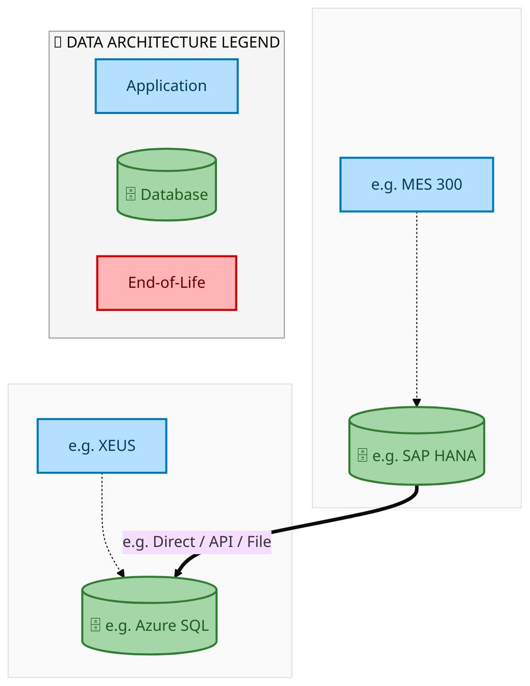
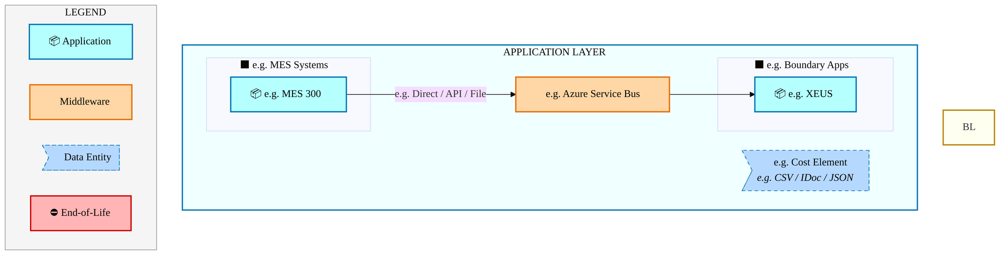
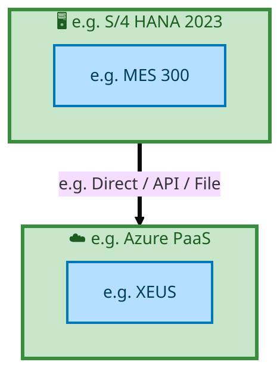

  <img src="data:image/svg+xml;base64,PHN2ZyB4bWxucz0iaHR0cDovL3d3dy53My5vcmcvMjAwMC9zdmciIHZpZXdCb3g9IjAgMCA4MDAgNDgwIiB3aWR0aD0iODAwIiBoZWlnaHQ9IjQ4MCI+DQogIDxkZWZzPg0KICAgIDxsaW5lYXJHcmFkaWVudCBpZD0iYmciIHgxPSIwJSIgeTE9IjAlIiB4Mj0iMTAwJSIgeTI9IjEwMCUiPg0KICAgICAgPHN0b3Agb2Zmc2V0PSIwJSIgc3R5bGU9InN0b3AtY29sb3I6IzAwNzFjNTtzdG9wLW9wYWNpdHk6MSIvPg0KICAgICAgPHN0b3Agb2Zmc2V0PSIxMDAlIiBzdHlsZT0ic3RvcC1jb2xvcjojMDBhZWVmO3N0b3Atb3BhY2l0eToxIi8+DQogICAgPC9saW5lYXJHcmFkaWVudD4NCiAgICA8bGluZWFyR3JhZGllbnQgaWQ9ImFjY2VudCIgeDE9IjAlIiB5MT0iMCUiIHgyPSIwJSIgeTI9IjEwMCUiPg0KICAgICAgPHN0b3Agb2Zmc2V0PSIwJSIgc3R5bGU9InN0b3AtY29sb3I6I2ZmZmZmZjtzdG9wLW9wYWNpdHk6MC4xNSIvPg0KICAgICAgPHN0b3Agb2Zmc2V0PSIxMDAlIiBzdHlsZT0ic3RvcC1jb2xvcjojZmZmZmZmO3N0b3Atb3BhY2l0eTowLjAyIi8+DQogICAgPC9saW5lYXJHcmFkaWVudD4NCiAgICA8cGF0dGVybiBpZD0iZ3JpZCIgd2lkdGg9IjQwIiBoZWlnaHQ9IjQwIiBwYXR0ZXJuVW5pdHM9InVzZXJTcGFjZU9uVXNlIj4NCiAgICAgIDxwYXRoIGQ9Ik0gNDAgMCBMIDAgMCAwIDQwIiBmaWxsPSJub25lIiBzdHJva2U9InJnYmEoMjU1LDI1NSwyNTUsMC4wNykiIHN0cm9rZS13aWR0aD0iMC41Ii8+DQogICAgPC9wYXR0ZXJuPg0KICA8L2RlZnM+DQoNCiAgPCEtLSBCYWNrZ3JvdW5kIC0tPg0KICA8cmVjdCB3aWR0aD0iODAwIiBoZWlnaHQ9IjQ4MCIgZmlsbD0idXJsKCNiZykiIHJ4PSI4Ii8+DQogIDxyZWN0IHdpZHRoPSI4MDAiIGhlaWdodD0iNDgwIiBmaWxsPSJ1cmwoI2dyaWQpIiByeD0iOCIvPg0KICA8cmVjdCB3aWR0aD0iODAwIiBoZWlnaHQ9IjQ4MCIgZmlsbD0idXJsKCNhY2NlbnQpIiByeD0iOCIvPg0KDQogIDwhLS0gRGVjb3JhdGl2ZSBjaXJjdWl0L2FyY2hpdGVjdHVyZSBsaW5lcyAtLT4NCiAgPGcgc3Ryb2tlPSJyZ2JhKDI1NSwyNTUsMjU1LDAuMTIpIiBzdHJva2Utd2lkdGg9IjEuNSIgZmlsbD0ibm9uZSI+DQogICAgPHBhdGggZD0iTSAwIDEwMCBMIDEyMCAxMDAgTCAxNjAgMTQwIEwgMjgwIDE0MCIvPg0KICAgIDxwYXRoIGQ9Ik0gMCAyNjAgTCA4MCAyNjAgTCAxMjAgMjIwIEwgMjAwIDIyMCBMIDI0MCAyNjAgTCAzNjAgMjYwIi8+DQogICAgPHBhdGggZD0iTSA1MjAgMTAwIEwgNjAwIDEwMCBMIDY0MCA2MCBMIDgwMCA2MCIvPg0KICAgIDxwYXRoIGQ9Ik0gNDQwIDM0MCBMIDU2MCAzNDAgTCA2MDAgMzAwIEwgNzIwIDMwMCBMIDc2MCAzNDAgTCA4MDAgMzQwIi8+DQogICAgPHBhdGggZD0iTSA2MDAgNDAwIEwgNjgwIDQwMCBMIDcyMCA0NDAiLz4NCiAgICA8cGF0aCBkPSJNIDAgNDAwIEwgNDAgNDAwIEwgODAgMzYwIi8+DQogICAgPHBhdGggZD0iTSAyMDAgNDIwIEwgMzIwIDQyMCBMIDM2MCAzODAgTCA0ODAgMzgwIi8+DQogICAgPHBhdGggZD0iTSA2NTAgNDQwIEwgNzUwIDQ0MCBMIDgwMCA0ODAiLz4NCiAgPC9nPg0KDQogIDwhLS0gRGVjb3JhdGl2ZSBub2RlcyAtLT4NCiAgPGcgZmlsbD0icmdiYSgyNTUsMjU1LDI1NSwwLjE4KSI+DQogICAgPGNpcmNsZSBjeD0iMTIwIiBjeT0iMTAwIiByPSI0Ii8+DQogICAgPGNpcmNsZSBjeD0iMjgwIiBjeT0iMTQwIiByPSI0Ii8+DQogICAgPGNpcmNsZSBjeD0iMjAwIiBjeT0iMjIwIiByPSI0Ii8+DQogICAgPGNpcmNsZSBjeD0iMzYwIiBjeT0iMjYwIiByPSI0Ii8+DQogICAgPGNpcmNsZSBjeD0iNjAwIiBjeT0iMTAwIiByPSI0Ii8+DQogICAgPGNpcmNsZSBjeD0iNzIwIiBjeT0iMzAwIiByPSI0Ii8+DQogICAgPGNpcmNsZSBjeD0iNTYwIiBjeT0iMzQwIiByPSI0Ii8+DQogICAgPGNpcmNsZSBjeD0iODAiIGN5PSIzNjAiIHI9IjQiLz4NCiAgICA8Y2lyY2xlIGN4PSI0ODAiIGN5PSIzODAiIHI9IjQiLz4NCiAgICA8Y2lyY2xlIGN4PSIzMjAiIGN5PSI0MjAiIHI9IjQiLz4NCiAgPC9nPg0KDQogIDwhLS0gVE9HQUYgQkRBVCBib3hlcyAtLT4NCiAgPGcgZm9udC1mYW1pbHk9IlNlZ29lIFVJLCBBcmlhbCwgc2Fucy1zZXJpZiIgZm9udC1zaXplPSIxNCIgZm9udC13ZWlnaHQ9IjYwMCI+DQogICAgPCEtLSBCIC0tPg0KICAgIDxyZWN0IHg9IjE1MCIgeT0iMTQwIiB3aWR0aD0iMTIwIiBoZWlnaHQ9IjQwIiByeD0iNSIgZmlsbD0icmdiYSgyNTUsMjU1LDI1NSwwLjE4KSIgc3Ryb2tlPSJyZ2JhKDI1NSwyNTUsMjU1LDAuMykiIHN0cm9rZS13aWR0aD0iMSIvPg0KICAgIDx0ZXh0IHg9IjIxMCIgeT0iMTY1IiB0ZXh0LWFuY2hvcj0ibWlkZGxlIiBmaWxsPSIjZmZmIj5CdXNpbmVzczwvdGV4dD4NCiAgICA8IS0tIEQgLS0+DQogICAgPHJlY3QgeD0iMjkwIiB5PSIxNDAiIHdpZHRoPSIxMjAiIGhlaWdodD0iNDAiIHJ4PSI1IiBmaWxsPSJyZ2JhKDI1NSwyNTUsMjU1LDAuMTgpIiBzdHJva2U9InJnYmEoMjU1LDI1NSwyNTUsMC4zKSIgc3Ryb2tlLXdpZHRoPSIxIi8+DQogICAgPHRleHQgeD0iMzUwIiB5PSIxNjUiIHRleHQtYW5jaG9yPSJtaWRkbGUiIGZpbGw9IiNmZmYiPkRhdGE8L3RleHQ+DQogICAgPCEtLSBBIC0tPg0KICAgIDxyZWN0IHg9IjQzMCIgeT0iMTQwIiB3aWR0aD0iMTIwIiBoZWlnaHQ9IjQwIiByeD0iNSIgZmlsbD0icmdiYSgyNTUsMjU1LDI1NSwwLjE4KSIgc3Ryb2tlPSJyZ2JhKDI1NSwyNTUsMjU1LDAuMykiIHN0cm9rZS13aWR0aD0iMSIvPg0KICAgIDx0ZXh0IHg9IjQ5MCIgeT0iMTY1IiB0ZXh0LWFuY2hvcj0ibWlkZGxlIiBmaWxsPSIjZmZmIj5BcHBsaWNhdGlvbjwvdGV4dD4NCiAgICA8IS0tIFQgLS0+DQogICAgPHJlY3QgeD0iNTcwIiB5PSIxNDAiIHdpZHRoPSIxMjAiIGhlaWdodD0iNDAiIHJ4PSI1IiBmaWxsPSJyZ2JhKDI1NSwyNTUsMjU1LDAuMTgpIiBzdHJva2U9InJnYmEoMjU1LDI1NSwyNTUsMC4zKSIgc3Ryb2tlLXdpZHRoPSIxIi8+DQogICAgPHRleHQgeD0iNjMwIiB5PSIxNjUiIHRleHQtYW5jaG9yPSJtaWRkbGUiIGZpbGw9IiNmZmYiPlRlY2hub2xvZ3k8L3RleHQ+DQogIDwvZz4NCg0KICA8IS0tIENvbm5lY3RpbmcgbGluZXMgYmV0d2VlbiBCREFUIGJveGVzIC0tPg0KICA8ZyBzdHJva2U9InJnYmEoMjU1LDI1NSwyNTUsMC4yNSkiIHN0cm9rZS13aWR0aD0iMSI+DQogICAgPGxpbmUgeDE9IjI3MCIgeTE9IjE2MCIgeDI9IjI5MCIgeTI9IjE2MCIvPg0KICAgIDxsaW5lIHgxPSI0MTAiIHkxPSIxNjAiIHgyPSI0MzAiIHkyPSIxNjAiLz4NCiAgICA8bGluZSB4MT0iNTUwIiB5MT0iMTYwIiB4Mj0iNTcwIiB5Mj0iMTYwIi8+DQogIDwvZz4NCg0KICA8IS0tIE1haW4gdGl0bGUgLS0+DQogIDx0ZXh0IHg9IjQwMCIgeT0iMjYwIiB0ZXh0LWFuY2hvcj0ibWlkZGxlIiBmb250LWZhbWlseT0iU2Vnb2UgVUksIEFyaWFsLCBzYW5zLXNlcmlmIiBmb250LXNpemU9IjM2IiBmb250LXdlaWdodD0iNzAwIiBmaWxsPSIjZmZmZmZmIiBsZXR0ZXItc3BhY2luZz0iMSI+DQogICAgSUFPIEFyY2hpdGVjdHVyZQ0KICA8L3RleHQ+DQogIDx0ZXh0IHg9IjQwMCIgeT0iMzAwIiB0ZXh0LWFuY2hvcj0ibWlkZGxlIiBmb250LWZhbWlseT0iU2Vnb2UgVUksIEFyaWFsLCBzYW5zLXNlcmlmIiBmb250LXNpemU9IjE4IiBmb250LXdlaWdodD0iNDAwIiBmaWxsPSJyZ2JhKDI1NSwyNTUsMjU1LDAuOCkiIGxldHRlci1zcGFjaW5nPSIyIj4NCiAgICBUT0dBRiBCREFUIMK3IElBTyBQcm9ncmFtIMK3IElETSAyLjANCiAgPC90ZXh0Pg0KDQogIDwhLS0gQm90dG9tIGFjY2VudCBiYXIgLS0+DQogIDxyZWN0IHg9IjI4MCIgeT0iMzQwIiB3aWR0aD0iMjQwIiBoZWlnaHQ9IjMiIHJ4PSIxLjUiIGZpbGw9InJnYmEoMjU1LDI1NSwyNTUsMC40KSIvPg0KDQogIDwhLS0gSW50ZWwgdGV4dCAtLT4NCiAgPHRleHQgeD0iNDAwIiB5PSIzODAiIHRleHQtYW5jaG9yPSJtaWRkbGUiIGZvbnQtZmFtaWx5PSJTZWdvZSBVSSwgQXJpYWwsIHNhbnMtc2VyaWYiIGZvbnQtc2l6ZT0iMTMiIGZpbGw9InJnYmEoMjU1LDI1NSwyNTUsMC41KSIgbGV0dGVyLXNwYWNpbmc9IjMiPg0KICAgIElOVEVMIENPTkZJREVOVElBTA0KICA8L3RleHQ+DQo8L3N2Zz4NCg==" alt="IAO Architecture" style="width:100%; border-radius:8px;" />
  <h1 style="font-size:36px; margin-top:24px;">E2E-80 — R2A Option 1  Customer Requests Expedite - Service Fee with Existing SO</h1>
  <h2 style="font-size:24px;">Architecture Document (TOGAF BDAT)</h2>
  
End-to-End Integrated Processes (E2E) Tower 
  Capability E2E-80 · E2E-80 R2 Customer Requests Expedite

  
IAO Program · R1 – R5 
  Generated: April 2026 
  Sajiv Francis

  
IAO Architecture Pipeline — Intel Confidential

Page 1<a href="#toc">↑ Back to TOC</a>E2E-80 — R2A Option 1  Customer Requests Expedite - Service Fee with Existing SO

## Table of Contents

<nav class="toc">
<ol>
  <li><a href="#1-executive-summary">1. Executive Summary</a></li>
  <li><a href="#2-business-context-objectives">2. Business Context &amp; Objectives</a>
    <ul>
      <li><a href="#21-classification">2.1 Classification</a></li>
      <li><a href="#22-business-drivers">2.2 Business Drivers</a></li>
      <li><a href="#23-success-criteria">2.3 Success Criteria</a></li>
      <li><a href="#24-companion-documents">2.4 Companion Documents</a></li>
    </ul>
  </li>
  <li><a href="#3-business-architecture-togaf-b">3. Business Architecture (TOGAF &ldquo;B&rdquo;)</a>
    <ul>
      <li><a href="#31-business-process-overview">3.1 Business Process Overview</a></li>
      <li><a href="#32-business-process-diagrams">3.2 Business Process Diagrams</a></li>
      <li><a href="#33-business-roles-responsibilities">3.3 Business Roles &amp; Responsibilities</a></li>
    </ul>
  </li>
  <li><a href="#4-data-architecture-togaf-d">4. Data Architecture (TOGAF &ldquo;D&rdquo;)</a>
    <ul>
      <li><a href="#41-data-entities-ownership">4.1 Data Entities &amp; Ownership</a></li>
      <li><a href="#42-data-flow-diagrams">4.2 Data Flow Diagrams</a></li>
      <li><a href="#43-data-lineage">4.3 Data Lineage</a></li>
      <li><a href="#44-ricefw-data-objects">4.4 RICEFW Data Objects</a></li>
      <li><a href="#45-data-governance-quality">4.5 Data Governance &amp; Quality</a></li>
    </ul>
  </li>
  <li><a href="#5-application-architecture-togaf-a">5. Application Architecture (TOGAF &ldquo;A&rdquo;)</a>
    <ul>
      <li><a href="#51-current-state-current-state-application-landscape">5.1 Current-State Application Landscape</a></li>
      <li><a href="#52-future-state-future-state-application-landscape">5.2 Future-State Application Landscape</a></li>
      <li><a href="#53-change-impact-summary">5.3 Change Impact Summary</a></li>
      <li><a href="#54-component-overview">5.4 Component Overview</a></li>
      <li><a href="#55-ricefw-inventory">5.5 RICEFW Inventory</a></li>
      <li><a href="#56-integration-patterns">5.6 Integration Patterns</a></li>
    </ul>
  </li>
  <li><a href="#6-technology-architecture-togaf-t">6. Technology Architecture (TOGAF &ldquo;T&rdquo;)</a>
    <ul>
      <li><a href="#61-platform-infrastructure">6.1 Platform &amp; Infrastructure</a></li>
      <li><a href="#62-sap-development-object-status">6.2 SAP Development Object Status</a></li>
      <li><a href="#63-nfrs-design-principles">6.3 NFRs &amp; Design Principles</a></li>
      <li><a href="#64-security-governance">6.4 Security &amp; Governance</a></li>
    </ul>
  </li>
  <li><a href="#7-project-context">7. Project Context</a>
    <ul>
      <li><a href="#71-project-roadmap-go-live-plan">7.1 Project Roadmap &amp; Go-Live Plan</a></li>
      <li><a href="#72-raid-log">7.2 RAID Log</a></li>
      <li><a href="#73-recommendations-next-steps">7.3 Recommendations &amp; Next Steps</a></li>
    </ul>
  </li>
</ol>
</nav>

Page 2<a href="#toc">↑ Back to TOC</a>E2E-80 — R2A Option 1  Customer Requests Expedite - Service Fee with Existing SO

## 1. Executive Summary

This Architecture Document defines the **Business, Data, Application, and Technology** (BDAT) architecture for **E2E-80 R2A Option 1  Customer Requests Expedite - Service Fee with Existing SO** within the IAO program. It includes 2 BPMN process diagram(s) in Section 3.

| Dimension | Value |
|-----------|-------|
| **Tower** | End-to-End Integrated Processes (E2E) |
| **Process Group** | E2E-80 R2 Customer Requests Expedite |
| **Capability** | E2E-80 - R2A Option 1  Customer Requests Expedite - Service Fee with Existing SO |
| **Release** | R1 – R5 |
| **Total Systems** | 2 |
| **System Status** | 0 Deployed, 0 Developing, 0 EOL, 2 Pending IAPM |
| **RICEFW Objects** | Pending — Smartsheet Object Tracker API integration |

**Change Summary**: 0 new flow chains, 0 removed, 0 modified, 1 unchanged between Current-State and Future-State states.

> All system nodes in architecture diagrams are **IAPM-linked** — click any node to open its IAPM page. Diagrams require `securityLevel: 'loose'` for click events.

Page 3<a href="#toc">↑ Back to TOC</a>E2E-80 — R2A Option 1  Customer Requests Expedite - Service Fee with Existing SO

## 2. Business Context & Objectives

### 2.1 Classification

| Level | Value |
|-------|-------|
| **L0 Tower** | End-to-End Integrated Processes |
| **L1 Process** | E2E-80 R2 Customer Requests Expedite |
| **L2 Capability** | E2E-80 - R2A Option 1  Customer Requests Expedite - Service Fee with Existing SO |

### 2.2 Business Drivers

| # | Driver | Description | Strategic Alignment | Priority |
|---|--------|-------------|---------------------|----------|
| 1 | End-to-End Process Integration | Enable cross-tower integrated processes spanning procurement, manufacturing, and fulfillment | IDM 2.0 Process Excellence | High |
| 2 | Intel Foundry Business Enablement | Stand up foundry-specific business processes for external customer engagement | Intel Foundry Services | High |
| 3 | Process Visibility & Monitoring | Provide end-to-end process visibility across tower boundaries with integrated monitoring | Operational Excellence | Medium |
| 4 | E2E-80 Process Migration | Migrate R2A Option 1  Customer Requests Expedite - Service Fee with Existing SO business processes and 2 integrated systems from legacy to S/4 HANA target architecture | IDM 2.0 Cross-Functional / End-to-End | High |

Page 4<a href="#toc">↑ Back to TOC</a>E2E-80 — R2A Option 1  Customer Requests Expedite - Service Fee with Existing SO

### 2.3 Success Criteria

| Metric | Target | Measure | Baseline | Owner |
|--------|--------|---------|----------|-------|
| E2E Process Cycle Time | Per process SLA | End-to-end transaction completion within defined SLA per process | Varies by process | E2E Process Owner |
| Cross-Tower Integration Success | > 99% | Transactions completing across tower boundaries without manual intervention | 92% (current) | Integration Lead |
| Process Exception Rate | < 2% | Transactions requiring manual exception handling | 8% (current) | Operations Manager |
| E2E-80 Migration Completeness | 100% flow chains validated | All 1 flow chains verified in target state | 0% (pre-migration) | Tower Architect |

### 2.4 Companion Documents

| Document | Description |
|----------|-------------|
| **Business Architecture** | Included in this document (Section 3) — process flows from BPMN diagrams |
| **This Document** | Full BDAT Architecture — Business + Data + Application + Technology |

Page 5<a href="#toc">↑ Back to TOC</a>E2E-80 — R2A Option 1  Customer Requests Expedite - Service Fee with Existing SO

## 3. Business Architecture (TOGAF "B")

### 3.1 Business Process Overview

This capability includes **2 business process(es)** modeled in BPMN 2.0, covering the end-to-end workflow for E2E-80 R2A Option 1  Customer Requests Expedite - Service Fee with Existing SO.

| # | Step ID | Process Name | Lanes | Tasks | Gateways |
|---|---------|--------------|-------|-------|----------|
| 1 | E2E-80_R2A_Option_1__Customer_Requests_Expedite_-_Service_Fee_with_Existing_SO | E2E-80_R2A_Option_1__Customer_Requests_Expedite_-_Service_Fee_with_Existing_SO | Boundary Apps, SAP ECC, SAP S/4 CFIN, SAP S/4 Intel Foundry

Core SAP | 27 | 10 |

| 2 | E2E-80_R2B_Option_2__Customer_Requests_Expedite_-_Service_Fee_with_New_SO | E2E-80_R2B_Option_2__Customer_Requests_Expedite_-_Service_Fee_with_New_SO | Boundary Apps, SAP ECC, SAP S/4 CFIN, SAP S/4 Intel Foundry

Core SAP | 23 | 8 |

Page 6<a href="#toc">↑ Back to TOC</a>E2E-80 — R2A Option 1  Customer Requests Expedite - Service Fee with Existing SO

### 3.2 Business Process Diagrams

#### BUSINESS ARCHITECTURE — 3.2.1 E2E-80_R2A_Option_1__Customer_Requests_Expedite_-_Service_Fee_with_Existing_SO — E2E-80_R2A_Option_1__Customer_Requests_Expedite_-_Service_Fee_with_Existing_SO

**Swim Lanes**: Boundary Apps · SAP ECC · SAP S/4 CFIN · SAP S/4 Intel Foundry
Core SAP | **Tasks**: 27 | **Gateways**: 10

```mermaid
%%{init: {'theme': 'base', 'themeVariables': {'fontSize': '14px', 'fontFamily': 'Segoe UI, Arial, sans-serif','primaryColor': '#e8f0fe', 'primaryBorderColor': '#0071c5','lineColor': '#37474F', 'secondaryColor': '#f5f8fc'}, 'flowchart': {'useMaxWidth': false, 'htmlLabels': true, 'curve': 'basis', 'nodeSpacing': 40, 'rankSpacing': 50}} }%%
flowchart LR
    classDef startEvt fill:#4CAF50,stroke:#2E7D32,color:#000,font-weight:bold,stroke-width:2px,rx:20,ry:20
    classDef endEvt fill:#C62828,stroke:#B71C1C,color:#fff,font-weight:bold,stroke-width:2px,rx:20,ry:20
    classDef userTask fill:#E3F2FD,stroke:#1565C0,stroke-width:2px,color:#0D47A1
    classDef serviceTask fill:#FFF3E0,stroke:#E65100,stroke-width:2px,color:#BF360C
    classDef gateway fill:#FFF9C4,stroke:#F57F17,stroke-width:2px,color:#E65100
    classDef subProc fill:#F3E5F5,stroke:#7B1FA2,stroke-width:2px,color:#4A148C
    subgraph lane_0["Boundary Apps"]
        n1["Update Sales Order Detail in ECA"]
        n2["Update Sales Order Detail in Hana"]
        n3["Update Sales Order Detail in SPAN"]
        n4["Feed Information to Planning Engine (XTO)"]
        n5["Feed Information to Factory and Related Apps"]
        n28(["fa:fa-play Expedite Request Received from Customer"])
        n30(["fa:fa-stop No Action"])
        n31(["fa:fa-stop No Action"])
        n32(["fa:fa-stop Follow New SO Process"])
        n38{{"fa:fa-code-branch Is Request Feasible??"}}
        n39{{"fa:fa-code-branch Charge Expedite Fee?"}}
        n40{{"fa:fa-code-branch Create New Sales Order or Update Existing?"}}
        n44{{"fa:fa-arrows-alt parallelGateway"}}
    end
    subgraph lane_1["SAP ECC"]
        n18["Update POLP Table"]
        n19["Update Financial Posting to SAP ECC"]
        n20["Perform AR Clearing"]
        n21["Generate Payment Receipt"]
    end
    subgraph lane_2["SAP S/4 CFIN"]
        n22["Replicate Financial Posting"]
        n23["Perform AR Posting"]
        n35(["fa:fa-stop Financial Posting Replicated"])
        n36(["fa:fa-stop Financial Posting Replication Completed"])
    end
    subgraph lane_3["SAP S/4 Intel Foundry Core SAP"]
        n6["Calculate Pricing"]
        n7["Update Line Item Text"]
        n8["Order Confirmation"]
        n9["Update POLP Table (Interim)"]
        n10["Goods Receipt (Valuated) Receiver Plant"]
        n11["Create Outbound Delivery"]
        n12["Post Goods Issue"]
        n13["Generate Customer Invoice (for Original Line Item)"]
        n14["Remove billing Block on Expedite Service Line Item"]
        n15["Generate Customer Invoice (Expedite fee)"]
        n16["AR Posting"]
        n17["Automatic Block for Credit Check and Others​"]
        n24["fa:fa-user Capture Sales Order (Service Line Item in Existing Order)"]
        n25["fa:fa-user Perform ATP Check via ATP Custom Report"]
        n26["fa:fa-user Manual Price Override"]
        n27["fa:fa-user Manual Verification and Approval​"]
        n29(["fa:fa-play Manual Override Initiated"])
        n33(["fa:fa-stop POLP Table Updated"])
        n34(["fa:fa-stop Stock Inducted in S/4"])
        n37["Confirmed Sales Order"]
        n41{{"fa:fa-code-branch exclusiveGateway"}}
        n42{{"fa:fa-code-branch exclusiveGateway"}}
        n43{{"fa:fa-code-branch exclusiveGateway"}}
        n45{{"fa:fa-arrows-alt parallelGateway"}}
        n46{{"fa:fa-arrows-alt parallelGateway"}}
        n47{{"fa:fa-arrows-alt parallelGateway"}}
    end
    n28 --> n38
    n39 -->|"No"| n30
    n6 --> n25
    n3 --> n4
    n4 --> n5
    n1 --> n2
    n29 --> n26
    n26 --> n7
    n41 --> n6
    n38 -->|"No"| n31
    n39 -->|"Yes"| n40
    n24 --> n17
    n25 --> n45
    n45 --> n8
    n2 --> n3
    n5 --> n44
    n18 --> n42
    n42 --> n9
    n9 --> n33
    n44 --> n18
    n44 --> n10
    n11 --> n12
    n12 --> n47
    n14 --> n15
    n46 --> n42
    n16 --> n19
    n22 --> n35
    n19 --> n22
    n21 --> n20
    n23 --> n36
    n20 --> n23
    n43 -->|"Statement of Supply & Planned Order outside SAP
 confirming Sales Order. Decision can be keyed
 in manually In s/4 to confirm sales order"| n1
    n10 --> n34
    n8 --> n37
    n46 --> n11
    n37 --> n46
    n46 -->|"Feed of confirmed Sales Order
 to Communicate Rescheduling and 
Prioritization of Production Order"| n43
    n45 --> n43
    n38 --> n39
    n40 -->|"New SO"| n32
    n40 -->|"Update Existing SO"| n24
    n7 --> n41
    n15 --> n16
    n47 --> n13
    n47 --> n14
    n17 --> n27
    n27 --> n41
    class n24 userTask
    class n25 userTask
    class n26 userTask
    class n27 userTask
    class n28 startEvt
    class n29 startEvt
    class n30 endEvt
    class n31 endEvt
    class n32 endEvt
    class n33 endEvt
    class n34 endEvt
    class n35 endEvt
    class n36 endEvt
    class n37 startEvt
    class n38 gateway
    class n39 gateway
    class n40 gateway
    class n41 gateway
    class n42 gateway
    class n43 gateway
    class n44 gateway
    class n45 gateway
    class n46 gateway
    class n47 gateway
```

> **Legend**: ● Start · ● End · User Task · Service Task · ◇ Gateway · Sub-Process

<a href="https://mermaid.live/view#pako:eNqlWG1v2zYQ_iuEiy4p4Kx6tWx_2OAoVmega4w47TbMw0BLVCKEJjVKSuKl-e87SqRsMfLadf6QgI_ujvd-Jz0NYp6QwXTw-vVTxrJyip5OyluyJSdTdLLBBTkZogb4hEWGN5QUJ5Im5axcZX_XZLaXP0oyiUV4m9GdRFfkhhP0cTFEM2CkQ1RgVpwVRGTpyfAkF9kWi13IKReS-hUZp1Za36YenXORELEnsKzAjn1gpRkje9gNvMCLJF9BYs6SjtDUT8dpfPIslaP8Ib7FoqzVrwryM378JUvKWzinmBYEaG7LLX2PN4RKG0tRSSyuxL12RlbIexg4bJXjOGM3gHsWQAKzuz3kW8_P6Pn16zVrL0Xvr9YMwS-muCguSIqKEuD5fYnSjNLpKy-cRb41LErB78j0lTMPLlxnGEtLpmC6NZTOPXsg2c1tOd1wmijSswdpw9TJH4ficepYQ7GDv8ZdhCX7m8KRM3bG7U3ngR3aob4pTdP_dRP4VVzj4k7dNXcjJ7po77L9kR9aL-VpMy-8YGabfiLiPovJgdAoitz53lXzkW9bx4WeR-7ICg2hN7gkD3i3FzgJvVZg5AeRHRwV2NxnalltloLHWqA79yO_FRic29HMOSrQm9neWGkIcm4Ezm8RxYz8af2-Hpzzqk5qNMvzYj34o6GTP2bD4495AragFYbCRJeyYtAFKXFGUcbQPJx1OZwvcfyEGe6yuF9iWS1nH7osHrBEhCRowVIutrjMOEMlR0swikGJoDm7gRpGp79eX77psvpHWCMclxycgFmCrggFbZIehzjjU-BP8TTFZzmF-M4fc5JkoPoV-asiRQn_Y5LdA3Mq-BaFVVHyLREg5c2hydZeDBDk6ANHs1iqYhLaX0voGIQRp9Aa0AfygFaXSKYOKQqTafz0pJlkkz7bQJuJb9GiaM2JCDQl6Mk__rgePD8f8k76eUNoRjdk7xfwtcnqWUdYBZFJUKt8kAhcIJUe88esKCG8LwR6e4FYCP5QnGFaohwLTCmh75pa3DNBt-orBpntq9kSkjo0ymC8T9Hl5fslupZjyqCZ7GmijIFBMJLQktcKywTrlezIAlwSIVMRza5QSAkMQXZjUEnN3hFGRK0B3m0JU5mWly3pEascZdXqrYfCaGFUkiMfX5GcZnGv5ga121W3l8j1zVR84Y72wsTMyNFX88q6Dfk2p6Qj5ogX3AMvLFhJKBQItD0o-JALIoPTNWIE9CGmcUVrl4ssfmFnsA_4e9lsFiXZomvyWHbJZO40iRxylmaq5XRpJn35hU6lorCqGB3MljnzjvOk0CmATj9hWkl3vtH9R9S90FDFlnmkquyyKjfSA9BnqaTfGaQyL6TLUXPToigqM-Pdw6zUnQ68e89hnKJTSBKo4AwaMUSv9ZBpjFfn35bfE7SB0SYjfE55fIcgvG0TWTUjei_FEOL_uyatnJQQ834Z6GOZbMsQzyqQBjGLlV7SLPAhyINeRwCQE-MSFlhRrCvHsjZGyXhtQsvVBYU4LyvRHXWnL-yrZ6vqdg2Robfjd8W2RXm9VGrdZ7g51e6QZcOFkQ_OqCvkZ8wqWWlC6nIJSSGyxAi6E_SyfJJLt65K6RAYnYLfY9rrkokxRJUQfSMELiuzvu7gGt3hoFia8nnB4Rkcq1LGcMGSKpYTXm4Xbz2TSdqoihVoDiJlbCF2_xwjjzGtCiiqF4OnYXO-jc39Njb_v83Ghmn0LUzBN05h2KrQ2dkPch9RgDuRwOf14ANfDz7LfUk9GDWEjq8Jm7Onjl5z1E9tRa2vmajzSANKXKDZFYN-7o4NNWxTv99IUT_xtIKOUsHWMh1fqaiV8hSgbXWU7eqoybVJtvKNp63wFMNEnZVRrhbgaQ3GJqB1tJWZthZpK5GeVtrWLK3SI0MLWwG2VsPRdrTO195u3a_D0fpKRc9t42EpitYWV_l5VUL21FsPT9GqynO6Q9816z5UqNoTq7KQ3UPOcobipn5l_zwo4O9h3MVZIbtUjBnaEHRHdkTmIXSCbd2GQPKCoQL2BFjalBT4siBF8KYHQLx1IthKY1eHS2dyYDjOblMnUJ4cdSg-q7cSMC_u7Tz1SwrsO9uKNavaFSniW5JU9ciULXfNoHFzAa3z76YPgyzY-2Wnk6fLVnnPNVKxBVytvo6qZ-kKqN8jmipwzIfGeq4JHe0UbXLrNXWv3fpAUdiuCbRloACnrStDaP2iXNef_kLQxf0j-OgIHhzBx-13lS4-6cddS30b6aJ2L-r0om4v6vWifi866kWDIxqP9ceLLjzphSEHemG7H3b6Ybcf9vphvx8e9cOBhgfDAWyFW5wlg-nToP7iCF8lE5LiipaD5-EAw6a32rF4MK2_zA2qOq0vMgzvEdsGfP4HCDBfRw==" title="View full diagram">&#128065; View Diagram</a>

Page 7<a href="#toc">↑ Back to TOC</a>E2E-80 — R2A Option 1  Customer Requests Expedite - Service Fee with Existing SO

#### BUSINESS ARCHITECTURE — 3.2.2 E2E-80_R2B_Option_2__Customer_Requests_Expedite_-_Service_Fee_with_New_SO — E2E-80_R2B_Option_2__Customer_Requests_Expedite_-_Service_Fee_with_New_SO

**Swim Lanes**: Boundary Apps · SAP ECC · SAP S/4 CFIN · SAP S/4 Intel Foundry
Core SAP | **Tasks**: 23 | **Gateways**: 8

```mermaid
%%{init: {'theme': 'base', 'themeVariables': {'fontSize': '14px', 'fontFamily': 'Segoe UI, Arial, sans-serif','primaryColor': '#e8f0fe', 'primaryBorderColor': '#0071c5','lineColor': '#37474F', 'secondaryColor': '#f5f8fc'}, 'flowchart': {'useMaxWidth': false, 'htmlLabels': true, 'curve': 'basis', 'nodeSpacing': 40, 'rankSpacing': 50}} }%%
flowchart LR
    classDef startEvt fill:#4CAF50,stroke:#2E7D32,color:#000,font-weight:bold,stroke-width:2px,rx:20,ry:20
    classDef endEvt fill:#C62828,stroke:#B71C1C,color:#fff,font-weight:bold,stroke-width:2px,rx:20,ry:20
    classDef userTask fill:#E3F2FD,stroke:#1565C0,stroke-width:2px,color:#0D47A1
    classDef serviceTask fill:#FFF3E0,stroke:#E65100,stroke-width:2px,color:#BF360C
    classDef gateway fill:#FFF9C4,stroke:#F57F17,stroke-width:2px,color:#E65100
    classDef subProc fill:#F3E5F5,stroke:#7B1FA2,stroke-width:2px,color:#4A148C
    subgraph lane_0["Boundary Apps"]
        n1["Update Sales Order Detail in ECA"]
        n2["Update Sales Order Detail in Hana"]
        n3["Update Sales Order Detail in SPAN"]
        n4["Feed Information to Planning Engine (XTO)"]
        n5["Feed Information to Factory and Related Apps"]
        n24(["fa:fa-play Expedite Request Received from Customer"])
        n26(["fa:fa-stop No Action"])
        n27(["fa:fa-stop No Action"])
        n28(["fa:fa-stop Follow E2E-80 R2A option 1"])
        n29(["fa:fa-stop Information Fed to Factory Related Apps"])
        n33{{"fa:fa-code-branch Is Request Feasible??"}}
        n34{{"fa:fa-code-branch Charge Expedite Fee?"}}
        n35{{"fa:fa-code-branch Create New Sales Order or Update Existing?"}}
    end
    subgraph lane_1["SAP ECC"]
        n16["Update Financial Posting to SAP ECC"]
        n17["Perform AR Clearing"]
        n18["Generate Payment Receipt"]
    end
    subgraph lane_2["SAP S/4 CFIN"]
        n19["Replicate Financial Posting"]
        n20["Perform AR Posting"]
        n31(["fa:fa-stop Financial Posting Replicated"])
        n32(["fa:fa-stop Financial Posting Replication Completed"])
    end
    subgraph lane_3["SAP S/4 Intel Foundry Core SAP"]
        n6["Update Line Item Text"]
        n7["Calculate Pricing"]
        n8["Billing Block applied"]
        n9["Update Revised/original Expedite Fee based on Decision"]
        n10["Update Rejection Reason to Cancel"]
        n11["Generate Customer Invoice (Expedite fee)"]
        n12["AR Posting"]
        n13["Automatic Block for Credit Check and Others"]
        n14["GTS Check"]
        n15["Remove Billing Block"]
        n21["fa:fa-user Manual Price Override"]
        n22["fa:fa-user Capture Sales Order (New Order) for Expedite Fee"]
        n23["fa:fa-user Manual Verification and Approval"]
        n25(["fa:fa-play Manual Override Initiated"])
        n30(["fa:fa-stop Rejection Reason Updated"])
        n36{{"fa:fa-code-branch Check If Schedule on Time?"}}
        n37{{"fa:fa-code-branch Confirm Shipment on Original Expedited Order?"}}
        n38{{"fa:fa-code-branch exclusiveGateway"}}
        n39{{"fa:fa-code-branch Revise Expedite Fee based on CDD and Actual Del Date and T and Cs?"}}
        n40{{"fa:fa-code-branch exclusiveGateway"}}
    end
    n24 --> n33
    n34 -->|"No"| n26
    n3 --> n4
    n4 --> n5
    n1 --> n2
    n25 --> n21
    n21 --> n6
    n33 -->|"No"| n27
    n34 -->|"Yes"| n35
    n2 --> n3
    n22 --> n13
    n7 --> n38
    n8 --> n36
    n36 -->|"Yes"| n37
    n38 --> n8
    n37 -->|"Yes"| n39
    n37 -->|"No"| n38
    n39 -->|"No"| n10
    n39 -->|"Yes"| n9
    n10 --> n30
    n9 --> n15
    n12 --> n16
    n19 --> n31
    n16 --> n19
    n18 --> n17
    n20 --> n32
    n17 --> n20
    n36 -->|"No"| n38
    n33 --> n34
    n35 -->|"Update Existing SO"| n28
    n13 --> n23
    n23 --> n14
    n14 --> n40
    n40 --> n7
    n11 --> n12
    n6 --> n40
    n5 --> n29
    n35 -->|"New Sales Order for Service"| n22
    n15 --> n11
    class n21 userTask
    class n22 userTask
    class n23 userTask
    class n24 startEvt
    class n25 startEvt
    class n26 endEvt
    class n27 endEvt
    class n28 endEvt
    class n29 endEvt
    class n30 endEvt
    class n31 endEvt
    class n32 endEvt
    class n33 gateway
    class n34 gateway
    class n35 gateway
    class n36 gateway
    class n37 gateway
    class n38 gateway
    class n39 gateway
    class n40 gateway
```

> **Legend**: ● Start · ● End · User Task · Service Task · ◇ Gateway · Sub-Process

<a href="https://mermaid.live/view#pako:eNqlWG1v2zYQ_iuEi8ApYKOiXizbH1Y4stUFaJMgTrsNyzAwEmVzlSWNkh1nqf_7jhIpS7SMdlg-OObDu-deeaL82gvSkPamvYuLV5awYope-8Wabmh_ivpPJKf9AaqAL4Qz8hTTvC9kojQpluyfUgzb2V6ICcwnGxa_CHRJVylFn68HaAaK8QDlJMmHOeUs6g_6GWcbwl-8NE65kH5Dx5ERldbk1lXKQ8qPAobh4sAB1Zgl9Ahbru3avtDLaZAmYYs0cqJxFPQPwrk4fQ7WhBel-9ucfiL7X1hYrGEdkTinILMuNvFH8kRjEWPBtwILtnynksFyYSeBhC0zErBkBbhtAMRJ8vUIOcbhgA4XF49JbRR9vH9MEPwFMcnzOY1QXgC82BUoYnE8fWN7M98xBnnB0690-sZcuHPLHAQikimEbgxEcofPlK3WxfQpjUMpOnwWMUzNbD_g-6lpDPgLfGq2aBIeLXkjc2yOa0tXLvawpyxFUfS_LEFe-QPJv0pbC8s3_XltCzsjxzNO-VSYc9udYT1PlO9YQBukvu9bi2OqFiMHG-dJr3xrZHga6YoU9Jm8HAknnl0T-o7rY_csYWVP93L7dMfTQBFaC8d3akL3Cvsz8yyhPcP2WHoIPCtOsjWKSUL_NH5_7F2l27Kp0SzL8sfeH5Wc-EswbH_OQogFLQkcTHQrTgya04KwGLEELbxZW8P8nsbPJCFtFet7Ksu72U1bxQYVn9IQXSdRyjekYGmCihTdQVAJHBG0SFZwhtHlrw-3b9uqzhlVnwRFCkkgSYjuaQzehB0JMe1L0I_INCLDLIb6LvYZDRm4fk__3tK8gP8BZTtQjni6Qd42L9IN5cDytkkzOtKAQIZuUjQLhCu6oPujgmNN0E9jGA1oYS6GYwPdmzOUZmWsWNecaJrNxPgQSCM5WmKaNJb1-qpoxMAfPsHICtboOq9T41MYcDDf379_7B0OTV27W9eDwbaixxxD3U5UnTOqnIqGuqHPraZKOZKtttizvIBWaRDCEOs6I-IQLGd30OuedjpGx871WQJ24SmE7tKSV6StW8sFrTvKRZLR7B55MYXnXrLSpMYg9YEmlAv2O_KyoYlsrqyoRc94bEqPl-9s5PnX2uHBE9i-p1nMgk7PtY432u52CllY776TdNQGQ71xzB_WFR3ppZsspi2aM1mwGlm4Tgoaw5mASQdt7KWciuK0g2hU86MYHtcF3aAHui_aYqJ8HomDbVxWhrPgJB2idlcwp4XvV3EafEUkgwhKnxtik6PBe7pjOQ3fpZzB4ILQmz2PxC0pRBD8nAYsrw5_s6BGk-gvWs4H-EbyarR5kE4aazq42V9qTEGedik8C9FlbT-iVJugWLTXuU7AIuuzLbBBuQIZPfSOOJDAB0eainTAkL2FOx_XnzdisH94WFZi2p5Ttu0m3VHUSq7Wr7juJnFVQJ9IshWtxEVYtzvKOQuppmK2VTySFVvefhpdiklSfn1bhtOsj8ZmdTrwRVxLVROL-GGG8nRHtLqYjvaAkerKc6gQK1jXMTK0Y3TSCVWHnOiNzs1eUajrCC2DNQ23MRX998A2pxPYPUOQJhGDmbFcs6wcXqB_q7d3WOX0hHPczUn3QbzN4fH6obpe6WqTbrXqdJ05U958XtUjKESi5zAn5uJMCOyh_PRy3T_b-K_-1TMKrhBoOPxJPDAlYJXAt8feTfrY-yYuB2qjErTlUuo5comrpaloHbnGCpACNZulmXF1-7_RvNyxlAlTeqqWco0V4Mr9sVyP5bo2OdKZa5tSVGlari450Xek27Uxa9LewIa-obgUFTakf0pyIuOpU6oCVAFgKWGppOKRlKg5ZSBYRWYqI6owWGbJNPSsnEQkC26piluOlNTuLGh5W5VQaWKpadalkgBWVFh2j628sKWfym8s2wUrv0eaguqvie6cfscS43FZvVNVXtaZkBS4-QZWNqp6qWvj5hncOoPb9StvG3fO4CP52tpG3U503IlOulDL6ERxJ2p2opZ6f2zDdjfsdMOjbtjthsfd8KQThuaRcG_Qg3vDhrCwN33tlT_jwE89IY3INi56h0GPwF1g-ZIEvWn5c0dvW7bynBG4qW0q8PAv0uGJ3A==" title="View full diagram">&#128065; View Diagram</a>

Page 8<a href="#toc">↑ Back to TOC</a>E2E-80 — R2A Option 1  Customer Requests Expedite - Service Fee with Existing SO

### 3.3 Business Roles & Responsibilities

| Role / Lane | Processes Involved | Description |
|------------|-------------------|-------------|
| Boundary Apps | E2E-80_R2A_Option_1__Customer_Requests_Expedite_-_Service_Fee_with_Existing_SO, E2E-80_R2B_Option_2__Customer_Requests_Expedite_-_Service_Fee_with_New_SO | |
| SAP ECC | E2E-80_R2A_Option_1__Customer_Requests_Expedite_-_Service_Fee_with_Existing_SO, E2E-80_R2B_Option_2__Customer_Requests_Expedite_-_Service_Fee_with_New_SO | |
| SAP S/4 CFIN | E2E-80_R2A_Option_1__Customer_Requests_Expedite_-_Service_Fee_with_Existing_SO, E2E-80_R2B_Option_2__Customer_Requests_Expedite_-_Service_Fee_with_New_SO | |
| SAP S/4 Intel Foundry

Core SAP | E2E-80_R2A_Option_1__Customer_Requests_Expedite_-_Service_Fee_with_Existing_SO, E2E-80_R2B_Option_2__Customer_Requests_Expedite_-_Service_Fee_with_New_SO | |

Page 9<a href="#toc">↑ Back to TOC</a>E2E-80 — R2A Option 1  Customer Requests Expedite - Service Fee with Existing SO

## 4. Data Architecture (TOGAF "D")

### 4.1 Data Entities & Ownership

| # | Data Entity | Source System | Target System | Data Owner | Classification | Volume | Master/Transaction |
|---|-------------|---------------|---------------|------------|----------------|--------|-------------------|
| 1 | e.g. Cost Element | e.g. MES 300 | e.g. XEUS | Data steward | e.g. Intel Confidential | e.g. 10K rows/day | Master / Transaction |

Page 10<a href="#toc">↑ Back to TOC</a>E2E-80 — R2A Option 1  Customer Requests Expedite - Service Fee with Existing SO

### 4.2 Data Flow Diagrams

> **DATA ARCHITECTURE** — Database-to-database data flows. Applications (blue) sit above their hosting databases (green cylinders). Thick arrows show data movement between databases.

#### 4.2.1 Current-State — Current-State Data Flows

<a href="https://mermaid.live/view#pako:eNqdlYtO2zAUhl_FMqq0SS0LLWkhEkjObSAFxEjZJpEpchOntXCTKHFGS-m7z84N1jUMYUuRfS7_cb4TORsYJCGBGuz1NjSmXAMbD_IFWRIPasCDM5yLVV-schIUGeVrh_wmrHKyJGm8Zcp3nFE8YySXbqETJTF36VMtdaSmqypY2m28pGxdeVwyTwi4u-wDJASE-LaMYsljsMAZr9WKnFzh1Q8a8oW0RJjlRMYt-JI5eEZYWZZnRWmNxWu5KQ5oPJfmkSqNGY4fXhmP1e0WbHs9L25rganuxUCMgOE8N0kEcJrqyQpElDHtQFdN27b7Oc-SB6IdKMpkoo_r7eBRHk0bpqt-kLAkk-6Rqe7qhTNjzWo5pJpjNGnlhtbEHA075Y501RoqO3IkYS_Hs21d1dVWzzAUMTr1xmPp9uJKMS9m8wynC2ANrRPFMJHh-MSf--ipyIjvfnPuPSgQ_qqi5QhpRgJOk7iFJkeTjsrsn9adKxLJ4fwQyLUQ0DStYvpvjrlT8ZMHvSI8GYXiGQbHXhERRbyyFCuDgAjy4GcpWWJ96xRgcDg476pUJZI4rFnwNSOdIBrYSM4WtqXI-TfsI_HF_wevi278C3SNPkT3ynL9kaI0gMUWiO17GLdl30AsYoCMeQ_h-iT7IDel3sO4if0Q4v1lwdnZ-XMNyCyZgi8A3VyKp02ZuJueuz-KndY5ZC6Of_-KWBAqwERTBNCtcXE5tYzp3a0FHOurdW12dNO5fbE6vuw7SlNGAyy9-1vn-GZHn0zMcXVF72uR41tC3orDQRINHBqRSr66Mva2o3rDhr4qZ0v_9PT0H_SwD5ckW2IaQm1T_QTEvyQkES4YF9c4xAVP3HUcQK28mGGRhpgTk2JBdFkZt38AIiz-0w==" title="View full diagram">&#128065; View Diagram</a>

Page 11<a href="#toc">↑ Back to TOC</a>E2E-80 — R2A Option 1  Customer Requests Expedite - Service Fee with Existing SO

#### 4.2.2 Future-State — Future-State Data Flows

<a href="https://mermaid.live/view#pako:eNqdlQ1PozAYx79KU7PkLtk83GRTEk3KgNMEjSfz7hK5kA7K1thRAuXcnPvu18JAbzc8Y5uQ9nn5P-X3kLKGIY8INGCns6YJFQZY-1DMyYL40AA-nOJcrrpylZOwyKhYueQ3YZWTcV57y5TvOKN4ykiu3FIn5onw6NNW6khPl1Wwsjt4Qdmq8nhkxgm4u-wCJAWk-KaMYvwxnONMbNWKnFzh5Q8aibmyxJjlRMXNxYK5eEpYWVZkRWlN5Gt5KQ5pMlPmga6MGU4eXhmP9c0GbDodP2lqgYnpJ0COkOE8t0gMcJqafAliyphxYOqW4zjdXGT8gRgHmjYamcPttveojmb002U35Ixnyj2w9F29aDpesa0c0q0hGjVyfXtkDfqtckembve1HTnC2cvxHMfUTb3RG481OVr1hkPl9pNKMS-mswync2D37RPNsdDYDUgwC9BTkZHA--be-1Ai_FVFqxHRjISC8qSBpkadjsrsn_adJxPJ4ewQqLUUMAyjYvpvjrVT8ZMP_SI6GUTyGYXHfhETTb6yEiuDgAzy4WclWWJ96xSgd9g7b6tUJZIk2rIQK0ZaQdSwkZoNbFtT82_YR_KL_w9eD90EF-gafYjule0FA02rAcstkNv3MG7KvoFYxgAV8x7C25Psg1yXeg_jOvZDiPeXBWdn589bQFbJFHwB6OZSPh3K5N303P5R7LTOJTN5_PtXxMJIAxaaIIBuxxeXE3s8ubu1gWt_ta-tlm66ty9WN1B9R2nKaIiVd3_r3MBq6ZOFBa6u6H0tcgNbyttJ1ONxz6UxqeSrK2NvO6o3rOnrajb0T09P_0EPu3BBsgWmETTW1U9A_ksiEuOCCXmNQ1wI7q2SEBrlxQyLNMKCWBRLoovKuPkDndH-_Q==" title="View full diagram">&#128065; View Diagram</a>

Page 12<a href="#toc">↑ Back to TOC</a>E2E-80 — R2A Option 1  Customer Requests Expedite - Service Fee with Existing SO

### 4.3 Data Lineage

| # | Source System | Source Schema/Object | Target System | Target Schema/Object | Transformation |
|---|-------------|---------------------|---------------|---------------------|---------------|
| 1 | e.g. MES 300 | e.g. CKMLHD table | e.g. XEUS | e.g. dbo.CostElements | Lineage notes |

### 4.4 RICEFW Data Objects

Reports and Conversions for this capability will be populated from the Smartsheet Object Tracker via automated API extraction.

| Object ID | Type | Description | Status | Source | Target | Complexity |
|-----------|------|-------------|--------|--------|--------|-----------|
| E2E-80-R001 | Report | R2A Option 1  Customer Requests Expedite - Service Fee with Existing SO operational report | Planned | SAP S/4HANA | Analytics | Medium |
| E2E-80-C001 | Conversion | Legacy data migration for R2A Option 1  Customer Requests Expedite - Service Fee with Existing SO | Planned | Legacy ERP | SAP S/4HANA | High |

> *Pending: Smartsheet API integration to auto-populate live RICEFW data (see Build Requirements).*

### 4.5 Data Governance & Quality

| Concern | Approach |
|---------|----------|
| Data Ownership | Per-entity owners listed in Section 3.1 |
| Data Classification | Financial data classified as Intel Confidential |
| Data Retention | Per Intel corporate retention policies |
| Data Quality | Validated at source; reconciliation at target |

Page 13<a href="#toc">↑ Back to TOC</a>E2E-80 — R2A Option 1  Customer Requests Expedite - Service Fee with Existing SO

## 5. Application Architecture (TOGAF "A")

### 5.1 Current-State — Current-State Application Landscape

#### Overview

The Current-State architecture represents the **current / legacy** landscape for E2E-80.This view is generated from `CurrentFlows.xlsx` (1 flow hops across 1 flow chains).

#### APPLICATION ARCHITECTURE — Architecture Diagram (ArchiMate-Inspired)

> **Click any system node** to open its IAPM application page.
> **Legend**: Deployed · Developing · End-of-Life · No IAPM Match

<a href="https://mermaid.live/view#pako:eNqdlm1v2kgQgP_KyhHfoHFeIMSKkGxsTpxMEtVtc6dzZS3eAVZdbMu7bkJT_ntnvQQcaESuiwT2vDwzHs_O8mylOQPLsVqtZ55x5ZDn2FILWEJsOSS2plTiVRuvJKRVydUqhO8gjFLk-Yu2dvlCS06nAqRWI2eWZyriPzaos17xZIy1fESXXKyMJoJ5DuTzuE1cBIg2kTSTHQkln8XWuvYQ-WO6oKXakCsJE_r0wJlaaMmMCgnabqGWIqRTEHUKqqxqaYaPGBU05dlciy9tLSxp9q0h7NrrNVm3WnG2jUU-eXFGcLVapNPB3NIFn1AFHZ7JgpfAiFQrASQVVEqQaGPM63sfZmRaSZ6BlKReMy6EczLC5XXbUpX5N3BOvH6_Z3ub286jfiDnvHhqp7nIS-fEtu09Ji0KsluG6XU1dcu07asrr_c_mIwqesj0-0eYZ6-YLzpGJRavpCusKenuRVpyxgQ80hKaFfF77q4iwVVvtKO9I3vIxUFFdI0bVR4ObfsY01BlNZ2XtFgQN_wvtuKK9S8YfrOLLnHv78Px0P00vrsloftv8DG2vhonvRg2RKp4npHw4066xQXnQd8ehrcJJPPEy6uM0XKVuEUhMQyJq_Pp2ZTAh_kH8qIkWvkqxNth9DIRav4_weeomX0KPcPWCkQ6joNttHOHjB1LeRJESbSSCpYHCaOKbFR_lq5mX9j2bzPWcNQdS9rQJg81z_1RlZBEUH7nKSReJV-9ybMrQ66tyMaKoJWJsevQfbof1PRhLlUSCBx3mRo0U04vDVgbkI3BzbQ8HdzwgVFEX8gpGft5ij9_R3e3N6d8YKLqHWji1Y9lLg9LhCNm8DO2appflxZJ7v0Yv0dc4Jz9eaQSTfBbNjrIfjfplDYbpB55XtgYZyP72DhrurpbV_s9U-tgY4Ywxxq9ahZmkzD4K7j137EjwwT38X6r4VYTPKXa-DedFiaTh_0Wmuza5M22CRM_2O8QX4_aIFN4kO6_eeMS3JnBc95jl2jIOvmsE_LZJgzOukab7IpqivJS2K7-bAt7fX19MLettrWEckk5s5xnc3jjfwAGM1oJhUeuRSuVR6sstZz6ELWqAhMFn1N8CUsjXP8CHk-KsQ==" title="View full diagram">&#128065; View Diagram</a>

Page 14<a href="#toc">↑ Back to TOC</a>E2E-80 — R2A Option 1  Customer Requests Expedite - Service Fee with Existing SO

#### Current-State Flow Narrative

| # | Flow Chain | Path | Interface | Freq |
|---|-----------|------|-----------|------|
| 1 | e.g. MES Route to ICOST | e.g. MES 300 → e.g. XEUS | e.g. Direct / API / File | e.g. Near Real-Time |

Page 15<a href="#toc">↑ Back to TOC</a>E2E-80 — R2A Option 1  Customer Requests Expedite - Service Fee with Existing SO

### 5.2 Future-State — Future-State Application Landscape

#### Overview

The Future-State architecture represents the **target** landscape for E2E-80.This view is generated from `FutureFlows.xlsx` (1 flow hops across 1 flow chains).

#### APPLICATION ARCHITECTURE — Architecture Diagram (ArchiMate-Inspired)

> **Click any system node** to open its IAPM application page.
> **Legend**: Deployed · Developing · End-of-Life · No IAPM Match

<a href="https://mermaid.live/view#pako:eNqdln1v2jwQwL-KlYr_YE1foDSqkJImTEyhrZZt3fRkikx8gDWTRLGzlnV8951jCimsos-MBMm9_O5yOZ95stKcgeVYrdYTz7hyyFNsqTksILYcElsTKvGqjVcS0qrkahnCTxBGKfL8WVu7fKElpxMBUquRM80zFfFfa9RJr3g0xlo-pAsulkYTwSwH8nnUJi4CRJtImsmOhJJPY2tVe4j8IZ3TUq3JlYQxfbznTM21ZEqFBG03VwsR0gmIOgVVVrU0w0eMCprybKbF57YWljT70RB27dWKrFqtONvEIp-8OCO4Wi3S6WBu6ZyPqYIOz2TBS2BEqqUAkgoqJUi0Meb1vQ9TMqkkz0BKUq8pF8I5GuLyum2pyvwHOEdev9-zvfVt50E_kHNaPLbTXOSlc2Tb9g6TFgXZLsP0upq6Ydr2xYXX-x9MRhXdZ_r9A8yTF8xnHaMSi1fSJdaUdHciLThjAh5oCc2K-D13W5Hgojfc0t6QPeRiryK6xo0qX1_b9iGmocpqMitpMSdu-F9sxRXrnzH8Zmdd4t7dhaNr99Po9oaE7rfgY2x9N056MWyIVPE8I-HHrXSDC06Dvj0MbxJIZomXVxmj5TJxi0JiGBJXp5OTCYF3s3fkWUm08kWI18PoZSLU_K_B56iZfQo9w9YKRDqOg220dYeMHUp5HERJtJQKFnsJo4qsVf-Wrmaf2fZfM9Zw1B1K2tDG9zXP_VWVkERQ_uQpJF4lX7zJkwtDrq3I2oqglYmx7dBduh_U9OtcqiQQOO4yNWimnJ4bsDYga4OrSXk8uOIDo4i-kGMy8vMUfz5EtzdXx3xgouodaOLVj2Uu90uEI2bwO7Zqml-XFknu3Qi_h1zgnP19oBJN8Gs2OshuN-mU1hukHnle2BhnQ_vQOGu6uhtX-y1Ta29jhjDDGr1oFmaTMHgf3Phv2JFhgvt4t9VwqwmeUm38l04Lk_H9bguNt23yatuEiR_sdoivR22QKTxId9-8cQluzeA57bFzNGSdfNoJ-XQdBmddo022RTVFeS5sV382hb28vNyb21bbWkC5oJxZzpM5vPE_AIMprYTCI9eilcqjZZZaTn2IWlWBiYLPKb6EhRGu_gCBPYrP" title="View full diagram">&#128065; View Diagram</a>

Page 16<a href="#toc">↑ Back to TOC</a>E2E-80 — R2A Option 1  Customer Requests Expedite - Service Fee with Existing SO

#### Future-State Flow Narrative

| # | Flow Chain | Path | Interface | Freq |
|---|-----------|------|-----------|------|
| 1 | e.g. MES Route to ICOST | e.g. MES 300 → e.g. XEUS | e.g. Direct / API / File | e.g. Near Real-Time |

Page 17<a href="#toc">↑ Back to TOC</a>E2E-80 — R2A Option 1  Customer Requests Expedite - Service Fee with Existing SO

### 5.3 Change Impact Summary

| Change Type | Flow Chain | Detail |
|-------------|-----------|--------|
| **UNCHANGED** | e.g. MES Route to ICOST | No change |

**Totals**: 0 new - 0 removed - 0 modified - 1 unchanged

### 5.4 Component Overview

#### System Inventory

| System | IAPM ID | Status |
|--------|---------|--------|
| e.g. MES 300 | - | N/A |
| e.g. XEUS | - | N/A |

Page 18<a href="#toc">↑ Back to TOC</a>E2E-80 — R2A Option 1  Customer Requests Expedite - Service Fee with Existing SO

### 5.5 RICEFW Inventory

RICEFW objects for this capability will be auto-populated from the Smartsheet S/4 Object Tracker.

| Object ID | Type | Description | Status | Source → Target | Middleware | Complexity |
|-----------|------|-------------|--------|----------------|-----------|-----------|
| E2E-80-I001 | Interface | R2A Option 1  Customer Requests Expedite - Service Fee with Existing SO inbound data interface | Planned | Legacy → SAP S/4HANA | MuleSoft / CPI | Medium |
| E2E-80-E001 | Enhancement | R2A Option 1  Customer Requests Expedite - Service Fee with Existing SO custom business logic | Planned | SAP S/4HANA | N/A | Medium |
| E2E-80-F001 | Form/Report | R2A Option 1  Customer Requests Expedite - Service Fee with Existing SO operational output | Planned | SAP S/4HANA | N/A | Low |

> *Pending: Smartsheet API integration to auto-populate live RICEFW inventory (see Build Requirements).*

Page 19<a href="#toc">↑ Back to TOC</a>E2E-80 — R2A Option 1  Customer Requests Expedite - Service Fee with Existing SO

### 5.6 Integration Patterns

| # | Pattern | Flow Chain | Middleware | Protocol | Auth |
|---|---------|-----------|-----------|----------|------|
| 1 | e.g. Pub-Sub / P2P / ETL | e.g. MES Route to ICOST | e.g. Azure Service Bus | e.g. REST / RFC / SFTP | e.g. OAuth / NTLM / Cert |

Page 20<a href="#toc">↑ Back to TOC</a>E2E-80 — R2A Option 1  Customer Requests Expedite - Service Fee with Existing SO

## 6. Technology Architecture (TOGAF "T")

### 6.1 Platform & Infrastructure

> **TECHNOLOGY / PLATFORM ARCHITECTURE** — Platforms (green) host applications (blue). Thick arrows show platform-to-platform integration flows.

#### 6.1.1 Current-State — Current-State Platform Architecture

<a href="https://mermaid.live/view#pako:eNqtlF1r2zAUhv-KUMld1ip2nKaGDmzHZoV0hLndBvMwin2ciMqWseU1aZr_PsnOR1tIoWy6ENL7Hj06OkLa4ESkgG3c621YwaSNNhGWS8ghwjaK8JzWatRXoxqSpmJyPYU_wDuTC7F32yXfacXonEOtbcXJRCFD9rRDDYblqgvWekBzxtedE8JCALq_6SNHARR820Zx8ZgsaSV3tKaGW7r6wVK51EpGeQ06bilzPqVz4O22smpatVDHCkuasGKh5SHRYkWLhxeiRbZbtO31ouKwF7pzowKplnBa1xPIEC1LV6xQxji3z1xrEgRBv5aVeAD7jJDLS3e0m3561KnZRrnqJ4KLStvmxHrLKzmVR6A39kfe1QFojse-6b0GmkfgwLV8g7wBguBHXhC4lmsdeJ5HVDuZ4Gik7ajoiHUzX1S0XCLf8MfEm01nMcSL2HlqKohnlIa_Ihw1xogMoiYDonY-X5yj1kbajvDvDqRbyipIJBMFmn47qnuy05J_-vea2WL0WAFs2-4K3q2BIt3lJtccTib2T8V89_BhPIy_OF-d2CCG2Z4_HZup6lNqvaxCeDFEOg7puA8X4tYPY5OQfS3UFKnpB8vxKtX_UJH36NfXn593yU7a86EL5MxuVB8wrt7788mrwn2cQ5VTlmJ7030b6vdJIaMNl-rhY9pIEa6LBNvtU8ZNmVIJE0bV9eSduP0LpWF33g==" title="View full diagram">&#128065; View Diagram</a>

> **Legend**: 🖥️ Platform · 📦 Application · ⛔ End-of-Life · 📋 Unassigned

Page 21<a href="#toc">↑ Back to TOC</a>E2E-80 — R2A Option 1  Customer Requests Expedite - Service Fee with Existing SO

#### 6.1.2 Future-State — Future-State Platform Architecture

<a href="https://mermaid.live/view#pako:eNqtlF1r2zAUhv-KUMld1ip2nGaGDuzEZoV0hHndBvMwin2ciMqSseU1aZr_PsnOR1tooWy6ENL7Hj06OkLa4lRmgF3c622ZYMpF2xirFRQQYxfFeEFrPerrUQ1pUzG1mcEf4J3JpTy47ZLvtGJ0waE2tubkUqiIPexRg2G57oKNHtKC8U3nRLCUgG6v-8jTAA3ftVFc3qcrWqk9ranhhq5_sEytjJJTXoOJW6mCz-gCeLutqppWFfpYUUlTJpZGHhIjVlTcPREdstuhXa8Xi-Ne6JsfC6RbymldTyFHtCx9uUY549w9851pGIb9WlXyDtwzQi4v_dF--uHepOZa5bqfSi4rY9tT5yWv5FSdgJNxMJp8PALt8TiwJ8-B9gk48J3AIi-AIPmJF4a-4ztH3mRCdHs1wdHI2LHoiHWzWFa0XKHACsYknM_mCSTLxHtoKkjmlEa_Yhw31ogM4iYHonc-X56j1kbGjvHvDmRaxipIFZMCzb6e1APZa8k_g1vDbDFmrAGu63YF79aAyPa5qQ2HVxP7p2K-efgoGSafvS9eYhHLbs-fje1M9xl1nlYhuhgiE4dM3LsLcRNEiU3IoRZ6ivT0neV4lup_qMhb9KurT4_7ZKft-dAF8ubXug8Z1-_98dWrwn1cQFVQlmF3230b-vfJIKcNV_rhY9ooGW1Eit32KeOmzKiCKaP6eopO3P0FyDJ39g==" title="View full diagram">&#128065; View Diagram</a>

> **Legend**: 🖥️ Platform · 📦 Application · ⛔ End-of-Life · 📋 Unassigned

#### Platform Inventory

| # | Platform | Type | Systems Using | Environment |
|---|----------|------|--------------|-------------|
| 1 | e.g. Azure PaaS | Cloud / SaaS | e.g. XEUS | DEV,QAS,PRD |
| 2 | e.g. S/4 HANA 2023 | On-Premise | e.g. MES 300 | DEV,QAS,PRD |

Page 22<a href="#toc">↑ Back to TOC</a>E2E-80 — R2A Option 1  Customer Requests Expedite - Service Fee with Existing SO

### 6.2 SAP Development Object Status

| Metric | DEV | QAS | PRD |
|--------|-----|-----|-----|
| Transport Requests | — | — | — |
| Custom Code Objects | — | — | — |
| CDS Views | — | — | — |
| Fiori Apps | — | — | — |
| BAdIs / Enhancements | — | — | — |

### 6.3 NFRs & Design Principles

| Category | Requirement | Target / SLA | Priority |
|----------|-------------|-------------|----------|
| Performance | Order/transaction processing within interactive SLA | < 3 seconds for online transactions | High |
| Availability | Business-critical systems available during extended hours | 99.9% (06:00-22:00 all time zones) | High |
| Scalability | Support seasonal and promotional volume spikes | Handle 2x baseline transaction volume | Medium |
| Recoverability | Customer-facing systems recover within business impact window | RPO < 30 min, RTO < 2 hours | High |
| Data Volume | Support transactional data growth from business expansion | 10M+ documents/year | Medium |
| Latency | Near-real-time integration for order status updates | < 30 seconds for status propagation | Medium |
| Concurrency | Support global user base across business functions | 300+ concurrent users | Medium |

### 6.4 Security & Governance

| Concern | Approach | Standard / Policy | Owner |
|---------|----------|--------------------|-------|
| Authentication | Single Sign-On (SSO) via Intel corporate Azure AD identity | Intel IT Security Policy - Identity Management | IT Security |
| Authorization | Role-based access control (RBAC) with SAP authorization objects | Intel SAP Security Standards - Role Design | SAP Security Team |
| Data Classification | All financial/operational data classified per Intel Data Classification Standard | Intel Data Classification Policy | Data Governance |
| Data Encryption (at rest) | AES-256 encryption for SAP HANA database and file storage | Intel Encryption Standard | Infrastructure Security |
| Data Encryption (in transit) | TLS 1.3 for all system-to-system and user-to-system communication | Intel Network Security Policy | Network Engineering |
| Network Segmentation | SAP systems in dedicated network zones with firewall controls | Intel Network Architecture Standard | Network Security |
| API Security | OAuth 2.0 / certificate-based authentication for all API integrations | Intel API Security Guidelines | Integration Architecture |
| Audit Logging | Comprehensive audit trail for all data changes and user actions (SAP Security Audit Log) | SOX Compliance / Intel Audit Policy | Internal Audit |
| Certificate Management | Automated certificate lifecycle management for system-to-system trust | Intel PKI Standard | Certificate Authority Team |
| Compliance | SOX controls, export control (EAR/ITAR) screening, data privacy (GDPR) | Intel Corporate Compliance Framework | Compliance Office |

Page 23<a href="#toc">↑ Back to TOC</a>E2E-80 — R2A Option 1  Customer Requests Expedite - Service Fee with Existing SO

## 7. Project Context

### 7.1 Project Roadmap & Go-Live Plan

Project delivery milestones for E2E-80 RICEFW objects:

| Phase | Planned Start | Planned End | Status | Notes |
|-------|---------------|-------------|--------|-------|
| Functional Specification (FS) | Per project plan | Per project plan | In Progress | Tower-level FS schedule |
| Technical Design (TDD) | FS + 2 weeks | FS + 6 weeks | Planned | Dependent on FS completion |
| Build & Unit Test (TUT) | TDD + 1 week | TDD + 8 weeks | Planned | Includes S/4 + Middleware |
| Functional User Test (FUT) | Build + 1 week | Build + 4 weeks | Planned | Tower-led validation |
| Go-Live (R1 – R5) | Per release plan | Per release plan | Planned | End-to-End Integrated Processes release |

> *Detailed object-level timelines will be auto-populated from the Smartsheet Object Tracker via API integration.*

Page 24<a href="#toc">↑ Back to TOC</a>E2E-80 — R2A Option 1  Customer Requests Expedite - Service Fee with Existing SO

### 7.2 RAID Log

Standard RAID items for E2E-80 (End-to-End Integrated Processes):

| # | Category | Description | Status | Owner | Priority |
|---|----------|-------------|--------|-------|----------|
| 1 | Risk | Data migration completeness — validate all legacy R2A Option 1  Customer Requests Expedite - Service Fee with Existing SO data maps to S/4 target structures | Open | Tower Architect | High |
| 2 | Risk | Integration testing coverage — ensure all 2 integrated systems are validated end-to-end | Open | Integration Lead | High |
| 3 | Assumption | Target SAP S/4HANA system available in DEV/QAS per release schedule | Active | SAP Basis | Medium |
| 4 | Issue | API access provisioning — SAP OData, Smartsheet, and IAPM API credentials required for automation | Open | EA Pipeline Team | High |
| 5 | Dependency | Upstream BPMN process models validated and signed off by business process owners | Active | Process Owner | Medium |

> *Live RAID data will be auto-populated from the Smartsheet RAID log via API integration.*

### 7.3 Recommendations & Next Steps

| # | Category | Recommendation | Priority | Owner | Target Date | Status |
|---|----------|---------------|----------|-------|-------------|--------|
| 1 | Architecture | Complete extended flow attributes (Data Entity, Integration Pattern, Tech Platform) in Flows tab for full BDAT coverage | High | Tower Architect | 2026-Q2 | Open |
| 2 | Data | Define data ownership and classification for all 1 flow chains to satisfy Data Architecture (TOGAF D) requirements | Medium | Data Architect | 2026-Q3 | Open |
| 3 | Testing | Develop integration test scenarios covering all 1 flow chains for FUT/SIT readiness | High | Test Lead | 2026-Q3 | Open |
| 4 | Business Architecture | Review and validate Business Architecture process steps against latest Signavio/BIC process models | Medium | Business Analyst | 2026-Q2 | Open |
| 5 | Security | Complete security review for API integrations and data flows per Intel Security Architecture standards | Medium | Security Architect | 2026-Q3 | Open |

---
*E2E-80 — Architecture Document (TOGAF BDAT) · End-to-End Integrated Processes · Generated: April 2026*

Page 25<a href="#toc">↑ Back to TOC</a>E2E-80 — R2A Option 1  Customer Requests Expedite - Service Fee with Existing SO

