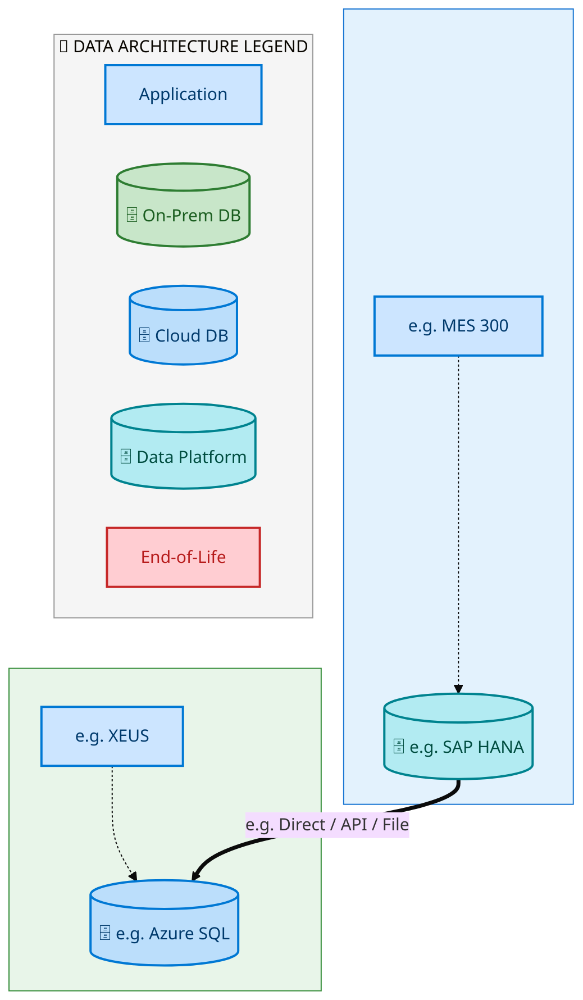
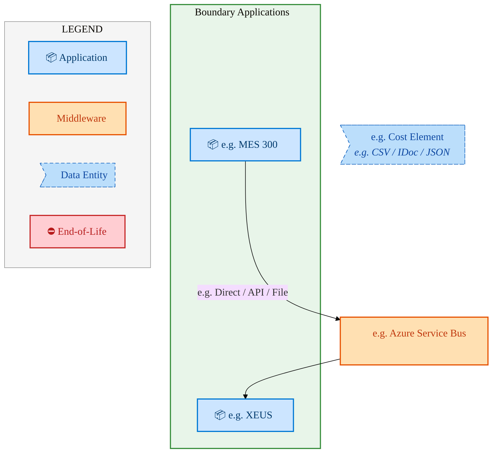
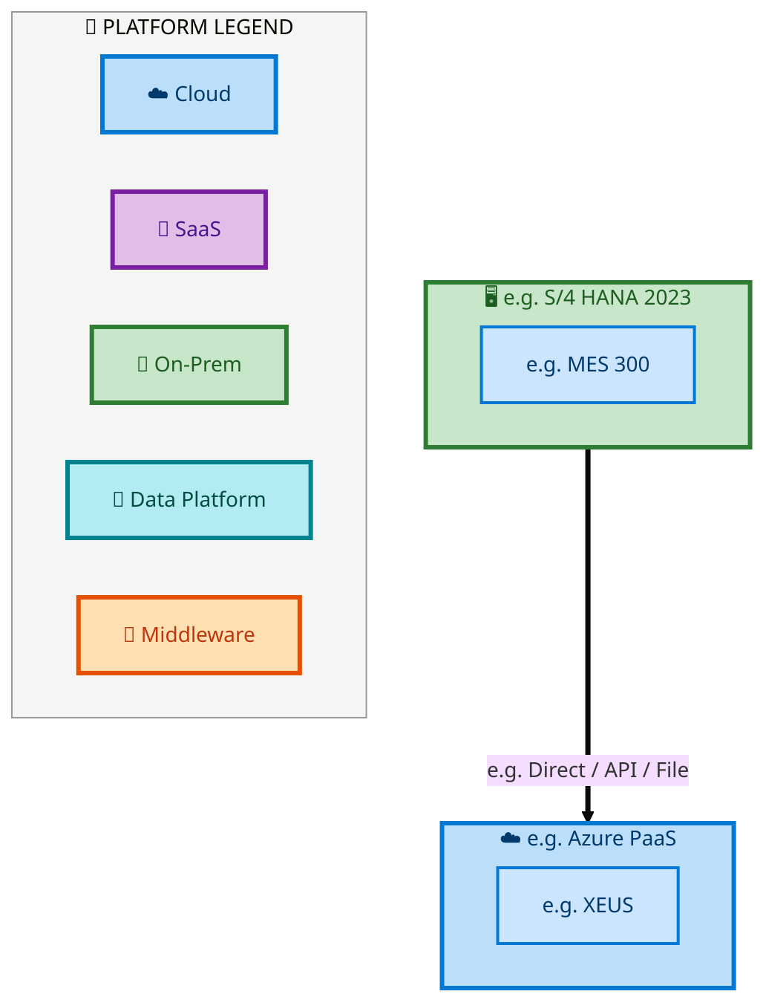

  <img src="data:image/svg+xml;base64,PHN2ZyB4bWxucz0iaHR0cDovL3d3dy53My5vcmcvMjAwMC9zdmciIHZpZXdCb3g9IjAgMCA4MDAgNDgwIiB3aWR0aD0iODAwIiBoZWlnaHQ9IjQ4MCI+DQogIDxkZWZzPg0KICAgIDxsaW5lYXJHcmFkaWVudCBpZD0iYmciIHgxPSIwJSIgeTE9IjAlIiB4Mj0iMTAwJSIgeTI9IjEwMCUiPg0KICAgICAgPHN0b3Agb2Zmc2V0PSIwJSIgc3R5bGU9InN0b3AtY29sb3I6IzAwNzFjNTtzdG9wLW9wYWNpdHk6MSIvPg0KICAgICAgPHN0b3Agb2Zmc2V0PSIxMDAlIiBzdHlsZT0ic3RvcC1jb2xvcjojMDBhZWVmO3N0b3Atb3BhY2l0eToxIi8+DQogICAgPC9saW5lYXJHcmFkaWVudD4NCiAgICA8bGluZWFyR3JhZGllbnQgaWQ9ImFjY2VudCIgeDE9IjAlIiB5MT0iMCUiIHgyPSIwJSIgeTI9IjEwMCUiPg0KICAgICAgPHN0b3Agb2Zmc2V0PSIwJSIgc3R5bGU9InN0b3AtY29sb3I6I2ZmZmZmZjtzdG9wLW9wYWNpdHk6MC4xNSIvPg0KICAgICAgPHN0b3Agb2Zmc2V0PSIxMDAlIiBzdHlsZT0ic3RvcC1jb2xvcjojZmZmZmZmO3N0b3Atb3BhY2l0eTowLjAyIi8+DQogICAgPC9saW5lYXJHcmFkaWVudD4NCiAgICA8cGF0dGVybiBpZD0iZ3JpZCIgd2lkdGg9IjQwIiBoZWlnaHQ9IjQwIiBwYXR0ZXJuVW5pdHM9InVzZXJTcGFjZU9uVXNlIj4NCiAgICAgIDxwYXRoIGQ9Ik0gNDAgMCBMIDAgMCAwIDQwIiBmaWxsPSJub25lIiBzdHJva2U9InJnYmEoMjU1LDI1NSwyNTUsMC4wNykiIHN0cm9rZS13aWR0aD0iMC41Ii8+DQogICAgPC9wYXR0ZXJuPg0KICA8L2RlZnM+DQoNCiAgPCEtLSBCYWNrZ3JvdW5kIC0tPg0KICA8cmVjdCB3aWR0aD0iODAwIiBoZWlnaHQ9IjQ4MCIgZmlsbD0idXJsKCNiZykiIHJ4PSI4Ii8+DQogIDxyZWN0IHdpZHRoPSI4MDAiIGhlaWdodD0iNDgwIiBmaWxsPSJ1cmwoI2dyaWQpIiByeD0iOCIvPg0KICA8cmVjdCB3aWR0aD0iODAwIiBoZWlnaHQ9IjQ4MCIgZmlsbD0idXJsKCNhY2NlbnQpIiByeD0iOCIvPg0KDQogIDwhLS0gRGVjb3JhdGl2ZSBjaXJjdWl0L2FyY2hpdGVjdHVyZSBsaW5lcyAtLT4NCiAgPGcgc3Ryb2tlPSJyZ2JhKDI1NSwyNTUsMjU1LDAuMTIpIiBzdHJva2Utd2lkdGg9IjEuNSIgZmlsbD0ibm9uZSI+DQogICAgPHBhdGggZD0iTSAwIDEwMCBMIDEyMCAxMDAgTCAxNjAgMTQwIEwgMjgwIDE0MCIvPg0KICAgIDxwYXRoIGQ9Ik0gMCAyNjAgTCA4MCAyNjAgTCAxMjAgMjIwIEwgMjAwIDIyMCBMIDI0MCAyNjAgTCAzNjAgMjYwIi8+DQogICAgPHBhdGggZD0iTSA1MjAgMTAwIEwgNjAwIDEwMCBMIDY0MCA2MCBMIDgwMCA2MCIvPg0KICAgIDxwYXRoIGQ9Ik0gNDQwIDM0MCBMIDU2MCAzNDAgTCA2MDAgMzAwIEwgNzIwIDMwMCBMIDc2MCAzNDAgTCA4MDAgMzQwIi8+DQogICAgPHBhdGggZD0iTSA2MDAgNDAwIEwgNjgwIDQwMCBMIDcyMCA0NDAiLz4NCiAgICA8cGF0aCBkPSJNIDAgNDAwIEwgNDAgNDAwIEwgODAgMzYwIi8+DQogICAgPHBhdGggZD0iTSAyMDAgNDIwIEwgMzIwIDQyMCBMIDM2MCAzODAgTCA0ODAgMzgwIi8+DQogICAgPHBhdGggZD0iTSA2NTAgNDQwIEwgNzUwIDQ0MCBMIDgwMCA0ODAiLz4NCiAgPC9nPg0KDQogIDwhLS0gRGVjb3JhdGl2ZSBub2RlcyAtLT4NCiAgPGcgZmlsbD0icmdiYSgyNTUsMjU1LDI1NSwwLjE4KSI+DQogICAgPGNpcmNsZSBjeD0iMTIwIiBjeT0iMTAwIiByPSI0Ii8+DQogICAgPGNpcmNsZSBjeD0iMjgwIiBjeT0iMTQwIiByPSI0Ii8+DQogICAgPGNpcmNsZSBjeD0iMjAwIiBjeT0iMjIwIiByPSI0Ii8+DQogICAgPGNpcmNsZSBjeD0iMzYwIiBjeT0iMjYwIiByPSI0Ii8+DQogICAgPGNpcmNsZSBjeD0iNjAwIiBjeT0iMTAwIiByPSI0Ii8+DQogICAgPGNpcmNsZSBjeD0iNzIwIiBjeT0iMzAwIiByPSI0Ii8+DQogICAgPGNpcmNsZSBjeD0iNTYwIiBjeT0iMzQwIiByPSI0Ii8+DQogICAgPGNpcmNsZSBjeD0iODAiIGN5PSIzNjAiIHI9IjQiLz4NCiAgICA8Y2lyY2xlIGN4PSI0ODAiIGN5PSIzODAiIHI9IjQiLz4NCiAgICA8Y2lyY2xlIGN4PSIzMjAiIGN5PSI0MjAiIHI9IjQiLz4NCiAgPC9nPg0KDQogIDwhLS0gVE9HQUYgQkRBVCBib3hlcyAtLT4NCiAgPGcgZm9udC1mYW1pbHk9IlNlZ29lIFVJLCBBcmlhbCwgc2Fucy1zZXJpZiIgZm9udC1zaXplPSIxNCIgZm9udC13ZWlnaHQ9IjYwMCI+DQogICAgPCEtLSBCIC0tPg0KICAgIDxyZWN0IHg9IjE1MCIgeT0iMTQwIiB3aWR0aD0iMTIwIiBoZWlnaHQ9IjQwIiByeD0iNSIgZmlsbD0icmdiYSgyNTUsMjU1LDI1NSwwLjE4KSIgc3Ryb2tlPSJyZ2JhKDI1NSwyNTUsMjU1LDAuMykiIHN0cm9rZS13aWR0aD0iMSIvPg0KICAgIDx0ZXh0IHg9IjIxMCIgeT0iMTY1IiB0ZXh0LWFuY2hvcj0ibWlkZGxlIiBmaWxsPSIjZmZmIj5CdXNpbmVzczwvdGV4dD4NCiAgICA8IS0tIEQgLS0+DQogICAgPHJlY3QgeD0iMjkwIiB5PSIxNDAiIHdpZHRoPSIxMjAiIGhlaWdodD0iNDAiIHJ4PSI1IiBmaWxsPSJyZ2JhKDI1NSwyNTUsMjU1LDAuMTgpIiBzdHJva2U9InJnYmEoMjU1LDI1NSwyNTUsMC4zKSIgc3Ryb2tlLXdpZHRoPSIxIi8+DQogICAgPHRleHQgeD0iMzUwIiB5PSIxNjUiIHRleHQtYW5jaG9yPSJtaWRkbGUiIGZpbGw9IiNmZmYiPkRhdGE8L3RleHQ+DQogICAgPCEtLSBBIC0tPg0KICAgIDxyZWN0IHg9IjQzMCIgeT0iMTQwIiB3aWR0aD0iMTIwIiBoZWlnaHQ9IjQwIiByeD0iNSIgZmlsbD0icmdiYSgyNTUsMjU1LDI1NSwwLjE4KSIgc3Ryb2tlPSJyZ2JhKDI1NSwyNTUsMjU1LDAuMykiIHN0cm9rZS13aWR0aD0iMSIvPg0KICAgIDx0ZXh0IHg9IjQ5MCIgeT0iMTY1IiB0ZXh0LWFuY2hvcj0ibWlkZGxlIiBmaWxsPSIjZmZmIj5BcHBsaWNhdGlvbjwvdGV4dD4NCiAgICA8IS0tIFQgLS0+DQogICAgPHJlY3QgeD0iNTcwIiB5PSIxNDAiIHdpZHRoPSIxMjAiIGhlaWdodD0iNDAiIHJ4PSI1IiBmaWxsPSJyZ2JhKDI1NSwyNTUsMjU1LDAuMTgpIiBzdHJva2U9InJnYmEoMjU1LDI1NSwyNTUsMC4zKSIgc3Ryb2tlLXdpZHRoPSIxIi8+DQogICAgPHRleHQgeD0iNjMwIiB5PSIxNjUiIHRleHQtYW5jaG9yPSJtaWRkbGUiIGZpbGw9IiNmZmYiPlRlY2hub2xvZ3k8L3RleHQ+DQogIDwvZz4NCg0KICA8IS0tIENvbm5lY3RpbmcgbGluZXMgYmV0d2VlbiBCREFUIGJveGVzIC0tPg0KICA8ZyBzdHJva2U9InJnYmEoMjU1LDI1NSwyNTUsMC4yNSkiIHN0cm9rZS13aWR0aD0iMSI+DQogICAgPGxpbmUgeDE9IjI3MCIgeTE9IjE2MCIgeDI9IjI5MCIgeTI9IjE2MCIvPg0KICAgIDxsaW5lIHgxPSI0MTAiIHkxPSIxNjAiIHgyPSI0MzAiIHkyPSIxNjAiLz4NCiAgICA8bGluZSB4MT0iNTUwIiB5MT0iMTYwIiB4Mj0iNTcwIiB5Mj0iMTYwIi8+DQogIDwvZz4NCg0KICA8IS0tIE1haW4gdGl0bGUgLS0+DQogIDx0ZXh0IHg9IjQwMCIgeT0iMjYwIiB0ZXh0LWFuY2hvcj0ibWlkZGxlIiBmb250LWZhbWlseT0iU2Vnb2UgVUksIEFyaWFsLCBzYW5zLXNlcmlmIiBmb250LXNpemU9IjM2IiBmb250LXdlaWdodD0iNzAwIiBmaWxsPSIjZmZmZmZmIiBsZXR0ZXItc3BhY2luZz0iMSI+DQogICAgSUFPIEFyY2hpdGVjdHVyZQ0KICA8L3RleHQ+DQogIDx0ZXh0IHg9IjQwMCIgeT0iMzAwIiB0ZXh0LWFuY2hvcj0ibWlkZGxlIiBmb250LWZhbWlseT0iU2Vnb2UgVUksIEFyaWFsLCBzYW5zLXNlcmlmIiBmb250LXNpemU9IjE4IiBmb250LXdlaWdodD0iNDAwIiBmaWxsPSJyZ2JhKDI1NSwyNTUsMjU1LDAuOCkiIGxldHRlci1zcGFjaW5nPSIyIj4NCiAgICBUT0dBRiBCREFUIMK3IElBTyBQcm9ncmFtIMK3IElETSAyLjANCiAgPC90ZXh0Pg0KDQogIDwhLS0gQm90dG9tIGFjY2VudCBiYXIgLS0+DQogIDxyZWN0IHg9IjI4MCIgeT0iMzQwIiB3aWR0aD0iMjQwIiBoZWlnaHQ9IjMiIHJ4PSIxLjUiIGZpbGw9InJnYmEoMjU1LDI1NSwyNTUsMC40KSIvPg0KDQogIDwhLS0gSW50ZWwgdGV4dCAtLT4NCiAgPHRleHQgeD0iNDAwIiB5PSIzODAiIHRleHQtYW5jaG9yPSJtaWRkbGUiIGZvbnQtZmFtaWx5PSJTZWdvZSBVSSwgQXJpYWwsIHNhbnMtc2VyaWYiIGZvbnQtc2l6ZT0iMTMiIGZpbGw9InJnYmEoMjU1LDI1NSwyNTUsMC41KSIgbGV0dGVyLXNwYWNpbmc9IjMiPg0KICAgIElOVEVMIENPTkZJREVOVElBTA0KICA8L3RleHQ+DQo8L3N2Zz4NCg==" alt="IAO Architecture" style="width:100%; border-radius:8px;" />
  <h1 style="font-size:36px; margin-top:24px;">E2E-08 — Forecast to Stock</h1>
  <h2 style="font-size:24px;">Architecture Document (TOGAF BDAT)</h2>
  
End-to-End Integrated Processes (E2E) Tower 
  Capability E2E-08 · Forecast to Stock

  
IAO Program · R1 – R5 
  Generated: April 2026 
  Sajiv Francis

  
IAO Architecture Pipeline — Intel Confidential

Page 1<a href="#toc">↑ Back to TOC</a>E2E-08 — Forecast to Stock

## Table of Contents

<nav class="toc">
<ol>
  <li><a href="#1-executive-summary">1. Executive Summary</a></li>
  <li><a href="#2-business-context-objectives">2. Business Context &amp; Objectives</a>
    <ul>
      <li><a href="#21-classification">2.1 Classification</a></li>
      <li><a href="#22-business-drivers">2.2 Business Drivers</a></li>
      <li><a href="#23-success-criteria">2.3 Success Criteria</a></li>
      <li><a href="#24-companion-documents">2.4 Companion Documents</a></li>
    </ul>
  </li>
  <li><a href="#3-business-architecture-togaf-b">3. Business Architecture (TOGAF &ldquo;B&rdquo;)</a>
    <ul>
      <li><a href="#31-business-process-overview">3.1 Business Process Overview</a></li>
      <li><a href="#32-business-process-diagrams">3.2 Business Process Diagrams</a></li>
      <li><a href="#33-business-roles-responsibilities">3.3 Business Roles &amp; Responsibilities</a></li>
    </ul>
  </li>
  <li><a href="#4-data-architecture-togaf-d">4. Data Architecture (TOGAF &ldquo;D&rdquo;)</a>
    <ul>
      <li><a href="#41-data-entities-ownership">4.1 Data Entities &amp; Ownership</a></li>
      <li><a href="#42-data-flow-diagrams">4.2 Data Flow Diagrams</a></li>
      <li><a href="#43-data-lineage">4.3 Data Lineage</a></li>
      <li><a href="#44-ricefw-data-objects">4.4 RICEFW Data Objects</a></li>
      <li><a href="#45-data-governance-quality">4.5 Data Governance &amp; Quality</a></li>
    </ul>
  </li>
  <li><a href="#5-application-architecture-togaf-a">5. Application Architecture (TOGAF &ldquo;A&rdquo;)</a>
    <ul>
      <li><a href="#51-current-state-current-state-application-landscape">5.1 Current-State Application Landscape</a></li>
      <li><a href="#52-future-state-future-state-application-landscape">5.2 Future-State Application Landscape</a></li>
      <li><a href="#53-change-impact-summary">5.3 Change Impact Summary</a></li>
      <li><a href="#54-component-overview">5.4 Component Overview</a></li>
      <li><a href="#55-ricefw-inventory">5.5 RICEFW Inventory</a></li>
      <li><a href="#56-integration-patterns">5.6 Integration Patterns</a></li>
    </ul>
  </li>
  <li><a href="#6-technology-architecture-togaf-t">6. Technology Architecture (TOGAF &ldquo;T&rdquo;)</a>
    <ul>
      <li><a href="#61-platform-infrastructure">6.1 Platform &amp; Infrastructure</a></li>
      <li><a href="#62-sap-development-object-status">6.2 SAP Development Object Status</a></li>
      <li><a href="#63-nfrs-design-principles">6.3 NFRs &amp; Design Principles</a></li>
      <li><a href="#64-security-governance">6.4 Security &amp; Governance</a></li>
    </ul>
  </li>
  <li><a href="#7-project-context">7. Project Context</a>
    <ul>
      <li><a href="#71-project-roadmap-go-live-plan">7.1 Project Roadmap &amp; Go-Live Plan</a></li>
      <li><a href="#72-raid-log">7.2 RAID Log</a></li>
      <li><a href="#73-recommendations-next-steps">7.3 Recommendations &amp; Next Steps</a></li>
    </ul>
  </li>
</ol>
</nav>

Page 2<a href="#toc">↑ Back to TOC</a>E2E-08 — Forecast to Stock

## 1. Executive Summary

This Architecture Document defines the **Business, Data, Application, and Technology** (BDAT) architecture for **E2E-08 Forecast to Stock** within the IAO program. It includes 8 BPMN process diagram(s) in Section 3.

| Dimension | Value |
|-----------|-------|
| **Tower** | End-to-End Integrated Processes (E2E) |
| **Process Group** | Forecast to Stock |
| **Capability** | E2E-08 - Forecast to Stock |
| **Release** | R1 – R5 |
| **Total Systems** | 2 |
| **System Status** | 0 Deployed, 0 Developing, 0 EOL, 2 Pending IAPM |
| **RICEFW Objects** | Pending — Smartsheet Object Tracker API integration |

**Change Summary**: 0 new flow chains, 0 removed, 0 modified, 1 unchanged between Current-State and Future-State states.

> All system nodes in architecture diagrams are **IAPM-linked** — click any node to open its IAPM page. Diagrams require `securityLevel: 'loose'` for click events.

Page 3<a href="#toc">↑ Back to TOC</a>E2E-08 — Forecast to Stock

## 2. Business Context & Objectives

### 2.1 Classification

| Level | Value |
|-------|-------|
| **L0 Tower** | End-to-End Integrated Processes |
| **L1 Process** | Forecast to Stock |
| **L2 Capability** | E2E-08 - Forecast to Stock |

### 2.2 Business Drivers

| # | Driver | Description | Strategic Alignment | Priority |
|---|--------|-------------|---------------------|----------|
| 1 | End-to-End Process Integration | Enable cross-tower integrated processes spanning procurement, manufacturing, and fulfillment | IDM 2.0 Process Excellence | High |
| 2 | Intel Foundry Business Enablement | Stand up foundry-specific business processes for external customer engagement | Intel Foundry Services | High |
| 3 | Process Visibility & Monitoring | Provide end-to-end process visibility across tower boundaries with integrated monitoring | Operational Excellence | Medium |
| 4 | E2E-08 Process Migration | Migrate E2E-08 business processes and 2 integrated systems from legacy to S/4 HANA target architecture | IDM 2.0 Cross-Functional / End-to-End | High |

Page 4<a href="#toc">↑ Back to TOC</a>E2E-08 — Forecast to Stock

### 2.3 Success Criteria

| Metric | Target | Measure | Baseline | Owner |
|--------|--------|---------|----------|-------|
| E2E Process Cycle Time | Per process SLA | End-to-end transaction completion within defined SLA per process | Varies by process | E2E Process Owner |
| Cross-Tower Integration Success | > 99% | Transactions completing across tower boundaries without manual intervention | 92% (current) | Integration Lead |
| Process Exception Rate | < 2% | Transactions requiring manual exception handling | 8% (current) | Operations Manager |
| E2E-08 Migration Completeness | 100% flow chains validated | All 1 flow chains verified in target state | 0% (pre-migration) | Tower Architect |

### 2.4 Companion Documents

| Document | Description |
|----------|-------------|
| **Business Architecture** | Included in this document (Section 3) — process flows from BPMN diagrams |
| **This Document** | Full BDAT Architecture — Business + Data + Application + Technology |

Page 5<a href="#toc">↑ Back to TOC</a>E2E-08 — Forecast to Stock

## 3. Business Architecture (TOGAF "B")

### 3.1 Business Process Overview

This capability includes **8 business process(es)** modeled in BPMN 2.0, covering the end-to-end workflow for E2E-08 Forecast to Stock.

| # | Step ID | Process Name | Lanes | Tasks | Gateways |
|---|---------|--------------|-------|-------|----------|
| 1 | E2E-08A_R3_Inventory_Stock_Transfer_from_SLOC_to_SLOC_-_One_Step_Transfer | E2E-08A_R3_Inventory_Stock_Transfer_from_SLOC_to_SLOC_-_One_Step_Transfer | External Partners , SAP S/4 Intel Product | 2 | 0 |
| 2 | E2E-08B_R3_Inventory_Stock_Transfer_from_SLOC_to_SLOC_-_Two_Step_Transfer | E2E-08B_R3_Inventory_Stock_Transfer_from_SLOC_to_SLOC_-_Two_Step_Transfer | SAP S/4 Intel Product | 3 | 0 |
| 3 | E2E-08C_R3_Inventory_Stock_Transfer_Plant_to_Plant_(Same_LE)_-_Two_Step_Transfer | E2E-08C_R3_Inventory_Stock_Transfer_Plant_to_Plant_(Same_LE)_-_Two_Step_Transfer | SAP S/4 Intel Product | 3 | 0 |
| 4 | E2E-08D_R3_Inventory_Stock_Transfer_Plant_to_Plant_(Same_LE)_-_One_Step_Transfer | E2E-08D_R3_Inventory_Stock_Transfer_Plant_to_Plant_(Same_LE)_-_One_Step_Transfer | External Partners , SAP S/4 Intel Product | 2 | 0 |
| 5 | E2E-08E_R3_Material_Movement_(Non-Inventory)_–_Same_LE | E2E-08E_R3_Material_Movement_(Non-Inventory)_–_Same_LE | SAP S/4 Intel Product  | 6 | 1 |
| 6 | E2E-08F_R3_Inventory_Stock_Transfer_Inter_Plant_of_Same_Company_Code_(Inventory)_–_Within_Same_LE | E2E-08F_R3_Inventory_Stock_Transfer_Inter_Plant_of_Same_Company_Code_(Inventory)_–_Within_Same_LE | External Partners , SAP S/4 Receiving Plant , SAP S/4 Sending Plant | 11 | 2 |
| 7 | E2E-08G_R3_TM_Embedded_with_3PL | E2E-08G_R3_TM_Embedded_with_3PL | Boundary Apps , External Partners/B2B, SAP S/4 Intel Product Shipping Location  | 12 | 5 |
| 8 | E2E-08H_R3_TM_Steps | E2E-08H_R3_TM_Steps | Boundary Apps , External Partners/B2B, SAP S/4 Intel Product Shipping Location  | 13 | 5 |

Page 6<a href="#toc">↑ Back to TOC</a>E2E-08 — Forecast to Stock

### 3.2 Business Process Diagrams

#### BUSINESS ARCHITECTURE — 3.2.1 E2E-08A_R3_Inventory_Stock_Transfer_from_SLOC_to_SLOC_-_One_Step_Transfer — E2E-08A_R3_Inventory_Stock_Transfer_from_SLOC_to_SLOC_-_One_Step_Transfer

**Swim Lanes**: External Partners  · SAP S/4 Intel Product | **Tasks**: 2 | **Gateways**: 0

> **Legend**: ● Start · ● End · User Task · Service Task · ◇ Gateway · Sub-Process

<a href="https://mermaid.live/view#pako:eNqlVNmO2jAU_RUrI0QrBTUroXmoBIFUI3VUJKbtw1BVJrkO1jh2ZDssRfx7HXaY4al-iOTjs_je2N5YmcjBiq1Wa0M51THatPUcSmjHqD3DCto22gM_saR4xkC1Gw4RXE_o3x3NDapVQ2uwFJeUrRt0AoUA9OPRRn0jZDZSmKuOAklJ225XkpZYrhPBhGzYD9AjDtmlHZYGQuYgzwTHidwsNFJGOZxhPwqiIG10CjLB8ytTEpIeydrbZnNMLLM5lnq3_VrBE179ormemznBTIHhzHXJvuEZsKZGLesGy2q5ODaDqiaHm4ZNKpxRXhg8cAwkMX89Q6Gz3aJtqzXlp1D0PJxyZEbGsFJDIEhpA48WGhHKWPwQJP00dGylpXiF-MEbRUPfs7OmktiU7thNcztLoMVcxzPB8gO1s2xqiL1qZctV7Dm2XJvvTRbw_JyUdL2e1zslDSI3cZNjEiHkv5JMX-UzVq-HrJGfeunwlOWG3TBx3vodyxwGUd-97RPIBc3gwjRNU390btWoG7rOfdNB6ned5Ma0wBqWeH02_JwEJ8M0jFI3umu4z7vdZT0bS5EdDf1RmIYnw2jgpn3vrmHQd4PeYYfGp5C4miOGOfxxXqbWaKVBcszQ2JwXDlKhqfV7T24G9z8YEsExwZ2KmZKeJS0KkOiRL4BrIRvEXDwC0ug-7oXmPLwX5xqnSX-MJp8CI9dgMqXI60xfJ7ovp8RMFCiRYLqJnh6_fr-MulR414oxSCJkicbztaKZKe1JLMwDwzUSBH0VIlc3-uBco9KieitUJyVKRFkx0JC_Uy73UafzxVRwmLr7qXeYevtpcPFvG87FCbxa8e6u-KfbfQUHh4to2VYJssQ0t-KNtXtczQOcA8E109bWtnCtxWTNMyvePUJWXeWmxUOKzc8q9-D2Hwa81lU=" title="View full diagram">&#128065; View Diagram</a>

#### BUSINESS ARCHITECTURE — 3.2.2 E2E-08B_R3_Inventory_Stock_Transfer_from_SLOC_to_SLOC_-_Two_Step_Transfer — E2E-08B_R3_Inventory_Stock_Transfer_from_SLOC_to_SLOC_-_Two_Step_Transfer

**Swim Lanes**: SAP S/4 Intel Product | **Tasks**: 3 | **Gateways**: 0

> **Legend**: ● Start · ● End · User Task · Service Task · ◇ Gateway · Sub-Process

<a href="https://mermaid.live/view#pako:eNqlVF1v2jAU_StWqopNClo-G5aHSRDIhLSq1ei2h3WajHMNVh07sh1aVvHf5xBIgKlPy0OUe3zPOffe2H51iCzASZ3r61cmmEnR68CsoYRBigZLrGHgohb4jhXDSw560ORQKcyC_dmn-VH10qQ1WI5LxrcNuoCVBPRt7qKxJXIXaSz0UINidOAOKsVKrLaZ5FI12Vcwoh7dux2WJlIVoPoEz0t8ElsqZwJ6OEyiJMobngYiRXEmSmM6omSwa4rj8pmssTL78msNt_jlByvM2sYUcw02Z21K_gUvgTc9GlU3GKnV5jgMphsfYQe2qDBhYmXxyLOQwuKph2Jvt0O76-tH0Zmih-mjQPYhHGs9BYq0sfBsYxBlnKdXUTbOY8_VRsknSK-CWTINA5c0naS2dc9thjt8BrZam3QpeXFIHT43PaRB9eKqlzTwXLW17wsvEEXvlN0Eo2DUOU0SP_OzoxOl9L-c7FzVA9ZPB69ZmAf5tPPy45s48_7VO7Y5jZKxfzknUBtG4EQ0z_Nw1o9qdhP73tuikzy88bIL0RU28Iy3veDHLOoE8zjJ_eRNwdbvssp6ea8kOQqGsziPO8Fk4ufj4E3BaOxHo0OFVmelcLVGHAv47f18dBbje7T4EKG5MMCRNSlqYh6dX21-8wjfplGcUjxsxo8yBbY9dDv_fIce7M7U1IJMoLnWNaDFl7vsnB787PhErtA9KCpVie7XW80I5uhWbuzxFwZJij5LWWhLP-WHF3ypTWtuZO9PlSxtEcMOmGDbIgGEDfoKBNjGnp1jcafq0btOveL2l83tJcX-6c-S3p-Q4p6kjaz6MjJZVhwMFD3BHo72Q0RoOPxkx3kI_TYMDmHQhuEhDNswPtkIDeV4AM7g4HQXn62Eb65E3Q1xBseHw-y4TgmqxKxw0ldnf0HbS7wAimtunJ3r4NrIxVYQJ91fZE5dFXZqU4bt_ipbcPcXF7zo8g==" title="View full diagram">&#128065; View Diagram</a>

#### BUSINESS ARCHITECTURE — 3.2.3 E2E-08C_R3_Inventory_Stock_Transfer_Plant_to_Plant_(Same_LE)_-_Two_Step_Transfer — E2E-08C_R3_Inventory_Stock_Transfer_Plant_to_Plant_(Same_LE)_-_Two_Step_Transfer

**Swim Lanes**: SAP S/4 Intel Product | **Tasks**: 3 | **Gateways**: 0

> **Legend**: ● Start · ● End · User Task · Service Task · ◇ Gateway · Sub-Process

<a href="https://mermaid.live/view#pako:eNqlVF1v2jAU_StWqopNClo-G5aHSRDIhLSq1ei2h3WajHMNVh07sh1aVvHf5xBIgKlPy0OUe3zPOffe2H51iCzASZ3r61cmmEnR68CsoYRBigZLrGHgohb4jhXDSw560ORQKcyC_dmn-VH10qQ1WI5LxrcNuoCVBPRt7qKxJXIXaSz0UINidOAOKsVKrLaZ5FI12Vcwoh7dux2WJlIVoPoEz0t8ElsqZwJ6OEyiJMobngYiRXEmSmM6omSwa4rj8pmssTL78msNt_jlByvM2sYUcw02Z21K_gUvgTc9GlU3GKnV5jgMphsfYQe2qDBhYmXxyLOQwuKph2Jvt0O76-tH0Zmih-mjQPYhHGs9BYq0sfBsYxBlnKdXUTbOY8_VRsknSK-CWTINA5c0naS2dc9thjt8BrZam3QpeXFIHT43PaRB9eKqlzTwXLW17wsvEEXvlN0Eo2DUOU0SP_OzoxOl9L-c7FzVA9ZPB69ZmAf5tPPy45s48_7VO7Y5jZKxfzknUBtG4EQ0z_Nw1o9qdhP73tuikzy88bIL0RU28Iy3veDHLOoE8zjJ_eRNwdbvssp6ea8kOQqGsziPO8Fk4ufj4E3BaOxHo0OFVmelcLVGHAv47f18dBbje7T4EKG5MMCRNSlqYh6dX21-8wjfplGcUjxsxo8yBbY9dDv_fIce7M7U1IJMoLnWNaDFl7vsnB787PhErtA9KCpVie7XW80I5uhWbuzxFwZJij5LWWhLP-WHF3ypTWtuZO9PlSxtEcMOmGDbIgGEDfoKBNjGnp1jcafq0btOveL2l83tJcX-6c-S3p-Q4p6kjaz6MjJZVhwMFD3BHo72Q0RoOPxkx3kI_TYMDmHQhuEhDNswPtkIDeV4AM7g4HQXn62Eb65E3Q1xBseHw-y4TgmqxKxw0ldnf0HbS7wAimtunJ3r4NrIxVYQJ91fZE5dFXZqU4bt_ipbcPcXF7zo8g==" title="View full diagram">&#128065; View Diagram</a>

Page 7<a href="#toc">↑ Back to TOC</a>E2E-08 — Forecast to Stock

#### BUSINESS ARCHITECTURE — 3.2.4 E2E-08D_R3_Inventory_Stock_Transfer_Plant_to_Plant_(Same_LE)_-_One_Step_Transfer — E2E-08D_R3_Inventory_Stock_Transfer_Plant_to_Plant_(Same_LE)_-_One_Step_Transfer

**Swim Lanes**: External Partners  · SAP S/4 Intel Product | **Tasks**: 2 | **Gateways**: 0

> **Legend**: ● Start · ● End · User Task · Service Task · ◇ Gateway · Sub-Process

<a href="https://mermaid.live/view#pako:eNqlVNmO2jAU_RUrI0QrBTUroXmoBIFUI3VUJKbtw1BVJrkO1jh2ZDssRfx7HXaY4al-iOTjs_je2N5YmcjBiq1Wa0M51THatPUcSmjHqD3DCto22gM_saR4xkC1Gw4RXE_o3x3NDapVQ2uwFJeUrRt0AoUA9OPRRn0jZDZSmKuOAklJ225XkpZYrhPBhGzYD9AjDtmlHZYGQuYgzwTHidwsNFJGOZxhPwqiIG10CjLB8ytTEpIeydrbZnNMLLM5lnq3_VrBE179ormemznBTIHhzHXJvuEZsKZGLesGy2q5ODaDqiaHm4ZNKpxRXhg8cAwkMX89Q6Gz3aJtqzXlp1D0PJxyZEbGsFJDIEhpA48WGhHKWPwQJP00dGylpXiF-MEbRUPfs7OmktiU7thNcztLoMVcxzPB8gO1s2xqiL1qZctV7Dm2XJvvTRbw_JyUdL2e1zslDSI3cZNjEiHkv5JMX-UzVq-HrJGfeunwlOWG3TBx3vodyxwGUd-97RPIBc3gwjRNU390btWoG7rOfdNB6ned5Ma0wBqWeH02_JwEJ8M0jFI3umu4z7vdZT0bS5EdDf1RmIYnw2jgpn3vrmHQd4PeYYfGp5C4miOGOfxxXqbWaKVBcszQ2JwXDlKhqfV7T24G9z8YEsExwZ2KmZKeJS0KkOiRL4BrIRvEXDwC0ug-7oXmPLwX5xqnSX-MJp8CI9dgMqXI60xfJ7ovp8RMFCiRYLqJnh6_fr-MulR414oxSCJkicbztaKZKe1JLMwDwzUSBH0VIlc3-uBco9KieitUJyVKRFkx0JC_Uy73UafzxVRwmLr7qXeYevtpcPFvG87FCbxa8e6u-KfbfQUHh4to2VYJssQ0t-KNtXtczQOcA8E109bWtnCtxWTNMyvePUJWXeWmxUOKzc8q9-D2Hwa81lU=" title="View full diagram">&#128065; View Diagram</a>

#### BUSINESS ARCHITECTURE — 3.2.5 E2E-08E_R3_Material_Movement_(Non-Inventory)_–_Same_LE — E2E-08E_R3_Material_Movement_(Non-Inventory)_–_Same_LE

**Swim Lanes**: SAP S/4 Intel Product  | **Tasks**: 6 | **Gateways**: 1

> **Legend**: ● Start · ● End · User Task · Service Task · ◇ Gateway · Sub-Process

<a href="https://mermaid.live/view#pako:eNqlVVtv4jgU_itWqopWCtpcSZqHlWggVaW5oE078zCsViaxwaqxI9uBMoj_vs6FW9o8TR5QvnPO950L9sneyHiOjMi4vd0TRlQE9gO1Qms0iMBgASUamKAx_ICCwAVFclDFYM5USn7XYbZXvFdhlS2Ba0J3lTVFS47A67MJxppITSAhk0OJBMEDc1AIsoZiF3PKRRV9g0Js4Tpb63rkIkfiHGBZgZ35mkoJQ2ezG3iBl1Q8iTLO8itR7OMQZ4NDVRzl22wFharLLyX6Ct9_klytNMaQSqRjVmpNv8AFolWPSpSVLSvF5jgMIqs8TA8sLWBG2FLbPUubBGRvZ5NvHQ7gcHs7Z6ek4GUyZ0A_GYVSThAGUmnzdKMAJpRGN148TnzLlErwNxTdONNg4jpmVnUS6dYtsxrucIvIcqWiBad5GzrcVj1ETvFuivfIsUyx07-dXIjl50zxyAmd8JTpMbBjOz5mwhj_USY9V_EC5Vuba-omTjI55bL9kR9bH_WObU68YGx354TEhmToQjRJEnd6HtV05NtWv-hj4o6suCO6hApt4e4s-BB7J8HEDxI76BVs8nWrLBczwbOjoDv1E_8kGDzaydjpFfTGthe2FWqdpYDFClDI0H_Wr7mRjmcg_csDz0whCnSSvMwUmBv_NoTqYfYvHYhhhOEw40swQwJzsQbfS7XgJcvBBFGyQWKnWZc053PaE-e5BM9SlghAzX4tcj0uXcAGMcU_qLjXKrFAVXQi6gMEXvVOqVWOhu_Vre5IeJ8XMiPZW82dQf3SlCE7VL-HyqW6bKTDGnVq5gwTsYaKcAY4Bmlz5sDdty_jp_sON7g7cQuqz9CLIMslEh-nDX4QCJ7Tr5p_f8EPz3ypeHFKdllEh_KgGVNnOrTCJ_CPe_4nQKq4nsyLXj8S6xLuvun6L7wZYnpp8_vOabH2-2MFUAi-lUNIFSiggJQi-tTcjblxODQkvT2aF2aD4fDvSuCIrcbgdLDbYqeBXgu9Bvot9Bs4auGogWELgzZXC90GPlzcu6qei-1w5XF6PW6vx-v1-L2eUa8nOG34K3PYLuMr48PnsXqc7aIyTGON9NkguRHtjfpzrD_ZOcKwpMo4mAYsFU93LDOi-rNllPVlmRCot8m6MR7-Bws5gmQ=" title="View full diagram">&#128065; View Diagram</a>

Page 8<a href="#toc">↑ Back to TOC</a>E2E-08 — Forecast to Stock

#### BUSINESS ARCHITECTURE — 3.2.6 E2E-08F_R3_Inventory_Stock_Transfer_Inter_Plant_of_Same_Company_Code_(Inventory)_–_Within_Same_LE — E2E-08F_R3_Inventory_Stock_Transfer_Inter_Plant_of_Same_Company_Code_(Inventory)_–_Within_Same_LE

**Swim Lanes**: External Partners  · SAP S/4 Receiving Plant  · SAP S/4 Sending Plant | **Tasks**: 11 | **Gateways**: 2

```mermaid
%%{init: {'theme': 'base', 'themeVariables': {'fontSize': '14px', 'fontFamily': 'Segoe UI, Arial, sans-serif','primaryColor': '#e8f0fe', 'primaryBorderColor': '#0071c5','lineColor': '#37474F', 'secondaryColor': '#f5f8fc'}, 'flowchart': {'useMaxWidth': false, 'htmlLabels': true, 'curve': 'basis', 'nodeSpacing': 40, 'rankSpacing': 50}} }%%
flowchart LR
    classDef startEvt fill:#4CAF50,stroke:#2E7D32,color:#000,font-weight:bold,stroke-width:2px,rx:20,ry:20
    classDef endEvt fill:#C62828,stroke:#B71C1C,color:#fff,font-weight:bold,stroke-width:2px,rx:20,ry:20
    classDef userTask fill:#E3F2FD,stroke:#1565C0,stroke-width:2px,color:#0D47A1
    classDef serviceTask fill:#FFF3E0,stroke:#E65100,stroke-width:2px,color:#BF360C
    classDef gateway fill:#FFF9C4,stroke:#F57F17,stroke-width:2px,color:#E65100
    classDef subProc fill:#F3E5F5,stroke:#7B1FA2,stroke-width:2px,color:#4A148C
    subgraph lane_0["External Partners "]
        n10[["fa:fa-cog Perform 3PL Shipping"]]
        n11[["fa:fa-cog Perform 3PL Receiving"]]
        n18{{"fa:fa-arrows-alt parallelGateway"}}
    end
    subgraph lane_1["SAP S/4 Receiving Plant "]
        n6[["fa:fa-cog Create Stock Transfer Order (STO)"]]
        n7[["fa:fa-cog Convert Stock Transfer Requisition to STO"]]
        n8[["fa:fa-cog Create Inbound Delivery"]]
        n9[["fa:fa-cog Perform Goods Receipt and Update Inventory"]]
        n12(["fa:fa-play STR Creation Initiated"])
        n15(["fa:fa-stop Goods Receipt Performed"])
    end
    subgraph lane_2["SAP S/4 Sending Plant"]
        n1[["fa:fa-cog Create Outbound Delivery"]]
        n2[["fa:fa-cog Create Freight Unit and Freight Order"]]
        n3[["fa:fa-cog Perform GTS Trade Compliance"]]
        n4[["fa:fa-cog Pick and Pack Updates"]]
        n5[["fa:fa-cog Perform Post Goods Issue (PGI)"]]
        n13(["fa:fa-stop GTS Trade Compliance Performed"])
        n14(["fa:fa-stop Pick and Pack Updates Completed"])
        n16["E2E-08H R3 Inventory Stock Transfer (Inventory Scenario)"]
        n17{{"fa:fa-arrows-alt parallelGateway"}}
    end
    n6 --> n7
    n7 --> n1
    n17 --> n10
    n1 -->|"EDI: 3B12"| n17
    n17 --> n2
    n17 --> n3
    n10 --> n18
    n18 -->|"EDI: 3B13"| n4
    n5 --> n8
    n8 -->|"EDI: 3B2"| n11
    n11 -->|"EDI: 4B2"| n9
    n18 -->|"EDI: 3B2"| n5
    n9 --> n15
    n12 --> n6
    n3 --> n13
    n2 --> n16
    n4 --> n14
    class n1 serviceTask
    class n2 serviceTask
    class n3 serviceTask
    class n4 serviceTask
    class n5 serviceTask
    class n6 serviceTask
    class n7 serviceTask
    class n8 serviceTask
    class n9 serviceTask
    class n10 serviceTask
    class n11 serviceTask
    class n12 startEvt
    class n13 endEvt
    class n14 endEvt
    class n15 endEvt
    class n16 startEvt
    class n17 gateway
    class n18 gateway
```

> **Legend**: ● Start · ● End · User Task · Service Task · ◇ Gateway · Sub-Process

<a href="https://mermaid.live/view#pako:eNqlVl1v8jYU_itWqopWAi2fJM3FJAqkQ-pU1LTbxcs0mcQBq8bObIeW8fLf55CED7_JLjYuqp7znOc5x-fYjvdGwlJkhMbt7R5TLEOw78k12qBeCHpLKFCvDyrHb5BjuCRI9MqYjFEZ47-PYZabf5VhpS-CG0x2pTdGK4bA-6wPRopI-kBAKgYCcZz1-r2c4w3kuzEjjJfRNyjIzOyYrYYeGU8RPweYpm8lnqISTNHZ7fiu70YlT6CE0fRKNPOyIEt6h7I4wj6TNeTyWH4h0K_w63ecyrWyM0gEUjFruSHPcIlIuUbJi9KXFHzbNAOLMg9VDYtzmGC6Un7XVC4O6cfZ5ZmHAzjc3i7oKSl4fl1QoH4JgUJMUAaEVO7pVoIMExLeuONR5Jl9ITn7QOGNPfUnjt1PypWEaulmv2zu4BPh1VqGS0bSOnTwWa4htPOvPv8KbbPPd-qvlgvR9JxpPLQDOzhlevStsTVuMmVZ9r8yqb7yNyg-6lxTJ7KjySmX5Q29sfmjXrPMieuPLL1PiG9xgi5EoyhypudWTYeeZXaLPkbO0Bxroiso0SfcnQUfxu5JMPL8yPI7Bat8epXFcs5Z0gg6Uy_yToL-oxWN7E5Bd2S5QV2h0llxmK8BgRT9aX5bGNMviTiFBMzVfqGIC7Aw_qiCyx-1zG8qKoNhBgcJW4E54hnjG-DMn0G8xnmu9qRiXFGsbsorShDetnCC_b7hQM7ZpxhAIkEOOSQEkaeqoQvjcKhIasu1rchSiePRHMQ_uedUYK4wqa1reF3jmCOVAsSSJR_gTZ03kSEOXsorAtzFby_3Wr2-Rmd0i9Qx1Piv6K8CCywxo0AyoHQ0maC1ihldsoKmYIIIVrI7jfTQ3t4nxlJRrTqXACr-e55WcltEJftBx7LvTkI5Uds1fnutSijrnanbGit6qlj3lyzvzBKS5VreuppLWses7ItZxSrmNCltA7a26KWQ_9oju5UV8eO1A97V2o4dahzHQWsSTkeb3-JywClSQ9_kBEOaII3pakys9kSZbQ7VP9VQhEbx2pPNmZB1g2dCFAjczZ9m-l60HH0iLSW2DaZiuxq7tdxKCbVsh2F5idjTgRn8Al6d82bTz8LdBZIgqr727F6btP8f7wA6BIPBz-pQ1qZfmfVVr3Rr22wcpf1dlT2ZhcB5tOyF8b0M0-JtzXYa26z1gsYRaILOUdCtYa8Kb6K14Dr5qdir4twafujIVKFejT7UdTW2ZVeOYW07Nd4spIatBndr2734-pTduvhGXiF2J-J0Im4n4nUiw07E70SCTuShE1GD7YS6u6C63Dy2rv1O_TC69rqtXq_VO-xQ9psXxrU7aNxG39ggvoE4NcK9cXxeqyd4ijJYEGkc-gYsJIt3NDHC4zPUKI6nfIKhup83lfPwDxjbqIQ=" title="View full diagram">&#128065; View Diagram</a>

Page 9<a href="#toc">↑ Back to TOC</a>E2E-08 — Forecast to Stock

#### BUSINESS ARCHITECTURE — 3.2.7 E2E-08G_R3_TM_Embedded_with_3PL — E2E-08G_R3_TM_Embedded_with_3PL

**Swim Lanes**: Boundary Apps  · External Partners/B2B · SAP S/4 Intel Product Shipping Location  | **Tasks**: 12 | **Gateways**: 5

```mermaid
%%{init: {'theme': 'base', 'themeVariables': {'fontSize': '14px', 'fontFamily': 'Segoe UI, Arial, sans-serif','primaryColor': '#e8f0fe', 'primaryBorderColor': '#0071c5','lineColor': '#37474F', 'secondaryColor': '#f5f8fc'}, 'flowchart': {'useMaxWidth': false, 'htmlLabels': true, 'curve': 'basis', 'nodeSpacing': 40, 'rankSpacing': 50}} }%%
flowchart LR
    classDef startEvt fill:#4CAF50,stroke:#2E7D32,color:#000,font-weight:bold,stroke-width:2px,rx:20,ry:20
    classDef endEvt fill:#C62828,stroke:#B71C1C,color:#fff,font-weight:bold,stroke-width:2px,rx:20,ry:20
    classDef userTask fill:#E3F2FD,stroke:#1565C0,stroke-width:2px,color:#0D47A1
    classDef serviceTask fill:#FFF3E0,stroke:#E65100,stroke-width:2px,color:#BF360C
    classDef gateway fill:#FFF9C4,stroke:#F57F17,stroke-width:2px,color:#E65100
    classDef subProc fill:#F3E5F5,stroke:#7B1FA2,stroke-width:2px,color:#4A148C
    subgraph lane_0["Boundary Apps "]
        n1[["fa:fa-cog Carrier Invoice Reconciliation/ Dispute Management"]]
    end
    subgraph lane_1["External Partners/B2B"]
        n10[["fa:fa-cog Book/Tender to Carrier SAP BN4L-FC"]]
        n11[["fa:fa-cog Capture Execution events via BN4L-GTT"]]
        n12[["fa:fa-cog Capture Carrier Invoices (via EDI only"]]
        n13(["fa:fa-play Capture Execution Initiated"])
        n14(["fa:fa-play Capture Carrier Invoices Initiated"])
    end
    subgraph lane_2["SAP S/4 Intel Product Shipping Location "]
        n2[["fa:fa-cog Create/ Update Freight Unit and Order"]]
        n3[["fa:fa-cog Execute Freight Order and Status Updates Post GI"]]
        n4[["fa:fa-cog Perform Carrier Selection and Calculate Charges"]]
        n5[["fa:fa-cog Create/ Update Freight Settlement Document"]]
        n6[["fa:fa-cog Create Service PO/ Entry Sheet"]]
        n7[["fa:fa-cog Post Accrual to Freight Expense Account(s)"]]
        n8[["fa:fa-cog Allocate Freight Costs to Delivery Items (CO/PA) or Material Valuation"]]
        n9[["fa:fa-cog Receive reconciled Carrier Invoice(s)"]]
        n15(["fa:fa-stop Accrual Posted"])
        n16(["fa:fa-stop Freight Costs Allocated"])
        n17["E2E-08E R3 Material Movement (Non-Inventory) – Same LE"]
        n18{{"fa:fa-arrows-alt parallelGateway"}}
        n19{{"fa:fa-arrows-alt parallelGateway"}}
        n20{{"fa:fa-arrows-alt inclusiveGateway"}}
        n21{{"fa:fa-arrows-alt inclusiveGateway"}}
        n22{{"fa:fa-arrows-alt inclusiveGateway"}}
    end
    n2 --> n20
    n20 --> n4
    n4 --> n18
    n18 --> n10
    n18 --> n21
    n21 --> n3
    n10 --> n20
    n11 --> n21
    n3 --> n22
    n5 --> n6
    n6 --> n19
    n19 --> n7
    n19 --> n8
    n22 --> n5
    n9 --> n22
    n1 --> n9
    n7 --> n15
    n8 --> n16
    n12 --> n1
    n13 --> n11
    n14 --> n12
    n17 --> n2
    class n1 serviceTask
    class n2 serviceTask
    class n3 serviceTask
    class n4 serviceTask
    class n5 serviceTask
    class n6 serviceTask
    class n7 serviceTask
    class n8 serviceTask
    class n9 serviceTask
    class n10 serviceTask
    class n11 serviceTask
    class n12 serviceTask
    class n13 startEvt
    class n14 startEvt
    class n15 endEvt
    class n16 endEvt
    class n17 startEvt
    class n18 gateway
    class n19 gateway
    class n20 gateway
    class n21 gateway
    class n22 gateway
```

> **Legend**: ● Start · ● End · User Task · Service Task · ◇ Gateway · Sub-Process

<a href="https://mermaid.live/view#pako:eNqlV21v4jgQ_itWVhWtBCIJCQE-nAQhWVVqd9HS3fuwPZ3cxIGoxo5sh8JW_Pcb5wVKINLdHh9a_MzMM89Mxo55NyIeE2Ni3Ny8pyxVE_TeUWuyIZ0J6rxgSTpdVAI_sEjxCyWyo30SztQy_VW4WU62024aC_EmpXuNLsmKE_T9voumEEi7SGIme5KINOl0O5lIN1jsfU650N6fyCgxkyJbZZpxERNxcjBNz4pcCKUpIyd44DmeE-o4SSLO4jPSxE1GSdQ5aHGUv0VrLFQhP5fkEe_-TGO1hnWCqSTgs1Yb-oBfCNU1KpFrLMrFtm5GKnUeBg1bZjhK2QpwxwRIYPZ6glzzcECHm5tndkyKHr49MwSfiGIp5yRBUgEcbBVKUkonnxx_GrpmVyrBX8nkkx1484HdjXQlEyjd7Orm9t5IulqryQunceXae9M1TOxs1xW7iW12xR7-NnIRFp8y-UN7ZI-OmWae5Vt-nSlJkv-VCfoqnrB8rXIFg9AO58dcljt0ffOSry5z7nhTq9knIrZpRD6QhmE4CE6tCoauZbaTzsLB0PQbpCusyBvenwjHvnMkDF0vtLxWwjJfU2X-shA8qgkHgRu6R0JvZoVTu5XQmVrOqFIIPCuBszWimJG_zZ_PxoznxVCjaZZJ9Gz8VTrqD7N-gkOCJwnuRXyFfCxESgS6Z1sOLUPf9IaIUppilXLWR_NUZrki6BEzvIIdzRTQVXwwItcUWJAg2CkiGKZoARPLiJD9mT1rCDHPlcw4f-0_ASeoUfwobDldoNkX56EX-qfMJcFFKZnKBUHBjkS5Vo_IFvRKtE1xSfH56anJYV_naLRFoltNEszvEWd03yQZ3B5JMgojcqnkHo5JaCmJIfTuY6jTEnoh4ApDS_9tYNRdW_YdiFIEHoLgcR4ptFynWQbnDXrgUfF8G7PRbIYgkLCPvmcx_EehKPY3-g5KEGYx-qoP20YvBucUZQdOsUVIEbxUWOWy4pZowaVCn-8bbM4524KIhIvNaTYIJVFRh2b0MY1yqpX6cHyuiGyQuf-quiVRihaDjuY8ys8nvuAZXuOBuOLMQYuvfRQwBZtvuSakGes1CtJVT6NI5LBVYOhrEcEuI0wSbYKtrG7lXYNndM4zpVQ_0VMVPhBLzTgnNN0SUHOvyAbG2P_aX0zvEBewo2GLwksW_cA0L6ahkWN8ngNOBgJUSFQnBImbQ3op03JP4y0Vz4616sIvN8Ow4X1eTV3kRZinDxw76JmjAH0bnAp75NvyQd5-4awHIuE7F_s79JzbpjVAS7wh6CFoHEuj9_daBJTH32QPU4UyLDClhH4u3wLPxuHwMWj8G0G2eTUoZRHNJXS6Jcr6rSj7P0YdzxZmo17vD622Xpsl4FRrp1xao2ptjSrAbAC2VTNYJTCoHcxGCstqRAyqtV2t3XI9rJbDKuO4jh-XgNdY1xLtqia3Wo8b9FX6ms6r6Gv3usA6vVXR1WqtSq51BOoeHRNUlPaHK4FO--HicmaxWy2DVovTanFbLcNWi9dqGbVaxq0WeOKtpvYuWO1tgJbXl-Nz3GnB3eqCe44Or6JeC8eovhOew-OrMGybq7B1HbZr2OgaGyI2OI2NybtR_KqCX14xSXBOlXHoGjhXfLlnkTEpfn0YefE-m6cYrgSbEjz8A0IjTdM=" title="View full diagram">&#128065; View Diagram</a>

Page 10<a href="#toc">↑ Back to TOC</a>E2E-08 — Forecast to Stock

#### BUSINESS ARCHITECTURE — 3.2.8 E2E-08H_R3_TM_Steps — E2E-08H_R3_TM_Steps

**Swim Lanes**: Boundary Apps  · External Partners/B2B · SAP S/4 Intel Product Shipping Location  | **Tasks**: 13 | **Gateways**: 5

> **Legend**: ● Start · ● End · User Task · Service Task · ◇ Gateway · Sub-Process

<a href="https://mermaid.live/view#pako:eNqlV21v4jgQ_itWVhW7Eix5JcCHkyCQVaXuLirdvQ_b08kNDkQ1dmQ7lG6X_37jkITiEulujw-tPON55pnHM07yYiV8RayxdXX1krFMjdFLR23IlnTGqPOAJel00dHwHYsMP1AiO3pPyplaZj_LbY6f7_U2bYvxNqPP2roka07Qt-sumkAg7SKJmexJIrK00-3kItti8RxxyoXe_Y4MUzsts1WuKRcrIk4bbDt0kgBCacbIyeyFfujHOk6ShLPVGWgapMM06Rw0Ocqfkg0WqqRfSPIZ7__MVmoD6xRTSWDPRm3pDX4gVNeoRKFtSSF2tRiZ1HkYCLbMcZKxNdh9G0wCs8eTKbAPB3S4urpnTVJ0c3vPEPwSiqWckRRJBeb5TqE0o3T8zo8mcWB3pRL8kYzfufNw5rndRFcyhtLtrha390Sy9UaNHzhdVVt7T7qGsZvvu2I_du2ueIa_Ri7CVqdM0cAdusMm0zR0IieqM6Vp-r8yga7iDsvHKtfci9141uRygkEQ2W_x6jJnfjhxTJ2I2GUJeQUax7E3P0k1HwSO3Q46jb2BHRmga6zIE34-AY4ivwGMgzB2wlbAYz6TZfGwEDypAb15EAcNYDh14onbCuhPHH9YMQSctcD5BlHMyN_2j3tryouyqdEkzyW6t_46btQ_5vyADSkep7iX8DWKsBAZEeia7ThIhm71QCQZzbDKOOujWSbzQhH0GTO8holmCuAqPGiRSwwcSDDfKyIYpmgBHcuIkP2pOzWIGEymnD_27wAT2CjeEFtOFmj6xb_pxdEp8xHANUvJVSEImu9JUmj2iOyAr0S7DB8hPt3dmRjeZQxDFonea5D57BpxRp9NEP99A5JTaJG3TK7hmgRJyQpCP7wODVpC3xC4gNCivwuIWrVl34coReAQBF8ViULLTZbncN-gG56U52v0himoIJCwj77lK_iPYlHON_oGTBBmK_RVX7aGFoaeRwVOsWVIGbxUWBWywpZowaVCn64NNP8cbUFEysX21BuEkqSsQyNGmCYF1UwjuD7XRBpgwb-qbkmUomWjoxlPivOOL3EGl3Agrrxz0OJrH82ZguFbbggxY0OjIF31JElEAaMCTV-TmO9zwiTRLhhl9V5-MHCG5zgTSvWJnqqIAFhqxBmh2Y4Am2tFttDG0df-YvIBcQETDSMKD1n0HdOi7AYjx-g8B9wMBKCQqG4IsjKb9C1Nxz7HWBLdNoV60BfUiZs-vfMOAebe4sZEG5yGRSqeN8ppGd-OVmjsPtemluxN2FBfX-68Zw9jdOvp2qAFuD5PxZNHdAfPbZmWRYN-aAEjpxBP0RJvofH4NscMphge9x8_fjQuvNHLS00IhONPsoepQjkWmFJCPx2fL_fW4fB6JO3fCXIuBmUsoYUEyVui3N-K8v5jVHNrMRf1en9otvXaORr8au0fl86oWjujyuCYBrtGqCC9eoNjpHDqnG5l8Kp1HREc14NqOajcTQL7aAiN9bBeV3hBtR4Z8BWfuqKw4l-nG1brGt6p4Br6tSQ1fafi6zQJKohmQ0nwF7Q0PLtGvo366PbL_A55U8Cwfp2UKF9LNMFXL09nHrfV47V6_FZP0OoZtHrCVs-w1TNq9YAyra52FZx2GZx2HeDc6nf3c3vQYh9U79_n1vCiddiCMapfWc-P0b5sdi6b3ctmrzZbXWtLxBZnK2v8YpUfffBhuCIpLqiyDl0LF4ovn1lijcuPI6soH7ezDMMby_ZoPPwDoKx-vA==" title="View full diagram">&#128065; View Diagram</a>

Page 11<a href="#toc">↑ Back to TOC</a>E2E-08 — Forecast to Stock

### 3.3 Business Roles & Responsibilities

| Role / Lane | Processes Involved | Description |
|------------|-------------------|-------------|
| External Partners  | E2E-08A_R3_Inventory_Stock_Transfer_from_SLOC_to_SLOC_-_One_Step_Transfer, E2E-08D_R3_Inventory_Stock_Transfer_Plant_to_Plant_(Same_LE)_-_One_Step_Transfer, E2E-08F_R3_Inventory_Stock_Transfer_Inter_Plant_of_Same_Company_Code_(Inventory)_–_Within_Same_LE,  | |
| SAP S/4 Intel Product | E2E-08A_R3_Inventory_Stock_Transfer_from_SLOC_to_SLOC_-_One_Step_Transfer, E2E-08B_R3_Inventory_Stock_Transfer_from_SLOC_to_SLOC_-_Two_Step_Transfer, E2E-08C_R3_Inventory_Stock_Transfer_Plant_to_Plant_(Same_LE)_-_Two_Step_Transfer, E2E-08D_R3_Inventory_Stock_Transfer_Plant_to_Plant_(Same_LE)_-_One_Step_Transfer,  | |
| SAP S/4 Intel Product  | E2E-08E_R3_Material_Movement_(Non-Inventory)_–_Same_LE,  | |
| SAP S/4 Receiving Plant  | E2E-08F_R3_Inventory_Stock_Transfer_Inter_Plant_of_Same_Company_Code_(Inventory)_–_Within_Same_LE,  | |
| SAP S/4 Sending Plant | E2E-08F_R3_Inventory_Stock_Transfer_Inter_Plant_of_Same_Company_Code_(Inventory)_–_Within_Same_LE,  | |
| Boundary Apps  | E2E-08G_R3_TM_Embedded_with_3PL, E2E-08H_R3_TM_Steps | |
| External Partners/B2B | E2E-08G_R3_TM_Embedded_with_3PL, E2E-08H_R3_TM_Steps | |
| SAP S/4 Intel Product Shipping Location  | E2E-08G_R3_TM_Embedded_with_3PL, E2E-08H_R3_TM_Steps | |

Page 12<a href="#toc">↑ Back to TOC</a>E2E-08 — Forecast to Stock

## 4. Data Architecture (TOGAF "D")

### 4.1 Data Flows — Source to Target

| # | Flow Chain | Hop | Source App | Source DB | Target App | Target DB | Data Description | Frequency | Classification |
|---|-----------|-----|-----------|----------|-----------|----------|-----------------|-----------|---------------|
| 1 | e.g. MES Route to ICOST | 1 | e.g. MES 300 | e.g. SAP HANA | e.g. XEUS | e.g. Azure SQL | What data moves | e.g. Near Real-Time | e.g. Intel Confidential |

Page 13<a href="#toc">↑ Back to TOC</a>E2E-08 — Forecast to Stock

### 4.2 Data Flow Diagrams

> **DATA ARCHITECTURE** — Database-to-database data flows. Applications (blue) sit above their hosting databases (green cylinders). Thick arrows show data movement between databases.

#### 4.2.1 Current-State — Current-State Data Flows

<a href="https://mermaid.live/view#pako:eNqlVYtumzAU_RWLKtImJV0CeRCkVgJs1kq0y0q6TSoTcsAkqA4gHmvSNP8-m0eSpqWtNiMh-_rec6_P8WMjuJFHBEVotTZBGGQK2NhCtiBLYgsKsIUZTlmvzXopcfMkyNYm-UNoOUmjqJ4tQn7gJMAzSlI-zXD8KMys4LGC6g3iVenM7QZeBnRdzlhkHhFwe9kGKgNg4NvCi0YP7gInWYWWp-QKr34GXrbgFh_TlHC_RbakJp4RWqTNkrywhmxZVozdIJxzszTgxgSH9wfG_mC7BdtWyw53ucBUs0PAmktxmkLiAxzHWrQCfkCpcqLraGAY7TRLonuinHS7Ixn2q2HngZemiPGq7UY0Svi0pA71Izxvpq9pDSejoT7ewYloBCWxEa6nDZDYfQlHo9yrADUNIkP7z_ogznCNJyLNEA_wZEk23sDrw_5xgSSie_4MQ4dwj6cPRVmUG_G0UU_vsfpKxDSfzRMcLwASUVfWoaqbDnHmjvqYJ8Sxvpt3tsA0_l168-YFCXGzIAp3qvJWh6tF9C90a7FAcjo_BbzPABRFKUV_GQOPMn6yBTv3ZMljf8_t27lPumzJHKxwAszJFj5zyEqot-oAndPOeVOuMpCEFUKarSlppKKiG8nGAO33lyTLSNKf091jh_Idgi114lyo1-o_8XuFLEfqdmuK2RCw4UdY3qV9g2TmA7jPjmO-d98p5TWW61wfIbn2rTmWDNGAO45749EQio0cv54WnJ2dP1UMwYJU8AWok0v2NwLK7s-n5l1xpJ1J5qz8uwPKXK8LoDpVgXqjX1xOkT69vUHARF_RNWyQ07zZW02HC6_GMQ1czGdf1850YINQ38LOJCFLALX9SVjTZ5F6Q2h5tR0GPj9CLLQpa3GJTSjO_ChZNmwP00FsaSj0OpHfMQOflEsrb6xXt0LJbn2ZDfi3U348Hr-QXWgLS5IsceAJyqZ8JNlb6xEf5zRjz5yA8yyy1qErKMXDJeSxhzMCA8zUXJbG7V_8F1fd" title="View full diagram">&#128065; View Diagram</a>

Page 14<a href="#toc">↑ Back to TOC</a>E2E-08 — Forecast to Stock

#### 4.2.2 Future-State — Future-State Data Flows

<a href="https://mermaid.live/view#pako:eNqlVYtumzAU_RWLKtImJV0CeRCkVgJs1kq0y0q6TSoTcsAkqA4gHmvSNP8-m0eSpqWtNiMh-_rec6_P8WMjuJFHBEVotTZBGGQK2NhCtiBLYgsKsIUZTlmvzXopcfMkyNYm-UNoOUmjqJ4tQn7gJMAzSlI-zXD8KMys4LGC6g3iVenM7QZeBnRdzlhkHhFwe9kGKgNg4NvCi0YP7gInWYWWp-QKr34GXrbgFh_TlHC_RbakJp4RWqTNkrywhmxZVozdIJxzszTgxgSH9wfG_mC7BdtWyw53ucBUs0PAmktxmkLiAxzHWrQCfkCpcqLraGAY7TRLonuinHS7Ixn2q2HngZemiPGq7UY0Svi0pA71Izxvpq9pDSejoT7ewYloBCWxEa6nDZDYfQlHo9yrADUNIkP7z_ogznCNJyLNEA_wZEk23sDrw_5xgSSie_4MQ4dwj6cPRVmUG_G0UU_vsfpKxDSfzRMcLwASUVc2oKqbDnHmjvqYJ8Sxvpt3tsA0_l168-YFCXGzIAp3qvJWh6tF9C90a7FAcjo_BbzPABRFKUV_GQOPMn6yBTv3ZMljf8_t27lPumzJHKxwAszJFj5zyEqot-oAndPOeVOuMpCEFUKarSlppKKiG8nGAO33lyTLSNKf091jh_Idgi114lyo1-o_8XuFLEfqdmuK2RCw4UdY3qV9g2TmA7jPjmO-d98p5TWW61wfIbn2rTmWDNGAO45749EQio0cv54WnJ2dP1UMwYJU8AWok0v2NwLK7s-n5l1xpJ1J5qz8uwPKXK8LoDpVgXqjX1xOkT69vUHARF_RNWyQ07zZW02HC6_GMQ1czGdf1850YINQ38LOJCFLALX9SVjTZ5F6Q2h5tR0GPj9CLLQpa3GJTSjO_ChZNmwP00FsaSj0OpHfMQOflEsrb6xXt0LJbn2ZDfi3U348Hr-QXWgLS5IsceAJyqZ8JNlb6xEf5zRjz5yA8yyy1qErKMXDJeSxhzMCA8zUXJbG7V-MUFgH" title="View full diagram">&#128065; View Diagram</a>

Page 15<a href="#toc">↑ Back to TOC</a>E2E-08 — Forecast to Stock

### 4.3 Data Lineage

| # | Source System | Source Schema/Object | Target System | Target Schema/Object | Transformation |
|---|-------------|---------------------|---------------|---------------------|---------------|
| 1 | e.g. MES 300 | e.g. CKMLHD table | e.g. XEUS | e.g. dbo.CostElements | Lineage notes |

### 4.4 RICEFW Data Objects

Reports and Conversions for this capability will be populated from the Smartsheet Object Tracker via automated API extraction.

| Object ID | Type | Description | Status | Source | Target | Complexity |
|-----------|------|-------------|--------|--------|--------|-----------|
| E2E-08-R001 | Report | Forecast to Stock operational report | Planned | SAP S/4HANA | Analytics | Medium |
| E2E-08-C001 | Conversion | Legacy data migration for Forecast to Stock | Planned | Legacy ERP | SAP S/4HANA | High |

> *Pending: Smartsheet API integration to auto-populate live RICEFW data (see Build Requirements).*

### 4.5 Data Governance & Quality

| Concern | Approach |
|---------|----------|
| Data Ownership | Per-entity owners listed in Section 3.1 |
| Data Classification | Financial data classified as Intel Confidential |
| Data Retention | Per Intel corporate retention policies |
| Data Quality | Validated at source; reconciliation at target |

Page 16<a href="#toc">↑ Back to TOC</a>E2E-08 — Forecast to Stock

## 5. Application Architecture (TOGAF "A")

### 5.1 Current-State — Current-State Application Landscape

#### Overview

The Current-State architecture represents the **current / legacy** landscape for E2E-08.This view is generated from `CurrentFlows.xlsx` (1 flow hops across 1 flow chains).

#### APPLICATION ARCHITECTURE — Architecture Diagram

> **Click any system node** to open its IAPM application page.
> **Legend**: Deployed · Developing · End-of-Life · No IAPM Match

<a href="https://mermaid.live/view#pako:eNqVlntvozgQwL-KxSp_XdLyCISgKhIPc-qJdKvjdnvScUIOOIm1DiBsts12893X4Dwobff2HCmBmfFvxuPxOM9KVuZYcZTR6JkUhDvgOVH4Fu9wojggUVaIiaexeGI4a2rC9xH-iqlU0rI8abspn1FN0Ipi1qoFZ10WPCbfjijNrp6kcSsP0Y7QvdTEeFNi8Ol2DFwBoGPAUMEmDNdknSiHbgYtH7MtqvmR3DC8RE8PJOfbVrJGlOHWbst3NEIrTLsQeN100kIsMa5QRopNKzbVVlij4ktPaKmHAziMRklx9gX-8pICiDEagclExJZtyRJxDIwrHfwG3G9NjQHje4pBRhFjmAkzOaN7D_AarBpGCswY6MaaUOp8CMXwjDHjdfkFi9e5a-vm8XXy2K7J0auncVbSsnY-qKo6YKKqApchmb4PzTA8M1V1ZgfTnzAN1_IH2BxxNMR6XgBD74zVTMv01ZdYrYcNpjNXO6lzxEQWa7QXGQfmwNmO5DnFj0hksJcXqHr62Rm0TE1V312DFxqWOlwDLumr1IShHwQXrG_ptm6_j51pvjbEMoTYEAs1D8LZGTvztNDV38VOXW1qD7EZLZv8_2dcH2Z8gC2Lqsa7QX3Y0PLnZ6wOZ4HxfrSaZ0JdlJ0Es2a1qVG1BVCHqu1Hd6lXNkWO6n3qVhUlGeKkLNg_iQJOCtBXJMq_EtSOnNQ4a8Ug-vMileQUp5t0CePUUFVBS5rcNnLxnWEL4KvNFRA6IHQC6DiOOAZvAv6Gn-I3Z7eKwVRc5KdVSsLyoWN0ZzuNcf2VZDj1GtYH5tpMAmUHOFoBYSXpl9rukwPYkf2S8RRS0S0LvuhHmU0ltDUAR4ObVX29uCELqYg_g2twG5SZ-Pkj_nh3c00W0mN7dF-uo59K0ZUW3xOlgwRd-gXAvb8V3yGhojt__4_F_0qCWifDXWhDOpZQ1yV_Xj-nc2WHJrxUqmHb0PBfVeqr2ozwRmzmi33PVRDB3-Fd8AsFGKXu_f2wanrRvVFyUbp8GJbF8rL1b5aCnBfA4c4Hbe-FBRf3a39HL1Pgx6jzpVv5VBjmk3I9icj66Ea0vV49XxIuk3Lqg2b7OSd2Pp-_auTKWNnheodIrjjP8k4Xfw1yvEYN5eImVlDDy3hfZIrT3a1KU4lAcUCQ2ISdFB5-AIRUmV8=" title="View full diagram">&#128065; View Diagram</a>

Page 17<a href="#toc">↑ Back to TOC</a>E2E-08 — Forecast to Stock

#### Current-State Flow Narrative

| # | Flow Chain | Path | Interface | Freq |
|---|-----------|------|-----------|------|
| 1 | e.g. MES Route to ICOST | e.g. MES 300 → e.g. XEUS | e.g. Direct / API / File | e.g. Near Real-Time |

Page 18<a href="#toc">↑ Back to TOC</a>E2E-08 — Forecast to Stock

### 5.2 Future-State — Future-State Application Landscape

#### Overview

The Future-State architecture represents the **target** landscape for E2E-08.This view is generated from `FutureFlows.xlsx` (1 flow hops across 1 flow chains).

#### APPLICATION ARCHITECTURE — Architecture Diagram

> **Click any system node** to open its IAPM application page.
> **Legend**: Deployed · Developing · End-of-Life · No IAPM Match

<a href="https://mermaid.live/view#pako:eNqVlntvozgQwL-KxSp_XdLyCISgKhIPc-qJdKvjdnvScUIOOIm1DiBsts12893X4Dwobff2HCmBmfFvxuPxOM9KVuZYcZTR6JkUhDvgOVH4Fu9wojggUVaIiaexeGI4a2rC9xH-iqlU0rI8abspn1FN0Ipi1qoFZ10WPCbfjijNrp6kcSsP0Y7QvdTEeFNi8Ol2DFwBoGPAUMEmDNdknSiHbgYtH7MtqvmR3DC8RE8PJOfbVrJGlOHWbst3NEIrTLsQeN100kIsMa5QRopNKzbVVlij4ktPaKmHAziMRklx9gX-8pICiDEagclExJZtyRJxDIwrHfwG3G9NjQHje4pBRhFjmAkzOaN7D_AarBpGCswY6MaaUOp8CMXwjDHjdfkFi9e5a-vm8XXy2K7J0auncVbSsnY-qKo6YKKqApchmb4PzTA8M1V1ZgfTnzAN1_IH2BxxNMR6XgBD74zVTMv01ZdYrYcNpjNXO6lzxEQWa7QXGQfmwNmO5DnFj0hksJcXqHr62Rm0TE1V312DFxqWOlwDLumr1IShHwQXrG_ptm6_j51pvjbEMoTYEAs1D8LZGTvztNDV38VOXW1qD7EZLZv8_2dcH2Z8gC2Lqsa7QX3Y0PLnZ6wOZ4HxfrSaZ0JdlJ0Es2a1qVG1BVCHqh1Gd6lXNkWO6n3qVhUlGeKkLNg_iQJOCtBXJMq_EtSOnNQ4a8Ug-vMileQUp5t0CePUUFVBS5rcNnLxnWEL4KvNFRA6IHQC6DiOOAZvAv6Gn-I3Z7eKwVRc5KdVSsLyoWN0ZzuNcf2VZDj1GtYH5tpMAmUHOFoBYSXpl9rukwPYkf2S8RRS0S0LvuhHmU0ltDUAR4ObVX29uCELqYg_g2twG5SZ-Pkj_nh3c00W0mN7dF-uo59K0ZUW3xOlgwRd-gXAvb8V3yGhojt__4_F_0qCWifDXWhDOpZQ1yV_Xj-nc2WHJrxUqmHb0PBfVeqr2ozwRmzmi33PVRDB3-Fd8AsFGKXu_f2wanrRvVFyUbp8GJbF8rL1b5aCnBfA4c4Hbe-FBRf3a39HL1Pgx6jzpVv5VBjmk3I9icj66Ea0vV49XxIuk3Lqg2b7OSd2Pp-_auTKWNnheodIrjjP8k4Xfw1yvEYN5eImVlDDy3hfZIrT3a1KU4lAcUCQ2ISdFB5-ANl9mX0=" title="View full diagram">&#128065; View Diagram</a>

Page 19<a href="#toc">↑ Back to TOC</a>E2E-08 — Forecast to Stock

#### Future-State Flow Narrative

| # | Flow Chain | Path | Interface | Freq |
|---|-----------|------|-----------|------|
| 1 | e.g. MES Route to ICOST | e.g. MES 300 → e.g. XEUS | e.g. Direct / API / File | e.g. Near Real-Time |

Page 20<a href="#toc">↑ Back to TOC</a>E2E-08 — Forecast to Stock

### 5.3 Change Impact Summary

| Change Type | Flow Chain | Detail |
|-------------|-----------|--------|
| **UNCHANGED** | e.g. MES Route to ICOST | No change |

**Totals**: 0 new - 0 removed - 0 modified - 1 unchanged

### 5.4 Component Overview

#### System Inventory

| System | IAPM ID | Status |
|--------|---------|--------|
| e.g. MES 300 | - | N/A |
| e.g. XEUS | - | N/A |

Page 21<a href="#toc">↑ Back to TOC</a>E2E-08 — Forecast to Stock

### 5.5 RICEFW Inventory

RICEFW objects for this capability will be auto-populated from the Smartsheet S/4 Object Tracker.

| Object ID | Type | Description | Status | Source → Target | Middleware | Complexity |
|-----------|------|-------------|--------|----------------|-----------|-----------|
| E2E-08-I001 | Interface | Forecast to Stock inbound data interface | Planned | Legacy → SAP S/4HANA | MuleSoft / CPI | Medium |
| E2E-08-E001 | Enhancement | Forecast to Stock custom business logic | Planned | SAP S/4HANA | N/A | Medium |
| E2E-08-F001 | Form/Report | Forecast to Stock operational output | Planned | SAP S/4HANA | N/A | Low |

> *Pending: Smartsheet API integration to auto-populate live RICEFW inventory (see Build Requirements).*

Page 22<a href="#toc">↑ Back to TOC</a>E2E-08 — Forecast to Stock

### 5.6 Integration Patterns

| # | Pattern | Flow Chain | Middleware | Protocol | Auth |
|---|---------|-----------|-----------|----------|------|
| 1 | e.g. Pub-Sub / P2P / ETL | e.g. MES Route to ICOST | e.g. Azure Service Bus | e.g. REST / RFC / SFTP | e.g. OAuth / NTLM / Cert |

Page 23<a href="#toc">↑ Back to TOC</a>E2E-08 — Forecast to Stock

## 6. Technology Architecture (TOGAF "T")

### 6.1 Platform & Infrastructure

> **TECHNOLOGY / PLATFORM ARCHITECTURE** — Platforms (green) host applications (blue). Thick arrows show platform-to-platform integration flows.

#### 6.1.1 Current-State — Current-State Platform Architecture

<a href="https://mermaid.live/view#pako:eNqllXlvmzAUwL-KRZX_0tYcSQhSJ3GYbVLSRKXdJo0JOWASVAcQmDVpmu8-Awk5FipVBcmy33v--R0-NoKfBETQhE5nE8UR08DGFdiCLIkraMAVZjjnvS7v5cQvsoitR-QvobWSJsleW035gbMIzyjJSzXnhEnMnOh1hxKVdFUbl3IbLyO6rjUOmScEPH3vAp0DOHxbWdHkxV_gjO1oRU7GePUzCtiilISY5qS0W7AlHeEZodWyLCsqaczDclLsR_G8FCuwFGY4fj4S9uB2C7adjhs3a4FHw40B_3yK89wiIcBpaiQrEEaUalemiXq23c1ZljwT7QrCgWopu-H1S-maJqWrrp_QJCvVst43z3gpxewIqKK-OWyAEhpYsnQKlA9A0eghCZ4BSUIPPNs2LUtqeGZfUiW11UFjIJoid7Am5sVsnuF0AZCEoGpOR1OPeHNPfy0y4k0xdn67gltIfSi6RUggX_lmfgMqNSjVrvCnBpVfEGXEZ1ESg9HDQbon6xX5F3oqmRWm7HOApml1wus5JA52vrE1Ja2O7YI3DAvZxrvVkf-vzrvBO57ifdPvdU-CklzFH6hywNsA946z4NwqoLQDpd2HEzFGjidDuM8FHwI-_GA6Tlz91Paq13iPfnf35W3nrFXFB26BPv3OWzui_Ly_tZaqNd8jMufhHafYDyDgGXq0Jw9jMEJf0b31gcyOzPPtatKkCE4Ija1zUlqJAOd8Pzemk72pz9uQSGASX08zsrxsbZ0ENCPAwgyDKb8DwiRrmTM-cUYcgHEUBJS84Iw0E1p2Qp3E_V3QK_-m-MPh8LTyYrq6yDA_dZwuAPfnE4kGQoMGODBEW2_fjYouKupl4OTTt-cZ0NqHLCHDlo5CVmXVfidkxVIuA8fNfYygcQCifk-EsBVo2HIfmkJXWJJsiaNA0Db1y8of6ICEuKCMv40CLljirGNf0KrXTijSADNiRZifqGUt3P4DHjhoYg==" title="View full diagram">&#128065; View Diagram</a>

> **Legend**: 🖥️ Platform · 📦 Application · ⛔ End-of-Life · 📋 Unassigned

Page 24<a href="#toc">↑ Back to TOC</a>E2E-08 — Forecast to Stock

#### 6.1.2 Future-State — Future-State Platform Architecture

<a href="https://mermaid.live/view#pako:eNqllXlvmzAUwL-KRZX_0tYcSQhSJ3GYbVLSRKXdJo0JOWASVAcQmDVpmu8-Awk5FipVBcmy33v--R0-NoKfBETQhE5nE8UR08DGFdiCLIkraMAVZjjnvS7v5cQvsoitR-QvobWSJsleW035gbMIzyjJSzXnhEnMnOh1hxKVdFUbl3IbLyO6rjUOmScEPH3vAp0DOHxbWdHkxV_gjO1oRU7GePUzCtiilISY5qS0W7AlHeEZodWyLCsqaczDclLsR_G8FCuwFGY4fj4S9uB2C7adjhs3a4FHw40B_3yK89wiIcBpaiQrEEaUalemiXq23c1ZljwT7QrCgWopu-H1S-maJqWrrp_QJCvVst43z3gpxewIqKK-OWyAEhpYsnQKlA9A0eghCZ4BSUIPPNs2LUtqeGZfUiW11UFjIJoid7Am5sVsnuF0AZCEoGpPR1OPeHNPfy0y4k0xdn67gltIfSi6RUggX_lmfgMqNSjVrvCnBpVfEGXEZ1ESg9HDQbon6xX5F3oqmRWm7HOApml1wus5JA52vrE1Ja2O7YI3DAvZxrvVkf-vzrvBO57ifdPvdU-CklzFH6hywNsA946z4NwqoLQDpd2HEzFGjidDuM8FHwI-_GA6Tlz91Paq13iPfnf35W3nrFXFB26BPv3OWzui_Ly_tZaqNd8jMufhHafYDyDgGXq0Jw9jMEJf0b31gcyOzPPtatKkCE4Ija1zUlqJAOd8Pzemk72pz9uQSGASX08zsrxsbZ0ENCPAwgyDKb8DwiRrmTM-cUYcgHEUBJS84Iw0E1p2Qp3E_V3QK_-m-MPh8LTyYrq6yDA_dZwuAPfnE4kGQoMGODBEW2_fjYouKupl4OTTt-cZ0NqHLCHDlo5CVmXVfidkxVIuA8fNfYygcQCifk-EsBVo2HIfmkJXWJJsiaNA0Db1y8of6ICEuKCMv40CLljirGNf0KrXTijSADNiRZifqGUt3P4D1ZJong==" title="View full diagram">&#128065; View Diagram</a>

> **Legend**: 🖥️ Platform · 📦 Application · ⛔ End-of-Life · 📋 Unassigned

#### Platform Inventory

| # | Platform | Type | Systems Using | Environment |
|---|----------|------|--------------|-------------|
| 1 | e.g. Azure PaaS | Cloud / SaaS | e.g. XEUS | DEV,QAS,PRD |
| 2 | e.g. S/4 HANA 2023 | On-Premise | e.g. MES 300 | DEV,QAS,PRD |

Page 25<a href="#toc">↑ Back to TOC</a>E2E-08 — Forecast to Stock

### 6.2 SAP Development Object Status

| Metric | DEV | QAS | PRD |
|--------|-----|-----|-----|
| Transport Requests | — | — | — |
| Custom Code Objects | — | — | — |
| CDS Views | — | — | — |
| Fiori Apps | — | — | — |
| BAdIs / Enhancements | — | — | — |

### 6.3 NFRs & Design Principles

| Category | Requirement | Target / SLA | Priority |
|----------|-------------|-------------|----------|
| Performance | Order/transaction processing within interactive SLA | < 3 seconds for online transactions | High |
| Availability | Business-critical systems available during extended hours | 99.9% (06:00-22:00 all time zones) | High |
| Scalability | Support seasonal and promotional volume spikes | Handle 2x baseline transaction volume | Medium |
| Recoverability | Customer-facing systems recover within business impact window | RPO < 30 min, RTO < 2 hours | High |
| Data Volume | Support transactional data growth from business expansion | 10M+ documents/year | Medium |
| Latency | Near-real-time integration for order status updates | < 30 seconds for status propagation | Medium |
| Concurrency | Support global user base across business functions | 300+ concurrent users | Medium |

### 6.4 Security & Governance

| Concern | Approach | Standard / Policy | Owner |
|---------|----------|--------------------|-------|
| Authentication | Single Sign-On (SSO) via Intel corporate Azure AD identity | Intel IT Security Policy - Identity Management | IT Security |
| Authorization | Role-based access control (RBAC) with SAP authorization objects | Intel SAP Security Standards - Role Design | SAP Security Team |
| Data Classification | All financial/operational data classified per Intel Data Classification Standard | Intel Data Classification Policy | Data Governance |
| Data Encryption (at rest) | AES-256 encryption for SAP HANA database and file storage | Intel Encryption Standard | Infrastructure Security |
| Data Encryption (in transit) | TLS 1.3 for all system-to-system and user-to-system communication | Intel Network Security Policy | Network Engineering |
| Network Segmentation | SAP systems in dedicated network zones with firewall controls | Intel Network Architecture Standard | Network Security |
| API Security | OAuth 2.0 / certificate-based authentication for all API integrations | Intel API Security Guidelines | Integration Architecture |
| Audit Logging | Comprehensive audit trail for all data changes and user actions (SAP Security Audit Log) | SOX Compliance / Intel Audit Policy | Internal Audit |
| Certificate Management | Automated certificate lifecycle management for system-to-system trust | Intel PKI Standard | Certificate Authority Team |
| Compliance | SOX controls, export control (EAR/ITAR) screening, data privacy (GDPR) | Intel Corporate Compliance Framework | Compliance Office |

Page 26<a href="#toc">↑ Back to TOC</a>E2E-08 — Forecast to Stock

## 7. Project Context

### 7.1 Project Roadmap & Go-Live Plan

Project delivery milestones for E2E-08 RICEFW objects:

| Phase | Planned Start | Planned End | Status | Notes |
|-------|---------------|-------------|--------|-------|
| Functional Specification (FS) | Per project plan | Per project plan | In Progress | Tower-level FS schedule |
| Technical Design (TDD) | FS + 2 weeks | FS + 6 weeks | Planned | Dependent on FS completion |
| Build & Unit Test (TUT) | TDD + 1 week | TDD + 8 weeks | Planned | Includes S/4 + Middleware |
| Functional User Test (FUT) | Build + 1 week | Build + 4 weeks | Planned | Tower-led validation |
| Go-Live (R1 – R5) | Per release plan | Per release plan | Planned | End-to-End Integrated Processes release |

> *Detailed object-level timelines will be auto-populated from the Smartsheet Object Tracker via API integration.*

Page 27<a href="#toc">↑ Back to TOC</a>E2E-08 — Forecast to Stock

### 7.2 RAID Log

Standard RAID items for E2E-08 (End-to-End Integrated Processes):

| # | Category | Description | Status | Owner | Priority |
|---|----------|-------------|--------|-------|----------|
| 1 | Risk | Data migration completeness — validate all legacy Forecast to Stock data maps to S/4 target structures | Open | Tower Architect | High |
| 2 | Risk | Integration testing coverage — ensure all 2 integrated systems are validated end-to-end | Open | Integration Lead | High |
| 3 | Assumption | Target SAP S/4HANA system available in DEV/QAS per release schedule | Active | SAP Basis | Medium |
| 4 | Issue | API access provisioning — SAP OData, Smartsheet, and IAPM API credentials required for automation | Open | EA Pipeline Team | High |
| 5 | Dependency | Upstream BPMN process models validated and signed off by business process owners | Active | Process Owner | Medium |

> *Live RAID data will be auto-populated from the Smartsheet RAID log via API integration.*

### 7.3 Recommendations & Next Steps

| # | Category | Recommendation | Priority | Owner | Target Date | Status |
|---|----------|---------------|----------|-------|-------------|--------|
| 1 | Architecture | Complete extended flow attributes (Data Entity, Integration Pattern, Tech Platform) in Flows tab for full BDAT coverage | High | Tower Architect | 2026-Q2 | Open |
| 2 | Data | Define data ownership and classification for all 1 flow chains to satisfy Data Architecture (TOGAF D) requirements | Medium | Data Architect | 2026-Q3 | Open |
| 3 | Testing | Develop integration test scenarios covering all 1 flow chains for FUT/SIT readiness | High | Test Lead | 2026-Q3 | Open |
| 4 | Business Architecture | Review and validate Business Architecture process steps against latest Signavio/BIC process models | Medium | Business Analyst | 2026-Q2 | Open |
| 5 | Security | Complete security review for API integrations and data flows per Intel Security Architecture standards | Medium | Security Architect | 2026-Q3 | Open |

---
*E2E-08 — Architecture Document (TOGAF BDAT) · End-to-End Integrated Processes · Generated: April 2026*

Page 28<a href="#toc">↑ Back to TOC</a>E2E-08 — Forecast to Stock

