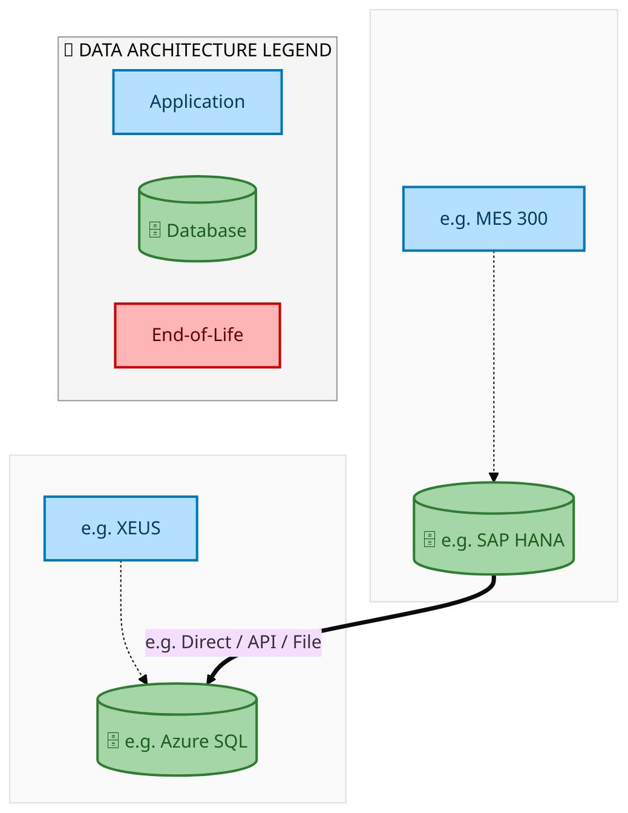
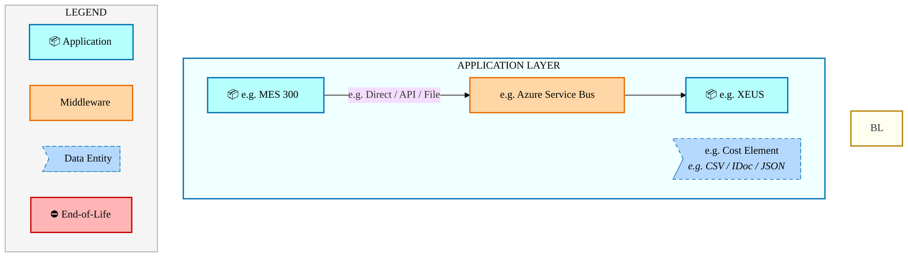
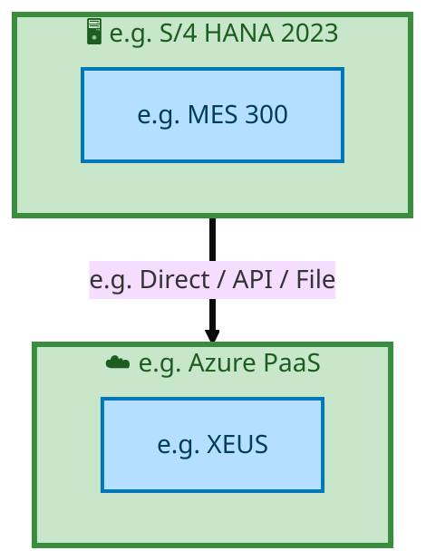

<div style="text-align:center; padding-top:20px;">
  
  <h1 style="font-size:36px; margin-top:24px;">E2E-110 — IMR Flow</h1>
  <h2 style="font-size:24px;">Architecture Document (TOGAF BDAT)</h2>
  <p style="font-size:18px; color:#555;">End-to-End Integrated Processes (E2E) Tower<br/>
  Capability E2E-110 · Forecast to Stock</p>
  <p style="font-size:14px; color:#888;">IAO Program · Release 2<br/>
  Generated: March 2026<br/>
  Sajiv Francis</p>
  <p style="font-size:12px; color:#aaa;">IAO Architecture Pipeline — Intel Confidential</p>
</div>

<style>
@media print {
  @page { margin: 0.75in; }
  .mermaid { page-break-inside: avoid; overflow: hidden; }
  pre, table { page-break-inside: avoid; }
  h2, h3, h4 { page-break-after: avoid; }
}
.mermaid { overflow-x: auto; overflow-y: auto; }
.mermaid svg { height: auto !important; }
.page-footer {
  padding-top: 8px;
  border-top: 1px solid #ddd;
  display: flex;
  justify-content: space-between;
  align-items: center;
  font-size: 11px;
  color: #888;
  position: fixed;
  bottom: 0;
  left: 0;
  right: 0;
  padding: 6px 20px;
  background: #fff;
}
@media print {
  .page-footer { position: fixed; bottom: 0; left: 0.75in; right: 0.75in; }
}
.page-footer a { color: #00aeef; text-decoration: none; font-weight: 500; }
.page-footer a:hover { color: #0071c5; text-decoration: underline; }
</style>

<div class="page-footer"><span>Page 1</span><span><a href="#toc">↑ Back to TOC</a></span><span>E2E-110 — IMR Flow</span></div>
<div style="page-break-before: always;"></div>

<a id="toc"></a>

## Table of Contents

1. [Executive Summary](#1-executive-summary)
2. [Business Context & Objectives](#2-business-context--objectives)
   - 2.1 [Classification](#21-classification)
   - 2.2 [Business Drivers](#22-business-drivers)
   - 2.3 [Success Criteria](#23-success-criteria)
   - 2.4 [Companion Documents](#24-companion-documents)
3. [Business Architecture (TOGAF "B")](#3-business-architecture-togaf-b)
   - 3.1 [Business Process Overview](#31-business-process-overview)
   - 3.2 [Business Process Diagrams](#32-business-process-diagrams)
   - 3.3 [Business Roles & Responsibilities](#33-business-roles--responsibilities)
4. [Data Architecture (TOGAF "D")](#4-data-architecture-togaf-d)
   - 4.1 [Data Entities & Ownership](#41-data-entities--ownership)
   - 4.2 [Data Flow Diagrams](#42-data-flow-diagrams)
   - 4.3 [Data Lineage](#43-data-lineage)
   - 4.4 [RICEFW Data Objects](#44-ricefw-data-objects)
   - 4.5 [Data Governance & Quality](#45-data-governance--quality)
5. [Application Architecture (TOGAF "A")](#5-application-architecture-togaf-a)
   - 5.1 [Current-State Application Landscape](#51-current-state--current-state-application-landscape)
   - 5.2 [Future-State Application Landscape](#52-future-state--future-state-application-landscape)
   - 5.3 [Change Impact Summary](#53-change-impact-summary)
   - 5.4 [Component Overview](#54-component-overview)
   - 5.5 [RICEFW Inventory](#55-ricefw-inventory)
   - 5.6 [Integration Patterns](#56-integration-patterns)
6. [Technology Architecture (TOGAF "T")](#6-technology-architecture-togaf-t)
   - 6.1 [Platform & Infrastructure](#61-platform--infrastructure)
   - 6.2 [SAP Development Object Status](#62-sap-development-object-status)
   - 6.3 [NFRs & Design Principles](#63-nfrs--design-principles)
   - 6.4 [Security & Governance](#64-security--governance)
7. [Project Context](#7-project-context)
   - 7.1 [Project Roadmap & Go-Live Plan](#71-project-roadmap--go-live-plan)
   - 7.2 [RAID Log](#72-raid-log)
   - 7.3 [Recommendations & Next Steps](#73-recommendations--next-steps)

<div class="page-footer"><span>Page 2</span><span><a href="#toc">↑ Back to TOC</a></span><span>E2E-110 — IMR Flow</span></div>
<div style="page-break-before: always;"></div>

## 1. Executive Summary

This Architecture Document defines the **Business, Data, Application, and Technology** (BDAT) architecture for **E2E-110 IMR Flow** within the IAO program. It includes 10 BPMN process diagram(s) in Section 3.
| Dimension | Value |
|-----------|-------|
| **Tower** | End-to-End Integrated Processes (E2E) |
| **Process Group** | Forecast to Stock |
| **Capability** | E2E-110 - IMR Flow |
| **Release** | Release 2 |
| **Total Systems** | 2 |
| **System Status** | 0 Deployed, 0 Developing, 0 EOL, 2 Pending IAPM |
| **RICEFW Objects** | Pending — Smartsheet Object Tracker API integration |
**Change Summary**: 0 new flow chains, 0 removed, 0 modified, 1 unchanged between Current-State and Future-State states.

> All system nodes in architecture diagrams are **IAPM-linked** — click any node to open its IAPM page. Diagrams require `securityLevel: 'loose'` for click events.

<div class="page-footer"><span>Page 3</span><span><a href="#toc">↑ Back to TOC</a></span><span>E2E-110 — IMR Flow</span></div>
<div style="page-break-before: always;"></div>

## 2. Business Context & Objectives

### 2.1 Classification

| Level | Value |
|-------|-------|
| **L0 Tower** | End-to-End Integrated Processes |
| **L1 Process** | Forecast to Stock |
| **L2 Capability** | E2E-110 - IMR Flow |

### 2.2 Business Drivers

| # | Driver | Description | Strategic Alignment | Priority |
|---|--------|-------------|---------------------|----------|
| 1 | End-to-End Process Integration | Enable cross-tower integrated processes spanning procurement, manufacturing, and fulfillment | IDM 2.0 Process Excellence | High |
| 2 | Intel Foundry Business Enablement | Stand up foundry-specific business processes for external customer engagement | Intel Foundry Services | High |
| 3 | Process Visibility & Monitoring | Provide end-to-end process visibility across tower boundaries with integrated monitoring | Operational Excellence | Medium |
| 4 | E2E-110 Process Migration | Migrate IMR Flow business processes and 2 integrated systems from legacy to S/4 HANA target architecture | IDM 2.0 Cross-Functional / End-to-End | High |

<div class="page-footer"><span>Page 4</span><span><a href="#toc">↑ Back to TOC</a></span><span>E2E-110 — IMR Flow</span></div>
<div style="page-break-before: always;"></div>

### 2.3 Success Criteria

| Metric | Target | Measure | Baseline | Owner |
|--------|--------|---------|----------|-------|
| E2E Process Cycle Time | Per process SLA | End-to-end transaction completion within defined SLA per process | Varies by process | E2E Process Owner |
| Cross-Tower Integration Success | > 99% | Transactions completing across tower boundaries without manual intervention | 92% (current) | Integration Lead |
| Process Exception Rate | < 2% | Transactions requiring manual exception handling | 8% (current) | Operations Manager |
| E2E-110 Migration Completeness | 100% flow chains validated | All 1 flow chains verified in target state | 0% (pre-migration) | Tower Architect |

### 2.4 Companion Documents

| Document | Description |
|----------|-------------|
| **Business Architecture** | Included in this document (Section 3) — process flows from BPMN diagrams |
| **This Document** | Full BDAT Architecture — Business + Data + Application + Technology |

<div class="page-footer"><span>Page 5</span><span><a href="#toc">↑ Back to TOC</a></span><span>E2E-110 — IMR Flow</span></div>
<div style="page-break-before: always;"></div>

## 3. Business Architecture (TOGAF "B")

### 3.1 Business Process Overview

This capability includes **10 business process(es)** modeled in BPMN 2.0, covering the end-to-end workflow for E2E-110 IMR Flow.

| # | Step ID | Process Name | Lanes | Tasks | Gateways |
|---|---------|--------------|-------|-------|----------|
| 1 | E2E-110A_IF_to_IMR_-_Variation_1_–_IMR_facility_is_within_the_plant | E2E-110A_IF_to_IMR_-_Variation_1_–_IMR_facility_is_within_the_plant | 
 LE ++ Faulty Part, EWM, IMR Repair Plant  | 20 | 3 |
| 2 | E2E-110B__IF_to_IMR_-_Variation_2_–_IMR_facility_is_within_the_same_LE_but_different_plant | E2E-110B__IF_to_IMR_-_Variation_2_–_IMR_facility_is_within_the_same_LE_but_different_plant | IMR EWM, IMR Repair Plant  (Different Plant), LE ++ Faulty Part | 32 | 5 |
| 3 | E2E-110C__IF_to_IMR_-_Variation_3_–_IMR_facility_is_in_different_LE_–_with_STO | E2E-110C__IF_to_IMR_-_Variation_3_–_IMR_facility_is_in_different_LE_–_with_STO | IMR EWM, IMR Repair Plant  (Different Plant), LE ++ Faulty Part | 33 | 7 |
| 4 | E2E-110D__IP_to_IMR | E2E-110D__IP_to_IMR | IF EWM (101), IMR EWM, IMR Legal Entity (LE101), IMR Malaysia, Intel Product (Faulty Part), LE 798 | 55 | 15 |
| 5 | E2E-110E__IP_to_IMR_cash_settlement | E2E-110E__IP_to_IMR_cash_settlement | Boundary Apps Intel Foundry, S/4 Intel Product , SAP CFIN
Intel Foundry AR, SAP CFIN
Intel Product AP , SAP S/4
Intel Foundry (LE798) | 10 | 2 |
| 6 | E2E-110F__IP_to_IMR_in_house_settlement | E2E-110F__IP_to_IMR_in_house_settlement | Inhouse Bank , Intel Foundry LE798, S/4 Intel Product , SAP CFIN
Intel Foundry AR, SAP CFIN
Intel Product AP  | 10 | 4 |
| 7 | E2E-110G__Altera_to_IF | E2E-110G__Altera_to_IF | Boundary Apps, Customer, IF EWM (101), IMR EWM, IMR LE Malaysia, IMR Legal Entity (LE101), LE798 | 45 | 14 |
| 8 | E2E-110H__Altera_to_IMR_cash_settlement | E2E-110H__Altera_to_IMR_cash_settlement | LE798, S/4 Intel Product , SAP CFIN
 | 7 | 3 |
| 9 | E2E-110I__IMR_Manufacturing | E2E-110I__IMR_Manufacturing | SAP S/4 Intel Foundry
IMR Legal Entity | 13 | 3 |
| 10 | E2E-110J__TM_Steps | E2E-110J__TM_Steps | External Partners B2B, SAP S/4 Intel Foundry
IMR Legal Entity | 10 | 1 |

### 3.2 Business Process Diagrams

<div class="page-footer"><span>Page 6</span><span><a href="#toc">↑ Back to TOC</a></span><span>E2E-110 — IMR Flow</span></div>
<div style="page-break-before: always;"></div>

#### BUSINESS ARCHITECTURE — 3.2.1 E2E-110A_IF_to_IMR_-_Variation_1_–_IMR_facility_is_within_the_plant — E2E-110A_IF_to_IMR_-_Variation_1_–_IMR_facility_is_within_the_plant

**Swim Lanes**: 
 LE ++ Faulty Part · EWM · IMR Repair Plant  | **Tasks**: 20 | **Gateways**: 3

> **Legend**: <span style="color:#000;background:#4CAF50;padding:2px 6px;border-radius:10px;font-weight:bold;font-size:9pt">● Start</span> · <span style="color:#fff;background:#C62828;padding:2px 6px;border-radius:10px;font-weight:bold;font-size:9pt">● End</span> · <span style="background:#E3F2FD;padding:2px 6px;border:1px solid #1565C0;font-size:9pt">User Task</span> · <span style="background:#FFF3E0;padding:2px 6px;border:1px solid #E65100;font-size:9pt">Service Task</span> · <span style="background:#FFF9C4;padding:2px 6px;border:1px solid #F57F17;font-size:9pt">◇ Gateway</span> · <span style="background:#F3E5F5;padding:2px 6px;border:1px solid #7B1FA2;font-size:9pt">Sub-Process</span>


<div style="text-align:center; margin:4px 0 8px 0; font-size:11px;"><a href="https://mermaid.live/edit#pako:eNqlV99v4jgQ_lesrCrutKCL84NQHk5qgVRIRa3au-vD9h5M4oDVEEeOgbIV__uNwQ5JSq673T5U-JuZb2Y-j53kzYp4TK2hdXHxxjImh-itI5d0RTtD1JmTgna66Aj8QwQj85QWHeWT8Ew-su8HN-zlr8pNYSFZsXSn0Ee64BT9Pe2iKwhMu6ggWdErqGBJp9vJBVsRsRvxlAvl_YUOEjs5ZNOmay5iKk4Oth3gyIfQlGX0BLuBF3ihiitoxLO4Rpr4ySCJOntVXMq30ZIIeSh_XdAZeX1isVzCOiFpQcFnKVfpLZnTVPUoxVph0VpsjBisUHkyEOwxJxHLFoB7NkCCZC8nyLf3e7S_uHjOyqTo9uE5Q_AXpaQoxjRBhQR4spEoYWk6_OKNrkLf7hZS8Bc6_OJMgrHrdCPVyRBat7tK3N6WssVSDuc8jbVrb6t6GDr5a1e8Dh27K3bwv5GLZvEp06jvDJxBmek6wCM8MpmSJPmlTKCr-IsULzrXxA2dcFzmwn7fH9nv-UybYy-4wk2dqNiwiFZIwzB0JyepJn0f2-2k16Hbt0cN0gWRdEt2J8LLkVcShn4Q4qCV8JivWeV6fi94ZAjdiR_6JWFwjcMrp5XQu8LeQFcIPAtB8iX8vJ2gr19RSNap3KF7GJajh_rL3G_PVkKGCekpwdEM2lFnDM34Bk5qJmF42WJBRYHkUvD1Yolm05s7tGVyiQQlBc-QOvbP1r8VUhx8K2kjvkDTGJhYsjM1wIALFVKLGdRj7qlIuFihaTbn6yxGY5qyDRW7ZthlPUzVXW0VSX5q6oFuGN2ilEdEMp41qBz7PVVVAhqXGtzP0NPdH8CnZurAdU6RGjn-rSTPUxiYaahKm84e0OE6PHBglMPW06JA6gIFkMZA83uVpv_2ZmiIEHxb9EgqEehJ0pSmN8dpfLb2-2pQ8HNBcMgbMzR5mlU1bwg1ZjCQbL6W9N1unWyqP2hYMTV2EJ_f-BvO4wIkjijL5bk453zc3Vo2arhT138z2v0gegR7CQ0R9ZNnCQPbPYte4F5uMnn_V_-0KNbvRt3_sVFH8cfi9T8nnuOexrGQPD8EHP03MOcs0zG12fN-Kub9FKlhf6A5YQLdpwQOVrWR-j2k1dfeZgOrxdT9tePhQQ-n8HQsQQ0UkxVZQIW5ug_UhkZ8lfMMjnbxwUXW2Frda3mhNERt2VZdW-XuaLRV5ej_wh3UoAo-daE2ruFHKmVK4QgUIBaMoPqBRlDRuwv88gePY3MSncZUHTIc08aILAjLVMZa2tpU-p-83OAphXq9P9UjRANO_wiYd5EScE3EpXboGwdbA4EG3MbaMTkGhkJHYGwARwNlEs2BPQ14x7Wvl_5xaUrQJZqEWJtxWaIGBo01NnwO1kBJoXsw9uPSiKQlwMaMjWhl_QPtYVTEhtA0hHVHZq0DHEOpNXP8yquRKsu8EtZg5zzsnoe96ltgzeK3WvqtlqDVMmi1XLZaYDRaTbjd5LSb3HZTuxC4XQncLgVu1wK3i4Hb1XDa1YCJNd88ddzR3yd11D2LemdR37zQ1-H-eTgwsNW1VlSsCIut4Zt1-MiFD-GYJupF1Np3LbKW_HGXRdbw8DForfMYIseMwJNxdQT3_wH7xchk" title="Edit in Mermaid Live">&#9998; Edit in Mermaid Live</a></div>

<div class="page-footer"><span>Page 7</span><span><a href="#toc">↑ Back to TOC</a></span><span>E2E-110 — IMR Flow</span></div>
<div style="page-break-before: always;"></div>

#### BUSINESS ARCHITECTURE — 3.2.2 E2E-110B__IF_to_IMR_-_Variation_2_–_IMR_facility_is_within_the_same_LE_but_different_plant — E2E-110B__IF_to_IMR_-_Variation_2_–_IMR_facility_is_within_the_same_LE_but_different_plant

**Swim Lanes**: IMR EWM · IMR Repair Plant  (Different Plant) · LE ++ Faulty Part | **Tasks**: 32 | **Gateways**: 5

> **Legend**: <span style="color:#000;background:#4CAF50;padding:2px 6px;border-radius:10px;font-weight:bold;font-size:9pt">● Start</span> · <span style="color:#fff;background:#C62828;padding:2px 6px;border-radius:10px;font-weight:bold;font-size:9pt">● End</span> · <span style="background:#E3F2FD;padding:2px 6px;border:1px solid #1565C0;font-size:9pt">User Task</span> · <span style="background:#FFF3E0;padding:2px 6px;border:1px solid #E65100;font-size:9pt">Service Task</span> · <span style="background:#FFF9C4;padding:2px 6px;border:1px solid #F57F17;font-size:9pt">◇ Gateway</span> · <span style="background:#F3E5F5;padding:2px 6px;border:1px solid #7B1FA2;font-size:9pt">Sub-Process</span>

```mermaid
%%{init: {'theme': 'base', 'themeVariables': {'fontSize': '14px', 'fontFamily': 'Segoe UI, Arial, sans-serif','primaryColor': '#e8f0fe', 'primaryBorderColor': '#0071c5','lineColor': '#37474F', 'secondaryColor': '#f5f8fc'}, 'flowchart': {'useMaxWidth': false, 'htmlLabels': true, 'curve': 'basis', 'nodeSpacing': 40, 'rankSpacing': 50}} }%%
flowchart LR
    classDef startEvt fill:#4CAF50,stroke:#2E7D32,color:#000,font-weight:bold,stroke-width:2px,rx:20,ry:20
    classDef endEvt fill:#C62828,stroke:#B71C1C,color:#fff,font-weight:bold,stroke-width:2px,rx:20,ry:20
    classDef userTask fill:#E3F2FD,stroke:#1565C0,stroke-width:2px,color:#0D47A1
    classDef serviceTask fill:#FFF3E0,stroke:#E65100,stroke-width:2px,color:#BF360C
    classDef gateway fill:#FFF9C4,stroke:#F57F17,stroke-width:2px,color:#E65100
    classDef subProc fill:#F3E5F5,stroke:#7B1FA2,stroke-width:2px,color:#4A148C
    subgraph IMR EWM
        n10[["fa:fa-cog Perform Outbound Create and confirm picking"]]
        n11[["fa:fa-cog Perform Goods Issue"]]
        n12[["fa:fa-cog Outbound delivery Order"]]
        n13[["fa:fa-cog Perform Outbound Create and confirm picking"]]
        n14[["fa:fa-cog Perform Goods Issue"]]
        n15[["fa:fa-cog Perform Goods Receipt – Customer stock (Defective Material)"]]
        n16[["fa:fa-cog Perform Outbound Delivery"]]
        n17[["fa:fa-cog Receive IBD– Customer stock (Defective Material)"]]
        n18[["fa:fa-cog Perform Goods Issue"]]
        n19[["fa:fa-cog Perform Inbound Delivery Distribution to EWM"]]
        n20[["fa:fa-cog Perform Goods Receipt EWM"]]
        n21[["fa:fa-cog Perform Outbound Delivery Order"]]
        n22[["fa:fa-cog Pick and Pack Updates and Print Invoice"]]
        n23[["fa:fa-cog Perform Goods Issue"]]
        n24[["fa:fa-cog Perform Goods Receipt"]]
        n35(["fa:fa-stop Goods Received"])
        n36(["fa:fa-stop Good Received in EWM"])
        n37(["fa:fa-stop Good Received"])
        n40{{"fa:fa-code-branch exclusiveGateway"}}
    end
    subgraph IMR Repair Plant  (Different Plant)
        n2["fa:fa-user Create Repair Order"]
        n3["fa:fa-user Create a MIGO transaction"]
        n25[["fa:fa-cog Perform Outbound Delivery"]]
        n26[["fa:fa-cog Receive Materials"]]
        n27[["fa:fa-cog Perform Repair Process"]]
        n28[["fa:fa-cog Movement triggered through PM WO/ Reservation"]]
        n29[["fa:fa-cog Create STR/STO"]]
        n30[["fa:fa-cog Perform Outbound Delivery"]]
        n31[["fa:fa-cog Perform Goods Issue (Fixed Material)"]]
        n32[["fa:fa-cog Perform GTS Check"]]
        n34(["fa:fa-play Initiate Goods Issue"])
        n38(["fa:fa-stop GTS Check Completed"])
        n39(["fa:fa-stop Movement Triggered"])
        n44{{"fa:fa-arrows-alt parallelGateway"}}
    end
    subgraph LE ++ Faulty Part
        n1["fa:fa-user Material Movement triggers through MIGO with reason code"]
        n4[["fa:fa-cog Identify Faulty Spare"]]
        n5[["fa:fa-cog Perform Inbound Delivery"]]
        n6[["fa:fa-cog Move Faulty Part to Material Review location"]]
        n7[["fa:fa-cog Movement triggered through PM WO/ Reservation with reason code"]]
        n8[["fa:fa-cog Create STR/STO to ship defective part"]]
        n9[["fa:fa-cog Perform Outbound Delivery"]]
        n33(["fa:fa-play IF to IMR Variation 2 Process Initiated"])
        n41{{"fa:fa-arrows-alt parallelGateway"}}
        n42{{"fa:fa-arrows-alt parallelGateway"}}
        n43{{"fa:fa-arrows-alt parallelGateway"}}
    end
    n4 --> n6
    n41 --> n7
    n41 --> n1
    n6 --> n41
    n1 --> n42
    n42 --> n5
    n19 --> n20
    n21 --> n22
    n10 --> n11
    n12 --> n13
    n40 --> n14
    n33 --> n4
    n17 --> n15
    n13 --> n18
    n18 --> n40
    n24 --> n36
    n16 --> n10
    n2 --> n3
    n3 --> n25
    n26 --> n27
    n27 --> n28
    n29 --> n30
    n31 --> n44
    n8 --> n9
    n32 --> n38
    n15 --> n35
    n20 --> n37
    n23 --> n17
    n5 --> n19
    n22 --> n23
    n14 --> n24
    n25 --> n16
    n11 --> n26
    n7 --> n43
    n43 --> n42
    n43 --> n29
    n28 --> n39
    n43 --> n8
    n9 --> n21
    n30 --> n12
    n34 --> n31
    n44 --> n32
    n44 --> n40
    class n1 userTask
    class n2 userTask
    class n3 userTask
    class n4 serviceTask
    class n5 serviceTask
    class n6 serviceTask
    class n7 serviceTask
    class n8 serviceTask
    class n9 serviceTask
    class n10 serviceTask
    class n11 serviceTask
    class n12 serviceTask
    class n13 serviceTask
    class n14 serviceTask
    class n15 serviceTask
    class n16 serviceTask
    class n17 serviceTask
    class n18 serviceTask
    class n19 serviceTask
    class n20 serviceTask
    class n21 serviceTask
    class n22 serviceTask
    class n23 serviceTask
    class n24 serviceTask
    class n25 serviceTask
    class n26 serviceTask
    class n27 serviceTask
    class n28 serviceTask
    class n29 serviceTask
    class n30 serviceTask
    class n31 serviceTask
    class n32 serviceTask
    class n33 startEvt
    class n34 startEvt
    class n35 endEvt
    class n36 endEvt
    class n37 endEvt
    class n38 endEvt
    class n39 endEvt
    class n40 gateway
    class n41 gateway
    class n42 gateway
    class n43 gateway
    class n44 gateway
```

<div style="text-align:center; margin:4px 0 8px 0; font-size:11px;"><a href="https://mermaid.live/edit#pako:eNqtWN9v2joU_lcspopdDbTYTgjwcKUWyIS0qlXb3T2sezCJA1ZDEjkJLbfif78nYAeSxlvb3T5U5Du_P59jO3nu-EnAO-PO2dmziEU-Rs_dfMXXvDtG3QXLeLeHDsA_TAq2iHjWLXXCJM5vxb97NWynT6VaiXlsLaJtid7yZcLRt3kPnYNh1EMZi7N-xqUIu71uKsWaye0kiRJZan_gw9AK99GU6CKRAZdHBctyse-AaSRifoSpa7u2V9pl3E_ioOY0dMJh6Hd3ZXJR8uivmMz36RcZv2RP30WQr-A5ZFHGQWeVr6OvbMGjssZcFiXmF3KjyRBZGScGwm5T5ot4CbhtASRZ_HCEHGu3Q7uzs_u4Coq-3tzHCP78iGXZlIcoywGebXIUiigaf7An555j9bJcJg98_IHM3CklPb-sZAylW72S3P4jF8tVPl4kUaBU-49lDWOSPvXk05hYPbmF_41YPA6OkSYDMiTDKtKFiyd4oiOFYfhHkYBXeceyBxVrRj3iTatY2Bk4E-ulP13m1HbPcZMnLjfC5ydOPc-jsyNVs4GDLbPTC48OrEnD6ZLl_JFtjw5HE7ty6Dmuh12jw0O8ZpbF4lomvnZIZ47nVA7dC-ydE6ND-xzbQ5Uh-FlKlq7Q_PIGzb5fHtDyL8bWjx_3nZCNQ9b3kyW65jJM5BpdFfkiKeIATSSHshCDnzAIoQBZKvwH6Mn7zs-fp55wu6cvSRJkaJ5lBW9akLpFFTPgkdhwuUVX5bA2rej_lrH95oydX1nccJ-LNEf3BbEwRZMiy5M1lzCUif-APsKKcj-HwtAl5FfuXn813Q9-U9pUEdO0c-t2-0Qgzvxi-v5chm8mZ9RuMY_ryaOpgKYViyIXSYzyZN-RdVfEeg3PLXb4lQS2dhZp9OM1dM2-ja4Z_PiWBkBVdgCkiHMobJPAJtL0Qt9KHLFfUW3DhjofKxtY0_RUecMD0P7rVHvQol0pIxErLms27q9sGsq29fx8LCHg_QUcXv4K8Sc_KjIw-HLYG-87u93BDE6Pls3phqdMSHQdMeAX2lSEIZccfu-R04ikSq48HfTQK3u9uqfltOozdDn_cgWnMtwimF82ZN2KOO-bSDJon0g9bVlT322Po_mAU4BnL4waI3qZbOBGBWTBdC2XwFuA8pVMiuUKXV-i71efwV158DFVZ81XY3gVP7d3N59v766azWe9jxX6-yMCffTEEyRu2pYoMbi4u0WTFfcfmvr2sYvTCA7nOVxHRVlafR5rnT9sdr52jibJOo14_nLARg2Tai3u9Fo0J8Y-TgyTMnnM-izKUcokiyIevWJevs7Qp0_IY0WUb2GLkvnpXlzvds3mixbJqg7Zz8GjyFcIVj6Djbkc4_owNLapeQCORLjVKcBVVTa3Nud1R0LDavCyr0_rLM-MqqIbvhH8EUWJ39bW7h9MSBsbp76Hv5qYMsdsJVK4y-iTNi2XqO5i9M45os2m9sp45Qa6f5_aZ0_0rlG1_IsWxG9rwYMReY8RfWezxzbq9_-GjtCP-PDsNp7V_T4eHB5t_azENtH65AA4Wj46POtXDrhBKEBbYEtFqFwqF5hqn1rDVgClKqq2cJVCFVUp4KEGhsqiSkPVTXXhWFWGKw2loGOqtHUIovSJZoqoJIiOSVTpVHukmiydt0pqpOU6ZJW1o4AqqGKCVkF1oRpQFlj7JMon0XVgVTjRSRBtUjGhV0gDqjC7Wg_aXHRNThVVVUZHDQ1dme4KveZUL7F2SfX6aA1bA6QB2KcvdWVD6pfZGkzaYdoO26fvrzWJY5QMjBLXKBkaJSOjBObFKMJmETGLqFlkJgKbmcBmKrCZC2wmA5vZIGY2iJkNYmaDmNkgZjaImQ1iZoOY2SBmNoiZDWpmg5rZoGY2YKfVX7zquG3AHfXVqo4OWlG3FR22oqM2FA4G9UmoDuN2mLTDtB22NdzpdeDFfs1E0Bk_d_YfVeHDK1w7ygtTZ9frsCJPbrex3xnvPz52iv2L7FQwuEauD-DuP8Uvt6Y=" title="Edit in Mermaid Live">&#9998; Edit in Mermaid Live</a></div>

<div class="page-footer"><span>Page 8</span><span><a href="#toc">↑ Back to TOC</a></span><span>E2E-110 — IMR Flow</span></div>
<div style="page-break-before: always;"></div>

#### BUSINESS ARCHITECTURE — 3.2.3 E2E-110C__IF_to_IMR_-_Variation_3_–_IMR_facility_is_in_different_LE_–_with_STO — E2E-110C__IF_to_IMR_-_Variation_3_–_IMR_facility_is_in_different_LE_–_with_STO

**Swim Lanes**: IMR EWM · IMR Repair Plant  (Different Plant) · LE ++ Faulty Part | **Tasks**: 33 | **Gateways**: 7

> **Legend**: <span style="color:#000;background:#4CAF50;padding:2px 6px;border-radius:10px;font-weight:bold;font-size:9pt">● Start</span> · <span style="color:#fff;background:#C62828;padding:2px 6px;border-radius:10px;font-weight:bold;font-size:9pt">● End</span> · <span style="background:#E3F2FD;padding:2px 6px;border:1px solid #1565C0;font-size:9pt">User Task</span> · <span style="background:#FFF3E0;padding:2px 6px;border:1px solid #E65100;font-size:9pt">Service Task</span> · <span style="background:#FFF9C4;padding:2px 6px;border:1px solid #F57F17;font-size:9pt">◇ Gateway</span> · <span style="background:#F3E5F5;padding:2px 6px;border:1px solid #7B1FA2;font-size:9pt">Sub-Process</span>

```mermaid
%%{init: {'theme': 'base', 'themeVariables': {'fontSize': '14px', 'fontFamily': 'Segoe UI, Arial, sans-serif','primaryColor': '#e8f0fe', 'primaryBorderColor': '#0071c5','lineColor': '#37474F', 'secondaryColor': '#f5f8fc'}, 'flowchart': {'useMaxWidth': false, 'htmlLabels': true, 'curve': 'basis', 'nodeSpacing': 40, 'rankSpacing': 50}} }%%
flowchart TD
    classDef startEvt fill:#4CAF50,stroke:#2E7D32,color:#000,font-weight:bold,stroke-width:2px,rx:20,ry:20
    classDef endEvt fill:#C62828,stroke:#B71C1C,color:#fff,font-weight:bold,stroke-width:2px,rx:20,ry:20
    classDef userTask fill:#E3F2FD,stroke:#1565C0,stroke-width:2px,color:#0D47A1
    classDef serviceTask fill:#FFF3E0,stroke:#E65100,stroke-width:2px,color:#BF360C
    classDef gateway fill:#FFF9C4,stroke:#F57F17,stroke-width:2px,color:#E65100
    classDef subProc fill:#F3E5F5,stroke:#7B1FA2,stroke-width:2px,color:#4A148C
    subgraph IMR EWM
        n12[["fa:fa-cog Perform Outbound Create and confirm picking"]]
        n13[["fa:fa-cog Perform Goods Issue"]]
        n14[["fa:fa-cog Outbound delivery Order"]]
        n15[["fa:fa-cog Perform Outbound Create and confirm picking"]]
        n16[["fa:fa-cog Perform Goods Issue"]]
        n17[["fa:fa-cog Perform Goods Receipt – Customer stock (Defective Material)"]]
        n18[["fa:fa-cog Perform Outbound Delivery"]]
        n19[["fa:fa-cog Perform Inbound Delivery Distribution to EWM"]]
        n20[["fa:fa-cog Perform Goods Receipt EWM"]]
        n21[["fa:fa-cog Perform Outbound Delivery Order"]]
        n22[["fa:fa-cog Pick and Pack Updates and Print Invoice"]]
        n23[["fa:fa-cog Perform Goods Issue"]]
        n24[["fa:fa-cog Perform Goods Receipt"]]
        n25[["fa:fa-cog Create IC Invoice"]]
        n35(["fa:fa-stop Goods Received"])
        n36(["fa:fa-stop Goods Issued in EWM"])
        n37(["fa:fa-stop Good Received in EWM"])
        n38(["fa:fa-stop Good Received"])
        n46{{"fa:fa-arrows-alt parallelGateway"}}
        n47{{"fa:fa-arrows-alt parallelGateway"}}
    end
    subgraph IMR Repair Plant  (Different Plant)
        n1["TM Embedded"]
        n4["fa:fa-user Create PM Repair Order"]
        n5["fa:fa-user Create a MIGO transaction"]
        n6["fa:fa-user Create STR/STO"]
        n26[["fa:fa-cog Perform Outbound Delivery"]]
        n27[["fa:fa-cog Receive Materials"]]
        n28[["fa:fa-cog Perform Repair Process"]]
        n29[["fa:fa-cog Movement triggered through PM WO/ Reservation"]]
        n30[["fa:fa-cog Perform Outbound Delivery"]]
        n31[["fa:fa-cog Perform Goods Issue (Fixed Material)"]]
        n32[["fa:fa-cog Perform GTS Check"]]
        n33[["fa:fa-cog Create IC Invoice"]]
        n39(["fa:fa-stop Movement Triggered"])
        n40(["fa:fa-stop GTS Check Completed"])
        n41(["fa:fa-stop IC Invoice Created"])
        n42["J: TM Steps"]
        n48{{"fa:fa-arrows-alt parallelGateway"}}
        n49{{"fa:fa-arrows-alt parallelGateway"}}
    end
    subgraph LE ++ Faulty Part
        n2["fa:fa-user Material Movement triggers through MIGO with reason code"]
        n3["fa:fa-user Create STR/STO to ship defective part"]
        n7[["fa:fa-cog Identify Faulty Spare"]]
        n8[["fa:fa-cog Perform Inbound Delivery"]]
        n9[["fa:fa-cog Move Faulty Part to Material Review location"]]
        n10[["fa:fa-cog Movement triggered through PM WO/ Reservation with reason code"]]
        n11[["fa:fa-cog Perform Outbound Delivery"]]
        n34(["fa:fa-play IF to IMR Variation 3 Process Initiated"])
        n43{{"fa:fa-arrows-alt parallelGateway"}}
        n44{{"fa:fa-arrows-alt parallelGateway"}}
        n45{{"fa:fa-arrows-alt parallelGateway"}}
    end
    n7 --> n9
    n43 --> n10
    n43 --> n2
    n9 --> n43
    n2 --> n44
    n44 --> n8
    n19 --> n20
    n21 --> n22
    n12 --> n13
    n14 --> n15
    n46 --> n16
    n34 --> n7
    n24 --> n37
    n18 --> n12
    n4 --> n5
    n5 --> n26
    n27 --> n28
    n28 --> n29
    n6 --> n30
    n30 --> n48
    n3 --> n11
    n48 --> n31
    n17 --> n35
    n20 --> n38
    n22 --> n23
    n11 --> n21
    n23 --> n17
    n15 --> n46
    n31 --> n49
    n49 --> n32
    n49 --> n33
    n49 --> n25
    n16 --> n47
    n26 --> n18
    n48 --> n14
    n48 --> n1
    n1 --> n42
    n10 --> n45
    n45 --> n44
    n29 --> n39
    n45 --> n6
    n45 --> n3
    n13 --> n27
    n8 --> n19
    n47 --> n36
    n47 --> n24
    n32 --> n40
    n33 --> n41
    n49 --> n46
    class n2 userTask
    class n3 userTask
    class n4 userTask
    class n5 userTask
    class n6 userTask
    class n7 serviceTask
    class n8 serviceTask
    class n9 serviceTask
    class n10 serviceTask
    class n11 serviceTask
    class n12 serviceTask
    class n13 serviceTask
    class n14 serviceTask
    class n15 serviceTask
    class n16 serviceTask
    class n17 serviceTask
    class n18 serviceTask
    class n19 serviceTask
    class n20 serviceTask
    class n21 serviceTask
    class n22 serviceTask
    class n23 serviceTask
    class n24 serviceTask
    class n25 serviceTask
    class n26 serviceTask
    class n27 serviceTask
    class n28 serviceTask
    class n29 serviceTask
    class n30 serviceTask
    class n31 serviceTask
    class n32 serviceTask
    class n33 serviceTask
    class n34 startEvt
    class n35 endEvt
    class n36 endEvt
    class n37 endEvt
    class n38 endEvt
    class n39 endEvt
    class n40 endEvt
    class n41 endEvt
    class n42 startEvt
    class n43 gateway
    class n44 gateway
    class n45 gateway
    class n46 gateway
    class n47 gateway
    class n48 gateway
    class n49 gateway
```

<div style="text-align:center; margin:4px 0 8px 0; font-size:11px;"><a href="https://mermaid.live/edit#pako:eNqtWN9v2joU_lcspopNo1ps5wfwcKUWSMXVUKvS3T2sezCJA1ZDEjmBllvxv18n2IG48dZ2tw8V_nzO53M-n2Mnee4EaUg7w87Z2TNLWDEEz91iRde0OwTdBclptwcOwD-EM7KIad4tbaI0Kebs38oM2tlTaVZiPlmzeFeic7pMKfg27YEL4Rj3QE6S_DynnEXdXjfjbE34bpTGKS-tP9B-ZEXVanLqMuUh5UcDy_Jg4AjXmCX0CGPP9my_9MtpkCZhgzRyon4UdPdlcHH6GKwIL6rwNzmdkafvLCxWYhyROKfCZlWs469kQeMyx4JvSizY8K0Sg-XlOokQbJ6RgCVLgduWgDhJHo6QY-33YH92dp_Ui4K78X0CxF8Qkzwf0wjkhYAn2wJELI6HH-zRhe9Yvbzg6QMdfkATb4xRLygzGYrUrV4p7vkjZctVMVykcShNzx_LHIYoe-rxpyGyenwn_mtr0SQ8rjRyUR_165UuPTiCI7VSFEV_tJLQld-R_EGuNcE-8sf1WtBxnZH1kk-lOba9C6jrRPmWBfSE1Pd9PDlKNXEdaJlJL33sWiONdEkK-kh2R8LByK4JfcfzoWckPKynR7lZ3PA0UIR44vhOTehdQv8CGQntC2j3ZYSCZ8lJtgLT2S2YfJ8d0PIvgejHj_tORIYROQ_SJbihPEr5GlxvikW6SUIw4lSkBYj4KRohYmIuY8GDqMn7zs-fp0y4nekqTcMcTPN8Q3UPu-lRrxnSmG0p34Hrsll1L-d_i9h9c8TerzxuaUBZVoD7DbIgBqNNXqRrykVTpsED-Ch2lAaFSAzMRHzl6fVJp-__JrWxFEb3G7T7TZOmGxgzUS5ssSlYmoAirWqhSYWs12TY4gdfGXrrniK9CsV-VRt4Q8SPb1koBMsPAGdJIRLbpqJ9dZY3VyCyX5Gt7qPVnyy36cgQFXY-1vaiErJT8i0NhfWnU2u31boKPgQskdI3XLwWl5rf4NP_lY9mbLvPz8qYcJ4-5uckLkBGOIljGl8djr37zn5_6uS9zUncJi2H1S3NCOPgJiZi10ULsSiinIrfFXIaJBT53M3AZL2gYVilcBpMnWx5lagtu5kpflWTJy5OqwsBs-nVtbjFxVMHCco2anq5rV7zu9sv87vrpily39fsSDuD5KbVh0qu2xsOFSWtuGBo_sJJO1Fm6VY8rAndxfGxXIotCEGx4ulmuSpV_H79RdCVdyqRkjQawHpfohj-tp3BR589iVhMByo23G5Xd3MwWtHgQbfHb-ztgdZGtU53Sie9lyy98VQoYJSus5gWL12g5nIMRwb4wgMJh7-HQPTDvKBZrjVD_z3tPPjTdv46AZ8_A59s4mInznVenJZbs23Udr4ou7yuuqoNH1mxAkKBXNxm5QtHM0_8q14sb798xTLxrKFu5ayMqcGgddo0FKGwaKeSEM_mXK-I_utuYs2rpdtOlSqDrTW5pVtGH0GcBm3NBq0_aNw2QRvk8J2dbB8rOIvFE_LUL1MqD_jq_a9aG6ujSIjFCtZW1vg9hWu_x8l5Z7UnHjg__0tsqBza-DCGlgYgOR4chjaWYyTHtrK3D0BfjqF0UO9I4sFLAooRSgqoKKGkgI7idCXgSgBLC09xyjFWAOxLD7WINFCMjoxBESIpA1JhI0mAlDAyBKzSwJZMXHko4aBaUTJgBUC5BlZBIEmB60WlEqhWQmmlOJBapU5UZmLX0kgXu95RuQEY6QDWAKQCgzJZu9ZXbUBfSw7aOqAoJEO9yUquek8drXCQCmugWbjauBZHVaaKUoVQEyjBXQ1Aak2sqrfeVclpQ00bpW_1qltWvXrFb8C4HbbbYacddtth7_QbQGOmb5wZGGfEfhinoHkKmaeweco2TznmKdc8ZdYCmsWAZjWQWQ1kVgOZ1UBmNZBZDWRWA5nVQGY1kFkNZFYDm9XAZjWwWQ1sVkOc5OoTYBN35Oe6Juq2ol4r2m9FB22obbWisBVF7RGLi1J-T2vCdjvstMNuO-y1w_12eKDgTq8jvuesCQs7w-dO9f1afOMWT5Dlo1pn3-uQTZHOd0nQGVbfeTub6svFmBHxCLw-gPv_AKRgHMY=" title="Edit in Mermaid Live">&#9998; Edit in Mermaid Live</a></div>

<div class="page-footer"><span>Page 9</span><span><a href="#toc">↑ Back to TOC</a></span><span>E2E-110 — IMR Flow</span></div>
<div style="page-break-before: always;"></div>

#### BUSINESS ARCHITECTURE — 3.2.4 E2E-110D__IP_to_IMR — E2E-110D__IP_to_IMR

**Swim Lanes**: IF EWM (101) · IMR EWM · IMR Legal Entity (LE101) · IMR Malaysia · Intel Product (Faulty Part) · LE 798 | **Tasks**: 55 | **Gateways**: 15

> **Legend**: <span style="color:#000;background:#4CAF50;padding:2px 6px;border-radius:10px;font-weight:bold;font-size:9pt">● Start</span> · <span style="color:#fff;background:#C62828;padding:2px 6px;border-radius:10px;font-weight:bold;font-size:9pt">● End</span> · <span style="background:#E3F2FD;padding:2px 6px;border:1px solid #1565C0;font-size:9pt">User Task</span> · <span style="background:#FFF3E0;padding:2px 6px;border:1px solid #E65100;font-size:9pt">Service Task</span> · <span style="background:#FFF9C4;padding:2px 6px;border:1px solid #F57F17;font-size:9pt">◇ Gateway</span> · <span style="background:#F3E5F5;padding:2px 6px;border:1px solid #7B1FA2;font-size:9pt">Sub-Process</span>

```mermaid
%%{init: {'theme': 'base', 'themeVariables': {'fontSize': '14px', 'fontFamily': 'Segoe UI, Arial, sans-serif','primaryColor': '#e8f0fe', 'primaryBorderColor': '#0071c5','lineColor': '#37474F', 'secondaryColor': '#f5f8fc'}, 'flowchart': {'useMaxWidth': false, 'htmlLabels': true, 'curve': 'basis', 'nodeSpacing': 40, 'rankSpacing': 50}} }%%
flowchart LR
    classDef startEvt fill:#4CAF50,stroke:#2E7D32,color:#000,font-weight:bold,stroke-width:2px,rx:20,ry:20
    classDef endEvt fill:#C62828,stroke:#B71C1C,color:#fff,font-weight:bold,stroke-width:2px,rx:20,ry:20
    classDef userTask fill:#E3F2FD,stroke:#1565C0,stroke-width:2px,color:#0D47A1
    classDef serviceTask fill:#FFF3E0,stroke:#E65100,stroke-width:2px,color:#BF360C
    classDef gateway fill:#FFF9C4,stroke:#F57F17,stroke-width:2px,color:#E65100
    classDef subProc fill:#F3E5F5,stroke:#7B1FA2,stroke-width:2px,color:#4A148C
    subgraph IF EWM (101)
        n8[["fa:fa-cog Perform Inbound Delivery"]]
        n9[["fa:fa-cog Perform Goods Receipt – Customer stock (Defective Material)"]]
        n10[["fa:fa-cog Perform Outbound Delivery Order"]]
        n11[["fa:fa-cog Perform Goods Issue"]]
        n12[["fa:fa-cog Perform Outbound delivery Order"]]
        n13[["fa:fa-cog Perform Outbound Create and confirm picking"]]
        n14[["fa:fa-cog Perform Goods Issue"]]
        n73{{"fa:fa-arrows-alt parallelGateway"}}
    end
    subgraph IMR EWM
        n37[["fa:fa-cog Perform Inbound Delivery"]]
        n38[["fa:fa-cog Perform Goods Receipt – Customer stock (Defective Material)"]]
        n39[["fa:fa-cog Perform Outbound delivery Order"]]
        n40[["fa:fa-cog Perform Goods Issue"]]
        n41[["fa:fa-cog Perform Outbound delivery Order"]]
        n42[["fa:fa-cog Perform Outbound Create and confirm picking"]]
        n43[["fa:fa-cog Perform Goods Issue"]]
        n63(["fa:fa-stop Goods Issued"])
        n72{{"fa:fa-code-branch exclusiveGateway"}}
        n79{{"fa:fa-arrows-alt parallelGateway"}}
        n80{{"fa:fa-arrows-alt parallelGateway"}}
    end
    subgraph IMR Legal Entity (LE101)
        n4["fa:fa-user Create Repair (RA) Sales Order"]
        n5["fa:fa-user Create PM Repair Order"]
        n23[["fa:fa-cog Create MIGO transfer"]]
        n24[["fa:fa-cog Perform Outbound Delivery"]]
        n25[["fa:fa-cog Perform Goods Receipt w.r.t PM repair order"]]
        n26[["fa:fa-cog Perform Repair"]]
        n27[["fa:fa-cog Complete Repair"]]
        n28[["fa:fa-cog Perform Inbound Delivery"]]
        n29[["fa:fa-cog Perform Goods Receipt"]]
        n30[["fa:fa-cog Perform Outbound Delivery"]]
        n31[["fa:fa-cog Perform Goods Issue (Fixed Material)"]]
        n32[["fa:fa-cog Perform GTS Check"]]
        n33[["fa:fa-cog Send Invoice to IP"]]
        n59(["fa:fa-stop Goods Received"])
        n60(["fa:fa-stop Invoice sent to IP"])
        n61(["fa:fa-stop GTS check completed"])
        n70{{"fa:fa-code-branch exclusiveGateway"}}
        n75{{"fa:fa-arrows-alt parallelGateway"}}
        n76{{"fa:fa-arrows-alt parallelGateway"}}
        n77{{"fa:fa-arrows-alt parallelGateway"}}
    end
    subgraph IMR Malaysia
        n1["TM Embedded"]
        n7["fa:fa-user Create PM Repair Order"]
        n44[["fa:fa-cog Create MIGO transfer"]]
        n45[["fa:fa-cog Perform Outbound Delivery"]]
        n46[["fa:fa-cog Perform Goods Receipt"]]
        n47[["fa:fa-cog Perform Repair"]]
        n48[["fa:fa-cog Complete Repair"]]
        n49[["fa:fa-cog Perform Inbound Delivery"]]
        n50[["fa:fa-cog Perform Goods Receipt"]]
        n51[["fa:fa-cog Perform Outbound Delivery"]]
        n52[["fa:fa-cog Perform Goods Issue (Fixed Material)"]]
        n53[["fa:fa-cog Perform GTS Check"]]
        n54[["fa:fa-cog Create IC Invoice Bill To: LE798"]]
        n55[["fa:fa-cog AR Posting and Auto Clearing"]]
        n64(["fa:fa-stop Goods Received"])
        n65(["fa:fa-stop Repair completed"])
        n66(["fa:fa-stop GTS check completed"])
        n67["J: TM Steps"]
        n81{{"fa:fa-arrows-alt parallelGateway"}}
        n82{{"fa:fa-arrows-alt parallelGateway"}}
    end
    subgraph Intel Product (Faulty Part)
        n2["fa:fa-user Create Sub-Con Purchase Requisition"]
        n3["fa:fa-user Create Sub-Con Purchase Order"]
        n15[["fa:fa-cog Identify Faulty Spare"]]
        n16[["fa:fa-cog Perform Inbound Delivery"]]
        n17[["fa:fa-cog Initiate Repair Process"]]
        n18[["fa:fa-cog Perform Goods Issue (Defective Material)"]]
        n19[["fa:fa-cog Perform GTS Compliance Check"]]
        n20[["fa:fa-cog Create Sub con Supplier Invoice"]]
        n21[["fa:fa-cog Perform Goods Receipt (Repair Material)"]]
        n22[["fa:fa-cog Perform GTS Compliance Check"]]
        n56(["fa:fa-play IP to IF Process Initiated"])
        n57(["fa:fa-stop GTS Check completed"])
        n58(["fa:fa-stop GTS check completed"])
        n68{{"fa:fa-code-branch Issue to LE101 Or LE798 ?"}}
        n69{{"fa:fa-code-branch Repair in LE101/ LE798?"}}
        n74{{"fa:fa-arrows-alt parallelGateway"}}
    end
    subgraph LE 798
        n6["fa:fa-user Create Repair (RA) Sales Order"]
        n34[["fa:fa-cog Send Customer Invoice to IP"]]
        n35[["fa:fa-cog Calculate Taxes"]]
        n36[["fa:fa-cog AR Posting and Auto Clearing"]]
        n62(["fa:fa-stop AR Posted"])
        n71{{"fa:fa-code-branch exclusiveGateway"}}
        n78{{"fa:fa-arrows-alt parallelGateway"}}
    end
    n15 --> n17
    n2 --> n3
    n8 --> n9
    n10 --> n11
    n23 --> n24
    n25 --> n26
    n56 --> n15
    n17 --> n2
    n3 --> n69
    n74 --> n16
    n74 --> n19
    n16 --> n18
    n20 --> n22
    n18 --> n68
    n12 --> n13
    n13 --> n73
    n21 --> n20
    n4 --> n75
    n75 --> n28
    n5 --> n23
    n24 --> n10
    n28 --> n8
    n29 --> n59
    n9 --> n29
    n26 --> n27
    n27 --> n70
    n75 --> n70
    n70 --> n30
    n30 --> n77
    n31 --> n76
    n76 --> n32
    n76 --> n33
    n73 --> n14
    n76 --> n73
    n14 --> n21
    n11 --> n25
    n39 --> n40
    n44 --> n45
    n46 --> n47
    n7 --> n44
    n50 --> n64
    n47 --> n48
    n51 --> n82
    n52 --> n81
    n81 --> n53
    n81 --> n54
    n68 -->|"LE101 US"| n9
    n37 --> n72
    n72 --> n38
    n68 -->|"LE798 Malaysia"| n72
    n41 --> n42
    n42 --> n80
    n79 --> n49
    n79 --> n7
    n80 --> n43
    n69 --> n74
    n54 --> n55
    n43 --> n63
    n79 --> n51
    n81 --> n80
    n82 --> n52
    n82 --> n1
    n1 --> n67
    n69 -->|"LE101"| n4
    n19 --> n57
    n22 --> n58
    n71 --> n6
    n6 --> n79
    n33 --> n60
    n32 --> n61
    n77 --> n31
    n77 --> n12
    n36 --> n62
    n48 --> n65
    n82 --> n41
    n53 --> n66
    n34 --> n78
    n78 --> n35
    n35 --> n34
    n45 --> n39
    n40 --> n46
    n49 --> n37
    n38 --> n50
    n55 --> n36
    n69 -->|"LE798 Malaysia"| n71
    n78 --> n71
    class n2 userTask
    class n3 userTask
    class n4 userTask
    class n5 userTask
    class n6 userTask
    class n7 userTask
    class n8 serviceTask
    class n9 serviceTask
    class n10 serviceTask
    class n11 serviceTask
    class n12 serviceTask
    class n13 serviceTask
    class n14 serviceTask
    class n15 serviceTask
    class n16 serviceTask
    class n17 serviceTask
    class n18 serviceTask
    class n19 serviceTask
    class n20 serviceTask
    class n21 serviceTask
    class n22 serviceTask
    class n23 serviceTask
    class n24 serviceTask
    class n25 serviceTask
    class n26 serviceTask
    class n27 serviceTask
    class n28 serviceTask
    class n29 serviceTask
    class n30 serviceTask
    class n31 serviceTask
    class n32 serviceTask
    class n33 serviceTask
    class n34 serviceTask
    class n35 serviceTask
    class n36 serviceTask
    class n37 serviceTask
    class n38 serviceTask
    class n39 serviceTask
    class n40 serviceTask
    class n41 serviceTask
    class n42 serviceTask
    class n43 serviceTask
    class n44 serviceTask
    class n45 serviceTask
    class n46 serviceTask
    class n47 serviceTask
    class n48 serviceTask
    class n49 serviceTask
    class n50 serviceTask
    class n51 serviceTask
    class n52 serviceTask
    class n53 serviceTask
    class n54 serviceTask
    class n55 serviceTask
    class n56 startEvt
    class n57 endEvt
    class n58 endEvt
    class n59 endEvt
    class n60 endEvt
    class n61 endEvt
    class n62 endEvt
    class n63 endEvt
    class n64 endEvt
    class n65 endEvt
    class n66 endEvt
    class n67 startEvt
    class n68 gateway
    class n69 gateway
    class n70 gateway
    class n71 gateway
    class n72 gateway
    class n73 gateway
    class n74 gateway
    class n75 gateway
    class n76 gateway
    class n77 gateway
    class n78 gateway
    class n79 gateway
    class n80 gateway
    class n81 gateway
    class n82 gateway
```

<div style="text-align:center; margin:4px 0 8px 0; font-size:11px;"><a href="https://mermaid.live/edit#pako:eNq1Wl1z4jYX_isadnaSnYHW-rIMF30nIbBDJ5nNhLS9aHrhGDnxxNi8_khC0_z3ylgSIKRsINu92F0_Pp-PzjmSgJdOlM94Z9D5_PklyZJqAF6Oqns-50cDcHQblvyoC1rg97BIwtuUl0eNTJxn1TT5eyUGyeK5EWuwcThP0mWDTvldzsFvky44EYppF5RhVvZKXiTxUfdoUSTzsFgO8zQvGulPPIi9eOVNvjrNixkv1gKex2BEhWqaZHwNY0YYGTd6JY_ybLZlNKZxEEdHr01waf4U3YdFtQq_LvlF-PxHMqvuxXMcpiUXMvfVPD0Pb3na5FgVdYNFdfGoyEjKxk8mCJsuwijJ7gROPAEVYfawhqj3-gpeP3--ybRTcH51kwHxJ0rDsjzjMSgrAY8eKxAnaTr4RIYnY-p1y6rIH_jgExqxM4y6UZPJQKTudRtye088ubuvBrd5OpOivacmhwFaPHeL5wHyusVS_G344tls7WnoowAF2tMpg0M4VJ7iOP6QJ8FrcR2WD9LXCI_R-Ez7gtSnQ2_XnkrzjLATaPLEi8ck4htGx-MxHq2pGvkUem6jp2Pse0PD6F1Y8adwuTbYHxJtcEzZGDKnwdafGWV9e1nkkTKIR3RMtUF2CscnyGmQnEASyAiFnbsiXNyDyRiM_rgAx9CDX9pXzZ8s-PPPm04cDuKwF-V34JIXcV7MwSS7zetsBs54mjzyYnnT-euvDa2-Xetrns9KcMUjniwqcFMjD2IwrMsqn_NCFGgePYBjkR2PKmEVXAjSmk7-YliHnt38t7rajgp8azra1IZvBTcpy5qbGug7_mZv-sPf0R4WXCQKQvFfMU_iRLxbJNGDaG3TEtk3coZfXpRGWBT5U9kL0woswiJMU55-bavypvP62iqJvjXL4uKqqYsNm5gdVBI4-E9rAvc_skbE25dZAj_kD_2omiB438h9fKw1BL2LTdGZkN3sfobW9dNs271bsfFE94A_R2ldivx2KqhV6-9Xdu2k8X5ErZ7zuzAFo6xKqiU4Ph8Z44zo1JuNQ9F8xRdhUoDjq5MvYBqKE4detA1ValW9vFDaFhVkLI7UuZh8_SZ2e3E6iXcqA5F3zjZTj76nvZ5-Kn6qmpiLNubcUpvIt1tq0zSFjWEwzOeLlGtKTenDdhP0nu3EnAfeYTzi7-8O4HicPPOZexQ5mvvr9RQM73n0YMobVTIVlS0oeczFKQRUOZhcGgq0b-3gFRGPOz3se4a0Ml3yrNL2tzSgaV9EHjWRi2HUru_OoPAOGxT0gEHB_EOU2I-YLhdhGi7LJNzclAVV1xdgNL_ls9mKl02v-88MQvaeGYQeVuvE37-vCNtjOpBgn-lA-gdNB-rtnwWFhzFG0YenA8X7TQdqr4fJUPfxqbgCgOt8AM5HrB-Y6kZtnFyBy7ysxEFidbg4qcUAGKZcXLV3jhY-2WvMUENalrhrYvj-3kPGb9rp1wEQ7Tat-KLcbpwAHnLoQB8eC1nFUyDuYrM6qsTih3UqTh6X4q69GTqyDoJpfdsb5hm4rAtxaS-bvvh_nZRJleTZdnL4ffqWeQKNApjMxNhP4iWQkYpPEYqdC49_UCdCYzZMxMc7ycb5qrmw8rI0tYJ39NQ7LoX9N_qqKahEbEjc2mLIs7aYYLc5fIt_F0JbsC4bztSG7zl5HUsOXOEjdHD4dKOTFmJ_Ehv6alsfK8L1QpgNRZmlB4dv9iAN9m_bwH42aJdWRLo6pYvabQcY-J_Ro37fri8ZTbLWwM-tuqnNyEc7_HwEmrm6EdDhlwhMLGc9fdt969CHjT4ehmlUp43j6_CZm02F_cPHPjJWWOrunvngYWe-4MAFEaMM9Hq_NHNGAqh9xvIxaB_7StyT4lCJ4xZARAHSIPIlQH2pQpUNJiXks7TgKx-MSAXfBHQUymSgnMqwkLIJZdy-koAyL6gSg9ItUwCC0ob8WDCTXpmKm6nMlE31rC2oOJUFJKPQYfbbZ6oSkc9IPSOZGNKrIblinhHEGpCpYwVgCTBlA8vEmOZTesHIBFQmTJIDiSGh2YIyV6QKASr6FF1YJkc0n1KFKAkijRIVqUyWKK9UpuIrgCgJvQTSa6BSoXKdAxVXICUoNgFl1F-t0j83nXZm_ja96fyzrnisVkCTpTok2NVvRq2-zzRWtBaRXokGVKB6IRVffQNQ7ASSDaIy8ZWA5ksyTDXDqrewYZOa9OgwAhkXRQagF1qaZFtRKPpWWat4oPKmy1kZV9wxZU0Zkxlp9lUCurqlBV-Fw-T6YBOAer5Io76mXg0HaqRIlA2q3Kq4sBoGOnBpA-tyl42Jda0qQOVC1Popo0TSg3WnSqNUZUuVDX-X7N1ag0ZsbPNrmGayqy92tmBsh4kdpnbYt8PMDgebXwhtvek734idx_kKul8h9yvsfkXcr6j7le9-xdyv3GRANxvIzQZys4HcbCA3G8jNBnKzgdxsIDcbyM0GcrOB3WxgNxvYzQZ2s4HdbGA3G9jNBnazgd1sYDcbxM0GcbNB3GwQNxvEzQZxs0HcbBA3G8TNBnGzQd1sUDcb1M0GdbNB3WxQNxvigKx-R7CNM_md_zYaWNG-DfU9KwqtKLKi2IoSK0qtqG9FmT1ncZaSX-tvw30rLM6-VhjaYWSHsR0mdpjaYd8OMztsz5LZswzsWQb2LAOdZafbERfgeZjMOoOXzurnP-InQjMeNx9SdV67nVDcWKfLLOoMVj-T6dSLmdA8S0JxR5-34Ou_l-QTow==" title="Edit in Mermaid Live">&#9998; Edit in Mermaid Live</a></div>

<div class="page-footer"><span>Page 10</span><span><a href="#toc">↑ Back to TOC</a></span><span>E2E-110 — IMR Flow</span></div>
<div style="page-break-before: always;"></div>

#### BUSINESS ARCHITECTURE — 3.2.5 E2E-110E__IP_to_IMR_cash_settlement — E2E-110E__IP_to_IMR_cash_settlement

**Swim Lanes**: Boundary Apps Intel Foundry · S/4 Intel Product  · SAP CFIN
Intel Foundry AR · SAP CFIN
Intel Product AP  · SAP S/4
Intel Foundry (LE798) | **Tasks**: 10 | **Gateways**: 2

> **Legend**: <span style="color:#000;background:#4CAF50;padding:2px 6px;border-radius:10px;font-weight:bold;font-size:9pt">● Start</span> · <span style="color:#fff;background:#C62828;padding:2px 6px;border-radius:10px;font-weight:bold;font-size:9pt">● End</span> · <span style="background:#E3F2FD;padding:2px 6px;border:1px solid #1565C0;font-size:9pt">User Task</span> · <span style="background:#FFF3E0;padding:2px 6px;border:1px solid #E65100;font-size:9pt">Service Task</span> · <span style="background:#FFF9C4;padding:2px 6px;border:1px solid #F57F17;font-size:9pt">◇ Gateway</span> · <span style="background:#F3E5F5;padding:2px 6px;border:1px solid #7B1FA2;font-size:9pt">Sub-Process</span>

```mermaid
%%{init: {'theme': 'base', 'themeVariables': {'fontSize': '14px', 'fontFamily': 'Segoe UI, Arial, sans-serif','primaryColor': '#e8f0fe', 'primaryBorderColor': '#0071c5','lineColor': '#37474F', 'secondaryColor': '#f5f8fc'}, 'flowchart': {'useMaxWidth': false, 'htmlLabels': true, 'curve': 'basis', 'nodeSpacing': 40, 'rankSpacing': 50}} }%%
flowchart LR
    classDef startEvt fill:#4CAF50,stroke:#2E7D32,color:#000,font-weight:bold,stroke-width:2px,rx:20,ry:20
    classDef endEvt fill:#C62828,stroke:#B71C1C,color:#fff,font-weight:bold,stroke-width:2px,rx:20,ry:20
    classDef userTask fill:#E3F2FD,stroke:#1565C0,stroke-width:2px,color:#0D47A1
    classDef serviceTask fill:#FFF3E0,stroke:#E65100,stroke-width:2px,color:#BF360C
    classDef gateway fill:#FFF9C4,stroke:#F57F17,stroke-width:2px,color:#E65100
    classDef subProc fill:#F3E5F5,stroke:#7B1FA2,stroke-width:2px,color:#4A148C
    subgraph Boundary Apps Intel Foundry
        n1["Banks"]
    end
    subgraph S/4 Intel Product 
        n9[["fa:fa-cog Create Vendor Invoice"]]
    end
    subgraph SAP CFIN Intel Foundry AR
        n6[["fa:fa-cog Perform AR Posting"]]
        n7[["fa:fa-cog Perform Payment Receipt (Receiver)"]]
        n8[["fa:fa-cog Perform Cash Application"]]
        n11(["fa:fa-stop Cash Settlement Process Completed"])
        n12(["fa:fa-stop AR Posted"])
    end
    subgraph SAP CFIN Intel Product AP 
        n3[["fa:fa-cog Perform Payment Receipt (Payer)"]]
        n4[["fa:fa-cog Perform AP Posting"]]
        n5[["fa:fa-cog Perform Payment Run (F110)"]]
    end
    subgraph SAP S/4 Intel Foundry (LE798)
        n2["Create IP Customer Invoice"]
        n10[["fa:fa-cog Calculate Taxes"]]
        n13["Customer Invoice To IP"]
        n14{{"fa:fa-arrows-alt parallelGateway"}}
        n15{{"fa:fa-arrows-alt inclusiveGateway"}}
    end
    n4 --> n5
    n9 --> n4
    n3 --> n7
    n13 --> n15
    n1 --> n3
    n7 --> n8
    n6 --> n12
    n8 --> n11
    n14 -->|"MAKE IT BOLD"| n6
    n2 --> n14
    n14 --> n10
    n15 --> n2
    n10 --> n15
    n5 --> n1
    class n3 serviceTask
    class n4 serviceTask
    class n5 serviceTask
    class n6 serviceTask
    class n7 serviceTask
    class n8 serviceTask
    class n9 serviceTask
    class n10 serviceTask
    class n11 endEvt
    class n12 endEvt
    class n13 startEvt
    class n14 gateway
    class n15 gateway
```

<div style="text-align:center; margin:4px 0 8px 0; font-size:11px;"><a href="https://mermaid.live/edit#pako:eNqlVltv4jgU_itWqopWCpo4FwJ5WAkCWVXb2UWlO_Mw7INJHIhq4sh2uAzDf187Fwhpo660eUCc75zzffbnk8tJC2mENU-7vz8laSI8cOqJDd7ingd6K8RxTwcl8A2xBK0I5j1VE9NULJKfRRm0s4MqU1iAtgk5KnSB1xSDv590MJaNRAccpbzPMUvint7LWLJF7OhTQpmqvsPD2IgLtSo1oSzC7FpgGC4MHdlKkhRfYcu1XTtQfRyHNI1uSGMnHsZh76wWR-g-3CAmiuXnHH9Fh-9JJDYyjhHhWNZsxJY8oxUmao-C5QoLc7arzUi40kmlYYsMhUm6lrhtSIih9O0KOcb5DM7398v0IgqeX5YpkFdIEOdTHAMuJDzbCRAnhHh3tj8OHEPngtE37N2ZM3dqmXqoduLJrRu6Mre_x8l6I7wVJVFV2t-rPXhmdtDZwTMNnR3lb0sLp9FVyR-YQ3N4UZq40Id-rRTH8f9Skr6yV8TfKq2ZFZjB9KIFnYHjG-_56m1ObXcM2z5htktC3CANgsCaXa2aDRxodJNOAmtg-C3SNRJ4j45XwpFvXwgDxw2g20lY6rVXma_mjIY1oTVzAudC6E5gMDY7Ce0xtIfVCiXPmqFsAyY0L2YZjLOMg6dUYAIChbFjWamuFP5YahM5e3yp_VPC8qhbTIsvdtUvVxjloQANgtEPyRAjL0b9kK6Bz7B0BnyTLJTJrh2V1kvubvLxHPjB05-3KwTjl4bG4FZjjllM2VbWgDnlQt4yV4Gi3v24fo6OW5wK8IJDnGQCPBR_dpg9tvqHH_f7iG-UmyQJkUho2uqC8OHSxgXNyvoFFoLgQledL-Yc-HSbESxwJAkemwRmi6DaYLPwUwPrI5Jog9r6j45I4L0ddof98w77nU_E8hQ8BBAaj5_NxXXw6rF4eJ65o2HTNFNqVUP3JI3IpXFb3Jy8psFGa1gRCXOiWl_RAfP2eVqKukUIXqnUadHap1NNixije95HRIAMMUQIJr-Xj4qldj43m5wPm5I0JDmXQ_mu62JRaoN-_zdpcxWOytCuQqsM3SqEVQzrcljGVhW6ZTiswkFVbVbxsIph3V2I_1pqX8d_zMDTK5j89Txdar9kZ1VhVh32TYcyvwacEqgloNFaYZVvPsfVthrP8ZuM3ZlxOjODzozbmRl2ZkadGbm3zhSs3qq3qPkhal3e9re4Xb-IbmGnhjVdk8O7RUmkeSet-AqTX2oRjlFOhHbWNZQLujimoeYVXytankWyc5ogeRduS_D8L2Y-FA0=" title="Edit in Mermaid Live">&#9998; Edit in Mermaid Live</a></div>

<div class="page-footer"><span>Page 11</span><span><a href="#toc">↑ Back to TOC</a></span><span>E2E-110 — IMR Flow</span></div>
<div style="page-break-before: always;"></div>

#### BUSINESS ARCHITECTURE — 3.2.6 E2E-110F__IP_to_IMR_in_house_settlement — E2E-110F__IP_to_IMR_in_house_settlement

**Swim Lanes**: Inhouse Bank  · Intel Foundry LE798 · S/4 Intel Product  · SAP CFIN
Intel Foundry AR · SAP CFIN
Intel Product AP  | **Tasks**: 10 | **Gateways**: 4

```mermaid
%%{init: {'theme': 'base', 'themeVariables': {'fontSize': '14px', 'fontFamily': 'Segoe UI, Arial, sans-serif','primaryColor': '#e8f0fe', 'primaryBorderColor': '#0071c5','lineColor': '#37474F', 'secondaryColor': '#f5f8fc'}, 'flowchart': {'useMaxWidth': false, 'htmlLabels': true, 'curve': 'basis', 'nodeSpacing': 40, 'rankSpacing': 50}} }%%
flowchart LR
    classDef startEvt fill:#4CAF50,stroke:#2E7D32,color:#000,font-weight:bold,stroke-width:2px,rx:20,ry:20
    classDef endEvt fill:#C62828,stroke:#B71C1C,color:#fff,font-weight:bold,stroke-width:2px,rx:20,ry:20
    classDef userTask fill:#E3F2FD,stroke:#1565C0,stroke-width:2px,color:#0D47A1
    classDef serviceTask fill:#FFF3E0,stroke:#E65100,stroke-width:2px,color:#BF360C
    classDef gateway fill:#FFF9C4,stroke:#F57F17,stroke-width:2px,color:#E65100
    classDef subProc fill:#F3E5F5,stroke:#7B1FA2,stroke-width:2px,color:#4A148C
    subgraph Inhouse Bank 
        n1["Inhouse Bank"]
        n13{{"fa:fa-arrows-alt parallelGateway"}}
    end
    subgraph Intel Foundry LE798
        n2["Create IP Customer Invoice"]
        n10[["fa:fa-cog Calculate Taxes"]]
        n11["Customer Invoice To IP"]
        n14{{"fa:fa-arrows-alt parallelGateway"}}
        n15{{"fa:fa-arrows-alt inclusiveGateway"}}
    end
    subgraph S/4 Intel Product 
        n9[["fa:fa-cog Create Vendor Invoice"]]
    end
    subgraph SAP CFIN Intel Foundry AR
        n6[["fa:fa-cog Perform AR Posting"]]
        n7[["fa:fa-cog Perform Payment Receipt (Receiver)"]]
        n8[["fa:fa-cog Perform Cash Application"]]
        n12{{"fa:fa-arrows-alt parallelGateway"}}
    end
    subgraph SAP CFIN Intel Product AP 
        n3[["fa:fa-cog Perform Payment Receipt (Payer)"]]
        n4[["fa:fa-cog Perform AP Posting"]]
        n5[["fa:fa-cog Perform Payment Run (F110)"]]
    end
    n4 --> n5
    n9 --> n4
    n11 --> n15
    n1 --> n13
    n7 --> n8
    n2 --> n14
    n14 --> n12
    n14 --> n10
    n15 --> n2
    n10 --> n15
    n12 --> n6
    n8 --> n12
    n5 --> n1
    n13 --> n7
    n13 --> n3
    class n3 serviceTask
    class n4 serviceTask
    class n5 serviceTask
    class n6 serviceTask
    class n7 serviceTask
    class n8 serviceTask
    class n9 serviceTask
    class n10 serviceTask
    class n11 startEvt
    class n12 gateway
    class n13 gateway
    class n14 gateway
    class n15 gateway
```

> **Legend**: <span style="color:#000;background:#4CAF50;padding:2px 6px;border-radius:10px;font-weight:bold;font-size:9pt">● Start</span> · <span style="color:#fff;background:#C62828;padding:2px 6px;border-radius:10px;font-weight:bold;font-size:9pt">● End</span> · <span style="background:#E3F2FD;padding:2px 6px;border:1px solid #1565C0;font-size:9pt">User Task</span> · <span style="background:#FFF3E0;padding:2px 6px;border:1px solid #E65100;font-size:9pt">Service Task</span> · <span style="background:#FFF9C4;padding:2px 6px;border:1px solid #F57F17;font-size:9pt">◇ Gateway</span> · <span style="background:#F3E5F5;padding:2px 6px;border:1px solid #7B1FA2;font-size:9pt">Sub-Process</span>



<div style="text-align:center; margin:4px 0 8px 0; font-size:11px;"><a href="https://mermaid.live/edit#pako:eNqlVl2PozYU_SsWo1F2JaJiPkLCQ6WECdVIs1U0mW4fJvvggEmscWxkm3w0yn-vCZAQJqhbLQ9R7rn3nuN7DIajEfMEG4Hx-HgkjKgAHHtqjTe4F4DeEkncM0EJfEeCoCXFslfUpJypOfnnXAbdbF-UFViENoQeCnSOVxyDv55NMNaN1AQSMdmXWJC0Z_YyQTZIHEJOuSiqH_AwtdKzWpWacJFgcS2wLB_Gnm6lhOEr7Piu70ZFn8QxZ8kNaeqlwzTunYrFUb6L10io8_Jzib-h_d8kUWsdp4hKrGvWakNf0BLTYkYl8gKLc7GtzSCy0GHasHmGYsJWGnctDQnEPq6QZ51O4PT4uGAXUfDyumBAXzFFUj7hFEil4elWgZRQGjy44TjyLFMqwT9w8GBP_SfHNuNikkCPbpmFuf0dJqu1CpacJlVpf1fMENjZ3hT7wLZMcdC_LS3MkqtSOLCH9vCiNPFhCMNaKU3TX1LSvoo3JD8qrakT2dHTRQt6Ay-0PvPVYz65_hi2fcJiS2LcII2iyJlerZoOPGh1k04iZ2CFLdIVUniHDlfCUeheCCPPj6DfSVjqtVeZL2eCxzWhM_Ui70LoT2A0tjsJ3TF0h9UKNc9KoGwNntmaazPBRN9ZoMwVF4PvC6OZWxg_mlnneFwYKQpS1EdC8J3sI6pAhgSiFNM_yrEXxulUNukb45OuwhREPGeJOICXqT8aNvhtrR4KrGnA8wyEuVR8g4Vu2nK9R621WO_v9VpivgIhonFOi9Y3tMdSF99UF4O1CcEb1zotWvf_jVg2eXebCItpLskW_4Qx89_cyhy90Ukeq-aujFqjlhZ91yy86c6PTvKxdjN6_rNl__i1oTG41ZhhkXKx0TVgxqXSJ0_LUf9-_QwdNpgp8IpjTDIFvpz_bLH42uof3u8PkVyDcZZREiNFOGvvo_2rd2DLi9ptjTZknJ8cTgOfJ3M7nJx1OOn9h1jOwJcIQuvrnS1mLuj3f9ccVTgqQ7cKISxjWOfr2Kliv4yrh5DZVfrSX9FDuw1YNeCVwKXAaitWnIMqHrYYq35Ylztl7Ldip3Ei6qh5bt9k3M6M15kZdGb8zsywMzPqzGhvOlPw8sa-xe36ZXILO_dh9z7s1bBhGvr82yCSGMHROH936W-zBKcop8o4mQbKFZ8fWGwE5-8TI88S3flEkH54NiV4-heJkhIH" title="Edit in Mermaid Live">&#9998; Edit in Mermaid Live</a></div>

<div class="page-footer"><span>Page 12</span><span><a href="#toc">↑ Back to TOC</a></span><span>E2E-110 — IMR Flow</span></div>
<div style="page-break-before: always;"></div>

#### BUSINESS ARCHITECTURE — 3.2.7 E2E-110G__Altera_to_IF — E2E-110G__Altera_to_IF

**Swim Lanes**: Boundary Apps · Customer · IF EWM (101) · IMR EWM · IMR LE Malaysia · IMR Legal Entity (LE101) · LE798 | **Tasks**: 45 | **Gateways**: 14

> **Legend**: <span style="color:#000;background:#4CAF50;padding:2px 6px;border-radius:10px;font-weight:bold;font-size:9pt">● Start</span> · <span style="color:#fff;background:#C62828;padding:2px 6px;border-radius:10px;font-weight:bold;font-size:9pt">● End</span> · <span style="background:#E3F2FD;padding:2px 6px;border:1px solid #1565C0;font-size:9pt">User Task</span> · <span style="background:#FFF3E0;padding:2px 6px;border:1px solid #E65100;font-size:9pt">Service Task</span> · <span style="background:#FFF9C4;padding:2px 6px;border:1px solid #F57F17;font-size:9pt">◇ Gateway</span> · <span style="background:#F3E5F5;padding:2px 6px;border:1px solid #7B1FA2;font-size:9pt">Sub-Process</span>

```mermaid
%%{init: {'theme': 'base', 'themeVariables': {'fontSize': '14px', 'fontFamily': 'Segoe UI, Arial, sans-serif','primaryColor': '#e8f0fe', 'primaryBorderColor': '#0071c5','lineColor': '#37474F', 'secondaryColor': '#f5f8fc'}, 'flowchart': {'useMaxWidth': false, 'htmlLabels': true, 'curve': 'basis', 'nodeSpacing': 40, 'rankSpacing': 50}} }%%
flowchart LR
    classDef startEvt fill:#4CAF50,stroke:#2E7D32,color:#000,font-weight:bold,stroke-width:2px,rx:20,ry:20
    classDef endEvt fill:#C62828,stroke:#B71C1C,color:#fff,font-weight:bold,stroke-width:2px,rx:20,ry:20
    classDef userTask fill:#E3F2FD,stroke:#1565C0,stroke-width:2px,color:#0D47A1
    classDef serviceTask fill:#FFF3E0,stroke:#E65100,stroke-width:2px,color:#BF360C
    classDef gateway fill:#FFF9C4,stroke:#F57F17,stroke-width:2px,color:#E65100
    classDef subProc fill:#F3E5F5,stroke:#7B1FA2,stroke-width:2px,color:#4A148C
    subgraph Boundary Apps
        n14[["fa:fa-cog Check Plan for Repair"]]
        n60{{"fa:fa-code-branch Repair in LE101/ LE798?"}}
        n61{{"fa:fa-code-branch Goods Issue in LE101/ LE798?"}}
    end
    subgraph Customer
        n15[["fa:fa-cog Altera / External customer will Notify request for repair service"]]
        n46(["fa:fa-play Altera To IF Process Initiated"])
    end
    subgraph IF EWM (101)
        n1["TM Embedded"]
        n7[["fa:fa-cog Perform Inbound Delivery"]]
        n8[["fa:fa-cog Perform Goods Receipt – Customer stock (Defective Material)"]]
        n9[["fa:fa-cog Perform Outbound Delivery Order"]]
        n10[["fa:fa-cog Perform Goods Issue"]]
        n11[["fa:fa-cog Perform Outbound delivery Order"]]
        n12[["fa:fa-cog Perform Outbound Create and confirm picking"]]
        n13[["fa:fa-cog Perform Goods Issue"]]
        n48(["fa:fa-stop Goods Issued"])
        n56["J: TM Steps"]
        n59{{"fa:fa-code-branch exclusiveGateway"}}
        n63{{"fa:fa-arrows-alt parallelGateway"}}
        n64{{"fa:fa-arrows-alt parallelGateway"}}
    end
    subgraph IMR EWM
        n30[["fa:fa-cog Perform Goods Receipt – Customer stock (Defective Material)"]]
        n31[["fa:fa-cog Perform Outbound delivery Order"]]
        n32[["fa:fa-cog Perform Goods Issue"]]
        n33[["fa:fa-cog Perform Outbound delivery Order"]]
        n34[["fa:fa-cog Perform Outbound Create and confirm picking"]]
        n35[["fa:fa-cog Perform Goods Issue"]]
        n53(["fa:fa-stop Goods Issued"])
        n69{{"fa:fa-arrows-alt parallelGateway"}}
        n70{{"fa:fa-arrows-alt parallelGateway"}}
    end
    subgraph IMR LE Malaysia
        n2["TM Embedded"]
        n6["fa:fa-user Create PM Repair Order"]
        n36[["fa:fa-cog Create MIGO transfer"]]
        n37[["fa:fa-cog Perform Outbound Delivery"]]
        n38[["fa:fa-cog Perform Goods Receipt"]]
        n39[["fa:fa-cog Perform Repair"]]
        n40[["fa:fa-cog Complete Repair"]]
        n41[["fa:fa-cog Perform Outbound Delivery"]]
        n42[["fa:fa-cog Perform Goods Issue (Fixed Material)"]]
        n43[["fa:fa-cog Perform GTS Check"]]
        n44[["fa:fa-cog Create IC Invoice Bill To: LE798"]]
        n45[["fa:fa-cog AR Posting and Auto Clearing"]]
        n54(["fa:fa-stop GTS check completed"])
        n55(["fa:fa-stop Repair Completed"])
        n58["J: TM Steps"]
        n71{{"fa:fa-arrows-alt parallelGateway"}}
        n72{{"fa:fa-arrows-alt parallelGateway"}}
    end
    subgraph IMR Legal Entity (LE101)
        n3["fa:fa-user Create Repair (RA) Sales Order"]
        n4["fa:fa-user Create PM Repair Order"]
        n16[["fa:fa-cog Create MIGO transfer"]]
        n17[["fa:fa-cog Perform Outbound Delivery"]]
        n18[["fa:fa-cog Perform Goods Receipt w.r.t PM repair order"]]
        n19[["fa:fa-cog Perform Repair"]]
        n20[["fa:fa-cog Complete Repair"]]
        n21[["fa:fa-cog Perform Inbound Delivery"]]
        n22[["fa:fa-cog Perform Goods Receipt"]]
        n23[["fa:fa-cog Perform Outbound Delivery"]]
        n24[["fa:fa-cog Perform Goods Issue (Fixed Material)"]]
        n25[["fa:fa-cog Perform GTS Check"]]
        n26[["fa:fa-cog Send Invoice to Altera"]]
        n47(["fa:fa-play PM Order Initiation"])
        n49(["fa:fa-stop Goods Received"])
        n50(["fa:fa-stop GTS check completed"])
        n57["H: Altera to IMR cash settlement"]
        n62{{"fa:fa-code-branch exclusiveGateway"}}
        n65{{"fa:fa-arrows-alt parallelGateway"}}
        n66{{"fa:fa-arrows-alt parallelGateway"}}
        n67{{"fa:fa-arrows-alt parallelGateway"}}
    end
    subgraph LE798
        n5["fa:fa-user Create Repair (RA) Sales Order"]
        n27[["fa:fa-cog Send Customer Invoice to Altera"]]
        n28[["fa:fa-cog Calculate Taxes"]]
        n29[["fa:fa-cog AR Posting and Auto Clearing"]]
        n51(["fa:fa-stop Tax calucualted"])
        n52(["fa:fa-stop AR Posted"])
        n68{{"fa:fa-arrows-alt parallelGateway"}}
    end
    n9 --> n10
    n16 --> n17
    n18 --> n19
    n11 --> n12
    n12 --> n64
    n3 --> n65
    n65 --> n21
    n4 --> n16
    n21 --> n7
    n19 --> n20
    n20 --> n62
    n62 --> n23
    n23 --> n67
    n24 --> n66
    n66 --> n25
    n64 --> n13
    n66 --> n64
    n10 --> n18
    n31 --> n32
    n36 --> n37
    n38 --> n39
    n6 --> n36
    n39 --> n40
    n41 --> n72
    n42 --> n71
    n71 --> n43
    n71 --> n44
    n33 --> n34
    n34 --> n70
    n70 --> n35
    n44 --> n45
    n35 --> n53
    n71 --> n70
    n46 --> n15
    n14 --> n60
    n13 --> n48
    n22 --> n49
    n8 --> n22
    n69 --> n6
    n69 -->|"Repair Status Update
Manually"| n41
    n72 --> n42
    n72 --> n33
    n65 --> n62
    n47 --> n4
    n60 --> n61
    n7 --> n63
    n59 --> n8
    n66 --> n26
    n60 -->|"LE101"| n3
    n60 -->|"LE798 Malaysia"| n5
    n72 --> n2
    n2 --> n58
    n1 --> n56
    n63 --> n1
    n37 --> n31
    n32 --> n38
    n45 --> n29
    n17 --> n9
    n67 --> n24
    n67 --> n11
    n26 --> n57
    n25 --> n50
    n29 --> n52
    n28 --> n51
    n43 --> n54
    n40 --> n55
    n61 --> n59
    n61 --> n30
    n63 --> n59
    n27 --> n28
    n5 --> n68
    n68 --> n27
    n68 --> n69
    class n3 userTask
    class n4 userTask
    class n5 userTask
    class n6 userTask
    class n7 serviceTask
    class n8 serviceTask
    class n9 serviceTask
    class n10 serviceTask
    class n11 serviceTask
    class n12 serviceTask
    class n13 serviceTask
    class n14 serviceTask
    class n15 serviceTask
    class n16 serviceTask
    class n17 serviceTask
    class n18 serviceTask
    class n19 serviceTask
    class n20 serviceTask
    class n21 serviceTask
    class n22 serviceTask
    class n23 serviceTask
    class n24 serviceTask
    class n25 serviceTask
    class n26 serviceTask
    class n27 serviceTask
    class n28 serviceTask
    class n29 serviceTask
    class n30 serviceTask
    class n31 serviceTask
    class n32 serviceTask
    class n33 serviceTask
    class n34 serviceTask
    class n35 serviceTask
    class n36 serviceTask
    class n37 serviceTask
    class n38 serviceTask
    class n39 serviceTask
    class n40 serviceTask
    class n41 serviceTask
    class n42 serviceTask
    class n43 serviceTask
    class n44 serviceTask
    class n45 serviceTask
    class n46 startEvt
    class n47 startEvt
    class n48 endEvt
    class n49 endEvt
    class n50 endEvt
    class n51 endEvt
    class n52 endEvt
    class n53 endEvt
    class n54 endEvt
    class n55 endEvt
    class n56 startEvt
    class n57 startEvt
    class n58 startEvt
    class n59 gateway
    class n60 gateway
    class n61 gateway
    class n62 gateway
    class n63 gateway
    class n64 gateway
    class n65 gateway
    class n66 gateway
    class n67 gateway
    class n68 gateway
    class n69 gateway
    class n70 gateway
    class n71 gateway
    class n72 gateway
```

<div style="text-align:center; margin:4px 0 8px 0; font-size:11px;"><a href="https://mermaid.live/edit#pako:eNq1Wdty2zYQ_RWMMhk7M3JL3EhJD-3IspS6Ezcey20f6j7AFGhxTJEqL77U8b93SQGUBANOJKd-SMSDvR7sLkHyqRNmM9kZdN6_f4rTuBygp4NyLhfyYIAOrkUhD7poBfwh8lhcJ7I4qGWiLC2n8b-NGGbLh1qsxiZiESePNTqVN5lEv5920RAUky4qRFocFTKPo4PuwTKPFyJ_HGVJltfS72Qv8qLGm1o6zvKZzNcCnhfgkINqEqdyDdOABWxS6xUyzNLZltGIR70oPHiug0uy-3Au8rIJvyrkmXj4M56Vc7iORFJIkJmXi-STuJZJnWOZVzUWVvmdJiMuaj8pEDZdijBObwBnHkC5SG_XEPeen9Hz-_dXaesUfbq4ShH8hYkoihMZoaIEeHxXoihOksE7NhpOuNctyjy7lYN3ZBycUNIN60wGkLrXrck9upfxzbwcXGfJTIke3dc5DMjyoZs_DIjXzR_hX8OXTGdrTyOf9Eiv9XQc4BEeaU9RFL3JE_CaX4riVvka0wmZnLS-MPf5yHtpT6d5woIhNnmS-V0cyg2jk8mEjtdUjX2OPbfR4wn1vZFh9EaU8l48rg32R6w1OOHBBAdOgyt_ZpTV9XmehdogHfMJbw0Gx3gyJE6DbIhZT0UIdm5ysZyj46xqahkNl8titVb_pZj99ddVJxKDSByF2Q0azWV4i84TkaIoy9GFXIo4v-r8_feGju89Pa11ZvLoGuo1nCthFKfo0xh7-Ef4L-j3fr7qPD9vamO79scsmxXotCgq-YoJKD0js1FVlNlC5ptJ8e2khkkpc4F-ROMH-JGKBIVKCd0Dwei3rIyjR5TLfypZlE3i-SoXVS0GAcw_bO0vE9h35eAyQ6cTVG-cLCAVGH8xFMYMtD-4ogf58Z9n6BCS_bCZAdi_PEPjxbWczRoLG4vBdnbnMoeIF-Dvut5kdCKT-E7mj0bQPbvWivYLGcp4WaKriniYtpzCVMmgHA6hJGVYglV0BgnV4_eDYb1vt_65KreDQp_rKWwoY--12JqSMDXwV_zNXvVHvqI9yiXkiQT8hHtAFMPaMg5vYRybluiukbPeunaA3eWm6EalNLLcB9FfBwgqYVpK6NutMuB9eyPJhzCpCsj-42oqmf1H12oiz7P74kgkJVqKXCSJTBxKbDclS6GfXdSVvmGTev9rRdI3lQglu24spW_yx75XSVK-a-ScfntJ-v09qifwvkf1fBrDXsO0LWKxYZu8Nin9Nq_6IKE5PD_Ttyq9E5v0-cYNcaVzdvrxMxzh4MgZvdy74BuHn6n3LSPZ1HEMWuuNmhkdNsoWy0RCNnZpvF8a7Outgg4n8YOcOXuVucbo5XR1IjHlmXWTTkdwE7zL4IaNjuv7-mU2WB0gTHXzfHCBzrOihF5q-mtYlRkaJRIeUF50F2dmr0CIYXNoChW7L6Y4N1RU8Y1c8r3Xpn6A92lA8l0aUN7A0WmclnH5iA6bA9pm3NTabCrZw4vhBzQV8Lhnazq2e5_i3fsU79mn-JuOTvc_5D-Udczq6JjZDh67dC_ZqXsJ3utUSMjuM4jQ_Xgk7M2DgvDdBgUxqmQKld3OCOjy1cHdHA-BcbyHTW0qUB_p4yw1epb1rbfQhr-7lx3u7T5EAtD4ZaCfNCD0uiNDUczhGaUsE3ihkpbGzY_sdz7k-5wP_X2UgrdOpdVw32Bp_xFEAkultKfOr5UMMUbESCRhldTOL8WDLEzp_v73H2yUDtiHMkiqsALuXpYNMcSVq5fnut6ee5H20dHRT_UznLrGvgICDfQU0NcAVgDRAFkBPlMAVddcXft8BRD1NidlyoKvroky2fpUUekXSvBDmdQ-feWTUC2hnWobRDnxtRNfZUbasHQY1JBoE8HKLe7pzFSgVMdBlQrVbqmii2q6tIAOg6rcmM6N6eS1TaZyCzRdgZJg1ARaxlX2tAVUboH2EqhUqM6eKQmmAap2iZteWhtM14ZWwZrjtnpUHEwTRlQuTNOh6CHtRio6_K3rL1cd1fbTUpRVgX5fzqCGr9IzkUKnJFDKX2rmdKTaCzEASo0SbAuIBUpFC-gKa22qa22Bq0B7Zjn5WxYg8uZo1QRIXy7BxFs_B9Uy3AhZB6guufanNoO37hTVOl6qAqYtoDnQFphuw7aTlUpbquqaMAPA2iZRSfO2y3TRtJ2qaOJtHmrHedv8KnCuvTBFPW8bU-faNwDqGcm3EkSHrpPV-91uly68wAD8_sbL23p26ZfWWzCzw9wO-3Y42Hx9vbXSc670nSswnJxL2L1E3EvUvcTcS9y95LuX3FxgNxnYzQZxs0HcbBA3G8TNBnGzQdxsEDcbxM0GcbNB3GxQNxvUzQZ1s0HdbFA3G9TNBnWzQd1sUDcb1M0Gc7PB3GwwNxvMzQZzs8HcbMCdVX8B3MYDB95TX_G20b4N5Z4VxVaUWFFqRZkV5VbUkR935Md7DryvP9Ztz1vPDmM7TOwwtcPMDnM77NvhwA737LA9y8CeZWDPMmiz7HQ78BC0EPGsM3jqNF_v4Qv_TEaiSsrOc7cj4Ill-piGnUHzlbtTNYetk1jAY9piBT7_B2opzMw=" title="Edit in Mermaid Live">&#9998; Edit in Mermaid Live</a></div>

<div class="page-footer"><span>Page 13</span><span><a href="#toc">↑ Back to TOC</a></span><span>E2E-110 — IMR Flow</span></div>
<div style="page-break-before: always;"></div>

#### BUSINESS ARCHITECTURE — 3.2.8 E2E-110H__Altera_to_IMR_cash_settlement — E2E-110H__Altera_to_IMR_cash_settlement

**Swim Lanes**: LE798 · S/4 Intel Product  · SAP CFIN
 | **Tasks**: 7 | **Gateways**: 3

> **Legend**: <span style="color:#000;background:#4CAF50;padding:2px 6px;border-radius:10px;font-weight:bold;font-size:9pt">● Start</span> · <span style="color:#fff;background:#C62828;padding:2px 6px;border-radius:10px;font-weight:bold;font-size:9pt">● End</span> · <span style="background:#E3F2FD;padding:2px 6px;border:1px solid #1565C0;font-size:9pt">User Task</span> · <span style="background:#FFF3E0;padding:2px 6px;border:1px solid #E65100;font-size:9pt">Service Task</span> · <span style="background:#FFF9C4;padding:2px 6px;border:1px solid #F57F17;font-size:9pt">◇ Gateway</span> · <span style="background:#F3E5F5;padding:2px 6px;border:1px solid #7B1FA2;font-size:9pt">Sub-Process</span>


<div style="text-align:center; margin:4px 0 8px 0; font-size:11px;"><a href="https://mermaid.live/edit#pako:eNqlVV2vojgY_isNJyfOJpgBBFEuJkGUjcmZjRnPzlyMc1GhaHNKS9rixxr_-xb5EBm52CwXJu_zPs_zfgjtRYtYjDRPe329YIqlBy4DuUcpGnhgsIUCDXRQAt8hx3BLkBgUnIRRucb_3GimnZ0KWoGFMMXkXKBrtGMI_L3Uga-ERAcCUjEUiONkoA8yjlPIzwEjjBfsFzRJjORWrUrNGI8RvxMMwzUjR0kJpugOj1zbtcNCJ1DEaPxgmjjJJIkG16I5wo7RHnJ5az8X6Cs8_cCx3Ks4gUQgxdnLlLzBLSLFjJLnBRbl_FAvA4uiDlULW2cwwnSncNtQEIf04w45xvUKrq-vG9oUBW_fNhSoJyJQiDlKgJAKXhwkSDAh3osd-KFj6EJy9oG8F2vhzkeWHhWTeGp0Qy-WOzwivNtLb8tIXFGHx2IGz8pOOj95lqHzs_rt1EI0vlcKxtbEmjSVZq4ZmEFdKUmS_1VJ7ZW_Q_FR1VqMQiucN7VMZ-wExu9-9Zhz2_XN7p4QP-AItUzDMBwt7qtajB3T6DedhaOxEXRMd1CiIzzfDaeB3RiGjhuabq9hWa_bZb5dcRbVhqOFEzqNoTszQ9_qNbR9055UHSqfHYfZHrwt3OmkxIqHmj83WsCR6hssVyDIhWQp4mBJD0xtZ6P9anHdn4qcQC-Bw4jtQABJlJNC-Q5PSChumzxVXJ9IxCF4Z2AZPlqZ5uVSe0HO2VEMIZEggxwSgsif5R432vXaFllPRZhGJBf4gH5TqfezM_76s61mk4gAtdY4jyRo-Vuq5Zn64kTT6xMDX20pXP7V1o0e97JCPGE8BSt4ThGV4BuKEM5kZz_2c5GyXzEh1Qff4Ts9RThLsIRbTLA8A59CclbHSUc7fq4NoNgDP8sIjqDEjHZUk0-NSr0VWU8pELA0I0iiWMn_aP9bxn_7i5tdUxsMh1_UxFU4LUPTquJRGY-r0CnD6qWmZsU269iqgDquCG4Vux33Om8aNWCUgF3F406-8h-1vtyix9b58pCxezNOb2bcm3F7M5PqdH4Ap8318ACrEauT6xE2n8NWDWu6pg6LFOJY8y7a7TZXN36MEpgTqV11DeaSrc800rzbraflWayUcwzVx5SW4PVfXGmO2g==" title="Edit in Mermaid Live">&#9998; Edit in Mermaid Live</a></div>

<div class="page-footer"><span>Page 14</span><span><a href="#toc">↑ Back to TOC</a></span><span>E2E-110 — IMR Flow</span></div>
<div style="page-break-before: always;"></div>

#### BUSINESS ARCHITECTURE — 3.2.9 E2E-110I__IMR_Manufacturing — E2E-110I__IMR_Manufacturing

**Swim Lanes**: SAP S/4 Intel Foundry
IMR Legal Entity | **Tasks**: 13 | **Gateways**: 3

> **Legend**: <span style="color:#000;background:#4CAF50;padding:2px 6px;border-radius:10px;font-weight:bold;font-size:9pt">● Start</span> · <span style="color:#fff;background:#C62828;padding:2px 6px;border-radius:10px;font-weight:bold;font-size:9pt">● End</span> · <span style="background:#E3F2FD;padding:2px 6px;border:1px solid #1565C0;font-size:9pt">User Task</span> · <span style="background:#FFF3E0;padding:2px 6px;border:1px solid #E65100;font-size:9pt">Service Task</span> · <span style="background:#FFF9C4;padding:2px 6px;border:1px solid #F57F17;font-size:9pt">◇ Gateway</span> · <span style="background:#F3E5F5;padding:2px 6px;border:1px solid #7B1FA2;font-size:9pt">Sub-Process</span>


<div style="text-align:center; margin:4px 0 8px 0; font-size:11px;"><a href="https://mermaid.live/edit#pako:eNqlVltv4jgU_itWqopWCto4JCTNw0o0kBHSoEEw3XmYzoObOGDV2FnHgbKI_752LlwyZFa7ywPKuXzfufj4cjBinmAjMO7vD4QRGYBDT67xBvcC0HtDOe6ZoFL8gQRBbxTnPe2TciaX5K_SDTrZh3bTughtCN1r7RKvOAYvUxOMFJCaIEcs7-dYkLRn9jJBNkjsQ0650N532E-ttIxWm565SLA4O1iWB2NXQSlh-KweeI7nRBqX45iz5Io0dVM_jXtHnRzlu3iNhCzTL3I8Qx_fSCLXSk4RzbHyWcsN_YzeMNU1SlFoXVyIbdMMkus4TDVsmaGYsJXSO5ZSCcTezyrXOh7B8f7-lZ2Cgq_jVwbUL6Yoz8c4BblU6slWgpRQGtw54ShyLTOXgr_j4M6eeOOBbca6kkCVbpm6uf0dJqu1DN44TWrX_k7XENjZhyk-AtsyxV79t2JhlpwjhUPbt_1TpGcPhjBsIqVp-r8iqb6Kryh_r2NNBpEdjU-xoDt0Q-tnvqbMseONYLtPWGxJjC9IoygaTM6tmgxdaHWTPkeDoRW2SFdI4h3anwmfQudEGLleBL1OwipeO8vibS543BAOJm7kngi9ZxiN7E5CZwQdv85Q8awEytZgOZqD5W8OmDKJKYh4wRKxB9PZAnzGK0TBhEki9xVI_xj8_v3VSFGQon7MV2CORcrFBixwv9xHYM4Jk2BOEWNqSl-NHz8uwPZtcOmNE5VEgjM1RFgxLPCfBRHqPFDfD_Pp4rFFNbhNNVvMwaJgLWfn2jkUWC3MKewXnXgL4d5GCJ4UsSSc3QQNr0ELTLE62f4J5d2uJOSbjDNd_lKi1c-99G_DPnGe5GCa5wUGDwu0AzOVuD4YHwFiCXjJEl3IlG0VMxf7FulTu4IYk-11BRkWqPwKOUuJ2JRCiwZav0quZM1kG9OarBcmsBplEku1REvJ4_c2oD1NhUR6sz1Mvs3a0wIHt9ezEOrYVEtUTltOyrpUpgB_qKYxNf-Z2m1FNYZtSufhRJlRVG2aGWJFimJZCLVgum0xztVqqAuPqHiJoni8pHDPFLnk2S8o9DRQfINieDg0FEgIvsv7iEqQIYEoxfRTdQC9GsfjJcj7LyD_34HUPq4-mA36_d91qrUM2_KwUgxqeVDbvVp2KtmtRbcSG3QNbpy9SvRr0a_Ep1p8qqmtJrRVK2CjaJKzG0VN6LRk2GQLm_Ka_GCdL2xygHUSdku-vIJ0Vy6uoCuL3WkZdFqcTovbaRl2WrxOi99peeq0qKZ3mrq7ALvbALv7oBajeQFd6936tXKtHTZX9rXau632G7VhGhusjkKSGMHBKJ-x6qmb4BQVVBpH00CF5Ms9i42gfO4ZRXkMjwlSt_CmUh7_Bsz6glA=" title="Edit in Mermaid Live">&#9998; Edit in Mermaid Live</a></div>

<div class="page-footer"><span>Page 15</span><span><a href="#toc">↑ Back to TOC</a></span><span>E2E-110 — IMR Flow</span></div>
<div style="page-break-before: always;"></div>

#### BUSINESS ARCHITECTURE — 3.2.10 E2E-110J__TM_Steps — E2E-110J__TM_Steps

**Swim Lanes**: External Partners B2B · SAP S/4 Intel Foundry
IMR Legal Entity | **Tasks**: 10 | **Gateways**: 1

> **Legend**: <span style="color:#000;background:#4CAF50;padding:2px 6px;border-radius:10px;font-weight:bold;font-size:9pt">● Start</span> · <span style="color:#fff;background:#C62828;padding:2px 6px;border-radius:10px;font-weight:bold;font-size:9pt">● End</span> · <span style="background:#E3F2FD;padding:2px 6px;border:1px solid #1565C0;font-size:9pt">User Task</span> · <span style="background:#FFF3E0;padding:2px 6px;border:1px solid #E65100;font-size:9pt">Service Task</span> · <span style="background:#FFF9C4;padding:2px 6px;border:1px solid #F57F17;font-size:9pt">◇ Gateway</span> · <span style="background:#F3E5F5;padding:2px 6px;border:1px solid #7B1FA2;font-size:9pt">Sub-Process</span>


<div style="text-align:center; margin:4px 0 8px 0; font-size:11px;"><a href="https://mermaid.live/edit#pako:eNqlVttu4kgQ_ZWWo4gZySi-YuKHlcDgUaSJJoqT3YfJPjR2G1ppuq3udoBF_PtW2-a68LQ8IOpUnVMXijJbKxcFsWLr_n5LOdUx2vb0gixJL0a9GVakZ6MW-BNLimeMqJ6JKQXXGf2nCXODam3CDJbiJWUbg2ZkLgh6f7LRCIjMRgpz1VdE0rJn9ypJl1huEsGENNF3ZFg6ZZOtc42FLIg8BjhO5OYhUBnl5Aj7URAFqeEpkgtenImWYTks897OFMfEKl9gqZvya0We8fovWugF2CVmikDMQi_ZTzwjzPSoZW2wvJZf-2FQZfJwGFhW4ZzyOeCBA5DE_PMIhc5uh3b39x_8kBT9fP3gCF45w0pNSImUBnj6pVFJGYvvgmSUho6ttBSfJL7zptHE9-zcdBJD645thttfETpf6HgmWNGF9lemh9ir1rZcx55jyw28X-QivDhmSgbe0BseMo0jN3GTfaayLP9XJpirfMPqs8s19VMvnRxyueEgTJz_6u3bnATRyL2cE5FfNCcnomma-tPjqKaD0HVui45Tf-AkF6JzrMkKb46Cj0lwEEzDKHWjm4Jtvssq69mLFPle0J-GaXgQjMZuOvJuCgYjNxh2FYLOXOJqgaZrTSTHDL3AmnAiFRp74zbGvLj7-8N6hS7UQwL7NScKPXFNgKsFxPqyQBUQN_vxoVdSrIQoPqy_T0Q8EEmwlJTIgwN25aKUbPSCsoegScBQKmpeyA16en5FP8kcKpxyTfXmRNb_Dboljkvcz8Uc_SBQP5SKUtksFXqHO4O-vT1n3yHraT3BOTGR5JT2y9yDC0Z4znivCsPoekLNgBDmMAwiSyGXKG-GhXLM8pphTQW_WsjgXHa6Jnl9WclVYnS1gxeh9IGcEa0Z3FOu0UTktflwITK8KpJ13-TLLwStoDSbXK3g8Tp5mqEV1Qs0qrWAZWAETvtVvutcFUhMCxMKO0xntZnbw2hOeL5B41rBPVbq0Mx1VffbQbVi8Mt7e0aZJpVZW6opZDCr-f2U4R0ZSovqyEjEsmLkCsPfbo-VF6Q_g7OcLxBZ5wyK_CI_2l_9h7XbXew6D1G__wd87505aM2oM6PWHHbmsDUfO_OxNd3uJkCvLeB3tt-aQWcGXfje7Tod4O2BjhDu7XNCc3OM6sllPPMENz3hTc_gpie66Rne9Dze9ECzN13u4Zl4jnvd8-sc9fdH3LKtJZFLTAsr3lrNXxX4O1OQEtdMWzvbwrDy2YbnVtw80q26ORITiuG8LVtw9y-lgteM" title="Edit in Mermaid Live">&#9998; Edit in Mermaid Live</a></div>

<div class="page-footer"><span>Page 16</span><span><a href="#toc">↑ Back to TOC</a></span><span>E2E-110 — IMR Flow</span></div>
<div style="page-break-before: always;"></div>

### 3.3 Business Roles & Responsibilities

| Role / Lane | Processes Involved | Description |
|------------|-------------------|-------------|
| 
 LE ++ Faulty Part | E2E-110A_IF_to_IMR_-_Variation_1_–_IMR_facility_is_within_the_plant,  | |
| EWM | E2E-110A_IF_to_IMR_-_Variation_1_–_IMR_facility_is_within_the_plant,  | |
| IMR Repair Plant  | E2E-110A_IF_to_IMR_-_Variation_1_–_IMR_facility_is_within_the_plant,  | |
| IMR EWM | E2E-110B__IF_to_IMR_-_Variation_2_–_IMR_facility_is_within_the_same_LE_but_different_plant, E2E-110C__IF_to_IMR_-_Variation_3_–_IMR_facility_is_in_different_LE_–_with_STO, E2E-110D__IP_to_IMR, E2E-110G__Altera_to_IF,  | |
| IMR Repair Plant  (Different Plant) | E2E-110B__IF_to_IMR_-_Variation_2_–_IMR_facility_is_within_the_same_LE_but_different_plant, E2E-110C__IF_to_IMR_-_Variation_3_–_IMR_facility_is_in_different_LE_–_with_STO,  | |
| LE ++ Faulty Part | E2E-110B__IF_to_IMR_-_Variation_2_–_IMR_facility_is_within_the_same_LE_but_different_plant, E2E-110C__IF_to_IMR_-_Variation_3_–_IMR_facility_is_in_different_LE_–_with_STO,  | |
| IF EWM (101) | E2E-110D__IP_to_IMR, E2E-110G__Altera_to_IF,  | |
| IMR Legal Entity (LE101) | E2E-110D__IP_to_IMR, E2E-110G__Altera_to_IF,  | |
| IMR Malaysia | E2E-110D__IP_to_IMR,  | |
| Intel Product (Faulty Part) | E2E-110D__IP_to_IMR,  | |
| LE 798 | E2E-110D__IP_to_IMR,  | |
| Boundary Apps Intel Foundry | E2E-110E__IP_to_IMR_cash_settlement,  | |
| S/4 Intel Product  | E2E-110E__IP_to_IMR_cash_settlement, E2E-110F__IP_to_IMR_in_house_settlement, E2E-110H__Altera_to_IMR_cash_settlement,  | |
| SAP CFIN
Intel Foundry AR | E2E-110E__IP_to_IMR_cash_settlement, E2E-110F__IP_to_IMR_in_house_settlement,  | |
| SAP CFIN
Intel Product AP  | E2E-110E__IP_to_IMR_cash_settlement, E2E-110F__IP_to_IMR_in_house_settlement,  | |
| SAP S/4
Intel Foundry (LE798) | E2E-110E__IP_to_IMR_cash_settlement,  | |
| Inhouse Bank  | E2E-110F__IP_to_IMR_in_house_settlement,  | |
| Intel Foundry LE798 | E2E-110F__IP_to_IMR_in_house_settlement,  | |
| Boundary Apps | E2E-110G__Altera_to_IF,  | |
| Customer | E2E-110G__Altera_to_IF,  | |
| IMR LE Malaysia | E2E-110G__Altera_to_IF,  | |
| LE798 | E2E-110G__Altera_to_IF, E2E-110H__Altera_to_IMR_cash_settlement,  | |
| SAP CFIN
 | E2E-110H__Altera_to_IMR_cash_settlement,  | |
| SAP S/4 Intel Foundry
IMR Legal Entity | E2E-110I__IMR_Manufacturing, E2E-110J__TM_Steps | |
| External Partners B2B | E2E-110J__TM_Steps | |

<div class="page-footer"><span>Page 17</span><span><a href="#toc">↑ Back to TOC</a></span><span>E2E-110 — IMR Flow</span></div>
<div style="page-break-before: always;"></div>

## 4. Data Architecture (TOGAF "D")

### 4.1 Data Entities & Ownership

| # | Data Entity | Source System | Target System | Data Owner | Classification | Volume | Master/Transaction |
|---|-------------|---------------|---------------|------------|----------------|--------|-------------------|
| 1 | e.g. Cost Element | e.g. MES 300 | e.g. XEUS | Data steward | e.g. Intel Confidential | e.g. 10K rows/day | Master / Transaction |

<div class="page-footer"><span>Page 18</span><span><a href="#toc">↑ Back to TOC</a></span><span>E2E-110 — IMR Flow</span></div>
<div style="page-break-before: always;"></div>

### 4.2 Data Flow Diagrams

> **DATA ARCHITECTURE** — Database-to-database data flows. Applications (blue) sit above their hosting databases (green cylinders). Thick arrows show data movement between databases.

#### 4.2.1 Current-State — Current-State Data Flows



<div style="text-align:center; margin:4px 0 8px 0; font-size:11px;"><a href="https://mermaid.live/edit#pako:eNqdlYFumzAQhl_FchVlk5KOJCVZkVrJCWStRKuupNukMiEHjsSqAwjMmjTNu8-GhG5Z6KraEsLnu__O3yGzxn4cADZwo7FmERMGWjfFHBbQNFBzSjNotlAzAz9PmVjZ8Au42uBxXO4Urt9oyuiUQ9ZU0WEcCYc9FQIdPVkqN2Ub0wXjK2V1YBYDurtsISIDeXOjPHj86M9pKgqNPIMruvzOAjGX65DyDKTPXCy4TafAVSKR5soWyeqdhPosmkljT5emlEYPL6YTfbNBm0bDjaoUaDJ0IySHz2mWmRAimiTDeIlCxrlxNNTN8XjcykQaP4BxpGmDwbC_XbYfVU1GN1m2_JjHqdrumfq-XjAdrfhWjuhmnwwqua41MHvdWrnOULe62p4cxPylvPF4qA_1Sm800uSo1ev31bYblYpZPp2lNJkjq2t1OtrIJCPbA2_mkac8Bc_5at-7GLn4Z-muRsBS8AWLo4qaGlU8KcJ_WHeOjITj2TFS71LBMIyS6oEgcy_nBxe7efC5F8hn4J-4eQiaPLVSK5yQdHLxR6VZkH21DtQ-bp_X5ipDIQq2QMSKQz2NHXKiZoXc0tT8G3knWf4XskNuvAtyTd7H-MpyvJ6m7TDLJZLLN5GuEr8CWvog5fMmzttaDqLeJXsT6Z3zu0DXJEZnZ-fPW0pmQRZ9QuTmUj7HjIOLn1_5OvZaaMNMnuD-D2x-oCGTTAgit6OLy4k1mtzdWsi2vljXZk1T7dsXq-2p9pMk4cynavdwA23PrGmWSQVV9_LhPtmeJeWtKGjHYdtmIZTy5QVysCPlCXf8dTUr_qenp__Axy28gHRBWYCNNS7uf_n3CCCkORd408I0F7GzinxsFFc0zpOACjAZlUQXpXHzG4bN95s=" title="Edit in Mermaid Live">&#9998; Edit in Mermaid Live</a></div>

<div class="page-footer"><span>Page 19</span><span><a href="#toc">↑ Back to TOC</a></span><span>E2E-110 — IMR Flow</span></div>
<div style="page-break-before: always;"></div>

#### 4.2.2 Future-State — Future-State Data Flows


<div style="text-align:center; margin:4px 0 8px 0; font-size:11px;"><a href="https://mermaid.live/edit#pako:eNqdlYFumzAQhl_FchVlk5KOJCVZkVrJCbBWolVX0m1SmZADR2LVAQRmTZrm3WdDQrcs6araEsLnu__O3yGzwkESAjZwo7FiMRMGWjXFDObQNFBzQnNotlAzh6DImFg68Au42uBJUu2Urt9oxuiEQ95U0VESC5c9lQIdPV0oN2Wz6ZzxpbK6ME0A3V22EJGBvLlWHjx5DGY0E6VGkcMVXXxnoZjJdUR5DtJnJubcoRPgKpHICmWLZfVuSgMWT6Wxp0tTRuOHF9OJvl6jdaPhxXUKNB56MZIj4DTPTYgQTdNhskAR49w4GuqmbdutXGTJAxhHmjYYDPubZftR1WR000UrSHiSqe2eqe_qhZPRkm_kiG72yaCW61oDs9c9KNcZ6lZX25GDhL-UZ9tDfajXeqORJsdBvX5fbXtxpZgXk2lG0xmyulano9kmGTk--FOfPBUZ-O5X597DyMM_K3c1QpZBIFgS19TUqONJGf7DunNlJBxPj5F6lwqGYVRU9wSZOzk_eNgrws-9UD7D4MQrItDkqZVa6YSkk4c_Ks2S7Kt1oPZx-_xgrioU4nADRCw5HKaxRU7UrJFbmpp_I--ki_9CdsmNf0GuyfsYX1mu39O0LWa5RHL5JtJ14ldASx-kfN7EeVPLXtTbZG8ivXV-F-gDidHZ2fnzhpJZkkWfELm5lE-bcfDw8ytfx04LHZjKE9z_gS0INWSSMUHkdnRxObZG47tbCznWF-vaPNBU5_bF6viq_SRNOQuo2t3fQMc3DzTLpIKqe3l_nxzfkvJWHLaTqO2wCCr56gLZ25HqhFv-upo1_9PT03_g4xaeQzanLMTGCpf3v_x7hBDRggu8bmFaiMRdxgE2yisaF2lIBZiMSqLzyrj-DQOS98U=" title="Edit in Mermaid Live">&#9998; Edit in Mermaid Live</a></div>

<div class="page-footer"><span>Page 20</span><span><a href="#toc">↑ Back to TOC</a></span><span>E2E-110 — IMR Flow</span></div>
<div style="page-break-before: always;"></div>

### 4.3 Data Lineage

| # | Source System | Source Schema/Object | Target System | Target Schema/Object | Transformation |
|---|-------------|---------------------|---------------|---------------------|---------------|
| 1 | e.g. MES 300 | e.g. CKMLHD table | e.g. XEUS | e.g. dbo.CostElements | Lineage notes |

### 4.4 RICEFW Data Objects

Reports and Conversions for this capability will be populated from the Smartsheet Object Tracker via automated API extraction.

| Object ID | Type | Description | Status | Source | Target | Complexity |
|-----------|------|-------------|--------|--------|--------|-----------|
| E2E-110-R001 | Report | IMR Flow operational report | Planned | SAP S/4HANA | Analytics | Medium |
| E2E-110-C001 | Conversion | Legacy data migration for IMR Flow | Planned | Legacy ERP | SAP S/4HANA | High |

> *Pending: Smartsheet API integration to auto-populate live RICEFW data (see Build Requirements).*

### 4.5 Data Governance & Quality

| Concern | Approach |
|---------|----------|
| Data Ownership | Per-entity owners listed in Section 3.1 |
| Data Classification | Financial data classified as Intel Confidential |
| Data Retention | Per Intel corporate retention policies |
| Data Quality | Validated at source; reconciliation at target |

<div class="page-footer"><span>Page 21</span><span><a href="#toc">↑ Back to TOC</a></span><span>E2E-110 — IMR Flow</span></div>
<div style="page-break-before: always;"></div>

## 5. Application Architecture (TOGAF "A")

### 5.1 Current-State — Current-State Application Landscape

#### Overview

The Current-State architecture represents the **current / legacy** landscape for E2E-110.This view is generated from `CurrentFlows.xlsx` (1 flow hops across 1 flow chains).

#### APPLICATION ARCHITECTURE — Architecture Diagram (ArchiMate-Inspired)

> **Click any system node** to open its IAPM application page.
> **Legend**: <span style="background:#C8E6C9;padding:2px 6px;border:1px solid #2E7D32;font-size:9pt">Deployed</span> · <span style="background:#E3F2FD;padding:2px 6px;border:1px solid #1565C0;font-size:9pt">Developing</span> · <span style="background:#FFCDD2;padding:2px 6px;border:1px solid #C62828;font-size:9pt">End-of-Life</span> · <span style="background:#ECEFF1;padding:2px 6px;border:1px solid #78909C;font-size:9pt;border-style:dashed">No IAPM Match</span>



<div style="text-align:center; margin:4px 0 8px 0; font-size:11px;"><a href="https://mermaid.live/edit#pako:eNqVVWtv4jAQ_CtWKsQXaENbHo0qpISEE6fQVk0fdzpOkYk3YNUkUey0pZT_fnZCCa-qPSMFZT0768yO7YUWxAQ0Q6tUFjSiwkCLqpjCDKoGqo4xh2oNVTkEWUrF3IVnYGqCxXExk0MfcErxmAGvquwwjoRH33KCRit5VTAV6-MZZXMV9WASA7of1JApE1kNcRzxOoeUhtWlQrP4JZjiVOR8GYchfn2kREzle4gZB4mZihlz8RiYKirSTMUi-SVeggMaTWTwXJehFEdPZaipL5doWamMonUJdGeNIiRHpYLqdbmgYEqHWECdRjyhKRDExZwBChjmHLjEFPD83YYQjTNOI-Ac5SOkjBlHfTmsZo2LNH4C48jqdFq6tXqtv6gvMU6T11oQszg1jnRd3-HESYLKUXBaTcW65tT1dttq_QcnwQLvc9qdLzgbW5wfcwRzKV6K51JT1NypNKOEMHjBKWwqYrfMUhGn3eqXbN9YPcRsTxGl8YbKvZ6uf8VZsPJsPElxMkWm-2ekjTLSOSPySc6ayLy5cQc9825wfYVc87dzO9L-FklqEGmIQNA4Qu5tGXVOnUZD7_ngT_yh4_lnur5JG0ALwfHkGMk5JOcko2EYssWHGX45997BdDXxee7wMc8237IUfA_SZxqAb2V86wMb7YIqR6EVCklUwVs2bo_ednL6XsyF7zC55yPR3VxkcF4wKwBaAS7H6Un3knaLCe8BnaCBHQfy76d3fXV5QrtFWeXMoiBE5KNHB0SVe6_7PtJyOjvvhKQybwby2acMRtr7V2JsUX8GUmX2OqKWtTJPfhxY7sZW7-tfbfXNVHOdqn9nR--Z1oWJ1GnLIkRHrvPDubK_4VbXlx7fNZiZJIwGWIEPWMz1h4-7PhqWXvnUO65vO7susdUx5ERC3ia73S9SnOtiU562yLkEknoc1l0arsrIc2DDKqWohSgfwjbVby3sxcXF3pmm1bQZpDNMiWYstPwWk3cggRBnTGjLmoYzEXvzKNCM_HLRskQuFGyKZRNmRXD5DyHyPrk=" title="Edit in Mermaid Live">&#9998; Edit in Mermaid Live</a></div>

<div class="page-footer"><span>Page 22</span><span><a href="#toc">↑ Back to TOC</a></span><span>E2E-110 — IMR Flow</span></div>
<div style="page-break-before: always;"></div>

#### Current-State Flow Narrative

| # | Flow Chain | Path | Interface | Freq |
|---|-----------|------|-----------|------|
| 1 | e.g. MES Route to ICOST | e.g. MES 300 → e.g. XEUS | e.g. Direct / API / File | e.g. Near Real-Time |

<div class="page-footer"><span>Page 23</span><span><a href="#toc">↑ Back to TOC</a></span><span>E2E-110 — IMR Flow</span></div>
<div style="page-break-before: always;"></div>

### 5.2 Future-State — Future-State Application Landscape

#### Overview

The Future-State architecture represents the **target** landscape for E2E-110.This view is generated from `FutureFlows.xlsx` (1 flow hops across 1 flow chains).

#### APPLICATION ARCHITECTURE — Architecture Diagram (ArchiMate-Inspired)

> **Click any system node** to open its IAPM application page.
> **Legend**: <span style="background:#C8E6C9;padding:2px 6px;border:1px solid #2E7D32;font-size:9pt">Deployed</span> · <span style="background:#E3F2FD;padding:2px 6px;border:1px solid #1565C0;font-size:9pt">Developing</span> · <span style="background:#FFCDD2;padding:2px 6px;border:1px solid #C62828;font-size:9pt">End-of-Life</span> · <span style="background:#ECEFF1;padding:2px 6px;border:1px solid #78909C;font-size:9pt;border-style:dashed">No IAPM Match</span>


<div style="text-align:center; margin:4px 0 8px 0; font-size:11px;"><a href="https://mermaid.live/edit#pako:eNqVVWtv4jAQ_CtWKsQXaENbHo0qpKQJJ06hrZo-7nScIhNvwKpJothpSyn__eyEEl4VPSMFZT0768yO7bkWxAQ0Q6tU5jSiwkDzqpjAFKoGqo4wh2oNVTkEWUrFzIUXYGqCxXExk0MfcUrxiAGvquwwjoRH33OCRit5UzAV6-EpZTMV9WAcA3ro15ApE1kNcRzxOoeUhtWFQrP4NZjgVOR8GYcBfnuiREzke4gZB4mZiClz8QiYKirSTMUi-SVeggMajWXwXJehFEfPZaipLxZoUakMo1UJdG8NIyRHpYLqdbmgYEIHWECdRjyhKRDExYwBChjmHLjEFPD83YYQjTJOI-Ac5SOkjBlHPTmsZo2LNH4G48jqdFq6tXytv6ovMU6Tt1oQszg1jnRd3-LESYLKUXBaTcW64tT1dttq_QcnwQLvctqdA5yNDc7POYK5FC_FM6kpam5VmlJCGLziFNYVsVtmqYjTbvVKtm-sHmK2o4jSeE3lqytdP8RZsPJsNE5xMkGm-2eoDTPSOSPySc6ayLy9dftX5n3_5hq55m_nbqj9LZLUINIQgaBxhNy7MuqcOo2G3vPBH_sDx_PPdH2dNoAWguPxMZJzSM5JRsMwZIv3M_xyHry96Wri69zBU55tvmcp-B6kLzQA38r4xgc22gVVjkJLFJKogrds3A697eT0VzEXvsPkno9Ed32RwXnBrABoCbgcpSfdS9otJrxHdIL6dhzIv5_ezfXlCe0WZZUzi4IQkc8e7RFV7r3ux1DL6ey8E5LKvO3LZ48yGGofh8TYoP4KpMrsdEQta2me_Diw3LWt3tMPbfX1VHOVqn9nR--Y1oWx1GnDIkRHrvPDuba_4VbXlx7fNpiZJIwGWIH3WMz1B0_bPhqUXvnSO65vO9susdUx5ERC3ibb3S9SnJtiU562yLkEknoc1l0aLsvIc2DNKqWohSifwjbVbyXsxcXFzpmm1bQppFNMiWbMtfwWk3cggRBnTGiLmoYzEXuzKNCM_HLRskQuFGyKZROmRXDxD2i3PtE=" title="Edit in Mermaid Live">&#9998; Edit in Mermaid Live</a></div>

<div class="page-footer"><span>Page 24</span><span><a href="#toc">↑ Back to TOC</a></span><span>E2E-110 — IMR Flow</span></div>
<div style="page-break-before: always;"></div>

#### Future-State Flow Narrative

| # | Flow Chain | Path | Interface | Freq |
|---|-----------|------|-----------|------|
| 1 | e.g. MES Route to ICOST | e.g. MES 300 → e.g. XEUS | e.g. Direct / API / File | e.g. Near Real-Time |

<div class="page-footer"><span>Page 25</span><span><a href="#toc">↑ Back to TOC</a></span><span>E2E-110 — IMR Flow</span></div>
<div style="page-break-before: always;"></div>

### 5.3 Change Impact Summary

| Change Type | Flow Chain | Detail |
|-------------|-----------|--------|
| **UNCHANGED** | e.g. MES Route to ICOST | No change |

**Totals**: 0 new - 0 removed - 0 modified - 1 unchanged

### 5.4 Component Overview

#### System Inventory

| System | IAPM ID | Status |
|--------|---------|--------|
| e.g. MES 300 | - | N/A |
| e.g. XEUS | - | N/A |

<div class="page-footer"><span>Page 26</span><span><a href="#toc">↑ Back to TOC</a></span><span>E2E-110 — IMR Flow</span></div>
<div style="page-break-before: always;"></div>

### 5.5 RICEFW Inventory

RICEFW objects for this capability will be auto-populated from the Smartsheet S/4 Object Tracker.

| Object ID | Type | Description | Status | Source → Target | Middleware | Complexity |
|-----------|------|-------------|--------|----------------|-----------|-----------|
| E2E-110-I001 | Interface | IMR Flow inbound data interface | Planned | Legacy → SAP S/4HANA | MuleSoft / CPI | Medium |
| E2E-110-E001 | Enhancement | IMR Flow custom business logic | Planned | SAP S/4HANA | N/A | Medium |
| E2E-110-F001 | Form/Report | IMR Flow operational output | Planned | SAP S/4HANA | N/A | Low |

> *Pending: Smartsheet API integration to auto-populate live RICEFW inventory (see Build Requirements).*

<div class="page-footer"><span>Page 27</span><span><a href="#toc">↑ Back to TOC</a></span><span>E2E-110 — IMR Flow</span></div>
<div style="page-break-before: always;"></div>

### 5.6 Integration Patterns

| # | Pattern | Flow Chain | Middleware | Protocol | Auth |
|---|---------|-----------|-----------|----------|------|
| 1 | e.g. Pub-Sub / P2P / ETL | e.g. MES Route to ICOST | e.g. Azure Service Bus | e.g. REST / RFC / SFTP | e.g. OAuth / NTLM / Cert |

<div class="page-footer"><span>Page 28</span><span><a href="#toc">↑ Back to TOC</a></span><span>E2E-110 — IMR Flow</span></div>
<div style="page-break-before: always;"></div>

## 6. Technology Architecture (TOGAF "T")

### 6.1 Platform & Infrastructure

> **TECHNOLOGY / PLATFORM ARCHITECTURE** — Platforms (green) host applications (blue). Thick arrows show platform-to-platform integration flows.

#### 6.1.1 Current-State — Current-State Platform Architecture



<div style="text-align:center; margin:4px 0 8px 0; font-size:11px;"><a href="https://mermaid.live/edit#pako:eNqtlGFvmzAQhv-K5SriC2sJhDRD6iQgoFVKp2is26QxIQeOxKrBCMyaNOW_z4YuWSulUrX5g8W9d358fi28xynPADt4NNrTkgoH7TWxgQI0B2kr0oCmI62BtK2p2C3gFzCVYJwPmb70K6kpWTFoNLU656WI6EMPGE-qrSpTWkgKynZKjWDNAd1e68iVC5nWqQrG79MNqUXPaBu4IdtvNBMbGeeENSBrNqJgC7ICpjYSdau0UnYfVSSl5VqKE0NKNSnvjpJtdB3qRqO4PGyBvnhxieRIGWmaOeSIVJXHtyinjDlnnj0Pw1BvRM3vwDkzjMtLb_oUvrtXPTlmtdVTznit0tbcfsmrGBFHoD8Lpv77A9CazQLLfw60jsCxZwem8QIInB15YejZnn3g-b4hx8kGp1OVjsuB2LSrdU2qDQrMYDw2_OVimUCyTtyHtoZkSUj0I8Zxa06NcdzmYMitz9fnqE8jlY7xz4GkRkZrSAXlJVp8PqoHtNujvwe3Ctpz1LckOI4zWD4sgjJ76k7sGJxu7Z_8fP38UTJJPrqf3MQ0TKu3IJtZmZwzYv9tRHQxQaoOqbq3e3ETRIllGH_skCGS4VsdedbsfzDlVfzV1YfHp3bn_RHRBXKX13IOKYMYP56-L6zjAuqC0Aw7e9y_FfKlySAnLRO40zFpBY92ZYqd_nfGbZURAXNK5B0Vg9j9Bkh5b6o=" title="Edit in Mermaid Live">&#9998; Edit in Mermaid Live</a></div>

> **Legend**: <span style="background:#C8E6C9;padding:2px 8px;border:2px solid #388E3C;font-size:9pt">🖥️ Platform</span> · <span style="background:#B5DFFF;padding:2px 8px;border:2px solid #0077B6;font-size:9pt">📦 Application</span> · <span style="background:#FFB5B5;padding:2px 8px;border:2px solid #CC0000;font-size:9pt">⛔ End-of-Life</span> · <span style="background:#FFF9C4;padding:2px 8px;border:2px solid #F9A825;font-size:9pt">📋 Unassigned</span>

<div class="page-footer"><span>Page 29</span><span><a href="#toc">↑ Back to TOC</a></span><span>E2E-110 — IMR Flow</span></div>
<div style="page-break-before: always;"></div>

#### 6.1.2 Future-State — Future-State Platform Architecture


<div style="text-align:center; margin:4px 0 8px 0; font-size:11px;"><a href="https://mermaid.live/edit#pako:eNqtlGFvmzAQhv-K5SriC2sdCGmG1EmQgFYpnaKxbpPGhBw4EqsORmDWpCn_fTZ0yVoplarNHyzuvfPj82vhPU5FBtjFg8GeFUy6aG_INWzAcJGxpDUYJjJqSJuKyd0cfgHXCS5En-lKv9KK0SWH2tCrc1HIiD10gOGo3OoyrYV0w_hOqxGsBKDbaxN5aiE3Wl3BxX26ppXsGE0NN3T7jWVyreKc8hpUzVpu-JwugeuNZNVorVDdRyVNWbFS4ogoqaLF3VFySNuidjCIi8MW6IsfF0iNlNO6nkGOaFn6Yotyxrl75juzMAzNWlbiDtwzQi4v_fFT-O5e9-Ra5dZMBReVTtsz5yWv5FQegdNJMJ6-PwDtySSwp8-B9hE49J3AIi-AIPiRF4a-4zsH3nRK1DjZ4His03HRE-tmuapouUaBFQyHJFzMFwkkq8R7aCpIFpRGP2IcN9aYDOMmB6K2Pl-doy6NdDrGP3uSHhmrIJVMFGj--age0F6H_h7camjH0d-K4Lpub3m_CIrsqTu543C6tX_y8_XzR8ko-eh98hKLWHZnQTaxMzVn1PnbiOhihHQd0nVv9-ImiBKbkD92qBCp8K2OPGv2P5jyKv7q6sPjU7uz7ojoAnmLazWHjEOMH0_fFzbxBqoNZRl297h7K9RLk0FOGy5xa2LaSBHtihS73e-MmzKjEmaMqjva9GL7G2ueb8I=" title="Edit in Mermaid Live">&#9998; Edit in Mermaid Live</a></div>

> **Legend**: <span style="background:#C8E6C9;padding:2px 8px;border:2px solid #388E3C;font-size:9pt">🖥️ Platform</span> · <span style="background:#B5DFFF;padding:2px 8px;border:2px solid #0077B6;font-size:9pt">📦 Application</span> · <span style="background:#FFB5B5;padding:2px 8px;border:2px solid #CC0000;font-size:9pt">⛔ End-of-Life</span> · <span style="background:#FFF9C4;padding:2px 8px;border:2px solid #F9A825;font-size:9pt">📋 Unassigned</span>

#### Platform Inventory

| # | Platform | Type | Systems Using | Environment |
|---|----------|------|--------------|-------------|
| 1 | e.g. Azure PaaS | Cloud / SaaS | e.g. XEUS | DEV,QAS,PRD |
| 2 | e.g. S/4 HANA 2023 | On-Premise | e.g. MES 300 | DEV,QAS,PRD |

<div class="page-footer"><span>Page 30</span><span><a href="#toc">↑ Back to TOC</a></span><span>E2E-110 — IMR Flow</span></div>
<div style="page-break-before: always;"></div>

### 6.2 SAP Development Object Status

**RICEFW Status Summary** — E2E Tower (0 objects)
*Data source: Smartsheet Object Tracker (cached 2026-03-26)*

| Status | Count | % |
|--------|------:|----:|
| **Total** | **0** | **100%** |

**RICEFW by Type:**

| Type | Count |
|------|------:|
| **Total** | **0** |

### 6.3 NFRs & Design Principles

| Category | Requirement | Target / SLA | Priority |
|----------|-------------|-------------|----------|
| Performance | Order/transaction processing within interactive SLA | < 3 seconds for online transactions | High |
| Availability | Business-critical systems available during extended hours | 99.9% (06:00-22:00 all time zones) | High |
| Scalability | Support seasonal and promotional volume spikes | Handle 2x baseline transaction volume | Medium |
| Recoverability | Customer-facing systems recover within business impact window | RPO < 30 min, RTO < 2 hours | High |
| Data Volume | Support transactional data growth from business expansion | 10M+ documents/year | Medium |
| Latency | Near-real-time integration for order status updates | < 30 seconds for status propagation | Medium |
| Concurrency | Support global user base across business functions | 300+ concurrent users | Medium |

### 6.4 Security & Governance

| Concern | Approach | Standard / Policy | Owner |
|---------|----------|--------------------|-------|
| Authentication | Single Sign-On (SSO) via Intel corporate Azure AD identity | Intel IT Security Policy - Identity Management | IT Security |
| Authorization | Role-based access control (RBAC) with SAP authorization objects | Intel SAP Security Standards - Role Design | SAP Security Team |
| Data Classification | All financial/operational data classified per Intel Data Classification Standard | Intel Data Classification Policy | Data Governance |
| Data Encryption (at rest) | AES-256 encryption for SAP HANA database and file storage | Intel Encryption Standard | Infrastructure Security |
| Data Encryption (in transit) | TLS 1.3 for all system-to-system and user-to-system communication | Intel Network Security Policy | Network Engineering |
| Network Segmentation | SAP systems in dedicated network zones with firewall controls | Intel Network Architecture Standard | Network Security |
| API Security | OAuth 2.0 / certificate-based authentication for all API integrations | Intel API Security Guidelines | Integration Architecture |
| Audit Logging | Comprehensive audit trail for all data changes and user actions (SAP Security Audit Log) | SOX Compliance / Intel Audit Policy | Internal Audit |
| Certificate Management | Automated certificate lifecycle management for system-to-system trust | Intel PKI Standard | Certificate Authority Team |
| Compliance | SOX controls, export control (EAR/ITAR) screening, data privacy (GDPR) | Intel Corporate Compliance Framework | Compliance Office |

<div class="page-footer"><span>Page 31</span><span><a href="#toc">↑ Back to TOC</a></span><span>E2E-110 — IMR Flow</span></div>
<div style="page-break-before: always;"></div>

## 7. Project Context

### 7.1 Project Roadmap & Go-Live Plan

*No timeline data available for this capability.*

### 7.2 RAID Log

*Live data from Smartsheet Master RAID Log — extracted 2026-03-26*

**RAID Summary:** 15 open items (0 capability-specific, 15 tower-level), 56 closed

| Severity | Capability | Tower-Wide | Total Open |
|----------|----------:|-----------:|-----------:|
| P1 - High | 0 | 3 | 3 |
| P2 - Medium | 0 | 10 | 10 |
| P3 - Low | 0 | 2 | 2 |
| **Total** | **0** | **15** | **15** |

**Other E2E Tower RAID Items** (15 open):

| RAID ID | Type | Severity | Title | Status | Assigned To | Due Date |
|---------|------|----------|-------|--------|-------------|----------|
| 03591 | Risk | P1 - High | R3 E2E scenario execution | In Progress | Test Management | 2026-04-03 |
| 03681 | Risk | P1 - High | ITC Execution: Planning run availability - Prerequisite for ... | In Progress | E2E | 2026-03-27 |
| 03762 | Risk | P1 - High | FTS-IF (esp SCP) related test cases/sequencing are not accur... | In Progress | FTS IF | 2026-04-03 |
| 01733 | Risk | P2 - Medium | Tariffs impacts Item/BOM design which is impacting ERP/SCP (... | In Progress | E2E | 2026-03-06 |
| 03592 | Risk | P2 - Medium | Lack of Defined IMO Owner for CBA Mask Billing and Materials... | In Progress | E2E | 2026-03-27 |
| 03625 | Risk | P2 - Medium | Item/ BOM MC1 delta load | In Progress | Cutover | 2026-04-10 |
| 03628 | Risk | P2 - Medium | R3 Returns Rework Process Causing Finance Double Counting in... | In Progress | E2E | 2026-03-27 |
| 03642 | Issue | P2 - Medium | E2E Process with Anafi on order/invoice point.  Need IFS SC ... | In Progress | E2E | 2026-03-24 |
| 03736 | Action | P2 - Medium | Golden Data/Test Data Readiness | In Progress | Master Data | 2026-04-22 |
| 03743 | Issue | P2 - Medium | FD-Share with Entitlements -  Interface File Paths for MC1 | Roadblock / At Risk | PMO | 2026-03-20 |
| 03753 | Risk | P2 - Medium | PDF-SMH IF test cases are not available in JIRA | To Be Reviewed | B-Apps | 2026-03-25 |
| 03756 | Risk | P2 - Medium | LE101-1001 Operation Support Ownership for SIMS/Tester Front... | In Progress | E2E | 2026-04-24 |
| 03769 | Action | P2 - Medium | Need a Labs SPOC owner to define IP Labs enterprise and mate... | In Progress | E2E | 2026-04-17 |
| 03216 | Action | P3 - Low | Mask Expense vs. Invoice | In Progress | E2E | 2026-03-06 |
| 03315 | Risk | P3 - Low | BPMG – SCP L3/L4 flow standards | In Progress | Business Process Mgmt | 2026-03-27 |

### 7.3 Recommendations & Next Steps

| # | Category | Recommendation | Priority | Owner | Target Date | Status |
|---|----------|---------------|----------|-------|-------------|--------|
| 1 | Architecture | Complete extended flow attributes (Data Entity, Integration Pattern, Tech Platform) in Flows tab for full BDAT coverage | High | Tower Architect | 2026-Q2 | Open |
| 2 | Data | Define data ownership and classification for all 1 flow chains to satisfy Data Architecture (TOGAF D) requirements | Medium | Data Architect | 2026-Q3 | Open |
| 3 | Testing | Develop integration test scenarios covering all 1 flow chains for FUT/SIT readiness | High | Test Lead | 2026-Q3 | Open |
| 4 | Business Architecture | Review and validate Business Architecture process steps against latest Signavio/BIC process models | Medium | Business Analyst | 2026-Q2 | Open |
| 5 | Security | Complete security review for API integrations and data flows per Intel Security Architecture standards | Medium | Security Architect | 2026-Q3 | Open |

---
*E2E-110 — Architecture Document (TOGAF BDAT) · End-to-End Integrated Processes · Generated: March 2026*

