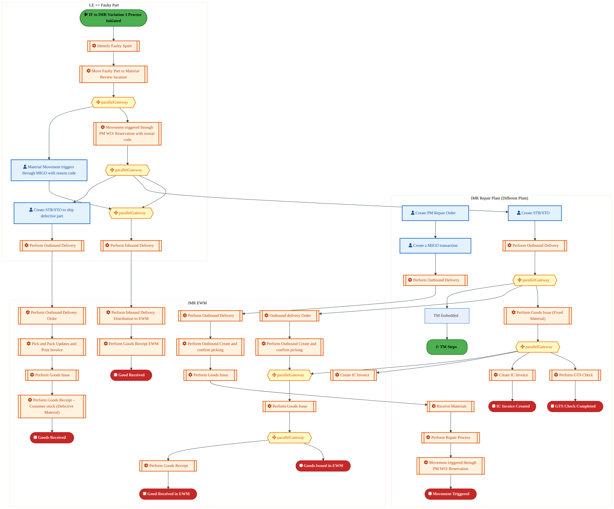
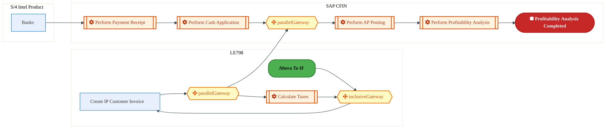
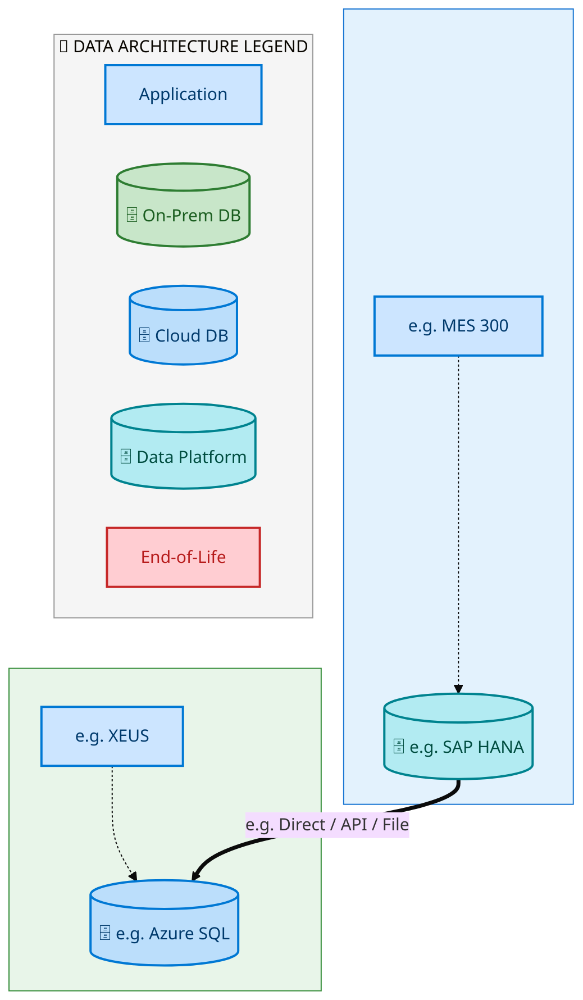
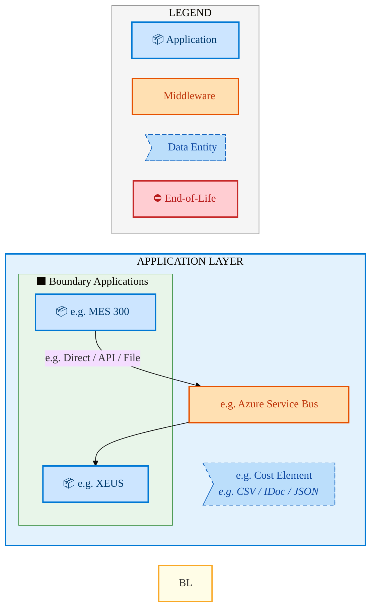
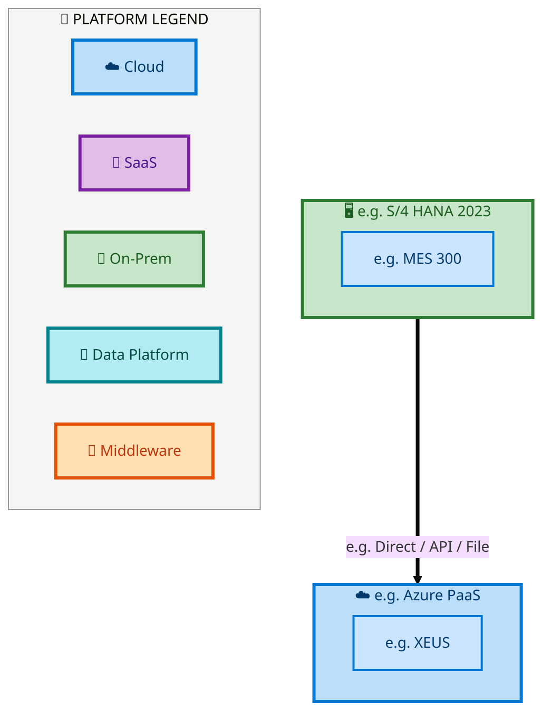

  <img src="data:image/svg+xml;base64,PHN2ZyB4bWxucz0iaHR0cDovL3d3dy53My5vcmcvMjAwMC9zdmciIHZpZXdCb3g9IjAgMCA4MDAgNDgwIiB3aWR0aD0iODAwIiBoZWlnaHQ9IjQ4MCI+DQogIDxkZWZzPg0KICAgIDxsaW5lYXJHcmFkaWVudCBpZD0iYmciIHgxPSIwJSIgeTE9IjAlIiB4Mj0iMTAwJSIgeTI9IjEwMCUiPg0KICAgICAgPHN0b3Agb2Zmc2V0PSIwJSIgc3R5bGU9InN0b3AtY29sb3I6IzAwNzFjNTtzdG9wLW9wYWNpdHk6MSIvPg0KICAgICAgPHN0b3Agb2Zmc2V0PSIxMDAlIiBzdHlsZT0ic3RvcC1jb2xvcjojMDBhZWVmO3N0b3Atb3BhY2l0eToxIi8+DQogICAgPC9saW5lYXJHcmFkaWVudD4NCiAgICA8bGluZWFyR3JhZGllbnQgaWQ9ImFjY2VudCIgeDE9IjAlIiB5MT0iMCUiIHgyPSIwJSIgeTI9IjEwMCUiPg0KICAgICAgPHN0b3Agb2Zmc2V0PSIwJSIgc3R5bGU9InN0b3AtY29sb3I6I2ZmZmZmZjtzdG9wLW9wYWNpdHk6MC4xNSIvPg0KICAgICAgPHN0b3Agb2Zmc2V0PSIxMDAlIiBzdHlsZT0ic3RvcC1jb2xvcjojZmZmZmZmO3N0b3Atb3BhY2l0eTowLjAyIi8+DQogICAgPC9saW5lYXJHcmFkaWVudD4NCiAgICA8cGF0dGVybiBpZD0iZ3JpZCIgd2lkdGg9IjQwIiBoZWlnaHQ9IjQwIiBwYXR0ZXJuVW5pdHM9InVzZXJTcGFjZU9uVXNlIj4NCiAgICAgIDxwYXRoIGQ9Ik0gNDAgMCBMIDAgMCAwIDQwIiBmaWxsPSJub25lIiBzdHJva2U9InJnYmEoMjU1LDI1NSwyNTUsMC4wNykiIHN0cm9rZS13aWR0aD0iMC41Ii8+DQogICAgPC9wYXR0ZXJuPg0KICA8L2RlZnM+DQoNCiAgPCEtLSBCYWNrZ3JvdW5kIC0tPg0KICA8cmVjdCB3aWR0aD0iODAwIiBoZWlnaHQ9IjQ4MCIgZmlsbD0idXJsKCNiZykiIHJ4PSI4Ii8+DQogIDxyZWN0IHdpZHRoPSI4MDAiIGhlaWdodD0iNDgwIiBmaWxsPSJ1cmwoI2dyaWQpIiByeD0iOCIvPg0KICA8cmVjdCB3aWR0aD0iODAwIiBoZWlnaHQ9IjQ4MCIgZmlsbD0idXJsKCNhY2NlbnQpIiByeD0iOCIvPg0KDQogIDwhLS0gRGVjb3JhdGl2ZSBjaXJjdWl0L2FyY2hpdGVjdHVyZSBsaW5lcyAtLT4NCiAgPGcgc3Ryb2tlPSJyZ2JhKDI1NSwyNTUsMjU1LDAuMTIpIiBzdHJva2Utd2lkdGg9IjEuNSIgZmlsbD0ibm9uZSI+DQogICAgPHBhdGggZD0iTSAwIDEwMCBMIDEyMCAxMDAgTCAxNjAgMTQwIEwgMjgwIDE0MCIvPg0KICAgIDxwYXRoIGQ9Ik0gMCAyNjAgTCA4MCAyNjAgTCAxMjAgMjIwIEwgMjAwIDIyMCBMIDI0MCAyNjAgTCAzNjAgMjYwIi8+DQogICAgPHBhdGggZD0iTSA1MjAgMTAwIEwgNjAwIDEwMCBMIDY0MCA2MCBMIDgwMCA2MCIvPg0KICAgIDxwYXRoIGQ9Ik0gNDQwIDM0MCBMIDU2MCAzNDAgTCA2MDAgMzAwIEwgNzIwIDMwMCBMIDc2MCAzNDAgTCA4MDAgMzQwIi8+DQogICAgPHBhdGggZD0iTSA2MDAgNDAwIEwgNjgwIDQwMCBMIDcyMCA0NDAiLz4NCiAgICA8cGF0aCBkPSJNIDAgNDAwIEwgNDAgNDAwIEwgODAgMzYwIi8+DQogICAgPHBhdGggZD0iTSAyMDAgNDIwIEwgMzIwIDQyMCBMIDM2MCAzODAgTCA0ODAgMzgwIi8+DQogICAgPHBhdGggZD0iTSA2NTAgNDQwIEwgNzUwIDQ0MCBMIDgwMCA0ODAiLz4NCiAgPC9nPg0KDQogIDwhLS0gRGVjb3JhdGl2ZSBub2RlcyAtLT4NCiAgPGcgZmlsbD0icmdiYSgyNTUsMjU1LDI1NSwwLjE4KSI+DQogICAgPGNpcmNsZSBjeD0iMTIwIiBjeT0iMTAwIiByPSI0Ii8+DQogICAgPGNpcmNsZSBjeD0iMjgwIiBjeT0iMTQwIiByPSI0Ii8+DQogICAgPGNpcmNsZSBjeD0iMjAwIiBjeT0iMjIwIiByPSI0Ii8+DQogICAgPGNpcmNsZSBjeD0iMzYwIiBjeT0iMjYwIiByPSI0Ii8+DQogICAgPGNpcmNsZSBjeD0iNjAwIiBjeT0iMTAwIiByPSI0Ii8+DQogICAgPGNpcmNsZSBjeD0iNzIwIiBjeT0iMzAwIiByPSI0Ii8+DQogICAgPGNpcmNsZSBjeD0iNTYwIiBjeT0iMzQwIiByPSI0Ii8+DQogICAgPGNpcmNsZSBjeD0iODAiIGN5PSIzNjAiIHI9IjQiLz4NCiAgICA8Y2lyY2xlIGN4PSI0ODAiIGN5PSIzODAiIHI9IjQiLz4NCiAgICA8Y2lyY2xlIGN4PSIzMjAiIGN5PSI0MjAiIHI9IjQiLz4NCiAgPC9nPg0KDQogIDwhLS0gVE9HQUYgQkRBVCBib3hlcyAtLT4NCiAgPGcgZm9udC1mYW1pbHk9IlNlZ29lIFVJLCBBcmlhbCwgc2Fucy1zZXJpZiIgZm9udC1zaXplPSIxNCIgZm9udC13ZWlnaHQ9IjYwMCI+DQogICAgPCEtLSBCIC0tPg0KICAgIDxyZWN0IHg9IjE1MCIgeT0iMTQwIiB3aWR0aD0iMTIwIiBoZWlnaHQ9IjQwIiByeD0iNSIgZmlsbD0icmdiYSgyNTUsMjU1LDI1NSwwLjE4KSIgc3Ryb2tlPSJyZ2JhKDI1NSwyNTUsMjU1LDAuMykiIHN0cm9rZS13aWR0aD0iMSIvPg0KICAgIDx0ZXh0IHg9IjIxMCIgeT0iMTY1IiB0ZXh0LWFuY2hvcj0ibWlkZGxlIiBmaWxsPSIjZmZmIj5CdXNpbmVzczwvdGV4dD4NCiAgICA8IS0tIEQgLS0+DQogICAgPHJlY3QgeD0iMjkwIiB5PSIxNDAiIHdpZHRoPSIxMjAiIGhlaWdodD0iNDAiIHJ4PSI1IiBmaWxsPSJyZ2JhKDI1NSwyNTUsMjU1LDAuMTgpIiBzdHJva2U9InJnYmEoMjU1LDI1NSwyNTUsMC4zKSIgc3Ryb2tlLXdpZHRoPSIxIi8+DQogICAgPHRleHQgeD0iMzUwIiB5PSIxNjUiIHRleHQtYW5jaG9yPSJtaWRkbGUiIGZpbGw9IiNmZmYiPkRhdGE8L3RleHQ+DQogICAgPCEtLSBBIC0tPg0KICAgIDxyZWN0IHg9IjQzMCIgeT0iMTQwIiB3aWR0aD0iMTIwIiBoZWlnaHQ9IjQwIiByeD0iNSIgZmlsbD0icmdiYSgyNTUsMjU1LDI1NSwwLjE4KSIgc3Ryb2tlPSJyZ2JhKDI1NSwyNTUsMjU1LDAuMykiIHN0cm9rZS13aWR0aD0iMSIvPg0KICAgIDx0ZXh0IHg9IjQ5MCIgeT0iMTY1IiB0ZXh0LWFuY2hvcj0ibWlkZGxlIiBmaWxsPSIjZmZmIj5BcHBsaWNhdGlvbjwvdGV4dD4NCiAgICA8IS0tIFQgLS0+DQogICAgPHJlY3QgeD0iNTcwIiB5PSIxNDAiIHdpZHRoPSIxMjAiIGhlaWdodD0iNDAiIHJ4PSI1IiBmaWxsPSJyZ2JhKDI1NSwyNTUsMjU1LDAuMTgpIiBzdHJva2U9InJnYmEoMjU1LDI1NSwyNTUsMC4zKSIgc3Ryb2tlLXdpZHRoPSIxIi8+DQogICAgPHRleHQgeD0iNjMwIiB5PSIxNjUiIHRleHQtYW5jaG9yPSJtaWRkbGUiIGZpbGw9IiNmZmYiPlRlY2hub2xvZ3k8L3RleHQ+DQogIDwvZz4NCg0KICA8IS0tIENvbm5lY3RpbmcgbGluZXMgYmV0d2VlbiBCREFUIGJveGVzIC0tPg0KICA8ZyBzdHJva2U9InJnYmEoMjU1LDI1NSwyNTUsMC4yNSkiIHN0cm9rZS13aWR0aD0iMSI+DQogICAgPGxpbmUgeDE9IjI3MCIgeTE9IjE2MCIgeDI9IjI5MCIgeTI9IjE2MCIvPg0KICAgIDxsaW5lIHgxPSI0MTAiIHkxPSIxNjAiIHgyPSI0MzAiIHkyPSIxNjAiLz4NCiAgICA8bGluZSB4MT0iNTUwIiB5MT0iMTYwIiB4Mj0iNTcwIiB5Mj0iMTYwIi8+DQogIDwvZz4NCg0KICA8IS0tIE1haW4gdGl0bGUgLS0+DQogIDx0ZXh0IHg9IjQwMCIgeT0iMjYwIiB0ZXh0LWFuY2hvcj0ibWlkZGxlIiBmb250LWZhbWlseT0iU2Vnb2UgVUksIEFyaWFsLCBzYW5zLXNlcmlmIiBmb250LXNpemU9IjM2IiBmb250LXdlaWdodD0iNzAwIiBmaWxsPSIjZmZmZmZmIiBsZXR0ZXItc3BhY2luZz0iMSI+DQogICAgSUFPIEFyY2hpdGVjdHVyZQ0KICA8L3RleHQ+DQogIDx0ZXh0IHg9IjQwMCIgeT0iMzAwIiB0ZXh0LWFuY2hvcj0ibWlkZGxlIiBmb250LWZhbWlseT0iU2Vnb2UgVUksIEFyaWFsLCBzYW5zLXNlcmlmIiBmb250LXNpemU9IjE4IiBmb250LXdlaWdodD0iNDAwIiBmaWxsPSJyZ2JhKDI1NSwyNTUsMjU1LDAuOCkiIGxldHRlci1zcGFjaW5nPSIyIj4NCiAgICBUT0dBRiBCREFUIMK3IElBTyBQcm9ncmFtIMK3IElETSAyLjANCiAgPC90ZXh0Pg0KDQogIDwhLS0gQm90dG9tIGFjY2VudCBiYXIgLS0+DQogIDxyZWN0IHg9IjI4MCIgeT0iMzQwIiB3aWR0aD0iMjQwIiBoZWlnaHQ9IjMiIHJ4PSIxLjUiIGZpbGw9InJnYmEoMjU1LDI1NSwyNTUsMC40KSIvPg0KDQogIDwhLS0gSW50ZWwgdGV4dCAtLT4NCiAgPHRleHQgeD0iNDAwIiB5PSIzODAiIHRleHQtYW5jaG9yPSJtaWRkbGUiIGZvbnQtZmFtaWx5PSJTZWdvZSBVSSwgQXJpYWwsIHNhbnMtc2VyaWYiIGZvbnQtc2l6ZT0iMTMiIGZpbGw9InJnYmEoMjU1LDI1NSwyNTUsMC41KSIgbGV0dGVyLXNwYWNpbmc9IjMiPg0KICAgIElOVEVMIENPTkZJREVOVElBTA0KICA8L3RleHQ+DQo8L3N2Zz4NCg==" alt="IAO Architecture" style="width:100%; border-radius:8px;" />
  <h1 style="font-size:36px; margin-top:24px;">E2E-110 — IMR Flow</h1>
  <h2 style="font-size:24px;">Architecture Document (TOGAF BDAT)</h2>
  
End-to-End Integrated Processes (E2E) Tower 
  Capability E2E-110 · Forecast to Stock

  
IAO Program · R1 – R5 
  Generated: April 2026 
  Sajiv Francis

  
IAO Architecture Pipeline — Intel Confidential

Page 1<a href="#toc">↑ Back to TOC</a>E2E-110 — IMR Flow

## Table of Contents

<nav class="toc">
<ol>
  <li><a href="#1-executive-summary">1. Executive Summary</a></li>
  <li><a href="#2-business-context-objectives">2. Business Context &amp; Objectives</a>
    <ul>
      <li><a href="#21-classification">2.1 Classification</a></li>
      <li><a href="#22-business-drivers">2.2 Business Drivers</a></li>
      <li><a href="#23-success-criteria">2.3 Success Criteria</a></li>
      <li><a href="#24-companion-documents">2.4 Companion Documents</a></li>
    </ul>
  </li>
  <li><a href="#3-business-architecture-togaf-b">3. Business Architecture (TOGAF &ldquo;B&rdquo;)</a>
    <ul>
      <li><a href="#31-business-process-overview">3.1 Business Process Overview</a></li>
      <li><a href="#32-business-process-diagrams">3.2 Business Process Diagrams</a></li>
      <li><a href="#33-business-roles-responsibilities">3.3 Business Roles &amp; Responsibilities</a></li>
    </ul>
  </li>
  <li><a href="#4-data-architecture-togaf-d">4. Data Architecture (TOGAF &ldquo;D&rdquo;)</a>
    <ul>
      <li><a href="#41-data-entities-ownership">4.1 Data Entities &amp; Ownership</a></li>
      <li><a href="#42-data-flow-diagrams">4.2 Data Flow Diagrams</a></li>
      <li><a href="#43-data-lineage">4.3 Data Lineage</a></li>
      <li><a href="#44-ricefw-data-objects">4.4 RICEFW Data Objects</a></li>
      <li><a href="#45-data-governance-quality">4.5 Data Governance &amp; Quality</a></li>
    </ul>
  </li>
  <li><a href="#5-application-architecture-togaf-a">5. Application Architecture (TOGAF &ldquo;A&rdquo;)</a>
    <ul>
      <li><a href="#51-current-state-current-state-application-landscape">5.1 Current-State Application Landscape</a></li>
      <li><a href="#52-future-state-future-state-application-landscape">5.2 Future-State Application Landscape</a></li>
      <li><a href="#53-change-impact-summary">5.3 Change Impact Summary</a></li>
      <li><a href="#54-component-overview">5.4 Component Overview</a></li>
      <li><a href="#55-ricefw-inventory">5.5 RICEFW Inventory</a></li>
      <li><a href="#56-integration-patterns">5.6 Integration Patterns</a></li>
    </ul>
  </li>
  <li><a href="#6-technology-architecture-togaf-t">6. Technology Architecture (TOGAF &ldquo;T&rdquo;)</a>
    <ul>
      <li><a href="#61-platform-infrastructure">6.1 Platform &amp; Infrastructure</a></li>
      <li><a href="#62-sap-development-object-status">6.2 SAP Development Object Status</a></li>
      <li><a href="#63-nfrs-design-principles">6.3 NFRs &amp; Design Principles</a></li>
      <li><a href="#64-security-governance">6.4 Security &amp; Governance</a></li>
    </ul>
  </li>
  <li><a href="#7-project-context">7. Project Context</a>
    <ul>
      <li><a href="#71-project-roadmap-go-live-plan">7.1 Project Roadmap &amp; Go-Live Plan</a></li>
      <li><a href="#72-raid-log">7.2 RAID Log</a></li>
      <li><a href="#73-recommendations-next-steps">7.3 Recommendations &amp; Next Steps</a></li>
    </ul>
  </li>
</ol>
</nav>

Page 2<a href="#toc">↑ Back to TOC</a>E2E-110 — IMR Flow

## 1. Executive Summary

This Architecture Document defines the **Business, Data, Application, and Technology** (BDAT) architecture for **E2E-110 IMR Flow** within the IAO program. It includes 10 BPMN process diagram(s) in Section 3.

| Dimension | Value |
|-----------|-------|
| **Tower** | End-to-End Integrated Processes (E2E) |
| **Process Group** | Forecast to Stock |
| **Capability** | E2E-110 - IMR Flow |
| **Release** | R1 – R5 |
| **Total Systems** | 2 |
| **System Status** | 0 Deployed, 0 Developing, 0 EOL, 2 Pending IAPM |
| **RICEFW Objects** | Pending — Smartsheet Object Tracker API integration |

**Change Summary**: 0 new flow chains, 0 removed, 0 modified, 1 unchanged between Current-State and Future-State states.

> All system nodes in architecture diagrams are **IAPM-linked** — click any node to open its IAPM page. Diagrams require `securityLevel: 'loose'` for click events.

Page 3<a href="#toc">↑ Back to TOC</a>E2E-110 — IMR Flow

## 2. Business Context & Objectives

### 2.1 Classification

| Level | Value |
|-------|-------|
| **L0 Tower** | End-to-End Integrated Processes |
| **L1 Process** | Forecast to Stock |
| **L2 Capability** | E2E-110 - IMR Flow |

### 2.2 Business Drivers

| # | Driver | Description | Strategic Alignment | Priority |
|---|--------|-------------|---------------------|----------|
| 1 | End-to-End Process Integration | Enable cross-tower integrated processes spanning procurement, manufacturing, and fulfillment | IDM 2.0 Process Excellence | High |
| 2 | Intel Foundry Business Enablement | Stand up foundry-specific business processes for external customer engagement | Intel Foundry Services | High |
| 3 | Process Visibility & Monitoring | Provide end-to-end process visibility across tower boundaries with integrated monitoring | Operational Excellence | Medium |
| 4 | E2E-110 Process Migration | Migrate IMR Flow business processes and 2 integrated systems from legacy to S/4 HANA target architecture | IDM 2.0 Cross-Functional / End-to-End | High |

Page 4<a href="#toc">↑ Back to TOC</a>E2E-110 — IMR Flow

### 2.3 Success Criteria

| Metric | Target | Measure | Baseline | Owner |
|--------|--------|---------|----------|-------|
| E2E Process Cycle Time | Per process SLA | End-to-end transaction completion within defined SLA per process | Varies by process | E2E Process Owner |
| Cross-Tower Integration Success | > 99% | Transactions completing across tower boundaries without manual intervention | 92% (current) | Integration Lead |
| Process Exception Rate | < 2% | Transactions requiring manual exception handling | 8% (current) | Operations Manager |
| E2E-110 Migration Completeness | 100% flow chains validated | All 1 flow chains verified in target state | 0% (pre-migration) | Tower Architect |

### 2.4 Companion Documents

| Document | Description |
|----------|-------------|
| **Business Architecture** | Included in this document (Section 3) — process flows from BPMN diagrams |
| **This Document** | Full BDAT Architecture — Business + Data + Application + Technology |

Page 5<a href="#toc">↑ Back to TOC</a>E2E-110 — IMR Flow

## 3. Business Architecture (TOGAF "B")

### 3.1 Business Process Overview

This capability includes **10 business process(es)** modeled in BPMN 2.0, covering the end-to-end workflow for E2E-110 IMR Flow.

| # | Step ID | Process Name | Lanes | Tasks | Gateways |
|---|---------|--------------|-------|-------|----------|
| 1 | E2E-110A_IF_to_IMR_-_Variation_1_–_IMR_facility_is_within_the_plant | E2E-110A_IF_to_IMR_-_Variation_1_–_IMR_facility_is_within_the_plant | 

 LE ++ Faulty Part, EWM, IMR Repair Plant  | 20 | 3 |

| 2 | E2E-110B__IF_to_IMR_-_Variation_2_–_IMR_facility_is_within_the_same_LE_but_different_plant | E2E-110B__IF_to_IMR_-_Variation_2_–_IMR_facility_is_within_the_same_LE_but_different_plant | IMR EWM, IMR Repair Plant  (Different Plant), LE ++ Faulty Part | 32 | 5 |
| 3 | E2E-110C__IF_to_IMR_-_Variation_3_–_IMR_facility_is_in_different_LE_–_with_STO | E2E-110C__IF_to_IMR_-_Variation_3_–_IMR_facility_is_in_different_LE_–_with_STO | IMR EWM, IMR Repair Plant  (Different Plant), LE ++ Faulty Part | 33 | 7 |
| 4 | E2E-110D__IP_to_IMR | E2E-110D__IP_to_IMR | IF EWM (101), IMR EWM, IMR Legal Entity (LE101), IMR Malaysia, Intel Product (Faulty Part), LE 798 | 55 | 15 |
| 5 | E2E-110E__IP_to_IMR_cash_settlement | E2E-110E__IP_to_IMR_cash_settlement | Boundary Apps Intel Foundry, S/4 Intel Product , SAP CFIN

Intel Foundry AR, SAP CFIN
Intel Product AP , SAP S/4
Intel Foundry (LE798) | 10 | 2 |

| 6 | E2E-110F__IP_to_IMR_in_house_settlement | E2E-110F__IP_to_IMR_in_house_settlement | Inhouse Bank , Intel Foundry LE798, S/4 Intel Product , SAP CFIN

Intel Foundry AR, SAP CFIN
Intel Product AP  | 10 | 4 |

| 7 | E2E-110G__Altera_to_IF | E2E-110G__Altera_to_IF | Boundary Apps, Customer, IF EWM (101), IMR EWM, IMR LE Malaysia, IMR Legal Entity (LE101), LE798 | 45 | 14 |
| 8 | E2E-110H__Altera_to_IMR_cash_settlement | E2E-110H__Altera_to_IMR_cash_settlement | LE798, S/4 Intel Product , SAP CFIN
 | 7 | 3 |
| 9 | E2E-110I__IMR_Manufacturing | E2E-110I__IMR_Manufacturing | SAP S/4 Intel Foundry

IMR Legal Entity | 13 | 3 |

| 10 | E2E-110J__TM_Steps | E2E-110J__TM_Steps | External Partners B2B, SAP S/4 Intel Foundry

IMR Legal Entity | 10 | 1 |

Page 6<a href="#toc">↑ Back to TOC</a>E2E-110 — IMR Flow

### 3.2 Business Process Diagrams

#### BUSINESS ARCHITECTURE — 3.2.1 E2E-110A_IF_to_IMR_-_Variation_1_–_IMR_facility_is_within_the_plant — E2E-110A_IF_to_IMR_-_Variation_1_–_IMR_facility_is_within_the_plant

**Swim Lanes**: 
 LE ++ Faulty Part · EWM · IMR Repair Plant  | **Tasks**: 20 | **Gateways**: 3

```mermaid
%%{init: {'theme': 'base', 'themeVariables': {'fontSize': '14px', 'fontFamily': 'Segoe UI, Arial, sans-serif','primaryColor': '#e8f0fe', 'primaryBorderColor': '#0071c5','lineColor': '#37474F', 'secondaryColor': '#f5f8fc'}, 'flowchart': {'useMaxWidth': false, 'htmlLabels': true, 'curve': 'basis', 'nodeSpacing': 40, 'rankSpacing': 50}} }%%
flowchart LR
    classDef startEvt fill:#4CAF50,stroke:#2E7D32,color:#000,font-weight:bold,stroke-width:2px,rx:20,ry:20
    classDef endEvt fill:#C62828,stroke:#B71C1C,color:#fff,font-weight:bold,stroke-width:2px,rx:20,ry:20
    classDef userTask fill:#E3F2FD,stroke:#1565C0,stroke-width:2px,color:#0D47A1
    classDef serviceTask fill:#FFF3E0,stroke:#E65100,stroke-width:2px,color:#BF360C
    classDef gateway fill:#FFF9C4,stroke:#F57F17,stroke-width:2px,color:#E65100
    classDef subProc fill:#F3E5F5,stroke:#7B1FA2,stroke-width:2px,color:#4A148C
    subgraph lane_0["  LE ++ Faulty Part"]
        n3["fa:fa-user Material Movement triggers through MIGO with reason code"]
        n17[["fa:fa-cog Identify Faulty Spare"]]
        n18[["fa:fa-cog Perform Inbound Delivery"]]
        n19[["fa:fa-cog Move Faulty Part to Material Review location"]]
        n20[["fa:fa-cog Movement triggered through PM WO/ Reservation with reason code"]]
        n21(["fa:fa-play IF to IMR Variation 1 process initiated"])
        n26{{"fa:fa-arrows-alt parallelGateway"}}
        n27{{"fa:fa-arrows-alt parallelGateway"}}
    end
    subgraph lane_1["EWM"]
        n10[["fa:fa-cog Distribute Inbound Delivery Distribution to EWM"]]
        n11[["fa:fa-cog Perform Goods Receipt EWM"]]
        n12[["fa:fa-cog Perform Outbound Delivery Order"]]
        n13[["fa:fa-cog Perform Outbound Create and Confirm Picking"]]
        n14[["fa:fa-cog Perform Goods Issue"]]
        n15[["fa:fa-cog Perform Inbound Delivery distribution to EWM"]]
        n16[["fa:fa-cog Perform Goods Receipt EWM"]]
        n23(["fa:fa-stop Good Received in EWM"])
        n24(["fa:fa-stop Good Received in EWM"])
    end
    subgraph lane_2["IMR Repair Plant "]
        n1["fa:fa-user Create Repair Order"]
        n2["fa:fa-user Repair order reservation for damaged part and components with reason code"]
        n4[["fa:fa-cog Receive Material"]]
        n5[["fa:fa-cog Perform Repair through PM Repair Order"]]
        n6[["fa:fa-cog Movement triggered through PM WO/ Reservation"]]
        n7[["fa:fa-cog Perform Inbound Delivery"]]
        n8[["fa:fa-cog Settle Costs to Cost Centre"]]
        n9[["fa:fa-cog Perform Outbound Delivery"]]
        n22(["fa:fa-stop Cost Settled against Cost Centre"])
        n25{{"fa:fa-arrows-alt parallelGateway"}}
    end
    n17 --> n19
    n26 --> n20
    n26 --> n3
    n19 --> n26
    n20 --> n27
    n3 --> n27
    n27 --> n18
    n10 --> n11
    n12 --> n13
    n13 --> n14
    n4 --> n5
    n5 --> n6
    n6 --> n7
    n15 --> n16
    n25 --> n8
    n25 --> n15
    n21 --> n17
    n1 --> n2
    n2 --> n9
    n9 --> n12
    n16 --> n23
    n18 --> n10
    n11 --> n24
    n14 --> n4
    n8 --> n22
    n7 --> n25
    class n1 userTask
    class n2 userTask
    class n3 userTask
    class n4 serviceTask
    class n5 serviceTask
    class n6 serviceTask
    class n7 serviceTask
    class n8 serviceTask
    class n9 serviceTask
    class n10 serviceTask
    class n11 serviceTask
    class n12 serviceTask
    class n13 serviceTask
    class n14 serviceTask
    class n15 serviceTask
    class n16 serviceTask
    class n17 serviceTask
    class n18 serviceTask
    class n19 serviceTask
    class n20 serviceTask
    class n21 startEvt
    class n22 endEvt
    class n23 endEvt
    class n24 endEvt
    class n25 gateway
    class n26 gateway
    class n27 gateway
```

> **Legend**: ● Start · ● End · User Task · Service Task · ◇ Gateway · Sub-Process

<a href="https://mermaid.live/view#pako:eNqlV11v6jgQ_StWrip2dUEb54NQHlZqgVwhFbVqd_c-3K5WJnHAaogj20DZiv--Y7ADScneLx6q-szMmZnjsZO8OQlPqTN0rq7eWMHUEL111JKuaGeIOnMiaaeLjsBfRDAyz6nsaJ-MF-qJ_Xtww0H5qt00FpMVy3cafaILTtGf0y66gcC8iyQpZE9SwbJOt1MKtiJiN-I5F9r7Ax1kbnbIZky3XKRUnBxcN8JJCKE5K-gJ9qMgCmIdJ2nCi7RGmoXZIEs6e11czrfJkgh1KH8t6Yy8fmapWsI6I7mk4LNUq_yOzGmue1RirbFkLTZWDCZ1ngIEeypJwooF4IELkCDFywkK3f0e7a-unosqKbp7fC4Q_JKcSDmmGZIK4MlGoYzl-fBDMLqJQ7crleAvdPjBm0Rj3-smupMhtO52tbi9LWWLpRrOeZ4a195W9zD0yteueB16blfs4G8jFy3SU6ZR3xt4gyrTbYRHeGQzZVn2U5lAV_EHkS8m18SPvXhc5cJhPxy57_lsm-MgusFNnajYsISekcZx7E9OUk36IXbbSW9jv--OGqQLouiW7E6E16OgIozDKMZRK-ExX7PK9fxB8MQS-pMwDivC6BbHN14rYXCDg4GpEHgWgpRLlJOC_uN-eXYQupugjx9RTNa52qEHmJpn5--jt_4VPjhlZJiRnhYfzaA1fd7QjG_g1BYKBpktFlRIpJaCrxdLNJt-ukdbppZIUCJ5gfQVUCfF0ZeKNuELNE2BiWU7WwYMu9AhtZhBPeaBioyLFZoWc74uUjSmOdtQsWuGXdfDdN3n3SLFT0090g2jW5TzhCjGiwaV576nOpeAppUGDzP0-f434NPzdeC6pEiNHP9SkZc5DM801qVNZ4_ocDUeODAqYQyolEhfpgDSFGh-Pafpv71ZGiIE38oeyRUCPUme0_zTcTKfnf3-PCj6viA48JfmCUMDk8-zxlY3RBszGFQ2Xyv6budONt0rNH8kq7Hhy0PwifNUgtwJZaW6FOddjrtfq0YN9_qx0Iz2vxI9gn2Fhoj-lxcZA9sDS17gvm4yBf9X_1TK9buxD79t7FH6dfH6Pyae559GUypeHgKO_huYeVaYmNocBt8V0zJRHnDoE_BIS8IEegBQocZ81e8nsxMmwG7meWF1f-N4eBmA03k6rqAMSsmKLKDaUt8TenMTvip5AUdefuWCa2yz6bu6aBoCt2yxqe3sTmm0dc7R_4m7qUEV_dBF27ien6hSOYXjIEEsGEf9DxpBRe8u9utvPJrNqfQaE3bIcEybIrIgrNAZa2lrExr-4KUHTy_U6_2uHy0G8PpHwL6vVIBvI66NQ986uAaIDOA31p7NMbAUJgJjC3gGqJIYDhwYIDiuQ7MMj0tbginRJsTGjKsSDTBorLHl87ABKgrTg7Ufl1YkIwG2ZmxFq-ofGA-rIraEtiFsOrJrE-BZSqOZF569Pumy7GtjDfYuw_5lODh_U6xZwlZLv9UStVoGrZbrVguMRqsJt5u8dpPfbmoXArcrgdulwO1a4HYxcLsaXrsaMLH2u6iOe-Ybpo76F9HgIhral_463L8MRxZ2us6KihVhqTN8cw4fwvCxnNJMv6A6-65D1oo_7YrEGR4-GJ11mULkmBF4Sq6O4P4_g5vUEA==" title="View full diagram">&#128065; View Diagram</a>

Page 7<a href="#toc">↑ Back to TOC</a>E2E-110 — IMR Flow

#### BUSINESS ARCHITECTURE — 3.2.2 E2E-110B__IF_to_IMR_-_Variation_2_–_IMR_facility_is_within_the_same_LE_but_different_plant — E2E-110B__IF_to_IMR_-_Variation_2_–_IMR_facility_is_within_the_same_LE_but_different_plant

**Swim Lanes**: IMR EWM · IMR Repair Plant  (Different Plant) · LE ++ Faulty Part | **Tasks**: 32 | **Gateways**: 5

> **Legend**: ● Start · ● End · User Task · Service Task · ◇ Gateway · Sub-Process

<a href="https://mermaid.live/view#pako:eNqtWF1v4jgU_SsWo4oZDWhjOyHAw0otkBHSVK3azs7DdLUyiQNWQxI5CS1b8d_3BuxA0nim7WwfKnLu9_G9tpPnjp8EvDPunJ09i1jkY_TczVd8zbtj1F2wjHd76AD8xaRgi4hn3VInTOL8Vvy7V8N2-lSqlZjH1iLalugtXyYcfZv30DkYRj2UsTjrZ1yKsNvrplKsmdxOkiiRpfYHPgytcB9NiS4SGXB5VLAsF_sOmEYi5keYurZre6Vdxv0kDmpOQycchn53VyYXJY_-isl8n36R8Uv29F0E-QqeQxZlHHRW-Tr6yhY8KmvMZVFifiE3mgyRlXFiIOw2Zb6Il4DbFkCSxQ9HyLF2O7Q7O7uPq6Do6819jODPj1iWTXmIshzg2SZHoYii8Qd7cu45Vi_LZfLAxx_IzJ1S0vPLSsZQutUrye0_crFc5eNFEgVKtf9Y1jAm6VNPPo2J1ZNb-N-IxePgGGkyIEMyrCJduHiCJzpSGIa_FQl4lXcse1CxZtQj3rSKhZ2BM7Fe-tNlTm33HDd54nIjfH7i1PM8OjtSNRs42DI7vfDowJo0nC5Zzh_Z9uhwNLErh57jetg1OjzEa2ZZLK5l4muHdOZ4TuXQvcDeOTE6tM-xPVQZgp-lZOkKRSzm_1g_7jvzyxs0-3553_n7oFH-xdj6AaKQjUPW95MluuYyTOQaXRX5IiniAE0khxIRg58wFKEAWSr8B-hPcFTzhNs9fUmSIEPzLCt404LULaqYAY_EhsstuioHt2lF_7eM7Tdn7PzM4ob7XKQ5ui-IhSmaFFmerLmEAU38B_QRVpf7ORSGLiG_cif71HQ_-EVpU0VM086t2-0TgTjzi-n7cxm-mZxRu8U8riePpgIaWCyKXCQxyhPVlKeuiPUanlvs8CsJbO0s0ujHa-iafRtdM_jxLQ2AquwASBHnUNgmgQ2l6YW-lThiv6Lahg11PlY2sKbpqfKGB6D96VR70KJdKSMRKy5rNu7PbBrKtvX8fCwh4P0FHGT-CvEnPyoyMPhy2CfvO7vdwQxOkraNCquN6oanTEh0DWCOoF9FGHLJ4fce-VTfxEiVaHlq6A1AudArfVpaqz5Dl_MvV3Baw-2C-WVzNqI475tOMmifTj15WVPfbY-jKYHTgWcvjBrjepls4KYFfMGkLZdAXYDylUyK5QpdX6LvV3-Au_JAZKrOmq_GICt-bu9u_ri9u2o2ovU-Vuivjwv00RNPkLhpi6LE4OLuFk1W3H9o6tvHjk4jOLTncE0VZWn12axNwbA5Bdo5miTrNOL5y2EbNUyqtbjTa9GcHvs4PUzK5DHrsyhHKZMsinj02tkpx-DrDH3-jDxWRPkW9i2ZN477eudrZl-0S1Z1y34mHkW-QtAFGWzY5XjXnTa2r3kAjkS41VnAdVY2tzzndUdFw2rwssdPSy3PkqqiG74R_BFFid_W4u5vTEsbG6e-hz-bnjLHbCVSuOPoEzg9rNKpi9E7Z4o2G9wr45X76f6da5890TtI1f4v2hG_rR0PRuQ9RvSdjR_bqN__EzpCP-LDs9t4Vu8A8eDwaOtnJbaJ1icHwNHy0eFZv5bAzUIB2gJbKkLlUrnAVPvUGrYCKFVRtYWrFKqoSgEPNTBUFlUaqm6qC8eqMlxpKAUdU6WtQxClTzRTRCVBdEyiSqfaI9Vk6bxVUiMt1yGrrB0FVEEVE7QKqgvVgLLA2idRPomuA6vCiU6CaJOKCb1CGlCF2dV60Oaia3KqqKoyOmpo6Mp0V-g1p3qJtUuq10dr2BogDcA-ffErG1K_8NZg0g7Tdtg-fcetSRyjZGCUuEbJ0CgZGSUwL0YRNouIWUTNIjMR2MwENlOBzVxgMxnYzAYxs0HMbBAzG8TMBjGzQcxsEDMbxMwGMbNBzGxQMxvUzAY1swE7rf4qVsdtA-6oL1t1dNCKuq3osBUdtaFwMKjPRnUYt8OkHabtsK3hTq8DL_xrJoLO-Lmz__AKH2fh2lFemDq7XocVeXK7jf3OeP-BslPsX3CngsGVcn0Ad_8BZ4HDUg==" title="View full diagram">&#128065; View Diagram</a>

Page 8<a href="#toc">↑ Back to TOC</a>E2E-110 — IMR Flow

#### BUSINESS ARCHITECTURE — 3.2.3 E2E-110C__IF_to_IMR_-_Variation_3_–_IMR_facility_is_in_different_LE_–_with_STO — E2E-110C__IF_to_IMR_-_Variation_3_–_IMR_facility_is_in_different_LE_–_with_STO

**Swim Lanes**: IMR EWM · IMR Repair Plant  (Different Plant) · LE ++ Faulty Part | **Tasks**: 33 | **Gateways**: 7

> **Legend**: ● Start · ● End · User Task · Service Task · ◇ Gateway · Sub-Process

<a href="https://mermaid.live/view#pako:eNqtWFtv4jgU_isWo4oZDdXEdi7Aw0otkIrVoFals_MwXa1M4oDVkKAk0LIV_31PwA7EjWfazvahwp_P9fM5tuPnVpCGvNVvnZ09i0QUffTcLhZ8ydt91J6xnLc76AD8xTLBZjHP26VMlCbFVPy7F8P26qkUKzGfLUW8LdEpn6ccfRt30AUoxh2UsyQ_z3kmonanvcrEkmXbQRqnWSn9gXcjK9p7k1OXaRby7ChgWR4OHFCNRcKPMPVsz_ZLvZwHaRLWjEZO1I2C9q4MLk4fgwXLin3465xP2NN3ERYLGEcszjnILIpl_JXNeFzmWGTrEgvW2UaRIfLSTwKETVcsEMkccNsCKGPJwxFyrN0O7c7O7pPKKbob3icI_oKY5fmQRygvAB5tChSJOO5_sAcXvmN18iJLH3j_Axl5Q0o6QZlJH1K3OiW5549czBdFf5bGoRQ9fyxz6JPVUyd76hOrk23hv-aLJ-HR08AlXdKtPF16eIAHylMURb_lCXjN7lj-IH2NqE_8YeULO64zsF7aU2kObe8C6zzxbCMCfmLU9306OlI1ch1smY1e-tS1BprROSv4I9seDfYGdmXQdzwfe0aDB396lOvZTZYGyiAdOb5TGfQusX9BjAbtC2x3ZYRgZ56x1QLFLOH_WD_uW-PJLRp9n9y3_j5IlH8JJj9gKmL9iJ0H6Rzd8CxKsyW6XhezdJ2EaJBxSBEx-AlNEQmYW4ngAeoTDNUs0WZLV2ka5mic52uua9h1jcpnyGOx4dkWXZeNq2s5_1vE7psj9n6mccsDLlYFul8TC1M0WOdFuuQZNGgaPKCPsLo8KCAxNIH4yp3sk26--4vUhpIYXa_XrDdO6mpoKKB0xGxdiDRBRSrL4dQUsV6TYYMefmXojWtK9CqE9dov4A2DH99WIRCWH4BMJAUktkmhlXUrb65AYr8iW11Hqz9ZbuOBISrqfKzkoRJWp8Y3PATpT6fSbqP0PvgQiURSX1PxGlQq-wad7s90NGHbfX5WwizL0sf8nMUFWrGMxTGPrw5b4H1rtztV8t6mBCdL08aF5cZ1y1dMZOgGwAJBL4ko4hmH33vkk7apgdLdBI2WMx6G-3ROA6sSL48YtXw3E-VC1eeJitOowtBkfHUNpzvcRlhQtlRdy23Umt7dfpneXddFifu-xifafiQXsNpgcl3esMEoduHg4fkLJW13maQbuMQB9bCVzOewCiEqFlm6ni9KFr9ffwFz5VnLJCW1ZrDelyjFv2xt9NEXTxCLaXOlhpPu6m6KBgsePOjy9I193tNaquLpTvGk95WlN6EKBQ3S5SrmxUsVrKkcw5EBvtAgoPBnH0E_TAu-yrVm6L6ntXv_S2uXgX0doc-fkc_WcbGFzT4rtL6ot5Ba2hclmFcVuG_JR1EsELCRwylXfpTUjdKf9WV5KuYLsYI7iDqtVy_C0rpuHEIoItqqPOD-nunV0X3dCa1pNXTeKVllsBUnt3wj-COK06Cp8bD1G03cRGjNOH5nV9vHal7FcIse-2VK5X6__0bc-6ZqWwKyRCGaSpy-p4jt9yg576z8xEPn53_AgsqhTQ9jbGkAkePeYWhTOSZybCt5-wB05RhLBfUdBRcyCSiLWJrAyiSWJrCjbLoScCVApYSnbMoxVQDuSg3lRAooi46MQRkkkgaiwibSAFHEyBCoSoNaMnGloYjDyqO0QBWApQ-qgiDSBK2cSiZIxYTiStkgykuVqMzErqiRKna1onIBKNEBqgFEBYZlsnbFr1qArpYctnVAmZAWqkVWdFVr6miFQ1RYPU3C1cYVOaoyVZQqhMqAItzVAKJ8UlW91apKmzbWuFH87j-Hy6pXzwA1mDbDdjPsNMNuM-ydvhPUZrrGmZ5xBtbDOIXNU8Q8Rc1TtnnKMU-55ikzF9hMBjazQcxsEDMbxMwGMbNBzGwQMxvEzAYxs0HMbBAzG9TMBjWzQc1sUDMbsJOrZ8I67sgnvTrqNqJeI9ptRHtNqG01orgRJc0Rw0Ep39zqsN0MO82w2wx7zXC3Ge4puNVpwTvPkomw1X9u7d-44R0cbpDlVa2167TYukin2yRo9fdvwa31_kVjKBhch5cHcPcfiLMocg==" title="View full diagram">&#128065; View Diagram</a>

Page 9<a href="#toc">↑ Back to TOC</a>E2E-110 — IMR Flow

#### BUSINESS ARCHITECTURE — 3.2.4 E2E-110D__IP_to_IMR — E2E-110D__IP_to_IMR

**Swim Lanes**: IF EWM (101) · IMR EWM · IMR Legal Entity (LE101) · IMR Malaysia · Intel Product (Faulty Part) · LE 798 | **Tasks**: 55 | **Gateways**: 15

```mermaid
%%{init: {'theme': 'base', 'themeVariables': {'fontSize': '14px', 'fontFamily': 'Segoe UI, Arial, sans-serif','primaryColor': '#e8f0fe', 'primaryBorderColor': '#0071c5','lineColor': '#37474F', 'secondaryColor': '#f5f8fc'}, 'flowchart': {'useMaxWidth': false, 'htmlLabels': true, 'curve': 'basis', 'nodeSpacing': 40, 'rankSpacing': 50}} }%%
flowchart LR
    classDef startEvt fill:#4CAF50,stroke:#2E7D32,color:#000,font-weight:bold,stroke-width:2px,rx:20,ry:20
    classDef endEvt fill:#C62828,stroke:#B71C1C,color:#fff,font-weight:bold,stroke-width:2px,rx:20,ry:20
    classDef userTask fill:#E3F2FD,stroke:#1565C0,stroke-width:2px,color:#0D47A1
    classDef serviceTask fill:#FFF3E0,stroke:#E65100,stroke-width:2px,color:#BF360C
    classDef gateway fill:#FFF9C4,stroke:#F57F17,stroke-width:2px,color:#E65100
    classDef subProc fill:#F3E5F5,stroke:#7B1FA2,stroke-width:2px,color:#4A148C
    subgraph lane_0["IF EWM (101)"]
        n8[["fa:fa-cog Perform Inbound Delivery"]]
        n9[["fa:fa-cog Perform Goods Receipt – Customer stock (Defective Material)"]]
        n10[["fa:fa-cog Perform Outbound Delivery Order"]]
        n11[["fa:fa-cog Perform Goods Issue"]]
        n12[["fa:fa-cog Perform Outbound delivery Order"]]
        n13[["fa:fa-cog Perform Outbound Create and confirm picking"]]
        n14[["fa:fa-cog Perform Goods Issue"]]
        n73{{"fa:fa-arrows-alt parallelGateway"}}
    end
    subgraph lane_1["IMR EWM"]
        n37[["fa:fa-cog Perform Inbound Delivery"]]
        n38[["fa:fa-cog Perform Goods Receipt – Customer stock (Defective Material)"]]
        n39[["fa:fa-cog Perform Outbound delivery Order"]]
        n40[["fa:fa-cog Perform Goods Issue"]]
        n41[["fa:fa-cog Perform Outbound delivery Order"]]
        n42[["fa:fa-cog Perform Outbound Create and confirm picking"]]
        n43[["fa:fa-cog Perform Goods Issue"]]
        n63(["fa:fa-stop Goods Issued"])
        n72{{"fa:fa-code-branch exclusiveGateway"}}
        n79{{"fa:fa-arrows-alt parallelGateway"}}
        n80{{"fa:fa-arrows-alt parallelGateway"}}
    end
    subgraph lane_2["IMR Legal Entity (LE101)"]
        n4["fa:fa-user Create Repair (RA) Sales Order"]
        n5["fa:fa-user Create PM Repair Order"]
        n23[["fa:fa-cog Create MIGO transfer"]]
        n24[["fa:fa-cog Perform Outbound Delivery"]]
        n25[["fa:fa-cog Perform Goods Receipt w.r.t PM repair order"]]
        n26[["fa:fa-cog Perform Repair"]]
        n27[["fa:fa-cog Complete Repair"]]
        n28[["fa:fa-cog Perform Inbound Delivery"]]
        n29[["fa:fa-cog Perform Goods Receipt"]]
        n30[["fa:fa-cog Perform Outbound Delivery"]]
        n31[["fa:fa-cog Perform Goods Issue (Fixed Material)"]]
        n32[["fa:fa-cog Perform GTS Check"]]
        n33[["fa:fa-cog Send Invoice to IP"]]
        n59(["fa:fa-stop Goods Received"])
        n60(["fa:fa-stop Invoice sent to IP"])
        n61(["fa:fa-stop GTS check completed"])
        n70{{"fa:fa-code-branch exclusiveGateway"}}
        n75{{"fa:fa-arrows-alt parallelGateway"}}
        n76{{"fa:fa-arrows-alt parallelGateway"}}
        n77{{"fa:fa-arrows-alt parallelGateway"}}
    end
    subgraph lane_3["IMR Malaysia"]
        n1["TM Embedded"]
        n7["fa:fa-user Create PM Repair Order"]
        n44[["fa:fa-cog Create MIGO transfer"]]
        n45[["fa:fa-cog Perform Outbound Delivery"]]
        n46[["fa:fa-cog Perform Goods Receipt"]]
        n47[["fa:fa-cog Perform Repair"]]
        n48[["fa:fa-cog Complete Repair"]]
        n49[["fa:fa-cog Perform Inbound Delivery"]]
        n50[["fa:fa-cog Perform Goods Receipt"]]
        n51[["fa:fa-cog Perform Outbound Delivery"]]
        n52[["fa:fa-cog Perform Goods Issue (Fixed Material)"]]
        n53[["fa:fa-cog Perform GTS Check"]]
        n54[["fa:fa-cog Create IC Invoice Bill To: LE798"]]
        n55[["fa:fa-cog AR Posting and Auto Clearing"]]
        n64(["fa:fa-stop Goods Received"])
        n65(["fa:fa-stop Repair completed"])
        n66(["fa:fa-stop GTS check completed"])
        n67["J: TM Steps"]
        n81{{"fa:fa-arrows-alt parallelGateway"}}
        n82{{"fa:fa-arrows-alt parallelGateway"}}
    end
    subgraph lane_4["Intel Product (Faulty Part)"]
        n2["fa:fa-user Create Sub-Con Purchase Requisition"]
        n3["fa:fa-user Create Sub-Con Purchase Order"]
        n15[["fa:fa-cog Identify Faulty Spare"]]
        n16[["fa:fa-cog Perform Inbound Delivery"]]
        n17[["fa:fa-cog Initiate Repair Process"]]
        n18[["fa:fa-cog Perform Goods Issue (Defective Material)"]]
        n19[["fa:fa-cog Perform GTS Compliance Check"]]
        n20[["fa:fa-cog Create Sub con Supplier Invoice"]]
        n21[["fa:fa-cog Perform Goods Receipt (Repair Material)"]]
        n22[["fa:fa-cog Perform GTS Compliance Check"]]
        n56(["fa:fa-play IP to IF Process Initiated"])
        n57(["fa:fa-stop GTS Check completed"])
        n58(["fa:fa-stop GTS check completed"])
        n68{{"fa:fa-code-branch Issue to LE101 Or LE798 ?"}}
        n69{{"fa:fa-code-branch Repair in LE101/ LE798?"}}
        n74{{"fa:fa-arrows-alt parallelGateway"}}
    end
    subgraph lane_5["LE 798"]
        n6["fa:fa-user Create Repair (RA) Sales Order"]
        n34[["fa:fa-cog Send Customer Invoice to IP"]]
        n35[["fa:fa-cog Calculate Taxes"]]
        n36[["fa:fa-cog AR Posting and Auto Clearing"]]
        n62(["fa:fa-stop AR Posted"])
        n71{{"fa:fa-code-branch exclusiveGateway"}}
        n78{{"fa:fa-arrows-alt parallelGateway"}}
    end
    n15 --> n17
    n2 --> n3
    n8 --> n9
    n10 --> n11
    n23 --> n24
    n25 --> n26
    n56 --> n15
    n17 --> n2
    n3 --> n69
    n74 --> n16
    n74 --> n19
    n16 --> n18
    n20 --> n22
    n18 --> n68
    n12 --> n13
    n13 --> n73
    n21 --> n20
    n4 --> n75
    n75 --> n28
    n5 --> n23
    n24 --> n10
    n28 --> n8
    n29 --> n59
    n9 --> n29
    n26 --> n27
    n27 --> n70
    n75 --> n70
    n70 --> n30
    n30 --> n77
    n31 --> n76
    n76 --> n32
    n76 --> n33
    n73 --> n14
    n76 --> n73
    n14 --> n21
    n11 --> n25
    n39 --> n40
    n44 --> n45
    n46 --> n47
    n7 --> n44
    n50 --> n64
    n47 --> n48
    n51 --> n82
    n52 --> n81
    n81 --> n53
    n81 --> n54
    n68 -->|"LE101 US"| n9
    n37 --> n72
    n72 --> n38
    n68 -->|"LE798 Malaysia"| n72
    n41 --> n42
    n42 --> n80
    n79 --> n49
    n79 --> n7
    n80 --> n43
    n69 --> n74
    n54 --> n55
    n43 --> n63
    n79 --> n51
    n81 --> n80
    n82 --> n52
    n82 --> n1
    n1 --> n67
    n69 -->|"LE101"| n4
    n19 --> n57
    n22 --> n58
    n71 --> n6
    n6 --> n79
    n33 --> n60
    n32 --> n61
    n77 --> n31
    n77 --> n12
    n36 --> n62
    n48 --> n65
    n82 --> n41
    n53 --> n66
    n34 --> n78
    n78 --> n35
    n35 --> n34
    n45 --> n39
    n40 --> n46
    n49 --> n37
    n38 --> n50
    n55 --> n36
    n69 -->|"LE798 Malaysia"| n71
    n78 --> n71
    class n2 userTask
    class n3 userTask
    class n4 userTask
    class n5 userTask
    class n6 userTask
    class n7 userTask
    class n8 serviceTask
    class n9 serviceTask
    class n10 serviceTask
    class n11 serviceTask
    class n12 serviceTask
    class n13 serviceTask
    class n14 serviceTask
    class n15 serviceTask
    class n16 serviceTask
    class n17 serviceTask
    class n18 serviceTask
    class n19 serviceTask
    class n20 serviceTask
    class n21 serviceTask
    class n22 serviceTask
    class n23 serviceTask
    class n24 serviceTask
    class n25 serviceTask
    class n26 serviceTask
    class n27 serviceTask
    class n28 serviceTask
    class n29 serviceTask
    class n30 serviceTask
    class n31 serviceTask
    class n32 serviceTask
    class n33 serviceTask
    class n34 serviceTask
    class n35 serviceTask
    class n36 serviceTask
    class n37 serviceTask
    class n38 serviceTask
    class n39 serviceTask
    class n40 serviceTask
    class n41 serviceTask
    class n42 serviceTask
    class n43 serviceTask
    class n44 serviceTask
    class n45 serviceTask
    class n46 serviceTask
    class n47 serviceTask
    class n48 serviceTask
    class n49 serviceTask
    class n50 serviceTask
    class n51 serviceTask
    class n52 serviceTask
    class n53 serviceTask
    class n54 serviceTask
    class n55 serviceTask
    class n56 startEvt
    class n57 endEvt
    class n58 endEvt
    class n59 endEvt
    class n60 endEvt
    class n61 endEvt
    class n62 endEvt
    class n63 endEvt
    class n64 endEvt
    class n65 endEvt
    class n66 endEvt
    class n67 startEvt
    class n68 gateway
    class n69 gateway
    class n70 gateway
    class n71 gateway
    class n72 gateway
    class n73 gateway
    class n74 gateway
    class n75 gateway
    class n76 gateway
    class n77 gateway
    class n78 gateway
    class n79 gateway
    class n80 gateway
    class n81 gateway
    class n82 gateway
```

> **Legend**: ● Start · ● End · User Task · Service Task · ◇ Gateway · Sub-Process

<a href="https://mermaid.live/view#pako:eNq1Wm1P47gW_itWRyMYqezGb0naD3sFpR11BRpE2bsflquVSR2ISJPeJOXlMvz3aze227o2QzssH2bIk_P6-Jxju_Slk5RT3ul3Pn9-yYqs6YOXg-aOz_hBHxzcsJofdEEL_JtVGbvJeX0gZdKyaCbZ_5ZikMyfpJjERmyW5c8SnfDbkoM_xl1wLBTzLqhZUR_VvMrSg-7BvMpmrHoelHlZSelPPE6DdOlNvTopqymvVgJBEMGECtU8K_gKxhGJyEjq1Twpi-mG0ZSmcZocvMrg8vIxuWNVswx_UfNz9vRnNm3uxHPK8poLmbtmlp-xG57LHJtqIbFkUT1oMrJa-ikEYZM5S7LiVuAkEFDFivsVRIPXV_D6-fN1YZyCs8vrAoifJGd1fcpTUDcCHj40IM3yvP-JDI5HNOjWTVXe8_4nNIxOMeomMpO-SD3oSnKPHnl2e9f0b8p8qkSPHmUOfTR_6lZPfRR0q2fxr-WLF9OVp0GIYhQbTycRHMCB9pSm6U95ErxWV6y-V76GeIRGp8YXpCEdBNv2dJqnJDqGNk-8esgSvmZ0NBrh4YqqYUhh4Dd6MsJhMLCM3rKGP7LnlcHegBiDIxqNYOQ12Pqzo1zcXFRlog3iIR1RYzA6gaNj5DVIjiGJVYTCzm3F5ncgZwX_O_jrujMegeGf5-AQBvDLdec_rZj8KeK_xOuU9VN2lJS34IJXaVnNwLi4KRfFFJzyPHvg1bNQWtfqubW-luW0Bpc84dm8AdcLFEAMBou6KWe8EsVaJvfgUGTKk0ZYBeeCQNnVXyzrMHCb_7ZoNqMC32R329rwreDGdb3gtgb6gb_pm_7wD7QHFReJAiZ-FbMlzcS7eZbciza3LZFdI4_wy4vWYFVVPtZHLG_AnFUsz3n-ta3Q687ra6skethVIlCWyPmlrJHN6sDRXuWB43-0PnDvZ9aLBLuyTOBP-UMfVR8E7xp5iA-NhqB3vi46FbJf1msJrWpJbudHN2JDSu4Af0ryRS3y26qmVq23Wwm2Uyf4kLpFqm7P-C3LwbBosuYZHJ4Nt8ccMTTIzUVTfsnnLKvA4eXxFzBh4lRiFnBNlTpVL861tkMFWQuldM7HX7-JE4E4waRbVYLIO2eerUff02qPv1S_NDLmqo25dNQpCt2W2jRtYWswDMrZPOeGUlt6v10GvWebsWdDsB-P-Me7BjgcZU986h9Lnkb_ejUBgzue3NvyVpVMRJULSh5KcVIBTQnGF5YC7Tm7eUnEw1Y_h4ElrU3XvGiM_Q0NaNsXkScycjGY2vXdGhrBfkOD7jE0onAfpehDJg1Wk-ac5ey5zthmv8v98-ocDGc3fDpdcrQewe7zg5Cd5weh-9U9CXfvMRLtMClIvMukIL29JgUNds-Cwv0Yo-inJwXFu00K6q6H8cD09Im4MoCrsg_OhlEvttWt2ji-BBdl3YgDxvLQcbwQw2CQc3E13zpyhGSnkUMtaVXivukRhjsPnFC20-99INpt0vB5bd1m4D6HEfQhI0IeMcZFw3MgLnHTRdKIKmCLXJxILsQl3TqPIOdQmCxujgZlAS4Wlbjw17JH_rvI6qzJysI6mL9P3zFboFUM46nYDrL0GahgxScQ1dYFKdyrK6E1J8bio6Fs7dwlL7u8rm2t-B399Y5LZO-NHpPFlYmNijvbDQXOdhPsygO6-H8utAXrqvlsbfieE9mh4sAXPkJ7h0_Xumoutiux0S-3-5Em3CyE3Vw0cvTj4M1-pPHuLRy7zwzt0opIlwd4UbvtMAP_svo17Ln1FaNZ0Rr4tVW3tSPyId0ubwVnQ9AO2_Xg9r9oYOI4D5rb8VsHQ2z19IDlySKXjq_YE7cbDIf7bwfIWm2lu30uhPudC-M9F0eMNXB09JucOQpA7TNWj3H72NPigRKHWhy3ACIaUAZRqAAaKhWqbURKQj0rC6H2ERGlENqAiUKbjLVTFRbSNqGKO9QSUOUFdWJQuY00gKCyoT5eLJTXSMcd6cy0Tf1sLOg4tQWkojBh9tpnqhNRz0g_I5UYMquhuIoCK4gVoFLHGsAKiLQNrBKLDJ_KC0Y2oDOJFDmQWBKGLahyRboQoKZP04VVcsTwqVSIliDKKNGRqmSJ9kpVKqEGiJYwS6C8xjoVqtY51nHFSoJiG9BGw-UqfZdzSc7PPybXne-risd6BQxZukPibX05dldXne9rWkR5JQbQgZqF1Hz1LECzEys2iM4k1AKGL8UwNQzr3sKWTWrTY8KIVVwUWYBZaGUy2ohC07fMWscDtTdTztq45i7S1rQxlZFhXydgqltZCHU4kVofbAPQzBdlNDTU6-FArRSJtkG1Wx0X1sPABK5sYFPuqjGxqVUN6FyIXj9tlCh6sOlUZZTqbKm2EW6TvV1r0IotWv9zjpzs-g9EGzB2w8QNUzccuuHIDcfrf1jaeNPzvhE7j_cV9L9C_lfY_4r4X1H_q9D_KvK_8pMB_WwgPxvIzwbys4H8bCA_G8jPBvKzgfxsID8byM8G9rOB_WxgPxvYzwb2s4H9bGA_G9jPBvazgf1sED8bxM8G8bNB_GwQPxvEzwbxs0H8bBA_G8TPBvWzQf1sUD8b1M8G9bNB_WyIA7L-PsImHqnvDmyisRPtudAwcKLQiSInip0ocaLUiYZONHLnLM5S6usBm3DPCYuzrxOGbhi5YeyGiRumbjh0w5EbdmcZubOM3VnG7ixjk2Wn2xEX4BnLpp3-S2f5NSLxVaMpT-UHVp3XboeJG-vkuUg6_eXXbTqL-VRonmZM3NdnLfj6f76zKwQ=" title="View full diagram">&#128065; View Diagram</a>

Page 10<a href="#toc">↑ Back to TOC</a>E2E-110 — IMR Flow

#### BUSINESS ARCHITECTURE — 3.2.5 E2E-110E__IP_to_IMR_cash_settlement — E2E-110E__IP_to_IMR_cash_settlement

**Swim Lanes**: Boundary Apps Intel Foundry · S/4 Intel Product  · SAP CFIN
Intel Foundry AR · SAP CFIN
Intel Product AP  · SAP S/4
Intel Foundry (LE798) | **Tasks**: 10 | **Gateways**: 2

> **Legend**: ● Start · ● End · User Task · Service Task · ◇ Gateway · Sub-Process

<a href="https://mermaid.live/view#pako:eNqlVl1v4jgU_StWqopWCto4H4TmYSUIZIW2M4tKZ_ZhWK1M4kBUE0e2Q8sy_PexiQMkbXZWWh6q3nPvPcf3-EJyMGKaYCMwbm8PWZ6JABx6YoO3uBeA3gpx3DNBBXxFLEMrgnlP1aQ0F4vsn1MZdIs3VaawCG0zslfoAq8pBl9mJhjJRmICjnLe55hlac_sFSzbIrYPKaFMVd_gYWqlJzWdGlOWYHYpsCwfxp5sJVmOL7Dju74bqT6OY5onDdLUS4dp3DuqwxH6Gm8QE6fjlxx_Qm9_ZonYyDhFhGNZsxFb8ohWmKgZBSsVFpdsV5uRcaWTS8MWBYqzfC1x15IQQ_nLBfKs4xEcb2-X-VkUPD4tcyA_MUGcT3AKuJDwdCdAmhES3LjhKPIskwtGX3BwY0_9iWObsZokkKNbpjK3_4qz9UYEK0oSXdp_VTMEdvFmsrfAtky2l39bWjhPLkrhwB7aw7PS2IchDGulNE3_l5L0lT0j_qK1pk5kR5OzFvQGXmi956vHnLj-CLZ9wmyXxfiKNIoiZ3qxajrwoNVNOo6cgRW2SNdI4Fe0vxA-hO6ZMPL8CPqdhJVe-5Tlas5oXBM6Uy_yzoT-GEYju5PQHUF3qE8oedYMFRtAUI7_tr4tjTEtT0sNRkXBwSwXmIBIYWy_NP6qutQnh6pY7iE_w_LaP2JVhYtfXM0lj52UsQBNsodvsihFQYr6MV2DkGHpGPgqGSmTjTsqr0R2_LuQrYRGcxBGs8_Nk4PRU1Nv0NSbY5ZStpVlYE65kF-ri9ip3v-4fo72W5wL8IRjnBUC3J3-2WF23-offtwfIr5RRpMsRiKjeasLwrtzGxe0qOoXWAiCT7pqBzDnIKTbgmCBE0lwf01gtwj0gNeFHWY6782sr06iTTed_-iOBN5b43ZcxbzjKryfiJU5uIsgtO5_ui-uHvGynPW63D1O_YfhfXNKtV56MWfSl1IausXX23ltvNVaaETikqjWZ_SGefueldltQvBMpU6L1j0calrEGH3lfUQEKBBDhGDyW_UzszSOx-sm78OmLI9JyeWyvus625W7oN__VVquw4cqdHXoVKGvQ6hjWJfDKnZ06FfhUIcDXW3reKhjWHefxL8vjU-j36dg9gzGfzxOlsZ32akrbN3hNjqU-TXgVUAtAa3WCXX--hmgxrp6BjQybmfG68wMOjN-Z2bYmXnozMjZOlNQP5GbqP0h6pzfFJq4Wz_EmrBXw4ZpyOXdoiwxgoNxeoOTb3kJTlFJhHE0DVQKutjnsRGc3nSMskhk5yRD8hu5rcDjD_doJ4Y=" title="View full diagram">&#128065; View Diagram</a>

Page 11<a href="#toc">↑ Back to TOC</a>E2E-110 — IMR Flow

#### BUSINESS ARCHITECTURE — 3.2.6 E2E-110F__IP_to_IMR_in_house_settlement — E2E-110F__IP_to_IMR_in_house_settlement

**Swim Lanes**: Inhouse Bank  · Intel Foundry LE798 · S/4 Intel Product  · SAP CFIN
Intel Foundry AR · SAP CFIN
Intel Product AP  | **Tasks**: 10 | **Gateways**: 4

```mermaid
%%{init: {'theme': 'base', 'themeVariables': {'fontSize': '14px', 'fontFamily': 'Segoe UI, Arial, sans-serif','primaryColor': '#e8f0fe', 'primaryBorderColor': '#0071c5','lineColor': '#37474F', 'secondaryColor': '#f5f8fc'}, 'flowchart': {'useMaxWidth': false, 'htmlLabels': true, 'curve': 'basis', 'nodeSpacing': 40, 'rankSpacing': 50}} }%%
flowchart LR
    classDef startEvt fill:#4CAF50,stroke:#2E7D32,color:#000,font-weight:bold,stroke-width:2px,rx:20,ry:20
    classDef endEvt fill:#C62828,stroke:#B71C1C,color:#fff,font-weight:bold,stroke-width:2px,rx:20,ry:20
    classDef userTask fill:#E3F2FD,stroke:#1565C0,stroke-width:2px,color:#0D47A1
    classDef serviceTask fill:#FFF3E0,stroke:#E65100,stroke-width:2px,color:#BF360C
    classDef gateway fill:#FFF9C4,stroke:#F57F17,stroke-width:2px,color:#E65100
    classDef subProc fill:#F3E5F5,stroke:#7B1FA2,stroke-width:2px,color:#4A148C
    subgraph Inhouse Bank 
        n1["Inhouse Bank"]
        n13{{"fa:fa-arrows-alt parallelGateway"}}
    end
    subgraph Intel Foundry LE798
        n2["Create IP Customer Invoice"]
        n10[["fa:fa-cog Calculate Taxes"]]
        n11["Customer Invoice To IP"]
        n14{{"fa:fa-arrows-alt parallelGateway"}}
        n15{{"fa:fa-arrows-alt inclusiveGateway"}}
    end
    subgraph S/4 Intel Product 
        n9[["fa:fa-cog Create Vendor Invoice"]]
    end
    subgraph SAP CFIN Intel Foundry AR
        n6[["fa:fa-cog Perform AR Posting"]]
        n7[["fa:fa-cog Perform Payment Receipt (Receiver)"]]
        n8[["fa:fa-cog Perform Cash Application"]]
        n12{{"fa:fa-arrows-alt parallelGateway"}}
    end
    subgraph SAP CFIN Intel Product AP 
        n3[["fa:fa-cog Perform Payment Receipt (Payer)"]]
        n4[["fa:fa-cog Perform AP Posting"]]
        n5[["fa:fa-cog Perform Payment Run (F110)"]]
    end
    n4 --> n5
    n9 --> n4
    n11 --> n15
    n1 --> n13
    n7 --> n8
    n2 --> n14
    n14 --> n12
    n14 --> n10
    n15 --> n2
    n10 --> n15
    n12 --> n6
    n8 --> n12
    n5 --> n1
    n13 --> n7
    n13 --> n3
    class n3 serviceTask
    class n4 serviceTask
    class n5 serviceTask
    class n6 serviceTask
    class n7 serviceTask
    class n8 serviceTask
    class n9 serviceTask
    class n10 serviceTask
    class n11 startEvt
    class n12 gateway
    class n13 gateway
    class n14 gateway
    class n15 gateway
```

> **Legend**: ● Start · ● End · User Task · Service Task · ◇ Gateway · Sub-Process

<a href="https://mermaid.live/view#pako:eNqtVl2P4jYU_StWRiN2paDmk4Q8VIJAKqTZCg3T3YdhVZnEAWuMHdkOH0X89zokgUmGbLdqeUDcc-89x_fYODlpMUuQFmiPjydMsQzAqSc3aIt6AeitoEA9HZTAV8gxXBEkekVNyqhc4L8uZaaTHYqyAovgFpNjgS7QmiHwx0wHI9VIdCAgFX2BOE57ei_jeAv5MWSE8aL6AfmpkV7UqtSY8QTxW4FheGbsqlaCKbrBtud4TlT0CRQzmjRIUzf107h3LhZH2D7eQC4vy88F-gIP33AiNypOIRFI1WzkljzBFSLFjJLnBRbnfFebgUWhQ5VhiwzGmK4V7hgK4pC-3SDXOJ_B-fFxSa-i4Ol5SYH6xAQKMUEpEFLB050EKSYkeHDCUeQaupCcvaHgwZp6E9vS42KSQI1u6IW5_T3C640MVowkVWl_X8wQWNlB54fAMnR-VN8tLUSTm1I4sHzLvyqNPTM0w1opTdP_pKR85S9QvFVaUzuyoslVy3QHbmh85KvHnDjeyGz7hPgOx-gdaRRF9vRm1XTgmkY36TiyB0bYIl1DifbweCMchs6VMHK9yPQ6CUu99irz1ZyzuCa0p27kXgm9sRmNrE5CZ2Q6frVCxbPmMNsAAin603hdajO6YcpVMFZHDCy172Vd8aFmK93K2qfTUkthkMI-5JztRR8SCTLIISGI_FZasNTO57JJHZJ7ayhFJCIgYjlN-BE8Tb2h39SyVFHIkaIEszkIcyHZFnEwozum9q61LuP1tV5XzNYghCTOSdH6Ag9IqOJGdaHfJgQvTOm0aJ1_N27Z5N5twjQmucA79LMmFfMvfnFAaZQ6CUkey9ZuDVtjl3Z9VYzsvVPffyhkF0IjZXE0-x00t2X03NQbNPXmiKeMb1UZmDMh1U3Vctq7Xz-Hxy2iEjyjGOFMgk-XHzvEP7f6_fv9IRQbMMoygmMoMaPt_bX-l1PqfPSl3gWFNo2xf3JQBXyc0ulwdd7hqvsPYjkFnyLTND7f2XrqgH7_V8VRhcMydKrQNMvYrPN1bFexV8Z-FVpV-tpf0ZtWGzBqwC2Ba4HRVqw4B1XstxirfrMut8vYa8X2u9tURe_v_EbG6cy4nZlBZ8brzPidmWFnRnnTmTKvT_smbtUPoiZs34ed-7Bbw5quqTtyC3GiBSft8s6m3usSlMKcSO2sazCXbHGksRZc3m20PEtU5wRD9UfaluD5b0U6JYA=" title="View full diagram">&#128065; View Diagram</a>

Page 12<a href="#toc">↑ Back to TOC</a>E2E-110 — IMR Flow

#### BUSINESS ARCHITECTURE — 3.2.7 E2E-110G__Altera_to_IF — E2E-110G__Altera_to_IF

**Swim Lanes**: Boundary Apps · Customer · IF EWM (101) · IMR EWM · IMR LE Malaysia · IMR Legal Entity (LE101) · LE798 | **Tasks**: 45 | **Gateways**: 14

```mermaid
%%{init: {'theme': 'base', 'themeVariables': {'fontSize': '14px', 'fontFamily': 'Segoe UI, Arial, sans-serif','primaryColor': '#e8f0fe', 'primaryBorderColor': '#0071c5','lineColor': '#37474F', 'secondaryColor': '#f5f8fc'}, 'flowchart': {'useMaxWidth': false, 'htmlLabels': true, 'curve': 'basis', 'nodeSpacing': 40, 'rankSpacing': 50}} }%%
flowchart LR
    classDef startEvt fill:#4CAF50,stroke:#2E7D32,color:#000,font-weight:bold,stroke-width:2px,rx:20,ry:20
    classDef endEvt fill:#C62828,stroke:#B71C1C,color:#fff,font-weight:bold,stroke-width:2px,rx:20,ry:20
    classDef userTask fill:#E3F2FD,stroke:#1565C0,stroke-width:2px,color:#0D47A1
    classDef serviceTask fill:#FFF3E0,stroke:#E65100,stroke-width:2px,color:#BF360C
    classDef gateway fill:#FFF9C4,stroke:#F57F17,stroke-width:2px,color:#E65100
    classDef subProc fill:#F3E5F5,stroke:#7B1FA2,stroke-width:2px,color:#4A148C
    subgraph lane_0["Boundary Apps"]
        n14[["fa:fa-cog Check Plan for Repair"]]
        n60{{"fa:fa-code-branch Repair in LE101/ LE798?"}}
        n61{{"fa:fa-code-branch Goods Issue in LE101/ LE798?"}}
    end
    subgraph lane_1["Customer"]
        n15[["fa:fa-cog Altera / External customer will Notify request for repair service"]]
        n46(["fa:fa-play Altera To IF Process Initiated"])
    end
    subgraph lane_2["IF EWM (101)"]
        n1["TM Embedded"]
        n7[["fa:fa-cog Perform Inbound Delivery"]]
        n8[["fa:fa-cog Perform Goods Receipt – Customer stock (Defective Material)"]]
        n9[["fa:fa-cog Perform Outbound Delivery Order"]]
        n10[["fa:fa-cog Perform Goods Issue"]]
        n11[["fa:fa-cog Perform Outbound delivery Order"]]
        n12[["fa:fa-cog Perform Outbound Create and confirm picking"]]
        n13[["fa:fa-cog Perform Goods Issue"]]
        n48(["fa:fa-stop Goods Issued"])
        n56["J: TM Steps"]
        n59{{"fa:fa-code-branch exclusiveGateway"}}
        n63{{"fa:fa-arrows-alt parallelGateway"}}
        n64{{"fa:fa-arrows-alt parallelGateway"}}
    end
    subgraph lane_3["IMR EWM"]
        n30[["fa:fa-cog Perform Goods Receipt – Customer stock (Defective Material)"]]
        n31[["fa:fa-cog Perform Outbound delivery Order"]]
        n32[["fa:fa-cog Perform Goods Issue"]]
        n33[["fa:fa-cog Perform Outbound delivery Order"]]
        n34[["fa:fa-cog Perform Outbound Create and confirm picking"]]
        n35[["fa:fa-cog Perform Goods Issue"]]
        n53(["fa:fa-stop Goods Issued"])
        n69{{"fa:fa-arrows-alt parallelGateway"}}
        n70{{"fa:fa-arrows-alt parallelGateway"}}
    end
    subgraph lane_4["IMR LE Malaysia"]
        n2["TM Embedded"]
        n6["fa:fa-user Create PM Repair Order"]
        n36[["fa:fa-cog Create MIGO transfer"]]
        n37[["fa:fa-cog Perform Outbound Delivery"]]
        n38[["fa:fa-cog Perform Goods Receipt"]]
        n39[["fa:fa-cog Perform Repair"]]
        n40[["fa:fa-cog Complete Repair"]]
        n41[["fa:fa-cog Perform Outbound Delivery"]]
        n42[["fa:fa-cog Perform Goods Issue (Fixed Material)"]]
        n43[["fa:fa-cog Perform GTS Check"]]
        n44[["fa:fa-cog Create IC Invoice Bill To: LE798"]]
        n45[["fa:fa-cog AR Posting and Auto Clearing"]]
        n54(["fa:fa-stop GTS check completed"])
        n55(["fa:fa-stop Repair Completed"])
        n58["J: TM Steps"]
        n71{{"fa:fa-arrows-alt parallelGateway"}}
        n72{{"fa:fa-arrows-alt parallelGateway"}}
    end
    subgraph lane_5["IMR Legal Entity (LE101)"]
        n3["fa:fa-user Create Repair (RA) Sales Order"]
        n4["fa:fa-user Create PM Repair Order"]
        n16[["fa:fa-cog Create MIGO transfer"]]
        n17[["fa:fa-cog Perform Outbound Delivery"]]
        n18[["fa:fa-cog Perform Goods Receipt w.r.t PM repair order"]]
        n19[["fa:fa-cog Perform Repair"]]
        n20[["fa:fa-cog Complete Repair"]]
        n21[["fa:fa-cog Perform Inbound Delivery"]]
        n22[["fa:fa-cog Perform Goods Receipt"]]
        n23[["fa:fa-cog Perform Outbound Delivery"]]
        n24[["fa:fa-cog Perform Goods Issue (Fixed Material)"]]
        n25[["fa:fa-cog Perform GTS Check"]]
        n26[["fa:fa-cog Send Invoice to Altera"]]
        n47(["fa:fa-play PM Order Initiation"])
        n49(["fa:fa-stop Goods Received"])
        n50(["fa:fa-stop GTS check completed"])
        n57["H: Altera to IMR cash settlement"]
        n62{{"fa:fa-code-branch exclusiveGateway"}}
        n65{{"fa:fa-arrows-alt parallelGateway"}}
        n66{{"fa:fa-arrows-alt parallelGateway"}}
        n67{{"fa:fa-arrows-alt parallelGateway"}}
    end
    subgraph lane_6["LE798"]
        n5["fa:fa-user Create Repair (RA) Sales Order"]
        n27[["fa:fa-cog Send Customer Invoice to Altera"]]
        n28[["fa:fa-cog Calculate Taxes"]]
        n29[["fa:fa-cog AR Posting and Auto Clearing"]]
        n51(["fa:fa-stop Tax calucualted"])
        n52(["fa:fa-stop AR Posted"])
        n68{{"fa:fa-arrows-alt parallelGateway"}}
    end
    n9 --> n10
    n16 --> n17
    n18 --> n19
    n11 --> n12
    n12 --> n64
    n3 --> n65
    n65 --> n21
    n4 --> n16
    n21 --> n7
    n19 --> n20
    n20 --> n62
    n62 --> n23
    n23 --> n67
    n24 --> n66
    n66 --> n25
    n64 --> n13
    n66 --> n64
    n10 --> n18
    n31 --> n32
    n36 --> n37
    n38 --> n39
    n6 --> n36
    n39 --> n40
    n41 --> n72
    n42 --> n71
    n71 --> n43
    n71 --> n44
    n33 --> n34
    n34 --> n70
    n70 --> n35
    n44 --> n45
    n35 --> n53
    n71 --> n70
    n46 --> n15
    n14 --> n60
    n13 --> n48
    n22 --> n49
    n8 --> n22
    n69 --> n6
    n69 -->|"Repair Status Update
Manually"| n41
    n72 --> n42
    n72 --> n33
    n65 --> n62
    n47 --> n4
    n60 --> n61
    n7 --> n63
    n59 --> n8
    n66 --> n26
    n60 -->|"LE101"| n3
    n60 -->|"LE798 Malaysia"| n5
    n72 --> n2
    n2 --> n58
    n1 --> n56
    n63 --> n1
    n37 --> n31
    n32 --> n38
    n45 --> n29
    n17 --> n9
    n67 --> n24
    n67 --> n11
    n26 --> n57
    n25 --> n50
    n29 --> n52
    n28 --> n51
    n43 --> n54
    n40 --> n55
    n61 --> n59
    n61 --> n30
    n63 --> n59
    n27 --> n28
    n5 --> n68
    n68 --> n27
    n68 --> n69
    class n3 userTask
    class n4 userTask
    class n5 userTask
    class n6 userTask
    class n7 serviceTask
    class n8 serviceTask
    class n9 serviceTask
    class n10 serviceTask
    class n11 serviceTask
    class n12 serviceTask
    class n13 serviceTask
    class n14 serviceTask
    class n15 serviceTask
    class n16 serviceTask
    class n17 serviceTask
    class n18 serviceTask
    class n19 serviceTask
    class n20 serviceTask
    class n21 serviceTask
    class n22 serviceTask
    class n23 serviceTask
    class n24 serviceTask
    class n25 serviceTask
    class n26 serviceTask
    class n27 serviceTask
    class n28 serviceTask
    class n29 serviceTask
    class n30 serviceTask
    class n31 serviceTask
    class n32 serviceTask
    class n33 serviceTask
    class n34 serviceTask
    class n35 serviceTask
    class n36 serviceTask
    class n37 serviceTask
    class n38 serviceTask
    class n39 serviceTask
    class n40 serviceTask
    class n41 serviceTask
    class n42 serviceTask
    class n43 serviceTask
    class n44 serviceTask
    class n45 serviceTask
    class n46 startEvt
    class n47 startEvt
    class n48 endEvt
    class n49 endEvt
    class n50 endEvt
    class n51 endEvt
    class n52 endEvt
    class n53 endEvt
    class n54 endEvt
    class n55 endEvt
    class n56 startEvt
    class n57 startEvt
    class n58 startEvt
    class n59 gateway
    class n60 gateway
    class n61 gateway
    class n62 gateway
    class n63 gateway
    class n64 gateway
    class n65 gateway
    class n66 gateway
    class n67 gateway
    class n68 gateway
    class n69 gateway
    class n70 gateway
    class n71 gateway
    class n72 gateway
```

> **Legend**: ● Start · ● End · User Task · Service Task · ◇ Gateway · Sub-Process

<a href="https://mermaid.live/view#pako:eNq1Wltv2zYU_iuEiyIp4GziTZL9sMFx7C5DswZxuj0sw8DIVCxEljxdclma_74jm5Rthkxrt8tDG30814_nHFJ2njpRPpWdfuft26ckS6o-ejqoZnIuD_ro4FqU8qCLVsDvokjEdSrLg0YmzrNqkvy7FMNs8dCINdhYzJP0sUEn8iaX6NNpFw1AMe2iUmTlUSmLJD7oHiyKZC6Kx2Ge5kUj_UaGsRcvvaml47yYymIt4HkBjjiopkkm1zANWMDGjV4pozybbhmNeRzG0cFzE1ya30czUVTL8OtSnomHP5JpNYPnWKSlBJlZNU8_iGuZNjlWRd1gUV3caTKSsvGTAWGThYiS7AZw5gFUiOx2DXHv-Rk9v317lbVO0YeLqwzBT5SKsjyRMSorgEd3FYqTNO2_YcPBmHvdsiryW9l_Q0bBCSXdqMmkD6l73Ybco3uZ3Myq_nWeTpXo0X2TQ58sHrrFQ5943eIR_jV8yWy69jT0SUjC1tNxgId4qD3FcfxNnoDX4lKUt8rXiI7J-KT1hbnPh95LezrNExYMsMmTLO6SSG4YHY_HdLSmauRz7LmNHo-p7w0NozeikvficW2wN2StwTEPxjhwGlz5M6Osr8-LPNIG6YiPeWswOMbjAXEaZAPMQhUh2LkpxGKGUpHJv70_rzrHeb0sajRYLMqrzl8rueYnw-xPEIhFPxZHUX6DhjMZ3aJzUEVxXqALuRBJASqbOr739LTWmcqja6jdaKaEUZKhDyPs4R_hv6AX_nzVeX7e1MZ27fd5Pi3RaVnW8hUTUIa2LDEkMazLKp_LwkiQbyc4SCtZCPQjGj3AL5lIUaT00D0Qj37LqyR-RIX8p5ZltSShWOWlqsggg_mHrf1FCvWgHFzm6HSMmg2VJaQFYzGBgpmC9rtXMyFgDRRHf5yhQ2DgnZENrF6eodH8Wk6nS2sbi8F2pueygOjn4Pu62X90ItPkThaPRgKhXWu1HRcyksmiQlc18TBFmmKYPDmUySGUrYwqsIrOILlmRL8zrPfs1j_W1XZQ6GMzqQ1l7L0W27JUTA38BX_TV_2RL2gPCwl5IgG_wjkRJ7C2SKJbGNmmJbpr5Cxc1xGwu9gU3aiapSz3QfTXPoJKmFTSbGneszeYfIjSuoTs368ml9mXdK0miiK_L49EWqGFKESaytShxHZTchQ9bYr-7KKp-u1cqPe_Vif9pnKhZNdNpvSb_LHvVZ6U7xo5p19fnn5vj0oKvO9SSUxV0ocRbDqM4zIR2xVFXpugfptjcwnRfJ6f6aNN78omlb5xgK50zk7ff4TrH1xX45f7GHzlUDT1vmZUmzqOAWw92JnRbcN8vkglZGOXxvulwb7cNuhwnDzIqbNvmWu8Xk5WNxhTnlk36XQIh-NdDoc6Om7O_su8v7pwmOrmHeICnedlBX217LVBXeVomEp4uXnRaZyZfQMhRstLVqTYfTHduaGiim_okg9fOw0CvE8zku_SjFw3o7yBe9Yoq5LqER0ub3bGvYZaG08lfngxeIcmAl4bbQ3Idu9ZvHvP4j17Fn_V9er-h-KHqolZXTVz2-Vkl04mO3UywXvdHAnZfR4Ruh-PhH3z0CB8t6FBjCqZQJW38wI6fnXRN0dFYLwOwKYuK1C_AiR5ZvQv61mP1iV_dy-73dt9oASg8Utfv5lA6E1TRqKcwTtNVaXwwUxWGQch2e8Oyfe5Q_r7KAXfZUI1B76e-JuM7T-OSGCpmvZm-qXyIca4GIo0qtPG-aV4kKUp3dv_XMJGGYF9KIm0jmrg8WUJEUNcuXp59wv33Jesh46Ofmre-dQz9hUQaCBUQE8DWAFEA2QF-EwBVD1z9ezzFUDUJ0QZUxZ89UyUydanikp_SAW_KJPap698EqoltFNtgygnvnbiq8xIG5YOgxoSbSJYucWhzkwFSnUcVKlQ7ZYquqimSwvoMKjKjencmE5e22Qqt0DTFSgJRk2gZVxlT1tA5RZoL4FKhersmZJgGqBql7jppbXBdG1oFaw5bqtHxcE0YUTlwjQdih7SbqSiw996_nzVUW0_qURVl-jTYgo1fJWdiQw6JYVS_twwpyPVXogBUGqUYFtALFAqWkBXWGtTPWsLXAUamuXkb1n43Ew2uGktA6Qvl2DobbwigQw3QtYBqkeu_anN4K07RbWOl6qAaQtoDrQFptuw7WSl0paqeibMALC2SVTSvO0yXTRtpyqaeJuH2nHeNr8KnGsvTFHP28bUufYMgHpG8q0E0aHrZPV-t9ulCy8wAL-38YFwM7v0B-FbMLPD3A77djjY_Eh8ayV0rvScKzCcnEvYvUTcS9S9xNxL3L3ku5fcXGA3GdjNBnGzQdxsEDcbxM0GcbNB3GwQNxvEzQZxs0HcbFA3G9TNBnWzQd1sUDcb1M0GdbNB3WxQNxvUzQZzs8HcbDA3G8zNBnOzwdxswMmqv1XcxgMHHqpvBrfRng3lnhXFVpRYUWpFmRXlVtSRH3fkx0MH3tNfAG7PW88OYztM7DC1w8wOczvs2-HADod22J5lYM8ysGcZtFl2uh14CZqLZNrpP3WWfxEAfzUwlbGo06rz3O0IeGOZPGZRp7_85rxTLy9bJ4mAV7b5Cnz-D7-q6BY=" title="View full diagram">&#128065; View Diagram</a>

Page 13<a href="#toc">↑ Back to TOC</a>E2E-110 — IMR Flow

#### BUSINESS ARCHITECTURE — 3.2.8 E2E-110H__Altera_to_IMR_cash_settlement — E2E-110H__Altera_to_IMR_cash_settlement

**Swim Lanes**: LE798 · S/4 Intel Product  · SAP CFIN

 | **Tasks**: 7 | **Gateways**: 3

> **Legend**: ● Start · ● End · User Task · Service Task · ◇ Gateway · Sub-Process

<a href="https://mermaid.live/view#pako:eNqlVl2vokgQ_Ssdbm7cTTADCKI8TKIoG5O7GzPemX0YJ5MWCu3cppt0N36s8b9vo-AHIw-b5cGkTp06p6uguz0aMU_ACIzX1yNhRAXo2FEbyKAToM4KS-iY6AJ8w4LgFQXZKTkpZ2pB_jnTbDffl7QSi3BG6KFEF7DmgL7OTDTShdREEjPZlSBI2jE7uSAZFoeQUy5K9gsMUis9u1WpMRcJiBvBsnw79nQpJQxucM93fTcq6yTEnCUPoqmXDtK4cyoXR_ku3mChzssvJPyJ93-TRG10nGIqQXM2KqNveAW07FGJosTiQmzrYRBZ-jA9sEWOY8LWGnctDQnMPm6QZ51O6PT6umRXU_T2ZcmQfmKKpZxAiqTS8HSrUEooDV7ccBR5limV4B8QvDhTf9JzzLjsJNCtW2Y53O4OyHqjghWnSUXt7soeAiffm2IfOJYpDvq34QUsuTmFfWfgDK5OY98O7bB2StP0fznpuYp3LD8qr2kvcqLJ1cv2-l5o_apXtzlx_ZHdnBOILYnhTjSKot70Nqpp37OtdtFx1OtbYUN0jRXs8OEmOAzdq2Dk-ZHttwpe_JqrLFZzweNasDf1Iu8q6I_taOS0Croj2x1UK9Q6a4HzDaKYwU_r-9J4m_rDwdL4ccmXD7M1HArQPaDZHIWFVDwDgWZsy_WkHrn-d01OcZDibszXKMQ0LmhZ-Y73IDX3njzU3BFVIDB652gWNWzt47HWwkLwnexiqlCOBaYU6B-XmS6N0-m-yHlaRFhMC0m28EuV_lafjaLsefHJ1U0qoEjPOilihR4X6GjOWO9EeYVbxEriYqRHF83-amj0Huc1B5FykaE5PmTAFPoCMZBcNebmPi_SDnMulT4UGnyvxUTwlCi8IpSoAxoxTA_6yGnU9p_Xhlhu0CjPKYmxIpw1qga_Xav015K3WKGQZzkFBYku__3-LVr_7dVf585c1O1-1h1X4fAS2k4V9y5xvwq9SzioQrti23XsVEAdVwS_iv2Gep23rRqwLoBbxf1GvtLv3e3uco13Z9BDxm3NeK2ZfmvGb80MqhP8ARxer5AHWLdYnW6PsP0cdmrYMA19iGSYJEZwNM43vv5XkECKC6qMk2ngQvHFgcVGcL4ZjSJPdOWEYL2xsgt4-hfuGJqG" title="View full diagram">&#128065; View Diagram</a>

Page 14<a href="#toc">↑ Back to TOC</a>E2E-110 — IMR Flow

#### BUSINESS ARCHITECTURE — 3.2.9 E2E-110I__IMR_Manufacturing — E2E-110I__IMR_Manufacturing

**Swim Lanes**: SAP S/4 Intel Foundry
IMR Legal Entity | **Tasks**: 13 | **Gateways**: 3

> **Legend**: ● Start · ● End · User Task · Service Task · ◇ Gateway · Sub-Process

<a href="https://mermaid.live/view#pako:eNqlVluP4jYU_itWRiNmJFCTkJBMHioxQFZIixbBTvdhp6o8iQPWGDt1HBiK-O89zoVLlmzVlgeUc_m-c_Hx5WBEIiZGYNzfHyinKkCHjlqTDekEqPOGM9LpolLxG5YUvzGSdbRPIrha0r8KN8tJP7Sb1oV4Q9lea5dkJQh6mXbREICsizLMs15GJE063U4q6QbL_UgwIbX3HfETMymiVaZnIWMizw6m6VmRC1BGOTmr-57jOaHGZSQSPL4iTdzET6LOUSfHxC5aY6mK9POMzPDHNxqrNcgJZhkBn7XasM_4jTBdo5K51kW53NbNoJmOw6FhyxRHlK9A75igkpi_n1WueTyi4_39Kz8FRV_HrxzBL2I4y8YkQZkC9WSrUEIZC-6c0TB0zW6mpHgnwZ098cZ9uxvpSgIo3ezq5vZ2hK7WKngTLK5ceztdQ2CnH135EdhmV-7hvxGL8PgcaTSwfds_RXr2rJE1qiMlSfK_IkFf5VecvVexJv3QDsenWJY7cEfmj3x1mWPHG1rNPhG5pRG5IA3DsD85t2oycC2znfQ57A_MUYN0hRXZ4f2Z8GnknAhD1wstr5WwjNfMMn-bSxHVhP2JG7onQu_ZCod2K6EztBy_yhB4VhKna8QwJ3-Y31-N5XCOlr84aMoVYSgUOY_lHk1nC_SZrDBDE66o2r8av5cE-set7wBMcJDgXiRWaE5kIuQGLUiv2FNoLihXaA4xOEwsYC_B9m1w4U1iyCMmKQwUAYYF-TOnEs4G-H6YTxePDar-barZYo4WOW84O9fOI0lgkU5hv-jEGwj3NkKKOI8UFfwmaHANWhBG4JT7J5R3u5KR2KSC6_KXCq9-7KV_G_ZJiDhD0yzLCXpY4B2aQeL6kHxEmMfoJY11IVO-BWYh9w3Sp2YFEaHb6wpSInHxNRI8oXJTCA0ay_xZcgVrqpqYxmS9cElgrGmkYImWSkTvTUBzmnKF9cZ7mHybNafF6t9ez1zCEQpLVExbRou6IFNEPqBpHLZACjsvL8ewSek8nChThst9M8M8T3CkcgkLptsWkQxWAy4_CvFioHi8pHDPFJkS6U8o9DQwcoNicDjUFFhKsct6mCmUYokZI-xTeRi9GsfjJcj7LyD_34FgH5cf3Ea93q861Uq2mvKgVPQruV_ZvUp2StmtRLcUa3QFrp29UvQr0S_Fp0p8qqjNOrRZKaxaUSdn14qK0GnIVp2tVZdX52dV-Vp1DlaVhN2QL68j3ZWL6-jKYrda-q0Wp9XitloGrRav1eK3Wp5aLdD0VlN7F6z2NljtfYDFqF9D13q3erlcawf19X2t9m6r_VptdI0NgaOQxkZwMIonLTx7Y5LgnCnj2DVwrsRyzyMjKJ5-Rl4cw2OK4UbelMrj3yS9hjM=" title="View full diagram">&#128065; View Diagram</a>

Page 15<a href="#toc">↑ Back to TOC</a>E2E-110 — IMR Flow

#### BUSINESS ARCHITECTURE — 3.2.10 E2E-110J__TM_Steps — E2E-110J__TM_Steps

**Swim Lanes**: External Partners B2B · SAP S/4 Intel Foundry
IMR Legal Entity | **Tasks**: 10 | **Gateways**: 1

```mermaid
%%{init: {'theme': 'base', 'themeVariables': {'fontSize': '14px', 'fontFamily': 'Segoe UI, Arial, sans-serif','primaryColor': '#e8f0fe', 'primaryBorderColor': '#0071c5','lineColor': '#37474F', 'secondaryColor': '#f5f8fc'}, 'flowchart': {'useMaxWidth': false, 'htmlLabels': true, 'curve': 'basis', 'nodeSpacing': 40, 'rankSpacing': 50}} }%%
flowchart LR
    classDef startEvt fill:#4CAF50,stroke:#2E7D32,color:#000,font-weight:bold,stroke-width:2px,rx:20,ry:20
    classDef endEvt fill:#C62828,stroke:#B71C1C,color:#fff,font-weight:bold,stroke-width:2px,rx:20,ry:20
    classDef userTask fill:#E3F2FD,stroke:#1565C0,stroke-width:2px,color:#0D47A1
    classDef serviceTask fill:#FFF3E0,stroke:#E65100,stroke-width:2px,color:#BF360C
    classDef gateway fill:#FFF9C4,stroke:#F57F17,stroke-width:2px,color:#E65100
    classDef subProc fill:#F3E5F5,stroke:#7B1FA2,stroke-width:2px,color:#4A148C
    subgraph lane_0["External Partners B2B"]
        n1["Rates/Charges Integrators 3rd party service Redwood"]
        n2["Carrier"]
    end
    subgraph lane_1["SAP S/4 Intel Foundry IMR Legal Entity"]
        n3[["fa:fa-cog Generate Freight Unit (TMS)"]]
        n4[["fa:fa-cog Create Freight Order"]]
        n5[["fa:fa-cog Update Carrier Rates and perform charge calculation (TMS)"]]
        n6[["fa:fa-cog Execute Freight Order (TMS)"]]
        n7[["fa:fa-cog Create Post Freight Settlement Document"]]
        n8[["fa:fa-cog Create Service PO for FSD (TMS)"]]
        n9[["fa:fa-cog Create SES with Auto Release (TMS)"]]
        n10[["fa:fa-cog Create Cost Distribution/Agency Business Document (TMS)"]]
        n11(["fa:fa-play TM Steps Initiated"])
        n12(["fa:fa-stop TM Steps Completed"])
        n13{{"fa:fa-code-branch exclusiveGateway"}}
    end
    n5 --> n6
    n6 --> n7
    n7 --> n8
    n8 --> n9
    n9 --> n10
    n11 --> n3
    n3 --> n4
    n4 --> n13
    n10 --> n12
    n13 --> n5
    n1 --> n13
    class n3 serviceTask
    class n4 serviceTask
    class n5 serviceTask
    class n6 serviceTask
    class n7 serviceTask
    class n8 serviceTask
    class n9 serviceTask
    class n10 serviceTask
    class n11 startEvt
    class n12 endEvt
    class n13 gateway
```

> **Legend**: ● Start · ● End · User Task · Service Task · ◇ Gateway · Sub-Process

<a href="https://mermaid.live/view#pako:eNqlVl1v6jgQ_StWqop7paDmk9A8rASBXFVqdaum3X24Xa1M4oBVYyPbKXAR_33HSYDChqflATFn5pz5YJiws3JRECu2bm93lFMdo11PL8iS9GLUm2FFejZqgD-xpHjGiOqZmFJwndHfdZgbrDYmzGApXlK2NWhG5oKgtwcbjYDIbKQwV31FJC17dm8l6RLLbSKYkCb6hgxLp6yzta6xkAWRpwDHidw8BCqjnJxgPwqiIDU8RXLBizPRMiyHZd7bm-KYWOcLLHVdfqXIE978RQu9ALvETBGIWegle8QzwkyPWlYGyyv5eRgGVSYPh4FlK5xTPgc8cACSmH-coNDZ79H-9vadH5Oix5d3juCVM6zUhJRIaYCnnxqVlLH4JkhGaejYSkvxQeIbbxpNfM_OTScxtO7YZrj9NaHzhY5nghVtaH9teoi91caWm9hzbLmF94tchBenTMnAG3rDY6Zx5CZucshUluX_ygRzla9YfbS5pn7qpZNjLjcchInzX71Dm5MgGrmXcyLyk-bki2iapv70NKrpIHSd66Lj1B84yYXoHGuyxtuT4H0SHAXTMErd6Kpgk--yymr2LEV-EPSnYRoeBaOxm468q4LByA2GbYWgM5d4tUAMc_KP8-vdmm40kRwz9Az7wolUaOyN362_m3jz4i6EvUBH6i6BXZsThR64JqCjBYT7skAr4G4Po0QvpFgLUZyLeCCSYCkpkUcH7E1XWSZfNnpG2V1QZ2IoFRUv5BY9PL2gRzKHaqdcU709T-H_AmKJ4xL3czFHPwi0A2WjVNbLht7g_qBvr0_Zd-B9JQbnxESSr7Sf5k5cMMJzxtuqMIy2P1QPC2EOgyGyFHKJ8npwKMcsrxjWVPDOQgbnstMNyavLSjqJUWcHz0LpIzkjWjO4s1yjicgr8-FCZNgpkrXf6vNPBK2gNJt0VnDfTZ5maE31Ao0qLWAxGIGT38l3nU6BxLQwobDbdFaZud2N5oTnWzSuFNxppY7NdKu6346qKwa_yNcnlGmyMitMNYUMZk2_f2V4J4bSYnViJGK5YqSD4e92p8oL0p_Buc4XiGxyBkV-kh_NNXi39vuLvech6vf_gO-9NQeNGbVm1JjD1hw25n1r3jem294K6LUB_Nb2GzNozaANP7hdpwW8A9ASwoN9TqhvkVH9cjHPPMFVT3jVM7jqia56hlc991c90OxVl3t8Vp7jXvtcO0f9w3G3bGtJ5BLTwop3Vv0XBv7mFKTEFdPW3rYwrHy25bkV1496q6qPxIRiOHXLBtz_CyDp31M=" title="View full diagram">&#128065; View Diagram</a>

Page 16<a href="#toc">↑ Back to TOC</a>E2E-110 — IMR Flow

### 3.3 Business Roles & Responsibilities

| Role / Lane | Processes Involved | Description |
|------------|-------------------|-------------|
| 

 LE ++ Faulty Part | E2E-110A_IF_to_IMR_-_Variation_1_–_IMR_facility_is_within_the_plant,  | |

| EWM | E2E-110A_IF_to_IMR_-_Variation_1_–_IMR_facility_is_within_the_plant,  | |
| IMR Repair Plant  | E2E-110A_IF_to_IMR_-_Variation_1_–_IMR_facility_is_within_the_plant,  | |
| IMR EWM | E2E-110B__IF_to_IMR_-_Variation_2_–_IMR_facility_is_within_the_same_LE_but_different_plant, E2E-110C__IF_to_IMR_-_Variation_3_–_IMR_facility_is_in_different_LE_–_with_STO, E2E-110D__IP_to_IMR, E2E-110G__Altera_to_IF,  | |
| IMR Repair Plant  (Different Plant) | E2E-110B__IF_to_IMR_-_Variation_2_–_IMR_facility_is_within_the_same_LE_but_different_plant, E2E-110C__IF_to_IMR_-_Variation_3_–_IMR_facility_is_in_different_LE_–_with_STO,  | |
| LE ++ Faulty Part | E2E-110B__IF_to_IMR_-_Variation_2_–_IMR_facility_is_within_the_same_LE_but_different_plant, E2E-110C__IF_to_IMR_-_Variation_3_–_IMR_facility_is_in_different_LE_–_with_STO,  | |
| IF EWM (101) | E2E-110D__IP_to_IMR, E2E-110G__Altera_to_IF,  | |
| IMR Legal Entity (LE101) | E2E-110D__IP_to_IMR, E2E-110G__Altera_to_IF,  | |
| IMR Malaysia | E2E-110D__IP_to_IMR,  | |
| Intel Product (Faulty Part) | E2E-110D__IP_to_IMR,  | |
| LE 798 | E2E-110D__IP_to_IMR,  | |
| Boundary Apps Intel Foundry | E2E-110E__IP_to_IMR_cash_settlement,  | |
| S/4 Intel Product  | E2E-110E__IP_to_IMR_cash_settlement, E2E-110F__IP_to_IMR_in_house_settlement, E2E-110H__Altera_to_IMR_cash_settlement,  | |
| SAP CFIN

Intel Foundry AR | E2E-110E__IP_to_IMR_cash_settlement, E2E-110F__IP_to_IMR_in_house_settlement,  | |

| SAP CFIN

Intel Product AP  | E2E-110E__IP_to_IMR_cash_settlement, E2E-110F__IP_to_IMR_in_house_settlement,  | |

| SAP S/4

Intel Foundry (LE798) | E2E-110E__IP_to_IMR_cash_settlement,  | |

| Inhouse Bank  | E2E-110F__IP_to_IMR_in_house_settlement,  | |
| Intel Foundry LE798 | E2E-110F__IP_to_IMR_in_house_settlement,  | |
| Boundary Apps | E2E-110G__Altera_to_IF,  | |
| Customer | E2E-110G__Altera_to_IF,  | |
| IMR LE Malaysia | E2E-110G__Altera_to_IF,  | |
| LE798 | E2E-110G__Altera_to_IF, E2E-110H__Altera_to_IMR_cash_settlement,  | |
| SAP CFIN
 | E2E-110H__Altera_to_IMR_cash_settlement,  | |
| SAP S/4 Intel Foundry

IMR Legal Entity | E2E-110I__IMR_Manufacturing, E2E-110J__TM_Steps | |

| External Partners B2B | E2E-110J__TM_Steps | |

Page 17<a href="#toc">↑ Back to TOC</a>E2E-110 — IMR Flow

## 4. Data Architecture (TOGAF "D")

### 4.1 Data Flows — Source to Target

| # | Flow Chain | Hop | Source App | Source DB | Target App | Target DB | Data Description | Frequency | Classification |
|---|-----------|-----|-----------|----------|-----------|----------|-----------------|-----------|---------------|
| 1 | e.g. MES Route to ICOST | 1 | e.g. MES 300 | e.g. SAP HANA | e.g. XEUS | e.g. Azure SQL | What data moves | e.g. Near Real-Time | e.g. Intel Confidential |

Page 18<a href="#toc">↑ Back to TOC</a>E2E-110 — IMR Flow

### 4.2 Data Flow Diagrams

> **DATA ARCHITECTURE** — Database-to-database data flows. Applications (blue) sit above their hosting databases (green cylinders). Thick arrows show data movement between databases.

#### 4.2.1 Current-State — Current-State Data Flows

<a href="https://mermaid.live/view#pako:eNqlVYtumzAU_RWLKtImJR2BPAhSKwE2ayXaZU26TSoTcsAkqA4gHmvSNP8-G0KSpiGtNiMh-_rec6_P8WMluJFHBFVoNFZBGGQqWNlCNiNzYgsqsIUJTlmvyXopcfMkyJYW-UNoOUmjqJotQn7gJMATSlI-zXD8KMxGwfMGqt2NF6Uzt5t4HtBlOTMi04iA--sm0BgAA18XXjR6cmc4yTZoeUpu8OJn4GUzbvExTQn3m2VzauEJoUXaLMkLa8iWNYqxG4RTbpa73Jjg8HHP2Omu12DdaNjhNhcY63YIWHMpTlNIfIDjWI8WwA8oVc8MA3VNs5lmSfRI1DNR7Cuwsxm2nnhpqhQvmm5Eo4RPy1rPOMDzJsaSVnAK6hmDLZyE-lCWauHaehdJ4ls4GuXeBlDXITL1_6wP4gxXeBLSTWkPT5EV8wReB3YOCyQR3fFnmgaEOzyjJymSUoun99tGm9VXIqb5ZJrgeAaQhNpt0YCaYTnEmTrac54QZ_TderAFJvLv0p03L0iImwVRuJWVt228VoT_QvcjFknOp-eA9xmCqqql7EeC4EHOT7Zg554ie-zvuR0794nIVs3RCifAnGzhM8fcaHWyEtA6b13WZitDSbjBSLMlJfV8bEhHitlFu10mKwqSjdekt9nRfI_mkTZ0rrRb7d9YvkEjRxbFimg2BGz4Ia63iU9QzXwA99kyzTfxe8Uc5brK9iGqK-eKadmUTLhluj3o96BUy3RNYnBxcfmyoQkW1IIvQBtes78ZUHaZvpzYHgcaWmTKVvCwx5vriQBqYw1od8bV9RgZ4_s7BCz0Fd3CGlWtu53Vcrj-WhzTwMV89riClgNr1PoWtoYJmQOo7w7Fkr6KNGpCy4tuP_D1aWKhdVmLK21IceZHybxmj1gOYktDodeK_JYV-KRcWnl_Hd0NJbvV1dbl31b7wWDwRnihKcxJMseBJ6ir8slkL69HfJzTjD16As6zaLQMXUEtnjEhjz2cERhgpua8NK7_AjS8Wik=" title="View full diagram">&#128065; View Diagram</a>

Page 19<a href="#toc">↑ Back to TOC</a>E2E-110 — IMR Flow

#### 4.2.2 Future-State — Future-State Data Flows

<a href="https://mermaid.live/view#pako:eNqlVYtumzAU_RWLKtImJR2BPAhSKwE2ayXaZU26TSoTcsAkqA4gHmvSNP8-G0KSpiGtNiMh-_rec6_P8WMluJFHBFVoNFZBGGQqWNlCNiNzYgsqsIUJTlmvyXopcfMkyJYW-UNoOUmjqJotQn7gJMATSlI-zXD8KMxGwfMGqt2NF6Uzt5t4HtBlOTMi04iA--sm0BgAA18XXjR6cmc4yTZoeUpu8OJn4GUzbvExTQn3m2VzauEJoUXaLMkLa8iWNYqxG4RTbpa73Jjg8HHP2Omu12DdaNjhNhcY63YIWHMpTlNIfIDjWI8WwA8oVc8MA3VNs5lmSfRI1DNR7Cuwsxm2nnhpqhQvmm5Eo4RPy1rPOMDzJsaSVnAK6hmDLZyE-lCWauHaehdJ4ls4GuXeBlDXITL1_6wP4gxXeBLSTWkPT5EV8wReB3YOCyQR3fFnmgaEOzyjJymSUoun99tGm9VXIqb5ZJrgeAaQhNpt0YSaYTnEmTrac54QZ_TderAFJvLv0p03L0iImwVRuJWVt228VoT_QvcjFknOp-eA9xmCqqql7EeC4EHOT7Zg554ie-zvuR0794nIVs3RCifAnGzhM8fcaHWyEtA6b13WZitDSbjBSLMlJfV8bEhHitlFu10mKwqSjdekt9nRfI_mkTZ0rrRb7d9YvkEjRxbFimg2BGz4Ia63iU9QzXwA99kyzTfxe8Uc5brK9iGqK-eKadmUTLhluj3o96BUy3RNYnBxcfmyoQkW1IIvQBtes78ZUHaZvpzYHgcaWmTKVvCwx5vriQBqYw1od8bV9RgZ4_s7BCz0Fd3CGlWtu53Vcrj-WhzTwMV89riClgNr1PoWtoYJmQOo7w7Fkr6KNGpCy4tuP_D1aWKhdVmLK21IceZHybxmj1gOYktDodeK_JYV-KRcWnl_Hd0NJbvV1dbl31b7wWDwRnihKcxJMseBJ6ir8slkL69HfJzTjD16As6zaLQMXUEtnjEhjz2cERhgpua8NK7_AsX3WlM=" title="View full diagram">&#128065; View Diagram</a>

Page 20<a href="#toc">↑ Back to TOC</a>E2E-110 — IMR Flow

### 4.3 Data Lineage

| # | Source System | Source Schema/Object | Target System | Target Schema/Object | Transformation |
|---|-------------|---------------------|---------------|---------------------|---------------|
| 1 | e.g. MES 300 | e.g. CKMLHD table | e.g. XEUS | e.g. dbo.CostElements | Lineage notes |

### 4.4 RICEFW Data Objects

Reports and Conversions for this capability will be populated from the Smartsheet Object Tracker via automated API extraction.

| Object ID | Type | Description | Status | Source | Target | Complexity |
|-----------|------|-------------|--------|--------|--------|-----------|
| E2E-110-R001 | Report | IMR Flow operational report | Planned | SAP S/4HANA | Analytics | Medium |
| E2E-110-C001 | Conversion | Legacy data migration for IMR Flow | Planned | Legacy ERP | SAP S/4HANA | High |

> *Pending: Smartsheet API integration to auto-populate live RICEFW data (see Build Requirements).*

### 4.5 Data Governance & Quality

| Concern | Approach |
|---------|----------|
| Data Ownership | Per-entity owners listed in Section 3.1 |
| Data Classification | Financial data classified as Intel Confidential |
| Data Retention | Per Intel corporate retention policies |
| Data Quality | Validated at source; reconciliation at target |

Page 21<a href="#toc">↑ Back to TOC</a>E2E-110 — IMR Flow

## 5. Application Architecture (TOGAF "A")

### 5.1 Current-State — Current-State Application Landscape

#### Overview

The Current-State architecture represents the **current / legacy** landscape for E2E-110.This view is generated from `CurrentFlows.xlsx` (1 flow hops across 1 flow chains).

#### APPLICATION ARCHITECTURE — Architecture Diagram

> **Click any system node** to open its IAPM application page.
> **Legend**: Deployed · Developing · End-of-Life · No IAPM Match

<a href="https://mermaid.live/view#pako:eNqVlntvozgQwL-KxSp_XdLyCAlBVSQe5tQTaavN7fZOxwk54CTWOoCw2TbbzXdfg_MgpLnqHImAZ-Y39jAz-E1J8hQrttLrvZGMcBu8RQpf4w2OFBtEygIxcdcXdwwnVUn4NsTfMZVCmucHaWPyFZUELShmtVhwlnnG5-THHqWNilepXM8HaEPoVkrmeJVj8OW-DxwBoH3AUMYGDJdkGSm7xoLmL8kalXxPrhieoddnkvJ1PbNElOFab803NEQLTJsl8LJqZjOxxXmBEpKt6mlDrSdLlH1rT5q7Hdj1elF29AXCz1EGxOj1wGAg1pasyQxxDIwbHfwGnB9ViQHjW4pBQhFjmAk1adE8-3gJFhUjGWYMNGNJKLU_BWK4Rp_xMv-GxePEsXRz_zh4qfdk68VrP8lpXtqfVFXtMFFRgNOQTM-DZhAcmao6tvzhfzANZ-R1sCniqIt1XR8G7hGrmSPTU8-xWgvrD8eOdhCniIkolmhrAxOYHWcbkqYUvyARwVZcoOrqR2dwZGqqenUPbmCM1O4ecE4vQhMEnu-fsN5It3TrOnaseVoXyxBiXSzUXAjHR-zY1QJHv4odOtrQ6mITmlfp_4-43o14B5tnRYk3nfyw4MibHLE6HPvG9dVqrgl1kXYSzKrFqkTFGjjhP5ESVallpOKaGiZwnp7Ce8_58_7xAYTO3_BzpPwrjc4MoQ41TfXCh9jNqyxF5TZ2ioKSBHGSZ0xQQVTpC20BDnLQlp9B67HnxThexTM4jw1Vba8swSOAb1Y3QMhEtavC3rZtUTbXKX_BL_N3EbXgHXucpaeHPWj23KCavhDPcfmdJDh2K3YWNG0subJ77LWA0JJOTnVxgfdhg_dyxmNIRbvN-LS94mQoybUC2CvcLcrb6R2ZSsH8K7gF936eiL8_5o8Pd7dkKt3WtS8dNhuTt-9EWTS46c9IaXA-KXHCBcp5uhfXgFDR6H9-FIwz9DWl2s3F66mXtU_Ipue64amf-q1KvNJP26bOwRQagR74H7XNc78fJPOBbAUmPBWcYVnQ8C4650WJhXgl3sBZJqYqCOHv8ME_K4O0ib5wePxK1SOMRUV287i1uncyOYxnz90MnZ2y8GpWhrEPu_nn158QmHFxTOjmlTSBj7KF6KN0KBTTQb4chGS5dyO6dysJTxGXQTm8bbP-HQM7mUwuoqr0lQ0uN4ikiv0mjybihJPiJaooFwcKBVU8n2-zRLGbI4JSFWKh2CdIvISNnNz9ApL-0aw=" title="View full diagram">&#128065; View Diagram</a>

Page 22<a href="#toc">↑ Back to TOC</a>E2E-110 — IMR Flow

#### Current-State Flow Narrative

| # | Flow Chain | Path | Interface | Freq |
|---|-----------|------|-----------|------|
| 1 | e.g. MES Route to ICOST | e.g. MES 300 → e.g. XEUS | e.g. Direct / API / File | e.g. Near Real-Time |

Page 23<a href="#toc">↑ Back to TOC</a>E2E-110 — IMR Flow

### 5.2 Future-State — Future-State Application Landscape

#### Overview

The Future-State architecture represents the **target** landscape for E2E-110.This view is generated from `FutureFlows.xlsx` (1 flow hops across 1 flow chains).

#### APPLICATION ARCHITECTURE — Architecture Diagram

> **Click any system node** to open its IAPM application page.
> **Legend**: Deployed · Developing · End-of-Life · No IAPM Match

<a href="https://mermaid.live/view#pako:eNqVlntvozgQwL-KxSp_XdLyCAlBVSQe5tQTaavN7fZOxwk54CTWOoCw2TbbzXdfg_MgpLnqHImAZ-Y39jAz-E1J8hQrttLrvZGMcBu8RQpf4w2OFBtEygIxcdcXdwwnVUn4NsTfMZVCmucHaWPyFZUELShmtVhwlnnG5-THHqWNilepXM8HaEPoVkrmeJVj8OW-DxwBoH3AUMYGDJdkGSm7xoLmL8kalXxPrhieoddnkvJ1PbNElOFab803NEQLTJsl8LJqZjOxxXmBEpKt6mlDrSdLlH1rT5q7Hdj1elF29AXCz1EGxOj1wGAg1pasyQxxDIwbHfwGnB9ViQHjW4pBQhFjmAk1adE8-3gJFhUjGWYMNGNJKLU_BWK4Rp_xMv-GxePEsXRz_zh4qfdk68VrP8lpXtqfVFXtMFFRgNOQTM-DZhAcmao6tvzhfzANZ-R1sCniqIt1XR8G7hGrmSPTU8-xWgvrD8eOdhCniIkolmhrAxOYHWcbkqYUvyARwVZcoOrqR2dwZGqqenUPbmCM1O4ecE4vQhMEnu-fsN5It3TrOnaseVoXyxBiXSzUXAjHR-zY1QJHv4odOtrQ6mITmlfp_4-43o14B5tnRYk3nfyw4MibHLE6HPvG9dVqrgl1kXYSzKrFqkTFGjjhP5ESVallpOKaGiZwnp7Ce8_58_7xAYTO3_BzpPwrjc4MoQ41TQ3Ch9jNqyxF5TZ2ioKSBHGSZ0xQQVTpC20BDnLQlp9B67HnxThexTM4jw1Vba8swSOAb1Y3QMhEtavC3rZtUTbXKX_BL_N3EbXgHXucpaeHPWj23KCavhDPcfmdJDh2K3YWNG0subJ77LWA0JJOTnVxgfdhg_dyxmNIRbvN-LS94mQoybUC2CvcLcrb6R2ZSsH8K7gF936eiL8_5o8Pd7dkKt3WtS8dNhuTt-9EWTS46c9IaXA-KXHCBcp5uhfXgFDR6H9-FIwz9DWl2s3F66mXtU_Ipue64amf-q1KvNJP26bOwRQagR74H7XNc78fJPOBbAUmPBWcYVnQ8C4650WJhXgl3sBZJqYqCOHv8ME_K4O0ib5wePxK1SOMRUV287i1uncyOYxnz90MnZ2y8GpWhrEPu_nn158QmHFxTOjmlTSBj7KF6KN0KBTTQb4chGS5dyO6dysJTxGXQTm8bbP-HQM7mUwuoqr0lQ0uN4ikiv0mjybihJPiJaooFwcKBVU8n2-zRLGbI4JSFWKh2CdIvISNnNz9AvY60co=" title="View full diagram">&#128065; View Diagram</a>

Page 24<a href="#toc">↑ Back to TOC</a>E2E-110 — IMR Flow

#### Future-State Flow Narrative

| # | Flow Chain | Path | Interface | Freq |
|---|-----------|------|-----------|------|
| 1 | e.g. MES Route to ICOST | e.g. MES 300 → e.g. XEUS | e.g. Direct / API / File | e.g. Near Real-Time |

Page 25<a href="#toc">↑ Back to TOC</a>E2E-110 — IMR Flow

### 5.3 Change Impact Summary

| Change Type | Flow Chain | Detail |
|-------------|-----------|--------|
| **UNCHANGED** | e.g. MES Route to ICOST | No change |

**Totals**: 0 new - 0 removed - 0 modified - 1 unchanged

### 5.4 Component Overview

#### System Inventory

| System | IAPM ID | Status |
|--------|---------|--------|
| e.g. MES 300 | - | N/A |
| e.g. XEUS | - | N/A |

Page 26<a href="#toc">↑ Back to TOC</a>E2E-110 — IMR Flow

### 5.5 RICEFW Inventory

RICEFW objects for this capability will be auto-populated from the Smartsheet S/4 Object Tracker.

| Object ID | Type | Description | Status | Source → Target | Middleware | Complexity |
|-----------|------|-------------|--------|----------------|-----------|-----------|
| E2E-110-I001 | Interface | IMR Flow inbound data interface | Planned | Legacy → SAP S/4HANA | MuleSoft / CPI | Medium |
| E2E-110-E001 | Enhancement | IMR Flow custom business logic | Planned | SAP S/4HANA | N/A | Medium |
| E2E-110-F001 | Form/Report | IMR Flow operational output | Planned | SAP S/4HANA | N/A | Low |

> *Pending: Smartsheet API integration to auto-populate live RICEFW inventory (see Build Requirements).*

Page 27<a href="#toc">↑ Back to TOC</a>E2E-110 — IMR Flow

### 5.6 Integration Patterns

| # | Pattern | Flow Chain | Middleware | Protocol | Auth |
|---|---------|-----------|-----------|----------|------|
| 1 | e.g. Pub-Sub / P2P / ETL | e.g. MES Route to ICOST | e.g. Azure Service Bus | e.g. REST / RFC / SFTP | e.g. OAuth / NTLM / Cert |

Page 28<a href="#toc">↑ Back to TOC</a>E2E-110 — IMR Flow

## 6. Technology Architecture (TOGAF "T")

### 6.1 Platform & Infrastructure

> **TECHNOLOGY / PLATFORM ARCHITECTURE** — Platforms (green) host applications (blue). Thick arrows show platform-to-platform integration flows.

#### 6.1.1 Current-State — Current-State Platform Architecture

<a href="https://mermaid.live/view#pako:eNqllXtvmzAQwL-KRZX_0tY8khCkTuJhtklJE5V2mzQm5IBJUB1AYNakab77DCTksRKpKkiWfXf--e58tjeCnwRE0IROZxPFEdPAxhXYgiyJK2jAFWY4570u7-XEL7KIrUfkL6G1kibJXltN-YGzCM8oyUs154RJzJzodYcSlXRVG5dyGy8juq41DpknBDx97wKdAzh8W1nR5MVf4IztaEVOxnj1MwrYopSEmOaktFuwJR3hGaHVsiwrKmnMw3JS7EfxvBQrsBRmOH4-Evbgdgu2nY4bN2uBR8ONAf98ivPcIiHAaWokKxBGlGpXpol6tt3NWZY8E-0KwoFqKbvh9Uvpmialq66f0CQr1bLeN894KcXsCKiivjlsgBIaWLJ0CpQPQNHoIQmeAUlCDzzbNi1LanhmX1IltdVBYyCaInewJubFbJ7hdAGQhEQRmtPR1CPe3NNfi4x4U4yd367gFlIfim4REsiXvpnfgEoNSrUr_KlJ5RdEGfFZlMRg9HCQNmi9Qv9CTyW04pR9TtA0rU55PYnEwc47tqak3bVd_IZhIdu4uEHy_xt0OX7HU7xv-r3uSVCSqxQEqhzwNsC940Q4twoo7UBp9_FcjJHjyRDu08GHgA8_mpETZz9VZPUiF_F3d1_edu5aVYjgFujT77y1I8qP_Vv7frUnfUTmPMTjPPsBBDxLj_bkYQxG6Cu6tz6S3pF5XrcmTYrgBHEwdk52WCLAOa_sg-1kb-vzNiQSmMTX04wsW8ytk6BmBFiYYTDlF0KYZG2Txif-iAMwjoKAkheckWZGW0nUqdxfDb3yb6pgOByeloCYrt6HmJ86W-8R96cViQZCg4Y4MERbby9MRRcVtYU4-fR9ek609lFLyLClo6hVWbUvRK1YSgtx3NzRCBoHIur3RAhbiYYt96EpdIUlyZY4CgRtU7-2_NEOSIgLyvh7KeCCJc469gWtegGFIg0wI1aE-ela1sLtP8iMa6o=" title="View full diagram">&#128065; View Diagram</a>

> **Legend**: 🖥️ Platform · 📦 Application · ⛔ End-of-Life · 📋 Unassigned

Page 29<a href="#toc">↑ Back to TOC</a>E2E-110 — IMR Flow

#### 6.1.2 Future-State — Future-State Platform Architecture

<a href="https://mermaid.live/view#pako:eNqllXtvmzAQwL-KRZX_0tY8khCkTuJhtklJE5V2mzQm5IBJUB1AYNakab77DCTksRKpKkiWfXf--e58tjeCnwRE0IROZxPFEdPAxhXYgiyJK2jAFWY4570u7-XEL7KIrUfkL6G1kibJXltN-YGzCM8oyUs154RJzJzodYcSlXRVG5dyGy8juq41DpknBDx97wKdAzh8W1nR5MVf4IztaEVOxnj1MwrYopSEmOaktFuwJR3hGaHVsiwrKmnMw3JS7EfxvBQrsBRmOH4-Evbgdgu2nY4bN2uBR8ONAf98ivPcIiHAaWokKxBGlGpXpol6tt3NWZY8E-0KwoFqKbvh9Uvpmialq66f0CQr1bLeN894KcXsCKiivjlsgBIaWLJ0CpQPQNHoIQmeAUlCDzzbNi1LanhmX1IltdVBYyCaInewJubFbJ7hdAGQhEQR2tPR1CPe3NNfi4x4U4yd367gFlIfim4REsiXvpnfgEoNSrUr_KlJ5RdEGfFZlMRg9HCQNmi9Qv9CTyW04pR9TtA0rU55PYnEwc47tqak3bVd_IZhIdu4uEHy_xt0OX7HU7xv-r3uSVCSqxQEqhzwNsC940Q4twoo7UBp9_FcjJHjyRDu08GHgA8_mpETZz9VZPUiF_F3d1_edu5aVYjgFujT77y1I8qP_Vv7frUnfUTmPMTjPPsBBDxLj_bkYQxG6Cu6tz6S3pF5XrcmTYrgBHEwdk52WCLAOa_sg-1kb-vzNiQSmMTX04wsW8ytk6BmBFiYYTDlF0KYZG2Txif-iAMwjoKAkheckWZGW0nUqdxfDb3yb6pgOByeloCYrt6HmJ86W-8R96cViQZCg4Y4MERbby9MRRcVtYU4-fR9ek609lFLyLClo6hVWbUvRK1YSgtx3NzRCBoHIur3RAhbiYYt96EpdIUlyZY4CgRtU7-2_NEOSIgLyvh7KeCCJc469gWtegGFIg0wI1aE-ela1sLtP4Iva-Y=" title="View full diagram">&#128065; View Diagram</a>

> **Legend**: 🖥️ Platform · 📦 Application · ⛔ End-of-Life · 📋 Unassigned

#### Platform Inventory

| # | Platform | Type | Systems Using | Environment |
|---|----------|------|--------------|-------------|
| 1 | e.g. Azure PaaS | Cloud / SaaS | e.g. XEUS | DEV,QAS,PRD |
| 2 | e.g. S/4 HANA 2023 | On-Premise | e.g. MES 300 | DEV,QAS,PRD |

Page 30<a href="#toc">↑ Back to TOC</a>E2E-110 — IMR Flow

### 6.2 SAP Development Object Status

| Metric | DEV | QAS | PRD |
|--------|-----|-----|-----|
| Transport Requests | — | — | — |
| Custom Code Objects | — | — | — |
| CDS Views | — | — | — |
| Fiori Apps | — | — | — |
| BAdIs / Enhancements | — | — | — |

### 6.3 NFRs & Design Principles

| Category | Requirement | Target / SLA | Priority |
|----------|-------------|-------------|----------|
| Performance | Order/transaction processing within interactive SLA | < 3 seconds for online transactions | High |
| Availability | Business-critical systems available during extended hours | 99.9% (06:00-22:00 all time zones) | High |
| Scalability | Support seasonal and promotional volume spikes | Handle 2x baseline transaction volume | Medium |
| Recoverability | Customer-facing systems recover within business impact window | RPO < 30 min, RTO < 2 hours | High |
| Data Volume | Support transactional data growth from business expansion | 10M+ documents/year | Medium |
| Latency | Near-real-time integration for order status updates | < 30 seconds for status propagation | Medium |
| Concurrency | Support global user base across business functions | 300+ concurrent users | Medium |

### 6.4 Security & Governance

| Concern | Approach | Standard / Policy | Owner |
|---------|----------|--------------------|-------|
| Authentication | Single Sign-On (SSO) via Intel corporate Azure AD identity | Intel IT Security Policy - Identity Management | IT Security |
| Authorization | Role-based access control (RBAC) with SAP authorization objects | Intel SAP Security Standards - Role Design | SAP Security Team |
| Data Classification | All financial/operational data classified per Intel Data Classification Standard | Intel Data Classification Policy | Data Governance |
| Data Encryption (at rest) | AES-256 encryption for SAP HANA database and file storage | Intel Encryption Standard | Infrastructure Security |
| Data Encryption (in transit) | TLS 1.3 for all system-to-system and user-to-system communication | Intel Network Security Policy | Network Engineering |
| Network Segmentation | SAP systems in dedicated network zones with firewall controls | Intel Network Architecture Standard | Network Security |
| API Security | OAuth 2.0 / certificate-based authentication for all API integrations | Intel API Security Guidelines | Integration Architecture |
| Audit Logging | Comprehensive audit trail for all data changes and user actions (SAP Security Audit Log) | SOX Compliance / Intel Audit Policy | Internal Audit |
| Certificate Management | Automated certificate lifecycle management for system-to-system trust | Intel PKI Standard | Certificate Authority Team |
| Compliance | SOX controls, export control (EAR/ITAR) screening, data privacy (GDPR) | Intel Corporate Compliance Framework | Compliance Office |

Page 31<a href="#toc">↑ Back to TOC</a>E2E-110 — IMR Flow

## 7. Project Context

### 7.1 Project Roadmap & Go-Live Plan

Project delivery milestones for E2E-110 RICEFW objects:

| Phase | Planned Start | Planned End | Status | Notes |
|-------|---------------|-------------|--------|-------|
| Functional Specification (FS) | Per project plan | Per project plan | In Progress | Tower-level FS schedule |
| Technical Design (TDD) | FS + 2 weeks | FS + 6 weeks | Planned | Dependent on FS completion |
| Build & Unit Test (TUT) | TDD + 1 week | TDD + 8 weeks | Planned | Includes S/4 + Middleware |
| Functional User Test (FUT) | Build + 1 week | Build + 4 weeks | Planned | Tower-led validation |
| Go-Live (R1 – R5) | Per release plan | Per release plan | Planned | End-to-End Integrated Processes release |

> *Detailed object-level timelines will be auto-populated from the Smartsheet Object Tracker via API integration.*

Page 32<a href="#toc">↑ Back to TOC</a>E2E-110 — IMR Flow

### 7.2 RAID Log

Standard RAID items for E2E-110 (End-to-End Integrated Processes):

| # | Category | Description | Status | Owner | Priority |
|---|----------|-------------|--------|-------|----------|
| 1 | Risk | Data migration completeness — validate all legacy IMR Flow data maps to S/4 target structures | Open | Tower Architect | High |
| 2 | Risk | Integration testing coverage — ensure all 2 integrated systems are validated end-to-end | Open | Integration Lead | High |
| 3 | Assumption | Target SAP S/4HANA system available in DEV/QAS per release schedule | Active | SAP Basis | Medium |
| 4 | Issue | API access provisioning — SAP OData, Smartsheet, and IAPM API credentials required for automation | Open | EA Pipeline Team | High |
| 5 | Dependency | Upstream BPMN process models validated and signed off by business process owners | Active | Process Owner | Medium |

> *Live RAID data will be auto-populated from the Smartsheet RAID log via API integration.*

### 7.3 Recommendations & Next Steps

| # | Category | Recommendation | Priority | Owner | Target Date | Status |
|---|----------|---------------|----------|-------|-------------|--------|
| 1 | Architecture | Complete extended flow attributes (Data Entity, Integration Pattern, Tech Platform) in Flows tab for full BDAT coverage | High | Tower Architect | 2026-Q2 | Open |
| 2 | Data | Define data ownership and classification for all 1 flow chains to satisfy Data Architecture (TOGAF D) requirements | Medium | Data Architect | 2026-Q3 | Open |
| 3 | Testing | Develop integration test scenarios covering all 1 flow chains for FUT/SIT readiness | High | Test Lead | 2026-Q3 | Open |
| 4 | Business Architecture | Review and validate Business Architecture process steps against latest Signavio/BIC process models | Medium | Business Analyst | 2026-Q2 | Open |
| 5 | Security | Complete security review for API integrations and data flows per Intel Security Architecture standards | Medium | Security Architect | 2026-Q3 | Open |

---
*E2E-110 — Architecture Document (TOGAF BDAT) · End-to-End Integrated Processes · Generated: April 2026*

Page 33<a href="#toc">↑ Back to TOC</a>E2E-110 — IMR Flow

