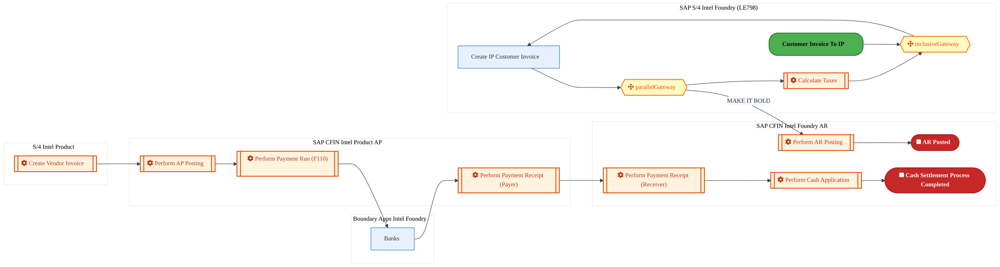
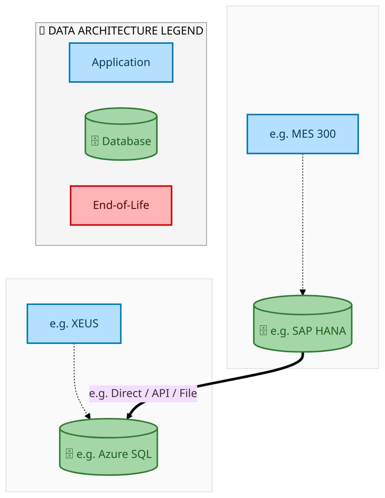
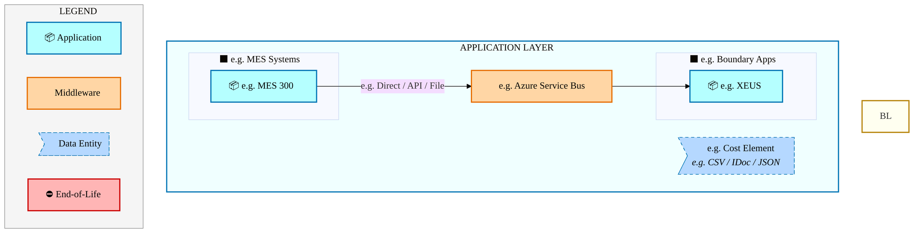
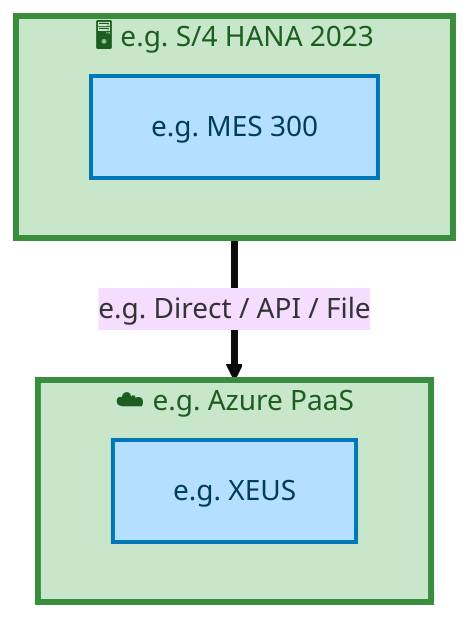

  
  <img src="data:image/svg+xml;base64,PHN2ZyB4bWxucz0iaHR0cDovL3d3dy53My5vcmcvMjAwMC9zdmciIHZpZXdCb3g9IjAgMCA4MDAgNDgwIiB3aWR0aD0iODAwIiBoZWlnaHQ9IjQ4MCI+CiAgPGRlZnM+CiAgICA8bGluZWFyR3JhZGllbnQgaWQ9ImJnIiB4MT0iMCUiIHkxPSIwJSIgeDI9IjEwMCUiIHkyPSIxMDAlIj4KICAgICAgPHN0b3Agb2Zmc2V0PSIwJSIgc3R5bGU9InN0b3AtY29sb3I6IzAwNzFjNTtzdG9wLW9wYWNpdHk6MSIvPgogICAgICA8c3RvcCBvZmZzZXQ9IjEwMCUiIHN0eWxlPSJzdG9wLWNvbG9yOiMwMGFlZWY7c3RvcC1vcGFjaXR5OjEiLz4KICAgIDwvbGluZWFyR3JhZGllbnQ+CiAgICA8bGluZWFyR3JhZGllbnQgaWQ9ImFjY2VudCIgeDE9IjAlIiB5MT0iMCUiIHgyPSIwJSIgeTI9IjEwMCUiPgogICAgICA8c3RvcCBvZmZzZXQ9IjAlIiBzdHlsZT0ic3RvcC1jb2xvcjojZmZmZmZmO3N0b3Atb3BhY2l0eTowLjE1Ii8+CiAgICAgIDxzdG9wIG9mZnNldD0iMTAwJSIgc3R5bGU9InN0b3AtY29sb3I6I2ZmZmZmZjtzdG9wLW9wYWNpdHk6MC4wMiIvPgogICAgPC9saW5lYXJHcmFkaWVudD4KICAgIDxwYXR0ZXJuIGlkPSJncmlkIiB3aWR0aD0iNDAiIGhlaWdodD0iNDAiIHBhdHRlcm5Vbml0cz0idXNlclNwYWNlT25Vc2UiPgogICAgICA8cGF0aCBkPSJNIDQwIDAgTCAwIDAgMCA0MCIgZmlsbD0ibm9uZSIgc3Ryb2tlPSJyZ2JhKDI1NSwyNTUsMjU1LDAuMDcpIiBzdHJva2Utd2lkdGg9IjAuNSIvPgogICAgPC9wYXR0ZXJuPgogIDwvZGVmcz4KCiAgPCEtLSBCYWNrZ3JvdW5kIC0tPgogIDxyZWN0IHdpZHRoPSI4MDAiIGhlaWdodD0iNDgwIiBmaWxsPSJ1cmwoI2JnKSIgcng9IjgiLz4KICA8cmVjdCB3aWR0aD0iODAwIiBoZWlnaHQ9IjQ4MCIgZmlsbD0idXJsKCNncmlkKSIgcng9IjgiLz4KICA8cmVjdCB3aWR0aD0iODAwIiBoZWlnaHQ9IjQ4MCIgZmlsbD0idXJsKCNhY2NlbnQpIiByeD0iOCIvPgoKICA8IS0tIERlY29yYXRpdmUgY2lyY3VpdC9hcmNoaXRlY3R1cmUgbGluZXMgLS0+CiAgPGcgc3Ryb2tlPSJyZ2JhKDI1NSwyNTUsMjU1LDAuMTIpIiBzdHJva2Utd2lkdGg9IjEuNSIgZmlsbD0ibm9uZSI+CiAgICA8cGF0aCBkPSJNIDAgMTAwIEwgMTIwIDEwMCBMIDE2MCAxNDAgTCAyODAgMTQwIi8+CiAgICA8cGF0aCBkPSJNIDAgMjYwIEwgODAgMjYwIEwgMTIwIDIyMCBMIDIwMCAyMjAgTCAyNDAgMjYwIEwgMzYwIDI2MCIvPgogICAgPHBhdGggZD0iTSA1MjAgMTAwIEwgNjAwIDEwMCBMIDY0MCA2MCBMIDgwMCA2MCIvPgogICAgPHBhdGggZD0iTSA0NDAgMzQwIEwgNTYwIDM0MCBMIDYwMCAzMDAgTCA3MjAgMzAwIEwgNzYwIDM0MCBMIDgwMCAzNDAiLz4KICAgIDxwYXRoIGQ9Ik0gNjAwIDQwMCBMIDY4MCA0MDAgTCA3MjAgNDQwIi8+CiAgICA8cGF0aCBkPSJNIDAgNDAwIEwgNDAgNDAwIEwgODAgMzYwIi8+CiAgICA8cGF0aCBkPSJNIDIwMCA0MjAgTCAzMjAgNDIwIEwgMzYwIDM4MCBMIDQ4MCAzODAiLz4KICAgIDxwYXRoIGQ9Ik0gNjUwIDQ0MCBMIDc1MCA0NDAgTCA4MDAgNDgwIi8+CiAgPC9nPgoKICA8IS0tIERlY29yYXRpdmUgbm9kZXMgLS0+CiAgPGcgZmlsbD0icmdiYSgyNTUsMjU1LDI1NSwwLjE4KSI+CiAgICA8Y2lyY2xlIGN4PSIxMjAiIGN5PSIxMDAiIHI9IjQiLz4KICAgIDxjaXJjbGUgY3g9IjI4MCIgY3k9IjE0MCIgcj0iNCIvPgogICAgPGNpcmNsZSBjeD0iMjAwIiBjeT0iMjIwIiByPSI0Ii8+CiAgICA8Y2lyY2xlIGN4PSIzNjAiIGN5PSIyNjAiIHI9IjQiLz4KICAgIDxjaXJjbGUgY3g9IjYwMCIgY3k9IjEwMCIgcj0iNCIvPgogICAgPGNpcmNsZSBjeD0iNzIwIiBjeT0iMzAwIiByPSI0Ii8+CiAgICA8Y2lyY2xlIGN4PSI1NjAiIGN5PSIzNDAiIHI9IjQiLz4KICAgIDxjaXJjbGUgY3g9IjgwIiBjeT0iMzYwIiByPSI0Ii8+CiAgICA8Y2lyY2xlIGN4PSI0ODAiIGN5PSIzODAiIHI9IjQiLz4KICAgIDxjaXJjbGUgY3g9IjMyMCIgY3k9IjQyMCIgcj0iNCIvPgogIDwvZz4KCiAgPCEtLSBUT0dBRiBCREFUIGJveGVzIC0tPgogIDxnIGZvbnQtZmFtaWx5PSJTZWdvZSBVSSwgQXJpYWwsIHNhbnMtc2VyaWYiIGZvbnQtc2l6ZT0iMTQiIGZvbnQtd2VpZ2h0PSI2MDAiPgogICAgPCEtLSBCIC0tPgogICAgPHJlY3QgeD0iMTUwIiB5PSIxNDAiIHdpZHRoPSIxMjAiIGhlaWdodD0iNDAiIHJ4PSI1IiBmaWxsPSJyZ2JhKDI1NSwyNTUsMjU1LDAuMTgpIiBzdHJva2U9InJnYmEoMjU1LDI1NSwyNTUsMC4zKSIgc3Ryb2tlLXdpZHRoPSIxIi8+CiAgICA8dGV4dCB4PSIyMTAiIHk9IjE2NSIgdGV4dC1hbmNob3I9Im1pZGRsZSIgZmlsbD0iI2ZmZiI+QnVzaW5lc3M8L3RleHQ+CiAgICA8IS0tIEQgLS0+CiAgICA8cmVjdCB4PSIyOTAiIHk9IjE0MCIgd2lkdGg9IjEyMCIgaGVpZ2h0PSI0MCIgcng9IjUiIGZpbGw9InJnYmEoMjU1LDI1NSwyNTUsMC4xOCkiIHN0cm9rZT0icmdiYSgyNTUsMjU1LDI1NSwwLjMpIiBzdHJva2Utd2lkdGg9IjEiLz4KICAgIDx0ZXh0IHg9IjM1MCIgeT0iMTY1IiB0ZXh0LWFuY2hvcj0ibWlkZGxlIiBmaWxsPSIjZmZmIj5EYXRhPC90ZXh0PgogICAgPCEtLSBBIC0tPgogICAgPHJlY3QgeD0iNDMwIiB5PSIxNDAiIHdpZHRoPSIxMjAiIGhlaWdodD0iNDAiIHJ4PSI1IiBmaWxsPSJyZ2JhKDI1NSwyNTUsMjU1LDAuMTgpIiBzdHJva2U9InJnYmEoMjU1LDI1NSwyNTUsMC4zKSIgc3Ryb2tlLXdpZHRoPSIxIi8+CiAgICA8dGV4dCB4PSI0OTAiIHk9IjE2NSIgdGV4dC1hbmNob3I9Im1pZGRsZSIgZmlsbD0iI2ZmZiI+QXBwbGljYXRpb248L3RleHQ+CiAgICA8IS0tIFQgLS0+CiAgICA8cmVjdCB4PSI1NzAiIHk9IjE0MCIgd2lkdGg9IjEyMCIgaGVpZ2h0PSI0MCIgcng9IjUiIGZpbGw9InJnYmEoMjU1LDI1NSwyNTUsMC4xOCkiIHN0cm9rZT0icmdiYSgyNTUsMjU1LDI1NSwwLjMpIiBzdHJva2Utd2lkdGg9IjEiLz4KICAgIDx0ZXh0IHg9IjYzMCIgeT0iMTY1IiB0ZXh0LWFuY2hvcj0ibWlkZGxlIiBmaWxsPSIjZmZmIj5UZWNobm9sb2d5PC90ZXh0PgogIDwvZz4KCiAgPCEtLSBDb25uZWN0aW5nIGxpbmVzIGJldHdlZW4gQkRBVCBib3hlcyAtLT4KICA8ZyBzdHJva2U9InJnYmEoMjU1LDI1NSwyNTUsMC4yNSkiIHN0cm9rZS13aWR0aD0iMSI+CiAgICA8bGluZSB4MT0iMjcwIiB5MT0iMTYwIiB4Mj0iMjkwIiB5Mj0iMTYwIi8+CiAgICA8bGluZSB4MT0iNDEwIiB5MT0iMTYwIiB4Mj0iNDMwIiB5Mj0iMTYwIi8+CiAgICA8bGluZSB4MT0iNTUwIiB5MT0iMTYwIiB4Mj0iNTcwIiB5Mj0iMTYwIi8+CiAgPC9nPgoKICA8IS0tIE1haW4gdGl0bGUgLS0+CiAgPHRleHQgeD0iNDAwIiB5PSIyNjAiIHRleHQtYW5jaG9yPSJtaWRkbGUiIGZvbnQtZmFtaWx5PSJTZWdvZSBVSSwgQXJpYWwsIHNhbnMtc2VyaWYiIGZvbnQtc2l6ZT0iMzYiIGZvbnQtd2VpZ2h0PSI3MDAiIGZpbGw9IiNmZmZmZmYiIGxldHRlci1zcGFjaW5nPSIxIj4KICAgIElBTyBBcmNoaXRlY3R1cmUKICA8L3RleHQ+CiAgPHRleHQgeD0iNDAwIiB5PSIzMDAiIHRleHQtYW5jaG9yPSJtaWRkbGUiIGZvbnQtZmFtaWx5PSJTZWdvZSBVSSwgQXJpYWwsIHNhbnMtc2VyaWYiIGZvbnQtc2l6ZT0iMTgiIGZvbnQtd2VpZ2h0PSI0MDAiIGZpbGw9InJnYmEoMjU1LDI1NSwyNTUsMC44KSIgbGV0dGVyLXNwYWNpbmc9IjIiPgogICAgVE9HQUYgQkRBVCDCtyBJQU8gUHJvZ3JhbSDCtyBJRE0gMi4wCiAgPC90ZXh0PgoKICA8IS0tIEJvdHRvbSBhY2NlbnQgYmFyIC0tPgogIDxyZWN0IHg9IjI4MCIgeT0iMzQwIiB3aWR0aD0iMjQwIiBoZWlnaHQ9IjMiIHJ4PSIxLjUiIGZpbGw9InJnYmEoMjU1LDI1NSwyNTUsMC40KSIvPgoKICA8IS0tIEludGVsIHRleHQgLS0+CiAgPHRleHQgeD0iNDAwIiB5PSIzODAiIHRleHQtYW5jaG9yPSJtaWRkbGUiIGZvbnQtZmFtaWx5PSJTZWdvZSBVSSwgQXJpYWwsIHNhbnMtc2VyaWYiIGZvbnQtc2l6ZT0iMTMiIGZpbGw9InJnYmEoMjU1LDI1NSwyNTUsMC41KSIgbGV0dGVyLXNwYWNpbmc9IjMiPgogICAgSU5URUwgQ09ORklERU5USUFMCiAgPC90ZXh0Pgo8L3N2Zz4K" alt="IAO Architecture" style="width:100%; border-radius:8px;" />
  <h1 style="font-size:36px; margin-top:24px;">E2E-110 — IMR Flow</h1>
  <h2 style="font-size:24px;">Architecture Document (TOGAF BDAT)</h2>
  
End-to-End Integrated Processes (E2E) Tower 
  Capability E2E-110 · Forecast to Stock

  
IAO Program · R1 – R5 
  Generated: April 2026 
  Sajiv Francis

  
IAO Architecture Pipeline — Intel Confidential

Page 1<a href="#toc">↑ Back to TOC</a>E2E-110 — IMR Flow

## Table of Contents

<nav class="toc">
<ol>
  <li><a href="#1-executive-summary">1. Executive Summary</a></li>
  <li><a href="#2-business-context-objectives">2. Business Context &amp; Objectives</a>
    <ul>
      <li><a href="#21-classification">2.1 Classification</a></li>
      <li><a href="#22-business-drivers">2.2 Business Drivers</a></li>
      <li><a href="#23-success-criteria">2.3 Success Criteria</a></li>
      <li><a href="#24-companion-documents">2.4 Companion Documents</a></li>
    </ul>
  </li>
  <li><a href="#3-business-architecture-togaf-b">3. Business Architecture (TOGAF &ldquo;B&rdquo;)</a>
    <ul>
      <li><a href="#31-business-process-overview">3.1 Business Process Overview</a></li>
      <li><a href="#32-business-process-diagrams">3.2 Business Process Diagrams</a></li>
      <li><a href="#33-business-roles-responsibilities">3.3 Business Roles &amp; Responsibilities</a></li>
    </ul>
  </li>
  <li><a href="#4-data-architecture-togaf-d">4. Data Architecture (TOGAF &ldquo;D&rdquo;)</a>
    <ul>
      <li><a href="#41-data-entities-ownership">4.1 Data Entities &amp; Ownership</a></li>
      <li><a href="#42-data-flow-diagrams">4.2 Data Flow Diagrams</a></li>
      <li><a href="#43-data-lineage">4.3 Data Lineage</a></li>
      <li><a href="#44-ricefw-data-objects">4.4 RICEFW Data Objects</a></li>
      <li><a href="#45-data-governance-quality">4.5 Data Governance &amp; Quality</a></li>
    </ul>
  </li>
  <li><a href="#5-application-architecture-togaf-a">5. Application Architecture (TOGAF &ldquo;A&rdquo;)</a>
    <ul>
      <li><a href="#51-current-state-current-state-application-landscape">5.1 Current-State Application Landscape</a></li>
      <li><a href="#52-future-state-future-state-application-landscape">5.2 Future-State Application Landscape</a></li>
      <li><a href="#53-change-impact-summary">5.3 Change Impact Summary</a></li>
      <li><a href="#54-component-overview">5.4 Component Overview</a></li>
      <li><a href="#55-ricefw-inventory">5.5 RICEFW Inventory</a></li>
      <li><a href="#56-integration-patterns">5.6 Integration Patterns</a></li>
    </ul>
  </li>
  <li><a href="#6-technology-architecture-togaf-t">6. Technology Architecture (TOGAF &ldquo;T&rdquo;)</a>
    <ul>
      <li><a href="#61-platform-infrastructure">6.1 Platform &amp; Infrastructure</a></li>
      <li><a href="#62-sap-development-object-status">6.2 SAP Development Object Status</a></li>
      <li><a href="#63-nfrs-design-principles">6.3 NFRs &amp; Design Principles</a></li>
      <li><a href="#64-security-governance">6.4 Security &amp; Governance</a></li>
    </ul>
  </li>
  <li><a href="#7-project-context">7. Project Context</a>
    <ul>
      <li><a href="#71-project-roadmap-go-live-plan">7.1 Project Roadmap &amp; Go-Live Plan</a></li>
      <li><a href="#72-raid-log">7.2 RAID Log</a></li>
      <li><a href="#73-recommendations-next-steps">7.3 Recommendations &amp; Next Steps</a></li>
    </ul>
  </li>
</ol>
</nav>

Page 2<a href="#toc">↑ Back to TOC</a>E2E-110 — IMR Flow

## 1. Executive Summary

This Architecture Document defines the **Business, Data, Application, and Technology** (BDAT) architecture for **E2E-110 IMR Flow** within the IAO program. It includes 10 BPMN process diagram(s) in Section 3.

| Dimension | Value |
|-----------|-------|
| **Tower** | End-to-End Integrated Processes (E2E) |
| **Process Group** | Forecast to Stock |
| **Capability** | E2E-110 - IMR Flow |
| **Release** | R1 – R5 |
| **Total Systems** | 2 |
| **System Status** | 0 Deployed, 0 Developing, 0 EOL, 2 Pending IAPM |
| **RICEFW Objects** | Pending — Smartsheet Object Tracker API integration |

**Change Summary**: 0 new flow chains, 0 removed, 0 modified, 1 unchanged between Current-State and Future-State states.

> All system nodes in architecture diagrams are **IAPM-linked** — click any node to open its IAPM page. Diagrams require `securityLevel: 'loose'` for click events.

Page 3<a href="#toc">↑ Back to TOC</a>E2E-110 — IMR Flow

## 2. Business Context & Objectives

### 2.1 Classification

| Level | Value |
|-------|-------|
| **L0 Tower** | End-to-End Integrated Processes |
| **L1 Process** | Forecast to Stock |
| **L2 Capability** | E2E-110 - IMR Flow |

### 2.2 Business Drivers

| # | Driver | Description | Strategic Alignment | Priority |
|---|--------|-------------|---------------------|----------|
| 1 | End-to-End Process Integration | Enable cross-tower integrated processes spanning procurement, manufacturing, and fulfillment | IDM 2.0 Process Excellence | High |
| 2 | Intel Foundry Business Enablement | Stand up foundry-specific business processes for external customer engagement | Intel Foundry Services | High |
| 3 | Process Visibility & Monitoring | Provide end-to-end process visibility across tower boundaries with integrated monitoring | Operational Excellence | Medium |
| 4 | E2E-110 Process Migration | Migrate IMR Flow business processes and 2 integrated systems from legacy to S/4 HANA target architecture | IDM 2.0 Cross-Functional / End-to-End | High |

Page 4<a href="#toc">↑ Back to TOC</a>E2E-110 — IMR Flow

### 2.3 Success Criteria

| Metric | Target | Measure | Baseline | Owner |
|--------|--------|---------|----------|-------|
| E2E Process Cycle Time | Per process SLA | End-to-end transaction completion within defined SLA per process | Varies by process | E2E Process Owner |
| Cross-Tower Integration Success | > 99% | Transactions completing across tower boundaries without manual intervention | 92% (current) | Integration Lead |
| Process Exception Rate | < 2% | Transactions requiring manual exception handling | 8% (current) | Operations Manager |
| E2E-110 Migration Completeness | 100% flow chains validated | All 1 flow chains verified in target state | 0% (pre-migration) | Tower Architect |

### 2.4 Companion Documents

| Document | Description |
|----------|-------------|
| **Business Architecture** | Included in this document (Section 3) — process flows from BPMN diagrams |
| **This Document** | Full BDAT Architecture — Business + Data + Application + Technology |

Page 5<a href="#toc">↑ Back to TOC</a>E2E-110 — IMR Flow

## 3. Business Architecture (TOGAF "B")

### 3.1 Business Process Overview

This capability includes **10 business process(es)** modeled in BPMN 2.0, covering the end-to-end workflow for E2E-110 IMR Flow.

| # | Step ID | Process Name | Lanes | Tasks | Gateways |
|---|---------|--------------|-------|-------|----------|
| 1 | E2E-110A_IF_to_IMR_-_Variation_1_–_IMR_facility_is_within_the_plant | E2E-110A_IF_to_IMR_-_Variation_1_–_IMR_facility_is_within_the_plant | 

 LE ++ Faulty Part, EWM, IMR Repair Plant  | 20 | 3 |

| 2 | E2E-110B__IF_to_IMR_-_Variation_2_–_IMR_facility_is_within_the_same_LE_but_different_plant | E2E-110B__IF_to_IMR_-_Variation_2_–_IMR_facility_is_within_the_same_LE_but_different_plant | IMR EWM, IMR Repair Plant  (Different Plant), LE ++ Faulty Part | 32 | 5 |
| 3 | E2E-110C__IF_to_IMR_-_Variation_3_–_IMR_facility_is_in_different_LE_–_with_STO | E2E-110C__IF_to_IMR_-_Variation_3_–_IMR_facility_is_in_different_LE_–_with_STO | IMR EWM, IMR Repair Plant  (Different Plant), LE ++ Faulty Part | 33 | 7 |
| 4 | E2E-110D__IP_to_IMR | E2E-110D__IP_to_IMR | IF EWM (101), IMR EWM, IMR Legal Entity (LE101), IMR Malaysia, Intel Product (Faulty Part), LE 798 | 55 | 15 |
| 5 | E2E-110E__IP_to_IMR_cash_settlement | E2E-110E__IP_to_IMR_cash_settlement | Boundary Apps Intel Foundry, S/4 Intel Product , SAP CFIN

Intel Foundry AR, SAP CFIN
Intel Product AP , SAP S/4
Intel Foundry (LE798) | 10 | 2 |

| 6 | E2E-110F__IP_to_IMR_in_house_settlement | E2E-110F__IP_to_IMR_in_house_settlement | Inhouse Bank , Intel Foundry LE798, S/4 Intel Product , SAP CFIN

Intel Foundry AR, SAP CFIN
Intel Product AP  | 10 | 4 |

| 7 | E2E-110G__Altera_to_IF | E2E-110G__Altera_to_IF | Boundary Apps, Customer, IF EWM (101), IMR EWM, IMR LE Malaysia, IMR Legal Entity (LE101), LE798 | 45 | 14 |
| 8 | E2E-110H__Altera_to_IMR_cash_settlement | E2E-110H__Altera_to_IMR_cash_settlement | LE798, S/4 Intel Product , SAP CFIN
 | 7 | 3 |
| 9 | E2E-110I__IMR_Manufacturing | E2E-110I__IMR_Manufacturing | SAP S/4 Intel Foundry

IMR Legal Entity | 13 | 3 |

| 10 | E2E-110J__TM_Steps | E2E-110J__TM_Steps | External Partners B2B, SAP S/4 Intel Foundry

IMR Legal Entity | 10 | 1 |

Page 6<a href="#toc">↑ Back to TOC</a>E2E-110 — IMR Flow

### 3.2 Business Process Diagrams

#### BUSINESS ARCHITECTURE — 3.2.1 E2E-110A_IF_to_IMR_-_Variation_1_–_IMR_facility_is_within_the_plant — E2E-110A_IF_to_IMR_-_Variation_1_–_IMR_facility_is_within_the_plant

**Swim Lanes**: 
 LE ++ Faulty Part · EWM · IMR Repair Plant  | **Tasks**: 20 | **Gateways**: 3

> **Legend**: ● Start · ● End · User Task · Service Task · ◇ Gateway · Sub-Process

<a href="https://mermaid.live/view#pako:eNqlV11v6jgQ_StWrip2dUEb54NQHlZqgVwhFbVqd_c-3K5WJnHAaogj20DZiv--Y7ADScneLx6q-szMmZnjsZO8OQlPqTN0rq7eWMHUEL111JKuaGeIOnMiaaeLjsBfRDAyz6nsaJ-MF-qJ_Xtww0H5qt00FpMVy3cafaILTtGf0y66gcC8iyQpZE9SwbJOt1MKtiJiN-I5F9r7Ax1kbnbIZky3XKRUnBxcN8JJCKE5K-gJ9qMgCmIdJ2nCi7RGmoXZIEs6e11czrfJkgh1KH8t6Yy8fmapWsI6I7mk4LNUq_yOzGmue1RirbFkLTZWDCZ1ngIEeypJwooF4IELkCDFywkK3f0e7a-unosqKbp7fC4Q_JKcSDmmGZIK4MlGoYzl-fBDMLqJQ7crleAvdPjBm0Rj3-smupMhtO52tbi9LWWLpRrOeZ4a195W9zD0yteueB16blfs4G8jFy3SU6ZR3xt4gyrTbYRHeGQzZVn2U5lAV_EHkS8m18SPvXhc5cJhPxy57_lsm-MgusFNnajYsISekcZx7E9OUk36IXbbSW9jv--OGqQLouiW7E6E16OgIozDKMZRK-ExX7PK9fxB8MQS-pMwDivC6BbHN14rYXCDg4GpEHgWgpRLlJOC_uN-eXYQupugjx9RTNa52qEHmJpn5--jt_4VPjhlZJiRnhYfzaA1fd7QjG_g1BYKBpktFlRIpJaCrxdLNJt-ukdbppZIUCJ5gfQVUCfF0ZeKNuELNE2BiWU7WwYMu9AhtZhBPeaBioyLFZoWc74uUjSmOdtQsWuGXdfDdN3n3SLFT0090g2jW5TzhCjGiwaV576nOpeAppUGDzP0-f434NPzdeC6pEiNHP9SkZc5DM801qVNZ4_ocDUeODAqYQyolEhfpgDSFGh-Pafpv71ZGiIE38oeyRUCPUme0_zTcTKfnf3-PCj6viA48JfmCUMDk8-zxlY3RBszGFQ2Xyv6budONt0rNH8kq7Hhy0PwifNUgtwJZaW6FOddjrtfq0YN9_qx0Iz2vxI9gn2Fhoj-lxcZA9sDS17gvm4yBf9X_1TK9buxD79t7FH6dfH6Pyae559GUypeHgKO_huYeVaYmNocBt8V0zJRHnDoE_BIS8IEegBQocZ81e8nsxMmwG7meWF1f-N4eBmA03k6rqAMSsmKLKDaUt8TenMTvip5AUdefuWCa2yz6bu6aBoCt2yxqe3sTmm0dc7R_4m7qUEV_dBF27ien6hSOYXjIEEsGEf9DxpBRe8u9utvPJrNqfQaE3bIcEybIrIgrNAZa2lrExr-4KUHTy_U6_2uHy0G8PpHwL6vVIBvI66NQ986uAaIDOA31p7NMbAUJgJjC3gGqJIYDhwYIDiuQ7MMj0tbginRJsTGjKsSDTBorLHl87ABKgrTg7Ufl1YkIwG2ZmxFq-ofGA-rIraEtiFsOrJrE-BZSqOZF569Pumy7GtjDfYuw_5lODh_U6xZwlZLv9UStVoGrZbrVguMRqsJt5u8dpPfbmoXArcrgdulwO1a4HYxcLsaXrsaMLH2u6iOe-Ybpo76F9HgIhral_463L8MRxZ2us6KihVhqTN8cw4fwvCxnNJMv6A6-65D1oo_7YrEGR4-GJ11mULkmBF4Sq6O4P4_g5vUEA==" title="View full diagram">&#128065; View Diagram</a>

Page 7<a href="#toc">↑ Back to TOC</a>E2E-110 — IMR Flow

#### BUSINESS ARCHITECTURE — 3.2.2 E2E-110B__IF_to_IMR_-_Variation_2_–_IMR_facility_is_within_the_same_LE_but_different_plant — E2E-110B__IF_to_IMR_-_Variation_2_–_IMR_facility_is_within_the_same_LE_but_different_plant

**Swim Lanes**: IMR EWM · IMR Repair Plant  (Different Plant) · LE ++ Faulty Part | **Tasks**: 32 | **Gateways**: 5

```mermaid
%%{init: {'theme': 'base', 'themeVariables': {'fontSize': '14px', 'fontFamily': 'Segoe UI, Arial, sans-serif','primaryColor': '#e8f0fe', 'primaryBorderColor': '#0071c5','lineColor': '#37474F', 'secondaryColor': '#f5f8fc'}, 'flowchart': {'useMaxWidth': false, 'htmlLabels': true, 'curve': 'basis', 'nodeSpacing': 40, 'rankSpacing': 50}} }%%
flowchart LR
    classDef startEvt fill:#4CAF50,stroke:#2E7D32,color:#000,font-weight:bold,stroke-width:2px,rx:20,ry:20
    classDef endEvt fill:#C62828,stroke:#B71C1C,color:#fff,font-weight:bold,stroke-width:2px,rx:20,ry:20
    classDef userTask fill:#E3F2FD,stroke:#1565C0,stroke-width:2px,color:#0D47A1
    classDef serviceTask fill:#FFF3E0,stroke:#E65100,stroke-width:2px,color:#BF360C
    classDef gateway fill:#FFF9C4,stroke:#F57F17,stroke-width:2px,color:#E65100
    classDef subProc fill:#F3E5F5,stroke:#7B1FA2,stroke-width:2px,color:#4A148C
    subgraph lane_0["IMR EWM"]
        n10[["fa:fa-cog Perform Outbound Create and confirm picking"]]
        n11[["fa:fa-cog Perform Goods Issue"]]
        n12[["fa:fa-cog Outbound delivery Order"]]
        n13[["fa:fa-cog Perform Outbound Create and confirm picking"]]
        n14[["fa:fa-cog Perform Goods Issue"]]
        n15[["fa:fa-cog Perform Goods Receipt – Customer stock (Defective Material)"]]
        n16[["fa:fa-cog Perform Outbound Delivery"]]
        n17[["fa:fa-cog Receive IBD– Customer stock (Defective Material)"]]
        n18[["fa:fa-cog Perform Goods Issue"]]
        n19[["fa:fa-cog Perform Inbound Delivery Distribution to EWM"]]
        n20[["fa:fa-cog Perform Goods Receipt EWM"]]
        n21[["fa:fa-cog Perform Outbound Delivery Order"]]
        n22[["fa:fa-cog Pick and Pack Updates and Print Invoice"]]
        n23[["fa:fa-cog Perform Goods Issue"]]
        n24[["fa:fa-cog Perform Goods Receipt"]]
        n35(["fa:fa-stop Goods Received"])
        n36(["fa:fa-stop Good Received in EWM"])
        n37(["fa:fa-stop Good Received"])
        n40{{"fa:fa-code-branch exclusiveGateway"}}
    end
    subgraph lane_1["IMR Repair Plant  (Different Plant)"]
        n2["fa:fa-user Create Repair Order"]
        n3["fa:fa-user Create a MIGO transaction"]
        n25[["fa:fa-cog Perform Outbound Delivery"]]
        n26[["fa:fa-cog Receive Materials"]]
        n27[["fa:fa-cog Perform Repair Process"]]
        n28[["fa:fa-cog Movement triggered through PM WO/ Reservation"]]
        n29[["fa:fa-cog Create STR/STO"]]
        n30[["fa:fa-cog Perform Outbound Delivery"]]
        n31[["fa:fa-cog Perform Goods Issue (Fixed Material)"]]
        n32[["fa:fa-cog Perform GTS Check"]]
        n34(["fa:fa-play Initiate Goods Issue"])
        n38(["fa:fa-stop GTS Check Completed"])
        n39(["fa:fa-stop Movement Triggered"])
        n44{{"fa:fa-arrows-alt parallelGateway"}}
    end
    subgraph lane_2["LE ++ Faulty Part"]
        n1["fa:fa-user Material Movement triggers through MIGO with reason code"]
        n4[["fa:fa-cog Identify Faulty Spare"]]
        n5[["fa:fa-cog Perform Inbound Delivery"]]
        n6[["fa:fa-cog Move Faulty Part to Material Review location"]]
        n7[["fa:fa-cog Movement triggered through PM WO/ Reservation with reason code"]]
        n8[["fa:fa-cog Create STR/STO to ship defective part"]]
        n9[["fa:fa-cog Perform Outbound Delivery"]]
        n33(["fa:fa-play IF to IMR Variation 2 Process Initiated"])
        n41{{"fa:fa-arrows-alt parallelGateway"}}
        n42{{"fa:fa-arrows-alt parallelGateway"}}
        n43{{"fa:fa-arrows-alt parallelGateway"}}
    end
    n4 --> n6
    n41 --> n7
    n41 --> n1
    n6 --> n41
    n1 --> n42
    n42 --> n5
    n19 --> n20
    n21 --> n22
    n10 --> n11
    n12 --> n13
    n40 --> n14
    n33 --> n4
    n17 --> n15
    n13 --> n18
    n18 --> n40
    n24 --> n36
    n16 --> n10
    n2 --> n3
    n3 --> n25
    n26 --> n27
    n27 --> n28
    n29 --> n30
    n31 --> n44
    n8 --> n9
    n32 --> n38
    n15 --> n35
    n20 --> n37
    n23 --> n17
    n5 --> n19
    n22 --> n23
    n14 --> n24
    n25 --> n16
    n11 --> n26
    n7 --> n43
    n43 --> n42
    n43 --> n29
    n28 --> n39
    n43 --> n8
    n9 --> n21
    n30 --> n12
    n34 --> n31
    n44 --> n32
    n44 --> n40
    class n1 userTask
    class n2 userTask
    class n3 userTask
    class n4 serviceTask
    class n5 serviceTask
    class n6 serviceTask
    class n7 serviceTask
    class n8 serviceTask
    class n9 serviceTask
    class n10 serviceTask
    class n11 serviceTask
    class n12 serviceTask
    class n13 serviceTask
    class n14 serviceTask
    class n15 serviceTask
    class n16 serviceTask
    class n17 serviceTask
    class n18 serviceTask
    class n19 serviceTask
    class n20 serviceTask
    class n21 serviceTask
    class n22 serviceTask
    class n23 serviceTask
    class n24 serviceTask
    class n25 serviceTask
    class n26 serviceTask
    class n27 serviceTask
    class n28 serviceTask
    class n29 serviceTask
    class n30 serviceTask
    class n31 serviceTask
    class n32 serviceTask
    class n33 startEvt
    class n34 startEvt
    class n35 endEvt
    class n36 endEvt
    class n37 endEvt
    class n38 endEvt
    class n39 endEvt
    class n40 gateway
    class n41 gateway
    class n42 gateway
    class n43 gateway
    class n44 gateway
```

> **Legend**: ● Start · ● End · User Task · Service Task · ◇ Gateway · Sub-Process

<a href="https://mermaid.live/view#pako:eNqtWF1v4jgU_StWRhUzGtDGdkKAh5VaICOkqVq1nZ2H6WplEgeshgQ5CS1b8d_3BuxA0nim7WwfKnLu9_G9tpNnK0hDbo2ss7NnkYh8hJ47-ZKveGeEOnOW8U4XHYC_mBRsHvOsU-pEaZLfin_3athZP5VqJeazlYi3JXrLFylH32ZddA6GcRdlLMl6GZci6nQ7aylWTG7HaZzKUvsDH0R2tI-mRBepDLk8Kti2hwMXTGOR8CNMPcdz_NIu40GahDWnkRsNoqCzK5OL08dgyWS-T7_I-CV7-i7CfAnPEYszDjrLfBV_ZXMelzXmsiixoJAbTYbIyjgJEHa7ZoFIFoA7NkCSJQ9HyLV3O7Q7O7tPqqDo6819guAviFmWTXiEshzg6SZHkYjj0QdnfO67djfLZfrARx_I1JtQ0g3KSkZQut0tye09crFY5qN5GodKtfdY1jAi66eufBoRuyu38L8RiyfhMdK4TwZkUEW68PAYj3WkKIp-KxLwKu9Y9qBiTalP_EkVC7t9d2y_9KfLnDjeOW7yxOVGBPzEqe_7dHqkatp3sW12euHTvj1uOF2wnD-y7dHhcOxUDn3X87FndHiI18yymF_LNNAO6dT13cqhd4H9c2J06JxjZ6AyBD8LydZLFLOE_2P_uLdmlzdo-v3y3vr7oFH-Jdj-AaKIjSLWC9IFuuYySuUKXRX5PC2SEI0lhxIRg58wFJEA2VoED9Cf4KjmCbd7-pKmYYZmWVbwpgWpW1QxQx6LDZdbdFUObtOK_m8ZO2_O2P2ZxQ0PuFjn6L4gNqZoXGR5uuISBjQNHtBHWF0e5FAYuoT8yp3sU9N9_xelTRQxTTuvbrdPBOLMLibvz2XwZnKG7RazpJ48mghoYDEvcpEmKE9VU566IvZreG6xw68ksLWzSKMfr6Fr9m10zeDHt3UIVGUHQIokh8I2KWwoTS_0rcQR5xXVNmyo-7GygTVdnypveAjan061-y3alTISieKyZuP9zKah7NjPz8cSQt6bw0EWLBF_CuIiA4Mvh33y3trtDmZwkrRtVFhtVDd8zYRE1wDmCPpVRBGXHH7vkU_1TYxUiZanht4AlAu90qelteozdDn7cgWnNdwuWFA2ZyOK-77pJP326dSTlzX1vfY4mhI4HXj2wqgxrpfpBm5awBdM2mIB1IUoX8q0WCzR9SX6fvUHuCsPRKbqrPlqDLLi5_bu5o_bu6tmI9rvY4X--rhAH33xBImbtihKDC7ubtF4yYOHpr5z7Oh1DIf2DK6poiytPpu1KRg0p0A7R-N0tY55_nLYhg2Tai3u9Fo0p8c5Tg-TMn3MeizO0ZpJFsc8fu3slGPwdYo-f0Y-K-J8C_uWzBvHfb3zNbMv2iWrumU_E48iXyLoggw27HK8604b29csBEci2uos4Dorm1ue-7qjomHVf9njp6WWZ0lV0Q3fCP6I4jRoa3HvN6aljY1T34OfTU-ZY7YUa7jj6BN4fVilUxfDd84UbTa4X8Yr99P9O9c-e6J3kKr9X7Qjfls7HozIe4zoOxs_cVCv9yd0hH7Eh2ev8azeAZL-4dHRz0rsEK1PDoCr5cPDs34tgZuFArQFtlWEyqVygan2qTUcBVCqomoLTylUUZUCHmhgoCyqNFTdVBeOVWW40lAKOqZKW4cgSp9opohKguiYRJVOtUeqydJ5q6SGWq5DVlm7CqiCKiZoFVQXqgFlgbVPonwSXQdWhROdBNEmFRN6hTSgCnOq9aDNRdfkVFFVZXTY0NCV6a7Qa071EmuXVK-P1nA0QBqAc_riVzakfuGtwaQdpu2wc_qOW5O4RknfKPGMkoFRMjRKYF6MImwWEbOImkVmIrCZCWymApu5wGYysJkNYmaDmNkgZjaImQ1iZoOY2SBmNoiZDWJmg5jZoGY2qJkNamYDdlr9VayOOwbcVV-26mi_FfVa0UErOmxD4WBQn43qMG6HSTtM22FHw1bXghf-FROhNXq29h9erZEF147ywmTtuhYr8vR2mwTWaP-B0ir2L7gTweBKuTqAu_8AZ4HDUg==" title="View full diagram">&#128065; View Diagram</a>

Page 8<a href="#toc">↑ Back to TOC</a>E2E-110 — IMR Flow

#### BUSINESS ARCHITECTURE — 3.2.3 E2E-110C__IF_to_IMR_-_Variation_3_–_IMR_facility_is_in_different_LE_–_with_STO — E2E-110C__IF_to_IMR_-_Variation_3_–_IMR_facility_is_in_different_LE_–_with_STO

**Swim Lanes**: IMR EWM · IMR Repair Plant  (Different Plant) · LE ++ Faulty Part | **Tasks**: 33 | **Gateways**: 7

> **Legend**: ● Start · ● End · User Task · Service Task · ◇ Gateway · Sub-Process

<a href="https://mermaid.live/view#pako:eNqtWF1v4jgU_StWRhUzGqqJ7XwADyu1QCpWg1qVzs7DdLUyiQNWQxI5gZat-O_rgB2IG8-0ne1DhY_vPffeY187ybMVZhG1BtbZ2TNLWTkAz51ySVe0MwCdOSlopwsOwF-EMzJPaNGpbOIsLWfs370ZdPKnyqzCArJiybZCZ3SRUfBt0gUXwjHpgoKkxXlBOYs73U7O2Yrw7TBLMl5Zf6C92I730eTUZcYjyo8Gtu3D0BWuCUvpEca-4ztB5VfQMEujBmnsxr047Oyq5JLsMVwSXu7TXxd0Sp6-s6hcinFMkoIKm2W5Sr6SOU2qGku-rrBwzTdKDFZUcVIh2CwnIUsXAndsAXGSPhwh197twO7s7D6tg4K70X0KxF-YkKIY0RgUpYDHmxLELEkGH5zhReDa3aLk2QMdfEBjf4RRN6wqGYjS7W4l7vkjZYtlOZhnSSRNzx-rGgYof-rypwGyu3wr_muxaBodIw091EO9OtKlD4dwqCLFcfxbkYSu_I4UDzLWGAcoGNWxoOu5Q_slnypz5PgXUNeJ8g0L6QlpEAR4fJRq7LnQNpNeBtizhxrpgpT0kWyPhP2hUxMGrh9A30h4iKdnuZ7f8CxUhHjsBm5N6F_C4AIZCZ0L6PRkhoJnwUm-BAlJ6T_2j3trMr0F4-_Te-vvg0X1l0L0Q0zFZBCT8zBbgBvK44yvwPW6nGfrNAJDTkWJgIifoiliJuZyFj6I_SmIGky4nekqy6ICTIpiTXUPp-lRx4xowjaUb8F11bi6l_u_Zey9OWP_Zx63NKQsL8H9GtkQg-G6KLMV5aJBs_ABfBSrS8NSFAamIr_qJPuk0_d-UdpICqP79dv9JmnTDYyY2Dpsvi5ZloIyk9vhlArZr6mwxQ--MvXWNUX6LhTrtV_AGyJ-fMsjIVhxADhLS1HYJhOtrLO8eQci5xXV6j7a_pPbbTI0ZIXdj7W92An5KfmGRsL606m112q9Tz4CLJXSN1z8Fpea3-DT-5mPZux4z8_KmHCePRbnJClBTjhJEppcHY7Ae2u3O3Xy3-Ykbpa2gwvKg-uW5oRxcCPAEoheYnFMORW_98gn7VATTndTMF7NaRTtyzlNrC68umLU8t1MVQi1P09c3FYXAqaTq2txu4unERJWLdX08lq9Zne3X2Z3101T5L2v8ZF2HskFrA-YQrc3HDBKXXHx0OKFk3a6TLONeIgT0oujZLEQqxCBcsmz9WJZqfj9-ougq-5aIiVpNIP9vkIx_GVrg48BexK5mA5XbLjpru5mYLik4YNuj9_Y532tpWqd7pROel_ZehOqVMAwW-UJLV-6QM3lmI5M8IUHEg5_DoDoh1lJ80Jrht57Wrv_v7R2ldjXMfj8GQRknZRbcdjzUuuLZguppX2xBYt6B-5b8pGVSyDUKMQtV72UNEnxz_qyuhWLJcvFM4i6rfMXaWldN4lEKizeqjrE8zvXd0fvdTe05tXSeadiVcnWmtzSDaOPIMnCtsaD9m80cZugDXL4zq52jrs5T8RT9CSoSqrO-_074j42VseSEIuVrG2L4_dsYuc9Tu47d37qg_PzP8SCyqGDD2NoawCS4_5h6GA5RnLsKHvnAPTkGEoH9R4lHsgkoBihpICKEkoK6CpOTwKeBLC08BWnHGMFwJ70UEGkgWJ0ZQ6KEEkZkEobSQKkhJEpYFUGtmXhykMJB1VEyYAVAGUMrJJAkgLXQaUSqFZCaaU4kIpSFyorcWpppItTr6hcAIx0AGsAUolBWaxT66sWoKcVBx0dUBSSoV5kJVe9pq62cZBKq69ZeNq4FkftTJWlSqEmUIJ7GoBUTKx2b72qktOBmjZK3_3rcLXr1WeABozbYacddtthrx32T78TNGZ6xpm-cUash3EKmqeQeQqbpxzzlGue8sxTZi2gWQxoVgOZ1UBmNZBZDWRWA5nVQGY1kFkNZFYDmdVAZjWwWQ1sVgOb1cBmNcRJrj4TNnFXftJrol4r6reivVa034Y6disKW1HUnrG4KOU3tybstMNuO-y1w3473GuH-wq2utaK8hVhkTV4tvbfuK2BJZ4gq0c1a9e1yLrMZts0tAb7b8HWev9FY8SIeBxeHcDdf4izKHI=" title="View full diagram">&#128065; View Diagram</a>

Page 9<a href="#toc">↑ Back to TOC</a>E2E-110 — IMR Flow

#### BUSINESS ARCHITECTURE — 3.2.4 E2E-110D__IP_to_IMR — E2E-110D__IP_to_IMR

**Swim Lanes**: IF EWM (101) · IMR EWM · IMR Legal Entity (LE101) · IMR Malaysia · Intel Product (Faulty Part) · LE 798 | **Tasks**: 55 | **Gateways**: 15

> **Legend**: ● Start · ● End · User Task · Service Task · ◇ Gateway · Sub-Process

<a href="https://mermaid.live/view#pako:eNq1Wm1P47gW_itWRyMYqezGb0naD3sFpR11BRpE2bsflquVSR2ISJPeJOXlMvz3aze227o2QzssH2bIk_P6-Jxjm_alk5RT3ul3Pn9-yYqs6YOXg-aOz_hBHxzcsJofdEEL_JtVGbvJeX0gZdKyaCbZ_5ZikMyfpJjERmyW5c8SnfDbkoM_xl1wLBTzLqhZUR_VvMrSg-7BvMpmrHoelHlZSelPPE6DdOlNvTopqymvVgJBEMGECtU8K_gKxhGJyEjq1Twpi-mG0ZSmcZocvMrg8vIxuWNVswx_UfNz9vRnNm3uxHPK8poLmbtmlp-xG57LHJtqIbFkUT1oMrJa-ikEYZM5S7LiVuAkEFDFivsVRIPXV_D6-fN1YZyCs8vrAoifJGd1fcpTUDcCHj40IM3yvP-JDI5HNOjWTVXe8_4nNIxOMeomMpO-SD3oSnKPHnl2e9f0b8p8qkSPHmUOfTR_6lZPfRR0q2fxr-WLF9OVp0GIYhQbTycRHMCB9pSm6U95ErxWV6y-V76GeIRGp8YXpCEdBNv2dJqnJDqGNk-8esgSvmZ0NBrh4YqqYUhh4Dd6MsJhMLCM3rKGP7LnlcHegBiDIxqNYOQ12Pqzo1zcXFRlog3iIR1RYzA6gaNj5DVIjiGJVYTCzm3F5ncgZwX_O_jrujMegeGf5-AQBvDLdec_rZj8KeK_xOuU9VN2lJS34IJXaVnNwLi4KRfFFJzyPHvg1bNQWtfqubW-luW0Bpc84dm8AdcLFEAMBou6KWe8EsVaJvfgUGTKk0ZYBeeCQNnVXyzrMHCb_7ZoNqMC32R329rwreDGdb3gtgb6gb_pm_7wD7QHFReJAiZ-FbMlzcS7eZbciza3LZFdI4_wy4vWYFVVPtZHLG_AnFUsz3n-ta3Q687ra6skethVIlCWyPmlrJHN6sDRXuWB43-0PnDvZ9aLBLuyTOBP-UMfVR8E7xp5iA-NhqB3vi46FbJf1msJrWpJbudHN2JDSu4Af0ryRS3y26qmVq23Wwm2Uyf4kLpFqm7P-C3LwbBosuYZHJ4Nt8ccMTTIzUVTfsnnLKvA4eXxFzBh4lRiFnBNlTpVL861tkMFWQuldM7HX7-JE4E4waRbVYLIO2eerUff02qPv1S_NDLmqo25dNQpCt2W2jRtYWswDMrZPOeGUlt6v10GvWebsWdDsB-P-Me7BjgcZU986h9Lnkb_ejUBgzue3NvyVpVMRJULSh5KcVIBTQnGF5YC7Tm7eUnEw1Y_h4ElrU3XvGiM_Q0NaNsXkScycjGY2vXdGhrBfkOD7jE0onAfpehDJg1Wk-ac5ey5zthmv8v98-ocDGc3fDpdcrQewe7zg5Cd5weh-9U9CXfvMRLtMClIvMukIL29JgUNds-Cwv0Yo-inJwXFu00K6q6H8cD09Im4MoCrsg_OhlEvttWt2ji-BBdl3YgDxvLQcbwQw2CQc3E13zpyhGSnkUMtaVXivukRhjsPnFC20-99INpt0vB5bd1m4D6HEfQhI0IeMcZFw3MgLnHTRdKIKmCLXJxILsQl3TqPIOdQmCxujgZlAS4Wlbjw17JH_rvI6qzJysI6mL9P3zFboFUM46nYDrL0GahgJyLvrQtSuFdXQmtOjAuRydq5S152eV3bWvE7-usdl8jeGz0miysTGxV3thsKnO0m2JUHdPH_XGgL1lXz2drwPSeyQ8WBL3yE9g6frnXVXGxXYqNfbvcjTbhZCLu5aOTox8Gb_Ujj3Vs4dp8Z2qUVkS4P8KJ222EG_mX1a9hz6ytGs6I18GurbmtH5EO6Xd4KzoagHbbrwe1_0cDEcR40t-O3DobY6ukBy5NFLh1fsSduNxgO998OkLXaSnf7XAj3OxfGey6OGGvg6Og3OXMUgNpnrB7j9rGnxQMlDrU4bgFENKAMolABNFQqVNuIlIR6VhZC7SMiSiG0AROFNhlrpyospG1CFXeoJaDKC-rEoHIbaQBBZUP9ebFQXiMdd6Qz0zb1s7Gg49QWkIrChNlrn6lORD0j_YxUYsishuIqCqwgVoBKHWsAKyDSNrBKLDJ8Ki8Y2YDOJFLkQGJJGLagyhXpQoCaPk0XVskRw6dSIVqCKKNER6qSJdorVamEGiBawiyB8hrrVKha51jHFSsJim1AGw2Xq_RdziU5P_-YXHe-ryoe6xUwZOkOibf15dhdXXW-r2kR5ZUYQAdqFlLz1bMAzU6s2CA6k1ALGL4Uw9QwrHsLWzapTY8JI1ZxUWQBZqGVyWgjCk3fMmsdD9TeTDlr45q7SFvTxlRGhn2dgKluZSHU4URqfbANQDNflNHQUK-HA7VSJNoG1W51XFgPAxO4soFNuavGxKZWNaBzIXr9tFGi6MGmU5VRqrOl2ka4TfZ2rUErtmj94xw52fUHRBswdsPEDVM3HLrhyA3H6x8sbbzped-Incf7CvpfIf8r7H9F_K-o_1XofxX5X_nJgH42kJ8N5GcD-dlAfjaQnw3kZwP52UB-NpCfDeRnA_vZwH42sJ8N7GcD-9nAfjawnw3sZwP72cB-NoifDeJng_jZIH42iJ8N4meD-NkgfjaInw3iZ4P62aB-NqifDepng_rZoH42xAFZfx9hE4_Udwc20diJ9lxoGDhR6ESRE8VOlDhR6kRDJxq5cxZnKfX1gE2454TF2dcJQzeM3DB2w8QNUzccuuHIDbuzjNxZxu4sY3eWscmy0-2IC_CMZdNO_6Wz_BpRp9-Z8lT-warz2u0wcWOdPBdJp7_8uk1nMZ8KzdOMifv6rAVf_w--sysE" title="View full diagram">&#128065; View Diagram</a>

Page 10<a href="#toc">↑ Back to TOC</a>E2E-110 — IMR Flow

#### BUSINESS ARCHITECTURE — 3.2.5 E2E-110E__IP_to_IMR_cash_settlement — E2E-110E__IP_to_IMR_cash_settlement

**Swim Lanes**: Boundary Apps Intel Foundry · S/4 Intel Product  · SAP CFIN
Intel Foundry AR · SAP CFIN
Intel Product AP  · SAP S/4
Intel Foundry (LE798) | **Tasks**: 10 | **Gateways**: 2

> **Legend**: ● Start · ● End · User Task · Service Task · ◇ Gateway · Sub-Process

<a href="https://mermaid.live/view#pako:eNqlVl1v4jgU_StWqopWCto4H4TmYSUIZIW2M4tKZ_ZhWK1M4kBUE0e2Q8sy_PexiQMkbXZWWh6q3nPvPcf3-EJyMGKaYCMwbm8PWZ6JABx6YoO3uBeA3gpx3DNBBXxFLEMrgnlP1aQ0F4vsn1MZdIs3VaawCG0zslfoAq8pBl9mJhjJRmICjnLe55hlac_sFSzbIrYPKaFMVd_gYWqlJzWdGlOWYHYpsCwfxp5sJVmOL7Dju74bqT6OY5onDdLUS4dp3DuqwxH6Gm8QE6fjlxx_Qm9_ZonYyDhFhGNZsxFb8ohWmKgZBSsVFpdsV5uRcaWTS8MWBYqzfC1x15IQQ_nLBfKs4xEcb2-X-VkUPD4tcyA_MUGcT3AKuJDwdCdAmhES3LjhKPIskwtGX3BwY0_9iWObsZokkKNbpjK3_4qz9UYEK0oSXdp_VTMEdvFmsrfAtky2l39bWjhPLkrhwB7aw7PS2IchDGulNE3_l5L0lT0j_qK1pk5kR5OzFvQGXmi956vHnLj-CLZ9wmyXxfiKNIoiZ3qxajrwoNVNOo6cgRW2SNdI4Fe0vxA-hO6ZMPL8CPqdhJVe-5Tlas5oXBM6Uy_yzoT-GEYju5PQHUF3qE8oedYMFRtAUI7_tr4tjTEtT0sNRkXBwSwXmIBIYWy_NP6qutQnh6pY7iE_w_LaP2JVhYtfXM0lj52UsQBNsodvsihFQYr6MV2DkGHpGPgqGSmTjTsqr0R2_LuQrYRGcxBGs8_Nk4PRU1Nv0NSbY5ZStpVlYE65kF-ri9ip3v-4fo72W5wL8IRjnBUC3J3-2WF23-offtwfIr5RRpMsRiKjeasLwrtzGxe0qOoXWAiCT7pqBzDnIKTbgmCBE0lwf01gtwj0gNeFHWY6782sr06iTTed_-iOBN5b43ZcxbzjKryfiJU5uIsgtO5_ui-uHvGynPW63D1O_YfhfXNKtV56MWfSl1IausXX23ltvNVaaETikqjWZ_SGefueldltQvBMpU6L1j0calrEGH3lfUQEKBBDhGDyW_UzszSOx-sm78OmLI9JyeWyvus625W7oN__VVquw4cqdHXoVKGvQ6hjWJfDKnZ06FfhUIcDXW3reKhjWHefxL8vjU-j36dg9gzGfzxOlsZ32akrbN3hNjqU-TXgVUAtAa3WCXX--hmgxrp6BjQybmfG68wMOjN-Z2bYmXnozMjZOlNQP5GbqP0h6pzfFJq4Wz_EmrBXw4ZpyOXdoiwxgoNxeoOTb3kJTlFJhHE0DVQKutjnsRGc3nSMskhk5yRD8hu5rcDjD_doJ4Y=" title="View full diagram">&#128065; View Diagram</a>

Page 11<a href="#toc">↑ Back to TOC</a>E2E-110 — IMR Flow

#### BUSINESS ARCHITECTURE — 3.2.6 E2E-110F__IP_to_IMR_in_house_settlement — E2E-110F__IP_to_IMR_in_house_settlement

**Swim Lanes**: Inhouse Bank  · Intel Foundry LE798 · S/4 Intel Product  · SAP CFIN
Intel Foundry AR · SAP CFIN
Intel Product AP  | **Tasks**: 10 | **Gateways**: 4

```mermaid
%%{init: {'theme': 'base', 'themeVariables': {'fontSize': '14px', 'fontFamily': 'Segoe UI, Arial, sans-serif','primaryColor': '#e8f0fe', 'primaryBorderColor': '#0071c5','lineColor': '#37474F', 'secondaryColor': '#f5f8fc'}, 'flowchart': {'useMaxWidth': false, 'htmlLabels': true, 'curve': 'basis', 'nodeSpacing': 40, 'rankSpacing': 50}} }%%
flowchart LR
    classDef startEvt fill:#4CAF50,stroke:#2E7D32,color:#000,font-weight:bold,stroke-width:2px,rx:20,ry:20
    classDef endEvt fill:#C62828,stroke:#B71C1C,color:#fff,font-weight:bold,stroke-width:2px,rx:20,ry:20
    classDef userTask fill:#E3F2FD,stroke:#1565C0,stroke-width:2px,color:#0D47A1
    classDef serviceTask fill:#FFF3E0,stroke:#E65100,stroke-width:2px,color:#BF360C
    classDef gateway fill:#FFF9C4,stroke:#F57F17,stroke-width:2px,color:#E65100
    classDef subProc fill:#F3E5F5,stroke:#7B1FA2,stroke-width:2px,color:#4A148C
    subgraph Inhouse Bank 
        n1["Inhouse Bank"]
        n13{{"fa:fa-arrows-alt parallelGateway"}}
    end
    subgraph Intel Foundry LE798
        n2["Create IP Customer Invoice"]
        n10[["fa:fa-cog Calculate Taxes"]]
        n11["Customer Invoice To IP"]
        n14{{"fa:fa-arrows-alt parallelGateway"}}
        n15{{"fa:fa-arrows-alt inclusiveGateway"}}
    end
    subgraph S/4 Intel Product 
        n9[["fa:fa-cog Create Vendor Invoice"]]
    end
    subgraph SAP CFIN Intel Foundry AR
        n6[["fa:fa-cog Perform AR Posting"]]
        n7[["fa:fa-cog Perform Payment Receipt (Receiver)"]]
        n8[["fa:fa-cog Perform Cash Application"]]
        n12{{"fa:fa-arrows-alt parallelGateway"}}
    end
    subgraph SAP CFIN Intel Product AP 
        n3[["fa:fa-cog Perform Payment Receipt (Payer)"]]
        n4[["fa:fa-cog Perform AP Posting"]]
        n5[["fa:fa-cog Perform Payment Run (F110)"]]
    end
    n4 --> n5
    n9 --> n4
    n11 --> n15
    n1 --> n13
    n7 --> n8
    n2 --> n14
    n14 --> n12
    n14 --> n10
    n15 --> n2
    n10 --> n15
    n12 --> n6
    n8 --> n12
    n5 --> n1
    n13 --> n7
    n13 --> n3
    class n3 serviceTask
    class n4 serviceTask
    class n5 serviceTask
    class n6 serviceTask
    class n7 serviceTask
    class n8 serviceTask
    class n9 serviceTask
    class n10 serviceTask
    class n11 startEvt
    class n12 gateway
    class n13 gateway
    class n14 gateway
    class n15 gateway
```

> **Legend**: ● Start · ● End · User Task · Service Task · ◇ Gateway · Sub-Process

<a href="https://mermaid.live/view#pako:eNqtVl2P4jYU_StWRiN2paDmk4Q8VIJAKqTZCg3T3YdhVZnEAWuMHdkOH0X89zokgUmGbLdqeUDcc-89x_fYODlpMUuQFmiPjydMsQzAqSc3aIt6AeitoEA9HZTAV8gxXBEkekVNyqhc4L8uZaaTHYqyAovgFpNjgS7QmiHwx0wHI9VIdCAgFX2BOE57ei_jeAv5MWSE8aL6AfmpkV7UqtSY8QTxW4FheGbsqlaCKbrBtud4TlT0CRQzmjRIUzf107h3LhZH2D7eQC4vy88F-gIP33AiNypOIRFI1WzkljzBFSLFjJLnBRbnfFebgUWhQ5VhiwzGmK4V7hgK4pC-3SDXOJ_B-fFxSa-i4Ol5SYH6xAQKMUEpEFLB050EKSYkeHDCUeQaupCcvaHgwZp6E9vS42KSQI1u6IW5_T3C640MVowkVWl_X8wQWNlB54fAMnR-VN8tLUSTm1I4sHzLvyqNPTM0w1opTdP_pKR85S9QvFVaUzuyoslVy3QHbmh85KvHnDjeyGz7hPgOx-gdaRRF9vRm1XTgmkY36TiyB0bYIl1DifbweCMchs6VMHK9yPQ6CUu99irz1ZyzuCa0p27kXgm9sRmNrE5CZ2Q6frVCxbPmMNsAAin603hdajO6YcpVMFZHDCy172Vd8aFmK93K2qfTUkthkMI-5JztRR8SCTLIISGI_FZasNTO57JJHZJ7ayhFJCIgYjlN-BE8Tb2h39SyVFHIkaIEszkIcyHZFnEwozum9q61LuP1tV5XzNYghCTOSdH6Ag9IqOJGdaHfJgQvTOm0aJ1_N27Z5N5twjQmucA79LMmFfMvfnFAaZQ6CUkey9ZuDVtjl3Z9VYzsvVPffyhkF0IjZXE0-x00t2X03NQbNPXmiKeMb1UZmDMh1U3Vctq7Xz-Hxy2iEjyjGOFMgk-XHzvEP7f6_fv9IRQbMMoygmMoMaPt_bX-l1PqfPSl3gWFNo2xf3JQBXyc0ulwdd7hqvsPYjkFnyLTND7f2XrqgH7_V8VRhcMydKrQNMvYrPN1bFexV8Z-FVpV-tpf0ZtWGzBqwC2Ba4HRVqw4B1XstxirfrMut8vYa8X2u9tURe_v_EbG6cy4nZlBZ8brzPidmWFnRnnTmTKvT_smbtUPoiZs34ed-7Bbw5quqTtyC3GiBSft8s6m3usSlMKcSO2sazCXbHGksRZc3m20PEtU5wRD9UfaluD5b0U6JYA=" title="View full diagram">&#128065; View Diagram</a>

Page 12<a href="#toc">↑ Back to TOC</a>E2E-110 — IMR Flow

#### BUSINESS ARCHITECTURE — 3.2.7 E2E-110G__Altera_to_IF — E2E-110G__Altera_to_IF

**Swim Lanes**: Boundary Apps · Customer · IF EWM (101) · IMR EWM · IMR LE Malaysia · IMR Legal Entity (LE101) · LE798 | **Tasks**: 45 | **Gateways**: 14

> **Legend**: ● Start · ● End · User Task · Service Task · ◇ Gateway · Sub-Process

<a href="https://mermaid.live/view#pako:eNq1Wltv2zYU_iuEiyIp4GziTZL9sMFx7C5DswZxuj0sw8DIVCxEljxdclma_74jm5Rthkxrt8tDGn0814_nHFJ2nzpRPpWdfuft26ckS6o-ejqoZnIuD_ro4FqU8qCLVsDvokjEdSrLg0YmzrNqkvy7FMNs8dCINdhYzJP0sUEn8iaX6NNpFw1AMe2iUmTlUSmLJD7oHiyKZC6Kx2Ge5kUj_UaGsRcvvaml47yYymIt4HkBjjiopkkm1zANWMDGjV4pozybbhmNeRzG0cFzE1ya30czUVTL8OtSnomHP5JpNYPnWKSlBJlZNU8_iGuZNjlWRd1gUV3caTKSsvGTAWGThYiS7AZw5gFUiOx2DXHv-Rk9v317lbVO0YeLqwzBT5SKsjyRMSorgEd3FYqTNO2_YcPBmHvdsiryW9l_Q0bBCSXdqMmkD6l73Ybco3uZ3Myq_nWeTpXo0X2TQ58sHrrFQ5943eIRfhu-ZDZdexr6JCRh6-k4wEM81J7iOP4mT8BrcSnKW-VrRMdkfNL6wtznQ--lPZ3mCQsG2ORJFndJJDeMjsdjOlpTNfI59txGj8fU94aG0RtRyXvxuDbYG7LW4JgHYxw4Da78mVHW1-dFHmmDdMTHvDUYHOPxgDgNsgFmoYoQ7NwUYjFDqcjk396fV53jvF4WNRosFuVV56-VXPOTYfYnCMSiH4ujKL9Bw5mMbtE5qKI4L9CFXIikAJVNHd97elrrTOXRNdRuNFPCKMnQhxH28I_wT9ALf77qPD9vamO79vs8n5botCxr-YoJKENblhiSGNZllc9lYSTItxMcpJUsBPoRjR7gj0ykKFJ66B6IR7_lVRI_okL-U8uyWpJQrPJSVWSQwfzD1v4ihXpQDi5zdDpGzYbKEtKCsZhAwUxB-92rmRCwBoqjP87QITDwzsgGVi_P0Gh-LafTpbWNxWA703NZQPRz8H3d7D86kWlyJ4tHI4HQrrXajgsZyWRRoauaeJgiTTFMnhzK5BDKVkYVWEVnkFwzot8Z1nt26x_rajso9LGZ1IYy9l6LbVkqpgb-gr_pq_7IF7SHhYQ8kYA_4ZyIE1hbJNEtjGzTEt01chau6wjYXWyKblTNUpb7IPprH0ElTCpptjTv2RtMPkRpXUL271eTy-xLulYTRZHfl0cirdBCFCJNZepQYrspOYqeNkV_dtFU_XYu1Ptfq5N-U7lQsusmU_pN_tj3Kk_Kd42c068vT7-3RyUF3nepJKYq6cMINh3GcZmI7Yoir01Qv82xuYRoPs_P9NGmd2WTSt84QFc6Z6fvP8L1D66r8ct9DL5yKJp6XzOqTR3HALYe7MzotmE-X6QSsrFL4_3SYF9uG3Q4Th7k1Nm3zDVeLyerG4wpz6ybdDqEw_Euh0MdHTdn_2XeX104THXzDnGBzvOygr5a9tqgrnI0TCW83LzoNM7MvoEQo-UlK1Lsvpju3FBRxTd0yYevnQYB3qcZyXdpRq6bUd7APWuUVUn1iA6XNzvjXkOtjacSP7wYvEMTAa-NtgZku_cs3r1n8Z49i7_qenX_Q_FD1cSsrpq57XKySyeTnTqZ4L1ujoTsPo8I3Y9Hwr55aBC-29AgRpVMoMrbeQEdv7rom6MiMF4HYFOXFahfAZI8M_qX9axH65K_u5fd7u0-UALQ-KWv30wg9KYpI1HO4J2mqlI5l1llHIRkvzsk3-cO6e-jFHyXCdUc-HribzK2_zgigaVq2pvpl8qHGONiKNKoThvnl-JBlqZ0b_9zCRtlBPahJNI6qoHHlyVEDHHl6uXdL9xzX7IeOjr6qXnnU8_YV0CggVABPQ1gBRANkBXgMwVQ9czVs89XAFGfEGVMWfDVM1EmW58qKv0hFfyhTGqfvvJJqJbQTrUNopz42omvMiNtWDoMaki0iWDlFoc6MxUo1XFQpUK1W6roopouLaDDoCo3pnNjOnltk6ncAk1XoCQYNYGWcZU9bQGVW6C9BCoVqrNnSoJpgKpd4qaX1gbTtaFVsOa4rR4VB9OEEZUL03Qoeki7kYoOf-v581VHtf2kElVdok-LKdTwVXYmMuiUFEr5c8OcjlR7IQZAqVGCbQGxQKloAV1hrU31rC1wFWholpO_ZeFzM9ngprUMkL5cgqG38YoEMtwIWQeoHrn2pzaDt-4U1TpeqgKmLaA50BaYbsO2k5VKW6rqmTADwNomUUnztst00bSdqmjibR5qx3nb_Cpwrr0wRT1vG1Pn2jMA6hnJtxJEh66T1fvdbpcuvMAA_N7GB8LN7NIfhG_BzA5zO-zb4WDzI_GtldC50nOuwHByLmH3EnEvUfcScy9x95LvXnJzgd1kYDcbxM0GcbNB3GwQNxvEzQZxs0HcbBA3G8TNBnGzQd1sUDcb1M0GdbNB3WxQNxvUzQZ1s0HdbFA3G8zNBnOzwdxsMDcbzM0Gc7MBJ6v-VnEbDxx4qL4Z3EZ7NpR7VhRbUWJFqRVlVpRbUUd-3JEfDx14T38BuD1vPTuM7TCxw9QOMzvM7bBvhwM7HNphe5aBPcvAnmXQZtnpduAlaC6Saaf_1Fn-j4BOvzOVsajTqvPc7Qh4Y5k8ZlGnv_zmvFMvL1sniYBXtvkKfP4Pv6roFg==" title="View full diagram">&#128065; View Diagram</a>

Page 13<a href="#toc">↑ Back to TOC</a>E2E-110 — IMR Flow

#### BUSINESS ARCHITECTURE — 3.2.8 E2E-110H__Altera_to_IMR_cash_settlement — E2E-110H__Altera_to_IMR_cash_settlement

**Swim Lanes**: LE798 · S/4 Intel Product  · SAP CFIN

 | **Tasks**: 7 | **Gateways**: 3

> **Legend**: ● Start · ● End · User Task · Service Task · ◇ Gateway · Sub-Process

<a href="https://mermaid.live/view#pako:eNqlVl2vokgQ_Ssdbm7cTTADCKI8TKIoG5O7GzPemX0YJ5MWCu3cppt0N36s8b9vo-AHIw-b5cGkTp06p6uguz0aMU_ACIzX1yNhRAXo2FEbyKAToM4KS-iY6AJ8w4LgFQXZKTkpZ2pB_jnTbDffl7QSi3BG6KFEF7DmgL7OTDTShdREEjPZlSBI2jE7uSAZFoeQUy5K9gsMUis9u1WpMRcJiBvBsnw79nQpJQxucM93fTcq6yTEnCUPoqmXDtK4cyoXR_ku3mChzssvJPyJ93-TRG10nGIqQXM2KqNveAW07FGJosTiQmzrYRBZ-jA9sEWOY8LWGnctDQnMPm6QZ51O6PT6umRXU_T2ZcmQfmKKpZxAiqTS8HSrUEooDV7ccBR5limV4B8QvDhTf9JzzLjsJNCtW2Y53O4OyHqjghWnSUXt7soeAiffm2IfOJYpDvq34QUsuTmFfWfgDK5OY98O7bB2StP0fznpuYp3LD8qr2kvcqLJ1cv2-l5o_apXtzlx_ZHdnBOILYnhTjSKot70Nqpp37OtdtFx1OtbYUN0jRXs8OEmOAzdq2Dk-ZHttwpe_JqrLFZzweNasDf1Iu8q6I_taOS0Croj2x1UK9Q6a4HzDaKYwU_r-9J4m_rDwdL4ccmXD7M1HArQPaDZHIWFVDwDgWZsy_WkHrn-d01OcZDibszXKMQ0LmhZ-Y73IDX3njzU3BFVIDB652gWNWzt47HWwkLwnexiqlCOBaYU6B-XmS6N0-m-yHlaRFhMC0m28EuV_lafjaLsefHJ1U0qoEjPOilihR4X6GjOWO9EeYVbxEriYqRHF83-amj0Huc1B5FykaE5PmTAFPoCMZBcNebmPi_SDnMulT4UGnyvxUTwlCi8IpSoAxoxTA_6yGnU9p_Xhlhu0CjPKYmxIpw1qga_Xav015K3WKGQZzkFBYku__3-LVr_7dVf585c1O1-1h1X4fAS2k4V9y5xvwq9SzioQrti23XsVEAdVwS_iv2Gep23rRqwLoBbxf1GvtLv3e3uco13Z9BDxm3NeK2ZfmvGb80MqhP8ARxer5AHWLdYnW6PsP0cdmrYMA19iGSYJEZwNM43vv5XkECKC6qMk2ngQvHFgcVGcL4ZjSJPdOWEYL2xsgt4-hfuGJqG" title="View full diagram">&#128065; View Diagram</a>

Page 14<a href="#toc">↑ Back to TOC</a>E2E-110 — IMR Flow

#### BUSINESS ARCHITECTURE — 3.2.9 E2E-110I__IMR_Manufacturing — E2E-110I__IMR_Manufacturing

**Swim Lanes**: SAP S/4 Intel Foundry
IMR Legal Entity | **Tasks**: 13 | **Gateways**: 3

```mermaid
%%{init: {'theme': 'base', 'themeVariables': {'fontSize': '14px', 'fontFamily': 'Segoe UI, Arial, sans-serif','primaryColor': '#e8f0fe', 'primaryBorderColor': '#0071c5','lineColor': '#37474F', 'secondaryColor': '#f5f8fc'}, 'flowchart': {'useMaxWidth': false, 'htmlLabels': true, 'curve': 'basis', 'nodeSpacing': 40, 'rankSpacing': 50}} }%%
flowchart TD
    classDef startEvt fill:#4CAF50,stroke:#2E7D32,color:#000,font-weight:bold,stroke-width:2px,rx:20,ry:20
    classDef endEvt fill:#C62828,stroke:#B71C1C,color:#fff,font-weight:bold,stroke-width:2px,rx:20,ry:20
    classDef userTask fill:#E3F2FD,stroke:#1565C0,stroke-width:2px,color:#0D47A1
    classDef serviceTask fill:#FFF3E0,stroke:#E65100,stroke-width:2px,color:#BF360C
    classDef gateway fill:#FFF9C4,stroke:#F57F17,stroke-width:2px,color:#E65100
    classDef subProc fill:#F3E5F5,stroke:#7B1FA2,stroke-width:2px,color:#4A148C
    subgraph lane_0["SAP S/4 Intel Foundry IMR Legal Entity"]
        n1[["fa:fa-cog Perform Re-order Point Planning"]]
        n2[["fa:fa-cog Perform Planned Independent Requirement (PIR)"]]
        n3[["fa:fa-cog Perform MRP Run"]]
        n4[["fa:fa-cog Create Planned Order"]]
        n5[["fa:fa-cog Create Production Order"]]
        n6[["fa:fa-cog Release Production Order"]]
        n7[["fa:fa-cog Perform Component Staging"]]
        n8[["fa:fa-cog Perform Goods Issue (Raw Material) and Update Inventory"]]
        n9[["fa:fa-cog Receive Production Operation Confirmation"]]
        n10[["fa:fa-cog Perform Goods Receipt"]]
        n11[["fa:fa-cog Unrestricted Stock"]]
        n12[["fa:fa-cog Putaway (EWM)"]]
        n13[["fa:fa-cog Create Purchase Requisition for external procurement"]]
        n14(["fa:fa-play IMR Manufacturing Process Initiated"])
        n15(["fa:fa-stop IMR Manufacturing Process Completed"])
        n16{{"fa:fa-arrows-alt parallelGateway"}}
        n17{{"fa:fa-arrows-alt parallelGateway"}}
        n18{{"fa:fa-arrows-alt parallelGateway"}}
    end
    n2 --> n16
    n1 --> n16
    n16 --> n3
    n3 --> n17
    n4 --> n5
    n5 --> n6
    n6 --> n7
    n7 --> n8
    n8 --> n9
    n9 --> n10
    n10 --> n11
    n11 --> n12
    n17 --> n4
    n17 --> n13
    n12 --> n15
    n14 --> n18
    n18 --> n2
    n18 --> n1
    class n1 serviceTask
    class n2 serviceTask
    class n3 serviceTask
    class n4 serviceTask
    class n5 serviceTask
    class n6 serviceTask
    class n7 serviceTask
    class n8 serviceTask
    class n9 serviceTask
    class n10 serviceTask
    class n11 serviceTask
    class n12 serviceTask
    class n13 serviceTask
    class n14 startEvt
    class n15 endEvt
    class n16 gateway
    class n17 gateway
    class n18 gateway
```

> **Legend**: ● Start · ● End · User Task · Service Task · ◇ Gateway · Sub-Process

<a href="https://mermaid.live/view#pako:eNqlVluP4jYU_itWRiNmJFCTkJBMHioxQFZIixbBTvdhp6o8iQPWGDt1HBiK-O89zoVLlmzVlgeUc_m-c_Hx5WBEIiZGYNzfHyinKkCHjlqTDekEqPOGM9LpolLxG5YUvzGSdbRPIrha0r8KN8tJP7Sb1oV4Q9lea5dkJQh6mXbREICsizLMs15GJE063U4q6QbL_UgwIbX3HfETMymiVaZnIWMizw6m6VmRC1BGOTmr-57jOaHGZSQSPL4iTdzET6LOUSfHxC5aY6mK9POMzPDHNxqrNcgJZhkBn7XasM_4jTBdo5K51kW53NbNoJmOw6FhyxRHlK9A75igkpi_n1WueTyi4_39Kz8FRV_HrxzBL2I4y8YkQZkC9WSrUEIZC-6c0TB0zW6mpHgnwZ098cZ9uxvpSgIo3ezq5vZ2hK7WKngTLK5ceztdQ2CnH135EdhmV-7hvxGL8PgcaTSwfds_RXr2rJE1qiMlSfK_IkFf5VecvVexJv3QDsenWJY7cEfmj3x1mWPHG1rNPhG5pRG5IA3DsD85t2oycC2znfQ57A_MUYN0hRXZ4f2Z8GnknAhD1wstr5WwjNfMMn-bSxHVhP2JG7onQu_ZCod2K6EztBy_yhB4VhKna8QwJ3-Y31-N5XCOlr84aMoVYSgUOY_lHk1nC_SZrDBDE66o2r8av5cE-set7wBMcJDgXiRWaE5kIuQGLUiv2FNoLihXaA4xOEwsYC_B9m1w4U1iyCMmKQwUAYYF-TOnEs4G-H6YTxePDar-barZYo4WOW84O9fOI0lgkU5hv-jEGwj3NkKKOI8UFfwmaHANWhBG4JT7J5R3u5KR2KSC6_KXCq9-7KV_G_ZJiDhD0yzLCXpY4B2aQeL6kHxEmMfoJY11IVO-BWYh9w3Sp2YFEaHb6wpSInHxNRI8oXJTCA0ay_xZcgVrqpqYxmS9cElgrGmkYImWSkTvTUBzmnKF9cZ7mHybNafF6t9ez1zCEQpLVExbRou6IFNEPqBpHLZACjsvL8ewSek8nChThst9M8M8T3CkcgkLptsWkQxWAy4_CvFioHi8pHDPFJkS6U8o9DQwcoNicDjUFFhKsct6mCmUYokZI-xTeRi9GsfjJcj7LyD_34FgH5cf3Ea93q861Uq2mvKgVPQruV_ZvUp2StmtRLcUa3QFrp29UvQr0S_Fp0p8qqjNOrRZKaxaUSdn14qK0GnIVp2tVZdX52dV-Vp1DlaVhN2QL68j3ZWL6-jKYrda-q0Wp9XitloGrRav1eK3Wp5aLdD0VlN7F6z2NljtfYDFqF9D13q3erlcawf19X2t9m6r_VptdI0NgaOQxkZwMIonLTx7Y5LgnCnj2DVwrsRyzyMjKJ5-Rl4cw2OK4UbelMrj3yS9hjM=" title="View full diagram">&#128065; View Diagram</a>

Page 15<a href="#toc">↑ Back to TOC</a>E2E-110 — IMR Flow

#### BUSINESS ARCHITECTURE — 3.2.10 E2E-110J__TM_Steps — E2E-110J__TM_Steps

**Swim Lanes**: External Partners B2B · SAP S/4 Intel Foundry
IMR Legal Entity | **Tasks**: 10 | **Gateways**: 1

> **Legend**: ● Start · ● End · User Task · Service Task · ◇ Gateway · Sub-Process

<a href="https://mermaid.live/view#pako:eNqlVl1v6jgQ_StWqop7paDmk9A8rASBXFVqdaum3X24Xa1M4oBVYyPbKXAR_33HSYDChqflATFn5pz5YJiws3JRECu2bm93lFMdo11PL8iS9GLUm2FFejZqgD-xpHjGiOqZmFJwndHfdZgbrDYmzGApXlK2NWhG5oKgtwcbjYDIbKQwV31FJC17dm8l6RLLbSKYkCb6hgxLp6yzta6xkAWRpwDHidw8BCqjnJxgPwqiIDU8RXLBizPRMiyHZd7bm-KYWOcLLHVdfqXIE978RQu9ALvETBGIWegle8QzwkyPWlYGyyv5eRgGVSYPh4FlK5xTPgc8cACSmH-coNDZ79H-9vadH5Oix5d3juCVM6zUhJRIaYCnnxqVlLH4JkhGaejYSkvxQeIbbxpNfM_OTScxtO7YZrj9NaHzhY5nghVtaH9teoi91caWm9hzbLmF94tchBenTMnAG3rDY6Zx5CZucshUluX_ygRzla9YfbS5pn7qpZNjLjcchInzX71Dm5MgGrmXcyLyk-bki2iapv70NKrpIHSd66Lj1B84yYXoHGuyxtuT4H0SHAXTMErd6Kpgk--yymr2LEV-EPSnYRoeBaOxm468q4LByA2GbYWgM5d4tUAMc_KP8-vdmm40kRwz9Az7wolUaOyN362_m3jz4i6EvUBH6i6BXZsThR64JqCjBYT7skAr4G4Po0QvpFgLUZyLeCCSYCkpkUcH7E1XWSZfNnpG2V1QZ2IoFRUv5BY9PL2gRzKHaqdcU709T-H_AmKJ4xL3czFHPwi0A2WjVNbLht7g_qBvr0_Zd-B9JQbnxESSr7Sf5k5cMMJzxtuqMIy2P1QPC2EOgyGyFHKJ8npwKMcsrxjWVPDOQgbnstMNyavLSjqJUWcHz0LpIzkjWjO4s1yjicgr8-FCZNgpkrXf6vNPBK2gNJt0VnDfTZ5maE31Ao0qLWAxGIGT38l3nU6BxLQwobDbdFaZud2N5oTnWzSuFNxppY7NdKu6346qKwa_yNcnlGmyMitMNYUMZk2_f2V4J4bSYnViJGK5YqSD4e92p8oL0p_Buc4XiGxyBkV-kh_NNXi39vuLvech6vf_gO-9NQeNGbVm1JjD1hw25n1r3jem294K6LUB_Nb2GzNozaANP7hdpwW8A9ASwoN9TqhvkVH9cjHPPMFVT3jVM7jqia56hlc991c90OxVl3t8Vp7jXvtcO0f9w3G3bGtJ5BLTwop3Vv0XBv7mFKTEFdPW3rYwrHy25bkV1496q6qPxIRiOHXLBtz_CyDp31M=" title="View full diagram">&#128065; View Diagram</a>

Page 16<a href="#toc">↑ Back to TOC</a>E2E-110 — IMR Flow

### 3.3 Business Roles & Responsibilities

| Role / Lane | Processes Involved | Description |
|------------|-------------------|-------------|
| 

 LE ++ Faulty Part | E2E-110A_IF_to_IMR_-_Variation_1_–_IMR_facility_is_within_the_plant,  | |

| EWM | E2E-110A_IF_to_IMR_-_Variation_1_–_IMR_facility_is_within_the_plant,  | |
| IMR Repair Plant  | E2E-110A_IF_to_IMR_-_Variation_1_–_IMR_facility_is_within_the_plant,  | |
| IMR EWM | E2E-110B__IF_to_IMR_-_Variation_2_–_IMR_facility_is_within_the_same_LE_but_different_plant, E2E-110C__IF_to_IMR_-_Variation_3_–_IMR_facility_is_in_different_LE_–_with_STO, E2E-110D__IP_to_IMR, E2E-110G__Altera_to_IF,  | |
| IMR Repair Plant  (Different Plant) | E2E-110B__IF_to_IMR_-_Variation_2_–_IMR_facility_is_within_the_same_LE_but_different_plant, E2E-110C__IF_to_IMR_-_Variation_3_–_IMR_facility_is_in_different_LE_–_with_STO,  | |
| LE ++ Faulty Part | E2E-110B__IF_to_IMR_-_Variation_2_–_IMR_facility_is_within_the_same_LE_but_different_plant, E2E-110C__IF_to_IMR_-_Variation_3_–_IMR_facility_is_in_different_LE_–_with_STO,  | |
| IF EWM (101) | E2E-110D__IP_to_IMR, E2E-110G__Altera_to_IF,  | |
| IMR Legal Entity (LE101) | E2E-110D__IP_to_IMR, E2E-110G__Altera_to_IF,  | |
| IMR Malaysia | E2E-110D__IP_to_IMR,  | |
| Intel Product (Faulty Part) | E2E-110D__IP_to_IMR,  | |
| LE 798 | E2E-110D__IP_to_IMR,  | |
| Boundary Apps Intel Foundry | E2E-110E__IP_to_IMR_cash_settlement,  | |
| S/4 Intel Product  | E2E-110E__IP_to_IMR_cash_settlement, E2E-110F__IP_to_IMR_in_house_settlement, E2E-110H__Altera_to_IMR_cash_settlement,  | |
| SAP CFIN

Intel Foundry AR | E2E-110E__IP_to_IMR_cash_settlement, E2E-110F__IP_to_IMR_in_house_settlement,  | |

| SAP CFIN

Intel Product AP  | E2E-110E__IP_to_IMR_cash_settlement, E2E-110F__IP_to_IMR_in_house_settlement,  | |

| SAP S/4

Intel Foundry (LE798) | E2E-110E__IP_to_IMR_cash_settlement,  | |

| Inhouse Bank  | E2E-110F__IP_to_IMR_in_house_settlement,  | |
| Intel Foundry LE798 | E2E-110F__IP_to_IMR_in_house_settlement,  | |
| Boundary Apps | E2E-110G__Altera_to_IF,  | |
| Customer | E2E-110G__Altera_to_IF,  | |
| IMR LE Malaysia | E2E-110G__Altera_to_IF,  | |
| LE798 | E2E-110G__Altera_to_IF, E2E-110H__Altera_to_IMR_cash_settlement,  | |
| SAP CFIN
 | E2E-110H__Altera_to_IMR_cash_settlement,  | |
| SAP S/4 Intel Foundry

IMR Legal Entity | E2E-110I__IMR_Manufacturing, E2E-110J__TM_Steps | |

| External Partners B2B | E2E-110J__TM_Steps | |

Page 17<a href="#toc">↑ Back to TOC</a>E2E-110 — IMR Flow

## 4. Data Architecture (TOGAF "D")

### 4.1 Data Entities & Ownership

| # | Data Entity | Source System | Target System | Data Owner | Classification | Volume | Master/Transaction |
|---|-------------|---------------|---------------|------------|----------------|--------|-------------------|
| 1 | e.g. Cost Element | e.g. MES 300 | e.g. XEUS | Data steward | e.g. Intel Confidential | e.g. 10K rows/day | Master / Transaction |

Page 18<a href="#toc">↑ Back to TOC</a>E2E-110 — IMR Flow

### 4.2 Data Flow Diagrams

> **DATA ARCHITECTURE** — Database-to-database data flows. Applications (blue) sit above their hosting databases (green cylinders). Thick arrows show data movement between databases.

#### 4.2.1 Current-State — Current-State Data Flows

<a href="https://mermaid.live/view#pako:eNqdlYtumzAUhl_F8hRpk5KOJCVZkVrJXLJWolVX0m1SmZADJrHqYARmTZrm3WcDoV0Wuqq2hMy5_Mf-DjIbGPKIQAN2OhuaUGGAjQ_FgiyJDw3gwxnO5aorVzkJi4yKtUt-E1Y5Gec7b5nyHWcUzxjJlVvqxDwRHn2spfp6uqqClX2Cl5StK49H5pyA24suQFJAim_LKMYfwgXORK1W5OQSr37QSCyUJcYsJypuIZbMxTPCyrIiK0prIo_lpTikyVyZh7oyZji5f2E81rdbsO10_KSpBaamnwA5Qobz3CYxwGlq8hWIKWPGB1O3J5NJNxcZvyfGB00bj81R_dp7UFszBumqG3LGM-Ue2vq-XjSz1qyWQ7o9QuNGbuCM7eGgVa5v6s5A25MjnD1vbzIxdVNv9CxLk6NVbzRSbj-pFPNiNs9wugDOwOn3NctGlhuQYB6gxyIjgffNvfOhZPirClcjohkJBeVJQ02NJh-V6T-dW09mkqP5EVBrqWAYRkX1QJK9V_OjD_0i-jKM5DMKj_0iJpo8tVIrg4AM8uEnpVmSfXUfoHfUO2utVaWSJKqBiDUj7TR2yJGaDXJHU_Nv5H353f8Psoeug3N0hd7H-NLxgqGm7TDLVyBf30S6KfwKaBkDVMybONd7OYh6V-xNpHfB7wLdUhicnp491ZTskiz4DND1hXxOKJMX1dMrX8deC10ylye4e4EtjDRgoykC6MY6v5g61vT2xgGu89W5slua6t48W91AtR-lKaMhVt7DDXQDu6VZNha4urAP9ckNHCnvJFGPxz2XxqSSry6Qgx2pTrjjr6vZ8D85OfkHPuzCJcmWmEbQ2FS_BPlniUiMCybkpQ5xIbi3TkJolNc0LNIIC2JTLIkuK-P2D2TTAS4=" title="View full diagram">&#128065; View Diagram</a>

Page 19<a href="#toc">↑ Back to TOC</a>E2E-110 — IMR Flow

#### 4.2.2 Future-State — Future-State Data Flows

<a href="https://mermaid.live/view#pako:eNqdlYtumzAUhl_F8hRpk5KOJCVZkVrJBFgr0aor6TapTMgBk1h1MAKzJk3z7rOB0C4LXVVbQuZc_mN_B5kNDHlEoAE7nQ1NqDDAxodiQZbEhwbw4QznctWVq5yERUbF2iW_CaucjPOdt0z5jjOKZ4zkyi11Yp4Ijz7WUn09XVXByu7gJWXryuOROSfg9qILkBSQ4tsyivGHcIEzUasVObnEqx80EgtliTHLiYpbiCVz8YywsqzIitKayGN5KQ5pMlfmoa6MGU7uXxiP9e0WbDsdP2lqganpJ0COkOE8t0gMcJqafAViypjxwdQtx3G6ucj4PTE-aNp4bI7q196D2poxSFfdkDOeKffQ0vf1otlkzWo5pFsjNG7kBvbYGg5a5fqmbg-0PTnC2fP2HMfUTb3Rm0w0OVr1RiPl9pNKMS9m8wynC2AP7H5fcyw0cQMSzAP0WGQk8L65dz6UDH9V4WpENCOhoDxpqKnR5KMy_ad968lMcjQ_AmotFQzDqKgeSLL2an70oV9EX4aRfEbhsV_ERJOnVmplEJBBPvykNEuyr-4D9I56Z621qlSSRDUQsWakncYOOVKzQW5rav6NvC-_-_9B9tB1cI6u0PsYX9peMNS0HWb5CuTrm0g3hV8BLWOAinkT53ovB1Hvir2J9C74XaBbCoPT07OnmpJVkgWfAbq-kE-HMnlRPb3ydey10CVzeYK7F9jCSAMWmiKAbibnF1N7Mr29sYFrf7WvrJamujfPVjdQ7UdpymiIlfdwA93AammWhQWuLuxDfXIDW8rbSdTjcc-lMankqwvkYEeqE-7462o2_E9OTv6BD7twSbIlphE0NtUvQf5ZIhLjggl5qUNcCO6tkxAa5TUNizTCglgUS6LLyrj9A-GJAVg=" title="View full diagram">&#128065; View Diagram</a>

Page 20<a href="#toc">↑ Back to TOC</a>E2E-110 — IMR Flow

### 4.3 Data Lineage

| # | Source System | Source Schema/Object | Target System | Target Schema/Object | Transformation |
|---|-------------|---------------------|---------------|---------------------|---------------|
| 1 | e.g. MES 300 | e.g. CKMLHD table | e.g. XEUS | e.g. dbo.CostElements | Lineage notes |

### 4.4 RICEFW Data Objects

Reports and Conversions for this capability will be populated from the Smartsheet Object Tracker via automated API extraction.

| Object ID | Type | Description | Status | Source | Target | Complexity |
|-----------|------|-------------|--------|--------|--------|-----------|
| E2E-110-R001 | Report | IMR Flow operational report | Planned | SAP S/4HANA | Analytics | Medium |
| E2E-110-C001 | Conversion | Legacy data migration for IMR Flow | Planned | Legacy ERP | SAP S/4HANA | High |

> *Pending: Smartsheet API integration to auto-populate live RICEFW data (see Build Requirements).*

### 4.5 Data Governance & Quality

| Concern | Approach |
|---------|----------|
| Data Ownership | Per-entity owners listed in Section 3.1 |
| Data Classification | Financial data classified as Intel Confidential |
| Data Retention | Per Intel corporate retention policies |
| Data Quality | Validated at source; reconciliation at target |

Page 21<a href="#toc">↑ Back to TOC</a>E2E-110 — IMR Flow

## 5. Application Architecture (TOGAF "A")

### 5.1 Current-State — Current-State Application Landscape

#### Overview

The Current-State architecture represents the **current / legacy** landscape for E2E-110.This view is generated from `CurrentFlows.xlsx` (1 flow hops across 1 flow chains).

#### APPLICATION ARCHITECTURE — Architecture Diagram (ArchiMate-Inspired)

> **Click any system node** to open its IAPM application page.
> **Legend**: Deployed · Developing · End-of-Life · No IAPM Match

<a href="https://mermaid.live/view#pako:eNqdln1v2jwQwL-KlYr_YA1toW1UIQUSJqbQVsu2bnryKDLxAdZMEsXOWtbx3XeOU15b0ecxEiT38rvL5Xzm2UoyBpZjNRrPPOXKIc-RpeawgMhySGRNqMSrJl5JSMqCq2UAv0AYpciyF23l8o0WnE4ESK1GzjRLVch_16h2N38yxlo-pAsulkYTwiwD8nXUJC4CRJNImsqWhIJPI2tVeYjsMZnTQtXkUsKYPj1wpuZaMqVCgrabq4UI6ARElYIqykqa4iOGOU14OtPiC1sLC5r-3BJ27NWKrBqNKF3HIl_6UUpwNRqk1cLckjkfUwUtnsqcF8CIVEsBJBFUSpBoY8yrew-mZFJKnoKUpFpTLoRzMsTV7zSlKrKf4Jz0r666dr--bT3qB3LO8qdmkomscE5s295j0jwnm2WY_Y6mrpm2fXnZ7_4HJqOKHjK9qyPM9g7zRceoxOIVdIk1JZ29SAvOmIBHWsB2Rbyuu6mIf9kdbmjvyB4ycVARXeOtKg8Gtn2MaaiynMwKms-JG_wTWVHJrs4ZfrPzDnHv74PRwP0yurslgfvD_xxZ_xonvRg2RKJ4lpLg80a6xvlnfrttD4LbGOJZ3M_KlNFiGbt5LjEOicqzSXtC4MPsA3lREq3cifF2HL3qEFWA7_7XcDv_BLoGrhXIdBwHG2njDyk7mvTYD-NwKRUsDlJGFalV_zNhDT-37Vdz1nTUHUu7xo0fKqD7uywgDqH4xROI-6XceZ3tS4OurEhtRdDKBNm06QHe8yv8IJMq9gUOvVT1tpNOLgxZG5Da4GZSnPZueM8owm_klIy8LMGfT-Hd7c0p75mweh-agNWDmctXqoSTpvcnsiqcV5UXUe79CL-HXOC4_XOsGDvot4x0mIOu0mnVW6Uafv1ga7AN7WODbdvVXbva75lfB1s0gBnWaadlmE0C_6N_671jbwYx7uj9hsM9J3hCtfEr_RbE44f9PhpveuXN3gliz9_vEk8PXT9VeKTuv33j4t-ZEXTWZRdoyFrZtBXwaR0Gp95Wq2yKaoryUtiO_qwLe319fTDBraa1gGJBObOcZ3OM478BBlNaCoWHr0VLlYXLNLGc6ji1yhwTBY9TfAkLI1z9BbE-jFU=" title="View full diagram">&#128065; View Diagram</a>

Page 22<a href="#toc">↑ Back to TOC</a>E2E-110 — IMR Flow

#### Current-State Flow Narrative

| # | Flow Chain | Path | Interface | Freq |
|---|-----------|------|-----------|------|
| 1 | e.g. MES Route to ICOST | e.g. MES 300 → e.g. XEUS | e.g. Direct / API / File | e.g. Near Real-Time |

Page 23<a href="#toc">↑ Back to TOC</a>E2E-110 — IMR Flow

### 5.2 Future-State — Future-State Application Landscape

#### Overview

The Future-State architecture represents the **target** landscape for E2E-110.This view is generated from `FutureFlows.xlsx` (1 flow hops across 1 flow chains).

#### APPLICATION ARCHITECTURE — Architecture Diagram (ArchiMate-Inspired)

> **Click any system node** to open its IAPM application page.
> **Legend**: Deployed · Developing · End-of-Life · No IAPM Match

<a href="https://mermaid.live/view#pako:eNqdlm1vozgQgP-KRZVvyZa0TdqiKhIUcsqJtNWyu73TcUIOniTWOoCw2TbbzX_fMaZ5bZXeOVIC8_LMMIzHebHSnIHlWK3WC8-4cshLbKk5LCC2HBJbEyrxqo1XEtKq5GoZwg8QRiny_FVbu3yjJacTAVKrkTPNMxXxnw2q2y-ejbGWD-mCi6XRRDDLgXwdtYmLANEmkmayI6Hk09ha1R4if0rntFQNuZIwps-PnKm5lkypkKDt5mohQjoBUaegyqqWZviIUUFTns20-MLWwpJm37eEPXu1IqtWK87WscgXL84IrlaLdDqYWzrnY6qgwzNZ8BIYkWopgKSCSgkSbYx5fe_DlEwqyTOQktRryoVwToa4vF5bqjL_Ds6Jd3XVt73mtvOkH8g5K57baS7y0jmxbXuPSYuCbJZhej1NXTNt-_LS6_8HJqOKHjL9qyPM7g7zVceoxOKVdIk1Jb29SAvOmIAnWsJ2Rfy-u6lIcNkfbmgfyB5ycVARXeOtKt_e2vYxpqHKajIraTEnbvhPbMUVuzpn-M3Oe8R9eAhHt-6X0f0dCd2_g8-x9a9x0othQ6SK5xkJP2-ka1xwFnS79jC8SyCZJV5eZYyWy8QtColxSFydTboTAp9mn8irkmjlToz34-jVhKgD_BV8jbbzT6Fv4FqBTMdxsJE2_pCxo0mPgyiJllLB4iBlVJFG9T8T1vBz234zZ01H3bG0G9z4sQa6P6sSkgjKHzyFxKvkzuvsXhp0bUUaK4JWJsimTQ_wflDjb3OpkkDg0MvUYDvp9MKQtQFpDG4m5enghg-MIvpGTsnIz1P8-TO6v7s55QMTVu9DE7B-MHP5RpVw0gx-xVaN8-vyIsp9GOH3kAsct7-OFWMH_Z6RDnPQVTqtZqvUw88Ltwbb0D422LZd3bWr_ZH5dbBFQ5hhnXZahtkkDP4I7vwP7M0wwR2933C45wRPqTZ-o9_CZPy430fjTa-82zth4gf7XeLroRtkCo_U_bdvXIJ7M4LO-uwCDVknn3ZCPm3C4NTbapVNUU1RXgvb0591Ya-vrw8muNW2FlAuKGeW82KOcfw3wGBKK6Hw8LVopfJomaWWUx-nVlVgouBzii9hYYSr3xTCjHM=" title="View full diagram">&#128065; View Diagram</a>

Page 24<a href="#toc">↑ Back to TOC</a>E2E-110 — IMR Flow

#### Future-State Flow Narrative

| # | Flow Chain | Path | Interface | Freq |
|---|-----------|------|-----------|------|
| 1 | e.g. MES Route to ICOST | e.g. MES 300 → e.g. XEUS | e.g. Direct / API / File | e.g. Near Real-Time |

Page 25<a href="#toc">↑ Back to TOC</a>E2E-110 — IMR Flow

### 5.3 Change Impact Summary

| Change Type | Flow Chain | Detail |
|-------------|-----------|--------|
| **UNCHANGED** | e.g. MES Route to ICOST | No change |

**Totals**: 0 new - 0 removed - 0 modified - 1 unchanged

### 5.4 Component Overview

#### System Inventory

| System | IAPM ID | Status |
|--------|---------|--------|
| e.g. MES 300 | - | N/A |
| e.g. XEUS | - | N/A |

Page 26<a href="#toc">↑ Back to TOC</a>E2E-110 — IMR Flow

### 5.5 RICEFW Inventory

RICEFW objects for this capability will be auto-populated from the Smartsheet S/4 Object Tracker.

| Object ID | Type | Description | Status | Source → Target | Middleware | Complexity |
|-----------|------|-------------|--------|----------------|-----------|-----------|
| E2E-110-I001 | Interface | IMR Flow inbound data interface | Planned | Legacy → SAP S/4HANA | MuleSoft / CPI | Medium |
| E2E-110-E001 | Enhancement | IMR Flow custom business logic | Planned | SAP S/4HANA | N/A | Medium |
| E2E-110-F001 | Form/Report | IMR Flow operational output | Planned | SAP S/4HANA | N/A | Low |

> *Pending: Smartsheet API integration to auto-populate live RICEFW inventory (see Build Requirements).*

Page 27<a href="#toc">↑ Back to TOC</a>E2E-110 — IMR Flow

### 5.6 Integration Patterns

| # | Pattern | Flow Chain | Middleware | Protocol | Auth |
|---|---------|-----------|-----------|----------|------|
| 1 | e.g. Pub-Sub / P2P / ETL | e.g. MES Route to ICOST | e.g. Azure Service Bus | e.g. REST / RFC / SFTP | e.g. OAuth / NTLM / Cert |

Page 28<a href="#toc">↑ Back to TOC</a>E2E-110 — IMR Flow

## 6. Technology Architecture (TOGAF "T")

### 6.1 Platform & Infrastructure

> **TECHNOLOGY / PLATFORM ARCHITECTURE** — Platforms (green) host applications (blue). Thick arrows show platform-to-platform integration flows.

#### 6.1.1 Current-State — Current-State Platform Architecture

<a href="https://mermaid.live/view#pako:eNqtlNFq2zAUhl9FqOQuaxU7TjNDB7Zjs0I6wrxug3kYxT5ORGXL2PKaNM27T7LdpC2kUDZdCOn_jz4dHSHtcCJSwDYeDHasYNJGuwjLNeQQYRtFeElrNRqqUQ1JUzG5ncMf4J3JhXhy2yXfacXokkOtbcXJRCFD9tCjRuNy0wVrPaA549vOCWElAN1eD5GjAAq-b6O4uE_WtJI9ranhhm5-sFSutZJRXoOOW8ucz-kSeLutrJpWLdSxwpImrFhpeUy0WNHi7plokf0e7QeDqDjshb65UYFUSzit6xlkiJalKzYoY5zbZ641C4JgWMtK3IF9RsjlpTvppx_udWq2UW6GieCi0rY5s17zSk7lEehN_Yn38QA0p1Pf9F4CzSNw5Fq-QV4BQfAjLwhcy7UOPM8jqp1McDLRdlR0xLpZriparpFv-KMR8RbzRQzxKnYemgriBaXhrwhHjTEho6jJgKitz1fnqLWRtiP8uyPplrIKEslEgeZfj-oB7bTon_6thrYcPVYE27a7kneLoEj77OSWw-nU_qmeb58_jMfxZ-eLExvEMNsSpFMzVX1KreeFCC_GSMchHff-Wtz4YWwS8lQONUVq-t6KvEj2PxTlTfzV1afHPt1Ze0R0gZzFteoDxtWzfzx9X3iIc6hyylJs77rvQ_1CKWS04VJ9AJg2UoTbIsF2-6RxU6ZUwoxRdUd5J-7_AsAKeS4=" title="View full diagram">&#128065; View Diagram</a>

> **Legend**: 🖥️ Platform · 📦 Application · ⛔ End-of-Life · 📋 Unassigned

Page 29<a href="#toc">↑ Back to TOC</a>E2E-110 — IMR Flow

#### 6.1.2 Future-State — Future-State Platform Architecture

<a href="https://mermaid.live/view#pako:eNqtlNFq2zAUhl9FqOQuaxU7TjNDB3Zis0I6wrxug3kYxT5ORGXLyPKaNM27T7LTpC2kUDZdCOn_jz4dHSFtcSoywC7u9basZMpF2xirFRQQYxfFeEFrPerrUQ1pI5nazOAP8M7kQjy57ZLvVDK64FAbW3NyUaqIPexRg2G17oKNHtKC8U3nRLAUgG6v-8jTAA3ftVFc3KcrKtWe1tRwQ9c_WKZWRskpr8HErVTBZ3QBvN1WyaZVS32sqKIpK5dGHhIjSlrePRMdstuhXa8Xl4e90Dc_LpFuKad1PYUc0aryxRrljHP3zHemYRj2ayXFHbhnhFxe-qP99MO9Sc21qnU_FVxIY9tT5zWv4lQdgZNxMJp8PADt8TiwJy-B9hE48J3AIq-AIPiRF4a-4zsH3mRCdDuZ4Ghk7LjsiHWzWEparVBgBYMBCeezeQLJMvEeGgnJnNLoV4zjxhqRQdzkQPTW58tz1NrI2DH-3ZFMy5iEVDFRotnXo3pAey36Z3BroC3HjDXBdd2u5N0iKLN9dmrD4XRq_1TPt88fJcPks_fFSyxi2W0JsrGd6T6jzvNCRBdDZOKQiXt_LW6CKLEJeSqHniI9fW9FXiT7H4ryJv7q6tPjPt1pe0R0gbz5te5DxvWzfzx9X7iPC5AFZRl2t933oX-hDHLacKU_AEwbJaJNmWK3fdK4qTKqYMqovqOiE3d_AeMveUY=" title="View full diagram">&#128065; View Diagram</a>

> **Legend**: 🖥️ Platform · 📦 Application · ⛔ End-of-Life · 📋 Unassigned

#### Platform Inventory

| # | Platform | Type | Systems Using | Environment |
|---|----------|------|--------------|-------------|
| 1 | e.g. Azure PaaS | Cloud / SaaS | e.g. XEUS | DEV,QAS,PRD |
| 2 | e.g. S/4 HANA 2023 | On-Premise | e.g. MES 300 | DEV,QAS,PRD |

Page 30<a href="#toc">↑ Back to TOC</a>E2E-110 — IMR Flow

### 6.2 SAP Development Object Status

**RICEFW Active Items** — E2E Tower (0 of 0 objects)
*Data source: Smartsheet Object Tracker (cached 2026-04-06)*

**All 0 objects are completed** — no active items requiring attention.

### 6.3 NFRs & Design Principles

| Category | Requirement | Target / SLA | Priority |
|----------|-------------|-------------|----------|
| Performance | Order/transaction processing within interactive SLA | < 3 seconds for online transactions | High |
| Availability | Business-critical systems available during extended hours | 99.9% (06:00-22:00 all time zones) | High |
| Scalability | Support seasonal and promotional volume spikes | Handle 2x baseline transaction volume | Medium |
| Recoverability | Customer-facing systems recover within business impact window | RPO < 30 min, RTO < 2 hours | High |
| Data Volume | Support transactional data growth from business expansion | 10M+ documents/year | Medium |
| Latency | Near-real-time integration for order status updates | < 30 seconds for status propagation | Medium |
| Concurrency | Support global user base across business functions | 300+ concurrent users | Medium |

### 6.4 Security & Governance

| Concern | Approach | Standard / Policy | Owner |
|---------|----------|--------------------|-------|
| Authentication | Single Sign-On (SSO) via Intel corporate Azure AD identity | Intel IT Security Policy - Identity Management | IT Security |
| Authorization | Role-based access control (RBAC) with SAP authorization objects | Intel SAP Security Standards - Role Design | SAP Security Team |
| Data Classification | All financial/operational data classified per Intel Data Classification Standard | Intel Data Classification Policy | Data Governance |
| Data Encryption (at rest) | AES-256 encryption for SAP HANA database and file storage | Intel Encryption Standard | Infrastructure Security |
| Data Encryption (in transit) | TLS 1.3 for all system-to-system and user-to-system communication | Intel Network Security Policy | Network Engineering |
| Network Segmentation | SAP systems in dedicated network zones with firewall controls | Intel Network Architecture Standard | Network Security |
| API Security | OAuth 2.0 / certificate-based authentication for all API integrations | Intel API Security Guidelines | Integration Architecture |
| Audit Logging | Comprehensive audit trail for all data changes and user actions (SAP Security Audit Log) | SOX Compliance / Intel Audit Policy | Internal Audit |
| Certificate Management | Automated certificate lifecycle management for system-to-system trust | Intel PKI Standard | Certificate Authority Team |
| Compliance | SOX controls, export control (EAR/ITAR) screening, data privacy (GDPR) | Intel Corporate Compliance Framework | Compliance Office |

Page 31<a href="#toc">↑ Back to TOC</a>E2E-110 — IMR Flow

## 7. Project Context

### 7.1 Project Roadmap & Go-Live Plan

*No timeline data available for this capability.*

### 7.2 RAID Log

*Live data from Smartsheet Master RAID Log — extracted 2026-04-06*

**RAID Summary:** 17 open items (0 capability-specific, 17 tower-level), 57 closed

| Severity | Capability | Tower-Wide | Total Open |
|----------|----------:|-----------:|-----------:|
| P1 - High | 0 | 4 | 4 |
| P2 - Medium | 0 | 10 | 10 |
| P3 - Low | 0 | 3 | 3 |
| **Total** | **0** | **17** | **17** |

**Other E2E Tower RAID Items** (17 open):

| RAID ID | Type | Severity | Title | Status | Assigned To | Due Date |
|---------|------|----------|-------|--------|-------------|----------|
| 03591 | Risk | P1 - High | R3 E2E scenario execution | In Progress | Test Management | 2026-04-15 |
| 03681 | Risk | P1 - High | ITC Execution: Planning run availability - Prerequisite for ... | In Progress | E2E | 2026-04-10 |
| 03762 | Risk | P1 - High | FTS-IF (esp SCP) related test cases/sequencing are not accur... | In Progress | FTS IF | 2026-04-10 |
| 03805 | Key Decision | P1 - High | BY - OTC IF : Replace virtual plant on SO with actual plant | Not Started | E2E | 2026-04-03 |
| 01733 | Risk | P2 - Medium | Tariffs impacts Item/BOM design which is impacting ERP/SCP (... | In Progress | E2E | 2026-03-06 |
| 03592 | Risk | P2 - Medium | Lack of Defined IMO Owner for CBA Mask Billing and Materials... | In Progress | E2E | 2026-11-02 |
| 03625 | Risk | P2 - Medium | Item/ BOM MC1 delta load | In Progress | Cutover | 2026-04-10 |
| 03628 | Risk | P2 - Medium | R3 Returns Rework Process Causing Finance Double Counting in... | In Progress | E2E | 2026-03-27 |
| 03642 | Issue | P2 - Medium | E2E Process with Anafi on order/invoice point.  Need IFS SC ... | In Progress | E2E | 2026-03-24 |
| 03736 | Action | P2 - Medium | Golden Data/Test Data Readiness | In Progress | Master Data | 2026-04-22 |
| 03743 | Issue | P2 - Medium | FD-Share with Entitlements -  Interface File Paths for MC1 | Roadblock / At Risk | PMO | 2026-03-20 |
| 03756 | Risk | P2 - Medium | LE101-1001 Operation Support Ownership for SIMS/Tester Front... | In Progress | E2E | 2026-04-24 |
| 03802 | Risk | P2 - Medium | Automated Bailed Value Calculation | In Progress | E2E | 2026-04-10 |
| 03808 | Action | P2 - Medium | Shipping Transformation test strategy is skipping ITC1 | To Be Reviewed | FTS IF | 2026-04-03 |
| 03216 | Action | P3 - Low | Mask Expense vs. Invoice | In Progress | E2E | 2026-03-06 |
| 03315 | Risk | P3 - Low | BPMG – SCP L3/L4 flow standards | In Progress | Business Process Mgmt | 2026-03-27 |
| 03769 | Action | P3 - Low | Need a Labs SPOC owner to define IP Labs enterprise and mate... | In Progress | E2E | 2026-04-17 |

### 7.3 Recommendations & Next Steps

| # | Category | Recommendation | Priority | Owner | Target Date | Status |
|---|----------|---------------|----------|-------|-------------|--------|
| 1 | Architecture | Complete extended flow attributes (Data Entity, Integration Pattern, Tech Platform) in Flows tab for full BDAT coverage | High | Tower Architect | 2026-Q2 | Open |
| 2 | Data | Define data ownership and classification for all 1 flow chains to satisfy Data Architecture (TOGAF D) requirements | Medium | Data Architect | 2026-Q3 | Open |
| 3 | Testing | Develop integration test scenarios covering all 1 flow chains for FUT/SIT readiness | High | Test Lead | 2026-Q3 | Open |
| 4 | Business Architecture | Review and validate Business Architecture process steps against latest Signavio/BIC process models | Medium | Business Analyst | 2026-Q2 | Open |
| 5 | Security | Complete security review for API integrations and data flows per Intel Security Architecture standards | Medium | Security Architect | 2026-Q3 | Open |

---
*E2E-110 — Architecture Document (TOGAF BDAT) · End-to-End Integrated Processes · Generated: April 2026*

Page 32<a href="#toc">↑ Back to TOC</a>E2E-110 — IMR Flow

