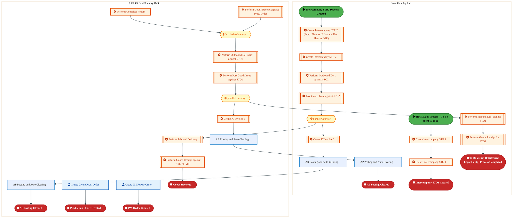
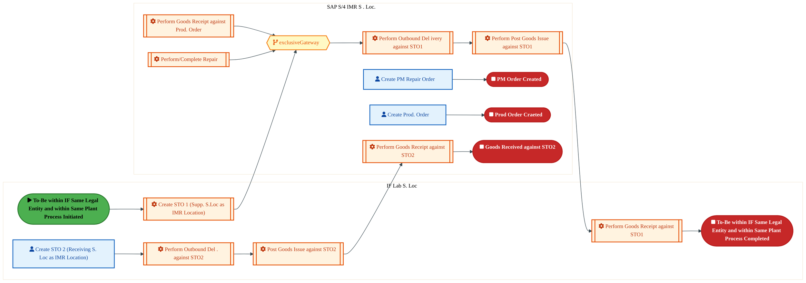
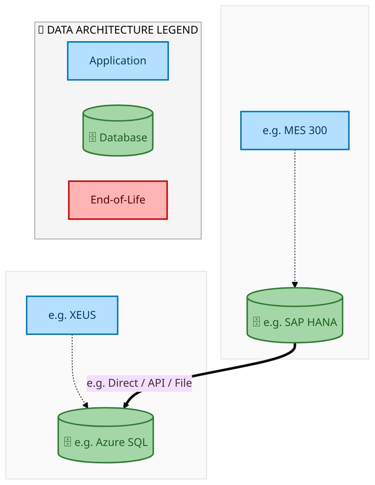
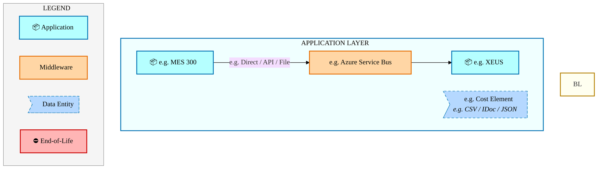
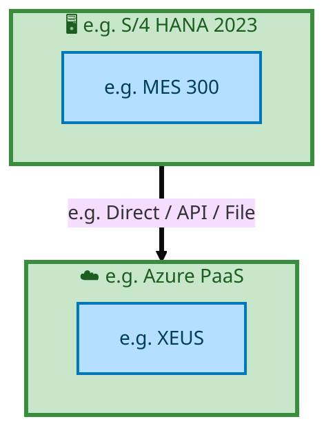

  
  <h1 style="font-size:36px; margin-top:24px;">E2E-113 — R3 IMR Labs Process</h1>
  <h2 style="font-size:24px;">Architecture Document (TOGAF BDAT)</h2>
  
End-to-End Integrated Processes (E2E) Tower 
  Capability E2E-113 · Forecast to Stock

  
IAO Program · Release 2 
  Generated: March 2026 
  Sajiv Francis

  
IAO Architecture Pipeline — Intel Confidential

Page 1<a href="#toc">↑ Back to TOC</a>E2E-113 — R3 IMR Labs Process

## Table of Contents

1. [Executive Summary](#1-executive-summary)
2. [Business Context & Objectives](#2-business-context--objectives)
   - 2.1 [Classification](#21-classification)
   - 2.2 [Business Drivers](#22-business-drivers)
   - 2.3 [Success Criteria](#23-success-criteria)
   - 2.4 [Companion Documents](#24-companion-documents)
3. [Business Architecture (TOGAF "B")](#3-business-architecture-togaf-b)
   - 3.1 [Business Process Overview](#31-business-process-overview)
   - 3.2 [Business Process Diagrams](#32-business-process-diagrams)
   - 3.3 [Business Roles & Responsibilities](#33-business-roles--responsibilities)
4. [Data Architecture (TOGAF "D")](#4-data-architecture-togaf-d)
   - 4.1 [Data Entities & Ownership](#41-data-entities--ownership)
   - 4.2 [Data Flow Diagrams](#42-data-flow-diagrams)
   - 4.3 [Data Lineage](#43-data-lineage)
   - 4.4 [RICEFW Data Objects](#44-ricefw-data-objects)
   - 4.5 [Data Governance & Quality](#45-data-governance--quality)
5. [Application Architecture (TOGAF "A")](#5-application-architecture-togaf-a)
   - 5.1 [Current-State Application Landscape](#51-current-state--current-state-application-landscape)
   - 5.2 [Future-State Application Landscape](#52-future-state--future-state-application-landscape)
   - 5.3 [Change Impact Summary](#53-change-impact-summary)
   - 5.4 [Component Overview](#54-component-overview)
   - 5.5 [RICEFW Inventory](#55-ricefw-inventory)
   - 5.6 [Integration Patterns](#56-integration-patterns)
6. [Technology Architecture (TOGAF "T")](#6-technology-architecture-togaf-t)
   - 6.1 [Platform & Infrastructure](#61-platform--infrastructure)
   - 6.2 [SAP Development Object Status](#62-sap-development-object-status)
   - 6.3 [NFRs & Design Principles](#63-nfrs--design-principles)
   - 6.4 [Security & Governance](#64-security--governance)
7. [Project Context](#7-project-context)
   - 7.1 [Project Roadmap & Go-Live Plan](#71-project-roadmap--go-live-plan)
   - 7.2 [RAID Log](#72-raid-log)
   - 7.3 [Recommendations & Next Steps](#73-recommendations--next-steps)

Page 2<a href="#toc">↑ Back to TOC</a>E2E-113 — R3 IMR Labs Process

## 1. Executive Summary

This Architecture Document defines the **Business, Data, Application, and Technology** (BDAT) architecture for **E2E-113 R3 IMR Labs Process** within the IAO program. It includes 4 BPMN process diagram(s) in Section 3.
| Dimension | Value |
|-----------|-------|
| **Tower** | End-to-End Integrated Processes (E2E) |
| **Process Group** | Forecast to Stock |
| **Capability** | E2E-113 - R3 IMR Labs Process |
| **Release** | Release 2 |
| **Total Systems** | 2 |
| **System Status** | 0 Deployed, 0 Developing, 0 EOL, 2 Pending IAPM |
| **RICEFW Objects** | Pending — Smartsheet Object Tracker API integration |
**Change Summary**: 0 new flow chains, 0 removed, 0 modified, 1 unchanged between Current-State and Future-State states.

> All system nodes in architecture diagrams are **IAPM-linked** — click any node to open its IAPM page. Diagrams require `securityLevel: 'loose'` for click events.

Page 3<a href="#toc">↑ Back to TOC</a>E2E-113 — R3 IMR Labs Process

## 2. Business Context & Objectives

### 2.1 Classification

| Level | Value |
|-------|-------|
| **L0 Tower** | End-to-End Integrated Processes |
| **L1 Process** | Forecast to Stock |
| **L2 Capability** | E2E-113 - R3 IMR Labs Process |

### 2.2 Business Drivers

| # | Driver | Description | Strategic Alignment | Priority |
|---|--------|-------------|---------------------|----------|
| 1 | End-to-End Process Integration | Enable cross-tower integrated processes spanning procurement, manufacturing, and fulfillment | IDM 2.0 Process Excellence | High |
| 2 | Intel Foundry Business Enablement | Stand up foundry-specific business processes for external customer engagement | Intel Foundry Services | High |
| 3 | Process Visibility & Monitoring | Provide end-to-end process visibility across tower boundaries with integrated monitoring | Operational Excellence | Medium |
| 4 | E2E-113 Process Migration | Migrate R3 IMR Labs Process business processes and 2 integrated systems from legacy to S/4 HANA target architecture | IDM 2.0 Cross-Functional / End-to-End | High |

Page 4<a href="#toc">↑ Back to TOC</a>E2E-113 — R3 IMR Labs Process

### 2.3 Success Criteria

| Metric | Target | Measure | Baseline | Owner |
|--------|--------|---------|----------|-------|
| E2E Process Cycle Time | Per process SLA | End-to-end transaction completion within defined SLA per process | Varies by process | E2E Process Owner |
| Cross-Tower Integration Success | > 99% | Transactions completing across tower boundaries without manual intervention | 92% (current) | Integration Lead |
| Process Exception Rate | < 2% | Transactions requiring manual exception handling | 8% (current) | Operations Manager |
| E2E-113 Migration Completeness | 100% flow chains validated | All 1 flow chains verified in target state | 0% (pre-migration) | Tower Architect |

### 2.4 Companion Documents

| Document | Description |
|----------|-------------|
| **Business Architecture** | Included in this document (Section 3) — process flows from BPMN diagrams |
| **This Document** | Full BDAT Architecture — Business + Data + Application + Technology |

Page 5<a href="#toc">↑ Back to TOC</a>E2E-113 — R3 IMR Labs Process

## 3. Business Architecture (TOGAF "B")

### 3.1 Business Process Overview

This capability includes **4 business process(es)** modeled in BPMN 2.0, covering the end-to-end workflow for E2E-113 R3 IMR Labs Process.

| # | Step ID | Process Name | Lanes | Tasks | Gateways |
|---|---------|--------------|-------|-------|----------|
| 1 | E2E-113A_IMR_Labs_Process_–_To-Be_from_IP_to_IF | E2E-113A_IMR_Labs_Process_–_To-Be_from_IP_to_IF | Boundary Apps , Intel Foundry Lab, SAP S/4 
 Intel Foundry IMR | 21 | 4 |
| 2 | E2E-113B_IMR_Labs_Process_–To-Be_within_IF_Different_Legal_Entity_(Part_1) | E2E-113B_IMR_Labs_Process_–To-Be_within_IF_Different_Legal_Entity_(Part_1) | Intel Foundry Lab, SAP S/4 
 Intel Foundry IMR | 22 | 3 |
| 3 | E2E-113C_IMR_Labs_Process_–To-Be_within_IF_Different_Legal_Entity)_(Part_2) | E2E-113C_IMR_Labs_Process_–To-Be_within_IF_Different_Legal_Entity)_(Part_2) | Intel Foundry Lab, SAP S/4 
 Intel Foundry IMR | 16 | 1 |
| 4 | E2E-113D_IMR_Labs_Process_–_To-Be_within_IF_Same_Legal_Entity_&amp;_within_Same_Plant | E2E-113D_IMR_Labs_Process_–_To-Be_within_IF_Same_Legal_Entity_&amp;_within_Same_Plant | IF Lab S. Loc, SAP S/4 
 IMR S . Loc. | 12 | 1 |

### 3.2 Business Process Diagrams

Page 6<a href="#toc">↑ Back to TOC</a>E2E-113 — R3 IMR Labs Process

#### BUSINESS ARCHITECTURE — 3.2.1 E2E-113A_IMR_Labs_Process_–_To-Be_from_IP_to_IF — E2E-113A_IMR_Labs_Process_–_To-Be_from_IP_to_IF

**Swim Lanes**: Boundary Apps  · Intel Foundry Lab · SAP S/4 
 Intel Foundry IMR | **Tasks**: 21 | **Gateways**: 4

```mermaid
%%{init: {'theme': 'base', 'themeVariables': {'fontSize': '14px', 'fontFamily': 'Segoe UI, Arial, sans-serif','primaryColor': '#e8f0fe', 'primaryBorderColor': '#0071c5','lineColor': '#37474F', 'secondaryColor': '#f5f8fc'}, 'flowchart': {'useMaxWidth': false, 'htmlLabels': true, 'curve': 'basis', 'nodeSpacing': 40, 'rankSpacing': 50}} }%%
flowchart LR
    classDef startEvt fill:#4CAF50,stroke:#2E7D32,color:#000,font-weight:bold,stroke-width:2px,rx:20,ry:20
    classDef endEvt fill:#C62828,stroke:#B71C1C,color:#fff,font-weight:bold,stroke-width:2px,rx:20,ry:20
    classDef userTask fill:#E3F2FD,stroke:#1565C0,stroke-width:2px,color:#0D47A1
    classDef serviceTask fill:#FFF3E0,stroke:#E65100,stroke-width:2px,color:#BF360C
    classDef gateway fill:#FFF9C4,stroke:#F57F17,stroke-width:2px,color:#E65100
    classDef subProc fill:#F3E5F5,stroke:#7B1FA2,stroke-width:2px,color:#4A148C
    subgraph Boundary Apps 
        n1["Trigger part request"]
        n22(["fa:fa-play Initiate part request"])
    end
    subgraph Intel Foundry Lab
        n4[["fa:fa-cog Create Sub-Con Purchase Requisition"]]
        n5[["fa:fa-cog Create Sub-Con Purchase Order with IMR as Supplier"]]
        n6[["fa:fa-cog Perform Issue Defective Material against SubCon PO"]]
        n7[["fa:fa-cog Regular Purchase Requisition​"]]
        n8[["fa:fa-cog Regular Purchase Order with IMR as Supplier​"]]
        n9[["fa:fa-cog IBD and GR against Regular PO"]]
        n10[["fa:fa-cog Send IMR invoice to IP through regular PO"]]
        n11[["fa:fa-cog IBD and GR against SubCon PO"]]
        n12[["fa:fa-cog Send IMR invoice to Ip through Subcon PO"]]
        n23(["fa:fa-stop IMR Labs Process To-Be from IP to IF Process Completed"])
        n24(["fa:fa-stop Good Received"])
        n25(["fa:fa-stop IMR Invoice Sent"])
        n26(["fa:fa-stop Goods Received against SubCon PO"])
        n32{{"fa:fa-code-branch exclusiveGateway"}}
        n33{{"fa:fa-arrows-alt parallelGateway"}}
    end
    subgraph SAP S/4   Intel Foundry IMR
        n2["fa:fa-user Create Create Prod. Order"]
        n3["fa:fa-user Create PM Repair Order"]
        n13[["fa:fa-cog Perform Goods Receipt against Prod. Order"]]
        n14[["fa:fa-cog Perform/Complete Repair"]]
        n15[["fa:fa-cog Perform OBD and Goods issue against Repair Sales order"]]
        n16[["fa:fa-cog Send Invoice to IP"]]
        n17[["fa:fa-cog Perform OBD and Goods issue against regular Sales order"]]
        n18[["fa:fa-cog Send Invoice to IP"]]
        n19[["fa:fa-cog IBD and Perform Goods Receipt (Customer Stock)"]]
        n20[["fa:fa-cog Repair Sales Order"]]
        n21[["fa:fa-cog Create Regular Sales Order with IP labs as customer"]]
        n27(["fa:fa-stop Repair Sales Order Created"])
        n28(["fa:fa-stop Goods Received"])
        n29(["fa:fa-stop Regular SO Created"])
        n30(["fa:fa-stop PM Order Created"])
        n31(["fa:fa-stop Production Order Created"])
        n34{{"fa:fa-arrows-alt parallelGateway"}}
        n35{{"fa:fa-arrows-alt parallelGateway"}}
    end
    n15 --> n35
    n4 --> n5
    n5 --> n33
    n7 --> n8
    n14 --> n15
    n13 --> n17
    n17 --> n34
    n34 --> n18
    n18 --> n10
    n16 --> n12
    n34 --> n9
    n8 --> n21
    n33 --> n6
    n33 --> n20
    n20 --> n27
    n6 --> n19
    n19 --> n28
    n21 --> n29
    n3 --> n30
    n2 --> n31
    n9 --> n24
    n10 --> n25
    n11 --> n26
    n35 --> n16
    n35 --> n11
    n12 --> n23
    n22 --> n1
    n1 --> n32
    n32 --> n4
    n32 --> n7
    class n2 userTask
    class n3 userTask
    class n4 serviceTask
    class n5 serviceTask
    class n6 serviceTask
    class n7 serviceTask
    class n8 serviceTask
    class n9 serviceTask
    class n10 serviceTask
    class n11 serviceTask
    class n12 serviceTask
    class n13 serviceTask
    class n14 serviceTask
    class n15 serviceTask
    class n16 serviceTask
    class n17 serviceTask
    class n18 serviceTask
    class n19 serviceTask
    class n20 serviceTask
    class n21 serviceTask
    class n22 startEvt
    class n23 endEvt
    class n24 endEvt
    class n25 endEvt
    class n26 endEvt
    class n27 endEvt
    class n28 endEvt
    class n29 endEvt
    class n30 endEvt
    class n31 endEvt
    class n32 gateway
    class n33 gateway
    class n34 gateway
    class n35 gateway
```

> **Legend**: ● Start · ● End · User Task · Service Task · ◇ Gateway · Sub-Process

<a href="https://mermaid.live/edit#pako:eNqlWG1v4jgQ_itWVhV7EtzGeSHAh5OANiukrYrK3t2H7X0wiQNRQ5yznb5cxX-_CdiBBKe7e8eHFj8z88wzE4-T8GZFLKbWxLq6ekvzVE7QW09u6Y72Jqi3JoL2-ugI_EF4StYZFb3KJ2G5XKX_HNywV7xUbhUWkl2avVboim4YRb8v-mgKgVkfCZKLgaA8TXr9XsHTHeGvc5YxXnl_oKPETg7ZlGnGeEz5ycG2Axz5EJqlOT3BbuAFXljFCRqxPG6QJn4ySqLevhKXsedoS7g8yC8FvSUvf6ax3MI6IZmg4LOVu-wLWdOsqlHyssKikj_pZqSiypNDw1YFidJ8A7hnA8RJ_niCfHu_R_urq4e8Toq-3D_kCD5RRoS4pgkSEuCbJ4mSNMsmH7z5NPTtvpCcPdLJB-cmuHadflRVMoHS7X7V3MEzTTdbOVmzLFaug-eqholTvPT5y8Sx-_wV_rZy0Tw-ZZoPnZEzqjPNAjzHc50pSZL_lQn6yr8S8ahy3bihE17XubA_9Of2JZ8u89oLprjdJ8qf0oiekYZh6N6cWnUz9LHdTToL3aE9b5FuiKTP5PVEOJ57NWHoByEOOgmP-doqy_WSs0gTujd-6NeEwQyHU6eT0Jtib6QUAs-Gk2KLZqw87GU0LQqBjsbqk-NvD9ZXnm42lKOi2lmc_l1SIR-sv868HOcj-CVkkpBBkUGlC5jtFKpux_xyDIId0hKwyCXNUFjJABUwFWfs3reaPGIbNOe0Yl6V68Gc5WhZctjzgqJ7yJIKyMtyyHQuz_8xgrvqBEDPqQQ5t_eICHApiiylvMU3bPItKU8Y36GFECVFcH1oJNMnim4hS3UWIbIhaS5klfGQ8K7FFzT57ummzAg3V1Y6tr1uxY--E_9OYSa6cZNuMbtGJI_R5_u6kDpDuxJsN2NXcKUPOdP8icFcIcnQYonklrNys4WN0cWDv6uhq5nY-QEJRS0BaCITjeOetrSQrDhQwL4UqJo8KgT6ygYzihLOdoeSgDWsbXO2KzIqaXza80dWr8X6mbEY2hlR2DAXzr5BwkJVAWXJtv_QQC5qdmPnzuNd5-3t1LmYDtZwo4m2iL5EWSmA4vPxHHuw9vvzMPcURjhnz2JAMllNPskyml0EXQ7_arpEq08eQM1jAOo9L68urjr29RSrf9D4-NfjRm8eTa4xankLbSlIyk0h2DXP91k7C1l3s5m5weMZeT7pzaEktKN8c_Y7PQIHFenhrDnN46GWFYHnJcRMUoamoTifyXZA8PMq9DS_I2P0szI6ziLzJfk4L2Hf7-AyrySLHn9pj7TdPifPuma6gA423jjuG3WeH65LlFUnBBywkVLSZgxaI3qpQWW5OAxG7w5323t8kUdpvuvgd-1WBIzIe3pc3PaHOSij6h71fpz3c6fFMcj_j0cMTBMaDH6rGBTgHdd6qc2uWgfH9UiHK3es_bGrgEADKsL1FODqkJpjpABbA0MFOK2QsVqrAAdru0o6bK318zB8UYBWpTNoRjxWDlqUgxWgPRSlW1OqtdagCXSZWKesO6MZa5Wqt_gC0JxYJXF09x0F1A5KRN0oZfda6-Ds-biSrt8LGrBrhr3zZ_6Gxe-0DDstQadl1GkZd1qgyZ0m3G1yuk1ut6m7Ebi7E7i7Fbi7F7i7Gbi7G053N5zubsCe0i-_TdxVL6pN1DOivhEdGtHAiI6M6NiEurYRxUbU0W-XTdg1w54Z9jVs9S24ae1IGluTN-vwQwz8WBPThJSZtPZ9i5SSrV7zyJocfrCwyiKGyOuUwJPc7gju_wWJ6Iq7" title="Edit in Mermaid Live">&#9998; Edit in Mermaid Live</a>

Page 7<a href="#toc">↑ Back to TOC</a>E2E-113 — R3 IMR Labs Process

#### BUSINESS ARCHITECTURE — 3.2.2 E2E-113B_IMR_Labs_Process_–To-Be_within_IF_Different_Legal_Entity_(Part_1) — E2E-113B_IMR_Labs_Process_–To-Be_within_IF_Different_Legal_Entity_(Part_1)

**Swim Lanes**: Intel Foundry Lab · SAP S/4 
 Intel Foundry IMR | **Tasks**: 22 | **Gateways**: 3

> **Legend**: ● Start · ● End · User Task · Service Task · ◇ Gateway · Sub-Process

<a href="https://mermaid.live/edit#pako:eNqlWFtv4jgU_itWqoqpBJ3YudE8rESBjCpNVVS6uw_TfTCJA1FDHNlOW7biv68NNpeQdNouD63ynfN952If4_BmxTQhVmidn79lRSZC8NYRC7IknRB0ZpiTThdsgb8wy_AsJ7yjfFJaiGn278YNuuWrclNYhJdZvlLolMwpAX_edMFAEvMu4LjgPU5Ylna6nZJlS8xWQ5pTprzPSD-10000bbqmLCFs72DbAYw9Sc2zguxhJ3ADN1I8TmJaJEeiqZf207izVsnl9CVeYCY26Vec3OLXv7NELORzinNOpM9CLPOfeEZyVaNglcLiij2bZmRcxSlkw6YljrNiLnHXlhDDxdMe8uz1GqzPzx-LXVDwMHosgPzEOeZ8RFLAhYTHzwKkWZ6HZ-5wEHl2lwtGn0h4hsbByEHdWFUSytLtrmpu74Vk84UIZzRPtGvvRdUQovK1y15DZHfZSv6txSJFso809FEf9XeRrgM4hEMTKU3T_xVJ9pU9YP6kY42dCEWjXSzo-d7QPtUzZY7cYADrfSLsOYvJgWgURc5436qx70G7XfQ6cnx7WBOdY0Fe8GoveDV0d4KRF0QwaBXcxqtnWc0mjMZG0Bl7kbcTDK5hNECtgu4Aun2dodSZM1wuwE0hSA4iWhUJWwG5Kbd29Sngr0drcA8mlAu54QAuEjCoBAXDnMgZLeaPFbLt2aP1zwEHKc7kc5zglySlOExxL6ZzMGREtm2TGYvpssTFCkwf7gGUrENa_yO0uxPa1TFtQlhK2VLyZqoJYCTbcQnwHGcFF0qgzod2s8APShMO7klMslLOAGWNZPixWhH4Nq3K8hJMclwIgDm4idTqbBoqYxwabu8v6lHQx1qD6jynubS7SrQ050TBrSnIfaA7c8N5Rd7les1ZD2Xiz1TO5km-yPm2Y5S5nLNQNkO1iQM1JYRzoPYbdMAD7V0TkDIqF3oC5H68iaTWxaGWW9OqrwnaaW4TS-oC3l6AC1rqmC-ZWGSFWr5RlqaEEblqP8kc52BciEysLvayMlZOGoT9mvDBfG3G6pQR1Bj1lYctNTjO25shYsboC-_hXIASM5znJP-xPc4erfV6S5IHfu08mcrkpt9dCR2fLHJhDuN84ZRwv3Aaebs2qC8Ms6P0P9n35BLcqW__Y5bfyJrcysErccaaKND_yKFgNv9x5COdoFHnu9kbOoU6q_-Buc2eiVyH9w62lpPxvRmuayD7dzN8woC_PY83mddp6DMNV6cNwGKzC2s6_U8P11WNoVazikVGi-2Sts2WXefdvu8Pa_4HpT2feqP95Kqbdm8m74rxApDXOK-4JJzM7pbmfnHg5Z4Dvd4fatcYAGoAGQBpwDGAowHXAO4WcIwH0h6Bfg62j3396Gh_E_JK69lGz94CyKsRzP1RRtIU44G0B4Q1D2QApOtCu7p0WGdXhqc1zLO2G0XNN1XotiBfP5sc9aMWQ6ZIX6vtitRNcQzBMX02AfTKINNFpB2cXYJ-TQLpxrkH102ViblmH8F-MxwcXqGPLP1Wy1WrRS5lqwm2m1C7yWk3ue0mr93kt5vaewHbmwHbu4Hau4Hau4HauyEHzbwYHuNuC-7pl7tj1G9Eg0a034heNaGO3YjCRhSZt6xj2GmGXQNbXWtJ2BJniRW-WZtfHuSvEwlJcZULa921sLxcTFdFbIWbN3SrKhPJHGVYXnSWW3D9H4PsKsI=" title="Edit in Mermaid Live">&#9998; Edit in Mermaid Live</a>

Page 8<a href="#toc">↑ Back to TOC</a>E2E-113 — R3 IMR Labs Process

#### BUSINESS ARCHITECTURE — 3.2.3 E2E-113C_IMR_Labs_Process_–To-Be_within_IF_Different_Legal_Entity)_(Part_2) — E2E-113C_IMR_Labs_Process_–To-Be_within_IF_Different_Legal_Entity)_(Part_2)

**Swim Lanes**: Intel Foundry Lab · SAP S/4 
 Intel Foundry IMR | **Tasks**: 16 | **Gateways**: 1

> **Legend**: ● Start · ● End · User Task · Service Task · ◇ Gateway · Sub-Process

<a href="https://mermaid.live/edit#pako:eNqlV11v4jgU_StWRhVTCWbifBCah5UokFGlqYrK7O7DdB5M4oDVYEe205ap-O97TRIIKel2tTy08rn3nPvhayd5tWKRUCu0Li5eGWc6RK89vaYb2gtRb0kU7fVRCfxFJCPLjKqe8UkF1wv2e--GvfzFuBksIhuWbQ26oCtB0Z83fTQGYtZHinA1UFSytNfv5ZJtiNxORCak8f5ER6md7qNVpmshEyqPDrYd4NgHasY4PcJu4AVeZHiKxoInJ6Kpn47SuLczyWXiOV4TqffpF4rekpe_WaLXsE5Jpij4rPUm-06WNDM1alkYLC7kU90MpkwcDg1b5CRmfAW4ZwMkCX88Qr6926HdxcUDPwRF3-8fOIJfnBGlpjRFSgM8e9IoZVkWfvIm48i3-0pL8UjDT84smLpOPzaVhFC63TfNHTxTtlrrcCmypHIdPJsaQid_6cuX0LH7cgt_W7EoT46RJkNn5IwOka4DPMGTOlKapv8rEvRV_iDqsYo1cyMnmh5iYX_oT-y3enWZUy8Y43afqHxiMW2IRlHkzo6tmg19bHeLXkfu0J60RFdE02eyPQpeTbyDYOQHEQ46Bct47SyL5VyKuBZ0Z37kHwSDaxyNnU5Bb4y9UZUh6KwkydfohmuaoUgUPJFbBENZ2s2Puz9_PlgpCVMyiMUKTSSFcgxDklhscsK3aPHjHuEH69evBs37CO3uDQ3jU96cylTIDRCXJjs0hTy_ILIijCttFN4IOOcFvgmRKHRPY8pyGE4hz5KDzwdynsGWhTe396YfCpmGU6XQQ-HY2EU_xOCaolQKSG2OtEA3EWhdNrVGRy2lRV5RnpleMw7uaMrSlErK4bjSFcnQjGumt5eHSBNoU0Y1TVrCjt0SftPUstlveI0tSeGkUTkQOeVonOcZi81liyCxGG5hJFIkaU6YRIJnW1MeROAK0kUJTWms2RNFOVwpx_7BqW8N1WI8R4uvHkCn4wUtbbbpkJM5zfWcVP-gFckXdGeuZojUrOUsa34LG7xP-wwFux8ZjHqyTiOf6Hhndb7W21Wl0Gb556PfFfo42NBV6M97wz08rzIX4F8WcqNUQd_TcHBrfEypBWyp4GW9XePjtHm37_u7r6_HXBM6WMIIxWtEX-KsUFDqt_JafLB2u9YIcf9jl4dzLI0PP9Dfk4ujSQ5a5Hfa2aSNPnY1OujzosjzL2ieETjtRJnTD5cKIpAXDF7TcHt_2Qhw9a-X4X5kGgxs_5cpN_UgovdHsqFx1drpBvmpuc98hAaDP2C76m0rl8M6-3KJ7brL5fqq3rFyGRwyr9xrO67kcK2HKwG3Wrvl0qvNuPJ3asCpgFEFOBUD1wnjKgeMa8ArAaeOgd02UK1rRhXDqYPWAs1ntmHV7yonsHMedpvvIScWr9Pid1qGnZag0zLqtFx1WmADO0242-R0m7r7gLsbgbs7gbtbAbNVvyOf4qPqffYUvTqHOvZZFJ9FnbOoW78snsJe_cpn9a0NlRvCEit8tfZfSvA1Bc9kUmTa2vUtUmix2PLYCvdfFFaRJyA4ZQSeyZsS3P0DpKA8Xw==" title="Edit in Mermaid Live">&#9998; Edit in Mermaid Live</a>

Page 9<a href="#toc">↑ Back to TOC</a>E2E-113 — R3 IMR Labs Process

#### BUSINESS ARCHITECTURE — 3.2.4 E2E-113D_IMR_Labs_Process_–_To-Be_within_IF_Same_Legal_Entity_&amp;_within_Same_Plant — E2E-113D_IMR_Labs_Process_–_To-Be_within_IF_Same_Legal_Entity_&amp;_within_Same_Plant

**Swim Lanes**: IF Lab S. Loc · SAP S/4 
 IMR S . Loc. | **Tasks**: 12 | **Gateways**: 1

> **Legend**: ● Start · ● End · User Task · Service Task · ◇ Gateway · Sub-Process

<a href="https://mermaid.live/edit#pako:eNqlVl1v6jgQ_StWqopeKfTG-SBpHlaiQK4qtWrVdHcfbvfBJA5YDXFkO7Qs4r-vDQ6QNKn26vKAmDMz54zHg-2tkdAUG6FxebklBREh2A7EEq_wIASDOeJ4YIID8BdiBM1zzAcqJqOFiMm_-zDolh8qTGERWpF8o9AYLygGf96ZYCwTcxNwVPAhx4xkA3NQMrJCbDOhOWUq-gIHmZXt1bTrlrIUs1OAZfkw8WRqTgp8gh3f9d1I5XGc0CJtkGZeFmTJYKeKy-l7skRM7MuvOH5AH3-TVCylnaGcYxmzFKv8Hs1xrtYoWKWwpGLruhmEK51CNiwuUUKKhcRdS0IMFW8nyLN2O7C7vHwtjqLg_vm1APKT5IjzKc4AFxKerQXISJ6HF-5kHHmWyQWjbzi8sGf-1LHNRK0klEu3TNXc4Tsmi6UI5zRPdejwXa0htMsPk32EtmWyjfxuaeEiPSlNRnZgB0elWx9O4KRWyrLst5RkX9kL4m9aa-ZEdjQ9akFv5E2sz3z1MqeuP4btPmG2Jgk-I42iyJmdWjUbedDqJ72NnJE1aZEukMDvaHMivJm4R8LI8yPo9xIe9NpVVvMnRpOa0Jl5kXck9G9hNLZ7Cd0xdANdoeRZMFQuwV0E5CSC-Brc0-TgU58C_nw1MhRmaKhaDSYMy6WA-OUR2ODqGSeYrOUQ6jyAOLh7eFY_kSC0-PZq_HPG5f48kiV0cc4FwVVcleW15OmhOefxmjxPmGWUrcAPSlMO9jWVAqAFIgUXih628kfd-Y-VmNOqSMEU5-D6nMBuEfgtAirDDup3nFf4q1ToXB1zy1yOxAsd3mLwTsSSFGoXYrTC4B4vUA5mhSBiA5AsSfv3zqccFQKo7cdcKspDlMg-plLo27mQexLigpa_LTShqzLHDSH5P2-NUTx-AvF3V0JqA2OwH4vrs7LsznmSGuk1eFQHcHNknO7wB7nNJSKsKyX4leloCp_T3HTSfK-7oAto7671i6P5aTzg_5hNssZs89WAQ7ub5atB_cThteZHNn3fJ70Jn-Zt1I6XrT1mINyR4bcyzrq0xmm7TY3UYLs9LTDFw7m8EZMlwB9JXnGZ_eNw4L4au11rVGWLwXD4h2qSBkYH26_9zsF2te3p8NqG9gHwajvQAfomKWo70LbbsrX-SJu-dusjvtDysObXcrCOh5YG6oJvmvz7O0Kp1HdjA7a7Yacbds-vw4bH6_WMej1-ryfo9dz0emQfel2w32X3u5zjI6mJu_pB00S9TnTUifqdaFC_CwzTWGG2QiQ1wq2xf_3KF3KKM1TlwtiZBqoEjTdFYoT7V6JRlanMnBIkT93VAdz9B0g_im0=" title="Edit in Mermaid Live">&#9998; Edit in Mermaid Live</a>

Page 10<a href="#toc">↑ Back to TOC</a>E2E-113 — R3 IMR Labs Process

### 3.3 Business Roles & Responsibilities

| Role / Lane | Processes Involved | Description |
|------------|-------------------|-------------|
| Boundary Apps  | E2E-113A_IMR_Labs_Process_–_To-Be_from_IP_to_IF,  | |
| Intel Foundry Lab | E2E-113A_IMR_Labs_Process_–_To-Be_from_IP_to_IF, E2E-113B_IMR_Labs_Process_–To-Be_within_IF_Different_Legal_Entity_(Part_1), E2E-113C_IMR_Labs_Process_–To-Be_within_IF_Different_Legal_Entity)_(Part_2),  | |
| SAP S/4 
 Intel Foundry IMR | E2E-113A_IMR_Labs_Process_–_To-Be_from_IP_to_IF, E2E-113B_IMR_Labs_Process_–To-Be_within_IF_Different_Legal_Entity_(Part_1), E2E-113C_IMR_Labs_Process_–To-Be_within_IF_Different_Legal_Entity)_(Part_2),  | |
| IF Lab S. Loc | E2E-113D_IMR_Labs_Process_–_To-Be_within_IF_Same_Legal_Entity_&amp;_within_Same_Plant | |
| SAP S/4 
 IMR S . Loc. | E2E-113D_IMR_Labs_Process_–_To-Be_within_IF_Same_Legal_Entity_&amp;_within_Same_Plant | |

Page 11<a href="#toc">↑ Back to TOC</a>E2E-113 — R3 IMR Labs Process

## 4. Data Architecture (TOGAF "D")

### 4.1 Data Entities & Ownership

| # | Data Entity | Source System | Target System | Data Owner | Classification | Volume | Master/Transaction |
|---|-------------|---------------|---------------|------------|----------------|--------|-------------------|
| 1 | e.g. Cost Element | e.g. MES 300 | e.g. XEUS | Data steward | e.g. Intel Confidential | e.g. 10K rows/day | Master / Transaction |

Page 12<a href="#toc">↑ Back to TOC</a>E2E-113 — R3 IMR Labs Process

### 4.2 Data Flow Diagrams

> **DATA ARCHITECTURE** — Database-to-database data flows. Applications (blue) sit above their hosting databases (green cylinders). Thick arrows show data movement between databases.

#### 4.2.1 Current-State — Current-State Data Flows

<a href="https://mermaid.live/edit#pako:eNqdlYFumzAQhl_FchVlk5KOJCVZkVrJCWStRKuupNukMiEHjsSqAwjMmjTNu8-GhG5Z6KraEsLnu__O3yGzxn4cADZwo7FmERMGWjfFHBbQNFBzSjNotlAzAz9PmVjZ8Au42uBxXO4Urt9oyuiUQ9ZU0WEcCYc9FQIdPVkqN2Ub0wXjK2V1YBYDurtsISIDeXOjPHj86M9pKgqNPIMruvzOAjGX65DyDKTPXCy4TafAVSKR5soWyeqdhPosmkljT5emlEYPL6YTfbNBm0bDjaoUaDJ0IySHz2mWmRAimiTDeIlCxrlxNNTN8XjcykQaP4BxpGmDwbC_XbYfVU1GN1m2_JjHqdrumfq-XjAdrfhWjuhmnwwqua41MHvdWrnOULe62p4cxPylvPF4qA_1Sm800uSo1ev31bYblYpZPp2lNJkjq2t1Or2RSUa2B97MI095Cp7z1b53MXLxz9JdjYCl4AsWRxU1Nap4UoT_sO4cGQnHs2Ok3qWCYRgl1QNB5l7ODy528-BzL5DPwD9x8xA0eWqlVjgh6eTij0qzIPtqHah93D6vzVWGQhRsgYgVh3oaO-REzQq5pan5N_JOsvwvZIfceBfkmryP8ZXleD1N22GWSySXbyJdJX4FtPRByudNnLe1HES9S_Ym0jvnd4GuSYzOzs6ft5TMgiz6hMjNpXyOGQcXP7_ydey10IaZPMH9H9j8QEMmmRBEbkcXlxNrNLm7tZBtfbGuzZqm2rcvVttT7SdJwplP1e7hBtqeWdMskwqq7uXDfbI9S8pbUdCOw7bNQijlywvkYEfKE-7462pW_E9PT_-Bj1t4AemCsgAba1zc__LvEUBIcy7wpoVpLmJnFfnYKK5onCcBFWAyKokuSuPmNwO898U=" title="Edit in Mermaid Live">&#9998; Edit in Mermaid Live</a>

Page 13<a href="#toc">↑ Back to TOC</a>E2E-113 — R3 IMR Labs Process

#### 4.2.2 Future-State — Future-State Data Flows

<a href="https://mermaid.live/edit#pako:eNqdlYFumzAQhl_FchVlk5KOJCVZkVrJCbBWolVX0m1SmZADR2LVAQRmTZrm3WdDQrcs6araEsLnu__O3yGzwkESAjZwo7FiMRMGWjXFDObQNFBzQnNotlAzh6DImFg68Au42uBJUu2Urt9oxuiEQ95U0VESC5c9lQIdPV0oN2Wz6ZzxpbK6ME0A3V22EJGBvLlWHjx5DGY0E6VGkcMVXXxnoZjJdUR5DtJnJubcoRPgKpHICmWLZfVuSgMWT6Wxp0tTRuOHF9OJvl6jdaPhxXUKNB56MZIj4DTPTYgQTdNhskAR49w4GuqmbdutXGTJAxhHmjYYDPubZftR1WR000UrSHiSqe2eqe_qhZPRkm_kiG72yaCW61oDs9c9KNcZ6lZX25GDhL-UZ9tDfajXeqORJsdBvX5fbXtxpZgXk2lG0xmyulan07NNMnJ88Kc-eSoy8N2vzr2HkYd_Vu5qhCyDQLAkrqmpUceTMvyHdefKSDieHiP1LhUMw6io7gkyd3J-8LBXhJ97oXyGwYlXRKDJUyu10glJJw9_VJol2VfrQO3j9vnBXFUoxOEGiFhyOExji5yoWSO3NDX_Rt5JF_-F7JIb_4Jck_cxvrJcv6dpW8xyieTyTaTrxK-Alj5I-byJ86aWvai3yd5Eeuv8LtAHEqOzs_PnDSWzJIs-IXJzKZ824-Dh51e-jp0WOjCVJ7j_A1sQasgkY4LI7ejicmyNxne3FnKsL9a1eaCpzu2L1fFV-0machZQtbu_gY5vHmiWSQVV9_L-Pjm-JeWtOGwnUdthEVTy1QWytyPVCbf8dTVr_qenp__Axy08h2xOWYiNFS7vf_n3CCGiBRd43cK0EIm7jANslFc0LtKQCjAZlUTnlXH9G4By9-8=" title="Edit in Mermaid Live">&#9998; Edit in Mermaid Live</a>

Page 14<a href="#toc">↑ Back to TOC</a>E2E-113 — R3 IMR Labs Process

### 4.3 Data Lineage

| # | Source System | Source Schema/Object | Target System | Target Schema/Object | Transformation |
|---|-------------|---------------------|---------------|---------------------|---------------|
| 1 | e.g. MES 300 | e.g. CKMLHD table | e.g. XEUS | e.g. dbo.CostElements | Lineage notes |

### 4.4 RICEFW Data Objects

Reports and Conversions for this capability will be populated from the Smartsheet Object Tracker via automated API extraction.

| Object ID | Type | Description | Status | Source | Target | Complexity |
|-----------|------|-------------|--------|--------|--------|-----------|
| E2E-113-R001 | Report | R3 IMR Labs Process operational report | Planned | SAP S/4HANA | Analytics | Medium |
| E2E-113-C001 | Conversion | Legacy data migration for R3 IMR Labs Process | Planned | Legacy ERP | SAP S/4HANA | High |

> *Pending: Smartsheet API integration to auto-populate live RICEFW data (see Build Requirements).*

### 4.5 Data Governance & Quality

| Concern | Approach |
|---------|----------|
| Data Ownership | Per-entity owners listed in Section 3.1 |
| Data Classification | Financial data classified as Intel Confidential |
| Data Retention | Per Intel corporate retention policies |
| Data Quality | Validated at source; reconciliation at target |

Page 15<a href="#toc">↑ Back to TOC</a>E2E-113 — R3 IMR Labs Process

## 5. Application Architecture (TOGAF "A")

### 5.1 Current-State — Current-State Application Landscape

#### Overview

The Current-State architecture represents the **current / legacy** landscape for E2E-113.This view is generated from `CurrentFlows.xlsx` (1 flow hops across 1 flow chains).

#### APPLICATION ARCHITECTURE — Architecture Diagram (ArchiMate-Inspired)

> **Click any system node** to open its IAPM application page.
> **Legend**: Deployed · Developing · End-of-Life · No IAPM Match

<a href="https://mermaid.live/edit#pako:eNqVVWtv4jAQ_CtWKsQXaEMpj0YVUkLCiVNoq6aPOx2nyMQLWDVJFDttKeW_n51QwquiZ6SgrGdnndmxvdCCiIBmaKXSgoZUGGhRFlOYQdlA5RHmUK6gMocgTaiYu_ACTE2wKMpnMugjTigeMeBllT2OQuHR94yg1ozfFEzFenhG2VxFPZhEgB76FWTKRFZBHIe8yiGh4_JSoVn0GkxxIjK-lMMAvz1RIqbyfYwZB4mZihlz8QiYKiqSVMVC-SVejAMaTmTwQpehBIfPRaihL5doWSoNw3UJdG8NQyRHqYSqVbmgYEoHWECVhjymCRDExZwBChjmHLjE5PDs3YYxGqWchsA5ysaYMmac9OSwGhUukugZjBOr3W7q1uq1-qq-xDiP3ypBxKLEONF1fYcTxzEqRs5pNRTrmlPXWy2r-R-cBAu8z2m3j3DWtjg_5wjmUrwEz6WmqLFTaUYJYfCKE9hUxG6ahSJOq9kr2L6xeojYniJK4w2Vu11dP8aZs_J0NElwPEWm-2eoDVPSrhP5JPUGMm9v3X7XvO_fXCPX_O3cDbW_eZIaRBoiEDQKkXtXRJ1zp1ard33wJ_7A8fy6rm_SBtBEcDo5RXIOyTnJaBiGbPFhhl_Og3cwXU18nTt4yrLN9zQB34PkhQbgWynf-sBaK6fKUGiFQhKV8xaN26O3nYy-G3HhO0zu-VB0NhcZXOTMCoBWgKtRcta5op18wntEZ6hvR4H8--ndXF-d0U5eVjkzLwgh-ezRAVHl3ut8DLWMzs46IanM27589iiDofZxTIwt6q9AqsxeR9SyVubJjgPL3djqPf3YVt9MNdep-nd29J5pXZhInbYsQnTkOj-ca_sbbnV96fFdg5lxzGiAFfiAxVx_8LTro0HhlS-94_q2s-sSWx1DTijkbbLb_TzFuck35XmTXEggqUbjqkvHqzLyHNiwSiFqLsqnsA31Wwt7eXm5d6ZpFW0GyQxTohkLLbvF5B1IYIxTJrRlRcOpiLx5GGhGdrloaSwXCjbFsgmzPLj8B2jPPtE=" title="Edit in Mermaid Live">&#9998; Edit in Mermaid Live</a>

Page 16<a href="#toc">↑ Back to TOC</a>E2E-113 — R3 IMR Labs Process

#### Current-State Flow Narrative

| # | Flow Chain | Path | Interface | Freq |
|---|-----------|------|-----------|------|
| 1 | e.g. MES Route to ICOST | e.g. MES 300 → e.g. XEUS | e.g. Direct / API / File | e.g. Near Real-Time |

Page 17<a href="#toc">↑ Back to TOC</a>E2E-113 — R3 IMR Labs Process

### 5.2 Future-State — Future-State Application Landscape

#### Overview

The Future-State architecture represents the **target** landscape for E2E-113.This view is generated from `FutureFlows.xlsx` (1 flow hops across 1 flow chains).

#### APPLICATION ARCHITECTURE — Architecture Diagram (ArchiMate-Inspired)

> **Click any system node** to open its IAPM application page.
> **Legend**: Deployed · Developing · End-of-Life · No IAPM Match

<a href="https://mermaid.live/edit#pako:eNqVVWtv4jAQ_CtWKsQXaEMpj0YVUkLCiVNoq6aPOx2nyMQLWDVJFDttKeW_n51QwquiZ6SgrGdnndmxvdCCiIBmaKXSgoZUGGhRFlOYQdlA5RHmUK6gMocgTaiYu_ACTE2wKMpnMugjTigeMeBllT2OQuHR94yg1ozfFEzFenhG2VxFPZhEgB76FWTKRFZBHIe8yiGh4_JSoVn0GkxxIjK-lMMAvz1RIqbyfYwZB4mZihlz8QiYKiqSVMVC-SVejAMaTmTwQpehBIfPRaihL5doWSoNw3UJdG8NQyRHqYSqVbmgYEoHWECVhjymCRDExZwBChjmHLjE5PDs3YYxGqWchsA5ysaYMmac9OSwGhUukugZjBOr3W7q1uq1-qq-xDiP3ypBxKLEONF1fYcTxzEqRs5pNRTrmlPXWy2r-R-cBAu8z2m3j3DWtjg_5wjmUrwEz6WmqLFTaUYJYfCKE9hUxG6ahSJOq9kr2L6xeojYniJK4w2Vu11dP8aZs_J0NElwPEWm-2eoDVPSrhP5JPUGMm9v3X7XvO_fXCPX_O3cDbW_eZIaRBoiEDQKkXtXRJ1zp1ar93zwJ_7A8fy6rm_SBtBEcDo5RXIOyTnJaBiGbPFhhl_Og3cwXU18nTt4yrLN9zQB34PkhQbgWynf-sBaK6fKUGiFQhKV8xaN26O3nYy-G3HhO0zu-VB0NhcZXOTMCoBWgKtRcta5op18wntEZ6hvR4H8--ndXF-d0U5eVjkzLwgh-ezRAVHl3ut8DLWMzs46IanM27589iiDofZxTIwt6q9AqsxeR9SyVubJjgPL3djqPf3YVt9MNdep-nd29J5pXZhInbYsQnTkOj-ca_sbbnV96fFdg5lxzGiAFfiAxVx_8LTro0HhlS-94_q2s-sSWx1DTijkbbLb_TzFuck35XmTXEggqUbjqkvHqzLyHNiwSiFqLsqnsA31Wwt7eXm5d6ZpFW0GyQxTohkLLbvF5B1IYIxTJrRlRcOpiLx5GGhGdrloaSwXCjbFsgmzPLj8B6-UPuk=" title="Edit in Mermaid Live">&#9998; Edit in Mermaid Live</a>

Page 18<a href="#toc">↑ Back to TOC</a>E2E-113 — R3 IMR Labs Process

#### Future-State Flow Narrative

| # | Flow Chain | Path | Interface | Freq |
|---|-----------|------|-----------|------|
| 1 | e.g. MES Route to ICOST | e.g. MES 300 → e.g. XEUS | e.g. Direct / API / File | e.g. Near Real-Time |

Page 19<a href="#toc">↑ Back to TOC</a>E2E-113 — R3 IMR Labs Process

### 5.3 Change Impact Summary

| Change Type | Flow Chain | Detail |
|-------------|-----------|--------|
| **UNCHANGED** | e.g. MES Route to ICOST | No change |

**Totals**: 0 new - 0 removed - 0 modified - 1 unchanged

### 5.4 Component Overview

#### System Inventory

| System | IAPM ID | Status |
|--------|---------|--------|
| e.g. MES 300 | - | N/A |
| e.g. XEUS | - | N/A |

Page 20<a href="#toc">↑ Back to TOC</a>E2E-113 — R3 IMR Labs Process

### 5.5 RICEFW Inventory

RICEFW objects for this capability will be auto-populated from the Smartsheet S/4 Object Tracker.

| Object ID | Type | Description | Status | Source → Target | Middleware | Complexity |
|-----------|------|-------------|--------|----------------|-----------|-----------|
| E2E-113-I001 | Interface | R3 IMR Labs Process inbound data interface | Planned | Legacy → SAP S/4HANA | MuleSoft / CPI | Medium |
| E2E-113-E001 | Enhancement | R3 IMR Labs Process custom business logic | Planned | SAP S/4HANA | N/A | Medium |
| E2E-113-F001 | Form/Report | R3 IMR Labs Process operational output | Planned | SAP S/4HANA | N/A | Low |

> *Pending: Smartsheet API integration to auto-populate live RICEFW inventory (see Build Requirements).*

Page 21<a href="#toc">↑ Back to TOC</a>E2E-113 — R3 IMR Labs Process

### 5.6 Integration Patterns

| # | Pattern | Flow Chain | Middleware | Protocol | Auth |
|---|---------|-----------|-----------|----------|------|
| 1 | e.g. Pub-Sub / P2P / ETL | e.g. MES Route to ICOST | e.g. Azure Service Bus | e.g. REST / RFC / SFTP | e.g. OAuth / NTLM / Cert |

Page 22<a href="#toc">↑ Back to TOC</a>E2E-113 — R3 IMR Labs Process

## 6. Technology Architecture (TOGAF "T")

### 6.1 Platform & Infrastructure

> **TECHNOLOGY / PLATFORM ARCHITECTURE** — Platforms (green) host applications (blue). Thick arrows show platform-to-platform integration flows.

#### 6.1.1 Current-State — Current-State Platform Architecture

<a href="https://mermaid.live/edit#pako:eNqtlGFvmzAQhv-K5SriC2sJhDRD6iQgoFVKp2is26QxIQeOxKrBCMyaNOW_z4YuWSulUrX5g8W9d358fi28xynPADt4NNrTkgoH7TWxgQI0B2kr0oCmI62BtK2p2C3gFzCVYJwPmb70K6kpWTFoNLU656WI6EMPGE-qrSpTWkgKynZKjWDNAd1e68iVC5nWqQrG79MNqUXPaBu4IdtvNBMbGeeENSBrNqJgC7ICpjYSdau0UnYfVSSl5VqKE0NKNSnvjpJtdB3qRqO4PGyBvnhxieRIGWmaOeSIVJXHtyinjDlnnj0Pw1BvRM3vwDkzjMtLb_oUvrtXPTlmtdVTznit0tbcfsmrGBFHoD8Lpv77A9CazQLLfw60jsCxZwem8QIInB15YejZnn3g-b4hx8kGp1OVjsuB2LSrdU2qDQrMYDy2_OVimUCyTtyHtoZkSUj0I8Zxa06NcdzmYMitz9fnqE8jlY7xz4GkRkZrSAXlJVp8PqoHtNujvwe3Ctpz1LckOI4zWD4sgjJ76k7sGJxu7Z_8fP38UTJJPrqf3MQ0TKu3IJtZmZwzYv9tRHQxQaoOqbq3e3ETRIllGH_skCGS4VsdedbsfzDlVfzV1YfHp3bn_RHRBXKX13IOKYMYP56-L6zjAuqC0Aw7e9y_FfKlySAnLRO40zFpBY92ZYqd_nfGbZURAXNK5B0Vg9j9Bmu2b8I=" title="Edit in Mermaid Live">&#9998; Edit in Mermaid Live</a>

> **Legend**: 🖥️ Platform · 📦 Application · ⛔ End-of-Life · 📋 Unassigned

Page 23<a href="#toc">↑ Back to TOC</a>E2E-113 — R3 IMR Labs Process

#### 6.1.2 Future-State — Future-State Platform Architecture

<a href="https://mermaid.live/edit#pako:eNqtlGFvmzAQhv-K5SriC2sJhDRDaiVIQKuUTtFYt0mjQg4ciVWDEZg1acp_nw1ZslZKpWrzB4t77_z4_Fp4hxOeAnbwYLCjBRUO2mliDTloDtKWpAZNR1oNSVNRsZ3DL2AqwTjvM13pN1JRsmRQa2p1xgsR0qcOMByVG1WmtIDklG2VGsKKA7q70ZErFzKtVRWMPyZrUomO0dRwSzbfaSrWMs4Iq0HWrEXO5mQJTG0kqkZphew-LElCi5UUR4aUKlI8HCXbaFvUDgZRcdgCffWiAsmRMFLXM8gQKUuPb1BGGXPOPHsWBIFei4o_gHNmGJeX3ngffnhUPTlmudETznil0tbMfs0rGRFH4HTij6cfD0BrMvGt6UugdQQOPds3jVdA4OzICwLP9uwDbzo15DjZ4His0lHRE-tmuapIuUa-6Q-HVrCYL2KIV7H71FQQLwgJf0Y4asyxMYyaDAy59fnqHHVppNIRvu9JaqS0gkRQXqD5l6N6QLsd-od_p6AdR31LguM4veX9IijSfXdiy-B0a__k59vnD-NR_Mn97MamYVqdBenESuWcEvtvI8KLEVJ1SNW934tbP4wtw_hjhwyRDN_ryItm_4Mpb-Kvrq6f9-3OuiOiC-QubuQcUAYRfj59X1jHOVQ5oSl2drh7K-RLk0JGGiZwq2PSCB5uiwQ73e-MmzIlAmaUyDvKe7H9DY7bb9o=" title="Edit in Mermaid Live">&#9998; Edit in Mermaid Live</a>

> **Legend**: 🖥️ Platform · 📦 Application · ⛔ End-of-Life · 📋 Unassigned

#### Platform Inventory

| # | Platform | Type | Systems Using | Environment |
|---|----------|------|--------------|-------------|
| 1 | e.g. Azure PaaS | Cloud / SaaS | e.g. XEUS | DEV,QAS,PRD |
| 2 | e.g. S/4 HANA 2023 | On-Premise | e.g. MES 300 | DEV,QAS,PRD |

Page 24<a href="#toc">↑ Back to TOC</a>E2E-113 — R3 IMR Labs Process

### 6.2 SAP Development Object Status

**RICEFW Status Summary** — E2E Tower (0 objects)
*Data source: Smartsheet Object Tracker (cached 2026-03-26)*

| Status | Count | % |
|--------|------:|----:|
| **Total** | **0** | **100%** |

**RICEFW by Type:**

| Type | Count |
|------|------:|
| **Total** | **0** |

### 6.3 NFRs & Design Principles

| Category | Requirement | Target / SLA | Priority |
|----------|-------------|-------------|----------|
| Performance | Order/transaction processing within interactive SLA | < 3 seconds for online transactions | High |
| Availability | Business-critical systems available during extended hours | 99.9% (06:00-22:00 all time zones) | High |
| Scalability | Support seasonal and promotional volume spikes | Handle 2x baseline transaction volume | Medium |
| Recoverability | Customer-facing systems recover within business impact window | RPO < 30 min, RTO < 2 hours | High |
| Data Volume | Support transactional data growth from business expansion | 10M+ documents/year | Medium |
| Latency | Near-real-time integration for order status updates | < 30 seconds for status propagation | Medium |
| Concurrency | Support global user base across business functions | 300+ concurrent users | Medium |

### 6.4 Security & Governance

| Concern | Approach | Standard / Policy | Owner |
|---------|----------|--------------------|-------|
| Authentication | Single Sign-On (SSO) via Intel corporate Azure AD identity | Intel IT Security Policy - Identity Management | IT Security |
| Authorization | Role-based access control (RBAC) with SAP authorization objects | Intel SAP Security Standards - Role Design | SAP Security Team |
| Data Classification | All financial/operational data classified per Intel Data Classification Standard | Intel Data Classification Policy | Data Governance |
| Data Encryption (at rest) | AES-256 encryption for SAP HANA database and file storage | Intel Encryption Standard | Infrastructure Security |
| Data Encryption (in transit) | TLS 1.3 for all system-to-system and user-to-system communication | Intel Network Security Policy | Network Engineering |
| Network Segmentation | SAP systems in dedicated network zones with firewall controls | Intel Network Architecture Standard | Network Security |
| API Security | OAuth 2.0 / certificate-based authentication for all API integrations | Intel API Security Guidelines | Integration Architecture |
| Audit Logging | Comprehensive audit trail for all data changes and user actions (SAP Security Audit Log) | SOX Compliance / Intel Audit Policy | Internal Audit |
| Certificate Management | Automated certificate lifecycle management for system-to-system trust | Intel PKI Standard | Certificate Authority Team |
| Compliance | SOX controls, export control (EAR/ITAR) screening, data privacy (GDPR) | Intel Corporate Compliance Framework | Compliance Office |

Page 25<a href="#toc">↑ Back to TOC</a>E2E-113 — R3 IMR Labs Process

## 7. Project Context

### 7.1 Project Roadmap & Go-Live Plan

*No timeline data available for this capability.*

### 7.2 RAID Log

*Live data from Smartsheet Master RAID Log — extracted 2026-03-26*

**RAID Summary:** 15 open items (0 capability-specific, 15 tower-level), 56 closed

| Severity | Capability | Tower-Wide | Total Open |
|----------|----------:|-----------:|-----------:|
| P1 - High | 0 | 3 | 3 |
| P2 - Medium | 0 | 10 | 10 |
| P3 - Low | 0 | 2 | 2 |
| **Total** | **0** | **15** | **15** |

**Other E2E Tower RAID Items** (15 open):

| RAID ID | Type | Severity | Title | Status | Assigned To | Due Date |
|---------|------|----------|-------|--------|-------------|----------|
| 03591 | Risk | P1 - High | R3 E2E scenario execution | In Progress | Test Management | 2026-04-03 |
| 03681 | Risk | P1 - High | ITC Execution: Planning run availability - Prerequisite for ... | In Progress | E2E | 2026-03-27 |
| 03762 | Risk | P1 - High | FTS-IF (esp SCP) related test cases/sequencing are not accur... | In Progress | FTS IF | 2026-04-03 |
| 01733 | Risk | P2 - Medium | Tariffs impacts Item/BOM design which is impacting ERP/SCP (... | In Progress | E2E | 2026-03-06 |
| 03592 | Risk | P2 - Medium | Lack of Defined IMO Owner for CBA Mask Billing and Materials... | In Progress | E2E | 2026-03-27 |
| 03625 | Risk | P2 - Medium | Item/ BOM MC1 delta load | In Progress | Cutover | 2026-04-10 |
| 03628 | Risk | P2 - Medium | R3 Returns Rework Process Causing Finance Double Counting in... | In Progress | E2E | 2026-03-27 |
| 03642 | Issue | P2 - Medium | E2E Process with Anafi on order/invoice point.  Need IFS SC ... | In Progress | E2E | 2026-03-24 |
| 03736 | Action | P2 - Medium | Golden Data/Test Data Readiness | In Progress | Master Data | 2026-04-22 |
| 03743 | Issue | P2 - Medium | FD-Share with Entitlements -  Interface File Paths for MC1 | Roadblock / At Risk | PMO | 2026-03-20 |
| 03753 | Risk | P2 - Medium | PDF-SMH IF test cases are not available in JIRA | To Be Reviewed | B-Apps | 2026-03-25 |
| 03756 | Risk | P2 - Medium | LE101-1001 Operation Support Ownership for SIMS/Tester Front... | In Progress | E2E | 2026-04-24 |
| 03769 | Action | P2 - Medium | Need a Labs SPOC owner to define IP Labs enterprise and mate... | In Progress | E2E | 2026-04-17 |
| 03216 | Action | P3 - Low | Mask Expense vs. Invoice | In Progress | E2E | 2026-03-06 |
| 03315 | Risk | P3 - Low | BPMG – SCP L3/L4 flow standards | In Progress | Business Process Mgmt | 2026-03-27 |

### 7.3 Recommendations & Next Steps

| # | Category | Recommendation | Priority | Owner | Target Date | Status |
|---|----------|---------------|----------|-------|-------------|--------|
| 1 | Architecture | Complete extended flow attributes (Data Entity, Integration Pattern, Tech Platform) in Flows tab for full BDAT coverage | High | Tower Architect | 2026-Q2 | Open |
| 2 | Data | Define data ownership and classification for all 1 flow chains to satisfy Data Architecture (TOGAF D) requirements | Medium | Data Architect | 2026-Q3 | Open |
| 3 | Testing | Develop integration test scenarios covering all 1 flow chains for FUT/SIT readiness | High | Test Lead | 2026-Q3 | Open |
| 4 | Business Architecture | Review and validate Business Architecture process steps against latest Signavio/BIC process models | Medium | Business Analyst | 2026-Q2 | Open |
| 5 | Security | Complete security review for API integrations and data flows per Intel Security Architecture standards | Medium | Security Architect | 2026-Q3 | Open |

---
*E2E-113 — Architecture Document (TOGAF BDAT) · End-to-End Integrated Processes · Generated: March 2026*

