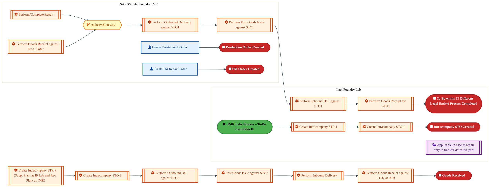
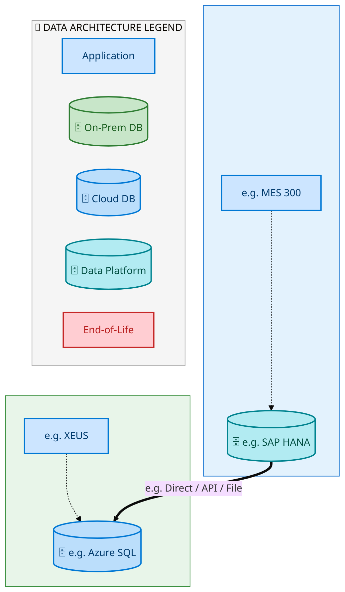
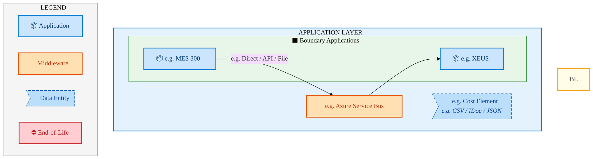
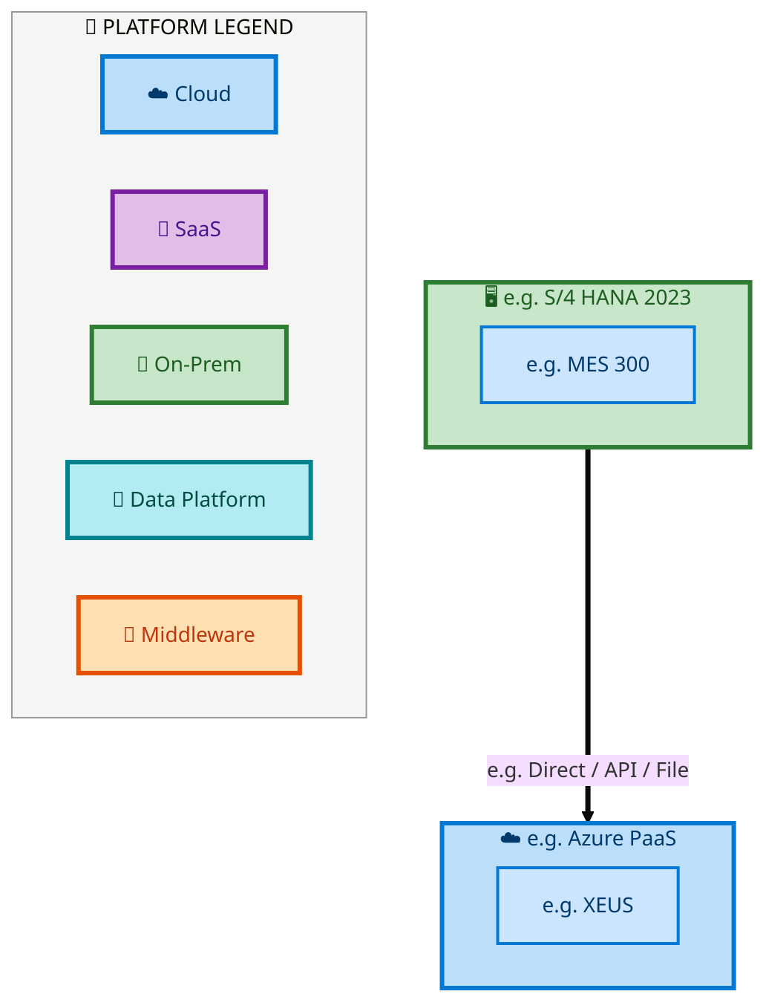

  <img src="data:image/svg+xml;base64,PHN2ZyB4bWxucz0iaHR0cDovL3d3dy53My5vcmcvMjAwMC9zdmciIHZpZXdCb3g9IjAgMCA4MDAgNDgwIiB3aWR0aD0iODAwIiBoZWlnaHQ9IjQ4MCI+DQogIDxkZWZzPg0KICAgIDxsaW5lYXJHcmFkaWVudCBpZD0iYmciIHgxPSIwJSIgeTE9IjAlIiB4Mj0iMTAwJSIgeTI9IjEwMCUiPg0KICAgICAgPHN0b3Agb2Zmc2V0PSIwJSIgc3R5bGU9InN0b3AtY29sb3I6IzAwNzFjNTtzdG9wLW9wYWNpdHk6MSIvPg0KICAgICAgPHN0b3Agb2Zmc2V0PSIxMDAlIiBzdHlsZT0ic3RvcC1jb2xvcjojMDBhZWVmO3N0b3Atb3BhY2l0eToxIi8+DQogICAgPC9saW5lYXJHcmFkaWVudD4NCiAgICA8bGluZWFyR3JhZGllbnQgaWQ9ImFjY2VudCIgeDE9IjAlIiB5MT0iMCUiIHgyPSIwJSIgeTI9IjEwMCUiPg0KICAgICAgPHN0b3Agb2Zmc2V0PSIwJSIgc3R5bGU9InN0b3AtY29sb3I6I2ZmZmZmZjtzdG9wLW9wYWNpdHk6MC4xNSIvPg0KICAgICAgPHN0b3Agb2Zmc2V0PSIxMDAlIiBzdHlsZT0ic3RvcC1jb2xvcjojZmZmZmZmO3N0b3Atb3BhY2l0eTowLjAyIi8+DQogICAgPC9saW5lYXJHcmFkaWVudD4NCiAgICA8cGF0dGVybiBpZD0iZ3JpZCIgd2lkdGg9IjQwIiBoZWlnaHQ9IjQwIiBwYXR0ZXJuVW5pdHM9InVzZXJTcGFjZU9uVXNlIj4NCiAgICAgIDxwYXRoIGQ9Ik0gNDAgMCBMIDAgMCAwIDQwIiBmaWxsPSJub25lIiBzdHJva2U9InJnYmEoMjU1LDI1NSwyNTUsMC4wNykiIHN0cm9rZS13aWR0aD0iMC41Ii8+DQogICAgPC9wYXR0ZXJuPg0KICA8L2RlZnM+DQoNCiAgPCEtLSBCYWNrZ3JvdW5kIC0tPg0KICA8cmVjdCB3aWR0aD0iODAwIiBoZWlnaHQ9IjQ4MCIgZmlsbD0idXJsKCNiZykiIHJ4PSI4Ii8+DQogIDxyZWN0IHdpZHRoPSI4MDAiIGhlaWdodD0iNDgwIiBmaWxsPSJ1cmwoI2dyaWQpIiByeD0iOCIvPg0KICA8cmVjdCB3aWR0aD0iODAwIiBoZWlnaHQ9IjQ4MCIgZmlsbD0idXJsKCNhY2NlbnQpIiByeD0iOCIvPg0KDQogIDwhLS0gRGVjb3JhdGl2ZSBjaXJjdWl0L2FyY2hpdGVjdHVyZSBsaW5lcyAtLT4NCiAgPGcgc3Ryb2tlPSJyZ2JhKDI1NSwyNTUsMjU1LDAuMTIpIiBzdHJva2Utd2lkdGg9IjEuNSIgZmlsbD0ibm9uZSI+DQogICAgPHBhdGggZD0iTSAwIDEwMCBMIDEyMCAxMDAgTCAxNjAgMTQwIEwgMjgwIDE0MCIvPg0KICAgIDxwYXRoIGQ9Ik0gMCAyNjAgTCA4MCAyNjAgTCAxMjAgMjIwIEwgMjAwIDIyMCBMIDI0MCAyNjAgTCAzNjAgMjYwIi8+DQogICAgPHBhdGggZD0iTSA1MjAgMTAwIEwgNjAwIDEwMCBMIDY0MCA2MCBMIDgwMCA2MCIvPg0KICAgIDxwYXRoIGQ9Ik0gNDQwIDM0MCBMIDU2MCAzNDAgTCA2MDAgMzAwIEwgNzIwIDMwMCBMIDc2MCAzNDAgTCA4MDAgMzQwIi8+DQogICAgPHBhdGggZD0iTSA2MDAgNDAwIEwgNjgwIDQwMCBMIDcyMCA0NDAiLz4NCiAgICA8cGF0aCBkPSJNIDAgNDAwIEwgNDAgNDAwIEwgODAgMzYwIi8+DQogICAgPHBhdGggZD0iTSAyMDAgNDIwIEwgMzIwIDQyMCBMIDM2MCAzODAgTCA0ODAgMzgwIi8+DQogICAgPHBhdGggZD0iTSA2NTAgNDQwIEwgNzUwIDQ0MCBMIDgwMCA0ODAiLz4NCiAgPC9nPg0KDQogIDwhLS0gRGVjb3JhdGl2ZSBub2RlcyAtLT4NCiAgPGcgZmlsbD0icmdiYSgyNTUsMjU1LDI1NSwwLjE4KSI+DQogICAgPGNpcmNsZSBjeD0iMTIwIiBjeT0iMTAwIiByPSI0Ii8+DQogICAgPGNpcmNsZSBjeD0iMjgwIiBjeT0iMTQwIiByPSI0Ii8+DQogICAgPGNpcmNsZSBjeD0iMjAwIiBjeT0iMjIwIiByPSI0Ii8+DQogICAgPGNpcmNsZSBjeD0iMzYwIiBjeT0iMjYwIiByPSI0Ii8+DQogICAgPGNpcmNsZSBjeD0iNjAwIiBjeT0iMTAwIiByPSI0Ii8+DQogICAgPGNpcmNsZSBjeD0iNzIwIiBjeT0iMzAwIiByPSI0Ii8+DQogICAgPGNpcmNsZSBjeD0iNTYwIiBjeT0iMzQwIiByPSI0Ii8+DQogICAgPGNpcmNsZSBjeD0iODAiIGN5PSIzNjAiIHI9IjQiLz4NCiAgICA8Y2lyY2xlIGN4PSI0ODAiIGN5PSIzODAiIHI9IjQiLz4NCiAgICA8Y2lyY2xlIGN4PSIzMjAiIGN5PSI0MjAiIHI9IjQiLz4NCiAgPC9nPg0KDQogIDwhLS0gVE9HQUYgQkRBVCBib3hlcyAtLT4NCiAgPGcgZm9udC1mYW1pbHk9IlNlZ29lIFVJLCBBcmlhbCwgc2Fucy1zZXJpZiIgZm9udC1zaXplPSIxNCIgZm9udC13ZWlnaHQ9IjYwMCI+DQogICAgPCEtLSBCIC0tPg0KICAgIDxyZWN0IHg9IjE1MCIgeT0iMTQwIiB3aWR0aD0iMTIwIiBoZWlnaHQ9IjQwIiByeD0iNSIgZmlsbD0icmdiYSgyNTUsMjU1LDI1NSwwLjE4KSIgc3Ryb2tlPSJyZ2JhKDI1NSwyNTUsMjU1LDAuMykiIHN0cm9rZS13aWR0aD0iMSIvPg0KICAgIDx0ZXh0IHg9IjIxMCIgeT0iMTY1IiB0ZXh0LWFuY2hvcj0ibWlkZGxlIiBmaWxsPSIjZmZmIj5CdXNpbmVzczwvdGV4dD4NCiAgICA8IS0tIEQgLS0+DQogICAgPHJlY3QgeD0iMjkwIiB5PSIxNDAiIHdpZHRoPSIxMjAiIGhlaWdodD0iNDAiIHJ4PSI1IiBmaWxsPSJyZ2JhKDI1NSwyNTUsMjU1LDAuMTgpIiBzdHJva2U9InJnYmEoMjU1LDI1NSwyNTUsMC4zKSIgc3Ryb2tlLXdpZHRoPSIxIi8+DQogICAgPHRleHQgeD0iMzUwIiB5PSIxNjUiIHRleHQtYW5jaG9yPSJtaWRkbGUiIGZpbGw9IiNmZmYiPkRhdGE8L3RleHQ+DQogICAgPCEtLSBBIC0tPg0KICAgIDxyZWN0IHg9IjQzMCIgeT0iMTQwIiB3aWR0aD0iMTIwIiBoZWlnaHQ9IjQwIiByeD0iNSIgZmlsbD0icmdiYSgyNTUsMjU1LDI1NSwwLjE4KSIgc3Ryb2tlPSJyZ2JhKDI1NSwyNTUsMjU1LDAuMykiIHN0cm9rZS13aWR0aD0iMSIvPg0KICAgIDx0ZXh0IHg9IjQ5MCIgeT0iMTY1IiB0ZXh0LWFuY2hvcj0ibWlkZGxlIiBmaWxsPSIjZmZmIj5BcHBsaWNhdGlvbjwvdGV4dD4NCiAgICA8IS0tIFQgLS0+DQogICAgPHJlY3QgeD0iNTcwIiB5PSIxNDAiIHdpZHRoPSIxMjAiIGhlaWdodD0iNDAiIHJ4PSI1IiBmaWxsPSJyZ2JhKDI1NSwyNTUsMjU1LDAuMTgpIiBzdHJva2U9InJnYmEoMjU1LDI1NSwyNTUsMC4zKSIgc3Ryb2tlLXdpZHRoPSIxIi8+DQogICAgPHRleHQgeD0iNjMwIiB5PSIxNjUiIHRleHQtYW5jaG9yPSJtaWRkbGUiIGZpbGw9IiNmZmYiPlRlY2hub2xvZ3k8L3RleHQ+DQogIDwvZz4NCg0KICA8IS0tIENvbm5lY3RpbmcgbGluZXMgYmV0d2VlbiBCREFUIGJveGVzIC0tPg0KICA8ZyBzdHJva2U9InJnYmEoMjU1LDI1NSwyNTUsMC4yNSkiIHN0cm9rZS13aWR0aD0iMSI+DQogICAgPGxpbmUgeDE9IjI3MCIgeTE9IjE2MCIgeDI9IjI5MCIgeTI9IjE2MCIvPg0KICAgIDxsaW5lIHgxPSI0MTAiIHkxPSIxNjAiIHgyPSI0MzAiIHkyPSIxNjAiLz4NCiAgICA8bGluZSB4MT0iNTUwIiB5MT0iMTYwIiB4Mj0iNTcwIiB5Mj0iMTYwIi8+DQogIDwvZz4NCg0KICA8IS0tIE1haW4gdGl0bGUgLS0+DQogIDx0ZXh0IHg9IjQwMCIgeT0iMjYwIiB0ZXh0LWFuY2hvcj0ibWlkZGxlIiBmb250LWZhbWlseT0iU2Vnb2UgVUksIEFyaWFsLCBzYW5zLXNlcmlmIiBmb250LXNpemU9IjM2IiBmb250LXdlaWdodD0iNzAwIiBmaWxsPSIjZmZmZmZmIiBsZXR0ZXItc3BhY2luZz0iMSI+DQogICAgSUFPIEFyY2hpdGVjdHVyZQ0KICA8L3RleHQ+DQogIDx0ZXh0IHg9IjQwMCIgeT0iMzAwIiB0ZXh0LWFuY2hvcj0ibWlkZGxlIiBmb250LWZhbWlseT0iU2Vnb2UgVUksIEFyaWFsLCBzYW5zLXNlcmlmIiBmb250LXNpemU9IjE4IiBmb250LXdlaWdodD0iNDAwIiBmaWxsPSJyZ2JhKDI1NSwyNTUsMjU1LDAuOCkiIGxldHRlci1zcGFjaW5nPSIyIj4NCiAgICBUT0dBRiBCREFUIMK3IElBTyBQcm9ncmFtIMK3IElETSAyLjANCiAgPC90ZXh0Pg0KDQogIDwhLS0gQm90dG9tIGFjY2VudCBiYXIgLS0+DQogIDxyZWN0IHg9IjI4MCIgeT0iMzQwIiB3aWR0aD0iMjQwIiBoZWlnaHQ9IjMiIHJ4PSIxLjUiIGZpbGw9InJnYmEoMjU1LDI1NSwyNTUsMC40KSIvPg0KDQogIDwhLS0gSW50ZWwgdGV4dCAtLT4NCiAgPHRleHQgeD0iNDAwIiB5PSIzODAiIHRleHQtYW5jaG9yPSJtaWRkbGUiIGZvbnQtZmFtaWx5PSJTZWdvZSBVSSwgQXJpYWwsIHNhbnMtc2VyaWYiIGZvbnQtc2l6ZT0iMTMiIGZpbGw9InJnYmEoMjU1LDI1NSwyNTUsMC41KSIgbGV0dGVyLXNwYWNpbmc9IjMiPg0KICAgIElOVEVMIENPTkZJREVOVElBTA0KICA8L3RleHQ+DQo8L3N2Zz4NCg==" alt="IAO Architecture" style="width:100%; border-radius:8px;" />
  <h1 style="font-size:36px; margin-top:24px;">E2E-113 — R3 IMR Labs Process</h1>
  <h2 style="font-size:24px;">Architecture Document (TOGAF BDAT)</h2>
  
End-to-End Integrated Processes (E2E) Tower 
  Capability E2E-113 · Forecast to Stock

  
IAO Program · R1 – R5 
  Generated: April 2026 
  Sajiv Francis

  
IAO Architecture Pipeline — Intel Confidential

Page 1<a href="#toc">↑ Back to TOC</a>E2E-113 — R3 IMR Labs Process

## Table of Contents

<nav class="toc">
<ol>
  <li><a href="#1-executive-summary">1. Executive Summary</a></li>
  <li><a href="#2-business-context-objectives">2. Business Context &amp; Objectives</a>
    <ul>
      <li><a href="#21-classification">2.1 Classification</a></li>
      <li><a href="#22-business-drivers">2.2 Business Drivers</a></li>
      <li><a href="#23-success-criteria">2.3 Success Criteria</a></li>
      <li><a href="#24-companion-documents">2.4 Companion Documents</a></li>
    </ul>
  </li>
  <li><a href="#3-business-architecture-togaf-b">3. Business Architecture (TOGAF &ldquo;B&rdquo;)</a>
    <ul>
      <li><a href="#31-business-process-overview">3.1 Business Process Overview</a></li>
      <li><a href="#32-business-process-diagrams">3.2 Business Process Diagrams</a></li>
      <li><a href="#33-business-roles-responsibilities">3.3 Business Roles &amp; Responsibilities</a></li>
    </ul>
  </li>
  <li><a href="#4-data-architecture-togaf-d">4. Data Architecture (TOGAF &ldquo;D&rdquo;)</a>
    <ul>
      <li><a href="#41-data-entities-ownership">4.1 Data Entities &amp; Ownership</a></li>
      <li><a href="#42-data-flow-diagrams">4.2 Data Flow Diagrams</a></li>
      <li><a href="#43-data-lineage">4.3 Data Lineage</a></li>
      <li><a href="#44-ricefw-data-objects">4.4 RICEFW Data Objects</a></li>
      <li><a href="#45-data-governance-quality">4.5 Data Governance &amp; Quality</a></li>
    </ul>
  </li>
  <li><a href="#5-application-architecture-togaf-a">5. Application Architecture (TOGAF &ldquo;A&rdquo;)</a>
    <ul>
      <li><a href="#51-current-state-current-state-application-landscape">5.1 Current-State Application Landscape</a></li>
      <li><a href="#52-future-state-future-state-application-landscape">5.2 Future-State Application Landscape</a></li>
      <li><a href="#53-change-impact-summary">5.3 Change Impact Summary</a></li>
      <li><a href="#54-component-overview">5.4 Component Overview</a></li>
      <li><a href="#55-ricefw-inventory">5.5 RICEFW Inventory</a></li>
      <li><a href="#56-integration-patterns">5.6 Integration Patterns</a></li>
    </ul>
  </li>
  <li><a href="#6-technology-architecture-togaf-t">6. Technology Architecture (TOGAF &ldquo;T&rdquo;)</a>
    <ul>
      <li><a href="#61-platform-infrastructure">6.1 Platform &amp; Infrastructure</a></li>
      <li><a href="#62-sap-development-object-status">6.2 SAP Development Object Status</a></li>
      <li><a href="#63-nfrs-design-principles">6.3 NFRs &amp; Design Principles</a></li>
      <li><a href="#64-security-governance">6.4 Security &amp; Governance</a></li>
    </ul>
  </li>
  <li><a href="#7-project-context">7. Project Context</a>
    <ul>
      <li><a href="#71-project-roadmap-go-live-plan">7.1 Project Roadmap &amp; Go-Live Plan</a></li>
      <li><a href="#72-raid-log">7.2 RAID Log</a></li>
      <li><a href="#73-recommendations-next-steps">7.3 Recommendations &amp; Next Steps</a></li>
    </ul>
  </li>
</ol>
</nav>

Page 2<a href="#toc">↑ Back to TOC</a>E2E-113 — R3 IMR Labs Process

## 1. Executive Summary

This Architecture Document defines the **Business, Data, Application, and Technology** (BDAT) architecture for **E2E-113 R3 IMR Labs Process** within the IAO program. It includes 4 BPMN process diagram(s) in Section 3.

| Dimension | Value |
|-----------|-------|
| **Tower** | End-to-End Integrated Processes (E2E) |
| **Process Group** | Forecast to Stock |
| **Capability** | E2E-113 - R3 IMR Labs Process |
| **Release** | R1 – R5 |
| **Total Systems** | 2 |
| **System Status** | 0 Deployed, 0 Developing, 0 EOL, 2 Pending IAPM |
| **RICEFW Objects** | Pending — Smartsheet Object Tracker API integration |

**Change Summary**: 0 new flow chains, 0 removed, 0 modified, 1 unchanged between Current-State and Future-State states.

> All system nodes in architecture diagrams are **IAPM-linked** — click any node to open its IAPM page. Diagrams require `securityLevel: 'loose'` for click events.

Page 3<a href="#toc">↑ Back to TOC</a>E2E-113 — R3 IMR Labs Process

## 2. Business Context & Objectives

### 2.1 Classification

| Level | Value |
|-------|-------|
| **L0 Tower** | End-to-End Integrated Processes |
| **L1 Process** | Forecast to Stock |
| **L2 Capability** | E2E-113 - R3 IMR Labs Process |

### 2.2 Business Drivers

| # | Driver | Description | Strategic Alignment | Priority |
|---|--------|-------------|---------------------|----------|
| 1 | End-to-End Process Integration | Enable cross-tower integrated processes spanning procurement, manufacturing, and fulfillment | IDM 2.0 Process Excellence | High |
| 2 | Intel Foundry Business Enablement | Stand up foundry-specific business processes for external customer engagement | Intel Foundry Services | High |
| 3 | Process Visibility & Monitoring | Provide end-to-end process visibility across tower boundaries with integrated monitoring | Operational Excellence | Medium |
| 4 | E2E-113 Process Migration | Migrate R3 IMR Labs Process business processes and 2 integrated systems from legacy to S/4 HANA target architecture | IDM 2.0 Cross-Functional / End-to-End | High |

Page 4<a href="#toc">↑ Back to TOC</a>E2E-113 — R3 IMR Labs Process

### 2.3 Success Criteria

| Metric | Target | Measure | Baseline | Owner |
|--------|--------|---------|----------|-------|
| E2E Process Cycle Time | Per process SLA | End-to-end transaction completion within defined SLA per process | Varies by process | E2E Process Owner |
| Cross-Tower Integration Success | > 99% | Transactions completing across tower boundaries without manual intervention | 92% (current) | Integration Lead |
| Process Exception Rate | < 2% | Transactions requiring manual exception handling | 8% (current) | Operations Manager |
| E2E-113 Migration Completeness | 100% flow chains validated | All 1 flow chains verified in target state | 0% (pre-migration) | Tower Architect |

### 2.4 Companion Documents

| Document | Description |
|----------|-------------|
| **Business Architecture** | Included in this document (Section 3) — process flows from BPMN diagrams |
| **This Document** | Full BDAT Architecture — Business + Data + Application + Technology |

Page 5<a href="#toc">↑ Back to TOC</a>E2E-113 — R3 IMR Labs Process

## 3. Business Architecture (TOGAF "B")

### 3.1 Business Process Overview

This capability includes **4 business process(es)** modeled in BPMN 2.0, covering the end-to-end workflow for E2E-113 R3 IMR Labs Process.

| # | Step ID | Process Name | Lanes | Tasks | Gateways |
|---|---------|--------------|-------|-------|----------|
| 1 | E2E-113A_IMR_Labs_Process_–_To-Be_from_IP_to_IF | E2E-113A_IMR_Labs_Process_–_To-Be_from_IP_to_IF | Boundary Apps , Intel Foundry Lab, SAP S/4 

 Intel Foundry IMR | 21 | 4 |

| 2 | E2E-113B_IMR_Labs_Process_–To-Be_within_IF_Different_Legal_Entity_(Part_1) | E2E-113B_IMR_Labs_Process_–To-Be_within_IF_Different_Legal_Entity_(Part_1) | Intel Foundry Lab, SAP S/4 

 Intel Foundry IMR | 22 | 3 |

| 3 | E2E-113C_IMR_Labs_Process_–To-Be_within_IF_Different_Legal_Entity)_(Part_2) | E2E-113C_IMR_Labs_Process_–To-Be_within_IF_Different_Legal_Entity)_(Part_2) | Intel Foundry Lab, SAP S/4 

 Intel Foundry IMR | 16 | 1 |

| 4 | E2E-113D_IMR_Labs_Process_–_To-Be_within_IF_Same_Legal_Entity_&amp;_within_Same_Plant | E2E-113D_IMR_Labs_Process_–_To-Be_within_IF_Same_Legal_Entity_&amp;_within_Same_Plant | IF Lab S. Loc, SAP S/4 

 IMR S . Loc. | 12 | 1 |

Page 6<a href="#toc">↑ Back to TOC</a>E2E-113 — R3 IMR Labs Process

### 3.2 Business Process Diagrams

#### BUSINESS ARCHITECTURE — 3.2.1 E2E-113A_IMR_Labs_Process_–_To-Be_from_IP_to_IF — E2E-113A_IMR_Labs_Process_–_To-Be_from_IP_to_IF

**Swim Lanes**: Boundary Apps  · Intel Foundry Lab · SAP S/4 
 Intel Foundry IMR | **Tasks**: 21 | **Gateways**: 4

> **Legend**: ● Start · ● End · User Task · Service Task · ◇ Gateway · Sub-Process

<a href="https://mermaid.live/view#pako:eNqlWG1v4jgQ_itWVhW7EtzGeSHAh5MobVZIWxWV3t2H7elkEgeihjhnJ325iv9-Y7ADCU53944PLX5m5nlmJh4n4c2KWEytiXVx8ZbmaTlBb71yQ7e0N0G9FRG010cH4HfCU7LKqOhJn4Tl5TL9Z--GveJFukksJNs0e5Xokq4ZRb_N-2gKgVkfCZKLgaA8TXr9XsHTLeGvM5YxLr0_0FFiJ3s1ZbpkPKb86GDbAY58CM3SnB5hN_ACL5RxgkYsjxukiZ-Mkqi3k8ll7DnaEF7u068EvSEvf6RxuYF1QjJBwWdTbrOvZEUzWWPJK4lFFX_SzUiF1MmhYcuCRGm-BtyzAeIkfzxCvr3bod3FxUNei6Kvdw85gk-UESGuaIJECfD1U4mSNMsmH7zZNPTtvig5e6STD851cOU6_UhWMoHS7b5s7uCZputNOVmxLFaug2dZw8QpXvr8ZeLYff4Kf1taNI-PSrOhM3JGtdJlgGd4ppWSJPlfStBXfk_Eo9K6dkMnvKq1sD_0Z_Y5ny7zygumuN0nyp_SiJ6QhmHoXh9bdT30sd1Nehm6Q3vWIl2Tkj6T1yPheObVhKEfhDjoJDzotbOsVgvOIk3oXvuhXxMGlzicOp2E3hR7I5Uh8Kw5KTYoIzn9y_72YF2yar-p0bQoBHqw_jw4yk-OwX7P0_WaclTIXcbp3xUVZdPLcT6CX0ImCRkUGVQ9hzlPoQPtmE-HINgtpmSk2DwvaYZCmRJkBKPSVPK-1UIRW6MZp1JlWa0GM5ajRcVhFgRFd6CYCsiB5RB_SuD_GMGtPBnQc1pu0PzmDhEBLkWRpZS3-IZNvgXlCeNbNBeiogiuG43K9ImiG1CRZxQia5LmopSKe8HbFl_Q5Luj6yoj3FxZ5dj2qhU_-k78O4WZ6MZNuvnlFSJ5jL7c1YXUCu1KsN2MXcJV32um-RODeUMlQ_MFKjecVesNbJIuHvzdHLqaiZ0fSKGoUwCayETjuMftLUpW7ClgawokJ5IKge7Z4JKihLPtviRgDWvbjG2LjJY0Pu7_A6vXYv3CWAztjChsmDNn35DCXFUBZZVt_6GBXNTsxs6dxrvO29uxczEdrOAGFG0QfYmySgDFl8P59mDtdqdh7jGMcM6exYBkpTwFSJbR7Cyo4yBwIPfldIGWnz2wNY8EKLx1-NSFyluDnmj1Dy5C_Mth0zejXGPU4gZaVJCUm0Kwa571k9YWZd3ZpnKDxzPyfNYbRaXQjvLN6rd6HPZZpPtz5zib-1qWBJ6pEDOlMjQNyOl8tgOCn89CT_Y7aYx-No2Oc8l8ST7OKpiBLVzmZcmix0_t8bbbZ-ZJ10wX0MHGm8hdo87Tg3YB2xpOCzhsI5VJmzFojet5Dkrl7GAYvTvobe_xmY7K-baD37VbETAi7-Xj4rY_zEEVyfvV-3Hez50chyD_Px43ME1oMPhVMijAO6z1UptdtQ4O65EOV-5Y-2NXAYEGVITrKcDVITXHSAG2BoYKcFohY7VWAQ7WdiU6bK31MzN8UYDOSitoRjxWDjopBytAeyhKt6ZUa52DJtBlYi1Zd0Yz1lmq3uIzQHNiJeLo7jsKqB1UEnWjlN1rrYOTZ2iZun53aMCuGfZO3wsaFr_TMuy0BJ2WUadl3GmBJneacLfJ6Ta53abuRuDuTuDuVuDuXuDuZuDubjjd3XC6uwF7Sr8gN3FXvcw2Uc-I-kZ0aEQDIzoyomMT6tpGFBtRR7-BNmHXDHtm2New1bfgprUlaWxN3qz9jzXwg05ME1JlpbXrW6Qq2fI1j6zJ_kcNqypiiLxKCTzVbQ_g7l-egpZn" title="View full diagram">&#128065; View Diagram</a>

Page 7<a href="#toc">↑ Back to TOC</a>E2E-113 — R3 IMR Labs Process

#### BUSINESS ARCHITECTURE — 3.2.2 E2E-113B_IMR_Labs_Process_–To-Be_within_IF_Different_Legal_Entity_(Part_1) — E2E-113B_IMR_Labs_Process_–To-Be_within_IF_Different_Legal_Entity_(Part_1)

**Swim Lanes**: Intel Foundry Lab · SAP S/4 
 Intel Foundry IMR | **Tasks**: 22 | **Gateways**: 3

> **Legend**: ● Start · ● End · User Task · Service Task · ◇ Gateway · Sub-Process

<a href="https://mermaid.live/view#pako:eNqlWF1v4jgU_StWRhUzEnRi54vmYSUKZFRpqkGlu_swXa1M4kA0IY5spy1T8d_XBhtISDqdLg-tcu49537Y1zi8WDFNiBVaFxcvWZGJELz0xIqsSS8EvQXmpNcHe-AvzDK8yAnvKZ-UFmKe_dy5Qbd8Vm4Ki_A6yzcKnZMlJeDPmz4YSWLeBxwXfMAJy9Jev1eybI3ZZkxzypT3BzJM7XQXTZuuKUsIOzrYdgBjT1LzrCBH2AncwI0Uj5OYFklNNPXSYRr3tiq5nD7FK8zELv2Kk1v8_HeWiJV8TnHOifRZiXX-FS9IrmoUrFJYXLFH04yMqziFbNi8xHFWLCXu2hJiuPhxhDx7uwXbi4uH4hAU3E8eCiA_cY45n5AUcCHh6aMAaZbn4Qd3PIo8u88Foz9I-AFNg4mD-rGqJJSl233V3METyZYrES5onmjXwZOqIUTlc589h8jus43824hFiuQYaeyjIRoeIl0HcAzHJlKapv8rkuwru8f8h441dSIUTQ6xoOd7Y_tcz5Q5cYMRbPaJsMcsJieiURQ502Orpr4H7W7R68jx7XFDdIkFecKbo-DV2D0IRl4QwaBTcB-vmWW1mDEaG0Fn6kXeQTC4htEIdQq6I-gOdYZSZ8lwuQI5Lsi_9vcH66YQJAcRrYqEbYDcnQ_WP3tf9SmgdBndgRnlQm4-gIsEjCpBwTgncl6L5UOFbLvBQYoz-z1O8F2SUhymeBDTJRgzIlsIVHIspusSFxswv78DULJOacO30L6d0a7qtBlhKWVryVuoPoCJ7MglwEucFVwogSYf2u0CXyhNOLgjMclKOQ-UtZLh22pF4OO8KstLMJOLJQDm4CZSC7RrqIxxari9-9SMgt7WGtTkOe2lfatER3POFNyGgtwHujM3nFfkVa7XnvVYJv5I5Zye5YucjwdGmcuZC2UzVJs4UBNDOAdqv0EH3NPBNQEpo3KhZ0Dux5tIan061XIbWs01QQfNfWJJU8A7CnBBSx3zKROrrFDLN8nSlDAiV-0rWeIcTAuRic2no6yMlZMWYb8hfDJfu7E6ZwQNRnPlYUcNjvPyYoiYMfrEBzgXoMQM5znJv-yPtgdru92T5OHfdraog2Mus5x_dqWtfsrIFapPv_OOE8N9x8nkHVqivkjM7tL_5Bokl-CbuhXUWX4ra3Yrh7DEGWujQP8tB4QZhHrkmk7QqvPZ7BOdQpM1fMMMZ49ELsVrh1zHKfnaPDc1kP2reT5jwF-ezbvMmzT0Ow1XJw_AQm_Ems7wtwftqsFQq1nFIqPFfkm75sxu8m5f94cN_5PSHs-90XGK1Q18sJB3yHgFyHOcV1wSzuZ4T3PfOfxyz4HB4A-1awwANYAMgDTgGMDRgGsAdw84xgNpj0A_B_vHoX50tL8JeaX1bKNn7wHkNQjmXikjaYrxQNoDwoYHMgDSdaFDXTqscyjD0xrmWduNouabKnRbkK-fTY76UYshU6Sv1Q5F6qY4huCYPpsAemWQ6SLSDs4hQb8hgXTj3JNrqMrEXL9rsN8OB6dX65pl2Gm56rTIpew0wW4T6jY53Sa32-R1m_xuU3cvYHczYHc3UHc3UHc3UHc35KCZF8Y67nbgnn7pq6N-Kxq0osNW9KoNdexWFLaiyLx91WGnHXYNbPWtNWFrnCVW-GLtfpGQv1okJMVVLqxt38LycjHfFLEV7t7crapMJHOSYXnpWe_B7X_wUjKJ" title="View full diagram">&#128065; View Diagram</a>

Page 8<a href="#toc">↑ Back to TOC</a>E2E-113 — R3 IMR Labs Process

#### BUSINESS ARCHITECTURE — 3.2.3 E2E-113C_IMR_Labs_Process_–To-Be_within_IF_Different_Legal_Entity)_(Part_2) — E2E-113C_IMR_Labs_Process_–To-Be_within_IF_Different_Legal_Entity)_(Part_2)

**Swim Lanes**: Intel Foundry Lab · SAP S/4 
 Intel Foundry IMR | **Tasks**: 16 | **Gateways**: 1

> **Legend**: ● Start · ● End · User Task · Service Task · ◇ Gateway · Sub-Process

<a href="https://mermaid.live/view#pako:eNqlV11vozgU_SsWoypTKZnBfISUh5XSJIwqTdWomd19mK5WDpgEldjIhraZKv99rwNOgEK3q81DK597z7kfvhjzaoQ8ooZvXFy8JizJffQ6yLd0Rwc-GqyJpIMhKoE_iEjIOqVyoHxizvJV8uvohp3sRbkpLCC7JN0rdEU3nKLfb4ZoCsR0iCRhciSpSOLBcJCJZEfEfsZTLpT3JzqJzfgYrTJdcxFRcXYwTQ-HLlDThNEzbHuO5wSKJ2nIWdQQjd14EoeDg0ou5c_hloj8mH4h6S15-TOJ8i2sY5JKCj7bfJd-J2uaqhpzUSgsLMSTbkYiVRwGDVtlJEzYBnDHBEgQ9niGXPNwQIeLiwd2Coq-3z8wBL8wJVLOaYxkDvDiKUdxkqb-J2c2DVxzKHPBH6n_yVp4c9sahqoSH0o3h6q5o2eabLa5v-ZpVLmOnlUNvpW9DMWLb5lDsYe_rViURedIs7E1sSanSNcenuGZjhTH8f-KBH0VP4h8rGIt7MAK5qdY2B27M_Otni5z7nhT3O4TFU9JSGuiQRDYi3OrFmMXm_2i14E9Nmct0Q3J6TPZnwWvZs5JMHC9AHu9gmW8dpbFeil4qAXthRu4J0HvGgdTq1fQmWJnUmUIOhtBsi1KCaN_mz8fjBuW0xQFvGCR2COYzgfjr9JX_Zj9E3xi4sdkFPINmgkKpSEgCRLyXUbYHq1-3CMMrDrN-Qjt7g0N4yZvSUXMxQ6Ia5UgmkOqXxDZkITJXCm8EbC6Bb5xHkl0T0OaZDCoXHSSvc8ncpbC9vk3t_eqJRKp5lMp0UNhmdhGP_jomqJYcEhtiXKObgLQuqxrTc5aMudZRXlO8m3CwB3NkzimgjJ4dOmGpGjB8iTfX54izaBNKc1p1BK2zJbwm6aWzX7Dq21JDE8dFSOeUYamWZYmoTp4ESQWwomMeIwEzUgiEGfpXpUHEZiEdFFEYxrmyRNFGRwv5_7BCdA1YBhCrqZLtPrqgK05atDb5qjhU37qKdczU_2DtkRf0J06spssq5O1vIXNPpbQQcH2R4ZET1kzckPH6dT5qreuSqHNcruj3xX5ecihw9Ci9wZ93K2y5OBfFnIjZUHf07Bwa5RUqQVsL2dlvX2jZLV5t-_726-v51wjOlrDOIVbRF_CtJBQ6rfyuHwwDofWODH3YweJdS6NjT_Q38YhUid7LfI77azTJh87Ji30eVVk2Re0hMcDRkyqkwAOGEQgLxi8uuH2_rIW4OpfD8bjyNQY2PwvU67qQSSvnsqTxlVrp2vkp_o-swkajX6D7dLbVi7HOvtyiU3d5XJ9pXesXHqnzCt3bceVHNZ6uBKwq7VdLh1txpW_pQGrAiYVYFUMrBPGVQ4Ya8ApAUvHwHYbqNaaUcWwdFAtUH-XK5a-wzRgqxu26_eThsXptbi9lnGvxeu1THotV70W2MBeE-43Wf2m_j7g_kbg_k7g_lbAbOm7cxOfVPfcJnrVhVpmJ4o7UasTtfUlsgk7-ipoDI0dFTuSRIb_ahy_oOArC97PpEhz4zA0SJHz1Z6Fhn_80jCKLALBeULg_bwrwcM_08tEJg==" title="View full diagram">&#128065; View Diagram</a>

Page 9<a href="#toc">↑ Back to TOC</a>E2E-113 — R3 IMR Labs Process

#### BUSINESS ARCHITECTURE — 3.2.4 E2E-113D_IMR_Labs_Process_–_To-Be_within_IF_Same_Legal_Entity_&amp;_within_Same_Plant — E2E-113D_IMR_Labs_Process_–_To-Be_within_IF_Same_Legal_Entity_&amp;_within_Same_Plant

**Swim Lanes**: IF Lab S. Loc · SAP S/4 
 IMR S . Loc. | **Tasks**: 12 | **Gateways**: 1

> **Legend**: ● Start · ● End · User Task · Service Task · ◇ Gateway · Sub-Process

<a href="https://mermaid.live/view#pako:eNqlVm1v4jgQ_itWVhVdKXTzStJ8OIkCWVVq1arp3X3Ynk4mccBqsCPboWUR__1scICkSXWr5QNinpl5nvF4sL01UpohIzIuLraYYBGB7UAs0QoNIjCYQ44GJjgAf0GG4bxAfKBickpEgn_uw2yvfFdhCovhChcbhSZoQRH489YEY5lYmIBDwoccMZwPzEHJ8AqyzYQWlKnoLyjMrXyvpl03lGWInQIsK7BTX6YWmKAT7AZe4MUqj6OUkqxBmvt5mKeDnSquoG_pEjKxL7_i6B6-_40zsZR2DguOZMxSrIo7OEeFWqNglcLSiq3rZmCudIhsWFLCFJOFxD1LQgyS1xPkW7sd2F1cvJCjKLh7eiFAftICcj5FOeBCwrO1ADkuiuiLNxnHvmVywegrir44s2DqOmaqVhLJpVumau7wDeHFUkRzWmQ6dPim1hA55bvJ3iPHMtlGfre0EMlOSpOREzrhUekmsCf2pFbK8_y3lGRf2TPkr1pr5sZOPD1q2f7In1gf-eplTr1gbLf7hNgap-iMNI5jd3Zq1Wzk21Y_6U3sjqxJi3QBBXqDmxPh9cQ7EsZ-ENtBL-FBr11lNX9kNK0J3Zkf-0fC4MaOx04voTe2vVBXKHkWDJZLUECC_rV-vBi3MZAjCZIrcEfTF-OfQ5z6EFu6cxjlcKjaDiYMyWWB5PkBOODyCaUIr-VA6lQAObi9f1I_ocCUfG1yeT-OZCldnHPZ4DKpyvJK8vTQnPP4TZ5HxHLKVuA7pRkH-5pKAeACYsKFordb-aPu_IdKzGlFMjBFBbg6J3BaBEGLgMqwg_ot5xX6LNV2L4-5ZSHH45kObxB4w2KJCZAbkcAVAndoAQswIwKLDYCyJO3fOx_lvgmgRgFxqSgPVCz7mEmhr-dC3kmIC1r-ttCErsoCNYTkf75rpNTMJONHkHzzpE_tZAL283HVnAenc7akXnYFHtTB3Ax3u8Pv5ZaXELOulPBXJqUpfE5z3Unzre6ILqC909YvjumHUbH_x5ziNWKbz4bddrpZPhvaDxx-a5Zk0_d90pvwYfZG7XjZ2mMGRB0ZQSvjrEtrlLXb1EgNt9vTAjM0nMubMl0C9J4WFZfZ3w8H8Yux27XGVrYYDId_qCZpYHSwg9rvHmxP274Or23bOQB-bYc6QN8wpLZDbXstW-uPtBlotz76iZa3a34tZ9fxtqWBuuDrJv_-7lAq9Z3ZgJ1u2O2GvfNrsuHxez2jXk_Q6wl7Pde9HtmHXpfd73L6Xe7x8dTEPf3QaaJ-JzrqRINONKzfC4ZprBBbQZwZ0dbYv4rlyzlDOawKYexMA1aCJhuSGtH-9WhUZSYzpxjKE3h1AHf_AX6ZkjQ=" title="View full diagram">&#128065; View Diagram</a>

Page 10<a href="#toc">↑ Back to TOC</a>E2E-113 — R3 IMR Labs Process

### 3.3 Business Roles & Responsibilities

| Role / Lane | Processes Involved | Description |
|------------|-------------------|-------------|
| Boundary Apps  | E2E-113A_IMR_Labs_Process_–_To-Be_from_IP_to_IF,  | |
| Intel Foundry Lab | E2E-113A_IMR_Labs_Process_–_To-Be_from_IP_to_IF, E2E-113B_IMR_Labs_Process_–To-Be_within_IF_Different_Legal_Entity_(Part_1), E2E-113C_IMR_Labs_Process_–To-Be_within_IF_Different_Legal_Entity)_(Part_2),  | |
| SAP S/4 

 Intel Foundry IMR | E2E-113A_IMR_Labs_Process_–_To-Be_from_IP_to_IF, E2E-113B_IMR_Labs_Process_–To-Be_within_IF_Different_Legal_Entity_(Part_1), E2E-113C_IMR_Labs_Process_–To-Be_within_IF_Different_Legal_Entity)_(Part_2),  | |

| IF Lab S. Loc | E2E-113D_IMR_Labs_Process_–_To-Be_within_IF_Same_Legal_Entity_&amp;_within_Same_Plant | |
| SAP S/4 

 IMR S . Loc. | E2E-113D_IMR_Labs_Process_–_To-Be_within_IF_Same_Legal_Entity_&amp;_within_Same_Plant | |

Page 11<a href="#toc">↑ Back to TOC</a>E2E-113 — R3 IMR Labs Process

## 4. Data Architecture (TOGAF "D")

### 4.1 Data Flows — Source to Target

| # | Flow Chain | Hop | Source App | Source DB | Target App | Target DB | Data Description | Frequency | Classification |
|---|-----------|-----|-----------|----------|-----------|----------|-----------------|-----------|---------------|
| 1 | e.g. MES Route to ICOST | 1 | e.g. MES 300 | e.g. SAP HANA | e.g. XEUS | e.g. Azure SQL | What data moves | e.g. Near Real-Time | e.g. Intel Confidential |

Page 12<a href="#toc">↑ Back to TOC</a>E2E-113 — R3 IMR Labs Process

### 4.2 Data Flow Diagrams

> **DATA ARCHITECTURE** — Database-to-database data flows. Applications (blue) sit above their hosting databases (green cylinders). Thick arrows show data movement between databases.

#### 4.2.1 Current-State — Current-State Data Flows

<a href="https://mermaid.live/view#pako:eNqlVYtumzAU_RWLKtImJV2APAhSKwE2ayXaZU26TSoTcsAkqA4gHmvSNP8-G0KSpiGtNiMh-_rec6_P8WMluJFHBFVoNFZBGGQqWNlCNiNzYgsqsIUJTlmvyXopcfMkyJYW-UNoOUmjqJotQn7gJMATSlI-zXD8KMxGwfMGSuzGi9KZ2008D-iynBmRaUTA_XUTaAyAga8LLxo9uTOcZBu0PCU3ePEz8LIZt_iYpoT7zbI5tfCE0CJtluSFNWTLGsXYDcIpN8tdbkxw-Lhn7HTXa7BuNOxwmwuMdTsErLkUpykkPsBxrEcL4AeUqmeGgbqm2UyzJHok6lm73VdgZzNsPfHSVCleNN2IRgmflrWecYDnTYwlreAU1DMGWzgJ9aEs1cKJehdJ7bdwNMq9DaCuQ2Tq_1kfxBmu8CSkm9IeniIr5gm8DuwcFkgiuuPPNA0Id3hGT1IkpRZP74uGyOorEdN8Mk1wPANIQqIoG1AzLIc4U0d7zhPijL5bD7bARP5duvPmBQlxsyAKt7Lyto3XivBf6H7EIsn59BzwPkNQVbWU_UgQPMj5yRbs3FNkj_09t2PnPmmzVXO0wgkwJ1v4zDE3Wp2sBLTOW5e12cpQEm4w0mxJST0fG9KRYnbRbpfJioJk4zXpIjua79E80obOlXar_RvLN2jkyO12RTQbAjb8ENfbxCeoZj6A-2yZ5pv4vWKOcl1l-xDVlXPFtGxKJtwyLQ76PSjVMl2TGFxcXL5saIIFteAL0IbX7G8GlF2mLye2x4GGFpmyFTzs8eZ6bQC1sQa0O-PqeoyM8f0dAhb6im5hjarW3c5qOVx_LY5p4GI-e1xBy4E1an0LW8OEzAHUd4diSV9FGjWh5UW3H_j6NLHQuqzFlTakOPOjZF6zRywHsaWh0GtFfssKfFIurby_ju6Gkt3qauvyb6v9YDB4I7zQFOYkmePAE9RV-WSyl9cjPs5pxh49AedZNFqGrqAWz5iQxx7OCAwwU3NeGtd_AcYhWlM=" title="View full diagram">&#128065; View Diagram</a>

Page 13<a href="#toc">↑ Back to TOC</a>E2E-113 — R3 IMR Labs Process

#### 4.2.2 Future-State — Future-State Data Flows

<a href="https://mermaid.live/view#pako:eNqlVYtumzAU_RWLKtImJV2APAhSKwE2ayXaZU26TSoTcsAkqA4gHmvSNP8-G0KSpiGtNiMh-_rec6_P8WMluJFHBFVoNFZBGGQqWNlCNiNzYgsqsIUJTlmvyXopcfMkyJYW-UNoOUmjqJotQn7gJMATSlI-zXD8KMxGwfMGSuzGi9KZ2008D-iynBmRaUTA_XUTaAyAga8LLxo9uTOcZBu0PCU3ePEz8LIZt_iYpoT7zbI5tfCE0CJtluSFNWTLGsXYDcIpN8tdbkxw-Lhn7HTXa7BuNOxwmwuMdTsErLkUpykkPsBxrEcL4AeUqmeGgbqm2UyzJHok6lm73VdgZzNsPfHSVCleNN2IRgmflrWecYDnTYwlreAU1DMGWzgJ9aEs1cKJehdJ7bdwNMq9DaCuQ2Tq_1kfxBmu8CSkm9IeniIr5gm8DuwcFkgiuuPPNA0Id3hGT1IkpRZP74uGyOorEdN8Mk1wPANIQqIom1AzLIc4U0d7zhPijL5bD7bARP5duvPmBQlxsyAKt7Lyto3XivBf6H7EIsn59BzwPkNQVbWU_UgQPMj5yRbs3FNkj_09t2PnPmmzVXO0wgkwJ1v4zDE3Wp2sBLTOW5e12cpQEm4w0mxJST0fG9KRYnbRbpfJioJk4zXpIjua79E80obOlXar_RvLN2jkyO12RTQbAjb8ENfbxCeoZj6A-2yZ5pv4vWKOcl1l-xDVlXPFtGxKJtwyLQ76PSjVMl2TGFxcXL5saIIFteAL0IbX7G8GlF2mLye2x4GGFpmyFTzs8eZ6bQC1sQa0O-PqeoyM8f0dAhb6im5hjarW3c5qOVx_LY5p4GI-e1xBy4E1an0LW8OEzAHUd4diSV9FGjWh5UW3H_j6NLHQuqzFlTakOPOjZF6zRywHsaWh0GtFfssKfFIurby_ju6Gkt3qauvyb6v9YDB4I7zQFOYkmePAE9RV-WSyl9cjPs5pxh49AedZNFqGrqAWz5iQxx7OCAwwU3NeGtd_AVdrWn0=" title="View full diagram">&#128065; View Diagram</a>

Page 14<a href="#toc">↑ Back to TOC</a>E2E-113 — R3 IMR Labs Process

### 4.3 Data Lineage

| # | Source System | Source Schema/Object | Target System | Target Schema/Object | Transformation |
|---|-------------|---------------------|---------------|---------------------|---------------|
| 1 | e.g. MES 300 | e.g. CKMLHD table | e.g. XEUS | e.g. dbo.CostElements | Lineage notes |

### 4.4 RICEFW Data Objects

Reports and Conversions for this capability will be populated from the Smartsheet Object Tracker via automated API extraction.

| Object ID | Type | Description | Status | Source | Target | Complexity |
|-----------|------|-------------|--------|--------|--------|-----------|
| E2E-113-R001 | Report | R3 IMR Labs Process operational report | Planned | SAP S/4HANA | Analytics | Medium |
| E2E-113-C001 | Conversion | Legacy data migration for R3 IMR Labs Process | Planned | Legacy ERP | SAP S/4HANA | High |

> *Pending: Smartsheet API integration to auto-populate live RICEFW data (see Build Requirements).*

### 4.5 Data Governance & Quality

| Concern | Approach |
|---------|----------|
| Data Ownership | Per-entity owners listed in Section 3.1 |
| Data Classification | Financial data classified as Intel Confidential |
| Data Retention | Per Intel corporate retention policies |
| Data Quality | Validated at source; reconciliation at target |

Page 15<a href="#toc">↑ Back to TOC</a>E2E-113 — R3 IMR Labs Process

## 5. Application Architecture (TOGAF "A")

### 5.1 Current-State — Current-State Application Landscape

#### Overview

The Current-State architecture represents the **current / legacy** landscape for E2E-113.This view is generated from `CurrentFlows.xlsx` (1 flow hops across 1 flow chains).

#### APPLICATION ARCHITECTURE — Architecture Diagram

> **Click any system node** to open its IAPM application page.
> **Legend**: Deployed · Developing · End-of-Life · No IAPM Match

<a href="https://mermaid.live/view#pako:eNqVlnuPmzgQwL-KRZW_LtnlEQhBq0g8zCknsrtq2u6dygk54CRWHUAYuptu891rcB6EbLp3jkSwZ-Y39ng8-FWKswRLltTrvZKUlBZ4DaVyjTc4lCwQSgvE-FufvzEcVwUptwH-jqkQ0iw7SBuTL6ggaEExq8Wcs8zSck5-7FGKkb8I5XrcRxtCt0Iyx6sMg8_TPrA5gPYBQykbMFyQZSjtGguaPcdrVJR7csXwDL08kaRc1yNLRBmu9dblhgZogWkzhbKomtGUL3Geo5ikq3p4KNeDBUq_tQZ1ebcDu14vTI--wCcnTAFvvR4YDPjc4jWZoRID7UYFfwD7R1VgwMotxSCmiDHMuJqwaPoeXoJFxUiKGQNNWxJKrQ8-b47WZ2WRfcO8O7ZNVd93B8_1miw1f-nHGc0K64Msyx0mynNwaoLpulD3_SNTlkemN_wNU7MNt4NNUIm6WMfxoO8csYpu6K58jlVaWG84spWDOEGMR7FAWx5coHecbUiSUPyMeARbcYGyox6dQUNXZPnqGhxfM-TuGnBGL0Lj-67nnbCuoZqqeR07Ulyli2UIsS4WKg6EoyN25Ci-rV7FDm1laHaxMc2q5P9HXO1GvIPN0rzAm05-mNBwx0esCkeedn22iqNDlaedALNqsSpQvgZ28DWUwioxtYQ_E00H9uNjMHXtT9OHexDY_8CPofSvMKpbQgoclyRLQfDxNHrEQRUqiuYG95GTVWmCim1k5zklMaptGPcFwkpdKAtwkIO2_MzVdXd123uKcLSKZnAeabLcXkmMDYBvVjeAywCXcbJlWfyYXaf8DT_P30TUgjfscZqcOnvQ7KlBNXUkmuPiO4lx5FTsLMjKSHBFtdlrAa4lnJzO0QXegw3ezVgZQcrLc1pO2jOOh4JcK4C9wt2iuJ3ckYkQzL-AWzD1spj__TV_uL-7JRPhtq4VwmGzMPH6RpR5QZz8DKUG5zXbw1H245Q_fUL5h-Hne8E4Q19Tqt1cbE89rX0CNzXaCU7112ud3Cv1t21qH0yh5qu-916ZPff7TpofyKavw9MB1UwTau5Fpb04kgFe8R04y8REBgH8E957_-EsBhE_wd08bs3ujUwOotlTN0Nnpyy8mpVB5MFu_nn1JwemJb9WdPNKmMAHUXJUIxlyxWSQLQcBWe7d8GrfSsJTxEVQDrut179jYMfj8UVUpb60wcUGkUSyXsVVht-IErxEFS35BURCVZnNt2ksWc2VQqpyPlHsEcQ3YSMGd78AN1Te0g==" title="View full diagram">&#128065; View Diagram</a>

Page 16<a href="#toc">↑ Back to TOC</a>E2E-113 — R3 IMR Labs Process

#### Current-State Flow Narrative

| # | Flow Chain | Path | Interface | Freq |
|---|-----------|------|-----------|------|
| 1 | e.g. MES Route to ICOST | e.g. MES 300 → e.g. XEUS | e.g. Direct / API / File | e.g. Near Real-Time |

Page 17<a href="#toc">↑ Back to TOC</a>E2E-113 — R3 IMR Labs Process

### 5.2 Future-State — Future-State Application Landscape

#### Overview

The Future-State architecture represents the **target** landscape for E2E-113.This view is generated from `FutureFlows.xlsx` (1 flow hops across 1 flow chains).

#### APPLICATION ARCHITECTURE — Architecture Diagram

> **Click any system node** to open its IAPM application page.
> **Legend**: Deployed · Developing · End-of-Life · No IAPM Match

<a href="https://mermaid.live/view#pako:eNqVlnuPmzgQwL-KRZW_LtnlEQhBq0g8zCknsrtq2u6dygk54CRWHUAYuptu891rcB6EbLp3jkSwZ-Y39ng8-FWKswRLltTrvZKUlBZ4DaVyjTc4lCwQSgvE-FufvzEcVwUptwH-jqkQ0iw7SBuTL6ggaEExq8Wcs8zSck5-7FGKkb8I5XrcRxtCt0Iyx6sMg8_TPrA5gPYBQykbMFyQZSjtGguaPcdrVJR7csXwDL08kaRc1yNLRBmu9dblhgZogWkzhbKomtGUL3Geo5ikq3p4KNeDBUq_tQZ1ebcDu14vTI--wCcnTAFvvR4YDPjc4jWZoRID7UYFfwD7R1VgwMotxSCmiDHMuJqwaPoeXoJFxUiKGQNNWxJKrQ8-b47WZ2WRfcO8O7ZNVd93B8_1miw1f-nHGc0K64Msyx0mynNwaoLpulD3_SNTlkemN_wNU7MNt4NNUIm6WMfxoO8csYpu6K58jlVaWG84spWDOEGMR7FAWx5coHecbUiSUPyMeARbcYGyox6dQUNXZPnqGhxfM-TuGnBGL0Lj-67nnbCuoZqqeR07Ulyli2UIsS4WKg6EoyN25Ci-rV7FDm1laHaxMc2q5P9HXO1GvIPN0rzAm05-mNBwx0esCkeedn22iqNDlaedALNqsSpQvgZ28DWUwioxtYQ_E00H9uNjMHXtT9OHexDY_8CPofSvMKpbQgoclyRLQfDxNHrEQRUqiuYH95GTVWmCim1k5zklMaptGPcFwkpdKAtwkIO2_MzVdXd123uKcLSKZnAeabLcXkmMDYBvVjeAywCXcbJlWfyYXaf8DT_P30TUgjfscZqcOnvQ7KlBNXUkmuPiO4lx5FTsLMjKSHBFtdlrAa4lnJzO0QXegw3ezVgZQcrLc1pO2jOOh4JcK4C9wt2iuJ3ckYkQzL-AWzD1spj__TV_uL-7JRPhtq4VwmGzMPH6RpR5QZz8DKUG5zXbw1H245Q_fUL5h-Hne8E4Q19Tqt1cbE89rX0CNzXaCU7112ud3Cv1t21qH0yh5qu-916ZPff7TpofyKavw9MB1UwTau5Fpb04kgFe8R04y8REBgH8E957_-EsBhE_wd08bs3ujUwOotlTN0Nnpyy8mpVB5MFu_nn1JwemJb9WdPNKmMAHUXJUIxlyxWSQLQcBWe7d8GrfSsJTxEVQDrut179jYMfj8UVUpb60wcUGkUSyXsVVht-IErxEFS35BURCVZnNt2ksWc2VQqpyPlHsEcQ3YSMGd78Amt7e8A==" title="View full diagram">&#128065; View Diagram</a>

Page 18<a href="#toc">↑ Back to TOC</a>E2E-113 — R3 IMR Labs Process

#### Future-State Flow Narrative

| # | Flow Chain | Path | Interface | Freq |
|---|-----------|------|-----------|------|
| 1 | e.g. MES Route to ICOST | e.g. MES 300 → e.g. XEUS | e.g. Direct / API / File | e.g. Near Real-Time |

Page 19<a href="#toc">↑ Back to TOC</a>E2E-113 — R3 IMR Labs Process

### 5.3 Change Impact Summary

| Change Type | Flow Chain | Detail |
|-------------|-----------|--------|
| **UNCHANGED** | e.g. MES Route to ICOST | No change |

**Totals**: 0 new - 0 removed - 0 modified - 1 unchanged

### 5.4 Component Overview

#### System Inventory

| System | IAPM ID | Status |
|--------|---------|--------|
| e.g. MES 300 | - | N/A |
| e.g. XEUS | - | N/A |

Page 20<a href="#toc">↑ Back to TOC</a>E2E-113 — R3 IMR Labs Process

### 5.5 RICEFW Inventory

RICEFW objects for this capability will be auto-populated from the Smartsheet S/4 Object Tracker.

| Object ID | Type | Description | Status | Source → Target | Middleware | Complexity |
|-----------|------|-------------|--------|----------------|-----------|-----------|
| E2E-113-I001 | Interface | R3 IMR Labs Process inbound data interface | Planned | Legacy → SAP S/4HANA | MuleSoft / CPI | Medium |
| E2E-113-E001 | Enhancement | R3 IMR Labs Process custom business logic | Planned | SAP S/4HANA | N/A | Medium |
| E2E-113-F001 | Form/Report | R3 IMR Labs Process operational output | Planned | SAP S/4HANA | N/A | Low |

> *Pending: Smartsheet API integration to auto-populate live RICEFW inventory (see Build Requirements).*

Page 21<a href="#toc">↑ Back to TOC</a>E2E-113 — R3 IMR Labs Process

### 5.6 Integration Patterns

| # | Pattern | Flow Chain | Middleware | Protocol | Auth |
|---|---------|-----------|-----------|----------|------|
| 1 | e.g. Pub-Sub / P2P / ETL | e.g. MES Route to ICOST | e.g. Azure Service Bus | e.g. REST / RFC / SFTP | e.g. OAuth / NTLM / Cert |

Page 22<a href="#toc">↑ Back to TOC</a>E2E-113 — R3 IMR Labs Process

## 6. Technology Architecture (TOGAF "T")

### 6.1 Platform & Infrastructure

> **TECHNOLOGY / PLATFORM ARCHITECTURE** — Platforms (green) host applications (blue). Thick arrows show platform-to-platform integration flows.

#### 6.1.1 Current-State — Current-State Platform Architecture

<a href="https://mermaid.live/view#pako:eNqllXtvmzAQwL-KRZX_0pZXEoLUSTzMNilpotJuk8aEHDCJVQcQmDVpmu8-Awl5rESqCpJl351_vjuf7Y0QJCEWdKHT2ZCYMB1sPIEt8BJ7gg48YYZy3uvyXo6DIiNsPcJ_Ma2VNEn22mrKD5QRNKM4L9WcEyUxc8nrDiWp6ao2LuUOWhK6rjUunicYPH3vAoMDOHxbWdHkJVigjO1oRY7HaPWThGxRSiJEc1zaLdiSjtAM02pZlhWVNOZhuSkKSDwvxapYCjMUPx8Je-J2C7adjhc3a4FH04sB_wKK8tzGEUBpaiYrEBFK9SvLgj3H6eYsS56xfiWKA81Wd8Prl9I1XU5X3SChSVaqFaNvnfFSitgRUIN9a9gAZTiwFfkUqByAktmDsngGxAk98BzHsm254Vl9WZO1VgfNgWRJ3MGamBezeYbSBYAylCTFmo6mPvbnvvFaZNifIuT-9gSvkPui5BURFvnSN_MbUKlBqfaEPzWp_EKS4YCRJAajh4O0QRsV-hd8KqEVp-xzgq7rdcrrSTgOd96xNcXtru3iN00bOubFDVL-36DL8bu-6n8z7g1fFmWlSkGoKSFvQ9Q7ToR7q4LSDpR2H8_FGLq-Ior7dPAh4MOPZuTE2U8VWb3IRfzd3Ze3nbt2FSK4Bcb0O28dQvmxf2vfr_akj_Cch3ic5yAUAc_SozN5GIMR_Arv7Y-kd2Sd161FkyI8QRyM3ZMdljFwzyv7YDvZ2wa8jbAMJvH1NMPLFnP7JKgZBjZiCEz5hRAlWduk8Yk_0gCMSRhS_IIy3MxoK4k6lfuroVf-TRUMh8PTEpDS1fsQ61Nn6z3i_rRCyYRw0BAHpuQY7YWpGpKqtRAnn75Pz4n2PmoZmo58FLWmaM6FqFVbbSGOmzsaiuaBCPs9SRRbiaaj9EVL6ApLnC0RCQV9U7-2_NEOcYQKyvh7KaCCJe46DgS9egGFIg0RwzZB_HQta-H2H4Jra-Y=" title="View full diagram">&#128065; View Diagram</a>

> **Legend**: 🖥️ Platform · 📦 Application · ⛔ End-of-Life · 📋 Unassigned

Page 23<a href="#toc">↑ Back to TOC</a>E2E-113 — R3 IMR Labs Process

#### 6.1.2 Future-State — Future-State Platform Architecture

<a href="https://mermaid.live/view#pako:eNqllXtvmzAQwL-KRZX_0pZXEoLUSTzMNilpotJuk8aEHDCJVQcQmDVpmu8-Awl5rESqCpJl351_vjuf7Y0QJCEWdKHT2ZCYMB1sPIEt8BJ7gg48YYZy3uvyXo6DIiNsPcJ_Ma2VNEn22mrKD5QRNKM4L9WcEyUxc8nrDiWp6ao2LuUOWhK6rjUunicYPH3vAoMDOHxbWdHkJVigjO1oRY7HaPWThGxRSiJEc1zaLdiSjtAM02pZlhWVNOZhuSkKSDwvxapYCjMUPx8Je-J2C7adjhc3a4FH04sB_wKK8tzGEUBpaiYrEBFK9SvLgj3H6eYsS56xfiWKA81Wd8Prl9I1XU5X3SChSVaqFaNvnfFSitgRUIN9a9gAZTiwFfkUqByAktmDsngGxAk98BzHsm254Vl9WZO1VgfNgWRJ3MGamBezeYbSBYAylCTFmY6mPvbnvvFaZNifIuT-9gSvkPui5BURFvnSN_MbUKlBqfaEPzWp_EKS4YCRJAajh4O0QRsV-hd8KqEVp-xzgq7rdcrrSTgOd96xNcXtru3iN00bOubFDVL-36DL8bu-6n8z7g1fFmWlSkGoKSFvQ9Q7ToR7q4LSDpR2H8_FGLq-Ior7dPAh4MOPZuTE2U8VWb3IRfzd3Ze3nbt2FSK4Bcb0O28dQvmxf2vfr_akj_Cch3ic5yAUAc_SozN5GIMR_Arv7Y-kd2Sd161FkyI8QRyM3ZMdljFwzyv7YDvZ2wa8jbAMJvH1NMPLFnP7JKgZBjZiCEz5hRAlWduk8Yk_0gCMSRhS_IIy3MxoK4k6lfuroVf-TRUMh8PTEpDS1fsQ61Nn6z3i_rRCyYRw0BAHpuQY7YWpGpKqtRAnn75Pz4n2PmoZmo58FLWmaM6FqFVbbSGOmzsaiuaBCPs9SRRbiaaj9EVL6ApLnC0RCQV9U7-2_NEOcYQKyvh7KaCCJe46DgS9egGFIg0RwzZB_HQta-H2HzwObCI=" title="View full diagram">&#128065; View Diagram</a>

> **Legend**: 🖥️ Platform · 📦 Application · ⛔ End-of-Life · 📋 Unassigned

#### Platform Inventory

| # | Platform | Type | Systems Using | Environment |
|---|----------|------|--------------|-------------|
| 1 | e.g. Azure PaaS | Cloud / SaaS | e.g. XEUS | DEV,QAS,PRD |
| 2 | e.g. S/4 HANA 2023 | On-Premise | e.g. MES 300 | DEV,QAS,PRD |

Page 24<a href="#toc">↑ Back to TOC</a>E2E-113 — R3 IMR Labs Process

### 6.2 SAP Development Object Status

| Metric | DEV | QAS | PRD |
|--------|-----|-----|-----|
| Transport Requests | — | — | — |
| Custom Code Objects | — | — | — |
| CDS Views | — | — | — |
| Fiori Apps | — | — | — |
| BAdIs / Enhancements | — | — | — |

### 6.3 NFRs & Design Principles

| Category | Requirement | Target / SLA | Priority |
|----------|-------------|-------------|----------|
| Performance | Order/transaction processing within interactive SLA | < 3 seconds for online transactions | High |
| Availability | Business-critical systems available during extended hours | 99.9% (06:00-22:00 all time zones) | High |
| Scalability | Support seasonal and promotional volume spikes | Handle 2x baseline transaction volume | Medium |
| Recoverability | Customer-facing systems recover within business impact window | RPO < 30 min, RTO < 2 hours | High |
| Data Volume | Support transactional data growth from business expansion | 10M+ documents/year | Medium |
| Latency | Near-real-time integration for order status updates | < 30 seconds for status propagation | Medium |
| Concurrency | Support global user base across business functions | 300+ concurrent users | Medium |

### 6.4 Security & Governance

| Concern | Approach | Standard / Policy | Owner |
|---------|----------|--------------------|-------|
| Authentication | Single Sign-On (SSO) via Intel corporate Azure AD identity | Intel IT Security Policy - Identity Management | IT Security |
| Authorization | Role-based access control (RBAC) with SAP authorization objects | Intel SAP Security Standards - Role Design | SAP Security Team |
| Data Classification | All financial/operational data classified per Intel Data Classification Standard | Intel Data Classification Policy | Data Governance |
| Data Encryption (at rest) | AES-256 encryption for SAP HANA database and file storage | Intel Encryption Standard | Infrastructure Security |
| Data Encryption (in transit) | TLS 1.3 for all system-to-system and user-to-system communication | Intel Network Security Policy | Network Engineering |
| Network Segmentation | SAP systems in dedicated network zones with firewall controls | Intel Network Architecture Standard | Network Security |
| API Security | OAuth 2.0 / certificate-based authentication for all API integrations | Intel API Security Guidelines | Integration Architecture |
| Audit Logging | Comprehensive audit trail for all data changes and user actions (SAP Security Audit Log) | SOX Compliance / Intel Audit Policy | Internal Audit |
| Certificate Management | Automated certificate lifecycle management for system-to-system trust | Intel PKI Standard | Certificate Authority Team |
| Compliance | SOX controls, export control (EAR/ITAR) screening, data privacy (GDPR) | Intel Corporate Compliance Framework | Compliance Office |

Page 25<a href="#toc">↑ Back to TOC</a>E2E-113 — R3 IMR Labs Process

## 7. Project Context

### 7.1 Project Roadmap & Go-Live Plan

Project delivery milestones for E2E-113 RICEFW objects:

| Phase | Planned Start | Planned End | Status | Notes |
|-------|---------------|-------------|--------|-------|
| Functional Specification (FS) | Per project plan | Per project plan | In Progress | Tower-level FS schedule |
| Technical Design (TDD) | FS + 2 weeks | FS + 6 weeks | Planned | Dependent on FS completion |
| Build & Unit Test (TUT) | TDD + 1 week | TDD + 8 weeks | Planned | Includes S/4 + Middleware |
| Functional User Test (FUT) | Build + 1 week | Build + 4 weeks | Planned | Tower-led validation |
| Go-Live (R1 – R5) | Per release plan | Per release plan | Planned | End-to-End Integrated Processes release |

> *Detailed object-level timelines will be auto-populated from the Smartsheet Object Tracker via API integration.*

Page 26<a href="#toc">↑ Back to TOC</a>E2E-113 — R3 IMR Labs Process

### 7.2 RAID Log

Standard RAID items for E2E-113 (End-to-End Integrated Processes):

| # | Category | Description | Status | Owner | Priority |
|---|----------|-------------|--------|-------|----------|
| 1 | Risk | Data migration completeness — validate all legacy R3 IMR Labs Process data maps to S/4 target structures | Open | Tower Architect | High |
| 2 | Risk | Integration testing coverage — ensure all 2 integrated systems are validated end-to-end | Open | Integration Lead | High |
| 3 | Assumption | Target SAP S/4HANA system available in DEV/QAS per release schedule | Active | SAP Basis | Medium |
| 4 | Issue | API access provisioning — SAP OData, Smartsheet, and IAPM API credentials required for automation | Open | EA Pipeline Team | High |
| 5 | Dependency | Upstream BPMN process models validated and signed off by business process owners | Active | Process Owner | Medium |

> *Live RAID data will be auto-populated from the Smartsheet RAID log via API integration.*

### 7.3 Recommendations & Next Steps

| # | Category | Recommendation | Priority | Owner | Target Date | Status |
|---|----------|---------------|----------|-------|-------------|--------|
| 1 | Architecture | Complete extended flow attributes (Data Entity, Integration Pattern, Tech Platform) in Flows tab for full BDAT coverage | High | Tower Architect | 2026-Q2 | Open |
| 2 | Data | Define data ownership and classification for all 1 flow chains to satisfy Data Architecture (TOGAF D) requirements | Medium | Data Architect | 2026-Q3 | Open |
| 3 | Testing | Develop integration test scenarios covering all 1 flow chains for FUT/SIT readiness | High | Test Lead | 2026-Q3 | Open |
| 4 | Business Architecture | Review and validate Business Architecture process steps against latest Signavio/BIC process models | Medium | Business Analyst | 2026-Q2 | Open |
| 5 | Security | Complete security review for API integrations and data flows per Intel Security Architecture standards | Medium | Security Architect | 2026-Q3 | Open |

---
*E2E-113 — Architecture Document (TOGAF BDAT) · End-to-End Integrated Processes · Generated: April 2026*

Page 27<a href="#toc">↑ Back to TOC</a>E2E-113 — R3 IMR Labs Process

