

  <img src="data:image/svg+xml;base64,PHN2ZyB4bWxucz0iaHR0cDovL3d3dy53My5vcmcvMjAwMC9zdmciIHZpZXdCb3g9IjAgMCA4MDAgNDgwIiB3aWR0aD0iODAwIiBoZWlnaHQ9IjQ4MCI+DQogIDxkZWZzPg0KICAgIDxsaW5lYXJHcmFkaWVudCBpZD0iYmciIHgxPSIwJSIgeTE9IjAlIiB4Mj0iMTAwJSIgeTI9IjEwMCUiPg0KICAgICAgPHN0b3Agb2Zmc2V0PSIwJSIgc3R5bGU9InN0b3AtY29sb3I6IzAwNzFjNTtzdG9wLW9wYWNpdHk6MSIvPg0KICAgICAgPHN0b3Agb2Zmc2V0PSIxMDAlIiBzdHlsZT0ic3RvcC1jb2xvcjojMDBhZWVmO3N0b3Atb3BhY2l0eToxIi8+DQogICAgPC9saW5lYXJHcmFkaWVudD4NCiAgICA8bGluZWFyR3JhZGllbnQgaWQ9ImFjY2VudCIgeDE9IjAlIiB5MT0iMCUiIHgyPSIwJSIgeTI9IjEwMCUiPg0KICAgICAgPHN0b3Agb2Zmc2V0PSIwJSIgc3R5bGU9InN0b3AtY29sb3I6I2ZmZmZmZjtzdG9wLW9wYWNpdHk6MC4xNSIvPg0KICAgICAgPHN0b3Agb2Zmc2V0PSIxMDAlIiBzdHlsZT0ic3RvcC1jb2xvcjojZmZmZmZmO3N0b3Atb3BhY2l0eTowLjAyIi8+DQogICAgPC9saW5lYXJHcmFkaWVudD4NCiAgICA8cGF0dGVybiBpZD0iZ3JpZCIgd2lkdGg9IjQwIiBoZWlnaHQ9IjQwIiBwYXR0ZXJuVW5pdHM9InVzZXJTcGFjZU9uVXNlIj4NCiAgICAgIDxwYXRoIGQ9Ik0gNDAgMCBMIDAgMCAwIDQwIiBmaWxsPSJub25lIiBzdHJva2U9InJnYmEoMjU1LDI1NSwyNTUsMC4wNykiIHN0cm9rZS13aWR0aD0iMC41Ii8+DQogICAgPC9wYXR0ZXJuPg0KICA8L2RlZnM+DQoNCiAgPCEtLSBCYWNrZ3JvdW5kIC0tPg0KICA8cmVjdCB3aWR0aD0iODAwIiBoZWlnaHQ9IjQ4MCIgZmlsbD0idXJsKCNiZykiIHJ4PSI4Ii8+DQogIDxyZWN0IHdpZHRoPSI4MDAiIGhlaWdodD0iNDgwIiBmaWxsPSJ1cmwoI2dyaWQpIiByeD0iOCIvPg0KICA8cmVjdCB3aWR0aD0iODAwIiBoZWlnaHQ9IjQ4MCIgZmlsbD0idXJsKCNhY2NlbnQpIiByeD0iOCIvPg0KDQogIDwhLS0gRGVjb3JhdGl2ZSBjaXJjdWl0L2FyY2hpdGVjdHVyZSBsaW5lcyAtLT4NCiAgPGcgc3Ryb2tlPSJyZ2JhKDI1NSwyNTUsMjU1LDAuMTIpIiBzdHJva2Utd2lkdGg9IjEuNSIgZmlsbD0ibm9uZSI+DQogICAgPHBhdGggZD0iTSAwIDEwMCBMIDEyMCAxMDAgTCAxNjAgMTQwIEwgMjgwIDE0MCIvPg0KICAgIDxwYXRoIGQ9Ik0gMCAyNjAgTCA4MCAyNjAgTCAxMjAgMjIwIEwgMjAwIDIyMCBMIDI0MCAyNjAgTCAzNjAgMjYwIi8+DQogICAgPHBhdGggZD0iTSA1MjAgMTAwIEwgNjAwIDEwMCBMIDY0MCA2MCBMIDgwMCA2MCIvPg0KICAgIDxwYXRoIGQ9Ik0gNDQwIDM0MCBMIDU2MCAzNDAgTCA2MDAgMzAwIEwgNzIwIDMwMCBMIDc2MCAzNDAgTCA4MDAgMzQwIi8+DQogICAgPHBhdGggZD0iTSA2MDAgNDAwIEwgNjgwIDQwMCBMIDcyMCA0NDAiLz4NCiAgICA8cGF0aCBkPSJNIDAgNDAwIEwgNDAgNDAwIEwgODAgMzYwIi8+DQogICAgPHBhdGggZD0iTSAyMDAgNDIwIEwgMzIwIDQyMCBMIDM2MCAzODAgTCA0ODAgMzgwIi8+DQogICAgPHBhdGggZD0iTSA2NTAgNDQwIEwgNzUwIDQ0MCBMIDgwMCA0ODAiLz4NCiAgPC9nPg0KDQogIDwhLS0gRGVjb3JhdGl2ZSBub2RlcyAtLT4NCiAgPGcgZmlsbD0icmdiYSgyNTUsMjU1LDI1NSwwLjE4KSI+DQogICAgPGNpcmNsZSBjeD0iMTIwIiBjeT0iMTAwIiByPSI0Ii8+DQogICAgPGNpcmNsZSBjeD0iMjgwIiBjeT0iMTQwIiByPSI0Ii8+DQogICAgPGNpcmNsZSBjeD0iMjAwIiBjeT0iMjIwIiByPSI0Ii8+DQogICAgPGNpcmNsZSBjeD0iMzYwIiBjeT0iMjYwIiByPSI0Ii8+DQogICAgPGNpcmNsZSBjeD0iNjAwIiBjeT0iMTAwIiByPSI0Ii8+DQogICAgPGNpcmNsZSBjeD0iNzIwIiBjeT0iMzAwIiByPSI0Ii8+DQogICAgPGNpcmNsZSBjeD0iNTYwIiBjeT0iMzQwIiByPSI0Ii8+DQogICAgPGNpcmNsZSBjeD0iODAiIGN5PSIzNjAiIHI9IjQiLz4NCiAgICA8Y2lyY2xlIGN4PSI0ODAiIGN5PSIzODAiIHI9IjQiLz4NCiAgICA8Y2lyY2xlIGN4PSIzMjAiIGN5PSI0MjAiIHI9IjQiLz4NCiAgPC9nPg0KDQogIDwhLS0gVE9HQUYgQkRBVCBib3hlcyAtLT4NCiAgPGcgZm9udC1mYW1pbHk9IlNlZ29lIFVJLCBBcmlhbCwgc2Fucy1zZXJpZiIgZm9udC1zaXplPSIxNCIgZm9udC13ZWlnaHQ9IjYwMCI+DQogICAgPCEtLSBCIC0tPg0KICAgIDxyZWN0IHg9IjE1MCIgeT0iMTQwIiB3aWR0aD0iMTIwIiBoZWlnaHQ9IjQwIiByeD0iNSIgZmlsbD0icmdiYSgyNTUsMjU1LDI1NSwwLjE4KSIgc3Ryb2tlPSJyZ2JhKDI1NSwyNTUsMjU1LDAuMykiIHN0cm9rZS13aWR0aD0iMSIvPg0KICAgIDx0ZXh0IHg9IjIxMCIgeT0iMTY1IiB0ZXh0LWFuY2hvcj0ibWlkZGxlIiBmaWxsPSIjZmZmIj5CdXNpbmVzczwvdGV4dD4NCiAgICA8IS0tIEQgLS0+DQogICAgPHJlY3QgeD0iMjkwIiB5PSIxNDAiIHdpZHRoPSIxMjAiIGhlaWdodD0iNDAiIHJ4PSI1IiBmaWxsPSJyZ2JhKDI1NSwyNTUsMjU1LDAuMTgpIiBzdHJva2U9InJnYmEoMjU1LDI1NSwyNTUsMC4zKSIgc3Ryb2tlLXdpZHRoPSIxIi8+DQogICAgPHRleHQgeD0iMzUwIiB5PSIxNjUiIHRleHQtYW5jaG9yPSJtaWRkbGUiIGZpbGw9IiNmZmYiPkRhdGE8L3RleHQ+DQogICAgPCEtLSBBIC0tPg0KICAgIDxyZWN0IHg9IjQzMCIgeT0iMTQwIiB3aWR0aD0iMTIwIiBoZWlnaHQ9IjQwIiByeD0iNSIgZmlsbD0icmdiYSgyNTUsMjU1LDI1NSwwLjE4KSIgc3Ryb2tlPSJyZ2JhKDI1NSwyNTUsMjU1LDAuMykiIHN0cm9rZS13aWR0aD0iMSIvPg0KICAgIDx0ZXh0IHg9IjQ5MCIgeT0iMTY1IiB0ZXh0LWFuY2hvcj0ibWlkZGxlIiBmaWxsPSIjZmZmIj5BcHBsaWNhdGlvbjwvdGV4dD4NCiAgICA8IS0tIFQgLS0+DQogICAgPHJlY3QgeD0iNTcwIiB5PSIxNDAiIHdpZHRoPSIxMjAiIGhlaWdodD0iNDAiIHJ4PSI1IiBmaWxsPSJyZ2JhKDI1NSwyNTUsMjU1LDAuMTgpIiBzdHJva2U9InJnYmEoMjU1LDI1NSwyNTUsMC4zKSIgc3Ryb2tlLXdpZHRoPSIxIi8+DQogICAgPHRleHQgeD0iNjMwIiB5PSIxNjUiIHRleHQtYW5jaG9yPSJtaWRkbGUiIGZpbGw9IiNmZmYiPlRlY2hub2xvZ3k8L3RleHQ+DQogIDwvZz4NCg0KICA8IS0tIENvbm5lY3RpbmcgbGluZXMgYmV0d2VlbiBCREFUIGJveGVzIC0tPg0KICA8ZyBzdHJva2U9InJnYmEoMjU1LDI1NSwyNTUsMC4yNSkiIHN0cm9rZS13aWR0aD0iMSI+DQogICAgPGxpbmUgeDE9IjI3MCIgeTE9IjE2MCIgeDI9IjI5MCIgeTI9IjE2MCIvPg0KICAgIDxsaW5lIHgxPSI0MTAiIHkxPSIxNjAiIHgyPSI0MzAiIHkyPSIxNjAiLz4NCiAgICA8bGluZSB4MT0iNTUwIiB5MT0iMTYwIiB4Mj0iNTcwIiB5Mj0iMTYwIi8+DQogIDwvZz4NCg0KICA8IS0tIE1haW4gdGl0bGUgLS0+DQogIDx0ZXh0IHg9IjQwMCIgeT0iMjYwIiB0ZXh0LWFuY2hvcj0ibWlkZGxlIiBmb250LWZhbWlseT0iU2Vnb2UgVUksIEFyaWFsLCBzYW5zLXNlcmlmIiBmb250LXNpemU9IjM2IiBmb250LXdlaWdodD0iNzAwIiBmaWxsPSIjZmZmZmZmIiBsZXR0ZXItc3BhY2luZz0iMSI+DQogICAgSUFPIEFyY2hpdGVjdHVyZQ0KICA8L3RleHQ+DQogIDx0ZXh0IHg9IjQwMCIgeT0iMzAwIiB0ZXh0LWFuY2hvcj0ibWlkZGxlIiBmb250LWZhbWlseT0iU2Vnb2UgVUksIEFyaWFsLCBzYW5zLXNlcmlmIiBmb250LXNpemU9IjE4IiBmb250LXdlaWdodD0iNDAwIiBmaWxsPSJyZ2JhKDI1NSwyNTUsMjU1LDAuOCkiIGxldHRlci1zcGFjaW5nPSIyIj4NCiAgICBUT0dBRiBCREFUIMK3IElBTyBQcm9ncmFtIMK3IElETSAyLjANCiAgPC90ZXh0Pg0KDQogIDwhLS0gQm90dG9tIGFjY2VudCBiYXIgLS0+DQogIDxyZWN0IHg9IjI4MCIgeT0iMzQwIiB3aWR0aD0iMjQwIiBoZWlnaHQ9IjMiIHJ4PSIxLjUiIGZpbGw9InJnYmEoMjU1LDI1NSwyNTUsMC40KSIvPg0KDQogIDwhLS0gSW50ZWwgdGV4dCAtLT4NCiAgPHRleHQgeD0iNDAwIiB5PSIzODAiIHRleHQtYW5jaG9yPSJtaWRkbGUiIGZvbnQtZmFtaWx5PSJTZWdvZSBVSSwgQXJpYWwsIHNhbnMtc2VyaWYiIGZvbnQtc2l6ZT0iMTMiIGZpbGw9InJnYmEoMjU1LDI1NSwyNTUsMC41KSIgbGV0dGVyLXNwYWNpbmc9IjMiPg0KICAgIElOVEVMIENPTkZJREVOVElBTA0KICA8L3RleHQ+DQo8L3N2Zz4NCg==" alt="IAO Architecture" style="width:100%; border-radius:8px;" />
  <h1 style="font-size:36px; margin-top:24px;">E2E-117 — Forecast to Stock</h1>
  <h2 style="font-size:24px;">Architecture Document (TOGAF BDAT)</h2>
  
End-to-End Integrated Processes (E2E) Tower 
  Capability E2E-117 · Forecast to Stock

  
IAO Program · Release 2 
  Generated: March 2026 
  Sajiv Francis

  
IAO Architecture Pipeline — Intel Confidential

Page 1<a href="#toc">↑ Back to TOC</a>E2E-117 — Forecast to Stock

## Table of Contents

<nav class="toc">
<ol>
  <li><a href="#1-executive-summary">1. Executive Summary</a></li>
  <li><a href="#2-business-context-objectives">2. Business Context &amp; Objectives</a>
    <ul>
      <li><a href="#21-classification">2.1 Classification</a></li>
      <li><a href="#22-business-drivers">2.2 Business Drivers</a></li>
      <li><a href="#23-success-criteria">2.3 Success Criteria</a></li>
      <li><a href="#24-companion-documents">2.4 Companion Documents</a></li>
    </ul>
  </li>
  <li><a href="#3-business-architecture-togaf-b">3. Business Architecture (TOGAF &ldquo;B&rdquo;)</a>
    <ul>
      <li><a href="#31-business-process-overview">3.1 Business Process Overview</a></li>
      <li><a href="#32-business-process-diagrams">3.2 Business Process Diagrams</a></li>
      <li><a href="#33-business-roles-responsibilities">3.3 Business Roles &amp; Responsibilities</a></li>
    </ul>
  </li>
  <li><a href="#4-data-architecture-togaf-d">4. Data Architecture (TOGAF &ldquo;D&rdquo;)</a>
    <ul>
      <li><a href="#41-data-entities-ownership">4.1 Data Entities &amp; Ownership</a></li>
      <li><a href="#42-data-flow-diagrams">4.2 Data Flow Diagrams</a></li>
      <li><a href="#43-data-lineage">4.3 Data Lineage</a></li>
      <li><a href="#44-ricefw-data-objects">4.4 RICEFW Data Objects</a></li>
      <li><a href="#45-data-governance-quality">4.5 Data Governance &amp; Quality</a></li>
    </ul>
  </li>
  <li><a href="#5-application-architecture-togaf-a">5. Application Architecture (TOGAF &ldquo;A&rdquo;)</a>
    <ul>
      <li><a href="#51-current-state-current-state-application-landscape">5.1 Current-State Application Landscape</a></li>
      <li><a href="#52-future-state-future-state-application-landscape">5.2 Future-State Application Landscape</a></li>
      <li><a href="#53-change-impact-summary">5.3 Change Impact Summary</a></li>
      <li><a href="#54-component-overview">5.4 Component Overview</a></li>
      <li><a href="#55-ricefw-inventory">5.5 RICEFW Inventory</a></li>
      <li><a href="#56-integration-patterns">5.6 Integration Patterns</a></li>
    </ul>
  </li>
  <li><a href="#6-technology-architecture-togaf-t">6. Technology Architecture (TOGAF &ldquo;T&rdquo;)</a>
    <ul>
      <li><a href="#61-platform-infrastructure">6.1 Platform &amp; Infrastructure</a></li>
      <li><a href="#62-sap-development-object-status">6.2 SAP Development Object Status</a></li>
      <li><a href="#63-nfrs-design-principles">6.3 NFRs &amp; Design Principles</a></li>
      <li><a href="#64-security-governance">6.4 Security &amp; Governance</a></li>
    </ul>
  </li>
  <li><a href="#7-project-context">7. Project Context</a>
    <ul>
      <li><a href="#71-project-roadmap-go-live-plan">7.1 Project Roadmap &amp; Go-Live Plan</a></li>
      <li><a href="#72-raid-log">7.2 RAID Log</a></li>
      <li><a href="#73-recommendations-next-steps">7.3 Recommendations &amp; Next Steps</a></li>
    </ul>
  </li>
</ol>
</nav>

Page 2<a href="#toc">↑ Back to TOC</a>E2E-117 — Forecast to Stock

## 1. Executive Summary

This Architecture Document defines the **Business, Data, Application, and Technology** (BDAT) architecture for **E2E-117 Forecast to Stock** within the IAO program. It includes 14 BPMN process diagram(s) in Section 3.

| Dimension | Value |
|-----------|-------|
| **Tower** | End-to-End Integrated Processes (E2E) |
| **Process Group** | Forecast to Stock |
| **Capability** | E2E-117 - Forecast to Stock |
| **Release** | Release 2 |
| **Total Systems** | 2 |
| **System Status** | 0 Deployed, 0 Developing, 0 EOL, 2 Pending IAPM |
| **RICEFW Objects** | Pending — Smartsheet Object Tracker API integration |

**Change Summary**: 0 new flow chains, 0 removed, 0 modified, 1 unchanged between Current-State and Future-State states.

> All system nodes in architecture diagrams are **IAPM-linked** — click any node to open its IAPM page. Diagrams require `securityLevel: 'loose'` for click events.

Page 3<a href="#toc">↑ Back to TOC</a>E2E-117 — Forecast to Stock

## 2. Business Context & Objectives

### 2.1 Classification

| Level | Value |
|-------|-------|
| **L0 Tower** | End-to-End Integrated Processes |
| **L1 Process** | Forecast to Stock |
| **L2 Capability** | E2E-117 - Forecast to Stock |

### 2.2 Business Drivers

| # | Driver | Description | Strategic Alignment | Priority |
|---|--------|-------------|---------------------|----------|
| 1 | End-to-End Process Integration | Enable cross-tower integrated processes spanning procurement, manufacturing, and fulfillment | IDM 2.0 Process Excellence | High |
| 2 | Intel Foundry Business Enablement | Stand up foundry-specific business processes for external customer engagement | Intel Foundry Services | High |
| 3 | Process Visibility & Monitoring | Provide end-to-end process visibility across tower boundaries with integrated monitoring | Operational Excellence | Medium |
| 4 | E2E-117 Process Migration | Migrate E2E-117 business processes and 2 integrated systems from legacy to S/4 HANA target architecture | IDM 2.0 Cross-Functional / End-to-End | High |

Page 4<a href="#toc">↑ Back to TOC</a>E2E-117 — Forecast to Stock

### 2.3 Success Criteria

| Metric | Target | Measure | Baseline | Owner |
|--------|--------|---------|----------|-------|
| E2E Process Cycle Time | Per process SLA | End-to-end transaction completion within defined SLA per process | Varies by process | E2E Process Owner |
| Cross-Tower Integration Success | > 99% | Transactions completing across tower boundaries without manual intervention | 92% (current) | Integration Lead |
| Process Exception Rate | < 2% | Transactions requiring manual exception handling | 8% (current) | Operations Manager |
| E2E-117 Migration Completeness | 100% flow chains validated | All 1 flow chains verified in target state | 0% (pre-migration) | Tower Architect |

### 2.4 Companion Documents

| Document | Description |
|----------|-------------|
| **Business Architecture** | Included in this document (Section 3) — process flows from BPMN diagrams |
| **This Document** | Full BDAT Architecture — Business + Data + Application + Technology |

Page 5<a href="#toc">↑ Back to TOC</a>E2E-117 — Forecast to Stock

## 3. Business Architecture (TOGAF "B")

### 3.1 Business Process Overview

This capability includes **14 business process(es)** modeled in BPMN 2.0, covering the end-to-end workflow for E2E-117 Forecast to Stock.

| # | Step ID | Process Name | Lanes | Tasks | Gateways |
|---|---------|--------------|-------|-------|----------|
| 1 | E2E-117A__Anchor_Slide_IF_Trace | E2E-117A__Anchor_Slide_IF_Trace | Boundary Apps

, Quality Issue Sources | 19 | 8 |

| 2 | E2E-117B__Anchor_Slide_IF_Trace | E2E-117B__Anchor_Slide_IF_Trace | Boundary Apps

, Quality Issue Sources | 7 | 1 |

| 3 | E2E-117C__Anchor_Slide_External_OSAT_initiated_Trace | E2E-117C__Anchor_Slide_External_OSAT_initiated_Trace | Intel Products, Vendor QRE | 6 | 2 |
| 4 | E2E-117E__Bailed_Material_WIP_(Material_is_issued_against_Production_Order_-_Intel_Foundry) | E2E-117E__Bailed_Material_WIP_(Material_is_issued_against_Production_Order_-_Intel_Foundry) | Boundary Apps IP, SAP  S/4 Intel Product, SAP S/4 Intel Foundry | 8 | 3 |
| 5 | E2E-117F__Inventory_at_Rest_(Not_Assigned_to_Production_Order_-_Intel_Foundry) | E2E-117F__Inventory_at_Rest_(Not_Assigned_to_Production_Order_-_Intel_Foundry) | Boundary Apps IP, EWM IF, SAP  S/4 Intel Product, SAP S/4 Intel Foundry | 8 | 2 |
| 6 | E2E-117G__OSAT_WIP_(Material_is_issued_against_production_order_–_External_OSAT_-_Vendor_initiated) | E2E-117G__OSAT_WIP_(Material_is_issued_against_production_order_–_External_OSAT_-_Vendor_initiated) | Boundary Apps IP

, External OSAT, SAP S/4 Intel Product | 6 | 2 |

| 7 | E2E-117H__OSAT_WIP_(Material_is_issued_against_production_order_–_External_OSAT_-_IP_initiated) | E2E-117H__OSAT_WIP_(Material_is_issued_against_production_order_–_External_OSAT_-_IP_initiated) | Boundary Apps IP

, External OSAT, SAP S/4 Intel Product | 6 | 2 |

| 8 | E2E-117I__OSAT_Inventory_at_Rest_(Not_assigned_to_production_order_–_External_OSAT_-_Vendor_initiate | E2E-117I__OSAT_Inventory_at_Rest_(Not_assigned_to_production_order_–_External_OSAT_-_Vendor_initiate | Boundary Apps IP

, External OSAT, SAP S/4 Intel Product | 4 | 2 |

| 9 | E2E-117J__OSAT_Inventory_at_Rest_(Not_assigned_to_production_order_–_External_OSAT_-_IP_initiated) | E2E-117J__OSAT_Inventory_at_Rest_(Not_assigned_to_production_order_–_External_OSAT_-_IP_initiated) | Boundary Apps IP

, External OSAT, SAP S/4 Intel Product | 4 | 1 |

| 10 | E2E-117K__ODM_WIP_(Material_is_issued_against_Purchase_Order_-_ODM)_-_Vendor_Initiated | E2E-117K__ODM_WIP_(Material_is_issued_against_Purchase_Order_-_ODM)_-_Vendor_Initiated | Boundary Apps IP

, ODM Supplier, SAP S/4 Intel Product | 5 | 2 |

| 11 | E2E-117L__ODM_WIP_(Material_is_issued_against_Purchase_Order_-_ODM)_-_Intel_Products_Initiated | E2E-117L__ODM_WIP_(Material_is_issued_against_Purchase_Order_-_ODM)_-_Intel_Products_Initiated | Boundary Apps IP

, ODM Supplier, SAP S/4 Intel Product | 5 | 1 |

| 12 | E2E-117M__ODM_Inventory_at_Rest_(Not_Assigned_to_Purchase_Order_-_ODM)_-_Vendor_Initiated | E2E-117M__ODM_Inventory_at_Rest_(Not_Assigned_to_Purchase_Order_-_ODM)_-_Vendor_Initiated | Boundary Apps IP

, ODM Supplier, SAP S/4 Intel Product | 4 | 2 |

| 13 | E2E-117N__ODM_Inventory_at_Rest_(Not_Assigned_to_Production_Order_-_ODM)_-_IP_Initiated | E2E-117N__ODM_Inventory_at_Rest_(Not_Assigned_to_Production_Order_-_ODM)_-_IP_Initiated | Boundary Apps IP

, ODM Supplier, SAP S/4 Intel Product | 4 | 1 |

| 14 | E2E-117O__Intel_Products_FG_Material_at_3PL_Warehouse_(Primary,_Consignment,_LAFI,_In-Transit)_-_IP_ | E2E-117O__Intel_Products_FG_Material_at_3PL_Warehouse_(Primary,_Consignment,_LAFI,_In-Transit)_-_IP_ | 3PL Plant, Boundary Apps IP, SAP S/4 Intel Product
 | 5 | 0 |

Page 6<a href="#toc">↑ Back to TOC</a>E2E-117 — Forecast to Stock

### 3.2 Business Process Diagrams

#### BUSINESS ARCHITECTURE — 3.2.1 E2E-117A__Anchor_Slide_IF_Trace — E2E-117A__Anchor_Slide_IF_Trace

**Swim Lanes**: Boundary Apps
 · Quality Issue Sources | **Tasks**: 19 | **Gateways**: 8

> **Legend**: ● Start · ● End · User Task · Service Task · ◇ Gateway · Sub-Process

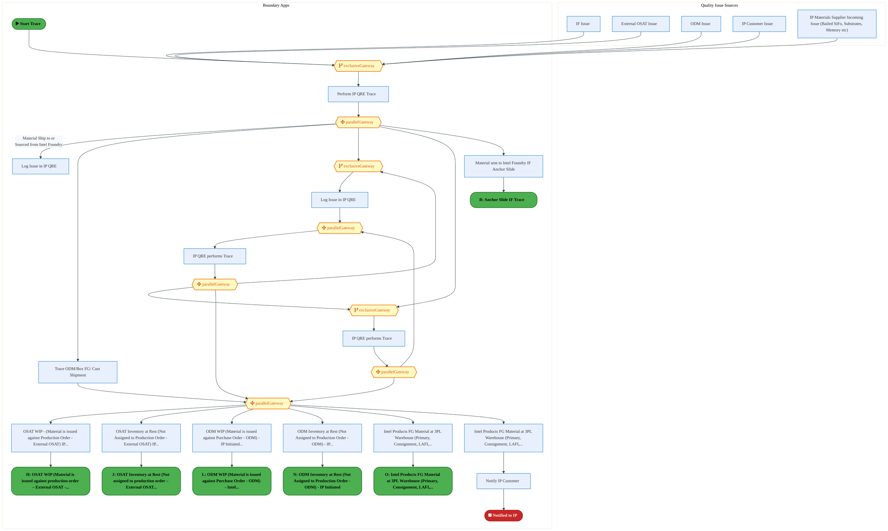

<a href="https://mermaid.live/view#pako:eNq1WF1v2kgU_SsjVxGJZFJ_YvDDSny5yypp0pLdPiz7MLHHMKrxWDN2Apvy3_cO9hgwUHWpGkWJ5nDuuXeO71zbvGkhi4jma1dXbzSluY_eWvmCLEnLR61nLEhLRyXwF-YUPydEtCQnZmk-pf9uaaaTrSRNYgFe0mQt0SmZM4L-nOioD4GJjgRORVsQTuOW3so4XWK-HrKEccl-R7qxEW-zVR8NGI8I3xEMwzNDF0ITmpIdbHuO5wQyTpCQpdGBaOzG3ThsbWRxCXsNF5jn2_ILQe7x6guN8gWsY5wIApxFvkzu8DNJ5B5zXkgsLPiLMoMKmScFw6YZDmk6B9wxAOI4_bqDXGOzQZurq1laJ0VPo1mK4CdMsBAjEiORAzx-yVFMk8R_5wz7gWvoIufsK_HfWWNvZFt6KHfiw9YNXZrbfiV0vsj9Z5ZEFbX9KvfgW9lK5yvfMnS-hr-NXCSNdpmGHatrdetMA88cmkOVKY7jn8oEvvInLL5WucZ2YAWjOpfpdtyhcayntjlyvL7Z9InwFxqSPdEgCOzxzqpxxzWN86KDwO4Yw4boHOfkFa93gr2hUwsGrheY3lnBMl-zyuL5kbNQCdpjN3BrQW9gBn3rrKDTN51uVSHozDnOFmjAim0vo36WCVR-KH9S8--Z9kh4zPgSTR7Rp89j9MRxSGbaP3ssC1h3bI4mQhQE0bSiHpLsHyE5QKryZGVacSqhC7QtjB5G9-8HbIWCD-_RsBA5mi5otiRpfhjQ-TFdD2j3cLXkCIFeSHOUMzRJc5KgQFoEDk0C1E_DBeNomtCoEd-F-Idp_wl9gWRtdF1rUQG_sO8I4TmmKdQJFzAqwpyyFD3I0QP08QrYKbClxA34c3t7e6jfU_qT9AWqY1APztFnAnrXH1mO-kLQeQpZoOyLEpiGzDC6327gu-UXHEaNILU2BN3APwibwGCnEBkdq8t2Ku2sqhNw4VCdBvZiP96hL5iTBYPDja4fy-msoyFL5dbkldXRXT-Y6Mfq1i9VtytnLrO-tudYWPY8KNB4Ld2TTcyWhDdOmHENrBj7MW5nCcySab6d81UL3-xTzR0VpDK01aZlZZPHJluaNvAPelr2-KlTLh343Ud1g3-vP7KdBds7K5oVlmHahy2I2kduWNKNP6okZ6zGe1b_UJ7jLHKA3Pnopzpddtqxspw0H0vln-yU3UFqpJBT6sFHv6zVre7bm-og-bzWfoYnjnCByCpMCkFfyIfyhjbTNpv9sN5FYbZxWZi5C8Ocs1fRxgn0HeY4SUhyJsi6JMi-JMi5JMj9f0HwpNW4kX8qcELzdXWTnTLoXSL2h41sfDje288bc0h27uHxPMXy1Bg88Vm3vMuqEXaS0ys5qlUFmhZZllDJTkO2hGfaqvjrAaYJnJIpDZgOrGd4ooEgoaN7spSHiuThTS1eWwGjErXbv8kuVkC3BKpnPegcuf62d6eXzwzyNMIAnKWlaRGKOVse3vtn2jdQq1TMUtRWqlavAlSWamkfZIVHl8ba6jUA21CA1WRUmo5au40cTrW2GgpHkraSML2GWWa3AdRJ6qyVvx0V0WlEVGtb7dR0G4QjxarubmPda6xNownYTcBqAmbDXU8VVa3N2oleo0rljJJUxqicil8LqL6r911dLqt2Sl3QuoiqSmv_NWTbwep97RA3q3erQ9Q6w7bP4M4Z3D2Dd87g3hm8q154DuHeSRi66SRsnoat07B9GnZOw66CNV2DMbXENNL8N237vQN8NxGRGBdJrm10DRc5m67TUPO37-dakUUQOaIYpu2yBDf_AQqZGBw=" title="View full diagram">&#128065; View Full Diagram</a>

Page 7<a href="#toc">↑ Back to TOC</a>E2E-117 — Forecast to Stock

#### BUSINESS ARCHITECTURE — 3.2.2 E2E-117B__Anchor_Slide_IF_Trace — E2E-117B__Anchor_Slide_IF_Trace

**Swim Lanes**: Boundary Apps
 · Quality Issue Sources | **Tasks**: 7 | **Gateways**: 1

> **Legend**: ● Start · ● End · User Task · Service Task · ◇ Gateway · Sub-Process

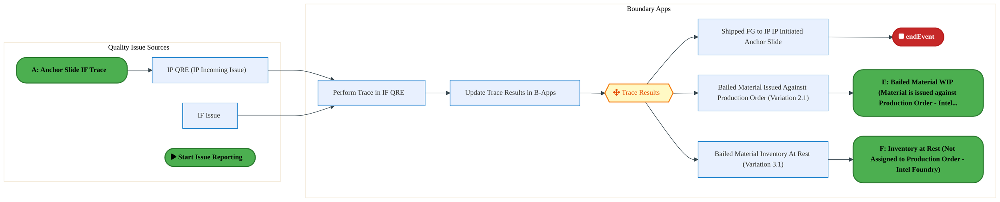

<a href="https://mermaid.live/view#pako:eNqlVl1v4jgU_StWqoqOFKo4H4TmYSWgZFVpZrdT5uNhuw9u4oBVY0e2U8oi_vteJ-Ej6fA0CCHd6-Nz7j25dtg5mcypkzjX1zsmmEnQbmBWdE0HCRq8EE0HLmoSP4hi5IVTPbCYQgqzYP_VMByW7xZmcylZM7612QVdSoq-P7hoAhu5izQReqipYsXAHZSKrYnaziSXyqKv6LjwilqtXZpKlVN1AnhejLMItnIm6CkdxGEcpnafppkUeYe0iIpxkQ32tjguN9mKKFOXX2n6hbz_ZLlZQVwQrilgVmbNP5MXym2PRlU2l1Xq7WAG01ZHgGGLkmRMLCEfepBSRLyeUpG336P99fWzOIqiz0_PAsEn40Tre1ogbSA9fzOoYJwnV-Fskkaeq42SrzS58ufxfeC7me0kgdY915o73FC2XJnkRfK8hQ43tofEL99d9Z74nqu28NvToiI_Kc1G_tgfH5WmMZ7h2UGpKIrfUgJf1TeiX1uteZD66f1RC0ejaOZ95Du0eR_GE9z3iao3ltEz0jRNg_nJqvkowt5l0mkajLxZj3RJDN2Q7YnwbhYeCdMoTnF8kbDR61dZvTwqmR0Ig3mURkfCeIrTiX-RMJzgcNxWCDxLRcoVmsqqnmU0KUuNmkX7EfifZ-eRqkKqNfqmSEYRE-ghRV-f5s_Ov2dAH4BTwjjN0Rdo155B9KB1BfFkSZjQxiCoOa8yw6RAf9vThm7qU14n_Fv8qcsY_IpRvFFhpC3UoCeqzTlF8IEiBIrFipUlcKR_IiPRw2P9hasHNtnaRLaSCi04y2l3bwR7v5c5oNrGQa7iRlsDpkPrUxd_dwMbCpIUZKiNLJtTAMUC6tO5oR7A5gnqd_YTyro5RgxkGvNIY95H74bQhaH89va2Wwe2jyxNzqwiB6v-kgZNtGZLAcRgxiVOlNpxUNuemzjY7Q4tEqXkRg8JN113np39vtkC_feG7GtFODPbZizQQlYqo_qMfwSFw2jVy13l2K482qFDN_Xjy-QaLr8G2qtyfHoOJYdDt7A3X6v5REupDOzsPxQ7vZOkMw12yuvWjvTHjsAJNBz-AUPfi4M29psQt-dWtMsYH_AtIG7juF1vw1E3xE0Y9cTCNo5a9EE8bOK7szsDXDm-ATrpu_ay7iSx92swxhfy_oV8cLj5HNdZU7UmLHeSnVO_3-E_QE4LAjPj7F2HVEYutiJzkvo96FT1wbtnBCZn3ST3_wMAmo_y" title="View full diagram">&#128065; View Full Diagram</a>

Page 8<a href="#toc">↑ Back to TOC</a>E2E-117 — Forecast to Stock

#### BUSINESS ARCHITECTURE — 3.2.3 E2E-117C__Anchor_Slide_External_OSAT_initiated_Trace — E2E-117C__Anchor_Slide_External_OSAT_initiated_Trace

**Swim Lanes**: Intel Products · Vendor QRE | **Tasks**: 6 | **Gateways**: 2

> **Legend**: ● Start · ● End · User Task · Service Task · ◇ Gateway · Sub-Process

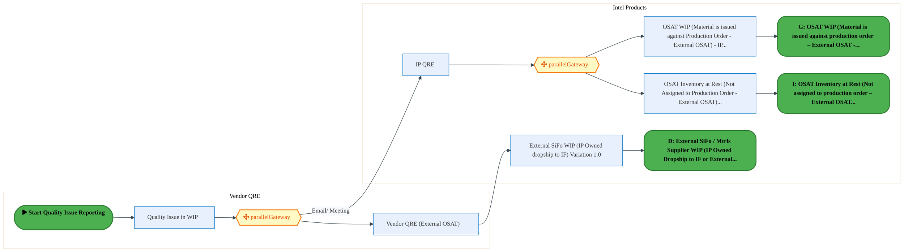

<a href="https://mermaid.live/view#pako:eNqlVmFv4jgQ_StWqopWCr0kJITmw0kUyAppe-2Wvd0Py31wEwesGjuynQLH8t9vTBIgsGhXewiQ5mXmvZkX28nGSkRKrMi6vt5QTnWENi09JwvSilDrFSvSslEJfMGS4ldGVMvkZILrCf13l-b6-cqkGSzGC8rWBp2QmSDo77GN-lDIbKQwV21FJM1adiuXdIHleiCYkCb7ivQyJ9upVZcehEyJPCQ4TugmAZQyyskB7oR-6MemTpFE8LRBmgVZL0taW9McE8tkjqXetV8o8ohXX2mq5xBnmCkCOXO9YB_xK2FmRi0LgyWFfK_NoMrocDBskuOE8hngvgOQxPztAAXOdou219dTvhdFH1-mHMEnYVipIcmQ0gCP3jXKKGPRlT_ox4FjKy3FG4muvFE47Hh2YiaJYHTHNua2l4TO5jp6FSytUttLM0Pk5StbriLPseUa_k-0CE8PSoOu1_N6e6WH0B24g1opy7L_pQS-ys9YvVVao07sxcO9lht0g4FzzlePOfTDvnvqE5HvNCFHpHEcd0YHq0bdwHUukz7Ena4zOCGdYU2WeH0gvB_4e8I4CGM3vEhY6p12Wbw-S5HUhJ1REAd7wvDBjfveRUK_7_q9qkPgmUmcz9GYa8IQcKZFolV50Xy4-21qjZ_Rp5fR1PrnCPcAH600kRwzNKGxQF8h7QZ-T0tOUpRKkas5zZEWaBzfot121lRw5N45TaoOUD1N-p9LhkfwymxgRBV8VQFceIYpV7puz5A8mc2K2mjfgiG4BWD8fHd31-T3a_4xfydcC7lGWKMXAow3fwmN-krRmekZWv2pxBl7D9iHEWp68Qd61JIpNCnynFGgaZozbJiDhNyXn9HfA_2HCP2SP_mh-d1hhqaF57id5gSofabhOuYmVyIXTMJHJv2SzrmKu9lMrQxHGW5jKcVStTGDprHEjBH2odwjU2u7LYvgFDlZpF8AAq_MWjzQBtD7pwIzqtdobPxAlBunmuJdyDqUo5vmTW3mhjff6j5zBrt2Yo5O1NR4IbmQGs5fKL09HtL7zSF5gNrtPw1BFXfLuA7d6rJbxxXgn8SdKvbKsFeFnTK8r0K_YqvOFR6WcVCT7aq_ww5fYMpgMRNSzvodrjVyoM-jo8kQ1Q-aBtz7MXz_Y9h1LuBufZI2Ya-GLdtaEAk9p1a0sXavEfCqkZIMF0xbW9vChRaTNU-saPe4tYo8hcohxbDAFiW4_Q8FkLJw" title="View full diagram">&#128065; View Full Diagram</a>

Page 9<a href="#toc">↑ Back to TOC</a>E2E-117 — Forecast to Stock

#### BUSINESS ARCHITECTURE — 3.2.4 E2E-117E__Bailed_Material_WIP_(Material_is_issued_against_Production_Order_-_Intel_Foundry) — E2E-117E__Bailed_Material_WIP_(Material_is_issued_against_Production_Order_-_Intel_Foundry)

**Swim Lanes**: Boundary Apps IP · SAP  S/4 Intel Product · SAP S/4 Intel Foundry | **Tasks**: 8 | **Gateways**: 3

> **Legend**: ● Start · ● End · User Task · Service Task · ◇ Gateway · Sub-Process

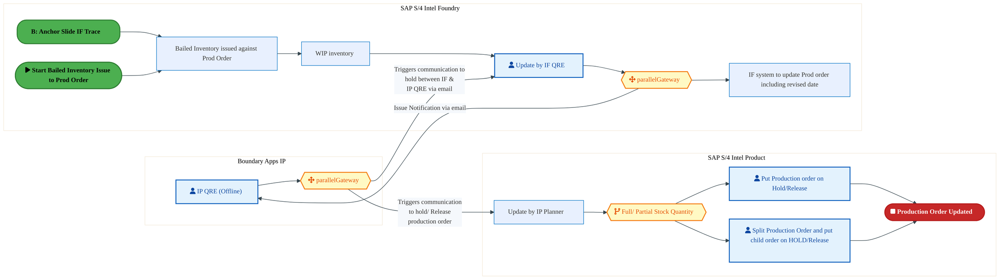

<a href="https://mermaid.live/view#pako:eNqlVltv4kYU_isjRym7klF8xcQPlbi5Rco2bMh2H0ofBnsMowxja2YMoSz_vWd8AUwStWp5AM4353znOsc-GHGWECM0bm8PlFMVokNHrcmGdELUWWJJOiaqgN-xoHjJiOxonTTjak7_KtVsL3_VahqL8IayvUbnZJUR9G1qogEYMhNJzGVXEkHTjtnJBd1gsR9lLBNa-4b0UystvdVHw0wkRJwVLCuwYx9MGeXkDLuBF3iRtpMkznjSIk39tJ_GnaMOjmW7eI2FKsMvJPmCX7_TRK1BTjGTBHTWasMe8JIwnaMShcbiQmybYlCp_XAo2DzHMeUrwD0LIIH5yxnyreMRHW9vF_zkFD08LTiCT8ywlGOSIqkAnmwVSilj4Y03GkS-ZUolshcS3jiTYOw6ZqwzCSF1y9TF7e4IXa1VuMxYUqt2dzqH0MlfTfEaOpYp9vB95Yvw5Oxp1HP6Tv_kaRjYI3vUeErT9H95grqKZyxfal8TN3Ki8cmX7ff8kfWWr0lz7AUD-7pORGxpTC5IoyhyJ-dSTXq-bX1MOozcnjW6Il1hRXZ4fya8H3knwsgPIjv4kLDydx1lsZyJLG4I3Ykf-SfCYGhHA-dDQm9ge_06QuBZCZyv0TAryllGgzyXaDqrjvWH9_5YGCkOU9zV1YYz9PVpgj49pqm-GZ8Xxp8XyrZ3ODTqWIhsJ7uYKZRjgRkj7JeqEAvjeKyMYFSuIpkPZgjN7zw05YowBGkmRawuXHgQz7c8ASa03OtwZgxzTkQ7kKAd9axQDRXNOCrvOoI_v8LA3T0RRmD1tAn6bYJ5zmiL4rGkwDxBOXDHa8qSC9rHh_H7tLb16UQsVZa_paxyS8Ds86Wdcy6sXqHdJSyBeI2igrE7NIPLDUsPzVUWv6CvBeaKqn8s87nKkW6_2F_6gyiHmDKSgMqWcJXBcFApCwDwClMuq2pUQbdzdMD2OzSGNobtYxeOpxGSe6nIBqkMFVU3S7qqhJTHrEhgvSFBtlSCT63RpvHbDboYiUhPaFv5_lz1nMFNnOt1iN4kONUJ6pBaqbX6UBYmRAMofgZjwWhCtMdngePrVrv_8S6AE9Tt_gy_tezXotucV7JTi1593Mi2UwH9Kzmo5aDWr7cK71_JvVr2GvvSwY-F8SzoakWERHG22RScxljP7QJqh9b6IqFm5Hl-ddcWxg-Is-FzKwduSwb-qvy_ZYqmNTfaUozIBvpUMvRqizoh_98FqBu64DpCtCRqRwjXHfsJsHqZtZ00rPetJpS7V7eieea04N77cPA-3H8fvj89pVuwbdVP1DZqf6DtNI-bNuy-D3sNbJjGhggoQmKEB6N8BYPXtISkuGDKOJoGLlQ23_PYCMtXFaO6tWOKYaFsKvD4NzvxHa4=" title="View full diagram">&#128065; View Full Diagram</a>

Page 10<a href="#toc">↑ Back to TOC</a>E2E-117 — Forecast to Stock

#### BUSINESS ARCHITECTURE — 3.2.5 E2E-117F__Inventory_at_Rest_(Not_Assigned_to_Production_Order_-_Intel_Foundry) — E2E-117F__Inventory_at_Rest_(Not_Assigned_to_Production_Order_-_Intel_Foundry)

**Swim Lanes**: Boundary Apps IP · EWM IF · SAP  S/4 Intel Product · SAP S/4 Intel Foundry | **Tasks**: 8 | **Gateways**: 2

> **Legend**: ● Start · ● End · User Task · Service Task · ◇ Gateway · Sub-Process

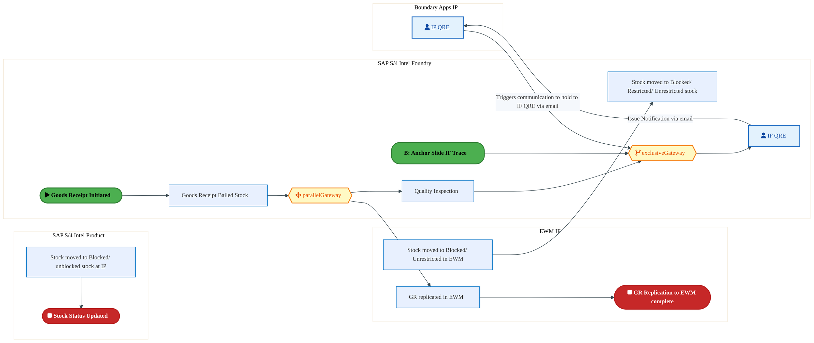

<a href="https://mermaid.live/view#pako:eNqlVl2P2jgU_StWRiN2paAmISFMHlbiKxVSW01hpn0o-2AcB6wxdmQ7fCzlv6-dDyCZ0n1YHma4J_eec-9xbHOyEE-wFVmPjyfCiIrAqaM2eIs7EeisoMQdG5TANygIXFEsOyYn5UwtyD9FmutnB5NmsBhuCT0adIHXHIPXmQ2GupDaQEImuxILknbsTibIForjmFMuTPYDHqROWqhVj0ZcJFhcExwndFGgSylh-Ar3Qj_0Y1MnMeIsaZCmQTpIUedsmqN8jzZQqKL9XOLP8PCdJGqj4xRSiXXORm3pJ7jC1MyoRG4wlItdbQaRRodpwxYZRIStNe47GhKQvV2hwDmfwfnxcckuouDTfMmA_iAKpZzgFEil4elOgZRQGj3442EcOLZUgr_h6MGbhpOeZyMzSaRHd2xjbnePyXqjohWnSZXa3ZsZIi872OIQeY4tjvpvSwuz5Ko07nsDb3BRGoXu2B3XSmma_i8l7at4gfKt0pr2Yi-eXLTcoB-Mnfd89ZgTPxy6bZ-w2BGEb0jjOO5Nr1ZN-4Hr3Ccdxb2-M26RrqHCe3i8Ej6N_QthHISxG94lLPXaXearZ8FRTdibBnFwIQxHbjz07hL6Q9cfVB1qnrWA2QaMeF68y2CYZRLMnsvH5sMGP5ZWCqMUdo3b-hn4Op8urb_LFL3WLarp989gFt8QBJrg4xwInFGCtBMJIMxkXTiKrL7OWiiO3sCW73SO4mBEdYiTD-CVCazHIehesev-celSKp4BrTev9Ahnhsy0hfg2o1hhXfznvfYXw2cAFh98MGMKU6BtTnKkbrT83zSas1X5Ve83kwGV8bLZqtNqteRaKKhyCV6zxDj0Xw1e-4vNwonjrYCxm_NEagcQJpkCI0iobqkQajbj6dyvOaREHTWfzDAydjVzer-Zd35ZltYiyfdaYes9ihvvUZHydLUmo3q_NMeY6fuCNN0pBzZTjCIwZGjDBVhQkmBD_yIgwi3ze6dTrWAuou5KH6VoA_AB0VySHf5Y7tSldT7flvnXMigE38supApkUEBKMX1XdFk01gfd7l_awyoMTfhzac2kzDH4whVJ61d0RyDAW71SS-un3nRVgV_Wu9UBwNwq9qv4qYqr0KvCWs-t6r1WHFRxUOXX9W6vBMI6bhMOqgFeBFmvsZBmS21zdrPPNvoIN__L9W2NVfMUB5mxoz7AG_Dg1_DT5RJrwK5TXThN1P0l6t3h6NVndBP2a9iyrS0Weo7Eik5W8QNF_4hJcApzqqyzbcFc8cWRISsqLnIrLzbyhEC9abcleP4X-_LPig==" title="View full diagram">&#128065; View Full Diagram</a>

Page 11<a href="#toc">↑ Back to TOC</a>E2E-117 — Forecast to Stock

#### BUSINESS ARCHITECTURE — 3.2.6 E2E-117G__OSAT_WIP_(Material_is_issued_against_production_order_–_External_OSAT_-_Vendor_initiated) — E2E-117G__OSAT_WIP_(Material_is_issued_against_production_order_–_External_OSAT_-_Vendor_initiated)

**Swim Lanes**: Boundary Apps IP
 · External OSAT · SAP S/4 Intel Product | **Tasks**: 6 | **Gateways**: 2

> **Legend**: ● Start · ● End · User Task · Service Task · ◇ Gateway · Sub-Process

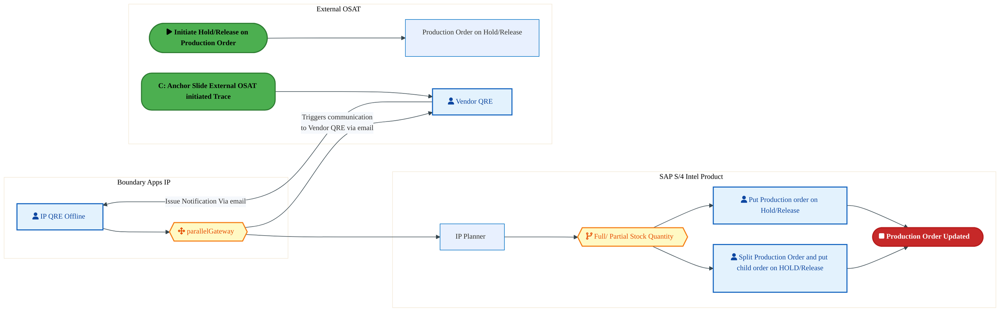

<a href="https://mermaid.live/view#pako:eNqlVlFv8jYU_StWqopNCmoSEkLzMIkC2Sp1K1_Tr3sYezCOA1aNHTlOgfHx33cNCSSUag_LA-IeX59z7o1zk51FZEqtyLq93THBdIR2Hb2kK9qJUGeOC9qx0RF4w4rhOadFx-RkUuiE_XNIc_18Y9IMFuMV41uDJnQhKfr-aKMhbOQ2KrAougVVLOvYnVyxFVbbkeRSmewbOsic7KBWLT1IlVJ1TnCc0CUBbOVM0DPcC_3Qj82-ghIp0hZpFmSDjHT2xhyXa7LESh_slwX9HW_-ZKleQpxhXlDIWeoVf8Jzyk2NWpUGI6X6qJvBCqMjoGFJjgkTC8B9ByCFxfsZCpz9Hu1vb2fiJIqeXmYCwUU4LooxzVChAZ58aJQxzqMbfzSMA8cutJLvNLrxJuG459nEVBJB6Y5tmttdU7ZY6mgueVqldtemhsjLN7baRJ5jqy38XmhRkZ6VRn1v4A1OSg-hO3JHtVKWZf9LCfqqXnHxXmlNerEXj09abtAPRs5nvrrMsR8O3cs-UfXBCG2QxnHcm5xbNekHrvM16UPc6zujC9IF1nSNt2fC-5F_IoyDMHbDLwmPepcuy_lUSVIT9iZBHJwIwwc3HnpfEvpD1x9UDoFnoXC-RA-yPJxlNMzzAj1O0XHdXKL318zKcJThrmm3Wfz2MkHPWWaejJn1dyPVdXe7OhkrJddFF3ONcqww55T_euzDzNrvj5vgpFwYmWw0VQJz9JwMXxvMHpiAktOSaCYFejYPK4I_v8GJuXuhnMLsaHvpt22_gZZUxno7LfzplJdzuEePMJUY-GwxG6VLdaD5ucFzDzSjCA0FWYJMwllK28UgVjGn6FVhcnb7uQnJcIqSOx-8aMpr4WabQQtuw5RjIQ5GGmt-u-xpqZvO5X_3LWgTJDln-lPxCIsU5cBNloynDdrnp_F12sG5z4WW-WfG73lqmnPRVtc5nyjz6ujOYfiRJYpLzu_QFIYaDHuUaEne0bcSC830tfMlXNTt_mLo6tg5AkEV96r1ah6Ivol_QJuLoqToD6lZxgg-2H1jGNEVZnxm_YCNF4R-FfvHcFCFQTu8P4b9KgyPoVdz1W5bMbh5VWyxoKpARK5WpagdzYSWjQOOPloO-43hYQqth2YL9q_DwXW4fx0OT6-ZFjyo3ggt8P56LrSxmpZt2K1hy7ZWVEFxqRXtrMOnAnxOpDTDJdfW3rZwqWWyFcSKDq9UqzycqzHD8GytjuD-X4gyss8=" title="View full diagram">&#128065; View Full Diagram</a>

Page 12<a href="#toc">↑ Back to TOC</a>E2E-117 — Forecast to Stock

#### BUSINESS ARCHITECTURE — 3.2.7 E2E-117H__OSAT_WIP_(Material_is_issued_against_production_order_–_External_OSAT_-_IP_initiated) — E2E-117H__OSAT_WIP_(Material_is_issued_against_production_order_–_External_OSAT_-_IP_initiated)

**Swim Lanes**: Boundary Apps IP
 · External OSAT · SAP S/4 Intel Product | **Tasks**: 6 | **Gateways**: 2

> **Legend**: ● Start · ● End · User Task · Service Task · ◇ Gateway · Sub-Process

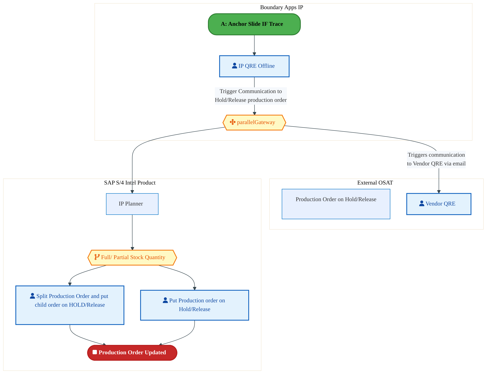

<a href="https://mermaid.live/view#pako:eNqlVU2P4jgQ_StWWi12pKBOICF0DiuFj-y01KNmJszMYdiDcRyw2tiR4zSwDP99yyR8hKa1h80BUc9V71WV7fLOIjKlVmjd3--YYDpEu5Ze0hVthag1xwVt2agCfmDF8JzTomV8Mil0wv45uLlevjFuBovxivGtQRO6kBR9f7JRBIHcRgUWRbugimUtu5UrtsJqO5RcKuN9R_uZkx3U6qWBVClVZwfHCVziQyhngp7hbuAFXmziCkqkSBukmZ_1M9Lam-S4XJMlVvqQflnQL3jzk6V6CXaGeUHBZ6lX_BnPKTc1alUajJTq7dgMVhgdAQ1LckyYWADuOQApLF7PkO_s92h_fz8TJ1E0Hc0Ego9wXBQjmqFCAzx-0yhjnId33jCKfccutJKvNLzrjINRt2MTU0kIpTu2aW57TdliqcO55Gnt2l6bGsJOvrHVJuw4ttrC75UWFelZadjr9Dv9k9IgcIfu8KiUZdn_UoK-qikuXmutcTfuxKOTluv3_KHznu9Y5sgLIve6T1S9MUIvSOM47o7PrRr3fNf5mHQQd3vO8Ip0gTVd4-2Z8HHonQhjP4jd4EPCSu86y3I-UZIcCbtjP_ZPhMHAjaPOh4Re5Hr9OkPgWSicL9FAloezjKI8L9DTBFXr5hPdXzMrw2GG26bdZvHrtzF6yTJzM2bW3xeufXCNQhQJspQKJZylFD3FaKowufJ0nd3uSIuVkuuijblGOVaYc8r_qjo2s_b7KgjO1FXK442mSmCOXpJoesHcgRygOWlJNJMCvZhrjeDPZzhbD98opzBlmrn0mgX-AC3IHoo8ub1XT6IJSh489CQ05ajWu6wPOKFTE46FoKqp5zX1JqVGFwnL_07YbxIkOWcNiqpmLFKUAzdZMp5e0L48j27TBn-ceAst8_eM3_MU9iWFqE8XYY_nnTTDvT2H8USWKC45f0ATGDswjlGiJXlFX0ssNNO39lW4qN3-E9hq87Eyvabp12a_Mru16VdmUJte03Sdyq7vuuga8_fMmiq2WEBZQ7lalYIRfChVSzj8l71H-dXmzKzfhrTBfqYrEGnwzQQwns8UemMY0RVm_EDTu7jZJrPjRGvA3m3Yvw33bsNBPZcbYP_0MDTgx-PIaqBQaQ1btrWiCopIrXBnHd5reNNTmuGSa2tvW7jUMtkKYoWHd80qDydnxDDcnlUF7v8F30KPBg==" title="View full diagram">&#128065; View Full Diagram</a>

Page 13<a href="#toc">↑ Back to TOC</a>E2E-117 — Forecast to Stock

#### BUSINESS ARCHITECTURE — 3.2.8 E2E-117I__OSAT_Inventory_at_Rest_(Not_assigned_to_production_order_–_External_OSAT_-_Vendor_initiate — E2E-117I__OSAT_Inventory_at_Rest_(Not_assigned_to_production_order_–_External_OSAT_-_Vendor_initiate

**Swim Lanes**: Boundary Apps IP
 · External OSAT · SAP S/4 Intel Product | **Tasks**: 4 | **Gateways**: 2

> **Legend**: ● Start · ● End · User Task · Service Task · ◇ Gateway · Sub-Process

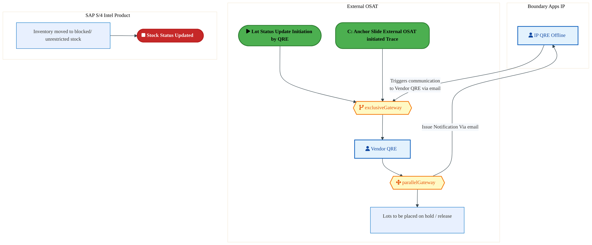

<a href="https://mermaid.live/view#pako:eNqlVV2PqzYQ_SsWq1VaiWghgZDloVK-qFa67d02uduHpg-OMYm1xka2yUdz8987DpCE7N2n8oA0xzPnzBwbc3SITKkTO4-PRyaYidGxYzY0p50YdVZY046LKuANK4ZXnOqOzcmkMHP27znND4q9TbNYgnPGDxad07Wk6NuLi0ZQyF2ksdBdTRXLOm6nUCzH6jCRXCqb_UCHmZed1eqlsVQpVdcEz4t8EkIpZ4Je4X4UREFi6zQlUqQt0izMhhnpnGxzXO7IBitzbr_U9De8_4ulZgNxhrmmkLMxOf-CV5TbGY0qLUZKtW3MYNrqCDBsXmDCxBrwwANIYfF-hULvdEKnx8eluIiixXQpEDyEY62nNEPaADzbGpQxzuOHYDJKQs_VRsl3Gj_0ZtG033OJnSSG0T3XmtvdUbbemHgleVqndnd2hrhX7F21j3ueqw7wvtOiIr0qTQa9YW94URpH_sSfNEpZlv0vJfBVLbB-r7Vm_aSXTC9afjgIJ95HvmbMaRCN_HufqNoyQm9IkyTpz65WzQah731OOk76A29yR7rGhu7w4Ur4PAkuhEkYJX70KWGld99luXpVkjSE_VmYhBfCaOwno96nhMHID4Z1h8CzVrjYoLEsz2cZjYpCo5dXVK3bR_T_XjoZjjPctXbbxT_-nKGvWWa_jKXzT5UKm37HOdsbqgTm6Ot8tLjh6wHfF2k0MhKtKCo4JjRFUqAN7D56QopyCjfBhflcFLSbeAM5qWwj7bTwp0se8B4Q6KC5wabU6FuRwjagF7h1GDYM9FaHmuDnG4YICCYxGgmyAYE5ZyltT4JYxQA9LxS03m5geDw2DdibrruCb5VsEN0TXmq2pb9WR2HpnE43Vc_XKqyU3Oku5gYVWGHOKf9Q89Hr-egVzZ8CmM5QjuBspCUxNwI-TPUitlQYCZucyy10b-3nkrzT9AmVQlE4MIzYsbQBtD3W4OorrBbgKaS0nU2vRl76E33U7f7yfeksFFuvqdKIyDwvBSPVDiyhn5u9RFuGEc0x40vnO3hZkwSWBEyqw-ea80XrkqLfpWFZw_fWqu_fFsC5q0O_Cgd1GFZhIxa1w2EVBjcfoJ2quXhacPBjOLxcvi14UN-TLTD6ce6wuUJa6HODOq6TUwVzp058dM6_T_jFpjTDJTfOyXVwaeT8IIgTn38zTnnesSnDcHryCjz9B_ZxbEk=" title="View full diagram">&#128065; View Full Diagram</a>

Page 14<a href="#toc">↑ Back to TOC</a>E2E-117 — Forecast to Stock

#### BUSINESS ARCHITECTURE — 3.2.9 E2E-117J__OSAT_Inventory_at_Rest_(Not_assigned_to_production_order_–_External_OSAT_-_IP_initiated) — E2E-117J__OSAT_Inventory_at_Rest_(Not_assigned_to_production_order_–_External_OSAT_-_IP_initiated)

**Swim Lanes**: Boundary Apps IP
 · External OSAT · SAP S/4 Intel Product | **Tasks**: 4 | **Gateways**: 1

> **Legend**: ● Start · ● End · User Task · Service Task · ◇ Gateway · Sub-Process

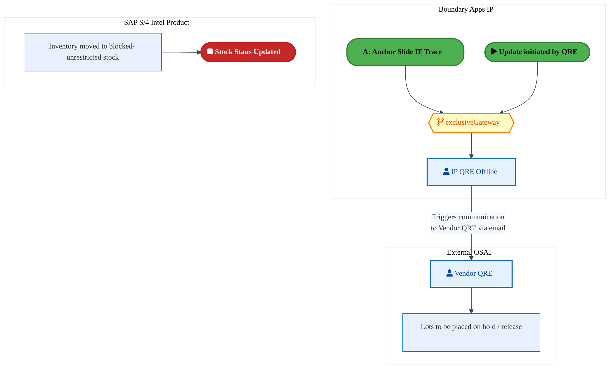

<a href="https://mermaid.live/view#pako:eNqlVV2PozYU_StXjEZpJaKBBELKQyXyQRVpVzttstuHpg-OMYk1xkbGZJJm8997Hchnd57KA8LH95577vEHB4eqjDmx8_x84JKbGA4ds2EF68TQWZGKdVxogG9Ec7ISrOrYmFxJM-f_nML8oNzZMIulpOBib9E5WysGX2cuJJgoXKiIrLoV0zzvuJ1S84Lo_VgJpW30ExvmXn6q1k6NlM6YvgZ4XuTTEFMFl-wK96MgClKbVzGqZHZHmof5MKedoxUn1DvdEG1O8uuKfSa7P3lmNjjOiagYxmxMIT6RFRO2R6Nri9Fab89m8MrWkWjYvCSUyzXigYeQJvLtCoXe8QjH5-elvBSFxWQpAR8qSFVNWA6VQXi6NZBzIeKnYJykoedWRqs3Fj_1ptGk33Op7STG1j3Xmtt9Z3y9MfFKiawN7b7bHuJeuXP1Lu55rt7j-6EWk9m10njQG_aGl0qjyB_743OlPM__VyX0VS9I9dbWmvbTXjq51PLDQTj2_st3bnMSRIn_6BPTW07ZDWmapv3p1arpIPS9j0lHaX_gjR9I18Swd7K_Ev4yDi6EaRilfvQhYVPvUWW9etWKngn70zANL4TRyE-T3oeEQeIHw1Yh8qw1KTcwUvVpL0NSlhXMXqGZt4_s_7V0chLnpGvttpO__zGFL3luT8bS-fsmNPzpElsKbPhrmWHrYE86x48MVnubjEk_32RFmJTEkEi6URrmgmcMZiksNKEP_MPD4cxv75HuCk8C3QDbUVFXfMt-a4xeOsdjk4Vb8aHT6c4wLYmAL_NkcUPdQxGflKnAKFgxQPkU9SoJG9yT8AKaCYb3072e4N6ab1gOO2g6_EjAPHmF-UsAM2mYAFzGrKbmhtNHzpncMmkUrkehtijDahKKvrHsBWqpGa4tp9bPyiB6r2lwXQOcLWFuQ_BN6qpdj-zq_0We7EO3--v3pbPQfL1mugKqiqKWnBLD0YUlyrnpD7acACsIF0vnO_rQkgSWBL1sh1EzHLZDvxkO2mF4Pztshv2brW5VnY_4HRz8GA4v19wdPGhvpDsw-nHs8HxYHdcpmMYOMyc-OKdfEv62MpaTWhjn6DqkNmq-l9SJT1e3U5-8nXCCy1w04PFfBZUzfA==" title="View full diagram">&#128065; View Full Diagram</a>

Page 15<a href="#toc">↑ Back to TOC</a>E2E-117 — Forecast to Stock

#### BUSINESS ARCHITECTURE — 3.2.10 E2E-117K__ODM_WIP_(Material_is_issued_against_Purchase_Order_-_ODM)_-_Vendor_Initiated — E2E-117K__ODM_WIP_(Material_is_issued_against_Purchase_Order_-_ODM)_-_Vendor_Initiated

**Swim Lanes**: Boundary Apps IP
 · ODM Supplier · SAP S/4 Intel Product | **Tasks**: 5 | **Gateways**: 2

> **Legend**: ● Start · ● End · User Task · Service Task · ◇ Gateway · Sub-Process

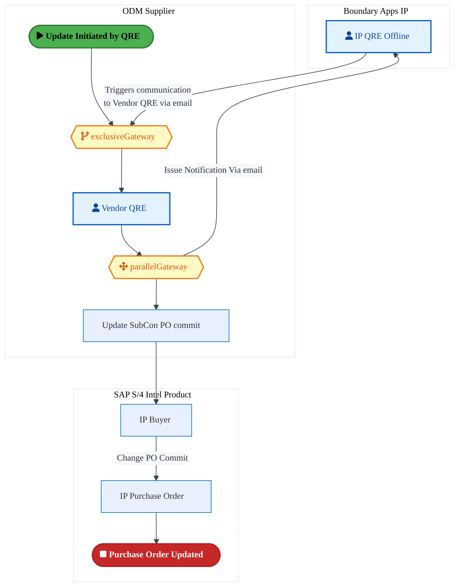

<a href="https://mermaid.live/view#pako:eNqlVU2P4jgQ_StWWi1mpaBNQkIgh5EgkFFLO9vs0NNzWOZgEhusNnZkO3wsw39fm3wRevu0OSDqueq9qufYOVspz5AVWY-PZ8KIisC5p7Zoh3oR6K2hRD0blMArFASuKZI9k4M5U0vyzzXN9fOjSTNYAneEngy6RBuOwPcnG0x0IbWBhEz2JRIE9-xeLsgOilPMKRcm-wGNsIOvatXSlIsMiTbBcUI3DXQpJQy18CD0Qz8xdRKlnGUdUhzgEU57F9Mc5Yd0C4W6tl9I9BUef5BMbXWMIZVI52zVjv4B14iaGZUoDJYWYl-bQaTRYdqwZQ5TwjYa9x0NCcjeWihwLhdweXxcsUYUvMxWDOgnpVDKGcJAKg3P9wpgQmn04MeTJHBsqQR_Q9GDNw9nA89OzSSRHt2xjbn9AyKbrYrWnGZVav9gZoi8_GiLY-Q5tjjp3zstxLJWKR56I2_UKE1DN3bjWglj_L-UtK_iBcq3Sms-SLxk1mi5wTCInfd89ZgzP5y49z4hsScpuiFNkmQwb62aDwPX-Zh0mgyGTnxHuoEKHeCpJRzHfkOYBGHihh8Slnr3XRbrheBpTTiYB0nQEIZTN5l4HxL6E9cfVR1qno2A-RZMeXF9l8EkzyV4WoBy3TzM_3tlYRhh2Dd2m8W_vs3BM8bmZKysn2Wq3vQ7zufZV7As8pwSJG7oBprue55pS_TqOuYMLJ5Bync7ohqya2LQ1X3VClwY7W7a8FOTl1NtcsX9pG8Xov9kYH2qin67qRqdz3WVuZH6a32m0i1Ax5QWkuzRl3LLVtblclM1bqugEPwg-5AqkEMBKUX0Xc17T5aTBVj-7uvuFKJA72FWpOpGwNWzaIMXhdDnWCLwbC6l7rxemTItTvcrYeuEVDy_Y6mMyVojmvaYD_r9z79W1osgmw0S8rofBSMpVERv0IopfuM_2BMI0A4SurJ-aSsrkoEh0f1VoVdxxlvINshsclxtsq6pjh0blzWD21DXPElZIPAnVwTXPbx2NP2qICjrx1XolmFYhcMyrBsclWFwc5jM6PUl0oGD_4aHzUXagcPqzuuAo_rcd9BxjVq2tUNCT5RZ0dm6fvP0dzFDGBZUWRfbgoXiyxNLrej6bbCK6_7NCNSv0q4EL_8Ckq5PBA==" title="View full diagram">&#128065; View Full Diagram</a>

Page 16<a href="#toc">↑ Back to TOC</a>E2E-117 — Forecast to Stock

#### BUSINESS ARCHITECTURE — 3.2.11 E2E-117L__ODM_WIP_(Material_is_issued_against_Purchase_Order_-_ODM)_-_Intel_Products_Initiated — E2E-117L__ODM_WIP_(Material_is_issued_against_Purchase_Order_-_ODM)_-_Intel_Products_Initiated

**Swim Lanes**: Boundary Apps IP
 · ODM Supplier · SAP S/4 Intel Product | **Tasks**: 5 | **Gateways**: 1

> **Legend**: ● Start · ● End · User Task · Service Task · ◇ Gateway · Sub-Process

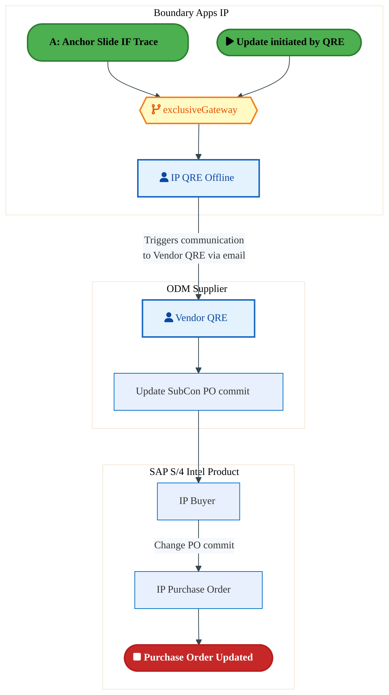

<a href="https://mermaid.live/view#pako:eNqlVV2PmzgU_SsWo1F2JaICgZDwUImQsBppq8mWafuw6YNj7GCNMcg2maRp_vvaQD6381Qeotzje8-59xibg4WqHFuR9fh4oJyqCBwGqsAlHkRgsIYSD2zQAV-hoHDNsByYHFJxldEfbZrr1zuTZrAUlpTtDZrhTYXBlycbxLqQ2UBCLocSC0oG9qAWtIRin1SsEib7AU-IQ1q1fmlWiRyLS4LjhC4KdCmjHF_gUeiHfmrqJEYVz29ISUAmBA2OpjlWvaECCtW230j8Ce6-0VwVOiaQSaxzClWyv-EaMzOjEo3BUCO2JzOoNDpcG5bVEFG-0bjvaEhA_nqBAud4BMfHxxU_i4KX-YoD_SAGpZxjAqTS8GKrAKGMRQ9-EqeBY0slqlccPXiLcD7ybGQmifTojm3MHb5huilUtK5Y3qcO38wMkVfvbLGLPMcWe_17p4V5flFKxt7Em5yVZqGbuMlJiRDyW0raV_EC5WuvtRilXjo_a7nBOEic__Odxpz7Yeze-4TFliJ8RZqm6WhxsWoxDlznfdJZOho7yR3pBir8BvcXwmninwnTIEzd8F3CTu--y2a9FBU6EY4WQRqcCcOZm8beu4R-7PqTvkPNsxGwLsCsatp3GcR1LcHTEnTr5uH-vyuLwIjAobHbLP7zeQGeCTEnY2V9v0od_3HOrZke-Eud69GBOelU_8nBem-KddGfV1UTXRRHIOaoqATIGM0xeErBi4Dojn96OJz4zT0yXOuTgAqAd4g1km7xX53RK-t47Kr0q3g36fP8E8iaumYUiyvmke6h7zZr1knFwfIZoKosqbptIbh146tW0E13Q72nmcVLkH3wwRNXmAG9c3mD1BWnqzm1rctG6NMrMXg2V9GtrNelzJr9_Up48Vyqqr5j6bcgv1h-bo_7YDj8-HNlvQi62WAh23kbThFUVBuw4qq6mg9sKQS4hJStrJ_ah55kZEh0f30YdOGoDyddOO1DtwvDPvT6BpIC8g2-dlwL9CeTT7savw_HN4ztiTCTnG6CGzj4NTw-34Y3cNhfXDfg5Ne509OZtmyrxEK7klvRwWq_XPrrlmMCG6aso23BRlXZniMram94q2n3Y06hfjXKDjz-Bz3fOiI=" title="View full diagram">&#128065; View Full Diagram</a>

Page 17<a href="#toc">↑ Back to TOC</a>E2E-117 — Forecast to Stock

#### BUSINESS ARCHITECTURE — 3.2.12 E2E-117M__ODM_Inventory_at_Rest_(Not_Assigned_to_Purchase_Order_-_ODM)_-_Vendor_Initiated — E2E-117M__ODM_Inventory_at_Rest_(Not_Assigned_to_Purchase_Order_-_ODM)_-_Vendor_Initiated

**Swim Lanes**: Boundary Apps IP
 · ODM Supplier · SAP S/4 Intel Product | **Tasks**: 4 | **Gateways**: 2

> **Legend**: ● Start · ● End · User Task · Service Task · ◇ Gateway · Sub-Process

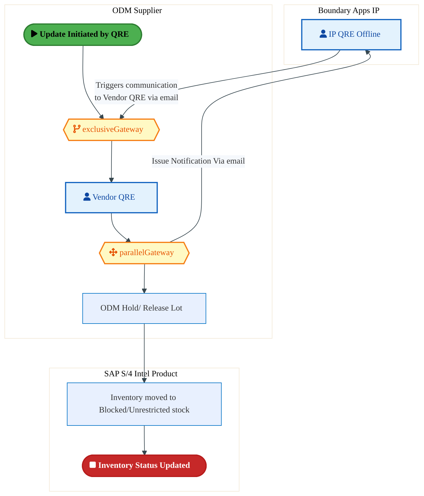

<a href="https://mermaid.live/view#pako:eNqlVduOozgQ_RWLViu7ElEDgZDhYaTc2I00l55Jd-_DZB4cMInVxka2yWUz-fctBwhJevtpeIhSx1XnVB1jc7ASkRIrsu7vD5RTHaFDR69JTjoR6iyxIh0bVcALlhQvGVEdk5MJruf031Oa6xc7k2awGOeU7Q06JytB0PPMRkMoZDZSmKuuIpJmHbtTSJpjuR8LJqTJviODzMlOavXSSMiUyDbBcUI3CaCUUU5auBf6oR-bOkUSwdMr0izIBlnSOZrmmNgmayz1qf1Skc949w9N9RriDDNFIGetc_YJLwkzM2pZGiwp5aYxgyqjw8GweYETyleA-w5AEvPXFgqc4xEd7-8X_CyKniYLjuBJGFZqQjKkNMDTjUYZZSy688fDOHBspaV4JdGdNw0nPc9OzCQRjO7YxtzultDVWkdLwdI6tbs1M0ResbPlLvIcW-7h90aL8LRVGve9gTc4K41Cd-yOG6Usy35LCXyVT1i91lrTXuzFk7OWG_SDsfOWrxlz4odD99YnIjc0IRekcRz3pq1V037gOu-TjuJe3xnfkK6wJlu8bwk_jP0zYRyEsRu-S1jp3XZZLh-lSBrC3jSIgzNhOHLjofcuoT90_UHdIfCsJC7WaCTK07uMhkWh0OwRVevm4b0fCyvDUYa7xm6z-O37FH3NMnMyFtbPKhU2_Ybz6-QzmpdFwSiRF3Qe0Jmlv2GvH9B3wggce_RJ6DPVKc2_Vn0BfiGN8nVa8Mc5r2Bg8XORgtloBncLhT8pWu7roj8vqsLDoaky91F3CScqWSOyS1ip6Ib8VW3YwjoeL6oGbRWWUmxVFzONCiwxY4S9qXnryHz4iOYPPnSnCUOwg2mZ6AsBF2aZ8Q3hWsBW5GID_WuBRkwkryR9eOaSwK7SxMylNIDXXvRbL2C1QC3VXGNdqtqctDXj3CLvoW7346-F9STpakWkQonI85LTBGsqOLwO0Ee7B2hDMSI5pmxh_QI7axLfkIBPdehVYX3EuFuF_TocVKF3GUIDM6VKgr4ITbNG_OVKrFcXBFV9ox1WoX9xUsxUzQ1xBfv_DwfnW_IK7tcX2hUYNof6Ch00qGVbOZHQc2pFB-v0QYOPXkoyXDJtHW0Ll1rM9zyxotPFb5WnrZlQDG9KXoHH_wB_IUgy" title="View full diagram">&#128065; View Full Diagram</a>

Page 18<a href="#toc">↑ Back to TOC</a>E2E-117 — Forecast to Stock

#### BUSINESS ARCHITECTURE — 3.2.13 E2E-117N__ODM_Inventory_at_Rest_(Not_Assigned_to_Production_Order_-_ODM)_-_IP_Initiated — E2E-117N__ODM_Inventory_at_Rest_(Not_Assigned_to_Production_Order_-_ODM)_-_IP_Initiated

**Swim Lanes**: Boundary Apps IP
 · ODM Supplier · SAP S/4 Intel Product | **Tasks**: 4 | **Gateways**: 1

> **Legend**: ● Start · ● End · User Task · Service Task · ◇ Gateway · Sub-Process

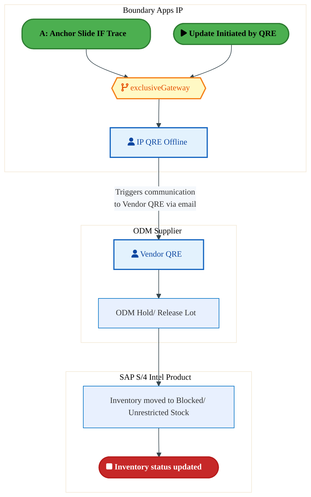

<a href="https://mermaid.live/view#pako:eNqlVd-PmzgQ_lcsVqvcSUQFAoHjoVJ-cbdSq-41u-3DpQ-OMYm1xka2ySZN8793HEhI0u7T8YCYzzPfzHz2mL1DZE6d1Lm_3zPBTIr2PbOmJe2lqLfEmvZc1ABfsGJ4yanuWZ9CCjNn349uflhtrZvFMlwyvrPonK4kRc8PLhpBIHeRxkL3NVWs6Lm9SrESq91Ecqms9x1NCq84ZmuXxlLlVHUOnhf7JIJQzgTt4EEcxmFm4zQlUuRXpEVUJAXpHWxxXL6SNVbmWH6t6Ue8_cpyswa7wFxT8Fmbkn_AS8ptj0bVFiO12pzEYNrmESDYvMKEiRXgoQeQwuKlgyLvcECH-_uFOCdFT9OFQPAQjrWe0gJpA_BsY1DBOE_vwskoizxXGyVfaHoXzOLpIHCJ7SSF1j3Xitt_pWy1NulS8rx17b_aHtKg2rpqmwaeq3bwvslFRd5lmgyDJEjOmcaxP_Enp0xFUfyvTKCresL6pc01G2RBNj3n8qNhNPF-5Tu1OQ3jkX-rE1UbRugFaZZlg1kn1WwY-d7bpONsMPQmN6QrbOgr3nWEf03CM2EWxZkfv0nY5Lutsl4-KklOhINZlEVnwnjsZ6PgTcJw5IdJWyHwrBSu1mgs6-NZRqOq0ujhETXr9hGD_xZOgdMC963cdvHfzzP0qSjsZCycbxeu0R9n34pDw89VDq2jB5h0Bh85Wu5sMAT9eREVQ9AoRSNB1lKhOWc5hGToSWFyw5_s9yd-e4_0lzAJZI3olvBasw39uxF64RwOTRQcxZtOP00_onldVZxRdcEcQA126R84ge_QZ8opXEbogzTXBYTXWnwBfii5aemtjPPRI5q_C0EFQzmCfctrYi44feB8EBsqjIQNKOUGdDISjbkkLxSKeRaKwmYyYgWcG0Cvaxp2omsjK9RxwdCbWqP6uAt5p_q5RjFA_f77HwvnSbHViiqNiCzLWjCCDZMCTgEU0jWJNgwjWmLGF84PEKMlCS0JSNiacWMmrRk0Zjtowm_MYWsmjTlozegq9njebZGnOb-Cw9_D0fmuu4KH7bV0Bca_901OE-u4TkkVNJw76d45_pfg35XTAtfcOAfXwbWR850gTnq8v51G6inDsPVlAx5-AiVsM1I=" title="View full diagram">&#128065; View Full Diagram</a>

Page 19<a href="#toc">↑ Back to TOC</a>E2E-117 — Forecast to Stock

#### BUSINESS ARCHITECTURE — 3.2.14 E2E-117O__Intel_Products_FG_Material_at_3PL_Warehouse_(Primary,_Consignment,_LAFI,_In-Transit)_-_IP_ — E2E-117O__Intel_Products_FG_Material_at_3PL_Warehouse_(Primary,_Consignment,_LAFI,_In-Transit)_-_IP_

**Swim Lanes**: 3PL Plant · Boundary Apps IP · SAP S/4 Intel Product

 | **Tasks**: 5 | **Gateways**: 0

> **Legend**: ● Start · ● End · User Task · Service Task · ◇ Gateway · Sub-Process

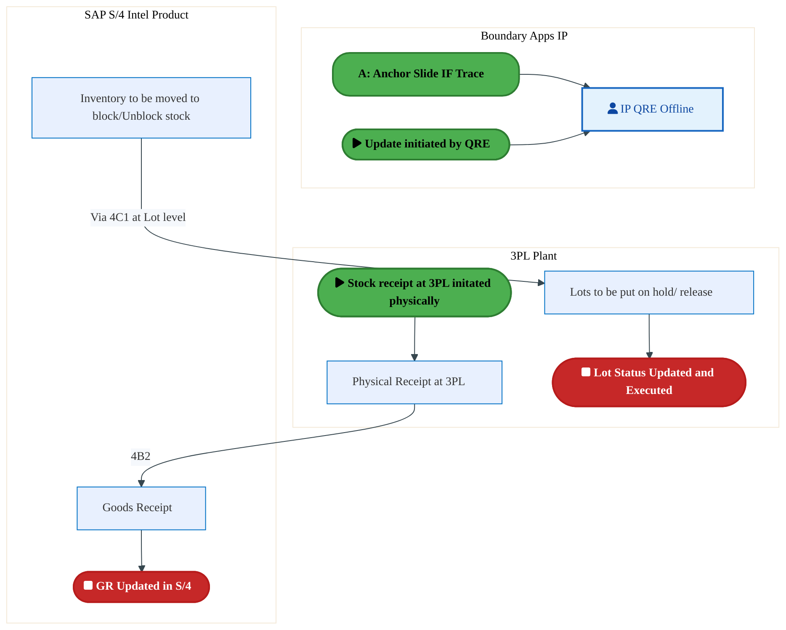

<a href="https://mermaid.live/view#pako:eNqlVV1v6jgQ_SujVBW7UlCTkBCah5X4yhVSV8uW9u7Dsg8mccCqsSPbobC9_Pcdh_B526fNQ2COZ86ZGduTDyeTOXUS5_7-gwlmEvhomRVd01YCrQXRtOXCAfhOFCMLTnXL-hRSmBn7t3bzw3Jr3SyWkjXjO4vO6FJSeJ240MdA7oImQrc1Vaxoua1SsTVRu6HkUlnvO9orvKJWa5YGUuVUnR08L_azCEM5E_QMd-IwDlMbp2kmRX5FWkRFr8hae5scl-_ZiihTp19p-jvZ_sVys0K7IFxT9FmZNX8iC8ptjUZVFssqtTk2g2mrI7Bhs5JkTCwRDz2EFBFvZyjy9nvY39_PxUkUXkZzAfhknGg9ogVog_B4Y6BgnCd34bCfRp6rjZJvNLkLxvGoE7iZrSTB0j3XNrf9TtlyZZKF5Hnj2n63NSRBuXXVNgk8V-3wfaNFRX5WGnaDXtA7KQ1if-gPj0pFUfwvJeyreiH6rdEad9IgHZ20_KgbDb2f-Y5ljsK479_2iaoNy-gFaZqmnfG5VeNu5Htfkw7STtcb3pAuiaHvZHcmfByGJ8I0ilM__pLwoHebZbWYKpkdCTvjKI1OhPHAT_vBl4Rh3w97TYbIs1SkXEFn-gRTToQ54PYRnb_nznS10ywjHJ5pRllpgBjrO3f-uXAM0fFJGg1GwoJCWRmQAla4lw-gKKd4ra8D4l8woiBJQdolx77MjMze0PVSAux4wL7lUDY58B2y_HpB83im0UaWgDkgFTGVhtcyr2OJyGG8pVmFxjkaD-hN_QNZ1XcZ-mWpYTK9UIlOIva04Rr8-TyGP4rCDobruro3dR2yqCthdTqLnQ2-KcP3MKqfQF9kK6lgxllOYZLCiyLZWeDnnGf9KcweQpgIQzngecirzMAlMfJ-kzLXx927zjbA5YnYUGEkFn7Yu7XcYJr2P8cteXgV9S9OD3xfR_dumv_t-dR0Jmxen7RbdKDd_u3H3AkHwdz5gRk2uO_ZBex1Y3evzfBgPjZm0LB8ZwTCoW8PjN16TjeU17Rh4xgf4jpHlYPZu7hMqHEaIldw9zQxr-D4c7jXzLwr8PEzECs9Mjius6ZqTVjuJB9O_dHDD2NOC1Jx4-xdh1RGznYic5L64-BUdX9HjOD-rw_g_j_JoUph" title="View full diagram">&#128065; View Full Diagram</a>

Page 20<a href="#toc">↑ Back to TOC</a>E2E-117 — Forecast to Stock

### 3.3 Business Roles & Responsibilities

| Role / Lane | Processes Involved | Description |
|------------|-------------------|-------------|
| Boundary Apps
 | E2E-117A__Anchor_Slide_IF_Trace, E2E-117B__Anchor_Slide_IF_Trace,  | |
| Quality Issue Sources | E2E-117A__Anchor_Slide_IF_Trace, E2E-117B__Anchor_Slide_IF_Trace,  | |
| Intel Products | E2E-117C__Anchor_Slide_External_OSAT_initiated_Trace,  | |
| Vendor QRE | E2E-117C__Anchor_Slide_External_OSAT_initiated_Trace,  | |
| Boundary Apps IP | E2E-117E__Bailed_Material_WIP_(Material_is_issued_against_Production_Order_-_Intel_Foundry), E2E-117F__Inventory_at_Rest_(Not_Assigned_to_Production_Order_-_Intel_Foundry), E2E-117O__Intel_Products_FG_Material_at_3PL_Warehouse_(Primary,_Consignment,_LAFI,_In-Transit)_-_IP_ | |
| SAP  S/4 Intel Product | E2E-117E__Bailed_Material_WIP_(Material_is_issued_against_Production_Order_-_Intel_Foundry), E2E-117F__Inventory_at_Rest_(Not_Assigned_to_Production_Order_-_Intel_Foundry),  | |
| SAP S/4 Intel Foundry | E2E-117E__Bailed_Material_WIP_(Material_is_issued_against_Production_Order_-_Intel_Foundry), E2E-117F__Inventory_at_Rest_(Not_Assigned_to_Production_Order_-_Intel_Foundry),  | |
| EWM IF | E2E-117F__Inventory_at_Rest_(Not_Assigned_to_Production_Order_-_Intel_Foundry),  | |
| Boundary Apps IP
 | E2E-117G__OSAT_WIP_(Material_is_issued_against_production_order_–_External_OSAT_-_Vendor_initiated), E2E-117H__OSAT_WIP_(Material_is_issued_against_production_order_–_External_OSAT_-_IP_initiated), E2E-117I__OSAT_Inventory_at_Rest_(Not_assigned_to_production_order_–_External_OSAT_-_Vendor_initiate, E2E-117J__OSAT_Inventory_at_Rest_(Not_assigned_to_production_order_–_External_OSAT_-_IP_initiated), E2E-117K__ODM_WIP_(Material_is_issued_against_Purchase_Order_-_ODM)_-_Vendor_Initiated, E2E-117L__ODM_WIP_(Material_is_issued_against_Purchase_Order_-_ODM)_-_Intel_Products_Initiated, E2E-117M__ODM_Inventory_at_Rest_(Not_Assigned_to_Purchase_Order_-_ODM)_-_Vendor_Initiated, E2E-117N__ODM_Inventory_at_Rest_(Not_Assigned_to_Production_Order_-_ODM)_-_IP_Initiated,  | |
| External OSAT | E2E-117G__OSAT_WIP_(Material_is_issued_against_production_order_–_External_OSAT_-_Vendor_initiated), E2E-117H__OSAT_WIP_(Material_is_issued_against_production_order_–_External_OSAT_-_IP_initiated), E2E-117I__OSAT_Inventory_at_Rest_(Not_assigned_to_production_order_–_External_OSAT_-_Vendor_initiate, E2E-117J__OSAT_Inventory_at_Rest_(Not_assigned_to_production_order_–_External_OSAT_-_IP_initiated),  | |
| SAP S/4 Intel Product | E2E-117G__OSAT_WIP_(Material_is_issued_against_production_order_–_External_OSAT_-_Vendor_initiated), E2E-117H__OSAT_WIP_(Material_is_issued_against_production_order_–_External_OSAT_-_IP_initiated), E2E-117I__OSAT_Inventory_at_Rest_(Not_assigned_to_production_order_–_External_OSAT_-_Vendor_initiate, E2E-117J__OSAT_Inventory_at_Rest_(Not_assigned_to_production_order_–_External_OSAT_-_IP_initiated), E2E-117K__ODM_WIP_(Material_is_issued_against_Purchase_Order_-_ODM)_-_Vendor_Initiated, E2E-117L__ODM_WIP_(Material_is_issued_against_Purchase_Order_-_ODM)_-_Intel_Products_Initiated, E2E-117M__ODM_Inventory_at_Rest_(Not_Assigned_to_Purchase_Order_-_ODM)_-_Vendor_Initiated, E2E-117N__ODM_Inventory_at_Rest_(Not_Assigned_to_Production_Order_-_ODM)_-_IP_Initiated,  | |
| ODM Supplier | E2E-117K__ODM_WIP_(Material_is_issued_against_Purchase_Order_-_ODM)_-_Vendor_Initiated, E2E-117L__ODM_WIP_(Material_is_issued_against_Purchase_Order_-_ODM)_-_Intel_Products_Initiated, E2E-117M__ODM_Inventory_at_Rest_(Not_Assigned_to_Purchase_Order_-_ODM)_-_Vendor_Initiated, E2E-117N__ODM_Inventory_at_Rest_(Not_Assigned_to_Production_Order_-_ODM)_-_IP_Initiated,  | |
| 3PL Plant | E2E-117O__Intel_Products_FG_Material_at_3PL_Warehouse_(Primary,_Consignment,_LAFI,_In-Transit)_-_IP_ | |
| SAP S/4 Intel Product
 | E2E-117O__Intel_Products_FG_Material_at_3PL_Warehouse_(Primary,_Consignment,_LAFI,_In-Transit)_-_IP_ | |

Page 21<a href="#toc">↑ Back to TOC</a>E2E-117 — Forecast to Stock

## 4. Data Architecture (TOGAF "D")

### 4.1 Data Entities & Ownership

| # | Data Entity | Source System | Target System | Data Owner | Classification | Volume | Master/Transaction |
|---|-------------|---------------|---------------|------------|----------------|--------|-------------------|
| 1 | e.g. Cost Element | e.g. MES 300 | e.g. XEUS | Data steward | e.g. Intel Confidential | e.g. 10K rows/day | Master / Transaction |

Page 22<a href="#toc">↑ Back to TOC</a>E2E-117 — Forecast to Stock

### 4.2 Data Flow Diagrams

> **DATA ARCHITECTURE** — Database-to-database data flows. Applications (blue) sit above their hosting databases (green cylinders). Thick arrows show data movement between databases.

#### 4.2.1 Current-State — Current-State Data Flows

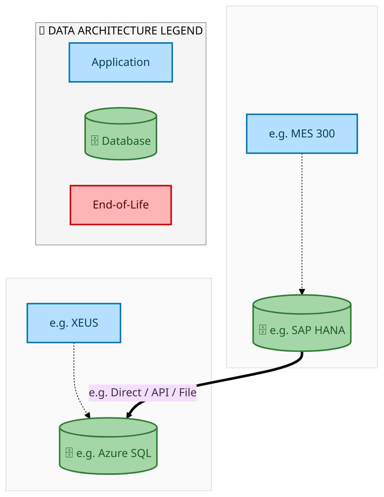

<a href="https://mermaid.live/view#pako:eNqdlYtumzAUhl_F8hRpk5KOJCVZkVrJXLJWolVX0m1SmZADJrHqYARmTZrm3WcDoV0Wuqq2hMy5_Mf-DjIbGPKIQAN2OhuaUGGAjQ_FgiyJDw3gwxnO5aorVzkJi4yKtUt-E1Y5Gec7b5nyHWcUzxjJlVvqxDwRHn2spfp6uqqClX2Cl5StK49H5pyA24suQFJAim_LKMYfwgXORK1W5OQSr37QSCyUJcYsJypuIZbMxTPCyrIiK0prIo_lpTikyVyZh7oyZji5f2E81rdbsO10_KSpBaamnwA5Qobz3CYxwGlq8hWIKWPGB1O3J5NJNxcZvyfGB00bj81R_dp7UFszBumqG3LGM-Ue2vq-XjSz1qyWQ7o9QuNGbuCM7eGgVa5v6s5A25MjnD1vbzIxdVNv9CxLk6NVbzRSbj-pFPNiNs9wugDOwOn3x5aNLDcgwTxAj0VGAu-be-dDyfBXFa5GRDMSCsqThpoaTT4q0386t57MJEfzI6DWUsEwjIrqgSR7r-ZHH_pF9GUYyWcUHvtFTDR5aqVWBgEZ5MNPSrMk--o-QO-od9Zaq0olSVQDEWtG2mnskCM1G-SOpubfyPvyu_8fZA9dB-foCr2P8aXjBUNN22GWr0C-vol0U_gV0DIGqJg3ca73chD1rtibSO-C3wW6pTA4PT17qinZJVnwGaDrC_mcUCYvqqdXvo69FrpkLk9w9wJbGGnARlME0I11fjF1rOntjQNc56tzZbc01b15trqBaj9KU0ZDrLyHG-gGdkuzbCxwdWEf6pMbOFLeSaIej3sujUklX10gBztSnXDHX1ez4X9ycvIPfNiFS5ItMY2gsal-CfLPEpEYF0zISx3iQnBvnYTQKK9pWKQRFsSmWBJdVsbtH4hCAZA=" title="View full diagram">&#128065; View Full Diagram</a>

Page 23<a href="#toc">↑ Back to TOC</a>E2E-117 — Forecast to Stock

#### 4.2.2 Future-State — Future-State Data Flows

<a href="https://mermaid.live/view#pako:eNqdlYtumzAUhl_F8hRpk5KOJCVZkVrJBFgr0aor6TapTMgBk1h1MAKzJk3z7rOB0C4LXVVbQuZc_mN_B5kNDHlEoAE7nQ1NqDDAxodiQZbEhwbw4QznctWVq5yERUbF2iW_CaucjPOdt0z5jjOKZ4zkyi11Yp4Ijz7WUn09XVXByu7gJWXryuOROSfg9qILkBSQ4tsyivGHcIEzUasVObnEqx80EgtliTHLiYpbiCVz8YywsqzIitKayGN5KQ5pMlfmoa6MGU7uXxiP9e0WbDsdP2lqganpJ0COkOE8t0gMcJqafAViypjxwdQtx3G6ucj4PTE-aNp4bI7q196D2poxSFfdkDOeKffQ0vf1otlkzWo5pFsjNG7kBvbYGg5a5fqmbg-0PTnC2fP2HMfUTb3Rm0w0OVr1RiPl9pNKMS9m8wynC2AP7H5_7Fho4gYkmAfoschI4H1z73woGf6qwtWIaEZCQXnSUFOjyUdl-k_71pOZ5Gh-BNRaKhiGUVE9kGTt1fzoQ7-Ivgwj-YzCY7-IiSZPrdTKICCDfPhJaZZkX90H6B31zlprVakkiWogYs1IO40dcqRmg9zW1PwbeV9-9_-D7KHr4BxdofcxvrS9YKhpO8zyFcjXN5FuCr8CWsYAFfMmzvVeDqLeFXsT6V3wu0C3FAanp2dPNSWrJAs-A3R9IZ8OZfKienrl69hroUvm8gR3L7CFkQYsNEUA3UzOL6b2ZHp7YwPX_mpfWS1NdW-erW6g2o_SlNEQK-_hBrqB1dIsCwtcXdiH-uQGtpS3k6jH455LY1LJVxfIwY5UJ9zx19Vs-J-cnPwDH3bhkmRLTCNobKpfgvyzRCTGBRPyUoe4ENxbJyE0ymsaFmmEBbEolkSXlXH7BwUHAbo=" title="View full diagram">&#128065; View Full Diagram</a>

Page 24<a href="#toc">↑ Back to TOC</a>E2E-117 — Forecast to Stock

### 4.3 Data Lineage

| # | Source System | Source Schema/Object | Target System | Target Schema/Object | Transformation |
|---|-------------|---------------------|---------------|---------------------|---------------|
| 1 | e.g. MES 300 | e.g. CKMLHD table | e.g. XEUS | e.g. dbo.CostElements | Lineage notes |

### 4.4 RICEFW Data Objects

Reports and Conversions for this capability will be populated from the Smartsheet Object Tracker via automated API extraction.

| Object ID | Type | Description | Status | Source | Target | Complexity |
|-----------|------|-------------|--------|--------|--------|-----------|
| E2E-117-R001 | Report | Forecast to Stock operational report | Planned | SAP S/4HANA | Analytics | Medium |
| E2E-117-C001 | Conversion | Legacy data migration for Forecast to Stock | Planned | Legacy ERP | SAP S/4HANA | High |

> *Pending: Smartsheet API integration to auto-populate live RICEFW data (see Build Requirements).*

### 4.5 Data Governance & Quality

| Concern | Approach |
|---------|----------|
| Data Ownership | Per-entity owners listed in Section 3.1 |
| Data Classification | Financial data classified as Intel Confidential |
| Data Retention | Per Intel corporate retention policies |
| Data Quality | Validated at source; reconciliation at target |

Page 25<a href="#toc">↑ Back to TOC</a>E2E-117 — Forecast to Stock

## 5. Application Architecture (TOGAF "A")

### 5.1 Current-State — Current-State Application Landscape

#### Overview

The Current-State architecture represents the **current / legacy** landscape for E2E-117.This view is generated from `CurrentFlows.xlsx` (1 flow hops across 1 flow chains).

#### APPLICATION ARCHITECTURE — Architecture Diagram (ArchiMate-Inspired)

> **Click any system node** to open its IAPM application page.
> **Legend**: Deployed · Developing · End-of-Life · No IAPM Match

<a href="https://mermaid.live/view#pako:eNqVVWtP2zAU_StWUL-1IwX6IEKV0iadOqWACBublily49vWmptEsQMU6H_fdVxoaUEwV0qT-zjXPvfYfrSSjIHlWLXaI0-5cshjZKk5LCCyHBJZEyrxrY5vEpKy4GoZwC0I4xRZ9uytUn7QgtOJAKndiDPNUhXyhzVUs53fm2BtH9IFF0vjCWGWAfk-qhMXAUSdSJrKhoSCTyNrVWWI7C6Z00KtkUsJY3p_w5maa8uUCgk6bq4WIqATENUUVFFW1hSXGOY04elMm09sbSxo-nfL2LJXK7Kq1aL0pRa57kcpwVGrkUYD55bM-ZgqaPBU5rwARqRaCiCJoFKCxBgTXn17MCWTUvIUpCTVmHIhnIMhjn6rLlWR_QXnoN_ttu3--rNxpxfkHOX39SQTWeEc2La9g0nznGyGwey3NOoLpm13Ov32f2Ayqug-ptf9ALP5CvPZx6hE8gq6RE5Ja6fSgjMm4I4WsM2I13Y3jPid9nCD9onZQyb2GNEcb7E8GNj2R5gGVZaTWUHzOXGD35EVlax7zPDJjlvEvbwMRgP3enRxTgL3l38VWX9Mkh4MBZEonqUkuNpY_SO_2ewMYohn8dgP42Pb3oZNoE3gy-wLQR9BHyI6joMtfhvhp_89fDNdO97PHd9U2e5DWUAcQnHLE4j7pXy1wGbHQFVRZB1FMMrgbhq3B-_5Ffwgkyr2BR4DqeptTzI5Mcg6gKwDzibFYe-M94wj_EEOycjLEvz7Fl6cnx3ynimrlWkKQsqee_QGqbj3ek-RVcF5VScQyr0c4XPIBR5ATx-R8Qr6vSBdZq8jelpr8VTHQT_Y2upD-6Otvp3qvqTan9nRe6INYIY8vZIIs0ngf_XPvU-oNYhR47sCc_Nc8ITq4DckFsTjm10djTdaeVc7Qez5uyrx9DHkpwovmd3umxT_wmzKozY7wUDWyKaNgE_XZfAc2JLKhlRDyjOxLf17Ifb09HTvTLPq1gKKBeXMch7NxYb3I4MpLYXC68iipcrCZZpYTnXBWGWOEwWPU2zCwhhX_wAEGUh1" title="View full diagram">&#128065; View Full Diagram</a>

Page 26<a href="#toc">↑ Back to TOC</a>E2E-117 — Forecast to Stock

#### Current-State Flow Narrative

| # | Flow Chain | Path | Interface | Freq |
|---|-----------|------|-----------|------|
| 1 | e.g. MES Route to ICOST | e.g. MES 300 → e.g. XEUS | e.g. Direct / API / File | e.g. Near Real-Time |

Page 27<a href="#toc">↑ Back to TOC</a>E2E-117 — Forecast to Stock

### 5.2 Future-State — Future-State Application Landscape

#### Overview

The Future-State architecture represents the **target** landscape for E2E-117.This view is generated from `FutureFlows.xlsx` (1 flow hops across 1 flow chains).

#### APPLICATION ARCHITECTURE — Architecture Diagram (ArchiMate-Inspired)

> **Click any system node** to open its IAPM application page.
> **Legend**: Deployed · Developing · End-of-Life · No IAPM Match

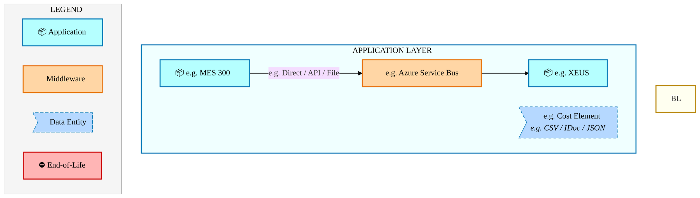

<a href="https://mermaid.live/view#pako:eNqVVW1P6jAU_ivNDN9AhwroYkiGGzfcDDXOl3tzd7OU9QCNZVvWTkXlv9_TFQVBo7ckYzsvz2mf87R9tpKMgeVYtdozT7lyyHNkqSnMILIcElkjKvGtjm8SkrLgah7APQjjFFn26q1SbmjB6UiA1G7EGWepCvnTEqrZzh9NsLb36YyLufGEMMmAXA_qxEUAUSeSprIhoeDjyFpUGSJ7SKa0UEvkUsKQPt5ypqbaMqZCgo6bqpkI6AhENQVVlJU1xSWGOU14OtHmQ1sbC5rerRlb9mJBFrValL7VIle9KCU4ajXSaODckikfUgUNnsqcF8CIVHMBJBFUSpAYY8Krbw_GZFRKnoKUpBpjLoSz08fRa9WlKrI7cHZ6R0dtu7f8bDzoBTn7-WM9yURWODu2bW9g0jwnq2Ewey2N-oZp251Or_0fmIwquo3pHX2B2XyH-epjVCJ5BZ0jp6S1UWnGGRPwQAtYZ8RruytG_E67v0L7xuwhE1uMaI7XWD49te2vMA2qLEeTguZT4gZ_Iisq2dEBwyc7aBH34iIYnLpXg_MzEri__cvI-muS9GAoiETxLCXB5crq7_vNZqcfQzyJh34YH9j2OmwCbQK7k12CPoI-RHQcB1v8McIv_zr8MF07Ps8d3lbZ7lNZQBxCcc8TiHulfLfAZsdAVVFkGUUwyuCuGrcF7_kV_GkmVewLPAZS1V2fZHJokHUAWQacjIq97gnvGkd4Q_bIwMsS_PsZnp-d7PGuKauVaQpCyl579AGpuPe6L5FVwXlVJxDKvRjgs88FHkAvX5HxDvqzIF1mqyN6WkvxVMdBL1jb6n37q62-nuq-pdrf2dFbog1ggjy9kwizSeD_8M-8b6g1iFHjmwJz81zwhOrgDyQWxMPbTR0NV1r5VDtB7PmbKvH0MeSnCi-Zze6bFP_cbMr9NjvEQNbIxo2Aj5dl8BxYk8qKVEPKK7Et_Xsj9vj4eOtMs-rWDIoZ5cxyns3FhvcjgzEthcLryKKlysJ5mlhOdcFYZY4TBY9TbMLMGBf_AEreSI0=" title="View full diagram">&#128065; View Full Diagram</a>

Page 28<a href="#toc">↑ Back to TOC</a>E2E-117 — Forecast to Stock

#### Future-State Flow Narrative

| # | Flow Chain | Path | Interface | Freq |
|---|-----------|------|-----------|------|
| 1 | e.g. MES Route to ICOST | e.g. MES 300 → e.g. XEUS | e.g. Direct / API / File | e.g. Near Real-Time |

Page 29<a href="#toc">↑ Back to TOC</a>E2E-117 — Forecast to Stock

### 5.3 Change Impact Summary

| Change Type | Flow Chain | Detail |
|-------------|-----------|--------|
| **UNCHANGED** | e.g. MES Route to ICOST | No change |

**Totals**: 0 new - 0 removed - 0 modified - 1 unchanged

### 5.4 Component Overview

#### System Inventory

| System | IAPM ID | Status |
|--------|---------|--------|
| e.g. MES 300 | - | N/A |
| e.g. XEUS | - | N/A |

Page 30<a href="#toc">↑ Back to TOC</a>E2E-117 — Forecast to Stock

### 5.5 RICEFW Inventory

RICEFW objects for this capability will be auto-populated from the Smartsheet S/4 Object Tracker.

| Object ID | Type | Description | Status | Source → Target | Middleware | Complexity |
|-----------|------|-------------|--------|----------------|-----------|-----------|
| E2E-117-I001 | Interface | Forecast to Stock inbound data interface | Planned | Legacy → SAP S/4HANA | MuleSoft / CPI | Medium |
| E2E-117-E001 | Enhancement | Forecast to Stock custom business logic | Planned | SAP S/4HANA | N/A | Medium |
| E2E-117-F001 | Form/Report | Forecast to Stock operational output | Planned | SAP S/4HANA | N/A | Low |

> *Pending: Smartsheet API integration to auto-populate live RICEFW inventory (see Build Requirements).*

Page 31<a href="#toc">↑ Back to TOC</a>E2E-117 — Forecast to Stock

### 5.6 Integration Patterns

| # | Pattern | Flow Chain | Middleware | Protocol | Auth |
|---|---------|-----------|-----------|----------|------|
| 1 | e.g. Pub-Sub / P2P / ETL | e.g. MES Route to ICOST | e.g. Azure Service Bus | e.g. REST / RFC / SFTP | e.g. OAuth / NTLM / Cert |

Page 32<a href="#toc">↑ Back to TOC</a>E2E-117 — Forecast to Stock

## 6. Technology Architecture (TOGAF "T")

### 6.1 Platform & Infrastructure

> **TECHNOLOGY / PLATFORM ARCHITECTURE** — Platforms (green) host applications (blue). Thick arrows show platform-to-platform integration flows.

#### 6.1.1 Current-State — Current-State Platform Architecture

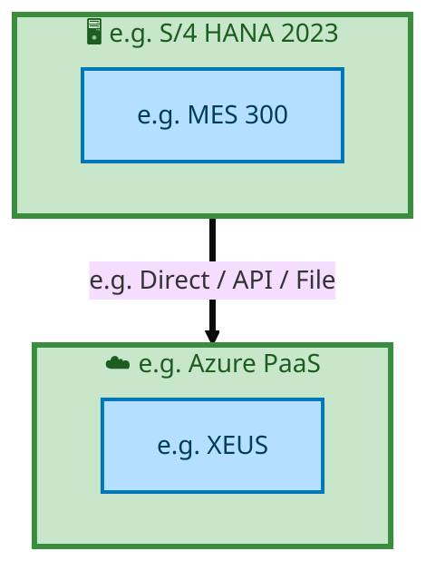

<a href="https://mermaid.live/view#pako:eNqtlNFq2zAUhl9FqOQuax07TjJBC7Zjs0I6wrxug3kYxT5ORGXL2PKaNM27T7LTpC2kUFZdCOn_jz4dHSFtcSJSwAT3eltWMEnQNsJyBTlEmKAIL2itRn01qiFpKiY3M_gLvDO5EE9uu-QHrRhdcKi1rTiZKGTIHvaowbBcd8FaD2jO-KZzQlgKQLfXfeQogILv2igu7pMVreSe1tRwQ9c_WSpXWskor0HHrWTOZ3QBvN1WVk2rFupYYUkTViy1PDS0WNHi7ploG7sd2vV6UXHYC313owKplnBa11PIEC1LV6xRxjgnZ649DYKgX8tK3AE5M4zx2B3tp5_udWrELNf9RHBRadua2q95JafyCPQm_sj7fABak4lveS-B1hE4cG3fNF4BQfAjLwhc27UPPM8zVDuZ4Gik7ajoiHWzWFa0XCHf9AeDsTefzWOIl7Hz0FQQzykNf0c4asyRMYiaDAy19fnyHLU20naE_3Qk3VJWQSKZKNDs21E9oJ0W_cu_1dCWo8eKQAjpSt4tgiLdZyc3HE6n9l_1fPv8YTyMvzhfndg0TKstQTqxUtWn1H5eiPBiiHQc0nHvr8WNH8aWYTyVQ02Rmr63Ii-S_YCivIm_vLx63Kc7bY-ILpAzv1Z9wLh69o-n7wv3cQ5VTlmKybb7PtQvlEJGGy7VB4BpI0W4KRJM2ieNmzKlEqaMqjvKO3H3DxJSeWY=" title="View full diagram">&#128065; View Full Diagram</a>

> **Legend**: 🖥️ Platform · 📦 Application · ⛔ End-of-Life · 📋 Unassigned

Page 33<a href="#toc">↑ Back to TOC</a>E2E-117 — Forecast to Stock

#### 6.1.2 Future-State — Future-State Platform Architecture

<a href="https://mermaid.live/view#pako:eNqtlNFq2zAUhl9FqOQuaxU7TjJDB3Zis0I6wrxug3kYxT5ORGXLyPKaNM27T7LTpC20UDZdCOn_jz4dHSHtcCoywC7u9XasZMpFuxirNRQQYxfFeElrPerrUQ1pI5nazuEP8M7kQjy67ZLvVDK65FAbW3NyUaqI3R9Qg2G16YKNHtKC8W3nRLASgG6u-sjTAA3ft1Fc3KVrKtWB1tRwTTc_WKbWRskpr8HErVXB53QJvN1WyaZVS32sqKIpK1dGHhIjSlrePhEdst-jfa8Xl8e90Dc_LpFuKad1PYMc0aryxQbljHP3zHdmYRj2ayXFLbhnhIzH_ugw_XBnUnOtatNPBRfS2PbMecmrOFUn4HQSjKYfj0B7Mgns6XOgfQIOfCewyAsgCH7ihaHv-M6RN50S3V5NcDQydlx2xLpZriSt1iiwgsFgHC7miwSSVeLdNxKSBaXRrxjHjTUig7jJgeitz1fnqLWRsWP8uyOZljEJqWKiRPOvJ_WI9lr0z-DGQFuOGWuC67pdybtFUGaH7NSWw-up_VM93z5_lAyTz94XL7GIZbclyCZ2pvuMOk8LEV0MkYlDJu79tbgOosQm5LEceor09L0VeZbsfyjKm_jLy08Ph3Rn7RHRBfIWV7oPGdfP_uH1-8J9XIAsKMuwu-u-D_0LZZDThiv9AWDaKBFtyxS77ZPGTZVRBTNG9R0Vnbj_CzV3eX4=" title="View full diagram">&#128065; View Full Diagram</a>

> **Legend**: 🖥️ Platform · 📦 Application · ⛔ End-of-Life · 📋 Unassigned

#### Platform Inventory

| # | Platform | Type | Systems Using | Environment |
|---|----------|------|--------------|-------------|
| 1 | e.g. Azure PaaS | Cloud / SaaS | e.g. XEUS | DEV,QAS,PRD |
| 2 | e.g. S/4 HANA 2023 | On-Premise | e.g. MES 300 | DEV,QAS,PRD |

Page 34<a href="#toc">↑ Back to TOC</a>E2E-117 — Forecast to Stock

### 6.2 SAP Development Object Status

| Metric | DEV | QAS | PRD |
|--------|-----|-----|-----|
| Transport Requests | — | — | — |
| Custom Code Objects | — | — | — |
| CDS Views | — | — | — |
| Fiori Apps | — | — | — |
| BAdIs / Enhancements | — | — | — |

### 6.3 NFRs & Design Principles

| Category | Requirement | Target / SLA | Priority |
|----------|-------------|-------------|----------|
| Performance | Order/transaction processing within interactive SLA | < 3 seconds for online transactions | High |
| Availability | Business-critical systems available during extended hours | 99.9% (06:00-22:00 all time zones) | High |
| Scalability | Support seasonal and promotional volume spikes | Handle 2x baseline transaction volume | Medium |
| Recoverability | Customer-facing systems recover within business impact window | RPO < 30 min, RTO < 2 hours | High |
| Data Volume | Support transactional data growth from business expansion | 10M+ documents/year | Medium |
| Latency | Near-real-time integration for order status updates | < 30 seconds for status propagation | Medium |
| Concurrency | Support global user base across business functions | 300+ concurrent users | Medium |

### 6.4 Security & Governance

| Concern | Approach | Standard / Policy | Owner |
|---------|----------|--------------------|-------|
| Authentication | Single Sign-On (SSO) via Intel corporate Azure AD identity | Intel IT Security Policy - Identity Management | IT Security |
| Authorization | Role-based access control (RBAC) with SAP authorization objects | Intel SAP Security Standards - Role Design | SAP Security Team |
| Data Classification | All financial/operational data classified per Intel Data Classification Standard | Intel Data Classification Policy | Data Governance |
| Data Encryption (at rest) | AES-256 encryption for SAP HANA database and file storage | Intel Encryption Standard | Infrastructure Security |
| Data Encryption (in transit) | TLS 1.3 for all system-to-system and user-to-system communication | Intel Network Security Policy | Network Engineering |
| Network Segmentation | SAP systems in dedicated network zones with firewall controls | Intel Network Architecture Standard | Network Security |
| API Security | OAuth 2.0 / certificate-based authentication for all API integrations | Intel API Security Guidelines | Integration Architecture |
| Audit Logging | Comprehensive audit trail for all data changes and user actions (SAP Security Audit Log) | SOX Compliance / Intel Audit Policy | Internal Audit |
| Certificate Management | Automated certificate lifecycle management for system-to-system trust | Intel PKI Standard | Certificate Authority Team |
| Compliance | SOX controls, export control (EAR/ITAR) screening, data privacy (GDPR) | Intel Corporate Compliance Framework | Compliance Office |

Page 35<a href="#toc">↑ Back to TOC</a>E2E-117 — Forecast to Stock

## 7. Project Context

### 7.1 Project Roadmap & Go-Live Plan

Project delivery milestones for E2E-117 RICEFW objects:

| Phase | Planned Start | Planned End | Status | Notes |
|-------|---------------|-------------|--------|-------|
| Functional Specification (FS) | Per project plan | Per project plan | In Progress | Tower-level FS schedule |
| Technical Design (TDD) | FS + 2 weeks | FS + 6 weeks | Planned | Dependent on FS completion |
| Build & Unit Test (TUT) | TDD + 1 week | TDD + 8 weeks | Planned | Includes S/4 + Middleware |
| Functional User Test (FUT) | Build + 1 week | Build + 4 weeks | Planned | Tower-led validation |
| Go-Live (Release 2) | Per release plan | Per release plan | Planned | End-to-End Integrated Processes release |

> *Detailed object-level timelines will be auto-populated from the Smartsheet Object Tracker via API integration.*

Page 36<a href="#toc">↑ Back to TOC</a>E2E-117 — Forecast to Stock

### 7.2 RAID Log

Standard RAID items for E2E-117 (End-to-End Integrated Processes):

| # | Category | Description | Status | Owner | Priority |
|---|----------|-------------|--------|-------|----------|
| 1 | Risk | Data migration completeness — validate all legacy Forecast to Stock data maps to S/4 target structures | Open | Tower Architect | High |
| 2 | Risk | Integration testing coverage — ensure all 2 integrated systems are validated end-to-end | Open | Integration Lead | High |
| 3 | Assumption | Target SAP S/4HANA system available in DEV/QAS per release schedule | Active | SAP Basis | Medium |
| 4 | Issue | API access provisioning — SAP OData, Smartsheet, and IAPM API credentials required for automation | Open | EA Pipeline Team | High |
| 5 | Dependency | Upstream BPMN process models validated and signed off by business process owners | Active | Process Owner | Medium |

> *Live RAID data will be auto-populated from the Smartsheet RAID log via API integration.*

### 7.3 Recommendations & Next Steps

| # | Category | Recommendation | Priority | Owner | Target Date | Status |
|---|----------|---------------|----------|-------|-------------|--------|
| 1 | Architecture | Complete extended flow attributes (Data Entity, Integration Pattern, Tech Platform) in Flows tab for full BDAT coverage | High | Tower Architect | 2026-Q2 | Open |
| 2 | Data | Define data ownership and classification for all 1 flow chains to satisfy Data Architecture (TOGAF D) requirements | Medium | Data Architect | 2026-Q3 | Open |
| 3 | Testing | Develop integration test scenarios covering all 1 flow chains for FUT/SIT readiness | High | Test Lead | 2026-Q3 | Open |
| 4 | Business Architecture | Review and validate Business Architecture process steps against latest Signavio/BIC process models | Medium | Business Analyst | 2026-Q2 | Open |
| 5 | Security | Complete security review for API integrations and data flows per Intel Security Architecture standards | Medium | Security Architect | 2026-Q3 | Open |

---
*E2E-117 — Architecture Document (TOGAF BDAT) · End-to-End Integrated Processes · Generated: March 2026*

Page 37<a href="#toc">↑ Back to TOC</a>E2E-117 — Forecast to Stock

