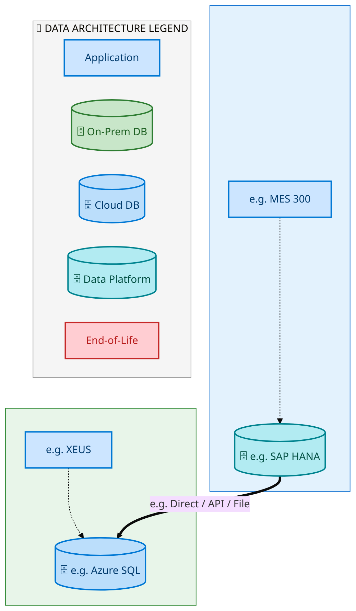
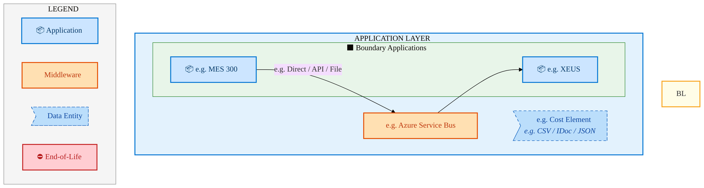
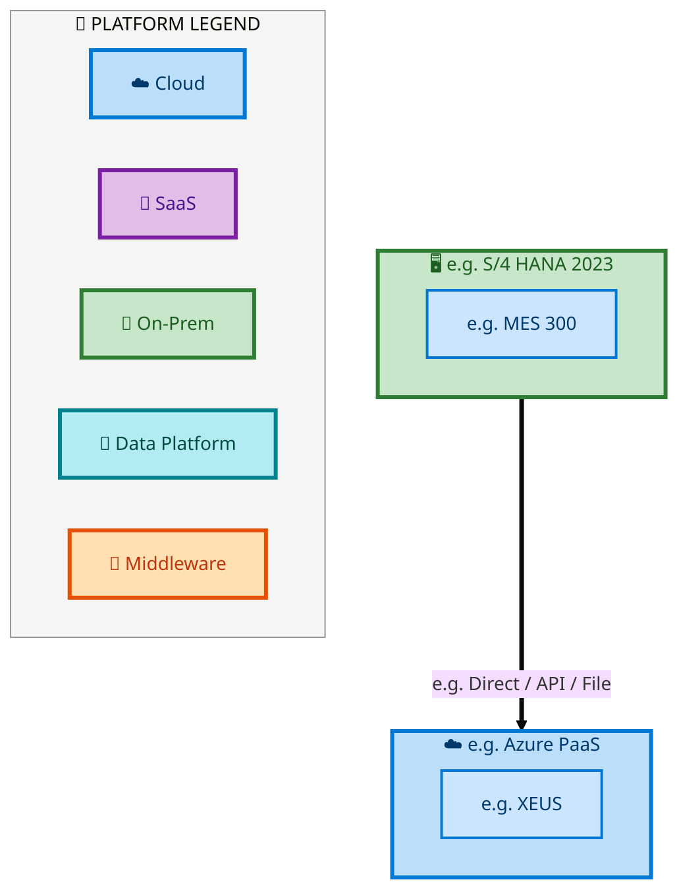

  <img src="data:image/svg+xml;base64,PHN2ZyB4bWxucz0iaHR0cDovL3d3dy53My5vcmcvMjAwMC9zdmciIHZpZXdCb3g9IjAgMCA4MDAgNDgwIiB3aWR0aD0iODAwIiBoZWlnaHQ9IjQ4MCI+DQogIDxkZWZzPg0KICAgIDxsaW5lYXJHcmFkaWVudCBpZD0iYmciIHgxPSIwJSIgeTE9IjAlIiB4Mj0iMTAwJSIgeTI9IjEwMCUiPg0KICAgICAgPHN0b3Agb2Zmc2V0PSIwJSIgc3R5bGU9InN0b3AtY29sb3I6IzAwNzFjNTtzdG9wLW9wYWNpdHk6MSIvPg0KICAgICAgPHN0b3Agb2Zmc2V0PSIxMDAlIiBzdHlsZT0ic3RvcC1jb2xvcjojMDBhZWVmO3N0b3Atb3BhY2l0eToxIi8+DQogICAgPC9saW5lYXJHcmFkaWVudD4NCiAgICA8bGluZWFyR3JhZGllbnQgaWQ9ImFjY2VudCIgeDE9IjAlIiB5MT0iMCUiIHgyPSIwJSIgeTI9IjEwMCUiPg0KICAgICAgPHN0b3Agb2Zmc2V0PSIwJSIgc3R5bGU9InN0b3AtY29sb3I6I2ZmZmZmZjtzdG9wLW9wYWNpdHk6MC4xNSIvPg0KICAgICAgPHN0b3Agb2Zmc2V0PSIxMDAlIiBzdHlsZT0ic3RvcC1jb2xvcjojZmZmZmZmO3N0b3Atb3BhY2l0eTowLjAyIi8+DQogICAgPC9saW5lYXJHcmFkaWVudD4NCiAgICA8cGF0dGVybiBpZD0iZ3JpZCIgd2lkdGg9IjQwIiBoZWlnaHQ9IjQwIiBwYXR0ZXJuVW5pdHM9InVzZXJTcGFjZU9uVXNlIj4NCiAgICAgIDxwYXRoIGQ9Ik0gNDAgMCBMIDAgMCAwIDQwIiBmaWxsPSJub25lIiBzdHJva2U9InJnYmEoMjU1LDI1NSwyNTUsMC4wNykiIHN0cm9rZS13aWR0aD0iMC41Ii8+DQogICAgPC9wYXR0ZXJuPg0KICA8L2RlZnM+DQoNCiAgPCEtLSBCYWNrZ3JvdW5kIC0tPg0KICA8cmVjdCB3aWR0aD0iODAwIiBoZWlnaHQ9IjQ4MCIgZmlsbD0idXJsKCNiZykiIHJ4PSI4Ii8+DQogIDxyZWN0IHdpZHRoPSI4MDAiIGhlaWdodD0iNDgwIiBmaWxsPSJ1cmwoI2dyaWQpIiByeD0iOCIvPg0KICA8cmVjdCB3aWR0aD0iODAwIiBoZWlnaHQ9IjQ4MCIgZmlsbD0idXJsKCNhY2NlbnQpIiByeD0iOCIvPg0KDQogIDwhLS0gRGVjb3JhdGl2ZSBjaXJjdWl0L2FyY2hpdGVjdHVyZSBsaW5lcyAtLT4NCiAgPGcgc3Ryb2tlPSJyZ2JhKDI1NSwyNTUsMjU1LDAuMTIpIiBzdHJva2Utd2lkdGg9IjEuNSIgZmlsbD0ibm9uZSI+DQogICAgPHBhdGggZD0iTSAwIDEwMCBMIDEyMCAxMDAgTCAxNjAgMTQwIEwgMjgwIDE0MCIvPg0KICAgIDxwYXRoIGQ9Ik0gMCAyNjAgTCA4MCAyNjAgTCAxMjAgMjIwIEwgMjAwIDIyMCBMIDI0MCAyNjAgTCAzNjAgMjYwIi8+DQogICAgPHBhdGggZD0iTSA1MjAgMTAwIEwgNjAwIDEwMCBMIDY0MCA2MCBMIDgwMCA2MCIvPg0KICAgIDxwYXRoIGQ9Ik0gNDQwIDM0MCBMIDU2MCAzNDAgTCA2MDAgMzAwIEwgNzIwIDMwMCBMIDc2MCAzNDAgTCA4MDAgMzQwIi8+DQogICAgPHBhdGggZD0iTSA2MDAgNDAwIEwgNjgwIDQwMCBMIDcyMCA0NDAiLz4NCiAgICA8cGF0aCBkPSJNIDAgNDAwIEwgNDAgNDAwIEwgODAgMzYwIi8+DQogICAgPHBhdGggZD0iTSAyMDAgNDIwIEwgMzIwIDQyMCBMIDM2MCAzODAgTCA0ODAgMzgwIi8+DQogICAgPHBhdGggZD0iTSA2NTAgNDQwIEwgNzUwIDQ0MCBMIDgwMCA0ODAiLz4NCiAgPC9nPg0KDQogIDwhLS0gRGVjb3JhdGl2ZSBub2RlcyAtLT4NCiAgPGcgZmlsbD0icmdiYSgyNTUsMjU1LDI1NSwwLjE4KSI+DQogICAgPGNpcmNsZSBjeD0iMTIwIiBjeT0iMTAwIiByPSI0Ii8+DQogICAgPGNpcmNsZSBjeD0iMjgwIiBjeT0iMTQwIiByPSI0Ii8+DQogICAgPGNpcmNsZSBjeD0iMjAwIiBjeT0iMjIwIiByPSI0Ii8+DQogICAgPGNpcmNsZSBjeD0iMzYwIiBjeT0iMjYwIiByPSI0Ii8+DQogICAgPGNpcmNsZSBjeD0iNjAwIiBjeT0iMTAwIiByPSI0Ii8+DQogICAgPGNpcmNsZSBjeD0iNzIwIiBjeT0iMzAwIiByPSI0Ii8+DQogICAgPGNpcmNsZSBjeD0iNTYwIiBjeT0iMzQwIiByPSI0Ii8+DQogICAgPGNpcmNsZSBjeD0iODAiIGN5PSIzNjAiIHI9IjQiLz4NCiAgICA8Y2lyY2xlIGN4PSI0ODAiIGN5PSIzODAiIHI9IjQiLz4NCiAgICA8Y2lyY2xlIGN4PSIzMjAiIGN5PSI0MjAiIHI9IjQiLz4NCiAgPC9nPg0KDQogIDwhLS0gVE9HQUYgQkRBVCBib3hlcyAtLT4NCiAgPGcgZm9udC1mYW1pbHk9IlNlZ29lIFVJLCBBcmlhbCwgc2Fucy1zZXJpZiIgZm9udC1zaXplPSIxNCIgZm9udC13ZWlnaHQ9IjYwMCI+DQogICAgPCEtLSBCIC0tPg0KICAgIDxyZWN0IHg9IjE1MCIgeT0iMTQwIiB3aWR0aD0iMTIwIiBoZWlnaHQ9IjQwIiByeD0iNSIgZmlsbD0icmdiYSgyNTUsMjU1LDI1NSwwLjE4KSIgc3Ryb2tlPSJyZ2JhKDI1NSwyNTUsMjU1LDAuMykiIHN0cm9rZS13aWR0aD0iMSIvPg0KICAgIDx0ZXh0IHg9IjIxMCIgeT0iMTY1IiB0ZXh0LWFuY2hvcj0ibWlkZGxlIiBmaWxsPSIjZmZmIj5CdXNpbmVzczwvdGV4dD4NCiAgICA8IS0tIEQgLS0+DQogICAgPHJlY3QgeD0iMjkwIiB5PSIxNDAiIHdpZHRoPSIxMjAiIGhlaWdodD0iNDAiIHJ4PSI1IiBmaWxsPSJyZ2JhKDI1NSwyNTUsMjU1LDAuMTgpIiBzdHJva2U9InJnYmEoMjU1LDI1NSwyNTUsMC4zKSIgc3Ryb2tlLXdpZHRoPSIxIi8+DQogICAgPHRleHQgeD0iMzUwIiB5PSIxNjUiIHRleHQtYW5jaG9yPSJtaWRkbGUiIGZpbGw9IiNmZmYiPkRhdGE8L3RleHQ+DQogICAgPCEtLSBBIC0tPg0KICAgIDxyZWN0IHg9IjQzMCIgeT0iMTQwIiB3aWR0aD0iMTIwIiBoZWlnaHQ9IjQwIiByeD0iNSIgZmlsbD0icmdiYSgyNTUsMjU1LDI1NSwwLjE4KSIgc3Ryb2tlPSJyZ2JhKDI1NSwyNTUsMjU1LDAuMykiIHN0cm9rZS13aWR0aD0iMSIvPg0KICAgIDx0ZXh0IHg9IjQ5MCIgeT0iMTY1IiB0ZXh0LWFuY2hvcj0ibWlkZGxlIiBmaWxsPSIjZmZmIj5BcHBsaWNhdGlvbjwvdGV4dD4NCiAgICA8IS0tIFQgLS0+DQogICAgPHJlY3QgeD0iNTcwIiB5PSIxNDAiIHdpZHRoPSIxMjAiIGhlaWdodD0iNDAiIHJ4PSI1IiBmaWxsPSJyZ2JhKDI1NSwyNTUsMjU1LDAuMTgpIiBzdHJva2U9InJnYmEoMjU1LDI1NSwyNTUsMC4zKSIgc3Ryb2tlLXdpZHRoPSIxIi8+DQogICAgPHRleHQgeD0iNjMwIiB5PSIxNjUiIHRleHQtYW5jaG9yPSJtaWRkbGUiIGZpbGw9IiNmZmYiPlRlY2hub2xvZ3k8L3RleHQ+DQogIDwvZz4NCg0KICA8IS0tIENvbm5lY3RpbmcgbGluZXMgYmV0d2VlbiBCREFUIGJveGVzIC0tPg0KICA8ZyBzdHJva2U9InJnYmEoMjU1LDI1NSwyNTUsMC4yNSkiIHN0cm9rZS13aWR0aD0iMSI+DQogICAgPGxpbmUgeDE9IjI3MCIgeTE9IjE2MCIgeDI9IjI5MCIgeTI9IjE2MCIvPg0KICAgIDxsaW5lIHgxPSI0MTAiIHkxPSIxNjAiIHgyPSI0MzAiIHkyPSIxNjAiLz4NCiAgICA8bGluZSB4MT0iNTUwIiB5MT0iMTYwIiB4Mj0iNTcwIiB5Mj0iMTYwIi8+DQogIDwvZz4NCg0KICA8IS0tIE1haW4gdGl0bGUgLS0+DQogIDx0ZXh0IHg9IjQwMCIgeT0iMjYwIiB0ZXh0LWFuY2hvcj0ibWlkZGxlIiBmb250LWZhbWlseT0iU2Vnb2UgVUksIEFyaWFsLCBzYW5zLXNlcmlmIiBmb250LXNpemU9IjM2IiBmb250LXdlaWdodD0iNzAwIiBmaWxsPSIjZmZmZmZmIiBsZXR0ZXItc3BhY2luZz0iMSI+DQogICAgSUFPIEFyY2hpdGVjdHVyZQ0KICA8L3RleHQ+DQogIDx0ZXh0IHg9IjQwMCIgeT0iMzAwIiB0ZXh0LWFuY2hvcj0ibWlkZGxlIiBmb250LWZhbWlseT0iU2Vnb2UgVUksIEFyaWFsLCBzYW5zLXNlcmlmIiBmb250LXNpemU9IjE4IiBmb250LXdlaWdodD0iNDAwIiBmaWxsPSJyZ2JhKDI1NSwyNTUsMjU1LDAuOCkiIGxldHRlci1zcGFjaW5nPSIyIj4NCiAgICBUT0dBRiBCREFUIMK3IElBTyBQcm9ncmFtIMK3IElETSAyLjANCiAgPC90ZXh0Pg0KDQogIDwhLS0gQm90dG9tIGFjY2VudCBiYXIgLS0+DQogIDxyZWN0IHg9IjI4MCIgeT0iMzQwIiB3aWR0aD0iMjQwIiBoZWlnaHQ9IjMiIHJ4PSIxLjUiIGZpbGw9InJnYmEoMjU1LDI1NSwyNTUsMC40KSIvPg0KDQogIDwhLS0gSW50ZWwgdGV4dCAtLT4NCiAgPHRleHQgeD0iNDAwIiB5PSIzODAiIHRleHQtYW5jaG9yPSJtaWRkbGUiIGZvbnQtZmFtaWx5PSJTZWdvZSBVSSwgQXJpYWwsIHNhbnMtc2VyaWYiIGZvbnQtc2l6ZT0iMTMiIGZpbGw9InJnYmEoMjU1LDI1NSwyNTUsMC41KSIgbGV0dGVyLXNwYWNpbmc9IjMiPg0KICAgIElOVEVMIENPTkZJREVOVElBTA0KICA8L3RleHQ+DQo8L3N2Zz4NCg==" alt="IAO Architecture" style="width:100%; border-radius:8px;" />
  <h1 style="font-size:36px; margin-top:24px;">E2E-118 — Forecast to Stock</h1>
  <h2 style="font-size:24px;">Architecture Document (TOGAF BDAT)</h2>
  
End-to-End Integrated Processes (E2E) Tower 
  Capability E2E-118 · Forecast to Stock

  
IAO Program · R1 – R5 
  Generated: April 2026 
  Sajiv Francis

  
IAO Architecture Pipeline — Intel Confidential

Page 1<a href="#toc">↑ Back to TOC</a>E2E-118 — Forecast to Stock

## Table of Contents

<nav class="toc">
<ol>
  <li><a href="#1-executive-summary">1. Executive Summary</a></li>
  <li><a href="#2-business-context-objectives">2. Business Context &amp; Objectives</a>
    <ul>
      <li><a href="#21-classification">2.1 Classification</a></li>
      <li><a href="#22-business-drivers">2.2 Business Drivers</a></li>
      <li><a href="#23-success-criteria">2.3 Success Criteria</a></li>
      <li><a href="#24-companion-documents">2.4 Companion Documents</a></li>
    </ul>
  </li>
  <li><a href="#3-business-architecture-togaf-b">3. Business Architecture (TOGAF &ldquo;B&rdquo;)</a>
    <ul>
      <li><a href="#31-business-process-overview">3.1 Business Process Overview</a></li>
      <li><a href="#32-business-process-diagrams">3.2 Business Process Diagrams</a></li>
      <li><a href="#33-business-roles-responsibilities">3.3 Business Roles &amp; Responsibilities</a></li>
    </ul>
  </li>
  <li><a href="#4-data-architecture-togaf-d">4. Data Architecture (TOGAF &ldquo;D&rdquo;)</a>
    <ul>
      <li><a href="#41-data-entities-ownership">4.1 Data Entities &amp; Ownership</a></li>
      <li><a href="#42-data-flow-diagrams">4.2 Data Flow Diagrams</a></li>
      <li><a href="#43-data-lineage">4.3 Data Lineage</a></li>
      <li><a href="#44-ricefw-data-objects">4.4 RICEFW Data Objects</a></li>
      <li><a href="#45-data-governance-quality">4.5 Data Governance &amp; Quality</a></li>
    </ul>
  </li>
  <li><a href="#5-application-architecture-togaf-a">5. Application Architecture (TOGAF &ldquo;A&rdquo;)</a>
    <ul>
      <li><a href="#51-current-state-current-state-application-landscape">5.1 Current-State Application Landscape</a></li>
      <li><a href="#52-future-state-future-state-application-landscape">5.2 Future-State Application Landscape</a></li>
      <li><a href="#53-change-impact-summary">5.3 Change Impact Summary</a></li>
      <li><a href="#54-component-overview">5.4 Component Overview</a></li>
      <li><a href="#55-ricefw-inventory">5.5 RICEFW Inventory</a></li>
      <li><a href="#56-integration-patterns">5.6 Integration Patterns</a></li>
    </ul>
  </li>
  <li><a href="#6-technology-architecture-togaf-t">6. Technology Architecture (TOGAF &ldquo;T&rdquo;)</a>
    <ul>
      <li><a href="#61-platform-infrastructure">6.1 Platform &amp; Infrastructure</a></li>
      <li><a href="#62-sap-development-object-status">6.2 SAP Development Object Status</a></li>
      <li><a href="#63-nfrs-design-principles">6.3 NFRs &amp; Design Principles</a></li>
      <li><a href="#64-security-governance">6.4 Security &amp; Governance</a></li>
    </ul>
  </li>
  <li><a href="#7-project-context">7. Project Context</a>
    <ul>
      <li><a href="#71-project-roadmap-go-live-plan">7.1 Project Roadmap &amp; Go-Live Plan</a></li>
      <li><a href="#72-raid-log">7.2 RAID Log</a></li>
      <li><a href="#73-recommendations-next-steps">7.3 Recommendations &amp; Next Steps</a></li>
    </ul>
  </li>
</ol>
</nav>

Page 2<a href="#toc">↑ Back to TOC</a>E2E-118 — Forecast to Stock

## 1. Executive Summary

This Architecture Document defines the **Business, Data, Application, and Technology** (BDAT) architecture for **E2E-118 Forecast to Stock** within the IAO program. It includes 5 BPMN process diagram(s) in Section 3.

| Dimension | Value |
|-----------|-------|
| **Tower** | End-to-End Integrated Processes (E2E) |
| **Process Group** | Forecast to Stock |
| **Capability** | E2E-118 - Forecast to Stock |
| **Release** | R1 – R5 |
| **Total Systems** | 2 |
| **System Status** | 0 Deployed, 0 Developing, 0 EOL, 2 Pending IAPM |
| **RICEFW Objects** | Pending — Smartsheet Object Tracker API integration |

**Change Summary**: 0 new flow chains, 0 removed, 0 modified, 1 unchanged between Current-State and Future-State states.

> All system nodes in architecture diagrams are **IAPM-linked** — click any node to open its IAPM page. Diagrams require `securityLevel: 'loose'` for click events.

Page 3<a href="#toc">↑ Back to TOC</a>E2E-118 — Forecast to Stock

## 2. Business Context & Objectives

### 2.1 Classification

| Level | Value |
|-------|-------|
| **L0 Tower** | End-to-End Integrated Processes |
| **L1 Process** | Forecast to Stock |
| **L2 Capability** | E2E-118 - Forecast to Stock |

### 2.2 Business Drivers

| # | Driver | Description | Strategic Alignment | Priority |
|---|--------|-------------|---------------------|----------|
| 1 | End-to-End Process Integration | Enable cross-tower integrated processes spanning procurement, manufacturing, and fulfillment | IDM 2.0 Process Excellence | High |
| 2 | Intel Foundry Business Enablement | Stand up foundry-specific business processes for external customer engagement | Intel Foundry Services | High |
| 3 | Process Visibility & Monitoring | Provide end-to-end process visibility across tower boundaries with integrated monitoring | Operational Excellence | Medium |
| 4 | E2E-118 Process Migration | Migrate E2E-118 business processes and 2 integrated systems from legacy to S/4 HANA target architecture | IDM 2.0 Cross-Functional / End-to-End | High |

Page 4<a href="#toc">↑ Back to TOC</a>E2E-118 — Forecast to Stock

### 2.3 Success Criteria

| Metric | Target | Measure | Baseline | Owner |
|--------|--------|---------|----------|-------|
| E2E Process Cycle Time | Per process SLA | End-to-end transaction completion within defined SLA per process | Varies by process | E2E Process Owner |
| Cross-Tower Integration Success | > 99% | Transactions completing across tower boundaries without manual intervention | 92% (current) | Integration Lead |
| Process Exception Rate | < 2% | Transactions requiring manual exception handling | 8% (current) | Operations Manager |
| E2E-118 Migration Completeness | 100% flow chains validated | All 1 flow chains verified in target state | 0% (pre-migration) | Tower Architect |

### 2.4 Companion Documents

| Document | Description |
|----------|-------------|
| **Business Architecture** | Included in this document (Section 3) — process flows from BPMN diagrams |
| **This Document** | Full BDAT Architecture — Business + Data + Application + Technology |

Page 5<a href="#toc">↑ Back to TOC</a>E2E-118 — Forecast to Stock

## 3. Business Architecture (TOGAF "B")

### 3.1 Business Process Overview

This capability includes **5 business process(es)** modeled in BPMN 2.0, covering the end-to-end workflow for E2E-118 Forecast to Stock.

| # | Step ID | Process Name | Lanes | Tasks | Gateways |
|---|---------|--------------|-------|-------|----------|
| 1 | E2E_118F__Inter-Company_Asset_Transfer_using_AMT_&amp;_ISM_Fiori_Apps_-_with_CMMS | E2E_118F__Inter-Company_Asset_Transfer_using_AMT_&amp;_ISM_Fiori_Apps_-_with_CMMS | Boundary Apps

, SAP S/4 Intel Foundry 
(Receiving Company)
B
, SAP S/4 Intel Foundry 
(Sending Company)
A

 | 19 | 3 |
| 2 | E2E_118G__Intra-Company_Asset_Transfer_using_AMT_&amp;_ISM_Fiori_Apps_(Same_Company_Code)_-_with_CMM | E2E_118G__Intra-Company_Asset_Transfer_using_AMT_&amp;_ISM_Fiori_Apps_(Same_Company_Code)_-_with_CMM | Boundary Apps

, SAP S/4 Intel Foundry 
(Receiving Site)
B
, SAP S/4 Intel Foundry 
(Sending Site)
A

 | 19 | 3 |
| 3 | E2E_118H__Inter-Company_Asset_Transfer_using_AMT_&amp;_ISM_Fiori_Apps_-_with_iSTART | E2E_118H__Inter-Company_Asset_Transfer_using_AMT_&amp;_ISM_Fiori_Apps_-_with_iSTART | Boundary Apps

, SAP S/4 Intel Foundry 
(Receiving Company
B
, SAP S/4 Intel Foundry 
(Sending Company)
A
, UI | 20 | 4 |

| 4 | E2E_118I__Intra-Company_Asset_Transfer_using_AMT_&amp;_ISM_Fiori_Apps_(Same_Company_Code)_-_with_iST | E2E_118I__Intra-Company_Asset_Transfer_using_AMT_&amp;_ISM_Fiori_Apps_(Same_Company_Code)_-_with_iST | Boundary Apps

, SAP S/4 Intel Foundry 
(Receiving Site)
B
, SAP S/4 Intel Foundry 
(Sending Site)
A
, UI | 20 | 4 |

| 5 | Slide_13_-_Detail-out_on_TM_Embedded_Steps | Slide_13_-_Detail-out_on_TM_Embedded_Steps | Boundary Apps, External Partners/ B2B

, SAP S/4 (Intel Foundry)

 | 19 | 13 |

Page 6<a href="#toc">↑ Back to TOC</a>E2E-118 — Forecast to Stock

### 3.2 Business Process Diagrams

#### BUSINESS ARCHITECTURE — 3.2.1 E2E_118F__Inter-Company_Asset_Transfer_using_AMT_&amp;_ISM_Fiori_Apps_-_with_CMMS — E2E_118F__Inter-Company_Asset_Transfer_using_AMT_&amp;_ISM_Fiori_Apps_-_with_CMMS

**Swim Lanes**: Boundary Apps
 · SAP S/4 Intel Foundry 
(Receiving Company)
B
 · SAP S/4 Intel Foundry 
(Sending Company)
A

 | **Tasks**: 19 | **Gateways**: 3

> **Legend**: ● Start · ● End · User Task · Service Task · ◇ Gateway · Sub-Process

<a href="https://mermaid.live/view#pako:eNqlV1tv2zYU_iuEisAJYLeSLFmOHzb4piJD3WWx22Kbh4GWKJsoLaoklctS__cdSqJsKXH3MD8E4efznct3zqHkZyviMbFG1sXFM02pGqHnjtqRPemMUGeDJel0UQl8xoLiDSOyo20Snqol_acwc7zsUZtpLMR7yp40uiRbTtCnmy4aA5F1kcSp7EkiaNLpdjJB91g8TTnjQlu_IcPETopo1VcTLmIijga2HTiRD1RGU3KE-4EXeKHmSRLxNG44TfxkmESdg06O8Ydoh4Uq0s8lWeDHLzRWOzgnmEkCNju1Zx_whjBdoxK5xqJc3BsxqNRxUhBsmeGIplvAPRsggdOvR8i3Dwd0uLhYp3VQ9OFunSL4RAxLOSMJkgrg-b1CCWVs9MabjkPf7kol-FcyeuPOg1nf7Ua6khGUbne1uL0HQrc7NdpwFlemvQddw8jNHrviceTaXfEEf1uxSBofI00H7tAd1pEmgTN1piZSkiT_KxLoKlZYfq1izfuhG87qWI4_8Kf2S3-mzJkXjJ22TkTc04icOA3DsD8_SjUf-I593ukk7A_sacvpFivygJ-ODq-nXu0w9IPQCc46LOO1s8w3t4JHxmF_7od-7TCYOOHYPevQGzvesMoQ_GwFznaI4ZT8bf-5tiY8L4YajbNMorX1V2moP6kD39_A0lIoB9Hlany30maC32OGdD5ESnQZ4khxcLAieH-1zl3b3jTduOBmCTOCpovFEl2OpSQKrWCmZULEVdO2fxqyaWkitnIMgJHgUYJ7ejjQHVG5SNH8N8RT9OVXpBNy-ga-I1gCPoUVO_qlKVwjaEYUEXvYfRTSFOorg3Px9u3bVjn2ZR0yY9Dlc_nekW85kQrYV6d0p0WvNpWkLyzdo6VUPCv3rGEHyGuN1Y1bjm_R8p0H2SnCUKjbDE1Cl3ckIvQebhJQYZ_h9OkKTdp994E_jr7lVJiiqNauRWyRBkD6lMVaiD2mEDXFaUQQ1JgqhKH9jEdYUZAfJyA1XICVThG4Y6B-rKPMIWq2hyJf6t5vyVFmVqYFZKxeplh0-j_lcn8glx7chljjllje6cRqtuiZ4M15aNL8o1r1wMAIYspkIdZyV8qAQoa3TaoW-jNmtEFumuilqMYPLfPNniotb8JFvb9N--Exm5vlAn3M95tyMUTlRD8UEU_QeLFCK_2YbvKvgb9aoDnQ4pjErcnQ98x7khKh_evCMlD0nZZ0T0QED28041F7r_UM33II_Z7zWKIbKXMYxi1MFmA6yRlh0HdoEpBbXN3QstAfLOUpoW-C6d1Pi5TmqQLfl58pRhOsoh36hW9al5XjFTKrxpq0BqbFGDZvK5PkPURZ6Jtkwx812GJdN1m1lie9uvyjrUkrWVcnW05Yj-dKX48nHUNLRbJWC1z_-dnE1W9xvQ2ICEI0RvPntXU4nJIGRxIWgj_IHmYKZVhgxgh7Xz4Z26TgVRJNI5ZLKOgFq17k1EO93k-wTtXRL4-D6jgoj0F1dKvzsHW-rs7X5dH1qvOwPDvV4xj-qQDHAE7FqCMElYXbClFbOG5l0TdAvwJMVKeqyTFFVQa1S5OFsa-KdkzVjolZh6jOtYcKMN-7hYfva-sjX1vfT5I11RjBnEoR128zfyeyoDpGS8eIabIydddCVM69k3edAjUveU18eAa_fh0HkcwrcBN3zuBu9RrbRPuvot4ZH75582vCg9fhwMBW14KLEB6asTV6topfQ_CLKSYJzpmyDl0L54ovn9LIGhW_Gqy8uKpnFMNDbF-Ch38BEb8gfg==" title="View full diagram">&#128065; View Diagram</a>

Page 7<a href="#toc">↑ Back to TOC</a>E2E-118 — Forecast to Stock

```mermaid
%%{init: {'theme': 'base', 'themeVariables': {'fontSize': '14px', 'fontFamily': 'Segoe UI, Arial, sans-serif','primaryColor': '#e8f0fe', 'primaryBorderColor': '#0071c5','lineColor': '#37474F', 'secondaryColor': '#f5f8fc'}, 'flowchart': {'useMaxWidth': false, 'htmlLabels': true, 'curve': 'basis', 'nodeSpacing': 40, 'rankSpacing': 50}} }%%
flowchart LR
    classDef startEvt fill:#4CAF50,stroke:#2E7D32,color:#000,font-weight:bold,stroke-width:2px,rx:20,ry:20
    classDef endEvt fill:#C62828,stroke:#B71C1C,color:#fff,font-weight:bold,stroke-width:2px,rx:20,ry:20
    classDef userTask fill:#E3F2FD,stroke:#1565C0,stroke-width:2px,color:#0D47A1
    classDef serviceTask fill:#FFF3E0,stroke:#E65100,stroke-width:2px,color:#BF360C
    classDef gateway fill:#FFF9C4,stroke:#F57F17,stroke-width:2px,color:#E65100
    classDef subProc fill:#F3E5F5,stroke:#7B1FA2,stroke-width:2px,color:#4A148C
    subgraph lane_0["Boundary Apps "]
        n1["Initiate iSTART Approval Process (Factory Team)​"]
        n2["Send CMMS (Asset Transfer)"]
        n3["Initiate Asset Transfer Process"]
        n17["fa:fa-user Return EQ on WO – Return Reason Code Transfer in UI Determine Final Asset or..."]
        n20(["fa:fa-play Initiate Asset Transfer Request"])
        n21(["fa:fa-play startEvent"])
        n22(["fa:fa-stop endEvent"])
    end
    subgraph lane_1["SAP S/4 Intel Foundry  (Receiving Company) B "]
        n15["Acquire Asset in Receiving Company"]
        n16["Update maintenance plant and location after transfer completed in Equipment..."]
        n23(["fa:fa-stop Asset Received at Receiving Company Code"])
    end
    subgraph lane_2["SAP S/4 Intel Foundry  (Sending Company) A "]
        n4["Initiate Inter-Company Asset Transfer"]
        n5["Update Transfer Details and Shipment Flag"]
        n6["Validate Transfer"]
        n7["Request Submitted for Approval"]
        n8["Update ISM Number in request line of AMT Table"]
        n9["TM Embedded"]
        n10["Generate Shipping/ Commercial Docs"]
        n11["Post Goods Issue Against ISM Delivery Doc"]
        n12["Approve Asset Transfer Request"]
        n13["Post Financial Entry (Via Batch Job)"]
        n14["Retire Asset in Sending Company"]
        n18["fa:fa-user Approve via My Inbox App"]
        n19["fa:fa-user Generate ISM Number (ZISM Delivery Doc)"]
        n24["Detail-out on TM Embedded Steps"]
        n25{{"fa:fa-code-branch Shipment Flag?"}}
        n26{{"fa:fa-arrows-alt parallelGateway"}}
        n27{{"fa:fa-arrows-alt inclusiveGateway"}}
    end
    n4 --> n5
    n5 --> n6
    n6 --> n7
    n26 --> n8
    n26 --> n9
    n9 --> n24
    n8 --> n10
    n10 --> n11
    n11 --> n27
    n27 --> n12
    n26 --> n27
    n12 --> n13
    n13 --> n14
    n14 --> n15
    n3 --> n2
    n20 --> n1
    n15 --> n16
    n16 --> n23
    n1 --> n22
    n21 --> n3
    n25 -->|"No"| n27
    n7 --> n18
    n18 --> n25
    n25 -->|"Yes"| n19
    n19 --> n26
    n2 --> n17
    n17 --> n4
    class n17 userTask
    class n18 userTask
    class n19 userTask
    class n20 startEvt
    class n21 startEvt
    class n22 endEvt
    class n23 endEvt
    class n24 startEvt
    class n25 gateway
    class n26 gateway
    class n27 gateway
```

#### BUSINESS ARCHITECTURE — 3.2.2 E2E_118G__Intra-Company_Asset_Transfer_using_AMT_&amp;_ISM_Fiori_Apps_(Same_Company_Code)_-_with_CMM — E2E_118G__Intra-Company_Asset_Transfer_using_AMT_&amp;_ISM_Fiori_Apps_(Same_Company_Code)_-_with_CMM

**Swim Lanes**: Boundary Apps
 · SAP S/4 Intel Foundry 
(Receiving Site)
B
 · SAP S/4 Intel Foundry 
(Sending Site)
A

 | **Tasks**: 19 | **Gateways**: 3

> **Legend**: ● Start · ● End · User Task · Service Task · ◇ Gateway · Sub-Process

<a href="https://mermaid.live/view#pako:eNqlV11v2zYU_SuEisAJYLeSLFmOHzb4S0WGussit8U2DwMtUzFRWlRJKomX-r_vUhJlS4m7h_khCI_vuR_n3kvJz1bMN8QaWRcXzzSlaoSeO2pLdqQzQp01lqTTRSXwGQuK14zIjrZJeKoi-k9h5njZkzbTWIh3lO01GpF7TtCnmy4aA5F1kcSp7EkiaNLpdjJBd1jsp5xxoa3fkGFiJ0W06qsJFxsijga2HTixD1RGU3KE-4EXeKHmSRLzdNNwmvjJMIk7B50c44_xFgtVpJ9LssBPX-hGbeGcYCYJ2GzVjn3Aa8J0jUrkGotz8WDEoFLHSUGwKMMxTe8B92yABE6_HiHfPhzQ4eJildZB0Ye7VYrgEzMs5YwkSCqA5w8KJZSx0RtvOg59uyuV4F_J6I07D2Z9txvrSkZQut3V4vYeCb3fqtGas01l2nvUNYzc7Kkrnkau3RV7-NuKRdLNMdJ04A7dYR1pEjhTZ2oiJUnyvyKBrmKJ5dcq1rwfuuGsjuX4A39qv_Rnypx5wdhp60TEA43JidMwDPvzo1Tzge_Y551Owv7Anrac3mNFHvH-6PB66tUOQz8IneCswzJeO8t8fSt4bBz2537o1w6DiROO3bMOvbHjDasMwc-9wNkWMZySv-0_V9aE58VQo3GWSbSy_ioN9Sd14PsbWFoK5SAaLcd3S20m-ANmSOdDpESXIY4VBwdLgndXq9y17XXTjQtuIpgRNF0sInQ5lpIotISZlgkRV03b_mnIpqWJ2MoxAEaCRwnu6eFAd0TlIkXz3xBP0ZdfkU7I6Rv4jmAJ-BRW7OiXpnCNoBlRROxg91FIU6ivDM7F27dvW-XYl3XIjEGXz-V7R77lRCpgX53SnRa92lSSvrB0j5ZS8azcs4YdIK81VjcuGt-i6J0H2SnCUKjbDE1Cl3ckJvQBbhIUUUWu0KTddB_IZSXj-FtOBdlohZq0FmUAlE_ZRmuwwxQCpjiNCYLyUoUwdJ7xGCsKyuMEVIa7r5Io5ruMgfBFiDlEy3ZQ30vJ-y0lyvzKnICM1Ul-U_CJ033R5P9Uyv2BUnpmjzqNWzp5p5MKVIF7JnJzDpo0_yhVPSgwepgyWSgVbUsNUMjwfZOqVf6MGW2QmyZ6GaqxQ1G-3lGltU24qPe2aT88ZnMTLdDHfLcuF0JUTvTDEPEEjRdLtNSP5yb_GvjLBZoDbbMhm9ZY6PvlPUmJ0P51YRnI-U43aEdEDA9tNONxe5_17N5yCP2e841EN1LmsFn3MFaA6SRnhEHToUNAbnF1N8tCf7CMp4S-CaZ3Pi1SmkMr9-jyM8VoglW8Rb_wdeuScrx6ReBeMRtyOi4t-2HzjjIpPkCMhb4_1vxJgy3WdZNVK3nSqcs_2oq0UnV1quV89Xiu9KV40i8UKZK1GuD6z88mrn53661BQpChMZg_r6zD4ZQ0OJKwEPxR9jBTKMMCM0bY-_J52CYFr5JoGrNcQkEvWPUOpx7q9X6CZaqOfnkcVMdBeQyqo1udh63zdXUelkeneujCPxXgGMApAbf2GFQWbstlbeG4lUXfAP0K8AxQ1eCYIiqD2qXJwthXRTqmSsfErENU59pDBZjv3cLD95X1ka-s7yfJXldEk5rJvS6mKtd8b6o3gjqVgq7fjvQ7kUUox2jtmFiDkzecIoJ5tWviwzP49es4iGZefJu4cwZ3q5fXJtp_FfXO-PDN-14THrwOBwa2uhZcg_C83FijZ6v4DQS_kzYkwTlT1qFr4VzxaJ_G1qj4rWDlxUU9oxieX7sSPPwLAfgcOg==" title="View full diagram">&#128065; View Diagram</a>

Page 8<a href="#toc">↑ Back to TOC</a>E2E-118 — Forecast to Stock

#### BUSINESS ARCHITECTURE — 3.2.3 E2E_118H__Inter-Company_Asset_Transfer_using_AMT_&amp;_ISM_Fiori_Apps_-_with_iSTART — E2E_118H__Inter-Company_Asset_Transfer_using_AMT_&amp;_ISM_Fiori_Apps_-_with_iSTART

**Swim Lanes**: Boundary Apps
 · SAP S/4 Intel Foundry 
(Receiving Company
B
 · SAP S/4 Intel Foundry 
(Sending Company)
A
 · UI | **Tasks**: 20 | **Gateways**: 4

> **Legend**: ● Start · ● End · User Task · Service Task · ◇ Gateway · Sub-Process

<a href="https://mermaid.live/view#pako:eNqtV1Fz2jgQ_isadzIkM9BaxgbCw90QwJ10ml4n0HbujpsbYcugibBcSU7Cpfz3W2HLYAf6csdDgtb7fbv7aVcWL04kYuoMnYuLF5YyPUQvLb2mG9oaotaSKNpqo8LwlUhGlpyqlvFJRKpn7J-9G_azZ-NmbCHZML411hldCYq-3LbRCIC8jRRJVUdRyZJWu5VJtiFyOxZcSOP9hg4SN9lHKx_dCBlTeXBw3T6OAoByltKDudv3-35ocIpGIo1rpEmQDJKotTPJcfEUrYnU-_RzRe_I8zcW6zWsE8IVBZ-13vCPZEm5qVHL3NiiXD5aMZgycVIQbJaRiKUrsPsumCRJHw6mwN3t0O7iYpFWQdHH-0WK4BNxotSEJkhpME8fNUoY58M3_ngUBm5baSke6PCNN-1Pul47MpUMoXS3bcTtPFG2WuvhUvC4dO08mRqGXvbcls9Dz23LLfxtxKJpfIg07nkDb1BFuunjMR7bSEmS_KdIoKucE_VQxpp2Qy-cVLFw0AvG7ms-W-bE749wUycqH1lEj0jDMOxOD1JNewF2z5PehN2eO26QroimT2R7ILwe-xVhGPRD3D9LWMRrZpkvP0sRWcLuNAiDirB_g8ORd5bQH2F_UGYIPCtJsjXiJKV_u38unBuR75sajbJMoYXzV-FoPimG52w2H93PQaY0VoikiG4I4ygVmiUsIpqJFGmBYIKRpN9zqrSQbcRSSCaPNPSrebQBl7dv39bJvf-L_BUz7gF1QoYJ6Zh-Qbdw7jDYEVSGg0qleCQcGUmpUugyJBFQb9Gcks3VIvdcd7lYNNLtvrxYVnOkdZYwlNG6Ils4u13hDsWcEtuIORt9RrN3PmSkKUehkR6iost7GlH2aAoai01G0i26aW5FF-AjpahGo-h7ziSNQQj0CthA-YD6ksWmeJAWoqaQNEUZZKRB8BhxUepMEg1SaShKJfAlAjpOdRFlCgGzDU31603El5XWsDsZKlIs0gIw0a9ThP8xBZqrn8rl_USuGWCOCK_QqKFW91D23FY0oRqaS-2rnq2LelDIyaoONYp9JZzVwHWXAFzui35Es3y5YdrolAh51AzH_r1DNrezO_Qp3ywhH9C1bGpk3jhIJGh0N0dz8w6s4_uAn9-hKcDimMb1hwN4-J6mVBp6U1cGyrwz0myojODFiCYiUnXMNWA-Cwj8XggYvFulcopGK2Ima5_ihHLYPtAasI2OMmdGUSYtN7tSuNSkAcA2WMhM85mMpqkG7suvjKAbomGIPojlVQPmVf1-T7Vt98bGNyD9-tjbLB8hzN0Wmmgpno2xgRrUUZWWR1t1-UdTlGa212dOHOhcSTq28et6NSbJFFz0aEfkGsFIHu05mmmaNXbR80-fSLXm_vVwLhWg4AAiUoon1SFco4xIwjnl74sXVxPUOwliacRzBZq8Qp2Z6f1Y3jakM9M0l2y1MjNRHNBZcS43ynXPaPxNyAf0m7nMVYAqftpFnc4vMNXl0i-WQbn0gmLda6z75bpXLAflclAsr8vldbH0KnTpjt0GXeWB3dIDWwMuDZ41eKWhaw1lBdiWgMsaPMvh7Q0_Fs4nsXB-HEXrl46Wu8wG2-qwdfCbTL9TtafCtnJclu5Z5bAlq0ori_ds4p5NvLG22XhWi-B4qyD4HUlzOCSKE7OoyK3vR7UuOABj3hAyIVHhj-0O4XKLukfXqX2q9h5Zt_fP2Adn7Nen7ZDVaTsub8p1q1fd1ev2rr1G1s3-aXNw2tyzZqftwAsBLgGxM3xx9r-44FdZTBOSc-3s2g7JtZht08gZ7n-ZOPle_wkjMMCbwrj7F5CkRKk=" title="View full diagram">&#128065; View Diagram</a>

Page 9<a href="#toc">↑ Back to TOC</a>E2E-118 — Forecast to Stock

#### BUSINESS ARCHITECTURE — 3.2.4 E2E_118I__Intra-Company_Asset_Transfer_using_AMT_&amp;_ISM_Fiori_Apps_(Same_Company_Code)_-_with_iST — E2E_118I__Intra-Company_Asset_Transfer_using_AMT_&amp;_ISM_Fiori_Apps_(Same_Company_Code)_-_with_iST

**Swim Lanes**: Boundary Apps
 · SAP S/4 Intel Foundry 
(Receiving Site)
B
 · SAP S/4 Intel Foundry 
(Sending Site)
A
 · UI | **Tasks**: 20 | **Gateways**: 4

> **Legend**: ● Start · ● End · User Task · Service Task · ◇ Gateway · Sub-Process

<a href="https://mermaid.live/view#pako:eNqtV21v2zYQ_iuEisAJYLeiLNmOP2zwm4oUTVfEbottHgZaomwitKiSVBIv9X_f0RJlS3H6ZfOHxDzd89zdwztSfnYiEVNn6FxcPLOU6SF6bukN3dLWELVWRNFWGxWGr0QysuJUtYxPIlI9Z_8c3LCfPRk3YwvJlvGdsc7pWlD05aaNRgDkbaRIqjqKSpa02q1Msi2Ru4ngQhrvN3SQuMkhWvloLGRM5dHBdfs4CgDKWUqP5m7f7_uhwSkaiTSukSZBMkii1t4kx8VjtCFSH9LPFb0lT99YrDewTghXFHw2ess_khXlpkYtc2OLcvlgxWDKxElBsHlGIpauwe67YJIkvT-aAne_R_uLi2VaBUUf75Ypgk_EiVJTmiClwTx70ChhnA_f-JNRGLhtpaW4p8M33qw_7XrtyFQyhNLdthG380jZeqOHK8Hj0rXzaGoYetlTWz4NPbctd_C3EYum8THSpOcNvEEVadzHEzyxkZIk-U-RQFe5IOq-jDXrhl44rWLhoBdM3Jd8tsyp3x_hpk5UPrCInpCGYdidHaWa9QLsvk46Drs9d9IgXRNNH8nuSHg98SvCMOiHuP8qYRGvmWW--ixFZAm7syAMKsL-GIcj71VCf4T9QZkh8KwlyTaIk5T-7f65dMYiPzQ1GmWZQkvnr8LRfFIMz9l8MbpbgExprBBJEd0SxlEqNEtYRDQTKdICwQQjSb_nVGkh24ilkEweaehX82gLLm_fvq2Te_8X-Qtm3AfqhAwT0jH9gm7g3GGwI6gMB5VK8UA4MpJSpdBlSCKg3qEFJdurZe657mq5bKTbfX62rOZI66xgKKNNRbZ09vvCHYo5J7YRcz76jObvfMhIU45CIz1ERZd3NKLswRQ0Z5peoXFzI3wAj5SiGo2i7zmTNAYZUB3WgAQA-ZLFpm5QFQKmkC9FGSSjQesYcVFKTBINKmmoRyXwJRLbjFNdhJhBtGxLU_1y__BlJTNsTIaK_IqcAEz0SX4T4CTpDv7HJs-rnyrl_USpOWCOOo0aOnWPNS9sOVOqoanUoeT5pigGhZys61Cj8FfCWQ1cdzGK3hV9iOb5asu0ESkR8qQJTv17x2xu5rfoU75dQT4gatnMyNw0SCRodLtAC3P31fGmjRe3aAawOKZx_eEAHr6nKZWG3tSVgSzvjNBbKiO4ENFURKqOuQbMZwGB3wsBA3ejVE7RaE3MRB1SnFIOewdCA7bRTuasKMqk5U5XCpeaNADYBguZ6TyT0SzVwH35lRE0JhqG54NYXTVgXtXpd1TbRj_d9Ya_2fJqwKFbJOnYZqun2cAN6meELe0BcrvdAdFKPBljA3VdR1UbcLK_l380lWyU6JkSi67siFwjmMCTXUZzTbPGvnn--bOn1s6_Hk-gAhQcQURK8ag6hGuUEUk4p_x9cUU1Qb2zIJZGPFdQ0AvUKyN8GMSbhnhmHhaSrddmCoqjOCtO4Ea57ivn95cb9E3Ie_SbeXOrMFUKaRd1Or_AKJdLv1gG5dILinWvse6X616xHJTLQbG8LpfXxdKr0KU7dht0lQd2Sw9sDbg0eNbglQabMS5TxjZnbEkth3fw-LF0Poml8-MkWr90tNwlENtycFmP5zeZfqfqQIVtqdjWWmVha7VSYRuta8lK6XFjbbPxrBa9062C4LckzeFkKI7JoiK3vh_VuuD4YcYd7quERIU_tjngMmb35N3pkKp9aazbB6_Yr8_bIfp5Oy5ff-tWr3oBr9u79t2wbvbPm4Pz5p41O20HTnu43mNn-OwcfkbBT62YJiTn2tm3HZJrMd-lkTM8_Nxw8oPOU0ZgVreFcf8vddM07Q==" title="View full diagram">&#128065; View Diagram</a>

Page 10<a href="#toc">↑ Back to TOC</a>E2E-118 — Forecast to Stock

```mermaid
%%{init: {'theme': 'base', 'themeVariables': {'fontSize': '14px', 'fontFamily': 'Segoe UI, Arial, sans-serif','primaryColor': '#e8f0fe', 'primaryBorderColor': '#0071c5','lineColor': '#37474F', 'secondaryColor': '#f5f8fc'}, 'flowchart': {'useMaxWidth': false, 'htmlLabels': true, 'curve': 'basis', 'nodeSpacing': 40, 'rankSpacing': 50}} }%%
flowchart LR
    classDef startEvt fill:#4CAF50,stroke:#2E7D32,color:#000,font-weight:bold,stroke-width:2px,rx:20,ry:20
    classDef endEvt fill:#C62828,stroke:#B71C1C,color:#fff,font-weight:bold,stroke-width:2px,rx:20,ry:20
    classDef userTask fill:#E3F2FD,stroke:#1565C0,stroke-width:2px,color:#0D47A1
    classDef serviceTask fill:#FFF3E0,stroke:#E65100,stroke-width:2px,color:#BF360C
    classDef gateway fill:#FFF9C4,stroke:#F57F17,stroke-width:2px,color:#E65100
    classDef subProc fill:#F3E5F5,stroke:#7B1FA2,stroke-width:2px,color:#4A148C
    subgraph lane_0["Boundary Apps "]
        n1["iSTART sends an email notification to the requestor, instructing them to..."]
        n2["iSTART sends an email notification to the requestor, instructing them..."]
        n17["fa:fa-user Initiate iSTART Approval Process (Factory Team)​\"]
        n23{{"fa:fa-code-branch Approval"}}
    end
    subgraph lane_1["SAP S/4 Intel Foundry  (Receiving Site) B "]
        n14["Asset Acquired in Receiving Site"]
        n15["Update maintenance plant and location after transfer completed in Equipment..."]
        n21(["fa:fa-stop Asset Received at Receiving Company Code"])
    end
    subgraph lane_2["SAP S/4 Intel Foundry  (Sending Site) A "]
        n3["Update Transfer Details and Shipment Flag"]
        n4["Validate Transfer"]
        n5["Request Submitted for Approval"]
        n6["Update ISM Number in request line of AMT Table"]
        n7["TM Embedded"]
        n8["Generate Shipping/ Commercial Docs"]
        n9["Post Goods Issue Against ISM Delivery Doc"]
        n10["Approve Asset Transfer Request"]
        n11["Post Financial Entry (Via Batch Job)"]
        n12["Asset Retired in Sending Site"]
        n13["Initiate Intra-Company Asset Transfer"]
        n18["fa:fa-user Approve via My Inbox App"]
        n19["fa:fa-user Generate ISM Number (ZISM Delivery Doc)"]
        n22["Detail-out on TM Embedded Steps"]
        n24{{"fa:fa-code-branch Shipment Flag?"}}
        n25{{"fa:fa-arrows-alt parallelGateway"}}
        n26{{"fa:fa-arrows-alt inclusiveGateway"}}
    end
    subgraph lane_3["UI"]
        n16["Trigger iSTART process"]
        n20["fa:fa-user Initiate UI Work Order"]
    end
    n3 --> n4
    n4 --> n5
    n25 --> n6
    n25 --> n7
    n6 --> n8
    n8 --> n9
    n9 --> n26
    n26 --> n10
    n25 --> n26
    n10 --> n11
    n11 --> n12
    n12 --> n14
    n14 --> n15
    n15 --> n21
    n24 -->|"No"| n26
    n7 --> n22
    n5 --> n18
    n18 --> n24
    n24 -->|"Yes"| n19
    n19 --> n25
    n16 --> n17
    n17 --> n23
    n23 --> n1
    n23 --> n2
    n20 --> n16
    n3 -->|"Manual Update"| n20
    n6 --> n20
    n20 -->|"Interface"| n13
    n13 --> n3
    class n17 userTask
    class n18 userTask
    class n19 userTask
    class n20 userTask
    class n21 endEvt
    class n22 startEvt
    class n23 gateway
    class n24 gateway
    class n25 gateway
    class n26 gateway
```

#### BUSINESS ARCHITECTURE — 3.2.5 Slide_13_-_Detail-out_on_TM_Embedded_Steps — Slide_13_-_Detail-out_on_TM_Embedded_Steps

**Swim Lanes**: Boundary Apps · External Partners/ B2B
 · SAP S/4 (Intel Foundry)

 | **Tasks**: 19 | **Gateways**: 13

```mermaid
%%{init: {'theme': 'base', 'themeVariables': {'fontSize': '14px', 'fontFamily': 'Segoe UI, Arial, sans-serif','primaryColor': '#e8f0fe', 'primaryBorderColor': '#0071c5','lineColor': '#37474F', 'secondaryColor': '#f5f8fc'}, 'flowchart': {'useMaxWidth': false, 'htmlLabels': true, 'curve': 'basis', 'nodeSpacing': 40, 'rankSpacing': 50}} }%%
flowchart LR
    classDef startEvt fill:#4CAF50,stroke:#2E7D32,color:#000,font-weight:bold,stroke-width:2px,rx:20,ry:20
    classDef endEvt fill:#C62828,stroke:#B71C1C,color:#fff,font-weight:bold,stroke-width:2px,rx:20,ry:20
    classDef userTask fill:#E3F2FD,stroke:#1565C0,stroke-width:2px,color:#0D47A1
    classDef serviceTask fill:#FFF3E0,stroke:#E65100,stroke-width:2px,color:#BF360C
    classDef gateway fill:#FFF9C4,stroke:#F57F17,stroke-width:2px,color:#E65100
    classDef subProc fill:#F3E5F5,stroke:#7B1FA2,stroke-width:2px,color:#4A148C
    subgraph lane_0["Boundary Apps"]
        n15["CTSI Carrier Invoice Reconciliation/ Dispute Management"]
    end
    subgraph lane_1["External Partners/ B2B "]
        n16["Send to SAP B4NL"]
        n17["Notify carrier"]
        n18["Capture Execution events via BN4L-GTT"]
        n19["Receive Physical receipt at receiver company location"]
        n22(["fa:fa-play Data needs to be Sent to B4NL"])
        n36{{"fa:fa-arrows-alt parallelGateway"}}
        n37{{"fa:fa-arrows-alt parallelGateway"}}
        n38{{"fa:fa-arrows-alt parallelGateway"}}
    end
    subgraph lane_2["SAP S/4 (Intel Foundry) "]
        n1["Create ZISM Outbound Delivery (S/4)"]
        n2["Create/Update Freight Unit and Freight Order"]
        n3["Perform Carrier Selection and Calculate Charges"]
        n4["Send Rates/Charges/Au to HAWB assignment: Freight forwarders (Within TM)"]
        n5["Ship (Goods Issue)"]
        n6["Execute Freight Order and Update Status Post GI"]
        n7["Create and Update Freight Settlement Document"]
        n8["Create Service PO/ Entry Sheet"]
        n9["Post Accrual to Freight Expense Account(s)"]
        n10["Allocate Freight Costs to Delivery Items (CO/PA) or Material Valuation"]
        n11["Pick and Pack Updates (IM)"]
        n12["Update Maintenance Plant and Location after Transfer Completed in Equipment..."]
        n13["Start tendering/Subcontracting Carrier Selection"]
        n14["Receive reconciled Carrier Invoice(s)"]
        n20(["fa:fa-play Rates/Charges need to be Sent"])
        n21(["fa:fa-play Initiate Tendering"])
        n23(["fa:fa-stop Accrual Posted and Freight Costs Allocated"])
        n24(["fa:fa-stop Asset Master Updated with Location"])
        n25["Intra-Company Asset Transfer using AMT and ISM Fiori Apps (Same Company Code)"]
        n26["Inter-Company Asset Transfer using AMT and ISM Fiori Apps"]
        n27{{"fa:fa-code-branch exclusiveGateway"}}
        n28{{"fa:fa-arrows-alt parallelGateway"}}
        n29{{"fa:fa-arrows-alt parallelGateway"}}
        n30{{"fa:fa-arrows-alt parallelGateway"}}
        n31{{"fa:fa-arrows-alt parallelGateway"}}
        n32{{"fa:fa-arrows-alt parallelGateway"}}
        n33{{"fa:fa-arrows-alt parallelGateway"}}
        n34{{"fa:fa-arrows-alt parallelGateway"}}
        n35{{"fa:fa-arrows-alt parallelGateway"}}
        n39{{"fa:fa-arrows-alt inclusiveGateway"}}
    end
    n2 --> n28
    n5 --> n34
    n22 --> n36
    n6 --> n31
    n31 --> n35
    n36 --> n16
    n28 --> n39
    n7 --> n8
    n8 --> n32
    n32 --> n9
    n32 --> n10
    n10 --> n33
    n9 --> n33
    n39 --> n3
    n17 --> n38
    n37 --> n18
    n34 --> n6
    n38 --> n19
    n33 --> n23
    n37 --> n39
    n35 --> n7
    n4 --> n29
    n20 --> n4
    n29 --> n39
    n1 --> n2
    n11 --> n5
    n16 --> n37
    n3 --> n11
    n31 --> n36
    n37 --> n17
    n38 --> n30
    n19 --> n12
    n12 --> n24
    n14 --> n35
    n13 --> n39
    n21 --> n13
    n28 --> n30
    n30 --> n15
    n26 --> n27
    n25 --> n27
    n27 --> n1
    n18 -->|"POD Receipt Events 
(via BN4L-GTT)"| n34
    n29 -->|"Freight forwarder Rates to CTSI"| n30
    n15 -->|"FO (Freight 
Order) & 
HAWB
(House 
Airway Bill) 
Mapping"| n14
    class n20 startEvt
    class n21 startEvt
    class n22 startEvt
    class n23 endEvt
    class n24 endEvt
    class n25 startEvt
    class n26 startEvt
    class n27 gateway
    class n28 gateway
    class n29 gateway
    class n30 gateway
    class n31 gateway
    class n32 gateway
    class n33 gateway
    class n34 gateway
    class n35 gateway
    class n36 gateway
    class n37 gateway
    class n38 gateway
    class n39 gateway
```

> **Legend**: ● Start · ● End · User Task · Service Task · ◇ Gateway · Sub-Process

<a href="https://mermaid.live/view#pako:eNqlWG1v4joW_isWo9m2EgzkjbcPK0GAuUjtFE06d6TdrlYmOGBNcHJth5bt9L_vcWIHcOHDsv1QxU_Oec6rjx3eGnG2Io1h4_PnN8qoHKK3G7khW3IzRDdLLMhNE1XAn5hTvEyJuFEyScZkRP9Tijl-_qrEFDbDW5ruFRqRdUbQj3kTjUAxbSKBmWgJwmly07zJOd1ivg-zNONK-hPpJ52ktKZfjTO-Ivwg0On0nDgA1ZQycoC9nt_zZ0pPkDhjqxPSJEj6SXzzrpxLs5d4g7ks3S8EecCvP-lKbmCd4FQQkNnIbXqPlyRVMUpeKCwu-M4kgwplh0HCohzHlK0B9zsAccx-HaCg8_6O3j9_fma1UXT__Zkh-ItTLMSEJEhIgKc7iRKapsNPfjiaBZ2mkDz7RYaf3Glv4rnNWEUyhNA7TZXc1guh640cLrN0pUVbLyqGoZu_Nvnr0O00-R7-W7YIWx0shV237_ZrS-OeEzqhsZQkyf9lCfLKn7D4pW1NvZk7m9S2nKAbhJ2PfCbMid8bOXaeCN_RmByRzmYzb3pI1bQbOJ3LpOOZ1-2EFukaS_KC9wfCQejXhLOgN3N6Fwkre7aXxXLBs9gQetNgFtSEvbEzG7kXCf2R4_e1h8Cz5jjfoBQz8u_OP58b46womxqN8lw8N_5Vyak_5gTwPnyK5ijEnFPC0ZztMkgW-q62QkxTiiXNWBtNqMgLSdADZngNe5nJmgl645xpB6inr5JwhlO0gFZlhIs2GrtjZDnRBckIWJDMUDRaoLH_7d4S6YHIt0zSZI_iylNLoK8CwbksOEHTVxIXym1EduCoQDuK0fibf9_6-vRk6Q1AD2IldEfQYrMXNAZvuQJyibCsHneQmDjb5pjtUZrFZUpOeVz3FogSPExwK0-hLyZYYsQIWQkV1ZIgCFCqRx3c3ZGy1317M8oQXPYiWjiVKMccpylJv1at9tx4fz9W6l2j1P_flC6U1lUFg0JFbR_dzpkkKZqpJuP7O7u2qiycAC_6xzx6QI-FXCpJNCGpSuse3QLJnZXMWqn9I18p3Rkvhwn6AecLwqBugEc14U-1PdBeEJ5kfFt3dURSEpcdoZRDnMZFqnhDmKxrYm0K37TjdxARbS3THhWqfH-Mfo4RbFm6ZmoTDGtPwN4LVt4IdPuTyg1l6OnBCkzttmhDc3T7NcugM-ZCFMSS6ZbbRjUwOY2ydF3nI5JYFgItMiHR1_kpQe-Q8iMNQxURKdNy_6JJFhcnG7lU7x_Uo2pwosVjG02ZhGJFG0IsebWBSj9GccwL2DyQJGNs-poTJoh6BUWXt8KK1VHjaZSWW-rgYghs5a6pe2QuyRbSGj62F6M7lHGYQjBX4EqA_sRpcWY7OqrvFjT-VaZggeGhygOwzO2qOKrfdJoeMIV2ZpipsKHXq26713se4QTsoic4rEUCDyHMhJRIskJQ7elfBc1VPr98-WIZUC0ZqdMaATeUEg75dlQsYcJKjqEv2fpjp1oU_tGc4no2k5U9tj9k2O1Yc-mkp8sBdTSfrLnkOpbyHLYfVWl6MmHYGt5BQ8gsr5tCdQiYOt66VZlN9Vc2k28zCUEk1EeoClTVWqEX2Gh1dWwGtdvmKsOtUM_uiqMuXyFU5kcPT6VfajzNaMZpeU7CXMJbgoxmCDc2O7Xdip_wa_gtrqNhrm7TrSVwxBtEXuMUWHbk_Dh3-1ecAe7gmoOjc42Sc42Se42Sd42Sf41ScI3S-ZRTdqm69bnLXNRq_V1VWq-Dau355r0W8Loa6Oq1vgXDgwYCA2gJx2i4fS0x0ECvWhuT5rVrCLTJgbV29JUWHrSGp4GBtfYMYBS0Rc-Y9DTg1IBfAcZnTzvl1E54OlGeRVFH5enU9fRaM7rmvau9rjM7sAh0Ik0aHL02eXVM5o0B7ZHzoRJdO8qeFZVXZ1L74NRGTT8YLx3fKq_jWW672qzj2fU2VjwduWM4XB2KaxxzAxswrhurJedvOHQfJ-i7vj5Pq9v3M7s9voDDGP193MADrfnhIlWdVep4Ul8olVadmMBoPaJbo_nMyovSHfobPKqLGlj-I4MPSliOKFefa2P4uoI7KnvAeV4eX79VCo8-xco-MF_Wp7hzAXcv4J7-aj5F_bNocIGjewHvmQ_QU7h_Hh6chaHsZ2HnPOyeh73zsH8eDs7D3fPw-Si981F6dZSNZmNL-BbTVWP41ih_eoKfp1YkwUUqG-_NBi5kFu1Z3BiWP9E0ivI6MaEYvnG2Ffj-X1qe0Rk=" title="View full diagram">&#128065; View Diagram</a>

Page 11<a href="#toc">↑ Back to TOC</a>E2E-118 — Forecast to Stock

### 3.3 Business Roles & Responsibilities

| Role / Lane | Processes Involved | Description |
|------------|-------------------|-------------|
| Boundary Apps
 | E2E_118F__Inter-Company_Asset_Transfer_using_AMT_&amp;_ISM_Fiori_Apps_-_with_CMMS, E2E_118G__Intra-Company_Asset_Transfer_using_AMT_&amp;_ISM_Fiori_Apps_(Same_Company_Code)_-_with_CMM, E2E_118H__Inter-Company_Asset_Transfer_using_AMT_&amp;_ISM_Fiori_Apps_-_with_iSTART, E2E_118I__Intra-Company_Asset_Transfer_using_AMT_&amp;_ISM_Fiori_Apps_(Same_Company_Code)_-_with_iST,  | |
| SAP S/4 Intel Foundry 

(Receiving Company)
B

 | E2E_118F__Inter-Company_Asset_Transfer_using_AMT_&amp;_ISM_Fiori_Apps_-_with_CMMS,  | |
| SAP S/4 Intel Foundry 

(Sending Company)
A

 | E2E_118F__Inter-Company_Asset_Transfer_using_AMT_&amp;_ISM_Fiori_Apps_-_with_CMMS, E2E_118H__Inter-Company_Asset_Transfer_using_AMT_&amp;_ISM_Fiori_Apps_-_with_iSTART,  | |
| SAP S/4 Intel Foundry 

(Receiving Site)
B

 | E2E_118G__Intra-Company_Asset_Transfer_using_AMT_&amp;_ISM_Fiori_Apps_(Same_Company_Code)_-_with_CMM, E2E_118I__Intra-Company_Asset_Transfer_using_AMT_&amp;_ISM_Fiori_Apps_(Same_Company_Code)_-_with_iST,  | |
| SAP S/4 Intel Foundry 

(Sending Site)
A

 | E2E_118G__Intra-Company_Asset_Transfer_using_AMT_&amp;_ISM_Fiori_Apps_(Same_Company_Code)_-_with_CMM, E2E_118I__Intra-Company_Asset_Transfer_using_AMT_&amp;_ISM_Fiori_Apps_(Same_Company_Code)_-_with_iST,  | |
| SAP S/4 Intel Foundry 

(Receiving Company
B

 | E2E_118H__Inter-Company_Asset_Transfer_using_AMT_&amp;_ISM_Fiori_Apps_-_with_iSTART,  | |
| UI | E2E_118H__Inter-Company_Asset_Transfer_using_AMT_&amp;_ISM_Fiori_Apps_-_with_iSTART, E2E_118I__Intra-Company_Asset_Transfer_using_AMT_&amp;_ISM_Fiori_Apps_(Same_Company_Code)_-_with_iST,  | |
| Boundary Apps | Slide_13_-_Detail-out_on_TM_Embedded_Steps | |
| External Partners/ B2B
 | Slide_13_-_Detail-out_on_TM_Embedded_Steps | |
| SAP S/4 (Intel Foundry)
 | Slide_13_-_Detail-out_on_TM_Embedded_Steps | |

Page 12<a href="#toc">↑ Back to TOC</a>E2E-118 — Forecast to Stock

## 4. Data Architecture (TOGAF "D")

### 4.1 Data Flows — Source to Target

| # | Flow Chain | Hop | Source App | Source DB | Target App | Target DB | Data Description | Frequency | Classification |
|---|-----------|-----|-----------|----------|-----------|----------|-----------------|-----------|---------------|
| 1 | e.g. MES Route to ICOST | 1 | e.g. MES 300 | e.g. SAP HANA | e.g. XEUS | e.g. Azure SQL | What data moves | e.g. Near Real-Time | e.g. Intel Confidential |

Page 13<a href="#toc">↑ Back to TOC</a>E2E-118 — Forecast to Stock

### 4.2 Data Flow Diagrams

> **DATA ARCHITECTURE** — Database-to-database data flows. Applications (blue) sit above their hosting databases (green cylinders). Thick arrows show data movement between databases.

#### 4.2.1 Current-State — Current-State Data Flows

<a href="https://mermaid.live/view#pako:eNqlVYtumzAU_RWLKtImJV2APAhSKwE2ayXaZU26TSoTcsAkqA4gHmvSNP8-G0KSpiGtNiMh-_rec6_P8WMluJFHBFVoNFZBGGQqWNlCNiNzYgsqsIUJTlmvyXopcfMkyJYW-UNoOUmjqJotQn7gJMATSlI-zXD8KMxGwfMGSuzGi9KZ2008D-iynBmRaUTA_XUTaAyAga8LLxo9uTOcZBu0PCU3ePEz8LIZt_iYpoT7zbI5tfCE0CJtluSFNWTLGsXYDcIpN8tdbkxw-Lhn7HTXa7BuNOxwmwuMdTsErLkUpykkPsBxrEcL4AeUqmeGgbqm2UyzJHok6lm73VdgZzNsPfHSVCleNN2IRgmflrWecYDnTYwlreAU1DMGWzgJ9aEs1cKJehdJ7bdwNMq9DaCuQ2Tq_1kfxBmu8CSkm9IeniIr5gm8DuwcFkgiuuPPNA0Id3hGT1IkpRZP74uGyOorEdN8Mk1wPANIQqKoGFAzLIc4U0d7zhPijL5bD7bARP5duvPmBQlxsyAKt7Lyto3XivBf6H7EIsn59BzwPkNQVbWU_UgQPMj5yRbs3FNkj_09t2PnPmmzVXO0wgkwJ1v4zDE3Wp2sBLTOW5e12cpQEm4w0mxJST0fG9KRYnbRbpfJioJk4zXpIjua79E80obOlXar_RvLN2jkyO12RTQbAjb8ENfbxCeoZj6A-2yZ5pv4vWKOcl1l-xDVlXPFtGxKJtwyLQ76PSjVMl2TGFxcXL5saIIFteAL0IbX7G8GlF2mLye2x4GGFpmyFTzs8eZ6bQC1sQa0O-PqeoyM8f0dAhb6im5hjarW3c5qOVx_LY5p4GI-e1xBy4E1an0LW8OEzAHUd4diSV9FGjWh5UW3H_j6NLHQuqzFlTakOPOjZF6zRywHsaWh0GtFfssKfFIurby_ju6Gkt3qauvyb6v9YDB4I7zQFOYkmePAE9RV-WSyl9cjPs5pxh49AedZNFqGrqAWz5iQxx7OCAwwU3NeGtd_AbiDWpk=" title="View full diagram">&#128065; View Diagram</a>

Page 14<a href="#toc">↑ Back to TOC</a>E2E-118 — Forecast to Stock

#### 4.2.2 Future-State — Future-State Data Flows

<a href="https://mermaid.live/view#pako:eNqlVYtumzAU_RWLKtImJV2APAhSKwE2ayXaZU26TSoTcsAkqA4gHmvSNP8-G0KSpiGtNiMh-_rec6_P8WMluJFHBFVoNFZBGGQqWNlCNiNzYgsqsIUJTlmvyXopcfMkyJYW-UNoOUmjqJotQn7gJMATSlI-zXD8KMxGwfMGSuzGi9KZ2008D-iynBmRaUTA_XUTaAyAga8LLxo9uTOcZBu0PCU3ePEz8LIZt_iYpoT7zbI5tfCE0CJtluSFNWTLGsXYDcIpN8tdbkxw-Lhn7HTXa7BuNOxwmwuMdTsErLkUpykkPsBxrEcL4AeUqmeGgbqm2UyzJHok6lm73VdgZzNsPfHSVCleNN2IRgmflrWecYDnTYwlreAU1DMGWzgJ9aEs1cKJehdJ7bdwNMq9DaCuQ2Tq_1kfxBmu8CSkm9IeniIr5gm8DuwcFkgiuuPPNA0Id3hGT1IkpRZP74uGyOorEdN8Mk1wPANIQqKomFAzLIc4U0d7zhPijL5bD7bARP5duvPmBQlxsyAKt7Lyto3XivBf6H7EIsn59BzwPkNQVbWU_UgQPMj5yRbs3FNkj_09t2PnPmmzVXO0wgkwJ1v4zDE3Wp2sBLTOW5e12cpQEm4w0mxJST0fG9KRYnbRbpfJioJk4zXpIjua79E80obOlXar_RvLN2jkyO12RTQbAjb8ENfbxCeoZj6A-2yZ5pv4vWKOcl1l-xDVlXPFtGxKJtwyLQ76PSjVMl2TGFxcXL5saIIFteAL0IbX7G8GlF2mLye2x4GGFpmyFTzs8eZ6bQC1sQa0O-PqeoyM8f0dAhb6im5hjarW3c5qOVx_LY5p4GI-e1xBy4E1an0LW8OEzAHUd4diSV9FGjWh5UW3H_j6NLHQuqzFlTakOPOjZF6zRywHsaWh0GtFfssKfFIurby_ju6Gkt3qauvyb6v9YDB4I7zQFOYkmePAE9RV-WSyl9cjPs5pxh49AedZNFqGrqAWz5iQxx7OCAwwU3NeGtd_AUnNWsM=" title="View full diagram">&#128065; View Diagram</a>

Page 15<a href="#toc">↑ Back to TOC</a>E2E-118 — Forecast to Stock

### 4.3 Data Lineage

| # | Source System | Source Schema/Object | Target System | Target Schema/Object | Transformation |
|---|-------------|---------------------|---------------|---------------------|---------------|
| 1 | e.g. MES 300 | e.g. CKMLHD table | e.g. XEUS | e.g. dbo.CostElements | Lineage notes |

### 4.4 RICEFW Data Objects

Reports and Conversions for this capability will be populated from the Smartsheet Object Tracker via automated API extraction.

| Object ID | Type | Description | Status | Source | Target | Complexity |
|-----------|------|-------------|--------|--------|--------|-----------|
| E2E-118-R001 | Report | Forecast to Stock operational report | Planned | SAP S/4HANA | Analytics | Medium |
| E2E-118-C001 | Conversion | Legacy data migration for Forecast to Stock | Planned | Legacy ERP | SAP S/4HANA | High |

> *Pending: Smartsheet API integration to auto-populate live RICEFW data (see Build Requirements).*

### 4.5 Data Governance & Quality

| Concern | Approach |
|---------|----------|
| Data Ownership | Per-entity owners listed in Section 3.1 |
| Data Classification | Financial data classified as Intel Confidential |
| Data Retention | Per Intel corporate retention policies |
| Data Quality | Validated at source; reconciliation at target |

Page 16<a href="#toc">↑ Back to TOC</a>E2E-118 — Forecast to Stock

## 5. Application Architecture (TOGAF "A")

### 5.1 Current-State — Current-State Application Landscape

#### Overview

The Current-State architecture represents the **current / legacy** landscape for E2E-118.This view is generated from `CurrentFlows.xlsx` (1 flow hops across 1 flow chains).

#### APPLICATION ARCHITECTURE — Architecture Diagram

> **Click any system node** to open its IAPM application page.
> **Legend**: Deployed · Developing · End-of-Life · No IAPM Match

<a href="https://mermaid.live/view#pako:eNqVlnuPmzgQwL-KRZW_LtnlEQhBq0g8zCknsrtq2u6dygk54CRWHUAYuptu891rcB6EbLp3jkSwZ-Y39ng8-FWKswRLltTrvZKUlBZ4DaVyjTc4lCwQSgvE-FufvzEcVwUptwH-jqkQ0iw7SBuTL6ggaEExq8Wcs8zSck5-7FGKkb8I5XrcRxtCt0Iyx6sMg8_TPrA5gPYBQykbMFyQZSjtGguaPcdrVJR7csXwDL08kaRc1yNLRBmu9dblhgZogWkzhbKomtGUL3Geo5ikq3p4KNeDBUq_tQZ1ebcDu14vTI--wCcnTAFvvR4YDPjc4jWZoRID7UYFfwD7R1VgwMotxSCmiDHMuJqwaPoeXoJFxUiKGQNNWxJKrQ8-b47WZ2WRfcO8O7ZNVd93B8_1miw1f-nHGc0K64Msyx0mynNwaoLpulD3_SNTlkemN_wNU7MNt4NNUIm6WMfxoO8csYpu6K58jlVaWG84spWDOEGMR7FAWx5coHecbUiSUPyMeARbcYGyox6dQUNXZPnqGhxfM-TuGnBGL0Lj-67nnbCuoZqqeR07Ulyli2UIsS4WKg6EoyN25Ci-rV7FDm1laHaxMc2q5P9HXO1GvIPN0rzAm05-mNBwx0esCkeedn22iqNDlaedALNqsSpQvgZ28DWUwioxtYQ_E00H9uNjMHXtT9OHexDY_8CPofSvMKpbQgoclyRLQfDxNHrEQRUqiukG95GTVWmCim1k5zklMaptGPcFwkpdKAtwkIO2_MzVdXd123uKcLSKZnAeabLcXkmMDYBvVjeAywCXcbJlWfyYXaf8DT_P30TUgjfscZqcOnvQ7KlBNXUkmuPiO4lx5FTsLMjKSHBFtdlrAa4lnJzO0QXegw3ezVgZQcrLc1pO2jOOh4JcK4C9wt2iuJ3ckYkQzL-AWzD1spj__TV_uL-7JRPhtq4VwmGzMPH6RpR5QZz8DKUG5zXbw1H245Q_fUL5h-Hne8E4Q19Tqt1cbE89rX0CNzXaCU7112ud3Cv1t21qH0yh5qu-916ZPff7TpofyKavw9MB1UwTau5Fpb04kgFe8R04y8REBgH8E957_-EsBhE_wd08bs3ujUwOotlTN0Nnpyy8mpVB5MFu_nn1JwemJb9WdPNKmMAHUXJUIxlyxWSQLQcBWe7d8GrfSsJTxEVQDrut179jYMfj8UVUpb60wcUGkUSyXsVVht-IErxEFS35BURCVZnNt2ksWc2VQqpyPlHsEcQ3YSMGd78A3WzfBA==" title="View full diagram">&#128065; View Diagram</a>

Page 17<a href="#toc">↑ Back to TOC</a>E2E-118 — Forecast to Stock

#### Current-State Flow Narrative

| # | Flow Chain | Path | Interface | Freq |
|---|-----------|------|-----------|------|
| 1 | e.g. MES Route to ICOST | e.g. MES 300 → e.g. XEUS | e.g. Direct / API / File | e.g. Near Real-Time |

Page 18<a href="#toc">↑ Back to TOC</a>E2E-118 — Forecast to Stock

### 5.2 Future-State — Future-State Application Landscape

#### Overview

The Future-State architecture represents the **target** landscape for E2E-118.This view is generated from `FutureFlows.xlsx` (1 flow hops across 1 flow chains).

#### APPLICATION ARCHITECTURE — Architecture Diagram

> **Click any system node** to open its IAPM application page.
> **Legend**: Deployed · Developing · End-of-Life · No IAPM Match

<a href="https://mermaid.live/view#pako:eNqVlnuPmzgQwL-KRZW_LtnlEQhBq0g8zCknsrtq2u6dygk54CRWHUAYuptu891rcB6EbLp3jkSwZ-Y39ng8-FWKswRLltTrvZKUlBZ4DaVyjTc4lCwQSgvE-FufvzEcVwUptwH-jqkQ0iw7SBuTL6ggaEExq8Wcs8zSck5-7FGKkb8I5XrcRxtCt0Iyx6sMg8_TPrA5gPYBQykbMFyQZSjtGguaPcdrVJR7csXwDL08kaRc1yNLRBmu9dblhgZogWkzhbKomtGUL3Geo5ikq3p4KNeDBUq_tQZ1ebcDu14vTI--wCcnTAFvvR4YDPjc4jWZoRID7UYFfwD7R1VgwMotxSCmiDHMuJqwaPoeXoJFxUiKGQNNWxJKrQ8-b47WZ2WRfcO8O7ZNVd93B8_1miw1f-nHGc0K64Msyx0mynNwaoLpulD3_SNTlkemN_wNU7MNt4NNUIm6WMfxoO8csYpu6K58jlVaWG84spWDOEGMR7FAWx5coHecbUiSUPyMeARbcYGyox6dQUNXZPnqGhxfM-TuGnBGL0Lj-67nnbCuoZqqeR07Ulyli2UIsS4WKg6EoyN25Ci-rV7FDm1laHaxMc2q5P9HXO1GvIPN0rzAm05-mNBwx0esCkeedn22iqNDlaedALNqsSpQvgZ28DWUwioxtYQ_E00H9uNjMHXtT9OHexDY_8CPofSvMKpbQgoclyRLQfDxNHrEQRUqiukH95GTVWmCim1k5zklMaptGPcFwkpdKAtwkIO2_MzVdXd123uKcLSKZnAeabLcXkmMDYBvVjeAywCXcbJlWfyYXaf8DT_P30TUgjfscZqcOnvQ7KlBNXUkmuPiO4lx5FTsLMjKSHBFtdlrAa4lnJzO0QXegw3ezVgZQcrLc1pO2jOOh4JcK4C9wt2iuJ3ckYkQzL-AWzD1spj__TV_uL-7JRPhtq4VwmGzMPH6RpR5QZz8DKUG5zXbw1H245Q_fUL5h-Hne8E4Q19Tqt1cbE89rX0CNzXaCU7112ud3Cv1t21qH0yh5qu-916ZPff7TpofyKavw9MB1UwTau5Fpb04kgFe8R04y8REBgH8E957_-EsBhE_wd08bs3ujUwOotlTN0Nnpyy8mpVB5MFu_nn1JwemJb9WdPNKmMAHUXJUIxlyxWSQLQcBWe7d8GrfSsJTxEVQDrut179jYMfj8UVUpb60wcUGkUSyXsVVht-IErxEFS35BURCVZnNt2ksWc2VQqpyPlHsEcQ3YSMGd78AQQXfIg==" title="View full diagram">&#128065; View Diagram</a>

Page 19<a href="#toc">↑ Back to TOC</a>E2E-118 — Forecast to Stock

#### Future-State Flow Narrative

| # | Flow Chain | Path | Interface | Freq |
|---|-----------|------|-----------|------|
| 1 | e.g. MES Route to ICOST | e.g. MES 300 → e.g. XEUS | e.g. Direct / API / File | e.g. Near Real-Time |

Page 20<a href="#toc">↑ Back to TOC</a>E2E-118 — Forecast to Stock

### 5.3 Change Impact Summary

| Change Type | Flow Chain | Detail |
|-------------|-----------|--------|
| **UNCHANGED** | e.g. MES Route to ICOST | No change |

**Totals**: 0 new - 0 removed - 0 modified - 1 unchanged

### 5.4 Component Overview

#### System Inventory

| System | IAPM ID | Status |
|--------|---------|--------|
| e.g. MES 300 | - | N/A |
| e.g. XEUS | - | N/A |

Page 21<a href="#toc">↑ Back to TOC</a>E2E-118 — Forecast to Stock

### 5.5 RICEFW Inventory

RICEFW objects for this capability will be auto-populated from the Smartsheet S/4 Object Tracker.

| Object ID | Type | Description | Status | Source → Target | Middleware | Complexity |
|-----------|------|-------------|--------|----------------|-----------|-----------|
| E2E-118-I001 | Interface | Forecast to Stock inbound data interface | Planned | Legacy → SAP S/4HANA | MuleSoft / CPI | Medium |
| E2E-118-E001 | Enhancement | Forecast to Stock custom business logic | Planned | SAP S/4HANA | N/A | Medium |
| E2E-118-F001 | Form/Report | Forecast to Stock operational output | Planned | SAP S/4HANA | N/A | Low |

> *Pending: Smartsheet API integration to auto-populate live RICEFW inventory (see Build Requirements).*

Page 22<a href="#toc">↑ Back to TOC</a>E2E-118 — Forecast to Stock

### 5.6 Integration Patterns

| # | Pattern | Flow Chain | Middleware | Protocol | Auth |
|---|---------|-----------|-----------|----------|------|
| 1 | e.g. Pub-Sub / P2P / ETL | e.g. MES Route to ICOST | e.g. Azure Service Bus | e.g. REST / RFC / SFTP | e.g. OAuth / NTLM / Cert |

Page 23<a href="#toc">↑ Back to TOC</a>E2E-118 — Forecast to Stock

## 6. Technology Architecture (TOGAF "T")

### 6.1 Platform & Infrastructure

> **TECHNOLOGY / PLATFORM ARCHITECTURE** — Platforms (green) host applications (blue). Thick arrows show platform-to-platform integration flows.

#### 6.1.1 Current-State — Current-State Platform Architecture

<a href="https://mermaid.live/view#pako:eNqllXtvmzAQwL-KRZX_0pZXEoLUSTzMNilpotJuk8aEHDAJqoMRmDVpmu8-Awl5rESqCpJl351_vjuf7Y0Q0BALutDpbOIkZjrYeAJb4CX2BB14wgzlvNflvRwHRRaz9Qj_xaRWEkr32mrKD5TFaEZwXqo5J6IJc-PXHUpS01VtXModtIzJuta4eE4xePreBQYHcPi2siL0JVigjO1oRY7HaPUzDtmilESI5Li0W7AlGaEZJtWyLCsqacLDclMUxMm8FKtiKcxQ8nwk7InbLdh2Ol7SrAUeTS8B_AsIynMbRwClqUlXIIoJ0a8sC_Ycp5uzjD5j_UoUB5qt7obXL6VrupyuugElNCvVitG3zngpQewIqMG-NWyAMhzYinwKVA5AyexBWTwDYkoOPMexbFtueFZf1mSt1UFzIFkSd7Am5sVsnqF0AaAMJUmzpqOpj_25b7wWGfanCLm_PcEr5L4oeUWERb70zfwGVGpQqj3hT00qvzDOcMBimoDRw0HaoI0K_Qs-ldCKU_Y5Qdf1OuX1JJyEO-_YmuB213bxm6YNHfPiBin_b9Dl-F1f9b8Z94Yvi7JSpSDUlJC3IeodJ8K9VUFpB0q7j-diDF1fEcV9OvgQ8OFHM3Li7KeKrF7kIv7u7svbzl27ChHcAmP6nbdOTPixf2vfr_akj_Cch3ic5yAUAc_SozN5GIMR_Arv7Y-kd2Sd161FaBGeIA7G7skOyxi455V9sJ3sbQPeRlgGk-R6muFli7l9EtQMAxsxBKb8Qoho1jZpfOKPNADjOAwJfkEZbma0lUSdyv3V0Cv_pgqGw-FpCUjp6n2I9amz9R5xf1qhZEI4aIgDU3KM9sJUDUnVWoiTT9-n50R7H7UMTUc-ilpTNOdC1KqtthDHzR0NRfNAhP2eJIqtRNNR-qIldIUlzpYoDgV9U7-2_NEOcYQKwvh7KaCCUXedBIJevYBCkYaIYTtG_HQta-H2H7gqbEo=" title="View full diagram">&#128065; View Diagram</a>

> **Legend**: 🖥️ Platform · 📦 Application · ⛔ End-of-Life · 📋 Unassigned

Page 24<a href="#toc">↑ Back to TOC</a>E2E-118 — Forecast to Stock

#### 6.1.2 Future-State — Future-State Platform Architecture

<a href="https://mermaid.live/view#pako:eNqllXtvmzAQwL-KRZX_0pZXEoLUSTzMNilpotJuk8aEHDAJqoMRmDVpmu8-Awl5rESqCpJl351_vjuf7Y0Q0BALutDpbOIkZjrYeAJb4CX2BB14wgzlvNflvRwHRRaz9Qj_xaRWEkr32mrKD5TFaEZwXqo5J6IJc-PXHUpS01VtXModtIzJuta4eE4xePreBQYHcPi2siL0JVigjO1oRY7HaPUzDtmilESI5Li0W7AlGaEZJtWyLCsqacLDclMUxMm8FKtiKcxQ8nwk7InbLdh2Ol7SrAUeTS8B_AsIynMbRwClqUlXIIoJ0a8sC_Ycp5uzjD5j_UoUB5qt7obXL6VrupyuugElNCvVitG3zngpQewIqMG-NWyAMhzYinwKVA5AyexBWTwDYkoOPMexbFtueFZf1mSt1UFzIFkSd7Am5sVsnqF0AaAMJUlzpqOpj_25b7wWGfanCLm_PcEr5L4oeUWERb70zfwGVGpQqj3hT00qvzDOcMBimoDRw0HaoI0K_Qs-ldCKU_Y5Qdf1OuX1JJyEO-_YmuB213bxm6YNHfPiBin_b9Dl-F1f9b8Z94Yvi7JSpSDUlJC3IeodJ8K9VUFpB0q7j-diDF1fEcV9OvgQ8OFHM3Li7KeKrF7kIv7u7svbzl27ChHcAmP6nbdOTPixf2vfr_akj_Cch3ic5yAUAc_SozN5GIMR_Arv7Y-kd2Sd161FaBGeIA7G7skOyxi455V9sJ3sbQPeRlgGk-R6muFli7l9EtQMAxsxBKb8Qoho1jZpfOKPNADjOAwJfkEZbma0lUSdyv3V0Cv_pgqGw-FpCUjp6n2I9amz9R5xf1qhZEI4aIgDU3KM9sJUDUnVWoiTT9-n50R7H7UMTUc-ilpTNOdC1KqtthDHzR0NRfNAhP2eJIqtRNNR-qIldIUlzpYoDgV9U7-2_NEOcYQKwvh7KaCCUXedBIJevYBCkYaIYTtG_HQta-H2H3HNbIY=" title="View full diagram">&#128065; View Diagram</a>

> **Legend**: 🖥️ Platform · 📦 Application · ⛔ End-of-Life · 📋 Unassigned

#### Platform Inventory

| # | Platform | Type | Systems Using | Environment |
|---|----------|------|--------------|-------------|
| 1 | e.g. Azure PaaS | Cloud / SaaS | e.g. XEUS | DEV,QAS,PRD |
| 2 | e.g. S/4 HANA 2023 | On-Premise | e.g. MES 300 | DEV,QAS,PRD |

Page 25<a href="#toc">↑ Back to TOC</a>E2E-118 — Forecast to Stock

### 6.2 SAP Development Object Status

| Metric | DEV | QAS | PRD |
|--------|-----|-----|-----|
| Transport Requests | — | — | — |
| Custom Code Objects | — | — | — |
| CDS Views | — | — | — |
| Fiori Apps | — | — | — |
| BAdIs / Enhancements | — | — | — |

### 6.3 NFRs & Design Principles

| Category | Requirement | Target / SLA | Priority |
|----------|-------------|-------------|----------|
| Performance | Order/transaction processing within interactive SLA | < 3 seconds for online transactions | High |
| Availability | Business-critical systems available during extended hours | 99.9% (06:00-22:00 all time zones) | High |
| Scalability | Support seasonal and promotional volume spikes | Handle 2x baseline transaction volume | Medium |
| Recoverability | Customer-facing systems recover within business impact window | RPO < 30 min, RTO < 2 hours | High |
| Data Volume | Support transactional data growth from business expansion | 10M+ documents/year | Medium |
| Latency | Near-real-time integration for order status updates | < 30 seconds for status propagation | Medium |
| Concurrency | Support global user base across business functions | 300+ concurrent users | Medium |

### 6.4 Security & Governance

| Concern | Approach | Standard / Policy | Owner |
|---------|----------|--------------------|-------|
| Authentication | Single Sign-On (SSO) via Intel corporate Azure AD identity | Intel IT Security Policy - Identity Management | IT Security |
| Authorization | Role-based access control (RBAC) with SAP authorization objects | Intel SAP Security Standards - Role Design | SAP Security Team |
| Data Classification | All financial/operational data classified per Intel Data Classification Standard | Intel Data Classification Policy | Data Governance |
| Data Encryption (at rest) | AES-256 encryption for SAP HANA database and file storage | Intel Encryption Standard | Infrastructure Security |
| Data Encryption (in transit) | TLS 1.3 for all system-to-system and user-to-system communication | Intel Network Security Policy | Network Engineering |
| Network Segmentation | SAP systems in dedicated network zones with firewall controls | Intel Network Architecture Standard | Network Security |
| API Security | OAuth 2.0 / certificate-based authentication for all API integrations | Intel API Security Guidelines | Integration Architecture |
| Audit Logging | Comprehensive audit trail for all data changes and user actions (SAP Security Audit Log) | SOX Compliance / Intel Audit Policy | Internal Audit |
| Certificate Management | Automated certificate lifecycle management for system-to-system trust | Intel PKI Standard | Certificate Authority Team |
| Compliance | SOX controls, export control (EAR/ITAR) screening, data privacy (GDPR) | Intel Corporate Compliance Framework | Compliance Office |

Page 26<a href="#toc">↑ Back to TOC</a>E2E-118 — Forecast to Stock

## 7. Project Context

### 7.1 Project Roadmap & Go-Live Plan

Project delivery milestones for E2E-118 RICEFW objects:

| Phase | Planned Start | Planned End | Status | Notes |
|-------|---------------|-------------|--------|-------|
| Functional Specification (FS) | Per project plan | Per project plan | In Progress | Tower-level FS schedule |
| Technical Design (TDD) | FS + 2 weeks | FS + 6 weeks | Planned | Dependent on FS completion |
| Build & Unit Test (TUT) | TDD + 1 week | TDD + 8 weeks | Planned | Includes S/4 + Middleware |
| Functional User Test (FUT) | Build + 1 week | Build + 4 weeks | Planned | Tower-led validation |
| Go-Live (R1 – R5) | Per release plan | Per release plan | Planned | End-to-End Integrated Processes release |

> *Detailed object-level timelines will be auto-populated from the Smartsheet Object Tracker via API integration.*

Page 27<a href="#toc">↑ Back to TOC</a>E2E-118 — Forecast to Stock

### 7.2 RAID Log

Standard RAID items for E2E-118 (End-to-End Integrated Processes):

| # | Category | Description | Status | Owner | Priority |
|---|----------|-------------|--------|-------|----------|
| 1 | Risk | Data migration completeness — validate all legacy Forecast to Stock data maps to S/4 target structures | Open | Tower Architect | High |
| 2 | Risk | Integration testing coverage — ensure all 2 integrated systems are validated end-to-end | Open | Integration Lead | High |
| 3 | Assumption | Target SAP S/4HANA system available in DEV/QAS per release schedule | Active | SAP Basis | Medium |
| 4 | Issue | API access provisioning — SAP OData, Smartsheet, and IAPM API credentials required for automation | Open | EA Pipeline Team | High |
| 5 | Dependency | Upstream BPMN process models validated and signed off by business process owners | Active | Process Owner | Medium |

> *Live RAID data will be auto-populated from the Smartsheet RAID log via API integration.*

### 7.3 Recommendations & Next Steps

| # | Category | Recommendation | Priority | Owner | Target Date | Status |
|---|----------|---------------|----------|-------|-------------|--------|
| 1 | Architecture | Complete extended flow attributes (Data Entity, Integration Pattern, Tech Platform) in Flows tab for full BDAT coverage | High | Tower Architect | 2026-Q2 | Open |
| 2 | Data | Define data ownership and classification for all 1 flow chains to satisfy Data Architecture (TOGAF D) requirements | Medium | Data Architect | 2026-Q3 | Open |
| 3 | Testing | Develop integration test scenarios covering all 1 flow chains for FUT/SIT readiness | High | Test Lead | 2026-Q3 | Open |
| 4 | Business Architecture | Review and validate Business Architecture process steps against latest Signavio/BIC process models | Medium | Business Analyst | 2026-Q2 | Open |
| 5 | Security | Complete security review for API integrations and data flows per Intel Security Architecture standards | Medium | Security Architect | 2026-Q3 | Open |

---
*E2E-118 — Architecture Document (TOGAF BDAT) · End-to-End Integrated Processes · Generated: April 2026*

Page 28<a href="#toc">↑ Back to TOC</a>E2E-118 — Forecast to Stock

