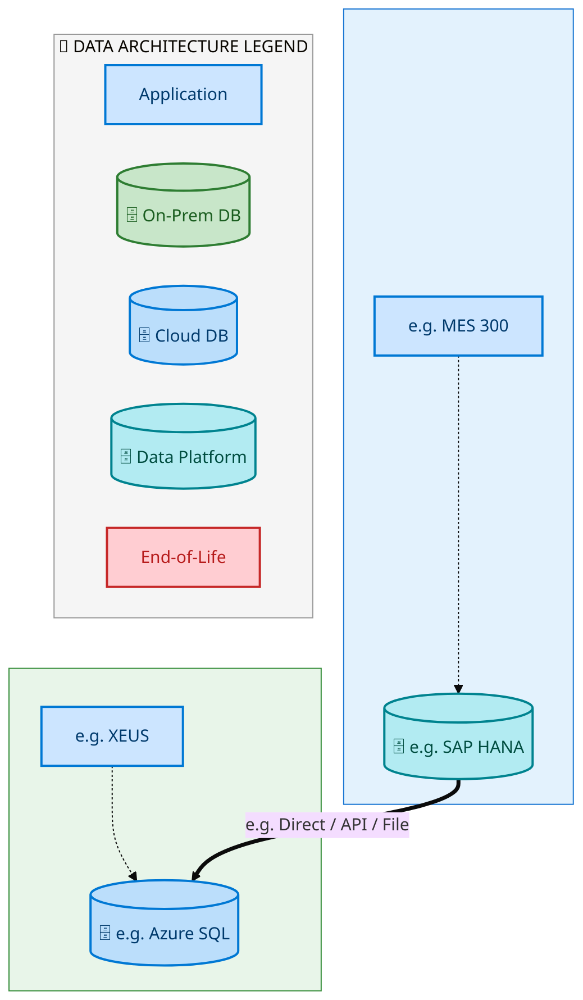
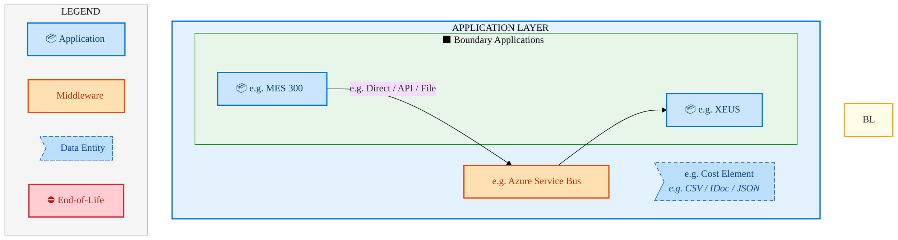
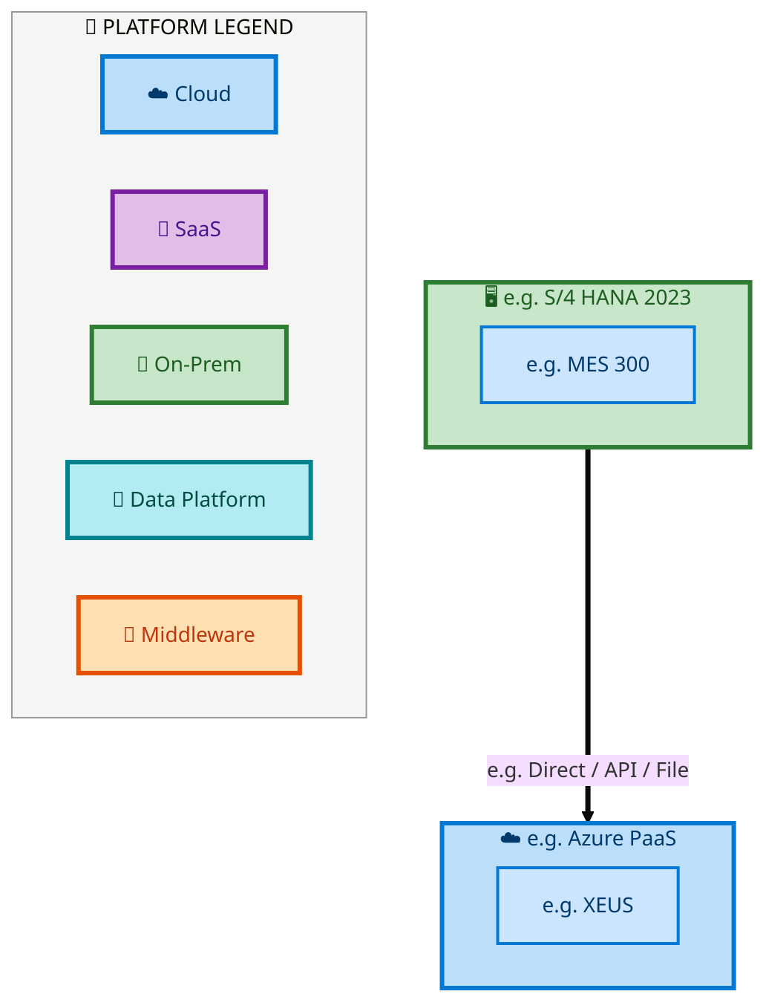

  <img src="data:image/svg+xml;base64,PHN2ZyB4bWxucz0iaHR0cDovL3d3dy53My5vcmcvMjAwMC9zdmciIHZpZXdCb3g9IjAgMCA4MDAgNDgwIiB3aWR0aD0iODAwIiBoZWlnaHQ9IjQ4MCI+DQogIDxkZWZzPg0KICAgIDxsaW5lYXJHcmFkaWVudCBpZD0iYmciIHgxPSIwJSIgeTE9IjAlIiB4Mj0iMTAwJSIgeTI9IjEwMCUiPg0KICAgICAgPHN0b3Agb2Zmc2V0PSIwJSIgc3R5bGU9InN0b3AtY29sb3I6IzAwNzFjNTtzdG9wLW9wYWNpdHk6MSIvPg0KICAgICAgPHN0b3Agb2Zmc2V0PSIxMDAlIiBzdHlsZT0ic3RvcC1jb2xvcjojMDBhZWVmO3N0b3Atb3BhY2l0eToxIi8+DQogICAgPC9saW5lYXJHcmFkaWVudD4NCiAgICA8bGluZWFyR3JhZGllbnQgaWQ9ImFjY2VudCIgeDE9IjAlIiB5MT0iMCUiIHgyPSIwJSIgeTI9IjEwMCUiPg0KICAgICAgPHN0b3Agb2Zmc2V0PSIwJSIgc3R5bGU9InN0b3AtY29sb3I6I2ZmZmZmZjtzdG9wLW9wYWNpdHk6MC4xNSIvPg0KICAgICAgPHN0b3Agb2Zmc2V0PSIxMDAlIiBzdHlsZT0ic3RvcC1jb2xvcjojZmZmZmZmO3N0b3Atb3BhY2l0eTowLjAyIi8+DQogICAgPC9saW5lYXJHcmFkaWVudD4NCiAgICA8cGF0dGVybiBpZD0iZ3JpZCIgd2lkdGg9IjQwIiBoZWlnaHQ9IjQwIiBwYXR0ZXJuVW5pdHM9InVzZXJTcGFjZU9uVXNlIj4NCiAgICAgIDxwYXRoIGQ9Ik0gNDAgMCBMIDAgMCAwIDQwIiBmaWxsPSJub25lIiBzdHJva2U9InJnYmEoMjU1LDI1NSwyNTUsMC4wNykiIHN0cm9rZS13aWR0aD0iMC41Ii8+DQogICAgPC9wYXR0ZXJuPg0KICA8L2RlZnM+DQoNCiAgPCEtLSBCYWNrZ3JvdW5kIC0tPg0KICA8cmVjdCB3aWR0aD0iODAwIiBoZWlnaHQ9IjQ4MCIgZmlsbD0idXJsKCNiZykiIHJ4PSI4Ii8+DQogIDxyZWN0IHdpZHRoPSI4MDAiIGhlaWdodD0iNDgwIiBmaWxsPSJ1cmwoI2dyaWQpIiByeD0iOCIvPg0KICA8cmVjdCB3aWR0aD0iODAwIiBoZWlnaHQ9IjQ4MCIgZmlsbD0idXJsKCNhY2NlbnQpIiByeD0iOCIvPg0KDQogIDwhLS0gRGVjb3JhdGl2ZSBjaXJjdWl0L2FyY2hpdGVjdHVyZSBsaW5lcyAtLT4NCiAgPGcgc3Ryb2tlPSJyZ2JhKDI1NSwyNTUsMjU1LDAuMTIpIiBzdHJva2Utd2lkdGg9IjEuNSIgZmlsbD0ibm9uZSI+DQogICAgPHBhdGggZD0iTSAwIDEwMCBMIDEyMCAxMDAgTCAxNjAgMTQwIEwgMjgwIDE0MCIvPg0KICAgIDxwYXRoIGQ9Ik0gMCAyNjAgTCA4MCAyNjAgTCAxMjAgMjIwIEwgMjAwIDIyMCBMIDI0MCAyNjAgTCAzNjAgMjYwIi8+DQogICAgPHBhdGggZD0iTSA1MjAgMTAwIEwgNjAwIDEwMCBMIDY0MCA2MCBMIDgwMCA2MCIvPg0KICAgIDxwYXRoIGQ9Ik0gNDQwIDM0MCBMIDU2MCAzNDAgTCA2MDAgMzAwIEwgNzIwIDMwMCBMIDc2MCAzNDAgTCA4MDAgMzQwIi8+DQogICAgPHBhdGggZD0iTSA2MDAgNDAwIEwgNjgwIDQwMCBMIDcyMCA0NDAiLz4NCiAgICA8cGF0aCBkPSJNIDAgNDAwIEwgNDAgNDAwIEwgODAgMzYwIi8+DQogICAgPHBhdGggZD0iTSAyMDAgNDIwIEwgMzIwIDQyMCBMIDM2MCAzODAgTCA0ODAgMzgwIi8+DQogICAgPHBhdGggZD0iTSA2NTAgNDQwIEwgNzUwIDQ0MCBMIDgwMCA0ODAiLz4NCiAgPC9nPg0KDQogIDwhLS0gRGVjb3JhdGl2ZSBub2RlcyAtLT4NCiAgPGcgZmlsbD0icmdiYSgyNTUsMjU1LDI1NSwwLjE4KSI+DQogICAgPGNpcmNsZSBjeD0iMTIwIiBjeT0iMTAwIiByPSI0Ii8+DQogICAgPGNpcmNsZSBjeD0iMjgwIiBjeT0iMTQwIiByPSI0Ii8+DQogICAgPGNpcmNsZSBjeD0iMjAwIiBjeT0iMjIwIiByPSI0Ii8+DQogICAgPGNpcmNsZSBjeD0iMzYwIiBjeT0iMjYwIiByPSI0Ii8+DQogICAgPGNpcmNsZSBjeD0iNjAwIiBjeT0iMTAwIiByPSI0Ii8+DQogICAgPGNpcmNsZSBjeD0iNzIwIiBjeT0iMzAwIiByPSI0Ii8+DQogICAgPGNpcmNsZSBjeD0iNTYwIiBjeT0iMzQwIiByPSI0Ii8+DQogICAgPGNpcmNsZSBjeD0iODAiIGN5PSIzNjAiIHI9IjQiLz4NCiAgICA8Y2lyY2xlIGN4PSI0ODAiIGN5PSIzODAiIHI9IjQiLz4NCiAgICA8Y2lyY2xlIGN4PSIzMjAiIGN5PSI0MjAiIHI9IjQiLz4NCiAgPC9nPg0KDQogIDwhLS0gVE9HQUYgQkRBVCBib3hlcyAtLT4NCiAgPGcgZm9udC1mYW1pbHk9IlNlZ29lIFVJLCBBcmlhbCwgc2Fucy1zZXJpZiIgZm9udC1zaXplPSIxNCIgZm9udC13ZWlnaHQ9IjYwMCI+DQogICAgPCEtLSBCIC0tPg0KICAgIDxyZWN0IHg9IjE1MCIgeT0iMTQwIiB3aWR0aD0iMTIwIiBoZWlnaHQ9IjQwIiByeD0iNSIgZmlsbD0icmdiYSgyNTUsMjU1LDI1NSwwLjE4KSIgc3Ryb2tlPSJyZ2JhKDI1NSwyNTUsMjU1LDAuMykiIHN0cm9rZS13aWR0aD0iMSIvPg0KICAgIDx0ZXh0IHg9IjIxMCIgeT0iMTY1IiB0ZXh0LWFuY2hvcj0ibWlkZGxlIiBmaWxsPSIjZmZmIj5CdXNpbmVzczwvdGV4dD4NCiAgICA8IS0tIEQgLS0+DQogICAgPHJlY3QgeD0iMjkwIiB5PSIxNDAiIHdpZHRoPSIxMjAiIGhlaWdodD0iNDAiIHJ4PSI1IiBmaWxsPSJyZ2JhKDI1NSwyNTUsMjU1LDAuMTgpIiBzdHJva2U9InJnYmEoMjU1LDI1NSwyNTUsMC4zKSIgc3Ryb2tlLXdpZHRoPSIxIi8+DQogICAgPHRleHQgeD0iMzUwIiB5PSIxNjUiIHRleHQtYW5jaG9yPSJtaWRkbGUiIGZpbGw9IiNmZmYiPkRhdGE8L3RleHQ+DQogICAgPCEtLSBBIC0tPg0KICAgIDxyZWN0IHg9IjQzMCIgeT0iMTQwIiB3aWR0aD0iMTIwIiBoZWlnaHQ9IjQwIiByeD0iNSIgZmlsbD0icmdiYSgyNTUsMjU1LDI1NSwwLjE4KSIgc3Ryb2tlPSJyZ2JhKDI1NSwyNTUsMjU1LDAuMykiIHN0cm9rZS13aWR0aD0iMSIvPg0KICAgIDx0ZXh0IHg9IjQ5MCIgeT0iMTY1IiB0ZXh0LWFuY2hvcj0ibWlkZGxlIiBmaWxsPSIjZmZmIj5BcHBsaWNhdGlvbjwvdGV4dD4NCiAgICA8IS0tIFQgLS0+DQogICAgPHJlY3QgeD0iNTcwIiB5PSIxNDAiIHdpZHRoPSIxMjAiIGhlaWdodD0iNDAiIHJ4PSI1IiBmaWxsPSJyZ2JhKDI1NSwyNTUsMjU1LDAuMTgpIiBzdHJva2U9InJnYmEoMjU1LDI1NSwyNTUsMC4zKSIgc3Ryb2tlLXdpZHRoPSIxIi8+DQogICAgPHRleHQgeD0iNjMwIiB5PSIxNjUiIHRleHQtYW5jaG9yPSJtaWRkbGUiIGZpbGw9IiNmZmYiPlRlY2hub2xvZ3k8L3RleHQ+DQogIDwvZz4NCg0KICA8IS0tIENvbm5lY3RpbmcgbGluZXMgYmV0d2VlbiBCREFUIGJveGVzIC0tPg0KICA8ZyBzdHJva2U9InJnYmEoMjU1LDI1NSwyNTUsMC4yNSkiIHN0cm9rZS13aWR0aD0iMSI+DQogICAgPGxpbmUgeDE9IjI3MCIgeTE9IjE2MCIgeDI9IjI5MCIgeTI9IjE2MCIvPg0KICAgIDxsaW5lIHgxPSI0MTAiIHkxPSIxNjAiIHgyPSI0MzAiIHkyPSIxNjAiLz4NCiAgICA8bGluZSB4MT0iNTUwIiB5MT0iMTYwIiB4Mj0iNTcwIiB5Mj0iMTYwIi8+DQogIDwvZz4NCg0KICA8IS0tIE1haW4gdGl0bGUgLS0+DQogIDx0ZXh0IHg9IjQwMCIgeT0iMjYwIiB0ZXh0LWFuY2hvcj0ibWlkZGxlIiBmb250LWZhbWlseT0iU2Vnb2UgVUksIEFyaWFsLCBzYW5zLXNlcmlmIiBmb250LXNpemU9IjM2IiBmb250LXdlaWdodD0iNzAwIiBmaWxsPSIjZmZmZmZmIiBsZXR0ZXItc3BhY2luZz0iMSI+DQogICAgSUFPIEFyY2hpdGVjdHVyZQ0KICA8L3RleHQ+DQogIDx0ZXh0IHg9IjQwMCIgeT0iMzAwIiB0ZXh0LWFuY2hvcj0ibWlkZGxlIiBmb250LWZhbWlseT0iU2Vnb2UgVUksIEFyaWFsLCBzYW5zLXNlcmlmIiBmb250LXNpemU9IjE4IiBmb250LXdlaWdodD0iNDAwIiBmaWxsPSJyZ2JhKDI1NSwyNTUsMjU1LDAuOCkiIGxldHRlci1zcGFjaW5nPSIyIj4NCiAgICBUT0dBRiBCREFUIMK3IElBTyBQcm9ncmFtIMK3IElETSAyLjANCiAgPC90ZXh0Pg0KDQogIDwhLS0gQm90dG9tIGFjY2VudCBiYXIgLS0+DQogIDxyZWN0IHg9IjI4MCIgeT0iMzQwIiB3aWR0aD0iMjQwIiBoZWlnaHQ9IjMiIHJ4PSIxLjUiIGZpbGw9InJnYmEoMjU1LDI1NSwyNTUsMC40KSIvPg0KDQogIDwhLS0gSW50ZWwgdGV4dCAtLT4NCiAgPHRleHQgeD0iNDAwIiB5PSIzODAiIHRleHQtYW5jaG9yPSJtaWRkbGUiIGZvbnQtZmFtaWx5PSJTZWdvZSBVSSwgQXJpYWwsIHNhbnMtc2VyaWYiIGZvbnQtc2l6ZT0iMTMiIGZpbGw9InJnYmEoMjU1LDI1NSwyNTUsMC41KSIgbGV0dGVyLXNwYWNpbmc9IjMiPg0KICAgIElOVEVMIENPTkZJREVOVElBTA0KICA8L3RleHQ+DQo8L3N2Zz4NCg==" alt="IAO Architecture" style="width:100%; border-radius:8px;" />
  <h1 style="font-size:36px; margin-top:24px;">E2E-67 — Forecast to Stock</h1>
  <h2 style="font-size:24px;">Architecture Document (TOGAF BDAT)</h2>
  
End-to-End Integrated Processes (E2E) Tower 
  Capability E2E-67 · Forecast to Stock

  
IAO Program · R1 – R5 
  Generated: April 2026 
  Sajiv Francis

  
IAO Architecture Pipeline — Intel Confidential

Page 1<a href="#toc">↑ Back to TOC</a>E2E-67 — Forecast to Stock

## Table of Contents

<nav class="toc">
<ol>
  <li><a href="#1-executive-summary">1. Executive Summary</a></li>
  <li><a href="#2-business-context-objectives">2. Business Context &amp; Objectives</a>
    <ul>
      <li><a href="#21-classification">2.1 Classification</a></li>
      <li><a href="#22-business-drivers">2.2 Business Drivers</a></li>
      <li><a href="#23-success-criteria">2.3 Success Criteria</a></li>
      <li><a href="#24-companion-documents">2.4 Companion Documents</a></li>
    </ul>
  </li>
  <li><a href="#3-business-architecture-togaf-b">3. Business Architecture (TOGAF &ldquo;B&rdquo;)</a>
    <ul>
      <li><a href="#31-business-process-overview">3.1 Business Process Overview</a></li>
      <li><a href="#32-business-process-diagrams">3.2 Business Process Diagrams</a></li>
      <li><a href="#33-business-roles-responsibilities">3.3 Business Roles &amp; Responsibilities</a></li>
    </ul>
  </li>
  <li><a href="#4-data-architecture-togaf-d">4. Data Architecture (TOGAF &ldquo;D&rdquo;)</a>
    <ul>
      <li><a href="#41-data-entities-ownership">4.1 Data Entities &amp; Ownership</a></li>
      <li><a href="#42-data-flow-diagrams">4.2 Data Flow Diagrams</a></li>
      <li><a href="#43-data-lineage">4.3 Data Lineage</a></li>
      <li><a href="#44-ricefw-data-objects">4.4 RICEFW Data Objects</a></li>
      <li><a href="#45-data-governance-quality">4.5 Data Governance &amp; Quality</a></li>
    </ul>
  </li>
  <li><a href="#5-application-architecture-togaf-a">5. Application Architecture (TOGAF &ldquo;A&rdquo;)</a>
    <ul>
      <li><a href="#51-current-state-current-state-application-landscape">5.1 Current-State Application Landscape</a></li>
      <li><a href="#52-future-state-future-state-application-landscape">5.2 Future-State Application Landscape</a></li>
      <li><a href="#53-change-impact-summary">5.3 Change Impact Summary</a></li>
      <li><a href="#54-component-overview">5.4 Component Overview</a></li>
      <li><a href="#55-ricefw-inventory">5.5 RICEFW Inventory</a></li>
      <li><a href="#56-integration-patterns">5.6 Integration Patterns</a></li>
    </ul>
  </li>
  <li><a href="#6-technology-architecture-togaf-t">6. Technology Architecture (TOGAF &ldquo;T&rdquo;)</a>
    <ul>
      <li><a href="#61-platform-infrastructure">6.1 Platform &amp; Infrastructure</a></li>
      <li><a href="#62-sap-development-object-status">6.2 SAP Development Object Status</a></li>
      <li><a href="#63-nfrs-design-principles">6.3 NFRs &amp; Design Principles</a></li>
      <li><a href="#64-security-governance">6.4 Security &amp; Governance</a></li>
    </ul>
  </li>
  <li><a href="#7-project-context">7. Project Context</a>
    <ul>
      <li><a href="#71-project-roadmap-go-live-plan">7.1 Project Roadmap &amp; Go-Live Plan</a></li>
      <li><a href="#72-raid-log">7.2 RAID Log</a></li>
      <li><a href="#73-recommendations-next-steps">7.3 Recommendations &amp; Next Steps</a></li>
    </ul>
  </li>
</ol>
</nav>

Page 2<a href="#toc">↑ Back to TOC</a>E2E-67 — Forecast to Stock

## 1. Executive Summary

This Architecture Document defines the **Business, Data, Application, and Technology** (BDAT) architecture for **E2E-67 Forecast to Stock** within the IAO program. It includes 4 BPMN process diagram(s) in Section 3.

| Dimension | Value |
|-----------|-------|
| **Tower** | End-to-End Integrated Processes (E2E) |
| **Process Group** | Forecast to Stock |
| **Capability** | E2E-67 - Forecast to Stock |
| **Release** | R1 – R5 |
| **Total Systems** | 2 |
| **System Status** | 0 Deployed, 0 Developing, 0 EOL, 2 Pending IAPM |
| **RICEFW Objects** | Pending — Smartsheet Object Tracker API integration |

**Change Summary**: 0 new flow chains, 0 removed, 0 modified, 1 unchanged between Current-State and Future-State states.

> All system nodes in architecture diagrams are **IAPM-linked** — click any node to open its IAPM page. Diagrams require `securityLevel: 'loose'` for click events.

Page 3<a href="#toc">↑ Back to TOC</a>E2E-67 — Forecast to Stock

## 2. Business Context & Objectives

### 2.1 Classification

| Level | Value |
|-------|-------|
| **L0 Tower** | End-to-End Integrated Processes |
| **L1 Process** | Forecast to Stock |
| **L2 Capability** | E2E-67 - Forecast to Stock |

### 2.2 Business Drivers

| # | Driver | Description | Strategic Alignment | Priority |
|---|--------|-------------|---------------------|----------|
| 1 | End-to-End Process Integration | Enable cross-tower integrated processes spanning procurement, manufacturing, and fulfillment | IDM 2.0 Process Excellence | High |
| 2 | Intel Foundry Business Enablement | Stand up foundry-specific business processes for external customer engagement | Intel Foundry Services | High |
| 3 | Process Visibility & Monitoring | Provide end-to-end process visibility across tower boundaries with integrated monitoring | Operational Excellence | Medium |
| 4 | E2E-67 Process Migration | Migrate E2E-67 business processes and 2 integrated systems from legacy to S/4 HANA target architecture | IDM 2.0 Cross-Functional / End-to-End | High |

Page 4<a href="#toc">↑ Back to TOC</a>E2E-67 — Forecast to Stock

### 2.3 Success Criteria

| Metric | Target | Measure | Baseline | Owner |
|--------|--------|---------|----------|-------|
| E2E Process Cycle Time | Per process SLA | End-to-end transaction completion within defined SLA per process | Varies by process | E2E Process Owner |
| Cross-Tower Integration Success | > 99% | Transactions completing across tower boundaries without manual intervention | 92% (current) | Integration Lead |
| Process Exception Rate | < 2% | Transactions requiring manual exception handling | 8% (current) | Operations Manager |
| E2E-67 Migration Completeness | 100% flow chains validated | All 1 flow chains verified in target state | 0% (pre-migration) | Tower Architect |

### 2.4 Companion Documents

| Document | Description |
|----------|-------------|
| **Business Architecture** | Included in this document (Section 3) — process flows from BPMN diagrams |
| **This Document** | Full BDAT Architecture — Business + Data + Application + Technology |

Page 5<a href="#toc">↑ Back to TOC</a>E2E-67 — Forecast to Stock

## 3. Business Architecture (TOGAF "B")

### 3.1 Business Process Overview

This capability includes **4 business process(es)** modeled in BPMN 2.0, covering the end-to-end workflow for E2E-67 Forecast to Stock.

| # | Step ID | Process Name | Lanes | Tasks | Gateways |
|---|---------|--------------|-------|-------|----------|
| 1 | E2E-67A_R3_Inventory_Movement_from_SLOC_to_SLOC_(IM_to_IM)_–_SAME_LE_-_One_Step_Transfer | E2E-67A_R3_Inventory_Movement_from_SLOC_to_SLOC_(IM_to_IM)_–_SAME_LE_-_One_Step_Transfer | SAP S/4 Intel Foundry | 2 | 0 |
| 2 | E2E-67B_R3_Inventory_Movement_from_SLOC_to_SLOC_(IM_to_IM)_–_SAME_LE_-_Two_Step_Transfer | E2E-67B_R3_Inventory_Movement_from_SLOC_to_SLOC_(IM_to_IM)_–_SAME_LE_-_Two_Step_Transfer | SAP S/4 Intel Foundry | 3 | 0 |
| 3 | E2E-67C_R3_Inventory_Movement_from_SLOC_to_SLOC_(EWM_to_IM)_using_MIGO_–_SAME_LE | E2E-67C_R3_Inventory_Movement_from_SLOC_to_SLOC_(EWM_to_IM)_using_MIGO_–_SAME_LE | EWM, SAP S/4 IM  | 7 | 0 |
| 4 | E2E-67D_R3_Inventory_Movement_from_SLOC_to_SLOC_(IM_to_EWM)_using_MIGO_–_SAME_LE | E2E-67D_R3_Inventory_Movement_from_SLOC_to_SLOC_(IM_to_EWM)_using_MIGO_–_SAME_LE | EWM, SAP S/4 IM  | 7 | 0 |

Page 6<a href="#toc">↑ Back to TOC</a>E2E-67 — Forecast to Stock

### 3.2 Business Process Diagrams

#### BUSINESS ARCHITECTURE — 3.2.1 E2E-67A_R3_Inventory_Movement_from_SLOC_to_SLOC_(IM_to_IM)_–_SAME_LE_-_One_Step_Transfer — E2E-67A_R3_Inventory_Movement_from_SLOC_to_SLOC_(IM_to_IM)_–_SAME_LE_-_One_Step_Transfer

**Swim Lanes**: SAP S/4 Intel Foundry | **Tasks**: 2 | **Gateways**: 0

> **Legend**: ● Start · ● End · User Task · Service Task · ◇ Gateway · Sub-Process

<a href="https://mermaid.live/view#pako:eNqlVNuO2jAQ_RUrK5RWCmquhOahEgRSrdRVkdi2D0tVmWQcrHXsyDYLFPHvdbiEy4qn-iHKHM85xzO-bK1cFGAlVqezpZzqBG1tvYAK7ATZc6zAdtAB-IklxXMGym5yiOB6Sv_u07ywXjdpDZbhirJNg06hFIB-PDpoYIjMQQpz1VUgKbEdu5a0wnKTCiZkk_0AfeKSvdtxaihkAfKc4Lqxl0eGyiiHMxzEYRxmDU9BLnhxJUoi0ie5vWsWx8QqX2Cp98tfKnjC61-00AsTE8wUmJyFrtg3PAfW1KjlssHypXw7NYOqxoebhk1rnFNeGjx0DSQxfz1DkbvboV2nM-OtKXoezTgyI2dYqREQpLSBx28aEcpY8hCmgyxyHaWleIXkwR_Ho8B38qaSxJTuOk1zuyug5UInc8GKY2p31dSQ-PXakevEdx25Md8bL-DF2Snt-X2_3zoNYy_10pMTIeS_nExf5TNWr0evcZD52aj18qJelLrv9U5ljsJ44N32CeQbzeFCNMuyYHxu1bgXee590WEW9Nz0RrTEGlZ4cxb8nIatYBbFmRffFTz43a5yOZ9IkZ8Eg3GURa1gPPSygX9XMBx4Yf-4QqNTSlwvEMMc_rgvM2s6mKDppxA9cg0MZWLJC7mZWb8P-c3g3ovJIzghuJuLEqUSTHno6fHrd_RsTqYiIA3hkuFfMyYgiZAVmiw2iuaYoSfxZm4810gQ9FWIQt3wgw8tv2amj1de5oeWJUgoDOvjBSs8s5QW9Xs71fqhVFQ1A32pYU7x4YcHqNv9Yuo-ht4h9I-hfwjDiy1qci4O0tWMf3cmaC_pFRwe75PlWBXICtPCSrbW_o0072gBBC-ZtnaOhZdaTDc8t5L9W2It68JszIhis8XVAdz9A25XwoU=" title="View full diagram">&#128065; View Diagram</a>

#### BUSINESS ARCHITECTURE — 3.2.2 E2E-67B_R3_Inventory_Movement_from_SLOC_to_SLOC_(IM_to_IM)_–_SAME_LE_-_Two_Step_Transfer — E2E-67B_R3_Inventory_Movement_from_SLOC_to_SLOC_(IM_to_IM)_–_SAME_LE_-_Two_Step_Transfer

**Swim Lanes**: SAP S/4 Intel Foundry | **Tasks**: 3 | **Gateways**: 0

> **Legend**: ● Start · ● End · User Task · Service Task · ◇ Gateway · Sub-Process

<a href="https://mermaid.live/view#pako:eNqlVF1v2jAU_StWqopNClo-CcvDJAikQmrVanTbQztNJrkGq44d2Q4fq_jvcwgQYONpeYhyj-85594b2-9WJnKwYuv29p1yqmP03tELKKATo84MK-jYqAG-Y0nxjIHq1DlEcD2lv3dpblCu67QaS3FB2aZGpzAXgL5NbDQwRGYjhbnqKpCUdOxOKWmB5SYRTMg6-wb6xCE7t_3SUMgcZJvgOJGbhYbKKIcW9qMgCtKapyATPD8TJSHpk6yzrYtjYpUtsNS78isFD3j9g-Z6YWKCmQKTs9AFu8czYHWPWlY1llVyeRgGVbUPNwObljijfG7wwDGQxPythUJnu0Xb29tXfjRFz6NXjsyTMazUCAhS2sDjpUaEMhbfBMkgDR1baSneIL7xxtHI9-ys7iQ2rTt2PdzuCuh8oeOZYPk-tbuqe4i9cm3Ldew5ttyY94UX8Lx1Snpe3-sfnYaRm7jJwYkQ8l9OZq7yGau3vdfYT710dPRyw16YOH_rHdocBdHAvZwTyCXN4EQ0TVN_3I5q3Atd57roMPV7TnIhOscaVnjTCn5OgqNgGkapG10VbPwuq6xmT1JkB0F_HKbhUTAauunAuyoYDNygv6_Q6MwlLheIYQ6_nJdXazp4QtNPAZpwDQylouK53LxaP5v8-uHui8kjOCa4m4k5SiSY9tDD5O4RPZudqQhIRDmaKFUBmt4_JoZ-yvfO-U8giZAFelpsFM0wQw9iac4_10gQdCdEri74_gVfKN24a9EWQKQoTBXdIzDEpscMENboK2RAl-bw_Ku64MNRvWTmn533NTF3FjXt5ob18YQVtiylRdkSElGUDM4I5ng0HzxA3e4XM9B96Dahtw-9JvT3od-E4clWqCknG_Zsxbu64l9dCY7XxBkc7k-0ZVsFyALT3Irfrd0tbW7yHAiumLa2toUrLaYbnlnx7jazqjI3sxpRbDZZ0YDbP6Tc6sA=" title="View full diagram">&#128065; View Diagram</a>

Page 7<a href="#toc">↑ Back to TOC</a>E2E-67 — Forecast to Stock

#### BUSINESS ARCHITECTURE — 3.2.3 E2E-67C_R3_Inventory_Movement_from_SLOC_to_SLOC_(EWM_to_IM)_using_MIGO_–_SAME_LE — E2E-67C_R3_Inventory_Movement_from_SLOC_to_SLOC_(EWM_to_IM)_using_MIGO_–_SAME_LE

**Swim Lanes**: EWM · SAP S/4 IM  | **Tasks**: 7 | **Gateways**: 0

> **Legend**: ● Start · ● End · User Task · Service Task · ◇ Gateway · Sub-Process

<a href="https://mermaid.live/view#pako:eNqlVdtu4zYQ_RVCQeAWkLG6Wo4eCjiytTDQIEGd7T5sFgUtDW0iNCmQlBNv4H8vaSm-KFFfqgcBZ2bOOTMDUnpzClGCkzrX12-UU52it4FewwYGKRossYKBi5rA31hSvGSgBraGCK4X9NehzI-qV1tmYzneULaz0QWsBKBvcxdNDJG5SGGuhgokJQN3UEm6wXKXCSakrb6CMfHIwa1N3QpZgjwVeF7iF7GhMsrhFA6TKIlyy1NQCF5eiJKYjEkx2NvmmHgp1ljqQ_u1gjv8-p2Wem0wwUyBqVnrDfsTL4HZGbWsbayo5fZ9GVRZH24WtqhwQfnKxCPPhCTmz6dQ7O33aH99_cSPpuhx-sSReQqGlZoCQUqb8GyrEaGMpVdRNsljz1VaimdIr4JZMg0Dt7CTpGZ0z7XLHb4AXa11uhSsbEuHL3aGNKheXfmaBp4rd-bd8QJenpyyUTAOxken28TP_OzdiRDyv5zMXuUjVs-t1yzMg3x69PLjUZx5H_Xex5xGycTv7gnklhZwJprneTg7rWo2in2vX_Q2D0de1hFdYQ0veHcSvMmio2AeJ7mf9Ao2ft0u6-WDFMW7YDiL8_gomNz6-SToFYwmfjRuOzQ6K4mrNWKYwz_ejydn9v3uyfnZZO3D4x8mSnBK8LAQKzSlRpcuaw3ovtZLUfMSTYHRLcgdurdXyNDP-aNLfibBLANhQ8sEJ1Ru0AMtns1J7vCSS94DSCJM8VchSoXmStVwIpgD99k8vlFYTB7Q4kuE5nfoci7_077u5l_v0aO5X4qARJQbXqev4FPex118IIaXxG9VaYlzvgWuhdx1qqP_Gv8vKIBWGmFt51owUXTY49-O7IqZgzc3n1r6YT5D-v2MdHMiKS2qjlfbAZQn1nHtfIyGwz_MTlvoNzBoYdDAuIVxA0ctHDUwaWHSwLCFYQOjFkYNvDm7D9bu7NZeZILeTNibiXozcW9m1JtJejPj4zf5InzTfj4d19mA3GBaOumbc_glmt9mCQTXTDt718G1FosdL5z08Otw6sOBmlJsbsCmCe7_BYoRWJQ=" title="View full diagram">&#128065; View Diagram</a>

Page 8<a href="#toc">↑ Back to TOC</a>E2E-67 — Forecast to Stock

#### BUSINESS ARCHITECTURE — 3.2.4 E2E-67D_R3_Inventory_Movement_from_SLOC_to_SLOC_(IM_to_EWM)_using_MIGO_–_SAME_LE — E2E-67D_R3_Inventory_Movement_from_SLOC_to_SLOC_(IM_to_EWM)_using_MIGO_–_SAME_LE

**Swim Lanes**: EWM · SAP S/4 IM  | **Tasks**: 7 | **Gateways**: 0

> **Legend**: ● Start · ● End · User Task · Service Task · ◇ Gateway · Sub-Process

<a href="https://mermaid.live/view#pako:eNqlVV1r4zgU_SvCpaQDDuvPOPXDQurEQ2BLy6az8zAdFsW-TkRlyUhy2mzJf18pdu04nTyNHwzn3nvO1T3o493KeA5WbF1fvxNGVIzeR2oLJYxiNFpjCSMbNYF_sCB4TUGOTE3BmVqR_45lblC9mTITS3FJ6N5EV7DhgL4tbTTTRGojiZkcSxCkGNmjSpASi33CKRem-gqmhVMcu7WpOy5yEH2B40RuFmoqJQz6sB8FUZAanoSMs3wgWoTFtMhGB7M4yl-zLRbquPxawj1--05ytdW4wFSCrtmqkv6F10DNjErUJpbVYvdhBpGmD9OGrSqcEbbR8cDRIYHZSx8KncMBHa6vn1nXFD3NnxnSX0axlHMokFQ6vNgpVBBK46sgmaWhY0sl-AvEV94imvuenZlJYj26Yxtzx69ANlsVrznN29Lxq5kh9qo3W7zFnmOLvf6f9QKW952SiTf1pl2nu8hN3OSjU1EUv9VJ-yqesHxpey381EvnXS83nISJ81nvY8x5EM3cc59A7EgGJ6JpmvqL3qrFJHSdy6J3qT9xkjPRDVbwive94G0SdIJpGKVudFGw6Xe-ynr9KHj2IegvwjTsBKM7N515FwWDmRtM2xVqnY3A1RZRzOBf58eztfh-_2z9bLLmY-EPHS1wXOBxxjdoTrQuWdcK0EOt1rxmOZoDJTsQe_RgjhBSHDUqpzKToUwiQHuCsGYnnBVElOgRZy96QyNlrL_RCl_OJKKhxFfOc4mWUtbQF-qt96vJXM1czR7R6o8ALe_RcEKTbMT-hgxIpRBWpopynCnC2bDa--Ug98uvD-hJn0vZcU5J_pD0rcoNacl2wBQX-7PqYFj92eeb5Sdzpjcdp6J6qy315UqGKytAaNKXE9JtT5KKV62lonUh42VFQUHeszp72RSNx39qN1oYNDBs4aSBUQu9BgYt9BvYHj0WNnDSwqiBfgvdBt6enAAjeHJOBxn_Yia4mAkvZiYXM9HFzLS7awfh2_ZatGyrBFFiklvxu3V86vRzmEOBa6qsg23hWvHVnmVWfHwSrPq4WeYE6_1cNsHD_9HwSng=" title="View full diagram">&#128065; View Diagram</a>

Page 9<a href="#toc">↑ Back to TOC</a>E2E-67 — Forecast to Stock

### 3.3 Business Roles & Responsibilities

| Role / Lane | Processes Involved | Description |
|------------|-------------------|-------------|
| SAP S/4 Intel Foundry | E2E-67A_R3_Inventory_Movement_from_SLOC_to_SLOC_(IM_to_IM)_–_SAME_LE_-_One_Step_Transfer, E2E-67B_R3_Inventory_Movement_from_SLOC_to_SLOC_(IM_to_IM)_–_SAME_LE_-_Two_Step_Transfer,  | |
| EWM | E2E-67C_R3_Inventory_Movement_from_SLOC_to_SLOC_(EWM_to_IM)_using_MIGO_–_SAME_LE, E2E-67D_R3_Inventory_Movement_from_SLOC_to_SLOC_(IM_to_EWM)_using_MIGO_–_SAME_LE | |
| SAP S/4 IM  | E2E-67C_R3_Inventory_Movement_from_SLOC_to_SLOC_(EWM_to_IM)_using_MIGO_–_SAME_LE, E2E-67D_R3_Inventory_Movement_from_SLOC_to_SLOC_(IM_to_EWM)_using_MIGO_–_SAME_LE | |

Page 10<a href="#toc">↑ Back to TOC</a>E2E-67 — Forecast to Stock

## 4. Data Architecture (TOGAF "D")

### 4.1 Data Flows — Source to Target

| # | Flow Chain | Hop | Source App | Source DB | Target App | Target DB | Data Description | Frequency | Classification |
|---|-----------|-----|-----------|----------|-----------|----------|-----------------|-----------|---------------|
| 1 | e.g. MES Route to ICOST | 1 | e.g. MES 300 | e.g. SAP HANA | e.g. XEUS | e.g. Azure SQL | What data moves | e.g. Near Real-Time | e.g. Intel Confidential |

Page 11<a href="#toc">↑ Back to TOC</a>E2E-67 — Forecast to Stock

### 4.2 Data Flow Diagrams

> **DATA ARCHITECTURE** — Database-to-database data flows. Applications (blue) sit above their hosting databases (green cylinders). Thick arrows show data movement between databases.

#### 4.2.1 Current-State — Current-State Data Flows

<a href="https://mermaid.live/view#pako:eNqlVYtumzAU_RWLKtImJV0CeRCkVgJs1kq0y0q6TSoTcsAkqA4gHmvSNP8-m0eSpqWtNiMh-_rec6_P8WMjuJFHBEVotTZBGGQK2NhCtiBLYgsKsIUZTlmvzXopcfMkyNYm-UNoOUmjqJ4tQn7gJMAzSlI-zXD8KMys4LGC6g3iVenM7QZeBnRdzlhkHhFwe9kGKgNg4NvCi0YP7gInWYWWp-QKr34GXrbgFh_TlHC_RbakJp4RWqTNkrywhmxZVozdIJxzszTgxgSH9wfG_mC7BdtWyw53ucBUs0PAmktxmkLiAxzHWrQCfkCpcqLraGAY7TRLonuinHS7Ixn2q2HngZemiPGq7UY0Svi0pA71Izxvpq9pDSejoT7ewYloBCWxEa6nDZDYfQlHo9yrADUNIkP7z_ogznCNJyLNEA_wZEk23sDrw_5xgSSie_4MQ4dwj6cPRVmUG_G0UU_vsfpKxDSfzRMcLwAS0XCkQ1U3HeLMHfUxT4hjfTfvbIFp_Lv05s0LEuJmQRTuVOWtDleL6F_o1mKB5HR-CnifASiKUor-MgYeZfxkC3buyZLH_p7bt3OfdNmSOVjhBJiTLXzmkJVQb9UBOqed86ZcZSAJK4Q0W1PSSEVFN5KNAdrvL0mWkaQ_p7vHDuU7BFvqxLlQr9V_4vcKWY7U7dYUsyFgw4-wvEv7BsnMB3CfHcd8775Tymss17k-QnLtW3MsGaIBdxz3xqMhFBs5fj0tODs7f6oYggWp4AtQJ5fsbwSU3Z9PzbviSDuTzFn5dweUuV4XQHWqAvVGv7icIn16e4OAib6ia9ggp3mzt5oOF16NYxq4mM--rp3pwAahvoWdSUKWAGr7k7CmzyL1htDyajsMfH6EWGhT1uISm1Cc-VGybNgepoPY0lDodSK_YwY-KZdW3livboWS3foyG_Bvp_x4PH4hu9AWliRZ4sATlE35SLK31iM-zmnGnjkB51lkrUNXUIqHS8hjD2cEBpipuSyN27_tBlgj" title="View full diagram">&#128065; View Diagram</a>

Page 12<a href="#toc">↑ Back to TOC</a>E2E-67 — Forecast to Stock

#### 4.2.2 Future-State — Future-State Data Flows

<a href="https://mermaid.live/view#pako:eNqlVYtumzAU_RWLKtImJV0CeRCkVgJs1kq0y0q6TSoTcsAkqA4gHmvSNP8-m0eSpqWtNiMh-_rec6_P8WMjuJFHBEVotTZBGGQK2NhCtiBLYgsKsIUZTlmvzXopcfMkyNYm-UNoOUmjqJ4tQn7gJMAzSlI-zXD8KMys4LGC6g3iVenM7QZeBnRdzlhkHhFwe9kGKgNg4NvCi0YP7gInWYWWp-QKr34GXrbgFh_TlHC_RbakJp4RWqTNkrywhmxZVozdIJxzszTgxgSH9wfG_mC7BdtWyw53ucBUs0PAmktxmkLiAxzHWrQCfkCpcqLraGAY7TRLonuinHS7Ixn2q2HngZemiPGq7UY0Svi0pA71Izxvpq9pDSejoT7ewYloBCWxEa6nDZDYfQlHo9yrADUNIkP7z_ogznCNJyLNEA_wZEk23sDrw_5xgSSie_4MQ4dwj6cPRVmUG_G0UU_vsfpKxDSfzRMcLwAS0XBkQFU3HeLMHfUxT4hjfTfvbIFp_Lv05s0LEuJmQRTuVOWtDleL6F_o1mKB5HR-CnifASiKUor-MgYeZfxkC3buyZLH_p7bt3OfdNmSOVjhBJiTLXzmkJVQb9UBOqed86ZcZSAJK4Q0W1PSSEVFN5KNAdrvL0mWkaQ_p7vHDuU7BFvqxLlQr9V_4vcKWY7U7dYUsyFgw4-wvEv7BsnMB3CfHcd8775Tymss17k-QnLtW3MsGaIBdxz3xqMhFBs5fj0tODs7f6oYggWp4AtQJ5fsbwSU3Z9PzbviSDuTzFn5dweUuV4XQHWqAvVGv7icIn16e4OAib6ia9ggp3mzt5oOF16NYxq4mM--rp3pwAahvoWdSUKWAGr7k7CmzyL1htDyajsMfH6EWGhT1uISm1Cc-VGybNgepoPY0lDodSK_YwY-KZdW3livboWS3foyG_Bvp_x4PH4hu9AWliRZ4sATlE35SLK31iM-zmnGnjkB51lkrUNXUIqHS8hjD2cEBpipuSyN2799P1hN" title="View full diagram">&#128065; View Diagram</a>

Page 13<a href="#toc">↑ Back to TOC</a>E2E-67 — Forecast to Stock

### 4.3 Data Lineage

| # | Source System | Source Schema/Object | Target System | Target Schema/Object | Transformation |
|---|-------------|---------------------|---------------|---------------------|---------------|
| 1 | e.g. MES 300 | e.g. CKMLHD table | e.g. XEUS | e.g. dbo.CostElements | Lineage notes |

### 4.4 RICEFW Data Objects

Reports and Conversions for this capability will be populated from the Smartsheet Object Tracker via automated API extraction.

| Object ID | Type | Description | Status | Source | Target | Complexity |
|-----------|------|-------------|--------|--------|--------|-----------|
| E2E-67-R001 | Report | Forecast to Stock operational report | Planned | SAP S/4HANA | Analytics | Medium |
| E2E-67-C001 | Conversion | Legacy data migration for Forecast to Stock | Planned | Legacy ERP | SAP S/4HANA | High |

> *Pending: Smartsheet API integration to auto-populate live RICEFW data (see Build Requirements).*

### 4.5 Data Governance & Quality

| Concern | Approach |
|---------|----------|
| Data Ownership | Per-entity owners listed in Section 3.1 |
| Data Classification | Financial data classified as Intel Confidential |
| Data Retention | Per Intel corporate retention policies |
| Data Quality | Validated at source; reconciliation at target |

Page 14<a href="#toc">↑ Back to TOC</a>E2E-67 — Forecast to Stock

## 5. Application Architecture (TOGAF "A")

### 5.1 Current-State — Current-State Application Landscape

#### Overview

The Current-State architecture represents the **current / legacy** landscape for E2E-67.This view is generated from `CurrentFlows.xlsx` (1 flow hops across 1 flow chains).

#### APPLICATION ARCHITECTURE — Architecture Diagram

> **Click any system node** to open its IAPM application page.
> **Legend**: Deployed · Developing · End-of-Life · No IAPM Match

<a href="https://mermaid.live/view#pako:eNqVlntvmzoUwL-KxZS_btLyCCRFVSQe5ip3JK2abb3TmJADTmLNMQjD2qzrd78G50Fps-06EgGfc37HPj4-9pOSZClWbKXXeyKMlDZ4ipRyg7c4UmwQKUvExVtfvHGcVAUpdyH-jqkU0iw7SBuTT6ggaEkxr8WCs8pYuSA_9ijNyh-lct0foC2hOylZ4HWGwcdpHzgCQPuAI8YHHBdkFSnPjQXNHpINKso9ueJ4hh7vSVpu6p4VohzXeptyS0O0xLQZQllUTS8TU1zkKCFsXXcP1bqzQOxbq9NUn5_Bc68XsaMv8MGNGBCt1wODgRhbsiEzVGJgXOjgL-D8qAoMeLmjGCQUcY65UJMWzbePV2BZccIw56BpK0Kp_S4QzTX6vCyyb1h8Xjlj3dx_Dh7qOdl6_thPMpoV9jtVVTtMlOfg1CTT86AZBEemqo7G_vAXTMOxvA42RSXqYl3Xh4F7xGqmZXrqS6zWwvrDkaMdxCniIooF2ongArPjbEvSlOIHJCLYigtUXf3oDFqmpqpn5-AGhqV254Az-io0QeD5_gnrWfpYH5_HjjRP62I5QryLhZoL4eiIHbla4OhnsUNHG4672IRmVfr_I653I97BZiwv8LaTH2NoeVdHrA5HvnF-tJprQr2bdvWGcViyyYojlmUMH5jNu7QvhSrPxdqysl_v9QEXRaBOlIhJJq-W6wLlG-CEXyIlqtKxkYpnapjAub0Np57zYXozB6HzGd5FyldpVLeUFDgpScZAeHfqPeKgDq2RF85jN6tYiopd7OQ5JQmqTbhwBaJKX2pLcJCDtvyFp_Pe6iYdxU5458zfx-oX8NW27VOA3lTG8TqewUVsqGp70gm2AL5YXwAhA0ImRiFYYo-fhfwLPy7eJNSCN8wxS08fkjO7b0hNCYsXuPhOEhy7FX-xGtpIYmWh22sBoSV9nLZwl-7Dhu5lvIwhFQcDKyft8SZDCa4VwF7hellcTq7JRAoWn8AlmPpZIv7-WdzMry_JRHqtq5T010xLvr6OsKjEk5-R0tD8ZhkFybmdimdAqDiRfv4mEm3wOZ3aSXdh6iHtk7w5GdzwVPX9Vr04U_Xbps7BFBqBHvi_K-4v_f56KxzA48CEp6pgjMfQ8F6V91e7NsRrEfwXKZiqIIR_w7n_B9s1jMUm7yZwa3RvpHAYz-67uTk75d_ZfAxjH3ZTz6_POchKcZfpppQ0gTeyKulWOhSK6SBbDUKy2rsRR0wr_04Bl0E5LLZZ_46Bvbq6ehVVpa9scbFFJFXsJ3l_EtewFK9QRUtx61FQVWaLHUsUu7nHKFUuBop9gsQibGXn83-PNgbl" title="View full diagram">&#128065; View Diagram</a>

Page 15<a href="#toc">↑ Back to TOC</a>E2E-67 — Forecast to Stock

#### Current-State Flow Narrative

| # | Flow Chain | Path | Interface | Freq |
|---|-----------|------|-----------|------|
| 1 | e.g. MES Route to ICOST | e.g. MES 300 → e.g. XEUS | e.g. Direct / API / File | e.g. Near Real-Time |

Page 16<a href="#toc">↑ Back to TOC</a>E2E-67 — Forecast to Stock

### 5.2 Future-State — Future-State Application Landscape

#### Overview

The Future-State architecture represents the **target** landscape for E2E-67.This view is generated from `FutureFlows.xlsx` (1 flow hops across 1 flow chains).

#### APPLICATION ARCHITECTURE — Architecture Diagram

> **Click any system node** to open its IAPM application page.
> **Legend**: Deployed · Developing · End-of-Life · No IAPM Match

<a href="https://mermaid.live/view#pako:eNqVlntvmzoUwL-KxZS_btLyCCRFVSQe5ip3JK2abb3TmJADTmLNMQjD2qzrd78G50Fps-06EgGfc37HPj4-9pOSZClWbKXXeyKMlDZ4ipRyg7c4UmwQKUvExVtfvHGcVAUpdyH-jqkU0iw7SBuTT6ggaEkxr8WCs8pYuSA_9ijNyh-lct0foC2hOylZ4HWGwcdpHzgCQPuAI8YHHBdkFSnPjQXNHpINKso9ueJ4hh7vSVpu6p4VohzXeptyS0O0xLQZQllUTS8TU1zkKCFsXXcP1bqzQOxbq9NUn5_Bc68XsaMv8MGNGBCt1wODgRhbsiEzVGJgXOjgL-D8qAoMeLmjGCQUcY65UJMWzbePV2BZccIw56BpK0Kp_S4QzTX6vCyyb1h8Xjlj3dx_Dh7qOdl6_thPMpoV9jtVVTtMlOfg1CTT86AZBEemqo7G_vAXTMOxvA42RSXqYl3Xh4F7xGqmZXrqS6zWwvrDkaMdxCniIooF2ongArPjbEvSlOIHJCLYigtUXf3oDFqmpqpn5-AGhqV254Az-io0QeD5_gnrWfpYH5_HjjRP62I5QryLhZoL4eiIHbla4OhnsUNHG4672IRmVfr_I653I97BZiwv8LaTH2NoeVdHrA5HvnF-tJprQr2bdvWGcViyyYojlmUMH5jNu7QvhSrPxdqysl_v9QEXRaBOlIhJJq-W6wLlG-CEXyIlqtKxkYpnapjAub0Np57zYXozB6HzGd5FyldpVLeUFDgpScZAeHfqPeKgDq1REM5jN6tYiopd7OQ5JQmqTbhwBaJKX2pLcJCDtvyFp_Pe6iYdxU5458zfx-oX8NW27VOA3lTG8TqewUVsqGp70gm2AL5YXwAhA0ImRiFYYo-fhfwLPy7eJNSCN8wxS08fkjO7b0hNCYsXuPhOEhy7FX-xGtpIYmWh22sBoSV9nLZwl-7Dhu5lvIwhFQcDKyft8SZDCa4VwF7hellcTq7JRAoWn8AlmPpZIv7-WdzMry_JRHqtq5T010xLvr6OsKjEk5-R0tD8ZhkFybmdimdAqDiRfv4mEm3wOZ3aSXdh6iHtk7w5GdzwVPX9Vr04U_Xbps7BFBqBHvi_K-4v_f56KxzA48CEp6pgjMfQ8F6V91e7NsRrEfwXKZiqIIR_w7n_B9s1jMUm7yZwa3RvpHAYz-67uTk75d_ZfAxjH3ZTz6_POchKcZfpppQ0gTeyKulWOhSK6SBbDUKy2rsRR0wr_04Bl0E5LLZZ_46Bvbq6ehVVpa9scbFFJFXsJ3l_EtewFK9QRUtx61FQVWaLHUsUu7nHKFUuBop9gsQibGXn838AWAcG" title="View full diagram">&#128065; View Diagram</a>

Page 17<a href="#toc">↑ Back to TOC</a>E2E-67 — Forecast to Stock

#### Future-State Flow Narrative

| # | Flow Chain | Path | Interface | Freq |
|---|-----------|------|-----------|------|
| 1 | e.g. MES Route to ICOST | e.g. MES 300 → e.g. XEUS | e.g. Direct / API / File | e.g. Near Real-Time |

Page 18<a href="#toc">↑ Back to TOC</a>E2E-67 — Forecast to Stock

### 5.3 Change Impact Summary

| Change Type | Flow Chain | Detail |
|-------------|-----------|--------|
| **UNCHANGED** | e.g. MES Route to ICOST | No change |

**Totals**: 0 new - 0 removed - 0 modified - 1 unchanged

### 5.4 Component Overview

#### System Inventory

| System | IAPM ID | Status |
|--------|---------|--------|
| e.g. MES 300 | - | N/A |
| e.g. XEUS | - | N/A |

Page 19<a href="#toc">↑ Back to TOC</a>E2E-67 — Forecast to Stock

### 5.5 RICEFW Inventory

RICEFW objects for this capability will be auto-populated from the Smartsheet S/4 Object Tracker.

| Object ID | Type | Description | Status | Source → Target | Middleware | Complexity |
|-----------|------|-------------|--------|----------------|-----------|-----------|
| E2E-67-I001 | Interface | Forecast to Stock inbound data interface | Planned | Legacy → SAP S/4HANA | MuleSoft / CPI | Medium |
| E2E-67-E001 | Enhancement | Forecast to Stock custom business logic | Planned | SAP S/4HANA | N/A | Medium |
| E2E-67-F001 | Form/Report | Forecast to Stock operational output | Planned | SAP S/4HANA | N/A | Low |

> *Pending: Smartsheet API integration to auto-populate live RICEFW inventory (see Build Requirements).*

Page 20<a href="#toc">↑ Back to TOC</a>E2E-67 — Forecast to Stock

### 5.6 Integration Patterns

| # | Pattern | Flow Chain | Middleware | Protocol | Auth |
|---|---------|-----------|-----------|----------|------|
| 1 | e.g. Pub-Sub / P2P / ETL | e.g. MES Route to ICOST | e.g. Azure Service Bus | e.g. REST / RFC / SFTP | e.g. OAuth / NTLM / Cert |

Page 21<a href="#toc">↑ Back to TOC</a>E2E-67 — Forecast to Stock

## 6. Technology Architecture (TOGAF "T")

### 6.1 Platform & Infrastructure

> **TECHNOLOGY / PLATFORM ARCHITECTURE** — Platforms (green) host applications (blue). Thick arrows show platform-to-platform integration flows.

#### 6.1.1 Current-State — Current-State Platform Architecture

<a href="https://mermaid.live/view#pako:eNqllXlvmzAUwL-KRZX_0pYrCUHqJA6zTUqaqLTbpDEhB0xi1QEEZk2a5rvPQEKOhUpVQbLs955_foePjRAkIRZ0odPZkJgwHWw8gS3wEnuCDjxhhnLe6_JejoMiI2w9wn8xrZU0SfbaasoPlBE0ozgv1ZwTJTFzyesOJanpqjYu5Q5aErquNS6eJxg8fe8CgwM4fFtZ0eQlWKCM7WhFjsdo9ZOEbFFKIkRzXNot2JKO0AzTalmWFZU05mG5KQpIPC_FqlgKMxQ_Hwl74nYLtp2OFzdrgUfTiwH_Aory3MYRQGlqJisQEUr1K8uCPcfp5ixLnrF-JYoDzVZ3w-uX0jVdTlfdIKFJVqoVo2-d8VKK2BFQg31r2ABlOLAV-RSoHICS2YOyeAbECT3wHMeybbnhWX1Zk7VWB82BZEncwZqYF7N5htIFgDLsD6zpaOpjf-4br0WG_SlC7m9P8Aq5L0peEWGRr3wzvwGVGpRqT_hTg8ovJBkOGEliMHo4SPdkoyL_gk8ls8KUfQ7Qdb1OeD0Hx-HON7amuNWxXfCmaUPHfLc6yv_VeTd411f9b8a94cuirFTxh5oS8jZEveMsuLcqKO1AaffhRIyh6yuiuM8FHwI-_GA6Tlz91Paq13iPfnf35W3nrF3FB26BMf3OW4dQft7fWkvVmu8RnvPwjlMchCLgGXp0Jg9jMIJf4b39gcyOrPPtatGkCE8Ija17UloZA_d8Pzemk71pwNsIy2ASX08zvLxsbZ8ENMPARgyBKb8DoiRrmTM-cUYagDEJQ4pfUIabCS07oU7i_i7olX9T_OFweFp5KV1dZFifOk4XgPvzCSUTwkEDHJiSY7TvRtWQVO0ycPLp2_MMaO9DlqHpyEcha4rmvBOyaquXgePmPoaieQDCfk8SxVag6Sh90RK6whJnS0RCQd_ULyt_oEMcoYIy_jYKqGCJu44DQa9eO6FIQ8SwTRA_UctauP0HULloxg==" title="View full diagram">&#128065; View Diagram</a>

> **Legend**: 🖥️ Platform · 📦 Application · ⛔ End-of-Life · 📋 Unassigned

Page 22<a href="#toc">↑ Back to TOC</a>E2E-67 — Forecast to Stock

#### 6.1.2 Future-State — Future-State Platform Architecture

<a href="https://mermaid.live/view#pako:eNqllXlvmzAUwL-KRZX_0pYrCUHqJA6zTUqaqLTbpDEhB0xi1QEEZk2a5rvPQEKOhUpVQbLs955_foePjRAkIRZ0odPZkJgwHWw8gS3wEnuCDjxhhnLe6_JejoMiI2w9wn8xrZU0SfbaasoPlBE0ozgv1ZwTJTFzyesOJanpqjYu5Q5aErquNS6eJxg8fe8CgwM4fFtZ0eQlWKCM7WhFjsdo9ZOEbFFKIkRzXNot2JKO0AzTalmWFZU05mG5KQpIPC_FqlgKMxQ_Hwl74nYLtp2OFzdrgUfTiwH_Aory3MYRQGlqJisQEUr1K8uCPcfp5ixLnrF-JYoDzVZ3w-uX0jVdTlfdIKFJVqoVo2-d8VKK2BFQg31r2ABlOLAV-RSoHICS2YOyeAbECT3wHMeybbnhWX1Zk7VWB82BZEncwZqYF7N5htIFgDLsD5zpaOpjf-4br0WG_SlC7m9P8Aq5L0peEWGRr3wzvwGVGpRqT_hTg8ovJBkOGEliMHo4SPdkoyL_gk8ls8KUfQ7Qdb1OeD0Hx-HON7amuNWxXfCmaUPHfLc6yv_VeTd411f9b8a94cuirFTxh5oS8jZEveMsuLcqKO1AaffhRIyh6yuiuM8FHwI-_GA6Tlz91Paq13iPfnf35W3nrF3FB26BMf3OW4dQft7fWkvVmu8RnvPwjlMchCLgGXp0Jg9jMIJf4b39gcyOrPPtatGkCE8Ija17UloZA_d8Pzemk71pwNsIy2ASX08zvLxsbZ8ENMPARgyBKb8DoiRrmTM-cUYagDEJQ4pfUIabCS07oU7i_i7olX9T_OFweFp5KV1dZFifOk4XgPvzCSUTwkEDHJiSY7TvRtWQVO0ycPLp2_MMaO9DlqHpyEcha4rmvBOyaquXgePmPoaieQDCfk8SxVag6Sh90RK6whJnS0RCQd_ULyt_oEMcoYIy_jYKqGCJu44DQa9eO6FIQ8SwTRA_UctauP0HCCJpAg==" title="View full diagram">&#128065; View Diagram</a>

> **Legend**: 🖥️ Platform · 📦 Application · ⛔ End-of-Life · 📋 Unassigned

#### Platform Inventory

| # | Platform | Type | Systems Using | Environment |
|---|----------|------|--------------|-------------|
| 1 | e.g. Azure PaaS | Cloud / SaaS | e.g. XEUS | DEV,QAS,PRD |
| 2 | e.g. S/4 HANA 2023 | On-Premise | e.g. MES 300 | DEV,QAS,PRD |

Page 23<a href="#toc">↑ Back to TOC</a>E2E-67 — Forecast to Stock

### 6.2 SAP Development Object Status

| Metric | DEV | QAS | PRD |
|--------|-----|-----|-----|
| Transport Requests | — | — | — |
| Custom Code Objects | — | — | — |
| CDS Views | — | — | — |
| Fiori Apps | — | — | — |
| BAdIs / Enhancements | — | — | — |

### 6.3 NFRs & Design Principles

| Category | Requirement | Target / SLA | Priority |
|----------|-------------|-------------|----------|
| Performance | Order/transaction processing within interactive SLA | < 3 seconds for online transactions | High |
| Availability | Business-critical systems available during extended hours | 99.9% (06:00-22:00 all time zones) | High |
| Scalability | Support seasonal and promotional volume spikes | Handle 2x baseline transaction volume | Medium |
| Recoverability | Customer-facing systems recover within business impact window | RPO < 30 min, RTO < 2 hours | High |
| Data Volume | Support transactional data growth from business expansion | 10M+ documents/year | Medium |
| Latency | Near-real-time integration for order status updates | < 30 seconds for status propagation | Medium |
| Concurrency | Support global user base across business functions | 300+ concurrent users | Medium |

### 6.4 Security & Governance

| Concern | Approach | Standard / Policy | Owner |
|---------|----------|--------------------|-------|
| Authentication | Single Sign-On (SSO) via Intel corporate Azure AD identity | Intel IT Security Policy - Identity Management | IT Security |
| Authorization | Role-based access control (RBAC) with SAP authorization objects | Intel SAP Security Standards - Role Design | SAP Security Team |
| Data Classification | All financial/operational data classified per Intel Data Classification Standard | Intel Data Classification Policy | Data Governance |
| Data Encryption (at rest) | AES-256 encryption for SAP HANA database and file storage | Intel Encryption Standard | Infrastructure Security |
| Data Encryption (in transit) | TLS 1.3 for all system-to-system and user-to-system communication | Intel Network Security Policy | Network Engineering |
| Network Segmentation | SAP systems in dedicated network zones with firewall controls | Intel Network Architecture Standard | Network Security |
| API Security | OAuth 2.0 / certificate-based authentication for all API integrations | Intel API Security Guidelines | Integration Architecture |
| Audit Logging | Comprehensive audit trail for all data changes and user actions (SAP Security Audit Log) | SOX Compliance / Intel Audit Policy | Internal Audit |
| Certificate Management | Automated certificate lifecycle management for system-to-system trust | Intel PKI Standard | Certificate Authority Team |
| Compliance | SOX controls, export control (EAR/ITAR) screening, data privacy (GDPR) | Intel Corporate Compliance Framework | Compliance Office |

Page 24<a href="#toc">↑ Back to TOC</a>E2E-67 — Forecast to Stock

## 7. Project Context

### 7.1 Project Roadmap & Go-Live Plan

Project delivery milestones for E2E-67 RICEFW objects:

| Phase | Planned Start | Planned End | Status | Notes |
|-------|---------------|-------------|--------|-------|
| Functional Specification (FS) | Per project plan | Per project plan | In Progress | Tower-level FS schedule |
| Technical Design (TDD) | FS + 2 weeks | FS + 6 weeks | Planned | Dependent on FS completion |
| Build & Unit Test (TUT) | TDD + 1 week | TDD + 8 weeks | Planned | Includes S/4 + Middleware |
| Functional User Test (FUT) | Build + 1 week | Build + 4 weeks | Planned | Tower-led validation |
| Go-Live (R1 – R5) | Per release plan | Per release plan | Planned | End-to-End Integrated Processes release |

> *Detailed object-level timelines will be auto-populated from the Smartsheet Object Tracker via API integration.*

Page 25<a href="#toc">↑ Back to TOC</a>E2E-67 — Forecast to Stock

### 7.2 RAID Log

Standard RAID items for E2E-67 (End-to-End Integrated Processes):

| # | Category | Description | Status | Owner | Priority |
|---|----------|-------------|--------|-------|----------|
| 1 | Risk | Data migration completeness — validate all legacy Forecast to Stock data maps to S/4 target structures | Open | Tower Architect | High |
| 2 | Risk | Integration testing coverage — ensure all 2 integrated systems are validated end-to-end | Open | Integration Lead | High |
| 3 | Assumption | Target SAP S/4HANA system available in DEV/QAS per release schedule | Active | SAP Basis | Medium |
| 4 | Issue | API access provisioning — SAP OData, Smartsheet, and IAPM API credentials required for automation | Open | EA Pipeline Team | High |
| 5 | Dependency | Upstream BPMN process models validated and signed off by business process owners | Active | Process Owner | Medium |

> *Live RAID data will be auto-populated from the Smartsheet RAID log via API integration.*

### 7.3 Recommendations & Next Steps

| # | Category | Recommendation | Priority | Owner | Target Date | Status |
|---|----------|---------------|----------|-------|-------------|--------|
| 1 | Architecture | Complete extended flow attributes (Data Entity, Integration Pattern, Tech Platform) in Flows tab for full BDAT coverage | High | Tower Architect | 2026-Q2 | Open |
| 2 | Data | Define data ownership and classification for all 1 flow chains to satisfy Data Architecture (TOGAF D) requirements | Medium | Data Architect | 2026-Q3 | Open |
| 3 | Testing | Develop integration test scenarios covering all 1 flow chains for FUT/SIT readiness | High | Test Lead | 2026-Q3 | Open |
| 4 | Business Architecture | Review and validate Business Architecture process steps against latest Signavio/BIC process models | Medium | Business Analyst | 2026-Q2 | Open |
| 5 | Security | Complete security review for API integrations and data flows per Intel Security Architecture standards | Medium | Security Architect | 2026-Q3 | Open |

---
*E2E-67 — Architecture Document (TOGAF BDAT) · End-to-End Integrated Processes · Generated: April 2026*

Page 26<a href="#toc">↑ Back to TOC</a>E2E-67 — Forecast to Stock

