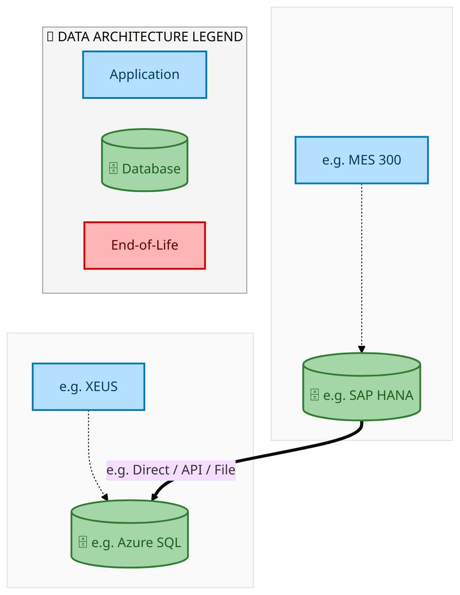
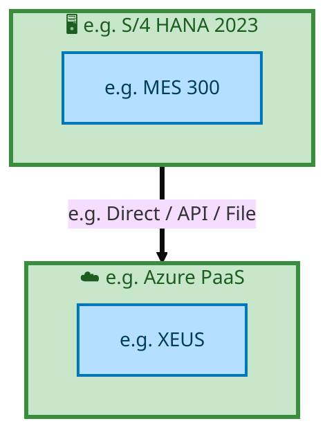

  
  <h1 style="font-size:36px; margin-top:24px;">E2E-67 — E2E-67</h1>
  <h2 style="font-size:24px;">Architecture Document (TOGAF BDAT)</h2>
  
End-to-End Integrated Processes (E2E) Tower 
  Capability E2E-67 · Forecast to Stock

  
IAO Program · Release 2 
  Generated: March 2026 
  Sajiv Francis

  
IAO Architecture Pipeline — Intel Confidential

Page 1<a href="#toc">↑ Back to TOC</a>E2E-67 — E2E-67

## Table of Contents

1. [Executive Summary](#1-executive-summary)
2. [Business Context & Objectives](#2-business-context--objectives)
   - 2.1 [Classification](#21-classification)
   - 2.2 [Business Drivers](#22-business-drivers)
   - 2.3 [Success Criteria](#23-success-criteria)
   - 2.4 [Companion Documents](#24-companion-documents)
3. [Business Architecture (TOGAF "B")](#3-business-architecture-togaf-b)
   - 3.1 [Business Process Overview](#31-business-process-overview)
   - 3.2 [Business Process Diagrams](#32-business-process-diagrams)
   - 3.3 [Business Roles & Responsibilities](#33-business-roles--responsibilities)
4. [Data Architecture (TOGAF "D")](#4-data-architecture-togaf-d)
   - 4.1 [Data Entities & Ownership](#41-data-entities--ownership)
   - 4.2 [Data Flow Diagrams](#42-data-flow-diagrams)
   - 4.3 [Data Lineage](#43-data-lineage)
   - 4.4 [RICEFW Data Objects](#44-ricefw-data-objects)
   - 4.5 [Data Governance & Quality](#45-data-governance--quality)
5. [Application Architecture (TOGAF "A")](#5-application-architecture-togaf-a)
   - 5.1 [Current-State Application Landscape](#51-current-state--current-state-application-landscape)
   - 5.2 [Future-State Application Landscape](#52-future-state--future-state-application-landscape)
   - 5.3 [Change Impact Summary](#53-change-impact-summary)
   - 5.4 [Component Overview](#54-component-overview)
   - 5.5 [RICEFW Inventory](#55-ricefw-inventory)
   - 5.6 [Integration Patterns](#56-integration-patterns)
6. [Technology Architecture (TOGAF "T")](#6-technology-architecture-togaf-t)
   - 6.1 [Platform & Infrastructure](#61-platform--infrastructure)
   - 6.2 [SAP Development Object Status](#62-sap-development-object-status)
   - 6.3 [NFRs & Design Principles](#63-nfrs--design-principles)
   - 6.4 [Security & Governance](#64-security--governance)
7. [Project Context](#7-project-context)
   - 7.1 [Project Roadmap & Go-Live Plan](#71-project-roadmap--go-live-plan)
   - 7.2 [RAID Log](#72-raid-log)
   - 7.3 [Recommendations & Next Steps](#73-recommendations--next-steps)

Page 2<a href="#toc">↑ Back to TOC</a>E2E-67 — E2E-67

## 1. Executive Summary

This Architecture Document defines the **Business, Data, Application, and Technology** (BDAT) architecture for **E2E-67 E2E-67** within the IAO program. It includes 4 BPMN process diagram(s) in Section 3.
| Dimension | Value |
|-----------|-------|
| **Tower** | End-to-End Integrated Processes (E2E) |
| **Process Group** | Forecast to Stock |
| **Capability** | E2E-67 - E2E-67 |
| **Release** | Release 2 |
| **Total Systems** | 2 |
| **System Status** | 0 Deployed, 0 Developing, 0 EOL, 2 Pending IAPM |
| **RICEFW Objects** | Pending — Smartsheet Object Tracker API integration |
**Change Summary**: 0 new flow chains, 0 removed, 0 modified, 1 unchanged between Current-State and Future-State states.

> All system nodes in architecture diagrams are **IAPM-linked** — click any node to open its IAPM page. Diagrams require `securityLevel: 'loose'` for click events.

Page 3<a href="#toc">↑ Back to TOC</a>E2E-67 — E2E-67

## 2. Business Context & Objectives

### 2.1 Classification

| Level | Value |
|-------|-------|
| **L0 Tower** | End-to-End Integrated Processes |
| **L1 Process** | Forecast to Stock |
| **L2 Capability** | E2E-67 - E2E-67 |

### 2.2 Business Drivers

| # | Driver | Description | Strategic Alignment | Priority |
|---|--------|-------------|---------------------|----------|
| 1 | End-to-End Process Integration | Enable cross-tower integrated processes spanning procurement, manufacturing, and fulfillment | IDM 2.0 Process Excellence | High |
| 2 | Intel Foundry Business Enablement | Stand up foundry-specific business processes for external customer engagement | Intel Foundry Services | High |
| 3 | Process Visibility & Monitoring | Provide end-to-end process visibility across tower boundaries with integrated monitoring | Operational Excellence | Medium |
| 4 | E2E-67 Process Migration | Migrate E2E-67 business processes and 2 integrated systems from legacy to S/4 HANA target architecture | IDM 2.0 Cross-Functional / End-to-End | High |

Page 4<a href="#toc">↑ Back to TOC</a>E2E-67 — E2E-67

### 2.3 Success Criteria

| Metric | Target | Measure | Baseline | Owner |
|--------|--------|---------|----------|-------|
| E2E Process Cycle Time | Per process SLA | End-to-end transaction completion within defined SLA per process | Varies by process | E2E Process Owner |
| Cross-Tower Integration Success | > 99% | Transactions completing across tower boundaries without manual intervention | 92% (current) | Integration Lead |
| Process Exception Rate | < 2% | Transactions requiring manual exception handling | 8% (current) | Operations Manager |
| E2E-67 Migration Completeness | 100% flow chains validated | All 1 flow chains verified in target state | 0% (pre-migration) | Tower Architect |

### 2.4 Companion Documents

| Document | Description |
|----------|-------------|
| **Business Architecture** | Included in this document (Section 3) — process flows from BPMN diagrams |
| **This Document** | Full BDAT Architecture — Business + Data + Application + Technology |

Page 5<a href="#toc">↑ Back to TOC</a>E2E-67 — E2E-67

## 3. Business Architecture (TOGAF "B")

### 3.1 Business Process Overview

This capability includes **4 business process(es)** modeled in BPMN 2.0, covering the end-to-end workflow for E2E-67 E2E-67.

| # | Step ID | Process Name | Lanes | Tasks | Gateways |
|---|---------|--------------|-------|-------|----------|
| 1 | E2E-67A_R3_Inventory_Movement_from_SLOC_to_SLOC_(IM_to_IM)_–_SAME_LE_-_One_Step_Transfer | E2E-67A_R3_Inventory_Movement_from_SLOC_to_SLOC_(IM_to_IM)_–_SAME_LE_-_One_Step_Transfer | SAP S/4 Intel Foundry | 2 | 0 |
| 2 | E2E-67B_R3_Inventory_Movement_from_SLOC_to_SLOC_(IM_to_IM)_–_SAME_LE_-_Two_Step_Transfer | E2E-67B_R3_Inventory_Movement_from_SLOC_to_SLOC_(IM_to_IM)_–_SAME_LE_-_Two_Step_Transfer | SAP S/4 Intel Foundry | 3 | 0 |
| 3 | E2E-67C_R3_Inventory_Movement_from_SLOC_to_SLOC_(EWM_to_IM)_using_MIGO_–_SAME_LE | E2E-67C_R3_Inventory_Movement_from_SLOC_to_SLOC_(EWM_to_IM)_using_MIGO_–_SAME_LE | EWM, SAP S/4 IM  | 7 | 0 |
| 4 | E2E-67D_R3_Inventory_Movement_from_SLOC_to_SLOC_(IM_to_EWM)_using_MIGO_–_SAME_LE | E2E-67D_R3_Inventory_Movement_from_SLOC_to_SLOC_(IM_to_EWM)_using_MIGO_–_SAME_LE | EWM, SAP S/4 IM  | 7 | 0 |

### 3.2 Business Process Diagrams

Page 6<a href="#toc">↑ Back to TOC</a>E2E-67 — E2E-67

#### BUSINESS ARCHITECTURE — 3.2.1 E2E-67A_R3_Inventory_Movement_from_SLOC_to_SLOC_(IM_to_IM)_–_SAME_LE_-_One_Step_Transfer — E2E-67A_R3_Inventory_Movement_from_SLOC_to_SLOC_(IM_to_IM)_–_SAME_LE_-_One_Step_Transfer

**Swim Lanes**: SAP S/4 Intel Foundry | **Tasks**: 2 | **Gateways**: 0

> **Legend**: ● Start · ● End · User Task · Service Task · ◇ Gateway · Sub-Process

<a href="https://mermaid.live/edit#pako:eNqlVMuO2jAU_RUrI5RWCmqehGZRCQKpRuqoSEzbxTALk1wHaxw7sg0DRfx7HR7hMWJVL6Lc43vO8b1-bK1cFGAlVqezpZzqBG1tvYAK7ATZc6zAdtAB-I0lxXMGym5yiOB6Sv_u07ywXjdpDZbhirJNg06hFIB-PTpoYIjMQQpz1VUgKbEdu5a0wnKTCiZkk_0AfeKSvdtxaihkAfKc4Lqxl0eGyiiHMxzEYRxmDU9BLnhxJUoi0ie5vWsWx8R7vsBS75e_VPCE139ooRcmJpgpMDkLXbEfeA6sqVHLZYPlS7k6NYOqxoebhk1rnFNeGjx0DSQxfztDkbvboV2nM-OtKXoezTgyI2dYqREQpLSBxyuNCGUseQjTQRa5jtJSvEHy4I_jUeA7eVNJYkp3naa53Xeg5UInc8GKY2r3vakh8eu1I9eJ7zpyY743XsCLs1Pa8_t-v3Uaxl7qpScnQsh_OZm-ymes3o5e4yDzs1Hr5UW9KHU_6p3KHIXxwLvtE8gVzeFCNMuyYHxu1bgXee590WEW9Nz0RrTEGt7x5iz4NQ1bwSyKMy--K3jwu13lcj6RIj8JBuMoi1rBeOhlA_-uYDjwwv5xhUanlLheoOlggqZfQvTINTCUiSUv5OaQ0wzuvbzMLIITgru5KFEqwZSEnh6__0TP5jQqAnJmvb5eMPxrxgQkEbJCk8VG0Rwz9CRW5pZzjQRB34Uo1A0_-NTya2Z6d-VlfmhZgoTCsD5fsMIzS2lRf7RTrR9KRVUz0Jca5uQefniAut1vpu5j6B1C_xj6hzC82JYm5-LwXM34d2eC9mJeweHxDlmOVYGsMC2sZGvt30XzdhZA8JJpa-dYeKnFdMNzK9m_H9ayLszGjCg221odwN0_MY2-og==" title="Edit in Mermaid Live">&#9998; Edit in Mermaid Live</a>

#### BUSINESS ARCHITECTURE — 3.2.2 E2E-67B_R3_Inventory_Movement_from_SLOC_to_SLOC_(IM_to_IM)_–_SAME_LE_-_Two_Step_Transfer — E2E-67B_R3_Inventory_Movement_from_SLOC_to_SLOC_(IM_to_IM)_–_SAME_LE_-_Two_Step_Transfer

**Swim Lanes**: SAP S/4 Intel Foundry | **Tasks**: 3 | **Gateways**: 0

> **Legend**: ● Start · ● End · User Task · Service Task · ◇ Gateway · Sub-Process

<a href="https://mermaid.live/edit#pako:eNqlVF1v2jAU_StWqopNClo-G5aHSRBIhdSqaHTbQ9sHk1yDVceObIePIf77HEIJsPG0PES5x_ecc--N7a2ViRys2Lq93VJOdYy2Hb2AAjox6sywgo6NGuAnlhTPGKhOnUME11P6e5_mBuW6TquxFBeUbWp0CnMB6MfYRn1DZDZSmKuuAklJx-6UkhZYbhLBhKyzb6BHHLJ3OywNhMxBtgmOE7lZaKiMcmhhPwqiIK15CjLB8zNREpIeyTq7ujgmVtkCS70vv1LwiNe_aK4XJiaYKTA5C12wBzwDVveoZVVjWSWXH8OgqvbhZmDTEmeUzw0eOAaSmL-3UOjsdmh3e_vKj6boefjKkXkyhpUaAkFKG3i01IhQxuKbIOmnoWMrLcU7xDfeKBr6np3VncSmdceuh9tdAZ0vdDwTLD-kdld1D7FXrm25jj3HlhvzvvACnrdOyZ3X83pHp0HkJm7y4UQI-S8nM1f5jNX7wWvkp146PHq54V2YOH_rfbQ5DKK-ezknkEuawYlomqb-qB3V6C50neuig9S_c5IL0TnWsMKbVvBrEhwF0zBK3eiqYON3WWU1m0iRfQj6ozANj4LRwE373lXBoO8GvUOFRmcucblA0_4ETb8EaMw1MJSKiudy0-TUD3dfXl4tgmOCu5mYo0SCaQk9ju-f0LPZjYqARJSjsVIVoOnDU_Jqvb2d8L1z_gQkEbJAk8VG0Qwz9CiW5sxzjQRB90Lk6oLvX_CF0o27Fm0BRIrCVNE9AgPMMM8AYY2-QwZ0aQ7Mv6oLPh3VS2b-03lfY3NPUdNublifT1hhy1JalC0hEUXJ4IxgjkTzwQPU7X4zAz2EbhN6h9BrQv8Q-k0Ynvz-mnKySc9WvKsr_tWV4Hg1nMHh4RRbtlWALDDNrXhr7W9mc3vnQHDFtLWzLVxpMd3wzIr3N5hVlbmZ1ZBis7GKBtz9AW6u5t0=" title="Edit in Mermaid Live">&#9998; Edit in Mermaid Live</a>

Page 7<a href="#toc">↑ Back to TOC</a>E2E-67 — E2E-67

#### BUSINESS ARCHITECTURE — 3.2.3 E2E-67C_R3_Inventory_Movement_from_SLOC_to_SLOC_(EWM_to_IM)_using_MIGO_–_SAME_LE — E2E-67C_R3_Inventory_Movement_from_SLOC_to_SLOC_(EWM_to_IM)_using_MIGO_–_SAME_LE

**Swim Lanes**: EWM · SAP S/4 IM  | **Tasks**: 7 | **Gateways**: 0

> **Legend**: ● Start · ● End · User Task · Service Task · ◇ Gateway · Sub-Process

<a href="https://mermaid.live/edit#pako:eNqlVV1vmzAU_SsWVZVNIhqfIeVhUkrCFGlVq6XdHtY9OHCdWCU2sk3arMp_nx1oSOjYy3hAOvfec869Vwa_WhnPwYqty8tXyqiK0etArWEDgxgNlljCwEZ14DsWFC8LkANTQzhTC_r7UOYG5YspM7EUb2ixM9EFrDigh7mNJppY2EhiJocSBCUDe1AKusFil_CCC1N9AWPikINbk7rmIgfRFjhO5GahphaUQRv2oyAKUsOTkHGWn4mSkIxJNtib5gr-nK2xUIf2Kwk3-OUHzdVaY4ILCbpmrTbFV7yEwsyoRGViWSW2b8ug0vgwvbBFiTPKVjoeODokMHtqQ6Gz36P95eUjO5qi--kjQ_rJCizlFAiSSodnW4UILYr4IkgmaejYUgn-BPGFN4umvmdnZpJYj-7YZrnDZ6CrtYqXvMib0uGzmSH2yhdbvMSeY4udfne8gOWtUzLyxt746HQduYmbvDkRQv7LSe9V3GP51HjN_NRLp0cvNxyFifNe723MaRBN3O6eQGxpBieiaZr6s3ZVs1HoOv2i16k_cpKO6AoreMa7VvAqCY6CaRilbtQrWPt1u6yWd4Jnb4L-LEzDo2B07aYTr1cwmLjBuOlQ66wELtdo9uOmjpiHhT9_PloExwQPM75CU6q16LJSgG4rteQVy9EUCroFsUO35rN5tH79OuGPzvmJAL0AhDUt4YxQsUF3NHvSp7fDi855dyAI18VfOM8lmktZQUvQh6wzw2JyhxafAjS_QSea7l97uZl_uUX3-juSBASiTJM6vXh_5b2f_x3RPyc-lLkhztkWmOJi16kO_jXyN8iAlgphZYZaFDzrsMcfjuyy0Adsrn-p9N18mvTxhHTVkqTiZcer6QDylnVcNRuj4fCz3mkD3Rp6DfRqGDYwrOGogaMaRg2Maug30K9h0MCghlcn597YnXydZxmvN-P3ZoLeTNibGfVmot7M-PjvPQtfNb9Jy7Y2IDaY5lb8ah2uPn095kBwVShrb1u4UnyxY5kVH64IqzocqCnF-tRv6uD-D0gzUM0=" title="Edit in Mermaid Live">&#9998; Edit in Mermaid Live</a>

Page 8<a href="#toc">↑ Back to TOC</a>E2E-67 — E2E-67

#### BUSINESS ARCHITECTURE — 3.2.4 E2E-67D_R3_Inventory_Movement_from_SLOC_to_SLOC_(IM_to_EWM)_using_MIGO_–_SAME_LE — E2E-67D_R3_Inventory_Movement_from_SLOC_to_SLOC_(IM_to_EWM)_using_MIGO_–_SAME_LE

**Swim Lanes**: EWM · SAP S/4 IM  | **Tasks**: 7 | **Gateways**: 0

> **Legend**: ● Start · ● End · User Task · Service Task · ◇ Gateway · Sub-Process

<a href="https://mermaid.live/edit#pako:eNqlVV1v4joQ_StWqoquFLT5JDQPV6KBrJBu1erSvfuw3QeTjMGqY0e2Q8tW_Pdrk5QAvTwtD0hnZs6ZmSPbeXcKUYKTOtfX75RTnaL3gV5DBYMUDZZYwcBFbeBfLCleMlADW0ME1wv6e1_mR_WbLbOxHFeUbW10ASsB6PvcRRNDZC5SmKuhAknJwB3UklZYbjPBhLTVVzAmHtl361J3QpYg-wLPS_wiNlRGOfThMImSKLc8BYXg5YkoicmYFIOdHY6J12KNpd6P3yi4x28_aKnXBhPMFJiata7Y33gJzO6oZWNjRSM3H2ZQZftwY9iixgXlKxOPPBOSmL_0odjb7dDu-vqZH5qip-kzR-ZXMKzUFAhS2oRnG40IZSy9irJJHnuu0lK8QHoVzJJpGLiF3SQ1q3uuNXf4CnS11ulSsLIrHb7aHdKgfnPlWxp4rtya_7NewMu-UzYKxsH40Oku8TM_--hECPmjTsZX-YTVS9drFuZBPj308uNRnHmf9T7WnEbJxD_3CeSGFnAkmud5OOutmo1i37ssepeHIy87E11hDa942wveZtFBMI-T3E8uCrb9zqdslo9SFB-C4SzO44Ngcufnk-CiYDTxo3E3odFZSVyv0ezHfRuxPx7__PnsEJwSPCzECk2p0aLLRgN6aPRSNLxEU2B0A3KLHuy1QVrsJZxfv45kRqcymQTjA8KGnQlOqKzQIy5ezCFG2tp9YxS-nEkkpxLfhCgVmivVQF9ojtvZNovJI1p8jdD8Hh1p-UaqFfgHCqC1RljbEiZwoangRvGoOvjf4e_n3x7Qk7l_6sA5JoWnpO91aUlzvgGuhdyeVUen1Z-9vZl_MmR8c-DUzBypuXlE6elkBKQhfTki3fYkpUXd2Sg7FwpR1Qw0lD3rYCkfo-HwL-NGB6MWxh0ctTDpYNDCqINhC7srxuMWjjqYtDDsoN_C26OTbgWP7uNJJryYiS5m4ouZ0cVMcjEzPrypJ-Hb7vlzXKcCWWFaOum7s_-kmc9eCQQ3TDs718GNFostL5x0__Q7zf6wTCk2Z7hqg7v_ANOZQrE=" title="Edit in Mermaid Live">&#9998; Edit in Mermaid Live</a>

Page 9<a href="#toc">↑ Back to TOC</a>E2E-67 — E2E-67

### 3.3 Business Roles & Responsibilities

| Role / Lane | Processes Involved | Description |
|------------|-------------------|-------------|
| SAP S/4 Intel Foundry | E2E-67A_R3_Inventory_Movement_from_SLOC_to_SLOC_(IM_to_IM)_–_SAME_LE_-_One_Step_Transfer, E2E-67B_R3_Inventory_Movement_from_SLOC_to_SLOC_(IM_to_IM)_–_SAME_LE_-_Two_Step_Transfer,  | |
| EWM | E2E-67C_R3_Inventory_Movement_from_SLOC_to_SLOC_(EWM_to_IM)_using_MIGO_–_SAME_LE, E2E-67D_R3_Inventory_Movement_from_SLOC_to_SLOC_(IM_to_EWM)_using_MIGO_–_SAME_LE | |
| SAP S/4 IM  | E2E-67C_R3_Inventory_Movement_from_SLOC_to_SLOC_(EWM_to_IM)_using_MIGO_–_SAME_LE, E2E-67D_R3_Inventory_Movement_from_SLOC_to_SLOC_(IM_to_EWM)_using_MIGO_–_SAME_LE | |

Page 10<a href="#toc">↑ Back to TOC</a>E2E-67 — E2E-67

## 4. Data Architecture (TOGAF "D")

### 4.1 Data Entities & Ownership

| # | Data Entity | Source System | Target System | Data Owner | Classification | Volume | Master/Transaction |
|---|-------------|---------------|---------------|------------|----------------|--------|-------------------|
| 1 | e.g. Cost Element | e.g. MES 300 | e.g. XEUS | Data steward | e.g. Intel Confidential | e.g. 10K rows/day | Master / Transaction |

Page 11<a href="#toc">↑ Back to TOC</a>E2E-67 — E2E-67

### 4.2 Data Flow Diagrams

> **DATA ARCHITECTURE** — Database-to-database data flows. Applications (blue) sit above their hosting databases (green cylinders). Thick arrows show data movement between databases.

#### 4.2.1 Current-State — Current-State Data Flows

<a href="https://mermaid.live/edit#pako:eNqdlY9P2kAUx_-VyxnCloCrYGE20eRoyzSpxlncltilOdpXuHi0TXtVEPnfd9cCbkid8S5puPfj-14_rzmWOEhCwAZuNJYsZsJAy6aYwgyaBmqOaQ7NFmrmEBQZEwsHHoArB0-SylOG_qAZo2MOeVNlR0ksXPZUChzp6VyFKduQzhhfKKsLkwTQ7UULEZnImysVwZPHYEozUWoUOVzS-U8Wiqk8R5TnIGOmYsYdOgauComsULZYdu-mNGDxRBq7ujRlNL5_MR3rqxVaNRpevC2BRgMvRnIFnOa5BRGiaTpI5ihinBsHA90aDoetXGTJPRgHmtbvD3rrY_tR9WR00nkrSHiSKXfX0nf1wrG54Gs5ols90t_Kdey-1e3Uyh0NdLuj7chBwl_aGw4H-kDf6pmmJletXq-n3F5cKebFeJLRdIrsjt3rmxYxHR_8iU-eigx897tz52Hk4d9VtFohyyAQLIm30NTapJMy-5d968pEOJwcIvVbChiGUTF9nWPtVPzkYa8Iv3ZD-QyDY6-IQJOvrMTKICSDPPxZSZZY3-oCtQ_bZ3WVqkSIwzULseBQC2IDm6i9hW1rav8L-yid_w-vS679c3JFPkT30nb9rqZtAMsjksf3MN6WfQOxjEEq5j2E153sg7wp9R7Gm9gPId5fFp2enj2vAVklU_QFkesL-RwyDh5-rv8odkbnwES2f_cXsSDUkEVGBJEb8_xiZJuj2xsbOfY3-8qqmaZz82J1fDV3kqacBVR594_O8a2aOVlUUHUT7x-R49tS3o7DdhK1HRZBJV9dGXvHUb3hhr6u9pb-ycnJK_S4hWeQzSgLsbHE5Y0v_y9CiGjBBV61MC1E4i7iABvlpYyLNKQCLEYl0VllXP0Bl6r1lQ==" title="Edit in Mermaid Live">&#9998; Edit in Mermaid Live</a>

Page 12<a href="#toc">↑ Back to TOC</a>E2E-67 — E2E-67

#### 4.2.2 Future-State — Future-State Data Flows

<a href="https://mermaid.live/edit#pako:eNqdlY9P2kAUx_-VyxnCloCrYGE20eSg7TSpxlncltilOdpXuHi0TXtVEPnfd9dC3RCc8S5puPfj-14_rzmWOEhCwAZuNJYsZsJAy6aYwgyaBmqOaQ7NFmrmEBQZEwsHHoArB0-SylOG_qAZo2MOeVNlR0ksXPZUChzp6VyFKZtNZ4wvlNWFSQLo9qKFiEzkzZWK4MljMKWZKDWKHC7p_CcLxVSeI8pzkDFTMeMOHQNXhURWKFssu3dTGrB4Io1dXZoyGt-_mI711QqtGg0vrkug0cCLkVwBp3luQoRomg6SOYoY58bBQDdt227lIkvuwTjQtH5_0Fsf24-qJ6OTzltBwpNMubumvq0XjocLvpYjutkj_VquY_XNbmev3NFAtzralhwk_KU92x7oA73WGw41ufbq9XrK7cWVYl6MJxlNp8jqWL2-bZKh44M_8clTkYHvfnfuPIw8_LuKVitkGQSCJXENTa1NOimzf1m3rkyEw8khUr-lgGEYFdPXOeZWxU8e9orwazeUzzA49ooINPnKSqwMQjLIw5-VZIn1rS5Q-7B9tq9SlQhxuGYhFhz2gtjAJmrXsC1N7X9hH6Xz_-F1ybV_Tq7Ih-heWq7f1bQNYHlE8vgexnXZNxDLGKRi3kN43ckuyJtS72G8if0Q4t1l0enp2fMakFkyRV8Qub6QT5tx8PDz_o9ia3QOTGT7d38RC0INmWREELkZnl-MrOHo9sZCjvXNujL3TNO5ebE6vpo7SVPOAqq8u0fn-OaeOZlUUHUT7x6R41tS3orDdhK1HRZBJV9dGTvHUb3hhr6udk3_5OTkFXrcwjPIZpSF2Fji8saX_xchRLTgAq9amBYicRdxgI3yUsZFGlIBJqOS6Kwyrv4AE171vw==" title="Edit in Mermaid Live">&#9998; Edit in Mermaid Live</a>

Page 13<a href="#toc">↑ Back to TOC</a>E2E-67 — E2E-67

### 4.3 Data Lineage

| # | Source System | Source Schema/Object | Target System | Target Schema/Object | Transformation |
|---|-------------|---------------------|---------------|---------------------|---------------|
| 1 | e.g. MES 300 | e.g. CKMLHD table | e.g. XEUS | e.g. dbo.CostElements | Lineage notes |

### 4.4 RICEFW Data Objects

Reports and Conversions for this capability will be populated from the Smartsheet Object Tracker via automated API extraction.

| Object ID | Type | Description | Status | Source | Target | Complexity |
|-----------|------|-------------|--------|--------|--------|-----------|
| E2E-67-R001 | Report | E2E-67 operational report | Planned | SAP S/4HANA | Analytics | Medium |
| E2E-67-C001 | Conversion | Legacy data migration for E2E-67 | Planned | Legacy ERP | SAP S/4HANA | High |

> *Pending: Smartsheet API integration to auto-populate live RICEFW data (see Build Requirements).*

### 4.5 Data Governance & Quality

| Concern | Approach |
|---------|----------|
| Data Ownership | Per-entity owners listed in Section 3.1 |
| Data Classification | Financial data classified as Intel Confidential |
| Data Retention | Per Intel corporate retention policies |
| Data Quality | Validated at source; reconciliation at target |

Page 14<a href="#toc">↑ Back to TOC</a>E2E-67 — E2E-67

## 5. Application Architecture (TOGAF "A")

### 5.1 Current-State — Current-State Application Landscape

#### Overview

The Current-State architecture represents the **current / legacy** landscape for E2E-67.This view is generated from `CurrentFlows.xlsx` (1 flow hops across 1 flow chains).

#### APPLICATION ARCHITECTURE — Architecture Diagram (ArchiMate-Inspired)

> **Click any system node** to open its IAPM application page.
> **Legend**: Deployed · Developing · End-of-Life · No IAPM Match

<a href="https://mermaid.live/edit#pako:eNqVVdtu4jAQ_RUrFeIF2vTCpVGFFEhYsQpt1fSyq2UVmXgCVk0S2U5bSvn3tRMKKbSia6SgzJw545yZsRdGmBAwLKNSWdCYSgstqnIKM6haqDrGAqo1VBUQZpzKuQdPwLSDJUnhyaH3mFM8ZiCqOjpKYunT15zguJm-aJi29fGMsrm2-jBJAN0NashWgayGBI5FXQCnUXWp0Sx5DqeYy5wvEzDELw-UyKl6jzAToDBTOWMeHgPTSSXPtC1WX-KnOKTxRBnPTGXiOH7cmBrmcomWlcooXqdAt91RjNSqVFC9rjYUTukQS6jTWKSUA0FCzhmgkGEhQChMAc_fHYjQOBM0BiFQviLKmHXQV6vbqAnJk0ewDrrtdtPsrl7rz_pLrJP0pRYmLOHWgWmaW5w4TdFmFZzdhmZdc5pmq9Vt_gcnwRLvcjrtPZzHHzjffQQLJR7Hc6UpamxlmlFCGDxjDmVFnKa9UcRtNfsbtm_sHhK2o4jWuKRyr2ea-zgLVpGNJxynU2R7f0bGKCPtU6Ke5LSB7Otrb9CzbwdXl8izf7s3I-NvEaQXUQ0RSprEyLvZWN0Tt9nqBRBMgqHrB6emWWYNoYngcHKIlA8pnyK0LEtV-FOCX-6d_2m0dnwZOnzIg-3XjEPgA3-iIQTdTHz4uuNWwZSj0AqFFKqg3VRtm91xc_ZeImTgMjXvseyUtxieFcQagFaAizE_6lzQTuHw79ERGjhJqP5--leXF0e0U2TVXVnkg5i812dXUDV2nbeRkbM5eREUk309UM8-ZTAy3vYoUSb-CqOTbNdCb2nVNPkx0PVKI9439414OdReh5rfmeSdZvVgojT60BzERJ77w710vtGlXqB6e7u17DRlNMQa_ElzecHwYbuFhps2-bJtvMBxtzvE0cePG0t1i2xXvghxr4phPGmSMwUk9SSqezRapVHzX2qTjaiFKO_CNvRvLez5-fnOWWbUjBnwGabEsBZGfnupu49AhDMmjWXNwJlM_HkcGlZ-qRhZqjYKDsWqCLPCuPwHMT09kQ==" title="Edit in Mermaid Live">&#9998; Edit in Mermaid Live</a>

Page 15<a href="#toc">↑ Back to TOC</a>E2E-67 — E2E-67

#### Current-State Flow Narrative

| # | Flow Chain | Path | Interface | Freq |
|---|-----------|------|-----------|------|
| 1 | e.g. MES Route to ICOST | e.g. MES 300 → e.g. XEUS | e.g. Direct / API / File | e.g. Near Real-Time |

Page 16<a href="#toc">↑ Back to TOC</a>E2E-67 — E2E-67

### 5.2 Future-State — Future-State Application Landscape

#### Overview

The Future-State architecture represents the **target** landscape for E2E-67.This view is generated from `FutureFlows.xlsx` (1 flow hops across 1 flow chains).

#### APPLICATION ARCHITECTURE — Architecture Diagram (ArchiMate-Inspired)

> **Click any system node** to open its IAPM application page.
> **Legend**: Deployed · Developing · End-of-Life · No IAPM Match

<a href="https://mermaid.live/edit#pako:eNqVVdtu4jAQ_RUrFeIF2vTCpVGFFEhYsQpt1fSyq2UVmXgCVk0S2U5bSvn3tRMKKbSia6SgzJw545yZsRdGmBAwLKNSWdCYSgstqnIKM6haqDrGAqo1VBUQZpzKuQdPwLSDJUnhyaH3mFM8ZiCqOjpKYunT15zguJm-aJi29fGMsrm2-jBJAN0NashWgayGBI5FXQCnUXWp0Sx5DqeYy5wvEzDELw-UyKl6jzAToDBTOWMeHgPTSSXPtC1WX-KnOKTxRBnPTGXiOH7cmBrmcomWlcooXqdAt91RjNSqVFC9rjYUTukQS6jTWKSUA0FCzhmgkGEhQChMAc_fHYjQOBM0BiFQviLKmHXQV6vbqAnJk0ewDrrtdtPsrl7rz_pLrJP0pRYmLOHWgWmaW5w4TdFmFZzdhmZdc5pmq9Vt_gcnwRLvcjrtPZzHHzjffQQLJR7Hc6UpamxlmlFCGDxjDmVFnKa9UcRtNfsbtm_sHhK2o4jWuKRyr2ea-zgLVpGNJxynU2R7f0bGKCPtU6Ke5LSB7Otrb9CzbwdXl8izf7s3I-NvEaQXUQ0RSprEyLvZWN0Tt9nqBxBMgqHrB6emWWYNoYngcHKIlA8pnyK0LEtV-FOCX-6d_2m0dnwZOnzIg-3XjEPgA3-iIQTdTHz4uuNWwZSj0AqFFKqg3VRtm91xc_ZeImTgMjXvseyUtxieFcQagFaAizE_6lzQTuHw79ERGjhJqP5--leXF0e0U2TVXVnkg5i812dXUDV2nbeRkbM5eREUk309UM8-ZTAy3vYoUSb-CqOTbNdCb2nVNPkx0PVKI9439414OdReh5rfmeSdZvVgojT60BzERJ77w710vtGlXqB6e7u17DRlNMQa_ElzecHwYbuFhps2-bJtvMBxtzvE0cePG0t1i2xXvghxr4phPGmSMwUk9SSqezRapVHzX2qTjaiFKO_CNvRvLez5-fnOWWbUjBnwGabEsBZGfnupu49AhDMmjWXNwJlM_HkcGlZ-qRhZqjYKDsWqCLPCuPwHd649qQ==" title="Edit in Mermaid Live">&#9998; Edit in Mermaid Live</a>

Page 17<a href="#toc">↑ Back to TOC</a>E2E-67 — E2E-67

#### Future-State Flow Narrative

| # | Flow Chain | Path | Interface | Freq |
|---|-----------|------|-----------|------|
| 1 | e.g. MES Route to ICOST | e.g. MES 300 → e.g. XEUS | e.g. Direct / API / File | e.g. Near Real-Time |

Page 18<a href="#toc">↑ Back to TOC</a>E2E-67 — E2E-67

### 5.3 Change Impact Summary

| Change Type | Flow Chain | Detail |
|-------------|-----------|--------|
| **UNCHANGED** | e.g. MES Route to ICOST | No change |

**Totals**: 0 new - 0 removed - 0 modified - 1 unchanged

### 5.4 Component Overview

#### System Inventory

| System | IAPM ID | Status |
|--------|---------|--------|
| e.g. MES 300 | - | N/A |
| e.g. XEUS | - | N/A |

Page 19<a href="#toc">↑ Back to TOC</a>E2E-67 — E2E-67

### 5.5 RICEFW Inventory

RICEFW objects for this capability will be auto-populated from the Smartsheet S/4 Object Tracker.

| Object ID | Type | Description | Status | Source → Target | Middleware | Complexity |
|-----------|------|-------------|--------|----------------|-----------|-----------|
| E2E-67-I001 | Interface | E2E-67 inbound data interface | Planned | Legacy → SAP S/4HANA | MuleSoft / CPI | Medium |
| E2E-67-E001 | Enhancement | E2E-67 custom business logic | Planned | SAP S/4HANA | N/A | Medium |
| E2E-67-F001 | Form/Report | E2E-67 operational output | Planned | SAP S/4HANA | N/A | Low |

> *Pending: Smartsheet API integration to auto-populate live RICEFW inventory (see Build Requirements).*

Page 20<a href="#toc">↑ Back to TOC</a>E2E-67 — E2E-67

### 5.6 Integration Patterns

| # | Pattern | Flow Chain | Middleware | Protocol | Auth |
|---|---------|-----------|-----------|----------|------|
| 1 | e.g. Pub-Sub / P2P / ETL | e.g. MES Route to ICOST | e.g. Azure Service Bus | e.g. REST / RFC / SFTP | e.g. OAuth / NTLM / Cert |

Page 21<a href="#toc">↑ Back to TOC</a>E2E-67 — E2E-67

## 6. Technology Architecture (TOGAF "T")

### 6.1 Platform & Infrastructure

> **TECHNOLOGY / PLATFORM ARCHITECTURE** — Platforms (green) host applications (blue). Thick arrows show platform-to-platform integration flows.

#### 6.1.1 Current-State — Current-State Platform Architecture

<a href="https://mermaid.live/edit#pako:eNqtlGFvmzAQhv-K5SriS9YSCCRD6iQgoFVKp2is26QxIQeOxKqDEZg2acp_nw1tslZKpWrzB4t77_z49Vl4j1OeAXbwYLCnBRUO2mtiDRvQHKQtSQ3aEGk1pE1FxW4Od8BUgnHeZ7rS76SiZMmg1tTqnBciog8dYDQut6pMaSHZULZTagQrDujmaohcuZBprapg_D5dk0p0jKaGa7L9QTOxlnFOWA2yZi02bE6WwNRGomqUVkj3UUlSWqykONalVJHi9ihZetuidjCIi8MW6JsXF0iOlJG6nkGOSFl6fItyyphz5lmzMAyHtaj4LThnuj6ZePZT-OFeeXKMcjtMOeOVSpsz6zWvZEQcgf40sP2PB6A5nQam_xJoHoEjzwoM_RUQODvywtCzPOvA831djpMGbVul46In1s1yVZFyjQIjsCf-Yr5IIFkl7kNTQbIgJPoV47gxbH0UNznocufz1Tnq0kilY_y7B6mR0QpSQXmB5l-P6jPZ7cg_gxvF7DDqWwIcx-kb3q-BInvyJnYMThr7p2a-efgoGSef3S9uYuiG2Z0_m5qZnDNi_d2F6GKMVB1Sde9uxHUQJaauP_dChkiG72zHC6v_oSNv0S8vPz0-mZ1150MXyF1cyTmkDGL8ePKq8BBvoNoQmmFnj7s3Qr4wGeSkYQK3Q0wawaNdkWKn-41xU2ZEwIwSeT2bXmz_ALQPboI=" title="Edit in Mermaid Live">&#9998; Edit in Mermaid Live</a>

> **Legend**: 🖥️ Platform · 📦 Application · ⛔ End-of-Life · 📋 Unassigned

Page 22<a href="#toc">↑ Back to TOC</a>E2E-67 — E2E-67

#### 6.1.2 Future-State — Future-State Platform Architecture

<a href="https://mermaid.live/edit#pako:eNqtlGFvmzAQhv-K5SriC2sJBJIhdRIkoFVKp2is26QxIQeOxKqDEZg2acp_nw1tslZKpWrzB4t77_z49Vl4j1OeAXbxYLCnBRUu2mtiDRvQXKQtSQ2ajrQa0qaiYjeHO2AqwTjvM13pd1JRsmRQa2p1zgsR0YcOMByVW1WmtJBsKNspNYIVB3RzpSNPLmRaqyoYv0_XpBIdo6nhmmx_0EysZZwTVoOsWYsNm5MlMLWRqBqlFdJ9VJKUFispjgwpVaS4PUq20baoHQzi4rAF-ubHBZIjZaSuZ5AjUpY-36KcMuae-fYsDEO9FhW_BffMMMZj33kKP9wrT65ZbvWUM16ptDWzX_NKRsQROJ0EzvTjAWhNJoE1fQm0jsChbwem8QoInB15Yejbvn3gTaeGHCcNOo5Kx0VPrJvlqiLlGgVm4IzDxXyRQLJKvIemgmRBSPQrxnFjOsYwbnIw5M7nq3PUpZFKx_h3D1IjoxWkgvICzb8e1Wey15F_BjeK2WHUtwS4rts3vF8DRfbkTewYnDT2T8188_BRMko-e1-8xDRMqzt_NrEyOWfE_rsL0cUIqTqk6t7diOsgSizDeO6FDJEM39mOF1b_Q0feol9efnp8MjvrzocukLe4knNIGcT48eRVYR1voNoQmmF3j7s3Qr4wGeSkYQK3OiaN4NGuSLHb_ca4KTMiYEaJvJ5NL7Z_ANbgbpo=" title="Edit in Mermaid Live">&#9998; Edit in Mermaid Live</a>

> **Legend**: 🖥️ Platform · 📦 Application · ⛔ End-of-Life · 📋 Unassigned

#### Platform Inventory

| # | Platform | Type | Systems Using | Environment |
|---|----------|------|--------------|-------------|
| 1 | e.g. Azure PaaS | Cloud / SaaS | e.g. XEUS | DEV,QAS,PRD |
| 2 | e.g. S/4 HANA 2023 | On-Premise | e.g. MES 300 | DEV,QAS,PRD |

Page 23<a href="#toc">↑ Back to TOC</a>E2E-67 — E2E-67

### 6.2 SAP Development Object Status

**RICEFW Status Summary** — E2E Tower (0 objects)
*Data source: Smartsheet Object Tracker (cached 2026-03-27)*

| Status | Count | % |
|--------|------:|----:|
| **Total** | **0** | **100%** |

**RICEFW by Type:**

| Type | Count |
|------|------:|
| **Total** | **0** |

### 6.3 NFRs & Design Principles

| Category | Requirement | Target / SLA | Priority |
|----------|-------------|-------------|----------|
| Performance | Order/transaction processing within interactive SLA | < 3 seconds for online transactions | High |
| Availability | Business-critical systems available during extended hours | 99.9% (06:00-22:00 all time zones) | High |
| Scalability | Support seasonal and promotional volume spikes | Handle 2x baseline transaction volume | Medium |
| Recoverability | Customer-facing systems recover within business impact window | RPO < 30 min, RTO < 2 hours | High |
| Data Volume | Support transactional data growth from business expansion | 10M+ documents/year | Medium |
| Latency | Near-real-time integration for order status updates | < 30 seconds for status propagation | Medium |
| Concurrency | Support global user base across business functions | 300+ concurrent users | Medium |

### 6.4 Security & Governance

| Concern | Approach | Standard / Policy | Owner |
|---------|----------|--------------------|-------|
| Authentication | Single Sign-On (SSO) via Intel corporate Azure AD identity | Intel IT Security Policy - Identity Management | IT Security |
| Authorization | Role-based access control (RBAC) with SAP authorization objects | Intel SAP Security Standards - Role Design | SAP Security Team |
| Data Classification | All financial/operational data classified per Intel Data Classification Standard | Intel Data Classification Policy | Data Governance |
| Data Encryption (at rest) | AES-256 encryption for SAP HANA database and file storage | Intel Encryption Standard | Infrastructure Security |
| Data Encryption (in transit) | TLS 1.3 for all system-to-system and user-to-system communication | Intel Network Security Policy | Network Engineering |
| Network Segmentation | SAP systems in dedicated network zones with firewall controls | Intel Network Architecture Standard | Network Security |
| API Security | OAuth 2.0 / certificate-based authentication for all API integrations | Intel API Security Guidelines | Integration Architecture |
| Audit Logging | Comprehensive audit trail for all data changes and user actions (SAP Security Audit Log) | SOX Compliance / Intel Audit Policy | Internal Audit |
| Certificate Management | Automated certificate lifecycle management for system-to-system trust | Intel PKI Standard | Certificate Authority Team |
| Compliance | SOX controls, export control (EAR/ITAR) screening, data privacy (GDPR) | Intel Corporate Compliance Framework | Compliance Office |

Page 24<a href="#toc">↑ Back to TOC</a>E2E-67 — E2E-67

## 7. Project Context

### 7.1 Project Roadmap & Go-Live Plan

*No timeline data available for this capability.*

### 7.2 RAID Log

*Live data from Smartsheet Master RAID Log — extracted 2026-03-27*

**RAID Summary:** 15 open items (0 capability-specific, 15 tower-level), 56 closed

| Severity | Capability | Tower-Wide | Total Open |
|----------|----------:|-----------:|-----------:|
| P1 - High | 0 | 3 | 3 |
| P2 - Medium | 0 | 10 | 10 |
| P3 - Low | 0 | 2 | 2 |
| **Total** | **0** | **15** | **15** |

**Other E2E Tower RAID Items** (15 open):

| RAID ID | Type | Severity | Title | Status | Assigned To | Due Date |
|---------|------|----------|-------|--------|-------------|----------|
| 03591 | Risk | P1 - High | R3 E2E scenario execution | In Progress | Test Management | 2026-04-03 |
| 03681 | Risk | P1 - High | ITC Execution: Planning run availability - Prerequisite for ... | In Progress | E2E | 2026-03-27 |
| 03762 | Risk | P1 - High | FTS-IF (esp SCP) related test cases/sequencing are not accur... | In Progress | FTS IF | 2026-04-03 |
| 01733 | Risk | P2 - Medium | Tariffs impacts Item/BOM design which is impacting ERP/SCP (... | In Progress | E2E | 2026-03-06 |
| 03592 | Risk | P2 - Medium | Lack of Defined IMO Owner for CBA Mask Billing and Materials... | In Progress | E2E | 2026-03-27 |
| 03625 | Risk | P2 - Medium | Item/ BOM MC1 delta load | In Progress | Cutover | 2026-04-10 |
| 03628 | Risk | P2 - Medium | R3 Returns Rework Process Causing Finance Double Counting in... | In Progress | E2E | 2026-03-27 |
| 03642 | Issue | P2 - Medium | E2E Process with Anafi on order/invoice point.  Need IFS SC ... | In Progress | E2E | 2026-03-24 |
| 03736 | Action | P2 - Medium | Golden Data/Test Data Readiness | In Progress | Master Data | 2026-04-22 |
| 03743 | Issue | P2 - Medium | FD-Share with Entitlements -  Interface File Paths for MC1 | Roadblock / At Risk | PMO | 2026-03-20 |
| 03753 | Risk | P2 - Medium | PDF-SMH IF test cases are not available in JIRA | To Be Reviewed | B-Apps | 2026-03-25 |
| 03756 | Risk | P2 - Medium | LE101-1001 Operation Support Ownership for SIMS/Tester Front... | In Progress | E2E | 2026-04-24 |
| 03769 | Action | P2 - Medium | Need a Labs SPOC owner to define IP Labs enterprise and mate... | In Progress | E2E | 2026-04-17 |
| 03216 | Action | P3 - Low | Mask Expense vs. Invoice | In Progress | E2E | 2026-03-06 |
| 03315 | Risk | P3 - Low | BPMG – SCP L3/L4 flow standards | In Progress | Business Process Mgmt | 2026-03-27 |

### 7.3 Recommendations & Next Steps

| # | Category | Recommendation | Priority | Owner | Target Date | Status |
|---|----------|---------------|----------|-------|-------------|--------|
| 1 | Architecture | Complete extended flow attributes (Data Entity, Integration Pattern, Tech Platform) in Flows tab for full BDAT coverage | High | Tower Architect | 2026-Q2 | Open |
| 2 | Data | Define data ownership and classification for all 1 flow chains to satisfy Data Architecture (TOGAF D) requirements | Medium | Data Architect | 2026-Q3 | Open |
| 3 | Testing | Develop integration test scenarios covering all 1 flow chains for FUT/SIT readiness | High | Test Lead | 2026-Q3 | Open |
| 4 | Business Architecture | Review and validate Business Architecture process steps against latest Signavio/BIC process models | Medium | Business Analyst | 2026-Q2 | Open |
| 5 | Security | Complete security review for API integrations and data flows per Intel Security Architecture standards | Medium | Security Architect | 2026-Q3 | Open |

---
*E2E-67 — Architecture Document (TOGAF BDAT) · End-to-End Integrated Processes · Generated: March 2026*

