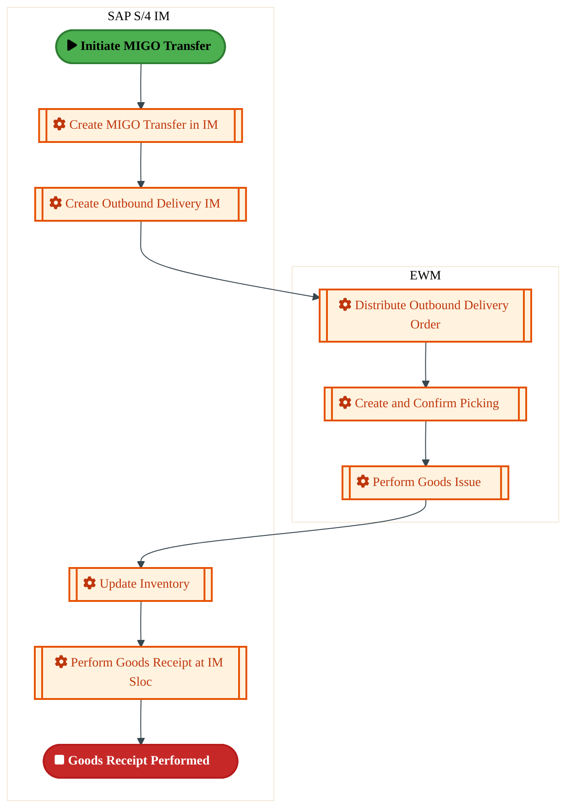
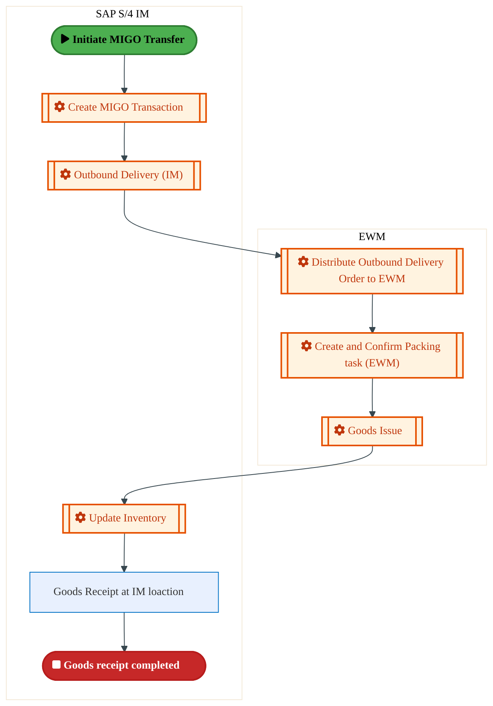
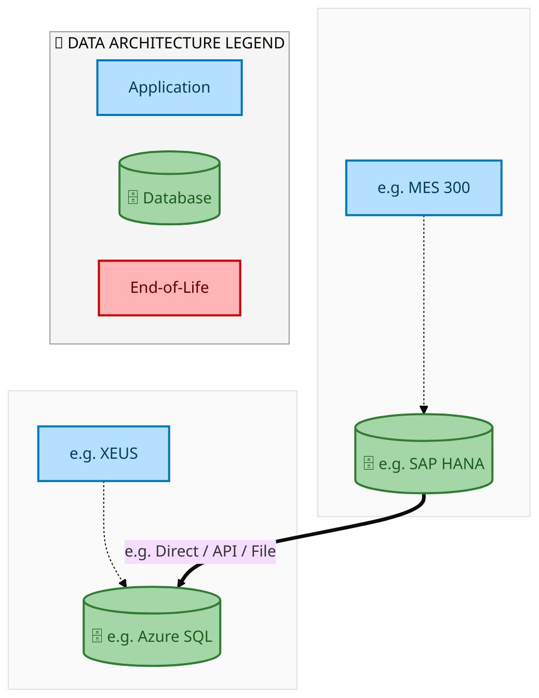
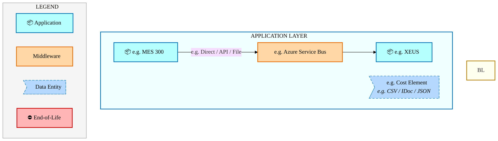
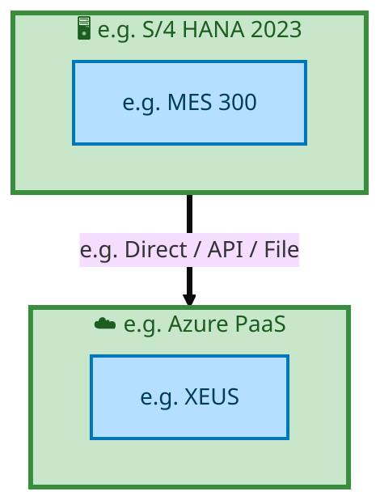

  <img src="data:image/svg+xml;base64,PHN2ZyB4bWxucz0iaHR0cDovL3d3dy53My5vcmcvMjAwMC9zdmciIHZpZXdCb3g9IjAgMCA4MDAgNDgwIiB3aWR0aD0iODAwIiBoZWlnaHQ9IjQ4MCI+DQogIDxkZWZzPg0KICAgIDxsaW5lYXJHcmFkaWVudCBpZD0iYmciIHgxPSIwJSIgeTE9IjAlIiB4Mj0iMTAwJSIgeTI9IjEwMCUiPg0KICAgICAgPHN0b3Agb2Zmc2V0PSIwJSIgc3R5bGU9InN0b3AtY29sb3I6IzAwNzFjNTtzdG9wLW9wYWNpdHk6MSIvPg0KICAgICAgPHN0b3Agb2Zmc2V0PSIxMDAlIiBzdHlsZT0ic3RvcC1jb2xvcjojMDBhZWVmO3N0b3Atb3BhY2l0eToxIi8+DQogICAgPC9saW5lYXJHcmFkaWVudD4NCiAgICA8bGluZWFyR3JhZGllbnQgaWQ9ImFjY2VudCIgeDE9IjAlIiB5MT0iMCUiIHgyPSIwJSIgeTI9IjEwMCUiPg0KICAgICAgPHN0b3Agb2Zmc2V0PSIwJSIgc3R5bGU9InN0b3AtY29sb3I6I2ZmZmZmZjtzdG9wLW9wYWNpdHk6MC4xNSIvPg0KICAgICAgPHN0b3Agb2Zmc2V0PSIxMDAlIiBzdHlsZT0ic3RvcC1jb2xvcjojZmZmZmZmO3N0b3Atb3BhY2l0eTowLjAyIi8+DQogICAgPC9saW5lYXJHcmFkaWVudD4NCiAgICA8cGF0dGVybiBpZD0iZ3JpZCIgd2lkdGg9IjQwIiBoZWlnaHQ9IjQwIiBwYXR0ZXJuVW5pdHM9InVzZXJTcGFjZU9uVXNlIj4NCiAgICAgIDxwYXRoIGQ9Ik0gNDAgMCBMIDAgMCAwIDQwIiBmaWxsPSJub25lIiBzdHJva2U9InJnYmEoMjU1LDI1NSwyNTUsMC4wNykiIHN0cm9rZS13aWR0aD0iMC41Ii8+DQogICAgPC9wYXR0ZXJuPg0KICA8L2RlZnM+DQoNCiAgPCEtLSBCYWNrZ3JvdW5kIC0tPg0KICA8cmVjdCB3aWR0aD0iODAwIiBoZWlnaHQ9IjQ4MCIgZmlsbD0idXJsKCNiZykiIHJ4PSI4Ii8+DQogIDxyZWN0IHdpZHRoPSI4MDAiIGhlaWdodD0iNDgwIiBmaWxsPSJ1cmwoI2dyaWQpIiByeD0iOCIvPg0KICA8cmVjdCB3aWR0aD0iODAwIiBoZWlnaHQ9IjQ4MCIgZmlsbD0idXJsKCNhY2NlbnQpIiByeD0iOCIvPg0KDQogIDwhLS0gRGVjb3JhdGl2ZSBjaXJjdWl0L2FyY2hpdGVjdHVyZSBsaW5lcyAtLT4NCiAgPGcgc3Ryb2tlPSJyZ2JhKDI1NSwyNTUsMjU1LDAuMTIpIiBzdHJva2Utd2lkdGg9IjEuNSIgZmlsbD0ibm9uZSI+DQogICAgPHBhdGggZD0iTSAwIDEwMCBMIDEyMCAxMDAgTCAxNjAgMTQwIEwgMjgwIDE0MCIvPg0KICAgIDxwYXRoIGQ9Ik0gMCAyNjAgTCA4MCAyNjAgTCAxMjAgMjIwIEwgMjAwIDIyMCBMIDI0MCAyNjAgTCAzNjAgMjYwIi8+DQogICAgPHBhdGggZD0iTSA1MjAgMTAwIEwgNjAwIDEwMCBMIDY0MCA2MCBMIDgwMCA2MCIvPg0KICAgIDxwYXRoIGQ9Ik0gNDQwIDM0MCBMIDU2MCAzNDAgTCA2MDAgMzAwIEwgNzIwIDMwMCBMIDc2MCAzNDAgTCA4MDAgMzQwIi8+DQogICAgPHBhdGggZD0iTSA2MDAgNDAwIEwgNjgwIDQwMCBMIDcyMCA0NDAiLz4NCiAgICA8cGF0aCBkPSJNIDAgNDAwIEwgNDAgNDAwIEwgODAgMzYwIi8+DQogICAgPHBhdGggZD0iTSAyMDAgNDIwIEwgMzIwIDQyMCBMIDM2MCAzODAgTCA0ODAgMzgwIi8+DQogICAgPHBhdGggZD0iTSA2NTAgNDQwIEwgNzUwIDQ0MCBMIDgwMCA0ODAiLz4NCiAgPC9nPg0KDQogIDwhLS0gRGVjb3JhdGl2ZSBub2RlcyAtLT4NCiAgPGcgZmlsbD0icmdiYSgyNTUsMjU1LDI1NSwwLjE4KSI+DQogICAgPGNpcmNsZSBjeD0iMTIwIiBjeT0iMTAwIiByPSI0Ii8+DQogICAgPGNpcmNsZSBjeD0iMjgwIiBjeT0iMTQwIiByPSI0Ii8+DQogICAgPGNpcmNsZSBjeD0iMjAwIiBjeT0iMjIwIiByPSI0Ii8+DQogICAgPGNpcmNsZSBjeD0iMzYwIiBjeT0iMjYwIiByPSI0Ii8+DQogICAgPGNpcmNsZSBjeD0iNjAwIiBjeT0iMTAwIiByPSI0Ii8+DQogICAgPGNpcmNsZSBjeD0iNzIwIiBjeT0iMzAwIiByPSI0Ii8+DQogICAgPGNpcmNsZSBjeD0iNTYwIiBjeT0iMzQwIiByPSI0Ii8+DQogICAgPGNpcmNsZSBjeD0iODAiIGN5PSIzNjAiIHI9IjQiLz4NCiAgICA8Y2lyY2xlIGN4PSI0ODAiIGN5PSIzODAiIHI9IjQiLz4NCiAgICA8Y2lyY2xlIGN4PSIzMjAiIGN5PSI0MjAiIHI9IjQiLz4NCiAgPC9nPg0KDQogIDwhLS0gVE9HQUYgQkRBVCBib3hlcyAtLT4NCiAgPGcgZm9udC1mYW1pbHk9IlNlZ29lIFVJLCBBcmlhbCwgc2Fucy1zZXJpZiIgZm9udC1zaXplPSIxNCIgZm9udC13ZWlnaHQ9IjYwMCI+DQogICAgPCEtLSBCIC0tPg0KICAgIDxyZWN0IHg9IjE1MCIgeT0iMTQwIiB3aWR0aD0iMTIwIiBoZWlnaHQ9IjQwIiByeD0iNSIgZmlsbD0icmdiYSgyNTUsMjU1LDI1NSwwLjE4KSIgc3Ryb2tlPSJyZ2JhKDI1NSwyNTUsMjU1LDAuMykiIHN0cm9rZS13aWR0aD0iMSIvPg0KICAgIDx0ZXh0IHg9IjIxMCIgeT0iMTY1IiB0ZXh0LWFuY2hvcj0ibWlkZGxlIiBmaWxsPSIjZmZmIj5CdXNpbmVzczwvdGV4dD4NCiAgICA8IS0tIEQgLS0+DQogICAgPHJlY3QgeD0iMjkwIiB5PSIxNDAiIHdpZHRoPSIxMjAiIGhlaWdodD0iNDAiIHJ4PSI1IiBmaWxsPSJyZ2JhKDI1NSwyNTUsMjU1LDAuMTgpIiBzdHJva2U9InJnYmEoMjU1LDI1NSwyNTUsMC4zKSIgc3Ryb2tlLXdpZHRoPSIxIi8+DQogICAgPHRleHQgeD0iMzUwIiB5PSIxNjUiIHRleHQtYW5jaG9yPSJtaWRkbGUiIGZpbGw9IiNmZmYiPkRhdGE8L3RleHQ+DQogICAgPCEtLSBBIC0tPg0KICAgIDxyZWN0IHg9IjQzMCIgeT0iMTQwIiB3aWR0aD0iMTIwIiBoZWlnaHQ9IjQwIiByeD0iNSIgZmlsbD0icmdiYSgyNTUsMjU1LDI1NSwwLjE4KSIgc3Ryb2tlPSJyZ2JhKDI1NSwyNTUsMjU1LDAuMykiIHN0cm9rZS13aWR0aD0iMSIvPg0KICAgIDx0ZXh0IHg9IjQ5MCIgeT0iMTY1IiB0ZXh0LWFuY2hvcj0ibWlkZGxlIiBmaWxsPSIjZmZmIj5BcHBsaWNhdGlvbjwvdGV4dD4NCiAgICA8IS0tIFQgLS0+DQogICAgPHJlY3QgeD0iNTcwIiB5PSIxNDAiIHdpZHRoPSIxMjAiIGhlaWdodD0iNDAiIHJ4PSI1IiBmaWxsPSJyZ2JhKDI1NSwyNTUsMjU1LDAuMTgpIiBzdHJva2U9InJnYmEoMjU1LDI1NSwyNTUsMC4zKSIgc3Ryb2tlLXdpZHRoPSIxIi8+DQogICAgPHRleHQgeD0iNjMwIiB5PSIxNjUiIHRleHQtYW5jaG9yPSJtaWRkbGUiIGZpbGw9IiNmZmYiPlRlY2hub2xvZ3k8L3RleHQ+DQogIDwvZz4NCg0KICA8IS0tIENvbm5lY3RpbmcgbGluZXMgYmV0d2VlbiBCREFUIGJveGVzIC0tPg0KICA8ZyBzdHJva2U9InJnYmEoMjU1LDI1NSwyNTUsMC4yNSkiIHN0cm9rZS13aWR0aD0iMSI+DQogICAgPGxpbmUgeDE9IjI3MCIgeTE9IjE2MCIgeDI9IjI5MCIgeTI9IjE2MCIvPg0KICAgIDxsaW5lIHgxPSI0MTAiIHkxPSIxNjAiIHgyPSI0MzAiIHkyPSIxNjAiLz4NCiAgICA8bGluZSB4MT0iNTUwIiB5MT0iMTYwIiB4Mj0iNTcwIiB5Mj0iMTYwIi8+DQogIDwvZz4NCg0KICA8IS0tIE1haW4gdGl0bGUgLS0+DQogIDx0ZXh0IHg9IjQwMCIgeT0iMjYwIiB0ZXh0LWFuY2hvcj0ibWlkZGxlIiBmb250LWZhbWlseT0iU2Vnb2UgVUksIEFyaWFsLCBzYW5zLXNlcmlmIiBmb250LXNpemU9IjM2IiBmb250LXdlaWdodD0iNzAwIiBmaWxsPSIjZmZmZmZmIiBsZXR0ZXItc3BhY2luZz0iMSI+DQogICAgSUFPIEFyY2hpdGVjdHVyZQ0KICA8L3RleHQ+DQogIDx0ZXh0IHg9IjQwMCIgeT0iMzAwIiB0ZXh0LWFuY2hvcj0ibWlkZGxlIiBmb250LWZhbWlseT0iU2Vnb2UgVUksIEFyaWFsLCBzYW5zLXNlcmlmIiBmb250LXNpemU9IjE4IiBmb250LXdlaWdodD0iNDAwIiBmaWxsPSJyZ2JhKDI1NSwyNTUsMjU1LDAuOCkiIGxldHRlci1zcGFjaW5nPSIyIj4NCiAgICBUT0dBRiBCREFUIMK3IElBTyBQcm9ncmFtIMK3IElETSAyLjANCiAgPC90ZXh0Pg0KDQogIDwhLS0gQm90dG9tIGFjY2VudCBiYXIgLS0+DQogIDxyZWN0IHg9IjI4MCIgeT0iMzQwIiB3aWR0aD0iMjQwIiBoZWlnaHQ9IjMiIHJ4PSIxLjUiIGZpbGw9InJnYmEoMjU1LDI1NSwyNTUsMC40KSIvPg0KDQogIDwhLS0gSW50ZWwgdGV4dCAtLT4NCiAgPHRleHQgeD0iNDAwIiB5PSIzODAiIHRleHQtYW5jaG9yPSJtaWRkbGUiIGZvbnQtZmFtaWx5PSJTZWdvZSBVSSwgQXJpYWwsIHNhbnMtc2VyaWYiIGZvbnQtc2l6ZT0iMTMiIGZpbGw9InJnYmEoMjU1LDI1NSwyNTUsMC41KSIgbGV0dGVyLXNwYWNpbmc9IjMiPg0KICAgIElOVEVMIENPTkZJREVOVElBTA0KICA8L3RleHQ+DQo8L3N2Zz4NCg==" alt="IAO Architecture" style="width:100%; border-radius:8px;" />
  <h1 style="font-size:36px; margin-top:24px;">E2E-67 — Forecast to Stock</h1>
  <h2 style="font-size:24px;">Architecture Document (TOGAF BDAT)</h2>
  
End-to-End Integrated Processes (E2E) Tower 
  Capability E2E-67 · Forecast to Stock

  
IAO Program · Release 2 
  Generated: March 2026 
  Sajiv Francis

  
IAO Architecture Pipeline — Intel Confidential

Page 1<a href="#toc">↑ Back to TOC</a>E2E-67 — Forecast to Stock

## Table of Contents

<nav class="toc">
<ol>
  <li><a href="#1-executive-summary">1. Executive Summary</a></li>
  <li><a href="#2-business-context-objectives">2. Business Context &amp; Objectives</a>
    <ul>
      <li><a href="#21-classification">2.1 Classification</a></li>
      <li><a href="#22-business-drivers">2.2 Business Drivers</a></li>
      <li><a href="#23-success-criteria">2.3 Success Criteria</a></li>
      <li><a href="#24-companion-documents">2.4 Companion Documents</a></li>
    </ul>
  </li>
  <li><a href="#3-business-architecture-togaf-b">3. Business Architecture (TOGAF &ldquo;B&rdquo;)</a>
    <ul>
      <li><a href="#31-business-process-overview">3.1 Business Process Overview</a></li>
      <li><a href="#32-business-process-diagrams">3.2 Business Process Diagrams</a></li>
      <li><a href="#33-business-roles-responsibilities">3.3 Business Roles &amp; Responsibilities</a></li>
    </ul>
  </li>
  <li><a href="#4-data-architecture-togaf-d">4. Data Architecture (TOGAF &ldquo;D&rdquo;)</a>
    <ul>
      <li><a href="#41-data-entities-ownership">4.1 Data Entities &amp; Ownership</a></li>
      <li><a href="#42-data-flow-diagrams">4.2 Data Flow Diagrams</a></li>
      <li><a href="#43-data-lineage">4.3 Data Lineage</a></li>
      <li><a href="#44-ricefw-data-objects">4.4 RICEFW Data Objects</a></li>
      <li><a href="#45-data-governance-quality">4.5 Data Governance &amp; Quality</a></li>
    </ul>
  </li>
  <li><a href="#5-application-architecture-togaf-a">5. Application Architecture (TOGAF &ldquo;A&rdquo;)</a>
    <ul>
      <li><a href="#51-current-state-current-state-application-landscape">5.1 Current-State Application Landscape</a></li>
      <li><a href="#52-future-state-future-state-application-landscape">5.2 Future-State Application Landscape</a></li>
      <li><a href="#53-change-impact-summary">5.3 Change Impact Summary</a></li>
      <li><a href="#54-component-overview">5.4 Component Overview</a></li>
      <li><a href="#55-ricefw-inventory">5.5 RICEFW Inventory</a></li>
      <li><a href="#56-integration-patterns">5.6 Integration Patterns</a></li>
    </ul>
  </li>
  <li><a href="#6-technology-architecture-togaf-t">6. Technology Architecture (TOGAF &ldquo;T&rdquo;)</a>
    <ul>
      <li><a href="#61-platform-infrastructure">6.1 Platform &amp; Infrastructure</a></li>
      <li><a href="#62-sap-development-object-status">6.2 SAP Development Object Status</a></li>
      <li><a href="#63-nfrs-design-principles">6.3 NFRs &amp; Design Principles</a></li>
      <li><a href="#64-security-governance">6.4 Security &amp; Governance</a></li>
    </ul>
  </li>
  <li><a href="#7-project-context">7. Project Context</a>
    <ul>
      <li><a href="#71-project-roadmap-go-live-plan">7.1 Project Roadmap &amp; Go-Live Plan</a></li>
      <li><a href="#72-raid-log">7.2 RAID Log</a></li>
      <li><a href="#73-recommendations-next-steps">7.3 Recommendations &amp; Next Steps</a></li>
    </ul>
  </li>
</ol>
</nav>

Page 2<a href="#toc">↑ Back to TOC</a>E2E-67 — Forecast to Stock

## 1. Executive Summary

This Architecture Document defines the **Business, Data, Application, and Technology** (BDAT) architecture for **E2E-67 Forecast to Stock** within the IAO program. It includes 4 BPMN process diagram(s) in Section 3.

| Dimension | Value |
|-----------|-------|
| **Tower** | End-to-End Integrated Processes (E2E) |
| **Process Group** | Forecast to Stock |
| **Capability** | E2E-67 - Forecast to Stock |
| **Release** | Release 2 |
| **Total Systems** | 2 |
| **System Status** | 0 Deployed, 0 Developing, 0 EOL, 2 Pending IAPM |
| **RICEFW Objects** | Pending — Smartsheet Object Tracker API integration |

**Change Summary**: 0 new flow chains, 0 removed, 0 modified, 1 unchanged between Current-State and Future-State states.

> All system nodes in architecture diagrams are **IAPM-linked** — click any node to open its IAPM page. Diagrams require `securityLevel: 'loose'` for click events.

Page 3<a href="#toc">↑ Back to TOC</a>E2E-67 — Forecast to Stock

## 2. Business Context & Objectives

### 2.1 Classification

| Level | Value |
|-------|-------|
| **L0 Tower** | End-to-End Integrated Processes |
| **L1 Process** | Forecast to Stock |
| **L2 Capability** | E2E-67 - Forecast to Stock |

### 2.2 Business Drivers

| # | Driver | Description | Strategic Alignment | Priority |
|---|--------|-------------|---------------------|----------|
| 1 | End-to-End Process Integration | Enable cross-tower integrated processes spanning procurement, manufacturing, and fulfillment | IDM 2.0 Process Excellence | High |
| 2 | Intel Foundry Business Enablement | Stand up foundry-specific business processes for external customer engagement | Intel Foundry Services | High |
| 3 | Process Visibility & Monitoring | Provide end-to-end process visibility across tower boundaries with integrated monitoring | Operational Excellence | Medium |
| 4 | E2E-67 Process Migration | Migrate E2E-67 business processes and 2 integrated systems from legacy to S/4 HANA target architecture | IDM 2.0 Cross-Functional / End-to-End | High |

Page 4<a href="#toc">↑ Back to TOC</a>E2E-67 — Forecast to Stock

### 2.3 Success Criteria

| Metric | Target | Measure | Baseline | Owner |
|--------|--------|---------|----------|-------|
| E2E Process Cycle Time | Per process SLA | End-to-end transaction completion within defined SLA per process | Varies by process | E2E Process Owner |
| Cross-Tower Integration Success | > 99% | Transactions completing across tower boundaries without manual intervention | 92% (current) | Integration Lead |
| Process Exception Rate | < 2% | Transactions requiring manual exception handling | 8% (current) | Operations Manager |
| E2E-67 Migration Completeness | 100% flow chains validated | All 1 flow chains verified in target state | 0% (pre-migration) | Tower Architect |

### 2.4 Companion Documents

| Document | Description |
|----------|-------------|
| **Business Architecture** | Included in this document (Section 3) — process flows from BPMN diagrams |
| **This Document** | Full BDAT Architecture — Business + Data + Application + Technology |

Page 5<a href="#toc">↑ Back to TOC</a>E2E-67 — Forecast to Stock

## 3. Business Architecture (TOGAF "B")

### 3.1 Business Process Overview

This capability includes **4 business process(es)** modeled in BPMN 2.0, covering the end-to-end workflow for E2E-67 Forecast to Stock.

| # | Step ID | Process Name | Lanes | Tasks | Gateways |
|---|---------|--------------|-------|-------|----------|
| 1 | E2E-67A_R3_Inventory_Movement_from_SLOC_to_SLOC_(IM_to_IM)_–_SAME_LE_-_One_Step_Transfer | E2E-67A_R3_Inventory_Movement_from_SLOC_to_SLOC_(IM_to_IM)_–_SAME_LE_-_One_Step_Transfer | SAP S/4 Intel Foundry | 2 | 0 |
| 2 | E2E-67B_R3_Inventory_Movement_from_SLOC_to_SLOC_(IM_to_IM)_–_SAME_LE_-_Two_Step_Transfer | E2E-67B_R3_Inventory_Movement_from_SLOC_to_SLOC_(IM_to_IM)_–_SAME_LE_-_Two_Step_Transfer | SAP S/4 Intel Foundry | 3 | 0 |
| 3 | E2E-67C_R3_Inventory_Movement_from_SLOC_to_SLOC_(EWM_to_IM)_using_MIGO_–_SAME_LE | E2E-67C_R3_Inventory_Movement_from_SLOC_to_SLOC_(EWM_to_IM)_using_MIGO_–_SAME_LE | EWM, SAP S/4 IM  | 7 | 0 |
| 4 | E2E-67D_R3_Inventory_Movement_from_SLOC_to_SLOC_(IM_to_EWM)_using_MIGO_–_SAME_LE | E2E-67D_R3_Inventory_Movement_from_SLOC_to_SLOC_(IM_to_EWM)_using_MIGO_–_SAME_LE | EWM, SAP S/4 IM  | 7 | 0 |

Page 6<a href="#toc">↑ Back to TOC</a>E2E-67 — Forecast to Stock

### 3.2 Business Process Diagrams

#### BUSINESS ARCHITECTURE — 3.2.1 E2E-67A_R3_Inventory_Movement_from_SLOC_to_SLOC_(IM_to_IM)_–_SAME_LE_-_One_Step_Transfer — E2E-67A_R3_Inventory_Movement_from_SLOC_to_SLOC_(IM_to_IM)_–_SAME_LE_-_One_Step_Transfer

**Swim Lanes**: SAP S/4 Intel Foundry | **Tasks**: 2 | **Gateways**: 0

> **Legend**: ● Start · ● End · User Task · Service Task · ◇ Gateway · Sub-Process

<a href="https://mermaid.live/view#pako:eNqlVMuO2jAU_RUrI5RWCmqehGZRCQKpRuqoSEzbxTALk1wHaxw7sg0DRfx7HR7hMWJVL6Lc43vO8b1-bK1cFGAlVqezpZzqBG1tvYAK7ATZc6zAdtAB-I0lxXMGym5yiOB6Sv_u07ywXjdpDZbhirJNg06hFIB-PTpoYIjMQQpz1VUgKbEdu5a0wnKTCiZkk_0AfeKSvdtxaihkAfKc4Lqxl0eGyiiHMxzEYRxmDU9BLnhxJUoi0ie5vWsWx8R7vsBS75e_VPCE139ooRcmJpgpMDkLXbEfeA6sqVHLZYPlS7k6NYOqxoebhk1rnFNeGjx0DSQxfztDkbvboV2nM-OtKXoezTgyI2dYqREQpLSBxyuNCGUseQjTQRa5jtJSvEHy4I_jUeA7eVNJYkp3naa53Xeg5UInc8GKY2r3vakh8eu1I9eJ7zpyY743XsCLs1Pa8_t-v3Uaxl7qpScnQsh_OZm-ymes3o5e4yDzs1Hr5UW9KHU_6p3KHIXxwLvtE8gVzeFCNMuyYHxu1bgXee590WEW9Nz0RrTEGt7x5iz4NQ1bwSyKMy--K3jwu13lcj6RIj8JBuMoi1rBeOhlA_-uYDjwwv5xhUanlLheoOlggqZfQvTINTCUiSUv5OaQ0wzuvbzMLIITgru5KFEqwZSEnh6__0TP5jQqAnJmvb5eMPxrxgQkEbJCk8VG0Rwz9CRW5pZzjQRB34Uo1A0_-NTya2Z6d-VlfmhZgoTCsD5fsMIzS2lRf7RTrR9KRVUz0Jca5uQefniAut1vpu5j6B1C_xj6hzC82JYm5-LwXM34d2eC9mJeweHxDlmOVYGsMC2sZGvt30XzdhZA8JJpa-dYeKnFdMNzK9m_H9ayLszGjCg221odwN0_MY2-og==" title="View full diagram">&#128065; View Diagram</a>

#### BUSINESS ARCHITECTURE — 3.2.2 E2E-67B_R3_Inventory_Movement_from_SLOC_to_SLOC_(IM_to_IM)_–_SAME_LE_-_Two_Step_Transfer — E2E-67B_R3_Inventory_Movement_from_SLOC_to_SLOC_(IM_to_IM)_–_SAME_LE_-_Two_Step_Transfer

**Swim Lanes**: SAP S/4 Intel Foundry | **Tasks**: 3 | **Gateways**: 0

> **Legend**: ● Start · ● End · User Task · Service Task · ◇ Gateway · Sub-Process

<a href="https://mermaid.live/view#pako:eNqlVF1v2jAU_StWqopNClo-G5aHSRBIhdSqaHTbQ9sHk1yDVceObIePIf77HEIJsPG0PES5x_ecc--N7a2ViRys2Lq93VJOdYy2Hb2AAjox6sywgo6NGuAnlhTPGKhOnUME11P6e5_mBuW6TquxFBeUbWp0CnMB6MfYRn1DZDZSmKuuAklJx-6UkhZYbhLBhKyzb6BHHLJ3OywNhMxBtgmOE7lZaKiMcmhhPwqiIK15CjLB8zNREpIeyTq7ujgmVtkCS70vv1LwiNe_aK4XJiaYKTA5C12wBzwDVveoZVVjWSWXH8OgqvbhZmDTEmeUzw0eOAaSmL-3UOjsdmh3e_vKj6boefjKkXkyhpUaAkFKG3i01IhQxuKbIOmnoWMrLcU7xDfeKBr6np3VncSmdceuh9tdAZ0vdDwTLD-kdld1D7FXrm25jj3HlhvzvvACnrdOyZ3X83pHp0HkJm7y4UQI-S8nM1f5jNX7wWvkp146PHq54V2YOH_rfbQ5DKK-ezknkEuawYlomqb-qB3V6C50neuig9S_c5IL0TnWsMKbVvBrEhwF0zBK3eiqYON3WWU1m0iRfQj6ozANj4LRwE373lXBoO8GvUOFRmcucblA0_4ETb8EaMw1MJSKiudy0-TUD3dfXl4tgmOCu5mYo0SCaQk9ju-f0LPZjYqARJSjsVIVoOnDU_Jqvb2d8L1z_gQkEbJAk8VG0Qwz9CiW5sxzjQRB90Lk6oLvX_CF0o27Fm0BRIrCVNE9AgPMMM8AYY2-QwZ0aQ7Mv6oLPh3VS2b-03lfY3NPUdNublifT1hhy1JalC0hEUXJ4IxgjkTzwQPU7X4zAz2EbhN6h9BrQv8Q-k0Ynvz-mnKySc9WvKsr_tWV4Hg1nMHh4RRbtlWALDDNrXhr7W9mc3vnQHDFtLWzLVxpMd3wzIr3N5hVlbmZ1ZBis7GKBtz9AW6u5t0=" title="View full diagram">&#128065; View Diagram</a>

Page 7<a href="#toc">↑ Back to TOC</a>E2E-67 — Forecast to Stock

#### BUSINESS ARCHITECTURE — 3.2.3 E2E-67C_R3_Inventory_Movement_from_SLOC_to_SLOC_(EWM_to_IM)_using_MIGO_–_SAME_LE — E2E-67C_R3_Inventory_Movement_from_SLOC_to_SLOC_(EWM_to_IM)_using_MIGO_–_SAME_LE

**Swim Lanes**: EWM · SAP S/4 IM  | **Tasks**: 7 | **Gateways**: 0

> **Legend**: ● Start · ● End · User Task · Service Task · ◇ Gateway · Sub-Process

<a href="https://mermaid.live/view#pako:eNqlVV1vmzAU_SsWVZVNIhqfIeVhUkrCFGlVq6XdHtY9OHCdWCU2sk3arMp_nx1oSOjYy3hAOvfec869Vwa_WhnPwYqty8tXyqiK0etArWEDgxgNlljCwEZ14DsWFC8LkANTQzhTC_r7UOYG5YspM7EUb2ixM9EFrDigh7mNJppY2EhiJocSBCUDe1AKusFil_CCC1N9AWPikINbk7rmIgfRFjhO5GahphaUQRv2oyAKUsOTkHGWn4mSkIxJNtib5gr-nK2xUIf2Kwk3-OUHzdVaY4ILCbpmrTbFV7yEwsyoRGViWSW2b8ug0vgwvbBFiTPKVjoeODokMHtqQ6Gz36P95eUjO5qi--kjQ_rJCizlFAiSSodnW4UILYr4IkgmaejYUgn-BPGFN4umvmdnZpJYj-7YZrnDZ6CrtYqXvMib0uGzmSH2yhdbvMSeY4udfne8gOWtUzLyxt746HQduYmbvDkRQv7LSe9V3GP51HjN_NRLp0cvNxyFifNe723MaRBN3O6eQGxpBieiaZr6s3ZVs1HoOv2i16k_cpKO6AoreMa7VvAqCY6CaRilbtQrWPt1u6yWd4Jnb4L-LEzDo2B07aYTr1cwmLjBuOlQ66wELtdo9uOmjpiHhT9_PloExwQPM75CU6q16LJSgG4rteQVy9EUCroFsUO35rN5tH79OuGPzvmJAL0AhDUt4YxQsUF3NHvSp7fDi855dyAI18VfOM8lmktZQUvQh6wzw2JyhxafAjS_QSea7l97uZl_uUX3-juSBASiTJM6vXh_5b2f_x3RPyc-lLkhztkWmOJi16kO_jXyN8iAlgphZYZaFDzrsMcfjuyy0Adsrn-p9N18mvTxhHTVkqTiZcer6QDylnVcNRuj4fCz3mkD3Rp6DfRqGDYwrOGogaMaRg2Maug30K9h0MCghlcn597YnXydZxmvN-P3ZoLeTNibGfVmot7M-PjvPQtfNb9Jy7Y2IDaY5lb8ah2uPn095kBwVShrb1u4UnyxY5kVH64IqzocqCnF-tRv6uD-D0gzUM0=" title="View full diagram">&#128065; View Diagram</a>

Page 8<a href="#toc">↑ Back to TOC</a>E2E-67 — Forecast to Stock

#### BUSINESS ARCHITECTURE — 3.2.4 E2E-67D_R3_Inventory_Movement_from_SLOC_to_SLOC_(IM_to_EWM)_using_MIGO_–_SAME_LE — E2E-67D_R3_Inventory_Movement_from_SLOC_to_SLOC_(IM_to_EWM)_using_MIGO_–_SAME_LE

**Swim Lanes**: EWM · SAP S/4 IM  | **Tasks**: 7 | **Gateways**: 0

> **Legend**: ● Start · ● End · User Task · Service Task · ◇ Gateway · Sub-Process

<a href="https://mermaid.live/view#pako:eNqlVV1v4joQ_StWqoquFLT5JDQPV6KBrJBu1erSvfuw3QeTjMGqY0e2Q8tW_Pdrk5QAvTwtD0hnZs6ZmSPbeXcKUYKTOtfX75RTnaL3gV5DBYMUDZZYwcBFbeBfLCleMlADW0ME1wv6e1_mR_WbLbOxHFeUbW10ASsB6PvcRRNDZC5SmKuhAknJwB3UklZYbjPBhLTVVzAmHtl361J3QpYg-wLPS_wiNlRGOfThMImSKLc8BYXg5YkoicmYFIOdHY6J12KNpd6P3yi4x28_aKnXBhPMFJiata7Y33gJzO6oZWNjRSM3H2ZQZftwY9iixgXlKxOPPBOSmL_0odjb7dDu-vqZH5qip-kzR-ZXMKzUFAhS2oRnG40IZSy9irJJHnuu0lK8QHoVzJJpGLiF3SQ1q3uuNXf4CnS11ulSsLIrHb7aHdKgfnPlWxp4rtya_7NewMu-UzYKxsH40Oku8TM_--hECPmjTsZX-YTVS9drFuZBPj308uNRnHmf9T7WnEbJxD_3CeSGFnAkmud5OOutmo1i37ssepeHIy87E11hDa942wveZtFBMI-T3E8uCrb9zqdslo9SFB-C4SzO44Ngcufnk-CiYDTxo3E3odFZSVyv0ezHfRuxPx7__PnsEJwSPCzECk2p0aLLRgN6aPRSNLxEU2B0A3KLHuy1QVrsJZxfv45kRqcymQTjA8KGnQlOqKzQIy5ezCFG2tp9YxS-nEkkpxLfhCgVmivVQF9ojtvZNovJI1p8jdD8Hh1p-UaqFfgHCqC1RljbEiZwoangRvGoOvjf4e_n3x7Qk7l_6sA5JoWnpO91aUlzvgGuhdyeVUen1Z-9vZl_MmR8c-DUzBypuXlE6elkBKQhfTki3fYkpUXd2Sg7FwpR1Qw0lD3rYCkfo-HwL-NGB6MWxh0ctTDpYNDCqINhC7srxuMWjjqYtDDsoN_C26OTbgWP7uNJJryYiS5m4ouZ0cVMcjEzPrypJ-Hb7vlzXKcCWWFaOum7s_-kmc9eCQQ3TDs718GNFostL5x0__Q7zf6wTCk2Z7hqg7v_ANOZQrE=" title="View full diagram">&#128065; View Diagram</a>

Page 9<a href="#toc">↑ Back to TOC</a>E2E-67 — Forecast to Stock

### 3.3 Business Roles & Responsibilities

| Role / Lane | Processes Involved | Description |
|------------|-------------------|-------------|
| SAP S/4 Intel Foundry | E2E-67A_R3_Inventory_Movement_from_SLOC_to_SLOC_(IM_to_IM)_–_SAME_LE_-_One_Step_Transfer, E2E-67B_R3_Inventory_Movement_from_SLOC_to_SLOC_(IM_to_IM)_–_SAME_LE_-_Two_Step_Transfer,  | |
| EWM | E2E-67C_R3_Inventory_Movement_from_SLOC_to_SLOC_(EWM_to_IM)_using_MIGO_–_SAME_LE, E2E-67D_R3_Inventory_Movement_from_SLOC_to_SLOC_(IM_to_EWM)_using_MIGO_–_SAME_LE | |
| SAP S/4 IM  | E2E-67C_R3_Inventory_Movement_from_SLOC_to_SLOC_(EWM_to_IM)_using_MIGO_–_SAME_LE, E2E-67D_R3_Inventory_Movement_from_SLOC_to_SLOC_(IM_to_EWM)_using_MIGO_–_SAME_LE | |

Page 10<a href="#toc">↑ Back to TOC</a>E2E-67 — Forecast to Stock

## 4. Data Architecture (TOGAF "D")

### 4.1 Data Entities & Ownership

| # | Data Entity | Source System | Target System | Data Owner | Classification | Volume | Master/Transaction |
|---|-------------|---------------|---------------|------------|----------------|--------|-------------------|
| 1 | e.g. Cost Element | e.g. MES 300 | e.g. XEUS | Data steward | e.g. Intel Confidential | e.g. 10K rows/day | Master / Transaction |

Page 11<a href="#toc">↑ Back to TOC</a>E2E-67 — Forecast to Stock

### 4.2 Data Flow Diagrams

> **DATA ARCHITECTURE** — Database-to-database data flows. Applications (blue) sit above their hosting databases (green cylinders). Thick arrows show data movement between databases.

#### 4.2.1 Current-State — Current-State Data Flows

<a href="https://mermaid.live/view#pako:eNqdlYtO2zAUhl_FMqq0SS0LLWlHJJCc20AKiJGyTSJT5CZOa-EmUeKMltJ3n50brDQMYUuRfS7_cb4TORsYJCGBGuz1NjSmXAMbD_IFWRIPasCDM5yLVV-schIUGeVrh_whrHKyJGm8ZcoPnFE8YySXbqETJTF36WMtdaSmqypY2m28pGxdeVwyTwi4vegDJASE-LaMYslDsMAZr9WKnFzi1U8a8oW0RJjlRMYt-JI5eEZYWZZnRWmNxWu5KQ5oPJfmkSqNGY7vXxiP1e0WbHs9L25rganuxUCMgOE8N0kEcJrqyQpElDHtQFdN27b7Oc-Se6IdKMpkoo_r7eBBHk0bpqt-kLAkk-6Rqe7qhTNjzWo5pJpjNGnlhtbEHA075Y501RoqO3IkYc_Hs21d1dVWzzAUMTr1xmPp9uJKMS9m8wynC2ANrfHEMJHh-MSf--ixyIjvfnfuPCgQ_q6i5QhpRgJOk7iFJkeTjsrsX9atKxLJ4fwQyLUQ0DStYvo6x9yp-MmDXhF-HYXiGQbHXhERRbyyFCuDgAjy4GcpWWJ96xRgcDg466pUJZI4rFnwNSOdIBrYSM4WtqXI-S_sI_HF_wevi679c3SFPkT30nL9kaI0gMUWiO17GLdl30AsYoCMeQ_h-iT7IDel3sO4if0Q4v1lwenp2VMNyCyZgi8AXV-Ip02ZuJueuj-KndY5ZC6Of_eCWBAqwERTBNCNcX4xtYzp7Y0FHOubdWV2dNO5ebY6vuw7SlNGAyy9-1vn-GZHn0zMcXVF72uR41tC3orDQRINHBqRSr66Mva2o3rDhr4qZ0v_5OTkFXrYh0uSLTENobapfgLiXxKSCBeMi2sc4oIn7joOoFZezLBIQ8yJSbEguqyM27_waf8Z" title="View full diagram">&#128065; View Diagram</a>

Page 12<a href="#toc">↑ Back to TOC</a>E2E-67 — Forecast to Stock

#### 4.2.2 Future-State — Future-State Data Flows

<a href="https://mermaid.live/view#pako:eNqdlQ1L4zAYx79KiAzuYPPqZrezoJCu7SlU8ey8O7BHydp0C2ZNadNzc-67X9I3vbl5YgIleV7-T_p7SrqGIY8INGCns6YJFQZY-1DMyYL40AA-nOJcrrpylZOwyKhYueQPYZWTcd54y5QfOKN4ykiu3FIn5onw6GMtdaSnyypY2R28oGxVeTwy4wTcXnQBkgJSfFNGMf4QznEmarUiJ5d4-ZNGYq4sMWY5UXFzsWAunhJWlhVZUVoT-VpeikOazJR5oCtjhpP7F8ZjfbMBm07HT9paYGL6CZAjZDjPLRIDnKYmX4KYMmYcmLrlOE43Fxm_J8aBpo1G5rDe9h7U0Yx-uuyGnPFMuQeWvq0XTccrVssh3RqiUSvXt0fWoL9X7sjU7b62JUc4ez6e45i6qbd647Emx1694VC5_aRSzIvpLMPpHNh9ezhyLDR2AxLMAvRYZCTwvrt3PpQIf1fRakQ0I6GgPGmhqdGkozL7l33ryURyODsEai0FDMOomL7OsbYqfvKhX0RfB5F8RuGxX8REk6-sxMogIIN8-FlJlljfOgXoHfbO9lWqEkkS1SzEipG9IBrYSM0Wtq2p-S_sI_nF_wevh66Dc3SFPkT30vaCgaY1gOUWyO17GLdl30AsY4CKeQ_h-iS7IDel3sO4if0Q4t1lwenp2VMNyCqZgi8AXV_Ip0OZvJue9n8UW61zyUwe_-4FsTDSgIUmCKCb8fnFxB5Pbm9s4Nrf7CtrTzfdm2erG6i-ozRlNMTKu7t1bmDt6ZOFBa6u6F0tcgNbyttJ1ONxz6UxqeSrK2NnO6o3bOjrarb0T05OXqGHXbgg2QLTCBrr6icg_yURiXHBhLzGIS4E91ZJCI3yYoZFGmFBLIol0UVl3PwFbB3_Qw==" title="View full diagram">&#128065; View Diagram</a>

Page 13<a href="#toc">↑ Back to TOC</a>E2E-67 — Forecast to Stock

### 4.3 Data Lineage

| # | Source System | Source Schema/Object | Target System | Target Schema/Object | Transformation |
|---|-------------|---------------------|---------------|---------------------|---------------|
| 1 | e.g. MES 300 | e.g. CKMLHD table | e.g. XEUS | e.g. dbo.CostElements | Lineage notes |

### 4.4 RICEFW Data Objects

Reports and Conversions for this capability will be populated from the Smartsheet Object Tracker via automated API extraction.

| Object ID | Type | Description | Status | Source | Target | Complexity |
|-----------|------|-------------|--------|--------|--------|-----------|
| E2E-67-R001 | Report | Forecast to Stock operational report | Planned | SAP S/4HANA | Analytics | Medium |
| E2E-67-C001 | Conversion | Legacy data migration for Forecast to Stock | Planned | Legacy ERP | SAP S/4HANA | High |

> *Pending: Smartsheet API integration to auto-populate live RICEFW data (see Build Requirements).*

### 4.5 Data Governance & Quality

| Concern | Approach |
|---------|----------|
| Data Ownership | Per-entity owners listed in Section 3.1 |
| Data Classification | Financial data classified as Intel Confidential |
| Data Retention | Per Intel corporate retention policies |
| Data Quality | Validated at source; reconciliation at target |

Page 14<a href="#toc">↑ Back to TOC</a>E2E-67 — Forecast to Stock

## 5. Application Architecture (TOGAF "A")

### 5.1 Current-State — Current-State Application Landscape

#### Overview

The Current-State architecture represents the **current / legacy** landscape for E2E-67.This view is generated from `CurrentFlows.xlsx` (1 flow hops across 1 flow chains).

#### APPLICATION ARCHITECTURE — Architecture Diagram (ArchiMate-Inspired)

> **Click any system node** to open its IAPM application page.
> **Legend**: Deployed · Developing · End-of-Life · No IAPM Match

<a href="https://mermaid.live/view#pako:eNqVVWtP2zAU_StWUL-1IzzaQoQqpU06dUoBLQM2LVPkxretNTeJYgco0P--67jQ0IJgrpQm93Gufe6x_WglGQPLsRqNR55y5ZDHyFJzWEBkOSSyJlTiWxPfJCRlwdUygFsQximy7NlbpVzTgtOJAKndiDPNUhXyhzXUQSe_N8HaPqQLLpbGE8IsA3I1ahIXAUSTSJrKloSCTyNrVWWI7C6Z00KtkUsJY3p_w5maa8uUCgk6bq4WIqATENUUVFFW1hSXGOY04elMm49tbSxo-rdmbNurFVk1GlH6Uov86EcpwdFokFYL55bM-ZgqaPFU5rwARqRaCiCJoFKCxBgTXn17MCWTUvIUpCTVmHIhnL0hjn67KVWR_QVnr39y0rH768_WnV6Qc5jfN5NMZIWzZ9v2FibNc7IZBrPf1qgvmLbd7fY7_4HJqKK7mN7JB5gHrzCffYxKJK-gS-SUtLcqLThjAu5oAXVGvI67YcTvdoYbtE_MHjKxw4jmuMbyYGDbH2EaVFlOZgXN58QNfkdWVLKTI4ZPdtQm7uVlMBq4P0YX5yRwf_nfI-uPSdKDoSASxbOUBN83Vv_Q73QHMcSzeOyH8ZFt11ET6BD4MvtC0EfQh4CO42CH3wT46V-Fb2Zrx7up45sq2X0oC4hDKG55AnG_lK9Wd9A1SFUUWUcRjDKwm65to3t-hT7IpIp9gUdAqnr1KSbHBlgHkHXA2aTY753xnnGE12SfjLwswb9v4cX52T7vmapalaYepOy5P7uE4rbrPUVWheZVTUAk93KEzyEXePY8fcBEHfi9GF1kuxd6SmvRVMdAP6ht8aH90Ravp7ovqfZndvKOWAOYIUevxMFsEvhf_XPvEyoNYtT2trTcPBc8oTr4DXEF8fhmW0LjjUzelU0Qe_62Qjx9_Pipwstlu_Mmxb8wm_Gww44xkLWyaSvg03UZ3P81mWxINaQ8E9vWvxdiT09Pd84yq2ktoFhQzizn0VxoeC8ymNJSKLyGLFqqLFymieVUF4tV5jhR8DjFJiyMcfUPIdxHFQ==" title="View full diagram">&#128065; View Diagram</a>

Page 15<a href="#toc">↑ Back to TOC</a>E2E-67 — Forecast to Stock

#### Current-State Flow Narrative

| # | Flow Chain | Path | Interface | Freq |
|---|-----------|------|-----------|------|
| 1 | e.g. MES Route to ICOST | e.g. MES 300 → e.g. XEUS | e.g. Direct / API / File | e.g. Near Real-Time |

Page 16<a href="#toc">↑ Back to TOC</a>E2E-67 — Forecast to Stock

### 5.2 Future-State — Future-State Application Landscape

#### Overview

The Future-State architecture represents the **target** landscape for E2E-67.This view is generated from `FutureFlows.xlsx` (1 flow hops across 1 flow chains).

#### APPLICATION ARCHITECTURE — Architecture Diagram (ArchiMate-Inspired)

> **Click any system node** to open its IAPM application page.
> **Legend**: Deployed · Developing · End-of-Life · No IAPM Match

<a href="https://mermaid.live/view#pako:eNqVVWtP2zAU_StWUL-1Izz6IEKVUpJOnVJAhI1NyxS58W1rzU2i2AEK9L_vOi40tCCYK6XJfZxrn3tsP1pJxsByrEbjkadcOeQxstQcFhBZDomsCZX41sQ3CUlZcLUM4BaEcYose_ZWKT9owelEgNRuxJlmqQr5wxrqoJPfm2BtH9IFF0vjCWGWAfk-ahIXAUSTSJrKloSCTyNrVWWI7C6Z00KtkUsJY3p_w5maa8uUCgk6bq4WIqATENUUVFFW1hSXGOY04elMm49tbSxo-rdmbNurFVk1GlH6UotcD6KU4Gg0SKuFc0vmfEwVtHgqc14AI1ItBZBEUClBYowJr749mJJJKXkKUpJqTLkQzt4Qx6DdlKrI_oKzN-j1OvZg_dm60wtyDvP7ZpKJrHD2bNvewqR5TjbDYA7aGvUF07a73UHnPzAZVXQX0-t9gHnwCvPZx6hE8gq6RE5Je6vSgjMm4I4WUGfE67gbRvxuZ7hB-8TsIRM7jGiOayyfndn2R5gGVZaTWUHzOXGD35EVlax3xPDJjtrEvbwMRmfu9ejinATuL_8qsv6YJD0YCiJRPEtJcLWx-od-pzuMIZ7FYz-Mj2y7jppAh8CX2ReCPoI-BHQcBzv8JsBP_3v4ZrZ2vJs6vqmS3YeygDiE4pYnEA9K-Wp1B12DVEWRdRTBKAO76do2uudX6GeZVLEv8AhIVb8-xeTYAOsAsg44nRT7_VPeN47wB9knIy9L8O9beHF-us_7pqpWpakHKXvuzy6huO36T5FVoXlVExDJvRzhc8gFnj1PHzBRB34vRhfZ7oWe0lo01TEwCGpbfGh_tMXrqe5Lqv2Znbwj1gBmyNErcTCbBP5X_9z7hEqDGLW9LS03zwVPqA5-Q1xBPL7ZltB4I5N3ZRPEnr-tEE8fP36q8HLZ7rxJ8S_MZjzssGMMZK1s2gr4dF0G939NJhtSDSnPxLb174XYk5OTnbPMaloLKBaUM8t5NBca3osMprQUCq8hi5YqC5dpYjnVxWKVOU4UPE6xCQtjXP0DaE1HLQ==" title="View full diagram">&#128065; View Diagram</a>

Page 17<a href="#toc">↑ Back to TOC</a>E2E-67 — Forecast to Stock

#### Future-State Flow Narrative

| # | Flow Chain | Path | Interface | Freq |
|---|-----------|------|-----------|------|
| 1 | e.g. MES Route to ICOST | e.g. MES 300 → e.g. XEUS | e.g. Direct / API / File | e.g. Near Real-Time |

Page 18<a href="#toc">↑ Back to TOC</a>E2E-67 — Forecast to Stock

### 5.3 Change Impact Summary

| Change Type | Flow Chain | Detail |
|-------------|-----------|--------|
| **UNCHANGED** | e.g. MES Route to ICOST | No change |

**Totals**: 0 new - 0 removed - 0 modified - 1 unchanged

### 5.4 Component Overview

#### System Inventory

| System | IAPM ID | Status |
|--------|---------|--------|
| e.g. MES 300 | - | N/A |
| e.g. XEUS | - | N/A |

Page 19<a href="#toc">↑ Back to TOC</a>E2E-67 — Forecast to Stock

### 5.5 RICEFW Inventory

RICEFW objects for this capability will be auto-populated from the Smartsheet S/4 Object Tracker.

| Object ID | Type | Description | Status | Source → Target | Middleware | Complexity |
|-----------|------|-------------|--------|----------------|-----------|-----------|
| E2E-67-I001 | Interface | Forecast to Stock inbound data interface | Planned | Legacy → SAP S/4HANA | MuleSoft / CPI | Medium |
| E2E-67-E001 | Enhancement | Forecast to Stock custom business logic | Planned | SAP S/4HANA | N/A | Medium |
| E2E-67-F001 | Form/Report | Forecast to Stock operational output | Planned | SAP S/4HANA | N/A | Low |

> *Pending: Smartsheet API integration to auto-populate live RICEFW inventory (see Build Requirements).*

Page 20<a href="#toc">↑ Back to TOC</a>E2E-67 — Forecast to Stock

### 5.6 Integration Patterns

| # | Pattern | Flow Chain | Middleware | Protocol | Auth |
|---|---------|-----------|-----------|----------|------|
| 1 | e.g. Pub-Sub / P2P / ETL | e.g. MES Route to ICOST | e.g. Azure Service Bus | e.g. REST / RFC / SFTP | e.g. OAuth / NTLM / Cert |

Page 21<a href="#toc">↑ Back to TOC</a>E2E-67 — Forecast to Stock

## 6. Technology Architecture (TOGAF "T")

### 6.1 Platform & Infrastructure

> **TECHNOLOGY / PLATFORM ARCHITECTURE** — Platforms (green) host applications (blue). Thick arrows show platform-to-platform integration flows.

#### 6.1.1 Current-State — Current-State Platform Architecture

<a href="https://mermaid.live/view#pako:eNqtlF1vmzAUhv-K5Sp3WUsgkAypk4CAVimdorFuk8aEHDgkVg1GYNakKf99NuSjrZRK1eYLy37f48fHx7J3OOEpYBsPBjtaUGGjXYTFGnKIsI0ivCS1HA3lqIakqajYzuEPsN5knB_cbsl3UlGyZFArW3IyXoiQPu5Ro3G56YOVHpCcsm3vhLDigO5uhsiRAAlvuyjGH5I1qcSe1tRwSzY_aCrWSskIq0HFrUXO5mQJrNtWVE2nFvJYYUkSWqyUPNaUWJHi_ploam2L2sEgKo57oW9uVCDZEkbqegYZImXp8g3KKGP2hWvOgiAY1qLi92BfaNpk4lr76YcHlZqtl5thwhmvlG3MzNe8khFxAnpT3_I-HoHGdOob3kugcQKOXNPXtVdA4OzECwLXdM0jz_M02c4maFnKjoqeWDfLVUXKNfJ135p4i_kihngVO49NBfGCkPBXhKNGt7RR1GSgyZ0vV5eos5GyI_y7B6mW0goSQXmB5l9P6oHsdOSf_p1idhg1lgDbtvuC92ugSPe5iS2Ds4n9UzHfPHwYj-PPzhcn1jXd6M6fTo1U9ikxn1chvBojFYdU3LsLceuHsaFph1rIKZLTd5bjRar_oSJv0a-vPz3tk51150NXyFncyD6gTL73p7NXhYc4hyonNMX2rv825O-TQkYaJuTDx6QRPNwWCba7p4ybMiUCZpTI68l7sf0L34B4Bg==" title="View full diagram">&#128065; View Diagram</a>

> **Legend**: 🖥️ Platform · 📦 Application · ⛔ End-of-Life · 📋 Unassigned

Page 22<a href="#toc">↑ Back to TOC</a>E2E-67 — Forecast to Stock

#### 6.1.2 Future-State — Future-State Platform Architecture

<a href="https://mermaid.live/view#pako:eNqtlF1r2zAUhv-KUMld1jp27GSGDuzEZoV0hHndBvMwin2ciMqSseU1aZr_PsnOR1tIoWy6ENL7Hj06OkLa4lRkgF3c620pp9JF2xjLFRQQYxfFeEFqNeqrUQ1pU1G5mcEfYJ3JhDi47ZLvpKJkwaDWtuLkgsuIPu5Rg2G57oK1HpKCsk3nRLAUgO5u-shTAAXftVFMPKQrUsk9ranhlqx_0EyutJITVoOOW8mCzcgCWLutrJpW5epYUUlSypdaHhparAi_fybaxm6Hdr1ezI97oW9-zJFqKSN1PYUckbL0xRrllDH3wrenYRj2a1mJe3AvDGM08p399MODTs01y3U_FUxU2ram9mteyYg8ASfjwJl8PAKt8TiwJi-B1gk48O3ANF4BQbATLwx927ePvMnEUO1sgo6j7Zh3xLpZLCtSrlBgBs4onM_mCSTLxHtsKkjmhES_Yhw3pmMM4iYHQ-18ubxErY20HePfHUi3jFaQSio4mn09qQey15J_Bnea2WL0WAFc1-0K3q0Bnu1zkxsGZxP7p2K-efgoGSafvS9eYhqm1Z4_G1uZ6jNiP69CdDVEOg7puHcX4jaIEsswDrVQU6Sm7yzHi1T_Q0Xeol9ff3raJzttz4eukDe_UX1ImXrvT2evCvdxAVVBaIbdbfdtqN8ng5w0TKqHj0kjRbThKXbbp4ybMiMSppSo6yk6cfcXAmB4Hg==" title="View full diagram">&#128065; View Diagram</a>

> **Legend**: 🖥️ Platform · 📦 Application · ⛔ End-of-Life · 📋 Unassigned

#### Platform Inventory

| # | Platform | Type | Systems Using | Environment |
|---|----------|------|--------------|-------------|
| 1 | e.g. Azure PaaS | Cloud / SaaS | e.g. XEUS | DEV,QAS,PRD |
| 2 | e.g. S/4 HANA 2023 | On-Premise | e.g. MES 300 | DEV,QAS,PRD |

Page 23<a href="#toc">↑ Back to TOC</a>E2E-67 — Forecast to Stock

### 6.2 SAP Development Object Status

| Metric | DEV | QAS | PRD |
|--------|-----|-----|-----|
| Transport Requests | — | — | — |
| Custom Code Objects | — | — | — |
| CDS Views | — | — | — |
| Fiori Apps | — | — | — |
| BAdIs / Enhancements | — | — | — |

### 6.3 NFRs & Design Principles

| Category | Requirement | Target / SLA | Priority |
|----------|-------------|-------------|----------|
| Performance | Order/transaction processing within interactive SLA | < 3 seconds for online transactions | High |
| Availability | Business-critical systems available during extended hours | 99.9% (06:00-22:00 all time zones) | High |
| Scalability | Support seasonal and promotional volume spikes | Handle 2x baseline transaction volume | Medium |
| Recoverability | Customer-facing systems recover within business impact window | RPO < 30 min, RTO < 2 hours | High |
| Data Volume | Support transactional data growth from business expansion | 10M+ documents/year | Medium |
| Latency | Near-real-time integration for order status updates | < 30 seconds for status propagation | Medium |
| Concurrency | Support global user base across business functions | 300+ concurrent users | Medium |

### 6.4 Security & Governance

| Concern | Approach | Standard / Policy | Owner |
|---------|----------|--------------------|-------|
| Authentication | Single Sign-On (SSO) via Intel corporate Azure AD identity | Intel IT Security Policy - Identity Management | IT Security |
| Authorization | Role-based access control (RBAC) with SAP authorization objects | Intel SAP Security Standards - Role Design | SAP Security Team |
| Data Classification | All financial/operational data classified per Intel Data Classification Standard | Intel Data Classification Policy | Data Governance |
| Data Encryption (at rest) | AES-256 encryption for SAP HANA database and file storage | Intel Encryption Standard | Infrastructure Security |
| Data Encryption (in transit) | TLS 1.3 for all system-to-system and user-to-system communication | Intel Network Security Policy | Network Engineering |
| Network Segmentation | SAP systems in dedicated network zones with firewall controls | Intel Network Architecture Standard | Network Security |
| API Security | OAuth 2.0 / certificate-based authentication for all API integrations | Intel API Security Guidelines | Integration Architecture |
| Audit Logging | Comprehensive audit trail for all data changes and user actions (SAP Security Audit Log) | SOX Compliance / Intel Audit Policy | Internal Audit |
| Certificate Management | Automated certificate lifecycle management for system-to-system trust | Intel PKI Standard | Certificate Authority Team |
| Compliance | SOX controls, export control (EAR/ITAR) screening, data privacy (GDPR) | Intel Corporate Compliance Framework | Compliance Office |

Page 24<a href="#toc">↑ Back to TOC</a>E2E-67 — Forecast to Stock

## 7. Project Context

### 7.1 Project Roadmap & Go-Live Plan

Project delivery milestones for E2E-67 RICEFW objects:

| Phase | Planned Start | Planned End | Status | Notes |
|-------|---------------|-------------|--------|-------|
| Functional Specification (FS) | Per project plan | Per project plan | In Progress | Tower-level FS schedule |
| Technical Design (TDD) | FS + 2 weeks | FS + 6 weeks | Planned | Dependent on FS completion |
| Build & Unit Test (TUT) | TDD + 1 week | TDD + 8 weeks | Planned | Includes S/4 + Middleware |
| Functional User Test (FUT) | Build + 1 week | Build + 4 weeks | Planned | Tower-led validation |
| Go-Live (Release 2) | Per release plan | Per release plan | Planned | End-to-End Integrated Processes release |

> *Detailed object-level timelines will be auto-populated from the Smartsheet Object Tracker via API integration.*

Page 25<a href="#toc">↑ Back to TOC</a>E2E-67 — Forecast to Stock

### 7.2 RAID Log

Standard RAID items for E2E-67 (End-to-End Integrated Processes):

| # | Category | Description | Status | Owner | Priority |
|---|----------|-------------|--------|-------|----------|
| 1 | Risk | Data migration completeness — validate all legacy Forecast to Stock data maps to S/4 target structures | Open | Tower Architect | High |
| 2 | Risk | Integration testing coverage — ensure all 2 integrated systems are validated end-to-end | Open | Integration Lead | High |
| 3 | Assumption | Target SAP S/4HANA system available in DEV/QAS per release schedule | Active | SAP Basis | Medium |
| 4 | Issue | API access provisioning — SAP OData, Smartsheet, and IAPM API credentials required for automation | Open | EA Pipeline Team | High |
| 5 | Dependency | Upstream BPMN process models validated and signed off by business process owners | Active | Process Owner | Medium |

> *Live RAID data will be auto-populated from the Smartsheet RAID log via API integration.*

### 7.3 Recommendations & Next Steps

| # | Category | Recommendation | Priority | Owner | Target Date | Status |
|---|----------|---------------|----------|-------|-------------|--------|
| 1 | Architecture | Complete extended flow attributes (Data Entity, Integration Pattern, Tech Platform) in Flows tab for full BDAT coverage | High | Tower Architect | 2026-Q2 | Open |
| 2 | Data | Define data ownership and classification for all 1 flow chains to satisfy Data Architecture (TOGAF D) requirements | Medium | Data Architect | 2026-Q3 | Open |
| 3 | Testing | Develop integration test scenarios covering all 1 flow chains for FUT/SIT readiness | High | Test Lead | 2026-Q3 | Open |
| 4 | Business Architecture | Review and validate Business Architecture process steps against latest Signavio/BIC process models | Medium | Business Analyst | 2026-Q2 | Open |
| 5 | Security | Complete security review for API integrations and data flows per Intel Security Architecture standards | Medium | Security Architect | 2026-Q3 | Open |

---
*E2E-67 — Architecture Document (TOGAF BDAT) · End-to-End Integrated Processes · Generated: March 2026*

Page 26<a href="#toc">↑ Back to TOC</a>E2E-67 — Forecast to Stock

