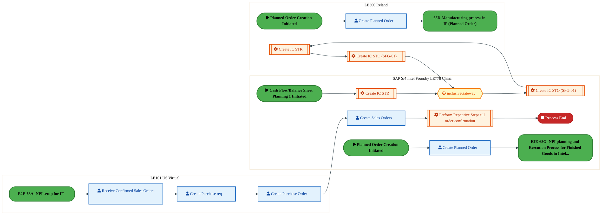
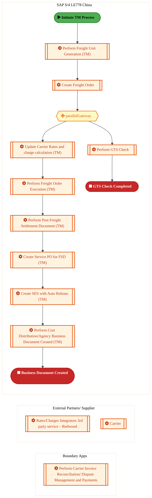
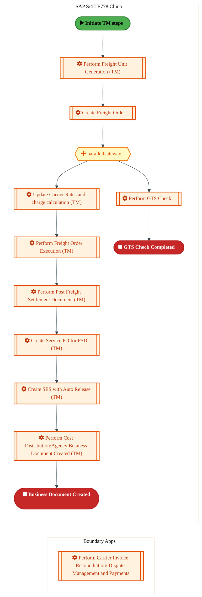
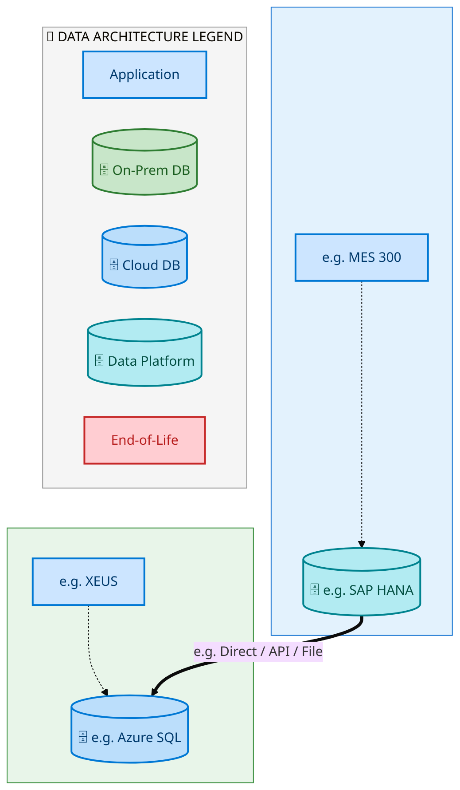
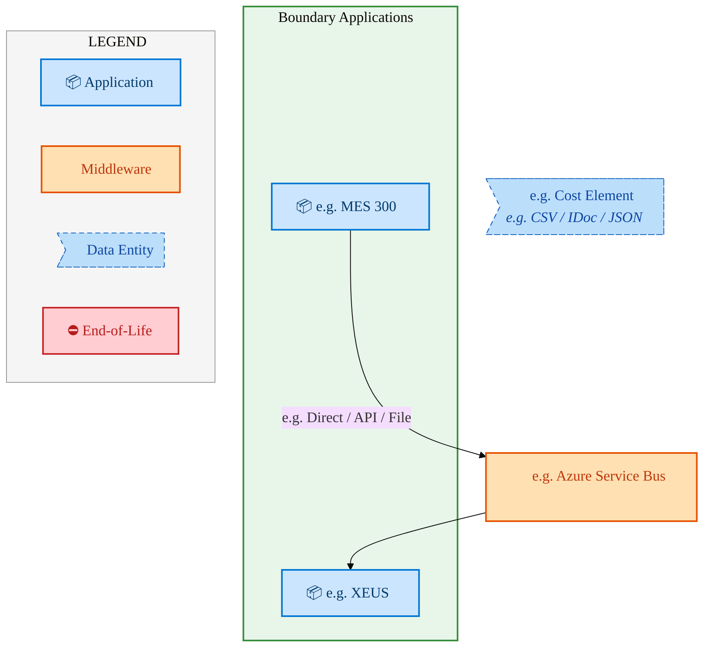
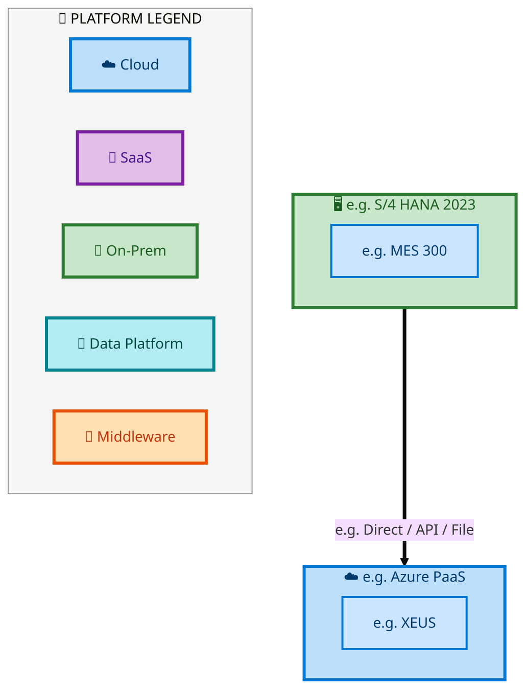

  <img src="data:image/svg+xml;base64,PHN2ZyB4bWxucz0iaHR0cDovL3d3dy53My5vcmcvMjAwMC9zdmciIHZpZXdCb3g9IjAgMCA4MDAgNDgwIiB3aWR0aD0iODAwIiBoZWlnaHQ9IjQ4MCI+DQogIDxkZWZzPg0KICAgIDxsaW5lYXJHcmFkaWVudCBpZD0iYmciIHgxPSIwJSIgeTE9IjAlIiB4Mj0iMTAwJSIgeTI9IjEwMCUiPg0KICAgICAgPHN0b3Agb2Zmc2V0PSIwJSIgc3R5bGU9InN0b3AtY29sb3I6IzAwNzFjNTtzdG9wLW9wYWNpdHk6MSIvPg0KICAgICAgPHN0b3Agb2Zmc2V0PSIxMDAlIiBzdHlsZT0ic3RvcC1jb2xvcjojMDBhZWVmO3N0b3Atb3BhY2l0eToxIi8+DQogICAgPC9saW5lYXJHcmFkaWVudD4NCiAgICA8bGluZWFyR3JhZGllbnQgaWQ9ImFjY2VudCIgeDE9IjAlIiB5MT0iMCUiIHgyPSIwJSIgeTI9IjEwMCUiPg0KICAgICAgPHN0b3Agb2Zmc2V0PSIwJSIgc3R5bGU9InN0b3AtY29sb3I6I2ZmZmZmZjtzdG9wLW9wYWNpdHk6MC4xNSIvPg0KICAgICAgPHN0b3Agb2Zmc2V0PSIxMDAlIiBzdHlsZT0ic3RvcC1jb2xvcjojZmZmZmZmO3N0b3Atb3BhY2l0eTowLjAyIi8+DQogICAgPC9saW5lYXJHcmFkaWVudD4NCiAgICA8cGF0dGVybiBpZD0iZ3JpZCIgd2lkdGg9IjQwIiBoZWlnaHQ9IjQwIiBwYXR0ZXJuVW5pdHM9InVzZXJTcGFjZU9uVXNlIj4NCiAgICAgIDxwYXRoIGQ9Ik0gNDAgMCBMIDAgMCAwIDQwIiBmaWxsPSJub25lIiBzdHJva2U9InJnYmEoMjU1LDI1NSwyNTUsMC4wNykiIHN0cm9rZS13aWR0aD0iMC41Ii8+DQogICAgPC9wYXR0ZXJuPg0KICA8L2RlZnM+DQoNCiAgPCEtLSBCYWNrZ3JvdW5kIC0tPg0KICA8cmVjdCB3aWR0aD0iODAwIiBoZWlnaHQ9IjQ4MCIgZmlsbD0idXJsKCNiZykiIHJ4PSI4Ii8+DQogIDxyZWN0IHdpZHRoPSI4MDAiIGhlaWdodD0iNDgwIiBmaWxsPSJ1cmwoI2dyaWQpIiByeD0iOCIvPg0KICA8cmVjdCB3aWR0aD0iODAwIiBoZWlnaHQ9IjQ4MCIgZmlsbD0idXJsKCNhY2NlbnQpIiByeD0iOCIvPg0KDQogIDwhLS0gRGVjb3JhdGl2ZSBjaXJjdWl0L2FyY2hpdGVjdHVyZSBsaW5lcyAtLT4NCiAgPGcgc3Ryb2tlPSJyZ2JhKDI1NSwyNTUsMjU1LDAuMTIpIiBzdHJva2Utd2lkdGg9IjEuNSIgZmlsbD0ibm9uZSI+DQogICAgPHBhdGggZD0iTSAwIDEwMCBMIDEyMCAxMDAgTCAxNjAgMTQwIEwgMjgwIDE0MCIvPg0KICAgIDxwYXRoIGQ9Ik0gMCAyNjAgTCA4MCAyNjAgTCAxMjAgMjIwIEwgMjAwIDIyMCBMIDI0MCAyNjAgTCAzNjAgMjYwIi8+DQogICAgPHBhdGggZD0iTSA1MjAgMTAwIEwgNjAwIDEwMCBMIDY0MCA2MCBMIDgwMCA2MCIvPg0KICAgIDxwYXRoIGQ9Ik0gNDQwIDM0MCBMIDU2MCAzNDAgTCA2MDAgMzAwIEwgNzIwIDMwMCBMIDc2MCAzNDAgTCA4MDAgMzQwIi8+DQogICAgPHBhdGggZD0iTSA2MDAgNDAwIEwgNjgwIDQwMCBMIDcyMCA0NDAiLz4NCiAgICA8cGF0aCBkPSJNIDAgNDAwIEwgNDAgNDAwIEwgODAgMzYwIi8+DQogICAgPHBhdGggZD0iTSAyMDAgNDIwIEwgMzIwIDQyMCBMIDM2MCAzODAgTCA0ODAgMzgwIi8+DQogICAgPHBhdGggZD0iTSA2NTAgNDQwIEwgNzUwIDQ0MCBMIDgwMCA0ODAiLz4NCiAgPC9nPg0KDQogIDwhLS0gRGVjb3JhdGl2ZSBub2RlcyAtLT4NCiAgPGcgZmlsbD0icmdiYSgyNTUsMjU1LDI1NSwwLjE4KSI+DQogICAgPGNpcmNsZSBjeD0iMTIwIiBjeT0iMTAwIiByPSI0Ii8+DQogICAgPGNpcmNsZSBjeD0iMjgwIiBjeT0iMTQwIiByPSI0Ii8+DQogICAgPGNpcmNsZSBjeD0iMjAwIiBjeT0iMjIwIiByPSI0Ii8+DQogICAgPGNpcmNsZSBjeD0iMzYwIiBjeT0iMjYwIiByPSI0Ii8+DQogICAgPGNpcmNsZSBjeD0iNjAwIiBjeT0iMTAwIiByPSI0Ii8+DQogICAgPGNpcmNsZSBjeD0iNzIwIiBjeT0iMzAwIiByPSI0Ii8+DQogICAgPGNpcmNsZSBjeD0iNTYwIiBjeT0iMzQwIiByPSI0Ii8+DQogICAgPGNpcmNsZSBjeD0iODAiIGN5PSIzNjAiIHI9IjQiLz4NCiAgICA8Y2lyY2xlIGN4PSI0ODAiIGN5PSIzODAiIHI9IjQiLz4NCiAgICA8Y2lyY2xlIGN4PSIzMjAiIGN5PSI0MjAiIHI9IjQiLz4NCiAgPC9nPg0KDQogIDwhLS0gVE9HQUYgQkRBVCBib3hlcyAtLT4NCiAgPGcgZm9udC1mYW1pbHk9IlNlZ29lIFVJLCBBcmlhbCwgc2Fucy1zZXJpZiIgZm9udC1zaXplPSIxNCIgZm9udC13ZWlnaHQ9IjYwMCI+DQogICAgPCEtLSBCIC0tPg0KICAgIDxyZWN0IHg9IjE1MCIgeT0iMTQwIiB3aWR0aD0iMTIwIiBoZWlnaHQ9IjQwIiByeD0iNSIgZmlsbD0icmdiYSgyNTUsMjU1LDI1NSwwLjE4KSIgc3Ryb2tlPSJyZ2JhKDI1NSwyNTUsMjU1LDAuMykiIHN0cm9rZS13aWR0aD0iMSIvPg0KICAgIDx0ZXh0IHg9IjIxMCIgeT0iMTY1IiB0ZXh0LWFuY2hvcj0ibWlkZGxlIiBmaWxsPSIjZmZmIj5CdXNpbmVzczwvdGV4dD4NCiAgICA8IS0tIEQgLS0+DQogICAgPHJlY3QgeD0iMjkwIiB5PSIxNDAiIHdpZHRoPSIxMjAiIGhlaWdodD0iNDAiIHJ4PSI1IiBmaWxsPSJyZ2JhKDI1NSwyNTUsMjU1LDAuMTgpIiBzdHJva2U9InJnYmEoMjU1LDI1NSwyNTUsMC4zKSIgc3Ryb2tlLXdpZHRoPSIxIi8+DQogICAgPHRleHQgeD0iMzUwIiB5PSIxNjUiIHRleHQtYW5jaG9yPSJtaWRkbGUiIGZpbGw9IiNmZmYiPkRhdGE8L3RleHQ+DQogICAgPCEtLSBBIC0tPg0KICAgIDxyZWN0IHg9IjQzMCIgeT0iMTQwIiB3aWR0aD0iMTIwIiBoZWlnaHQ9IjQwIiByeD0iNSIgZmlsbD0icmdiYSgyNTUsMjU1LDI1NSwwLjE4KSIgc3Ryb2tlPSJyZ2JhKDI1NSwyNTUsMjU1LDAuMykiIHN0cm9rZS13aWR0aD0iMSIvPg0KICAgIDx0ZXh0IHg9IjQ5MCIgeT0iMTY1IiB0ZXh0LWFuY2hvcj0ibWlkZGxlIiBmaWxsPSIjZmZmIj5BcHBsaWNhdGlvbjwvdGV4dD4NCiAgICA8IS0tIFQgLS0+DQogICAgPHJlY3QgeD0iNTcwIiB5PSIxNDAiIHdpZHRoPSIxMjAiIGhlaWdodD0iNDAiIHJ4PSI1IiBmaWxsPSJyZ2JhKDI1NSwyNTUsMjU1LDAuMTgpIiBzdHJva2U9InJnYmEoMjU1LDI1NSwyNTUsMC4zKSIgc3Ryb2tlLXdpZHRoPSIxIi8+DQogICAgPHRleHQgeD0iNjMwIiB5PSIxNjUiIHRleHQtYW5jaG9yPSJtaWRkbGUiIGZpbGw9IiNmZmYiPlRlY2hub2xvZ3k8L3RleHQ+DQogIDwvZz4NCg0KICA8IS0tIENvbm5lY3RpbmcgbGluZXMgYmV0d2VlbiBCREFUIGJveGVzIC0tPg0KICA8ZyBzdHJva2U9InJnYmEoMjU1LDI1NSwyNTUsMC4yNSkiIHN0cm9rZS13aWR0aD0iMSI+DQogICAgPGxpbmUgeDE9IjI3MCIgeTE9IjE2MCIgeDI9IjI5MCIgeTI9IjE2MCIvPg0KICAgIDxsaW5lIHgxPSI0MTAiIHkxPSIxNjAiIHgyPSI0MzAiIHkyPSIxNjAiLz4NCiAgICA8bGluZSB4MT0iNTUwIiB5MT0iMTYwIiB4Mj0iNTcwIiB5Mj0iMTYwIi8+DQogIDwvZz4NCg0KICA8IS0tIE1haW4gdGl0bGUgLS0+DQogIDx0ZXh0IHg9IjQwMCIgeT0iMjYwIiB0ZXh0LWFuY2hvcj0ibWlkZGxlIiBmb250LWZhbWlseT0iU2Vnb2UgVUksIEFyaWFsLCBzYW5zLXNlcmlmIiBmb250LXNpemU9IjM2IiBmb250LXdlaWdodD0iNzAwIiBmaWxsPSIjZmZmZmZmIiBsZXR0ZXItc3BhY2luZz0iMSI+DQogICAgSUFPIEFyY2hpdGVjdHVyZQ0KICA8L3RleHQ+DQogIDx0ZXh0IHg9IjQwMCIgeT0iMzAwIiB0ZXh0LWFuY2hvcj0ibWlkZGxlIiBmb250LWZhbWlseT0iU2Vnb2UgVUksIEFyaWFsLCBzYW5zLXNlcmlmIiBmb250LXNpemU9IjE4IiBmb250LXdlaWdodD0iNDAwIiBmaWxsPSJyZ2JhKDI1NSwyNTUsMjU1LDAuOCkiIGxldHRlci1zcGFjaW5nPSIyIj4NCiAgICBUT0dBRiBCREFUIMK3IElBTyBQcm9ncmFtIMK3IElETSAyLjANCiAgPC90ZXh0Pg0KDQogIDwhLS0gQm90dG9tIGFjY2VudCBiYXIgLS0+DQogIDxyZWN0IHg9IjI4MCIgeT0iMzQwIiB3aWR0aD0iMjQwIiBoZWlnaHQ9IjMiIHJ4PSIxLjUiIGZpbGw9InJnYmEoMjU1LDI1NSwyNTUsMC40KSIvPg0KDQogIDwhLS0gSW50ZWwgdGV4dCAtLT4NCiAgPHRleHQgeD0iNDAwIiB5PSIzODAiIHRleHQtYW5jaG9yPSJtaWRkbGUiIGZvbnQtZmFtaWx5PSJTZWdvZSBVSSwgQXJpYWwsIHNhbnMtc2VyaWYiIGZvbnQtc2l6ZT0iMTMiIGZpbGw9InJnYmEoMjU1LDI1NSwyNTUsMC41KSIgbGV0dGVyLXNwYWNpbmc9IjMiPg0KICAgIElOVEVMIENPTkZJREVOVElBTA0KICA8L3RleHQ+DQo8L3N2Zz4NCg==" alt="IAO Architecture" style="width:100%; border-radius:8px;" />
  <h1 style="font-size:36px; margin-top:24px;">E2E-68 — -Intel Foundry   NPI planning and execution processes</h1>
  <h2 style="font-size:24px;">Architecture Document (TOGAF BDAT)</h2>
  
End-to-End Integrated Processes (E2E) Tower 
  Capability E2E-68 · Forecast to Stock

  
IAO Program · R1 – R5 
  Generated: April 2026 
  Sajiv Francis

  
IAO Architecture Pipeline — Intel Confidential

Page 1<a href="#toc">↑ Back to TOC</a>E2E-68 — -Intel Foundry   NPI planning and execution processes

## Table of Contents

<nav class="toc">
<ol>
  <li><a href="#1-executive-summary">1. Executive Summary</a></li>
  <li><a href="#2-business-context-objectives">2. Business Context &amp; Objectives</a>
    <ul>
      <li><a href="#21-classification">2.1 Classification</a></li>
      <li><a href="#22-business-drivers">2.2 Business Drivers</a></li>
      <li><a href="#23-success-criteria">2.3 Success Criteria</a></li>
      <li><a href="#24-companion-documents">2.4 Companion Documents</a></li>
    </ul>
  </li>
  <li><a href="#3-business-architecture-togaf-b">3. Business Architecture (TOGAF &ldquo;B&rdquo;)</a>
    <ul>
      <li><a href="#31-business-process-overview">3.1 Business Process Overview</a></li>
      <li><a href="#32-business-process-diagrams">3.2 Business Process Diagrams</a></li>
      <li><a href="#33-business-roles-responsibilities">3.3 Business Roles &amp; Responsibilities</a></li>
    </ul>
  </li>
  <li><a href="#4-data-architecture-togaf-d">4. Data Architecture (TOGAF &ldquo;D&rdquo;)</a>
    <ul>
      <li><a href="#41-data-entities-ownership">4.1 Data Entities &amp; Ownership</a></li>
      <li><a href="#42-data-flow-diagrams">4.2 Data Flow Diagrams</a></li>
      <li><a href="#43-data-lineage">4.3 Data Lineage</a></li>
      <li><a href="#44-ricefw-data-objects">4.4 RICEFW Data Objects</a></li>
      <li><a href="#45-data-governance-quality">4.5 Data Governance &amp; Quality</a></li>
    </ul>
  </li>
  <li><a href="#5-application-architecture-togaf-a">5. Application Architecture (TOGAF &ldquo;A&rdquo;)</a>
    <ul>
      <li><a href="#51-current-state-current-state-application-landscape">5.1 Current-State Application Landscape</a></li>
      <li><a href="#52-future-state-future-state-application-landscape">5.2 Future-State Application Landscape</a></li>
      <li><a href="#53-change-impact-summary">5.3 Change Impact Summary</a></li>
      <li><a href="#54-component-overview">5.4 Component Overview</a></li>
      <li><a href="#55-development-object-inventory">5.5 Development Object Inventory</a>
        <ul>
          <li><a href="#551-sap-development-objects">5.5.1 SAP Development Objects</a></li>
          <li><a href="#552-eca-development-objects">5.5.2 ECA Development Objects</a></li>
          <li><a href="#553-interface-objects">5.5.3 Interface Objects</a></li>
          <li><a href="#554-middleware-objects">5.5.4 Middleware Objects</a></li>
          <li><a href="#555-scheduling-batch-objects">5.5.5 Scheduling &amp; Batch Objects</a></li>
          <li><a href="#556-boundary-application-dependencies">5.5.6 Boundary Application Dependencies</a></li>
        </ul>
      </li>
      <li><a href="#56-integration-patterns">5.6 Integration Patterns</a></li>
    </ul>
  </li>
  <li><a href="#6-technology-architecture-togaf-t">6. Technology Architecture (TOGAF &ldquo;T&rdquo;)</a>
    <ul>
      <li><a href="#61-platform-infrastructure">6.1 Platform &amp; Infrastructure</a></li>
      <li><a href="#62-sap-development-object-status">6.2 SAP Development Object Status</a></li>
      <li><a href="#63-nfrs-design-principles">6.3 NFRs &amp; Design Principles</a></li>
      <li><a href="#64-security-governance">6.4 Security &amp; Governance</a></li>
      <li><a href="#65-eca-development-object-status">6.5 ECA Development Object Status</a></li>
    </ul>
  </li>
  <li><a href="#7-project-context">7. Project Context</a>
    <ul>
      <li><a href="#71-project-roadmap-go-live-plan">7.1 Project Roadmap &amp; Go-Live Plan</a></li>
      <li><a href="#72-raid-log">7.2 RAID Log</a></li>
      <li><a href="#73-recommendations-next-steps">7.3 Recommendations &amp; Next Steps</a></li>
    </ul>
  </li>
</ol>
</nav>

Page 2<a href="#toc">↑ Back to TOC</a>E2E-68 — -Intel Foundry   NPI planning and execution processes

## 1. Executive Summary

This Architecture Document defines the **Business, Data, Application, and Technology** (BDAT) architecture for **E2E-68 -Intel Foundry   NPI planning and execution processes** within the IAO program. It includes 9 BPMN process diagram(s) in Section 3.

| Dimension | Value |
|-----------|-------|
| **Tower** | End-to-End Integrated Processes (E2E) |
| **Process Group** | Forecast to Stock |
| **Capability** | E2E-68 - -Intel Foundry   NPI planning and execution processes |
| **Release** | R1 – R5 |
| **Total Systems** | 2 |
| **System Status** | 0 Deployed, 0 Developing, 0 EOL, 2 Pending IAPM |
| **RICEFW Objects** | Pending — Smartsheet Object Tracker API integration |

**Change Summary**: 0 new flow chains, 0 removed, 0 modified, 1 unchanged between Current-State and Future-State states.

> All system nodes in architecture diagrams are **IAPM-linked** — click any node to open its IAPM page. Diagrams require `securityLevel: 'loose'` for click events.

Page 3<a href="#toc">↑ Back to TOC</a>E2E-68 — -Intel Foundry   NPI planning and execution processes

## 2. Business Context & Objectives

### 2.1 Classification

| Level | Value |
|-------|-------|
| **L0 Tower** | End-to-End Integrated Processes |
| **L1 Process** | Forecast to Stock |
| **L2 Capability** | E2E-68 - -Intel Foundry   NPI planning and execution processes |

### 2.2 Business Drivers

| # | Driver | Description | Strategic Alignment | Priority |
|---|--------|-------------|---------------------|----------|
| 1 | End-to-End Process Integration | Enable cross-tower integrated processes spanning procurement, manufacturing, and fulfillment | IDM 2.0 Process Excellence | High |
| 2 | Intel Foundry Business Enablement | Stand up foundry-specific business processes for external customer engagement | Intel Foundry Services | High |
| 3 | Process Visibility & Monitoring | Provide end-to-end process visibility across tower boundaries with integrated monitoring | Operational Excellence | Medium |
| 4 | E2E-68 Process Migration | Migrate -Intel Foundry   NPI planning and execution processes business processes and 2 integrated systems from legacy to S/4 HANA target architecture | IDM 2.0 Cross-Functional / End-to-End | High |

Page 4<a href="#toc">↑ Back to TOC</a>E2E-68 — -Intel Foundry   NPI planning and execution processes

### 2.3 Success Criteria

| Metric | Target | Measure | Baseline | Owner |
|--------|--------|---------|----------|-------|
| E2E Process Cycle Time | Per process SLA | End-to-end transaction completion within defined SLA per process | Varies by process | E2E Process Owner |
| Cross-Tower Integration Success | > 99% | Transactions completing across tower boundaries without manual intervention | 92% (current) | Integration Lead |
| Process Exception Rate | < 2% | Transactions requiring manual exception handling | 8% (current) | Operations Manager |
| E2E-68 Migration Completeness | 100% flow chains validated | All 1 flow chains verified in target state | 0% (pre-migration) | Tower Architect |

### 2.4 Companion Documents

| Document | Description |
|----------|-------------|
| **Business Architecture** | Included in this document (Section 3) — process flows from BPMN diagrams |
| **This Document** | Full BDAT Architecture — Business + Data + Application + Technology |

Page 5<a href="#toc">↑ Back to TOC</a>E2E-68 — -Intel Foundry   NPI planning and execution processes

## 3. Business Architecture (TOGAF "B")

### 3.1 Business Process Overview

This capability includes **9 business process(es)** modeled in BPMN 2.0, covering the end-to-end workflow for E2E-68 -Intel Foundry   NPI planning and execution processes.

| # | Step ID | Process Name | Lanes | Tasks | Gateways |
|---|---------|--------------|-------|-------|----------|
| 1 | E2E-68A-_NPI_setup_for_IF | E2E-68A-_NPI_setup_for_IF | Boundary Apps, SAP S/4 Intel Foundry
 | 2 | 0 |
| 2 | E2E-68B-_Raising_Purchase_Order_by_Intel_Products_to_Intel_Foundry_(LE-101) | E2E-68B-_Raising_Purchase_Order_by_Intel_Products_to_Intel_Foundry_(LE-101) | SAP S/4 

Intel Foundry (LE-101)
, SAP S/4 
Intel Prod

 | 14 | 4 |
| 3 | E2E-68C-_Order_Confirmation_&amp;_Planned_order_trigger | E2E-68C-_Order_Confirmation_&amp;_Planned_order_trigger | LE101 US Virtual , LE500 Ireland

, SAP S/4 Intel Foundry

LE778 China

 | 11 | 1 |
| 4 | E2E-68D-_Manufacturing_process_in_IF | E2E-68D-_Manufacturing_process_in_IF | Boundary

Apps
Intel Foundry
, SAP S/4
Intel Foundry (LE-500)

 | 20 | 6 |
| 5 | E2E-68E-_Manufacturing_process_in_IF_(NPI_Planning_and_Execution_Process) | E2E-68E-_Manufacturing_process_in_IF_(NPI_Planning_and_Execution_Process) | Boundary Apps

, SAP S/4
Intel Foundry LE500 Ireland
, SAP S/4
LE778 China

 | 21 | 6 |
| 6 | E2E-68F-_TM_Steps | E2E-68F-_TM_Steps | Boundary Apps

, External Partners/
Supplier
, SAP S/4
LE778 China

 | 12 | 1 |
| 7 | E2E-68G-_NPI_planning_&amp;_Execution_Process_for_Finished_Goods_in_Intel_Foundry_with_Planning_inte | E2E-68G-_NPI_planning_&amp;_Execution_Process_for_Finished_Goods_in_Intel_Foundry_with_Planning_inte | Boundary Apps

, External Partners/ B2B
, SAP S/4
Intel Foundry LE500 Ireland
, SAP S/4
LE101 US Virtual

 | 24 | 7 |
| 8 | E2E-68H-_NPI_planning_&amp;_Execution_Process_for_Finished_Goods_in_Intel_Foundry_with_Planning_inte | E2E-68H-_NPI_planning_&amp;_Execution_Process_for_Finished_Goods_in_Intel_Foundry_with_Planning_inte | CFIN

, LE101 US Virtual
, SAP S/4
Intel Product | 7 | 3 |

| 9 | E2E-68I-_TM_Steps | E2E-68I-_TM_Steps | Boundary Apps

, SAP S/4
LE778 China

 | 10 | 1 |

Page 6<a href="#toc">↑ Back to TOC</a>E2E-68 — -Intel Foundry   NPI planning and execution processes

### 3.2 Business Process Diagrams

#### BUSINESS ARCHITECTURE — 3.2.1 E2E-68A-_NPI_setup_for_IF — E2E-68A-_NPI_setup_for_IF

**Swim Lanes**: Boundary Apps · SAP S/4 Intel Foundry

 | **Tasks**: 2 | **Gateways**: 0

```mermaid
%%{init: {'theme': 'base', 'themeVariables': {'fontSize': '14px', 'fontFamily': 'Segoe UI, Arial, sans-serif','primaryColor': '#e8f0fe', 'primaryBorderColor': '#0071c5','lineColor': '#37474F', 'secondaryColor': '#f5f8fc'}, 'flowchart': {'useMaxWidth': false, 'htmlLabels': true, 'curve': 'basis', 'nodeSpacing': 40, 'rankSpacing': 50}} }%%
flowchart TD
    classDef startEvt fill:#4CAF50,stroke:#2E7D32,color:#000,font-weight:bold,stroke-width:2px,rx:20,ry:20
    classDef endEvt fill:#C62828,stroke:#B71C1C,color:#fff,font-weight:bold,stroke-width:2px,rx:20,ry:20
    classDef userTask fill:#E3F2FD,stroke:#1565C0,stroke-width:2px,color:#0D47A1
    classDef serviceTask fill:#FFF3E0,stroke:#E65100,stroke-width:2px,color:#BF360C
    classDef gateway fill:#FFF9C4,stroke:#F57F17,stroke-width:2px,color:#E65100
    classDef subProc fill:#F3E5F5,stroke:#7B1FA2,stroke-width:2px,color:#4A148C
    subgraph lane_0["Boundary Apps"]
        n2["fa:fa-user Create All NPI Materials in IF Manually"]
        n3(["fa:fa-play NPI setup for IF Process Initiated"])
    end
    subgraph lane_1["SAP S/4 Intel Foundry "]
        n1["Create/Update Material Master"]
        n4(["fa:fa-stop NPI setup for IF Process Completed"])
    end
    n1 --> n4
    n3 --> n2
    class n2 userTask
    class n3 startEvt
    class n4 endEvt
```

> **Legend**: ● Start · ● End · User Task · Service Task · ◇ Gateway · Sub-Process

<a href="https://mermaid.live/view#pako:eNqlVF1v2jAU_StWKpRNCmo-CcvDpBCwhLRNlWi3hzFNJrHBqmNHttPCEP99Nh-hsPK0PES5x_eec-6N7a1Tigo7mdPrbSmnOgNbV69wjd0MuAuksOuBA_AdSYoWDCvX5hDB9Yz-2acFcbO2aRaDqKZsY9EZXgoMnqYeyE0h84BCXPUVlpS4nttIWiO5KQQT0mbf4SHxyV7tuDQSssLynOD7aVAmppRRjs9wlMZpDG2dwqXg1QUpSciQlO7OmmPitVwhqff2W4W_ovUPWumViQliCpucla7ZF7TAzPaoZWuxspUvp2FQZXW4GdisQSXlS4PHvoEk4s9nKPF3O7Dr9ea8EwWP4zkH5ikZUmqMCVDawJMXDQhlLLuLixwmvqe0FM84uwsn6TgKvdJ2kpnWfc8Ot_-K6XKls4Vg1TG1_2p7yMJm7cl1Fvqe3Jj3lRbm1VmpGITDcNgpjdKgCIqTEiHkv5TMXOUjUs9HrUkEQzjutIJkkBT-v3ynNsdxmgfXc8LyhZb4DSmEMJqcRzUZJIF_m3QEo4FfXJEukcavaHMm_FTEHSFMUhikNwkPetcu28WDFOWJMJokMOkI01EA8_AmYZwH8fDo0PAsJWpWgCGOf_s_585ItPtNDfKmUXPn1yHPPjw0ywRlBPXt2EEhsWkL5IyBbw9T8NUE9uApQDmYQhPzFjG2ueSIPnQkDTMTsZUK67YBREhbZtvCSoGpuRyooaxM_ccDgdlW77kODOMsfwCz-9hUacwAtD2YFi6lbd7B8_1TU1nrJ8vmQ5mvy_T47FRp0dx2Woi6Yfh9pzwA_f5nQ3YMo0MYvvmdJuq28QUcdWf2Ao6Px8vxnBrLGtHKybbO_so012qFCWqZdnaeg1otZhteOtn-anHafdNjiszs6gO4-wtAU8d8" title="View full diagram">&#128065; View Diagram</a>

Page 7<a href="#toc">↑ Back to TOC</a>E2E-68 — -Intel Foundry   NPI planning and execution processes

#### BUSINESS ARCHITECTURE — 3.2.2 E2E-68B-_Raising_Purchase_Order_by_Intel_Products_to_Intel_Foundry_(LE-101) — E2E-68B-_Raising_Purchase_Order_by_Intel_Products_to_Intel_Foundry_(LE-101)

**Swim Lanes**: SAP S/4 
Intel Foundry (LE-101)
 · SAP S/4 
Intel Prod

 | **Tasks**: 14 | **Gateways**: 4

```mermaid
%%{init: {'theme': 'base', 'themeVariables': {'fontSize': '14px', 'fontFamily': 'Segoe UI, Arial, sans-serif','primaryColor': '#e8f0fe', 'primaryBorderColor': '#0071c5','lineColor': '#37474F', 'secondaryColor': '#f5f8fc'}, 'flowchart': {'useMaxWidth': false, 'htmlLabels': true, 'curve': 'basis', 'nodeSpacing': 40, 'rankSpacing': 50}} }%%
flowchart LR
    classDef startEvt fill:#4CAF50,stroke:#2E7D32,color:#000,font-weight:bold,stroke-width:2px,rx:20,ry:20
    classDef endEvt fill:#C62828,stroke:#B71C1C,color:#fff,font-weight:bold,stroke-width:2px,rx:20,ry:20
    classDef userTask fill:#E3F2FD,stroke:#1565C0,stroke-width:2px,color:#0D47A1
    classDef serviceTask fill:#FFF3E0,stroke:#E65100,stroke-width:2px,color:#BF360C
    classDef gateway fill:#FFF9C4,stroke:#F57F17,stroke-width:2px,color:#E65100
    classDef subProc fill:#F3E5F5,stroke:#7B1FA2,stroke-width:2px,color:#4A148C
    subgraph lane_0["SAP S/4  Intel Foundry (LE-101) "]
        n2["fa:fa-user Create Sales Orders"]
        n3["fa:fa-user Manual Price Override"]
        n5[["fa:fa-cog Perform Order Validation"]]
        n6[["fa:fa-cog Derive MM ID from CPN"]]
        n7[["fa:fa-cog Perform Credit Check (Via. FSCM)"]]
        n8[["fa:fa-cog Trigger GTS Check"]]
        n9[["fa:fa-cog Hold"]]
        n10[["fa:fa-cog Perform GTS Check"]]
        n11[["fa:fa-cog Calculate Pricing"]]
        n12[["fa:fa-cog Calculate Taxes"]]
        n13[["fa:fa-cog Order Confirmation"]]
        n14[["fa:fa-cog Update Line-Item text"]]
        n16(["fa:fa-play Manual Override Initiated"])
        n17(["fa:fa-stop Tax Caluculated"])
        n18(["fa:fa-stop GTS Check Completed"])
        n19["E2E-68C- Order Confirmation and Planned order trigger"]
        n20{{"fa:fa-code-branch exclusiveGateway"}}
        n21{{"fa:fa-code-branch Credit Check?"}}
        n22{{"fa:fa-code-branch exclusiveGateway"}}
        n23{{"fa:fa-arrows-alt parallelGateway"}}
    end
    subgraph lane_1["SAP S/4  Intel Prod "]
        n1["fa:fa-user Create Purchase req"]
        n4[["fa:fa-cog Create Purchase Order"]]
        n15(["fa:fa-play Raising PO by IP To IF (LE-101)"])
    end
    n1 --> n4
    n15 --> n1
    n2 --> n20
    n4 --> n2
    n5 --> n6
    n6 --> n7
    n7 --> n21
    n21 -->|"No"| n9
    n8 --> n22
    n20 --> n5
    n9 --> n20
    n22 --> n10
    n22 --> n11
    n11 --> n23
    n23 --> n12
    n23 --> n13
    n3 --> n14
    n16 --> n3
    n21 -->|"Yes"| n8
    n14 --> n22
    n13 --> n19
    n12 --> n17
    n10 --> n18
    class n1 userTask
    class n2 userTask
    class n3 userTask
    class n4 serviceTask
    class n5 serviceTask
    class n6 serviceTask
    class n7 serviceTask
    class n8 serviceTask
    class n9 serviceTask
    class n10 serviceTask
    class n11 serviceTask
    class n12 serviceTask
    class n13 serviceTask
    class n14 serviceTask
    class n15 startEvt
    class n16 startEvt
    class n17 endEvt
    class n18 endEvt
    class n19 startEvt
    class n20 gateway
    class n21 gateway
    class n22 gateway
    class n23 gateway
```

> **Legend**: ● Start · ● End · User Task · Service Task · ◇ Gateway · Sub-Process

<a href="https://mermaid.live/view#pako:eNqlV2tv6jYY_itWqooeiWxx7uTDJhrIGVJ7ig49nabDNJnEAavGYU7Swjj899nkAkmTL1s_VPLj53lvfv06HJUwibDiKbe3R8JI5oHjINvgLR54YLBCKR4MQQG8IE7QiuJ0IDlxwrIF-edMg-ZuL2kSC9CW0INEF3idYPBtNgRjIaRDkCKWqinmJB4MBztOtogf_IQmXLJvsBtr8dlbuXWf8AjzC0HTHBhaQkoJwxfYcEzHDKQuxWHCoobR2IrdOBycZHA0eQ83iGfn8PMUP6L97yTKNmIdI5piwdlkW_qAVpjKHDOeSyzM-VtVDJJKP0wUbLFDIWFrgZuagDhirxfI0k4ncLq9XbLaKXj4umRA_IUUpekExyDNBDx9y0BMKPVuTH8cWNowzXjyir0bfepMDH0Yykw8kbo2lMVV3zFZbzJvldCopKrvMgdP3-2HfO_p2pAfxP-WL8yiiyff1l3drT3dO9CHfuUpjuP_5UnUlT-j9LX0NTUCPZjUvqBlW7720V6V5sR0xrBdJ8zfSIivjAZBYEwvpZraFtT6jd4Hhq35LaNrlOF3dLgYHPlmbTCwnAA6vQYLf-0o89WcJ2Fl0JhagVUbdO5hMNZ7DZpjaLplhMLOmqPdBlDE8F_a96WyGM_B4mcTgBnLMAVBkrOIH8Ddw1SFGvwElsqfhVT-MV0oYuTFSJUnAXyORaZggcS1BU_yPqVNvtHkPyKWIwrmXFQcPL1hzkmEmwrrey0JkzWYYx4nfFsYBy-IkghlJGFCdK2ym6qJmAJvGDw-gtkExDzZAn_-pSVxuh2JlCKSAX-Dw1dw90LQTyBY-I-fWmq3qX7mZL0WAX5-XhTSFn3UpP8m2r7FgFp3PH0WIWzyfUTDnMrTkNUVg6LN1_v4z2iP0zbbaLKL8vsJiwnfdh0ANJuCb7tI2n4Qs1SdZXgLMrzP2hr7rtbsqLguZXtUjSFakmREmJG1-nQtdC7CNEt2MgWZUF5k9IHutuh1TUVG2x3FHZKRUEz1qWq7vtqRPUAsAnNxiRiOwPkhEfP83AKt-6Idj5eyRFhdiVEebgDehzRPRY9-LibFUjmdrmWwW3bdnL-2Nfp_c2VcZIjz5D1VEc3ADnFEKaYfRGLWd40S-HGUiIEVtcYH7Bwf85yLRyzFgOO_m_xWU7X553NpN5XVaqqviKTiOoD5E1gdwGwOnhMwC-oBdzn4OjMGgar-IrxXS6tYl08H04tl9Tgxs1yXy5Jtl0u7WDrl0inJtbGzsx9L5UuyVH6ISVHibsmrrOpaAVjletQKQi-jgh-AyhMs09KNimGUDL0NVIxqXVeiTMZoB_-HnCAiercimq3wYWWqyg9W4VWFgWWC0L16--RZVG9-A9a7YaMbNq-f-caO1btj9-44vTtu786od0fk3bsF-7f0_i2jf6u_EKLJq0_GJm734E752ddE3U501G1D9HT5pdSEYTesd8NGBStDZYvFgCaR4h2V848K8cMjwjHKaaachgrKs2RxYKHinT--lfz8SE0IEoNsW4CnfwFWleXT" title="View full diagram">&#128065; View Diagram</a>

Page 8<a href="#toc">↑ Back to TOC</a>E2E-68 — -Intel Foundry   NPI planning and execution processes

#### BUSINESS ARCHITECTURE — 3.2.3 E2E-68C-_Order_Confirmation_&amp;_Planned_order_trigger — E2E-68C-_Order_Confirmation_&amp;_Planned_order_trigger

**Swim Lanes**: LE101 US Virtual  · LE500 Ireland
 · SAP S/4 Intel Foundry

LE778 China

 | **Tasks**: 11 | **Gateways**: 1

> **Legend**: ● Start · ● End · User Task · Service Task · ◇ Gateway · Sub-Process

<a href="https://mermaid.live/view#pako:eNqlVltvozgU_isWVZVWSjrcITyslBKoInVmomZm9mG6WrlgEqvEsLZpm43y3_cQLilM2NvkIdL5znfux8Z7JcpionjK5eWeMio9tB_JDdmSkYdGT1iQ0RhVwDfMKX5KiRiVnCRjckX_PNI0M38raSUW4i1NdyW6IuuMoK-LMZqBYTpGAjMxEYTTZDQe5ZxuMd_5WZrxkn1B3ERNjtFq1W3GY8JPBFV1tMgC05QycoINx3TMsLQTJMpY3HGaWImbRKNDmVyavUYbzOUx_UKQj_jtVxrLDcgJTgUBzkZu03v8RNKyRsmLEosK_tI0g4oyDoOGrXIcUbYG3FQB4pg9nyBLPRzQ4fLykbVB0f3DI0Pwi1IsxJwkSEiAgxeJEpqm3oXpz0JLHQvJs2fiXeiBMzf0cVRW4kHp6rhs7uSV0PVGek9ZGtfUyWtZg6fnb2P-5unqmO_gvxeLsPgUybd1V3fbSLeO5mt-EylJkp-KBH3lX7B4rmMFRqiH8zaWZtmWr_7orylzbjozrd8nwl9oRN45DcPQCE6tCmxLU4ed3oaGrfo9p2ssySvenRxOfbN1GFpOqDmDDqt4_SyLpyXPosahEVih1Tp0brVwpg86NGea6dYZgp81x_kGpZiR39Xvj8p9oKka-rpC3yiXBU7Ro_JbxS1_TANKgr0ET8rWowcSEfpCkJ-xhPItidEKw5FFn8uzJLqmetfU5wS6gpYFh40VBHHyR5dv_D3_GKKXnAsmgR5MbHc2QZ-WC5imLHKUZBwtwpYL63mueu1YvaWqaMEJIHGvdPt8PsBkUPe5dNTvrUmUrRuLhY9WXx6A2uFqw9zP6GoV3k1U7bpvZF61RnkK-9VJpvJBM4YWcNFScBeD_fV7ewfMbXc--YhZkeBIFhxuFJTDZhEhEAXLEF11nF7_UxfLKa9mS7T6YEJcSVIUZgWL-Q6h-8BxXORvKMO91ppnWzu8StZ_HYXT7e6ScNiJLaxvTiT0BjZ4JUkukITzhI4fAhRVK33sYK_v7r-f6_T_jFXvjdXHYoNCuNs_3GKoMYJsN4TIquByYtrwiI2fXBHrZC9klqNlvRwB-4Fqt6fvrjp9eZNfeZiCNxIVx1iNi_JYhvAIEBvI5y7L4mrlyqW5ubnpnaXpft_kgTnPXsUEpxL4UVoImN9ddcM-KodDbz2ZjiaTX-A6qUWjEs1aNCvRqUW3ErVpLdu13Oi1aQU0-lrU1EZfR3MbuQ5nNXIdz25ktXZQf4eYVcsNwanl1kGTYSNXot6IWreA4xejZDVfyg6sn4eN87B5HrbOw_Z52Hn_he1o3EHNdFAD7RtUacMqvX0OdXFjADcHcKt-6nRRe4DtDODuAD5t3g3KWNkSuIporHh75fg6hhd0TBJcpFI5jBVcyGy1Y5HiHV-RSpHHYDmnGC7mbQUe_gKUPY0m" title="View full diagram">&#128065; View Diagram</a>

Page 9<a href="#toc">↑ Back to TOC</a>E2E-68 — -Intel Foundry   NPI planning and execution processes

#### BUSINESS ARCHITECTURE — 3.2.4 E2E-68D-_Manufacturing_process_in_IF — E2E-68D-_Manufacturing_process_in_IF

**Swim Lanes**: Boundary
Apps
Intel Foundry
 · SAP S/4
Intel Foundry (LE-500)

 | **Tasks**: 20 | **Gateways**: 6

```mermaid
%%{init: {'theme': 'base', 'themeVariables': {'fontSize': '14px', 'fontFamily': 'Segoe UI, Arial, sans-serif','primaryColor': '#e8f0fe', 'primaryBorderColor': '#0071c5','lineColor': '#37474F', 'secondaryColor': '#f5f8fc'}, 'flowchart': {'useMaxWidth': false, 'htmlLabels': true, 'curve': 'basis', 'nodeSpacing': 40, 'rankSpacing': 50}} }%%
flowchart TD
    classDef startEvt fill:#4CAF50,stroke:#2E7D32,color:#000,font-weight:bold,stroke-width:2px,rx:20,ry:20
    classDef endEvt fill:#C62828,stroke:#B71C1C,color:#fff,font-weight:bold,stroke-width:2px,rx:20,ry:20
    classDef userTask fill:#E3F2FD,stroke:#1565C0,stroke-width:2px,color:#0D47A1
    classDef serviceTask fill:#FFF3E0,stroke:#E65100,stroke-width:2px,color:#BF360C
    classDef gateway fill:#FFF9C4,stroke:#F57F17,stroke-width:2px,color:#E65100
    classDef subProc fill:#F3E5F5,stroke:#7B1FA2,stroke-width:2px,color:#4A148C
    subgraph lane_0["Boundary Apps Intel Foundry "]
        n14[["fa:fa-cog Split/Merge of production order"]]
        n15[["fa:fa-cog Lot Start"]]
        n16[["fa:fa-cog Issue component"]]
        n17[["fa:fa-cog Move In/ Move Out"]]
        n18[["fa:fa-cog Perform Quality Check"]]
        n19[["fa:fa-cog Update Scrap/Yield"]]
        n20[["fa:fa-cog Lot Complete"]]
        n24{{"fa:fa-code-branch Milestone Confirmation Check ?"}}
        n28{{"fa:fa-arrows-alt parallelGateway"}}
        n29{{"fa:fa-arrows-alt parallelGateway"}}
    end
    subgraph lane_1["SAP S/4 Intel Foundry (LE-500) "]
        n1["fa:fa-user Create Planned Order"]
        n2[["fa:fa-cog Goods Issue and Update Inventory"]]
        n3[["fa:fa-cog Perform Goods Receipt"]]
        n4[["fa:fa-cog Receive Goods in Unrestricted Stock"]]
        n5[["fa:fa-cog Perform TECO – Technical Completion"]]
        n6[["fa:fa-cog Prod Operation Confirmation"]]
        n7[["fa:fa-cog Create Production Order"]]
        n8[["fa:fa-cog Release Production Order"]]
        n9[["fa:fa-cog Perform Component Staging"]]
        n10[["fa:fa-cog Perform Posting Change (PMR Creation)"]]
        n11[["fa:fa-cog Perform Staging Task"]]
        n12[["fa:fa-cog Perform Staging Task Confirmation"]]
        n13[["fa:fa-cog Perform Consumption and Goods Issue (Manual/Job)"]]
        n21(["fa:fa-play Manufacturing process in IF Initiated"])
        n22(["fa:fa-stop TECO Completed"])
        n23["Execute Prod Costing Steps"]
        n25{{"fa:fa-arrows-alt parallelGateway"}}
        n26{{"fa:fa-arrows-alt parallelGateway"}}
        n27{{"fa:fa-arrows-alt parallelGateway"}}
    end
    n15 --> n16
    n16 --> n17
    n17 --> n28
    n18 --> n19
    n19 --> n29
    n28 --> n18
    n28 --> n14
    n1 --> n7
    n7 --> n8
    n8 --> n26
    n26 --> n10
    n10 --> n11
    n11 --> n12
    n27 --> n9
    n26 --> n27
    n12 --> n27
    n9 --> n13
    n13 --> n2
    n3 --> n4
    n4 --> n25
    n25 --> n23
    n25 --> n5
    n6 --> n3
    n21 --> n1
    n5 --> n22
    n28 --> n24
    n29 --> n20
    class n1 userTask
    class n2 serviceTask
    class n3 serviceTask
    class n4 serviceTask
    class n5 serviceTask
    class n6 serviceTask
    class n7 serviceTask
    class n8 serviceTask
    class n9 serviceTask
    class n10 serviceTask
    class n11 serviceTask
    class n12 serviceTask
    class n13 serviceTask
    class n14 serviceTask
    class n15 serviceTask
    class n16 serviceTask
    class n17 serviceTask
    class n18 serviceTask
    class n19 serviceTask
    class n20 serviceTask
    class n21 startEvt
    class n22 endEvt
    class n23 startEvt
    class n24 gateway
    class n25 gateway
    class n26 gateway
    class n27 gateway
    class n28 gateway
    class n29 gateway
```

> **Legend**: ● Start · ● End · User Task · Service Task · ◇ Gateway · Sub-Process

<a href="https://mermaid.live/view#pako:eNqlV21P6zYU_itWECpXakXsJE3aD5tKaa6YLoLdcjdNl2lyE6e1SO3IcYAO9b_vpI37YppdjfUDIs95ztvjY8d5cxKZMmfonJ-_ccH1EL119IItWWeIOjNask4XbYHfqOJ0lrOyU3MyKfSU_72hYb94rWk1FtMlz1c1OmVzydC3my4agWPeRSUVZa9kimedbqdQfEnVaixzqWr2GYsyN9tka0xXUqVM7QmuG-IkANecC7aHvdAP_bj2K1kiRXoUNAuyKEs667q4XL4kC6r0pvyqZLf09Xee6gU8ZzQvGXAWepl_oTOW1z1qVdVYUqlnIwYv6zwCBJsWNOFiDrjvAqSoeNpDgbteo_X5-aPYJUUP148CwS_JaVleswyVGuDJs0YZz_PhmT8exYHbLbWST2x4RibhtUe6Sd3JEFp3u7W4vRfG5ws9nMk8bai9l7qHISleu-p1SNyuWsFfKxcT6T7TuE8iEu0yXYV4jMcmU5Zl_ysT6KoeaPnU5Jp4MYmvd7lw0A_G7vt4ps1rPxxhWyemnnnCDoLGcexN9lJN-gF224NexV7fHVtB51SzF7raBxyM_V3AOAhjHLYG3Oazq6xm90omJqA3CeJgFzC8wvGItAb0R9iPmgohzlzRYoFyKthf7vdH50pWm6FGo6Io0Y3QLEdxjQH06Py5dat_AvvfgZ_RYUZ7iZyjaZFzfXnL1JwhmaFCybRKNJcCbXYWOB95B8feX6RG03pGbV7_mHdTlhVDiVwWUjDxjh0es2_lM4MmLrf_3FXv-NEx_56pTKol-rWi0MwKjRcsebJ9Bsc-34oUlhdNExDy8g_O8tRyIO77VsfQQM40s6n-29uemrLeDLZ6skC3HA5CDR2Do8i4WtKNsJvy0M-Pznp9GCTaB6FKyZeyR3ONCqponrP883YYbafBf3OCPX5qhDB0Oh3do-mlbw3PxZdJL3DdT_YU7aSp9zIaK1aLeQ_BBEvRXTM5h4Uei_lZyrRspoKK1KzGjXiG6ZBqZQnsnV7vbZSvLGG8sGfEGvMNCYZp68IF-iYUrI3iiYaCp1q-G5jgdM6HyfgOPVbExR56YMlC8ITmZjBgda0o1j6A7Q_yFEw1k3AwFpajtSWMwvvteXdie0Z20zmDl_OPvAanOx2b3Vrv8Dm8tOwd5Z72u5elBjaMORVwqFzc337dlg_5P9kx8OkYTUZUH-i2C_mxy78Ji722dkVZLYuNSvVIHo7oxS0VcLZc_iJndgcEX-zCFTm8LWpqRhNdqboaOE8TVm4m7iaG-eaawzrWZ82nwyBkHwQOjGI7Zea0ecf2gDx5ZUnVTAQwt5JPNStKa-MFHzlW-h9xCj94FsFbBfV6P9VvDQP0GyA0QLgFSGSAqGEMDDBoGAYghhHZgG9cts8mR5PC0Bs2MTURU5Nr3N0GwAZoAmJiXJqQAysE2bVFLKBpAnuG4DWE5rl5NB34jTUwCRohiWcBhtAUsDObiptn404syYhJSIzKh1ebWklzpTuCyeG97MjitVr8VkvQaum3WsJWS9RqGbRaYMVbTbjd1C4DbtcBtwuB25XA7VLgdi1wuxi4XQ3SrgbMlflyOcZJ85VxjHotbN9cwY_h4DTcPw2Hp-HoNDwwsNN1lgzeIDx1hm_O5tsWvn9TltEq186669BKy-lKJM5w8w3oVJsrzDWncK9absH1PxufvmU=" title="View full diagram">&#128065; View Diagram</a>

Page 10<a href="#toc">↑ Back to TOC</a>E2E-68 — -Intel Foundry   NPI planning and execution processes

#### BUSINESS ARCHITECTURE — 3.2.5 E2E-68E-_Manufacturing_process_in_IF_(NPI_Planning_and_Execution_Process) — E2E-68E-_Manufacturing_process_in_IF_(NPI_Planning_and_Execution_Process)

**Swim Lanes**: Boundary Apps

 · SAP S/4
Intel Foundry LE500 Ireland
 · SAP S/4
LE778 China

 | **Tasks**: 21 | **Gateways**: 6

> **Legend**: ● Start · ● End · User Task · Service Task · ◇ Gateway · Sub-Process

<a href="https://mermaid.live/view#pako:eNqtWG1v6jYU_itWriqoBFqcd_iwiQbSVepdWWl3P1ymyQQHrAYnc5K2rJf_vuO8QEljabsbH1D82Oc5x4_POQ68aWGyptpYu7h4Y5zlY_TWy7d0R3tj1FuRjPYGqAJ-I4KRVUyznlwTJTxfsL_KZdhKX-UyiQVkx-K9RBd0k1D0eDNAEzCMBygjPBtmVLCoN-ilgu2I2PtJnAi5-hP1Ij0qvdVTV4lYU3FaoOsuDm0wjRmnJ9h0LdcKpF1Gw4Svz0gjO_KisHeQwcXJS7glIi_DLzL6mbx-Yet8C-OIxBmFNdt8F9-SFY3lHnNRSCwsxHMjBsukHw6CLVISMr4B3NIBEoQ_nSBbPxzQ4eJiyY9O0e39kiP4hDHJsimNUJYDPHvOUcTiePzJ8ieBrQ-yXCRPdPzJmLlT0xiEcidj2Lo-kOIOXyjbbPPxKonX9dLhi9zD2EhfB-J1bOgDsYfvli_K1ydPvmN4hnf0dOViH_uNpyiK_pMn0FU8kOyp9jUzAyOYHn1h27F9_SNfs82p5U5wWycqnllI35EGQWDOTlLNHBvratKrwHR0v0W6ITl9IfsT4ci3joSB7QbYVRJW_tpRFqu5SMKG0JzZgX0kdK9wMDGUhNYEW14dIfBsBEm3KCac_qF_XWpXSVEmNZqkaYbQUvu9Wik_3MBfYUlExhEZhskGzamIErFDcxI-DdBnIuC7TGi0mM_8h_vHz6gPC5BfZHmyo6KaBM6aFBKlKw4MThaTOVr8YKEbngNdIKOCoG5ntq6jG0Fh3boVnLS68cHgOYEDXBaGrq_QFQiEHpIxWLquV4GtPZ1vaUpzKnZQ8vAUs2cKTn8tCM9Zvj_FXRqa3VpcPyyQn-zSmBEeUuRvafjUsrQUKrLwCSoaffkZlennC0pylnDU_0KeKcjLyQYaI88vW3x2N18gyqJCj9BnkdSrAe5kpzvSt8icfxhcwiMmdl0MrjpJJEN_sWVpKp-qVJkLBvLyzWUZY7PqlmV5i9fr5r1NyLrkvUtlMCRuyzM6tyv3TdHsNU2gUTbpcm6CdfXh9mvLKYVyFNUJPS7QHY_3bc8Yd7qG9IBiCOGWatyjPpSz9EA-UBidFLIsRAhpRvj-RAI1G7NQ3ppIlt0vCR9CZCEUTy4YzT5wt1JYHgzqXyfJOkM3WVbQDwatzJ3co3mSycMrz25S5AnyYwo3N9-0TRVJelfkK1ncp3LrBwXUbFN0H0Jw_ice95_xgGyo_8LyLUrhApVH9mfFKPVEsqFgE1IwR0bLgWH0jw6g-6XdR1Yd5xpsL9_bmi3bsqnITlK1Ftph4oDFzJgNHW86lL2iiEiYF_IkUApXBc0yxDi6CVrdz317O8mwpsMVvFuEW0Rfw7jIQIDr6upaaofDezOv22xeawTJd6b-T2370Xe5NfXvM8MnMyJE8pINSZzLAyVxTGOFkfHvjBR3mfHuLivvIDhHxkn77vK-v7BG3Yl8w9v1sAiuhzq-RC_QvBYPd-18VbW8sh3c05CyND-StI2tVsLCjpUbUOewXeUwcrzroz5HXbmBhsMfZe4141EFYLsB3ApoxnY1tOqhVQ2deuhUQ7ce1rZm_UIIDxXgtcajetw4r1_N4KEGGgJcG2CjBrx6bDYLaormrRYeaqDZgFlvGTdOoddUUTacuN4UPopSevm21M7qb6l9k3o1a-qtG2c2srwav81enDbQqIVruYwj4LQBuw3UXozmPHBzoE0c9eaMo0C1U6stx7u3YZkW797Zz2ZM5YylnLGVM45yxlXOeMqZkXIGEkk5hdVTahmwWgesFgKrlcBqKbBaC6wWA6vVMNRqGGo1DKP-EXqOmp2o1Ynax5_M57ijwN3mV9457HXDo04YyqwTxt2w0cDaQIMXyh1ha238ppV_n8BfLGsakSLOtcNAI9B_F3seauPybwatSNdgOWUEbqpdBR7-BkXhd1U=" title="View full diagram">&#128065; View Diagram</a>

Page 11<a href="#toc">↑ Back to TOC</a>E2E-68 — -Intel Foundry   NPI planning and execution processes

#### BUSINESS ARCHITECTURE — 3.2.6 E2E-68F-_TM_Steps — E2E-68F-_TM_Steps

**Swim Lanes**: Boundary Apps

 · External Partners/
Supplier
 · SAP S/4
LE778 China

 | **Tasks**: 12 | **Gateways**: 1

> **Legend**: ● Start · ● End · User Task · Service Task · ◇ Gateway · Sub-Process

<a href="https://mermaid.live/view#pako:eNqlVltv4jgU_itWqooZCdRcCc3DShRIVanVoKbdfRhWK5M4YNXYke0UGMR_35MLULLJ7sPmAXEu33cu8TnxwYhFQozAuL09UE51gA49vSYb0gtQb4kV6fVRpfgdS4qXjKhe4ZMKriP6q3Sz3GxXuBW6EG8o2xfaiKwEQe9PfTQGIOsjhbkaKCJp2uv3Mkk3WO4ngglZeN-QUWqmZbTa9CBkQuTFwTR9K_YAyignF7Xju74bFjhFYsGTK9LUS0dp3DsWyTGxjddY6jL9XJEXvPuDJnoNcoqZIuCz1hv2jJeEFTVqmRe6OJefp2ZQVcTh0LAowzHlK9C7Jqgk5h8XlWcej-h4e7vg56Do-XXBETwxw0pNSYqUBvXsU6OUMhbcuJNx6Jl9paX4IMGNPfOnjt2Pi0oCKN3sF80dbAldrXWwFCypXQfboobAznZ9uQtssy_38NuIRXhyiTQZ2iN7dI704FsTa3KKlKbp_4oEfZVvWH3UsWZOaIfTcyzLG3oT8598pzKnrj-2mn0i8pPG5AtpGIbO7NKq2dCzzG7Sh9AZmpMG6QprssX7C-H9xD0Thp4fWn4nYRWvmWW-nEsRnwidmRd6Z0L_wQrHdiehO7bcUZ0h8KwkztaIYU7-Mn8ujAeRl4cajbNMIbQw_qw8i4dbP8EjxUGKB7FYoTmRqZAbNMFSUiLRE_8U0Dv0WkxGTBnFmgp-h6ZUZbkm6AVzvILR5hphnqA53hf_FcSog8DBacvLgqiznSaSYwYoqTmR6g5FeZaxIu51kvZ1kq_Qe3U3galYEQUpagLMWkiFHJmgDNj2p5eOFrltWg7kn2yFSC55lbzONW9d9H8mbwMqGs9RdOei55nvj9BkTTluJO22dzaU5Vygd1iV6JFA3WVL0be3l--N9LxGepJA4WeCH8VyayCG14j3LCkQp5dZ9q18T3HZOxRjFuesM77_7xWUCaDZjsR5F8OonWEulD7TRERrVh2hqYjz8k8L1X1rM6L6Nc9_IGBGYTRtw1pmO3gWoS3VazTOtYAjwgh8rVrxXVNS1AGjoCVdlj24G68Ij_foIVfwiVHqUlEVMmllt9vZH98iOFgk_mj6O9_O_hmDHfQER4kWBb29oGKHQGCAfP8KcS8QpUXWnWAT6DWA56Sg-E3GSAtkeDicIHDwxFYNMNPFWGLGCHusFufCOB4bQ8ZdNBj8Bse-FoeV6NeiX4mjWhxV4n0tWmYlW_X2514tD08ONV1TtuxacV_L5snBqhXuSeFUirNs1w7el1UO4tcPzpXF7rQ4nRa30-J1WoadFr_TMuq03HdaoOedpu4uWN1tgA6fLjXXere-gFxrvVbt8PRtNvrGhsgNpokRHIzyBgq31ISkOGfaOPYNDGMf7XlsBOVNzcjLdTmlGHb9plIe_wYnb253" title="View full diagram">&#128065; View Diagram</a>

Page 12<a href="#toc">↑ Back to TOC</a>E2E-68 — -Intel Foundry   NPI planning and execution processes

#### BUSINESS ARCHITECTURE — 3.2.7 E2E-68G-_NPI_planning_&amp;_Execution_Process_for_Finished_Goods_in_Intel_Foundry_with_Planning_inte — E2E-68G-_NPI_planning_&amp;_Execution_Process_for_Finished_Goods_in_Intel_Foundry_with_Planning_inte

**Swim Lanes**: Boundary Apps

 · External Partners/ B2B
 · SAP S/4
Intel Foundry LE500 Ireland
 · SAP S/4
LE101 US Virtual

 | **Tasks**: 24 | **Gateways**: 7

```mermaid
%%{init: {'theme': 'base', 'themeVariables': {'fontSize': '14px', 'fontFamily': 'Segoe UI, Arial, sans-serif','primaryColor': '#e8f0fe', 'primaryBorderColor': '#0071c5','lineColor': '#37474F', 'secondaryColor': '#f5f8fc'}, 'flowchart': {'useMaxWidth': false, 'htmlLabels': true, 'curve': 'basis', 'nodeSpacing': 40, 'rankSpacing': 50}} }%%
flowchart LR
    classDef startEvt fill:#4CAF50,stroke:#2E7D32,color:#000,font-weight:bold,stroke-width:2px,rx:20,ry:20
    classDef endEvt fill:#C62828,stroke:#B71C1C,color:#fff,font-weight:bold,stroke-width:2px,rx:20,ry:20
    classDef userTask fill:#E3F2FD,stroke:#1565C0,stroke-width:2px,color:#0D47A1
    classDef serviceTask fill:#FFF3E0,stroke:#E65100,stroke-width:2px,color:#BF360C
    classDef gateway fill:#FFF9C4,stroke:#F57F17,stroke-width:2px,color:#E65100
    classDef subProc fill:#F3E5F5,stroke:#7B1FA2,stroke-width:2px,color:#4A148C
    subgraph lane_0["Boundary Apps  "]
        n24[["fa:fa-cog Perform Pack, Mark, Label SPECTRUM (for Customer Label"]]
    end
    subgraph lane_1["External Partners/ B2B "]
        n8["Carrier"]
    end
    subgraph lane_2["SAP S/4 Intel Foundry LE500 Ireland "]
        n1["Ship Good Issue for OD into SiT ( GIOD)"]
        n2["Post GI from Issuing SiT (GIFV)"]
        n3["Create IC Customer Invoice Bill To: LE101"]
        n9["fa:fa-user Create Planned Order"]
        n10[["fa:fa-cog Perform Steps till Prod Order Execution including consumption of bailed material"]]
        n11[["fa:fa-cog Goods Receipt against Prod Order"]]
        n12[["fa:fa-cog Unrestricted Stock"]]
        n13[["fa:fa-cog ATP Check (unrestricted stock)"]]
        n14[["fa:fa-cog Perform GTS Check"]]
        n15[["fa:fa-cog Receive Pick and Pack Updates (EWM)"]]
        n16[["fa:fa-cog Check if Cross Border Docs"]]
        n17[["fa:fa-cog Perform OBD – Partial Qty (Lot N)"]]
        n18[["fa:fa-cog Perform OBD – Full Qty"]]
        n19[["fa:fa-cog Perform OBD – Partial Qty (Lot 1)"]]
        n20[["fa:fa-cog Create Export Invoice"]]
        n21[["fa:fa-cog Create Export Invoice"]]
        n22[["fa:fa-cog Create Export Invoice"]]
        n23[["fa:fa-cog Create Export Invoice"]]
        n25(["fa:fa-play NPI Planning Finished Goods (IF) Process Initiated"])
        n26(["fa:fa-stop Cross Border docs generated"])
        n27(["fa:fa-stop ATP Check Performed"])
        n28(["fa:fa-stop GTS Check Performed"])
        n31["E2E-68F- TM Steps"]
        n32{{"fa:fa-code-branch Delivery Qty : Partial/Full"}}
        n33{{"fa:fa-code-branch exclusiveGateway"}}
        n34{{"fa:fa-arrows-alt parallelGateway"}}
        n35{{"fa:fa-arrows-alt parallelGateway"}}
        n36{{"fa:fa-arrows-alt parallelGateway"}}
        n37{{"fa:fa-arrows-alt parallelGateway"}}
        n38{{"fa:fa-arrows-alt parallelGateway"}}
    end
    subgraph lane_3["SAP S/4 LE101 US Virtual  "]
        n4["Post GR to Storage Location Virtual (GRTS)"]
        n5["Stock Transfer into in-Transit Plant"]
        n6["Post GI from in-Transit Plant"]
        n7["Create IC Supplier Invoice"]
        n29(["fa:fa-stop GI Post Completed"])
        n30(["fa:fa-stop STO Process completed"])
    end
    n19 --> n17
    n25 --> n9
    n9 --> n10
    n10 --> n11
    n11 --> n12
    n12 --> n32
    n32 -->|"Full"| n18
    n33 --> n15
    n15 --> n35
    n37 --> n22
    n37 --> n23
    n37 --> n20
    n37 --> n21
    n21 --> n38
    n22 --> n38
    n23 --> n38
    n20 --> n38
    n32 -->|"Partial"| n19
    n35 --> n16
    n16 --> n37
    n1 --> n36
    n34 --> n1
    n35 --> n34
    n2 --> n3
    n3 --> n7
    n7 --> n30
    n4 --> n5
    n5 --> n6
    n36 --> n2
    n36 --> n4
    n6 --> n29
    n34 --> n8
    n35 --> n31
    n38 --> n26
    n13 --> n27
    n14 --> n28
    n17 --> n33
    n18 --> n33
    n33 --> n13
    n33 --> n14
    class n9 userTask
    class n10 serviceTask
    class n11 serviceTask
    class n12 serviceTask
    class n13 serviceTask
    class n14 serviceTask
    class n15 serviceTask
    class n16 serviceTask
    class n17 serviceTask
    class n18 serviceTask
    class n19 serviceTask
    class n20 serviceTask
    class n21 serviceTask
    class n22 serviceTask
    class n23 serviceTask
    class n24 serviceTask
    class n25 startEvt
    class n26 endEvt
    class n27 endEvt
    class n28 endEvt
    class n29 endEvt
    class n30 endEvt
    class n31 startEvt
    class n32 gateway
    class n33 gateway
    class n34 gateway
    class n35 gateway
    class n36 gateway
    class n37 gateway
    class n38 gateway
```

> **Legend**: ● Start · ● End · User Task · Service Task · ◇ Gateway · Sub-Process

<a href="https://mermaid.live/view#pako:eNqlWF1v4jgU_SsWowoqgSZxEgI8rMRXKqR2yjZ05mG6WrnBgaghjhynpdvhv-91Eofikl1tlweknOtz7oevfQlvrYCtaWvUurh4i5JIjNBbW2zpjrZHqP1IMtruohL4TnhEHmOateWakCXCj_4qlpl2upfLJOaRXRS_StSnG0bR_aKLxkCMuygjSdbLKI_Cdred8mhH-OuUxYzL1V_oIDTCwltlmjC-pvy4wDBcM3CAGkcJPcKWa7u2J3kZDViyPhENnXAQBu2DDC5mL8GWcFGEn2f0hux_RGuxheeQxBmFNVuxi6_JI41ljoLnEgty_qyKEWXSTwIF81MSRMkGcNsAiJPk6Qg5xuGADhcXD0ntFF3fPSQIPkFMsmxGQ5QJgOfPAoVRHI--2NOx5xjdTHD2REdf8NydWbgbyExGkLrRlcXtvdBosxWjRxavq6W9F5nDCKf7Lt-PsNHlr_Ct-aLJ-uhp2scDPKg9TVxzak6VpzAM_5cnqCtfkeyp8jW3POzNal-m03emxkc9lebMdsemXifKn6OAvhP1PM-aH0s17zum0Sw68ay-MdVEN0TQF_J6FBxO7VrQc1zPdBsFS396lPnjkrNACVpzx3NqQXdiemPcKGiPTXtQRQg6G07SLYpJQv80fj60JiwvmhqN0zRD6KH1R7lSfhJs_4QlIRmFpBewDVpSHjK-Q0sSPHXRDeHwXTQ08pfz6eru_gZ1YAGa5plgO8pLI2hWotAo5-Iwwcl8LyhPSAzaXCSUZ1_RBE-0eAawcEo4jyivDQ2aGJb64yXyv9pokQgI0ZOZQqLXc8cw0IJTWLfWHMhI_G2UoivG1miRZTlFMqHbGYoSwZAfrVAHXS1uZ5dapYC4ZJkAGwo52xVcOK4l42rhfdcIlkyFU2gUtJgeC7ZInhm0I5rARqMVG0G0pmGeUof1nsjjgCqVJaST0DW6ldealpVxfht9QWHPhXQF3VVR0XxPg1xELIGUgzhfyyzg5svyXVqgLESPJIrB1Q78yrv3uMGlO_PUnaxlhu5oQKNUILIhUQKFOnrU6fiUfp9wCr0dBQJc-oIFTzrBOiWMV0s03dLgCXXy99xMci91ckOLX638UkRf75yuL9J6hvJH4E82lDwb6D5dQ20y1Jn_uPngsX-qUIYahbCRLMtQOZfQjAWZTnTPh3o7maGHHBumVRwe2BD0u3hFnWsm0LcP3gf_KuLlcaGgM4f_3b2pu8daK1bNO9-nDKZY1f06x_wEB3-CY32C43RqThrDlf9tuSiPojw2HvzkybbQeuUR6Cy8S9n3AYV9XsCvoQj016B4-V6xf1SEjk1P22INbYE2FC7Ic1RXox5PQrVZHykDjVL3fSPFKq5rPO_1B14PrW7Ka0S73fDb27GUa9p7hJ8wwRbNaAyHBS5h2SEj1S9fZcc9tA6H9wrWeQW6hzspA5GrcsbqNPtIg0HBXrIeiQVKCSdxTOMGkvMZUv8zJPczpMF_IzVMROvdRCymCrr30feIixxOrDYH7Xqc3SE59gTjZEPRNQtIMQMUrXN1t_K1yeZIP_KqRSvYsiyEri1mZ5T0CiASxQERp6y-PkD_ebl7Mj79PE3j6Dg-tdk81Hscjqh0NWW7NKYfz5FlaAR_dVuf2-AjqS443JGo1_tNXtUVgJ0SGFbPym4oglEBpgLMCsAKwCVgKcAqgF8PrfLU_JJ3ujJZFdlR5Mq9pQDLLQGMdcDSAUMHVIi4CtFSbjHWAUsHDA2ok6iugDIPVSWrCtvsqzz6FV_VVYWgFlh2xdAULFtFUD0re_mo5KoULZVzpaaqVonVzqposPasfCnzUAtuoAdXRzuoGHW-VXy4zreSwErDVCGrjMyBBtTN8AGw371dyJZUb1UnMHTmu3ejU5PZbMLNJqvZZDebnGZTv9nkNpsGzaZhowk3VwM3VwM3VwM3VwM3VwOuE_Vif4r3q5fwU9Q9iw7OosNzqGWcRc3zUcChrt58T2HrPGyfh53zcP887J6HBwpudVvwXrUj0bo1emsV_zTBv1FrGpI8Fq1Dt0VywfzXJGiNin9kWnnx030WERiduxI8_A3ZCbfT" title="View full diagram">&#128065; View Diagram</a>

Page 13<a href="#toc">↑ Back to TOC</a>E2E-68 — -Intel Foundry   NPI planning and execution processes

#### BUSINESS ARCHITECTURE — 3.2.8 E2E-68H-_NPI_planning_&amp;_Execution_Process_for_Finished_Goods_in_Intel_Foundry_with_Planning_inte — E2E-68H-_NPI_planning_&amp;_Execution_Process_for_Finished_Goods_in_Intel_Foundry_with_Planning_inte

**Swim Lanes**: CFIN
 · LE101 US Virtual
 · SAP S/4
Intel Product | **Tasks**: 7 | **Gateways**: 3

> **Legend**: ● Start · ● End · User Task · Service Task · ◇ Gateway · Sub-Process

<a href="https://mermaid.live/view#pako:eNqlVtuO4jgQ_RUrrRYzUtDGISF0HlaCQFYt9cy2hp7eh2G1MkkFrDZ2ZDtcFvHv65Bwy5CVVssDUp06dapOxbnsrUSkYIXW4-OecqpDtO_oJaygE6LOnCjo2KgC3omkZM5AdUpOJrie0r-PNOzl25JWYjFZUbYr0SksBKDvzzYamkJmI0W46iqQNOvYnVzSFZG7SDAhS_YDDDInO3arUyMhU5AXguMEOPFNKaMcLnAv8AIvLusUJIKnN6KZnw2ypHMoh2NikyyJ1MfxCwVfyPYPmuqliTPCFBjOUq_YC5kDKz1qWZRYUsj1aRlUlX24Wdg0JwnlC4N7joEk4R8XyHcOB3R4fJzxc1P08m3GkfkljCg1hgwpbeDJWqOMMhY-eNEw9h1baSk-IHxwJ8G459pJ6SQ01h27XG53A3Sx1OFcsLSmdjelh9DNt7bchq5jy535b_QCnl46RX134A7OnUYBjnB06pRl2f_qZPYq34j6qHtNerEbj8-9sN_3I-dnvZPNsRcMcXNPINc0gSvROI57k8uqJn0fO-2io7jXd6KG6IJo2JDdRfAp8s6CsR_EOGgVrPo1pyzmr1IkJ8HexI_9s2AwwvHQbRX0htgb1BManYUk-RIxwuEv58fMiuLnr2hm_Vnlyx_3fhg8I2FGuolYoFeyWwHX6BskQHNtuNdk_5YcEbVEwzxnNCGaCt5gP306s5UW-U90VLoEpVAkVjkDDakR-FwJmFN2zwQ2ii8T7GD0fYreqdQFYQ1D_caMEsz1QVFhRliBRM98LcwRaIwaNI2xpGBl3RvZgmqQMd7vT2wipdioLmEa5UQSxoD9Vp2HmXU4_KsX17ScDl_R9BfPTKWBlftIi0Tf-sF3_bwbUdHmxr0teZN0sTDW54Sy48UdTr8iLRCHrUa_T4dvjfLebfnxKKwBfar3_blBHzQu8-jUpu57fVkrR85_219V5N4tojxhhTLjtW-de6jb_dUc3jr0q_CpDrFTxW4jxmfArYE67tVhfdvyOj2ow36dPtExroCgEZ_1gyrun_JV6F09FErw6tF1k3FbM73WjNea8Vsz_dZM0JoZ1C-LG_DpHmiWXj9Gb2F8H3ZPsGVb5qZeEZpa4d46flqYz48UMlIwbR1sixRaTHc8scLjK9gq8tRUjikxN-KqAg__AMgdvMY=" title="View full diagram">&#128065; View Diagram</a>

Page 14<a href="#toc">↑ Back to TOC</a>E2E-68 — -Intel Foundry   NPI planning and execution processes

#### BUSINESS ARCHITECTURE — 3.2.9 E2E-68I-_TM_Steps — E2E-68I-_TM_Steps

**Swim Lanes**: Boundary Apps

 · SAP S/4
LE778 China

 | **Tasks**: 10 | **Gateways**: 1

> **Legend**: ● Start · ● End · User Task · Service Task · ◇ Gateway · Sub-Process

<a href="https://mermaid.live/view#pako:eNqlVltvozgU_isWVZUZiahcQ8rDSgkJVaVWE5V292G6WjlgEquOjWzTJBvlv68NJGkYmJflAXFu33fO4fjAwUhZhozQuL09YIplCA4DuUYbNAjBYAkFGpigVvwJOYZLgsRA--SMygT_W7nZXrHTbloXww0me61N0Ioh8PZogokKJCYQkIqhQBznA3NQcLyBfB8xwrj2vkHj3MortsY0ZTxD_OJgWYGd-iqUYIouajfwAi_WcQKljGZXoLmfj_N0cNTJEbZN15DLKv1SoGe4-wtncq3kHBKBlM9absgTXCKia5S81Lq05J-nZmCheahqWFLAFNOV0nuWUnFIPy4q3zoewfH29p2eScHTyzsF6koJFGKGciCkUs8_JcgxIeGNF01i3zKF5OwDhTfOPJi5jpnqSkJVumXq5g63CK_WMlwykjWuw62uIXSKncl3oWOZfK_uLS5EswtTNHLGzvjMNA3syI5OTHme_y8m1Vf-CsVHwzV3Yyeenblsf-RH1q94pzJnXjCx231C_BOn6AtoHMfu_NKq-ci3rX7QaeyOrKgFuoISbeH-AngfeWfA2A9iO-gFrPnaWZbLBWfpCdCd-7F_BgymdjxxegG9ie2NmwwVzorDYg0IpOgf6-e7MWVlNdRgUhQCgHfj79pTX9T-qTxyGOZwmLIVWCCeM74BEeQcIw4e6SdTvQMv-mSkmGAoMaN3YIZFUUoEniGFK3W0qQSQZmAB9_pZKI6GRA1OV162Yk0mC5DceeBpHgRjEK0xha3knO7kYl6NFnhT2wY8IIp4lRX49vr8_cJcIbjXCBFH6r2dAX7o_dCK8K4j3opMR5z68aIEUZWqD-UKgRSStCS9_P7vK6gSAPMdSss-hFE3woIJeYZJkJSkfgszlpbVQwdU0NmMpD4eYPEDKGQQJ7Ou2HF37DwBWyzXYFJKpoaEILXvu8Lve8ZMV6FmSXK8rDpwN1khmu7BtBRqRwtxqadmzLrAbasb_eE1UWOF0o-2v_3t7F8QdYgf1SBhXc_rs9qqqNDz-_1rgHMJEJIV_em1A91W4DklVfqmIKgjxDscTiFq6NhWDCGRoIAcEoLIQ7133o3jsXXAqAOGwz_UyDeiV4t-I_q1OGrEUS0GjTiuxftGdGvR9hrZbsDast1sMRrU8rgR7xuzc_K3GsUpOduuFc6XLai0X3f1lcXptbi9Fq_X4vdaRr2WoNcy7rXc91pUQ3pN9vnLfq13mq_wtdbt1HqnD5RhGhvENxBnRngwqt8w9auWoRyWRBpH04Dq5CZ7mhph9btilNXCm2GotvWmVh7_A-RaHR4=" title="View full diagram">&#128065; View Diagram</a>

Page 15<a href="#toc">↑ Back to TOC</a>E2E-68 — -Intel Foundry   NPI planning and execution processes

### 3.3 Business Roles & Responsibilities

| Role / Lane | Processes Involved | Description |
|------------|-------------------|-------------|
| Boundary Apps | E2E-68A-_NPI_setup_for_IF,  | |
| SAP S/4 Intel Foundry
 | E2E-68A-_NPI_setup_for_IF,  | |
| SAP S/4 

Intel Foundry (LE-101)

 | E2E-68B-_Raising_Purchase_Order_by_Intel_Products_to_Intel_Foundry_(LE-101),  | |
| SAP S/4 

Intel Prod

 | E2E-68B-_Raising_Purchase_Order_by_Intel_Products_to_Intel_Foundry_(LE-101),  | |
| LE101 US Virtual  | E2E-68C-_Order_Confirmation_&amp;_Planned_order_trigger,  | |
| LE500 Ireland
 | E2E-68C-_Order_Confirmation_&amp;_Planned_order_trigger,  | |
| SAP S/4 Intel Foundry

LE778 China

 | E2E-68C-_Order_Confirmation_&amp;_Planned_order_trigger,  | |
| Boundary

Apps
Intel Foundry

 | E2E-68D-_Manufacturing_process_in_IF,  | |
| SAP S/4

Intel Foundry (LE-500)

 | E2E-68D-_Manufacturing_process_in_IF,  | |
| Boundary Apps

 | E2E-68E-_Manufacturing_process_in_IF_(NPI_Planning_and_Execution_Process), E2E-68F-_TM_Steps, E2E-68G-_NPI_planning_&amp;_Execution_Process_for_Finished_Goods_in_Intel_Foundry_with_Planning_inte, E2E-68I-_TM_Steps | |
| SAP S/4

Intel Foundry LE500 Ireland

 | E2E-68E-_Manufacturing_process_in_IF_(NPI_Planning_and_Execution_Process), E2E-68G-_NPI_planning_&amp;_Execution_Process_for_Finished_Goods_in_Intel_Foundry_with_Planning_inte,  | |
| SAP S/4

LE778 China

 | E2E-68E-_Manufacturing_process_in_IF_(NPI_Planning_and_Execution_Process), E2E-68F-_TM_Steps, E2E-68I-_TM_Steps | |
| External Partners/

Supplier

 | E2E-68F-_TM_Steps,  | |
| External Partners/ B2B
 | E2E-68G-_NPI_planning_&amp;_Execution_Process_for_Finished_Goods_in_Intel_Foundry_with_Planning_inte,  | |
| SAP S/4

LE101 US Virtual

 | E2E-68G-_NPI_planning_&amp;_Execution_Process_for_Finished_Goods_in_Intel_Foundry_with_Planning_inte,  | |
| CFIN
 | E2E-68H-_NPI_planning_&amp;_Execution_Process_for_Finished_Goods_in_Intel_Foundry_with_Planning_inte,  | |
| LE101 US Virtual
 | E2E-68H-_NPI_planning_&amp;_Execution_Process_for_Finished_Goods_in_Intel_Foundry_with_Planning_inte,  | |
| SAP S/4

Intel Product | E2E-68H-_NPI_planning_&amp;_Execution_Process_for_Finished_Goods_in_Intel_Foundry_with_Planning_inte,  | |

Page 16<a href="#toc">↑ Back to TOC</a>E2E-68 — -Intel Foundry   NPI planning and execution processes

## 4. Data Architecture (TOGAF "D")

### 4.1 Data Flows — Source to Target

| # | Flow Chain | Hop | Source App | Target App | Data Description | Frequency |
|---|-----------|-----|-----------|-----------|-----------------|----------|
| 1 | e.g. MES Route to ICOST | 1 | e.g. MES 300 | e.g. XEUS | What data moves | e.g. Near Real-Time |

Page 17<a href="#toc">↑ Back to TOC</a>E2E-68 — -Intel Foundry   NPI planning and execution processes

### 4.2 Data Flow Diagrams

> **DATA ARCHITECTURE** — Database-to-database data flows. Applications (blue) sit above their hosting databases (green cylinders). Thick arrows show data movement between databases.

#### 4.2.1 Current-State — Current-State Data Flows

<a href="https://mermaid.live/view#pako:eNqlVYtumzAU_RWLKtImJV0CeRCkVgJs1kq0y0q6TSoTcsAkqA4gHmvSNP8-m0eSpqWtNiMh-_rec6_P8WMjuJFHBEVotTZBGGQK2NhCtiBLYgsKsIUZTlmvzXopcfMkyNYm-UNoOUmjqJ4tQn7gJMAzSlI-zXD8KMys4LGC6g3iVenM7QZeBnRdzlhkHhFwe9kGKgNg4NvCi0YP7gInWYWWp-QKr34GXrbgFh_TlHC_RbakJp4RWqTNkrywhmxZVozdIJxzszTgxgSH9wfG_mC7BdtWyw53ucBUs0PAmktxmkLiAxzHWrQCfkCpcqLraGAY7TRLonuinHS7Ixn2q2HngZemiPGq7UY0Svi0pA71Izxvpq9pDSejoT7ewYloBCWxEa6nDZDYfQlHo9yrADUNIkP7z_ogznCNJyLNEA_wZEk23sDrw_5xgSSie_4MQ4dwj6cPRVmUG_G0UU_vsfpKxDSfzRMcLwAS0VDWoaqbDnHmjvqYJ8Sxvpt3tsA0_l168-YFCXGzIAp3qvJWh6tF9C90a7FAcjo_BbzPABRFKUV_GQOPMn6yBTv3ZMljf8_t27lPumzJHKxwAszJFj5zyEqot-oAndPOeVOuMpCEFUKarSlppKKiG8nGAO33lyTLSNKf091jh_Idgi114lyo1-o_8XuFLEfqdmuK2RCw4UdY3qV9g2TmA7jPjmO-d98p5TWW61wfIbn2rTmWDNGAO45749EQio0cv54WnJ2dP1UMwYJU8AWok0v2NwLK7s-n5l1xpJ1J5qz8uwPKXK8LoDpVgXqjX1xOkT69vUHARF_RNWyQ07zZW02HC6_GMQ1czGdf1850YINQ38LOJCFLALX9SVjTZ5F6Q2h5tR0GPj9CLLQpa3GJTSjO_ChZNmwP00FsaSj0OpHfMQOflEsrb6xXt0LJbn2ZDfi3U348Hr-QXWgLS5IsceAJyqZ8JNlb6xEf5zRjz5yA8yyy1qErKMXDJeSxhzMCA8zUXJbG7V8dMVgx" title="View full diagram">&#128065; View Diagram</a>

Page 18<a href="#toc">↑ Back to TOC</a>E2E-68 — -Intel Foundry   NPI planning and execution processes

#### 4.2.2 Future-State — Future-State Data Flows

<a href="https://mermaid.live/view#pako:eNqlVYtumzAU_RWLKtImJV0CeRCkVgJs1kq0y0q6TSoTcsAkqA4gHmvSNP8-m0eSpqWtNiMh-_rec6_P8WMjuJFHBEVotTZBGGQK2NhCtiBLYgsKsIUZTlmvzXopcfMkyNYm-UNoOUmjqJ4tQn7gJMAzSlI-zXD8KMys4LGC6g3iVenM7QZeBnRdzlhkHhFwe9kGKgNg4NvCi0YP7gInWYWWp-QKr34GXrbgFh_TlHC_RbakJp4RWqTNkrywhmxZVozdIJxzszTgxgSH9wfG_mC7BdtWyw53ucBUs0PAmktxmkLiAxzHWrQCfkCpcqLraGAY7TRLonuinHS7Ixn2q2HngZemiPGq7UY0Svi0pA71Izxvpq9pDSejoT7ewYloBCWxEa6nDZDYfQlHo9yrADUNIkP7z_ogznCNJyLNEA_wZEk23sDrw_5xgSSie_4MQ4dwj6cPRVmUG_G0UU_vsfpKxDSfzRMcLwAS0VA2oKqbDnHmjvqYJ8Sxvpt3tsA0_l168-YFCXGzIAp3qvJWh6tF9C90a7FAcjo_BbzPABRFKUV_GQOPMn6yBTv3ZMljf8_t27lPumzJHKxwAszJFj5zyEqot-oAndPOeVOuMpCEFUKarSlppKKiG8nGAO33lyTLSNKf091jh_Idgi114lyo1-o_8XuFLEfqdmuK2RCw4UdY3qV9g2TmA7jPjmO-d98p5TWW61wfIbn2rTmWDNGAO45749EQio0cv54WnJ2dP1UMwYJU8AWok0v2NwLK7s-n5l1xpJ1J5qz8uwPKXK8LoDpVgXqjX1xOkT69vUHARF_RNWyQ07zZW02HC6_GMQ1czGdf1850YINQ38LOJCFLALX9SVjTZ5F6Q2h5tR0GPj9CLLQpa3GJTSjO_ChZNmwP00FsaSj0OpHfMQOflEsrb6xXt0LJbn2ZDfi3U348Hr-QXWgLS5IsceAJyqZ8JNlb6xEf5zRjz5yA8yyy1qErKMXDJeSxhzMCA8zUXJbG7V-tW1hb" title="View full diagram">&#128065; View Diagram</a>

Page 19<a href="#toc">↑ Back to TOC</a>E2E-68 — -Intel Foundry   NPI planning and execution processes

### 4.3 Data Lineage

| # | Source System | Source Schema/Object | Target System | Target Schema/Object | Transformation |
|---|-------------|---------------------|---------------|---------------------|---------------|
| 1 | e.g. MES 300 | e.g. CKMLHD table | e.g. XEUS | e.g. dbo.CostElements | Lineage notes |

### 4.4 RICEFW Data Objects

*RICEFW data objects (Reports and Conversions) will be auto-populated from the Smartsheet Object Tracker when matched to this capability.*

### 4.5 Data Governance & Quality

| Concern | Approach |
|---------|----------|
| Data Ownership | Per-entity owners listed in Section 3.1 |
| Data Classification | Financial data classified as Intel Confidential |
| Data Retention | Per Intel corporate retention policies |
| Data Quality | Validated at source; reconciliation at target |

Page 20<a href="#toc">↑ Back to TOC</a>E2E-68 — -Intel Foundry   NPI planning and execution processes

## 5. Application Architecture (TOGAF "A")

### 5.1 Current-State — Current-State Application Landscape

#### Overview

The Current-State architecture represents the **current / legacy** landscape for E2E-68.This view is generated from `CurrentFlows.xlsx` (1 flow hops across 1 flow chains).

#### APPLICATION ARCHITECTURE — Architecture Diagram

> **Click any system node** to open its IAPM application page.
> **Legend**: Deployed · Developing · End-of-Life · No IAPM Match

<a href="https://mermaid.live/view#pako:eNqVlntvozgQwL-KxSp_XdLyCISgKhIPc-qJdKvjdnvScUIOOIm1DiBsts12893X4Dwobff2HCmBmfFvxuPxOM9KVuZYcZTR6JkUhDvgOVH4Fu9wojggUVaIiaexeGI4a2rC9xH-iqlU0rI8abspn1FN0Ipi1qoFZ10WPCbfjijNrp6kcSsP0Y7QvdTEeFNi8Ol2DFwBoGPAUMEmDNdknSiHbgYtH7MtqvmR3DC8RE8PJOfbVrJGlOHWbst3NEIrTLsQeN100kIsMa5QRopNKzbVVlij4ktPaKmHAziMRklx9gX-8pICiDEagclExJZtyRJxDIwrHfwG3G9NjQHje4pBRhFjmAkzOaN7D_AarBpGCswY6MaaUOp8CMXwjDHjdfkFi9e5a-vm8XXy2K7J0auncVbSsnY-qKo6YKKqApchmb4PzTA8M1V1ZgfTnzAN1_IH2BxxNMR6XgBD74zVTMv01ZdYrYcNpjNXO6lzxEQWa7QXGQfmwNmO5DnFj0hksJcXqHr62Rm0TE1V312DFxqWOlwDLumr1IShHwQXrG_ptm6_j51pvjbEMoTYEAs1D8LZGTvztNDV38VOXW1qD7EZLZv8_2dcH2Z8gC2Lqsa7QX3Y0PLnZ6wOZ4HxfrSaZ0JdlJ0Es2a1qVG1BVCHlu1Hd6lXNkWO6n3qVhUlGeKkLNg_iQJOCtBXJMq_EtSOnNQ4a8Ug-vMileQUp5t0CePUUFVBS5rcNnLxnWEL4KvNFRA6IHQC6DiOOAZvAv6Gn-I3Z7eKwVRc5KdVSsLyoWN0ZzuNcf2VZDj1GtYH5tpMAmUHOFoBYSXpl9rukwPYkf2S8RRS0S0LvuhHmU0ltDUAR4ObVX29uCELqYg_g2twG5SZ-Pkj_nh3c00W0mN7dF-uo59K0ZUW3xOlgwRd-gXAvb8V3yGhojt__4_F_0qCWifDXWhDOpZQ1yV_Xj-nc2WHJrxUqmHb0PBfVeqr2ozwRmzmi33PVRDB3-Fd8AsFGKXu_f2wanrRvVFyUbp8GJbF8rL1b5aCnBfA4c4Hbe-FBRf3a39HL1Pgx6jzpVv5VBjmk3I9icj66Ea0vV49XxIuk3Lqg2b7OSd2Pp-_auTKWNnheodIrjjP8k4Xfw1yvEYN5eImVlDDy3hfZIrT3a1KU4lAcUCQ2ISdFB5-AC8tmZs=" title="View full diagram">&#128065; View Diagram</a>

Page 21<a href="#toc">↑ Back to TOC</a>E2E-68 — -Intel Foundry   NPI planning and execution processes

#### Current-State Flow Narrative

| # | Flow Chain | Path | Interface | Freq |
|---|-----------|------|-----------|------|
| 1 | e.g. MES Route to ICOST | e.g. MES 300 → e.g. XEUS | e.g. Direct / API / File | e.g. Near Real-Time |

Page 22<a href="#toc">↑ Back to TOC</a>E2E-68 — -Intel Foundry   NPI planning and execution processes

### 5.2 Future-State — Future-State Application Landscape

#### Overview

The Future-State architecture represents the **target** landscape for E2E-68.This view is generated from `FutureFlows.xlsx` (1 flow hops across 1 flow chains).

#### APPLICATION ARCHITECTURE — Architecture Diagram

> **Click any system node** to open its IAPM application page.
> **Legend**: Deployed · Developing · End-of-Life · No IAPM Match

<a href="https://mermaid.live/view#pako:eNqVlntvozgQwL-KxSp_XdLyCISgKhIPc-qJdKvjdnvScUIOOIm1DiBsts12893X4Dwobff2HCmBmfFvxuPxOM9KVuZYcZTR6JkUhDvgOVH4Fu9wojggUVaIiaexeGI4a2rC9xH-iqlU0rI8abspn1FN0Ipi1qoFZ10WPCbfjijNrp6kcSsP0Y7QvdTEeFNi8Ol2DFwBoGPAUMEmDNdknSiHbgYtH7MtqvmR3DC8RE8PJOfbVrJGlOHWbst3NEIrTLsQeN100kIsMa5QRopNKzbVVlij4ktPaKmHAziMRklx9gX-8pICiDEagclExJZtyRJxDIwrHfwG3G9NjQHje4pBRhFjmAkzOaN7D_AarBpGCswY6MaaUOp8CMXwjDHjdfkFi9e5a-vm8XXy2K7J0auncVbSsnY-qKo6YKKqApchmb4PzTA8M1V1ZgfTnzAN1_IH2BxxNMR6XgBD74zVTMv01ZdYrYcNpjNXO6lzxEQWa7QXGQfmwNmO5DnFj0hksJcXqHr62Rm0TE1V312DFxqWOlwDLumr1IShHwQXrG_ptm6_j51pvjbEMoTYEAs1D8LZGTvztNDV38VOXW1qD7EZLZv8_2dcH2Z8gC2Lqsa7QX3Y0PLnZ6wOZ4HxfrSaZ0JdlJ0Es2a1qVG1BVCHlh1Gd6lXNkWO6n3qVhUlGeKkLNg_iQJOCtBXJMq_EtSOnNQ4a8Ug-vMileQUp5t0CePUUFVBS5rcNnLxnWEL4KvNFRA6IHQC6DiOOAZvAv6Gn-I3Z7eKwVRc5KdVSsLyoWN0ZzuNcf2VZDj1GtYH5tpMAmUHOFoBYSXpl9rukwPYkf2S8RRS0S0LvuhHmU0ltDUAR4ObVX29uCELqYg_g2twG5SZ-Pkj_nh3c00W0mN7dF-uo59K0ZUW3xOlgwRd-gXAvb8V3yGhojt__4_F_0qCWifDXWhDOpZQ1yV_Xj-nc2WHJrxUqmHb0PBfVeqr2ozwRmzmi33PVRDB3-Fd8AsFGKXu_f2wanrRvVFyUbp8GJbF8rL1b5aCnBfA4c4Hbe-FBRf3a39HL1Pgx6jzpVv5VBjmk3I9icj66Ea0vV49XxIuk3Lqg2b7OSd2Pp-_auTKWNnheodIrjjP8k4Xfw1yvEYN5eImVlDDy3hfZIrT3a1KU4lAcUCQ2ISdFB5-AIRWmbk=" title="View full diagram">&#128065; View Diagram</a>

Page 23<a href="#toc">↑ Back to TOC</a>E2E-68 — -Intel Foundry   NPI planning and execution processes

#### Future-State Flow Narrative

| # | Flow Chain | Path | Interface | Freq |
|---|-----------|------|-----------|------|
| 1 | e.g. MES Route to ICOST | e.g. MES 300 → e.g. XEUS | e.g. Direct / API / File | e.g. Near Real-Time |

Page 24<a href="#toc">↑ Back to TOC</a>E2E-68 — -Intel Foundry   NPI planning and execution processes

### 5.3 Change Impact Summary

| Change Type | Flow Chain | Detail |
|-------------|-----------|--------|
| **UNCHANGED** | e.g. MES Route to ICOST | No change |

**Totals**: 0 new - 0 removed - 0 modified - 1 unchanged

### 5.4 Component Overview

#### System Inventory

| System | IAPM ID | Status |
|--------|---------|--------|
| e.g. MES 300 | - | N/A |
| e.g. XEUS | - | N/A |

### 5.5 Development Object Inventory

*Development object inventory will be auto-populated from the Smartsheet S/4 Object Tracker when matched to this capability.*

### 5.6 Integration Patterns

| # | Pattern | Flow Chain | Middleware | Protocol | Auth |
|---|---------|-----------|-----------|----------|------|
| 1 | e.g. Pub-Sub / P2P / ETL | e.g. MES Route to ICOST | e.g. Azure Service Bus | e.g. REST / RFC / SFTP | e.g. OAuth / NTLM / Cert |

Page 25<a href="#toc">↑ Back to TOC</a>E2E-68 — -Intel Foundry   NPI planning and execution processes

## 6. Technology Architecture (TOGAF "T")

### 6.1 Platform & Infrastructure

> **TECHNOLOGY / PLATFORM ARCHITECTURE** — Platforms (green) host applications (blue). Thick arrows show platform-to-platform integration flows.

#### 6.1.1 Current-State — Current-State Platform Architecture

<a href="https://mermaid.live/view#pako:eNqlletumzAUgF_Fosq_tAVDEoLUSVzMNilpotJuk8aEHDAJqgMIzJo0zbvPQEIuC5WqgmTZ5xx_PhdfNoKfBETQhE5nE8UR08DGFdiCLIkraMAVZjjnvS7v5cQvsoitR-QvobWSJsleW035gbMIzyjJSzXnhEnMnOh1h5KUdFUbl3IbLyO6rjUOmScEPH3vAp0DOHxbWdHkxV_gjO1oRU7GePUzCtiilISY5qS0W7AlHeEZodWyLCsqaczDclLsR_G8FCtiKcxw_Hwk7InbLdh2Om7crAUeDTcG_PMpznOLhACnqZGsQBhRql2ZJurZdjdnWfJMtCtRHKiWshtev5SuaTBddf2EJlmplvW-ecZLKWZHQBX1zWEDhGhgyfAUKB-AktFDUDwDkoQeeLZtWhZseGYfqlBtddAYSKbEHayJeTGbZzhdAARRXzWno6lHvLmnvxYZ8aYYO79dwS1gX5TcIiQiX_lmfgMqNSjVrvCnBpVfEGXEZ1ESg9HDQbon6xX5F3oqmRWm7HOApml1wus5JA52vrE1Ja2O7YI3DAvZxrvVkf-vzrvBO57ifdPvdQ-KUK7iD1Q54G2Ae8dZcG4VUNqB0u7DiRgjx5NFcZ8LPgR8-MF0nLj6qe1Vr_Ee_e7uy9vOWauKD9wCffqdt3ZE-Xl_ay1Va75HZM7DO06xH4iAZ-jRnjyMwQh9RffWBzI7Ms-3q0mTIjghNLbOSWkhAc75fm5MJ3tTn7chgWASX08zsrxsbZ0ENCPAwgyDKb8DwiRrmTM-cUYagHEUBJS84Iw0E1p2Qp3E_V3QK_-m-MPh8LTyUrq6yDA_dZwuAPfnE0kGQoMGODAkW2_fjYouKepl4OTTt-cZ0NqHDJFhw6OQVVm13wlZsZTLwHFzHyPROABRvyeJYivQsOW-aApdYUmyJY4CQdvULyt_oAMS4oIy_jYKuGCJs459QateO6FIA8yIFWF-opa1cPsPjeto2g==" title="View full diagram">&#128065; View Diagram</a>

> **Legend**: 🖥️ Platform · 📦 Application · ⛔ End-of-Life · 📋 Unassigned

Page 26<a href="#toc">↑ Back to TOC</a>E2E-68 — -Intel Foundry   NPI planning and execution processes

#### 6.1.2 Future-State — Future-State Platform Architecture

<a href="https://mermaid.live/view#pako:eNqlletumzAUgF_Fosq_tAVDEoLUSVzMNilpotJuk8aEHDAJqgMIzJo0zbvPQEIuC5WqgmTZ5xx_PhdfNoKfBETQhE5nE8UR08DGFdiCLIkraMAVZjjnvS7v5cQvsoitR-QvobWSJsleW035gbMIzyjJSzXnhEnMnOh1h5KUdFUbl3IbLyO6rjUOmScEPH3vAp0DOHxbWdHkxV_gjO1oRU7GePUzCtiilISY5qS0W7AlHeEZodWyLCsqaczDclLsR_G8FCtiKcxw_Hwk7InbLdh2Om7crAUeDTcG_PMpznOLhACnqZGsQBhRql2ZJurZdjdnWfJMtCtRHKiWshtev5SuaTBddf2EJlmplvW-ecZLKWZHQBX1zWEDhGhgyfAUKB-AktFDUDwDkoQeeLZtWhZseGYfqlBtddAYSKbEHayJeTGbZzhdAARRX7Wno6lHvLmnvxYZ8aYYO79dwS1gX5TcIiQiX_lmfgMqNSjVrvCnBpVfEGXEZ1ESg9HDQbon6xX5F3oqmRWm7HOApml1wus5JA52vrE1Ja2O7YI3DAvZxrvVkf-vzrvBO57ifdPvdQ-KUK7iD1Q54G2Ae8dZcG4VUNqB0u7DiRgjx5NFcZ8LPgR8-MF0nLj6qe1Vr_Ee_e7uy9vOWauKD9wCffqdt3ZE-Xl_ay1Va75HZM7DO06xH4iAZ-jRnjyMwQh9RffWBzI7Ms-3q0mTIjghNLbOSWkhAc75fm5MJ3tTn7chgWASX08zsrxsbZ0ENCPAwgyDKb8DwiRrmTM-cUYagHEUBJS84Iw0E1p2Qp3E_V3QK_-m-MPh8LTyUrq6yDA_dZwuAPfnE0kGQoMGODAkW2_fjYouKepl4OTTt-cZ0NqHDJFhw6OQVVm13wlZsZTLwHFzHyPROABRvyeJYivQsOW-aApdYUmyJY4CQdvULyt_oAMS4oIy_jYKuGCJs459QateO6FIA8yIFWF-opa1cPsPRVRpFg==" title="View full diagram">&#128065; View Diagram</a>

> **Legend**: 🖥️ Platform · 📦 Application · ⛔ End-of-Life · 📋 Unassigned

#### Platform Inventory

| # | Platform | Type | Systems Using | Environment |
|---|----------|------|--------------|-------------|
| 1 | e.g. Azure PaaS | Cloud / SaaS | e.g. XEUS | DEV,QAS,PRD |
| 2 | e.g. S/4 HANA 2023 | On-Premise | e.g. MES 300 | DEV,QAS,PRD |

Page 27<a href="#toc">↑ Back to TOC</a>E2E-68 — -Intel Foundry   NPI planning and execution processes

### 6.2 SAP Development Object Status

| Metric | DEV | QAS | PRD |
|--------|-----|-----|-----|
| Transport Requests | — | — | — |
| Custom Code Objects | — | — | — |
| CDS Views | — | — | — |
| Fiori Apps | — | — | — |
| BAdIs / Enhancements | — | — | — |

### 6.3 NFRs & Design Principles

| Category | Requirement | Target / SLA | Priority |
|----------|-------------|-------------|----------|
| Performance | Order/transaction processing within interactive SLA | < 3 seconds for online transactions | High |
| Availability | Business-critical systems available during extended hours | 99.9% (06:00-22:00 all time zones) | High |
| Scalability | Support seasonal and promotional volume spikes | Handle 2x baseline transaction volume | Medium |
| Recoverability | Customer-facing systems recover within business impact window | RPO < 30 min, RTO < 2 hours | High |
| Data Volume | Support transactional data growth from business expansion | 10M+ documents/year | Medium |
| Latency | Near-real-time integration for order status updates | < 30 seconds for status propagation | Medium |
| Concurrency | Support global user base across business functions | 300+ concurrent users | Medium |

### 6.4 Security & Governance

| Concern | Approach | Standard / Policy | Owner |
|---------|----------|--------------------|-------|
| Authentication | Single Sign-On (SSO) via Intel corporate Azure AD identity | Intel IT Security Policy - Identity Management | IT Security |
| Authorization | Role-based access control (RBAC) with SAP authorization objects | Intel SAP Security Standards - Role Design | SAP Security Team |
| Data Classification | All financial/operational data classified per Intel Data Classification Standard | Intel Data Classification Policy | Data Governance |
| Data Encryption (at rest) | AES-256 encryption for SAP HANA database and file storage | Intel Encryption Standard | Infrastructure Security |
| Data Encryption (in transit) | TLS 1.3 for all system-to-system and user-to-system communication | Intel Network Security Policy | Network Engineering |
| Network Segmentation | SAP systems in dedicated network zones with firewall controls | Intel Network Architecture Standard | Network Security |
| API Security | OAuth 2.0 / certificate-based authentication for all API integrations | Intel API Security Guidelines | Integration Architecture |
| Audit Logging | Comprehensive audit trail for all data changes and user actions (SAP Security Audit Log) | SOX Compliance / Intel Audit Policy | Internal Audit |
| Certificate Management | Automated certificate lifecycle management for system-to-system trust | Intel PKI Standard | Certificate Authority Team |
| Compliance | SOX controls, export control (EAR/ITAR) screening, data privacy (GDPR) | Intel Corporate Compliance Framework | Compliance Office |

### 6.5 ECA Development Object Status

*ECA development object status will be auto-populated when Snowflake SELECT access is provisioned for the PDH-IF and PDH-IP curated layers. This section will provide a DEV/QAS/PRD maturity assessment equivalent to §6.2 for SAP objects.*

Page 28<a href="#toc">↑ Back to TOC</a>E2E-68 — -Intel Foundry   NPI planning and execution processes

## 7. Project Context

### 7.1 Project Roadmap & Go-Live Plan

*Project roadmap and RICEFW timelines will be auto-populated from the Smartsheet Object Tracker when matched to this capability.*

### 7.2 RAID Log

*RAID items will be auto-populated from the Smartsheet RAID log when matched to this capability.*

### 7.3 Recommendations & Next Steps

| # | Category | Recommendation | Priority | Owner | Target Date | Status |
|---|----------|---------------|----------|-------|-------------|--------|
| 1 | Architecture | Complete extended flow attributes (Data Entity, Integration Pattern, Tech Platform) in Flows tab for full BDAT coverage | High | Tower Architect | 2026-Q2 | Open |
| 2 | Data | Define data ownership and classification for all 1 flow chains to satisfy Data Architecture (TOGAF D) requirements | Medium | Data Architect | 2026-Q3 | Open |
| 3 | Testing | Develop integration test scenarios covering all 1 flow chains for FUT/SIT readiness | High | Test Lead | 2026-Q3 | Open |
| 4 | Business Architecture | Review and validate Business Architecture process steps against latest Signavio/BIC process models | Medium | Business Analyst | 2026-Q2 | Open |
| 5 | Security | Complete security review for API integrations and data flows per Intel Security Architecture standards | Medium | Security Architect | 2026-Q3 | Open |

---
*E2E-68 — Architecture Document (TOGAF BDAT) · End-to-End Integrated Processes · Generated: April 2026*

Page 29<a href="#toc">↑ Back to TOC</a>E2E-68 — -Intel Foundry   NPI planning and execution processes

