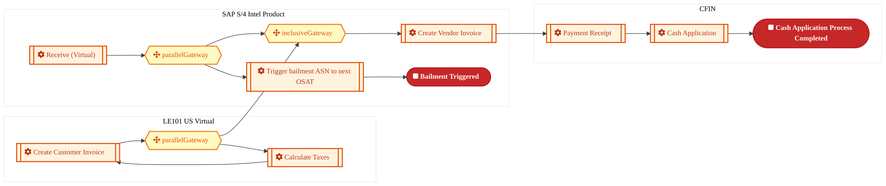
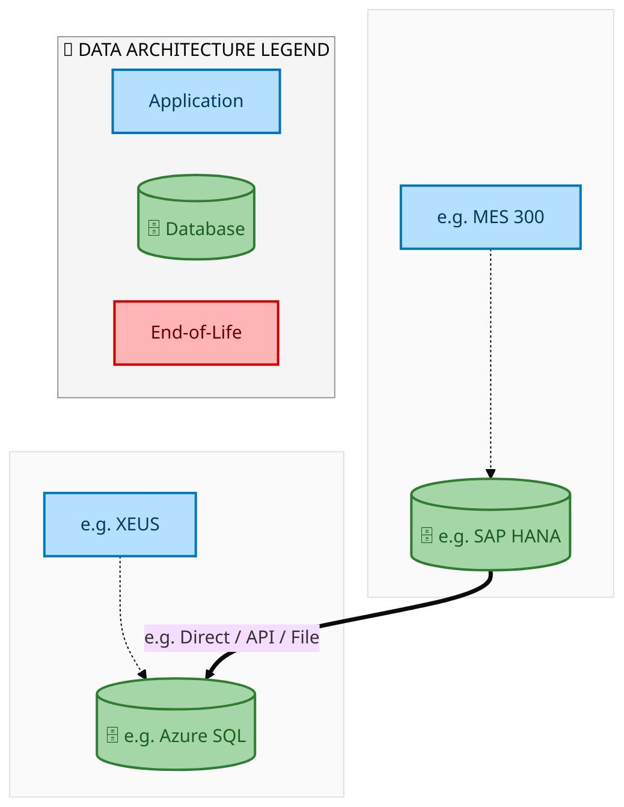
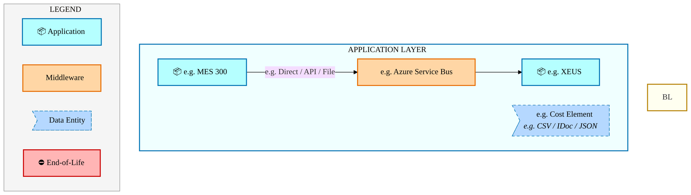
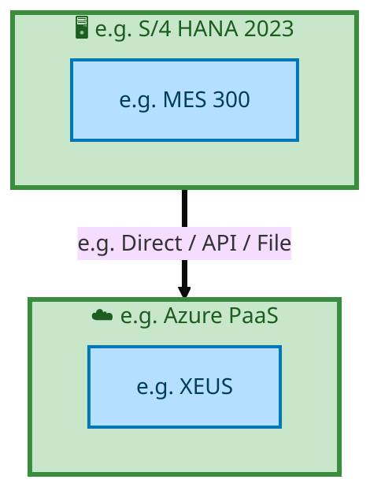

<div style="text-align:center; padding-top:20px;">
  
  <h1 style="font-size:36px; margin-top:24px;">E2E-68 — -Intel Foundry   NPI planning and execution processes</h1>
  <h2 style="font-size:24px;">Architecture Document (TOGAF BDAT)</h2>
  <p style="font-size:18px; color:#555;">End-to-End Integrated Processes (E2E) Tower<br/>
  Capability E2E-68 · Forecast to Stock</p>
  <p style="font-size:14px; color:#888;">IAO Program · Release 2<br/>
  Generated: March 2026<br/>
  Sajiv Francis</p>
  <p style="font-size:12px; color:#aaa;">IAO Architecture Pipeline — Intel Confidential</p>
</div>

<style>
@media print {
  @page { margin: 0.75in; }
  .mermaid { page-break-inside: avoid; overflow: visible; }
  pre, table { page-break-inside: avoid; }
  h2, h3, h4 { page-break-after: avoid; }
}
.mermaid { overflow: visible; }
.mermaid svg { max-width: 100%; height: auto !important; }
.page-footer {
  padding-top: 8px;
  border-top: 1px solid #ddd;
  display: flex;
  justify-content: space-between;
  align-items: center;
  font-size: 11px;
  color: #888;
  position: fixed;
  bottom: 0;
  left: 0;
  right: 0;
  padding: 6px 20px;
  background: #fff;
}
@media print {
  .page-footer { position: fixed; bottom: 0; left: 0.75in; right: 0.75in; }
}
.page-footer a { color: #00aeef; text-decoration: none; font-weight: 500; }
.page-footer a:hover { color: #0071c5; text-decoration: underline; }
</style>

<div class="page-footer"><span>Page 1</span><span><a href="#toc">↑ Back to TOC</a></span><span>E2E-68 — -Intel Foundry   NPI planning and execution processes</span></div>
<div style="page-break-before: always;"></div>

<a id="toc"></a>

## Table of Contents

1. [Executive Summary](#1-executive-summary)
2. [Business Context & Objectives](#2-business-context--objectives)
   - 2.1 [Classification](#21-classification)
   - 2.2 [Business Drivers](#22-business-drivers)
   - 2.3 [Success Criteria](#23-success-criteria)
   - 2.4 [Companion Documents](#24-companion-documents)
3. [Business Architecture (TOGAF "B")](#3-business-architecture-togaf-b)
   - 3.1 [Business Process Overview](#31-business-process-overview)
   - 3.2 [Business Process Diagrams](#32-business-process-diagrams)
   - 3.3 [Business Roles & Responsibilities](#33-business-roles--responsibilities)
4. [Data Architecture (TOGAF "D")](#4-data-architecture-togaf-d)
   - 4.1 [Data Entities & Ownership](#41-data-entities--ownership)
   - 4.2 [Data Flow Diagrams](#42-data-flow-diagrams)
   - 4.3 [Data Lineage](#43-data-lineage)
   - 4.4 [RICEFW Data Objects](#44-ricefw-data-objects)
   - 4.5 [Data Governance & Quality](#45-data-governance--quality)
5. [Application Architecture (TOGAF "A")](#5-application-architecture-togaf-a)
   - 5.1 [Current-State Application Landscape](#51-current-state--current-state-application-landscape)
   - 5.2 [Future-State Application Landscape](#52-future-state--future-state-application-landscape)
   - 5.3 [Change Impact Summary](#53-change-impact-summary)
   - 5.4 [Component Overview](#54-component-overview)
   - 5.5 [RICEFW Inventory](#55-ricefw-inventory)
   - 5.6 [Integration Patterns](#56-integration-patterns)
6. [Technology Architecture (TOGAF "T")](#6-technology-architecture-togaf-t)
   - 6.1 [Platform & Infrastructure](#61-platform--infrastructure)
   - 6.2 [SAP Development Object Status](#62-sap-development-object-status)
   - 6.3 [NFRs & Design Principles](#63-nfrs--design-principles)
   - 6.4 [Security & Governance](#64-security--governance)
7. [Project Context](#7-project-context)
   - 7.1 [Project Roadmap & Go-Live Plan](#71-project-roadmap--go-live-plan)
   - 7.2 [RAID Log](#72-raid-log)
   - 7.3 [Recommendations & Next Steps](#73-recommendations--next-steps)

<div class="page-footer"><span>Page 2</span><span><a href="#toc">↑ Back to TOC</a></span><span>E2E-68 — -Intel Foundry   NPI planning and execution processes</span></div>
<div style="page-break-before: always;"></div>

## 1. Executive Summary

This Architecture Document defines the **Business, Data, Application, and Technology** (BDAT) architecture for **E2E-68 -Intel Foundry   NPI planning and execution processes** within the IAO program. It includes 9 BPMN process diagram(s) in Section 3.
| Dimension | Value |
|-----------|-------|
| **Tower** | End-to-End Integrated Processes (E2E) |
| **Process Group** | Forecast to Stock |
| **Capability** | E2E-68 - -Intel Foundry   NPI planning and execution processes |
| **Release** | Release 2 |
| **Total Systems** | 2 |
| **System Status** | 0 Deployed, 0 Developing, 0 EOL, 2 Pending IAPM |
| **RICEFW Objects** | Pending — Smartsheet Object Tracker API integration |
**Change Summary**: 0 new flow chains, 0 removed, 0 modified, 1 unchanged between Current-State and Future-State states.

> All system nodes in architecture diagrams are **IAPM-linked** — click any node to open its IAPM page. Diagrams require `securityLevel: "loose"` for click events.

<div class="page-footer"><span>Page 3</span><span><a href="#toc">↑ Back to TOC</a></span><span>E2E-68 — -Intel Foundry   NPI planning and execution processes</span></div>
<div style="page-break-before: always;"></div>

## 2. Business Context & Objectives

### 2.1 Classification

| Level | Value |
|-------|-------|
| **L0 Tower** | End-to-End Integrated Processes |
| **L1 Process** | Forecast to Stock |
| **L2 Capability** | E2E-68 - -Intel Foundry   NPI planning and execution processes |

### 2.2 Business Drivers

| # | Driver | Description | Strategic Alignment | Priority |
|---|--------|-------------|---------------------|----------|
| 1 | End-to-End Process Integration | Enable cross-tower integrated processes spanning procurement, manufacturing, and fulfillment | IDM 2.0 Process Excellence | High |
| 2 | Intel Foundry Business Enablement | Stand up foundry-specific business processes for external customer engagement | Intel Foundry Services | High |
| 3 | Process Visibility & Monitoring | Provide end-to-end process visibility across tower boundaries with integrated monitoring | Operational Excellence | Medium |
| 4 | E2E-68 Process Migration | Migrate -Intel Foundry   NPI planning and execution processes business processes and 2 integrated systems from legacy to S/4 HANA target architecture | IDM 2.0 Cross-Functional / End-to-End | High |

<div class="page-footer"><span>Page 4</span><span><a href="#toc">↑ Back to TOC</a></span><span>E2E-68 — -Intel Foundry   NPI planning and execution processes</span></div>
<div style="page-break-before: always;"></div>

### 2.3 Success Criteria

| Metric | Target | Measure | Baseline | Owner |
|--------|--------|---------|----------|-------|
| E2E Process Cycle Time | Per process SLA | End-to-end transaction completion within defined SLA per process | Varies by process | E2E Process Owner |
| Cross-Tower Integration Success | > 99% | Transactions completing across tower boundaries without manual intervention | 92% (current) | Integration Lead |
| Process Exception Rate | < 2% | Transactions requiring manual exception handling | 8% (current) | Operations Manager |
| E2E-68 Migration Completeness | 100% flow chains validated | All 1 flow chains verified in target state | 0% (pre-migration) | Tower Architect |

### 2.4 Companion Documents

| Document | Description |
|----------|-------------|
| **Business Architecture** | Included in this document (Section 3) — process flows from BPMN diagrams |
| **This Document** | Full BDAT Architecture — Business + Data + Application + Technology |

<div class="page-footer"><span>Page 5</span><span><a href="#toc">↑ Back to TOC</a></span><span>E2E-68 — -Intel Foundry   NPI planning and execution processes</span></div>
<div style="page-break-before: always;"></div>

## 3. Business Architecture (TOGAF "B")

### 3.1 Business Process Overview

This capability includes **9 business process(es)** modeled in BPMN 2.0, covering the end-to-end workflow for E2E-68 -Intel Foundry   NPI planning and execution processes.

| # | Step ID | Process Name | Lanes | Tasks | Gateways |
|---|---------|--------------|-------|-------|----------|
| 1 | E2E-68A-_NPI_setup_for_IF | E2E-68A-_NPI_setup_for_IF | Boundary Apps, SAP S/4 Intel Foundry
 | 2 | 0 |
| 2 | E2E-68B-_Raising_Purchase_Order_by_Intel_Products_to_Intel_Foundry_(LE-101) | E2E-68B-_Raising_Purchase_Order_by_Intel_Products_to_Intel_Foundry_(LE-101) | SAP S/4 
Intel Foundry (LE-101)
, SAP S/4 
Intel Prod
 | 14 | 4 |
| 3 | E2E-68C-_Order_Confirmation_&amp;_Planned_order_trigger | E2E-68C-_Order_Confirmation_&amp;_Planned_order_trigger | LE101 US Virtual , LE500 Ireland
, SAP S/4 Intel Foundry

LE778 China
 | 11 | 1 |
| 4 | E2E-68D-_Manufacturing_process_in_IF | E2E-68D-_Manufacturing_process_in_IF | Boundary
Apps
Intel Foundry
, SAP S/4
Intel Foundry (LE-500)
 | 20 | 6 |
| 5 | E2E-68E-_Manufacturing_process_in_IF_(NPI_Planning_and_Execution_Process) | E2E-68E-_Manufacturing_process_in_IF_(NPI_Planning_and_Execution_Process) | Boundary Apps

, SAP S/4
Intel Foundry LE500 Ireland
, SAP S/4
LE778 China
 | 21 | 6 |
| 6 | E2E-68F-_TM_Steps | E2E-68F-_TM_Steps | Boundary Apps

, External Partners/
Supplier
, SAP S/4
LE778 China
 | 12 | 1 |
| 7 | E2E-68G-_NPI_planning_&amp;_Execution_Process_for_Finished_Goods_in_Intel_Foundry_with_Planning_inte | E2E-68G-_NPI_planning_&amp;_Execution_Process_for_Finished_Goods_in_Intel_Foundry_with_Planning_inte | Boundary Apps

, External Partners/ B2B
, SAP S/4
Intel Foundry LE500 Ireland
, SAP S/4
LE101 US Virtual

 | 24 | 7 |
| 8 | E2E-68H-_NPI_planning_&amp;_Execution_Process_for_Finished_Goods_in_Intel_Foundry_with_Planning_inte | E2E-68H-_NPI_planning_&amp;_Execution_Process_for_Finished_Goods_in_Intel_Foundry_with_Planning_inte | CFIN
, LE101 US Virtual
, SAP S/4
Intel Product | 7 | 3 |
| 9 | E2E-68I-_TM_Steps | E2E-68I-_TM_Steps | Boundary Apps

, SAP S/4
LE778 China
 | 10 | 1 |

### 3.2 Business Process Diagrams

<div class="page-footer"><span>Page 6</span><span><a href="#toc">↑ Back to TOC</a></span><span>E2E-68 — -Intel Foundry   NPI planning and execution processes</span></div>
<div style="page-break-before: always;"></div>

#### BUSINESS ARCHITECTURE — 3.2.1 E2E-68A-_NPI_setup_for_IF — E2E-68A-_NPI_setup_for_IF

**Swim Lanes**: Boundary Apps · SAP S/4 Intel Foundry
 | **Tasks**: 2 | **Gateways**: 0

> **Legend**: <span style="color:#000;background:#4CAF50;padding:2px 6px;border-radius:10px;font-weight:bold;font-size:9pt">● Start</span> · <span style="color:#fff;background:#C62828;padding:2px 6px;border-radius:10px;font-weight:bold;font-size:9pt">● End</span> · <span style="background:#E3F2FD;padding:2px 6px;border:1px solid #1565C0;font-size:9pt">User Task</span> · <span style="background:#FFF3E0;padding:2px 6px;border:1px solid #E65100;font-size:9pt">Service Task</span> · <span style="background:#FFF9C4;padding:2px 6px;border:1px solid #F57F17;font-size:9pt">◇ Gateway</span> · <span style="background:#F3E5F5;padding:2px 6px;border:1px solid #7B1FA2;font-size:9pt">Sub-Process</span>


<div style="text-align:center; margin:4px 0 8px 0; font-size:11px;"><a href="https://mermaid.live/view#pako:eNqlVMuO2jAU_RUrI5RWCpo8Cc2iUghYQmqrkZhpF6ULk9hgjWNHtjMMRfx7bR7h0bJqFlHu8b3nnHtje-uUosJO5vR6W8qpzsDW1StcYzcD7gIp7HrgAHxHkqIFw8q1OURwPaO_92lB3LzbNItBVFO2segMLwUGL1MP5KaQeUAhrvoKS0pcz20krZHcFIIJabMf8JD4ZK92XBoJWWF5TvD9NCgTU8oox2c4SuM0hrZO4VLw6oqUJGRISndnzTGxLldI6r39VuGv6P0HrfTKxAQxhU3OStfsC1pgZnvUsrVY2cq30zCosjrcDGzWoJLypcFj30AS8dczlPi7Hdj1enPeiYLn8ZwD85QMKTXGBCht4MmbBoQylj3ERQ4T31NailecPYSTdByFXmk7yUzrvmeH219julzpbCFYdUztr20PWdi8e_I9C31Pbsz7Rgvz6qxUDMJhOOyURmlQBMVJiRDyX0pmrvIZqdej1iSCIRx3WkEySAr_b75Tm-M4zYPbOWH5Rkt8QQohjCbnUU0GSeDfJx3BaOAXN6RLpPEabc6En4q4I4RJCoP0LuFB79Zlu3iSojwRRpMEJh1hOgpgHt4ljPMgHh4dGp6lRM0KjES738sgbxp1WLMPD3_OHYIygvp21KCQ2LQCcsbAt6cp-GoCe9gUoBxMoYl5ixjbzJ1fFxzRh46kYWYKtlJh3TaACGnLbCtYKTA1FwI1lJWp_3ggMFvpxuksfwKzx9gka8wAtL6N7Qu5wKgdfD6-NJW1e7JpPpT5unYXn90pLZr77gpRNwz_2x0PQL__2ZAdw-gQhhe_zUTddr2Co-5sXsHx8Rg5nlNjWSNaOdnW2V-N5vqsMEEt087Oc1CrxWzDSyfbXyFOu296TJGZV30Ad38Ajaq_tQ==" title="View Full Diagram">&#128065; View Full Diagram</a></div>

<div class="page-footer"><span>Page 7</span><span><a href="#toc">↑ Back to TOC</a></span><span>E2E-68 — -Intel Foundry   NPI planning and execution processes</span></div>
<div style="page-break-before: always;"></div>

#### BUSINESS ARCHITECTURE — 3.2.2 E2E-68B-_Raising_Purchase_Order_by_Intel_Products_to_Intel_Foundry_(LE-101) — E2E-68B-_Raising_Purchase_Order_by_Intel_Products_to_Intel_Foundry_(LE-101)

**Swim Lanes**: SAP S/4 
Intel Foundry (LE-101)
 · SAP S/4 
Intel Prod
 | **Tasks**: 14 | **Gateways**: 4

> **Legend**: <span style="color:#000;background:#4CAF50;padding:2px 6px;border-radius:10px;font-weight:bold;font-size:9pt">● Start</span> · <span style="color:#fff;background:#C62828;padding:2px 6px;border-radius:10px;font-weight:bold;font-size:9pt">● End</span> · <span style="background:#E3F2FD;padding:2px 6px;border:1px solid #1565C0;font-size:9pt">User Task</span> · <span style="background:#FFF3E0;padding:2px 6px;border:1px solid #E65100;font-size:9pt">Service Task</span> · <span style="background:#FFF9C4;padding:2px 6px;border:1px solid #F57F17;font-size:9pt">◇ Gateway</span> · <span style="background:#F3E5F5;padding:2px 6px;border:1px solid #7B1FA2;font-size:9pt">Sub-Process</span>

```mermaid
%%{init: {"theme": "base", "themeVariables": {"fontSize": "14px", "fontFamily": "Segoe UI, Arial, sans-serif","primaryColor": "#e8f0fe", "primaryBorderColor": "#0071c5","lineColor": "#37474F", "secondaryColor": "#f5f8fc"}, "flowchart": {"useMaxWidth": false, "htmlLabels": true, "curve": "basis", "nodeSpacing": 40, "rankSpacing": 50}} }%%
flowchart LR
    classDef startEvt fill:#4CAF50,stroke:#2E7D32,color:#000,font-weight:bold,stroke-width:2px,rx:20,ry:20
    classDef endEvt fill:#C62828,stroke:#B71C1C,color:#fff,font-weight:bold,stroke-width:2px,rx:20,ry:20
    classDef userTask fill:#E3F2FD,stroke:#1565C0,stroke-width:2px,color:#0D47A1
    classDef serviceTask fill:#FFF3E0,stroke:#E65100,stroke-width:2px,color:#BF360C
    classDef gateway fill:#FFF9C4,stroke:#F57F17,stroke-width:2px,color:#E65100
    classDef subProc fill:#F3E5F5,stroke:#7B1FA2,stroke-width:2px,color:#4A148C
    subgraph SAP S/4  Intel Foundry (LE-101) 
        n2["fa:fa-user Create Sales Orders"]
        n3["fa:fa-user Manual Price Override"]
        n5[["fa:fa-cog Perform Order Validation"]]
        n6[["fa:fa-cog Derive MM ID from CPN"]]
        n7[["fa:fa-cog Perform Credit Check (Via. FSCM)"]]
        n8[["fa:fa-cog Trigger GTS Check"]]
        n9[["fa:fa-cog Hold"]]
        n10[["fa:fa-cog Perform GTS Check"]]
        n11[["fa:fa-cog Calculate Pricing"]]
        n12[["fa:fa-cog Calculate Taxes"]]
        n13[["fa:fa-cog Order Confirmation"]]
        n14[["fa:fa-cog Update Line-Item text"]]
        n16(["fa:fa-play Manual Override Initiated"])
        n17(["fa:fa-stop Tax Caluculated"])
        n18(["fa:fa-stop GTS Check Completed"])
        n19["E2E-68C- Order Confirmation and Planned order trigger"]
        n20{{"fa:fa-code-branch exclusiveGateway"}}
        n21{{"fa:fa-code-branch Credit Check?"}}
        n22{{"fa:fa-code-branch exclusiveGateway"}}
        n23{{"fa:fa-arrows-alt parallelGateway"}}
    end
    subgraph SAP S/4  Intel Prod 
        n1["fa:fa-user Create Purchase req"]
        n4[["fa:fa-cog Create Purchase Order"]]
        n15(["fa:fa-play Raising PO by IP To IF (LE-101)"])
    end
    n1 --> n4
    n15 --> n1
    n2 --> n20
    n4 --> n2
    n5 --> n6
    n6 --> n7
    n7 --> n21
    n21 -->|"No"| n9
    n8 --> n22
    n20 --> n5
    n9 --> n20
    n22 --> n10
    n22 --> n11
    n11 --> n23
    n23 --> n12
    n23 --> n13
    n3 --> n14
    n16 --> n3
    n21 -->|"Yes"| n8
    n14 --> n22
    n13 --> n19
    n12 --> n17
    n10 --> n18
    class n1 userTask
    class n2 userTask
    class n3 userTask
    class n4 serviceTask
    class n5 serviceTask
    class n6 serviceTask
    class n7 serviceTask
    class n8 serviceTask
    class n9 serviceTask
    class n10 serviceTask
    class n11 serviceTask
    class n12 serviceTask
    class n13 serviceTask
    class n14 serviceTask
    class n15 startEvt
    class n16 startEvt
    class n17 endEvt
    class n18 endEvt
    class n19 startEvt
    class n20 gateway
    class n21 gateway
    class n22 gateway
    class n23 gateway
```

<div style="text-align:center; margin:4px 0 8px 0; font-size:11px;"><a href="https://mermaid.live/view#pako:eNqlV1tvo0YU_isjoshZCVqGi8E8tHKw2VpKNtY6m6pa92EMgz3KeHAHSOx6_d87Yy42BPrQ5iHSfOf7zo3DGXxUwiTCiqfc3h4JI5kHjoNsg7d44IHBCqV4oIICeEGcoBXF6UBy4oRlC_L3mQat3V7SJBagLaEHiS7wOsHg20wFYyGkKkgRS7UUcxIP1MGOky3iBz-hCZfsG-zGenyOVpruEx5hfiHougNDW0gpYfgCm47lWIHUpThMWNRwGtuxG4eDk0yOJu_hBvHsnH6e4ke0_51E2UacY0RTLDibbEsf0ApTWWPGc4mFOX-rmkFSGYeJhi12KCRsLXBLFxBH7PUC2frpBE63t0tWBwUPX5cMiL-QojSd4BikmYCnbxmICaXejeWPA1tX04wnr9i7MabOxDTUUFbiidJ1VTZXe8dkvcm8VUKjkqq9yxo8Y7dX-d4zdJUfxP9WLMyiSyR_aLiGW0e6d6AP_SpSHMf_K5LoK39G6WsZa2oGRjCpY0F7aPv6R39VmRPLGcN2nzB_IyG-choEgTm9tGo6tKHe7_Q-MIe633K6Rhl-R4eLw5Fv1Q4D2wmg0-uwiNfOMl_NeRJWDs2pHdi1Q-ceBmOj16E1hpZbZij8rDnabcBiPAeLny0AZizDFARJziJ-AHcPUw3q8BMo6PKPGd-XSoy8GGmy-8DnWFQHFki8quBJvkPpUvnzim82-Y-I5YiCORddBk9vmHMS4abC_l5LwmQN5pjHCd8WzsELoiRCGUmYEF2rhk3VRLz5bxg8PoLZBMQ82QJ__qUlcboDiZIikgF_g8NXcPdC0E8gWPiPn1pqt6l-5mS9Fgl-fl4U0hZ91KT_Jka9xYB6dz59HiFs8n1Ew5zKpyG7K5ZDm2_08Z_RHqdtttlkF-33ExYTvu16ANBqCr7tIun7QexPbZbhLcjwPmtrhne1ZkfFK1KORzUYYh5JRoQb2atP10LnIkyzZCdLkAXlRUUf6G6LXvdUVLTdUdwhGQnF1JhqQ9fXOqoHiEVgThFjOALny0Ps8PMINKfZ0I_HS1sirK3E-g43AO9DmqdiRj8X22GpnE7XMtgtux7OX9sa47-FMi8yxHnynmqIZmCHOKIU0w8isd__fX2I3RRdrwzYuTLmOReXVYoBx381W9YapDb__Czag2S3BukrIql4BcD8CawOYDYHzwmYBfVGuzzsuhoGgab9IqJXR7s4l1cEM4pjdQkxqzyXx5I9LI_D4uiUR6ck187OwX4slS_JUvkhtkOJuyWv8mroBWCX51ErCaPMCn4AqkiwLMswK4ZZMow2UDGqc92JshiznfwfcmuI7N2KaLXSh5Wrqj5YpVc1BpYFQvfqjpPPorrbG7DRDZvdsHV9nTcsdq9l2Gtxei1ur2XUaxF195pgv8noN5n9pv5GiCGvPg2b-LAHd8rPuybqdqKjbh9ipssvoiYMu2GjGzYrWFGVLRZLmUSKd1TOPx7ED4wIxyinmXJSFZRnyeLAQsU7f2Qr-flimhAklte2AE__ANlQ3gw=" title="View Full Diagram">&#128065; View Full Diagram</a></div>

<div class="page-footer"><span>Page 8</span><span><a href="#toc">↑ Back to TOC</a></span><span>E2E-68 — -Intel Foundry   NPI planning and execution processes</span></div>
<div style="page-break-before: always;"></div>

#### BUSINESS ARCHITECTURE — 3.2.3 E2E-68C-_Order_Confirmation_&amp;_Planned_order_trigger — E2E-68C-_Order_Confirmation_&amp;_Planned_order_trigger

**Swim Lanes**: LE101 US Virtual  · LE500 Ireland
 · SAP S/4 Intel Foundry

LE778 China
 | **Tasks**: 11 | **Gateways**: 1

> **Legend**: <span style="color:#000;background:#4CAF50;padding:2px 6px;border-radius:10px;font-weight:bold;font-size:9pt">● Start</span> · <span style="color:#fff;background:#C62828;padding:2px 6px;border-radius:10px;font-weight:bold;font-size:9pt">● End</span> · <span style="background:#E3F2FD;padding:2px 6px;border:1px solid #1565C0;font-size:9pt">User Task</span> · <span style="background:#FFF3E0;padding:2px 6px;border:1px solid #E65100;font-size:9pt">Service Task</span> · <span style="background:#FFF9C4;padding:2px 6px;border:1px solid #F57F17;font-size:9pt">◇ Gateway</span> · <span style="background:#F3E5F5;padding:2px 6px;border:1px solid #7B1FA2;font-size:9pt">Sub-Process</span>


<div style="text-align:center; margin:4px 0 8px 0; font-size:11px;"><a href="https://mermaid.live/view#pako:eNqlVltvozgU_isWVZVWCh0g3MLDSikJVaTOTlRmZh-m--CCSawSw9qmaTbKf99DuCSkYbS7wwPS-c53rj6-7JQoi4niKdfXO8qo9NBuIFdkTQYeGrxgQQZDVAHfMaf4JSViUHKSjMmQ_n2g6Wb-XtJKLMBrmm5LNCTLjKBv8yGagGE6RAIzoQrCaTIYDnJO15hv_SzNeMm-Im6iJYdoteo-4zHhR4KmOXpkgWlKGTnCI8d0zKC0EyTKWNxxmliJm0SDfZlcmm2iFebykH4hyGf8_geN5QrkBKeCAGcl1-kjfiFpWaPkRYlFBX9rmkFFGYdBw8IcR5QtATc1gDhmr0fI0vZ7tL--fmZtUPT49MwQfFGKhZiSBAkJ8OxNooSmqXdl-pPA0oZC8uyVeFfGzJmOjGFUVuJB6dqwbK66IXS5kt5LlsY1Vd2UNXhG_j7k756hDfkW_mexCIuPkXzbcA23jXTv6L7uN5GSJPmlSNBX_hWL1zrWbBQYwbSNpVu25Wsf_TVlTk1nop_3ifA3GpETp0EQjGbHVs1sS9f6nd4HI1vzz5wusSQbvD06HPtm6zCwnEB3eh1W8c6zLF4WPIsah6OZFVitQ-deDyZGr0NzoptunSH4WXKcr9DjTNd09C1E3ymXBU5RpS8_pv94VhLsJVgt242eSEToG0F-xhLK1yRGIYZtir6U-0c8K3-emBpdU58T6ARaFBymVBDEyV9d_ujn_EOIroXugsnMmKm2O1HR74s5rKAscpRkHM2Dlgsj-aFiS9PQnJMUs_i0XPtyDkBjUOulFLQfrUmULRuLuY_Cr09A7XD1fu4XdBMGD6qm354bmTetUZ7CHHWSqXzQjKE5HKgU3MVgf3tq74C57U7Vz5gVCY5kweHkQDlMEBECUbAM0E3H6e1POhdOFij8ZEI4SVIUZAWL-RZBQx3HRf6KMnzaTvNiO_tHxvqv7Xe6HV0QDmu_hjHNiYR-wKSGkuQCSdgr6HDIo6ga3UPXznrt_vu1HP-fpTTOltLHYoUCOLc_3WOoMYJsV4TIquBylfT-ZR394lhYR3shsxwt6oGYsQ9Uu91lD9Uuy5v8yt0zeydRcYjVuCi3XwAXvFhBPg9ZFldjVk7M3d3d2f4Z73ZNHpjzbCNUnErgR2khYP0eqtPzWdnvz0aSGUhVf4NjoxZHlWjWolmJTi26laiPa9mu5Uavjyug0deirjX6OprbyHU4q5HreHYja7WD-o5hVi03BKeWWwdNho1ciUYj6t0CDrdByWpuwQ5sXIZHl2HzMmxdhu3LsHN6e3Y0bq9m3KuB9vWq9H6V0T51uvioBzd7cKt-xnRRu4ft9OBuDz5u3gTKUFkTOIporHg75fDyhddxTBJcpFLZDxVcyCzcskjxDi9EpchjsJxSDIfxugL3_wBvz4F6" title="View Full Diagram">&#128065; View Full Diagram</a></div>

<div class="page-footer"><span>Page 9</span><span><a href="#toc">↑ Back to TOC</a></span><span>E2E-68 — -Intel Foundry   NPI planning and execution processes</span></div>
<div style="page-break-before: always;"></div>

#### BUSINESS ARCHITECTURE — 3.2.4 E2E-68D-_Manufacturing_process_in_IF — E2E-68D-_Manufacturing_process_in_IF

**Swim Lanes**: Boundary
Apps
Intel Foundry
 · SAP S/4
Intel Foundry (LE-500)
 | **Tasks**: 20 | **Gateways**: 6

> **Legend**: <span style="color:#000;background:#4CAF50;padding:2px 6px;border-radius:10px;font-weight:bold;font-size:9pt">● Start</span> · <span style="color:#fff;background:#C62828;padding:2px 6px;border-radius:10px;font-weight:bold;font-size:9pt">● End</span> · <span style="background:#E3F2FD;padding:2px 6px;border:1px solid #1565C0;font-size:9pt">User Task</span> · <span style="background:#FFF3E0;padding:2px 6px;border:1px solid #E65100;font-size:9pt">Service Task</span> · <span style="background:#FFF9C4;padding:2px 6px;border:1px solid #F57F17;font-size:9pt">◇ Gateway</span> · <span style="background:#F3E5F5;padding:2px 6px;border:1px solid #7B1FA2;font-size:9pt">Sub-Process</span>

```mermaid
%%{init: {"theme": "base", "themeVariables": {"fontSize": "14px", "fontFamily": "Segoe UI, Arial, sans-serif","primaryColor": "#e8f0fe", "primaryBorderColor": "#0071c5","lineColor": "#37474F", "secondaryColor": "#f5f8fc"}, "flowchart": {"useMaxWidth": false, "htmlLabels": true, "curve": "basis", "nodeSpacing": 40, "rankSpacing": 50}} }%%
flowchart TD
    classDef startEvt fill:#4CAF50,stroke:#2E7D32,color:#000,font-weight:bold,stroke-width:2px,rx:20,ry:20
    classDef endEvt fill:#C62828,stroke:#B71C1C,color:#fff,font-weight:bold,stroke-width:2px,rx:20,ry:20
    classDef userTask fill:#E3F2FD,stroke:#1565C0,stroke-width:2px,color:#0D47A1
    classDef serviceTask fill:#FFF3E0,stroke:#E65100,stroke-width:2px,color:#BF360C
    classDef gateway fill:#FFF9C4,stroke:#F57F17,stroke-width:2px,color:#E65100
    classDef subProc fill:#F3E5F5,stroke:#7B1FA2,stroke-width:2px,color:#4A148C
    subgraph Boundary Apps Intel Foundry 
        n14[["fa:fa-cog Split/Merge of production order"]]
        n15[["fa:fa-cog Lot Start"]]
        n16[["fa:fa-cog Issue component"]]
        n17[["fa:fa-cog Move In/ Move Out"]]
        n18[["fa:fa-cog Perform Quality Check"]]
        n19[["fa:fa-cog Update Scrap/Yield"]]
        n20[["fa:fa-cog Lot Complete"]]
        n24{{"fa:fa-code-branch Milestone Confirmation Check ?"}}
        n28{{"fa:fa-arrows-alt parallelGateway"}}
        n29{{"fa:fa-arrows-alt parallelGateway"}}
    end
    subgraph SAP S/4 Intel Foundry (LE-500) 
        n1["fa:fa-user Create Planned Order"]
        n2[["fa:fa-cog Goods Issue and Update Inventory"]]
        n3[["fa:fa-cog Perform Goods Receipt"]]
        n4[["fa:fa-cog Receive Goods in Unrestricted Stock"]]
        n5[["fa:fa-cog Perform TECO – Technical Completion"]]
        n6[["fa:fa-cog Prod Operation Confirmation"]]
        n7[["fa:fa-cog Create Production Order"]]
        n8[["fa:fa-cog Release Production Order"]]
        n9[["fa:fa-cog Perform Component Staging"]]
        n10[["fa:fa-cog Perform Posting Change (PMR Creation)"]]
        n11[["fa:fa-cog Perform Staging Task"]]
        n12[["fa:fa-cog Perform Staging Task Confirmation"]]
        n13[["fa:fa-cog Perform Consumption and Goods Issue (Manual/Job)"]]
        n21(["fa:fa-play Manufacturing process in IF Initiated"])
        n22(["fa:fa-stop TECO Completed"])
        n23["Execute Prod Costing Steps"]
        n25{{"fa:fa-arrows-alt parallelGateway"}}
        n26{{"fa:fa-arrows-alt parallelGateway"}}
        n27{{"fa:fa-arrows-alt parallelGateway"}}
    end
    n15 --> n16
    n16 --> n17
    n17 --> n28
    n18 --> n19
    n19 --> n29
    n28 --> n18
    n28 --> n14
    n1 --> n7
    n7 --> n8
    n8 --> n26
    n26 --> n10
    n10 --> n11
    n11 --> n12
    n27 --> n9
    n26 --> n27
    n12 --> n27
    n9 --> n13
    n13 --> n2
    n3 --> n4
    n4 --> n25
    n25 --> n23
    n25 --> n5
    n6 --> n3
    n21 --> n1
    n5 --> n22
    n28 --> n24
    n29 --> n20
    class n1 userTask
    class n2 serviceTask
    class n3 serviceTask
    class n4 serviceTask
    class n5 serviceTask
    class n6 serviceTask
    class n7 serviceTask
    class n8 serviceTask
    class n9 serviceTask
    class n10 serviceTask
    class n11 serviceTask
    class n12 serviceTask
    class n13 serviceTask
    class n14 serviceTask
    class n15 serviceTask
    class n16 serviceTask
    class n17 serviceTask
    class n18 serviceTask
    class n19 serviceTask
    class n20 serviceTask
    class n21 startEvt
    class n22 endEvt
    class n23 startEvt
    class n24 gateway
    class n25 gateway
    class n26 gateway
    class n27 gateway
    class n28 gateway
    class n29 gateway
```

<div style="text-align:center; margin:4px 0 8px 0; font-size:11px;"><a href="https://mermaid.live/view#pako:eNqlV11vozgU_SsWoyqtlKjYQCB52FVKw6irqdqddHa1ms6DAyaxSmxkTNtslf--5sNJcMOOtpuHqpx77tfxtTFvVswTYk2ts7M3yqicgreBXJMNGUzBYIkLMhiCBvgDC4qXGSkGFSflTC7o3zUNuvlrRauwCG9otq3QBVlxAr7dDMFMOWZDUGBWjAoiaDoYDnJBN1hsQ55xUbE_kSC10zpba7riIiHiQLBtH8aecs0oIwfY8V3fjSq_gsScJZ2gqZcGaTzYVcVl_CVeYyHr8suC3OLXP2ki1-o5xVlBFGctN9kXvCRZ1aMUZYXFpXjWYtCiysOUYIscx5StFO7aChKYPR0gz97twO7s7JHtk4KH60cG1C_OcFFckxQUUsHzZwlSmmXTT244izx7WEjBn8j0E5r71w4axlUnU9W6PazEHb0QulrL6ZJnSUsdvVQ9TFH-OhSvU2QPxVb9NXIRlhwyhWMUoGCf6cqHIQx1pjRN_1cmpat4wMVTm2vuRCi63ueC3tgL7ffxdJvXrj-Dpk5EPNOYHAWNosiZH6Sajz1o9we9ipyxHRpBV1iSF7w9BJyE7j5g5PkR9HsDNvnMKsvlveCxDujMvcjbB_SvYDRDvQHdGXSDtkIVZyVwvgZXvKxnGczyvAA3TJIMRBWmoIZa_Rh0v39_tFI8TfEo5iuwyDMqL2-JWBHAU5ALnpSxpJyBejc9Wj9-HHt7Xe8vXIJFNZcmb9zl3RRFSUDMNzlnhL1j-132LX8mqoPL5p-78h0_6PLviUi52IDfS6ya2YJwTeIn02fS9fmWJ2pJwSJW4l3-RUmWGA7Ift9qqBrIiCQm1X17O1ATMlqq7R2vwS1Vh59UHStHllKxwbWwdXng10drtzsOEhyCYCH4SzHCmQQ5FjjLSPa5GUDTafLfnNS-NsZmMbsHi0vXGJjzL_ORZ9sXncnZy1HtWRAKUgl4n2HGSALu2mk5Lq4r4GfOk6KdBMwSvQI37FlNBBdbQ1Tn9Bo3Ub6SmNDcnAtjtGuSGqDGhTLwjQm1HoLGUhW8kPzdkHincz7MwzvwWCIbOuCBxGtGY5zpYVArakQxZl9tcyVPTkS7-kejYDga20ArfNiSdye2ZGA2nRH1Ev6Z1-R0p6HeodWuXqmXk7mL7NN-97yQiq1GGzN1kJzf335tylf5L8wY8HSMNiOoDm7TBf3c5d-EhU5fu6woN3mtUjWSxyN6fouZOk8uf-NLswMEz_fh8ky9FSpqimNZiqoadYbGpKgn7iZS800lVetYnS8Xx0HQIYg6JPJmyvQJ847tKPL8lcRlOxGK2Ui-kCQvjI3nfeQoGX_Eyf_g-aPeJGA0-qV6U2hg3AK-BvwGQIEGgpYx0cCkZWgAaUZgAq52aZ51jjaFprdspGtCuiZbu9stADXQBoRIu7QhJ0YItG8LGUDbBHQ0wWkJ7XP7qDtwW6unE7RCIscANKEtYG_WFbfP2h0ZkiGdEGmVj68wlZL66taB0fH9q2Nxei1ur8XrtYx7LX6vJei1THotasV7TbDf1C8D7NcB9gsB-5WA_VLAfi1gvxiwXw3Ur4aaK_2F0sVR-zXRRZ0etquv2l3YOw2PT8P-aTg4DU80bA2tDVFvEJpY0zer_oZV37kJSXGZSWs3tHAp-WLLYmtaf-tZZX2FuaZY3aU2Dbj7B12Ztp4=" title="View Full Diagram">&#128065; View Full Diagram</a></div>

<div class="page-footer"><span>Page 10</span><span><a href="#toc">↑ Back to TOC</a></span><span>E2E-68 — -Intel Foundry   NPI planning and execution processes</span></div>
<div style="page-break-before: always;"></div>

#### BUSINESS ARCHITECTURE — 3.2.5 E2E-68E-_Manufacturing_process_in_IF_(NPI_Planning_and_Execution_Process) — E2E-68E-_Manufacturing_process_in_IF_(NPI_Planning_and_Execution_Process)

**Swim Lanes**: Boundary Apps

 · SAP S/4
Intel Foundry LE500 Ireland
 · SAP S/4
LE778 China
 | **Tasks**: 21 | **Gateways**: 6

```mermaid
%%{init: {"theme": "base", "themeVariables": {"fontSize": "14px", "fontFamily": "Segoe UI, Arial, sans-serif","primaryColor": "#e8f0fe", "primaryBorderColor": "#0071c5","lineColor": "#37474F", "secondaryColor": "#f5f8fc"}, "flowchart": {"useMaxWidth": false, "htmlLabels": true, "curve": "basis", "nodeSpacing": 40, "rankSpacing": 50}} }%%
flowchart LR
    classDef startEvt fill:#4CAF50,stroke:#2E7D32,color:#000,font-weight:bold,stroke-width:2px,rx:20,ry:20
    classDef endEvt fill:#C62828,stroke:#B71C1C,color:#fff,font-weight:bold,stroke-width:2px,rx:20,ry:20
    classDef userTask fill:#E3F2FD,stroke:#1565C0,stroke-width:2px,color:#0D47A1
    classDef serviceTask fill:#FFF3E0,stroke:#E65100,stroke-width:2px,color:#BF360C
    classDef gateway fill:#FFF9C4,stroke:#F57F17,stroke-width:2px,color:#E65100
    classDef subProc fill:#F3E5F5,stroke:#7B1FA2,stroke-width:2px,color:#4A148C
    subgraph Boundary Apps  
        n21[["fa:fa-cog Perform Pack, Mark, Label SPECTRUM (for Customer Label"]]
    end
    subgraph SAP S/4 Intel Foundry LE500 Ireland 
        n1["IC Invoice​ Bill To: LE778​"]
        n2[["fa:fa-cog Determine Delivery Quantity"]]
        n3[["fa:fa-cog Perform GTS Compliance Check"]]
        n4[["fa:fa-cog Perform Picking WH Task Creation (Wave Management)"]]
        n5[["fa:fa-cog Perform Freight Unit and Freight Order Creation"]]
        n6[["fa:fa-cog Perform Picking WH Task Confirmation"]]
        n7[["fa:fa-cog Perform Packing (Shipping Label Printing) and Packing List"]]
        n8[["fa:fa-cog Perform Loading (Optional)"]]
        n9[["fa:fa-cog Create Export Invoice"]]
        n10[["fa:fa-cog Perform GTS (Export Declaration US Only)"]]
        n11[["fa:fa-cog Create Commercial Invoice (Proforma)"]]
        n12[["fa:fa-cog Create Intercompany Invoice (Applicable for Non-US countries)"]]
        n13[["fa:fa-cog Ship (Goods Issue)"]]
        n14[["fa:fa-cog AR Posting and Auto Clearing"]]
        n15[["fa:fa-cog Perform Outbound Delivery (Full Quantity)"]]
        n16[["fa:fa-cog Perform Outbound Delivery (Full Quantity)"]]
        n17[["fa:fa-cog Perform Outbound Deliveries (with partial quantities) – Lot 2"]]
        n22(["fa:fa-stop Intercompany Invoice Created"])
        n23(["fa:fa-stop GTS Check Completed"])
        n26["E2E-68D- Manufacturing process in IF"]
        n27{{"fa:fa-code-branch exclusiveGateway"}}
        n28{{"fa:fa-code-branch Partial or Full Quantity?"}}
        n29{{"fa:fa-code-branch exclusiveGateway"}}
        n30{{"fa:fa-code-branch exclusiveGateway"}}
        n31{{"fa:fa-arrows-alt parallelGateway"}}
        n32{{"fa:fa-arrows-alt parallelGateway"}}
    end
    subgraph SAP S/4 LE778 China 
        n18[["fa:fa-cog AR Posting and Auto Clearing"]]
        n19[["fa:fa-cog Perform Inbound Delivery (SFG-01) wrt STO"]]
        n20[["fa:fa-cog Perform Goods Receipt (SFG-01)"]]
        n24(["fa:fa-stop AP Posting and Auto Clearing Completed"])
        n25["E2E 68G"]
    end
    n2 --> n28
    n29 --> n15
    n27 --> n5
    n5 --> n4
    n4 --> n6
    n6 --> n7
    n7 --> n31
    n31 --> n8
    n31 --> n9
    n9 --> n10
    n10 --> n11
    n11 --> n12
    n8 --> n13
    n19 --> n20
    n20 --> n25
    n32 --> n19
    n13 --> n32
    n14 --> n18
    n28 -->|"Full Quantity"| n29
    n26 --> n2
    n28 --> n30
    n30 --> n16
    n30 --> n17
    n17 --> n27
    n16 --> n27
    n15 --> n27
    n18 --> n24
    n12 --> n22
    n3 --> n23
    n1 --> n14
    n32 --> n1
    class n2 serviceTask
    class n3 serviceTask
    class n4 serviceTask
    class n5 serviceTask
    class n6 serviceTask
    class n7 serviceTask
    class n8 serviceTask
    class n9 serviceTask
    class n10 serviceTask
    class n11 serviceTask
    class n12 serviceTask
    class n13 serviceTask
    class n14 serviceTask
    class n15 serviceTask
    class n16 serviceTask
    class n17 serviceTask
    class n18 serviceTask
    class n19 serviceTask
    class n20 serviceTask
    class n21 serviceTask
    class n22 endEvt
    class n23 endEvt
    class n24 endEvt
    class n25 startEvt
    class n26 startEvt
    class n27 gateway
    class n28 gateway
    class n29 gateway
    class n30 gateway
    class n31 gateway
    class n32 gateway
```

> **Legend**: <span style="color:#000;background:#4CAF50;padding:2px 6px;border-radius:10px;font-weight:bold;font-size:9pt">● Start</span> · <span style="color:#fff;background:#C62828;padding:2px 6px;border-radius:10px;font-weight:bold;font-size:9pt">● End</span> · <span style="background:#E3F2FD;padding:2px 6px;border:1px solid #1565C0;font-size:9pt">User Task</span> · <span style="background:#FFF3E0;padding:2px 6px;border:1px solid #E65100;font-size:9pt">Service Task</span> · <span style="background:#FFF9C4;padding:2px 6px;border:1px solid #F57F17;font-size:9pt">◇ Gateway</span> · <span style="background:#F3E5F5;padding:2px 6px;border:1px solid #7B1FA2;font-size:9pt">Sub-Process</span>



<div style="text-align:center; margin:4px 0 8px 0; font-size:11px;"><a href="https://mermaid.live/view#pako:eNqtWF1z4jYU_Ssa72QgMzC1_A0P7RCD08xkGxqS7sPSB2Fk0MTIrmwnoVn-e6_8AcGxZrbb8sBYR7rn6h7de2V408JkTbWxdnHxxjjLx-itl2_pjvbGqLciGe0NUAX8QQQjq5hmPbkmSni-YH-Xy7CVvsplEgvIjsV7iS7oJqHo8WaAJmAYD1BGeDbMqGBRb9BLBdsRsfeTOBFy9SfqRXpUequnrhKxpuK0QNddHNpgGjNOT7DpWq4VSLuMhglfn5FGduRFYe8gNxcnL-GWiLzcfpHRz-T1C1vnWxhHJM4orNnmu_iWrGgsY8xFIbGwEM-NGCyTfjgItkhJyPgGcEsHSBD-dIJs_XBAh4uLJT86Rbf3S47gE8Yky6Y0QlkO8Ow5RxGL4_Eny58Etj7IcpE80fEnY-ZOTWMQykjGELo-kOIOXyjbbPPxKonX9dLhi4xhbKSvA_E6NvSB2MN3yxfl65Mn3zE8wzt6unKxj_3GUxRF_8kT6CoeSPZU-5qZgRFMj76w7di-_pGvCXNquRPc1omKZxbSd6RBEJizk1Qzx8a6mvQqMB3db5FuSE5fyP5EOPKtI2FguwF2lYSVv_Yui9VcJGFDaM7swD4Sulc4mBhKQmuCLa_eIfBsBEm36CopylxGkzTNEKpm5Ycb-OvXpRaRcUSGYbJBcyqiROzQnIRPA_SZCPgukxgt5jP_4f7xM-rDAuQXWZ7sqKgml9qff1akkBwt34vJHC1-stANz4ElkDuBjdzObF1HN4LGhK_fbwjDdm58WP2cwEEtC0PXV-gKhEAPyRjMXNerQPD5Po7zMKY0p2IHpQ1PMXum4PH3gvCc5fvTXktDszv-64cF8pNdGjPCQ4r8LQ2fWpaWQjkWPkHloi-_ojLNfEFJzhKO-l_IMwVJOdlAA-T5ZYvP7uYLRFk86BH6KZJiNcCd7GhH-haZ852bS3jExK6LwVUnhmToL7YsTeVTlR5zwUBevrks99isumVZ3uL1unlvE7Iuee9SuRkSt-UZnduVcVM0e00TaIhNupybYF19uP3ackqh7ER1Qo8LdMfjfdszxp2uIT2gAEK4jRr3qA9lKz2QDxRGJ4WsCRFCmhG-P5FAkcYslLcjkqX2W8KHsLMQKicXjGYfuFspLA8G9a-TZJ2hmywr6AeDVuZO7tE8yeThlWc3KfIE-TGFG5pv2qaKJL0r8pWs7FO59YMCarYpug9bcP4nHvf7eEA21H9h-RalcFHKI_urYpR6ItlQsAkpmCOj5cAw-kcH0PHS7iOrjnMNtpfvbc2WbdlUZCepWgvtMHHAYmbMho43HcpeUUQkzAt5EiiFK4FmGWIc3QSt7ue-vZ1kWNPhCt4hwi2ir2FcZCDAdXVFLbXD4b2Z1202rzWC5DtT_5e2_eiH3Jr6j5nhkxkRInnJhiTO5YGSOKaxwsj4d0bq-6u8euD4GCdn95X348U06k7eG96ugUVwPdTxJXqBhrV4uGvnqKrNlS3gnoaUpfmRpG1stZIUwlUGoM5bu8pb5HjXx9Q8askNNBz-LPOtGY8qANsN4FZAM7aroVUPrWro1EOnGrr1sLY165c9eKgArzUe1ePGef3aBQ810BDg2gAbNeDVY7NZUFM0b6zwUANNAGYdMm6cQn-pdtlw4joofBSl9PJtqZ3V3FL7JvVq1tShG2c2sqQav00sThto1MK1XMYRcNqA3QZqL0ZzHrg50GYfdXDGUaDaqdWW492brkyLd-_jZzOmcsZSztjKGUc54ypnPOXMSDkDiaScwuoptQxYrQNWC4HVSmC1FFitBVaLgdVqGGo1DLUahlH_wDxHzU7U6kTt48_hc9xR4G7zC-4c9rrhUScMZdYJ427YaGBtoMFL5I6wtTZ-08q_RrSxtqYRKeJcOww0Av13seehNi7_QtCKdA2WU0bgdtpV4OEfNIprqQ==" title="View Full Diagram">&#128065; View Full Diagram</a></div>

<div class="page-footer"><span>Page 11</span><span><a href="#toc">↑ Back to TOC</a></span><span>E2E-68 — -Intel Foundry   NPI planning and execution processes</span></div>
<div style="page-break-before: always;"></div>

#### BUSINESS ARCHITECTURE — 3.2.6 E2E-68F-_TM_Steps — E2E-68F-_TM_Steps

**Swim Lanes**: Boundary Apps

 · External Partners/
Supplier
 · SAP S/4
LE778 China
 | **Tasks**: 12 | **Gateways**: 1

> **Legend**: <span style="color:#000;background:#4CAF50;padding:2px 6px;border-radius:10px;font-weight:bold;font-size:9pt">● Start</span> · <span style="color:#fff;background:#C62828;padding:2px 6px;border-radius:10px;font-weight:bold;font-size:9pt">● End</span> · <span style="background:#E3F2FD;padding:2px 6px;border:1px solid #1565C0;font-size:9pt">User Task</span> · <span style="background:#FFF3E0;padding:2px 6px;border:1px solid #E65100;font-size:9pt">Service Task</span> · <span style="background:#FFF9C4;padding:2px 6px;border:1px solid #F57F17;font-size:9pt">◇ Gateway</span> · <span style="background:#F3E5F5;padding:2px 6px;border:1px solid #7B1FA2;font-size:9pt">Sub-Process</span>


<div style="text-align:center; margin:4px 0 8px 0; font-size:11px;"><a href="https://mermaid.live/view#pako:eNqlVltv4jgU_itWqooZCdRcCc3DShRIVanVoKbdfRjmwSQOWDV2ZDulDOK_78mNS5bMy-YBcW7fOefz8WVvxCIhRmDc3u4ppzpA-55ekw3pBai3xIr0-qhS_I0lxUtGVK_wSQXXEf1dullu9lW4FboQbyjbFdqIrARB7099NIZA1kcKczVQRNK01-9lkm6w3E0EE7LwviGj1EzLbLXpQciEyJODafpW7EEoo5yc1I7v-m5YxCkSC55cgKZeOkrj3qEojoltvMZSl-Xnirzgr39ootcgp5gpAj5rvWHPeElY0aOWeaGLc_nZkEFVkYcDYVGGY8pXoHdNUEnMP04qzzwc0OH2dsGPSdHz64Ij-GKGlZqSFCkN6tmnRillLLhxJ-PQM_tKS_FBght75k8dux8XnQTQutkvyB1sCV2tdbAULKldB9uih8DOvvryK7DNvtzBbysX4ckp02Roj-zRMdODb02sSZMpTdP_lQl4lW9YfdS5Zk5oh9NjLssbehPzv3hNm1PXH1ttnoj8pDE5Aw3D0JmdqJoNPcvsBn0InaE5aYGusCZbvDsB3k_cI2Do-aHldwJW-dpV5su5FHED6My80DsC-g9WOLY7Ad2x5Y7qCgFnJXG2Rg8iL2cZjbNMIVRZi49bP38ujBQHKR7EYoXmRKZCbtAES0mJRE_8UwBf6LXYDTFlFGsq-B2aUpXlmqAXzPEKtjPXCPMEzfGu-K8Wxq9fVRIYllYtsy9NJMcMnKXmRKo7FOVZxop0Z4XZl4W9AsfqbgLTvyIKytIE0LSQCjkyQRlA7ZrFRYvcNi0Hak62QiSnWkpc5xK3bvRPBUfjOYruXPQ88_0Rmqwpx-eFutcZDGU58-gdjkH0SKDRkjr07e3le6skr1WSJNDsEeBHcXC1IoaXEe9ZUkQ0i1ZyVa5HXPKFYszinHXm9__cQVkALBuJ8y6E0XWEuVD6CBMRrVk1KlMR5-WfK1D3V8mI6qWd_0CAjMJoei3WMq8HzyK0pXqNxrkWMBaMwE10Nb5rNxR9wMhrSZclB3fjFeHxDj3kCq4PpU4dVSmTq-j2dfTHtwimisQfbX_n29E_Y3C-PMEo0aKhtxdUnA-QGEK-n4e4pxClRdZdYDvQawUei4LmNxkjV0KG-30TAoMntmqAmS62ImaMsMfqUFwYh0NrY3EXDQZ_wdjX4rAS_Vr0K3FUi6NKvK9Fy6xkqz7ZuVfLw8ahhmvLll0r7mvZbBysWuE2CqdSHGW7dvDOjmkQzy-TC4vdaXE6LW6nxeu0DDstfqdl1Gm577QA552mbhasbhqA4ebBcql368fFpda7qh02967RNzZEbjBNjGBvlK9LeIEmJMU508ahb2DY9tGOx0ZQvsKMvDwupxTD-b6plId_ASAGYss=" title="View Full Diagram">&#128065; View Full Diagram</a></div>

<div class="page-footer"><span>Page 12</span><span><a href="#toc">↑ Back to TOC</a></span><span>E2E-68 — -Intel Foundry   NPI planning and execution processes</span></div>
<div style="page-break-before: always;"></div>

#### BUSINESS ARCHITECTURE — 3.2.7 E2E-68G-_NPI_planning_&amp;_Execution_Process_for_Finished_Goods_in_Intel_Foundry_with_Planning_inte — E2E-68G-_NPI_planning_&amp;_Execution_Process_for_Finished_Goods_in_Intel_Foundry_with_Planning_inte

**Swim Lanes**: Boundary Apps

 · External Partners/ B2B
 · SAP S/4
Intel Foundry LE500 Ireland
 · SAP S/4
LE101 US Virtual

 | **Tasks**: 24 | **Gateways**: 7

> **Legend**: <span style="color:#000;background:#4CAF50;padding:2px 6px;border-radius:10px;font-weight:bold;font-size:9pt">● Start</span> · <span style="color:#fff;background:#C62828;padding:2px 6px;border-radius:10px;font-weight:bold;font-size:9pt">● End</span> · <span style="background:#E3F2FD;padding:2px 6px;border:1px solid #1565C0;font-size:9pt">User Task</span> · <span style="background:#FFF3E0;padding:2px 6px;border:1px solid #E65100;font-size:9pt">Service Task</span> · <span style="background:#FFF9C4;padding:2px 6px;border:1px solid #F57F17;font-size:9pt">◇ Gateway</span> · <span style="background:#F3E5F5;padding:2px 6px;border:1px solid #7B1FA2;font-size:9pt">Sub-Process</span>


<div style="text-align:center; margin:4px 0 8px 0; font-size:11px;"><a href="https://mermaid.live/view#pako:eNqlWFtv4jgU_itWRhVUAk3iJAR4WIlbKqR2yhY68zDdBzc4EDXEkeP0sh3--x4ncQCX7Gq6PCDlO_6-c_GxD-HdCNiaGkPj4uI9SiIxRO8tsaU72hqi1iPJaKuDSuA74RF5jGnWkmtClohl9HexzHLSV7lMYj7ZRfGbRJd0wyi6n3fQCIhxB2UkyboZ5VHY6rRSHu0If5uwmHG5-gvth2ZYeKtMY8bXlB8WmKZnBS5Q4yihB9j2HM_xJS-jAUvWJ6KhG_bDoLWXwcXsJdgSLorw84zekNcf0Vps4TkkcUZhzVbs4mvySGOZo-C5xIKcP6tiRJn0k0DBlikJomQDuGMCxEnydIBcc79H-4uLh6R2iq7vHhIEnyAmWTalIcoEwLNngcIojodfnMnId81OJjh7osMveOZNbdwJZCZDSN3syOJ2X2i02YrhI4vX1dLui8xhiNPXDn8dYrPD3-Bb80WT9cHTpIf7uF97GnvWxJooT2EY_i9PUFe-ItlT5Wtm-9if1r4st-dOzI96Ks2p440svU6UP0cBPRL1fd-eHUo167mW2Sw69u2eOdFEN0TQF_J2EBxMnFrQdz3f8hoFS396lPnjgrNACdoz13drQW9s-SPcKOiMLKdfRQg6G07SLRqzvOhlNErTDKHSKj8Jdn7-fDBCMgxJN2AbtKA8ZHyHFiR46qAbwuG7aGK0XMwmq7v7G9SGBWiSZ4LtKC-ND8Zff5Wi0Bya79mroDwhMUhykVCefUVjPD6OoQ8RTAjnEeUg1KSzHC3Q8quD5omAaHyZESR0PXNNE805jUmyPha1QHS5jVJ0xdgazbMsp0gGfjtFUSIYWkYr1EZX89vpZe20rAgQFywTYEMhZ7uCC0exZFzN_e8awZbhcwpNgOaTQ2HmyTODVkNj2ES0YkMI1TKtU-qgrr1sdVSpLCCXhK7RrbyyTgmWeX67loLCxgrpCjqnokLpaZCLiCWQchDna5kF3GpZvksLlIXokUQxuNqBX3mvHjaydGedupO1zNAdDWiUCkQ2JEqgUAePOh2f0u8TTqFvo0CAy6VgwZNOsE8Jo9UCTbY0eELt_JibSe6lTm5o5avVshTR17un64u0nqH8EfiT3STPALpP11CbDLVnP24-eOydKpShRiFsJMsyVM4cNGVBphO986HejqfoIcemZRenBTYE_SneUPuaCfTtg_f-f4r4eVwo6MzB77u3dPdYa8WqeWevKYMJVXW_zrE-wcGf4Nif4LjtmpPGcJ1_W8zLoyiPjQ8_Z7IttF55BNpz_1L2fUBhn-fwSycC_TUoXh4r9g6K0LHpaVusoS3QhsKNeI7qadTDSag26yOlr1Hqvm-k2PKSnOFZt9f3u2h1U14j2u2G398PpVzT7iP8PAm2aEpjOCxwA8sOGap--So77sHY748V7PMK9BXupAxErsr5qdOcAw2GA3vJuiQWKCWcxDGNG0juZ0i9z5C8z5D6v0dqnoLFMEH3S_Q94iKHg3o8-5x6hN0hOeoE42RD0TULSHHvK0776m611KaZK-emvF7RCrYpC6FTi3kZJd0CiERxKMQpq6cPzX9f7p2MzGWepnF0GJnaPB7ofQ3HUrqasF0a049nxzY1wnJ1W5_V4COpLjLci6jb_UNezxWA3RIYVM_KbiqCWQGWAqwKwArAJWArwC6AXw9GeVJ-yXtcmeyK7Cpy5d5WgO2VAMY6YOuAqQMqRFyFaCu3GOuArQOmBtRJVMe-zENVya7Ctnoqj17FV3VVIagFtlMxNAXbURFUz8pePiq5KkVb5VypqapVYrWzKhqsPStfyjzQguvrwdXR9itGnW8VH67zrSSw0rBUyCojq68BdTN8AJyjtwXZkuot6QSGzjx61zk1Wc0m3Gyym01Os8ltNvWaTV6zqd9sGjSacHM1cHM1cHM1cHM1cHM14DpRL-qneK96qT5FvbNo_yw6OIfa5lnUOh8FHOrqTfYUts_DznnYPQ_3zsPeebivYKNjwLvUjkRrY_huFP8cGUNjTUOSx8LYdwySC7Z8SwJjWPzDYuTFz_VpRGBc7kpw_w-dGahB" title="View Full Diagram">&#128065; View Full Diagram</a></div>

<div class="page-footer"><span>Page 13</span><span><a href="#toc">↑ Back to TOC</a></span><span>E2E-68 — -Intel Foundry   NPI planning and execution processes</span></div>
<div style="page-break-before: always;"></div>

#### BUSINESS ARCHITECTURE — 3.2.8 E2E-68H-_NPI_planning_&amp;_Execution_Process_for_Finished_Goods_in_Intel_Foundry_with_Planning_inte — E2E-68H-_NPI_planning_&amp;_Execution_Process_for_Finished_Goods_in_Intel_Foundry_with_Planning_inte

**Swim Lanes**: CFIN
 · LE101 US Virtual
 · SAP S/4
Intel Product | **Tasks**: 7 | **Gateways**: 3

> **Legend**: <span style="color:#000;background:#4CAF50;padding:2px 6px;border-radius:10px;font-weight:bold;font-size:9pt">● Start</span> · <span style="color:#fff;background:#C62828;padding:2px 6px;border-radius:10px;font-weight:bold;font-size:9pt">● End</span> · <span style="background:#E3F2FD;padding:2px 6px;border:1px solid #1565C0;font-size:9pt">User Task</span> · <span style="background:#FFF3E0;padding:2px 6px;border:1px solid #E65100;font-size:9pt">Service Task</span> · <span style="background:#FFF9C4;padding:2px 6px;border:1px solid #F57F17;font-size:9pt">◇ Gateway</span> · <span style="background:#F3E5F5;padding:2px 6px;border:1px solid #7B1FA2;font-size:9pt">Sub-Process</span>



<div style="text-align:center; margin:4px 0 8px 0; font-size:11px;"><a href="https://mermaid.live/view#pako:eNqlVl2PmzoQ_SsWq1VaiaiYQMjycCVCwtVK295V2W4fmj44YBJrjY1sk49G-e_XBMgHXR6q8hBpzpw5Z2YcPg5GwlNs-Mb9_YEwonxwGKg1zvHAB4Mlknhgghp4RYKgJcVyUHEyzlRMfp1o0Cl2Fa3CIpQTuq_QGK84Bt8eTRDoQmoCiZgcSixINjAHhSA5EvuQUy4q9h2eZFZ2cmtSUy5SLC4Ey_Jg4upSShi-wCPP8ZyoqpM44Sy9Ec3cbJIlg2PVHOXbZI2EOrVfSvwZ7b6TVK11nCEqseasVU6f0BLTakYlygpLSrFpl0Fk5cP0wuICJYStNO5YGhKIvV0g1zoewfH-fsHOpuDp64IBfSUUSTnDGZBKw_ONAhmh1L9zwiByLVMqwd-wf2fPvdnINpNqEl-PbpnVcodbTFZr5S85TRvqcFvN4NvFzhQ737ZMsde_HS_M0otTOLYn9uTsNPVgCMPWKcuyv3LSexUvSL41XvNRZEezsxd0x25o_a7XjjlzvAB294TFhiT4SjSKotH8sqr52IVWv-g0Go2tsCO6Qgpv0f4i-BA6Z8HI9SLo9QrWft0uy-Wz4EkrOJq7kXsW9KYwCuxeQSeAzqTpUOusBCrWIIwev4Aaqy7m_PixMDLkZ2iY8BV4RvscMwW-4gSTQi2Mnz-vyO4tOURyDYKioCRBinDWYT98OLOl4sVvdFBNhqUEIc8LihVOtcDHWkD_szqNP82hBcG3GLwSoUpEr4cYd_oSWJ8DCEttm2MBHtmG66PutOd1h6FJSau6F7TDskOG8HBo2UgIvpVDRBUokECUYvpvfe4L43js6z8OnkH8ydHNKEyr0dMyUdcO787wqoV43wT2bcmLIKuVHneJCD0dYhB_AYoDhncK_BcHL53y0W356cg3GHxoFvyxQ590jnPa2jS-18dXT2T92c7qIvvdIsISWkrdXv-mmQOGw3_0n7QJ3Tp8aEJo1bHdieEZsBugiUdN2NySrElPmnDcpFs6hDXgdeKzvlfH4zZfh87VDV-BV4-lm4zdmxn1ZpzejNubGfdmvN7MpHkR3IAP74F66c0j8haG78N2CxumoW_kHJHU8A_G6bNBf1qkOEMlVcbRNFCpeLxnieGfXq9GWaS6ckaQvvnyGjz-D1rWsRo=" title="View Full Diagram">&#128065; View Full Diagram</a></div>

<div class="page-footer"><span>Page 14</span><span><a href="#toc">↑ Back to TOC</a></span><span>E2E-68 — -Intel Foundry   NPI planning and execution processes</span></div>
<div style="page-break-before: always;"></div>

#### BUSINESS ARCHITECTURE — 3.2.9 E2E-68I-_TM_Steps — E2E-68I-_TM_Steps

**Swim Lanes**: Boundary Apps

 · SAP S/4
LE778 China
 | **Tasks**: 10 | **Gateways**: 1

> **Legend**: <span style="color:#000;background:#4CAF50;padding:2px 6px;border-radius:10px;font-weight:bold;font-size:9pt">● Start</span> · <span style="color:#fff;background:#C62828;padding:2px 6px;border-radius:10px;font-weight:bold;font-size:9pt">● End</span> · <span style="background:#E3F2FD;padding:2px 6px;border:1px solid #1565C0;font-size:9pt">User Task</span> · <span style="background:#FFF3E0;padding:2px 6px;border:1px solid #E65100;font-size:9pt">Service Task</span> · <span style="background:#FFF9C4;padding:2px 6px;border:1px solid #F57F17;font-size:9pt">◇ Gateway</span> · <span style="background:#F3E5F5;padding:2px 6px;border:1px solid #7B1FA2;font-size:9pt">Sub-Process</span>


<div style="text-align:center; margin:4px 0 8px 0; font-size:11px;"><a href="https://mermaid.live/view#pako:eNqlVltv4jgU_itWqooZKai5EpqHlSCQqlKrQU27-zCdB5M4YNXYke0UWMR_XzsJUDLJvGweUL5z-c6F4-McjJRlyAiN29sDpliG4DCQa7RBgxAMllCggQlqwd-QY7gkSAy0Tc6oTPC_lZntFTttpmUx3GCy19IErRgCb48mmChHYgIBqRgKxHE-MAcFxxvI9xEjjGvrGzTOrbyK1qimjGeIXwwsK7BTX7kSTNFF7AZe4MXaT6CU0eyKNPfzcZ4Ojjo5wrbpGnJZpV8K9Ax3_-BMrhXOIRFI2azlhjzBJSK6RslLLUtL_nlqBhY6DlUNSwqYYrpScs9SIg7px0XkW8cjON7evtNzUPD08k6BelIChZihHAipxPNPCXJMSHjjRZPYt0whOftA4Y0zD2auY6a6klCVbpm6ucMtwqu1DJeMZI3pcKtrCJ1iZ_Jd6Fgm36vfVixEs0ukaOSMnfE50jSwIzs6Rcrz_H9FUn3lr1B8NLHmbuzEs3Ms2x_5kfU736nMmRdM7HafEP_EKfpCGsexO7-0aj7ybaufdBq7Iytqka6gRFu4vxDeR96ZMPaD2A56Cet47SzL5YKz9ETozv3YPxMGUzueOL2E3sT2xk2GimfFYbEGU1ZWswwmRSEAqLX6ofbPn-9GDsMcDlO2AgvEc8Y3IIKcY8TBI_1kql_gRZ-GFBMMJWb0DsywKEqJwDOkcKWOM5UA0gws4F6_i3fj1686iBqWVi7JZAGSOw88zYNgDKI1pvBrQk53QjGvRgi8qa0CHhBFvMoEfHt9_n6JVjG41wwRR-r_ORP80Hug5eFde7wVmfY49eBFAVGVpw_fCoEUkrQkvfH9P1dQJQDmO5SWfQyjboYFE_JMkyApSd35GUvL6qWDKuhsRlIfA7D4ARQziJNZl--423eegC2WazApJVODQZDa613u9z2jpatQ8yM5XlYduJusEE33YFoKtYuFuNRTR8y6yG2rm_3hNVEzhdKPtr397WxfEHVYH9UgYV3P67PanqjQM_v9q4NzcRCSFf3ptR3dluM5JVX6piCow8U7HE4uaujYVgwhkaCAHBKCyEO9X96N47F1qKgDhsO_1Mg30Kuh30C_hqMGjmoYNHBcw_sGujW0vQbbDVkb2822okGNxw28b9TOyd5qBKfkbLsWOF-2nZJ-3clXGqdX4_ZqvF6N36sZ9WqCXs24V3Pfq1EN6VXZ5xv8Wu40t-211O2UeqeLyDCNDeIbiDMjPBjV55b6JMtQDksijaNpQHVykz1NjbD6LDHKauHNMFQbelMLj_8BZUkVVw==" title="View Full Diagram">&#128065; View Full Diagram</a></div>

<div class="page-footer"><span>Page 15</span><span><a href="#toc">↑ Back to TOC</a></span><span>E2E-68 — -Intel Foundry   NPI planning and execution processes</span></div>
<div style="page-break-before: always;"></div>

### 3.3 Business Roles & Responsibilities

| Role / Lane | Processes Involved | Description |
|------------|-------------------|-------------|
| Boundary Apps | E2E-68A-_NPI_setup_for_IF,  | |
| SAP S/4 Intel Foundry
 | E2E-68A-_NPI_setup_for_IF,  | |
| SAP S/4 
Intel Foundry (LE-101)
 | E2E-68B-_Raising_Purchase_Order_by_Intel_Products_to_Intel_Foundry_(LE-101),  | |
| SAP S/4 
Intel Prod
 | E2E-68B-_Raising_Purchase_Order_by_Intel_Products_to_Intel_Foundry_(LE-101),  | |
| LE101 US Virtual  | E2E-68C-_Order_Confirmation_&amp;_Planned_order_trigger,  | |
| LE500 Ireland
 | E2E-68C-_Order_Confirmation_&amp;_Planned_order_trigger,  | |
| SAP S/4 Intel Foundry

LE778 China
 | E2E-68C-_Order_Confirmation_&amp;_Planned_order_trigger,  | |
| Boundary
Apps
Intel Foundry
 | E2E-68D-_Manufacturing_process_in_IF,  | |
| SAP S/4
Intel Foundry (LE-500)
 | E2E-68D-_Manufacturing_process_in_IF,  | |
| Boundary Apps

 | E2E-68E-_Manufacturing_process_in_IF_(NPI_Planning_and_Execution_Process), E2E-68F-_TM_Steps, E2E-68G-_NPI_planning_&amp;_Execution_Process_for_Finished_Goods_in_Intel_Foundry_with_Planning_inte, E2E-68I-_TM_Steps | |
| SAP S/4
Intel Foundry LE500 Ireland
 | E2E-68E-_Manufacturing_process_in_IF_(NPI_Planning_and_Execution_Process), E2E-68G-_NPI_planning_&amp;_Execution_Process_for_Finished_Goods_in_Intel_Foundry_with_Planning_inte,  | |
| SAP S/4
LE778 China
 | E2E-68E-_Manufacturing_process_in_IF_(NPI_Planning_and_Execution_Process), E2E-68F-_TM_Steps, E2E-68I-_TM_Steps | |
| External Partners/
Supplier
 | E2E-68F-_TM_Steps,  | |
| External Partners/ B2B
 | E2E-68G-_NPI_planning_&amp;_Execution_Process_for_Finished_Goods_in_Intel_Foundry_with_Planning_inte,  | |
| SAP S/4
LE101 US Virtual

 | E2E-68G-_NPI_planning_&amp;_Execution_Process_for_Finished_Goods_in_Intel_Foundry_with_Planning_inte,  | |
| CFIN
 | E2E-68H-_NPI_planning_&amp;_Execution_Process_for_Finished_Goods_in_Intel_Foundry_with_Planning_inte,  | |
| LE101 US Virtual
 | E2E-68H-_NPI_planning_&amp;_Execution_Process_for_Finished_Goods_in_Intel_Foundry_with_Planning_inte,  | |
| SAP S/4
Intel Product | E2E-68H-_NPI_planning_&amp;_Execution_Process_for_Finished_Goods_in_Intel_Foundry_with_Planning_inte,  | |

<div class="page-footer"><span>Page 16</span><span><a href="#toc">↑ Back to TOC</a></span><span>E2E-68 — -Intel Foundry   NPI planning and execution processes</span></div>
<div style="page-break-before: always;"></div>

## 4. Data Architecture (TOGAF "D")

### 4.1 Data Entities & Ownership

| # | Data Entity | Source System | Target System | Data Owner | Classification | Volume | Master/Transaction |
|---|-------------|---------------|---------------|------------|----------------|--------|-------------------|
| 1 | e.g. Cost Element | e.g. MES 300 | e.g. XEUS | Data steward | e.g. Intel Confidential | e.g. 10K rows/day | Master / Transaction |

<div class="page-footer"><span>Page 17</span><span><a href="#toc">↑ Back to TOC</a></span><span>E2E-68 — -Intel Foundry   NPI planning and execution processes</span></div>
<div style="page-break-before: always;"></div>

### 4.2 Data Flow Diagrams

> **DATA ARCHITECTURE** — Database-to-database data flows. Applications (blue) sit above their hosting databases (green cylinders). Thick arrows show data movement between databases.

#### 4.2.1 Current-State — Current-State Data Flows



<div style="text-align:center; margin:4px 0 8px 0; font-size:11px;"><a href="https://mermaid.live/view#pako:eNqdlY9P2kAUx_-VyxnCloCrYEGbaHL9wTSpxlncltilOdpXuHi0TXudIPK_764F3BCc8S5puPfj-14_rzkWOEwjwAZuNBYsYcJAi6aYwBSaBmqOaAHNFmoWEJY5E3MXfgNXDp6mtacK_U5zRkcciqbKjtNEeOypEjjSs5kKU7YBnTI-V1YPximgu8sWIjKRN5cqgqeP4YTmotIoC7iisx8sEhN5jikvQMZMxJS7dARcFRJ5qWyJ7N7LaMiSsTR2dWnKafLwYjrWl0u0bDT8ZFMCDU0_QXKFnBaFDTGiWWamMxQzzo0DU7cHg0GrEHn6AMaBpvX7Zm91bD-qnoxONmuFKU9z5e7a-rZeNLLmfCVHdLtH-hu5jtO3u529ckem7nS0LTlI-Ut7g4Gpm_pGz7I0ufbq9XrK7Se1YlGOxjnNJsjpOL0TyyaWG0AwDshTmUPgfXPvfYx8_KuOVitiOYSCpckGmlrrdFJl_3TuPJkIh-NDpH5LAcMwaqavc-ytip987JfRSTeSzyg89ssYNPnKSqwKQjLIx5-VZIX1rS5Q-7B9vq9SnQhJtGIh5hz2gljDJmpvYDua2v_CPspm_8PrkZvgglyTD9G9crygq2lrwPKI5PE9jDdl30AsY5CKeQ_hVSe7IK9LvYfxOvZDiHeXRWdn588rQHbFFH1B5OZSPgeMg4-f938UW6NzYSzbv_-LWBhpyCZDgsitdXE5dKzh3a2DXOerc23vmaZ7-2J1AzV3kmWchVR5d4_ODew9c7KpoOom3j0iN3CkvJNE7TRuuyyGWr6-MnaOo37DNX1d7Q3909PTV-hxC08hn1IWYWOBqxtf_l9EENOSC7xsYVqK1JsnITaqSxmXWUQF2IxKotPauPwDwO_1ow==" title="View Full Diagram">&#128065; View Full Diagram</a></div>

<div class="page-footer"><span>Page 18</span><span><a href="#toc">↑ Back to TOC</a></span><span>E2E-68 — -Intel Foundry   NPI planning and execution processes</span></div>
<div style="page-break-before: always;"></div>

#### 4.2.2 Future-State — Future-State Data Flows


<div style="text-align:center; margin:4px 0 8px 0; font-size:11px;"><a href="https://mermaid.live/view#pako:eNqdlY9P2kAUx_-VyxnCloCrYEGbaHLQdppU4yxuS-zSHO0rXDzapr1OEPnfd9dC3RCc8S5puPfj-14_rzmWOEhCwAZuNJYsZsJAy6aYwgyaBmqOaQ7NFmrmEBQZEwsHfgNXDp4klacM_U4zRscc8qbKjpJYuOypFDjS07kKUzabzhhfKKsLkwTQ3WULEZnImysVwZPHYEozUWoUOVzR-Q8Wiqk8R5TnIGOmYsYdOgauComsULZYdu-mNGDxRBq7ujRlNH54MR3rqxVaNRpeXJdAo4EXI7kCTvPchAjRNB0kcxQxzo2DgW7att3KRZY8gHGgaf3-oLc-th9VT0YnnbeChCeZcndNfVsvHA8XfC1HdLNH-rVcx-qb3c5euaOBbnW0LTlI-Et7tj3QB3qtNxxqcu3V6_WU24srxbwYTzKaTpHVsXontkmGjg_-xCdPRQa--8259zDy8K8qWq2QZRAIlsQ1NLU26aTM_mnduTIRDieHSP2WAoZhVExf55hbFT952CvCk24on2Fw7BURaPKVlVgZhGSQhz8ryRLrW12g9mH7fF-lKhHicM1CLDjsBbGBTdSuYVua2v_CPkrn_8Prkhv_glyTD9G9sly_q2kbwPKI5PE9jOuybyCWMUjFvIfwupNdkDel3sN4E_shxLvLorOz8-c1ILNkir4gcnMpnzbj4OHn_R_F1ugcmMj27_8iFoQaMsmIIHI7vLgcWcPR3a2FHOurdW3umaZz-2J1fDV3kqacBVR5d4_O8c09czKpoOom3j0ix7ekvBWH7SRqOyyCSr66MnaOo3rDDX1d7Zr-6enpK_S4hWeQzSgLsbHE5Y0v_y9CiGjBBV61MC1E4i7iABvlpYyLNKQCTEYl0VllXP0BPKP1zQ==" title="View Full Diagram">&#128065; View Full Diagram</a></div>

<div class="page-footer"><span>Page 19</span><span><a href="#toc">↑ Back to TOC</a></span><span>E2E-68 — -Intel Foundry   NPI planning and execution processes</span></div>
<div style="page-break-before: always;"></div>

### 4.3 Data Lineage

| # | Source System | Source Schema/Object | Target System | Target Schema/Object | Transformation |
|---|-------------|---------------------|---------------|---------------------|---------------|
| 1 | e.g. MES 300 | e.g. CKMLHD table | e.g. XEUS | e.g. dbo.CostElements | Lineage notes |

### 4.4 RICEFW Data Objects

Reports and Conversions for this capability will be populated from the Smartsheet Object Tracker via automated API extraction.

| Object ID | Type | Description | Status | Source | Target | Complexity |
|-----------|------|-------------|--------|--------|--------|-----------|
| E2E-68-R001 | Report | -Intel Foundry   NPI planning and execution processes operational report | Planned | SAP S/4HANA | Analytics | Medium |
| E2E-68-C001 | Conversion | Legacy data migration for -Intel Foundry   NPI planning and execution processes | Planned | Legacy ERP | SAP S/4HANA | High |

> *Pending: Smartsheet API integration to auto-populate live RICEFW data (see Build Requirements).*

### 4.5 Data Governance & Quality

| Concern | Approach |
|---------|----------|
| Data Ownership | Per-entity owners listed in Section 3.1 |
| Data Classification | Financial data classified as Intel Confidential |
| Data Retention | Per Intel corporate retention policies |
| Data Quality | Validated at source; reconciliation at target |

<div class="page-footer"><span>Page 20</span><span><a href="#toc">↑ Back to TOC</a></span><span>E2E-68 — -Intel Foundry   NPI planning and execution processes</span></div>
<div style="page-break-before: always;"></div>

## 5. Application Architecture (TOGAF "A")

### 5.1 Current-State — Current-State Application Landscape

#### Overview

The Current-State architecture represents the **current / legacy** landscape for E2E-68.This view is generated from `CurrentFlows.xlsx` (1 flow hops across 1 flow chains).

#### APPLICATION ARCHITECTURE — Architecture Diagram (ArchiMate-Inspired)

> **Click any system node** to open its IAPM application page.
> **Legend**: <span style="background:#C8E6C9;padding:2px 6px;border:1px solid #2E7D32;font-size:9pt">Deployed</span> · <span style="background:#E3F2FD;padding:2px 6px;border:1px solid #1565C0;font-size:9pt">Developing</span> · <span style="background:#FFCDD2;padding:2px 6px;border:1px solid #C62828;font-size:9pt">End-of-Life</span> · <span style="background:#ECEFF1;padding:2px 6px;border:1px solid #78909C;font-size:9pt;border-style:dashed">No IAPM Match</span>


<div style="text-align:center; margin:4px 0 8px 0; font-size:11px;"><a href="https://mermaid.live/view#pako:eNqVVdtu4jAQ_RUrFeIF2vTCpVGFFEhYsQpt1fSyq2UVmXgCVk0S2U5bSvn3tRMKKbSia6SgzJw545yZsRdGmBAwLKNSWdCYSgstqnIKM6haqDrGAqo1VBUQZpzKuQdPwLSDJUnhyaH3mFM8ZiCqOjpKYunT15zguJm-aJi29fGMsrm2-jBJAN0NashWgayGBI5FXQCnUXWp0Sx5DqeYy5wvEzDELw-UyKl6jzAToDBTOWMeHgPTSSXPtC1WX-KnOKTxRBnPTGXiOH7cmBrmcomWlcooXqdAt91RjNSqVFC9rjYUTukQS6jTWKSUA0FCzhmgkGEhQChMAc_fHYjQOBM0BiFQviLKmHXQV6vbqAnJk0ewDrrtdtPsrl7rz_pLrJP0pRYmLOHWgWmaW5w4TdFmFZzdhmZdc5pmq9Vt_gcnwRLvcjrtPZzHHzjffQQLJR7Hc6UpamxlmlFCGDxjDmVFnKa9UcRtNfsbtm_sHhK2o4jWuKRyr2ea-zgLVpGNJxynU2R7f0bGKCPtU6Ke5LSB7Otrb9CzbwdXl8izf7s3I-NvEaQXUQ0RSprEyLvZWN0Tt9nuBRBMgqHrB6emWWYNoYngcHKIlA8pnyK0LEtV-FOCX-6d_2m0dnwZOnzIg-3XjEPgA3-iIQTdTHz4uuNWwZSj0AqFFKqg3VRtm91xc_ZeImTgMjXvseyUtxieFcQagFaAizE_6lzQTuHw79ERGjhJqP5--leXF0e0U2TVXVnkg5i812dXUDV2nbeRkbM5eREUk309UM8-ZTAy3vYoUSb-CqOTbNdCb2nVNPkx0PVKI9439414OdReh5rfmeSdZvVgojT60BzERJ77w710vtGlXqB6e7u17DRlNMQa_ElzecHwYbuFhps2-bJtvMBxtzvE0cePG0t1i2xXvghxr4phPGmSMwUk9SSqezRapVHzX2qTjaiFKO_CNvRvLez5-fnOWWbUjBnwGabEsBZGfnupu49AhDMmjWXNwJlM_HkcGlZ-qRhZqjYKDsWqCLPCuPwHSMA9mQ==" title="View Full Diagram">&#128065; View Full Diagram</a></div>

<div class="page-footer"><span>Page 21</span><span><a href="#toc">↑ Back to TOC</a></span><span>E2E-68 — -Intel Foundry   NPI planning and execution processes</span></div>
<div style="page-break-before: always;"></div>

#### Current-State Flow Narrative

| # | Flow Chain | Path | Interface | Freq |
|---|-----------|------|-----------|------|
| 1 | e.g. MES Route to ICOST | e.g. MES 300 → e.g. XEUS | e.g. Direct / API / File | e.g. Near Real-Time |

<div class="page-footer"><span>Page 22</span><span><a href="#toc">↑ Back to TOC</a></span><span>E2E-68 — -Intel Foundry   NPI planning and execution processes</span></div>
<div style="page-break-before: always;"></div>

### 5.2 Future-State — Future-State Application Landscape

#### Overview

The Future-State architecture represents the **target** landscape for E2E-68.This view is generated from `FutureFlows.xlsx` (1 flow hops across 1 flow chains).

#### APPLICATION ARCHITECTURE — Architecture Diagram (ArchiMate-Inspired)

> **Click any system node** to open its IAPM application page.
> **Legend**: <span style="background:#C8E6C9;padding:2px 6px;border:1px solid #2E7D32;font-size:9pt">Deployed</span> · <span style="background:#E3F2FD;padding:2px 6px;border:1px solid #1565C0;font-size:9pt">Developing</span> · <span style="background:#FFCDD2;padding:2px 6px;border:1px solid #C62828;font-size:9pt">End-of-Life</span> · <span style="background:#ECEFF1;padding:2px 6px;border:1px solid #78909C;font-size:9pt;border-style:dashed">No IAPM Match</span>



<div style="text-align:center; margin:4px 0 8px 0; font-size:11px;"><a href="https://mermaid.live/view#pako:eNqVVdtu4jAQ_RUrFeIF2vTCpVGFFEhYsQpt1fSyq2UVmXgCVk0S2U5bSvn3tRMKKbSia6SgzJw545yZsRdGmBAwLKNSWdCYSgstqnIKM6haqDrGAqo1VBUQZpzKuQdPwLSDJUnhyaH3mFM8ZiCqOjpKYunT15zguJm-aJi29fGMsrm2-jBJAN0NashWgayGBI5FXQCnUXWp0Sx5DqeYy5wvEzDELw-UyKl6jzAToDBTOWMeHgPTSSXPtC1WX-KnOKTxRBnPTGXiOH7cmBrmcomWlcooXqdAt91RjNSqVFC9rjYUTukQS6jTWKSUA0FCzhmgkGEhQChMAc_fHYjQOBM0BiFQviLKmHXQV6vbqAnJk0ewDrrtdtPsrl7rz_pLrJP0pRYmLOHWgWmaW5w4TdFmFZzdhmZdc5pmq9Vt_gcnwRLvcjrtPZzHHzjffQQLJR7Hc6UpamxlmlFCGDxjDmVFnKa9UcRtNfsbtm_sHhK2o4jWuKRyr2ea-zgLVpGNJxynU2R7f0bGKCPtU6Ke5LSB7Otrb9CzbwdXl8izf7s3I-NvEaQXUQ0RSprEyLvZWN0Tt9nuBxBMgqHrB6emWWYNoYngcHKIlA8pnyK0LEtV-FOCX-6d_2m0dnwZOnzIg-3XjEPgA3-iIQTdTHz4uuNWwZSj0AqFFKqg3VRtm91xc_ZeImTgMjXvseyUtxieFcQagFaAizE_6lzQTuHw79ERGjhJqP5--leXF0e0U2TVXVnkg5i812dXUDV2nbeRkbM5eREUk309UM8-ZTAy3vYoUSb-CqOTbNdCb2nVNPkx0PVKI9439414OdReh5rfmeSdZvVgojT60BzERJ77w710vtGlXqB6e7u17DRlNMQa_ElzecHwYbuFhps2-bJtvMBxtzvE0cePG0t1i2xXvghxr4phPGmSMwUk9SSqezRapVHzX2qTjaiFKO_CNvRvLez5-fnOWWbUjBnwGabEsBZGfnupu49AhDMmjWXNwJlM_HkcGlZ-qRhZqjYKDsWqCLPCuPwHjzE9sQ==" title="View Full Diagram">&#128065; View Full Diagram</a></div>

<div class="page-footer"><span>Page 23</span><span><a href="#toc">↑ Back to TOC</a></span><span>E2E-68 — -Intel Foundry   NPI planning and execution processes</span></div>
<div style="page-break-before: always;"></div>

#### Future-State Flow Narrative

| # | Flow Chain | Path | Interface | Freq |
|---|-----------|------|-----------|------|
| 1 | e.g. MES Route to ICOST | e.g. MES 300 → e.g. XEUS | e.g. Direct / API / File | e.g. Near Real-Time |

<div class="page-footer"><span>Page 24</span><span><a href="#toc">↑ Back to TOC</a></span><span>E2E-68 — -Intel Foundry   NPI planning and execution processes</span></div>
<div style="page-break-before: always;"></div>

### 5.3 Change Impact Summary

| Change Type | Flow Chain | Detail |
|-------------|-----------|--------|
| **UNCHANGED** | e.g. MES Route to ICOST | No change |

**Totals**: 0 new - 0 removed - 0 modified - 1 unchanged

### 5.4 Component Overview

#### System Inventory

| System | IAPM ID | Status |
|--------|---------|--------|
| e.g. MES 300 | - | N/A |
| e.g. XEUS | - | N/A |

<div class="page-footer"><span>Page 25</span><span><a href="#toc">↑ Back to TOC</a></span><span>E2E-68 — -Intel Foundry   NPI planning and execution processes</span></div>
<div style="page-break-before: always;"></div>

### 5.5 RICEFW Inventory

RICEFW objects for this capability will be auto-populated from the Smartsheet S/4 Object Tracker.

| Object ID | Type | Description | Status | Source → Target | Middleware | Complexity |
|-----------|------|-------------|--------|----------------|-----------|-----------|
| E2E-68-I001 | Interface | -Intel Foundry   NPI planning and execution processes inbound data interface | Planned | Legacy → SAP S/4HANA | MuleSoft / CPI | Medium |
| E2E-68-E001 | Enhancement | -Intel Foundry   NPI planning and execution processes custom business logic | Planned | SAP S/4HANA | N/A | Medium |
| E2E-68-F001 | Form/Report | -Intel Foundry   NPI planning and execution processes operational output | Planned | SAP S/4HANA | N/A | Low |

> *Pending: Smartsheet API integration to auto-populate live RICEFW inventory (see Build Requirements).*

<div class="page-footer"><span>Page 26</span><span><a href="#toc">↑ Back to TOC</a></span><span>E2E-68 — -Intel Foundry   NPI planning and execution processes</span></div>
<div style="page-break-before: always;"></div>

### 5.6 Integration Patterns

| # | Pattern | Flow Chain | Middleware | Protocol | Auth |
|---|---------|-----------|-----------|----------|------|
| 1 | e.g. Pub-Sub / P2P / ETL | e.g. MES Route to ICOST | e.g. Azure Service Bus | e.g. REST / RFC / SFTP | e.g. OAuth / NTLM / Cert |

<div class="page-footer"><span>Page 27</span><span><a href="#toc">↑ Back to TOC</a></span><span>E2E-68 — -Intel Foundry   NPI planning and execution processes</span></div>
<div style="page-break-before: always;"></div>

## 6. Technology Architecture (TOGAF "T")

### 6.1 Platform & Infrastructure

> **TECHNOLOGY / PLATFORM ARCHITECTURE** — Platforms (green) host applications (blue). Thick arrows show platform-to-platform integration flows.

#### 6.1.1 Current-State — Current-State Platform Architecture



<div style="text-align:center; margin:4px 0 8px 0; font-size:11px;"><a href="https://mermaid.live/view#pako:eNqtlGFvmzAQhv-K5SriS9aSEGiG1ElAQKuUTtFYt0ljQg4ciVWDEZg2acp_nw1pslZKpWrzB4t77_z49Vl4hxOeArbxYLCjBRU22mliDTloNtKWpAZtiLQakqaiYjuHe2AqwTjvM13pd1JRsmRQa2p1xgsR0scOMJqUG1WmtIDklG2VGsKKA7q9HiJHLmRaqyoYf0jWpBIdo6nhhmx-0FSsZZwRVoOsWYuczckSmNpIVI3SCuk-LElCi5UUJ7qUKlLcHSVTb1vUDgZRcdgCfXOjAsmRMFLXM8gQKUuXb1BGGbPPXHMWBMGwFhW_A_tM1y8vXWsffnhQnuxxuRkmnPFKpY2Z-ZpXMiKOQG_qW97HA9CYTn3Dewk0jsCRa_pj_RUQODvygsA1XfPA8zxdjpMGLUulo6In1s1yVZFyjfyxb029xXwRQ7yKncemgnhBSPgrwlEztvRR1GSgy53PV-eoSyOVjvDvHqRGSitIBOUFmn89qs9kpyP_9G8Vs8OobwmwbbtveL8GinTvTWwZnDT2T8188_BhPIk_O1-ceKyPje786dRI5ZwS8-8uhBcTpOqQqnt3I278MDZ0_bkXMkQyfGc7Xlj9Dx15i3519elpb3bWnQ9dIGdxLeeAMojw08mrwkOcQ5UTmmJ7h7s3Qr4wKWSkYQK3Q0wawcNtkWC7-41xU6ZEwIwSeT15L7Z_AL-yboo=" title="View Full Diagram">&#128065; View Full Diagram</a></div>

> **Legend**: <span style="background:#C8E6C9;padding:2px 8px;border:2px solid #388E3C;font-size:9pt">🖥️ Platform</span> · <span style="background:#B5DFFF;padding:2px 8px;border:2px solid #0077B6;font-size:9pt">📦 Application</span> · <span style="background:#FFB5B5;padding:2px 8px;border:2px solid #CC0000;font-size:9pt">⛔ End-of-Life</span> · <span style="background:#FFF9C4;padding:2px 8px;border:2px solid #F9A825;font-size:9pt">📋 Unassigned</span>

<div class="page-footer"><span>Page 28</span><span><a href="#toc">↑ Back to TOC</a></span><span>E2E-68 — -Intel Foundry   NPI planning and execution processes</span></div>
<div style="page-break-before: always;"></div>

#### 6.1.2 Future-State — Future-State Platform Architecture


<div style="text-align:center; margin:4px 0 8px 0; font-size:11px;"><a href="https://mermaid.live/view#pako:eNqtlGFvmzAQhv-K5SriC2sJhDRD6iRIQKuUTtFYt0ljQg4ciVWDEZg2acp_nw1pslZKpWrzB4t77_z49Vl4hxOeAnbwYLCjBRUO2mliDTloDtKWpAZNR1oNSVNRsZ3DPTCVYJz3ma70O6koWTKoNbU644UI6WMHGI7KjSpTWkByyrZKDWHFAd1e68iVC5nWqgrGH5I1qUTHaGq4IZsfNBVrGWeE1SBr1iJnc7IEpjYSVaO0QroPS5LQYiXFkSGlihR3R8k22ha1g0FUHLZA37yoQHIkjNT1DDJEytLjG5RRxpwzz54FQaDXouJ34JwZxuWlN96HHx6UJ8csN3rCGa9U2prZr3klI-IInE788fTjAWhNJr41fQm0jsChZ_um8QoInB15QeDZnn3gTaeGHCcNjscqHRU9sW6Wq4qUa-Sb_ngSLOaLGOJV7D42FcQLQsJfEY4ac2wMoyYDQ-58vjpHXRqpdIR_9yA1UlpBIigv0PzrUX0mux35p3-rmB1GfUuA4zh9w_s1UKR7b2LL4KSxf2rmm4cP41H82f3ixqZhWt3504mVyjkl9t9dCC9GSNUhVffuRtz4YWwZxnMvZIhk-M52vLD6HzryFv3q6tPT3uysOx-6QO7iWs4BZRDhp5NXhXWcQ5UTmmJnh7s3Qr4wKWSkYQK3OiaN4OG2SLDT_ca4KVMiYEaJvJ68F9s_4oNuog==" title="View Full Diagram">&#128065; View Full Diagram</a></div>

> **Legend**: <span style="background:#C8E6C9;padding:2px 8px;border:2px solid #388E3C;font-size:9pt">🖥️ Platform</span> · <span style="background:#B5DFFF;padding:2px 8px;border:2px solid #0077B6;font-size:9pt">📦 Application</span> · <span style="background:#FFB5B5;padding:2px 8px;border:2px solid #CC0000;font-size:9pt">⛔ End-of-Life</span> · <span style="background:#FFF9C4;padding:2px 8px;border:2px solid #F9A825;font-size:9pt">📋 Unassigned</span>

#### Platform Inventory

| # | Platform | Type | Systems Using | Environment |
|---|----------|------|--------------|-------------|
| 1 | e.g. Azure PaaS | Cloud / SaaS | e.g. XEUS | DEV,QAS,PRD |
| 2 | e.g. S/4 HANA 2023 | On-Premise | e.g. MES 300 | DEV,QAS,PRD |

<div class="page-footer"><span>Page 29</span><span><a href="#toc">↑ Back to TOC</a></span><span>E2E-68 — -Intel Foundry   NPI planning and execution processes</span></div>
<div style="page-break-before: always;"></div>

### 6.2 SAP Development Object Status

**RICEFW Status Summary** — E2E Tower (0 objects)
*Data source: Smartsheet Object Tracker (cached 2026-03-27)*

| Status | Count | % |
|--------|------:|----:|
| **Total** | **0** | **100%** |

**RICEFW by Type:**

| Type | Count |
|------|------:|
| **Total** | **0** |

### 6.3 NFRs & Design Principles

| Category | Requirement | Target / SLA | Priority |
|----------|-------------|-------------|----------|
| Performance | Order/transaction processing within interactive SLA | < 3 seconds for online transactions | High |
| Availability | Business-critical systems available during extended hours | 99.9% (06:00-22:00 all time zones) | High |
| Scalability | Support seasonal and promotional volume spikes | Handle 2x baseline transaction volume | Medium |
| Recoverability | Customer-facing systems recover within business impact window | RPO < 30 min, RTO < 2 hours | High |
| Data Volume | Support transactional data growth from business expansion | 10M+ documents/year | Medium |
| Latency | Near-real-time integration for order status updates | < 30 seconds for status propagation | Medium |
| Concurrency | Support global user base across business functions | 300+ concurrent users | Medium |

### 6.4 Security & Governance

| Concern | Approach | Standard / Policy | Owner |
|---------|----------|--------------------|-------|
| Authentication | Single Sign-On (SSO) via Intel corporate Azure AD identity | Intel IT Security Policy - Identity Management | IT Security |
| Authorization | Role-based access control (RBAC) with SAP authorization objects | Intel SAP Security Standards - Role Design | SAP Security Team |
| Data Classification | All financial/operational data classified per Intel Data Classification Standard | Intel Data Classification Policy | Data Governance |
| Data Encryption (at rest) | AES-256 encryption for SAP HANA database and file storage | Intel Encryption Standard | Infrastructure Security |
| Data Encryption (in transit) | TLS 1.3 for all system-to-system and user-to-system communication | Intel Network Security Policy | Network Engineering |
| Network Segmentation | SAP systems in dedicated network zones with firewall controls | Intel Network Architecture Standard | Network Security |
| API Security | OAuth 2.0 / certificate-based authentication for all API integrations | Intel API Security Guidelines | Integration Architecture |
| Audit Logging | Comprehensive audit trail for all data changes and user actions (SAP Security Audit Log) | SOX Compliance / Intel Audit Policy | Internal Audit |
| Certificate Management | Automated certificate lifecycle management for system-to-system trust | Intel PKI Standard | Certificate Authority Team |
| Compliance | SOX controls, export control (EAR/ITAR) screening, data privacy (GDPR) | Intel Corporate Compliance Framework | Compliance Office |

<div class="page-footer"><span>Page 30</span><span><a href="#toc">↑ Back to TOC</a></span><span>E2E-68 — -Intel Foundry   NPI planning and execution processes</span></div>
<div style="page-break-before: always;"></div>

## 7. Project Context

### 7.1 Project Roadmap & Go-Live Plan

*No timeline data available for this capability.*

### 7.2 RAID Log

*Live data from Smartsheet Master RAID Log — extracted 2026-03-27*

**RAID Summary:** 15 open items (0 capability-specific, 15 tower-level), 56 closed

| Severity | Capability | Tower-Wide | Total Open |
|----------|----------:|-----------:|-----------:|
| P1 - High | 0 | 3 | 3 |
| P2 - Medium | 0 | 10 | 10 |
| P3 - Low | 0 | 2 | 2 |
| **Total** | **0** | **15** | **15** |

**Other E2E Tower RAID Items** (15 open):

| RAID ID | Type | Severity | Title | Status | Assigned To | Due Date |
|---------|------|----------|-------|--------|-------------|----------|
| 03591 | Risk | P1 - High | R3 E2E scenario execution | In Progress | Test Management | 2026-04-03 |
| 03681 | Risk | P1 - High | ITC Execution: Planning run availability - Prerequisite for ... | In Progress | E2E | 2026-03-27 |
| 03762 | Risk | P1 - High | FTS-IF (esp SCP) related test cases/sequencing are not accur... | In Progress | FTS IF | 2026-04-03 |
| 01733 | Risk | P2 - Medium | Tariffs impacts Item/BOM design which is impacting ERP/SCP (... | In Progress | E2E | 2026-03-06 |
| 03592 | Risk | P2 - Medium | Lack of Defined IMO Owner for CBA Mask Billing and Materials... | In Progress | E2E | 2026-03-27 |
| 03625 | Risk | P2 - Medium | Item/ BOM MC1 delta load | In Progress | Cutover | 2026-04-10 |
| 03628 | Risk | P2 - Medium | R3 Returns Rework Process Causing Finance Double Counting in... | In Progress | E2E | 2026-03-27 |
| 03642 | Issue | P2 - Medium | E2E Process with Anafi on order/invoice point.  Need IFS SC ... | In Progress | E2E | 2026-03-24 |
| 03736 | Action | P2 - Medium | Golden Data/Test Data Readiness | In Progress | Master Data | 2026-04-22 |
| 03743 | Issue | P2 - Medium | FD-Share with Entitlements -  Interface File Paths for MC1 | Roadblock / At Risk | PMO | 2026-03-20 |
| 03753 | Risk | P2 - Medium | PDF-SMH IF test cases are not available in JIRA | To Be Reviewed | B-Apps | 2026-03-25 |
| 03756 | Risk | P2 - Medium | LE101-1001 Operation Support Ownership for SIMS/Tester Front... | In Progress | E2E | 2026-04-24 |
| 03769 | Action | P2 - Medium | Need a Labs SPOC owner to define IP Labs enterprise and mate... | In Progress | E2E | 2026-04-17 |
| 03216 | Action | P3 - Low | Mask Expense vs. Invoice | In Progress | E2E | 2026-03-06 |
| 03315 | Risk | P3 - Low | BPMG – SCP L3/L4 flow standards | In Progress | Business Process Mgmt | 2026-03-27 |

### 7.3 Recommendations & Next Steps

| # | Category | Recommendation | Priority | Owner | Target Date | Status |
|---|----------|---------------|----------|-------|-------------|--------|
| 1 | Architecture | Complete extended flow attributes (Data Entity, Integration Pattern, Tech Platform) in Flows tab for full BDAT coverage | High | Tower Architect | 2026-Q2 | Open |
| 2 | Data | Define data ownership and classification for all 1 flow chains to satisfy Data Architecture (TOGAF D) requirements | Medium | Data Architect | 2026-Q3 | Open |
| 3 | Testing | Develop integration test scenarios covering all 1 flow chains for FUT/SIT readiness | High | Test Lead | 2026-Q3 | Open |
| 4 | Business Architecture | Review and validate Business Architecture process steps against latest Signavio/BIC process models | Medium | Business Analyst | 2026-Q2 | Open |
| 5 | Security | Complete security review for API integrations and data flows per Intel Security Architecture standards | Medium | Security Architect | 2026-Q3 | Open |

---
*E2E-68 — Architecture Document (TOGAF BDAT) · End-to-End Integrated Processes · Generated: March 2026*

