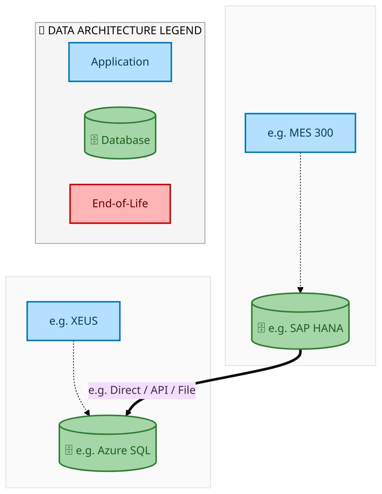
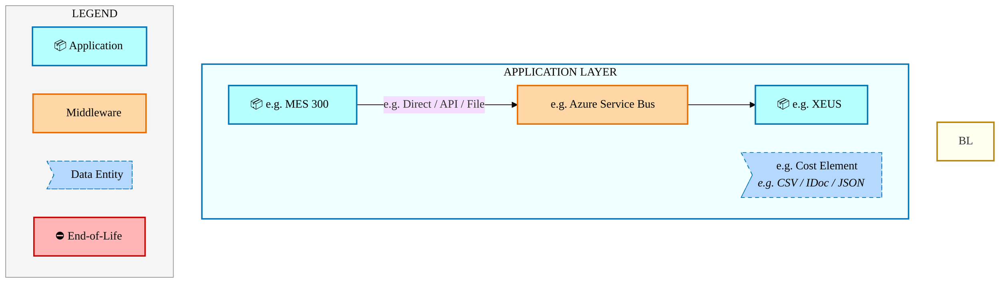
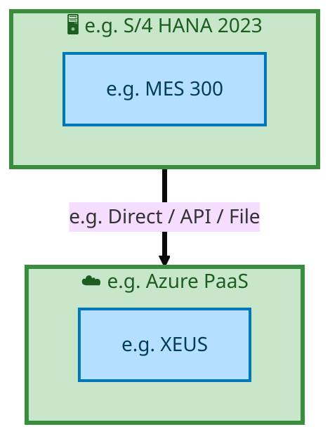

<div style="text-align:center; padding-top:20px;">
  <img src="data:image/svg+xml;base64,PHN2ZyB4bWxucz0iaHR0cDovL3d3dy53My5vcmcvMjAwMC9zdmciIHZpZXdCb3g9IjAgMCA4MDAgNDgwIiB3aWR0aD0iODAwIiBoZWlnaHQ9IjQ4MCI+DQogIDxkZWZzPg0KICAgIDxsaW5lYXJHcmFkaWVudCBpZD0iYmciIHgxPSIwJSIgeTE9IjAlIiB4Mj0iMTAwJSIgeTI9IjEwMCUiPg0KICAgICAgPHN0b3Agb2Zmc2V0PSIwJSIgc3R5bGU9InN0b3AtY29sb3I6IzAwNzFjNTtzdG9wLW9wYWNpdHk6MSIvPg0KICAgICAgPHN0b3Agb2Zmc2V0PSIxMDAlIiBzdHlsZT0ic3RvcC1jb2xvcjojMDBhZWVmO3N0b3Atb3BhY2l0eToxIi8+DQogICAgPC9saW5lYXJHcmFkaWVudD4NCiAgICA8bGluZWFyR3JhZGllbnQgaWQ9ImFjY2VudCIgeDE9IjAlIiB5MT0iMCUiIHgyPSIwJSIgeTI9IjEwMCUiPg0KICAgICAgPHN0b3Agb2Zmc2V0PSIwJSIgc3R5bGU9InN0b3AtY29sb3I6I2ZmZmZmZjtzdG9wLW9wYWNpdHk6MC4xNSIvPg0KICAgICAgPHN0b3Agb2Zmc2V0PSIxMDAlIiBzdHlsZT0ic3RvcC1jb2xvcjojZmZmZmZmO3N0b3Atb3BhY2l0eTowLjAyIi8+DQogICAgPC9saW5lYXJHcmFkaWVudD4NCiAgICA8cGF0dGVybiBpZD0iZ3JpZCIgd2lkdGg9IjQwIiBoZWlnaHQ9IjQwIiBwYXR0ZXJuVW5pdHM9InVzZXJTcGFjZU9uVXNlIj4NCiAgICAgIDxwYXRoIGQ9Ik0gNDAgMCBMIDAgMCAwIDQwIiBmaWxsPSJub25lIiBzdHJva2U9InJnYmEoMjU1LDI1NSwyNTUsMC4wNykiIHN0cm9rZS13aWR0aD0iMC41Ii8+DQogICAgPC9wYXR0ZXJuPg0KICA8L2RlZnM+DQoNCiAgPCEtLSBCYWNrZ3JvdW5kIC0tPg0KICA8cmVjdCB3aWR0aD0iODAwIiBoZWlnaHQ9IjQ4MCIgZmlsbD0idXJsKCNiZykiIHJ4PSI4Ii8+DQogIDxyZWN0IHdpZHRoPSI4MDAiIGhlaWdodD0iNDgwIiBmaWxsPSJ1cmwoI2dyaWQpIiByeD0iOCIvPg0KICA8cmVjdCB3aWR0aD0iODAwIiBoZWlnaHQ9IjQ4MCIgZmlsbD0idXJsKCNhY2NlbnQpIiByeD0iOCIvPg0KDQogIDwhLS0gRGVjb3JhdGl2ZSBjaXJjdWl0L2FyY2hpdGVjdHVyZSBsaW5lcyAtLT4NCiAgPGcgc3Ryb2tlPSJyZ2JhKDI1NSwyNTUsMjU1LDAuMTIpIiBzdHJva2Utd2lkdGg9IjEuNSIgZmlsbD0ibm9uZSI+DQogICAgPHBhdGggZD0iTSAwIDEwMCBMIDEyMCAxMDAgTCAxNjAgMTQwIEwgMjgwIDE0MCIvPg0KICAgIDxwYXRoIGQ9Ik0gMCAyNjAgTCA4MCAyNjAgTCAxMjAgMjIwIEwgMjAwIDIyMCBMIDI0MCAyNjAgTCAzNjAgMjYwIi8+DQogICAgPHBhdGggZD0iTSA1MjAgMTAwIEwgNjAwIDEwMCBMIDY0MCA2MCBMIDgwMCA2MCIvPg0KICAgIDxwYXRoIGQ9Ik0gNDQwIDM0MCBMIDU2MCAzNDAgTCA2MDAgMzAwIEwgNzIwIDMwMCBMIDc2MCAzNDAgTCA4MDAgMzQwIi8+DQogICAgPHBhdGggZD0iTSA2MDAgNDAwIEwgNjgwIDQwMCBMIDcyMCA0NDAiLz4NCiAgICA8cGF0aCBkPSJNIDAgNDAwIEwgNDAgNDAwIEwgODAgMzYwIi8+DQogICAgPHBhdGggZD0iTSAyMDAgNDIwIEwgMzIwIDQyMCBMIDM2MCAzODAgTCA0ODAgMzgwIi8+DQogICAgPHBhdGggZD0iTSA2NTAgNDQwIEwgNzUwIDQ0MCBMIDgwMCA0ODAiLz4NCiAgPC9nPg0KDQogIDwhLS0gRGVjb3JhdGl2ZSBub2RlcyAtLT4NCiAgPGcgZmlsbD0icmdiYSgyNTUsMjU1LDI1NSwwLjE4KSI+DQogICAgPGNpcmNsZSBjeD0iMTIwIiBjeT0iMTAwIiByPSI0Ii8+DQogICAgPGNpcmNsZSBjeD0iMjgwIiBjeT0iMTQwIiByPSI0Ii8+DQogICAgPGNpcmNsZSBjeD0iMjAwIiBjeT0iMjIwIiByPSI0Ii8+DQogICAgPGNpcmNsZSBjeD0iMzYwIiBjeT0iMjYwIiByPSI0Ii8+DQogICAgPGNpcmNsZSBjeD0iNjAwIiBjeT0iMTAwIiByPSI0Ii8+DQogICAgPGNpcmNsZSBjeD0iNzIwIiBjeT0iMzAwIiByPSI0Ii8+DQogICAgPGNpcmNsZSBjeD0iNTYwIiBjeT0iMzQwIiByPSI0Ii8+DQogICAgPGNpcmNsZSBjeD0iODAiIGN5PSIzNjAiIHI9IjQiLz4NCiAgICA8Y2lyY2xlIGN4PSI0ODAiIGN5PSIzODAiIHI9IjQiLz4NCiAgICA8Y2lyY2xlIGN4PSIzMjAiIGN5PSI0MjAiIHI9IjQiLz4NCiAgPC9nPg0KDQogIDwhLS0gVE9HQUYgQkRBVCBib3hlcyAtLT4NCiAgPGcgZm9udC1mYW1pbHk9IlNlZ29lIFVJLCBBcmlhbCwgc2Fucy1zZXJpZiIgZm9udC1zaXplPSIxNCIgZm9udC13ZWlnaHQ9IjYwMCI+DQogICAgPCEtLSBCIC0tPg0KICAgIDxyZWN0IHg9IjE1MCIgeT0iMTQwIiB3aWR0aD0iMTIwIiBoZWlnaHQ9IjQwIiByeD0iNSIgZmlsbD0icmdiYSgyNTUsMjU1LDI1NSwwLjE4KSIgc3Ryb2tlPSJyZ2JhKDI1NSwyNTUsMjU1LDAuMykiIHN0cm9rZS13aWR0aD0iMSIvPg0KICAgIDx0ZXh0IHg9IjIxMCIgeT0iMTY1IiB0ZXh0LWFuY2hvcj0ibWlkZGxlIiBmaWxsPSIjZmZmIj5CdXNpbmVzczwvdGV4dD4NCiAgICA8IS0tIEQgLS0+DQogICAgPHJlY3QgeD0iMjkwIiB5PSIxNDAiIHdpZHRoPSIxMjAiIGhlaWdodD0iNDAiIHJ4PSI1IiBmaWxsPSJyZ2JhKDI1NSwyNTUsMjU1LDAuMTgpIiBzdHJva2U9InJnYmEoMjU1LDI1NSwyNTUsMC4zKSIgc3Ryb2tlLXdpZHRoPSIxIi8+DQogICAgPHRleHQgeD0iMzUwIiB5PSIxNjUiIHRleHQtYW5jaG9yPSJtaWRkbGUiIGZpbGw9IiNmZmYiPkRhdGE8L3RleHQ+DQogICAgPCEtLSBBIC0tPg0KICAgIDxyZWN0IHg9IjQzMCIgeT0iMTQwIiB3aWR0aD0iMTIwIiBoZWlnaHQ9IjQwIiByeD0iNSIgZmlsbD0icmdiYSgyNTUsMjU1LDI1NSwwLjE4KSIgc3Ryb2tlPSJyZ2JhKDI1NSwyNTUsMjU1LDAuMykiIHN0cm9rZS13aWR0aD0iMSIvPg0KICAgIDx0ZXh0IHg9IjQ5MCIgeT0iMTY1IiB0ZXh0LWFuY2hvcj0ibWlkZGxlIiBmaWxsPSIjZmZmIj5BcHBsaWNhdGlvbjwvdGV4dD4NCiAgICA8IS0tIFQgLS0+DQogICAgPHJlY3QgeD0iNTcwIiB5PSIxNDAiIHdpZHRoPSIxMjAiIGhlaWdodD0iNDAiIHJ4PSI1IiBmaWxsPSJyZ2JhKDI1NSwyNTUsMjU1LDAuMTgpIiBzdHJva2U9InJnYmEoMjU1LDI1NSwyNTUsMC4zKSIgc3Ryb2tlLXdpZHRoPSIxIi8+DQogICAgPHRleHQgeD0iNjMwIiB5PSIxNjUiIHRleHQtYW5jaG9yPSJtaWRkbGUiIGZpbGw9IiNmZmYiPlRlY2hub2xvZ3k8L3RleHQ+DQogIDwvZz4NCg0KICA8IS0tIENvbm5lY3RpbmcgbGluZXMgYmV0d2VlbiBCREFUIGJveGVzIC0tPg0KICA8ZyBzdHJva2U9InJnYmEoMjU1LDI1NSwyNTUsMC4yNSkiIHN0cm9rZS13aWR0aD0iMSI+DQogICAgPGxpbmUgeDE9IjI3MCIgeTE9IjE2MCIgeDI9IjI5MCIgeTI9IjE2MCIvPg0KICAgIDxsaW5lIHgxPSI0MTAiIHkxPSIxNjAiIHgyPSI0MzAiIHkyPSIxNjAiLz4NCiAgICA8bGluZSB4MT0iNTUwIiB5MT0iMTYwIiB4Mj0iNTcwIiB5Mj0iMTYwIi8+DQogIDwvZz4NCg0KICA8IS0tIE1haW4gdGl0bGUgLS0+DQogIDx0ZXh0IHg9IjQwMCIgeT0iMjYwIiB0ZXh0LWFuY2hvcj0ibWlkZGxlIiBmb250LWZhbWlseT0iU2Vnb2UgVUksIEFyaWFsLCBzYW5zLXNlcmlmIiBmb250LXNpemU9IjM2IiBmb250LXdlaWdodD0iNzAwIiBmaWxsPSIjZmZmZmZmIiBsZXR0ZXItc3BhY2luZz0iMSI+DQogICAgSUFPIEFyY2hpdGVjdHVyZQ0KICA8L3RleHQ+DQogIDx0ZXh0IHg9IjQwMCIgeT0iMzAwIiB0ZXh0LWFuY2hvcj0ibWlkZGxlIiBmb250LWZhbWlseT0iU2Vnb2UgVUksIEFyaWFsLCBzYW5zLXNlcmlmIiBmb250LXNpemU9IjE4IiBmb250LXdlaWdodD0iNDAwIiBmaWxsPSJyZ2JhKDI1NSwyNTUsMjU1LDAuOCkiIGxldHRlci1zcGFjaW5nPSIyIj4NCiAgICBUT0dBRiBCREFUIMK3IElBTyBQcm9ncmFtIMK3IElETSAyLjANCiAgPC90ZXh0Pg0KDQogIDwhLS0gQm90dG9tIGFjY2VudCBiYXIgLS0+DQogIDxyZWN0IHg9IjI4MCIgeT0iMzQwIiB3aWR0aD0iMjQwIiBoZWlnaHQ9IjMiIHJ4PSIxLjUiIGZpbGw9InJnYmEoMjU1LDI1NSwyNTUsMC40KSIvPg0KDQogIDwhLS0gSW50ZWwgdGV4dCAtLT4NCiAgPHRleHQgeD0iNDAwIiB5PSIzODAiIHRleHQtYW5jaG9yPSJtaWRkbGUiIGZvbnQtZmFtaWx5PSJTZWdvZSBVSSwgQXJpYWwsIHNhbnMtc2VyaWYiIGZvbnQtc2l6ZT0iMTMiIGZpbGw9InJnYmEoMjU1LDI1NSwyNTUsMC41KSIgbGV0dGVyLXNwYWNpbmc9IjMiPg0KICAgIElOVEVMIENPTkZJREVOVElBTA0KICA8L3RleHQ+DQo8L3N2Zz4NCg==" alt="IAO Architecture" style="width:100%; border-radius:8px;" />
  <h1 style="font-size:36px; margin-top:24px;">E2E-71 — Forecast to Stock</h1>
  <h2 style="font-size:24px;">Architecture Document (TOGAF BDAT)</h2>
  <p style="font-size:18px; color:#555;">End-to-End Integrated Processes (E2E) Tower<br/>
  Capability E2E-71 · Forecast to Stock</p>
  <p style="font-size:14px; color:#888;">IAO Program · Release 2<br/>
  Generated: March 2026<br/>
  Sajiv Francis</p>
  <p style="font-size:12px; color:#aaa;">IAO Architecture Pipeline — Intel Confidential</p>
</div>

<style>
@media print {
  @page { margin: 0.75in; }
  .mermaid { page-break-inside: avoid; overflow: visible; }
  pre, table { page-break-inside: avoid; }
  h2, h3, h4 { page-break-after: avoid; }
}
.mermaid { overflow: visible; }
.mermaid svg { max-width: 100%; height: auto !important; }
nav.toc { margin: 16px 0 24px 0; }
nav.toc ol, nav.toc ul { list-style: none; padding-left: 0; margin: 0; }
nav.toc > ol > li { margin-bottom: 6px; font-weight: 600; font-size: 14px; }
nav.toc > ol > li > ul { padding-left: 28px; margin-top: 4px; }
nav.toc > ol > li > ul > li { font-weight: 400; font-size: 13px; margin-bottom: 2px; }
nav.toc a { color: #0071c5; text-decoration: none; }
nav.toc a:hover { text-decoration: underline; }
</style>


<div class="page-footer"><span>Page 1</span><span><a href="#toc">↑ Back to TOC</a></span><span>E2E-71 — Forecast to Stock</span></div>
<div style="page-break-before: always;"></div>


<a id="toc"></a>

## Table of Contents

<nav class="toc">
<ol>
  <li><a href="#1-executive-summary">1. Executive Summary</a></li>
  <li><a href="#2-business-context-objectives">2. Business Context &amp; Objectives</a>
    <ul>
      <li><a href="#21-classification">2.1 Classification</a></li>
      <li><a href="#22-business-drivers">2.2 Business Drivers</a></li>
      <li><a href="#23-success-criteria">2.3 Success Criteria</a></li>
      <li><a href="#24-companion-documents">2.4 Companion Documents</a></li>
    </ul>
  </li>
  <li><a href="#3-business-architecture-togaf-b">3. Business Architecture (TOGAF &ldquo;B&rdquo;)</a>
    <ul>
      <li><a href="#31-business-process-overview">3.1 Business Process Overview</a></li>
      <li><a href="#32-business-process-diagrams">3.2 Business Process Diagrams</a></li>
      <li><a href="#33-business-roles-responsibilities">3.3 Business Roles &amp; Responsibilities</a></li>
    </ul>
  </li>
  <li><a href="#4-data-architecture-togaf-d">4. Data Architecture (TOGAF &ldquo;D&rdquo;)</a>
    <ul>
      <li><a href="#41-data-entities-ownership">4.1 Data Entities &amp; Ownership</a></li>
      <li><a href="#42-data-flow-diagrams">4.2 Data Flow Diagrams</a></li>
      <li><a href="#43-data-lineage">4.3 Data Lineage</a></li>
      <li><a href="#44-ricefw-data-objects">4.4 RICEFW Data Objects</a></li>
      <li><a href="#45-data-governance-quality">4.5 Data Governance &amp; Quality</a></li>
    </ul>
  </li>
  <li><a href="#5-application-architecture-togaf-a">5. Application Architecture (TOGAF &ldquo;A&rdquo;)</a>
    <ul>
      <li><a href="#51-current-state-current-state-application-landscape">5.1 Current-State Application Landscape</a></li>
      <li><a href="#52-future-state-future-state-application-landscape">5.2 Future-State Application Landscape</a></li>
      <li><a href="#53-change-impact-summary">5.3 Change Impact Summary</a></li>
      <li><a href="#54-component-overview">5.4 Component Overview</a></li>
      <li><a href="#55-ricefw-inventory">5.5 RICEFW Inventory</a></li>
      <li><a href="#56-integration-patterns">5.6 Integration Patterns</a></li>
    </ul>
  </li>
  <li><a href="#6-technology-architecture-togaf-t">6. Technology Architecture (TOGAF &ldquo;T&rdquo;)</a>
    <ul>
      <li><a href="#61-platform-infrastructure">6.1 Platform &amp; Infrastructure</a></li>
      <li><a href="#62-sap-development-object-status">6.2 SAP Development Object Status</a></li>
      <li><a href="#63-nfrs-design-principles">6.3 NFRs &amp; Design Principles</a></li>
      <li><a href="#64-security-governance">6.4 Security &amp; Governance</a></li>
    </ul>
  </li>
  <li><a href="#7-project-context">7. Project Context</a>
    <ul>
      <li><a href="#71-project-roadmap-go-live-plan">7.1 Project Roadmap &amp; Go-Live Plan</a></li>
      <li><a href="#72-raid-log">7.2 RAID Log</a></li>
      <li><a href="#73-recommendations-next-steps">7.3 Recommendations &amp; Next Steps</a></li>
    </ul>
  </li>
</ol>
</nav>


<div class="page-footer"><span>Page 2</span><span><a href="#toc">↑ Back to TOC</a></span><span>E2E-71 — Forecast to Stock</span></div>
<div style="page-break-before: always;"></div>


## 1. Executive Summary

This Architecture Document defines the **Business, Data, Application, and Technology** (BDAT) architecture for **E2E-71 Forecast to Stock** within the IAO program. It includes 6 BPMN process diagram(s) in Section 3.

| Dimension | Value |
|-----------|-------|
| **Tower** | End-to-End Integrated Processes (E2E) |
| **Process Group** | Forecast to Stock |
| **Capability** | E2E-71 - Forecast to Stock |
| **Release** | Release 2 |
| **Total Systems** | 2 |
| **System Status** | 0 Deployed, 0 Developing, 0 EOL, 2 Pending IAPM |
| **RICEFW Objects** | Pending — Smartsheet Object Tracker API integration |

**Change Summary**: 0 new flow chains, 0 removed, 0 modified, 1 unchanged between Current-State and Future-State states.

> All system nodes in architecture diagrams are **IAPM-linked** — click any node to open its IAPM page. Diagrams require `securityLevel: 'loose'` for click events.


<div class="page-footer"><span>Page 3</span><span><a href="#toc">↑ Back to TOC</a></span><span>E2E-71 — Forecast to Stock</span></div>
<div style="page-break-before: always;"></div>


## 2. Business Context & Objectives

### 2.1 Classification

| Level | Value |
|-------|-------|
| **L0 Tower** | End-to-End Integrated Processes |
| **L1 Process** | Forecast to Stock |
| **L2 Capability** | E2E-71 - Forecast to Stock |

### 2.2 Business Drivers

| # | Driver | Description | Strategic Alignment | Priority |
|---|--------|-------------|---------------------|----------|
| 1 | End-to-End Process Integration | Enable cross-tower integrated processes spanning procurement, manufacturing, and fulfillment | IDM 2.0 Process Excellence | High |
| 2 | Intel Foundry Business Enablement | Stand up foundry-specific business processes for external customer engagement | Intel Foundry Services | High |
| 3 | Process Visibility & Monitoring | Provide end-to-end process visibility across tower boundaries with integrated monitoring | Operational Excellence | Medium |
| 4 | E2E-71 Process Migration | Migrate E2E-71 business processes and 2 integrated systems from legacy to S/4 HANA target architecture | IDM 2.0 Cross-Functional / End-to-End | High |


<div class="page-footer"><span>Page 4</span><span><a href="#toc">↑ Back to TOC</a></span><span>E2E-71 — Forecast to Stock</span></div>
<div style="page-break-before: always;"></div>


### 2.3 Success Criteria

| Metric | Target | Measure | Baseline | Owner |
|--------|--------|---------|----------|-------|
| E2E Process Cycle Time | Per process SLA | End-to-end transaction completion within defined SLA per process | Varies by process | E2E Process Owner |
| Cross-Tower Integration Success | > 99% | Transactions completing across tower boundaries without manual intervention | 92% (current) | Integration Lead |
| Process Exception Rate | < 2% | Transactions requiring manual exception handling | 8% (current) | Operations Manager |
| E2E-71 Migration Completeness | 100% flow chains validated | All 1 flow chains verified in target state | 0% (pre-migration) | Tower Architect |

### 2.4 Companion Documents

| Document | Description |
|----------|-------------|
| **Business Architecture** | Included in this document (Section 3) — process flows from BPMN diagrams |
| **This Document** | Full BDAT Architecture — Business + Data + Application + Technology |


<div class="page-footer"><span>Page 5</span><span><a href="#toc">↑ Back to TOC</a></span><span>E2E-71 — Forecast to Stock</span></div>
<div style="page-break-before: always;"></div>


## 3. Business Architecture (TOGAF "B")

### 3.1 Business Process Overview

This capability includes **6 business process(es)** modeled in BPMN 2.0, covering the end-to-end workflow for E2E-71 Forecast to Stock.

| # | Step ID | Process Name | Lanes | Tasks | Gateways |
|---|---------|--------------|-------|-------|----------|
| 1 | E2E-_71A_–_Intel_Foundry_–_Factory_Handover_(Prospal)_–_Front_End | E2E-_71A_–_Intel_Foundry_–_Factory_Handover_(Prospal)_–_Front_End | Boundary Apps, SAP S/4 IF Sending Plant (EWM) , SAP S/4 IF​

Receiving Plant (EWM), SAP S/4 Intel Foundry

Sending Plant (IM) 
, SAP S/4 Intel Foundry
Receiving Plant (IM) | 27 | 7 |

| 2 | E2E-_71B_–_Intel_Foundry_–_Factory_Handover_(Prospal)_–_Back_End | E2E-_71B_–_Intel_Foundry_–_Factory_Handover_(Prospal)_–_Back_End | Boundary Apps, SAP S/4 IF Sending Plant (EWM) , SAP S/4 IF​

Receiving Plant (EWM), SAP S/4 Intel Foundry

Sending Plant (IM) 
, SAP S/4 Intel Foundry
Receiving Plant (IM) | 27 | 7 |

| 3 | E2E-_71C_–_Intel_Foundry_-_Shipment_of_goods_through_Stock_(IM_to_EWM) | E2E-_71C_–_Intel_Foundry_-_Shipment_of_goods_through_Stock_(IM_to_EWM) | EWM, SAP S/4 Intel Foundry

 (IM)

 | 10 | 1 |
| 4 | E2E-_71D_–_Intel_Foundry_-_Shipment_of_goods_through_Stock_transfer_(EWM_to_IM) | E2E-_71D_–_Intel_Foundry_-_Shipment_of_goods_through_Stock_transfer_(EWM_to_IM) | EWM, SAP S/4 Intel Foundry

 (IM)

 | 10 | 1 |
| 5 | E2E-_71E–_Intel_Foundry_-_Shipment_of_goods_through_Stock_transfer_(EWM_to_EWM) | E2E-_71E–_Intel_Foundry_-_Shipment_of_goods_through_Stock_transfer_(EWM_to_EWM) | Receiving Warehouse (EWM)

, SAP S/4 Intel Foundry
 (IM)
, Supplying Warehouse (EWM | 14 | 5 |

| 6 | E2E-_71F_–_Intel_Foundry_-_Shipment_of_goods_through_Stock_transfer_–_TM_Steps | E2E-_71F_–_Intel_Foundry_-_Shipment_of_goods_through_Stock_transfer_–_TM_Steps | EWM, External Partners/ B2B

, SAP S/4  | 19 | 5 |


<div class="page-footer"><span>Page 6</span><span><a href="#toc">↑ Back to TOC</a></span><span>E2E-71 — Forecast to Stock</span></div>
<div style="page-break-before: always;"></div>


### 3.2 Business Process Diagrams


#### BUSINESS ARCHITECTURE — 3.2.1 E2E-_71A_–_Intel_Foundry_–_Factory_Handover_(Prospal)_–_Front_End — E2E-_71A_–_Intel_Foundry_–_Factory_Handover_(Prospal)_–_Front_End

**Swim Lanes**: Boundary Apps · SAP S/4 IF Sending Plant (EWM)  · SAP S/4 IF​
Receiving Plant (EWM) · SAP S/4 Intel Foundry

Sending Plant (IM) 
 · SAP S/4 Intel Foundry
Receiving Plant (IM) | **Tasks**: 27 | **Gateways**: 7

> **Legend**: <span style="color:#000;background:#4CAF50;padding:2px 6px;border-radius:10px;font-weight:bold;font-size:9pt">● Start</span> · <span style="color:#fff;background:#C62828;padding:2px 6px;border-radius:10px;font-weight:bold;font-size:9pt">● End</span> · <span style="background:#E3F2FD;padding:2px 6px;border:1px solid #1565C0;font-size:9pt">User Task</span> · <span style="background:#FFF3E0;padding:2px 6px;border:1px solid #E65100;font-size:9pt">Service Task</span> · <span style="background:#FFF9C4;padding:2px 6px;border:1px solid #F57F17;font-size:9pt">◇ Gateway</span> · <span style="background:#F3E5F5;padding:2px 6px;border:1px solid #7B1FA2;font-size:9pt">Sub-Process</span>

```mermaid
%%{init: {'theme': 'base', 'themeVariables': {'fontSize': '14px', 'fontFamily': 'Segoe UI, Arial, sans-serif','primaryColor': '#e8f0fe', 'primaryBorderColor': '#0071c5','lineColor': '#37474F', 'secondaryColor': '#f5f8fc'}, 'flowchart': {'useMaxWidth': false, 'htmlLabels': true, 'curve': 'basis', 'nodeSpacing': 40, 'rankSpacing': 50}} }%%
flowchart LR
    classDef startEvt fill:#4CAF50,stroke:#2E7D32,color:#000,font-weight:bold,stroke-width:2px,rx:20,ry:20
    classDef endEvt fill:#C62828,stroke:#B71C1C,color:#fff,font-weight:bold,stroke-width:2px,rx:20,ry:20
    classDef userTask fill:#E3F2FD,stroke:#1565C0,stroke-width:2px,color:#0D47A1
    classDef serviceTask fill:#FFF3E0,stroke:#E65100,stroke-width:2px,color:#BF360C
    classDef gateway fill:#FFF9C4,stroke:#F57F17,stroke-width:2px,color:#E65100
    classDef subProc fill:#F3E5F5,stroke:#7B1FA2,stroke-width:2px,color:#4A148C
    subgraph Boundary Apps
        n8["Send Production Update"]
        n9["Receive Shipping Information"]
    end
    subgraph SAP S/4 IF Sending Plant (EWM) 
        n10["Inbound Delivery Distribution to EWM"]
        n11["Create and Confirm Put-away Warehouse task (EWM)​"]
        n12["Goods Receipt EWM​"]
        n13["Outbound Delivery Order (EWM)"]
        n14["Pick and Pack Updates (EWM Managed)"]
        n15["Goods Issue and Update Inventory"]
        n16["PGI"]
        n21["fa:fa-user Ad hoc Move from doc storage type to FG storage type"]
        n31(["fa:fa-stop endEvent"])
    end
    subgraph SAP S/4 IF​ Receiving Plant (EWM)
        n17["Inbound Delivery distribution to EWM"]
        n18["Goods Receipt EWM"]
        n19["Create and Confirm Put-away Warehouse task (EWM)"]
        n20["Create Ad-hoc task for movement from EWM location (SLOC2) to factory (SLOC1)"]
    end
    subgraph SAP S/4 Intel Foundry  Sending Plant (IM)  
        n2["311 / Inbound Delivery Creation SLOC 2​"]
        n3["Ship to Customer (Sales Order)"]
        n4["311 is posted in S4 from SLOC1 to SLOC2"]
        n5["Create STR"]
        n6["Convert STR to STO"]
        n7["CI and Billing document"]
        n23[["fa:fa-cog Complete Production"]]
        n24[["fa:fa-cog GR Production Order at SLoc 1"]]
        n25[["fa:fa-cog Ship to Next Factory (STO)"]]
        n26[["fa:fa-cog Perform Outbound Delivery"]]
        n27[["fa:fa-cog Create Freight Unit and Freight Order"]]
        n29(["fa:fa-stop GR Posted"])
        n30(["fa:fa-stop endEvent"])
        n32["E2E- 71F – Intel Foundry - Shipment of goods through Stock transfer – TM Steps"]
        n33{{"fa:fa-code-branch If Customer requires later?"}}
        n34{{"fa:fa-code-branch Customer or Next Factory?"}}
        n35{{"fa:fa-code-branch exclusiveGateway"}}
        n36{{"fa:fa-code-branch exclusiveGateway"}}
        n37{{"fa:fa-arrows-alt parallelGateway"}}
        n38{{"fa:fa-arrows-alt parallelGateway"}}
        n39{{"fa:fa-arrows-alt inclusiveGateway"}}
    end
    subgraph SAP S/4 Intel Foundry Receiving Plant (IM)
        n1["Stock Posted in Manufacturing locations"]
        n22[["fa:fa-cog Perform Inbound Delivery (S/4)"]]
        n28(["fa:fa-stop Stock Posted"])
    end
    n23 --> n24
    n25 --> n35
    n24 --> n29
    n10 --> n12
    n12 --> n11
    n33 -->|"Yes"| n21
    n4 --> n37
    n11 --> n4
    n34 -->|"Factory"| n36
    n38 --> n27
    n26 --> n38
    n35 --> n26
    n3 --> n35
    n13 --> n14
    n14 --> n15
    n15 --> n16
    n16 --> n22
    n22 --> n17
    n17 --> n18
    n18 --> n19
    n19 --> n20
    n1 --> n28
    n5 --> n6
    n2 --> n10
    n6 --> n36
    n38 --> n13
    n37 --> n33
    n37 --> n34
    n20 --> n1
    n36 -->|"Next Factory
 location"| n25
    n38 --> n7
    n21 --> n31
    n7 --> n30
    n27 --> n32
    n34 -->|"Customer"| n39
    n33 -->|"No"| n39
    n39 --> n3
    class n21 userTask
    class n22 serviceTask
    class n23 serviceTask
    class n24 serviceTask
    class n25 serviceTask
    class n26 serviceTask
    class n27 serviceTask
    class n28 endEvt
    class n29 endEvt
    class n30 endEvt
    class n31 endEvt
    class n32 startEvt
    class n33 gateway
    class n34 gateway
    class n35 gateway
    class n36 gateway
    class n37 gateway
    class n38 gateway
    class n39 gateway
```

<div style="text-align:center; margin:4px 0 8px 0; font-size:11px;"><a href="https://mermaid.live/view#pako:eNqlWF1v4jgU_SsWo4pWAk2cDwI87IpSUiG1U1Q6O1pN98EkDkQNcdZx2rId_vteJ3YgIWhWs30YDcf33M_jG8JHx2cB7Yw7FxcfURKJMfroig3d0u4YdVcko90eKoE_CI_IKqZZV9qELBHL6J_CDNvpuzSTmEe2UbyT6JKuGUVf5z00AWLcQxlJsn5GeRR2e92UR1vCd1MWMy6tP9FhaIRFNHV0zXhA-cHAMFzsO0CNo4QeYMu1XduTvIz6LAlqTkMnHIZ-dy-Ti9mbvyFcFOnnGb0n79-iQGzgc0jijILNRmzjO7KisaxR8Fxifs5fdTOiTMZJoGHLlPhRsgbcNgDiJHk5QI6x36P9xcVzUgVFd4_PCYI_PyZZdkNDlAmAZ68ChVEcjz_Z04nnGL1McPZCx5_MmXtjmT1fVjKG0o2ebG7_jUbrjRivWBwo0_6brGFspu89_j42jR7fwb-NWDQJDpGmA3NoDqtI1y6e4qmOFIbh_4oEfeVPJHtRsWaWZ3o3VSzsDJypcepPl3ljuxPc7BPlr5FPj5x6nmfNDq2aDRxsnHd67VkDY9pwuiaCvpHdweFoalcOPcf1sHvWYRmvmWW-WnDma4fWzPGcyqF7jb2JedahPcH2UGUIftacpBt0zfJCy2iSpll5Jv-S4ffnzhLmiSBckPsiYgn6mgZQz3PnryO7Edg9Up9GrxQtN1GagjTRPAkZ3xJJqqzBVyP0crJAy882mntIRpLERUwSgS5n3-6v0FEQbECUebKSuaIbGkMwyPgmgkqjVV7kJhgCVj03jIE25RSSRgSYU5aEEd-iRS76RI7lG-F0w0BLSMixF3Gfc9MwVg1HJji6ZSzIUFFrKopgbZYWWD7kopHqg1wxyn_d3gb7ReS_FAkuCPyn7HJWWKN7kpA1DZosp8pnnmV5WV3Jg96_0kQwvmtQBjLQ7byOmrJDIRmHpC9vFJoEaAPqumcwzZCzLQrgUwbeIAkkdimVffZua1Ddo4UvK5dglZY7ATICs6ufK6Hsadnl14Yijqtx2wQR_FQQw9Y51m1GvyKaeleNg4tJ0JcdLUzhUqAttHYL7SjbK0ccM7-4KehyefcwNa9k5iHx5QhLCF_9l0uUCBojTzYEeM0LNYf7dHyhpJ4tjNFndNLEIm-ZjgyNzDaRS43Luy4zneYw5a0U95LAM7tUeqMftooWZShlmaABisC9XbagqFB6KqqvE51DH5dPj_UzqWeYDeQs5GHh4emhbiNVMp0XY7yGhSkbAoLOt6Ucj_thfa9U67M1DH2bxhTCHrYfEGoMu864fTzelOV9J5DZHQwfN7lOnat7-YW-C-RVo396uGoSB3XignK5aNHJwmny3EZ5ZU89Xjx80Vf4PlY0SQNF-k0fo8bFlhUX0zzc7FIdxk83QGknRTgzZ33kYg9JnWGrIeN-0ZriujB4mBYXV2w4y9cgfMFgWQr4RpSF0GvFf7qHAwpPsrpgrY-PQ_0B7a-A5m_QPDzol9O_84iDgmNoDf_9ubPfH3uw2z1UdLjax-M74TvtfPrux3kGM7stvyk0aYNfo7kHGuGcvWV9EguUEk7imMZnSMNfIY1aSVFyLr__usFOngDz-gNArqBCAYtqo8CzMpeLM-eSptdqQwqm2X6FTvbgJeR0cv-GDWkfp9DygIO9gvr93-S20IBTApajAVtZjBSAjRLApgZMBahvrKBmCfx47vxJobgf8imuTpQvy9VUXAI6umUrplJpwbYG-nSoUtF0c6D8DbWFyt6sKI1qsAKwjohVSriyUC6wdoFVEFPXa-p6qypcBeg0sEoUVz0bKR-GBtRnzVBBdUwdQZvrOpudwJYGVArWCVANVo9NGwxUq4-3ApxpWZaDcxoBq86rAiztTofTGZsaMJuj1RupnO2oqZkvrHGgWmcdvWgU8fUbVh03j9-T6kfW-SP7_JFz_mhw_sg9fzRUb6F1dNSGWkYriltRs3qTruOWfsmrw3Y77LTDg3bYbYeH7fBIw51eBwSwJVHQGX90ih9V4IeXgIYkj0Vn3-uQXLDlLvE74-LHh05evDrcRAQ28rYE9_8Cpi9iNA==" title="View full diagram">&#128065; View Full Diagram</a></div>


<div class="page-footer"><span>Page 7</span><span><a href="#toc">↑ Back to TOC</a></span><span>E2E-71 — Forecast to Stock</span></div>
<div style="page-break-before: always;"></div>


#### BUSINESS ARCHITECTURE — 3.2.2 E2E-_71B_–_Intel_Foundry_–_Factory_Handover_(Prospal)_–_Back_End — E2E-_71B_–_Intel_Foundry_–_Factory_Handover_(Prospal)_–_Back_End

**Swim Lanes**: Boundary Apps · SAP S/4 IF Sending Plant (EWM)  · SAP S/4 IF​
Receiving Plant (EWM) · SAP S/4 Intel Foundry

Sending Plant (IM) 
 · SAP S/4 Intel Foundry
Receiving Plant (IM) | **Tasks**: 27 | **Gateways**: 7

> **Legend**: <span style="color:#000;background:#4CAF50;padding:2px 6px;border-radius:10px;font-weight:bold;font-size:9pt">● Start</span> · <span style="color:#fff;background:#C62828;padding:2px 6px;border-radius:10px;font-weight:bold;font-size:9pt">● End</span> · <span style="background:#E3F2FD;padding:2px 6px;border:1px solid #1565C0;font-size:9pt">User Task</span> · <span style="background:#FFF3E0;padding:2px 6px;border:1px solid #E65100;font-size:9pt">Service Task</span> · <span style="background:#FFF9C4;padding:2px 6px;border:1px solid #F57F17;font-size:9pt">◇ Gateway</span> · <span style="background:#F3E5F5;padding:2px 6px;border:1px solid #7B1FA2;font-size:9pt">Sub-Process</span>

```mermaid
%%{init: {'theme': 'base', 'themeVariables': {'fontSize': '14px', 'fontFamily': 'Segoe UI, Arial, sans-serif','primaryColor': '#e8f0fe', 'primaryBorderColor': '#0071c5','lineColor': '#37474F', 'secondaryColor': '#f5f8fc'}, 'flowchart': {'useMaxWidth': false, 'htmlLabels': true, 'curve': 'basis', 'nodeSpacing': 40, 'rankSpacing': 50}} }%%
flowchart LR
    classDef startEvt fill:#4CAF50,stroke:#2E7D32,color:#000,font-weight:bold,stroke-width:2px,rx:20,ry:20
    classDef endEvt fill:#C62828,stroke:#B71C1C,color:#fff,font-weight:bold,stroke-width:2px,rx:20,ry:20
    classDef userTask fill:#E3F2FD,stroke:#1565C0,stroke-width:2px,color:#0D47A1
    classDef serviceTask fill:#FFF3E0,stroke:#E65100,stroke-width:2px,color:#BF360C
    classDef gateway fill:#FFF9C4,stroke:#F57F17,stroke-width:2px,color:#E65100
    classDef subProc fill:#F3E5F5,stroke:#7B1FA2,stroke-width:2px,color:#4A148C
    subgraph Boundary Apps
        n8["Send Production Update"]
        n9["Receive Shipping Information"]
    end
    subgraph SAP S/4 IF Sending Plant (EWM) 
        n10["Inbound Delivery Distribution to EWM"]
        n11["Create and Confirm Put-away Warehouse task (EWM)​"]
        n12["Goods Receipt EWM​"]
        n13["Outbound Delivery Order (EWM)"]
        n14["Pick and Pack Updates (EWM Managed)"]
        n15["Goods Issue and Update Inventory"]
        n16["PGI"]
        n21["fa:fa-user Ad hoc Move from Dock Storage type to FG storage type"]
        n31(["fa:fa-stop endEvent"])
    end
    subgraph SAP S/4 IF​ Receiving Plant (EWM)
        n17["Inbound Delivery distribution to EWM"]
        n18["Goods Receipt EWM"]
        n19["Create and Confirm Put-away Warehouse task (EWM)"]
        n20["Create Ad-hoc task for movement from EWM location (SLOC2) to factory (SLOC1)"]
    end
    subgraph SAP S/4 Intel Foundry  Sending Plant (IM)  
        n2["311 / Inbound Delivery Creation SLOC 2​"]
        n3["Ship to Customer (Sales Order)"]
        n4["311 is posted in S4 from SLOC1 to SLOC2"]
        n5["Create STR"]
        n6["Convert STR to STO"]
        n7["CI and BIlling Document"]
        n23[["fa:fa-cog Complete Production"]]
        n24[["fa:fa-cog GR Production Order at SLoc 1"]]
        n25[["fa:fa-cog Ship to Next Factory (STO)"]]
        n26[["fa:fa-cog Perform Outbound Delivery"]]
        n27[["fa:fa-cog Create Freight Unit and Freight Order"]]
        n29(["fa:fa-stop GR Posted"])
        n30(["fa:fa-stop endEvent"])
        n32["E2E- 71F – Intel Foundry - Shipment of goods through Stock transfer – TM Steps"]
        n33{{"fa:fa-code-branch If Customer requires later?"}}
        n34{{"fa:fa-code-branch Customer or Next Factory?"}}
        n35{{"fa:fa-code-branch exclusiveGateway"}}
        n36{{"fa:fa-code-branch exclusiveGateway"}}
        n37{{"fa:fa-arrows-alt parallelGateway"}}
        n38{{"fa:fa-arrows-alt parallelGateway"}}
        n39{{"fa:fa-arrows-alt inclusiveGateway"}}
    end
    subgraph SAP S/4 Intel Foundry Receiving Plant (IM)
        n1["Stock Posted in Manufacturing locations"]
        n22[["fa:fa-cog Perform Inbound Delivery (S/4)"]]
        n28(["fa:fa-stop Stock Posted"])
    end
    n23 --> n24
    n25 --> n35
    n24 --> n29
    n10 --> n12
    n12 --> n11
    n4 --> n37
    n11 --> n4
    n34 -->|"Customer"| n39
    n34 -->|"Factory"| n36
    n38 --> n27
    n26 --> n38
    n35 --> n26
    n3 --> n35
    n13 --> n14
    n14 --> n15
    n15 --> n16
    n16 --> n22
    n22 --> n17
    n17 --> n18
    n18 --> n19
    n19 --> n20
    n1 --> n28
    n5 --> n6
    n2 --> n10
    n6 --> n36
    n38 --> n13
    n37 --> n33
    n37 --> n34
    n33 -->|"No"| n39
    n39 --> n3
    n20 --> n1
    n36 -->|"Next Factory
 location"| n25
    n33 -->|"Yes"| n21
    n21 --> n31
    n38 --> n7
    n7 --> n30
    n27 --> n32
    class n21 userTask
    class n22 serviceTask
    class n23 serviceTask
    class n24 serviceTask
    class n25 serviceTask
    class n26 serviceTask
    class n27 serviceTask
    class n28 endEvt
    class n29 endEvt
    class n30 endEvt
    class n31 endEvt
    class n32 startEvt
    class n33 gateway
    class n34 gateway
    class n35 gateway
    class n36 gateway
    class n37 gateway
    class n38 gateway
    class n39 gateway
```

<div style="text-align:center; margin:4px 0 8px 0; font-size:11px;"><a href="https://mermaid.live/view#pako:eNqlWFtv4jgU_isWo4pWAk2cCwEedkWBVEjtFJXOjlbTfTCJA1FDnHWSXrbDf99jxw4kBM1qtg9V-_l85_Kd4xPCR8dnAe2MOxcXH1ES5WP00c23dEe7Y9Rdk4x2e6gE_iA8IuuYZl1hE7IkX0X_SDNsp2_CTGAe2UXxu0BXdMMo-rrooQkQ4x7KSJL1M8qjsNvrpjzaEf4-ZTHjwvoTHYZGKKOpo2vGA8oPBobhYt8Bahwl9ABbru3anuBl1GdJUHMaOuEw9Lt7kVzMXv0t4blMv8joHXn7FgX5Fv4PSZxRsNnmu_iWrGksasx5ITC_4C9ajCgTcRIQbJUSP0o2gNsGQJwkzwfIMfZ7tL-4eEqqoOj24SlB8OPHJMtmNERZDvD8JUdhFMfjT_Z04jlGL8s5e6bjT-bcnVlmzxeVjKF0oyfE7b_SaLPNx2sWB8q0_ypqGJvpW4-_jU2jx9_hdyMWTYJDpOnAHJrDKtK1i6d4qiOFYfi_IoGu_JFkzyrW3PJMb1bFws7AmRqn_nSZM9ud4KZOlL9EPj1y6nmeNT9INR842Djv9NqzBsa04XRDcvpK3g8OR1O7cug5rofdsw7LeM0si_WSM187tOaO51QO3WvsTcyzDu0JtocqQ_Cz4STdomtWyFlGkzTNyjPxkwy_P3VW0E8E4YLCzyOWoK9pAPU8df46shuB3QP1afRC0WobpSmMJlokIeM7IkiVNfhqhF5Nlmj12UYLD4lIgriMSZKjy_m3uyt0FAQbEGWRrEWuaEZjCAYZzyKoNFoXMrecIWDVc8MYaFNOIWlEgDllSRjxHVoWeZ-ItnwjnG4ZzBLKRdtl3KfCNIx1w5EJjm4YCzIka01zGazN0gLL-yJvpHovVozyX7e3wX4Z-c8ywSWBP0qVM2mN7khCNjRospwqn0WWFWV1JQ-0f6FJzvh7gzIQgW4WddQUCoVkHJK-uFFoEqAtTNcdg26GnO3QjEFGK3AHWaD8PaVCaO8GtsoBqru08GXlE6zScilASmB29fNRKEUtZX5pjMRxOW7bRAQ_nYhhayPrNqNfmZq6rMbBxSToC0mlKdwKtANtdyBHqa_occx8eVXQ5er2fmpeicxD4oselhC--i-3KMlpjDwhCPCaN2oBF-r4RomBtjBGn9GJiDJvkY4Ijcy2KRdDLi67yHRaQJd3YrpXBB7a5ag39LBVtChDKctyGqAI3NulBLJC4UlWXyc6Bx1Xjw_1MzHQ0BvIOReH0sPjfd1GTMl0Idt4vYhjIQhMdLErx_FYD-t7NbU-20DTd2lMIexh_QGhxrDrjJuH41VZXngCmd1C83GT69S5Wssv9C1HXtX6x_urJnFQJy4pF5sWnWycJs9tlFdq6nH59EVf4QOZFEkDMv2mj1HjYouKZTcPN7ucDuOnG6C0E0M4N-d95GIPiTnDVmOM-1IaeV0YPE3lxc23nBWbrdhKsJty-EiUhaC14j_ewQGFR1l9YK2Pj0P9Ae2vgeZv0SI8zC-nfxcRhwmOQRr--1Nnvz_2YLd7qOhwtY_bd8J32vn0zY-LDHp2U35UaNIGv0ZzDzTCOXvN-iTOUUo4iWManyENf4U0aiVFybn8_usGO3kCLOoPALGC5AQsq40CD8tCLM6CC5peq41RMM32K3SyBy8hp5P7N2yM9nEKLQ842Cuo3_9NbAsNOCVgORqwlcVIAdgoAWxqwFSA-siaKIblagNcAjqGJQ1-wOpTw_nU-SE61TxWo1qeDvTpUOWjvZsDFW6oLVQJZkVplIQVgHVCWGWMKwvlAmsXWAUxddGmLroq0lWATgOrRHEl3Ej5MDSg_tcMFVTH1BG0ua6zqQS2NKBSsE6ASnlLSfuFNTRXuWmmqZuszweaeLRD4EwPsfRmOs0wf9KsPNF-TFWzhRtFaBl1xrpoUwPm0ZuG9KNfseq4efyiVD-yzh_Z54-c80eD80fu-aOheg2to6M21DJaUdyKmtWrdB239FteHbbbYacdHrTDbjs8bIdHGu70OnDrdyQKOuOPjvxWBb55CWhIijjv7HsdUuRs9Z74nbH89qFTyHeHWURgI-9KcP8v7VFiHw==" title="View full diagram">&#128065; View Full Diagram</a></div>


<div class="page-footer"><span>Page 8</span><span><a href="#toc">↑ Back to TOC</a></span><span>E2E-71 — Forecast to Stock</span></div>
<div style="page-break-before: always;"></div>


#### BUSINESS ARCHITECTURE — 3.2.3 E2E-_71C_–_Intel_Foundry_-_Shipment_of_goods_through_Stock_(IM_to_EWM) — E2E-_71C_–_Intel_Foundry_-_Shipment_of_goods_through_Stock_(IM_to_EWM)

**Swim Lanes**: EWM · SAP S/4 Intel Foundry
 (IM)

 | **Tasks**: 10 | **Gateways**: 1

> **Legend**: <span style="color:#000;background:#4CAF50;padding:2px 6px;border-radius:10px;font-weight:bold;font-size:9pt">● Start</span> · <span style="color:#fff;background:#C62828;padding:2px 6px;border-radius:10px;font-weight:bold;font-size:9pt">● End</span> · <span style="background:#E3F2FD;padding:2px 6px;border:1px solid #1565C0;font-size:9pt">User Task</span> · <span style="background:#FFF3E0;padding:2px 6px;border:1px solid #E65100;font-size:9pt">Service Task</span> · <span style="background:#FFF9C4;padding:2px 6px;border:1px solid #F57F17;font-size:9pt">◇ Gateway</span> · <span style="background:#F3E5F5;padding:2px 6px;border:1px solid #7B1FA2;font-size:9pt">Sub-Process</span>

```mermaid
%%{init: {'theme': 'base', 'themeVariables': {'fontSize': '14px', 'fontFamily': 'Segoe UI, Arial, sans-serif','primaryColor': '#e8f0fe', 'primaryBorderColor': '#0071c5','lineColor': '#37474F', 'secondaryColor': '#f5f8fc'}, 'flowchart': {'useMaxWidth': false, 'htmlLabels': true, 'curve': 'basis', 'nodeSpacing': 40, 'rankSpacing': 50}} }%%
flowchart LR
    classDef startEvt fill:#4CAF50,stroke:#2E7D32,color:#000,font-weight:bold,stroke-width:2px,rx:20,ry:20
    classDef endEvt fill:#C62828,stroke:#B71C1C,color:#fff,font-weight:bold,stroke-width:2px,rx:20,ry:20
    classDef userTask fill:#E3F2FD,stroke:#1565C0,stroke-width:2px,color:#0D47A1
    classDef serviceTask fill:#FFF3E0,stroke:#E65100,stroke-width:2px,color:#BF360C
    classDef gateway fill:#FFF9C4,stroke:#F57F17,stroke-width:2px,color:#E65100
    classDef subProc fill:#F3E5F5,stroke:#7B1FA2,stroke-width:2px,color:#4A148C
    subgraph EWM
        n8[["fa:fa-cog Perform Inbound Delivery distribution to EWM"]]
        n9[["fa:fa-cog Perform Goods Receipt EWM"]]
        n10[["fa:fa-cog Create and Confirm Put-away Warehouse task (EWM)"]]
        n12(["fa:fa-stop Shipment of Goods Comleted"])
    end
    subgraph SAP S/4 Intel Foundry  (IM) 
        n1[["fa:fa-cog Create Stock Transport Request"]]
        n2[["fa:fa-cog Create Outbound Delivery"]]
        n3[["fa:fa-cog Convert STR to STO"]]
        n4[["fa:fa-cog Perform Pick and Pack Updates (IM Managed)"]]
        n5[["fa:fa-cog Perform Goods Issue and Update Inventory"]]
        n6[["fa:fa-cog Perform Inbound Delivery"]]
        n7[["fa:fa-cog Freight Unit and Freight Order Creation"]]
        n11(["fa:fa-play Shipment of goods through Stock Initiated"])
        n13["E2E- 71F – Intel Foundry - Shipment of goods through Stock transfer – TM Steps"]
        n14{{"fa:fa-arrows-alt parallelGateway"}}
    end
    n1 --> n3
    n5 --> n6
    n3 --> n2
    n4 --> n5
    n14 --> n7
    n2 --> n14
    n10 --> n12
    n6 --> n8
    n8 --> n9
    n9 --> n10
    n14 --> n4
    n11 --> n1
    n7 --> n13
    class n1 serviceTask
    class n2 serviceTask
    class n3 serviceTask
    class n4 serviceTask
    class n5 serviceTask
    class n6 serviceTask
    class n7 serviceTask
    class n8 serviceTask
    class n9 serviceTask
    class n10 serviceTask
    class n11 startEvt
    class n12 endEvt
    class n13 startEvt
    class n14 gateway
```

<div style="text-align:center; margin:4px 0 8px 0; font-size:11px;"><a href="https://mermaid.live/view#pako:eNqlVttu6jgU_RUrVUUrBU2uhOZhJBrIUaVTFZV2-nB6HkzigFVjZ2ynLYP499km4ZbTzIw0eUDs21rbyzt2NlYmcmLF1uXlhnKqY7Tp6SVZkV6MenOsSM9GteMPLCmeM6J6JqcQXM_oX7s0Nyg_TZrxpXhF2dp4Z2QhCHq-s9EICpmNFOaqr4ikRc_ulZKusFwngglpsi_IsHCKHVsTuhUyJ_KY4DiRm4VQyignR7cfBVGQmjpFMsHzM9AiLIZF1tua5pj4yJZY6l37lSL3-POF5noJdoGZIpCz1Cv2Hc8JM2vUsjK-rJLvezGoMjwcBJuVOKN8Af7AAZfE_O3oCp3tFm0vL1_5gRR9f3zlCJ6MYaXGpEBKg3vyrlFBGYsvgmSUho6ttBRvJL7wJtHY9-zMrCSGpTu2Ebf_QehiqeO5YHmT2v8wa4i98tOWn7Hn2HINvy0uwvMjUzLwht7wwHQbuYmb7JmKovhfTKCrfMLqreGa-KmXjg9cbjgIE-dXvP0yx0E0cts6EflOM3ICmqapPzlKNRmErtMNepv6AydpgS6wJh94fQS8SYIDYBpGqRt1AtZ87S6r-VSKbA_oT8I0PABGt2468joBg5EbDJsOAWchcblEk5f72mMePvzx49UqcFzgfiYWaEpkIeQK3fG5qHiOxoTRdyLXKKdAQueVpoIjLXYo1s-fJ0g3XyN9EyJX6JFkhJb6izLXOa9LJAEJEQbyRPCCAsS00n1sRH3BkiwFTALSZtOuAO26DeddHeCUFiWaLWm5IlwjUTS9JGLFiCY5VF7XlTDFLZFmoyma_RaADpowlBotQAR0dXd_jU7Zvux9pkX2hp7g1VWlgDf0kfxZEaVbnXpf1j5U-lz5VpXfqhIckjSaPT2aXZk9PbTyg693ZUqhQ6PxFMOf5zIHbmWWh-4xxwuSt3UN_2l375Sq6i2rkUC2d5Bc_NL94L9NW6sqOq9K5e4EQc9wqexI944Hc6zXQsKUtgfDPQ5GyWCYTgdjsVuGXkpRLZbN_t0BPMVnc1ID-YAz8SZ9FLkpeq08x_Vbc9L_V3BthqOAbpv6p3sIkFIB1ylVsNnse8ZSig_Vx0yjEkvMGGHf6rPm1dpuW3PMXdTv_w7T0phhbQ4a069NrzGD2gz3tY0dNbZXm26wjzuNY18_qO1hYw5r86Yxb5pspwV_gGt6bY5nHjWmf3IQmgWdHNdnEa8z4ndGgs5I2BkZdEaizsiwM3LTGQF5O0Pu4XI_93vNRXzu9Tuyg_0tZdnWisgVprkVb6zdtxh8r-WkwBXT1ta2cKXFbM0zK959s1jV7vUeUwyn5Kp2bv8GgwMfKA==" title="View full diagram">&#128065; View Full Diagram</a></div>


<div class="page-footer"><span>Page 9</span><span><a href="#toc">↑ Back to TOC</a></span><span>E2E-71 — Forecast to Stock</span></div>
<div style="page-break-before: always;"></div>


#### BUSINESS ARCHITECTURE — 3.2.4 E2E-_71D_–_Intel_Foundry_-_Shipment_of_goods_through_Stock_transfer_(EWM_to_IM) — E2E-_71D_–_Intel_Foundry_-_Shipment_of_goods_through_Stock_transfer_(EWM_to_IM)

**Swim Lanes**: EWM · SAP S/4 Intel Foundry
 (IM)

 | **Tasks**: 10 | **Gateways**: 1

> **Legend**: <span style="color:#000;background:#4CAF50;padding:2px 6px;border-radius:10px;font-weight:bold;font-size:9pt">● Start</span> · <span style="color:#fff;background:#C62828;padding:2px 6px;border-radius:10px;font-weight:bold;font-size:9pt">● End</span> · <span style="background:#E3F2FD;padding:2px 6px;border:1px solid #1565C0;font-size:9pt">User Task</span> · <span style="background:#FFF3E0;padding:2px 6px;border:1px solid #E65100;font-size:9pt">Service Task</span> · <span style="background:#FFF9C4;padding:2px 6px;border:1px solid #F57F17;font-size:9pt">◇ Gateway</span> · <span style="background:#F3E5F5;padding:2px 6px;border:1px solid #7B1FA2;font-size:9pt">Sub-Process</span>

```mermaid
%%{init: {'theme': 'base', 'themeVariables': {'fontSize': '14px', 'fontFamily': 'Segoe UI, Arial, sans-serif','primaryColor': '#e8f0fe', 'primaryBorderColor': '#0071c5','lineColor': '#37474F', 'secondaryColor': '#f5f8fc'}, 'flowchart': {'useMaxWidth': false, 'htmlLabels': true, 'curve': 'basis', 'nodeSpacing': 40, 'rankSpacing': 50}} }%%
flowchart LR
    classDef startEvt fill:#4CAF50,stroke:#2E7D32,color:#000,font-weight:bold,stroke-width:2px,rx:20,ry:20
    classDef endEvt fill:#C62828,stroke:#B71C1C,color:#fff,font-weight:bold,stroke-width:2px,rx:20,ry:20
    classDef userTask fill:#E3F2FD,stroke:#1565C0,stroke-width:2px,color:#0D47A1
    classDef serviceTask fill:#FFF3E0,stroke:#E65100,stroke-width:2px,color:#BF360C
    classDef gateway fill:#FFF9C4,stroke:#F57F17,stroke-width:2px,color:#E65100
    classDef subProc fill:#F3E5F5,stroke:#7B1FA2,stroke-width:2px,color:#4A148C
    subgraph EWM
        n8[["fa:fa-cog Perform Outbound Delivery Order (EWM)"]]
        n9[["fa:fa-cog Create and Confirm Picking and Packing (EWM)"]]
        n10[["fa:fa-cog Issue Goods"]]
    end
    subgraph SAP S/4 Intel Foundry  (IM) 
        n1[["fa:fa-cog Create STR"]]
        n2[["fa:fa-cog Convert STR to STO"]]
        n3[["fa:fa-cog Create Outbound Delivery (IM)"]]
        n4[["fa:fa-cog Create Freight Unit and Freight Order"]]
        n5[["fa:fa-cog Update Goods Issue in IM"]]
        n6[["fa:fa-cog Perform Inbound Delivery"]]
        n7[["fa:fa-cog Perform Goods Receipt at IM SLOC"]]
        n11(["fa:fa-play Shipment of goods through Stock transfer (EWM to IM Initiated"])
        n12(["fa:fa-stop Shipment of goods through Stock transfer (EWM to IM) Completed"])
        n13["E2E- 71F Shipment of goods through Stock transfer – TM Steps"]
        n14{{"fa:fa-arrows-alt parallelGateway"}}
    end
    n1 --> n2
    n5 --> n6
    n2 --> n3
    n14 --> n8
    n14 --> n4
    n11 --> n1
    n8 --> n9
    n9 --> n10
    n10 --> n5
    n6 --> n7
    n7 --> n12
    n4 --> n13
    n3 -->|"Supplying 
SLoc"| n14
    class n1 serviceTask
    class n2 serviceTask
    class n3 serviceTask
    class n4 serviceTask
    class n5 serviceTask
    class n6 serviceTask
    class n7 serviceTask
    class n8 serviceTask
    class n9 serviceTask
    class n10 serviceTask
    class n11 startEvt
    class n12 endEvt
    class n13 startEvt
    class n14 gateway
```

<div style="text-align:center; margin:4px 0 8px 0; font-size:11px;"><a href="https://mermaid.live/view#pako:eNqllltv4jgUgP-KlaqilYI2VwJ5WIkGMkJqVdS0Ow_DPJjEAQtjR45TyjL897Vz4ZIh0mqXB-DcvnN8bJ_koMUsQZqv3d8fMMXCB4eeWKMt6vmgt4Q56umgUvwFOYZLgvKe8kkZFRH-u3QznexLuSldCLeY7JU2QiuGwMdMB2MZSHSQQ5r3c8Rx2tN7GcdbyPcBI4wr7zs0TI20zFabnhhPED87GIZnxq4MJZiis9r2HM8JVVyOYkaTK2jqpsM07h1VcYTt4jXkoiy_yNEL_PqOE7GWcgpJjqTPWmzJM1wiotYoeKF0ccE_m2bgXOWhsmFRBmNMV1LvGFLFId2cVa5xPILj_f2CnpKC57cFBfITE5jnE5SCXEj19FOAFBPi3znBOHQNPRecbZB_Z029iW3psVqJL5du6Kq5_R3Cq7Xwl4wktWt_p9bgW9mXzr98y9D5Xn63ciGanDMFA2toDU-ZnjwzMIMmU5qm_yuT7Ct_h_mmzjW1QyucnHKZ7sANjN95zTInjjc2231C_BPH6AIahqE9PbdqOnBNoxv6FNoDI2hBV1CgHdyfgaPAOQFD1wtNrxNY5WtXWSznnMUN0J66oXsCek9mOLY6gc7YdIZ1hZKz4jBbg-n3l0qjPnT448dCS6Gfwn7MVmCOeMr4FrwWYskKmoAJIvgT8T14VXcGPMjox4X28-cFYnSNCDiSPQBQBgeMpljS5jjeyANc6uaw-n-LZBrXqFmeFwh8YyzJz57yyLVWFI3nIPrDATMqEAGhqlsWDB5mL4_gkn6zzuj9rVWF1fJjVDZAKEcgmPx5bfnbN7m_d1DV0wp1boaGvLwi4ENOzbJnjaLcgxbCvUZ8ZIlClD2r-4cpmL20oga3t31Gr2tuRXm3o6pkbyhGOJMFC5kORM-vQXt3zYdTeEbkHYnWONsiKgCT96ZkiDVnxUruqGDxRs5JOdfT-tSp3kvuTPYEyxUmEv54CbfO8Fyw7L_AH-VebzOCbtBtCZ9a0z7wzPDfoxeFZZg2eJftEChTZ_iS6RwOTcWQc7bL-5AIkEEOCUHkWzVIFtrx2Dr31AT9_p_ynNaiW4mDWrQq0W6cnUoetmSnkWtaPR3psBJHtTiqrUbjblQKt5YHlejVole7N7XVycymGlvJvxZaVGQZ2as5sKDRM4sX2i9V2sXsU8u8mNBXFqvTYndanE6L22kZdFq8Tsuw0zLqtMimdprM0_P8Wm_Vz95rrd3h7TQPJk3XtohvIU40_6CVr1_yFS1BKSyI0I66BgvBoj2NNb98TdGKcqBMMJSzdlspj_8Af4oXSQ==" title="View full diagram">&#128065; View Full Diagram</a></div>


<div class="page-footer"><span>Page 10</span><span><a href="#toc">↑ Back to TOC</a></span><span>E2E-71 — Forecast to Stock</span></div>
<div style="page-break-before: always;"></div>


#### BUSINESS ARCHITECTURE — 3.2.5 E2E-_71E–_Intel_Foundry_-_Shipment_of_goods_through_Stock_transfer_(EWM_to_EWM) — E2E-_71E–_Intel_Foundry_-_Shipment_of_goods_through_Stock_transfer_(EWM_to_EWM)

**Swim Lanes**: Receiving Warehouse (EWM)
 · SAP S/4 Intel Foundry
 (IM)
 · Supplying Warehouse (EWM | **Tasks**: 14 | **Gateways**: 5

> **Legend**: <span style="color:#000;background:#4CAF50;padding:2px 6px;border-radius:10px;font-weight:bold;font-size:9pt">● Start</span> · <span style="color:#fff;background:#C62828;padding:2px 6px;border-radius:10px;font-weight:bold;font-size:9pt">● End</span> · <span style="background:#E3F2FD;padding:2px 6px;border:1px solid #1565C0;font-size:9pt">User Task</span> · <span style="background:#FFF3E0;padding:2px 6px;border:1px solid #E65100;font-size:9pt">Service Task</span> · <span style="background:#FFF9C4;padding:2px 6px;border:1px solid #F57F17;font-size:9pt">◇ Gateway</span> · <span style="background:#F3E5F5;padding:2px 6px;border:1px solid #7B1FA2;font-size:9pt">Sub-Process</span>

```mermaid
%%{init: {'theme': 'base', 'themeVariables': {'fontSize': '14px', 'fontFamily': 'Segoe UI, Arial, sans-serif','primaryColor': '#e8f0fe', 'primaryBorderColor': '#0071c5','lineColor': '#37474F', 'secondaryColor': '#f5f8fc'}, 'flowchart': {'useMaxWidth': false, 'htmlLabels': true, 'curve': 'basis', 'nodeSpacing': 40, 'rankSpacing': 50}} }%%
flowchart LR
    classDef startEvt fill:#4CAF50,stroke:#2E7D32,color:#000,font-weight:bold,stroke-width:2px,rx:20,ry:20
    classDef endEvt fill:#C62828,stroke:#B71C1C,color:#fff,font-weight:bold,stroke-width:2px,rx:20,ry:20
    classDef userTask fill:#E3F2FD,stroke:#1565C0,stroke-width:2px,color:#0D47A1
    classDef serviceTask fill:#FFF3E0,stroke:#E65100,stroke-width:2px,color:#BF360C
    classDef gateway fill:#FFF9C4,stroke:#F57F17,stroke-width:2px,color:#E65100
    classDef subProc fill:#F3E5F5,stroke:#7B1FA2,stroke-width:2px,color:#4A148C
    subgraph Receiving Warehouse (EWM) 
        n10[["fa:fa-cog Perform Inbound Delivery distribution to EWM"]]
        n11[["fa:fa-cog Perform Goods Receipt EWM"]]
        n12[["fa:fa-cog Create and Confirm Put-away Warehouse task (EWM)"]]
        n18(["fa:fa-stop Shipment of Goods Completed"])
    end
    subgraph SAP S/4 Intel Foundry  (IM) 
        n2[["fa:fa-cog Receive Information froM BY"]]
        n3[["fa:fa-cog Create STR"]]
        n4[["fa:fa-cog Create STO"]]
        n5[["fa:fa-cog Perform Outbound Delivery (IM)"]]
        n6[["fa:fa-cog Perform ATP Check"]]
        n7[["fa:fa-cog Create Freight Unit and Freight Order"]]
        n8[["fa:fa-cog Perform Inbound Delivery"]]
        n9[["fa:fa-cog Receive In Transit Inventory"]]
        n15(["fa:fa-play Plant Transfer Process Initiated"])
        n16(["fa:fa-stop PO SO Model and Process to be followed"])
        n17(["fa:fa-stop ATP Check Completed"])
        n19["E2E- 71F Shipment of goods through Stock transfer – TM Steps"]
        n20{{"fa:fa-code-branch Type of Plant Transfer ?"}}
        n21{{"fa:fa-code-branch exclusiveGateway"}}
        n22{{"fa:fa-arrows-alt parallelGateway"}}
        n23{{"fa:fa-arrows-alt parallelGateway"}}
        n24{{"fa:fa-arrows-alt parallelGateway"}}
    end
    subgraph Supplying Warehouse (EWM
        n1["Create and Confirm Picking and Packing (EWM)"]
        n13[["fa:fa-cog Perform Outbound Delivery Order (EWM)"]]
        n14[["fa:fa-cog Issue Goods"]]
    end
    n15 --> n2
    n13 --> n1
    n1 --> n14
    n2 --> n20
    n20 -->|"Intra"| n3
    n3 --> n4
    n4 --> n22
    n22 --> n6
    n23 -->|"Supplying SLoc"| n13
    n14 --> n24
    n22 --> n21
    n24 --> n9
    n9 --> n8
    n10 --> n11
    n11 --> n12
    n20 -->|"Inter"| n16
    n8 -->|"Receiving SLoc"| n10
    n12 --> n18
    n21 --> n5
    n23 --> n7
    n5 --> n23
    n7 --> n19
    n6 --> n17
    n24 --> n21
    class n2 serviceTask
    class n3 serviceTask
    class n4 serviceTask
    class n5 serviceTask
    class n6 serviceTask
    class n7 serviceTask
    class n8 serviceTask
    class n9 serviceTask
    class n10 serviceTask
    class n11 serviceTask
    class n12 serviceTask
    class n13 serviceTask
    class n14 serviceTask
    class n15 startEvt
    class n16 endEvt
    class n17 endEvt
    class n18 endEvt
    class n19 startEvt
    class n20 gateway
    class n21 gateway
    class n22 gateway
    class n23 gateway
    class n24 gateway
```

<div style="text-align:center; margin:4px 0 8px 0; font-size:11px;"><a href="https://mermaid.live/view#pako:eNqlV21v4jgQ_itWqoquBLq8EuDDnSglq0qtikr3qtOyH0zigFUTR47Tluvy32-cxATSRNq740NVz8zzjOfxeDAfRsgjYkyMy8sPmlA5QR89uSU70pug3hpnpNdHpeFPLCheM5L1VEzME7mkfxdhlpu-qzBlC_COsr2yLsmGE_Ttto-mAGR9lOEkG2RE0LjX76WC7rDYzzjjQkVfkFFsxkW2ynXNRUREHWCavhV6AGU0IbXZ8V3fDRQuIyFPojPS2ItHcdg7qM0x_hZusZDF9vOM3OP3ZxrJLaxjzDICMVu5Y3d4TZiqUYpc2cJcvGoxaKbyJCDYMsUhTTZgd00wCZy81CbPPBzQ4fJylRyTorvHVYLgEzKcZTckRpkE8_xVopgyNrlwZ9PAM_uZFPyFTC7suX_j2P1QVTKB0s2-EnfwRuhmKydrzqIqdPCmapjY6XtfvE9ssy_28LeRiyRRnWk2tEf26Jjp2rdm1kxniuP4f2UCXcUTzl6qXHMnsIObYy7LG3oz8zOfLvPG9adWUyciXmlITkiDIHDmtVTzoWeZ3aTXgTM0Zw3SDZbkDe9rwvHMPRIGnh9Yfidhma-5y3y9EDzUhM7cC7wjoX9tBVO7k9CdWu6o2iHwbAROt-iRhIS-Qj-hZyzIloOw6Gr-fP8FlYHqk1jm9-8rI8aTGA9CvkELImIudug2WfM8idANYfSViD2KKCSn61xSniDJERCtjB8_TqmsdqqvnEdZuZtUtuHsc9xMENAWYcg-40lMgWKRywFWateVSHWaRTlNutHVkS6TPEXLLU13JJGIx9VeZnyXMiJJBNAvJRT6uyHfcrpAy99cUEIShgKlBsiArm7PBWxsvhSdAErVjgu1YsHv0fVfjX06rVUvnx4bcW5H3EMjzmtX_yGXjZNUFTSww3bs9GmBZlsSvjTC_dYtBaK48OgbfAcUp6cND2oKNyhGv9Z2DdS4S2z0BPMzg7y3ySscNf-EtLy6K1IGnbRgGFqigMVEIHX1SJYBnkqKz1qjxA8bXbV4QMsHdA-DnBXFagK4GmuCYs5gbn9m8RssR4XberKEjAExt-cD5FvBWS9vil6WW8HzDbSr5MAidT2r3DYtBz3dg4OkGZCe9qz58VHrGJHBGmDhFj3tU6KYG9r8sTIOh1O41Q4n7yHLMziQr-VsbMLsGoaF4G_ZADOJUiwwY4R1gJz_AnL_Hajl8udpyvafZ-fpwcC5tI0qGr4oXNETuPxfj6lTtPOr17W4Pe2TrjEabrMsJ-WIqyOPtcEVQIPB76COXjvl2tLraulWa7sKN_XaVIafKwMmosAr4yfMsMpVMWmkWyF1JruiGuq1UzHVMi_veFhQWprT0ixug8XWG7ariHG1HpfLkSYwq4KOBeoK7ZaK1IRS6fUeR5Wr_hatt6gVsaodWTqlXWXwzgqFgVmt9QnoGv0KrysYVmu_UaF9-qRRJ3PypDnzOJ0et9PjdXqGnR6_0zPq9Iw7PXBSnS6r29Utg9Wtg9UtBFwQ_aQ-tw-r5--51W-1jlqt43ZmaMDqHXluttrNdrvZaTe72mz0jR2BxwiNjMmHUfwSg19rEYlxzqRx6Bs4l3y5T0JjUvxiMfI0AuQNxTAMd6Xx8A-Rz1OD" title="View full diagram">&#128065; View Full Diagram</a></div>


<div class="page-footer"><span>Page 11</span><span><a href="#toc">↑ Back to TOC</a></span><span>E2E-71 — Forecast to Stock</span></div>
<div style="page-break-before: always;"></div>


#### BUSINESS ARCHITECTURE — 3.2.6 E2E-_71F_–_Intel_Foundry_-_Shipment_of_goods_through_Stock_transfer_–_TM_Steps — E2E-_71F_–_Intel_Foundry_-_Shipment_of_goods_through_Stock_transfer_–_TM_Steps

**Swim Lanes**: EWM · External Partners/ B2B
 · SAP S/4  | **Tasks**: 19 | **Gateways**: 5

> **Legend**: <span style="color:#000;background:#4CAF50;padding:2px 6px;border-radius:10px;font-weight:bold;font-size:9pt">● Start</span> · <span style="color:#fff;background:#C62828;padding:2px 6px;border-radius:10px;font-weight:bold;font-size:9pt">● End</span> · <span style="background:#E3F2FD;padding:2px 6px;border:1px solid #1565C0;font-size:9pt">User Task</span> · <span style="background:#FFF3E0;padding:2px 6px;border:1px solid #E65100;font-size:9pt">Service Task</span> · <span style="background:#FFF9C4;padding:2px 6px;border:1px solid #F57F17;font-size:9pt">◇ Gateway</span> · <span style="background:#F3E5F5;padding:2px 6px;border:1px solid #7B1FA2;font-size:9pt">Sub-Process</span>


<div style="text-align:center; margin:4px 0 8px 0; font-size:11px;"><a href="https://mermaid.live/view#pako:eNqlV21v4jgQ_itWVhVUAjUJCaF8OIkG2KvUqqhstx-W_eAmDlg1cWQ7fbku__3GweYlS-729vhQNY9nnpl5PB4nH07CU-IMnbOzD5pTNUQfLbUia9IaotYTlqTVQVvgKxYUPzEiW9om47ma078qMy8o3rSZxqZ4Tdm7RudkyQl6uO6gETiyDpI4l11JBM1anVYh6BqL95gzLrT1JzLI3KyKZpauuEiJ2Bu4buQlIbgympM93IuCKJhqP0kSnqdHpFmYDbKktdHJMf6arLBQVfqlJLf47ZGmagXPGWaSgM1KrdkNfiJM16hEqbGkFC9WDCp1nBwEmxc4ofkS8MAFSOD8eQ-F7maDNmdni3wXFN3cL3IEv4RhKcckQ1IBPHlRKKOMDT8F8Wgauh2pBH8mw0_-JBr3_E6iKxlC6W5Hi9t9JXS5UsMnzlJj2n3VNQz94q0j3oa-2xHv8LcWi-TpPlLc9wf-YBfpKvJiL7aRsiz7X5FAV_EFy2cTa9Kb-tPxLpYX9sPY_ZnPljkOopFX14mIF5qQA9LpdNqb7KWa9EPPbSa9mvb6blwjXWJFXvH7nvAyDnaE0zCaelEj4TZePcvyaSZ4Ygl7k3Aa7gijK2868hsJg5EXDEyGwLMUuFihyePtFtG_3PO_fVs4GR5muJvwJYoFgQrQXameeJmnKCWMvhDxju70mVk4378fOvdOOj_iF4LuCSNwyBEGkhlNntHjn0hLXacIjilmRGRcrCsX6HnrhWKeZ1SssaI8r1OEDRR4S9Ger2hR6P-qE4hmguYKHs-3uRmrGypVnbj_z9qMrTbtu_E5eqVqhf58AMUUpkzWuaLTSd5wnEL4uvXgtPVnzlOJrqUsCWrDRp7X_Pz-x4f1w0LwV9nFTKECC8wYYZ-3zblwNptDp-i_OcGZr7fUmyIixyAtTJ6cCHmBrvwrdFjQ5emCYghIiUBzoo_igWg_B5mPZmh-ERyxAueIMZ7obZmKarBAp0glkeL77blWZC1RO767mI3OERfoFuz1zYG-YlbaljpU5DhZ3T-ofaB9XfbevxXHSKKjVA0XY5aUTGccw_xeknqnBL94INsgRj2R8JTvBXoo0kOFHuA2rlI5daZrPT-HjbBNiq5zmDRlVUqlsB4lx94NXW4jVwGhXUhS7vSYK6xKaXKUqIDtQ5-va7yDXypsTpRi8EKRKzTmSan_qfHU2vCeJATUREJf8AllJN1t2nX-wqEl27KusefWatQJj5JElNBQIIpNZvJWkBwGICzBxqkTRN7JnZ5vryU0u7tAk1zBTs9XhNQL8d32zrlg-L1q0qpyDpdQ1apqJXi5hIOjOIxfBW8SMoPCFqXvej305RYWSAEdDd1AIXAKEc4PI3j7CFLxYldjvcCYrwtGThD4NQLreHhSEd6eX90NSRNRbz-g9Dtl9wlqSVaIvCWslLB_DXMt-J1hGP7mMISbFHW7f-hL0QKBAUID-O4WCKxBZAwGFugZYGcRGqBvAEPpWwPfADaEsd-l0Df21t8bGMD6bx8j82gSsvlcHj-a7PxdPSaaJbfBLJv_E2ALtoDnGQubsG8VcOvAEeePhQM37Xh706KymgIporm5IPRYUYIul9DuMH_AVdrTkZq5gJYELioz-38cFhWYAPekYNR0Jpyp3dzNBF9XcewA_KH33ngbeT2brme23N8B5tk_eM3T23DwMnq00mtcCRpXwsaVfuNK1LgyaFy5bFyBshuXvOalZhm8Zh28ZiG8ZiW8Zim8Zi28ZjG8ZjXg3NtvsmPcM99Px6h_Eu3ZT4tjODgNh6fh_mk4srDTcdYE3rJp6gw_nOrjHD7gU5Lhkiln03Fwqfj8PU-cYfUR62yP3phieEdbb8HN3ytNBXY=" title="View full diagram">&#128065; View Full Diagram</a></div>


<div class="page-footer"><span>Page 12</span><span><a href="#toc">↑ Back to TOC</a></span><span>E2E-71 — Forecast to Stock</span></div>
<div style="page-break-before: always;"></div>


### 3.3 Business Roles & Responsibilities

| Role / Lane | Processes Involved | Description |
|------------|-------------------|-------------|
| Boundary Apps | E2E-_71A_–_Intel_Foundry_–_Factory_Handover_(Prospal)_–_Front_End, E2E-_71B_–_Intel_Foundry_–_Factory_Handover_(Prospal)_–_Back_End,  | |
| SAP S/4 IF Sending Plant (EWM)  | E2E-_71A_–_Intel_Foundry_–_Factory_Handover_(Prospal)_–_Front_End, E2E-_71B_–_Intel_Foundry_–_Factory_Handover_(Prospal)_–_Back_End,  | |
| SAP S/4 IF​

Receiving Plant (EWM) | E2E-_71A_–_Intel_Foundry_–_Factory_Handover_(Prospal)_–_Front_End, E2E-_71B_–_Intel_Foundry_–_Factory_Handover_(Prospal)_–_Back_End,  | |

| SAP S/4 Intel Foundry

Sending Plant (IM) 

 | E2E-_71A_–_Intel_Foundry_–_Factory_Handover_(Prospal)_–_Front_End, E2E-_71B_–_Intel_Foundry_–_Factory_Handover_(Prospal)_–_Back_End,  | |
| SAP S/4 Intel Foundry

Receiving Plant (IM) | E2E-_71A_–_Intel_Foundry_–_Factory_Handover_(Prospal)_–_Front_End, E2E-_71B_–_Intel_Foundry_–_Factory_Handover_(Prospal)_–_Back_End,  | |

| EWM | E2E-_71C_–_Intel_Foundry_-_Shipment_of_goods_through_Stock_(IM_to_EWM), E2E-_71D_–_Intel_Foundry_-_Shipment_of_goods_through_Stock_transfer_(EWM_to_IM), E2E-_71F_–_Intel_Foundry_-_Shipment_of_goods_through_Stock_transfer_–_TM_Steps | |
| SAP S/4 Intel Foundry

 (IM)

 | E2E-_71C_–_Intel_Foundry_-_Shipment_of_goods_through_Stock_(IM_to_EWM), E2E-_71D_–_Intel_Foundry_-_Shipment_of_goods_through_Stock_transfer_(EWM_to_IM), E2E-_71E–_Intel_Foundry_-_Shipment_of_goods_through_Stock_transfer_(EWM_to_EWM),  | |
| Receiving Warehouse (EWM)
 | E2E-_71E–_Intel_Foundry_-_Shipment_of_goods_through_Stock_transfer_(EWM_to_EWM),  | |
| Supplying Warehouse (EWM | E2E-_71E–_Intel_Foundry_-_Shipment_of_goods_through_Stock_transfer_(EWM_to_EWM),  | |
| External Partners/ B2B
 | E2E-_71F_–_Intel_Foundry_-_Shipment_of_goods_through_Stock_transfer_–_TM_Steps | |
| SAP S/4  | E2E-_71F_–_Intel_Foundry_-_Shipment_of_goods_through_Stock_transfer_–_TM_Steps | |


<div class="page-footer"><span>Page 13</span><span><a href="#toc">↑ Back to TOC</a></span><span>E2E-71 — Forecast to Stock</span></div>
<div style="page-break-before: always;"></div>


## 4. Data Architecture (TOGAF "D")

### 4.1 Data Entities & Ownership

| # | Data Entity | Source System | Target System | Data Owner | Classification | Volume | Master/Transaction |
|---|-------------|---------------|---------------|------------|----------------|--------|-------------------|
| 1 | e.g. Cost Element | e.g. MES 300 | e.g. XEUS | Data steward | e.g. Intel Confidential | e.g. 10K rows/day | Master / Transaction |


<div class="page-footer"><span>Page 14</span><span><a href="#toc">↑ Back to TOC</a></span><span>E2E-71 — Forecast to Stock</span></div>
<div style="page-break-before: always;"></div>


### 4.2 Data Flow Diagrams

> **DATA ARCHITECTURE** — Database-to-database data flows. Applications (blue) sit above their hosting databases (green cylinders). Thick arrows show data movement between databases.


#### 4.2.1 Current-State — Current-State Data Flows



<div style="text-align:center; margin:4px 0 8px 0; font-size:11px;"><a href="https://mermaid.live/view#pako:eNqdlYtq2zAUhl9FqAQ2SDonqZPV0IJ8yRpwS1en26AeRrHlRFSxjS2vSdO8-yTf2qVxVyqBkc7lP_J3jLyFfhwQqMFOZ0sjyjWwdSFfkhVxoQZcOMeZWHXFKiN-nlK-sckfwkoni-PaW6T8wCnFc0Yy6RY6YRxxhz5WUn01WZfB0j7BK8o2pcchi5iA22kXICEgxHdFFIsf_CVOeaWWZ-QSr3_SgC-lJcQsIzJuyVfMxnPCirI8zQtrJF7LSbBPo4U0D1VpTHF0_8J4ou52YNfpuFFTC8x0NwJi-AxnmUlCgJNEj9cgpIxpR7pqTiaTbsbT-J5oR4oyHuujatt7kEfTBsm668csTqV7aKr7esHc2LBKDqnmCI0buYE1NoeDVrm-rloDZU-OxOz5eJOJrupqo2cYihiteqORdLtRqZjl80WKkyWwxDH6hokM2yPewkOPeUo857t950KB8HcZLUdAU-JzGkcNNDnqdFRk_7JuHZFIjhfHQK6FgKZpJdPXOeZexU8udPPg6zAQz8A_cfOQKOKVpVgRBESQCz9LyQLrW6cAvePeeVulMpFEQcWCbxhpBVHDRnI2sC1Fzn9h98UX_x-8Drr2LtAV-hDdS8vxhopSAxZbILbvYdyUfQOxiAEy5j2Eq5McglyXeg_jOvZDiA-XBWdn508VILNgCr4AdD0Vzwll4m56av8o9lpnk4U4_t0LYn6gABPNEEA3xsV0Zhmz2xsL2NY368ps6aZ982y1Pdl3lCSM-lh6D7fO9syWPpmY4_KKPtQi27OEvBUFvTjs2TQkpXx5ZRxsR_mGNX1Vzob-6enpK_SwC1ckXWEaQG1b_gTEvyQgIc4ZF9c4xDmPnU3kQ624mGGeBJgTk2JBdFUad38BIh7-0w==" title="View full diagram">&#128065; View Full Diagram</a></div>


<div class="page-footer"><span>Page 15</span><span><a href="#toc">↑ Back to TOC</a></span><span>E2E-71 — Forecast to Stock</span></div>
<div style="page-break-before: always;"></div>


#### 4.2.2 Future-State — Future-State Data Flows


<div style="text-align:center; margin:4px 0 8px 0; font-size:11px;"><a href="https://mermaid.live/view#pako:eNqdlQ1rozAYx79KyCjcQbuz7Wxvwgax6q3gxm52dwfzkFRjG5aqaLy16_rdL_Ftu67uxhKQ5Hn5P_H3SNxCPw4I1GCns6UR5RrYupAvyYq4UAMunONMrLpilRE_Tynf2OQPYaWTxXHtLVJ-4JTiOSOZdAudMI64Qx8rqb6arMtgabfwirJN6XHIIibgdtoFSAgI8V0RxeIHf4lTXqnlGbnE65804EtpCTHLiIxb8hWz8ZywoixP88IaiddyEuzTaCHNQ1UaUxzdvzCeqLsd2HU6btTUAjPdjYAYPsNZZpAQ4CTR4zUIKWPaka4almV1M57G90Q7UpTxWB9V296DPJo2SNZdP2ZxKt1DQ93XC-aTDavkkGqM0LiRG5hjYzholevrqjlQ9uRIzJ6PZ1m6qquN3mSiiNGqNxpJtxuVilk-X6Q4WQJTHKNvGWhie8RbeOgxT4nnfLfvXCgQ_i6j5QhoSnxO46iBJkedjorsX-atIxLJ8eIYyLUQ0DStZPo6x9ir-MmFbh58HQbiGfgnbh4SRbyyFCuCgAhy4WcpWWB96xSgd9w7b6tUJpIoqFjwDSOtIGrYSM4GtqnI-S_svvji_4PXQdfeBbpCH6J7aTreUFFqwGILxPY9jJuybyAWMUDGvIdwdZJDkOtS72Fcx34I8eGy4Ozs_KkCZBRMwReArqfiaVEm7qan9o9ir3U2WYjj370g5gcKMNAMAXQzuZjOzMns9sYEtvnNvDJaumnfPFttT_YdJQmjPpbew62zPaOlTwbmuLyiD7XI9kwhb0ZBLw57Ng1JKV9eGQfbUb5hTV-Vs6F_enr6Cj3swhVJV5gGUNuWPwHxLwlIiHPGxTUOcc5jZxP5UCsuZpgnAebEoFgQXZXG3V-dw_79" title="View full diagram">&#128065; View Full Diagram</a></div>


<div class="page-footer"><span>Page 16</span><span><a href="#toc">↑ Back to TOC</a></span><span>E2E-71 — Forecast to Stock</span></div>
<div style="page-break-before: always;"></div>


### 4.3 Data Lineage

| # | Source System | Source Schema/Object | Target System | Target Schema/Object | Transformation |
|---|-------------|---------------------|---------------|---------------------|---------------|
| 1 | e.g. MES 300 | e.g. CKMLHD table | e.g. XEUS | e.g. dbo.CostElements | Lineage notes |

### 4.4 RICEFW Data Objects

Reports and Conversions for this capability will be populated from the Smartsheet Object Tracker via automated API extraction.

| Object ID | Type | Description | Status | Source | Target | Complexity |
|-----------|------|-------------|--------|--------|--------|-----------|
| E2E-71-R001 | Report | Forecast to Stock operational report | Planned | SAP S/4HANA | Analytics | Medium |
| E2E-71-C001 | Conversion | Legacy data migration for Forecast to Stock | Planned | Legacy ERP | SAP S/4HANA | High |

> *Pending: Smartsheet API integration to auto-populate live RICEFW data (see Build Requirements).*

### 4.5 Data Governance & Quality

| Concern | Approach |
|---------|----------|
| Data Ownership | Per-entity owners listed in Section 3.1 |
| Data Classification | Financial data classified as Intel Confidential |
| Data Retention | Per Intel corporate retention policies |
| Data Quality | Validated at source; reconciliation at target |


<div class="page-footer"><span>Page 17</span><span><a href="#toc">↑ Back to TOC</a></span><span>E2E-71 — Forecast to Stock</span></div>
<div style="page-break-before: always;"></div>


## 5. Application Architecture (TOGAF "A")

### 5.1 Current-State — Current-State Application Landscape

#### Overview

The Current-State architecture represents the **current / legacy** landscape for E2E-71.This view is generated from `CurrentFlows.xlsx` (1 flow hops across 1 flow chains).

#### APPLICATION ARCHITECTURE — Architecture Diagram (ArchiMate-Inspired)

> **Click any system node** to open its IAPM application page.
> **Legend**: <span style="background:#C8E6C9;padding:2px 6px;border:1px solid #2E7D32;font-size:9pt">Deployed</span> · <span style="background:#E3F2FD;padding:2px 6px;border:1px solid #1565C0;font-size:9pt">Developing</span> · <span style="background:#FFCDD2;padding:2px 6px;border:1px solid #C62828;font-size:9pt">End-of-Life</span> · <span style="background:#ECEFF1;padding:2px 6px;border:1px solid #78909C;font-size:9pt;border-style:dashed">No IAPM Match</span>



<div style="text-align:center; margin:4px 0 8px 0; font-size:11px;"><a href="https://mermaid.live/view#pako:eNqVVWtP2zAU_StWUL-1IzzaQoQqpU06dUoBLQM2LVPkxretNTeJYgco0P--67jQ0IJgrpQm93Gufe6x_WglGQPLsRqNR55y5ZDHyFJzWEBkOSSyJlTiWxPfJCRlwdUygFsQximy7NlbpVzTgtOJAKndiDPNUhXyhzXUQSe_N8HaPqQLLpbGE8IsA3I1ahIXAUSTSJrKloSCTyNrVWWI7C6Z00KtkUsJY3p_w5maa8uUCgk6bq4WIqATENUUVFFW1hSXGOY04elMm49tbSxo-rdmbNurFVk1GlH6Uov86EcpwdFokFYL55bM-ZgqaPFU5rwARqRaCiCJoFKCxBgTXn17MCWTUvIUpCTVmHIhnL0hjn67KVWR_QVnr39y0rH768_WnV6Qc5jfN5NMZIWzZ9v2FibNc7IZBrPf1qgvmLbd7fY7_4HJqKK7mN7JB5gHrzCffYxKJK-gS-SUtLcqLThjAu5oAXVGvI67YcTvdoYbtE_MHjKxw4jmuMbyYGDbH2EaVFlOZgXN58QNfkdWVLKTI4ZPdtQm7uVlMBq4P0YX5yRwf_nfI-uPSdKDoSASxbOUBN83Vv_Q7x4MYohn8dgP4yPbrqMm0CHwZfaFoI-gDwEdx8EOvwnw078K38zWjndTxzdVsvtQFhCHUNzyBOJ-KV-t7qBrkKooso4iGGVgN13bRvf8Cn2QSRX7Ao-AVPXqU0yODbAOIOuAs0mx3zvjPeMIr8k-GXlZgn_fwovzs33eM1W1Kk09SNlzf3YJxW3Xe4qsCs2rmoBI7uUIn0Mu8Ox5-oCJOvB7MbrIdi_0lNaiqY6BflDb4kP7oy1eT3VfUu3P7OQdsQYwQ45eiYPZJPC_-ufeJ1QaxKjtbWm5eS54QnXwG-IK4vHNtoTGG5m8K5sg9vxthXj6-PFThZfLdudNin9hNuNhhx1jIGtl01bAp-syuP9rMtmQakh5Jratfy_Enp6e7pxlVtNaQLGgnFnOo7nQ8F5kMKWlUHgNWbRUWbhME8upLharzHGi4HGKTVgY4-ofrEZG7Q==" title="View full diagram">&#128065; View Full Diagram</a></div>


<div class="page-footer"><span>Page 18</span><span><a href="#toc">↑ Back to TOC</a></span><span>E2E-71 — Forecast to Stock</span></div>
<div style="page-break-before: always;"></div>


#### Current-State Flow Narrative

| # | Flow Chain | Path | Interface | Freq |
|---|-----------|------|-----------|------|
| 1 | e.g. MES Route to ICOST | e.g. MES 300 → e.g. XEUS | e.g. Direct / API / File | e.g. Near Real-Time |


<div class="page-footer"><span>Page 19</span><span><a href="#toc">↑ Back to TOC</a></span><span>E2E-71 — Forecast to Stock</span></div>
<div style="page-break-before: always;"></div>


### 5.2 Future-State — Future-State Application Landscape

#### Overview

The Future-State architecture represents the **target** landscape for E2E-71.This view is generated from `FutureFlows.xlsx` (1 flow hops across 1 flow chains).

#### APPLICATION ARCHITECTURE — Architecture Diagram (ArchiMate-Inspired)

> **Click any system node** to open its IAPM application page.
> **Legend**: <span style="background:#C8E6C9;padding:2px 6px;border:1px solid #2E7D32;font-size:9pt">Deployed</span> · <span style="background:#E3F2FD;padding:2px 6px;border:1px solid #1565C0;font-size:9pt">Developing</span> · <span style="background:#FFCDD2;padding:2px 6px;border:1px solid #C62828;font-size:9pt">End-of-Life</span> · <span style="background:#ECEFF1;padding:2px 6px;border:1px solid #78909C;font-size:9pt;border-style:dashed">No IAPM Match</span>


<div style="text-align:center; margin:4px 0 8px 0; font-size:11px;"><a href="https://mermaid.live/view#pako:eNqVVWtP2zAU_StWUL-1Izz6IEKVUpJOnVJAhI1NyxS58W1rzU2i2AEK9L_vOi40tCCYK6XJfZxrn3tsP1pJxsByrEbjkadcOeQxstQcFhBZDomsCZX41sQ3CUlZcLUM4BaEcYose_ZWKT9owelEgNRuxJlmqQr5wxrqoJPfm2BtH9IFF0vjCWGWAfk-ahIXAUSTSJrKloSCTyNrVWWI7C6Z00KtkUsJY3p_w5maa8uUCgk6bq4WIqATENUUVFFW1hSXGOY04elMm49tbSxo-rdmbNurFVk1GlH6UotcD6KU4Gg0SKuFc0vmfEwVtHgqc14AI1ItBZBEUClBYowJr749mJJJKXkKUpJqTLkQzt4Qx6DdlKrI_oKzN-j1OvZg_dm60wtyDvP7ZpKJrHD2bNvewqR5TjbDYA7aGvUF07a73UHnPzAZVXQX0-t9gHnwCvPZx6hE8gq6RE5Je6vSgjMm4I4WUGfE67gbRvxuZ7hB-8TsIRM7jGiOayyfndn2R5gGVZaTWUHzOXGD35EVlax3xPDJjtrEvbwMRmfu9ejinATuL_8qsv6YJD0YCiJRPEtJcLWx-od-92AYQzyLx34YH9l2HTWBDoEvsy8EfQR9COg4Dnb4TYCf_vfwzWzteDd1fFMluw9lAXEIxS1PIB6U8tXqDroGqYoi6yiCUQZ207VtdM-v0M8yqWJf4BGQqn59ismxAdYBZB1wOin2-6e8bxzhD7JPRl6W4N-38OL8dJ_3TVWtSlMPUvbcn11Ccdv1nyKrQvOqJiCSeznC55ALPHuePmCiDvxejC6y3Qs9pbVoqmNgENS2-ND-aIvXU92XVPszO3lHrAHMkKNX4mA2Cfyv_rn3CZUGMWp7W1pungueUB38hriCeHyzLaHxRibvyiaIPX9bIZ4-fvxU4eWy3XmT4l-YzXjYYccYyFrZtBXw6boM7v-aTDakGlKeiW3r3wuxJycnO2eZ1bQWUCwoZ5bzaC40vBcZTGkpFF5DFi1VFi7TxHKqi8Uqc5woeJxiExbGuPoH8rdHBQ==" title="View full diagram">&#128065; View Full Diagram</a></div>


<div class="page-footer"><span>Page 20</span><span><a href="#toc">↑ Back to TOC</a></span><span>E2E-71 — Forecast to Stock</span></div>
<div style="page-break-before: always;"></div>


#### Future-State Flow Narrative

| # | Flow Chain | Path | Interface | Freq |
|---|-----------|------|-----------|------|
| 1 | e.g. MES Route to ICOST | e.g. MES 300 → e.g. XEUS | e.g. Direct / API / File | e.g. Near Real-Time |


<div class="page-footer"><span>Page 21</span><span><a href="#toc">↑ Back to TOC</a></span><span>E2E-71 — Forecast to Stock</span></div>
<div style="page-break-before: always;"></div>


### 5.3 Change Impact Summary

| Change Type | Flow Chain | Detail |
|-------------|-----------|--------|
| **UNCHANGED** | e.g. MES Route to ICOST | No change |

**Totals**: 0 new - 0 removed - 0 modified - 1 unchanged

### 5.4 Component Overview

#### System Inventory

| System | IAPM ID | Status |
|--------|---------|--------|
| e.g. MES 300 | - | N/A |
| e.g. XEUS | - | N/A |


<div class="page-footer"><span>Page 22</span><span><a href="#toc">↑ Back to TOC</a></span><span>E2E-71 — Forecast to Stock</span></div>
<div style="page-break-before: always;"></div>


### 5.5 RICEFW Inventory

RICEFW objects for this capability will be auto-populated from the Smartsheet S/4 Object Tracker.

| Object ID | Type | Description | Status | Source → Target | Middleware | Complexity |
|-----------|------|-------------|--------|----------------|-----------|-----------|
| E2E-71-I001 | Interface | Forecast to Stock inbound data interface | Planned | Legacy → SAP S/4HANA | MuleSoft / CPI | Medium |
| E2E-71-E001 | Enhancement | Forecast to Stock custom business logic | Planned | SAP S/4HANA | N/A | Medium |
| E2E-71-F001 | Form/Report | Forecast to Stock operational output | Planned | SAP S/4HANA | N/A | Low |

> *Pending: Smartsheet API integration to auto-populate live RICEFW inventory (see Build Requirements).*


<div class="page-footer"><span>Page 23</span><span><a href="#toc">↑ Back to TOC</a></span><span>E2E-71 — Forecast to Stock</span></div>
<div style="page-break-before: always;"></div>


### 5.6 Integration Patterns

| # | Pattern | Flow Chain | Middleware | Protocol | Auth |
|---|---------|-----------|-----------|----------|------|
| 1 | e.g. Pub-Sub / P2P / ETL | e.g. MES Route to ICOST | e.g. Azure Service Bus | e.g. REST / RFC / SFTP | e.g. OAuth / NTLM / Cert |


<div class="page-footer"><span>Page 24</span><span><a href="#toc">↑ Back to TOC</a></span><span>E2E-71 — Forecast to Stock</span></div>
<div style="page-break-before: always;"></div>


## 6. Technology Architecture (TOGAF "T")

### 6.1 Platform & Infrastructure

> **TECHNOLOGY / PLATFORM ARCHITECTURE** — Platforms (green) host applications (blue). Thick arrows show platform-to-platform integration flows.


#### 6.1.1 Current-State — Current-State Platform Architecture



<div style="text-align:center; margin:4px 0 8px 0; font-size:11px;"><a href="https://mermaid.live/view#pako:eNqtlF1r2zAUhv-KUMld1jp2nGSGDmzHZoV0hHndBvMwin2ciMqSseU1aZr_PsnOR1tIoWy6ENL7Hj06OkLa4lRkgB3c620pp9JB2xjLFRQQYwfFeEFqNeqrUQ1pU1G5mcEfYJ3JhDi47ZLvpKJkwaDWtuLkgsuIPu5Rg2G57oK1HpKCsk3nRLAUgO5u-shVAAXftVFMPKQrUsk9ranhlqx_0EyutJITVoOOW8mCzcgCWLutrJpW5epYUUlSypdaHhparAi_fybaxm6Hdr1ezI97oW9ezJFqKSN1PYUckbL0xBrllDHnwrOnYRj2a1mJe3AuDGM89kb76YcHnZpjlut-KpiotG1N7de8khF5AvqTYOR_PAKtySSw_JdA6wQceHZgGq-AINiJF4ae7dlHnu8bqp1NcDTSdsw7Yt0slhUpVygwg_HAn8_mCSTLxH1sKkjmhES_Yhw35sgYxE0Ohtr5cnmJWhtpO8a_O5BuGa0glVRwNPt6Ug9ktyX_DO40s8XosQI4jtMVvFsDPNvnJjcMzib2T8V88_BRMkw-u1_cxDRMqz1_NrEy1WfEfl6F6GqIdBzSce8uxG0QJZZhHGqhpkhN31mOF6n-h4q8Rb--_vS0T3bang9dIXd-o_qQMvXen85eFe7jAqqC0Aw72-7bUL9PBjlpmFQPH5NGimjDU-y0Txk3ZUYkTClR11N04u4vpVl33g==" title="View full diagram">&#128065; View Full Diagram</a></div>


> **Legend**: <span style="background:#C8E6C9;padding:2px 8px;border:2px solid #388E3C;font-size:9pt">🖥️ Platform</span> · <span style="background:#B5DFFF;padding:2px 8px;border:2px solid #0077B6;font-size:9pt">📦 Application</span> · <span style="background:#FFB5B5;padding:2px 8px;border:2px solid #CC0000;font-size:9pt">⛔ End-of-Life</span> · <span style="background:#FFF9C4;padding:2px 8px;border:2px solid #F9A825;font-size:9pt">📋 Unassigned</span>


<div class="page-footer"><span>Page 25</span><span><a href="#toc">↑ Back to TOC</a></span><span>E2E-71 — Forecast to Stock</span></div>
<div style="page-break-before: always;"></div>


#### 6.1.2 Future-State — Future-State Platform Architecture


<div style="text-align:center; margin:4px 0 8px 0; font-size:11px;"><a href="https://mermaid.live/view#pako:eNqtlF1r2zAUhv-KUMld1jp2nGSCDuzEZoV0hHndBvMwin2ciMqWseU1aer_PsnOR1tIoWy6ENL7Hj06OkLa4VgkgAnu9XYsZ5KgXYjlGjIIMUEhXtJKjfpqVEFcl0xu5_AHeGdyIQ5uu-Q7LRldcqi0rTipyGXAHveowbDYdMFa92nG-LZzAlgJQHc3feQogII3bRQXD_GalnJPqyu4pZsfLJFrraSUV6Dj1jLjc7oE3m4ry7pVc3WsoKAxy1daHhpaLGl-_0y0jaZBTa8X5se90Dc3zJFqMadVNYMU0aJwxQaljHNy4doz3_f7lSzFPZALwxiP3dF--uFBp0bMYtOPBReltq2Z_ZpXcCpPwOnEG00_HoHWZOJZ05dA6wQcuLZnGq-AIPiJ5_uu7dpH3nRqqHY2wdFI22HeEat6uSppsUae6Y0H_mK-iCBaRc5jXUK0oDT4FeKwNkfGIKxTMNTOl6tL1NpI2yH-3YF0S1gJsWQiR_OvJ_VAdlryT-9OM1uMHisAIaQreLcG8mSfm9xyOJvYPxXzzcMH0TD67HxxItMwrfb8ycRKVJ9Q-3kVgqsh0nFIx727ELdeEFmGcaiFmiI1fWc5XqT6HyryFv36-tPTPtlZez50hZzFjep9xtV7fzp7VbiPMygzyhJMdt23oX6fBFJac6kePqa1FME2jzFpnzKui4RKmDGqrifrxOYvyCp39g==" title="View full diagram">&#128065; View Full Diagram</a></div>


> **Legend**: <span style="background:#C8E6C9;padding:2px 8px;border:2px solid #388E3C;font-size:9pt">🖥️ Platform</span> · <span style="background:#B5DFFF;padding:2px 8px;border:2px solid #0077B6;font-size:9pt">📦 Application</span> · <span style="background:#FFB5B5;padding:2px 8px;border:2px solid #CC0000;font-size:9pt">⛔ End-of-Life</span> · <span style="background:#FFF9C4;padding:2px 8px;border:2px solid #F9A825;font-size:9pt">📋 Unassigned</span>


#### Platform Inventory

| # | Platform | Type | Systems Using | Environment |
|---|----------|------|--------------|-------------|
| 1 | e.g. Azure PaaS | Cloud / SaaS | e.g. XEUS | DEV,QAS,PRD |
| 2 | e.g. S/4 HANA 2023 | On-Premise | e.g. MES 300 | DEV,QAS,PRD |


<div class="page-footer"><span>Page 26</span><span><a href="#toc">↑ Back to TOC</a></span><span>E2E-71 — Forecast to Stock</span></div>
<div style="page-break-before: always;"></div>


### 6.2 SAP Development Object Status

| Metric | DEV | QAS | PRD |
|--------|-----|-----|-----|
| Transport Requests | — | — | — |
| Custom Code Objects | — | — | — |
| CDS Views | — | — | — |
| Fiori Apps | — | — | — |
| BAdIs / Enhancements | — | — | — |

### 6.3 NFRs & Design Principles

| Category | Requirement | Target / SLA | Priority |
|----------|-------------|-------------|----------|
| Performance | Order/transaction processing within interactive SLA | < 3 seconds for online transactions | High |
| Availability | Business-critical systems available during extended hours | 99.9% (06:00-22:00 all time zones) | High |
| Scalability | Support seasonal and promotional volume spikes | Handle 2x baseline transaction volume | Medium |
| Recoverability | Customer-facing systems recover within business impact window | RPO < 30 min, RTO < 2 hours | High |
| Data Volume | Support transactional data growth from business expansion | 10M+ documents/year | Medium |
| Latency | Near-real-time integration for order status updates | < 30 seconds for status propagation | Medium |
| Concurrency | Support global user base across business functions | 300+ concurrent users | Medium |

### 6.4 Security & Governance

| Concern | Approach | Standard / Policy | Owner |
|---------|----------|--------------------|-------|
| Authentication | Single Sign-On (SSO) via Intel corporate Azure AD identity | Intel IT Security Policy - Identity Management | IT Security |
| Authorization | Role-based access control (RBAC) with SAP authorization objects | Intel SAP Security Standards - Role Design | SAP Security Team |
| Data Classification | All financial/operational data classified per Intel Data Classification Standard | Intel Data Classification Policy | Data Governance |
| Data Encryption (at rest) | AES-256 encryption for SAP HANA database and file storage | Intel Encryption Standard | Infrastructure Security |
| Data Encryption (in transit) | TLS 1.3 for all system-to-system and user-to-system communication | Intel Network Security Policy | Network Engineering |
| Network Segmentation | SAP systems in dedicated network zones with firewall controls | Intel Network Architecture Standard | Network Security |
| API Security | OAuth 2.0 / certificate-based authentication for all API integrations | Intel API Security Guidelines | Integration Architecture |
| Audit Logging | Comprehensive audit trail for all data changes and user actions (SAP Security Audit Log) | SOX Compliance / Intel Audit Policy | Internal Audit |
| Certificate Management | Automated certificate lifecycle management for system-to-system trust | Intel PKI Standard | Certificate Authority Team |
| Compliance | SOX controls, export control (EAR/ITAR) screening, data privacy (GDPR) | Intel Corporate Compliance Framework | Compliance Office |


<div class="page-footer"><span>Page 27</span><span><a href="#toc">↑ Back to TOC</a></span><span>E2E-71 — Forecast to Stock</span></div>
<div style="page-break-before: always;"></div>


## 7. Project Context

### 7.1 Project Roadmap & Go-Live Plan

Project delivery milestones for E2E-71 RICEFW objects:

| Phase | Planned Start | Planned End | Status | Notes |
|-------|---------------|-------------|--------|-------|
| Functional Specification (FS) | Per project plan | Per project plan | In Progress | Tower-level FS schedule |
| Technical Design (TDD) | FS + 2 weeks | FS + 6 weeks | Planned | Dependent on FS completion |
| Build & Unit Test (TUT) | TDD + 1 week | TDD + 8 weeks | Planned | Includes S/4 + Middleware |
| Functional User Test (FUT) | Build + 1 week | Build + 4 weeks | Planned | Tower-led validation |
| Go-Live (Release 2) | Per release plan | Per release plan | Planned | End-to-End Integrated Processes release |

> *Detailed object-level timelines will be auto-populated from the Smartsheet Object Tracker via API integration.*


<div class="page-footer"><span>Page 28</span><span><a href="#toc">↑ Back to TOC</a></span><span>E2E-71 — Forecast to Stock</span></div>
<div style="page-break-before: always;"></div>


### 7.2 RAID Log

Standard RAID items for E2E-71 (End-to-End Integrated Processes):

| # | Category | Description | Status | Owner | Priority |
|---|----------|-------------|--------|-------|----------|
| 1 | Risk | Data migration completeness — validate all legacy Forecast to Stock data maps to S/4 target structures | Open | Tower Architect | High |
| 2 | Risk | Integration testing coverage — ensure all 2 integrated systems are validated end-to-end | Open | Integration Lead | High |
| 3 | Assumption | Target SAP S/4HANA system available in DEV/QAS per release schedule | Active | SAP Basis | Medium |
| 4 | Issue | API access provisioning — SAP OData, Smartsheet, and IAPM API credentials required for automation | Open | EA Pipeline Team | High |
| 5 | Dependency | Upstream BPMN process models validated and signed off by business process owners | Active | Process Owner | Medium |

> *Live RAID data will be auto-populated from the Smartsheet RAID log via API integration.*

### 7.3 Recommendations & Next Steps

| # | Category | Recommendation | Priority | Owner | Target Date | Status |
|---|----------|---------------|----------|-------|-------------|--------|
| 1 | Architecture | Complete extended flow attributes (Data Entity, Integration Pattern, Tech Platform) in Flows tab for full BDAT coverage | High | Tower Architect | 2026-Q2 | Open |
| 2 | Data | Define data ownership and classification for all 1 flow chains to satisfy Data Architecture (TOGAF D) requirements | Medium | Data Architect | 2026-Q3 | Open |
| 3 | Testing | Develop integration test scenarios covering all 1 flow chains for FUT/SIT readiness | High | Test Lead | 2026-Q3 | Open |
| 4 | Business Architecture | Review and validate Business Architecture process steps against latest Signavio/BIC process models | Medium | Business Analyst | 2026-Q2 | Open |
| 5 | Security | Complete security review for API integrations and data flows per Intel Security Architecture standards | Medium | Security Architect | 2026-Q3 | Open |

---
*E2E-71 — Architecture Document (TOGAF BDAT) · End-to-End Integrated Processes · Generated: March 2026*

<div class="page-footer"><span>Page 29</span><span><a href="#toc">↑ Back to TOC</a></span><span>E2E-71 — Forecast to Stock</span></div>
