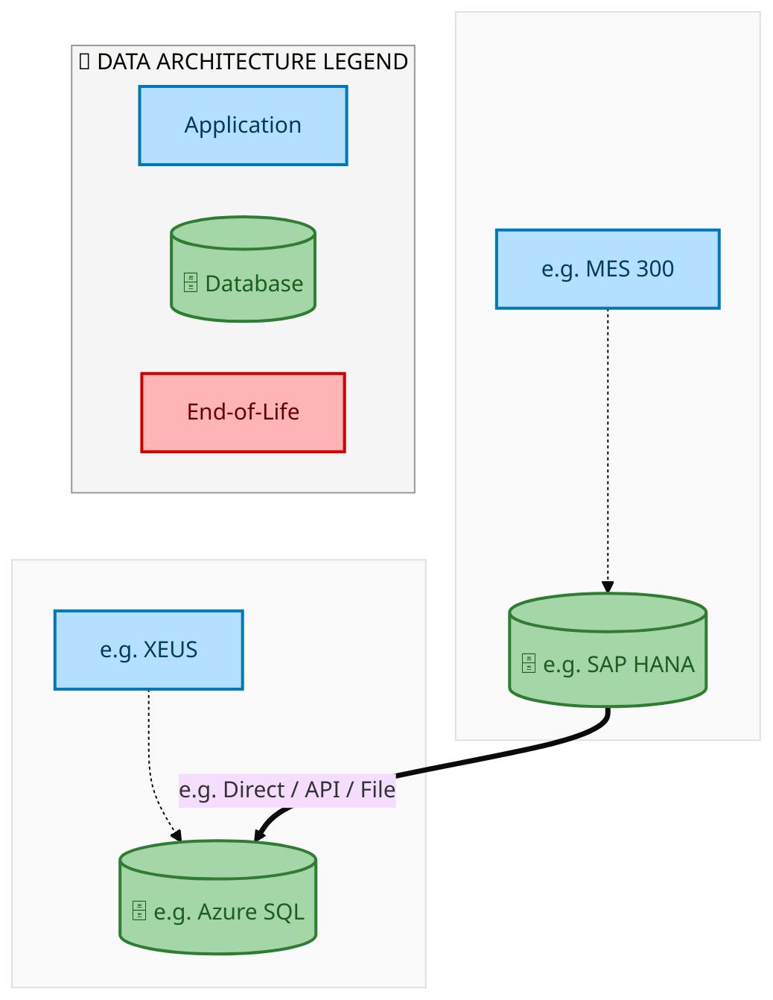
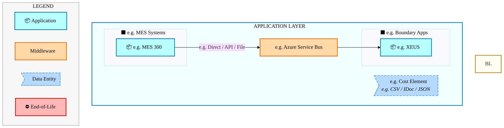
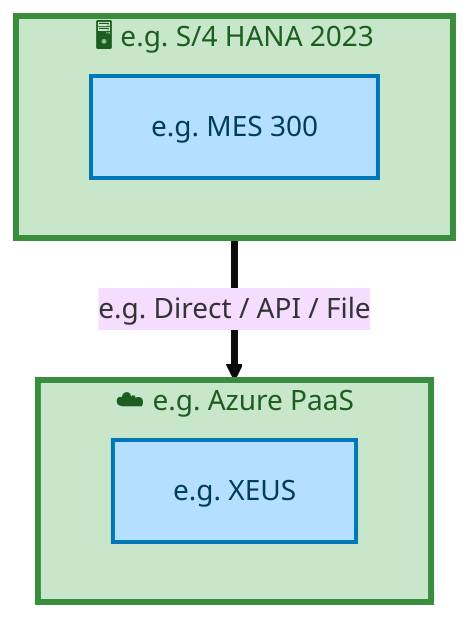

  <img src="data:image/svg+xml;base64,PHN2ZyB4bWxucz0iaHR0cDovL3d3dy53My5vcmcvMjAwMC9zdmciIHZpZXdCb3g9IjAgMCA4MDAgNDgwIiB3aWR0aD0iODAwIiBoZWlnaHQ9IjQ4MCI+DQogIDxkZWZzPg0KICAgIDxsaW5lYXJHcmFkaWVudCBpZD0iYmciIHgxPSIwJSIgeTE9IjAlIiB4Mj0iMTAwJSIgeTI9IjEwMCUiPg0KICAgICAgPHN0b3Agb2Zmc2V0PSIwJSIgc3R5bGU9InN0b3AtY29sb3I6IzAwNzFjNTtzdG9wLW9wYWNpdHk6MSIvPg0KICAgICAgPHN0b3Agb2Zmc2V0PSIxMDAlIiBzdHlsZT0ic3RvcC1jb2xvcjojMDBhZWVmO3N0b3Atb3BhY2l0eToxIi8+DQogICAgPC9saW5lYXJHcmFkaWVudD4NCiAgICA8bGluZWFyR3JhZGllbnQgaWQ9ImFjY2VudCIgeDE9IjAlIiB5MT0iMCUiIHgyPSIwJSIgeTI9IjEwMCUiPg0KICAgICAgPHN0b3Agb2Zmc2V0PSIwJSIgc3R5bGU9InN0b3AtY29sb3I6I2ZmZmZmZjtzdG9wLW9wYWNpdHk6MC4xNSIvPg0KICAgICAgPHN0b3Agb2Zmc2V0PSIxMDAlIiBzdHlsZT0ic3RvcC1jb2xvcjojZmZmZmZmO3N0b3Atb3BhY2l0eTowLjAyIi8+DQogICAgPC9saW5lYXJHcmFkaWVudD4NCiAgICA8cGF0dGVybiBpZD0iZ3JpZCIgd2lkdGg9IjQwIiBoZWlnaHQ9IjQwIiBwYXR0ZXJuVW5pdHM9InVzZXJTcGFjZU9uVXNlIj4NCiAgICAgIDxwYXRoIGQ9Ik0gNDAgMCBMIDAgMCAwIDQwIiBmaWxsPSJub25lIiBzdHJva2U9InJnYmEoMjU1LDI1NSwyNTUsMC4wNykiIHN0cm9rZS13aWR0aD0iMC41Ii8+DQogICAgPC9wYXR0ZXJuPg0KICA8L2RlZnM+DQoNCiAgPCEtLSBCYWNrZ3JvdW5kIC0tPg0KICA8cmVjdCB3aWR0aD0iODAwIiBoZWlnaHQ9IjQ4MCIgZmlsbD0idXJsKCNiZykiIHJ4PSI4Ii8+DQogIDxyZWN0IHdpZHRoPSI4MDAiIGhlaWdodD0iNDgwIiBmaWxsPSJ1cmwoI2dyaWQpIiByeD0iOCIvPg0KICA8cmVjdCB3aWR0aD0iODAwIiBoZWlnaHQ9IjQ4MCIgZmlsbD0idXJsKCNhY2NlbnQpIiByeD0iOCIvPg0KDQogIDwhLS0gRGVjb3JhdGl2ZSBjaXJjdWl0L2FyY2hpdGVjdHVyZSBsaW5lcyAtLT4NCiAgPGcgc3Ryb2tlPSJyZ2JhKDI1NSwyNTUsMjU1LDAuMTIpIiBzdHJva2Utd2lkdGg9IjEuNSIgZmlsbD0ibm9uZSI+DQogICAgPHBhdGggZD0iTSAwIDEwMCBMIDEyMCAxMDAgTCAxNjAgMTQwIEwgMjgwIDE0MCIvPg0KICAgIDxwYXRoIGQ9Ik0gMCAyNjAgTCA4MCAyNjAgTCAxMjAgMjIwIEwgMjAwIDIyMCBMIDI0MCAyNjAgTCAzNjAgMjYwIi8+DQogICAgPHBhdGggZD0iTSA1MjAgMTAwIEwgNjAwIDEwMCBMIDY0MCA2MCBMIDgwMCA2MCIvPg0KICAgIDxwYXRoIGQ9Ik0gNDQwIDM0MCBMIDU2MCAzNDAgTCA2MDAgMzAwIEwgNzIwIDMwMCBMIDc2MCAzNDAgTCA4MDAgMzQwIi8+DQogICAgPHBhdGggZD0iTSA2MDAgNDAwIEwgNjgwIDQwMCBMIDcyMCA0NDAiLz4NCiAgICA8cGF0aCBkPSJNIDAgNDAwIEwgNDAgNDAwIEwgODAgMzYwIi8+DQogICAgPHBhdGggZD0iTSAyMDAgNDIwIEwgMzIwIDQyMCBMIDM2MCAzODAgTCA0ODAgMzgwIi8+DQogICAgPHBhdGggZD0iTSA2NTAgNDQwIEwgNzUwIDQ0MCBMIDgwMCA0ODAiLz4NCiAgPC9nPg0KDQogIDwhLS0gRGVjb3JhdGl2ZSBub2RlcyAtLT4NCiAgPGcgZmlsbD0icmdiYSgyNTUsMjU1LDI1NSwwLjE4KSI+DQogICAgPGNpcmNsZSBjeD0iMTIwIiBjeT0iMTAwIiByPSI0Ii8+DQogICAgPGNpcmNsZSBjeD0iMjgwIiBjeT0iMTQwIiByPSI0Ii8+DQogICAgPGNpcmNsZSBjeD0iMjAwIiBjeT0iMjIwIiByPSI0Ii8+DQogICAgPGNpcmNsZSBjeD0iMzYwIiBjeT0iMjYwIiByPSI0Ii8+DQogICAgPGNpcmNsZSBjeD0iNjAwIiBjeT0iMTAwIiByPSI0Ii8+DQogICAgPGNpcmNsZSBjeD0iNzIwIiBjeT0iMzAwIiByPSI0Ii8+DQogICAgPGNpcmNsZSBjeD0iNTYwIiBjeT0iMzQwIiByPSI0Ii8+DQogICAgPGNpcmNsZSBjeD0iODAiIGN5PSIzNjAiIHI9IjQiLz4NCiAgICA8Y2lyY2xlIGN4PSI0ODAiIGN5PSIzODAiIHI9IjQiLz4NCiAgICA8Y2lyY2xlIGN4PSIzMjAiIGN5PSI0MjAiIHI9IjQiLz4NCiAgPC9nPg0KDQogIDwhLS0gVE9HQUYgQkRBVCBib3hlcyAtLT4NCiAgPGcgZm9udC1mYW1pbHk9IlNlZ29lIFVJLCBBcmlhbCwgc2Fucy1zZXJpZiIgZm9udC1zaXplPSIxNCIgZm9udC13ZWlnaHQ9IjYwMCI+DQogICAgPCEtLSBCIC0tPg0KICAgIDxyZWN0IHg9IjE1MCIgeT0iMTQwIiB3aWR0aD0iMTIwIiBoZWlnaHQ9IjQwIiByeD0iNSIgZmlsbD0icmdiYSgyNTUsMjU1LDI1NSwwLjE4KSIgc3Ryb2tlPSJyZ2JhKDI1NSwyNTUsMjU1LDAuMykiIHN0cm9rZS13aWR0aD0iMSIvPg0KICAgIDx0ZXh0IHg9IjIxMCIgeT0iMTY1IiB0ZXh0LWFuY2hvcj0ibWlkZGxlIiBmaWxsPSIjZmZmIj5CdXNpbmVzczwvdGV4dD4NCiAgICA8IS0tIEQgLS0+DQogICAgPHJlY3QgeD0iMjkwIiB5PSIxNDAiIHdpZHRoPSIxMjAiIGhlaWdodD0iNDAiIHJ4PSI1IiBmaWxsPSJyZ2JhKDI1NSwyNTUsMjU1LDAuMTgpIiBzdHJva2U9InJnYmEoMjU1LDI1NSwyNTUsMC4zKSIgc3Ryb2tlLXdpZHRoPSIxIi8+DQogICAgPHRleHQgeD0iMzUwIiB5PSIxNjUiIHRleHQtYW5jaG9yPSJtaWRkbGUiIGZpbGw9IiNmZmYiPkRhdGE8L3RleHQ+DQogICAgPCEtLSBBIC0tPg0KICAgIDxyZWN0IHg9IjQzMCIgeT0iMTQwIiB3aWR0aD0iMTIwIiBoZWlnaHQ9IjQwIiByeD0iNSIgZmlsbD0icmdiYSgyNTUsMjU1LDI1NSwwLjE4KSIgc3Ryb2tlPSJyZ2JhKDI1NSwyNTUsMjU1LDAuMykiIHN0cm9rZS13aWR0aD0iMSIvPg0KICAgIDx0ZXh0IHg9IjQ5MCIgeT0iMTY1IiB0ZXh0LWFuY2hvcj0ibWlkZGxlIiBmaWxsPSIjZmZmIj5BcHBsaWNhdGlvbjwvdGV4dD4NCiAgICA8IS0tIFQgLS0+DQogICAgPHJlY3QgeD0iNTcwIiB5PSIxNDAiIHdpZHRoPSIxMjAiIGhlaWdodD0iNDAiIHJ4PSI1IiBmaWxsPSJyZ2JhKDI1NSwyNTUsMjU1LDAuMTgpIiBzdHJva2U9InJnYmEoMjU1LDI1NSwyNTUsMC4zKSIgc3Ryb2tlLXdpZHRoPSIxIi8+DQogICAgPHRleHQgeD0iNjMwIiB5PSIxNjUiIHRleHQtYW5jaG9yPSJtaWRkbGUiIGZpbGw9IiNmZmYiPlRlY2hub2xvZ3k8L3RleHQ+DQogIDwvZz4NCg0KICA8IS0tIENvbm5lY3RpbmcgbGluZXMgYmV0d2VlbiBCREFUIGJveGVzIC0tPg0KICA8ZyBzdHJva2U9InJnYmEoMjU1LDI1NSwyNTUsMC4yNSkiIHN0cm9rZS13aWR0aD0iMSI+DQogICAgPGxpbmUgeDE9IjI3MCIgeTE9IjE2MCIgeDI9IjI5MCIgeTI9IjE2MCIvPg0KICAgIDxsaW5lIHgxPSI0MTAiIHkxPSIxNjAiIHgyPSI0MzAiIHkyPSIxNjAiLz4NCiAgICA8bGluZSB4MT0iNTUwIiB5MT0iMTYwIiB4Mj0iNTcwIiB5Mj0iMTYwIi8+DQogIDwvZz4NCg0KICA8IS0tIE1haW4gdGl0bGUgLS0+DQogIDx0ZXh0IHg9IjQwMCIgeT0iMjYwIiB0ZXh0LWFuY2hvcj0ibWlkZGxlIiBmb250LWZhbWlseT0iU2Vnb2UgVUksIEFyaWFsLCBzYW5zLXNlcmlmIiBmb250LXNpemU9IjM2IiBmb250LXdlaWdodD0iNzAwIiBmaWxsPSIjZmZmZmZmIiBsZXR0ZXItc3BhY2luZz0iMSI+DQogICAgSUFPIEFyY2hpdGVjdHVyZQ0KICA8L3RleHQ+DQogIDx0ZXh0IHg9IjQwMCIgeT0iMzAwIiB0ZXh0LWFuY2hvcj0ibWlkZGxlIiBmb250LWZhbWlseT0iU2Vnb2UgVUksIEFyaWFsLCBzYW5zLXNlcmlmIiBmb250LXNpemU9IjE4IiBmb250LXdlaWdodD0iNDAwIiBmaWxsPSJyZ2JhKDI1NSwyNTUsMjU1LDAuOCkiIGxldHRlci1zcGFjaW5nPSIyIj4NCiAgICBUT0dBRiBCREFUIMK3IElBTyBQcm9ncmFtIMK3IElETSAyLjANCiAgPC90ZXh0Pg0KDQogIDwhLS0gQm90dG9tIGFjY2VudCBiYXIgLS0+DQogIDxyZWN0IHg9IjI4MCIgeT0iMzQwIiB3aWR0aD0iMjQwIiBoZWlnaHQ9IjMiIHJ4PSIxLjUiIGZpbGw9InJnYmEoMjU1LDI1NSwyNTUsMC40KSIvPg0KDQogIDwhLS0gSW50ZWwgdGV4dCAtLT4NCiAgPHRleHQgeD0iNDAwIiB5PSIzODAiIHRleHQtYW5jaG9yPSJtaWRkbGUiIGZvbnQtZmFtaWx5PSJTZWdvZSBVSSwgQXJpYWwsIHNhbnMtc2VyaWYiIGZvbnQtc2l6ZT0iMTMiIGZpbGw9InJnYmEoMjU1LDI1NSwyNTUsMC41KSIgbGV0dGVyLXNwYWNpbmc9IjMiPg0KICAgIElOVEVMIENPTkZJREVOVElBTA0KICA8L3RleHQ+DQo8L3N2Zz4NCg==" alt="IAO Architecture" style="width:100%; border-radius:8px;" />
  <h1 style="font-size:36px; margin-top:24px;">E2E-72 — IP</h1>
  <h2 style="font-size:24px;">Architecture Document (TOGAF BDAT)</h2>
  
End-to-End Integrated Processes (E2E) Tower 
  Capability E2E-72 · Forecast to Stock

  
IAO Program · R1 – R5 
  Generated: April 2026 
  Sajiv Francis

  
IAO Architecture Pipeline — Intel Confidential

Page 1<a href="#toc">↑ Back to TOC</a>E2E-72 — IP

## Table of Contents

<nav class="toc">
<ol>
  <li><a href="#1-executive-summary">1. Executive Summary</a></li>
  <li><a href="#2-business-context-objectives">2. Business Context &amp; Objectives</a>
    <ul>
      <li><a href="#21-classification">2.1 Classification</a></li>
      <li><a href="#22-business-drivers">2.2 Business Drivers</a></li>
      <li><a href="#23-success-criteria">2.3 Success Criteria</a></li>
      <li><a href="#24-companion-documents">2.4 Companion Documents</a></li>
    </ul>
  </li>
  <li><a href="#3-business-architecture-togaf-b">3. Business Architecture (TOGAF &ldquo;B&rdquo;)</a>
    <ul>
      <li><a href="#31-business-process-overview">3.1 Business Process Overview</a></li>
      <li><a href="#32-business-process-diagrams">3.2 Business Process Diagrams</a></li>
      <li><a href="#33-business-roles-responsibilities">3.3 Business Roles &amp; Responsibilities</a></li>
    </ul>
  </li>
  <li><a href="#4-data-architecture-togaf-d">4. Data Architecture (TOGAF &ldquo;D&rdquo;)</a>
    <ul>
      <li><a href="#41-data-entities-ownership">4.1 Data Entities &amp; Ownership</a></li>
      <li><a href="#42-data-flow-diagrams">4.2 Data Flow Diagrams</a></li>
      <li><a href="#43-data-lineage">4.3 Data Lineage</a></li>
      <li><a href="#44-ricefw-data-objects">4.4 RICEFW Data Objects</a></li>
      <li><a href="#45-data-governance-quality">4.5 Data Governance &amp; Quality</a></li>
    </ul>
  </li>
  <li><a href="#5-application-architecture-togaf-a">5. Application Architecture (TOGAF &ldquo;A&rdquo;)</a>
    <ul>
      <li><a href="#51-current-state-current-state-application-landscape">5.1 Current-State Application Landscape</a></li>
      <li><a href="#52-future-state-future-state-application-landscape">5.2 Future-State Application Landscape</a></li>
      <li><a href="#53-change-impact-summary">5.3 Change Impact Summary</a></li>
      <li><a href="#54-component-overview">5.4 Component Overview</a></li>
      <li><a href="#55-ricefw-inventory">5.5 RICEFW Inventory</a></li>
      <li><a href="#56-integration-patterns">5.6 Integration Patterns</a></li>
    </ul>
  </li>
  <li><a href="#6-technology-architecture-togaf-t">6. Technology Architecture (TOGAF &ldquo;T&rdquo;)</a>
    <ul>
      <li><a href="#61-platform-infrastructure">6.1 Platform &amp; Infrastructure</a></li>
      <li><a href="#62-sap-development-object-status">6.2 SAP Development Object Status</a></li>
      <li><a href="#63-nfrs-design-principles">6.3 NFRs &amp; Design Principles</a></li>
      <li><a href="#64-security-governance">6.4 Security &amp; Governance</a></li>
    </ul>
  </li>
  <li><a href="#7-project-context">7. Project Context</a>
    <ul>
      <li><a href="#71-project-roadmap-go-live-plan">7.1 Project Roadmap &amp; Go-Live Plan</a></li>
      <li><a href="#72-raid-log">7.2 RAID Log</a></li>
      <li><a href="#73-recommendations-next-steps">7.3 Recommendations &amp; Next Steps</a></li>
    </ul>
  </li>
</ol>
</nav>

Page 2<a href="#toc">↑ Back to TOC</a>E2E-72 — IP

## 1. Executive Summary

This Architecture Document defines the **Business, Data, Application, and Technology** (BDAT) architecture for **E2E-72 IP** within the IAO program. It includes 4 BPMN process diagram(s) in Section 3.

| Dimension | Value |
|-----------|-------|
| **Tower** | End-to-End Integrated Processes (E2E) |
| **Process Group** | Forecast to Stock |
| **Capability** | E2E-72 - IP |
| **Release** | R1 – R5 |
| **Total Systems** | 2 |
| **System Status** | 0 Deployed, 0 Developing, 0 EOL, 2 Pending IAPM |
| **RICEFW Objects** | Pending — Smartsheet Object Tracker API integration |

**Change Summary**: 0 new flow chains, 0 removed, 0 modified, 1 unchanged between Current-State and Future-State states.

> All system nodes in architecture diagrams are **IAPM-linked** — click any node to open its IAPM page. Diagrams require `securityLevel: 'loose'` for click events.

Page 3<a href="#toc">↑ Back to TOC</a>E2E-72 — IP

## 2. Business Context & Objectives

### 2.1 Classification

| Level | Value |
|-------|-------|
| **L0 Tower** | End-to-End Integrated Processes |
| **L1 Process** | Forecast to Stock |
| **L2 Capability** | E2E-72 - IP |

### 2.2 Business Drivers

| # | Driver | Description | Strategic Alignment | Priority |
|---|--------|-------------|---------------------|----------|
| 1 | End-to-End Process Integration | Enable cross-tower integrated processes spanning procurement, manufacturing, and fulfillment | IDM 2.0 Process Excellence | High |
| 2 | Intel Foundry Business Enablement | Stand up foundry-specific business processes for external customer engagement | Intel Foundry Services | High |
| 3 | Process Visibility & Monitoring | Provide end-to-end process visibility across tower boundaries with integrated monitoring | Operational Excellence | Medium |
| 4 | E2E-72 Process Migration | Migrate IP business processes and 2 integrated systems from legacy to S/4 HANA target architecture | IDM 2.0 Cross-Functional / End-to-End | High |

Page 4<a href="#toc">↑ Back to TOC</a>E2E-72 — IP

### 2.3 Success Criteria

| Metric | Target | Measure | Baseline | Owner |
|--------|--------|---------|----------|-------|
| E2E Process Cycle Time | Per process SLA | End-to-end transaction completion within defined SLA per process | Varies by process | E2E Process Owner |
| Cross-Tower Integration Success | > 99% | Transactions completing across tower boundaries without manual intervention | 92% (current) | Integration Lead |
| Process Exception Rate | < 2% | Transactions requiring manual exception handling | 8% (current) | Operations Manager |
| E2E-72 Migration Completeness | 100% flow chains validated | All 1 flow chains verified in target state | 0% (pre-migration) | Tower Architect |

### 2.4 Companion Documents

| Document | Description |
|----------|-------------|
| **Business Architecture** | Included in this document (Section 3) — process flows from BPMN diagrams |
| **This Document** | Full BDAT Architecture — Business + Data + Application + Technology |

Page 5<a href="#toc">↑ Back to TOC</a>E2E-72 — IP

## 3. Business Architecture (TOGAF "B")

### 3.1 Business Process Overview

This capability includes **4 business process(es)** modeled in BPMN 2.0, covering the end-to-end workflow for E2E-72 IP.

| # | Step ID | Process Name | Lanes | Tasks | Gateways |
|---|---------|--------------|-------|-------|----------|
| 1 | E2E-72-_Intel_Foundry_-_Request_and_Response_process_with_planning_integration_(Process_for_Type_A_a | E2E-72-_Intel_Foundry_-_Request_and_Response_process_with_planning_integration_(Process_for_Type_A_a | Boundary Apps, External Partners/

Supplier
, SAP S/4  Intel Foundry
Purchase Req – Purchase Order

 | 12 | 6 |
| 2 | E2E-72A-_FTS_-_Intel_Product_-_Request_and_Response_process_with_planning_integration_(Process_for_T | E2E-72A-_FTS_-_Intel_Product_-_Request_and_Response_process_with_planning_integration_(Process_for_T | Boundary Apps, External Partners/

Supplier
, SAP S/4  Intel Foundry
Purchase Req – Purchase Order

 | 19 | 10 |
| 3 | E2E-72B-_FTS_-_Intel_Product_-_Request_and_Response_process_with_planning_integration_(Process_for_T | E2E-72B-_FTS_-_Intel_Product_-_Request_and_Response_process_with_planning_integration_(Process_for_T | Boundary Apps, External Partners/

Supplier
, SAP S/4  Intel Foundry
Purchase Req – Purchase Order

 | 19 | 10 |
| 4 | E2E-72C-_FTS_-_Intel_Product_-_Request_and_Response_process_with_planning_integration_(Process_for_T | E2E-72C-_FTS_-_Intel_Product_-_Request_and_Response_process_with_planning_integration_(Process_for_T | Boundary Apps, External Partners/

Supplier
, SAP S/4  Intel Foundry
Purchase Req – Purchase Order

 | 19 | 10 |

Page 6<a href="#toc">↑ Back to TOC</a>E2E-72 — IP

### 3.2 Business Process Diagrams

#### BUSINESS ARCHITECTURE — 3.2.1 E2E-72-_Intel_Foundry_-_Request_and_Response_process_with_planning_integration_(Process_for_Type_A_a — E2E-72-_Intel_Foundry_-_Request_and_Response_process_with_planning_integration_(Process_for_Type_A_a

**Swim Lanes**: Boundary Apps · External Partners/
Supplier
 · SAP S/4  Intel Foundry
Purchase Req – Purchase Order

 | **Tasks**: 12 | **Gateways**: 6

```mermaid
%%{init: {'theme': 'base', 'themeVariables': {'fontSize': '14px', 'fontFamily': 'Segoe UI, Arial, sans-serif','primaryColor': '#e8f0fe', 'primaryBorderColor': '#0071c5','lineColor': '#37474F', 'secondaryColor': '#f5f8fc'}, 'flowchart': {'useMaxWidth': false, 'htmlLabels': true, 'curve': 'basis', 'nodeSpacing': 40, 'rankSpacing': 50}} }%%
flowchart LR
    classDef startEvt fill:#4CAF50,stroke:#2E7D32,color:#000,font-weight:bold,stroke-width:2px,rx:20,ry:20
    classDef endEvt fill:#C62828,stroke:#B71C1C,color:#fff,font-weight:bold,stroke-width:2px,rx:20,ry:20
    classDef userTask fill:#E3F2FD,stroke:#1565C0,stroke-width:2px,color:#0D47A1
    classDef serviceTask fill:#FFF3E0,stroke:#E65100,stroke-width:2px,color:#BF360C
    classDef gateway fill:#FFF9C4,stroke:#F57F17,stroke-width:2px,color:#E65100
    classDef subProc fill:#F3E5F5,stroke:#7B1FA2,stroke-width:2px,color:#4A148C
    subgraph lane_0["Boundary Apps"]
        n1["Receive inventory request in Planning Hub"]
        n2["Fetch Inventory Data from Speed"]
        n3["Fetch BOM Data from MDG"]
        n4["Fetch Inventory demand from BY"]
        n5["Receive Updates via PDH"]
        n13(["fa:fa-play Initiate Inventory request process"])
        n19{{"fa:fa-arrows-alt parallelGateway"}}
        n20{{"fa:fa-arrows-alt parallelGateway"}}
        n22{{"fa:fa-arrows-alt inclusiveGateway"}}
    end
    subgraph lane_1["External Partners/ Supplier "]
        n6["PO Received at Supplier"]
        n7["Order Acknowledgement sent to S/4"]
        n8["Send and Receive Forecast communication commit"]
        n15(["fa:fa-play Forecast communication from ECA"])
        n16(["fa:fa-stop Forecast communicated"])
    end
    subgraph lane_2["SAP S/4  Intel Foundry Purchase Req – Purchase Order "]
        n9[["fa:fa-cog Create Purchase Req"]]
        n10[["fa:fa-cog Use 'MD04' Fiori App to show PR and Stock levels"]]
        n11[["fa:fa-cog PR converted to PO (Based on Planning Design Horizon)"]]
        n12[["fa:fa-cog Do Excel Upload or Manual Creation"]]
        n14(["fa:fa-play Initiate Excel Upload or Manual Creation"])
        n17["intermediateThrowEvent"]
        n18{{"fa:fa-code-branch exclusiveGateway"}}
        n21{{"fa:fa-arrows-alt parallelGateway"}}
        n23{{"fa:fa-arrows-alt inclusiveGateway"}}
    end
    n11 --> n21
    n3 --> n20
    n19 --> n2
    n2 --> n20
    n6 --> n7
    n18 --> n11
    n21 -->|"3A4  (EDI 850) E2Open"| n6
    n19 --> n4
    n13 --> n19
    n9 --> n10
    n21 --> n17
    n10 --> n18
    n14 --> n12
    n12 --> n23
    n23 --> n9
    n4 --> n22
    n1 --> n22
    n22 --> n5
    n5 --> n23
    n20 --> n1
    n19 --> n3
    n7 -->|"3A4 (EDI  855)
Order Confirmation E2Open"| n18
    n8 --> n16
    n15 --> n8
    class n9 serviceTask
    class n10 serviceTask
    class n11 serviceTask
    class n12 serviceTask
    class n13 startEvt
    class n14 startEvt
    class n15 startEvt
    class n16 endEvt
    class n17 startEvt
    class n18 gateway
    class n19 gateway
    class n20 gateway
    class n21 gateway
    class n22 gateway
    class n23 gateway
```

> **Legend**: ● Start · ● End · User Task · Service Task · ◇ Gateway · Sub-Process

<a href="https://mermaid.live/view#pako:eNqlV21v4jgQ_itWqopWAm1eCeXDSbxlW2mrorK902k5nUzigFVjZx0H6Hb57zcOSSBZuJN6fEDy45lnPM_MGPNuhCIiRt-4vn6nnKo-em-pFVmTVh-1FjglrTY6AL9jSfGCkbSlbWLB1Yz-yM0sN9lpM40FeE3Zm0ZnZCkIenloowE4sjZKMU87KZE0brVbiaRrLN9Gggmpra9ILzbjPFqxNRQyIvJoYJq-FXrgyignR9jxXd8NtF9KQsGjGmnsxb04bO314ZjYhissVX78LCWPePcHjdQK1jFmKQGblVqzL3hBmM5RyUxjYSY3pRg01XE4CDZLcEj5EnDXBEhi_nqEPHO_R_vr6zmvgqIvz3OO4BMynKZjEqNUATzZKBRTxvpX7mgQeGY7VVK8kv6VPfHHjt0OdSZ9SN1sa3E7W0KXK9VfCBYVpp2tzqFvJ7u23PVtsy3f4LsRi_DoGGnUtXt2r4o09K2RNSojxXH8vyKBrvIrTl-LWBMnsINxFcvyut7I_JWvTHPs-gOrqRORGxqSE9IgCJzJUapJ17PMy6TDwOmaowbpEiuyxW9HwruRWxEGnh9Y_kXCQ7zmKbPFVIqwJHQmXuBVhP7QCgb2RUJ3YLm94oTAs5Q4WSGGOfnb_DY3hiLLmxoNkiSdG38d7PSHW7D9TEJCNwRRviFcCbCT5HtGUgUImgILh55E99mi7mqDa0BUuEIPleMYK4xiKdZolhAS1R2cymH49Hhi-jj-XDd0zzBHZI15dHAY_lm3906SeEkiKEyKNhSj6fi-ka1zA6Yx7se4kzAo3gNcVxTsTwKVuSdQC5JquW5PGe7e30sGLKXYph3MwBhLzBhhnw9NMTf2-1OlzI842WedKA9ZlkKmv3jBhJ5rAF3hyU4RyTFDU7gwOJHpJzTLkoRRIlFdoS5YT59QoWaEsKos64Y-GD7p2xUNwlcutoxES7jhuYJpgy8l0OyTW3fpgcsMTol0Ict6BUKSEIPeoVivM05DrKjg-YqqRvW8RvUu-OY9MhkNmqXrHt1TJZJz7nnL3v6rnrrtZ4OpTg9B2yjCgAjmC1pnmkm4qVMCyX1H88w2LeeIHcSqZ3T3rTpRKJZoJInuxVMasK9JYNY9XsCq9Tg23RYKqJBUT7jWPl2JLZo-50rPlAhfESMb-E1q0ll1OvCA378NkSCEpoFOuBnCSSIkTm6CMUnpkqN7iPdD8Nsmp13nHAs02YWg0kvCBAYmiR4xz6AZ83ShYE0C99KQ_jdPrd66RSkUSK5JpP2_rmCKJnrOG33VO06afsl0FvBbDJcP2V0atcOAWh-ZauejUw3FQp3ObzpuATjF2iwN7gqgWNuN_e5h7ZfmvcPaKvnsPMDPueEMoLVvJuMH1PPMWzSxnxIC6v4EikYot1wXZ7HuCqDYt8waty5K6WEWQK8E3AIoj2-V53dKjiJIGaNwsCuHxtouCLxi7TX5yiM0kir3_RM5cjVADg867DDJI8FjKteHK-dEoiqhUt5KsyJ-7-R3Xwt18jqp7YBCF7esy1v25S2nejHWcfcC7l3Au8VrsI76F6x75VOpDt-dhaEmZ2HrPGyfh50SNtrGGuYf08jovxv5fxD4nxKRGGdMGfu2gTMlZm88NPr5W93I8ufDmGK48dcHcP8PONAArg==" title="View full diagram">&#128065; View Diagram</a>

Page 7<a href="#toc">↑ Back to TOC</a>E2E-72 — IP

#### BUSINESS ARCHITECTURE — 3.2.2 E2E-72A-_FTS_-_Intel_Product_-_Request_and_Response_process_with_planning_integration_(Process_for_T — E2E-72A-_FTS_-_Intel_Product_-_Request_and_Response_process_with_planning_integration_(Process_for_T

**Swim Lanes**: Boundary Apps · External Partners/
Supplier
 · SAP S/4  Intel Foundry
Purchase Req – Purchase Order

 | **Tasks**: 19 | **Gateways**: 10

> **Legend**: ● Start · ● End · User Task · Service Task · ◇ Gateway · Sub-Process

<a href="https://mermaid.live/view#pako:eNqlWG1v2kgQ_isrVxGtBKq9tjHw4U68uY3UNCj0RVVzOi32GlYxtrteQ9KU_36zttfgLdypvXyI5Jl5nnkfDM9GkIbUGBlXV88sYWKEnjtiQ7e0M0KdFclpp4sqwSfCGVnFNO9ImyhNxJJ9L80sJ3uUZlLmky2Ln6R0SdcpRR-vu2gMwLiLcpLkvZxyFnW6nYyzLeFP0zROubR-QQeRGZXeatUk5SHlRwPT9KzABWjMEnoU257jOb7E5TRIk7BFGrnRIAo6BxlcnO6DDeGiDL_I6Q15_MxCsYHniMQ5BZuN2MbvyIrGMkfBCykLCr5TxWC59JNAwZYZCViyBrljgoiT5OEocs3DAR2uru6Txil6d3efIPgLYpLnMxqhXIB4vhMoYnE8euFMx75rdnPB0wc6eoHn3szG3UBmMoLUza4sbm9P2XojRqs0DmvT3l7mMMLZY5c_jrDZ5U_wX_NFk_DoadrHAzxoPE08a2pNlacoiv6XJ6gr_0Dyh9rX3PaxP2t8WW7fnZo_86k0Z443tvQ6Ub5jAT0h9X3fnh9LNe-7lnmZdOLbfXOqka6JoHvydCQcTp2G0Hc93_IuElb-9CiL1YKngSK0567vNoTexPLH-CKhM7acQR0h8Kw5yTYoJgn92_x6b0zSohxqNM6y_N74q7KTf4kF6jsaULajiCU7mogU7Dj9VtBcgAQtgCWBmURvi1UbigHqUxFs0HUDnBFBUMTTLVpmlIZtgN0AJrc3J6Y3szdtQ-cMc0i3JAkrwORL2949SeJjFkJjcrRjBC1mb7WQzZdgGpFRRHpZDM27hnPFwP7Ekco9g17QXJbr1SnD4PlZMRDO033eIzEYE07imMZvqqG4Nw6HU9DwN0A2PgtiSRAXOWT6Ewo29NwAyA7PHwXlCYnRAg5GQnn-Gi2LLIsZ5ahdoT5YL25RXc0QEdFYtg09MLyV1xWNg4ck3cc0XMOFTwRsG_wTKVq-dtqQgeSmPEr59uh-HAi2gyZQbTAxPrYqF2mGIKqqt2FJfgyq1R7vWDT5odRbwVmFOaKPv1g1OdzL8UImgWA4BI2RL7cIBmRRcLjHOYUifUP3BTYt-yirStJOZfj16zGmNZpyKifulAbsW0tpthEfwepmZjrIZylncotlCfJNukeLOyTXYinS4AHFdAefOzqZ1SYDBHzG7SivK7m41QFYi3dDgZtFEgmueVrORY4ySLS5DiHN2TrRmew20ycSM9lB9AmqnnIkNjwt1ht0lxZCkojy3UAncS6E04wQy9Ecz9FtRhNop-QIdQ63zXEDOUDinbwcJUHW4F2H9NuQJYTcQOZYOtMRXhsxwRNZ6Yit0Utp_oE-ilc6ZqA157YcqGHebNFnuloWTFAdOPyX8OBlaQXXDy80ELZ-3ikACn2J7F9dogrmnIc1faqqhuZVi_7U4e5_wKHNsqRNh9vo_nn0WxjU8fvrmX5czd-5yNavgZrTAguNer0_5GopgVUJ7PolILGrZzysn7H23K-ePaWu7S1L4UsPP-4NewwH6-V8do0GrvmqmdQfQKGwg9q3eh7WXCq2Wo1b1HKblYFy7iiBU0erBNipo_ki1_mH3CZl6tamrjJ1dVOVo3eSUZkQZOTCnFYndio3i2-JYGlymiVuovRqT4rPGmgCXFsM6melb5qkmtBQ1l3Alh78-7R0bjeKvp7VsFUaaaGb1hyWqow1rBXjONYOA1icnAYEn6jwvkP35RU7DaMutvJt1wkpD3bdamugjYajPauKONpo4Ho0sCJQo3T6biulJ2_gLQ0sxkWVdVmFL6vsyyrnssq9rOpfVnmXVYPLqsvVgHKqr3RtuVV__WpL8Vmprb6ZtMXOebF7Xtw_L_bOiwfnxcOzYjgnZ8XWeTFWYqNrbCksPAuN0bNR_pwAPzmENCJFLIxD1yCFSJdPSWCMyq_dRlG-Lc4Ygde6bSU8_APz0R3T" title="View full diagram">&#128065; View Diagram</a>

Page 8<a href="#toc">↑ Back to TOC</a>E2E-72 — IP

```mermaid
%%{init: {'theme': 'base', 'themeVariables': {'fontSize': '14px', 'fontFamily': 'Segoe UI, Arial, sans-serif','primaryColor': '#e8f0fe', 'primaryBorderColor': '#0071c5','lineColor': '#37474F', 'secondaryColor': '#f5f8fc'}, 'flowchart': {'useMaxWidth': false, 'htmlLabels': true, 'curve': 'basis', 'nodeSpacing': 40, 'rankSpacing': 50}} }%%
flowchart LR
    classDef startEvt fill:#4CAF50,stroke:#2E7D32,color:#000,font-weight:bold,stroke-width:2px,rx:20,ry:20
    classDef endEvt fill:#C62828,stroke:#B71C1C,color:#fff,font-weight:bold,stroke-width:2px,rx:20,ry:20
    classDef userTask fill:#E3F2FD,stroke:#1565C0,stroke-width:2px,color:#0D47A1
    classDef serviceTask fill:#FFF3E0,stroke:#E65100,stroke-width:2px,color:#BF360C
    classDef gateway fill:#FFF9C4,stroke:#F57F17,stroke-width:2px,color:#E65100
    classDef subProc fill:#F3E5F5,stroke:#7B1FA2,stroke-width:2px,color:#4A148C
    subgraph lane_0["Boundary Apps"]
        n1["Receive inventory request in Planning Hub"]
        n2["Fetch Inventory Data from Speed"]
        n3["Fetch BOM Data from MDG"]
        n4["Fetch Inventory demand from BY"]
        n5["Receive Updates via PDH"]
        n20(["fa:fa-play Initiate Inventory request process"])
        n28{{"fa:fa-arrows-alt parallelGateway"}}
        n29{{"fa:fa-arrows-alt parallelGateway"}}
        n32{{"fa:fa-arrows-alt inclusiveGateway"}}
    end
    subgraph lane_1["External Partners/ Supplier "]
        n6["PO Received at Supplier"]
        n7["Order Acknowledgement sent to S/4"]
        n8["Perform Supplier Activities"]
        n22(["fa:fa-stop PO Updated to Supplier"])
        n27{{"fa:fa-code-branch exclusiveGateway"}}
    end
    subgraph lane_2["SAP S/4  Intel Foundry Purchase Req – Purchase Order "]
        n9[["fa:fa-cog Create Purchase Req"]]
        n10[["fa:fa-cog Use MD04 Fiori App to show PR and Stock levels"]]
        n11[["fa:fa-cog PR converted to PO"]]
        n12[["fa:fa-cog Check if PR Approved as per Planning design"]]
        n13[["fa:fa-cog Validate Vendor through Routing tables"]]
        n14[["fa:fa-cog Check if Supplier is E2E Open enabled"]]
        n15[["fa:fa-cog Move PO's to Staging"]]
        n16[["fa:fa-cog Send PO's to E2Open"]]
        n17[["fa:fa-cog B2B config (OpenText)"]]
        n18[["fa:fa-cog PO’s sent to WebSuite"]]
        n19[["fa:fa-cog Send PO's to Ariba P2P"]]
        n21(["fa:fa-stop PO Sent"])
        n23{{"fa:fa-code-branch exclusiveGateway"}}
        n24{{"fa:fa-code-branch Supplier E2Open Enabled?"}}
        n25{{"fa:fa-code-branch Supplier is B2B enabled"}}
        n26{{"fa:fa-code-branch Has ANID"}}
        n30{{"fa:fa-arrows-alt parallelGateway"}}
        n31{{"fa:fa-arrows-alt parallelGateway"}}
    end
    n10 --> n12
    n11 --> n30
    n3 --> n29
    n2 --> n29
    n6 --> n7
    n23 --> n11
    n30 -->|"3A4  (EDI 850) E2Open"| n6
    n28 --> n3
    n29 --> n1
    n1 --> n32
    n30 --> n13
    n13 --> n14
    n14 --> n24
    n24 -->|"Yes"| n16
    n15 --> n25
    n25 -->|"Yes"| n17
    n7 -->|"3A4 (EDI  855)
Order Confirmation E2Open"| n23
    n17 --> n27
    n18 --> n27
    n27 --> n8
    n8 --> n22
    n12 --> n23
    n16 --> n21
    n25 -->|"No"| n31
    n26 -->|"Yes"| n19
    n24 --> n26
    n26 -->|"No"| n15
    n19 -->|"All PO’s sent
 to WebSuite for viewing"| n31
    n5 --> n9
    n32 --> n5
    n31 --> n18
    n28 --> n4
    n28 --> n2
    n4 --> n32
    n20 --> n28
    n9 --> n10
    class n9 serviceTask
    class n10 serviceTask
    class n11 serviceTask
    class n12 serviceTask
    class n13 serviceTask
    class n14 serviceTask
    class n15 serviceTask
    class n16 serviceTask
    class n17 serviceTask
    class n18 serviceTask
    class n19 serviceTask
    class n20 startEvt
    class n21 endEvt
    class n22 endEvt
    class n23 gateway
    class n24 gateway
    class n25 gateway
    class n26 gateway
    class n27 gateway
    class n28 gateway
    class n29 gateway
    class n30 gateway
    class n31 gateway
    class n32 gateway
```

#### BUSINESS ARCHITECTURE — 3.2.3 E2E-72B-_FTS_-_Intel_Product_-_Request_and_Response_process_with_planning_integration_(Process_for_T — E2E-72B-_FTS_-_Intel_Product_-_Request_and_Response_process_with_planning_integration_(Process_for_T

**Swim Lanes**: Boundary Apps · External Partners/
Supplier
 · SAP S/4  Intel Foundry
Purchase Req – Purchase Order

 | **Tasks**: 19 | **Gateways**: 10

> **Legend**: ● Start · ● End · User Task · Service Task · ◇ Gateway · Sub-Process

<a href="https://mermaid.live/view#pako:eNqlWFuP2jgU_itWqhGtBGquBHjYFbe0I3U6aOhFVWe1MokD1oQ4azswszP89z1O4kBS2FW7PCD5nPN95-4Eno2QRcQYGVdXzzSlcoSeO3JDtqQzQp0VFqTTRaXgC-YUrxIiOsomZqlc0r8LM8vNHpWZkgV4S5MnJV2SNSPo83UXjQGYdJHAqegJwmnc6XYyTreYP01ZwriyfkUGsRkX3irVhPGI8KOBafpW6AE0oSk5ih3f9d1A4QQJWRo1SGMvHsRh56CCS9g-3GAui_BzQW7w41cayQ2cY5wIAjYbuU0-4BVJVI6S50oW5nyni0GF8pNCwZYZDmm6Brlrgojj9OEo8szDAR2uru7T2in6cHefIviECRZiRmIkJIjnO4limiSjV-50HHhmV0jOHsjolT33Z47dDVUmI0jd7Kri9vaErjdytGJJVJn29iqHkZ09dvnjyDa7_Am-W75IGh09Tfv2wB7Unia-NbWm2lMcx__LE9SVf8LiofI1dwI7mNW-LK_vTc0f-XSaM9cfW-06Eb6jITkhDYLAmR9LNe97lnmZdBI4fXPaIl1jSfb46Ug4nLo1YeD5geVfJCz9taPMVwvOQk3ozL3Aqwn9iRWM7YuE7thyB1WEwLPmONugBKfkT_P7vTFheTHUaJxl4t74o7RTn9QC9R0JCd0RRNMdSSUDO07-yomQIEELYElhJtH7fNWE2gANiAw3aIYlRjFnW7TMCImaZk5tNrm9OTG9mb1rGrq14XUdSES2OI1KwORb0947Cf1zFkE7BNpRjBaz961AzddgGuNRjHtZAi27q9K7IyJjqSBI1Z0IAY6ppECkUnhzyuA_P2sGzDnbix5OJMowx0lCknflKNwbh8MpaPALIMc6C6JpmOQCMv0BBXt5ru2qr_NHSXiKE7SAayIlXLxFyzzLEko4alaoD9aLW1RVM0JY1pZNQx8Mb9WdisbhQ8r2CYnWcK-nEnYMviRDy7duEzJQ3ITHjG-P7sehpDuoNWmNo20dWyUkyxBElRe9jQryY1CN9vSPRVOPot4KLlOYI_L4k1VTI70cL1QSCIZBkgQFandgEhc5h1sYZgWGB93ntmk5R1lZkmYqw-_fjzGt0ZQTCKJBA_aNVTSbiM9g1bmZmW4HBZRxqrZXFUFs2B4t7pBajKVk4QNKyA6eN206q0kHCHi27Qiva7nqTRks-G0baLci3xDwQWPFACFwVkyIQBmkXN8OERF0nbaZnCbTF5xQ1Uv0BerPOJIbzvL1Bt2xXCoSWbwbtEncC-HUw0QFmttzdJuRFBqrOKI2h9fkuIEcIPGOKAoh8Rq8tyH9JmQJIdeQua2ctRF-EzGxJ6riMV2j18r8E3mUb9qYQatJt8VoDUW9T1_JaplTSdrA4b-EBy9LK7gH7UULZNs_uyclzDkPqxtQlgPNy9r_3oa7_wGH_qla1a1ror3z6PcwgeOP17O2-fBXLl3z50D17QE7i3q939TOaIFVCuxhJbD9SqDP1XFQnfvl2dfqSm9ZLbyjz4PKQJ-rCGzNYLmVQCMsrxK4laBgfLk3nLGLXs9n1wgNPA_u0_IWm6qR5VssKVwOetBfVGQV3Kng8ABHMTzuBYrUQ11tklta6twsnXtfBzs8cV36Hnjmm1M32tRyqjx11Lb2-01dES9qQ3VAugnar-22Tf225iMrFI6p3em-1I3UoY6TpLWWYHGymAiebPDeQfbFHdLgHLTT95reLT0kVYf0sZohR_fYbZ31TOjSOBXAq87Dqh5mo-yqpu1A6gJpqF3Noy6lTsFqd6FKwfZO3mKV55N37YYGNuWiyrqssi-rnMsq97LKu6zqX1b5l1WDy6rL1YCt1T_emnKr-qHVlNr610ZT7JwXu-fF3nlx_7zYPy8enBcPz4phMc-KLS02usaWwF1DI2P0bBR_EcDfCBGJcZ5I49A1cC7Z8ikNjVHxU9oo3wVnFMNL27YUHv4BH6ASGw==" title="View full diagram">&#128065; View Diagram</a>

Page 9<a href="#toc">↑ Back to TOC</a>E2E-72 — IP

```mermaid
%%{init: {'theme': 'base', 'themeVariables': {'fontSize': '14px', 'fontFamily': 'Segoe UI, Arial, sans-serif','primaryColor': '#e8f0fe', 'primaryBorderColor': '#0071c5','lineColor': '#37474F', 'secondaryColor': '#f5f8fc'}, 'flowchart': {'useMaxWidth': false, 'htmlLabels': true, 'curve': 'basis', 'nodeSpacing': 40, 'rankSpacing': 50}} }%%
flowchart LR
    classDef startEvt fill:#4CAF50,stroke:#2E7D32,color:#000,font-weight:bold,stroke-width:2px,rx:20,ry:20
    classDef endEvt fill:#C62828,stroke:#B71C1C,color:#fff,font-weight:bold,stroke-width:2px,rx:20,ry:20
    classDef userTask fill:#E3F2FD,stroke:#1565C0,stroke-width:2px,color:#0D47A1
    classDef serviceTask fill:#FFF3E0,stroke:#E65100,stroke-width:2px,color:#BF360C
    classDef gateway fill:#FFF9C4,stroke:#F57F17,stroke-width:2px,color:#E65100
    classDef subProc fill:#F3E5F5,stroke:#7B1FA2,stroke-width:2px,color:#4A148C
    subgraph lane_0["Boundary Apps"]
        n1["Receive inventory request in Planning Hub"]
        n2["Fetch Data from Speed"]
        n3["Fetch BOM Data from MDG"]
        n4["Fetch Inventory demand from BY"]
        n5["Receive Updates via PDH"]
        n20(["fa:fa-play Request Response Process Initiated"])
        n27{{"fa:fa-arrows-alt parallelGateway"}}
        n28{{"fa:fa-arrows-alt parallelGateway"}}
        n31{{"fa:fa-arrows-alt inclusiveGateway"}}
    end
    subgraph lane_1["External Partners/ Supplier "]
        n6["PO Received at Supplier"]
        n7["Order Acknowledgement sent to S/4"]
        n8["Perform Supplier Activities"]
        n21(["fa:fa-stop PO updated to Supplier"])
        n26{{"fa:fa-code-branch exclusiveGateway"}}
    end
    subgraph lane_2["SAP S/4  Intel Foundry Purchase Req – Purchase Order "]
        n9[["fa:fa-cog Create Purchase Req"]]
        n10[["fa:fa-cog Use 'MD04' Fiori App to show PR and Stock levels"]]
        n11[["fa:fa-cog PR converted to Sub-Con PO"]]
        n12[["fa:fa-cog Check if PR Approved as per Planning design"]]
        n13[["fa:fa-cog Validate Vendor through Routing tables"]]
        n14[["fa:fa-cog Check if Supplier is E2E Open enabled"]]
        n15[["fa:fa-cog Move PO's to Staging"]]
        n16[["fa:fa-cog Send PO's to E2Open"]]
        n17[["fa:fa-cog B2B config (OpenText)"]]
        n18[["fa:fa-cog PO’s sent to WebSuite"]]
        n19[["fa:fa-cog Send PO's to Ariba P2P"]]
        n22{{"fa:fa-code-branch exclusiveGateway"}}
        n23{{"fa:fa-code-branch Supplier E2Open Enabled?"}}
        n24{{"fa:fa-code-branch Supplier is B2B enabled"}}
        n25{{"fa:fa-code-branch Has ANID"}}
        n29{{"fa:fa-arrows-alt parallelGateway"}}
        n30{{"fa:fa-arrows-alt parallelGateway"}}
    end
    n10 --> n12
    n11 --> n29
    n27 --> n2
    n2 --> n28
    n6 --> n7
    n22 --> n11
    n27 --> n3
    n28 --> n1
    n20 --> n27
    n14 --> n23
    n15 --> n24
    n7 -->|"3A4 (EDI  855)
Order Confirmation E2Open"| n22
    n3 -->|"MDG feeds data to S4"| n28
    n17 --> n26
    n29 -->|"3A4  (EDI 850) E2Open"| n6
    n13 --> n14
    n23 -->|"Yes"| n16
    n30 --> n18
    n24 -->|"Yes"| n17
    n24 -->|"No"| n30
    n12 --> n22
    n19 -->|"All PO’s sent
 to WebSuite for viewing"| n30
    n18 --> n26
    n25 -->|"No"| n19
    n5 --> n9
    n1 --> n31
    n4 --> n31
    n27 --> n4
    n31 --> n5
    n9 --> n10
    n29 --> n13
    n25 -->|"Yes"| n15
    n26 --> n8
    n8 --> n21
    n23 -->|"No"| n25
    class n9 serviceTask
    class n10 serviceTask
    class n11 serviceTask
    class n12 serviceTask
    class n13 serviceTask
    class n14 serviceTask
    class n15 serviceTask
    class n16 serviceTask
    class n17 serviceTask
    class n18 serviceTask
    class n19 serviceTask
    class n20 startEvt
    class n21 endEvt
    class n22 gateway
    class n23 gateway
    class n24 gateway
    class n25 gateway
    class n26 gateway
    class n27 gateway
    class n28 gateway
    class n29 gateway
    class n30 gateway
    class n31 gateway
```

#### BUSINESS ARCHITECTURE — 3.2.4 E2E-72C-_FTS_-_Intel_Product_-_Request_and_Response_process_with_planning_integration_(Process_for_T — E2E-72C-_FTS_-_Intel_Product_-_Request_and_Response_process_with_planning_integration_(Process_for_T

**Swim Lanes**: Boundary Apps · External Partners/
Supplier
 · SAP S/4  Intel Foundry
Purchase Req – Purchase Order

 | **Tasks**: 19 | **Gateways**: 10

> **Legend**: ● Start · ● End · User Task · Service Task · ◇ Gateway · Sub-Process

<a href="https://mermaid.live/view#pako:eNqlWFuP2jgU_itWqopWAjVXEnjYFbe0I3U6aOhFVVmtTOKANSHO2g7M7JT_vsckDiSFXbXLA1LOOd93rj4xPBsRi4kxNF6-fKYZlUP03JEbsiWdIeqssCCdLioFnzGneJUS0VE2Ccvkgv59NLPc_FGZKVmItzR9UtIFWTOCPt100QiAaRcJnImeIJwmnW4n53SL-dOEpYwr6xckSMzk6K1SjRmPCT8ZmKZvRR5AU5qRk9jxXd8NFU6QiGVxgzTxkiCJOgcVXMr20QZzeQy_EOQWP36hsdzAc4JTQcBmI7fpe7wiqcpR8kLJooLvdDGoUH4yKNgixxHN1iB3TRBxnD2cRJ55OKDDy5fLrHaK3t8vMwSfKMVCTEmChATxbCdRQtN0-MKdjELP7ArJ2QMZvrBn_tSxu5HKZAipm11V3N6e0PVGDlcsjSvT3l7lMLTzxy5_HNpmlz_Bd8sXyeKTp0nfDuyg9jT2rYk10Z6SJPlfnqCu_CMWD5WvmRPa4bT2ZXl9b2L-yKfTnLr-yGrXifAdjcgZaRiGzuxUqlnfs8zrpOPQ6ZuTFukaS7LHTyfCwcStCUPPDy3_KmHprx1lsZpzFmlCZ-aFXk3oj61wZF8ldEeWG1QRAs-a43yDUpyRP81vS2PMiuNQo1Gei6XxR2mnPpkF6nsSEbojiGY7kkkGdpz8VRAhQYLmwJLBTKJ3xaoJtQEaEhlt0BRLjBLOtmiRExI3zZzabHx3e2Z6O33bNHRrw5s6kJhscRaXgPHXpr13FvqnPIZ2CLSjGM2n71qBmq_ANMHDBPfyFFp2X6V3T0TOMkGQqjsRAhxTSYFIpfD6nMF_ftYMmHO2Fz2cSpRjjtOUpG_LUVgah8M5KPgFkGNdBNEsSgsBmf6AgnN5qe2qr7NHSXiGUzSHNZERLt6gRZHnKSUcNSvUB-v5HaqqGSMsa8umoQ-Gd2qnolH0kLF9SuI17PVMwhmDL8nQ4o3bhASKm_CE8e3J_SiSdAe1Jq1xtK1Tq4RkOYKo5kxAR47cp5ga3emfaqbeRL0V7FIYI_L4k0VTE70YzVUOCGZBkhSF6ujAIM4LDksYRgVmBy0L27Sck6ysSDOTwbdvp5jWaMIJBNGgAfvGSTSbiE9gdTs1XRRSxqk6uqoEYsP2aH6P1KlYSBY9oJTs4GXTJrOaZICAF9uO8LqSq96Ewem-awPtVtwbAj5oohggBM6O4yFQDgnXqyEmgq6zNpPTZPqMU6oOKfoM1WccyQ1nxXqD7lkhFYk8XgzaJO6VcOpJogLN7Bm6y0kGbVUccZvDa3LcQg6QeEccCyHxGry3If0mZAEh15CZrZy1EX4TMbbHquIJXaNXyvwjeZSv25ig1aS742ANRH2YvpDVoqCStIGDfwkPbkorWIL2vAWy7Z89JSXMuQyrG1CWA83K2v_ehrv_AYf-qVrVrWuivcvodzCBow83U_SDu8Gv7Fzz50D19oAzi3q939Sp0QKrFNiDSmD7lUA_V49B9dwvn32trvSW1cI7-jmoDLTDSl0_u5WDGuAowfel8YEtje-qpNrSqyzdSuBXhs7IRa9m0xuEAs-DPVtut4kaZr7FksLa0EdA8enMtB94r6MEbgECxepdr86YW1rqnC1dk76OsaqCNrAHZ6GUsQSe-frcbb-d3le1O76ro6s1bluji2wFbf-DqqhOG1sVzTE1VPdPZ62p6n55ba9eW1NxWnpEnKqH2tBttVSPgO6TXQ2drfOpGqn5dDJ1zE4l0ASOntq6IbreozRtbSGwONtDCN7icMci--PKPCvM8RKrXJ9dtRsaOClXVdZ1lX1d5VxXuddV3nVV_7rKv64KrquuVwNaqH-7NeVW9TurKbX1j42m2Lksdi-Lvcvi_mWxf1kcXBYPLophzi6KLS02usaWwE6hsTF8No7_EMC_CDFJcJFK49A1cCHZ4imLjOHxl7RRHK_5U4rh0rYthYd_APSYEbQ=" title="View full diagram">&#128065; View Diagram</a>

Page 10<a href="#toc">↑ Back to TOC</a>E2E-72 — IP

```mermaid
%%{init: {'theme': 'base', 'themeVariables': {'fontSize': '14px', 'fontFamily': 'Segoe UI, Arial, sans-serif','primaryColor': '#e8f0fe', 'primaryBorderColor': '#0071c5','lineColor': '#37474F', 'secondaryColor': '#f5f8fc'}, 'flowchart': {'useMaxWidth': false, 'htmlLabels': true, 'curve': 'basis', 'nodeSpacing': 40, 'rankSpacing': 50}} }%%
flowchart LR
    classDef startEvt fill:#4CAF50,stroke:#2E7D32,color:#000,font-weight:bold,stroke-width:2px,rx:20,ry:20
    classDef endEvt fill:#C62828,stroke:#B71C1C,color:#fff,font-weight:bold,stroke-width:2px,rx:20,ry:20
    classDef userTask fill:#E3F2FD,stroke:#1565C0,stroke-width:2px,color:#0D47A1
    classDef serviceTask fill:#FFF3E0,stroke:#E65100,stroke-width:2px,color:#BF360C
    classDef gateway fill:#FFF9C4,stroke:#F57F17,stroke-width:2px,color:#E65100
    classDef subProc fill:#F3E5F5,stroke:#7B1FA2,stroke-width:2px,color:#4A148C
    subgraph lane_0["Boundary Apps"]
        n1["Receive inventory request in Planning Hub"]
        n2["Fetch Data from Speed"]
        n3["Fetch BOM Data from MDG"]
        n4["Fetch Inventory demand from BY"]
        n5["Receive Updates via PDH"]
        n20(["fa:fa-play Request Response Process Initiated"])
        n27{{"fa:fa-arrows-alt parallelGateway"}}
        n28{{"fa:fa-arrows-alt parallelGateway"}}
        n31{{"fa:fa-arrows-alt inclusiveGateway"}}
    end
    subgraph lane_1["External Partners/ Supplier "]
        n6["PO Received at Supplier"]
        n7["Order Acknowledgement sent to S/4"]
        n8["Perform Supplier Activities"]
        n21(["fa:fa-stop PO Posted to Supplier"])
        n26{{"fa:fa-code-branch exclusiveGateway"}}
    end
    subgraph lane_2["SAP S/4  Intel Foundry Purchase Req – Purchase Order "]
        n9[["fa:fa-cog Create Purchase Req"]]
        n10[["fa:fa-cog Use MD04 Fiori App to show PR and Stock levels"]]
        n11[["fa:fa-cog PR converted to Sub-Con PO"]]
        n12[["fa:fa-cog Check if PR Approved as per Planning design"]]
        n13[["fa:fa-cog Validate Vendor through Routing tables"]]
        n14[["fa:fa-cog Check if Supplier is E2E Open enabled"]]
        n15[["fa:fa-cog Move PO's to Staging"]]
        n16[["fa:fa-cog Send PO's to E2Open"]]
        n17[["fa:fa-cog B2B config (OpenText)"]]
        n18[["fa:fa-cog PO’s sent to WebSuite"]]
        n19[["fa:fa-cog Send PO's to Ariba P2P"]]
        n22{{"fa:fa-code-branch exclusiveGateway"}}
        n23{{"fa:fa-code-branch Supplier E2Open Enabled?"}}
        n24{{"fa:fa-code-branch Supplier is B2B enabled"}}
        n25{{"fa:fa-code-branch Has ANID ?"}}
        n29{{"fa:fa-arrows-alt parallelGateway"}}
        n30{{"fa:fa-arrows-alt parallelGateway"}}
    end
    n10 --> n12
    n11 --> n29
    n27 --> n2
    n2 --> n28
    n6 --> n7
    n22 --> n11
    n27 --> n3
    n28 --> n1
    n1 --> n31
    n14 --> n23
    n23 -->|"No"| n25
    n15 --> n24
    n7 -->|"3A4 (EDI  855)
Order Confirmation E2Open"| n22
    n3 -->|"MDG feeds data to S4"| n28
    n17 --> n26
    n26 --> n8
    n29 -->|"3A4  (EDI 850) E2Open"| n6
    n23 -->|"Yes"| n16
    n24 -->|"Yes"| n17
    n18 --> n26
    n29 --> n13
    n24 -->|"No"| n30
    n12 --> n22
    n8 --> n21
    n25 -->|"Yes"| n15
    n25 -->|"No"| n19
    n31 --> n5
    n4 --> n31
    n27 --> n4
    n20 --> n27
    n5 --> n9
    n9 --> n10
    n13 --> n14
    n30 --> n18
    n19 -->|"All PO’s sent
 to WebSuite for viewing"| n30
    class n9 serviceTask
    class n10 serviceTask
    class n11 serviceTask
    class n12 serviceTask
    class n13 serviceTask
    class n14 serviceTask
    class n15 serviceTask
    class n16 serviceTask
    class n17 serviceTask
    class n18 serviceTask
    class n19 serviceTask
    class n20 startEvt
    class n21 endEvt
    class n22 gateway
    class n23 gateway
    class n24 gateway
    class n25 gateway
    class n26 gateway
    class n27 gateway
    class n28 gateway
    class n29 gateway
    class n30 gateway
    class n31 gateway
```

### 3.3 Business Roles & Responsibilities

| Role / Lane | Processes Involved | Description |
|------------|-------------------|-------------|
| Boundary Apps | E2E-72-_Intel_Foundry_-_Request_and_Response_process_with_planning_integration_(Process_for_Type_A_a, E2E-72A-_FTS_-_Intel_Product_-_Request_and_Response_process_with_planning_integration_(Process_for_T, E2E-72B-_FTS_-_Intel_Product_-_Request_and_Response_process_with_planning_integration_(Process_for_T, E2E-72C-_FTS_-_Intel_Product_-_Request_and_Response_process_with_planning_integration_(Process_for_T | |
| External Partners/

Supplier

 | E2E-72-_Intel_Foundry_-_Request_and_Response_process_with_planning_integration_(Process_for_Type_A_a, E2E-72A-_FTS_-_Intel_Product_-_Request_and_Response_process_with_planning_integration_(Process_for_T, E2E-72B-_FTS_-_Intel_Product_-_Request_and_Response_process_with_planning_integration_(Process_for_T, E2E-72C-_FTS_-_Intel_Product_-_Request_and_Response_process_with_planning_integration_(Process_for_T | |
| SAP S/4  Intel Foundry

Purchase Req – Purchase Order

 | E2E-72-_Intel_Foundry_-_Request_and_Response_process_with_planning_integration_(Process_for_Type_A_a, E2E-72A-_FTS_-_Intel_Product_-_Request_and_Response_process_with_planning_integration_(Process_for_T, E2E-72B-_FTS_-_Intel_Product_-_Request_and_Response_process_with_planning_integration_(Process_for_T, E2E-72C-_FTS_-_Intel_Product_-_Request_and_Response_process_with_planning_integration_(Process_for_T | |

Page 11<a href="#toc">↑ Back to TOC</a>E2E-72 — IP

## 4. Data Architecture (TOGAF "D")

### 4.1 Data Entities & Ownership

| # | Data Entity | Source System | Target System | Data Owner | Classification | Volume | Master/Transaction |
|---|-------------|---------------|---------------|------------|----------------|--------|-------------------|
| 1 | e.g. Cost Element | e.g. MES 300 | e.g. XEUS | Data steward | e.g. Intel Confidential | e.g. 10K rows/day | Master / Transaction |

Page 12<a href="#toc">↑ Back to TOC</a>E2E-72 — IP

### 4.2 Data Flow Diagrams

> **DATA ARCHITECTURE** — Database-to-database data flows. Applications (blue) sit above their hosting databases (green cylinders). Thick arrows show data movement between databases.

#### 4.2.1 Current-State — Current-State Data Flows

<a href="https://mermaid.live/view#pako:eNqdlYtO2zAUhl_FMqq0SS0LLWlHJJCc20AKiJGyTSJT5CZOa-EmUeKMltJ3n50brDQMYUuRfS7_cb4TORsYJCGBGuz1NjSmXAMbD_IFWRIPasCDM5yLVV-schIUGeVrh_whrHKyJGm8ZcoPnFE8YySXbqETJTF36WMtdaSmqypY2m28pGxdeVwyTwi4vegDJASE-LaMYslDsMAZr9WKnFzi1U8a8oW0RJjlRMYt-JI5eEZYWZZnRWmNxWu5KQ5oPJfmkSqNGY7vXxiP1e0WbHs9L25rganuxUCMgOE8N0kEcJrqyQpElDHtQFdN27b7Oc-Se6IdKMpkoo_r7eBBHk0bpqt-kLAkk-6Rqe7qhTNjzWo5pJpjNGnlhtbEHA075Y501RoqO3IkYc_Hs21d1dVWzzAUMTr1xmPp9uJKMS9m8wynC2CJYwwNExmOT_y5jx6LjPjud-fOgwLh7ypajpBmJOA0iVtocjTpqMz-Zd26IpEczg-BXAsBTdMqpq9zzJ2KnzzoFeHXUSieYXDsFRFRxCtLsTIIiCAPfpaSJda3TgEGh4OzrkpVIonDmgVfM9IJooGN5GxhW4qc_8I-El_8f_C66No_R1foQ3QvLdcfKUoDWGyB2L6HcVv2DcQiBsiY9xCuT7IPclPqPYyb2A8h3l8WnJ6ePdWAzJIp-ALQ9YV42pSJu-mp-6PYaZ1D5uL4dy-IBaECTDRFAN0Y5xdTy5je3ljAsb5ZV2ZHN52bZ6vjy76jNGU0wNK7v3WOb3b0ycQcV1f0vhY5viXkrTgcJNHAoRGp5KsrY287qjds6KtytvRPTk5eoYd9uCTZEtMQapvqJyD-JSGJcMG4uMYhLnjiruMAauXFDIs0xJyYFAuiy8q4_QtLY_7h" title="View full diagram">&#128065; View Diagram</a>

Page 13<a href="#toc">↑ Back to TOC</a>E2E-72 — IP

#### 4.2.2 Future-State — Future-State Data Flows

<a href="https://mermaid.live/view#pako:eNqdlQ1L4zAYx79KiAzuYPPqZrezoJCt7SlU8ey8O7BHydp0C2ZNadNzc-67X9I3vbl6YgIleV7-T_p7SrqBAQ8JNGCns6ExFQbYeFAsyJJ40AAenOFMrrpylZEgT6lYO-QPYaWTcV57i5QfOKV4xkim3FIn4rFw6WMldaQnqzJY2W28pGxdelwy5wTcXnQBkgJSfFtEMf4QLHAqKrU8I5d49ZOGYqEsEWYZUXELsWQOnhFWlBVpXlhj-VpuggMaz5V5oCtjiuP7F8ZjfbsF207Hi5taYDr2YiBHwHCWmSQCOEnGfAUiyphxMNZN27a7mUj5PTEONG00Gg-rbe9BHc3oJ6tuwBlPlXtg6rt64WyyZpUc0s0hGjVyfWtkDvqtckdj3eprO3KEs-fj2fZYH-uN3mSiydGqNxwqtxeXilk-m6c4WQBLHqNvm2ji-MSf--gxT4nvfnfuPCgR_i6j1QhpSgJBedxAU6NOR0X2L-vWlYnkcH4I1FoKGIZRMn2dY-5U_ORBLw-_DkL5DINjL4-IJl9ZiRVBQAZ58LOSLLC-dQrQO-ydtVUqE0kcVizEmpFWEDVspGYD29LU_Bf2kfzi_4PXRdf-ObpCH6J7abn-QNNqwHIL5PY9jJuybyCWMUDFvIdwdZJ9kOtS72Fcx34I8f6y4PT07KkCZBZMwReAri_k06ZM3k1P7R_FTuscMpfHv3tBLAg1YKIpAuhmcn4xtSbT2xsLONY368ps6aZz82x1fNV3lCSMBlh597fO8c2WPplY4PKK3tcix7ekvBWHPR71HBqRUr68Mva2o3zDmr6uZkP_5OTkFXrYhUuSLjENobEpfwLyXxKSCOdMyGsc4lxwdx0H0CguZpgnIRbEpFgSXZbG7V_HCP8L" title="View full diagram">&#128065; View Diagram</a>

Page 14<a href="#toc">↑ Back to TOC</a>E2E-72 — IP

### 4.3 Data Lineage

| # | Source System | Source Schema/Object | Target System | Target Schema/Object | Transformation |
|---|-------------|---------------------|---------------|---------------------|---------------|
| 1 | e.g. MES 300 | e.g. CKMLHD table | e.g. XEUS | e.g. dbo.CostElements | Lineage notes |

### 4.4 RICEFW Data Objects

Reports and Conversions for this capability will be populated from the Smartsheet Object Tracker via automated API extraction.

| Object ID | Type | Description | Status | Source | Target | Complexity |
|-----------|------|-------------|--------|--------|--------|-----------|
| E2E-72-R001 | Report | IP operational report | Planned | SAP S/4HANA | Analytics | Medium |
| E2E-72-C001 | Conversion | Legacy data migration for IP | Planned | Legacy ERP | SAP S/4HANA | High |

> *Pending: Smartsheet API integration to auto-populate live RICEFW data (see Build Requirements).*

### 4.5 Data Governance & Quality

| Concern | Approach |
|---------|----------|
| Data Ownership | Per-entity owners listed in Section 3.1 |
| Data Classification | Financial data classified as Intel Confidential |
| Data Retention | Per Intel corporate retention policies |
| Data Quality | Validated at source; reconciliation at target |

Page 15<a href="#toc">↑ Back to TOC</a>E2E-72 — IP

## 5. Application Architecture (TOGAF "A")

### 5.1 Current-State — Current-State Application Landscape

#### Overview

The Current-State architecture represents the **current / legacy** landscape for E2E-72.This view is generated from `CurrentFlows.xlsx` (1 flow hops across 1 flow chains).

#### APPLICATION ARCHITECTURE — Architecture Diagram (ArchiMate-Inspired)

> **Click any system node** to open its IAPM application page.
> **Legend**: Deployed · Developing · End-of-Life · No IAPM Match

<a href="https://mermaid.live/view#pako:eNqdln1v2jwQwL-KlYr_YE1pgTaqkAIJE1Noq2VbNz2ZIhMfYM0kUeysZR3ffeeYQgqr6DMjQXIvv7tczmeerCRjYDlWo_HEU64c8hRZagFLiCyHRNaUSrxq4pWEpCy4WgXwE4RRiix71lYuX2jB6VSA1GrkzLJUhfzXBnXWzR-NsZaP6JKLldGEMM-AfB43iYsA0SSSprIloeCzyFpXHiJ7SBa0UBtyKWFCH-85UwstmVEhQdst1FIEdAqiSkEVZSVN8RHDnCY8nWvxha2FBU1_1IQde70m60YjSrexyKdBlBJcjQZptTC3ZMEnVEGLpzLnBTAi1UoASQSVEiTaGPPq3oMZmZaSpyAlqdaMC-GcjHANOk2piuwHOCeDy8uuPdjcth70Aznt_LGZZCIrnBPbtveYNM_JbhnmoKOpW6Zt93qD7v9gMqroIdO7PMI8e8F81jEqsXgFXWFNSWcv0pIzJuCBFlCviNd1dxXxe93RjvaG7CETBxXRNa5VeTi07WNMQ5XldF7QfEHc4L_Iikp2ec7wm513iHt3F4yH7qfx7Q0J3G_-x8j6bpz0YtgQieJZSoKPO-kW57f9XnsY3MQQz-NBVqaMFqvYzXOJYUhUtqdnUwLv5u_Is5Jo5YsQr4fRy0So-F_9z2E9-wS6hq0ViHQcB9to5w4pO5byxA_jcCUVLA8SRhXZqP4tXc0-t-2_ZqzhqDuWtKFN7iue-6ssIA6h-MkTiAelfPEmz3qGXFmRjRVBKxNj16H7dM-v6MNMqtgXOO5S1a-nnFwYsDYgG4PraXHav-Z9owi_kFMy9rIEfz6EtzfXp7xvouodaOJVj2UuD0uEI6b_O7IqmleVFknu3Ri_R1zgnP19pBJ18Gs2Osh-N-mUNhukGnmDoDbORvaxcVZ3dbeu9lum1sHGDGCONXrRLMwmgf_ev_HesCODGPfxfqvhVhM8odr4L50WxJP7_Raa7Nrk1bYJYs_f7xBPj1o_VXiQ7r954-LfmsHT7rILNGStbNYK-GwTBmddrU12RTVFeS5sR3-2hb26ujqY21bTWkKxpJxZzpM5vPE_AIMZLYXCI9eipcrCVZpYTnWIWmWOiYLHKb6EpRGu_wA_SYq7" title="View full diagram">&#128065; View Diagram</a>

Page 16<a href="#toc">↑ Back to TOC</a>E2E-72 — IP

#### Current-State Flow Narrative

| # | Flow Chain | Path | Interface | Freq |
|---|-----------|------|-----------|------|
| 1 | e.g. MES Route to ICOST | e.g. MES 300 → e.g. XEUS | e.g. Direct / API / File | e.g. Near Real-Time |

Page 17<a href="#toc">↑ Back to TOC</a>E2E-72 — IP

### 5.2 Future-State — Future-State Application Landscape

#### Overview

The Future-State architecture represents the **target** landscape for E2E-72.This view is generated from `FutureFlows.xlsx` (1 flow hops across 1 flow chains).

#### APPLICATION ARCHITECTURE — Architecture Diagram (ArchiMate-Inspired)

> **Click any system node** to open its IAPM application page.
> **Legend**: Deployed · Developing · End-of-Life · No IAPM Match

<a href="https://mermaid.live/view#pako:eNqdlv9v2joQwP8VKxW_wZrSAm1UISVNeOIptNWyre_pZYpMfIA1k0Sxs5Z1_O87xxRSWEXfjATJffnc5XI-82ylOQPLsVqtZ55x5ZDn2FILWEJsOSS2plTiVRuvJKRVydUqhO8gjFLk-Yu2dvlCS06nAqRWI2eWZyriPzaos37xZIy1fESXXKyMJoJ5DuTzuE1cBIg2kTSTHQkln8XWuvYQ-WO6oKXakCsJE_r0wJlaaMmMCgnabqGWIqRTEHUKqqxqaYaPGBU05dlciy9sLSxp9q0h7NnrNVm3WnG2jUU-eXFGcLVapNPB3NIFn1AFHZ7JgpfAiFQrASQVVEqQaGPM63sfZmRaSZ6BlKReMy6EczLC5fXaUpX5N3BOvMvLvu1tbjuP-oGcbvHUTnORl86Jbdt7TFoUZLcM0-tp6pZp24OB1_8fTEYVPWT6l0eYZ6-YLzpGJRavpCusKentRVpyxgQ80hKaFfH77q4iwaA_2tHekT3k4qAiusaNKt_c2PYxpqHKajovabEgbvhfbMUVuzxn-M3Oe8S9vw_HN-6n8d0tCd1_g4-x9dU46cWwIVLF84yEH3fSLS7oBoPuKLxNIJknXl5ljJarxC0KiWFIXHWnZ1MCH-YfyIuSaOWrEG-H0ctEqPn_BJ-jZvYp9A1bKxDpOA620c4dMnYs5UkQJdFKKlgeJIwqslH9WbqafW7bv81Yw1F3LGlDmzzUPPdHVUISQfmdp5B4lXz1Js8GhlxbkY0VQSsTY9eh-3Q_qOk3uVRJIHDcZWrYTDm9MGBtQDYG19PydHjNh0YRfSGnZOznKf78Hd3dXp_yoYmqd6CJVz-WuTwsEY6Y4c_Yqml-XVokufdj_B5xgXP255FKNMFv2egg-92kU9pskHrkeWFjnI3sY-Os6epuXe33TK2DjRnCHGv0qlmYTcLgr-DWf8eODBPcx_uthltN8JRq4990WphMHvZbaLJrkzfbJkz8YL9DfD1qg0zhQbr_5o1LcGcGT7fPLtCQdfJZJ-SzTRicdY022RXVFOWlsD392Rb26urqYG5bbWsJ5ZJyZjnP5vDG_wAMZrQSCo9ci1Yqj1ZZajn1IWpVBSYKPqf4EpZGuP4FojeK2Q==" title="View full diagram">&#128065; View Diagram</a>

Page 18<a href="#toc">↑ Back to TOC</a>E2E-72 — IP

#### Future-State Flow Narrative

| # | Flow Chain | Path | Interface | Freq |
|---|-----------|------|-----------|------|
| 1 | e.g. MES Route to ICOST | e.g. MES 300 → e.g. XEUS | e.g. Direct / API / File | e.g. Near Real-Time |

Page 19<a href="#toc">↑ Back to TOC</a>E2E-72 — IP

### 5.3 Change Impact Summary

| Change Type | Flow Chain | Detail |
|-------------|-----------|--------|
| **UNCHANGED** | e.g. MES Route to ICOST | No change |

**Totals**: 0 new - 0 removed - 0 modified - 1 unchanged

### 5.4 Component Overview

#### System Inventory

| System | IAPM ID | Status |
|--------|---------|--------|
| e.g. MES 300 | - | N/A |
| e.g. XEUS | - | N/A |

Page 20<a href="#toc">↑ Back to TOC</a>E2E-72 — IP

### 5.5 RICEFW Inventory

RICEFW objects for this capability will be auto-populated from the Smartsheet S/4 Object Tracker.

| Object ID | Type | Description | Status | Source → Target | Middleware | Complexity |
|-----------|------|-------------|--------|----------------|-----------|-----------|
| E2E-72-I001 | Interface | IP inbound data interface | Planned | Legacy → SAP S/4HANA | MuleSoft / CPI | Medium |
| E2E-72-E001 | Enhancement | IP custom business logic | Planned | SAP S/4HANA | N/A | Medium |
| E2E-72-F001 | Form/Report | IP operational output | Planned | SAP S/4HANA | N/A | Low |

> *Pending: Smartsheet API integration to auto-populate live RICEFW inventory (see Build Requirements).*

Page 21<a href="#toc">↑ Back to TOC</a>E2E-72 — IP

### 5.6 Integration Patterns

| # | Pattern | Flow Chain | Middleware | Protocol | Auth |
|---|---------|-----------|-----------|----------|------|
| 1 | e.g. Pub-Sub / P2P / ETL | e.g. MES Route to ICOST | e.g. Azure Service Bus | e.g. REST / RFC / SFTP | e.g. OAuth / NTLM / Cert |

Page 22<a href="#toc">↑ Back to TOC</a>E2E-72 — IP

## 6. Technology Architecture (TOGAF "T")

### 6.1 Platform & Infrastructure

> **TECHNOLOGY / PLATFORM ARCHITECTURE** — Platforms (green) host applications (blue). Thick arrows show platform-to-platform integration flows.

#### 6.1.1 Current-State — Current-State Platform Architecture

<a href="https://mermaid.live/view#pako:eNqtlF1r2zAUhv-KUMld1jp2nGSGDmzHZoV0hHndBvMwin2ciMqSseU1aZr_PsnOR1tIoWy6ENL7Hj06OkLa4lRkgB3c620pp9JB2xjLFRQQYwfFeEFqNeqrUQ1pU1G5mcEfYJ3JhDi47ZLvpKJkwaDWtuLkgsuIPu5Rg2G57oK1HpKCsk3nRLAUgO5u-shVAAXftVFMPKQrUsk9ranhlqx_0EyutJITVoOOW8mCzcgCWLutrJpW5epYUUlSypdaHhparAi_fybaxm6Hdr1ezI97oW9ezJFqKSN1PYUckbL0xBrllDHnwrOnYRj2a1mJe3AuDGM89kb76YcHnZpjlut-KpiotG1N7de8khF5AvqTYOR_PAKtySSw_JdA6wQceHZgGq-AINiJF4ae7dlHnu8bqp1NcDTSdsw7Yt0slhUpVygwg7Hpz2fzBJJl4j42FSRzQqJfMY4bc2QM4iYHQ-18ubxErY20HePfHUi3jFaQSio4mn09qQey25J_Bnea2WL0WAEcx-kK3q0Bnu1zkxsGZxP7p2K-efgoGSaf3S9uYhqm1Z4_m1iZ6jNiP69CdDVEOg7puHcX4jaIEsswDrVQU6Sm7yzHi1T_Q0Xeol9ff3raJzttz4eukDu_UX1ImXrvT2evCvdxAVVBaIadbfdtqN8ng5w0TKqHj0kjRbThKXbap4ybMiMSppSo6yk6cfcXsPx35g==" title="View full diagram">&#128065; View Diagram</a>

> **Legend**: 🖥️ Platform · 📦 Application · ⛔ End-of-Life · 📋 Unassigned

Page 23<a href="#toc">↑ Back to TOC</a>E2E-72 — IP

#### 6.1.2 Future-State — Future-State Platform Architecture

<a href="https://mermaid.live/view#pako:eNqtlF1r2zAUhv-KUMld1jp2nGSCDuzEZoV0hHndBvMwin2ciMqWseU1aer_PsnOR1tIoWy6ENL7Hj06OkLa4VgkgAnu9XYsZ5KgXYjlGjIIMUEhXtJKjfpqVEFcl0xu5_AHeGdyIQ5uu-Q7LRldcqi0rTipyGXAHveowbDYdMFa92nG-LZzAlgJQHc3feQogII3bRQXD_GalnJPqyu4pZsfLJFrraSUV6Dj1jLjc7oE3m4ry7pVc3WsoKAxy1daHhpaLGl-_0y0jaZBTa8X5se90Dc3zJFqMadVNYMU0aJwxQaljHNy4doz3_f7lSzFPZALwxiP3dF--uFBp0bMYtOPBReltq2Z_ZpXcCpPwOnEG00_HoHWZOJZ05dA6wQcuLZnGq-AIPiJ5_uu7dpH3nRqqHY2wdFI22HeEat6uSppsUae6Y1NfzFfRBCtIuexLiFaUBr8CnFYmyNjENYpGGrny9Ulam2k7RD_7kC6JayEWDKRo_nXk3ogOy35p3enmS1GjxWAENIVvFsDebLPTW45nE3sn4r55uGDaBh9dr44kWmYVnv-ZGIlqk-o_bwKwdUQ6Tik495diFsviCzDONRCTZGavrMcL1L9DxV5i359_elpn-ysPR-6Qs7iRvU-4-q9P529KtzHGZQZZQkmu-7bUL9PAimtuVQPH9NaimCbx5i0TxnXRUIlzBhV15N1YvMX0813_g==" title="View full diagram">&#128065; View Diagram</a>

> **Legend**: 🖥️ Platform · 📦 Application · ⛔ End-of-Life · 📋 Unassigned

#### Platform Inventory

| # | Platform | Type | Systems Using | Environment |
|---|----------|------|--------------|-------------|
| 1 | e.g. Azure PaaS | Cloud / SaaS | e.g. XEUS | DEV,QAS,PRD |
| 2 | e.g. S/4 HANA 2023 | On-Premise | e.g. MES 300 | DEV,QAS,PRD |

Page 24<a href="#toc">↑ Back to TOC</a>E2E-72 — IP

### 6.2 SAP Development Object Status

| Metric | DEV | QAS | PRD |
|--------|-----|-----|-----|
| Transport Requests | — | — | — |
| Custom Code Objects | — | — | — |
| CDS Views | — | — | — |
| Fiori Apps | — | — | — |
| BAdIs / Enhancements | — | — | — |

### 6.3 NFRs & Design Principles

| Category | Requirement | Target / SLA | Priority |
|----------|-------------|-------------|----------|
| Performance | Order/transaction processing within interactive SLA | < 3 seconds for online transactions | High |
| Availability | Business-critical systems available during extended hours | 99.9% (06:00-22:00 all time zones) | High |
| Scalability | Support seasonal and promotional volume spikes | Handle 2x baseline transaction volume | Medium |
| Recoverability | Customer-facing systems recover within business impact window | RPO < 30 min, RTO < 2 hours | High |
| Data Volume | Support transactional data growth from business expansion | 10M+ documents/year | Medium |
| Latency | Near-real-time integration for order status updates | < 30 seconds for status propagation | Medium |
| Concurrency | Support global user base across business functions | 300+ concurrent users | Medium |

### 6.4 Security & Governance

| Concern | Approach | Standard / Policy | Owner |
|---------|----------|--------------------|-------|
| Authentication | Single Sign-On (SSO) via Intel corporate Azure AD identity | Intel IT Security Policy - Identity Management | IT Security |
| Authorization | Role-based access control (RBAC) with SAP authorization objects | Intel SAP Security Standards - Role Design | SAP Security Team |
| Data Classification | All financial/operational data classified per Intel Data Classification Standard | Intel Data Classification Policy | Data Governance |
| Data Encryption (at rest) | AES-256 encryption for SAP HANA database and file storage | Intel Encryption Standard | Infrastructure Security |
| Data Encryption (in transit) | TLS 1.3 for all system-to-system and user-to-system communication | Intel Network Security Policy | Network Engineering |
| Network Segmentation | SAP systems in dedicated network zones with firewall controls | Intel Network Architecture Standard | Network Security |
| API Security | OAuth 2.0 / certificate-based authentication for all API integrations | Intel API Security Guidelines | Integration Architecture |
| Audit Logging | Comprehensive audit trail for all data changes and user actions (SAP Security Audit Log) | SOX Compliance / Intel Audit Policy | Internal Audit |
| Certificate Management | Automated certificate lifecycle management for system-to-system trust | Intel PKI Standard | Certificate Authority Team |
| Compliance | SOX controls, export control (EAR/ITAR) screening, data privacy (GDPR) | Intel Corporate Compliance Framework | Compliance Office |

Page 25<a href="#toc">↑ Back to TOC</a>E2E-72 — IP

## 7. Project Context

### 7.1 Project Roadmap & Go-Live Plan

Project delivery milestones for E2E-72 RICEFW objects:

| Phase | Planned Start | Planned End | Status | Notes |
|-------|---------------|-------------|--------|-------|
| Functional Specification (FS) | Per project plan | Per project plan | In Progress | Tower-level FS schedule |
| Technical Design (TDD) | FS + 2 weeks | FS + 6 weeks | Planned | Dependent on FS completion |
| Build & Unit Test (TUT) | TDD + 1 week | TDD + 8 weeks | Planned | Includes S/4 + Middleware |
| Functional User Test (FUT) | Build + 1 week | Build + 4 weeks | Planned | Tower-led validation |
| Go-Live (R1 – R5) | Per release plan | Per release plan | Planned | End-to-End Integrated Processes release |

> *Detailed object-level timelines will be auto-populated from the Smartsheet Object Tracker via API integration.*

Page 26<a href="#toc">↑ Back to TOC</a>E2E-72 — IP

### 7.2 RAID Log

Standard RAID items for E2E-72 (End-to-End Integrated Processes):

| # | Category | Description | Status | Owner | Priority |
|---|----------|-------------|--------|-------|----------|
| 1 | Risk | Data migration completeness — validate all legacy IP data maps to S/4 target structures | Open | Tower Architect | High |
| 2 | Risk | Integration testing coverage — ensure all 2 integrated systems are validated end-to-end | Open | Integration Lead | High |
| 3 | Assumption | Target SAP S/4HANA system available in DEV/QAS per release schedule | Active | SAP Basis | Medium |
| 4 | Issue | API access provisioning — SAP OData, Smartsheet, and IAPM API credentials required for automation | Open | EA Pipeline Team | High |
| 5 | Dependency | Upstream BPMN process models validated and signed off by business process owners | Active | Process Owner | Medium |

> *Live RAID data will be auto-populated from the Smartsheet RAID log via API integration.*

### 7.3 Recommendations & Next Steps

| # | Category | Recommendation | Priority | Owner | Target Date | Status |
|---|----------|---------------|----------|-------|-------------|--------|
| 1 | Architecture | Complete extended flow attributes (Data Entity, Integration Pattern, Tech Platform) in Flows tab for full BDAT coverage | High | Tower Architect | 2026-Q2 | Open |
| 2 | Data | Define data ownership and classification for all 1 flow chains to satisfy Data Architecture (TOGAF D) requirements | Medium | Data Architect | 2026-Q3 | Open |
| 3 | Testing | Develop integration test scenarios covering all 1 flow chains for FUT/SIT readiness | High | Test Lead | 2026-Q3 | Open |
| 4 | Business Architecture | Review and validate Business Architecture process steps against latest Signavio/BIC process models | Medium | Business Analyst | 2026-Q2 | Open |
| 5 | Security | Complete security review for API integrations and data flows per Intel Security Architecture standards | Medium | Security Architect | 2026-Q3 | Open |

---
*E2E-72 — Architecture Document (TOGAF BDAT) · End-to-End Integrated Processes · Generated: April 2026*

Page 27<a href="#toc">↑ Back to TOC</a>E2E-72 — IP

