

  
  <img src="data:image/svg+xml;base64,PHN2ZyB4bWxucz0iaHR0cDovL3d3dy53My5vcmcvMjAwMC9zdmciIHZpZXdCb3g9IjAgMCA4MDAgNDgwIiB3aWR0aD0iODAwIiBoZWlnaHQ9IjQ4MCI+CiAgPGRlZnM+CiAgICA8bGluZWFyR3JhZGllbnQgaWQ9ImJnIiB4MT0iMCUiIHkxPSIwJSIgeDI9IjEwMCUiIHkyPSIxMDAlIj4KICAgICAgPHN0b3Agb2Zmc2V0PSIwJSIgc3R5bGU9InN0b3AtY29sb3I6IzAwNzFjNTtzdG9wLW9wYWNpdHk6MSIvPgogICAgICA8c3RvcCBvZmZzZXQ9IjEwMCUiIHN0eWxlPSJzdG9wLWNvbG9yOiMwMGFlZWY7c3RvcC1vcGFjaXR5OjEiLz4KICAgIDwvbGluZWFyR3JhZGllbnQ+CiAgICA8bGluZWFyR3JhZGllbnQgaWQ9ImFjY2VudCIgeDE9IjAlIiB5MT0iMCUiIHgyPSIwJSIgeTI9IjEwMCUiPgogICAgICA8c3RvcCBvZmZzZXQ9IjAlIiBzdHlsZT0ic3RvcC1jb2xvcjojZmZmZmZmO3N0b3Atb3BhY2l0eTowLjE1Ii8+CiAgICAgIDxzdG9wIG9mZnNldD0iMTAwJSIgc3R5bGU9InN0b3AtY29sb3I6I2ZmZmZmZjtzdG9wLW9wYWNpdHk6MC4wMiIvPgogICAgPC9saW5lYXJHcmFkaWVudD4KICAgIDxwYXR0ZXJuIGlkPSJncmlkIiB3aWR0aD0iNDAiIGhlaWdodD0iNDAiIHBhdHRlcm5Vbml0cz0idXNlclNwYWNlT25Vc2UiPgogICAgICA8cGF0aCBkPSJNIDQwIDAgTCAwIDAgMCA0MCIgZmlsbD0ibm9uZSIgc3Ryb2tlPSJyZ2JhKDI1NSwyNTUsMjU1LDAuMDcpIiBzdHJva2Utd2lkdGg9IjAuNSIvPgogICAgPC9wYXR0ZXJuPgogIDwvZGVmcz4KCiAgPCEtLSBCYWNrZ3JvdW5kIC0tPgogIDxyZWN0IHdpZHRoPSI4MDAiIGhlaWdodD0iNDgwIiBmaWxsPSJ1cmwoI2JnKSIgcng9IjgiLz4KICA8cmVjdCB3aWR0aD0iODAwIiBoZWlnaHQ9IjQ4MCIgZmlsbD0idXJsKCNncmlkKSIgcng9IjgiLz4KICA8cmVjdCB3aWR0aD0iODAwIiBoZWlnaHQ9IjQ4MCIgZmlsbD0idXJsKCNhY2NlbnQpIiByeD0iOCIvPgoKICA8IS0tIERlY29yYXRpdmUgY2lyY3VpdC9hcmNoaXRlY3R1cmUgbGluZXMgLS0+CiAgPGcgc3Ryb2tlPSJyZ2JhKDI1NSwyNTUsMjU1LDAuMTIpIiBzdHJva2Utd2lkdGg9IjEuNSIgZmlsbD0ibm9uZSI+CiAgICA8cGF0aCBkPSJNIDAgMTAwIEwgMTIwIDEwMCBMIDE2MCAxNDAgTCAyODAgMTQwIi8+CiAgICA8cGF0aCBkPSJNIDAgMjYwIEwgODAgMjYwIEwgMTIwIDIyMCBMIDIwMCAyMjAgTCAyNDAgMjYwIEwgMzYwIDI2MCIvPgogICAgPHBhdGggZD0iTSA1MjAgMTAwIEwgNjAwIDEwMCBMIDY0MCA2MCBMIDgwMCA2MCIvPgogICAgPHBhdGggZD0iTSA0NDAgMzQwIEwgNTYwIDM0MCBMIDYwMCAzMDAgTCA3MjAgMzAwIEwgNzYwIDM0MCBMIDgwMCAzNDAiLz4KICAgIDxwYXRoIGQ9Ik0gNjAwIDQwMCBMIDY4MCA0MDAgTCA3MjAgNDQwIi8+CiAgICA8cGF0aCBkPSJNIDAgNDAwIEwgNDAgNDAwIEwgODAgMzYwIi8+CiAgICA8cGF0aCBkPSJNIDIwMCA0MjAgTCAzMjAgNDIwIEwgMzYwIDM4MCBMIDQ4MCAzODAiLz4KICAgIDxwYXRoIGQ9Ik0gNjUwIDQ0MCBMIDc1MCA0NDAgTCA4MDAgNDgwIi8+CiAgPC9nPgoKICA8IS0tIERlY29yYXRpdmUgbm9kZXMgLS0+CiAgPGcgZmlsbD0icmdiYSgyNTUsMjU1LDI1NSwwLjE4KSI+CiAgICA8Y2lyY2xlIGN4PSIxMjAiIGN5PSIxMDAiIHI9IjQiLz4KICAgIDxjaXJjbGUgY3g9IjI4MCIgY3k9IjE0MCIgcj0iNCIvPgogICAgPGNpcmNsZSBjeD0iMjAwIiBjeT0iMjIwIiByPSI0Ii8+CiAgICA8Y2lyY2xlIGN4PSIzNjAiIGN5PSIyNjAiIHI9IjQiLz4KICAgIDxjaXJjbGUgY3g9IjYwMCIgY3k9IjEwMCIgcj0iNCIvPgogICAgPGNpcmNsZSBjeD0iNzIwIiBjeT0iMzAwIiByPSI0Ii8+CiAgICA8Y2lyY2xlIGN4PSI1NjAiIGN5PSIzNDAiIHI9IjQiLz4KICAgIDxjaXJjbGUgY3g9IjgwIiBjeT0iMzYwIiByPSI0Ii8+CiAgICA8Y2lyY2xlIGN4PSI0ODAiIGN5PSIzODAiIHI9IjQiLz4KICAgIDxjaXJjbGUgY3g9IjMyMCIgY3k9IjQyMCIgcj0iNCIvPgogIDwvZz4KCiAgPCEtLSBUT0dBRiBCREFUIGJveGVzIC0tPgogIDxnIGZvbnQtZmFtaWx5PSJTZWdvZSBVSSwgQXJpYWwsIHNhbnMtc2VyaWYiIGZvbnQtc2l6ZT0iMTQiIGZvbnQtd2VpZ2h0PSI2MDAiPgogICAgPCEtLSBCIC0tPgogICAgPHJlY3QgeD0iMTUwIiB5PSIxNDAiIHdpZHRoPSIxMjAiIGhlaWdodD0iNDAiIHJ4PSI1IiBmaWxsPSJyZ2JhKDI1NSwyNTUsMjU1LDAuMTgpIiBzdHJva2U9InJnYmEoMjU1LDI1NSwyNTUsMC4zKSIgc3Ryb2tlLXdpZHRoPSIxIi8+CiAgICA8dGV4dCB4PSIyMTAiIHk9IjE2NSIgdGV4dC1hbmNob3I9Im1pZGRsZSIgZmlsbD0iI2ZmZiI+QnVzaW5lc3M8L3RleHQ+CiAgICA8IS0tIEQgLS0+CiAgICA8cmVjdCB4PSIyOTAiIHk9IjE0MCIgd2lkdGg9IjEyMCIgaGVpZ2h0PSI0MCIgcng9IjUiIGZpbGw9InJnYmEoMjU1LDI1NSwyNTUsMC4xOCkiIHN0cm9rZT0icmdiYSgyNTUsMjU1LDI1NSwwLjMpIiBzdHJva2Utd2lkdGg9IjEiLz4KICAgIDx0ZXh0IHg9IjM1MCIgeT0iMTY1IiB0ZXh0LWFuY2hvcj0ibWlkZGxlIiBmaWxsPSIjZmZmIj5EYXRhPC90ZXh0PgogICAgPCEtLSBBIC0tPgogICAgPHJlY3QgeD0iNDMwIiB5PSIxNDAiIHdpZHRoPSIxMjAiIGhlaWdodD0iNDAiIHJ4PSI1IiBmaWxsPSJyZ2JhKDI1NSwyNTUsMjU1LDAuMTgpIiBzdHJva2U9InJnYmEoMjU1LDI1NSwyNTUsMC4zKSIgc3Ryb2tlLXdpZHRoPSIxIi8+CiAgICA8dGV4dCB4PSI0OTAiIHk9IjE2NSIgdGV4dC1hbmNob3I9Im1pZGRsZSIgZmlsbD0iI2ZmZiI+QXBwbGljYXRpb248L3RleHQ+CiAgICA8IS0tIFQgLS0+CiAgICA8cmVjdCB4PSI1NzAiIHk9IjE0MCIgd2lkdGg9IjEyMCIgaGVpZ2h0PSI0MCIgcng9IjUiIGZpbGw9InJnYmEoMjU1LDI1NSwyNTUsMC4xOCkiIHN0cm9rZT0icmdiYSgyNTUsMjU1LDI1NSwwLjMpIiBzdHJva2Utd2lkdGg9IjEiLz4KICAgIDx0ZXh0IHg9IjYzMCIgeT0iMTY1IiB0ZXh0LWFuY2hvcj0ibWlkZGxlIiBmaWxsPSIjZmZmIj5UZWNobm9sb2d5PC90ZXh0PgogIDwvZz4KCiAgPCEtLSBDb25uZWN0aW5nIGxpbmVzIGJldHdlZW4gQkRBVCBib3hlcyAtLT4KICA8ZyBzdHJva2U9InJnYmEoMjU1LDI1NSwyNTUsMC4yNSkiIHN0cm9rZS13aWR0aD0iMSI+CiAgICA8bGluZSB4MT0iMjcwIiB5MT0iMTYwIiB4Mj0iMjkwIiB5Mj0iMTYwIi8+CiAgICA8bGluZSB4MT0iNDEwIiB5MT0iMTYwIiB4Mj0iNDMwIiB5Mj0iMTYwIi8+CiAgICA8bGluZSB4MT0iNTUwIiB5MT0iMTYwIiB4Mj0iNTcwIiB5Mj0iMTYwIi8+CiAgPC9nPgoKICA8IS0tIE1haW4gdGl0bGUgLS0+CiAgPHRleHQgeD0iNDAwIiB5PSIyNjAiIHRleHQtYW5jaG9yPSJtaWRkbGUiIGZvbnQtZmFtaWx5PSJTZWdvZSBVSSwgQXJpYWwsIHNhbnMtc2VyaWYiIGZvbnQtc2l6ZT0iMzYiIGZvbnQtd2VpZ2h0PSI3MDAiIGZpbGw9IiNmZmZmZmYiIGxldHRlci1zcGFjaW5nPSIxIj4KICAgIElBTyBBcmNoaXRlY3R1cmUKICA8L3RleHQ+CiAgPHRleHQgeD0iNDAwIiB5PSIzMDAiIHRleHQtYW5jaG9yPSJtaWRkbGUiIGZvbnQtZmFtaWx5PSJTZWdvZSBVSSwgQXJpYWwsIHNhbnMtc2VyaWYiIGZvbnQtc2l6ZT0iMTgiIGZvbnQtd2VpZ2h0PSI0MDAiIGZpbGw9InJnYmEoMjU1LDI1NSwyNTUsMC44KSIgbGV0dGVyLXNwYWNpbmc9IjIiPgogICAgVE9HQUYgQkRBVCDCtyBJQU8gUHJvZ3JhbSDCtyBJRE0gMi4wCiAgPC90ZXh0PgoKICA8IS0tIEJvdHRvbSBhY2NlbnQgYmFyIC0tPgogIDxyZWN0IHg9IjI4MCIgeT0iMzQwIiB3aWR0aD0iMjQwIiBoZWlnaHQ9IjMiIHJ4PSIxLjUiIGZpbGw9InJnYmEoMjU1LDI1NSwyNTUsMC40KSIvPgoKICA8IS0tIEludGVsIHRleHQgLS0+CiAgPHRleHQgeD0iNDAwIiB5PSIzODAiIHRleHQtYW5jaG9yPSJtaWRkbGUiIGZvbnQtZmFtaWx5PSJTZWdvZSBVSSwgQXJpYWwsIHNhbnMtc2VyaWYiIGZvbnQtc2l6ZT0iMTMiIGZpbGw9InJnYmEoMjU1LDI1NSwyNTUsMC41KSIgbGV0dGVyLXNwYWNpbmc9IjMiPgogICAgSU5URUwgQ09ORklERU5USUFMCiAgPC90ZXh0Pgo8L3N2Zz4K" alt="IAO Architecture" style="width:100%; border-radius:8px;" />
  <h1 style="font-size:36px; margin-top:24px;">E2E-73 — R3 Hybrid Manufacturing process with external Wafer Procurement & Internal processing of</h1>
  <h2 style="font-size:24px;">Architecture Document (TOGAF BDAT)</h2>
  
End-to-End Integrated Processes (E2E) Tower 
  Capability E2E-73 · Forecast to Stock

  
IAO Program · R1 – R5 
  Generated: April 2026 
  Sajiv Francis

  
IAO Architecture Pipeline — Intel Confidential

Page 1<a href="#toc">↑ Back to TOC</a>E2E-73 — R3 Hybrid Manufacturing process with external Wafer Procurement & Internal processing of

## Table of Contents

<nav class="toc">
<ol>
  <li><a href="#1-executive-summary">1. Executive Summary</a></li>
  <li><a href="#2-business-context-objectives">2. Business Context &amp; Objectives</a>
    <ul>
      <li><a href="#21-classification">2.1 Classification</a></li>
      <li><a href="#22-business-drivers">2.2 Business Drivers</a></li>
      <li><a href="#23-success-criteria">2.3 Success Criteria</a></li>
      <li><a href="#24-companion-documents">2.4 Companion Documents</a></li>
    </ul>
  </li>
  <li><a href="#3-business-architecture-togaf-b">3. Business Architecture (TOGAF &ldquo;B&rdquo;)</a>
    <ul>
      <li><a href="#31-business-process-overview">3.1 Business Process Overview</a></li>
      <li><a href="#32-business-process-diagrams">3.2 Business Process Diagrams</a></li>
      <li><a href="#33-business-roles-responsibilities">3.3 Business Roles &amp; Responsibilities</a></li>
    </ul>
  </li>
  <li><a href="#4-data-architecture-togaf-d">4. Data Architecture (TOGAF &ldquo;D&rdquo;)</a>
    <ul>
      <li><a href="#41-data-entities-ownership">4.1 Data Entities &amp; Ownership</a></li>
      <li><a href="#42-data-flow-diagrams">4.2 Data Flow Diagrams</a></li>
      <li><a href="#43-data-lineage">4.3 Data Lineage</a></li>
      <li><a href="#44-ricefw-data-objects">4.4 RICEFW Data Objects</a></li>
      <li><a href="#45-data-governance-quality">4.5 Data Governance &amp; Quality</a></li>
    </ul>
  </li>
  <li><a href="#5-application-architecture-togaf-a">5. Application Architecture (TOGAF &ldquo;A&rdquo;)</a>
    <ul>
      <li><a href="#51-current-state-current-state-application-landscape">5.1 Current-State Application Landscape</a></li>
      <li><a href="#52-future-state-future-state-application-landscape">5.2 Future-State Application Landscape</a></li>
      <li><a href="#53-change-impact-summary">5.3 Change Impact Summary</a></li>
      <li><a href="#54-component-overview">5.4 Component Overview</a></li>
      <li><a href="#55-ricefw-inventory">5.5 RICEFW Inventory</a></li>
      <li><a href="#56-integration-patterns">5.6 Integration Patterns</a></li>
    </ul>
  </li>
  <li><a href="#6-technology-architecture-togaf-t">6. Technology Architecture (TOGAF &ldquo;T&rdquo;)</a>
    <ul>
      <li><a href="#61-platform-infrastructure">6.1 Platform &amp; Infrastructure</a></li>
      <li><a href="#62-sap-development-object-status">6.2 SAP Development Object Status</a></li>
      <li><a href="#63-nfrs-design-principles">6.3 NFRs &amp; Design Principles</a></li>
      <li><a href="#64-security-governance">6.4 Security &amp; Governance</a></li>
    </ul>
  </li>
  <li><a href="#7-project-context">7. Project Context</a>
    <ul>
      <li><a href="#71-project-roadmap-go-live-plan">7.1 Project Roadmap &amp; Go-Live Plan</a></li>
      <li><a href="#72-raid-log">7.2 RAID Log</a></li>
      <li><a href="#73-recommendations-next-steps">7.3 Recommendations &amp; Next Steps</a></li>
    </ul>
  </li>
</ol>
</nav>

Page 2<a href="#toc">↑ Back to TOC</a>E2E-73 — R3 Hybrid Manufacturing process with external Wafer Procurement & Internal processing of

## 1. Executive Summary

This Architecture Document defines the **Business, Data, Application, and Technology** (BDAT) architecture for **E2E-73 R3 Hybrid Manufacturing process with external Wafer Procurement & Internal processing of** within the IAO program. It includes 13 BPMN process diagram(s) in Section 3.

| Dimension | Value |
|-----------|-------|
| **Tower** | End-to-End Integrated Processes (E2E) |
| **Process Group** | Forecast to Stock |
| **Capability** | E2E-73 - R3 Hybrid Manufacturing process with external Wafer Procurement & Internal processing of |
| **Release** | R1 – R5 |
| **Total Systems** | 2 |
| **System Status** | 0 Deployed, 0 Developing, 0 EOL, 2 Pending IAPM |
| **RICEFW Objects** | Pending — Smartsheet Object Tracker API integration |

**Change Summary**: 0 new flow chains, 0 removed, 0 modified, 1 unchanged between Current-State and Future-State states.

> All system nodes in architecture diagrams are **IAPM-linked** — click any node to open its IAPM page. Diagrams require `securityLevel: 'loose'` for click events.

Page 3<a href="#toc">↑ Back to TOC</a>E2E-73 — R3 Hybrid Manufacturing process with external Wafer Procurement & Internal processing of

## 2. Business Context & Objectives

### 2.1 Classification

| Level | Value |
|-------|-------|
| **L0 Tower** | End-to-End Integrated Processes |
| **L1 Process** | Forecast to Stock |
| **L2 Capability** | E2E-73 - R3 Hybrid Manufacturing process with external Wafer Procurement & Internal processing of |

### 2.2 Business Drivers

| # | Driver | Description | Strategic Alignment | Priority |
|---|--------|-------------|---------------------|----------|
| 1 | End-to-End Process Integration | Enable cross-tower integrated processes spanning procurement, manufacturing, and fulfillment | IDM 2.0 Process Excellence | High |
| 2 | Intel Foundry Business Enablement | Stand up foundry-specific business processes for external customer engagement | Intel Foundry Services | High |
| 3 | Process Visibility & Monitoring | Provide end-to-end process visibility across tower boundaries with integrated monitoring | Operational Excellence | Medium |
| 4 | E2E-73 Process Migration | Migrate R3 Hybrid Manufacturing process with external Wafer Procurement & Internal processing of business processes and 2 integrated systems from legacy to S/4 HANA target architecture | IDM 2.0 Cross-Functional / End-to-End | High |

Page 4<a href="#toc">↑ Back to TOC</a>E2E-73 — R3 Hybrid Manufacturing process with external Wafer Procurement & Internal processing of

### 2.3 Success Criteria

| Metric | Target | Measure | Baseline | Owner |
|--------|--------|---------|----------|-------|
| E2E Process Cycle Time | Per process SLA | End-to-end transaction completion within defined SLA per process | Varies by process | E2E Process Owner |
| Cross-Tower Integration Success | > 99% | Transactions completing across tower boundaries without manual intervention | 92% (current) | Integration Lead |
| Process Exception Rate | < 2% | Transactions requiring manual exception handling | 8% (current) | Operations Manager |
| E2E-73 Migration Completeness | 100% flow chains validated | All 1 flow chains verified in target state | 0% (pre-migration) | Tower Architect |

### 2.4 Companion Documents

| Document | Description |
|----------|-------------|
| **Business Architecture** | Included in this document (Section 3) — process flows from BPMN diagrams |
| **This Document** | Full BDAT Architecture — Business + Data + Application + Technology |

Page 5<a href="#toc">↑ Back to TOC</a>E2E-73 — R3 Hybrid Manufacturing process with external Wafer Procurement & Internal processing of

## 3. Business Architecture (TOGAF "B")

### 3.1 Business Process Overview

This capability includes **13 business process(es)** modeled in BPMN 2.0, covering the end-to-end workflow for E2E-73 R3 Hybrid Manufacturing process with external Wafer Procurement & Internal processing of.

| # | Step ID | Process Name | Lanes | Tasks | Gateways |
|---|---------|--------------|-------|-------|----------|
| 1 | E2E-73A_R3_External_Procurement_Process | E2E-73A_R3_External_Procurement_Process | Boundary Apps

(Intel Product), External Partners/ Suppliers, SAP  S/4
Intel Product | 23 | 7 |

| 2 | E2E-73B_R3_Bailment_Process_with_Intel_Product​ | E2E-73B_R3_Bailment_Process_with_Intel_Product​ | External Partners B2B, Intel Products , SAP S/4 

Intel Foundry (LE500) - Ireland | 20 | 7 |

| 3 | E2E-73C_R3_Supplier_Payment_Process | E2E-73C_R3_Supplier_Payment_Process |  CFIN | 13 | 8 |
| 4 | E2E-73D_R3_Bailment_Order_Process_with_Intel_Products_(Wafer) | E2E-73D_R3_Bailment_Order_Process_with_Intel_Products_(Wafer) | Boundary Apps, Intel Products, SAP S/4 

Intel Foundry (LE778 China) | 11 | 5 |

| 5 | E2E-73E_R3_Internal_manufacturing_process_for_Finished_Goods_in_Intel_Foundry_​_with_Planning_integr | E2E-73E_R3_Internal_manufacturing_process_for_Finished_Goods_in_Intel_Foundry_​_with_Planning_integr | Boundary Apps IF , Boundary Apps IP, Intel Foundry LE788 China , LE500 Ireland, SAP S/4 Intel Foundry (LE101 - Virtual), SAP S/4 Intel Product | 36 | 24 |
| 6 | E2E-73F_R3_Internal_manufacturing_process_for_Finished_Goods_in_Intel_Foundry_with_Planning_integrat | E2E-73F_R3_Internal_manufacturing_process_for_Finished_Goods_in_Intel_Foundry_with_Planning_integrat | Boundary Apps, External Partners, Intel Foundry LE500 Ireland 

, LE778 China, SAP ECC, SAP S/4 
Intel Foundry/Intel Product  | 66 | 23 |

| 7 | E2E-73G_R3_Internal_manufacturing_process_for_Finished_Goods_in_Intel_Foundry_​_with_Planning_integr | E2E-73G_R3_Internal_manufacturing_process_for_Finished_Goods_in_Intel_Foundry_​_with_Planning_integr | Boundary Apps, CFIN, External Partner, Intel Product, SAP ECC, SAP S/4 Intel Foundry LE3778 China, SAP S/4LE101 US Virtual  | 55 | 19 |
| 8 | E2E-73H_R3_Bailment_Order_Process_with_Intel_Products | E2E-73H_R3_Bailment_Order_Process_with_Intel_Products | Boundary Apps, Intel Products, SAP S/4 

Intel Foundry (LE870) – Malaysia WLA Site​ | 12 | 5 |

| 9 | E2E-73I_R3_Internal_manufacturing_process_for_Finished_Goods_in_Intel_Foundry_with_Planning_integrat | E2E-73I_R3_Internal_manufacturing_process_for_Finished_Goods_in_Intel_Foundry_with_Planning_integrat | Boundary Apps IF , Boundary Apps IP, Intel Foundry LE870 - Malaysia Site , SAP S/4 Intel Foundry LE101 US Virtual , SAP S/4 Intel Product | 35 | 25 |
| 10 | E2E-73J_R3_Internal_manufacturing_process_for_Finished_Goods_in_Intel_Foundry_​_with_Planning_integr | E2E-73J_R3_Internal_manufacturing_process_for_Finished_Goods_in_Intel_Foundry_​_with_Planning_integr | Boundary Apps, CFIN, External Partners, Intel Product, SAP ECC, SAP S/4 Intel Foundry LE870 Malaysia WLA Site , SAP S/4LE101 US Virtual  | 59 | 20 |
| 11 | E2E-73K_R3_OSAT_Manufacturing_with_Plan_Integration | E2E-73K_R3_OSAT_Manufacturing_with_Plan_Integration | Boundary Apps, Intel Product, OSAT  | 25 | 10 |
| 12 | E2E-73N_R3_OSAT_to_End-_Customer | E2E-73N_R3_OSAT_to_End-_Customer | External Partners / B2B, Intel Products | 22 | 14 |
| 13 | E2E-73O_R3_OSAT_Manufacturing_with_Planning_Integration | E2E-73O_R3_OSAT_Manufacturing_with_Planning_Integration | Boundary Apps, External Partners/Supplier

, SAP S/4 Intel Product

 | 15 | 5 |

Page 6<a href="#toc">↑ Back to TOC</a>E2E-73 — R3 Hybrid Manufacturing process with external Wafer Procurement & Internal processing of

### 3.2 Business Process Diagrams

#### BUSINESS ARCHITECTURE — 3.2.1 E2E-73A_R3_External_Procurement_Process — E2E-73A_R3_External_Procurement_Process

**Swim Lanes**: Boundary Apps
(Intel Product) · External Partners/ Suppliers · SAP  S/4
Intel Product | **Tasks**: 23 | **Gateways**: 7

> **Legend**: ● Start · ● End · User Task · Service Task · ◇ Gateway · Sub-Process

```mermaid
%%{init: {'theme': 'base', 'themeVariables': {'fontSize': '14px', 'fontFamily': 'Segoe UI, Arial, sans-serif','primaryColor': '#e8f0fe', 'primaryBorderColor': '#0071c5','lineColor': '#37474F', 'secondaryColor': '#f5f8fc'}, 'flowchart': {'useMaxWidth': false, 'htmlLabels': true, 'curve': 'basis', 'nodeSpacing': 40, 'rankSpacing': 50}} }%%
flowchart LR
    classDef startEvt fill:#4CAF50,stroke:#2E7D32,color:#000,font-weight:bold,stroke-width:2px,rx:20,ry:20
    classDef endEvt fill:#C62828,stroke:#B71C1C,color:#fff,font-weight:bold,stroke-width:2px,rx:20,ry:20
    classDef userTask fill:#E3F2FD,stroke:#1565C0,stroke-width:2px,color:#0D47A1
    classDef serviceTask fill:#FFF3E0,stroke:#E65100,stroke-width:2px,color:#BF360C
    classDef gateway fill:#FFF9C4,stroke:#F57F17,stroke-width:2px,color:#E65100
    classDef subProc fill:#F3E5F5,stroke:#7B1FA2,stroke-width:2px,color:#4A148C
    subgraph lane_0["Boundary Apps (Intel Product)"]
        n18[["fa:fa-cog Perform Demand Planning"]]
        n19[["fa:fa-cog Perform Supply Planning in BY"]]
        n20[["fa:fa-cog Perform Validation/Exception Handling based on rules setup"]]
        n24(["fa:fa-play Customer Forecast Data Received"])
    end
    subgraph lane_1["External Partners/ Suppliers"]
        n4["Perform Order Shipment"]
        n5["Receive STO Detail​ (TSMC)​"]
        n21[["fa:fa-cog Receive Purchase Order at Supplier End"]]
        n22[["fa:fa-cog Acknowledge Order received"]]
        n23[["fa:fa-cog Generate Invoice"]]
        n28(["fa:fa-stop Invoice Generated"])
        n29(["fa:fa-stop STO Detail Received"])
        n35{{"fa:fa-arrows-alt parallelGateway"}}
        n36{{"fa:fa-arrows-alt parallelGateway"}}
    end
    subgraph lane_2["SAP  S/4 Intel Product"]
        n1["Partial/Full Delivery against STO and PGI (Virtual)​"]
        n2["Inbound Del. against STO at IF Plant​"]
        n3["Perform GTS Check"]
        n6[["fa:fa-cog Create Purchase Requisition"]]
        n7[["fa:fa-cog Create Purchase Order"]]
        n8[["fa:fa-cog Screen GTS at PO Creation"]]
        n9[["fa:fa-cog Calculate Taxes"]]
        n10[["fa:fa-cog Update Inbound Delivery on S/4"]]
        n11[["fa:fa-cog Perform Virtual Goods (Unrestricted Stock on PO plant)"]]
        n12[["fa:fa-cog Perform Evaluated Receipt Settlement (ERS) Self-Billing"]]
        n13[["fa:fa-cog Check if Invoice Accepted"]]
        n14[["fa:fa-cog Post Supplier Invoice"]]
        n15[["fa:fa-cog Perform GTS Trade Compliance"]]
        n16[["fa:fa-cog Create Stock Transfer Request with PO detail​"]]
        n17[["fa:fa-cog Create Stock Transfer Order​"]]
        n25(["fa:fa-stop Taxes Calculated"])
        n26(["fa:fa-stop GTS Trade Check Completed"])
        n27(["fa:fa-stop GTS Check Completed"])
        n30["E2E-73C R3 Supplier Payment Process"]
        n31{{"fa:fa-code-branch Invoice Accepted?"}}
        n32{{"fa:fa-arrows-alt parallelGateway"}}
        n33{{"fa:fa-arrows-alt parallelGateway"}}
        n34{{"fa:fa-arrows-alt parallelGateway"}}
        n37{{"fa:fa-arrows-alt inclusiveGateway"}}
    end
    n6 --> n37
    n7 --> n32
    n31 -->|"Yes"| n14
    n24 --> n18
    n18 --> n19
    n32 --> n9
    n9 --> n25
    n32 --> n8
    n32 -->|"EDI 850/Email
RNET 3A4/3A19"| n35
    n21 --> n22
    n37 --> n7
    n35 --> n21
    n22 --> n36
    n36 --> n4
    n10 --> n33
    n33 --> n11
    n33 --> n15
    n15 --> n26
    n8 -->|"GTS confirmation to 
supplier via Open Text/B2B"| n35
    n14 --> n30
    n23 --> n28
    n36 -->|"EDI  855/Order Confirmation
RNET: 3A4"| n37
    n20 --> n13
    n13 --> n31
    n16 --> n17
    n17 -->|"RNET 3A13​"| n5
    n5 --> n29
    n19 --> n16
    n1 --> n2
    n2 --> n3
    n3 --> n27
    n11 --> n34
    n12 --> n20
    n31 -->|"No"| n23
    n4 -->|"ASN w.r.t 
STO  ​"| n10
    n34 --> n12
    n34 --> n1
    class n6 serviceTask
    class n7 serviceTask
    class n8 serviceTask
    class n9 serviceTask
    class n10 serviceTask
    class n11 serviceTask
    class n12 serviceTask
    class n13 serviceTask
    class n14 serviceTask
    class n15 serviceTask
    class n16 serviceTask
    class n17 serviceTask
    class n18 serviceTask
    class n19 serviceTask
    class n20 serviceTask
    class n21 serviceTask
    class n22 serviceTask
    class n23 serviceTask
    class n24 startEvt
    class n25 endEvt
    class n26 endEvt
    class n27 endEvt
    class n28 endEvt
    class n29 endEvt
    class n30 startEvt
    class n31 gateway
    class n32 gateway
    class n33 gateway
    class n34 gateway
    class n35 gateway
    class n36 gateway
    class n37 gateway
```

<a href="https://mermaid.live/view#pako:eNqlWG1v2zYQ_iuEiiIJYDciJVmOP2ywHTsL0JcgTjsUzTAwEhULoSmNovKyNP99R4m0LUUqti4fguh4z3N3zx3PVp6dKIuZM3Hevn1ORaom6PlArdmGHUzQwQ0t2MEA1YYvVKb0hrPiQPskmVCr9O_KDfv5o3bTtiXdpPxJW1fsNmPo8_kATQHIB6igohgWTKbJweAgl-mGyqd5xjOpvd-wceImVTRzNMtkzOTOwXVDHAUA5algO7MX-qG_1LiCRZmIG6RJkIyT6OBFJ8ezh2hNparSLwv2gT7-nsZqDc8J5QUDn7Xa8Pf0hnFdo5KltkWlvLdipIWOI0CwVU6jVNyC3XfBJKm425kC9-UFvbx9ey22QdH7y2uB4CfitChOWYIKBebFvUJJyvnkjT-fLgN3UCiZ3bHJG7IITz0yiHQlEyjdHWhxhw8svV2ryU3GY-M6fNA1TEj-OJCPE-IO5BP8bsViIt5Fmo_ImIy3kWYhnuO5jZQkyf-KBLrKK1rcmVgLb0mWp9tYOBgFc_c1ny3z1A-nuK0Tk_dpxPZIl8ult9hJtRgF2O0nnS29kTtvkd5SxR7o047wZO5vCZdBuMRhL2Edr51leXMhs8gSeotgGWwJwxleTkkvoT_F_thkCDy3kuZrxKlgf7rfrp1ZVlZDjaZ5XqDDc6EYRxArLiN1dO38UeP0j8DjbwBI6CShwyi7RRdMJpncoFO2oSJGF8ApYEIB1ECddKNWZZ7zpy0KpQLNvrawxO3GfqE8jalKM3G8eIxYrv9Cv0ESXDPptRIjsMgS1gl0WJV5m9g_3BLnHDo1LwuVbZhEy0yyiBYKnVJF0SWLWHrPYoAf1XCY9S4pMdAtHhWTgoJ8cPUEk8VxXWQKfzaV9MHb1vJJryG0Wqf5hgnV9AvAz6SAVlefQGlFU35dEte9QYdXqw_zo_qhCSO4KZuluCglbIuCmZhUbfNDCxG3JSJNkml0J7IHzuJbi5c7cRpArwk8Y6AFXAh0Lu4zuGpt9_GuFdCD3LptcXvi14CTFmCnTEe_KogXPD9bCJUyeyiGlCuUU0k5Z_ysvq7XzsvLPmj030A9k0Eg2dX0AqHVsY8a16t1u_RMwODAZ9nxsuQcSuJQCtxMektTAROp66wu2tk5OvySSlVS3t1_oDoXN_pma5Z3TQaFzpfVtVNdWG9vNM-uVmi-ZtFd02XU7O9cMt3d7XBdsr_KtEj1nWy1OvwxsJqqFqS1claRZExUiUEdF59qjteRWjtnTnlUch3sij6yor2hWlvmcx7X47pVsO4DbBToYRuMe1ZU3R90lmUx7NXPQjJY0GkE84xWKovuNB0UkOtGHLVJSTfp4p7yUl-JetBz6ChTijO9OdDh4nJ1BAaeDGfwMdGxiVsXs2otSpPtjZtGepe-utDYb2WTFXubo_tW46C7At25K0ljhubZBgioeA3tnq9aNMCKIoGwespAUfSQqrXWMd5bjW3C8N8Q1tPXhSdBa-FUQ7QbqlcLatTy3yu6krwqnXUAww7gjyGe_gxfkMUw9Obo0tu15YI-VVOhvzawovX54-HdatPfz4c3oEK0fjUIv7ZXIvmZPer9DMj_GVDYCUpFxMsC7nD_yhYjNBz-ohnMc2ieiXn2sDZ8v3a-6vXxXV8Kc0L82hWPjQGPjeHEYkltsM8n9SMJWufjxjPEWpyeo3HgHi82erTF5cfFFfKm_rE3BW6dhGcpCDac23xNAbYeLzAO2CJMUG9kPYwEti7sGgfPOnimLtw22CywDWI5x6YQPcfw8pSkclNta6QydC0KO6v3KUWfctjrV-xRHc_IrFkcNgp7rs3dBCbjRu5GMZAsOK6_ocz3Ytb6TbSANb2VhphCsS0UG3rPFoqNNNhCcGjimZYA1CwOILZpWzFs27HpO7bq2J7ZPExUW5M53cY07t62QQZgX5J2M_oxqxIhlso39unqI3p4J98pEF9_FUB7WeMti51n0jbsvZPoC7P35tQ4CXtPxr0nJ70nMIa9R7j_iPQfef1Hfv9R0H_ULwXu1wL3i4H71SD9apB-NUi_GqRfDVhs9p8ITXtgXvib1lGnNey0jjutJ11Wz-3OAobdvGU3zaTb7HWb_W5z0G0edZtDa3YGDrxCwrKOncmzU_1Xy5k4MUtoyZXzMnBoqbLVk4icSfXfH6esvmmephTeFza18eUfoIbtMQ==" title="View full diagram">&#128065; View Diagram</a>

Page 7<a href="#toc">↑ Back to TOC</a>E2E-73 — R3 Hybrid Manufacturing process with external Wafer Procurement & Internal processing of

#### BUSINESS ARCHITECTURE — 3.2.2 E2E-73B_R3_Bailment_Process_with_Intel_Product​ — E2E-73B_R3_Bailment_Process_with_Intel_Product​

**Swim Lanes**: External Partners B2B · Intel Products  · SAP S/4 
Intel Foundry (LE500) - Ireland | **Tasks**: 20 | **Gateways**: 7

> **Legend**: ● Start · ● End · User Task · Service Task · ◇ Gateway · Sub-Process

```mermaid
%%{init: {'theme': 'base', 'themeVariables': {'fontSize': '14px', 'fontFamily': 'Segoe UI, Arial, sans-serif','primaryColor': '#e8f0fe', 'primaryBorderColor': '#0071c5','lineColor': '#37474F', 'secondaryColor': '#f5f8fc'}, 'flowchart': {'useMaxWidth': false, 'htmlLabels': true, 'curve': 'basis', 'nodeSpacing': 40, 'rankSpacing': 50}} }%%
flowchart LR
    classDef startEvt fill:#4CAF50,stroke:#2E7D32,color:#000,font-weight:bold,stroke-width:2px,rx:20,ry:20
    classDef endEvt fill:#C62828,stroke:#B71C1C,color:#fff,font-weight:bold,stroke-width:2px,rx:20,ry:20
    classDef userTask fill:#E3F2FD,stroke:#1565C0,stroke-width:2px,color:#0D47A1
    classDef serviceTask fill:#FFF3E0,stroke:#E65100,stroke-width:2px,color:#BF360C
    classDef gateway fill:#FFF9C4,stroke:#F57F17,stroke-width:2px,color:#E65100
    classDef subProc fill:#F3E5F5,stroke:#7B1FA2,stroke-width:2px,color:#4A148C
    subgraph lane_0["External Partners B2B"]
        n12[["fa:fa-cog Receive Purchase Order at Supplier End"]]
        n13[["fa:fa-cog Perform Order Shipment"]]
        n14[["fa:fa-cog Notify B2B: Batch Lot Notification to Customer when lot is received​"]]
        n26(["fa:fa-stop Batch Lot Notified"])
        n36{{"fa:fa-arrows-alt inclusiveGateway"}}
    end
    subgraph lane_1["Intel Products "]
        n1["Perform GTS Check"]
        n2["Perform GTS Check"]
        n3["Perform GTS Check"]
        n6[["fa:fa-cog Create Purchase Order"]]
        n7[["fa:fa-cog Perform Inbound Delivery"]]
        n8[["fa:fa-cog Receive Virtual Goods Receipt (Unrestricted Stock) on PO Plant"]]
        n9[["fa:fa-cog Perform Partial/Full Delivery against STO and PGI (Virtual)​"]]
        n10[["fa:fa-cog Create Inbound Del. against STO at IF Plant​"]]
        n11[["fa:fa-cog Perform Goods Receipt against STO Virtual IF Plant​"]]
        n21(["fa:fa-play Initiate Bailment Process for Ireland L3500"])
        n22(["fa:fa-stop GTS Check Done"])
        n23(["fa:fa-stop GTS Check Done"])
        n24(["fa:fa-stop GTS Check Done"])
        n25(["fa:fa-stop Goods Receipt Completed"])
        n30{{"fa:fa-arrows-alt parallelGateway"}}
        n31{{"fa:fa-arrows-alt parallelGateway"}}
        n32{{"fa:fa-arrows-alt parallelGateway"}}
    end
    subgraph lane_2["SAP S/4  Intel Foundry (LE500) - Ireland"]
        n4["fa:fa-user Create Purchase Order Non Valuated Mat"]
        n5["fa:fa-user Perform Goods Receipt (Physical)(Non Valuated)"]
        n15[["fa:fa-cog Perform Inbound Delivery"]]
        n16[["fa:fa-cog Update Inventory (In-Transit)"]]
        n17[["fa:fa-cog Perform Inbound Delivery in EWM"]]
        n18[["fa:fa-cog Put Away GR in EWM"]]
        n19[["fa:fa-cog Perform GTS Check"]]
        n20[["fa:fa-cog Perform GTS Check"]]
        n27(["fa:fa-stop GTS Check Completed"])
        n28(["fa:fa-stop GTS Check Completed"])
        n29(["fa:fa-stop Inbound Delivery Completed"])
        n33{{"fa:fa-arrows-alt parallelGateway"}}
        n34{{"fa:fa-arrows-alt parallelGateway"}}
        n35{{"fa:fa-arrows-alt parallelGateway"}}
    end
    n4 --> n34
    n15 --> n33
    n33 --> n16
    n33 --> n17
    n16 --> n5
    n34 --> n15
    n34 --> n19
    n19 --> n27
    n21 --> n6
    n6 --> n30
    n12 --> n13
    n7 --> n31
    n14 --> n26
    n8 --> n9
    n9 --> n10
    n30 --> n1
    n1 --> n22
    n13 -->|"ASN ​
EDI 856​
RNET 3B2 (ASN)​"| n7
    n31 --> n8
    n2 --> n23
    n31 --> n2
    n20 --> n28
    n33 --> n20
    n35 --> n18
    n36 --> n14
    n17 --> n29
    n32 --> n4
    n10 -->|"3B2"| n32
    n3 --> n24
    n5 --> n35
    n32 --> n3
    n35 -->|"4B2 (GR)"| n11
    n35 -->|"Inventory Report 
Generation / Notification​"| n36
    n18 -->|"Inventory Sync for 
Visibility to Customer"| n36
    n11 --> n25
    n30 --> n12
    class n4 userTask
    class n5 userTask
    class n6 serviceTask
    class n7 serviceTask
    class n8 serviceTask
    class n9 serviceTask
    class n10 serviceTask
    class n11 serviceTask
    class n12 serviceTask
    class n13 serviceTask
    class n14 serviceTask
    class n15 serviceTask
    class n16 serviceTask
    class n17 serviceTask
    class n18 serviceTask
    class n19 serviceTask
    class n20 serviceTask
    class n21 startEvt
    class n22 endEvt
    class n23 endEvt
    class n24 endEvt
    class n25 endEvt
    class n26 endEvt
    class n27 endEvt
    class n28 endEvt
    class n29 endEvt
    class n30 gateway
    class n31 gateway
    class n32 gateway
    class n33 gateway
    class n34 gateway
    class n35 gateway
    class n36 gateway
```

<a href="https://mermaid.live/view#pako:eNqlWG1v4jgQ_itWVhVFgtvYSQjlw0m8pULq7qLS7X5YTieTOMWqcZDjtOW6_PezSQwkTe6uvX6omsczz4wfz4yTvlphEhFrYF1cvFJO5QC8tuSabEhrAFornJJWB-TAPRYUrxhJW9omTrhc0L8OZtDdvmgzjQV4Q9lOowvykBDwfdYBQ-XIOiDFPO2mRNC41WltBd1gsRsnLBHa-hPpx3Z8iFYsjRIREXEysG0fhp5yZZSTE-z4ru8G2i8lYcKjEmnsxf04bO11cix5DtdYyEP6WUq-4JcfNJJr9RxjlhJls5YbdoNXhOk9SpFpLMzEkxGDpjoOV4Ittjik_EHhrq0ggfnjCfLs_R7sLy6W_BgU3NwuOVA_IcNpOiExSKWCp08SxJSxwSd3PAw8u5NKkTySwSc09ScO6oR6JwO1dbujxe0-E_qwloNVwqLCtPus9zBA25eOeBkguyN26nclFuHRKdK4h_qof4w08uEYjk2kOI7_VySlq7jD6WMRa-oEKJgcY0Gv543tt3xmmxPXH8KqTkQ80ZCckQZB4ExPUk17HrSbSUeB07PHFdIHLMkz3p0Ir8bukTDw_AD6jYR5vGqW2WouktAQOlMv8I6E_ggGQ9RI6A6h2y8yVDwPAm_XgGFO_rR_Lq3piySCYwbmql44ESkYodHS-iO31z8cop_KMMaDGHfD5AHckpDQJwLmmVDFlxLwTXcSwBIssu2WUfX3lEeKo0TilEnmRMSJ2BS-izXdbgiXVSe37PQ1kTTe6QwHYIRluAY3icxRGmJJEw5kAsZZKpONYn1eEw6YsqApEHnS0TJDtr2qxEG9y2Mc5bt9Q070dtpnHk7v9dV4YCGS57SLmQrEQ5alKs51XgFLa7_PvVSP1B0BVHFnXBKlv0iiLJQpqIivDIxW13cLMF6T8LFsgv7dxPl3k15Z6rEgaguVM67I5tcf6YyvkoxHYEKYUkLsKl79-mq6p0Jmqg6vkyRKc3QrweV3LoiqbBpKEoGFTMLHNlDHPP8G5krAasFc1Weka1vdEZ-DjLFjWgA_YMpTVbV33wBW-c6vZ-CySKNdWyfQrhXpbMO_lVklmAVForV8sD7fsgbnjEalf6RF8FTOW6bm0EzdvFRnOsKU6T7T1RaSNAUqHJgJwvT-bxxPDZ5ynSNU6Yxj9YBJwknV2nmXtfsua69qXRJpnGy2jMi3jWrXNuoWC8wYYW_6NHeCH3FC73NqmAi6mxfDOVh8dgHIR0Ogq0sV7OXNVJ1QG3TNkZU72D3qo6_J-g5W84yDe8wyrPvpC5ZlCq9MUV-Pl_P1LlXzlrUvz9nalcHlfWg6wMoc-r6N8hZ7UmWbaBFmvHunXohSKttV3_84kNSYBtMfX6relcE0zyQY6lv8-rbBoWHanA_YUlva77T3G_ujqdpR__0uVxWXN2o1tpbzkS5xP-LkfbC1uAu63d911OIZegXgFIDj5ADsVQHfuPRywDMGBSd8A1wZj6scQIYCwRwwMQpGxzYOqGAwWfmFATQGRQhkGPr5s4lYBISG0LELwPgX7sg8Hzb5a2kNF19BcYfw6WQG-l7PPN5-nd4BZ4TApTI63oe_VHImSMHaN7ssgjiVdRMUFUmhfkVqdEy7OB14tCiUgsfzK5RBZudOEfVoYBc7U5kfsnVMeBPMWJpK8CpMTikZxeRqDa5v2wc6CKvLp9F0S7aJ-hZb8mui3qTz99HPpdfTMxUdc5Sw_4ZosePh4Wpe8nua0hVlVO7OX20rDEZor3r86Ow7QjeD-X4qwV493Dv_Niqt-I0r_caVq8YVdWKNS7B5CTUvOc1LbvOS17zULAVs1gI2iwGb1UDNaqgpYr7qyzgqvsDLqFOLurWoV4v2alG_Fu3Xold1qKrO4gO5DMN6GNXDTj3s1sNePdwzsNWxVFttMI2swat1-IeUNbAiEuOMSWvfsXAmE92W1uDwjxsrO7yXTChWr26bHNz_DaQB1Xo=" title="View full diagram">&#128065; View Diagram</a>

Page 8<a href="#toc">↑ Back to TOC</a>E2E-73 — R3 Hybrid Manufacturing process with external Wafer Procurement & Internal processing of

#### BUSINESS ARCHITECTURE — 3.2.3 E2E-73C_R3_Supplier_Payment_Process — E2E-73C_R3_Supplier_Payment_Process

**Swim Lanes**:  CFIN | **Tasks**: 13 | **Gateways**: 8

> **Legend**: ● Start · ● End · User Task · Service Task · ◇ Gateway · Sub-Process

<a href="https://mermaid.live/view#pako:eNqlV21v4jgQ_itWqopdKazivBDgw50gkKqrbRe1e3c6bU8nkzgQNdiRk9ByXf77jYMDxCX3YY8PiHlmnmfG41fejIjH1Bgb19dvKUvLMXrrlWu6ob0x6i1JQXsmOgC_E5GSZUaLnoxJOCsf03_qMOzmrzJMYiHZpNlOoo90xSn67dZEEyBmJioIK_oFFWnSM3u5SDdE7AKecSGjr-gwsZI6m3JNuYipOAVYlo8jD6hZyugJdnzXd0PJK2jEWdwSTbxkmES9vSwu4y_RmoiyLr8q6B15_SONyzXYCckKCjHrcpN9IUuayTGWopJYVIlt04y0kHkYNOwxJ1HKVoC7FkCCsOcT5Fn7PdpfXz-xY1L0bfbEEHyijBTFjCaoKAGeb0uUpFk2vnKDSehZZlEK_kzHV_bcnzm2GcmRjGHolimb23-h6Wpdjpc8i1Vo_0WOYWznr6Z4HduWKXbwreWiLD5lCgb20B4eM019HOCgyZQkyf_KBH0V30jxrHLNndAOZ8dc2Bt4gfVerxnmzPUnWO8TFds0omeiYRg681Or5gMPW92i09AZWIEmuiIlfSG7k-AocI-CoeeH2O8UPOTTq6yWC8GjRtCZe6F3FPSnOJzYnYLuBLtDVSHorATJ1ygjjP5tfX8yUBDe3j8Zfx388sMwwI9VnmcpFeiWbTn0By14UcLyQw8U8IiUKWdtlv0daAkZJ6Qf8RW6oYwKaANakN2GshJB_TkvSAasc5rTps1faVSdsR4qphHcNmGyuDsGQ3coCrgQNFL1nRO9NnFBRcLFpha4oxsOI4vgSEAT4G7TcqexB232NDilnZIyWsveyPMsRpyhaVXAIVIUUD4caJqS31YK1jR6RrcJuiOsIhma5LngW_hxTyOQgPPmV01g2BZ44LJhJVdMKrTwUcfE6J3TaNi6VCe07KzD-tAwvtxjnkB3obJCjm-xQDNYyvfVZgnri7AYzWhGoaCzWdB1tcUFYil9QSGBsuPjIL7wlc5zdF5E0y1F8wzqF5ylEUwee0aPJTSk1oA2KrkC5KOSix36AJ0y5Yyb6G4aoDvgAf5Rz-V-OOYqSp7rC4vKQX08J3ga4dgiudXl6gn4JpedecccAHFuz_u-8xk9OLBHSyoYEDewhBKouhJyOeZKRs5ZCJdvsYZm3XAeFyhlNSn79OmTtvf9t7dTx2LaX8LdE63_c3Hu9-cCw8sCanHG7-JHl-Ppa5TBLtrSm8NZqtFs6zLtbG3KI6tI4UWhp7Txz6W0f47m_BzNPdGIEPyl6JOsRDkRJMto9o4Ed_DhB8Oo3_8FBJTpKNNV9uBg-8r0DyZubFwDP56MP-XB9QNOG-UYqsDGxkMtEI90iXuuOUYHjZEu0QRajcNSRTeAq-xmULZ9AAaNbWnF2LjxYOX5yuAW-1qVS17BkZOrM6N-BD7B3mh2Cz356utkReEkiAQl9TYE5aaPqgKnMVWJXsuGvHBhHpRhSx5KawaB1UzhhuMpu0mB1Vwdx6LmEjcAboCjpKrKdjTKqR9Wu-dNZP3UkKM6exC1PE6nx-30eJ2eQafH7_QMOz2jTg-spE4X7nZ1twF39wG76iXcRr2L6OD4Qm_jfvN4bMPDy_DoIgxzfBHGl2H7Muxcht0GNkxjQ8WGpLExfjPq_3DwPy-mCamy0tibBqlK_rhjkTGu_-sYVR4Dc5YSeIJuDuD-X6EsbmY=" title="View full diagram">&#128065; View Diagram</a>

Page 9<a href="#toc">↑ Back to TOC</a>E2E-73 — R3 Hybrid Manufacturing process with external Wafer Procurement & Internal processing of

#### BUSINESS ARCHITECTURE — 3.2.4 E2E-73D_R3_Bailment_Order_Process_with_Intel_Products_(Wafer) — E2E-73D_R3_Bailment_Order_Process_with_Intel_Products_(Wafer)

**Swim Lanes**: Boundary Apps · Intel Products · SAP S/4 
Intel Foundry (LE778 China) | **Tasks**: 11 | **Gateways**: 5

> **Legend**: ● Start · ● End · User Task · Service Task · ◇ Gateway · Sub-Process

```mermaid
%%{init: {'theme': 'base', 'themeVariables': {'fontSize': '14px', 'fontFamily': 'Segoe UI, Arial, sans-serif','primaryColor': '#e8f0fe', 'primaryBorderColor': '#0071c5','lineColor': '#37474F', 'secondaryColor': '#f5f8fc'}, 'flowchart': {'useMaxWidth': false, 'htmlLabels': true, 'curve': 'basis', 'nodeSpacing': 40, 'rankSpacing': 50}} }%%
flowchart LR
    classDef startEvt fill:#4CAF50,stroke:#2E7D32,color:#000,font-weight:bold,stroke-width:2px,rx:20,ry:20
    classDef endEvt fill:#C62828,stroke:#B71C1C,color:#fff,font-weight:bold,stroke-width:2px,rx:20,ry:20
    classDef userTask fill:#E3F2FD,stroke:#1565C0,stroke-width:2px,color:#0D47A1
    classDef serviceTask fill:#FFF3E0,stroke:#E65100,stroke-width:2px,color:#BF360C
    classDef gateway fill:#FFF9C4,stroke:#F57F17,stroke-width:2px,color:#E65100
    classDef subProc fill:#F3E5F5,stroke:#7B1FA2,stroke-width:2px,color:#4A148C
    subgraph lane_0["Boundary Apps"]
        n3[["fa:fa-cog Send information Lot Notification to Customer once lot is received"]]
        n4[["fa:fa-cog Receive Bailed Material Pricing Info (Clubbed with ASN)"]]
        n15["Channel: Automatic (Manual if no ASN)"]
    end
    subgraph lane_1["Intel Products"]
        n2[["fa:fa-cog Issue Bailed Material (Wafer)"]]
        n12(["fa:fa-play Bailment Process to LE778 Initiated"])
        n16{{"fa:fa-arrows-alt parallelGateway"}}
        n20{{"fa:fa-arrows-alt inclusiveGateway"}}
    end
    subgraph lane_2["SAP S/4  Intel Foundry (LE778 China)"]
        n1["fa:fa-user Create Goods Receipt (Physical) Non Valuated"]
        n5[["fa:fa-cog Capture Bailed Material Pricing Info (clubbed with ASN)"]]
        n6[["fa:fa-cog Create Purchase Order (Preceding Document)"]]
        n7[["fa:fa-cog Perform Inbound Delivery"]]
        n8[["fa:fa-cog Update Inventory (In-Transit)"]]
        n9[["fa:fa-cog Perform Inbound Delivery in EWM"]]
        n10[["fa:fa-cog Put Away GR in EWM"]]
        n11[["fa:fa-cog Perform GTS Check"]]
        n13(["fa:fa-stop GTS Check Completed"])
        n14(["fa:fa-stop Bailment Process Completed"])
        n17{{"fa:fa-arrows-alt parallelGateway"}}
        n18{{"fa:fa-arrows-alt parallelGateway"}}
        n19{{"fa:fa-arrows-alt parallelGateway"}}
    end
    n12 --> n20
    n6 --> n19
    n7 --> n17
    n17 --> n8
    n17 --> n9
    n8 --> n1
    n9 --> n10
    n1 --> n18
    n10 --> n18
    n19 --> n7
    n19 --> n11
    n11 --> n13
    n15 --> n6
    n20 --> n2
    n3 --> n20
    n2 --> n16
    n16 --> n15
    n5 --> n14
    n4 --> n5
    n18 --> n3
    n16 --> n4
    class n1 userTask
    class n2 serviceTask
    class n3 serviceTask
    class n4 serviceTask
    class n5 serviceTask
    class n6 serviceTask
    class n7 serviceTask
    class n8 serviceTask
    class n9 serviceTask
    class n10 serviceTask
    class n11 serviceTask
    class n12 startEvt
    class n13 endEvt
    class n14 endEvt
    class n15 startEvt
    class n16 gateway
    class n17 gateway
    class n18 gateway
    class n19 gateway
    class n20 gateway
```

<a href="https://mermaid.live/view#pako:eNqlV9tu4zYQ_RVCi8AJYKO6WrYeCjiyFQRItkGc3TxsioKWqJgITQoklcQN_O8dWpIvioVtt34wMGdmzlw4vOjDSkVGrMg6O_ugnOoIffT0kqxIL0K9BVak10cV8B1LiheMqJ6xyQXXc_r31szxi3djZrAEryhbG3ROngVB3677aAKOrI8U5mqgiKR5r98rJF1huY4FE9JYfyGj3M630WrVpZAZkXsD2w6dNABXRjnZw17oh35i_BRJBc-OSPMgH-Vpb2OSY-ItXWKpt-mXitzi90ea6SXIOWaKgM1Sr9gNXhBmatSyNFhaytemGVSZOBwaNi9wSvkz4L4NkMT8ZQ8F9maDNmdnT3wXFN3cP3EEv5RhpaYkR0oDPHvVKKeMRV_8eJIEdl9pKV5I9MWdhVPP7aemkghKt_umuYM3Qp-XOloIltWmgzdTQ-QW7335Hrl2X67hvxWL8GwfKR66I3e0i3QZOrETN5HyPP9fkaCv8gGrlzrWzEvcZLqL5QTDILY_8zVlTv1w4rT7ROQrTckBaZIk3mzfqtkwcOxu0svEG9pxi_QZa_KG13vCcezvCJMgTJywk7CK186yXNxJkTaE3ixIgh1heOkkE7eT0J84_qjOEHieJS6WiGFO_rJ_PFmXotwONZoUhXqy_qzszI97P0Cf4yjHg1Q8ozksM6I8F3KFNRUc3QiNvgpNc5pWgBYoLpUWKyKR4ClBDCyoQpKkhL6SDOgP-f1j_vvKCl1iykiGbqGHZmOjO0nN4KNrCI3OY1YuFqB-o3qJJvOvFy1SJwDSeIk5JyxCkxKygeRSdH6LeQlsNEdcNI6VH9R1qjsOEF1zTUwGIitT3WqPe5z-tVLl5-TPH3FO5Kck3fOdb8FgUIzbinBtQqVEKdPKm1kYjqBqqimwmeZdHFIMPz4aCiyleFMDzDQqsMSMEXZVTeCTtdkcpmyfdKI8ZaWC3n_y6miNC9nPJ3do_puPUNWjxMwRjNF5lXa8pBxfHDfM2dVstjGKJYFw6EqITFWLX2h0frdcK5gndgGjxdF3zMq6-AOi4LjzMS50KX82OOlPBmfYIq2yuyslHLCKoD_MbQHpmVnODOtUpKVZsjZPeMxzR6TZMZDEwnQITQmDRst1y2t07PWtyEz0a_4KEYRp6zUfPMA1oOingON_FxBWGc0eb9uTaLe8S40m5ui6uu9wcE6Hu3qYw6KT9KVt7-1HHY6GYm-IYrEqGDkx2n7L5dPu6PQMf2FTOKNfcRr_N6fdRoK9jwaD381erIFhJTvjWg5rOWwcamDUkhv7UW1fi-NabOidWt65222g9ghbstMwOg2F1wBBBQxr2a0p3Vr2WhXWFTuNvdOUHNRAzef4texXcqN26hK9lr9_cEuaQpvXwRHsHl7xRxqvU-N3aoJOzbBTE3ZqRp2acacG1q9T5XSr3N2L8Bj36tfbMeqfRIMOjmHz4DmGw9Pw6DQ8PgnDaNWw1bfgXbHCNLOiD2v7yQCfFRnJccm0telbGO76-ZqnVrR9Wlvl9gydUgwX16oCN_8AZ-jtUw==" title="View full diagram">&#128065; View Diagram</a>

Page 10<a href="#toc">↑ Back to TOC</a>E2E-73 — R3 Hybrid Manufacturing process with external Wafer Procurement & Internal processing of

#### BUSINESS ARCHITECTURE — 3.2.5 E2E-73E_R3_Internal_manufacturing_process_for_Finished_Goods_in_Intel_Foundry_​_with_Planning_integr — E2E-73E_R3_Internal_manufacturing_process_for_Finished_Goods_in_Intel_Foundry_​_with_Planning_integr

**Swim Lanes**: Boundary Apps IF  · Boundary Apps IP · Intel Foundry LE788 China  · LE500 Ireland · SAP S/4 Intel Foundry (LE101 - Virtual) · SAP S/4 Intel Product | **Tasks**: 36 | **Gateways**: 24

> **Legend**: ● Start · ● End · User Task · Service Task · ◇ Gateway · Sub-Process

```mermaid
%%{init: {'theme': 'base', 'themeVariables': {'fontSize': '14px', 'fontFamily': 'Segoe UI, Arial, sans-serif','primaryColor': '#e8f0fe', 'primaryBorderColor': '#0071c5','lineColor': '#37474F', 'secondaryColor': '#f5f8fc'}, 'flowchart': {'useMaxWidth': false, 'htmlLabels': true, 'curve': 'basis', 'nodeSpacing': 40, 'rankSpacing': 50}} }%%
flowchart LR
    classDef startEvt fill:#4CAF50,stroke:#2E7D32,color:#000,font-weight:bold,stroke-width:2px,rx:20,ry:20
    classDef endEvt fill:#C62828,stroke:#B71C1C,color:#fff,font-weight:bold,stroke-width:2px,rx:20,ry:20
    classDef userTask fill:#E3F2FD,stroke:#1565C0,stroke-width:2px,color:#0D47A1
    classDef serviceTask fill:#FFF3E0,stroke:#E65100,stroke-width:2px,color:#BF360C
    classDef gateway fill:#FFF9C4,stroke:#F57F17,stroke-width:2px,color:#E65100
    classDef subProc fill:#F3E5F5,stroke:#7B1FA2,stroke-width:2px,color:#4A148C
    subgraph lane_0["Boundary Apps IF "]
        n3["Receive Updates via PDH"]
        n11[["fa:fa-cog Store Build Instructions"]]
        n12[["fa:fa-cog Map Build Instructions to Sales Order Line in ECA"]]
        n13[["fa:fa-cog Order Planning in BY-OP"]]
        n14[["fa:fa-cog Receive Confirmed Sales Order Data"]]
        n50{{"fa:fa-arrows-alt parallelGateway"}}
        n61{{"fa:fa-arrows-alt inclusiveGateway"}}
        n62{{"fa:fa-arrows-alt inclusiveGateway"}}
    end
    subgraph lane_1["Boundary Apps IP"]
        n1["Manipulate Forecast Data"]
        n2["Receive Updates via PDH"]
        n8[["fa:fa-cog Receive Customer Forecast Data for Supply Planning"]]
        n37(["fa:fa-play Customer Forecast Data Received"])
        n59{{"fa:fa-arrows-alt inclusiveGateway"}}
    end
    subgraph lane_2["Intel Foundry LE788 China "]
        n29[["fa:fa-cog Plan Order for Bump/Sort/ Die Bank"]]
        n30[["fa:fa-cog Create Inter Company STR (SFG 01): BUMP"]]
        n31[["fa:fa-cog Create Inter Company STO (SFG 01)"]]
        n32[["fa:fa-cog Create Sales Order (Die Bank)"]]
        n33[["fa:fa-cog Perform Repetitive Steps until Order Confirmation"]]
        n39(["fa:fa-stop Order Confirmed"])
        n40["E2E-73F"]
        n65{{"fa:fa-arrows-alt inclusiveGateway"}}
    end
    subgraph lane_3["LE500 Ireland"]
        n34[["fa:fa-cog Create Planned Order for Wafer"]]
        n35[["fa:fa-cog Create IC STR (SG-01)"]]
        n36[["fa:fa-cog Create IC STO (SG-01)"]]
        n41["E2E-73G Internal manufacturing process for Finished Goods in Intel Foundry ​..."]
    end
    subgraph lane_4["SAP S/4 Intel Foundry (LE101 - Virtual)"]
        n4["Calculate Taxes"]
        n5["Hold Process"]
        n6["Confirm Sales Order"]
        n7["fa:fa-user Perform Manual Price Override"]
        n15[["fa:fa-cog Update Build Instructions in ABR Table"]]
        n16[["fa:fa-cog Create Sales Order (Die Bank)"]]
        n17[["fa:fa-cog Perform Order Validation"]]
        n18[["fa:fa-cog Derive MM ID from CPN"]]
        n19[["fa:fa-cog Perform Credit Check via FSCM"]]
        n20[["fa:fa-cog Trigger GTS Check"]]
        n21[["fa:fa-cog Perform GTS Trade Compliance"]]
        n22[["fa:fa-cog Update Line-Item Text"]]
        n23[["fa:fa-cog Calculate Pricing"]]
        n24[["fa:fa-cog Receive Updates on CTP Check"]]
        n25[["fa:fa-cog Manage Back Orders"]]
        n26[["fa:fa-cog Review Order Confirmation"]]
        n27[["fa:fa-cog Create Purchase Requisition for Die Bank"]]
        n28[["fa:fa-cog Create Purchase Order for Die Bank"]]
        n38(["fa:fa-play Manual Override Initiated"])
        n42{{"fa:fa-code-branch GTS Compliance Check ?"}}
        n43{{"fa:fa-code-branch Check Confirmation Status ?"}}
        n44{{"fa:fa-code-branch Partially Confirmed/ Unconfirmed ?"}}
        n45{{"fa:fa-code-branch Check Partial Commit Allowed by Customer ?"}}
        n46{{"fa:fa-code-branch exclusiveGateway"}}
        n47{{"fa:fa-code-branch exclusiveGateway"}}
        n48{{"fa:fa-code-branch exclusiveGateway"}}
        n51{{"fa:fa-arrows-alt parallelGateway"}}
        n52{{"fa:fa-arrows-alt parallelGateway"}}
        n53{{"fa:fa-arrows-alt parallelGateway"}}
        n54{{"fa:fa-arrows-alt parallelGateway"}}
        n55{{"fa:fa-arrows-alt parallelGateway"}}
        n56{{"fa:fa-arrows-alt parallelGateway"}}
        n57{{"fa:fa-arrows-alt parallelGateway"}}
        n58{{"fa:fa-arrows-alt parallelGateway"}}
        n63{{"fa:fa-arrows-alt inclusiveGateway"}}
        n64{{"fa:fa-arrows-alt inclusiveGateway"}}
    end
    subgraph lane_5["SAP S/4 Intel Product"]
        n9[["fa:fa-cog Create Purchase Order (die Bank)"]]
        n10[["fa:fa-cog Create Purchase Requisition"]]
        n49{{"fa:fa-arrows-alt parallelGateway"}}
        n60{{"fa:fa-arrows-alt inclusiveGateway"}}
    end
    n37 --> n8
    n9 --> n49
    n49 --> n11
    n49 --> n15
    n15 --> n52
    n16 --> n51
    n52 --> n16
    n51 --> n48
    n17 --> n18
    n19 --> n20
    n20 --> n42
    n48 --> n17
    n64 --> n23
    n23 --> n4
    n63 --> n24
    n54 --> n60
    n21 --> n64
    n18 --> n19
    n53 --> n61
    n60 --> n9
    n10 --> n60
    n51 --> n60
    n52 --> n12
    n8 --> n59
    n24 --> n53
    n42 -->|"Passed"| n21
    n4 --> n63
    n55 --> n64
    n22 --> n55
    n38 --> n56
    n56 --> n22
    n56 --> n7
    n7 --> n55
    n12 --> n61
    n13 --> n63
    n47 --> n25
    n45 -->|"No"| n47
    n44 -->|"Unconfirmed"| n47
    n43 -->|"Confirmed"| n46
    n43 -->|"Not Confirmed"| n44
    n44 -->|"Partially Confirmed"| n45
    n45 -->|"Yes"| n46
    n25 --> n63
    n53 --> n43
    n46 --> n26
    n26 --> n54
    n61 --> n13
    n42 -->|"Failed"| n5
    n5 --> n48
    n27 --> n28
    n28 --> n32
    n30 --> n31
    n50 --> n34
    n32 --> n33
    n33 --> n39
    n50 --> n65
    n35 --> n36
    n29 --> n40
    n34 --> n41
    n31 --> n35
    n65 --> n30
    n36 -->|"Sending Data Back"| n65
    n50 --> n29
    n54 --> n6
    n6 --> n57
    n11 --> n1
    n59 --> n2
    n2 --> n10
    n1 --> n59
    n3 --> n50
    n62 --> n3
    n14 --> n62
    n57 --> n14
    n58 --> n27
    n57 --> n58
    n50 --> n58
    class n7 userTask
    class n8 serviceTask
    class n9 serviceTask
    class n10 serviceTask
    class n11 serviceTask
    class n12 serviceTask
    class n13 serviceTask
    class n14 serviceTask
    class n15 serviceTask
    class n16 serviceTask
    class n17 serviceTask
    class n18 serviceTask
    class n19 serviceTask
    class n20 serviceTask
    class n21 serviceTask
    class n22 serviceTask
    class n23 serviceTask
    class n24 serviceTask
    class n25 serviceTask
    class n26 serviceTask
    class n27 serviceTask
    class n28 serviceTask
    class n29 serviceTask
    class n30 serviceTask
    class n31 serviceTask
    class n32 serviceTask
    class n33 serviceTask
    class n34 serviceTask
    class n35 serviceTask
    class n36 serviceTask
    class n37 startEvt
    class n38 startEvt
    class n39 endEvt
    class n40 startEvt
    class n41 startEvt
    class n42 gateway
    class n43 gateway
    class n44 gateway
    class n45 gateway
    class n46 gateway
    class n47 gateway
    class n48 gateway
    class n49 gateway
    class n50 gateway
    class n51 gateway
    class n52 gateway
    class n53 gateway
    class n54 gateway
    class n55 gateway
    class n56 gateway
    class n57 gateway
    class n58 gateway
    class n59 gateway
    class n60 gateway
    class n61 gateway
    class n62 gateway
    class n63 gateway
    class n64 gateway
    class n65 gateway
```

<a href="https://mermaid.live/view#pako:eNqtWWtv2zoS_SuEiyIpYLciJUq2P-zCdqzcAElj1GkvLm4WC0aiEqGy5NUjj83Nf9-hTcoWTXa73uZDUQ_nzOMMZ0jar72oiHlv3Hv__jXN03qMXk_qB77iJ2N0cscqftJHW8E3VqbsLuPVidBJirxepv_eqGFv_SzUhCxkqzR7EdIlvy84-nrRRxMAZn1UsbwaVLxMk5P-ybpMV6x8mRVZUQrtd3yYOMnGm1yaFmXMy52C4wQ4ogDN0pzvxG7gBV4ocBWPijzuGE1oMkyikzcRXFY8RQ-srDfhNxW_Ys-_p3H9AJ8TllUcdB7qVXbJ7ngmcqzLRsiipnxUZKSV8JMDYcs1i9L8HuSeA6KS5d93Iuq8vaG39-9v89YpuvxymyP4izJWVWc8QVUN4vljjZI0y8bvvNkkpE6_qsviOx-_I_PgzCX9SGQyhtSdviB38MTT-4d6fFdksVQdPIkcxmT93C-fx8Tply_wr-aL5_HO08wnQzJsPU0DPMMz5SlJkv_LE_Ba3rDqu_Q1d0MSnrW-MPXpzDm0p9I884IJ1nni5WMa8T2jYRi68x1Vc59ix250Grq-M9OM3rOaP7GXncHRzGsNhjQIcWA1uPWnR9ncLcoiUgbdOQ1pazCY4nBCrAa9CfaGMkKwc1-y9QPKWM7_6fx525sWzWZTo8l6XaGLEN32_rHVFX-5CypfeMTTR-i1dQx5VegxZWhx9ltXEeM_QTVh44QNouIeLeui5GjapFmMLnKIrYnqtMgrQHVgpAu7YmsDCNUFWjKYDehaNC26hBZFaY7ms4luz-3a2-ovIN0cmkdgpn8Mrhc6yuuiVMazIk_ScsXjjvczVjPNAHVeX5UBVpbFUzVgWY3WrGRZxrPz7X647b297YF8bASleZQ1Fbi3oMj_iILuNBUfHxZ_oZUUNK5Ynq6bDGyiEAoasapW-e9pkp_dJUMLz01VFyugtuMDJUWJls16nb20FdR4d4PT1uA6g46zWJKOYoB_2C_b6NdwKfK_yGuegVtgFAi9nAfDIZo9pDnTOoqMuhyIzOTGEvlOm9X607Io60_oLIUGgsmv5-x0DcxKLsoj_JewY1drlr-g5c0XdLoMz5GDP4zR9OuVvuVd_FNWrlsrOp4Y8ft9cqoSOMBqTbrgJaS-giqteZ3WYkcsaw47ssnrNJPWZC8yMRB0e6PdLoDyr7uIg6p7Yu7NyXwQuGG3Nj79NftBTM3LOXUcdFFykMTaUPWM3G32OMya3Wb4nSW81JOl5sLNZM3PB4Zi-XbMtQXj4Zal8-22yFmGVixvEhbVTSnG6RrOJF5Vm1hDuN5VDxD-eVHElZi03Y64bYjj3H38-LHlwkKeB36XkwVafvI0E6eXc-xgNEDf0rJuWPahS6sAzlgWbcfVDXvmVVeBgsJvcONAi23cWvEFfLtl9rdxVyloeRRXkXbnwpiEeMAuXCXQ9SMvyzTm2jTV6radk6bDDqibTL9AAnAb1g8q__iuw4G567awbyxLY1NzYW1mn8ENGxr06gpdnKGkLFZotvisY0ZmVxBunNYwFnn0fXNAhMvZlYYl2ni7KdP7ewjw_Ga5Ber62OxL6N-ULOabaZalLI90NgkxlkTcLgYXNV-hG_5c6xhtdu02nCj-4QlFLFcLdUwWOZrdLMyZUf1ulLN7UVsgb1M0_TJFfN3XY8qf_vv8JIF5HjUlPC4qDnb-1aRVKpCbVrccTGT4YzO7uWY72YbaaS7bSjUUtAkEATYPJvrenUi8Nwd38GKKHrZ7pq2-3Hd_1y5UnmsGb7X3aYNTidVNdWjBM1tYwBMMnqZwfWmPok_oax61t8oDQ_RHoUhzIqMVdNEkg9cfGLnbu_UcGPTNBvnzD--YXnAcbHgUjOIjLs-UHANyjwF5x4DoMSD_GFBwDGh4zHvFPeq94v2aOxU9uBbAKR7Dmdk9Zkc_M4NOY9sZ6fz0JNSvS6NjGHWO5QZePmgw-Bu8qOTn0fajN5KfPSnAWBdQKcB0K6BECXwpUBBKJMRXAiy9KK9YRoFbgfSivrmB_0iI8uINJSSQAt-TEFdBXAlRCvIzUQIqEX7rRMblKw2snCg6qLThq9x8GZdSwI5mU-W6Eyg2VCbSB1UmiAyLqkS8DeKv296CVZU4tP4SoapFaV4pU6rlQKQ_qgrmKodtOWTBCNEEitpAs4CJxgJ2tSg8CSEK4lGZw-diE7-nbHueXNg70DQNV2rMuuu-vv65qJGm4-leDGfpVvMg0D_EtX_fD6E61WqDtVkrIluIaoV2D8rdgA9qG7I0k7GoUKjWJUSR2gpkJV1VOFfuPrdtPSVQAbiydK4KwJVJuCMN4rf7RcbhtlmpIaG2tCs3oafcujJNV9nwlY0W4su8lzCLxBtw8_2KuJNuKGidq2jISG9aZVkyrHYLVgwrfTVJVPByWQWCte6TdFC17ivClL7y3zaLml3tWJFVIYGmQYdaUkqw-X5WtJn6XrojHu5_udxZGVlXYAxZl7B9idiXXPuSZ1-i9iXfvhTYl-xkYDsbxM4GsbNB7GwQOxvEzgaxs0HsbBA7G8TOBrGz4drZcO1suHY2XDsbrp0N186Ga2cD7ivqJ6mufGiRj-TPSh2p55i1PWyRE_VbTFfsmsWeWUzNYt8sDszioVk8Moph0BjF2Cw2Z0nNWVJzltScJTVnSc1ZUnOW1Jylb87SN2fpm7P0zVn65iz9Nstevwcv5hVL4974tbf5Cbo37sU8YU1W9976PdbUxfIlj3rjzU-1vWbzjc1ZyuBRstoK3_4DcmZ0eA==" title="View full diagram">&#128065; View Diagram</a>

Page 11<a href="#toc">↑ Back to TOC</a>E2E-73 — R3 Hybrid Manufacturing process with external Wafer Procurement & Internal processing of

#### BUSINESS ARCHITECTURE — 3.2.6 E2E-73F_R3_Internal_manufacturing_process_for_Finished_Goods_in_Intel_Foundry_with_Planning_integrat — E2E-73F_R3_Internal_manufacturing_process_for_Finished_Goods_in_Intel_Foundry_with_Planning_integrat

**Swim Lanes**: Boundary Apps · External Partners · Intel Foundry LE500 Ireland 
 · LE778 China · SAP ECC · SAP S/4 
Intel Foundry/Intel Product  | **Tasks**: 66 | **Gateways**: 23

> **Legend**: ● Start · ● End · User Task · Service Task · ◇ Gateway · Sub-Process

<a href="https://mermaid.live/view#pako:eNqtWm1v4zYS_iuEi0WyQNJIIqmXfLhD4petD0mTi9PuFd3DQZFpW1hZciU5iW83__2GFEnbNLltfc2HIBnO68PhzJD2l15WTVnvsvfu3Ze8zNtL9OWkXbAlO7lEJ09pw07OUEf4Oa3z9KlgzQnnmVVlO8n_K9h8snrlbJw2Spd5seHUCZtXDP00PkNXIFicoSYtm_OG1fns5OxkVefLtN70q6KqOfd3LJ55M2FNLl1X9ZTVWwbPi_yMgmiRl2xLxhGJyIjLNSyryume0hmdxbPs5I07V1Qv2SKtW-H-umG36evHfNou4P9ZWjQMeBbtsrhJn1jBY2zrNadl6_pZgZE33E4JgE1WaZaXc6ATD0h1Wn7ekqj39obe3r37VGqj6HHwqUTwkxVp0wzYDDUtkIfPLZrlRXH5Helfjah31rR19ZldfhcMowEOzjIeySWE7p1xcM9fWD5ftJdPVTGVrOcvPIbLYPV6Vr9eBt5ZvYHfhi1WTreW-mEQB7G2dB35fb-vLM1ms__LEuBaP6bNZ2lriEfBaKBt-TSkfe9QnwpzQKIr38SJ1c95xnaUjkYjPNxCNQyp77mVXo9w6PUNpfO0ZS_pZqsw6ROtcESjkR85FXb2TC_XT_d1lSmFeEhHVCuMrv3RVeBUSK58EksPQc-8TlcLVKQl-4_366fedbUWSY2uVqvmU-_fHR__KX1YfmAZy5_hnK2mEFODnvMU3Q9-2GeMfwXOWXo5S8-zao4mqyJvL25ZPWeomiFwfLrO2rwq0R0_ciC7K5zsCz909vLymZVtDX6thWVDyPf2pTr3UH98_SBc_NdwcvFxYgr5hp-Qt-gekCjhXKFB2qamQPB7Aqit0OSCmHLYiEmCaDNBLCZsfNSu8kNVTRvULPLVik0BtVlVL1OOtSkfWgGbcEEezHgrCVoEkKaGyKoBALgdThCI3S82TZ6lBbqpsk5RxctQlcHBqmpUVHOx2kIxa2asBhEmRNvq---_N40ZKTVumjVsb7VcgVTZmtxGDt1WgMy4vOj-uFub_IGRPfes5tGjf65TyNwN6i9Y9rkxhczsyeAgXfySs2KqTocpEdjN3FStSwKbErO6WgJ0Lcog9oIdHISAuG1MeAsw-MPoVPOvCihRY2jKOd_I27Rcz9KsXdc8H3i1YU0jdm5ctqxAI14o6g3oe7-rLzb0XRWzmjVZpY_HExNJbcolhtyuw7uMkb9lhGRadWe8g89UGgUGrzW9HbLYkOWp6WAlphle8PQOHbBTg52H2ncwx_TLl-1-Ttn5ExyXbIHYa1asGzjxH7rW8qn39rYrlmzF0rquXprztGjRKq3TomCFXSjxjhDyvcAqlZffdND38J8U4zlj6Vm8KQ1fW1aXUEvuIV9KVht9K6T2M9EHuzkUnknX8s3DF4Z2scmKZTBgov4adm_ZQOmd50tohU8bNBj1DSWxmYKmUaX2cOfxQVbt23UJ-l7010AbgP29s45uhtTz0LhmsD5FaB9mzq6hrcpmvVyJ88VZu7bUVe1TXlnS4uIf1dP7fQ0YNIhai_IZ6tdV05x3U_k-GwG2Dwz2mZep4euqgnl3XD5XAOc-I91lhBO2ZLVAUDKj01VdiTpg-BFyuceJ0j1gMHfVXbHg9e-nCbori40RvZFk_Zpxq2I6gE5sm3SC0C7y7fkoiMzOXzC4N_2uWOw4BKqH8mo7h9poyiV2ud0d5Tss2_9YzGmV6At7W2u0WEiQWQ5qfsdr7H_Luhh6VmZLw4Gl-0_E3AHt56cS2lFb5xnU2o5qimO7ycdh_w6do0eWLUoxuMiSfThbYWLf19uHc3RfNS1vQH24pc3N5o0dhUruDOKXElMktOP6LREjgQbQduolXHL5vFO2fOABnAasgFJxsB-xZTzlZwKGqideJJTcwf4nVkxGtbj3wa5Aw-RppAi2ZCCeVUeKussaeHGfZ5951Ccffxh11JPTj-mzGGbSOVtCar43lfp2AD_-oLVZMCTmTQAGizO9X92pgGlXpKkpiq1R8EJb85RKy40uUNdwveObcTOMotjU45z00in3-vROlN-0OIiY_sE9zKE7nb7k7YKPAC0vnL91CQIL79GndeD5WAwvvmnB0Tl5TX2s02k3uRc5TDLmESBGch7tU2AqNusfHER09SCS7moNGPehjNaH9Y8kR2Y8dVwq7tMuq071MCqegKAS5iUvDe-FS4rrJm_M-haFxmDwmLcF48B29yiRL77nm2NnZIjZdqO76piTSGifQVXg27rxd3MMjeyS42avvfO3hgJq6lPBDjTER82_iX_M_BscI4SPESLHCNFjhMJjhKJjhOJjhJKjrhzHXVTIcRcV-tdM03y4FXUczlhepsak6hg6xuV-jYGqMfpw7vnv0QsMppPHO7PokD8wL2klpjA9rkTGnlFZRhBfKSZtPe64rrd8lh8Gw_OIDNEDRvfrOlvwaRaa5-PDYCxsL6tnrgMmBFHaUBx5xsOk9yePu2OLuDOTq3s07PeN7fHtr20QaN4smLrf3N6OBwpkQPt29xpkYh1YpwDeE9AtW1ZmzfeM5xHtwQc0ZW2aFw0ST0PyoW6v8MeWVxBhRFo9eKBIDvdzN8zdxxPpx44KB7ZUYju5IGj_Bemi-0_eBIxLZcTfnPnL2EU3MTdCFvTCHaNBuJ6KOWCjnu3VBPDApi_gq7GLxliir4Z7U-jp4-3BwYi-ObyKWdUqF9tfpeUTgIhLZHg_LbJ1IdZElFZlxiAyfGXZ-o94EdrHZnG6lfCEtTBD8PkYDapsLf6wqfLtWSvBv78Tk9FoMrAKO1J-OEFioBMlRt1mbfL2wbnP4xjk_E73tOY5eXE1Z2W2QddQnkv-ZvnNiMjRo2psvkQqMJW97oSkcLt95sOR6z3Q98JjO0wZhOj8_G_8UUARoo6QYEWIJYf6P5EM8oMvuGJLguLAgSQQSfA9qTQMJSWRLFjJ-NKKnyiCMuMpu570Q9lNFMEzCLE2K634OhZJCBQhlFYC5Woo8YgVB5UikdJKZbiR8jSQhEDHL_3AytMASxGqPJUiAIz2VbIoGV-zYEMIa0SoYiF7sH6FQsn0m5nq2er5fNi_-tT7KtBReoiMWbkXK8VbJCVLEJos2rZPdm3ru0n30dNXDqRyUvLplx402ZQZWq_E2d9O8qjJ1QeE4m47S6FC3KQbfq0X_it9WLlCDQpWvmHpPlYcWLqPQx2hpAQqZhweqFVa1I5gta9Ki0ovlRpEHSalglCDgGODkEgREhkEHJscertCieh9d6MV8CRKnsgUx9opdTz1YZSREhUXkYEStWVEBkpi0-RoXRT6-iYME21HpjTRhUI6HivDUmusXZVVQp1FuayMEnkAqN55iSbRWamqiPq8G3hlsMorrOpKbO6q9kLajRQhjmSwv_Anfh6iufBj1aW4Mmo4niSmW_CXdF0fHwlOpI-7jIV4hhbF4Cs_1S5RiSdVOilRdnVV8SSGseZRziozRNql1EgPik0lvkKIKhZNUAVfm5HOh8pMKAEIlWuhVBqqcEKZp6Eu1ipftIiOb3uMlSe6XKtwVAKEKmBlR23i_pQo5hDZj0dV_ZJ274lfd62pLaLaPJW6foaipQutXlX-K1fixMKe7JX7_VrevQu6K3koYfc1QupA6D6rWqKWgQYjSXte7XYe1eB0wZGJR4xuvm1nMdVFXn4aDNN5s4ILHcf1R5hqGhjjJ3krT5SvVEUyLeju12q4xZ2v1eytJM4VaKnOJd-9FLiXsHuJuJeoeyl0L0XuJTcYvhuNwI1G4EYjcKMRuNEI3GgEbjQCNxqBG43AjUbgRgO70cBuNLAbDexGA7vRwG40sBsN7EYDu9HAbjSIGw3iRoO40SBuNIgbDeJGg7jRIG40iBsN4kaDutGgbjSoGw3qRoO60aBuNKgbDepGg7rRoG40QjcaoRuN0I1G6EYjdKMRutEI3WhAP1RfW92nxw56YqdDV7LTfflV1X1qYKViK5VYqdRKDa3UyEqNrdTERo09K9UaW2yNLbbGFhM7ajAcyO-z7pNDOzmyk2M7ObGSE89O9u3kwE7GdjKxk-1RJvYoE3uUiT3KxB4lv1XY6b6DHjjo2EEnDjp10EMHXUfbO-stWb1M82nv8ktPfG-_d9mbslm6Ltre21kvXbcVfx_oXYrvt_e6b-8O8nRep8uO-PY_oN251Q==" title="View full diagram">&#128065; View Diagram</a>

Page 12<a href="#toc">↑ Back to TOC</a>E2E-73 — R3 Hybrid Manufacturing process with external Wafer Procurement & Internal processing of

#### BUSINESS ARCHITECTURE — 3.2.7 E2E-73G_R3_Internal_manufacturing_process_for_Finished_Goods_in_Intel_Foundry_​_with_Planning_integr — E2E-73G_R3_Internal_manufacturing_process_for_Finished_Goods_in_Intel_Foundry_​_with_Planning_integr

**Swim Lanes**: Boundary Apps · CFIN · External Partner · Intel Product · SAP ECC · SAP S/4 Intel Foundry LE3778 China · SAP S/4LE101 US Virtual  | **Tasks**: 55 | **Gateways**: 19

> **Legend**: ● Start · ● End · User Task · Service Task · ◇ Gateway · Sub-Process

```mermaid
%%{init: {'theme': 'base', 'themeVariables': {'fontSize': '14px', 'fontFamily': 'Segoe UI, Arial, sans-serif','primaryColor': '#e8f0fe', 'primaryBorderColor': '#0071c5','lineColor': '#37474F', 'secondaryColor': '#f5f8fc'}, 'flowchart': {'useMaxWidth': false, 'htmlLabels': true, 'curve': 'basis', 'nodeSpacing': 40, 'rankSpacing': 50}} }%%
flowchart LR
    classDef startEvt fill:#4CAF50,stroke:#2E7D32,color:#000,font-weight:bold,stroke-width:2px,rx:20,ry:20
    classDef endEvt fill:#C62828,stroke:#B71C1C,color:#fff,font-weight:bold,stroke-width:2px,rx:20,ry:20
    classDef userTask fill:#E3F2FD,stroke:#1565C0,stroke-width:2px,color:#0D47A1
    classDef serviceTask fill:#FFF3E0,stroke:#E65100,stroke-width:2px,color:#BF360C
    classDef gateway fill:#FFF9C4,stroke:#F57F17,stroke-width:2px,color:#E65100
    classDef subProc fill:#F3E5F5,stroke:#7B1FA2,stroke-width:2px,color:#4A148C
    subgraph lane_0["Boundary Apps"]
        n1["Receive Updates via PDH"]
        n5[["fa:fa-cog Track Shipment via SAP EM"]]
        n6[["fa:fa-cog Split/Merge of Production Order"]]
        n7[["fa:fa-cog Rceive inventrry update"]]
        n8[["fa:fa-cog Update CIBR via XES/WS"]]
        n9[["fa:fa-cog Send Data"]]
        n10[["fa:fa-cog Send Planning Data"]]
        n11[["fa:fa-cog Send Planning Data to S/4"]]
        n12[["fa:fa-cog Receive Data"]]
        n13[["fa:fa-cog Issue Component"]]
        n14[["fa:fa-cog Move In/ Move Out"]]
        n15[["fa:fa-cog Perform Quality Checks"]]
        n16[["fa:fa-cog Scrap/Yield Updates"]]
        n17[["fa:fa-cog Perform Lot Updates"]]
        n18[["fa:fa-cog Pefrom lot complete"]]
        n19[["fa:fa-cog Perform Lot Start"]]
        n56(["fa:fa-play Initiate Manufacturing Process for Intel Foundry"])
        n57(["fa:fa-play Alfresco Data needs to be sent"])
        n58(["fa:fa-play Lot Start"])
        n60(["fa:fa-stop Shipment Tracked"])
        n61(["fa:fa-stop CIBR Updated"])
        n62(["fa:fa-stop Lot Completed"])
        n80{{"fa:fa-arrows-alt parallelGateway"}}
        n81{{"fa:fa-arrows-alt parallelGateway"}}
        n82{{"fa:fa-arrows-alt parallelGateway"}}
        n83{{"fa:fa-arrows-alt parallelGateway"}}
        n92{{"fa:fa-arrows-alt inclusiveGateway"}}
    end
    subgraph lane_1["CFIN"]
        n52[["fa:fa-cog Generate Payment Receipt"]]
        n53[["fa:fa-cog Perform Actions on Cash Application"]]
        n74(["fa:fa-stop Cash Actions Performed"])
    end
    subgraph lane_2["External Partner"]
        n50[["fa:fa-cog Perform Carrier Services"]]
        n51[["fa:fa-cog Perform Special Customs Regimes by DFC"]]
        n72(["fa:fa-stop Carrier Services Performed"])
        n73(["fa:fa-stop Special Customs Performed"])
        n96{{"fa:fa-arrows-alt inclusiveGateway"}}
    end
    subgraph lane_3["Intel Product"]
        n47[["fa:fa-cog Receive Virtual Goods"]]
        n48[["fa:fa-cog Send Vendor Invoice to Bank"]]
        n49[["fa:fa-cog Trigger Bailment ASN to Next OSAT"]]
        n71(["fa:fa-stop Invoice sent to Bank"])
        n77["intermediateThrowEvent"]
        n91{{"fa:fa-arrows-alt parallelGateway"}}
        n95{{"fa:fa-arrows-alt inclusiveGateway"}}
    end
    subgraph lane_4["SAP ECC"]
        n54[["fa:fa-cog Receive Finished Goods MMID Receipts RM Consumption"]]
        n55[["fa:fa-cog Create Ship Memo"]]
        n59(["fa:fa-play Receive FG data from CIBR"])
        n75(["fa:fa-stop Ship Memo Created"])
        n76(["fa:fa-stop Finished Goods Information Received"])
    end
    subgraph lane_5["SAP S/4 Intel Foundry LE3778 China"]
        n20[["fa:fa-cog Create Planned Order (Sort)"]]
        n21[["fa:fa-cog Perform ATP Check on Unrestricted Stock"]]
        n22[["fa:fa-cog Perform GTS Check"]]
        n23[["fa:fa-cog Pick and Pack Updates"]]
        n24[["fa:fa-cog Ship Good Issue for OD into SiT ( GIOD)"]]
        n25[["fa:fa-cog Post GI from Issuing SiT (GIFV)"]]
        n26[["fa:fa-cog Create IC Customer Invoice​ Bill To: LE101​"]]
        n27[["fa:fa-cog Create Production Order for Bump /sort/die bank"]]
        n28[["fa:fa-cog Release Production Order"]]
        n29[["fa:fa-cog Perform Component Staging"]]
        n30[["fa:fa-cog Perform Goods Issue and Update Inventory"]]
        n31[["fa:fa-cog Confirm Production Order"]]
        n32[["fa:fa-cog Perform Goods Receipt"]]
        n33[["fa:fa-cog Move Stock to Unrestricted Stock"]]
        n34[["fa:fa-cog Perform TECO - Technical Completion"]]
        n35[["fa:fa-cog Perform Inbound Delivery"]]
        n36[["fa:fa-cog Receive Virtually"]]
        n37[["fa:fa-cog Export Invoice"]]
        n38[["fa:fa-cog Export Declaration US only - GTS"]]
        n39[["fa:fa-cog Create Commercial Invoice Performa"]]
        n40[["fa:fa-cog Create Intercompany Invoice (Applicable for non-US Countries)"]]
        n41[["fa:fa-cog Perform Outbound Delivery - Partial Quantity Lot 1"]]
        n42[["fa:fa-cog Perform Outbound Delivery - Partial Quantity Lot N"]]
        n43[["fa:fa-cog Perform Outbound Delivery - Full Quantity"]]
        n63(["fa:fa-stop ATP Check Done"])
        n64(["fa:fa-stop Invoice Exported"])
        n65(["fa:fa-stop GTS Check Done"])
        n66(["fa:fa-stop Declaration Export Completed"])
        n67(["fa:fa-stop Commercial Invoice Performa Created"])
        n68(["fa:fa-stop Intercompany Invoice Created"])
        n78{{"fa:fa-code-branch Delivery Qty : Partial/Full ? (Lot Level – driven by MES Ship lot transaction)"}}
        n79{{"fa:fa-code-branch exclusiveGateway"}}
        n84{{"fa:fa-arrows-alt parallelGateway"}}
        n85{{"fa:fa-arrows-alt parallelGateway"}}
        n86{{"fa:fa-arrows-alt parallelGateway"}}
        n87{{"fa:fa-arrows-alt parallelGateway"}}
        n88{{"fa:fa-arrows-alt parallelGateway"}}
        n89{{"fa:fa-arrows-alt parallelGateway"}}
        n93{{"fa:fa-arrows-alt inclusiveGateway"}}
    end
    subgraph lane_6["SAP S/4LE101 US Virtual "]
        n2["Post GR to Storage Location Virtual (GRTS)"]
        n3["Stock Transfer into in-Transit Plant"]
        n4["Post GI from in-Transit Plant"]
        n44[["fa:fa-cog Create IC Supplier Invoice​"]]
        n45[["fa:fa-cog Create Customer Invoice"]]
        n46[["fa:fa-cog Calculate Taxes"]]
        n69(["fa:fa-stop AP and Auto Clearing Completed"])
        n70(["fa:fa-stop Post GI Completed"])
        n90{{"fa:fa-arrows-alt parallelGateway"}}
        n94{{"fa:fa-arrows-alt inclusiveGateway"}}
    end
    n79 --> n84
    n84 --> n21
    n84 --> n22
    n84 --> n23
    n23 --> n85
    n85 --> n24
    n89 --> n37
    n89 --> n38
    n89 --> n39
    n89 --> n40
    n24 --> n86
    n86 --> n5
    n94 --> n45
    n45 --> n90
    n90 --> n46
    n46 --> n94
    n91 --> n95
    n47 --> n91
    n91 --> n49
    n95 --> n48
    n90 --> n95
    n52 --> n53
    n27 --> n28
    n28 --> n29
    n29 --> n30
    n30 --> n87
    n32 --> n88
    n33 --> n34
    n96 --> n51
    n88 --> n33
    n34 --> n35
    n35 --> n36
    n13 --> n14
    n14 --> n82
    n15 --> n16
    n82 --> n15
    n82 --> n6
    n21 --> n63
    n44 --> n69
    n22 --> n65
    n49 --> n77
    n12 --> n80
    n92 --> n12
    n17 --> n18
    n58 --> n19
    n86 --> n50
    n53 --> n74
    n51 --> n73
    n50 --> n72
    n55 --> n75
    n54 --> n76
    n5 --> n60
    n37 --> n64
    n38 --> n66
    n39 --> n67
    n40 --> n68
    n85 -->|"Cross Borders"| n89
    n16 --> n17
    n31 --> n32
    n18 --> n62
    n87 --> n96
    n8 --> n61
    n7 -->|"Inventory Sync up for Applicable sites via Interface Layer"| n8
    n41 --> n79
    n42 --> n79
    n87 --> n31
    n43 --> n79
    n78 -->|"Full Quantity"| n43
    n78 -->|"Partial Quantity Lot 1"| n41
    n78 -->|"Partial Quantity Lot N"| n42
    n20 --> n93
    n36 --> n78
    n88 -->|"Send Goods Receipt Data to ECA"| n92
    n9 -->|"Send Shipping Data"| n55
    n19 --> n83
    n83 --> n13
    n83 -->|"Trigger Prospal for Non S/4"| n9
    n93 --> n27
    n83 --> n93
    n86 --> n26
    n26 --> n44
    n2 --> n3
    n3 --> n4
    n25 --> n2
    n4 --> n70
    n86 --> n25
    n86 --> n94
    n86 --> n47
    n80 -->|"Via ECA"| n7
    n11 --> n92
    n87 -->|"Send Goods Issue Data to ECA"| n92
    n57 --> n11
    n56 --> n10
    n81 --> n1
    n10 --> n81
    n80 --> n81
    n1 --> n20
    n88 --> n96
    n59 --> n54
    n48 --> n71
    class n5 serviceTask
    class n6 serviceTask
    class n7 serviceTask
    class n8 serviceTask
    class n9 serviceTask
    class n10 serviceTask
    class n11 serviceTask
    class n12 serviceTask
    class n13 serviceTask
    class n14 serviceTask
    class n15 serviceTask
    class n16 serviceTask
    class n17 serviceTask
    class n18 serviceTask
    class n19 serviceTask
    class n20 serviceTask
    class n21 serviceTask
    class n22 serviceTask
    class n23 serviceTask
    class n24 serviceTask
    class n25 serviceTask
    class n26 serviceTask
    class n27 serviceTask
    class n28 serviceTask
    class n29 serviceTask
    class n30 serviceTask
    class n31 serviceTask
    class n32 serviceTask
    class n33 serviceTask
    class n34 serviceTask
    class n35 serviceTask
    class n36 serviceTask
    class n37 serviceTask
    class n38 serviceTask
    class n39 serviceTask
    class n40 serviceTask
    class n41 serviceTask
    class n42 serviceTask
    class n43 serviceTask
    class n44 serviceTask
    class n45 serviceTask
    class n46 serviceTask
    class n47 serviceTask
    class n48 serviceTask
    class n49 serviceTask
    class n50 serviceTask
    class n51 serviceTask
    class n52 serviceTask
    class n53 serviceTask
    class n54 serviceTask
    class n55 serviceTask
    class n56 startEvt
    class n57 startEvt
    class n58 startEvt
    class n59 startEvt
    class n60 endEvt
    class n61 endEvt
    class n62 endEvt
    class n63 endEvt
    class n64 endEvt
    class n65 endEvt
    class n66 endEvt
    class n67 endEvt
    class n68 endEvt
    class n69 endEvt
    class n70 endEvt
    class n71 endEvt
    class n72 endEvt
    class n73 endEvt
    class n74 endEvt
    class n75 endEvt
    class n76 endEvt
    class n77 startEvt
    class n78 gateway
    class n79 gateway
    class n80 gateway
    class n81 gateway
    class n82 gateway
    class n83 gateway
    class n84 gateway
    class n85 gateway
    class n86 gateway
    class n87 gateway
    class n88 gateway
    class n89 gateway
    class n90 gateway
    class n91 gateway
    class n92 gateway
    class n93 gateway
    class n94 gateway
    class n95 gateway
    class n96 gateway
```

<a href="https://mermaid.live/view#pako:eNqtWltv2zgW_iuEB0VaIEEkkrr5YReObGcNJG2mdju7mCwWjEzbQmXJkOQ0mTb_fQ8lUrZocjrItA9Fe3Su37nwUPK3QVIs-WA4ePPmW5qn9RB9O6s3fMvPhujsgVX87By1hM-sTNlDxqszwbMq8nqe_tGwuXT3JNgEbcq2afYsqHO-Ljj6NDtHIxDMzlHF8uqi4mW6Ojs_25XplpXPcZEVpeD-hYcrZ9VYk4-uinLJywOD4wRu4oFolub8QCYBDehUyFU8KfJlT-nKW4Wr5OxFOJcVX5MNK-vG_X3Fb9nTb-my3sD_VyyrOPBs6m12wx54JmKsy72gJfvyUYGRVsJODoDNdyxJ8zXQqQOkkuVfDiTPeXlBL2_e3OedUXTz8T5H8CfJWFWN-QpVNZAnjzVapVk2_IXGo6nnnFd1WXzhw1_wJBgTfJ6ISIYQunMuwL34ytP1ph4-FNlSsl58FTEM8e7pvHwaYue8fIa_NVs8Xx4sxT4OcdhZugrc2I2VpdVq9bcsAa7lglVfpK0JmeLpuLPler4XO6f6VJhjGoxcHSdePqYJP1I6nU7J5ADVxPdcx670akp8J9aUrlnNv7Lng8Iopp3CqRdM3cCqsLWne7l_uCuLRCkkE2_qdQqDK3c6wlaFdOTSUHoIetYl221QxnL-P-f3-8FVsW-KGo12u-p-8N-WT_zJXXj8kSc8fYQ-2y0hpgo9pgzdjf_VZ_R-B84VG67YRVKs0aJkyRc036S7Lc_rRmQ-ukOTW5A6FvP7YvNdltaXt7xcc1SsEMS73Cd1WuTog-hUTTjoC39s3UzzRzBZQjj7xmFNKOwLtUGheHb1sfHy35P55W9zTSbSvIRiR2NWM43NdQx8dwBzDk1rFHB_JIDqAs0vqS6HtchlhkwmSJ91VlV7CLfY7oocYNK5aZ_7tgCts_yy_ceH_Qm_lvY7Xq6Kcot-3TNI5DOKNzz5UulCetITKMfL_6Q8W6oa0yUCs5mborZJhLrEqiy2KAOBBGLP-ElduJHdxlwMUo3f8992_LsMGn0GR1sqaumW5fsVS-p9KbIoepZXFQJlwFLzDE1Fu5XPoO_dsb5A0zfKViWvkqKtg5zzZSWq4YHDvGoS15MONeljt48ZfefAWNXF7tCjTcvypc7vavxNp7Sgn_BijVc4EUu4debQ-fZNMbOyLL5WFyyr0Y6VLMt4dt2Oz_vBy8uxkPsaIfwaIfIKochsKc2TbF9Bg55IQb-bhrKYuvF09l4bsVrXX_Ocl6Lg7thzk8FmDOxOCpWYC3vUDNYKwXCNWbURwz9LEyaI-pyleg00_FJe6jtOsCUsDFomTzUvc5aB02WdNyP92FfH7GsMaKa8hAHZnNR6t3uuWWy-4wnshSjeg9vbCgBap1s4wR6e0Xga61Hikyj7Rk2RtpJE7ynNrk0w8n9OvRAw384WeWL2UaWB-bj4nJY1DGp0XRRLHVIaGo6mz_BXM8YeCwBETKMr2Ep1yUhfBdL1GmC8YmnWlOlo_l6IvudPNfowHy30POgTR5kTY-_IZi8DAYikgIAAWQzhxQbQnDy2g_IY8dcMkMj7OWmi4GSzBcWxVvbUnKApXJeqDV-2GUK3t7OxanIo5luYrXm13-4MLetpB3NccjEpxLBHt3xb6OyRdnx0HlyjpTh-mtNTjH4deM9wnDQWpMmTXvE1AS3GWS46pZlCyokfDxZPAgubUv-MRTcTEgQh7CFpzvqYY8eIULN9gTfNvonezouyfqeBhS3TZrS4axceMVI_5XB412WaAARwEBeJ3iYYm7VcL-atFp1fH-MpGGJiXxSbtnkLwlpdNckROMs1UOwkH8ZQyGLLTBfoLbqefRifxKsveUVVA2NbE0KRWHMa8evZ9POJtG_EeRbL6ci7eXK_x47zgK7gfoMWxRBy5zpuS9R1BubcadeFJr4raBB0WUEeL5cpRw-nAwuHevdlnFX8R7cPbFkYu91a7F9rwEaTI5YzTtZ_kxiRV3kzmTXXmaLZF3tqtCqEWbBKQc0PvCb4z6ybNwhCDLeCpqbFOP5hpRNqNrmYxB_QBVrwZJPD4pGpVfF0mhHLNWOWP4g-R2OewZw4hcj_03MvO-HXymrytIOy6cpTYw6NzGMOF_aynV-f5jAJsmeIEZpaF4-MJQwQQEc0y4M69mSw-sWOmueXGH-luOKw_LlT8Vbudg9Z2_N5kV-AczGAB4njld6z1DLh4ALYBxxCE3uccBeufHkt7nxi6Xd1hfhvKnyvKyR_XeF0nx206e8f9NXtMMTH0MT6BYdaVpM2-acXIv107Ia7Ubt-NB7Xkiwv223KD_Tl1V5IlpPZD0-CM5SS5VQPDxuSeNl78VCyPNkcsvAr5HGoUnvZZOSf6K3I7A1_hPNajHmXoGUJ7LnYz28n8_a4Elf2GrRVrBlq77TdLIjMlvmTbTlrr3f0NXdC7zVC_muEgtcIha8Ril6zEJOfsxD7h72tOezFxFSXEm1bA8527_jYvBKDA5GtOYyG9sLaSb29_riYv-vLittRe1otRB2tYDFoNp40v2gIad1sffqlqbMoN50fsFPbmjPfi-Grrzn6PDPv6ycrkial71YsS_aZEFywp5Nt0I_0WXfXLBqjPYARw87TvK-yTZhAf3GkwLEJRK95wRPR11YWTAJ0cfEP0dqSENKWgF2dgHUCkQRMpA5PcXiSo1MqrZBAJ4Q6IdII1FFWpNnQVxx-S1BWI8lAFYFKNyKlInIkh1JBpYpIORq5ktDpCCTB1TiocjSSVmioWel0eFg62gEmlWIlgkNJUEqxgkO5TqTSUCFIpNJQ6SAyC6SLReHTZVJaIcoPIhEjylMiYyEKIFcqdZVSV2VBVYMrRdwuLdIx19MIigFLBH3lBpU6_S56JdFlQcIRqOhdFX2XWmW180ti7Cp8PBm9G-n1o3R4MthABetJTwPlqSezECgrnow-6HItYwlUtJLB7xIp_fKVESL98pUEkcH6Klgqrfphr7--3w_isqgq1H6QhcH1XbSNil9G53YFI4MhHULKcNfYqta7VEoGVUCBNNvdrtD8OU_Qftfsx0frMox7-cmrWYdWDHagG_Ys7lXCRxWXglf5TLFGUB4R5QElGkcQSp-0ffW74NV5bFu3YHb_EvP7llkhhlWrdx0lUQ_CXs-BuuZVYO--2H2qmsSjRm2k1EbHMmKf2x0-hX0XRacyqIa3Mh-qdu0TQJV6nwgX3WoHUYmEvYcVoPlMJmwr01IDDjSVXYiqbXDXz5JAVUXLLHaYyMfqqTocVEolYo6u39MI3ZBWBNr56MgoP0PFKTS7UaFGer_M-ylpXyBYE-KpYaKqxFPd1XktrSgGV81rt-fjEUEKYEebzl33eTK7noqbSo7g-FO8mDBHn-J7T3zrk8D6JLQ-iaxPIFjrI9f-CNsfEfsjan9kR8K1Q-HasXDtYLh2NLAdDWxHA9vRwHY0sB0NbEcD29HAdjSwHQ1sR4PY0SB2NIgdDWJHg9jRIHY0iB0NYkeD2NEgdjSoHQ1qR4Pa0aB2NKgdDWpHg9rRoHY0qB0NakfDs6Ph2dHw7Gh4djQ8OxqeHQ2Y8-r3YH16YKGHFnpkpvuO_A1Yn-oaqdhIJUYqNVI9I9U3UgMjNTRSIxM1MMYWGGMLjLEFxtgCY2yBMbbAGFtgyR7sfvIHaH1yZCTDiW4ku2YyNpOJmUzNZM9M9s3kwEw2Rxmao4zMUUbmKCNzlJE5ysgcZWSOMuqiHJwPtrzcsnQ5GH4bND-CHQwHS75i-6wevJwP2L4uxNVkMGx-LDpof9M2Ttm6ZNuW-PJ_9eZLQg==" title="View full diagram">&#128065; View Diagram</a>

Page 13<a href="#toc">↑ Back to TOC</a>E2E-73 — R3 Hybrid Manufacturing process with external Wafer Procurement & Internal processing of

#### BUSINESS ARCHITECTURE — 3.2.8 E2E-73H_R3_Bailment_Order_Process_with_Intel_Products — E2E-73H_R3_Bailment_Order_Process_with_Intel_Products

**Swim Lanes**: Boundary Apps · Intel Products · SAP S/4 
Intel Foundry (LE870) – Malaysia WLA Site​ | **Tasks**: 12 | **Gateways**: 5

> **Legend**: ● Start · ● End · User Task · Service Task · ◇ Gateway · Sub-Process

```mermaid
%%{init: {'theme': 'base', 'themeVariables': {'fontSize': '14px', 'fontFamily': 'Segoe UI, Arial, sans-serif','primaryColor': '#e8f0fe', 'primaryBorderColor': '#0071c5','lineColor': '#37474F', 'secondaryColor': '#f5f8fc'}, 'flowchart': {'useMaxWidth': false, 'htmlLabels': true, 'curve': 'basis', 'nodeSpacing': 40, 'rankSpacing': 50}} }%%
flowchart LR
    classDef startEvt fill:#4CAF50,stroke:#2E7D32,color:#000,font-weight:bold,stroke-width:2px,rx:20,ry:20
    classDef endEvt fill:#C62828,stroke:#B71C1C,color:#fff,font-weight:bold,stroke-width:2px,rx:20,ry:20
    classDef userTask fill:#E3F2FD,stroke:#1565C0,stroke-width:2px,color:#0D47A1
    classDef serviceTask fill:#FFF3E0,stroke:#E65100,stroke-width:2px,color:#BF360C
    classDef gateway fill:#FFF9C4,stroke:#F57F17,stroke-width:2px,color:#E65100
    classDef subProc fill:#F3E5F5,stroke:#7B1FA2,stroke-width:2px,color:#4A148C
    subgraph lane_0["Boundary Apps"]
        n3[["fa:fa-cog Send information Lot Notification to Customer once lot is received"]]
        n4[["fa:fa-cog Receive Bailed Material Pricing Info (Clubbed with ASN)"]]
        n17["Channel: Automatic (Manual if no ASN)"]
    end
    subgraph lane_1["Intel Products"]
        n2[["fa:fa-cog Issue Bailed Material (Die bank)"]]
        n13(["fa:fa-play Bailment Process to LE870 initiated"])
        n18{{"fa:fa-arrows-alt parallelGateway"}}
        n22{{"fa:fa-arrows-alt inclusiveGateway"}}
    end
    subgraph lane_2["SAP S/4  Intel Foundry (LE870) – Malaysia WLA Site​"]
        n1["fa:fa-user Create Goods Receipt (Physical)"]
        n5[["fa:fa-cog Capture Bailed Material Pricing Info (clubbed with ASN)"]]
        n6[["fa:fa-cog Create Purchase Order (Preceding Document)"]]
        n7[["fa:fa-cog Perform Inbound Delivery"]]
        n8[["fa:fa-cog Update Inventory (In-Transit)"]]
        n9[["fa:fa-cog Perform Inbound Delivery in EWM"]]
        n10[["fa:fa-cog Put Away GR in EWM"]]
        n11[["fa:fa-cog Perform GTS Check"]]
        n12[["fa:fa-cog Perform GTS Check"]]
        n14(["fa:fa-stop GTS Check Completed"])
        n15(["fa:fa-stop Bailment Process Completed"])
        n16(["fa:fa-stop GTS Check Completed"])
        n19{{"fa:fa-arrows-alt parallelGateway"}}
        n20{{"fa:fa-arrows-alt parallelGateway"}}
        n21{{"fa:fa-arrows-alt parallelGateway"}}
    end
    n13 --> n22
    n6 --> n21
    n7 --> n19
    n19 --> n8
    n19 --> n9
    n8 --> n1
    n9 --> n10
    n1 --> n20
    n10 --> n20
    n21 --> n7
    n21 --> n11
    n11 --> n14
    n17 --> n6
    n22 --> n2
    n2 --> n18
    n18 --> n17
    n5 --> n15
    n4 --> n5
    n20 --> n3
    n3 -->|"Inventory Visibility"| n22
    n12 --> n16
    n19 --> n12
    n18 --> n4
    class n1 userTask
    class n2 serviceTask
    class n3 serviceTask
    class n4 serviceTask
    class n5 serviceTask
    class n6 serviceTask
    class n7 serviceTask
    class n8 serviceTask
    class n9 serviceTask
    class n10 serviceTask
    class n11 serviceTask
    class n12 serviceTask
    class n13 startEvt
    class n14 endEvt
    class n15 endEvt
    class n16 endEvt
    class n17 startEvt
    class n18 gateway
    class n19 gateway
    class n20 gateway
    class n21 gateway
    class n22 gateway
```

<a href="https://mermaid.live/view#pako:eNqlV21vozgQ_isWVZVWSnRAICR8OCkloarU7lXNvnzYnk4OmMaqYyPb9GW7-e83DpAEGrTXvXyINM_MPDN-GBvzZiUiJVZonZ6-UU51iN56ekXWpBei3hIr0uujEviKJcVLRlTPxGSC6wX9sQ1zvPzFhBksxmvKXg26IA-CoC9XfTSFRNZHCnM1UETSrNfv5ZKusXyNBBPSRJ-QcWZn22qV60LIlMh9gG0HTuJDKqOc7OFh4AVebPIUSQRPG6SZn42zpLcxzTHxnKyw1Nv2C0Vu8Ms3muoV2BlmikDMSq_ZNV4SZtaoZWGwpJBPtRhUmTocBFvkOKH8AXDPBkhi_riHfHuzQZvT03u-K4qu7-45gl_CsFIzkiGlAZ4_aZRRxsITL5rGvt1XWopHEp6482A2dPuJWUkIS7f7RtzBM6EPKx0uBUur0MGzWUPo5i99-RK6dl--wn-rFuHpvlI0csfueFfpInAiJ6orZVn2vyqBrvIzVo9VrfkwduPZrpbjj_zIfs9XL3PmBVOnrRORTzQhB6RxHA_ne6nmI9-xu0kv4uHIjlqkD1iTZ_y6J5xE3o4w9oPYCToJy3rtLovlrRRJTTic-7G_IwwunHjqdhJ6U8cbVx0Cz4PE-QoxzMk_9vd760IU26FG0zxX99bfZZz58eF38Gc4zPAgEQ9oAY8ZUZ4JucaaCo6uhUafhKYZTUpACxQVSos1kUjwhCAGEVQhSRJCn0gK9If8XpP_roxCF5gykqIb0NBsbHQrqRl8dAWl0VnEiuUS3M9Ur9B08em8ReoEQBqtMOeEhWhaQDfQXILObjAvgI1miIs6scyDdR1TxwGiK66J6UCkRaJb8rjN9q-UKt43fzajBC1h-77rc3i2S88ZzIrJXBOuTbWEKGXUvJ6PAxuZc5MCodHv_JBi_PZWU2ApxbMaYKZRjiVmjLDLcgjvrc3msGv3aBLlCSsUyP8uq0MdF7pfTG_R4g8PoVKm2IwSTNLZtu1zdF-4tjMELWB5imL07XqKFlQTg9vLppjOTgyzxVEkCfSBLoVIVTkYuUZntyvgSTA7b-b6zQcR4VwX8ldzlPxijkYt0rKh20LCeasI-su8PKAjM9qpYZ2JpDCPr80TNHluiTQbCJpYGrXQjDAQXb62ssbNrC95aqpf8SeoIIzEV3zwGd4Kir4rOPlvBeGJo_m3m_ZU2q3sQqOpOcku7zoSnOPlLj8vULQiyWM73v1gvLffJnCy5PtAFIl1zsiRbeG3Ut7trM7M0ceLTX5nD9q_k-R8LGm3b-GoQYPBn2brV8Cosqt3IQ9K25nUCZMSGLfs2j-u4iuz8jp2HV7R72y7BbhVRNCynZrRqQGvBqoWR3WGW1HWdhW_67husS7hV7Zf2V5p16ZbtTis7K1iP835X--4r1TRJWVUg8Q_D7R06tKjlliO2-rFO3inG5Hqu0wDdg8vJA3PsNPjdXr8Ts-o0xN0esadnkmnB559p8vpdnXLAMNcX22buFddQ5uofxQdHUWDDuZxfZ9rwpOjMEzSUdg5Drs1bPUtuDatMU2t8M3afhHBV1NKMlwwbW36FoarzOKVJ1a4_XKwiu07YUYxvJTXJbj5F_RWL-k=" title="View full diagram">&#128065; View Diagram</a>

Page 14<a href="#toc">↑ Back to TOC</a>E2E-73 — R3 Hybrid Manufacturing process with external Wafer Procurement & Internal processing of

#### BUSINESS ARCHITECTURE — 3.2.9 E2E-73I_R3_Internal_manufacturing_process_for_Finished_Goods_in_Intel_Foundry_with_Planning_integrat — E2E-73I_R3_Internal_manufacturing_process_for_Finished_Goods_in_Intel_Foundry_with_Planning_integrat

**Swim Lanes**: Boundary Apps IF  · Boundary Apps IP · Intel Foundry LE870 - Malaysia Site  · SAP S/4 Intel Foundry LE101 US Virtual  · SAP S/4 Intel Product | **Tasks**: 35 | **Gateways**: 25

> **Legend**: ● Start · ● End · User Task · Service Task · ◇ Gateway · Sub-Process

<a href="https://mermaid.live/view#pako:eNqtWdtu4zgS_RXCjUZ6ABstiqJk-2EXji8zWSQdI073YDBZLBiJsoWWJY8uuWwm_75FmVQsmkzveDcPAVSsU5fDqiIlv_TCPOK9ce_jx5ckS6oxejmrNnzLz8bo7J6V_KyP9oJvrEjYfcrLM6ET51m1Sv7dqGFv9yTUhGzBtkn6LKQrvs45-nrRRxMApn1UsqwclLxI4rP-2a5Itqx4nuZpXgjtD3wYO3HjTS6d50XEizcFxwlwSAGaJhl_E5PAC7yFwJU8zLOoYzSm8TAOz15FcGn-GG5YUTXh1yW_Yk-_JlG1geeYpSUHnU21TS_ZPU9FjlVRC1lYFw-KjKQUfjIgbLVjYZKtQe45ICpY9v1NRJ3XV_T68eNd1jpFlzd3GYK_MGVlOeMxKisQzx8qFCdpOv7gTScL6vTLqsi_8_EHdx7MiNsPRSZjSN3pC3IHjzxZb6rxfZ5GUnXwKHIYu7unfvE0dp1-8Qz_NV88i948TX136A5bT-cBnuKp8hTH8f_kCXgtbln5Xfqak4W7mLW-MPXp1Dm2p9KcecEE6zzx4iEJ-YHRxWJB5m9UzX2KHbvR8wXxnalmdM0q_sie3wyOpl5rcEGDBQ6sBvf-9Cjr-2WRh8ogmdMFbQ0G53gxca0GvQn2hjJCsLMu2G6DUpbxfzm_3_XO87opajTZ7Up0sUB3vX_udcVfRkDlhoc8eeBoFW54VEN7rNGMVayriN3fQTVm45gNwnyNVlVecHReJ2mELjKIrQ6rJM9KQHVgpAu7YjsDCFU5WjGYDehaNC26hBZFSYbm04luz-va2-svId1MxA2Y898G10sdRbsolfE0z-Kk2PKo410m3zHgdw0sOGDMaEilDedbwkw5BF1jS17EebE95H-xml6jT6SI0BLa_Bn9pJsYmhPah_B1F0GBlugB3C9nv2hYEnxqsbsUqhgibCEQ_T2HpskiQP10iBq9ocoq3-nVokLQcZS8vCgcK4r8sRywtEI7VrA05enP-066672-HoK8E0C-GZRkYVqXEJkFRf8iSlBj6DV83GtLrYNA44plya5OwSZaQP-ErKwMveYeNOXxXh4oWqpgWsMObaEQOj4QFBla1btd-txWqFYaI63HIdfPymhjomku1XRFvk3KYyPE1-rLEo6tYPBf23vLfggOL7KKp-AVdgU25XI-DBw0gBEEQZVA5yqBbdDGoTaupgUXe3XY359-vZyg25vZhd6TxDO39Q3f8SqpmglbcSiMOquSVFqTM4SJMajbo8ZYmq2DmbPHiz1VAWl4z9E6tuPxiHdP1OfcnQ8C8g90Q9D1anILXGV1zMKqLkSfPybVpvGPBLNAtoz63Y0QJ8xqskSrzx7SNwQ7GH1dwZgsqpql2l54AJyyNNy3yy174mVXgYLCL3DBEJUY8lJb9QXcNKG7akHLkbh7tJsmEoeIlgXcHdD1Ay-KJOJaP2vdsu9U0-kGp9Lk_AZSgOuvtkmuc3rBudhccHvYN5YmkamuXO0kn8GVGmrz6gpdzFAMTY2myy86hphdQbhRUqHphoffmxEFB9eVjtX64rZI1msI8Ofb1R6o61OzL6F_W7BIHNvbXZqwLDxi0zduibhODC4qvkW3_KnSMdpp_FZyYvOPx5trGbpqUOcZmt4utQ7pGBjpV6KMraFuGFDYbJ1-hyKO7vEh4Y__xQDB5gFSF_BOUXKw80cNA1wg35sjxH3fzA8HERlqB4JsLtVWwBUEATaPRpL7dhSI18zBPbwohZt95bQ1IKvv79rB7hEzmD-9ex_wPDOsU-lLuLbz6MgjPc2jb_HYuDrcXzg_WFWXx6kGZgvi7givznDet4PwM_qahe1UPDI0fC8UaU5QvwUqJim8nYKR-4MT_sjg6CRKqHMajJ5y1_RPAQWngIangEanXIWdU0D4FJB7Csj__9y5vaOrBdwEIjh1tYPafMZKXdFXPzhoMf7xTUyD0JN4IafyApduNBj8Dd4I5DN29s_UlQLq7gVYCfBIavhS4CoIVRBpU32lgRWpESgIlhrKqEv2As9TAk8K2jgCCZEfamBOS0FrVGooE74KQ-VGZeQ-UQgZl9cKZLKuEvjSCVapYKzbGMrclBevsfHnXW8_7O96fwpHalGiFXe-o0cgg_aVQyLt-ypvX3HnawLFQ6BZwLpTLJPyFVMqBdzZL0hhX9-T8HuWP6Y8WvMtz6omozZ_tdlYCTxPgn8T926RvHLjqTLQNb_kjaJHdQoXLEklhe2iXku-TA8rN3SopUclye5I2R9qIXrtiiwR0tKvirvV8CX24H3o0ILy7vk64EteIQ2kcvCCtmaOTt695lDXPDiOGw3q6MlJVtsFd6TVAZGFQ1SPEVn-pN1cWSlEkU-UQHFLVJ-21SbLT5lQAMUPUT2H9a5UzzKqkfbczh-tWLEaUCpN-diuywKlbTmofqCaAKvtwKoh2jEgg8btmKSaDSLTxr4-N1UeqrFVHr5SoJqAYJ39w2_Tor_V1-6OeHj4ybqzMrKuwLS3LmH7kmtfIvYlz75E7Uu-fSmwL9nJwHY2XDsbrp0N186Ga2fDtbPh2tlw7Wy4djZcOxuunQ1iZ4PY2SB2NoidDWJng9jZgLuL-jWrKw8s8qFFPpK_VHWknmOUYrMNOLLkjztdMTGLPbOYmsW-WRyYxUOzeGQUw9loFGOz2JwlNWdJzVlSc5bUnCU1Z0nNWVJzlr45S9-cpW_O0jdn6Zuz9M1Z-m2WvX4P3ny3LIl645de81N3b9yLeMzqtOq99nusrvLVcxb2xs1Pwr26-VA0Sxi8yWz3wtf_AJMJmaQ=" title="View full diagram">&#128065; View Diagram</a>

Page 15<a href="#toc">↑ Back to TOC</a>E2E-73 — R3 Hybrid Manufacturing process with external Wafer Procurement & Internal processing of

#### BUSINESS ARCHITECTURE — 3.2.10 E2E-73J_R3_Internal_manufacturing_process_for_Finished_Goods_in_Intel_Foundry_​_with_Planning_integr — E2E-73J_R3_Internal_manufacturing_process_for_Finished_Goods_in_Intel_Foundry_​_with_Planning_integr

**Swim Lanes**: Boundary Apps · CFIN · External Partners · Intel Product · SAP ECC · SAP S/4 Intel Foundry LE870 Malaysia WLA Site  · SAP S/4LE101 US Virtual  | **Tasks**: 59 | **Gateways**: 20

> **Legend**: ● Start · ● End · User Task · Service Task · ◇ Gateway · Sub-Process

```mermaid
%%{init: {'theme': 'base', 'themeVariables': {'fontSize': '14px', 'fontFamily': 'Segoe UI, Arial, sans-serif','primaryColor': '#e8f0fe', 'primaryBorderColor': '#0071c5','lineColor': '#37474F', 'secondaryColor': '#f5f8fc'}, 'flowchart': {'useMaxWidth': false, 'htmlLabels': true, 'curve': 'basis', 'nodeSpacing': 40, 'rankSpacing': 50}} }%%
flowchart LR
    classDef startEvt fill:#4CAF50,stroke:#2E7D32,color:#000,font-weight:bold,stroke-width:2px,rx:20,ry:20
    classDef endEvt fill:#C62828,stroke:#B71C1C,color:#fff,font-weight:bold,stroke-width:2px,rx:20,ry:20
    classDef userTask fill:#E3F2FD,stroke:#1565C0,stroke-width:2px,color:#0D47A1
    classDef serviceTask fill:#FFF3E0,stroke:#E65100,stroke-width:2px,color:#BF360C
    classDef gateway fill:#FFF9C4,stroke:#F57F17,stroke-width:2px,color:#E65100
    classDef subProc fill:#F3E5F5,stroke:#7B1FA2,stroke-width:2px,color:#4A148C
    subgraph lane_0["Boundary Apps"]
        n1["Receive Updates via PDH"]
        n11[["fa:fa-cog Track Shipment via SAP EM"]]
        n12[["fa:fa-cog Split/Merge of Production Order"]]
        n13[["fa:fa-cog Rceive inventrry update"]]
        n14[["fa:fa-cog Update CIBR via XES/WS"]]
        n15[["fa:fa-cog Send Data"]]
        n16[["fa:fa-cog Send Planning Data"]]
        n17[["fa:fa-cog Send Planning Data to S/4"]]
        n18[["fa:fa-cog Receive Data"]]
        n19[["fa:fa-cog Issue Component"]]
        n20[["fa:fa-cog Move In/ Move Out"]]
        n21[["fa:fa-cog Perform Quality Checks"]]
        n22[["fa:fa-cog Scrap/Yield Updates"]]
        n23[["fa:fa-cog Perform Lot Updates"]]
        n24[["fa:fa-cog Pefrom lot complete"]]
        n25[["fa:fa-cog Perform Lot Start"]]
        n60(["fa:fa-play Initiate Manufacturing Process for Intel Foundry"])
        n61(["fa:fa-play Alfresco Data needs to be sent"])
        n62(["fa:fa-play Lot Start"])
        n64(["fa:fa-stop Shipment Tracked"])
        n65(["fa:fa-stop CIBR Updated"])
        n66(["fa:fa-stop Lot Completed"])
        n82{{"fa:fa-arrows-alt parallelGateway"}}
        n83{{"fa:fa-arrows-alt parallelGateway"}}
        n84{{"fa:fa-arrows-alt parallelGateway"}}
        n94{{"fa:fa-arrows-alt inclusiveGateway"}}
        n95{{"fa:fa-arrows-alt inclusiveGateway"}}
    end
    subgraph lane_1["CFIN"]
        n56[["fa:fa-cog Generate Payment Receipt"]]
        n57[["fa:fa-cog Perform Actions on Cash Application"]]
        n77(["fa:fa-stop Cash Actions Performed"])
    end
    subgraph lane_2["External Partners"]
        n54[["fa:fa-cog Perform Special Customs Regimes by DFC"]]
        n55[["fa:fa-cog Perform Carrier Services"]]
        n75(["fa:fa-stop Special Customs Performed"])
        n76(["fa:fa-stop Carrier Services Performed"])
        n99{{"fa:fa-arrows-alt inclusiveGateway"}}
    end
    subgraph lane_3["Intel Product"]
        n5["Create Text PO​ (with reference to Contract) ​"]
        n6["Goods Receipt Against Text PO"]
        n7["Production Order Confirmation"]
        n8["Goods Receipt Virtual"]
        n9["Unrestricted Stock"]
        n10["Perform TECO"]
        n53[["fa:fa-cog Send Vendor Invoice to Bank"]]
        n93{{"fa:fa-arrows-alt parallelGateway"}}
        n98{{"fa:fa-arrows-alt inclusiveGateway"}}
    end
    subgraph lane_4["SAP ECC"]
        n58[["fa:fa-cog Receive Finished Goods MMID Receipts RM Consumption"]]
        n59[["fa:fa-cog Create Ship Memo"]]
        n63(["fa:fa-play Receive FG details from CIBR"])
        n78(["fa:fa-stop Ship Memo Created"])
        n79(["fa:fa-stop Finished Goods Information Received"])
    end
    subgraph lane_5["SAP S/4 Intel Foundry LE870 Malaysia WLA Site "]
        n26[["fa:fa-cog Create Planned Order"]]
        n27[["fa:fa-cog Receive ATP Check on Unrestricted Stock"]]
        n28[["fa:fa-cog Perform GTS Check"]]
        n29[["fa:fa-cog Pick and Pack Updates"]]
        n30[["fa:fa-cog Create Planned Order WLA/TRDI"]]
        n31[["fa:fa-cog Release Production Order"]]
        n32[["fa:fa-cog Perform Component Staging"]]
        n33[["fa:fa-cog Perform Goods Issue and Update Inventory"]]
        n34[["fa:fa-cog Confirm Production Order"]]
        n35[["fa:fa-cog Perform Goods Receipt"]]
        n36[["fa:fa-cog Move Stock to Unrestricted Stock"]]
        n37[["fa:fa-cog Perform TECO - Technical Completion"]]
        n38[["fa:fa-cog Perform Inbound Delivery"]]
        n39[["fa:fa-cog Receive Virtually"]]
        n40[["fa:fa-cog Export Invoice"]]
        n41[["fa:fa-cog Export Declaration US only - GTS"]]
        n42[["fa:fa-cog Create Commercial Invoice Performa"]]
        n43[["fa:fa-cog Create Intercompany Invoice (Applicable for non-US Countries)"]]
        n44[["fa:fa-cog Perform Outbound Delivery - Partial Quantity Lot 1"]]
        n45[["fa:fa-cog Perform Outbound Delivery - Partial Quantity Lot N"]]
        n46[["fa:fa-cog Perform Outbound Delivery - Full Quantity"]]
        n47[["fa:fa-cog Ship Good Issue for OD into SiT ( GIOD)"]]
        n48[["fa:fa-cog Create IC Customer Invoice​ Bill To: LE101​"]]
        n49[["fa:fa-cog Post GI from Issuing SiT (GIFV)"]]
        n67(["fa:fa-stop ATP Check Done"])
        n68(["fa:fa-stop Invoice Exported"])
        n69(["fa:fa-stop GTS Check Done"])
        n70(["fa:fa-stop Declaration Export Completed"])
        n71(["fa:fa-stop Commercial Invoice Performa Created"])
        n72(["fa:fa-stop Intercompany Invoice Created"])
        n80{{"fa:fa-code-branch Delivery Qty : Partial/Full ? (Lot Level – driven by MES Ship lot transaction)"}}
        n81{{"fa:fa-code-branch exclusiveGateway"}}
        n85{{"fa:fa-arrows-alt parallelGateway"}}
        n86{{"fa:fa-arrows-alt parallelGateway"}}
        n87{{"fa:fa-arrows-alt parallelGateway"}}
        n88{{"fa:fa-arrows-alt parallelGateway"}}
        n89{{"fa:fa-arrows-alt parallelGateway"}}
        n90{{"fa:fa-arrows-alt parallelGateway"}}
        n91{{"fa:fa-arrows-alt parallelGateway"}}
        n96{{"fa:fa-arrows-alt inclusiveGateway"}}
    end
    subgraph lane_6["SAP S/4LE101 US Virtual "]
        n2["Post GR to Storage Location Virtual (GRTS)"]
        n3["Stock Transfer into in-Transit Plant"]
        n4["Post GI from in-Transit Plant"]
        n50[["fa:fa-cog Create Customer Invoice"]]
        n51[["fa:fa-cog Calculate Taxes"]]
        n52[["fa:fa-cog Create IC Supplier Invoice​"]]
        n73(["fa:fa-stop AP and Auto Clearing Completed"])
        n74(["fa:fa-stop Post GI Completed"])
        n92{{"fa:fa-arrows-alt parallelGateway"}}
        n97{{"fa:fa-arrows-alt inclusiveGateway"}}
    end
    n81 --> n85
    n85 --> n27
    n85 --> n28
    n85 --> n29
    n29 --> n86
    n90 --> n40
    n90 --> n41
    n90 --> n42
    n90 --> n43
    n87 --> n11
    n97 --> n50
    n50 --> n92
    n92 --> n51
    n98 --> n53
    n92 --> n98
    n56 --> n57
    n31 --> n32
    n32 --> n33
    n33 --> n88
    n35 --> n89
    n36 --> n37
    n99 --> n54
    n89 --> n36
    n37 --> n91
    n38 --> n39
    n19 --> n20
    n20 --> n83
    n21 --> n22
    n83 --> n21
    n83 --> n12
    n27 --> n67
    n28 --> n69
    n18 --> n82
    n94 --> n18
    n23 --> n24
    n62 --> n25
    n87 --> n55
    n57 --> n77
    n54 --> n75
    n55 --> n76
    n59 --> n78
    n58 --> n79
    n11 --> n64
    n40 --> n68
    n41 --> n70
    n42 --> n71
    n43 --> n72
    n86 -->|"Cross Borders"| n90
    n22 --> n23
    n34 --> n35
    n24 --> n66
    n88 --> n99
    n14 --> n65
    n13 -->|"Inventory Sync up for Applicable sites via Interface Layer"| n14
    n16 --> n95
    n44 --> n81
    n45 --> n81
    n88 --> n34
    n46 --> n81
    n80 -->|"Partial Quantity Lot 1"| n44
    n80 -->|"Partial Quantity Lot N"| n45
    n39 --> n80
    n89 -->|"Send Goods Receipt Data to ECA"| n94
    n25 --> n84
    n84 --> n19
    n84 --> n96
    n84 -->|"Trigger Prospal for Non S/4"| n15
    n15 -->|"Send Shipping Data"| n59
    n51 --> n97
    n91 --> n38
    n5 --> n6
    n6 --> n7
    n7 --> n8
    n8 --> n93
    n9 --> n10
    n93 --> n9
    n93 --> n98
    n80 -->|"Full Quantity"| n46
    n30 --> n96
    n96 --> n31
    n26 --> n30
    n86 --> n47
    n47 --> n87
    n52 --> n73
    n48 --> n52
    n87 --> n48
    n2 --> n3
    n3 --> n4
    n4 --> n74
    n87 --> n49
    n49 --> n2
    n86 --> n97
    n86 --> n5
    n82 -->|"Via ECA"| n13
    n60 --> n16
    n61 --> n17
    n88 -->|"Send Goods Issue Data to ECA"| n94
    n17 --> n94
    n95 --> n1
    n82 --> n95
    n1 --> n26
    n89 --> n99
    n63 --> n58
    class n11 serviceTask
    class n12 serviceTask
    class n13 serviceTask
    class n14 serviceTask
    class n15 serviceTask
    class n16 serviceTask
    class n17 serviceTask
    class n18 serviceTask
    class n19 serviceTask
    class n20 serviceTask
    class n21 serviceTask
    class n22 serviceTask
    class n23 serviceTask
    class n24 serviceTask
    class n25 serviceTask
    class n26 serviceTask
    class n27 serviceTask
    class n28 serviceTask
    class n29 serviceTask
    class n30 serviceTask
    class n31 serviceTask
    class n32 serviceTask
    class n33 serviceTask
    class n34 serviceTask
    class n35 serviceTask
    class n36 serviceTask
    class n37 serviceTask
    class n38 serviceTask
    class n39 serviceTask
    class n40 serviceTask
    class n41 serviceTask
    class n42 serviceTask
    class n43 serviceTask
    class n44 serviceTask
    class n45 serviceTask
    class n46 serviceTask
    class n47 serviceTask
    class n48 serviceTask
    class n49 serviceTask
    class n50 serviceTask
    class n51 serviceTask
    class n52 serviceTask
    class n53 serviceTask
    class n54 serviceTask
    class n55 serviceTask
    class n56 serviceTask
    class n57 serviceTask
    class n58 serviceTask
    class n59 serviceTask
    class n60 startEvt
    class n61 startEvt
    class n62 startEvt
    class n63 startEvt
    class n64 endEvt
    class n65 endEvt
    class n66 endEvt
    class n67 endEvt
    class n68 endEvt
    class n69 endEvt
    class n70 endEvt
    class n71 endEvt
    class n72 endEvt
    class n73 endEvt
    class n74 endEvt
    class n75 endEvt
    class n76 endEvt
    class n77 endEvt
    class n78 endEvt
    class n79 endEvt
    class n80 gateway
    class n81 gateway
    class n82 gateway
    class n83 gateway
    class n84 gateway
    class n85 gateway
    class n86 gateway
    class n87 gateway
    class n88 gateway
    class n89 gateway
    class n90 gateway
    class n91 gateway
    class n92 gateway
    class n93 gateway
    class n94 gateway
    class n95 gateway
    class n96 gateway
    class n97 gateway
    class n98 gateway
    class n99 gateway
```

<a href="https://mermaid.live/view#pako:eNqtWltv2zgW_iuEB0VaIEEkUtTFD7twfMkaSNpMnLa7mC4WjEzbQmXJoOQ02Tb_fQ8lUo5ocjqbmTwEydG5fjw3yv4-SMslHwwHb958z4qsHqLvJ_WGb_nJEJ3cs4qfnKKW8ImJjN3nvDqRPKuyqBfZfxs2P9g9SjZJm7Ftlj9J6oKvS44-zk_RCATzU1SxojqruMhWJ6cnO5FtmXgal3kpJPcvPF55q8aaenRRiiUXBwbPi_yUgmieFfxAJlEQBTMpV_G0LJY9pSu6ilfpybN0Li-_pRsm6sb9fcWv2ePnbFlv4P8VyysOPJt6m1-xe57LGGuxl7R0Lx40GFkl7RQA2GLH0qxYAz3wgCRY8fVAot7zM3p-8-ZL0RlFV7dfCgQ_ac6qasJXqKqBPH2o0SrL8-EvwXg0o95pVYvyKx_-gqfRhODTVEYyhNC9Uwnu2TeerTf18L7Ml4r17JuMYYh3j6ficYi9U_EEvw1bvFgeLI1DHOO4s3QR-WN_rC2tVqs_ZQlwFXes-qpsTckMzyadLZ-GdOwd69NhToJo5Js4cfGQpfyF0tlsRqYHqKYh9T230osZCb2xoXTNav6NPR0UJuOgUzij0cyPnApbe6aX-_sbUaZaIZnSGe0URhf-bISdCoORH8TKQ9CzFmy3QTkr-H-8374MLsp9k9RotNtVXwb_bvnkT-HD41ue8uwB6my3hJgq9JAxdDP5h8Ho_wasKzZcsbO0XKM7wdKvaLHJdlte1I3MYnSDptcg1pPDfbnFLs_q82su1hyVKwQRL_dpnZUF-iBr1ZQmfenb1tOseACjAiLaNz6bUkFfqg0MjecXt42j_5wuzj8vTCFqOAoZjyasZiZfaOG7AawLqFyrQPQzAVSXaHEemHKxEbs6JpuJpM86r6o9xFtud2UBQBnc2OtzX5egdV6ct3982B_xG0d_w8WqFFv0657BWT6h8YanXytTyDz3FHLy_F8Zz5c60UwJYjdzVdYuicCUWIlyi3IQSCH2nB9lBqZuGwvZTQ3-0Hvb8e9yqPY5zLdMJtM1K_YrltZ7IU9RFi6vKgTKgKXmOZrJmhNPoO_dS32-oW-UrwSv0rLNg4LzZSWz4Z5D02oOrieNDemXbvcYgwNjVZe7Q502ZcuXJj81-JtSaUE_4g0NXunEWMFtMsf4-3fNzIQov1VnLK_RjgmW5zy_bHvol8Hz80sh8hqh4BVCiV0oK9J8X0GtOaTo_ykFBW9rzbL3jmfz9_1GS43-cskLLmTG3bCn5gibPrAzM5VG9sweNc21QtBgx6zayBGQZymTRENDFJlJ0PAreaXv5Qk7wsKgZfpYc1GwHJwWNfhvTB0a2J1d7HgKex4a78GBbQWhrrMtTKT7JzSZjc2IHbU8hjPJuIA-20x9s2lEZq6bRi2RtoLhET59Q07JJPlrEoaA_ba7qLFpoCrzSXCZK3f8sUY3H77ssefdo7ffsnqDBF9xwYuUywYzhgUNWkH9DrU8fU0haLosy2Wlkw2N1iwrqrpT3GOPgN0c5NLCKhNbnWkvS_VI-6dM1DBM-mwJsH0soDvWIkuhtUCnK9OvxlYi1xt98HfTseEYJZbR-wl-NW36ocxaMC5g9TayJHlND0riv-acA3C6WabGYyMex0owg2tXtQGIWlivr-cTjS2AfC3Potpvd5aip8bmoPJHzgt0zbelOQ-JMYE6Dy7Rktcsy2EGyhksB4hZP7FlKDVGlNWjgksMASPMeSGPvUkw7cfPuxNV2MK-1Z_U6GoaRx7MdQirgiXx89UILTLAon8EOLQC1uxz4JlticWR_dRGdzft7iSbszXTe1pie7u7vFu0Wkx-42RvMjDE5OopF3f7QkW8nwcngTm_u53MTVnfjDLncPf_2YZPsKOL6-VVLjhr2LFMOce2qFKjWYBltGr3nzc3hrJZyHpqjEmkutZPvaa_Z90-oUloWbubk5Y96KfnTxwDXnY9dAaNOd0UMNhzvYsd1zpxZNC8uJclgCY8h7Q8hiixp69q2rnJHxhJNH3claLW_dZk9q3MEw7XYtGW9scF1Ef-BDFCqpvi2JqwAMGWi2aq6zavgjVvTgGxKpCdQcg7BCueOhVv1e50n_Nm0S_K4gycGwN4cHC8emfqdmw5cMPqAw6hyT1Jugt3qqKWlyq5VfumQvonFb43FYZ_XOFsnx-0mXrMK67s7LIWVCFKtD5MYBDKi252h96iy_mHyRFesf0sxmo1493QVnvNRQYu3ZVDaN2-53eLTE-n2QVLWGIu5-2Qks7J21vj0uV89sn0KDRX4kPLnkBzMm9G5oDTidMm9fFNypxvXSu3aY88g_tljaiycV3DIt9cXd0F4hrG-Cg4S4nYZWPvsBfJV8Vn94IV6eaQXb9Cfg51yp43mfZ39FZm7BV_gBEtj9YnaCmAvZC3gevpok0yedeHRbaoWNOs35m3Qt9umT_-7g0vpq-5gYavEYpeIxS_Rih5zUbrvUbIf41Q-NfszuFhv2u6ghwfalKZm5y8OjTt4LZ5AQfbAVtz6JPt7biTent5e7d415eVN7F2dN_J5IOLVdvcsuKsIWR1szQZF7Sgs6ga0O-zU_s2dtQMjY3emKhjlqf7vLkUssejjY9iV89d7OW0M3uueZkmZoO8abau0V7eMWEBbN6OOduS-ZpKg-MSSF7zOimJXptZ0D7Q2dnfZD_QBNoScGQSYpOQKAJOlI5QERKvJQSeSfBNAjYJRFuJWoLfiSgC1UqpEkk6HVhxdCKxIhCDI9Gx0FBx6GiJwoNopUSJEK2DEBWt1kEUHrHGgyilRCtNFEA00MEpAtGIERVcol0nynWilfpKRH-YBH8os9oxrFzH2vVYeYp9g-BrDqzMhtpTrMyGnVlFiDuQA6VDh4-1FR1cqBDD1DhKqglUESJtliqlUcehMI00QFSFH3UnpxyLOk9V-KH2I1AAhVokUByRhjBQnkYaoEDFEnUQNkf5Q751KqsKtZ-2Qof5ITNWA6Dj7TJERUN0NFgRQh1NrJxPOuc1hxbxiTLcXevQ4qlI0X7XrJov9nRoreoTrWZfWTFYUq7Yk7zQ_ZCKtUKVlIm2ECiTcRc8NQjaS9IhGpocnvLStdz_kHb-EPP7lll7R3RP8XolA9LNG67-yzX9CdN0PGqPRpvEOqTOB529iUFIwh4B7NyJbL2G4QD35GoH3krY38PQbD7Gksh2R0VfeiZ3tt3hc7IfMnV1yqr8S7q-oJtNl9QqC3QlqWxU_6qq6fqw0tY1NxVa13RVMifm_7F5IMbFR55D15g8A59ENzedA1gTvF7NyCuTThvteFfuuu6064Fu1NhoGUHXZZQR7ZZ6rOWVvsAU17EHunsaPnZHoQldz8IKm09QWDqvfG0-VKj43Umpk_SjXu3007W9KTqT1dczQBMSlQ5-z6cXJawbfmiMla6thAonGr_4JL5plS--MNB_hN2PiPtR4H5E3Y9C96PI_Sh2P0qcj2BaOh-50cBuNLAbDexGA7vRwG40sBsN7EYDu9EgbjSIGw3iRoO40SBuNIgbDeJGg7jRIG40iBuNwI1G4EYjcKMRuNEI3GgEbjQCNxqBG43AjUbgRoO60aBuNKgbDepGg7rRoG40qBsN6kaDutGgbjSg0-vvoPXpvoOOHXTioAfqe2d9KrVSQys1slJjKzWxUSPPSvWtVGylEivVGltkjS2yxhZZY4ussUXW2GDHUV9j65N9OxnbycRODuxkaieHdnJkJ8d2cmIlJ_YoE3uUiT3KxB5lYo8ysUeZ2KNM7FEm9iiTLsrB6WDLxZZly8Hw-6D5hu1gOFjyFdvn9eD5dMD2dSkvRoNh803UQfttuUnG1oJtW-Lz_wCcR2HP" title="View full diagram">&#128065; View Diagram</a>

Page 16<a href="#toc">↑ Back to TOC</a>E2E-73 — R3 Hybrid Manufacturing process with external Wafer Procurement & Internal processing of

#### BUSINESS ARCHITECTURE — 3.2.11 E2E-73K_R3_OSAT_Manufacturing_with_Plan_Integration — E2E-73K_R3_OSAT_Manufacturing_with_Plan_Integration

**Swim Lanes**: Boundary Apps · Intel Product · OSAT  | **Tasks**: 25 | **Gateways**: 10

> **Legend**: ● Start · ● End · User Task · Service Task · ◇ Gateway · Sub-Process

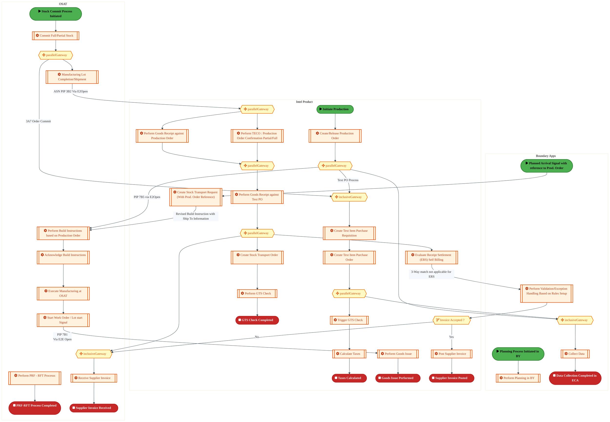

<a href="https://mermaid.live/view#pako:eNqtWGtv2zYU_SuEiiItYC8iJVm2P2ywHbsL0C1B7LUo5mFgJMomQkuaHk6yNP99lxIp24y0btnyoQ0P74uHl4eMnqwgCZk1tt6-feIxL8bo6azYsh07G6OzW5qzsx6qgU804_RWsPxM2kRJXCz5n5UZdtMHaSaxBd1x8SjRJdskDP1y2UMTcBQ9lNM47-cs49FZ7yzN-I5mj7NEJJm0fsOGkR1V2dTUNMlClh0MbNvHgQeugsfsADu-67sL6ZezIInDk6CRFw2j4OxZFieS-2BLs6Iqv8zZT_ThMw-LLYwjKnIGNttiJz7SWybkGouslFhQZntNBs9lnhgIW6Y04PEGcNcGKKPx3QHy7Odn9Pz27TpukqLVxTpG8BMImucXLEJ5AfB8X6CICzF-484mC8_u5UWW3LHxGzL3LxzSC-RKxrB0uyfJ7d8zvtkW49tEhMq0fy_XMCbpQy97GBO7lz3Cv0YuFoeHTLMBGZJhk2nq4xme6UxRFP2nTMBrtqL5nco1dxZkcdHkwt7Am9kv4-llXrj-BJs8sWzPA3YUdLFYOPMDVfOBh-3uoNOFM7BnRtANLdg9fTwEHM3cJuDC8xfY7wxY5zOrLG-vsyTQAZ25t_CagP4ULyakM6A7we5QVQhxNhlNt0jQmP1u_7q2pklZNTWapGm-tn6r7eRPjH-F-YiOI9oPkg26ZlmUZDt0Db4xdCLiMZp-AZdjH3LqA0dFsKBAF7SghqXTHv0TFTykBU_i8_lDwFL5G_qRxqGQKaegGCEC5KYEpUBLVpTpuiS2fWvWMXjXhE8FbEVTteSR5Tm6BDXisE9hs473x_5-mz8YT7KM76lAS76J4b97XmxRxiKWsThgqEhk_PA7dCXFpansOLJjHyLnRZJW3Gii5GJnyS4VTBU2n00Mf9d9etL-NMuS-7xPRQG2gShzvmcf6t5bW8_PtReczrbNx1DFZVwwUVVcBsXp5rvGRmYM4p7fMMFgC7SLLLde6Sn7XpszWrGHAl0WDFqozEC2IM4N-6PkOZeBjBCD9vb4kCQh7F2el8xw8E8dVhnfbFiGPqyWaLZlwZ1hPjRKpCIoRVUlfWC5YTxqL2Y1n12h8QsyYAfjiGe7qovRNegw3E_ni1IIIyy2_26RNyxgPC0Q3VAe58W3OMf43wSr9uL6yoxBWjduWSTBHTAKF2yawGXTmt44z3M4JKV01pnhrBYC7vm4QO_mN8v3AIgITUHQ4FSawYzuu06g5GWZpoIDvZfxPgHJNn28jvV3NAAe_NMmbV2u_4-Ykv3NoPZ3n6VOHEkDzCjNeN-uX0NDf7RcHbWBKSzYEJaqkw-dHZr2xLA_OluavZdOjuFk7kq1Vy_dXDOX3pWD3Jku_kHn5BuyfwusBtsmzySQtwOo5A8Hqasdh60CmdKMgsaKF_pYO41e4eTar3HCr3Eir3Hy_p-bgsDWXS0nK2Q8D4Yd74ObBeqjm8VKX7WmmuIOOZ2WXISwv_CQqRs8R7f6vv-G-BFDSSfBXZzcCxZuWEtY09lQzvkDC0o4aT_RuIxoUJSZfDdQ0D0gwfQ1FHMpn93oc5LdqXN-jj4mRf0aV28GM4JjPpl2O14geV2cq7ujlhXTz9DI02plUnWy5FNqueWplF4zhqGZlVbv2beklowMcaplT1X-4oFlHmzP0AJomP5Ru3QrwuBb2qPqNx1d5zWnZ_Da0wOPT9Tvfw-NrsZuPXSGauyp6YEa41EN6D93oCMVQHQE5eKpsTOU469rS93jmru19VUaay9Se_lq7NdDXQZx6rHraHsFEFcXZisLXRhWhTkjXYgqHRMT0EFVTEcX4fiq9C-sLhe7hqureXEVj0QvCKsF4QZQFi45IUa-khWgxo7eC6yBF1ReX14jf-qhPadoTq5SFuubWRapF0wUJUQHVBU4ugKiN7NhVXGGbQPQIV0VEuuQI5N13UBNSAUQY6ObVaux0zSU6h-naTkNuOa2_JzUTdRY6okbtudSjV_oaf1HkJQYtEpgQop59fZt5Y-c0I3ROv5UET5HFeXSuEntKFun_xlUBoLC_R-DslF57gP5tQhBMgTPyaNUmiTiKu_J8mckszlTgj4dNrdaJT5pfZlq4jeveClnpyeK6PbSY3WksH_0BzsMjz8rnMyQzhmnc8btnPE6ZwadM37nzLBzZtQ5AwrROdXNAu6mAXfzgLuJwN1M4G4qcDcXuJsM3M0G6WaD_E1PdLNButkg3WyQbjbgatJfBk9xvwMfduCjdtyx1dfAUxS3oqQVdVpRtxX1WtFBK-rrz3Kn8LAdHrXCINWtMG6HSTvstMNuO-y1wwMNWz1rx0BxeWiNn6zqW7o1tkIW0VIU1nPPomWRLB_jwBpX35ytMg3B84JTeOPvavD5L1_RW2Y=" title="View full diagram">&#128065; View Diagram</a>

Page 17<a href="#toc">↑ Back to TOC</a>E2E-73 — R3 Hybrid Manufacturing process with external Wafer Procurement & Internal processing of

#### BUSINESS ARCHITECTURE — 3.2.12 E2E-73N_R3_OSAT_to_End-_Customer — E2E-73N_R3_OSAT_to_End-_Customer

**Swim Lanes**: External Partners / B2B · Intel Products | **Tasks**: 22 | **Gateways**: 14

> **Legend**: ● Start · ● End · User Task · Service Task · ◇ Gateway · Sub-Process

```mermaid
%%{init: {'theme': 'base', 'themeVariables': {'fontSize': '14px', 'fontFamily': 'Segoe UI, Arial, sans-serif','primaryColor': '#e8f0fe', 'primaryBorderColor': '#0071c5','lineColor': '#37474F', 'secondaryColor': '#f5f8fc'}, 'flowchart': {'useMaxWidth': false, 'htmlLabels': true, 'curve': 'basis', 'nodeSpacing': 40, 'rankSpacing': 50}} }%%
flowchart TD
    classDef startEvt fill:#4CAF50,stroke:#2E7D32,color:#000,font-weight:bold,stroke-width:2px,rx:20,ry:20
    classDef endEvt fill:#C62828,stroke:#B71C1C,color:#fff,font-weight:bold,stroke-width:2px,rx:20,ry:20
    classDef userTask fill:#E3F2FD,stroke:#1565C0,stroke-width:2px,color:#0D47A1
    classDef serviceTask fill:#FFF3E0,stroke:#E65100,stroke-width:2px,color:#BF360C
    classDef gateway fill:#FFF9C4,stroke:#F57F17,stroke-width:2px,color:#E65100
    classDef subProc fill:#F3E5F5,stroke:#7B1FA2,stroke-width:2px,color:#4A148C
    subgraph lane_0["External Partners / B2B"]
        n1["Exchange Data via EDI/Rosetta Net"]
    end
    subgraph lane_1["Intel Products"]
        n2["fa:fa-user Capture Order"]
        n3[["fa:fa-cog Validate Order"]]
        n4[["fa:fa-cog Derive MMID From CPN"]]
        n5[["fa:fa-cog Perform Credit Check (FSCM)"]]
        n6[["fa:fa-cog Trigger GTS Check"]]
        n7[["fa:fa-cog Calculate Pricing"]]
        n8[["fa:fa-cog Calculate Taxes"]]
        n9[["fa:fa-cog Update Line-Item Text"]]
        n10[["fa:fa-cog Perform Manual Price Override"]]
        n11[["fa:fa-cog Receive Updates for ATP Check (Product Allocation Availability Check)"]]
        n12[["fa:fa-cog Confirm Order"]]
        n13[["fa:fa-cog Manage Back Orders"]]
        n14[["fa:fa-cog Track Orders"]]
        n15[["fa:fa-cog Perform Outbound Delivery"]]
        n16[["fa:fa-cog GTS Trade Compliance, Customs, and Trade Preference"]]
        n17[["fa:fa-cog Perform Pick and Pack Updates"]]
        n18[["fa:fa-cog Perform Ship (Goods Issue Virtual)"]]
        n19[["fa:fa-cog Create Cross Border Docs and Other shipping documents"]]
        n20[["fa:fa-cog Create Invoice"]]
        n21[["fa:fa-cog Calculate Taxes"]]
        n22[["fa:fa-cog Hold Process"]]
        n23(["fa:fa-play Line Item Update Process Initiated"])
        n24(["fa:fa-stop Back Order Managed"])
        n25(["fa:fa-stop Taxes Calculated"])
        n26(["fa:fa-stop Orders Tracked"])
        n27(["fa:fa-stop Documents Shared"])
        n28(["fa:fa-stop GTS Check Completed"])
        n29["E2E-73O R3 OSAT to Intel warehouse /3PL- Invoicing"]
        n30{{"fa:fa-code-branch GTS Check Passed?"}}
        n31{{"fa:fa-code-branch ATP Check Confirmed ?"}}
        n32{{"fa:fa-code-branch Partial/ Full Confirmed"}}
        n33{{"fa:fa-code-branch exclusiveGateway"}}
        n34{{"fa:fa-code-branch Partial Commit Allowed By Customer ?"}}
        n35{{"fa:fa-arrows-alt parallelGateway"}}
        n36{{"fa:fa-arrows-alt parallelGateway"}}
        n37{{"fa:fa-arrows-alt parallelGateway"}}
        n38{{"fa:fa-arrows-alt parallelGateway"}}
        n39{{"fa:fa-arrows-alt parallelGateway"}}
        n40{{"fa:fa-arrows-alt inclusiveGateway"}}
        n41{{"fa:fa-arrows-alt inclusiveGateway"}}
        n42{{"fa:fa-arrows-alt inclusiveGateway"}}
        n43{{"fa:fa-arrows-alt inclusiveGateway"}}
    end
    n2 --> n40
    n3 --> n4
    n4 --> n5
    n5 --> n6
    n6 --> n30
    n30 -->|"Yes"| n41
    n40 --> n3
    n7 --> n35
    n35 --> n8
    n23 --> n9
    n9 --> n10
    n41 --> n7
    n10 --> n41
    n35 --> n11
    n33 --> n13
    n32 -->|"Fully Confirmed"| n42
    n42 --> n12
    n13 --> n24
    n12 --> n37
    n8 --> n25
    n36 --> n31
    n11 --> n36
    n36 -->|"Pricing Updates Required"| n41
    n37 --> n14
    n14 --> n26
    n37 --> n15
    n15 --> n38
    n38 --> n16
    n38 --> n17
    n17 --> n39
    n39 --> n18
    n39 --> n19
    n18 --> n43
    n43 --> n20
    n21 --> n43
    n19 --> n27
    n20 --> n21
    n1 --> n2
    n38 -->|"TM Embedded Steps"| n29
    n16 --> n28
    n30 -->|"No"| n22
    n22 --> n40
    n31 -->|"Confirmed"| n32
    n31 -->|"Unconfirmed"| n33
    n34 -->|"Yes"| n42
    n34 -->|"No"| n33
    n32 -->|"Partial"| n34
    class n2 userTask
    class n3 serviceTask
    class n4 serviceTask
    class n5 serviceTask
    class n6 serviceTask
    class n7 serviceTask
    class n8 serviceTask
    class n9 serviceTask
    class n10 serviceTask
    class n11 serviceTask
    class n12 serviceTask
    class n13 serviceTask
    class n14 serviceTask
    class n15 serviceTask
    class n16 serviceTask
    class n17 serviceTask
    class n18 serviceTask
    class n19 serviceTask
    class n20 serviceTask
    class n21 serviceTask
    class n22 serviceTask
    class n23 startEvt
    class n24 endEvt
    class n25 endEvt
    class n26 endEvt
    class n27 endEvt
    class n28 endEvt
    class n29 startEvt
    class n30 gateway
    class n31 gateway
    class n32 gateway
    class n33 gateway
    class n34 gateway
    class n35 gateway
    class n36 gateway
    class n37 gateway
    class n38 gateway
    class n39 gateway
    class n40 gateway
    class n41 gateway
    class n42 gateway
    class n43 gateway
```

<a href="https://mermaid.live/view#pako:eNqlWGtv2zYU_SuEiiAdYCMiJVm2P2xw_OgCNI0Rux2GZhhoibKJypJHUUm8NP99lxYlW7RUoFk-BODlOfdxeHkl68UK0pBZQ-vi4oUnXA7Ry6XcsC27HKLLFc3YZQcVhi9UcLqKWXapMFGayAX_9wDD7u5ZwZRtRrc83ivrgq1Thj7fdNAIiHEHZTTJuhkTPLrsXO4E31KxH6dxKhT6HetHdnSIpreuUxEycQTYto8DD6gxT9jR7Piu784UL2NBmoQ1p5EX9aPg8lUlF6dPwYYKeUg_z9gtff6Dh3ID64jGGQPMRm7jj3TFYlWjFLmyBbl4LMXgmYqTgGCLHQ14sga7a4NJ0OTb0eTZr6_o9eLiIamCouXkIUHwF8Q0yyYsQpkE8_RRoojH8fCdOx7NPLuTSZF-Y8N3ZOpPHNIJVCVDKN3uKHG7T4yvN3K4SuNQQ7tPqoYh2T13xPOQ2B2xh_9GLJaEx0jjHumTfhXp2sdjPC4jRVH0vyKBrmJJs2861tSZkdmkioW9nje2z_2VZU5cf4RNnZh45AE7cTqbzZzpUappz8N2u9PrmdOzx4bTNZXsie6PDgdjt3I48_wZ9lsdFvHMLPPVXKRB6dCZejOvcuhf49mItDp0R9jt6wzBz1rQ3QbFNGF_218frOmzZCKhMZpDvyRMZOgKXZPrB-uvgqH-EnwAQqcla4YmVFL0yCmaTm6u7tOMSVh_YrKiQDs0RVNObhLJIJRIwzyQWT0Igf2IDiPaVaeMxnQnc8HQnbqmdaTztYIG6Rp9oTEPQfEKeop169gJzIdHhm5vbyZoJtItGs8_GQyvzpgzEaUCgIKFXKLxhgXf0PvZYnz7i0Hs1YlLwddrKOTDclGwDLhfh49pHOSxKmMuuLrpBrzfBl_SZ5YZ4EEd_Hl30OcjTLbujWRbtGTP0qBgu7nuW5rkqj0gKVD4kQnBQ2ZycZ17zwKmZC7iZggcodFyXoqnzx-N4jgNqORpgkaPlMd0xWMu9wXMVBcTQ4A0iTjk13To2OgQqIFC515TiH7Am3ph1zy7dmhLf9zlcpXmSQgtFkPtYm_yjPZQbQFhQgaVbHcxp0kAz4Nxnsl0m3UQBU_F9lywiAkG26ZHvzmTOYfcFX-uitBnYHL7zdzFhu_Q-w9pGmboJstyhr5wIaEBzo7DaDG4HqrFxiLNMlQ8W9EkDbJDInfwhBcoA987aGwUpkG-ZYk0kyJ2o8-b5DHlZ9UT_DMXghjd8zs8eNQcClh2BnXeV9BdDFNcXRt0uDb6HmkeJMYlB0MIHn459eAePcBx7k4aT7fiGcMzGIcajjWd4XsGvmjVom_P0b6BnpQHAOdNxTm-b-CrEVb0KmtIaKAeEWTa9Z07dO-gu8VoiWSKioH_BEE2KYx1dOXMP3b1iRYz7nSu2y8vx0MKWXcFLz7B5iT8HJ6HLPztwXp9PeXhZt5x5OhhwUJ0xiXNXPU4hNfKKzTL4_jIN9lOM5s9B3GewRj4ULwJmDT3h0GVyltezMcnyPl6r-cC9M9Z_t7RFRUifcq6NJZoRwWNYxa3xO-9heS_hdR_C2nwBpJrN5J48sOTcPGbWORNLOcnWdWLVEJQt_urqlGvHb3WS7dYenrpFcueXvaKpVORbWX4_mD9qcbkdyVC6cfWUL329bJ07GjP_TItncdArwfFEpeRXFwYfL3G2n8VsHSIK4P2iMsUHKKTVfdwf3oRVeKkDKQFwqUBaz-klAhrhFPm0teAqrZSpjIVrJN3ejUEpKJf0KrXm3v2T85FmVNVilYPVynoYyI9E1HmgLUcTimwo7PEPdNQSVqeUXkGTnkIfdNQIrD24ZYau6VY5bkRbCCw9kHKsESfJKnU0utanqDV8hZNtysWhjDHFpLtio4jVS5addI3m_NTWiBLj-TsDmCNrPeEQ8z9z0lQR1S95ZoXgZg7OgvnrB31qC523ZOfa-qylj9Ta2bn9Ldmbcdt3fFad3qtO37rTr91Z9C6A1e2dQu3b5H2rXYdcLsQuF0J3C4FbtcCt4uB29Ug7WqQdjVIuxowQcsvNXW7q7-q1K1eo7XXaPUbrf1G66A5C7iM-lNG3YybzaTZ7DSb3Waz12zuNZv9ZnO_2TxoNLvNVbrNVbrNVbpVlVbHghe1LeWhNXyxDt82raEVsojmsbReOxbNZbrYJ4E1PHwDtPLDY2TC6VrQbWF8_Q-JXImS" title="View full diagram">&#128065; View Diagram</a>

Page 18<a href="#toc">↑ Back to TOC</a>E2E-73 — R3 Hybrid Manufacturing process with external Wafer Procurement & Internal processing of

#### BUSINESS ARCHITECTURE — 3.2.13 E2E-73O_R3_OSAT_Manufacturing_with_Planning_Integration — E2E-73O_R3_OSAT_Manufacturing_with_Planning_Integration

**Swim Lanes**: Boundary Apps · External Partners/Supplier
 · SAP S/4 Intel Product

 | **Tasks**: 15 | **Gateways**: 5

> **Legend**: ● Start · ● End · User Task · Service Task · ◇ Gateway · Sub-Process

```mermaid
%%{init: {'theme': 'base', 'themeVariables': {'fontSize': '14px', 'fontFamily': 'Segoe UI, Arial, sans-serif','primaryColor': '#e8f0fe', 'primaryBorderColor': '#0071c5','lineColor': '#37474F', 'secondaryColor': '#f5f8fc'}, 'flowchart': {'useMaxWidth': false, 'htmlLabels': true, 'curve': 'basis', 'nodeSpacing': 40, 'rankSpacing': 50}} }%%
flowchart LR
    classDef startEvt fill:#4CAF50,stroke:#2E7D32,color:#000,font-weight:bold,stroke-width:2px,rx:20,ry:20
    classDef endEvt fill:#C62828,stroke:#B71C1C,color:#fff,font-weight:bold,stroke-width:2px,rx:20,ry:20
    classDef userTask fill:#E3F2FD,stroke:#1565C0,stroke-width:2px,color:#0D47A1
    classDef serviceTask fill:#FFF3E0,stroke:#E65100,stroke-width:2px,color:#BF360C
    classDef gateway fill:#FFF9C4,stroke:#F57F17,stroke-width:2px,color:#E65100
    classDef subProc fill:#F3E5F5,stroke:#7B1FA2,stroke-width:2px,color:#4A148C
    subgraph lane_0["Boundary Apps"]
        n15["Perform Reconciliation of Carrier Invoice and Dispute Management"]
    end
    subgraph lane_1["External Partners/Supplier "]
        n1["Book/Tender to Carrier via BN4L"]
        n2["Perform Task Rates/Charges Integrators 3rd party service – Redwood"]
        n3["Generate Carrier invoice"]
        n4["Capture Carrier Invoices (via EDI only)"]
        n5["SAP B4NL"]
        n19{{"fa:fa-arrows-alt parallelGateway"}}
        n20{{"fa:fa-arrows-alt parallelGateway"}}
    end
    subgraph lane_2["SAP S/4 Intel Product  "]
        n6["Create/ Update Freight Unit and Order"]
        n7["Perform Carrier Selection and Calculate Charges"]
        n8["Perform Task Rates/Charges: Freight forwarders (SAP TM)"]
        n9["Execute Freight Order and Status Updates post GI"]
        n10["Receive reconciled Carrier Invoice(s)"]
        n11["Create/ Update Freight Settlement Document"]
        n12["Create Service PO/ Entry Sheet"]
        n13["Post Accrual to Freight Expense Account(s)"]
        n14["Allocate Freight Costs to Delivery Items (CO/PA) or Material Valuation"]
        n16(["fa:fa-stop OSAT Manufacturing with Planning Integration"])
        n17["73K-OSAT to End- Customer"]
        n18{{"fa:fa-code-branch exclusiveGateway"}}
        n21{{"fa:fa-arrows-alt parallelGateway"}}
        n22{{"fa:fa-arrows-alt parallelGateway"}}
    end
    n7 --> n8
    n8 --> n9
    n9 --> n10
    n10 --> n11
    n11 --> n12
    n12 --> n21
    n21 --> n13
    n21 -->|"Processing of Service PO Invoice
 and Payment to Service Provider CTSi"| n14
    n17 --> n6
    n18 --> n7
    n6 --> n18
    n13 --> n22
    n14 --> n22
    n22 --> n16
    n15 --> n2
    n19 --> n5
    n1 -->|"Shipment Tracking App 
from R3 onwards"| n19
    n20 --> n3
    n5 -->|"EDI/Manual (TBD)"| n20
    n20 --> n1
    n19 --> n18
    n2 --> n18
    n3 --> n4
    class n16 endEvt
    class n17 startEvt
    class n18 gateway
    class n19 gateway
    class n20 gateway
    class n21 gateway
    class n22 gateway
```

<a href="https://mermaid.live/view#pako:eNqlV21v4jgQ_itWVhWtBCIJCaF8OAkCWVXX3aINu_dhOZ3cxAGrJo5sh5fr8t9vnDcg2550e_1Q1ZOZZ54ZP2O7r0bEY2KMjZubV5pSNUavHbUhW9IZo84zlqTTRaXhGxYUPzMiO9on4akK6d-Fm-VkB-2mbQHeUnbU1pCsOUFfH7poAoGsiyROZU8SQZNOt5MJusXi6HPGhfb-QEaJmRTZqk9TLmIizg6m6VmRC6GMpuRsHniO5wQ6TpKIp_EVaOImoyTqnDQ5xvfRBgtV0M8l-YQPf9BYbWCdYCYJ-GzUlj3iZ8J0jUrk2hblYlc3g0qdJ4WGhRmOaLoGu2OCSeD05WxyzdMJnW5uVmmTFD1-WaUIfiKGpZyRBEkF5vlOoYQyNv7g-JPANbtSCf5Cxh_suTcb2N1IVzKG0s2ubm5vT-h6o8bPnMWVa2-vaxjb2aErDmPb7Ioj_G7lIml8zuQP7ZE9ajJNPcu3_DpTkiT_KxP0VSyxfKlyzQeBHcyaXJY7dH3zZ7y6zJnjTax2n4jY0YhcgAZBMJifWzUfupb5Pug0GAxNvwW6xors8fEMeO87DWDgeoHlvQtY5muzzJ8Xgkc14GDuBm4D6E2tYGK_C-hMLGdUMQSctcDZBjGckr_M7ytjyvNC1GiSZXJl_Fn66Z_UcuH7goiEiy36otUfUUaxojxFPEE-FoISgR7SHYcOIpzGaEZlliuCPuEUr2GoU9VAgkje4mBBjvlBEZFihhag2ZQI2Q_zLGMavMWoIMxf-ktAg6-KNyx2FKPpZ-fxOsC-qKDY4i-wM7Lvw8ysiQTqigAXxYVEAxGjDPIfa0mgVW6b1gAqj_ecx9fAAwD-SIAr4DUcaNmJa08HPH2cqVyQdsskutW057MHxFN2vLsO1N0PJws0dT63qrLuX19XRoLHCe4BIt_LHmZKs8eMEfaxVN_KOJ0uW2H-t6B39suuWIV9p2gfbJrgcR4p1Nqroa5bEIDto69ZrPsUiGLq0Ve4CAq5POkj-DrMu9ixul0hYSQqZKeDfMyinBV9L7fxGmD0r1s-bkiAwx7r_LALuqDlp1b_7wtlkii_YF4QLliECqtcVpVJlHGp0MeH1j7pAYPBIXRHkKgGiMRtGdzKVmbLer93IVGKFZOFZjzKr0asDLabYHAulbx46qN5qmDKww0h7QCt5YXmP4kikcMYwljV6eaHjKSS6E9wUKifqWp5Txjj0SVJH9CkhpkRBrVD3gdFttBo_6m_mNwhLuCEgJmHext9wywvzpQW8PD2ey1XqXiGnsLJUp8reYIjGCa4CtGeqg1agCxTvaqHuYS6u8TSovIGv_cKDKA1T-Me8nPA3bb1Z43OY6KfLr1nuHyjDSKHiOUSinlnuqxfGUn7F0cy9VCv9xtovVqOyuV9tbwvl1Z1i8AflcGqDVZlsGuDXRrs2sOuPQZXhh-gFLiHiJS643AJnBVWq3lVTukCHwuRQrcbH8F3VM-Pvwzpyvih1VPnrwoa1uuqIq9aDys2dcFwLJd8mwKclsGuKrIaSLfyqNdVl9x6XdUXbmhWMF8KHL3oMuFmRPDWEhxuwQGc1PrYkCX_uuN21eG6W24FBkd7X2sWdH67nM7uiqj6VdNEWS1KTZl2a11V7Vy8DnSF1QPs2uo1T8Br-6h-nVyb7980A8M3zdbbZrs2G10DJmuLaWyMX43ifQ__A8QkwTlTxqlr4Fzx8JhGxrh4Bxt5ccrNKIYJ3pbG0z9aXdLf" title="View full diagram">&#128065; View Diagram</a>

Page 19<a href="#toc">↑ Back to TOC</a>E2E-73 — R3 Hybrid Manufacturing process with external Wafer Procurement & Internal processing of

### 3.3 Business Roles & Responsibilities

| Role / Lane | Processes Involved | Description |
|------------|-------------------|-------------|
| Boundary Apps

(Intel Product) | E2E-73A_R3_External_Procurement_Process,  | |

| External Partners/ Suppliers | E2E-73A_R3_External_Procurement_Process,  | |
| SAP  S/4

Intel Product | E2E-73A_R3_External_Procurement_Process,  | |

| External Partners B2B | E2E-73B_R3_Bailment_Process_with_Intel_Product​,  | |
| Intel Products  | E2E-73B_R3_Bailment_Process_with_Intel_Product​,  | |
| SAP S/4 

Intel Foundry (LE500) - Ireland | E2E-73B_R3_Bailment_Process_with_Intel_Product​,  | |

|  CFIN | E2E-73C_R3_Supplier_Payment_Process,  | |
| Boundary Apps | E2E-73D_R3_Bailment_Order_Process_with_Intel_Products_(Wafer), E2E-73F_R3_Internal_manufacturing_process_for_Finished_Goods_in_Intel_Foundry_with_Planning_integrat, E2E-73G_R3_Internal_manufacturing_process_for_Finished_Goods_in_Intel_Foundry_​_with_Planning_integr, E2E-73H_R3_Bailment_Order_Process_with_Intel_Products, E2E-73J_R3_Internal_manufacturing_process_for_Finished_Goods_in_Intel_Foundry_​_with_Planning_integr, E2E-73K_R3_OSAT_Manufacturing_with_Plan_Integration, E2E-73O_R3_OSAT_Manufacturing_with_Planning_Integration | |
| Intel Products | E2E-73D_R3_Bailment_Order_Process_with_Intel_Products_(Wafer), E2E-73H_R3_Bailment_Order_Process_with_Intel_Products, E2E-73N_R3_OSAT_to_End-_Customer,  | |
| SAP S/4 

Intel Foundry (LE778 China) | E2E-73D_R3_Bailment_Order_Process_with_Intel_Products_(Wafer),  | |

| Boundary Apps IF  | E2E-73E_R3_Internal_manufacturing_process_for_Finished_Goods_in_Intel_Foundry_​_with_Planning_integr, E2E-73I_R3_Internal_manufacturing_process_for_Finished_Goods_in_Intel_Foundry_with_Planning_integrat,  | |
| Boundary Apps IP | E2E-73E_R3_Internal_manufacturing_process_for_Finished_Goods_in_Intel_Foundry_​_with_Planning_integr, E2E-73I_R3_Internal_manufacturing_process_for_Finished_Goods_in_Intel_Foundry_with_Planning_integrat,  | |
| Intel Foundry LE788 China  | E2E-73E_R3_Internal_manufacturing_process_for_Finished_Goods_in_Intel_Foundry_​_with_Planning_integr,  | |
| LE500 Ireland | E2E-73E_R3_Internal_manufacturing_process_for_Finished_Goods_in_Intel_Foundry_​_with_Planning_integr,  | |
| SAP S/4 Intel Foundry (LE101 - Virtual) | E2E-73E_R3_Internal_manufacturing_process_for_Finished_Goods_in_Intel_Foundry_​_with_Planning_integr,  | |
| SAP S/4 Intel Product | E2E-73E_R3_Internal_manufacturing_process_for_Finished_Goods_in_Intel_Foundry_​_with_Planning_integr, E2E-73I_R3_Internal_manufacturing_process_for_Finished_Goods_in_Intel_Foundry_with_Planning_integrat,  | |
| External Partners | E2E-73F_R3_Internal_manufacturing_process_for_Finished_Goods_in_Intel_Foundry_with_Planning_integrat, E2E-73J_R3_Internal_manufacturing_process_for_Finished_Goods_in_Intel_Foundry_​_with_Planning_integr,  | |
| Intel Foundry LE500 Ireland 
 | E2E-73F_R3_Internal_manufacturing_process_for_Finished_Goods_in_Intel_Foundry_with_Planning_integrat,  | |
| LE778 China | E2E-73F_R3_Internal_manufacturing_process_for_Finished_Goods_in_Intel_Foundry_with_Planning_integrat,  | |
| SAP ECC | E2E-73F_R3_Internal_manufacturing_process_for_Finished_Goods_in_Intel_Foundry_with_Planning_integrat, E2E-73G_R3_Internal_manufacturing_process_for_Finished_Goods_in_Intel_Foundry_​_with_Planning_integr, E2E-73J_R3_Internal_manufacturing_process_for_Finished_Goods_in_Intel_Foundry_​_with_Planning_integr,  | |
| SAP S/4 

Intel Foundry/Intel Product  | E2E-73F_R3_Internal_manufacturing_process_for_Finished_Goods_in_Intel_Foundry_with_Planning_integrat,  | |

| CFIN | E2E-73G_R3_Internal_manufacturing_process_for_Finished_Goods_in_Intel_Foundry_​_with_Planning_integr, E2E-73J_R3_Internal_manufacturing_process_for_Finished_Goods_in_Intel_Foundry_​_with_Planning_integr,  | |
| External Partner | E2E-73G_R3_Internal_manufacturing_process_for_Finished_Goods_in_Intel_Foundry_​_with_Planning_integr,  | |
| Intel Product | E2E-73G_R3_Internal_manufacturing_process_for_Finished_Goods_in_Intel_Foundry_​_with_Planning_integr, E2E-73J_R3_Internal_manufacturing_process_for_Finished_Goods_in_Intel_Foundry_​_with_Planning_integr, E2E-73K_R3_OSAT_Manufacturing_with_Plan_Integration,  | |
| SAP S/4 Intel Foundry LE3778 China | E2E-73G_R3_Internal_manufacturing_process_for_Finished_Goods_in_Intel_Foundry_​_with_Planning_integr,  | |
| SAP S/4LE101 US Virtual  | E2E-73G_R3_Internal_manufacturing_process_for_Finished_Goods_in_Intel_Foundry_​_with_Planning_integr, E2E-73J_R3_Internal_manufacturing_process_for_Finished_Goods_in_Intel_Foundry_​_with_Planning_integr,  | |
| SAP S/4 

Intel Foundry (LE870) – Malaysia WLA Site​ | E2E-73H_R3_Bailment_Order_Process_with_Intel_Products,  | |

| Intel Foundry LE870 - Malaysia Site  | E2E-73I_R3_Internal_manufacturing_process_for_Finished_Goods_in_Intel_Foundry_with_Planning_integrat,  | |
| SAP S/4 Intel Foundry LE101 US Virtual  | E2E-73I_R3_Internal_manufacturing_process_for_Finished_Goods_in_Intel_Foundry_with_Planning_integrat,  | |
| SAP S/4 Intel Foundry LE870 Malaysia WLA Site  | E2E-73J_R3_Internal_manufacturing_process_for_Finished_Goods_in_Intel_Foundry_​_with_Planning_integr,  | |
| OSAT  | E2E-73K_R3_OSAT_Manufacturing_with_Plan_Integration,  | |
| External Partners / B2B | E2E-73N_R3_OSAT_to_End-_Customer,  | |
| External Partners/Supplier
 | E2E-73O_R3_OSAT_Manufacturing_with_Planning_Integration | |
| SAP S/4 Intel Product

 | E2E-73O_R3_OSAT_Manufacturing_with_Planning_Integration | |

Page 20<a href="#toc">↑ Back to TOC</a>E2E-73 — R3 Hybrid Manufacturing process with external Wafer Procurement & Internal processing of

## 4. Data Architecture (TOGAF "D")

### 4.1 Data Entities & Ownership

| # | Data Entity | Source System | Target System | Data Owner | Classification | Volume | Master/Transaction |
|---|-------------|---------------|---------------|------------|----------------|--------|-------------------|
| 1 | e.g. Cost Element | e.g. MES 300 | e.g. XEUS | Data steward | e.g. Intel Confidential | e.g. 10K rows/day | Master / Transaction |

Page 21<a href="#toc">↑ Back to TOC</a>E2E-73 — R3 Hybrid Manufacturing process with external Wafer Procurement & Internal processing of

### 4.2 Data Flow Diagrams

> **DATA ARCHITECTURE** — Database-to-database data flows. Applications (blue) sit above their hosting databases (green cylinders). Thick arrows show data movement between databases.

#### 4.2.1 Current-State — Current-State Data Flows

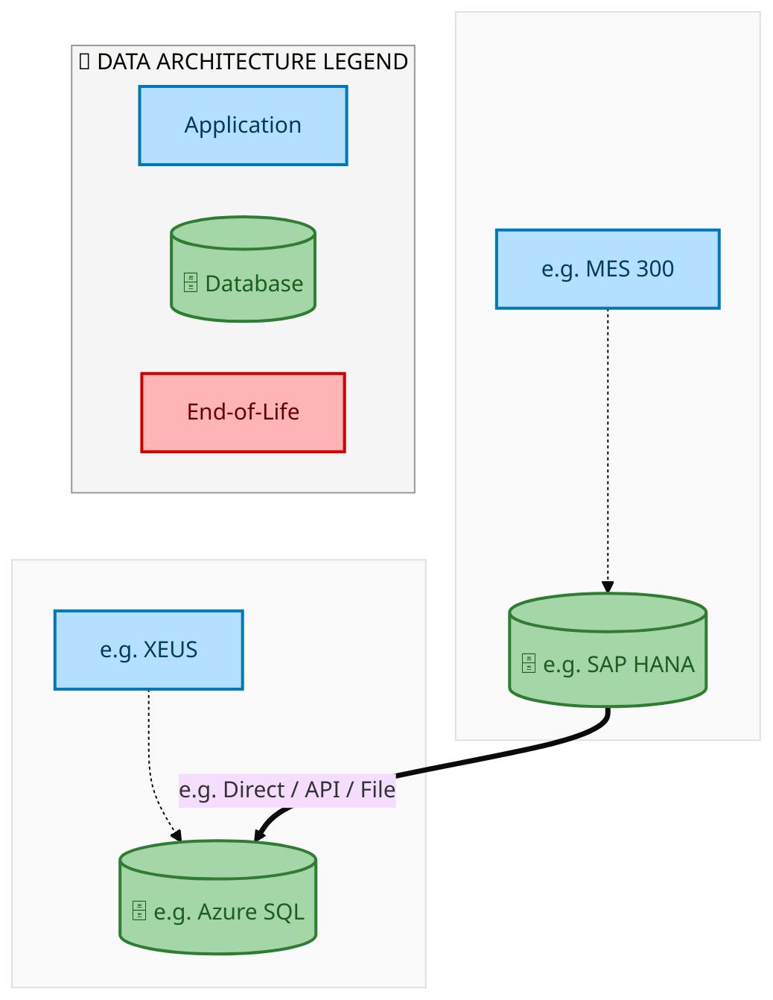

<a href="https://mermaid.live/view#pako:eNqdlYtO2zAUhl_FMqq0SS0LLWlHJJCc20AKiJGyTSJT5CZOa-EmUeKMltJ3n50brDQMYUuRfS7_cb4TORsYJCGBGuz1NjSmXAMbD_IFWRIPasCDM5yLVV-schIUGeVrh_whrHKyJGm8ZcoPnFE8YySXbqETJTF36WMtdaSmqypY2m28pGxdeVwyTwi4vegDJASE-LaMYslDsMAZr9WKnFzi1U8a8oW0RJjlRMYt-JI5eEZYWZZnRWmNxWu5KQ5oPJfmkSqNGY7vXxiP1e0WbHs9L25rganuxUCMgOE8N0kEcJrqyQpElDHtQFdN27b7Oc-Se6IdKMpkoo_r7eBBHk0bpqt-kLAkk-6Rqe7qhTNjzWo5pJpjNGnlhtbEHA075Y501RoqO3IkYc_Hs21d1dVWzzAUMTr1xmPp9uJKMS9m8wynC2CJY4wMExmOT_y5jx6LjPjud-fOgwLh7ypajpBmJOA0iVtocjTpqMz-Zd26IpEczg-BXAsBTdMqpq9zzJ2KnzzoFeHXUSieYXDsFRFRxCtLsTIIiCAPfpaSJda3TgEGh4OzrkpVIonDmgVfM9IJooGN5GxhW4qc_8I-El_8f_C66No_R1foQ3QvLdcfKUoDWGyB2L6HcVv2DcQiBsiY9xCuT7IPclPqPYyb2A8h3l8WnJ6ePdWAzJIp-ALQ9YV42pSJu-mp-6PYaZ1D5uL4dy-IBaECTDRFAN0Y5xdTy5je3ljAsb5ZV2ZHN52bZ6vjy76jNGU0wNK7v3WOb3b0ycQcV1f0vhY5viXkrTgcJNHAoRGp5KsrY287qjds6KtytvRPTk5eoYd9uCTZEtMQapvqJyD-JSGJcMG4uMYhLnjiruMAauXFDIs0xJyYFAuiy8q4_Qt0qP7v" title="View full diagram">&#128065; View Diagram</a>

Page 22<a href="#toc">↑ Back to TOC</a>E2E-73 — R3 Hybrid Manufacturing process with external Wafer Procurement & Internal processing of

#### 4.2.2 Future-State — Future-State Data Flows

<a href="https://mermaid.live/view#pako:eNqdlQ1L4zAYx79KiAzuYPPqZrezoJCt7SlU8ey8O7BHydp0C2ZNadNzc-67X9I3vbl6YgIleV7-T_p7SrqBAQ8JNGCns6ExFQbYeFAsyJJ40AAenOFMrrpylZEgT6lYO-QPYaWTcV57i5QfOKV4xkim3FIn4rFw6WMldaQnqzJY2W28pGxdelwy5wTcXnQBkgJSfFtEMf4QLHAqKrU8I5d49ZOGYqEsEWYZUXELsWQOnhFWlBVpXlhj-VpuggMaz5V5oCtjiuP7F8ZjfbsF207Hi5taYDr2YiBHwHCWmSQCOEnGfAUiyphxMNZN27a7mUj5PTEONG00Gg-rbe9BHc3oJ6tuwBlPlXtg6rt64WyyZpUc0s0hGjVyfWtkDvqtckdj3eprO3KEs-fj2fZYH-uN3mSiydGqNxwqtxeXilk-m6c4WQBLHmNgm2ji-MSf--gxT4nvfnfuPCgR_i6j1QhpSgJBedxAU6NOR0X2L-vWlYnkcH4I1FoKGIZRMn2dY-5U_ORBLw-_DkL5DINjL4-IJl9ZiRVBQAZ58LOSLLC-dQrQO-ydtVUqE0kcVizEmpFWEDVspGYD29LU_Bf2kfzi_4PXRdf-ObpCH6J7abn-QNNqwHIL5PY9jJuybyCWMUDFvIdwdZJ9kOtS72Fcx34I8f6y4PT07KkCZBZMwReAri_k06ZM3k1P7R_FTuscMpfHv3tBLAg1YKIpAuhmcn4xtSbT2xsLONY368ps6aZz82x1fNV3lCSMBlh597fO8c2WPplY4PKK3tcix7ekvBWHPR71HBqRUr68Mva2o3zDmr6uZkP_5OTkFXrYhUuSLjENobEpfwLyXxKSCOdMyGsc4lxwdx0H0CguZpgnIRbEpFgSXZbG7V_wTf8Z" title="View full diagram">&#128065; View Diagram</a>

Page 23<a href="#toc">↑ Back to TOC</a>E2E-73 — R3 Hybrid Manufacturing process with external Wafer Procurement & Internal processing of

### 4.3 Data Lineage

| # | Source System | Source Schema/Object | Target System | Target Schema/Object | Transformation |
|---|-------------|---------------------|---------------|---------------------|---------------|
| 1 | e.g. MES 300 | e.g. CKMLHD table | e.g. XEUS | e.g. dbo.CostElements | Lineage notes |

### 4.4 RICEFW Data Objects

Reports and Conversions for this capability will be populated from the Smartsheet Object Tracker via automated API extraction.

| Object ID | Type | Description | Status | Source | Target | Complexity |
|-----------|------|-------------|--------|--------|--------|-----------|
| E2E-73-R001 | Report | R3 Hybrid Manufacturing process with external Wafer Procurement & Internal processing of operational report | Planned | SAP S/4HANA | Analytics | Medium |
| E2E-73-C001 | Conversion | Legacy data migration for R3 Hybrid Manufacturing process with external Wafer Procurement & Internal processing of | Planned | Legacy ERP | SAP S/4HANA | High |

> *Pending: Smartsheet API integration to auto-populate live RICEFW data (see Build Requirements).*

### 4.5 Data Governance & Quality

| Concern | Approach |
|---------|----------|
| Data Ownership | Per-entity owners listed in Section 3.1 |
| Data Classification | Financial data classified as Intel Confidential |
| Data Retention | Per Intel corporate retention policies |
| Data Quality | Validated at source; reconciliation at target |

Page 24<a href="#toc">↑ Back to TOC</a>E2E-73 — R3 Hybrid Manufacturing process with external Wafer Procurement & Internal processing of

## 5. Application Architecture (TOGAF "A")

### 5.1 Current-State — Current-State Application Landscape

#### Overview

The Current-State architecture represents the **current / legacy** landscape for E2E-73.This view is generated from `CurrentFlows.xlsx` (1 flow hops across 1 flow chains).

#### APPLICATION ARCHITECTURE — Architecture Diagram (ArchiMate-Inspired)

> **Click any system node** to open its IAPM application page.
> **Legend**: Deployed · Developing · End-of-Life · No IAPM Match

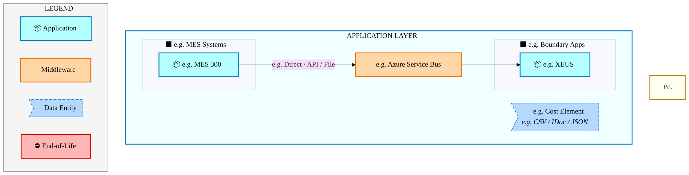

<a href="https://mermaid.live/view#pako:eNqdlm1v2kgQgP_KyhHfoHFegMSKkGxsTpxMEtVtc6dzZS3eAVZdbMu7bkJT_ntnvQQcaESuiwT2vDwzHs_O8mylOQPLsVqtZ55x5ZDn2FILWEJsOSS2plTiVRuvJKRVydUqhO8gjFLk-Yu2dvlCS06nAqRWI2eWZyriPzaos17xZIy1fESXXKyMJoJ5DuTzuE1cBIg2kTSTHQkln8XWuvYQ-WO6oKXakCsJE_r0wJlaaMmMCgnabqGWIqRTEHUKqqxqaYaPGBU05dlciy9tLSxp9q0h7NrrNVm3WnG2jUU-eXFGcLVapNPB3NIFn1AFHZ7JgpfAiFQrASQVVEqQaGPM63sfZmRaSZ6BlKReMy6EczLC5XXbUpX5N3BOvKurnu1tbjuP-oGc8-KpneYiL50T27b3mLQoyG4ZptfV1C3Ttvt9r_c_mIwqesj0r44wz14xX3SMSixeSVdYU9Ldi7TkjAl4pCU0K-L33F1Fgn5vtKO9I3vIxUFFdI0bVR4ObfsY01BlNZ2XtFgQN_wvtuKKXV0w_GYXXeLe34fjoftpfHdLQvff4GNsfTVOejFsiFTxPCPhx510iwvOg_7FMLxNIJknXl5ljJarxC0KiWFIXJ1Pz6YEPsw_kBcl0cpXId4Oo5eJUPP_CT5HzexT6Bm2ViDScRxso507ZOxYypMgSqKVVLA8SBhVZKP6s3Q1-8K2f5uxhqPuWNKGNnmoee6PqoQkgvI7TyHxKvnqTZ71Dbm2IhsrglYmxq5D9-l-UNOHuVRJIHDcZWrQTDm9NGBtQDYGN9PydHDDB0YRfSGnZOznKf78Hd3d3pzygYmqd6CJVz-WuTwsEY6Ywc_Yqml-XVokufdj_B5xgXP255FKNMFv2egg-92kU9pskHrkeWFjnI3sY-Os6epuXe33TK2DjRnCHGv0qlmYTcLgr-DWf8eODBPcx_uthltN8JRq4990WphMHvZbaLJrkzfbJkz8YL9DfD1qg0zhQbr_5o1LcGcGz3mPXaIh6-SzTshnmzA46xptsiuqKcpLYbv6sy3s9fX1wdy22tYSyiXlzHKezeGN_wEYzGglFB65Fq1UHq2y1HLqQ9SqCkwUfE7xJSyNcP0LYE2KxQ==" title="View full diagram">&#128065; View Diagram</a>

Page 25<a href="#toc">↑ Back to TOC</a>E2E-73 — R3 Hybrid Manufacturing process with external Wafer Procurement & Internal processing of

#### Current-State Flow Narrative

| # | Flow Chain | Path | Interface | Freq |
|---|-----------|------|-----------|------|
| 1 | e.g. MES Route to ICOST | e.g. MES 300 → e.g. XEUS | e.g. Direct / API / File | e.g. Near Real-Time |

Page 26<a href="#toc">↑ Back to TOC</a>E2E-73 — R3 Hybrid Manufacturing process with external Wafer Procurement & Internal processing of

### 5.2 Future-State — Future-State Application Landscape

#### Overview

The Future-State architecture represents the **target** landscape for E2E-73.This view is generated from `FutureFlows.xlsx` (1 flow hops across 1 flow chains).

#### APPLICATION ARCHITECTURE — Architecture Diagram (ArchiMate-Inspired)

> **Click any system node** to open its IAPM application page.
> **Legend**: Deployed · Developing · End-of-Life · No IAPM Match

<a href="https://mermaid.live/view#pako:eNqdln1v2jwQwL-KlYr_YE1fgDaqkJImPOJRaKtlW59HyxSZ-ABrJolipy3r-O47xxRSWEU3I0FyL7-7XM5nnq00Z2A5Vqv1zDOuHPIcW2oOC4gth8TWhEq8auOVhLQquVqG8ADCKEWev2hrly-05HQiQGo1cqZ5piL-Y4066RVPxljLh3TBxdJoIpjlQD6P2sRFgGgTSTPZkVDyaWytag-RP6ZzWqo1uZIwpk_3nKm5lkypkKDt5mohQjoBUaegyqqWZviIUUFTns20-NzWwpJm3xvCrr1akVWrFWebWOSTF2cEV6tFOh3MLZ3zMVXQ4ZkseAmMSLUUQFJBpQSJNsa8vvdhSiaV5BlISeo15UI4R0NcXrctVZl_B-fIu7jo2d76tvOoH8g5LZ7aaS7y0jmybXuHSYuCbJdhel1N3TBtu9_3en_AZFTRfaZ_cYB58or5omNUYvFKusSaku5OpAVnTMAjLaFZEb_nbisS9HvDLe0d2UMu9iqia9yo8vW1bR9iGqqsJrOSFnPihl9jK67YxRnDb3bWJe7dXTi6dj-Nbm9I6P4ffIytb8ZJL4YNkSqeZyT8uJVucMFp0D8bhjcJJLPEy6uM0XKZuEUhMQyJq9PJyYTAh9kH8qIkWvkqxNth9DIRav5_weeomX0KPcPWCkQ6joNttHWHjB1KeRxESbSUChZ7CaOKrFV_l65mn9n2bzPWcNQdStrQxvc1z_1RlZBEUD7wFBKvkq_e5EnfkGsrsrYiaGVibDt0l-4HNf06lyoJBI67TA2aKafnBqwNyNrgalIeD674wCiiL-SYjPw8xZ9_o9ubq2M-MFH1DjTx6scyl_slwhEz-BlbNc2vS4sk926E30MucM7-PFCJJvgtGx1kt5t0SusNUo88L2yMs6F9aJw1Xd2Nq_2eqbW3MUOYYY1eNQuzSRj8E9z479iRYYL7eLfVcKsJnlJt_JtOC5Px_W4Ljbdt8mbbhIkf7HaIr0dtkCk8SHffvHEJbs3gOe2xczRknXzaCfl0HQZnXaNNtkU1RXkpbFd_NoW9vLzcm9tW21pAuaCcWc6zObzxPwCDKa2EwiPXopXKo2WWWk59iFpVgYmCzym-hIURrn4BwzuK4w==" title="View full diagram">&#128065; View Diagram</a>

Page 27<a href="#toc">↑ Back to TOC</a>E2E-73 — R3 Hybrid Manufacturing process with external Wafer Procurement & Internal processing of

#### Future-State Flow Narrative

| # | Flow Chain | Path | Interface | Freq |
|---|-----------|------|-----------|------|
| 1 | e.g. MES Route to ICOST | e.g. MES 300 → e.g. XEUS | e.g. Direct / API / File | e.g. Near Real-Time |

Page 28<a href="#toc">↑ Back to TOC</a>E2E-73 — R3 Hybrid Manufacturing process with external Wafer Procurement & Internal processing of

### 5.3 Change Impact Summary

| Change Type | Flow Chain | Detail |
|-------------|-----------|--------|
| **UNCHANGED** | e.g. MES Route to ICOST | No change |

**Totals**: 0 new - 0 removed - 0 modified - 1 unchanged

### 5.4 Component Overview

#### System Inventory

| System | IAPM ID | Status |
|--------|---------|--------|
| e.g. MES 300 | - | N/A |
| e.g. XEUS | - | N/A |

Page 29<a href="#toc">↑ Back to TOC</a>E2E-73 — R3 Hybrid Manufacturing process with external Wafer Procurement & Internal processing of

### 5.5 RICEFW Inventory

RICEFW objects for this capability will be auto-populated from the Smartsheet S/4 Object Tracker.

| Object ID | Type | Description | Status | Source → Target | Middleware | Complexity |
|-----------|------|-------------|--------|----------------|-----------|-----------|
| E2E-73-I001 | Interface | R3 Hybrid Manufacturing process with external Wafer Procurement & Internal processing of inbound data interface | Planned | Legacy → SAP S/4HANA | MuleSoft / CPI | Medium |
| E2E-73-E001 | Enhancement | R3 Hybrid Manufacturing process with external Wafer Procurement & Internal processing of custom business logic | Planned | SAP S/4HANA | N/A | Medium |
| E2E-73-F001 | Form/Report | R3 Hybrid Manufacturing process with external Wafer Procurement & Internal processing of operational output | Planned | SAP S/4HANA | N/A | Low |

> *Pending: Smartsheet API integration to auto-populate live RICEFW inventory (see Build Requirements).*

Page 30<a href="#toc">↑ Back to TOC</a>E2E-73 — R3 Hybrid Manufacturing process with external Wafer Procurement & Internal processing of

### 5.6 Integration Patterns

| # | Pattern | Flow Chain | Middleware | Protocol | Auth |
|---|---------|-----------|-----------|----------|------|
| 1 | e.g. Pub-Sub / P2P / ETL | e.g. MES Route to ICOST | e.g. Azure Service Bus | e.g. REST / RFC / SFTP | e.g. OAuth / NTLM / Cert |

Page 31<a href="#toc">↑ Back to TOC</a>E2E-73 — R3 Hybrid Manufacturing process with external Wafer Procurement & Internal processing of

## 6. Technology Architecture (TOGAF "T")

### 6.1 Platform & Infrastructure

> **TECHNOLOGY / PLATFORM ARCHITECTURE** — Platforms (green) host applications (blue). Thick arrows show platform-to-platform integration flows.

#### 6.1.1 Current-State — Current-State Platform Architecture

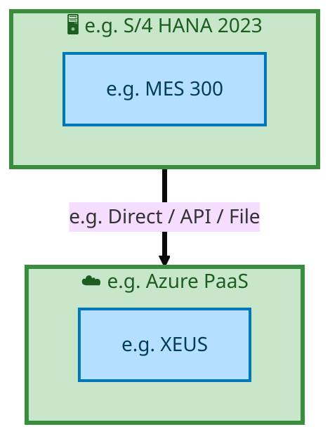

<a href="https://mermaid.live/view#pako:eNqtlF1r2zAUhv-KUMld1jp2nGSGDmzHZoV0hHndBvMwin2ciMqSseU1aZr_PsnOR1tIoWy6ENL7Hj06OkLa4lRkgB3c620pp9JB2xjLFRQQYwfFeEFqNeqrUQ1pU1G5mcEfYJ3JhDi47ZLvpKJkwaDWtuLkgsuIPu5Rg2G57oK1HpKCsk3nRLAUgO5u-shVAAXftVFMPKQrUsk9ranhlqx_0EyutJITVoOOW8mCzcgCWLutrJpW5epYUUlSypdaHhparAi_fybaxm6Hdr1ezI97oW9ezJFqKSN1PYUckbL0xBrllDHnwrOnYRj2a1mJe3AuDGM89kb76YcHnZpjlut-KpiotG1N7de8khF5AvqTYOR_PAKtySSw_JdA6wQceHZgGq-AINiJF4ae7dlHnu8bqp1NcDTSdsw7Yt0slhUpVygwg7Hlz2fzBJJl4j42FSRzQqJfMY4bc2QM4iYHQ-18ubxErY20HePfHUi3jFaQSio4mn09qQey25J_Bnea2WL0WAEcx-kK3q0Bnu1zkxsGZxP7p2K-efgoGSaf3S9uYhqm1Z4_m1iZ6jNiP69CdDVEOg7puHcX4jaIEsswDrVQU6Sm7yzHi1T_Q0Xeol9ff3raJzttz4eukDu_UX1ImXrvT2evCvdxAVVBaIadbfdtqN8ng5w0TKqHj0kjRbThKXbap4ybMiMSppSo6yk6cfcXvJ937g==" title="View full diagram">&#128065; View Diagram</a>

> **Legend**: 🖥️ Platform · 📦 Application · ⛔ End-of-Life · 📋 Unassigned

Page 32<a href="#toc">↑ Back to TOC</a>E2E-73 — R3 Hybrid Manufacturing process with external Wafer Procurement & Internal processing of

#### 6.1.2 Future-State — Future-State Platform Architecture

<a href="https://mermaid.live/view#pako:eNqtlF1r2zAUhv-KUMld1jp2nGSCDuzEZoV0hHndBvMwin2ciMqWseU1aer_PsnOR1tIoWy6ENL7Hj06OkLa4VgkgAnu9XYsZ5KgXYjlGjIIMUEhXtJKjfpqVEFcl0xu5_AHeGdyIQ5uu-Q7LRldcqi0rTipyGXAHveowbDYdMFa92nG-LZzAlgJQHc3feQogII3bRQXD_GalnJPqyu4pZsfLJFrraSUV6Dj1jLjc7oE3m4ry7pVc3WsoKAxy1daHhpaLGl-_0y0jaZBTa8X5se90Dc3zJFqMadVNYMU0aJwxQaljHNy4doz3_f7lSzFPZALwxiP3dF--uFBp0bMYtOPBReltq2Z_ZpXcCpPwOnEG00_HoHWZOJZ05dA6wQcuLZnGq-AIPiJ5_uu7dpH3nRqqHY2wdFI22HeEat6uSppsUae6Y0tfzFfRBCtIuexLiFaUBr8CnFYmyNjENYpGGrny9Ulam2k7RD_7kC6JayEWDKRo_nXk3ogOy35p3enmS1GjxWAENIVvFsDebLPTW45nE3sn4r55uGDaBh9dr44kWmYVnv-ZGIlqk-o_bwKwdUQ6Tik495diFsviCzDONRCTZGavrMcL1L9DxV5i359_elpn-ysPR-6Qs7iRvU-4-q9P529KtzHGZQZZQkmu-7bUL9PAimtuVQPH9NaimCbx5i0TxnXRUIlzBhV15N1YvMX33B4Bg==" title="View full diagram">&#128065; View Diagram</a>

> **Legend**: 🖥️ Platform · 📦 Application · ⛔ End-of-Life · 📋 Unassigned

#### Platform Inventory

| # | Platform | Type | Systems Using | Environment |
|---|----------|------|--------------|-------------|
| 1 | e.g. Azure PaaS | Cloud / SaaS | e.g. XEUS | DEV,QAS,PRD |
| 2 | e.g. S/4 HANA 2023 | On-Premise | e.g. MES 300 | DEV,QAS,PRD |

Page 33<a href="#toc">↑ Back to TOC</a>E2E-73 — R3 Hybrid Manufacturing process with external Wafer Procurement & Internal processing of

### 6.2 SAP Development Object Status

**RICEFW Active Items** — E2E Tower (0 of 0 objects)
*Data source: Smartsheet Object Tracker (cached 2026-04-06)*

**All 0 objects are completed** — no active items requiring attention.

### 6.3 NFRs & Design Principles

| Category | Requirement | Target / SLA | Priority |
|----------|-------------|-------------|----------|
| Performance | Order/transaction processing within interactive SLA | < 3 seconds for online transactions | High |
| Availability | Business-critical systems available during extended hours | 99.9% (06:00-22:00 all time zones) | High |
| Scalability | Support seasonal and promotional volume spikes | Handle 2x baseline transaction volume | Medium |
| Recoverability | Customer-facing systems recover within business impact window | RPO < 30 min, RTO < 2 hours | High |
| Data Volume | Support transactional data growth from business expansion | 10M+ documents/year | Medium |
| Latency | Near-real-time integration for order status updates | < 30 seconds for status propagation | Medium |
| Concurrency | Support global user base across business functions | 300+ concurrent users | Medium |

### 6.4 Security & Governance

| Concern | Approach | Standard / Policy | Owner |
|---------|----------|--------------------|-------|
| Authentication | Single Sign-On (SSO) via Intel corporate Azure AD identity | Intel IT Security Policy - Identity Management | IT Security |
| Authorization | Role-based access control (RBAC) with SAP authorization objects | Intel SAP Security Standards - Role Design | SAP Security Team |
| Data Classification | All financial/operational data classified per Intel Data Classification Standard | Intel Data Classification Policy | Data Governance |
| Data Encryption (at rest) | AES-256 encryption for SAP HANA database and file storage | Intel Encryption Standard | Infrastructure Security |
| Data Encryption (in transit) | TLS 1.3 for all system-to-system and user-to-system communication | Intel Network Security Policy | Network Engineering |
| Network Segmentation | SAP systems in dedicated network zones with firewall controls | Intel Network Architecture Standard | Network Security |
| API Security | OAuth 2.0 / certificate-based authentication for all API integrations | Intel API Security Guidelines | Integration Architecture |
| Audit Logging | Comprehensive audit trail for all data changes and user actions (SAP Security Audit Log) | SOX Compliance / Intel Audit Policy | Internal Audit |
| Certificate Management | Automated certificate lifecycle management for system-to-system trust | Intel PKI Standard | Certificate Authority Team |
| Compliance | SOX controls, export control (EAR/ITAR) screening, data privacy (GDPR) | Intel Corporate Compliance Framework | Compliance Office |

Page 34<a href="#toc">↑ Back to TOC</a>E2E-73 — R3 Hybrid Manufacturing process with external Wafer Procurement & Internal processing of

## 7. Project Context

### 7.1 Project Roadmap & Go-Live Plan

*No timeline data available for this capability.*

### 7.2 RAID Log

*Live data from Smartsheet Master RAID Log — extracted 2026-04-06*

**RAID Summary:** 17 open items (0 capability-specific, 17 tower-level), 57 closed

| Severity | Capability | Tower-Wide | Total Open |
|----------|----------:|-----------:|-----------:|
| P1 - High | 0 | 4 | 4 |
| P2 - Medium | 0 | 10 | 10 |
| P3 - Low | 0 | 3 | 3 |
| **Total** | **0** | **17** | **17** |

**Other E2E Tower RAID Items** (17 open):

| RAID ID | Type | Severity | Title | Status | Assigned To | Due Date |
|---------|------|----------|-------|--------|-------------|----------|
| 03591 | Risk | P1 - High | R3 E2E scenario execution | In Progress | Test Management | 2026-04-15 |
| 03681 | Risk | P1 - High | ITC Execution: Planning run availability - Prerequisite for ... | In Progress | E2E | 2026-04-10 |
| 03762 | Risk | P1 - High | FTS-IF (esp SCP) related test cases/sequencing are not accur... | In Progress | FTS IF | 2026-04-10 |
| 03805 | Key Decision | P1 - High | BY - OTC IF : Replace virtual plant on SO with actual plant | Not Started | E2E | 2026-04-03 |
| 01733 | Risk | P2 - Medium | Tariffs impacts Item/BOM design which is impacting ERP/SCP (... | In Progress | E2E | 2026-03-06 |
| 03592 | Risk | P2 - Medium | Lack of Defined IMO Owner for CBA Mask Billing and Materials... | In Progress | E2E | 2026-11-02 |
| 03625 | Risk | P2 - Medium | Item/ BOM MC1 delta load | In Progress | Cutover | 2026-04-10 |
| 03628 | Risk | P2 - Medium | R3 Returns Rework Process Causing Finance Double Counting in... | In Progress | E2E | 2026-03-27 |
| 03642 | Issue | P2 - Medium | E2E Process with Anafi on order/invoice point.  Need IFS SC ... | In Progress | E2E | 2026-03-24 |
| 03736 | Action | P2 - Medium | Golden Data/Test Data Readiness | In Progress | Master Data | 2026-04-22 |
| 03743 | Issue | P2 - Medium | FD-Share with Entitlements -  Interface File Paths for MC1 | Roadblock / At Risk | PMO | 2026-03-20 |
| 03756 | Risk | P2 - Medium | LE101-1001 Operation Support Ownership for SIMS/Tester Front... | In Progress | E2E | 2026-04-24 |
| 03802 | Risk | P2 - Medium | Automated Bailed Value Calculation | In Progress | E2E | 2026-04-10 |
| 03808 | Action | P2 - Medium | Shipping Transformation test strategy is skipping ITC1 | To Be Reviewed | FTS IF | 2026-04-03 |
| 03216 | Action | P3 - Low | Mask Expense vs. Invoice | In Progress | E2E | 2026-03-06 |
| 03315 | Risk | P3 - Low | BPMG – SCP L3/L4 flow standards | In Progress | Business Process Mgmt | 2026-03-27 |
| 03769 | Action | P3 - Low | Need a Labs SPOC owner to define IP Labs enterprise and mate... | In Progress | E2E | 2026-04-17 |

### 7.3 Recommendations & Next Steps

| # | Category | Recommendation | Priority | Owner | Target Date | Status |
|---|----------|---------------|----------|-------|-------------|--------|
| 1 | Architecture | Complete extended flow attributes (Data Entity, Integration Pattern, Tech Platform) in Flows tab for full BDAT coverage | High | Tower Architect | 2026-Q2 | Open |
| 2 | Data | Define data ownership and classification for all 1 flow chains to satisfy Data Architecture (TOGAF D) requirements | Medium | Data Architect | 2026-Q3 | Open |
| 3 | Testing | Develop integration test scenarios covering all 1 flow chains for FUT/SIT readiness | High | Test Lead | 2026-Q3 | Open |
| 4 | Business Architecture | Review and validate Business Architecture process steps against latest Signavio/BIC process models | Medium | Business Analyst | 2026-Q2 | Open |
| 5 | Security | Complete security review for API integrations and data flows per Intel Security Architecture standards | Medium | Security Architect | 2026-Q3 | Open |

---
*E2E-73 — Architecture Document (TOGAF BDAT) · End-to-End Integrated Processes · Generated: April 2026*

Page 35<a href="#toc">↑ Back to TOC</a>E2E-73 — R3 Hybrid Manufacturing process with external Wafer Procurement & Internal processing of

