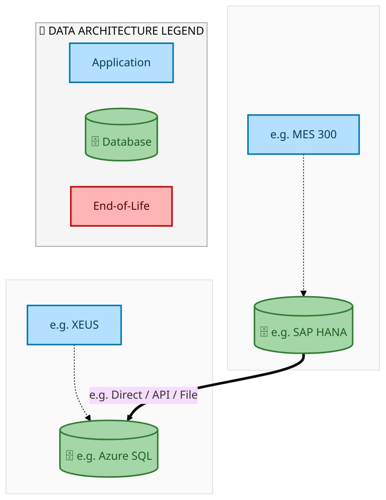
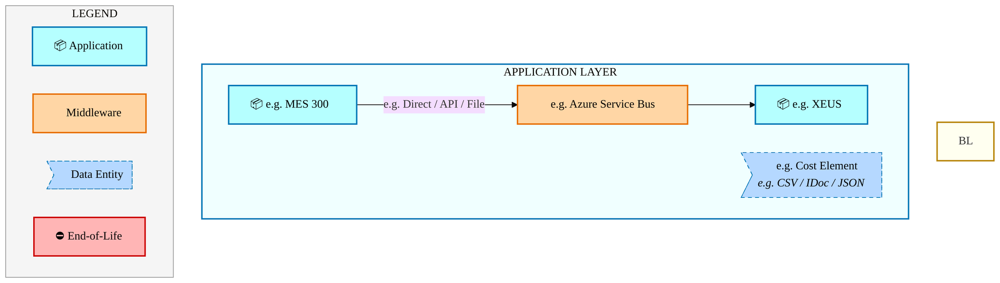
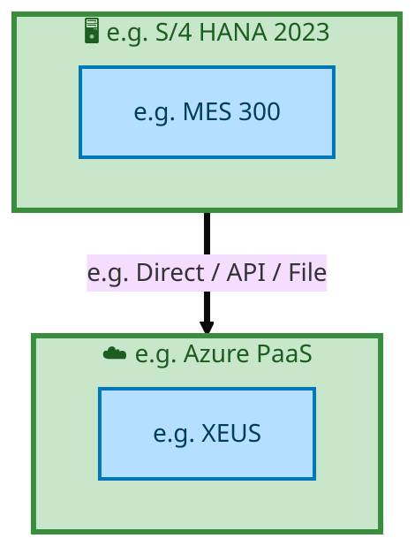

<div style="text-align:center; padding-top:20px;">
  <img src="data:image/svg+xml;base64,PHN2ZyB4bWxucz0iaHR0cDovL3d3dy53My5vcmcvMjAwMC9zdmciIHZpZXdCb3g9IjAgMCA4MDAgNDgwIiB3aWR0aD0iODAwIiBoZWlnaHQ9IjQ4MCI+DQogIDxkZWZzPg0KICAgIDxsaW5lYXJHcmFkaWVudCBpZD0iYmciIHgxPSIwJSIgeTE9IjAlIiB4Mj0iMTAwJSIgeTI9IjEwMCUiPg0KICAgICAgPHN0b3Agb2Zmc2V0PSIwJSIgc3R5bGU9InN0b3AtY29sb3I6IzAwNzFjNTtzdG9wLW9wYWNpdHk6MSIvPg0KICAgICAgPHN0b3Agb2Zmc2V0PSIxMDAlIiBzdHlsZT0ic3RvcC1jb2xvcjojMDBhZWVmO3N0b3Atb3BhY2l0eToxIi8+DQogICAgPC9saW5lYXJHcmFkaWVudD4NCiAgICA8bGluZWFyR3JhZGllbnQgaWQ9ImFjY2VudCIgeDE9IjAlIiB5MT0iMCUiIHgyPSIwJSIgeTI9IjEwMCUiPg0KICAgICAgPHN0b3Agb2Zmc2V0PSIwJSIgc3R5bGU9InN0b3AtY29sb3I6I2ZmZmZmZjtzdG9wLW9wYWNpdHk6MC4xNSIvPg0KICAgICAgPHN0b3Agb2Zmc2V0PSIxMDAlIiBzdHlsZT0ic3RvcC1jb2xvcjojZmZmZmZmO3N0b3Atb3BhY2l0eTowLjAyIi8+DQogICAgPC9saW5lYXJHcmFkaWVudD4NCiAgICA8cGF0dGVybiBpZD0iZ3JpZCIgd2lkdGg9IjQwIiBoZWlnaHQ9IjQwIiBwYXR0ZXJuVW5pdHM9InVzZXJTcGFjZU9uVXNlIj4NCiAgICAgIDxwYXRoIGQ9Ik0gNDAgMCBMIDAgMCAwIDQwIiBmaWxsPSJub25lIiBzdHJva2U9InJnYmEoMjU1LDI1NSwyNTUsMC4wNykiIHN0cm9rZS13aWR0aD0iMC41Ii8+DQogICAgPC9wYXR0ZXJuPg0KICA8L2RlZnM+DQoNCiAgPCEtLSBCYWNrZ3JvdW5kIC0tPg0KICA8cmVjdCB3aWR0aD0iODAwIiBoZWlnaHQ9IjQ4MCIgZmlsbD0idXJsKCNiZykiIHJ4PSI4Ii8+DQogIDxyZWN0IHdpZHRoPSI4MDAiIGhlaWdodD0iNDgwIiBmaWxsPSJ1cmwoI2dyaWQpIiByeD0iOCIvPg0KICA8cmVjdCB3aWR0aD0iODAwIiBoZWlnaHQ9IjQ4MCIgZmlsbD0idXJsKCNhY2NlbnQpIiByeD0iOCIvPg0KDQogIDwhLS0gRGVjb3JhdGl2ZSBjaXJjdWl0L2FyY2hpdGVjdHVyZSBsaW5lcyAtLT4NCiAgPGcgc3Ryb2tlPSJyZ2JhKDI1NSwyNTUsMjU1LDAuMTIpIiBzdHJva2Utd2lkdGg9IjEuNSIgZmlsbD0ibm9uZSI+DQogICAgPHBhdGggZD0iTSAwIDEwMCBMIDEyMCAxMDAgTCAxNjAgMTQwIEwgMjgwIDE0MCIvPg0KICAgIDxwYXRoIGQ9Ik0gMCAyNjAgTCA4MCAyNjAgTCAxMjAgMjIwIEwgMjAwIDIyMCBMIDI0MCAyNjAgTCAzNjAgMjYwIi8+DQogICAgPHBhdGggZD0iTSA1MjAgMTAwIEwgNjAwIDEwMCBMIDY0MCA2MCBMIDgwMCA2MCIvPg0KICAgIDxwYXRoIGQ9Ik0gNDQwIDM0MCBMIDU2MCAzNDAgTCA2MDAgMzAwIEwgNzIwIDMwMCBMIDc2MCAzNDAgTCA4MDAgMzQwIi8+DQogICAgPHBhdGggZD0iTSA2MDAgNDAwIEwgNjgwIDQwMCBMIDcyMCA0NDAiLz4NCiAgICA8cGF0aCBkPSJNIDAgNDAwIEwgNDAgNDAwIEwgODAgMzYwIi8+DQogICAgPHBhdGggZD0iTSAyMDAgNDIwIEwgMzIwIDQyMCBMIDM2MCAzODAgTCA0ODAgMzgwIi8+DQogICAgPHBhdGggZD0iTSA2NTAgNDQwIEwgNzUwIDQ0MCBMIDgwMCA0ODAiLz4NCiAgPC9nPg0KDQogIDwhLS0gRGVjb3JhdGl2ZSBub2RlcyAtLT4NCiAgPGcgZmlsbD0icmdiYSgyNTUsMjU1LDI1NSwwLjE4KSI+DQogICAgPGNpcmNsZSBjeD0iMTIwIiBjeT0iMTAwIiByPSI0Ii8+DQogICAgPGNpcmNsZSBjeD0iMjgwIiBjeT0iMTQwIiByPSI0Ii8+DQogICAgPGNpcmNsZSBjeD0iMjAwIiBjeT0iMjIwIiByPSI0Ii8+DQogICAgPGNpcmNsZSBjeD0iMzYwIiBjeT0iMjYwIiByPSI0Ii8+DQogICAgPGNpcmNsZSBjeD0iNjAwIiBjeT0iMTAwIiByPSI0Ii8+DQogICAgPGNpcmNsZSBjeD0iNzIwIiBjeT0iMzAwIiByPSI0Ii8+DQogICAgPGNpcmNsZSBjeD0iNTYwIiBjeT0iMzQwIiByPSI0Ii8+DQogICAgPGNpcmNsZSBjeD0iODAiIGN5PSIzNjAiIHI9IjQiLz4NCiAgICA8Y2lyY2xlIGN4PSI0ODAiIGN5PSIzODAiIHI9IjQiLz4NCiAgICA8Y2lyY2xlIGN4PSIzMjAiIGN5PSI0MjAiIHI9IjQiLz4NCiAgPC9nPg0KDQogIDwhLS0gVE9HQUYgQkRBVCBib3hlcyAtLT4NCiAgPGcgZm9udC1mYW1pbHk9IlNlZ29lIFVJLCBBcmlhbCwgc2Fucy1zZXJpZiIgZm9udC1zaXplPSIxNCIgZm9udC13ZWlnaHQ9IjYwMCI+DQogICAgPCEtLSBCIC0tPg0KICAgIDxyZWN0IHg9IjE1MCIgeT0iMTQwIiB3aWR0aD0iMTIwIiBoZWlnaHQ9IjQwIiByeD0iNSIgZmlsbD0icmdiYSgyNTUsMjU1LDI1NSwwLjE4KSIgc3Ryb2tlPSJyZ2JhKDI1NSwyNTUsMjU1LDAuMykiIHN0cm9rZS13aWR0aD0iMSIvPg0KICAgIDx0ZXh0IHg9IjIxMCIgeT0iMTY1IiB0ZXh0LWFuY2hvcj0ibWlkZGxlIiBmaWxsPSIjZmZmIj5CdXNpbmVzczwvdGV4dD4NCiAgICA8IS0tIEQgLS0+DQogICAgPHJlY3QgeD0iMjkwIiB5PSIxNDAiIHdpZHRoPSIxMjAiIGhlaWdodD0iNDAiIHJ4PSI1IiBmaWxsPSJyZ2JhKDI1NSwyNTUsMjU1LDAuMTgpIiBzdHJva2U9InJnYmEoMjU1LDI1NSwyNTUsMC4zKSIgc3Ryb2tlLXdpZHRoPSIxIi8+DQogICAgPHRleHQgeD0iMzUwIiB5PSIxNjUiIHRleHQtYW5jaG9yPSJtaWRkbGUiIGZpbGw9IiNmZmYiPkRhdGE8L3RleHQ+DQogICAgPCEtLSBBIC0tPg0KICAgIDxyZWN0IHg9IjQzMCIgeT0iMTQwIiB3aWR0aD0iMTIwIiBoZWlnaHQ9IjQwIiByeD0iNSIgZmlsbD0icmdiYSgyNTUsMjU1LDI1NSwwLjE4KSIgc3Ryb2tlPSJyZ2JhKDI1NSwyNTUsMjU1LDAuMykiIHN0cm9rZS13aWR0aD0iMSIvPg0KICAgIDx0ZXh0IHg9IjQ5MCIgeT0iMTY1IiB0ZXh0LWFuY2hvcj0ibWlkZGxlIiBmaWxsPSIjZmZmIj5BcHBsaWNhdGlvbjwvdGV4dD4NCiAgICA8IS0tIFQgLS0+DQogICAgPHJlY3QgeD0iNTcwIiB5PSIxNDAiIHdpZHRoPSIxMjAiIGhlaWdodD0iNDAiIHJ4PSI1IiBmaWxsPSJyZ2JhKDI1NSwyNTUsMjU1LDAuMTgpIiBzdHJva2U9InJnYmEoMjU1LDI1NSwyNTUsMC4zKSIgc3Ryb2tlLXdpZHRoPSIxIi8+DQogICAgPHRleHQgeD0iNjMwIiB5PSIxNjUiIHRleHQtYW5jaG9yPSJtaWRkbGUiIGZpbGw9IiNmZmYiPlRlY2hub2xvZ3k8L3RleHQ+DQogIDwvZz4NCg0KICA8IS0tIENvbm5lY3RpbmcgbGluZXMgYmV0d2VlbiBCREFUIGJveGVzIC0tPg0KICA8ZyBzdHJva2U9InJnYmEoMjU1LDI1NSwyNTUsMC4yNSkiIHN0cm9rZS13aWR0aD0iMSI+DQogICAgPGxpbmUgeDE9IjI3MCIgeTE9IjE2MCIgeDI9IjI5MCIgeTI9IjE2MCIvPg0KICAgIDxsaW5lIHgxPSI0MTAiIHkxPSIxNjAiIHgyPSI0MzAiIHkyPSIxNjAiLz4NCiAgICA8bGluZSB4MT0iNTUwIiB5MT0iMTYwIiB4Mj0iNTcwIiB5Mj0iMTYwIi8+DQogIDwvZz4NCg0KICA8IS0tIE1haW4gdGl0bGUgLS0+DQogIDx0ZXh0IHg9IjQwMCIgeT0iMjYwIiB0ZXh0LWFuY2hvcj0ibWlkZGxlIiBmb250LWZhbWlseT0iU2Vnb2UgVUksIEFyaWFsLCBzYW5zLXNlcmlmIiBmb250LXNpemU9IjM2IiBmb250LXdlaWdodD0iNzAwIiBmaWxsPSIjZmZmZmZmIiBsZXR0ZXItc3BhY2luZz0iMSI+DQogICAgSUFPIEFyY2hpdGVjdHVyZQ0KICA8L3RleHQ+DQogIDx0ZXh0IHg9IjQwMCIgeT0iMzAwIiB0ZXh0LWFuY2hvcj0ibWlkZGxlIiBmb250LWZhbWlseT0iU2Vnb2UgVUksIEFyaWFsLCBzYW5zLXNlcmlmIiBmb250LXNpemU9IjE4IiBmb250LXdlaWdodD0iNDAwIiBmaWxsPSJyZ2JhKDI1NSwyNTUsMjU1LDAuOCkiIGxldHRlci1zcGFjaW5nPSIyIj4NCiAgICBUT0dBRiBCREFUIMK3IElBTyBQcm9ncmFtIMK3IElETSAyLjANCiAgPC90ZXh0Pg0KDQogIDwhLS0gQm90dG9tIGFjY2VudCBiYXIgLS0+DQogIDxyZWN0IHg9IjI4MCIgeT0iMzQwIiB3aWR0aD0iMjQwIiBoZWlnaHQ9IjMiIHJ4PSIxLjUiIGZpbGw9InJnYmEoMjU1LDI1NSwyNTUsMC40KSIvPg0KDQogIDwhLS0gSW50ZWwgdGV4dCAtLT4NCiAgPHRleHQgeD0iNDAwIiB5PSIzODAiIHRleHQtYW5jaG9yPSJtaWRkbGUiIGZvbnQtZmFtaWx5PSJTZWdvZSBVSSwgQXJpYWwsIHNhbnMtc2VyaWYiIGZvbnQtc2l6ZT0iMTMiIGZpbGw9InJnYmEoMjU1LDI1NSwyNTUsMC41KSIgbGV0dGVyLXNwYWNpbmc9IjMiPg0KICAgIElOVEVMIENPTkZJREVOVElBTA0KICA8L3RleHQ+DQo8L3N2Zz4NCg==" alt="IAO Architecture" style="width:100%; border-radius:8px;" />
  <h1 style="font-size:36px; margin-top:24px;">E2E-73 — R3 Hybrid Manufacturing process with external Wafer Procurement & Internal processing of</h1>
  <h2 style="font-size:24px;">Architecture Document (TOGAF BDAT)</h2>
  <p style="font-size:18px; color:#555;">End-to-End Integrated Processes (E2E) Tower<br/>
  Capability E2E-73 · Forecast to Stock</p>
  <p style="font-size:14px; color:#888;">IAO Program · Release 2<br/>
  Generated: March 2026<br/>
  Sajiv Francis</p>
  <p style="font-size:12px; color:#aaa;">IAO Architecture Pipeline — Intel Confidential</p>
</div>

<style>
@media print {
  @page { margin: 0.75in; }
  .mermaid { page-break-inside: avoid; overflow: visible; }
  pre, table { page-break-inside: avoid; }
  h2, h3, h4 { page-break-after: avoid; }
}
.mermaid { overflow: visible; }
.mermaid svg { max-width: 100%; height: auto !important; }
nav.toc { margin: 16px 0 24px 0; }
nav.toc ol, nav.toc ul { list-style: none; padding-left: 0; margin: 0; }
nav.toc > ol > li { margin-bottom: 6px; font-weight: 600; font-size: 14px; }
nav.toc > ol > li > ul { padding-left: 28px; margin-top: 4px; }
nav.toc > ol > li > ul > li { font-weight: 400; font-size: 13px; margin-bottom: 2px; }
nav.toc a { color: #0071c5; text-decoration: none; }
nav.toc a:hover { text-decoration: underline; }
</style>


<div class="page-footer"><span>Page 1</span><span><a href="#toc">↑ Back to TOC</a></span><span>E2E-73 — R3 Hybrid Manufacturing process with external Wafer Procurement & Internal processing of</span></div>
<div style="page-break-before: always;"></div>


<a id="toc"></a>

## Table of Contents

<nav class="toc">
<ol>
  <li><a href="#1-executive-summary">1. Executive Summary</a></li>
  <li><a href="#2-business-context-objectives">2. Business Context &amp; Objectives</a>
    <ul>
      <li><a href="#21-classification">2.1 Classification</a></li>
      <li><a href="#22-business-drivers">2.2 Business Drivers</a></li>
      <li><a href="#23-success-criteria">2.3 Success Criteria</a></li>
      <li><a href="#24-companion-documents">2.4 Companion Documents</a></li>
    </ul>
  </li>
  <li><a href="#3-business-architecture-togaf-b">3. Business Architecture (TOGAF &ldquo;B&rdquo;)</a>
    <ul>
      <li><a href="#31-business-process-overview">3.1 Business Process Overview</a></li>
      <li><a href="#32-business-process-diagrams">3.2 Business Process Diagrams</a></li>
      <li><a href="#33-business-roles-responsibilities">3.3 Business Roles &amp; Responsibilities</a></li>
    </ul>
  </li>
  <li><a href="#4-data-architecture-togaf-d">4. Data Architecture (TOGAF &ldquo;D&rdquo;)</a>
    <ul>
      <li><a href="#41-data-entities-ownership">4.1 Data Entities &amp; Ownership</a></li>
      <li><a href="#42-data-flow-diagrams">4.2 Data Flow Diagrams</a></li>
      <li><a href="#43-data-lineage">4.3 Data Lineage</a></li>
      <li><a href="#44-ricefw-data-objects">4.4 RICEFW Data Objects</a></li>
      <li><a href="#45-data-governance-quality">4.5 Data Governance &amp; Quality</a></li>
    </ul>
  </li>
  <li><a href="#5-application-architecture-togaf-a">5. Application Architecture (TOGAF &ldquo;A&rdquo;)</a>
    <ul>
      <li><a href="#51-current-state-current-state-application-landscape">5.1 Current-State Application Landscape</a></li>
      <li><a href="#52-future-state-future-state-application-landscape">5.2 Future-State Application Landscape</a></li>
      <li><a href="#53-change-impact-summary">5.3 Change Impact Summary</a></li>
      <li><a href="#54-component-overview">5.4 Component Overview</a></li>
      <li><a href="#55-ricefw-inventory">5.5 RICEFW Inventory</a></li>
      <li><a href="#56-integration-patterns">5.6 Integration Patterns</a></li>
    </ul>
  </li>
  <li><a href="#6-technology-architecture-togaf-t">6. Technology Architecture (TOGAF &ldquo;T&rdquo;)</a>
    <ul>
      <li><a href="#61-platform-infrastructure">6.1 Platform &amp; Infrastructure</a></li>
      <li><a href="#62-sap-development-object-status">6.2 SAP Development Object Status</a></li>
      <li><a href="#63-nfrs-design-principles">6.3 NFRs &amp; Design Principles</a></li>
      <li><a href="#64-security-governance">6.4 Security &amp; Governance</a></li>
    </ul>
  </li>
  <li><a href="#7-project-context">7. Project Context</a>
    <ul>
      <li><a href="#71-project-roadmap-go-live-plan">7.1 Project Roadmap &amp; Go-Live Plan</a></li>
      <li><a href="#72-raid-log">7.2 RAID Log</a></li>
      <li><a href="#73-recommendations-next-steps">7.3 Recommendations &amp; Next Steps</a></li>
    </ul>
  </li>
</ol>
</nav>


<div class="page-footer"><span>Page 2</span><span><a href="#toc">↑ Back to TOC</a></span><span>E2E-73 — R3 Hybrid Manufacturing process with external Wafer Procurement & Internal processing of</span></div>
<div style="page-break-before: always;"></div>


## 1. Executive Summary

This Architecture Document defines the **Business, Data, Application, and Technology** (BDAT) architecture for **E2E-73 R3 Hybrid Manufacturing process with external Wafer Procurement & Internal processing of** within the IAO program. It includes 13 BPMN process diagram(s) in Section 3.

| Dimension | Value |
|-----------|-------|
| **Tower** | End-to-End Integrated Processes (E2E) |
| **Process Group** | Forecast to Stock |
| **Capability** | E2E-73 - R3 Hybrid Manufacturing process with external Wafer Procurement & Internal processing of |
| **Release** | Release 2 |
| **Total Systems** | 2 |
| **System Status** | 0 Deployed, 0 Developing, 0 EOL, 2 Pending IAPM |
| **RICEFW Objects** | Pending — Smartsheet Object Tracker API integration |

**Change Summary**: 0 new flow chains, 0 removed, 0 modified, 1 unchanged between Current-State and Future-State states.

> All system nodes in architecture diagrams are **IAPM-linked** — click any node to open its IAPM page. Diagrams require `securityLevel: 'loose'` for click events.


<div class="page-footer"><span>Page 3</span><span><a href="#toc">↑ Back to TOC</a></span><span>E2E-73 — R3 Hybrid Manufacturing process with external Wafer Procurement & Internal processing of</span></div>
<div style="page-break-before: always;"></div>


## 2. Business Context & Objectives

### 2.1 Classification

| Level | Value |
|-------|-------|
| **L0 Tower** | End-to-End Integrated Processes |
| **L1 Process** | Forecast to Stock |
| **L2 Capability** | E2E-73 - R3 Hybrid Manufacturing process with external Wafer Procurement & Internal processing of |

### 2.2 Business Drivers

| # | Driver | Description | Strategic Alignment | Priority |
|---|--------|-------------|---------------------|----------|
| 1 | End-to-End Process Integration | Enable cross-tower integrated processes spanning procurement, manufacturing, and fulfillment | IDM 2.0 Process Excellence | High |
| 2 | Intel Foundry Business Enablement | Stand up foundry-specific business processes for external customer engagement | Intel Foundry Services | High |
| 3 | Process Visibility & Monitoring | Provide end-to-end process visibility across tower boundaries with integrated monitoring | Operational Excellence | Medium |
| 4 | E2E-73 Process Migration | Migrate R3 Hybrid Manufacturing process with external Wafer Procurement & Internal processing of business processes and 2 integrated systems from legacy to S/4 HANA target architecture | IDM 2.0 Cross-Functional / End-to-End | High |


<div class="page-footer"><span>Page 4</span><span><a href="#toc">↑ Back to TOC</a></span><span>E2E-73 — R3 Hybrid Manufacturing process with external Wafer Procurement & Internal processing of</span></div>
<div style="page-break-before: always;"></div>


### 2.3 Success Criteria

| Metric | Target | Measure | Baseline | Owner |
|--------|--------|---------|----------|-------|
| E2E Process Cycle Time | Per process SLA | End-to-end transaction completion within defined SLA per process | Varies by process | E2E Process Owner |
| Cross-Tower Integration Success | > 99% | Transactions completing across tower boundaries without manual intervention | 92% (current) | Integration Lead |
| Process Exception Rate | < 2% | Transactions requiring manual exception handling | 8% (current) | Operations Manager |
| E2E-73 Migration Completeness | 100% flow chains validated | All 1 flow chains verified in target state | 0% (pre-migration) | Tower Architect |

### 2.4 Companion Documents

| Document | Description |
|----------|-------------|
| **Business Architecture** | Included in this document (Section 3) — process flows from BPMN diagrams |
| **This Document** | Full BDAT Architecture — Business + Data + Application + Technology |


<div class="page-footer"><span>Page 5</span><span><a href="#toc">↑ Back to TOC</a></span><span>E2E-73 — R3 Hybrid Manufacturing process with external Wafer Procurement & Internal processing of</span></div>
<div style="page-break-before: always;"></div>


## 3. Business Architecture (TOGAF "B")

### 3.1 Business Process Overview

This capability includes **13 business process(es)** modeled in BPMN 2.0, covering the end-to-end workflow for E2E-73 R3 Hybrid Manufacturing process with external Wafer Procurement & Internal processing of.

| # | Step ID | Process Name | Lanes | Tasks | Gateways |
|---|---------|--------------|-------|-------|----------|
| 1 | E2E-73A_R3_External_Procurement_Process | E2E-73A_R3_External_Procurement_Process | Boundary Apps

(Intel Product), External Partners/ Suppliers, SAP  S/4
Intel Product | 23 | 7 |

| 2 | E2E-73B_R3_Bailment_Process_with_Intel_Product​ | E2E-73B_R3_Bailment_Process_with_Intel_Product​ | External Partners B2B, Intel Products , SAP S/4 

Intel Foundry (LE500) - Ireland | 20 | 7 |

| 3 | E2E-73C_R3_Supplier_Payment_Process | E2E-73C_R3_Supplier_Payment_Process |  CFIN | 13 | 8 |
| 4 | E2E-73D_R3_Bailment_Order_Process_with_Intel_Products_(Wafer) | E2E-73D_R3_Bailment_Order_Process_with_Intel_Products_(Wafer) | Boundary Apps, Intel Products, SAP S/4 

Intel Foundry (LE778 China) | 11 | 5 |

| 5 | E2E-73E_R3_Internal_manufacturing_process_for_Finished_Goods_in_Intel_Foundry_​_with_Planning_integr | E2E-73E_R3_Internal_manufacturing_process_for_Finished_Goods_in_Intel_Foundry_​_with_Planning_integr | Boundary Apps IF , Boundary Apps IP, Intel Foundry LE788 China , LE500 Ireland, SAP S/4 Intel Foundry (LE101 - Virtual), SAP S/4 Intel Product | 36 | 24 |
| 6 | E2E-73F_R3_Internal_manufacturing_process_for_Finished_Goods_in_Intel_Foundry_with_Planning_integrat | E2E-73F_R3_Internal_manufacturing_process_for_Finished_Goods_in_Intel_Foundry_with_Planning_integrat | Boundary Apps, External Partners, Intel Foundry LE500 Ireland 

, LE778 China, SAP ECC, SAP S/4 
Intel Foundry/Intel Product  | 66 | 23 |

| 7 | E2E-73G_R3_Internal_manufacturing_process_for_Finished_Goods_in_Intel_Foundry_​_with_Planning_integr | E2E-73G_R3_Internal_manufacturing_process_for_Finished_Goods_in_Intel_Foundry_​_with_Planning_integr | Boundary Apps, CFIN, External Partner, Intel Product, SAP ECC, SAP S/4 Intel Foundry LE3778 China, SAP S/4LE101 US Virtual  | 55 | 19 |
| 8 | E2E-73H_R3_Bailment_Order_Process_with_Intel_Products | E2E-73H_R3_Bailment_Order_Process_with_Intel_Products | Boundary Apps, Intel Products, SAP S/4 

Intel Foundry (LE870) – Malaysia WLA Site​ | 12 | 5 |

| 9 | E2E-73I_R3_Internal_manufacturing_process_for_Finished_Goods_in_Intel_Foundry_with_Planning_integrat | E2E-73I_R3_Internal_manufacturing_process_for_Finished_Goods_in_Intel_Foundry_with_Planning_integrat | Boundary Apps IF , Boundary Apps IP, Intel Foundry LE870 - Malaysia Site , SAP S/4 Intel Foundry LE101 US Virtual , SAP S/4 Intel Product | 35 | 25 |
| 10 | E2E-73J_R3_Internal_manufacturing_process_for_Finished_Goods_in_Intel_Foundry_​_with_Planning_integr | E2E-73J_R3_Internal_manufacturing_process_for_Finished_Goods_in_Intel_Foundry_​_with_Planning_integr | Boundary Apps, CFIN, External Partners, Intel Product, SAP ECC, SAP S/4 Intel Foundry LE870 Malaysia WLA Site , SAP S/4LE101 US Virtual  | 59 | 20 |
| 11 | E2E-73K_R3_OSAT_Manufacturing_with_Plan_Integration | E2E-73K_R3_OSAT_Manufacturing_with_Plan_Integration | Boundary Apps, Intel Product, OSAT  | 25 | 10 |
| 12 | E2E-73N_R3_OSAT_to_End-_Customer | E2E-73N_R3_OSAT_to_End-_Customer | External Partners / B2B, Intel Products | 22 | 14 |
| 13 | E2E-73O_R3_OSAT_Manufacturing_with_Planning_Integration | E2E-73O_R3_OSAT_Manufacturing_with_Planning_Integration | Boundary Apps, External Partners/Supplier

, SAP S/4 Intel Product

 | 15 | 5 |


<div class="page-footer"><span>Page 6</span><span><a href="#toc">↑ Back to TOC</a></span><span>E2E-73 — R3 Hybrid Manufacturing process with external Wafer Procurement & Internal processing of</span></div>
<div style="page-break-before: always;"></div>


### 3.2 Business Process Diagrams


#### BUSINESS ARCHITECTURE — 3.2.1 E2E-73A_R3_External_Procurement_Process — E2E-73A_R3_External_Procurement_Process

**Swim Lanes**: Boundary Apps
(Intel Product) · External Partners/ Suppliers · SAP  S/4
Intel Product | **Tasks**: 23 | **Gateways**: 7

> **Legend**: <span style="color:#000;background:#4CAF50;padding:2px 6px;border-radius:10px;font-weight:bold;font-size:9pt">● Start</span> · <span style="color:#fff;background:#C62828;padding:2px 6px;border-radius:10px;font-weight:bold;font-size:9pt">● End</span> · <span style="background:#E3F2FD;padding:2px 6px;border:1px solid #1565C0;font-size:9pt">User Task</span> · <span style="background:#FFF3E0;padding:2px 6px;border:1px solid #E65100;font-size:9pt">Service Task</span> · <span style="background:#FFF9C4;padding:2px 6px;border:1px solid #F57F17;font-size:9pt">◇ Gateway</span> · <span style="background:#F3E5F5;padding:2px 6px;border:1px solid #7B1FA2;font-size:9pt">Sub-Process</span>

```mermaid
%%{init: {'theme': 'base', 'themeVariables': {'fontSize': '14px', 'fontFamily': 'Segoe UI, Arial, sans-serif','primaryColor': '#e8f0fe', 'primaryBorderColor': '#0071c5','lineColor': '#37474F', 'secondaryColor': '#f5f8fc'}, 'flowchart': {'useMaxWidth': false, 'htmlLabels': true, 'curve': 'basis', 'nodeSpacing': 40, 'rankSpacing': 50}} }%%
flowchart LR
    classDef startEvt fill:#4CAF50,stroke:#2E7D32,color:#000,font-weight:bold,stroke-width:2px,rx:20,ry:20
    classDef endEvt fill:#C62828,stroke:#B71C1C,color:#fff,font-weight:bold,stroke-width:2px,rx:20,ry:20
    classDef userTask fill:#E3F2FD,stroke:#1565C0,stroke-width:2px,color:#0D47A1
    classDef serviceTask fill:#FFF3E0,stroke:#E65100,stroke-width:2px,color:#BF360C
    classDef gateway fill:#FFF9C4,stroke:#F57F17,stroke-width:2px,color:#E65100
    classDef subProc fill:#F3E5F5,stroke:#7B1FA2,stroke-width:2px,color:#4A148C
    subgraph Boundary Apps (Intel Product)
        n18[["fa:fa-cog Perform Demand Planning"]]
        n19[["fa:fa-cog Perform Supply Planning in BY"]]
        n20[["fa:fa-cog Perform Validation/Exception Handling based on rules setup"]]
        n24(["fa:fa-play Customer Forecast Data Received"])
    end
    subgraph External Partners/ Suppliers
        n4["Perform Order Shipment"]
        n5["Receive STO Detail​ (TSMC)​"]
        n21[["fa:fa-cog Receive Purchase Order at Supplier End"]]
        n22[["fa:fa-cog Acknowledge Order received"]]
        n23[["fa:fa-cog Generate Invoice"]]
        n28(["fa:fa-stop Invoice Generated"])
        n29(["fa:fa-stop STO Detail Received"])
        n35{{"fa:fa-arrows-alt parallelGateway"}}
        n36{{"fa:fa-arrows-alt parallelGateway"}}
    end
    subgraph SAP  S/4 Intel Product
        n1["Partial/Full Delivery against STO and PGI (Virtual)​"]
        n2["Inbound Del. against STO at IF Plant​"]
        n3["Perform GTS Check"]
        n6[["fa:fa-cog Create Purchase Requisition"]]
        n7[["fa:fa-cog Create Purchase Order"]]
        n8[["fa:fa-cog Screen GTS at PO Creation"]]
        n9[["fa:fa-cog Calculate Taxes"]]
        n10[["fa:fa-cog Update Inbound Delivery on S/4"]]
        n11[["fa:fa-cog Perform Virtual Goods (Unrestricted Stock on PO plant)"]]
        n12[["fa:fa-cog Perform Evaluated Receipt Settlement (ERS) Self-Billing"]]
        n13[["fa:fa-cog Check if Invoice Accepted"]]
        n14[["fa:fa-cog Post Supplier Invoice"]]
        n15[["fa:fa-cog Perform GTS Trade Compliance"]]
        n16[["fa:fa-cog Create Stock Transfer Request with PO detail​"]]
        n17[["fa:fa-cog Create Stock Transfer Order​"]]
        n25(["fa:fa-stop Taxes Calculated"])
        n26(["fa:fa-stop GTS Trade Check Completed"])
        n27(["fa:fa-stop GTS Check Completed"])
        n30["E2E-73C R3 Supplier Payment Process"]
        n31{{"fa:fa-code-branch Invoice Accepted?"}}
        n32{{"fa:fa-arrows-alt parallelGateway"}}
        n33{{"fa:fa-arrows-alt parallelGateway"}}
        n34{{"fa:fa-arrows-alt parallelGateway"}}
        n37{{"fa:fa-arrows-alt inclusiveGateway"}}
    end
    n6 --> n37
    n7 --> n32
    n31 -->|"Yes"| n14
    n24 --> n18
    n18 --> n19
    n32 --> n9
    n9 --> n25
    n32 --> n8
    n32 -->|"EDI 850/Email
RNET 3A4/3A19"| n35
    n21 --> n22
    n37 --> n7
    n35 --> n21
    n22 --> n36
    n36 --> n4
    n10 --> n33
    n33 --> n11
    n33 --> n15
    n15 --> n26
    n8 -->|"GTS confirmation to 
supplier via Open Text/B2B"| n35
    n14 --> n30
    n23 --> n28
    n36 -->|"EDI  855/Order Confirmation
RNET: 3A4"| n37
    n20 --> n13
    n13 --> n31
    n16 --> n17
    n17 -->|"RNET 3A13​"| n5
    n5 --> n29
    n19 --> n16
    n1 --> n2
    n2 --> n3
    n3 --> n27
    n11 --> n34
    n12 --> n20
    n31 -->|"No"| n23
    n4 -->|"ASN w.r.t 
STO  ​"| n10
    n34 --> n12
    n34 --> n1
    class n6 serviceTask
    class n7 serviceTask
    class n8 serviceTask
    class n9 serviceTask
    class n10 serviceTask
    class n11 serviceTask
    class n12 serviceTask
    class n13 serviceTask
    class n14 serviceTask
    class n15 serviceTask
    class n16 serviceTask
    class n17 serviceTask
    class n18 serviceTask
    class n19 serviceTask
    class n20 serviceTask
    class n21 serviceTask
    class n22 serviceTask
    class n23 serviceTask
    class n24 startEvt
    class n25 endEvt
    class n26 endEvt
    class n27 endEvt
    class n28 endEvt
    class n29 endEvt
    class n30 startEvt
    class n31 gateway
    class n32 gateway
    class n33 gateway
    class n34 gateway
    class n35 gateway
    class n36 gateway
    class n37 gateway
```

<div style="text-align:center; margin:4px 0 8px 0; font-size:11px;"><a href="https://mermaid.live/view#pako:eNqlWG1v2kgQ_isrqohEgsbrF0z4cCcgkIvUNlFIe6qafljsNVhZ1r71OpBL899v1t4F7NjVXS8fonh2nmdmnpmdYF46QRLSzqhzcvIS81iO0EtXrumGdkeouyQZ7fZQafhCREyWjGZd5RMlXC7ivws37KY75aZsc7KJ2bOyLugqoejzdQ-NAch6KCM862dUxFG3101FvCHieZqwRCjvd3QYWVERTR9NEhFScXCwLB8HHkBZzOnB7Piu784VLqNBwsMKaeRFwyjovqrkWLIN1kTIIv08ox_J7s84lGt4jgjLKPis5YZ9IEvKVI1S5MoW5OLJiBFnKg4HwRYpCWK-ArtrgUkQ_ngwedbrK3o9OXng-6Dow90DR_ATMJJllzRCmQTz7EmiKGZs9M6djuee1cukSB7p6J098y8duxeoSkZQutVT4va3NF6t5WiZsFC79reqhpGd7npiN7KtnniG37VYlIeHSNOBPbSH-0gTH0_x1ESKouh_RQJdxT3JHnWsmTO355f7WNgbeFPrLZ8p89L1x7iuExVPcUCPSOfzuTM7SDUbeNhqJ53MnYE1rZGuiKRb8nwgvJi6e8K558-x30pYxqtnmS9vRRIYQmfmzb09oT_B87HdSuiOsTvUGQLPSpB0jSZJXswyGqdphk6vuaQMQYgwD-RZ6at-OB5--_bQicgoIv0gWaFbKqJEbNAl3RAeoltGOIepfOh8_36MumhGLfI0Zc97FIo5mnytYW2rGfuFsDgkMk74-WwX0FT9hf6AJJhiUqskRGAROawQ6KrM0zqxe7onThl0Z5pnMtlQgeaJoAHJJLokkqA7GtD4iYYA10rAfNfkm-0kFZyAZHDLOBXZeVlbDH8ehXQhoMn_Rq0btFjH6YZyCeRHfh746bBocX8D6koSs4fctqwlOr1ffJyelQ9VmI2rUhmK21zAVsiojknkPjk042FdFrtKMg4eebJlNFwZvDgIUgE6VeAVBSFg8NE1f0rgStXdhwf5QffUuO1xR4KXgIsa4KBMQ48KiOO9vBgIESLZZn3CJEqJIIxRdlVey4fO6-sxaPDfQG-nYTG-RWhx7qLKNTq-D2oOYFLg_9T5PGcMymCQPlw_siIxh8lTtRUX6uoanX6JhcwJa-45UF3zpbq-iuV9lUGi63lxvWQT1jkax6v7BZquafBYdRlUezoVVHV0P1B39K88zmJ192rt9X8OLCapBqmtlkUgKOVFYlDH7U3J8TZSbbdMCQtypoLdkx3N6puotk0-p2E5onsFyz7A5oAG1sG4ZRWV_UFXSRLC8vzMBYXlGwcww2ghk-BR0UEBqWrEWZ3UbiadPRGWq2tQDncKHaVSMqq2BTqd3S3OwMCi_gT-BTRs3NplLFqL4mh_y8aB2plvLjF2a9kk2dG2aL7J2GuuQHXuXpCQommyAQLC30Kb56sUDbA8iyCsmjJQFG1juVY6hkfrsE7o_xvCcvqa8LZXWzLFEB2G6s1SGtT8j4ouJC9Kpw1AvwH4c4hjAWJmz_q-M0V3zqEtt-S5mAr1kYBmWe2S48M6U5-9-0tQIVi_GYTf62vQ_pXd6fwKyP0VkN8IinnA8gzucPua5gPU7_-mGPSzr59t_exgZfjx0Pmq1scPdSn0ie2WrnioDXioDRcGa5cG83xRPtpe7XxYeYZYs8trNPSs89lGjTa_-zS7R87YPXfGwK2ScAyFjTXnPl9dgKnH8bQDNggd1BkYDy2BqQtb2sExDo6uC9cNJgtsghjOoS5EzTG8GEWx2BTbGskEPfDMzOpTTNBNCnv9nu7k-cSeVIvDWmHHMrnrwPawkrtWDCTzzstPJdOjmKV-IyVgSW-ksXWh2BSKNb1jCsVaGmwg2NfxdEsAqhcHEJu0jRim7Vj3HRt1TM9MHjqqqUmf7mNqd2ffIA0wL0CHGf2UFInYhsrV9vHiE9q-F-8liK8-CqCjrPGexcyzXTccvW-oC3P0VlQ58VtPhq0nF60nMIatR7j9yG4_ctqP3PYjr_2oXQrcrgVuFwO3q2G3q2G3q2G3q2G3qwGLzXxBULV7-mW-ah00Wv1G67DRetFkdazmLGDY9Rt01Ww3m51ms9ts9prNg2azb8ydXgdeFWFZh53RS6f4xgq-1QppRHImO6-9DsllsnjmQWdUfLPTyYtPmpcxgXeETWl8_QesSuGF" title="View full diagram">&#128065; View Full Diagram</a></div>


<div class="page-footer"><span>Page 7</span><span><a href="#toc">↑ Back to TOC</a></span><span>E2E-73 — R3 Hybrid Manufacturing process with external Wafer Procurement & Internal processing of</span></div>
<div style="page-break-before: always;"></div>


#### BUSINESS ARCHITECTURE — 3.2.2 E2E-73B_R3_Bailment_Process_with_Intel_Product​ — E2E-73B_R3_Bailment_Process_with_Intel_Product​

**Swim Lanes**: External Partners B2B · Intel Products  · SAP S/4 
Intel Foundry (LE500) - Ireland | **Tasks**: 20 | **Gateways**: 7

> **Legend**: <span style="color:#000;background:#4CAF50;padding:2px 6px;border-radius:10px;font-weight:bold;font-size:9pt">● Start</span> · <span style="color:#fff;background:#C62828;padding:2px 6px;border-radius:10px;font-weight:bold;font-size:9pt">● End</span> · <span style="background:#E3F2FD;padding:2px 6px;border:1px solid #1565C0;font-size:9pt">User Task</span> · <span style="background:#FFF3E0;padding:2px 6px;border:1px solid #E65100;font-size:9pt">Service Task</span> · <span style="background:#FFF9C4;padding:2px 6px;border:1px solid #F57F17;font-size:9pt">◇ Gateway</span> · <span style="background:#F3E5F5;padding:2px 6px;border:1px solid #7B1FA2;font-size:9pt">Sub-Process</span>

```mermaid
%%{init: {'theme': 'base', 'themeVariables': {'fontSize': '14px', 'fontFamily': 'Segoe UI, Arial, sans-serif','primaryColor': '#e8f0fe', 'primaryBorderColor': '#0071c5','lineColor': '#37474F', 'secondaryColor': '#f5f8fc'}, 'flowchart': {'useMaxWidth': false, 'htmlLabels': true, 'curve': 'basis', 'nodeSpacing': 40, 'rankSpacing': 50}} }%%
flowchart LR
    classDef startEvt fill:#4CAF50,stroke:#2E7D32,color:#000,font-weight:bold,stroke-width:2px,rx:20,ry:20
    classDef endEvt fill:#C62828,stroke:#B71C1C,color:#fff,font-weight:bold,stroke-width:2px,rx:20,ry:20
    classDef userTask fill:#E3F2FD,stroke:#1565C0,stroke-width:2px,color:#0D47A1
    classDef serviceTask fill:#FFF3E0,stroke:#E65100,stroke-width:2px,color:#BF360C
    classDef gateway fill:#FFF9C4,stroke:#F57F17,stroke-width:2px,color:#E65100
    classDef subProc fill:#F3E5F5,stroke:#7B1FA2,stroke-width:2px,color:#4A148C
    subgraph External Partners B2B
        n12[["fa:fa-cog Receive Purchase Order at Supplier End"]]
        n13[["fa:fa-cog Perform Order Shipment"]]
        n14[["fa:fa-cog Notify B2B: Batch Lot Notification to Customer when lot is received​"]]
        n26(["fa:fa-stop Batch Lot Notified"])
        n36{{"fa:fa-arrows-alt inclusiveGateway"}}
    end
    subgraph Intel Products 
        n1["Perform GTS Check"]
        n2["Perform GTS Check"]
        n3["Perform GTS Check"]
        n6[["fa:fa-cog Create Purchase Order"]]
        n7[["fa:fa-cog Perform Inbound Delivery"]]
        n8[["fa:fa-cog Receive Virtual Goods Receipt (Unrestricted Stock) on PO Plant"]]
        n9[["fa:fa-cog Perform Partial/Full Delivery against STO and PGI (Virtual)​"]]
        n10[["fa:fa-cog Create Inbound Del. against STO at IF Plant​"]]
        n11[["fa:fa-cog Perform Goods Receipt against STO Virtual IF Plant​"]]
        n21(["fa:fa-play Initiate Bailment Process for Ireland L3500"])
        n22(["fa:fa-stop GTS Check Done"])
        n23(["fa:fa-stop GTS Check Done"])
        n24(["fa:fa-stop GTS Check Done"])
        n25(["fa:fa-stop Goods Receipt Completed"])
        n30{{"fa:fa-arrows-alt parallelGateway"}}
        n31{{"fa:fa-arrows-alt parallelGateway"}}
        n32{{"fa:fa-arrows-alt parallelGateway"}}
    end
    subgraph SAP S/4  Intel Foundry (LE500) - Ireland
        n4["fa:fa-user Create Purchase Order Non Valuated Mat"]
        n5["fa:fa-user Perform Goods Receipt (Physical)(Non Valuated)"]
        n15[["fa:fa-cog Perform Inbound Delivery"]]
        n16[["fa:fa-cog Update Inventory (In-Transit)"]]
        n17[["fa:fa-cog Perform Inbound Delivery in EWM"]]
        n18[["fa:fa-cog Put Away GR in EWM"]]
        n19[["fa:fa-cog Perform GTS Check"]]
        n20[["fa:fa-cog Perform GTS Check"]]
        n27(["fa:fa-stop GTS Check Completed"])
        n28(["fa:fa-stop GTS Check Completed"])
        n29(["fa:fa-stop Inbound Delivery Completed"])
        n33{{"fa:fa-arrows-alt parallelGateway"}}
        n34{{"fa:fa-arrows-alt parallelGateway"}}
        n35{{"fa:fa-arrows-alt parallelGateway"}}
    end
    n4 --> n34
    n15 --> n33
    n33 --> n16
    n33 --> n17
    n16 --> n5
    n34 --> n15
    n34 --> n19
    n19 --> n27
    n21 --> n6
    n6 --> n30
    n12 --> n13
    n7 --> n31
    n14 --> n26
    n8 --> n9
    n9 --> n10
    n30 --> n1
    n1 --> n22
    n13 -->|"ASN ​
EDI 856​
RNET 3B2 (ASN)​"| n7
    n31 --> n8
    n2 --> n23
    n31 --> n2
    n20 --> n28
    n33 --> n20
    n35 --> n18
    n36 --> n14
    n17 --> n29
    n32 --> n4
    n10 -->|"3B2"| n32
    n3 --> n24
    n5 --> n35
    n32 --> n3
    n35 -->|"4B2 (GR)"| n11
    n35 -->|"Inventory Report 
Generation / Notification​"| n36
    n18 -->|"Inventory Sync for 
Visibility to Customer"| n36
    n11 --> n25
    n30 --> n12
    class n4 userTask
    class n5 userTask
    class n6 serviceTask
    class n7 serviceTask
    class n8 serviceTask
    class n9 serviceTask
    class n10 serviceTask
    class n11 serviceTask
    class n12 serviceTask
    class n13 serviceTask
    class n14 serviceTask
    class n15 serviceTask
    class n16 serviceTask
    class n17 serviceTask
    class n18 serviceTask
    class n19 serviceTask
    class n20 serviceTask
    class n21 startEvt
    class n22 endEvt
    class n23 endEvt
    class n24 endEvt
    class n25 endEvt
    class n26 endEvt
    class n27 endEvt
    class n28 endEvt
    class n29 endEvt
    class n30 gateway
    class n31 gateway
    class n32 gateway
    class n33 gateway
    class n34 gateway
    class n35 gateway
    class n36 gateway
```

<div style="text-align:center; margin:4px 0 8px 0; font-size:11px;"><a href="https://mermaid.live/view#pako:eNqlWNtu2zgQ_RXCReAYsLciJfn2sIBvCgykrRGn6UO9D7RExURoSqCoJN7U_76kJdqWLG03WT8E0eHMmeHhzOjy1vCjgDSGjaurN8qpHIK3ptyQLWkOQXONE9Jsgwx4wILiNSNJU9uEEZdL-vfBDDrxqzbTmIe3lO00uiSPEQHf520wUo6sDRLMk05CBA2b7WYs6BaL3SRikdDWn0g_tMJDtHxpHImAiJOBZfWg7ypXRjk5wXbP6Tme9kuIH_GgQBq6YT_0m3udHIte_A0W8pB-mpAv-PUHDeRGXYeYJUTZbOSW3eI1YXqPUqQa81PxbMSgiY7DlWDLGPuUPyrcsRQkMH86Qa6134P91dWKH4OC27sVB-rnM5wkUxKCRCp49ixBSBkbfnImI8-12okU0RMZfkKz3tRGbV_vZKi2brW1uJ0XQh83criOWJCbdl70HoYofm2L1yGy2mKn_pZiER6cIk26qI_6x0jjHpzAiYkUhuH_iqR0Ffc4ecpjzWwPedNjLOh23Yl1yWe2OXV6I1jWiYhn6pMzUs_z7NlJqlnXhVY96dizu9akRPqIJXnBuxPhYOIcCT2358FeLWEWr5xlul6IyDeE9sz13CNhbwy9EaoldEbQ6ecZKp5HgeMNmL1KIjhmYKHKhBORgDEaZzb6xyH6-XPVCPEwxB0_egR3xCf0mYBFKlTBJQR8090DsATLNI4ZVf_PeLBq_PXXOYldJFkQEUZim_suNzTeEi7LTk7R6WskabjT6Q3BGEt_A24jmaHUx5JGHMgITNJERlvF-rIhHDBlQRMgsqSDVYosa12Kg7rXxzjKN74gJ3o7rTMPu_v2ZjywENFL0sFMBeI-SxMV5yY79VVjv8-8VF-UZJ9zSZTmIgpSXybgfNsqGaPPzf0STDbEf1IJnGf8exP79ybdorwTQVTapXMtSdWrPsY5X0cpD8CUMLV7sSt59asr6IEKmarCu4miIMnQWILr71wQVcHUlyQASxn5Ty2gjnbxDSwYviiSQXVGupjVveCzlzJ2TAvgR0x5oir1_hvAKt_FzRxc52m0KmsDWpUinW34jyKrBHMvT7SSD1bnW9TgnNGo9K-0CJ5KOGZq3szVHZbqTMeYMt1butR8kiRAhQNzQZje_63tqgFTrG2ESt1wrB4wjTgpW9vvsnbeZe2WrQsiTaJtzIi8bE6rsjljLDBjhF30ZuYEP-KE3ud0OQWWowVYfnZAPg48XVSqTq9vZ-pgWqBjTuosqHPURN8Cq7tWzS0OHjBLse6hL1gWG98tUlTX4PVis0vUXGWt63O2VpEKuh-aCLA0e77HQdZWz6pUI63AnHfu1cNOQmWr7Psfh5Aax2D240vZuzSMFqkEI32HvrmrcaiZMOdDtdCK1jvte7U9UVfhqP9-l0HJ5UKt2nayP9IZzkec3A-2E3dAp_OnjppfQzcH7Byw7QyA3TLQMy7dDHCNQc4JL4CB8RhkADIUCGaAiZEz2pZxQDmDyaqXG0BjkIdAhqGfXZuIeUBoCG0rB4x_7o7M9WGTv1aN0fIryO8bfDadg77bNZd3X2f3wB4jcK2MjvfAXyo5EyRn7Ztd5kHs0roJivKkUL8kNTqmnZ8OPFrkSsHj-eXKILNzO496NLDynanMD9naJrwJZixNJbglJruQjGJytAY3d60DHYTl5dNouiNxpN6zVvyGqMfl7Lnzc-Ex9ExF2xwl7F8QLXfcP9yOV_yBJnRNGZW780fYEoMR2i0fPzp7R9DNYN6NCrBbDXfP33sKK73alX7tyqB2RZ1Y7RKsX0L1S3b9klO_5NYv1UsB67WA9WLAejVQvRpqipg39iKO8rfrImpXok4l6lai3Uq0V4n2K9FBFaqqM3_5LcKwGkbVsF0NO9WwWw13DdxoN1RbbTENGsO3xuFjk_ogFZAQp0w29u0GTmWk27IxPHyUaaSH55IpxepxbZuB-38ASgvJzg==" title="View full diagram">&#128065; View Full Diagram</a></div>


<div class="page-footer"><span>Page 8</span><span><a href="#toc">↑ Back to TOC</a></span><span>E2E-73 — R3 Hybrid Manufacturing process with external Wafer Procurement & Internal processing of</span></div>
<div style="page-break-before: always;"></div>


#### BUSINESS ARCHITECTURE — 3.2.3 E2E-73C_R3_Supplier_Payment_Process — E2E-73C_R3_Supplier_Payment_Process

**Swim Lanes**:  CFIN | **Tasks**: 13 | **Gateways**: 8

```mermaid
%%{init: {'theme': 'base', 'themeVariables': {'fontSize': '14px', 'fontFamily': 'Segoe UI, Arial, sans-serif','primaryColor': '#e8f0fe', 'primaryBorderColor': '#0071c5','lineColor': '#37474F', 'secondaryColor': '#f5f8fc'}, 'flowchart': {'useMaxWidth': false, 'htmlLabels': true, 'curve': 'basis', 'nodeSpacing': 40, 'rankSpacing': 50}} }%%
flowchart TD
    classDef startEvt fill:#4CAF50,stroke:#2E7D32,color:#000,font-weight:bold,stroke-width:2px,rx:20,ry:20
    classDef endEvt fill:#C62828,stroke:#B71C1C,color:#fff,font-weight:bold,stroke-width:2px,rx:20,ry:20
    classDef userTask fill:#E3F2FD,stroke:#1565C0,stroke-width:2px,color:#0D47A1
    classDef serviceTask fill:#FFF3E0,stroke:#E65100,stroke-width:2px,color:#BF360C
    classDef gateway fill:#FFF9C4,stroke:#F57F17,stroke-width:2px,color:#E65100
    classDef subProc fill:#F3E5F5,stroke:#7B1FA2,stroke-width:2px,color:#4A148C
    subgraph  CFIN
        n1["Supplier Invoice Posting Replication"]
        n2[["fa:fa-cog Generate Payment Proposal"]]
        n3[["fa:fa-cog Execute Payment Run"]]
        n4[["fa:fa-cog APM Payment file Correction"]]
        n5[["fa:fa-cog Perform APM Memo Record Activity"]]
        n6[["fa:fa-cog BCM Payment Batching based on Business Rules"]]
        n7[["fa:fa-cog Check If Manual Approval Necessary?"]]
        n8[["fa:fa-cog Route to Approver"]]
        n9[["fa:fa-cog Generate APM Payment file"]]
        n10[["fa:fa-cog Check for Corrections"]]
        n11[["fa:fa-cog Perform of Reversal APP Doc Number and Delete Memo Record"]]
        n12[["fa:fa-cog Review Failed Payment Log"]]
        n13[["fa:fa-cog Receive Electronic Bank Statement to Payments Factory (APM, BCM, MBC Monitor)"]]
        n14(["fa:fa-stop APM Memo Recorded"])
        n15(["fa:fa-stop Reversal Process Completed"])
        n16["E2E-73J R3 Internal manufacturing process for Finished Goods in Intel..."]
        n17{{"fa:fa-code-branch Manual Approval Necessary?"}}
        n18{{"fa:fa-code-branch Approved?"}}
        n19{{"fa:fa-code-branch exclusiveGateway"}}
        n20{{"fa:fa-code-branch Corrections Possible?"}}
        n21{{"fa:fa-code-branch exclusiveGateway"}}
        n22{{"fa:fa-code-branch exclusiveGateway"}}
        n23{{"fa:fa-code-branch exclusiveGateway"}}
        n24{{"fa:fa-arrows-alt parallelGateway"}}
    end
    n1 --> n2
    n3 --> n24
    n6 --> n7
    n7 --> n17
    n17 -->|"Yes"| n8
    n8 --> n18
    n18 -->|"Yes"| n19
    n17 -->|"No"| n19
    n19 --> n9
    n18 -->|"No"| n10
    n10 --> n20
    n4 --> n22
    n22 --> n6
    n20 -->|"Yes"| n21
    n21 -->|"Once Outbound payment order
is processed payment file gets created"| n4
    n2 --> n3
    n24 --> n5
    n24 -->|"Reprocessing"| n22
    n11 --> n15
    n5 --> n14
    n16 --> n1
    n23 --> n11
    n13 --> n12
    n12 --> n23
    n23 --> n21
    n20 -->|"No"| n23
    class n2 serviceTask
    class n3 serviceTask
    class n4 serviceTask
    class n5 serviceTask
    class n6 serviceTask
    class n7 serviceTask
    class n8 serviceTask
    class n9 serviceTask
    class n10 serviceTask
    class n11 serviceTask
    class n12 serviceTask
    class n13 serviceTask
    class n14 endEvt
    class n15 endEvt
    class n16 startEvt
    class n17 gateway
    class n18 gateway
    class n19 gateway
    class n20 gateway
    class n21 gateway
    class n22 gateway
    class n23 gateway
    class n24 gateway
```

> **Legend**: <span style="color:#000;background:#4CAF50;padding:2px 6px;border-radius:10px;font-weight:bold;font-size:9pt">● Start</span> · <span style="color:#fff;background:#C62828;padding:2px 6px;border-radius:10px;font-weight:bold;font-size:9pt">● End</span> · <span style="background:#E3F2FD;padding:2px 6px;border:1px solid #1565C0;font-size:9pt">User Task</span> · <span style="background:#FFF3E0;padding:2px 6px;border:1px solid #E65100;font-size:9pt">Service Task</span> · <span style="background:#FFF9C4;padding:2px 6px;border:1px solid #F57F17;font-size:9pt">◇ Gateway</span> · <span style="background:#F3E5F5;padding:2px 6px;border:1px solid #7B1FA2;font-size:9pt">Sub-Process</span>



<div style="text-align:center; margin:4px 0 8px 0; font-size:11px;"><a href="https://mermaid.live/view#pako:eNqlV1tv4jgU_itWRhUzUqjiXAjwsCsIpOpq2kHt7K5W030wiQNRgx05CS3b4b_vcXCAuGQfujwg_J3zfefiK29GxGNqjI2rq7eUpeUYvfXKNd3Q3hj1lqSgPRMdgD-ISMkyo0VP-iSclY_pP7UbdvNX6SaxkGzSbCfRR7riFP1-a6IJEDMTFYQV_YKKNOmZvVykGyJ2Ac-4kN6f6DCxkjqaMk25iKk4OViWjyMPqFnK6Al2fNd3Q8kraMRZ3BJNvGSYRL29TC7jL9GaiLJOvyroHXn9M43LNYwTkhUUfNblJvtKljSTNZaiklhUiW3TjLSQcRg07DEnUcpWgLsWQIKw5xPkWfs92l9dPbFjUPR99sQQfKKMFMWMJqgoAZ5vS5SkWTb-5AaT0LPMohT8mY4_2XN_5thmJCsZQ-mWKZvbf6Hpal2OlzyLlWv_RdYwtvNXU7yObcsUO_jWYlEWnyIFA3toD4-Rpj4OcNBESpLkf0WCvorvpHhWseZOaIezYyzsDbzAeq_XlDlz_QnW-0TFNo3omWgYhs781Kr5wMNWt-g0dAZWoImuSElfyO4kOArco2Do-SH2OwUP8fQsq-VC8KgRdOZe6B0F_SkOJ3anoDvB7lBlCDorQfI1QkF4e3_A5IfhH0_GY5XnWUoFumVbDj1BC16UsOTQAwU8ImXK2ZPx9xnL_gG0hIwT0o_4Ct1QRgWUjhZkt6GsRJBzzguSAeuc5rRp81caVWesh4ppBLdNmCzujs7QEYoCLgSNVH7nRK9NXFCRcLGpBe7ohkNlERwDaALcbVruNPagzZ4Gp7BTUkZr2Rt5hsWIMzStCjg4igLSh0NMU_LbSsGaRs_oNkF3hFUkQ5M8F3wLP-5pBBJwxvyqCQzbAg9cNqzkikmF5j7qmBi9cxoNW5fyhJaddVgvDePLPeYJdBcyK2R9iwWawfK9rzZLWF-ExWhGMwoJnc2CrqstLhBL6QsKCaQdH4v4ylc6z9F5EU23FM0zyF9wlkYweewZPZbQkFoD2qjkCpCPSi526DN0ypQzbqK7aYDugAf4Fz2W-_kYqyh5ri8sKov6ck7wNMKxRXJ7y9UT8E0uO_OOOQDi3J73fec39ODAHi2pYEDcwBJKIOtKyOWYKxk5ZyFcuMUamnXDeVyglNWk7Pr6ur2Lsf_2dupYTPtLuG-i9X8uzv3-XGB4WUAtzvid_-iyP32NMthFW3pzOD81mm1dpp2tTXlkFSm8IvSQNv5YSPtjNOdjNPdEI0Lwl6JPshLlRJAso9k7Ety7hx8Mo37_FxBQQ0cNXTUeHMa-GvqHIW7GuAZ-Phl_yYPrJ5w2yjBUjs0YDzVHPNIl7rlmGB00RrpE42g1Bksl3QCuGjdF2fYBGDRjS0vGxo0FK8s3BrfYt6pc8gqOnFydGfXD7wn2RrNb6MlWXycrCidBJCiptyEoN31UGTjNUKXotcYQFy7MgzJsyUNqTRFYzRRuOJ4aNyGwmqtjLWoucQPgBjhKqqxsR6Oc-mG1e9541s8LWdXZI6hlcTotbqfF67QMOi1-p2XYaRl1WmAldZpwt6m7Dbi7D9hVr9826l1EB8dXeRv3mwdjGx5ehkcXYZjjizC-DNuXYecy7DawYRobKjYkjY3xm1H_b4P_djFNSJWVxt40SFXyxx2LjHH9_8ao8hiYs5TAs3NzAPf_At-raoM=" title="View full diagram">&#128065; View Full Diagram</a></div>


<div class="page-footer"><span>Page 9</span><span><a href="#toc">↑ Back to TOC</a></span><span>E2E-73 — R3 Hybrid Manufacturing process with external Wafer Procurement & Internal processing of</span></div>
<div style="page-break-before: always;"></div>


#### BUSINESS ARCHITECTURE — 3.2.4 E2E-73D_R3_Bailment_Order_Process_with_Intel_Products_(Wafer) — E2E-73D_R3_Bailment_Order_Process_with_Intel_Products_(Wafer)

**Swim Lanes**: Boundary Apps · Intel Products · SAP S/4 
Intel Foundry (LE778 China) | **Tasks**: 11 | **Gateways**: 5

> **Legend**: <span style="color:#000;background:#4CAF50;padding:2px 6px;border-radius:10px;font-weight:bold;font-size:9pt">● Start</span> · <span style="color:#fff;background:#C62828;padding:2px 6px;border-radius:10px;font-weight:bold;font-size:9pt">● End</span> · <span style="background:#E3F2FD;padding:2px 6px;border:1px solid #1565C0;font-size:9pt">User Task</span> · <span style="background:#FFF3E0;padding:2px 6px;border:1px solid #E65100;font-size:9pt">Service Task</span> · <span style="background:#FFF9C4;padding:2px 6px;border:1px solid #F57F17;font-size:9pt">◇ Gateway</span> · <span style="background:#F3E5F5;padding:2px 6px;border:1px solid #7B1FA2;font-size:9pt">Sub-Process</span>

```mermaid
%%{init: {'theme': 'base', 'themeVariables': {'fontSize': '14px', 'fontFamily': 'Segoe UI, Arial, sans-serif','primaryColor': '#e8f0fe', 'primaryBorderColor': '#0071c5','lineColor': '#37474F', 'secondaryColor': '#f5f8fc'}, 'flowchart': {'useMaxWidth': false, 'htmlLabels': true, 'curve': 'basis', 'nodeSpacing': 40, 'rankSpacing': 50}} }%%
flowchart LR
    classDef startEvt fill:#4CAF50,stroke:#2E7D32,color:#000,font-weight:bold,stroke-width:2px,rx:20,ry:20
    classDef endEvt fill:#C62828,stroke:#B71C1C,color:#fff,font-weight:bold,stroke-width:2px,rx:20,ry:20
    classDef userTask fill:#E3F2FD,stroke:#1565C0,stroke-width:2px,color:#0D47A1
    classDef serviceTask fill:#FFF3E0,stroke:#E65100,stroke-width:2px,color:#BF360C
    classDef gateway fill:#FFF9C4,stroke:#F57F17,stroke-width:2px,color:#E65100
    classDef subProc fill:#F3E5F5,stroke:#7B1FA2,stroke-width:2px,color:#4A148C
    subgraph Boundary Apps
        n3[["fa:fa-cog Send information Lot Notification to Customer once lot is received"]]
        n4[["fa:fa-cog Receive Bailed Material Pricing Info (Clubbed with ASN)"]]
        n15["Channel: Automatic (Manual if no ASN)"]
    end
    subgraph Intel Products
        n2[["fa:fa-cog Issue Bailed Material (Wafer)"]]
        n12(["fa:fa-play Bailment Process to LE778 Initiated"])
        n16{{"fa:fa-arrows-alt parallelGateway"}}
        n20{{"fa:fa-arrows-alt inclusiveGateway"}}
    end
    subgraph SAP S/4  Intel Foundry (LE778 China)
        n1["fa:fa-user Create Goods Receipt (Physical) Non Valuated"]
        n5[["fa:fa-cog Capture Bailed Material Pricing Info (clubbed with ASN)"]]
        n6[["fa:fa-cog Create Purchase Order (Preceding Document)"]]
        n7[["fa:fa-cog Perform Inbound Delivery"]]
        n8[["fa:fa-cog Update Inventory (In-Transit)"]]
        n9[["fa:fa-cog Perform Inbound Delivery in EWM"]]
        n10[["fa:fa-cog Put Away GR in EWM"]]
        n11[["fa:fa-cog Perform GTS Check"]]
        n13(["fa:fa-stop GTS Check Completed"])
        n14(["fa:fa-stop Bailment Process Completed"])
        n17{{"fa:fa-arrows-alt parallelGateway"}}
        n18{{"fa:fa-arrows-alt parallelGateway"}}
        n19{{"fa:fa-arrows-alt parallelGateway"}}
    end
    n12 --> n20
    n6 --> n19
    n7 --> n17
    n17 --> n8
    n17 --> n9
    n8 --> n1
    n9 --> n10
    n1 --> n18
    n10 --> n18
    n19 --> n7
    n19 --> n11
    n11 --> n13
    n15 --> n6
    n20 --> n2
    n3 --> n20
    n2 --> n16
    n16 --> n15
    n5 --> n14
    n4 --> n5
    n18 --> n3
    n16 --> n4
    class n1 userTask
    class n2 serviceTask
    class n3 serviceTask
    class n4 serviceTask
    class n5 serviceTask
    class n6 serviceTask
    class n7 serviceTask
    class n8 serviceTask
    class n9 serviceTask
    class n10 serviceTask
    class n11 serviceTask
    class n12 startEvt
    class n13 endEvt
    class n14 endEvt
    class n15 startEvt
    class n16 gateway
    class n17 gateway
    class n18 gateway
    class n19 gateway
    class n20 gateway
```

<div style="text-align:center; margin:4px 0 8px 0; font-size:11px;"><a href="https://mermaid.live/view#pako:eNqlV1tv4jgU_itWRhWtBNpcCeRhJQikqtTOVqUzfZjOg0kcsGrsyHZK2Yr_vjZxuASi2Z3lAel855zvXHx8yaeVsgxZkXV19YkplhH47MglWqFOBDpzKFCnCyrgO-QYzgkSHW2TMypn-O-dmeMXH9pMYwlcYbLR6AwtGALf7rpgpBxJFwhIRU8gjvNOt1NwvIJ8EzPCuLb-gga5ne-iGdWY8Qzxg4Fth04aKFeCKTrAXuiHfqL9BEoZzU5I8yAf5Glnq5MjbJ0uIZe79EuBHuDHC87kUsk5JAIpm6VckXs4R0TXKHmpsbTk73UzsNBxqGrYrIAppguF-7aCOKRvByiwt1uwvbp6pfug4P7plQL1SwkUYoJyIKSCp-8S5JiQ6Isfj5LA7grJ2RuKvrjTcOK53VRXEqnS7a5ubm-N8GIpozkjmTHtrXUNkVt8dPlH5NpdvlH_jViIZodIcd8duIN9pHHoxE5cR8rz_H9FUn3lz1C8mVhTL3GTyT6WE_SD2D7nq8uc-OHIafYJ8XecoiPSJEm86aFV037g2O2k48Tr23GDdAElWsPNgXAY-3vCJAgTJ2wlrOI1syznj5ylNaE3DZJgTxiOnWTkthL6I8cfmAwVz4LDYgnGrNzNMhgVhah0-ke9Hz9erRxGOeylbAFmamkBpjnjKygxo-CeSfCVSZzjtAIkA3EpJFshDhhNESDKAgvAUYrwO8perZ8_j_j9U_6nygqMISYoAw-qb3ozg0eO9bCDOxUaXMeknM-Veo3lEoxmX28apE6gSOMlpBSRCIxKlY1KLgXXD5CWig3ngLLasfJTdTU6ckcl0oFZVqbyuCXuacp3QpTnCV-_wBzxs8Tc671vQdRAaLcVolLHSZEQun330zAcqPBYYsWmG3ZzTNH__KwpIOdsLXqQSFBADglB5LaatFdruz1O2b7ohGlKSqH6feZ13o7Z6BHM_vCB6Uui50WNy3WVbbzEFJ6kua9Tb1EQc6RCgFvGMlEtciHB9eNyI9TckBs1QhR8h6Q0BR8RBafdjmEhS_6rAUl_MSD9BmmV3WPJ1eEpEPhL3wQqPT2zmWadsLTUy9TkCU95HhHXO0MlMdftARNEVHP5puE1OPX6VmQ6-h19VxGY7ukd7T2rI17gs4DDfxdQrSyYvjw0p89ueJcSjPSxdPvU4uBcDnf7PFMrjtK3pr13GG91BBQHQxCzVUHQhXH2Gy5nO6LVM_yNjeAMfsdp-N-c9ptH7XfQ6_2p958B-pXsDI0cGjmsHQwwaMi1_cDYG3FoxJreMfLe3W4CxiNsyE7N6NQUXg0EFdA3smsoXSN7jQpNxU5t79QlBwYwfI5vZL-Sa7VjSvQa_v7RDagLrW_-E9g9vr5PNF6rxm_VBK2afqsmbNUMWjXDVo1av1aV065y96-9U9wzL7NT1L-IBi0c_foxcwqHl-HBZXh4EVajZWCra6n3wwrizIo-rd3ngPpkyFAOSyKtbdeC6k6fbWhqRbtns1XuztAJhuqyWlXg9h_MHuGn" title="View full diagram">&#128065; View Full Diagram</a></div>


<div class="page-footer"><span>Page 10</span><span><a href="#toc">↑ Back to TOC</a></span><span>E2E-73 — R3 Hybrid Manufacturing process with external Wafer Procurement & Internal processing of</span></div>
<div style="page-break-before: always;"></div>


#### BUSINESS ARCHITECTURE — 3.2.5 E2E-73E_R3_Internal_manufacturing_process_for_Finished_Goods_in_Intel_Foundry_​_with_Planning_integr — E2E-73E_R3_Internal_manufacturing_process_for_Finished_Goods_in_Intel_Foundry_​_with_Planning_integr

**Swim Lanes**: Boundary Apps IF  · Boundary Apps IP · Intel Foundry LE788 China  · LE500 Ireland · SAP S/4 Intel Foundry (LE101 - Virtual) · SAP S/4 Intel Product | **Tasks**: 36 | **Gateways**: 24

> **Legend**: <span style="color:#000;background:#4CAF50;padding:2px 6px;border-radius:10px;font-weight:bold;font-size:9pt">● Start</span> · <span style="color:#fff;background:#C62828;padding:2px 6px;border-radius:10px;font-weight:bold;font-size:9pt">● End</span> · <span style="background:#E3F2FD;padding:2px 6px;border:1px solid #1565C0;font-size:9pt">User Task</span> · <span style="background:#FFF3E0;padding:2px 6px;border:1px solid #E65100;font-size:9pt">Service Task</span> · <span style="background:#FFF9C4;padding:2px 6px;border:1px solid #F57F17;font-size:9pt">◇ Gateway</span> · <span style="background:#F3E5F5;padding:2px 6px;border:1px solid #7B1FA2;font-size:9pt">Sub-Process</span>

```mermaid
%%{init: {'theme': 'base', 'themeVariables': {'fontSize': '14px', 'fontFamily': 'Segoe UI, Arial, sans-serif','primaryColor': '#e8f0fe', 'primaryBorderColor': '#0071c5','lineColor': '#37474F', 'secondaryColor': '#f5f8fc'}, 'flowchart': {'useMaxWidth': false, 'htmlLabels': true, 'curve': 'basis', 'nodeSpacing': 40, 'rankSpacing': 50}} }%%
flowchart LR
    classDef startEvt fill:#4CAF50,stroke:#2E7D32,color:#000,font-weight:bold,stroke-width:2px,rx:20,ry:20
    classDef endEvt fill:#C62828,stroke:#B71C1C,color:#fff,font-weight:bold,stroke-width:2px,rx:20,ry:20
    classDef userTask fill:#E3F2FD,stroke:#1565C0,stroke-width:2px,color:#0D47A1
    classDef serviceTask fill:#FFF3E0,stroke:#E65100,stroke-width:2px,color:#BF360C
    classDef gateway fill:#FFF9C4,stroke:#F57F17,stroke-width:2px,color:#E65100
    classDef subProc fill:#F3E5F5,stroke:#7B1FA2,stroke-width:2px,color:#4A148C
    subgraph Boundary Apps IF 
        n3["Receive Updates via PDH"]
        n11[["fa:fa-cog Store Build Instructions"]]
        n12[["fa:fa-cog Map Build Instructions to Sales Order Line in ECA"]]
        n13[["fa:fa-cog Order Planning in BY-OP"]]
        n14[["fa:fa-cog Receive Confirmed Sales Order Data"]]
        n50{{"fa:fa-arrows-alt parallelGateway"}}
        n61{{"fa:fa-arrows-alt inclusiveGateway"}}
        n62{{"fa:fa-arrows-alt inclusiveGateway"}}
    end
    subgraph Boundary Apps IP
        n1["Manipulate Forecast Data"]
        n2["Receive Updates via PDH"]
        n8[["fa:fa-cog Receive Customer Forecast Data for Supply Planning"]]
        n37(["fa:fa-play Customer Forecast Data Received"])
        n59{{"fa:fa-arrows-alt inclusiveGateway"}}
    end
    subgraph Intel Foundry LE788 China 
        n29[["fa:fa-cog Plan Order for Bump/Sort/ Die Bank"]]
        n30[["fa:fa-cog Create Inter Company STR (SFG 01): BUMP"]]
        n31[["fa:fa-cog Create Inter Company STO (SFG 01)"]]
        n32[["fa:fa-cog Create Sales Order (Die Bank)"]]
        n33[["fa:fa-cog Perform Repetitive Steps until Order Confirmation"]]
        n39(["fa:fa-stop Order Confirmed"])
        n40["E2E-73F"]
        n65{{"fa:fa-arrows-alt inclusiveGateway"}}
    end
    subgraph LE500 Ireland
        n34[["fa:fa-cog Create Planned Order for Wafer"]]
        n35[["fa:fa-cog Create IC STR (SG-01)"]]
        n36[["fa:fa-cog Create IC STO (SG-01)"]]
        n41["E2E-73G Internal manufacturing process for Finished Goods in Intel Foundry ​..."]
    end
    subgraph SAP S/4 Intel Foundry (LE101 - Virtual)
        n4["Calculate Taxes"]
        n5["Hold Process"]
        n6["Confirm Sales Order"]
        n7["fa:fa-user Perform Manual Price Override"]
        n15[["fa:fa-cog Update Build Instructions in ABR Table"]]
        n16[["fa:fa-cog Create Sales Order (Die Bank)"]]
        n17[["fa:fa-cog Perform Order Validation"]]
        n18[["fa:fa-cog Derive MM ID from CPN"]]
        n19[["fa:fa-cog Perform Credit Check via FSCM"]]
        n20[["fa:fa-cog Trigger GTS Check"]]
        n21[["fa:fa-cog Perform GTS Trade Compliance"]]
        n22[["fa:fa-cog Update Line-Item Text"]]
        n23[["fa:fa-cog Calculate Pricing"]]
        n24[["fa:fa-cog Receive Updates on CTP Check"]]
        n25[["fa:fa-cog Manage Back Orders"]]
        n26[["fa:fa-cog Review Order Confirmation"]]
        n27[["fa:fa-cog Create Purchase Requisition for Die Bank"]]
        n28[["fa:fa-cog Create Purchase Order for Die Bank"]]
        n38(["fa:fa-play Manual Override Initiated"])
        n42{{"fa:fa-code-branch GTS Compliance Check ?"}}
        n43{{"fa:fa-code-branch Check Confirmation Status ?"}}
        n44{{"fa:fa-code-branch Partially Confirmed/ Unconfirmed ?"}}
        n45{{"fa:fa-code-branch Check Partial Commit Allowed by Customer ?"}}
        n46{{"fa:fa-code-branch exclusiveGateway"}}
        n47{{"fa:fa-code-branch exclusiveGateway"}}
        n48{{"fa:fa-code-branch exclusiveGateway"}}
        n51{{"fa:fa-arrows-alt parallelGateway"}}
        n52{{"fa:fa-arrows-alt parallelGateway"}}
        n53{{"fa:fa-arrows-alt parallelGateway"}}
        n54{{"fa:fa-arrows-alt parallelGateway"}}
        n55{{"fa:fa-arrows-alt parallelGateway"}}
        n56{{"fa:fa-arrows-alt parallelGateway"}}
        n57{{"fa:fa-arrows-alt parallelGateway"}}
        n58{{"fa:fa-arrows-alt parallelGateway"}}
        n63{{"fa:fa-arrows-alt inclusiveGateway"}}
        n64{{"fa:fa-arrows-alt inclusiveGateway"}}
    end
    subgraph SAP S/4 Intel Product
        n9[["fa:fa-cog Create Purchase Order (die Bank)"]]
        n10[["fa:fa-cog Create Purchase Requisition"]]
        n49{{"fa:fa-arrows-alt parallelGateway"}}
        n60{{"fa:fa-arrows-alt inclusiveGateway"}}
    end
    n37 --> n8
    n9 --> n49
    n49 --> n11
    n49 --> n15
    n15 --> n52
    n16 --> n51
    n52 --> n16
    n51 --> n48
    n17 --> n18
    n19 --> n20
    n20 --> n42
    n48 --> n17
    n64 --> n23
    n23 --> n4
    n63 --> n24
    n54 --> n60
    n21 --> n64
    n18 --> n19
    n53 --> n61
    n60 --> n9
    n10 --> n60
    n51 --> n60
    n52 --> n12
    n8 --> n59
    n24 --> n53
    n42 -->|"Passed"| n21
    n4 --> n63
    n55 --> n64
    n22 --> n55
    n38 --> n56
    n56 --> n22
    n56 --> n7
    n7 --> n55
    n12 --> n61
    n13 --> n63
    n47 --> n25
    n45 -->|"No"| n47
    n44 -->|"Unconfirmed"| n47
    n43 -->|"Confirmed"| n46
    n43 -->|"Not Confirmed"| n44
    n44 -->|"Partially Confirmed"| n45
    n45 -->|"Yes"| n46
    n25 --> n63
    n53 --> n43
    n46 --> n26
    n26 --> n54
    n61 --> n13
    n42 -->|"Failed"| n5
    n5 --> n48
    n27 --> n28
    n28 --> n32
    n30 --> n31
    n50 --> n34
    n32 --> n33
    n33 --> n39
    n50 --> n65
    n35 --> n36
    n29 --> n40
    n34 --> n41
    n31 --> n35
    n65 --> n30
    n36 -->|"Sending Data Back"| n65
    n50 --> n29
    n54 --> n6
    n6 --> n57
    n11 --> n1
    n59 --> n2
    n2 --> n10
    n1 --> n59
    n3 --> n50
    n62 --> n3
    n14 --> n62
    n57 --> n14
    n58 --> n27
    n57 --> n58
    n50 --> n58
    class n7 userTask
    class n8 serviceTask
    class n9 serviceTask
    class n10 serviceTask
    class n11 serviceTask
    class n12 serviceTask
    class n13 serviceTask
    class n14 serviceTask
    class n15 serviceTask
    class n16 serviceTask
    class n17 serviceTask
    class n18 serviceTask
    class n19 serviceTask
    class n20 serviceTask
    class n21 serviceTask
    class n22 serviceTask
    class n23 serviceTask
    class n24 serviceTask
    class n25 serviceTask
    class n26 serviceTask
    class n27 serviceTask
    class n28 serviceTask
    class n29 serviceTask
    class n30 serviceTask
    class n31 serviceTask
    class n32 serviceTask
    class n33 serviceTask
    class n34 serviceTask
    class n35 serviceTask
    class n36 serviceTask
    class n37 startEvt
    class n38 startEvt
    class n39 endEvt
    class n40 startEvt
    class n41 startEvt
    class n42 gateway
    class n43 gateway
    class n44 gateway
    class n45 gateway
    class n46 gateway
    class n47 gateway
    class n48 gateway
    class n49 gateway
    class n50 gateway
    class n51 gateway
    class n52 gateway
    class n53 gateway
    class n54 gateway
    class n55 gateway
    class n56 gateway
    class n57 gateway
    class n58 gateway
    class n59 gateway
    class n60 gateway
    class n61 gateway
    class n62 gateway
    class n63 gateway
    class n64 gateway
    class n65 gateway
```

<div style="text-align:center; margin:4px 0 8px 0; font-size:11px;"><a href="https://mermaid.live/view#pako:eNqlWVtv2zoS_iuEiyI9gN2KlCjZftiFb8oJkDRGnfbg4GQfGIlKhMqSV5dcNif_fYc2KVs02e26eSjq4Xxz-YYzpKTXXlTEvDfuvX__muZpPUavZ_UDX_OzMTq7YxU_66Od4BsrU3aX8epM6CRFXq_S_2zVsLd5FmpCFrJ1mr0I6YrfFxx9veijCQCzPqpYXg0qXqbJWf9sU6ZrVr7MiqwohfY7PkycZOtNLk2LMublXsFxAhxRgGZpzvdiN_ACLxS4ikdFHneMJjQZJtHZmwguK56iB1bW2_Cbil-x5z_SuH6A3wnLKg46D_U6u2R3PBM51mUjZFFTPioy0kr4yYGw1YZFaX4Pcs8BUcny73sRdd7e0Nv797d56xRdfrnNEfxFGauqOU9QVYN48VijJM2y8TtvNgmp06_qsvjOx-_IIpi7pB-JTMaQutMX5A6eeHr_UI_viiyWqoMnkcOYbJ775fOYOP3yBf7VfPE83nua-WRIhq2naYBneKY8JUnyS56A1_KGVd-lr4UbknDe-sLUpzPn2J5Kc-4FE6zzxMvHNOIHRsMwdBd7qhY-xY7d6DR0fWemGb1nNX9iL3uDo5nXGgxpEOLAanDnT4-yuVuWRaQMugsa0tZgMMXhhFgNehPsDWWEYOe-ZJsHNC2a7V5Gk82mQhch2q2Lv9z967b3hUc8fYT-2sSQS4UeU4aW899ve_86UMT4L1BN2Dhhg6i4R6u6KDmaNmkWo4sc4mmiOi3yClAdGOnCrtjGAEJ1gVYM5gG6Fo2KLqEtUZqjxWyi23O79nb6y4zlOTSMwEz_HFwvdZTXRamMZ0WepOWaxx3vc1YzzQB1Xl-VAVaWxVM1YFmNNqxkWcaz890euO29vR2AfGwEpXmUNRW4t6DI_4mCjvxxwZeHTAAPVyxPN00GdlAIRYxYVaucDzTJz-6MoYXbpqqLNdDZ8YGSokSrZrPJXtqqaVy7wYfW4CaDzrJYko5igP92WKrRL_N3kdc8A2_AIpB4uQiGQzR7SHN22Dlk1M1bZCM3kMhx2qw3n1ZFWX9C8xQaBaa6nqfTNTAruSiJcF7CzlxvWP6CVjdf0IdVeI4c_NsYTb9e6VvbxT9l5bq1ouOJEX_YDx9UAkdYrRmXvITU11CZDa_TWuyCVc1hCzZ5nWbSmuw5JhpftzfaVx5KvukijirtOaC9IItB4IbdLenTX94DlwvqOOii5FDW-DBGz8jXdi_DHNlvgD9Ywks9QWou1kzW-XxgKJBvx1xbMB5umTnfbYWcZWjN8iZhUd2UYlRu4IzhVbWNNYTrWvUA4Z8XRVyJKdptgduGOM7dx48fW5qPCVtNlmj1ydOQHy4X2MFogL6lZd2wrFM_CHLGsmg3im7YM6-6ZaSg8DvcGtByF6tWZAHfbY3D7dpVClruxHWi3aEwAiEYsAvXAXT9yMsyjbl24Gm12s1A0-EFdE2mXyABuNHqB49_enfhwNxdO9g3lqWxqYmwNo_ncEuGRry6QhdzlJTFGs2Wn3XMyOwKwo3TGmYfj75vh3-4ml1pWKKNsZsyvb-HAM9vVjugro_NvoT-Tclivp1aWcrySGeTEGNJxG1hcFHzNbrhz7WO0WbUfsOJ4h-fPsRyVVBHYJGj2c3SnBnV7zo5uxe1BfK2RdMvR8TXfT2m_Ol_z0kSmGdQU8IDQsXBzr-btEoFctvelgOIDH9sZj_LbCfYUDupZVuphoI2gSDA5tHkPrjjiGfGwR089UQPuz3TVl_uu39qFyTPNYN32oe0wenD6qY6tuCZLSzhMQoeL-Fq0h45n9DXPGpviUeG6I9CkeZERmvookkGT3Bg5O7gRnNk0Dcb5M8_vDN6wWmw4Ukwik-4DFNyCsg9BeSdAqKngPxTQMEpoOEpzx_uSc8f3i_fnbpXATi8YzgqD1yMfmbufIht56Lz09NPvxaNTmHROZUPeJJBg8E_4AlJ_h7tfnoj-duTAox1AZUCTHcCSpTAlwIFoURCfCXA0ovyimUUuBVIL-qNC_xHQpQXbyghgRT4noS4CuJKiFKQv4kSUInwWycyLl9pYOVE0UGlDV_l5su4lAJ2NJsq171AsaEykT6oMkFkWFQl4m0Rf9_2lvD6RRxUf4tQ1aI0r5Qp1XIg0h9VBXOVw7YcsmCEaAJFbaBZwERjAbtaFJ6EEAXxqMzhc7GN31O2PU8uHBximoYrNWbddV9f_1zUSNPxdC-G83OneRTon-Kqf-iHUJ1qtcHarBWRLUS1QrsH5W7AR7UNWZrJWFQoVOsSokhtBbKSriqcK3ef27aeEqgAXFk6VwXgyiTckQbx2_0i43DbrNSQUFvalZvQU25dmaarbPjKRgvxZd4rmEXiWW_7vkTcQ7cUtM5VNGSkN62yLBlWuwUrhpW-miQqeLmsAsFa90k6qFr3FWFKX_lvm0XNrnasyKqQQNOgQy0pJdi-VxVtpt4nd8TDw5fCnZWRdQXGkHUJ25eIfcm1L3n2JWpf8u1LgX3JTga2s0HsbBA7G8TOBrGzQexsEDsbxM4GsbNB7GwQOxuunQ3XzoZrZ8O1s-Ha2XDtbLh2NuC-oj4ldeVDi3wkPwd1pJ5j1vawRU7UN5Su2DWLPbOYmsW-WRyYxUOzeGQUw6AxirFZbM6SmrOk5iypOUtqzpKas6TmLKk5S9-cpW_O0jdn6Zuz9M1Z-m2WvX4PnpLXLI1749fe9tMxfF6OecKarO699XusqYvVSx71xttPrL1m-5ZmnjJ4EFnvhG__BXO7XRc=" title="View full diagram">&#128065; View Full Diagram</a></div>


<div class="page-footer"><span>Page 11</span><span><a href="#toc">↑ Back to TOC</a></span><span>E2E-73 — R3 Hybrid Manufacturing process with external Wafer Procurement & Internal processing of</span></div>
<div style="page-break-before: always;"></div>


#### BUSINESS ARCHITECTURE — 3.2.6 E2E-73F_R3_Internal_manufacturing_process_for_Finished_Goods_in_Intel_Foundry_with_Planning_integrat — E2E-73F_R3_Internal_manufacturing_process_for_Finished_Goods_in_Intel_Foundry_with_Planning_integrat

**Swim Lanes**: Boundary Apps · External Partners · Intel Foundry LE500 Ireland 
 · LE778 China · SAP ECC · SAP S/4 
Intel Foundry/Intel Product  | **Tasks**: 66 | **Gateways**: 23

```mermaid
%%{init: {'theme': 'base', 'themeVariables': {'fontSize': '14px', 'fontFamily': 'Segoe UI, Arial, sans-serif','primaryColor': '#e8f0fe', 'primaryBorderColor': '#0071c5','lineColor': '#37474F', 'secondaryColor': '#f5f8fc'}, 'flowchart': {'useMaxWidth': false, 'htmlLabels': true, 'curve': 'basis', 'nodeSpacing': 40, 'rankSpacing': 50}} }%%
flowchart TD
    classDef startEvt fill:#4CAF50,stroke:#2E7D32,color:#000,font-weight:bold,stroke-width:2px,rx:20,ry:20
    classDef endEvt fill:#C62828,stroke:#B71C1C,color:#fff,font-weight:bold,stroke-width:2px,rx:20,ry:20
    classDef userTask fill:#E3F2FD,stroke:#1565C0,stroke-width:2px,color:#0D47A1
    classDef serviceTask fill:#FFF3E0,stroke:#E65100,stroke-width:2px,color:#BF360C
    classDef gateway fill:#FFF9C4,stroke:#F57F17,stroke-width:2px,color:#E65100
    classDef subProc fill:#F3E5F5,stroke:#7B1FA2,stroke-width:2px,color:#4A148C
    subgraph Boundary Apps
        n1["Receive Updates via PDH"]
        n8[["fa:fa-cog Split/Merge of Production Order"]]
        n9[["fa:fa-cog Rceive inventrry update"]]
        n10[["fa:fa-cog Update CIBR via XES/WS"]]
        n11[["fa:fa-cog Send Planning Data"]]
        n12[["fa:fa-cog Send Planning Data to S/4"]]
        n13[["fa:fa-cog Receive Data"]]
        n14[["fa:fa-cog Send Data"]]
        n15[["fa:fa-cog Receive Goods shipped information"]]
        n16[["fa:fa-cog Update Shipping Information in CIBR"]]
        n17[["fa:fa-cog Update to MES on Physical Location of stock for logical transfer one MES to..."]]
        n18[["fa:fa-cog Issue Component"]]
        n19[["fa:fa-cog Move In/ Move Out"]]
        n20[["fa:fa-cog Perform Quality Checks"]]
        n21[["fa:fa-cog Scrap/Yield Updates"]]
        n22[["fa:fa-cog Perform Lot Updates"]]
        n23[["fa:fa-cog Pefrom lot complete"]]
        n24[["fa:fa-cog Perform Lot Start"]]
        n67(["fa:fa-play Initiate Manufacturing Process for Intel Foundry"])
        n68(["fa:fa-play Alfresco Data to be Send"])
        n69(["fa:fa-play Lot Start"])
        n71(["fa:fa-stop CIBR Updated"])
        n72(["fa:fa-stop Shipping Information Updated"])
        n73(["fa:fa-stop MES Updated"])
        n74(["fa:fa-stop Split completed"])
        n75(["fa:fa-stop Lot Completed"])
        n85{{"fa:fa-code-branch exclusiveGateway"}}
        n89{{"fa:fa-arrows-alt parallelGateway"}}
        n90{{"fa:fa-arrows-alt parallelGateway"}}
        n102{{"fa:fa-arrows-alt inclusiveGateway"}}
        n103{{"fa:fa-arrows-alt inclusiveGateway"}}
    end
    subgraph External Partners
        n65[["fa:fa-cog Perform Carrier Services"]]
        n66[["fa:fa-cog Perform Special Customs Regimes by DFC"]]
        n82(["fa:fa-stop Carrier Services Performed"])
        n83(["fa:fa-stop Special Customs Performed"])
        n107{{"fa:fa-arrows-alt inclusiveGateway"}}
    end
    subgraph Intel Foundry LE500 Ireland  
        n2["Perform Consumption and Goods Issue (Manual/Job)"]
        n3["Check if Cross-Border"]
        n4["Generate Export Invoice"]
        n5["Generate Commercial Invoice (proforma)"]
        n6["GTS Export Declaration for US Only"]
        n25[["fa:fa-cog Create Planned Order"]]
        n26[["fa:fa-cog Create Production Order"]]
        n27[["fa:fa-cog Release Production Order"]]
        n28[["fa:fa-cog Perform Component Staging"]]
        n29[["fa:fa-cog Perform Goods Issue and Update Inventory"]]
        n30[["fa:fa-cog Confirm Production Order"]]
        n31[["fa:fa-cog Perform Goods Receipt"]]
        n32[["fa:fa-cog Move Stock to Unrestricted Stock"]]
        n33[["fa:fa-cog Perform TECO - Technical Completion"]]
        n34[["fa:fa-cog Create PMR- Posting Charge"]]
        n35[["fa:fa-cog Perform Staging Task"]]
        n36[["fa:fa-cog Confirm Staging Task"]]
        n37[["fa:fa-cog Determine Quantity to Deliver"]]
        n38[["fa:fa-cog Send for Outbound Delivery"]]
        n39[["fa:fa-cog Create Freight Unit and Freight Order"]]
        n40[["fa:fa-cog Create a Task for Picking 'WHF Task '(Wave Management)"]]
        n41[["fa:fa-cog Confirm WH Picking Task"]]
        n42[["fa:fa-cog Ship, Perform Issue of Goods"]]
        n43[["fa:fa-cog Create InterCompany Invoice Bill to LE778"]]
        n44[["fa:fa-cog Perform Loading (Optional)"]]
        n45[["fa:fa-cog Send for Outbound Deliveries (with partial quantities) – Lot 1"]]
        n46[["fa:fa-cog Perform GTS Trade Compliance"]]
        n47[["fa:fa-cog Outbound Deliveries (with partial quantities) – Lot 2"]]
        n48[["fa:fa-cog Post AR and Auto Clearing"]]
        n49[["fa:fa-cog Send for Outbound Delivery"]]
        n50[["fa:fa-cog Perform Packing (Shipping Label Printing) and Packing List"]]
        n76(["fa:fa-stop Title Transfer to LE101"])
        n77(["fa:fa-stop GTS Trade Compliance Check"])
        n86{{"fa:fa-code-branch Delivery Quantity ?"}}
        n87{{"fa:fa-code-branch Is Cross-Border Applicable?"}}
        n88{{"fa:fa-code-branch exclusiveGateway"}}
        n91{{"fa:fa-arrows-alt parallelGateway"}}
        n92{{"fa:fa-arrows-alt parallelGateway"}}
        n93{{"fa:fa-arrows-alt parallelGateway"}}
        n94{{"fa:fa-arrows-alt parallelGateway"}}
        n95{{"fa:fa-arrows-alt parallelGateway"}}
        n96{{"fa:fa-arrows-alt parallelGateway"}}
        n97{{"fa:fa-arrows-alt parallelGateway"}}
        n98{{"fa:fa-arrows-alt parallelGateway"}}
        n99{{"fa:fa-arrows-alt parallelGateway"}}
        n100{{"fa:fa-arrows-alt parallelGateway"}}
        n104{{"fa:fa-arrows-alt inclusiveGateway"}}
        n105{{"fa:fa-arrows-alt inclusiveGateway"}}
    end
    subgraph LE778 China
        n53[["fa:fa-cog Perform Inbound Delivery (SFG-01) wrt STO"]]
        n54[["fa:fa-cog Perform Goods Receipt (SFG-01)"]]
        n55[["fa:fa-cog Post AR and Auto Clearing"]]
        n80(["fa:fa-stop Financial Posting Completed"])
        n84["E2E-74E R3 Purchase of TRDI and moving it to LE 870"]
        n101{{"fa:fa-arrows-alt parallelGateway"}}
    end
    subgraph SAP ECC
        n51[["fa:fa-cog Receive Finished Goods MMID Receipts RM Consumption"]]
        n52[["fa:fa-cog Create Ship Memo"]]
        n70(["fa:fa-play Receive FG details from CIBR"])
        n78(["fa:fa-stop Ship Memo Created"])
        n79(["fa:fa-stop Finished Goods Information Received"])
    end
    subgraph SAP S/4  Intel Foundry/Intel Product 
        n7["Rates/Charges Integrators 3rd party service – Redwood"]
        n56[["fa:fa-cog Generate Freight Unit (TM)"]]
        n57[["fa:fa-cog Create Freight Order (TM)"]]
        n58[["fa:fa-cog Update Carrier Rates and Calculate Charge (TM)"]]
        n59[["fa:fa-cog Execute Freight Order (TM)"]]
        n60[["fa:fa-cog Create Post Freight Settlement Document (TM)"]]
        n61[["fa:fa-cog Create Service PO for FSD (TM)"]]
        n62[["fa:fa-cog Create SES with Auto Release (TM)"]]
        n63[["fa:fa-cog Create Cost Distribution/Agency Business Document (TM)"]]
        n64[["fa:fa-cog Perform GTS Trade Compliance"]]
        n81(["fa:fa-stop Freight Documentation activity completed"])
        n106{{"fa:fa-arrows-alt inclusiveGateway"}}
    end
    n26 --> n27
    n27 --> n93
    n28 --> n2
    n29 --> n91
    n31 --> n92
    n32 --> n94
    n107 --> n66
    n92 --> n32
    n18 --> n19
    n19 --> n90
    n20 --> n21
    n90 --> n20
    n90 --> n8
    n102 --> n13
    n22 --> n23
    n69 --> n24
    n66 --> n83
    n52 --> n78
    n51 --> n79
    n21 --> n22
    n30 --> n31
    n23 --> n75
    n91 --> n107
    n10 --> n71
    n11 --> n103
    n91 --> n30
    n25 --> n104
    n92 -->|"Send Goods Receipt Data to ECA"| n102
    n24 --> n85
    n85 --> n18
    n104 --> n26
    n85 --> n104
    n14 -->|"Send Shipping Data"| n52
    n9 -->|"Inventory Sync up for Applicable sites via Interface Layer"| n10
    n93 --> n105
    n93 --> n34
    n34 --> n35
    n35 --> n36
    n105 --> n28
    n36 --> n105
    n94 --> n33
    n33 --> n76
    n2 --> n29
    n47 --> n95
    n45 --> n95
    n38 --> n95
    n97 --> n47
    n97 --> n38
    n97 --> n45
    n86 -->|"Partial"| n97
    n49 --> n39
    n42 --> n96
    n96 --> n43
    n44 --> n42
    n43 --> n48
    n86 -->|"Full Quantity"| n49
    n40 --> n41
    n37 --> n86
    n3 --> n87
    n4 --> n6
    n6 --> n88
    n41 --> n50
    n95 --> n46
    n88 --> n100
    n50 --> n99
    n39 --> n98
    n94 --> n37
    n46 --> n77
    n87 -->|"Yes"| n4
    n87 -->|"No"| n5
    n5 --> n88
    n99 --> n100
    n100 --> n44
    n17 --> n73
    n98 --> n40
    n99 --> n3
    n16 --> n72
    n53 --> n54
    n54 --> n101
    n101 --> n84
    n55 --> n80
    n48 --> n55
    n96 --> n53
    n101 --> n17
    n56 --> n57
    n57 --> n64
    n59 --> n60
    n60 --> n61
    n61 --> n62
    n62 --> n63
    n63 --> n81
    n64 --> n106
    n106 --> n58
    n58 --> n59
    n65 --> n82
    n7 -->|"Rates/Charges for Freight Forwarder"| n106
    n98 --> n56
    n15 -->|"Via ECA"| n16
    n13 --> n89
    n89 -->|"Via ECA"| n9
    n91 -->|"Send Goods Issue Data to ECA"| n102
    n67 --> n11
    n68 --> n12
    n12 --> n102
    n103 --> n1
    n89 --> n103
    n1 --> n25
    n8 --> n74
    n92 --> n107
    n85 -->|"Initiate Prospal for Non s/4 Sites"| n14
    n70 --> n51
    class n8 serviceTask
    class n9 serviceTask
    class n10 serviceTask
    class n11 serviceTask
    class n12 serviceTask
    class n13 serviceTask
    class n14 serviceTask
    class n15 serviceTask
    class n16 serviceTask
    class n17 serviceTask
    class n18 serviceTask
    class n19 serviceTask
    class n20 serviceTask
    class n21 serviceTask
    class n22 serviceTask
    class n23 serviceTask
    class n24 serviceTask
    class n25 serviceTask
    class n26 serviceTask
    class n27 serviceTask
    class n28 serviceTask
    class n29 serviceTask
    class n30 serviceTask
    class n31 serviceTask
    class n32 serviceTask
    class n33 serviceTask
    class n34 serviceTask
    class n35 serviceTask
    class n36 serviceTask
    class n37 serviceTask
    class n38 serviceTask
    class n39 serviceTask
    class n40 serviceTask
    class n41 serviceTask
    class n42 serviceTask
    class n43 serviceTask
    class n44 serviceTask
    class n45 serviceTask
    class n46 serviceTask
    class n47 serviceTask
    class n48 serviceTask
    class n49 serviceTask
    class n50 serviceTask
    class n51 serviceTask
    class n52 serviceTask
    class n53 serviceTask
    class n54 serviceTask
    class n55 serviceTask
    class n56 serviceTask
    class n57 serviceTask
    class n58 serviceTask
    class n59 serviceTask
    class n60 serviceTask
    class n61 serviceTask
    class n62 serviceTask
    class n63 serviceTask
    class n64 serviceTask
    class n65 serviceTask
    class n66 serviceTask
    class n67 startEvt
    class n68 startEvt
    class n69 startEvt
    class n70 startEvt
    class n71 endEvt
    class n72 endEvt
    class n73 endEvt
    class n74 endEvt
    class n75 endEvt
    class n76 endEvt
    class n77 endEvt
    class n78 endEvt
    class n79 endEvt
    class n80 endEvt
    class n81 endEvt
    class n82 endEvt
    class n83 endEvt
    class n84 startEvt
    class n85 gateway
    class n86 gateway
    class n87 gateway
    class n88 gateway
    class n89 gateway
    class n90 gateway
    class n91 gateway
    class n92 gateway
    class n93 gateway
    class n94 gateway
    class n95 gateway
    class n96 gateway
    class n97 gateway
    class n98 gateway
    class n99 gateway
    class n100 gateway
    class n101 gateway
    class n102 gateway
    class n103 gateway
    class n104 gateway
    class n105 gateway
    class n106 gateway
    class n107 gateway
```

> **Legend**: <span style="color:#000;background:#4CAF50;padding:2px 6px;border-radius:10px;font-weight:bold;font-size:9pt">● Start</span> · <span style="color:#fff;background:#C62828;padding:2px 6px;border-radius:10px;font-weight:bold;font-size:9pt">● End</span> · <span style="background:#E3F2FD;padding:2px 6px;border:1px solid #1565C0;font-size:9pt">User Task</span> · <span style="background:#FFF3E0;padding:2px 6px;border:1px solid #E65100;font-size:9pt">Service Task</span> · <span style="background:#FFF9C4;padding:2px 6px;border:1px solid #F57F17;font-size:9pt">◇ Gateway</span> · <span style="background:#F3E5F5;padding:2px 6px;border:1px solid #7B1FA2;font-size:9pt">Sub-Process</span>



<div style="text-align:center; margin:4px 0 8px 0; font-size:11px;"><a href="https://mermaid.live/view#pako:eNqlWm1z2zYS_isYdTJ2ZqyaJMA3f7gbWy-JbuJaZ7nNder7QFOQxAlFqiRlW5f4v98CBCARAtJWzYdMstjXB4vdBcSvvbSc095V7927r1mRNVfo61mzomt6doXOnpKanl2glvBLUmXJU07rM8azKItmlv2Ps7lk88rYGG2crLN8x6gzuiwp-nlyga5BML9AdVLU_ZpW2eLs4mxTZeuk2g3KvKwY9w80WjgLbk0s3ZTVnFZ7BscJ3dQH0Twr6J6MQxKSMZOraVoW847Shb-IFunZG3MuL1_SVVI13P1tTW-T18_ZvFnB_xdJXlPgWTXr_FPyRHMWY1NtGS3dVs8SjKxmdgoAbLZJ0qxYAp04QKqS4sue5Dtvb-jt3bvHQhlFD8PHAsGfNE_qekgXqG6APHpu0CLL86sfyOB67DsXdVOVX-jVD94oHGLvImWRXEHozgUDt_9Cs-WquXoq87lg7b-wGK68zetF9XrlORfVDv7WbNFivrc0CLzIi5Slm9AduANpabFY_C1LgGv1kNRfhK0RHnvjobLl-oE_cI71yTCHJLx2dZxo9Zyl9EDpeDzGoz1Uo8B3HbvSmzEOnIGmdJk09CXZ7RXGA6IUjv1w7IZWha093cvt07QqU6kQj_yxrxSGN-742rMqJNcuiYSHoGdZJZsVuim3PJfR9WZTt2vsT-H-9ti7pynNnuFsbeYQR42eswRNhx8fe_89YIx-A85FcrVI-mm5RLNNnjWXt7RaUlQuEDg736ZNVhbojh0zkD0UjrvC9629rHimRVOBU1tuWRNyna5U6x4aTG7uuYv_Gc0uP890IVfzE3IVTfOkKOAsoWHSJLqA90cCqCnR7JLocliLSYBoMkEMJkx8vlnlh7Kc16heZZsNnQNqi7JaJwxrXT4wAjZjgiyYyV4StHAgdQ2hUQMAcDuaIRCbrnZ1liY5-lSmraKSlZ4yhcNUVigvl3y1gQJWL2gFIpSLNuWPP_6oG9NSalLXW9jecr0BqaLRubUcui0BmUlx2f7jbqvze1r2TGnFokf_3iaQuTs0WNH0S60L6dmTwuG5_DWj-VyeDl3CM5v5VDY2CaxLLKpyDdA1KIXYc3p0EDxitzFjZV_jD8Jzxb_JoSxNoBFnbCNvk2K7SNJmW7F8YBWG1jXfuUnR0ByNWZWodqDv_aG-SNN3nS8qWqelOh5PlCe1LhdrcocOHzKG7p4RkmnTnvEWPl1p6Gm8xvS2yGJNlqWmhZXoZljBUzt0xO5r7CzUgYU58r9-3e_nnPaf4LikK0Rf03xbw4n_0LaTx97b26FYvBdLqqp8qftJ3qBNUiV5TnOzUOycIOQ6nlEqK77roOvgvyjGcqbbp0avDa0KKCFTSJOCVoe9KvDN52AAtjIoNrO2tesHLgjMYrMNTWGQRIMt7Ni6hnK7zNbQ_p52aDgeaEoiPe10o1Lt8W7jo0zq2rUJuk74t-HsHGv0aeQ7DppUFNrbHKHDEgMuKjjLot6uN_wcMb62_bTV-ZxVkCS__Ff59L47H2DQwGsqyhZoUJV13W8n7i4bAbYPFDaWlaPR66aEWXZSPJcAYZfRP2SEk7SmFUdNMKPzTVXy8675ETC5h5nUPaQwU1VtUWB17ucZuivyXVfG0xJrUFFmlU8B0HFNE40XmEW-Pwd5od7hcwp3oj8UiyyJL3slq6pLqIG6XGyWO9xRtsOizU_4PFby-t_ZWq2VQoIsMlDzB15j93vW-XCz0VsX9gxdfsbnC2gzPxfQdpoqS6GmtlRdHJtNPowGd6iPHmi6KviAIkrz8QyFiXlfb-_7aFrWDWs0A7iBLfUmjS3FSewMYhcOXSQw4_o9ES2BhtBeqjVcYNlcUzRssAGchjSH8nC0H5FhDGVnAoanJ1YhpNzR_sdGTMYVv9PBrkBjZGkkCaZkII5RR4Laixh4Mc3SLyzqs88fxy317Pxz8syHlmQJDwZF815X6poB_PxRaTNgSPSJHwaIC7Vf7amAqZanqS6KjVGwKluxlEqKnSpQN3B1Y5vxaRSGka7HOtElc-b1-R0vv0l-FLH_J_cwg450_pI1K9bqG1Y4f28TBBbeo8et57iYDymubsHSLVlNfaiSeTuh5xlMLPoRIFpynuyTpyvW6x8cRHR9z5PuegsYD6CMVsf1j8QnZrxvuTxMkzarztXQyZ93oBJmBSsN77lLkutTVuv1LQy0YeAha3LKgG3vSzxfXMfVx8tQEzPtRnul0aePwDxrysD3deOf-rgZmiUndae9sweFHGoqvOQdaYhOmnNj95Q51ztFCJ8iRE4R8k8RCk4RCk8Rik4Rik-6Wpx2ISGnXUj8vz1B8_INRysrksMCYRk0JkW3rkClGH_oO-579ALD6OzhTi805E_MSEqJLuyfVhYjR6smYwiu4NO1GnFsV1c2v4-8UT8kI3SP0XRbwXt0zRvmw_1wwm2vy2emA6YCXs5QFDrdeRsK3F9LguNtmV1P0WgwOETDNb-eQXBZvaLyHnN7OxlKYAHh28Prjo6vZ-z2rPajW7ou9druaM8dyoMPaE6bJMvhqYU99YiHt06BjwyvGtyIsHr04BAf7-FhmIePIcKPAxVmPOGRE3VvjJft_8Sgf3hhDNm7MXvdumyn4ZoLgi64P9QIV3Pe43fyuV1293s6fwH_tKueNnKoa19nwjx_uD06AOF3B1M-hxrlIvPLsrjS87h4Jg-SPN3mfI1HaVSmDRmjV5pu_4wXgXkk5qdYCs9oA_MBm33RsEy3_B8mVa45UwX40zs-9YxnQ6OwJc3hbYwPa7yUyJuqSd48FA9YHMOM3deetiwPL6-XtEh36AZKb8HeHb8bETl5DI3010QJprTXngp4Bs2e2eBje9NzneDU7gHPA6jf_we78EtC2BJiLAmR4JD_jwWD-MEKrs-CIDmwJwhEEOCBqKUEgaDEggVLGVdYcWNJkGYcadcRfki7sSQ4GiFSZoUVV8UiCJ4kBMKKJ10NBB6R5PCFSCi1-iLcUHrqCYKn4hd-YOmph4WILz0VIgCM8lWwSBlXsWBNCCtEfMlCOrB-e-zxC0S3N8sn8NHg-rH3jaMj9RARs3Qvkor3SAoWL9BZlG2XHNpW947256NvDEjppOBTrzhotitS-GmNn_39lI7qTP7Ix--t8HsAhWvMjl3Zuf9SH5au-BoFS9-wcB9LDizcx4GKUFA8GTMOjtRKLXJHsNxXqUWml0wNIg-TVEF8jYAjjRALERJqBBzpHGq7AoHotL2tcnhiKU9EimPllDye6jCKSImMi4hAidwyIgIlkW5yvIXHA3k144aJsiNSmqhCIRyPpGGhNVKuiiohz6JYlkaJOAC-2nmBJlFZKauI_J0aeEWw0iss60qk76ryQtgNJSEKRbC_sid7FqK-8FPZprg0qjkex7pb8C_hujo-ApxQHXcRC3E0LZLBlX7KXfIFnr7U6RNpV1UVR2AYKR7prDRDhF3f19LDx7oSVyLkSxZFkAVfmRHOB9JMIAAIpGuBUBrIcAKRp4Eq1jJflIiKb3-MpSeqXMtwZAIEMmBpR25id0rkc4jox-Oyeknat8Jvh9bkFvnKvC90_QJFSxVatSr9l65EsYE97pT7bi1v3_zslTwQsLsKIXkgVJ-VLVHJQIMRpI5Xh51HNjhVcETiEa2b79tZ5KsiL37RhdG83sDFjeH6E0w1Nczws6wRJ8qVqkKRFv7h5zDM4sHnMJ2V2LoCLdW65NqXPPsSti8R-5JvXwrsS6F9yQ6Ga0fDs6Ph2dHw7Gh4djQ8OxqeHQ3PjoZnR8Ozo-HZ0cB2NLAdDWxHA9vRwHY0sB0NbEcD29HAdjSwHQ1iR4PY0SB2NIgdDWJHg9jRIHY0iB0NYkeD2NHw7Wj4djR8Oxq-HQ3fjoZvR8O3o-Hb0fDtaPh2NAI7GoEdjcCORmBHI7CjEdjRCOxoQD-Un5t26ZGFHpvp0JXMdFd8YtqlekYqNlKJkeobqYGRGhqpkZEam6iRY6QaY4uMsUXG2CJiRg2GA_EdapccmMmhmRyZybGRDE8DRrJrJntmMjaTiZlsjjI2Rxmbo4zNUcbmKNmtwkx3LXTPQscWOrHQfQs9sNBVtL2LHnwws06yee_qa49_bw_f5M_pItnmTe_topfAox57H-hd8e_Se-0XuMMsgSfcdUt8-z-SVqJ0" title="View full diagram">&#128065; View Full Diagram</a></div>


<div class="page-footer"><span>Page 12</span><span><a href="#toc">↑ Back to TOC</a></span><span>E2E-73 — R3 Hybrid Manufacturing process with external Wafer Procurement & Internal processing of</span></div>
<div style="page-break-before: always;"></div>


#### BUSINESS ARCHITECTURE — 3.2.7 E2E-73G_R3_Internal_manufacturing_process_for_Finished_Goods_in_Intel_Foundry_​_with_Planning_integr — E2E-73G_R3_Internal_manufacturing_process_for_Finished_Goods_in_Intel_Foundry_​_with_Planning_integr

**Swim Lanes**: Boundary Apps · CFIN · External Partner · Intel Product · SAP ECC · SAP S/4 Intel Foundry LE3778 China · SAP S/4LE101 US Virtual  | **Tasks**: 55 | **Gateways**: 19

> **Legend**: <span style="color:#000;background:#4CAF50;padding:2px 6px;border-radius:10px;font-weight:bold;font-size:9pt">● Start</span> · <span style="color:#fff;background:#C62828;padding:2px 6px;border-radius:10px;font-weight:bold;font-size:9pt">● End</span> · <span style="background:#E3F2FD;padding:2px 6px;border:1px solid #1565C0;font-size:9pt">User Task</span> · <span style="background:#FFF3E0;padding:2px 6px;border:1px solid #E65100;font-size:9pt">Service Task</span> · <span style="background:#FFF9C4;padding:2px 6px;border:1px solid #F57F17;font-size:9pt">◇ Gateway</span> · <span style="background:#F3E5F5;padding:2px 6px;border:1px solid #7B1FA2;font-size:9pt">Sub-Process</span>


<div style="text-align:center; margin:4px 0 8px 0; font-size:11px;"><a href="https://mermaid.live/view#pako:eNqtWltv2zgW_iuEB0VaIEEkkrr5YReObGcN5Dax29nFZB8UmY6FypIhyWk8af77HlKkbNNkO0i3D0V7dK7fufBQ8msvLees1-99-PCaFVnTR68nzZKt2EkfnTwmNTs5RS3hS1JlyWPO6hPOsyiLZpr9Jdhcun7hbJw2TlZZvuXUKXsqGfo8OUUDEMxPUZ0U9VnNqmxxcnqyrrJVUm3jMi8rzv0bCxfOQliTjy7Kas6qHYPjBG7qgWieFWxHJgEN6JjL1Swti_mB0oW3CBfpyRt3Li-_pcukaoT7m5pdJy9_ZPNmCf9fJHnNgGfZrPKr5JHlPMam2nBauqmeFRhZze0UANh0naRZ8QR06gCpSoqvO5LnvL2htw8fHorOKLq6fygQ_EnzpK6HbIHqBsij5wYtsjzv_0bjwdhzTuumKr-y_m94FAwJPk15JH0I3Tnl4J59Y9nTsuk_lvlcsp594zH08frltHrpY-e02sLfmi1WzHeWYh-HOOwsXQRu7MbK0mKx-CVLgGs1S-qv0taIjPF42NlyPd-LnWN9KswhDQaujhOrnrOU7Skdj8dktINq5HuuY1d6MSa-E2tKn5KGfUu2O4VRTDuFYy8Yu4FVYWtP93LzeFeVqVJIRt7Y6xQGF-54gK0K6cClofQQ9DxVyXqJLsqNqGU0WK_r9hn_U7h_PvTuWcqyZ-it9RziqNFzlqC74b8eev_dY_T-BM5F0l8kZ2n5hGZVkn5F02W2XrGiESLTwR0aXYPUvph_KDZd51lzfs2qJ4bKBYIY55u0ycoC3fLu1ISDQ-H71s2seAaTFcSyEQ5rQuGhUBsUiicX98LLf4-m539MNZlI8xIKHA2TJtHYXMfAd5cnRQGNahRwfyaAmhJNz6kuh7XIZYZMJsgh66SuNxBuuVqXBcCkc9ND7usStE6K8_Yft5sjfi3td6xalNUK_b5JIJFbFC9Z-rXWhfSkp1CC5__JWD5XNaZLBGYzV2Vjkwh1iUVVrlAOAinEnrOjunAju40pH54av-d_7PjXOTT3BI6zjNfSdVJsFknabCqeRd6nrK4RKAOWhuVozHut2oK-T_v6Ak3fIF9UrE7Ltg4KxuY1r4ZHBjNKJO5AOtSk993eZ_SdHWPdlOtdj4qWZXOd39X4Rae0oB_xYo2XOxFLuHXm0Hl9VcxJVZXf6rMkb9A6qZI8Z_llOzIfem9v-0Lue4Twe4TIO4Qis6WsSPNNDQ16JAX9rg3ieDy52c-r1umXrGAVL7K7ZCuyJlp_fVScxFzMAzFMawQDNU7qJZ_2eZYmnKjPVqrnXfBLealvP6nHoYxeGlYVSQ6-Vg24ve-fY_YvBtQyVsEgFKew3tWeaxabrlkKOx-KN-DqqgZQnrIVnFSPWzQcx3pk-CiyQ6Om6FpJoveOZtcmGPm_XBft6JAH4p5qGpiPgi9Z1cAQRpdlOddhpKHh2PkCf4kR9VwCCHzSXMCWqUtG-jGfPT0BdBdJlotyHExvuOgNe2nQ7XQw07HXp4kyx0fans0D1AMQySB8DiwfsLMlIDh6bofgPsrvGQ6R98upEYtNHO_XKTUnZQxXnnrJ5m1W0PX1ZKgaGIr2GmZlUW9Wa0M7etpBG1eMTwE-vNE1W5U6e6QdB50Hl2jOjxNxGvJRroPtGY4HYUGaPOoJXxPQYpwUvCPEhFFO_HBocDBh4Tk8KtHViARBCOtEViR7xrFjREVsUOCB2BnRx2lZNZ80gLBlkgxmd-3Swkfk5wIO4KbKUggbDtMy1dsBY7OWy9m01aLz62M5A0MJ3_n4tmzeZLBWSyIhHFu5yvG94nYIBcs3xWyGPqLLye3wKF59USvrBhjbOuCK-KoixC8n4y9H0r4R50ksJx_r5sbDBjvOI7qAewmalX1InOu4LVHXGZhzp638Ir4LaAp0XkMez-cZQ4_HgwmHesflDN4m_OwGgS1LX7cf8x3qCbDR5Ijl_JI1LxLD8ypvFxNxJSnFznegRqtC6P9FBmp-4jXBP7Ju3ggIMWz2oqb52P1ppRNqNjkbxbfoDM1YuixgkcjVunc8wYjlqjApHnmToyHLYTYcQ-T_8HzLj_i1shq9rKFsuvLUmEMj85DBRbtqZ9bnKUyCfAsxQlPr4pGxhAEC6AixGKjjTQarX86oeX7x2Vfxa0pSbDsVH-WuBq_ERE8UZXEGzsUAHiSO1XrPUsuEg0vcIeAQGl_QuLtwbSsafm_ji7urK8S_qPBGV0j-vsLxJt9p098h6GvZbogPoYn1Swq1rCBt8o8vNfqJ2A13o3b9ONyvJVlethuRH-iLqb2QLKexHx4FZygly0ke7jYh_pL27BFeM6bLXRZ-hzz2VWrPRUb-iT7yzF6xZzis-Zh3CZpXwF7w3ft6NG2PK37tbkBbnYih9knbwYLIbJm92Jaw9opG33Ov894j5L9HKHiPUPgeoeg9iy_5vyy-sKuJM54PSnXn2D9goRzbXeNevMqCQzCBd3tXZXvp7EQ-Xt7Ppp8O93kCsu0JNeO1s4BlQGw5WXEmCFkjNj3tFkA7i3K7-Qk7ta020w0fuPpqo88w815-tBZpUvo-leTpJueCs-TlaAP0I32-3YnlYrABMGLYc8R7JttUCfQXPgocm0D0nhczEX1vNUH3o7Ozf_B2loSQtgTs6gSsE4gkYCJ1eIrDkxydUmmFBDoh1AmRRqCOsiLNhr7i8FuCshpJBqoIVLoRKRWRIzmUCipVRMrRyJWETkcgCa7GQZWjkbRCQ81Kp8PD0tEOMKkUKxEcSoJSihUcynUilYYKQSKVhkoHkVkgXSwKny6T0gpRfhCJGFGeEhkLUQC5UqmrlLoqC6oaXCnidmmRjrmeRlAMWCLoKzeo1Ol30SuJLgsSjkBF76rou9Qqq51fEmNX4ePJ6N1Irx-lw5PBBipYT3oaKE89mYVAWfFk9EGXaxlLoKKVDH6XSOmXr4wQ6ZevJIgM1lfBUmnVDw_66_tDL65KeLndfjyFwfWdt42KX0bndgUjgyEdQspw19iq1rtUSgZVQIE0292o0HRbpPClR-zEeysyjHv5qUqsQPA-Hk6dZMvvUtxHFZeCV_lMsUZQHhHlASUaRxBKn7Qd9Tvn1XlsmzZndv8W803LrBDDqtW7jpKoB-FBz4E68Zrv4I7YfWIaxQOhNlJqo30ZvsOtd5-wvvOiUxlUw1uZD1W7HhJAlXpXCJfbeg1R8YTdwAogPm9x28q01IADTWUXomob3PWzJFBV0TKLHSbysXqqDgeVUomYo-v3NEI3pBWBdj46MsovUHEKzW5UqJF-WOaHKWlfGlgT4qlhoqrEU93VeS2tKAZXzWv3wMc9ghTAjjadu-7zZHY9FTeVHMH-Z3M-YfY-mx888a1PAuuT0Poksj6BYK2PXPsjbH9E7I-o_ZEdCdcOhWvHwrWD4drRwHY0sB0NbEcD29HAdjSwHQ1sRwPb0cB2NLAdDWJHg9jRIHY0iB0NYkeD2NEgdjSIHQ1iR4PY0aB2NKgdDWpHg9rRoHY0qB0NakeD2tGgdjSoHQ3PjoZnR8Ozo-HZ0fDsaHh2NGDOq99uHdIDCz200CMz3Xfk77UOqa6Rio1UYqRSI9UzUn0jNTBSQyM1MlEDY2yBMbbAGFtgjC0wxhYYYwuMsQWW7MHuJ38sdkiOjGQ40Y1k10zGZjIxk6mZ7JnJvpkcmMnmKENzlJE5ysgcZWSOMjJHGZmjjMxRRl2UvdMevN5ZJdm813_tiR-swo9a52yRbPKm93baS-DlDL-a9Prih5299rdowyyBV2erlvj2P2-sL_g=" title="View full diagram">&#128065; View Full Diagram</a></div>


<div class="page-footer"><span>Page 13</span><span><a href="#toc">↑ Back to TOC</a></span><span>E2E-73 — R3 Hybrid Manufacturing process with external Wafer Procurement & Internal processing of</span></div>
<div style="page-break-before: always;"></div>


#### BUSINESS ARCHITECTURE — 3.2.8 E2E-73H_R3_Bailment_Order_Process_with_Intel_Products — E2E-73H_R3_Bailment_Order_Process_with_Intel_Products

**Swim Lanes**: Boundary Apps · Intel Products · SAP S/4 
Intel Foundry (LE870) – Malaysia WLA Site​ | **Tasks**: 12 | **Gateways**: 5

> **Legend**: <span style="color:#000;background:#4CAF50;padding:2px 6px;border-radius:10px;font-weight:bold;font-size:9pt">● Start</span> · <span style="color:#fff;background:#C62828;padding:2px 6px;border-radius:10px;font-weight:bold;font-size:9pt">● End</span> · <span style="background:#E3F2FD;padding:2px 6px;border:1px solid #1565C0;font-size:9pt">User Task</span> · <span style="background:#FFF3E0;padding:2px 6px;border:1px solid #E65100;font-size:9pt">Service Task</span> · <span style="background:#FFF9C4;padding:2px 6px;border:1px solid #F57F17;font-size:9pt">◇ Gateway</span> · <span style="background:#F3E5F5;padding:2px 6px;border:1px solid #7B1FA2;font-size:9pt">Sub-Process</span>

```mermaid
%%{init: {'theme': 'base', 'themeVariables': {'fontSize': '14px', 'fontFamily': 'Segoe UI, Arial, sans-serif','primaryColor': '#e8f0fe', 'primaryBorderColor': '#0071c5','lineColor': '#37474F', 'secondaryColor': '#f5f8fc'}, 'flowchart': {'useMaxWidth': false, 'htmlLabels': true, 'curve': 'basis', 'nodeSpacing': 40, 'rankSpacing': 50}} }%%
flowchart LR
    classDef startEvt fill:#4CAF50,stroke:#2E7D32,color:#000,font-weight:bold,stroke-width:2px,rx:20,ry:20
    classDef endEvt fill:#C62828,stroke:#B71C1C,color:#fff,font-weight:bold,stroke-width:2px,rx:20,ry:20
    classDef userTask fill:#E3F2FD,stroke:#1565C0,stroke-width:2px,color:#0D47A1
    classDef serviceTask fill:#FFF3E0,stroke:#E65100,stroke-width:2px,color:#BF360C
    classDef gateway fill:#FFF9C4,stroke:#F57F17,stroke-width:2px,color:#E65100
    classDef subProc fill:#F3E5F5,stroke:#7B1FA2,stroke-width:2px,color:#4A148C
    subgraph Boundary Apps
        n3[["fa:fa-cog Send information Lot Notification to Customer once lot is received"]]
        n4[["fa:fa-cog Receive Bailed Material Pricing Info (Clubbed with ASN)"]]
        n17["Channel: Automatic (Manual if no ASN)"]
    end
    subgraph Intel Products
        n2[["fa:fa-cog Issue Bailed Material (Die bank)"]]
        n13(["fa:fa-play Bailment Process to LE870 initiated"])
        n18{{"fa:fa-arrows-alt parallelGateway"}}
        n22{{"fa:fa-arrows-alt inclusiveGateway"}}
    end
    subgraph SAP S/4  Intel Foundry (LE870) – Malaysia WLA Site​
        n1["fa:fa-user Create Goods Receipt (Physical)"]
        n5[["fa:fa-cog Capture Bailed Material Pricing Info (clubbed with ASN)"]]
        n6[["fa:fa-cog Create Purchase Order (Preceding Document)"]]
        n7[["fa:fa-cog Perform Inbound Delivery"]]
        n8[["fa:fa-cog Update Inventory (In-Transit)"]]
        n9[["fa:fa-cog Perform Inbound Delivery in EWM"]]
        n10[["fa:fa-cog Put Away GR in EWM"]]
        n11[["fa:fa-cog Perform GTS Check"]]
        n12[["fa:fa-cog Perform GTS Check"]]
        n14(["fa:fa-stop GTS Check Completed"])
        n15(["fa:fa-stop Bailment Process Completed"])
        n16(["fa:fa-stop GTS Check Completed"])
        n19{{"fa:fa-arrows-alt parallelGateway"}}
        n20{{"fa:fa-arrows-alt parallelGateway"}}
        n21{{"fa:fa-arrows-alt parallelGateway"}}
    end
    n13 --> n22
    n6 --> n21
    n7 --> n19
    n19 --> n8
    n19 --> n9
    n8 --> n1
    n9 --> n10
    n1 --> n20
    n10 --> n20
    n21 --> n7
    n21 --> n11
    n11 --> n14
    n17 --> n6
    n22 --> n2
    n2 --> n18
    n18 --> n17
    n5 --> n15
    n4 --> n5
    n20 --> n3
    n3 -->|"Inventory Visibility"| n22
    n12 --> n16
    n19 --> n12
    n18 --> n4
    class n1 userTask
    class n2 serviceTask
    class n3 serviceTask
    class n4 serviceTask
    class n5 serviceTask
    class n6 serviceTask
    class n7 serviceTask
    class n8 serviceTask
    class n9 serviceTask
    class n10 serviceTask
    class n11 serviceTask
    class n12 serviceTask
    class n13 startEvt
    class n14 endEvt
    class n15 endEvt
    class n16 endEvt
    class n17 startEvt
    class n18 gateway
    class n19 gateway
    class n20 gateway
    class n21 gateway
    class n22 gateway
```

<div style="text-align:center; margin:4px 0 8px 0; font-size:11px;"><a href="https://mermaid.live/view#pako:eNqlV11vozoQ_SsWVZVWSnSBQEh4uFJKQlWp3Vtt9uNhsw8OmMaqYyPbNO1289_vOEA-SNDe3ZuHSHNm5sz4MDbm3UpESqzQurx8p5zqEL139JKsSCdEnQVWpNNFJfAFS4oXjKiOickE1zP6YxvmePmrCTNYjFeUvRl0Rp4EQZ_vumgMiayLFOaqp4ikWafbySVdYfkWCSakib4gw8zOttUq142QKZH7ANsOnMSHVEY52cP9wAu82OQpkgieHpFmfjbMks7GNMfEOlliqbftF4o84NevNNVLsDPMFIGYpV6xe7wgzKxRy8JgSSFfajGoMnU4CDbLcUL5E-CeDZDE_HkP-fZmgzaXl3O-K4ruP845gl_CsFITkiGlAZ6-aJRRxsILLxrHvt1VWopnEl6402DSd7uJWUkIS7e7RtzemtCnpQ4XgqVVaG9t1hC6-WtXvoau3ZVv8N-oRXi6rxQN3KE73FW6CZzIiepKWZb9r0qgq_yE1XNVa9qP3Xiyq-X4Az-yT_nqZU68YOw0dSLyhSbkgDSO4_50L9V04Dt2O-lN3B_YUYP0CWuyxm97wlHk7QhjP4idoJWwrNfsslg8SpHUhP2pH_s7wuDGicduK6E3drxh1SHwPEmcL9GNKLazjMZ5rkqf-fH-t29zK8NhhnuJeEIzeLSI8kzIFdZUcHQvNPogNM1oUgJaoKhQWqyIRIInBDGIoApJkhD6QtK59f37Ab93zP-xjEI3mDKSogfQzWxm9CipGXZ0B6XRVcSKxQLca6qXaDz7cN0gdQIgjZaYc8JCNC6gG2guQVcPmBfARjPERZ1Y5sG6GorccU1MYZEWiT6UxD1u-U6p4rThqwklaAHb9KS3_tUuPWcwEyZzRbg2pRKilFHwfjoMbGTORwqERrPrQ4rh-3tNgaUUa9XDTKMcS8wYYbflsM2tzeawa_dsEuUJKxRIfpJ1qshs_Ihmf3mokiY2IwMTc7Xt9hrNC9d2-iABrEpRjL7ej9GMamJwe3HY_04As31RJAnURrdCpKocgFyjq8clkCSY7R_RNtc_Fj_CuS7kr-Yl-cW8DBqkZUOPhYSzVBH0j3kxQEdmhFPDOhFJYR5Zkyc45nkk0mwUaGJhpEITwkBo-dbIGh5nfc5TU_2Ov0AFYfS9471PcOIrelJw9N8KwlNG068PzUm0G9mFRmNzSt1-bElwzpe7_TRD0ZIkz8149zfjvf3WgBMk3weiSKxyRs5sBb-RcrKbWjMHv19s9Cf7zv6TJOf3knZ7FY4X1Ov9bbZ7BQwqu3rP8aC0nVGdMCqBYcOu_cMqvjIrr2PX4RX9zrYbgFtFBA3bqRmdGvBqoGpxUGe4FWVtV_G7jusW6xJ-ZfuV7ZV2bbpVi_3K3ir2c27td9wXquiCMqpB4p8HWjp16UFDLMdt9OIdvK-NSPU95Qh2Dy8bR55-q8dr9fitnkGrJ2j1DFs9o1YPPPtWl9PuapcBhrm-th7jXnXFPEb9s-jgLBq0MA_ru9oxPDoLwySdhZ3zsFvDVteC69EK09QK363t1w58EaUkwwXT1qZrYbiyzN54YoXbrwKr2L4TJhTDi3hVgpt_ASwLJD0=" title="View full diagram">&#128065; View Full Diagram</a></div>


<div class="page-footer"><span>Page 14</span><span><a href="#toc">↑ Back to TOC</a></span><span>E2E-73 — R3 Hybrid Manufacturing process with external Wafer Procurement & Internal processing of</span></div>
<div style="page-break-before: always;"></div>


#### BUSINESS ARCHITECTURE — 3.2.9 E2E-73I_R3_Internal_manufacturing_process_for_Finished_Goods_in_Intel_Foundry_with_Planning_integrat — E2E-73I_R3_Internal_manufacturing_process_for_Finished_Goods_in_Intel_Foundry_with_Planning_integrat

**Swim Lanes**: Boundary Apps IF  · Boundary Apps IP · Intel Foundry LE870 - Malaysia Site  · SAP S/4 Intel Foundry LE101 US Virtual  · SAP S/4 Intel Product | **Tasks**: 35 | **Gateways**: 25

```mermaid
%%{init: {'theme': 'base', 'themeVariables': {'fontSize': '14px', 'fontFamily': 'Segoe UI, Arial, sans-serif','primaryColor': '#e8f0fe', 'primaryBorderColor': '#0071c5','lineColor': '#37474F', 'secondaryColor': '#f5f8fc'}, 'flowchart': {'useMaxWidth': false, 'htmlLabels': true, 'curve': 'basis', 'nodeSpacing': 40, 'rankSpacing': 50}} }%%
flowchart LR
    classDef startEvt fill:#4CAF50,stroke:#2E7D32,color:#000,font-weight:bold,stroke-width:2px,rx:20,ry:20
    classDef endEvt fill:#C62828,stroke:#B71C1C,color:#fff,font-weight:bold,stroke-width:2px,rx:20,ry:20
    classDef userTask fill:#E3F2FD,stroke:#1565C0,stroke-width:2px,color:#0D47A1
    classDef serviceTask fill:#FFF3E0,stroke:#E65100,stroke-width:2px,color:#BF360C
    classDef gateway fill:#FFF9C4,stroke:#F57F17,stroke-width:2px,color:#E65100
    classDef subProc fill:#F3E5F5,stroke:#7B1FA2,stroke-width:2px,color:#4A148C
    subgraph Boundary Apps IF 
        n3["Receive Scheduling Data"]
        n12[["fa:fa-cog Store Build Instructions"]]
        n13[["fa:fa-cog Map Build Instructions to Sales Order Line in ECA"]]
        n14[["fa:fa-cog Order Planning in BY-OP"]]
        n15[["fa:fa-cog Receive Confirmed Sales Order Data"]]
        n16[["fa:fa-cog Feed Confirmed Sales Order to Planning Via ECA"]]
        n17[["fa:fa-cog Perform Scheduling FSCO (3rd Party )"]]
        n18[["fa:fa-cog Receive Order Updates via PDH"]]
        n37(["fa:fa-play ECA Updates to be send"])
        n39(["fa:fa-stop Scheduling Data Received"])
        n53{{"fa:fa-arrows-alt parallelGateway"}}
        n54{{"fa:fa-arrows-alt parallelGateway"}}
        n64{{"fa:fa-arrows-alt inclusiveGateway"}}
        n65{{"fa:fa-arrows-alt inclusiveGateway"}}
    end
    subgraph Boundary Apps IP
        n1["Manipulate Forecast Data"]
        n2["Receive Updates via PDH"]
        n8[["fa:fa-cog Receive Customer Forecast Data for Supply Planning"]]
        n9[["fa:fa-cog Send/Receive Data BY-OP Order Promising"]]
        n36(["fa:fa-play Customer Forecast Data Received"])
        n51{{"fa:fa-arrows-alt parallelGateway"}}
    end
    subgraph Intel Foundry LE870 - Malaysia Site 
        n33[["fa:fa-cog Create Sales Order (WLA TRDI)"]]
        n34[["fa:fa-cog Perform Repetitive Steps until Order Confirmation"]]
        n35[["fa:fa-cog Create Planned Order for WLA TRDI"]]
        n40(["fa:fa-stop Order Confirmed"])
        n41["E2E-73J R3 OSAT Manufacturing with Plan Integration"]
    end
    subgraph SAP S/4 Intel Foundry LE101 US Virtual 
        n4["Calculate Taxes"]
        n5["Hold Process"]
        n6["Confirmed Sales Order"]
        n7["fa:fa-user Perform Manual Price Override"]
        n19[["fa:fa-cog Update Build Instructions in ABR Table"]]
        n20[["fa:fa-cog Create Sales Order (WLA TRDI)"]]
        n21[["fa:fa-cog Perform Order Validation"]]
        n22[["fa:fa-cog Derive MM ID from CPN"]]
        n23[["fa:fa-cog Perform Credit Check via FSCM"]]
        n24[["fa:fa-cog Trigger GTS Check"]]
        n25[["fa:fa-cog Perform GTS Trade Compliance"]]
        n26[["fa:fa-cog Update Line-Item Text"]]
        n27[["fa:fa-cog Calculate Pricing"]]
        n28[["fa:fa-cog Receive Updates on CTP Integration"]]
        n29[["fa:fa-cog Manage Back Orders"]]
        n30[["fa:fa-cog Review Order Confirmation"]]
        n31[["fa:fa-cog Create Purchase Requisition for WLA TRDI"]]
        n32[["fa:fa-cog Create Purchase Order for WLA TRDI"]]
        n38(["fa:fa-play Manual Override Initiated"])
        n42{{"fa:fa-code-branch GTS Compliance Check ?"}}
        n43{{"fa:fa-code-branch exclusiveGateway"}}
        n44{{"fa:fa-code-branch Credit Check Passed?"}}
        n45{{"fa:fa-code-branch exclusiveGateway"}}
        n46{{"fa:fa-code-branch Check Confirmation Status ?"}}
        n47{{"fa:fa-code-branch Partially Confirmed/ Unconfirmed ?"}}
        n48{{"fa:fa-code-branch Check Partial Commit Allowed by Customer ?"}}
        n49{{"fa:fa-code-branch exclusiveGateway"}}
        n50{{"fa:fa-code-branch exclusiveGateway"}}
        n55{{"fa:fa-arrows-alt parallelGateway"}}
        n56{{"fa:fa-arrows-alt parallelGateway"}}
        n57{{"fa:fa-arrows-alt parallelGateway"}}
        n58{{"fa:fa-arrows-alt parallelGateway"}}
        n59{{"fa:fa-arrows-alt parallelGateway"}}
        n60{{"fa:fa-arrows-alt parallelGateway"}}
        n61{{"fa:fa-arrows-alt parallelGateway"}}
        n62{{"fa:fa-arrows-alt parallelGateway"}}
        n66{{"fa:fa-arrows-alt inclusiveGateway"}}
    end
    subgraph SAP S/4 Intel Product
        n10[["fa:fa-cog Create Production Order (WLA TRDI)"]]
        n11[["fa:fa-cog Create Planned Order"]]
        n52{{"fa:fa-arrows-alt parallelGateway"}}
        n63{{"fa:fa-arrows-alt inclusiveGateway"}}
    end
    n36 --> n8
    n10 --> n52
    n52 --> n12
    n19 --> n56
    n20 --> n55
    n56 --> n20
    n55 --> n57
    n21 --> n22
    n23 --> n44
    n24 --> n42
    n57 --> n21
    n43 --> n27
    n27 --> n4
    n66 --> n28
    n59 --> n63
    n25 --> n43
    n22 --> n23
    n63 --> n10
    n11 --> n63
    n28 --> n58
    n42 -->|"Passed"| n25
    n4 --> n66
    n60 --> n43
    n26 --> n60
    n38 --> n61
    n61 --> n26
    n61 --> n7
    n7 --> n60
    n14 --> n66
    n13 --> n64
    n8 --> n51
    n55 -->|"Order Acknowledgement"| n63
    n56 --> n13
    n44 -->|"Yes"| n24
    n45 --> n5
    n44 -->|"No"| n45
    n42 -->|"Failed"| n45
    n5 --> n57
    n64 --> n14
    n58 --> n64
    n50 --> n29
    n48 -->|"Yes"| n49
    n49 --> n30
    n30 --> n59
    n46 -->|"Confirmed"| n49
    n58 --> n46
    n46 -->|"Not Confirmed"| n47
    n47 -->|"Partially Confirmed"| n48
    n47 -->|"Unconfirmed"| n50
    n48 -->|"No"| n50
    n29 --> n66
    n31 --> n32
    n32 --> n33
    n53 --> n35
    n33 --> n34
    n34 --> n40
    n17 --> n3
    n3 --> n39
    n35 --> n41
    n59 --> n6
    n51 --> n9
    n51 --> n2
    n1 --> n51
    n12 --> n1
    n2 --> n11
    n16 --> n54
    n54 --> n65
    n54 --> n17
    n18 --> n53
    n65 --> n18
    n15 --> n65
    n37 --> n16
    n52 --> n19
    n6 --> n62
    n62 --> n15
    n62 --> n31
    n53 --> n31
    class n7 userTask
    class n8 serviceTask
    class n9 serviceTask
    class n10 serviceTask
    class n11 serviceTask
    class n12 serviceTask
    class n13 serviceTask
    class n14 serviceTask
    class n15 serviceTask
    class n16 serviceTask
    class n17 serviceTask
    class n18 serviceTask
    class n19 serviceTask
    class n20 serviceTask
    class n21 serviceTask
    class n22 serviceTask
    class n23 serviceTask
    class n24 serviceTask
    class n25 serviceTask
    class n26 serviceTask
    class n27 serviceTask
    class n28 serviceTask
    class n29 serviceTask
    class n30 serviceTask
    class n31 serviceTask
    class n32 serviceTask
    class n33 serviceTask
    class n34 serviceTask
    class n35 serviceTask
    class n36 startEvt
    class n37 startEvt
    class n38 startEvt
    class n39 endEvt
    class n40 endEvt
    class n41 startEvt
    class n42 gateway
    class n43 gateway
    class n44 gateway
    class n45 gateway
    class n46 gateway
    class n47 gateway
    class n48 gateway
    class n49 gateway
    class n50 gateway
    class n51 gateway
    class n52 gateway
    class n53 gateway
    class n54 gateway
    class n55 gateway
    class n56 gateway
    class n57 gateway
    class n58 gateway
    class n59 gateway
    class n60 gateway
    class n61 gateway
    class n62 gateway
    class n63 gateway
    class n64 gateway
    class n65 gateway
    class n66 gateway
```

> **Legend**: <span style="color:#000;background:#4CAF50;padding:2px 6px;border-radius:10px;font-weight:bold;font-size:9pt">● Start</span> · <span style="color:#fff;background:#C62828;padding:2px 6px;border-radius:10px;font-weight:bold;font-size:9pt">● End</span> · <span style="background:#E3F2FD;padding:2px 6px;border:1px solid #1565C0;font-size:9pt">User Task</span> · <span style="background:#FFF3E0;padding:2px 6px;border:1px solid #E65100;font-size:9pt">Service Task</span> · <span style="background:#FFF9C4;padding:2px 6px;border:1px solid #F57F17;font-size:9pt">◇ Gateway</span> · <span style="background:#F3E5F5;padding:2px 6px;border:1px solid #7B1FA2;font-size:9pt">Sub-Process</span>



<div style="text-align:center; margin:4px 0 8px 0; font-size:11px;"><a href="https://mermaid.live/view#pako:eNqlWVtv47YS_iuEF4tsARsriqJk-6EHji9tDpKNEWe3KJrzwEiULUSWfHTJ5aT572cok4pFk7utm4cAHs43l48zQ0p67YV5xHvj3sePr0mWVGP0elZt-JafjdHZPSv5WR_tBd9YkbD7lJdnQifOs2qV_K9Rw97uWagJ2YJtk_RFSFd8nXP09aKPJgBM-6hkWTkoeZHEZ_2zXZFsWfEyzdO8ENof-DB24sabXDrPi4gX7wqOE-CQAjRNMv4uJoEXeAuBK3mYZ1HHaEzjYRyevYng0vwp3LCiasKvS37Fnn9LomoDv2OWlhx0NtU2vWT3PBU5VkUtZGFdPCoyklL4yYCw1Y6FSbYGueeAqGDZw7uIOm9v6O3jx7usdYoub-4yBH9hyspyxmNUViCeP1YoTtJ0_MGbThbU6ZdVkT_w8Qd3HsyI2w9FJmNI3ekLcgdPPFlvqvF9nkZSdfAkchi7u-d-8Tx2nX7xAv81XzyL3j1NfXfoDltP5wGe4qnyFMfxP_IEvBa3rHyQvuZk4S5mrS9MfTp1ju2pNGdeMME6T7x4TEJ-YHSxWJD5O1Vzn2LHbvR8QXxnqhlds4o_sZd3g6Op1xpc0GCBA6vBvT89yvp-WeShMkjmdEFbg8E5Xkxcq0Fvgr2hjBDsrAu226DzvG5qGU12uxJdLNB-Xfxl5I-73g0PefLI0Src8KiGllijGavYXe8_B4rY_QNUYzaO2SDM12hV5QVH53WSRugig3jqsEryrARUB0a6sCu2M4BQlaMVg3mArkWjoktoS5RkaD6d6Pa8rr29_jJlWSbiBsz574PrpY6iXZTKeJpncVJsedTxLpPvGPC7BhYcMGY0pNKG8y1hphyCrrElL-K82B7yv1hNr9EnUkRoCa39gn7STQzNCe1D-LqLoChL9Ajul7NfNSwJPrXYXQqVCxG2EIj-nkOjZBGgfjpEjd5RZZXv9GpRIeg4Sl5fFY4VRf5UDlhaoR0rWJry9Jd999z13t4OQd4JIN8MSrIwrUuIzIKifxMlqPlufy0P9wk4u2JZsqtTsIMW0DMhKytDf7kHjXi8fweKlp2f1rArW9j8jg8EhYVW9W6XvrRVqZXDSOtryO-zMtqYaBpKNVqRb5Py2AjxtZqyhGMrEvz39vt4Dy6yiqfgDHYCNuJyPgwcNIBpA7GUwOIqAfYP49XG0rTgYn8O-_jTb5cTdHszu9B7j3jm9r3hO14lVTNJKw6VUGdVkkprclYwMe50e9QYS7NdMFv2eLGPKiAN7zlaZ3Y8HnHtiZqcu_NBQP6Nbgi6Xk1ugaisjllY1YXo56ek2jT-G1qBYBm1jfzVZIlWn72jTcAORl9XMAWLqmbpIf8exDBlabhvi1v2zMtulVNQ-BUuDKLiQl5qq76Am6ZvVy1oeRF3iXajRLIQzrKAuwC6fuRFkURcO-20rth3pOnkghNncn4DKcB1VtsY1zm9yFxsLrI97BtLk8hUS652Ss_gigz1eHWFLmYohuZF0-UXHUPMriDcKKnQdMPDh2YUwaF0pWO1XrgtkvUaAvzldrUH6vrU7Evo3xYsEkfydpcmLAuP2PSNWyKuCoOLim_RLX-udIx20r6XnNj84zHmWoarGsh5hqa3S60rOgZG-nUnY2uoGwYUNlun34-Io3t8TPjTXxga2Dw06gKeEUoOdv5bw6AWyO_NDuJ-38wPhw8ZaoNfNpdqK-AKggCbR2PIfR_54rFxcA8PPuFmXzltDcjq-5d2aHvEDObP3z3rPc8M61T6Eq7hPDrySE_z6Fs8Nq4O9xfODFbV5XGqgdmCuBfCozCc6-0g_Iy-ZmE7FY8MDb8XijQnqN8CFZMUnjbByP3BSX5kcHQSJdQ5DUZPuUf6p4CCU0DDU0CjU665zikgfArIPQXk_-P7dPc6AReACA7bw8PZfK5KRdFLPzhcMf7xjUuD0JO4IKdyARdqNBj8DLd9-Rs7-9_UlQLq7gVYCfBIavhS4CoIVRBpU71pgRWpESgIlhrKqEv2As9TAk8K2jgCCZEvW2A2S0FrVGooE74KQ-VGZeQ-UQgZl9cKZLKuEvjSCVapYKzbGMrclBevsfHnXW8_4O96fwpHalGiFXe-o0cgg_aVQyLt-ypvX3HnawLFQ6BZwLpTLJPyFVMqBdzZL0hhX9-T8CHLn1IereGValY1GbX5q83GSuB5Evy7uGuL5JUbT5WBrvklbxQ9qlO4YEkqKWwX9VryZXpYuaFDLT0qSXZHyv5QC9FrV2SJkJZ-Vdythi-xB889hxaUd8_XAV_yCmkglYMXtDVzdNruNYe65sER3GhQR09OstouuCOtDogsHKJ6jMjyJ-3mykohinyiBIpbovq0rTZZfsqEAih-iOo5rHel-i2jGmm_2_mjFStWA0qlKX-267JAaVsOqh-oJsBqO7BqiHYMyKBxOyapZoPItLGvz02Vh2pslYevFKgmIFhn__D9suhv9ca6Ix4evnburIysKzDtrUvYvuTal4h9ybMvUfuSb18K7Et2MrCdDdfOhmtnw7Wz4drZcO1suHY2XDsbrp0N186Ga2eD2NkgdjaInQ1iZ4PY2SB2NuDuor5IdeWBRT60yEfya1NH6jlGKTbbgCNLfqDpiolZ7JnF1Cz2zeLALB6axSOjGM5GoxibxeYsqTlLas6SmrOk5iypOUtqzpKas_TNWfrmLH1zlr45S9-cpW_O0m-z7PV78LS7ZUnUG7_2ms_V8Ek74jGr06r31u-xuspXL1nYGzefdXt183JoljB4etnuhW__B10uhis=" title="View full diagram">&#128065; View Full Diagram</a></div>


<div class="page-footer"><span>Page 15</span><span><a href="#toc">↑ Back to TOC</a></span><span>E2E-73 — R3 Hybrid Manufacturing process with external Wafer Procurement & Internal processing of</span></div>
<div style="page-break-before: always;"></div>


#### BUSINESS ARCHITECTURE — 3.2.10 E2E-73J_R3_Internal_manufacturing_process_for_Finished_Goods_in_Intel_Foundry_​_with_Planning_integr — E2E-73J_R3_Internal_manufacturing_process_for_Finished_Goods_in_Intel_Foundry_​_with_Planning_integr

**Swim Lanes**: Boundary Apps · CFIN · External Partners · Intel Product · SAP ECC · SAP S/4 Intel Foundry LE870 Malaysia WLA Site  · SAP S/4LE101 US Virtual  | **Tasks**: 59 | **Gateways**: 20

> **Legend**: <span style="color:#000;background:#4CAF50;padding:2px 6px;border-radius:10px;font-weight:bold;font-size:9pt">● Start</span> · <span style="color:#fff;background:#C62828;padding:2px 6px;border-radius:10px;font-weight:bold;font-size:9pt">● End</span> · <span style="background:#E3F2FD;padding:2px 6px;border:1px solid #1565C0;font-size:9pt">User Task</span> · <span style="background:#FFF3E0;padding:2px 6px;border:1px solid #E65100;font-size:9pt">Service Task</span> · <span style="background:#FFF9C4;padding:2px 6px;border:1px solid #F57F17;font-size:9pt">◇ Gateway</span> · <span style="background:#F3E5F5;padding:2px 6px;border:1px solid #7B1FA2;font-size:9pt">Sub-Process</span>


<div style="text-align:center; margin:4px 0 8px 0; font-size:11px;"><a href="https://mermaid.live/view#pako:eNqtWltv2zoS_iuEiyIpkCCSKOrih104sp01kLQ5sdvu4mQfGJmOhciSIclJvGn--w4lUrZosj3rbh-KdjTXj3Oj5LdenM9Zr9_7-PEtyZKqj95OqiVbsZM-OnmgJTs5Qw3hGy0S-pCy8oTzLPKsmib_qdlsd_3K2ThtTFdJuuXUKXvMGfo6OUMDEEzPUEmz8rxkRbI4OTtZF8mKFtsoT_OCc39gwcJa1NbEo8u8mLNix2BZvh0TEE2TjO3I2Hd9d8zlShbn2byjdEEWwSI-eefOpflLvKRFVbu_KdkNff2ezKsl_H9B05IBz7Japdf0gaU8xqrYcFq8KZ4lGEnJ7WQA2HRN4yR7BLprAamg2dOORKz3d_T-8eN91hpF13f3GYI_cUrLcsgWqKyAPHqu0CJJ0_4HNxqMiXVWVkX-xPofnJE_xM5ZzCPpQ-jWGQf3_IUlj8uq_5Cnc8F6_sJj6Dvr17Pite9YZ8UW_lZssWy-sxR5TuAEraVL347sSFpaLBa_ZQlwLWa0fBK2RnjsjIetLZt4JLIO9ckwh64_sFWcWPGcxGxP6Xg8xqMdVCOP2JZZ6eUYe1akKH2kFXuh253CMHJbhWPij23fqLCxp3q5ebgt8lgqxCMyJq1C_9IeDxyjQndgu4HwEPQ8FnS9RJf5ps5lNFivy-YZ_5PZf9737ljMkmeorfUc4ijRc0LR7fAf971_7zPafwLrgvYX9DzOH9GsoPETmi6T9YplVS0zHdyi0Q2IdeScrtx0nSbVxQ0rHhnKFwiinG_iKskz9IXXpyqNu9J3jadJ9gxGCwhnU_usSrldqSYwFE0u72pH_zmaXnyfqkJEcRSyHA1pRVU-T8N3m9Isg2rVCvi_EkBVjqYXrioXKLGLY9KZCLusk7LcQLz5ap1nAJTC7Vhd7psctE6yi-YfXzYH_MrR37JikRcr9MeGwlluUbRk8VOpCqnnHkMeXvwrYelcJpoqgfVmrvPKJOGqEosiX6EUBGKIPWUHmeEQs40p76AKv2edtvzrFCp8AjMt4cl0Q7PNgsbVpuCnyIuVlSUCZcBSsRSNecEVW9D3aV-fregbpIuClXHe5EHG2Lzk2fDAoFHVB9eRdhTpfbc7jO6Osazy9a5O67Jlc5WfKPx1qTSgH_B6Ci93IhJwq8yB8_YmmWlR5C_lOU0rtKYFTVOWXjV98773_r4vhI8Rco8QCvVCSRanmxJqzSBF_kcpKHilHUfjyec9jUTpKVcsYwXPslu6rY-trv21mp3E12fzoG6oJYKmGtFyyXt-msSUExUNvq8efM0v5IW-_VM9DGX0WrEioyn4WlTg9v50Ia7ewemaxbDDoWgDRlclhPeYrGDyPGzRcBypURpqNgLsE1ZAP60nutocfDWnVaOa6BpB7wCTriGjZBj-dmI0zUNMxX0QwKWoYDwnZuy1Qrdf7jeOZT2g05ekWqKCLVjBspjx5hHBwgVlXn1CDU93kHug6SrP56VMKjR4pElWVq3iDrsP7OqQ5hYWSbGSGbVfhgfavyVFBYOiyxYC29cMOl9VJDG0DehiefykbBwWNy0OezaKFMcI1ozVb_BX3YKf86QB4xJWaSUzwmP6Sxj89tnW-1EU7cdgGPFjuDqVS4ClgfLmZjKUeAKwNxz_crNaawqaKJuAyBne_9ENW-XqfMPKRGk9uEJzVtEkhZnGZyofCGqdBJohUxsRVg8KK1QElDAnGT_qOqmkHz_tPBxPWJu6AxddjwLfgvEM0ZSw632_HqBpAhDsbwGeFqR6JwNvdIuo4-tPajC7bfYf3my1Gd3REuhb2dVs2mhR-ZXTvE3AEOXrI1--9UsRtn4dHEflYnY3nKiythplyuDO_qstHTuGDi0XUL6kPMKepMoZNj6RDvUSy6MV-_uk3vrzeqnqqFGmjOhOv_Sa_My6fuJiT7M61yfNe80vzx8bBjbvbugcGnC8zGBQp3KfOqxvbMigSfbA8x8NWQppeQhRqE9f0ZxTld9Vkmj0us7hrYPoqyqzrWUeMrjOFk05f51CfaRbiBFSXRV3tAkLEKxYUU9s2c5FsOrtx8VaBbwtFPweQLNtq-JU7ELw4qle1rM8OwfnIgAPDo6Vn1Tdhg0GbkldwCE0vgBxd-FelFX8YsQ3Y1tVSH5T4WdVoffXFY436U6bqke9pvJuzmtBFCJH68sQBh6_rCYzdIquJl-GB3gF-rOIxNrF2uEs9pdLeMOBZnkf-rZt2e3C0tGpdsEclpWrSTOYuHP8Bla7dDUZf1M98tQVd9eyh9Cc1NuNOtRk4jRJfXgbUmda28p12n1L4d6vEVE2pquUb6trqblATAPYOQhOUyJ62cDa7T_8Fe_5A7ykjJe77PoD8rMvU_aizrS_o1OesdfsGeYzP1obo3kB7Bnf9G9G0ybJ-H0dFtaspHWz_qTe7Gy9Zfb601taQI65RXrHCPnHCAXHCIXHbK7WMUL2MULe_2VHhp2ubgZ8aogB1dne-LWgbgF39Ysz2AgovEy8zpsbbityenU3m37qXhowyDbjesYTDi5NTUNLsvOakFT1olR1pdzWomg6P2cn-g3soAEqm7syRSOaxpu0vvDR14MtjzimPjvd8Amn9ln1cozVpnhbb1qDDb8_wtJXv9UytiL19ZIExyQQHvMaKPSPzSZoGej8_G-8B0gCaQiOrxIClRAKghMKHZ4ghFZDcC2VYKsERyVgacVvCHYrIghEKiVCJGx1OIKjFQkEASscoYyFeIJDRosFHlgqxUIESx0Yi2ilDizwCCQeWCjFUmkoACKuDE4QsEQMi-BC6ToWrmOp1BYi8sMP_EOYlY45wnVHuh4ITx1bIdiSwxFmPempI8x6rVlBCFqQXaFDhu9IKzI4TyDmEOUoiSQQQfClWSKU-i2HwNSXABERvt-enHDMbz0V4XvSD1cA5EkRV3D4EkJXeOpLgFwRi99CWB_lD_5GKYeX1s2XUegwP3jGSgBkvG2GiGiwjMYRBE9GEwjnw9Z5ySFFbCwMt1c5NN1mMXzFqdfLvd0cWqv4ElXvKPCmHTo83fJL3A-uWCoUSRlKC64wGbTBE4UgvcQtop7KYQkvTQv9D27nLzF_bpild1j2FKtTMiBdv73qvjiTX4ZG0aA5GmnSkSG1PsjsDRVC6HUIYGdWJI-PMBzgblyuwVsO-2cYmvXnJ45se1Rk3zO-p61337d-8NSVKSvyL2z7gmw2bVKLLJCVJLJR_FdUTduHhba2uYnQ2qYrkjlU_x-oB6Jcdvg5tI3JUvAJZXOTOeBIgtWpGX5NkmkjHW_LXdaddN2VjdpRWobbdhlhRLolHkt5oc9VxWXsruyeio_tUUhC27Mcgc03KCyZV7Y07wlU7PakxEnafqd2uuna3A6NyWrLGSAJoUgHu-PTXgnLhu8pY6VtK57AiQR7X83rVrn3cb_7yDE_wuZHrvkRMT_yzI9886PA_Cg0PoJpaXxkRsMxo-GY0XDMaDhmNBwzGo4ZDceMhmNGA5vRwGY0sBkNbEYDm9HAZjSwGQ1sRgOb0cBmNFwzGq4ZDdeMhmtGwzWj4ZrRcM1ouGY0XDMarhkNYkaDmNEgZjSIGQ1iRoOY0SBmNIgZDWJGg5jRgE4vfy_WpdsGumOgYwPdFb8R61KJluppqb6WGmipoY4KH4F0VFtLdbRUrKVqY_O1sfna2HxtbL42Nl8bG-w44idnXbKtJzt6MtaTXT2Z6MmenuzryYGeHGrJoT7KUB9lqI8y1EcZ6qMM9VGG-ihDfZShPsqwjbJ31oP3QCuazHv9t179a1j4xeycLegmrXrvZz0Kr2H4xajXr3812mt-5TZMKLwkWzXE9_8CeMdGhQ==" title="View full diagram">&#128065; View Full Diagram</a></div>


<div class="page-footer"><span>Page 16</span><span><a href="#toc">↑ Back to TOC</a></span><span>E2E-73 — R3 Hybrid Manufacturing process with external Wafer Procurement & Internal processing of</span></div>
<div style="page-break-before: always;"></div>


#### BUSINESS ARCHITECTURE — 3.2.11 E2E-73K_R3_OSAT_Manufacturing_with_Plan_Integration — E2E-73K_R3_OSAT_Manufacturing_with_Plan_Integration

**Swim Lanes**: Boundary Apps · Intel Product · OSAT  | **Tasks**: 25 | **Gateways**: 10

> **Legend**: <span style="color:#000;background:#4CAF50;padding:2px 6px;border-radius:10px;font-weight:bold;font-size:9pt">● Start</span> · <span style="color:#fff;background:#C62828;padding:2px 6px;border-radius:10px;font-weight:bold;font-size:9pt">● End</span> · <span style="background:#E3F2FD;padding:2px 6px;border:1px solid #1565C0;font-size:9pt">User Task</span> · <span style="background:#FFF3E0;padding:2px 6px;border:1px solid #E65100;font-size:9pt">Service Task</span> · <span style="background:#FFF9C4;padding:2px 6px;border:1px solid #F57F17;font-size:9pt">◇ Gateway</span> · <span style="background:#F3E5F5;padding:2px 6px;border:1px solid #7B1FA2;font-size:9pt">Sub-Process</span>


<div style="text-align:center; margin:4px 0 8px 0; font-size:11px;"><a href="https://mermaid.live/view#pako:eNqlWF1v2zYU_SuEiyItYC8iJVm2HzbYjt0F6JYg9loMyx4YibKJ0JImUU6yLP99lxIp24y0blke2vDwfvHw8pDRcy9MI9ab9N6_f-YJlxP0fCa3bMfOJujsjhbsrI9q4AvNOb0TrDhTNnGayBX_szLDXvaozBS2pDsunhS6YpuUoV8u-2gKjqKPCpoUg4LlPD7rn2U539H8aZ6KNFfW79goduIqm56apXnE8oOB4wQ49MFV8IQdYDfwAm-p_AoWpkl0EjT241Ecnr2o4kT6EG5pLqvyy4L9RB-_8khuYRxTUTCw2cqd-EzvmFBrlHmpsLDM94YMXqg8CRC2ymjIkw3gngNQTpP7A-Q7Ly_o5f3726RJitYXtwmCn1DQorhgMSokwIu9RDEXYvLOm0-XvtMvZJ7es8k7sgguXNIP1UomsHSnr8gdPDC-2crJXSoibTp4UGuYkOyxnz9OiNPPn-BfKxdLokOm-ZCMyKjJNAvwHM9NpjiO_1cm4DVf0-Je51q4S7K8aHJhf-jPndfxzDIvvGCKbZ5YvuchOwq6XC7dxYGqxdDHTnfQ2dIdOnMr6IZK9kCfDgHHc68JuPSDJQ46A9b57CrLu-s8DU1Ad-Ev_SZgMMPLKekM6E2xN9IVQpxNTrMtmqVl1ctommVFPad-Evzbb7e9mE5iOgjTDbpmeZzmO3QtaJJA9yGeoNmvt73ffz_yIac-cDwECyW6oJJalm579C9U8IhKnibni8eQZeo39CNNIqFSzkAlIgTITQnqgFZMltltSRznzq5j-KEJnwmgv6lacceKAl2CAnHYm6hZx8dj_6DNH4ynec73VKAV3yTw3wOXW5SzmOUsCRmSqYoffYeulKA0lR1Hdp1D5EKmWcWNIUotdp7uMsF0YYv51PL3vOdn40_zPH0oBlRIsA1FWfA9-1T3223v5aX2ghNpbfhlIpmoCi1DeRza2rycQazzGyYY0G7sVYn16k4Z99uc0Zo9SnQpGbRNmYM8QZwb9kfJC64CWSGG7S3xKU0j2K-iKJnlEJw6rHO-2bAcfVqv0HzLwnvLfGSVSEVYiqpK-sgKy3jcXsx6Mb9Ck1dkwK4lMc93Veeia9BbuIfOl6UQVljs_NMib1jIeCYR3VCeFPJbnGP8X4JVe3F9ZccgrRu3kml4D4zCRZqlcKm0prfO8AIORqmcTWY4n1LAfZ5I9GFxs_oIgIjRDIQLTqIdzOq-6xRKXpVZJjjQe5nsU5Bm28fvWH9HA-Dhv23S1uUG_4op1d8Mav_wVWnDkRzAjNaJj-2aNbI0x0jUURvYYoItMak6-dDZkW1PLPujs2XYe-3kWk72rlR79drNs3OZXTlInO0SHLRNvRUHd8BquG3yTEN1I4Ay_nCQt9px1CqKGc0p6Kp4pYm10_gNTp7zFif8FifyFif_f98OV6vpGh23_ajjHXCzRAN0s1ybK9VWUNwhobOSiwj2FB4pdVMX6M7c698QPGKp5zS8T9IHwaINawlrO1tquXhkYQmn6yealDENZZmr9wGVFQO2r6WSK_WkRl_T_F6f7XP0OZX1S1u_DewIrv002u24ROqKONf3RS0ltp-li6fVqqT6NKkn02rLMyW3dgxLJyt93rNvySsZW4JUS52u_NVDyj7MvnX-oWEGR-3SrQLDb-mNrt929Ny3nJjhW08MPDLRYPA9NLoee_XQHemxr6eHeozHNWD-lIGO1AAxEbSLr8fuSI3_uu3pu9twd9v7SxkbL1J7BXoc1ENTBnHrsecaew0QzxTmaAtTGNaFuWNTiC4dExswQXVM1xThBrr0X1ldLvYsV8_w4mkeiVkQ1gvCDaAtPHJCjHoNa0CPXbMX2ACvqLy-vEbBzEd7TtGCXGUsMbexKtIsmGhKiAmoK3BNBcRsZsOq5gw7FmBCejokNiHHNuumgZqQGiDWRjer1mO3aSjdP27Tcgbw7G35Oa2bqLE0Ezdsz5Uav9LT-o8dJTFoncKEEvPqvdvKHzmhG8ON8qUifIEqypVxk9rVtu7gK6gMBIU7PwFlo-rch-pLEIJkCJ6QR6kMScTT3tPVz0hlc2cEfTlsbrVKfNL6KtU0aF7uSs5OTxQx7WXG-kjh4OiPcRgefzI4mSGdM27njNc543fODDtngs6ZUefMuHMGFKJzqpsF3E0D7uYBdxOBu5nA3VTgbi5wNxm4mw3SzQb5h57oZoN0s0G62SDdbMDVZL76neJBBz7qwMftuOvoL32nKG5FSSvqtqJeK-q3osNWNDCf3E7hUTs8boVBqlth3A6Tdthth7122G-Hhwbu9Xs7BorLo97kuVd9J4dv6RGLaSlk76Xfo6VMV09J2JtU35N7ZQYf0tgFp_Cu39Xgy9-fkk-6" title="View full diagram">&#128065; View Full Diagram</a></div>


<div class="page-footer"><span>Page 17</span><span><a href="#toc">↑ Back to TOC</a></span><span>E2E-73 — R3 Hybrid Manufacturing process with external Wafer Procurement & Internal processing of</span></div>
<div style="page-break-before: always;"></div>


#### BUSINESS ARCHITECTURE — 3.2.12 E2E-73N_R3_OSAT_to_End-_Customer — E2E-73N_R3_OSAT_to_End-_Customer

**Swim Lanes**: External Partners / B2B · Intel Products | **Tasks**: 22 | **Gateways**: 14

> **Legend**: <span style="color:#000;background:#4CAF50;padding:2px 6px;border-radius:10px;font-weight:bold;font-size:9pt">● Start</span> · <span style="color:#fff;background:#C62828;padding:2px 6px;border-radius:10px;font-weight:bold;font-size:9pt">● End</span> · <span style="background:#E3F2FD;padding:2px 6px;border:1px solid #1565C0;font-size:9pt">User Task</span> · <span style="background:#FFF3E0;padding:2px 6px;border:1px solid #E65100;font-size:9pt">Service Task</span> · <span style="background:#FFF9C4;padding:2px 6px;border:1px solid #F57F17;font-size:9pt">◇ Gateway</span> · <span style="background:#F3E5F5;padding:2px 6px;border:1px solid #7B1FA2;font-size:9pt">Sub-Process</span>


<div style="text-align:center; margin:4px 0 8px 0; font-size:11px;"><a href="https://mermaid.live/view#pako:eNqlWF2P2jgU_SsW1YhWAk3sJAR42BXDR3ekTgcNtKtVZx9M4oDVkLCOw8BO-e97TZwAJqnU2XkYydfn3I_j65uQ14afBKzRb9zcvPKYyz56bcoVW7NmHzUXNGXNFsoNX6ngdBGxtKkwYRLLGf_3CMPOZqdgyjahax7tlXXGlglDX-5baADEqIVSGqftlAkeNlvNjeBrKvbDJEqEQr9j3dAKj9H01l0iAiZOAMvysO8CNeIxO5ltz_GcieKlzE_i4MJp6Ibd0G8eVHJR8uKvqJDH9LOUPdDdnzyQK1iHNEoZYFZyHX2iCxapGqXIlM3PxLYQg6cqTgyCzTbU5_ES7I4FJkHj7yeTax0O6HBz8xyXQdF89Bwj-PMjmqYjFqJUgnm8lSjkUdR_5wwHE9dqpVIk31n_HRl7I5u0fFVJH0q3Wkrc9gvjy5XsL5Io0ND2i6qhTza7ltj1idUSe_hvxGJxcIo07JAu6ZaR7jw8xMMiUhiG_ysS6CrmNP2uY43tCZmMyljY7bhD69pfUebI8QbY1ImJLffZmdPJZGKPT1KNOy626p3eTeyONTScLqlkL3R_ctgbOqXDietNsFfrMI9nZpktpiLxC4f22J24pUPvDk8GpNahM8BOV2cIfpaCblZovJNMxDRCU2iTmIkU3aI7cpej1F-Mvz03xjvornjJ0IhKiracovHo_vYpSZmE9Wcmnxt_5xRoASPCfSwZuBdJkPkyPXNMwHFI-yFtq9NEQ7qRmWDoUV3H0t8RaX8roX6yRF9pxANQtoSeY51L7AjmwJahh4f7EZqIZI2G088Gw71kTJkIEwFAwQIu0XDF_O_o_WQ2fPhgEDuXxLngyyUU8nE-y1kG3LuED2nkZ5EqYyq4utEGvFsHn9MdSw1w7xL8ZXPU5xNMsPa9ZGs0ZztpULBVXfcDjTPVD5AUKLxlQvCAmVx8yX1iPlMy53FTBI7QYD4txNOHjwZRlPhU8iRGgy3lEV3wiMt9DjPVxcQQIIlDDvlVHTo2OgRqoNCtdxSiH_GmXtgxz64eWtMfj5lcJFkcQItFULvYmzyjPVRbQJiAQSXrTcRp7MPcH2apTNZpC1HwlG9PBQuZYLBtevSqM5lyyF3xp6oIfQYmt1vNna34Br3_mCRBiu7TNGPoKxcSGuDqOIwWg-uhWmwokjRF-TMUjRI_PSbyCE9ygVLwvYHGRkHiZ2sWSzMpYlX6vI-3Cb-qnuBfuRDE6J4_4AGjhpDP0iuo_b6EbiKY1uraoOO10fdI8yAxLjkYAvDw4dyDc_IAx7k5azzdilcM12AcazjVdIXvGPi8VfO-vUZ7BnpUHACcNxXX-K6BL0dY3qusIqGeeiyQcduzH9GTjR5ngzmSiZ72LxBklcBYR7f29FNbn2g-487nuvX6ejqkgLUX8ILjr87CT-G5x4LfnxuHwzkPV_NOI0cPCxagKy6p5qrnH7w-3qJJFkUnvsm2q9ls50dZCmPgY_7EN2nOT4Mqldc8n48vkPPdXs8F6J-r_N2TKypE8pK2aSTRhgoaRSyqid95C8l7C6n7FlLvDSTHqiTx-Kcn4eA3scibWPYvssqXp5igdvs3VaNe23qtl06-dPXSzZcdvezkS7skW8rw47nxlxqTP5QIhR9LQ_Xa08vCsa09d4u0dB49ve7lS1xEcnBu8PQaa_9lwMIhLg3aIy5SsIlOVt3D_flFVImTIpAWCBcGrP2QQiKsEXaRS1cDytoKmYpUsE7e7lwgIBX9gla-3jyxfzIuipzKUrR6uExBHxPpmIgiB6zlsAuBbZ0l7piGUtLijIozsItD6JqGAoG1D6fQ2CnEKs6NYAOBtQ9ShCX6JEmpll5f5AlazR_QeL1gQQBzbCbZJu84UuaiVSddszk_Jzmy8Eiu7gDWyMuesIm5_yX2LxFlbznmRSDmjs7CvmpHParzXefsZ5m6rMXP0Quzff6b8mLHqd1xa3c6tTte7U63dqdXuwNXtnYL12-R-q16HXC9ELheCVwvBa7XAteLgevVIPVqkHo1SL0aMEGLLzKXdkd_Pbm0upXWTqXVq7R2K6296izgMupPFpdmXG0m1Wa72uxUm91qc6fa7FWbu9XmXqXZqa7Sqa7Sqa7SKatstBrworamPGj0XxvHb5jwnTNgIc0i2Ti0GjSTyWwf-43-8VtfIzs-RkacwgeSdW48_AcAKYHL" title="View full diagram">&#128065; View Full Diagram</a></div>


<div class="page-footer"><span>Page 18</span><span><a href="#toc">↑ Back to TOC</a></span><span>E2E-73 — R3 Hybrid Manufacturing process with external Wafer Procurement & Internal processing of</span></div>
<div style="page-break-before: always;"></div>


#### BUSINESS ARCHITECTURE — 3.2.13 E2E-73O_R3_OSAT_Manufacturing_with_Planning_Integration — E2E-73O_R3_OSAT_Manufacturing_with_Planning_Integration

**Swim Lanes**: Boundary Apps · External Partners/Supplier
 · SAP S/4 Intel Product

 | **Tasks**: 15 | **Gateways**: 5

> **Legend**: <span style="color:#000;background:#4CAF50;padding:2px 6px;border-radius:10px;font-weight:bold;font-size:9pt">● Start</span> · <span style="color:#fff;background:#C62828;padding:2px 6px;border-radius:10px;font-weight:bold;font-size:9pt">● End</span> · <span style="background:#E3F2FD;padding:2px 6px;border:1px solid #1565C0;font-size:9pt">User Task</span> · <span style="background:#FFF3E0;padding:2px 6px;border:1px solid #E65100;font-size:9pt">Service Task</span> · <span style="background:#FFF9C4;padding:2px 6px;border:1px solid #F57F17;font-size:9pt">◇ Gateway</span> · <span style="background:#F3E5F5;padding:2px 6px;border:1px solid #7B1FA2;font-size:9pt">Sub-Process</span>


<div style="text-align:center; margin:4px 0 8px 0; font-size:11px;"><a href="https://mermaid.live/view#pako:eNqlVm1v4jgQ_itWVhWtBCIJCaF8OAkCWVW3u0Ubdu_Dch_cxAGrJo5sh5ft8t9vnDcgbU-6PT5U9ZPxM8-MZ8Z-MSIeE2Ns3Ny80JSqMXrpqA3Zks4YdZ6wJJ0uKoHvWFD8xIjsaJuEpyqkPwszy8kO2kxjAd5SdtRoSNacoG8PXTSBjayLJE5lTxJBk063kwm6xeLoc8aFtv5ARomZFN6qT1MuYiLOBqbpWZELWxlNyRkeeI7nBHqfJBFP4yvSxE1GSdQ5aXGM76MNFqqQn0vyGR_-orHawDrBTBKw2agt-4SfCNMxKpFrLMrFrk4GldpPCgkLMxzRdA24YwIkcPp8hlzzdEKnm5tV2jhFn76uUgS_iGEpZyRBUgE83ymUUMbGHxx_ErhmVyrBn8n4gz33ZgO7G-lIxhC62dXJ7e0JXW_U-ImzuDLt7XUMYzs7dMVhbJtdcYS_LV8kjc-e_KE9skeNp6ln-ZZfe0qS5H95gryKJZbPla_5ILCDWePLcoeub77mq8OcOd7EaueJiB2NyAVpEASD-TlV86Frme-TToPB0PRbpGusyB4fz4T3vtMQBq4XWN67hKW_tsr8aSF4VBMO5m7gNoTe1Aom9ruEzsRyRpVC4FkLnG3QlOdFLaNJlsnym_6llvtjZSyISLjYoq-64iPKKFaUp4gnyMdCUCLQQ7rjkDWE0xjNqMxyRdBnnOI1NHKqVsbfJSUURsvv_KCISDFDCyjPlAjZD_MsY5rzUgWImHL-3F8CA3xSvPG8oxhNvzifGh_FBvtCdXGUX-EEZN-H3lgTCXIVAf-KC4kGIkYZOD_WR49WuW1aA4g23nMeXxMPgPgjAaHA12igZfTXlg5Y-jhTuSDtNEl0q2XPZw-Ip-x4d71RZzycLNDU-dKKyrp_eVkZCR4nuAeMfC97mCmtHjNG2MeyylbG6XSZCvO_bXp9RlpM2HeKrMFBCR7nkUKX5zPUsQoCVH30LYt1bgJRdDT6BkO-KItHPV6v4_EuTqlOUUgYiYry0pt8zKKcFbkuj-6aYPSvxzxuRIDBHmv_kHkdzfJzK-f3QDQ_kCi_UF4ILlSECqtcVpFJlHGp0MeH1tmYQAENQuiOIFE1ConbR38rW54t6_3chUQpVnQQmvEov2qlcrPdbAbjsnoXj300TxW0crghpL1B1-9C659Ekcih76CVanfzQ0ZSSfQnmAbqtVRd0hPGeHQp0gc2qWlmhEHs4PdBkS0k2n_sLyZ3iAuYBNDkcCej75jlxexoEQ9vf9QlKhXP0GM4Wer5kSc4ggaCaw7tqdqgBcNpqld1A5dUd5dcuqi8wZ-9ggNkzdO4h_wceLft-rNG59bQz5LeE1ys0QaRQ8RyCcG801HW77Sh_ZttmHqo1_sDar1ajsrlfbW8L5dWdUPAPxVg1YBVAXYN2CVg1xZ2bTG4An5BpcAdQ6TUGYdhf66wuppXZZcu8LEoUsh2YyP4jur-8ZchXRm_dPXU_quAhvW6isir1sNKTR0wjOJSbxOA0wLsKiKroXQri3pdZcmt11V84YZmhfKlwNGzDhOuPxhsieBw2w1gOuuxIUv9dcbtKsN1ttyKDMZ5X9cs1Pntcjq7K3bVL5Zml9WS1IRpt9ZV1M7Fza8jrB5X16jXPO-u8VH98riG79-EQeGbsPU2bNew0TWgs7aYxsb4xSje7vC-j0mCc6aMU9fAueLhMY2McfHGNfJiys0ohg7eluDpH3N-xzM=" title="View full diagram">&#128065; View Full Diagram</a></div>


<div class="page-footer"><span>Page 19</span><span><a href="#toc">↑ Back to TOC</a></span><span>E2E-73 — R3 Hybrid Manufacturing process with external Wafer Procurement & Internal processing of</span></div>
<div style="page-break-before: always;"></div>


### 3.3 Business Roles & Responsibilities

| Role / Lane | Processes Involved | Description |
|------------|-------------------|-------------|
| Boundary Apps

(Intel Product) | E2E-73A_R3_External_Procurement_Process,  | |

| External Partners/ Suppliers | E2E-73A_R3_External_Procurement_Process,  | |
| SAP  S/4

Intel Product | E2E-73A_R3_External_Procurement_Process,  | |

| External Partners B2B | E2E-73B_R3_Bailment_Process_with_Intel_Product​,  | |
| Intel Products  | E2E-73B_R3_Bailment_Process_with_Intel_Product​,  | |
| SAP S/4 

Intel Foundry (LE500) - Ireland | E2E-73B_R3_Bailment_Process_with_Intel_Product​,  | |

|  CFIN | E2E-73C_R3_Supplier_Payment_Process,  | |
| Boundary Apps | E2E-73D_R3_Bailment_Order_Process_with_Intel_Products_(Wafer), E2E-73F_R3_Internal_manufacturing_process_for_Finished_Goods_in_Intel_Foundry_with_Planning_integrat, E2E-73G_R3_Internal_manufacturing_process_for_Finished_Goods_in_Intel_Foundry_​_with_Planning_integr, E2E-73H_R3_Bailment_Order_Process_with_Intel_Products, E2E-73J_R3_Internal_manufacturing_process_for_Finished_Goods_in_Intel_Foundry_​_with_Planning_integr, E2E-73K_R3_OSAT_Manufacturing_with_Plan_Integration, E2E-73O_R3_OSAT_Manufacturing_with_Planning_Integration | |
| Intel Products | E2E-73D_R3_Bailment_Order_Process_with_Intel_Products_(Wafer), E2E-73H_R3_Bailment_Order_Process_with_Intel_Products, E2E-73N_R3_OSAT_to_End-_Customer,  | |
| SAP S/4 

Intel Foundry (LE778 China) | E2E-73D_R3_Bailment_Order_Process_with_Intel_Products_(Wafer),  | |

| Boundary Apps IF  | E2E-73E_R3_Internal_manufacturing_process_for_Finished_Goods_in_Intel_Foundry_​_with_Planning_integr, E2E-73I_R3_Internal_manufacturing_process_for_Finished_Goods_in_Intel_Foundry_with_Planning_integrat,  | |
| Boundary Apps IP | E2E-73E_R3_Internal_manufacturing_process_for_Finished_Goods_in_Intel_Foundry_​_with_Planning_integr, E2E-73I_R3_Internal_manufacturing_process_for_Finished_Goods_in_Intel_Foundry_with_Planning_integrat,  | |
| Intel Foundry LE788 China  | E2E-73E_R3_Internal_manufacturing_process_for_Finished_Goods_in_Intel_Foundry_​_with_Planning_integr,  | |
| LE500 Ireland | E2E-73E_R3_Internal_manufacturing_process_for_Finished_Goods_in_Intel_Foundry_​_with_Planning_integr,  | |
| SAP S/4 Intel Foundry (LE101 - Virtual) | E2E-73E_R3_Internal_manufacturing_process_for_Finished_Goods_in_Intel_Foundry_​_with_Planning_integr,  | |
| SAP S/4 Intel Product | E2E-73E_R3_Internal_manufacturing_process_for_Finished_Goods_in_Intel_Foundry_​_with_Planning_integr, E2E-73I_R3_Internal_manufacturing_process_for_Finished_Goods_in_Intel_Foundry_with_Planning_integrat,  | |
| External Partners | E2E-73F_R3_Internal_manufacturing_process_for_Finished_Goods_in_Intel_Foundry_with_Planning_integrat, E2E-73J_R3_Internal_manufacturing_process_for_Finished_Goods_in_Intel_Foundry_​_with_Planning_integr,  | |
| Intel Foundry LE500 Ireland 
 | E2E-73F_R3_Internal_manufacturing_process_for_Finished_Goods_in_Intel_Foundry_with_Planning_integrat,  | |
| LE778 China | E2E-73F_R3_Internal_manufacturing_process_for_Finished_Goods_in_Intel_Foundry_with_Planning_integrat,  | |
| SAP ECC | E2E-73F_R3_Internal_manufacturing_process_for_Finished_Goods_in_Intel_Foundry_with_Planning_integrat, E2E-73G_R3_Internal_manufacturing_process_for_Finished_Goods_in_Intel_Foundry_​_with_Planning_integr, E2E-73J_R3_Internal_manufacturing_process_for_Finished_Goods_in_Intel_Foundry_​_with_Planning_integr,  | |
| SAP S/4 

Intel Foundry/Intel Product  | E2E-73F_R3_Internal_manufacturing_process_for_Finished_Goods_in_Intel_Foundry_with_Planning_integrat,  | |

| CFIN | E2E-73G_R3_Internal_manufacturing_process_for_Finished_Goods_in_Intel_Foundry_​_with_Planning_integr, E2E-73J_R3_Internal_manufacturing_process_for_Finished_Goods_in_Intel_Foundry_​_with_Planning_integr,  | |
| External Partner | E2E-73G_R3_Internal_manufacturing_process_for_Finished_Goods_in_Intel_Foundry_​_with_Planning_integr,  | |
| Intel Product | E2E-73G_R3_Internal_manufacturing_process_for_Finished_Goods_in_Intel_Foundry_​_with_Planning_integr, E2E-73J_R3_Internal_manufacturing_process_for_Finished_Goods_in_Intel_Foundry_​_with_Planning_integr, E2E-73K_R3_OSAT_Manufacturing_with_Plan_Integration,  | |
| SAP S/4 Intel Foundry LE3778 China | E2E-73G_R3_Internal_manufacturing_process_for_Finished_Goods_in_Intel_Foundry_​_with_Planning_integr,  | |
| SAP S/4LE101 US Virtual  | E2E-73G_R3_Internal_manufacturing_process_for_Finished_Goods_in_Intel_Foundry_​_with_Planning_integr, E2E-73J_R3_Internal_manufacturing_process_for_Finished_Goods_in_Intel_Foundry_​_with_Planning_integr,  | |
| SAP S/4 

Intel Foundry (LE870) – Malaysia WLA Site​ | E2E-73H_R3_Bailment_Order_Process_with_Intel_Products,  | |

| Intel Foundry LE870 - Malaysia Site  | E2E-73I_R3_Internal_manufacturing_process_for_Finished_Goods_in_Intel_Foundry_with_Planning_integrat,  | |
| SAP S/4 Intel Foundry LE101 US Virtual  | E2E-73I_R3_Internal_manufacturing_process_for_Finished_Goods_in_Intel_Foundry_with_Planning_integrat,  | |
| SAP S/4 Intel Foundry LE870 Malaysia WLA Site  | E2E-73J_R3_Internal_manufacturing_process_for_Finished_Goods_in_Intel_Foundry_​_with_Planning_integr,  | |
| OSAT  | E2E-73K_R3_OSAT_Manufacturing_with_Plan_Integration,  | |
| External Partners / B2B | E2E-73N_R3_OSAT_to_End-_Customer,  | |
| External Partners/Supplier
 | E2E-73O_R3_OSAT_Manufacturing_with_Planning_Integration | |
| SAP S/4 Intel Product

 | E2E-73O_R3_OSAT_Manufacturing_with_Planning_Integration | |


<div class="page-footer"><span>Page 20</span><span><a href="#toc">↑ Back to TOC</a></span><span>E2E-73 — R3 Hybrid Manufacturing process with external Wafer Procurement & Internal processing of</span></div>
<div style="page-break-before: always;"></div>


## 4. Data Architecture (TOGAF "D")

### 4.1 Data Entities & Ownership

| # | Data Entity | Source System | Target System | Data Owner | Classification | Volume | Master/Transaction |
|---|-------------|---------------|---------------|------------|----------------|--------|-------------------|
| 1 | e.g. Cost Element | e.g. MES 300 | e.g. XEUS | Data steward | e.g. Intel Confidential | e.g. 10K rows/day | Master / Transaction |


<div class="page-footer"><span>Page 21</span><span><a href="#toc">↑ Back to TOC</a></span><span>E2E-73 — R3 Hybrid Manufacturing process with external Wafer Procurement & Internal processing of</span></div>
<div style="page-break-before: always;"></div>


### 4.2 Data Flow Diagrams

> **DATA ARCHITECTURE** — Database-to-database data flows. Applications (blue) sit above their hosting databases (green cylinders). Thick arrows show data movement between databases.


#### 4.2.1 Current-State — Current-State Data Flows



<div style="text-align:center; margin:4px 0 8px 0; font-size:11px;"><a href="https://mermaid.live/view#pako:eNqdlYtO2zAUhl_FMqq0SS0LLWlHJJCc20AKiJGyTSJT5CZOa-EmUeKMltJ3n50brDQMYUuRfS7_cb4TORsYJCGBGuz1NjSmXAMbD_IFWRIPasCDM5yLVV-schIUGeVrh_whrHKyJGm8ZcoPnFE8YySXbqETJTF36WMtdaSmqypY2m28pGxdeVwyTwi4vegDJASE-LaMYslDsMAZr9WKnFzi1U8a8oW0RJjlRMYt-JI5eEZYWZZnRWmNxWu5KQ5oPJfmkSqNGY7vXxiP1e0WbHs9L25rganuxUCMgOE8N0kEcJrqyQpElDHtQFdN27b7Oc-Se6IdKMpkoo_r7eBBHk0bpqt-kLAkk-6Rqe7qhTNjzWo5pJpjNGnlhtbEHA075Y501RoqO3IkYc_Hs21d1dVWzzAUMTr1xmPp9uJKMS9m8wynC2CJY4wMExmOT_y5jx6LjPjud-fOgwLh7ypajpBmJOA0iVtocjTpqMz-Zd26IpEczg-BXAsBTdMqpq9zzJ2KnzzoFeHXUSieYXDsFRFRxCtLsTIIiCAPfpaSJda3TgEGh4OzrkpVIonDmgVfM9IJooGN5GxhW4qc_8I-El_8f_C66No_R1foQ3QvLdcfKUoDWGyB2L6HcVv2DcQiBsiY9xCuT7IPclPqPYyb2A8h3l8WnJ6ePdWAzJIp-ALQ9YV42pSJu-mp-6PYaZ1D5uL4dy-IBaECTDRFAN0Y5xdTy5je3ljAsb5ZV2ZHN52bZ6vjy76jNGU0wNK7v3WOb3b0ycQcV1f0vhY5viXkrTgcJNHAoRGp5KsrY287qjds6KtytvRPTk5eoYd9uCTZEtMQapvqJyD-JSGJcMG4uMYhLnjiruMAauXFDIs0xJyYFAuiy8q4_Qt0qP7v" title="View full diagram">&#128065; View Full Diagram</a></div>


<div class="page-footer"><span>Page 22</span><span><a href="#toc">↑ Back to TOC</a></span><span>E2E-73 — R3 Hybrid Manufacturing process with external Wafer Procurement & Internal processing of</span></div>
<div style="page-break-before: always;"></div>


#### 4.2.2 Future-State — Future-State Data Flows


<div style="text-align:center; margin:4px 0 8px 0; font-size:11px;"><a href="https://mermaid.live/view#pako:eNqdlQ1L4zAYx79KiAzuYPPqZrezoJCt7SlU8ey8O7BHydp0C2ZNadNzc-67X9I3vbl6YgIleV7-T_p7SrqBAQ8JNGCns6ExFQbYeFAsyJJ40AAenOFMrrpylZEgT6lYO-QPYaWTcV57i5QfOKV4xkim3FIn4rFw6WMldaQnqzJY2W28pGxdelwy5wTcXnQBkgJSfFtEMf4QLHAqKrU8I5d49ZOGYqEsEWYZUXELsWQOnhFWlBVpXlhj-VpuggMaz5V5oCtjiuP7F8ZjfbsF207Hi5taYDr2YiBHwHCWmSQCOEnGfAUiyphxMNZN27a7mUj5PTEONG00Gg-rbe9BHc3oJ6tuwBlPlXtg6rt64WyyZpUc0s0hGjVyfWtkDvqtckdj3eprO3KEs-fj2fZYH-uN3mSiydGqNxwqtxeXilk-m6c4WQBLHmNgm2ji-MSf--gxT4nvfnfuPCgR_i6j1QhpSgJBedxAU6NOR0X2L-vWlYnkcH4I1FoKGIZRMn2dY-5U_ORBLw-_DkL5DINjL4-IJl9ZiRVBQAZ58LOSLLC-dQrQO-ydtVUqE0kcVizEmpFWEDVspGYD29LU_Bf2kfzi_4PXRdf-ObpCH6J7abn-QNNqwHIL5PY9jJuybyCWMUDFvIdwdZJ9kOtS72Fcx34I8f6y4PT07KkCZBZMwReAri_k06ZM3k1P7R_FTuscMpfHv3tBLAg1YKIpAuhmcn4xtSbT2xsLONY368ps6aZz82x1fNV3lCSMBlh597fO8c2WPplY4PKK3tcix7ekvBWHPR71HBqRUr68Mva2o3zDmr6uZkP_5OTkFXrYhUuSLjENobEpfwLyXxKSCOdMyGsc4lxwdx0H0CguZpgnIRbEpFgSXZbG7V_wTf8Z" title="View full diagram">&#128065; View Full Diagram</a></div>


<div class="page-footer"><span>Page 23</span><span><a href="#toc">↑ Back to TOC</a></span><span>E2E-73 — R3 Hybrid Manufacturing process with external Wafer Procurement & Internal processing of</span></div>
<div style="page-break-before: always;"></div>


### 4.3 Data Lineage

| # | Source System | Source Schema/Object | Target System | Target Schema/Object | Transformation |
|---|-------------|---------------------|---------------|---------------------|---------------|
| 1 | e.g. MES 300 | e.g. CKMLHD table | e.g. XEUS | e.g. dbo.CostElements | Lineage notes |

### 4.4 RICEFW Data Objects

Reports and Conversions for this capability will be populated from the Smartsheet Object Tracker via automated API extraction.

| Object ID | Type | Description | Status | Source | Target | Complexity |
|-----------|------|-------------|--------|--------|--------|-----------|
| E2E-73-R001 | Report | R3 Hybrid Manufacturing process with external Wafer Procurement & Internal processing of operational report | Planned | SAP S/4HANA | Analytics | Medium |
| E2E-73-C001 | Conversion | Legacy data migration for R3 Hybrid Manufacturing process with external Wafer Procurement & Internal processing of | Planned | Legacy ERP | SAP S/4HANA | High |

> *Pending: Smartsheet API integration to auto-populate live RICEFW data (see Build Requirements).*

### 4.5 Data Governance & Quality

| Concern | Approach |
|---------|----------|
| Data Ownership | Per-entity owners listed in Section 3.1 |
| Data Classification | Financial data classified as Intel Confidential |
| Data Retention | Per Intel corporate retention policies |
| Data Quality | Validated at source; reconciliation at target |


<div class="page-footer"><span>Page 24</span><span><a href="#toc">↑ Back to TOC</a></span><span>E2E-73 — R3 Hybrid Manufacturing process with external Wafer Procurement & Internal processing of</span></div>
<div style="page-break-before: always;"></div>


## 5. Application Architecture (TOGAF "A")

### 5.1 Current-State — Current-State Application Landscape

#### Overview

The Current-State architecture represents the **current / legacy** landscape for E2E-73.This view is generated from `CurrentFlows.xlsx` (1 flow hops across 1 flow chains).

#### APPLICATION ARCHITECTURE — Architecture Diagram (ArchiMate-Inspired)

> **Click any system node** to open its IAPM application page.
> **Legend**: <span style="background:#C8E6C9;padding:2px 6px;border:1px solid #2E7D32;font-size:9pt">Deployed</span> · <span style="background:#E3F2FD;padding:2px 6px;border:1px solid #1565C0;font-size:9pt">Developing</span> · <span style="background:#FFCDD2;padding:2px 6px;border:1px solid #C62828;font-size:9pt">End-of-Life</span> · <span style="background:#ECEFF1;padding:2px 6px;border:1px solid #78909C;font-size:9pt;border-style:dashed">No IAPM Match</span>



<div style="text-align:center; margin:4px 0 8px 0; font-size:11px;"><a href="https://mermaid.live/view#pako:eNqVVWtP2zAU_StWUL-1IzzaQoQqpU06dUoBLQM2LVPkxretNTeJYgco0P--67jQ0IJgrpQm93Gufe6x_WglGQPLsRqNR55y5ZDHyFJzWEBkOSSyJlTiWxPfJCRlwdUygFsQximy7NlbpVzTgtOJAKndiDPNUhXyhzXUQSe_N8HaPqQLLpbGE8IsA3I1ahIXAUSTSJrKloSCTyNrVWWI7C6Z00KtkUsJY3p_w5maa8uUCgk6bq4WIqATENUUVFFW1hSXGOY04elMm49tbSxo-rdmbNurFVk1GlH6Uov86EcpwdFokFYL55bM-ZgqaPFU5rwARqRaCiCJoFKCxBgTXn17MCWTUvIUpCTVmHIhnL0hjn67KVWR_QVnr39y0rH768_WnV6Qc5jfN5NMZIWzZ9v2FibNc7IZBrPf1qgvmLbd7fY7_4HJqKK7mN7JB5gHrzCffYxKJK-gS-SUtLcqLThjAu5oAXVGvI67YcTvdoYbtE_MHjKxw4jmuMbyYGDbH2EaVFlOZgXN58QNfkdWVLKTI4ZPdtQm7uVlMBq4P0YX5yRwf_nfI-uPSdKDoSASxbOUBN83Vv_Q7x4NYohn8dgP4yPbrqMm0CHwZfaFoI-gDwEdx8EOvwnw078K38zWjndTxzdVsvtQFhCHUNzyBOJ-KV-t7qBrkKooso4iGGVgN13bRvf8Cn2QSRX7Ao-AVPXqU0yODbAOIOuAs0mx3zvjPeMIr8k-GXlZgn_fwovzs33eM1W1Kk09SNlzf3YJxW3Xe4qsCs2rmoBI7uUIn0Mu8Ox5-oCJOvB7MbrIdi_0lNaiqY6BflDb4kP7oy1eT3VfUu3P7OQdsQYwQ45eiYPZJPC_-ufeJ1QaxKjtbWm5eS54QnXwG-IK4vHNtoTGG5m8K5sg9vxthXj6-PFThZfLdudNin9hNuNhhx1jIGtl01bAp-syuP9rMtmQakh5Jratfy_Enp6e7pxlVtNaQLGgnFnOo7nQ8F5kMKWlUHgNWbRUWbhME8upLharzHGi4HGKTVgY4-of20xG_Q==" title="View full diagram">&#128065; View Full Diagram</a></div>


<div class="page-footer"><span>Page 25</span><span><a href="#toc">↑ Back to TOC</a></span><span>E2E-73 — R3 Hybrid Manufacturing process with external Wafer Procurement & Internal processing of</span></div>
<div style="page-break-before: always;"></div>


#### Current-State Flow Narrative

| # | Flow Chain | Path | Interface | Freq |
|---|-----------|------|-----------|------|
| 1 | e.g. MES Route to ICOST | e.g. MES 300 → e.g. XEUS | e.g. Direct / API / File | e.g. Near Real-Time |


<div class="page-footer"><span>Page 26</span><span><a href="#toc">↑ Back to TOC</a></span><span>E2E-73 — R3 Hybrid Manufacturing process with external Wafer Procurement & Internal processing of</span></div>
<div style="page-break-before: always;"></div>


### 5.2 Future-State — Future-State Application Landscape

#### Overview

The Future-State architecture represents the **target** landscape for E2E-73.This view is generated from `FutureFlows.xlsx` (1 flow hops across 1 flow chains).

#### APPLICATION ARCHITECTURE — Architecture Diagram (ArchiMate-Inspired)

> **Click any system node** to open its IAPM application page.
> **Legend**: <span style="background:#C8E6C9;padding:2px 6px;border:1px solid #2E7D32;font-size:9pt">Deployed</span> · <span style="background:#E3F2FD;padding:2px 6px;border:1px solid #1565C0;font-size:9pt">Developing</span> · <span style="background:#FFCDD2;padding:2px 6px;border:1px solid #C62828;font-size:9pt">End-of-Life</span> · <span style="background:#ECEFF1;padding:2px 6px;border:1px solid #78909C;font-size:9pt;border-style:dashed">No IAPM Match</span>


<div style="text-align:center; margin:4px 0 8px 0; font-size:11px;"><a href="https://mermaid.live/view#pako:eNqVVWtP2zAU_StWUL-1Izz6IEKVUpJOnVJAhI1NyxS58W1rzU2i2AEK9L_vOi40tCCYK6XJfZxrn3tsP1pJxsByrEbjkadcOeQxstQcFhBZDomsCZX41sQ3CUlZcLUM4BaEcYose_ZWKT9owelEgNRuxJlmqQr5wxrqoJPfm2BtH9IFF0vjCWGWAfk-ahIXAUSTSJrKloSCTyNrVWWI7C6Z00KtkUsJY3p_w5maa8uUCgk6bq4WIqATENUUVFFW1hSXGOY04elMm49tbSxo-rdmbNurFVk1GlH6UotcD6KU4Gg0SKuFc0vmfEwVtHgqc14AI1ItBZBEUClBYowJr749mJJJKXkKUpJqTLkQzt4Qx6DdlKrI_oKzN-j1OvZg_dm60wtyDvP7ZpKJrHD2bNvewqR5TjbDYA7aGvUF07a73UHnPzAZVXQX0-t9gHnwCvPZx6hE8gq6RE5Je6vSgjMm4I4WUGfE67gbRvxuZ7hB-8TsIRM7jGiOayyfndn2R5gGVZaTWUHzOXGD35EVlax3xPDJjtrEvbwMRmfu9ejinATuL_8qsv6YJD0YCiJRPEtJcLWx-od-92gYQzyLx34YH9l2HTWBDoEvsy8EfQR9COg4Dnb4TYCf_vfwzWzteDd1fFMluw9lAXEIxS1PIB6U8tXqDroGqYoi6yiCUQZ207VtdM-v0M8yqWJf4BGQqn59ismxAdYBZB1wOin2-6e8bxzhD7JPRl6W4N-38OL8dJ_3TVWtSlMPUvbcn11Ccdv1nyKrQvOqJiCSeznC55ALPHuePmCiDvxejC6y3Qs9pbVoqmNgENS2-ND-aIvXU92XVPszO3lHrAHMkKNX4mA2Cfyv_rn3CZUGMWp7W1pungueUB38hriCeHyzLaHxRibvyiaIPX9bIZ4-fvxU4eWy3XmT4l-YzXjYYccYyFrZtBXw6boM7v-aTDakGlKeiW3r3wuxJycnO2eZ1bQWUCwoZ5bzaC40vBcZTGkpFF5DFi1VFi7TxHKqi8Uqc5woeJxiExbGuPoHIcxHFQ==" title="View full diagram">&#128065; View Full Diagram</a></div>


<div class="page-footer"><span>Page 27</span><span><a href="#toc">↑ Back to TOC</a></span><span>E2E-73 — R3 Hybrid Manufacturing process with external Wafer Procurement & Internal processing of</span></div>
<div style="page-break-before: always;"></div>


#### Future-State Flow Narrative

| # | Flow Chain | Path | Interface | Freq |
|---|-----------|------|-----------|------|
| 1 | e.g. MES Route to ICOST | e.g. MES 300 → e.g. XEUS | e.g. Direct / API / File | e.g. Near Real-Time |


<div class="page-footer"><span>Page 28</span><span><a href="#toc">↑ Back to TOC</a></span><span>E2E-73 — R3 Hybrid Manufacturing process with external Wafer Procurement & Internal processing of</span></div>
<div style="page-break-before: always;"></div>


### 5.3 Change Impact Summary

| Change Type | Flow Chain | Detail |
|-------------|-----------|--------|
| **UNCHANGED** | e.g. MES Route to ICOST | No change |

**Totals**: 0 new - 0 removed - 0 modified - 1 unchanged

### 5.4 Component Overview

#### System Inventory

| System | IAPM ID | Status |
|--------|---------|--------|
| e.g. MES 300 | - | N/A |
| e.g. XEUS | - | N/A |


<div class="page-footer"><span>Page 29</span><span><a href="#toc">↑ Back to TOC</a></span><span>E2E-73 — R3 Hybrid Manufacturing process with external Wafer Procurement & Internal processing of</span></div>
<div style="page-break-before: always;"></div>


### 5.5 RICEFW Inventory

RICEFW objects for this capability will be auto-populated from the Smartsheet S/4 Object Tracker.

| Object ID | Type | Description | Status | Source → Target | Middleware | Complexity |
|-----------|------|-------------|--------|----------------|-----------|-----------|
| E2E-73-I001 | Interface | R3 Hybrid Manufacturing process with external Wafer Procurement & Internal processing of inbound data interface | Planned | Legacy → SAP S/4HANA | MuleSoft / CPI | Medium |
| E2E-73-E001 | Enhancement | R3 Hybrid Manufacturing process with external Wafer Procurement & Internal processing of custom business logic | Planned | SAP S/4HANA | N/A | Medium |
| E2E-73-F001 | Form/Report | R3 Hybrid Manufacturing process with external Wafer Procurement & Internal processing of operational output | Planned | SAP S/4HANA | N/A | Low |

> *Pending: Smartsheet API integration to auto-populate live RICEFW inventory (see Build Requirements).*


<div class="page-footer"><span>Page 30</span><span><a href="#toc">↑ Back to TOC</a></span><span>E2E-73 — R3 Hybrid Manufacturing process with external Wafer Procurement & Internal processing of</span></div>
<div style="page-break-before: always;"></div>


### 5.6 Integration Patterns

| # | Pattern | Flow Chain | Middleware | Protocol | Auth |
|---|---------|-----------|-----------|----------|------|
| 1 | e.g. Pub-Sub / P2P / ETL | e.g. MES Route to ICOST | e.g. Azure Service Bus | e.g. REST / RFC / SFTP | e.g. OAuth / NTLM / Cert |


<div class="page-footer"><span>Page 31</span><span><a href="#toc">↑ Back to TOC</a></span><span>E2E-73 — R3 Hybrid Manufacturing process with external Wafer Procurement & Internal processing of</span></div>
<div style="page-break-before: always;"></div>


## 6. Technology Architecture (TOGAF "T")

### 6.1 Platform & Infrastructure

> **TECHNOLOGY / PLATFORM ARCHITECTURE** — Platforms (green) host applications (blue). Thick arrows show platform-to-platform integration flows.


#### 6.1.1 Current-State — Current-State Platform Architecture



<div style="text-align:center; margin:4px 0 8px 0; font-size:11px;"><a href="https://mermaid.live/view#pako:eNqtlF1r2zAUhv-KUMld1jp2nGSGDmzHZoV0hHndBvMwin2ciMqSseU1aZr_PsnOR1tIoWy6ENL7Hj06OkLa4lRkgB3c620pp9JB2xjLFRQQYwfFeEFqNeqrUQ1pU1G5mcEfYJ3JhDi47ZLvpKJkwaDWtuLkgsuIPu5Rg2G57oK1HpKCsk3nRLAUgO5u-shVAAXftVFMPKQrUsk9ranhlqx_0EyutJITVoOOW8mCzcgCWLutrJpW5epYUUlSypdaHhparAi_fybaxm6Hdr1ezI97oW9ezJFqKSN1PYUckbL0xBrllDHnwrOnYRj2a1mJe3AuDGM89kb76YcHnZpjlut-KpiotG1N7de8khF5AvqTYOR_PAKtySSw_JdA6wQceHZgGq-AINiJF4ae7dlHnu8bqp1NcDTSdsw7Yt0slhUpVygwg7Hlz2fzBJJl4j42FSRzQqJfMY4bc2QM4iYHQ-18ubxErY20HePfHUi3jFaQSio4mn09qQey25J_Bnea2WL0WAEcx-kK3q0Bnu1zkxsGZxP7p2K-efgoGSaf3S9uYhqm1Z4_m1iZ6jNiP69CdDVEOg7puHcX4jaIEsswDrVQU6Sm7yzHi1T_Q0Xeol9ff3raJzttz4eukDu_UX1ImXrvT2evCvdxAVVBaIadbfdtqN8ng5w0TKqHj0kjRbThKXbap4ybMiMSppSo6yk6cfcXvJ937g==" title="View full diagram">&#128065; View Full Diagram</a></div>


> **Legend**: <span style="background:#C8E6C9;padding:2px 8px;border:2px solid #388E3C;font-size:9pt">🖥️ Platform</span> · <span style="background:#B5DFFF;padding:2px 8px;border:2px solid #0077B6;font-size:9pt">📦 Application</span> · <span style="background:#FFB5B5;padding:2px 8px;border:2px solid #CC0000;font-size:9pt">⛔ End-of-Life</span> · <span style="background:#FFF9C4;padding:2px 8px;border:2px solid #F9A825;font-size:9pt">📋 Unassigned</span>


<div class="page-footer"><span>Page 32</span><span><a href="#toc">↑ Back to TOC</a></span><span>E2E-73 — R3 Hybrid Manufacturing process with external Wafer Procurement & Internal processing of</span></div>
<div style="page-break-before: always;"></div>


#### 6.1.2 Future-State — Future-State Platform Architecture


<div style="text-align:center; margin:4px 0 8px 0; font-size:11px;"><a href="https://mermaid.live/view#pako:eNqtlF1r2zAUhv-KUMld1jp2nGSCDuzEZoV0hHndBvMwin2ciMqWseU1aer_PsnOR1tIoWy6ENL7Hj06OkLa4VgkgAnu9XYsZ5KgXYjlGjIIMUEhXtJKjfpqVEFcl0xu5_AHeGdyIQ5uu-Q7LRldcqi0rTipyGXAHveowbDYdMFa92nG-LZzAlgJQHc3feQogII3bRQXD_GalnJPqyu4pZsfLJFrraSUV6Dj1jLjc7oE3m4ry7pVc3WsoKAxy1daHhpaLGl-_0y0jaZBTa8X5se90Dc3zJFqMadVNYMU0aJwxQaljHNy4doz3_f7lSzFPZALwxiP3dF--uFBp0bMYtOPBReltq2Z_ZpXcCpPwOnEG00_HoHWZOJZ05dA6wQcuLZnGq-AIPiJ5_uu7dpH3nRqqHY2wdFI22HeEat6uSppsUae6Y0tfzFfRBCtIuexLiFaUBr8CnFYmyNjENYpGGrny9Ulam2k7RD_7kC6JayEWDKRo_nXk3ogOy35p3enmS1GjxWAENIVvFsDebLPTW45nE3sn4r55uGDaBh9dr44kWmYVnv-ZGIlqk-o_bwKwdUQ6Tik495diFsviCzDONRCTZGavrMcL1L9DxV5i359_elpn-ysPR-6Qs7iRvU-4-q9P529KtzHGZQZZQkmu-7bUL9PAimtuVQPH9NaimCbx5i0TxnXRUIlzBhV15N1YvMX33B4Bg==" title="View full diagram">&#128065; View Full Diagram</a></div>


> **Legend**: <span style="background:#C8E6C9;padding:2px 8px;border:2px solid #388E3C;font-size:9pt">🖥️ Platform</span> · <span style="background:#B5DFFF;padding:2px 8px;border:2px solid #0077B6;font-size:9pt">📦 Application</span> · <span style="background:#FFB5B5;padding:2px 8px;border:2px solid #CC0000;font-size:9pt">⛔ End-of-Life</span> · <span style="background:#FFF9C4;padding:2px 8px;border:2px solid #F9A825;font-size:9pt">📋 Unassigned</span>


#### Platform Inventory

| # | Platform | Type | Systems Using | Environment |
|---|----------|------|--------------|-------------|
| 1 | e.g. Azure PaaS | Cloud / SaaS | e.g. XEUS | DEV,QAS,PRD |
| 2 | e.g. S/4 HANA 2023 | On-Premise | e.g. MES 300 | DEV,QAS,PRD |


<div class="page-footer"><span>Page 33</span><span><a href="#toc">↑ Back to TOC</a></span><span>E2E-73 — R3 Hybrid Manufacturing process with external Wafer Procurement & Internal processing of</span></div>
<div style="page-break-before: always;"></div>


### 6.2 SAP Development Object Status

| Metric | DEV | QAS | PRD |
|--------|-----|-----|-----|
| Transport Requests | — | — | — |
| Custom Code Objects | — | — | — |
| CDS Views | — | — | — |
| Fiori Apps | — | — | — |
| BAdIs / Enhancements | — | — | — |

### 6.3 NFRs & Design Principles

| Category | Requirement | Target / SLA | Priority |
|----------|-------------|-------------|----------|
| Performance | Order/transaction processing within interactive SLA | < 3 seconds for online transactions | High |
| Availability | Business-critical systems available during extended hours | 99.9% (06:00-22:00 all time zones) | High |
| Scalability | Support seasonal and promotional volume spikes | Handle 2x baseline transaction volume | Medium |
| Recoverability | Customer-facing systems recover within business impact window | RPO < 30 min, RTO < 2 hours | High |
| Data Volume | Support transactional data growth from business expansion | 10M+ documents/year | Medium |
| Latency | Near-real-time integration for order status updates | < 30 seconds for status propagation | Medium |
| Concurrency | Support global user base across business functions | 300+ concurrent users | Medium |

### 6.4 Security & Governance

| Concern | Approach | Standard / Policy | Owner |
|---------|----------|--------------------|-------|
| Authentication | Single Sign-On (SSO) via Intel corporate Azure AD identity | Intel IT Security Policy - Identity Management | IT Security |
| Authorization | Role-based access control (RBAC) with SAP authorization objects | Intel SAP Security Standards - Role Design | SAP Security Team |
| Data Classification | All financial/operational data classified per Intel Data Classification Standard | Intel Data Classification Policy | Data Governance |
| Data Encryption (at rest) | AES-256 encryption for SAP HANA database and file storage | Intel Encryption Standard | Infrastructure Security |
| Data Encryption (in transit) | TLS 1.3 for all system-to-system and user-to-system communication | Intel Network Security Policy | Network Engineering |
| Network Segmentation | SAP systems in dedicated network zones with firewall controls | Intel Network Architecture Standard | Network Security |
| API Security | OAuth 2.0 / certificate-based authentication for all API integrations | Intel API Security Guidelines | Integration Architecture |
| Audit Logging | Comprehensive audit trail for all data changes and user actions (SAP Security Audit Log) | SOX Compliance / Intel Audit Policy | Internal Audit |
| Certificate Management | Automated certificate lifecycle management for system-to-system trust | Intel PKI Standard | Certificate Authority Team |
| Compliance | SOX controls, export control (EAR/ITAR) screening, data privacy (GDPR) | Intel Corporate Compliance Framework | Compliance Office |


<div class="page-footer"><span>Page 34</span><span><a href="#toc">↑ Back to TOC</a></span><span>E2E-73 — R3 Hybrid Manufacturing process with external Wafer Procurement & Internal processing of</span></div>
<div style="page-break-before: always;"></div>


## 7. Project Context

### 7.1 Project Roadmap & Go-Live Plan

Project delivery milestones for E2E-73 RICEFW objects:

| Phase | Planned Start | Planned End | Status | Notes |
|-------|---------------|-------------|--------|-------|
| Functional Specification (FS) | Per project plan | Per project plan | In Progress | Tower-level FS schedule |
| Technical Design (TDD) | FS + 2 weeks | FS + 6 weeks | Planned | Dependent on FS completion |
| Build & Unit Test (TUT) | TDD + 1 week | TDD + 8 weeks | Planned | Includes S/4 + Middleware |
| Functional User Test (FUT) | Build + 1 week | Build + 4 weeks | Planned | Tower-led validation |
| Go-Live (Release 2) | Per release plan | Per release plan | Planned | End-to-End Integrated Processes release |

> *Detailed object-level timelines will be auto-populated from the Smartsheet Object Tracker via API integration.*


<div class="page-footer"><span>Page 35</span><span><a href="#toc">↑ Back to TOC</a></span><span>E2E-73 — R3 Hybrid Manufacturing process with external Wafer Procurement & Internal processing of</span></div>
<div style="page-break-before: always;"></div>


### 7.2 RAID Log

Standard RAID items for E2E-73 (End-to-End Integrated Processes):

| # | Category | Description | Status | Owner | Priority |
|---|----------|-------------|--------|-------|----------|
| 1 | Risk | Data migration completeness — validate all legacy R3 Hybrid Manufacturing process with external Wafer Procurement & Internal processing of data maps to S/4 target structures | Open | Tower Architect | High |
| 2 | Risk | Integration testing coverage — ensure all 2 integrated systems are validated end-to-end | Open | Integration Lead | High |
| 3 | Assumption | Target SAP S/4HANA system available in DEV/QAS per release schedule | Active | SAP Basis | Medium |
| 4 | Issue | API access provisioning — SAP OData, Smartsheet, and IAPM API credentials required for automation | Open | EA Pipeline Team | High |
| 5 | Dependency | Upstream BPMN process models validated and signed off by business process owners | Active | Process Owner | Medium |

> *Live RAID data will be auto-populated from the Smartsheet RAID log via API integration.*

### 7.3 Recommendations & Next Steps

| # | Category | Recommendation | Priority | Owner | Target Date | Status |
|---|----------|---------------|----------|-------|-------------|--------|
| 1 | Architecture | Complete extended flow attributes (Data Entity, Integration Pattern, Tech Platform) in Flows tab for full BDAT coverage | High | Tower Architect | 2026-Q2 | Open |
| 2 | Data | Define data ownership and classification for all 1 flow chains to satisfy Data Architecture (TOGAF D) requirements | Medium | Data Architect | 2026-Q3 | Open |
| 3 | Testing | Develop integration test scenarios covering all 1 flow chains for FUT/SIT readiness | High | Test Lead | 2026-Q3 | Open |
| 4 | Business Architecture | Review and validate Business Architecture process steps against latest Signavio/BIC process models | Medium | Business Analyst | 2026-Q2 | Open |
| 5 | Security | Complete security review for API integrations and data flows per Intel Security Architecture standards | Medium | Security Architect | 2026-Q3 | Open |

---
*E2E-73 — Architecture Document (TOGAF BDAT) · End-to-End Integrated Processes · Generated: March 2026*

<div class="page-footer"><span>Page 36</span><span><a href="#toc">↑ Back to TOC</a></span><span>E2E-73 — R3 Hybrid Manufacturing process with external Wafer Procurement & Internal processing of</span></div>
