<div style="text-align:center; padding-top:20px;">
  
  <h1 style="font-size:36px; margin-top:24px;">E2E-74 — R3 Internal manufacturing process for Finished Goods in Intel Foundry with Planning integrati</h1>
  <h2 style="font-size:24px;">Architecture Document (TOGAF BDAT)</h2>
  <p style="font-size:18px; color:#555;">End-to-End Integrated Processes (E2E) Tower<br/>
  Capability E2E-74 · Forecast to Stock</p>
  <p style="font-size:14px; color:#888;">IAO Program · Release 2<br/>
  Generated: March 2026<br/>
  Sajiv Francis</p>
  <p style="font-size:12px; color:#aaa;">IAO Architecture Pipeline — Intel Confidential</p>
</div>

<style>
@media print {
  @page { margin: 0.75in; }
  .mermaid { page-break-inside: avoid; overflow: hidden; }
  pre, table { page-break-inside: avoid; }
  h2, h3, h4 { page-break-after: avoid; }
}
.mermaid { overflow-x: auto; overflow-y: auto; }
.mermaid svg { height: auto !important; }
.page-footer {
  padding-top: 8px;
  border-top: 1px solid #ddd;
  display: flex;
  justify-content: space-between;
  align-items: center;
  font-size: 11px;
  color: #888;
  position: fixed;
  bottom: 0;
  left: 0;
  right: 0;
  padding: 6px 20px;
  background: #fff;
}
@media print {
  .page-footer { position: fixed; bottom: 0; left: 0.75in; right: 0.75in; }
}
.page-footer a { color: #00aeef; text-decoration: none; font-weight: 500; }
.page-footer a:hover { color: #0071c5; text-decoration: underline; }
</style>

<div class="page-footer"><span>Page 1</span><span><a href="#toc">↑ Back to TOC</a></span><span>E2E-74 — R3 Internal manufacturing process for Finished Goods in Intel Foundry with Planning integrati</span></div>
<div style="page-break-before: always;"></div>

<a id="toc"></a>

## Table of Contents

1. [Executive Summary](#1-executive-summary)
2. [Business Context & Objectives](#2-business-context--objectives)
   - 2.1 [Classification](#21-classification)
   - 2.2 [Business Drivers](#22-business-drivers)
   - 2.3 [Success Criteria](#23-success-criteria)
   - 2.4 [Companion Documents](#24-companion-documents)
3. [Business Architecture (TOGAF "B")](#3-business-architecture-togaf-b)
   - 3.1 [Business Process Overview](#31-business-process-overview)
   - 3.2 [Business Process Diagrams](#32-business-process-diagrams)
   - 3.3 [Business Roles & Responsibilities](#33-business-roles--responsibilities)
4. [Data Architecture (TOGAF "D")](#4-data-architecture-togaf-d)
   - 4.1 [Data Entities & Ownership](#41-data-entities--ownership)
   - 4.2 [Data Flow Diagrams](#42-data-flow-diagrams)
   - 4.3 [Data Lineage](#43-data-lineage)
   - 4.4 [RICEFW Data Objects](#44-ricefw-data-objects)
   - 4.5 [Data Governance & Quality](#45-data-governance--quality)
5. [Application Architecture (TOGAF "A")](#5-application-architecture-togaf-a)
   - 5.1 [Current-State Application Landscape](#51-current-state--current-state-application-landscape)
   - 5.2 [Future-State Application Landscape](#52-future-state--future-state-application-landscape)
   - 5.3 [Change Impact Summary](#53-change-impact-summary)
   - 5.4 [Component Overview](#54-component-overview)
   - 5.5 [RICEFW Inventory](#55-ricefw-inventory)
   - 5.6 [Integration Patterns](#56-integration-patterns)
6. [Technology Architecture (TOGAF "T")](#6-technology-architecture-togaf-t)
   - 6.1 [Platform & Infrastructure](#61-platform--infrastructure)
   - 6.2 [SAP Development Object Status](#62-sap-development-object-status)
   - 6.3 [NFRs & Design Principles](#63-nfrs--design-principles)
   - 6.4 [Security & Governance](#64-security--governance)
7. [Project Context](#7-project-context)
   - 7.1 [Project Roadmap & Go-Live Plan](#71-project-roadmap--go-live-plan)
   - 7.2 [RAID Log](#72-raid-log)
   - 7.3 [Recommendations & Next Steps](#73-recommendations--next-steps)

<div class="page-footer"><span>Page 2</span><span><a href="#toc">↑ Back to TOC</a></span><span>E2E-74 — R3 Internal manufacturing process for Finished Goods in Intel Foundry with Planning integrati</span></div>
<div style="page-break-before: always;"></div>

## 1. Executive Summary

This Architecture Document defines the **Business, Data, Application, and Technology** (BDAT) architecture for **E2E-74 R3 Internal manufacturing process for Finished Goods in Intel Foundry with Planning integrati** within the IAO program. It includes 13 BPMN process diagram(s) in Section 3.
| Dimension | Value |
|-----------|-------|
| **Tower** | End-to-End Integrated Processes (E2E) |
| **Process Group** | Forecast to Stock |
| **Capability** | E2E-74 - R3 Internal manufacturing process for Finished Goods in Intel Foundry with Planning integrati |
| **Release** | Release 2 |
| **Total Systems** | 2 |
| **System Status** | 0 Deployed, 0 Developing, 0 EOL, 2 Pending IAPM |
| **RICEFW Objects** | Pending — Smartsheet Object Tracker API integration |
**Change Summary**: 0 new flow chains, 0 removed, 0 modified, 1 unchanged between Current-State and Future-State states.

> All system nodes in architecture diagrams are **IAPM-linked** — click any node to open its IAPM page. Diagrams require `securityLevel: 'loose'` for click events.

<div class="page-footer"><span>Page 3</span><span><a href="#toc">↑ Back to TOC</a></span><span>E2E-74 — R3 Internal manufacturing process for Finished Goods in Intel Foundry with Planning integrati</span></div>
<div style="page-break-before: always;"></div>

## 2. Business Context & Objectives

### 2.1 Classification

| Level | Value |
|-------|-------|
| **L0 Tower** | End-to-End Integrated Processes |
| **L1 Process** | Forecast to Stock |
| **L2 Capability** | E2E-74 - R3 Internal manufacturing process for Finished Goods in Intel Foundry with Planning integrati |

### 2.2 Business Drivers

| # | Driver | Description | Strategic Alignment | Priority |
|---|--------|-------------|---------------------|----------|
| 1 | End-to-End Process Integration | Enable cross-tower integrated processes spanning procurement, manufacturing, and fulfillment | IDM 2.0 Process Excellence | High |
| 2 | Intel Foundry Business Enablement | Stand up foundry-specific business processes for external customer engagement | Intel Foundry Services | High |
| 3 | Process Visibility & Monitoring | Provide end-to-end process visibility across tower boundaries with integrated monitoring | Operational Excellence | Medium |
| 4 | E2E-74 Process Migration | Migrate R3 Internal manufacturing process for Finished Goods in Intel Foundry with Planning integrati business processes and 2 integrated systems from legacy to S/4 HANA target architecture | IDM 2.0 Cross-Functional / End-to-End | High |

<div class="page-footer"><span>Page 4</span><span><a href="#toc">↑ Back to TOC</a></span><span>E2E-74 — R3 Internal manufacturing process for Finished Goods in Intel Foundry with Planning integrati</span></div>
<div style="page-break-before: always;"></div>

### 2.3 Success Criteria

| Metric | Target | Measure | Baseline | Owner |
|--------|--------|---------|----------|-------|
| E2E Process Cycle Time | Per process SLA | End-to-end transaction completion within defined SLA per process | Varies by process | E2E Process Owner |
| Cross-Tower Integration Success | > 99% | Transactions completing across tower boundaries without manual intervention | 92% (current) | Integration Lead |
| Process Exception Rate | < 2% | Transactions requiring manual exception handling | 8% (current) | Operations Manager |
| E2E-74 Migration Completeness | 100% flow chains validated | All 1 flow chains verified in target state | 0% (pre-migration) | Tower Architect |

### 2.4 Companion Documents

| Document | Description |
|----------|-------------|
| **Business Architecture** | Included in this document (Section 3) — process flows from BPMN diagrams |
| **This Document** | Full BDAT Architecture — Business + Data + Application + Technology |

<div class="page-footer"><span>Page 5</span><span><a href="#toc">↑ Back to TOC</a></span><span>E2E-74 — R3 Internal manufacturing process for Finished Goods in Intel Foundry with Planning integrati</span></div>
<div style="page-break-before: always;"></div>

## 3. Business Architecture (TOGAF "B")

### 3.1 Business Process Overview

This capability includes **13 business process(es)** modeled in BPMN 2.0, covering the end-to-end workflow for E2E-74 R3 Internal manufacturing process for Finished Goods in Intel Foundry with Planning integrati.

| # | Step ID | Process Name | Lanes | Tasks | Gateways |
|---|---------|--------------|-------|-------|----------|
| 1 | E2E-74A_R3_Internal_Manufacturing_of_Die_Bank_and_moving_to_LE_500 | E2E-74A_R3_Internal_Manufacturing_of_Die_Bank_and_moving_to_LE_500 | Boundary Apps IF , Boundary Apps IP, SAP S/4 Intel Foundry , SAP S/4 Intel Product | 23 | 19 |
| 2 | E2E-74B_R3_Internal_Manufacturing_of_Die_Bank_and_moving_to_LE_500_Die_Bank_Purchase_Order_Sales_Ord | E2E-74B_R3_Internal_Manufacturing_of_Die_Bank_and_moving_to_LE_500_Die_Bank_Purchase_Order_Sales_Ord | Boundary Apps IF , Intel Foundry LE788 China , LE500 Ireland, SAP S/4 Intel Foundry LE101 | 16 | 4 |
| 3 | E2E-74C_R3_Internal_Manufacturing_Process_of_Wafer_Production | E2E-74C_R3_Internal_Manufacturing_Process_of_Wafer_Production | Boundary Apps, External Partners/ Suppliers
, Intel Foundry LE500 Ireland
, LE778 China | 35 | 11 |
| 4 | E2E-74D_R3_Bump_sort_operation_at_LE_778 | E2E-74D_R3_Bump_sort_operation_at_LE_778 | Boundary Apps, CFIN, External Partners, Intel Product, SAP ECC, SAP S/4 Intel Foundry LE3778 China | 55 | 20 |
| 5 | E2E-74E_R3_Bailment_Process_to_LE870 | E2E-74E_R3_Bailment_Process_to_LE870 | Boundary Apps, Intel Products, SAP S/4
Intel Foundry (LE870) – Malaysia WLA Site
 | 12 | 5 |
| 6 | E2E-74F_R3_Purchase_of_TRDI_and_moving_it_to_LE_870 | E2E-74F_R3_Purchase_of_TRDI_and_moving_it_to_LE_870 | Boundary Apps IF , Boundary Apps IP, LE870 - Malaysia WLA Site , SAP S/4 Intel Foundry LE101-US Virtual , SAP S/4 Intel Product | 34 | 18 |
| 7 | E2E-74G_Internal_Manufacturing_of_WLTRDI | E2E-74G_Internal_Manufacturing_of_WLTRDI | Boundary Apps, External Partners, Intel Foundry LE750 Malaysia
, SAP ECC, SAP S/4LE101 US Virtual  | 48 | 16 |
| 8 | E2E-74H_R3_TRDI_Inventory_Ownership_Transfer_To_IP | E2E-74H_R3_TRDI_Inventory_Ownership_Transfer_To_IP | CFIN, SAP S/4 Intel Foundry , SAP S/4 Intel Product | 10 | 3 |
| 9 | E2E-74I_R3_Bailment_Process_to_LE750 | E2E-74I_R3_Bailment_Process_to_LE750 | Boundary Apps, Intel Products, SAP S/4
Intel Foundry (LE870) – Malaysia WLA Site
 | 11 | 5 |
| 10 | E2E-74J_R3_FG_Purchase_Order_To_IF | E2E-74J_R3_FG_Purchase_Order_To_IF | Boundary Apps IF , Boundary Apps IP, Intel Foundry LE750 Malaysia Site , SAP S/4 Intel Foundry , SAP S/4 Intel Foundry LE101 US Virtual , SAP S/4 Intel Product | 35 | 22 |
| 11 | E2E-74K_Manufacturing_Process_for_ATFG_at_LE750 | E2E-74K_Manufacturing_Process_for_ATFG_at_LE750 | Boundary Apps, External Partners, Intel Foundry LE750 Malaysia
, SAP ECC, SAP S/4LE101 US Virtual  | 47 | 15 |
| 12 | E2E-74L_R3_FG_Inventory_Ownership_To_IP | E2E-74L_R3_FG_Inventory_Ownership_To_IP | CFIN, SAP S/4 Intel Foundry , SAP S/4 Intel Product | 10 | 3 |
| 13 | E2E-74M_R3_TM_steps | E2E-74M_R3_TM_steps | External Partner Supplier B2B, SAP S/4 
Intel Product/ Intel Foundry | 9 | 1 |

### 3.2 Business Process Diagrams

<div class="page-footer"><span>Page 6</span><span><a href="#toc">↑ Back to TOC</a></span><span>E2E-74 — R3 Internal manufacturing process for Finished Goods in Intel Foundry with Planning integrati</span></div>
<div style="page-break-before: always;"></div>

#### BUSINESS ARCHITECTURE — 3.2.1 E2E-74A_R3_Internal_Manufacturing_of_Die_Bank_and_moving_to_LE_500 — E2E-74A_R3_Internal_Manufacturing_of_Die_Bank_and_moving_to_LE_500

**Swim Lanes**: Boundary Apps IF  · Boundary Apps IP · SAP S/4 Intel Foundry  · SAP S/4 Intel Product | **Tasks**: 23 | **Gateways**: 19

> **Legend**: <span style="color:#000;background:#4CAF50;padding:2px 6px;border-radius:10px;font-weight:bold;font-size:9pt">● Start</span> · <span style="color:#fff;background:#C62828;padding:2px 6px;border-radius:10px;font-weight:bold;font-size:9pt">● End</span> · <span style="background:#E3F2FD;padding:2px 6px;border:1px solid #1565C0;font-size:9pt">User Task</span> · <span style="background:#FFF3E0;padding:2px 6px;border:1px solid #E65100;font-size:9pt">Service Task</span> · <span style="background:#FFF9C4;padding:2px 6px;border:1px solid #F57F17;font-size:9pt">◇ Gateway</span> · <span style="background:#F3E5F5;padding:2px 6px;border:1px solid #7B1FA2;font-size:9pt">Sub-Process</span>

```mermaid
%%{init: {'theme': 'base', 'themeVariables': {'fontSize': '14px', 'fontFamily': 'Segoe UI, Arial, sans-serif','primaryColor': '#e8f0fe', 'primaryBorderColor': '#0071c5','lineColor': '#37474F', 'secondaryColor': '#f5f8fc'}, 'flowchart': {'useMaxWidth': false, 'htmlLabels': true, 'curve': 'basis', 'nodeSpacing': 40, 'rankSpacing': 50}} }%%
flowchart LR
    classDef startEvt fill:#4CAF50,stroke:#2E7D32,color:#000,font-weight:bold,stroke-width:2px,rx:20,ry:20
    classDef endEvt fill:#C62828,stroke:#B71C1C,color:#fff,font-weight:bold,stroke-width:2px,rx:20,ry:20
    classDef userTask fill:#E3F2FD,stroke:#1565C0,stroke-width:2px,color:#0D47A1
    classDef serviceTask fill:#FFF3E0,stroke:#E65100,stroke-width:2px,color:#BF360C
    classDef gateway fill:#FFF9C4,stroke:#F57F17,stroke-width:2px,color:#E65100
    classDef subProc fill:#F3E5F5,stroke:#7B1FA2,stroke-width:2px,color:#4A148C
    subgraph Boundary Apps IF 
        n9[["fa:fa-cog Store Build Instructions"]]
        n10[["fa:fa-cog Map Build Instructions to Sales Order Line in ECA"]]
        n11[["fa:fa-cog Perform Order Promising"]]
        n43{{"fa:fa-arrows-alt inclusiveGateway"}}
    end
    subgraph Boundary Apps IP
        n4[["fa:fa-cog Receive Customer Forecast Data for Supply Planning"]]
        n5[["fa:fa-cog Send/Receive Data to/from S/4"]]
        n6[["fa:fa-cog Receive Updates via PDH"]]
        n24(["fa:fa-play Customer Forecast Data Received"])
        n41{{"fa:fa-arrows-alt inclusiveGateway"}}
    end
    subgraph SAP S/4 Intel Foundry 
        n1["Calculate Taxes"]
        n2["Create a Hold"]
        n3["fa:fa-user Perform Manual Price Override"]
        n12[["fa:fa-cog Update Build Instructions in ABR Table"]]
        n13[["fa:fa-cog Create Sales Order (Die Bank)"]]
        n14[["fa:fa-cog Perform Order Validation"]]
        n15[["fa:fa-cog Derive MM ID from CPN"]]
        n16[["fa:fa-cog Perform Credit Check via FSCM"]]
        n17[["fa:fa-cog Trigger GTS Check"]]
        n18[["fa:fa-cog Perform GTS Trade Compliance"]]
        n19[["fa:fa-cog Update Line-Item Text"]]
        n20[["fa:fa-cog Calculate Pricing"]]
        n21[["fa:fa-cog Receive Updates on CTP Check"]]
        n22[["fa:fa-cog Manage Back Orders"]]
        n23[["fa:fa-cog Review Order Confirmation"]]
        n25(["fa:fa-play Manual Override Initiated"])
        n26["E2E-74B R3 Internal Manufacturing Process of Wafer Production"]
        n27{{"fa:fa-code-branch GTS Compliance Check ?"}}
        n28{{"fa:fa-code-branch Check Confirmation Status ?"}}
        n29{{"fa:fa-code-branch Partially Confirmed/ Unconfirmed ?"}}
        n30{{"fa:fa-code-branch Check Partial Commit Allowed by Customer ?"}}
        n31{{"fa:fa-code-branch exclusiveGateway"}}
        n32{{"fa:fa-code-branch exclusiveGateway"}}
        n33{{"fa:fa-code-branch exclusiveGateway"}}
        n35{{"fa:fa-arrows-alt parallelGateway"}}
        n36{{"fa:fa-arrows-alt parallelGateway"}}
        n37{{"fa:fa-arrows-alt parallelGateway"}}
        n38{{"fa:fa-arrows-alt parallelGateway"}}
        n39{{"fa:fa-arrows-alt parallelGateway"}}
        n40{{"fa:fa-arrows-alt parallelGateway"}}
        n44{{"fa:fa-arrows-alt inclusiveGateway"}}
        n45{{"fa:fa-arrows-alt inclusiveGateway"}}
    end
    subgraph SAP S/4 Intel Product
        n7[["fa:fa-cog Create Purchase Order (die Bank)"]]
        n8[["fa:fa-cog Create Purchase Requisition"]]
        n34{{"fa:fa-arrows-alt parallelGateway"}}
        n42{{"fa:fa-arrows-alt inclusiveGateway"}}
    end
    n24 --> n4
    n7 --> n34
    n34 --> n9
    n34 --> n12
    n12 --> n36
    n13 --> n35
    n36 --> n13
    n35 --> n33
    n14 --> n15
    n16 --> n17
    n17 --> n27
    n33 --> n14
    n44 --> n20
    n20 --> n1
    n45 --> n21
    n18 --> n44
    n15 --> n16
    n42 --> n7
    n8 --> n42
    n35 --> n42
    n37 --> n28
    n36 --> n10
    n21 --> n37
    n27 -->|"Passed"| n18
    n27 -->|"Failed"| n2
    n1 --> n45
    n39 --> n44
    n25 --> n40
    n40 --> n3
    n3 --> n39
    n10 --> n43
    n2 --> n33
    n43 --> n11
    n38 --> n42
    n23 --> n38
    n40 --> n19
    n19 --> n39
    n28 -->|"Confirmed"| n31
    n31 --> n23
    n30 -->|"Yes"| n31
    n32 --> n22
    n30 -->|"No"| n32
    n28 -->|"Not Confirmed"| n29
    n29 -->|"Unconfirmed"| n32
    n29 -->|"Partially Confirmed"| n30
    n22 --> n45
    n38 --> n26
    n11 --> n45
    n37 -->|"Back Orders Information Sent to BY-OP"| n43
    n9 --> n5
    n4 --> n41
    n41 --> n6
    n5 --> n41
    n6 --> n8
    class n3 userTask
    class n4 serviceTask
    class n5 serviceTask
    class n6 serviceTask
    class n7 serviceTask
    class n8 serviceTask
    class n9 serviceTask
    class n10 serviceTask
    class n11 serviceTask
    class n12 serviceTask
    class n13 serviceTask
    class n14 serviceTask
    class n15 serviceTask
    class n16 serviceTask
    class n17 serviceTask
    class n18 serviceTask
    class n19 serviceTask
    class n20 serviceTask
    class n21 serviceTask
    class n22 serviceTask
    class n23 serviceTask
    class n24 startEvt
    class n25 startEvt
    class n26 startEvt
    class n27 gateway
    class n28 gateway
    class n29 gateway
    class n30 gateway
    class n31 gateway
    class n32 gateway
    class n33 gateway
    class n34 gateway
    class n35 gateway
    class n36 gateway
    class n37 gateway
    class n38 gateway
    class n39 gateway
    class n40 gateway
    class n41 gateway
    class n42 gateway
    class n43 gateway
    class n44 gateway
    class n45 gateway
```

<div style="text-align:center; margin:4px 0 8px 0; font-size:11px;"><a href="https://mermaid.live/edit#pako:eNqtWNtu2zgQ_RXCReAuYCMmJVmyH3bhm9oATWvEaYui6QMjUTZRWfJSUi6b-t93aJGyTUsB1l0_BNFwzpmZw-FFemkFachaw9bFxQtPeD5EL-18xdasPUTte5qxdgeVhi9UcHofs6wtfaI0yRf8n50btjdP0k3afLrm8bO0LtgyZejzVQeNABh3UEaTrJsxwaN2p70RfE3F8ySNUyG93zAv6kW7aGponIqQib1Dr-fiwAFozBO2N1uu7dq-xGUsSJPwiDRyIi8K2luZXJw-Bisq8l36Rcau6dNXHuYreI5onDHwWeXr-AO9Z7GsMReFtAWFeNBi8EzGSUCwxYYGPFmC3e6BSdDk597k9LZbtL24uEuqoOjDzV2C4BfENMumLEJZDubZQ44iHsfDN_Zk5Du9TpaL9CcbviEzd2qRTiArGULpvY4Ut_vI-HKVD-_TOFSu3UdZw5BsnjriaUh6HfEMf41YLAn3kSZ94hGvijR28QRPdKQoin4rEugqbmn2U8WaWT7xp1Us7PSdSe-UT5c5td0RNnVi4oEH7IDU931rtpdq1ndwr5l07Fv93sQgXdKcPdLnPeFgYleEvuP62G0kLOOZWRb3c5EGmtCaOb5TEbpj7I9II6E9wranMgSepaCbFRqnxa6X0WizydCVj8px-UsG37_ftSI6jGg3SJdokaeCoXHB4xBdJRClCHKeJtld68ePAxTuHcOu6aYGhPIULSiscvRJLj_0ARYb4gmaTUYmHz7mmzMRpWKtcKDGmmewHgyUbb28aBQVIn3MujTOIUIQFxl_YO_KmblrbbclCnr3dWnmh-zHKd2wgAEnmhRZnq4hKx-UCmiWoynNKYJ00aLYbOJnNI9pkpxm6xhKQzKXmnRHkaeXEVSKFpe2Ae3Xp_J5E0KFGXrgFM2n7w0Qsd9WqE0MDdqQuWILAf7HYfn4t8VdjOayGOiJnMUQFaQGpQ-nHRKc0DgoYiBDt_SJyUY7rEE6CCZHKXoP-8fxsFUVKPeKqmuuaVLQGNoG1jr69MCE4CE7RmJyLGkpZV0PQ7-OxjeQHBxXZtdaxyQq08OWfzvlwAo7-h8m1n6t47_QmENCkIAJM7poCkcgdML1Nbqaol33TOYfTUy_PhSkG_IcTVYs-LnrIX8xuTax7jH2VvDlEhJ8d7sogaa_Vx9L-t8KGsL6SdebmNMkOFFzUDslctPoXuVsjW7ZU272uLEP7ZtJTv7pGiT49ZWUJmhyO6-tjBBzy0voUs4tiLebNHOPJJYZ64GzRzXBkzSJuFjXTTFxjHWr2lk3MrQnzzmka65Y0gfcjMy6rj1GN9Zu2YkEkJIgokFeCFBE7qYBy6DWCH2lUbm9hmW3G4vP3e8A8mLXvYerSbAq576aRdU_f-03ghLs1YNL78Py4cyheZGdMgzqGeZw14E7IGy0ioWFl-hzEuiHEyKr91oqik5WtIbVMIrhmgUk9wf75QkhridkT017Ywkj58Gs82BO7f69oQK0Y3EDqH8OyD0H5J0DGpwBsnvngOz_ePqVKOd_PjPV0jwI4dYeOfNCwKtBxvSpEzacOt7r6Bv2dwEXrZpNybLPEZGcKwdcXlC3-ydQqGe3fLT0s6XGB8YzJsqAiUL0tcFSBkdD-gpiaYOjPLQBa1INwRriaoPKi2iDpaJgnaitOPTbDfyjPLSDikq0AXuqdE2BlQfWpdiqNh1UA4hRyN6g0_TM2qussKpdc5Id5Nddaw5vJfKo-SUzMwd9ymM1WAmvYlcyD4xyiM5Ox7aVItU8qEc9t1iN29qBGPNka9G1hJapCNGcnhETV0EGRlTiqRqrU2ZXplXFUIWSKu2eAnyTt9gjV5UwIabrx7T0JGbQj2mOjgOTKrGB8jk48wyWQTV3J0dl6VlNOzFnSylHqmVzMp967g9uPrBbyVueOs5Zkss3v_G37qf5Llw1cUpjTaXXeLUUVCwd2zHGVdN6B-_Lslv0d4Ijs334sn804jSO9BtH3MYRr3Fk0DgCDd04hJuHSPOQ1TzULARuVgI3S4GbtcDNYuBmNUizGqRZDdKsBmlWA44V_a3s2O402PsNdld_9jk2e_XmQa0ZdoFaM643k3qzVW-2681Ovblfb66v0qqv0qqv0q6v0q6v0q6v0q6v0q6v0q6qbHVacIFfUx62hi-t3adn-DwdsogWcd7adlq0yNPFcxK0hrtPtK1i9yI45RRuY-vSuP0XyYIPmA==" title="Edit in Mermaid Live">&#9998; Edit in Mermaid Live</a></div>

<div class="page-footer"><span>Page 7</span><span><a href="#toc">↑ Back to TOC</a></span><span>E2E-74 — R3 Internal manufacturing process for Finished Goods in Intel Foundry with Planning integrati</span></div>
<div style="page-break-before: always;"></div>

#### BUSINESS ARCHITECTURE — 3.2.2 E2E-74B_R3_Internal_Manufacturing_of_Die_Bank_and_moving_to_LE_500_Die_Bank_Purchase_Order_Sales_Ord — E2E-74B_R3_Internal_Manufacturing_of_Die_Bank_and_moving_to_LE_500_Die_Bank_Purchase_Order_Sales_Ord

**Swim Lanes**: Boundary Apps IF  · Intel Foundry LE788 China  · LE500 Ireland · SAP S/4 Intel Foundry LE101 | **Tasks**: 16 | **Gateways**: 4

> **Legend**: <span style="color:#000;background:#4CAF50;padding:2px 6px;border-radius:10px;font-weight:bold;font-size:9pt">● Start</span> · <span style="color:#fff;background:#C62828;padding:2px 6px;border-radius:10px;font-weight:bold;font-size:9pt">● End</span> · <span style="background:#E3F2FD;padding:2px 6px;border:1px solid #1565C0;font-size:9pt">User Task</span> · <span style="background:#FFF3E0;padding:2px 6px;border:1px solid #E65100;font-size:9pt">Service Task</span> · <span style="background:#FFF9C4;padding:2px 6px;border:1px solid #F57F17;font-size:9pt">◇ Gateway</span> · <span style="background:#F3E5F5;padding:2px 6px;border:1px solid #7B1FA2;font-size:9pt">Sub-Process</span>

```mermaid
%%{init: {'theme': 'base', 'themeVariables': {'fontSize': '14px', 'fontFamily': 'Segoe UI, Arial, sans-serif','primaryColor': '#e8f0fe', 'primaryBorderColor': '#0071c5','lineColor': '#37474F', 'secondaryColor': '#f5f8fc'}, 'flowchart': {'useMaxWidth': false, 'htmlLabels': true, 'curve': 'basis', 'nodeSpacing': 40, 'rankSpacing': 50}} }%%
flowchart LR
    classDef startEvt fill:#4CAF50,stroke:#2E7D32,color:#000,font-weight:bold,stroke-width:2px,rx:20,ry:20
    classDef endEvt fill:#C62828,stroke:#B71C1C,color:#fff,font-weight:bold,stroke-width:2px,rx:20,ry:20
    classDef userTask fill:#E3F2FD,stroke:#1565C0,stroke-width:2px,color:#0D47A1
    classDef serviceTask fill:#FFF3E0,stroke:#E65100,stroke-width:2px,color:#BF360C
    classDef gateway fill:#FFF9C4,stroke:#F57F17,stroke-width:2px,color:#E65100
    classDef subProc fill:#F3E5F5,stroke:#7B1FA2,stroke-width:2px,color:#4A148C
    subgraph Boundary Apps IF 
        n1["Receive Scheduling Data"]
        n2[["fa:fa-cog Receive Confirmed Sales Order Data"]]
        n3[["fa:fa-cog Feed Confirmed Sales Order to Planning Via ECA"]]
        n4[["fa:fa-cog Perform Scheduling FSCO (3rd Party )"]]
        n5[["fa:fa-cog Receive Updates via PDH"]]
        n18(["fa:fa-stop Scheduling Data Received"])
        n22{{"fa:fa-arrows-alt parallelGateway"}}
        n23{{"fa:fa-arrows-alt parallelGateway"}}
    end
    subgraph Intel Foundry LE788 China 
        n9[["fa:fa-cog Plan Order for Bump/Sort/ Die Bank"]]
        n10[["fa:fa-cog Create Inter Company STR (SFG 01): Wafer"]]
        n11[["fa:fa-cog Create Inter Company STO (SFG 01)"]]
        n12[["fa:fa-cog Create Sales Order (Die Bank)"]]
        n13[["fa:fa-cog Perform Repetitive Steps until Order Confirmation"]]
        n19(["fa:fa-stop Order Confirmed"])
        n20["E2E-74C R3 Bump sort operation at LE 778"]
        n25{{"fa:fa-arrows-alt inclusiveGateway"}}
    end
    subgraph LE500 Ireland
        n14[["fa:fa-cog Create Planned Order for Wafer"]]
        n15[["fa:fa-cog Create IC STR (SG-01)"]]
        n16[["fa:fa-cog Create IC STO (SG-01)"]]
        n21["E2E-74C R3 Bump sort operation at LE 778"]
    end
    subgraph SAP S/4 Intel Foundry LE101
        n6[["fa:fa-cog Create Purchase Requisition for Die Bank"]]
        n7[["fa:fa-cog Create Purchase Order for Die Bank"]]
        n8[["fa:fa-cog Confirmed sales order"]]
        n17(["fa:fa-play Sales Order Confirmed"])
        n24{{"fa:fa-arrows-alt parallelGateway"}}
    end
    n3 --> n23
    n6 --> n7
    n7 --> n12
    n10 --> n11
    n22 --> n14
    n22 --> n9
    n12 --> n13
    n13 --> n19
    n4 --> n1
    n1 --> n18
    n15 --> n16
    n9 --> n20
    n14 --> n21
    n17 --> n8
    n11 --> n15
    n25 --> n10
    n16 -->|"Sending Data Back"| n25
    n5 --> n22
    n23 --> n5
    n8 --> n24
    n22 --> n25
    n2 --> n23
    n23 --> n4
    n24 --> n6
    n24 --> n2
    class n2 serviceTask
    class n3 serviceTask
    class n4 serviceTask
    class n5 serviceTask
    class n6 serviceTask
    class n7 serviceTask
    class n8 serviceTask
    class n9 serviceTask
    class n10 serviceTask
    class n11 serviceTask
    class n12 serviceTask
    class n13 serviceTask
    class n14 serviceTask
    class n15 serviceTask
    class n16 serviceTask
    class n17 startEvt
    class n18 endEvt
    class n19 endEvt
    class n20 startEvt
    class n21 startEvt
    class n22 gateway
    class n23 gateway
    class n24 gateway
    class n25 gateway
```

<div style="text-align:center; margin:4px 0 8px 0; font-size:11px;"><a href="https://mermaid.live/edit#pako:eNqlV11vqzgQ_SsWV1VaKVExH4HwsFJCoFupq0blfjzc7IMLJrFKgDWmbTY3_30NsQmhsLp7tw-VPDPnzPh4xjgHJcwirDjK1dWBpIQ54DBiW7zDIweMnlGBR2NwMnxFlKDnBBejKibOUhaQv-swaOTvVVhl89GOJPvKGuBNhsGX-zGYc2AyBgVKi0mBKYlH41FOyQ7RvZslGa2iP2E7VuM6m3AtMhpheg5QVQuGJocmJMVns24ZluFXuAKHWRpdkMZmbMfh6FgVl2Rv4RZRVpdfFvgP9P6NRGzL1zFKCsxjtmyXPKBnnFR7ZLSsbGFJX6UYpKjypFywIEchSTfcbqjcRFH6cjaZ6vEIjldX67RJCh6e1ingf2GCimKJY1AwbvZeGYhJkjifDHfum-q4YDR7wc4nzbOWujYOq504fOvquBJ38obJZsuc5yyJROjkrdqDo-XvY_ruaOqY7vn_Ti6cRudM7lSzNbvJtLCgC12ZKY7j_5WJ60o_o-JF5PJ0X_OXTS5oTk1X_cgnt7k0rDns6oTpKwlxi9T3fd07S-VNTagOky58faq6HdINYvgN7c-EM9doCH3T8qE1SHjK162yfF7RLJSEumf6ZkNoLaA_1wYJjTk0bFEh59lQlG_BIivrXgbzPC_AvQ9O_uovhd_XyhMOMXnFIAi3OCr5SGzAEjG0Vv5sBWrfeWSMnBhNwmwDJMbN0pjQHY5AgPg8g8dq0CS8jdcv8T7mkH4wy8AqQWla1fGVIOC58w6Xccm1wjTO6K5dvx-4j-BapxFY8dHYg5sOg9m_my95xE-zAK887Wr5ewcE7esGVbAs7womaSKOu2lLpx0OEocozd6KCUoYyBFFSYKTu1MDrZXjsQ3S_xuIz2Xn2O9ThhPgV4fPz_7Bs2wbuFuSovb5zzpScuHFMXBJwaLc5bdBRtktWBIMFvxq6mqiXhK4FPPK6tyUn-8uR-keBJ-fwHXg3wEV3jjgG4ox7dLAn6J5bGi6eK0X326ra7mDD1i9v52ecI4ZYfVkMMwnp0wZSQSbaF3ESJZ2-WadNrlAfOwOlUd7mjexDBc86bXmoOCagyzHtE4AEL_0PWBZdmcmzd4eIWmYlAWv-yea5MEzVRXcU8wPPmpvwugVtB5MPq_nFuk9TbP_NF3RCXeTnhOcDmMeBzAa_BXpPooQzFcguDU-TAxUYStbf4GrkvKvcoF5u_xVkoLUSSthBgbG-neWs7ADeLuDb67Qou71-qHTldY6N2Se8E9VeywG29L4xfsn1cFk8lt1gYn19LS2xNI6LaEm1lAVBqE1vy6FwegYZhIhA2QGKFJCGWGItfSLpS3XpjBMhWEmSlZlgCDQGgZRdcMgKU1Zo6RsKOpt_1grAVem-UIsUMgP9EcVL-IETpNyaGIv0m8Lf1eMhkDryC0JGoDYy7Sz1lrPjoql9Ti68OiDHmPQYw56poMea9BjD3pmgx7eVYMuOOwalgEO6wCHhYDDSsBhKXi3ySf9pd0Wz-9L66zPqqn9HBocsGvyJXtp1vvNRr_ZlGZlrOww_z6SSHEOSv2jj_8wjHCMyoQpx7GCSpYF-zRUnPrHkVLWT68lQfxK3p2Mx38AfSxnXQ==" title="Edit in Mermaid Live">&#9998; Edit in Mermaid Live</a></div>

<div class="page-footer"><span>Page 8</span><span><a href="#toc">↑ Back to TOC</a></span><span>E2E-74 — R3 Internal manufacturing process for Finished Goods in Intel Foundry with Planning integrati</span></div>
<div style="page-break-before: always;"></div>

#### BUSINESS ARCHITECTURE — 3.2.3 E2E-74C_R3_Internal_Manufacturing_Process_of_Wafer_Production — E2E-74C_R3_Internal_Manufacturing_Process_of_Wafer_Production

**Swim Lanes**: Boundary Apps · External Partners/ Suppliers
 · Intel Foundry LE500 Ireland
 · LE778 China | **Tasks**: 35 | **Gateways**: 11

> **Legend**: <span style="color:#000;background:#4CAF50;padding:2px 6px;border-radius:10px;font-weight:bold;font-size:9pt">● Start</span> · <span style="color:#fff;background:#C62828;padding:2px 6px;border-radius:10px;font-weight:bold;font-size:9pt">● End</span> · <span style="background:#E3F2FD;padding:2px 6px;border:1px solid #1565C0;font-size:9pt">User Task</span> · <span style="background:#FFF3E0;padding:2px 6px;border:1px solid #E65100;font-size:9pt">Service Task</span> · <span style="background:#FFF9C4;padding:2px 6px;border:1px solid #F57F17;font-size:9pt">◇ Gateway</span> · <span style="background:#F3E5F5;padding:2px 6px;border:1px solid #7B1FA2;font-size:9pt">Sub-Process</span>

```mermaid
%%{init: {'theme': 'base', 'themeVariables': {'fontSize': '14px', 'fontFamily': 'Segoe UI, Arial, sans-serif','primaryColor': '#e8f0fe', 'primaryBorderColor': '#0071c5','lineColor': '#37474F', 'secondaryColor': '#f5f8fc'}, 'flowchart': {'useMaxWidth': false, 'htmlLabels': true, 'curve': 'basis', 'nodeSpacing': 40, 'rankSpacing': 50}} }%%
flowchart LR
    classDef startEvt fill:#4CAF50,stroke:#2E7D32,color:#000,font-weight:bold,stroke-width:2px,rx:20,ry:20
    classDef endEvt fill:#C62828,stroke:#B71C1C,color:#fff,font-weight:bold,stroke-width:2px,rx:20,ry:20
    classDef userTask fill:#E3F2FD,stroke:#1565C0,stroke-width:2px,color:#0D47A1
    classDef serviceTask fill:#FFF3E0,stroke:#E65100,stroke-width:2px,color:#BF360C
    classDef gateway fill:#FFF9C4,stroke:#F57F17,stroke-width:2px,color:#E65100
    classDef subProc fill:#F3E5F5,stroke:#7B1FA2,stroke-width:2px,color:#4A148C
    subgraph Boundary Apps
        n1[["fa:fa-cog Receive Goods information"]]
        n2[["fa:fa-cog Update Goods Information in CIBR"]]
        n3[["fa:fa-cog Update to MES on Physical Location of stock for logical transfer one MES to..."]]
        n37(["fa:fa-stop Shipping Information Updated"])
        n38(["fa:fa-stop MES Updated"])
    end
    subgraph External Partners/ Suppliers 
        n35[["fa:fa-cog Perform Carrier Services"]]
    end
    subgraph Intel Foundry LE500 Ireland 
        n4[["fa:fa-cog Determine Quantity to Deliver"]]
        n5[["fa:fa-cog Create Freight Unit and Freight Order"]]
        n6[["fa:fa-cog Create a Task for Picking 'WHF Task '(Wave Management)"]]
        n7[["fa:fa-cog Confirm WH Picking Task"]]
        n8[["fa:fa-cog Ship, Perform Issue of Goods"]]
        n9[["fa:fa-cog Create InterCompany Invoice Bill to LE778"]]
        n10[["fa:fa-cog Perform Loading (Optional)"]]
        n11[["fa:fa-cog Send for Outbound Deliveries (with partial quantities) – Lot 1"]]
        n12[["fa:fa-cog Perform GTS Trade Compliance"]]
        n13[["fa:fa-cog Outbound Deliveries (with partial quantities) – Lot 2"]]
        n14[["fa:fa-cog Post AR and Auto Clearing"]]
        n15[["fa:fa-cog Send for Outbound Delivery"]]
        n16[["fa:fa-cog Check if Cross-Border"]]
        n17[["fa:fa-cog Generate Export Invoice"]]
        n18[["fa:fa-cog Generate Commercial Invoice (proforma)"]]
        n19[["fa:fa-cog GTS Export Declaration for US Only"]]
        n20[["fa:fa-cog Perform Packing (Shipping Label Printing) and Packing List"]]
        n21[["fa:fa-cog Generate Freight Unit (TMS)"]]
        n22[["fa:fa-cog Create Freight Order (TMS)"]]
        n23[["fa:fa-cog Update Carrier Rates and Calculate Charge (TMS)"]]
        n24[["fa:fa-cog Packing (Shipping Label Printing) and Packing List"]]
        n25[["fa:fa-cog Execute Freight Order (TMS)"]]
        n26[["fa:fa-cog Create Post Freight Settlement Document"]]
        n27[["fa:fa-cog Create Service PO for FSD (TMS)"]]
        n28[["fa:fa-cog Create SES with Auto Release (TMS)"]]
        n29[["fa:fa-cog Create Cost Distribution/Agency Business Document"]]
        n30[["fa:fa-cog Perform GTS Trade Compliance"]]
        n31[["fa:fa-cog Perform Post Goods Issue Update"]]
        n36(["fa:fa-play PGI Update"])
        n39(["fa:fa-stop Freight Documentation activity completed"])
        n40(["fa:fa-stop GTS Trade Compliance Check complete"])
        n43["E2E-74A Internal Manufacturing of Die Bank and moving to LE 500"]
        n44{{"fa:fa-code-branch Delivery Quantity ?"}}
        n45{{"fa:fa-code-branch Is Cross-Border Applicable?"}}
        n46{{"fa:fa-code-branch exclusiveGateway"}}
        n47{{"fa:fa-code-branch exclusiveGateway"}}
        n48{{"fa:fa-code-branch exclusiveGateway"}}
        n49{{"fa:fa-arrows-alt parallelGateway"}}
        n50{{"fa:fa-arrows-alt parallelGateway"}}
        n51{{"fa:fa-arrows-alt parallelGateway"}}
        n52{{"fa:fa-arrows-alt parallelGateway"}}
        n53{{"fa:fa-arrows-alt parallelGateway"}}
    end
    subgraph LE778 China
        n32[["fa:fa-cog Perform Inbound Delivery (SFG-01) wrt STO"]]
        n33[["fa:fa-cog Perform Goods Receipt (SFG-01)"]]
        n34[["fa:fa-cog Post AR and Auto Clearing"]]
        n41(["fa:fa-stop Financial Posting Completed"])
        n42["E2E-74E R3 Purchase of TRDI and moving it to LE 870"]
        n54{{"fa:fa-arrows-alt parallelGateway"}}
    end
    n14 --> n34
    n13 --> n49
    n11 --> n49
    n51 --> n13
    n51 --> n11
    n15 --> n5
    n8 --> n50
    n50 --> n9
    n50 --> n32
    n10 --> n8
    n9 --> n14
    n6 --> n7
    n21 --> n22
    n22 --> n30
    n23 --> n24
    n32 --> n33
    n25 --> n26
    n26 --> n27
    n27 --> n28
    n28 --> n29
    n43 --> n4
    n4 --> n44
    n1 --> n2
    n33 --> n54
    n54 --> n42
    n54 --> n3
    n3 --> n38
    n34 --> n41
    n29 --> n39
    n30 --> n23
    n16 --> n45
    n17 --> n19
    n7 --> n20
    n48 --> n10
    n53 --> n48
    n53 --> n16
    n20 --> n53
    n5 --> n52
    n45 -->|"No"| n18
    n52 --> n6
    n31 --> n46
    n24 --> n46
    n46 --> n25
    n49 --> n12
    n45 -->|"Yes"| n17
    n44 -->|"Partial"| n51
    n12 --> n40
    n49 --> n5
    n52 --> n21
    n44 -->|"Full"| n47
    n47 --> n15
    n47 --> n49
    n54 --> n1
    n36 --> n31
    n2 --> n37
    class n1 serviceTask
    class n2 serviceTask
    class n3 serviceTask
    class n4 serviceTask
    class n5 serviceTask
    class n6 serviceTask
    class n7 serviceTask
    class n8 serviceTask
    class n9 serviceTask
    class n10 serviceTask
    class n11 serviceTask
    class n12 serviceTask
    class n13 serviceTask
    class n14 serviceTask
    class n15 serviceTask
    class n16 serviceTask
    class n17 serviceTask
    class n18 serviceTask
    class n19 serviceTask
    class n20 serviceTask
    class n21 serviceTask
    class n22 serviceTask
    class n23 serviceTask
    class n24 serviceTask
    class n25 serviceTask
    class n26 serviceTask
    class n27 serviceTask
    class n28 serviceTask
    class n29 serviceTask
    class n30 serviceTask
    class n31 serviceTask
    class n32 serviceTask
    class n33 serviceTask
    class n34 serviceTask
    class n35 serviceTask
    class n36 startEvt
    class n37 endEvt
    class n38 endEvt
    class n39 endEvt
    class n40 endEvt
    class n41 endEvt
    class n42 startEvt
    class n43 startEvt
    class n44 gateway
    class n45 gateway
    class n46 gateway
    class n47 gateway
    class n48 gateway
    class n49 gateway
    class n50 gateway
    class n51 gateway
    class n52 gateway
    class n53 gateway
    class n54 gateway
```

<div style="text-align:center; margin:4px 0 8px 0; font-size:11px;"><a href="https://mermaid.live/edit#pako:eNqlWVFzozgS_isqT005qbJnkQCD_XBXjm2yrspcfHHmpq42-6BgYVODgROQxJfNf78WSNhW0NReNg-p0FJ_3f2pu9WQ116YbVhv0vv8-TVO43KCXvvlju1Zf4L6j7Rg_QFqBP-iPKaPCSv6Yk-UpeU6_m-9DTv5i9gmZAHdx8lBSNdsmzH0bTlAU1BMBqigaTEsGI-j_qCf83hP-WGWJRkXuz8xP7Ki2ppcusr4hvHjBsvycOiCahKn7Ci2PcdzAqFXsDBLN2egkRv5Udh_E84l2XO4o7ys3a8K9pW-fI835Q6eI5oUDPbsyn1yQx9ZImIseSVkYcWfFBlxIeykQNg6p2GcbkHuWCDiNP1xFLnW2xt6-_z5IW2Nopu7hxTBT5jQopizCBUliBdPJYriJJl8cmbTwLUGRcmzH2zyiSy8uU0GoYhkAqFbA0Hu8JnF2105ecySjdw6fBYxTEj-MuAvE2IN-AF-a7ZYujlamo2IT_zW0pWHZ3imLEVR9JcsAa_8nhY_pK2FHZBg3trC7sidWe_xVJhzx5tinSfGn-KQnYAGQWAvjlQtRi62zKBXgT2yZhrolpbsmR6OgOOZ0wIGrhdgzwjY2NO9rB5XPAsVoL1wA7cF9K5wMCVGQGeKHV96CDhbTvMdusqqOpfRNM-LZk38pPi33x56EZ1EdBhmW3THQhY_MXSdZZsCxWmU8T0t4yx96P3--4kaOVf7lm-AAam1PGoBApotr-40bbtTu8zQ18UagdZqdyjikCboJgsbnEwkeBbCkWUcJdm2Xi2hTIqIcVBhtWqZffnyRbflXbTGACJH612c51BYZ342LmxA9_JU19d0hZF3W6EaNLIXLyXjKXi4gppMGS9-Qesqz5MY_kSn-O45ESvGhUtoRjmHvWjd5GpxDOm9rWVasgQF4njhdG8WrmWhJWcJTTenppxzS3MGHu6h8aF_VjQt4_Ig6J-zBA6fawxqTs44E6cV8Lqi0Tdo8kgYU4Jb0WY1iFEnBEVNFcKRruLwhziT_vdfg0bav_hOIRG_0pRu4bZIy0sN09MwszSKgbvvv7ZgAkdT8s-VRC4MWtqXRVExkWp1Hmua484QBPtwp-xzmh7g4SmD40JXULSCzpuF5_kaDLa6j_wmoxvh88VtLhKSJnq4WKvUNaRCTd1tVT6K01enF7MCXTzH5Q7lkH1wU6L_NEcMC5fooSIWtsFcibBugXS7dn2_RvecbhgSgSYxTUOmq2oV_WGfiA6s5e0qK0o0vasTbloBx7OEwRyRbnU990-yddAV9VTdMeg6cQQHnhXFsBkidB0tFa8Z1LzIjsVLnsFdLfNC1_INWsDynvFQsKQy6iLnWd2s3mWFlpbirKTVOYPbhDftTUT-bY1u00SPlxjycUWbGrpo22U9yKAVkF3C42V9BGrXTVyUOjA2hHfWOC7uv671mAj5acOp-0u3Yve9orrpHTwUtdszmoRVUq_BMLVl3Wh66v1lRrScXLywsPpzgXX3z7oYlPaalWVSN0o0z8JK_KGjeJ0o8pJBq9s6TYL1vNsHv1sbbsS6sOtqvGNQjoWBz-4OOhNBzIEtHj9WIll_mW5ZGh7QVVXA_VQUpnBs68PtysaGpBe-yCGmvguaDNK1R8epIE9g6ltdL487z-aHsTY_qMNSITXVScMyfhJXcCgcZu_nEMfScLpilK1KYegQNiAsyGLoOdPm1hLzCdyuVQTmK9FCxc03j-H6gpePOpf32ZMQ1zcZvIRYAHmK6Ly-HkncsOEjjGPhrm2sx8ni7w-9t7dTTbdbc1mcdVkxqiYw6ME74juEUTcCewkTSJsndt0M5Lqa9zE1_2Nq46MatKDsuRjSpBQ3IE0SlnQrudZHlPBHlMhHlOz_T-n9vFoPRZCrcUpPK8UweyzT89saum9wPbTwJXqGK259f6vXpm1oCnVR1283edmC6MofHDYcrJc5BJfWF7iAEDU0M1U2actyge5stKo4vN8X9RR6fzdfntYhXJdNKfqeVoqu88FTgfkKDYd_E6Ergd0InLESYE3gSgG2dQFWKm4jcOWzLx8tpWA1grH2bBMFIAW-fB5LA8rJUfPsyUciHSBKnxAJqCwSGRVRCLbaoYIg0mcyUgJphLRWPClQXhEZF1FxOIo79SwfW27lfuWD3O6qdVcpEE2gnJQKtvLAVgqKeSKZspVLtmSSKAgsw3LU4WAZFlYqKkzFnSPDxO3xqTB9TYBb7qRVt00R-awCc2rBHw-9f2QPvT_ELKw2ynNRSLbKvhba0QSOOicVkKOy5Z2xf4s3aWFNHanjyJVV81ZSr7ptGktfHEtDdjVnCdbxgippwJzWlKLZ1QTHupKRKTBbBma3hyufvZNvRSKpTr5ona0Q44ptXHGMK65xZWRc8YwrvnFlbFyBrmBcMrOAzTRgMw_YTAQ2M4HNVGAzF9hMBjazQcxskJ_khJkNYmaDmNkgZjaImQ1iZoOY2SBmNmwzG7aZDfsnJWJmwzazYZvZgHJWn-jP5Z78nH4u9Tul4y6pY3VKcaeUdHsBV1e33FHfts_Fbrd41C32usV-t3jcKYYhoVOMu8WkW2x3i9soe4MefHvZ03jTm7z26v9Twf-yNiyiVVL23gY9CnPg-pCGvUn9_5xeVb_3zWMK0-2-Eb79D33SV5M=" title="Edit in Mermaid Live">&#9998; Edit in Mermaid Live</a></div>

<div class="page-footer"><span>Page 9</span><span><a href="#toc">↑ Back to TOC</a></span><span>E2E-74 — R3 Internal manufacturing process for Finished Goods in Intel Foundry with Planning integrati</span></div>
<div style="page-break-before: always;"></div>

#### BUSINESS ARCHITECTURE — 3.2.4 E2E-74D_R3_Bump_sort_operation_at_LE_778 — E2E-74D_R3_Bump_sort_operation_at_LE_778

**Swim Lanes**: Boundary Apps · CFIN · External Partners · Intel Product · SAP ECC · SAP S/4 Intel Foundry LE3778 China | **Tasks**: 55 | **Gateways**: 20

> **Legend**: <span style="color:#000;background:#4CAF50;padding:2px 6px;border-radius:10px;font-weight:bold;font-size:9pt">● Start</span> · <span style="color:#fff;background:#C62828;padding:2px 6px;border-radius:10px;font-weight:bold;font-size:9pt">● End</span> · <span style="background:#E3F2FD;padding:2px 6px;border:1px solid #1565C0;font-size:9pt">User Task</span> · <span style="background:#FFF3E0;padding:2px 6px;border:1px solid #E65100;font-size:9pt">Service Task</span> · <span style="background:#FFF9C4;padding:2px 6px;border:1px solid #F57F17;font-size:9pt">◇ Gateway</span> · <span style="background:#F3E5F5;padding:2px 6px;border:1px solid #7B1FA2;font-size:9pt">Sub-Process</span>

```mermaid
%%{init: {'theme': 'base', 'themeVariables': {'fontSize': '14px', 'fontFamily': 'Segoe UI, Arial, sans-serif','primaryColor': '#e8f0fe', 'primaryBorderColor': '#0071c5','lineColor': '#37474F', 'secondaryColor': '#f5f8fc'}, 'flowchart': {'useMaxWidth': false, 'htmlLabels': true, 'curve': 'basis', 'nodeSpacing': 40, 'rankSpacing': 50}} }%%
flowchart TD
    classDef startEvt fill:#4CAF50,stroke:#2E7D32,color:#000,font-weight:bold,stroke-width:2px,rx:20,ry:20
    classDef endEvt fill:#C62828,stroke:#B71C1C,color:#fff,font-weight:bold,stroke-width:2px,rx:20,ry:20
    classDef userTask fill:#E3F2FD,stroke:#1565C0,stroke-width:2px,color:#0D47A1
    classDef serviceTask fill:#FFF3E0,stroke:#E65100,stroke-width:2px,color:#BF360C
    classDef gateway fill:#FFF9C4,stroke:#F57F17,stroke-width:2px,color:#E65100
    classDef subProc fill:#F3E5F5,stroke:#7B1FA2,stroke-width:2px,color:#4A148C
    subgraph Boundary Apps
        n1["Receive Updates via PDH"]
        n8[["fa:fa-cog Split/Merge of Production Order"]]
        n9[["fa:fa-cog Rceive inventrry update"]]
        n10[["fa:fa-cog Update CIBR via XES/WS"]]
        n11[["fa:fa-cog Send Data"]]
        n12[["fa:fa-cog Send Planning Data"]]
        n13[["fa:fa-cog Send Planning Data to S/4"]]
        n14[["fa:fa-cog Perform Scheduling"]]
        n15[["fa:fa-cog Send and Receive Data"]]
        n16[["fa:fa-cog Issue Component"]]
        n17[["fa:fa-cog Move In/ Move Out"]]
        n18[["fa:fa-cog Perform Quality Checks"]]
        n19[["fa:fa-cog Scrap/Yield Updates"]]
        n20[["fa:fa-cog Perform Lot Updates"]]
        n21[["fa:fa-cog Perform lot complete"]]
        n22[["fa:fa-cog Perform Lot Start"]]
        n56(["fa:fa-play Initiate Manufacturing Process for Intel Foundry"])
        n57(["fa:fa-play Alfresco data to be send"])
        n58(["fa:fa-play Lot Start"])
        n59(["fa:fa-stop Scheduling completed"])
        n60(["fa:fa-stop Lot Completed"])
        n74["intermediateThrowEvent"]
        n79{{"fa:fa-arrows-alt parallelGateway"}}
        n80{{"fa:fa-arrows-alt parallelGateway"}}
        n81{{"fa:fa-arrows-alt parallelGateway"}}
        n91{{"fa:fa-arrows-alt inclusiveGateway"}}
        n92{{"fa:fa-arrows-alt inclusiveGateway"}}
    end
    subgraph CFIN
        n52[["fa:fa-cog Generate Payment Receipt"]]
        n53[["fa:fa-cog Perform Actions on Cash Application"]]
        n71(["fa:fa-stop Cash Actions Performed"])
    end
    subgraph External Partners
        n50[["fa:fa-cog Perform Special Customs Regimes by DFC"]]
        n51[["fa:fa-cog Perform Carrier Services"]]
        n69(["fa:fa-stop Special Customs Performed"])
        n70(["fa:fa-stop Carrier Services Performed"])
        n96{{"fa:fa-arrows-alt inclusiveGateway"}}
    end
    subgraph Intel Product
        n47[["fa:fa-cog Send Vendor Invoice to Bank"]]
        n48[["fa:fa-cog Trigger Bailment ASN to Next OSAT"]]
        n49[["fa:fa-cog Receive Virtual Goods"]]
        n76["E2E-74D R3 Bailment Process to LE870"]
        n90{{"fa:fa-arrows-alt parallelGateway"}}
        n95{{"fa:fa-arrows-alt inclusiveGateway"}}
    end
    subgraph SAP ECC
        n54[["fa:fa-cog Receive Finished Goods MMID Receipts RM Consumption"]]
        n55[["fa:fa-cog Create Ship Memo"]]
        n72(["fa:fa-stop Ship Memo Created"])
        n73(["fa:fa-stop Finished Goods Information Received"])
    end
    subgraph SAP S/4 Intel Foundry LE3778 China
        n2["Create IC Customer Invoice Bill To: LE101"]
        n3["Post GI from Issuing SiT (GIFV)"]
        n4["Create IC Supplier Invoice"]
        n5["Post GR to Storage Location Virtual (GRTS)"]
        n6["Stock Transfer into in-Transit Plant"]
        n7["Post GI from in-Transit Plant"]
        n23[["fa:fa-cog Create Planned Order"]]
        n24[["fa:fa-cog Perform ATP Check on Unrestricted Stock"]]
        n25[["fa:fa-cog Perform GTS Check"]]
        n26[["fa:fa-cog Pick and Pack Updates"]]
        n27[["fa:fa-cog Ship Good Issue for OD into SiT ( GIOD)"]]
        n28[["fa:fa-cog Create Production Order for Bump /sort/die bank"]]
        n29[["fa:fa-cog Release Production Order"]]
        n30[["fa:fa-cog Perform Component Staging"]]
        n31[["fa:fa-cog Perform Goods Issue and Update Inventory"]]
        n32[["fa:fa-cog Confirm Production Order"]]
        n33[["fa:fa-cog Perform Goods Receipt"]]
        n34[["fa:fa-cog Move Stock to Unrestricted Stock"]]
        n35[["fa:fa-cog Perform TECO - Technical Completion"]]
        n36[["fa:fa-cog Perform Inbound Delivery"]]
        n37[["fa:fa-cog Receive Goods Virtually"]]
        n38[["fa:fa-cog Export Invoice"]]
        n39[["fa:fa-cog Export Declaration US only - GTS"]]
        n40[["fa:fa-cog Create Commercial Invoice Performa"]]
        n41[["fa:fa-cog Create Intercompany Invoice (Applicable for non-US Countries)"]]
        n42[["fa:fa-cog Perform Outbound Delivery - Partial Quantity Lot 1"]]
        n43[["fa:fa-cog Perform Outbound Delivery - Partial Quantity Lot N"]]
        n44[["fa:fa-cog Perform Outbound Delivery - Full Quantity"]]
        n45[["fa:fa-cog Create Customer Invoice"]]
        n46[["fa:fa-cog Calculate Taxes"]]
        n61(["fa:fa-stop ATP Check Done"])
        n62(["fa:fa-stop Invoice Exported"])
        n63(["fa:fa-stop GTS Check Done"])
        n64(["fa:fa-stop Declaration Export Completed"])
        n65(["fa:fa-stop Commercial Invoice Performa Created"])
        n66(["fa:fa-stop Intercompany Invoice Created"])
        n67(["fa:fa-stop STO Process completed"])
        n68(["fa:fa-stop Post GI Completed"])
        n75["E2E-74M R3 TM steps"]
        n77{{"fa:fa-code-branch Delivery Qty : Partial/Full ? (Lot Level – driven by MES Ship lot transaction)"}}
        n78{{"fa:fa-code-branch exclusiveGateway"}}
        n82{{"fa:fa-arrows-alt parallelGateway"}}
        n83{{"fa:fa-arrows-alt parallelGateway"}}
        n84{{"fa:fa-arrows-alt parallelGateway"}}
        n85{{"fa:fa-arrows-alt parallelGateway"}}
        n86{{"fa:fa-arrows-alt parallelGateway"}}
        n87{{"fa:fa-arrows-alt parallelGateway"}}
        n88{{"fa:fa-arrows-alt parallelGateway"}}
        n89{{"fa:fa-arrows-alt parallelGateway"}}
        n93{{"fa:fa-arrows-alt inclusiveGateway"}}
        n94{{"fa:fa-arrows-alt inclusiveGateway"}}
    end
    n78 --> n82
    n82 --> n24
    n82 --> n26
    n26 --> n83
    n83 --> n27
    n85 --> n38
    n85 --> n39
    n85 --> n40
    n27 --> n87
    n90 --> n95
    n90 --> n48
    n95 --> n47
    n88 --> n95
    n52 --> n53
    n28 --> n29
    n29 --> n30
    n30 --> n31
    n33 --> n84
    n34 --> n35
    n96 --> n50
    n84 --> n34
    n35 --> n36
    n36 --> n37
    n18 --> n19
    n24 --> n61
    n25 --> n63
    n48 --> n76
    n74 --> n54
    n15 --> n79
    n91 --> n15
    n20 --> n21
    n58 --> n22
    n53 --> n71
    n50 --> n69
    n51 --> n70
    n55 --> n72
    n54 --> n73
    n38 --> n62
    n39 --> n64
    n40 --> n65
    n41 --> n66
    n19 --> n20
    n32 --> n33
    n21 --> n60
    n86 --> n96
    n9 -->|"Inventory Sync up for Applicable sites via Interface Layer"| n10
    n12 --> n92
    n42 --> n78
    n43 --> n78
    n86 --> n32
    n44 --> n78
    n77 -->|"Full Quantity"| n44
    n77 -->|"Partial Quantity Lot 1"| n42
    n77 -->|"Partial Quantity Lot N"| n43
    n23 --> n93
    n37 --> n77
    n84 -->|"Send Goods Receipt Data to ECA"| n91
    n11 -->|"Send Shipping Data"| n55
    n22 --> n80
    n80 --> n16
    n93 --> n28
    n31 --> n86
    n82 --> n25
    n85 --> n41
    n45 --> n88
    n88 --> n46
    n49 --> n90
    n83 -->|"Cross Borders"| n85
    n4 --> n67
    n2 --> n4
    n5 --> n6
    n6 --> n7
    n7 --> n68
    n3 --> n5
    n56 --> n12
    n13 --> n91
    n57 --> n13
    n86 -->|"Send Goods Issue Data to ECA"| n91
    n92 --> n1
    n1 --> n23
    n79 --> n92
    n79 --> n9
    n82 --> n75
    n14 --> n59
    n79 --> n14
    n16 --> n17
    n17 --> n81
    n81 --> n8
    n81 --> n18
    n80 -->|"Receive Input from MES after Lot Start"| n93
    n10 --> n74
    n87 --> n2
    n87 --> n3
    n87 --> n94
    n94 --> n89
    n94 --> n49
    n89 --> n45
    n46 --> n89
    n87 --> n51
    n84 --> n96
    class n8 serviceTask
    class n9 serviceTask
    class n10 serviceTask
    class n11 serviceTask
    class n12 serviceTask
    class n13 serviceTask
    class n14 serviceTask
    class n15 serviceTask
    class n16 serviceTask
    class n17 serviceTask
    class n18 serviceTask
    class n19 serviceTask
    class n20 serviceTask
    class n21 serviceTask
    class n22 serviceTask
    class n23 serviceTask
    class n24 serviceTask
    class n25 serviceTask
    class n26 serviceTask
    class n27 serviceTask
    class n28 serviceTask
    class n29 serviceTask
    class n30 serviceTask
    class n31 serviceTask
    class n32 serviceTask
    class n33 serviceTask
    class n34 serviceTask
    class n35 serviceTask
    class n36 serviceTask
    class n37 serviceTask
    class n38 serviceTask
    class n39 serviceTask
    class n40 serviceTask
    class n41 serviceTask
    class n42 serviceTask
    class n43 serviceTask
    class n44 serviceTask
    class n45 serviceTask
    class n46 serviceTask
    class n47 serviceTask
    class n48 serviceTask
    class n49 serviceTask
    class n50 serviceTask
    class n51 serviceTask
    class n52 serviceTask
    class n53 serviceTask
    class n54 serviceTask
    class n55 serviceTask
    class n56 startEvt
    class n57 startEvt
    class n58 startEvt
    class n59 endEvt
    class n60 endEvt
    class n61 endEvt
    class n62 endEvt
    class n63 endEvt
    class n64 endEvt
    class n65 endEvt
    class n66 endEvt
    class n67 endEvt
    class n68 endEvt
    class n69 endEvt
    class n70 endEvt
    class n71 endEvt
    class n72 endEvt
    class n73 endEvt
    class n74 startEvt
    class n75 startEvt
    class n76 startEvt
    class n77 gateway
    class n78 gateway
    class n79 gateway
    class n80 gateway
    class n81 gateway
    class n82 gateway
    class n83 gateway
    class n84 gateway
    class n85 gateway
    class n86 gateway
    class n87 gateway
    class n88 gateway
    class n89 gateway
    class n90 gateway
    class n91 gateway
    class n92 gateway
    class n93 gateway
    class n94 gateway
    class n95 gateway
    class n96 gateway
```

<div style="text-align:center; margin:4px 0 8px 0; font-size:11px;"><a href="https://mermaid.live/edit#pako:eNqlWm1v2zgS_iuEF0VaIEYkkXrzhzs4sp0z0DTZ2u3eYXMfGJm2hcqSIclpvEn--w0lUrZost1zCzRIRvPMy8PhcCj7pRfnC9Yb9N69e0mypBqgl4tqzTbsYoAuHmnJLi5RI_hKi4Q-pqy84DrLPKtmyV-1mk22z1yNyyZ0k6R7Lp2xVc7Ql-klGgIwvUQlzcp-yYpkeXF5sS2SDS32UZ7mBdf-jQVLa1l7E4-u82LBioOCZfl27AI0TTJ2EGOf-GTCcSWL82zRMbp0l8EyvnjjwaX593hNi6oOf1eyW_r8R7Ko1vD3kqYlA511tUk_0keW8hyrYsdl8a54kmQkJfeTAWGzLY2TbAVyYoGooNm3g8i13t7Q27t3D1nrFM1HDxmCf3FKy3LElqisQDx-qtAySdPBbyQaTlzrsqyK_Bsb_OaM_RF2LmOeyQBSty45uf3vLFmtq8Fjni6Eav87z2HgbJ8vi-eBY10We_ip-GLZ4uAp8pzACVpP174d2ZH0tFwuf8kT8FrMaflN-BrjiTMZtb5s13Mj69SeTHNE_KGt8sSKpyRmR0YnkwkeH6gae65tmY1eT7BnRYrRFa3Yd7o_GAwj0hqcuP7E9o0GG39qlLvH-yKPpUE8didua9C_tidDx2iQDG0SiAjBzqqg2zW6znd1LaPhdls2z_i_zP7zofeZxSx5gr21XUAeJXpKKLof_euh998jxeBP0FzSwZL243yFZts0qa5uWbFiKF8iCHaxi6skz9Ad32aAPQaHXfDnxl-SPbGsKiCoXe1ZAdlWF9WEh6Lp9ec6xH-PZ1d_zFSQrcQJtYpGtKKqnqPRu09plsGe0wLwzwCoytHsiqg40sXds2KZFxs0i9dssYPes1IBrsYRhf9ymXTBeV3MtCx3wFS-2eYZUKxq-13t2xysTrOr5pe73Yl-oE_h9x2FItijaM3ib6UKUtZ8FkMdXv0nYelCFpqCcCy9m495ZULYekQKiBiST9lJUTmO2cmMt1BF3_Xet_rbFLb4FA61hNfhLc12SxpXu4IXAN-trCwRGAOViqVowndcsQd7H47t-Yq9YbosWBnnaCFK6JFBj8oWKi5QcMcBdxTDg2JZ5dujQms5UY17loLhxiODsk9AN4EUiw1bcCbm6yL_Pn5q6uxYMXx5kVZpATpln6YV2tKCpilLb5qe-dB7eztuM9Y5IPsMUKgHJVmc7krYZwaU83-i-FJ2W3E0mX46XjClIm9YxgpeYPd0vwFSm32_PSlMrC_kYd2FSwSdOKLlmvf7NIkpFyoWfFtZ9UZf4IW94-U_TWX8DGWQ0RRiLSoI-_hkcQ3bebZlMcxvKNqB000J6a2SDZw6j3s0mkRqloYdHgH3CSugOdanudoYvJNNoDjVZNdwYp1w0nVkRIbeLxdG0zfEUXpkmviaE-Er_Kh7zVMOcfHGcQ1Do8IDUTr3vEhWK8jmmiZpXVvD2ScO_cSeK3Q3G85VvHpwiyPoa1JU0PzRTZ4vVO59DyBjZ9z3yQh9xgdfskWCv4_jwLe63SI8Z-OH7i-TPhveo3EUHdcc0Sc9gftMCb20yRrd3k5Hcm9CFd9Cw8zK3War2WmucqRHBeMbfLZOtuiWbXKVQUetXqkokCdVixWAEuo04yVb9wCZzQ-3NecEJpnuQQaLhn0_gNM-yejxiQquRULTSGwwdijMa5hg0TwfANy27O6aY4De52WFbqZoWeSbem7hB9UsmaP3N9PJ1w9dAOn4mu14bzv46uq6rfHP9WRW5QWFYfVj3jTDtobf33yezxQ_vIQBEH-DHQO3zCX4gBMvhx_9WpBU9einHnhqOj9Wd7C2KuqZEpZON0c7hmFyOL9vpjDe9r9kMFBURRJDoaA6C9WKq7dyM581VlR9Zbq8T8ARn0jvKfxiGM3UnsVLmFejmE35nHQ3alitVxtIuxt9UK0EeoqU20Zt7Rr2Hroq86K6WiQMPZ52Q-ekm6UM3kj87PKCDQdZO17zOWx1Oshjw9kl9mRNA2dR3Gum9W0oryfGjhllPoA2s0zAzM-ixj_yrp8pMNFcDJp9AMv007rChrqaj6M71EdzFq8zGEVSOVqeNkrs6S1Ms0fehNCIpdC7Tiny9R27yVVs9PQEpRTX-HkLxXPUTDrKoVZ5xODKXjQN5csMdl-6h0xhI6kHqaUtZCACemU9mch-KVJWb3jE1hrgHbrgYz3N9q2J92Lmg5dr9c7I8qwPwUVAISwfK9VdRgx3IrgJdmmH1Pigx8OFu19W8csfvyrYqkH8iwY_qQbJ3zc42aUHa6od_UGsHloqSqnKiKbxLuXAOX0-nT3VsfrQnEfQLtSrl3rWy0VsCuz0qqYe9W3T1lonivZxvYoSNt3zPFcdhc3FaphLPO8kOU25GrC-OgTN79oR0niRDRSQPI6Nl1m3HVZv-bA6v4UXqWxbKge7fxgz-evt_iOc6vH6UHW_Q90OZClf1RX4T_SeV_JH9gQj1MPOsWyMFgWoZ_ymczueNUcif1VR8RmB1q38gzLg-oHeM3v-4S01cM65ReNzQOQckHsOyDsH5J8DCs4BnfO2I8RnvYMg5956oJ5Qv_8PXiBCEDiNwCGqwBMCxxMQLDWw0PClwG0EOFAFoSIgljTqC6PSRmg1gtBVBEQaDaWN1m2gQFwRuisjdYSGI-NwQhGYjAMLL9iWApFcIPnARGi0gQk-XGkjkBotRKYvKcQCgmXotgjMbgMTNjwZhyNseDIXIiC-NOoLiCvd2gLiS6OhLbzI0B2RrSO9uJIgWQ6uSN9vNQTEk0ZdYdSX6bvSbWtDBObL0LHw4kkNLJbBk6ET6UVGSoQXT2ZrC4jTrpxYbNwutoS06yJYD6WN2sTrQ6-dtNFsn8Xw4UM9JR0NTXBhEx-D1AcWvOWFeyPd8xn7lX8uIWMSIYQyLyIEvqxZghWBjAm3EKJo-L6IUpljXrmuqmOaxriy87eUPzXKLYki4LBdO7FRfb9T7WCufgvVuU20n4KMo2FtNpRVZNvHIH7wbQ8fs7zyGpL-BYNBu4iiMux2EWX3kYRhse6Bp3YwV-0-MhwiBEGgtBIibRBRbqHVaXqv_PVDDgNI82FyWQcftEUrClBSJeKQqyZ3tPhTVIJUFjx7bVpid0uwULflstpypdqdKizYuFNr3ZVqbp3GdQpFyO26CSalST9UKr4VKNz7Mm5bdqlQQdht25KZtc1Rng0yikCusPK3HXSK5PXwSeY02-6q5h0Mn7ToEnbx8Scmr0cVbosK89sTUPh3lL-x8ncoAaHIMQgVAWlpEUmTtlQ8BSKNurZyqsjuVX80DOLjD7A7T0LjE8jQ-Mg2P3LMj7D5ETE_cs2PPPMj3_zITIZtZsMxs-GY2XDMbDhmNhwzG46ZDcfMhmNmwzGz4ZjZwGY2sJkNbGYDm9nAZjawmQ1sZgOb2cBmNrCZDWJmg5jZIGY2iJkNYmaDmNkgZjaImQ1iZoOY2XDNbLhmNlwzG66ZDdfMhmtmA05F-b2nrtw3yAODPBTfaepIPUsrtbVSRyvFWinRSl2t1NNKfa000Eq1ufna3Hxtbr42N1-bG9xKtAz7rkFuWEGYWsWXqrriQC8OtWKYC7RiWy929GKsFxO92NWLPb1Yn2WgzzLQZxnqswz1WYb6LEN9lqE-y1CfZdhm2bvswbvCDU0WvcFLr_6-J3wndMGWdJdWvbfLHt1VOb999Qb19yJ7zTfARgmFTyA3jfDtfxNU9Sk=" title="Edit in Mermaid Live">&#9998; Edit in Mermaid Live</a></div>

<div class="page-footer"><span>Page 10</span><span><a href="#toc">↑ Back to TOC</a></span><span>E2E-74 — R3 Internal manufacturing process for Finished Goods in Intel Foundry with Planning integrati</span></div>
<div style="page-break-before: always;"></div>

#### BUSINESS ARCHITECTURE — 3.2.5 E2E-74E_R3_Bailment_Process_to_LE870 — E2E-74E_R3_Bailment_Process_to_LE870

**Swim Lanes**: Boundary Apps · Intel Products · SAP S/4
Intel Foundry (LE870) – Malaysia WLA Site
 | **Tasks**: 12 | **Gateways**: 5

> **Legend**: <span style="color:#000;background:#4CAF50;padding:2px 6px;border-radius:10px;font-weight:bold;font-size:9pt">● Start</span> · <span style="color:#fff;background:#C62828;padding:2px 6px;border-radius:10px;font-weight:bold;font-size:9pt">● End</span> · <span style="background:#E3F2FD;padding:2px 6px;border:1px solid #1565C0;font-size:9pt">User Task</span> · <span style="background:#FFF3E0;padding:2px 6px;border:1px solid #E65100;font-size:9pt">Service Task</span> · <span style="background:#FFF9C4;padding:2px 6px;border:1px solid #F57F17;font-size:9pt">◇ Gateway</span> · <span style="background:#F3E5F5;padding:2px 6px;border:1px solid #7B1FA2;font-size:9pt">Sub-Process</span>

```mermaid
%%{init: {'theme': 'base', 'themeVariables': {'fontSize': '14px', 'fontFamily': 'Segoe UI, Arial, sans-serif','primaryColor': '#e8f0fe', 'primaryBorderColor': '#0071c5','lineColor': '#37474F', 'secondaryColor': '#f5f8fc'}, 'flowchart': {'useMaxWidth': false, 'htmlLabels': true, 'curve': 'basis', 'nodeSpacing': 40, 'rankSpacing': 50}} }%%
flowchart LR
    classDef startEvt fill:#4CAF50,stroke:#2E7D32,color:#000,font-weight:bold,stroke-width:2px,rx:20,ry:20
    classDef endEvt fill:#C62828,stroke:#B71C1C,color:#fff,font-weight:bold,stroke-width:2px,rx:20,ry:20
    classDef userTask fill:#E3F2FD,stroke:#1565C0,stroke-width:2px,color:#0D47A1
    classDef serviceTask fill:#FFF3E0,stroke:#E65100,stroke-width:2px,color:#BF360C
    classDef gateway fill:#FFF9C4,stroke:#F57F17,stroke-width:2px,color:#E65100
    classDef subProc fill:#F3E5F5,stroke:#7B1FA2,stroke-width:2px,color:#4A148C
    subgraph Boundary Apps
        n3[["fa:fa-cog Send Information Lot Notification to Customer once lot is received"]]
        n4[["fa:fa-cog Receive Bailed Material Pricing Info (Clubbed with ASN)"]]
        n17["Channel: Automatic (Manual if no ASN)"]
    end
    subgraph Intel Products
        n2[["fa:fa-cog Issue Bailed Material (Die bank)"]]
        n13(["fa:fa-play Bailment Process to LE870 initiated"])
        n18{{"fa:fa-code-branch exclusiveGateway"}}
        n19{{"fa:fa-arrows-alt parallelGateway"}}
    end
    subgraph SAP S/4 Intel Foundry (LE870) – Malaysia WLA Site 
        n1["fa:fa-user Create Goods Receipt (Physical) (Non-valuated)"]
        n5[["fa:fa-cog Capture Bailed Material Pricing Info (clubbed with ASN)"]]
        n6[["fa:fa-cog Create Purchase Order (Preceding Document)"]]
        n7[["fa:fa-cog Perform Inbound Delivery"]]
        n8[["fa:fa-cog Update Inventory (In-Transit)"]]
        n9[["fa:fa-cog Perform Inbound Delivery in EWM"]]
        n10[["fa:fa-cog Put Away GR in EWM"]]
        n11[["fa:fa-cog Perform GTS Check"]]
        n12[["fa:fa-cog Perform GTS Check"]]
        n14(["fa:fa-stop GTS Check Completed"])
        n15(["fa:fa-stop Bailment Process Completed"])
        n16(["fa:fa-stop GTS Check Completed"])
        n20{{"fa:fa-arrows-alt parallelGateway"}}
        n21{{"fa:fa-arrows-alt parallelGateway"}}
        n22{{"fa:fa-arrows-alt parallelGateway"}}
    end
    n13 --> n18
    n6 --> n22
    n7 --> n20
    n20 --> n8
    n20 --> n9
    n8 --> n1
    n9 --> n10
    n1 --> n21
    n10 --> n21
    n22 --> n7
    n22 --> n11
    n11 --> n14
    n17 --> n6
    n18 --> n2
    n3 --> n18
    n2 --> n19
    n19 --> n17
    n5 --> n15
    n4 --> n5
    n21 --> n3
    n19 --> n4
    n12 --> n16
    n20 --> n12
    class n1 userTask
    class n2 serviceTask
    class n3 serviceTask
    class n4 serviceTask
    class n5 serviceTask
    class n6 serviceTask
    class n7 serviceTask
    class n8 serviceTask
    class n9 serviceTask
    class n10 serviceTask
    class n11 serviceTask
    class n12 serviceTask
    class n13 startEvt
    class n14 endEvt
    class n15 endEvt
    class n16 endEvt
    class n17 startEvt
    class n18 gateway
    class n19 gateway
    class n20 gateway
    class n21 gateway
    class n22 gateway
```

<div style="text-align:center; margin:4px 0 8px 0; font-size:11px;"><a href="https://mermaid.live/edit#pako:eNqlV11v6jgQ_StWriqoBNokJATysBINpKrUdlHp3T5c7oNxnGLV2JHttGUR_31tkvARiO72Lg9V58zMOePx2Ek2FuIJtkLr6mpDGFEh2LTUEq9wKwStBZS41QEF8DcUBC4oli0Tk3KmZuSfXZjjZZ8mzGAxXBG6NugMv3IMvt91wEgn0g6QkMmuxIKkrU4rE2QFxTrilAsT_Q0PUjvdqZWuGy4SLA4Bth04yNeplDB8gHuBF3ixyZMYcZackKZ-OkhRa2uKo_wDLaFQu_JziR_g5wtJ1FLbKaQS65ilWtF7uMDUrFGJ3GAoF-9VM4g0Okw3bJZBRNirxj1bQwKytwPk29st2F5dzdleFNw_zRnQP0ShlGOcAqk0PHlXICWUht-8aBT7dkcqwd9w-M2dBOOe20FmJaFeut0xze1-YPK6VOGC06QM7X6YNYRu9tkRn6Frd8Ra_61pYZYclKK-O3AHe6WbwImcqFJK0_R_Kem-imco30qtSS924_Fey_H7fmSf81XLHHvByKn3CYt3gvARaRzHvcmhVZO-79jNpDdxr29HNdJXqPAHXB8Ih5G3J4z9IHaCRsJCr15lvpgKjirC3sSP_T1hcOPEI7eR0Bs53qCsUPO8CpgtwQ3Pd7MMRlkmC5_5sd6PH3MrhWEKu4i_gpneWnDHUi5WUBHOwD1X4JErkhJUAIqDKJeKr7AAnCEMqI4gEgiMMHnHydz6-fOI3zvlfyqiwA0kFCfgQffNHGYwFcQM-04atCOaLxba_UHUEoxmj9c1UifQpNESMoZpCEa5rkYXh0D7AbJcs5EUMF4lFnl6XbWO3DGFjTBPcqSOW-KelnwnZX5ecHtMMFjoY3pWW6-9T8-ongmTucJMGSmEpTQdvJ8MAhuY-5FoQtOz62OKwWZzqCDB3YW-D9AS4E9Ec6nbd1uM29zabo_Thoc0KAT_kF1IFciggJRiepZ03pLZaApmf3hla2IzMnpi2rtqr8E8d22np1ugVyUJBC_3IzAjCoPjGvZrNycXRAJrVXDLeSKLvc8UaE-XOh9Beg3aj5x13yHNTRcOm7Wj8k-3IYKZysWvJgf9YnL6NdKivmku9K0qMfjLPCJ0gWaYE8M65ig3m1fnCU55pliYI6OLWJimgTGmepvEupY1OM36niVG_Y69awVuOn3Hus96ryU5Exz-N0E9U2Dy8lCfSbuWnSswMvfV7VNDgnNZ7vZ5BqIlRm_1ePeL8d7hkOi7JDsEgoivMoovHAq_lnJ2rhoz-18Wc-2vHaUiyfmdJPc3D62-aEC3-6e5LUqgX9iuW9pBaZfPFv1PAQxq9rC0ByVfaQ5Ls0p3SrrK79g1wHULIKjZzj6jpHC8CihL7Fd2WUK1gvoKK8KqYqeqsZL0S9svba-wK9MtC-jV8vf1VAL9Wosc9-j5bFpRvZecwO7xy8WJp9fo8Ro9fqOn3-gJGj2DRs-w0aN3uNHlNLua26BHtnpNPcW98pXyFPUvov2LaNDAPKjezU7h4UVYb_dF2LkMuxVsdSz9OrSCJLHCjbX7utFfQAlOYU6Vte1YUL-izNYMWeHuK8DKdzf_mED93F0V4PZfN4gdlQ==" title="Edit in Mermaid Live">&#9998; Edit in Mermaid Live</a></div>

<div class="page-footer"><span>Page 11</span><span><a href="#toc">↑ Back to TOC</a></span><span>E2E-74 — R3 Internal manufacturing process for Finished Goods in Intel Foundry with Planning integrati</span></div>
<div style="page-break-before: always;"></div>

#### BUSINESS ARCHITECTURE — 3.2.6 E2E-74F_R3_Purchase_of_TRDI_and_moving_it_to_LE_870 — E2E-74F_R3_Purchase_of_TRDI_and_moving_it_to_LE_870

**Swim Lanes**: Boundary Apps IF  · Boundary Apps IP · LE870 - Malaysia WLA Site  · SAP S/4 Intel Foundry LE101-US Virtual  · SAP S/4 Intel Product | **Tasks**: 34 | **Gateways**: 18

> **Legend**: <span style="color:#000;background:#4CAF50;padding:2px 6px;border-radius:10px;font-weight:bold;font-size:9pt">● Start</span> · <span style="color:#fff;background:#C62828;padding:2px 6px;border-radius:10px;font-weight:bold;font-size:9pt">● End</span> · <span style="background:#E3F2FD;padding:2px 6px;border:1px solid #1565C0;font-size:9pt">User Task</span> · <span style="background:#FFF3E0;padding:2px 6px;border:1px solid #E65100;font-size:9pt">Service Task</span> · <span style="background:#FFF9C4;padding:2px 6px;border:1px solid #F57F17;font-size:9pt">◇ Gateway</span> · <span style="background:#F3E5F5;padding:2px 6px;border:1px solid #7B1FA2;font-size:9pt">Sub-Process</span>

```mermaid
%%{init: {'theme': 'base', 'themeVariables': {'fontSize': '14px', 'fontFamily': 'Segoe UI, Arial, sans-serif','primaryColor': '#e8f0fe', 'primaryBorderColor': '#0071c5','lineColor': '#37474F', 'secondaryColor': '#f5f8fc'}, 'flowchart': {'useMaxWidth': false, 'htmlLabels': true, 'curve': 'basis', 'nodeSpacing': 40, 'rankSpacing': 50}} }%%
flowchart LR
    classDef startEvt fill:#4CAF50,stroke:#2E7D32,color:#000,font-weight:bold,stroke-width:2px,rx:20,ry:20
    classDef endEvt fill:#C62828,stroke:#B71C1C,color:#fff,font-weight:bold,stroke-width:2px,rx:20,ry:20
    classDef userTask fill:#E3F2FD,stroke:#1565C0,stroke-width:2px,color:#0D47A1
    classDef serviceTask fill:#FFF3E0,stroke:#E65100,stroke-width:2px,color:#BF360C
    classDef gateway fill:#FFF9C4,stroke:#F57F17,stroke-width:2px,color:#E65100
    classDef subProc fill:#F3E5F5,stroke:#7B1FA2,stroke-width:2px,color:#4A148C
    subgraph Boundary Apps IF 
        n29[["fa:fa-cog Store Build Instructions"]]
        n30[["fa:fa-cog Map Build Instructions to Sales Order Line in ECA"]]
        n31[["fa:fa-cog Perform Order Promising"]]
        n58{{"fa:fa-arrows-alt inclusiveGateway"}}
    end
    subgraph Boundary Apps IP
        n7[["fa:fa-cog Receive Customer Forecast Data for Supply Planning"]]
        n8[["fa:fa-cog Send/Receive Data"]]
        n35(["fa:fa-play Receive Customer Forecast Data"])
        n41{{"fa:fa-code-branch exclusiveGateway"}}
    end
    subgraph LE870 - Malaysia WLA Site 
        n32[["fa:fa-cog Create Sales Order (WLA TRDI)"]]
        n33[["fa:fa-cog Perform Repetitive Steps until Order Confirmation"]]
        n34[["fa:fa-cog Create Planned Order for WLA TRDI"]]
        n39(["fa:fa-stop Order Confirmed"])
        n40["E2E-74F Internal Manufacturing of WLTRDI"]
    end
    subgraph SAP S/4 Intel Foundry LE101-US Virtual 
        n3["Calculate Taxes"]
        n4["Hold Process"]
        n5["Confirm Sales Order"]
        n6["fa:fa-user Override Manual Price"]
        n15[["fa:fa-cog Receive Build Instructions (ABR Table)"]]
        n16[["fa:fa-cog Create Sales Order (WLA TRDI)"]]
        n17[["fa:fa-cog Perform Order Validation"]]
        n18[["fa:fa-cog Derive MM ID from CPN"]]
        n19[["fa:fa-cog Perform Credit Check via FSCM"]]
        n20[["fa:fa-cog Trigger GTS Check"]]
        n21[["fa:fa-cog Perform GTS Trade Compliance"]]
        n22[["fa:fa-cog Update Line-Item Text"]]
        n23[["fa:fa-cog Calculate Pricing"]]
        n24[["fa:fa-cog Receive Updates on CTP Check"]]
        n25[["fa:fa-cog Receive Order Confirmation"]]
        n26[["fa:fa-cog Manage Back Orders"]]
        n27[["fa:fa-cog Create Purchase Requisition WLA TRDI"]]
        n28[["fa:fa-cog Create Purchase Order for WLA TRDI"]]
        n36(["fa:fa-play Line Item Text Update Process Initiated"])
        n42{{"fa:fa-code-branch GTS Compliance Check ?"}}
        n43{{"fa:fa-code-branch exclusiveGateway"}}
        n44{{"fa:fa-code-branch Partially Confirmed/ Unconfirmed ?"}}
        n45{{"fa:fa-code-branch Check Partial Commit Allowed by Customer ?"}}
        n46{{"fa:fa-code-branch exclusiveGateway"}}
        n47{{"fa:fa-code-branch exclusiveGateway"}}
        n48{{"fa:fa-code-branch Check Confirmation Status ?"}}
        n51{{"fa:fa-arrows-alt parallelGateway"}}
        n52{{"fa:fa-arrows-alt parallelGateway"}}
        n53{{"fa:fa-arrows-alt parallelGateway"}}
        n54{{"fa:fa-arrows-alt parallelGateway"}}
        n55{{"fa:fa-arrows-alt parallelGateway"}}
        n57{{"fa:fa-arrows-alt inclusiveGateway"}}
    end
    subgraph SAP S/4 Intel Product
        n1["Receive Scheduling Data"]
        n2["Receive Updates via PDH"]
        n9[["fa:fa-cog Create Production Order (WLA TRDI )"]]
        n10[["fa:fa-cog Create Planned Order"]]
        n11[["fa:fa-cog Create Text PR"]]
        n12[["fa:fa-cog Create Text PO"]]
        n13[["fa:fa-cog Receive Confirmed Sales Order Data"]]
        n14[["fa:fa-cog Perform Scheduling FSCO (3rd Party )"]]
        n37(["fa:fa-stop Scheduling Data Received"])
        n38(["fa:fa-stop Text PO created"])
        n49{{"fa:fa-arrows-alt parallelGateway"}}
        n50{{"fa:fa-arrows-alt parallelGateway"}}
        n56{{"fa:fa-arrows-alt inclusiveGateway"}}
    end
    n35 --> n7
    n9 --> n49
    n49 --> n29
    n49 --> n15
    n16 --> n51
    n51 --> n52
    n17 --> n18
    n19 --> n20
    n20 --> n42
    n42 -->|"Yes"| n21
    n52 --> n17
    n22 --> n6
    n43 --> n23
    n6 --> n43
    n3 --> n43
    n24 --> n54
    n57 --> n24
    n25 --> n53
    n53 --> n56
    n21 --> n43
    n36 --> n22
    n18 --> n19
    n56 --> n9
    n10 --> n56
    n51 --> n56
    n55 --> n3
    n49 --> n11
    n11 --> n12
    n23 --> n55
    n41 --> n8
    n7 --> n41
    n4 --> n52
    n42 -->|"No"| n4
    n30 --> n58
    n58 --> n31
    n31 --> n57
    n54 -->|"Back Order Information sent to BY"| n58
    n47 --> n26
    n54 --> n48
    n48 -->|"Confirmed"| n46
    n45 -->|"Yes"| n46
    n45 -->|"No"| n47
    n46 --> n25
    n48 -->|"Not Confirmed"| n44
    n44 -->|"Partially Confirmed"| n45
    n44 -->|"Unconfirmed"| n47
    n26 --> n57
    n29 --> n41
    n50 --> n2
    n27 --> n28
    n28 --> n32
    n32 --> n33
    n33 --> n39
    n50 --> n27
    n14 --> n1
    n1 --> n37
    n34 --> n40
    n53 --> n5
    n5 --> n13
    n8 --> n10
    n2 --> n34
    n15 --> n16
    n12 --> n38
    n13 --> n50
    n55 --> n57
    class n6 userTask
    class n7 serviceTask
    class n8 serviceTask
    class n9 serviceTask
    class n10 serviceTask
    class n11 serviceTask
    class n12 serviceTask
    class n13 serviceTask
    class n14 serviceTask
    class n15 serviceTask
    class n16 serviceTask
    class n17 serviceTask
    class n18 serviceTask
    class n19 serviceTask
    class n20 serviceTask
    class n21 serviceTask
    class n22 serviceTask
    class n23 serviceTask
    class n24 serviceTask
    class n25 serviceTask
    class n26 serviceTask
    class n27 serviceTask
    class n28 serviceTask
    class n29 serviceTask
    class n30 serviceTask
    class n31 serviceTask
    class n32 serviceTask
    class n33 serviceTask
    class n34 serviceTask
    class n35 startEvt
    class n36 startEvt
    class n37 endEvt
    class n38 endEvt
    class n39 endEvt
    class n40 startEvt
    class n41 gateway
    class n42 gateway
    class n43 gateway
    class n44 gateway
    class n45 gateway
    class n46 gateway
    class n47 gateway
    class n48 gateway
    class n49 gateway
    class n50 gateway
    class n51 gateway
    class n52 gateway
    class n53 gateway
    class n54 gateway
    class n55 gateway
    class n56 gateway
    class n57 gateway
    class n58 gateway
```

<div style="text-align:center; margin:4px 0 8px 0; font-size:11px;"><a href="https://mermaid.live/edit#pako:eNqlWVtv2zYU_iuEiyIdYKMSJVq2HzY4vmwBktaI0w7DsgdGohyhsuRRUi7L8t93KJGyRZPp5uUhiA7P9Ts3SnnphXnEepPe-_cvSZaUE_RyVt6zLTuboLM7WrCzPmoIXylP6F3KijPBE-dZuU7-qtlcf_ck2ARtSbdJ-iyoa7bJGfpy0UdTEEz7qKBZMSgYT-Kz_tmOJ1vKn2d5mnPB_Y6NYieurcmj85xHjO8ZHCdwQwKiaZKxPdkL_MBfCrmChXkWdZTGJB7F4dmrcC7NH8N7ysva_apgV_Tp1yQq7-E5pmnBgOe-3KaX9I6lIsaSV4IWVvxBgZEUwk4GgK13NEyyDdB9B0icZt_2JOK8vqLX9-9vs9Youry-zRD8hCktijmLUVECefFQojhJ08k7fzZdEqdflDz_xibv8CKYe7gfikgmELrTF-AOHlmyuS8nd3kaSdbBo4hhgndPff40wU6fP8NvzRbLor2l2RCP8Ki1dB64M3emLMVx_L8sAa78hhbfpK2Ft8TLeWvLJUMyc471qTDnfjB1dZwYf0hCdqB0uVx6iz1UiyFxHbvS86U3dGaa0g0t2SN93iscz_xW4ZIESzewKmzs6V5Wdyueh0qhtyBL0ioMzt3lFFsV-lPXH0kPQc-G0909Os-rupbRdLcr0MUSNefiJ8Pj33-_7cV0EtNBmG_Qusw5Q-dVkkboIgMzVVgmeVbc9v7440DMc7piV3RnEEJljtYU2hx9Fv2HLqHbUJKhxWyq63O7-laMxznfSjmAY5sU0BCaFBm9vCgpynn-WAxoWoKFMK2K5IH93KTmtvf62khB8b6NzepAe9B16ZqFDHSiWVWU-Ra8WgJSIS1KNKclReAuWle7XfqMVinNsmNvRxrS4MxHpVSo0CEhH1r-XQoF9rYDIP3DgbTv7qERU3lwB3MlvEfs6d9jc7kYBQ4aQHLBfJFQ9OvlFK2Tkh0WkIe7Yc04A82dtH8QcjfX84sf9BA9c9av2Y6VSSmCXZcM8lJlZZJKbbM8ixO-paLCdH2-0Zc6HyyS8iJRyiFdfryHHDDedS2ySMfYAe4FXgxgaUDdl4xnNAW0siqmYVlxKAGUx2BMmrLhvJ6u0PqjX6tIIatQkVCQlwvXcQdf1uhrwssKFB86CoZnNA2rVMR3Q59Y0epvXAOGX2DeitYJWaGdEiHeBHWYqC7TsIVCDGL0-YFxnkSsjg-8WXGYpF0Jl5g7xjAYPkzPr8FvuALoNeEOT68nN3hrinylaRKZysbVOnMO9wpw--oKXcxRDLMHzVafdJmx2RS4GyUlmt2z8Bt6gJ5ZrmdXmizWhucNTzYbcPDnm3UjqPNbhqPgv-EUcjLLt7s0gQZnuqjWnV92kUBTDOLBRcm26IY9lbqM1pX7QhM5P55r2DenvbFVoDxDs5uVOTJLxXy30_FQ3z8Z3UClUUC9FtYXFg7Mo6HicKcqGFj-s4IVI0zZpgMeva3i--NlqE30eh-2aVDJkS0LDQPuAOFo7GDzaK_Lpy0EWYI_7Qd8I-z9173QiPlmsRVcPOFCDkuvHZIf0ZcsVA_H9olZUeOtVCfC2EIXTVO484KSu-f90jtSODwtoOA0sdFb7h8WLGwuWlbFkb_ENd5ZdpQDjCw1myX4FCHvFCH_FCFyilDwvy9v3cUJfRPBfjkc0tBuaqSsw3sWVanYyfK6dNjaB4xqbInhvZr_0mUcm0dAY1lkXdtQ6GhFOd-_ougirlGkHhmra50Zv8H8WWf2LFfctn0P167hjur65s10ADbsv8_og8ejurmfjwDxAu3OpSVKOaVPQW-kyckQUVhHfDQ0x6eUqHOK0PDUuoYrPxoMfoQ3D_k8bh79sXz2JQHrBJdIgjtsCES--sIfkoAVRyBFRoqglMr3UPhDmlUiPhaEv297v4lr5t_iQqK0Y6lMeYwlYahEPanckwTpn6-ePe0Z-9JfX5mQ_mJFwBIkokSI1EGUUezqRqRV3IIwkn4rIInkUM-uo-lscWwJ0g1PT4XCxpUSrjKKlZ8qWb7kUJmQkfpKg6-lrs3Dp7xOg0LEU84qRUSG5ylNnvJe5Yn4UtX-xgRTVPRus7wKlpXi7f38t9pSq9lX2Rh2FInFqDhGUvPBW5Pwta0IohXT8YkKTznrq_QR3canvESaHQWKryI0XFEaTqJzHtxbug7goQYfHmupIjIFba4VTgoWrFKiODzZKV5bpLI8vLGuU1l1JdZthUkBde6pXDh6Z6hnKa9Mqi5oO18qVBi6SkClyFUc7fBQFhytLRRU9Vct0fbqa16HHBx-kuucjKwnY-sJNK31yLUfYfuRZz_y7UfEfjS0H9mxcO1guHY0sB0NbEcD29HAdjSwHQ1sRwPb0cB2NLAdDWxHw7Oj4dnR8OxoeHY0PDsasOHVx_oufWihB_KDe5c6MlLHJqrvmDXD8pFfrrtkbCZ7ZrJvJhMzeWgmB2byyEweG8kwLI1kc5TEHCUxR0nMURJzlMQcJTFHSdooe_0evN9uaRL1Ji-9-t9k8K-0iMW0Ssvea79HqzJfP2dhb1L_O6lX1S8q84TCy9C2Ib7-Ayqrbmg=" title="Edit in Mermaid Live">&#9998; Edit in Mermaid Live</a></div>

<div class="page-footer"><span>Page 12</span><span><a href="#toc">↑ Back to TOC</a></span><span>E2E-74 — R3 Internal manufacturing process for Finished Goods in Intel Foundry with Planning integrati</span></div>
<div style="page-break-before: always;"></div>

#### BUSINESS ARCHITECTURE — 3.2.7 E2E-74G_Internal_Manufacturing_of_WLTRDI — E2E-74G_Internal_Manufacturing_of_WLTRDI

**Swim Lanes**: Boundary Apps · External Partners · Intel Foundry LE750 Malaysia
 · SAP ECC · SAP S/4LE101 US Virtual  | **Tasks**: 48 | **Gateways**: 16

> **Legend**: <span style="color:#000;background:#4CAF50;padding:2px 6px;border-radius:10px;font-weight:bold;font-size:9pt">● Start</span> · <span style="color:#fff;background:#C62828;padding:2px 6px;border-radius:10px;font-weight:bold;font-size:9pt">● End</span> · <span style="background:#E3F2FD;padding:2px 6px;border:1px solid #1565C0;font-size:9pt">User Task</span> · <span style="background:#FFF3E0;padding:2px 6px;border:1px solid #E65100;font-size:9pt">Service Task</span> · <span style="background:#FFF9C4;padding:2px 6px;border:1px solid #F57F17;font-size:9pt">◇ Gateway</span> · <span style="background:#F3E5F5;padding:2px 6px;border:1px solid #7B1FA2;font-size:9pt">Sub-Process</span>

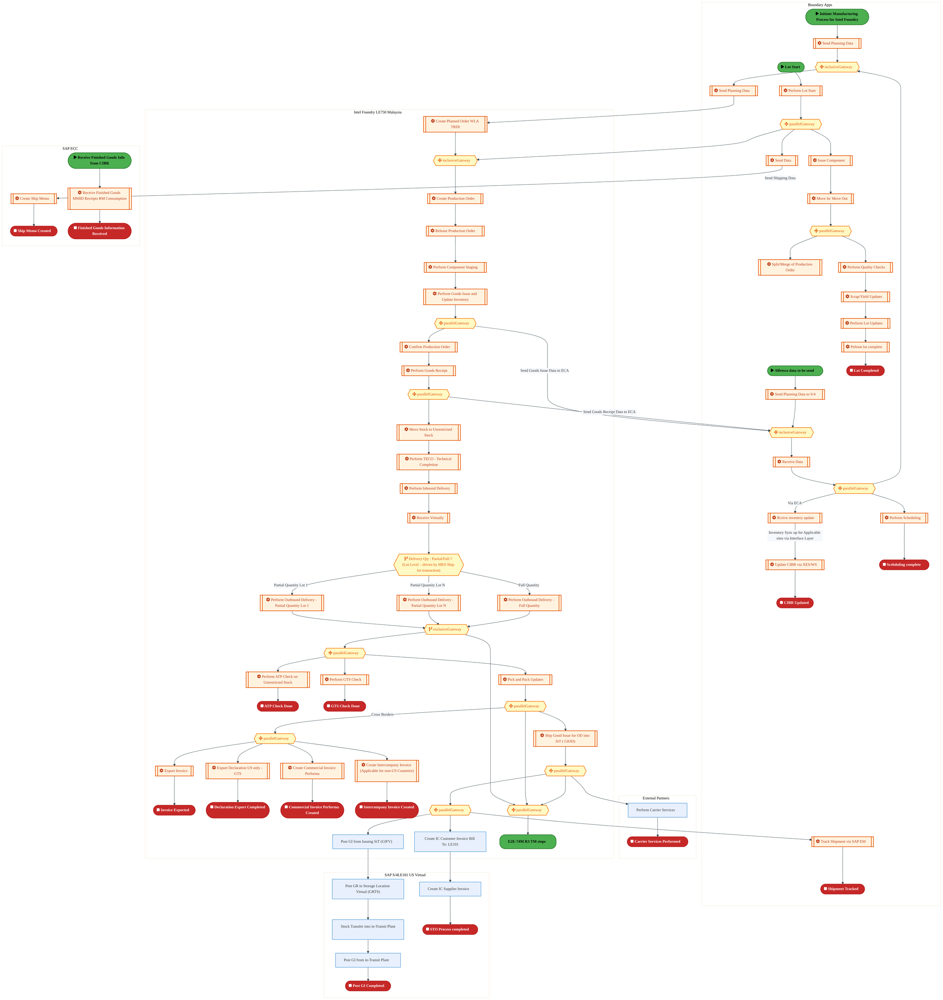

<div style="text-align:center; margin:4px 0 8px 0; font-size:11px;"><a href="https://mermaid.live/edit#pako:eNqlWltv2zgW_iuEiyItYCMSSV3sh104vgQG4kkmdtsZTOZBkalYiCwZkpzEm-a_76FEyhZNtjNpHor66Fw_nhtlv3bCbMU6g87Hj69xGpcD9HpWrtmGnQ3Q2X1QsLMuqglfgzwO7hNWnHGeKEvLRfy_is2m2xfOxmnTYBMne05dsIeMoS-zLhqCYNJFRZAWvYLlcXTWPdvm8SbI96MsyXLO_YH5kRVV1sSjiyxfsfzAYFmeHTogmsQpO5CJRz065XIFC7N01VIaOZEfhWdv3Lkkew7XQV5W7u8KNg9evsWrcg2foyApGPCsy01yFdyzhMdY5jtOC3f5kwQjLridFABbbIMwTh-ATi0g5UH6eCA51tsbevv48S5tjKLl-C5F8BcmQVGMWYSKEsiTpxJFcZIMPtDRcOpY3aLMs0c2-IAn3pjgbsgjGUDoVpeD23tm8cO6HNxnyUqw9p55DAO8fenmLwNsdfM9_KvYYunqYGnkYh_7jaULzx7ZI2kpiqJfsgS45sugeBS2JmSKp-PGlu24zsg61SfDHFNvaKs4sfwpDtmR0ul0SiYHqCauY1tmpRdT4lojRelDULLnYH9Q2B_RRuHU8aa2Z1RY21O93N3f5FkoFZKJM3Uahd6FPR1io0I6tKkvPAQ9D3mwXaOLbFflMhput0X9jP-l_l9_3XWiYBAFvTB7QMs8CB_RYh1vNywt0VMcoMXwBk3md52__z4S67fFFtskLs_nLH9gKIsQuL7ahWWcpeiaF50ibFtt6duQxU8MxekT2MzBx912BYCqUnZb6kvFhEazi9vKzz8mi_NvC1UIK45C6qJxUAYqH9Hw3SRBmkIJagXozwRQmaHFOVXlnLbcDcujLN-gRbhmqx20ogdVwFXAYjVaOp-8fxuEcvqzotgBotlmm6VwFCq3cujzDNyYpef1f653Kj-29KH-vgsgW_ZotGbhY6EKKae8CCF9z_-MWbISJ34igfVmrrLSJEFUiSjPNigBgRBiT9hJ7mFqtrHgjVfhp_1PDf82gcYwg1EY83SdB-kuCsJyl_Mz4TXOigKBMmApWYKmvE7zPej7fKTPsRR9wyTKWRFmaCUy7Z5BZ0tXqpytyB073GIkB8aizLaHFlB1BHaimCr8VRnWcJ_wOqrukK3rXD_GuyXiKiLc75HgVfV79uurZA7yPHsuekFSom2QB0nCksu6N9913t6OhfB7hMg7hHy9pTgNk10BlWyQIv9Sih9-u-VPXkqWp0GCbuC8U5Yft30P4JVJPAL9McuhXVSTkVfLEaernp7KLovh-FxOnWllN7qaeI4FtQApWUDrPm4yYGyUM14qsxEa7cDkhvHieMrAGLqAeYiW2QA02Jbd9hTzmLKiRJczVBU0b2c8yRbxEn26nE2_flYElF4s7FYdk63q0YW-XQ3R8nY8UzuCq-8Iw-VN3dgQDL8vKRRpmcchJC2UXRY-qlo8vZbL5aLWovIrDfsmBkMB7_J8bBu6nTqrobLRZZatRLvnved6DJnF5xVHCvC7Hn9WtBBLj9WPJz2x1eGVMLgD_FTM0NKbycR72MPprCTEACdEW4hwOVpidZhVC0dWdduWGqXbj7I0ikHNz7x2fmS9mttbdVAQVzNTq0zhTf2n-UMM-bOcjK5RDy1ZuE7jEFqA6J3guqrB12uYpfe8VtGYJdBtTiHq67eSr3FewnhPVH6qpM_kZZvBLUaUtcpsa5nHDNbjPKjw_7KA-kr2ECOUiiqOtakKEEAnCeHq2HQTEay6FlGiVcBbWM4HVpDuGxWfYJ9OAGK4yFaVlGZpD5wbAXhwcKxQ64gaNglYn9qAQ2i8b3N3YWFKS74x8SloqwqdX1T4m6rQ_ecKp7vkoE3R43jK4Di0xjEUsTrxfYVbAlwf_ulS0Vf4m5ap0-5aCvdxLon0Mq0Xrq0OQHMiiVQ5UYFPgtOkkkHWB9EJnvQ8Oke3BC3ncNVnW3VK9w_rAn8B07uHVwjh-nBWv8NpD2QCnFfn9l_0iZ__FXuCyXy3w5ZN0CoH9hTd79F8sqhHBV-LS9BWBFXr-6zuRJbeMnv54X7j0ffsX857hNz3CHnvEfLfI9R_z05pvUfoPXuyT395D61eIIxGxy3G00-PKbwxLOAeLEbmfD4by7kJA3TOB3Gx22w1Y4z62pZdJfCcbTK1N2HlXmTwYJZGWb1L8vuNWpmu5s5UWTOVstoRNdagiVRNSTj0w52aAwtvGKpVmE9EMXyP12nSWqcXOz6sDut0u4fQZn--rd5dwGYUwPucqyysXZLqP13eLhfKKu2AbL22LHmriMBGtVDGaa8ixGW1VpdK11I39p-wn1xSl9fNFTo0tW_1pioNavp9AzHcKVGv9x_-ukYSrJrgUUmgNQG7KsFTCb4gYF_oaJQ6gqMvCV5NoJZKsFUCVglEEIjwlEgRImIhUoRgQWhEiHBMxkJcwSFjIcIKkbEQEQuRrtuCYDeEvlAqzWLhGG5iEX5gSyFIFVi44Ug3sHDDaYwIDk_q9IUKW4aCpREZrFDhykOgwnFXSlDJIa0KBkdqoCIQR4JBBcKuDIQKo650iwqEXdw6-u-8OjPI3vrLCRjq3_mJSteFWtwcnMgoIn3HQq0jfbeFiCPT1BYcfuO80OE1vjoKwZOHL3VQV-HAQsSXHESctSvPxZeeShG3L-I1LbXfuWv_iPm3mlliYGPBXL3u5D14e3jdyRnlKdmWYGzufWixT0N421xt7keLPPQfeK_BXypXixq8r4M2GOz5je87x1h1U1mDudGmkgQwEn5ZixJacVzio8C1yV1R2tKeeEpbTQrsfwVPJ6Nh7V1zruJMbGnLEWlrN7khrPu4dfISyuNbs3yhLa00Ir4I0PaUztkknC3KCZ-0UnkwnqxAX-mLBw4RC1Y-28pnye9LE00nkQyWynEiIj_Lk2pOUia93eJooyW2FTNettDiNEcui1yeCpYF2jQsCbGvEJryazikFUdmjnf0vRJvZEfffrWe9I1PoGqMj2zzI2x-RMyPqPmRY37kmh955kdmMGwzGtiMBjajgc1oYDMa2IwGNqOBzWhgMxrYjAY2o0HMaBAzGsSMBjGjQcxoEDMaxIwGMaNBzGgQMxrUjAY1o0HNaFAzGtSMBjWjQc1oUDMa1IwGzBj5u4MWHUaNnm4b6NhAJ-K3Bm0q1VIdLdXVUj0t1ddS-zqqa2mptpaKtVRtbK42Nlcbm6uNzdXG5vp6hGGHET9eaJFhRmvJtp6M9WSiJ1M92dGTXT3Z05N9PVkfpa-P0tdH6euj9PVR-k2UnW4H3hdugnjVGbx2qt8-we-jViwKdknZeet2gl2Z8U20M6h-I9Spf_4wjgO45m9q4tv_AVuVaVc=" title="Edit in Mermaid Live">&#9998; Edit in Mermaid Live</a></div>

<div class="page-footer"><span>Page 13</span><span><a href="#toc">↑ Back to TOC</a></span><span>E2E-74 — R3 Internal manufacturing process for Finished Goods in Intel Foundry with Planning integrati</span></div>
<div style="page-break-before: always;"></div>

#### BUSINESS ARCHITECTURE — 3.2.8 E2E-74H_R3_TRDI_Inventory_Ownership_Transfer_To_IP — E2E-74H_R3_TRDI_Inventory_Ownership_Transfer_To_IP

**Swim Lanes**: CFIN · SAP S/4 Intel Foundry  · SAP S/4 Intel Product | **Tasks**: 10 | **Gateways**: 3

> **Legend**: <span style="color:#000;background:#4CAF50;padding:2px 6px;border-radius:10px;font-weight:bold;font-size:9pt">● Start</span> · <span style="color:#fff;background:#C62828;padding:2px 6px;border-radius:10px;font-weight:bold;font-size:9pt">● End</span> · <span style="background:#E3F2FD;padding:2px 6px;border:1px solid #1565C0;font-size:9pt">User Task</span> · <span style="background:#FFF3E0;padding:2px 6px;border:1px solid #E65100;font-size:9pt">Service Task</span> · <span style="background:#FFF9C4;padding:2px 6px;border:1px solid #F57F17;font-size:9pt">◇ Gateway</span> · <span style="background:#F3E5F5;padding:2px 6px;border:1px solid #7B1FA2;font-size:9pt">Sub-Process</span>

```mermaid
%%{init: {'theme': 'base', 'themeVariables': {'fontSize': '14px', 'fontFamily': 'Segoe UI, Arial, sans-serif','primaryColor': '#e8f0fe', 'primaryBorderColor': '#0071c5','lineColor': '#37474F', 'secondaryColor': '#f5f8fc'}, 'flowchart': {'useMaxWidth': false, 'htmlLabels': true, 'curve': 'basis', 'nodeSpacing': 40, 'rankSpacing': 50}} }%%
flowchart LR
    classDef startEvt fill:#4CAF50,stroke:#2E7D32,color:#000,font-weight:bold,stroke-width:2px,rx:20,ry:20
    classDef endEvt fill:#C62828,stroke:#B71C1C,color:#fff,font-weight:bold,stroke-width:2px,rx:20,ry:20
    classDef userTask fill:#E3F2FD,stroke:#1565C0,stroke-width:2px,color:#0D47A1
    classDef serviceTask fill:#FFF3E0,stroke:#E65100,stroke-width:2px,color:#BF360C
    classDef gateway fill:#FFF9C4,stroke:#F57F17,stroke-width:2px,color:#E65100
    classDef subProc fill:#F3E5F5,stroke:#7B1FA2,stroke-width:2px,color:#4A148C
    subgraph CFIN
        n1[["fa:fa-cog Perform task payment Receipt"]]
        n2[["fa:fa-cog Perform task Cash Application"]]
        n11(["fa:fa-play Payment process"])
        n14(["fa:fa-stop Payments Received"])
    end
    subgraph SAP S/4 Intel Foundry 
        n9[["fa:fa-cog Calculate Taxes"]]
        n10[["fa:fa-cog Create Customer Invoice"]]
        n13(["fa:fa-play Invoice w.r.t GI for OF into SiT"])
        n18{{"fa:fa-code-branch exclusiveGateway"}}
    end
    subgraph SAP S/4 Intel Product
        n3[["fa:fa-cog Receive Goods"]]
        n4[["fa:fa-cog Perform Production Order Confirmation"]]
        n5[["fa:fa-cog Move To Unrestricted Stock"]]
        n6[["fa:fa-cog Perform TECO"]]
        n7[["fa:fa-cog Perform Goods Receipt against Text PO"]]
        n8[["fa:fa-cog Create Vendor Invoice (wrt Text PO)"]]
        n12(["fa:fa-play Order Confirmation"])
        n15(["fa:fa-stop Vendor invoice created"])
        n16{{"fa:fa-code-branch exclusiveGateway"}}
        n17{{"fa:fa-code-branch exclusiveGateway"}}
    end
    n5 --> n6
    n4 --> n16
    n3 --> n5
    n6 --> n7
    n1 --> n2
    n18 --> n9
    n9 --> n18
    n2 --> n14
    n16 --> n3
    n10 --> n18
    n12 --> n4
    n7 --> n17
    n17 --> n8
    n18 --> n17
    n8 --> n15
    n11 --> n1
    n13 --> n10
    class n1 serviceTask
    class n2 serviceTask
    class n3 serviceTask
    class n4 serviceTask
    class n5 serviceTask
    class n6 serviceTask
    class n7 serviceTask
    class n8 serviceTask
    class n9 serviceTask
    class n10 serviceTask
    class n11 startEvt
    class n12 startEvt
    class n13 startEvt
    class n14 endEvt
    class n15 endEvt
    class n16 gateway
    class n17 gateway
    class n18 gateway
```

<div style="text-align:center; margin:4px 0 8px 0; font-size:11px;"><a href="https://mermaid.live/edit#pako:eNqlVtuO4jgQ_RUrrRYzUpjNlaTzsBKdJq2WZrbRwMw-TM-DcRywOtiR7XBZxL-vQ5wAWbLaCw9IdarqnKpyyfHBQCzFRmTc3x8IJTICh4Fc4TUeRGCwgAIPTFAD3yEncJFjMahiMkbljPxxCrO9YleFVVgC1yTfV-gMLxkG315MMFaJuQkEpGIoMCfZwBwUnKwh38csZ7yKvsNhZmUnNe16ZDzF_BxgWYGNfJWaE4rPsBt4gZdUeQIjRtMr0szPwgwNjlVxOduiFeTyVH4p8Be4-52kcqXsDOYCq5iVXOef4QLnVY-SlxWGSr5phkFEpUPVwGYFRIQuFe5ZCuKQvp8h3zoewfH-_o22ouDz1zcK1A_lUIgnnAEhFTzZSJCRPI_uvHic-JYpJGfvOLpzJsGT65io6iRSrVtmNdzhFpPlSkYLlqc6dLiteoicYmfyXeRYJt-r_44WpulZKR45oRO2So-BHdtxo5Rl2f9SUnPlcyjetdbETZzkqdWy_ZEfW3_la9p88oKx3Z0T5huC8AVpkiTu5Dyqyci3rX7Sx8QdWXGHdAkl3sL9mfAh9lrCxA8SO-glrPW6VZaLKWeoIXQnfuK3hMGjnYydXkJvbHuhrlDxLDksViBOXn6roepH7R8_3owMRhkcIrYEU8wzxtdAVlMp4H6NqQRfMcKkkG_Gz58Xmc7fZMZQrMC4KHKCoCSMdlJt-0ObW-RqXFOtVKhWsRAq_ONluHcOF5IVTbioK9vg9JygNrLT8Gw8BbNfPPBCJc5Bwkqa8j24oH-4biSGOSpzdY5gDndYdEu3OtEcV6FxqQpbY65UNkxtVTfL7TSsw8D2E_8kwfMLULMDrwkgVDIwI_PuBMLD4aya4uFCXQxoBfAO5aVQE3iu9-7NOB7_2RzUUqUlkhca7nVjerTgmbG0OwTv9tFrTnXe4LW6YkHMaEb4-tYK-NcUX5iSmjPwjXKs1pkgiVMwkwy9d_JGt6Xnk_i1Exncjjz106w0gEtIqJBgjncSTLsU4c2z_q5my9qTBh-2vM3_2D13p3PuN-dyddJ-Z9e1GtFq6FRD2s0a_dv9qNOC_7xW1AfD4a_qPLTp1abd2G5t-9oc1WagTbs2ncYMa_tB2w-aLNS2o22vidd0bmNbnQRbZzQJgfa3-hoIOwW0AY3d1G_riu3G1v3Zl_d11dfFV-XK4_R63F6P1-vxez2jXk_Q6wl7PQ-9HjXyXpfdvkGucacHd3twT78vrlH_JjpqPr3XcHAbDhvYMA11a68hSY3oYJyeo-rJmuIMlrk0jqYBS8lme4qM6PRsM8oiVZlPBKpLdV2Dxz8BgE1phg==" title="Edit in Mermaid Live">&#9998; Edit in Mermaid Live</a></div>

<div class="page-footer"><span>Page 14</span><span><a href="#toc">↑ Back to TOC</a></span><span>E2E-74 — R3 Internal manufacturing process for Finished Goods in Intel Foundry with Planning integrati</span></div>
<div style="page-break-before: always;"></div>

#### BUSINESS ARCHITECTURE — 3.2.9 E2E-74I_R3_Bailment_Process_to_LE750 — E2E-74I_R3_Bailment_Process_to_LE750

**Swim Lanes**: Boundary Apps · Intel Products · SAP S/4
Intel Foundry (LE870) – Malaysia WLA Site
 | **Tasks**: 11 | **Gateways**: 5

> **Legend**: <span style="color:#000;background:#4CAF50;padding:2px 6px;border-radius:10px;font-weight:bold;font-size:9pt">● Start</span> · <span style="color:#fff;background:#C62828;padding:2px 6px;border-radius:10px;font-weight:bold;font-size:9pt">● End</span> · <span style="background:#E3F2FD;padding:2px 6px;border:1px solid #1565C0;font-size:9pt">User Task</span> · <span style="background:#FFF3E0;padding:2px 6px;border:1px solid #E65100;font-size:9pt">Service Task</span> · <span style="background:#FFF9C4;padding:2px 6px;border:1px solid #F57F17;font-size:9pt">◇ Gateway</span> · <span style="background:#F3E5F5;padding:2px 6px;border:1px solid #7B1FA2;font-size:9pt">Sub-Process</span>

```mermaid
%%{init: {'theme': 'base', 'themeVariables': {'fontSize': '14px', 'fontFamily': 'Segoe UI, Arial, sans-serif','primaryColor': '#e8f0fe', 'primaryBorderColor': '#0071c5','lineColor': '#37474F', 'secondaryColor': '#f5f8fc'}, 'flowchart': {'useMaxWidth': false, 'htmlLabels': true, 'curve': 'basis', 'nodeSpacing': 40, 'rankSpacing': 50}} }%%
flowchart LR
    classDef startEvt fill:#4CAF50,stroke:#2E7D32,color:#000,font-weight:bold,stroke-width:2px,rx:20,ry:20
    classDef endEvt fill:#C62828,stroke:#B71C1C,color:#fff,font-weight:bold,stroke-width:2px,rx:20,ry:20
    classDef userTask fill:#E3F2FD,stroke:#1565C0,stroke-width:2px,color:#0D47A1
    classDef serviceTask fill:#FFF3E0,stroke:#E65100,stroke-width:2px,color:#BF360C
    classDef gateway fill:#FFF9C4,stroke:#F57F17,stroke-width:2px,color:#E65100
    classDef subProc fill:#F3E5F5,stroke:#7B1FA2,stroke-width:2px,color:#4A148C
    subgraph Boundary Apps
        n3[["fa:fa-cog Send information Lot Notification to Customer once lot is received"]]
        n4[["fa:fa-cog Receive Bailed Material Pricing Info (Clubbed with ASN)"]]
        n15["Channel: Automatic (Manual if no ASN)"]
    end
    subgraph Intel Products
        n2[["fa:fa-cog Issue Bailed Material (Die bank)"]]
        n12(["fa:fa-play Bailment Process to LE870 initiated"])
        n16{{"fa:fa-code-branch exclusiveGateway"}}
        n17{{"fa:fa-arrows-alt parallelGateway"}}
    end
    subgraph SAP S/4 Intel Foundry (LE870) – Malaysia WLA Site 
        n1["fa:fa-user Create Goods Receipt (Physical)"]
        n5[["fa:fa-cog Capture Bailed Material Pricing Info (clubbed with ASN)"]]
        n6[["fa:fa-cog Create Purchase Order (Preceding Document)"]]
        n7[["fa:fa-cog Perform Inbound Delivery"]]
        n8[["fa:fa-cog Update Inventory (In-Transit)"]]
        n9[["fa:fa-cog Perform Inbound Delivery in EWM"]]
        n10[["fa:fa-cog Put Away GR in EWM"]]
        n11[["fa:fa-cog Perform GTS Check"]]
        n13(["fa:fa-stop GTS Check Completed"])
        n14(["fa:fa-stop Bailment Process Completed"])
        n18{{"fa:fa-arrows-alt parallelGateway"}}
        n19{{"fa:fa-arrows-alt parallelGateway"}}
        n20{{"fa:fa-arrows-alt parallelGateway"}}
    end
    n12 --> n16
    n6 --> n20
    n7 --> n18
    n18 --> n8
    n18 --> n9
    n8 --> n1
    n9 --> n10
    n1 --> n19
    n10 --> n19
    n20 --> n7
    n20 --> n11
    n11 --> n13
    n15 --> n6
    n16 --> n2
    n2 --> n17
    n17 --> n15
    n5 --> n14
    n4 --> n5
    n19 --> n3
    n17 --> n4
    n3 --> n16
    class n1 userTask
    class n2 serviceTask
    class n3 serviceTask
    class n4 serviceTask
    class n5 serviceTask
    class n6 serviceTask
    class n7 serviceTask
    class n8 serviceTask
    class n9 serviceTask
    class n10 serviceTask
    class n11 serviceTask
    class n12 startEvt
    class n13 endEvt
    class n14 endEvt
    class n15 startEvt
    class n16 gateway
    class n17 gateway
    class n18 gateway
    class n19 gateway
    class n20 gateway
```

<div style="text-align:center; margin:4px 0 8px 0; font-size:11px;"><a href="https://mermaid.live/edit#pako:eNqlV1tv4jgU_itWRhVUAm2uBPKwEgRSVWpnq9LZPgzzYBwHrBo7sp3STsV_X5skXEKj2Z3tQyV_53zfufjYDh8W4im2Iuvq6oMwoiLw0VFrvMGdCHSWUOJOD5TA31AQuKRYdoxPxpmak597N8fP34ybwRK4IfTdoHO84hh8u-2BsSbSHpCQyb7EgmSdXicXZAPFe8wpF8b7Cx5mdraPVpkmXKRYHB1sO3RQoKmUMHyEvdAP_cTwJEacpWeiWZANM9TZmeQo36I1FGqffiHxPXx7Jqla63UGqcTaZ6029A4uMTU1KlEYDBXitW4GkSYO0w2b5xARttK4b2tIQPZyhAJ7twO7q6sFOwQFd48LBvQfolDKKc6AVBqevSqQEUqjL348TgK7J5XgLzj64s7Cqef2kKkk0qXbPdPc_haT1VpFS07TyrW_NTVEbv7WE2-Ra_fEu_7fiIVZeowUD9yhOzxEmoRO7MR1pCzL_lck3VfxBOVLFWvmJW4yPcRygkEQ25d6dZlTPxw7zT5h8UoQPhFNksSbHVs1GwSO3S46SbyBHTdEV1DhLXw_Co5i_yCYBGHihK2CZbxmlsXyQXBUC3qzIAkOguHEScZuq6A_dvxhlaHWWQmYr8GEF_tZBuM8l6XN_DHv-_eFlcEog33EV2CutxYQlnGxgYpwBu64Al-5IhlBJaA4iAup-AYLwBnCgGoPIoHACJNXnC6sHz9O9P1z_cfSC0wgoTgF97pv5jCDB0HMsINbHRp0Y1osl9q8JWoNxvOv1w1RJ9Ci8RoyhmkExoXORieHQPceskKrkQwwXhNLnq6r0ZFbprAJzNMCqdOWuOcp30pZXCbcnRIMlvqYXuTmdg_0nOqZMMwNZsqEQlhK08G72TC0gbkfiRY0Pbs-lRh8fBwzSHF_qe8DtAb4DdFC6vbdlOO2sHa7U1p4pEEh-Fb2IVUghwJSiukF6bIl8_EDmP_hV61JzMjoienus70Gi8K1HU-3QFclCQTPd2MwJwqD0xwOtZuTC2KBdVRww3kqy73PFeg-rDUfQXrcnT03OO97DHNViF-NCvrFqAwaomVCD4XQ16jE4C_zJuiMzPSmRnXKUWF2q6kTnus8YGHOiE5iaboEppjqfRHvDdbwnPUtT030W_aqI3DT2lvWf9KbK8lFwNG_C6iHCMye75tDaDfYhQJjc0HdPLYQnM_D3TzNQbzG6KXp7x2nXF8G-dERxHyTU_zJVPsNysXBaGUO_9tgl6TRb5Bc-zePkD72oN__05zdChiU6_pFY2FlH9aEYQk016NqXS2r54uNqmUt51Tr2t2xG4BbAWFj7dSKTi3h1UBQAnUFTl1CrVD514pOXVJQARXf8au1X65rs1PV4DX4tbt33sH9W2gKrb8BzmD39CE_s3itFr_VErRaBq2WsNUybLWMWi16_1pNTrvJPXz3neNe9Y12jvqfokGLxqD-rDmHw8_h4efw6FNYD2MFWz1Lf0lsIEmt6MPa_zDQPx5SnMGCKmvXs6B-3efvDFnR_gPaKvZ36JRA_WRtSnD3D23y498=" title="Edit in Mermaid Live">&#9998; Edit in Mermaid Live</a></div>

<div class="page-footer"><span>Page 15</span><span><a href="#toc">↑ Back to TOC</a></span><span>E2E-74 — R3 Internal manufacturing process for Finished Goods in Intel Foundry with Planning integrati</span></div>
<div style="page-break-before: always;"></div>

#### BUSINESS ARCHITECTURE — 3.2.10 E2E-74J_R3_FG_Purchase_Order_To_IF — E2E-74J_R3_FG_Purchase_Order_To_IF

**Swim Lanes**: Boundary Apps IF  · Boundary Apps IP · Intel Foundry LE750 Malaysia Site  · SAP S/4 Intel Foundry  · SAP S/4 Intel Foundry LE101 US Virtual  · SAP S/4 Intel Product | **Tasks**: 35 | **Gateways**: 22

> **Legend**: <span style="color:#000;background:#4CAF50;padding:2px 6px;border-radius:10px;font-weight:bold;font-size:9pt">● Start</span> · <span style="color:#fff;background:#C62828;padding:2px 6px;border-radius:10px;font-weight:bold;font-size:9pt">● End</span> · <span style="background:#E3F2FD;padding:2px 6px;border:1px solid #1565C0;font-size:9pt">User Task</span> · <span style="background:#FFF3E0;padding:2px 6px;border:1px solid #E65100;font-size:9pt">Service Task</span> · <span style="background:#FFF9C4;padding:2px 6px;border:1px solid #F57F17;font-size:9pt">◇ Gateway</span> · <span style="background:#F3E5F5;padding:2px 6px;border:1px solid #7B1FA2;font-size:9pt">Sub-Process</span>

```mermaid
%%{init: {'theme': 'base', 'themeVariables': {'fontSize': '14px', 'fontFamily': 'Segoe UI, Arial, sans-serif','primaryColor': '#e8f0fe', 'primaryBorderColor': '#0071c5','lineColor': '#37474F', 'secondaryColor': '#f5f8fc'}, 'flowchart': {'useMaxWidth': false, 'htmlLabels': true, 'curve': 'basis', 'nodeSpacing': 40, 'rankSpacing': 50}} }%%
flowchart LR
    classDef startEvt fill:#4CAF50,stroke:#2E7D32,color:#000,font-weight:bold,stroke-width:2px,rx:20,ry:20
    classDef endEvt fill:#C62828,stroke:#B71C1C,color:#fff,font-weight:bold,stroke-width:2px,rx:20,ry:20
    classDef userTask fill:#E3F2FD,stroke:#1565C0,stroke-width:2px,color:#0D47A1
    classDef serviceTask fill:#FFF3E0,stroke:#E65100,stroke-width:2px,color:#BF360C
    classDef gateway fill:#FFF9C4,stroke:#F57F17,stroke-width:2px,color:#E65100
    classDef subProc fill:#F3E5F5,stroke:#7B1FA2,stroke-width:2px,color:#4A148C
    subgraph Boundary Apps IF 
        n1["Receive Scheduling Data"]
        n16[["fa:fa-cog Store Build Instructions"]]
        n17[["fa:fa-cog Map Build Instructions to Sales Order Line in ECA"]]
        n18[["fa:fa-cog Order Planning in BY-OP"]]
        n19[["fa:fa-cog Receive Confirmed Sales Order Data"]]
        n20[["fa:fa-cog Feed Confirmed Sales Order to Planning Via ECA"]]
        n21[["fa:fa-cog Perform Scheduling FSCO (3rd Party )"]]
        n40(["fa:fa-stop Scheduling Data Received"])
        n52{{"fa:fa-arrows-alt parallelGateway"}}
        n53{{"fa:fa-arrows-alt parallelGateway"}}
        n62{{"fa:fa-arrows-alt inclusiveGateway"}}
    end
    subgraph Boundary Apps IP
        n9[["fa:fa-cog Receive Customer Forecast Data for Supply Planning"]]
        n10[["fa:fa-cog Send/Receive Data"]]
        n11[["fa:fa-cog Receive Updates via PDH"]]
        n36(["fa:fa-play Receive Customer Forecast Data"])
        n60{{"fa:fa-arrows-alt inclusiveGateway"}}
    end
    subgraph Intel Foundry LE750 Malaysia Site 
        n6[["fa:fa-cog Create Sales Order (AT FG)"]]
        n7[["fa:fa-cog Perform Repetitive Steps until Order Confirmation"]]
        n8[["fa:fa-cog Create Planned Order for AT FG"]]
        n38(["fa:fa-stop Order Confirmed"])
        n41["E2E-74J Manufacturing Process for ATFG at LE750"]
    end
    subgraph SAP S/4 Intel Foundry 
        n2["Calculate Taxes"]
        n3["Hold Process"]
        n4["Confirmed Sales Order"]
        n5["fa:fa-user Override Manual Price"]
        n22[["fa:fa-cog Receive Build Instructions (ABR Table)"]]
        n23[["fa:fa-cog Create Sales Order AT FG"]]
        n24[["fa:fa-cog Perform Order Validation"]]
        n25[["fa:fa-cog Derive MM ID from CPN"]]
        n26[["fa:fa-cog Perform Credit Check via FSCM"]]
        n27[["fa:fa-cog Trigger GTS Check"]]
        n28[["fa:fa-cog Perform GTS Trade Compliance"]]
        n29[["fa:fa-cog Update Line-Item Text"]]
        n30[["fa:fa-cog Calculate Pricing"]]
        n31[["fa:fa-cog Receive Updates on CTP Check"]]
        n32[["fa:fa-cog Receive Order Confirmation"]]
        n33[["fa:fa-cog Manage Back Orders"]]
        n37(["fa:fa-play Line Item Text Update Process Initiated"])
        n42{{"fa:fa-code-branch GTS Compliance Check ?"}}
        n43{{"fa:fa-code-branch exclusiveGateway"}}
        n44{{"fa:fa-code-branch Credit Check Passed?"}}
        n45{{"fa:fa-code-branch exclusiveGateway"}}
        n46{{"fa:fa-code-branch Check Confirmation Status ?"}}
        n47{{"fa:fa-code-branch Partially Confirmed/ Unconfirmed ?"}}
        n48{{"fa:fa-code-branch Check Partial Commit Allowed by Customer ?"}}
        n49{{"fa:fa-code-branch exclusiveGateway"}}
        n50{{"fa:fa-code-branch exclusiveGateway"}}
        n54{{"fa:fa-arrows-alt parallelGateway"}}
        n55{{"fa:fa-arrows-alt parallelGateway"}}
        n56{{"fa:fa-arrows-alt parallelGateway"}}
        n57{{"fa:fa-arrows-alt parallelGateway"}}
        n58{{"fa:fa-arrows-alt parallelGateway"}}
        n59{{"fa:fa-arrows-alt parallelGateway"}}
        n63{{"fa:fa-arrows-alt inclusiveGateway"}}
    end
    subgraph SAP S/4 Intel Foundry LE101 US Virtual 
        n34[["fa:fa-cog Create Purchase Requisition for AT FG"]]
        n35[["fa:fa-cog Create Purchase Order for AT FG"]]
    end
    subgraph SAP S/4 Intel Product
        n12[["fa:fa-cog Create Production Order AT FG"]]
        n13[["fa:fa-cog Create Planned Order"]]
        n14[["fa:fa-cog Create Text PR"]]
        n15[["fa:fa-cog Create Text PO"]]
        n39(["fa:fa-stop Text PO creeated"])
        n51{{"fa:fa-arrows-alt parallelGateway"}}
        n61{{"fa:fa-arrows-alt inclusiveGateway"}}
    end
    n36 --> n9
    n12 --> n51
    n51 --> n16
    n51 --> n22
    n22 --> n55
    n23 --> n54
    n55 --> n23
    n54 --> n56
    n24 --> n25
    n26 --> n44
    n27 --> n42
    n42 -->|"Yes"| n28
    n56 --> n24
    n29 --> n5
    n43 --> n30
    n5 --> n43
    n2 --> n43
    n31 --> n57
    n63 --> n31
    n32 --> n58
    n58 --> n61
    n28 --> n43
    n37 --> n29
    n25 --> n26
    n61 --> n12
    n13 --> n61
    n54 --> n61
    n59 --> n2
    n51 --> n14
    n14 --> n15
    n30 --> n59
    n44 -->|"Yes"| n27
    n3 --> n56
    n45 --> n3
    n44 -->|"No"| n45
    n42 -->|"No"| n45
    n50 --> n33
    n57 --> n46
    n46 -->|"Confirmed"| n49
    n33 --> n63
    n46 -->|"Not Confirmed"| n47
    n47 -->|"Unconfirmed"| n50
    n47 -->|"Partially Confirmed"| n48
    n48 -->|"Yes"| n49
    n48 -->|"No"| n50
    n49 --> n32
    n18 --> n63
    n17 --> n62
    n62 --> n18
    n19 --> n20
    n52 --> n21
    n6 --> n7
    n7 --> n38
    n52 --> n34
    n21 --> n1
    n1 --> n40
    n8 --> n41
    n58 --> n4
    n4 --> n19
    n35 --> n6
    n34 --> n35
    n9 --> n60
    n10 --> n60
    n60 --> n11
    n11 --> n13
    n52 --> n8
    n20 --> n52
    n15 --> n39
    n57 --> n62
    n16 --> n53
    n53 --> n17
    n53 --> n10
    n59 --> n63
    class n5 userTask
    class n6 serviceTask
    class n7 serviceTask
    class n8 serviceTask
    class n9 serviceTask
    class n10 serviceTask
    class n11 serviceTask
    class n12 serviceTask
    class n13 serviceTask
    class n14 serviceTask
    class n15 serviceTask
    class n16 serviceTask
    class n17 serviceTask
    class n18 serviceTask
    class n19 serviceTask
    class n20 serviceTask
    class n21 serviceTask
    class n22 serviceTask
    class n23 serviceTask
    class n24 serviceTask
    class n25 serviceTask
    class n26 serviceTask
    class n27 serviceTask
    class n28 serviceTask
    class n29 serviceTask
    class n30 serviceTask
    class n31 serviceTask
    class n32 serviceTask
    class n33 serviceTask
    class n34 serviceTask
    class n35 serviceTask
    class n36 startEvt
    class n37 startEvt
    class n38 endEvt
    class n39 endEvt
    class n40 endEvt
    class n41 startEvt
    class n42 gateway
    class n43 gateway
    class n44 gateway
    class n45 gateway
    class n46 gateway
    class n47 gateway
    class n48 gateway
    class n49 gateway
    class n50 gateway
    class n51 gateway
    class n52 gateway
    class n53 gateway
    class n54 gateway
    class n55 gateway
    class n56 gateway
    class n57 gateway
    class n58 gateway
    class n59 gateway
    class n60 gateway
    class n61 gateway
    class n62 gateway
    class n63 gateway
```

<div style="text-align:center; margin:4px 0 8px 0; font-size:11px;"><a href="https://mermaid.live/edit#pako:eNqlWVtv27gS_iuEiyJdwEZFUjf7YQ8cx-5mkTRGnHax2JwHRqIcobLk1SWXk-a_n5FEyhZNJoCbh6IezjeXb4ZDSnoZBFnIB5PBx48vcRqXE_RyUt7zDT-ZoJM7VvCTIWoF31kes7uEFye1TpSl5Sr-X6OG7e1TrVbLFmwTJ8-1dMXXGUffzodoCsBkiAqWFqOC53F0MjzZ5vGG5c-zLMnyWvsD9yMraryJpdMsD3m-U7AsDwcOQJM45Tsx9WzPXtS4ggdZGvaMRk7kR8HJax1ckj0G9ywvm_Crgl-yp7_isLyH3xFLCg469-UmuWB3PKlzLPOqlgVV_iDJiIvaTwqErbYsiNM1yG0LRDlLf-xEjvX6il4_frxNO6fo4vo2RfAXJKwozniEihLE84cSRXGSTD7Ys-nCsYZFmWc_-OQDmXtnlAyDOpMJpG4Na3JHjzxe35eTuywJherosc5hQrZPw_xpQqxh_gz_Kr54Gu48zVziE7_zdOrhGZ5JT1EU_ZIn4DW_YcUP4WtOF2Rx1vnCjuvMrEN7Ms0z25tilSeeP8QB3zO6WCzofEfV3HWwZTZ6uqCuNVOMrlnJH9nzzuB4ZncGF463wJ7RYOtPjbK6W-ZZIA3SubNwOoPeKV5MidGgPcW2LyIEO-ucbe_RaVY1vYym222BzheoXa__UvzP7eCaBzx-4GgV3POwgi2xRmesZLeD_-4ruv-AasQmERsF2Rqtyizn6LSKkxCdpxBPFZRxlhaA6sG8PuySbTUgVGZoxWAeoKt6o6IL2JYoTtF8NlXt-X17rf4yYWlaxw2Y079HV0sVNe6jZMazLI3ifMPDnneR_L4BYvUNLDhg9GhIpQvne8w0ORDcN7bkeZTlm33-F6vZFfpE8xAtYWs_o98UE7b1qTNRlNlWrZ3MMATcb3s4h7y8SBzL8-yxGLGkRFuWsyThyZe2l28Hr6_7IHoEyNV7itMgqQqI7AAFg-Xtvl3uWTfVswIyNlCEBTRnwIqyJQPYRatqu02eu9KoDaLUdwXRfJZWNf2AsT6Ab9sQ8irQAxR-efaHgqLurmrbBGbG23ErtXOtX2b0PC15Ak6AV6D1Yu45FuxIiKSAeFdxyfdHg7LhZzkHB71W_zS9QYsvam96-u6-5ltexmUzaEoOBa3SMk6EJbGVWD0NFHO-NoymjrDzWnhd4CYWlXBf2SY9bwe7w66n4ZzMR579J_CSVhELyiqvN1U9kXlRCE-LL4iVLX_dlDxkezVdotVnW2F9fxCAuxlLgiqpU7phT7zoD10KCn_AsSnd91ftGq6bQX01p6OgPlHR1QPP8zjkTYIsAdNwJPYRhOi7WzO4P01PryFyuMupbUDou_2jKxmx9e3TIr6zJA51XUKcPuwM7oYQ8eUlOj9DUZ5t0Gz5VcW4elcQaRiXaHbPgx_NToZpfKlilS6_yeP1GgL8crNqgaq-r_dV69_kLKzPos02iVnaFKMHVYZdO2OaM3J0XvINuuFPpdr4yjzbdVld7sP5R9-ZZ1mKZjdLbWbU0CzvbmxK1atBytbQZAxYb8DqXYJ6yvhsrgkdBZIYuVXP4REkBsHBLt87meoHltEdXLmD-7Z0XRFE-f-jHGs21YP5k2kKtzBbD-u12hIugDw88Ogc59E1eGxc7ZcFxjErq-IwVU9vob6RwEMYHKbd8PmMvqVBN4kODPlvhSLM1dRvgIppAs85YOTueXcqHhgcH0WJYx0Hs4-5MznHgNxjQN4xIP8Y0PiYeyD95VuL_hy9mGMLo28ruGTnZX2Q7U8KW39pqHJ4gi44zKh_q7iIm-433h2ct20Ybx7vJQDzKYTjc_82SfSuWsU6SPN5ien79yMVomenmaHLa1XZeUP5SuVsrNy3hBoKcs41o9jBx3QUPraj4AKORqPf4fFB_Mak_e2INwXwn1aAXUVAiBAQCXGkgAqBLSGOgFApsIWGNEqEgHQ2RFy2tEE8IZBu7cbtz9vB3_Ud8Wd9oZDWBZZ02LFwJ6EiQGpJhLAt4yPKbypydjwhcKUFSROVJHRB-K3AlRrEV42KjIjknkiaJCuu5F7mjKliVBK5E4hUiVo-yQUWCCzJoJaIXIZh2yqxMmuqVM0WAVMV-TVrgLaj1kpdcIRz2nWGLHPnwxXQvUeU2oKMlkpKqAr4mpVIAclEbE_o7B3SjYZjqRqas721JQtt-wpdXWjdish6Z1wUiXZ19ZUksKDBlRqu6C8s3WJZ6K6HhQaRrSB2gcxZWKS-ok-7XSJbRXoQlZAOZP9ipcMlXjZWVxnRHbKSVChQWXyRgSsdYEsRuEKAu5BkiFRJQiZFZDN3zMoWHSsN1jGLBU9OZ1N0FPZUgaVsMlmu5kVlPUXkC9qe2N1_y9pb8YwrvnFlbFwB-oxL2LxEzEvUvGSblxzzkpkKbOYCm8nAZjaImQ1iZoOY2SBmNoiZDWJmg5jZIGY2iJkNYmaDmtmgZjaomQ1qZoOa2aBmNuAiIj_a9OWeQe6LDy996VgntS2tFOstw2ElvmD0xVQvtvViRy929WJPL_b14rFWDGepVoz1Yn2Wjj5LR5-lo8_S0Wfp6LN09Fk6-ixdfZauPktXn6XbZTkYDuB5esPicDB5GTSfYuFzbcgjViXl4HU4YFWZrZ7TYDBpPlkOquaVylnM4EFm0wpf_w9u5yg9" title="Edit in Mermaid Live">&#9998; Edit in Mermaid Live</a></div>

<div class="page-footer"><span>Page 16</span><span><a href="#toc">↑ Back to TOC</a></span><span>E2E-74 — R3 Internal manufacturing process for Finished Goods in Intel Foundry with Planning integrati</span></div>
<div style="page-break-before: always;"></div>

#### BUSINESS ARCHITECTURE — 3.2.11 E2E-74K_Manufacturing_Process_for_ATFG_at_LE750 — E2E-74K_Manufacturing_Process_for_ATFG_at_LE750

**Swim Lanes**: Boundary Apps · External Partners · Intel Foundry LE750 Malaysia
 · SAP ECC · SAP S/4LE101 US Virtual  | **Tasks**: 47 | **Gateways**: 15

> **Legend**: <span style="color:#000;background:#4CAF50;padding:2px 6px;border-radius:10px;font-weight:bold;font-size:9pt">● Start</span> · <span style="color:#fff;background:#C62828;padding:2px 6px;border-radius:10px;font-weight:bold;font-size:9pt">● End</span> · <span style="background:#E3F2FD;padding:2px 6px;border:1px solid #1565C0;font-size:9pt">User Task</span> · <span style="background:#FFF3E0;padding:2px 6px;border:1px solid #E65100;font-size:9pt">Service Task</span> · <span style="background:#FFF9C4;padding:2px 6px;border:1px solid #F57F17;font-size:9pt">◇ Gateway</span> · <span style="background:#F3E5F5;padding:2px 6px;border:1px solid #7B1FA2;font-size:9pt">Sub-Process</span>

```mermaid
%%{init: {'theme': 'base', 'themeVariables': {'fontSize': '14px', 'fontFamily': 'Segoe UI, Arial, sans-serif','primaryColor': '#e8f0fe', 'primaryBorderColor': '#0071c5','lineColor': '#37474F', 'secondaryColor': '#f5f8fc'}, 'flowchart': {'useMaxWidth': false, 'htmlLabels': true, 'curve': 'basis', 'nodeSpacing': 40, 'rankSpacing': 50}} }%%
flowchart TD
    classDef startEvt fill:#4CAF50,stroke:#2E7D32,color:#000,font-weight:bold,stroke-width:2px,rx:20,ry:20
    classDef endEvt fill:#C62828,stroke:#B71C1C,color:#fff,font-weight:bold,stroke-width:2px,rx:20,ry:20
    classDef userTask fill:#E3F2FD,stroke:#1565C0,stroke-width:2px,color:#0D47A1
    classDef serviceTask fill:#FFF3E0,stroke:#E65100,stroke-width:2px,color:#BF360C
    classDef gateway fill:#FFF9C4,stroke:#F57F17,stroke-width:2px,color:#E65100
    classDef subProc fill:#F3E5F5,stroke:#7B1FA2,stroke-width:2px,color:#4A148C
    subgraph Boundary Apps
        n7[["fa:fa-cog Track Shipment via SAP EM"]]
        n8[["fa:fa-cog Split/Merge of Production Order"]]
        n9[["fa:fa-cog Rceive inventrry update"]]
        n10[["fa:fa-cog Update CIBR via XES/WS"]]
        n11[["fa:fa-cog Send Data"]]
        n12[["fa:fa-cog Send Planning Data"]]
        n13[["fa:fa-cog Send Planning Data to S/4"]]
        n14[["fa:fa-cog Perform Scheduling"]]
        n15[["fa:fa-cog Receive Data"]]
        n16[["fa:fa-cog Receive Updates via PDH"]]
        n17[["fa:fa-cog Issue Component"]]
        n18[["fa:fa-cog Move In/ Move Out"]]
        n19[["fa:fa-cog Perform Quality Checks"]]
        n20[["fa:fa-cog Scrap/Yield Updates"]]
        n21[["fa:fa-cog Perform Lot Updates"]]
        n22[["fa:fa-cog Pefrom lot complete"]]
        n23[["fa:fa-cog Perform Lot Start"]]
        n48(["fa:fa-play Initiate Manufacturing Process for Intel Foundry"])
        n49(["fa:fa-play Alfresco data to be send"])
        n50(["fa:fa-play Lot Start"])
        n52(["fa:fa-stop Shipment Tracked"])
        n53(["fa:fa-stop CIBR Updated"])
        n54(["fa:fa-stop Lot Completed"])
        n69{{"fa:fa-arrows-alt parallelGateway"}}
        n70{{"fa:fa-arrows-alt parallelGateway"}}
        n71{{"fa:fa-arrows-alt parallelGateway"}}
        n78{{"fa:fa-arrows-alt inclusiveGateway"}}
        n79{{"fa:fa-arrows-alt inclusiveGateway"}}
    end
    subgraph External Partners
        n44[["fa:fa-cog Perform Special Customs Regimes by DFC"]]
        n45[["fa:fa-cog Perform Carrier Services"]]
        n63(["fa:fa-stop Special Customs Performed"])
        n64(["fa:fa-stop Carrier Services Performed"])
        n81{{"fa:fa-arrows-alt inclusiveGateway"}}
    end
    subgraph Intel Foundry LE750 Malaysia 
        n1["Post GI from Issuing SiT (GIFV)"]
        n2["Create IC Customer Invoice Bill To: LE101"]
        n24[["fa:fa-cog Create Planned Order AT FG"]]
        n25[["fa:fa-cog Perform ATP Check on Unrestricted Stock"]]
        n26[["fa:fa-cog Perform GTS Check"]]
        n27[["fa:fa-cog Pick and Pack Updates"]]
        n28[["fa:fa-cog Ship Good Issue for OD into SiT ( GIOD)"]]
        n29[["fa:fa-cog Create Production Order"]]
        n30[["fa:fa-cog Release Production Order"]]
        n31[["fa:fa-cog Perform Component Staging"]]
        n32[["fa:fa-cog Perform Goods Issue and Update Inventory"]]
        n33[["fa:fa-cog Confirm Production Order"]]
        n34[["fa:fa-cog Perform Goods Receipt"]]
        n35[["fa:fa-cog Move Stock to Unrestricted Stock"]]
        n36[["fa:fa-cog Perform TECO - Technical Completion"]]
        n37[["fa:fa-cog Export Invoice"]]
        n38[["fa:fa-cog Export Declaration US only - GTS"]]
        n39[["fa:fa-cog Create Commercial Invoice Performa"]]
        n40[["fa:fa-cog Create Intercompany Invoice (Applicable for non-US Countries)"]]
        n41[["fa:fa-cog Perform Outbound Delivery - Partial Quantity Lot 1"]]
        n42[["fa:fa-cog Perform Outbound Delivery - Partial Quantity Lot N"]]
        n43[["fa:fa-cog Perform Outbound Delivery - Full Quantity"]]
        n55(["fa:fa-stop ATP Check Done"])
        n56(["fa:fa-stop Invoice Exported"])
        n57(["fa:fa-stop GTS Check Done"])
        n58(["fa:fa-stop Declaration Export Completed"])
        n59(["fa:fa-stop Commercial Invoice Performa Created"])
        n60(["fa:fa-stop Intercompany Invoice Created"])
        n67{{"fa:fa-code-branch Delivery Qty : Partial/Full ? (Lot Level – driven by MES Ship lot transaction)"}}
        n68{{"fa:fa-code-branch exclusiveGateway"}}
        n72{{"fa:fa-arrows-alt parallelGateway"}}
        n73{{"fa:fa-arrows-alt parallelGateway"}}
        n74{{"fa:fa-arrows-alt parallelGateway"}}
        n75{{"fa:fa-arrows-alt parallelGateway"}}
        n76{{"fa:fa-arrows-alt parallelGateway"}}
        n77{{"fa:fa-arrows-alt parallelGateway"}}
        n80{{"fa:fa-arrows-alt inclusiveGateway"}}
    end
    subgraph SAP ECC
        n46[["fa:fa-cog Receive Finished Goods MMID Receipts RM Consumption"]]
        n47[["fa:fa-cog Create Ship Memo"]]
        n51(["fa:fa-play Receive FG info from CIBR"])
        n65(["fa:fa-stop Ship Memo Created"])
        n66(["fa:fa-stop Finished Goods Information Received"])
    end
    subgraph SAP S/4LE101 US Virtual 
        n3["Create IC Supplier Invoice"]
        n4["Post GR to Storage Location Virtual (GRTS)"]
        n5["Stock Transfer into in-Transit Plant"]
        n6["Post GI from in-Transit Plant"]
        n61(["fa:fa-stop STO Process completed"])
        n62(["fa:fa-stop GI Post Completed"])
    end
    n69 --> n14
    n68 --> n72
    n72 --> n25
    n72 --> n26
    n72 --> n27
    n27 --> n73
    n73 --> n28
    n77 --> n37
    n77 --> n38
    n77 --> n39
    n77 --> n40
    n28 --> n74
    n74 --> n7
    n29 --> n30
    n30 --> n31
    n31 --> n32
    n32 --> n75
    n34 --> n76
    n35 --> n36
    n81 --> n44
    n76 --> n35
    n17 --> n18
    n18 --> n70
    n19 --> n20
    n70 --> n19
    n70 --> n8
    n25 --> n55
    n26 --> n57
    n15 --> n69
    n78 --> n15
    n21 --> n22
    n50 --> n23
    n44 --> n63
    n45 --> n64
    n47 --> n65
    n46 --> n66
    n7 --> n52
    n37 --> n56
    n38 --> n58
    n39 --> n59
    n40 --> n60
    n73 -->|"Cross Borders"| n77
    n20 --> n21
    n33 --> n34
    n22 --> n54
    n75 --> n81
    n10 --> n53
    n41 --> n68
    n42 --> n68
    n75 --> n33
    n43 --> n68
    n24 --> n80
    n76 -->|"Send Goods Receipt Data to ECA"| n78
    n23 --> n71
    n71 --> n17
    n80 --> n29
    n71 --> n80
    n67 -->|"Full Quantity"| n43
    n67 -->|"Partial Quantity Lot 1"| n41
    n67 -->|"Partial Quantity Lot N"| n42
    n11 -->|"Send Shipping Data"| n47
    n9 -->|"Inventory Sync up for Applicable sites via Interface Layer"| n10
    n71 -->|"Initiate Prospal for Non s/4 Sites"| n11
    n36 --> n67
    n74 --> n1
    n3 --> n61
    n2 --> n3
    n74 --> n2
    n4 --> n5
    n5 --> n6
    n1 --> n4
    n6 --> n62
    n69 -->|"Via ECA"| n9
    n49 --> n13
    n13 --> n78
    n75 -->|"Send Goods Issue Data to ECA"| n78
    n48 --> n12
    n12 --> n79
    n79 --> n16
    n69 --> n79
    n16 --> n24
    n76 --> n81
    n51 --> n46
    n74 --> n45
    class n7 serviceTask
    class n8 serviceTask
    class n9 serviceTask
    class n10 serviceTask
    class n11 serviceTask
    class n12 serviceTask
    class n13 serviceTask
    class n14 serviceTask
    class n15 serviceTask
    class n16 serviceTask
    class n17 serviceTask
    class n18 serviceTask
    class n19 serviceTask
    class n20 serviceTask
    class n21 serviceTask
    class n22 serviceTask
    class n23 serviceTask
    class n24 serviceTask
    class n25 serviceTask
    class n26 serviceTask
    class n27 serviceTask
    class n28 serviceTask
    class n29 serviceTask
    class n30 serviceTask
    class n31 serviceTask
    class n32 serviceTask
    class n33 serviceTask
    class n34 serviceTask
    class n35 serviceTask
    class n36 serviceTask
    class n37 serviceTask
    class n38 serviceTask
    class n39 serviceTask
    class n40 serviceTask
    class n41 serviceTask
    class n42 serviceTask
    class n43 serviceTask
    class n44 serviceTask
    class n45 serviceTask
    class n46 serviceTask
    class n47 serviceTask
    class n48 startEvt
    class n49 startEvt
    class n50 startEvt
    class n51 startEvt
    class n52 endEvt
    class n53 endEvt
    class n54 endEvt
    class n55 endEvt
    class n56 endEvt
    class n57 endEvt
    class n58 endEvt
    class n59 endEvt
    class n60 endEvt
    class n61 endEvt
    class n62 endEvt
    class n63 endEvt
    class n64 endEvt
    class n65 endEvt
    class n66 endEvt
    class n67 gateway
    class n68 gateway
    class n69 gateway
    class n70 gateway
    class n71 gateway
    class n72 gateway
    class n73 gateway
    class n74 gateway
    class n75 gateway
    class n76 gateway
    class n77 gateway
    class n78 gateway
    class n79 gateway
    class n80 gateway
    class n81 gateway
```

<div style="text-align:center; margin:4px 0 8px 0; font-size:11px;"><a href="https://mermaid.live/edit#pako:eNqlWm1v2zgS_iuEiyItYCMSSb3YH_bgyHbOQNJka7e7h81-UGQqFiJLhiSn8aX57zeUSNmiyXYvzYeiHs7rw-HMkPZLL8pXrDfqvX__kmRJNUIvZ9WabdjZCJ3dhyU766OG8DUskvA-ZeUZ54nzrFok_63ZbLp95mycNgs3Sbrn1AV7yBn6Mu-jMQimfVSGWTkoWZHEZ_2zbZFswmIf5GlecO53zI-tuLYmli7yYsWKA4NleXbkgGiaZOxAJh716IzLlSzKs1VHaezEfhydvXLn0vxbtA6LqnZ_V7Lr8PmPZFWt4XMcpiUDnnW1Sa_Ce5byGKtix2nRrniSYCQlt5MBYIttGCXZA9CpBaQizB4PJMd6fUWv79_fZa1RtJzcZQj-ojQsywmLUVkBefpUoThJ09E7GoxnjtUvqyJ_ZKN3eOpNCO5HPJIRhG71ObiDbyx5WFej-zxdCdbBNx7DCG-f-8XzCFv9Yg__KrZYtjpYClzsY7-1dOHZgR1IS3Ec_5IlwLVYhuWjsDUlMzybtLZsx3UC61SfDHNCvbGt4sSKpyRiR0pnsxmZHqCauo5tmZVezIhrBYrSh7Bi38L9QeEwoK3CmePNbM-osLGnerm7vy3ySCokU2fmtAq9C3s2xkaFdGxTX3gIeh6KcLtGF_muzmU03m7LZo3_Zd5ff9314nAUh4Mof0DLIowe0WKdbDcsq9BTEqLF-BZNr-96f_99JOZ3xRbbNKnOr1nxwFAeI3B9tYuqJM_QDT90ivCwK_w5YskTQ0n2BCYLcHG3XQGeipBtdaW-1EwomF98rt38c7o4_2OhCtmKn5C5aBJWocqHNXy3aZhlcAK1AuRnAqjK0eKcqnK0K3fLijgvNmgRrdlqB5XoQRVwFLBYg5bOJ1fP2iBV1ijdTv6tSikZMC_LHcCab7Z5Bvuhcisbf52DgXl23vznZnfCP9TH-_suhIzZo2DNosdSEcLKVi8iSOHz_yQsXclgVAlbb-Yqr0wSWJWIi3yDUhCIIPaUnSQgJmYbC158FX7qf2j5tykUhzm0w4Tn7HWY7eIwqnYFTxZ-zllZIlAGLBVL0Yyf1WIP-j4e6xsq-sZpXLAyytFKpNs9g-qWrRQ5x1Lkjh3uMOIDY1nl20MZqKsCO1FMFP76LDZwn_BShZc7EQigVWZ3-PIimcOiyL-VgzCt0DYswjRl6WVTbO96r6_Hhcx6i5D9FiFfK5RkUbor4cAZpIb_pxTfyW4Nnz5XrMjCFN3C5mWsOK7j1FRYtiyCaQkFO4B9U0JReEg2UAzu92gyC9SUdfRKAnA4YQVUubp3qmfJVRNBNSr0nG60mhWqIaOkb_8ymp2zhq6mnmPByYQDUkKdPC5h4OJtXlboco7qGsErJD-4i2SJPlzOZ18_gnPHhQIEgoLxkz4PBAaMn-2nHGJCF9DS0TIfgUnbshVRZReFmrqxsFXTTNF4iWaXanEy7Nx4edvUWAS9-EsG9aIqkgiOHFSAPHpUtbh6LZfLRaNF5Vd6x20ChkLeCfkUYSi86ugARQZd5vlKdB5eBm8msJO8f3KEAfebyUdVy1AP1I8HD2KpHTJlcCX5qZihu7RNkpfTh9PeTbABToi2FOFytMQoM68HoLwu_B01SuMJ8ixOQM3PvKY_sl4PB1u1ZxFH097rTOH95af5Qwz5s5wGN2iAlixaZ0nEC0NT-cF1VYOSUdPnbQ63HXF2VGZfyzxhMEYXYQ3MlwUkfroH45DDqrg-h8A3OK51_ZJHVsShDlzU0irghaXgQ0SY7VsVH2DuTiF2uPDWKZ7l2QCcC6D8AKKsVBOcGnIORqx7XrIgyhTqXMFD4-2AuwtDVVbxqYo3V1tViH9R4SdVIfnnCme79KBN0eM4ShM41KwJnC51kHAVbglws_mng4en8Le1TKvdV7iPc0mkl2lqcYZqMzMnkkiVk35onQSnSSWDrHfoiPwJZnAPjwjR-rALv8M-juTWntc78i_0ge_sFXuCTni3w5ZN0KoA9ozPB9fTRVOd-VBcgbYyrKvNR2WycX29Zfb844EIv2X2Im8Rom8Rct4i5L5FyHuDkG_98gBUX-yD4PhIG26QM3jJK-GCKnrH9fV8IhsIdJJr3pHK3WarqefU05bIOq2u2SZXa4Gt3FVaDy4htDhvBjB-z1Cz39HcXWoLpuOi1hElxnlWH9T64AsnjlTowYTrfj3T8a7zNSkquOMeD5KkMxcudrwhHObC7iBI26Hzc_2QAGNBCG8rV3nUuCTVf7j8vFwo86cDsk3PXvJDG4ONeppKskFNSKp6oKy6Uq465v6E3VYBX960V9nIdLFTb5hgq7apqaktxHAdRIPBb_ztRBL8huBhQfBwQ8COSnBVgicI2BM6iOQggsOXBMFBPJVwwjFUCNSSVqSn0nWPCoJkELERKUEsQbAlwRYEGSwRoXgyWCJ1ymCJI0QkwRc6aOuGKzikDlt4bsvYbOm5dMwWnsonWlgRIkOFIFVg4YYjjWBh1ZHR24LDbVUIq3YrIjzHMnpHGMFy36iI3m0JUqkMlorYXKmUCj_cNjuEXy3EktAiKvxyZGxEoOFIz6nwy7U6-fSdH_kcjkTz7QNchr7zNJHRyWDazRZJSKTvWGy20-6ciM6XIrbQ4bTxC8hc6SvFCkHqIK0IUTiwANW3OgkD0dQPnZ0rRPvaOQ3GTXitFqHWk756wjVbAuBLAIYKR2vY9YRhZYT8zr1WeUyDMGe2_xHzp4ZZJoJtH4fNe8r28CDMGWUgQ8HX3uHQYp9F8JJdD_tHsz-UU_EUW8928AwIVT3c89vbd76ZHRxqheLREGpruQV3ub5P0AHKcwr34_p-zQXbDJK57SkVp2UQ6_KzSA6isEsExEd5dOTZkviIuiKxFau4U7khiq8Qr0yP9sTIsi5N2zJdunnaTbrm1mxMOSoLSLuDslq2GSbNukp7aTlsEQZWq2V75hwZt6ugRp2j73F4XTn6tqmz4htXhsYVOOnGJdu8hM1LxLxEzUuOeck1L5mxsM1g2GY0sBkNbEYDm9HAZjSwGQ1sRgOb0cBmNLAZDWxGg5jRIGY0iBkNYkaDmNEgZjSIGQ1iRoOY0SBmNKgZDWpGg5rRoGY0qBkNakaDmtGgZjSgusmv-bv0oZ4Ow5KebhvoWHy136USLZVqqY6W6mqpnpbqa6lDHdW1tFRbS9XG5mpjc7WxudrYXG1sMGWI3wR0yb6ePNSSYaDWkm09GevJRE-merKjJ7t6sj5KTx-lp4_S10fpt1H2-j14R9uEyao3eunVvx2C3xetWBzu0qr32u-Fuyrn41ZvVP_Gptf8fmCShHA13zTE1_8BQAk1Pg==" title="Edit in Mermaid Live">&#9998; Edit in Mermaid Live</a></div>

<div class="page-footer"><span>Page 17</span><span><a href="#toc">↑ Back to TOC</a></span><span>E2E-74 — R3 Internal manufacturing process for Finished Goods in Intel Foundry with Planning integrati</span></div>
<div style="page-break-before: always;"></div>

#### BUSINESS ARCHITECTURE — 3.2.12 E2E-74L_R3_FG_Inventory_Ownership_To_IP — E2E-74L_R3_FG_Inventory_Ownership_To_IP

**Swim Lanes**: CFIN · SAP S/4 Intel Foundry  · SAP S/4 Intel Product | **Tasks**: 10 | **Gateways**: 3

> **Legend**: <span style="color:#000;background:#4CAF50;padding:2px 6px;border-radius:10px;font-weight:bold;font-size:9pt">● Start</span> · <span style="color:#fff;background:#C62828;padding:2px 6px;border-radius:10px;font-weight:bold;font-size:9pt">● End</span> · <span style="background:#E3F2FD;padding:2px 6px;border:1px solid #1565C0;font-size:9pt">User Task</span> · <span style="background:#FFF3E0;padding:2px 6px;border:1px solid #E65100;font-size:9pt">Service Task</span> · <span style="background:#FFF9C4;padding:2px 6px;border:1px solid #F57F17;font-size:9pt">◇ Gateway</span> · <span style="background:#F3E5F5;padding:2px 6px;border:1px solid #7B1FA2;font-size:9pt">Sub-Process</span>

```mermaid
%%{init: {'theme': 'base', 'themeVariables': {'fontSize': '14px', 'fontFamily': 'Segoe UI, Arial, sans-serif','primaryColor': '#e8f0fe', 'primaryBorderColor': '#0071c5','lineColor': '#37474F', 'secondaryColor': '#f5f8fc'}, 'flowchart': {'useMaxWidth': false, 'htmlLabels': true, 'curve': 'basis', 'nodeSpacing': 40, 'rankSpacing': 50}} }%%
flowchart LR
    classDef startEvt fill:#4CAF50,stroke:#2E7D32,color:#000,font-weight:bold,stroke-width:2px,rx:20,ry:20
    classDef endEvt fill:#C62828,stroke:#B71C1C,color:#fff,font-weight:bold,stroke-width:2px,rx:20,ry:20
    classDef userTask fill:#E3F2FD,stroke:#1565C0,stroke-width:2px,color:#0D47A1
    classDef serviceTask fill:#FFF3E0,stroke:#E65100,stroke-width:2px,color:#BF360C
    classDef gateway fill:#FFF9C4,stroke:#F57F17,stroke-width:2px,color:#E65100
    classDef subProc fill:#F3E5F5,stroke:#7B1FA2,stroke-width:2px,color:#4A148C
    subgraph CFIN
        n1[["fa:fa-cog Perform task payment Receipt"]]
        n2[["fa:fa-cog Perform task Cash Application"]]
        n13(["fa:fa-stop Payments Received"])
    end
    subgraph SAP S/4 Intel Foundry 
        n9[["fa:fa-cog Calculate Taxes"]]
        n10[["fa:fa-cog Create Customer Invoice"]]
        n12(["fa:fa-play Create customer invoice"])
        n14(["fa:fa-stop Tax Caluculated"])
    end
    subgraph SAP S/4 Intel Product
        n3[["fa:fa-cog Receive Goods"]]
        n4[["fa:fa-cog Perform Production Order Confirmation"]]
        n5[["fa:fa-cog Move To Unrestricted Stock"]]
        n6[["fa:fa-cog Perform TECO"]]
        n7[["fa:fa-cog Perform Goods Receipt against Text PO"]]
        n8[["fa:fa-cog Create Vendor Invoice (wrt Text PO)"]]
        n11(["fa:fa-play FG Inventory Ownership To IP process Initiated"])
        n15{{"fa:fa-code-branch exclusiveGateway"}}
        n16{{"fa:fa-code-branch exclusiveGateway"}}
        n17{{"fa:fa-arrows-alt parallelGateway"}}
    end
    n5 --> n6
    n4 --> n16
    n3 --> n5
    n6 --> n7
    n1 --> n2
    n10 --> n17
    n2 --> n13
    n11 --> n4
    n16 --> n3
    n15 --> n8
    n7 --> n15
    n8 --> n1
    n17 --> n15
    n17 --> n9
    n9 --> n14
    n12 --> n10
    class n1 serviceTask
    class n2 serviceTask
    class n3 serviceTask
    class n4 serviceTask
    class n5 serviceTask
    class n6 serviceTask
    class n7 serviceTask
    class n8 serviceTask
    class n9 serviceTask
    class n10 serviceTask
    class n11 startEvt
    class n12 startEvt
    class n13 endEvt
    class n14 endEvt
    class n15 gateway
    class n16 gateway
    class n17 gateway
```

<div style="text-align:center; margin:4px 0 8px 0; font-size:11px;"><a href="https://mermaid.live/edit#pako:eNqlVltv4jgU_itWqoqpFLS5EpqHlWhKqkozWzR0Zh-m82AcB6waO7KdAov472uTC5AhK-0uD0jnO-f7zs0Y7y3EM2zF1u3tnjCiYrAfqBVe40EMBgso8cAGFfAdCgIXFMuBick5U3Py1zHMDYqtCTNYCteE7gw6x0uOwbdnG0w0kdpAQiaHEguSD-xBIcgail3CKRcm-gaPcyc_ZqtdD1xkWJwCHCdyUaiplDB8gv0oiILU8CRGnGUXonmYj3M0OJjiKN-gFRTqWH4p8Re4_ZNkaqXtHFKJdcxKrelnuMDU9KhEaTBUio9mGESaPEwPbF5ARNhS44GjIQHZ-wkKncMBHG5v31ibFHz--saA_iAKpXzEOZBKw9MPBXJCaXwTJJM0dGypBH_H8Y03jR59z0amk1i37thmuMMNJsuVihecZnXocGN6iL1ia4tt7Dm22OnvTi7MslOmZOSNvXGb6SFyEzdpMuV5_r8y6bmKVyjf61xTP_XSxzaXG47CxPlVr2nzMYgmbndOWHwQhM9E0zT1p6dRTUeh6_SLPqT-yEk6okuo8AbuToL3SdAKpmGUulGvYJWvW2W5mAmOGkF_GqZhKxg9uOnE6xUMJm4wrivUOksBixVI0uc_Ksh8mPvjx5uVwziHQ8SXYIZFzsUaKDOVAu7WmCnwFSNMCvVm_fx5xvT-gZlAuQKToqAEQUU461Bd_1PLlYoXYFZlklWqD5xpwl1F0Ees08F8MgPz3wLwzBSmIOUly8QOnMnfX1aWQIpKqhcDXuEWy24tTidaYBOalLqwNRY6ywfXx6TL8k4dFFQvvKahhkZa2t05Leg0risy9ZVVgf-ibX0oshKpM23_so96kuCJ86zbc3B9dbWm3hd4MVckSDjLiVhfW2F4KfGF61SvHHxjAuvjSJBuBswVR-8d3uh66tdp8tKJjK5HHvtpjiSAS0iYVOAVbxWYdSXGV1f7Xc-Wt4sFnzai5d911-x21pw-GZ4-qlwfuZcNw0KuSGE6f56BQv9QsZQ6gihyuc5KLdzvT_VkeLjQ1ztaAbxFtJR6WU_V7fFmHQ7ntNF_o0UnGhSCb-QQUqV_1AJSiukvpPbEsRAMh7_rVdVmUJluY_uVHdbmqDKj2nQr02tMp2Y3fq-2_SagJgSNXeu1_rqacW1HNb9JP67tJrzrb4D72r6v_W2-pqDzm9e0cfb_cOHxej1-ryfo9YS9nlGvJ-r1jHs9970evaFel9u-Ji5xrwf36xfBJRpcRcPmz_ISHl2Howa2bEvfr2tIMiveW8cHpH5kZjiHJVXWwbZgqfh8x5AVHx9aVllkmvlIoL5G1xV4-BtbV1Q8" title="Edit in Mermaid Live">&#9998; Edit in Mermaid Live</a></div>

<div class="page-footer"><span>Page 18</span><span><a href="#toc">↑ Back to TOC</a></span><span>E2E-74 — R3 Internal manufacturing process for Finished Goods in Intel Foundry with Planning integrati</span></div>
<div style="page-break-before: always;"></div>

#### BUSINESS ARCHITECTURE — 3.2.13 E2E-74M_R3_TM_steps — E2E-74M_R3_TM_steps

**Swim Lanes**: External Partner Supplier B2B · SAP S/4 
Intel Product/ Intel Foundry | **Tasks**: 9 | **Gateways**: 1

> **Legend**: <span style="color:#000;background:#4CAF50;padding:2px 6px;border-radius:10px;font-weight:bold;font-size:9pt">● Start</span> · <span style="color:#fff;background:#C62828;padding:2px 6px;border-radius:10px;font-weight:bold;font-size:9pt">● End</span> · <span style="background:#E3F2FD;padding:2px 6px;border:1px solid #1565C0;font-size:9pt">User Task</span> · <span style="background:#FFF3E0;padding:2px 6px;border:1px solid #E65100;font-size:9pt">Service Task</span> · <span style="background:#FFF9C4;padding:2px 6px;border:1px solid #F57F17;font-size:9pt">◇ Gateway</span> · <span style="background:#F3E5F5;padding:2px 6px;border:1px solid #7B1FA2;font-size:9pt">Sub-Process</span>

```mermaid
%%{init: {'theme': 'base', 'themeVariables': {'fontSize': '14px', 'fontFamily': 'Segoe UI, Arial, sans-serif','primaryColor': '#e8f0fe', 'primaryBorderColor': '#0071c5','lineColor': '#37474F', 'secondaryColor': '#f5f8fc'}, 'flowchart': {'useMaxWidth': false, 'htmlLabels': true, 'curve': 'basis', 'nodeSpacing': 40, 'rankSpacing': 50}} }%%
flowchart LR
    classDef startEvt fill:#4CAF50,stroke:#2E7D32,color:#000,font-weight:bold,stroke-width:2px,rx:20,ry:20
    classDef endEvt fill:#C62828,stroke:#B71C1C,color:#fff,font-weight:bold,stroke-width:2px,rx:20,ry:20
    classDef userTask fill:#E3F2FD,stroke:#1565C0,stroke-width:2px,color:#0D47A1
    classDef serviceTask fill:#FFF3E0,stroke:#E65100,stroke-width:2px,color:#BF360C
    classDef gateway fill:#FFF9C4,stroke:#F57F17,stroke-width:2px,color:#E65100
    classDef subProc fill:#F3E5F5,stroke:#7B1FA2,stroke-width:2px,color:#4A148C
    subgraph External Partner Supplier B2B
        n1["Provide Rates/Charges Integrators. 3rd party service – Redwood"]
        n10(["fa:fa-play Rates/Charges to be Provided"])
    end
    subgraph SAP S/4  Intel Product/ Intel Foundry
        n2["Perform Freight Unit Generation (TM)"]
        n3["Create Freight Order (TM)"]
        n4["Update Carrier Rates and charge calculation (TM)"]
        n5["Execute Freight Order (TM)"]
        n6["Post Freight Settlement Document (TM)"]
        n7["Create Service PO Created for FSD (TM)"]
        n8["Generate SES with Auto Release (TM)"]
        n9["Create Cost Distribution/Agency Business Document (TM)"]
        n11(["fa:fa-play Initiate TM process"])
        n12(["fa:fa-stop TM Steps Completed"])
        n13{{"fa:fa-arrows-alt inclusiveGateway"}}
    end
    n2 --> n3
    n4 --> n5
    n5 --> n6
    n6 --> n7
    n7 --> n8
    n8 --> n9
    n1 --> n13
    n13 --> n4
    n3 --> n13
    n9 --> n12
    n10 --> n1
    n11 --> n2
    class n10 startEvt
    class n11 startEvt
    class n12 endEvt
    class n13 gateway
```

<div style="text-align:center; margin:4px 0 8px 0; font-size:11px;"><a href="https://mermaid.live/edit#pako:eNqlVl1v4jgU_StWqooZKWzzSWgeVoJARpWmmqppdx-WfTCJA1aNHdlOgUH8973OB7RMu1ppeag4l3vOuffm2unBykVBrNi6vj5QTnWMDgO9JhsyiNFgiRUZ2KgN_IElxUtG1MDklILrjP5s0tyg2pk0E0vxhrK9iWZkJQh6vrPRBIjMRgpzNVRE0nJgDypJN1juE8GENNlXZFw6ZePW_TQVsiDynOA4kZuHQGWUk3PYj4IoSA1PkVzw4p1oGZbjMh8cTXFMbPM1lropv1bkHu_-pIVeAy4xUwRy1nrDvuMlYaZHLWsTy2v52g-DKuPDYWBZhXPKVxAPHAhJzF_OodA5HtHx-nrBT6bo--OCI_jkDCs1IyVSGsLzV41Kylh8FSSTNHRspaV4IfGVN49mvmfnppMYWndsM9zhltDVWsdLwYoudbg1PcRetbPlLvYcW-7h74UX4cXZKRl5Y298cppGbuImvVNZlv_LCeYqn7B66bzmfuqls5OXG47CxPlVr29zFkQT93JORL7SnLwRTdPUn59HNR-FrvO56DT1R05yIbrCmmzx_ix4mwQnwTSMUjf6VLD1u6yyXj5IkfeC_jxMw5NgNHXTifepYDBxg3FXIeisJK7WaL7TRHLM0AOsCScSZXVVMQpfpt60zTUf7v61sMD5lRYEPUJX6iaBfVsRhe64JqClhVS_IV8WqAKlfT9PtKg9x_XRIym2QhQL6--3os4XkC1xXOJhxWBO75W1QEuCOldD_dpyYc0uusgmDyi7CVBTDDOUos71TQdTUfNC7t8Ye6YbIkshNyiVzQqiZ7iV0DcCM8CaCo6-PN1_fV-uD6xEEqjxRPph7o4PUgNIfa4Kk5pgKc08m94Q5gXKm_5Qjlles8_MQlCY70he_we3kWlHKH1KzIjWDO5SrtFM5HXz5VdadO4n657Www_URgoEw0FpNvuANwZeNyhgzjO0pXqNJjU8r0fCCFzmH5Buz2aJKXVGYU_psjbt30xWhOd7NK0V3LlK_VvRrnuxM3fw3KiRfbpHFZwN4J9XpaV4Z4rSojKZmSaVgko2FSP67XK1DP9w6Bnw-MRWDTHTiPKcQYmv5Ft7rhfW8XixktxDw-HvsCsdDFoYdjBs4aiDoxZGHYxaOO7guIW3HXRb6PbScKqaQNBh_-L32w57fb7TBXrcCXpv7pgmq39lvI-7n8S97tp_H_X7u8-yrQ2RG0wLKz5YzRse_gsoSIlrpq2jbWHYm2zPcytu3oRW3RybGcVwtDdt8PgPhUyRoA==" title="Edit in Mermaid Live">&#9998; Edit in Mermaid Live</a></div>

<div class="page-footer"><span>Page 19</span><span><a href="#toc">↑ Back to TOC</a></span><span>E2E-74 — R3 Internal manufacturing process for Finished Goods in Intel Foundry with Planning integrati</span></div>
<div style="page-break-before: always;"></div>

### 3.3 Business Roles & Responsibilities

| Role / Lane | Processes Involved | Description |
|------------|-------------------|-------------|
| Boundary Apps IF  | E2E-74A_R3_Internal_Manufacturing_of_Die_Bank_and_moving_to_LE_500, E2E-74B_R3_Internal_Manufacturing_of_Die_Bank_and_moving_to_LE_500_Die_Bank_Purchase_Order_Sales_Ord, E2E-74F_R3_Purchase_of_TRDI_and_moving_it_to_LE_870, E2E-74J_R3_FG_Purchase_Order_To_IF,  | |
| Boundary Apps IP | E2E-74A_R3_Internal_Manufacturing_of_Die_Bank_and_moving_to_LE_500, E2E-74F_R3_Purchase_of_TRDI_and_moving_it_to_LE_870, E2E-74J_R3_FG_Purchase_Order_To_IF,  | |
| SAP S/4 Intel Foundry  | E2E-74A_R3_Internal_Manufacturing_of_Die_Bank_and_moving_to_LE_500, E2E-74H_R3_TRDI_Inventory_Ownership_Transfer_To_IP, E2E-74J_R3_FG_Purchase_Order_To_IF, E2E-74L_R3_FG_Inventory_Ownership_To_IP,  | |
| SAP S/4 Intel Product | E2E-74A_R3_Internal_Manufacturing_of_Die_Bank_and_moving_to_LE_500, E2E-74F_R3_Purchase_of_TRDI_and_moving_it_to_LE_870, E2E-74H_R3_TRDI_Inventory_Ownership_Transfer_To_IP, E2E-74J_R3_FG_Purchase_Order_To_IF, E2E-74L_R3_FG_Inventory_Ownership_To_IP,  | |
| Intel Foundry LE788 China  | E2E-74B_R3_Internal_Manufacturing_of_Die_Bank_and_moving_to_LE_500_Die_Bank_Purchase_Order_Sales_Ord,  | |
| LE500 Ireland | E2E-74B_R3_Internal_Manufacturing_of_Die_Bank_and_moving_to_LE_500_Die_Bank_Purchase_Order_Sales_Ord,  | |
| SAP S/4 Intel Foundry LE101 | E2E-74B_R3_Internal_Manufacturing_of_Die_Bank_and_moving_to_LE_500_Die_Bank_Purchase_Order_Sales_Ord,  | |
| Boundary Apps | E2E-74C_R3_Internal_Manufacturing_Process_of_Wafer_Production, E2E-74D_R3_Bump_sort_operation_at_LE_778, E2E-74E_R3_Bailment_Process_to_LE870, E2E-74G_Internal_Manufacturing_of_WLTRDI, E2E-74I_R3_Bailment_Process_to_LE750, E2E-74K_Manufacturing_Process_for_ATFG_at_LE750,  | |
| External Partners/ Suppliers
 | E2E-74C_R3_Internal_Manufacturing_Process_of_Wafer_Production,  | |
| Intel Foundry LE500 Ireland
 | E2E-74C_R3_Internal_Manufacturing_Process_of_Wafer_Production,  | |
| LE778 China | E2E-74C_R3_Internal_Manufacturing_Process_of_Wafer_Production,  | |
| CFIN | E2E-74D_R3_Bump_sort_operation_at_LE_778, E2E-74H_R3_TRDI_Inventory_Ownership_Transfer_To_IP, E2E-74L_R3_FG_Inventory_Ownership_To_IP,  | |
| External Partners | E2E-74D_R3_Bump_sort_operation_at_LE_778, E2E-74G_Internal_Manufacturing_of_WLTRDI, E2E-74K_Manufacturing_Process_for_ATFG_at_LE750,  | |
| Intel Product | E2E-74D_R3_Bump_sort_operation_at_LE_778,  | |
| SAP ECC | E2E-74D_R3_Bump_sort_operation_at_LE_778, E2E-74G_Internal_Manufacturing_of_WLTRDI, E2E-74K_Manufacturing_Process_for_ATFG_at_LE750,  | |
| SAP S/4 Intel Foundry LE3778 China | E2E-74D_R3_Bump_sort_operation_at_LE_778,  | |
| Intel Products | E2E-74E_R3_Bailment_Process_to_LE870, E2E-74I_R3_Bailment_Process_to_LE750,  | |
| SAP S/4
Intel Foundry (LE870) – Malaysia WLA Site
 | E2E-74E_R3_Bailment_Process_to_LE870, E2E-74I_R3_Bailment_Process_to_LE750,  | |
| LE870 - Malaysia WLA Site  | E2E-74F_R3_Purchase_of_TRDI_and_moving_it_to_LE_870,  | |
| SAP S/4 Intel Foundry LE101-US Virtual  | E2E-74F_R3_Purchase_of_TRDI_and_moving_it_to_LE_870,  | |
| Intel Foundry LE750 Malaysia
 | E2E-74G_Internal_Manufacturing_of_WLTRDI, E2E-74K_Manufacturing_Process_for_ATFG_at_LE750,  | |
| SAP S/4LE101 US Virtual  | E2E-74G_Internal_Manufacturing_of_WLTRDI, E2E-74K_Manufacturing_Process_for_ATFG_at_LE750,  | |
| Intel Foundry LE750 Malaysia Site  | E2E-74J_R3_FG_Purchase_Order_To_IF,  | |
| SAP S/4 Intel Foundry LE101 US Virtual  | E2E-74J_R3_FG_Purchase_Order_To_IF,  | |
| External Partner Supplier B2B | E2E-74M_R3_TM_steps | |
| SAP S/4 
Intel Product/ Intel Foundry | E2E-74M_R3_TM_steps | |

<div class="page-footer"><span>Page 20</span><span><a href="#toc">↑ Back to TOC</a></span><span>E2E-74 — R3 Internal manufacturing process for Finished Goods in Intel Foundry with Planning integrati</span></div>
<div style="page-break-before: always;"></div>

## 4. Data Architecture (TOGAF "D")

### 4.1 Data Entities & Ownership

| # | Data Entity | Source System | Target System | Data Owner | Classification | Volume | Master/Transaction |
|---|-------------|---------------|---------------|------------|----------------|--------|-------------------|
| 1 | e.g. Cost Element | e.g. MES 300 | e.g. XEUS | Data steward | e.g. Intel Confidential | e.g. 10K rows/day | Master / Transaction |

<div class="page-footer"><span>Page 21</span><span><a href="#toc">↑ Back to TOC</a></span><span>E2E-74 — R3 Internal manufacturing process for Finished Goods in Intel Foundry with Planning integrati</span></div>
<div style="page-break-before: always;"></div>

### 4.2 Data Flow Diagrams

> **DATA ARCHITECTURE** — Database-to-database data flows. Applications (blue) sit above their hosting databases (green cylinders). Thick arrows show data movement between databases.

#### 4.2.1 Current-State — Current-State Data Flows

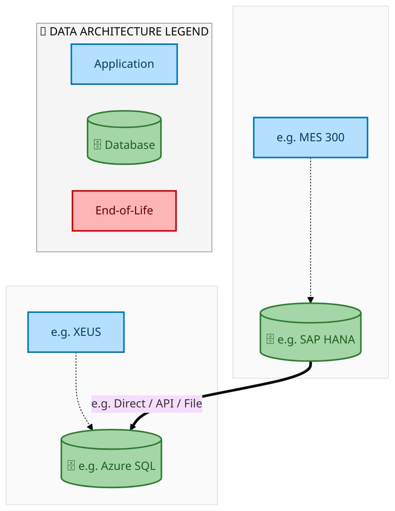

<div style="text-align:center; margin:4px 0 8px 0; font-size:11px;"><a href="https://mermaid.live/edit#pako:eNqdlY9P2kAUx_-VyxnCloCrYGE20eRKyzSpxlncltilOdpXuHi0TXtVEPnfd9dC3RCc8S5puPfj-14_rzmWOEhCwAZuNJYsZsJAy6aYwgyaBmqOaQ7NFmrmEBQZEwsHHoArB0-SylOG_qAZo2MOeVNlR0ksXPZUChzp6VyFKduQzhhfKKsLkwTQ7UULEZnImysVwZPHYEozUWoUOVzS-U8Wiqk8R5TnIGOmYsYdOgauComsULZYdu-mNGDxRBq7ujRlNL5_MR3rqxVaNRpeXJdAI9OLkVwBp3luQYRomprJHEWMc-PA1K3hcNjKRZbcg3Ggaf2-2Vsf24-qJ6OTzltBwpNMubuWvq0XjgcLvpYjutUj_VquY_etbmev3JGp2x1tSw4S_tLecGjqpl7rDQaaXHv1ej3l9uJKMS_Gk4ymU2TLNo4HFhk4PvgTnzwVGfjud-fOw8jDv6totUKWQSBYEtfQ1NqkkzL7l33rykQ4nBwi9VsKGIZRMX2dY21V_ORhrwi_dkP5DINjr4hAk6-sxMogJIM8_FlJlljf6gK1D9tn-ypViRCHaxZiwWEviA1sonYN29bU_hf2UTr_H16XXPvn5Ip8iO6l7fpdTdsAlkckj-9hXJd9A7GMQSrmPYTXneyCvCn1Hsab2A8h3l0WnZ6ePa8BWSVT9AWR6wv5HDIOHn7e_1Fsjc6BiWz_7i9iQaghi4wIIjeD84uRPRjd3tjIsb_ZV9aeaTo3L1bHV3MnacpZQJV39-gc39ozJ4sKqm7i3SNyfFvK23HYTqK2wyKo5KsrY-c4qjfc0NfVrumfnJy8Qo9beAbZjLIQG0tc3vjy_yKEiBZc4FUL00Ik7iIOsFFeyrhIQyrAYlQSnVXG1R9FLvV5" title="Edit in Mermaid Live">&#9998; Edit in Mermaid Live</a></div>

<div class="page-footer"><span>Page 22</span><span><a href="#toc">↑ Back to TOC</a></span><span>E2E-74 — R3 Internal manufacturing process for Finished Goods in Intel Foundry with Planning integrati</span></div>
<div style="page-break-before: always;"></div>

#### 4.2.2 Future-State — Future-State Data Flows


<div style="text-align:center; margin:4px 0 8px 0; font-size:11px;"><a href="https://mermaid.live/edit#pako:eNqdlY9P2kAUx_-VyxnCloCrYGE20eSg7TSpxlncltilOdpXuHi0TXtVEPnfd9dC3RCc8S5puPfj-14_rzmWOEhCwAZuNJYsZsJAy6aYwgyaBmqOaQ7NFmrmEBQZEwsHHoArB0-SylOG_qAZo2MOeVNlR0ksXPZUChzp6VyFKZtNZ4wvlNWFSQLo9qKFiEzkzZWK4MljMKWZKDWKHC7p_CcLxVSeI8pzkDFTMeMOHQNXhURWKFssu3dTGrB4Io1dXZoyGt-_mI711QqtGg0vrkug0cCLkVwBp3luQoRomg6SOYoY58bBQDdt227lIkvuwTjQtH5_0Fsf24-qJ6OTzltBwpNMubumvq0XjocLvpYjutkj_VquY_XNbmev3NFAtzralhwk_KU92x7oA73WGw41ufbq9XrK7cWVYl6MJxlNp8iSbRzbJhk6PvgTnzwVGfjud-fOw8jDv6totUKWQSBYEtfQ1NqkkzL7l3XrykQ4nBwi9VsKGIZRMX2dY25V_ORhrwi_dkP5DINjr4hAk6-sxMogJIM8_FlJlljf6gK1D9tn-ypViRCHaxZiwWEviA1sonYN29LU_hf2UTr_H16XXPvn5Ip8iO6l5fpdTdsAlkckj-9hXJd9A7GMQSrmPYTXneyCvCn1Hsab2A8h3l0WnZ6ePa8BmSVT9AWR6wv5tBkHDz_v_yi2RufARLZ_9xexINSQSUYEkZvh-cXIGo5ubyzkWN-sK3PPNJ2bF6vjq7mTNOUsoMq7e3SOb-6Zk0kFVTfx7hE5viXlrThsJ1HbYRFU8tWVsXMc1Rtu6Otq1_RPTk5eocctPINsRlmIjSUub3z5fxFCRAsu8KqFaSESdxEH2CgvZVykIRVgMiqJzirj6g_A0_Wj" title="Edit in Mermaid Live">&#9998; Edit in Mermaid Live</a></div>

<div class="page-footer"><span>Page 23</span><span><a href="#toc">↑ Back to TOC</a></span><span>E2E-74 — R3 Internal manufacturing process for Finished Goods in Intel Foundry with Planning integrati</span></div>
<div style="page-break-before: always;"></div>

### 4.3 Data Lineage

| # | Source System | Source Schema/Object | Target System | Target Schema/Object | Transformation |
|---|-------------|---------------------|---------------|---------------------|---------------|
| 1 | e.g. MES 300 | e.g. CKMLHD table | e.g. XEUS | e.g. dbo.CostElements | Lineage notes |

### 4.4 RICEFW Data Objects

Reports and Conversions for this capability will be populated from the Smartsheet Object Tracker via automated API extraction.

| Object ID | Type | Description | Status | Source | Target | Complexity |
|-----------|------|-------------|--------|--------|--------|-----------|
| E2E-74-R001 | Report | R3 Internal manufacturing process for Finished Goods in Intel Foundry with Planning integrati operational report | Planned | SAP S/4HANA | Analytics | Medium |
| E2E-74-C001 | Conversion | Legacy data migration for R3 Internal manufacturing process for Finished Goods in Intel Foundry with Planning integrati | Planned | Legacy ERP | SAP S/4HANA | High |

> *Pending: Smartsheet API integration to auto-populate live RICEFW data (see Build Requirements).*

### 4.5 Data Governance & Quality

| Concern | Approach |
|---------|----------|
| Data Ownership | Per-entity owners listed in Section 3.1 |
| Data Classification | Financial data classified as Intel Confidential |
| Data Retention | Per Intel corporate retention policies |
| Data Quality | Validated at source; reconciliation at target |

<div class="page-footer"><span>Page 24</span><span><a href="#toc">↑ Back to TOC</a></span><span>E2E-74 — R3 Internal manufacturing process for Finished Goods in Intel Foundry with Planning integrati</span></div>
<div style="page-break-before: always;"></div>

## 5. Application Architecture (TOGAF "A")

### 5.1 Current-State — Current-State Application Landscape

#### Overview

The Current-State architecture represents the **current / legacy** landscape for E2E-74.This view is generated from `CurrentFlows.xlsx` (1 flow hops across 1 flow chains).

#### APPLICATION ARCHITECTURE — Architecture Diagram (ArchiMate-Inspired)

> **Click any system node** to open its IAPM application page.
> **Legend**: <span style="background:#C8E6C9;padding:2px 6px;border:1px solid #2E7D32;font-size:9pt">Deployed</span> · <span style="background:#E3F2FD;padding:2px 6px;border:1px solid #1565C0;font-size:9pt">Developing</span> · <span style="background:#FFCDD2;padding:2px 6px;border:1px solid #C62828;font-size:9pt">End-of-Life</span> · <span style="background:#ECEFF1;padding:2px 6px;border:1px solid #78909C;font-size:9pt;border-style:dashed">No IAPM Match</span>

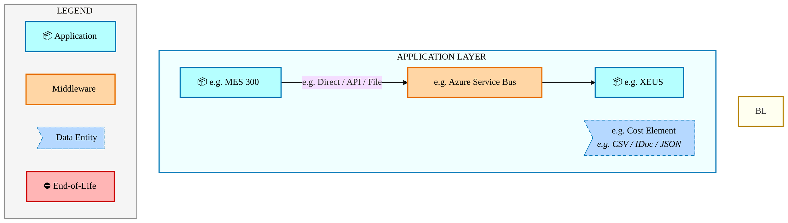

<div style="text-align:center; margin:4px 0 8px 0; font-size:11px;"><a href="https://mermaid.live/edit#pako:eNqVVW1vokAQ_isbGuMXbemLLyWNCQhevGDblL7c5byQlR100xUIu7S11v9-u2DFYht7a4Jh5plnlmdmdpdaEBPQDK1WW9KICgMt62IGc6gbqD7BHOoNVOcQZCkVCxeegCkHi-PCk0PvcUrxhAGvq-gwjoRHX3OC43byomDKNsBzyhbK6sE0BnQ3bCBTBrIG4jjiTQ4pDesrhWbxczDDqcj5Mg4j_PJAiZjJ9xAzDhIzE3Pm4gkwlVSkmbJF8ku8BAc0mkrjmS5NKY4eS1NLX63QqlYbR5sU6NYaR0iuWg01m3JDwYyOsIAmjXhCUyCIiwUDFDDMOXCJKeD5uw0hmmScRsA5yldIGTMOBnJZrQYXafwIxoHV7bZ1a_3afFZfYpwkL40gZnFqHOi6XuHESYLKVXBaLcW64dT1Tsdq_wcnwQLvctrdPZzHHzjffQRzKV6KF1JT1KpkmlNCGDzjFLYVsdtmqYjTaQ9Ktm_sHmK2o4jSeEvlfl_X93EWrDybTFOczJDp_hlr44x0T4l8ktMWMq-v3WHfvB1eXSLX_O3cjLW_RZBaRDZEIGgcIfemtDonTues74M_9UeO55_q-jZrAG0Eh9NDJH1I-iShYRiywp8S_HLuvE-jlePL0NFDHmy-Zin4HqRPNADfyviHrzvuFEw5Cq1RSKIK2rJqVXbbydn7MRe-w-S8R6K3vcXgrCBWALQGXEzSo94F7RUO7x4doaEdB_Lvp3d1eXFEe0VW1ZVFPojIe312BZVj13sbazmbnRdBMpnXQ_kcUAZj7W2PEtvEX2FUkmot1JbWTZMfA5a7NeIDfd-Ib4eam1D9O5O806wuTKVGH5qD6Mh1fjiX9je61PVlb1dby0wSRgOswJ80l-uPHqotNCrb5Mu2cX3bqXaIrY4fJxLyFqlWvghxrophPGmTMwkkzThsujRcp5Hzv9UmpaiFKO_CttRvI-z5-fnOWaY1tDmkc0yJZiy1_PaSdx-BEGdMaKuGhjMRe4so0Iz8UtGyRG4UbIplEeaFcfUPAj89gQ==" title="Edit in Mermaid Live">&#9998; Edit in Mermaid Live</a></div>

<div class="page-footer"><span>Page 25</span><span><a href="#toc">↑ Back to TOC</a></span><span>E2E-74 — R3 Internal manufacturing process for Finished Goods in Intel Foundry with Planning integrati</span></div>
<div style="page-break-before: always;"></div>

#### Current-State Flow Narrative

| # | Flow Chain | Path | Interface | Freq |
|---|-----------|------|-----------|------|
| 1 | e.g. MES Route to ICOST | e.g. MES 300 → e.g. XEUS | e.g. Direct / API / File | e.g. Near Real-Time |

<div class="page-footer"><span>Page 26</span><span><a href="#toc">↑ Back to TOC</a></span><span>E2E-74 — R3 Internal manufacturing process for Finished Goods in Intel Foundry with Planning integrati</span></div>
<div style="page-break-before: always;"></div>

### 5.2 Future-State — Future-State Application Landscape

#### Overview

The Future-State architecture represents the **target** landscape for E2E-74.This view is generated from `FutureFlows.xlsx` (1 flow hops across 1 flow chains).

#### APPLICATION ARCHITECTURE — Architecture Diagram (ArchiMate-Inspired)

> **Click any system node** to open its IAPM application page.
> **Legend**: <span style="background:#C8E6C9;padding:2px 6px;border:1px solid #2E7D32;font-size:9pt">Deployed</span> · <span style="background:#E3F2FD;padding:2px 6px;border:1px solid #1565C0;font-size:9pt">Developing</span> · <span style="background:#FFCDD2;padding:2px 6px;border:1px solid #C62828;font-size:9pt">End-of-Life</span> · <span style="background:#ECEFF1;padding:2px 6px;border:1px solid #78909C;font-size:9pt;border-style:dashed">No IAPM Match</span>


<div style="text-align:center; margin:4px 0 8px 0; font-size:11px;"><a href="https://mermaid.live/edit#pako:eNqVVW1vokAQ_isbGuMXbemLLyWNCQhevGDblL7c5byQlR100xUIu7S11v9-u2DFYht7a4Jh5plnlmdmdpdaEBPQDK1WW9KICgMt62IGc6gbqD7BHOoNVOcQZCkVCxeegCkHi-PCk0PvcUrxhAGvq-gwjoRHX3OC43byomDKNsBzyhbK6sE0BnQ3bCBTBrIG4jjiTQ4pDesrhWbxczDDqcj5Mg4j_PJAiZjJ9xAzDhIzE3Pm4gkwlVSkmbJF8ku8BAc0mkrjmS5NKY4eS1NLX63QqlYbR5sU6NYaR0iuWg01m3JDwYyOsIAmjXhCUyCIiwUDFDDMOXCJKeD5uw0hmmScRsA5yldIGTMOBnJZrQYXafwIxoHV7bZ1a_3afFZfYpwkL40gZnFqHOi6XuHESYLKVXBaLcW64dT1Tsdq_wcnwQLvctrdPZzHHzjffQRzKV6KF1JT1KpkmlNCGDzjFLYVsdtmqYjTaQ9Ktm_sHmK2o4jSeEvlfl_X93EWrDybTFOczJDp_hlr44x0T4l8ktMWMq-v3WHfvB1eXSLX_O3cjLW_RZBaRDZEIGgcIfemtDonTuds4IM_9UeO55_q-jZrAG0Eh9NDJH1I-iShYRiywp8S_HLuvE-jlePL0NFDHmy-Zin4HqRPNADfyviHrzvuFEw5Cq1RSKIK2rJqVXbbydn7MRe-w-S8R6K3vcXgrCBWALQGXEzSo94F7RUO7x4doaEdB_Lvp3d1eXFEe0VW1ZVFPojIe312BZVj13sbazmbnRdBMpnXQ_kcUAZj7W2PEtvEX2FUkmot1JbWTZMfA5a7NeIDfd-Ib4eam1D9O5O806wuTKVGH5qD6Mh1fjiX9je61PVlb1dby0wSRgOswJ80l-uPHqotNCrb5Mu2cX3bqXaIrY4fJxLyFqlWvghxrophPGmTMwkkzThsujRcp5Hzv9UmpaiFKO_CttRvI-z5-fnOWaY1tDmkc0yJZiy1_PaSdx-BEGdMaKuGhjMRe4so0Iz8UtGyRG4UbIplEeaFcfUPSLA9mQ==" title="Edit in Mermaid Live">&#9998; Edit in Mermaid Live</a></div>

<div class="page-footer"><span>Page 27</span><span><a href="#toc">↑ Back to TOC</a></span><span>E2E-74 — R3 Internal manufacturing process for Finished Goods in Intel Foundry with Planning integrati</span></div>
<div style="page-break-before: always;"></div>

#### Future-State Flow Narrative

| # | Flow Chain | Path | Interface | Freq |
|---|-----------|------|-----------|------|
| 1 | e.g. MES Route to ICOST | e.g. MES 300 → e.g. XEUS | e.g. Direct / API / File | e.g. Near Real-Time |

<div class="page-footer"><span>Page 28</span><span><a href="#toc">↑ Back to TOC</a></span><span>E2E-74 — R3 Internal manufacturing process for Finished Goods in Intel Foundry with Planning integrati</span></div>
<div style="page-break-before: always;"></div>

### 5.3 Change Impact Summary

| Change Type | Flow Chain | Detail |
|-------------|-----------|--------|
| **UNCHANGED** | e.g. MES Route to ICOST | No change |

**Totals**: 0 new - 0 removed - 0 modified - 1 unchanged

### 5.4 Component Overview

#### System Inventory

| System | IAPM ID | Status |
|--------|---------|--------|
| e.g. MES 300 | - | N/A |
| e.g. XEUS | - | N/A |

<div class="page-footer"><span>Page 29</span><span><a href="#toc">↑ Back to TOC</a></span><span>E2E-74 — R3 Internal manufacturing process for Finished Goods in Intel Foundry with Planning integrati</span></div>
<div style="page-break-before: always;"></div>

### 5.5 RICEFW Inventory

RICEFW objects for this capability will be auto-populated from the Smartsheet S/4 Object Tracker.

| Object ID | Type | Description | Status | Source → Target | Middleware | Complexity |
|-----------|------|-------------|--------|----------------|-----------|-----------|
| E2E-74-I001 | Interface | R3 Internal manufacturing process for Finished Goods in Intel Foundry with Planning integrati inbound data interface | Planned | Legacy → SAP S/4HANA | MuleSoft / CPI | Medium |
| E2E-74-E001 | Enhancement | R3 Internal manufacturing process for Finished Goods in Intel Foundry with Planning integrati custom business logic | Planned | SAP S/4HANA | N/A | Medium |
| E2E-74-F001 | Form/Report | R3 Internal manufacturing process for Finished Goods in Intel Foundry with Planning integrati operational output | Planned | SAP S/4HANA | N/A | Low |

> *Pending: Smartsheet API integration to auto-populate live RICEFW inventory (see Build Requirements).*

<div class="page-footer"><span>Page 30</span><span><a href="#toc">↑ Back to TOC</a></span><span>E2E-74 — R3 Internal manufacturing process for Finished Goods in Intel Foundry with Planning integrati</span></div>
<div style="page-break-before: always;"></div>

### 5.6 Integration Patterns

| # | Pattern | Flow Chain | Middleware | Protocol | Auth |
|---|---------|-----------|-----------|----------|------|
| 1 | e.g. Pub-Sub / P2P / ETL | e.g. MES Route to ICOST | e.g. Azure Service Bus | e.g. REST / RFC / SFTP | e.g. OAuth / NTLM / Cert |

<div class="page-footer"><span>Page 31</span><span><a href="#toc">↑ Back to TOC</a></span><span>E2E-74 — R3 Internal manufacturing process for Finished Goods in Intel Foundry with Planning integrati</span></div>
<div style="page-break-before: always;"></div>

## 6. Technology Architecture (TOGAF "T")

### 6.1 Platform & Infrastructure

> **TECHNOLOGY / PLATFORM ARCHITECTURE** — Platforms (green) host applications (blue). Thick arrows show platform-to-platform integration flows.

#### 6.1.1 Current-State — Current-State Platform Architecture

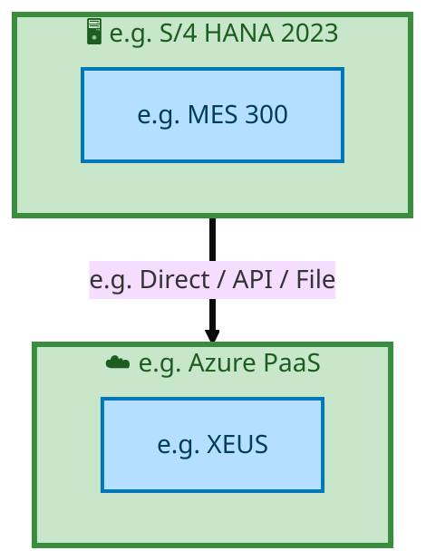

<div style="text-align:center; margin:4px 0 8px 0; font-size:11px;"><a href="https://mermaid.live/edit#pako:eNqtlGFvmzAQhv-K5SriC2sJhCRD6iQgoFVKp2is26QxIQeOxKqDEZg2acp_nw1tslZKpWrzB4t77_z49Vl4j1OeAXbwYLCnBRUO2mtiDRvQHKQtSQ2ajrQa0qaiYjeHO2AqwTjvM13pd1JRsmRQa2p1zgsR0YcOMByVW1WmtJBsKNspNYIVB3RzpSNXLmRaqyoYv0_XpBIdo6nhmmx_0EysZZwTVoOsWYsNm5MlMLWRqBqlFdJ9VJKUFispjgwpVaS4PUq20baoHQzi4rAF-ubFBZIjZaSuZ5AjUpYe36KcMuacefYsDEO9FhW_BefMMCYTb_wUfrhXnhyz3OopZ7xSaWtmv-aVjIgj0J8GY__jAWhNp4HlvwRaR-DQswPTeAUEzo68MPRszz7wfN-Q46TB8Vil46In1s1yVZFyjQIzmIz8xXyRQLJK3IemgmRBSPQrxnFjjo1h3ORgyJ3PV-eoSyOVjvHvHqRGRitIBeUFmn89qs9ktyP_DG4Us8OobwlwHKdveL8GiuzJm9gxOGnsn5r55uGjZJR8dr-4iWmYVnf-bGplcs6I_XcXoosRUnVI1b27EddBlFiG8dwLGSIZvrMdL6z-h468Rb-8_PT4ZHbWnQ9dIHdxJeeQMojx48mrwjreQLUhNMPOHndvhHxhMshJwwRudUwawaNdkWKn-41xU2ZEwIwSeT2bXmz_AJzRbnI=" title="Edit in Mermaid Live">&#9998; Edit in Mermaid Live</a></div>

> **Legend**: <span style="background:#C8E6C9;padding:2px 8px;border:2px solid #388E3C;font-size:9pt">🖥️ Platform</span> · <span style="background:#B5DFFF;padding:2px 8px;border:2px solid #0077B6;font-size:9pt">📦 Application</span> · <span style="background:#FFB5B5;padding:2px 8px;border:2px solid #CC0000;font-size:9pt">⛔ End-of-Life</span> · <span style="background:#FFF9C4;padding:2px 8px;border:2px solid #F9A825;font-size:9pt">📋 Unassigned</span>

<div class="page-footer"><span>Page 32</span><span><a href="#toc">↑ Back to TOC</a></span><span>E2E-74 — R3 Internal manufacturing process for Finished Goods in Intel Foundry with Planning integrati</span></div>
<div style="page-break-before: always;"></div>

#### 6.1.2 Future-State — Future-State Platform Architecture


<div style="text-align:center; margin:4px 0 8px 0; font-size:11px;"><a href="https://mermaid.live/edit#pako:eNqtlGFvmzAQhv-K5SriC2sJhCRD6iRIQKuUTtFYt0ljQg4ciVWDEZg2acp_nw1tslZKpWrzB4t77_z49Vl4jxOeAnbwYLCnBRUO2mtiAzloDtJWpAZNR1oNSVNRsVvAHTCVYJz3ma70O6koWTGoNbU644UI6UMHGI7KrSpTWkByynZKDWHNAd1c6ciVC5nWqgrG75MNqUTHaGq4JtsfNBUbGWeE1SBrNiJnC7ICpjYSVaO0QroPS5LQYi3FkSGlihS3R8k22ha1g0FUHLZA37yoQHIkjNT1HDJEytLjW5RRxpwzz54HQaDXouK34JwZxmTijZ_CD_fKk2OWWz3hjFcqbc3t17ySEXEEzqb-ePbxALSmU9-avQRaR-DQs33TeAUEzo68IPBszz7wZjNDjpMGx2OVjoqeWDerdUXKDfJNfzIKlotlDPE6dh-aCuIlIeGvCEeNOTaGUZOBIXc-X5-jLo1UOsK_e5AaKa0gEZQXaPH1qD6T3Y78079RzA6jviXAcZy-4f0aKNInb2LH4KSxf2rmm4cP41H82f3ixqZhWt3506mVyjkl9t9dCC9GSNUhVffuRlz7YWwZxnMvZIhk-M52vLD6HzryFv3y8tPjk9l5dz50gdzllZwDyiDCjyevCus4hyonNMXOHndvhHxhUshIwwRudUwawcNdkWCn-41xU6ZEwJwSeT15L7Z_AL-iboo=" title="Edit in Mermaid Live">&#9998; Edit in Mermaid Live</a></div>

> **Legend**: <span style="background:#C8E6C9;padding:2px 8px;border:2px solid #388E3C;font-size:9pt">🖥️ Platform</span> · <span style="background:#B5DFFF;padding:2px 8px;border:2px solid #0077B6;font-size:9pt">📦 Application</span> · <span style="background:#FFB5B5;padding:2px 8px;border:2px solid #CC0000;font-size:9pt">⛔ End-of-Life</span> · <span style="background:#FFF9C4;padding:2px 8px;border:2px solid #F9A825;font-size:9pt">📋 Unassigned</span>

#### Platform Inventory

| # | Platform | Type | Systems Using | Environment |
|---|----------|------|--------------|-------------|
| 1 | e.g. Azure PaaS | Cloud / SaaS | e.g. XEUS | DEV,QAS,PRD |
| 2 | e.g. S/4 HANA 2023 | On-Premise | e.g. MES 300 | DEV,QAS,PRD |

<div class="page-footer"><span>Page 33</span><span><a href="#toc">↑ Back to TOC</a></span><span>E2E-74 — R3 Internal manufacturing process for Finished Goods in Intel Foundry with Planning integrati</span></div>
<div style="page-break-before: always;"></div>

### 6.2 SAP Development Object Status

**RICEFW Status Summary** — E2E Tower (0 objects)
*Data source: Smartsheet Object Tracker (cached 2026-03-26)*

| Status | Count | % |
|--------|------:|----:|
| **Total** | **0** | **100%** |

**RICEFW by Type:**

| Type | Count |
|------|------:|
| **Total** | **0** |

### 6.3 NFRs & Design Principles

| Category | Requirement | Target / SLA | Priority |
|----------|-------------|-------------|----------|
| Performance | Order/transaction processing within interactive SLA | < 3 seconds for online transactions | High |
| Availability | Business-critical systems available during extended hours | 99.9% (06:00-22:00 all time zones) | High |
| Scalability | Support seasonal and promotional volume spikes | Handle 2x baseline transaction volume | Medium |
| Recoverability | Customer-facing systems recover within business impact window | RPO < 30 min, RTO < 2 hours | High |
| Data Volume | Support transactional data growth from business expansion | 10M+ documents/year | Medium |
| Latency | Near-real-time integration for order status updates | < 30 seconds for status propagation | Medium |
| Concurrency | Support global user base across business functions | 300+ concurrent users | Medium |

### 6.4 Security & Governance

| Concern | Approach | Standard / Policy | Owner |
|---------|----------|--------------------|-------|
| Authentication | Single Sign-On (SSO) via Intel corporate Azure AD identity | Intel IT Security Policy - Identity Management | IT Security |
| Authorization | Role-based access control (RBAC) with SAP authorization objects | Intel SAP Security Standards - Role Design | SAP Security Team |
| Data Classification | All financial/operational data classified per Intel Data Classification Standard | Intel Data Classification Policy | Data Governance |
| Data Encryption (at rest) | AES-256 encryption for SAP HANA database and file storage | Intel Encryption Standard | Infrastructure Security |
| Data Encryption (in transit) | TLS 1.3 for all system-to-system and user-to-system communication | Intel Network Security Policy | Network Engineering |
| Network Segmentation | SAP systems in dedicated network zones with firewall controls | Intel Network Architecture Standard | Network Security |
| API Security | OAuth 2.0 / certificate-based authentication for all API integrations | Intel API Security Guidelines | Integration Architecture |
| Audit Logging | Comprehensive audit trail for all data changes and user actions (SAP Security Audit Log) | SOX Compliance / Intel Audit Policy | Internal Audit |
| Certificate Management | Automated certificate lifecycle management for system-to-system trust | Intel PKI Standard | Certificate Authority Team |
| Compliance | SOX controls, export control (EAR/ITAR) screening, data privacy (GDPR) | Intel Corporate Compliance Framework | Compliance Office |

<div class="page-footer"><span>Page 34</span><span><a href="#toc">↑ Back to TOC</a></span><span>E2E-74 — R3 Internal manufacturing process for Finished Goods in Intel Foundry with Planning integrati</span></div>
<div style="page-break-before: always;"></div>

## 7. Project Context

### 7.1 Project Roadmap & Go-Live Plan

*No timeline data available for this capability.*

### 7.2 RAID Log

*Live data from Smartsheet Master RAID Log — extracted 2026-03-26*

**RAID Summary:** 15 open items (0 capability-specific, 15 tower-level), 56 closed

| Severity | Capability | Tower-Wide | Total Open |
|----------|----------:|-----------:|-----------:|
| P1 - High | 0 | 3 | 3 |
| P2 - Medium | 0 | 10 | 10 |
| P3 - Low | 0 | 2 | 2 |
| **Total** | **0** | **15** | **15** |

**Other E2E Tower RAID Items** (15 open):

| RAID ID | Type | Severity | Title | Status | Assigned To | Due Date |
|---------|------|----------|-------|--------|-------------|----------|
| 03591 | Risk | P1 - High | R3 E2E scenario execution | In Progress | Test Management | 2026-04-03 |
| 03681 | Risk | P1 - High | ITC Execution: Planning run availability - Prerequisite for ... | In Progress | E2E | 2026-03-27 |
| 03762 | Risk | P1 - High | FTS-IF (esp SCP) related test cases/sequencing are not accur... | In Progress | FTS IF | 2026-04-03 |
| 01733 | Risk | P2 - Medium | Tariffs impacts Item/BOM design which is impacting ERP/SCP (... | In Progress | E2E | 2026-03-06 |
| 03592 | Risk | P2 - Medium | Lack of Defined IMO Owner for CBA Mask Billing and Materials... | In Progress | E2E | 2026-03-27 |
| 03625 | Risk | P2 - Medium | Item/ BOM MC1 delta load | In Progress | Cutover | 2026-04-10 |
| 03628 | Risk | P2 - Medium | R3 Returns Rework Process Causing Finance Double Counting in... | In Progress | E2E | 2026-03-27 |
| 03642 | Issue | P2 - Medium | E2E Process with Anafi on order/invoice point.  Need IFS SC ... | In Progress | E2E | 2026-03-24 |
| 03736 | Action | P2 - Medium | Golden Data/Test Data Readiness | In Progress | Master Data | 2026-04-22 |
| 03743 | Issue | P2 - Medium | FD-Share with Entitlements -  Interface File Paths for MC1 | Roadblock / At Risk | PMO | 2026-03-20 |
| 03753 | Risk | P2 - Medium | PDF-SMH IF test cases are not available in JIRA | To Be Reviewed | B-Apps | 2026-03-25 |
| 03756 | Risk | P2 - Medium | LE101-1001 Operation Support Ownership for SIMS/Tester Front... | In Progress | E2E | 2026-04-24 |
| 03769 | Action | P2 - Medium | Need a Labs SPOC owner to define IP Labs enterprise and mate... | In Progress | E2E | 2026-04-17 |
| 03216 | Action | P3 - Low | Mask Expense vs. Invoice | In Progress | E2E | 2026-03-06 |
| 03315 | Risk | P3 - Low | BPMG – SCP L3/L4 flow standards | In Progress | Business Process Mgmt | 2026-03-27 |

### 7.3 Recommendations & Next Steps

| # | Category | Recommendation | Priority | Owner | Target Date | Status |
|---|----------|---------------|----------|-------|-------------|--------|
| 1 | Architecture | Complete extended flow attributes (Data Entity, Integration Pattern, Tech Platform) in Flows tab for full BDAT coverage | High | Tower Architect | 2026-Q2 | Open |
| 2 | Data | Define data ownership and classification for all 1 flow chains to satisfy Data Architecture (TOGAF D) requirements | Medium | Data Architect | 2026-Q3 | Open |
| 3 | Testing | Develop integration test scenarios covering all 1 flow chains for FUT/SIT readiness | High | Test Lead | 2026-Q3 | Open |
| 4 | Business Architecture | Review and validate Business Architecture process steps against latest Signavio/BIC process models | Medium | Business Analyst | 2026-Q2 | Open |
| 5 | Security | Complete security review for API integrations and data flows per Intel Security Architecture standards | Medium | Security Architect | 2026-Q3 | Open |

---
*E2E-74 — Architecture Document (TOGAF BDAT) · End-to-End Integrated Processes · Generated: March 2026*

