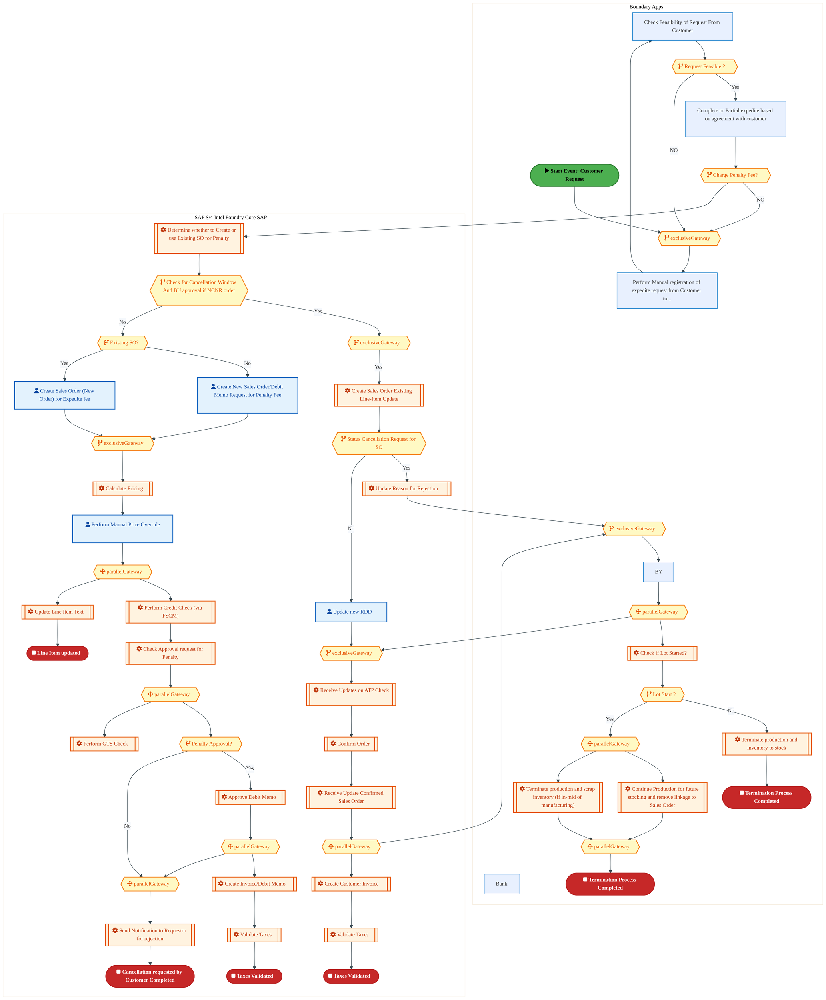
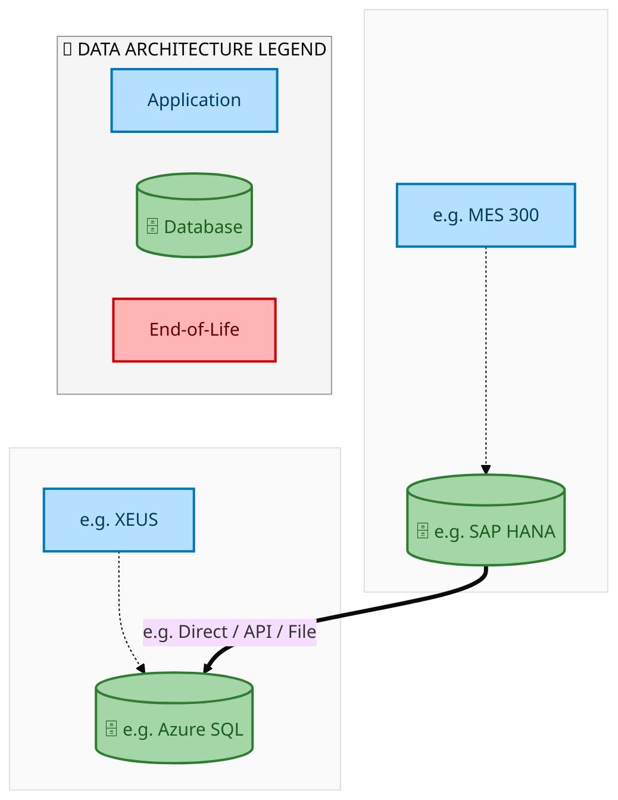
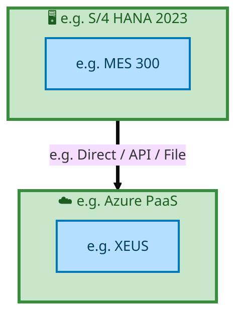

<div style="text-align:center; padding-top:20px;">
  
  <h1 style="font-size:36px; margin-top:24px;">E2E-76 — Internal manufacturing process for Finished Goods in Intel Foundry with sales to External cus</h1>
  <h2 style="font-size:24px;">Architecture Document (TOGAF BDAT)</h2>
  <p style="font-size:18px; color:#555;">End-to-End Integrated Processes (E2E) Tower<br/>
  Capability E2E-76 · Forecast to Stock</p>
  <p style="font-size:14px; color:#888;">IAO Program · Release 2<br/>
  Generated: March 2026<br/>
  Sajiv Francis</p>
  <p style="font-size:12px; color:#aaa;">IAO Architecture Pipeline — Intel Confidential</p>
</div>

<style>
@media print {
  @page { margin: 0.75in; }
  .mermaid { page-break-inside: avoid; overflow: hidden; }
  pre, table { page-break-inside: avoid; }
  h2, h3, h4 { page-break-after: avoid; }
}
.mermaid { overflow-x: auto; overflow-y: auto; }
.mermaid svg { height: auto !important; }
.page-footer {
  padding-top: 8px;
  border-top: 1px solid #ddd;
  display: flex;
  justify-content: space-between;
  align-items: center;
  font-size: 11px;
  color: #888;
  position: fixed;
  bottom: 0;
  left: 0;
  right: 0;
  padding: 6px 20px;
  background: #fff;
}
@media print {
  .page-footer { position: fixed; bottom: 0; left: 0.75in; right: 0.75in; }
}
.page-footer a { color: #00aeef; text-decoration: none; font-weight: 500; }
.page-footer a:hover { color: #0071c5; text-decoration: underline; }
</style>

<div class="page-footer"><span>Page 1</span><span><a href="#toc">↑ Back to TOC</a></span><span>E2E-76 — Internal manufacturing process for Finished Goods in Intel Foundry with sales to External cus</span></div>
<div style="page-break-before: always;"></div>

<a id="toc"></a>

## Table of Contents

1. [Executive Summary](#1-executive-summary)
2. [Business Context & Objectives](#2-business-context--objectives)
   - 2.1 [Classification](#21-classification)
   - 2.2 [Business Drivers](#22-business-drivers)
   - 2.3 [Success Criteria](#23-success-criteria)
   - 2.4 [Companion Documents](#24-companion-documents)
3. [Business Architecture (TOGAF "B")](#3-business-architecture-togaf-b)
   - 3.1 [Business Process Overview](#31-business-process-overview)
   - 3.2 [Business Process Diagrams](#32-business-process-diagrams)
   - 3.3 [Business Roles & Responsibilities](#33-business-roles--responsibilities)
4. [Data Architecture (TOGAF "D")](#4-data-architecture-togaf-d)
   - 4.1 [Data Entities & Ownership](#41-data-entities--ownership)
   - 4.2 [Data Flow Diagrams](#42-data-flow-diagrams)
   - 4.3 [Data Lineage](#43-data-lineage)
   - 4.4 [RICEFW Data Objects](#44-ricefw-data-objects)
   - 4.5 [Data Governance & Quality](#45-data-governance--quality)
5. [Application Architecture (TOGAF "A")](#5-application-architecture-togaf-a)
   - 5.1 [Current-State Application Landscape](#51-current-state--current-state-application-landscape)
   - 5.2 [Future-State Application Landscape](#52-future-state--future-state-application-landscape)
   - 5.3 [Change Impact Summary](#53-change-impact-summary)
   - 5.4 [Component Overview](#54-component-overview)
   - 5.5 [RICEFW Inventory](#55-ricefw-inventory)
   - 5.6 [Integration Patterns](#56-integration-patterns)
6. [Technology Architecture (TOGAF "T")](#6-technology-architecture-togaf-t)
   - 6.1 [Platform & Infrastructure](#61-platform--infrastructure)
   - 6.2 [SAP Development Object Status](#62-sap-development-object-status)
   - 6.3 [NFRs & Design Principles](#63-nfrs--design-principles)
   - 6.4 [Security & Governance](#64-security--governance)
7. [Project Context](#7-project-context)
   - 7.1 [Project Roadmap & Go-Live Plan](#71-project-roadmap--go-live-plan)
   - 7.2 [RAID Log](#72-raid-log)
   - 7.3 [Recommendations & Next Steps](#73-recommendations--next-steps)

<div class="page-footer"><span>Page 2</span><span><a href="#toc">↑ Back to TOC</a></span><span>E2E-76 — Internal manufacturing process for Finished Goods in Intel Foundry with sales to External cus</span></div>
<div style="page-break-before: always;"></div>

## 1. Executive Summary

This Architecture Document defines the **Business, Data, Application, and Technology** (BDAT) architecture for **E2E-76 Internal manufacturing process for Finished Goods in Intel Foundry with sales to External cus** within the IAO program. It includes 4 BPMN process diagram(s) in Section 3.
| Dimension | Value |
|-----------|-------|
| **Tower** | End-to-End Integrated Processes (E2E) |
| **Process Group** | Forecast to Stock |
| **Capability** | E2E-76 - Internal manufacturing process for Finished Goods in Intel Foundry with sales to External cus |
| **Release** | Release 2 |
| **Total Systems** | 2 |
| **System Status** | 0 Deployed, 0 Developing, 0 EOL, 2 Pending IAPM |
| **RICEFW Objects** | Pending — Smartsheet Object Tracker API integration |
**Change Summary**: 0 new flow chains, 0 removed, 0 modified, 1 unchanged between Current-State and Future-State states.

> All system nodes in architecture diagrams are **IAPM-linked** — click any node to open its IAPM page. Diagrams require `securityLevel: 'loose'` for click events.

<div class="page-footer"><span>Page 3</span><span><a href="#toc">↑ Back to TOC</a></span><span>E2E-76 — Internal manufacturing process for Finished Goods in Intel Foundry with sales to External cus</span></div>
<div style="page-break-before: always;"></div>

## 2. Business Context & Objectives

### 2.1 Classification

| Level | Value |
|-------|-------|
| **L0 Tower** | End-to-End Integrated Processes |
| **L1 Process** | Forecast to Stock |
| **L2 Capability** | E2E-76 - Internal manufacturing process for Finished Goods in Intel Foundry with sales to External cus |

### 2.2 Business Drivers

| # | Driver | Description | Strategic Alignment | Priority |
|---|--------|-------------|---------------------|----------|
| 1 | End-to-End Process Integration | Enable cross-tower integrated processes spanning procurement, manufacturing, and fulfillment | IDM 2.0 Process Excellence | High |
| 2 | Intel Foundry Business Enablement | Stand up foundry-specific business processes for external customer engagement | Intel Foundry Services | High |
| 3 | Process Visibility & Monitoring | Provide end-to-end process visibility across tower boundaries with integrated monitoring | Operational Excellence | Medium |
| 4 | E2E-76 Process Migration | Migrate Internal manufacturing process for Finished Goods in Intel Foundry with sales to External cus business processes and 2 integrated systems from legacy to S/4 HANA target architecture | IDM 2.0 Cross-Functional / End-to-End | High |

<div class="page-footer"><span>Page 4</span><span><a href="#toc">↑ Back to TOC</a></span><span>E2E-76 — Internal manufacturing process for Finished Goods in Intel Foundry with sales to External cus</span></div>
<div style="page-break-before: always;"></div>

### 2.3 Success Criteria

| Metric | Target | Measure | Baseline | Owner |
|--------|--------|---------|----------|-------|
| E2E Process Cycle Time | Per process SLA | End-to-end transaction completion within defined SLA per process | Varies by process | E2E Process Owner |
| Cross-Tower Integration Success | > 99% | Transactions completing across tower boundaries without manual intervention | 92% (current) | Integration Lead |
| Process Exception Rate | < 2% | Transactions requiring manual exception handling | 8% (current) | Operations Manager |
| E2E-76 Migration Completeness | 100% flow chains validated | All 1 flow chains verified in target state | 0% (pre-migration) | Tower Architect |

### 2.4 Companion Documents

| Document | Description |
|----------|-------------|
| **Business Architecture** | Included in this document (Section 3) — process flows from BPMN diagrams |
| **This Document** | Full BDAT Architecture — Business + Data + Application + Technology |

<div class="page-footer"><span>Page 5</span><span><a href="#toc">↑ Back to TOC</a></span><span>E2E-76 — Internal manufacturing process for Finished Goods in Intel Foundry with sales to External cus</span></div>
<div style="page-break-before: always;"></div>

## 3. Business Architecture (TOGAF "B")

### 3.1 Business Process Overview

This capability includes **4 business process(es)** modeled in BPMN 2.0, covering the end-to-end workflow for E2E-76 Internal manufacturing process for Finished Goods in Intel Foundry with sales to External cus.

| # | Step ID | Process Name | Lanes | Tasks | Gateways |
|---|---------|--------------|-------|-------|----------|
| 1 | E2E-76-Process_Overview | E2E-76-Process_Overview | Boundary Apps, SAP S/4 Intel Foundry
Core SAP | 18 | 13 |
| 2 | E2E-76A__Expedite_requested_by_Customer_(IFS_Customer_or_Intel_Product) | E2E-76A__Expedite_requested_by_Customer_(IFS_Customer_or_Intel_Product) | Boundary Apps, SAP S/4 CFIN, SAP S/4 Intel Foundry
Core SAP | 33 | 18 |
| 3 | E2E-76B-Cancellation_requested_by_Customer_(IFS_Customer_or_Intel_Product) | E2E-76B-Cancellation_requested_by_Customer_(IFS_Customer_or_Intel_Product) | Boundary Apps, SAP S/4 Intel Foundry
Core SAP | 30 | 20 |
| 4 | E2E-76C-Push-Out_by_Intel_Foundry_(undesirable_business_scenario) | E2E-76C-Push-Out_by_Intel_Foundry_(undesirable_business_scenario) | Boundary Apps
Intel Foundry, SAP S/4
Intel Foundry (LE-500)
, SAP S/4 
Intel Foundry (LE-101)
 | 8 | 2 |

### 3.2 Business Process Diagrams

<div class="page-footer"><span>Page 6</span><span><a href="#toc">↑ Back to TOC</a></span><span>E2E-76 — Internal manufacturing process for Finished Goods in Intel Foundry with sales to External cus</span></div>
<div style="page-break-before: always;"></div>

#### BUSINESS ARCHITECTURE — 3.2.1 E2E-76-Process_Overview — E2E-76-Process_Overview

**Swim Lanes**: Boundary Apps · SAP S/4 Intel Foundry
Core SAP | **Tasks**: 18 | **Gateways**: 13

> **Legend**: <span style="color:#000;background:#4CAF50;padding:2px 6px;border-radius:10px;font-weight:bold;font-size:9pt">● Start</span> · <span style="color:#fff;background:#C62828;padding:2px 6px;border-radius:10px;font-weight:bold;font-size:9pt">● End</span> · <span style="background:#E3F2FD;padding:2px 6px;border:1px solid #1565C0;font-size:9pt">User Task</span> · <span style="background:#FFF3E0;padding:2px 6px;border:1px solid #E65100;font-size:9pt">Service Task</span> · <span style="background:#FFF9C4;padding:2px 6px;border:1px solid #F57F17;font-size:9pt">◇ Gateway</span> · <span style="background:#F3E5F5;padding:2px 6px;border:1px solid #7B1FA2;font-size:9pt">Sub-Process</span>


<div style="text-align:center; margin:4px 0 8px 0; font-size:11px;"><a href="https://mermaid.live/edit#pako:eNqtWG1v4jgQ_itWVhWtBN04LwT4cCfecldpX9DS3dNqex_cxIGoTszZSQvX5b-fTewA3kTa4w6pRX7G88zMk_Ek4dWKaIytkXV19ZrmaTECr51ijTPcGYHOI-K40wUV8AWxFD0SzDtyT0LzYpn-fdgGvc1WbpNYiLKU7CS6xCuKwee7LhgLR9IFHOW8xzFLk063s2FphthuSgllcvcbPEjs5BBNmSaUxZgdN9h2ACNfuJI0x0fYDbzAC6UfxxHN4zPSxE8GSdTZy-QIfYnWiBWH9EuO36PtH2lcrMU6QYRjsWddZOQdesRE1liwUmJRyZ61GCmXcXIh2HKDojRfCdyzBcRQ_nSEfHu_B_urq4e8DgruZw85EJ-IIM5nOAG8EPD8uQBJSsjojTcdh77d5QWjT3j0xpkHM9fpRrKSkSjd7kpxey84Xa2L0SMlsdrae5E1jJzNtsu2I8fusp34b8TCeXyMNO07A2dQR5oEcAqnOlKSJP8pktCV3SP-pGLN3dAJZ3Us6Pf9qf0jny5z5gVjaOqE2XMa4RPSMAzd-VGqed-HdjvpJHT79tQgXaECv6DdkXA49WrC0A9CGLQSVvHMLMvHBaORJnTnfujXhMEEhmOnldAbQ2-gMhQ8K4Y2azCh5aGXwXiz4ZVNfnL47cGa4QKzTJwC8AEVJcOAJmC6RvkKg_l2g-O0wOA6LAl5uxA9Js7eDZiiPMKEoCKl-dtFyde9j2Vxe3v7YP15Qu4I8snXKuSZwRWGEEUFFQmhPAafsKDCccNO6H4TexM0SlAvoiuRF46eQJqAd7QAS9nzOBYeZy7eucuYc8x5hvMCTMQAigHNwT3tTTCYlFxUzTmQWotvk8g_J_qEVykXUmlxPuG_SszFOWA0A9OSFzTDzOToN-UfYnH4H1OSFjsp9k8RBQYRzbIyTyOhG9BShoRSBmYpw1FBdqJI8B494YNUv4s_-X2XgDSX9a6YKPjWDDI4D_J5E0v-DUF5LoT7KCfoNb85XLMNo3EZyQYAh8lqUg2vayrhv9OisdNao2OtN6d90399PaYR496jGIjRGuBtRMQle8a_VeftwdrvT92CZjctb6U6wb-afoNmv7rFwA8ew4sSdOHRDTFGX3gPkQJsEEOEYNLi5Fzi5F7i5P07J3EbMKbMcrwAy7ceuMsLTEAoZ45oyykVM0WYTkJ5dW_ICQ-mDMs-WyLxOFB1mWo9Dq7nW3HoxI0QvJMT6q7A2c35iPB_nmtZDf8jlTwMWAc4bDbIzeOLSFTKWSWOUCpvz0bXB-bEiLDoBjC-X6iTr1Ix3AbNbur4TWmepCwTB_CkKINheM6wwCyhLFP1K4LDtDaPqf3_nXjYSLU4ejUlDp3mzH-jNOaVEpsCXH9BpJS3iBstDgMLkWNhsDn2ceqI0bJpaIPYHDbQcDETbvNzLhtS7mVu3mVu_mWDyr5wEoh7Juj1fpEjXAHOQALfH6yvsuu_yxuZaflAK8NAGVxYcUCod_YVoIOoZR0jMGI4rrIE1U5XPV_lQ5Wdoz2dCtChHbda-zqSWjt6A3QMBmgrwNMANADHU4BOX0tkm-lrIXwjG82kiHTZShXHN3XTxHCgyq-FU_XXEVxdjlprh1oftdZ6uiojWBenitEX1VVyDI11zagZjlkroA6hljqCq6qGrgnUl0ALoYM6-jLrrKB3vuPwnC311O8XZ7DfDPdP3x3OLEGrZdBqGbZaREe1mmC7yWk3ue0mr93kt5vapYDtWsB2MURf6vfXM9yx1bvmOQobUUe_hp3DbjPsNcN-M9xvhoNmeNAMDxthcUIaYdgMN1fpNlfp1lVaXUs8Z2coja3Rq3X4AUb8SBPjBJWksPZdC5UFXe7yyBodfqiwysNNb5Yi8WSXVeD-H4MTjig=" title="Edit in Mermaid Live">&#9998; Edit in Mermaid Live</a></div>

<div class="page-footer"><span>Page 7</span><span><a href="#toc">↑ Back to TOC</a></span><span>E2E-76 — Internal manufacturing process for Finished Goods in Intel Foundry with sales to External cus</span></div>
<div style="page-break-before: always;"></div>

#### BUSINESS ARCHITECTURE — 3.2.2 E2E-76A__Expedite_requested_by_Customer_(IFS_Customer_or_Intel_Product) — E2E-76A__Expedite_requested_by_Customer_(IFS_Customer_or_Intel_Product)

**Swim Lanes**: Boundary Apps · SAP S/4 CFIN · SAP S/4 Intel Foundry
Core SAP | **Tasks**: 33 | **Gateways**: 18

> **Legend**: <span style="color:#000;background:#4CAF50;padding:2px 6px;border-radius:10px;font-weight:bold;font-size:9pt">● Start</span> · <span style="color:#fff;background:#C62828;padding:2px 6px;border-radius:10px;font-weight:bold;font-size:9pt">● End</span> · <span style="background:#E3F2FD;padding:2px 6px;border:1px solid #1565C0;font-size:9pt">User Task</span> · <span style="background:#FFF3E0;padding:2px 6px;border:1px solid #E65100;font-size:9pt">Service Task</span> · <span style="background:#FFF9C4;padding:2px 6px;border:1px solid #F57F17;font-size:9pt">◇ Gateway</span> · <span style="background:#F3E5F5;padding:2px 6px;border:1px solid #7B1FA2;font-size:9pt">Sub-Process</span>


<div style="text-align:center; margin:4px 0 8px 0; font-size:11px;"><a href="https://mermaid.live/edit#pako:eNqtWW1v2zgS_iuEiyIp4KQWJVq2P9zBkaPdAN0miLNdHDb3gZEom1dZ8lGSE1-a_75DiZQtmjqguQuQFw35zMszwxlGfh1EecwGs8HHj6884-UMvZ6Va7ZhZzN09kQLdjZEjeAbFZw-paw4k3uSPCuX_D_1NsfbvshtUhbSDU_3Urpkq5yh32-GaA7AdIgKmhUXBRM8ORuebQXfULEP8jQXcvcHNklGSW1NLV3lImbisGE08p2IADTlGTuIXd_zvVDiChblWdxRmpBkkkRnb9K5NH-O1lSUtftVwX6jL3_wuFzDc0LTgsGedblJv9AnlsoYS1FJWVSJnSaDF9JOBoQttzTi2Qrk3ghEgmbfDyIyentDbx8_PmatUfSweMwQfEUpLYoFS1BRgvh6V6KEp-nsgxfMQzIaFqXIv7PZB3ztL1w8jGQkMwh9NJTkXjwzvlqXs6c8jdXWi2cZwwxvX4biZYZHQ7GHn4YtlsUHS8EYT_CktXTlO4ETaEtJkvxPloBX8UCL78rWtRvicNHacsiYBKNTfTrMhefPHZMnJnY8YkdKwzB0rw9UXY-JM-pXehW641FgKF3Rkj3T_UHhNPBahSHxQ8fvVdjYM72snu5EHmmF7jUJSavQv3LCOe5V6M0db6I8BD0rQbdrdJVXdS2j-XZbNGvyK3P-fByENCpzWKJZjO5ZCrHEzbbBP492YtgZrFn0HYUMSveJp7zcozwByL8rVpQoFPkGBVVR5hsmulhXYvPNNmUlQ7lAd1CrcIYRe9mymINMdoYY5RmiK8GgOWQleublGkVWddj_ExQmdJbQiyhfIVC9qTIegedIBxOmORhacMGiMt2jhxz9Rr8z9CUv0a_wLX_fJIhnCHgGm0VxCTY6RiZdI79vY6l_m9IsA19vZTc5Lz7VrG1FHldRySGAusuYqqaGvzWNPKm9WMqDy-K_GxhXcnbHRJKLDbieVUCXYCsOWaeNoeRAn1ApSI5TgMr88vLSSAQ5bz2BSPaN9YbrFqcSCshPR1Bv8vp6CCJmF0_QpaL1IQYEIby9HSOmdkRbMHUdpewESEZ2YACtb8XQdR12nWzGTrCOHcteorQq-I790pxVEzY-wKgQ-XNxQdMSbamgacrSExC0QOOELed3aPnZQ0F48_WY8VE39zql83t0lxcldHgz8Y4dENBiXR9LNIdK2_GSs8KEYjv0ju7rI3XPIsa3pYmaHGoCKmDb3b5jsVEIBP8sw_1k3WQlS1EomxOc2SAXTC4d11DrmhwFyDgQdwJaObrdMSF4zLqlTrrIQDBZMUsKN47m8KLzr-y5-fMTAq2qrmBTwgxd466ue7bjBTvshzI8dLBgsah7AmRJuriA-BbSspQ91D8Do7P6Nu2fbwVf8Qw0dMxc1WZuM9Ab8QL6QFeV0bNsQS-bAYi-wLUH3ZRsI5sge-F1LSo6jAox2xdNo0qOiZr_0wp2jJJXdYTmD3eq9TW91Cxfx7HjVOcN8izhYgPhH8Vjqug5AU3sSkPdP02g2wOsyidZnTKP4IvYmzjPjvslz-MC3RRFxUwEseZIdt9LOA-7XCbnXNZjritA3lARVMDGTIwzts6oQ2of2It53B3_J7Np1NSvcIXrVtS8grkBpEYn7lnnHozdZbRmcQWdHwr5gW_qCdCdmCcltONwWFtG9OSLm3kLow5FTXJRsebbun3BgGyyIBf1bIPz1wzFjjXHSuM9-xdrhvo9TCr4JRVBq2Opicf_rQhU10Xn32haycvVJ13Z0M_gNmEmCLs_OTGw11tRdcxtUR13EjNXmPz_rjv2qrw7oGxH1_WMq0mnx7Mdy8wbiTs2B5dhQVk2B5jrG7jjag7qBKenoOm77hXe6H2wnlvM0cEp4dyc3Ljw-6y5dpiuvHoiSVZP7Hk9bt42RQiYzyoJJ1DyPlfH74P577sVuj93K2xA3ntA5J33T5i26OLib3L0aYGnBEQJ1DPRz6R59kZ6XWvwtYaJEky1YKogjoZgtWOid_hqh_bCc6Tgx-Pga_44-GFb-Ie8APyQvV7rcJVSTwmUVUdvcJVAu4WV42P1PFY-uNqU2_UBa_dVfK5WRBQSj02B5gwrCNE7XOWsDksR4mmVapm0JCvWsQ4Oq7Rg7a3rKIhWSZROt9UxNahrA52YnPrmiqZgYnKjIRqhE9lGrqgg2hgmhsDRsWtuPAVxNN-OCs1pdSiBq626KpWu9g_rkmsrjBiOeZ6KoGkwdRATc03NQrjp1-ttUK7Btau5bl1W2WlLRCFcHSQ2o8aKOdzmT8VEdMqJSrnndQoa3FSz7luBqL5MFTBm6_uYvNnA1Jb9t9xvVbbaw0vM06wFTlup2mpbEzrFOtSxsUGrmBr5dN1OZLKqbhtaNWvEMXa2Javqr93p6io6fkEne5V-5dcRE7t4bBf7dvHk-OVfZ2XauwLdtXfJ6V_C_Utu_5LXv0T6l8b9S37_Uj8ZTj8buJ8N3M8G7mcD97OB-9nA_WzgfjZwPxu4nw3cz4bbz4bbz4bbzwacVP0avysnPfKxehXflfpW6cQqnep3191TOLKLHbsY28WuXezZxcQuHtvFvl08sYvtURJ7lMQeJbFHSexREnuUxB4laaMcDAfwL9uG8ngwex3UH5TBh2kxS2iVloO34UDOh-U-iwaz-gOlQVUPvwWHF-d00wjf_gIFfoLn" title="Edit in Mermaid Live">&#9998; Edit in Mermaid Live</a></div>

<div class="page-footer"><span>Page 8</span><span><a href="#toc">↑ Back to TOC</a></span><span>E2E-76 — Internal manufacturing process for Finished Goods in Intel Foundry with sales to External cus</span></div>
<div style="page-break-before: always;"></div>

#### BUSINESS ARCHITECTURE — 3.2.3 E2E-76B-Cancellation_requested_by_Customer_(IFS_Customer_or_Intel_Product) — E2E-76B-Cancellation_requested_by_Customer_(IFS_Customer_or_Intel_Product)

**Swim Lanes**: Boundary Apps · SAP S/4 Intel Foundry
Core SAP | **Tasks**: 30 | **Gateways**: 20

> **Legend**: <span style="color:#000;background:#4CAF50;padding:2px 6px;border-radius:10px;font-weight:bold;font-size:9pt">● Start</span> · <span style="color:#fff;background:#C62828;padding:2px 6px;border-radius:10px;font-weight:bold;font-size:9pt">● End</span> · <span style="background:#E3F2FD;padding:2px 6px;border:1px solid #1565C0;font-size:9pt">User Task</span> · <span style="background:#FFF3E0;padding:2px 6px;border:1px solid #E65100;font-size:9pt">Service Task</span> · <span style="background:#FFF9C4;padding:2px 6px;border:1px solid #F57F17;font-size:9pt">◇ Gateway</span> · <span style="background:#F3E5F5;padding:2px 6px;border:1px solid #7B1FA2;font-size:9pt">Sub-Process</span>



<div style="text-align:center; margin:4px 0 8px 0; font-size:11px;"><a href="https://mermaid.live/edit#pako:eNqlWWtv27Ya_iuEiyItYLcWRVq2P5wh8WUo0CZBnG4YlvOBkSibiyx5lOQky_Lfz0uJlC2GGk69AC3ih-_14XuRlZdemEW8N-29f_8iUlFM0ctZseFbfjZFZ_cs52d9VAO_MCnYfcLzMyUTZ2mxEn9VYh7ZPSkxhS3ZViTPCl3xdcbR9y99dA6KSR_lLM0HOZciPuuf7aTYMvk8y5JMKul3fBwP48qbPrrIZMTlQWA4DLyQgmoiUn6A_YAEZKn0ch5madQyGtN4HIdnryq4JHsMN0wWVfhlzr-xp19FVGzgc8ySnIPMptgmX9k9T1SOhSwVFpZyb8gQufKTAmGrHQtFugacDAGSLH04QHT4-ope37-_Sxun6HZ-lyL4CROW53Meo7wAeLEvUCySZPqOzM6XdNjPC5k98Ok7vAjmPu6HKpMppD7sK3IHj1ysN8X0PksiLTp4VDlM8e6pL5-meNiXz_C_5Yun0cHTbITHeNx4ugi8mTcznuI4_leegFd5y_IH7WvhL_Fy3vjy6IjOhm_tmTTnJDj3bJ643IuQHxldLpf-4kDVYkS9YbfRi6U_Gs4so2tW8Ef2fDA4mZHG4JIGSy_oNFj7s6Ms769lFhqD_oIuaWMwuPCW57jTIDn3yFhHCHbWku026CIrq1pG57tdXp-pn9T7_a432_DwAS05FOS9SETxjLIY3fA_S54XaCmzLZqVeZFtubzr_fdIFyvdbLtLeMFRJtE1VCB0JuJPOx4JwFS_RyhLEVtLDi2fFuhRFBsUOs35YO4CCr-NEoX-Zjke_Q5ozKYxG4TZGtUJiBh9zQq0Uo3Ao59ApaUTtHVuudyKFO4N7WQWlWEhVJxphPIQCEMi3UO4GRD2AeyKdLAVkaJly9IyZmFRSujNj7aPsRUXVL5IS46uDy5iICouQZ9Dy2bhA5ip3Eq-zfYcwTB6YGuOigytGAxHdKWmlu1n8n_mcsgC7FXuLEv-EAxdcwlRbdE3yA2uT_K1gNpilRVIublOqUsiPi4JsPzp0yfrJr0PTXy7BPqiuhO0UMFMD5q6xED347Hy6KAMgrsmOxWOagqe58iUXWQrB_9CmdCXlwOtER_cwxwON4eqQlBUr6_HGiO3RtM8VU8l_K1i4FacwXCH27_mKUugD5ecv9EcuzX5U5iUudjzn-tZZKtNTlKjR5QwKbPHfACBoR2TLEl40qE0OkUp-DEl2EHWiFudX6PVZ4K-pAVP0FINPCj8WQadBkfHrpoSUesFWeV_LWE9oKs9l1JEvF3Yo7bmTHLVdEeNij5c8sf6149Vqy9M88TcshW0bX3fRcpWCuo383lbdOx0qzwduf485_eiQN9gjjT1pyI4qqW21cmbYRULoME1cLxhW_aGhxxqRgedqxF_fntdz2Fb1fsnVeMV1kT3uPOwFWmdfzNHvqT7DO7M1vLbWr-wRFQub9kTz21h0hbW0X2FR0P0peBbmCNPha1DrbBYEpaJUlMlBHPdlre2lqk7SAcqRC-xD3vB0HI1-2bvFi9w7TzY5jLbV0P7zY3bBqzlVKtydCgbW8EqkBW0HLrMChGLsB6oRVNpaqnBP8n_4NX2sRfW0HmDx42zeIKlo5ah4nxQcV5fgm3Kc97UDUxavV1vuoKwymgOK0AtB44eNxy-kqhVZiIDM9Bqh6BWV__ALPad2emy_NxJMCY_UKGYuqvn59uVs-98bG3CGcx7niT1zelygba7fz40UudW9e2tqgJs4n0jTn5MnFrih64rd06F01ag37ECzYA0vfRm4w67drXqQFUWLWp_FWmUPaJzaJaL74iZBoWnyMvZ5Q3K6gHX9uC5PcBDR1HmbfPHo311ZRvCpz0c-G61o_J_Qwo57XlieMqjgXeKEj5FyT9FiZz45AKLDQ0G_1GrygAjDQQGCGqA6q-x8MCuJYxA_ZGM9GdtkRgDpLL4913vNzVR_gYBfTDRdowhrF0TqgHtmRDjSXuemM_aNTUWsRYgxiTBtm_9NTcd15L-2GSlAc84pyZNk5enJaihCvs1gE18VMfjTywAG6PEs-Px7JPLrDow7GHj1YRBNUt-w7fm0W9uTMflN4ESDTREGhVDHDF0GHpIYMK5qsIhY_s27QPf1EEjqQMPWibVEjRhmUppnA4tdgi2TzQ7xKRG_PbB2MaNKcPWyLp3qqNsYtBhewagJuyRBTRliU3m5tqJptcIENoOEjf1YboPW0BjqqnC5upMwOazuVsD-BMrc29sn-gwaFO3ppANq9SQMLEkDio6DDy2gaZwA6twGxZMYJQevXJSN2FetbXgkRsO3PDYDU-OX7q1TmCmdB553Ue4-8jvPiLdR7T7aNR9FHQfjbuPutnA3WzgbjZwNxu4mw3czQbuZgN3s4G72cDdbOBuNmCkmXfabRzr989t1HeixIlSJzpyooETHZtXvm144oRhfjphzw1jN-y7YeKGqRseueHADbuzJO4sqTtL6s6SurOk7iypO0vqzpK6s6RNlr1-D77ubJmIetOXXvXXKPiLVcRjViZF77XfY2WRrZ7TsDet_mrTq7-HzAW8x2bbGnz9H3QjVLc=" title="Edit in Mermaid Live">&#9998; Edit in Mermaid Live</a></div>

<div class="page-footer"><span>Page 9</span><span><a href="#toc">↑ Back to TOC</a></span><span>E2E-76 — Internal manufacturing process for Finished Goods in Intel Foundry with sales to External cus</span></div>
<div style="page-break-before: always;"></div>

#### BUSINESS ARCHITECTURE — 3.2.4 E2E-76C-Push-Out_by_Intel_Foundry_(undesirable_business_scenario) — E2E-76C-Push-Out_by_Intel_Foundry_(undesirable_business_scenario)

**Swim Lanes**: Boundary Apps
Intel Foundry · SAP S/4
Intel Foundry (LE-500)
 · SAP S/4 
Intel Foundry (LE-101)
 | **Tasks**: 8 | **Gateways**: 2

> **Legend**: <span style="color:#000;background:#4CAF50;padding:2px 6px;border-radius:10px;font-weight:bold;font-size:9pt">● Start</span> · <span style="color:#fff;background:#C62828;padding:2px 6px;border-radius:10px;font-weight:bold;font-size:9pt">● End</span> · <span style="background:#E3F2FD;padding:2px 6px;border:1px solid #1565C0;font-size:9pt">User Task</span> · <span style="background:#FFF3E0;padding:2px 6px;border:1px solid #E65100;font-size:9pt">Service Task</span> · <span style="background:#FFF9C4;padding:2px 6px;border:1px solid #F57F17;font-size:9pt">◇ Gateway</span> · <span style="background:#F3E5F5;padding:2px 6px;border:1px solid #7B1FA2;font-size:9pt">Sub-Process</span>

```mermaid
%%{init: {'theme': 'base', 'themeVariables': {'fontSize': '14px', 'fontFamily': 'Segoe UI, Arial, sans-serif','primaryColor': '#e8f0fe', 'primaryBorderColor': '#0071c5','lineColor': '#37474F', 'secondaryColor': '#f5f8fc'}, 'flowchart': {'useMaxWidth': false, 'htmlLabels': true, 'curve': 'basis', 'nodeSpacing': 40, 'rankSpacing': 50}} }%%
flowchart LR
    classDef startEvt fill:#4CAF50,stroke:#2E7D32,color:#000,font-weight:bold,stroke-width:2px,rx:20,ry:20
    classDef endEvt fill:#C62828,stroke:#B71C1C,color:#fff,font-weight:bold,stroke-width:2px,rx:20,ry:20
    classDef userTask fill:#E3F2FD,stroke:#1565C0,stroke-width:2px,color:#0D47A1
    classDef serviceTask fill:#FFF3E0,stroke:#E65100,stroke-width:2px,color:#BF360C
    classDef gateway fill:#FFF9C4,stroke:#F57F17,stroke-width:2px,color:#E65100
    classDef subProc fill:#F3E5F5,stroke:#7B1FA2,stroke-width:2px,color:#4A148C
    subgraph Boundary Apps Intel Foundry
        n5[["fa:fa-cog Check for availability of Product Allocation"]]
        n6[["fa:fa-cog Send Scheduling Updates"]]
        n7[["fa:fa-cog Receive and Send MES Updates"]]
        n8["Manual communication by CBA"]
        n9(["fa:fa-play Push-Out by Intel Foundry Process Initiated"])
        n11{{"fa:fa-code-branch exclusiveGateway"}}
        n12{{"fa:fa-arrows-alt parallelGateway"}}
    end
    subgraph SAP S/4 Intel Foundry (LE-500) 
        n4[["fa:fa-cog Update Production Order"]]
        n10(["fa:fa-stop Push-out Process Completed"])
    end
    subgraph SAP S/4  Intel Foundry (LE-101) 
        n1["fa:fa-user Align with Customer and Communicate in advance"]
        n2["fa:fa-user Resolve the issue before updating"]
        n3[["fa:fa-cog Perform Sales Order Updates"]]
    end
    n9 --> n5
    n5 --> n12
    n1 --> n3
    n11 --> n7
    n12 --> n6
    n3 --> n8
    n6 -->|"Update 
Mfg execution"| n11
    n12 --> n2
    n2 --> n1
    n4 --> n10
    n11 -->|"Update Production
 Order (revised 
schedule and quantity)"| n4
    class n1 userTask
    class n2 userTask
    class n3 serviceTask
    class n4 serviceTask
    class n5 serviceTask
    class n6 serviceTask
    class n7 serviceTask
    class n9 startEvt
    class n10 endEvt
    class n11 gateway
    class n12 gateway
```

<div style="text-align:center; margin:4px 0 8px 0; font-size:11px;"><a href="https://mermaid.live/edit#pako:eNqlVt9v4jgQ_lesVBWtFHRJSAjNw0mQktNKrbYqt3cPyz4YZ0KsmjhnO_w4lv_9bJIAocvT8YA045nvm_k8trO3CE_Biqz7-z0tqIrQvqdyWEEvQr0FltCzUe34CwuKFwxkz8RkvFAz-u8xzPXLrQkzvgSvKNsZ7wyWHNC3LzYa60RmI4kL2ZcgaNaze6WgKyx2MWdcmOg7GGVOdmRrliZcpCDOAY4TuiTQqYwWcHYPQj_0E5MngfAi7YBmQTbKSO9gimN8Q3Is1LH8SsIr3v5NU5VrO8NMgo7J1Yq94AUw06MSlfGRSqxbMag0PIUWbFZiQoul9vuOdglcfJxdgXM4oMP9_bw4kaKX93mB9I8wLOUzZEgq7Z6uFcooY9GdH4-TwLGlEvwDojtvGj4PPJuYTiLdumMbcfsboMtcRQvO0ia0vzE9RF65tcU28hxb7PT_FRcU6ZkpHnojb3RimoRu7MYtU5Zl_4tJ6yr-xPKj4ZoOEi95PnG5wTCInc94bZvPfjh2r3UCsaYELkCTJBlMz1JNh4Hr3AadJIOhE1-BLrGCDd6dAZ9i_wSYBGHihjcBa77rKqvFm-CkBRxMgyQ4AYYTNxl7NwH9seuPmgo1zlLgMkcTXh1nGY3LUqIvhQKGEuMTuzrS_Irg-_e5leEow33ClyjOgWiVuEB4jSnDC8qo2iGeIV1cWhGFxoxxghXlxdz68eMCadhFmumRQTOSQ1rp47ZE38pUSyavksJu0jsQoGtA2OQagNfp7EbmSCe-4qLCDBG-WlUFratCix2KJ2MdfRH89HCiKZnetbdK5v2vlTLBHWVMmwSk0YsqqmlTDfR4geS6-_254hT6C31ySY5gS1glde1_1IMxtw6HyzTvnIaF4BvZx0yhEgvMGLBPSbr3q-2cjd_Q7Df_qtyHl2k_cJxHdMHldzWt5Wv3zyj01VyLV3K6zlkiqXhZS8S1RK0iMV-VDDqK3K7yF2W6jtsp0z3xmSOv54ouC7ShKkdxpStYaZ8Zg_i0uYBogXC61npDd3u9LtQ7SM70FOlHB1EpK0AL0CMNqDJS6GHsZg-6er2B0MErNMP6paq1-jyCp86LJ9Tv_67PUWMGtel6je3W9qA1Gztsba-2h409qM1RYw6N-XNuNXs4L16zpR41IFV9AH8axCuolrkx22W_MZ1OJWfs83zMmwlBDwLWVEKqeWV9kOuT-U-FC6WvhcdjAf7FRWb6bS_wjtv7tXtweTl3VvybK8HNleHNlfDmytPpGe224TRPXtfrtvd-1-21bsu29NyuME2taG8dP3r0h1EKGa6Ysg62hSvFZ7uCWNHx48A6TiQ8U6yPz6p2Hv4DS433Yw==" title="Edit in Mermaid Live">&#9998; Edit in Mermaid Live</a></div>

<div class="page-footer"><span>Page 10</span><span><a href="#toc">↑ Back to TOC</a></span><span>E2E-76 — Internal manufacturing process for Finished Goods in Intel Foundry with sales to External cus</span></div>
<div style="page-break-before: always;"></div>

### 3.3 Business Roles & Responsibilities

| Role / Lane | Processes Involved | Description |
|------------|-------------------|-------------|
| Boundary Apps | E2E-76-Process_Overview, E2E-76A__Expedite_requested_by_Customer_(IFS_Customer_or_Intel_Product), E2E-76B-Cancellation_requested_by_Customer_(IFS_Customer_or_Intel_Product),  | |
| SAP S/4 Intel Foundry
Core SAP | E2E-76-Process_Overview, E2E-76A__Expedite_requested_by_Customer_(IFS_Customer_or_Intel_Product), E2E-76B-Cancellation_requested_by_Customer_(IFS_Customer_or_Intel_Product),  | |
| SAP S/4 CFIN | E2E-76A__Expedite_requested_by_Customer_(IFS_Customer_or_Intel_Product),  | |
| Boundary Apps
Intel Foundry | E2E-76C-Push-Out_by_Intel_Foundry_(undesirable_business_scenario) | |
| SAP S/4
Intel Foundry (LE-500)
 | E2E-76C-Push-Out_by_Intel_Foundry_(undesirable_business_scenario) | |
| SAP S/4 
Intel Foundry (LE-101)
 | E2E-76C-Push-Out_by_Intel_Foundry_(undesirable_business_scenario) | |

<div class="page-footer"><span>Page 11</span><span><a href="#toc">↑ Back to TOC</a></span><span>E2E-76 — Internal manufacturing process for Finished Goods in Intel Foundry with sales to External cus</span></div>
<div style="page-break-before: always;"></div>

## 4. Data Architecture (TOGAF "D")

### 4.1 Data Entities & Ownership

| # | Data Entity | Source System | Target System | Data Owner | Classification | Volume | Master/Transaction |
|---|-------------|---------------|---------------|------------|----------------|--------|-------------------|
| 1 | e.g. Cost Element | e.g. MES 300 | e.g. XEUS | Data steward | e.g. Intel Confidential | e.g. 10K rows/day | Master / Transaction |

<div class="page-footer"><span>Page 12</span><span><a href="#toc">↑ Back to TOC</a></span><span>E2E-76 — Internal manufacturing process for Finished Goods in Intel Foundry with sales to External cus</span></div>
<div style="page-break-before: always;"></div>

### 4.2 Data Flow Diagrams

> **DATA ARCHITECTURE** — Database-to-database data flows. Applications (blue) sit above their hosting databases (green cylinders). Thick arrows show data movement between databases.

#### 4.2.1 Current-State — Current-State Data Flows



<div style="text-align:center; margin:4px 0 8px 0; font-size:11px;"><a href="https://mermaid.live/edit#pako:eNqdlY9P2kAUx_-VyxnCloCrYGE20eRKyzSpxlncltilOdpXuHi0TXtVEPnfd9dC3RCc8S5puPfj-14_rzmWOEhCwAZuNJYsZsJAy6aYwgyaBmqOaQ7NFmrmEBQZEwsHHoArB0-SylOG_qAZo2MOeVNlR0ksXPZUChzp6VyFKduQzhhfKKsLkwTQ7UULEZnImysVwZPHYEozUWoUOVzS-U8Wiqk8R5TnIGOmYsYdOgauComsULZYdu-mNGDxRBq7ujRlNL5_MR3rqxVaNRpeXJdAI9OLkVwBp3luQYRomprJHEWMc-PA1K3hcNjKRZbcg3Ggaf2-2Vsf24-qJ6OTzltBwpNMubuWvq0XjgcLvpYjutUj_VquY_etbmev3JGp2x1tSw4S_tLecGjqpl7rDQaaXHv1ej3l9uJKMS_Gk4ymU2TLNnoDiwwcH_yJT56KDHz3u3PnYeTh31W0WiHLIBAsiWtoam3SSZn9y751ZSIcTg6R-i0FDMOomL7OsbYqfvKwV4Rfu6F8hsGxV0SgyVdWYmUQkkEe_qwkS6xvdYHah-2zfZWqRIjDNQux4LAXxAY2UbuGbWtq_wv7KJ3_D69Lrv1zckU-RPfSdv2upm0AyyOSx_cwrsu-gVjGIBXzHsLrTnZB3pR6D-NN7IcQ7y6LTk_PnteArJIp-oLI9YV8DhkHDz_v_yi2RufARLZ_9xexINSQRUYEkZvB-cXIHoxub2zk2N_sK2vPNJ2bF6vjq7mTNOUsoMq7e3SOb-2Zk0UFVTfx7hE5vi3l7ThsJ1HbYRFU8tWVsXMc1Rtu6Otq1_RPTk5eocctPINsRlmIjSUub3z5fxFCRAsu8KqFaSESdxEH2CgvZVykIRVgMSqJzirj6g-XuPWV" title="Edit in Mermaid Live">&#9998; Edit in Mermaid Live</a></div>

<div class="page-footer"><span>Page 13</span><span><a href="#toc">↑ Back to TOC</a></span><span>E2E-76 — Internal manufacturing process for Finished Goods in Intel Foundry with sales to External cus</span></div>
<div style="page-break-before: always;"></div>

#### 4.2.2 Future-State — Future-State Data Flows


<div style="text-align:center; margin:4px 0 8px 0; font-size:11px;"><a href="https://mermaid.live/edit#pako:eNqdlY9P2kAUx_-VyxnCloCrYGE20eSg7TSpxlncltilOdpXuHi0TXtVEPnfd9dC3RCc8S5puPfj-14_rzmWOEhCwAZuNJYsZsJAy6aYwgyaBmqOaQ7NFmrmEBQZEwsHHoArB0-SylOG_qAZo2MOeVNlR0ksXPZUChzp6VyFKZtNZ4wvlNWFSQLo9qKFiEzkzZWK4MljMKWZKDWKHC7p_CcLxVSeI8pzkDFTMeMOHQNXhURWKFssu3dTGrB4Io1dXZoyGt-_mI711QqtGg0vrkug0cCLkVwBp3luQoRomg6SOYoY58bBQDdt227lIkvuwTjQtH5_0Fsf24-qJ6OTzltBwpNMubumvq0XjocLvpYjutkj_VquY_XNbmev3NFAtzralhwk_KU92x7oA73WGw41ufbq9XrK7cWVYl6MJxlNp8iSbfRskwwdH_yJT56KDHz3u3PnYeTh31W0WiHLIBAsiWtoam3SSZn9y7p1ZSIcTg6R-i0FDMOomL7OMbcqfvKwV4Rfu6F8hsGxV0SgyVdWYmUQkkEe_qwkS6xvdYHah-2zfZWqRIjDNQux4LAXxAY2UbuGbWlq_wv7KJ3_D69Lrv1zckU-RPfScv2upm0AyyOSx_cwrsu-gVjGIBXzHsLrTnZB3pR6D-NN7IcQ7y6LTk_PnteAzJIp-oLI9YV82oyDh5_3fxRbo3NgItu_-4tYEGrIJCOCyM3w_GJkDUe3NxZyrG_Wlblnms7Ni9Xx1dxJmnIWUOXdPTrHN_fMyaSCqpt494gc35LyVhy2k6jtsAgq-erK2DmO6g039HW1a_onJyev0OMWnkE2oyzExhKXN778vwghogUXeNXCtBCJu4gDbJSXMi7SkAowGZVEZ5Vx9QcTbPW_" title="Edit in Mermaid Live">&#9998; Edit in Mermaid Live</a></div>

<div class="page-footer"><span>Page 14</span><span><a href="#toc">↑ Back to TOC</a></span><span>E2E-76 — Internal manufacturing process for Finished Goods in Intel Foundry with sales to External cus</span></div>
<div style="page-break-before: always;"></div>

### 4.3 Data Lineage

| # | Source System | Source Schema/Object | Target System | Target Schema/Object | Transformation |
|---|-------------|---------------------|---------------|---------------------|---------------|
| 1 | e.g. MES 300 | e.g. CKMLHD table | e.g. XEUS | e.g. dbo.CostElements | Lineage notes |

### 4.4 RICEFW Data Objects

Reports and Conversions for this capability will be populated from the Smartsheet Object Tracker via automated API extraction.

| Object ID | Type | Description | Status | Source | Target | Complexity |
|-----------|------|-------------|--------|--------|--------|-----------|
| E2E-76-R001 | Report | Internal manufacturing process for Finished Goods in Intel Foundry with sales to External cus operational report | Planned | SAP S/4HANA | Analytics | Medium |
| E2E-76-C001 | Conversion | Legacy data migration for Internal manufacturing process for Finished Goods in Intel Foundry with sales to External cus | Planned | Legacy ERP | SAP S/4HANA | High |

> *Pending: Smartsheet API integration to auto-populate live RICEFW data (see Build Requirements).*

### 4.5 Data Governance & Quality

| Concern | Approach |
|---------|----------|
| Data Ownership | Per-entity owners listed in Section 3.1 |
| Data Classification | Financial data classified as Intel Confidential |
| Data Retention | Per Intel corporate retention policies |
| Data Quality | Validated at source; reconciliation at target |

<div class="page-footer"><span>Page 15</span><span><a href="#toc">↑ Back to TOC</a></span><span>E2E-76 — Internal manufacturing process for Finished Goods in Intel Foundry with sales to External cus</span></div>
<div style="page-break-before: always;"></div>

## 5. Application Architecture (TOGAF "A")

### 5.1 Current-State — Current-State Application Landscape

#### Overview

The Current-State architecture represents the **current / legacy** landscape for E2E-76.This view is generated from `CurrentFlows.xlsx` (1 flow hops across 1 flow chains).

#### APPLICATION ARCHITECTURE — Architecture Diagram (ArchiMate-Inspired)

> **Click any system node** to open its IAPM application page.
> **Legend**: <span style="background:#C8E6C9;padding:2px 6px;border:1px solid #2E7D32;font-size:9pt">Deployed</span> · <span style="background:#E3F2FD;padding:2px 6px;border:1px solid #1565C0;font-size:9pt">Developing</span> · <span style="background:#FFCDD2;padding:2px 6px;border:1px solid #C62828;font-size:9pt">End-of-Life</span> · <span style="background:#ECEFF1;padding:2px 6px;border:1px solid #78909C;font-size:9pt;border-style:dashed">No IAPM Match</span>


<div style="text-align:center; margin:4px 0 8px 0; font-size:11px;"><a href="https://mermaid.live/edit#pako:eNqVVW1P4kAQ_iubGsIX0PrCi40hKbRcuBQ11pe7HJdm6Q6wcWmb7lZF5L_fbIuAoMFbkpLOPPPM7swz3bkRxgwMyyiV5jziyiLzsprAFMoWKQ-phHKFlCWEWcrVzIMnENoh4rjw5NB7mnI6FCDLOnoUR8rnrznBcT150TBt69IpFzNt9WEcA7nrVYiNgaJCJI1kVULKR-WFRov4OZzQVOV8mYQ-fXngTE3wfUSFBMRM1FR4dAhCJ1Vppm0RnsRPaMijMRrPTDSlNHpcm2rmYkEWpdIgWqUgt-1BRHCVSqRaxQ2FE96nCqo8kglPgRGpZgJIKKiUIBFTwPN3B0ZkmEkegZQkXyMuhHXQxdWuVaRK40ewDtrNZt1sL1-rz_ok1knyUgljEafWgWmaW5w0Sch6FZztmmZdcZpmo9Gu_wcno4rucjrNPZzHHzjffYxKLF5KZ1hTUtvKNOWMCXimKWxWxKnb64q4jXp3zfaN3UMsdiqia7xR5U7HNPdxFqwyG45TmkyI7f0ZGIOMNU8ZPtlpjdjX116vY9_2ri6JZ_92bwbG3yJIL4aCCBWPI-LdrK3uCR6nE0AwDvquH5ya5iZrCHUCh-NDgj6CPiS0LAs7_CnBL_fO_zRaO74M7T_kwfZrlkLgQ_rEQwjamfxwuuNGwZSjyBJFEFXQrru2ze64OXsnlipwBc57pFqbWwzPCmINIEvAxTA9al3wVuHw78kR6TlxiH8__avLiyPeKrJqVRb5IGLv_dktKI5d621g5GxO3gRksq97-OxyAQPjbU8lNom_wugk273QW1qKJv8MtL2NEe-a-0Z8M9RehZrfmeQdsXowxhp9EAczief-cC-db6jUC1Db29Kyk0TwkGrwJ-Lygv7DtoT6a5l8KRsvcNxthTj68-NGCm-R7c4XIe5VMYwndXaGQFaNR1WPj5ZpcP43ZLIualGU98LW9G9V2PPz851vmVExppBOKWeGNTfy2wvvPgYjmgllLCoGzVTsz6LQsPJLxcgS3Cg4nGITpoVx8Q8xRT2R" title="Edit in Mermaid Live">&#9998; Edit in Mermaid Live</a></div>

<div class="page-footer"><span>Page 16</span><span><a href="#toc">↑ Back to TOC</a></span><span>E2E-76 — Internal manufacturing process for Finished Goods in Intel Foundry with sales to External cus</span></div>
<div style="page-break-before: always;"></div>

#### Current-State Flow Narrative

| # | Flow Chain | Path | Interface | Freq |
|---|-----------|------|-----------|------|
| 1 | e.g. MES Route to ICOST | e.g. MES 300 → e.g. XEUS | e.g. Direct / API / File | e.g. Near Real-Time |

<div class="page-footer"><span>Page 17</span><span><a href="#toc">↑ Back to TOC</a></span><span>E2E-76 — Internal manufacturing process for Finished Goods in Intel Foundry with sales to External cus</span></div>
<div style="page-break-before: always;"></div>

### 5.2 Future-State — Future-State Application Landscape

#### Overview

The Future-State architecture represents the **target** landscape for E2E-76.This view is generated from `FutureFlows.xlsx` (1 flow hops across 1 flow chains).

#### APPLICATION ARCHITECTURE — Architecture Diagram (ArchiMate-Inspired)

> **Click any system node** to open its IAPM application page.
> **Legend**: <span style="background:#C8E6C9;padding:2px 6px;border:1px solid #2E7D32;font-size:9pt">Deployed</span> · <span style="background:#E3F2FD;padding:2px 6px;border:1px solid #1565C0;font-size:9pt">Developing</span> · <span style="background:#FFCDD2;padding:2px 6px;border:1px solid #C62828;font-size:9pt">End-of-Life</span> · <span style="background:#ECEFF1;padding:2px 6px;border:1px solid #78909C;font-size:9pt;border-style:dashed">No IAPM Match</span>


<div style="text-align:center; margin:4px 0 8px 0; font-size:11px;"><a href="https://mermaid.live/edit#pako:eNqVVW1vokAQ_isbGuMXbemLLyWNCQhevGDblL7c5byQlR100xUIu7S11v9-u2DFYht7a4Jh5plndmeeYZdaEBPQDK1WW9KICgMt62IGc6gbqD7BHOoNVOcQZCkVCxeegCkHi-PCk0PvcUrxhAGvq-gwjoRHX3OC43byomDKNsBzyhbK6sE0BnQ3bCBTBrIG4jjiTQ4pDesrhWbxczDDqcj5Mg4j_PJAiZjJ9xAzDhIzE3Pm4gkwlVSkmbJF8iReggMaTaXxTJemFEePpamlr1ZoVauNo00KdGuNIyRXrYaaTbmhYEZHWECTRjyhKRDExYIBChjmHLjEFPD83YYQTTJOI-Ac5SukjBkHA7msVoOLNH4E48Dqdtu6tX5tPquTGCfJSyOIWZwaB7quVzhxkqByFZxWS7FuOHW907Ha_8FJsMC7nHZ3D-fxB853H8FcFi_FC1lT1KpkmlNCGDzjFLYrYrfNsiJOpz0o2b6xe4jZTkVUjbeq3O_r-j7OgpVnk2mKkxky3T9jbZyR7imRT3LaQub1tTvsm7fDq0vkmr-dm7H2twhSi0hBBILGEXJvSqtzoo7jgz_1R47nn-r6NmsAbQSH00MkfUj6JKFhGLLDnxL8cu68T6OV48vQ0UMebL5mKfgepE80AN_K-IfTHXcKphyF1igkUQVt2bUqu-3k7P2YC99hct4j0dveYnBWECsAWgMuJulR74L2Cod3j47Q0I4D-ffTu7q8OKK9IqtSZZEPIvLen92CyrHrvY21nM3OmyCZzOuhfA4og7H2tqcS28RfYVSSai_UltaiyT8Dlrs14gN934hvh5qbUP07k7wjVhemskYfxEF05Do_nEv7Gyp1fantqrTMJGE0wAr8ibhcf_RQldColMmXsnF926kqxFafHycS8hapdr4Ica6KYTxpkzMJJM04bLo0XKeR878lk7KoRVHeC9tSv01hz8_Pd75lWkObQzrHlGjGUstvL3n3EQhxxoS2amg4E7G3iALNyC8VLUvkRsGmWDZhXhhX_wB3tj2p" title="Edit in Mermaid Live">&#9998; Edit in Mermaid Live</a></div>

<div class="page-footer"><span>Page 18</span><span><a href="#toc">↑ Back to TOC</a></span><span>E2E-76 — Internal manufacturing process for Finished Goods in Intel Foundry with sales to External cus</span></div>
<div style="page-break-before: always;"></div>

#### Future-State Flow Narrative

| # | Flow Chain | Path | Interface | Freq |
|---|-----------|------|-----------|------|
| 1 | e.g. MES Route to ICOST | e.g. MES 300 → e.g. XEUS | e.g. Direct / API / File | e.g. Near Real-Time |

<div class="page-footer"><span>Page 19</span><span><a href="#toc">↑ Back to TOC</a></span><span>E2E-76 — Internal manufacturing process for Finished Goods in Intel Foundry with sales to External cus</span></div>
<div style="page-break-before: always;"></div>

### 5.3 Change Impact Summary

| Change Type | Flow Chain | Detail |
|-------------|-----------|--------|
| **UNCHANGED** | e.g. MES Route to ICOST | No change |

**Totals**: 0 new - 0 removed - 0 modified - 1 unchanged

### 5.4 Component Overview

#### System Inventory

| System | IAPM ID | Status |
|--------|---------|--------|
| e.g. MES 300 | - | N/A |
| e.g. XEUS | - | N/A |

<div class="page-footer"><span>Page 20</span><span><a href="#toc">↑ Back to TOC</a></span><span>E2E-76 — Internal manufacturing process for Finished Goods in Intel Foundry with sales to External cus</span></div>
<div style="page-break-before: always;"></div>

### 5.5 RICEFW Inventory

RICEFW objects for this capability will be auto-populated from the Smartsheet S/4 Object Tracker.

| Object ID | Type | Description | Status | Source → Target | Middleware | Complexity |
|-----------|------|-------------|--------|----------------|-----------|-----------|
| E2E-76-I001 | Interface | Internal manufacturing process for Finished Goods in Intel Foundry with sales to External cus inbound data interface | Planned | Legacy → SAP S/4HANA | MuleSoft / CPI | Medium |
| E2E-76-E001 | Enhancement | Internal manufacturing process for Finished Goods in Intel Foundry with sales to External cus custom business logic | Planned | SAP S/4HANA | N/A | Medium |
| E2E-76-F001 | Form/Report | Internal manufacturing process for Finished Goods in Intel Foundry with sales to External cus operational output | Planned | SAP S/4HANA | N/A | Low |

> *Pending: Smartsheet API integration to auto-populate live RICEFW inventory (see Build Requirements).*

<div class="page-footer"><span>Page 21</span><span><a href="#toc">↑ Back to TOC</a></span><span>E2E-76 — Internal manufacturing process for Finished Goods in Intel Foundry with sales to External cus</span></div>
<div style="page-break-before: always;"></div>

### 5.6 Integration Patterns

| # | Pattern | Flow Chain | Middleware | Protocol | Auth |
|---|---------|-----------|-----------|----------|------|
| 1 | e.g. Pub-Sub / P2P / ETL | e.g. MES Route to ICOST | e.g. Azure Service Bus | e.g. REST / RFC / SFTP | e.g. OAuth / NTLM / Cert |

<div class="page-footer"><span>Page 22</span><span><a href="#toc">↑ Back to TOC</a></span><span>E2E-76 — Internal manufacturing process for Finished Goods in Intel Foundry with sales to External cus</span></div>
<div style="page-break-before: always;"></div>

## 6. Technology Architecture (TOGAF "T")

### 6.1 Platform & Infrastructure

> **TECHNOLOGY / PLATFORM ARCHITECTURE** — Platforms (green) host applications (blue). Thick arrows show platform-to-platform integration flows.

#### 6.1.1 Current-State — Current-State Platform Architecture



<div style="text-align:center; margin:4px 0 8px 0; font-size:11px;"><a href="https://mermaid.live/edit#pako:eNqtlGFvmzAQhv-K5SriS9YSCCRD6iQgoFVKp2is26QxIQeOxKqDEZg2acp_nw1tslZKpWrzB4t77_z49Vl4j1OeAXbwYLCnBRUO2mtiDRvQHKQtSQ3aEGk1pE1FxW4Od8BUgnHeZ7rS76SiZMmg1tTqnBciog8dYDQut6pMaSHZULZTagQrDujmaohcuZBprapg_D5dk0p0jKaGa7L9QTOxlnFOWA2yZi02bE6WwNRGomqUVkj3UUlSWqykONalVJHi9ihZetuidjCIi8MW6JsXF0iOlJG6nkGOSFl6fItyyphz5lmzMAyHtaj4LThnuj6ZePZT-OFeeXKMcjtMOeOVSpsz6zWvZEQcgf40sP2PB6A5nQam_xJoHoEjzwoM_RUQODvywtCzPOvA831djpMGbVul46In1s1yVZFyjQIjmNj-Yr5IIFkl7kNTQbIgJPoV47gxbH0UNznocufz1Tnq0kilY_y7B6mR0QpSQXmB5l-P6jPZ7cg_gxvF7DDqWwIcx-kb3q-BInvyJnYMThr7p2a-efgoGSef3S9uYuiG2Z0_m5qZnDNi_d2F6GKMVB1Sde9uxHUQJaauP_dChkiG72zHC6v_oSNv0S8vPz0-mZ1150MXyF1cyTmkDGL8ePKq8BBvoNoQmmFnj7s3Qr4wGeSkYQK3Q0wawaNdkWKn-41xU2ZEwIwSeT2bXmz_ALQXboI=" title="Edit in Mermaid Live">&#9998; Edit in Mermaid Live</a></div>

> **Legend**: <span style="background:#C8E6C9;padding:2px 8px;border:2px solid #388E3C;font-size:9pt">🖥️ Platform</span> · <span style="background:#B5DFFF;padding:2px 8px;border:2px solid #0077B6;font-size:9pt">📦 Application</span> · <span style="background:#FFB5B5;padding:2px 8px;border:2px solid #CC0000;font-size:9pt">⛔ End-of-Life</span> · <span style="background:#FFF9C4;padding:2px 8px;border:2px solid #F9A825;font-size:9pt">📋 Unassigned</span>

<div class="page-footer"><span>Page 23</span><span><a href="#toc">↑ Back to TOC</a></span><span>E2E-76 — Internal manufacturing process for Finished Goods in Intel Foundry with sales to External cus</span></div>
<div style="page-break-before: always;"></div>

#### 6.1.2 Future-State — Future-State Platform Architecture


<div style="text-align:center; margin:4px 0 8px 0; font-size:11px;"><a href="https://mermaid.live/edit#pako:eNqtlGFvmzAQhv-K5SriC2sJBJIhdRIkoFVKp2is26QxIQeOxKqDEZg2acp_nw1tslZKpWrzB4t77_z49Vl4j1OeAXbxYLCnBRUu2mtiDRvQXKQtSQ2ajrQa0qaiYjeHO2AqwTjvM13pd1JRsmRQa2p1zgsR0YcOMByVW1WmtJBsKNspNYIVB3RzpSNPLmRaqyoYv0_XpBIdo6nhmmx_0EysZZwTVoOsWYsNm5MlMLWRqBqlFdJ9VJKUFispjgwpVaS4PUq20baoHQzi4rAF-ubHBZIjZaSuZ5AjUpY-36KcMuae-fYsDEO9FhW_BffMMMZj33kKP9wrT65ZbvWUM16ptDWzX_NKRsQROJ0EzvTjAWhNJoE1fQm0jsChbwem8QoInB15Yejbvn3gTaeGHCcNOo5Kx0VPrJvlqiLlGgVmMHbCxXyRQLJKvIemgmRBSPQrxnFjOsYwbnIw5M7nq3PUpZFKx_h3D1IjoxWkgvICzb8e1Wey15F_BjeK2WHUtwS4rts3vF8DRfbkTewYnDT2T8188_BRMko-e1-8xDRMqzt_NrEyOWfE_rsL0cUIqTqk6t7diOsgSizDeO6FDJEM39mOF1b_Q0feol9efnp8MjvrzocukLe4knNIGcT48eRVYR1voNoQmmF3j7s3Qr4wGeSkYQK3OiaN4NGuSLHb_ca4KTMiYEaJvJ5NL7Z_ANbobpo=" title="Edit in Mermaid Live">&#9998; Edit in Mermaid Live</a></div>

> **Legend**: <span style="background:#C8E6C9;padding:2px 8px;border:2px solid #388E3C;font-size:9pt">🖥️ Platform</span> · <span style="background:#B5DFFF;padding:2px 8px;border:2px solid #0077B6;font-size:9pt">📦 Application</span> · <span style="background:#FFB5B5;padding:2px 8px;border:2px solid #CC0000;font-size:9pt">⛔ End-of-Life</span> · <span style="background:#FFF9C4;padding:2px 8px;border:2px solid #F9A825;font-size:9pt">📋 Unassigned</span>

#### Platform Inventory

| # | Platform | Type | Systems Using | Environment |
|---|----------|------|--------------|-------------|
| 1 | e.g. Azure PaaS | Cloud / SaaS | e.g. XEUS | DEV,QAS,PRD |
| 2 | e.g. S/4 HANA 2023 | On-Premise | e.g. MES 300 | DEV,QAS,PRD |

<div class="page-footer"><span>Page 24</span><span><a href="#toc">↑ Back to TOC</a></span><span>E2E-76 — Internal manufacturing process for Finished Goods in Intel Foundry with sales to External cus</span></div>
<div style="page-break-before: always;"></div>

### 6.2 SAP Development Object Status

**RICEFW Status Summary** — E2E Tower (0 objects)
*Data source: Smartsheet Object Tracker (cached 2026-03-26)*

| Status | Count | % |
|--------|------:|----:|
| **Total** | **0** | **100%** |

**RICEFW by Type:**

| Type | Count |
|------|------:|
| **Total** | **0** |

### 6.3 NFRs & Design Principles

| Category | Requirement | Target / SLA | Priority |
|----------|-------------|-------------|----------|
| Performance | Order/transaction processing within interactive SLA | < 3 seconds for online transactions | High |
| Availability | Business-critical systems available during extended hours | 99.9% (06:00-22:00 all time zones) | High |
| Scalability | Support seasonal and promotional volume spikes | Handle 2x baseline transaction volume | Medium |
| Recoverability | Customer-facing systems recover within business impact window | RPO < 30 min, RTO < 2 hours | High |
| Data Volume | Support transactional data growth from business expansion | 10M+ documents/year | Medium |
| Latency | Near-real-time integration for order status updates | < 30 seconds for status propagation | Medium |
| Concurrency | Support global user base across business functions | 300+ concurrent users | Medium |

### 6.4 Security & Governance

| Concern | Approach | Standard / Policy | Owner |
|---------|----------|--------------------|-------|
| Authentication | Single Sign-On (SSO) via Intel corporate Azure AD identity | Intel IT Security Policy - Identity Management | IT Security |
| Authorization | Role-based access control (RBAC) with SAP authorization objects | Intel SAP Security Standards - Role Design | SAP Security Team |
| Data Classification | All financial/operational data classified per Intel Data Classification Standard | Intel Data Classification Policy | Data Governance |
| Data Encryption (at rest) | AES-256 encryption for SAP HANA database and file storage | Intel Encryption Standard | Infrastructure Security |
| Data Encryption (in transit) | TLS 1.3 for all system-to-system and user-to-system communication | Intel Network Security Policy | Network Engineering |
| Network Segmentation | SAP systems in dedicated network zones with firewall controls | Intel Network Architecture Standard | Network Security |
| API Security | OAuth 2.0 / certificate-based authentication for all API integrations | Intel API Security Guidelines | Integration Architecture |
| Audit Logging | Comprehensive audit trail for all data changes and user actions (SAP Security Audit Log) | SOX Compliance / Intel Audit Policy | Internal Audit |
| Certificate Management | Automated certificate lifecycle management for system-to-system trust | Intel PKI Standard | Certificate Authority Team |
| Compliance | SOX controls, export control (EAR/ITAR) screening, data privacy (GDPR) | Intel Corporate Compliance Framework | Compliance Office |

<div class="page-footer"><span>Page 25</span><span><a href="#toc">↑ Back to TOC</a></span><span>E2E-76 — Internal manufacturing process for Finished Goods in Intel Foundry with sales to External cus</span></div>
<div style="page-break-before: always;"></div>

## 7. Project Context

### 7.1 Project Roadmap & Go-Live Plan

*No timeline data available for this capability.*

### 7.2 RAID Log

*Live data from Smartsheet Master RAID Log — extracted 2026-03-26*

**RAID Summary:** 15 open items (0 capability-specific, 15 tower-level), 56 closed

| Severity | Capability | Tower-Wide | Total Open |
|----------|----------:|-----------:|-----------:|
| P1 - High | 0 | 3 | 3 |
| P2 - Medium | 0 | 10 | 10 |
| P3 - Low | 0 | 2 | 2 |
| **Total** | **0** | **15** | **15** |

**Other E2E Tower RAID Items** (15 open):

| RAID ID | Type | Severity | Title | Status | Assigned To | Due Date |
|---------|------|----------|-------|--------|-------------|----------|
| 03591 | Risk | P1 - High | R3 E2E scenario execution | In Progress | Test Management | 2026-04-03 |
| 03681 | Risk | P1 - High | ITC Execution: Planning run availability - Prerequisite for ... | In Progress | E2E | 2026-03-27 |
| 03762 | Risk | P1 - High | FTS-IF (esp SCP) related test cases/sequencing are not accur... | In Progress | FTS IF | 2026-04-03 |
| 01733 | Risk | P2 - Medium | Tariffs impacts Item/BOM design which is impacting ERP/SCP (... | In Progress | E2E | 2026-03-06 |
| 03592 | Risk | P2 - Medium | Lack of Defined IMO Owner for CBA Mask Billing and Materials... | In Progress | E2E | 2026-03-27 |
| 03625 | Risk | P2 - Medium | Item/ BOM MC1 delta load | In Progress | Cutover | 2026-04-10 |
| 03628 | Risk | P2 - Medium | R3 Returns Rework Process Causing Finance Double Counting in... | In Progress | E2E | 2026-03-27 |
| 03642 | Issue | P2 - Medium | E2E Process with Anafi on order/invoice point.  Need IFS SC ... | In Progress | E2E | 2026-03-24 |
| 03736 | Action | P2 - Medium | Golden Data/Test Data Readiness | In Progress | Master Data | 2026-04-22 |
| 03743 | Issue | P2 - Medium | FD-Share with Entitlements -  Interface File Paths for MC1 | Roadblock / At Risk | PMO | 2026-03-20 |
| 03753 | Risk | P2 - Medium | PDF-SMH IF test cases are not available in JIRA | To Be Reviewed | B-Apps | 2026-03-25 |
| 03756 | Risk | P2 - Medium | LE101-1001 Operation Support Ownership for SIMS/Tester Front... | In Progress | E2E | 2026-04-24 |
| 03769 | Action | P2 - Medium | Need a Labs SPOC owner to define IP Labs enterprise and mate... | In Progress | E2E | 2026-04-17 |
| 03216 | Action | P3 - Low | Mask Expense vs. Invoice | In Progress | E2E | 2026-03-06 |
| 03315 | Risk | P3 - Low | BPMG – SCP L3/L4 flow standards | In Progress | Business Process Mgmt | 2026-03-27 |

### 7.3 Recommendations & Next Steps

| # | Category | Recommendation | Priority | Owner | Target Date | Status |
|---|----------|---------------|----------|-------|-------------|--------|
| 1 | Architecture | Complete extended flow attributes (Data Entity, Integration Pattern, Tech Platform) in Flows tab for full BDAT coverage | High | Tower Architect | 2026-Q2 | Open |
| 2 | Data | Define data ownership and classification for all 1 flow chains to satisfy Data Architecture (TOGAF D) requirements | Medium | Data Architect | 2026-Q3 | Open |
| 3 | Testing | Develop integration test scenarios covering all 1 flow chains for FUT/SIT readiness | High | Test Lead | 2026-Q3 | Open |
| 4 | Business Architecture | Review and validate Business Architecture process steps against latest Signavio/BIC process models | Medium | Business Analyst | 2026-Q2 | Open |
| 5 | Security | Complete security review for API integrations and data flows per Intel Security Architecture standards | Medium | Security Architect | 2026-Q3 | Open |

---
*E2E-76 — Architecture Document (TOGAF BDAT) · End-to-End Integrated Processes · Generated: March 2026*

