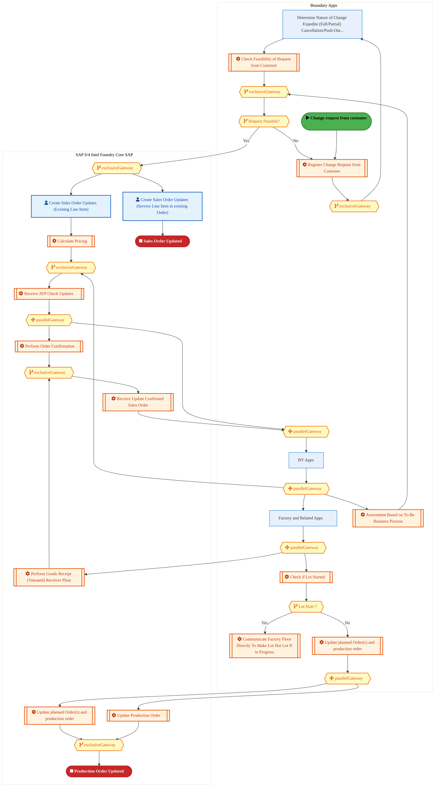
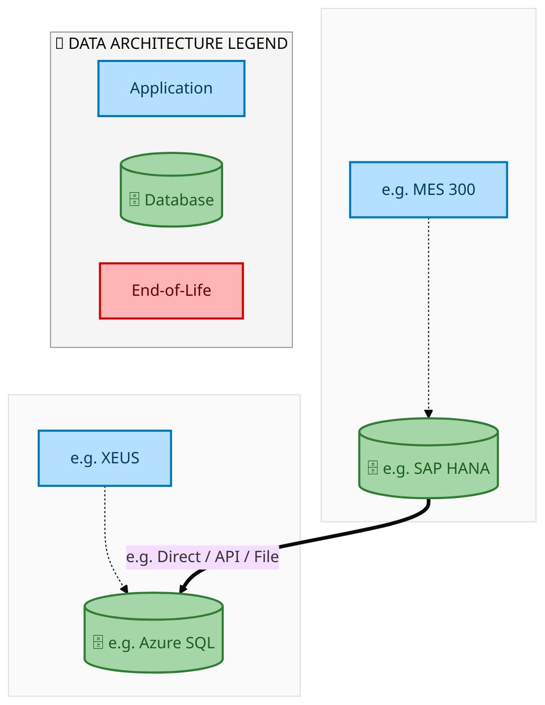
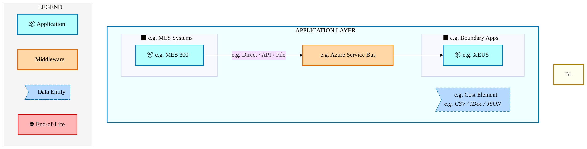
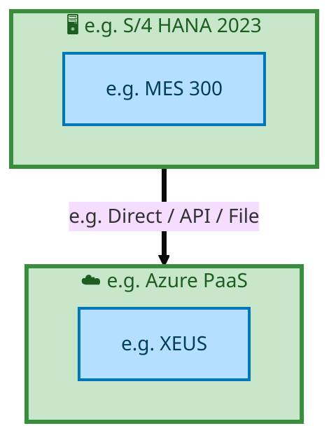

  
  <img src="data:image/svg+xml;base64,PHN2ZyB4bWxucz0iaHR0cDovL3d3dy53My5vcmcvMjAwMC9zdmciIHZpZXdCb3g9IjAgMCA4MDAgNDgwIiB3aWR0aD0iODAwIiBoZWlnaHQ9IjQ4MCI+CiAgPGRlZnM+CiAgICA8bGluZWFyR3JhZGllbnQgaWQ9ImJnIiB4MT0iMCUiIHkxPSIwJSIgeDI9IjEwMCUiIHkyPSIxMDAlIj4KICAgICAgPHN0b3Agb2Zmc2V0PSIwJSIgc3R5bGU9InN0b3AtY29sb3I6IzAwNzFjNTtzdG9wLW9wYWNpdHk6MSIvPgogICAgICA8c3RvcCBvZmZzZXQ9IjEwMCUiIHN0eWxlPSJzdG9wLWNvbG9yOiMwMGFlZWY7c3RvcC1vcGFjaXR5OjEiLz4KICAgIDwvbGluZWFyR3JhZGllbnQ+CiAgICA8bGluZWFyR3JhZGllbnQgaWQ9ImFjY2VudCIgeDE9IjAlIiB5MT0iMCUiIHgyPSIwJSIgeTI9IjEwMCUiPgogICAgICA8c3RvcCBvZmZzZXQ9IjAlIiBzdHlsZT0ic3RvcC1jb2xvcjojZmZmZmZmO3N0b3Atb3BhY2l0eTowLjE1Ii8+CiAgICAgIDxzdG9wIG9mZnNldD0iMTAwJSIgc3R5bGU9InN0b3AtY29sb3I6I2ZmZmZmZjtzdG9wLW9wYWNpdHk6MC4wMiIvPgogICAgPC9saW5lYXJHcmFkaWVudD4KICAgIDxwYXR0ZXJuIGlkPSJncmlkIiB3aWR0aD0iNDAiIGhlaWdodD0iNDAiIHBhdHRlcm5Vbml0cz0idXNlclNwYWNlT25Vc2UiPgogICAgICA8cGF0aCBkPSJNIDQwIDAgTCAwIDAgMCA0MCIgZmlsbD0ibm9uZSIgc3Ryb2tlPSJyZ2JhKDI1NSwyNTUsMjU1LDAuMDcpIiBzdHJva2Utd2lkdGg9IjAuNSIvPgogICAgPC9wYXR0ZXJuPgogIDwvZGVmcz4KCiAgPCEtLSBCYWNrZ3JvdW5kIC0tPgogIDxyZWN0IHdpZHRoPSI4MDAiIGhlaWdodD0iNDgwIiBmaWxsPSJ1cmwoI2JnKSIgcng9IjgiLz4KICA8cmVjdCB3aWR0aD0iODAwIiBoZWlnaHQ9IjQ4MCIgZmlsbD0idXJsKCNncmlkKSIgcng9IjgiLz4KICA8cmVjdCB3aWR0aD0iODAwIiBoZWlnaHQ9IjQ4MCIgZmlsbD0idXJsKCNhY2NlbnQpIiByeD0iOCIvPgoKICA8IS0tIERlY29yYXRpdmUgY2lyY3VpdC9hcmNoaXRlY3R1cmUgbGluZXMgLS0+CiAgPGcgc3Ryb2tlPSJyZ2JhKDI1NSwyNTUsMjU1LDAuMTIpIiBzdHJva2Utd2lkdGg9IjEuNSIgZmlsbD0ibm9uZSI+CiAgICA8cGF0aCBkPSJNIDAgMTAwIEwgMTIwIDEwMCBMIDE2MCAxNDAgTCAyODAgMTQwIi8+CiAgICA8cGF0aCBkPSJNIDAgMjYwIEwgODAgMjYwIEwgMTIwIDIyMCBMIDIwMCAyMjAgTCAyNDAgMjYwIEwgMzYwIDI2MCIvPgogICAgPHBhdGggZD0iTSA1MjAgMTAwIEwgNjAwIDEwMCBMIDY0MCA2MCBMIDgwMCA2MCIvPgogICAgPHBhdGggZD0iTSA0NDAgMzQwIEwgNTYwIDM0MCBMIDYwMCAzMDAgTCA3MjAgMzAwIEwgNzYwIDM0MCBMIDgwMCAzNDAiLz4KICAgIDxwYXRoIGQ9Ik0gNjAwIDQwMCBMIDY4MCA0MDAgTCA3MjAgNDQwIi8+CiAgICA8cGF0aCBkPSJNIDAgNDAwIEwgNDAgNDAwIEwgODAgMzYwIi8+CiAgICA8cGF0aCBkPSJNIDIwMCA0MjAgTCAzMjAgNDIwIEwgMzYwIDM4MCBMIDQ4MCAzODAiLz4KICAgIDxwYXRoIGQ9Ik0gNjUwIDQ0MCBMIDc1MCA0NDAgTCA4MDAgNDgwIi8+CiAgPC9nPgoKICA8IS0tIERlY29yYXRpdmUgbm9kZXMgLS0+CiAgPGcgZmlsbD0icmdiYSgyNTUsMjU1LDI1NSwwLjE4KSI+CiAgICA8Y2lyY2xlIGN4PSIxMjAiIGN5PSIxMDAiIHI9IjQiLz4KICAgIDxjaXJjbGUgY3g9IjI4MCIgY3k9IjE0MCIgcj0iNCIvPgogICAgPGNpcmNsZSBjeD0iMjAwIiBjeT0iMjIwIiByPSI0Ii8+CiAgICA8Y2lyY2xlIGN4PSIzNjAiIGN5PSIyNjAiIHI9IjQiLz4KICAgIDxjaXJjbGUgY3g9IjYwMCIgY3k9IjEwMCIgcj0iNCIvPgogICAgPGNpcmNsZSBjeD0iNzIwIiBjeT0iMzAwIiByPSI0Ii8+CiAgICA8Y2lyY2xlIGN4PSI1NjAiIGN5PSIzNDAiIHI9IjQiLz4KICAgIDxjaXJjbGUgY3g9IjgwIiBjeT0iMzYwIiByPSI0Ii8+CiAgICA8Y2lyY2xlIGN4PSI0ODAiIGN5PSIzODAiIHI9IjQiLz4KICAgIDxjaXJjbGUgY3g9IjMyMCIgY3k9IjQyMCIgcj0iNCIvPgogIDwvZz4KCiAgPCEtLSBUT0dBRiBCREFUIGJveGVzIC0tPgogIDxnIGZvbnQtZmFtaWx5PSJTZWdvZSBVSSwgQXJpYWwsIHNhbnMtc2VyaWYiIGZvbnQtc2l6ZT0iMTQiIGZvbnQtd2VpZ2h0PSI2MDAiPgogICAgPCEtLSBCIC0tPgogICAgPHJlY3QgeD0iMTUwIiB5PSIxNDAiIHdpZHRoPSIxMjAiIGhlaWdodD0iNDAiIHJ4PSI1IiBmaWxsPSJyZ2JhKDI1NSwyNTUsMjU1LDAuMTgpIiBzdHJva2U9InJnYmEoMjU1LDI1NSwyNTUsMC4zKSIgc3Ryb2tlLXdpZHRoPSIxIi8+CiAgICA8dGV4dCB4PSIyMTAiIHk9IjE2NSIgdGV4dC1hbmNob3I9Im1pZGRsZSIgZmlsbD0iI2ZmZiI+QnVzaW5lc3M8L3RleHQ+CiAgICA8IS0tIEQgLS0+CiAgICA8cmVjdCB4PSIyOTAiIHk9IjE0MCIgd2lkdGg9IjEyMCIgaGVpZ2h0PSI0MCIgcng9IjUiIGZpbGw9InJnYmEoMjU1LDI1NSwyNTUsMC4xOCkiIHN0cm9rZT0icmdiYSgyNTUsMjU1LDI1NSwwLjMpIiBzdHJva2Utd2lkdGg9IjEiLz4KICAgIDx0ZXh0IHg9IjM1MCIgeT0iMTY1IiB0ZXh0LWFuY2hvcj0ibWlkZGxlIiBmaWxsPSIjZmZmIj5EYXRhPC90ZXh0PgogICAgPCEtLSBBIC0tPgogICAgPHJlY3QgeD0iNDMwIiB5PSIxNDAiIHdpZHRoPSIxMjAiIGhlaWdodD0iNDAiIHJ4PSI1IiBmaWxsPSJyZ2JhKDI1NSwyNTUsMjU1LDAuMTgpIiBzdHJva2U9InJnYmEoMjU1LDI1NSwyNTUsMC4zKSIgc3Ryb2tlLXdpZHRoPSIxIi8+CiAgICA8dGV4dCB4PSI0OTAiIHk9IjE2NSIgdGV4dC1hbmNob3I9Im1pZGRsZSIgZmlsbD0iI2ZmZiI+QXBwbGljYXRpb248L3RleHQ+CiAgICA8IS0tIFQgLS0+CiAgICA8cmVjdCB4PSI1NzAiIHk9IjE0MCIgd2lkdGg9IjEyMCIgaGVpZ2h0PSI0MCIgcng9IjUiIGZpbGw9InJnYmEoMjU1LDI1NSwyNTUsMC4xOCkiIHN0cm9rZT0icmdiYSgyNTUsMjU1LDI1NSwwLjMpIiBzdHJva2Utd2lkdGg9IjEiLz4KICAgIDx0ZXh0IHg9IjYzMCIgeT0iMTY1IiB0ZXh0LWFuY2hvcj0ibWlkZGxlIiBmaWxsPSIjZmZmIj5UZWNobm9sb2d5PC90ZXh0PgogIDwvZz4KCiAgPCEtLSBDb25uZWN0aW5nIGxpbmVzIGJldHdlZW4gQkRBVCBib3hlcyAtLT4KICA8ZyBzdHJva2U9InJnYmEoMjU1LDI1NSwyNTUsMC4yNSkiIHN0cm9rZS13aWR0aD0iMSI+CiAgICA8bGluZSB4MT0iMjcwIiB5MT0iMTYwIiB4Mj0iMjkwIiB5Mj0iMTYwIi8+CiAgICA8bGluZSB4MT0iNDEwIiB5MT0iMTYwIiB4Mj0iNDMwIiB5Mj0iMTYwIi8+CiAgICA8bGluZSB4MT0iNTUwIiB5MT0iMTYwIiB4Mj0iNTcwIiB5Mj0iMTYwIi8+CiAgPC9nPgoKICA8IS0tIE1haW4gdGl0bGUgLS0+CiAgPHRleHQgeD0iNDAwIiB5PSIyNjAiIHRleHQtYW5jaG9yPSJtaWRkbGUiIGZvbnQtZmFtaWx5PSJTZWdvZSBVSSwgQXJpYWwsIHNhbnMtc2VyaWYiIGZvbnQtc2l6ZT0iMzYiIGZvbnQtd2VpZ2h0PSI3MDAiIGZpbGw9IiNmZmZmZmYiIGxldHRlci1zcGFjaW5nPSIxIj4KICAgIElBTyBBcmNoaXRlY3R1cmUKICA8L3RleHQ+CiAgPHRleHQgeD0iNDAwIiB5PSIzMDAiIHRleHQtYW5jaG9yPSJtaWRkbGUiIGZvbnQtZmFtaWx5PSJTZWdvZSBVSSwgQXJpYWwsIHNhbnMtc2VyaWYiIGZvbnQtc2l6ZT0iMTgiIGZvbnQtd2VpZ2h0PSI0MDAiIGZpbGw9InJnYmEoMjU1LDI1NSwyNTUsMC44KSIgbGV0dGVyLXNwYWNpbmc9IjIiPgogICAgVE9HQUYgQkRBVCDCtyBJQU8gUHJvZ3JhbSDCtyBJRE0gMi4wCiAgPC90ZXh0PgoKICA8IS0tIEJvdHRvbSBhY2NlbnQgYmFyIC0tPgogIDxyZWN0IHg9IjI4MCIgeT0iMzQwIiB3aWR0aD0iMjQwIiBoZWlnaHQ9IjMiIHJ4PSIxLjUiIGZpbGw9InJnYmEoMjU1LDI1NSwyNTUsMC40KSIvPgoKICA8IS0tIEludGVsIHRleHQgLS0+CiAgPHRleHQgeD0iNDAwIiB5PSIzODAiIHRleHQtYW5jaG9yPSJtaWRkbGUiIGZvbnQtZmFtaWx5PSJTZWdvZSBVSSwgQXJpYWwsIHNhbnMtc2VyaWYiIGZvbnQtc2l6ZT0iMTMiIGZpbGw9InJnYmEoMjU1LDI1NSwyNTUsMC41KSIgbGV0dGVyLXNwYWNpbmc9IjMiPgogICAgSU5URUwgQ09ORklERU5USUFMCiAgPC90ZXh0Pgo8L3N2Zz4K" alt="IAO Architecture" style="width:100%; border-radius:8px;" />
  <h1 style="font-size:36px; margin-top:24px;">E2E-76 — Internal manufacturing process for Finished Goods in Intel Foundry with sales to External cus</h1>
  <h2 style="font-size:24px;">Architecture Document (TOGAF BDAT)</h2>
  
End-to-End Integrated Processes (E2E) Tower 
  Capability E2E-76 · Forecast to Stock

  
IAO Program · R1 – R5 
  Generated: April 2026 
  Sajiv Francis

  
IAO Architecture Pipeline — Intel Confidential

Page 1<a href="#toc">↑ Back to TOC</a>E2E-76 — Internal manufacturing process for Finished Goods in Intel Foundry with sales to External cus

## Table of Contents

<nav class="toc">
<ol>
  <li><a href="#1-executive-summary">1. Executive Summary</a></li>
  <li><a href="#2-business-context-objectives">2. Business Context &amp; Objectives</a>
    <ul>
      <li><a href="#21-classification">2.1 Classification</a></li>
      <li><a href="#22-business-drivers">2.2 Business Drivers</a></li>
      <li><a href="#23-success-criteria">2.3 Success Criteria</a></li>
      <li><a href="#24-companion-documents">2.4 Companion Documents</a></li>
    </ul>
  </li>
  <li><a href="#3-business-architecture-togaf-b">3. Business Architecture (TOGAF &ldquo;B&rdquo;)</a>
    <ul>
      <li><a href="#31-business-process-overview">3.1 Business Process Overview</a></li>
      <li><a href="#32-business-process-diagrams">3.2 Business Process Diagrams</a></li>
      <li><a href="#33-business-roles-responsibilities">3.3 Business Roles &amp; Responsibilities</a></li>
    </ul>
  </li>
  <li><a href="#4-data-architecture-togaf-d">4. Data Architecture (TOGAF &ldquo;D&rdquo;)</a>
    <ul>
      <li><a href="#41-data-entities-ownership">4.1 Data Entities &amp; Ownership</a></li>
      <li><a href="#42-data-flow-diagrams">4.2 Data Flow Diagrams</a></li>
      <li><a href="#43-data-lineage">4.3 Data Lineage</a></li>
      <li><a href="#44-ricefw-data-objects">4.4 RICEFW Data Objects</a></li>
      <li><a href="#45-data-governance-quality">4.5 Data Governance &amp; Quality</a></li>
    </ul>
  </li>
  <li><a href="#5-application-architecture-togaf-a">5. Application Architecture (TOGAF &ldquo;A&rdquo;)</a>
    <ul>
      <li><a href="#51-current-state-current-state-application-landscape">5.1 Current-State Application Landscape</a></li>
      <li><a href="#52-future-state-future-state-application-landscape">5.2 Future-State Application Landscape</a></li>
      <li><a href="#53-change-impact-summary">5.3 Change Impact Summary</a></li>
      <li><a href="#54-component-overview">5.4 Component Overview</a></li>
      <li><a href="#55-ricefw-inventory">5.5 RICEFW Inventory</a></li>
      <li><a href="#56-integration-patterns">5.6 Integration Patterns</a></li>
    </ul>
  </li>
  <li><a href="#6-technology-architecture-togaf-t">6. Technology Architecture (TOGAF &ldquo;T&rdquo;)</a>
    <ul>
      <li><a href="#61-platform-infrastructure">6.1 Platform &amp; Infrastructure</a></li>
      <li><a href="#62-sap-development-object-status">6.2 SAP Development Object Status</a></li>
      <li><a href="#63-nfrs-design-principles">6.3 NFRs &amp; Design Principles</a></li>
      <li><a href="#64-security-governance">6.4 Security &amp; Governance</a></li>
    </ul>
  </li>
  <li><a href="#7-project-context">7. Project Context</a>
    <ul>
      <li><a href="#71-project-roadmap-go-live-plan">7.1 Project Roadmap &amp; Go-Live Plan</a></li>
      <li><a href="#72-raid-log">7.2 RAID Log</a></li>
      <li><a href="#73-recommendations-next-steps">7.3 Recommendations &amp; Next Steps</a></li>
    </ul>
  </li>
</ol>
</nav>

Page 2<a href="#toc">↑ Back to TOC</a>E2E-76 — Internal manufacturing process for Finished Goods in Intel Foundry with sales to External cus

## 1. Executive Summary

This Architecture Document defines the **Business, Data, Application, and Technology** (BDAT) architecture for **E2E-76 Internal manufacturing process for Finished Goods in Intel Foundry with sales to External cus** within the IAO program. It includes 4 BPMN process diagram(s) in Section 3.

| Dimension | Value |
|-----------|-------|
| **Tower** | End-to-End Integrated Processes (E2E) |
| **Process Group** | Forecast to Stock |
| **Capability** | E2E-76 - Internal manufacturing process for Finished Goods in Intel Foundry with sales to External cus |
| **Release** | R1 – R5 |
| **Total Systems** | 2 |
| **System Status** | 0 Deployed, 0 Developing, 0 EOL, 2 Pending IAPM |
| **RICEFW Objects** | Pending — Smartsheet Object Tracker API integration |

**Change Summary**: 0 new flow chains, 0 removed, 0 modified, 1 unchanged between Current-State and Future-State states.

> All system nodes in architecture diagrams are **IAPM-linked** — click any node to open its IAPM page. Diagrams require `securityLevel: 'loose'` for click events.

Page 3<a href="#toc">↑ Back to TOC</a>E2E-76 — Internal manufacturing process for Finished Goods in Intel Foundry with sales to External cus

## 2. Business Context & Objectives

### 2.1 Classification

| Level | Value |
|-------|-------|
| **L0 Tower** | End-to-End Integrated Processes |
| **L1 Process** | Forecast to Stock |
| **L2 Capability** | E2E-76 - Internal manufacturing process for Finished Goods in Intel Foundry with sales to External cus |

### 2.2 Business Drivers

| # | Driver | Description | Strategic Alignment | Priority |
|---|--------|-------------|---------------------|----------|
| 1 | End-to-End Process Integration | Enable cross-tower integrated processes spanning procurement, manufacturing, and fulfillment | IDM 2.0 Process Excellence | High |
| 2 | Intel Foundry Business Enablement | Stand up foundry-specific business processes for external customer engagement | Intel Foundry Services | High |
| 3 | Process Visibility & Monitoring | Provide end-to-end process visibility across tower boundaries with integrated monitoring | Operational Excellence | Medium |
| 4 | E2E-76 Process Migration | Migrate Internal manufacturing process for Finished Goods in Intel Foundry with sales to External cus business processes and 2 integrated systems from legacy to S/4 HANA target architecture | IDM 2.0 Cross-Functional / End-to-End | High |

Page 4<a href="#toc">↑ Back to TOC</a>E2E-76 — Internal manufacturing process for Finished Goods in Intel Foundry with sales to External cus

### 2.3 Success Criteria

| Metric | Target | Measure | Baseline | Owner |
|--------|--------|---------|----------|-------|
| E2E Process Cycle Time | Per process SLA | End-to-end transaction completion within defined SLA per process | Varies by process | E2E Process Owner |
| Cross-Tower Integration Success | > 99% | Transactions completing across tower boundaries without manual intervention | 92% (current) | Integration Lead |
| Process Exception Rate | < 2% | Transactions requiring manual exception handling | 8% (current) | Operations Manager |
| E2E-76 Migration Completeness | 100% flow chains validated | All 1 flow chains verified in target state | 0% (pre-migration) | Tower Architect |

### 2.4 Companion Documents

| Document | Description |
|----------|-------------|
| **Business Architecture** | Included in this document (Section 3) — process flows from BPMN diagrams |
| **This Document** | Full BDAT Architecture — Business + Data + Application + Technology |

Page 5<a href="#toc">↑ Back to TOC</a>E2E-76 — Internal manufacturing process for Finished Goods in Intel Foundry with sales to External cus

## 3. Business Architecture (TOGAF "B")

### 3.1 Business Process Overview

This capability includes **4 business process(es)** modeled in BPMN 2.0, covering the end-to-end workflow for E2E-76 Internal manufacturing process for Finished Goods in Intel Foundry with sales to External cus.

| # | Step ID | Process Name | Lanes | Tasks | Gateways |
|---|---------|--------------|-------|-------|----------|
| 1 | E2E-76-Process_Overview | E2E-76-Process_Overview | Boundary Apps, SAP S/4 Intel Foundry

Core SAP | 18 | 13 |

| 2 | E2E-76A__Expedite_requested_by_Customer_(IFS_Customer_or_Intel_Product) | E2E-76A__Expedite_requested_by_Customer_(IFS_Customer_or_Intel_Product) | Boundary Apps, SAP S/4 CFIN, SAP S/4 Intel Foundry

Core SAP | 33 | 18 |

| 3 | E2E-76B-Cancellation_requested_by_Customer_(IFS_Customer_or_Intel_Product) | E2E-76B-Cancellation_requested_by_Customer_(IFS_Customer_or_Intel_Product) | Boundary Apps, SAP S/4 Intel Foundry

Core SAP | 30 | 20 |

| 4 | E2E-76C-Push-Out_by_Intel_Foundry_(undesirable_business_scenario) | E2E-76C-Push-Out_by_Intel_Foundry_(undesirable_business_scenario) | Boundary Apps

Intel Foundry, SAP S/4
Intel Foundry (LE-500)
, SAP S/4 
Intel Foundry (LE-101)

 | 8 | 2 |

Page 6<a href="#toc">↑ Back to TOC</a>E2E-76 — Internal manufacturing process for Finished Goods in Intel Foundry with sales to External cus

### 3.2 Business Process Diagrams

#### BUSINESS ARCHITECTURE — 3.2.1 E2E-76-Process_Overview — E2E-76-Process_Overview

**Swim Lanes**: Boundary Apps · SAP S/4 Intel Foundry
Core SAP | **Tasks**: 18 | **Gateways**: 13

> **Legend**: ● Start · ● End · User Task · Service Task · ◇ Gateway · Sub-Process

<a href="https://mermaid.live/view#pako:eNqtWG1v2zYQ_iuEisAJYLeiXizbHzb4TV2Avhh12qFohoGRKFsILXoklcRL_d9H2qQcsRLQeTOQGHqO99zdo-NR8rOT0BQ7I-fi4jkvcjECzx2xxhvcGYHOHeK40wVH4AtiObojmHfUmowWYpn_fVgGg-2TWqawGG1yslPoEq8oBp-vu2AsHUkXcFTwHscszzrdzpblG8R2U0ooU6tf4UHmZodo2jShLMXstMB1I5iE0pXkBT7BfhREQaz8OE5okdZIszAbZElnr5Ij9DFZIyYO6Zccv0dPv-epWMvrDBGO5Zq12JB36A4TVaNgpcKSkj0YMXKu4hRSsOUWJXmxknjgSoih4v4Ehe5-D_YXF7dFFRTczG4LID8JQZzPcAa4kPD8QYAsJ2T0KpiO49DtcsHoPR698ubRzPe6iapkJEt3u0rc3iPOV2sxuqMk1Ut7j6qGkbd96rKnked22U7-t2LhIj1Fmva9gTeoIk0iOIVTEynLsv8USerKbhC_17HmfuzFsyoWDPvh1P2Rz5Q5C6IxtHXC7CFP8AvSOI79-UmqeT-EbjvpJPb77tQiXSGBH9HuRDicBhVhHEYxjFoJj_HsLMu7BaOJIfTnYRxWhNEExmOvlTAYw2CgM5Q8K4a2a0BQgf90v906E1oemhqMt1t-6_xxXKc-BZTmGRaYbeSOAB-QKBkGNAPTNSpWGMyftjjNBQaXcUnIm4XsN7kPr8AUFQkmBImcFm8WJV_3Ppbi9evXdXJPxf7aENWXhhglgsqcUJGCT1hS4bQpP_-bXJuhUYZ6CV3JvHByD_IMvKMCLFX_41R61FyCusuYc8z5BhcCTOQwSgEtwA3tTTCYlFxWzTlQustvmyisE33Cq5xLqYw4n_BfJeZyTzC6AdOSC7rBzOboN-UfYzkI7nKSi50S-6eIIouIbjZlkSdSN2CkjAmlDMxyhhNBdrJI8B7d44NUv8k_9X2dgbxQ9a6YLPi1HWRQD_J5myr-reykQgr3UU3TS351uGdbRtMyUQ0ADlPWphpeVlTSf2dEYy9rTU61Xr3sm_7z8ymNFPfu5HBM1gA_JUTesgf89rj3bp39_qVb1Oxm5D2qTvCvtt-g2a9qMfCDx_CsBH14ckOM0UfeQ0SALWKIEExanLxznPxznIJ_5ySPhKaJo0bKcrwAyzcBuC4EJiBW80f255TK4SJN9S0eVH2iJj-YMqx6bonkY8Kx43QbcnA5f5IbUB6Q4J2aVtcCb67qXOHPcy2Ph8KJSm0MbAIcFlvk9lZGJCnV3JLbKVfHtrUDInt6JFh2BhjfLPQU0KlYboNmN70Vp7TIcraRm_FFURbDsM6wwCyjbKPr1wSHyW1vWff_2_2wkWpx8mpKHHrNmb-lNOVHJbYCXH5BpFTHxZURh4GFzFFYbJ57mkByzGwb2iC1Bw-0XOyE2_y88waWf55bcJ5beN7Qcs-cCvL8BL3eL2qca8AbKOD7rfNVdf13dajZlg_0aBhogw-PHBCalX0NmCD6sooRWTE8X1ui40pfP3cVQ52dZzy9I2BCe_7xOjSR9LVnFkDPYoCuBgIDQAvwAg2Y9I1Erp2-ESK0sjFMmsiUrVXxQls3QwwHuvxKOF1_FcE35ehr41Dpo6-Nnr7OCFbF6WLMTfW1HEPrumI0DKesNVCF0Jcmgq-rhr4NVLfACGGCeuY2m6xgUF9xeP5Wepr3jhocNsP9l-8UNUvUahm0WoatFtlRrSbYbvLaTX67KWg3he2mdilguxawXQzZl-a9toZ7rn4HraOwEfXM61kd9pvhoBkOm-F-Mxw1w4NmeNgIyx3SCMNmuLlKv7lKv6rS6TrymXuD8tQZPTuHH2ackZPiDJVEOPuug0pBl7sicUaHHzCc8nDozXIkn_I2R3D_D8qxle8=" title="View full diagram">&#128065; View Diagram</a>

Page 7<a href="#toc">↑ Back to TOC</a>E2E-76 — Internal manufacturing process for Finished Goods in Intel Foundry with sales to External cus

#### BUSINESS ARCHITECTURE — 3.2.2 E2E-76A__Expedite_requested_by_Customer_(IFS_Customer_or_Intel_Product) — E2E-76A__Expedite_requested_by_Customer_(IFS_Customer_or_Intel_Product)

**Swim Lanes**: Boundary Apps · SAP S/4 CFIN · SAP S/4 Intel Foundry
Core SAP | **Tasks**: 33 | **Gateways**: 18

> **Legend**: ● Start · ● End · User Task · Service Task · ◇ Gateway · Sub-Process

<a href="https://mermaid.live/view#pako:eNqtWW1v47gR_iuEF4tkASdrUaJl-0MLR47uAuxtgji3RXEpCkaibHZlyUdJTtxs_nuHEilbNFVg0wZIHA35zMszwxlGeR1EecwGs8HHj6884-UMvZ6Va7ZhZzN09kQLdjZEjeAbFZw-paw4k3uSPCuX_N_1NsfbvshtUhbSDU_3Urpkq5yh32-GaA7AdIgKmhUXBRM8ORuebQXfULEP8jQXcvcHNklGSW1NLV3lImbisGE08p2IADTlGTuIXd_zvVDiChblWdxRmpBkkkRnb9K5NH-O1lSUtftVwX6jL3_jcbmG54SmBYM963KTfqFPLJUxlqKSsqgSO00GL6SdDAhbbmnEsxXIvRGIBM2-H0Rk9PaG3j5-fMxao-hh8Zgh-IpSWhQLlqCiBPH1rkQJT9PZBy-Yh2Q0LEqRf2ezD_jaX7h4GMlIZhD6aCjJvXhmfLUuZ095GqutF88yhhnevgzFywyPhmIPPw1bLIsPloIxnuBJa-nKdwIn0JaSJPmfLAGv4oEW35WtazfE4aK15ZAxCUan-nSYC8-fOyZPTOx4xI6UhmHoXh-ouh4TZ9Sv9Cp0x6PAULqiJXum-4PCaeC1CkPih47fq7CxZ3pZPd2JPNIK3WsSklahf-WEc9yr0Js73kR5CHpWgm7XKKUZ--foj8fBVV7VRY3m223xOPhHs09-ZQ4shzQqc1ilWYzuWQpxxZadGHYGaxZ9RyGDMn7iKS_3KE8A8mfFihKFIt-goCrKfMNEF-tKbL7ZpqxkKBfoDuoWzjNiL1sWc5DJLhGjPEN0JRg0iqxEz7xco8iqDvt_gMKEzhJ6EeUrBKo3VcYj8BzpYMI0B0MLLlhUpnv0kKPf6HeGvuQl-hW-5edNgniGgHOwWRSXYKNjZNI18vs2lvq3wGoGvt7KznJefKpZ24o8rqKSQwB1xzFVTQ1_axp5UnuxlIeYxX81MK7k7I6JJBcbcD2rgC7BVhwqgDaGkgN9QqUgOU4BKvPLy0sjEeS89QQi2TfWG65bnEooID8dQb3J6-shiJhdPEHHitaHGBCE8PZ2jJjaEW3B1HWUshMgGdmBAbTBFUPXddh1shk7wTp2LHuJ0qrgO_ZLc25N2PgAo0Lkz8UFTUu0pYKmKUtPQNAObadNHqfl_A4tP3soCG--GuyPunWg0zu_R3d5UULnN4vAsQMCWqzrI4rmUHU7XnJWmFBsh97RfX287lnE-LY0UZNDfUA1bLvbdyw2ioLgn2W7hzh8RNxNVrIUhbJpwUEOcsEQLHWp9Fo35bhAxkG5E9Du0e2OCcFj1kWSLjIQTFbSksKtpDnU6Pwre25-_YRAq6o32JQwQ9e4q-ue7XjBDvuhPA-dLVgs6l4BGZMuLiDEhbQsZQ_1z8DouL5N--dbwVc8Aw0dM1e1mdsM9Ea8gP7QVWX0MlvQy2ZIoi9wNUI3JdvI5sheeF2Xig6jWsy2RtOokuOj5v-0mh2j_FVNofnDnWqJTY81S9lx7DjVkYM8S7jYQPhH8Zgqek5DE7vSUPdVE-j2AKvySRaozCP4IvYmzrPjfsnzuEA3RVExE0GsOZJd-RKOxC6XyTmX9ZjrCpC3WAQVsDET44yts-uQ2gf2Yh59x__JbBo19Stc87oVNa9gngCp0Yl71nkI43gZrVlcwUSAQn7gm3oydCfpSQntOBzWlhE9EeNmDsMIRFGTXFSs-bZuZTA4myzIRT3z4Pw1w7JjzbHSeM_-xZphfw8TDD6kImh7LDXx-L8VgerA6PwbTSt56fqkKxv6GTRFM0HY_cnpgb3eiqpjbovquJOYucLk_3cNslfl3QFlO7quZ1xZOj2e7Vhm3lTcsTnEDAvKsjnMXN_AHVdzUCc4PQVN33Xf8Ebvg_Xcbo4OTgnn5uQmht9nzbXDdOXVE0myemLP63HztilCwHxWSTiBkve5On4fzH_fbdH9udtiA_LeAyLvvJfCtEUXF3-Ro08LPCUgSqCeiX4mzbM30utag681TJRgqgVTBXE0BKsdE73DVzu0F54jBT8eB1_zx8EP28Lf5QXgh-z1WoerlHpKoKw6eoOrBNotrBwfq-ex8sHVptyuD1i7r-JztSKikHhsCjRnWEGI3uEqZ3VYihBPq1TLpCVZsY51cFilBWtvXUdBtEqidLqtjqlBXRvoxOTUN1c0BROTGw3RCJ3INnJFBdHGMDEEjo5dc-MpiKP5dlRoTqtDCVxt1VWpdLV_WJdcW2HEcMzzVARNg6mDmJhrahbCTb9eb4NyDa5dzXXrsspOWyIK4eogsRk1VszhNn8qJqJTTlTKPa9T0OCmmnXfCkT1ZaqAMVvfx-TNBqa27L_lfquy1R5eYp5mLXDaStVW25rQKdahjo0NWsXUyKfrdiKTVXXb0KpZI46xsy1ZVX_tTldX0fFLPNmr9GvBjpjYxWO72LeLJ8cvCDsr094V6K69S07_Eu5fcvuXvP4l0r807l_y-5f6yXD62cD9bOB-NnA_G7ifDdzPBu5nA_ezgfvZwP1s4H423H423H423H424KTqV_1dOemRj9Xr-q7Ut0onVulUv9_unsKRXezYxdgudu1izy4mdvHYLvbt4oldbI-S2KMk9iiJPUpij5LYoyT2KEkb5WA4gD_ZNpTHg9nroP5n2mA2iFlCq7QcvA0Hcj4s91k0mNX_dBpU9fBbcLoSdNMI3_4D8EeOkw==" title="View full diagram">&#128065; View Diagram</a>

Page 8<a href="#toc">↑ Back to TOC</a>E2E-76 — Internal manufacturing process for Finished Goods in Intel Foundry with sales to External cus

#### BUSINESS ARCHITECTURE — 3.2.3 E2E-76B-Cancellation_requested_by_Customer_(IFS_Customer_or_Intel_Product) — E2E-76B-Cancellation_requested_by_Customer_(IFS_Customer_or_Intel_Product)

**Swim Lanes**: Boundary Apps · SAP S/4 Intel Foundry
Core SAP | **Tasks**: 30 | **Gateways**: 20

> **Legend**: ● Start · ● End · User Task · Service Task · ◇ Gateway · Sub-Process

<a href="https://mermaid.live/view#pako:eNqlWWtv2zgW_SuEiyItYLcWRVq2P-wiseNBgTYJ4nQGg8lgQUuUzY0seSj5kc3kv--lRMoWQw2mngAt4sP7PLwPWXnphFnEO-PO-_cvIhXFGL1cFCu-5hdjdLFgOb_oogr4mUnBFgnPL5RMnKXFXPyvFPPI5qDEFDZja5E8K3TOlxlH37900SUoJl2UszTv5VyK-KJ7sZFizeTzJEsyqaTf8WHcj0tv-ugqkxGXR4F-P_BCCqqJSPkR9gMSkJnSy3mYpVHDaEzjYRxevKrgkmwfrpgsyvC3Of_GDr-IqFjB55glOQeZVbFOvrIFT1SOhdwqLNzKnSFD5MpPCoTNNywU6RJw0gdIsvTpCNH-6yt6ff_-Ma2doofpY4rgJ0xYnk95jPIC4OtdgWKRJON3ZHI5o_1uXsjsiY_f4etg6uNuqDIZQ-r9riK3t-diuSrGiyyJtGhvr3IY482hKw9j3O_KZ_jf8sXT6OhpMsBDPKw9XQXexJsYT3Ec_yNPwKt8YPmT9nXtz_BsWvvy6IBO-m_tmTSnJLj0bJ643ImQnxidzWb-9ZGq6wH1-u1Gr2b-oD-xjC5Zwffs-WhwNCG1wRkNZl7QarDyZ0e5XdzJLDQG_Ws6o7XB4MqbXeJWg-TSI0MdIdhZSrZZoYSl_D_93x47V9m2LGp0udnkj53fKzn1k3pwPFnx8AnNOBTnQiSieEZZjO75H1ueF2gmszWabPMiW3PZ1MVKN1tvEl5wlEl0B9UIXYr4YcMjAZjq_QhlKWJLyaH90wLtRbFCodOcryKFJmiiRKG_Wo4HvwEas3HMemG2RFUCIkZfswLNVVPw6N-g0tAJmjoPXK5FCneINjKLtmEhVJxphPIQyEMi3UG4GXD2AeyKtLcWkaJlzdJtzMJiK6FPP9o-hlZc0AUi3XJ0d3QRA1HxFvQ5tG8WPoGZ0q3k62zHEQymJ7bkqMjQnMGgRLdqgtl-Rn8zl2MWYK90Z1nyVXnccQlRrdE3yA2uT_KlgDpjpRVIub5OqUsiPi0JsPzp0yfrJr0PdXybBHqkvBN0rYIZHzV1iYHux1PlwVEZBDd1dioc1SA8z5Epu8hWDv6BMqEvL0daI95bwEwOV8eqQlBUr6-nGgO3Rt08ZU8l_K1i4FacwKCH27_jKUugD2ecv9EcujX5IUy2udjxn6q5ZKuNzlKjJ5QwKbN93oPA0IZJliQ8aVEanKMU_JgS7CPXuFPzbH55h-afCfqSFjxBMzX8oAMmGbQcHDVLldblotYOslrhTsLaQLc7LqWIeFNz0NScSK4a8KRp0Ycbvq9-_Vi2_bVppJhbtoKmre-bSNlKQf1-Om2KDp1ulacT15-nfCEK9A1mSl2LKoKTumpaHb0ZXLEAGlzDx-s3Ze95yKF-dNC5GveXD3fVTLZVvb9SNV5hZbSPPg9bkVb51zPlS7rL4M5sLb-p9TNLROnygR14bguTprCO7is8MqIvBV_DTDkUtg61wmJJuE2UmiohmPG2vLXBTN1BOlAheqF92AmGZvPJN3vPeIFr_8Fyl9muHOBvbtw2YC2qSpWjY9nYClaBzKH90E1WiFiE1XAt6kpTCw7-Sf5fXm4ie3n1nTd42jjXB1hAajEqznsl59Ul2KY8503dw9TVm_a-LQirjKawDtSi4Gi_4vBVRa01ExmYgVY7BjW__Qtmse_MTpfl51aCMfmBCsXUXT0_PcydfedjaytOYPbzJKluTpcLtN3i-dhIrRvWtzesCrCO9404-TFxaokfu267cSqctw79lnVoBqTppTfbt9-2t1UHqrJoUPuLSKNsjy6hWa6-I2YaFJ4obyY39yirBlzTg-f2AA8gxTZvmj8d7fNb2xA-70HBd6udlP8bUsh5zxb9cx4TvHOU8DlK_jlK5MynGFhsqNf7l1pVBhhoIDBAUAFUf72Fh3ctYQSqj2SgP2uLxBggpcU_Hzu_qonyJwjog5G2Ywxh7ZpQDWjPhBhP2vPIfNauqbGItQAxJgm2feuvv-mwkvSHJisNeMY5NWmavDwtQQ1V2K8AbOKjOh5_ZAHYGCWeHY9nn9xk5YFhDxuvJgyqWfJrvjWPfn1jOi6_DpRooCbSqBjiiKHD0EMCE85tGQ4Z2rdpH_imDmpJHXjQMKmWoAnLVErttG-xQ7B9otkhJjXiNw-GNm5MGbYG1r1THWUdgw7bMwA1YQ8soC5LbDI31040vUaA0GaQuK4P033YAmpTdRXWV2cCNp_N3RrAH1mZe0P7RIdB67o1hWxYpYaEkSVxVNFh4KEN1IUbWIVbs2ACo_TkVZS6CfMKrgEP3HDghodueHT6Mq5xAjOl9chrP8LtR377EWk_ou1Hg_ajoP1o2H7UzgZuZwO3s4Hb2cDtbOB2NnA7G7idDdzOBm5nA7ezASPNvOtu4li_l26ivhMlTpQ60YETDZzo0LwKbsIjJwzz0wl7bhi7Yd8NEzdM3fDADQdu2J0lcWdJ3VlSd5bUnSV1Z0ndWVJ3ltSdJa2z7HQ78HVnzUTUGb90yr9SdcadiMdsmxSd126HbYts_pyGnXH515xO9T1kKthSsnUFvv4fVcFcfg==" title="View full diagram">&#128065; View Diagram</a>

Page 9<a href="#toc">↑ Back to TOC</a>E2E-76 — Internal manufacturing process for Finished Goods in Intel Foundry with sales to External cus

#### BUSINESS ARCHITECTURE — 3.2.4 E2E-76C-Push-Out_by_Intel_Foundry_(undesirable_business_scenario) — E2E-76C-Push-Out_by_Intel_Foundry_(undesirable_business_scenario)

**Swim Lanes**: Boundary Apps
Intel Foundry · SAP S/4
Intel Foundry (LE-500)
 · SAP S/4 
Intel Foundry (LE-101)

 | **Tasks**: 8 | **Gateways**: 2

> **Legend**: ● Start · ● End · User Task · Service Task · ◇ Gateway · Sub-Process

<a href="https://mermaid.live/view#pako:eNqlVlFv4jgQ_itWqopWAl0SEkLzcBKk5LRSq63K7e3DsjoZZwJWjZ2zHSjH8t_PJgkQWp6OB6T5PPPNzOexnZ1DRAZO7Nze7iinOka7jl7CCjox6syxgk4XVcBfWFI8Z6A61icXXE_pvwc3LyjerZvFUryibGvRKSwEoG9fumhkAlkXKcxVT4GkeafbKSRdYblNBBPSet_AMHfzQ7Z6aSxkBvLk4LqRR0ITyiiHE9yPgihIbZwCInjWIs3DfJiTzt4Wx8SGLLHUh_JLBc_4_TvN9NLYOWYKjM9Sr9gTngOzPWpZWoyUct2IQZXNw41g0wITyhcGD1wDSczfTlDo7vdof3s748ek6Ol1xpH5EYaVeoQcKW3gyVqjnDIW3wTJKA3drtJSvEF840-ix77fJbaT2LTudq24vQ3QxVLHc8Gy2rW3sT3EfvHele-x73bl1vxf5AKenTIlA3_oD4-ZxpGXeEmTKc_z_5XJ6Cr_xOqtzjXpp376eMzlhYMwcT_yNW0-BtHIu9QJ5JoSOCNN07Q_OUk1GYSee510nPYHbnJBusAaNnh7InxIgiNhGkapF10lrPJdVlnOX6QgDWF_EqbhkTAae-nIv0oYjLxgWFdoeBYSF0vEMIe_3R8zZyzKw1CjUVEo9IVrYCi1mNzOnJ9VlP3x8IfxznGc4x4RC5QsgRjFhER4jSnDc8qo3iKRI1NoVhKNRowJgjUV3BCdMw3aTFMzPmhKlpCV5ugt0LciM_Kpi6CoHfQKBOgaELaxluB5Mr0SOTSBz5iXmCEiVquS06oqNN-iZDxqd_lwd0xTMLODL6Va9r6W2jq3xLFtElBWMqqpSZsZovszJs_b7U4VZ9Cbm1NMlgjeCSuVqf2Pakhmzn5_HuafwrCUYqN6mGlUYIkZA_YhyPT-2dZ6po3p6AVNfwsu6r57mvRC171H7caDtr6VlM1eWrW-2uvyQlrPPcmltCgquYSRq1EnEauCQUudKxX7ZxV_UrLnepcle8fc9low80YXHG2oXqKkNNWsDGbHIzluOiDKEc7WZh-gTeW3qV5BCWamyzxMiCpVApqDGXVApZXFDGk7ut_W7gWkcV6hKTavWaXbx9E8qsAfUK_3uzlftRlWpufXtlfZ_cas7aix_coe1Ha_Moe1ObDmr5lT7-eMP-cLM4JAyupg_rKMF1RN5tpsloPadFuVnLhPszKrpwXdSVhTBZnJq6oDXp3Yf0rMtbku7g8FBGeXne23ueRbsP853D-_wFsrwdWV8OrK4OpKdHXl4fjUtttw62exjXrN29CG_QZ2uo6Z2xWmmRPvnMOHkfl4yiDHJdPOvuvgUovplhMnPnxAOIeJhEeKzVFaVeD-P6MFAx4=" title="View full diagram">&#128065; View Diagram</a>

Page 10<a href="#toc">↑ Back to TOC</a>E2E-76 — Internal manufacturing process for Finished Goods in Intel Foundry with sales to External cus

### 3.3 Business Roles & Responsibilities

| Role / Lane | Processes Involved | Description |
|------------|-------------------|-------------|
| Boundary Apps | E2E-76-Process_Overview, E2E-76A__Expedite_requested_by_Customer_(IFS_Customer_or_Intel_Product), E2E-76B-Cancellation_requested_by_Customer_(IFS_Customer_or_Intel_Product),  | |
| SAP S/4 Intel Foundry

Core SAP | E2E-76-Process_Overview, E2E-76A__Expedite_requested_by_Customer_(IFS_Customer_or_Intel_Product), E2E-76B-Cancellation_requested_by_Customer_(IFS_Customer_or_Intel_Product),  | |

| SAP S/4 CFIN | E2E-76A__Expedite_requested_by_Customer_(IFS_Customer_or_Intel_Product),  | |
| Boundary Apps

Intel Foundry | E2E-76C-Push-Out_by_Intel_Foundry_(undesirable_business_scenario) | |

| SAP S/4

Intel Foundry (LE-500)

 | E2E-76C-Push-Out_by_Intel_Foundry_(undesirable_business_scenario) | |
| SAP S/4 

Intel Foundry (LE-101)

 | E2E-76C-Push-Out_by_Intel_Foundry_(undesirable_business_scenario) | |

Page 11<a href="#toc">↑ Back to TOC</a>E2E-76 — Internal manufacturing process for Finished Goods in Intel Foundry with sales to External cus

## 4. Data Architecture (TOGAF "D")

### 4.1 Data Entities & Ownership

| # | Data Entity | Source System | Target System | Data Owner | Classification | Volume | Master/Transaction |
|---|-------------|---------------|---------------|------------|----------------|--------|-------------------|
| 1 | e.g. Cost Element | e.g. MES 300 | e.g. XEUS | Data steward | e.g. Intel Confidential | e.g. 10K rows/day | Master / Transaction |

Page 12<a href="#toc">↑ Back to TOC</a>E2E-76 — Internal manufacturing process for Finished Goods in Intel Foundry with sales to External cus

### 4.2 Data Flow Diagrams

> **DATA ARCHITECTURE** — Database-to-database data flows. Applications (blue) sit above their hosting databases (green cylinders). Thick arrows show data movement between databases.

#### 4.2.1 Current-State — Current-State Data Flows

<a href="https://mermaid.live/view#pako:eNqdlYtO2zAUhl_FMqq0SS0LLWlHJJCc20AKiJGyTSJT5CZOa-EmUeKMltJ3n50brDQMYUuRfS7_cb4TORsYJCGBGuz1NjSmXAMbD_IFWRIPasCDM5yLVV-schIUGeVrh_whrHKyJGm8ZcoPnFE8YySXbqETJTF36WMtdaSmqypY2m28pGxdeVwyTwi4vegDJASE-LaMYslDsMAZr9WKnFzi1U8a8oW0RJjlRMYt-JI5eEZYWZZnRWmNxWu5KQ5oPJfmkSqNGY7vXxiP1e0WbHs9L25rganuxUCMgOE8N0kEcJrqyQpElDHtQFdN27b7Oc-Se6IdKMpkoo_r7eBBHk0bpqt-kLAkk-6Rqe7qhTNjzWo5pJpjNGnlhtbEHA075Y501RoqO3IkYc_Hs21d1dVWzzAUMTr1xmPp9uJKMS9m8wynC2CJY4wNExmOT_y5jx6LjPjud-fOgwLh7ypajpBmJOA0iVtocjTpqMz-Zd26IpEczg-BXAsBTdMqpq9zzJ2KnzzoFeHXUSieYXDsFRFRxCtLsTIIiCAPfpaSJda3TgEGh4OzrkpVIonDmgVfM9IJooGN5GxhW4qc_8I-El_8f_C66No_R1foQ3QvLdcfKUoDWGyB2L6HcVv2DcQiBsiY9xCuT7IPclPqPYyb2A8h3l8WnJ6ePdWAzJIp-ALQ9YV42pSJu-mp-6PYaZ1D5uL4dy-IBaECTDRFAN0Y5xdTy5je3ljAsb5ZV2ZHN52bZ6vjy76jNGU0wNK7v3WOb3b0ycQcV1f0vhY5viXkrTgcJNHAoRGp5KsrY287qjds6KtytvRPTk5eoYd9uCTZEtMQapvqJyD-JSGJcMG4uMYhLnjiruMAauXFDIs0xJyYFAuiy8q4_Qvwd_8Z" title="View full diagram">&#128065; View Diagram</a>

Page 13<a href="#toc">↑ Back to TOC</a>E2E-76 — Internal manufacturing process for Finished Goods in Intel Foundry with sales to External cus

#### 4.2.2 Future-State — Future-State Data Flows

<a href="https://mermaid.live/view#pako:eNqdlQ1L4zAYx79KiAzuYPPqZrezoJCt7SlU8ey8O7BHydp0C2ZNadNzc-67X9I3vbl6YgIleV7-T_p7SrqBAQ8JNGCns6ExFQbYeFAsyJJ40AAenOFMrrpylZEgT6lYO-QPYaWTcV57i5QfOKV4xkim3FIn4rFw6WMldaQnqzJY2W28pGxdelwy5wTcXnQBkgJSfFtEMf4QLHAqKrU8I5d49ZOGYqEsEWYZUXELsWQOnhFWlBVpXlhj-VpuggMaz5V5oCtjiuP7F8ZjfbsF207Hi5taYDr2YiBHwHCWmSQCOEnGfAUiyphxMNZN27a7mUj5PTEONG00Gg-rbe9BHc3oJ6tuwBlPlXtg6rt64WyyZpUc0s0hGjVyfWtkDvqtckdj3eprO3KEs-fj2fZYH-uN3mSiydGqNxwqtxeXilk-m6c4WQBLHmNom2ji-MSf--gxT4nvfnfuPCgR_i6j1QhpSgJBedxAU6NOR0X2L-vWlYnkcH4I1FoKGIZRMn2dY-5U_ORBLw-_DkL5DINjL4-IJl9ZiRVBQAZ58LOSLLC-dQrQO-ydtVUqE0kcVizEmpFWEDVspGYD29LU_Bf2kfzi_4PXRdf-ObpCH6J7abn-QNNqwHIL5PY9jJuybyCWMUDFvIdwdZJ9kOtS72Fcx34I8f6y4PT07KkCZBZMwReAri_k06ZM3k1P7R_FTuscMpfHv3tBLAg1YKIpAuhmcn4xtSbT2xsLONY368ps6aZz82x1fNV3lCSMBlh597fO8c2WPplY4PKK3tcix7ekvBWHPR71HBqRUr68Mva2o3zDmr6uZkP_5OTkFXrYhUuSLjENobEpfwLyXxKSCOdMyGsc4lxwdx0H0CguZpgnIRbEpFgSXZbG7V9sK_9D" title="View full diagram">&#128065; View Diagram</a>

Page 14<a href="#toc">↑ Back to TOC</a>E2E-76 — Internal manufacturing process for Finished Goods in Intel Foundry with sales to External cus

### 4.3 Data Lineage

| # | Source System | Source Schema/Object | Target System | Target Schema/Object | Transformation |
|---|-------------|---------------------|---------------|---------------------|---------------|
| 1 | e.g. MES 300 | e.g. CKMLHD table | e.g. XEUS | e.g. dbo.CostElements | Lineage notes |

### 4.4 RICEFW Data Objects

Reports and Conversions for this capability will be populated from the Smartsheet Object Tracker via automated API extraction.

| Object ID | Type | Description | Status | Source | Target | Complexity |
|-----------|------|-------------|--------|--------|--------|-----------|
| E2E-76-R001 | Report | Internal manufacturing process for Finished Goods in Intel Foundry with sales to External cus operational report | Planned | SAP S/4HANA | Analytics | Medium |
| E2E-76-C001 | Conversion | Legacy data migration for Internal manufacturing process for Finished Goods in Intel Foundry with sales to External cus | Planned | Legacy ERP | SAP S/4HANA | High |

> *Pending: Smartsheet API integration to auto-populate live RICEFW data (see Build Requirements).*

### 4.5 Data Governance & Quality

| Concern | Approach |
|---------|----------|
| Data Ownership | Per-entity owners listed in Section 3.1 |
| Data Classification | Financial data classified as Intel Confidential |
| Data Retention | Per Intel corporate retention policies |
| Data Quality | Validated at source; reconciliation at target |

Page 15<a href="#toc">↑ Back to TOC</a>E2E-76 — Internal manufacturing process for Finished Goods in Intel Foundry with sales to External cus

## 5. Application Architecture (TOGAF "A")

### 5.1 Current-State — Current-State Application Landscape

#### Overview

The Current-State architecture represents the **current / legacy** landscape for E2E-76.This view is generated from `CurrentFlows.xlsx` (1 flow hops across 1 flow chains).

#### APPLICATION ARCHITECTURE — Architecture Diagram (ArchiMate-Inspired)

> **Click any system node** to open its IAPM application page.
> **Legend**: Deployed · Developing · End-of-Life · No IAPM Match

<a href="https://mermaid.live/view#pako:eNqdln1v2jwQwL-KlYr_YE1foG1UISUkTEyhrZZt3fRkikx8gDWTRLGzlnV8951jCimsos-MlJe78-_Ol_OZJyvNGViO1Wo98YwrhzzFlprDAmLLIbE1oRKf2vgkIa1KrpYh_ARhlCLPn7X1lC-05HQiQGo1cqZ5piL-a4066RWPxljLh3TBxdJoIpjlQD6P2sRFgGgTSTPZkVDyaWyt6hkif0jntFRrciVhTB_vOVNzLZlSIUHbzdVChHQCog5BlVUtzXCJUUFTns20-NzWwpJmPxrCrr1akVWrFWcbX-STF2cER6tFOh2MLZ3zMVXQ4ZkseAmMSLUUQFJBpQSJNsa8fvdhSiaV5BlISeox5UI4R0McXrctVZn_AOfIu7zs2d76tfOgF-ScFo_tNBd56RzZtr3DpEVBtsMwva6mbpi2fXHh9f4Hk1FF95n-5QHmyQvms45Rickr6RJzSro7nhacMQEPtIRmRvyeu81IcNEbbmlviB5ysZcRneNGlgcD2z7ENFRZTWYlLebEDf-Lrbhil2cMr-ysS9y7u3A0cD-Nbm9I6H4LPsbWdzNJD4YFkSqeZyT8uJVucMEprmsQ3iSQzBIvrzJGy2XiFoVENySuTicnEwLvZu_Is5Jo5QsXr7vRw3io-V-Dz1Ez-hR6hq0ViHQcB8toOx0ydijkcRAl0VIqWOwFjCqyVv1buJp9Ztt_jVjDUXcoaEMb39c891dVQhJB-ZOnkHiVfPElTy4MubYiayuCVsbHtkJ36X5Q0we5VEkgsN1lqt8MOT03YG1A1gbXk_K4f837RhF9Icdk5Ocp3j5EtzfXx7xvvOodaPzVyzKP-ynCFtP_HVs1za9TiyT3boTXIRfYZ38fyEQT_JqNdrJbTTqk9QapW54XNtrZ0D7UzppT3c1U-y1da29jhjDDHL0oFmaTMHgf3Phv2JFhgvt4t9RwqwmeUm38l0oLk_H9bgmNt2XyatmEiR_sVoivW22QKTxId7-8mRLcmsZz2mPnaMg6-bQT8unaDfa6Rplsk2qS8pzYrv5tEnt1dbXXt622tYByQTmznCdzeON_AAZTWgmFR65FK5VHyyy1nPoQtaoCAwWfU_wICyNc_QHDWYrj" title="View full diagram">&#128065; View Diagram</a>

Page 16<a href="#toc">↑ Back to TOC</a>E2E-76 — Internal manufacturing process for Finished Goods in Intel Foundry with sales to External cus

#### Current-State Flow Narrative

| # | Flow Chain | Path | Interface | Freq |
|---|-----------|------|-----------|------|
| 1 | e.g. MES Route to ICOST | e.g. MES 300 → e.g. XEUS | e.g. Direct / API / File | e.g. Near Real-Time |

Page 17<a href="#toc">↑ Back to TOC</a>E2E-76 — Internal manufacturing process for Finished Goods in Intel Foundry with sales to External cus

### 5.2 Future-State — Future-State Application Landscape

#### Overview

The Future-State architecture represents the **target** landscape for E2E-76.This view is generated from `FutureFlows.xlsx` (1 flow hops across 1 flow chains).

#### APPLICATION ARCHITECTURE — Architecture Diagram (ArchiMate-Inspired)

> **Click any system node** to open its IAPM application page.
> **Legend**: Deployed · Developing · End-of-Life · No IAPM Match

<a href="https://mermaid.live/view#pako:eNqdlm1v2jAQgP-KlYpvsKYv0DaqkJImTEyhrZZt3bRMkYkPsGaSKHbaso7_vnNMIYVVdDNSXu7Oz50v5zNPVpozsByr1XriGVcOeYotNYM5xJZDYmtMJT618UlCWpVcLUK4B2GUIs-ftfWUL7TkdCxAajVyJnmmIv5rhTrqFY_GWMsHdM7FwmgimOZAPg_bxEWAaBNJM9mRUPJJbC3rGSJ_SGe0VCtyJWFEH-84UzMtmVAhQdvN1FyEdAyiDkGVVS3NcIlRQVOeTbX41NbCkmY_G8KuvVySZasVZ2tf5JMXZwRHq0U6HYwtnfERVdDhmSx4CYxItRBAUkGlBIk2xrx-92FCxpXkGUhJ6jHhQjgHAxxety1Vmf8E58A7P-_Z3uq186AX5BwXj-00F3npHNi2vcWkRUE2wzC9rqaumbZ9dub1_oHJqKK7TP98D_PoBfNZx6jE5JV0gTkl3S1Pc86YgAdaQjMjfs_dZCQ46w02tDdED7nYyYjOcSPLV1e2vY9pqLIaT0tazIgbfo-tuGLnJwyv7KRL3NvbcHjlfhreXJPQ_RZ8jK0fZpIeDAsiVTzPSPhxI13jgmO9rvA6gWSaeHmVMVouErcoJLohcXU8PhoTeDd9R56VRCtfuHjdjR7GQ83_GnyOmtGn0DNsrUCk4zhYRpvpkLF9IY-CKIkWUsF8J2BUkZXq_8LV7BPb_mvEGo66fUEb2uiu5rm_qhKSCMp7nkLiVfLFlzw6M-TaiqysCFoZH5sK3ab7QU2_yqVKAoHtLlP9ZsjpqQFrA7IyuByXh_1L3jeK6As5JEM_T_H2Ibq5vjzkfeNV70Djr16WedxNEbaY_u_Yqml-nVokubdDvA64wD77e08mmuDXbLST7WrSIa02SN3yvLDRzgb2vnbWnOqup9pv6Vo7GzOEKeboRbEwm4TB--Daf8OODBPcx9ulhltN8JRq479UWpiM7rZLaLQpk1fLJkz8YLtCfN1qg0zhQbr95c2U4MY0nuMeO0VD1sknnZBPVm6w1zXKZJNUk5TnxHb1b53Yi4uLnb5tta05lHPKmeU8mcMb_wMwmNBKKDxyLVqpPFpkqeXUh6hVFRgo-JziR5gb4fIPJlaLAQ==" title="View full diagram">&#128065; View Diagram</a>

Page 18<a href="#toc">↑ Back to TOC</a>E2E-76 — Internal manufacturing process for Finished Goods in Intel Foundry with sales to External cus

#### Future-State Flow Narrative

| # | Flow Chain | Path | Interface | Freq |
|---|-----------|------|-----------|------|
| 1 | e.g. MES Route to ICOST | e.g. MES 300 → e.g. XEUS | e.g. Direct / API / File | e.g. Near Real-Time |

Page 19<a href="#toc">↑ Back to TOC</a>E2E-76 — Internal manufacturing process for Finished Goods in Intel Foundry with sales to External cus

### 5.3 Change Impact Summary

| Change Type | Flow Chain | Detail |
|-------------|-----------|--------|
| **UNCHANGED** | e.g. MES Route to ICOST | No change |

**Totals**: 0 new - 0 removed - 0 modified - 1 unchanged

### 5.4 Component Overview

#### System Inventory

| System | IAPM ID | Status |
|--------|---------|--------|
| e.g. MES 300 | - | N/A |
| e.g. XEUS | - | N/A |

Page 20<a href="#toc">↑ Back to TOC</a>E2E-76 — Internal manufacturing process for Finished Goods in Intel Foundry with sales to External cus

### 5.5 RICEFW Inventory

RICEFW objects for this capability will be auto-populated from the Smartsheet S/4 Object Tracker.

| Object ID | Type | Description | Status | Source → Target | Middleware | Complexity |
|-----------|------|-------------|--------|----------------|-----------|-----------|
| E2E-76-I001 | Interface | Internal manufacturing process for Finished Goods in Intel Foundry with sales to External cus inbound data interface | Planned | Legacy → SAP S/4HANA | MuleSoft / CPI | Medium |
| E2E-76-E001 | Enhancement | Internal manufacturing process for Finished Goods in Intel Foundry with sales to External cus custom business logic | Planned | SAP S/4HANA | N/A | Medium |
| E2E-76-F001 | Form/Report | Internal manufacturing process for Finished Goods in Intel Foundry with sales to External cus operational output | Planned | SAP S/4HANA | N/A | Low |

> *Pending: Smartsheet API integration to auto-populate live RICEFW inventory (see Build Requirements).*

Page 21<a href="#toc">↑ Back to TOC</a>E2E-76 — Internal manufacturing process for Finished Goods in Intel Foundry with sales to External cus

### 5.6 Integration Patterns

| # | Pattern | Flow Chain | Middleware | Protocol | Auth |
|---|---------|-----------|-----------|----------|------|
| 1 | e.g. Pub-Sub / P2P / ETL | e.g. MES Route to ICOST | e.g. Azure Service Bus | e.g. REST / RFC / SFTP | e.g. OAuth / NTLM / Cert |

Page 22<a href="#toc">↑ Back to TOC</a>E2E-76 — Internal manufacturing process for Finished Goods in Intel Foundry with sales to External cus

## 6. Technology Architecture (TOGAF "T")

### 6.1 Platform & Infrastructure

> **TECHNOLOGY / PLATFORM ARCHITECTURE** — Platforms (green) host applications (blue). Thick arrows show platform-to-platform integration flows.

#### 6.1.1 Current-State — Current-State Platform Architecture

<a href="https://mermaid.live/view#pako:eNqtlF1vmzAUhv-K5Sp3WUsgkAypk4CAVimdorFuk8aEHDgkVg1GYNakKf99NuSjrZRK1eYLy37f48fHx7J3OOEpYBsPBjtaUGGjXYTFGnKIsI0ivCS1HA3lqIakqajYzuEPsN5knB_cbsl3UlGyZFArW3IyXoiQPu5Ro3G56YOVHpCcsm3vhLDigO5uhsiRAAlvuyjGH5I1qcSe1tRwSzY_aCrWSskIq0HFrUXO5mQJrNtWVE2nFvJYYUkSWqyUPNaUWJHi_ploam2L2sEgKo57oW9uVCDZEkbqegYZImXp8g3KKGP2hWvOgiAY1qLi92BfaNpk4lr76YcHlZqtl5thwhmvlG3MzNe8khFxAnpT3_I-HoHGdOob3kugcQKOXNPXtVdA4OzECwLXdM0jz_M02c4maFnKjoqeWDfLVUXKNfJ1f2J5i_kihngVO49NBfGCkPBXhKNGt7RR1GSgyZ0vV5eos5GyI_y7B6mW0goSQXmB5l9P6oHsdOSf_p1idhg1lgDbtvuC92ugSPe5iS2Ds4n9UzHfPHwYj-PPzhcn1jXd6M6fTo1U9ikxn1chvBojFYdU3LsLceuHsaFph1rIKZLTd5bjRar_oSJv0a-vPz3tk51150NXyFncyD6gTL73p7NXhYc4hyonNMX2rv825O-TQkYaJuTDx6QRPNwWCba7p4ybMiUCZpTI68l7sf0L34h4Bg==" title="View full diagram">&#128065; View Diagram</a>

> **Legend**: 🖥️ Platform · 📦 Application · ⛔ End-of-Life · 📋 Unassigned

Page 23<a href="#toc">↑ Back to TOC</a>E2E-76 — Internal manufacturing process for Finished Goods in Intel Foundry with sales to External cus

#### 6.1.2 Future-State — Future-State Platform Architecture

<a href="https://mermaid.live/view#pako:eNqtlF1r2zAUhv-KUMld1jp27GSGDuzEZoV0hHndBvMwin2ciMqSseU1aZr_PsnOR1tIoWy6ENL7Hj06OkLa4lRkgF3c620pp9JF2xjLFRQQYxfFeEFqNeqrUQ1pU1G5mcEfYJ3JhDi47ZLvpKJkwaDWtuLkgsuIPu5Rg2G57oK1HpKCsk3nRLAUgO5u-shTAAXftVFMPKQrUsk9ranhlqx_0EyutJITVoOOW8mCzcgCWLutrJpW5epYUUlSypdaHhparAi_fybaxm6Hdr1ezI97oW9-zJFqKSN1PYUckbL0xRrllDH3wrenYRj2a1mJe3AvDGM08p399MODTs01y3U_FUxU2ram9mteyYg8ASfjwJl8PAKt8TiwJi-B1gk48O3ANF4BQbATLwx927ePvMnEUO1sgo6j7Zh3xLpZLCtSrlBgBiMnnM_mCSTLxHtsKkjmhES_Yhw3pmMM4iYHQ-18ubxErY20HePfHUi3jFaQSio4mn09qQey15J_Bnea2WL0WAFc1-0K3q0Bnu1zkxsGZxP7p2K-efgoGSafvS9eYhqm1Z4_G1uZ6jNiP69CdDVEOg7puHcX4jaIEsswDrVQU6Sm7yzHi1T_Q0Xeol9ff3raJzttz4eukDe_UX1ImXrvT2evCvdxAVVBaIbdbfdtqN8ng5w0TKqHj0kjRbThKXbbp4ybMiMSppSo6yk6cfcXAmh4Hg==" title="View full diagram">&#128065; View Diagram</a>

> **Legend**: 🖥️ Platform · 📦 Application · ⛔ End-of-Life · 📋 Unassigned

#### Platform Inventory

| # | Platform | Type | Systems Using | Environment |
|---|----------|------|--------------|-------------|
| 1 | e.g. Azure PaaS | Cloud / SaaS | e.g. XEUS | DEV,QAS,PRD |
| 2 | e.g. S/4 HANA 2023 | On-Premise | e.g. MES 300 | DEV,QAS,PRD |

Page 24<a href="#toc">↑ Back to TOC</a>E2E-76 — Internal manufacturing process for Finished Goods in Intel Foundry with sales to External cus

### 6.2 SAP Development Object Status

**RICEFW Active Items** — E2E Tower (0 of 0 objects)
*Data source: Smartsheet Object Tracker (cached 2026-04-06)*

**All 0 objects are completed** — no active items requiring attention.

### 6.3 NFRs & Design Principles

| Category | Requirement | Target / SLA | Priority |
|----------|-------------|-------------|----------|
| Performance | Order/transaction processing within interactive SLA | < 3 seconds for online transactions | High |
| Availability | Business-critical systems available during extended hours | 99.9% (06:00-22:00 all time zones) | High |
| Scalability | Support seasonal and promotional volume spikes | Handle 2x baseline transaction volume | Medium |
| Recoverability | Customer-facing systems recover within business impact window | RPO < 30 min, RTO < 2 hours | High |
| Data Volume | Support transactional data growth from business expansion | 10M+ documents/year | Medium |
| Latency | Near-real-time integration for order status updates | < 30 seconds for status propagation | Medium |
| Concurrency | Support global user base across business functions | 300+ concurrent users | Medium |

### 6.4 Security & Governance

| Concern | Approach | Standard / Policy | Owner |
|---------|----------|--------------------|-------|
| Authentication | Single Sign-On (SSO) via Intel corporate Azure AD identity | Intel IT Security Policy - Identity Management | IT Security |
| Authorization | Role-based access control (RBAC) with SAP authorization objects | Intel SAP Security Standards - Role Design | SAP Security Team |
| Data Classification | All financial/operational data classified per Intel Data Classification Standard | Intel Data Classification Policy | Data Governance |
| Data Encryption (at rest) | AES-256 encryption for SAP HANA database and file storage | Intel Encryption Standard | Infrastructure Security |
| Data Encryption (in transit) | TLS 1.3 for all system-to-system and user-to-system communication | Intel Network Security Policy | Network Engineering |
| Network Segmentation | SAP systems in dedicated network zones with firewall controls | Intel Network Architecture Standard | Network Security |
| API Security | OAuth 2.0 / certificate-based authentication for all API integrations | Intel API Security Guidelines | Integration Architecture |
| Audit Logging | Comprehensive audit trail for all data changes and user actions (SAP Security Audit Log) | SOX Compliance / Intel Audit Policy | Internal Audit |
| Certificate Management | Automated certificate lifecycle management for system-to-system trust | Intel PKI Standard | Certificate Authority Team |
| Compliance | SOX controls, export control (EAR/ITAR) screening, data privacy (GDPR) | Intel Corporate Compliance Framework | Compliance Office |

Page 25<a href="#toc">↑ Back to TOC</a>E2E-76 — Internal manufacturing process for Finished Goods in Intel Foundry with sales to External cus

## 7. Project Context

### 7.1 Project Roadmap & Go-Live Plan

*No timeline data available for this capability.*

### 7.2 RAID Log

*Live data from Smartsheet Master RAID Log — extracted 2026-04-06*

**RAID Summary:** 17 open items (0 capability-specific, 17 tower-level), 57 closed

| Severity | Capability | Tower-Wide | Total Open |
|----------|----------:|-----------:|-----------:|
| P1 - High | 0 | 4 | 4 |
| P2 - Medium | 0 | 10 | 10 |
| P3 - Low | 0 | 3 | 3 |
| **Total** | **0** | **17** | **17** |

**Other E2E Tower RAID Items** (17 open):

| RAID ID | Type | Severity | Title | Status | Assigned To | Due Date |
|---------|------|----------|-------|--------|-------------|----------|
| 03591 | Risk | P1 - High | R3 E2E scenario execution | In Progress | Test Management | 2026-04-15 |
| 03681 | Risk | P1 - High | ITC Execution: Planning run availability - Prerequisite for ... | In Progress | E2E | 2026-04-10 |
| 03762 | Risk | P1 - High | FTS-IF (esp SCP) related test cases/sequencing are not accur... | In Progress | FTS IF | 2026-04-10 |
| 03805 | Key Decision | P1 - High | BY - OTC IF : Replace virtual plant on SO with actual plant | Not Started | E2E | 2026-04-03 |
| 01733 | Risk | P2 - Medium | Tariffs impacts Item/BOM design which is impacting ERP/SCP (... | In Progress | E2E | 2026-03-06 |
| 03592 | Risk | P2 - Medium | Lack of Defined IMO Owner for CBA Mask Billing and Materials... | In Progress | E2E | 2026-11-02 |
| 03625 | Risk | P2 - Medium | Item/ BOM MC1 delta load | In Progress | Cutover | 2026-04-10 |
| 03628 | Risk | P2 - Medium | R3 Returns Rework Process Causing Finance Double Counting in... | In Progress | E2E | 2026-03-27 |
| 03642 | Issue | P2 - Medium | E2E Process with Anafi on order/invoice point.  Need IFS SC ... | In Progress | E2E | 2026-03-24 |
| 03736 | Action | P2 - Medium | Golden Data/Test Data Readiness | In Progress | Master Data | 2026-04-22 |
| 03743 | Issue | P2 - Medium | FD-Share with Entitlements -  Interface File Paths for MC1 | Roadblock / At Risk | PMO | 2026-03-20 |
| 03756 | Risk | P2 - Medium | LE101-1001 Operation Support Ownership for SIMS/Tester Front... | In Progress | E2E | 2026-04-24 |
| 03802 | Risk | P2 - Medium | Automated Bailed Value Calculation | In Progress | E2E | 2026-04-10 |
| 03808 | Action | P2 - Medium | Shipping Transformation test strategy is skipping ITC1 | To Be Reviewed | FTS IF | 2026-04-03 |
| 03216 | Action | P3 - Low | Mask Expense vs. Invoice | In Progress | E2E | 2026-03-06 |
| 03315 | Risk | P3 - Low | BPMG – SCP L3/L4 flow standards | In Progress | Business Process Mgmt | 2026-03-27 |
| 03769 | Action | P3 - Low | Need a Labs SPOC owner to define IP Labs enterprise and mate... | In Progress | E2E | 2026-04-17 |

### 7.3 Recommendations & Next Steps

| # | Category | Recommendation | Priority | Owner | Target Date | Status |
|---|----------|---------------|----------|-------|-------------|--------|
| 1 | Architecture | Complete extended flow attributes (Data Entity, Integration Pattern, Tech Platform) in Flows tab for full BDAT coverage | High | Tower Architect | 2026-Q2 | Open |
| 2 | Data | Define data ownership and classification for all 1 flow chains to satisfy Data Architecture (TOGAF D) requirements | Medium | Data Architect | 2026-Q3 | Open |
| 3 | Testing | Develop integration test scenarios covering all 1 flow chains for FUT/SIT readiness | High | Test Lead | 2026-Q3 | Open |
| 4 | Business Architecture | Review and validate Business Architecture process steps against latest Signavio/BIC process models | Medium | Business Analyst | 2026-Q2 | Open |
| 5 | Security | Complete security review for API integrations and data flows per Intel Security Architecture standards | Medium | Security Architect | 2026-Q3 | Open |

---
*E2E-76 — Architecture Document (TOGAF BDAT) · End-to-End Integrated Processes · Generated: April 2026*

Page 26<a href="#toc">↑ Back to TOC</a>E2E-76 — Internal manufacturing process for Finished Goods in Intel Foundry with sales to External cus

