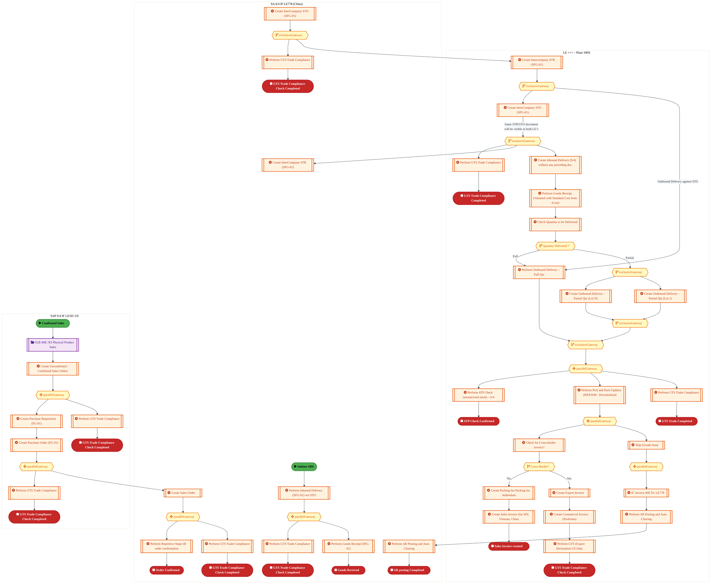
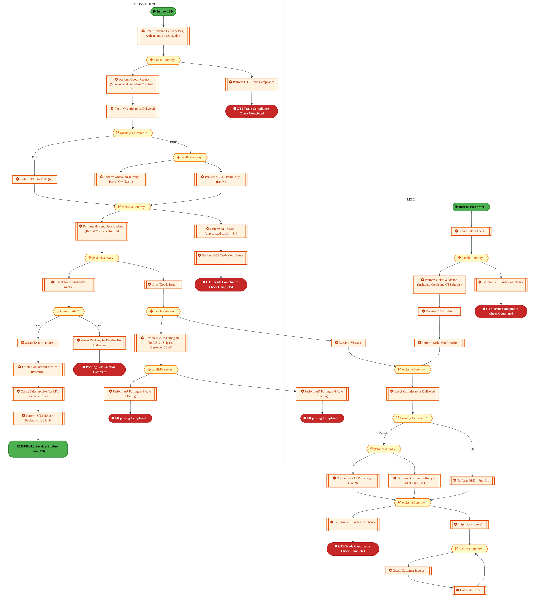
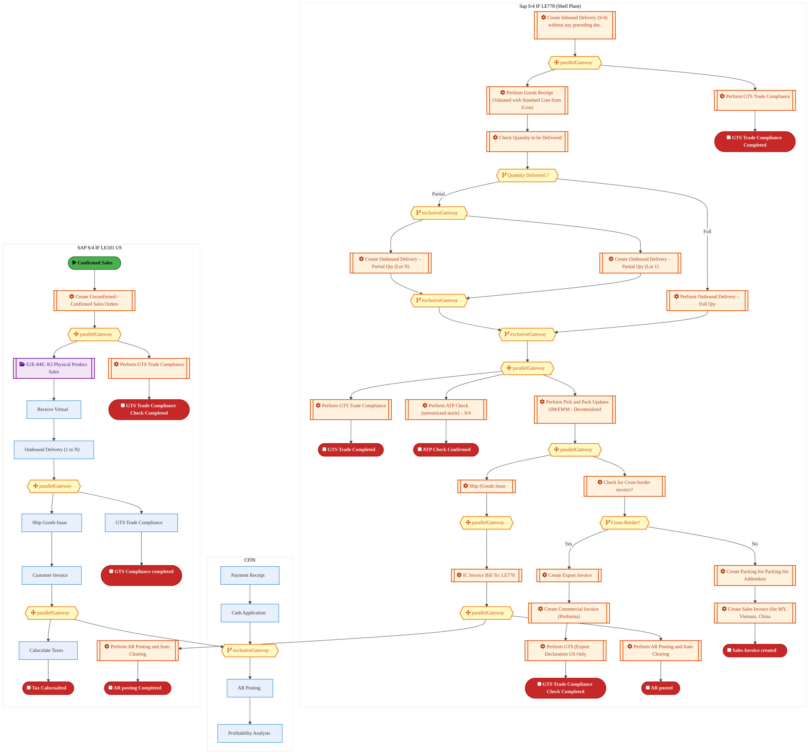
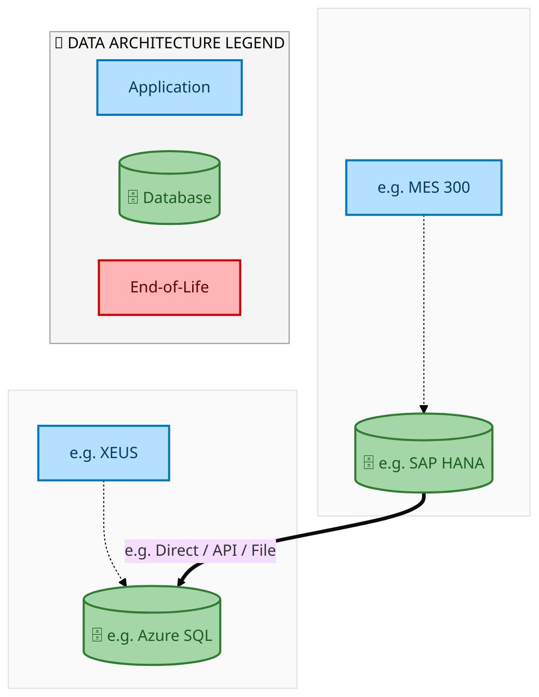
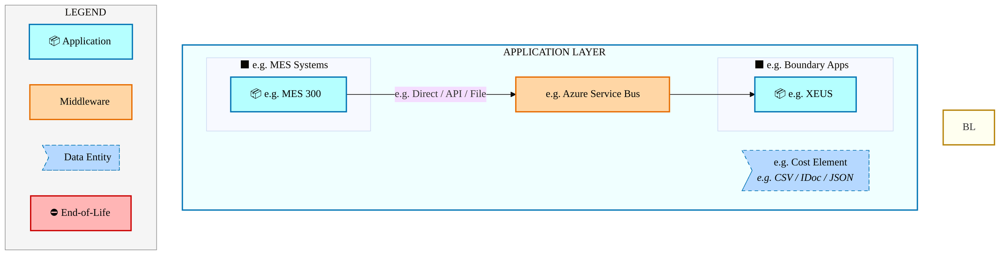
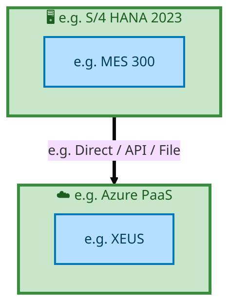

  
  <img src="data:image/svg+xml;base64,PHN2ZyB4bWxucz0iaHR0cDovL3d3dy53My5vcmcvMjAwMC9zdmciIHZpZXdCb3g9IjAgMCA4MDAgNDgwIiB3aWR0aD0iODAwIiBoZWlnaHQ9IjQ4MCI+CiAgPGRlZnM+CiAgICA8bGluZWFyR3JhZGllbnQgaWQ9ImJnIiB4MT0iMCUiIHkxPSIwJSIgeDI9IjEwMCUiIHkyPSIxMDAlIj4KICAgICAgPHN0b3Agb2Zmc2V0PSIwJSIgc3R5bGU9InN0b3AtY29sb3I6IzAwNzFjNTtzdG9wLW9wYWNpdHk6MSIvPgogICAgICA8c3RvcCBvZmZzZXQ9IjEwMCUiIHN0eWxlPSJzdG9wLWNvbG9yOiMwMGFlZWY7c3RvcC1vcGFjaXR5OjEiLz4KICAgIDwvbGluZWFyR3JhZGllbnQ+CiAgICA8bGluZWFyR3JhZGllbnQgaWQ9ImFjY2VudCIgeDE9IjAlIiB5MT0iMCUiIHgyPSIwJSIgeTI9IjEwMCUiPgogICAgICA8c3RvcCBvZmZzZXQ9IjAlIiBzdHlsZT0ic3RvcC1jb2xvcjojZmZmZmZmO3N0b3Atb3BhY2l0eTowLjE1Ii8+CiAgICAgIDxzdG9wIG9mZnNldD0iMTAwJSIgc3R5bGU9InN0b3AtY29sb3I6I2ZmZmZmZjtzdG9wLW9wYWNpdHk6MC4wMiIvPgogICAgPC9saW5lYXJHcmFkaWVudD4KICAgIDxwYXR0ZXJuIGlkPSJncmlkIiB3aWR0aD0iNDAiIGhlaWdodD0iNDAiIHBhdHRlcm5Vbml0cz0idXNlclNwYWNlT25Vc2UiPgogICAgICA8cGF0aCBkPSJNIDQwIDAgTCAwIDAgMCA0MCIgZmlsbD0ibm9uZSIgc3Ryb2tlPSJyZ2JhKDI1NSwyNTUsMjU1LDAuMDcpIiBzdHJva2Utd2lkdGg9IjAuNSIvPgogICAgPC9wYXR0ZXJuPgogIDwvZGVmcz4KCiAgPCEtLSBCYWNrZ3JvdW5kIC0tPgogIDxyZWN0IHdpZHRoPSI4MDAiIGhlaWdodD0iNDgwIiBmaWxsPSJ1cmwoI2JnKSIgcng9IjgiLz4KICA8cmVjdCB3aWR0aD0iODAwIiBoZWlnaHQ9IjQ4MCIgZmlsbD0idXJsKCNncmlkKSIgcng9IjgiLz4KICA8cmVjdCB3aWR0aD0iODAwIiBoZWlnaHQ9IjQ4MCIgZmlsbD0idXJsKCNhY2NlbnQpIiByeD0iOCIvPgoKICA8IS0tIERlY29yYXRpdmUgY2lyY3VpdC9hcmNoaXRlY3R1cmUgbGluZXMgLS0+CiAgPGcgc3Ryb2tlPSJyZ2JhKDI1NSwyNTUsMjU1LDAuMTIpIiBzdHJva2Utd2lkdGg9IjEuNSIgZmlsbD0ibm9uZSI+CiAgICA8cGF0aCBkPSJNIDAgMTAwIEwgMTIwIDEwMCBMIDE2MCAxNDAgTCAyODAgMTQwIi8+CiAgICA8cGF0aCBkPSJNIDAgMjYwIEwgODAgMjYwIEwgMTIwIDIyMCBMIDIwMCAyMjAgTCAyNDAgMjYwIEwgMzYwIDI2MCIvPgogICAgPHBhdGggZD0iTSA1MjAgMTAwIEwgNjAwIDEwMCBMIDY0MCA2MCBMIDgwMCA2MCIvPgogICAgPHBhdGggZD0iTSA0NDAgMzQwIEwgNTYwIDM0MCBMIDYwMCAzMDAgTCA3MjAgMzAwIEwgNzYwIDM0MCBMIDgwMCAzNDAiLz4KICAgIDxwYXRoIGQ9Ik0gNjAwIDQwMCBMIDY4MCA0MDAgTCA3MjAgNDQwIi8+CiAgICA8cGF0aCBkPSJNIDAgNDAwIEwgNDAgNDAwIEwgODAgMzYwIi8+CiAgICA8cGF0aCBkPSJNIDIwMCA0MjAgTCAzMjAgNDIwIEwgMzYwIDM4MCBMIDQ4MCAzODAiLz4KICAgIDxwYXRoIGQ9Ik0gNjUwIDQ0MCBMIDc1MCA0NDAgTCA4MDAgNDgwIi8+CiAgPC9nPgoKICA8IS0tIERlY29yYXRpdmUgbm9kZXMgLS0+CiAgPGcgZmlsbD0icmdiYSgyNTUsMjU1LDI1NSwwLjE4KSI+CiAgICA8Y2lyY2xlIGN4PSIxMjAiIGN5PSIxMDAiIHI9IjQiLz4KICAgIDxjaXJjbGUgY3g9IjI4MCIgY3k9IjE0MCIgcj0iNCIvPgogICAgPGNpcmNsZSBjeD0iMjAwIiBjeT0iMjIwIiByPSI0Ii8+CiAgICA8Y2lyY2xlIGN4PSIzNjAiIGN5PSIyNjAiIHI9IjQiLz4KICAgIDxjaXJjbGUgY3g9IjYwMCIgY3k9IjEwMCIgcj0iNCIvPgogICAgPGNpcmNsZSBjeD0iNzIwIiBjeT0iMzAwIiByPSI0Ii8+CiAgICA8Y2lyY2xlIGN4PSI1NjAiIGN5PSIzNDAiIHI9IjQiLz4KICAgIDxjaXJjbGUgY3g9IjgwIiBjeT0iMzYwIiByPSI0Ii8+CiAgICA8Y2lyY2xlIGN4PSI0ODAiIGN5PSIzODAiIHI9IjQiLz4KICAgIDxjaXJjbGUgY3g9IjMyMCIgY3k9IjQyMCIgcj0iNCIvPgogIDwvZz4KCiAgPCEtLSBUT0dBRiBCREFUIGJveGVzIC0tPgogIDxnIGZvbnQtZmFtaWx5PSJTZWdvZSBVSSwgQXJpYWwsIHNhbnMtc2VyaWYiIGZvbnQtc2l6ZT0iMTQiIGZvbnQtd2VpZ2h0PSI2MDAiPgogICAgPCEtLSBCIC0tPgogICAgPHJlY3QgeD0iMTUwIiB5PSIxNDAiIHdpZHRoPSIxMjAiIGhlaWdodD0iNDAiIHJ4PSI1IiBmaWxsPSJyZ2JhKDI1NSwyNTUsMjU1LDAuMTgpIiBzdHJva2U9InJnYmEoMjU1LDI1NSwyNTUsMC4zKSIgc3Ryb2tlLXdpZHRoPSIxIi8+CiAgICA8dGV4dCB4PSIyMTAiIHk9IjE2NSIgdGV4dC1hbmNob3I9Im1pZGRsZSIgZmlsbD0iI2ZmZiI+QnVzaW5lc3M8L3RleHQ+CiAgICA8IS0tIEQgLS0+CiAgICA8cmVjdCB4PSIyOTAiIHk9IjE0MCIgd2lkdGg9IjEyMCIgaGVpZ2h0PSI0MCIgcng9IjUiIGZpbGw9InJnYmEoMjU1LDI1NSwyNTUsMC4xOCkiIHN0cm9rZT0icmdiYSgyNTUsMjU1LDI1NSwwLjMpIiBzdHJva2Utd2lkdGg9IjEiLz4KICAgIDx0ZXh0IHg9IjM1MCIgeT0iMTY1IiB0ZXh0LWFuY2hvcj0ibWlkZGxlIiBmaWxsPSIjZmZmIj5EYXRhPC90ZXh0PgogICAgPCEtLSBBIC0tPgogICAgPHJlY3QgeD0iNDMwIiB5PSIxNDAiIHdpZHRoPSIxMjAiIGhlaWdodD0iNDAiIHJ4PSI1IiBmaWxsPSJyZ2JhKDI1NSwyNTUsMjU1LDAuMTgpIiBzdHJva2U9InJnYmEoMjU1LDI1NSwyNTUsMC4zKSIgc3Ryb2tlLXdpZHRoPSIxIi8+CiAgICA8dGV4dCB4PSI0OTAiIHk9IjE2NSIgdGV4dC1hbmNob3I9Im1pZGRsZSIgZmlsbD0iI2ZmZiI+QXBwbGljYXRpb248L3RleHQ+CiAgICA8IS0tIFQgLS0+CiAgICA8cmVjdCB4PSI1NzAiIHk9IjE0MCIgd2lkdGg9IjEyMCIgaGVpZ2h0PSI0MCIgcng9IjUiIGZpbGw9InJnYmEoMjU1LDI1NSwyNTUsMC4xOCkiIHN0cm9rZT0icmdiYSgyNTUsMjU1LDI1NSwwLjMpIiBzdHJva2Utd2lkdGg9IjEiLz4KICAgIDx0ZXh0IHg9IjYzMCIgeT0iMTY1IiB0ZXh0LWFuY2hvcj0ibWlkZGxlIiBmaWxsPSIjZmZmIj5UZWNobm9sb2d5PC90ZXh0PgogIDwvZz4KCiAgPCEtLSBDb25uZWN0aW5nIGxpbmVzIGJldHdlZW4gQkRBVCBib3hlcyAtLT4KICA8ZyBzdHJva2U9InJnYmEoMjU1LDI1NSwyNTUsMC4yNSkiIHN0cm9rZS13aWR0aD0iMSI+CiAgICA8bGluZSB4MT0iMjcwIiB5MT0iMTYwIiB4Mj0iMjkwIiB5Mj0iMTYwIi8+CiAgICA8bGluZSB4MT0iNDEwIiB5MT0iMTYwIiB4Mj0iNDMwIiB5Mj0iMTYwIi8+CiAgICA8bGluZSB4MT0iNTUwIiB5MT0iMTYwIiB4Mj0iNTcwIiB5Mj0iMTYwIi8+CiAgPC9nPgoKICA8IS0tIE1haW4gdGl0bGUgLS0+CiAgPHRleHQgeD0iNDAwIiB5PSIyNjAiIHRleHQtYW5jaG9yPSJtaWRkbGUiIGZvbnQtZmFtaWx5PSJTZWdvZSBVSSwgQXJpYWwsIHNhbnMtc2VyaWYiIGZvbnQtc2l6ZT0iMzYiIGZvbnQtd2VpZ2h0PSI3MDAiIGZpbGw9IiNmZmZmZmYiIGxldHRlci1zcGFjaW5nPSIxIj4KICAgIElBTyBBcmNoaXRlY3R1cmUKICA8L3RleHQ+CiAgPHRleHQgeD0iNDAwIiB5PSIzMDAiIHRleHQtYW5jaG9yPSJtaWRkbGUiIGZvbnQtZmFtaWx5PSJTZWdvZSBVSSwgQXJpYWwsIHNhbnMtc2VyaWYiIGZvbnQtc2l6ZT0iMTgiIGZvbnQtd2VpZ2h0PSI0MDAiIGZpbGw9InJnYmEoMjU1LDI1NSwyNTUsMC44KSIgbGV0dGVyLXNwYWNpbmc9IjIiPgogICAgVE9HQUYgQkRBVCDCtyBJQU8gUHJvZ3JhbSDCtyBJRE0gMi4wCiAgPC90ZXh0PgoKICA8IS0tIEJvdHRvbSBhY2NlbnQgYmFyIC0tPgogIDxyZWN0IHg9IjI4MCIgeT0iMzQwIiB3aWR0aD0iMjQwIiBoZWlnaHQ9IjMiIHJ4PSIxLjUiIGZpbGw9InJnYmEoMjU1LDI1NSwyNTUsMC40KSIvPgoKICA8IS0tIEludGVsIHRleHQgLS0+CiAgPHRleHQgeD0iNDAwIiB5PSIzODAiIHRleHQtYW5jaG9yPSJtaWRkbGUiIGZvbnQtZmFtaWx5PSJTZWdvZSBVSSwgQXJpYWwsIHNhbnMtc2VyaWYiIGZvbnQtc2l6ZT0iMTMiIGZpbGw9InJnYmEoMjU1LDI1NSwyNTUsMC41KSIgbGV0dGVyLXNwYWNpbmc9IjMiPgogICAgSU5URUwgQ09ORklERU5USUFMCiAgPC90ZXh0Pgo8L3N2Zz4K" alt="IAO Architecture" style="width:100%; border-radius:8px;" />
  <h1 style="font-size:36px; margin-top:24px;">E2E-84 — Intel Foundry - Inventory Transfer  Shipment of goods through Stock transfer (Interim State)</h1>
  <h2 style="font-size:24px;">Architecture Document (TOGAF BDAT)</h2>
  
End-to-End Integrated Processes (E2E) Tower 
  Capability E2E-84 · Forecast to Stock

  
IAO Program · R1 – R5 
  Generated: April 2026 
  Sajiv Francis

  
IAO Architecture Pipeline — Intel Confidential

Page 1<a href="#toc">↑ Back to TOC</a>E2E-84 — Intel Foundry - Inventory Transfer  Shipment of goods through Stock transfer (Interim State)

## Table of Contents

<nav class="toc">
<ol>
  <li><a href="#1-executive-summary">1. Executive Summary</a></li>
  <li><a href="#2-business-context-objectives">2. Business Context &amp; Objectives</a>
    <ul>
      <li><a href="#21-classification">2.1 Classification</a></li>
      <li><a href="#22-business-drivers">2.2 Business Drivers</a></li>
      <li><a href="#23-success-criteria">2.3 Success Criteria</a></li>
      <li><a href="#24-companion-documents">2.4 Companion Documents</a></li>
    </ul>
  </li>
  <li><a href="#3-business-architecture-togaf-b">3. Business Architecture (TOGAF &ldquo;B&rdquo;)</a>
    <ul>
      <li><a href="#31-business-process-overview">3.1 Business Process Overview</a></li>
      <li><a href="#32-business-process-diagrams">3.2 Business Process Diagrams</a></li>
      <li><a href="#33-business-roles-responsibilities">3.3 Business Roles &amp; Responsibilities</a></li>
    </ul>
  </li>
  <li><a href="#4-data-architecture-togaf-d">4. Data Architecture (TOGAF &ldquo;D&rdquo;)</a>
    <ul>
      <li><a href="#41-data-entities-ownership">4.1 Data Entities &amp; Ownership</a></li>
      <li><a href="#42-data-flow-diagrams">4.2 Data Flow Diagrams</a></li>
      <li><a href="#43-data-lineage">4.3 Data Lineage</a></li>
      <li><a href="#44-ricefw-data-objects">4.4 RICEFW Data Objects</a></li>
      <li><a href="#45-data-governance-quality">4.5 Data Governance &amp; Quality</a></li>
    </ul>
  </li>
  <li><a href="#5-application-architecture-togaf-a">5. Application Architecture (TOGAF &ldquo;A&rdquo;)</a>
    <ul>
      <li><a href="#51-current-state-current-state-application-landscape">5.1 Current-State Application Landscape</a></li>
      <li><a href="#52-future-state-future-state-application-landscape">5.2 Future-State Application Landscape</a></li>
      <li><a href="#53-change-impact-summary">5.3 Change Impact Summary</a></li>
      <li><a href="#54-component-overview">5.4 Component Overview</a></li>
      <li><a href="#55-ricefw-inventory">5.5 RICEFW Inventory</a></li>
      <li><a href="#56-integration-patterns">5.6 Integration Patterns</a></li>
    </ul>
  </li>
  <li><a href="#6-technology-architecture-togaf-t">6. Technology Architecture (TOGAF &ldquo;T&rdquo;)</a>
    <ul>
      <li><a href="#61-platform-infrastructure">6.1 Platform &amp; Infrastructure</a></li>
      <li><a href="#62-sap-development-object-status">6.2 SAP Development Object Status</a></li>
      <li><a href="#63-nfrs-design-principles">6.3 NFRs &amp; Design Principles</a></li>
      <li><a href="#64-security-governance">6.4 Security &amp; Governance</a></li>
    </ul>
  </li>
  <li><a href="#7-project-context">7. Project Context</a>
    <ul>
      <li><a href="#71-project-roadmap-go-live-plan">7.1 Project Roadmap &amp; Go-Live Plan</a></li>
      <li><a href="#72-raid-log">7.2 RAID Log</a></li>
      <li><a href="#73-recommendations-next-steps">7.3 Recommendations &amp; Next Steps</a></li>
    </ul>
  </li>
</ol>
</nav>

Page 2<a href="#toc">↑ Back to TOC</a>E2E-84 — Intel Foundry - Inventory Transfer  Shipment of goods through Stock transfer (Interim State)

## 1. Executive Summary

This Architecture Document defines the **Business, Data, Application, and Technology** (BDAT) architecture for **E2E-84 Intel Foundry - Inventory Transfer  Shipment of goods through Stock transfer (Interim State)** within the IAO program. It includes 5 BPMN process diagram(s) in Section 3.

| Dimension | Value |
|-----------|-------|
| **Tower** | End-to-End Integrated Processes (E2E) |
| **Process Group** | Forecast to Stock |
| **Capability** | E2E-84 - Intel Foundry - Inventory Transfer  Shipment of goods through Stock transfer (Interim State) |
| **Release** | R1 – R5 |
| **Total Systems** | 2 |
| **System Status** | 0 Deployed, 0 Developing, 0 EOL, 2 Pending IAPM |
| **RICEFW Objects** | Pending — Smartsheet Object Tracker API integration |

**Change Summary**: 0 new flow chains, 0 removed, 0 modified, 1 unchanged between Current-State and Future-State states.

> All system nodes in architecture diagrams are **IAPM-linked** — click any node to open its IAPM page. Diagrams require `securityLevel: 'loose'` for click events.

Page 3<a href="#toc">↑ Back to TOC</a>E2E-84 — Intel Foundry - Inventory Transfer  Shipment of goods through Stock transfer (Interim State)

## 2. Business Context & Objectives

### 2.1 Classification

| Level | Value |
|-------|-------|
| **L0 Tower** | End-to-End Integrated Processes |
| **L1 Process** | Forecast to Stock |
| **L2 Capability** | E2E-84 - Intel Foundry - Inventory Transfer  Shipment of goods through Stock transfer (Interim State) |

### 2.2 Business Drivers

| # | Driver | Description | Strategic Alignment | Priority |
|---|--------|-------------|---------------------|----------|
| 1 | End-to-End Process Integration | Enable cross-tower integrated processes spanning procurement, manufacturing, and fulfillment | IDM 2.0 Process Excellence | High |
| 2 | Intel Foundry Business Enablement | Stand up foundry-specific business processes for external customer engagement | Intel Foundry Services | High |
| 3 | Process Visibility & Monitoring | Provide end-to-end process visibility across tower boundaries with integrated monitoring | Operational Excellence | Medium |
| 4 | E2E-84 Process Migration | Migrate Intel Foundry - Inventory Transfer  Shipment of goods through Stock transfer (Interim State) business processes and 2 integrated systems from legacy to S/4 HANA target architecture | IDM 2.0 Cross-Functional / End-to-End | High |

Page 4<a href="#toc">↑ Back to TOC</a>E2E-84 — Intel Foundry - Inventory Transfer  Shipment of goods through Stock transfer (Interim State)

### 2.3 Success Criteria

| Metric | Target | Measure | Baseline | Owner |
|--------|--------|---------|----------|-------|
| E2E Process Cycle Time | Per process SLA | End-to-end transaction completion within defined SLA per process | Varies by process | E2E Process Owner |
| Cross-Tower Integration Success | > 99% | Transactions completing across tower boundaries without manual intervention | 92% (current) | Integration Lead |
| Process Exception Rate | < 2% | Transactions requiring manual exception handling | 8% (current) | Operations Manager |
| E2E-84 Migration Completeness | 100% flow chains validated | All 1 flow chains verified in target state | 0% (pre-migration) | Tower Architect |

### 2.4 Companion Documents

| Document | Description |
|----------|-------------|
| **Business Architecture** | Included in this document (Section 3) — process flows from BPMN diagrams |
| **This Document** | Full BDAT Architecture — Business + Data + Application + Technology |

Page 5<a href="#toc">↑ Back to TOC</a>E2E-84 — Intel Foundry - Inventory Transfer  Shipment of goods through Stock transfer (Interim State)

## 3. Business Architecture (TOGAF "B")

### 3.1 Business Process Overview

This capability includes **5 business process(es)** modeled in BPMN 2.0, covering the end-to-end workflow for E2E-84 Intel Foundry - Inventory Transfer  Shipment of goods through Stock transfer (Interim State).

| # | Step ID | Process Name | Lanes | Tasks | Gateways |
|---|---------|--------------|-------|-------|----------|
| 1 | E2E-84C-Final_Delivery_Plant_is_Non-S4_Plant_(Shell) | E2E-84C-Final_Delivery_Plant_is_Non-S4_Plant_(Shell) | LE +++ – Plant 100X 

, SA S/4 IF
LE778 (China)

, SAP S/4 IF
LE101 US | 36 | 15 |

| 2 | E2E-84D-Final_Delivery_Plant_is_Non-S4_Plant_(Shell) | E2E-84D-Final_Delivery_Plant_is_Non-S4_Plant_(Shell) | 

LE101, LE778 (Shell Plant)

 | 34 | 14 |
| 3 | E2E-84F__R3_SAP_TM_-_Embedded | E2E-84F__R3_SAP_TM_-_Embedded | Boundary Apps, EWM 

(De-Centralized), External Partners/B2B, SAP S/4 Intel Foundry - LE500 Ireland

 | 25 | 14 |
| 4 | E2E-84I-R3_-_Inventory_Transfer_Interim_State_Variation_-_3 | E2E-84I-R3_-_Inventory_Transfer_Interim_State_Variation_-_3 | 

Sap S/4 IF
LE778 (Shell Plant)
, CFIN, SAP S/4 IF
LE101 US | 32 | 14 |

| 5 | E2E-_84A-Final_Delivery_Plant_is_Non-S4_Plant_(Shell) | E2E-_84A-Final_Delivery_Plant_is_Non-S4_Plant_(Shell) | 

Sap S/4 IF
LE500 Ireland
, SA S/4 IF
LE778 (China)
-Shell Plant
, SAP S/4 IF
LE101 US | 39 | 16 |

Page 6<a href="#toc">↑ Back to TOC</a>E2E-84 — Intel Foundry - Inventory Transfer  Shipment of goods through Stock transfer (Interim State)

### 3.2 Business Process Diagrams

#### BUSINESS ARCHITECTURE — 3.2.1 E2E-84C-Final_Delivery_Plant_is_Non-S4_Plant_(Shell) — E2E-84C-Final_Delivery_Plant_is_Non-S4_Plant_(Shell)

**Swim Lanes**: LE +++ – Plant 100X 

 · SA S/4 IF
LE778 (China)

 · SAP S/4 IF
LE101 US | **Tasks**: 36 | **Gateways**: 15

> **Legend**: ● Start · ● End · User Task · Service Task · ◇ Gateway · Sub-Process

<a href="https://mermaid.live/view#pako:eNqtWWtv2zgW_SuEiyIOam9FUi_7wy4cxy4CtNNMnHZ2MBksaImOhciSR48k3kz--17KpOzQZNB16g9BdMRzH4eXl5T01InymHeGnffvn5IsqYbo6aRa8hU_GaKTOSv5SQ9tge-sSNg85eWJGLPIs2qW_LcZht31oxgmsClbJelGoDN-m3P07aKHRkBMe6hkWdkveZEsTnon6yJZsWIzztO8EKPf8XDhLBpv8tZZXsS82A1wnABHHlDTJOM7mAZu4E4Fr-RRnsUvjC68RbiITp5FcGn-EC1ZUTXh1yX_wh5_S-JqCdcLlpYcxiyrVfqZzXkqcqyKWmBRXdwrMZJS-MlAsNmaRUl2C7jrAFSw7G4Hec7zM3p-__4ma52i6_ObDMEvSllZnvMFKiuAJ_cVWiRpOnznjkdTz-mVVZHf8eE7MgnOKelFIpMhpO70hLj9B57cLqvhPE9jObT_IHIYkvVjr3gcEqdXbOCv5otn8c7T2CchCVtPZwEe47HytFgs3uQJdC2uWXknfU3olEzPW1_Y872xc2hPpXnuBiOs68SL-yTie0an0ymd7KSa-B527EbPptR3xprRW1bxB7bZGRyM3dbg1AumOLAa3PrTo6znl0UeKYN04k291mBwhqcjYjXojrAbygjBzm3B1kuUsoz_x_njpvN5gj58-IBuauJgii4BrxD4_zcMvun8uWWJX4b9P2D4gg0XrB_lt2hccMgSXWQVL6J8tWbZBs2ur1B3Nv3Ud_ApsF_QAzt93NK_WunhS_olLxZ5sUKfrmfoumAxR8JImrAs4jp1YPE8z-ssRuc8Te55sQHPH91T9JBUy7yukIhnXfCIx7DoUJxH_9DMEscSUZ7HJboCZrKuUPc7S2twFzeG0axiooXEEG0JC6bIVygR_-rpEqzFvOTRHfq1htlJqg2qcjTnKnIe62RijuxrXWkpy1mf1mmKfq02uh1qFM5q5hI6DnRiYQl1P-dQRwdpuW-0-MuBRc-c6-j6UorWrbOCw9pIIjELZZVHd6fKPsy4bs8_us5IYKZeJhAFTDtkA_98W8eQcom6F18-Tn77gvqQdMSzqmApbHcHUxma6gDMgnR5WfbnzSaGkuw-hyb2L51trvzJ4zqHLeNiS9I41DFyIOsVrHMxGZKHutCRRIJMnxOK7Rp2pXNIOmUFq5I8Q99m6GuW6tVHiTEQIaJYkWkCC-jFxSiOYSOqV7odcxXPGBw1drkISb_83kPfE15lbNUDpZOM6aa08p0tkzXqbhf8RVnWB1pqxXkxbh2eQSNH1_kQfZ4EQajzLEU4ukKX0CxExqKeRjX0gXHK4eCU3Wom3KDbmoCaX2v5Ro0IotpO90mhRtKqnhsoA42yW3jjPFskxeqA4jmve2nWltWhh3-ILSOw2KBPTzt9Y96fwwErWu76a9tZESyp5-d9qmumbpfj9kx5wPHMHP4YpXUJjj5tjws6zT-OFhxHC4-jDY6i-XsysqLIH8o-Syu0hpaQpjy1kLxjSP7_R4IWYjoqYSi62UhsGOhiul20qNv0iNODg5J58V7xNYfiAkngFMDXJapEC9j272i7VJp2qPfwV7rXV0HWe8ePHLOspzT36N3Pe9Px7vhdN3hzq7ScLA3nw23o6AH2L8hFMzP4oeOg5XTrHJ0_3Wv06xSeOS7gKTtptD871_oePWjWV2gtVbI2-INuvUvo_nC03p2bErVuBS55ezN36U-w4f6ETYUc1wmdY5oa_ilNjTRN7XLX1bCD4TSmtTNsXNnfskhNKvq4m-D9zlTqVW450dVFtGQlh5r6q07KpDkTds3rhL5uYVttFu7xvQ17xy_PUFuemlJ6IXo_oZj9t9vwyTFVSY8h7TXwRZ7C_PXzNc_QhEz6oTsZoit4DFxuyiSCRw944ojrqGql-1Mrbygx1O__UxSKBHwFuGoE3QI-kYAc4DuK4UiGvPa2l54aj30JBAoYbAH1sgoe3uUIFYTX-Pz7piMetG86f4tHdDVWuvcGCghkPCpgEsoRLSD9UeWPyohpG7Ir_f2SN96o8kalN9rK48rYQw2grm7rd6G4CF1FSqUQSgcqqb4nAZkJHWjKutrcqOhkor5Kw5c6YkcDWq2kQaIYUhlXETwZInF14GBq5KuGJkXPVynJYnHbuZbXyiGRAzyVM3E1wPO0CfZkkL5y4quYPB0IdEBRiARcNW1EenGVF6yqptVOjqBtYKrwtWvcAnL-cPACAK0O39ewW5ZkpTwW7de3J-PAKlKsjMzYiouj6EdxLIzzqF7xrEI32YM4Fs85uoetYJ5ylGRonldL2J2alzaDbRV6oeZATShWSqg8sZwzv615OWeY6EBLkZPoKinUdcuQ161TVdmqzqhqAapQqJK_nXWlbjtClX-gS9cuOEkJ914Oi5Lce4X94g6x3qHWO671jme941vvBNY7ofXOwHoHVLbesquA7TJguw7YLgS2K4HtUmC7FtguBrarQexqkFdqwq4GsatB7GoQuxrErgaxq0HsahC7GtSuBrWrQV9ZInY1qF0NaleD2tWAha0-173EQws-kJ_cXi5dx4hiI0qMKDWirhH1jKhvRAMjGhpRY26eMTfPmBtsZPL720uYmmHXDHtm2DfDgRkOzfDACMPxyAhjM2zO0jdn6Zuz9M1Z-uYsYcuS3yE7vc6KFyuWxJ3hU6f5fN8ZdmK-YHVadZ57HVZX-WyTRZ1h85m7UzdfPc4TBk-fqy34_D86p9VP" title="View full diagram">&#128065; View Diagram</a>

Page 7<a href="#toc">↑ Back to TOC</a>E2E-84 — Intel Foundry - Inventory Transfer  Shipment of goods through Stock transfer (Interim State)

#### BUSINESS ARCHITECTURE — 3.2.2 E2E-84D-Final_Delivery_Plant_is_Non-S4_Plant_(Shell) — E2E-84D-Final_Delivery_Plant_is_Non-S4_Plant_(Shell)

**Swim Lanes**: 
LE101 · LE778 (Shell Plant)

 | **Tasks**: 34 | **Gateways**: 14

> **Legend**: ● Start · ● End · User Task · Service Task · ◇ Gateway · Sub-Process

<a href="https://mermaid.live/view#pako:eNqtWW1v2zgS_iuEiiIOYF9EUrJkf7iF45dugHSbrdMuFpvDgZbomIgsGXpJ4kvz328ok3JMi12s23xIooczw5lnhjOU_eJEWcydofP-_YtIRTlEL2fliq_52RCdLVjBz7poB3xluWCLhBdnUmaZpeVc_K8Ww97mWYpJbMbWItlKdM7vM46-XHXRCBSTLipYWvQKnovlWfdsk4s1y7fjLMlyKf2Oh0t3We-mli6zPOb5XsB1Axz5oJqIlO9hGniBN5N6BY-yND4wuvSX4TI6e5XOJdlTtGJ5WbtfFfwje_5DxOUKnpcsKTjIrMp1cs0WPJExlnklsajKHzUZopD7pEDYfMMikd4D7rkA5Sx92EO--_qKXt-_v0ubTdHt5C5F8BMlrCgmfImKEuDpY4mWIkmG77zxaOa73aLMswc-fEemwYSSbiQjGULobleS23vi4n5VDhdZEivR3pOMYUg2z938eUjcbr6F38ZePI33O437JCRhs9NlgMd4rHdaLpc_tBPwmt-y4kHtNaUzMps0e2G_74_dY3s6zIkXjLDJE88fRcTfGJ3NZnS6p2ra97FrN3o5o313bBi9ZyV_Ytu9wcHYawzO_GCGA6vB3X6ml9XiJs8ibZBO_ZnfGAwu8WxErAa9EfZC5SHYuc_ZZoUSlvL_un_dOeh6il185_xnJyB_UvwXLCzZcMl6UXaPxjmHeNCcweFEn-SpKUD-rQI5VLjh-TLL1ztZ9JUlImalyFLUEWmUVDGUsTQaixKxNEYfbucoWvHooTg37NJDu595xMUjR-PbG_RlAza56Yj3PUfGWboU-bp2xdDz2_WkZ7c5i2HLbL1JBEsjbmj22zVHn9FNVpQyUhniqCozNE449Lj03rAQtAfZ-SrysmKJyUl4KD5fiQ3qfMiyuEBXRVFxU37QmsxxVZTZGki5Sh8zcRQVdk8mBJvVw5KoSuSet-z5KGHYKJ2xrAP0e8XSUpRbBKwtOJrwBBiBgjGVqSXdlxN0VxEXUzSrkgT9Xm5NTVuhVOUiqyBh8W7LrbZzA90Upow0hTrXWYmwyTP2_9aZIyO_HRW832mMbBLoIFcwM4Ukr6hPXz2zQOf8rU6w14GkbmTtbVTt1VniZc3cgU5o6LQlViXDamPw4zY8_-VlT1rMewsYddFqXwBN6tEvd87r61vVfrsqf4YWU4DSh10TNtWC09TCk9R8sldjeZ49FT2WlGjDcpYkPLEo0X-mBOO3rbtjyM71NAhC1JmvOByDG4DLc2T0-n5rf7hKd-dgos9BZ37hnaMnUa6ySrbtLdrk0KnqXh5n0b_M0xBYGkjdqOoetymhx7Gkgu3i2jCal0xesGIolwKuE3m2RkL-e3TUwh9pGoNTmwZxf3rTIPgnNA1iGb8jGJM7ajpVmnO4H4hIcg2HNXo41_Yhr6Y9enLzJ5a-eiPACzkIbxj8o2Y36lx9vJj-8RH1IFkRT0uob7jymwkjflu2wSzUalYUvUXdFJHYDbJfTO32-p4-bzK4NrdPPxK0z8xsDRMzkslQeqgDtzIZIDvKSdhqQoYvT0wioMAPHkZxDOe4Wpt2Bt-5izVeSDI-_tlFXwUvU7buAkciZeZscf_m5mDKW2pT7XpxCXdR6b78i26z4e4mWZuVT_qGcfFpPro1TZMfvjXR04uUenbVjioMKMgE-m19a_0yR5_SxOwGtG8b1VeXE3PMuf98RHvY0NHlci3Lpa4D6ZxWN7XJTxjO9CfY8MDElEx7ofdr7zN0s9W2EBGcIDg4cRWV6l7ToRf0_HAweYOTrwa-26666xe7F_8jHXzagPdOGfD-KUr9U5SCU5TCE-8fKUG93r_haKhH3N89-74Gwh3gDRTgDSTw7c6RI_fO-SbHs5YdKGWsjWMTUNsRvZ-vJAjREp5S8TTgK8DVgHKRBNqGUqFaQgnQwNxE28TBDsChAqgKUiuoPXFgALTx21Us_Cnfj75Jr8yV37LdQrOHJqOR1H7q2Klix3ONyIjOBlGOkyYbOhKtolKAsZkudSmpffJ1XERnV4v7yoUm_eqRGOv6WW3v6Zg845kof6imlrrKYmiw0LCiQ8QmoEP0lAbWTnj-UUlSc-kg_CaLKu-4KQydAd-UaAhRleBpCrFnAtQAdO00haCrSz_reDQFVFtoDoUGGsdV3ig2gMYJRTPVhaITrZ3wFNCcXWwKKNobr3Wc3psPumSBvPk47mCFWFeodcWzrvjWlb51JbCuhNaVgXUFKLUu2VnAdhqwnQdsJwLbmcB2KrCdC2wnA9vZIHY2yHdqws4GsbNB7GwQOxvEzgaxs0HsbBA7G9TOBrWzQb9zROxsUDsb0Fn0lwiHeN-CB-qLgEM0bEUHbajntqK4FSWtKG1FvXaPoZ-rT-oP4X47HLTDYTs8aIVhoLfCuB0m7TBth712uD1Kvz1Kvz1Kv4nS6TrwVrdmInaGL0791Z0zdGK-ZFVSOq9dh8Fb23ybRs6w_orLqeq3_Ylg9zlb78DX_wNWSp8U" title="View full diagram">&#128065; View Diagram</a>

Page 8<a href="#toc">↑ Back to TOC</a>E2E-84 — Intel Foundry - Inventory Transfer  Shipment of goods through Stock transfer (Interim State)

#### BUSINESS ARCHITECTURE — 3.2.3 E2E-84F__R3_SAP_TM_-_Embedded — E2E-84F__R3_SAP_TM_-_Embedded

**Swim Lanes**: Boundary Apps · EWM 
(De-Centralized) · External Partners/B2B · SAP S/4 Intel Foundry - LE500 Ireland

 | **Tasks**: 25 | **Gateways**: 14

```mermaid
%%{init: {'theme': 'base', 'themeVariables': {'fontSize': '14px', 'fontFamily': 'Segoe UI, Arial, sans-serif','primaryColor': '#e8f0fe', 'primaryBorderColor': '#0071c5','lineColor': '#37474F', 'secondaryColor': '#f5f8fc'}, 'flowchart': {'useMaxWidth': false, 'htmlLabels': true, 'curve': 'basis', 'nodeSpacing': 40, 'rankSpacing': 50}} }%%
flowchart LR
    classDef startEvt fill:#4CAF50,stroke:#2E7D32,color:#000,font-weight:bold,stroke-width:2px,rx:20,ry:20
    classDef endEvt fill:#C62828,stroke:#B71C1C,color:#fff,font-weight:bold,stroke-width:2px,rx:20,ry:20
    classDef userTask fill:#E3F2FD,stroke:#1565C0,stroke-width:2px,color:#0D47A1
    classDef serviceTask fill:#FFF3E0,stroke:#E65100,stroke-width:2px,color:#BF360C
    classDef gateway fill:#FFF9C4,stroke:#F57F17,stroke-width:2px,color:#E65100
    classDef subProc fill:#F3E5F5,stroke:#7B1FA2,stroke-width:2px,color:#4A148C
    subgraph lane_0["Boundary Apps"]
        n19["Reconcile CTSi Carrier Invoice and Dispute Management"]
        n20["Receive reconciled Carrier Invoice(s)"]
    end
    subgraph lane_1["EWM  (De-Centralized)"]
        n12["Release Wave and Pick WH Task Creation"]
        n13["Pick WH Task Confirmation (TR/TO)"]
        n14["Pack (Shipping Label Printing) and Packing List"]
        n15["Perform Loading"]
        n16["Post Goods Issue (EWM)"]
        n17["Outbound Delivery (OD) with HU Details"]
        n18["Receive Outbound Delivery Order in EWM"]
        n42{{"fa:fa-arrows-alt parallelGateway"}}
    end
    subgraph lane_2["External Partners/B2B"]
        n21["Send to SAP B4NL"]
        n22["Notify carrier"]
        n23["Capture Carrier Invoices (via EDI only)"]
        n24["Capture Execution events via BN4L-GTT"]
        n25["Capture Physical receipt of goods at LE778"]
        n28(["fa:fa-play Data needs to be Sent to B4NL"])
        n30(["fa:fa-stop Physical Receipt Captured"])
        n33{{"fa:fa-code-branch exclusiveGateway"}}
        n43{{"fa:fa-arrows-alt parallelGateway"}}
        n44{{"fa:fa-arrows-alt parallelGateway"}}
    end
    subgraph lane_3["SAP S/4 Intel Foundry - LE500 Ireland "]
        n1["Create Outbound Delivery (S/4)"]
        n2["Create/Update Freight Unit and Freight Order"]
        n3["Perform Carrier Selection and Calculate Charges"]
        n4["Send Loading Instructions to EWM"]
        n5["Send Rates/Charges: Freight forwarders (Within TM)"]
        n6["Ship (Goods Issue)"]
        n7["Execute Freight Order and Update Status Post GI"]
        n8["Create and Update Freight Settlement Document"]
        n9["Create Service PO/ Entry Sheet"]
        n10["Post Accrual to Freight Expense Account(s)"]
        n11["Allocate Freight Costs to Delivery Items (CO/PA) or Material Valuation"]
        n26(["fa:fa-play Outbound Delivery for EWM to be Created"])
        n27(["fa:fa-play Rates/Charges need to be Sent"])
        n29(["fa:fa-stop Accrual Posted and Freight Costs Allocated"])
        n31{{"fa:fa-code-branch exclusiveGateway"}}
        n32{{"fa:fa-code-branch exclusiveGateway"}}
        n34{{"fa:fa-arrows-alt parallelGateway"}}
        n35{{"fa:fa-arrows-alt parallelGateway"}}
        n36{{"fa:fa-arrows-alt parallelGateway"}}
        n37{{"fa:fa-arrows-alt parallelGateway"}}
        n38{{"fa:fa-arrows-alt parallelGateway"}}
        n39{{"fa:fa-arrows-alt parallelGateway"}}
        n40{{"fa:fa-arrows-alt parallelGateway"}}
        n41{{"fa:fa-arrows-alt parallelGateway"}}
    end
    n13 --> n14
    n12 --> n13
    n17 --> n42
    n42 --> n15
    n1 --> n34
    n2 --> n35
    n34 --> n2
    n3 --> n4
    n28 --> n33
    n7 --> n38
    n38 --> n41
    n33 --> n21
    n35 --> n31
    n8 --> n9
    n9 --> n39
    n39 --> n10
    n39 --> n11
    n11 --> n40
    n10 --> n40
    n31 --> n3
    n21 --> n43
    n22 --> n44
    n44 --> n23
    n43 --> n24
    n32 --> n7
    n44 --> n25
    n25 --> n30
    n40 --> n29
    n26 --> n1
    n18 --> n12
    n15 --> n16
    n43 --> n31
    n19 --> n20
    n41 --> n8
    n5 --> n36
    n27 --> n5
    n36 --> n31
    n36 -->|"Rates to CTSI"| n37
    n43 -->|"EDI/Manual"| n22
    n14 --> n17
    n4 --> n42
    n34 --> n18
    n16 --> n6
    n6 --> n32
    n37 --> n19
    n38 -->|"Book/Tender to 
Carrier via BN4L"| n33
    n24 -->|"POD Receipt Events"| n32
    n23 --> n37
    n20 --> n41
    n35 -->|"FO (Freight Order)  & HAWB
(House Airway Bill) Mapping"| n37
    class n26 startEvt
    class n27 startEvt
    class n28 startEvt
    class n29 endEvt
    class n30 endEvt
    class n31 gateway
    class n32 gateway
    class n33 gateway
    class n34 gateway
    class n35 gateway
    class n36 gateway
    class n37 gateway
    class n38 gateway
    class n39 gateway
    class n40 gateway
    class n41 gateway
    class n42 gateway
    class n43 gateway
    class n44 gateway
```

> **Legend**: ● Start · ● End · User Task · Service Task · ◇ Gateway · Sub-Process

<a href="https://mermaid.live/view#pako:eNqtWFtv4jgU_itWRt1SCUSuBHhYCQJMK3WmVWmnD9PVyg1OsWqSyHFo2U7_-x4ndgCXrrTs9mE0-XK-cz_HDm9WnC2INbROTt5oSsUQvZ2KJVmR0yE6fcQFOW2jGviBOcWPjBSnUibJUjGnf1Vijp-_SjGJzfCKso1E5-QpI-juoo1GQGRtVOC06BSE0-S0fZpzusJ8E2Us41L6C-kndlJZU6_GGV8QvhWw7dCJA6AympIt7IV-6M8kryBxli72lCZB0k_i03fpHMte4iXmonK_LMg3_HpPF2IJzwlmBQGZpVixS_xImIxR8FJiccnXOhm0kHZSSNg8xzFNnwD3bYA4Tp-3UGC_v6P3k5OHtDGKLm8eUgR_McNFMSEJKgTA07VACWVs-MWPRrPAbheCZ89k-MWdhhPPbccykiGEbrdlcjsvhD4txfAxYwsl2nmRMQzd_LXNX4eu3eYb-NewRdLF1lLUc_tuv7E0Dp3IibSlJEn-kyXIK7_FxbOyNfVm7mzS2HKCXhDZH_XpMCd-OHLMPBG-pjHZUTqbzbzpNlXTXuDYnysdz7yeHRlKn7AgL3izVTiI_EbhLAhnTvipwtqe6WX5eM2zWCv0psEsaBSGY2c2cj9V6I8cv688BD1PHOdLxHBK_rR_PljjrKyaGo3yvHiw_qjl5F_qDOD9jez6mDKCots5RRHmnBKOLtJ1BmlDOF2gCS3yUhD0Daf4CSY5Fft6XLvWQ-iaIK71LUxdreKs4UFHHXLYAUXT-28ItSakE4EhjhksicWZ4bhbGWQE9gu6x-vazWsaP6P7c1SVOuIEC5qlBtED4r5cliaUrypZ1Lq96d5emcZ8ycHAac2XNM9hRlE15Oia01TA41ltHkSqd7Qw8uMEUgPhScZX6DLDCxAzJHpSIisE-ppliwJdFEVJUAtSYToTguBVKR5lVdGEMEg51LZ1NTlDL1Qs0fkdoAJTZta6v1Ojjwqu5K5ENEVgcp_ou29vD1aChwnuQD2zl6KDmUA5htIwwr7Wk_Bgvb__Y2VlxaavgvAUQ-JgdaWEF92xOzZaSXbAHHQgkaH56BqN_e-XhohU9T0TNNmguO4wQ0AWOcK5KDkxe7BArTXFaDq5QFnKNkZ2XX-HOX0lcVm1BVlDJxZIEsff_cvO19tbgxfs8K6Xm4LGECWX2c4FymBfVFXFsManYdg3yP3WT53gnMFSmWCBUUoIMCAJjwRBPoT8r8rF2Q7Zs7fkQmT51vqNsq7cWphEb1tWeYJ3HuEMipeIvMasLKApPhS27gbv33VDTfL_lxaSZZUtMe_6UE4BAziTTQzd24G8BraNLjhhchSN1pfFkevgUOO3QJvZBY189y5fSNqMV6cZuoMLTjXrGqjGZp_t7cy6br45rKq4aiVJjjCLSyb1RnC0PxFjUn09AWpTQKyw-cuKX3XEhxENNOMGlBZdpXXYeAm-vGDpKXT_PSwJGPNbc7HIBSTXG2rtbCBDJqxmWE4F2c9AFZbK1VxgURaoXmYX-wr620rsMLSqORGCVccLmmRx-fGcGWzp8_pUR9dXXTSFY2KD5ktCzL1r6606imNewlBA9rS16WtOUjg-4BV0hNg9nGqybJsRY1m862ME2qoiNA10IcgK8hpdda9HZyjjcErCloMLK_qBWXngDHJ7xrx_bEoomKyyGv86ZHOA3dBQs1f8an_srA-TPDDWhk6QzBYQd3u8Dlln4sMecY7aI557HM0_Yv14wTGk3jGk8BhS_xjS4Jg9bB9Dco5c3nDZQp3O7_ICpQFXAZ4GwhrwXQX4WiLQEvWzp1Wo955-7_k1oBUok414X8lri8qg19fySsB3NKA0uA0QKIoGFGOgHgfqtX72FODYJqAVOCooX0s4tgF4OmwdhmY0gMqDrwP1dR60hK_j0BKeooQmQ6fS1YFqL3zllqtDc3sqEu23SoWjs-8oFU7P8KJJnqOS4TZGVGi6INoJrcFVFWsK3jM01sAvuNzK_SdXHnzHwLnzS47jnhsgA_e-LnzFwKarBNzGcZUMp2EYjan7zNF-OsoP7ad2qyEov53BXqf9kh9k2XP3FsYEzk3w9iHVtwR9v6x9b0rtK9711aS51E2rG2ktqC26Otc6Btc2eztQqmZXqLV3gJ8h9Bs6H92PH9LWeVbKY5Fy-YE7hu_RMzjSqs-evaRWn65VT-hfIvbx8BO8_wk-UL8y7KGefRB19Af4Puwehr3DsH8YDg7DvcNweBjuH4YHB2GYs4Pw4Sj9w1H6h6P0myittrUi8KFLF9bwzap-kbOG1oIkuGTCem9buBTZfJPG1rD65coqq9vZhGK4gq9q8P1vB-QV7g==" title="View full diagram">&#128065; View Diagram</a>

Page 9<a href="#toc">↑ Back to TOC</a>E2E-84 — Intel Foundry - Inventory Transfer  Shipment of goods through Stock transfer (Interim State)

#### BUSINESS ARCHITECTURE — 3.2.4 E2E-84I-R3_-_Inventory_Transfer_Interim_State_Variation_-_3 — E2E-84I-R3_-_Inventory_Transfer_Interim_State_Variation_-_3

**Swim Lanes**: 
Sap S/4 IF
LE778 (Shell Plant)
 · CFIN · SAP S/4 IF
LE101 US | **Tasks**: 32 | **Gateways**: 14

> **Legend**: ● Start · ● End · User Task · Service Task · ◇ Gateway · Sub-Process

<a href="https://mermaid.live/view#pako:eNqlWW1v4rgW_isWo1GpBHdixyHAh72iFFaV5qU7dGa12q6uTOKUqCaJ8tKW7fa_7zHYAYx9tcvwoSqPz3NeHtvHTnjtRHnMO-PO-_evaZbWY_R6Ua_4ml-M0cWSVfyih3bAd1ambCl4dSFtkjyrF-mfWzNMixdpJrE5W6diI9EFf8g5-nbTQxMgih6qWFb1K16myUXvoijTNSs301zkpbR-x4eJl2yjqaGrvIx5uTfwvBBHAVBFmvE97Ic0pHPJq3iUZ_GR0yRIhkl08SaTE_lztGJlvU2_qfgn9vJrGtcr-J4wUXGwWdVr8ZEtuZA11mUjsagpn7QYaSXjZCDYomBRmj0ATj2ASpY97qHAe3tDb-_f32dtUHR3fZ8h-ESCVdU1T1BVAzx7qlGSCjF-R6eTeeD1qrrMH_n4HZmF1z7pRbKSMZTu9aS4_WeePqzq8TIXsTLtP8saxqR46ZUvY-L1yg38NWLxLN5Hmg7IkAzbSFchnuKpjpQkyQ9FAl3LO1Y9qlgzf07m120sHAyCqXfqT5d5TcMJNnXi5VMa8QOn8_ncn-2lmg0C7LmdXs39gTc1nD6wmj-zzd7haEpbh_MgnOPQ6XAXz8yyWd6WeaQd-rNgHrQOwys8nxCnQzrBdKgyBD8PJStWSLCM_8_7_b6DFqxAiw8U3czRx1kYDlF3seJCoFswqS_RfeePHVV-Mkx_B07CxgnrR_kDuuVlkpdr9PPdAt2VLOZomq8LkbIs4sA8ogbH1GnJQSV0ky3zJovRNRfpEy83EP4DvUTPab3KmxqxbIOKkkc8hrWP4jz6j-l24Mgoz-MKfQVmWtSo-52JBsLFW8doUTO5k2PItoJ1W-ZrlMp_L03noZHzikeP6JcGlEnrDapztOQ6cx6b5KE9sy9NbZR83xAP-2jegOy_1BvTz8gqnNPNLWx8aIjSE-p-zGuEzbKI94MeP594xPZaJ3e3SrRuk5UclmgayVmo6jx6vNT-YcZNf-TsdUZ8O_U2hSxg2qEa-OdbEUPJFerefPow-_UT6kPREc_qkgk4dcypJNS2DsAtSJdXVX-5PUtQmj3l0Ev-a7LtK3_2UuTQuW92JJMzsHKg6jUvIzkZioe60BhkgexkTkK3hl0VHIoWrGR1mmfo2wJ9yYS5-sjQmogUUe5IkcIGOvoyiWM4D5q16ce-ihcMTvx9LVLST7_10PeU1xlb90DpNGOGK99YvotVWqDubsPfVFVjaukbi_Nm2ga8gn6K7vLxrvWZPMcinHxFt9AsZMVyPU0a6ANTweH-kj2YLobd1gWs-cKoN9qKIFfb5SFpZJCMVc9PKdT7_5TtRnGzscHeb9tpniVpuT6lkH8UUPlwhPXNsF9RAcKeGtLX1_1ExLy_hAtRtNo34rYFI9h7b2-H1MBO3e3b3R3whDOwc_hLJJoKAv28O95NWngebXgWLfD3NFaW-XPVZ6JGBexmIbhwkOg5pOAc0uAcUvjvSNBnbNcaDKtqOr_5fHx1CQHd79zjsSGMyTaa1myZCrmiJhkTG7iQH9uNpGdWrdCkgCUebfumcUGSd6pbtlnDWaJvH8cWdPRv59tRJoFIi8nt_vKGPQxN3MgHjLZpPHFoqmXdMHFsIL2cHvxdLC8322P-sDHJiLLZHvfaw-LAwnFGH86zlLGBLQ9n2cH5d2Ax2AotmqgR8pS4Yy_cmAqMrefJtyzSHQt92Hcv1Xe_yO1emfer8-8a2P_xE-KgCRYCnhmMnM2zgf543_UDi48DduTiDQweTAvazRJs01Pz0N7epSqu1ALvnLaBzyGRc0gHl6EEHl152c8LnqEZmfWHdDZGX-GyvIK-EcEFDRpK3ER1O41_GLsZnohQv_-T7JUaCHcApQqgVAJ_3Xfko8F95y_5UKFth8pWA8RX3nwNUGURaEDFIzoeGSgg1PECFe9zvo1GWucqGhkpIFDRCDUA3zN9_Sarl850Hr6nMtVcrLk6D6wSw21iShniGQAemVKph5VtSKr5ZKQitPIpgLZaeAZAB4bAVGkQ6DoCrSc2Ad8EiI5CVB46bYJVlNaHmjVfA1hPoy4dax-tfMpHoC0CVQtuw-qFpQFfKY6xQQl0tYGqtk1DVaI9KvOWr8Z15bqKds6VvTZXX7U7pbWvxQ_0AjgBdNG-LlpPcaBq9IkBYJ2Tr5KmvpF0u4aVgQ6qHGhJ9JIZGeYtQJVFu4yVqKODtznb6Tp46XQ8RNxDvnuIuocC99DAPRS6h4buoZFzCDaXc8itBnGrQdxqELcaxK0GcatB3GoQtxrErYbvVsN3q-G71YDdrF_3HuNUvZo9RgMrOrCioRUdWtGRDaWeFcVWlFhR34pS_Zb1GA7s8MAOh3Z4aIdHVhhapxXGdpjYYd8O26sM7FUG9ioDe5XQ4dVr5U6vAzfxNUvjzvi1s_01pjPuxDxhjag7b70OgwvsYpNFnfH2V4tOs317dp0yeBxZ78C3vwHgkefA" title="View full diagram">&#128065; View Diagram</a>

Page 10<a href="#toc">↑ Back to TOC</a>E2E-84 — Intel Foundry - Inventory Transfer  Shipment of goods through Stock transfer (Interim State)

#### BUSINESS ARCHITECTURE — 3.2.5 E2E-_84A-Final_Delivery_Plant_is_Non-S4_Plant_(Shell) — E2E-_84A-Final_Delivery_Plant_is_Non-S4_Plant_(Shell)

**Swim Lanes**: 
Sap S/4 IF
LE500 Ireland
 · SA S/4 IF
LE778 (China)
-Shell Plant
 · SAP S/4 IF
LE101 US | **Tasks**: 39 | **Gateways**: 16

```mermaid
%%{init: {'theme': 'base', 'themeVariables': {'fontSize': '14px', 'fontFamily': 'Segoe UI, Arial, sans-serif','primaryColor': '#e8f0fe', 'primaryBorderColor': '#0071c5','lineColor': '#37474F', 'secondaryColor': '#f5f8fc'}, 'flowchart': {'useMaxWidth': false, 'htmlLabels': true, 'curve': 'basis', 'nodeSpacing': 40, 'rankSpacing': 50}} }%%
flowchart TD
    classDef startEvt fill:#4CAF50,stroke:#2E7D32,color:#000,font-weight:bold,stroke-width:2px,rx:20,ry:20
    classDef endEvt fill:#C62828,stroke:#B71C1C,color:#fff,font-weight:bold,stroke-width:2px,rx:20,ry:20
    classDef userTask fill:#E3F2FD,stroke:#1565C0,stroke-width:2px,color:#0D47A1
    classDef serviceTask fill:#FFF3E0,stroke:#E65100,stroke-width:2px,color:#BF360C
    classDef gateway fill:#FFF9C4,stroke:#F57F17,stroke-width:2px,color:#E65100
    classDef subProc fill:#F3E5F5,stroke:#7B1FA2,stroke-width:2px,color:#4A148C
    subgraph lane_0[" Sap S/4 IF LE500 Ireland "]
        n17[["fa:fa-cog Create Intercompany STR (SFG-01)"]]
        n18[["fa:fa-cog Create Inter Company STO (SFG-01)"]]
        n19[["fa:fa-cog Perform GTS Trade Compliance"]]
        n20[["fa:fa-cog Create Planned Order (SFG-01)"]]
        n21[["fa:fa-cog Perform Steps till Prod Order Execution"]]
        n22[["fa:fa-cog Create GR against Prod Order"]]
        n23[["fa:fa-cog Move to Unrestricted Stock"]]
        n24[["fa:fa-cog Check Quantity to be Delivered"]]
        n25[["fa:fa-cog Perform Outbound Delivery – Full Qty"]]
        n26[["fa:fa-cog Perform Outbound Delivery – Partial Qty (Lot N)"]]
        n27[["fa:fa-cog Perform outbound Delivery – Partial Qty (Lot 1)"]]
        n28[["fa:fa-cog Perform ATP Check (unrestricted stock) – S/4"]]
        n29[["fa:fa-cog Perform GTS Trade Compliance"]]
        n30[["fa:fa-cog Perform Pick and Pack Updates (IM/EWM - Decentralized"]]
        n31[["fa:fa-cog Check for Cross-border invoice?"]]
        n32[["fa:fa-cog Create Export Invoice"]]
        n33[["fa:fa-cog Create Commercial Invoice (Proforma)"]]
        n34[["fa:fa-cog Perform GTS (Export Declaration US Only"]]
        n35[["fa:fa-cog Create Sales Invoice (for MY, Vietnam, China"]]
        n36[["fa:fa-cog Create Packing list Packing list Addendum"]]
        n37[["fa:fa-cog Ship (Goods Issue"]]
        n38[["fa:fa-cog IC Invoice Bill To: LE778"]]
        n39[["fa:fa-cog Perform AR Posting and Auto Clearing"]]
        n42(["fa:fa-play Planned order"])
        n50(["fa:fa-stop ATP Check Confirmed"])
        n51(["fa:fa-stop GTS Trade Completed"])
        n52(["fa:fa-stop GTS Trade Compliance Check Completed"])
        n53(["fa:fa-stop GTS Trade Compliance Check Completed"])
        n54{{"fa:fa-code-branch Quantity Delivered ?"}}
        n55{{"fa:fa-code-branch Cross-Border?"}}
        n56{{"fa:fa-code-branch exclusiveGateway"}}
        n57{{"fa:fa-code-branch exclusiveGateway"}}
        n58{{"fa:fa-code-branch exclusiveGateway"}}
        n64{{"fa:fa-arrows-alt parallelGateway"}}
        n65{{"fa:fa-arrows-alt parallelGateway"}}
        n66{{"fa:fa-arrows-alt parallelGateway"}}
        n67{{"fa:fa-arrows-alt parallelGateway"}}
        n68{{"fa:fa-arrows-alt parallelGateway"}}
    end
    subgraph lane_1["SA S/4 IF LE778 (China) -Shell Plant "]
        n1[["fa:fa-cog Perform Repetitive Steps till order confirmation"]]
        n2[["fa:fa-cog Create Sales Order"]]
        n3[["fa:fa-cog Create Inter Company Stock Transfer Request (SFG-01)"]]
        n4[["fa:fa-cog Perform GTS Trade Compliance"]]
        n5[["fa:fa-cog Create Inter Company stock transfer (SFG-01)"]]
        n6[["fa:fa-cog Perform GTS Trade Compliance"]]
        n7[["fa:fa-cog Perform AR Posting and Auto Clearing"]]
        n8[["fa:fa-cog Perform Inbound Delivery (SFG-01) wrt STO"]]
        n9[["fa:fa-cog Perform Goods Receipt (SFG-01)"]]
        n10[["fa:fa-cog Write-Off Inventory"]]
        n11[["fa:fa-cog Perform GTS Trade Compliance"]]
        n40(["fa:fa-play Initiate IBD"])
        n43(["fa:fa-stop AR posting Completed"])
        n44(["fa:fa-stop Inventory Writ-Off Complete"])
        n45(["fa:fa-stop GTS Trade Compliance Check Completed"])
        n46(["fa:fa-stop GTS Trade Compliance Check Completed"])
        n47(["fa:fa-stop GTS Trade Compliance Check Completed"])
        n59{{"fa:fa-arrows-alt parallelGateway"}}
        n60{{"fa:fa-arrows-alt parallelGateway"}}
        n61{{"fa:fa-arrows-alt parallelGateway"}}
        n69{{"fa:fa-arrows-alt inclusiveGateway"}}
    end
    subgraph lane_2["SAP S/4 IF LE101 US"]
        n12[["fa:fa-cog Create Unconfirmed / Confirmed Sales Orders"]]
        n13[["fa:fa-cog Create Purchase Requisition (FG-01)"]]
        n14[["fa:fa-cog Create Purchase Order (FG-01)"]]
        n15[["fa:fa-cog Perform GTS Trade Compliance"]]
        n16[["fa:fa-cog Perform GTS Trade Compliance"]]
        n41(["fa:fa-play Confirmed sales orders"])
        n48(["fa:fa-stop GTS Trade Compliance Check Completed"])
        n49(["fa:fa-stop GTS Trade Compliance Check Completed"])
        n62{{"fa:fa-arrows-alt parallelGateway"}}
        n63{{"fa:fa-arrows-alt parallelGateway"}}
        n70[["fa:fa-folder-open E2E-84E: R3 Physical Product Sales"]]
    end
    n13 --> n14
    n62 --> n15
    n14 --> n62
    n2 --> n59
    n59 --> n1
    n1 --> n69
    n3 --> n5
    n5 --> n61
    n17 --> n68
    n20 --> n21
    n21 --> n22
    n22 --> n23
    n23 --> n24
    n24 --> n54
    n54 -->|"Full"| n25
    n25 --> n58
    n30 --> n64
    n31 --> n55
    n33 --> n35
    n55 -->|"No"| n36
    n64 --> n31
    n64 --> n37
    n38 --> n39
    n55 -->|"Yes"| n32
    n39 --> n7
    n65 --> n38
    n37 --> n65
    n7 --> n43
    n59 --> n4
    n62 --> n2
    n58 --> n66
    n8 --> n60
    n60 --> n11
    n9 --> n10
    n10 --> n44
    n57 --> n27
    n57 --> n26
    n54 -->|"Partial"| n57
    n35 --> n34
    n32 --> n33
    n27 --> n56
    n26 --> n56
    n56 --> n58
    n66 --> n30
    n66 --> n28
    n66 --> n29
    n29 --> n51
    n28 --> n50
    n61 --> n6
    n61 --> n17
    n67 --> n19
    n69 --> n3
    n67 --> n69
    n16 --> n49
    n12 --> n63
    n63 --> n13
    n4 --> n45
    n6 --> n46
    n19 --> n52
    n42 --> n20
    n34 --> n53
    n11 --> n47
    n68 --> n18
    n68 -->|"Outbound Delivery against STO"| n25
    n18 -->|"Same STR/STO document 
will be visible in both LE’s"| n67
    n70 --> n12
    n63 --> n16
    n15 --> n48
    n41 --> n70
    n60 --> n9
    n40 --> n8
    class n1 serviceTask
    class n2 serviceTask
    class n3 serviceTask
    class n4 serviceTask
    class n5 serviceTask
    class n6 serviceTask
    class n7 serviceTask
    class n8 serviceTask
    class n9 serviceTask
    class n10 serviceTask
    class n11 serviceTask
    class n12 serviceTask
    class n13 serviceTask
    class n14 serviceTask
    class n15 serviceTask
    class n16 serviceTask
    class n17 serviceTask
    class n18 serviceTask
    class n19 serviceTask
    class n20 serviceTask
    class n21 serviceTask
    class n22 serviceTask
    class n23 serviceTask
    class n24 serviceTask
    class n25 serviceTask
    class n26 serviceTask
    class n27 serviceTask
    class n28 serviceTask
    class n29 serviceTask
    class n30 serviceTask
    class n31 serviceTask
    class n32 serviceTask
    class n33 serviceTask
    class n34 serviceTask
    class n35 serviceTask
    class n36 serviceTask
    class n37 serviceTask
    class n38 serviceTask
    class n39 serviceTask
    class n40 startEvt
    class n41 startEvt
    class n42 startEvt
    class n43 endEvt
    class n44 endEvt
    class n45 endEvt
    class n46 endEvt
    class n47 endEvt
    class n48 endEvt
    class n49 endEvt
    class n50 endEvt
    class n51 endEvt
    class n52 endEvt
    class n53 endEvt
    class n54 gateway
    class n55 gateway
    class n56 gateway
    class n57 gateway
    class n58 gateway
    class n59 gateway
    class n60 gateway
    class n61 gateway
    class n62 gateway
    class n63 gateway
    class n64 gateway
    class n65 gateway
    class n66 gateway
    class n67 gateway
    class n68 gateway
    class n69 gateway
    class n70 subProc
```

> **Legend**: ● Start · ● End · User Task · Service Task · ◇ Gateway · Sub-Process

<a href="https://mermaid.live/view#pako:eNqtWm1vIjcQ_isWp1M4CXRre1-AD60IgSjSpaEh6alqqsos3rDKskv3JQlN8987XuwFHDu6cpcPUfaxn_HM45mxWfLSCrMFbw1aHz--xGlcDtDLSbnkK34yQCdzVvCTDtoCv7E8ZvOEFydiTpSl5Sz-p56G3fWzmCawCVvFyUagM36fcXR70UFDICYdVLC06BY8j6OTzsk6j1cs34yyJMvF7A-8FzlRvZocOs3yBc93ExwnwKEH1CRO-Q6mgRu4E8EreJiliwOjkRf1ovDkVTiXZE_hkuVl7X5V8Ev2_DVelEt4jlhScJizLFfJFzbniYixzCuBhVX-qMSIC7FOCoLN1iyM03vAXQegnKUPO8hzXl_R68ePd2mzKLo5u0sR_IQJK4ozHqGiBHj8WKIoTpLBB3c0nHhOpyjz7IEPPpBxcEZJJxSRDCB0pyPE7T7x-H5ZDuZZspBTu08ihgFZP3fy5wFxOvkGfmtr8XSxW2nkkx7pNSudBniER2qlKIq-ayXQNb9hxYNca0wnZHLWrIU93xs5b-2pMM_cYIh1nXj-GId8z-hkMqHjnVRj38OO3ejphPrOSDN6z0r-xDY7g_2R2xiceMEEB1aD2_V0L6v5NM9CZZCOvYnXGAxO8WRIrAbdIXZ70kOwc5-z9RIlLOV_OX_ctdCMrdHss4suJujL2HMcdJFzGF2gu9afW5L4SXHwB8yO2CBi3TC7R6OcQ5DoIi15HmarNUs3aHZzjdqzyXnXwZ-AfUDv2elo1PCvrPz-IX_K8yjLV-j8ZoZucrbgtZEkZmnINSpxjEtPIciUL9CVaAO2ZQk2Lzsr-bpAJewGgn1RRsbPPKzKOEt1K8Towfk1YvcsTotyz4hOpYfUy-yRozJDt2nOYcPjsIQQZmUWPuhEV1tzycMH9GvF0jIuN8LEnKMznsSPPOcLneyZw76qynlWQW5I4gbdVcTBFE0qUOLXcqPb8f-nnSk0LWjmwhRqf8lK9MubHQnMJrNvNvl2k3tmk8ObqZStXe3LXQi5Pyn7UDu6veNzlTpm6jQGL0RRThn8cbteQP4UqH1x-Xn89RJ1IeiQp2XOEjgy9c2k2JQJYBbyMCuK7rw-CFGcPmbQCH_W2ebcHT-vMzh2LrYknUONHIh6Bc1CbIbkoTYkvgiQ6XtCXbuGbbk4BJ2wnImCQ7czdJUmev5Rz-jIjME1Y-eDkOLy9w76LeZlylYdUChOmW7KN3cR2A84lVESiyrefxguFnAuVivdjpa_s2W8Ru3zLFuAR0VRvdFSS86LUeP4qWg_N9kA-nYQ9HSeJQmH12iaFaVwU-TTsIJOMEo4XL7Se82ES9qNiXUCx5lqmZlsVJ_2JnvObjIUyHqvekZZGsX5qk7MAwrWKFqB8PIthbxPqWuqWdZig_4AG-7Ly07dBe_O4YoWLnf9temsCArq9XWf6pmp22Lc3krfcHwzhz-HSVXAQufbC4dOC46j9Y6i-XuasDzPnoouS0q0hhJNEp5YSN4xJP8YUnAMqff_SFDxposWhoSbDXfXLChX1K67zCfUnS25uEbAxFK_c5lL-JqvOSQZbMT-PWTbxcNtrTHTLeSdXmi6etBvubGJo1AUT1pEAF_zvys4J223Kffoc9H7Bl_qYxk-VklfLD74R_sQfHdDtdwzLlLt5qJcR09wysGlWDNju17UZ8g13ATitXULsHbB-JrHJe9eRZE4VeAKkeX6GYrx0Yq5jnaAXKSQtvXOnZ5pHdXVuzLoupa62rqw62qcJoY6rjosxdWp3vcfAq7_A2wEP-Aw6h_T2ZxjSPgYktm9OLWdJpYmSuomOt11UexguPdpLdPc5W7TUF1C0OfdhWS_-xV63pv737TKwyUreN3r4iKub59tc62571uQnzzNXO_oqsPHtzgXawW7U6qolcqUUgc53PsBddD_fhs-OSY76RGkYK-LRlkCmnSzNU_RmIy7PXc8QNfwuXO5KeKQbV8QVGG5zbWd4E2WQ6ahbvcnkS8S8IkEPDXD3QI-kYCc4PXls9eXDEWQ89W4XEHZ8-RwMz2QQE_Zd7YAUTOItEgaD6QLhCpArkFUFEQ67SnAq4F_71ribcFd61_xnkHNlR55ygEqHfAVmUoHPEWhcj3aBOVJ879ktXHqKzmlIxTrQKBs9STQ1239LrZMGFNxU6m0ovrSc9p4rrRUfslnl2p7pe-2WsGTzvjKf_XsKILUBqt41OarCVhOcBvlpQ8k0AFf3xv5uqQO2mv0UUE2uyF9ps3uS4OeMkh8DfB8bYt9CVBHA4g-g6htITJSr0lLqY3X2FCZrz3jZr-ko1jZ9KVNqk1oagdLL9wGkMH7DUUVsAJkfrkqBZQF5RVWcag9d1UOqDioKh5lEstA3CYQGTruHQCwhW_frqnXjPVdcr_usOLM2IqL97efxTvYRRZWKy4-jqRP4qPFnKNHOOrmCYdTG82zcgmnb_36q7-tDl85FajUJLo0TegylVzltisDC_T0VnK78rm3905cdLi9N_cHI8Q6Qq0jrnXEs4741pHAOtKzjvStI1DN1iG7CtguA7brgO1CYLsS2C4FtmuB7WJguxrErgZ5JyfsahC7GsSuBrGrQexqELsaxK4GsatB7WpQuxr0nRKxq0HtalC7GtSuBrWrQe1qULsa0CnU156HOLbgxIJT-ZXmIeoaUc-I-kY0MKI9I9o3oZ5jRLERJUbUGBsc__I7y0PYM8O-GQ7McM8M940wdH8jjM0wMcPUDJuj9M1R-uYofXOUvjlK3xwlnJPyK91Wp7Xi-YrFi9bgpVX_J0Rr0FrwiFVJ2XrttFhVZrNNGrYG9X8MtKr6y5-zmMFH49UWfP0PuSA98Q==" title="View full diagram">&#128065; View Diagram</a>

Page 11<a href="#toc">↑ Back to TOC</a>E2E-84 — Intel Foundry - Inventory Transfer  Shipment of goods through Stock transfer (Interim State)

### 3.3 Business Roles & Responsibilities

| Role / Lane | Processes Involved | Description |
|------------|-------------------|-------------|
| LE +++ – Plant 100X 

 | E2E-84C-Final_Delivery_Plant_is_Non-S4_Plant_(Shell),  | |
| SA S/4 IF

LE778 (China)

 | E2E-84C-Final_Delivery_Plant_is_Non-S4_Plant_(Shell),  | |
| SAP S/4 IF

LE101 US | E2E-84C-Final_Delivery_Plant_is_Non-S4_Plant_(Shell), E2E-84I-R3_-_Inventory_Transfer_Interim_State_Variation_-_3, E2E-_84A-Final_Delivery_Plant_is_Non-S4_Plant_(Shell) | |

| 

LE101 | E2E-84D-Final_Delivery_Plant_is_Non-S4_Plant_(Shell),  | |

| LE778 (Shell Plant)
 | E2E-84D-Final_Delivery_Plant_is_Non-S4_Plant_(Shell),  | |
| Boundary Apps | E2E-84F__R3_SAP_TM_-_Embedded,  | |
| EWM 

(De-Centralized) | E2E-84F__R3_SAP_TM_-_Embedded,  | |

| External Partners/B2B | E2E-84F__R3_SAP_TM_-_Embedded,  | |
| SAP S/4 Intel Foundry - LE500 Ireland
 | E2E-84F__R3_SAP_TM_-_Embedded,  | |
| 

Sap S/4 IF
LE778 (Shell Plant)

 | E2E-84I-R3_-_Inventory_Transfer_Interim_State_Variation_-_3,  | |
| CFIN | E2E-84I-R3_-_Inventory_Transfer_Interim_State_Variation_-_3,  | |
| 

Sap S/4 IF
LE500 Ireland

 | E2E-_84A-Final_Delivery_Plant_is_Non-S4_Plant_(Shell) | |
| SA S/4 IF

LE778 (China)
-Shell Plant

 | E2E-_84A-Final_Delivery_Plant_is_Non-S4_Plant_(Shell) | |

Page 12<a href="#toc">↑ Back to TOC</a>E2E-84 — Intel Foundry - Inventory Transfer  Shipment of goods through Stock transfer (Interim State)

## 4. Data Architecture (TOGAF "D")

### 4.1 Data Entities & Ownership

| # | Data Entity | Source System | Target System | Data Owner | Classification | Volume | Master/Transaction |
|---|-------------|---------------|---------------|------------|----------------|--------|-------------------|
| 1 | e.g. Cost Element | e.g. MES 300 | e.g. XEUS | Data steward | e.g. Intel Confidential | e.g. 10K rows/day | Master / Transaction |

Page 13<a href="#toc">↑ Back to TOC</a>E2E-84 — Intel Foundry - Inventory Transfer  Shipment of goods through Stock transfer (Interim State)

### 4.2 Data Flow Diagrams

> **DATA ARCHITECTURE** — Database-to-database data flows. Applications (blue) sit above their hosting databases (green cylinders). Thick arrows show data movement between databases.

#### 4.2.1 Current-State — Current-State Data Flows

<a href="https://mermaid.live/view#pako:eNqdlYtO2zAUhl_FMqq0SS0LLWkhEkjObSAFxEjZJpEpchOntXCTKHFGS-m7z84N1jUMYUuRfS7_cb4TORsYJCGBGuz1NjSmXAMbD_IFWRIPasCDM5yLVV-schIUGeVrh_wmrHKyJGm8Zcp3nFE8YySXbqETJTF36VMtdaSmqypY2m28pGxdeVwyTwi4u-wDJASE-LaMYsljsMAZr9WKnFzh1Q8a8oW0RJjlRMYt-JI5eEZYWZZnRWmNxWu5KQ5oPJfmkSqNGY4fXhmP1e0WbHs9L25rganuxUCMgOE8N0kEcJrqyQpElDHtQFdN27b7Oc-SB6IdKMpkoo_r7eBRHk0bpqt-kLAkk-6Rqe7qhTNjzWo5pJpjNGnlhtbEHA075Y501RoqO3IkYS_Hs21d1dVWzzAUMTr1xmPp9uJKMS9m8wynC2ANrZNjw0SG4xN_7qOnIiO--82596BA-KuKliOkGQk4TeIWmhxNOiqzf1p3rkgkh_NDINdCQNO0ium_OeZOxU8e9IrwZBSKZxgce0VEFPHKUqwMAiLIg5-lZIn1rVOAweHgvKtSlUjisGbB14x0gmhgIzlb2JYi59-wj8QX_x-8LrrxL9A1-hDdK8v1R4rSABZbILbvYdyWfQOxiAEy5j2E65Psg9yUeg_jJvZDiPeXBWdn5881ILNkCr4AdHMpnjZl4m567v4odlrnkLk4_v0rYkGoABNNEUC3xsXl1DKmd7cWcKyv1rXZ0U3n9sXq-LLvKE0ZDbD07m-d45sdfTIxx9UVva9Fjm8JeSsOB0k0cGhEKvnqytjbjuoNG_qqnC3909PTf9DDPlySbIlpCLVN9RMQ_5KQRLhgXFzjEBc8cddxALXyYoZFGmJOTIoF0WVl3P4Bx0D_Cw==" title="View full diagram">&#128065; View Diagram</a>

Page 14<a href="#toc">↑ Back to TOC</a>E2E-84 — Intel Foundry - Inventory Transfer  Shipment of goods through Stock transfer (Interim State)

#### 4.2.2 Future-State — Future-State Data Flows

<a href="https://mermaid.live/view#pako:eNqdlQ1PozAYx79KU7PkLtk83GRTEk3KgNMEjSfz7hK5kA7K1thRAuXcnPvu1_Iyvd3wjG1C2ufl_5TfQ8oahjwi0ICdzpomVBhg7UMxJwviQwP4cIpzuerKVU7CIqNi5ZLfhFVOxnnjLVO-44ziKSO5ckudmCfCo0-11JGeLqtgZXfwgrJV5fHIjBNwd9kFSApI8U0ZxfhjOMeZqNWKnFzh5Q8aibmyxJjlRMXNxYK5eEpYWVZkRWlN5Gt5KQ5pMlPmga6MGU4eXhmP9c0GbDodP9nWAhPTT4AcIcN5bpEY4DQ1-RLElDHjwNQtx3G6ucj4AzEONG00Mof1tveojmb002U35Ixnyj2w9F29aDpesVoO6dYQjbZyfXtkDfqtckembve1HTnC2cvxHMfUTX2rNx5rcrTqDYfK7SeVYl5MZxlO58Du2yfHjoXGbkCCWYCeiowE3jf33ocS4a8qWo2IZiQUlCdbaGo06ajM_mnfeTKRHM4OgVpLAcMwKqb_5lg7FT_50C-ik0Ekn1F47Bcx0eQrK7EyCMggH35WkiXWt04Beoe987ZKVSJJopqFWDHSCqKBjdTcwrY1Nf-GfSS_-P_g9dBNcIGu0YfoXtleMNC0BrDcArl9D-Nt2TcQyxigYt5DuD7JPshNqfcwbmI_hHh_WXB2dv5cA7JKpuALQDeX8ulQJu-m5_aPYqd1LpnJ49-_IhZGGrDQBAF0O764nNjjyd2tDVz7q31ttXTTvX2xuoHqO0pTRkOsvPtb5wZWS58sLHB1Re9rkRvYUt5Ooh6Pey6NSSVfXRl721G9YUNfV3NL__T09B_0sAsXJFtgGkFjXf0E5L8kIjEumJDXOMSF4N4qCaFRXsywSCMsiEWxJLqojJs_QvT_NQ==" title="View full diagram">&#128065; View Diagram</a>

Page 15<a href="#toc">↑ Back to TOC</a>E2E-84 — Intel Foundry - Inventory Transfer  Shipment of goods through Stock transfer (Interim State)

### 4.3 Data Lineage

| # | Source System | Source Schema/Object | Target System | Target Schema/Object | Transformation |
|---|-------------|---------------------|---------------|---------------------|---------------|
| 1 | e.g. MES 300 | e.g. CKMLHD table | e.g. XEUS | e.g. dbo.CostElements | Lineage notes |

### 4.4 RICEFW Data Objects

Reports and Conversions for this capability will be populated from the Smartsheet Object Tracker via automated API extraction.

| Object ID | Type | Description | Status | Source | Target | Complexity |
|-----------|------|-------------|--------|--------|--------|-----------|
| E2E-84-R001 | Report | Intel Foundry - Inventory Transfer  Shipment of goods through Stock transfer (Interim State) operational report | Planned | SAP S/4HANA | Analytics | Medium |
| E2E-84-C001 | Conversion | Legacy data migration for Intel Foundry - Inventory Transfer  Shipment of goods through Stock transfer (Interim State) | Planned | Legacy ERP | SAP S/4HANA | High |

> *Pending: Smartsheet API integration to auto-populate live RICEFW data (see Build Requirements).*

### 4.5 Data Governance & Quality

| Concern | Approach |
|---------|----------|
| Data Ownership | Per-entity owners listed in Section 3.1 |
| Data Classification | Financial data classified as Intel Confidential |
| Data Retention | Per Intel corporate retention policies |
| Data Quality | Validated at source; reconciliation at target |

Page 16<a href="#toc">↑ Back to TOC</a>E2E-84 — Intel Foundry - Inventory Transfer  Shipment of goods through Stock transfer (Interim State)

## 5. Application Architecture (TOGAF "A")

### 5.1 Current-State — Current-State Application Landscape

#### Overview

The Current-State architecture represents the **current / legacy** landscape for E2E-84.This view is generated from `CurrentFlows.xlsx` (1 flow hops across 1 flow chains).

#### APPLICATION ARCHITECTURE — Architecture Diagram (ArchiMate-Inspired)

> **Click any system node** to open its IAPM application page.
> **Legend**: Deployed · Developing · End-of-Life · No IAPM Match

<a href="https://mermaid.live/view#pako:eNqdlm1v2kgQgP_KyhHfoHFeIMSKkGxsTpxMEtVtc6dzZS3eAVZdbMu7bkJT_ntnvQQcaESuiwT2vDwzHs_O8mylOQPLsVqtZ55x5ZDn2FILWEJsOSS2plTiVRuvJKRVydUqhO8gjFLk-Yu2dvlCS06nAqRWI2eWZyriPzaos17xZIy1fESXXKyMJoJ5DuTzuE1cBIg2kTSTHQkln8XWuvYQ-WO6oKXakCsJE_r0wJlaaMmMCgnabqGWIqRTEHUKqqxqaYaPGBU05dlciy9tLSxp9q0h7NrrNVm3WnG2jUU-eXFGcLVapNPB3NIFn1AFHZ7JgpfAiFQrASQVVEqQaGPM63sfZmRaSZ6BlKReMy6EczLC5XXbUpX5N3BOvH6_Z3ub286jfiDnvHhqp7nIS-fEtu09Ji0KsluG6XU1dcu07asrr_c_mIwqesj0-0eYZ6-YLzpGJRavpCusKenuRVpyxgQ80hKaFfF77q4iwVVvtKO9I3vIxUFFdI0bVR4ObfsY01BlNZ2XtFgQN_wvtuKK9S8YfrOLLnHv78Px0P00vrsloftv8DG2vhonvRg2RKp4npHw4066xQXnQf9yGN4mkMwTL68yRstV4haFxDAkrs6nZ1MCH-YfyIuSaOWrEG-H0ctEqPn_BJ-jZvYp9AxbKxDpOA620c4dMnYs5UkQJdFKKlgeJIwqslH9WbqafWHbv81Yw1F3LGlDmzzUPPdHVUISQfmdp5B4lXz1Js-uDLm2IhsrglYmxq5D9-l-UNOHuVRJIHDcZWrQTDm9NGBtQDYGN9PydHDDB0YRfSGnZOznKf78Hd3d3pzygYmqd6CJVz-WuTwsEY6Ywc_Yqml-XVokufdj_B5xgXP255FKNMFv2egg-92kU9pskHrkeWFjnI3sY-Os6epuXe33TK2DjRnCHGv0qlmYTcLgr-DWf8eODBPcx_uthltN8JRq4990WphMHvZbaLJrkzfbJkz8YL9DfD1qg0zhQbr_5o1LcGcGz3mPXaIh6-SzTshnmzA46xptsiuqKcpLYbv6sy3s9fX1wdy22tYSyiXlzHKezeGN_wEYzGglFB65Fq1UHq2y1HLqQ9SqCkwUfE7xJSyNcP0Lol-K2Q==" title="View full diagram">&#128065; View Diagram</a>

Page 17<a href="#toc">↑ Back to TOC</a>E2E-84 — Intel Foundry - Inventory Transfer  Shipment of goods through Stock transfer (Interim State)

#### Current-State Flow Narrative

| # | Flow Chain | Path | Interface | Freq |
|---|-----------|------|-----------|------|
| 1 | e.g. MES Route to ICOST | e.g. MES 300 → e.g. XEUS | e.g. Direct / API / File | e.g. Near Real-Time |

Page 18<a href="#toc">↑ Back to TOC</a>E2E-84 — Intel Foundry - Inventory Transfer  Shipment of goods through Stock transfer (Interim State)

### 5.2 Future-State — Future-State Application Landscape

#### Overview

The Future-State architecture represents the **target** landscape for E2E-84.This view is generated from `FutureFlows.xlsx` (1 flow hops across 1 flow chains).

#### APPLICATION ARCHITECTURE — Architecture Diagram (ArchiMate-Inspired)

> **Click any system node** to open its IAPM application page.
> **Legend**: Deployed · Developing · End-of-Life · No IAPM Match

<a href="https://mermaid.live/view#pako:eNqdln1v2jwQwL-KlYr_YE1foDSqkJImPOJRaKtlW59HyxSZ-ABrJolipy3r-O47xxRSWEU3I0FyL7-7XM5nnq00Z2A5Vqv1zDOuHPIcW2oOC4gth8TWhEq8auOVhLQquVqG8ADCKEWev2hrly-05HQiQGo1cqZ5piL-Y4066RVPxljLh3TBxdJoIpjlQD6P2sRFgGgTSTPZkVDyaWytag-RP6ZzWqo1uZIwpk_3nKm5lkypkKDt5mohQjoBUaegyqqWZviIUUFTns20-NzWwpJm3xvCrr1akVWrFWebWOSTF2cEV6tFOh3MLZ3zMVXQ4ZkseAmMSLUUQFJBpQSJNsa8vvdhSiaV5BlISeo15UI4R0NcXrctVZl_B-fI6_d7tre-7TzqB3JOi6d2mou8dI5s295h0qIg22WYXldTN0zbvrjwen_AZFTRfabfP8A8ecV80TEqsXglXWJNSXcn0oIzJuCRltCsiN9ztxUJLnrDLe0d2UMu9iqia9yo8vW1bR9iGqqsJrOSFnPihl9jK65Y_4zhNzvrEvfuLhxdu59GtzckdP8PPsbWN-OkF8OGSBXPMxJ-3Eo3uOA06J8Pw5sEklni5VXGaLlM3KKQGIbE1enkZELgw-wDeVESrXwV4u0wepkINf-_4HPUzD6FnmFrBSIdx8E22rpDxg6lPA6iJFpKBYu9hFFF1qq_S1ezz2z7txlrOOoOJW1o4_ua5_6oSkgiKB94ColXyVdv8uTCkGsrsrYiaGVibDt0l-4HNf06lyoJBI67TA2aKafnBqwNyNrgalIeD674wCiiL-SYjPw8xZ9_o9ubq2M-MFH1DjTx6scyl_slwhEz-BlbNc2vS4sk926E30MucM7-PFCJJvgtGx1kt5t0SusNUo88L2yMs6F9aJw1Xd2Nq_2eqbW3MUOYYY1eNQuzSRj8E9z479iRYYL7eLfVcKsJnlJt_JtOC5Px_W4Ljbdt8mbbhIkf7HaIr0dtkCk8SHffvHEJbs3gOe2xczRknXzaCfl0HQZnXaNNtkU1RXkpbFd_NoW9vLzcm9tW21pAuaCcWc6zObzxPwCDKa2EwiPXopXKo2WWWk59iFpVgYmCzym-hIURrn4BBVyK9w==" title="View full diagram">&#128065; View Diagram</a>

Page 19<a href="#toc">↑ Back to TOC</a>E2E-84 — Intel Foundry - Inventory Transfer  Shipment of goods through Stock transfer (Interim State)

#### Future-State Flow Narrative

| # | Flow Chain | Path | Interface | Freq |
|---|-----------|------|-----------|------|
| 1 | e.g. MES Route to ICOST | e.g. MES 300 → e.g. XEUS | e.g. Direct / API / File | e.g. Near Real-Time |

Page 20<a href="#toc">↑ Back to TOC</a>E2E-84 — Intel Foundry - Inventory Transfer  Shipment of goods through Stock transfer (Interim State)

### 5.3 Change Impact Summary

| Change Type | Flow Chain | Detail |
|-------------|-----------|--------|
| **UNCHANGED** | e.g. MES Route to ICOST | No change |

**Totals**: 0 new - 0 removed - 0 modified - 1 unchanged

### 5.4 Component Overview

#### System Inventory

| System | IAPM ID | Status |
|--------|---------|--------|
| e.g. MES 300 | - | N/A |
| e.g. XEUS | - | N/A |

Page 21<a href="#toc">↑ Back to TOC</a>E2E-84 — Intel Foundry - Inventory Transfer  Shipment of goods through Stock transfer (Interim State)

### 5.5 RICEFW Inventory

RICEFW objects for this capability will be auto-populated from the Smartsheet S/4 Object Tracker.

| Object ID | Type | Description | Status | Source → Target | Middleware | Complexity |
|-----------|------|-------------|--------|----------------|-----------|-----------|
| E2E-84-I001 | Interface | Intel Foundry - Inventory Transfer  Shipment of goods through Stock transfer (Interim State) inbound data interface | Planned | Legacy → SAP S/4HANA | MuleSoft / CPI | Medium |
| E2E-84-E001 | Enhancement | Intel Foundry - Inventory Transfer  Shipment of goods through Stock transfer (Interim State) custom business logic | Planned | SAP S/4HANA | N/A | Medium |
| E2E-84-F001 | Form/Report | Intel Foundry - Inventory Transfer  Shipment of goods through Stock transfer (Interim State) operational output | Planned | SAP S/4HANA | N/A | Low |

> *Pending: Smartsheet API integration to auto-populate live RICEFW inventory (see Build Requirements).*

Page 22<a href="#toc">↑ Back to TOC</a>E2E-84 — Intel Foundry - Inventory Transfer  Shipment of goods through Stock transfer (Interim State)

### 5.6 Integration Patterns

| # | Pattern | Flow Chain | Middleware | Protocol | Auth |
|---|---------|-----------|-----------|----------|------|
| 1 | e.g. Pub-Sub / P2P / ETL | e.g. MES Route to ICOST | e.g. Azure Service Bus | e.g. REST / RFC / SFTP | e.g. OAuth / NTLM / Cert |

Page 23<a href="#toc">↑ Back to TOC</a>E2E-84 — Intel Foundry - Inventory Transfer  Shipment of goods through Stock transfer (Interim State)

## 6. Technology Architecture (TOGAF "T")

### 6.1 Platform & Infrastructure

> **TECHNOLOGY / PLATFORM ARCHITECTURE** — Platforms (green) host applications (blue). Thick arrows show platform-to-platform integration flows.

#### 6.1.1 Current-State — Current-State Platform Architecture

<a href="https://mermaid.live/view#pako:eNqtlF1r2zAUhv-KUMld1jp2nKaCDmzHZoV0hLndBvMwin2ciMqWseU1aZr_PsnOR1tIoWy6ENL7Hj06OkLa4ESkgAnu9TasYJKgTYTlEnKIMEERntNajfpqVEPSVEyup_AHeGdyIfZuu-Q7rRidc6i1rTiZKGTInnaowbBcdcFaD2jO-LpzQlgIQPc3feQogIJv2yguHpMlreSO1tRwS1c_WCqXWskor0HHLWXOp3QOvN1WVk2rFupYYUkTViy0PDS0WNHi4YVoG9st2vZ6UXHYC925UYFUSzit6wlkiJalK1YoY5yTM9eeBEHQr2UlHoCcGcblpTvaTT896tSIWa76ieCi0rY1sd_ySk7lEeiN_ZF3dQBa47Fvea-B1hE4cG3fNN4AQfAjLwhc27UPPM8zVDuZ4Gik7ajoiHUzX1S0XCLf9MdDbzadxRAvYuepqSCeURr-inDUmCNjEDUZGGrn88U5am2k7Qj_7kC6payCRDJRoOm3o7onOy35p3-vmS1GjxWAENIVvFsDRbrLTa45nEzsn4r57uHDeBh_cb46sWmYVnv-dGylqk-p_bIK4cUQ6Tik4z5ciFs_jC3D2NdCTZGafrAcr1L9DxV5j359_fl5l-ykPR-6QM7sRvUB4-q9P5-8KtzHOVQ5ZSkmm-7bUL9PChltuFQPH9NGinBdJJi0Txk3ZUolTBhV15N34vYv0-13_g==" title="View full diagram">&#128065; View Diagram</a>

> **Legend**: 🖥️ Platform · 📦 Application · ⛔ End-of-Life · 📋 Unassigned

Page 24<a href="#toc">↑ Back to TOC</a>E2E-84 — Intel Foundry - Inventory Transfer  Shipment of goods through Stock transfer (Interim State)

#### 6.1.2 Future-State — Future-State Platform Architecture

<a href="https://mermaid.live/view#pako:eNqtlF1r2zAUhv-KUMld1ip2nGaGDuzEZoV0hHndBvMwin2ciMqWkeU1aZr_PsnOR1tooWy6ENL7Hj06OkLa4lRkgF3c621ZyZSLtjFWKyggxi6K8YLWetTXoxrSRjK1mcEf4J3JhTi47ZLvVDK64FAbW3NyUaqIPexRg2G17oKNHtKC8U3nRLAUgG6v-8jTAA3ftVFc3KcrKtWe1tRwQ9c_WKZWRskpr8HErVTBZ3QBvN1WyaZVS32sqKIpK5dGHhIjSlrePREdstuhXa8Xl8e90Dc_LpFuKad1PYUc0aryxRrljHP3zHemYRj2ayXFHbhnhFxe-qP99MO9Sc21qnU_FVxIY9tT5yWv4lSdgJNxMJp8PALt8TiwJ8-B9gk48J3AIi-AIPiJF4a-4ztH3mRCdHs1wdHI2HHZEetmsZS0WqHACsbDcD6bJ5AsE--hkZDMKY1-xThurBEZxE0ORO98vjxHrY2MHePfHci0jElIFRMlmn09qQey15J_BreG2WLMWANc1-0K3q2BMtvnpjYcXk3sn4r55uGjZJh89r54iUUsuz1_NrYz3WfUeVqF6GKITBwyce8uxE0QJTYhh1roKdLTd5bjWar_oSJv0a-uPj3uk52250MXyJtf6z5kXL_3x1evCvdxAbKgLMPutvs29O-TQU4brvTDx7RRItqUKXbbp4ybKqMKpozq6yk6cfcX9r54Fg==" title="View full diagram">&#128065; View Diagram</a>

> **Legend**: 🖥️ Platform · 📦 Application · ⛔ End-of-Life · 📋 Unassigned

#### Platform Inventory

| # | Platform | Type | Systems Using | Environment |
|---|----------|------|--------------|-------------|
| 1 | e.g. Azure PaaS | Cloud / SaaS | e.g. XEUS | DEV,QAS,PRD |
| 2 | e.g. S/4 HANA 2023 | On-Premise | e.g. MES 300 | DEV,QAS,PRD |

Page 25<a href="#toc">↑ Back to TOC</a>E2E-84 — Intel Foundry - Inventory Transfer  Shipment of goods through Stock transfer (Interim State)

### 6.2 SAP Development Object Status

**RICEFW Active Items** — E2E Tower (0 of 0 objects)
*Data source: Smartsheet Object Tracker (cached 2026-04-06)*

**All 0 objects are completed** — no active items requiring attention.

### 6.3 NFRs & Design Principles

| Category | Requirement | Target / SLA | Priority |
|----------|-------------|-------------|----------|
| Performance | Order/transaction processing within interactive SLA | < 3 seconds for online transactions | High |
| Availability | Business-critical systems available during extended hours | 99.9% (06:00-22:00 all time zones) | High |
| Scalability | Support seasonal and promotional volume spikes | Handle 2x baseline transaction volume | Medium |
| Recoverability | Customer-facing systems recover within business impact window | RPO < 30 min, RTO < 2 hours | High |
| Data Volume | Support transactional data growth from business expansion | 10M+ documents/year | Medium |
| Latency | Near-real-time integration for order status updates | < 30 seconds for status propagation | Medium |
| Concurrency | Support global user base across business functions | 300+ concurrent users | Medium |

### 6.4 Security & Governance

| Concern | Approach | Standard / Policy | Owner |
|---------|----------|--------------------|-------|
| Authentication | Single Sign-On (SSO) via Intel corporate Azure AD identity | Intel IT Security Policy - Identity Management | IT Security |
| Authorization | Role-based access control (RBAC) with SAP authorization objects | Intel SAP Security Standards - Role Design | SAP Security Team |
| Data Classification | All financial/operational data classified per Intel Data Classification Standard | Intel Data Classification Policy | Data Governance |
| Data Encryption (at rest) | AES-256 encryption for SAP HANA database and file storage | Intel Encryption Standard | Infrastructure Security |
| Data Encryption (in transit) | TLS 1.3 for all system-to-system and user-to-system communication | Intel Network Security Policy | Network Engineering |
| Network Segmentation | SAP systems in dedicated network zones with firewall controls | Intel Network Architecture Standard | Network Security |
| API Security | OAuth 2.0 / certificate-based authentication for all API integrations | Intel API Security Guidelines | Integration Architecture |
| Audit Logging | Comprehensive audit trail for all data changes and user actions (SAP Security Audit Log) | SOX Compliance / Intel Audit Policy | Internal Audit |
| Certificate Management | Automated certificate lifecycle management for system-to-system trust | Intel PKI Standard | Certificate Authority Team |
| Compliance | SOX controls, export control (EAR/ITAR) screening, data privacy (GDPR) | Intel Corporate Compliance Framework | Compliance Office |

Page 26<a href="#toc">↑ Back to TOC</a>E2E-84 — Intel Foundry - Inventory Transfer  Shipment of goods through Stock transfer (Interim State)

## 7. Project Context

### 7.1 Project Roadmap & Go-Live Plan

*No timeline data available for this capability.*

### 7.2 RAID Log

*Live data from Smartsheet Master RAID Log — extracted 2026-04-06*

**RAID Summary:** 17 open items (0 capability-specific, 17 tower-level), 57 closed

| Severity | Capability | Tower-Wide | Total Open |
|----------|----------:|-----------:|-----------:|
| P1 - High | 0 | 4 | 4 |
| P2 - Medium | 0 | 10 | 10 |
| P3 - Low | 0 | 3 | 3 |
| **Total** | **0** | **17** | **17** |

**Other E2E Tower RAID Items** (17 open):

| RAID ID | Type | Severity | Title | Status | Assigned To | Due Date |
|---------|------|----------|-------|--------|-------------|----------|
| 03591 | Risk | P1 - High | R3 E2E scenario execution | In Progress | Test Management | 2026-04-15 |
| 03681 | Risk | P1 - High | ITC Execution: Planning run availability - Prerequisite for ... | In Progress | E2E | 2026-04-10 |
| 03762 | Risk | P1 - High | FTS-IF (esp SCP) related test cases/sequencing are not accur... | In Progress | FTS IF | 2026-04-10 |
| 03805 | Key Decision | P1 - High | BY - OTC IF : Replace virtual plant on SO with actual plant | Not Started | E2E | 2026-04-03 |
| 01733 | Risk | P2 - Medium | Tariffs impacts Item/BOM design which is impacting ERP/SCP (... | In Progress | E2E | 2026-03-06 |
| 03592 | Risk | P2 - Medium | Lack of Defined IMO Owner for CBA Mask Billing and Materials... | In Progress | E2E | 2026-11-02 |
| 03625 | Risk | P2 - Medium | Item/ BOM MC1 delta load | In Progress | Cutover | 2026-04-10 |
| 03628 | Risk | P2 - Medium | R3 Returns Rework Process Causing Finance Double Counting in... | In Progress | E2E | 2026-03-27 |
| 03642 | Issue | P2 - Medium | E2E Process with Anafi on order/invoice point.  Need IFS SC ... | In Progress | E2E | 2026-03-24 |
| 03736 | Action | P2 - Medium | Golden Data/Test Data Readiness | In Progress | Master Data | 2026-04-22 |
| 03743 | Issue | P2 - Medium | FD-Share with Entitlements -  Interface File Paths for MC1 | Roadblock / At Risk | PMO | 2026-03-20 |
| 03756 | Risk | P2 - Medium | LE101-1001 Operation Support Ownership for SIMS/Tester Front... | In Progress | E2E | 2026-04-24 |
| 03802 | Risk | P2 - Medium | Automated Bailed Value Calculation | In Progress | E2E | 2026-04-10 |
| 03808 | Action | P2 - Medium | Shipping Transformation test strategy is skipping ITC1 | To Be Reviewed | FTS IF | 2026-04-03 |
| 03216 | Action | P3 - Low | Mask Expense vs. Invoice | In Progress | E2E | 2026-03-06 |
| 03315 | Risk | P3 - Low | BPMG – SCP L3/L4 flow standards | In Progress | Business Process Mgmt | 2026-03-27 |
| 03769 | Action | P3 - Low | Need a Labs SPOC owner to define IP Labs enterprise and mate... | In Progress | E2E | 2026-04-17 |

### 7.3 Recommendations & Next Steps

| # | Category | Recommendation | Priority | Owner | Target Date | Status |
|---|----------|---------------|----------|-------|-------------|--------|
| 1 | Architecture | Complete extended flow attributes (Data Entity, Integration Pattern, Tech Platform) in Flows tab for full BDAT coverage | High | Tower Architect | 2026-Q2 | Open |
| 2 | Data | Define data ownership and classification for all 1 flow chains to satisfy Data Architecture (TOGAF D) requirements | Medium | Data Architect | 2026-Q3 | Open |
| 3 | Testing | Develop integration test scenarios covering all 1 flow chains for FUT/SIT readiness | High | Test Lead | 2026-Q3 | Open |
| 4 | Business Architecture | Review and validate Business Architecture process steps against latest Signavio/BIC process models | Medium | Business Analyst | 2026-Q2 | Open |
| 5 | Security | Complete security review for API integrations and data flows per Intel Security Architecture standards | Medium | Security Architect | 2026-Q3 | Open |

---
*E2E-84 — Architecture Document (TOGAF BDAT) · End-to-End Integrated Processes · Generated: April 2026*

Page 27<a href="#toc">↑ Back to TOC</a>E2E-84 — Intel Foundry - Inventory Transfer  Shipment of goods through Stock transfer (Interim State)

