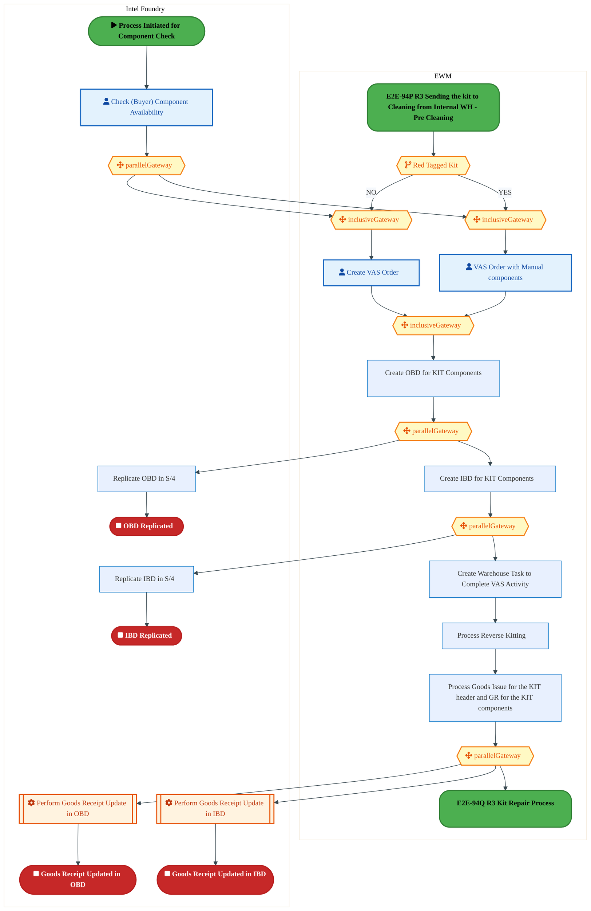
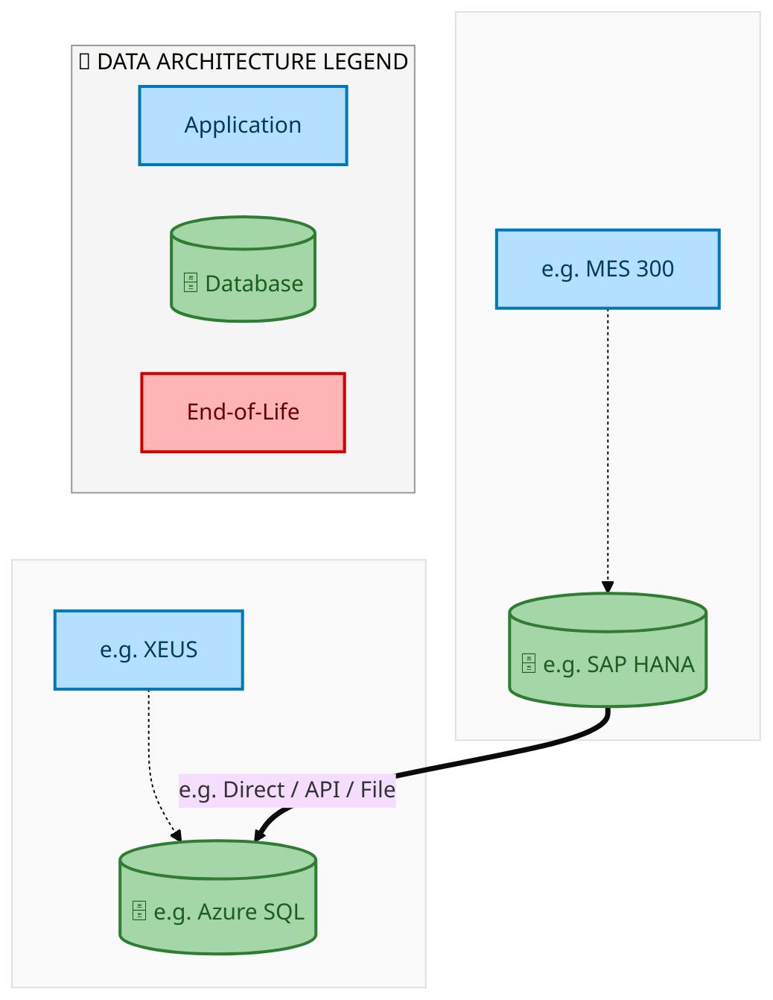
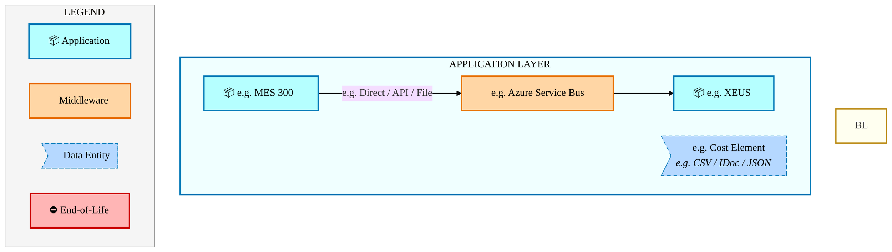
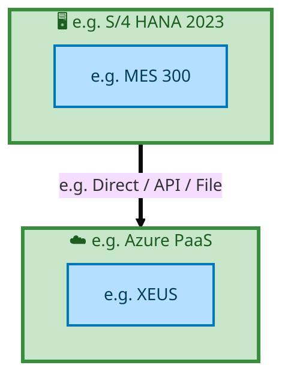

<div style="text-align:center; padding-top:20px;">
  
  <h1 style="font-size:36px; margin-top:24px;">E2E-94 — R3 Intel Foundry Maintenance process through spare parts (SWAP)</h1>
  <h2 style="font-size:24px;">Architecture Document (TOGAF BDAT)</h2>
  <p style="font-size:18px; color:#555;">End-to-End Integrated Processes (E2E) Tower<br/>
  Capability E2E-94 · Forecast to Stock</p>
  <p style="font-size:14px; color:#888;">IAO Program · Release 2<br/>
  Generated: March 2026<br/>
  Sajiv Francis</p>
  <p style="font-size:12px; color:#aaa;">IAO Architecture Pipeline — Intel Confidential</p>
</div>

<style>
@media print {
  @page { margin: 0.75in; }
  .mermaid { page-break-inside: avoid; overflow: visible; }
  pre, table { page-break-inside: avoid; }
  h2, h3, h4 { page-break-after: avoid; }
}
.mermaid { overflow: visible; }
.mermaid svg { max-width: 100%; height: auto !important; }
.page-footer {
  padding-top: 8px;
  border-top: 1px solid #ddd;
  display: flex;
  justify-content: space-between;
  align-items: center;
  font-size: 11px;
  color: #888;
  position: fixed;
  bottom: 0;
  left: 0;
  right: 0;
  padding: 6px 20px;
  background: #fff;
}
@media print {
  .page-footer { position: fixed; bottom: 0; left: 0.75in; right: 0.75in; }
}
.page-footer a { color: #00aeef; text-decoration: none; font-weight: 500; }
.page-footer a:hover { color: #0071c5; text-decoration: underline; }
</style>

<div class="page-footer"><span>Page 1</span><span><a href="#toc">↑ Back to TOC</a></span><span>E2E-94 — R3 Intel Foundry Maintenance process through spare parts (SWAP)</span></div>
<div style="page-break-before: always;"></div>

<a id="toc"></a>

## Table of Contents

1. [Executive Summary](#1-executive-summary)
2. [Business Context & Objectives](#2-business-context--objectives)
   - 2.1 [Classification](#21-classification)
   - 2.2 [Business Drivers](#22-business-drivers)
   - 2.3 [Success Criteria](#23-success-criteria)
   - 2.4 [Companion Documents](#24-companion-documents)
3. [Business Architecture (TOGAF "B")](#3-business-architecture-togaf-b)
   - 3.1 [Business Process Overview](#31-business-process-overview)
   - 3.2 [Business Process Diagrams](#32-business-process-diagrams)
   - 3.3 [Business Roles & Responsibilities](#33-business-roles--responsibilities)
4. [Data Architecture (TOGAF "D")](#4-data-architecture-togaf-d)
   - 4.1 [Data Entities & Ownership](#41-data-entities--ownership)
   - 4.2 [Data Flow Diagrams](#42-data-flow-diagrams)
   - 4.3 [Data Lineage](#43-data-lineage)
   - 4.4 [RICEFW Data Objects](#44-ricefw-data-objects)
   - 4.5 [Data Governance & Quality](#45-data-governance--quality)
5. [Application Architecture (TOGAF "A")](#5-application-architecture-togaf-a)
   - 5.1 [Current-State Application Landscape](#51-current-state--current-state-application-landscape)
   - 5.2 [Future-State Application Landscape](#52-future-state--future-state-application-landscape)
   - 5.3 [Change Impact Summary](#53-change-impact-summary)
   - 5.4 [Component Overview](#54-component-overview)
   - 5.5 [RICEFW Inventory](#55-ricefw-inventory)
   - 5.6 [Integration Patterns](#56-integration-patterns)
6. [Technology Architecture (TOGAF "T")](#6-technology-architecture-togaf-t)
   - 6.1 [Platform & Infrastructure](#61-platform--infrastructure)
   - 6.2 [SAP Development Object Status](#62-sap-development-object-status)
   - 6.3 [NFRs & Design Principles](#63-nfrs--design-principles)
   - 6.4 [Security & Governance](#64-security--governance)
7. [Project Context](#7-project-context)
   - 7.1 [Project Roadmap & Go-Live Plan](#71-project-roadmap--go-live-plan)
   - 7.2 [RAID Log](#72-raid-log)
   - 7.3 [Recommendations & Next Steps](#73-recommendations--next-steps)

<div class="page-footer"><span>Page 2</span><span><a href="#toc">↑ Back to TOC</a></span><span>E2E-94 — R3 Intel Foundry Maintenance process through spare parts (SWAP)</span></div>
<div style="page-break-before: always;"></div>

## 1. Executive Summary

This Architecture Document defines the **Business, Data, Application, and Technology** (BDAT) architecture for **E2E-94 R3 Intel Foundry Maintenance process through spare parts (SWAP)** within the IAO program. It includes 15 BPMN process diagram(s) in Section 3.
| Dimension | Value |
|-----------|-------|
| **Tower** | End-to-End Integrated Processes (E2E) |
| **Process Group** | Forecast to Stock |
| **Capability** | E2E-94 - R3 Intel Foundry Maintenance process through spare parts (SWAP) |
| **Release** | Release 2 |
| **Total Systems** | 2 |
| **System Status** | 0 Deployed, 0 Developing, 0 EOL, 2 Pending IAPM |
| **RICEFW Objects** | Pending — Smartsheet Object Tracker API integration |
**Change Summary**: 0 new flow chains, 0 removed, 0 modified, 1 unchanged between Current-State and Future-State states.

> All system nodes in architecture diagrams are **IAPM-linked** — click any node to open its IAPM page. Diagrams require `securityLevel: "loose"` for click events.

<div class="page-footer"><span>Page 3</span><span><a href="#toc">↑ Back to TOC</a></span><span>E2E-94 — R3 Intel Foundry Maintenance process through spare parts (SWAP)</span></div>
<div style="page-break-before: always;"></div>

## 2. Business Context & Objectives

### 2.1 Classification

| Level | Value |
|-------|-------|
| **L0 Tower** | End-to-End Integrated Processes |
| **L1 Process** | Forecast to Stock |
| **L2 Capability** | E2E-94 - R3 Intel Foundry Maintenance process through spare parts (SWAP) |

### 2.2 Business Drivers

| # | Driver | Description | Strategic Alignment | Priority |
|---|--------|-------------|---------------------|----------|
| 1 | End-to-End Process Integration | Enable cross-tower integrated processes spanning procurement, manufacturing, and fulfillment | IDM 2.0 Process Excellence | High |
| 2 | Intel Foundry Business Enablement | Stand up foundry-specific business processes for external customer engagement | Intel Foundry Services | High |
| 3 | Process Visibility & Monitoring | Provide end-to-end process visibility across tower boundaries with integrated monitoring | Operational Excellence | Medium |
| 4 | E2E-94 Process Migration | Migrate R3 Intel Foundry Maintenance process through spare parts (SWAP) business processes and 2 integrated systems from legacy to S/4 HANA target architecture | IDM 2.0 Cross-Functional / End-to-End | High |

<div class="page-footer"><span>Page 4</span><span><a href="#toc">↑ Back to TOC</a></span><span>E2E-94 — R3 Intel Foundry Maintenance process through spare parts (SWAP)</span></div>
<div style="page-break-before: always;"></div>

### 2.3 Success Criteria

| Metric | Target | Measure | Baseline | Owner |
|--------|--------|---------|----------|-------|
| E2E Process Cycle Time | Per process SLA | End-to-end transaction completion within defined SLA per process | Varies by process | E2E Process Owner |
| Cross-Tower Integration Success | > 99% | Transactions completing across tower boundaries without manual intervention | 92% (current) | Integration Lead |
| Process Exception Rate | < 2% | Transactions requiring manual exception handling | 8% (current) | Operations Manager |
| E2E-94 Migration Completeness | 100% flow chains validated | All 1 flow chains verified in target state | 0% (pre-migration) | Tower Architect |

### 2.4 Companion Documents

| Document | Description |
|----------|-------------|
| **Business Architecture** | Included in this document (Section 3) — process flows from BPMN diagrams |
| **This Document** | Full BDAT Architecture — Business + Data + Application + Technology |

<div class="page-footer"><span>Page 5</span><span><a href="#toc">↑ Back to TOC</a></span><span>E2E-94 — R3 Intel Foundry Maintenance process through spare parts (SWAP)</span></div>
<div style="page-break-before: always;"></div>

## 3. Business Architecture (TOGAF "B")

### 3.1 Business Process Overview

This capability includes **15 business process(es)** modeled in BPMN 2.0, covering the end-to-end workflow for E2E-94 R3 Intel Foundry Maintenance process through spare parts (SWAP).

| # | Step ID | Process Name | Lanes | Tasks | Gateways |
|---|---------|--------------|-------|-------|----------|
| 1 | E2E-94B_R3_Material_Availability | E2E-94B_R3_Material_Availability | EWM (Decentralized), SAP S/4 Intel Foundry  | 9 | 1 |
| 2 | E2E-94C_R3_Material_Availability_&amp;_Material_Movement_Expedite_Process_with_MMID | E2E-94C_R3_Material_Availability_&amp;_Material_Movement_Expedite_Process_with_MMID | EWM , SAP S/4 Intel Foundry  | 19 | 5 |
| 3 | E2E-94D_R3_Procurement_of_Spare-_Epart_-_with_MMID | E2E-94D_R3_Procurement_of_Spare-_Epart_-_with_MMID | Boundary Apps, External Partners , Intel Foundry - WH  | 19 | 7 |
| 4 | E2E-94E_R3_Procurement_of_Spare-_Epart_–_for_Non_MMID | E2E-94E_R3_Procurement_of_Spare-_Epart_–_for_Non_MMID | Boundary Apps, External Partners , Intel Foundry - WH  | 21 | 5 |
| 5 | E2E-94F_R3_Return_to_EWM_Process | E2E-94F_R3_Return_to_EWM_Process | EWM, SAP S/4 Intel Foundry  | 9 | 6 |
| 6 | E2E-94I_R3_Maintenance_process_through_spare_parts_(SWAP)_–_Warranty_Process_(Non_MMID)​ | E2E-94I_R3_Maintenance_process_through_spare_parts_(SWAP)_–_Warranty_Process_(Non_MMID)​ | Factory Portal UI, SAP S/4 Intel Foundry  | 10 | 2 |
| 7 | E2E-94J_R3_Kit_Forecast_for_Assembly_&amp;_Component_Procurement | E2E-94J_R3_Kit_Forecast_for_Assembly_&amp;_Component_Procurement | EWM, Intel Foundry | 5 | 1 |
| 8 | E2E-94K_R3_Kit_components_procured_and_received_into_Internal_WH | E2E-94K_R3_Kit_components_procured_and_received_into_Internal_WH | Boundary Apps , EWM, External Partners/B2B, SAP Intel Foundry | 17 | 4 |
| 9 | E2E-94M_R3_Kit_components_assembled_in_Internal_WH | E2E-94M_R3_Kit_components_assembled_in_Internal_WH | EWM , Intel Foundry | 14 | 2 |
| 10 | E2E-94P_R3_Sending_the_kit_to_Cleaning_from_Internal_WH_-_Pre_Cleaning | E2E-94P_R3_Sending_the_kit_to_Cleaning_from_Internal_WH_-_Pre_Cleaning | Boundary Apps , EWM , External Partners/B2B , Intel Foundry - WH , SAP S/4 Intel Foundry  | 21 | 9 |
| 11 | E2E-94Q_R3_Kit_Repair_Process | E2E-94Q_R3_Kit_Repair_Process | EWM , SAP S/4 Intel Foundry  | 12 | 1 |
| 12 | E2E-94T_R3_Reverse_Kitting_in_Internal_WH | E2E-94T_R3_Reverse_Kitting_in_Internal_WH | EWM , Intel Foundry | 12 | 8 |
| 13 | E2E-94U_R3_Quenching | E2E-94U_R3_Quenching | EWM (Decentralized) , External Partners / B2B , Factory UI Portal , Intel Foundry WH , SAP S/4 Intel Foundry  | 27 | 8 |
| 14 | E2E-94V_R3_De_Contamination | E2E-94V_R3_De_Contamination | EWM  Decentralized, External Partners / B2B, Factory UI Portal, SAP S/4 Intel Foundry
 | 20 | 5 |
| 15 | E2E-94W_R3_TM_steps | E2E-94W_R3_TM_steps | External Partner Supplier B2B, SAP S/4 
Intel Product/ Intel Foundry | 9 | 1 |

### 3.2 Business Process Diagrams

<div class="page-footer"><span>Page 6</span><span><a href="#toc">↑ Back to TOC</a></span><span>E2E-94 — R3 Intel Foundry Maintenance process through spare parts (SWAP)</span></div>
<div style="page-break-before: always;"></div>

#### BUSINESS ARCHITECTURE — 3.2.1 E2E-94B_R3_Material_Availability — E2E-94B_R3_Material_Availability

**Swim Lanes**: EWM (Decentralized) · SAP S/4 Intel Foundry  | **Tasks**: 9 | **Gateways**: 1

> **Legend**: <span style="color:#000;background:#4CAF50;padding:2px 6px;border-radius:10px;font-weight:bold;font-size:9pt">● Start</span> · <span style="color:#fff;background:#C62828;padding:2px 6px;border-radius:10px;font-weight:bold;font-size:9pt">● End</span> · <span style="background:#E3F2FD;padding:2px 6px;border:1px solid #1565C0;font-size:9pt">User Task</span> · <span style="background:#FFF3E0;padding:2px 6px;border:1px solid #E65100;font-size:9pt">Service Task</span> · <span style="background:#FFF9C4;padding:2px 6px;border:1px solid #F57F17;font-size:9pt">◇ Gateway</span> · <span style="background:#F3E5F5;padding:2px 6px;border:1px solid #7B1FA2;font-size:9pt">Sub-Process</span>

```mermaid
%%{init: {"theme": "base", "themeVariables": {"fontSize": "14px", "fontFamily": "Segoe UI, Arial, sans-serif","primaryColor": "#e8f0fe", "primaryBorderColor": "#0071c5","lineColor": "#37474F", "secondaryColor": "#f5f8fc"}, "flowchart": {"useMaxWidth": false, "htmlLabels": true, "curve": "basis", "nodeSpacing": 40, "rankSpacing": 50}} }%%
flowchart LR
    classDef startEvt fill:#4CAF50,stroke:#2E7D32,color:#000,font-weight:bold,stroke-width:2px,rx:20,ry:20
    classDef endEvt fill:#C62828,stroke:#B71C1C,color:#fff,font-weight:bold,stroke-width:2px,rx:20,ry:20
    classDef userTask fill:#E3F2FD,stroke:#1565C0,stroke-width:2px,color:#0D47A1
    classDef serviceTask fill:#FFF3E0,stroke:#E65100,stroke-width:2px,color:#BF360C
    classDef gateway fill:#FFF9C4,stroke:#F57F17,stroke-width:2px,color:#E65100
    classDef subProc fill:#F3E5F5,stroke:#7B1FA2,stroke-width:2px,color:#4A148C
    subgraph EWM (Decentralized)
        n6[["fa:fa-cog Distribute Outbound Delivery Order"]]
        n7[["fa:fa-cog Create and Confirm Picking and Packing (EWM)"]]
        n8[["fa:fa-cog Move Parts to Pass Through"]]
        n9[["fa:fa-cog Perform Goods Issue"]]
    end
    subgraph SAP S/4 Intel Foundry 
        n1["MRP Run"]
        n2[["fa:fa-cog Check for Spare Parts"]]
        n3[["fa:fa-cog Create Reservation WRT to PM Order"]]
        n4[["fa:fa-cog Post Goods Movement"]]
        n5[["fa:fa-cog Perform Outbound Delivery"]]
        n10["E2E-94A R3 Maintenance Process (Breakdown/Planned)"]
        n11["Scenario 4A Procurement of WIINGS Replacement Related Commodities"]
        n12["E2E-94C R3 Material Availability and Material Movement Expedite Process with..."]
        n13["E2E-94A R3 Maintenance Process (Breakdown/Planned)"]
        n14{{"fa:fa-arrows-alt parallelGateway"}}
    end
    n4 --> n5
    n6 --> n7
    n7 --> n8
    n8 --> n9
    n5 --> n6
    n13 --> n2
    n9 --> n10
    n3 --> n14
    n14 --> n4
    n14 --> n1
    n1 --> n11
    n2 --> n3
    n14 --> n12
    class n2 serviceTask
    class n3 serviceTask
    class n4 serviceTask
    class n5 serviceTask
    class n6 serviceTask
    class n7 serviceTask
    class n8 serviceTask
    class n9 serviceTask
    class n10 startEvt
    class n11 startEvt
    class n12 startEvt
    class n13 startEvt
    class n14 gateway
```

<div style="text-align:center; margin:4px 0 8px 0; font-size:11px;"><a href="https://mermaid.live/view#pako:eNqtVltv4jgU_itWRhUdKXRyJZCHlSiQqtKwg6C7fZjOg0kcsGpsZDtQFvHf95iEW6Z52s0D4juX75zz5cTJ3kpFRqzYurvbU051jPYtvSQr0opRa44VadmoNPyNJcVzRlTLxOSC6xn95xjmBusPE2ZsCV5RtjPWGVkIgv56tlEfEpmNFOaqrYikecturSVdYbkbCCakif5CurmTH6tVrkchMyIvAY4TuWkIqYxycjH7URAFiclTJBU8uyHNw7ybp62DaY6JbbrEUh_bLxQZ449Xmukl4BwzRSBmqVfsO54TZmbUsjC2tJCbkxhUmTocBJutcUr5AuyBAyaJ-fvFFDqHAzrc3b3xc1H0ffrGEVwpw0oNSY6UBvNoo1FOGYu_BIN-Ejq20lK8k_iLN4qGvmenZpIYRndsI257S-hiqeO5YFkV2t6aGWJv_WHLj9hzbLmD31otwrNLpUHH63rdc6XHyB24g1OlPM__UyXQVb5g9V7VGvmJlwzPtdywEw6c3_lOYw6DqO_WdSJyQ1NyRZokiT-6SDXqhK7TTPqY-B1nUCNdYE22eHch7A2CM2ESRokbNRKW9epdFvOJFOmJ0B-FSXgmjB7dpO81EgZ9N-hWHQLPQuL1Eo1ex-h-SFLCtcQMHrTsaxlhLt75-fPNynGc43YqFmhIgZvOC03Qj0LPRcEzNCSMbojcoR_mMXqzfv26yo9u8weSgCAIQ9pA8JzKFZrQ9B22-Wib4PL_PTT1tcbUvWUaiw2BeKkV0gL-KIVellIUi2Utr3ebNyEyF1D2SYhMoWelCnJJgPWtqTPrT9DsW4CeuSYMJWZgmPSK3gX28XSCpgUHniuHV5t8SVLYKyERPL6yar3Wqv-pWFNiNhNrKjh6nb4cxx1_KnZQG1UoXc1p1FrBHa4lhJ9r89utraW5DqSNvFG7F_TR1EdjTEEejnkKc8FyErgZ94_Q_XsmtvzbhGHOzVrd6OMa5WawdnDaCwREJrOQxzaRyNHr8_OfTzOYfs1wWlqnhIEgZnVWK5FRTYmqcXrnxgZlY5qYVwLqbzBleE4Z1bvjpp09J2XQ6GNNgPMywZbq5cPDQ62C_3-MHuz3J92xlGKr2phpBHuBGSPsqTwz3qzDobaWPEDt9h9w3yrYKWFUwaiE3Qp2S9irYFjCTgVdv8RehXsldKsDh1duNzjFV7Xr2D3hCp6wV2K_Hu5dHWgm6urYvfH4jZ6g0RM2ejqNnqjR02309Bo9rnN-397a3Qa712D3G-zB6ZVi2daKyBWmmRXvreOHE3xcZSTHBdPWwbZwocVsx1MrPn5gWMU6g8whxXCyrUrj4V83ggKZ" title="View Full Diagram">&#128065; View Full Diagram</a></div>

<div class="page-footer"><span>Page 7</span><span><a href="#toc">↑ Back to TOC</a></span><span>E2E-94 — R3 Intel Foundry Maintenance process through spare parts (SWAP)</span></div>
<div style="page-break-before: always;"></div>

#### BUSINESS ARCHITECTURE — 3.2.2 E2E-94C_R3_Material_Availability_&amp;_Material_Movement_Expedite_Process_with_MMID — E2E-94C_R3_Material_Availability_&amp;_Material_Movement_Expedite_Process_with_MMID

**Swim Lanes**: EWM  · SAP S/4 Intel Foundry  | **Tasks**: 19 | **Gateways**: 5

> **Legend**: <span style="color:#000;background:#4CAF50;padding:2px 6px;border-radius:10px;font-weight:bold;font-size:9pt">● Start</span> · <span style="color:#fff;background:#C62828;padding:2px 6px;border-radius:10px;font-weight:bold;font-size:9pt">● End</span> · <span style="background:#E3F2FD;padding:2px 6px;border:1px solid #1565C0;font-size:9pt">User Task</span> · <span style="background:#FFF3E0;padding:2px 6px;border:1px solid #E65100;font-size:9pt">Service Task</span> · <span style="background:#FFF9C4;padding:2px 6px;border:1px solid #F57F17;font-size:9pt">◇ Gateway</span> · <span style="background:#F3E5F5;padding:2px 6px;border:1px solid #7B1FA2;font-size:9pt">Sub-Process</span>


<div style="text-align:center; margin:4px 0 8px 0; font-size:11px;"><a href="https://mermaid.live/view#pako:eNqlWNtu2zgQ_RVCReAEsBvdbDl-2IXjSzZA0xhxuu1usw-0RNlEaFIgqTje1P--Q118UaVuF5uHIDwcnpk55AypvFmhiIg1sM7O3iineoDeWnpF1qQ1QK0FVqTVRjnwO5YULxhRLWMTC67n9O_MzPGTV2NmsCleU7Y16JwsBUGfbttoCAtZGynMVUcRSeNWu5VIusZyOxJMSGP9jvRjO868FVPXQkZEHgxsO3DCLixllJMD7AV-4E_NOkVCwaMT0rgb9-OwtTPBMbEJV1jqLPxUkTv8-plGegXjGDNFwGal1-wDXhBmctQyNViYypdSDKqMHw6CzRMcUr4E3LcBkpg_H6Cuvduh3dnZE987RY_jJ47gJ2RYqTGJkdIAT140iiljg3f-aDjt2m2lpXgmg3fuJBh7bjs0mQwgdbttxO1sCF2u9GAhWFSYdjYmh4GbvLbl68C123ILvyu-CI8OnkY9t-_2956uA2fkjEpPcRz_L0-gq3zE6rnwNfGm7nS89-V0e92R_T1fmebYD4ZOVSciX2hIjkin06k3OUg16XUdu5n0eur17FGFdIk12eDtgfBq5O8Jp91g6gSNhLm_apTpYiZFWBJ6k-60uycMrp3p0G0k9IeO3y8iBJ6lxMkKTT7foRwyP9zxv359smI8iHEnFEs0kgRSQPepXoiUR2hMGH0hcovuTdGg85mkQlK9vXiy_vrrmKdby4OBYiR4TOUazWj4DOc4w2Y4__scwrl4Sl3bXlQJe6eEd-KFwDKpFdIC_lAKPa6kSJer6sLgdOGMyFiA-xshIoVulUpJdUW_NvZbXpFgQ_UKlQJUOa7qvc5uHky8d5hyTTjmISmVvLu9ub-ch5hzEKIqp9t7eyvpsJRiozqYaUR5yFIF0dzk5-zJ2u2OVwX_cRXUb-V4zIczNL_0IXlNGJoaASDz40T3aZqSNJsL2mg0y9KcvCYkoppEQJgkjILB7D7XLTnodhxxhW1FwmcUiTVRmoZt9BFrKjhmCC4KnsUkeQklDHOtTum8U7pPSWQ2EgJaoxD-WgrIxRy_LLqtOYAZCyiE_px8mUEWp3x-LR95zeJghyRfQEghEU_XCxg1sdWXyPdH40fnrFIV05RBZ0CxFGv0QYQQ0wZLshIQbk4jielzmWboPGko3qA2sMNmzveb-YBMsTpell_mgAukRCoh-KFSdMnB_Efx15faw1GUUDZ15dLUeJrqTihdlLzpHGvCdbVi7Z_sfNXje0LiVEiKcpg_ZvWQndhQrBPMt5dmJHExAov7HzO7Pxme0etfybwGlaAlt7NmnHflm9tqH7LP9wuhVLY1O5MFZjbuFl55FGKMgOPimMO0jIk76Vz51-jBAwoQBR5uaPiCKcMLyr5vC-5-yTBfcvBqrkMC3f_8Ghw_R2LDL2dQxHDwLvLujvASzGH7j1a9f_--4sE7tErzUO0s4KkVrrIbpgyMEVPKeVld3ny5R7OsWXz-7ddq3_XryfZ1480-oLmpkuzOgwcdlCViGXFEEqEvIFaewugIQ6FphlVP3doOD4SYMcIaroWjoovh3UVkRyTQT8dEQ55QsKSodDg-Ap6lWbXAO5IkCkGk0DqZsYpTCW1YIsVoRNThoOwvEd5Fnc4vJshi7HoG-PZk_WHsv0H3KiZ6ueFVMbzKh07x-IFHSQGURE7B7JQETsHgBCXQL4CS07EL34c2lt0DVMFtFhE4gmtqmpX5FIkAggMM2aGNkM8o-0AAnkM1fTNXcsEcFFn6padi3C-zLgycPZCPvdK-WOC4JVAYOKWFWwpZBUpGp1BsH5Nb6lEG5do5UCpYyOMWr2BeKlwMvWLoVHfuo8iSL2V2S5697l4FcP3KnvvViYJyn31Q4HfwJaG3CUGDnu_kJu7Ra9gIXX4FnMBuPezVw3493D3-HjiZ6TXOBI0z_caZq8YZOLCNU07zlNs85TVP-c1TzUo4zVI4zVo4zWI4zWrA-S0_ZE9xpwF3G3Cv_CY7hf16uFsP9-rhoB7ul19tVttaQ5_BNLIGb1b2zw5rYEUkxinT1q5t4VSL-ZaH1iD7p4CVZg_MMcXwGF_n4O4fpLx5kQ==" title="View Full Diagram">&#128065; View Full Diagram</a></div>

<div class="page-footer"><span>Page 8</span><span><a href="#toc">↑ Back to TOC</a></span><span>E2E-94 — R3 Intel Foundry Maintenance process through spare parts (SWAP)</span></div>
<div style="page-break-before: always;"></div>

#### BUSINESS ARCHITECTURE — 3.2.3 E2E-94D_R3_Procurement_of_Spare-_Epart_-_with_MMID — E2E-94D_R3_Procurement_of_Spare-_Epart_-_with_MMID

**Swim Lanes**: Boundary Apps · External Partners  · Intel Foundry - WH  | **Tasks**: 19 | **Gateways**: 7

> **Legend**: <span style="color:#000;background:#4CAF50;padding:2px 6px;border-radius:10px;font-weight:bold;font-size:9pt">● Start</span> · <span style="color:#fff;background:#C62828;padding:2px 6px;border-radius:10px;font-weight:bold;font-size:9pt">● End</span> · <span style="background:#E3F2FD;padding:2px 6px;border:1px solid #1565C0;font-size:9pt">User Task</span> · <span style="background:#FFF3E0;padding:2px 6px;border:1px solid #E65100;font-size:9pt">Service Task</span> · <span style="background:#FFF9C4;padding:2px 6px;border:1px solid #F57F17;font-size:9pt">◇ Gateway</span> · <span style="background:#F3E5F5;padding:2px 6px;border:1px solid #7B1FA2;font-size:9pt">Sub-Process</span>


<div style="text-align:center; margin:4px 0 8px 0; font-size:11px;"><a href="https://mermaid.live/view#pako:eNqlWG1v2zYQ_iuEiiItYKeiXvz2YYPt2GmAZjXirMHQ7AMtUTYRWtQoyUmW5r_vKFGyTUvr2vlDED68e4733PFk-cUKREitkfX27QuLWTZCL2fZhm7p2QidrUhKzzqoBL4QyciK0_RM2UQizpbs78IMe8mTMlPYnGwZf1bokq4FRb9fddAYHHkHpSROuymVLDrrnCWSbYl8ngoupLJ-QweRHRXR9NZEyJDKvYFt93HggytnMd3Dbt_re3Pll9JAxOERaeRHgyg4e1WH4-Ix2BCZFcfPU3pNnu5YmG1gHRGeUrDZZFv-iawoVzlmMldYkMtdJQZLVZwYBFsmJGDxGnDPBkiS-GEP-fbrK3p9-_Y-roOiTzf3MYJPwEmaXtAIpRnAs12GIsb56I03Hc99u5NmUjzQ0Rtn1r9wnU6gMhlB6nZHidt9pGy9yUYrwUNt2n1UOYyc5Kkjn0aO3ZHP8NeIReNwH2nacwbOoI406eMpnlaRoij6X5FAV3lL0gcda-bOnflFHQv7PX9qn_JVaV54_TE2daJyxwJ6QDqfz93ZXqpZz8d2O-lk7vbsqUG6Jhl9JM97wuHUqwnnfn-O-62EZTzzlPlqIUVQEbozf-7XhP0Jno-dVkJvjL2BPiHwrCVJNmgi8qKX0ThJ0nJPfWL89eu9FZFRRLqBWKPPck1iuIboFlowTYTMuldxRjm6EXkG3YgucxZS9O7q5vL9fe7Y9ure-vPPAz7nmG9BZSTkFn0hnIUkYyL-MHsKaKL-Qx9JHHJFquZCiAC5yWEeoCXN8qSZ3X5X0yccBP933isYQAxKEwLN-0OaIbDMnFl36E3RjYuuwUbNFDTeEcbJinGWPSNg2e9cix3MrDhDs6eEhiyjSNWHpil6ZNnm_PwcQpQR4HIY2s-egCQGkgVc0ZjKFB0WwD9W7IYGlO2APpdw01MKJYGxhUiGlnmScAb_zyBCkzq4d0w1Dh5i8chpuC6P_uGG7hh9RKWzEaGZsd9czimRUp1kSTkNCs13jKCmTpkIkUIBEMxQEFbIolZoAY1FuBls0BzsUogwRQsWPABPnqB3Ovr7KpFSoXTDEpVmcyLDY-4lVGkv6FW8EzATzGbr75stzURyYq9YMqO13N7LS-UExxSPaZfwDLE44HkKdb0sJ8W99fra1i6ljHN1YeG-dtHdx8N-cY8TmUoKjNCnDLxiEgdVw6i2hB5lQkIvG5l5jRxVZ4eqM86hEf86N1ialDXadyriHYXn0-IGZeLgshx38_dpjVa-lWy9BsfL2yWabmjwYJgbfTolPMi5SuqWPNHUMG7rM8UttlDiQsYiDFouPnXQ7HpiUAwbFbyKV6pq6IJyKDUUr8jzo4CnGBozie7IM8wWjuJ8u4JkPo7vJs3dahvZX6MZeIQhbbn4xhQvb0wxSZJMjY6IBJmA83wSQXEBTX9jauvzax6o41z739JgE7MABGo-h9GcC7j737tl2PtP1YA6FAP5tBQONp4Jp3ehKI-aO60PBOd7V31RjDHTzTXc6vas0jh18X7cxTddirLoIp2a9wzz4grsr8SJ_aB-GN6phyE0G6SapPUDrRw79n6uqW_43RV8QQg2tT7jQD19YXb8uh9tpSNuHIgJkYRzyk_mYenk_IyT-zNO3g_O69LL_9kpH7uo2_1FMei1p9eeXvt6jSt7XAI9Y93X6165HFTbmq-ix5oPV_64r4FqrZcVwVDHdypCRxvYFaAzwI4BuFUI7eHWHvqMeFgBtgK-3Vu_iXvr24FnvfGHGtrf1ESpjqmDOFVUPNCms4mDPsyczwmthxI4VqEG2s09kg_c3LF36oV9Q2VcyYy1rk5VJ6wt3PqEOm2n4nAqi4pTl6JicIZGK-jKOHWpekZv1LWoKWztUnloSqc-dmUwMCkO34tUFxy8Fx3tOK07buuO17rjt-70Wnf6rTuD1p1h6w4o0rrVrgJulwG364DbhcDtSuB2KXC7FrhdDNyuBjRQ9cPBMY5bcEe__B-jbiPqNaJ-I9prRPuN6KDlbMNmHIaKfj8_hnEz7DTDbjPsNcN-M9yrYKtjbancEhZaoxer-D3MGlkhjUjOM-u1Y5E8E8vnOLBGxe9GVp7Aay69YATeEbYl-PoPzFQJkw==" title="View Full Diagram">&#128065; View Full Diagram</a></div>

<div class="page-footer"><span>Page 9</span><span><a href="#toc">↑ Back to TOC</a></span><span>E2E-94 — R3 Intel Foundry Maintenance process through spare parts (SWAP)</span></div>
<div style="page-break-before: always;"></div>

#### BUSINESS ARCHITECTURE — 3.2.4 E2E-94E_R3_Procurement_of_Spare-_Epart_–_for_Non_MMID — E2E-94E_R3_Procurement_of_Spare-_Epart_–_for_Non_MMID

**Swim Lanes**: Boundary Apps · External Partners  · Intel Foundry - WH  | **Tasks**: 21 | **Gateways**: 5

```mermaid
%%{init: {"theme": "base", "themeVariables": {"fontSize": "14px", "fontFamily": "Segoe UI, Arial, sans-serif","primaryColor": "#e8f0fe", "primaryBorderColor": "#0071c5","lineColor": "#37474F", "secondaryColor": "#f5f8fc"}, "flowchart": {"useMaxWidth": false, "htmlLabels": true, "curve": "basis", "nodeSpacing": 40, "rankSpacing": 50}} }%%
flowchart LR
    classDef startEvt fill:#4CAF50,stroke:#2E7D32,color:#000,font-weight:bold,stroke-width:2px,rx:20,ry:20
    classDef endEvt fill:#C62828,stroke:#B71C1C,color:#fff,font-weight:bold,stroke-width:2px,rx:20,ry:20
    classDef userTask fill:#E3F2FD,stroke:#1565C0,stroke-width:2px,color:#0D47A1
    classDef serviceTask fill:#FFF3E0,stroke:#E65100,stroke-width:2px,color:#BF360C
    classDef gateway fill:#FFF9C4,stroke:#F57F17,stroke-width:2px,color:#E65100
    classDef subProc fill:#F3E5F5,stroke:#7B1FA2,stroke-width:2px,color:#4A148C
    subgraph Boundary Apps
        n4[["fa:fa-cog Organize Transport-Intel Routing Guide (IRG)​"]]
        n5[["fa:fa-cog Perform Validation/Exception Handling based on Rules Setup​"]]
        n22(["fa:fa-play Validation/Exception Handling Initiated"])
    end
    subgraph External Partners 
        n17[["fa:fa-cog Receive Purchase Order at Supplier End​"]]
        n18[["fa:fa-cog Acknowledgement /Review ​ Purchase Order​"]]
        n19[["fa:fa-cog Perform Carrier Selection via Intel Routing Guide Boosted Collaboration Portal"]]
        n20[["fa:fa-cog Goods Picked up (Carrier) ​ Order shipment​"]]
        n21[["fa:fa-cog Send Supplier Invoice"]]
        n30(["fa:fa-stop Supplier Invoice Sent"])
    end
    subgraph Intel Foundry - WH 
        n1["TM Embedded​"]
        n2["Goods Receipt Deliver to Technician (109) (Consumption upon GR)"]
        n3["Post Material Movement - 107"]
        n6[["fa:fa-cog Create Maintenance Order"]]
        n7[["fa:fa-cog Create Non MMID base Purchase Requisition (Acc. Assign – F)​"]]
        n8[["fa:fa-cog Create Non MMID base Purchase Order (Acc. Assign – F)​"]]
        n9[["fa:fa-cog Trigger GTS Check"]]
        n10[["fa:fa-cog Calculate Taxes"]]
        n11[["fa:fa-cog Perform GTS Compliance Check SPL, EMB"]]
        n12[["fa:fa-cog Perform Inbound Delivery with House Air Waybill number HAWB​"]]
        n13[["fa:fa-cog Perform Goods Receipt Cost Posting against Main. Order​"]]
        n14[["fa:fa-cog Deliver to Factory Technician​"]]
        n15[["fa:fa-cog Post Supplier Invoice"]]
        n16[["fa:fa-cog Perform GTS Compliance SPL and EMB"]]
        n23(["fa:fa-play Maintenance Order Initiated"])
        n24(["fa:fa-stop Supplier Invoice Posted"])
        n25(["fa:fa-stop GTS Check Performed"])
        n26(["fa:fa-stop GTS Check Performed"])
        n27(["fa:fa-stop Goods Delivered"])
        n28(["fa:fa-stop Goods Receipts Posted"])
        n29(["fa:fa-stop Taxes Calculated"])
        n31["E2E-94W R3 TM steps"]
        n32{{"fa:fa-code-branch Invoice Accepted ?"}}
        n33{{"fa:fa-arrows-alt parallelGateway"}}
        n34{{"fa:fa-arrows-alt parallelGateway"}}
        n35{{"fa:fa-arrows-alt parallelGateway"}}
        n36{{"fa:fa-arrows-alt inclusiveGateway"}}
    end
    n6 --> n7
    n7 --> n36
    n8 --> n33
    n33 --> n9
    n33 --> n10
    n9 --> n11
    n36 --> n8
    n18 --> n36
    n17 --> n18
    n19 --> n4
    n4 --> n20
    n12 --> n34
    n5 --> n32
    n32 -->|"Yes"| n15
    n15 --> n24
    n20 -->|"EB2 /E2Open​"| n12
    n11 --> n25
    n33 -->|"3A4/E2Open​"| n17
    n33 --> n19
    n34 --> n16
    n16 --> n26
    n14 --> n27
    n13 --> n28
    n23 --> n6
    n32 -->|"No"| n21
    n10 --> n29
    n22 --> n5
    n21 --> n30
    n34 --> n3
    n2 --> n35
    n35 --> n14
    n35 --> n13
    n1 --> n31
    n3 --> n2
    n34 -->|"If Applicable"| n1
    class n4 serviceTask
    class n5 serviceTask
    class n6 serviceTask
    class n7 serviceTask
    class n8 serviceTask
    class n9 serviceTask
    class n10 serviceTask
    class n11 serviceTask
    class n12 serviceTask
    class n13 serviceTask
    class n14 serviceTask
    class n15 serviceTask
    class n16 serviceTask
    class n17 serviceTask
    class n18 serviceTask
    class n19 serviceTask
    class n20 serviceTask
    class n21 serviceTask
    class n22 startEvt
    class n23 startEvt
    class n24 endEvt
    class n25 endEvt
    class n26 endEvt
    class n27 endEvt
    class n28 endEvt
    class n29 endEvt
    class n30 endEvt
    class n31 startEvt
    class n32 gateway
    class n33 gateway
    class n34 gateway
    class n35 gateway
    class n36 gateway
```

> **Legend**: <span style="color:#000;background:#4CAF50;padding:2px 6px;border-radius:10px;font-weight:bold;font-size:9pt">● Start</span> · <span style="color:#fff;background:#C62828;padding:2px 6px;border-radius:10px;font-weight:bold;font-size:9pt">● End</span> · <span style="background:#E3F2FD;padding:2px 6px;border:1px solid #1565C0;font-size:9pt">User Task</span> · <span style="background:#FFF3E0;padding:2px 6px;border:1px solid #E65100;font-size:9pt">Service Task</span> · <span style="background:#FFF9C4;padding:2px 6px;border:1px solid #F57F17;font-size:9pt">◇ Gateway</span> · <span style="background:#F3E5F5;padding:2px 6px;border:1px solid #7B1FA2;font-size:9pt">Sub-Process</span>



<div style="text-align:center; margin:4px 0 8px 0; font-size:11px;"><a href="https://mermaid.live/view#pako:eNqlWG1v2zYQ_iuEiiIJYK-iXizbHzbYjp0GaDrDzhYMzT7QEmUToUmNkvKyNP99R4myI0Xq1s4fDPN499zdw7uj5GcrlBG1xtb7989MsGyMnk-yHd3TkzE62ZCUnvRQKfidKEY2nKYnWieWIluzvws17CWPWk3LFmTP-JOWrulWUvTbZQ9NwJD3UEpE2k-pYvFJ7yRRbE_U00xyqbT2OzqM7bjwZramUkVUHRVsO8ChD6acCXoUu4EXeAttl9JQiqgGGvvxMA5PXnRwXD6EO6KyIvw8pVfk8YZF2Q7WMeEpBZ1dtuefyIZynWOmci0Lc3VfkcFS7UcAYeuEhExsQe7ZIFJE3B1Fvv3ygl7ev78VB6fo0-pWIPiEnKTpOY1RmoF4fp-hmHE-fufNJgvf7qWZknd0_M6ZB-eu0wt1JmNI3e5pcvsPlG132XgjeWRU-w86h7GTPPbU49ixe-oJvhu-qIiOnmYDZ-gMD56mAZ7hWeUpjuP_5Ql4VdckvTO-5u7CWZwffGF_4M_st3hVmudeMMFNnqi6ZyF9BbpYLNz5kar5wMd2N-h04Q7sWQN0SzL6QJ6OgKOZdwBc-MECB52Apb9mlPlmqWRYAbpzf-EfAIMpXkycTkBvgr2hiRBwtookOzSVeVHLaJIkabmnP8L78uXWisk4Jv1QbtGvaksEtCG6hhJME6my_qXIKEcrmWdQjegiZxFFp5eri7Pb3LHtza3155-v8Pw63pKqWKo9-p1wFpGMSfFh_hjSRP9CH4mIuAbVcyFCIFnlMA_QmmZ50oruOKcH-IQD4d_GvYQBxOBoIoA5K2GgdBvMzB8zqgThaAkNJKhK0SuHOKjns6IhZfcULXMFfZhSIAyGCiIZWudJwhn8noOHttjxsA41Ce-EfOA02sIwFBn6sKL3jD6g0rjhoR1x1E72jCilI1lTTsOCkXtGUNs5TqVMgR4EE46TjVQFk2gJx054k3q77uxCyihFSxbegX2eoFPj9axKoGQm3bFEp9d-nLiOuYbTORJ5Ke4ldGrDxrWPJZBmMnmjr1Gybx14ScRCNwT0Qx_dfKydOKBfX6H5fkOjiB6P8nXYoFKmX5RDkqFzyqEqFMokuqbhTrCQEYFOsT06A2KkSPN9WZp5Al8Xq7M6oAuASzgJdAXFqi83dCXvy6roI2wHde1BnbSZomAFpgzyEkSEVcnUeQtarT5DOFdXl-dFCx5rbkX_ylnKipBPJ2H4E5qkKduK4myxixbtzT_8Hh9lfXwHeqParxXbbgHh4nqNZjsa3jW7o1GwM8LDnOuArskjTZvauL2XCnS5hwormC0cofXyUw_Nr6ZNDKcd41JsdLFVVfKEHli2Qx8lXG5owhS6IU8bmPNI5FB0Cn2c3Ezb-93tiLFWizNdSLqadJuTLZRFUVhM_PStUdK4B14V9IKEmYSgj4XdjtCc_DqMf-llPPhPpAPdCEZ6C-OO27gP3nRB2x1Qmnr_NkeWxWxsmvkNs0P5VdG_NRl8v0nQNCmO2JzKW_Vhq7qpiLQjk1HDqGiLY5s09V09GefOvD_ybtDKRTAkATVJG6PMeX4-HmlE-xt4kAh3B1Kh3eGWhivjl1vr5eW1oXs0hJtEPqR9wjOUEEU4p_yifMJqGnk_YuT_iNGg1YiJkOcpHMobq8O9Iwao3_8ZBrBZBuXSHZj10Kxds3bdUjBqrLF5RhQjs8aVgnEwNGs8bHjAxiU-aBgIz6y9clk9fcMgMwiVgm_WTuWyUPh6a_2hB-lX3f2VqVF1KlPHNqrzqYM-zJ1fE3oYINqwgsTYGPq1vMHQnXgtdkGTngNfJht8SN_w4xwEVb4VBjYYTkWQYwSDZr6fZeHdqbjHtrGsvDuGuioLx6Tl2o3wquOuqD6kbQjEXlNQWVSIh_M3IdQcQKyXsX7Y5yzUb9klaa_eMvSpv3oXqu34nTuDzp2gc2fYuTPq3AFeO7dw95bTveV2b3UTgbuZwN1U4G4ucDcZuJsNp5sNp5sNKMXqT4G63O2Qe-bFvi71W6WDVmnQKh22SkdtUtduleL2iKEtzZt3Xey2i712sd8uHlRiq2ftqdoTFlnjZ6v478oaWxGNSc4z66VnkTyT6ycRWuPiPx4rT-CVlJ4zAu8b-1L48g9t7OYN" title="View Full Diagram">&#128065; View Full Diagram</a></div>

<div class="page-footer"><span>Page 10</span><span><a href="#toc">↑ Back to TOC</a></span><span>E2E-94 — R3 Intel Foundry Maintenance process through spare parts (SWAP)</span></div>
<div style="page-break-before: always;"></div>

#### BUSINESS ARCHITECTURE — 3.2.5 E2E-94F_R3_Return_to_EWM_Process — E2E-94F_R3_Return_to_EWM_Process

**Swim Lanes**: EWM · SAP S/4 Intel Foundry  | **Tasks**: 9 | **Gateways**: 6

> **Legend**: <span style="color:#000;background:#4CAF50;padding:2px 6px;border-radius:10px;font-weight:bold;font-size:9pt">● Start</span> · <span style="color:#fff;background:#C62828;padding:2px 6px;border-radius:10px;font-weight:bold;font-size:9pt">● End</span> · <span style="background:#E3F2FD;padding:2px 6px;border:1px solid #1565C0;font-size:9pt">User Task</span> · <span style="background:#FFF3E0;padding:2px 6px;border:1px solid #E65100;font-size:9pt">Service Task</span> · <span style="background:#FFF9C4;padding:2px 6px;border:1px solid #F57F17;font-size:9pt">◇ Gateway</span> · <span style="background:#F3E5F5;padding:2px 6px;border:1px solid #7B1FA2;font-size:9pt">Sub-Process</span>


<div style="text-align:center; margin:4px 0 8px 0; font-size:11px;"><a href="https://mermaid.live/view#pako:eNqlVltv4jgU_itWqoqOBGqcCwEedkWBdCtNd6syM9VqmAeTOMWqsZHjlDIM_32Pc-ESwsNqeECc23fO-c7B9taKZEytgXV9vWWC6QHatvSCLmlrgFpzktJWGxWKb0QxMuc0bRmfRAo9ZT9zN-ytPoyb0YVkyfjGaKf0VVL09aGNhhDI2yglIu2kVLGk1W6tFFsStRlJLpXxvqK9xE7ybKXpTqqYqoODbQc48iGUM0EPajfwAi80cSmNpIhPQBM_6SVRa2eK43IdLYjSeflZSh_JxwuL9QLkhPCUgs9CL_lnMqfc9KhVZnRRpt4rMlhq8gggbLoiEROvoPdsUCki3g4q397t0O76eib2SdHn55lA8Ik4SdMxTVCqQT151yhhnA-uvNEw9O12qpV8o4MrZxKMXacdmU4G0LrdNuR21pS9LvRgLnlcunbWpoeBs_poq4-BY7fVBr5ruaiID5lGXafn9PaZ7gI8wqMqU5Ikv5UJeFVfSPpW5pq4oROO97mw3_VH9jle1ebYC4a4zhNV7yyiR6BhGLqTA1WTro_ty6B3odu1RzXQV6LpmmwOgP2RtwcM_SDEwUXAIl-9ymz-pGRUAboTP_T3gMEdDofORUBviL1eWSHgvCqyWqDJy2OhMR_hfJ9ZoeSwTWgagR2ZZDRNZ9aPIy8XvO6ljFP0TCPKVtqgoJuvQlHIzSJN40-nER5EjBQFNhARMRpJkTC1RE-Z7hDDzwtRdCFhqEgb_m8Ar4bgN-e84zJ6O0vX_e10_e8AkZBBQjqRfEVjZhqbZwD4IOYyA9Ax5eydqg3SMifR-nEcj-2bPUCq5eqUTlRwTGOI-nQchetRGtpDTzLV577O__A17E2cSafv_YWeXdM_nCR60zxe3N9uD83HtDMH52gBxJNUCmAzpn_OrN3ueG_s5pDjlUBSoXJch2g4MWoLOR0-oemtBzxryoEo4BpIPi4PenmiKpEw0YfHZyhrRZhqbiU4HWO1E-jx4f4f9AVqTEmkmRS16fUaw-qTr4_c_C2G6CE0G2EK66D8KjP4CKNZ5tjYzQ0JHOCcAf0sRWumF0wguPnQisNMaqPw9oO7h0Z1poRB_wa0SVVz7e5dh2bGj4QBgwLGQPdrd3MHnbzFci1unyCZOPvj4KB5ji8LChUqxDSKiEBzilTOOo3rm4B7zQhmnEoQfjv5KH7UNwgf4mA75TrtEK7RiijCOeX3xUFaD3Iag5iIeJbCjM6i9usmAtTp_AGTLsVeIfZLEXcLOShlpxCxXdnz8F8z618KG_fLtF1ZeqWlargwVzi4BKqAK9kt5X4p9-uJ_pY5kFNPc6DTWCuzUxXsVf790v98iY7jGtzyY6Xwsute1TlS9OifgxCzJEVwRYFbVFYV5pWF7hmyy-DjoyNHcE884EYoZb8Qu6VYTg47RzenGffR_X5i6V209C9asF0-dU61uFHrNGrd_cPsVO9d0PsX9N0L-qB6e5yqe83qfqMamG5U42a1U6mttrWkaklYbA22Vv6oh4d_TBOScW3t2hbJtJxuRGQN8sevla1iiBwzAlfAslDu_gOE8ccL" title="View Full Diagram">&#128065; View Full Diagram</a></div>

<div class="page-footer"><span>Page 11</span><span><a href="#toc">↑ Back to TOC</a></span><span>E2E-94 — R3 Intel Foundry Maintenance process through spare parts (SWAP)</span></div>
<div style="page-break-before: always;"></div>

#### BUSINESS ARCHITECTURE — 3.2.6 E2E-94I_R3_Maintenance_process_through_spare_parts_(SWAP)_–_Warranty_Process_(Non_MMID)​ — E2E-94I_R3_Maintenance_process_through_spare_parts_(SWAP)_–_Warranty_Process_(Non_MMID)​

**Swim Lanes**: Factory Portal UI · SAP S/4 Intel Foundry  | **Tasks**: 10 | **Gateways**: 2

> **Legend**: <span style="color:#000;background:#4CAF50;padding:2px 6px;border-radius:10px;font-weight:bold;font-size:9pt">● Start</span> · <span style="color:#fff;background:#C62828;padding:2px 6px;border-radius:10px;font-weight:bold;font-size:9pt">● End</span> · <span style="background:#E3F2FD;padding:2px 6px;border:1px solid #1565C0;font-size:9pt">User Task</span> · <span style="background:#FFF3E0;padding:2px 6px;border:1px solid #E65100;font-size:9pt">Service Task</span> · <span style="background:#FFF9C4;padding:2px 6px;border:1px solid #F57F17;font-size:9pt">◇ Gateway</span> · <span style="background:#F3E5F5;padding:2px 6px;border:1px solid #7B1FA2;font-size:9pt">Sub-Process</span>


<div style="text-align:center; margin:4px 0 8px 0; font-size:11px;"><a href="https://mermaid.live/view#pako:eNq1Vm1vo0YQ_isjosiJhHWAwTh8aOU3TpEuFyu-9lTV_bCGxV4FdumyxHZ9_u-d5cVvbXSqquODrWd25pkXZmbZG5GIqREYt7d7xpkKYN9Ra5rRTgCdJSlox4Ra8CuRjCxTWnS0TiK4mrO_KjXbzbdaTctCkrF0p6VzuhIUfnk0YYiGqQkF4UW3oJIlHbOTS5YRuRuLVEitfUMHiZVU3pqjkZAxlScFy_LtyEPTlHF6Evd813dDbVfQSPD4gjTxkkESdQ46uFRsojWRqgq_LOgT2X5lsVojTkhaUNRZqyz9RJY01TkqWWpZVMq3this0H44Fmyek4jxFcpdC0WS8NeTyLMOBzjc3i740Sl8ellwwCdKSVFMaAKFQvH0TUHC0jS4ccfD0LPMQknxSoMbZ-pPeo4Z6UwCTN0ydXG7G8pWaxUsRRo3qt2NziFw8q0pt4FjmXKHv1e-KI9PnsZ9Z-AMjp5Gvj22x62nJEn-lyesq_xCitfG17QXOuHk6Mv2-t7Y-idfm-bE9Yf2dZ2ofGMRPSMNw7A3PZVq2vds633SUdjrW-Mr0hVRdEN2J8KHsXskDD0_tP13CWt_11GWy5kUUUvYm3qhdyT0R3Y4dN4ldIe2O2giRJ6VJPkaQhIpIXcwE1KRFMeoPtcPt39fGGMhJY0Ue6PwYSQpeY3FhsOzHpmF8ce5sn2H6gkJEtLNU8z5zLIyhMnREh5xAzBFY6S4rzmwda4imw9nMP_goq6iKYSi5DHGeebRQX_DOMZZAC549-npcQJ3X-hWwROWXe-Ce2Ac48hywSlXcPeYwPTPkuWZRoID7hvYEIlTpXb3l-n0kHy-KxTNIMLoFS0gkZSCSEAP2orC7AU2TK2BRBHGpgDfEFtxGsPdVyFfodoqV6Tu90mf_zOpp99SxQaPo4nOGKt2qdKvXmSWlZxFWk8JmJd5nrLrl-j_iKwHPyLrh-9nbVuoM6MyETKDjy9AVoTxQkHF-W8d7Jw6uFAi1zYRNk9KLzq11u3t962uvti6S2yiaA3TbU5j3dk_L4zD4dzAPRlgx4lN0SWpwrijtCxwRj7Wm-JkdRwInCzodn_C_xbX0Gmg05z2GtyrsdtAt4ZeA70a9hvo13DQwEENHxr40FC3XHbF_W1h_DadL4xvaN4eNF7sZl_x_nuWn58rwzZY22oUnbNFV6Xc3luXcqe5Yy6lvXbRXordVmyYRkZlRlhsBHuj-srAL5GYJqRMlXEwDVIqMd_xyAiq29go8xgtJ4zgKspq4eFvdZe8pg==" title="View Full Diagram">&#128065; View Full Diagram</a></div>

<div class="page-footer"><span>Page 12</span><span><a href="#toc">↑ Back to TOC</a></span><span>E2E-94 — R3 Intel Foundry Maintenance process through spare parts (SWAP)</span></div>
<div style="page-break-before: always;"></div>

#### BUSINESS ARCHITECTURE — 3.2.7 E2E-94J_R3_Kit_Forecast_for_Assembly_&amp;_Component_Procurement — E2E-94J_R3_Kit_Forecast_for_Assembly_&amp;_Component_Procurement

**Swim Lanes**: EWM · Intel Foundry | **Tasks**: 5 | **Gateways**: 1

> **Legend**: <span style="color:#000;background:#4CAF50;padding:2px 6px;border-radius:10px;font-weight:bold;font-size:9pt">● Start</span> · <span style="color:#fff;background:#C62828;padding:2px 6px;border-radius:10px;font-weight:bold;font-size:9pt">● End</span> · <span style="background:#E3F2FD;padding:2px 6px;border:1px solid #1565C0;font-size:9pt">User Task</span> · <span style="background:#FFF3E0;padding:2px 6px;border:1px solid #E65100;font-size:9pt">Service Task</span> · <span style="background:#FFF9C4;padding:2px 6px;border:1px solid #F57F17;font-size:9pt">◇ Gateway</span> · <span style="background:#F3E5F5;padding:2px 6px;border:1px solid #7B1FA2;font-size:9pt">Sub-Process</span>


<div style="text-align:center; margin:4px 0 8px 0; font-size:11px;"><a href="https://mermaid.live/view#pako:eNqlVV2PozYU_SsWo1Faiah8hoSHSgmBdrU7ajTZ7jxs-uCASawxdmpMPjbKf-81EPKxmafygHQP1-fce8y1j0YqMmKExvPzkXKqQnTsqTUpSC9EvSUuSc9EDfANS4qXjJQ9nZMLrub0R51me5u9TtNYggvKDhqdk5Ug6O9PJhrDQmaiEvOyXxJJ857Z20haYHmIBBNSZz-RYW7ltVr7aSJkRuQlwbICO_VhKaOcXGA38AIv0etKkgqe3ZDmfj7M095JF8fELl1jqeryq5K84P0bzdQa4hyzkkDOWhXsC14SpntUstJYWsnt2Qxaah0Ohs03OKV8BbhnASQxf79AvnU6odPz84J3oujrdMERPCnDZTklOSoVwPFWoZwyFj550TjxLbNUUryT8MmJg6nrmKnuJITWLVOb298RulqrcClY1qb2d7qH0NnsTbkPHcuUB3jfaRGeXZSigTN0hp3SJLAjOzor5Xn-v5TAV_kVl--tVuwmTjLttGx_4EfWz3znNqdeMLbvfSJyS1NyRZokiRtfrIoHvm19TDpJ3IEV3ZGusCI7fLgQjiKvI0z8ILGDDwkbvfsqq-VMivRM6MZ-4neEwcROxs6HhN7Y9oZthcCzknizRvHbS4Poh3vfF0aOwxz3tcEokgQaQN_Gc_SXHpKF8c9V8hCSYyfuj7wX9Oqiz1ShVBQbwQlXJYKCSQFjnCHK0SeuiOSYobc_Ow74We5q0VkMJaLimTxcCdkgNCMyF7JAL68z9Frx20qc27K_CJwhGDs0Y5ijKVZY1zD_zUNbilG8TwlbVI5lLW9Z3FuWSXWAtxIoXZP0HcHZBCxb6E3IA1oSqIagVBsEw1hbJH62yP_ecaZidfZzVkkY1pKgV_JvRUuqqOAI-GoLo4uFXZHXlINfOsoNg19Lr0mglhSXqiYZt8aDncAMehkw_HrFEHT79vnBvm3g96okbBvmGQJaQrf1HoIRj3axZhwdj-easJRiV_YxU2iDJWaMsD-aIVgYp9PdzvMB6vd_h_1rQ6cJ29Hkoyb029BuwlEb-k0YtKHXhMPbtW4buk3oXY2TljsfIzew-xj2HsP-9clx82XQnb03cPAYHj6GR-czxDCNgsgC08wIj0Z9U8JtmpEcV0wZJ9PAlRLzA0-NsL5RjGqTwcopxTBcRQOe_gO_NWJI" title="View Full Diagram">&#128065; View Full Diagram</a></div>

<div class="page-footer"><span>Page 13</span><span><a href="#toc">↑ Back to TOC</a></span><span>E2E-94 — R3 Intel Foundry Maintenance process through spare parts (SWAP)</span></div>
<div style="page-break-before: always;"></div>

#### BUSINESS ARCHITECTURE — 3.2.8 E2E-94K_R3_Kit_components_procured_and_received_into_Internal_WH — E2E-94K_R3_Kit_components_procured_and_received_into_Internal_WH

**Swim Lanes**: Boundary Apps  · EWM · External Partners/B2B · SAP Intel Foundry | **Tasks**: 17 | **Gateways**: 4

```mermaid
%%{init: {"theme": "base", "themeVariables": {"fontSize": "14px", "fontFamily": "Segoe UI, Arial, sans-serif","primaryColor": "#e8f0fe", "primaryBorderColor": "#0071c5","lineColor": "#37474F", "secondaryColor": "#f5f8fc"}, "flowchart": {"useMaxWidth": false, "htmlLabels": true, "curve": "basis", "nodeSpacing": 40, "rankSpacing": 50}} }%%
flowchart LR
    classDef startEvt fill:#4CAF50,stroke:#2E7D32,color:#000,font-weight:bold,stroke-width:2px,rx:20,ry:20
    classDef endEvt fill:#C62828,stroke:#B71C1C,color:#fff,font-weight:bold,stroke-width:2px,rx:20,ry:20
    classDef userTask fill:#E3F2FD,stroke:#1565C0,stroke-width:2px,color:#0D47A1
    classDef serviceTask fill:#FFF3E0,stroke:#E65100,stroke-width:2px,color:#BF360C
    classDef gateway fill:#FFF9C4,stroke:#F57F17,stroke-width:2px,color:#E65100
    classDef subProc fill:#F3E5F5,stroke:#7B1FA2,stroke-width:2px,color:#4A148C
    subgraph Boundary Apps 
        n16[["fa:fa-cog Perform Validation/Exception Handling based on rules setup​"]]
        n17[["fa:fa-cog Organize Transport-Intel Routing Guide (IRG)​"]]
    end
    subgraph EWM
        n9[["fa:fa-cog Distribute Inbound Delivery Distribution to EWM"]]
        n10[["fa:fa-cog Perform Goods Receipt in Kitting SLoc in Internal WH​"]]
    end
    subgraph External Partners/B2B
        n11[["fa:fa-cog Receive Purchase Order at Supplier End​"]]
        n12[["fa:fa-cog Acknowledgement /Review ​ Purchase Order​"]]
        n13[["fa:fa-cog Perform Carrier Selection via Intel Routing Guide Hosted Collaboration Portal"]]
        n14[["fa:fa-cog Perform Goods Picked up (Carrier) Order Shipment"]]
        n15[["fa:fa-cog Receive Supplier Invoice"]]
    end
    subgraph SAP Intel Foundry
        n1[["fa:fa-cog Create Purchase Requisition"]]
        n2[["fa:fa-cog Create Purchase Order"]]
        n3[["fa:fa-cog Calculate Taxes"]]
        n4[["fa:fa-cog Trigger GTS Check"]]
        n5[["fa:fa-cog Perform GTS Compliance Check SPL, EMB"]]
        n6[["fa:fa-cog Post Supplier Invoice"]]
        n7[["fa:fa-cog Create Inbound Delivery with House Air Waybill HaWB"]]
        n8[["fa:fa-cog GTS Complaince SPL and EBG"]]
        n18(["fa:fa-stop Taxes Calculated"])
        n19(["fa:fa-stop GTS Check Performed"])
        n20(["fa:fa-stop Supplier Invoice Posted"])
        n21(["fa:fa-stop GTS Check Performed"])
        n22["E2E-94W R3 TM steps"]
        n23["E2E-94J R3 Kit Forecast for Assembly and Component Procurement"]
        n24{{"fa:fa-code-branch Invoice Accepted?"}}
        n25{{"fa:fa-arrows-alt parallelGateway"}}
        n26{{"fa:fa-arrows-alt parallelGateway"}}
        n27{{"fa:fa-arrows-alt inclusiveGateway"}}
    end
    n1 --> n27
    n2 --> n25
    n4 --> n5
    n27 --> n2
    n25 --> n4
    n25 --> n3
    n11 --> n12
    n12 -->|"3A4 (Order Confirmation) 
E2 Open"| n27
    n16 --> n24
    n25 --> n13
    n13 --> n17
    n17 --> n14
    n14 --> n7
    n7 --> n26
    n9 --> n10
    n24 -->|"Yes"| n6
    n26 --> n9
    n26 --> n8
    n3 --> n18
    n25 -->|"3A4/E2Open"| n11
    n5 --> n19
    n6 --> n20
    n8 --> n21
    n23 --> n1
    n24 -->|"No"| n15
    n15 --> n16
    n26 --> n22
    class n1 serviceTask
    class n2 serviceTask
    class n3 serviceTask
    class n4 serviceTask
    class n5 serviceTask
    class n6 serviceTask
    class n7 serviceTask
    class n8 serviceTask
    class n9 serviceTask
    class n10 serviceTask
    class n11 serviceTask
    class n12 serviceTask
    class n13 serviceTask
    class n14 serviceTask
    class n15 serviceTask
    class n16 serviceTask
    class n17 serviceTask
    class n18 endEvt
    class n19 endEvt
    class n20 endEvt
    class n21 endEvt
    class n22 startEvt
    class n23 startEvt
    class n24 gateway
    class n25 gateway
    class n26 gateway
    class n27 gateway
```

> **Legend**: <span style="color:#000;background:#4CAF50;padding:2px 6px;border-radius:10px;font-weight:bold;font-size:9pt">● Start</span> · <span style="color:#fff;background:#C62828;padding:2px 6px;border-radius:10px;font-weight:bold;font-size:9pt">● End</span> · <span style="background:#E3F2FD;padding:2px 6px;border:1px solid #1565C0;font-size:9pt">User Task</span> · <span style="background:#FFF3E0;padding:2px 6px;border:1px solid #E65100;font-size:9pt">Service Task</span> · <span style="background:#FFF9C4;padding:2px 6px;border:1px solid #F57F17;font-size:9pt">◇ Gateway</span> · <span style="background:#F3E5F5;padding:2px 6px;border:1px solid #7B1FA2;font-size:9pt">Sub-Process</span>



<div style="text-align:center; margin:4px 0 8px 0; font-size:11px;"><a href="https://mermaid.live/view#pako:eNqlV21v4jgQ_itWVhWtBGocEgJ8uBPQ0O1de4tKb6vTdj-YxAGrxs45CS_X5b_fOCQBUlLdCx-qztszM4_Hk-TN8GVAjb5xcfHGBEv66K2RLOiSNvqoMSMxbTTRXvGVKEZmnMYN7RNKkUzZX5kbtqONdtO6MVkyvtXaKZ1Lin6_a6IBBPImiomIWzFVLGw0G5FiS6K2I8ml0t6faDc0wyxbbhpKFVB1cDBNF_sOhHIm6EHddm3XHuu4mPpSBCegoRN2Q7-x08VxufYXRCVZ-WlMH8jmmQXJAuSQ8JiCzyJZ8nsyo1z3mKhU6_xUrQoyWKzzCCBsGhGfiTnobRNUiojXg8oxdzu0u7h4EWVSdP_4IhD8fE7i-IaGKE5A7a0SFDLO-5_s0WDsmM04UfKV9j9ZnnvTtpq-7qQPrZtNTW5rTdl8kfRnkge5a2ute-hb0aapNn3LbKot_K3koiI4ZBp1rK7VLTMNXTzCoyJTGIb_KxPwqp5I_Jrn8tpja3xT5sJOxxmZ7_GKNm9sd4CrPFG1Yj49Ah2Px23vQJXXcbBZDzoctzvmqAI6Jwldk-0BsDeyS8Cx446xWwu4z1etMp1NlPQLwLbnjJ0S0B3i8cCqBbQH2O7mFQLOXJFogYYyzWYZDaIoRnuj_gnc-fbtxQhJPyQtX87RhKpQqiX6SjgLSMKkuPY2Po30f-gzEQFclznSNzlAoFEp3GAgNUmjl9QyzdmL8f37Mbx7Cv9FzYmAe46eYMbjSKqkdScSytGjTBONfJuygKLLu8fbqyogjF2lK-_54ShX7zTVDQOG2CxNKLoTM90_uqGcrSiwUNp0V4nMgCqFm-d5uZUyiNEj9SmLEsQE-pUlWeHTezgvkHU7ShCOnj__gwY2ufMEbq-gKr4eWsPjKvBpFVneFUWTVMEeiCnwCUsNkQRN0yjiDP73IMnZk7BOoQb-q5BrToM5LGORoOtHumJ0jfbBlQznEdvnKRoRpXQlU8qpnzG8YgSdO-bPMk5gjmDBcjKTKhs3NIGhILyay_7oOCbMfwWcNEKXefKrnJnpgkW6vSqcc57XksU7sZKwJj46u-lgkjc11sOltsf4p_AjRWFDHDh9pH-mLGa63Uph1seB-8M4DamcwohwP-U66olsaFxxrtD4pNh8Du3ePk3RaEH914q7U8O6dpdLoIoIn-4j0XRy30Tew7ACUd0vcOQf0JyFuGdJeHeJ1yxZwAjBMwINmELPZDuDdQlL6rlaQ_cUsCyfMF0-FI5gsSFveFsdk-5lGRgnMtpTeqA4AP-rY_9exb_ktaDuXYhlVkKq3GSMvQ_D_z6TBRGe5bV69jN6bKOnB3hpoJGekGOvdun1i_aC9QbzrahP4NwAFw3imC5nfJtRplmUQq8P_bhKFc3v2jGg_fZ2ID-grRlsfn9Rtjfw9dOFBj-_GLvdcZxziIM7Lddxi_AERUQRzim_3T9yq0Gd_xLkng2C2eBpDKP2LqrcBQKjVusnjZDLVi47uWzv5UK03NxeyM5etityu4DP8XERgLMEP16M9sBGl_sVN5IiZGqZLc8reLR7FvoSUVgsP44Kw508czUVLnO1c0UZkheLixCcd1M4FM10crmX-5tFCjsv9g-9hqCawtHKi-lV5G4uF5V0T2rdd33tWWV3OH-5E0UvBWDRbFFJN5cLf6vIUK30N7kHLg4MF8jV0i3r6I1Nz8HRe-WJxaq1tGstdq3FqbV0ai1uraVba-nVWrBZb6pnAdfTgOt5wPVE4HomcD0VuJ4L3M0_a061vXNayzyrxWe1Vvlpdqpv1-jt4mviVO2cV3fOq91CbTSNJYXlwAKj_2ZkH97wcR7QkKQ8MXZNg6SJnG6Fb_SzD1QjjeCtn94wAi85y71y9zfwS_C0" title="View Full Diagram">&#128065; View Full Diagram</a></div>

<div class="page-footer"><span>Page 14</span><span><a href="#toc">↑ Back to TOC</a></span><span>E2E-94 — R3 Intel Foundry Maintenance process through spare parts (SWAP)</span></div>
<div style="page-break-before: always;"></div>

#### BUSINESS ARCHITECTURE — 3.2.9 E2E-94M_R3_Kit_components_assembled_in_Internal_WH — E2E-94M_R3_Kit_components_assembled_in_Internal_WH

**Swim Lanes**: EWM  · Intel Foundry | **Tasks**: 14 | **Gateways**: 2

> **Legend**: <span style="color:#000;background:#4CAF50;padding:2px 6px;border-radius:10px;font-weight:bold;font-size:9pt">● Start</span> · <span style="color:#fff;background:#C62828;padding:2px 6px;border-radius:10px;font-weight:bold;font-size:9pt">● End</span> · <span style="background:#E3F2FD;padding:2px 6px;border:1px solid #1565C0;font-size:9pt">User Task</span> · <span style="background:#FFF3E0;padding:2px 6px;border:1px solid #E65100;font-size:9pt">Service Task</span> · <span style="background:#FFF9C4;padding:2px 6px;border:1px solid #F57F17;font-size:9pt">◇ Gateway</span> · <span style="background:#F3E5F5;padding:2px 6px;border:1px solid #7B1FA2;font-size:9pt">Sub-Process</span>


<div style="text-align:center; margin:4px 0 8px 0; font-size:11px;"><a href="https://mermaid.live/view#pako:eNqlVk2P4jgQ_StWRr3MSKBNQkKAw0p8pRfNzE4LeqcPyx5M4jQWxo5sB5pl-O9bJh-Q9LCX5YBUz1WvXpXLdk5WJGJiDa2HhxPlVA_RqaU3ZEdaQ9RaY0VabZQD37GkeM2IahmfRHC9pP9c3BwvfTNuBgvxjrKjQZfkVRD057yNRhDI2khhrjqKSJq02q1U0h2Wx4lgQhrvD6Sf2MklW7E0FjIm8upg24ET-RDKKCdXuBt4gReaOEUiweMaaeIn_SRqnY04Jg7RBkt9kZ8p8hW_vdBYb8BOMFMEfDZ6x77gNWGmRi0zg0WZ3JfNoMrk4dCwZYojyl8B92yAJObbK-Tb5zM6PzyseJUUfVmsOIJfxLBSU5IgpQGe7TVKKGPDD95kFPp2W2kptmT4wZ0F067bjkwlQyjdbpvmdg6Evm70cC1YXLh2DqaGoZu-teXb0LXb8gj_jVyEx9dMk57bd_tVpnHgTJxJmSlJkv-VCfoqn7HaFrlm3dANp1Uux-_5E_s9X1nm1AtGTrNPRO5pRG5IwzDszq6tmvV8x75POg67PXvSIH3Fmhzw8Uo4mHgVYegHoRPcJczzNVVm6ycpopKwO_NDvyIMxk44cu8SeiPH6xcKgedV4nSDZi9fUQ6ZH-_9tbImkoBs9G08RYmQ6PP8GU3ELhWccK1W1t837gG4PxEJbjv0RKMtzGXdoW8chNLAwFW2SzUVHInkP0kHRgOsMQIqvo-W6Js5oHUfx74KnfO1yHiMpoTRPZHHhqdzq_FxgTC4VvRPmcawQY0QD0ISPExwx8wZKvLck2JqnLmzzsCbo0UXfaYahUKSCEPZpoEjpchuzY5V5kvRyOxjJuHC47pO6NqnU5kfSykOqoOZRpRHLFNQ4WM-VCvrfM6j4Ng1dnXONWGgAtoC_bjRClIXJGU0KneYcrT81WsIuOnYoxCxQnOlMoJeFs8mpu7crVHO71B67ygXJCI01ShLYwiMTdS8ye1fuPeUHK7NL_cOBqmxD25j1zYk2qKP4-xI5Kebvo_2mDK8pozq5r536wxTEuX7c93PorbMte11I9j_WEWnDM78zzMWsubwBFJTN5B8umXpXVmUFuk1cyXmfUxQDeCTGcAlzAMcRASvKdrCMGqBJoxgbrBEit1lOiTHDL38jjowh6Rab5Q0-Okgplhixgi7P4fQDNTp_Gb2pAS8HOgVdq9YL5dzMyjMIDf7hdnPzZLLzc1BYQ4KKrvksnOgW9jdYr3KVSTzCrtQ5pR8pfQy3ikJSu1ukcApGZxCkVtJ6DeBUmRQA36Yiy5NYdR-gUv4D8E7hbniB7jg0ZrA8w0DEMPrZLoOh_pYzt4PUHrzOFxUlK9iHe_ewb07uF99M9TxXvG-19Hgjnf_Dj4oH8UaDD0tYKtt7YjcYRpbw5N1-SKEr8aYJDhj2jq3LZxpsTzyyBpevpys_AKZUgxX3y4Hz_8C0pg2Pw==" title="View Full Diagram">&#128065; View Full Diagram</a></div>

<div class="page-footer"><span>Page 15</span><span><a href="#toc">↑ Back to TOC</a></span><span>E2E-94 — R3 Intel Foundry Maintenance process through spare parts (SWAP)</span></div>
<div style="page-break-before: always;"></div>

#### BUSINESS ARCHITECTURE — 3.2.10 E2E-94P_R3_Sending_the_kit_to_Cleaning_from_Internal_WH_-_Pre_Cleaning — E2E-94P_R3_Sending_the_kit_to_Cleaning_from_Internal_WH_-_Pre_Cleaning

**Swim Lanes**: Boundary Apps  · EWM  · External Partners/B2B  · Intel Foundry - WH  · SAP S/4 Intel Foundry  | **Tasks**: 21 | **Gateways**: 9

> **Legend**: <span style="color:#000;background:#4CAF50;padding:2px 6px;border-radius:10px;font-weight:bold;font-size:9pt">● Start</span> · <span style="color:#fff;background:#C62828;padding:2px 6px;border-radius:10px;font-weight:bold;font-size:9pt">● End</span> · <span style="background:#E3F2FD;padding:2px 6px;border:1px solid #1565C0;font-size:9pt">User Task</span> · <span style="background:#FFF3E0;padding:2px 6px;border:1px solid #E65100;font-size:9pt">Service Task</span> · <span style="background:#FFF9C4;padding:2px 6px;border:1px solid #F57F17;font-size:9pt">◇ Gateway</span> · <span style="background:#F3E5F5;padding:2px 6px;border:1px solid #7B1FA2;font-size:9pt">Sub-Process</span>


<div style="text-align:center; margin:4px 0 8px 0; font-size:11px;"><a href="https://mermaid.live/view#pako:eNqlWNtu2zgQ_RVCReEWsBFdfXvYhe3YbdBm443TBsVmH2iJsonIokBKuWyaf9-hRMoWLXfRrh8ScTgzZ-ZwZmj5xQpZRKyx9fbtC01pPkYvnXxLdqQzRp01FqTTRZXgK-YUrxMiOlInZmm-ov-Uao6fPUk1KVvgHU2epXRFNoygLxddNAHDpIsETkVPEE7jTreTcbrD_HnGEsal9hsyjO24RFNbU8YjwvcKtj1wwgBME5qSvdgb-AN_Ie0ECVkaNZzGQTyMw86rDC5hj-EW87wMvxDkEj_d0ijfwjrGiSCgs813yWe8JonMMeeFlIUFf9BkUCFxUiBsleGQphuQ-zaIOE7v96LAfn1Fr2_f3qU1KPp8fZci-IQJFuKcxEjkIJ4_5CimSTJ-488mi8DuipyzezJ-484H557bDWUmY0jd7kpye4-Ebrb5eM2SSKn2HmUOYzd76vKnsWt3-TP8NbBIGu2RZn136A5rpOnAmTkzjRTH8f9CAl75DRb3CmvuLdzFeY3lBP1gZh_702me-4OJY_JE-AMNyYHTxWLhzfdUzfuBY592Ol14fXtmON3gnDzi573D0cyvHS6CwcIZnHRY4ZlRFuslZ6F26M2DRVA7HEydxcQ96dCfOP5QRQh-NhxnWzRlRVnLaJJlAlWb8pM6f91ZV3yDU2g-dAOFJzLG895FmpMEXbMihxpEHwoaEfTu4vrD-7vCte31nfX3oY_RX-AlxuMY90K2QUvCY8Z36CtOaIRzytKz-VNIMvmEPuI0SqRTOQ0iBJLrAqYAWpG8yGrvh-5d913tPkuA5h_7vYCxQ-FAInDzvnIDBWvwMb-9PGTBB4BzCozSdZETdFXka0kYOicJfSBA25UcHs2sA7DRmS5peI8gALTE8PAlg-iIaKr3D9Q_MBYJdCFEQZpKA1C6ZA8E2pmBo5izHZom8AhM5Qx9STmRQYZVdieTe8oJT3EC0fA8JVycTd3pYbpDgLkmIYHc0LLgMFIEqVJEOEerIssSCs_zNGqGNwK7SXifsseERBtydk0eKHk0XBi1YR9gXQItcngfonTEMY7jHJA1w5zLaFYkIWF51A8Uo7YCnTImgBkEAzvBa8bLEkFLqGecGADu0WnIIwTbIkPvFOJ7VJWjYkZsabYjad7WAa7d7IAVHMqex4v0gcHMMcva25c1HHd2pC-95Psirox8w0hTKpAiOTIsvNHLi7aAvNij6OEkRzQNk0KA_odqdt1Zr6-n6qnieiE7Alqhh24_NiaIBxHNOAE_oGn0zSPNt-gjgzmOJpSjW_y8hpGG0mK3hkQ_Tm6nrQNF9uPNJZqDVhQRszqCo8Mrc89kVhCcod1ovJsVVMcOaMapJHj5ueza-WV7GIOfAXIdYwpCMf5nDQTGcZYBbgn0vsI9Ok-3_19lsyy7wDSTuczdeW_k36JrDwG7oJUZQ8od1lp_Sq1PNIeUMwxHJ-8jIkz9Ua1_I_VhIMC4IdKu7EugSRZPOYxMvjx3X5jyS2NvDbdPuK3TmIRytENL_r6vzcrQazesGkDCQqzwzXJn2vmn7CJ0gzcb-Pfp4sY06re2T4Y5ThKSHHVPZTT4OaPjlltNlmh15hutd8j8vumObiuDZ9BclddJUd5LEcKicZOUp3RplP6wLjL5HQwpqFWxhv6BmXp9trwyYOy6FD7r0gmh1VgKU0wApiA7OJToxzXhtB9RFT8V-jI0-Q5-5ZCGvzoYwRT1er9JlpTArda-Wjpq3wuUwK_WehlUy752p9ZuY_39zvIm_tncRVcZSe-s73BvKwXlfqSWfRWNbfhzHB2PowR6rZYa0HE14NQ9Q4eIjqdVPJVSHbRG9U2B1nCUwNVpu7YSaKejfZ7oXXXLQnXFlO_Kq_s9hFJGombzd8m89qUodzQJrkrKreFHKuKaViXQbxlwkSiNgdbQPPzBKrSRufFNfq37LtH0zkD5qM9eJ1nzogRezb6qBreGdTTsVTPJeuPbfFXuaAsNqvXUcmgchVcreE0EJzA3NIJTB-UbQY0aG3L2m5rahzs8eJ0pu0G_xzXlo8O3scYWVMrJLef0llu_BjflnnplbUr9VmnQKu23Sgcn8IYn5KN2OVRIu9zRb5ZNsdsu9trFfrs4aBf328WDdvGwXTzSYqtr7Qh0M42s8YtV_u5jja2IxLhIcuu1a-EiZ6vnNLTG5e8jVnVFnVMM1-CuEr7-C_yCmso=" title="View Full Diagram">&#128065; View Full Diagram</a></div>

<div class="page-footer"><span>Page 16</span><span><a href="#toc">↑ Back to TOC</a></span><span>E2E-94 — R3 Intel Foundry Maintenance process through spare parts (SWAP)</span></div>
<div style="page-break-before: always;"></div>

#### BUSINESS ARCHITECTURE — 3.2.11 E2E-94Q_R3_Kit_Repair_Process — E2E-94Q_R3_Kit_Repair_Process

**Swim Lanes**: EWM  · SAP S/4 Intel Foundry  | **Tasks**: 12 | **Gateways**: 1

```mermaid
%%{init: {"theme": "base", "themeVariables": {"fontSize": "14px", "fontFamily": "Segoe UI, Arial, sans-serif","primaryColor": "#e8f0fe", "primaryBorderColor": "#0071c5","lineColor": "#37474F", "secondaryColor": "#f5f8fc"}, "flowchart": {"useMaxWidth": false, "htmlLabels": true, "curve": "basis", "nodeSpacing": 40, "rankSpacing": 50}} }%%
flowchart LR
    classDef startEvt fill:#4CAF50,stroke:#2E7D32,color:#000,font-weight:bold,stroke-width:2px,rx:20,ry:20
    classDef endEvt fill:#C62828,stroke:#B71C1C,color:#fff,font-weight:bold,stroke-width:2px,rx:20,ry:20
    classDef userTask fill:#E3F2FD,stroke:#1565C0,stroke-width:2px,color:#0D47A1
    classDef serviceTask fill:#FFF3E0,stroke:#E65100,stroke-width:2px,color:#BF360C
    classDef gateway fill:#FFF9C4,stroke:#F57F17,stroke-width:2px,color:#E65100
    classDef subProc fill:#F3E5F5,stroke:#7B1FA2,stroke-width:2px,color:#4A148C
    subgraph EWM 
        n5["Create OBD for KIT Components"]
        n6["Perform Picking"]
        n7["Post Consumption of KIT Components"]
        n8["Complete VAS Order"]
        n9["Create Inbound Delivery"]
        n10["Perform PGR and Complete Putaway"]
        n12["fa:fa-user Create VAS Order"]
        n15["E2E-94P R3 Sending the kit to Cleaning from Internal WH - Pre Cleaning"]
        n16{{"fa:fa-arrows-alt inclusiveGateway"}}
    end
    subgraph SAP S/4 Intel Foundry 
        n1["Replicate OBD in S/4"]
        n2["Perform Goods Issue WRT OBD"]
        n3["Replicate IBD in S/4"]
        n4["Perform Goods Receipt updated in IBD"]
        n11["fa:fa-user Check (Buyer) Component Availability"]
        n13(["fa:fa-play Component Availability Check Initiated"])
        n14(["fa:fa-stop Goods Receipt posted"])
    end
    n13 --> n11
    n12 --> n5
    n5 --> n1
    n1 --> n6
    n6 --> n7
    n7 --> n2
    n2 --> n8
    n8 --> n9
    n9 --> n3
    n3 --> n10
    n10 --> n4
    n16 --> n12
    n11 --> n16
    n15 --> n16
    n4 --> n14
    class n11 userTask
    class n12 userTask
    class n13 startEvt
    class n14 endEvt
    class n15 startEvt
    class n16 gateway
```

> **Legend**: <span style="color:#000;background:#4CAF50;padding:2px 6px;border-radius:10px;font-weight:bold;font-size:9pt">● Start</span> · <span style="color:#fff;background:#C62828;padding:2px 6px;border-radius:10px;font-weight:bold;font-size:9pt">● End</span> · <span style="background:#E3F2FD;padding:2px 6px;border:1px solid #1565C0;font-size:9pt">User Task</span> · <span style="background:#FFF3E0;padding:2px 6px;border:1px solid #E65100;font-size:9pt">Service Task</span> · <span style="background:#FFF9C4;padding:2px 6px;border:1px solid #F57F17;font-size:9pt">◇ Gateway</span> · <span style="background:#F3E5F5;padding:2px 6px;border:1px solid #7B1FA2;font-size:9pt">Sub-Process</span>



<div style="text-align:center; margin:4px 0 8px 0; font-size:11px;"><a href="https://mermaid.live/view#pako:eNqlVl2P4jYU_StWRiN2paDmk0AeKkEgU9RdLYLpzkPpg0mcwcKxI9uBoYj_XpskQLLLvpQHpHt87znH1185GQlLkREaz88nTLEMwakntyhHvRD0NlCgngkq4DvkGG4IEj2dkzEqV_jfS5rtFR86TWMxzDE5anSF3hkCf81NMFaFxAQCUtEXiOOsZ_YKjnPIjxEjjOvsJzTMrOyiVg9NGE8RvyVYVmAnviolmKIb7AZe4MW6TqCE0bRFmvnZMEt6Z22OsEOyhVxe7JcCfYUfbziVWxVnkAikcrYyJ1_gBhE9R8lLjSUl3zfNwELrUNWwVQETTN8V7lkK4pDubpBvnc_g_Py8pldR8GW5pkD9EgKFmKIMCKng2V6CDBMSPnnROPYtU0jOdih8cmbB1HXMRM8kVFO3TN3c_gHh960MN4ykdWr_oOcQOsWHyT9CxzL5Uf13tBBNb0rRwBk6w6vSJLAjO2qUsiz7X0qqr_wVil2tNXNjJ55etWx_4EfWj3zNNKdeMLa7fUJ8jxN0RxrHsTu7tWo28G3rMekkdgdW1CF9hxId4PFGOIq8K2HsB7EdPCSs9Louy82Cs6QhdGd-7F8Jg4kdj52HhN7Y9oa1Q8XzzmGxBbO3r6CC9I_6f6-NiCNlG3ybTEHGOPhz_goilheMIirF2vjnLn2g0heIq7QcLHCyU_uynRDoBCakYqCizAuJGQUs-yXpUHtQYwQpF9_HK_BNH9B2zujmc043rKQpmCKC94gf24m2dW_xZQmgSr2yL0oJ1fp0ShxVksEwg329zUCt88CJrVs2c2b9kbcASxes1CFQbQDqLgM7LIFkICIIUo1lnOXKr0ScQgLe_gB9sODoOt4hHpxOjQ_IOTuIPiQSYJqQUqiZvlR7a22cz1WVEu4s7mq8AKvfvIskAbFuEz_eL7etvC9RQXDSrDimuqLtxLlr4QtjqQBzIUoE3pavuqad7LYo5w8ovR8olyhBuJCgLFJVmOqqeZfbtjsrs0XJDnyalEfEP9_2ExjvISZwgwmW3bV1P10pCqJO5s-Laua5eqiwdqNIPt-zeDcWIVnRmUKhNvx9zXVhlDzo93_XE2kApwL8Ovbr8Wa4Cgd1OKjCoA6DKnTqsKYa1uGwCkd1OKpCtw4bI1ajZFWA18S1lt2w27UXuzFj-x3Aq2Pv7s661DWXdRt3HuDu9clq4179vLRR_0H2oLl7DdPIEc8hTo3wZFy-MNRXSIoyWBJpnE0DlpKtjjQxwstLbFQbcIqhOkN5BZ7_A_Nbr8Y=" title="View Full Diagram">&#128065; View Full Diagram</a></div>

<div class="page-footer"><span>Page 17</span><span><a href="#toc">↑ Back to TOC</a></span><span>E2E-94 — R3 Intel Foundry Maintenance process through spare parts (SWAP)</span></div>
<div style="page-break-before: always;"></div>

#### BUSINESS ARCHITECTURE — 3.2.12 E2E-94T_R3_Reverse_Kitting_in_Internal_WH — E2E-94T_R3_Reverse_Kitting_in_Internal_WH

**Swim Lanes**: EWM  · Intel Foundry | **Tasks**: 12 | **Gateways**: 8

> **Legend**: <span style="color:#000;background:#4CAF50;padding:2px 6px;border-radius:10px;font-weight:bold;font-size:9pt">● Start</span> · <span style="color:#fff;background:#C62828;padding:2px 6px;border-radius:10px;font-weight:bold;font-size:9pt">● End</span> · <span style="background:#E3F2FD;padding:2px 6px;border:1px solid #1565C0;font-size:9pt">User Task</span> · <span style="background:#FFF3E0;padding:2px 6px;border:1px solid #E65100;font-size:9pt">Service Task</span> · <span style="background:#FFF9C4;padding:2px 6px;border:1px solid #F57F17;font-size:9pt">◇ Gateway</span> · <span style="background:#F3E5F5;padding:2px 6px;border:1px solid #7B1FA2;font-size:9pt">Sub-Process</span>



<div style="text-align:center; margin:4px 0 8px 0; font-size:11px;"><a href="https://mermaid.live/view#pako:eNqlV1tv4jgY_StWRhUzEmhzJcDDShRIF8122y2dqVZlH0zigFWTIMeBsgz_fT8HJyFpWE27PLTy8Tnnu_iCOWh-HBBtoF1dHWhExQAdWmJF1qQ1QK0FTkirjU7Ad8wpXjCStCQnjCMxo_9kNMPevEqaxDy8pmwv0RlZxgR9m7bREISsjRIcJZ2EcBq22q0Np2vM96OYxVyyP5FeqIdZNDV1HfOA8JKg667hOyBlNCIlbLm2a3tSlxA_joKKaeiEvdBvHWVyLN75K8xFln6akFv8-kQDsYJxiFlCgLMSa_Y7XhAmaxQ8lZif8m3eDJrIOBE0bLbBPo2WgNs6QBxHLyXk6McjOl5dzaMiKHoczyMEH5_hJBmTECUC4MlWoJAyNvhkj4aeo7cTweMXMvhkTtyxZbZ9WckAStfbsrmdHaHLlRgsYhYoamcnaxiYm9c2fx2Yepvv4W8tFomCMtKoa_bMXhHp2jVGxiiPFIbh_4oEfeWPOHlRsSaWZ3rjIpbhdJ2R_tYvL3Nsu0Oj3ifCt9QnZ6ae51mTslWTrmPol02vPaurj2qmSyzIDu9Lw_7ILgw9x_UM96LhKV49y3Rxz2M_N7QmjucUhu614Q3Ni4b20LB7KkPwWXK8WaHJ0y06QfITWc9zbcQJpI3urscojDn6On1Eo3i9iSMSiWSu_X1Gt0v6E-ZkFcO6oKyFIs5EjMDU9-EMDX1Bt1Tsq3qn1E9_IlwX6LJ8kiTogWwJh2hfqRBwHKpE94x4E8dBgqZJkpIsAFwyWZAVwXDuEY4CdPNQmfHL8Kmp64uqdx-8QzwIcUduQqTSlzXeyYukSjb0KrugoR0VK3SLoxSz84BVdQ_UE3PS6dt_ogdL1gp1bzDlSFVX4_cL_r3kz-BAQm-ywl5AKxeFERxJLOTxGk0jQXgEGTz9hjrgSYr5qrGpHw55HfIe7yzgJvJXkEwAy71cwj_Iba4dj-cisxRhzuNd0sFMoA3mmDHCbk5noy6yPiKyPyJyGkU08lma0C25oOp-SOW-UwULVzuocqkY8uI0Cvj-fM1hyWFPMOrnh5ZGaPaLXVvACmt6gdWrbe0V8V_Q5-t0T_iX8lCi4RZThheUvTnPhvH8XO6TJbonHA7WWp3BB-ITuhHo2yaQWUAGkC4YVBzM9zlM3zpYnwuHDYPLN78IpvDsoCALssNelpOVCSZfzk3s0iQR8SZrbNHAoM52auzpf7K7NXZTbUHZnorW_Vnt9I3WNN53Soo9CC1Fnc6vsD_UuH8amq4a26dxVw17alp9xUZKbZpqbJonIJ831NCuzTtq7Ci9lc8rw4Kv9Dm_exrn2blKXtBVuoZRB_IEjTyjvCIjD-HWUihKUgozz8FUSffzsS7HP-baH3dz7ccZ0cibqdeZf01mJ2qehakKM_R61IKhas07Zei1lSpK7Z09LOSK5Q-qCtxvhsG1GTfOX1HVKfPylFW8Uau4rd6TVdRpRLuNqNuI9i7E6zfjsB7qGVeFjWbYbIatZthuhp1muNsMuzmstbU14WtMA21w0LJfU_CLKyAhTpnQjm0NpyKe7SNfG2S_OrQ0uy_GFMN3zPoEHv8F17gwxQ==" title="View Full Diagram">&#128065; View Full Diagram</a></div>

<div class="page-footer"><span>Page 18</span><span><a href="#toc">↑ Back to TOC</a></span><span>E2E-94 — R3 Intel Foundry Maintenance process through spare parts (SWAP)</span></div>
<div style="page-break-before: always;"></div>

#### BUSINESS ARCHITECTURE — 3.2.13 E2E-94U_R3_Quenching — E2E-94U_R3_Quenching

**Swim Lanes**: EWM (Decentralized)  · External Partners / B2B  · Factory UI Portal  · Intel Foundry WH  · SAP S/4 Intel Foundry  | **Tasks**: 27 | **Gateways**: 8

> **Legend**: <span style="color:#000;background:#4CAF50;padding:2px 6px;border-radius:10px;font-weight:bold;font-size:9pt">● Start</span> · <span style="color:#fff;background:#C62828;padding:2px 6px;border-radius:10px;font-weight:bold;font-size:9pt">● End</span> · <span style="background:#E3F2FD;padding:2px 6px;border:1px solid #1565C0;font-size:9pt">User Task</span> · <span style="background:#FFF3E0;padding:2px 6px;border:1px solid #E65100;font-size:9pt">Service Task</span> · <span style="background:#FFF9C4;padding:2px 6px;border:1px solid #F57F17;font-size:9pt">◇ Gateway</span> · <span style="background:#F3E5F5;padding:2px 6px;border:1px solid #7B1FA2;font-size:9pt">Sub-Process</span>

```mermaid
%%{init: {"theme": "base", "themeVariables": {"fontSize": "14px", "fontFamily": "Segoe UI, Arial, sans-serif","primaryColor": "#e8f0fe", "primaryBorderColor": "#0071c5","lineColor": "#37474F", "secondaryColor": "#f5f8fc"}, "flowchart": {"useMaxWidth": false, "htmlLabels": true, "curve": "basis", "nodeSpacing": 40, "rankSpacing": 50}} }%%
flowchart LR
    classDef startEvt fill:#4CAF50,stroke:#2E7D32,color:#000,font-weight:bold,stroke-width:2px,rx:20,ry:20
    classDef endEvt fill:#C62828,stroke:#B71C1C,color:#fff,font-weight:bold,stroke-width:2px,rx:20,ry:20
    classDef userTask fill:#E3F2FD,stroke:#1565C0,stroke-width:2px,color:#0D47A1
    classDef serviceTask fill:#FFF3E0,stroke:#E65100,stroke-width:2px,color:#BF360C
    classDef gateway fill:#FFF9C4,stroke:#F57F17,stroke-width:2px,color:#E65100
    classDef subProc fill:#F3E5F5,stroke:#7B1FA2,stroke-width:2px,color:#4A148C
    subgraph EWM (Decentralized) 
        n17[["fa:fa-cog Distribute Inbound Delivery to EWM"]]
        n18[["fa:fa-cog Perform Goods Receipt in Dock Location"]]
        n19[["fa:fa-cog Create and Confirm Put Away Warehouse Task"]]
        n20[["fa:fa-cog Distribute Outbound Delivery Order"]]
        n21[["fa:fa-cog Perform Pick and Pack Updates"]]
        n22[["fa:fa-cog Perform Goods Issue"]]
        n32(["fa:fa-stop Warehouse Task Completed"])
        n42{{"fa:fa-arrows-alt parallelGateway"}}
    end
    subgraph External Partners / B2B 
        n1["Receive Material by Supplier End"]
        n2["Receive Purchase Order at Supplier End"]
        n3["Acknowledgement/Review Purchase Order"]
        n4["Send Supplier Invoice"]
        n5["Perform Quenching at Supplier end​"]
        n6["Perform Goods Picked up (Carrier) ​ Order shipment​"]
        n7["Send a Email Notification to Supplier contact"]
        n33(["fa:fa-stop Supplier Invoice sent"])
        n38{{"fa:fa-code-branch exclusiveGateway"}}
    end
    subgraph Factory UI Portal 
        n9[["fa:fa-cog Return Parts with Quench Reason Code​"]]
        n10[["fa:fa-cog Perform Validation/Exception Handling based on Rules Setup​"]]
        n28(["fa:fa-play Validation/Exception Handling Initiated"])
        n29(["fa:fa-play Process to Return Parts Initiated"])
    end
    subgraph Intel Foundry WH 
        n23[["fa:fa-cog Create Inbound Delivery with House Air Waybill number HAWB​"]]
        n24[["fa:fa-cog TM Embedded"]]
        n25[["fa:fa-cog Perform Goods Receipt in WH"]]
        n26[["fa:fa-cog Perform GTS Compliance SPL and EMB​"]]
        n27[["fa:fa-cog Post Supplier Invoice"]]
        n34(["fa:fa-stop GTS Check Performed"])
        n35(["fa:fa-stop Supplier Invoice Posted"])
        n36["E2E-94W R3 TM steps"]
        n39{{"fa:fa-code-branch Invoice Accepted ?"}}
        n43{{"fa:fa-arrows-alt parallelGateway"}}
    end
    subgraph SAP S/4 Intel Foundry 
        n8["fa:fa-user Create a PM Order with Reason Code"]
        n11[["fa:fa-cog Return Parts with Quench Reason Code"]]
        n12[["fa:fa-cog Create Inbound Delivery"]]
        n13[["fa:fa-cog Update PM Order with GR"]]
        n14[["fa:fa-cog Create a Quench PR"]]
        n15[["fa:fa-cog Create a Quench PO"]]
        n16[["fa:fa-cog Create Outbound Delivery"]]
        n30(["fa:fa-play PM Order Creation Initiated"])
        n31(["fa:fa-stop PM Order Updated"])
        n37{{"fa:fa-code-branch exclusiveGateway"}}
        n40{{"fa:fa-arrows-alt parallelGateway"}}
        n41{{"fa:fa-arrows-alt parallelGateway"}}
        n44{{"fa:fa-arrows-alt inclusiveGateway"}}
    end
    n30 --> n8
    n8 --> n37
    n11 --> n40
    n12 --> n17
    n17 --> n18
    n18 --> n42
    n42 --> n19
    n42 -->|"3A4/E2 Open"| n13
    n40 --> n12
    n14 --> n44
    n44 --> n15
    n15 --> n41
    n41 --> n16
    n16 --> n20
    n21 --> n22
    n2 --> n3
    n3 -->|"3A4 (Order Confirmation) E2Open​"| n44
    n37 --> n11
    n9 --> n37
    n23 --> n43
    n43 --> n25
    n43 --> n24
    n43 --> n26
    n26 --> n34
    n28 --> n10
    n27 --> n35
    n39 -->|"Yes"| n27
    n10 --> n39
    n38 --> n4
    n25 --> n38
    n39 -->|"No"| n38
    n4 --> n33
    n29 --> n9
    n19 --> n32
    n13 --> n31
    n40 --> n14
    n41 --> n2
    n20 --> n21
    n22 --> n1
    n1 --> n5
    n5 --> n6
    n6 -->|"3B2/E2 Open"| n23
    n24 --> n36
    class n8 userTask
    class n9 serviceTask
    class n10 serviceTask
    class n11 serviceTask
    class n12 serviceTask
    class n13 serviceTask
    class n14 serviceTask
    class n15 serviceTask
    class n16 serviceTask
    class n17 serviceTask
    class n18 serviceTask
    class n19 serviceTask
    class n20 serviceTask
    class n21 serviceTask
    class n22 serviceTask
    class n23 serviceTask
    class n24 serviceTask
    class n25 serviceTask
    class n26 serviceTask
    class n27 serviceTask
    class n28 startEvt
    class n29 startEvt
    class n30 startEvt
    class n31 endEvt
    class n32 endEvt
    class n33 endEvt
    class n34 endEvt
    class n35 endEvt
    class n36 startEvt
    class n37 gateway
    class n38 gateway
    class n39 gateway
    class n40 gateway
    class n41 gateway
    class n42 gateway
    class n43 gateway
    class n44 gateway
```

<div style="text-align:center; margin:4px 0 8px 0; font-size:11px;"><a href="https://mermaid.live/view#pako:eNqlWNtu2zgQ_RVCRZEWsBGJknx72IXjSxMgab1xu8Fisw-0RMVEZEmgqFw2zb_vUCJli5Z62zwU9eHM4czhzJD2ixWkIbUm1tu3LyxhYoJeTsSW7ujJBJ1sSE5PeqgC_iSckU1M8xNpE6WJWLN_SzPHy56kmcSWZMfiZ4mu6V1K0ZeLHpqCY9xDOUnyfk45i056JxlnO8KfZ2mccmn9ho4iOyp3U0tnKQ8p3xvY9tAJfHCNWUL3sDv0ht5S-uU0SJOwQRr50SgKTl5lcHH6GGwJF2X4RU6vyNMNC8UWPkckzinYbMUuviQbGsscBS8kFhT8QYvBcrlPAoKtMxKw5A5wzwaIk-R-D_n26yt6ffv2Nqk3RZfXtwmCvyAmeT6nEcoFwIsHgSIWx5M33my69O1eLnh6Tydv8GI4d3EvkJlMIHW7J8XtP1J2txWTTRqHyrT_KHOY4Oypx58m2O7xZ_jX2Ism4X6n2QCP8Kje6WzozJyZ3imKov-1E-jKP5P8Xu21cJd4Oa_3cvyBP7OP-XSac284dUydKH9gAT0gXS6X7mIv1WLgO3Y36dnSHdgzg_SOCPpInveE45lXEy794dIZdhJW-5lRFpsVTwNN6C78pV8TDs-c5RR3EnpTxxupCIHnjpNsixY3V-jdnAY0EZzE0Gjhe1SZyL_EGf79960VkUlE-kF6h-YM2NmmEBRdJJu0SEI0pzF7oPwZiVSy3Vr__HNIMGoSrCiPUr5DH9I0zNE1bMwygViC5mlwjy7TgAiWJibJuEky4xSERQR2n6VJxIBvVQg0lVLfEE63KdQHkkdpEGG7M51PhTDy-STngkngtKezYhC9jGdF4D9fshDiy01f_C0pLvK8oIaHi9_VHrlIMyM5SH6XxVTQEPzeH_h5-OVF-xHO08e8T2KBMgJHHNP4Q1WVt9bra-UEfWuWxZOgPCEx5MNFQnmOTtEZPmuUBoRWnt8DRVfAKIcv2jyjdZFlMaMcLRIZ16EABx6rgsPAgkRKlRER3_BzwW8a3CfpY0zDO7giEnF6TR8YfTRomm4euK0htT3zRfKQQo83zXww00fxR0GTYAvTtRGQlKfAtr1pOg4OHKszlFVAQ1Rk6N0MdAdfaKbSU6WZb1kmw2-jG-pwCVrsCIvRx1SwiFUNIZurjgeuH0ECYYjkGrViZg0TLhFGobijfaHI-7m_gRsm2CL6FMRFDuf0A6WyhFBSaJcvF2iVcgFFcLCB0bjXVBQ8KYsqR49MbJXisEByyHIGMdTaNCaA3d47f8LMCkuFThdPAc1Krc6hEWN5iPJdESJArgt4T6A17J610uPRXrwshinybd4LeMAwctx3eGzQyFlN81yeXiP1FoJjYS8SQWO0lEMJ5L05P9QVu60T8WgmlxqflxNjyjjMj-cN3BwoKXYbqIzz6c1Zux5ek_7zFdTkhoZhGXHD0v_B-X5zbnoOOjw_r6vBxqAUKVqvLsvBurjqCNW4oVZpLto6vtErntEr5Z5bCqNbRXF0tK7_vfaSGx-7ySGxwIv-2LtB164UEqyy3OjdcXsbauppIEsQSvn3fSNWI879v4N-PV2h9alnFNvBFqM6bfnmqq9etLpSM60sscP-baTmOL8wAYzexz9U66aX0SHVnWyE_eHa9PLaXxo6ytWRg_8dh0-mw6DV4ej5YZasbY4WnUhJIMdT11RyHaN0a9dKkyP74c9eClUt2j9Xi5WT8ytOXqsTS757aYGMqN__DapafR5VH92h-uw4FeDZGsAV4NQWQwVoCkdxeFgBnnYZN4Cvt5Y79U4XGH3KKLxwv8oa1RYqLEdzOJ4i9bSFAhxfW_jKwtEWKnRnoC0GFaC_PMHjVQF6FxWojsLdh4neqeKqntdlgb1HC1yGrsbw14PwXK2KjmZsCItdFW6dsgKwbwKeCeiEsErI1RZYSe_UGaowXE3qjlVOf8nn-FdpodVRkrv6lFx9jppLCeyOTK6PaUlVL6ijcXVqWCWvmR0tRn26KjPXMc_fMw6zPillgLUH1kWmKauPOm8Vu1ZuoE_2DDcKENch6xwGB184ZXvoL9oNeHz4bbmxAqp2LjndS7h7ye1e8rqX_O6lQffSsHtp1L3UrQbuVgN3q4G71cDdauBuNXC3GrhbDdytBvSd_lmpiY_bcZi67bijfjJqorgVdVtRrxX1W9FBRxRD_TtNEx61w-NWGDq4FXbaYdwOu-2wp2GrZ-0ojGMWWpMXq_y51JpYIY1IEQvrtWeRQqTr5ySwJuXPilZR3vBzRuC1t6vA1_8Az8elDA==" title="View Full Diagram">&#128065; View Full Diagram</a></div>

<div class="page-footer"><span>Page 19</span><span><a href="#toc">↑ Back to TOC</a></span><span>E2E-94 — R3 Intel Foundry Maintenance process through spare parts (SWAP)</span></div>
<div style="page-break-before: always;"></div>

#### BUSINESS ARCHITECTURE — 3.2.14 E2E-94V_R3_De_Contamination — E2E-94V_R3_De_Contamination

**Swim Lanes**: EWM  Decentralized · External Partners / B2B · Factory UI Portal · SAP S/4 Intel Foundry
 | **Tasks**: 20 | **Gateways**: 5

> **Legend**: <span style="color:#000;background:#4CAF50;padding:2px 6px;border-radius:10px;font-weight:bold;font-size:9pt">● Start</span> · <span style="color:#fff;background:#C62828;padding:2px 6px;border-radius:10px;font-weight:bold;font-size:9pt">● End</span> · <span style="background:#E3F2FD;padding:2px 6px;border:1px solid #1565C0;font-size:9pt">User Task</span> · <span style="background:#FFF3E0;padding:2px 6px;border:1px solid #E65100;font-size:9pt">Service Task</span> · <span style="background:#FFF9C4;padding:2px 6px;border:1px solid #F57F17;font-size:9pt">◇ Gateway</span> · <span style="background:#F3E5F5;padding:2px 6px;border:1px solid #7B1FA2;font-size:9pt">Sub-Process</span>


<div style="text-align:center; margin:4px 0 8px 0; font-size:11px;"><a href="https://mermaid.live/view#pako:eNqlWN9v4jgQ_les7FXcSqCN84MADye1QFaVtioqu7cP230wiQNWQ4Ich5ar-N9vnNiBuGTvdpeHFo_n-2bm89hOeLWiPKbWxLq6emUZExP02hMbuqW9CeqtSEF7fVQb_iackVVKi570SfJMLNk_lRv2di_STdpCsmXpQVqXdJ1T9OW2j64BmPZRQbJiUFDOkl6_t-NsS_hhmqc5l97v6CixkyqamrrJeUz5ycG2Axz5AE1ZRk9mN_ACL5S4gkZ5FrdIEz8ZJVHvKJNL8-doQ7io0i8LekdevrJYbGCckLSg4LMR2_QTWdFU1ih4KW1RyfdaDFbIOBkIttyRiGVrsHs2mDjJnk4m3z4e0fHq6jFrgqJPD48Zgk-UkqKY0QQVAszzvUAJS9PJO296Hfp2vxA8f6KTd848mLlOP5KVTKB0uy_FHTxTtt6IySpPY-U6eJY1TJzdS5-_TBy7zw_w14hFs_gUaTp0Rs6oiXQT4Cme6khJkvxWJNCVfybFk4o1d0MnnDWxsD_0p_ZbPl3mzAuusakT5XsW0TPSMAzd-Umq-dDHdjfpTegO7alBuiaCPpPDiXA89RrC0A9CHHQS1vHMLMvVgueRJnTnfug3hMENDq-dTkLvGnsjlSHwrDnZbdD86x1CMxrRTHCSwkaLawf5ybDz7dujlZBJQgZRvkYLypOcb9F9KVZ5mcUATNme8gO6l3vo0fr-_RztGmgWPSECqAWBL192MYhTmBjvcsSPeR4X6LYoSmoi_MuI28xIccZAGLYqBcszJHJZuUk1_FHwBxCJ7QRiGYpzKCDNIyK5TJKgTTLlFOqs6p7mWcKAb1GKAZFt8ZVwusmhl1HVdn9CSu8NOtd5fdV0hPP8uRiQVKAdgdVKafqxbrBH63isQbAFzRV-EZRnJAXZucgoL9AHdOPcnKcMCVfV7SnkxuEggYyqFUVEoGW526UMvs-B2mqVOrqwwHeQkTyH0erQQE2Jxm3cEpI-hbnN9jlsRETWhGWFQJ_pi0CLe4PDcf5sOHYpObzFwxKvqOQWAH1_Dg1O0ELku1PKsgAaG5m3oCMDCsmdJKsuEsRrJeOWdrTS7n3XGoUkEjn06JdbtMi5IOl5TLut1gMVJc-q1SzQMxMbaHHZWgJuxEy2WhEBJ7iRAhp9CpeIKZ1rSFdTKd5buJwZ0MRG6a77u424vF6g5QcPIgiaolDuTij5PLEmLXm8NzsHLe5UN1bVtgs7z_AndVr-h07exY1snisGyP-fJ6YBG14-NJoi7usK_rANnHHY1IeqIdjHB_kQIErzrB11xKw33AOCxGH7VLeiCR3_EGruVWz_6Fzl6lyV4Trw-GI4c8ebbY6NNoflj5rll5eAvElpUXS2vOMZu_3NGVNn8gbnG7izC2T_1ntoeDert6xWTS3qG9j45_ZjvUXsXwHhX9z5sARoMPgL_utxPXTVcKhmx2o8qsd6OFbe6hkInkZqA9Z47CqDp_kVZGSMfTX2lb_OB2vDUBtUSq72cHXMQHvoknRMbCuDDuIqA7ZNgx6rGHqMVZZYGxy7rRNWwjhNEmqs6wzUWJfhKcImJQXwjLGrIzgqJ6fRWlM0UmohxoYyOidXUTRSBu0Y1SOsbAH96N4yu-fP360Zr3PG75wZds4EnTOjzplx5wysfecU7p5yuqe6dcDdQuBuJXC3FLhbC9wtBu5Ww-lWAw4C_R7atjsddrfD7ql3zLbVv2gdXrQGF62ji9axfoFr96p92Ywvm53LZlebrb61pXxLWGxNXq3qJxBrYsU0IWUqrGPfIqXIl4cssibVTwVWWd0HM0bgsWpbG4__AmktZZQ=" title="View Full Diagram">&#128065; View Full Diagram</a></div>

<div class="page-footer"><span>Page 20</span><span><a href="#toc">↑ Back to TOC</a></span><span>E2E-94 — R3 Intel Foundry Maintenance process through spare parts (SWAP)</span></div>
<div style="page-break-before: always;"></div>

#### BUSINESS ARCHITECTURE — 3.2.15 E2E-94W_R3_TM_steps — E2E-94W_R3_TM_steps

**Swim Lanes**: External Partner Supplier B2B · SAP S/4 
Intel Product/ Intel Foundry | **Tasks**: 9 | **Gateways**: 1

> **Legend**: <span style="color:#000;background:#4CAF50;padding:2px 6px;border-radius:10px;font-weight:bold;font-size:9pt">● Start</span> · <span style="color:#fff;background:#C62828;padding:2px 6px;border-radius:10px;font-weight:bold;font-size:9pt">● End</span> · <span style="background:#E3F2FD;padding:2px 6px;border:1px solid #1565C0;font-size:9pt">User Task</span> · <span style="background:#FFF3E0;padding:2px 6px;border:1px solid #E65100;font-size:9pt">Service Task</span> · <span style="background:#FFF9C4;padding:2px 6px;border:1px solid #F57F17;font-size:9pt">◇ Gateway</span> · <span style="background:#F3E5F5;padding:2px 6px;border:1px solid #7B1FA2;font-size:9pt">Sub-Process</span>


<div style="text-align:center; margin:4px 0 8px 0; font-size:11px;"><a href="https://mermaid.live/view#pako:eNqlVltv4jgU_itWqooZKWxzJTQPK0Ego0pTTdW0uw_LPpjEAavGjmynwCD--x7nAi3TrlbaPKB8J-f7ziXHJxysXBTEiq3r6wPlVMfoMNBrsiGDGA2WWJGBjVrDH1hSvGREDYxPKbjO6M_GzQ2qnXEzthRvKNsba0ZWgqDnOxtNgMhspDBXQ0UkLQf2oJJ0g-U-EUxI431FxqVTNtG6R1MhCyLPDo4TuXkIVEY5OZv9KIiC1PAUyQUv3omWYTku88HRJMfENl9jqZv0a0Xu8e5PWug14BIzRcBnrTfsO14SZmrUsja2vJavfTOoMnE4NCyrcE75CuyBAyaJ-cvZFDrHIzpeXy_4KSj6_rjgCK6cYaVmpERKg3n-qlFJGYuvgmSSho6ttBQvJL7y5tHM9-zcVBJD6Y5tmjvcErpa63gpWNG5DremhtirdrbcxZ5jyz38XsQivDhHSkbe2BufIk0jN3GTPlJZlv8rEvRVPmH10sWa-6mXzk6x3HAUJs6ven2ZsyCauJd9IvKV5uSNaJqm_vzcqvkodJ3PRaepP3KSC9EV1mSL92fB2yQ4CaZhlLrRp4JtvMss6-WDFHkv6M_DNDwJRlM3nXifCgYTNxh3GYLOSuJqjeY7TSTHDD3AmHAiUVZXFaNwM_Wmra-5uPvXwoLIr7Qg6BGqUjcJzNuKKHTHNQEtLaT6DfmyQBUo7ft-okXtOa6PHkmxFaJYWH-_FXW-gGyJ4xIPKwZ9eq-sBVoS1EU11K8tF8bsoops8oCymwA1yTBDKepc33QwFTUv5P5NYM9UQ2Qp5AalshlB9AxbCX0j0AOsqeDoy9P91_fp-sBKJIEcT6QfZnd84BqA63NVGNcES2n62dSGMC9Q3tSHcszymn0WLASF-Y7k9X-INjLlCKVPjhnRmsEu5RrNRF43N7_SonM9Wfe2Hn6g1lIgaA5Ks9kHvDHwukYBc56hLdVrNKnhfT0SRmCZf0C6PQdLTKozCnNKl7Up_2ayIjzfo2mtYOcq9W9Ju-7FzNzBe6NG9ukelh2p1HlQWoJ3JigtKuOXGT_IY1Mxot-OVsvwD4eeAS9PbNUQM40ozxkk-Eq-tad6YR2PFwPJPTQc_g6T0sGghWEHwxaOOjhqYdTBqIXjDo5beNtBt4VuLw1nqjEEHfYvnt922Ov9nc7Q407Qe7NhGq_-g_He7n5i97ql_97q95vPsq0NkRtMCys-WM33Hf4DFKTENdPW0bYwTE2257kVN99Bq24OzYxiONib1nj8B_JukNA=" title="View Full Diagram">&#128065; View Full Diagram</a></div>

<div class="page-footer"><span>Page 21</span><span><a href="#toc">↑ Back to TOC</a></span><span>E2E-94 — R3 Intel Foundry Maintenance process through spare parts (SWAP)</span></div>
<div style="page-break-before: always;"></div>

### 3.3 Business Roles & Responsibilities

| Role / Lane | Processes Involved | Description |
|------------|-------------------|-------------|
| EWM (Decentralized) | E2E-94B_R3_Material_Availability,  | |
| SAP S/4 Intel Foundry  | E2E-94B_R3_Material_Availability, E2E-94C_R3_Material_Availability_&amp;_Material_Movement_Expedite_Process_with_MMID, E2E-94F_R3_Return_to_EWM_Process, E2E-94I_R3_Maintenance_process_through_spare_parts_(SWAP)_–_Warranty_Process_(Non_MMID)​, E2E-94P_R3_Sending_the_kit_to_Cleaning_from_Internal_WH_-_Pre_Cleaning, E2E-94Q_R3_Kit_Repair_Process, E2E-94U_R3_Quenching,  | |
| EWM  | E2E-94C_R3_Material_Availability_&amp;_Material_Movement_Expedite_Process_with_MMID, E2E-94M_R3_Kit_components_assembled_in_Internal_WH, E2E-94P_R3_Sending_the_kit_to_Cleaning_from_Internal_WH_-_Pre_Cleaning, E2E-94Q_R3_Kit_Repair_Process, E2E-94T_R3_Reverse_Kitting_in_Internal_WH,  | |
| Boundary Apps | E2E-94D_R3_Procurement_of_Spare-_Epart_-_with_MMID, E2E-94E_R3_Procurement_of_Spare-_Epart_–_for_Non_MMID,  | |
| External Partners  | E2E-94D_R3_Procurement_of_Spare-_Epart_-_with_MMID, E2E-94E_R3_Procurement_of_Spare-_Epart_–_for_Non_MMID,  | |
| Intel Foundry - WH  | E2E-94D_R3_Procurement_of_Spare-_Epart_-_with_MMID, E2E-94E_R3_Procurement_of_Spare-_Epart_–_for_Non_MMID, E2E-94P_R3_Sending_the_kit_to_Cleaning_from_Internal_WH_-_Pre_Cleaning,  | |
| EWM | E2E-94F_R3_Return_to_EWM_Process, E2E-94J_R3_Kit_Forecast_for_Assembly_&amp;_Component_Procurement, E2E-94K_R3_Kit_components_procured_and_received_into_Internal_WH,  | |
| Factory Portal UI | E2E-94I_R3_Maintenance_process_through_spare_parts_(SWAP)_–_Warranty_Process_(Non_MMID)​,  | |
| Intel Foundry | E2E-94J_R3_Kit_Forecast_for_Assembly_&amp;_Component_Procurement, E2E-94M_R3_Kit_components_assembled_in_Internal_WH, E2E-94T_R3_Reverse_Kitting_in_Internal_WH,  | |
| Boundary Apps  | E2E-94K_R3_Kit_components_procured_and_received_into_Internal_WH, E2E-94P_R3_Sending_the_kit_to_Cleaning_from_Internal_WH_-_Pre_Cleaning,  | |
| External Partners/B2B | E2E-94K_R3_Kit_components_procured_and_received_into_Internal_WH,  | |
| SAP Intel Foundry | E2E-94K_R3_Kit_components_procured_and_received_into_Internal_WH,  | |
| External Partners/B2B  | E2E-94P_R3_Sending_the_kit_to_Cleaning_from_Internal_WH_-_Pre_Cleaning,  | |
| EWM (Decentralized)  | E2E-94U_R3_Quenching,  | |
| External Partners / B2B  | E2E-94U_R3_Quenching,  | |
| Factory UI Portal  | E2E-94U_R3_Quenching,  | |
| Intel Foundry WH  | E2E-94U_R3_Quenching,  | |
| EWM  Decentralized | E2E-94V_R3_De_Contamination,  | |
| External Partners / B2B | E2E-94V_R3_De_Contamination,  | |
| Factory UI Portal | E2E-94V_R3_De_Contamination,  | |
| SAP S/4 Intel Foundry
 | E2E-94V_R3_De_Contamination,  | |
| External Partner Supplier B2B | E2E-94W_R3_TM_steps | |
| SAP S/4 
Intel Product/ Intel Foundry | E2E-94W_R3_TM_steps | |

<div class="page-footer"><span>Page 22</span><span><a href="#toc">↑ Back to TOC</a></span><span>E2E-94 — R3 Intel Foundry Maintenance process through spare parts (SWAP)</span></div>
<div style="page-break-before: always;"></div>

## 4. Data Architecture (TOGAF "D")

### 4.1 Data Entities & Ownership

| # | Data Entity | Source System | Target System | Data Owner | Classification | Volume | Master/Transaction |
|---|-------------|---------------|---------------|------------|----------------|--------|-------------------|
| 1 | e.g. Cost Element | e.g. MES 300 | e.g. XEUS | Data steward | e.g. Intel Confidential | e.g. 10K rows/day | Master / Transaction |

<div class="page-footer"><span>Page 23</span><span><a href="#toc">↑ Back to TOC</a></span><span>E2E-94 — R3 Intel Foundry Maintenance process through spare parts (SWAP)</span></div>
<div style="page-break-before: always;"></div>

### 4.2 Data Flow Diagrams

> **DATA ARCHITECTURE** — Database-to-database data flows. Applications (blue) sit above their hosting databases (green cylinders). Thick arrows show data movement between databases.

#### 4.2.1 Current-State — Current-State Data Flows



<div style="text-align:center; margin:4px 0 8px 0; font-size:11px;"><a href="https://mermaid.live/view#pako:eNqdlY9vmkAUx_-Vyy3GLdGOatFJ0ian4NqENl2x25KykBMeeukJBI5Va_3fdwdKNytd07uEeO_H9z0-j5xr7McBYAM3GmsWMWGgdVPMYQFNAzWnNINmCzUz8POUiZUNv4ErB4_j0lOEfqcpo1MOWVNlh3EkHPZYCBzryVKFKduYLhhfKasDsxjQ7UULEZnImxsVweMHf05TUWjkGVzS5Q8WiLk8h5RnIGPmYsFtOgWuCok0V7ZIdu8k1GfRTBq7ujSlNLp_Np3omw3aNBpuVJVAk6EbIbl8TrPMhBDRJBnGSxQyzo0PQ90cj8etTKTxPRgfNK3fH_a2x_aD6snoJMuWH_M4Ve6uqe_rBdPRim_liG72SL-S61h9s9uplTse6lZH25ODmD-3Nx4P9aFe6Y1Gmly1er2ecrtRqZjl01lKkzmyOtbgZGSSke2BN_PIY56C53yz71yMXPyrjFYrYCn4gsVRBU2tXTopsn9at45MhKPZEVK_pYBhGCXTlznmXsWPLnbz4Es3kM_AP3HzEDT5ykqsCEIyyMWflGSB9bUuUPuofVZXqUyEKNiyECsOtSB2sInaFWxLU_tf2MfJ8n94HXLtnZMr8i66l5bjdTVtB1gekTy-hXFV9hXEMgapmLcQ3nZyCPKu1FsY72LfhfhwWXR6eva0BWQWTNFnRK4v5HPMOLj4qf6j2BudDTPZ_t1fxPxAQyaZEERuRucXE2s0ub2xkG19ta7MmmnaN89W21NzJ0nCmU-V9_DobM-smZNJBVU38eER2Z4l5a0oaMdh22YhlPLllXFwHOUb7ujralf0B4PBC_S4hReQLigLsLHGxY0v_y8CCGnOBd60MM1F7KwiHxvFpYzzJKACTEYl0UVp3PwBl9T1lQ==" title="View Full Diagram">&#128065; View Full Diagram</a></div>

<div class="page-footer"><span>Page 24</span><span><a href="#toc">↑ Back to TOC</a></span><span>E2E-94 — R3 Intel Foundry Maintenance process through spare parts (SWAP)</span></div>
<div style="page-break-before: always;"></div>

#### 4.2.2 Future-State — Future-State Data Flows


<div style="text-align:center; margin:4px 0 8px 0; font-size:11px;"><a href="https://mermaid.live/view#pako:eNqdlY9vmkAUx_-Vyy3GLdGOatFJ0ianwNqENl2x25KykBMeeukJBI5Va_3fdwdKN6td07uEeO_H9z0-j5wrHCQhYAM3GisWM2GgVVPMYA5NAzUnNIdmCzVzCIqMiaUDv4ErB0-SylOGfqcZoxMOeVNlR0ksXPZYChzr6UKFKZtN54wvldWFaQLo9qKFiEzkzbWK4MlDMKOZKDWKHC7p4gcLxUyeI8pzkDEzMecOnQBXhURWKFssu3dTGrB4Ko1dXZoyGt8_m0709RqtGw0vrkug8dCLkVwBp3luQoRomg6TBYoY58aHoW7att3KRZbcg_FB0_r9YW9zbD-onoxOumgFCU8y5e6a-q5eOBkt-UaO6GaP9Gu5jtU3u52DcsdD3epoO3KQ8Of2bHuoD_VabzTS5Dqo1-sptxdXinkxmWY0nSGrYw1ObJOMHB_8qU8eiwx895tz52Hk4V9VtFohyyAQLIlraGpt00mZ_dO6dWUiHE2PkPotBQzDqJi-zDF3Kn70sFeEX7qhfIbBiVdEoMlXVmJlEJJBHv6kJEusr3WB2kfts0OVqkSIww0LseRwEMQWNlG7hm1pav8L-zhd_A-vS679c3JF3kX30nL9rqZtAcsjkse3MK7LvoJYxiAV8xbCm072Qd6Wegvjbey7EO8vi05Pz542gMySKfqMyPWFfNqMg4efDn8UO6NzYCrbv_uLWBBqyCRjgsjN6PxibI3GtzcWcqyv1pV5YJrOzbPV8dXcSZpyFlDl3T86xzcPzMmkgqqbeP-IHN-S8lYctpOo7bAIKvnqytg7juoNt_R1tWv6g8HgBXrcwnPI5pSF2Fjh8saX_xchRLTgAq9bmBYicZdxgI3yUsZFGlIBJqOS6Lwyrv8AE4j1vw==" title="View Full Diagram">&#128065; View Full Diagram</a></div>

<div class="page-footer"><span>Page 25</span><span><a href="#toc">↑ Back to TOC</a></span><span>E2E-94 — R3 Intel Foundry Maintenance process through spare parts (SWAP)</span></div>
<div style="page-break-before: always;"></div>

### 4.3 Data Lineage

| # | Source System | Source Schema/Object | Target System | Target Schema/Object | Transformation |
|---|-------------|---------------------|---------------|---------------------|---------------|
| 1 | e.g. MES 300 | e.g. CKMLHD table | e.g. XEUS | e.g. dbo.CostElements | Lineage notes |

### 4.4 RICEFW Data Objects

Reports and Conversions for this capability will be populated from the Smartsheet Object Tracker via automated API extraction.

| Object ID | Type | Description | Status | Source | Target | Complexity |
|-----------|------|-------------|--------|--------|--------|-----------|
| E2E-94-R001 | Report | R3 Intel Foundry Maintenance process through spare parts (SWAP) operational report | Planned | SAP S/4HANA | Analytics | Medium |
| E2E-94-C001 | Conversion | Legacy data migration for R3 Intel Foundry Maintenance process through spare parts (SWAP) | Planned | Legacy ERP | SAP S/4HANA | High |

> *Pending: Smartsheet API integration to auto-populate live RICEFW data (see Build Requirements).*

### 4.5 Data Governance & Quality

| Concern | Approach |
|---------|----------|
| Data Ownership | Per-entity owners listed in Section 3.1 |
| Data Classification | Financial data classified as Intel Confidential |
| Data Retention | Per Intel corporate retention policies |
| Data Quality | Validated at source; reconciliation at target |

<div class="page-footer"><span>Page 26</span><span><a href="#toc">↑ Back to TOC</a></span><span>E2E-94 — R3 Intel Foundry Maintenance process through spare parts (SWAP)</span></div>
<div style="page-break-before: always;"></div>

## 5. Application Architecture (TOGAF "A")

### 5.1 Current-State — Current-State Application Landscape

#### Overview

The Current-State architecture represents the **current / legacy** landscape for E2E-94.This view is generated from `CurrentFlows.xlsx` (1 flow hops across 1 flow chains).

#### APPLICATION ARCHITECTURE — Architecture Diagram (ArchiMate-Inspired)

> **Click any system node** to open its IAPM application page.
> **Legend**: <span style="background:#C8E6C9;padding:2px 6px;border:1px solid #2E7D32;font-size:9pt">Deployed</span> · <span style="background:#E3F2FD;padding:2px 6px;border:1px solid #1565C0;font-size:9pt">Developing</span> · <span style="background:#FFCDD2;padding:2px 6px;border:1px solid #C62828;font-size:9pt">End-of-Life</span> · <span style="background:#ECEFF1;padding:2px 6px;border:1px solid #78909C;font-size:9pt;border-style:dashed">No IAPM Match</span>



<div style="text-align:center; margin:4px 0 8px 0; font-size:11px;"><a href="https://mermaid.live/view#pako:eNqVVW1P4kAQ_iubGsIX0Kq8NoakpeXCpaixvtzluDRLd4CNS9t0tyoi__12W6RYNHhLUtKZZ57ZPjOzu9KCiIBmaJXKioZUGGhVFXNYQNVA1QnmUK2hKocgTahYuvAETDlYFOWeDHqPE4onDHhVRU-jUHj0NSM4bcUvCqZsA7ygbKmsHswiQHfDGjJlIKshjkNe55DQaXWt0Cx6DuY4ERlfymGEXx4oEXP5PsWMg8TMxYK5eAJMJRVJqmyh_BIvxgENZ9LY0KUpweFjYWrq6zVaVyrjcJsC3VrjEMlVqaB6XW4omNMRFlCnIY9pAgRxsWSAAoY5By4xOTx7t2GKJimnIXCOsjWljBlHA7msZo2LJHoE48jqdFq6tXmtP6svMc7il1oQsSgxjnRdL3HiOEbFyjmtpmLdcup6u221_oOTYIH3Oe3OAc7TD5zvPoK5FC_BS6kpapYyLSghDJ5xAruK2C2zUMRptwYF2zd2DxHbU0RpvKNyv6_rhzhzVp5OZgmO58h0_4y1cUo650Q-yXkTmdfX7rBv3g6vLpFr_nZuxtrfPEgtIhsiEDQKkXtTWJ0zp9vo--DP_JHj-ee6vssaQAvB8ewYSR-SPkloGIas8KcEv5w779No5fgydPSQBZuvaQK-B8kTDcC3Uv7h607bOVOGQhsUkqictqhamd12MvZ-xIXvMDnvoejtbjFo5MQKgDaAi0ly0rugvdzh3aMTNLSjQP799K4uL05oL8-qujLPByF5r8--oHLsem9jLWOzsyJIJvN6KJ8DymCsvR1QYpf4K4xKUq6F2tKmabJjwHJ3RnygHxrx3VBzG6p_Z5L3mtWFmdToQ3MQHbnOD-fS_kaXur7s7XJrmXHMaIAV-JPmcv3RQ7mFRkWbfNk2rm875Q6x1fHjhELeIuXK5yHOVT6MZy3SkEBSj6Z1l043aeT877RJIWouyruwTfXbCtvtdvfOMq2mLSBZYEo0Y6Vlt5e8-whMccqEtq5pOBWRtwwDzcguFS2N5UbBplgWYZEb1_8AMVU9kQ==" title="View Full Diagram">&#128065; View Full Diagram</a></div>

<div class="page-footer"><span>Page 27</span><span><a href="#toc">↑ Back to TOC</a></span><span>E2E-94 — R3 Intel Foundry Maintenance process through spare parts (SWAP)</span></div>
<div style="page-break-before: always;"></div>

#### Current-State Flow Narrative

| # | Flow Chain | Path | Interface | Freq |
|---|-----------|------|-----------|------|
| 1 | e.g. MES Route to ICOST | e.g. MES 300 → e.g. XEUS | e.g. Direct / API / File | e.g. Near Real-Time |

<div class="page-footer"><span>Page 28</span><span><a href="#toc">↑ Back to TOC</a></span><span>E2E-94 — R3 Intel Foundry Maintenance process through spare parts (SWAP)</span></div>
<div style="page-break-before: always;"></div>

### 5.2 Future-State — Future-State Application Landscape

#### Overview

The Future-State architecture represents the **target** landscape for E2E-94.This view is generated from `FutureFlows.xlsx` (1 flow hops across 1 flow chains).

#### APPLICATION ARCHITECTURE — Architecture Diagram (ArchiMate-Inspired)

> **Click any system node** to open its IAPM application page.
> **Legend**: <span style="background:#C8E6C9;padding:2px 6px;border:1px solid #2E7D32;font-size:9pt">Deployed</span> · <span style="background:#E3F2FD;padding:2px 6px;border:1px solid #1565C0;font-size:9pt">Developing</span> · <span style="background:#FFCDD2;padding:2px 6px;border:1px solid #C62828;font-size:9pt">End-of-Life</span> · <span style="background:#ECEFF1;padding:2px 6px;border:1px solid #78909C;font-size:9pt;border-style:dashed">No IAPM Match</span>


<div style="text-align:center; margin:4px 0 8px 0; font-size:11px;"><a href="https://mermaid.live/view#pako:eNqVVW1P4kAQ_iubGsIX0Kq8Noak0HLhUtRYX-5yXJqlO8DGpW26WxWR_367LdJaNHhLUtKZZ57ZPjOzu9b8kIBmaJXKmgZUGGhdFQtYQtVA1SnmUK2hKgc_ialYOfAETDlYGGaeFHqPY4qnDHhVRc_CQLj0NSU4bUUvCqZsQ7ykbKWsLsxDQHejGjJlIKshjgNe5xDTWXWj0Cx89hc4FilfwmGMXx4oEQv5PsOMg8QsxJI5eApMJRVxomyB_BI3wj4N5tLY0KUpxsFjbmrqmw3aVCqTYJcC3fYnAZKrUkH1utyQv6BjLKBOAx7RGAjiYsUA-QxzDlxiMnj6bsEMTRNOA-AcpWtGGTOOhnL1mzUu4vARjKN-p9PS-9vX-rP6EuMseqn5IQtj40jX9RInjiKUr4yz31SsO05db7f7rf_gJFjgfU6rc4Dz9APnu49gLsWL8UpqipqlTEtKCINnHENREatl5orY7dYwZ_vG7iFke4oojQsqDwa6fogzY-XJdB7jaIFM589EmySkc07kk5w3kXl97YwG5u3o6hI55m_7ZqL9zYLUIrIhfEHDADk3udU-s7uNoQfe3Bvbrneu60VWH1oIjufHSPqQ9ElCwzBkhT8l-GXfuZ9GK8eXoeOHNNh8TWLwXIifqA9eP-Efvu60nTGlKLRFIYnKaPOqldktO2UfhFx4NpPzHohecYt-IyNWALQFXEzjk94F7WUO9x6doJEV-vLvp3t1eXFCe1lW1ZVZPgjIe332BZVj13ubaCmblRZBMpnXI_kcUgYT7e2AEkXirzAqSbkWakvbpkmPgb5TGPGhfmjEi6HmLlT_ziTvNasDc6nRh-YgOnLsH_al9Y0udTzZ2-XWMqOIUR8r8CfN5Xjjh3ILjfM2-bJtHM-yyx1iqePHDoS8RcqVz0Lsq2wYz1qkIYGkHs7qDp1t08j5L7RJLmomyruwTfXbCdvtdvfOMq2mLSFeYko0Y62lt5e8-wjMcMKEtqlpOBGhuwp8zUgvFS2J5EbBolgWYZkZN_8Ad8Y9qQ==" title="View Full Diagram">&#128065; View Full Diagram</a></div>

<div class="page-footer"><span>Page 29</span><span><a href="#toc">↑ Back to TOC</a></span><span>E2E-94 — R3 Intel Foundry Maintenance process through spare parts (SWAP)</span></div>
<div style="page-break-before: always;"></div>

#### Future-State Flow Narrative

| # | Flow Chain | Path | Interface | Freq |
|---|-----------|------|-----------|------|
| 1 | e.g. MES Route to ICOST | e.g. MES 300 → e.g. XEUS | e.g. Direct / API / File | e.g. Near Real-Time |

<div class="page-footer"><span>Page 30</span><span><a href="#toc">↑ Back to TOC</a></span><span>E2E-94 — R3 Intel Foundry Maintenance process through spare parts (SWAP)</span></div>
<div style="page-break-before: always;"></div>

### 5.3 Change Impact Summary

| Change Type | Flow Chain | Detail |
|-------------|-----------|--------|
| **UNCHANGED** | e.g. MES Route to ICOST | No change |

**Totals**: 0 new - 0 removed - 0 modified - 1 unchanged

### 5.4 Component Overview

#### System Inventory

| System | IAPM ID | Status |
|--------|---------|--------|
| e.g. MES 300 | - | N/A |
| e.g. XEUS | - | N/A |

<div class="page-footer"><span>Page 31</span><span><a href="#toc">↑ Back to TOC</a></span><span>E2E-94 — R3 Intel Foundry Maintenance process through spare parts (SWAP)</span></div>
<div style="page-break-before: always;"></div>

### 5.5 RICEFW Inventory

RICEFW objects for this capability will be auto-populated from the Smartsheet S/4 Object Tracker.

| Object ID | Type | Description | Status | Source → Target | Middleware | Complexity |
|-----------|------|-------------|--------|----------------|-----------|-----------|
| E2E-94-I001 | Interface | R3 Intel Foundry Maintenance process through spare parts (SWAP) inbound data interface | Planned | Legacy → SAP S/4HANA | MuleSoft / CPI | Medium |
| E2E-94-E001 | Enhancement | R3 Intel Foundry Maintenance process through spare parts (SWAP) custom business logic | Planned | SAP S/4HANA | N/A | Medium |
| E2E-94-F001 | Form/Report | R3 Intel Foundry Maintenance process through spare parts (SWAP) operational output | Planned | SAP S/4HANA | N/A | Low |

> *Pending: Smartsheet API integration to auto-populate live RICEFW inventory (see Build Requirements).*

<div class="page-footer"><span>Page 32</span><span><a href="#toc">↑ Back to TOC</a></span><span>E2E-94 — R3 Intel Foundry Maintenance process through spare parts (SWAP)</span></div>
<div style="page-break-before: always;"></div>

### 5.6 Integration Patterns

| # | Pattern | Flow Chain | Middleware | Protocol | Auth |
|---|---------|-----------|-----------|----------|------|
| 1 | e.g. Pub-Sub / P2P / ETL | e.g. MES Route to ICOST | e.g. Azure Service Bus | e.g. REST / RFC / SFTP | e.g. OAuth / NTLM / Cert |

<div class="page-footer"><span>Page 33</span><span><a href="#toc">↑ Back to TOC</a></span><span>E2E-94 — R3 Intel Foundry Maintenance process through spare parts (SWAP)</span></div>
<div style="page-break-before: always;"></div>

## 6. Technology Architecture (TOGAF "T")

### 6.1 Platform & Infrastructure

> **TECHNOLOGY / PLATFORM ARCHITECTURE** — Platforms (green) host applications (blue). Thick arrows show platform-to-platform integration flows.

#### 6.1.1 Current-State — Current-State Platform Architecture



<div style="text-align:center; margin:4px 0 8px 0; font-size:11px;"><a href="https://mermaid.live/view#pako:eNqtlGFvmzAQhv-K5SriC2sJhDRF6iQgoFVKp2is26QxIQeOxKqDEZg1acp_nw1pslZKpWrzB4t77_z49Vl4h1OeAXbwYLCjBRUO2mliBWvQHKQtSA2ajrQa0qaiYjuD38BUgnHeZ7rSb6SiZMGg1tTqnBcioo8dYDgqN6pMaSFZU7ZVagRLDujuRkeuXMi0VlUw_pCuSCU6RlPDLdl8p5lYyTgnrAZZsxJrNiMLYGojUTVKK6T7qCQpLZZSHBlSqkhxf5Rso21ROxjExWEL9NWLCyRHykhdTyFHpCw9vkE5Zcw58-xpGIZ6LSp-D86ZYVxeeuN9-OFBeXLMcqOnnPFKpa2p_ZpXMiKOQH8SjP2rA9CaTALLfwm0jsChZwem8QoInB15YejZnn3g-b4hx0mD47FKx0VPrJvFsiLlCgVmcDXy57N5AskycR-bCpI5IdHPGMeNOTaGcZODIXc-X56jLo1UOsa_epAaGa0gFZQXaPblqD6T3Y78I7hTzA6jviXAcZy-4f0aKLK9N7FlcNLYPzXzzcNHySj55H52E9Mwre782cTK5JwR--8uRBcjpOqQqnt3I26DKLEM47kXMkQyfGc7Xlj9Dx15i359_fFpb3banQ9dIHd-I-eQMojx08mrwjpeQ7UmNMPODndvhHxhMshJwwRudUwawaNtkWKn-41xU2ZEwJQSeT3rXmz_ALQnboI=" title="View Full Diagram">&#128065; View Full Diagram</a></div>

> **Legend**: <span style="background:#C8E6C9;padding:2px 8px;border:2px solid #388E3C;font-size:9pt">🖥️ Platform</span> · <span style="background:#B5DFFF;padding:2px 8px;border:2px solid #0077B6;font-size:9pt">📦 Application</span> · <span style="background:#FFB5B5;padding:2px 8px;border:2px solid #CC0000;font-size:9pt">⛔ End-of-Life</span> · <span style="background:#FFF9C4;padding:2px 8px;border:2px solid #F9A825;font-size:9pt">📋 Unassigned</span>

<div class="page-footer"><span>Page 34</span><span><a href="#toc">↑ Back to TOC</a></span><span>E2E-94 — R3 Intel Foundry Maintenance process through spare parts (SWAP)</span></div>
<div style="page-break-before: always;"></div>

#### 6.1.2 Future-State — Future-State Platform Architecture

```mermaid
%%{init: {"theme": "base", "securityLevel": "loose", "themeVariables": {"fontSize": "14px", "fontFamily": "Segoe UI, Arial"}, "flowchart": {"useMaxWidth": false, "htmlLabels": true, "nodeSpacing": 40, "rankSpacing": 50}} }%%
flowchart TB
    classDef appBox fill:#B5DFFF,stroke:#0077B6,stroke-width:2px,color:#003D5B
    classDef platBox fill:#C8E6C9,stroke:#388E3C,stroke-width:3px,color:#1B5E20
    classDef eolBox fill:#FFB5B5,stroke:#CC0000,stroke-width:2px,color:#660000

    subgraph E2E94FPLP_e_g_Azure_PaaS["☁️ e.g. Azure PaaS"]
        direction LR
        E2E94FPLA_e_g_XEUS["e.g. XEUS"]:::appBox
    end
    style E2E94FPLP_e_g_Azure_PaaS fill:#C8E6C9,stroke:#388E3C,stroke-width:3px,color:#1B5E20

    subgraph E2E94FPLP_e_g_S_4_HANA_2023["🖥️ e.g. S/4 HANA 2023"]
        direction LR
        E2E94FPLA_e_g_MES_300["e.g. MES 300"]:::appBox
    end
    style E2E94FPLP_e_g_S_4_HANA_2023 fill:#C8E6C9,stroke:#388E3C,stroke-width:3px,color:#1B5E20

    E2E94FPLP_e_g_S_4_HANA_2023 ==>|"e.g. Direct / API / File"| E2E94FPLP_e_g_Azure_PaaS

```

<div style="text-align:center; margin:4px 0 8px 0; font-size:11px;"><a href="https://mermaid.live/view#pako:eNqtlGFvmzAQhv-K5SriC2sJhDRF6iRIQKuUTtFYt0ljQg4ciVWDEZg1acp_nw1pslZKpWrzB4t77_z49Vl4hxOeAnbwYLCjBRUO2mliDTloDtKWpAZNR1oNSVNRsZ3Db2AqwTjvM13pN1JRsmRQa2p1xgsR0scOMByVG1WmtIDklG2VGsKKA7q70ZErFzKtVRWMPyRrUomO0dRwSzbfaSrWMs4Iq0HWrEXO5mQJTG0kqkZphXQfliShxUqKI0NKFSnuj5JttC1qB4OoOGyBvnpRgeRIGKnrGWSIlKXHNyijjDlnnj0LgkCvRcXvwTkzjMtLb7wPPzwoT45ZbvSEM16ptDWzX_NKRsQROJ344-nVAWhNJr41fQm0jsChZ_um8QoInB15QeDZnn3gTaeGHCcNjscqHRU9sW6Wq4qUa-Sb_tUoWMwXMcSr2H1sKogXhIQ_Ixw15tgYRk0Ghtz5fHWOujRS6Qj_6kFqpLSCRFBeoPmXo_pMdjvyD_9OMTuM-pYAx3H6hvdroEj33sSWwUlj_9TMNw8fxqP4k_vZjU3DtLrzpxMrlXNK7L-7EF6MkKpDqu7djbj1w9gyjOdeyBDJ8J3teGH1P3TkLfr19cenvdlZdz50gdzFjZwDyiDCTyevCus4hyonNMXODndvhHxhUshIwwRudUwawcNtkWCn-41xU6ZEwIwSeT15L7Z_ANb4bpo=" title="View Full Diagram">&#128065; View Full Diagram</a></div>

> **Legend**: <span style="background:#C8E6C9;padding:2px 8px;border:2px solid #388E3C;font-size:9pt">🖥️ Platform</span> · <span style="background:#B5DFFF;padding:2px 8px;border:2px solid #0077B6;font-size:9pt">📦 Application</span> · <span style="background:#FFB5B5;padding:2px 8px;border:2px solid #CC0000;font-size:9pt">⛔ End-of-Life</span> · <span style="background:#FFF9C4;padding:2px 8px;border:2px solid #F9A825;font-size:9pt">📋 Unassigned</span>

#### Platform Inventory

| # | Platform | Type | Systems Using | Environment |
|---|----------|------|--------------|-------------|
| 1 | e.g. Azure PaaS | Cloud / SaaS | e.g. XEUS | DEV,QAS,PRD |
| 2 | e.g. S/4 HANA 2023 | On-Premise | e.g. MES 300 | DEV,QAS,PRD |

<div class="page-footer"><span>Page 35</span><span><a href="#toc">↑ Back to TOC</a></span><span>E2E-94 — R3 Intel Foundry Maintenance process through spare parts (SWAP)</span></div>
<div style="page-break-before: always;"></div>

### 6.2 SAP Development Object Status

**RICEFW Status Summary** — E2E Tower (0 objects)
*Data source: Smartsheet Object Tracker (cached 2026-03-27)*

| Status | Count | % |
|--------|------:|----:|
| **Total** | **0** | **100%** |

**RICEFW by Type:**

| Type | Count |
|------|------:|
| **Total** | **0** |

### 6.3 NFRs & Design Principles

| Category | Requirement | Target / SLA | Priority |
|----------|-------------|-------------|----------|
| Performance | Order/transaction processing within interactive SLA | < 3 seconds for online transactions | High |
| Availability | Business-critical systems available during extended hours | 99.9% (06:00-22:00 all time zones) | High |
| Scalability | Support seasonal and promotional volume spikes | Handle 2x baseline transaction volume | Medium |
| Recoverability | Customer-facing systems recover within business impact window | RPO < 30 min, RTO < 2 hours | High |
| Data Volume | Support transactional data growth from business expansion | 10M+ documents/year | Medium |
| Latency | Near-real-time integration for order status updates | < 30 seconds for status propagation | Medium |
| Concurrency | Support global user base across business functions | 300+ concurrent users | Medium |

### 6.4 Security & Governance

| Concern | Approach | Standard / Policy | Owner |
|---------|----------|--------------------|-------|
| Authentication | Single Sign-On (SSO) via Intel corporate Azure AD identity | Intel IT Security Policy - Identity Management | IT Security |
| Authorization | Role-based access control (RBAC) with SAP authorization objects | Intel SAP Security Standards - Role Design | SAP Security Team |
| Data Classification | All financial/operational data classified per Intel Data Classification Standard | Intel Data Classification Policy | Data Governance |
| Data Encryption (at rest) | AES-256 encryption for SAP HANA database and file storage | Intel Encryption Standard | Infrastructure Security |
| Data Encryption (in transit) | TLS 1.3 for all system-to-system and user-to-system communication | Intel Network Security Policy | Network Engineering |
| Network Segmentation | SAP systems in dedicated network zones with firewall controls | Intel Network Architecture Standard | Network Security |
| API Security | OAuth 2.0 / certificate-based authentication for all API integrations | Intel API Security Guidelines | Integration Architecture |
| Audit Logging | Comprehensive audit trail for all data changes and user actions (SAP Security Audit Log) | SOX Compliance / Intel Audit Policy | Internal Audit |
| Certificate Management | Automated certificate lifecycle management for system-to-system trust | Intel PKI Standard | Certificate Authority Team |
| Compliance | SOX controls, export control (EAR/ITAR) screening, data privacy (GDPR) | Intel Corporate Compliance Framework | Compliance Office |

<div class="page-footer"><span>Page 36</span><span><a href="#toc">↑ Back to TOC</a></span><span>E2E-94 — R3 Intel Foundry Maintenance process through spare parts (SWAP)</span></div>
<div style="page-break-before: always;"></div>

## 7. Project Context

### 7.1 Project Roadmap & Go-Live Plan

*No timeline data available for this capability.*

### 7.2 RAID Log

*Live data from Smartsheet Master RAID Log — extracted 2026-03-27*

**RAID Summary:** 15 open items (0 capability-specific, 15 tower-level), 56 closed

| Severity | Capability | Tower-Wide | Total Open |
|----------|----------:|-----------:|-----------:|
| P1 - High | 0 | 3 | 3 |
| P2 - Medium | 0 | 10 | 10 |
| P3 - Low | 0 | 2 | 2 |
| **Total** | **0** | **15** | **15** |

**Other E2E Tower RAID Items** (15 open):

| RAID ID | Type | Severity | Title | Status | Assigned To | Due Date |
|---------|------|----------|-------|--------|-------------|----------|
| 03591 | Risk | P1 - High | R3 E2E scenario execution | In Progress | Test Management | 2026-04-03 |
| 03681 | Risk | P1 - High | ITC Execution: Planning run availability - Prerequisite for ... | In Progress | E2E | 2026-03-27 |
| 03762 | Risk | P1 - High | FTS-IF (esp SCP) related test cases/sequencing are not accur... | In Progress | FTS IF | 2026-04-03 |
| 01733 | Risk | P2 - Medium | Tariffs impacts Item/BOM design which is impacting ERP/SCP (... | In Progress | E2E | 2026-03-06 |
| 03592 | Risk | P2 - Medium | Lack of Defined IMO Owner for CBA Mask Billing and Materials... | In Progress | E2E | 2026-03-27 |
| 03625 | Risk | P2 - Medium | Item/ BOM MC1 delta load | In Progress | Cutover | 2026-04-10 |
| 03628 | Risk | P2 - Medium | R3 Returns Rework Process Causing Finance Double Counting in... | In Progress | E2E | 2026-03-27 |
| 03642 | Issue | P2 - Medium | E2E Process with Anafi on order/invoice point.  Need IFS SC ... | In Progress | E2E | 2026-03-24 |
| 03736 | Action | P2 - Medium | Golden Data/Test Data Readiness | In Progress | Master Data | 2026-04-22 |
| 03743 | Issue | P2 - Medium | FD-Share with Entitlements -  Interface File Paths for MC1 | Roadblock / At Risk | PMO | 2026-03-20 |
| 03753 | Risk | P2 - Medium | PDF-SMH IF test cases are not available in JIRA | To Be Reviewed | B-Apps | 2026-03-25 |
| 03756 | Risk | P2 - Medium | LE101-1001 Operation Support Ownership for SIMS/Tester Front... | In Progress | E2E | 2026-04-24 |
| 03769 | Action | P2 - Medium | Need a Labs SPOC owner to define IP Labs enterprise and mate... | In Progress | E2E | 2026-04-17 |
| 03216 | Action | P3 - Low | Mask Expense vs. Invoice | In Progress | E2E | 2026-03-06 |
| 03315 | Risk | P3 - Low | BPMG – SCP L3/L4 flow standards | In Progress | Business Process Mgmt | 2026-03-27 |

### 7.3 Recommendations & Next Steps

| # | Category | Recommendation | Priority | Owner | Target Date | Status |
|---|----------|---------------|----------|-------|-------------|--------|
| 1 | Architecture | Complete extended flow attributes (Data Entity, Integration Pattern, Tech Platform) in Flows tab for full BDAT coverage | High | Tower Architect | 2026-Q2 | Open |
| 2 | Data | Define data ownership and classification for all 1 flow chains to satisfy Data Architecture (TOGAF D) requirements | Medium | Data Architect | 2026-Q3 | Open |
| 3 | Testing | Develop integration test scenarios covering all 1 flow chains for FUT/SIT readiness | High | Test Lead | 2026-Q3 | Open |
| 4 | Business Architecture | Review and validate Business Architecture process steps against latest Signavio/BIC process models | Medium | Business Analyst | 2026-Q2 | Open |
| 5 | Security | Complete security review for API integrations and data flows per Intel Security Architecture standards | Medium | Security Architect | 2026-Q3 | Open |

---
*E2E-94 — Architecture Document (TOGAF BDAT) · End-to-End Integrated Processes · Generated: March 2026*

