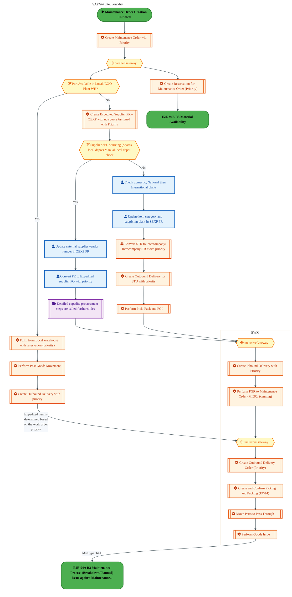
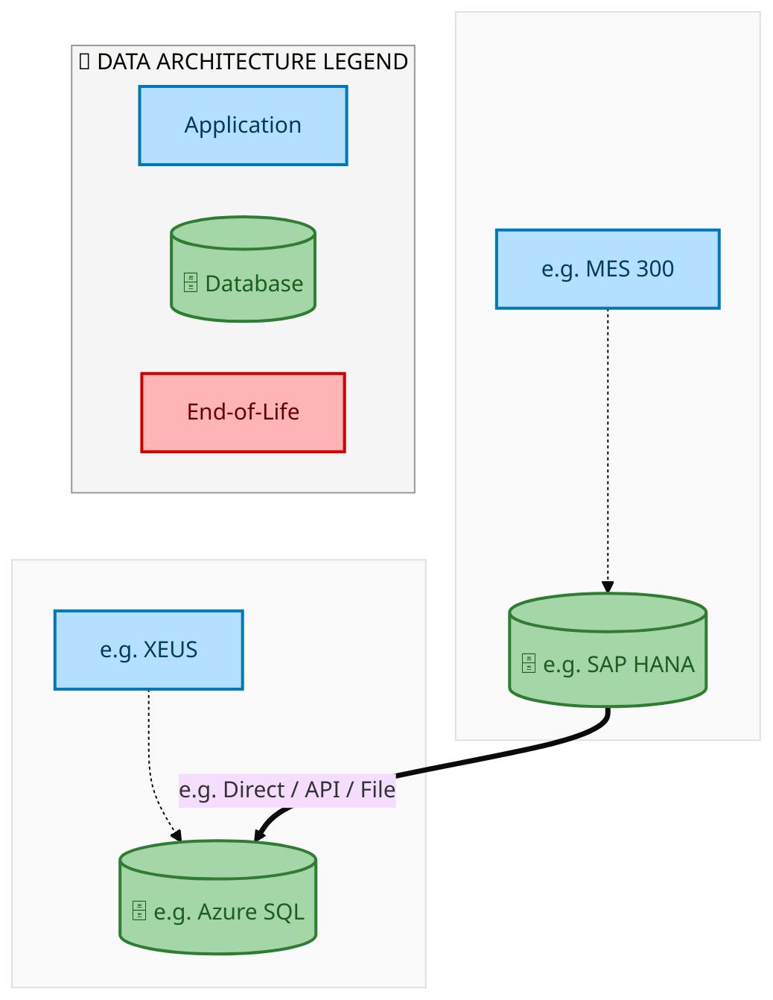
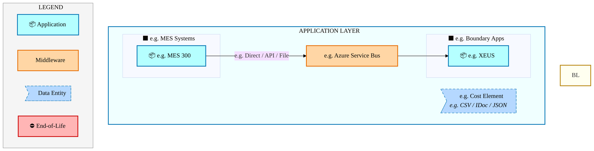
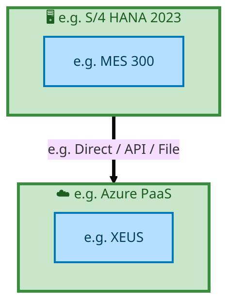

<div style="text-align:center; padding-top:20px;">
  
  <img src="data:image/svg+xml;base64,PHN2ZyB4bWxucz0iaHR0cDovL3d3dy53My5vcmcvMjAwMC9zdmciIHZpZXdCb3g9IjAgMCA4MDAgNDgwIiB3aWR0aD0iODAwIiBoZWlnaHQ9IjQ4MCI+CiAgPGRlZnM+CiAgICA8bGluZWFyR3JhZGllbnQgaWQ9ImJnIiB4MT0iMCUiIHkxPSIwJSIgeDI9IjEwMCUiIHkyPSIxMDAlIj4KICAgICAgPHN0b3Agb2Zmc2V0PSIwJSIgc3R5bGU9InN0b3AtY29sb3I6IzAwNzFjNTtzdG9wLW9wYWNpdHk6MSIvPgogICAgICA8c3RvcCBvZmZzZXQ9IjEwMCUiIHN0eWxlPSJzdG9wLWNvbG9yOiMwMGFlZWY7c3RvcC1vcGFjaXR5OjEiLz4KICAgIDwvbGluZWFyR3JhZGllbnQ+CiAgICA8bGluZWFyR3JhZGllbnQgaWQ9ImFjY2VudCIgeDE9IjAlIiB5MT0iMCUiIHgyPSIwJSIgeTI9IjEwMCUiPgogICAgICA8c3RvcCBvZmZzZXQ9IjAlIiBzdHlsZT0ic3RvcC1jb2xvcjojZmZmZmZmO3N0b3Atb3BhY2l0eTowLjE1Ii8+CiAgICAgIDxzdG9wIG9mZnNldD0iMTAwJSIgc3R5bGU9InN0b3AtY29sb3I6I2ZmZmZmZjtzdG9wLW9wYWNpdHk6MC4wMiIvPgogICAgPC9saW5lYXJHcmFkaWVudD4KICAgIDxwYXR0ZXJuIGlkPSJncmlkIiB3aWR0aD0iNDAiIGhlaWdodD0iNDAiIHBhdHRlcm5Vbml0cz0idXNlclNwYWNlT25Vc2UiPgogICAgICA8cGF0aCBkPSJNIDQwIDAgTCAwIDAgMCA0MCIgZmlsbD0ibm9uZSIgc3Ryb2tlPSJyZ2JhKDI1NSwyNTUsMjU1LDAuMDcpIiBzdHJva2Utd2lkdGg9IjAuNSIvPgogICAgPC9wYXR0ZXJuPgogIDwvZGVmcz4KCiAgPCEtLSBCYWNrZ3JvdW5kIC0tPgogIDxyZWN0IHdpZHRoPSI4MDAiIGhlaWdodD0iNDgwIiBmaWxsPSJ1cmwoI2JnKSIgcng9IjgiLz4KICA8cmVjdCB3aWR0aD0iODAwIiBoZWlnaHQ9IjQ4MCIgZmlsbD0idXJsKCNncmlkKSIgcng9IjgiLz4KICA8cmVjdCB3aWR0aD0iODAwIiBoZWlnaHQ9IjQ4MCIgZmlsbD0idXJsKCNhY2NlbnQpIiByeD0iOCIvPgoKICA8IS0tIERlY29yYXRpdmUgY2lyY3VpdC9hcmNoaXRlY3R1cmUgbGluZXMgLS0+CiAgPGcgc3Ryb2tlPSJyZ2JhKDI1NSwyNTUsMjU1LDAuMTIpIiBzdHJva2Utd2lkdGg9IjEuNSIgZmlsbD0ibm9uZSI+CiAgICA8cGF0aCBkPSJNIDAgMTAwIEwgMTIwIDEwMCBMIDE2MCAxNDAgTCAyODAgMTQwIi8+CiAgICA8cGF0aCBkPSJNIDAgMjYwIEwgODAgMjYwIEwgMTIwIDIyMCBMIDIwMCAyMjAgTCAyNDAgMjYwIEwgMzYwIDI2MCIvPgogICAgPHBhdGggZD0iTSA1MjAgMTAwIEwgNjAwIDEwMCBMIDY0MCA2MCBMIDgwMCA2MCIvPgogICAgPHBhdGggZD0iTSA0NDAgMzQwIEwgNTYwIDM0MCBMIDYwMCAzMDAgTCA3MjAgMzAwIEwgNzYwIDM0MCBMIDgwMCAzNDAiLz4KICAgIDxwYXRoIGQ9Ik0gNjAwIDQwMCBMIDY4MCA0MDAgTCA3MjAgNDQwIi8+CiAgICA8cGF0aCBkPSJNIDAgNDAwIEwgNDAgNDAwIEwgODAgMzYwIi8+CiAgICA8cGF0aCBkPSJNIDIwMCA0MjAgTCAzMjAgNDIwIEwgMzYwIDM4MCBMIDQ4MCAzODAiLz4KICAgIDxwYXRoIGQ9Ik0gNjUwIDQ0MCBMIDc1MCA0NDAgTCA4MDAgNDgwIi8+CiAgPC9nPgoKICA8IS0tIERlY29yYXRpdmUgbm9kZXMgLS0+CiAgPGcgZmlsbD0icmdiYSgyNTUsMjU1LDI1NSwwLjE4KSI+CiAgICA8Y2lyY2xlIGN4PSIxMjAiIGN5PSIxMDAiIHI9IjQiLz4KICAgIDxjaXJjbGUgY3g9IjI4MCIgY3k9IjE0MCIgcj0iNCIvPgogICAgPGNpcmNsZSBjeD0iMjAwIiBjeT0iMjIwIiByPSI0Ii8+CiAgICA8Y2lyY2xlIGN4PSIzNjAiIGN5PSIyNjAiIHI9IjQiLz4KICAgIDxjaXJjbGUgY3g9IjYwMCIgY3k9IjEwMCIgcj0iNCIvPgogICAgPGNpcmNsZSBjeD0iNzIwIiBjeT0iMzAwIiByPSI0Ii8+CiAgICA8Y2lyY2xlIGN4PSI1NjAiIGN5PSIzNDAiIHI9IjQiLz4KICAgIDxjaXJjbGUgY3g9IjgwIiBjeT0iMzYwIiByPSI0Ii8+CiAgICA8Y2lyY2xlIGN4PSI0ODAiIGN5PSIzODAiIHI9IjQiLz4KICAgIDxjaXJjbGUgY3g9IjMyMCIgY3k9IjQyMCIgcj0iNCIvPgogIDwvZz4KCiAgPCEtLSBUT0dBRiBCREFUIGJveGVzIC0tPgogIDxnIGZvbnQtZmFtaWx5PSJTZWdvZSBVSSwgQXJpYWwsIHNhbnMtc2VyaWYiIGZvbnQtc2l6ZT0iMTQiIGZvbnQtd2VpZ2h0PSI2MDAiPgogICAgPCEtLSBCIC0tPgogICAgPHJlY3QgeD0iMTUwIiB5PSIxNDAiIHdpZHRoPSIxMjAiIGhlaWdodD0iNDAiIHJ4PSI1IiBmaWxsPSJyZ2JhKDI1NSwyNTUsMjU1LDAuMTgpIiBzdHJva2U9InJnYmEoMjU1LDI1NSwyNTUsMC4zKSIgc3Ryb2tlLXdpZHRoPSIxIi8+CiAgICA8dGV4dCB4PSIyMTAiIHk9IjE2NSIgdGV4dC1hbmNob3I9Im1pZGRsZSIgZmlsbD0iI2ZmZiI+QnVzaW5lc3M8L3RleHQ+CiAgICA8IS0tIEQgLS0+CiAgICA8cmVjdCB4PSIyOTAiIHk9IjE0MCIgd2lkdGg9IjEyMCIgaGVpZ2h0PSI0MCIgcng9IjUiIGZpbGw9InJnYmEoMjU1LDI1NSwyNTUsMC4xOCkiIHN0cm9rZT0icmdiYSgyNTUsMjU1LDI1NSwwLjMpIiBzdHJva2Utd2lkdGg9IjEiLz4KICAgIDx0ZXh0IHg9IjM1MCIgeT0iMTY1IiB0ZXh0LWFuY2hvcj0ibWlkZGxlIiBmaWxsPSIjZmZmIj5EYXRhPC90ZXh0PgogICAgPCEtLSBBIC0tPgogICAgPHJlY3QgeD0iNDMwIiB5PSIxNDAiIHdpZHRoPSIxMjAiIGhlaWdodD0iNDAiIHJ4PSI1IiBmaWxsPSJyZ2JhKDI1NSwyNTUsMjU1LDAuMTgpIiBzdHJva2U9InJnYmEoMjU1LDI1NSwyNTUsMC4zKSIgc3Ryb2tlLXdpZHRoPSIxIi8+CiAgICA8dGV4dCB4PSI0OTAiIHk9IjE2NSIgdGV4dC1hbmNob3I9Im1pZGRsZSIgZmlsbD0iI2ZmZiI+QXBwbGljYXRpb248L3RleHQ+CiAgICA8IS0tIFQgLS0+CiAgICA8cmVjdCB4PSI1NzAiIHk9IjE0MCIgd2lkdGg9IjEyMCIgaGVpZ2h0PSI0MCIgcng9IjUiIGZpbGw9InJnYmEoMjU1LDI1NSwyNTUsMC4xOCkiIHN0cm9rZT0icmdiYSgyNTUsMjU1LDI1NSwwLjMpIiBzdHJva2Utd2lkdGg9IjEiLz4KICAgIDx0ZXh0IHg9IjYzMCIgeT0iMTY1IiB0ZXh0LWFuY2hvcj0ibWlkZGxlIiBmaWxsPSIjZmZmIj5UZWNobm9sb2d5PC90ZXh0PgogIDwvZz4KCiAgPCEtLSBDb25uZWN0aW5nIGxpbmVzIGJldHdlZW4gQkRBVCBib3hlcyAtLT4KICA8ZyBzdHJva2U9InJnYmEoMjU1LDI1NSwyNTUsMC4yNSkiIHN0cm9rZS13aWR0aD0iMSI+CiAgICA8bGluZSB4MT0iMjcwIiB5MT0iMTYwIiB4Mj0iMjkwIiB5Mj0iMTYwIi8+CiAgICA8bGluZSB4MT0iNDEwIiB5MT0iMTYwIiB4Mj0iNDMwIiB5Mj0iMTYwIi8+CiAgICA8bGluZSB4MT0iNTUwIiB5MT0iMTYwIiB4Mj0iNTcwIiB5Mj0iMTYwIi8+CiAgPC9nPgoKICA8IS0tIE1haW4gdGl0bGUgLS0+CiAgPHRleHQgeD0iNDAwIiB5PSIyNjAiIHRleHQtYW5jaG9yPSJtaWRkbGUiIGZvbnQtZmFtaWx5PSJTZWdvZSBVSSwgQXJpYWwsIHNhbnMtc2VyaWYiIGZvbnQtc2l6ZT0iMzYiIGZvbnQtd2VpZ2h0PSI3MDAiIGZpbGw9IiNmZmZmZmYiIGxldHRlci1zcGFjaW5nPSIxIj4KICAgIElBTyBBcmNoaXRlY3R1cmUKICA8L3RleHQ+CiAgPHRleHQgeD0iNDAwIiB5PSIzMDAiIHRleHQtYW5jaG9yPSJtaWRkbGUiIGZvbnQtZmFtaWx5PSJTZWdvZSBVSSwgQXJpYWwsIHNhbnMtc2VyaWYiIGZvbnQtc2l6ZT0iMTgiIGZvbnQtd2VpZ2h0PSI0MDAiIGZpbGw9InJnYmEoMjU1LDI1NSwyNTUsMC44KSIgbGV0dGVyLXNwYWNpbmc9IjIiPgogICAgVE9HQUYgQkRBVCDCtyBJQU8gUHJvZ3JhbSDCtyBJRE0gMi4wCiAgPC90ZXh0PgoKICA8IS0tIEJvdHRvbSBhY2NlbnQgYmFyIC0tPgogIDxyZWN0IHg9IjI4MCIgeT0iMzQwIiB3aWR0aD0iMjQwIiBoZWlnaHQ9IjMiIHJ4PSIxLjUiIGZpbGw9InJnYmEoMjU1LDI1NSwyNTUsMC40KSIvPgoKICA8IS0tIEludGVsIHRleHQgLS0+CiAgPHRleHQgeD0iNDAwIiB5PSIzODAiIHRleHQtYW5jaG9yPSJtaWRkbGUiIGZvbnQtZmFtaWx5PSJTZWdvZSBVSSwgQXJpYWwsIHNhbnMtc2VyaWYiIGZvbnQtc2l6ZT0iMTMiIGZpbGw9InJnYmEoMjU1LDI1NSwyNTUsMC41KSIgbGV0dGVyLXNwYWNpbmc9IjMiPgogICAgSU5URUwgQ09ORklERU5USUFMCiAgPC90ZXh0Pgo8L3N2Zz4K" alt="IAO Architecture" style="width:100%; border-radius:8px;" />
  <h1 style="font-size:36px; margin-top:24px;">E2E-94 — R3 Intel Foundry Maintenance process through spare parts (SWAP)</h1>
  <h2 style="font-size:24px;">Architecture Document (TOGAF BDAT)</h2>
  <p style="font-size:18px; color:#555;">End-to-End Integrated Processes (E2E) Tower<br/>
  Capability E2E-94 · Forecast to Stock</p>
  <p style="font-size:14px; color:#888;">IAO Program · R1 – R5<br/>
  Generated: April 2026<br/>
  Sajiv Francis</p>
  <p style="font-size:12px; color:#aaa;">IAO Architecture Pipeline — Intel Confidential</p>
</div>

<style>
@media print {
  @page { size: A4; margin: 0; }
  .mermaid { page-break-inside: avoid; overflow: visible; }
  pre, table { page-break-inside: avoid; }
  h2, h3, h4 { page-break-after: avoid; }
}
.mermaid { overflow: visible; }
.mermaid svg { max-width: 100%; height: auto !important; }
.page-footer {
  margin-top: auto;
  padding-top: 8px;
  border-top: 1px solid #ddd;
  display: flex;
  justify-content: space-between;
  align-items: center;
  font-size: 11px;
  color: #888;
  padding: 6px 12px;
  background: #fff;
}
@media print {
  .page-footer { display: none !important; }
}
.page-footer a { color: #00aeef; text-decoration: none; font-weight: 500; }
.page-footer a:hover { color: #0071c5; text-decoration: underline; }
</style>


<div class="page-footer"><span>Page 1</span><span><a href="#toc">↑ Back to TOC</a></span><span>E2E-94 — R3 Intel Foundry Maintenance process through spare parts (SWAP)</span></div>
<div style="page-break-before: always;"></div>


<a id="toc"></a>

## Table of Contents

<nav class="toc">
<ol>
  <li><a href="#1-executive-summary">1. Executive Summary</a></li>
  <li><a href="#2-business-context-objectives">2. Business Context &amp; Objectives</a>
    <ul>
      <li><a href="#21-classification">2.1 Classification</a></li>
      <li><a href="#22-business-drivers">2.2 Business Drivers</a></li>
      <li><a href="#23-success-criteria">2.3 Success Criteria</a></li>
      <li><a href="#24-companion-documents">2.4 Companion Documents</a></li>
    </ul>
  </li>
  <li><a href="#3-business-architecture-togaf-b">3. Business Architecture (TOGAF &ldquo;B&rdquo;)</a>
    <ul>
      <li><a href="#31-business-process-overview">3.1 Business Process Overview</a></li>
      <li><a href="#32-business-process-diagrams">3.2 Business Process Diagrams</a></li>
      <li><a href="#33-business-roles-responsibilities">3.3 Business Roles &amp; Responsibilities</a></li>
    </ul>
  </li>
  <li><a href="#4-data-architecture-togaf-d">4. Data Architecture (TOGAF &ldquo;D&rdquo;)</a>
    <ul>
      <li><a href="#41-data-entities-ownership">4.1 Data Entities &amp; Ownership</a></li>
      <li><a href="#42-data-flow-diagrams">4.2 Data Flow Diagrams</a></li>
      <li><a href="#43-data-lineage">4.3 Data Lineage</a></li>
      <li><a href="#44-ricefw-data-objects">4.4 RICEFW Data Objects</a></li>
      <li><a href="#45-data-governance-quality">4.5 Data Governance &amp; Quality</a></li>
    </ul>
  </li>
  <li><a href="#5-application-architecture-togaf-a">5. Application Architecture (TOGAF &ldquo;A&rdquo;)</a>
    <ul>
      <li><a href="#51-current-state-current-state-application-landscape">5.1 Current-State Application Landscape</a></li>
      <li><a href="#52-future-state-future-state-application-landscape">5.2 Future-State Application Landscape</a></li>
      <li><a href="#53-change-impact-summary">5.3 Change Impact Summary</a></li>
      <li><a href="#54-component-overview">5.4 Component Overview</a></li>
      <li><a href="#55-ricefw-inventory">5.5 RICEFW Inventory</a></li>
      <li><a href="#56-integration-patterns">5.6 Integration Patterns</a></li>
    </ul>
  </li>
  <li><a href="#6-technology-architecture-togaf-t">6. Technology Architecture (TOGAF &ldquo;T&rdquo;)</a>
    <ul>
      <li><a href="#61-platform-infrastructure">6.1 Platform &amp; Infrastructure</a></li>
      <li><a href="#62-sap-development-object-status">6.2 SAP Development Object Status</a></li>
      <li><a href="#63-nfrs-design-principles">6.3 NFRs &amp; Design Principles</a></li>
      <li><a href="#64-security-governance">6.4 Security &amp; Governance</a></li>
    </ul>
  </li>
  <li><a href="#7-project-context">7. Project Context</a>
    <ul>
      <li><a href="#71-project-roadmap-go-live-plan">7.1 Project Roadmap &amp; Go-Live Plan</a></li>
      <li><a href="#72-raid-log">7.2 RAID Log</a></li>
      <li><a href="#73-recommendations-next-steps">7.3 Recommendations &amp; Next Steps</a></li>
    </ul>
  </li>
</ol>
</nav>


<div class="page-footer"><span>Page 2</span><span><a href="#toc">↑ Back to TOC</a></span><span>E2E-94 — R3 Intel Foundry Maintenance process through spare parts (SWAP)</span></div>
<div style="page-break-before: always;"></div>


## 1. Executive Summary

This Architecture Document defines the **Business, Data, Application, and Technology** (BDAT) architecture for **E2E-94 R3 Intel Foundry Maintenance process through spare parts (SWAP)** within the IAO program. It includes 15 BPMN process diagram(s) in Section 3.

| Dimension | Value |
|-----------|-------|
| **Tower** | End-to-End Integrated Processes (E2E) |
| **Process Group** | Forecast to Stock |
| **Capability** | E2E-94 - R3 Intel Foundry Maintenance process through spare parts (SWAP) |
| **Release** | R1 – R5 |
| **Total Systems** | 2 |
| **System Status** | 0 Deployed, 0 Developing, 0 EOL, 2 Pending IAPM |
| **RICEFW Objects** | Pending — Smartsheet Object Tracker API integration |

**Change Summary**: 0 new flow chains, 0 removed, 0 modified, 1 unchanged between Current-State and Future-State states.

> All system nodes in architecture diagrams are **IAPM-linked** — click any node to open its IAPM page. Diagrams require `securityLevel: 'loose'` for click events.


<div class="page-footer"><span>Page 3</span><span><a href="#toc">↑ Back to TOC</a></span><span>E2E-94 — R3 Intel Foundry Maintenance process through spare parts (SWAP)</span></div>
<div style="page-break-before: always;"></div>


## 2. Business Context & Objectives

### 2.1 Classification

| Level | Value |
|-------|-------|
| **L0 Tower** | End-to-End Integrated Processes |
| **L1 Process** | Forecast to Stock |
| **L2 Capability** | E2E-94 - R3 Intel Foundry Maintenance process through spare parts (SWAP) |

### 2.2 Business Drivers

| # | Driver | Description | Strategic Alignment | Priority |
|---|--------|-------------|---------------------|----------|
| 1 | End-to-End Process Integration | Enable cross-tower integrated processes spanning procurement, manufacturing, and fulfillment | IDM 2.0 Process Excellence | High |
| 2 | Intel Foundry Business Enablement | Stand up foundry-specific business processes for external customer engagement | Intel Foundry Services | High |
| 3 | Process Visibility & Monitoring | Provide end-to-end process visibility across tower boundaries with integrated monitoring | Operational Excellence | Medium |
| 4 | E2E-94 Process Migration | Migrate R3 Intel Foundry Maintenance process through spare parts (SWAP) business processes and 2 integrated systems from legacy to S/4 HANA target architecture | IDM 2.0 Cross-Functional / End-to-End | High |


<div class="page-footer"><span>Page 4</span><span><a href="#toc">↑ Back to TOC</a></span><span>E2E-94 — R3 Intel Foundry Maintenance process through spare parts (SWAP)</span></div>
<div style="page-break-before: always;"></div>


### 2.3 Success Criteria

| Metric | Target | Measure | Baseline | Owner |
|--------|--------|---------|----------|-------|
| E2E Process Cycle Time | Per process SLA | End-to-end transaction completion within defined SLA per process | Varies by process | E2E Process Owner |
| Cross-Tower Integration Success | > 99% | Transactions completing across tower boundaries without manual intervention | 92% (current) | Integration Lead |
| Process Exception Rate | < 2% | Transactions requiring manual exception handling | 8% (current) | Operations Manager |
| E2E-94 Migration Completeness | 100% flow chains validated | All 1 flow chains verified in target state | 0% (pre-migration) | Tower Architect |

### 2.4 Companion Documents

| Document | Description |
|----------|-------------|
| **Business Architecture** | Included in this document (Section 3) — process flows from BPMN diagrams |
| **This Document** | Full BDAT Architecture — Business + Data + Application + Technology |


<div class="page-footer"><span>Page 5</span><span><a href="#toc">↑ Back to TOC</a></span><span>E2E-94 — R3 Intel Foundry Maintenance process through spare parts (SWAP)</span></div>
<div style="page-break-before: always;"></div>


## 3. Business Architecture (TOGAF "B")

### 3.1 Business Process Overview

This capability includes **15 business process(es)** modeled in BPMN 2.0, covering the end-to-end workflow for E2E-94 R3 Intel Foundry Maintenance process through spare parts (SWAP).

| # | Step ID | Process Name | Lanes | Tasks | Gateways |
|---|---------|--------------|-------|-------|----------|
| 1 | E2E-94B_R3_Material_Availability | E2E-94B_R3_Material_Availability | EWM (Decentralized), SAP S/4 Intel Foundry  | 9 | 1 |
| 2 | E2E-94C_R3_Material_Availability_&amp;_Material_Movement_Expedite_Process_with_MMID | E2E-94C_R3_Material_Availability_&amp;_Material_Movement_Expedite_Process_with_MMID | EWM , SAP S/4 Intel Foundry  | 19 | 5 |
| 3 | E2E-94D_R3_Procurement_of_Spare-_Epart_-_with_MMID | E2E-94D_R3_Procurement_of_Spare-_Epart_-_with_MMID | Boundary Apps, External Partners , Intel Foundry - WH  | 19 | 7 |
| 4 | E2E-94E_R3_Procurement_of_Spare-_Epart_–_for_Non_MMID | E2E-94E_R3_Procurement_of_Spare-_Epart_–_for_Non_MMID | Boundary Apps, External Partners , Intel Foundry - WH  | 21 | 5 |
| 5 | E2E-94F_R3_Return_to_EWM_Process | E2E-94F_R3_Return_to_EWM_Process | EWM, SAP S/4 Intel Foundry  | 9 | 6 |
| 6 | E2E-94I_R3_Maintenance_process_through_spare_parts_(SWAP)_–_Warranty_Process_(Non_MMID)​ | E2E-94I_R3_Maintenance_process_through_spare_parts_(SWAP)_–_Warranty_Process_(Non_MMID)​ | Factory Portal UI, SAP S/4 Intel Foundry  | 10 | 2 |
| 7 | E2E-94J_R3_Kit_Forecast_for_Assembly_&amp;_Component_Procurement | E2E-94J_R3_Kit_Forecast_for_Assembly_&amp;_Component_Procurement | EWM, Intel Foundry | 5 | 1 |
| 8 | E2E-94K_R3_Kit_components_procured_and_received_into_Internal_WH | E2E-94K_R3_Kit_components_procured_and_received_into_Internal_WH | Boundary Apps , EWM, External Partners/B2B, SAP Intel Foundry | 17 | 4 |
| 9 | E2E-94M_R3_Kit_components_assembled_in_Internal_WH | E2E-94M_R3_Kit_components_assembled_in_Internal_WH | EWM , Intel Foundry | 14 | 2 |
| 10 | E2E-94P_R3_Sending_the_kit_to_Cleaning_from_Internal_WH_-_Pre_Cleaning | E2E-94P_R3_Sending_the_kit_to_Cleaning_from_Internal_WH_-_Pre_Cleaning | Boundary Apps , EWM , External Partners/B2B , Intel Foundry - WH , SAP S/4 Intel Foundry  | 21 | 9 |
| 11 | E2E-94Q_R3_Kit_Repair_Process | E2E-94Q_R3_Kit_Repair_Process | EWM , SAP S/4 Intel Foundry  | 12 | 1 |
| 12 | E2E-94T_R3_Reverse_Kitting_in_Internal_WH | E2E-94T_R3_Reverse_Kitting_in_Internal_WH | EWM , Intel Foundry | 12 | 8 |
| 13 | E2E-94U_R3_Quenching | E2E-94U_R3_Quenching | EWM (Decentralized) , External Partners / B2B , Factory UI Portal , Intel Foundry WH , SAP S/4 Intel Foundry  | 27 | 8 |
| 14 | E2E-94V_R3_De_Contamination | E2E-94V_R3_De_Contamination | EWM  Decentralized, External Partners / B2B, Factory UI Portal, SAP S/4 Intel Foundry
 | 20 | 5 |
| 15 | E2E-94W_R3_TM_steps | E2E-94W_R3_TM_steps | External Partner Supplier B2B, SAP S/4 

Intel Product/ Intel Foundry | 9 | 1 |


<div class="page-footer"><span>Page 6</span><span><a href="#toc">↑ Back to TOC</a></span><span>E2E-94 — R3 Intel Foundry Maintenance process through spare parts (SWAP)</span></div>
<div style="page-break-before: always;"></div>


### 3.2 Business Process Diagrams

#### BUSINESS ARCHITECTURE — 3.2.1 E2E-94B_R3_Material_Availability — E2E-94B_R3_Material_Availability

**Swim Lanes**: EWM (Decentralized) · SAP S/4 Intel Foundry  | **Tasks**: 9 | **Gateways**: 1

```mermaid
%%{init: {'theme': 'base', 'themeVariables': {'fontSize': '14px', 'fontFamily': 'Segoe UI, Arial, sans-serif','primaryColor': '#e8f0fe', 'primaryBorderColor': '#0071c5','lineColor': '#37474F', 'secondaryColor': '#f5f8fc'}, 'flowchart': {'useMaxWidth': false, 'htmlLabels': true, 'curve': 'basis', 'nodeSpacing': 40, 'rankSpacing': 50}} }%%
flowchart LR
    classDef startEvt fill:#4CAF50,stroke:#2E7D32,color:#000,font-weight:bold,stroke-width:2px,rx:20,ry:20
    classDef endEvt fill:#C62828,stroke:#B71C1C,color:#fff,font-weight:bold,stroke-width:2px,rx:20,ry:20
    classDef userTask fill:#E3F2FD,stroke:#1565C0,stroke-width:2px,color:#0D47A1
    classDef serviceTask fill:#FFF3E0,stroke:#E65100,stroke-width:2px,color:#BF360C
    classDef gateway fill:#FFF9C4,stroke:#F57F17,stroke-width:2px,color:#E65100
    classDef subProc fill:#F3E5F5,stroke:#7B1FA2,stroke-width:2px,color:#4A148C
    subgraph lane_0["EWM (Decentralized)"]
        n6[["fa:fa-cog Distribute Outbound Delivery Order"]]
        n7[["fa:fa-cog Create and Confirm Picking and Packing (EWM)"]]
        n8[["fa:fa-cog Move Parts to Pass Through"]]
        n9[["fa:fa-cog Perform Goods Issue"]]
    end
    subgraph lane_1["SAP S/4 Intel Foundry "]
        n1["MRP Run"]
        n2[["fa:fa-cog Check for Spare Parts"]]
        n3[["fa:fa-cog Create Reservation WRT to PM Order"]]
        n4[["fa:fa-cog Post Goods Movement"]]
        n5[["fa:fa-cog Perform Outbound Delivery"]]
        n10["E2E-94A R3 Maintenance Process (Breakdown/Planned)"]
        n11["Scenario 4A Procurement of WIINGS Replacement Related Commodities"]
        n12["E2E-94C R3 Material Availability and Material Movement Expedite Process with..."]
        n13["E2E-94A R3 Maintenance Process (Breakdown/Planned)"]
        n14{{"fa:fa-arrows-alt parallelGateway"}}
    end
    n4 --> n5
    n6 --> n7
    n7 --> n8
    n8 --> n9
    n5 --> n6
    n13 --> n2
    n9 --> n10
    n3 --> n14
    n14 --> n4
    n14 --> n1
    n1 --> n11
    n2 --> n3
    n14 --> n12
    class n2 serviceTask
    class n3 serviceTask
    class n4 serviceTask
    class n5 serviceTask
    class n6 serviceTask
    class n7 serviceTask
    class n8 serviceTask
    class n9 serviceTask
    class n10 startEvt
    class n11 startEvt
    class n12 startEvt
    class n13 startEvt
    class n14 gateway
```

> **Legend**: <span style="color:#000;background:#4CAF50;padding:2px 6px;border-radius:10px;font-weight:bold;font-size:9pt">● Start</span> · <span style="color:#fff;background:#C62828;padding:2px 6px;border-radius:10px;font-weight:bold;font-size:9pt">● End</span> · <span style="background:#E3F2FD;padding:2px 6px;border:1px solid #1565C0;font-size:9pt">User Task</span> · <span style="background:#FFF3E0;padding:2px 6px;border:1px solid #E65100;font-size:9pt">Service Task</span> · <span style="background:#FFF9C4;padding:2px 6px;border:1px solid #F57F17;font-size:9pt">◇ Gateway</span> · <span style="background:#F3E5F5;padding:2px 6px;border:1px solid #7B1FA2;font-size:9pt">Sub-Process</span>



<div style="text-align:center; margin:4px 0 8px 0; font-size:11px;"><a href="https://mermaid.live/view#pako:eNqtVl1v6jgQ_StWqopeCXrzSSAPK1EgVaXLXgTd7cPtamUSB6waG9kOlEX89x0nAUraPO3mAXHm48zMycTJwUpESqzIur09UE51hA4tvSJr0opQa4EVabVRafgTS4oXjKiWickE13P6TxHm-Jt3E2ZsMV5TtjfWOVkKgv54aqMBJLI2UpirjiKSZq12ayPpGsv9UDAhTfQN6WV2VlSrXA9CpkReAmw7dJIAUhnl5GL2Qj_0Y5OnSCJ4ekWaBVkvS1pH0xwTu2SFpS7azxWZ4PcXmuoV4AwzRSBmpdfsB14QZmbUMje2JJfbkxhUmTocBJtvcEL5Euy-DSaJ-dvFFNjHIzre3r7yc1H0Y_bKEVwJw0qNSIaUBvN4q1FGGYtu_OEgDuy20lK8kejGHYcjz20nZpIIRrfbRtzOjtDlSkcLwdIqtLMzM0Tu5r0t3yPXbss9_NZqEZ5eKg27bs_tnSs9hM7QGZ4qZVn2nyqBrvIZq7eq1tiL3Xh0ruUE3WBof-Y7jTnyw4FT14nILU3IB9I4jr3xRapxN3DsZtKH2OvawxrpEmuyw_sLYX_onwnjIIydsJGwrFfvMl9MpUhOhN44iIMzYfjgxAO3kdAfOH6v6hB4lhJvVohhTv62f71a45cJuhuRhHAtMYMnLv32av1VRpuLd39BVIajDHcSsUQjCnXoItcE_cz1QuQ8RSPC6JbIPfppHilI_5gfXucPJQFxEIa0oeAZlWs0pckbbHZhm-Ly_x309a3G1LtmmogtgXipFdIC_iiFnldS5MtVLa9_nTclMhNQ9lGIVKEnpXJySYBV_kopBxjmgymaf_fRE9eEodhMDiNfi2XiJrMpmuX82uHWVFiRBPZNSASPtazGqLXtfSncjJiNxZoKjl5mz8Xoky-F92tjC6WrmY1ya7jhtYTga50-3eZamlOskTvu9P0BmnlogikoxDFPYC5YWgI35u4Bun9LxY5_n4Kg_NOWOYXCsIXwFhAIiExmLos2kcjQy9PT749zmH7DcFJaZ4SBIGaN1muRUk2JqnG658aGZWOamFcFGmwxZXhBGdX7YuvOnpMyaPy-IcB5mWBH9er-_r5Wwfs_RvcPh5PuWEqxUx3MNIK9wIwR9lieJa_W8VhbUe6jTuc3uG8V7JYwrGBYwl4FeyXsVzAoYbeCjldit8L9EjrVQcQrt-Of4qvadeyccAVP2C2xVw93Pxx0JurDcXzl8Ro9fqMnaPR0Gz1ho6fX6Ok3ehz7_B6-tjsNdrfB7jXY_dOrxmpbayLXmKZWdLCKDyr46EpJhnOmrWPbwrkW8z1PrKj48LDyTQqZI4rhlFuXxuO_7tgKYA==" title="View full diagram">&#128065; View Diagram</a></div>


<div class="page-footer"><span>Page 7</span><span><a href="#toc">↑ Back to TOC</a></span><span>E2E-94 — R3 Intel Foundry Maintenance process through spare parts (SWAP)</span></div>
<div style="page-break-before: always;"></div>


#### BUSINESS ARCHITECTURE — 3.2.2 E2E-94C_R3_Material_Availability_&amp;_Material_Movement_Expedite_Process_with_MMID — E2E-94C_R3_Material_Availability_&amp;_Material_Movement_Expedite_Process_with_MMID

**Swim Lanes**: EWM  · SAP S/4 Intel Foundry  | **Tasks**: 19 | **Gateways**: 5

> **Legend**: <span style="color:#000;background:#4CAF50;padding:2px 6px;border-radius:10px;font-weight:bold;font-size:9pt">● Start</span> · <span style="color:#fff;background:#C62828;padding:2px 6px;border-radius:10px;font-weight:bold;font-size:9pt">● End</span> · <span style="background:#E3F2FD;padding:2px 6px;border:1px solid #1565C0;font-size:9pt">User Task</span> · <span style="background:#FFF3E0;padding:2px 6px;border:1px solid #E65100;font-size:9pt">Service Task</span> · <span style="background:#FFF9C4;padding:2px 6px;border:1px solid #F57F17;font-size:9pt">◇ Gateway</span> · <span style="background:#F3E5F5;padding:2px 6px;border:1px solid #7B1FA2;font-size:9pt">Sub-Process</span>



<div style="text-align:center; margin:4px 0 8px 0; font-size:11px;"><a href="https://mermaid.live/view#pako:eNqlWG1v2zYQ_iuEisAJYDd6s-X4wwbHsbMATWPE6dptHgZaomwiNCmQVBwv9X_fUS9-UaWuw_IhCB8en7t7yDtSebNCERFrYJ2dvVFO9QC9tfSKrElrgFoLrEirjXLgVywpXjCiWsYmFlzP6N-ZmeMnr8bMYBO8pmxr0BlZCoI-3bXREBayNlKYq44iksatdiuRdI3ldiSYkMb6HenHdpx5K6auhYyIPBjYduCEXVjKKCcH2Av8wJ-YdYqEgkcnpHE37sdha2eCY2ITrrDUWfipIvf49TON9ArGMWaKgM1Kr9kHvCDM5KhlarAwlS-lGFQZPxwEmyU4pHwJuG8DJDF_PkBde7dDu7OzOd87RU83c47gJ2RYqRsSI6UBHr9oFFPGBu_80XDStdtKS_FMBu_ccXDjue3QZDKA1O22EbezIXS50oOFYFFh2tmYHAZu8tqWrwPXbsst_K74Ijw6eBr13L7b33u6DpyRMyo9xXH8vzyBrvIJq-fC19ibuJObvS-n2-uO7G_5yjRv_GDoVHUi8oWG5Ih0Mpl444NU417XsZtJrydezx5VSJdYkw3eHgivRv6ecNINJk7QSJj7q0aZLqZShCWhN-5OunvC4NqZDN1GQn_o-P0iQuBZSpysEMOc_GX_MbfGn-_R3PoznzY_3PH_ADzGgxh3QrFEI0kgHfSQ6oVIeYRuCKMvRG7RgykgdD6VVEiqtxdAc8LTreXBQDESPKZyjaY0fIYznWFTnP99DhFdzFPXthdVwt4p4b14IbBMaoW0gD-UQk8rKdLlqrowOF04JTIW4P5WiEihO6VSUl3Rr439jlck2FC9QqUAVY6req_T20cT7z2mXBOOeUhKJe_vbh8uZyHmHISoyun23t5KOiyl2KgOZhpRHrJUQTS3-ZmbW7vd8argP66CWq47Kg6kMhtO0ezSBxU0YWhilAAJKodnn7IpVbPRoJNG0yzl8WtCIqpJBORJwigYTB9yDZODhsfRV9hWJHxGkVgTpWnYRh-xpoJjhuAC4VlYkpdQAmFrdUrnndJ9SiKzqRDQGoXw11JAOuYoZtFtzWHMWEAt9Pv4yxSyOOXza_nIaxYHOyT5AqIKiXi6XsCoia2-XL49Jt87c5UKmaQMOgaKpVijDyKEmDZYkpWAcHMaSUz_yzRD50lDIQe1gR02c7bfzEdkCtfxsvwyB1wgJVIJwQ-VoksO5t-Lv77sHo-ihBKqK52mJtRUg0LpovxNF1kTrqvVa_9gF6we3xMSp0JSlMPsKauH7MSGYp1gvr00I4mLEVg8fJ_Z_cHwjF7_SuY1qATtuZ015rxD395Ve5J9vl8IpbKt2ZksMLNxd_D6oxBjBBwXxxymZYzdcefKv0aPHlCAKPCgQ8MXTBleUPZtW3D3S4b5koNXc00SuAnOr8HxcyQ2_HIKRQwH7yLv9AgvwRy2_2jV-_fvKx68Q9s0D9jOAp5g4Sq7bcrAGDGlnJfV5e2XBzTNmsXnX36u9mC_nmxfN970A5qZKsnuP3joQVkilhFHJBH6AmLlKYyOMBSaZlj11K3t9kCIGSOs4Yo4KroY3mNEdkQC_fSGaMgTCpYUlQ7HR8BzNasWeF-SRCGIFFonM1ZxKqENS6QYjYg6HJT9hcK7qNP5yQRZjF3PAF_n1m_G_it0r2KilxteFcOrfOgUjyJ4oBRASeQUzE5J4BQMTlAC_QIoOR278H1oY9k9QBWa84jAEVxT06zMJ0oEEBxgyA5thHxG2YcD8Byq6au5ngvmoMjSLz0V436ZdWHg7IF87JX2xQLHLYHCwCkt3FLIKlAyOoVi-5jcUo8yKNfOgVLBQh63eB3zUuFi6BVDp7pzH0WWfCmzW_LsdfcqgOtX9tyvThSU--yDAr-HLwy9TQga9HwnN3GPXslG6PLr4AR262GvHvbr4e7xd8LJTK9xJmic6TfOXDXOwIFtnHKap9zmKa95ym-ealbCaZbCadbCaRbDaVYDzm_5gXuKOw2424B75bfaKezXw916uFcPB_Vwv_yas9rWGvoMppE1eLOyf4JYAysiMU6ZtnZtC6dazLY8tAbZPwusNHtg3lAMD_N1Du7-AT6VgVg=" title="View full diagram">&#128065; View Diagram</a></div>


<div class="page-footer"><span>Page 8</span><span><a href="#toc">↑ Back to TOC</a></span><span>E2E-94 — R3 Intel Foundry Maintenance process through spare parts (SWAP)</span></div>
<div style="page-break-before: always;"></div>


#### BUSINESS ARCHITECTURE — 3.2.3 E2E-94D_R3_Procurement_of_Spare-_Epart_-_with_MMID — E2E-94D_R3_Procurement_of_Spare-_Epart_-_with_MMID

**Swim Lanes**: Boundary Apps · External Partners  · Intel Foundry - WH  | **Tasks**: 19 | **Gateways**: 7

> **Legend**: <span style="color:#000;background:#4CAF50;padding:2px 6px;border-radius:10px;font-weight:bold;font-size:9pt">● Start</span> · <span style="color:#fff;background:#C62828;padding:2px 6px;border-radius:10px;font-weight:bold;font-size:9pt">● End</span> · <span style="background:#E3F2FD;padding:2px 6px;border:1px solid #1565C0;font-size:9pt">User Task</span> · <span style="background:#FFF3E0;padding:2px 6px;border:1px solid #E65100;font-size:9pt">Service Task</span> · <span style="background:#FFF9C4;padding:2px 6px;border:1px solid #F57F17;font-size:9pt">◇ Gateway</span> · <span style="background:#F3E5F5;padding:2px 6px;border:1px solid #7B1FA2;font-size:9pt">Sub-Process</span>


<div style="text-align:center; margin:4px 0 8px 0; font-size:11px;"><a href="https://mermaid.live/view#pako:eNqlWG1v2zYQ_iuEiiAtYKeiXvz2YYPt2EmAZDXirMHQDAMtUTYRWtQoyU6W5r_vKFNyTEvt2vlDED68e4733PFk-cUKREitgXVy8sJilg3Qy2m2omt6OkCnC5LS0xbaAZ-JZGTBaXqqbCIRZ3P2T2GGveRJmSlsStaMPyt0TpeCot-vWmgIjryFUhKn7ZRKFp22ThPJ1kQ-jwUXUlm_o73IjopoemskZEjl3sC2uzjwwZWzmO5ht-t1vanyS2kg4vCANPKjXhScvqrDcbENVkRmxfHzlN6Qp3sWZitYR4SnFGxW2ZpfkwXlKsdM5goLcrkpxWCpihODYPOEBCxeAu7ZAEkSP-4h3359Ra8nJw9xFRRd3z7ECD4BJ2l6TiOUZgBPNhmKGOeDd954OPXtVppJ8UgH75xJ99x1WoHKZACp2y0lbntL2XKVDRaCh9q0vVU5DJzkqSWfBo7dks_w14hF43Afadxxek6vijTq4jEel5GiKPpfkUBXeUfSRx1r4k6d6XkVC_sdf2wf85VpnnvdITZ1onLDAvqGdDqdupO9VJOOj-1m0tHU7dhjg3RJMrolz3vC_tirCKd-d4q7jYS7eOYp88VMiqAkdCf-1K8IuyM8HTqNhN4Qez19QuBZSpKsECcx_cv-8mCNRF40NRomSfpg_bmzU58Yf4H9iAwi0g7EEn2SSxLDlUR30I5pImTWvoozytGtyDPoTHSRs5Ci91e3Fx8ecse2F0D3ls855JtRGQm5Rp8JZyHJmIg_Tp4Cmqj_0CWJQ65I1YwIESC3OcwGNKdZntSz2-8r-oSD-N_mvYJhxKBMIdB8eEvTB5aJM2n3vTG6ddEN2Kj5goYbwjhZMM6yZwQs-50bsYH5FWdo8pTQkGUUqVrRNEVblq3Ozs4qWeGi1NUBq5BPwBYD2wzubUxlioxi-Ifq3dKAsg2EyiVMgJRCeWCcIZKheZ4knMH_E4hWpxTuHFINg8dYbDkNl7s0Pt7SDaNbtHM2ItQzdutLOyZSqpPMKadBof-GEVTXNSMhUigGgtkKIgtZ1A3NoMkIN4P16oNdCBGmaMaCR-DJE_ReR_9QJrJTKF2xRKVZn0j_kHsOFdsLehVvBMwKs_G6-8ZLM5Ec2SuWzGgzt_PyUjrBMcU2bROeIRYHPE-hrhe7CfJgvb5-s3UcCL3Tc6ouMtzjNrq_NHrHPUxqLCmwQ_8ycIxJHJTNo9oVepcJCT1uZOnVcpQdH6ouOYOm_PvMYKlT2WjlsYg3FJ5hs1uUiTeX6LCzv09rtPWdZMslOF7czdF4RYNHw9zo2THhQc5VUnfkiaaGcVPPKW6xhnIXMhZh0Hx23UKTm5FB0a9V8CpeqMKhc8qh7FC_Is9LAU86NGQS3ZNnmDkcxfl6AclcDu9H9Z1rG9nfoAl4hCFtGALGdN_dnmKqJJkaIxEJMgHnuRZBcRlNf2Oa6_NrHqjjVPvf0WAVswAEqj-H0ZwzmAPfu3HY-0_VgDoUg_q4FA42nhXHd6Eoj5pBjQ8K53vXflaMNNPNNdyq9izTOHbxftzFN12KsugiHZt3DPPiCuyvxJF9r3pI3quHJDQbpGp-f3Dt_YxTbwHtBXxxCFaVPsNAPZVhdvy6H3M7R1w7HBMiCeeUH83GnZPzM07uzzh5Pzi7d17-z0782EXt9i-KQa89vfb02tdrXNrjHdAx1l297uyWvXJb85X0WPPh0h93NVCu9bIk6Ov4TknoaAO7BHQG2DEAtwyhPdzKQ58R90vAVsDXB-s38WB9feNZbfyhhvZXNVHKY-ogThkV97TpZOSgjxPnU0KroQSOZaiednMP5AM3d-gde2HfUBmXMmOtq1PWCWsLtzqhTtspOZzSouTUpSgZnL7RCroyTlWqjtEbVS0qClu7lB6a0qmOXRr0TIq3706qC968Ox3sOI07buOO17jjN-50Gne6jTu9xp1-4w4o0rjVrAJulgE364CbhcDNSuBmKXCzFrhZDNysBjRQ-ePCIY4bcEf_QHCIurWoV4v6tWinFu3Wor2Gs_XrcRgq-h3-EMb1sFMPu_WwVw_79XCnhK2WtaZyTVhoDV6s4jcza2CFNCI5z6zXlkXyTMyf48AaFL8tWXkCr7_0nBF4X1jvwNd_AVEkFT8=" title="View full diagram">&#128065; View Diagram</a></div>


<div class="page-footer"><span>Page 9</span><span><a href="#toc">↑ Back to TOC</a></span><span>E2E-94 — R3 Intel Foundry Maintenance process through spare parts (SWAP)</span></div>
<div style="page-break-before: always;"></div>


#### BUSINESS ARCHITECTURE — 3.2.4 E2E-94E_R3_Procurement_of_Spare-_Epart_–_for_Non_MMID — E2E-94E_R3_Procurement_of_Spare-_Epart_–_for_Non_MMID

**Swim Lanes**: Boundary Apps · External Partners  · Intel Foundry - WH  | **Tasks**: 21 | **Gateways**: 5

> **Legend**: <span style="color:#000;background:#4CAF50;padding:2px 6px;border-radius:10px;font-weight:bold;font-size:9pt">● Start</span> · <span style="color:#fff;background:#C62828;padding:2px 6px;border-radius:10px;font-weight:bold;font-size:9pt">● End</span> · <span style="background:#E3F2FD;padding:2px 6px;border:1px solid #1565C0;font-size:9pt">User Task</span> · <span style="background:#FFF3E0;padding:2px 6px;border:1px solid #E65100;font-size:9pt">Service Task</span> · <span style="background:#FFF9C4;padding:2px 6px;border:1px solid #F57F17;font-size:9pt">◇ Gateway</span> · <span style="background:#F3E5F5;padding:2px 6px;border:1px solid #7B1FA2;font-size:9pt">Sub-Process</span>


<div style="text-align:center; margin:4px 0 8px 0; font-size:11px;"><a href="https://mermaid.live/view#pako:eNqlWG1v2zYQ_iuEiiIJYLeiXizbHzbYjp0GaDrDzhoMyzDQEmUToUmNkvKyLP99R4myI0Va180fDPN49xzvuRdKfrZCGVFrbL1__8wEy8bo-STb0T09GaOTDUnpSQ-Vgq9EMbLhND3ROrEU2Zr9WahhL3nUalq2IHvGn7R0TbeSop8ve2gChryHUiLSfkoVi096J4lie6KeZpJLpbXf0WFsx4U3szWVKqLqqGDbAQ59MOVM0KPYDbzAW2i7lIZSRDXQ2I-HcXjyog_H5UO4Iyorjp-n9Io83rAo28E6JjyloLPL9vwz2VCuY8xUrmVhru4rMliq_QggbJ2QkIktyD0bRIqIu6PIt19e0Mv797fi4BR9Xt0KBJ-QkzQ9pzFKMxDP7zMUM87H77zZZOHbvTRT8o6O3znz4Nx1eqGOZAyh2z1Nbv-Bsu0uG28kj4xq_0HHMHaSx556HDt2Tz3Bd8MXFdHR02zgDJ3hwdM0wDM8qzzFcfy_PAGv6pqkd8bX3F04i_ODL-wP_Jn9Fq8K89wLJrjJE1X3LKSvQBeLhTs_UjUf-NjuBp0u3IE9a4BuSUYfyNMRcDTzDoALP1jgoBOw9Nc8Zb5ZKhlWgO7cX_gHwGCKFxOnE9CbYG9oTgg4W0WSHeJE0N_tX2-tqcyLokaTJElvrd9KPf0R3q-wH5NxTPqh3KKf1JYIaEl0DeWYJlJl_UuRUY5WMs-gMtFFziKKTi9XF2e3uWPbG4B7jefX8ZZUxVLt0VfCWUQyJsXH-WNIE_0LfSIi4hpUz4gIgWSVw2xAa5rlSSu645we4BMO5P8z7iUMIwZpigDmrISBMm5jCQPs_DGjShCOltBVgqoU1anCQT22FQ0pu6domSvoz5QCeTBsEMnQOk8SzuD3HLy1xYGHdahJeCfkA6fRFoakyNDHFb1n9AGVxg0P7YijduJnRCl9kjXlNCzYuWcEteV0KmUKVCGYfJxspCpYRUsoAcKbabDrzi6kjFK0ZOEd2OcJOjVez6oASmbSHUt0eO2pxXXMNWTqSOSluJfQwQ0b1z6WQ5rJ5I2-Rsm-mXwHQEpGFrpRoE_66OZTM_ugdH2F5vsNjSJ6TOvrEEClpKIojSRD55RDhSiUSXRNw51gISMCnWJ7dAYkSZHm-7Jk8wS-LlZndUAXAJeQFXQFRawvQHQl78sK6SNsB3XtQZ3AmaJgBaYMQhNEhFX51DkMWq2-wHGuri7Pi9Y81t-K_pGzlBVHPp2E4Qc0SVO2FUWesYsW7UNh-D0-ylr5DvRG5V8rtt0CwsX1Gs12NLxrdkqjeGeEhznXB7omjzRtauP2virQ5R6qrWC2cITWy889NL-aNjGcdoxLsdH1VlXJE3pg2Q59knABoglT6IY8beAuQCKHolPo0-Rm2t77bscZa7U404Wkq0m3PNlCWRSFxcSHfxorjfvhVUEvSJhJOPSxsNsRmjeCPsY3-hoP_hXpQDeCUd_CuOM27ok3XdB2N5Sm3rdmyrKYk00zv2F2KL_q9G9NBt9vEjRNihSbrLxVH7aqm4pIOyIZNYyKtji2SVPfLe5OZ94feTdo5SIYkoDafM5wnefnY0oj2t_AA0a4O5AK7Q63N1wfP95aLy-vDd2jIdwq8iHtE56hhCjCOeUX5VNY08j7L0b-fzEatBoxEfI8haS8sTrcQWKA-v0fYACbZVAu3YFZD83aNWvXLQWjxhqb50gxMmtcKRgHQ7PGw4YHbFzig4aB8MzaK5fVEzoMMoNQKfhm7VQuC4W_bq1f9CD9S3d_ZWpUncrUsY3qfOqgj3Pnp4QeBog2rCAxNoZ-LW4wdCdei13QpOfAl4kGH8I3_DgHQRVvhYENhlMR5BjBoBnvF1l4dyrusW0sK--Ooa6KwjFhuXbjeFW6K6oPYRsCsdcUVBYV4iH_5gg1B3DWy1i_B3AW6jfxkrRXbyI666_el2o7fufOoHMn6NwZdu6MOneA184t3L3ldG-53VvdROBuJnA3FbibC9xNBu5mw-lmw-lmA0qx-uOgLnc75J55-a9L_VbpoFUatEqHrdJRm9S1W6W4_cTQlubtvC5228Veu9hvFw8qsdWz9lTtCYus8bNV_L9lja2IxiTnmfXSs0ieyfWTCK1x8T-QlSfwqkrPGYF3j30pfPkbExzxuQ==" title="View full diagram">&#128065; View Diagram</a></div>


<div class="page-footer"><span>Page 10</span><span><a href="#toc">↑ Back to TOC</a></span><span>E2E-94 — R3 Intel Foundry Maintenance process through spare parts (SWAP)</span></div>
<div style="page-break-before: always;"></div>


#### BUSINESS ARCHITECTURE — 3.2.5 E2E-94F_R3_Return_to_EWM_Process — E2E-94F_R3_Return_to_EWM_Process

**Swim Lanes**: EWM · SAP S/4 Intel Foundry  | **Tasks**: 9 | **Gateways**: 6

```mermaid
%%{init: {'theme': 'base', 'themeVariables': {'fontSize': '14px', 'fontFamily': 'Segoe UI, Arial, sans-serif','primaryColor': '#e8f0fe', 'primaryBorderColor': '#0071c5','lineColor': '#37474F', 'secondaryColor': '#f5f8fc'}, 'flowchart': {'useMaxWidth': false, 'htmlLabels': true, 'curve': 'basis', 'nodeSpacing': 40, 'rankSpacing': 50}} }%%
flowchart LR
    classDef startEvt fill:#4CAF50,stroke:#2E7D32,color:#000,font-weight:bold,stroke-width:2px,rx:20,ry:20
    classDef endEvt fill:#C62828,stroke:#B71C1C,color:#fff,font-weight:bold,stroke-width:2px,rx:20,ry:20
    classDef userTask fill:#E3F2FD,stroke:#1565C0,stroke-width:2px,color:#0D47A1
    classDef serviceTask fill:#FFF3E0,stroke:#E65100,stroke-width:2px,color:#BF360C
    classDef gateway fill:#FFF9C4,stroke:#F57F17,stroke-width:2px,color:#E65100
    classDef subProc fill:#F3E5F5,stroke:#7B1FA2,stroke-width:2px,color:#4A148C
    subgraph lane_0["EWM"]
        n2["Follow Scrap Process"]
        n3["Goods Receipt EWM (Unrestricted)"]
        n4["Create and Confirm Put-away Warehouse task (EWM)"]
        n5["Goods Receipt EWM (Blocked)"]
        n6["Create and Confirm Put-away Warehouse task (EWM)"]
        n9[["fa:fa-cog Distribute Inbound Delivery to EWM"]]
        n10(["fa:fa-stop Scrap Process Followed"])
        n11(["fa:fa-stop Stock Posted"])
        n12(["fa:fa-stop Stock Posted"])
        n15["E2E-94H R3 Warranty Process"]
        n19{{"fa:fa-code-branch Reason Code?"}}
        n20{{"fa:fa-code-branch Unrestricted or Blocked"}}
    end
    subgraph lane_1["SAP S/4 Intel Foundry "]
        n1["Perform IMR Repair Process"]
        n7[["fa:fa-cog Create a MIGO Transaction"]]
        n8[["fa:fa-cog Create Inbound Delivery"]]
        n13["A IF to IMR - Variation 1 – IMR facility is within the plant"]
        n14["E2E-94G Return to Vendor"]
        n16["E2E-94A R3 Maintenance Process (Breakdown/Planned)"]
        n17{{"fa:fa-code-branch Whether it can be repaired?"}}
        n18{{"fa:fa-code-branch Internal/External"}}
        n21{{"fa:fa-arrows-alt parallelGateway"}}
        n22{{"fa:fa-arrows-alt inclusiveGateway"}}
    end
    n7 --> n8
    n8 --> n9
    n16 --> n7
    n2 --> n10
    n17 -->|"Yes"| n18
    n18 -->|"Internal"| n1
    n21 --> n17
    n1 --> n13
    n9 --> n19
    n17 -->|"No"| n2
    n18 -->|"External"| n22
    n22 --> n14
    n19 -->|"Return to Vendor"| n22
    n19 -->|"Return to Stock"| n20
    n19 -->|"Warranty"| n15
    n19 -->|"Reapair"| n21
    n3 --> n4
    n4 --> n11
    n20 -->|"Unrestricted"| n3
    n20 --> n5
    n5 --> n6
    n6 --> n12
    class n7 serviceTask
    class n8 serviceTask
    class n9 serviceTask
    class n10 endEvt
    class n11 endEvt
    class n12 endEvt
    class n13 startEvt
    class n14 startEvt
    class n15 startEvt
    class n16 startEvt
    class n17 gateway
    class n18 gateway
    class n19 gateway
    class n20 gateway
    class n21 gateway
    class n22 gateway
```

> **Legend**: <span style="color:#000;background:#4CAF50;padding:2px 6px;border-radius:10px;font-weight:bold;font-size:9pt">● Start</span> · <span style="color:#fff;background:#C62828;padding:2px 6px;border-radius:10px;font-weight:bold;font-size:9pt">● End</span> · <span style="background:#E3F2FD;padding:2px 6px;border:1px solid #1565C0;font-size:9pt">User Task</span> · <span style="background:#FFF3E0;padding:2px 6px;border:1px solid #E65100;font-size:9pt">Service Task</span> · <span style="background:#FFF9C4;padding:2px 6px;border:1px solid #F57F17;font-size:9pt">◇ Gateway</span> · <span style="background:#F3E5F5;padding:2px 6px;border:1px solid #7B1FA2;font-size:9pt">Sub-Process</span>



<div style="text-align:center; margin:4px 0 8px 0; font-size:11px;"><a href="https://mermaid.live/view#pako:eNqlV21v4jgQ_itWqoquBGqcFwJ8uBNv6VXa7qGyu9VpOZ1M4hSrxkaOU8qx_Pcbk4SXED6clg9V5_HMMzPPDE7YWpGMqdWzbm-3TDDdQ9uGXtAlbfRQY05S2miiHPhOFCNzTtOG8Umk0FP2794Ne6sP42awkCwZ3xh0Sl8lRd8em6gPgbyJUiLSVkoVSxrNxkqxJVGboeRSGe8b2knsZJ-tOBpIFVN1dLDtAEc-hHIm6BF2Ay_wQhOX0kiK-Iw08ZNOEjV2pjgu19GCKL0vP0vpE_l4YbFegJ0QnlLwWegl_0zmlJsetcoMFmXqvRSDpSaPAMGmKxIx8Qq4ZwOkiHg7Qr6926Hd7e1MHJKiz88zgeATcZKmI5qgVAM8ftcoYZz3brxhP_TtZqqVfKO9G2ccjFynGZlOetC63TTittaUvS50by55XLi21qaHnrP6aKqPnmM31Qb-VnJRER8zDdtOx-kcMg0CPMTDMlOSJL-UCXRVX0n6VuQau6ETjg65sN_2h_YlX9nmyAv6uKoTVe8soiekYRi646NU47aP7eukg9Bt28MK6SvRdE02R8Lu0DsQhn4Q4uAqYZ6vWmU2nygZlYTu2A_9A2EwwGHfuUro9bHXKSoEnldFVgvEiaD_2D9m1vjlaWb9nZ-aj3AADCWHzULTCHyRSUzT9NzLBa8HKeMUPdOIspVGQITuvglFoQ4WaRp_Oo_wIGKoKCiDiIjRUIqEqSWaZLpFjFYvRNGFhAEjbWZxB3wVBr8-54DL6O0iXfuX03V_AEVCeglpRfIVjZhpbJ4B4aOYywxIR5Szd6o2SEuU63gaj-27A0Gq5epcTpRrTGOI-nQahatRGtpDE5nqS1_nf_ga9cbOuNX1_kDPrukfbhW9qR8v7m63x-Zj2pqDc7QA4UkqBagZ099n1m53ujd2fcjpSiCpUDGuYzTcHnXLiaHeaX-CpvceCK4pB8VAdFC7Uir4TahKJEz38ekZSlwRpurbCs5HWu4Henp8-BN9hXpTEmkmRWWSndqw6hZUx2--In30GJrtMIW10P4RZ_gRRrPMsbG7P0jgYucMRsFStGZ6wQSCJyJagQy60qt3GOIDNKozJQz7d5BQqopr--DaN_N-IgxEFDASeljBuwF08hbLtbifQDJx8SXCQf1MXxYUKlSIaRQRgeYUqb3qNK5uBe7UM5iJKkH4_fgj_6e6TfgYB5sq12mLcI1WRBHOKX_IL9hqkFMbxETEsxRmdBF1WD0RoFbrN5h0YXZys1uYuJ3bQWE7uYnt8nwf_nNm_UVh436atsuTTnFSNpwflzy4ICqJS9st7G5hd6uJvsg9kVNNc5TTnJbHTlmwV_p3C__LJTqNq3HbXzG5l131Ku-UvEf_koSYJcmDSwncvLKyMK8o9KCQXQSfXiN7BvfMA54Ohe3nZrswi8lh5-SJasZ98tw_O-lcPelePcF28Qp0juJa1KlF3cML2znuXcH9K3j7Ch6U7yTncKce7tbCoHQtjOthp4StprWkaklYbPW21v5lH34QxDQhGdfWrmmRTMvpRkRWb_9SbGWrGCJHjMDjYJmDu_8AKLHO0g==" title="View full diagram">&#128065; View Diagram</a></div>


<div class="page-footer"><span>Page 11</span><span><a href="#toc">↑ Back to TOC</a></span><span>E2E-94 — R3 Intel Foundry Maintenance process through spare parts (SWAP)</span></div>
<div style="page-break-before: always;"></div>


#### BUSINESS ARCHITECTURE — 3.2.6 E2E-94I_R3_Maintenance_process_through_spare_parts_(SWAP)_–_Warranty_Process_(Non_MMID)​ — E2E-94I_R3_Maintenance_process_through_spare_parts_(SWAP)_–_Warranty_Process_(Non_MMID)​

**Swim Lanes**: Factory Portal UI · SAP S/4 Intel Foundry  | **Tasks**: 10 | **Gateways**: 2

> **Legend**: <span style="color:#000;background:#4CAF50;padding:2px 6px;border-radius:10px;font-weight:bold;font-size:9pt">● Start</span> · <span style="color:#fff;background:#C62828;padding:2px 6px;border-radius:10px;font-weight:bold;font-size:9pt">● End</span> · <span style="background:#E3F2FD;padding:2px 6px;border:1px solid #1565C0;font-size:9pt">User Task</span> · <span style="background:#FFF3E0;padding:2px 6px;border:1px solid #E65100;font-size:9pt">Service Task</span> · <span style="background:#FFF9C4;padding:2px 6px;border:1px solid #F57F17;font-size:9pt">◇ Gateway</span> · <span style="background:#F3E5F5;padding:2px 6px;border:1px solid #7B1FA2;font-size:9pt">Sub-Process</span>


<div style="text-align:center; margin:4px 0 8px 0; font-size:11px;"><a href="https://mermaid.live/view#pako:eNq1Vm1v2zYQ_isHFYETQEb1ajn6sMFvKgI0TRB3K4Z5GGiKsolQpEZRsT3X_32kXuzYa1AMQ_XBxnN67rk78njU3sIiJVZsXV3tKacqhn1PrUlOejH0lqgkPRsaw69IUrRkpOwZTia4mtO_a5obFFtDM7YE5ZTtjHVOVoLAL3c2jLQjs6FEvOyXRNKsZ_cKSXMkdxPBhDTsd2SYOVkdrX01FjIl8kRwnMjFoXZllJOT2Y-CKEiMX0mw4OmZaBZmwwz3DiY5JjZ4jaSq069Kco-2X2iq1hpniJVEc9YqZx_RkjBTo5KVseFKvnSLQUsTh-sFmxcIU77S9sDRJon488kUOocDHK6uFvwYFD4-LTjoBzNUllOSQam0efaiIKOMxe-CySgJHbtUUjyT-J03i6a-Z2NTSaxLd2yzuP0Noau1ipeCpS21vzE1xF6xteU29hxb7vTvRSzC01OkycAbesNjpHHkTtxJFynLsv8VSa-r_IzK5zbWzE-8ZHqM5YaDcOL8W68rcxpEI_dynYh8oZi8Ek2SxJ-dlmo2CF3nbdFx4g-cyYXoCimyQbuT4O0kOAomYZS40ZuCTbzLLKvloxS4E_RnYRIeBaOxm4y8NwWDkRsM2wy1zkqiYg0McfKn8_vCShBWQu7gUUiFmD5PC-uPhmse7mrKREhJsKIvBN6PJUHPqdhweDDH54LsXmt6huIM9Qum63_lWTvC9OgJd3oaUEVSLXHTaOg2-laWJoX56BHm7wPtpAiDRFQ81TmfR_c0b5Sm-owAF7x_f383hevPZKvgXm-HmRE3QLnOKS8EJ1zB9V0Gs78qWuQGCQ56DsEGSX3a1O7mXNw3SexKRXLAuhJFSsgkISAyMAdwReDxCTZUrQFhrNNToHeOrjhJ4fqLkM9QT5sL0eD7og__WTQ0O1arwd14airWC3dOGdSbmucVp9jwlIB5VRSMXm5o9COqHv6Iqm-_X7Vr2v2RyEzIHD48AVohyksFtea3utk7dXOpRGF8sG4eRs66tuH6-33HNRdef6mbCK9hti1Iarr854V1OLx2CE4OuuPEpuwjpnTemFWlPi8fmgly8joeDn3KoN__Sf93uIFeC732rd9iv8FBC4MGhi0MGzhoYdTAYQuHDbxt4W0r3Wm5tfbXhfXbbL6wvmr37kUbxW3nGB-85fnpoXbsknWdlui9GoB1yd19dm732rvn3Op3A_jcHHRmy7ZyInNEUyveW_XXh_5CSUmGKqasg22hSon5jmMrrm9pqypS7TmlSI-lvDEe_gHPcMRt" title="View full diagram">&#128065; View Diagram</a></div>


<div class="page-footer"><span>Page 12</span><span><a href="#toc">↑ Back to TOC</a></span><span>E2E-94 — R3 Intel Foundry Maintenance process through spare parts (SWAP)</span></div>
<div style="page-break-before: always;"></div>


#### BUSINESS ARCHITECTURE — 3.2.7 E2E-94J_R3_Kit_Forecast_for_Assembly_&amp;_Component_Procurement — E2E-94J_R3_Kit_Forecast_for_Assembly_&amp;_Component_Procurement

**Swim Lanes**: EWM · Intel Foundry | **Tasks**: 5 | **Gateways**: 1

> **Legend**: <span style="color:#000;background:#4CAF50;padding:2px 6px;border-radius:10px;font-weight:bold;font-size:9pt">● Start</span> · <span style="color:#fff;background:#C62828;padding:2px 6px;border-radius:10px;font-weight:bold;font-size:9pt">● End</span> · <span style="background:#E3F2FD;padding:2px 6px;border:1px solid #1565C0;font-size:9pt">User Task</span> · <span style="background:#FFF3E0;padding:2px 6px;border:1px solid #E65100;font-size:9pt">Service Task</span> · <span style="background:#FFF9C4;padding:2px 6px;border:1px solid #F57F17;font-size:9pt">◇ Gateway</span> · <span style="background:#F3E5F5;padding:2px 6px;border:1px solid #7B1FA2;font-size:9pt">Sub-Process</span>


<div style="text-align:center; margin:4px 0 8px 0; font-size:11px;"><a href="https://mermaid.live/view#pako:eNqlVVuP4jYU_itWRiNaKai5EshDJQikXe2OiobtzsNSVSZxwBrHpo7DpYj_3uMkBMIyT81DpPP5-PvOxcc-GYlIiREaz88nyqkK0amnNiQnvRD1VrggPRPVwDcsKV4xUvS0Tya4WtB_Kzfb2x60m8ZinFN21OiCrAVBf34y0Rg2MhMVmBf9gkia9czeVtIcy2MkmJDa-4kMMyur1JqliZApkVcHywrsxIetjHJyhd3AC7xY7ytIInjaIc38bJglvbMOjol9ssFSVeGXBXnBhzeaqg3YGWYFAZ-NytkXvCJM56hkqbGklLtLMWihdTgUbLHFCeVrwD0LIIn5-xXyrfMZnZ-fl7wVRV-nS47gSxguiinJUKEAnu0Uyihj4ZMXjWPfMgslxTsJn5xZMHUdM9GZhJC6Zeri9veErjcqXAmWNq79vc4hdLYHUx5CxzLlEf53WoSnV6Vo4AydYas0CezIji5KWZb9LyWoq_yKi_dGa-bGTjxttWx_4EfWj3yXNKdeMLbv60TkjibkhjSOY3d2LdVs4NvWx6ST2B1Y0R3pGiuyx8cr4SjyWsLYD2I7-JCw1ruPslzNpUguhO7Mj_2WMJjY8dj5kNAb296wiRB41hJvN4hhTv62vi-N2dvL0virXtUf9wDMcJjhvi42iiSBZNC38QL9oQem6zzUDM6sP_Je0KuLPlOFEpFvBSdcFQiCJzmMdIooR5-4IpJjht5-bzng4DyKywZW7c5QLEqeymNXVC_PicyEzNHL6xy9lrzr4HRT-CJwimAc0RzY0RQrrONZ_OKhHcVodkgIW5aOZa26LG6XZVIe4a8ESjYkeUdwZwHLDvIU8ohWBKIhKNHFgiGtyiV-LJf_veVMxPpS23kpYYgLgl7JPyUtqKKCI-Cryhldy9kGeUs5-Kml3DI4cnpPDLEkuFAVybhpAjQAmEEvBYafbxiCtoefH_RwC8eulNBCzFMEtITuqn5CIR51tGIcnU6XmLCUYl_0MVNoiyVmjLDf6uFYGufz3SngA9Tv_wr9a0ynNpuR5aPa9BvTrs1RY_q1GTSmV5vD7l63Md3a9G7GTMtdrpcO7D6Gvcewf3ujdFYG7Z3cgYPH8PAxPLrcLYZp5ETmmKZGeDKqFxRe2ZRkuGTKOJsGLpVYHHlihNVLY5TbFHZOKYZBy2vw_B9htWoP" title="View full diagram">&#128065; View Diagram</a></div>


<div class="page-footer"><span>Page 13</span><span><a href="#toc">↑ Back to TOC</a></span><span>E2E-94 — R3 Intel Foundry Maintenance process through spare parts (SWAP)</span></div>
<div style="page-break-before: always;"></div>


#### BUSINESS ARCHITECTURE — 3.2.8 E2E-94K_R3_Kit_components_procured_and_received_into_Internal_WH — E2E-94K_R3_Kit_components_procured_and_received_into_Internal_WH

**Swim Lanes**: Boundary Apps  · EWM · External Partners/B2B · SAP Intel Foundry | **Tasks**: 17 | **Gateways**: 4

> **Legend**: <span style="color:#000;background:#4CAF50;padding:2px 6px;border-radius:10px;font-weight:bold;font-size:9pt">● Start</span> · <span style="color:#fff;background:#C62828;padding:2px 6px;border-radius:10px;font-weight:bold;font-size:9pt">● End</span> · <span style="background:#E3F2FD;padding:2px 6px;border:1px solid #1565C0;font-size:9pt">User Task</span> · <span style="background:#FFF3E0;padding:2px 6px;border:1px solid #E65100;font-size:9pt">Service Task</span> · <span style="background:#FFF9C4;padding:2px 6px;border:1px solid #F57F17;font-size:9pt">◇ Gateway</span> · <span style="background:#F3E5F5;padding:2px 6px;border:1px solid #7B1FA2;font-size:9pt">Sub-Process</span>


<div style="text-align:center; margin:4px 0 8px 0; font-size:11px;"><a href="https://mermaid.live/view#pako:eNqlV21v4kYQ_isrnyJyEiheY2PgQysgkEub9FBIL6pKVS32GlZZdt21DaE5_ntn_Ubs4OsbH6LM2zMzz86O7VfDkz41hsbFxSsTLB6i11a8oVvaGqLWikS01UaZ4gtRjKw4jVraJ5AiXrA_Uzdshy_aTetmZMv4QWsXdC0p-vm2jUYQyNsoIiLqRFSxoNVuhYptiTpMJJdKe3-g_cAM0my5aSyVT9XJwTRd7DkQypmgJ3XXtV17puMi6knhV0ADJ-gHXuuoi-Ny722IitPyk4jek5cn5scbkAPCIwo-m3jL78iKct1jrBKt8xK1K8hgkc4jgLBFSDwm1qC3TVApIp5PKsc8HtHx4mIpyqTo7mEpEPw8TqLomgYoikE93cUoYJwPP9iT0cwx21Gs5DMdfrCm7nXXanu6kyG0brY1uZ09ZetNPFxJ7ueunb3uYWiFL231MrTMtjrA31ouKvxTpknP6lv9MtPYxRM8KTIFQfC_MgGv6pFEz3muaXdmza7LXNjpORPzPV7R5rXtjnCdJ6p2zKNvQGezWXd6omrac7DZDDqedXvmpAa6JjHdk8MJcDCxS8CZ486w2wiY5atXmazmSnoFYHfqzJwS0B3j2chqBLRH2O7nFQLOWpFwgzgR9Hfz16Uxlkk61GgUhhFaGr9ljvoncO9X8AjIMCAdT67RnKpAqi36QjjzScykuJq-eDTU_6FPRPhwddZI32ofgUYlcJuB4DgJl4llmitAr8C7VfjPak0E3Hn0CPMehVLFnVsRU44eZBJr5JuE-RRd3j7cfKwDwgie6xBDgunTfbWtQTXtNQPm2CqJKboVK00Huqac7SiQUtp0h7FEGValCfM8RzdS-hF6oB5lYYyYQD-yOG1icQfnCLJuTQnC0dOnf9iMpZt5yaPmcL0FVdHV2BrXTg1XK0pr2FE0TxTsiogCz7D4EInRIglDzuD_KSQ8e0JWFWrkPQu559Rfw8IWMbp6oDtG9ygLrmU4j9g9T9eEKKUrWVBOvZTtHSPo3PF_klEM8wVLmJOVVOkYojkMC-H1XPa3jmbOvGfASUJ0mSf_mDOz2LBQt1eHc87zWrJ4K3YSVsnfnmMXYBajed7dTE-cOtTOsJpqoihslBO_D_SPhEVMt14r0vp2YHYw1ZDaiUwI9xKuox7JC41qzjVKHxVbr6H1m8cFmmyo91xzdxpOQLvLLdBGhEezSLSY37XR9H5cg6jvIDj-b1CehrhnSXh3ufcs3sA4wTMFjZhCT-SwgvUKi-ypXkO_CliWT5guHwpHsPzQdHxTH5n-ZRkYxTLMKD1R7IP_x7f-g5p_yWtB3bsQy6yF1LlJGXsfhv99pnT_WNPOwH5CD130eA8vGTSMqpNrdUuvH7QXrD0YcUU9AucGuGgURXS74oeUMs2iFHqV6Mdbomh-794C2q-vJ_J92lnB08HblO2NPP0Eov73S-N4fBvnnOLgfst91CE8RiFRhHPKb7JHdD2o91-C3LNBMBs8iWDU3kWVe0Fg1Ol8pxFy2cplJ5ftTC5Ey83thexksl2TuwV8jo-LAJwm-Lo0uiMbXWbrbiJFwNQ2XaQf0VJMLfQ5pLBYvr4pDPfyzPVUuMzVzRVlSF4sLkJw3k3hUDTTy-VB7m8WKey82F_0GoJqCkcrL2ZQk_u5XFTSr9SadX01tcrucP4yKIpeCsCi2aKSfi4X_laRoV7pTzIDLg4MF8j10i3rzRuenoM376EVi9Vo6TZa7EaL02jpNVrcRku_0TJotGCz2dTMAm6mATfzgJuJwM1M4GYqcDMXuJ9_BlW1g3NayzyrxWe1VvkpV9V3G_R28fVRVTvn1b3zardQG21jS2E5MN8Yvhrphzp8zPs0IAmPjWPbIEksFwfhGcP0g9ZIQvgyoNeMwAvPNlMe_wLPxgBV" title="View full diagram">&#128065; View Diagram</a></div>


<div class="page-footer"><span>Page 14</span><span><a href="#toc">↑ Back to TOC</a></span><span>E2E-94 — R3 Intel Foundry Maintenance process through spare parts (SWAP)</span></div>
<div style="page-break-before: always;"></div>


#### BUSINESS ARCHITECTURE — 3.2.9 E2E-94M_R3_Kit_components_assembled_in_Internal_WH — E2E-94M_R3_Kit_components_assembled_in_Internal_WH

**Swim Lanes**: EWM  · Intel Foundry | **Tasks**: 14 | **Gateways**: 2

```mermaid
%%{init: {'theme': 'base', 'themeVariables': {'fontSize': '14px', 'fontFamily': 'Segoe UI, Arial, sans-serif','primaryColor': '#e8f0fe', 'primaryBorderColor': '#0071c5','lineColor': '#37474F', 'secondaryColor': '#f5f8fc'}, 'flowchart': {'useMaxWidth': false, 'htmlLabels': true, 'curve': 'basis', 'nodeSpacing': 40, 'rankSpacing': 50}} }%%
flowchart LR
    classDef startEvt fill:#4CAF50,stroke:#2E7D32,color:#000,font-weight:bold,stroke-width:2px,rx:20,ry:20
    classDef endEvt fill:#C62828,stroke:#B71C1C,color:#fff,font-weight:bold,stroke-width:2px,rx:20,ry:20
    classDef userTask fill:#E3F2FD,stroke:#1565C0,stroke-width:2px,color:#0D47A1
    classDef serviceTask fill:#FFF3E0,stroke:#E65100,stroke-width:2px,color:#BF360C
    classDef gateway fill:#FFF9C4,stroke:#F57F17,stroke-width:2px,color:#E65100
    classDef subProc fill:#F3E5F5,stroke:#7B1FA2,stroke-width:2px,color:#4A148C
    subgraph lane_0["EWM "]
        n6["Create OBD for KIT Components"]
        n7["Perform Picking"]
        n8["Post Consumption of KIT Components"]
        n9["Complete VAS Order"]
        n10["Create Inbound Delivery"]
        n11["Perform PGR and Complete Putaway"]
        n14["fa:fa-user Create VAS Order"]
        n18["E2E-94I R3 Kit Forecast for Assembly and Component Procurement"]
        n20{{"fa:fa-arrows-alt inclusiveGateway"}}
    end
    subgraph lane_1["Intel Foundry"]
        n1["Replicate OBD in S/4"]
        n2["Perform Goods Issue WRT OBD"]
        n3["Replicate IBD in S/4"]
        n4["Perform Goods Receipt updated in IBD"]
        n5["Review VAS Order Completion"]
        n12["fa:fa-user Check (Buyer) Component Availability"]
        n13["fa:fa-user Decrement Forecast in S/4​"]
        n15(["fa:fa-play Component Availability Check Initiated"])
        n16(["fa:fa-stop Forecast Decremented"])
        n17["E2E-94P R3 Sending the kit to Cleaning from Internal WH - Pre Cleaning"]
        n19{{"fa:fa-arrows-alt parallelGateway"}}
    end
    n15 --> n12
    n14 --> n6
    n6 --> n1
    n1 --> n7
    n7 --> n8
    n8 --> n2
    n2 --> n9
    n9 --> n10
    n10 --> n3
    n3 --> n11
    n11 --> n4
    n4 --> n19
    n5 --> n13
    n13 --> n16
    n20 --> n14
    n12 --> n20
    n18 --> n20
    n19 --> n17
    n19 -->|"Copper & 
Non-Copper 
will be stored separately​"| n5
    class n12 userTask
    class n13 userTask
    class n14 userTask
    class n15 startEvt
    class n16 endEvt
    class n17 startEvt
    class n18 startEvt
    class n19 gateway
    class n20 gateway
```

> **Legend**: <span style="color:#000;background:#4CAF50;padding:2px 6px;border-radius:10px;font-weight:bold;font-size:9pt">● Start</span> · <span style="color:#fff;background:#C62828;padding:2px 6px;border-radius:10px;font-weight:bold;font-size:9pt">● End</span> · <span style="background:#E3F2FD;padding:2px 6px;border:1px solid #1565C0;font-size:9pt">User Task</span> · <span style="background:#FFF3E0;padding:2px 6px;border:1px solid #E65100;font-size:9pt">Service Task</span> · <span style="background:#FFF9C4;padding:2px 6px;border:1px solid #F57F17;font-size:9pt">◇ Gateway</span> · <span style="background:#F3E5F5;padding:2px 6px;border:1px solid #7B1FA2;font-size:9pt">Sub-Process</span>



<div style="text-align:center; margin:4px 0 8px 0; font-size:11px;"><a href="https://mermaid.live/view#pako:eNqlVluP4jYU_itWVlN2JVCTkBDgoRK3TNHudkcw3XkoVWUSZ7DG2JHtwLAs_73H5ALJDH0pD0jn8znf-c4lcY5WJGJiDa27uyPlVA_RsaU3ZEtaQ9RaY0VabZQD37GkeM2IahmfRHC9pD_Obo6Xvho3g4V4S9nBoEvyLAj6c95GIwhkbaQwVx1FJE1a7VYq6RbLw0QwIY33B9JP7OScrTgaCxkTeXGw7cCJfAhllJML3A28wAtNnCKR4HGNNPGTfhK1TkYcE_tog6U-y88U-Ypfn2isN2AnmCkCPhu9ZV_wmjBTo5aZwaJM7spmUGXycGjYMsUR5c-AezZAEvOXC-TbpxM63d2teJUUfVmsOIJfxLBSU5IgpQGe7TRKKGPDD95kFPp2W2kpXsjwgzsLpl23HZlKhlC63TbN7ewJfd7o4VqwuHDt7E0NQzd9bcvXoWu35QH-G7kIjy-ZJj237_arTOPAmTiTMlOSJP8rE_RVPmL1UuSadUM3nFa5HL_nT-y3fGWZUy8YOc0-EbmjEbkiDcOwO7u0atbzHfs26Tjs9uxJg_QZa7LHhwvhYOJVhKEfhE5wkzDP11SZrR-kiErC7swP_YowGDvhyL1J6I0cr18oBJ5nidMNYpiTf-y_Vtbs6StaWX_nx-bHe4BOJIES0LfxFCVCos_zRzQR21RwwrWquwfg_kAkuG3RA41eYEfrDn3jIJQGBq6ybaqp4Egk_0k6MBrgjBFQ8X20RN_Mw1r3ceyL0Dlfi4zHaEoY3RF5aHg61xrvFwiDa0X_kGkMw2qEeBCS4GGCO2bnUJHnlhRT48yddQbeHC266DPVKBSSRBjKNg0cKUW2a3aoMp-LRmammYSXH9d1Qtc-Hsv8WEqxVx3MNKI8YpmCCu_zBVtZp1MeBY_gexM2hc-5JgzkQH_eNAaOFyRlNCqnTTla_uo1xFx1716IWKG5UhlBT4tHE1N37tYo5zcovTeUCxIRmmqUpTEExiZq3uT2z9w7SvaXQZRzhKVq1OY2Jrgh0Qv6OM4ORH66msFohynDa8qobnanW2eYkiif1WW2RW2Za9vrRrD_sYpOGbwL3s9YyJrD1UhN3UDy6Zqld2FRWqSXzJWYtzFBtYwPZhmXsBvwUCK4ZdELLKYWaMII5gZLpNgisyCSY4aefkcd2ElSnTdKGry7lCmWmDHCbu8kNAN1Or-ZmZSAlwO9wu4V5-VxbgaFGeRmvzD7uVlyubk5KMxBQWWXXHYOdAu7W5xXuYpkXmEXypySr5RexjslQandLRI4JYNTKHIrCf0mUIoMasBP89JLU1i1X9CK_yF4pzBXfA8vfrQmcK3DAsRwa5muw3N9KHfvJyi9ujTOKsrbso53b-DeDdyvviXqeK-49-tocMO7fwMflJdlDYaeFrDVtrZEbjGNreHROn8pwtdkTBKcMW2d2hbOtFgeeGQNz19UVv4CmVIMr8FtDp7-BejHPgY=" title="View full diagram">&#128065; View Diagram</a></div>


<div class="page-footer"><span>Page 15</span><span><a href="#toc">↑ Back to TOC</a></span><span>E2E-94 — R3 Intel Foundry Maintenance process through spare parts (SWAP)</span></div>
<div style="page-break-before: always;"></div>


#### BUSINESS ARCHITECTURE — 3.2.10 E2E-94P_R3_Sending_the_kit_to_Cleaning_from_Internal_WH_-_Pre_Cleaning — E2E-94P_R3_Sending_the_kit_to_Cleaning_from_Internal_WH_-_Pre_Cleaning

**Swim Lanes**: Boundary Apps  · EWM  · External Partners/B2B  · Intel Foundry - WH  · SAP S/4 Intel Foundry  | **Tasks**: 21 | **Gateways**: 9

> **Legend**: <span style="color:#000;background:#4CAF50;padding:2px 6px;border-radius:10px;font-weight:bold;font-size:9pt">● Start</span> · <span style="color:#fff;background:#C62828;padding:2px 6px;border-radius:10px;font-weight:bold;font-size:9pt">● End</span> · <span style="background:#E3F2FD;padding:2px 6px;border:1px solid #1565C0;font-size:9pt">User Task</span> · <span style="background:#FFF3E0;padding:2px 6px;border:1px solid #E65100;font-size:9pt">Service Task</span> · <span style="background:#FFF9C4;padding:2px 6px;border:1px solid #F57F17;font-size:9pt">◇ Gateway</span> · <span style="background:#F3E5F5;padding:2px 6px;border:1px solid #7B1FA2;font-size:9pt">Sub-Process</span>


<div style="text-align:center; margin:4px 0 8px 0; font-size:11px;"><a href="https://mermaid.live/view#pako:eNqlWFtv2zYU_iuEisItYCO6-vawwXbsNmiyeHHaoGiGgZYom4gsCqSUy9L89x1KpGwxcotufkjEj-f68ZxDy89WyCJija23b59pSvMxeu7kW7IjnTHqrLEgnS6qgC-YU7xOiOhImZil-Yr-U4o5fvYoxSS2wDuaPEl0RTaMoM9nXTQBxaSLBE5FTxBO4063k3G6w_xpxhLGpfQbMoztuPSmtqaMR4TvBWx74IQBqCY0JXvYG_gDfyH1BAlZGjWMxkE8jMPOiwwuYQ_hFvO8DL8Q5AI_3tAo38I6xokgILPNd8k5XpNE5pjzQmJhwe81GVRIPykQtspwSNMN4L4NEMfp3R4K7JcX9PL27W1aO0XnV7cpgk-YYCFOSYxEDvD8PkcxTZLxG382WQR2V-Sc3ZHxG3c-OPXcbigzGUPqdleS23sgdLPNx2uWREq09yBzGLvZY5c_jl27y5_gr-GLpNHe06zvDt1h7Wk6cGbOTHuK4_h_eQJe-TUWd8rX3Fu4i9PalxP0g5n92p5O89QfTByTJ8LvaUgOjC4WC2--p2reDxz7uNHpwuvbM8PoBufkAT_tDY5mfm1wEQwWzuCowcqfGWWxXnIWaoPePFgEtcHB1FlM3KMG_YnjD1WEYGfDcbZFCU7J3_a3W2vKirKo0STLBLq1_qoE5Sd1YP-Sb3AKjYiuoQhFxnjeO0tzkqArVuRQj-hDQSOC3p1dfXh_W7i2vTZsjL6BlRiPY9wL2QYtCY8Z36EvOKERzilLT-aPIcnkE_qI0yiRRuVkiBAgVwVMBLQieZHV1g_Nu-672nyWAOU_tnsGI4jC4URg5n1lBoq3jRuZ-_zmwmDEB_SUAtN0XeQEXRb5WvKHTklC7wmweCmHSlMnAB2d9ZKGdwiCQUsMD58ziJSIpnj_QPwDY5FAZ0IUpCk0AKELdk-gzRkYijnboWkCj8BaztDnlBMZZFhl-sNEXZnoY054ihMIi-cp4eJk6k6N1Icgd0VCAnmiZcFh7AhSpYtwjlZFliUUnudp1NQbgd4kvEvZQ0KiDTm5IveUPBgmjJqxD3xdAEVywB966YjXfhzngLgZ5lxGsyIJCcsSuKcYtRXulDEBLCEY6gleM16WDlpCnePEcOC-Ohl5nKBbZOid8vgeVWWqmBFbmu1Imrd1hms3O2MFB7Tn8Sy9ZzCXzHL39uUOR5-9kpdW8n1xV0q-oaQpFUiRHBka3uj5WWtAXuxB9HCSI5qGSSFA_kM1326tl5cf1pYHfivSF7JNoD966OajOWWk1IwTsAlZGP30QPMt-shg7qMJ5egGP61hBKK02K0h6Y-Tm2nr0JF9en2B5iAVRcSslODVQZY8ZDJDiM-QbjTk9QoqZQeU41SSvTwvu3l-0R7G4FccuY4xKaEwf1oPgXG0ZYBbAjNB-X11tm7_ZyW0LDvCVJO5zN15b-TfoCsPAbsglRnDyx3WUn9KqU80h5QzDEcn7y8iTPlRLX8t5WE4wPQhUq_sUaBJ1k85m0y-PHdfpPJLZm8NN1S4rdOYhHL8Q3v-vq_TStFrV6yaQbqFWOGb6M7U84_pRegabzbw79PZtanUb22lDHOcJCR51UmV0uDXlI60n-yC1WSJVic-arahcQr7Bnx1oxmcS4vllVOUd1eEsGjcNuWJXRhtMKwLTn5_Q8rVqlhDL8GsvTpZXhpu7LosznUZhdB2LIXpJsCnIDs4oOjH9eG0H1cVPxX6wjS5D_7LgQ3_68AEVdTr_SZZUoBbrX21dNS-FyjAr9Z6GVTLvjan1m5j_f3W8ib-ydxFlxlJb63vcJ8rAWV-pJZ9FY1t2HMcHY-jAL1WS-3QcbXDqXuCDj06nhbxVEp10NqrbwJawlGAq9N2bQVoo6N9nuhddftCdcWU78or_T2EUkai5vR3yby2pSh3NAmuSsqt3Y9UxDWtCtBvKHCpKImBltA8_MEqbyNz46v86vddetM7A2WjPnudZM2LAryafVUNbu3W0W4vm0nWG1_nq3JHa2inWk4th8ZReLWA1_TgBOaG9uDUQflGUKPGhrwHTEltwx0evAqV3aDfAZv46PBNrrEFlXJ0yzm-5dav0E3cU6-7TdRvRYNWtN-KDo74Gx7BR-04VEg77ui30ibstsNeO-y3w0E73G-HB-3wsB0eadjqWjsC3Uwja_xslb8ZWWMrIjEuktx66Vq4yNnqKQ2tcfnbilVdUacUw5W4q8CXfwHrP65D" title="View full diagram">&#128065; View Diagram</a></div>


<div class="page-footer"><span>Page 16</span><span><a href="#toc">↑ Back to TOC</a></span><span>E2E-94 — R3 Intel Foundry Maintenance process through spare parts (SWAP)</span></div>
<div style="page-break-before: always;"></div>


#### BUSINESS ARCHITECTURE — 3.2.11 E2E-94Q_R3_Kit_Repair_Process — E2E-94Q_R3_Kit_Repair_Process

**Swim Lanes**: EWM  · SAP S/4 Intel Foundry  | **Tasks**: 12 | **Gateways**: 1

> **Legend**: <span style="color:#000;background:#4CAF50;padding:2px 6px;border-radius:10px;font-weight:bold;font-size:9pt">● Start</span> · <span style="color:#fff;background:#C62828;padding:2px 6px;border-radius:10px;font-weight:bold;font-size:9pt">● End</span> · <span style="background:#E3F2FD;padding:2px 6px;border:1px solid #1565C0;font-size:9pt">User Task</span> · <span style="background:#FFF3E0;padding:2px 6px;border:1px solid #E65100;font-size:9pt">Service Task</span> · <span style="background:#FFF9C4;padding:2px 6px;border:1px solid #F57F17;font-size:9pt">◇ Gateway</span> · <span style="background:#F3E5F5;padding:2px 6px;border:1px solid #7B1FA2;font-size:9pt">Sub-Process</span>


<div style="text-align:center; margin:4px 0 8px 0; font-size:11px;"><a href="https://mermaid.live/view#pako:eNqlVl2P4jYU_StWRiN2paDmk0AeKkEgU9RdLYLpzkOpKpM4g4VjR7YDQxH_vTZJgGSXvpQHpHt87jn3XjtOTkbCUmSExvPzCVMsQ3DqyS3KUS8EvQ0UqGeCCvgOOYYbgkRPczJG5Qr_c6HZXvGhaRqLYY7JUaMr9M4Q-GNugrFKJCYQkIq-QBxnPbNXcJxDfowYYVyzn9Aws7KLW700YTxF_EawrMBOfJVKMEU32A28wIt1nkAJo2lLNPOzYZb0zro4wg7JFnJ5Kb8U6Cv8eMOp3Ko4g0QgxdnKnHyBG0R0j5KXGktKvm-GgYX2oWpgqwImmL4r3LMUxCHd3SDfOp_B-fl5Ta-m4MtyTYH6JQQKMUUZEFLBs70EGSYkfPKicexbppCc7VD45MyCqeuYie4kVK1bph5u_4Dw-1aGG0bSmto_6B5Cp_gw-UfoWCY_qv-OF6LpzSkaOENneHWaBHZkR41TlmX_y0nNlb9Csau9Zm7sxNOrl-0P_Mj6Ua9pc-oFY7s7J8T3OEF3onEcu7PbqGYD37Yei05id2BFHdF3KNEBHm-Co8i7CsZ-ENvBQ8HKr1tluVlwljSC7syP_atgMLHjsfNQ0Bvb3rCuUOm8c1hsAYEU_W39uTZmb1_B2virWtY_6is04ki1AL5NpiBjHPw-fwURywtGEZWiTR8o-gJxRcvBAic7dUbbhEATmJBKgYoyLyRmFLDsP0WHuga1RpCq4vt4Bb7ph7XNGd3qnNMNK2kKpojgPeLHNtG27kt8WQKoqFf1RSmh2qtOiqNSMhhmsK-PHKh9HlRi65HNnFl_5C3A0gUr9UCoMQB1r4EdlkAyEBEEqcYyznJVr0ScQgLefgN9sODout4RHpxOTR2Qc3YQfUgkwDQhpVCdvlTnbG2cz1WWMv7ZRtuqvtV4AVa_eBdvAmI9L37sbL3mLVFBcNLsPqY6qc1y7sb5wlgqwFyIEoG35avOaZPdluT8gaT3g-QSJQgXEpRFqhJTnTXvatt2Z5e2KNmBT5PyiPjn29kC4z3EBG4wwbK7z-6nq0RB1BP786Raea5eYFhXo0Q-36t4NxUhWdFpoVCH_z7nuknKHvT7v-pGGsCpAL-O_Xq9Wa7CQR0OqjCow6AKnTqspYZ1OKzCUR2OqtCtw6YQq3GyKsBr4trLbtTtuha7Kcb2O4BXx97dXXbJay7xNu48wN3rq6yNe_Vrp436D9iD5k42TCNHPIc4NcKTcfnyUF8nKcpgSaRxNg1YSrY60sQIL29oozqAUwzV85RX4Plf2-a3jQ==" title="View full diagram">&#128065; View Diagram</a></div>


<div class="page-footer"><span>Page 17</span><span><a href="#toc">↑ Back to TOC</a></span><span>E2E-94 — R3 Intel Foundry Maintenance process through spare parts (SWAP)</span></div>
<div style="page-break-before: always;"></div>


#### BUSINESS ARCHITECTURE — 3.2.12 E2E-94T_R3_Reverse_Kitting_in_Internal_WH — E2E-94T_R3_Reverse_Kitting_in_Internal_WH

**Swim Lanes**: EWM  · Intel Foundry | **Tasks**: 12 | **Gateways**: 8

> **Legend**: <span style="color:#000;background:#4CAF50;padding:2px 6px;border-radius:10px;font-weight:bold;font-size:9pt">● Start</span> · <span style="color:#fff;background:#C62828;padding:2px 6px;border-radius:10px;font-weight:bold;font-size:9pt">● End</span> · <span style="background:#E3F2FD;padding:2px 6px;border:1px solid #1565C0;font-size:9pt">User Task</span> · <span style="background:#FFF3E0;padding:2px 6px;border:1px solid #E65100;font-size:9pt">Service Task</span> · <span style="background:#FFF9C4;padding:2px 6px;border:1px solid #F57F17;font-size:9pt">◇ Gateway</span> · <span style="background:#F3E5F5;padding:2px 6px;border:1px solid #7B1FA2;font-size:9pt">Sub-Process</span>


<div style="text-align:center; margin:4px 0 8px 0; font-size:11px;"><a href="https://mermaid.live/view#pako:eNqlV-1v2jgc_lesTBWbBLq8EuDDSRTIDm297Uq36jROJ5M4YNU4yHFouY7__X4OTkLScFp3fGjlx8_z_F78gnk2wiQixsi4unqmnMoReu7IDdmSzgh1VjglnS46AV-xoHjFSNpRnDjhckH_yWmWu3tSNIUFeEvZQaELsk4I-jLvojEIWRelmKe9lAgad7qdnaBbLA6ThCVCsd-QQWzGeTQ9dZ2IiIiKYJq-FXogZZSTCnZ813cDpUtJmPCoZhp78SAOO0eVHEseww0WMk8_S8kNfrqnkdzAOMYsJcDZyC37iFeEqRqlyBQWZmJfNIOmKg6Hhi12OKR8DbhrAiQwf6ggzzwe0fHqasnLoOhuuuQIPiHDaTolMUolwLO9RDFlbPTGnYwDz-ymUiQPZPTGnvlTx-6GqpIRlG52VXN7j4SuN3K0Slikqb1HVcPI3j11xdPINrviAH8bsQiPqkiTvj2wB2Wka9-aWJMiUhzH_ysS9FXc4fRBx5o5gR1My1iW1_cm5ku_osyp64-tZp-I2NOQnJkGQeDMqlbN-p5lXja9Dpy-OWmYrrEkj_hQGQ4nbmkYeH5g-RcNT_GaWWarzyIJC0Nn5gVeaehfW8HYvmjoji13oDMEn7XAuw1imJO_zW9LY3Z_g5bGX6dp9eEOoBNBoAT06XqK4kSgD_M7NEm2u4QTLtM63a3o91iQTQJrhPJ2yiQXMQJTX8cLNA4l3VN5qOu9Sj__gXB9oKtWkDRFt2RPBET7QKWEo1En-mfE90kSpWiephnJA8CFkwfZEAx3AMI8Qu9vazNhFT6zTXNV9x6Cd4xHMe6pDYl0-qrGT-pSqZMts84uaeiRyg26wTzD7DxgXT1Qi2TPekP3D3TrqFqh7h2mAunqGvxhyf-s-As4nNCbvLAH0KpFYQRzhcUi2aI5l0RwyOD-N9QDT1LO141t8_m5qEPd6b0V3ErhBpKJYLnXa_gHuS2N4_FcZFciLETymPYwk2iHBWaMsPenc9IUOT8jcn9G5LWKKA9ZltI9uaDq_5TKf6UKFq7t0FqwvmrNGAqSjEeicZzUNOwPRsPiAFOOFr-4jcWsseYXWIPGNt-Q8AG9vc4ORLyrDiga7zFleEXZi7NtWd--VXtmjT4TAYdsq8_jLQkJ3Un0ZRepLCADSBcMag726xzmLx2ct6XDjsGlXFwKc3iOUJBF-cGvysnLBJN35yZuZZLKZJc3tmxg1GR7Dfb8P9n9BruttqhqT03r_6h2_kJrW687MeV-hJaiXu9X2B96PDwNbV-P3dO4r4cDPa2_erlW27Ye2_YJKOYtPXQb854ee1rvFPPasORrfcHvn8ZFdr6Wl3SdrmU1gSJBq8ioqMgqQviNFMqStMIucrB10sNibKrx96Xx-6el8f2MaBXNNJvMP2eLE7XIwtaFWWYzasnQtRadsszGSpWlDs4eHGrFiodWDR62w-Dajlvnr6v6lH15yinfrnXc1e_MOuq1ov1W1G9FBxfiDdtxWA_9vKvDVjtst8NOO-y2w1473G-H_QI2usaWiC2mkTF6NvJfWfBLLCIxzpg0jl0DZzJZHHhojPJfI0aW3xdTiuH7ZnsCj_8CJmU4jA==" title="View full diagram">&#128065; View Diagram</a></div>


<div class="page-footer"><span>Page 18</span><span><a href="#toc">↑ Back to TOC</a></span><span>E2E-94 — R3 Intel Foundry Maintenance process through spare parts (SWAP)</span></div>
<div style="page-break-before: always;"></div>


#### BUSINESS ARCHITECTURE — 3.2.13 E2E-94U_R3_Quenching — E2E-94U_R3_Quenching

**Swim Lanes**: EWM (Decentralized)  · External Partners / B2B  · Factory UI Portal  · Intel Foundry WH  · SAP S/4 Intel Foundry  | **Tasks**: 27 | **Gateways**: 8

```mermaid
%%{init: {'theme': 'base', 'themeVariables': {'fontSize': '14px', 'fontFamily': 'Segoe UI, Arial, sans-serif','primaryColor': '#e8f0fe', 'primaryBorderColor': '#0071c5','lineColor': '#37474F', 'secondaryColor': '#f5f8fc'}, 'flowchart': {'useMaxWidth': false, 'htmlLabels': true, 'curve': 'basis', 'nodeSpacing': 40, 'rankSpacing': 50}} }%%
flowchart LR
    classDef startEvt fill:#4CAF50,stroke:#2E7D32,color:#000,font-weight:bold,stroke-width:2px,rx:20,ry:20
    classDef endEvt fill:#C62828,stroke:#B71C1C,color:#fff,font-weight:bold,stroke-width:2px,rx:20,ry:20
    classDef userTask fill:#E3F2FD,stroke:#1565C0,stroke-width:2px,color:#0D47A1
    classDef serviceTask fill:#FFF3E0,stroke:#E65100,stroke-width:2px,color:#BF360C
    classDef gateway fill:#FFF9C4,stroke:#F57F17,stroke-width:2px,color:#E65100
    classDef subProc fill:#F3E5F5,stroke:#7B1FA2,stroke-width:2px,color:#4A148C
    subgraph lane_0["EWM (Decentralized) "]
        n17[["fa:fa-cog Distribute Inbound Delivery to EWM"]]
        n18[["fa:fa-cog Perform Goods Receipt in Dock Location"]]
        n19[["fa:fa-cog Create and Confirm Put Away Warehouse Task"]]
        n20[["fa:fa-cog Distribute Outbound Delivery Order"]]
        n21[["fa:fa-cog Perform Pick and Pack Updates"]]
        n22[["fa:fa-cog Perform Goods Issue"]]
        n32(["fa:fa-stop Warehouse Task Completed"])
        n42{{"fa:fa-arrows-alt parallelGateway"}}
    end
    subgraph lane_1["External Partners / B2B "]
        n1["Receive Material by Supplier End"]
        n2["Receive Purchase Order at Supplier End"]
        n3["Acknowledgement/Review Purchase Order"]
        n4["Send Supplier Invoice"]
        n5["Perform Quenching at Supplier end​"]
        n6["Perform Goods Picked up (Carrier) ​ Order shipment​"]
        n7["Send a Email Notification to Supplier contact"]
        n33(["fa:fa-stop Supplier Invoice sent"])
        n38{{"fa:fa-code-branch exclusiveGateway"}}
    end
    subgraph lane_2["Factory UI Portal "]
        n9[["fa:fa-cog Return Parts with Quench Reason Code​"]]
        n10[["fa:fa-cog Perform Validation/Exception Handling based on Rules Setup​"]]
        n28(["fa:fa-play Validation/Exception Handling Initiated"])
        n29(["fa:fa-play Process to Return Parts Initiated"])
    end
    subgraph lane_3["Intel Foundry WH "]
        n23[["fa:fa-cog Create Inbound Delivery with House Air Waybill number HAWB​"]]
        n24[["fa:fa-cog TM Embedded"]]
        n25[["fa:fa-cog Perform Goods Receipt in WH"]]
        n26[["fa:fa-cog Perform GTS Compliance SPL and EMB​"]]
        n27[["fa:fa-cog Post Supplier Invoice"]]
        n34(["fa:fa-stop GTS Check Performed"])
        n35(["fa:fa-stop Supplier Invoice Posted"])
        n36["E2E-94W R3 TM steps"]
        n39{{"fa:fa-code-branch Invoice Accepted ?"}}
        n43{{"fa:fa-arrows-alt parallelGateway"}}
    end
    subgraph lane_4["SAP S/4 Intel Foundry "]
        n8["fa:fa-user Create a PM Order with Reason Code"]
        n11[["fa:fa-cog Return Parts with Quench Reason Code"]]
        n12[["fa:fa-cog Create Inbound Delivery"]]
        n13[["fa:fa-cog Update PM Order with GR"]]
        n14[["fa:fa-cog Create a Quench PR"]]
        n15[["fa:fa-cog Create a Quench PO"]]
        n16[["fa:fa-cog Create Outbound Delivery"]]
        n30(["fa:fa-play PM Order Creation Initiated"])
        n31(["fa:fa-stop PM Order Updated"])
        n37{{"fa:fa-code-branch exclusiveGateway"}}
        n40{{"fa:fa-arrows-alt parallelGateway"}}
        n41{{"fa:fa-arrows-alt parallelGateway"}}
        n44{{"fa:fa-arrows-alt inclusiveGateway"}}
    end
    n30 --> n8
    n8 --> n37
    n11 --> n40
    n12 --> n17
    n17 --> n18
    n18 --> n42
    n42 --> n19
    n42 -->|"3A4/E2 Open"| n13
    n40 --> n12
    n14 --> n44
    n44 --> n15
    n15 --> n41
    n41 --> n16
    n16 --> n20
    n21 --> n22
    n2 --> n3
    n3 -->|"3A4 (Order Confirmation) E2Open​"| n44
    n37 --> n11
    n9 --> n37
    n23 --> n43
    n43 --> n25
    n43 --> n24
    n43 --> n26
    n26 --> n34
    n28 --> n10
    n27 --> n35
    n39 -->|"Yes"| n27
    n10 --> n39
    n38 --> n4
    n25 --> n38
    n39 -->|"No"| n38
    n4 --> n33
    n29 --> n9
    n19 --> n32
    n13 --> n31
    n40 --> n14
    n41 --> n2
    n20 --> n21
    n22 --> n1
    n1 --> n5
    n5 --> n6
    n6 -->|"3B2/E2 Open"| n23
    n24 --> n36
    class n8 userTask
    class n9 serviceTask
    class n10 serviceTask
    class n11 serviceTask
    class n12 serviceTask
    class n13 serviceTask
    class n14 serviceTask
    class n15 serviceTask
    class n16 serviceTask
    class n17 serviceTask
    class n18 serviceTask
    class n19 serviceTask
    class n20 serviceTask
    class n21 serviceTask
    class n22 serviceTask
    class n23 serviceTask
    class n24 serviceTask
    class n25 serviceTask
    class n26 serviceTask
    class n27 serviceTask
    class n28 startEvt
    class n29 startEvt
    class n30 startEvt
    class n31 endEvt
    class n32 endEvt
    class n33 endEvt
    class n34 endEvt
    class n35 endEvt
    class n36 startEvt
    class n37 gateway
    class n38 gateway
    class n39 gateway
    class n40 gateway
    class n41 gateway
    class n42 gateway
    class n43 gateway
    class n44 gateway
```

> **Legend**: <span style="color:#000;background:#4CAF50;padding:2px 6px;border-radius:10px;font-weight:bold;font-size:9pt">● Start</span> · <span style="color:#fff;background:#C62828;padding:2px 6px;border-radius:10px;font-weight:bold;font-size:9pt">● End</span> · <span style="background:#E3F2FD;padding:2px 6px;border:1px solid #1565C0;font-size:9pt">User Task</span> · <span style="background:#FFF3E0;padding:2px 6px;border:1px solid #E65100;font-size:9pt">Service Task</span> · <span style="background:#FFF9C4;padding:2px 6px;border:1px solid #F57F17;font-size:9pt">◇ Gateway</span> · <span style="background:#F3E5F5;padding:2px 6px;border:1px solid #7B1FA2;font-size:9pt">Sub-Process</span>



<div style="text-align:center; margin:4px 0 8px 0; font-size:11px;"><a href="https://mermaid.live/view#pako:eNqtWNtu2zgQ_RVCRZAUsBGJknx72IXjSxMgab1x22DRLBa0RMVEZEmgqFw2zb_vUCLliJF6281DUR_OHM4czgxpP1lBGlJrYh0cPLGEiQl6OhRbuqOHE3S4ITk97KEK-Ew4I5uY5ofSJkoTsWb_lGaOlz1IM4ktyY7FjxJd05uUok9nPTQFx7iHcpLk_ZxyFh32DjPOdoQ_ztI45dL6DR1FdlTuppZOUh5Svjew7aET-OAas4TuYXfoDb2l9MtpkCZhgzTyo1EUHD7L4OL0PtgSLsrwi5xekIcrFootfI5InFOw2YpdfE42NJY5Cl5ILCj4nRaD5XKfBARbZyRgyQ3gng0QJ8ntHvLt52f0fHBwndSbovPL6wTBXxCTPJ_TCOUC4MWdQBGL48kbbzZd-nYvFzy9pZM3eDGcu7gXyEwmkLrdk-L27ym72YrJJo1DZdq_lzlMcPbQ4w8TbPf4I_xr7EWTcL_TbIBHeFTvdDJ0Zs5M7xRF0X_aCXTlH0l-q_ZauEu8nNd7Of7An9mv-XSac284dUydKL9jAX1Bulwu3cVeqsXAd-xu0pOlO7BnBukNEfSePO4JxzOvJlz6w6Uz7CSs9jOjLDYrngaa0F34S78mHJ44yynuJPSmjjdSEQLPDSfZFsUkoX_bX66txdUFOprTgCaCkxg6LnyLrq2_KnP5lzjDL2AXkUlE-kF6g-YMdmKbQlB0lmzSIgnRnMbsjvJHJFIEhODfIBg1CVaURynfoXdpGuboEvZmmUAsQfM0uEXnaUAESxOTZNwkmXEKIiMCu8_SJGLAtyoEmkrZrwin2xRqBcljNYiw3ZnOh0IY-XyQM8IkcNrTWTGIXsazIvCfT1kI8eWmL_6WFGd5XlDDw8VHtUcu0sxIDpLfZTEVNAS_ty_8PPz0pP0I5-l93iexQBmBU45p_K6q0Gvr-blygh5uKxFHlsiDoDwhMSTGRUJ5jo7RCT4xywQsy7O8o-gC2OVQRptHtC6yLGaUo0USNj3wC49VwWGQQVKl4oiIb_i54DcNbpP0PqbhDVwdiTi-pHeM3hs0TTcP3NaQ5p75LLlLofebZj6Y6WP5o6BJsIWp2whISlVg2940HQcvHKvzlBVBQ1Rk6GgGZwC-0Fulp0oz37JMht9GN9ThErTYERaj96lgEauaQzZaHQ9cS4IEwhDJNerGzBomXyKMonFH-6KR93Z_AzdPsEX0IYiLHM7pR8tGHu0SYkqhhz6doVXKBVRDM0KjoS-pKHhS1liO7pnYKvVhgeSQ8QziqXVqFJ7d3lOfYZyFpVrHi4eAZqVup9CgsTxQ-fYIESCXBbw50Bp2z1rp8WgvZBbDdPk27xk8chh53Y94bNDIeU7zXJ5kI_UWgg6RZR-cJYLGaCmnFkh9dWpojN3Wqflqbpd6n5ZTZco4zJjHDdw0KCl2G6iY0-nVSbs2XpP-4wXU6oaGYRl9w9L_wTvg6tT0HHR4flxXw49BiVK0Xp2Xw3dx0RGqcYut0ly0TYJGD3lGD5V7bimMdxXFq2N2_e-1ndz4tZscHgu86I-9K3TpSiHBKsuNnh63t6emngayHKGsf983aDX63P_lMign6HSF1sceahZeM85RLYF8r9VXNVpdqLlXltvLvm7eJM4vTAZjJuAfqnvTy-iW6g43wn53aXp57S8THeXqlYP_HYcPpsOg1eHVc8UsX9scOTqRkkCOra5p5TpGGdeulSav7Ic_e3FUdWn_XF1WTs6vOHmtTiz57sUGMqJ-_zeoavV5VH10h-qz41SAZ2sAV4BTWwwVoCkcxeFhBXjaZdwAvl5b7tQ7XmD0IaPwIv4qa1RbqLAczeF4itTTFgpwfG3hKwtHW6jQnYG2GFSA_uIFj10F6F1UoDoKdx8mOlLFVT3HywJ7ixa4DF2N5K8vwnO1KjqasSEsdlW4dcoKwL4JeCagE8IqIVdbYCW9U2eownA1qTtWOf0pn-9fpYVWR0nu6lNy9TlqLiWwOzK53qclVb2gjsbVqWGVvGZ2tBj16arMXMc8f884zPqklAHWHlgXmaasPuq8VexauYE-2RPcKEBch6xzGLz4sirbQ39Jb8Djl9-0GyugaueS072Eu5fc7iWve8nvXhp0Lw27l0bdS91q4G41cLcauFsN3K0G7lYDd6uBu9XA3WpA3-mfpJr4uB2HqduOO-rnpiaKW1G3FfVaUb8VHXREMdS_8TThUTs8boWhg1thpx3G7bDbDnsatnrWjsI4ZqE1ebLKn1qtiRXSiBSxsJ57FilEun5MAmtS_iRpFeUNP2cEXn67Cnz-F0MNuIU=" title="View full diagram">&#128065; View Diagram</a></div>


<div class="page-footer"><span>Page 19</span><span><a href="#toc">↑ Back to TOC</a></span><span>E2E-94 — R3 Intel Foundry Maintenance process through spare parts (SWAP)</span></div>
<div style="page-break-before: always;"></div>


#### BUSINESS ARCHITECTURE — 3.2.14 E2E-94V_R3_De_Contamination — E2E-94V_R3_De_Contamination

**Swim Lanes**: EWM  Decentralized · External Partners / B2B · Factory UI Portal · SAP S/4 Intel Foundry

 | **Tasks**: 20 | **Gateways**: 5

```mermaid
%%{init: {'theme': 'base', 'themeVariables': {'fontSize': '14px', 'fontFamily': 'Segoe UI, Arial, sans-serif','primaryColor': '#e8f0fe', 'primaryBorderColor': '#0071c5','lineColor': '#37474F', 'secondaryColor': '#f5f8fc'}, 'flowchart': {'useMaxWidth': false, 'htmlLabels': true, 'curve': 'basis', 'nodeSpacing': 40, 'rankSpacing': 50}} }%%
flowchart LR
    classDef startEvt fill:#4CAF50,stroke:#2E7D32,color:#000,font-weight:bold,stroke-width:2px,rx:20,ry:20
    classDef endEvt fill:#C62828,stroke:#B71C1C,color:#fff,font-weight:bold,stroke-width:2px,rx:20,ry:20
    classDef userTask fill:#E3F2FD,stroke:#1565C0,stroke-width:2px,color:#0D47A1
    classDef serviceTask fill:#FFF3E0,stroke:#E65100,stroke-width:2px,color:#BF360C
    classDef gateway fill:#FFF9C4,stroke:#F57F17,stroke-width:2px,color:#E65100
    classDef subProc fill:#F3E5F5,stroke:#7B1FA2,stroke-width:2px,color:#4A148C
    subgraph lane_0["EWM  Decentralized"]
        n12[["fa:fa-cog Perform Outbound Delivery Order"]]
        n13[["fa:fa-cog Pick and Pack Updates"]]
        n14[["fa:fa-cog Perform Goods Issue"]]
        n15[["fa:fa-cog Perform Inbound Delivery Distribution to EWM"]]
        n16[["fa:fa-cog Perform Goods Receipt in dock location"]]
        n17[["fa:fa-cog Create and Confirm Put-away Warehouse Task (EWM)"]]
        n32{{"fa:fa-arrows-alt parallelGateway"}}
    end
    subgraph lane_1["External Partners / B2B"]
        n1["Receive Purchase Order at Supplier End"]
        n18[["fa:fa-cog Pick Material by Supplier"]]
        n19[["fa:fa-cog Send Supplier Invoice against Text PO"]]
        n22(["fa:fa-play Supplier Invoice to be Sent"])
        n27(["fa:fa-stop Material Picked by Supplier"])
        n28(["fa:fa-stop Tex Purchase order received at Supplier end"])
    end
    subgraph lane_2["Factory UI Portal"]
        n20[["fa:fa-cog Return Parts with De Contaminate scrap Reason Code"]]
        n23(["fa:fa-play Parts Return Initiated"])
        n33{{"fa:fa-arrows-alt parallelGateway"}}
    end
    subgraph lane_3["SAP S/4 Intel Foundry "]
        n2["fa:fa-user Create a PM Order with Reason Code"]
        n3[["fa:fa-cog Return Parts with De Contaminate Scrap Reason Code"]]
        n4[["fa:fa-cog Create Inbound Delivery"]]
        n5[["fa:fa-cog Perform Outbound Delivery"]]
        n6[["fa:fa-cog Create a Return PO with $0"]]
        n7[["fa:fa-cog Update PM Order with GR status"]]
        n8[["fa:fa-cog Create a Text PR for Services"]]
        n9[["fa:fa-cog Create a Text PO"]]
        n10[["fa:fa-cog Perform Goods receipt for Text PO"]]
        n11[["fa:fa-cog Create Supplier Invoice"]]
        n21(["fa:fa-play De contamination Process Initiated"])
        n24(["fa:fa-stop Supplier Invoice Created"])
        n25(["fa:fa-stop Goods Received"])
        n26(["fa:fa-stop PM Order Status Updated"])
        n29{{"fa:fa-arrows-alt parallelGateway"}}
        n30{{"fa:fa-arrows-alt parallelGateway"}}
        n31{{"fa:fa-arrows-alt parallelGateway"}}
    end
    n21 --> n2
    n2 --> n3
    n6 --> n29
    n8 --> n9
    n9 --> n30
    n12 --> n13
    n13 --> n14
    n29 --> n8
    n29 --> n5
    n5 --> n12
    n15 --> n16
    n16 --> n32
    n32 --> n17
    n11 --> n24
    n10 --> n25
    n30 --> n10
    n30 --> n1
    n3 --> n31
    n19 --> n11
    n20 --> n3
    n18 --> n27
    n1 --> n28
    n7 --> n26
    n4 --> n15
    n31 --> n4
    n31 --> n33
    n23 --> n20
    n14 --> n18
    n22 --> n19
    n32 --> n7
    n33 --> n6
    n17 --> n33
    class n2 userTask
    class n3 serviceTask
    class n4 serviceTask
    class n5 serviceTask
    class n6 serviceTask
    class n7 serviceTask
    class n8 serviceTask
    class n9 serviceTask
    class n10 serviceTask
    class n11 serviceTask
    class n12 serviceTask
    class n13 serviceTask
    class n14 serviceTask
    class n15 serviceTask
    class n16 serviceTask
    class n17 serviceTask
    class n18 serviceTask
    class n19 serviceTask
    class n20 serviceTask
    class n21 startEvt
    class n22 startEvt
    class n23 startEvt
    class n24 endEvt
    class n25 endEvt
    class n26 endEvt
    class n27 endEvt
    class n28 endEvt
    class n29 gateway
    class n30 gateway
    class n31 gateway
    class n32 gateway
    class n33 gateway
```

> **Legend**: <span style="color:#000;background:#4CAF50;padding:2px 6px;border-radius:10px;font-weight:bold;font-size:9pt">● Start</span> · <span style="color:#fff;background:#C62828;padding:2px 6px;border-radius:10px;font-weight:bold;font-size:9pt">● End</span> · <span style="background:#E3F2FD;padding:2px 6px;border:1px solid #1565C0;font-size:9pt">User Task</span> · <span style="background:#FFF3E0;padding:2px 6px;border:1px solid #E65100;font-size:9pt">Service Task</span> · <span style="background:#FFF9C4;padding:2px 6px;border:1px solid #F57F17;font-size:9pt">◇ Gateway</span> · <span style="background:#F3E5F5;padding:2px 6px;border:1px solid #7B1FA2;font-size:9pt">Sub-Process</span>



<div style="text-align:center; margin:4px 0 8px 0; font-size:11px;"><a href="https://mermaid.live/view#pako:eNqtWG1v4jgQ_itW9ip2JdDGeSHAh5NaIKtKWxWV3dsP29PJJA5EDTFyHFq24r_fOLFD45Le7d7xocXjeeblmfE44dmKWEytiXVx8ZzmqZig557Y0C3tTVBvRQra66Na8AfhKVlltOhJnYTlYpn-qNSwt3uSalIWkm2aHaR0SdeMoq_XfXQJwKyPCpIXg4LyNOn1ezuebgk_TFnGuNR-R0eJnVTe1NYV4zHlJwXbDnDkAzRLc3oSu4EXeKHEFTRiedwymvjJKIl6Rxlcxh6jDeGiCr8s6A15-pbGYgPrhGQFBZ2N2GafyYpmMkfBSymLSr7XZKSF9JMDYcsdidJ8DXLPBhEn-cNJ5NvHIzpeXNznjVP0-e4-R_CJMlIUM5qgQoB4vhcoSbNs8s6bXoa-3S8EZw908s6ZBzPX6UcykwmkbvcluYNHmq43YrJiWaxUB48yh4mze-rzp4lj9_kB_hq-aB6fPE2HzsgZNZ6uAjzFU-0pSZL_5Al45V9I8aB8zd3QCWeNL-wP_an92p5Oc-YFl9jkifJ9GtEXRsMwdOcnquZDH9vdRq9Cd2hPDaNrIugjOZwMjqdeYzD0gxAHnQZrf2aU5WrBWaQNunM_9BuDwRUOL51Og94l9kYqQrCz5mS3QRnJ6V_293tr_u0GoRmNaC44yeDExffWn7Wy_OTY-Q5aCZkkZBCxNVpQnjC-RbelWLEyjwGbpXvKD-hWnicAt9CugU6jB0QAtSDw5esuBqIKE-Od9_iJsbhA10VRUhPhn0dc50aIsxRISlelSFmOBEOQvGlq-JbzO-Ap3QmU5ihmkEDGIiJtmUaCtpEpp5BnlfeU5UkK9halGBDZIt8IpxsGfY2qFnwPIX0wzLnO87M2Rzhnj8WAZALtCBQso9mnutnureOxBsFxPFdtLKv9JCjPSQb8c5FTXqCP6Mq5MkoOilWmewpxchgwEF1VXUQEWpa7XZbC93lutsroTLFvIDo5n9Hq0EBNusZt3BISOLm5zvcMDigia5LmhUBf6JNAi1vDhuO8b2zsMnJ4jYdyr6i0LQD64SU0OEELwXankGUCNDYib0FHBhSCO1FWXTCI10zGLe5oxd2HN-vlgOmQRIJB4369RgvGBcnajDt2m7k7KkqeV8Ut0GMqNtD6suUE3Jq5bMEiAvugRgo4AFO4aEwaXYPG2pSyew0XeApmYoMG1_1fGtQF18vLBVp-9MCVoBkK5fGF9I2smxDlddCcLrS4UV1aZd5O8mW0P8nZ8h84884ednP2GCD_X05VAzY8P1iaJG7rDH6zDZwxkOrBaxD26U4-NIjSnMejDp_1QbxDEDgcq-oWNaHjN6HmGcb2W7OXq9kr3XXg8Vl35iQwWx4bLQ_lj5ryy4tC3ry0KDrb3_GMKfBq9tSRvML5Bu7FJbN_rT00tJvqLauqqaK-go1_7mzWR8T-FRD-xSkAJUCDwe_wX6_rpauWQ7U7VutRvdbLsdJWz0zwxFILsMZjVwk8bV9BRsbaV2tf6et4sBYMtUCF5GoNV_sMtIZOSfvEthJoJ64SYNsU6LXyoddYRYm1wLHbPGFFjNMEodY6z0CtdRqeMtiEpACesXa1B0fF5DRcaxMNlZqIscGMjslVJhoqg7aP6pFXtoB-1G-J3ZfP660dr3PH79wZdu4EnTujzp1x5w7UvnMLd2853VvdPOBuInA3E7ibCtzNBe4mA3ez4XSzAYNAv7e25U6H3O2Qe-qdtC31z0qHZ6XBWenorHSsX_javWqfF-PzYue82NViq29tKd-SNLYmz1b1k4k1sWKakDIT1rFvkVKw5SGPrEn104JVVvfBLCXwiLWthce_AbFbdSY=" title="View full diagram">&#128065; View Diagram</a></div>


<div class="page-footer"><span>Page 20</span><span><a href="#toc">↑ Back to TOC</a></span><span>E2E-94 — R3 Intel Foundry Maintenance process through spare parts (SWAP)</span></div>
<div style="page-break-before: always;"></div>


#### BUSINESS ARCHITECTURE — 3.2.15 E2E-94W_R3_TM_steps — E2E-94W_R3_TM_steps

**Swim Lanes**: External Partner Supplier B2B · SAP S/4 
Intel Product/ Intel Foundry | **Tasks**: 9 | **Gateways**: 1

> **Legend**: <span style="color:#000;background:#4CAF50;padding:2px 6px;border-radius:10px;font-weight:bold;font-size:9pt">● Start</span> · <span style="color:#fff;background:#C62828;padding:2px 6px;border-radius:10px;font-weight:bold;font-size:9pt">● End</span> · <span style="background:#E3F2FD;padding:2px 6px;border:1px solid #1565C0;font-size:9pt">User Task</span> · <span style="background:#FFF3E0;padding:2px 6px;border:1px solid #E65100;font-size:9pt">Service Task</span> · <span style="background:#FFF9C4;padding:2px 6px;border:1px solid #F57F17;font-size:9pt">◇ Gateway</span> · <span style="background:#F3E5F5;padding:2px 6px;border:1px solid #7B1FA2;font-size:9pt">Sub-Process</span>


<div style="text-align:center; margin:4px 0 8px 0; font-size:11px;"><a href="https://mermaid.live/view#pako:eNqlVltv4jgU_itWqooZKWxzJTQPK0Ego0pTTdW0uw_LamUSB6waO7KdUhbx3_c4FyhMu1pp84DynZzvOxcf2-ytXBTEiq3r6z3lVMdoP9BrsiGDGA2WWJGBjVrDb1hSvGREDYxPKbjO6N-NmxtUb8bN2FK8oWxnrBlZCYKe72w0ASKzkcJcDRWRtBzYg0rSDZa7RDAhjfcVGZdO2UTrPk2FLIg8OThO5OYhUBnl5GT2oyAKUsNTJBe8OBMtw3Jc5oODSY6Jbb7GUjfp14rc47ffaaHXgEvMFAGftd6w73hJmKlRy9rY8lq-9s2gysTh0LCswjnlK7AHDpgk5i8nU-gcDuhwfb3gx6Do--OCI3hyhpWakRIpDeb5q0YlZSy-CpJJGjq20lK8kPjKm0cz37NzU0kMpTu2ae5wS-hqreOlYEXnOtyaGmKverPlW-w5ttzB70UswotTpGTkjb3xMdI0chM36SOVZfm_IkFf5RNWL12suZ966ewYyw1HYeL8rNeXOQuiiXvZJyJfaU7eiaZp6s9PrZqPQtf5XHSa-iMnuRBdYU22eHcSvE2Co2AaRqkbfSrYxrvMsl4-SJH3gv48TMOjYDR104n3qWAwcYNxlyHorCSu1ohhTv5y_lhY8zdNJMcMPcC8cCJRVlcVo_Ay9aYL68-WZx7ugjtk8UoLgh6hQnWTwOytiEJ3XBPQ1UKqX5AvC1SB2K7vLVrUnuP66JEUWyGKC1HnC8iWOC7xsGLQs3NlLdCSoC6qoX5tuTByH1VkUswmDyi7CVCTFTPcos71TQdTUfNC7s6T8ExlRJZCblAqm9FEz3BaoW8EWoI1FRx9ebr_es7ygZVIAvkeST_MmfKBawCuz1VhXBMspWlvUyfCvEB5UyvKMctr9lmwsFkrktf_IdrIlCOUPjpmRGsGZyzXaCbyunn5mRad6sm6lXv4gVpLgaA5KM1mH_DGwOsaBcx5hrZUr9GkhrV7JIzAIf8B6fYULDGpzijML13WpvybyYrwfIemtYKzWKl_S9p1L-bnDtaNGtmnezgESaVOQ9MSvBNBaVEZv8z4QR6bihH9fsxahr_f9wxYPLFVQ8w0ojxnkOAr-dbu9oV1OFwMJ_fQcPgrTEoHgxaGHQxbOOrgqIVRB6MWjjs4buFtB90Wur007K_GEHTYv_h-22Gv93c6Q487Qe_dydN49RfJud39xO51l8G51e9PRMu2NkRuMC2seG819z78NyhIiWumrYNtYZiabMdzK27uR6tuNs2MYtjkm9Z4-AdKXpiX" title="View full diagram">&#128065; View Diagram</a></div>


<div class="page-footer"><span>Page 21</span><span><a href="#toc">↑ Back to TOC</a></span><span>E2E-94 — R3 Intel Foundry Maintenance process through spare parts (SWAP)</span></div>
<div style="page-break-before: always;"></div>


### 3.3 Business Roles & Responsibilities

| Role / Lane | Processes Involved | Description |
|------------|-------------------|-------------|
| EWM (Decentralized) | E2E-94B_R3_Material_Availability,  | |
| SAP S/4 Intel Foundry  | E2E-94B_R3_Material_Availability, E2E-94C_R3_Material_Availability_&amp;_Material_Movement_Expedite_Process_with_MMID, E2E-94F_R3_Return_to_EWM_Process, E2E-94I_R3_Maintenance_process_through_spare_parts_(SWAP)_–_Warranty_Process_(Non_MMID)​, E2E-94P_R3_Sending_the_kit_to_Cleaning_from_Internal_WH_-_Pre_Cleaning, E2E-94Q_R3_Kit_Repair_Process, E2E-94U_R3_Quenching,  | |
| EWM  | E2E-94C_R3_Material_Availability_&amp;_Material_Movement_Expedite_Process_with_MMID, E2E-94M_R3_Kit_components_assembled_in_Internal_WH, E2E-94P_R3_Sending_the_kit_to_Cleaning_from_Internal_WH_-_Pre_Cleaning, E2E-94Q_R3_Kit_Repair_Process, E2E-94T_R3_Reverse_Kitting_in_Internal_WH,  | |
| Boundary Apps | E2E-94D_R3_Procurement_of_Spare-_Epart_-_with_MMID, E2E-94E_R3_Procurement_of_Spare-_Epart_–_for_Non_MMID,  | |
| External Partners  | E2E-94D_R3_Procurement_of_Spare-_Epart_-_with_MMID, E2E-94E_R3_Procurement_of_Spare-_Epart_–_for_Non_MMID,  | |
| Intel Foundry - WH  | E2E-94D_R3_Procurement_of_Spare-_Epart_-_with_MMID, E2E-94E_R3_Procurement_of_Spare-_Epart_–_for_Non_MMID, E2E-94P_R3_Sending_the_kit_to_Cleaning_from_Internal_WH_-_Pre_Cleaning,  | |
| EWM | E2E-94F_R3_Return_to_EWM_Process, E2E-94J_R3_Kit_Forecast_for_Assembly_&amp;_Component_Procurement, E2E-94K_R3_Kit_components_procured_and_received_into_Internal_WH,  | |
| Factory Portal UI | E2E-94I_R3_Maintenance_process_through_spare_parts_(SWAP)_–_Warranty_Process_(Non_MMID)​,  | |
| Intel Foundry | E2E-94J_R3_Kit_Forecast_for_Assembly_&amp;_Component_Procurement, E2E-94M_R3_Kit_components_assembled_in_Internal_WH, E2E-94T_R3_Reverse_Kitting_in_Internal_WH,  | |
| Boundary Apps  | E2E-94K_R3_Kit_components_procured_and_received_into_Internal_WH, E2E-94P_R3_Sending_the_kit_to_Cleaning_from_Internal_WH_-_Pre_Cleaning,  | |
| External Partners/B2B | E2E-94K_R3_Kit_components_procured_and_received_into_Internal_WH,  | |
| SAP Intel Foundry | E2E-94K_R3_Kit_components_procured_and_received_into_Internal_WH,  | |
| External Partners/B2B  | E2E-94P_R3_Sending_the_kit_to_Cleaning_from_Internal_WH_-_Pre_Cleaning,  | |
| EWM (Decentralized)  | E2E-94U_R3_Quenching,  | |
| External Partners / B2B  | E2E-94U_R3_Quenching,  | |
| Factory UI Portal  | E2E-94U_R3_Quenching,  | |
| Intel Foundry WH  | E2E-94U_R3_Quenching,  | |
| EWM  Decentralized | E2E-94V_R3_De_Contamination,  | |
| External Partners / B2B | E2E-94V_R3_De_Contamination,  | |
| Factory UI Portal | E2E-94V_R3_De_Contamination,  | |
| SAP S/4 Intel Foundry
 | E2E-94V_R3_De_Contamination,  | |
| External Partner Supplier B2B | E2E-94W_R3_TM_steps | |
| SAP S/4 

Intel Product/ Intel Foundry | E2E-94W_R3_TM_steps | |


<div class="page-footer"><span>Page 22</span><span><a href="#toc">↑ Back to TOC</a></span><span>E2E-94 — R3 Intel Foundry Maintenance process through spare parts (SWAP)</span></div>
<div style="page-break-before: always;"></div>


## 4. Data Architecture (TOGAF "D")

### 4.1 Data Entities & Ownership

| # | Data Entity | Source System | Target System | Data Owner | Classification | Volume | Master/Transaction |
|---|-------------|---------------|---------------|------------|----------------|--------|-------------------|
| 1 | e.g. Cost Element | e.g. MES 300 | e.g. XEUS | Data steward | e.g. Intel Confidential | e.g. 10K rows/day | Master / Transaction |


<div class="page-footer"><span>Page 23</span><span><a href="#toc">↑ Back to TOC</a></span><span>E2E-94 — R3 Intel Foundry Maintenance process through spare parts (SWAP)</span></div>
<div style="page-break-before: always;"></div>


### 4.2 Data Flow Diagrams

> **DATA ARCHITECTURE** — Database-to-database data flows. Applications (blue) sit above their hosting databases (green cylinders). Thick arrows show data movement between databases.

#### 4.2.1 Current-State — Current-State Data Flows



<div style="text-align:center; margin:4px 0 8px 0; font-size:11px;"><a href="https://mermaid.live/view#pako:eNqdlQ1rozAYx79KyCjcQbtz7Wyvwgbx7VZwYze7u4N5SKqxDUtVNN7adf3ul6h1u67uxhKQ5Hn5P_H3SNzAIAkJ1GCns6Ex5RrYeJAvyJJ4UAMenOFcrLpilZOgyChfO-QPYZWTJcnOW6b8wBnFM0Zy6RY6URJzlz7WUidquqqCpd3GS8rWlccl84SA20kXICEgxLdlFEseggXOeK1W5OQSr37SkC-kJcIsJzJuwZfMwTPCyrI8K0prLF7LTXFA47k0D1RpzHB8_8J4qm63YNvpeHFTC0x1LwZiBAznuUkigNNUT1YgooxpR7pq2rbdzXmW3BPtSFFGI31Yb3sP8mhaP111g4QlmXQPTHVfL5wZa1bLIdUcolEj17dG5qDfKneiq1Zf2ZMjCXs-nm3rqq42eoahiNGqNxxKtxdXinkxm2c4XQCrb41PDRMZjk_8uY8ei4z47nfnzoMC4e8qWo6QZiTgNIkbaHLs0lGZ_cu6dUUiOZ4fA7kWApqmVUxf55h7FT950CvCr4NQPMPg1CsioohXlmJlEBBBHvwsJUusb50C9I57522VqkQShzULvmakFcQONpKzgW0pcv4L-0R88f_B66Jr_wJdoQ_RvbRcf6AoO8BiC8T2PYybsm8gFjFAxryHcH2SQ5B3pd7DeBf7IcSHy4Kzs_OnGpBZMgVfALqeiKdNmbibnto_ir3WOWQujn_3glgQKsBEUwTQjXExmVrG9PbGAo71zboyW7rp3DxbHV_2HaUpowGW3sOtc3yzpU8m5ri6og-1yPEtIW_FYS-Jeg6NSCVfXRkH21G94Y6-KmdDfzwev0IPu3BJsiWmIdQ21U9A_EtCEuGCcXGNQ1zwxF3HAdTKixkWaYg5MSkWRJeVcfsX8JP_GQ==" title="View full diagram">&#128065; View Diagram</a></div>


<div class="page-footer"><span>Page 24</span><span><a href="#toc">↑ Back to TOC</a></span><span>E2E-94 — R3 Intel Foundry Maintenance process through spare parts (SWAP)</span></div>
<div style="page-break-before: always;"></div>


#### 4.2.2 Future-State — Future-State Data Flows


<div style="text-align:center; margin:4px 0 8px 0; font-size:11px;"><a href="https://mermaid.live/view#pako:eNqdlQ1rozAYx79KyCjcQbtz7Wyvwgax6q3gxm52dwfzkFRjG5aqaLy16_rdL_Ftu67uxhKQ5Hn5P_H3SNxCPw4I1GCns6UR5RrYupAvyYq4UAMunONMrLpilRE_Tynf2OQPYaWTxXHtLVJ-4JTiOSOZdAudMI64Qx8rqRM1WZfB0m7hFWWb0uOQRUzA7bQLkBAQ4rsiisUP_hKnvFLLM3KJ1z9pwJfSEmKWERm35Ctm4zlhRVme5oU1Eq_lJNin0UKaB6o0pji6f2E8VXc7sOt03KipBWa6GwExfIazzCAhwEmix2sQUsa0I101LMvqZjyN74l2pCijkT6str0HeTStn6y7fsziVLoHhrqvF8wnG1bJIdUYolEj1zdHxqDfKneiq2Zf2ZMjMXs-nmXpqq42epOJIkar3nAo3W5UKmb5fJHiZAnMvjk-tQw0sT3iLTz0mKfEc77bdy4UCH-X0XIENCU-p3HUQJOjTkdF9i_z1hGJ5HhxDORaCGiaVjJ9nWPsVfzkQjcPvg4C8Qz8UzcPiSJeWYoVQUAEufCzlCywvnUK0DvunbdVKhNJFFQs-IaRVhA1bCRnA9tU5PwX9on44v-D10HX3gW6Qh-ie2k63kBRasBiC8T2PYybsm8gFjFAxryHcHWSQ5DrUu9hXMd-CPHhsuDs7PypAmQUTMEXgK6n4mlRJu6mp_aPYq91NlmI49-9IOYHCjDQDAF0M7mYzszJ7PbGBLb5zbwyWrpp3zxbbU_2HSUJoz6W3sOtsz2jpU8G5ri8og-1yPZMIW9GQS8OezYNSSlfXhkH21G-YU1flbOhPx6PX6GHXbgi6QrTAGrb8icg_iUBCXHOuLjGIc557GwiH2rFxQzzJMCcGBQLoqvSuPsLbEf_Qw==" title="View full diagram">&#128065; View Diagram</a></div>


<div class="page-footer"><span>Page 25</span><span><a href="#toc">↑ Back to TOC</a></span><span>E2E-94 — R3 Intel Foundry Maintenance process through spare parts (SWAP)</span></div>
<div style="page-break-before: always;"></div>


### 4.3 Data Lineage

| # | Source System | Source Schema/Object | Target System | Target Schema/Object | Transformation |
|---|-------------|---------------------|---------------|---------------------|---------------|
| 1 | e.g. MES 300 | e.g. CKMLHD table | e.g. XEUS | e.g. dbo.CostElements | Lineage notes |

### 4.4 RICEFW Data Objects

Reports and Conversions for this capability will be populated from the Smartsheet Object Tracker via automated API extraction.

| Object ID | Type | Description | Status | Source | Target | Complexity |
|-----------|------|-------------|--------|--------|--------|-----------|
| E2E-94-R001 | Report | R3 Intel Foundry Maintenance process through spare parts (SWAP) operational report | Planned | SAP S/4HANA | Analytics | Medium |
| E2E-94-C001 | Conversion | Legacy data migration for R3 Intel Foundry Maintenance process through spare parts (SWAP) | Planned | Legacy ERP | SAP S/4HANA | High |

> *Pending: Smartsheet API integration to auto-populate live RICEFW data (see Build Requirements).*

### 4.5 Data Governance & Quality

| Concern | Approach |
|---------|----------|
| Data Ownership | Per-entity owners listed in Section 3.1 |
| Data Classification | Financial data classified as Intel Confidential |
| Data Retention | Per Intel corporate retention policies |
| Data Quality | Validated at source; reconciliation at target |


<div class="page-footer"><span>Page 26</span><span><a href="#toc">↑ Back to TOC</a></span><span>E2E-94 — R3 Intel Foundry Maintenance process through spare parts (SWAP)</span></div>
<div style="page-break-before: always;"></div>


## 5. Application Architecture (TOGAF "A")

### 5.1 Current-State — Current-State Application Landscape

#### Overview

The Current-State architecture represents the **current / legacy** landscape for E2E-94.This view is generated from `CurrentFlows.xlsx` (1 flow hops across 1 flow chains).

#### APPLICATION ARCHITECTURE — Architecture Diagram (ArchiMate-Inspired)

> **Click any system node** to open its IAPM application page.
> **Legend**: <span style="background:#C8E6C9;padding:2px 6px;border:1px solid #2E7D32;font-size:9pt">Deployed</span> · <span style="background:#E3F2FD;padding:2px 6px;border:1px solid #1565C0;font-size:9pt">Developing</span> · <span style="background:#FFCDD2;padding:2px 6px;border:1px solid #C62828;font-size:9pt">End-of-Life</span> · <span style="background:#ECEFF1;padding:2px 6px;border:1px solid #78909C;font-size:9pt;border-style:dashed">No IAPM Match</span>



<div style="text-align:center; margin:4px 0 8px 0; font-size:11px;"><a href="https://mermaid.live/view#pako:eNqdln1v2jwQwL-KlYr_YE1foG1UISUkPOJRaKtlW59HyxSZ-ABrJolipy3r-O47xxRSWEU3I0FyL7-7XM5nnq00Z2A5Vqv1zDOuHPIcW2oOC4gth8TWhEq8auOVhLQquVqG8ADCKEWev2hrly-05HQiQGo1cqZ5piL-Y4066RVPxljLh3TBxdJoIpjlQD6P2sRFgGgTSTPZkVDyaWytag-RP6ZzWqo1uZIwpk_3nKm5lkypkKDt5mohQjoBUaegyqqWZviIUUFTns20-NzWwpJm3xvCrr1akVWrFWebWOSTF2cEV6tFOh3MLZ3zMVXQ4ZkseAmMSLUUQFJBpQSJNsa8vvdhSiaV5BlISeo15UI4R0NcXrctVZl_B-fIu7zs2d76tvOoH8g5LZ7aaS7y0jmybXuHSYuCbJdhel1N3TBt--LC6_0Bk1FF95n-5QHmySvmi45RicUr6RJrSro7kRacMQGPtIRmRfyeu61IcNEbbmnvyB5ysVcRXeNGlQcD2z7ENFRZTWYlLebEDb_GVlyxyzOG3-ysS9y7u3A0cD-Nbm9I6P4ffIytb8ZJL4YNkSqeZyT8uJVucMFpcHU-CG8SSGaJl1cZo-UycYtCYhgSV6eTkwmBD7MP5EVJtPJViLfD6GUi1Pz_gs9RM_sUeoatFYh0HAfbaOsOGTuU8jiIkmgpFSz2EkYVWav-Ll3NPrPt32as4ag7lLShje9rnvujKiGJoHzgKSReJV-9yZMLQ66tyNqKoJWJse3QXbof1PRBLlUSCBx3meo3U07PDVgbkLXB9aQ87l_zvlFEX8gxGfl5ij__Rrc318e8b6LqHWji1Y9lLvdLhCOm_zO2appflxZJ7t0Iv4dc4Jz9eaASTfBbNjrIbjfplNYbpB55XtgYZ0P70DhrurobV_s9U2tvY4Ywwxq9ahZmkzD4J7jx37EjwwT38W6r4VYTPKXa-DedFibj-90WGm_b5M22CRM_2O0QX4_aIFN4kO6-eeMS3JrBc9pj52jIOvm0E_LpOgzOukabbItqivJS2K7-bAp7dXW1N7ettrWAckE5s5xnc3jjfwAGU1oJhUeuRSuVR8sstZz6ELWqAhMFn1N8CQsjXP0Cw22K4w==" title="View full diagram">&#128065; View Diagram</a></div>


<div class="page-footer"><span>Page 27</span><span><a href="#toc">↑ Back to TOC</a></span><span>E2E-94 — R3 Intel Foundry Maintenance process through spare parts (SWAP)</span></div>
<div style="page-break-before: always;"></div>


#### Current-State Flow Narrative

| # | Flow Chain | Path | Interface | Freq |
|---|-----------|------|-----------|------|
| 1 | e.g. MES Route to ICOST | e.g. MES 300 → e.g. XEUS | e.g. Direct / API / File | e.g. Near Real-Time |


<div class="page-footer"><span>Page 28</span><span><a href="#toc">↑ Back to TOC</a></span><span>E2E-94 — R3 Intel Foundry Maintenance process through spare parts (SWAP)</span></div>
<div style="page-break-before: always;"></div>


### 5.2 Future-State — Future-State Application Landscape

#### Overview

The Future-State architecture represents the **target** landscape for E2E-94.This view is generated from `FutureFlows.xlsx` (1 flow hops across 1 flow chains).

#### APPLICATION ARCHITECTURE — Architecture Diagram (ArchiMate-Inspired)

> **Click any system node** to open its IAPM application page.
> **Legend**: <span style="background:#C8E6C9;padding:2px 6px;border:1px solid #2E7D32;font-size:9pt">Deployed</span> · <span style="background:#E3F2FD;padding:2px 6px;border:1px solid #1565C0;font-size:9pt">Developing</span> · <span style="background:#FFCDD2;padding:2px 6px;border:1px solid #C62828;font-size:9pt">End-of-Life</span> · <span style="background:#ECEFF1;padding:2px 6px;border:1px solid #78909C;font-size:9pt;border-style:dashed">No IAPM Match</span>


<div style="text-align:center; margin:4px 0 8px 0; font-size:11px;"><a href="https://mermaid.live/view#pako:eNqdlm1v2jAQgP-KlYpvsKYv0DaqkJImTEyhrZZt3bRMkYkPsGaSKHbaso7_vnNMIYVVdDMSJPfy3OVyPvNkpTkDy7FarSeeceWQp9hSM5hDbDkktsZU4lUbrySkVcnVIoR7EEYp8vxZW7t8oSWnYwFSq5EzyTMV8V8r1FGveDTGWj6gcy4WRhPBNAfyedgmLgJEm0iayY6Ekk9ia1l7iPwhndFSrciVhBF9vONMzbRkQoUEbTdTcxHSMYg6BVVWtTTDR4wKmvJsqsWnthaWNPvZEHbt5ZIsW604W8cin7w4I7haLdLpYG7pjI-ogg7PZMFLYESqhQCSCiolSLQx5vW9DxMyriTPQEpSrwkXwjkY4PK6banK_Cc4B975ec_2VredB_1AznHx2E5zkZfOgW3bW0xaFGSzDNPrauqaadtnZ17vH5iMKrrL9M_3MI9eMJ91jEosXkkXWFPS3Yo054wJeKAlNCvi99xNRYKz3mBDe0P2kIudiugaN6p8dWXb-5iGKqvxtKTFjLjh99iKK3Z-wvCbnXSJe3sbDq_cT8ObaxK634KPsfXDOOnFsCFSxfOMhB830jUuOA4uTgfhdQLJNPHyKmO0XCRuUUgMQ-LqeHw0JvBu-o48K4lWvgjxehi9TISa_zX4HDWzT6Fn2FqBSMdxsI027pCxfSmPgiiJFlLBfCdhVJGV6v_S1ewT2_5rxhqOun1JG9rorua5v6oSkgjKe55C4lXyxZs8OjPk2oqsrAhamRibDt2m-0FNv8qlSgKB4y5T_WbK6akBawOyMrgcl4f9S943iugLOSRDP0_x50N0c315yPsmqt6BJl79WOZyt0Q4Yvq_Y6um-XVpkeTeDvF7wAXO2d97KtEEv2ajg2x3k05ptUHqkeeFjXE2sPeNs6aru3a13zK1djZmCFOs0YtmYTYJg_fBtf-GHRkmuI-3Ww23muAp1cZ_6bQwGd1tt9Bo0yavtk2Y-MF2h_h61AaZwoN0-80bl-DGDJ7jHjtFQ9bJJ52QT1ZhcNY12mRTVFOU58J29Wdd2IuLi525bbWtOZRzypnlPJnDG_8DMJjQSig8ci1aqTxaZKnl1IeoVRWYKPic4kuYG-HyDyZqiwE=" title="View full diagram">&#128065; View Diagram</a></div>


<div class="page-footer"><span>Page 29</span><span><a href="#toc">↑ Back to TOC</a></span><span>E2E-94 — R3 Intel Foundry Maintenance process through spare parts (SWAP)</span></div>
<div style="page-break-before: always;"></div>


#### Future-State Flow Narrative

| # | Flow Chain | Path | Interface | Freq |
|---|-----------|------|-----------|------|
| 1 | e.g. MES Route to ICOST | e.g. MES 300 → e.g. XEUS | e.g. Direct / API / File | e.g. Near Real-Time |


<div class="page-footer"><span>Page 30</span><span><a href="#toc">↑ Back to TOC</a></span><span>E2E-94 — R3 Intel Foundry Maintenance process through spare parts (SWAP)</span></div>
<div style="page-break-before: always;"></div>


### 5.3 Change Impact Summary

| Change Type | Flow Chain | Detail |
|-------------|-----------|--------|
| **UNCHANGED** | e.g. MES Route to ICOST | No change |

**Totals**: 0 new - 0 removed - 0 modified - 1 unchanged

### 5.4 Component Overview

#### System Inventory

| System | IAPM ID | Status |
|--------|---------|--------|
| e.g. MES 300 | - | N/A |
| e.g. XEUS | - | N/A |


<div class="page-footer"><span>Page 31</span><span><a href="#toc">↑ Back to TOC</a></span><span>E2E-94 — R3 Intel Foundry Maintenance process through spare parts (SWAP)</span></div>
<div style="page-break-before: always;"></div>


### 5.5 RICEFW Inventory

RICEFW objects for this capability will be auto-populated from the Smartsheet S/4 Object Tracker.

| Object ID | Type | Description | Status | Source → Target | Middleware | Complexity |
|-----------|------|-------------|--------|----------------|-----------|-----------|
| E2E-94-I001 | Interface | R3 Intel Foundry Maintenance process through spare parts (SWAP) inbound data interface | Planned | Legacy → SAP S/4HANA | MuleSoft / CPI | Medium |
| E2E-94-E001 | Enhancement | R3 Intel Foundry Maintenance process through spare parts (SWAP) custom business logic | Planned | SAP S/4HANA | N/A | Medium |
| E2E-94-F001 | Form/Report | R3 Intel Foundry Maintenance process through spare parts (SWAP) operational output | Planned | SAP S/4HANA | N/A | Low |

> *Pending: Smartsheet API integration to auto-populate live RICEFW inventory (see Build Requirements).*


<div class="page-footer"><span>Page 32</span><span><a href="#toc">↑ Back to TOC</a></span><span>E2E-94 — R3 Intel Foundry Maintenance process through spare parts (SWAP)</span></div>
<div style="page-break-before: always;"></div>


### 5.6 Integration Patterns

| # | Pattern | Flow Chain | Middleware | Protocol | Auth |
|---|---------|-----------|-----------|----------|------|
| 1 | e.g. Pub-Sub / P2P / ETL | e.g. MES Route to ICOST | e.g. Azure Service Bus | e.g. REST / RFC / SFTP | e.g. OAuth / NTLM / Cert |


<div class="page-footer"><span>Page 33</span><span><a href="#toc">↑ Back to TOC</a></span><span>E2E-94 — R3 Intel Foundry Maintenance process through spare parts (SWAP)</span></div>
<div style="page-break-before: always;"></div>


## 6. Technology Architecture (TOGAF "T")

### 6.1 Platform & Infrastructure

> **TECHNOLOGY / PLATFORM ARCHITECTURE** — Platforms (green) host applications (blue). Thick arrows show platform-to-platform integration flows.

#### 6.1.1 Current-State — Current-State Platform Architecture



<div style="text-align:center; margin:4px 0 8px 0; font-size:11px;"><a href="https://mermaid.live/view#pako:eNqtlF1r2zAUhv-KUMld1jp2nKaCDmzHZoV0hHndBvMwin2ciMqWseU2aZr_PsnOR1tIoWy6ENL7Hj06OkLa4ESkgAnu9TasYJKgTYTlEnKIMEERntNajfpqVEPSVEyup_AAvDO5EHu3XfKDVozOOdTaVpxMFDJkTzvUYFiuumCtBzRnfN05ISwEoLubPnIUQMG3bRQXj8mSVnJHa2q4paufLJVLrWSU16DjljLnUzoH3m4rq6ZVC3WssKQJKxZaHhparGhx_0K0je0WbXu9qDjshb67UYFUSzit6wlkiJalK1YoY5yTM9eeBEHQr2Ul7oGcGcblpTvaTT896tSIWa76ieCi0rY1sd_ySk7lEeiN_ZF3dQBa47Fvea-B1hE4cG3fNN4AQfAjLwhc27UPPM8zVDuZ4Gik7ajoiHUzX1S0XCLf9K-G3mw6iyFexM5TU0E8ozT8HeGoMUfGIGoyMNTO54tz1NpI2xH-04F0S1kFiWSiQNNvR3VPdlryL_9OM1uMHisAIaQreLcGinSXm1xzOJnYPxXz3cOH8TD-4nx1YtMwrfb86dhKVZ9S-2UVwosh0nFIx324ELd-GFuGsa-FmiI1_WA5XqX6HyryHv36-vPzLtlJez50gZzZjeoDxtV7fz55VbiPc6hyylJMNt23oX6fFDLacKkePqaNFOG6SDBpnzJuypRKmDCqrifvxO1f35h4Bg==" title="View full diagram">&#128065; View Diagram</a></div>

> **Legend**: <span style="background:#C8E6C9;padding:2px 8px;border:2px solid #388E3C;font-size:9pt">🖥️ Platform</span> · <span style="background:#B5DFFF;padding:2px 8px;border:2px solid #0077B6;font-size:9pt">📦 Application</span> · <span style="background:#FFB5B5;padding:2px 8px;border:2px solid #CC0000;font-size:9pt">⛔ End-of-Life</span> · <span style="background:#FFF9C4;padding:2px 8px;border:2px solid #F9A825;font-size:9pt">📋 Unassigned</span>


<div class="page-footer"><span>Page 34</span><span><a href="#toc">↑ Back to TOC</a></span><span>E2E-94 — R3 Intel Foundry Maintenance process through spare parts (SWAP)</span></div>
<div style="page-break-before: always;"></div>


#### 6.1.2 Future-State — Future-State Platform Architecture

```mermaid
%%{init: {"theme": "base", "securityLevel": "loose", "themeVariables": {"fontSize": "14px", "fontFamily": "Segoe UI, Arial"}, "flowchart": {"useMaxWidth": false, "htmlLabels": true, "nodeSpacing": 40, "rankSpacing": 50}} }%%
flowchart TB
    classDef appBox fill:#B5DFFF,stroke:#0077B6,stroke-width:2px,color:#003D5B
    classDef platBox fill:#C8E6C9,stroke:#388E3C,stroke-width:3px,color:#1B5E20
    classDef eolBox fill:#FFB5B5,stroke:#CC0000,stroke-width:2px,color:#660000

    subgraph E2E94FPLP_e_g_Azure_PaaS["☁️ e.g. Azure PaaS"]
        direction LR
        E2E94FPLA_e_g_XEUS["e.g. XEUS"]:::appBox
    end
    style E2E94FPLP_e_g_Azure_PaaS fill:#C8E6C9,stroke:#388E3C,stroke-width:3px,color:#1B5E20

    subgraph E2E94FPLP_e_g_S_4_HANA_2023["🖥️ e.g. S/4 HANA 2023"]
        direction LR
        E2E94FPLA_e_g_MES_300["e.g. MES 300"]:::appBox
    end
    style E2E94FPLP_e_g_S_4_HANA_2023 fill:#C8E6C9,stroke:#388E3C,stroke-width:3px,color:#1B5E20

    E2E94FPLP_e_g_S_4_HANA_2023 ==>|"e.g. Direct / API / File"| E2E94FPLP_e_g_Azure_PaaS

```

<div style="text-align:center; margin:4px 0 8px 0; font-size:11px;"><a href="https://mermaid.live/view#pako:eNqtlF1r2zAUhv-KUMld1jp2nKaCDuzEZoV0hHndBvMwin2ciMqWseU2aer_PsnOR1tIoWy6ENL7Hj06OkLa4lgkgAnu9bYsZ5KgbYjlCjIIMUEhXtBKjfpqVEFcl0xuZvAAvDO5EHu3XfKDlowuOFTaVpxU5DJgTzvUYFisu2Ct-zRjfNM5ASwFoLubPnIUQMGbNoqLx3hFS7mj1RXc0vVPlsiVVlLKK9BxK5nxGV0Ab7eVZd2quTpWUNCY5UstDw0tljS_fyHaRtOgptcL88Ne6Lsb5ki1mNOqmkKKaFG4Yo1Sxjk5c-2p7_v9SpbiHsiZYVxeuqPd9NOjTo2YxbofCy5KbVtT-y2v4FQegZOxN5pcHYDWeOxZk9dA6wgcuLZnGm-AIPiR5_uu7doH3mRiqHYywdFI22HeEat6sSxpsUKe6V0N_flsHkG0jJynuoRoTmnwO8RhbY6MQVinYKidz5fnqLWRtkP8pwPplrASYslEjmbfjuqe7LTkX96dZrYYPVYAQkhX8G4N5MkuN7nhcDKxfyrmu4cPomH0xfnqRKZhWu35k7GVqD6h9ssqBBdDpOOQjvtwIW69ILIMY18LNUVq-sFyvEr1P1TkPfr19efnXbLT9nzoAjnzG9X7jKv3_nzyqnAfZ1BmlCWYbLtvQ_0-CaS05lI9fExrKYJNHmPSPmVcFwmVMGVUXU_Wic1fAnh4Hg==" title="View full diagram">&#128065; View Diagram</a></div>

> **Legend**: <span style="background:#C8E6C9;padding:2px 8px;border:2px solid #388E3C;font-size:9pt">🖥️ Platform</span> · <span style="background:#B5DFFF;padding:2px 8px;border:2px solid #0077B6;font-size:9pt">📦 Application</span> · <span style="background:#FFB5B5;padding:2px 8px;border:2px solid #CC0000;font-size:9pt">⛔ End-of-Life</span> · <span style="background:#FFF9C4;padding:2px 8px;border:2px solid #F9A825;font-size:9pt">📋 Unassigned</span>

#### Platform Inventory

| # | Platform | Type | Systems Using | Environment |
|---|----------|------|--------------|-------------|
| 1 | e.g. Azure PaaS | Cloud / SaaS | e.g. XEUS | DEV,QAS,PRD |
| 2 | e.g. S/4 HANA 2023 | On-Premise | e.g. MES 300 | DEV,QAS,PRD |


<div class="page-footer"><span>Page 35</span><span><a href="#toc">↑ Back to TOC</a></span><span>E2E-94 — R3 Intel Foundry Maintenance process through spare parts (SWAP)</span></div>
<div style="page-break-before: always;"></div>


### 6.2 SAP Development Object Status

**RICEFW Active Items** — E2E Tower (0 of 0 objects)
*Data source: Smartsheet Object Tracker (cached 2026-04-06)*

**All 0 objects are completed** — no active items requiring attention.

### 6.3 NFRs & Design Principles

| Category | Requirement | Target / SLA | Priority |
|----------|-------------|-------------|----------|
| Performance | Order/transaction processing within interactive SLA | < 3 seconds for online transactions | High |
| Availability | Business-critical systems available during extended hours | 99.9% (06:00-22:00 all time zones) | High |
| Scalability | Support seasonal and promotional volume spikes | Handle 2x baseline transaction volume | Medium |
| Recoverability | Customer-facing systems recover within business impact window | RPO < 30 min, RTO < 2 hours | High |
| Data Volume | Support transactional data growth from business expansion | 10M+ documents/year | Medium |
| Latency | Near-real-time integration for order status updates | < 30 seconds for status propagation | Medium |
| Concurrency | Support global user base across business functions | 300+ concurrent users | Medium |

### 6.4 Security & Governance

| Concern | Approach | Standard / Policy | Owner |
|---------|----------|--------------------|-------|
| Authentication | Single Sign-On (SSO) via Intel corporate Azure AD identity | Intel IT Security Policy - Identity Management | IT Security |
| Authorization | Role-based access control (RBAC) with SAP authorization objects | Intel SAP Security Standards - Role Design | SAP Security Team |
| Data Classification | All financial/operational data classified per Intel Data Classification Standard | Intel Data Classification Policy | Data Governance |
| Data Encryption (at rest) | AES-256 encryption for SAP HANA database and file storage | Intel Encryption Standard | Infrastructure Security |
| Data Encryption (in transit) | TLS 1.3 for all system-to-system and user-to-system communication | Intel Network Security Policy | Network Engineering |
| Network Segmentation | SAP systems in dedicated network zones with firewall controls | Intel Network Architecture Standard | Network Security |
| API Security | OAuth 2.0 / certificate-based authentication for all API integrations | Intel API Security Guidelines | Integration Architecture |
| Audit Logging | Comprehensive audit trail for all data changes and user actions (SAP Security Audit Log) | SOX Compliance / Intel Audit Policy | Internal Audit |
| Certificate Management | Automated certificate lifecycle management for system-to-system trust | Intel PKI Standard | Certificate Authority Team |
| Compliance | SOX controls, export control (EAR/ITAR) screening, data privacy (GDPR) | Intel Corporate Compliance Framework | Compliance Office |


<div class="page-footer"><span>Page 36</span><span><a href="#toc">↑ Back to TOC</a></span><span>E2E-94 — R3 Intel Foundry Maintenance process through spare parts (SWAP)</span></div>
<div style="page-break-before: always;"></div>


## 7. Project Context

### 7.1 Project Roadmap & Go-Live Plan

*No timeline data available for this capability.*

### 7.2 RAID Log

*Live data from Smartsheet Master RAID Log — extracted 2026-04-06*

**RAID Summary:** 17 open items (0 capability-specific, 17 tower-level), 57 closed

| Severity | Capability | Tower-Wide | Total Open |
|----------|----------:|-----------:|-----------:|
| P1 - High | 0 | 4 | 4 |
| P2 - Medium | 0 | 10 | 10 |
| P3 - Low | 0 | 3 | 3 |
| **Total** | **0** | **17** | **17** |

**Other E2E Tower RAID Items** (17 open):

| RAID ID | Type | Severity | Title | Status | Assigned To | Due Date |
|---------|------|----------|-------|--------|-------------|----------|
| 03591 | Risk | P1 - High | R3 E2E scenario execution | In Progress | Test Management | 2026-04-15 |
| 03681 | Risk | P1 - High | ITC Execution: Planning run availability - Prerequisite for ... | In Progress | E2E | 2026-04-10 |
| 03762 | Risk | P1 - High | FTS-IF (esp SCP) related test cases/sequencing are not accur... | In Progress | FTS IF | 2026-04-10 |
| 03805 | Key Decision | P1 - High | BY - OTC IF : Replace virtual plant on SO with actual plant | Not Started | E2E | 2026-04-03 |
| 01733 | Risk | P2 - Medium | Tariffs impacts Item/BOM design which is impacting ERP/SCP (... | In Progress | E2E | 2026-03-06 |
| 03592 | Risk | P2 - Medium | Lack of Defined IMO Owner for CBA Mask Billing and Materials... | In Progress | E2E | 2026-11-02 |
| 03625 | Risk | P2 - Medium | Item/ BOM MC1 delta load | In Progress | Cutover | 2026-04-10 |
| 03628 | Risk | P2 - Medium | R3 Returns Rework Process Causing Finance Double Counting in... | In Progress | E2E | 2026-03-27 |
| 03642 | Issue | P2 - Medium | E2E Process with Anafi on order/invoice point.  Need IFS SC ... | In Progress | E2E | 2026-03-24 |
| 03736 | Action | P2 - Medium | Golden Data/Test Data Readiness | In Progress | Master Data | 2026-04-22 |
| 03743 | Issue | P2 - Medium | FD-Share with Entitlements -  Interface File Paths for MC1 | Roadblock / At Risk | PMO | 2026-03-20 |
| 03756 | Risk | P2 - Medium | LE101-1001 Operation Support Ownership for SIMS/Tester Front... | In Progress | E2E | 2026-04-24 |
| 03802 | Risk | P2 - Medium | Automated Bailed Value Calculation | In Progress | E2E | 2026-04-10 |
| 03808 | Action | P2 - Medium | Shipping Transformation test strategy is skipping ITC1 | To Be Reviewed | FTS IF | 2026-04-03 |
| 03216 | Action | P3 - Low | Mask Expense vs. Invoice | In Progress | E2E | 2026-03-06 |
| 03315 | Risk | P3 - Low | BPMG – SCP L3/L4 flow standards | In Progress | Business Process Mgmt | 2026-03-27 |
| 03769 | Action | P3 - Low | Need a Labs SPOC owner to define IP Labs enterprise and mate... | In Progress | E2E | 2026-04-17 |

### 7.3 Recommendations & Next Steps

| # | Category | Recommendation | Priority | Owner | Target Date | Status |
|---|----------|---------------|----------|-------|-------------|--------|
| 1 | Architecture | Complete extended flow attributes (Data Entity, Integration Pattern, Tech Platform) in Flows tab for full BDAT coverage | High | Tower Architect | 2026-Q2 | Open |
| 2 | Data | Define data ownership and classification for all 1 flow chains to satisfy Data Architecture (TOGAF D) requirements | Medium | Data Architect | 2026-Q3 | Open |
| 3 | Testing | Develop integration test scenarios covering all 1 flow chains for FUT/SIT readiness | High | Test Lead | 2026-Q3 | Open |
| 4 | Business Architecture | Review and validate Business Architecture process steps against latest Signavio/BIC process models | Medium | Business Analyst | 2026-Q2 | Open |
| 5 | Security | Complete security review for API integrations and data flows per Intel Security Architecture standards | Medium | Security Architect | 2026-Q3 | Open |

---
*E2E-94 — Architecture Document (TOGAF BDAT) · End-to-End Integrated Processes · Generated: April 2026*


<div class="page-footer"><span>Page 37</span><span><a href="#toc">↑ Back to TOC</a></span><span>E2E-94 — R3 Intel Foundry Maintenance process through spare parts (SWAP)</span></div>
