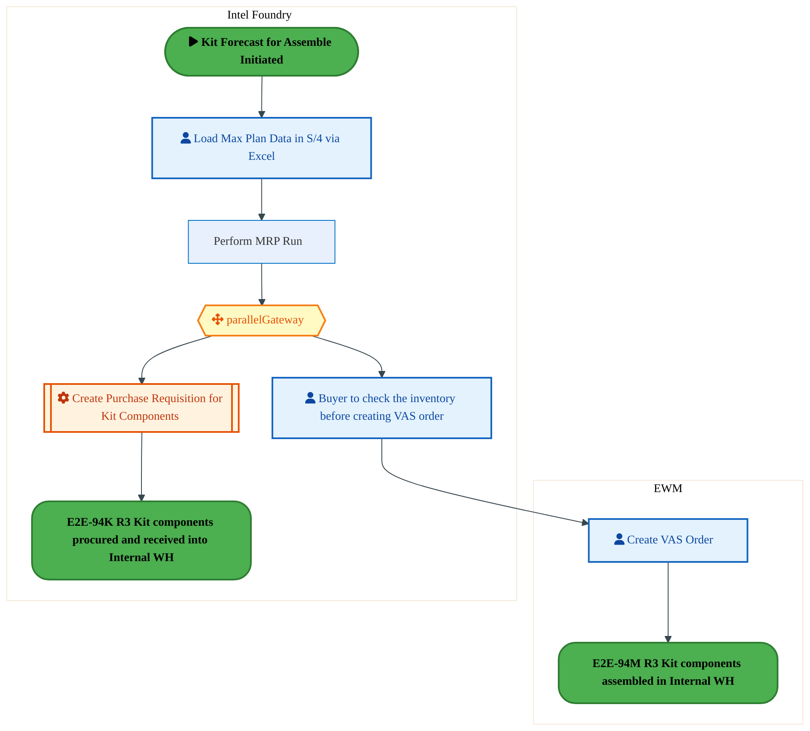
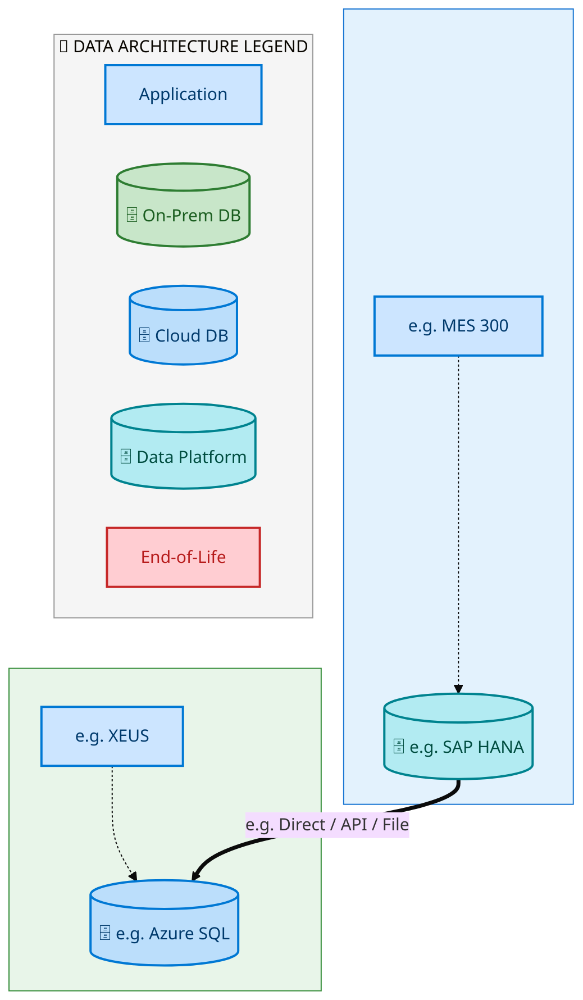
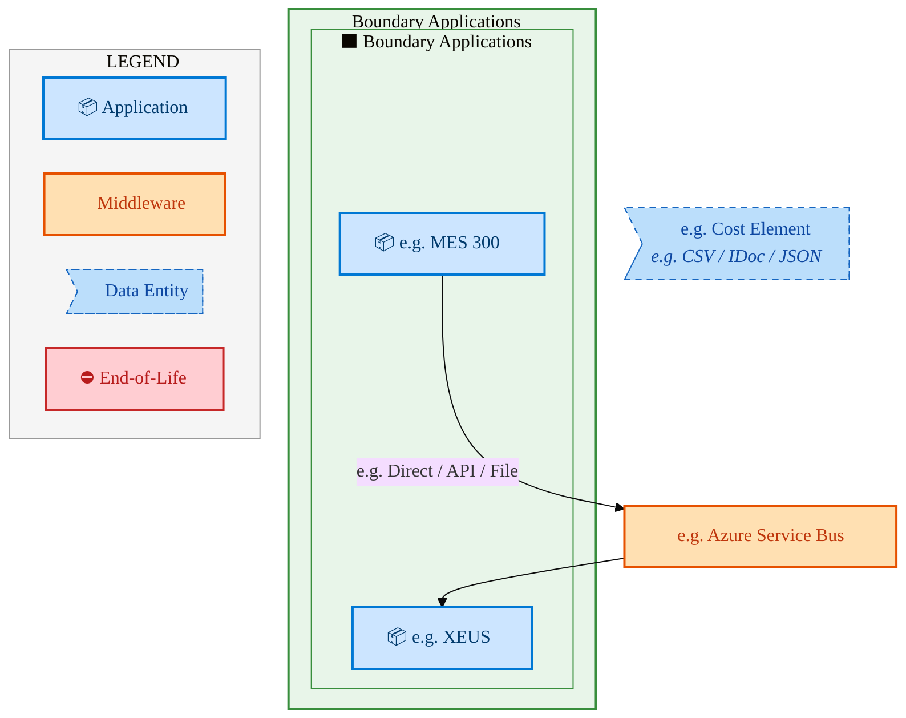
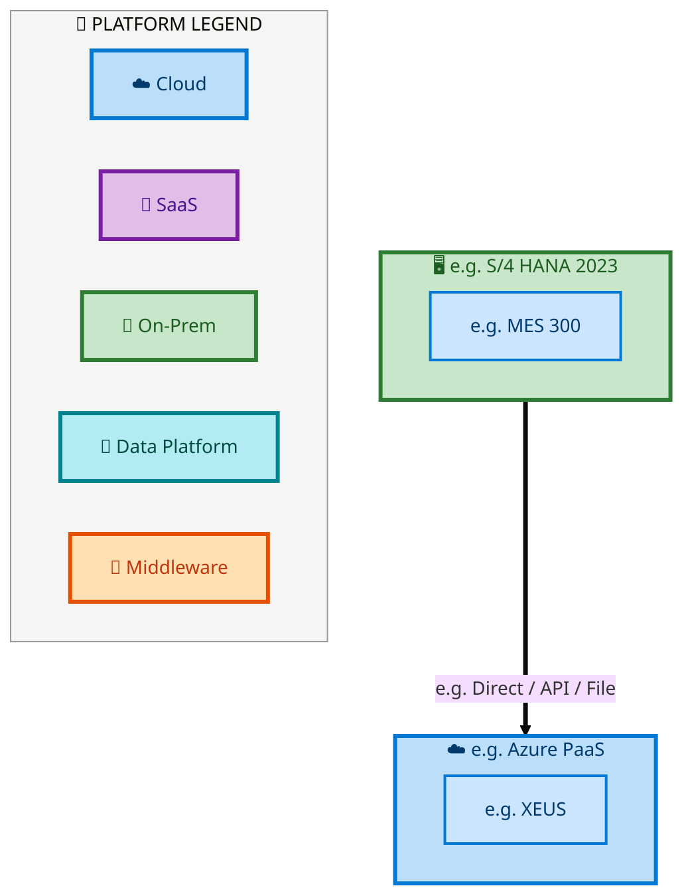

<div style="text-align:center; padding-top:20px;">
  <img src="data:image/svg+xml;base64,PHN2ZyB4bWxucz0iaHR0cDovL3d3dy53My5vcmcvMjAwMC9zdmciIHZpZXdCb3g9IjAgMCA4MDAgNDgwIiB3aWR0aD0iODAwIiBoZWlnaHQ9IjQ4MCI+DQogIDxkZWZzPg0KICAgIDxsaW5lYXJHcmFkaWVudCBpZD0iYmciIHgxPSIwJSIgeTE9IjAlIiB4Mj0iMTAwJSIgeTI9IjEwMCUiPg0KICAgICAgPHN0b3Agb2Zmc2V0PSIwJSIgc3R5bGU9InN0b3AtY29sb3I6IzAwNzFjNTtzdG9wLW9wYWNpdHk6MSIvPg0KICAgICAgPHN0b3Agb2Zmc2V0PSIxMDAlIiBzdHlsZT0ic3RvcC1jb2xvcjojMDBhZWVmO3N0b3Atb3BhY2l0eToxIi8+DQogICAgPC9saW5lYXJHcmFkaWVudD4NCiAgICA8bGluZWFyR3JhZGllbnQgaWQ9ImFjY2VudCIgeDE9IjAlIiB5MT0iMCUiIHgyPSIwJSIgeTI9IjEwMCUiPg0KICAgICAgPHN0b3Agb2Zmc2V0PSIwJSIgc3R5bGU9InN0b3AtY29sb3I6I2ZmZmZmZjtzdG9wLW9wYWNpdHk6MC4xNSIvPg0KICAgICAgPHN0b3Agb2Zmc2V0PSIxMDAlIiBzdHlsZT0ic3RvcC1jb2xvcjojZmZmZmZmO3N0b3Atb3BhY2l0eTowLjAyIi8+DQogICAgPC9saW5lYXJHcmFkaWVudD4NCiAgICA8cGF0dGVybiBpZD0iZ3JpZCIgd2lkdGg9IjQwIiBoZWlnaHQ9IjQwIiBwYXR0ZXJuVW5pdHM9InVzZXJTcGFjZU9uVXNlIj4NCiAgICAgIDxwYXRoIGQ9Ik0gNDAgMCBMIDAgMCAwIDQwIiBmaWxsPSJub25lIiBzdHJva2U9InJnYmEoMjU1LDI1NSwyNTUsMC4wNykiIHN0cm9rZS13aWR0aD0iMC41Ii8+DQogICAgPC9wYXR0ZXJuPg0KICA8L2RlZnM+DQoNCiAgPCEtLSBCYWNrZ3JvdW5kIC0tPg0KICA8cmVjdCB3aWR0aD0iODAwIiBoZWlnaHQ9IjQ4MCIgZmlsbD0idXJsKCNiZykiIHJ4PSI4Ii8+DQogIDxyZWN0IHdpZHRoPSI4MDAiIGhlaWdodD0iNDgwIiBmaWxsPSJ1cmwoI2dyaWQpIiByeD0iOCIvPg0KICA8cmVjdCB3aWR0aD0iODAwIiBoZWlnaHQ9IjQ4MCIgZmlsbD0idXJsKCNhY2NlbnQpIiByeD0iOCIvPg0KDQogIDwhLS0gRGVjb3JhdGl2ZSBjaXJjdWl0L2FyY2hpdGVjdHVyZSBsaW5lcyAtLT4NCiAgPGcgc3Ryb2tlPSJyZ2JhKDI1NSwyNTUsMjU1LDAuMTIpIiBzdHJva2Utd2lkdGg9IjEuNSIgZmlsbD0ibm9uZSI+DQogICAgPHBhdGggZD0iTSAwIDEwMCBMIDEyMCAxMDAgTCAxNjAgMTQwIEwgMjgwIDE0MCIvPg0KICAgIDxwYXRoIGQ9Ik0gMCAyNjAgTCA4MCAyNjAgTCAxMjAgMjIwIEwgMjAwIDIyMCBMIDI0MCAyNjAgTCAzNjAgMjYwIi8+DQogICAgPHBhdGggZD0iTSA1MjAgMTAwIEwgNjAwIDEwMCBMIDY0MCA2MCBMIDgwMCA2MCIvPg0KICAgIDxwYXRoIGQ9Ik0gNDQwIDM0MCBMIDU2MCAzNDAgTCA2MDAgMzAwIEwgNzIwIDMwMCBMIDc2MCAzNDAgTCA4MDAgMzQwIi8+DQogICAgPHBhdGggZD0iTSA2MDAgNDAwIEwgNjgwIDQwMCBMIDcyMCA0NDAiLz4NCiAgICA8cGF0aCBkPSJNIDAgNDAwIEwgNDAgNDAwIEwgODAgMzYwIi8+DQogICAgPHBhdGggZD0iTSAyMDAgNDIwIEwgMzIwIDQyMCBMIDM2MCAzODAgTCA0ODAgMzgwIi8+DQogICAgPHBhdGggZD0iTSA2NTAgNDQwIEwgNzUwIDQ0MCBMIDgwMCA0ODAiLz4NCiAgPC9nPg0KDQogIDwhLS0gRGVjb3JhdGl2ZSBub2RlcyAtLT4NCiAgPGcgZmlsbD0icmdiYSgyNTUsMjU1LDI1NSwwLjE4KSI+DQogICAgPGNpcmNsZSBjeD0iMTIwIiBjeT0iMTAwIiByPSI0Ii8+DQogICAgPGNpcmNsZSBjeD0iMjgwIiBjeT0iMTQwIiByPSI0Ii8+DQogICAgPGNpcmNsZSBjeD0iMjAwIiBjeT0iMjIwIiByPSI0Ii8+DQogICAgPGNpcmNsZSBjeD0iMzYwIiBjeT0iMjYwIiByPSI0Ii8+DQogICAgPGNpcmNsZSBjeD0iNjAwIiBjeT0iMTAwIiByPSI0Ii8+DQogICAgPGNpcmNsZSBjeD0iNzIwIiBjeT0iMzAwIiByPSI0Ii8+DQogICAgPGNpcmNsZSBjeD0iNTYwIiBjeT0iMzQwIiByPSI0Ii8+DQogICAgPGNpcmNsZSBjeD0iODAiIGN5PSIzNjAiIHI9IjQiLz4NCiAgICA8Y2lyY2xlIGN4PSI0ODAiIGN5PSIzODAiIHI9IjQiLz4NCiAgICA8Y2lyY2xlIGN4PSIzMjAiIGN5PSI0MjAiIHI9IjQiLz4NCiAgPC9nPg0KDQogIDwhLS0gVE9HQUYgQkRBVCBib3hlcyAtLT4NCiAgPGcgZm9udC1mYW1pbHk9IlNlZ29lIFVJLCBBcmlhbCwgc2Fucy1zZXJpZiIgZm9udC1zaXplPSIxNCIgZm9udC13ZWlnaHQ9IjYwMCI+DQogICAgPCEtLSBCIC0tPg0KICAgIDxyZWN0IHg9IjE1MCIgeT0iMTQwIiB3aWR0aD0iMTIwIiBoZWlnaHQ9IjQwIiByeD0iNSIgZmlsbD0icmdiYSgyNTUsMjU1LDI1NSwwLjE4KSIgc3Ryb2tlPSJyZ2JhKDI1NSwyNTUsMjU1LDAuMykiIHN0cm9rZS13aWR0aD0iMSIvPg0KICAgIDx0ZXh0IHg9IjIxMCIgeT0iMTY1IiB0ZXh0LWFuY2hvcj0ibWlkZGxlIiBmaWxsPSIjZmZmIj5CdXNpbmVzczwvdGV4dD4NCiAgICA8IS0tIEQgLS0+DQogICAgPHJlY3QgeD0iMjkwIiB5PSIxNDAiIHdpZHRoPSIxMjAiIGhlaWdodD0iNDAiIHJ4PSI1IiBmaWxsPSJyZ2JhKDI1NSwyNTUsMjU1LDAuMTgpIiBzdHJva2U9InJnYmEoMjU1LDI1NSwyNTUsMC4zKSIgc3Ryb2tlLXdpZHRoPSIxIi8+DQogICAgPHRleHQgeD0iMzUwIiB5PSIxNjUiIHRleHQtYW5jaG9yPSJtaWRkbGUiIGZpbGw9IiNmZmYiPkRhdGE8L3RleHQ+DQogICAgPCEtLSBBIC0tPg0KICAgIDxyZWN0IHg9IjQzMCIgeT0iMTQwIiB3aWR0aD0iMTIwIiBoZWlnaHQ9IjQwIiByeD0iNSIgZmlsbD0icmdiYSgyNTUsMjU1LDI1NSwwLjE4KSIgc3Ryb2tlPSJyZ2JhKDI1NSwyNTUsMjU1LDAuMykiIHN0cm9rZS13aWR0aD0iMSIvPg0KICAgIDx0ZXh0IHg9IjQ5MCIgeT0iMTY1IiB0ZXh0LWFuY2hvcj0ibWlkZGxlIiBmaWxsPSIjZmZmIj5BcHBsaWNhdGlvbjwvdGV4dD4NCiAgICA8IS0tIFQgLS0+DQogICAgPHJlY3QgeD0iNTcwIiB5PSIxNDAiIHdpZHRoPSIxMjAiIGhlaWdodD0iNDAiIHJ4PSI1IiBmaWxsPSJyZ2JhKDI1NSwyNTUsMjU1LDAuMTgpIiBzdHJva2U9InJnYmEoMjU1LDI1NSwyNTUsMC4zKSIgc3Ryb2tlLXdpZHRoPSIxIi8+DQogICAgPHRleHQgeD0iNjMwIiB5PSIxNjUiIHRleHQtYW5jaG9yPSJtaWRkbGUiIGZpbGw9IiNmZmYiPlRlY2hub2xvZ3k8L3RleHQ+DQogIDwvZz4NCg0KICA8IS0tIENvbm5lY3RpbmcgbGluZXMgYmV0d2VlbiBCREFUIGJveGVzIC0tPg0KICA8ZyBzdHJva2U9InJnYmEoMjU1LDI1NSwyNTUsMC4yNSkiIHN0cm9rZS13aWR0aD0iMSI+DQogICAgPGxpbmUgeDE9IjI3MCIgeTE9IjE2MCIgeDI9IjI5MCIgeTI9IjE2MCIvPg0KICAgIDxsaW5lIHgxPSI0MTAiIHkxPSIxNjAiIHgyPSI0MzAiIHkyPSIxNjAiLz4NCiAgICA8bGluZSB4MT0iNTUwIiB5MT0iMTYwIiB4Mj0iNTcwIiB5Mj0iMTYwIi8+DQogIDwvZz4NCg0KICA8IS0tIE1haW4gdGl0bGUgLS0+DQogIDx0ZXh0IHg9IjQwMCIgeT0iMjYwIiB0ZXh0LWFuY2hvcj0ibWlkZGxlIiBmb250LWZhbWlseT0iU2Vnb2UgVUksIEFyaWFsLCBzYW5zLXNlcmlmIiBmb250LXNpemU9IjM2IiBmb250LXdlaWdodD0iNzAwIiBmaWxsPSIjZmZmZmZmIiBsZXR0ZXItc3BhY2luZz0iMSI+DQogICAgSUFPIEFyY2hpdGVjdHVyZQ0KICA8L3RleHQ+DQogIDx0ZXh0IHg9IjQwMCIgeT0iMzAwIiB0ZXh0LWFuY2hvcj0ibWlkZGxlIiBmb250LWZhbWlseT0iU2Vnb2UgVUksIEFyaWFsLCBzYW5zLXNlcmlmIiBmb250LXNpemU9IjE4IiBmb250LXdlaWdodD0iNDAwIiBmaWxsPSJyZ2JhKDI1NSwyNTUsMjU1LDAuOCkiIGxldHRlci1zcGFjaW5nPSIyIj4NCiAgICBUT0dBRiBCREFUIMK3IElBTyBQcm9ncmFtIMK3IElETSAyLjANCiAgPC90ZXh0Pg0KDQogIDwhLS0gQm90dG9tIGFjY2VudCBiYXIgLS0+DQogIDxyZWN0IHg9IjI4MCIgeT0iMzQwIiB3aWR0aD0iMjQwIiBoZWlnaHQ9IjMiIHJ4PSIxLjUiIGZpbGw9InJnYmEoMjU1LDI1NSwyNTUsMC40KSIvPg0KDQogIDwhLS0gSW50ZWwgdGV4dCAtLT4NCiAgPHRleHQgeD0iNDAwIiB5PSIzODAiIHRleHQtYW5jaG9yPSJtaWRkbGUiIGZvbnQtZmFtaWx5PSJTZWdvZSBVSSwgQXJpYWwsIHNhbnMtc2VyaWYiIGZvbnQtc2l6ZT0iMTMiIGZpbGw9InJnYmEoMjU1LDI1NSwyNTUsMC41KSIgbGV0dGVyLXNwYWNpbmc9IjMiPg0KICAgIElOVEVMIENPTkZJREVOVElBTA0KICA8L3RleHQ+DQo8L3N2Zz4NCg==" alt="IAO Architecture" style="width:100%; border-radius:8px;" />
  <h1 style="font-size:36px; margin-top:24px;">E2E-94 — R3 Intel Foundry Maintenance process through spare parts (SWAP)</h1>
  <h2 style="font-size:24px;">Architecture Document (TOGAF BDAT)</h2>
  <p style="font-size:18px; color:#555;">End-to-End Integrated Processes (E2E) Tower<br/>
  Capability E2E-94 · Forecast to Stock</p>
  <p style="font-size:14px; color:#888;">IAO Program · R1 – R5<br/>
  Generated: April 2026<br/>
  Sajiv Francis</p>
  <p style="font-size:12px; color:#aaa;">IAO Architecture Pipeline — Intel Confidential</p>
</div>

<style>
@media print {
  @page { size: A4; margin: 10mm 0; }
  .mermaid { page-break-inside: avoid; overflow: visible; }
  pre, table { page-break-inside: avoid; }
  h2, h3, h4 { page-break-after: avoid; }
}
.mermaid { overflow: visible; }
.mermaid svg { max-width: 100%; height: auto !important; }
nav.toc { margin: 16px 0 24px 0; }
nav.toc ol, nav.toc ul { list-style: none; padding-left: 0; margin: 0; }
nav.toc > ol > li { margin-bottom: 6px; font-weight: 600; font-size: 14px; }
nav.toc > ol > li > ul { padding-left: 28px; margin-top: 4px; }
nav.toc > ol > li > ul > li { font-weight: 400; font-size: 13px; margin-bottom: 2px; }
nav.toc a { color: #0071c5; text-decoration: none; }
nav.toc a:hover { text-decoration: underline; }
</style>


<div class="page-footer"><span>Page 1</span><span><a href="#toc">↑ Back to TOC</a></span><span>E2E-94 — R3 Intel Foundry Maintenance process through spare parts (SWAP)</span></div>
<div style="page-break-before: always;"></div>


<a id="toc"></a>

## Table of Contents

<nav class="toc">
<ol>
  <li><a href="#1-executive-summary">1. Executive Summary</a></li>
  <li><a href="#2-business-context-objectives">2. Business Context &amp; Objectives</a>
    <ul>
      <li><a href="#21-classification">2.1 Classification</a></li>
      <li><a href="#22-business-drivers">2.2 Business Drivers</a></li>
      <li><a href="#23-success-criteria">2.3 Success Criteria</a></li>
      <li><a href="#24-companion-documents">2.4 Companion Documents</a></li>
    </ul>
  </li>
  <li><a href="#3-business-architecture-togaf-b">3. Business Architecture (TOGAF &ldquo;B&rdquo;)</a>
    <ul>
      <li><a href="#31-business-process-overview">3.1 Business Process Overview</a></li>
      <li><a href="#32-business-process-diagrams">3.2 Business Process Diagrams</a></li>
      <li><a href="#33-business-roles-responsibilities">3.3 Business Roles &amp; Responsibilities</a></li>
    </ul>
  </li>
  <li><a href="#4-data-architecture-togaf-d">4. Data Architecture (TOGAF &ldquo;D&rdquo;)</a>
    <ul>
      <li><a href="#41-data-entities-ownership">4.1 Data Entities &amp; Ownership</a></li>
      <li><a href="#42-data-flow-diagrams">4.2 Data Flow Diagrams</a></li>
      <li><a href="#43-data-lineage">4.3 Data Lineage</a></li>
      <li><a href="#44-ricefw-data-objects">4.4 RICEFW Data Objects</a></li>
      <li><a href="#45-data-governance-quality">4.5 Data Governance &amp; Quality</a></li>
    </ul>
  </li>
  <li><a href="#5-application-architecture-togaf-a">5. Application Architecture (TOGAF &ldquo;A&rdquo;)</a>
    <ul>
      <li><a href="#51-current-state-current-state-application-landscape">5.1 Current-State Application Landscape</a></li>
      <li><a href="#52-future-state-future-state-application-landscape">5.2 Future-State Application Landscape</a></li>
      <li><a href="#53-change-impact-summary">5.3 Change Impact Summary</a></li>
      <li><a href="#54-component-overview">5.4 Component Overview</a></li>
      <li><a href="#55-ricefw-inventory">5.5 RICEFW Inventory</a></li>
      <li><a href="#56-integration-patterns">5.6 Integration Patterns</a></li>
    </ul>
  </li>
  <li><a href="#6-technology-architecture-togaf-t">6. Technology Architecture (TOGAF &ldquo;T&rdquo;)</a>
    <ul>
      <li><a href="#61-platform-infrastructure">6.1 Platform &amp; Infrastructure</a></li>
      <li><a href="#62-sap-development-object-status">6.2 SAP Development Object Status</a></li>
      <li><a href="#63-nfrs-design-principles">6.3 NFRs &amp; Design Principles</a></li>
      <li><a href="#64-security-governance">6.4 Security &amp; Governance</a></li>
    </ul>
  </li>
  <li><a href="#7-project-context">7. Project Context</a>
    <ul>
      <li><a href="#71-project-roadmap-go-live-plan">7.1 Project Roadmap &amp; Go-Live Plan</a></li>
      <li><a href="#72-raid-log">7.2 RAID Log</a></li>
      <li><a href="#73-recommendations-next-steps">7.3 Recommendations &amp; Next Steps</a></li>
    </ul>
  </li>
</ol>
</nav>


<div class="page-footer"><span>Page 2</span><span><a href="#toc">↑ Back to TOC</a></span><span>E2E-94 — R3 Intel Foundry Maintenance process through spare parts (SWAP)</span></div>
<div style="page-break-before: always;"></div>


## 1. Executive Summary

This Architecture Document defines the **Business, Data, Application, and Technology** (BDAT) architecture for **E2E-94 R3 Intel Foundry Maintenance process through spare parts (SWAP)** within the IAO program. It includes 15 BPMN process diagram(s) in Section 3.

| Dimension | Value |
|-----------|-------|
| **Tower** | End-to-End Integrated Processes (E2E) |
| **Process Group** | Forecast to Stock |
| **Capability** | E2E-94 - R3 Intel Foundry Maintenance process through spare parts (SWAP) |
| **Release** | R1 – R5 |
| **Total Systems** | 2 |
| **System Status** | 0 Deployed, 0 Developing, 0 EOL, 2 Pending IAPM |
| **RICEFW Objects** | Pending — Smartsheet Object Tracker API integration |

**Change Summary**: 0 new flow chains, 0 removed, 0 modified, 1 unchanged between Current-State and Future-State states.

> All system nodes in architecture diagrams are **IAPM-linked** — click any node to open its IAPM page. Diagrams require `securityLevel: 'loose'` for click events.


<div class="page-footer"><span>Page 3</span><span><a href="#toc">↑ Back to TOC</a></span><span>E2E-94 — R3 Intel Foundry Maintenance process through spare parts (SWAP)</span></div>
<div style="page-break-before: always;"></div>


## 2. Business Context & Objectives

### 2.1 Classification

| Level | Value |
|-------|-------|
| **L0 Tower** | End-to-End Integrated Processes |
| **L1 Process** | Forecast to Stock |
| **L2 Capability** | E2E-94 - R3 Intel Foundry Maintenance process through spare parts (SWAP) |

### 2.2 Business Drivers

| # | Driver | Description | Strategic Alignment | Priority |
|---|--------|-------------|---------------------|----------|
| 1 | End-to-End Process Integration | Enable cross-tower integrated processes spanning procurement, manufacturing, and fulfillment | IDM 2.0 Process Excellence | High |
| 2 | Intel Foundry Business Enablement | Stand up foundry-specific business processes for external customer engagement | Intel Foundry Services | High |
| 3 | Process Visibility & Monitoring | Provide end-to-end process visibility across tower boundaries with integrated monitoring | Operational Excellence | Medium |
| 4 | E2E-94 Process Migration | Migrate R3 Intel Foundry Maintenance process through spare parts (SWAP) business processes and 2 integrated systems from legacy to S/4 HANA target architecture | IDM 2.0 Cross-Functional / End-to-End | High |


<div class="page-footer"><span>Page 4</span><span><a href="#toc">↑ Back to TOC</a></span><span>E2E-94 — R3 Intel Foundry Maintenance process through spare parts (SWAP)</span></div>
<div style="page-break-before: always;"></div>


### 2.3 Success Criteria

| Metric | Target | Measure | Baseline | Owner |
|--------|--------|---------|----------|-------|
| E2E Process Cycle Time | Per process SLA | End-to-end transaction completion within defined SLA per process | Varies by process | E2E Process Owner |
| Cross-Tower Integration Success | > 99% | Transactions completing across tower boundaries without manual intervention | 92% (current) | Integration Lead |
| Process Exception Rate | < 2% | Transactions requiring manual exception handling | 8% (current) | Operations Manager |
| E2E-94 Migration Completeness | 100% flow chains validated | All 1 flow chains verified in target state | 0% (pre-migration) | Tower Architect |

### 2.4 Companion Documents

| Document | Description |
|----------|-------------|
| **Business Architecture** | Included in this document (Section 3) — process flows from BPMN diagrams |
| **This Document** | Full BDAT Architecture — Business + Data + Application + Technology |


<div class="page-footer"><span>Page 5</span><span><a href="#toc">↑ Back to TOC</a></span><span>E2E-94 — R3 Intel Foundry Maintenance process through spare parts (SWAP)</span></div>
<div style="page-break-before: always;"></div>


## 3. Business Architecture (TOGAF "B")

### 3.1 Business Process Overview

This capability includes **15 business process(es)** modeled in BPMN 2.0, covering the end-to-end workflow for E2E-94 R3 Intel Foundry Maintenance process through spare parts (SWAP).

| # | Step ID | Process Name | Lanes | Tasks | Gateways |
|---|---------|--------------|-------|-------|----------|
| 1 | E2E-94B_R3_Material_Availability | E2E-94B_R3_Material_Availability | EWM (Decentralized), SAP S/4 Intel Foundry  | 9 | 1 |
| 2 | E2E-94C_R3_Material_Availability_&amp;_Material_Movement_Expedite_Process_with_MMID | E2E-94C_R3_Material_Availability_&amp;_Material_Movement_Expedite_Process_with_MMID | EWM , SAP S/4 Intel Foundry  | 19 | 5 |
| 3 | E2E-94D_R3_Procurement_of_Spare-_Epart_-_with_MMID | E2E-94D_R3_Procurement_of_Spare-_Epart_-_with_MMID | Boundary Apps, External Partners , Intel Foundry - WH  | 19 | 7 |
| 4 | E2E-94E_R3_Procurement_of_Spare-_Epart_–_for_Non_MMID | E2E-94E_R3_Procurement_of_Spare-_Epart_–_for_Non_MMID | Boundary Apps, External Partners , Intel Foundry - WH  | 21 | 5 |
| 5 | E2E-94F_R3_Return_to_EWM_Process | E2E-94F_R3_Return_to_EWM_Process | EWM, SAP S/4 Intel Foundry  | 9 | 6 |
| 6 | E2E-94I_R3_Maintenance_process_through_spare_parts_(SWAP)_–_Warranty_Process_(Non_MMID)​ | E2E-94I_R3_Maintenance_process_through_spare_parts_(SWAP)_–_Warranty_Process_(Non_MMID)​ | Factory Portal UI, SAP S/4 Intel Foundry  | 10 | 2 |
| 7 | E2E-94J_R3_Kit_Forecast_for_Assembly_&amp;_Component_Procurement | E2E-94J_R3_Kit_Forecast_for_Assembly_&amp;_Component_Procurement | EWM, Intel Foundry | 5 | 1 |
| 8 | E2E-94K_R3_Kit_components_procured_and_received_into_Internal_WH | E2E-94K_R3_Kit_components_procured_and_received_into_Internal_WH | Boundary Apps , EWM, External Partners/B2B, SAP Intel Foundry | 17 | 4 |
| 9 | E2E-94M_R3_Kit_components_assembled_in_Internal_WH | E2E-94M_R3_Kit_components_assembled_in_Internal_WH | EWM , Intel Foundry | 14 | 2 |
| 10 | E2E-94P_R3_Sending_the_kit_to_Cleaning_from_Internal_WH_-_Pre_Cleaning | E2E-94P_R3_Sending_the_kit_to_Cleaning_from_Internal_WH_-_Pre_Cleaning | Boundary Apps , EWM , External Partners/B2B , Intel Foundry - WH , SAP S/4 Intel Foundry  | 21 | 9 |
| 11 | E2E-94Q_R3_Kit_Repair_Process | E2E-94Q_R3_Kit_Repair_Process | EWM , SAP S/4 Intel Foundry  | 12 | 1 |
| 12 | E2E-94T_R3_Reverse_Kitting_in_Internal_WH | E2E-94T_R3_Reverse_Kitting_in_Internal_WH | EWM , Intel Foundry | 12 | 8 |
| 13 | E2E-94U_R3_Quenching | E2E-94U_R3_Quenching | EWM (Decentralized) , External Partners / B2B , Factory UI Portal , Intel Foundry WH , SAP S/4 Intel Foundry  | 27 | 8 |
| 14 | E2E-94V_R3_De_Contamination | E2E-94V_R3_De_Contamination | EWM  Decentralized, External Partners / B2B, Factory UI Portal, SAP S/4 Intel Foundry
 | 20 | 5 |
| 15 | E2E-94W_R3_TM_steps | E2E-94W_R3_TM_steps | External Partner Supplier B2B, SAP S/4 

Intel Product/ Intel Foundry | 9 | 1 |


<div class="page-footer"><span>Page 6</span><span><a href="#toc">↑ Back to TOC</a></span><span>E2E-94 — R3 Intel Foundry Maintenance process through spare parts (SWAP)</span></div>
<div style="page-break-before: always;"></div>


### 3.2 Business Process Diagrams


#### BUSINESS ARCHITECTURE — 3.2.1 E2E-94B_R3_Material_Availability — E2E-94B_R3_Material_Availability

**Swim Lanes**: EWM (Decentralized) · SAP S/4 Intel Foundry  | **Tasks**: 9 | **Gateways**: 1

```mermaid
%%{init: {'theme': 'base', 'themeVariables': {'fontSize': '14px', 'fontFamily': 'Segoe UI, Arial, sans-serif','primaryColor': '#e8f0fe', 'primaryBorderColor': '#0071c5','lineColor': '#37474F', 'secondaryColor': '#f5f8fc'}, 'flowchart': {'useMaxWidth': false, 'htmlLabels': true, 'curve': 'basis', 'nodeSpacing': 40, 'rankSpacing': 50}} }%%
flowchart LR
    classDef startEvt fill:#4CAF50,stroke:#2E7D32,color:#000,font-weight:bold,stroke-width:2px,rx:20,ry:20
    classDef endEvt fill:#C62828,stroke:#B71C1C,color:#fff,font-weight:bold,stroke-width:2px,rx:20,ry:20
    classDef userTask fill:#E3F2FD,stroke:#1565C0,stroke-width:2px,color:#0D47A1
    classDef serviceTask fill:#FFF3E0,stroke:#E65100,stroke-width:2px,color:#BF360C
    classDef gateway fill:#FFF9C4,stroke:#F57F17,stroke-width:2px,color:#E65100
    classDef subProc fill:#F3E5F5,stroke:#7B1FA2,stroke-width:2px,color:#4A148C
    subgraph lane_0["EWM (Decentralized)"]
        n6[["fa:fa-cog Distribute Outbound Delivery Order"]]
        n7[["fa:fa-cog Create and Confirm Picking and Packing (EWM)"]]
        n8[["fa:fa-cog Move Parts to Pass Through"]]
        n9[["fa:fa-cog Perform Goods Issue"]]
    end
    subgraph lane_1["SAP S/4 Intel Foundry "]
        n1["MRP Run"]
        n2[["fa:fa-cog Check for Spare Parts"]]
        n3[["fa:fa-cog Create Reservation WRT to PM Order"]]
        n4[["fa:fa-cog Post Goods Movement"]]
        n5[["fa:fa-cog Perform Outbound Delivery"]]
        n10["E2E-94A R3 Maintenance Process (Breakdown/Planned)"]
        n11["Scenario 4A Procurement of WIINGS Replacement Related Commodities"]
        n12["E2E-94C R3 Material Availability and Material Movement Expedite Process with..."]
        n13["E2E-94A R3 Maintenance Process (Breakdown/Planned)"]
        n14{{"fa:fa-arrows-alt parallelGateway"}}
    end
    n4 --> n5
    n6 --> n7
    n7 --> n8
    n8 --> n9
    n5 --> n6
    n13 --> n2
    n9 --> n10
    n3 --> n14
    n14 --> n4
    n14 --> n1
    n1 --> n11
    n2 --> n3
    n14 --> n12
    class n2 serviceTask
    class n3 serviceTask
    class n4 serviceTask
    class n5 serviceTask
    class n6 serviceTask
    class n7 serviceTask
    class n8 serviceTask
    class n9 serviceTask
    class n10 startEvt
    class n11 startEvt
    class n12 startEvt
    class n13 startEvt
    class n14 gateway
```

> **Legend**: <span style="color:#000;background:#4CAF50;padding:2px 6px;border-radius:10px;font-weight:bold;font-size:9pt">● Start</span> · <span style="color:#fff;background:#C62828;padding:2px 6px;border-radius:10px;font-weight:bold;font-size:9pt">● End</span> · <span style="background:#E3F2FD;padding:2px 6px;border:1px solid #1565C0;font-size:9pt">User Task</span> · <span style="background:#FFF3E0;padding:2px 6px;border:1px solid #E65100;font-size:9pt">Service Task</span> · <span style="background:#FFF9C4;padding:2px 6px;border:1px solid #F57F17;font-size:9pt">◇ Gateway</span> · <span style="background:#F3E5F5;padding:2px 6px;border:1px solid #7B1FA2;font-size:9pt">Sub-Process</span>



<div style="text-align:center; margin:4px 0 8px 0; font-size:11px;"><a href="https://mermaid.live/view#pako:eNqtVl1v6jgQ_StWqopeCXrzSSAPK1EgVaXLXgTd7cPtamUSB6waG9kOlEX89x0nAUraPO3mAXHm48zMycTJwUpESqzIur09UE51hA4tvSJr0opQa4EVabVRafgTS4oXjKiWickE13P6TxHm-Jt3E2ZsMV5TtjfWOVkKgv54aqMBJLI2UpirjiKSZq12ayPpGsv9UDAhTfQN6WV2VlSrXA9CpkReAmw7dJIAUhnl5GL2Qj_0Y5OnSCJ4ekWaBVkvS1pH0xwTu2SFpS7azxWZ4PcXmuoV4AwzRSBmpdfsB14QZmbUMje2JJfbkxhUmTocBJtvcEL5Euy-DSaJ-dvFFNjHIzre3r7yc1H0Y_bKEVwJw0qNSIaUBvN4q1FGGYtu_OEgDuy20lK8kejGHYcjz20nZpIIRrfbRtzOjtDlSkcLwdIqtLMzM0Tu5r0t3yPXbss9_NZqEZ5eKg27bs_tnSs9hM7QGZ4qZVn2nyqBrvIZq7eq1tiL3Xh0ruUE3WBof-Y7jTnyw4FT14nILU3IB9I4jr3xRapxN3DsZtKH2OvawxrpEmuyw_sLYX_onwnjIIydsJGwrFfvMl9MpUhOhN44iIMzYfjgxAO3kdAfOH6v6hB4lhJvVohhTv62f71a45cJuhuRhHAtMYMnLv32av1VRpuLd39BVIajDHcSsUQjCnXoItcE_cz1QuQ8RSPC6JbIPfppHilI_5gfXucPJQFxEIa0oeAZlWs0pckbbHZhm-Ly_x309a3G1LtmmogtgXipFdIC_iiFnldS5MtVLa9_nTclMhNQ9lGIVKEnpXJySYBV_kopBxjmgymaf_fRE9eEodhMDiNfi2XiJrMpmuX82uHWVFiRBPZNSASPtazGqLXtfSncjJiNxZoKjl5mz8Xoky-F92tjC6WrmY1ya7jhtYTga50-3eZamlOskTvu9P0BmnlogikoxDFPYC5YWgI35u4Bun9LxY5_n4Kg_NOWOYXCsIXwFhAIiExmLos2kcjQy9PT749zmH7DcFJaZ4SBIGaN1muRUk2JqnG658aGZWOamFcFGmwxZXhBGdX7YuvOnpMyaPy-IcB5mWBH9er-_r5Wwfs_RvcPh5PuWEqxUx3MNIK9wIwR9lieJa_W8VhbUe6jTuc3uG8V7JYwrGBYwl4FeyXsVzAoYbeCjldit8L9EjrVQcQrt-Of4qvadeyccAVP2C2xVw93Pxx0JurDcXzl8Ro9fqMnaPR0Gz1ho6fX6Ok3ehz7_B6-tjsNdrfB7jXY_dOrxmpbayLXmKZWdLCKDyr46EpJhnOmrWPbwrkW8z1PrKj48LDyTQqZI4rhlFuXxuO_7tgKYA==" title="View full diagram">&#128065; View Diagram</a></div>


<div class="page-footer"><span>Page 7</span><span><a href="#toc">↑ Back to TOC</a></span><span>E2E-94 — R3 Intel Foundry Maintenance process through spare parts (SWAP)</span></div>
<div style="page-break-before: always;"></div>


#### BUSINESS ARCHITECTURE — 3.2.2 E2E-94C_R3_Material_Availability_&amp;_Material_Movement_Expedite_Process_with_MMID — E2E-94C_R3_Material_Availability_&amp;_Material_Movement_Expedite_Process_with_MMID

**Swim Lanes**: EWM  · SAP S/4 Intel Foundry  | **Tasks**: 19 | **Gateways**: 5

> **Legend**: <span style="color:#000;background:#4CAF50;padding:2px 6px;border-radius:10px;font-weight:bold;font-size:9pt">● Start</span> · <span style="color:#fff;background:#C62828;padding:2px 6px;border-radius:10px;font-weight:bold;font-size:9pt">● End</span> · <span style="background:#E3F2FD;padding:2px 6px;border:1px solid #1565C0;font-size:9pt">User Task</span> · <span style="background:#FFF3E0;padding:2px 6px;border:1px solid #E65100;font-size:9pt">Service Task</span> · <span style="background:#FFF9C4;padding:2px 6px;border:1px solid #F57F17;font-size:9pt">◇ Gateway</span> · <span style="background:#F3E5F5;padding:2px 6px;border:1px solid #7B1FA2;font-size:9pt">Sub-Process</span>


<div style="text-align:center; margin:4px 0 8px 0; font-size:11px;"><a href="https://mermaid.live/view#pako:eNqlWG1v2zYQ_iuEi8AJYDeiJFuOP2xwHDsL0DRGnK7dlmGgJcomQpMCScXx0vz3HfXiF1XqOswfDPPh8bm7R7wj5ddWKCPaGrZOTl6ZYGaIXttmRde0PUTtBdG03UE58CtRjCw41W1rE0th5uzvzAz7yYs1s9iUrBnfWnROl5KiTzcdNIKFvIM0EbqrqWJxu9NOFFsTtR1LLpW1fkcHsRNn3oqpS6kiqvYGjhPgsAdLORN0D3uBH_hTu07TUIroiDTuxYM4bL_Z4LjchCuiTBZ-quktefnMIrOCcUy4pmCzMmv-gSwotzkalVosTNVzKQbT1o8AweYJCZlYAu47ACkinvZQz3l7Q28nJ49i5xQ9XD0KBJ-QE62vaIy0AXjybFDMOB--88ejac_paKPkEx2-cyfBled2QpvJEFJ3Olbc7oay5coMF5JHhWl3Y3MYuslLR70MXaejtvBd8UVFtPc07rsDd7DzdBngMR6XnuI4_l-eQFf1QPRT4WviTd3p1c4X7vV7Y-dbvjLNKz8Y4apOVD2zkB6QTqdTb7KXatLvYaeZ9HLq9Z1xhXRJDN2Q7Z7wYuzvCKe9YIqDRsLcXzXKdDFTMiwJvUlv2tsRBpd4OnIbCf0R9gdFhMCzVCRZIU4E_cv547E1-XyLHlt_5tP2I7D_B-AxGcakG8olGisK6aC71CxkKiJ0RTl7pmqL7mwBodOZYlIxsz0DmiOeXi0PAYqxFDFTazRj4RPs6Qybkfz3KUR09pi6jrOoEvaPCW_lM4VlymhkJPzQGj2slEyXq-rC4HjhjKpYgvtrKSONbrROaXXFoDb2G1GRYMPMCpUCVDku6r3Oru9tvLeECUMFESEtlby9ub47n4dECBCiKqfbf30t6YhScqO7hBvERMhTDdFc53vusfX2drgq-I-roJbrtgqGVOajGZqf-6CCoRxNrRIgQWXz7FK2pWofNOhk0CxLefKS0IgZGgF5knAGBrO7XMNkr-Fh9BW2FQ2fUCTXVBsWdtBHYpgUhCM4QEQWlhIllEDYRh_Tecd0n5LIPlQIaI1C-LWUkI7dill0W7sZMxZQC_0--TKDLI75_Fo--pLFwfdJPoOoUiGRrhcwamKrL5dvt8n39lylQqYph46BYiXX6IMMIaYNUXQlIdycRlHb_zLN0GnSUMhBbWD7hznfPcx7ZAsXe1l-mQMhkZapguBHWrOlAPPvxV9fdvcHUUIJ1ZVOUxNqqkGpTVH-tousqTDV6nV-sAtWt-8RCa6QFOUwf8jqIduxoVwnRGzP7UiRYgQWd99ndn8wPKvXv5J5DSpBe-5kjTnv0Nc31Z7knO4WQqlsa55MFph9cDdw-2MQYwQcZ4cctmVM3En3wr9E9x5QgChwoUOjZ8I4WTD-bVtwd0tG-ZK9V3tMUjgJTi_B8VMkN-J8BkUMG-8s7_SILMEcHv_Bqvfv31c8ePu2aS-w3QVcwcJVdtqUgXFqSzkvq_PrL3doljWLz7_8XO3Bfj3Zrm682Qc0t1WSnX9w0YOyRDwjjmgizRnEKlIYHWAotM2w6qlX2-2BkHBOecMRcVB0MdzHqOrKBPrpFTWQJxQsLSodto-E62pWLXC_pIlGECm0Tm6t4lRBG1ZIcxZRvd8ouwNF9FC3-5MNshi7ngW-PrZ-s_ZfoXsVE_3c8KIYXuRDXFyK4IJSACURLphxSYALBhyUwKAASk7sFL73bSw7B5hGjyKisAXXzDYr-4oSAQQbGLJDG6meUPbiADz7avpqj-eCOSiy9EtPxXhQZl0Y4B2Qj73SvliA3RIoDHBp4ZZCVoGSEReK7WJySz3KoFwnB0oFC3nc4nYsSoWLoVcMcfXJfZRZ8qXMbsmz092rAK5feeZ-daKg3GUfFPgtvGGYbULRsO_j3MQ9uCVbocu3gyPYrYe9etivh3uH7wlHM_3GmaBxZtA4c9E4Axu2cQo3T7nNU17zlN881awEbpYCN2uBm8XAzWrA_i1fcI9x3IC7DbhXvqsdw3493KuH-_VwUA8Pyre5Vqe1hj5DWNQavrayP0Hgj5KIxiTlpvXWaZHUyPlWhK1h9mdBK80umFeMwMV8nYNv_wA-lYFY" title="View full diagram">&#128065; View Diagram</a></div>


<div class="page-footer"><span>Page 8</span><span><a href="#toc">↑ Back to TOC</a></span><span>E2E-94 — R3 Intel Foundry Maintenance process through spare parts (SWAP)</span></div>
<div style="page-break-before: always;"></div>


#### BUSINESS ARCHITECTURE — 3.2.3 E2E-94D_R3_Procurement_of_Spare-_Epart_-_with_MMID — E2E-94D_R3_Procurement_of_Spare-_Epart_-_with_MMID

**Swim Lanes**: Boundary Apps · External Partners  · Intel Foundry - WH  | **Tasks**: 19 | **Gateways**: 7

```mermaid
%%{init: {'theme': 'base', 'themeVariables': {'fontSize': '14px', 'fontFamily': 'Segoe UI, Arial, sans-serif','primaryColor': '#e8f0fe', 'primaryBorderColor': '#0071c5','lineColor': '#37474F', 'secondaryColor': '#f5f8fc'}, 'flowchart': {'useMaxWidth': false, 'htmlLabels': true, 'curve': 'basis', 'nodeSpacing': 40, 'rankSpacing': 50}} }%%
flowchart LR
    classDef startEvt fill:#4CAF50,stroke:#2E7D32,color:#000,font-weight:bold,stroke-width:2px,rx:20,ry:20
    classDef endEvt fill:#C62828,stroke:#B71C1C,color:#fff,font-weight:bold,stroke-width:2px,rx:20,ry:20
    classDef userTask fill:#E3F2FD,stroke:#1565C0,stroke-width:2px,color:#0D47A1
    classDef serviceTask fill:#FFF3E0,stroke:#E65100,stroke-width:2px,color:#BF360C
    classDef gateway fill:#FFF9C4,stroke:#F57F17,stroke-width:2px,color:#E65100
    classDef subProc fill:#F3E5F5,stroke:#7B1FA2,stroke-width:2px,color:#4A148C
    subgraph lane_0["Boundary Apps"]
        n1[["fa:fa-cog Organize Transport-Intel Routing Guide (IRG)​"]]
        n2[["fa:fa-cog Perform Validation/Exception Handling based on Rules Setup​"]]
        n20(["fa:fa-play Validation/Exception Handling Initiated"])
        n29["E2E-94C R3 Material Availability and Material Movement Expedite Process with..."]
    end
    subgraph lane_1["External Partners "]
        n15[["fa:fa-cog Receive Purchase Order at Supplier End​"]]
        n16[["fa:fa-cog Acknowledgement /Review ​ Purchase Order​"]]
        n17[["fa:fa-cog Perform Carrier Selection via Intel Routing Guide Boosted Collaboration Portal"]]
        n18[["fa:fa-cog Perform Goods Picked up (Carrier) ​ Order shipment​"]]
        n19[["fa:fa-cog Send Supplier Invoice"]]
        n27(["fa:fa-stop Supplier Invoice Sent"])
        n36{{"fa:fa-arrows-alt inclusiveGateway"}}
    end
    subgraph lane_2["Intel Foundry - WH "]
        n3[["fa:fa-cog Create Maintenance Order with Priority"]]
        n4[["fa:fa-cog Create Expedited Pur. Req. with Priority​"]]
        n5[["fa:fa-cog Convert PR to Expedite Purchase Order with Priority​"]]
        n6[["fa:fa-cog Trigger GTS Check"]]
        n7[["fa:fa-cog Calculate Taxes"]]
        n8[["fa:fa-cog Perform GTS Compliance Check SPL, EMB"]]
        n9[["fa:fa-cog Create Inbound Delivery with House Air Waybill number HAWB​"]]
        n10[["fa:fa-cog TM Embedded​"]]
        n11[["fa:fa-cog Goods Receipt at factory Location"]]
        n12[["fa:fa-cog Deliver Goods to Factory Technician​"]]
        n13[["fa:fa-cog Post Supplier Invoice"]]
        n14[["fa:fa-cog Perform GTS Compliance SPL and EMB"]]
        n21(["fa:fa-play Maintenance Order Creation Initiated"])
        n22(["fa:fa-stop Supplier Invoice Posted"])
        n23(["fa:fa-stop GTS Check Performed"])
        n24(["fa:fa-stop GTS Check Performed"])
        n25(["fa:fa-stop Goods Delivered"])
        n26(["fa:fa-stop Taxes Calculated"])
        n28["E2E-94W R3 TM steps"]
        n30{{"fa:fa-code-branch Invoice Accepted ?"}}
        n31{{"fa:fa-arrows-alt parallelGateway"}}
        n32{{"fa:fa-arrows-alt parallelGateway"}}
        n33{{"fa:fa-arrows-alt parallelGateway"}}
        n34{{"fa:fa-arrows-alt inclusiveGateway"}}
        n35{{"fa:fa-arrows-alt inclusiveGateway"}}
    end
    n3 --> n35
    n4 --> n34
    n5 --> n31
    n31 --> n6
    n31 --> n7
    n6 --> n8
    n34 --> n5
    n15 --> n16
    n17 --> n1
    n1 --> n18
    n9 --> n32
    n32 --> n10
    n33 --> n12
    n33 --> n36
    n2 --> n30
    n36 --> n19
    n30 -->|"No"| n36
    n30 -->|"Yes"| n13
    n13 --> n22
    n18 -->|"EB2 /E2Open​"| n9
    n8 --> n23
    n31 -->|"3A4/E2Open​"| n15
    n31 --> n17
    n14 --> n24
    n11 --> n33
    n12 --> n25
    n21 --> n3
    n35 --> n4
    n29 --> n35
    n7 --> n26
    n16 --> n34
    n32 --> n14
    n20 --> n2
    n19 --> n27
    n10 --> n28
    n32 --> n11
    class n1 serviceTask
    class n2 serviceTask
    class n3 serviceTask
    class n4 serviceTask
    class n5 serviceTask
    class n6 serviceTask
    class n7 serviceTask
    class n8 serviceTask
    class n9 serviceTask
    class n10 serviceTask
    class n11 serviceTask
    class n12 serviceTask
    class n13 serviceTask
    class n14 serviceTask
    class n15 serviceTask
    class n16 serviceTask
    class n17 serviceTask
    class n18 serviceTask
    class n19 serviceTask
    class n20 startEvt
    class n21 startEvt
    class n22 endEvt
    class n23 endEvt
    class n24 endEvt
    class n25 endEvt
    class n26 endEvt
    class n27 endEvt
    class n28 startEvt
    class n29 startEvt
    class n30 gateway
    class n31 gateway
    class n32 gateway
    class n33 gateway
    class n34 gateway
    class n35 gateway
    class n36 gateway
```

> **Legend**: <span style="color:#000;background:#4CAF50;padding:2px 6px;border-radius:10px;font-weight:bold;font-size:9pt">● Start</span> · <span style="color:#fff;background:#C62828;padding:2px 6px;border-radius:10px;font-weight:bold;font-size:9pt">● End</span> · <span style="background:#E3F2FD;padding:2px 6px;border:1px solid #1565C0;font-size:9pt">User Task</span> · <span style="background:#FFF3E0;padding:2px 6px;border:1px solid #E65100;font-size:9pt">Service Task</span> · <span style="background:#FFF9C4;padding:2px 6px;border:1px solid #F57F17;font-size:9pt">◇ Gateway</span> · <span style="background:#F3E5F5;padding:2px 6px;border:1px solid #7B1FA2;font-size:9pt">Sub-Process</span>



<div style="text-align:center; margin:4px 0 8px 0; font-size:11px;"><a href="https://mermaid.live/view#pako:eNqlWG1v2zYQ_iuEiyAtYKeiXvz2YYPt2EmAZDXsrMHQDAMtUTYRWtQoyU6W-r_vKFNyTEvt2uVDED68e4733PEU6bXhi4A2-o2zs1cWsbSPXs_TFV3T8z46X5CEnjfRHvhMJCMLTpNzZROKKJ2zf3Iz7MbPykxhE7Jm_EWhc7oUFP1-00QDcORNlJAoaSVUsvC8eR5LtibyZSS4kMr6He2GVphH01tDIQMqDwaW1cG-B66cRfQAOx23406UX0J9EQVHpKEXdkP_fKcOx8XWXxGZ5sfPEnpHnh9YkK5gHRKeULBZpWt-SxaUqxxTmSnMz-SmEIMlKk4Egs1j4rNoCbhrASRJ9HSAPGu3Q7uzs8eoDIpuZ48Rgh-fkyS5pCFKUoDHmxSFjPP-O3c0mHhWM0mleKL9d_a4c-nYTV9l0ofUraYSt7WlbLlK-wvBA23a2qoc-nb83JTPfdtqyhf4bcSiUXCINGrbXbtbRhp28AiPikhhGP6vSKCrvCfJk441dib25LKMhb22N7JO-Yo0L93OAJs6UblhPn1DOplMnPFBqnHbw1Y96XDitK2RQbokKd2SlwNhb-SWhBOvM8GdWsJ9PPOU2WIqhV8QOmNv4pWEnSGeDOxaQneA3a4-IfAsJYlXiJOI_mV9eWwMRZY3NRrEcfLY-HNvp34i_AX2Q9IPScsXS_RJLkkEVxLdQzsmsZBp6yZKKUczkaXQmegqYwFF729mVx8eM9uyFkD3ls8-5ptSGQq5Rp8JZwFJmYg-jp99Gqu_0DWJAq5I1YwIECCzDGYDmtM0i6vZrfclfcxB_G_z3sAwYlCmAGg-vKXpAcvYHrd67gjNHHQHNmq-oMGGME4WjLP0BQHLYedObGB-RSkaP8c0YClFqlY0SdCWpauLi4tSVrgoVXXAKuQzsEXANoV7G1GZIKMY3rF6M-pTtoFQmYQJkFAoD4wzRFI0z-KYM_h7DNGqlMLtY6qB_xSJLafBcp_GxxndMLpFe2cjQjVjp7q0IyKlOsmccurn-m8YQVVdMxQigWIgmK0gspB53dAUmoxwM1i3OtiVEEGCpsx_Ap4sRu919A9FInuFkhWLVZrVifSOuedQsYOgN9FGwKwwG69zaLwkFfGJvWJJjTZz2q-vhRMcU2yTFuEpYpHPswTqerWfII-N3e6brWND6L2eE3WR4R630MO10TvOcVIjSYEd-peBY0Qiv2ge1a7Qu0xI6HEjS7eSo-j4QHXJBTTl3xcGS5XKRiuPRLSh8AybzlAq3lyi487-Pq3R1veSLZfgeHU_R6MV9Z8Mc6NnR4T7GVdJ3ZNnmhjGdT2nuMUayp3LmIdB8-ltE43vhgZFr1LBm2ihCocuKYeyQ_3yPK8FPOnQgEn0QF5g5nAUZesFJHM9eBhWd65lZH-HxuARBLRmCBjTfX978qkSp2qMhMRPBZznVvj5ZTT9jWmuz695oI4T7X9P_VXEfBCo-hxGc05hDnzvxmH3P1UD6pAP6tNS2Nh4Vpzehbw8agbVPijs7137aT7STDfHcCvbs0jj1MX9cRfPdMnLoot0at42zPMrcLgSJ_bd8iH5oB6S0GyQqvn_g2MdZpx6C2gt4B8Hf1XqM_DVUxlmx6-HMbd3xJXDMSaScE75yWzcO9k_4-T8jJP7g7N77-X97MSPHNRq_aIY9NrVa1evPb3GhT3eA21j3dHr9n7ZLbY1X0GPNR8u_HFHA8VaLwuCno5vF4S2NrAKQGeAbQNwihDawyk99BlxrwAsBXx9bPwmHhtf33iWG3-oof1VTZTimDqIXUTFXW06Htro49j-FNNyKIFjEaqr3Zwj-cDNGbinXtgzVMaFzFjrahd1wtrCKU-o07YLDruwKDh1KQoGu2e0gq6MXZaqbfRGWYuSwtIuhYemtMtjFwZdk-Ltu5PqgjfvTkc7du2OU7vj1u54tTvt2p1O7U63dqdXuwOK1G7Vq4DrZcD1OuB6IXC9ErheClyvBa4XA9erAQ1UfFw4xnENbusPBMeoU4m6lahXibYr0U4l2q05W68ah6Gi3-GPYVwN29WwUw271bBXDbcLuNFsrKlcExY0-q-N_JsZfFcLaEgynjZ2zQbJUjF_ifxGP_-21MhieP2ll4zA-8J6D-7-BVEkFT8=" title="View full diagram">&#128065; View Diagram</a></div>


<div class="page-footer"><span>Page 9</span><span><a href="#toc">↑ Back to TOC</a></span><span>E2E-94 — R3 Intel Foundry Maintenance process through spare parts (SWAP)</span></div>
<div style="page-break-before: always;"></div>


#### BUSINESS ARCHITECTURE — 3.2.4 E2E-94E_R3_Procurement_of_Spare-_Epart_–_for_Non_MMID — E2E-94E_R3_Procurement_of_Spare-_Epart_–_for_Non_MMID

**Swim Lanes**: Boundary Apps · External Partners  · Intel Foundry - WH  | **Tasks**: 21 | **Gateways**: 5

> **Legend**: <span style="color:#000;background:#4CAF50;padding:2px 6px;border-radius:10px;font-weight:bold;font-size:9pt">● Start</span> · <span style="color:#fff;background:#C62828;padding:2px 6px;border-radius:10px;font-weight:bold;font-size:9pt">● End</span> · <span style="background:#E3F2FD;padding:2px 6px;border:1px solid #1565C0;font-size:9pt">User Task</span> · <span style="background:#FFF3E0;padding:2px 6px;border:1px solid #E65100;font-size:9pt">Service Task</span> · <span style="background:#FFF9C4;padding:2px 6px;border:1px solid #F57F17;font-size:9pt">◇ Gateway</span> · <span style="background:#F3E5F5;padding:2px 6px;border:1px solid #7B1FA2;font-size:9pt">Sub-Process</span>


<div style="text-align:center; margin:4px 0 8px 0; font-size:11px;"><a href="https://mermaid.live/view#pako:eNqlWG1v4jgQ_isWq6qtBLtxXgjw4U5Aoa203UXQ2-q0PZ1M4oBVY-ecpC_X7X-_ceJAkya7t3d8QHg884znmRcnPHcCGdLOqHN09MwES0fo-Tjd0h09HqHjNUnocRcVgi9EMbLmNDnWOpEU6Yr9nathN37Ualo2JzvGn7R0RTeSot8uu2gMhryLEiKSXkIVi467x7FiO6KeppJLpbXf0UFkRbk3szWRKqTqoGBZPg48MOVM0IPY8V3fnWu7hAZShBXQyIsGUXD8og_H5UOwJSrNj58l9Io83rAw3cI6IjyhoLNNd_wjWVOuY0xVpmVBpu5LMlii_QggbBWTgIkNyF0LRIqIu4PIs15e0MvR0a3YO0Ufl7cCwSfgJEnOaISSFMSz-xRFjPPRO3c6nntWN0mVvKOjd_bMP3PsbqAjGUHoVleT23ugbLNNR2vJQ6Pae9AxjOz4saseR7bVVU_wXfNFRXjwNO3bA3uw9zTx8RRPS09RFP0vT8CruibJnfE1c-b2_GzvC3t9b2q9xSvDPHP9Ma7zRNU9C-gr0Pl87swOVM36HrbaQSdzp29Na6AbktIH8nQAHE7dPeDc8-fYbwUs_NVPma0XSgYloDPz5t4e0J_g-dhuBXTH2B2YEwLORpF4izgR9E_r621nIrO8qNE4jpPbzh-Fnv4I9yvsR2QUkV4gN-iz2hABLYmuoRyTWKq0dylSytFSZilUJjrPWEjRyeXy_PQ2sy1rDXCv8bwq3oKqSKod-kI4C0nKpPgwewxorH-hCyJCrkH1jAgRSJYZzAa0omkWN6Lb9skePuZA_vdxL2EYMUhTCDCnBQyUcRNLGGBnjylVgnC0gK4SVCWoShX2q7EtaUDZPUWLTEF_JhTIg2GDSIpWWRxzBr9n4K0pDjyoQo2DOyEfOA03MCRFij4s6T2jD6gwrnloRhw2Ez8lSumTrCinQc7OPSOoKacTKROgCsHk42QtVc4qWkAJEF5Pg1V1di5lmKAFC-7APovRifF6WgZQMJNsWazDa04trmKuIFMHIi_FvYQOrtk41qEcklTGb_Q1SvrD5NsAUjAy140CfdJDNxf17IPS9RWa7dY0DOkhra9DAJWCirw04hSdUQ4VolAq0TUNtoIFjAh0gq3hKZAkRZLtipLNYvg6X55WAR0AXEBW0BUUsb4A0ZW8Lyqkh7DlV7X7VQKnioIVmDIITRARlOVT5dBvtPoEx7m6ujzLW_NQf0v6V8YSlh_5ZBwE79E4SdhG5HnGDpo3D4XBz_goauUn0GuVf63YZgMI59crNN3S4K7eKbXinRIeZFwf6Jo80qSujZv7KkeXO6i2nNncEVotPnbR7GpSx7CbMS7FWtdbWSVP6IGlW3Qh4QJEY6bQDXlaw12ARAZFp9DF-GbS3PtOyxkrtTjVhaSrSbc82UBZ5IXFxPvvjZXa_fCqoOckSCUc-lDYzQj1G0Ef4wd9jfv_inSgG8Gob2Dcdmr3xJsuaLobClP3RzNlkc_JuplXM9uXX3n6tyb9nzfx6yZ5ik1W3qoPGtVNRSQtkQxrRnlbHNqkru_kd6c96w3dG7R0EAxJQK0_Zzj28_MhpSHtreEBI9juSYV2h9sbro9fbzsvL68NnYMh3CryIekRnqKYKMI55efFU1jdyP0vRt5_Meo3GjER8CyBpLyx2t9Boo96vV9gAJulXyydvlkPzNoxa8cpBMPaGpvnSDE0a1wqGAcDs8aDmgdsXOK9hoFwzdotluUTOgwyg1AqeGZtly5zhW-3nd_1IP2mu780Nap2aWpbRnU2sdGHmf05pvsBog1LSIyNoVeJGwydsdtg59fp2fNlosH78A0_9l5QxltiYINhlwTZRtCvx_tJ5t7tkntsGcvSu22oK6OwTViOVTteme6S6n3YhkDs1gWlRYm4z785QsUBnPUy0u8BnAX6Tbwg7dWbiM76q_elyo7XutNv3fFbdwatO8PWHeC1dQu3b9ntW077VjsRuJ0J3E4FbucCt5OB29mw29mw29mAUiz_OKjKnRa5a17-q1KvUdpvlPqN0kGjdNgkdaxGKW4-MbSleTuvip1msdss9prF_VLc6XZ2VO0ICzuj507-_xb8BxbSiGQ87bx0OyRL5epJBJ1R_j9QJ4vhVZWeMQLvHrtC-PIPExzxuQ==" title="View full diagram">&#128065; View Diagram</a></div>


<div class="page-footer"><span>Page 10</span><span><a href="#toc">↑ Back to TOC</a></span><span>E2E-94 — R3 Intel Foundry Maintenance process through spare parts (SWAP)</span></div>
<div style="page-break-before: always;"></div>


#### BUSINESS ARCHITECTURE — 3.2.5 E2E-94F_R3_Return_to_EWM_Process — E2E-94F_R3_Return_to_EWM_Process

**Swim Lanes**: EWM · SAP S/4 Intel Foundry  | **Tasks**: 9 | **Gateways**: 6

> **Legend**: <span style="color:#000;background:#4CAF50;padding:2px 6px;border-radius:10px;font-weight:bold;font-size:9pt">● Start</span> · <span style="color:#fff;background:#C62828;padding:2px 6px;border-radius:10px;font-weight:bold;font-size:9pt">● End</span> · <span style="background:#E3F2FD;padding:2px 6px;border:1px solid #1565C0;font-size:9pt">User Task</span> · <span style="background:#FFF3E0;padding:2px 6px;border:1px solid #E65100;font-size:9pt">Service Task</span> · <span style="background:#FFF9C4;padding:2px 6px;border:1px solid #F57F17;font-size:9pt">◇ Gateway</span> · <span style="background:#F3E5F5;padding:2px 6px;border:1px solid #7B1FA2;font-size:9pt">Sub-Process</span>


<div style="text-align:center; margin:4px 0 8px 0; font-size:11px;"><a href="https://mermaid.live/view#pako:eNqlV21v4jgQ_itWqoquBGqcFwJ8uBNv6VXa7qGyu9VpOZ1M4hSrxkaOU8qx_Pcbk4SXED6clg9V5_HMMzPPDE7YWpGMqdWzbm-3TDDdQ9uGXtAlbfRQY05S2miiHPhOFCNzTtOG8Umk0FP2794Ne6sP42awkCwZ3xh0Sl8lRd8em6gPgbyJUiLSVkoVSxrNxkqxJVGboeRSGe8b2knsZJ-tOBpIFVN1dLDtAEc-hHIm6BF2Ay_wQhOX0kiK-Iw08ZNOEjV2pjgu19GCKL0vP0vpE_l4YbFegJ0QnlLwWegl_0zmlJsetcoMFmXqvRSDpSaPAMGmKxIx8Qq4ZwOkiHg7Qr6926Hd7e1MHJKiz88zgeATcZKmI5qgVAM8ftcoYZz3brxhP_TtZqqVfKO9G2ccjFynGZlOetC63TTittaUvS50by55XLi21qaHnrP6aKqPnmM31Qb-VnJRER8zDdtOx-kcMg0CPMTDMlOSJL-UCXRVX0n6VuQau6ETjg65sN_2h_YlX9nmyAv6uKoTVe8soiekYRi646NU47aP7eukg9Bt28MK6SvRdE02R8Lu0DsQhn4Q4uAqYZ6vWmU2nygZlYTu2A_9A2EwwGHfuUro9bHXKSoEnldFVgvEiaD_2D9m1vjlaWb9nZ-aj3AADCWHzULTCHyRSUzT9NzLBa8HKeMUPdOIspVGQITuvglFoQ4WaRp_Oo_wIGKoKCiDiIjRUIqEqSWaZLpFjFYvRNGFhAEjbWZxB3wVBr8-54DL6O0iXfuX03V_AEVCeglpRfIVjZhpbJ4B4aOYywxIR5Szd6o2SEuU63gaj-27A0Gq5epcTpRrTGOI-nQahatRGtpDE5nqS1_nf_ga9cbOuNX1_kDPrukfbhW9qR8v7m63x-Zj2pqDc7QA4UkqBagZ099n1m53ujd2fcjpSiCpUDGuYzTcHnXLiaHeaX-CpvceCK4pB8VAdFC7Uir4TahKJEz38ekZSlwRpurbCs5HWu4Henp8-BN9hXpTEmkmRWWSndqw6hZUx2--In30GJrtMIW10P4RZ_gRRrPMsbG7P0jgYucMRsFStGZ6wQSCJyJagQy60qt3GOIDNKozJQz7d5BQqopr--DaN_N-IgxEFDASeljBuwF08hbLtbifQDJx8SXCQf1MXxYUKlSIaRQRgeYUqb3qNK5uBe7UM5iJKkH4_fgj_6e6TfgYB5sq12mLcI1WRBHOKX_IL9hqkFMbxETEsxRmdBF1WD0RoFbrN5h0YXZys1uYuJ3bQWE7uYnt8nwf_nNm_UVh436atsuTTnFSNpwflzy4ICqJS9st7G5hd6uJvsg9kVNNc5TTnJbHTlmwV_p3C__LJTqNq3HbXzG5l131Ku-UvEf_koSYJcmDSwncvLKyMK8o9KCQXQSfXiN7BvfMA54Ohe3nZrswi8lh5-SJasZ98tw_O-lcPelePcF28Qp0juJa1KlF3cML2znuXcH9K3j7Ch6U7yTncKce7tbCoHQtjOthp4StprWkaklYbPW21v5lH34QxDQhGdfWrmmRTMvpRkRWb_9SbGWrGCJHjMDjYJmDu_8AKLHO0g==" title="View full diagram">&#128065; View Diagram</a></div>


<div class="page-footer"><span>Page 11</span><span><a href="#toc">↑ Back to TOC</a></span><span>E2E-94 — R3 Intel Foundry Maintenance process through spare parts (SWAP)</span></div>
<div style="page-break-before: always;"></div>


#### BUSINESS ARCHITECTURE — 3.2.6 E2E-94I_R3_Maintenance_process_through_spare_parts_(SWAP)_–_Warranty_Process_(Non_MMID)​ — E2E-94I_R3_Maintenance_process_through_spare_parts_(SWAP)_–_Warranty_Process_(Non_MMID)​

**Swim Lanes**: Factory Portal UI · SAP S/4 Intel Foundry  | **Tasks**: 10 | **Gateways**: 2

```mermaid
%%{init: {'theme': 'base', 'themeVariables': {'fontSize': '14px', 'fontFamily': 'Segoe UI, Arial, sans-serif','primaryColor': '#e8f0fe', 'primaryBorderColor': '#0071c5','lineColor': '#37474F', 'secondaryColor': '#f5f8fc'}, 'flowchart': {'useMaxWidth': false, 'htmlLabels': true, 'curve': 'basis', 'nodeSpacing': 40, 'rankSpacing': 50}} }%%
flowchart LR
    classDef startEvt fill:#4CAF50,stroke:#2E7D32,color:#000,font-weight:bold,stroke-width:2px,rx:20,ry:20
    classDef endEvt fill:#C62828,stroke:#B71C1C,color:#fff,font-weight:bold,stroke-width:2px,rx:20,ry:20
    classDef userTask fill:#E3F2FD,stroke:#1565C0,stroke-width:2px,color:#0D47A1
    classDef serviceTask fill:#FFF3E0,stroke:#E65100,stroke-width:2px,color:#BF360C
    classDef gateway fill:#FFF9C4,stroke:#F57F17,stroke-width:2px,color:#E65100
    classDef subProc fill:#F3E5F5,stroke:#7B1FA2,stroke-width:2px,color:#4A148C
    subgraph lane_0["Factory Portal UI"]
        n1["Corrective /Breakdown Order"]
        n11(["fa:fa-play Corrective Break Down Order Initited"])
    end
    subgraph lane_1["SAP S/4 Intel Foundry "]
        n2["Adding non-MMID (Text Material) in Component (If Equipment on the warranty)"]
        n3["System creates free of charge PR with account assigned (Work order)"]
        n4["System creates free of charge PO with account assigned (Work order)"]
        n5["Create IBD in S/4"]
        n6["Communicate to Supplier"]
        n7["System creates free of charge PR with account assigned (Work order)"]
        n8["System creates free of charge PO with account assigned (Work order)"]
        n9["Create IBD in S/4"]
        n10["Perform GR against Work Order"]
        n12(["fa:fa-stop GR completed"])
        n13{{"fa:fa-code-branch Expedited?"}}
        n14{{"fa:fa-arrows-alt inclusiveGateway"}}
    end
    n11 --> n1
    n1 --> n2
    n2 --> n13
    n3 --> n4
    n4 --> n5
    n5 --> n6
    n7 --> n8
    n8 --> n9
    n9 --> n14
    n13 -->|"YES"| n7
    n14 --> n10
    n6 --> n14
    n13 -->|"NO"| n3
    n10 --> n12
    class n11 startEvt
    class n12 endEvt
    class n13 gateway
    class n14 gateway
```

> **Legend**: <span style="color:#000;background:#4CAF50;padding:2px 6px;border-radius:10px;font-weight:bold;font-size:9pt">● Start</span> · <span style="color:#fff;background:#C62828;padding:2px 6px;border-radius:10px;font-weight:bold;font-size:9pt">● End</span> · <span style="background:#E3F2FD;padding:2px 6px;border:1px solid #1565C0;font-size:9pt">User Task</span> · <span style="background:#FFF3E0;padding:2px 6px;border:1px solid #E65100;font-size:9pt">Service Task</span> · <span style="background:#FFF9C4;padding:2px 6px;border:1px solid #F57F17;font-size:9pt">◇ Gateway</span> · <span style="background:#F3E5F5;padding:2px 6px;border:1px solid #7B1FA2;font-size:9pt">Sub-Process</span>



<div style="text-align:center; margin:4px 0 8px 0; font-size:11px;"><a href="https://mermaid.live/view#pako:eNq1Vm1v2zYQ_isHFYETQEb1ajn6sMFvKgI0TRB3K4Z5GGiKsolQpEZRsT3X_32kXuzYa1AMQ_XBxnN67rk78njU3sIiJVZsXV3tKacqhn1PrUlOejH0lqgkPRsaw69IUrRkpOwZTia4mtO_a5obFFtDM7YE5ZTtjHVOVoLAL3c2jLQjs6FEvOyXRNKsZ_cKSXMkdxPBhDTsd2SYOVkdrX01FjIl8kRwnMjFoXZllJOT2Y-CKEiMX0mw4OmZaBZmwwz3DiY5JjZ4jaSq069Kco-2X2iq1hpniJVEc9YqZx_RkjBTo5KVseFKvnSLQUsTh-sFmxcIU77S9sDRJon488kUOocDHK6uFvwYFD4-LTjoBzNUllOSQam0efaiIKOMxe-CySgJHbtUUjyT-J03i6a-Z2NTSaxLd2yzuP0Noau1ipeCpS21vzE1xF6xteU29hxb7vTvRSzC01OkycAbesNjpHHkTtxJFynLsv8VSa-r_IzK5zbWzE-8ZHqM5YaDcOL8W68rcxpEI_dynYh8oZi8Ek2SxJ-dlmo2CF3nbdFx4g-cyYXoCimyQbuT4O0kOAomYZS40ZuCTbzLLKvloxS4E_RnYRIeBaOxm4y8NwWDkRsM2wy1zkqiYg0McfKn8_vCShBWQu7gUUiFmD5PC-uPhmse7mrKREhJsKIvBN6PJUHPqdhweDDH54LsXmt6huIM9Qum63_lWTvC9OgJd3oaUEVSLXHTaOg2-laWJoX56BHm7wPtpAiDRFQ81TmfR_c0b5Sm-owAF7x_f383hevPZKvgXm-HmRE3QLnOKS8EJ1zB9V0Gs78qWuQGCQ56DsEGSX3a1O7mXNw3SexKRXLAuhJFSsgkISAyMAdwReDxCTZUrQFhrNNToHeOrjhJ4fqLkM9QT5sL0eD7og__WTQ0O1arwd14airWC3dOGdSbmucVp9jwlIB5VRSMXm5o9COqHv6Iqm-_X7Vr2v2RyEzIHD48AVohyksFtea3utk7dXOpRGF8sG4eRs66tuH6-33HNRdef6mbCK9hti1Iarr854V1OLx2CE4OuuPEpuwjpnTemFWlPi8fmgly8joeDn3KoN__Sf93uIFeC732rd9iv8FBC4MGhi0MGzhoYdTAYQuHDbxt4W0r3Wm5tfbXhfXbbL6wvmr37kUbxW3nGB-85fnpoXbsknWdlui9GoB1yd19dm732rvn3Op3A_jcHHRmy7ZyInNEUyveW_XXh_5CSUmGKqasg22hSon5jmMrrm9pqypS7TmlSI-lvDEe_gHPcMRt" title="View full diagram">&#128065; View Diagram</a></div>


<div class="page-footer"><span>Page 12</span><span><a href="#toc">↑ Back to TOC</a></span><span>E2E-94 — R3 Intel Foundry Maintenance process through spare parts (SWAP)</span></div>
<div style="page-break-before: always;"></div>


#### BUSINESS ARCHITECTURE — 3.2.7 E2E-94J_R3_Kit_Forecast_for_Assembly_&amp;_Component_Procurement — E2E-94J_R3_Kit_Forecast_for_Assembly_&amp;_Component_Procurement

**Swim Lanes**: EWM · Intel Foundry | **Tasks**: 5 | **Gateways**: 1

> **Legend**: <span style="color:#000;background:#4CAF50;padding:2px 6px;border-radius:10px;font-weight:bold;font-size:9pt">● Start</span> · <span style="color:#fff;background:#C62828;padding:2px 6px;border-radius:10px;font-weight:bold;font-size:9pt">● End</span> · <span style="background:#E3F2FD;padding:2px 6px;border:1px solid #1565C0;font-size:9pt">User Task</span> · <span style="background:#FFF3E0;padding:2px 6px;border:1px solid #E65100;font-size:9pt">Service Task</span> · <span style="background:#FFF9C4;padding:2px 6px;border:1px solid #F57F17;font-size:9pt">◇ Gateway</span> · <span style="background:#F3E5F5;padding:2px 6px;border:1px solid #7B1FA2;font-size:9pt">Sub-Process</span>



<div style="text-align:center; margin:4px 0 8px 0; font-size:11px;"><a href="https://mermaid.live/view#pako:eNqlVVuP4jYU_itWRiNaKai5EshDJQikXe2OiobtzsNSVSZxwBrHpo7DpYj_3uMkBMIyT81DpPP5-PvOxcc-GYlIiREaz88nyqkK0amnNiQnvRD1VrggPRPVwDcsKV4xUvS0Tya4WtB_Kzfb2x60m8ZinFN21OiCrAVBf34y0Rg2MhMVmBf9gkia9czeVtIcy2MkmJDa-4kMMyur1JqliZApkVcHywrsxIetjHJyhd3AC7xY7ytIInjaIc38bJglvbMOjol9ssFSVeGXBXnBhzeaqg3YGWYFAZ-NytkXvCJM56hkqbGklLtLMWihdTgUbLHFCeVrwD0LIIn5-xXyrfMZnZ-fl7wVRV-nS47gSxguiinJUKEAnu0Uyihj4ZMXjWPfMgslxTsJn5xZMHUdM9GZhJC6Zeri9veErjcqXAmWNq79vc4hdLYHUx5CxzLlEf53WoSnV6Vo4AydYas0CezIji5KWZb9LyWoq_yKi_dGa-bGTjxttWx_4EfWj3yXNKdeMLbv60TkjibkhjSOY3d2LdVs4NvWx6ST2B1Y0R3pGiuyx8cr4SjyWsLYD2I7-JCw1ruPslzNpUguhO7Mj_2WMJjY8dj5kNAb296wiRB41hJvN4hhTv62vi-N2dvL0virXtUf9wDMcJjhvi42iiSBZNC38QL9oQem6zzUDM6sP_Je0KuLPlOFEpFvBSdcFQiCJzmMdIooR5-4IpJjht5-bzng4DyKywZW7c5QLEqeymNXVC_PicyEzNHL6xy9lrzr4HRT-CJwimAc0RzY0RQrrONZ_OKhHcVodkgIW5aOZa26LG6XZVIe4a8ESjYkeUdwZwHLDvIU8ohWBKIhKNHFgiGtyiV-LJf_veVMxPpS23kpYYgLgl7JPyUtqKKCI-Cryhldy9kGeUs5-Kml3DI4cnpPDLEkuFAVybhpAjQAmEEvBYafbxiCtoefH_RwC8eulNBCzFMEtITuqn5CIR51tGIcnU6XmLCUYl_0MVNoiyVmjLDf6uFYGufz3SngA9Tv_wr9a0ynNpuR5aPa9BvTrs1RY_q1GTSmV5vD7l63Md3a9G7GTMtdrpcO7D6Gvcewf3ujdFYG7Z3cgYPH8PAxPLrcLYZp5ETmmKZGeDKqFxRe2ZRkuGTKOJsGLpVYHHlihNVLY5TbFHZOKYZBy2vw_B9htWoP" title="View full diagram">&#128065; View Diagram</a></div>


<div class="page-footer"><span>Page 13</span><span><a href="#toc">↑ Back to TOC</a></span><span>E2E-94 — R3 Intel Foundry Maintenance process through spare parts (SWAP)</span></div>
<div style="page-break-before: always;"></div>


#### BUSINESS ARCHITECTURE — 3.2.8 E2E-94K_R3_Kit_components_procured_and_received_into_Internal_WH — E2E-94K_R3_Kit_components_procured_and_received_into_Internal_WH

**Swim Lanes**: Boundary Apps  · EWM · External Partners/B2B · SAP Intel Foundry | **Tasks**: 17 | **Gateways**: 4

> **Legend**: <span style="color:#000;background:#4CAF50;padding:2px 6px;border-radius:10px;font-weight:bold;font-size:9pt">● Start</span> · <span style="color:#fff;background:#C62828;padding:2px 6px;border-radius:10px;font-weight:bold;font-size:9pt">● End</span> · <span style="background:#E3F2FD;padding:2px 6px;border:1px solid #1565C0;font-size:9pt">User Task</span> · <span style="background:#FFF3E0;padding:2px 6px;border:1px solid #E65100;font-size:9pt">Service Task</span> · <span style="background:#FFF9C4;padding:2px 6px;border:1px solid #F57F17;font-size:9pt">◇ Gateway</span> · <span style="background:#F3E5F5;padding:2px 6px;border:1px solid #7B1FA2;font-size:9pt">Sub-Process</span>


<div style="text-align:center; margin:4px 0 8px 0; font-size:11px;"><a href="https://mermaid.live/view#pako:eNqlV21v4kYQ_isrnyJyEiheY2PgQysgkEub9FBIL6pKVS32GlZZdt21DaE5_ntn_Ubs4OsbH6LM2zMzz86O7VfDkz41hsbFxSsTLB6i11a8oVvaGqLWikS01UaZ4gtRjKw4jVraJ5AiXrA_Uzdshy_aTetmZMv4QWsXdC0p-vm2jUYQyNsoIiLqRFSxoNVuhYptiTpMJJdKe3-g_cAM0my5aSyVT9XJwTRd7DkQypmgJ3XXtV17puMi6knhV0ADJ-gHXuuoi-Ny722IitPyk4jek5cn5scbkAPCIwo-m3jL78iKct1jrBKt8xK1K8hgkc4jgLBFSDwm1qC3TVApIp5PKsc8HtHx4mIpyqTo7mEpEPw8TqLomgYoikE93cUoYJwPP9iT0cwx21Gs5DMdfrCm7nXXanu6kyG0brY1uZ09ZetNPFxJ7ueunb3uYWiFL231MrTMtjrA31ouKvxTpknP6lv9MtPYxRM8KTIFQfC_MgGv6pFEz3muaXdmza7LXNjpORPzPV7R5rXtjnCdJ6p2zKNvQGezWXd6omrac7DZDDqedXvmpAa6JjHdk8MJcDCxS8CZ486w2wiY5atXmazmSnoFYHfqzJwS0B3j2chqBLRH2O7nFQLOWpFwgzgR9Hfz16Uxlkk61GgUhhFaGr9ljvoncO9X8AjIMCAdT67RnKpAqi36QjjzScykuJq-eDTU_6FPRPhwddZI32ofgUYlcJuB4DgJl4llmitAr8C7VfjPak0E3Hn0CPMehVLFnVsRU44eZBJr5JuE-RRd3j7cfKwDwgie6xBDgunTfbWtQTXtNQPm2CqJKboVK00Huqac7SiQUtp0h7FEGValCfM8RzdS-hF6oB5lYYyYQD-yOG1icQfnCLJuTQnC0dOnf9iMpZt5yaPmcL0FVdHV2BrXTg1XK0pr2FE0TxTsiogCz7D4EInRIglDzuD_KSQ8e0JWFWrkPQu559Rfw8IWMbp6oDtG9ygLrmU4j9g9T9eEKKUrWVBOvZTtHSPo3PF_klEM8wVLmJOVVOkYojkMC-H1XPa3jmbOvGfASUJ0mSf_mDOz2LBQt1eHc87zWrJ4K3YSVsnfnmMXYBajed7dTE-cOtTOsJpqoihslBO_D_SPhEVMt14r0vp2YHYw1ZDaiUwI9xKuox7JC41qzjVKHxVbr6H1m8cFmmyo91xzdxpOQLvLLdBGhEezSLSY37XR9H5cg6jvIDj-b1CehrhnSXh3ufcs3sA4wTMFjZhCT-SwgvUKi-ypXkO_CliWT5guHwpHsPzQdHxTH5n-ZRkYxTLMKD1R7IP_x7f-g5p_yWtB3bsQy6yF1LlJGXsfhv99pnT_WNPOwH5CD130eA8vGTSMqpNrdUuvH7QXrD0YcUU9AucGuGgURXS74oeUMs2iFHqV6Mdbomh-794C2q-vJ_J92lnB08HblO2NPP0Eov73S-N4fBvnnOLgfst91CE8RiFRhHPKb7JHdD2o91-C3LNBMBs8iWDU3kWVe0Fg1Ol8pxFy2cplJ5ftTC5Ey83thexksl2TuwV8jo-LAJwm-Lo0uiMbXWbrbiJFwNQ2XaQf0VJMLfQ5pLBYvr4pDPfyzPVUuMzVzRVlSF4sLkJw3k3hUDTTy-VB7m8WKey82F_0GoJqCkcrL2ZQk_u5XFTSr9SadX01tcrucP4yKIpeCsCi2aKSfi4X_laRoV7pTzIDLg4MF8j10i3rzRuenoM376EVi9Vo6TZa7EaL02jpNVrcRku_0TJotGCz2dTMAm6mATfzgJuJwM1M4GYqcDMXuJ9_BlW1g3NayzyrxWe1VvkpV9V3G_R28fVRVTvn1b3zardQG21jS2E5MN8Yvhrphzp8zPs0IAmPjWPbIEksFwfhGcP0g9ZIQvgyoNeMwAvPNlMe_wLPxgBV" title="View full diagram">&#128065; View Diagram</a></div>


<div class="page-footer"><span>Page 14</span><span><a href="#toc">↑ Back to TOC</a></span><span>E2E-94 — R3 Intel Foundry Maintenance process through spare parts (SWAP)</span></div>
<div style="page-break-before: always;"></div>


#### BUSINESS ARCHITECTURE — 3.2.9 E2E-94M_R3_Kit_components_assembled_in_Internal_WH — E2E-94M_R3_Kit_components_assembled_in_Internal_WH

**Swim Lanes**: EWM  · Intel Foundry | **Tasks**: 14 | **Gateways**: 2

> **Legend**: <span style="color:#000;background:#4CAF50;padding:2px 6px;border-radius:10px;font-weight:bold;font-size:9pt">● Start</span> · <span style="color:#fff;background:#C62828;padding:2px 6px;border-radius:10px;font-weight:bold;font-size:9pt">● End</span> · <span style="background:#E3F2FD;padding:2px 6px;border:1px solid #1565C0;font-size:9pt">User Task</span> · <span style="background:#FFF3E0;padding:2px 6px;border:1px solid #E65100;font-size:9pt">Service Task</span> · <span style="background:#FFF9C4;padding:2px 6px;border:1px solid #F57F17;font-size:9pt">◇ Gateway</span> · <span style="background:#F3E5F5;padding:2px 6px;border:1px solid #7B1FA2;font-size:9pt">Sub-Process</span>


<div style="text-align:center; margin:4px 0 8px 0; font-size:11px;"><a href="https://mermaid.live/view#pako:eNqlVluP4jYU_itWVlN2JVCTkBDgoRK3TNHudkcw3XkoVWUSZ7DG2JHtwLAs_73H5ALJDH0pD0jn8znf-c4lcY5WJGJiDa27uyPlVA_RsaU3ZEtaQ9RaY0VabZQD37GkeM2IahmfRHC9pD_Obo6Xvho3g4V4S9nBoEvyLAj6c95GIwhkbaQwVx1FJE1a7VYq6RbLw0QwIY33B9JP7OScrTgaCxkTeXGw7cCJfAhllJML3A28wAtNnCKR4HGNNPGTfhK1TkYcE_tog6U-y88U-Ypfn2isN2AnmCkCPhu9ZV_wmjBTo5aZwaJM7spmUGXycGjYMsUR5c-AezZAEvOXC-TbpxM63d2teJUUfVmsOIJfxLBSU5IgpQGe7TRKKGPDD95kFPp2W2kpXsjwgzsLpl23HZlKhlC63TbN7ewJfd7o4VqwuHDt7E0NQzd9bcvXoWu35QH-G7kIjy-ZJj237_arTOPAmTiTMlOSJP8rE_RVPmL1UuSadUM3nFa5HL_nT-y3fGWZUy8YOc0-EbmjEbkiDcOwO7u0atbzHfs26Tjs9uxJg_QZa7LHhwvhYOJVhKEfhE5wkzDP11SZrR-kiErC7swP_YowGDvhyL1J6I0cr18oBJ5nidMNYpiTf-y_Vtbs6StaWX_nx-bHe4BOJIES0LfxFCVCos_zRzQR21RwwrWquwfg_kAkuG3RA41eYEfrDn3jIJQGBq6ybaqp4Egk_0k6MBrgjBFQ8X20RN_Mw1r3ceyL0Dlfi4zHaEoY3RF5aHg61xrvFwiDa0X_kGkMw2qEeBCS4GGCO2bnUJHnlhRT48yddQbeHC266DPVKBSSRBjKNg0cKUW2a3aoMp-LRmammYSXH9d1Qtc-Hsv8WEqxVx3MNKI8YpmCCu_zBVtZp1MeBY_gexM2hc-5JgzkQH_eNAaOFyRlNCqnTTla_uo1xFx1716IWKG5UhlBT4tHE1N37tYo5zcovTeUCxIRmmqUpTEExiZq3uT2z9w7SvaXQZRzhKVq1OY2Jrgh0Qv6OM4ORH66msFohynDa8qobnanW2eYkiif1WW2RW2Za9vrRrD_sYpOGbwL3s9YyJrD1UhN3UDy6Zqld2FRWqSXzJWYtzFBtYwPZhmXsBvwUCK4ZdELLKYWaMII5gZLpNgisyCSY4aefkcd2ElSnTdKGry7lCmWmDHCbu8kNAN1Or-ZmZSAlwO9wu4V5-VxbgaFGeRmvzD7uVlyubk5KMxBQWWXXHYOdAu7W5xXuYpkXmEXypySr5RexjslQandLRI4JYNTKHIrCf0mUIoMasBP89JLU1i1X9CK_yF4pzBXfA8vfrQmcK3DAsRwa5muw3N9KHfvJyi9ujTOKsrbso53b-DeDdyvviXqeK-49-tocMO7fwMflJdlDYaeFrDVtrZEbjGNreHROn8pwtdkTBKcMW2d2hbOtFgeeGQNz19UVv4CmVIMr8FtDp7-BejHPgY=" title="View full diagram">&#128065; View Diagram</a></div>


<div class="page-footer"><span>Page 15</span><span><a href="#toc">↑ Back to TOC</a></span><span>E2E-94 — R3 Intel Foundry Maintenance process through spare parts (SWAP)</span></div>
<div style="page-break-before: always;"></div>


#### BUSINESS ARCHITECTURE — 3.2.10 E2E-94P_R3_Sending_the_kit_to_Cleaning_from_Internal_WH_-_Pre_Cleaning — E2E-94P_R3_Sending_the_kit_to_Cleaning_from_Internal_WH_-_Pre_Cleaning

**Swim Lanes**: Boundary Apps  · EWM  · External Partners/B2B  · Intel Foundry - WH  · SAP S/4 Intel Foundry  | **Tasks**: 21 | **Gateways**: 9

```mermaid
%%{init: {'theme': 'base', 'themeVariables': {'fontSize': '14px', 'fontFamily': 'Segoe UI, Arial, sans-serif','primaryColor': '#e8f0fe', 'primaryBorderColor': '#0071c5','lineColor': '#37474F', 'secondaryColor': '#f5f8fc'}, 'flowchart': {'useMaxWidth': false, 'htmlLabels': true, 'curve': 'basis', 'nodeSpacing': 40, 'rankSpacing': 50}} }%%
flowchart LR
    classDef startEvt fill:#4CAF50,stroke:#2E7D32,color:#000,font-weight:bold,stroke-width:2px,rx:20,ry:20
    classDef endEvt fill:#C62828,stroke:#B71C1C,color:#fff,font-weight:bold,stroke-width:2px,rx:20,ry:20
    classDef userTask fill:#E3F2FD,stroke:#1565C0,stroke-width:2px,color:#0D47A1
    classDef serviceTask fill:#FFF3E0,stroke:#E65100,stroke-width:2px,color:#BF360C
    classDef gateway fill:#FFF9C4,stroke:#F57F17,stroke-width:2px,color:#E65100
    classDef subProc fill:#F3E5F5,stroke:#7B1FA2,stroke-width:2px,color:#4A148C
    subgraph lane_0["Boundary Apps "]
        n1["Organize Transport-Intel Routing Guide (IRG)​"]
        n19[["fa:fa-cog Perform Validation/Exception Handling based on Rules Setup​"]]
        n22(["fa:fa-play Validation/Exception Handling Initiated"])
    end
    subgraph lane_1["EWM "]
        n4["Distribute Outbound Delivery Order"]
        n5["Perform Pick and Pack Updates"]
        n6["Perform Goods Issue"]
        n7["Move stock from Blocked to Unrestricted"]
    end
    subgraph lane_2["External Partners/B2B "]
        n8["Receive Purchase Order at Supplier End"]
        n9["Acknowledge/Review Purchase Order"]
        n10["Receive Material at Supplier's End"]
        n11["Perform Carrier Selection via Intel Routing Guide Boosted Collaboration Portal"]
        n12["Perform Goods Picked up (Carrier) ​ Order shipment​"]
        n20[["fa:fa-cog Send Supplier Invoice"]]
        n23(["fa:fa-stop Supplier Invoice Sent"])
        n24(["fa:fa-stop Materials Received"])
        n39{{"fa:fa-arrows-alt inclusiveGateway"}}
    end
    subgraph lane_3["Intel Foundry - WH "]
        n13["Create Inbound Delivery with House Air Waybill number HAWB​"]
        n14["TM Embedded"]
        n15["Perform Goods Receipt in WH"]
        n16["Perform GTS Compliance SPL and EMB​"]
        n17["Perform Goods Receipt in WH"]
        n21[["fa:fa-cog Post Supplier Invoice"]]
        n25(["fa:fa-stop GTS Check Performed"])
        n26(["fa:fa-stop Supplier Invoice Posted"])
        n27["E2E-94W R3 TM steps"]
        n28["E2E-94Q R3 Kit Repair Process"]
        n29["E2E-94T R3 Reverse Kitting in Internal WH"]
        n32{{"fa:fa-code-branch Invoice Accepted ?"}}
        n33{{"fa:fa-code-branch Receiving Problem"}}
        n34{{"fa:fa-code-branch Red Tagged KIT"}}
        n36{{"fa:fa-arrows-alt parallelGateway"}}
        n37{{"fa:fa-arrows-alt parallelGateway"}}
    end
    subgraph lane_4["SAP S/4 Intel Foundry "]
        n2["Create Outbound Delivery"]
        n3["Stock updated as Unrestricted in IM"]
        n18["fa:fa-user Create Sub Con PR/PO"]
        n30["E2E-94L R3 Kit components assembled in Internal WH"]
        n31{{"fa:fa-code-branch Stock is Blocked"}}
        n35{{"fa:fa-arrows-alt parallelGateway"}}
        n38{{"fa:fa-arrows-alt inclusiveGateway"}}
    end
    n38 --> n18
    n2 --> n4
    n18 --> n35
    n4 --> n5
    n5 --> n6
    n35 --> n2
    n35 -->|"3A4/E2 Open"| n8
    n8 --> n9
    n6 --> n10
    n35 --> n11
    n11 --> n1
    n1 --> n12
    n12 -->|"3B2/ E2 Open"| n13
    n13 --> n36
    n36 --> n14
    n36 --> n16
    n16 --> n25
    n20 --> n23
    n9 -->|"3A4 (Order Confirmation) E2Open​"| n38
    n22 --> n19
    n21 --> n26
    n19 --> n32
    n39 --> n20
    n15 --> n37
    n32 -->|"No"| n39
    n32 -->|"Yes"| n21
    n37 --> n34
    n10 --> n24
    n30 --> n31
    n14 --> n27
    n31 -->|"NO"| n38
    n31 -->|"YES"| n7
    n7 --> n3
    n3 --> n38
    n36 --> n33
    n33 -->|"NO"| n15
    n33 -->|"YES"| n17
    n34 -->|"NO"| n39
    n34 --> n29
    n34 -->|"YES"| n28
    class n18 userTask
    class n19 serviceTask
    class n20 serviceTask
    class n21 serviceTask
    class n22 startEvt
    class n23 endEvt
    class n24 endEvt
    class n25 endEvt
    class n26 endEvt
    class n27 startEvt
    class n28 startEvt
    class n29 startEvt
    class n30 startEvt
    class n31 gateway
    class n32 gateway
    class n33 gateway
    class n34 gateway
    class n35 gateway
    class n36 gateway
    class n37 gateway
    class n38 gateway
    class n39 gateway
```

> **Legend**: <span style="color:#000;background:#4CAF50;padding:2px 6px;border-radius:10px;font-weight:bold;font-size:9pt">● Start</span> · <span style="color:#fff;background:#C62828;padding:2px 6px;border-radius:10px;font-weight:bold;font-size:9pt">● End</span> · <span style="background:#E3F2FD;padding:2px 6px;border:1px solid #1565C0;font-size:9pt">User Task</span> · <span style="background:#FFF3E0;padding:2px 6px;border:1px solid #E65100;font-size:9pt">Service Task</span> · <span style="background:#FFF9C4;padding:2px 6px;border:1px solid #F57F17;font-size:9pt">◇ Gateway</span> · <span style="background:#F3E5F5;padding:2px 6px;border:1px solid #7B1FA2;font-size:9pt">Sub-Process</span>



<div style="text-align:center; margin:4px 0 8px 0; font-size:11px;"><a href="https://mermaid.live/view#pako:eNqlWFtv2zYU_iuEi8ItYCMSJfn2sMF27DZYs3hxumBYhoGWKJuILAqklMvS_PcdSqRsMXKHbX5IxI_n-vGcQ8svnZBHtDPpvH__wlKWT9BLN9_RPe1OUHdDJO32UAX8SgQjm4TKrpKJeZqv2V-lmOtnT0pMYUuyZ8mzQtd0yyn6etFDU1BMekiSVPYlFSzu9rqZYHsinuc84UJJv6Oj2IlLb3prxkVExUHAcYZuGIBqwlJ6gL2hP_SXSk_SkKdRw2gcxKM47L6q4BL-GO6IyMvwC0kvydMti_IdrGOSSAoyu3yffCEbmqgcc1EoLCzEgyGDSeUnBcLWGQlZugXcdwASJL0_QIHz-ope37-_S2un6Mv1XYrgEyZEynMaI5kDvHjIUcySZPLOn0-XgdOTueD3dPIOL4bnHu6FKpMJpO70FLn9R8q2u3yy4UmkRfuPKocJzp564mmCnZ54hr-WL5pGB0_zAR7hUe1pNnTn7tx4iuP4f3kCXsUNkffa18Jb4uV57csNBsHceWvPpHnuD6euzRMVDyykR0aXy6W3OFC1GASuc9robOkNnLlldEty-kieDwbHc782uAyGS3d40mDlz46y2KwED41BbxEsg9rgcOYup_ikQX_q-iMdIdjZCpLtUEJS-qfz-11nxouyqNE0yyS66_xRCapP6sL-ldiSFBoR3UARyoyLvH-R5jRB17zIoR7Rp4JFFH24uP708a7AjrOxbIx_BysxmcSkH_ItWlERc7FHv5KERSRnPD1bPIU0U0_oM0mjRBlVkyFCgFwXMBHQmuZFVls_No_xh9p8lgDl37d7ASOIweFEYOZjZQaKt40blfvi9tJixAf0nAHTbFPkFF0V-Ubxh85pwh4osHilhkpTJwAdk_WKhfcIgkErAg9fM4iUyqb44Ej8E-eRRBdSFrQpNAShS_5Aoc05GIoF36NZAo_AWs7R11RQFWRYZfrdRLFK9CmnIiUJhCXylAp5NsMzK_URyF3TkEKeaFUIGDuSVukikqN1kWUJg-dFGjX1xqA3De9T_pjQaEvPrukDo4-WCatmnCNfl0CRGvDHXrryrR_XPSJuToRQ0axpQsOyBB4YQW2FO-NcAksIhnpCNlyUpYNWUOcksRzgNyejjhN0iwx90B4_oqpMNTNyx7I9TfO2zsBOszPWcEAHHi_SBw5zyS5371DucPTZG3llJT8Ud6XkW0qGUok0yZGl4Y1fXowG5MUfZZ8kOWJpmBQS5D9V8-2u8_r63drywG9F-lK1CfRHH91-tqeMkpoLCjYhC6ufHlm-Q585zH00ZQLdkucNjECUFvsNJP15ejtrHTqqT28u0QKkoojalRK8OciSh0xlCPFZ0o2GvFlDpeyBcpIqsldfym5eXLaHMfw3jrBrTUoozH-sh8A62jLAHYWZoP2-OVs8-KcSWpUdYaupXBZ40R_7t-jaQ8AuSGXW8MKjWuoXJfUTyyHljMDRqfuLSlt-XMvfKHkYDjB9qNIrexRoUvVTziabLw8filR9yexv4IYKd3Ua01CNf2jPHw91Wil67YpVMyi3ECt8E93bev4pvQjdkO0W_v10cWMrDVpbKSOCJAlN3nRSpTT8d0on2k91wXq6QuszHzXb0DqFQwO-udEszpXF8sopyrsrQkQ2bpvyxC6tNhjVBae-vyHtal1soJdg1l6fra4sN05dFl9MGYXQdjyF6SbBp6R7OKDo-_Xhth9XFT-T5sK0uQ_-y4GN_uvABFXU7_-gWNIArta-Xrp63ws04Fdrswyq5cCY02vcWH-763hT_2yB0VVG07vON7jPtYA2P9bLgY7Gsey5ronH1YBZ66Vx6GLjcIbP0LFH1zMink6pDtp49W3ASLgawCZt7GjAGB0f8kQfqtsXqitmYl9e6R8hlDISPae_KeaNLU25a0jAOilcux_riGtaNWDeUOBS0RJDI2F4-JlX3sb2xm_qq9835c3sDLWN-uxNkjUvGvBq9nU14Nqta9xeNZOsN35brMsdo2GcGjm9HFlH4dUCXtODG9gbxoNbB-VbQY0bG-oesCWNDTw6ehUqu8G8Azbx8fGbXGMLKuXklnt6C9ev0E3c06-7TdRvRYNWdNCKDk_4G53Ax-04VEg77pq30iaM22GvHfbb4aAdHrTDw3Z41A6PDdzpdfYUuplFnclLp_zNCH5XimhMiiTvvPY6pMj5-jkNO5Pyt5VOdUWdMwJX4r4CX_8G6z-uQw==" title="View full diagram">&#128065; View Diagram</a></div>


<div class="page-footer"><span>Page 16</span><span><a href="#toc">↑ Back to TOC</a></span><span>E2E-94 — R3 Intel Foundry Maintenance process through spare parts (SWAP)</span></div>
<div style="page-break-before: always;"></div>


#### BUSINESS ARCHITECTURE — 3.2.11 E2E-94Q_R3_Kit_Repair_Process — E2E-94Q_R3_Kit_Repair_Process

**Swim Lanes**: EWM  · SAP S/4 Intel Foundry  | **Tasks**: 12 | **Gateways**: 1

> **Legend**: <span style="color:#000;background:#4CAF50;padding:2px 6px;border-radius:10px;font-weight:bold;font-size:9pt">● Start</span> · <span style="color:#fff;background:#C62828;padding:2px 6px;border-radius:10px;font-weight:bold;font-size:9pt">● End</span> · <span style="background:#E3F2FD;padding:2px 6px;border:1px solid #1565C0;font-size:9pt">User Task</span> · <span style="background:#FFF3E0;padding:2px 6px;border:1px solid #E65100;font-size:9pt">Service Task</span> · <span style="background:#FFF9C4;padding:2px 6px;border:1px solid #F57F17;font-size:9pt">◇ Gateway</span> · <span style="background:#F3E5F5;padding:2px 6px;border:1px solid #7B1FA2;font-size:9pt">Sub-Process</span>


<div style="text-align:center; margin:4px 0 8px 0; font-size:11px;"><a href="https://mermaid.live/view#pako:eNqlVl2P4jYU_StWRiN2paDmk0AeKkEgU9RdLYLpzkOpKpM4g4VjR7YDQxH_vTZJgGSXvpQHpHt87jn3XjtOTkbCUmSExvPzCVMsQ3DqyS3KUS8EvQ0UqGeCCvgOOYYbgkRPczJG5Qr_c6HZXvGhaRqLYY7JUaMr9M4Q-GNugrFKJCYQkIq-QBxnPbNXcJxDfowYYVyzn9Aws7KLW700YTxF_EawrMBOfJVKMEU32A28wIt1nkAJo2lLNPOzYZb0zro4wg7JFnJ5Kb8U6Cv8eMOp3Ko4g0QgxdnKnHyBG0R0j5KXGktKvm-GgYX2oWpgqwImmL4r3LMUxCHd3SDfOp_B-fl5Ta-m4MtyTYH6JQQKMUUZEFLBs70EGSYkfPKicexbppCc7VD45MyCqeuYie4kVK1bph5u_4Dw-1aGG0bSmto_6B5Cp_gw-UfoWCY_qv-OF6LpzSkaOENneHWaBHZkR41TlmX_y0nNlb9Csau9Zm7sxNOrl-0P_Mj6Ua9pc-oFY7s7J8T3OEF3onEcu7PbqGYD37Yei05id2BFHdF3KNEBHm-Co8i7CsZ-ENvBQ8HKr1tluVlwljSC7syP_atgMLHjsfNQ0Bvb3rCuUOm8c1hsAYEU_W39uTZmb1_B2virWtY_6is04ki1AL5NpiBjHPw-fwURywtGEZWiTR8o-gJxRcvBAic7dUbbhEATmJBKgYoyLyRmFLDsP0WHuga1RpCq4vt4Bb7ph7XNGd3qnNMNK2kKpojgPeLHNtG27kt8WQKoqFf1RSmh2qtOiqNSMhhmsK-PHKh9HlRi65HNnFl_5C3A0gUr9UCoMQB1r4EdlkAyEBEEqcYyznJVr0ScQgLefgN9sODout4RHpxOTR2Qc3YQfUgkwDQhpVCdvlTnbG2cz1WWMv7ZRtuqvtV4AVa_eBdvAmI9L37sbL3mLVFBcNLsPqY6qc1y7sb5wlgqwFyIEoG35avOaZPdluT8gaT3g-QSJQgXEpRFqhJTnTXvatt2Z5e2KNmBT5PyiPjn29kC4z3EBG4wwbK7z-6nq0RB1BP786Raea5eYFhXo0Q-36t4NxUhWdFpoVCH_z7nuknKHvT7v-pGGsCpAL-O_Xq9Wa7CQR0OqjCow6AKnTqspYZ1OKzCUR2OqtCtw6YQq3GyKsBr4trLbtTtuha7Kcb2O4BXx97dXXbJay7xNu48wN3rq6yNe_Vrp436D9iD5k42TCNHPIc4NcKTcfnyUF8nKcpgSaRxNg1YSrY60sQIL29oozqAUwzV85RX4Plf2-a3jQ==" title="View full diagram">&#128065; View Diagram</a></div>


<div class="page-footer"><span>Page 17</span><span><a href="#toc">↑ Back to TOC</a></span><span>E2E-94 — R3 Intel Foundry Maintenance process through spare parts (SWAP)</span></div>
<div style="page-break-before: always;"></div>


#### BUSINESS ARCHITECTURE — 3.2.12 E2E-94T_R3_Reverse_Kitting_in_Internal_WH — E2E-94T_R3_Reverse_Kitting_in_Internal_WH

**Swim Lanes**: EWM  · Intel Foundry | **Tasks**: 12 | **Gateways**: 8

> **Legend**: <span style="color:#000;background:#4CAF50;padding:2px 6px;border-radius:10px;font-weight:bold;font-size:9pt">● Start</span> · <span style="color:#fff;background:#C62828;padding:2px 6px;border-radius:10px;font-weight:bold;font-size:9pt">● End</span> · <span style="background:#E3F2FD;padding:2px 6px;border:1px solid #1565C0;font-size:9pt">User Task</span> · <span style="background:#FFF3E0;padding:2px 6px;border:1px solid #E65100;font-size:9pt">Service Task</span> · <span style="background:#FFF9C4;padding:2px 6px;border:1px solid #F57F17;font-size:9pt">◇ Gateway</span> · <span style="background:#F3E5F5;padding:2px 6px;border:1px solid #7B1FA2;font-size:9pt">Sub-Process</span>


<div style="text-align:center; margin:4px 0 8px 0; font-size:11px;"><a href="https://mermaid.live/view#pako:eNqlV-1v2jgc_lesTBWbBLq8EuDDSRTIDm297Uq36jROJ5M4YNU4yHFouY7__X4OTkLScFp3fGjlx8_z_F78gnk2wiQixsi4unqmnMoReu7IDdmSzgh1VjglnS46AV-xoHjFSNpRnDjhckH_yWmWu3tSNIUFeEvZQaELsk4I-jLvojEIWRelmKe9lAgad7qdnaBbLA6ThCVCsd-QQWzGeTQ9dZ2IiIiKYJq-FXogZZSTCnZ813cDpUtJmPCoZhp78SAOO0eVHEseww0WMk8_S8kNfrqnkdzAOMYsJcDZyC37iFeEqRqlyBQWZmJfNIOmKg6Hhi12OKR8DbhrAiQwf6ggzzwe0fHqasnLoOhuuuQIPiHDaTolMUolwLO9RDFlbPTGnYwDz-ymUiQPZPTGnvlTx-6GqpIRlG52VXN7j4SuN3K0Slikqb1HVcPI3j11xdPINrviAH8bsQiPqkiTvj2wB2Wka9-aWJMiUhzH_ysS9FXc4fRBx5o5gR1My1iW1_cm5ku_osyp64-tZp-I2NOQnJkGQeDMqlbN-p5lXja9Dpy-OWmYrrEkj_hQGQ4nbmkYeH5g-RcNT_GaWWarzyIJC0Nn5gVeaehfW8HYvmjoji13oDMEn7XAuw1imJO_zW9LY3Z_g5bGX6dp9eEOoBNBoAT06XqK4kSgD_M7NEm2u4QTLtM63a3o91iQTQJrhPJ2yiQXMQJTX8cLNA4l3VN5qOu9Sj__gXB9oKtWkDRFt2RPBET7QKWEo1En-mfE90kSpWiephnJA8CFkwfZEAx3AMI8Qu9vazNhFT6zTXNV9x6Cd4xHMe6pDYl0-qrGT-pSqZMts84uaeiRyg26wTzD7DxgXT1Qi2TPekP3D3TrqFqh7h2mAunqGvxhyf-s-As4nNCbvLAH0KpFYQRzhcUi2aI5l0RwyOD-N9QDT1LO141t8_m5qEPd6b0V3ErhBpKJYLnXa_gHuS2N4_FcZFciLETymPYwk2iHBWaMsPenc9IUOT8jcn9G5LWKKA9ZltI9uaDq_5TKf6UKFq7t0FqwvmrNGAqSjEeicZzUNOwPRsPiAFOOFr-4jcWsseYXWIPGNt-Q8AG9vc4ORLyrDiga7zFleEXZi7NtWd--VXtmjT4TAYdsq8_jLQkJ3Un0ZRepLCADSBcMag726xzmLx2ct6XDjsGlXFwKc3iOUJBF-cGvysnLBJN35yZuZZLKZJc3tmxg1GR7Dfb8P9n9BruttqhqT03r_6h2_kJrW687MeV-hJaiXu9X2B96PDwNbV-P3dO4r4cDPa2_erlW27Ye2_YJKOYtPXQb854ee1rvFPPasORrfcHvn8ZFdr6Wl3SdrmU1gSJBq8ioqMgqQviNFMqStMIucrB10sNibKrx96Xx-6el8f2MaBXNNJvMP2eLE7XIwtaFWWYzasnQtRadsszGSpWlDs4eHGrFiodWDR62w-Dajlvnr6v6lH15yinfrnXc1e_MOuq1ov1W1G9FBxfiDdtxWA_9vKvDVjtst8NOO-y2w1473G-H_QI2usaWiC2mkTF6NvJfWfBLLCIxzpg0jl0DZzJZHHhojPJfI0aW3xdTiuH7ZnsCj_8CJmU4jA==" title="View full diagram">&#128065; View Diagram</a></div>


<div class="page-footer"><span>Page 18</span><span><a href="#toc">↑ Back to TOC</a></span><span>E2E-94 — R3 Intel Foundry Maintenance process through spare parts (SWAP)</span></div>
<div style="page-break-before: always;"></div>


#### BUSINESS ARCHITECTURE — 3.2.13 E2E-94U_R3_Quenching — E2E-94U_R3_Quenching

**Swim Lanes**: EWM (Decentralized)  · External Partners / B2B  · Factory UI Portal  · Intel Foundry WH  · SAP S/4 Intel Foundry  | **Tasks**: 27 | **Gateways**: 8

> **Legend**: <span style="color:#000;background:#4CAF50;padding:2px 6px;border-radius:10px;font-weight:bold;font-size:9pt">● Start</span> · <span style="color:#fff;background:#C62828;padding:2px 6px;border-radius:10px;font-weight:bold;font-size:9pt">● End</span> · <span style="background:#E3F2FD;padding:2px 6px;border:1px solid #1565C0;font-size:9pt">User Task</span> · <span style="background:#FFF3E0;padding:2px 6px;border:1px solid #E65100;font-size:9pt">Service Task</span> · <span style="background:#FFF9C4;padding:2px 6px;border:1px solid #F57F17;font-size:9pt">◇ Gateway</span> · <span style="background:#F3E5F5;padding:2px 6px;border:1px solid #7B1FA2;font-size:9pt">Sub-Process</span>


<div style="text-align:center; margin:4px 0 8px 0; font-size:11px;"><a href="https://mermaid.live/view#pako:eNqtWG1P4zgQ_itWVwhWakXiJH37cKfSlwUJlh7dXXRaTic3cahFmkSOQ-GA_37jxE6JSfbtjg-rzeOZxzOPZ8Zpnjp-EtDOuHNw8MRiJsbo6VBs6JYejtHhmmT0sItK4AvhjKwjmh1KmzCJxYr9U5jZbvogzSS2IFsWPUp0RW8Tij6fddEEHKMuykic9TLKWXjYPUw52xL-OE2ihEvrd3QYWmGxm1o6SXhA-d7Asga274FrxGK6h52BO3AX0i-jfhIHNdLQC4ehf_gig4uSnb8hXBTh5xm9IA_XLBAbeA5JlFGw2YhtdE7WNJI5Cp5LzM_5vRaDZXKfGARbpcRn8S3grgUQJ_HdHvKslxf0cnBwE1ebovOrmxjBnx-RLJvREGUC4Pm9QCGLovE7dzpZeFY3Ezy5o-N3eD6YObjry0zGkLrVleL2dpTdbsR4nUSBMu3tZA5jnD50-cMYW13-CP8ae9E42O807eMhHlY7nQzsqT3VO4Vh-J92Al35J5Ldqb3mzgIvZtVettf3ptZbPp3mzB1MbFMnyu-ZT1-RLhYLZ76Xat73bKud9GTh9K2pQXpLBN2Rxz3haOpWhAtvsLAHrYTlfmaU-XrJE18TOnNv4VWEgxN7McGthO7EdocqQuC55STdoIjE9G_r601nfn2BjmbUp7HgJIKOC96jm85fpbn8i-3BV7ALyTgkPT-5RTMGO7F1Lig6i9dJHgdoRiN2T_kjEgkCQvCvEQzrBEvKw4Rv0YckCTJ0BXuzVCAWo1ni36HzxCeCJbFJMqqTTDkFkRGB3adJHDLgW-YCTaTs14TTTQK1guSxGkTYak3nMhdGPpdyRpgEdnM6SwbRy3iWBP7zOQ0gvsz0xd-S4izLcmp4OPio8shEkhrJQfLbNKKCBuD3_pWfi5-etB_hPNllPRIJlBI45YhGH8oKvem8vJRO0MNNJWLLEnkQlMckgsS4iCnP0DE6wSdmmYBlcZb3FF0AuxzKaP2IVnmaRoxyNI-Dugd-5bHMOQwySKpQHBHxDT8H_Cb-XZzsIhrcwtURi-Mres_ozqCpu7ngtoI098xn8X0CvV8388BMH8sfOY39DUzdWkBSqhxb1rru2H_lWJ6nrAgaoDxFR1M4A_CF3io8VZrZhqUy_Ca6gQ6XoPmWsAh9TAQLWdkcstGqeOBaEsQXhkiOUTdm1jD5YmEUjTPcF428t3truHn8DaIPfpRncE4_WjbyaBcQUwI99PkMLRMuoBrqERoNfUVFzuOixjK0Y2Kj1IcFkkHGU4in0qlWeFZzT32BcRYUah3PH3yaFrqdQoNG8kDlu0eAALnK4Z0DrWD3tJEeD_dCphFMl2_znsFLDiNv-xGPDBo5z2mWyZOspd5A0CKy7IOzWNAILeTUAqmvTw2NsdM4Nd_M7ULv02KqTBiHGfO4hpsGxfl2DRVzOrk-adbGrdN_uoBaXdMgKKKvWXo_eAdcn5qe_RbPT6ty-DEoUYpWy_Ni-M4vWkI1brFlkommSVDrIdfooWLPDYXxrqJ4c8yO9722kxu_dZPDY47nvZF7ja4cKSRYpZnR06Pm9tTUE1-WI5T17_sGLUef879cBsUEnSzR6thF9cKrxzmsJJDva9VVjZYXau4V5fa6r-s3if0Lk8GYCfiH6t70MrqlvMONsD9cmV5u85uJjnL5xsH7jsOl6dBvdHjzumKWr2WOHJ1IQSDHVtu0cmyjjCvXUpM39oOfvTjKurR-ri5LJ_tXnNxGJxZ_92IDGVGv9xtUtXoelo_OQD3bdgm4lgZwCdiVxUABmsJWHC5WgKtdRjXg-abjTNzjOUaXKYU34mdZo9pChWVrDttVpK62UIDtaQtPWdjaQoVu97VFvwT0Dy942VWA3kUFqqNw9mGiI1Vc5et4UWDv0RwXoauR_PwqPEeroqMZGcJiR4VbpawA7JmAawI6IawScrQFVtLbVYYqDEeTOiOV05_y9f1ZWmh1lOSOPiVHn6PmUgI7Q5PrY1JQVQvqaBydGlbJa2Zbi1GdrsrMsc3zd43DrE5KGWDtgXWRacryUeetYtfK9fXJnuBaAeIqZJ1D_9WPVdke-kd6DR69_qVdWwFVW5fs9iXcvuS0L7ntS177Ur99adC-NGxfalcDt6uB29XA7WrgdjVwuxq4XQ3crgZuVwP6Tn-SquOjZhymbjNuq89NdRQ3ok4j6jaiXiPab4lioL_x1OFhMzxqhKGDG2G7GcbNsNMMuxrudDtbCuOYBZ3xU6f41AqfYwMakjwSnZduh-QiWT3GfmdcfJLs5MUNP2ME3vy2JfjyL0MNuIU=" title="View full diagram">&#128065; View Diagram</a></div>


<div class="page-footer"><span>Page 19</span><span><a href="#toc">↑ Back to TOC</a></span><span>E2E-94 — R3 Intel Foundry Maintenance process through spare parts (SWAP)</span></div>
<div style="page-break-before: always;"></div>


#### BUSINESS ARCHITECTURE — 3.2.14 E2E-94V_R3_De_Contamination — E2E-94V_R3_De_Contamination

**Swim Lanes**: EWM  Decentralized · External Partners / B2B · Factory UI Portal · SAP S/4 Intel Foundry

 | **Tasks**: 20 | **Gateways**: 5

> **Legend**: <span style="color:#000;background:#4CAF50;padding:2px 6px;border-radius:10px;font-weight:bold;font-size:9pt">● Start</span> · <span style="color:#fff;background:#C62828;padding:2px 6px;border-radius:10px;font-weight:bold;font-size:9pt">● End</span> · <span style="background:#E3F2FD;padding:2px 6px;border:1px solid #1565C0;font-size:9pt">User Task</span> · <span style="background:#FFF3E0;padding:2px 6px;border:1px solid #E65100;font-size:9pt">Service Task</span> · <span style="background:#FFF9C4;padding:2px 6px;border:1px solid #F57F17;font-size:9pt">◇ Gateway</span> · <span style="background:#F3E5F5;padding:2px 6px;border:1px solid #7B1FA2;font-size:9pt">Sub-Process</span>


<div style="text-align:center; margin:4px 0 8px 0; font-size:11px;"><a href="https://mermaid.live/view#pako:eNqtWG1v4jgQ_itW9ip2JdDGeSHAh5NaIKtKWxWV3dsP29PJJA5EDTFyHFq24r_fOLFD45Le7d7xocXjeeblmfE44dmKWEytiXVx8ZzmqZig557Y0C3tTVBvRQra66Na8AfhKVlltOhJnYTlYpn-qNSwt3uSalIWkm2aHaR0SdeMoq_XfXQJwKyPCpIXg4LyNOn1ezuebgk_TFnGuNR-R0eJnVTe1NYV4zHlJwXbDnDkAzRLc3oSu4EXeKHEFTRiedwymvjJKIl6Rxlcxh6jDeGiCr8s6A15-pbGYgPrhGQFBZ2N2GafyYpmMkfBSymLSr7XZKSF9JMDYcsdidJ8DXLPBhEn-cNJ5NvHIzpeXNznjVP0-e4-R_CJMlIUM5qgQoB4vhcoSbNs8s6bXoa-3S8EZw908s6ZBzPX6UcykwmkbvcluYNHmq43YrJiWaxUB48yh4mze-rzp4lj9_kB_hq-aB6fPE2HzsgZNZ6uAjzFU-0pSZL_5Al45V9I8aB8zd3QCWeNL-wP_an92p5Oc-YFl9jkifJ9GtEXRsMwdOcnquZDH9vdRq9Cd2hPDaNrIugjOZwMjqdeYzD0gxAHnQZrf2aU5WrBWaQNunM_9BuDwRUOL51Og94l9kYqQrCz5mS3QRnJ6V_293tr_u0GoRmNaC44yeDExffWn7Wy_OTY-Q5aCZkkZBCxNVpQnjC-RbelWLEyjwGbpXvKD-hWnicAt9CugU6jB0QAtSDw5esuBqIKE-Od9_iJsbhA10VRUhPhn0dc50aIsxRISlelSFmOBEOQvGlq-JbzO-Ap3QmU5ihmkEDGIiJtmUaCtpEpp5BnlfeU5UkK9halGBDZIt8IpxsGfY2qFnwPIX0wzLnO87M2Rzhnj8WAZALtCBQso9mnutnureOxBsFxPFdtLKv9JCjPSQb8c5FTXqCP6Mq5MkoOilWmewpxchgwEF1VXUQEWpa7XZbC93lutsroTLFvIDo5n9Hq0EBNusZt3BISOLm5zvcMDigia5LmhUBf6JNAi1vDhuO8b2zsMnJ4jYdyr6i0LQD64SU0OEELwXankGUCNDYib0FHBhSCO1FWXTCI10zGLe5oxd2HN-vlgOmQRIJB4369RgvGBcnajDt2m7k7KkqeV8Ut0GMqNtD6suUE3Jq5bMEiAvugRgo4AFO4aEwaXYPG2pSyew0XeApmYoMG1_1fGtQF18vLBVp-9MCVoBkK5fGF9I2smxDlddCcLrS4UV1aZd5O8mW0P8nZ8h84884ednP2GCD_X05VAzY8P1iaJG7rDH6zDZwxkOrBaxD26U4-NIjSnMejDp_1QbxDEDgcq-oWNaHjN6HmGcb2W7OXq9kr3XXg8Vl35iQwWx4bLQ_lj5ryy4tC3ry0KDrb3_GMKfBq9tSRvML5Bu7FJbN_rT00tJvqLauqqaK-go1_7mzWR8T-FRD-xSkAJUCDwe_wX6_rpauWQ7U7VutRvdbLsdJWz0zwxFILsMZjVwk8bV9BRsbaV2tf6et4sBYMtUCF5GoNV_sMtIZOSfvEthJoJ64SYNsU6LXyoddYRYm1wLHbPGFFjNMEodY6z0CtdRqeMtiEpACesXa1B0fF5DRcaxMNlZqIscGMjslVJhoqg7aP6pFXtoB-1G-J3ZfP660dr3PH79wZdu4EnTujzp1x5w7UvnMLd2853VvdPOBuInA3E7ibCtzNBe4mA3ez4XSzAYNAv7e25U6H3O2Qe-qdtC31z0qHZ6XBWenorHSsX_javWqfF-PzYue82NViq29tKd-SNLYmz1b1kwn8rBLThJSZsI59i5SCLQ95ZE2qnxassroPZimBR6xtLTz-DbFbdSY=" title="View full diagram">&#128065; View Diagram</a></div>


<div class="page-footer"><span>Page 20</span><span><a href="#toc">↑ Back to TOC</a></span><span>E2E-94 — R3 Intel Foundry Maintenance process through spare parts (SWAP)</span></div>
<div style="page-break-before: always;"></div>


#### BUSINESS ARCHITECTURE — 3.2.15 E2E-94W_R3_TM_steps — E2E-94W_R3_TM_steps

**Swim Lanes**: External Partner Supplier B2B · SAP S/4 
Intel Product/ Intel Foundry | **Tasks**: 9 | **Gateways**: 1

```mermaid
%%{init: {'theme': 'base', 'themeVariables': {'fontSize': '14px', 'fontFamily': 'Segoe UI, Arial, sans-serif','primaryColor': '#e8f0fe', 'primaryBorderColor': '#0071c5','lineColor': '#37474F', 'secondaryColor': '#f5f8fc'}, 'flowchart': {'useMaxWidth': false, 'htmlLabels': true, 'curve': 'basis', 'nodeSpacing': 40, 'rankSpacing': 50}} }%%
flowchart LR
    classDef startEvt fill:#4CAF50,stroke:#2E7D32,color:#000,font-weight:bold,stroke-width:2px,rx:20,ry:20
    classDef endEvt fill:#C62828,stroke:#B71C1C,color:#fff,font-weight:bold,stroke-width:2px,rx:20,ry:20
    classDef userTask fill:#E3F2FD,stroke:#1565C0,stroke-width:2px,color:#0D47A1
    classDef serviceTask fill:#FFF3E0,stroke:#E65100,stroke-width:2px,color:#BF360C
    classDef gateway fill:#FFF9C4,stroke:#F57F17,stroke-width:2px,color:#E65100
    classDef subProc fill:#F3E5F5,stroke:#7B1FA2,stroke-width:2px,color:#4A148C
    subgraph lane_0["External Partner Supplier B2B"]
        n1["Provide Rates/Charges Integrators. 3rd party service – Redwood"]
        n10(["fa:fa-play Rates/Charges to be Provided"])
    end
    subgraph lane_1["SAP S/4  Intel Product/ Intel Foundry"]
        n2["Perform Freight Unit Generation (TM)"]
        n3["Create Freight Order (TM)"]
        n4["Update Carrier Rates and charge calculation (TM)"]
        n5["Execute Freight Order (TM)"]
        n6["Post Freight Settlement Document (TM)"]
        n7["Create Service PO Created for FSD (TM)"]
        n8["Generate SES with Auto Release (TM)"]
        n9["Create Cost Distribution/Agency Business Document (TM)"]
        n11(["fa:fa-play Initiate TM steps"])
        n12(["fa:fa-stop TM Steps Completed"])
        n13{{"fa:fa-arrows-alt inclusiveGateway"}}
    end
    n2 --> n3
    n4 --> n5
    n5 --> n6
    n6 --> n7
    n7 --> n8
    n8 --> n9
    n1 --> n13
    n13 --> n4
    n3 --> n13
    n9 --> n12
    n10 --> n1
    n11 --> n2
    class n10 startEvt
    class n11 startEvt
    class n12 endEvt
    class n13 gateway
```

> **Legend**: <span style="color:#000;background:#4CAF50;padding:2px 6px;border-radius:10px;font-weight:bold;font-size:9pt">● Start</span> · <span style="color:#fff;background:#C62828;padding:2px 6px;border-radius:10px;font-weight:bold;font-size:9pt">● End</span> · <span style="background:#E3F2FD;padding:2px 6px;border:1px solid #1565C0;font-size:9pt">User Task</span> · <span style="background:#FFF3E0;padding:2px 6px;border:1px solid #E65100;font-size:9pt">Service Task</span> · <span style="background:#FFF9C4;padding:2px 6px;border:1px solid #F57F17;font-size:9pt">◇ Gateway</span> · <span style="background:#F3E5F5;padding:2px 6px;border:1px solid #7B1FA2;font-size:9pt">Sub-Process</span>



<div style="text-align:center; margin:4px 0 8px 0; font-size:11px;"><a href="https://mermaid.live/view#pako:eNqlVltv4jgU_itWqooZKWxzJTQPK0Ego0pTTdW0uw_LamUSB6waO7KdUhbx3_c4FyhMu1pp84DynZzvOxcf2-ytXBTEiq3r6z3lVMdoP9BrsiGDGA2WWJGBjVrDb1hSvGREDYxPKbjO6N-NmxtUb8bN2FK8oWxnrBlZCYKe72w0ASKzkcJcDRWRtBzYg0rSDZa7RDAhjfcVGZdO2UTrPk2FLIg8OThO5OYhUBnl5GT2oyAKUsNTJBe8OBMtw3Jc5oODSY6Jbb7GUjfp14rc47ffaaHXgEvMFAGftd6w73hJmKlRy9rY8lq-9s2gysTh0LCswjnlK7AHDpgk5i8nU-gcDuhwfb3gx6Do--OCI3hyhpWakRIpDeb5q0YlZSy-CpJJGjq20lK8kPjKm0cz37NzU0kMpTu2ae5wS-hqreOlYEXnOtyaGmKverPlW-w5ttzB70UswotTpGTkjb3xMdI0chM36SOVZfm_IkFf5RNWL12suZ966ewYyw1HYeL8rNeXOQuiiXvZJyJfaU7eiaZp6s9PrZqPQtf5XHSa-iMnuRBdYU22eHcSvE2Co2AaRqkbfSrYxrvMsl4-SJH3gv48TMOjYDR104n3qWAwcYNxlyHorCSu1ohhTv5y_lhY8zdNJMcMPcC8cCJRVlcVo_Ay9aYL68-WZx7ugjtk8UoLgh6hQnWTwOytiEJ3XBPQ1UKqX5AvC1SB2K7vLVrUnuP66JEUWyGKC1HnC8iWOC7xsGLQs3NlLdCSoC6qoX5tuTByH1VkUswmDyi7CVCTFTPcos71TQdTUfNC7s6T8ExlRJZCblAqm9FEz3BaoW8EWoI1FRx9ebr_es7ygZVIAvkeST_MmfKBawCuz1VhXBMspWlvUyfCvEB5UyvKMctr9lmwsFkrktf_IdrIlCOUPjpmRGsGZyzXaCbyunn5mRad6sm6lXv4gVpLgaA5KM1mH_DGwOsaBcx5hrZUr9GkhrV7JIzAIf8B6fYULDGpzijML13WpvybyYrwfIemtYKzWKl_S9p1L-bnDtaNGtmnezgESaVOQ9MSvBNBaVEZv8z4QR6bihH9fsxahr_f9wxYPLFVQ8w0ojxnkOAr-dbu9oV1OFwMJ_fQcPgrTEoHgxaGHQxbOOrgqIVRB6MWjjs4buFtB90Wur007K_GEHTYv_h-22Gv93c6Q487Qe_dydN49RfJud39xO51l8G51e9PRMu2NkRuMC2seG819z78NyhIiWumrYNtYZiabMdzK27uR6tuNs2MYtjkm9Z4-AdKXpiX" title="View full diagram">&#128065; View Diagram</a></div>


<div class="page-footer"><span>Page 21</span><span><a href="#toc">↑ Back to TOC</a></span><span>E2E-94 — R3 Intel Foundry Maintenance process through spare parts (SWAP)</span></div>
<div style="page-break-before: always;"></div>


### 3.3 Business Roles & Responsibilities

| Role / Lane | Processes Involved | Description |
|------------|-------------------|-------------|
| EWM (Decentralized) | E2E-94B_R3_Material_Availability,  | |
| SAP S/4 Intel Foundry  | E2E-94B_R3_Material_Availability, E2E-94C_R3_Material_Availability_&amp;_Material_Movement_Expedite_Process_with_MMID, E2E-94F_R3_Return_to_EWM_Process, E2E-94I_R3_Maintenance_process_through_spare_parts_(SWAP)_–_Warranty_Process_(Non_MMID)​, E2E-94P_R3_Sending_the_kit_to_Cleaning_from_Internal_WH_-_Pre_Cleaning, E2E-94Q_R3_Kit_Repair_Process, E2E-94U_R3_Quenching,  | |
| EWM  | E2E-94C_R3_Material_Availability_&amp;_Material_Movement_Expedite_Process_with_MMID, E2E-94M_R3_Kit_components_assembled_in_Internal_WH, E2E-94P_R3_Sending_the_kit_to_Cleaning_from_Internal_WH_-_Pre_Cleaning, E2E-94Q_R3_Kit_Repair_Process, E2E-94T_R3_Reverse_Kitting_in_Internal_WH,  | |
| Boundary Apps | E2E-94D_R3_Procurement_of_Spare-_Epart_-_with_MMID, E2E-94E_R3_Procurement_of_Spare-_Epart_–_for_Non_MMID,  | |
| External Partners  | E2E-94D_R3_Procurement_of_Spare-_Epart_-_with_MMID, E2E-94E_R3_Procurement_of_Spare-_Epart_–_for_Non_MMID,  | |
| Intel Foundry - WH  | E2E-94D_R3_Procurement_of_Spare-_Epart_-_with_MMID, E2E-94E_R3_Procurement_of_Spare-_Epart_–_for_Non_MMID, E2E-94P_R3_Sending_the_kit_to_Cleaning_from_Internal_WH_-_Pre_Cleaning,  | |
| EWM | E2E-94F_R3_Return_to_EWM_Process, E2E-94J_R3_Kit_Forecast_for_Assembly_&amp;_Component_Procurement, E2E-94K_R3_Kit_components_procured_and_received_into_Internal_WH,  | |
| Factory Portal UI | E2E-94I_R3_Maintenance_process_through_spare_parts_(SWAP)_–_Warranty_Process_(Non_MMID)​,  | |
| Intel Foundry | E2E-94J_R3_Kit_Forecast_for_Assembly_&amp;_Component_Procurement, E2E-94M_R3_Kit_components_assembled_in_Internal_WH, E2E-94T_R3_Reverse_Kitting_in_Internal_WH,  | |
| Boundary Apps  | E2E-94K_R3_Kit_components_procured_and_received_into_Internal_WH, E2E-94P_R3_Sending_the_kit_to_Cleaning_from_Internal_WH_-_Pre_Cleaning,  | |
| External Partners/B2B | E2E-94K_R3_Kit_components_procured_and_received_into_Internal_WH,  | |
| SAP Intel Foundry | E2E-94K_R3_Kit_components_procured_and_received_into_Internal_WH,  | |
| External Partners/B2B  | E2E-94P_R3_Sending_the_kit_to_Cleaning_from_Internal_WH_-_Pre_Cleaning,  | |
| EWM (Decentralized)  | E2E-94U_R3_Quenching,  | |
| External Partners / B2B  | E2E-94U_R3_Quenching,  | |
| Factory UI Portal  | E2E-94U_R3_Quenching,  | |
| Intel Foundry WH  | E2E-94U_R3_Quenching,  | |
| EWM  Decentralized | E2E-94V_R3_De_Contamination,  | |
| External Partners / B2B | E2E-94V_R3_De_Contamination,  | |
| Factory UI Portal | E2E-94V_R3_De_Contamination,  | |
| SAP S/4 Intel Foundry
 | E2E-94V_R3_De_Contamination,  | |
| External Partner Supplier B2B | E2E-94W_R3_TM_steps | |
| SAP S/4 

Intel Product/ Intel Foundry | E2E-94W_R3_TM_steps | |


<div class="page-footer"><span>Page 22</span><span><a href="#toc">↑ Back to TOC</a></span><span>E2E-94 — R3 Intel Foundry Maintenance process through spare parts (SWAP)</span></div>
<div style="page-break-before: always;"></div>


## 4. Data Architecture (TOGAF "D")

### 4.1 Data Flows — Source to Target

| # | Flow Chain | Hop | Source App | Source DB | Target App | Target DB | Data Description | Frequency | Classification |
|---|-----------|-----|-----------|----------|-----------|----------|-----------------|-----------|---------------|
| 1 | e.g. MES Route to ICOST | 1 | e.g. MES 300 | e.g. SAP HANA | e.g. XEUS | e.g. Azure SQL | What data moves | e.g. Near Real-Time | e.g. Intel Confidential |


<div class="page-footer"><span>Page 23</span><span><a href="#toc">↑ Back to TOC</a></span><span>E2E-94 — R3 Intel Foundry Maintenance process through spare parts (SWAP)</span></div>
<div style="page-break-before: always;"></div>


### 4.2 Data Flow Diagrams

> **DATA ARCHITECTURE** — Database-to-database data flows. Applications (blue) sit above their hosting databases (green cylinders). Thick arrows show data movement between databases.


#### 4.2.1 Current-State — Current-State Data Flows



<div style="text-align:center; margin:4px 0 8px 0; font-size:11px;"><a href="https://mermaid.live/view#pako:eNqlVYtumzAU_RWLKtImJV0CeRCkVgJs1kq0y0q6TSoTcsAkqA4gHmvSNP8-m0eSpqWtNiMh-_rec6_P8WMjuJFHBEVotTZBGGQK2NhCtiBLYgsKsIUZTlmvzXopcfMkyNYm-UNoOUmjqJ4tQn7gJMAzSlI-zXD8KMys4LGC6g3iVenM7QZeBnRdzlhkHhFwe9kGKgNg4NvCi0YP7gInWYWWp-QKr34GXrbgFh_TlHC_RbakJp4RWqTNkrywhmxZVozdIJxzszTgxgSH9wfG_mC7BdtWyw53ucBUs0PAmktxmkLiAxzHWrQCfkCpcqLraGAY7TRLonuinHS7Ixn2q2HngZemiPGq7UY0Svi0pA71Izxvpq9pDSejoT7ewYloBCWxEa6nDZDYfQlHo9yrADUNIkP7z_ogznCNJyLNEA_wZEk23sDrw_5xgSSie_4MQ4dwj6cPRVmUG_G0UU_vsfpKxDSfzRMcLwAS0bivQ1U3HeLMHfUxT4hjfTfvbIFp_Lv05s0LEuJmQRTuVOWtDleL6F_o1mKB5HR-CnifASiKUor-MgYeZfxkC3buyZLH_p7bt3OfdNmSOVjhBJiTLXzmkJVQb9UBOqed86ZcZSAJK4Q0W1PSSEVFN5KNAdrvL0mWkaQ_p7vHDuU7BFvqxLlQr9V_4vcKWY7U7dYUsyFgw4-wvEv7BsnMB3CfHcd8775Tymss17k-QnLtW3MsGaIBdxz3xqMhFBs5fj0tODs7f6oYggWp4AtQJ5fsbwSU3Z9PzbviSDuTzFn5dweUuV4XQHWqAvVGv7icIn16e4OAib6ia9ggp3mzt5oOF16NYxq4mM--rp3pwAahvoWdSUKWAGr7k7CmzyL1htDyajsMfH6EWGhT1uISm1Cc-VGybNgepoPY0lDodSK_YwY-KZdW3livboWS3foyG_Bvp_x4PH4hu9AWliRZ4sATlE35SLK31iM-zmnGnjkB51lkrUNXUIqHS8hjD2cEBpipuSyN27_tMFgj" title="View full diagram">&#128065; View Diagram</a></div>


<div class="page-footer"><span>Page 24</span><span><a href="#toc">↑ Back to TOC</a></span><span>E2E-94 — R3 Intel Foundry Maintenance process through spare parts (SWAP)</span></div>
<div style="page-break-before: always;"></div>


#### 4.2.2 Future-State — Future-State Data Flows


<div style="text-align:center; margin:4px 0 8px 0; font-size:11px;"><a href="https://mermaid.live/view#pako:eNqlVYtumzAU_RWLKtImJV0CeRCkVgJs1kq0y0q6TSoTcsAkqA4gHmvSNP8-m0eSpqWtNiMh-_rec6_P8WMjuJFHBEVotTZBGGQK2NhCtiBLYgsKsIUZTlmvzXopcfMkyNYm-UNoOUmjqJ4tQn7gJMAzSlI-zXD8KMys4LGC6g3iVenM7QZeBnRdzlhkHhFwe9kGKgNg4NvCi0YP7gInWYWWp-QKr34GXrbgFh_TlHC_RbakJp4RWqTNkrywhmxZVozdIJxzszTgxgSH9wfG_mC7BdtWyw53ucBUs0PAmktxmkLiAxzHWrQCfkCpcqLraGAY7TRLonuinHS7Ixn2q2HngZemiPGq7UY0Svi0pA71Izxvpq9pDSejoT7ewYloBCWxEa6nDZDYfQlHo9yrADUNIkP7z_ogznCNJyLNEA_wZEk23sDrw_5xgSSie_4MQ4dwj6cPRVmUG_G0UU_vsfpKxDSfzRMcLwAS0bhvQFU3HeLMHfUxT4hjfTfvbIFp_Lv05s0LEuJmQRTuVOWtDleL6F_o1mKB5HR-CnifASiKUor-MgYeZfxkC3buyZLH_p7bt3OfdNmSOVjhBJiTLXzmkJVQb9UBOqed86ZcZSAJK4Q0W1PSSEVFN5KNAdrvL0mWkaQ_p7vHDuU7BFvqxLlQr9V_4vcKWY7U7dYUsyFgw4-wvEv7BsnMB3CfHcd8775Tymss17k-QnLtW3MsGaIBdxz3xqMhFBs5fj0tODs7f6oYggWp4AtQJ5fsbwSU3Z9PzbviSDuTzFn5dweUuV4XQHWqAvVGv7icIn16e4OAib6ia9ggp3mzt5oOF16NYxq4mM--rp3pwAahvoWdSUKWAGr7k7CmzyL1htDyajsMfH6EWGhT1uISm1Cc-VGybNgepoPY0lDodSK_YwY-KZdW3livboWS3foyG_Bvp_x4PH4hu9AWliRZ4sATlE35SLK31iM-zmnGnjkB51lkrUNXUIqHS8hjD2cEBpipuSyN2799aVhN" title="View full diagram">&#128065; View Diagram</a></div>


<div class="page-footer"><span>Page 25</span><span><a href="#toc">↑ Back to TOC</a></span><span>E2E-94 — R3 Intel Foundry Maintenance process through spare parts (SWAP)</span></div>
<div style="page-break-before: always;"></div>


### 4.3 Data Lineage

| # | Source System | Source Schema/Object | Target System | Target Schema/Object | Transformation |
|---|-------------|---------------------|---------------|---------------------|---------------|
| 1 | e.g. MES 300 | e.g. CKMLHD table | e.g. XEUS | e.g. dbo.CostElements | Lineage notes |

### 4.4 RICEFW Data Objects

Reports and Conversions for this capability will be populated from the Smartsheet Object Tracker via automated API extraction.

| Object ID | Type | Description | Status | Source | Target | Complexity |
|-----------|------|-------------|--------|--------|--------|-----------|
| E2E-94-R001 | Report | R3 Intel Foundry Maintenance process through spare parts (SWAP) operational report | Planned | SAP S/4HANA | Analytics | Medium |
| E2E-94-C001 | Conversion | Legacy data migration for R3 Intel Foundry Maintenance process through spare parts (SWAP) | Planned | Legacy ERP | SAP S/4HANA | High |

> *Pending: Smartsheet API integration to auto-populate live RICEFW data (see Build Requirements).*

### 4.5 Data Governance & Quality

| Concern | Approach |
|---------|----------|
| Data Ownership | Per-entity owners listed in Section 3.1 |
| Data Classification | Financial data classified as Intel Confidential |
| Data Retention | Per Intel corporate retention policies |
| Data Quality | Validated at source; reconciliation at target |


<div class="page-footer"><span>Page 26</span><span><a href="#toc">↑ Back to TOC</a></span><span>E2E-94 — R3 Intel Foundry Maintenance process through spare parts (SWAP)</span></div>
<div style="page-break-before: always;"></div>


## 5. Application Architecture (TOGAF "A")

### 5.1 Current-State — Current-State Application Landscape

#### Overview

The Current-State architecture represents the **current / legacy** landscape for E2E-94.This view is generated from `CurrentFlows.xlsx` (1 flow hops across 1 flow chains).

#### APPLICATION ARCHITECTURE — Architecture Diagram

> **Click any system node** to open its IAPM application page.
> **Legend**: <span style="background:#C8E6C9;padding:2px 6px;border:1px solid #2E7D32;font-size:9pt">Deployed</span> · <span style="background:#E3F2FD;padding:2px 6px;border:1px solid #1565C0;font-size:9pt">Developing</span> · <span style="background:#FFCDD2;padding:2px 6px;border:1px solid #C62828;font-size:9pt">End-of-Life</span> · <span style="background:#ECEFF1;padding:2px 6px;border:1px solid #78909C;font-size:9pt;border-style:dashed">No IAPM Match</span>



<div style="text-align:center; margin:4px 0 8px 0; font-size:11px;"><a href="https://mermaid.live/view#pako:eNqVlnuPmzgQwL-KRZW_LtnlEQhBq0g8zGlPZLs62u5J5YQccBKrDiAM3U23-e41OA_CJn04ErFnxr-xh_HgVynJUyxZ0mDwSjJSWeA1kqo13uBIskAkLRDjvSHvMZzUJam2Af6KqVDSPD9o2ymfUEnQgmLWqDlnmWdVSL7tUYpRvAjjRu6jDaFboQnxKsfg4_0Q2BxAh4ChjI0YLskyknbtDJo_J2tUVntyzfAcvTyRtFo3kiWiDDd262pDA7TAtF1CVdatNONbDAuUkGzViDW5EZYo-9IV6rsd2A0GUXb0BT44UQZ4GwzAaMTXlqzJHFUYaDcq-AvY3-oSA1ZtKQYJRYxhxs3EjHbs4SVY1IxkmDHQtiWh1Hrn8-ZoQ1aV-RfMh1PbVPX9cPTc7MlSi5dhktO8tN7JstxjoqIApyaYrgt13z8yZXlieuOfMDXbcHvYFFWoj3UcD_rOEavohu7K51ilg_XGE1s5qFPEeBRLtLWADvSesw1JU4qfEY9gJy5QdtSjM2joiixf3YPja4bc3wPO6ZvQ-L7reSesa6imal7HThRX6WMZQqyPhYoD4eSInTiKb6tXsWNbGZt9bELzOv3ziKv9iPeweVaUeNPLDxMa7vSIVeHE066vVnF0qPK0E2BWL1YlKtYAqnA6dj_ETl5nKSq3sV0UlCSoInnGPkfSQQ668kj6X2AuoIKHqywQ1epCWYBfM5uWkhInjQoE_55rhKMYx6t4DsNYk2UOj-rU1FL-TLAB8M3qBnAdrwsyB1uWxQ_YVch_8GN4kdAoLkzHWSoGbUd0BW7-1ALbMhKHuPxKEhw7NevSU2Ui6KLY7K0AtxKuTseoS_ZgS3ZzVsWQ8sKcVbPukpOxgDYGYG9wtyhvZ3dkJhThJ3AL7r084X__hO8f7m7JTHhsqsT5Prqx5QVw9j2SWojXvhMOsB_v-dMnlH8Ivv9i878ToMZJ_5U0S9pna1uQf5qqhxNs-jo8nQnNNKHmvjkTb6nXsvb3sUqD7R2uAK94ipylViqDAP4NH7yzfL-c60FsPz72E7OzugupGcTzp36yzU8JdTHBxDwP9vPJaz4eMKv4BaGbJ6cp8H3Q-lKNdMwN01G-HAVkuXfD63bnlJwCLoJyKOR68zsGdjqdvomqNJQ2uNwgkkrWq7iU8LtNipeophW_SkiorvJwmyWS1V4OpLrgC8UeQfwlbIRw9wPX_dbX" title="View full diagram">&#128065; View Diagram</a></div>


<div class="page-footer"><span>Page 27</span><span><a href="#toc">↑ Back to TOC</a></span><span>E2E-94 — R3 Intel Foundry Maintenance process through spare parts (SWAP)</span></div>
<div style="page-break-before: always;"></div>


#### Current-State Flow Narrative

| # | Flow Chain | Path | Interface | Freq |
|---|-----------|------|-----------|------|
| 1 | e.g. MES Route to ICOST | e.g. MES 300 → e.g. XEUS | e.g. Direct / API / File | e.g. Near Real-Time |


<div class="page-footer"><span>Page 28</span><span><a href="#toc">↑ Back to TOC</a></span><span>E2E-94 — R3 Intel Foundry Maintenance process through spare parts (SWAP)</span></div>
<div style="page-break-before: always;"></div>


### 5.2 Future-State — Future-State Application Landscape

#### Overview

The Future-State architecture represents the **target** landscape for E2E-94.This view is generated from `FutureFlows.xlsx` (1 flow hops across 1 flow chains).

#### APPLICATION ARCHITECTURE — Architecture Diagram

> **Click any system node** to open its IAPM application page.
> **Legend**: <span style="background:#C8E6C9;padding:2px 6px;border:1px solid #2E7D32;font-size:9pt">Deployed</span> · <span style="background:#E3F2FD;padding:2px 6px;border:1px solid #1565C0;font-size:9pt">Developing</span> · <span style="background:#FFCDD2;padding:2px 6px;border:1px solid #C62828;font-size:9pt">End-of-Life</span> · <span style="background:#ECEFF1;padding:2px 6px;border:1px solid #78909C;font-size:9pt;border-style:dashed">No IAPM Match</span>


<div style="text-align:center; margin:4px 0 8px 0; font-size:11px;"><a href="https://mermaid.live/view#pako:eNqVlnuPmzgQwL-KRZW_LtnlEQhBq0g8zGlPZLs62u5J5YQccBKrDiAM3U23-e41OA_CJn04ErFnxr-xh_HgVynJUyxZ0mDwSjJSWeA1kqo13uBIskAkLRDjvSHvMZzUJam2Af6KqVDSPD9o2ymfUEnQgmLWqDlnmWdVSL7tUYpRvAjjRu6jDaFboQnxKsfg4_0Q2BxAh4ChjI0YLskyknbtDJo_J2tUVntyzfAcvTyRtFo3kiWiDDd262pDA7TAtF1CVdatNONbDAuUkGzViDW5EZYo-9IV6rsd2A0GUXb0BT44UQZ4GwzAaMTXlqzJHFUYaDcq-AvY3-oSA1ZtKQYJRYxhxs3EjHbs4SVY1IxkmDHQtiWh1Hrn8-ZoQ1aV-RfMh1PbVPX9cPTc7MlSi5dhktO8tN7JstxjoqIApyaYrgt13z8yZXlieuOfMDXbcHvYFFWoj3UcD_rOEavohu7K51ilg_XGE1s5qFPEeBRLtLWADvSesw1JU4qfEY9gJy5QdtSjM2joiixf3YPja4bc3wPO6ZvQ-L7reSesa6imal7HThRX6WMZQqyPhYoD4eSInTiKb6tXsWNbGZt9bELzOv3ziKv9iPeweVaUeNPLDxMa7vSIVeHE066vVnF0qPK0E2BWL1YlKtYAqnA69j_ETl5nKSq3sV0UlCSoInnGPkfSQQ668kj6X2AuoIKHqywQ1epCWYBfM5uWkhInjQoE_55rhKMYx6t4DsNYk2UOj-rU1FL-TLAB8M3qBnAdrwsyB1uWxQ_YVch_8GN4kdAoLkzHWSoGbUd0BW7-1ALbMhKHuPxKEhw7NevSU2Ui6KLY7K0AtxKuTseoS_ZgS3ZzVsWQ8sKcVbPukpOxgDYGYG9wtyhvZ3dkJhThJ3AL7r084X__hO8f7m7JTHhsqsT5Prqx5QVw9j2SWojXvhMOsB_v-dMnlH8Ivv9i878ToMZJ_5U0S9pna1uQf5qqhxNs-jo8nQnNNKHmvjkTb6nXsvb3sUqD7R2uAK94ipylViqDAP4NH7yzfL-c60FsPz72E7OzugupGcTzp36yzU8JdTHBxDwP9vPJaz4eMKv4BaGbJ6cp8H3Q-lKNdMwN01G-HAVkuXfD63bnlJwCLoJyKOR68zsGdjqdvomqNJQ2uNwgkkrWq7iU8LtNipeophW_SkiorvJwmyWS1V4OpLrgC8UeQfwlbIRw9wNMTNb7" title="View full diagram">&#128065; View Diagram</a></div>


<div class="page-footer"><span>Page 29</span><span><a href="#toc">↑ Back to TOC</a></span><span>E2E-94 — R3 Intel Foundry Maintenance process through spare parts (SWAP)</span></div>
<div style="page-break-before: always;"></div>


#### Future-State Flow Narrative

| # | Flow Chain | Path | Interface | Freq |
|---|-----------|------|-----------|------|
| 1 | e.g. MES Route to ICOST | e.g. MES 300 → e.g. XEUS | e.g. Direct / API / File | e.g. Near Real-Time |


<div class="page-footer"><span>Page 30</span><span><a href="#toc">↑ Back to TOC</a></span><span>E2E-94 — R3 Intel Foundry Maintenance process through spare parts (SWAP)</span></div>
<div style="page-break-before: always;"></div>


### 5.3 Change Impact Summary

| Change Type | Flow Chain | Detail |
|-------------|-----------|--------|
| **UNCHANGED** | e.g. MES Route to ICOST | No change |

**Totals**: 0 new - 0 removed - 0 modified - 1 unchanged

### 5.4 Component Overview

#### System Inventory

| System | IAPM ID | Status |
|--------|---------|--------|
| e.g. MES 300 | - | N/A |
| e.g. XEUS | - | N/A |


<div class="page-footer"><span>Page 31</span><span><a href="#toc">↑ Back to TOC</a></span><span>E2E-94 — R3 Intel Foundry Maintenance process through spare parts (SWAP)</span></div>
<div style="page-break-before: always;"></div>


### 5.5 RICEFW Inventory

RICEFW objects for this capability will be auto-populated from the Smartsheet S/4 Object Tracker.

| Object ID | Type | Description | Status | Source → Target | Middleware | Complexity |
|-----------|------|-------------|--------|----------------|-----------|-----------|
| E2E-94-I001 | Interface | R3 Intel Foundry Maintenance process through spare parts (SWAP) inbound data interface | Planned | Legacy → SAP S/4HANA | MuleSoft / CPI | Medium |
| E2E-94-E001 | Enhancement | R3 Intel Foundry Maintenance process through spare parts (SWAP) custom business logic | Planned | SAP S/4HANA | N/A | Medium |
| E2E-94-F001 | Form/Report | R3 Intel Foundry Maintenance process through spare parts (SWAP) operational output | Planned | SAP S/4HANA | N/A | Low |

> *Pending: Smartsheet API integration to auto-populate live RICEFW inventory (see Build Requirements).*


<div class="page-footer"><span>Page 32</span><span><a href="#toc">↑ Back to TOC</a></span><span>E2E-94 — R3 Intel Foundry Maintenance process through spare parts (SWAP)</span></div>
<div style="page-break-before: always;"></div>


### 5.6 Integration Patterns

| # | Pattern | Flow Chain | Middleware | Protocol | Auth |
|---|---------|-----------|-----------|----------|------|
| 1 | e.g. Pub-Sub / P2P / ETL | e.g. MES Route to ICOST | e.g. Azure Service Bus | e.g. REST / RFC / SFTP | e.g. OAuth / NTLM / Cert |


<div class="page-footer"><span>Page 33</span><span><a href="#toc">↑ Back to TOC</a></span><span>E2E-94 — R3 Intel Foundry Maintenance process through spare parts (SWAP)</span></div>
<div style="page-break-before: always;"></div>


## 6. Technology Architecture (TOGAF "T")

### 6.1 Platform & Infrastructure

> **TECHNOLOGY / PLATFORM ARCHITECTURE** — Platforms (green) host applications (blue). Thick arrows show platform-to-platform integration flows.


#### 6.1.1 Current-State — Current-State Platform Architecture



<div style="text-align:center; margin:4px 0 8px 0; font-size:11px;"><a href="https://mermaid.live/view#pako:eNqllXlvmzAUwL-KRZX_0pYrCUHqJA6zTUqaqLTbpDEhB0yC6mAEZk2a5rvPQEKOhUpVQbLs955_foePjRDQEAu60Ols4iRmOth4AlvgJfYEHXjCDOW81-W9HAdFFrP1CP_FpFYSSvfaasoPlMVoRnBeqjknoglz49cdSlLTVW1cyh20jMm61rh4TjF4-t4FBgdw-LayIvQlWKCM7WhFjsdo9TMO2aKURIjkuLRbsCUZoRkm1bIsKyppwsNyUxTEybwUq2IpzFDyfCTsidst2HY6XtKsBR5NLwH8CwjKcxtHAKWpSVcgignRrywL9hynm7OMPmP9ShQHmq3uhtcvpWu6nK66ASU0K9WK0bfOeClB7Aiowb41bIAyHNiKfApUDkDJ7EFZPANiSg48x7FsW254Vl_WZK3VQXMgWRJ3sCbmxWyeoXQBoAyHqjUdTX3sz33jtciwP0XI_e0JXiH3RckrIizylW_mN6BSg1LtCX9qUPmFcYYDFtMEjB4O0j3ZqMi_4FPJrDBlnwN0Xa8TXs_BSbjzja0JbnVsF7xp2tAx362O8n913g3e9VX_m3Fv-LIoK1X8oaaEvA1R7zgL7q0KSjtQ2n04EWPo-ooo7nPBh4APP5iOE1c_tb3qNd6j3919eds5a1fxgVtgTL_z1okJP-9vraVqzfcIz3l4xykOQhHwDD06k4cxGMGv8N7-QGZH1vl2tQgtwhNCY-uelFbGwD3fz43pZG8a8DbCMpgk19MMLy9b2ycBzTCwEUNgyu-AiGYtc8YnzkgDMI7DkOAXlOFmQstOqJO4vwt65d8UfzgcnlZeSlcXGdanjtMF4P58QsmEcNAAB6bkGO27UTUkVbsMnHz69jwD2vuQZWg68lHImqI574Ss2upl4Li5j6FoHoCw35NEsRVoOkpftISusMTZEsWhoG_ql5U_0CGOUEEYfxsFVDDqrpNA0KvXTijSEDFsx4ifqGUt3P4DUPVoxg==" title="View full diagram">&#128065; View Diagram</a></div>


> **Legend**: <span style="background:#C8E6C9;padding:2px 8px;border:2px solid #388E3C;font-size:9pt">🖥️ Platform</span> · <span style="background:#B5DFFF;padding:2px 8px;border:2px solid #0077B6;font-size:9pt">📦 Application</span> · <span style="background:#FFB5B5;padding:2px 8px;border:2px solid #CC0000;font-size:9pt">⛔ End-of-Life</span> · <span style="background:#FFF9C4;padding:2px 8px;border:2px solid #F9A825;font-size:9pt">📋 Unassigned</span>


<div class="page-footer"><span>Page 34</span><span><a href="#toc">↑ Back to TOC</a></span><span>E2E-94 — R3 Intel Foundry Maintenance process through spare parts (SWAP)</span></div>
<div style="page-break-before: always;"></div>


#### 6.1.2 Future-State — Future-State Platform Architecture

```mermaid
%%{init: {"theme": "base", "securityLevel": "loose", "themeVariables": {"fontSize": "14px", "fontFamily": "Segoe UI, Arial"}, "flowchart": {"useMaxWidth": false, "htmlLabels": true, "nodeSpacing": 40, "rankSpacing": 50}} }%%
flowchart TB
    classDef appBox fill:#CCE5FF,stroke:#0078D4,stroke-width:2px,color:#003A6C
    classDef platBox fill:#C8E6C9,stroke:#2E7D32,stroke-width:3px,color:#1B5E20
    classDef eolBox fill:#FFCDD2,stroke:#C62828,stroke-width:2px,color:#B71C1C

    subgraph E2E94FPLP_e_g_Azure_PaaS["☁️ e.g. Azure PaaS"]
        direction LR
        E2E94FPLA_e_g_XEUS["e.g. XEUS"]:::appBox
    end
    style E2E94FPLP_e_g_Azure_PaaS fill:#BBDEFB,stroke:#0078D4,stroke-width:3px,color:#003A6C

    subgraph E2E94FPLP_e_g_S_4_HANA_2023["🖥️ e.g. S/4 HANA 2023"]
        direction LR
        E2E94FPLA_e_g_MES_300["e.g. MES 300"]:::appBox
    end
    style E2E94FPLP_e_g_S_4_HANA_2023 fill:#C8E6C9,stroke:#2E7D32,stroke-width:3px,color:#1B5E20

    E2E94FPLP_e_g_S_4_HANA_2023 ==>|"e.g. Direct / API / File"| E2E94FPLP_e_g_Azure_PaaS

    subgraph E2E94FPLLegend["📐 PLATFORM LEGEND"]
        direction LR
        E2E94FPLLC["☁️ Cloud"]
        E2E94FPLLS["🔮 SaaS"]
        E2E94FPLLO["🏢 On-Prem"]
        E2E94FPLLD["💾 Data Platform"]
        E2E94FPLLM["🔗 Middleware"]
    end
    style E2E94FPLLegend fill:#F5F5F5,stroke:#999,stroke-width:1px
    style E2E94FPLLC fill:#BBDEFB,stroke:#0078D4,stroke-width:3px,color:#003A6C
    style E2E94FPLLS fill:#E1BEE7,stroke:#7B1FA2,stroke-width:3px,color:#4A148C
    style E2E94FPLLO fill:#C8E6C9,stroke:#2E7D32,stroke-width:3px,color:#1B5E20
    style E2E94FPLLD fill:#B2EBF2,stroke:#00838F,stroke-width:3px,color:#004D40
    style E2E94FPLLM fill:#FFE0B2,stroke:#E65100,stroke-width:3px,color:#BF360C
```

<div style="text-align:center; margin:4px 0 8px 0; font-size:11px;"><a href="https://mermaid.live/view#pako:eNqllXlvmzAUwL-KRZX_0pYrCUHqJA6zTUqaqLTbpDEhB0yC6mAEZk2a5rvPQEKOhUpVQbLs955_foePjRDQEAu60Ols4iRmOth4AlvgJfYEHXjCDOW81-W9HAdFFrP1CP_FpFYSSvfaasoPlMVoRnBeqjknoglz49cdSlLTVW1cyh20jMm61rh4TjF4-t4FBgdw-LayIvQlWKCM7WhFjsdo9TMO2aKURIjkuLRbsCUZoRkm1bIsKyppwsNyUxTEybwUq2IpzFDyfCTsidst2HY6XtKsBR5NLwH8CwjKcxtHAKWpSVcgignRrywL9hynm7OMPmP9ShQHmq3uhtcvpWu6nK66ASU0K9WK0bfOeClB7Aiowb41bIAyHNiKfApUDkDJ7EFZPANiSg48x7FsW254Vl_WZK3VQXMgWRJ3sCbmxWyeoXQBoAyHqjMdTX3sz33jtciwP0XI_e0JXiH3RckrIizylW_mN6BSg1LtCX9qUPmFcYYDFtMEjB4O0j3ZqMi_4FPJrDBlnwN0Xa8TXs_BSbjzja0JbnVsF7xp2tAx362O8n913g3e9VX_m3Fv-LIoK1X8oaaEvA1R7zgL7q0KSjtQ2n04EWPo-ooo7nPBh4APP5iOE1c_tb3qNd6j3919eds5a1fxgVtgTL_z1okJP-9vraVqzfcIz3l4xykOQhHwDD06k4cxGMGv8N7-QGZH1vl2tQgtwhNCY-uelFbGwD3fz43pZG8a8DbCMpgk19MMLy9b2ycBzTCwEUNgyu-AiGYtc8YnzkgDMI7DkOAXlOFmQstOqJO4vwt65d8UfzgcnlZeSlcXGdanjtMF4P58QsmEcNAAB6bkGO27UTUkVbsMnHz69jwD2vuQZWg68lHImqI574Ss2upl4Li5j6FoHoCw35NEsRVoOkpftISusMTZEsWhoG_ql5U_0CGOUEEYfxsFVDDqrpNA0KvXTijSEDFsx4ifqGUt3P4DCF5pAg==" title="View full diagram">&#128065; View Diagram</a></div>


> **Legend**: <span style="background:#C8E6C9;padding:2px 8px;border:2px solid #388E3C;font-size:9pt">🖥️ Platform</span> · <span style="background:#B5DFFF;padding:2px 8px;border:2px solid #0077B6;font-size:9pt">📦 Application</span> · <span style="background:#FFB5B5;padding:2px 8px;border:2px solid #CC0000;font-size:9pt">⛔ End-of-Life</span> · <span style="background:#FFF9C4;padding:2px 8px;border:2px solid #F9A825;font-size:9pt">📋 Unassigned</span>


#### Platform Inventory

| # | Platform | Type | Systems Using | Environment |
|---|----------|------|--------------|-------------|
| 1 | e.g. Azure PaaS | Cloud / SaaS | e.g. XEUS | DEV,QAS,PRD |
| 2 | e.g. S/4 HANA 2023 | On-Premise | e.g. MES 300 | DEV,QAS,PRD |


<div class="page-footer"><span>Page 35</span><span><a href="#toc">↑ Back to TOC</a></span><span>E2E-94 — R3 Intel Foundry Maintenance process through spare parts (SWAP)</span></div>
<div style="page-break-before: always;"></div>


### 6.2 SAP Development Object Status

| Metric | DEV | QAS | PRD |
|--------|-----|-----|-----|
| Transport Requests | — | — | — |
| Custom Code Objects | — | — | — |
| CDS Views | — | — | — |
| Fiori Apps | — | — | — |
| BAdIs / Enhancements | — | — | — |

### 6.3 NFRs & Design Principles

| Category | Requirement | Target / SLA | Priority |
|----------|-------------|-------------|----------|
| Performance | Order/transaction processing within interactive SLA | < 3 seconds for online transactions | High |
| Availability | Business-critical systems available during extended hours | 99.9% (06:00-22:00 all time zones) | High |
| Scalability | Support seasonal and promotional volume spikes | Handle 2x baseline transaction volume | Medium |
| Recoverability | Customer-facing systems recover within business impact window | RPO < 30 min, RTO < 2 hours | High |
| Data Volume | Support transactional data growth from business expansion | 10M+ documents/year | Medium |
| Latency | Near-real-time integration for order status updates | < 30 seconds for status propagation | Medium |
| Concurrency | Support global user base across business functions | 300+ concurrent users | Medium |

### 6.4 Security & Governance

| Concern | Approach | Standard / Policy | Owner |
|---------|----------|--------------------|-------|
| Authentication | Single Sign-On (SSO) via Intel corporate Azure AD identity | Intel IT Security Policy - Identity Management | IT Security |
| Authorization | Role-based access control (RBAC) with SAP authorization objects | Intel SAP Security Standards - Role Design | SAP Security Team |
| Data Classification | All financial/operational data classified per Intel Data Classification Standard | Intel Data Classification Policy | Data Governance |
| Data Encryption (at rest) | AES-256 encryption for SAP HANA database and file storage | Intel Encryption Standard | Infrastructure Security |
| Data Encryption (in transit) | TLS 1.3 for all system-to-system and user-to-system communication | Intel Network Security Policy | Network Engineering |
| Network Segmentation | SAP systems in dedicated network zones with firewall controls | Intel Network Architecture Standard | Network Security |
| API Security | OAuth 2.0 / certificate-based authentication for all API integrations | Intel API Security Guidelines | Integration Architecture |
| Audit Logging | Comprehensive audit trail for all data changes and user actions (SAP Security Audit Log) | SOX Compliance / Intel Audit Policy | Internal Audit |
| Certificate Management | Automated certificate lifecycle management for system-to-system trust | Intel PKI Standard | Certificate Authority Team |
| Compliance | SOX controls, export control (EAR/ITAR) screening, data privacy (GDPR) | Intel Corporate Compliance Framework | Compliance Office |


<div class="page-footer"><span>Page 36</span><span><a href="#toc">↑ Back to TOC</a></span><span>E2E-94 — R3 Intel Foundry Maintenance process through spare parts (SWAP)</span></div>
<div style="page-break-before: always;"></div>


## 7. Project Context

### 7.1 Project Roadmap & Go-Live Plan

Project delivery milestones for E2E-94 RICEFW objects:

| Phase | Planned Start | Planned End | Status | Notes |
|-------|---------------|-------------|--------|-------|
| Functional Specification (FS) | Per project plan | Per project plan | In Progress | Tower-level FS schedule |
| Technical Design (TDD) | FS + 2 weeks | FS + 6 weeks | Planned | Dependent on FS completion |
| Build & Unit Test (TUT) | TDD + 1 week | TDD + 8 weeks | Planned | Includes S/4 + Middleware |
| Functional User Test (FUT) | Build + 1 week | Build + 4 weeks | Planned | Tower-led validation |
| Go-Live (R1 – R5) | Per release plan | Per release plan | Planned | End-to-End Integrated Processes release |

> *Detailed object-level timelines will be auto-populated from the Smartsheet Object Tracker via API integration.*


<div class="page-footer"><span>Page 37</span><span><a href="#toc">↑ Back to TOC</a></span><span>E2E-94 — R3 Intel Foundry Maintenance process through spare parts (SWAP)</span></div>
<div style="page-break-before: always;"></div>


### 7.2 RAID Log

Standard RAID items for E2E-94 (End-to-End Integrated Processes):

| # | Category | Description | Status | Owner | Priority |
|---|----------|-------------|--------|-------|----------|
| 1 | Risk | Data migration completeness — validate all legacy R3 Intel Foundry Maintenance process through spare parts (SWAP) data maps to S/4 target structures | Open | Tower Architect | High |
| 2 | Risk | Integration testing coverage — ensure all 2 integrated systems are validated end-to-end | Open | Integration Lead | High |
| 3 | Assumption | Target SAP S/4HANA system available in DEV/QAS per release schedule | Active | SAP Basis | Medium |
| 4 | Issue | API access provisioning — SAP OData, Smartsheet, and IAPM API credentials required for automation | Open | EA Pipeline Team | High |
| 5 | Dependency | Upstream BPMN process models validated and signed off by business process owners | Active | Process Owner | Medium |

> *Live RAID data will be auto-populated from the Smartsheet RAID log via API integration.*

### 7.3 Recommendations & Next Steps

| # | Category | Recommendation | Priority | Owner | Target Date | Status |
|---|----------|---------------|----------|-------|-------------|--------|
| 1 | Architecture | Complete extended flow attributes (Data Entity, Integration Pattern, Tech Platform) in Flows tab for full BDAT coverage | High | Tower Architect | 2026-Q2 | Open |
| 2 | Data | Define data ownership and classification for all 1 flow chains to satisfy Data Architecture (TOGAF D) requirements | Medium | Data Architect | 2026-Q3 | Open |
| 3 | Testing | Develop integration test scenarios covering all 1 flow chains for FUT/SIT readiness | High | Test Lead | 2026-Q3 | Open |
| 4 | Business Architecture | Review and validate Business Architecture process steps against latest Signavio/BIC process models | Medium | Business Analyst | 2026-Q2 | Open |
| 5 | Security | Complete security review for API integrations and data flows per Intel Security Architecture standards | Medium | Security Architect | 2026-Q3 | Open |

---
*E2E-94 — Architecture Document (TOGAF BDAT) · End-to-End Integrated Processes · Generated: April 2026*

<div class="page-footer"><span>Page 38</span><span><a href="#toc">↑ Back to TOC</a></span><span>E2E-94 — R3 Intel Foundry Maintenance process through spare parts (SWAP)</span></div>
