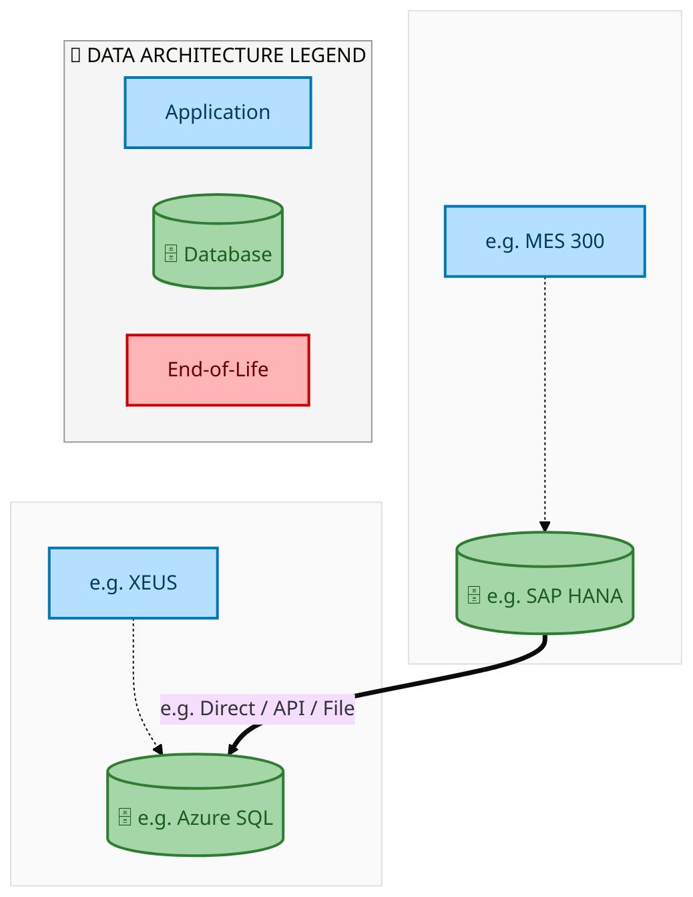
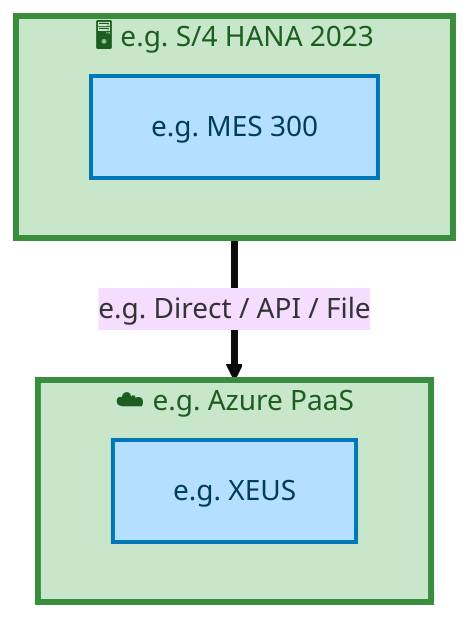

  
  <h1 style="font-size:36px; margin-top:24px;">E2E-89 — R3 Customer Master Data</h1>
  <h2 style="font-size:24px;">Architecture Document (TOGAF BDAT)</h2>
  
End-to-End Integrated Processes (E2E) Tower 
  Capability E2E-89 · Master Data

  
IAO Program · Release 2 
  Generated: March 2026 
  Sajiv Francis

  
IAO Architecture Pipeline — Intel Confidential

Page 1<a href="#toc">↑ Back to TOC</a>E2E-89 — R3 Customer Master Data

## Table of Contents

1. [Executive Summary](#1-executive-summary)
2. [Business Context & Objectives](#2-business-context--objectives)
   - 2.1 [Classification](#21-classification)
   - 2.2 [Business Drivers](#22-business-drivers)
   - 2.3 [Success Criteria](#23-success-criteria)
   - 2.4 [Companion Documents](#24-companion-documents)
3. [Business Architecture (TOGAF "B")](#3-business-architecture-togaf-b)
   - 3.1 [Business Process Overview](#31-business-process-overview)
   - 3.2 [Business Process Diagrams](#32-business-process-diagrams)
   - 3.3 [Business Roles & Responsibilities](#33-business-roles--responsibilities)
4. [Data Architecture (TOGAF "D")](#4-data-architecture-togaf-d)
   - 4.1 [Data Entities & Ownership](#41-data-entities--ownership)
   - 4.2 [Data Flow Diagrams](#42-data-flow-diagrams)
   - 4.3 [Data Lineage](#43-data-lineage)
   - 4.4 [RICEFW Data Objects](#44-ricefw-data-objects)
   - 4.5 [Data Governance & Quality](#45-data-governance--quality)
5. [Application Architecture (TOGAF "A")](#5-application-architecture-togaf-a)
   - 5.1 [Current-State Application Landscape](#51-current-state--current-state-application-landscape)
   - 5.2 [Future-State Application Landscape](#52-future-state--future-state-application-landscape)
   - 5.3 [Change Impact Summary](#53-change-impact-summary)
   - 5.4 [Component Overview](#54-component-overview)
   - 5.5 [RICEFW Inventory](#55-ricefw-inventory)
   - 5.6 [Integration Patterns](#56-integration-patterns)
6. [Technology Architecture (TOGAF "T")](#6-technology-architecture-togaf-t)
   - 6.1 [Platform & Infrastructure](#61-platform--infrastructure)
   - 6.2 [SAP Development Object Status](#62-sap-development-object-status)
   - 6.3 [NFRs & Design Principles](#63-nfrs--design-principles)
   - 6.4 [Security & Governance](#64-security--governance)
7. [Project Context](#7-project-context)
   - 7.1 [Project Roadmap & Go-Live Plan](#71-project-roadmap--go-live-plan)
   - 7.2 [RAID Log](#72-raid-log)
   - 7.3 [Recommendations & Next Steps](#73-recommendations--next-steps)

Page 2<a href="#toc">↑ Back to TOC</a>E2E-89 — R3 Customer Master Data

## 1. Executive Summary

This Architecture Document defines the **Business, Data, Application, and Technology** (BDAT) architecture for **E2E-89 R3 Customer Master Data** within the IAO program. It includes 1 BPMN process diagram(s) in Section 3.
| Dimension | Value |
|-----------|-------|
| **Tower** | End-to-End Integrated Processes (E2E) |
| **Process Group** | Master Data |
| **Capability** | E2E-89 - R3 Customer Master Data |
| **Release** | Release 2 |
| **Total Systems** | 2 |
| **System Status** | 0 Deployed, 0 Developing, 0 EOL, 2 Pending IAPM |
| **RICEFW Objects** | Pending — Smartsheet Object Tracker API integration |
**Change Summary**: 0 new flow chains, 0 removed, 0 modified, 1 unchanged between Current-State and Future-State states.

> All system nodes in architecture diagrams are **IAPM-linked** — click any node to open its IAPM page. Diagrams require `securityLevel: 'loose'` for click events.

Page 3<a href="#toc">↑ Back to TOC</a>E2E-89 — R3 Customer Master Data

## 2. Business Context & Objectives

### 2.1 Classification

| Level | Value |
|-------|-------|
| **L0 Tower** | End-to-End Integrated Processes |
| **L1 Process** | Master Data |
| **L2 Capability** | E2E-89 - R3 Customer Master Data |

### 2.2 Business Drivers

| # | Driver | Description | Strategic Alignment | Priority |
|---|--------|-------------|---------------------|----------|
| 1 | End-to-End Process Integration | Enable cross-tower integrated processes spanning procurement, manufacturing, and fulfillment | IDM 2.0 Process Excellence | High |
| 2 | Intel Foundry Business Enablement | Stand up foundry-specific business processes for external customer engagement | Intel Foundry Services | High |
| 3 | Process Visibility & Monitoring | Provide end-to-end process visibility across tower boundaries with integrated monitoring | Operational Excellence | Medium |
| 4 | E2E-89 Process Migration | Migrate R3 Customer Master Data business processes and 2 integrated systems from legacy to S/4 HANA target architecture | IDM 2.0 Cross-Functional / End-to-End | High |

Page 4<a href="#toc">↑ Back to TOC</a>E2E-89 — R3 Customer Master Data

### 2.3 Success Criteria

| Metric | Target | Measure | Baseline | Owner |
|--------|--------|---------|----------|-------|
| E2E Process Cycle Time | Per process SLA | End-to-end transaction completion within defined SLA per process | Varies by process | E2E Process Owner |
| Cross-Tower Integration Success | > 99% | Transactions completing across tower boundaries without manual intervention | 92% (current) | Integration Lead |
| Process Exception Rate | < 2% | Transactions requiring manual exception handling | 8% (current) | Operations Manager |
| E2E-89 Migration Completeness | 100% flow chains validated | All 1 flow chains verified in target state | 0% (pre-migration) | Tower Architect |

### 2.4 Companion Documents

| Document | Description |
|----------|-------------|
| **Business Architecture** | Included in this document (Section 3) — process flows from BPMN diagrams |
| **This Document** | Full BDAT Architecture — Business + Data + Application + Technology |

Page 5<a href="#toc">↑ Back to TOC</a>E2E-89 — R3 Customer Master Data

## 3. Business Architecture (TOGAF "B")

### 3.1 Business Process Overview

This capability includes **1 business process(es)** modeled in BPMN 2.0, covering the end-to-end workflow for E2E-89 R3 Customer Master Data.

| # | Step ID | Process Name | Lanes | Tasks | Gateways |
|---|---------|--------------|-------|-------|----------|
| 1 | E2E-89_R3_Customer_Master_Data | E2E-89_R3_Customer_Master_Data | Boundary Apps, EWM Decentralized, GTS, Intel Foundry 
SAP S/4, Intel Product 
SAP S/4, New SAP MDG, SAP CFIN | 11 | 7 |

### 3.2 Business Process Diagrams

Page 6<a href="#toc">↑ Back to TOC</a>E2E-89 — R3 Customer Master Data

#### BUSINESS ARCHITECTURE — 3.2.1 E2E-89_R3_Customer_Master_Data — E2E-89_R3_Customer_Master_Data

**Swim Lanes**: Boundary Apps · EWM Decentralized · GTS · Intel Foundry 
SAP S/4 · Intel Product 
SAP S/4 · New SAP MDG · SAP CFIN | **Tasks**: 11 | **Gateways**: 7

> **Legend**: ● Start · ● End · User Task · Service Task · ◇ Gateway · Sub-Process

<a href="https://mermaid.live/view#pako:eNqlV11v4jgU_StWqooZKezG-SCQh11RIF2kaacaOjsPyz6YxClRQ4Jsp8Ay_Pe1g52AGyp1ykOre3LPuedeO06yN6IixkZgXF_v0zxlAdh32BKvcCcAnQWiuGOCI_A3IilaZJh2RE5S5GyW_lelQXe9FWkCC9EqzXYCneGnAoPvUxMMOTEzAUU57VJM0qRjdtYkXSGyGxVZQUT2Fe4nVlJVk5duChJj0iRYlg8jj1OzNMcN7Piu74aCR3FU5PGZaOIl_STqHIS5rNhES0RYZb-k-A5tf6QxW_I4QRnFPGfJVtkXtMCZ6JGRUmBRSV7UMFIq6uR8YLM1itL8ieOuxSGC8ucG8qzDARyur-d5XRR8-TbPAf9FGaJ0jBNAGYcnLwwkaZYFV-5oGHqWSRkpnnFwZU_8sWObkegk4K1bphhud4PTpyULFkUWy9TuRvQQ2OutSbaBbZlkx_9qtXAeN5VGPbtv9-tKNz4cwZGqlCTJhyrxuZJHRJ9lrYkT2uG4rgW9njeyXuupNseuP4T6nDB5SSN8IhqGoTNpRjXpedC6LHoTOj1rpIk-IYY3aNcIDkZuLRh6fgj9i4LHerrLcvFAikgJOhMv9GpB_waGQ_uioDuEbl865DpPBK2X4KYoq70Mhus1PV4Tv7z3z9z4vo65fzBGDIE0BzPEb8qkIBEGn6YhQHkMpg-f58a_JzS_oXHG5P7xN_AXytF5Ur9JQlkGvvLbnmhGzvKhxQkJChLUFesOJHcyGnIjOcMZCAWZ7DQzELbyVD_fcMbSQqPYn2rOOuMrNyopK1acfIco4_8qshQSK4EpBVN-nqUciLnW51OxfiPGVdZvib3iDvZ7xRUnZ3fB7_1oCSbblDJ--9da9M-5cTicMG2rnYm3UVbS9AXfHjelTnMaGiKk2NAuyhhYI8LXCGcXSO6vkLz3kfipom3ayY87MMYRzhmn8IdDfDq4ZnPVm1QfvLbmjrZMlbxYmlJfmtdWbh9np629v7irFeeCIG4tfqwAPzq8szsGgNnwAcx-d09KOCdNnOW-3YinNcJFX-_tS3b4rRSXEWuz4-p2VO7bdnq_ZucebyoPd-PbE7XBmweJ4Ij8MwO2_dGFEjZG4fT-RNR7__7y9TlI1TeGwU9B0O3-wR8CKobHGA4kMDjGti3jvrzel7HkQ1cJyNiRsStjVcCTsS_jntS3lJ4lE6ACZAVHiz1VsHL4c27w-VRjCpsDc278FCeXYkpvqhVbevO12PZ0QHnxZay8QEsDbOcI9DWzdXu123opv-aLApGYH_SVWzV3Ww3K0qWUO1kKelqCPjj79P1HLKh6ozqDeSvtOLyA2_X75jnuyHfDc9RtRb1WtNeK-q1ovxUdqNexM5hvrVYYtsN2O-y0w2477CnYMA2-2iuUxkawN6rPH_6JFOMElRkzDqaBSlbMdnlkBNVngnF8KIxTxI-I1RE8_A_7AhXi" title="View in Mermaid Live">&#128065; View in Mermaid Live</a>

Page 7<a href="#toc">↑ Back to TOC</a>E2E-89 — R3 Customer Master Data

### 3.3 Business Roles & Responsibilities

| Role / Lane | Processes Involved | Description |
|------------|-------------------|-------------|
| Boundary Apps | E2E-89_R3_Customer_Master_Data | |
| EWM Decentralized | E2E-89_R3_Customer_Master_Data | |
| GTS | E2E-89_R3_Customer_Master_Data | |
| Intel Foundry 
SAP S/4 | E2E-89_R3_Customer_Master_Data | |
| Intel Product 
SAP S/4 | E2E-89_R3_Customer_Master_Data | |
| New SAP MDG | E2E-89_R3_Customer_Master_Data | |
| SAP CFIN | E2E-89_R3_Customer_Master_Data | |

Page 8<a href="#toc">↑ Back to TOC</a>E2E-89 — R3 Customer Master Data

## 4. Data Architecture (TOGAF "D")

### 4.1 Data Entities & Ownership

| # | Data Entity | Source System | Target System | Data Owner | Classification | Volume | Master/Transaction |
|---|-------------|---------------|---------------|------------|----------------|--------|-------------------|
| 1 | e.g. Cost Element | e.g. MES 300 | e.g. XEUS | Data steward | e.g. Intel Confidential | e.g. 10K rows/day | Master / Transaction |

Page 9<a href="#toc">↑ Back to TOC</a>E2E-89 — R3 Customer Master Data

### 4.2 Data Flow Diagrams

> **DATA ARCHITECTURE** — Database-to-database data flows. Applications (blue) sit above their hosting databases (green cylinders). Thick arrows show data movement between databases.

#### 4.2.1 Current-State — Current-State Data Flows

<a href="https://mermaid.live/view#pako:eNqdlY9vmkAUx_-VyzXGLdGOatFK0ian4GpCm67YbUlZyAkPvfQEAseqtf7vuwOlm9Wu6V1CvPfj-x6fR84V9uMAsIFrtRWLmDDQqi5mMIe6geoTmkG9geoZ-HnKxNKG38CVg8dx6SlCv9OU0QmHrK6ywzgSDnsqBE70ZKHClG1I54wvldWBaQzobtRARCby-lpF8PjRn9FUFBp5Bld08YMFYibPIeUZyJiZmHObToCrQiLNlS2S3TsJ9Vk0lca2Lk0pjR5eTKf6eo3WtZobVSXQuO9GSC6f0ywzIUQ0SfrxAoWMc-Oor5vD4bCRiTR-AONI07rdfmdzbD6qnoxWsmj4MY9T5W6b-q5eMBks-UaO6GaHdCu5ltU1262Dcid93WppO3IQ85f2hsO-3tcrvcFAk-ugXqej3G5UKmb5ZJrSZIaslnXWG5hkYHvgTT3ylKfgOd_sexcjF_8qo9UKWAq-YHFUQVNrm06K7J_WnSMT4Xh6jNRvKWAYRsn0dY65U_GTi908OGsH8hn4p24egiZfWYkVQUgGufizkiywvtUFah43Lw5VKhMhCjYsxJLDQRBb2ETtCralqf0v7JNk8T-8DrnxLsk1-RDdK8vx2pq2BSyPSB7fw7gq-wZiGYNUzHsIbzrZB3lb6j2Mt7EfQry_LDo_v3jeADILpugLIjcj-RwyDi5-PvxR7IzOhqls__4vYn6gIZOMCSK3g8vR2BqM724tZFtfrWvzwDTt2xer7am5kyThzKfKu390tmcemJNJBVU38f4R2Z4l5a0oaMZh02YhlPLllbF3HOUbbunralf0e73eK_S4geeQzikLsLHCxY0v_y8CCGnOBV43MM1F7CwjHxvFpYzzJKACTEYl0XlpXP8BPOn1zQ==" title="View in Mermaid Live">&#128065; View in Mermaid Live</a>

Page 10<a href="#toc">↑ Back to TOC</a>E2E-89 — R3 Customer Master Data

#### 4.2.2 Future-State — Future-State Data Flows

<a href="https://mermaid.live/view#pako:eNqdlY9vmkAUx_-VyzXGLdGOatFK0ianwGpCm67YbUlZyAkPvfQEAseqtf7vuwO1m9Wu6V1CvPfj-x6fR84lDpIQsIFrtSWLmTDQsi6mMIO6gepjmkO9geo5BEXGxMKB38CVgydJ5SlDv9OM0TGHvK6yoyQWLnsqBU70dK7ClM2mM8YXyurCJAF0N2wgIhN5faUiePIYTGkmSo0ihys6_8FCMZXniPIcZMxUzLhDx8BVIZEVyhbL7t2UBiyeSGNbl6aMxg8vplN9tUKrWs2LtyXQqO_FSK6A0zw3IUI0TfvJHEWMc-Oor5u2bTdykSUPYBxpWrfb76yPzUfVk9FK540g4Umm3G1T39ULx4MFX8sR3eyQ7lauZXXNduug3Elft1rajhwk_KU92-7rfX2rNxhoch3U63SU24srxbwYTzKaTpHVss56tkkGjg_-xCdPRQa--8259zDy8K8qWq2QZRAIlsRbaGpt0kmZ_dO6c2UiHE-OkfotBQzDqJi-zjF3Kn7ysFeEZ-1QPsPg1Csi0OQrK7EyCMkgD39WkiXWt7pAzePmxaFKVSLE4ZqFWHA4CGIDm6i9hW1pav8L-ySd_w-vS278S3JNPkT3ynL9tqZtAMsjksf3MN6WfQOxjEEq5j2E153sg7wp9R7Gm9gPId5fFp2fXzyvAZklU_QFkZuhfNqMg4efD38UO6NzYCLbv_-LWBBqyCQjgsjt4HI4sgaju1sLOdZX69o8ME3n9sXq-GruJE05C6jy7h-d45sH5mRSQdVNvH9Ejm9JeSsOm0nUdFgElXx1ZewdR_WGG_q62lv6vV7vFXrcwDPIZpSF2Fji8saX_xchRLTgAq8amBYicRdxgI3yUsZFGlIBJqOS6Kwyrv4AuI719w==" title="View in Mermaid Live">&#128065; View in Mermaid Live</a>

Page 11<a href="#toc">↑ Back to TOC</a>E2E-89 — R3 Customer Master Data

### 4.3 Data Lineage

| # | Source System | Source Schema/Object | Target System | Target Schema/Object | Transformation |
|---|-------------|---------------------|---------------|---------------------|---------------|
| 1 | e.g. MES 300 | e.g. CKMLHD table | e.g. XEUS | e.g. dbo.CostElements | Lineage notes |

### 4.4 RICEFW Data Objects

Reports and Conversions for this capability will be populated from the Smartsheet Object Tracker via automated API extraction.

| Object ID | Type | Description | Status | Source | Target | Complexity |
|-----------|------|-------------|--------|--------|--------|-----------|
| E2E-89-R001 | Report | R3 Customer Master Data operational report | Planned | SAP S/4HANA | Analytics | Medium |
| E2E-89-C001 | Conversion | Legacy data migration for R3 Customer Master Data | Planned | Legacy ERP | SAP S/4HANA | High |

> *Pending: Smartsheet API integration to auto-populate live RICEFW data (see Build Requirements).*

### 4.5 Data Governance & Quality

| Concern | Approach |
|---------|----------|
| Data Ownership | Per-entity owners listed in Section 3.1 |
| Data Classification | Financial data classified as Intel Confidential |
| Data Retention | Per Intel corporate retention policies |
| Data Quality | Validated at source; reconciliation at target |

Page 12<a href="#toc">↑ Back to TOC</a>E2E-89 — R3 Customer Master Data

## 5. Application Architecture (TOGAF "A")

### 5.1 Current-State — Current-State Application Landscape

#### Overview

The Current-State architecture represents the **current / legacy** landscape for E2E-89.This view is generated from `CurrentFlows.xlsx` (1 flow hops across 1 flow chains).

#### APPLICATION ARCHITECTURE — Architecture Diagram (ArchiMate-Inspired)

> **Click any system node** to open its IAPM application page.
> **Legend**: Deployed · Developing · End-of-Life · No IAPM Match

<a href="https://mermaid.live/view#pako:eNqVVW1vokAQ_isbGuMXbemLb6QxAcGLF2yb0pe7nBeysoNuugJhl7bW-t9vF6xYbNPemmCYeeaZ5ZmZ3ZUWxAQ0Q6vVVjSiwkCrupjDAuoGqk8xh3oD1TkEWUrF0oVHYMrB4rjw5NA7nFI8ZcDrKjqMI-HRl5zguJ08K5iyDfGCsqWyejCLAd2OGsiUgayBOI54k0NKw_paoVn8FMxxKnK-jMMYP99TIubyPcSMg8TMxYK5eApMJRVppmyR_BIvwQGNZtJ4pktTiqOH0tTS12u0rtUm0TYFurEmEZKrVkPNptxQMKdjLKBJI57QFAjiYskABQxzDlxiCnj-bkOIphmnEXCO8hVSxoyDoVxWq8FFGj-AcWB1u23d2rw2n9SXGCfJcyOIWZwaB7quVzhxkqByFZxWS7FuOXW907Ha_8FJsMD7nHb3C87jd5xvPoK5FC_FS6kpalUyLSghDJ5wCruK2G2zVMTptIcl2zd2DzHbU0RpvKPyYKDrX3EWrDybzlKczJHp_plok4x0T4l8ktMWMq-u3NHAvBldXiDX_O1cT7S_RZBaRDZEIGgcIfe6tDonTrc38MGf-WPH8091fZc1gDaCw9khkj4kfZLQMAxZ4Q8Jfjm33ofRyvFp6Pg-DzZfshR8D9JHGoBvZfzd1x13CqYchTYoJFEFbVm1Krvt5OyDmAvfYXLeI9Hf3WJwVhArANoAzqfpUf-c9guHd4eO0MiOA_n307u8OD-i_SKr6soiH0TkrT77gsqx679OtJzNzosgmcyrkXwOKYOJ9vqFErvEn2FUkmot1JY2TZMfA5a7M-JD_asR3w01t6H6dyZ5r1ldmEmN3jUH0ZHr_HAu7G90qevL3q62lpkkjAZYgT9oLtcf31dbaFy2yadt4_q2U-0QWx0_TiTkLVKtfBHiXBbDeNImZxJImnHYdGm4SSPnf6dNSlELUd6EbanfVther7d3lmkNbQHpAlOiGSstv73k3UcgxBkT2rqh4UzE3jIKNCO_VLQskRsFm2JZhEVhXP8Dj1k9sQ==" title="View in Mermaid Live">&#128065; View in Mermaid Live</a>

Page 13<a href="#toc">↑ Back to TOC</a>E2E-89 — R3 Customer Master Data

#### Current-State Flow Narrative

| # | Flow Chain | Path | Interface | Freq |
|---|-----------|------|-----------|------|
| 1 | e.g. MES Route to ICOST | e.g. MES 300 → e.g. XEUS | e.g. Direct / API / File | e.g. Near Real-Time |

Page 14<a href="#toc">↑ Back to TOC</a>E2E-89 — R3 Customer Master Data

### 5.2 Future-State — Future-State Application Landscape

#### Overview

The Future-State architecture represents the **target** landscape for E2E-89.This view is generated from `FutureFlows.xlsx` (1 flow hops across 1 flow chains).

#### APPLICATION ARCHITECTURE — Architecture Diagram (ArchiMate-Inspired)

> **Click any system node** to open its IAPM application page.
> **Legend**: Deployed · Developing · End-of-Life · No IAPM Match

<a href="https://mermaid.live/view#pako:eNqVVW1vokAQ_isbGuMXbemLb6QxgYIXL9g2pS93OS9kZQfddAXCLm2t9b_fLlix2MbemmCYeeaZ5ZmZ3aUWxAQ0Q6vVljSiwkDLupjBHOoGqk8wh3oD1TkEWUrFwoUnYMrB4rjw5NB7nFI8YcDrKjqMI-HR15zguJ28KJiyDfCcsoWyejCNAd0NG8iUgayBOI54k0NKw_pKoVn8HMxwKnK-jMMIvzxQImbyPcSMg8TMxJy5eAJMJRVppmyR_BIvwQGNptJ4pktTiqPH0tTSVyu0qtXG0SYFurXGEZKrVkPNptxQMKMjLKBJI57QFAjiYsEABQxzDlxiCnj-bkOIJhmnEXCO8hVSxoyDgVxWq8FFGj-CcWB1u23dWr82n9WXGCfJSyOIWZwaB7quVzhxkqByFZxWS7FuOHW907Ha_8FJsMC7nHZ3D-fxB853H8FcipfihdQUtSqZ5pQQBs84hW1F7LZZKuJ02oOS7Ru7h5jtKKI03lL54kLX93EWrDybTFOczJDp_hlr44x0T4l8ktMWMq-v3eGFeTu8ukSu-du5GWt_iyC1iGyIQNA4Qu5NaXVOnG5v4IM_9UeO55_q-jZrAG0Eh9NDJH1I-iShYRiywp8S_HLuvE-jlePL0NFDHmy-Zin4HqRPNADfyviHrzvuFEw5Cq1RSKIK2rJqVXbbydkvYi58h8l5j0R_e4vBWUGsAGgNOJ-kR_1z2i8c3j06QkM7DuTfT-_q8vyI9ousqiuLfBCR9_rsCirHrv821nI2Oy-CZDKvh_I5oAzG2tseJbaJv8KoJNVaqC2tmyY_Bix3a8QH-r4R3w41N6H6dyZ5p1ldmEqNPjQH0ZHr_HAu7W90qevL3q62lpkkjAZYgT9pLtcfPVRbaFS2yZdt4_q2U-0QWx0_TiTkLVKtfBHiXBXDeNImZxJImnHYdGm4TiPnf6tNSlELUd6FbanfRther7dzlmkNbQ7pHFOiGUstv73k3UcgxBkT2qqh4UzE3iIKNCO_VLQskRsFm2JZhHlhXP0D1co9yQ==" title="View in Mermaid Live">&#128065; View in Mermaid Live</a>

Page 15<a href="#toc">↑ Back to TOC</a>E2E-89 — R3 Customer Master Data

#### Future-State Flow Narrative

| # | Flow Chain | Path | Interface | Freq |
|---|-----------|------|-----------|------|
| 1 | e.g. MES Route to ICOST | e.g. MES 300 → e.g. XEUS | e.g. Direct / API / File | e.g. Near Real-Time |

Page 16<a href="#toc">↑ Back to TOC</a>E2E-89 — R3 Customer Master Data

### 5.3 Change Impact Summary

| Change Type | Flow Chain | Detail |
|-------------|-----------|--------|
| **UNCHANGED** | e.g. MES Route to ICOST | No change |

**Totals**: 0 new - 0 removed - 0 modified - 1 unchanged

### 5.4 Component Overview

#### System Inventory

| System | IAPM ID | Status |
|--------|---------|--------|
| e.g. MES 300 | - | N/A |
| e.g. XEUS | - | N/A |

Page 17<a href="#toc">↑ Back to TOC</a>E2E-89 — R3 Customer Master Data

### 5.5 RICEFW Inventory

RICEFW objects for this capability will be auto-populated from the Smartsheet S/4 Object Tracker.

| Object ID | Type | Description | Status | Source → Target | Middleware | Complexity |
|-----------|------|-------------|--------|----------------|-----------|-----------|
| E2E-89-I001 | Interface | R3 Customer Master Data inbound data interface | Planned | Legacy → SAP S/4HANA | MuleSoft / CPI | Medium |
| E2E-89-E001 | Enhancement | R3 Customer Master Data custom business logic | Planned | SAP S/4HANA | N/A | Medium |
| E2E-89-F001 | Form/Report | R3 Customer Master Data operational output | Planned | SAP S/4HANA | N/A | Low |

> *Pending: Smartsheet API integration to auto-populate live RICEFW inventory (see Build Requirements).*

Page 18<a href="#toc">↑ Back to TOC</a>E2E-89 — R3 Customer Master Data

### 5.6 Integration Patterns

| # | Pattern | Flow Chain | Middleware | Protocol | Auth |
|---|---------|-----------|-----------|----------|------|
| 1 | e.g. Pub-Sub / P2P / ETL | e.g. MES Route to ICOST | e.g. Azure Service Bus | e.g. REST / RFC / SFTP | e.g. OAuth / NTLM / Cert |

Page 19<a href="#toc">↑ Back to TOC</a>E2E-89 — R3 Customer Master Data

## 6. Technology Architecture (TOGAF "T")

### 6.1 Platform & Infrastructure

> **TECHNOLOGY / PLATFORM ARCHITECTURE** — Platforms (green) host applications (blue). Thick arrows show platform-to-platform integration flows.

#### 6.1.1 Current-State — Current-State Platform Architecture

<a href="https://mermaid.live/view#pako:eNqtlGFvmzAQhv-K5SriC2sJhDRF6iQgoFVKp2is26QxIQeOxKqDEZg1acp_nw1pslZKpWrzB4t77_z49Vl4h1OeAXbwYLCjBRUO2mliBWvQHKQtSA2ajrQa0qaiYjuD38BUgnHeZ7rSb6SiZMGg1tTqnBcioo8dYDgqN6pMaSFZU7ZVagRLDujuRkeuXMi0VlUw_pCuSCU6RlPDLdl8p5lYyTgnrAZZsxJrNiMLYGojUTVKK6T7qCQpLZZSHBlSqkhxf5Rso21ROxjExWEL9NWLCyRHykhdTyFHpCw9vkE5Zcw58-xpGIZ6LSp-D86ZYVxeeuN9-OFBeXLMcqOnnPFKpa2p_ZpXMiKOQH8SjP2rA9CaTALLfwm0jsChZwem8QoInB15YejZnn3g-b4hx0mD47FKx0VPrJvFsiLlCgVmMLny57N5AskycR-bCpI5IdHPGMeNOTaGcZODIXc-X56jLo1UOsa_epAaGa0gFZQXaPblqD6T3Y78I7hTzA6jviXAcZy-4f0aKLK9N7FlcNLYPzXzzcNHySj55H52E9Mwre782cTK5JwR--8uRBcjpOqQqnt3I26DKLEM47kXMkQyfGc7Xlj9Dx15i359_fFpb3banQ9dIHd-I-eQMojx08mrwjpeQ7UmNMPODndvhHxhMshJwwRudUwawaNtkWKn-41xU2ZEwJQSeT3rXmz_AOKrbqI=" title="View in Mermaid Live">&#128065; View in Mermaid Live</a>

> **Legend**: 🖥️ Platform · 📦 Application · ⛔ End-of-Life · 📋 Unassigned

Page 20<a href="#toc">↑ Back to TOC</a>E2E-89 — R3 Customer Master Data

#### 6.1.2 Future-State — Future-State Platform Architecture

<a href="https://mermaid.live/view#pako:eNqtlGFvmzAQhv-K5SriC2sJhDRF6iRIQKuUTtFYt0ljQg4ciVWDEZg1acp_nw1pslZKpWrzB4t77_z49Vl4hxOeAnbwYLCjBRUO2mliDTloDtKWpAZNR1oNSVNRsZ3Db2AqwTjvM13pN1JRsmRQa2p1xgsR0scOMByVG1WmtIDklG2VGsKKA7q70ZErFzKtVRWMPyRrUomO0dRwSzbfaSrWMs4Iq0HWrEXO5mQJTG0kqkZphXQfliShxUqKI0NKFSnuj5JttC1qB4OoOGyBvnpRgeRIGKnrGWSIlKXHNyijjDlnnj0LgkCvRcXvwTkzjMtLb7wPPzwoT45ZbvSEM16ptDWzX_NKRsQROJ344-nVAWhNJr41fQm0jsChZ_um8QoInB15QeDZnn3gTaeGHCcNjscqHRU9sW6Wq4qUa-Sb_uQqWMwXMcSr2H1sKogXhIQ_Ixw15tgYRk0Ghtz5fHWOujRS6Qj_6kFqpLSCRFBeoPmXo_pMdjvyD_9OMTuM-pYAx3H6hvdroEj33sSWwUlj_9TMNw8fxqP4k_vZjU3DtLrzpxMrlXNK7L-7EF6MkKpDqu7djbj1w9gyjOdeyBDJ8J3teGH1P3TkLfr19cenvdlZdz50gdzFjZwDyiDCTyevCus4hyonNMXODndvhHxhUshIwwRudUwawcNtkWCn-41xU6ZEwIwSeT15L7Z_AAWLbro=" title="View in Mermaid Live">&#128065; View in Mermaid Live</a>

> **Legend**: 🖥️ Platform · 📦 Application · ⛔ End-of-Life · 📋 Unassigned

#### Platform Inventory

| # | Platform | Type | Systems Using | Environment |
|---|----------|------|--------------|-------------|
| 1 | e.g. Azure PaaS | Cloud / SaaS | e.g. XEUS | DEV,QAS,PRD |
| 2 | e.g. S/4 HANA 2023 | On-Premise | e.g. MES 300 | DEV,QAS,PRD |

Page 21<a href="#toc">↑ Back to TOC</a>E2E-89 — R3 Customer Master Data

### 6.2 SAP Development Object Status

**RICEFW Status Summary** — E2E Tower (0 objects)
*Data source: Smartsheet Object Tracker (cached 2026-03-27)*

| Status | Count | % |
|--------|------:|----:|
| **Total** | **0** | **100%** |

**RICEFW by Type:**

| Type | Count |
|------|------:|
| **Total** | **0** |

### 6.3 NFRs & Design Principles

| Category | Requirement | Target / SLA | Priority |
|----------|-------------|-------------|----------|
| Performance | Order/transaction processing within interactive SLA | < 3 seconds for online transactions | High |
| Availability | Business-critical systems available during extended hours | 99.9% (06:00-22:00 all time zones) | High |
| Scalability | Support seasonal and promotional volume spikes | Handle 2x baseline transaction volume | Medium |
| Recoverability | Customer-facing systems recover within business impact window | RPO < 30 min, RTO < 2 hours | High |
| Data Volume | Support transactional data growth from business expansion | 10M+ documents/year | Medium |
| Latency | Near-real-time integration for order status updates | < 30 seconds for status propagation | Medium |
| Concurrency | Support global user base across business functions | 300+ concurrent users | Medium |

### 6.4 Security & Governance

| Concern | Approach | Standard / Policy | Owner |
|---------|----------|--------------------|-------|
| Authentication | Single Sign-On (SSO) via Intel corporate Azure AD identity | Intel IT Security Policy - Identity Management | IT Security |
| Authorization | Role-based access control (RBAC) with SAP authorization objects | Intel SAP Security Standards - Role Design | SAP Security Team |
| Data Classification | All financial/operational data classified per Intel Data Classification Standard | Intel Data Classification Policy | Data Governance |
| Data Encryption (at rest) | AES-256 encryption for SAP HANA database and file storage | Intel Encryption Standard | Infrastructure Security |
| Data Encryption (in transit) | TLS 1.3 for all system-to-system and user-to-system communication | Intel Network Security Policy | Network Engineering |
| Network Segmentation | SAP systems in dedicated network zones with firewall controls | Intel Network Architecture Standard | Network Security |
| API Security | OAuth 2.0 / certificate-based authentication for all API integrations | Intel API Security Guidelines | Integration Architecture |
| Audit Logging | Comprehensive audit trail for all data changes and user actions (SAP Security Audit Log) | SOX Compliance / Intel Audit Policy | Internal Audit |
| Certificate Management | Automated certificate lifecycle management for system-to-system trust | Intel PKI Standard | Certificate Authority Team |
| Compliance | SOX controls, export control (EAR/ITAR) screening, data privacy (GDPR) | Intel Corporate Compliance Framework | Compliance Office |

Page 22<a href="#toc">↑ Back to TOC</a>E2E-89 — R3 Customer Master Data

## 7. Project Context

### 7.1 Project Roadmap & Go-Live Plan

*No timeline data available for this capability.*

### 7.2 RAID Log

*Live data from Smartsheet Master RAID Log — extracted 2026-03-27*

**RAID Summary:** 15 open items (0 capability-specific, 15 tower-level), 56 closed

| Severity | Capability | Tower-Wide | Total Open |
|----------|----------:|-----------:|-----------:|
| P1 - High | 0 | 3 | 3 |
| P2 - Medium | 0 | 10 | 10 |
| P3 - Low | 0 | 2 | 2 |
| **Total** | **0** | **15** | **15** |

**Other E2E Tower RAID Items** (15 open):

| RAID ID | Type | Severity | Title | Status | Assigned To | Due Date |
|---------|------|----------|-------|--------|-------------|----------|
| 03591 | Risk | P1 - High | R3 E2E scenario execution | In Progress | Test Management | 2026-04-03 |
| 03681 | Risk | P1 - High | ITC Execution: Planning run availability - Prerequisite for ... | In Progress | E2E | 2026-03-27 |
| 03762 | Risk | P1 - High | FTS-IF (esp SCP) related test cases/sequencing are not accur... | In Progress | FTS IF | 2026-04-03 |
| 01733 | Risk | P2 - Medium | Tariffs impacts Item/BOM design which is impacting ERP/SCP (... | In Progress | E2E | 2026-03-06 |
| 03592 | Risk | P2 - Medium | Lack of Defined IMO Owner for CBA Mask Billing and Materials... | In Progress | E2E | 2026-03-27 |
| 03625 | Risk | P2 - Medium | Item/ BOM MC1 delta load | In Progress | Cutover | 2026-04-10 |
| 03628 | Risk | P2 - Medium | R3 Returns Rework Process Causing Finance Double Counting in... | In Progress | E2E | 2026-03-27 |
| 03642 | Issue | P2 - Medium | E2E Process with Anafi on order/invoice point.  Need IFS SC ... | In Progress | E2E | 2026-03-24 |
| 03736 | Action | P2 - Medium | Golden Data/Test Data Readiness | In Progress | Master Data | 2026-04-22 |
| 03743 | Issue | P2 - Medium | FD-Share with Entitlements -  Interface File Paths for MC1 | Roadblock / At Risk | PMO | 2026-03-20 |
| 03753 | Risk | P2 - Medium | PDF-SMH IF test cases are not available in JIRA | To Be Reviewed | B-Apps | 2026-03-25 |
| 03756 | Risk | P2 - Medium | LE101-1001 Operation Support Ownership for SIMS/Tester Front... | In Progress | E2E | 2026-04-24 |
| 03769 | Action | P2 - Medium | Need a Labs SPOC owner to define IP Labs enterprise and mate... | In Progress | E2E | 2026-04-17 |
| 03216 | Action | P3 - Low | Mask Expense vs. Invoice | In Progress | E2E | 2026-03-06 |
| 03315 | Risk | P3 - Low | BPMG – SCP L3/L4 flow standards | In Progress | Business Process Mgmt | 2026-03-27 |

### 7.3 Recommendations & Next Steps

| # | Category | Recommendation | Priority | Owner | Target Date | Status |
|---|----------|---------------|----------|-------|-------------|--------|
| 1 | Architecture | Complete extended flow attributes (Data Entity, Integration Pattern, Tech Platform) in Flows tab for full BDAT coverage | High | Tower Architect | 2026-Q2 | Open |
| 2 | Data | Define data ownership and classification for all 1 flow chains to satisfy Data Architecture (TOGAF D) requirements | Medium | Data Architect | 2026-Q3 | Open |
| 3 | Testing | Develop integration test scenarios covering all 1 flow chains for FUT/SIT readiness | High | Test Lead | 2026-Q3 | Open |
| 4 | Business Architecture | Review and validate Business Architecture process steps against latest Signavio/BIC process models | Medium | Business Analyst | 2026-Q2 | Open |
| 5 | Security | Complete security review for API integrations and data flows per Intel Security Architecture standards | Medium | Security Architect | 2026-Q3 | Open |

---
*E2E-89 — Architecture Document (TOGAF BDAT) · End-to-End Integrated Processes · Generated: March 2026*

