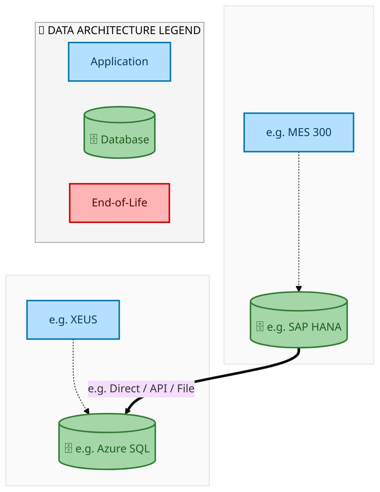
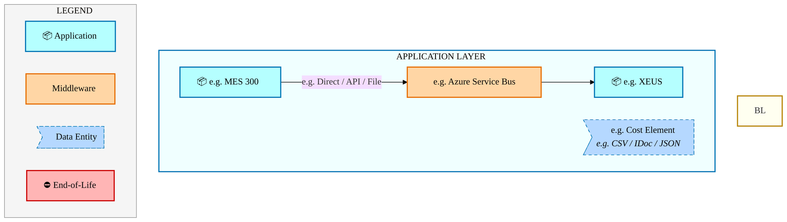
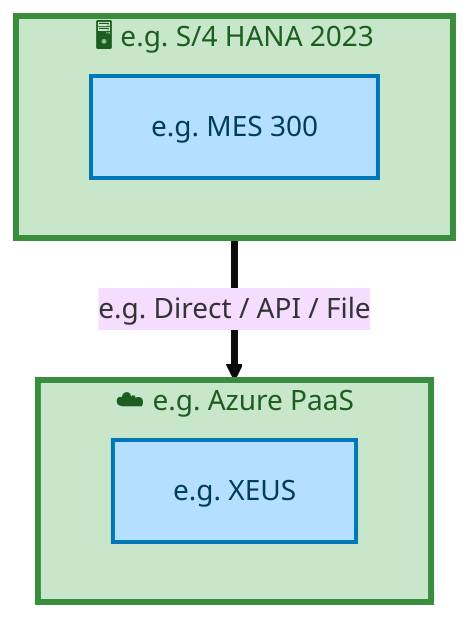

  
  <h1 style="font-size:36px; margin-top:24px;">E2E-90 — R3 Material Master Data</h1>
  <h2 style="font-size:24px;">Architecture Document (TOGAF BDAT)</h2>
  
End-to-End Integrated Processes (E2E) Tower 
  Capability E2E-90 · Master Data

  
IAO Program · Release 2 
  Generated: March 2026 
  Sajiv Francis

  
IAO Architecture Pipeline — Intel Confidential

Page 1<a href="#toc">↑ Back to TOC</a>E2E-90 — R3 Material Master Data

## Table of Contents

<nav class="toc">
<ol>
  <li><a href="#1-executive-summary">1. Executive Summary</a></li>
  <li><a href="#2-business-context-objectives">2. Business Context &amp; Objectives</a>
    <ul>
      <li><a href="#21-classification">2.1 Classification</a></li>
      <li><a href="#22-business-drivers">2.2 Business Drivers</a></li>
      <li><a href="#23-success-criteria">2.3 Success Criteria</a></li>
      <li><a href="#24-companion-documents">2.4 Companion Documents</a></li>
    </ul>
  </li>
  <li><a href="#3-business-architecture-togaf-b">3. Business Architecture (TOGAF &ldquo;B&rdquo;)</a>
    <ul>
      <li><a href="#31-business-process-overview">3.1 Business Process Overview</a></li>
      <li><a href="#32-business-process-diagrams">3.2 Business Process Diagrams</a></li>
      <li><a href="#33-business-roles-responsibilities">3.3 Business Roles &amp; Responsibilities</a></li>
    </ul>
  </li>
  <li><a href="#4-data-architecture-togaf-d">4. Data Architecture (TOGAF &ldquo;D&rdquo;)</a>
    <ul>
      <li><a href="#41-data-entities-ownership">4.1 Data Entities &amp; Ownership</a></li>
      <li><a href="#42-data-flow-diagrams">4.2 Data Flow Diagrams</a></li>
      <li><a href="#43-data-lineage">4.3 Data Lineage</a></li>
      <li><a href="#44-ricefw-data-objects">4.4 RICEFW Data Objects</a></li>
      <li><a href="#45-data-governance-quality">4.5 Data Governance &amp; Quality</a></li>
    </ul>
  </li>
  <li><a href="#5-application-architecture-togaf-a">5. Application Architecture (TOGAF &ldquo;A&rdquo;)</a>
    <ul>
      <li><a href="#51-current-state-current-state-application-landscape">5.1 Current-State Application Landscape</a></li>
      <li><a href="#52-future-state-future-state-application-landscape">5.2 Future-State Application Landscape</a></li>
      <li><a href="#53-change-impact-summary">5.3 Change Impact Summary</a></li>
      <li><a href="#54-component-overview">5.4 Component Overview</a></li>
      <li><a href="#55-ricefw-inventory">5.5 RICEFW Inventory</a></li>
      <li><a href="#56-integration-patterns">5.6 Integration Patterns</a></li>
    </ul>
  </li>
  <li><a href="#6-technology-architecture-togaf-t">6. Technology Architecture (TOGAF &ldquo;T&rdquo;)</a>
    <ul>
      <li><a href="#61-platform-infrastructure">6.1 Platform &amp; Infrastructure</a></li>
      <li><a href="#62-sap-development-object-status">6.2 SAP Development Object Status</a></li>
      <li><a href="#63-nfrs-design-principles">6.3 NFRs &amp; Design Principles</a></li>
      <li><a href="#64-security-governance">6.4 Security &amp; Governance</a></li>
    </ul>
  </li>
  <li><a href="#7-project-context">7. Project Context</a>
    <ul>
      <li><a href="#71-project-roadmap-go-live-plan">7.1 Project Roadmap &amp; Go-Live Plan</a></li>
      <li><a href="#72-raid-log">7.2 RAID Log</a></li>
      <li><a href="#73-recommendations-next-steps">7.3 Recommendations &amp; Next Steps</a></li>
    </ul>
  </li>
</ol>
</nav>

Page 2<a href="#toc">↑ Back to TOC</a>E2E-90 — R3 Material Master Data

## 1. Executive Summary

This Architecture Document defines the **Business, Data, Application, and Technology** (BDAT) architecture for **E2E-90 R3 Material Master Data** within the IAO program. It includes 1 BPMN process diagram(s) in Section 3.
| Dimension | Value |
|-----------|-------|
| **Tower** | End-to-End Integrated Processes (E2E) |
| **Process Group** | Master Data |
| **Capability** | E2E-90 - R3 Material Master Data |
| **Release** | Release 2 |
| **Total Systems** | 2 |
| **System Status** | 0 Deployed, 0 Developing, 0 EOL, 2 Pending IAPM |
| **RICEFW Objects** | Pending — Smartsheet Object Tracker API integration |
**Change Summary**: 0 new flow chains, 0 removed, 0 modified, 1 unchanged between Current-State and Future-State states.

> All system nodes in architecture diagrams are **IAPM-linked** — click any node to open its IAPM page. Diagrams require `securityLevel: 'loose'` for click events.

Page 3<a href="#toc">↑ Back to TOC</a>E2E-90 — R3 Material Master Data

## 2. Business Context & Objectives

### 2.1 Classification

| Level | Value |
|-------|-------|
| **L0 Tower** | End-to-End Integrated Processes |
| **L1 Process** | Master Data |
| **L2 Capability** | E2E-90 - R3 Material Master Data |

### 2.2 Business Drivers

| # | Driver | Description | Strategic Alignment | Priority |
|---|--------|-------------|---------------------|----------|
| 1 | End-to-End Process Integration | Enable cross-tower integrated processes spanning procurement, manufacturing, and fulfillment | IDM 2.0 Process Excellence | High |
| 2 | Intel Foundry Business Enablement | Stand up foundry-specific business processes for external customer engagement | Intel Foundry Services | High |
| 3 | Process Visibility & Monitoring | Provide end-to-end process visibility across tower boundaries with integrated monitoring | Operational Excellence | Medium |
| 4 | E2E-90 Process Migration | Migrate R3 Material Master Data business processes and 2 integrated systems from legacy to S/4 HANA target architecture | IDM 2.0 Cross-Functional / End-to-End | High |

Page 4<a href="#toc">↑ Back to TOC</a>E2E-90 — R3 Material Master Data

### 2.3 Success Criteria

| Metric | Target | Measure | Baseline | Owner |
|--------|--------|---------|----------|-------|
| E2E Process Cycle Time | Per process SLA | End-to-end transaction completion within defined SLA per process | Varies by process | E2E Process Owner |
| Cross-Tower Integration Success | > 99% | Transactions completing across tower boundaries without manual intervention | 92% (current) | Integration Lead |
| Process Exception Rate | < 2% | Transactions requiring manual exception handling | 8% (current) | Operations Manager |
| E2E-90 Migration Completeness | 100% flow chains validated | All 1 flow chains verified in target state | 0% (pre-migration) | Tower Architect |

### 2.4 Companion Documents

| Document | Description |
|----------|-------------|
| **Business Architecture** | Included in this document (Section 3) — process flows from BPMN diagrams |
| **This Document** | Full BDAT Architecture — Business + Data + Application + Technology |

Page 5<a href="#toc">↑ Back to TOC</a>E2E-90 — R3 Material Master Data

## 3. Business Architecture (TOGAF "B")

### 3.1 Business Process Overview

This capability includes **1 business process(es)** modeled in BPMN 2.0, covering the end-to-end workflow for E2E-90 R3 Material Master Data.

| # | Step ID | Process Name | Lanes | Tasks | Gateways |
|---|---------|--------------|-------|-------|----------|
| 1 | E2E-90_R3_Material_Master_Data | E2E-90_R3_Material_Master_Data | Boundary Apps, EWM Decentralized, GTS, Intel Foundry 
SAP S/4, Intel Product
SAP S/4 , NEW SAP MDG, SAP CFIN | 16 | 6 |

Page 6<a href="#toc">↑ Back to TOC</a>E2E-90 — R3 Material Master Data

### 3.2 Business Process Diagrams

#### BUSINESS ARCHITECTURE — 3.2.1 E2E-90_R3_Material_Master_Data — E2E-90_R3_Material_Master_Data

**Swim Lanes**: Boundary Apps · EWM Decentralized · GTS · Intel Foundry 
SAP S/4 · Intel Product
SAP S/4  · NEW SAP MDG · SAP CFIN | **Tasks**: 16 | **Gateways**: 6

```mermaid
%%{init: {'theme': 'base', 'themeVariables': {'fontSize': '14px', 'fontFamily': 'Segoe UI, Arial, sans-serif','primaryColor': '#e8f0fe', 'primaryBorderColor': '#0071c5','lineColor': '#37474F', 'secondaryColor': '#f5f8fc'}, 'flowchart': {'useMaxWidth': false, 'htmlLabels': true, 'curve': 'basis', 'nodeSpacing': 40, 'rankSpacing': 50}} }%%
flowchart LR
    classDef startEvt fill:#4CAF50,stroke:#2E7D32,color:#000,font-weight:bold,stroke-width:2px,rx:20,ry:20
    classDef endEvt fill:#C62828,stroke:#B71C1C,color:#fff,font-weight:bold,stroke-width:2px,rx:20,ry:20
    classDef userTask fill:#E3F2FD,stroke:#1565C0,stroke-width:2px,color:#0D47A1
    classDef serviceTask fill:#FFF3E0,stroke:#E65100,stroke-width:2px,color:#BF360C
    classDef gateway fill:#FFF9C4,stroke:#F57F17,stroke-width:2px,color:#E65100
    classDef subProc fill:#F3E5F5,stroke:#7B1FA2,stroke-width:2px,color:#4A148C
    subgraph Boundary Apps
        n1["Fetch IF related material data"]
        n2["Update ENT. Hana System"]
        n3["Update only legacy material number for IF and IP"]
        n4["Update Other Boundary Application System"]
        n5["Fetch IP related material data"]
        n6["Update material data in ECC"]
        n7["Update material details Translator"]
        n8["Update material data to Speed via translator"]
        n14["fa:fa-user Fetch PLM material related data from Speed"]
        n17(["fa:fa-play Material Master Request received for PLM"])
        n19(["fa:fa-stop Boundary App Updated"])
        n20(["fa:fa-stop Material data sync complete"])
        n26{{"fa:fa-code-branch Type of data, IP or IF?"}}
        n27{{"fa:fa-code-branch exclusiveGateway"}}
        n29{{"fa:fa-arrows-alt parallelGateway"}}
    end
    subgraph EWM Decentralized
        n12["Update Intel Product and Foundry"]
        n24(["fa:fa-stop EWM Data Updated"])
    end
    subgraph GTS
        n13["Update Intel Foundry and Intel Product"]
        n25(["fa:fa-stop GTS Data Updated"])
    end
    subgraph Intel Foundry  SAP S/4
        n11["Update Intel Foundry"]
        n23(["fa:fa-stop S/4 Updated"])
    end
    subgraph Intel Product SAP S/4 
        n10["Update Intel Prodcut"]
        n22(["fa:fa-stop S/4 Updated"])
    end
    subgraph NEW SAP MDG
        n15["fa:fa-user Update New SAP MDG System"]
        n16["fa:fa-user Request for Non-PLM related materials"]
        n18(["fa:fa-play Material Master Request Received for Non-PLM"])
        n28{{"fa:fa-code-branch exclusiveGateway"}}
        n30{{"fa:fa-arrows-alt parallelGateway"}}
        n31{{"fa:fa-arrows-alt parallelGateway"}}
    end
    subgraph SAP CFIN
        n9["Update in Intel Foundry and Intel Product"]
        n21(["fa:fa-stop SAP CFIN Updated"])
    end
    n13 --> n25
    n12 --> n24
    n11 --> n23
    n9 --> n21
    n17 --> n14
    n10 --> n22
    n3 --> n29
    n29 --> n4
    n18 --> n16
    n26 -->|"Intel Product (IP)"| n5
    n26 -->|"Intel Foundry (IF)"| n1
    n1 --> n27
    n16 --> n28
    n27 --> n28
    n28 --> n15
    n14 --> n26
    n31 --> n10
    n31 --> n11
    n31 --> n12
    n31 --> n13
    n31 --> n9
    n30 --> n31
    n15 --> n30
    n8 --> n20
    n7 --> n6
    n4 --> n19
    n30 -->|"Legacy material number"| n3
    n30 -->|"Legacy and 
new material number"| n7
    n2 --> n29
    n5 --> n27
    n6 -->|"Cluster 2 & 3"| n8
    n30 -->|"Old MM ID number"| n2
    class n14 userTask
    class n15 userTask
    class n16 userTask
    class n17 startEvt
    class n18 startEvt
    class n19 endEvt
    class n20 endEvt
    class n21 endEvt
    class n22 endEvt
    class n23 endEvt
    class n24 endEvt
    class n25 endEvt
    class n26 gateway
    class n27 gateway
    class n28 gateway
    class n29 gateway
    class n30 gateway
    class n31 gateway
```

> **Legend**: ● Start · ● End · User Task · Service Task · ◇ Gateway · Sub-Process

<a href="https://mermaid.live/view#pako:eNqlV11z2jgU_SsaZ7K0M7DrT2x42B0CuMtMSDMl3Tws-yBsOXgqZFeWk7Ap_30lI2FbMTtpywMzPtx7zr1HukJ-MaIsRsbYuLx8SUnKxuClx7Zoh3pj0NvAAvX64Aj8BWkKNxgVPRGTZISt0n-rMMvNn0WYwEK4S_FeoCv0kCHwedEHE56I-6CApBgUiKZJr9_LabqDdD_NcEZF9AUKEjOp1ORPVxmNEa0DTNO3Io-n4pSgGnZ813dDkVegKCNxizTxkiCJegdRHM6eoi2krCq_LNASPt-nMdvy5wTiAvGYLdvha7hBWPTIaCmwqKSPyoy0EDqEG7bKYZSSB467JocoJF9qyDMPB3C4vFyTkyi4_rQmgH8iDItihhJQMA7PHxlIUozHF-50Enpmv2A0-4LGF_bcnzl2PxKdjHnrZl-YO3hC6cOWjTcZjmXo4En0MLbz5z59Httmn-75t6aFSFwrTYd2YAcnpSvfmlpTpZQkyU8pcV_pHSy-SK25E9rh7KRleUNvar7mU23OXH9i6T4h-phGqEEahqEzr62aDz3LPE96FTpDc6qRPkCGnuC-JhxN3RNh6Pmh5Z8lPOrpVZabW5pFitCZe6F3IvSvrHBinyV0J5YbyAo5zwOF-RZcZWW1l8Ekz4vjb-JDrL_XRohYtAWLEFCEeSMx2PFvMWMghgyujX8a8TaP_5xzHIH5zd2v4E9IIFjtC4Z27UCnDswI3gOMHmC0r6lJudsgCpKMCmVIYrC4bTO4NcNHfmLQVg84jSBLM9Kp7dVN3b6lqWGt1IoCKQHz6bQd7HcFIwZTXIA7PrgFl8toOyc4J8AysMoRr-4x5Q9nsi3hRALHCRyIeQDH1m6vlzWZarIiTWi2O9JqPP67E1GO-XZdqvQl5CZS8Al9LVHBOFuE0kdOJ1aH63Ca902eUc1TsCxvLQw49hlrObap5SxbPhR7EoEo2-UYMaSnDl9eVKr4cxlsuE_cgLt9zvdWUhH0xUpXW-mPtXE4NLP97mz0HOGy4F1-OM6unjaq0yCl2VMxgJiBHFKIMcKvkviRqE3c_H4JZtxIwpcV83-2uOlgY4wWhCEM-LTHZcSqQQiFnXSvDZ6rGVjxC-9eGf66lg93q6a6o6tLxeMYNuvRavC0Gjjvm2toK4HV5BasfnObZVlnytKKcLQiOMvb9ZXPUh409c2uRYlK3QT7x_Rv5veV6nL2oSnqtWdb6t-gJxXcecJZw3aamlwxsDcZGYjDQT_4Co0ieONp8Kl5GkhyfUSDHxoyx_y-ITsmWT87mcLYabi4aZCO6qXnZ_73DYWl7wdJ_z-bgo8gGAx-FxOlAFsCrgIsCTgSGMlnSwX4R8A6ZZgywpaA0hjJZ1tSnBICyTBUAUMBfFsb7Vl5t7h9vza-8f_V7jhl1LtFeIw7lSgL8NXzUAKBIvJ1QJV08sWVEapGR5Japg5YOmDrgKMByhhHOuecCvckoERkWep-SmTdqihZpNUm5AZdd956KpOcM7Fiu60J4QdAV5ay0tbW1tOsVis05fMnhtkGvwCnYgh03Y84BsslWMyaOnbjQlqtgrqJt3HvDD48g_un95Q2HpzBR_Jdo4XaZidqdaJ2J-p0om4n6nWiQ3Xpb8N-Nxx0w6NOmK9MJ2wp2OgbO0R3MI2N8YtRvU3zN-4YJbDEzDj0DViybMWvVMa4eus0yuokmqWQH4C7I3j4D4J3zUc=" title="View full diagram">&#128065; View Full Diagram</a>

Page 7<a href="#toc">↑ Back to TOC</a>E2E-90 — R3 Material Master Data

### 3.3 Business Roles & Responsibilities

| Role / Lane | Processes Involved | Description |
|------------|-------------------|-------------|
| Boundary Apps | E2E-90_R3_Material_Master_Data | |
| EWM Decentralized | E2E-90_R3_Material_Master_Data | |
| GTS | E2E-90_R3_Material_Master_Data | |
| Intel Foundry 
SAP S/4 | E2E-90_R3_Material_Master_Data | |
| Intel Product
SAP S/4  | E2E-90_R3_Material_Master_Data | |
| NEW SAP MDG | E2E-90_R3_Material_Master_Data | |
| SAP CFIN | E2E-90_R3_Material_Master_Data | |

Page 8<a href="#toc">↑ Back to TOC</a>E2E-90 — R3 Material Master Data

## 4. Data Architecture (TOGAF "D")

### 4.1 Data Entities & Ownership

| # | Data Entity | Source System | Target System | Data Owner | Classification | Volume | Master/Transaction |
|---|-------------|---------------|---------------|------------|----------------|--------|-------------------|
| 1 | e.g. Cost Element | e.g. MES 300 | e.g. XEUS | Data steward | e.g. Intel Confidential | e.g. 10K rows/day | Master / Transaction |

Page 9<a href="#toc">↑ Back to TOC</a>E2E-90 — R3 Material Master Data

### 4.2 Data Flow Diagrams

> **DATA ARCHITECTURE** — Database-to-database data flows. Applications (blue) sit above their hosting databases (green cylinders). Thick arrows show data movement between databases.

#### 4.2.1 Current-State — Current-State Data Flows

<a href="https://mermaid.live/view#pako:eNqdlQ1rozAYx79KyCjcQbtz7Wyvwgbx7VZwYze7u4N5SKqxDUtVNN7adf3ul6h1u67uxhKQ5Hn5P_H3SNzAIAkJ1GCns6Ex5RrYeJAvyJJ4UAMenOFcrLpilZOgyChfO-QPYZWTJcnOW6b8wBnFM0Zy6RY6URJzlz7WUidquqqCpd3GS8rWlccl84SA20kXICEgxLdlFEseggXOeK1W5OQSr37SkC-kJcIsJzJuwZfMwTPCyrI8K0prLF7LTXFA47k0D1RpzHB8_8J4qm63YNvpeHFTC0x1LwZiBAznuUkigNNUT1YgooxpR7pq2rbdzXmW3BPtSFFGI31Yb3sP8mhaP111g4QlmXQPTHVfL5wZa1bLIdUcolEj17dG5qDfKneiq1Zf2ZMjCXs-nm3rqq42eoahiNGqNxxKtxdXinkxm2c4XQCrb40Vw0SG4xN_7qPHIiO--92586BA-LuKliOkGQk4TeIGmhy7dFRm_7JuXZFIjufHQK6FgKZpFdPXOeZexU8e9Irw6yAUzzA49YqIKOKVpVgZBESQBz9LyRLrW6cAvePeeVulKpHEYc2CrxlpBbGDjeRsYFuKnP_CPhFf_H_wuujav0BX6EN0Ly3XHyjKDrDYArF9D-Om7BuIRQyQMe8hXJ_kEORdqfcw3sV-CPHhsuDs7PypBmSWTMEXgK4n4mlTJu6mp_aPYq91DpmL49-9IBaECjDRFAF0Y1xMppYxvb2xgGN9s67Mlm46N89Wx5d9R2nKaICl93DrHN9s6ZOJOa6u6EMtcnxLyFtx2EuinkMjUslXV8bBdlRvuKOvytnQH4_Hr9DDLlySbIlpCLVN9RMQ_5KQRLhgXFzjEBc8cddxALXyYoZFGmJOTIoF0WVl3P4FS3_-4Q==" title="View full diagram">&#128065; View Full Diagram</a>

Page 10<a href="#toc">↑ Back to TOC</a>E2E-90 — R3 Material Master Data

#### 4.2.2 Future-State — Future-State Data Flows

<a href="https://mermaid.live/view#pako:eNqdlQ1rozAYx79KyCjcQbtz7Wyvwgax6q3gxm52dwfzkFRjG5aqaLy16_rdL_Ftu67uxhKQ5Hn5P_H3SNxCPw4I1GCns6UR5RrYupAvyYq4UAMunONMrLpilRE_Tynf2OQPYaWTxXHtLVJ-4JTiOSOZdAudMI64Qx8rqRM1WZfB0m7hFWWb0uOQRUzA7bQLkBAQ4rsiisUP_hKnvFLLM3KJ1z9pwJfSEmKWERm35Ctm4zlhRVme5oU1Eq_lJNin0UKaB6o0pji6f2E8VXc7sOt03KipBWa6GwExfIazzCAhwEmix2sQUsa0I101LMvqZjyN74l2pCijkT6str0HeTStn6y7fsziVLoHhrqvF8wnG1bJIdUYolEj1zdHxqDfKneiq2Zf2ZMjMXs-nmXpqq42epOJIkar3nAo3W5UKmb5fJHiZAnMvjlWLANNbI94Cw895inxnO_2nQsFwt9ltBwBTYnPaRw10OSo01GR_cu8dUQiOV4cA7kWApqmlUxf5xh7FT-50M2Dr4NAPAP_1M1DoohXlmJFEBBBLvwsJQusb50C9I57522VykQSBRULvmGkFUQNG8nZwDYVOf-FfSK--P_gddC1d4Gu0IfoXpqON1CUGrDYArF9D-Om7BuIRQyQMe8hXJ3kEOS61HsY17EfQny4LDg7O3-qABkFU_AFoOupeFqUibvpqf2j2GudTRbi-HcviPmBAgw0QwDdTC6mM3Myu70xgW1-M6-Mlm7aN89W25N9R0nCqI-l93DrbM9o6ZOBOS6v6EMtsj1TyJtR0IvDnk1DUsqXV8bBdpRvWNNX5Wzoj8fjV-hhF65IusI0gNq2_AmIf0lAQpwzLq5xiHMeO5vIh1pxMcM8CTAnBsWC6Ko07v4CxyT_Cw==" title="View full diagram">&#128065; View Full Diagram</a>

Page 11<a href="#toc">↑ Back to TOC</a>E2E-90 — R3 Material Master Data

### 4.3 Data Lineage

| # | Source System | Source Schema/Object | Target System | Target Schema/Object | Transformation |
|---|-------------|---------------------|---------------|---------------------|---------------|
| 1 | e.g. MES 300 | e.g. CKMLHD table | e.g. XEUS | e.g. dbo.CostElements | Lineage notes |

### 4.4 RICEFW Data Objects

Reports and Conversions for this capability will be populated from the Smartsheet Object Tracker via automated API extraction.

| Object ID | Type | Description | Status | Source | Target | Complexity |
|-----------|------|-------------|--------|--------|--------|-----------|
| E2E-90-R001 | Report | R3 Material Master Data operational report | Planned | SAP S/4HANA | Analytics | Medium |
| E2E-90-C001 | Conversion | Legacy data migration for R3 Material Master Data | Planned | Legacy ERP | SAP S/4HANA | High |

> *Pending: Smartsheet API integration to auto-populate live RICEFW data (see Build Requirements).*

### 4.5 Data Governance & Quality

| Concern | Approach |
|---------|----------|
| Data Ownership | Per-entity owners listed in Section 3.1 |
| Data Classification | Financial data classified as Intel Confidential |
| Data Retention | Per Intel corporate retention policies |
| Data Quality | Validated at source; reconciliation at target |

Page 12<a href="#toc">↑ Back to TOC</a>E2E-90 — R3 Material Master Data

## 5. Application Architecture (TOGAF "A")

### 5.1 Current-State — Current-State Application Landscape

#### Overview

The Current-State architecture represents the **current / legacy** landscape for E2E-90.This view is generated from `CurrentFlows.xlsx` (1 flow hops across 1 flow chains).

#### APPLICATION ARCHITECTURE — Architecture Diagram (ArchiMate-Inspired)

> **Click any system node** to open its IAPM application page.
> **Legend**: Deployed · Developing · End-of-Life · No IAPM Match

<a href="https://mermaid.live/view#pako:eNqVVWtP2zAU_StWUL-1IzzaQoQqpU06dUoBETY2LVPkxretNTeJYgco0P--67jQ0IJgrpQm93Gufe6x_WglGQPLsRqNR55y5ZDHyFJzWEBkOSSyJlTiWxPfJCRlwdUygFsQximy7NlbpfygBacTAVK7EWeapSrkD2uog05-b4K1fUgXXCyNJ4RZBuT7qElcBBBNImkqWxIKPo2sVZUhsrtkTgu1Ri4ljOn9DWdqri1TKiTouLlaiIBOQFRTUEVZWVNcYpjThKczbT62tbGg6d-asW2vVmTVaETpSy1y3Y9SgqPRIK0Wzi2Z8zFV0OKpzHkBjEi1FEASQaUEiTEmvPr2YEompeQpSEmqMeVCOHtDHP12U6oi-wvOXv_kpGP315-tO70g5zC_byaZyApnz7btLUya52QzDGa_rVFfMG272-13_gOTUUV3Mb2TDzAPXmE--xiVSF5Bl8gpaW9VWnDGBNzRAuqMeB13w4jf7Qw3aJ-YPWRihxHNcY3lwcC2P8I0qLKczAqaz4kb_I6sqGQnRwyf7KhN3MvLYDRwr0cX5yRwf_lXkfXHJOnBUBCJ4llKgquN1T_0T-1BDPEsHvthfGTbddQEOgS-zL4Q9BH0IaDjONjhNwF--t_DN7O1493U8U2V7D6UBcQhFLc8gbhfylerO-gapCqKrKMIRhnYTde20T2_Qh9kUsW-wCMgVb36FJNjA6wDyDrgbFLs9854zzjCH2SfjLwswb9v4cX52T7vmapalaYepOy5P7uE4rbrPUVWheZVTUAk93KEzyEXePY8fcBEHfi9GF1kuxd6SmvRVMdAP6ht8aH90Ravp7ovqfZndvKOWAOYIUevxMFsEvhf_XPvEyoNYtT2trTcPBc8oTr4DXEF8fhmW0LjjUzelU0Qe_62Qjx9_Pipwstlu_Mmxb8wm_Gww44xkLWyaSvg03UZ3P81mWxINaQ8E9vWvxdiT09Pd84yq2ktoFhQzizn0VxoeC8ymNJSKLyGLFqqLFymieVUF4tV5jhR8DjFJiyMcfUPw9lG9Q==" title="View full diagram">&#128065; View Full Diagram</a>

Page 13<a href="#toc">↑ Back to TOC</a>E2E-90 — R3 Material Master Data

#### Current-State Flow Narrative

| # | Flow Chain | Path | Interface | Freq |
|---|-----------|------|-----------|------|
| 1 | e.g. MES Route to ICOST | e.g. MES 300 → e.g. XEUS | e.g. Direct / API / File | e.g. Near Real-Time |

Page 14<a href="#toc">↑ Back to TOC</a>E2E-90 — R3 Material Master Data

### 5.2 Future-State — Future-State Application Landscape

#### Overview

The Future-State architecture represents the **target** landscape for E2E-90.This view is generated from `FutureFlows.xlsx` (1 flow hops across 1 flow chains).

#### APPLICATION ARCHITECTURE — Architecture Diagram (ArchiMate-Inspired)

> **Click any system node** to open its IAPM application page.
> **Legend**: Deployed · Developing · End-of-Life · No IAPM Match

<a href="https://mermaid.live/view#pako:eNqVVW1P6jAU_ivNDN9A5wuoiyEZbtxwM9Q4X-7N3c1S1gM0lm1ZOxWV_35PV5QJGr0lGdt5eU77nKfts5VkDCzHajSeecqVQ54jS01hBpHlkMgaUYlvTXyTkJQFV_MA7kEYp8iyV2-VckMLTkcCpHYjzjhLVcifllC7nfzRBGt7n864mBtPCJMMyPWgSVwEEE0iaSpbEgo-jqxFlSGyh2RKC7VELiUM6eMtZ2qqLWMqJOi4qZqJgI5AVFNQRVlZU1ximNOEpxNtPrC1saDpXc3YthcLsmg0ovStFrnqRSnB0WiQVgvnlkz5kCpo8VTmvABGpJoLIImgUoLEGBNefXswJqNS8hSkJNUYcyGcrT6OXrspVZHdgbPVOzrq2L3lZ-tBL8jZyx-bSSaywtmybXsNk-Y5WQ2D2Wtr1DdM2z487HX-A5NRRTcxvaMvMHffYb76GJVIXkHnyClpr1WaccYEPNAC6ox4HXfFiH_Y6a_QvjF7yMQGI5rjGsunp7b9FaZBleVoUtB8StzgT2RFJTvaZ_hk-23iXlwEg1P3anB-RgL3t38ZWX9Nkh4MBZEonqUkuFxZ_T3_2O7HEE_ioR_G-7ZdR02gQ2B7sk3QR9CHgI7jYIc_BPjlX4cfZmvHp6nD2yrZfSoLiEMo7nkCca-U71a3e2iQqiiyjCIYZWBXXVtH9_wK_TSTKvYFHgGp6tanmBwYYB1AlgEno2Kne8K7xhHekB0y8LIE_36G52cnO7xrqmpVmnqQstf-bBKK2677ElkVmlc1AZHciwE--1zg2fPyBRN14M9idJH1XugpLUVTHQO9oLbF-_ZXW7ye6r6l2t_ZyRtiDWCCHL0TB7NJ4P_wz7xvqDSIUdvr0nLzXPCE6uAPxBXEw9t1CQ1XMvlUNkHs-esK8fTx46cKL5f1zpsU_9xsxr0OO8BA1srGrYCPl2Vw_9dksiLVkPJKbFv_3og9Pj7eOMuspjWDYkY5s5xnc6HhvchgTEuh8BqyaKmycJ4mllNdLFaZ40TB4xSbMDPGxT8KWUcN" title="View full diagram">&#128065; View Full Diagram</a>

Page 15<a href="#toc">↑ Back to TOC</a>E2E-90 — R3 Material Master Data

#### Future-State Flow Narrative

| # | Flow Chain | Path | Interface | Freq |
|---|-----------|------|-----------|------|
| 1 | e.g. MES Route to ICOST | e.g. MES 300 → e.g. XEUS | e.g. Direct / API / File | e.g. Near Real-Time |

Page 16<a href="#toc">↑ Back to TOC</a>E2E-90 — R3 Material Master Data

### 5.3 Change Impact Summary

| Change Type | Flow Chain | Detail |
|-------------|-----------|--------|
| **UNCHANGED** | e.g. MES Route to ICOST | No change |

**Totals**: 0 new - 0 removed - 0 modified - 1 unchanged

### 5.4 Component Overview

#### System Inventory

| System | IAPM ID | Status |
|--------|---------|--------|
| e.g. MES 300 | - | N/A |
| e.g. XEUS | - | N/A |

Page 17<a href="#toc">↑ Back to TOC</a>E2E-90 — R3 Material Master Data

### 5.5 RICEFW Inventory

RICEFW objects for this capability will be auto-populated from the Smartsheet S/4 Object Tracker.

| Object ID | Type | Description | Status | Source → Target | Middleware | Complexity |
|-----------|------|-------------|--------|----------------|-----------|-----------|
| E2E-90-I001 | Interface | R3 Material Master Data inbound data interface | Planned | Legacy → SAP S/4HANA | MuleSoft / CPI | Medium |
| E2E-90-E001 | Enhancement | R3 Material Master Data custom business logic | Planned | SAP S/4HANA | N/A | Medium |
| E2E-90-F001 | Form/Report | R3 Material Master Data operational output | Planned | SAP S/4HANA | N/A | Low |

> *Pending: Smartsheet API integration to auto-populate live RICEFW inventory (see Build Requirements).*

Page 18<a href="#toc">↑ Back to TOC</a>E2E-90 — R3 Material Master Data

### 5.6 Integration Patterns

| # | Pattern | Flow Chain | Middleware | Protocol | Auth |
|---|---------|-----------|-----------|----------|------|
| 1 | e.g. Pub-Sub / P2P / ETL | e.g. MES Route to ICOST | e.g. Azure Service Bus | e.g. REST / RFC / SFTP | e.g. OAuth / NTLM / Cert |

Page 19<a href="#toc">↑ Back to TOC</a>E2E-90 — R3 Material Master Data

## 6. Technology Architecture (TOGAF "T")

### 6.1 Platform & Infrastructure

> **TECHNOLOGY / PLATFORM ARCHITECTURE** — Platforms (green) host applications (blue). Thick arrows show platform-to-platform integration flows.

#### 6.1.1 Current-State — Current-State Platform Architecture

<a href="https://mermaid.live/view#pako:eNqtlF1r2zAUhv-KUMld1ip2nKaGDmzHZoV0hHndBvMwin2ciMqWseU2aZr_PsnOR1tIoWy6ENL7Hj06OkLa4ESkgG3c621YwaSNNhGWS8ghwjaK8JzWatRXoxqSpmJyPYUH4J3Jhdi77ZIftGJ0zqHWtuJkopAhe9qhBsNy1QVrPaA54-vOCWEhAN3d9JGjAAq-baO4eEyWtJI7WlPDLV39ZKlcaiWjvAYdt5Q5n9I58HZbWTWtWqhjhSVNWLHQ8pBosaLF_QvRItst2vZ6UXHYC313owKplnBa1xPIEC1LV6xQxji3z1xrEgRBv5aVuAf7jJDLS3e0m3561KnZRrnqJ4KLStvmxHrLKzmVR6A39kfe1QFojse-6b0GmkfgwLV8g7wBguBHXhC4lmsdeJ5HVDuZ4Gik7ajoiHUzX1S0XCLf8K-IN5vOYogXsfPUVBDPKA1_RzhqjBEZRE0GRO18vjhHrY20HeE_HUi3lFWQSCYKNP12VPdkpyX_8u80s8XosQLYtt0VvFsDRbrLTa45nEzsn4r57uHDeBh_cb46sUEMsz1_OjZT1afUelmF8GKIdBzScR8uxK0fxiYh-1qoKVLTD5bjVar_oSLv0a-vPz_vkp2050MXyJndqD5gXL3355NXhfs4hyqnLMX2pvs21O-TQkYbLtXDx7SRIlwXCbbbp4ybMqUSJoyq68k7cfsXsQx35g==" title="View full diagram">&#128065; View Full Diagram</a>

> **Legend**: 🖥️ Platform · 📦 Application · ⛔ End-of-Life · 📋 Unassigned

Page 20<a href="#toc">↑ Back to TOC</a>E2E-90 — R3 Material Master Data

#### 6.1.2 Future-State — Future-State Platform Architecture

<a href="https://mermaid.live/view#pako:eNqtlF1r2zAUhv-KUMld1ip2nKaGDuzEZoV0hHndBvMwin2ciMqWseU2aer_PsnOR1tIoWy6ENL7Hj06OkLa4lgkgG3c621ZzqSNtiGWK8ggxDYK8YJWatRXowriumRyM4MH4J3Jhdi77ZIftGR0waHStuKkIpcBe9qhBsNi3QVr3acZ45vOCWApAN3d9JGjAAretFFcPMYrWsodra7glq5_skSutJJSXoGOW8mMz-gCeLutLOtWzdWxgoLGLF9qeUi0WNL8_oVokaZBTa8X5oe90Hc3zJFqMadVNYUU0aJwxRqljHP7zLWmvu_3K1mKe7DPCLm8dEe76adHnZptFOt-LLgotW1Orbe8glN5BE7G3mhydQCa47FnTl4DzSNw4FqeQd4AQfAjz_ddy7UOvMmEqHYywdFI22HeEat6sSxpsUKe4V0Rfz6bRxAtI-epLiGaUxr8DnFYGyMyCOsUiNr5fHmOWhtpO8R_OpBuCSshlkzkaPbtqO7JTkv-5d1pZovRYwWwbbsreLcG8mSXm9xwOJnYPxXz3cMH0TD64nx1IoMYZnv-ZGwmqk-o9bIKwcUQ6Tik4z5ciFsviExC9rVQU6SmHyzHq1T_Q0Xeo19ff37eJTttz4cukDO_Ub3PuHrvzyevCvdxBmVGWYLtbfdtqN8ngZTWXKqHj2ktRbDJY2y3TxnXRUIlTBlV15N1YvMX0913_g==" title="View full diagram">&#128065; View Full Diagram</a>

> **Legend**: 🖥️ Platform · 📦 Application · ⛔ End-of-Life · 📋 Unassigned

#### Platform Inventory

| # | Platform | Type | Systems Using | Environment |
|---|----------|------|--------------|-------------|
| 1 | e.g. Azure PaaS | Cloud / SaaS | e.g. XEUS | DEV,QAS,PRD |
| 2 | e.g. S/4 HANA 2023 | On-Premise | e.g. MES 300 | DEV,QAS,PRD |

Page 21<a href="#toc">↑ Back to TOC</a>E2E-90 — R3 Material Master Data

### 6.2 SAP Development Object Status

| Metric | DEV | QAS | PRD |
|--------|-----|-----|-----|
| Transport Requests | — | — | — |
| Custom Code Objects | — | — | — |
| CDS Views | — | — | — |
| Fiori Apps | — | — | — |
| BAdIs / Enhancements | — | — | — |

### 6.3 NFRs & Design Principles

| Category | Requirement | Target / SLA | Priority |
|----------|-------------|-------------|----------|
| Performance | Order/transaction processing within interactive SLA | < 3 seconds for online transactions | High |
| Availability | Business-critical systems available during extended hours | 99.9% (06:00-22:00 all time zones) | High |
| Scalability | Support seasonal and promotional volume spikes | Handle 2x baseline transaction volume | Medium |
| Recoverability | Customer-facing systems recover within business impact window | RPO < 30 min, RTO < 2 hours | High |
| Data Volume | Support transactional data growth from business expansion | 10M+ documents/year | Medium |
| Latency | Near-real-time integration for order status updates | < 30 seconds for status propagation | Medium |
| Concurrency | Support global user base across business functions | 300+ concurrent users | Medium |

### 6.4 Security & Governance

| Concern | Approach | Standard / Policy | Owner |
|---------|----------|--------------------|-------|
| Authentication | Single Sign-On (SSO) via Intel corporate Azure AD identity | Intel IT Security Policy - Identity Management | IT Security |
| Authorization | Role-based access control (RBAC) with SAP authorization objects | Intel SAP Security Standards - Role Design | SAP Security Team |
| Data Classification | All financial/operational data classified per Intel Data Classification Standard | Intel Data Classification Policy | Data Governance |
| Data Encryption (at rest) | AES-256 encryption for SAP HANA database and file storage | Intel Encryption Standard | Infrastructure Security |
| Data Encryption (in transit) | TLS 1.3 for all system-to-system and user-to-system communication | Intel Network Security Policy | Network Engineering |
| Network Segmentation | SAP systems in dedicated network zones with firewall controls | Intel Network Architecture Standard | Network Security |
| API Security | OAuth 2.0 / certificate-based authentication for all API integrations | Intel API Security Guidelines | Integration Architecture |
| Audit Logging | Comprehensive audit trail for all data changes and user actions (SAP Security Audit Log) | SOX Compliance / Intel Audit Policy | Internal Audit |
| Certificate Management | Automated certificate lifecycle management for system-to-system trust | Intel PKI Standard | Certificate Authority Team |
| Compliance | SOX controls, export control (EAR/ITAR) screening, data privacy (GDPR) | Intel Corporate Compliance Framework | Compliance Office |

Page 22<a href="#toc">↑ Back to TOC</a>E2E-90 — R3 Material Master Data

## 7. Project Context

### 7.1 Project Roadmap & Go-Live Plan

Project delivery milestones for E2E-90 RICEFW objects:

| Phase | Planned Start | Planned End | Status | Notes |
|-------|---------------|-------------|--------|-------|
| Functional Specification (FS) | Per project plan | Per project plan | In Progress | Tower-level FS schedule |
| Technical Design (TDD) | FS + 2 weeks | FS + 6 weeks | Planned | Dependent on FS completion |
| Build & Unit Test (TUT) | TDD + 1 week | TDD + 8 weeks | Planned | Includes S/4 + Middleware |
| Functional User Test (FUT) | Build + 1 week | Build + 4 weeks | Planned | Tower-led validation |
| Go-Live (Release 2) | Per release plan | Per release plan | Planned | End-to-End Integrated Processes release |

> *Detailed object-level timelines will be auto-populated from the Smartsheet Object Tracker via API integration.*

Page 23<a href="#toc">↑ Back to TOC</a>E2E-90 — R3 Material Master Data

### 7.2 RAID Log

Standard RAID items for E2E-90 (End-to-End Integrated Processes):

| # | Category | Description | Status | Owner | Priority |
|---|----------|-------------|--------|-------|----------|
| 1 | Risk | Data migration completeness — validate all legacy R3 Material Master Data data maps to S/4 target structures | Open | Tower Architect | High |
| 2 | Risk | Integration testing coverage — ensure all 2 integrated systems are validated end-to-end | Open | Integration Lead | High |
| 3 | Assumption | Target SAP S/4HANA system available in DEV/QAS per release schedule | Active | SAP Basis | Medium |
| 4 | Issue | API access provisioning — SAP OData, Smartsheet, and IAPM API credentials required for automation | Open | EA Pipeline Team | High |
| 5 | Dependency | Upstream BPMN process models validated and signed off by business process owners | Active | Process Owner | Medium |

> *Live RAID data will be auto-populated from the Smartsheet RAID log via API integration.*

### 7.3 Recommendations & Next Steps

| # | Category | Recommendation | Priority | Owner | Target Date | Status |
|---|----------|---------------|----------|-------|-------------|--------|
| 1 | Architecture | Complete extended flow attributes (Data Entity, Integration Pattern, Tech Platform) in Flows tab for full BDAT coverage | High | Tower Architect | 2026-Q2 | Open |
| 2 | Data | Define data ownership and classification for all 1 flow chains to satisfy Data Architecture (TOGAF D) requirements | Medium | Data Architect | 2026-Q3 | Open |
| 3 | Testing | Develop integration test scenarios covering all 1 flow chains for FUT/SIT readiness | High | Test Lead | 2026-Q3 | Open |
| 4 | Business Architecture | Review and validate Business Architecture process steps against latest Signavio/BIC process models | Medium | Business Analyst | 2026-Q2 | Open |
| 5 | Security | Complete security review for API integrations and data flows per Intel Security Architecture standards | Medium | Security Architect | 2026-Q3 | Open |

---
*E2E-90 — Architecture Document (TOGAF BDAT) · End-to-End Integrated Processes · Generated: March 2026*

Page 24<a href="#toc">↑ Back to TOC</a>E2E-90 — R3 Material Master Data

