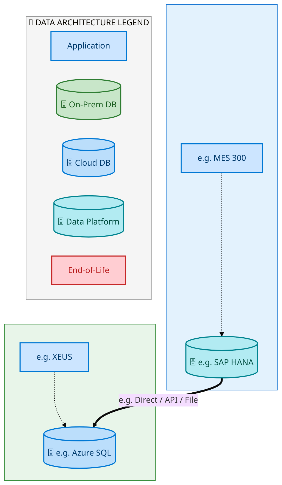
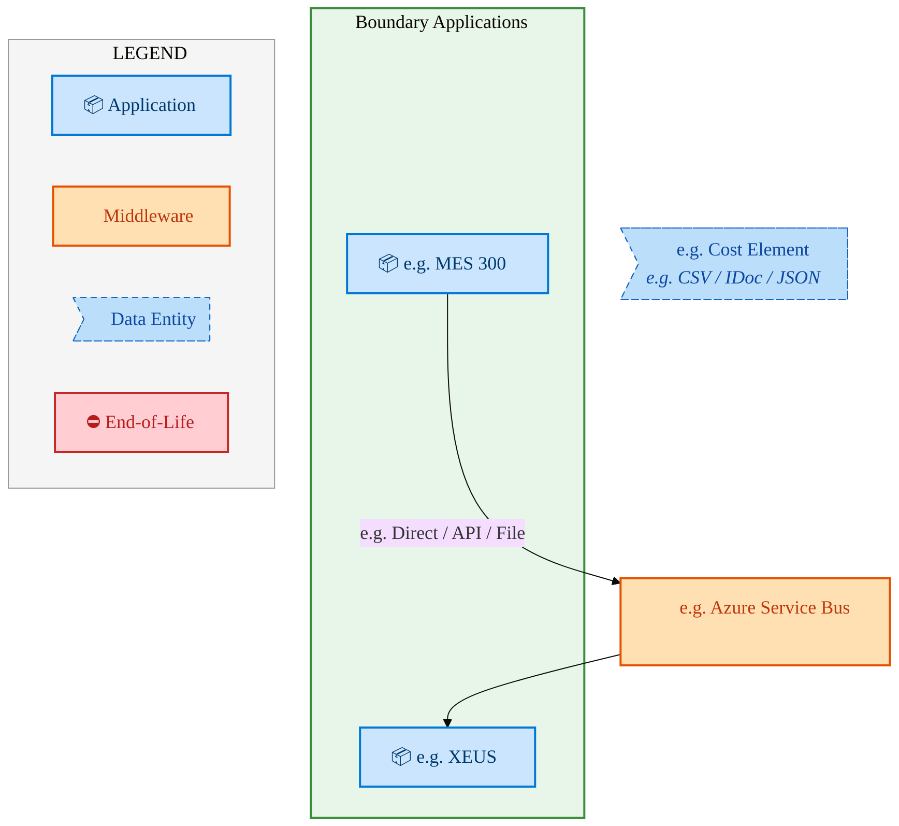
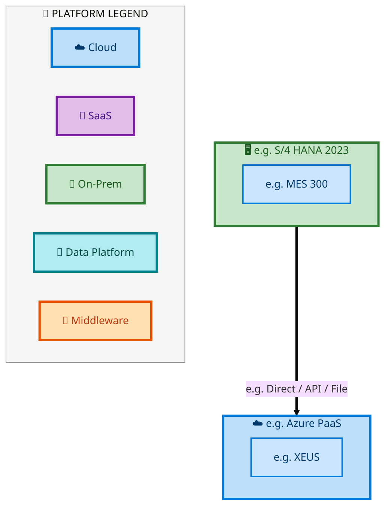

  <img src="data:image/svg+xml;base64,PHN2ZyB4bWxucz0iaHR0cDovL3d3dy53My5vcmcvMjAwMC9zdmciIHZpZXdCb3g9IjAgMCA4MDAgNDgwIiB3aWR0aD0iODAwIiBoZWlnaHQ9IjQ4MCI+DQogIDxkZWZzPg0KICAgIDxsaW5lYXJHcmFkaWVudCBpZD0iYmciIHgxPSIwJSIgeTE9IjAlIiB4Mj0iMTAwJSIgeTI9IjEwMCUiPg0KICAgICAgPHN0b3Agb2Zmc2V0PSIwJSIgc3R5bGU9InN0b3AtY29sb3I6IzAwNzFjNTtzdG9wLW9wYWNpdHk6MSIvPg0KICAgICAgPHN0b3Agb2Zmc2V0PSIxMDAlIiBzdHlsZT0ic3RvcC1jb2xvcjojMDBhZWVmO3N0b3Atb3BhY2l0eToxIi8+DQogICAgPC9saW5lYXJHcmFkaWVudD4NCiAgICA8bGluZWFyR3JhZGllbnQgaWQ9ImFjY2VudCIgeDE9IjAlIiB5MT0iMCUiIHgyPSIwJSIgeTI9IjEwMCUiPg0KICAgICAgPHN0b3Agb2Zmc2V0PSIwJSIgc3R5bGU9InN0b3AtY29sb3I6I2ZmZmZmZjtzdG9wLW9wYWNpdHk6MC4xNSIvPg0KICAgICAgPHN0b3Agb2Zmc2V0PSIxMDAlIiBzdHlsZT0ic3RvcC1jb2xvcjojZmZmZmZmO3N0b3Atb3BhY2l0eTowLjAyIi8+DQogICAgPC9saW5lYXJHcmFkaWVudD4NCiAgICA8cGF0dGVybiBpZD0iZ3JpZCIgd2lkdGg9IjQwIiBoZWlnaHQ9IjQwIiBwYXR0ZXJuVW5pdHM9InVzZXJTcGFjZU9uVXNlIj4NCiAgICAgIDxwYXRoIGQ9Ik0gNDAgMCBMIDAgMCAwIDQwIiBmaWxsPSJub25lIiBzdHJva2U9InJnYmEoMjU1LDI1NSwyNTUsMC4wNykiIHN0cm9rZS13aWR0aD0iMC41Ii8+DQogICAgPC9wYXR0ZXJuPg0KICA8L2RlZnM+DQoNCiAgPCEtLSBCYWNrZ3JvdW5kIC0tPg0KICA8cmVjdCB3aWR0aD0iODAwIiBoZWlnaHQ9IjQ4MCIgZmlsbD0idXJsKCNiZykiIHJ4PSI4Ii8+DQogIDxyZWN0IHdpZHRoPSI4MDAiIGhlaWdodD0iNDgwIiBmaWxsPSJ1cmwoI2dyaWQpIiByeD0iOCIvPg0KICA8cmVjdCB3aWR0aD0iODAwIiBoZWlnaHQ9IjQ4MCIgZmlsbD0idXJsKCNhY2NlbnQpIiByeD0iOCIvPg0KDQogIDwhLS0gRGVjb3JhdGl2ZSBjaXJjdWl0L2FyY2hpdGVjdHVyZSBsaW5lcyAtLT4NCiAgPGcgc3Ryb2tlPSJyZ2JhKDI1NSwyNTUsMjU1LDAuMTIpIiBzdHJva2Utd2lkdGg9IjEuNSIgZmlsbD0ibm9uZSI+DQogICAgPHBhdGggZD0iTSAwIDEwMCBMIDEyMCAxMDAgTCAxNjAgMTQwIEwgMjgwIDE0MCIvPg0KICAgIDxwYXRoIGQ9Ik0gMCAyNjAgTCA4MCAyNjAgTCAxMjAgMjIwIEwgMjAwIDIyMCBMIDI0MCAyNjAgTCAzNjAgMjYwIi8+DQogICAgPHBhdGggZD0iTSA1MjAgMTAwIEwgNjAwIDEwMCBMIDY0MCA2MCBMIDgwMCA2MCIvPg0KICAgIDxwYXRoIGQ9Ik0gNDQwIDM0MCBMIDU2MCAzNDAgTCA2MDAgMzAwIEwgNzIwIDMwMCBMIDc2MCAzNDAgTCA4MDAgMzQwIi8+DQogICAgPHBhdGggZD0iTSA2MDAgNDAwIEwgNjgwIDQwMCBMIDcyMCA0NDAiLz4NCiAgICA8cGF0aCBkPSJNIDAgNDAwIEwgNDAgNDAwIEwgODAgMzYwIi8+DQogICAgPHBhdGggZD0iTSAyMDAgNDIwIEwgMzIwIDQyMCBMIDM2MCAzODAgTCA0ODAgMzgwIi8+DQogICAgPHBhdGggZD0iTSA2NTAgNDQwIEwgNzUwIDQ0MCBMIDgwMCA0ODAiLz4NCiAgPC9nPg0KDQogIDwhLS0gRGVjb3JhdGl2ZSBub2RlcyAtLT4NCiAgPGcgZmlsbD0icmdiYSgyNTUsMjU1LDI1NSwwLjE4KSI+DQogICAgPGNpcmNsZSBjeD0iMTIwIiBjeT0iMTAwIiByPSI0Ii8+DQogICAgPGNpcmNsZSBjeD0iMjgwIiBjeT0iMTQwIiByPSI0Ii8+DQogICAgPGNpcmNsZSBjeD0iMjAwIiBjeT0iMjIwIiByPSI0Ii8+DQogICAgPGNpcmNsZSBjeD0iMzYwIiBjeT0iMjYwIiByPSI0Ii8+DQogICAgPGNpcmNsZSBjeD0iNjAwIiBjeT0iMTAwIiByPSI0Ii8+DQogICAgPGNpcmNsZSBjeD0iNzIwIiBjeT0iMzAwIiByPSI0Ii8+DQogICAgPGNpcmNsZSBjeD0iNTYwIiBjeT0iMzQwIiByPSI0Ii8+DQogICAgPGNpcmNsZSBjeD0iODAiIGN5PSIzNjAiIHI9IjQiLz4NCiAgICA8Y2lyY2xlIGN4PSI0ODAiIGN5PSIzODAiIHI9IjQiLz4NCiAgICA8Y2lyY2xlIGN4PSIzMjAiIGN5PSI0MjAiIHI9IjQiLz4NCiAgPC9nPg0KDQogIDwhLS0gVE9HQUYgQkRBVCBib3hlcyAtLT4NCiAgPGcgZm9udC1mYW1pbHk9IlNlZ29lIFVJLCBBcmlhbCwgc2Fucy1zZXJpZiIgZm9udC1zaXplPSIxNCIgZm9udC13ZWlnaHQ9IjYwMCI+DQogICAgPCEtLSBCIC0tPg0KICAgIDxyZWN0IHg9IjE1MCIgeT0iMTQwIiB3aWR0aD0iMTIwIiBoZWlnaHQ9IjQwIiByeD0iNSIgZmlsbD0icmdiYSgyNTUsMjU1LDI1NSwwLjE4KSIgc3Ryb2tlPSJyZ2JhKDI1NSwyNTUsMjU1LDAuMykiIHN0cm9rZS13aWR0aD0iMSIvPg0KICAgIDx0ZXh0IHg9IjIxMCIgeT0iMTY1IiB0ZXh0LWFuY2hvcj0ibWlkZGxlIiBmaWxsPSIjZmZmIj5CdXNpbmVzczwvdGV4dD4NCiAgICA8IS0tIEQgLS0+DQogICAgPHJlY3QgeD0iMjkwIiB5PSIxNDAiIHdpZHRoPSIxMjAiIGhlaWdodD0iNDAiIHJ4PSI1IiBmaWxsPSJyZ2JhKDI1NSwyNTUsMjU1LDAuMTgpIiBzdHJva2U9InJnYmEoMjU1LDI1NSwyNTUsMC4zKSIgc3Ryb2tlLXdpZHRoPSIxIi8+DQogICAgPHRleHQgeD0iMzUwIiB5PSIxNjUiIHRleHQtYW5jaG9yPSJtaWRkbGUiIGZpbGw9IiNmZmYiPkRhdGE8L3RleHQ+DQogICAgPCEtLSBBIC0tPg0KICAgIDxyZWN0IHg9IjQzMCIgeT0iMTQwIiB3aWR0aD0iMTIwIiBoZWlnaHQ9IjQwIiByeD0iNSIgZmlsbD0icmdiYSgyNTUsMjU1LDI1NSwwLjE4KSIgc3Ryb2tlPSJyZ2JhKDI1NSwyNTUsMjU1LDAuMykiIHN0cm9rZS13aWR0aD0iMSIvPg0KICAgIDx0ZXh0IHg9IjQ5MCIgeT0iMTY1IiB0ZXh0LWFuY2hvcj0ibWlkZGxlIiBmaWxsPSIjZmZmIj5BcHBsaWNhdGlvbjwvdGV4dD4NCiAgICA8IS0tIFQgLS0+DQogICAgPHJlY3QgeD0iNTcwIiB5PSIxNDAiIHdpZHRoPSIxMjAiIGhlaWdodD0iNDAiIHJ4PSI1IiBmaWxsPSJyZ2JhKDI1NSwyNTUsMjU1LDAuMTgpIiBzdHJva2U9InJnYmEoMjU1LDI1NSwyNTUsMC4zKSIgc3Ryb2tlLXdpZHRoPSIxIi8+DQogICAgPHRleHQgeD0iNjMwIiB5PSIxNjUiIHRleHQtYW5jaG9yPSJtaWRkbGUiIGZpbGw9IiNmZmYiPlRlY2hub2xvZ3k8L3RleHQ+DQogIDwvZz4NCg0KICA8IS0tIENvbm5lY3RpbmcgbGluZXMgYmV0d2VlbiBCREFUIGJveGVzIC0tPg0KICA8ZyBzdHJva2U9InJnYmEoMjU1LDI1NSwyNTUsMC4yNSkiIHN0cm9rZS13aWR0aD0iMSI+DQogICAgPGxpbmUgeDE9IjI3MCIgeTE9IjE2MCIgeDI9IjI5MCIgeTI9IjE2MCIvPg0KICAgIDxsaW5lIHgxPSI0MTAiIHkxPSIxNjAiIHgyPSI0MzAiIHkyPSIxNjAiLz4NCiAgICA8bGluZSB4MT0iNTUwIiB5MT0iMTYwIiB4Mj0iNTcwIiB5Mj0iMTYwIi8+DQogIDwvZz4NCg0KICA8IS0tIE1haW4gdGl0bGUgLS0+DQogIDx0ZXh0IHg9IjQwMCIgeT0iMjYwIiB0ZXh0LWFuY2hvcj0ibWlkZGxlIiBmb250LWZhbWlseT0iU2Vnb2UgVUksIEFyaWFsLCBzYW5zLXNlcmlmIiBmb250LXNpemU9IjM2IiBmb250LXdlaWdodD0iNzAwIiBmaWxsPSIjZmZmZmZmIiBsZXR0ZXItc3BhY2luZz0iMSI+DQogICAgSUFPIEFyY2hpdGVjdHVyZQ0KICA8L3RleHQ+DQogIDx0ZXh0IHg9IjQwMCIgeT0iMzAwIiB0ZXh0LWFuY2hvcj0ibWlkZGxlIiBmb250LWZhbWlseT0iU2Vnb2UgVUksIEFyaWFsLCBzYW5zLXNlcmlmIiBmb250LXNpemU9IjE4IiBmb250LXdlaWdodD0iNDAwIiBmaWxsPSJyZ2JhKDI1NSwyNTUsMjU1LDAuOCkiIGxldHRlci1zcGFjaW5nPSIyIj4NCiAgICBUT0dBRiBCREFUIMK3IElBTyBQcm9ncmFtIMK3IElETSAyLjANCiAgPC90ZXh0Pg0KDQogIDwhLS0gQm90dG9tIGFjY2VudCBiYXIgLS0+DQogIDxyZWN0IHg9IjI4MCIgeT0iMzQwIiB3aWR0aD0iMjQwIiBoZWlnaHQ9IjMiIHJ4PSIxLjUiIGZpbGw9InJnYmEoMjU1LDI1NSwyNTUsMC40KSIvPg0KDQogIDwhLS0gSW50ZWwgdGV4dCAtLT4NCiAgPHRleHQgeD0iNDAwIiB5PSIzODAiIHRleHQtYW5jaG9yPSJtaWRkbGUiIGZvbnQtZmFtaWx5PSJTZWdvZSBVSSwgQXJpYWwsIHNhbnMtc2VyaWYiIGZvbnQtc2l6ZT0iMTMiIGZpbGw9InJnYmEoMjU1LDI1NSwyNTUsMC41KSIgbGV0dGVyLXNwYWNpbmc9IjMiPg0KICAgIElOVEVMIENPTkZJREVOVElBTA0KICA8L3RleHQ+DQo8L3N2Zz4NCg==" alt="IAO Architecture" style="width:100%; border-radius:8px;" />
  <h1 style="font-size:36px; margin-top:24px;">E2E-92 — R3 Vendor Master Data</h1>
  <h2 style="font-size:24px;">Architecture Document (TOGAF BDAT)</h2>
  
End-to-End Integrated Processes (E2E) Tower 
  Capability E2E-92 · Master Data

  
IAO Program · R1 – R5 
  Generated: April 2026 
  Sajiv Francis

  
IAO Architecture Pipeline — Intel Confidential

Page 1<a href="#toc">↑ Back to TOC</a>E2E-92 — R3 Vendor Master Data

## Table of Contents

<nav class="toc">
<ol>
  <li><a href="#1-executive-summary">1. Executive Summary</a></li>
  <li><a href="#2-business-context-objectives">2. Business Context &amp; Objectives</a>
    <ul>
      <li><a href="#21-classification">2.1 Classification</a></li>
      <li><a href="#22-business-drivers">2.2 Business Drivers</a></li>
      <li><a href="#23-success-criteria">2.3 Success Criteria</a></li>
      <li><a href="#24-companion-documents">2.4 Companion Documents</a></li>
    </ul>
  </li>
  <li><a href="#3-business-architecture-togaf-b">3. Business Architecture (TOGAF &ldquo;B&rdquo;)</a>
    <ul>
      <li><a href="#31-business-process-overview">3.1 Business Process Overview</a></li>
      <li><a href="#32-business-process-diagrams">3.2 Business Process Diagrams</a></li>
      <li><a href="#33-business-roles-responsibilities">3.3 Business Roles &amp; Responsibilities</a></li>
    </ul>
  </li>
  <li><a href="#4-data-architecture-togaf-d">4. Data Architecture (TOGAF &ldquo;D&rdquo;)</a>
    <ul>
      <li><a href="#41-data-entities-ownership">4.1 Data Entities &amp; Ownership</a></li>
      <li><a href="#42-data-flow-diagrams">4.2 Data Flow Diagrams</a></li>
      <li><a href="#43-data-lineage">4.3 Data Lineage</a></li>
      <li><a href="#44-ricefw-data-objects">4.4 RICEFW Data Objects</a></li>
      <li><a href="#45-data-governance-quality">4.5 Data Governance &amp; Quality</a></li>
    </ul>
  </li>
  <li><a href="#5-application-architecture-togaf-a">5. Application Architecture (TOGAF &ldquo;A&rdquo;)</a>
    <ul>
      <li><a href="#51-current-state-current-state-application-landscape">5.1 Current-State Application Landscape</a></li>
      <li><a href="#52-future-state-future-state-application-landscape">5.2 Future-State Application Landscape</a></li>
      <li><a href="#53-change-impact-summary">5.3 Change Impact Summary</a></li>
      <li><a href="#54-component-overview">5.4 Component Overview</a></li>
      <li><a href="#55-ricefw-inventory">5.5 RICEFW Inventory</a>
        <ul>
          <li><a href="#551-eca-dependencies">5.5.1 ECA Dependencies</a></li>
          <li><a href="#552-boundary-application-dependencies">5.5.2 Boundary Application Dependencies</a></li>
        </ul>
      </li>
      <li><a href="#56-integration-patterns">5.6 Integration Patterns</a></li>
    </ul>
  </li>
  <li><a href="#6-technology-architecture-togaf-t">6. Technology Architecture (TOGAF &ldquo;T&rdquo;)</a>
    <ul>
      <li><a href="#61-platform-infrastructure">6.1 Platform &amp; Infrastructure</a></li>
      <li><a href="#62-sap-development-object-status">6.2 SAP Development Object Status</a></li>
      <li><a href="#63-nfrs-design-principles">6.3 NFRs &amp; Design Principles</a></li>
      <li><a href="#64-security-governance">6.4 Security &amp; Governance</a></li>
    </ul>
  </li>
  <li><a href="#7-project-context">7. Project Context</a>
    <ul>
      <li><a href="#71-project-roadmap-go-live-plan">7.1 Project Roadmap &amp; Go-Live Plan</a></li>
      <li><a href="#72-raid-log">7.2 RAID Log</a></li>
      <li><a href="#73-recommendations-next-steps">7.3 Recommendations &amp; Next Steps</a></li>
    </ul>
  </li>
</ol>
</nav>

Page 2<a href="#toc">↑ Back to TOC</a>E2E-92 — R3 Vendor Master Data

## 1. Executive Summary

This Architecture Document defines the **Business, Data, Application, and Technology** (BDAT) architecture for **E2E-92 R3 Vendor Master Data** within the IAO program. It includes 1 BPMN process diagram(s) in Section 3.

| Dimension | Value |
|-----------|-------|
| **Tower** | End-to-End Integrated Processes (E2E) |
| **Process Group** | Master Data |
| **Capability** | E2E-92 - R3 Vendor Master Data |
| **Release** | R1 – R5 |
| **Total Systems** | 2 |
| **System Status** | 0 Deployed, 0 Developing, 0 EOL, 2 Pending IAPM |
| **RICEFW Objects** | Pending — Smartsheet Object Tracker API integration |

**Change Summary**: 0 new flow chains, 0 removed, 0 modified, 1 unchanged between Current-State and Future-State states.

> All system nodes in architecture diagrams are **IAPM-linked** — click any node to open its IAPM page. Diagrams require `securityLevel: 'loose'` for click events.

Page 3<a href="#toc">↑ Back to TOC</a>E2E-92 — R3 Vendor Master Data

## 2. Business Context & Objectives

### 2.1 Classification

| Level | Value |
|-------|-------|
| **L0 Tower** | End-to-End Integrated Processes |
| **L1 Process** | Master Data |
| **L2 Capability** | E2E-92 - R3 Vendor Master Data |

### 2.2 Business Drivers

| # | Driver | Description | Strategic Alignment | Priority |
|---|--------|-------------|---------------------|----------|
| 1 | End-to-End Process Integration | Enable cross-tower integrated processes spanning procurement, manufacturing, and fulfillment | IDM 2.0 Process Excellence | High |
| 2 | Intel Foundry Business Enablement | Stand up foundry-specific business processes for external customer engagement | Intel Foundry Services | High |
| 3 | Process Visibility & Monitoring | Provide end-to-end process visibility across tower boundaries with integrated monitoring | Operational Excellence | Medium |
| 4 | E2E-92 Process Migration | Migrate R3 Vendor Master Data business processes and 2 integrated systems from legacy to S/4 HANA target architecture | IDM 2.0 Cross-Functional / End-to-End | High |

Page 4<a href="#toc">↑ Back to TOC</a>E2E-92 — R3 Vendor Master Data

### 2.3 Success Criteria

| Metric | Target | Measure | Baseline | Owner |
|--------|--------|---------|----------|-------|
| E2E Process Cycle Time | Per process SLA | End-to-end transaction completion within defined SLA per process | Varies by process | E2E Process Owner |
| Cross-Tower Integration Success | > 99% | Transactions completing across tower boundaries without manual intervention | 92% (current) | Integration Lead |
| Process Exception Rate | < 2% | Transactions requiring manual exception handling | 8% (current) | Operations Manager |
| E2E-92 Migration Completeness | 100% flow chains validated | All 1 flow chains verified in target state | 0% (pre-migration) | Tower Architect |

### 2.4 Companion Documents

| Document | Description |
|----------|-------------|
| **Business Architecture** | Included in this document (Section 3) — process flows from BPMN diagrams |
| **This Document** | Full BDAT Architecture — Business + Data + Application + Technology |

Page 5<a href="#toc">↑ Back to TOC</a>E2E-92 — R3 Vendor Master Data

## 3. Business Architecture (TOGAF "B")

### 3.1 Business Process Overview

This capability includes **1 business process(es)** modeled in BPMN 2.0, covering the end-to-end workflow for E2E-92 R3 Vendor Master Data.

| # | Step ID | Process Name | Lanes | Tasks | Gateways |
|---|---------|--------------|-------|-------|----------|
| 1 | E2E-92_R3_Vendor_Master_Data | E2E-92_R3_Vendor_Master_Data | Boundary Apps, EWM Decentralized, GTS, Intel Foundry 

SAP S/4, Intel Product 
SAP S/4, New SAP MDG, SAP CFIN | 11 | 7 |

Page 6<a href="#toc">↑ Back to TOC</a>E2E-92 — R3 Vendor Master Data

### 3.2 Business Process Diagrams

#### BUSINESS ARCHITECTURE — 3.2.1 E2E-92_R3_Vendor_Master_Data — E2E-92_R3_Vendor_Master_Data

**Swim Lanes**: Boundary Apps · EWM Decentralized · GTS · Intel Foundry 
SAP S/4 · Intel Product 
SAP S/4 · New SAP MDG · SAP CFIN | **Tasks**: 11 | **Gateways**: 7

```mermaid
%%{init: {'theme': 'base', 'themeVariables': {'fontSize': '14px', 'fontFamily': 'Segoe UI, Arial, sans-serif','primaryColor': '#e8f0fe', 'primaryBorderColor': '#0071c5','lineColor': '#37474F', 'secondaryColor': '#f5f8fc'}, 'flowchart': {'useMaxWidth': false, 'htmlLabels': true, 'curve': 'basis', 'nodeSpacing': 40, 'rankSpacing': 50}} }%%
flowchart LR
    classDef startEvt fill:#4CAF50,stroke:#2E7D32,color:#000,font-weight:bold,stroke-width:2px,rx:20,ry:20
    classDef endEvt fill:#C62828,stroke:#B71C1C,color:#fff,font-weight:bold,stroke-width:2px,rx:20,ry:20
    classDef userTask fill:#E3F2FD,stroke:#1565C0,stroke-width:2px,color:#0D47A1
    classDef serviceTask fill:#FFF3E0,stroke:#E65100,stroke-width:2px,color:#BF360C
    classDef gateway fill:#FFF9C4,stroke:#F57F17,stroke-width:2px,color:#E65100
    classDef subProc fill:#F3E5F5,stroke:#7B1FA2,stroke-width:2px,color:#4A148C
    subgraph lane_0["Boundary Apps"]
        n6["Update Data in Graphite"]
        n7["Update all Other Boundary Apps"]
        n9["fa:fa-user Update in ENT. Hana"]
        n10["fa:fa-user Update ECA (Intel Foundry)"]
        n11["fa:fa-user Update Data in Reltio"]
        n12(["fa:fa-play Vendor Master Data Update Process Initiated"])
        n18(["fa:fa-stop Vendor Master Data Updated"])
        n19{{"fa:fa-code-branch Existing Vendors?"}}
        n20{{"fa:fa-code-branch exclusiveGateway"}}
        n23{{"fa:fa-arrows-alt parallelGateway"}}
        n24{{"fa:fa-arrows-alt parallelGateway"}}
        n25{{"fa:fa-arrows-alt parallelGateway"}}
    end
    subgraph lane_1["EWM Decentralized"]
        n1["Update Intel Foundry Vendor Master"]
        n13(["fa:fa-stop EWM Data updated"])
    end
    subgraph lane_2["GTS"]
        n2["Update Intel Foundry Vendor Master"]
        n14(["fa:fa-stop GTS data updated"])
        n21{{"fa:fa-arrows-alt parallelGateway"}}
    end
    subgraph lane_3["Intel Foundry  SAP S/4"]
        n3["Update Intel Foundry Vendor Master"]
        n15(["fa:fa-stop S/4 Updated"])
    end
    subgraph lane_4["Intel Product  SAP S/4"]
        n4["Update Intel Product Vendor Master"]
        n16(["fa:fa-stop S/4 Updated"])
    end
    subgraph lane_5["New SAP MDG"]
        n8["fa:fa-user Update Data in New MDG"]
        n22{{"fa:fa-arrows-alt parallelGateway"}}
    end
    subgraph lane_6["SAP CFIN"]
        n5["Update Intel Foundry Vendor Master"]
        n17(["fa:fa-stop SAP CFIN Updated"])
    end
    n12 --> n6
    n11 --> n19
    n8 --> n22
    n7 --> n18
    n1 --> n13
    n4 --> n16
    n5 --> n17
    n6 --> n20
    n20 --> n11
    n25 --> n10
    n23 --> n7
    n22 --> n21
    n22 --> n20
    n19 -->|"Vendor Onboarding"| n8
    n19 -->|"IP and IF Vendors"| n24
    n22 -->|"For IF Vendor"| n25
    n22 --> n5
    n22 --> n1
    n24 --> n9
    n24 --> n25
    n9 --> n23
    n21 --> n2
    n2 --> n14
    n3 --> n15
    n22 --> n3
    n20 --> n21
    n10 --> n23
    n22 --> n4
    class n8 userTask
    class n9 userTask
    class n10 userTask
    class n11 userTask
    class n12 startEvt
    class n13 endEvt
    class n14 endEvt
    class n15 endEvt
    class n16 endEvt
    class n17 endEvt
    class n18 endEvt
    class n19 gateway
    class n20 gateway
    class n21 gateway
    class n22 gateway
    class n23 gateway
    class n24 gateway
    class n25 gateway
```

> **Legend**: ● Start · ● End · User Task · Service Task · ◇ Gateway · Sub-Process

<a href="https://mermaid.live/view#pako:eNqtV11v2kgU_SsjRxGtZLr-xOCHXRHAKVKTRiVtH8pqNdjjYGWw0cwQYCn_fe_A2MQTE2nT8oC4x_ece-beYWzvjLhIiBEal5e7LM9EiHYtMScL0gpRa4Y5aZnoCHzDLMMzSnhL5qRFLibZv4c021tuZJrEIrzI6FaiE_JQEPR1bKI-EKmJOM55mxOWpS2ztWTZArPtoKAFk9kXpJta6aGaunRVsISwU4JlBXbsA5VmOTnBbuAFXiR5nMRFntREUz_tpnFrL83RYh3PMRMH-ytObvDme5aIOcQpppxAzlws6Cc8I1SuUbCVxOIVeyqbkXFZJ4eGTZY4zvIHwD0LIIbzxxPkW_s92l9eTvOqKPr0ZZoj-MQUcz4kKeIC4NGTQGlGaXjhDfqRb5lcsOKRhBfOKBi6jhnLlYSwdMuUzW2vSfYwF-GsoIlKba_lGkJnuTHZJnQsk23hW6tF8uRUadBxuk63qnQV2AN7UFZK0_SXKkFf2T3mj6rWyI2caFjVsv2OP7Be6pXLHHpB39b7RNhTFpNnolEUuaNTq0Yd37bOi15FbscaaKIPWJA13p4EewOvEoz8ILKDs4LHerrL1eyOFXEp6I78yK8Egys76jtnBb2-7XWVQ9B5YHg5RxTn5B_rx9S4KlaHTY36yyWfGn8f8-Qn78Dlr8sE1oKGWGCU5ehakjNB6onBKRFTij7D_5mhV4R7kJ_iMMVtOU-kqCA_ur3_gD7iHNfzbauRMBr00btxLghFkSzGtu81nt3IKxfzhVCRFRrFeVdxlhRG-A02d8HQDeYCFA5UJSMHQjhHYzjWMgASUHr_XKp7kuKiWJ6XesHs7XYlUx6f7RkcAPEcjTYZF3AGKCX-19TY75_xHKuZRzYxXfHsiVwf96VOc080zFix5m1MBVpiBtMk9AzJewvJ_38kWGbTvpVjHX2_QUMSk1wAF24UiTbH05as7ZD6EDSOqw3sUEOOaaWP6YwxB_jX95O6rPMWK55mBVRR0mjlWMP-LY11oWjdI5r079DkD69uz33LknxtSaD6cv-fMeZVxuBfl6xiccaYpxsr018z1vkFYz5Qb8n64OZmeF1X7r56_EjaC4rj_JZByqNbWhpE49t6Af8towv0DinpV9oEJylqt_-Eu0gZ28fY7imge4wdR8WBut4tCSp2VeypuBT0VRyouKP01L0TfqgEuwRKRpXhHoFSwVGWHVsHSobdk8DPqaG69TmfFZglcCZPjZ-wJD1tfIdwnqBxVB7ZhzTHq-lDXgRaVdIxx9c86HHlUfWlp8WVQE_FZR8d1diy76VeaUo1xdYLulpfqy7Zll5BMbxnTzFy3uXTWw3uNcMg2ozbZ3CneuSt4656PK2jXiPqN6KdRjRoRLuNaK98IqzB0MhG2G6GnWbYbYa9ZtgvYcM0FoQtcJYY4c44vIHBW1pCUryiwtibBl6JYrLNYyM8vKkYxxvPMMNwzCyO4P4_h8xA8w==" title="View full diagram">&#128065; View Diagram</a>

Page 7<a href="#toc">↑ Back to TOC</a>E2E-92 — R3 Vendor Master Data

### 3.3 Business Roles & Responsibilities

| Role / Lane | Processes Involved | Description |
|------------|-------------------|-------------|
| Boundary Apps | E2E-92_R3_Vendor_Master_Data | |
| EWM Decentralized | E2E-92_R3_Vendor_Master_Data | |
| GTS | E2E-92_R3_Vendor_Master_Data | |
| Intel Foundry 

SAP S/4 | E2E-92_R3_Vendor_Master_Data | |

| Intel Product 

SAP S/4 | E2E-92_R3_Vendor_Master_Data | |

| New SAP MDG | E2E-92_R3_Vendor_Master_Data | |
| SAP CFIN | E2E-92_R3_Vendor_Master_Data | |

Page 8<a href="#toc">↑ Back to TOC</a>E2E-92 — R3 Vendor Master Data

## 4. Data Architecture (TOGAF "D")

### 4.1 Data Flows — Source to Target

| # | Flow Chain | Hop | Source App | Source DB | Target App | Target DB | Data Description | Frequency | Classification |
|---|-----------|-----|-----------|----------|-----------|----------|-----------------|-----------|---------------|
| 1 | e.g. MES Route to ICOST | 1 | e.g. MES 300 | e.g. SAP HANA | e.g. XEUS | e.g. Azure SQL | What data moves | e.g. Near Real-Time | e.g. Intel Confidential |

Page 9<a href="#toc">↑ Back to TOC</a>E2E-92 — R3 Vendor Master Data

### 4.2 Data Flow Diagrams

> **DATA ARCHITECTURE** — Database-to-database data flows. Applications (blue) sit above their hosting databases (green cylinders). Thick arrows show data movement between databases.

#### 4.2.1 Current-State — Current-State Data Flows

<a href="https://mermaid.live/view#pako:eNqlVYtumzAU_RWLKtImJV0CeRCkVgJs1kq0y0q6TSoTcsAkqA4gHmvSNP8-m0eSpqWtNiMh-_rec6_P8WMjuJFHBEVotTZBGGQK2NhCtiBLYgsKsIUZTlmvzXopcfMkyNYm-UNoOUmjqJ4tQn7gJMAzSlI-zXD8KMys4LGC6g3iVenM7QZeBnRdzlhkHhFwe9kGKgNg4NvCi0YP7gInWYWWp-QKr34GXrbgFh_TlHC_RbakJp4RWqTNkrywhmxZVozdIJxzszTgxgSH9wfG_mC7BdtWyw53ucBUs0PAmktxmkLiAxzHWrQCfkCpcqLraGAY7TRLonuinHS7Ixn2q2HngZemiPGq7UY0Svi0pA71Izxvpq9pDSejoT7ewYloBCWxEa6nDZDYfQlHo9yrADUNIkP7z_ogznCNJyLNEA_wZEk23sDrw_5xgSSie_4MQ4dwj6cPRVmUG_G0UU_vsfpKxDSfzRMcLwAS0VjUoaqbDnHmjvqYJ8Sxvpt3tsA0_l168-YFCXGzIAp3qvJWh6tF9C90a7FAcjo_BbzPABRFKUV_GQOPMn6yBTv3ZMljf8_t27lPumzJHKxwAszJFj5zyEqot-oAndPOeVOuMpCEFUKarSlppKKiG8nGAO33lyTLSNKf091jh_Idgi114lyo1-o_8XuFLEfqdmuK2RCw4UdY3qV9g2TmA7jPjmO-d98p5TWW61wfIbn2rTmWDNGAO45749EQio0cv54WnJ2dP1UMwYJU8AWok0v2NwLK7s-n5l1xpJ1J5qz8uwPKXK8LoDpVgXqjX1xOkT69vUHARF_RNWyQ07zZW02HC6_GMQ1czGdf1850YINQ38LOJCFLALX9SVjTZ5F6Q2h5tR0GPj9CLLQpa3GJTSjO_ChZNmwP00FsaSj0OpHfMQOflEsrb6xXt0LJbn2ZDfi3U348Hr-QXWgLS5IsceAJyqZ8JNlb6xEf5zRjz5yA8yyy1qErKMXDJeSxhzMCA8zUXJbG7V-M-FgH" title="View full diagram">&#128065; View Diagram</a>

Page 10<a href="#toc">↑ Back to TOC</a>E2E-92 — R3 Vendor Master Data

#### 4.2.2 Future-State — Future-State Data Flows

<a href="https://mermaid.live/view#pako:eNqlVYtumzAU_RWLKtImJV0CeRCkVgJs1kq0y0q6TSoTcsAkqA4gHmvSNP8-m0eSpqWtNiMhfB_nXp9j7I3gRh4RFKHV2gRhkClgYwvZgiyJLSjAFmY4ZV9t9pUSN0-CbG2SP4SWThpFtbdI-YGTAM8oSbmb4fhRmFnBYwXVG8SrMpjbDbwM6Lr0WGQeEXB72QYqA2Dg2yKKRg_uAidZhZan5AqvfgZetuAWH9OU8LhFtqQmnhFalM2SvLCGbFlWjN0gnHOzNODGBIf3B8b-YLsF21bLDne1wFSzQ8CGS3GaQuIDHMdatAJ-QKlyoutoYBjtNEuie6KcdLsjGfaraeeBt6aI8artRjRKuFtSh_oRnjfT17SGk9FQH-_gRDSCktgI19MGSOy-hKNR7lWAmgaRof1nfxBnuMYTkWaIB3iyJBtv4PVh_7hBEtE9f4ahQ7jH04eiLMqNeNqop_dYfyVims_mCY4XAIloLBpQ1U2HOHNHfcwT4ljfzTtbYBr_LqP58IKEuFkQhTtV-ajT1SL7F7q1WCI5nZ8C_s0AFEUpRX-ZA48qfrIFO_dkyWNvz-3buU-6bMkcrAgCLMgWPnPISqi3-gCd0855U60ykYQVQpqtKWmkoqIbycYA7feXJMtI0p_T3WM_5TsEW-rEuVCv1X_i9wpZjtTt1hSzKWDTj7C8K_sGySwG8Jgdx3zvvtPKayzXtT5Cch1bcywZzLnjuDceDaHYyPHrZcHZ2flTxRAsSAVfgDq5ZG8joOz8fGreFUfamWTO2r87oMz1ugCqUxWoN_rF5RTp09sbBEz0FV3DBjnNm73VdLjwahzTwMXc-7p2pgMbhPoWdiYJWQKo7f-ENX2WqTeklkfbYeLzX4ilNlUtDrEJxZkfJcuG7WE6iC0NhV4n8jtm4JNyaeWJ9epWKNmtD7MBf3bKj8fjF7ILbWFJkiUOPEHZlJcku2s94uOcZuyaE3CeRdY6dAWluLiEPPZwRmCAmZrL0rj9Cx0xWDE=" title="View full diagram">&#128065; View Diagram</a>

Page 11<a href="#toc">↑ Back to TOC</a>E2E-92 — R3 Vendor Master Data

### 4.3 Data Lineage

| # | Source System | Source Schema/Object | Target System | Target Schema/Object | Transformation |
|---|-------------|---------------------|---------------|---------------------|---------------|
| 1 | e.g. MES 300 | e.g. CKMLHD table | e.g. XEUS | e.g. dbo.CostElements | Lineage notes |

### 4.4 RICEFW Data Objects

*RICEFW data objects (Reports and Conversions) will be auto-populated from the Smartsheet Object Tracker when matched to this capability.*

### 4.5 Data Governance & Quality

| Concern | Approach |
|---------|----------|
| Data Ownership | Per-entity owners listed in Section 3.1 |
| Data Classification | Financial data classified as Intel Confidential |
| Data Retention | Per Intel corporate retention policies |
| Data Quality | Validated at source; reconciliation at target |

Page 12<a href="#toc">↑ Back to TOC</a>E2E-92 — R3 Vendor Master Data

## 5. Application Architecture (TOGAF "A")

### 5.1 Current-State — Current-State Application Landscape

#### Overview

The Current-State architecture represents the **current / legacy** landscape for E2E-92.This view is generated from `CurrentFlows.xlsx` (1 flow hops across 1 flow chains).

#### APPLICATION ARCHITECTURE — Architecture Diagram

> **Click any system node** to open its IAPM application page.
> **Legend**: Deployed · Developing · End-of-Life · No IAPM Match

<a href="https://mermaid.live/view#pako:eNqVlntvozgQwL-KxSp_XdLyCISgKhIPc-qJdKvjdnvScUIOOIm1DiBsts12893X4Dwobff2HCmBmfFvxuPxOM9KVuZYcZTR6JkUhDvgOVH4Fu9wojggUVaIiaexeGI4a2rC9xH-iqlU0rI8abspn1FN0Ipi1qoFZ10WPCbfjijNrp6kcSsP0Y7QvdTEeFNi8Ol2DFwBoGPAUMEmDNdknSiHbgYtH7MtqvmR3DC8RE8PJOfbVrJGlOHWbst3NEIrTLsQeN100kIsMa5QRopNKzbVVlij4ktPaKmHAziMRklx9gX-8pICiDEagclExJZtyRJxDIwrHfwG3G9NjQHje4pBRhFjmAkzOaN7D_AarBpGCswY6MaaUOp8CMXwjDHjdfkFi9e5a-vm8XXy2K7J0auncVbSsnY-qKo6YKKqApchmb4PzTA8M1V1ZgfTnzAN1_IH2BxxNMR6XgBD74zVTMv01ZdYrYcNpjNXO6lzxEQWa7QXGQfmwNmO5DnFj0hksJcXqHr62Rm0TE1V312DFxqWOlwDLumr1IShHwQXrG_ptm6_j51pvjbEMoTYEAs1D8LZGTvztNDV38VOXW1qD7EZLZv8_2dcH2Z8gC2Lqsa7QX3Y0PLnZ6wOZ4HxfrSaZ0JdlJ0Es2a1qVG1BVCHc92P7lKvbIoc1fvUrSpKMsRJWbB_EgWcFKCvSJR_JagdOalx1opB9OdFKskpTjfpEsapoaqCljS5beTiO8MWwFebKyB0QOgE0HEccQzeBPwNP8Vvzm4Vg6m4yE-rlITlQ8foznYa4_oryXDqNawPzLWZBMoOcLQCwkrSL7XdJwewI_sl4ymkolsWfNGPMptKaGsAjgY3q_p6cUMWUhF_BtfgNigz8fNH_PHu5pospMf26L5cRz-VoistvidKBwm69AuAe38rvkNCRXf-_h-L_5UEtU6Gu9CGdCyhrkv-vH5O58oOTXipVMO2oeG_qtRXtRnhjdjMF_ueqyCCv8O74BcKMErd-_th1fSie6PkonT5MCyL5WXr3ywFOS-Aw50P2t4LCy7u1_6OXqbAj1HnS7fyqTDMJ-V6EpH10Y1oe716viRcJuXUB832c07sfD5_1ciVsbLD9Q6RXHGe5Z0u_hrkeI0aysVNrKCGl_G-yBSnu1uVphKB4oAgsQk7KTz8ANn1mX0=" title="View full diagram">&#128065; View Diagram</a>

Page 13<a href="#toc">↑ Back to TOC</a>E2E-92 — R3 Vendor Master Data

#### Current-State Flow Narrative

| # | Flow Chain | Path | Interface | Freq |
|---|-----------|------|-----------|------|
| 1 | e.g. MES Route to ICOST | e.g. MES 300 → e.g. XEUS | e.g. Direct / API / File | e.g. Near Real-Time |

Page 14<a href="#toc">↑ Back to TOC</a>E2E-92 — R3 Vendor Master Data

### 5.2 Future-State — Future-State Application Landscape

#### Overview

The Future-State architecture represents the **target** landscape for E2E-92.This view is generated from `FutureFlows.xlsx` (1 flow hops across 1 flow chains).

#### APPLICATION ARCHITECTURE — Architecture Diagram

> **Click any system node** to open its IAPM application page.
> **Legend**: Deployed · Developing · End-of-Life · No IAPM Match

<a href="https://mermaid.live/view#pako:eNqVlntvozgQwL-KxSp_XdLyCISgKhIPc-qJdKvjdnvScUIOOIm1DiBsts12893X4Dwobff2HCmBmfFvxuPxOM9KVuZYcZTR6JkUhDvgOVH4Fu9wojggUVaIiaexeGI4a2rC9xH-iqlU0rI8abspn1FN0Ipi1qoFZ10WPCbfjijNrp6kcSsP0Y7QvdTEeFNi8Ol2DFwBoGPAUMEmDNdknSiHbgYtH7MtqvmR3DC8RE8PJOfbVrJGlOHWbst3NEIrTLsQeN100kIsMa5QRopNKzbVVlij4ktPaKmHAziMRklx9gX-8pICiDEagclExJZtyRJxDIwrHfwG3G9NjQHje4pBRhFjmAkzOaN7D_AarBpGCswY6MaaUOp8CMXwjDHjdfkFi9e5a-vm8XXy2K7J0auncVbSsnY-qKo6YKKqApchmb4PzTA8M1V1ZgfTnzAN1_IH2BxxNMR6XgBD74zVTMv01ZdYrYcNpjNXO6lzxEQWa7QXGQfmwNmO5DnFj0hksJcXqHr62Rm0TE1V312DFxqWOlwDLumr1IShHwQXrG_ptm6_j51pvjbEMoTYEAs1D8LZGTvztNDV38VOXW1qD7EZLZv8_2dcH2Z8gC2Lqsa7QX3Y0PLnZ6wOZ4HxfrSaZ0JdlJ0Es2a1qVG1BVCHcz2M7lKvbIoc1fvUrSpKMsRJWbB_EgWcFKCvSJR_JagdOalx1opB9OdFKskpTjfpEsapoaqCljS5beTiO8MWwFebKyB0QOgE0HEccQzeBPwNP8Vvzm4Vg6m4yE-rlITlQ8foznYa4_oryXDqNawPzLWZBMoOcLQCwkrSL7XdJwewI_sl4ymkolsWfNGPMptKaGsAjgY3q_p6cUMWUhF_BtfgNigz8fNH_PHu5pospMf26L5cRz-VoistvidKBwm69AuAe38rvkNCRXf-_h-L_5UEtU6Gu9CGdCyhrkv-vH5O58oOTXipVMO2oeG_qtRXtRnhjdjMF_ueqyCCv8O74BcKMErd-_th1fSie6PkonT5MCyL5WXr3ywFOS-Aw50P2t4LCy7u1_6OXqbAj1HnS7fyqTDMJ-V6EpH10Y1oe716viRcJuXUB832c07sfD5_1ciVsbLD9Q6RXHGe5Z0u_hrkeI0aysVNrKCGl_G-yBSnu1uVphKB4oAgsQk7KTz8AC8tmZs=" title="View full diagram">&#128065; View Diagram</a>

Page 15<a href="#toc">↑ Back to TOC</a>E2E-92 — R3 Vendor Master Data

#### Future-State Flow Narrative

| # | Flow Chain | Path | Interface | Freq |
|---|-----------|------|-----------|------|
| 1 | e.g. MES Route to ICOST | e.g. MES 300 → e.g. XEUS | e.g. Direct / API / File | e.g. Near Real-Time |

Page 16<a href="#toc">↑ Back to TOC</a>E2E-92 — R3 Vendor Master Data

### 5.3 Change Impact Summary

| Change Type | Flow Chain | Detail |
|-------------|-----------|--------|
| **UNCHANGED** | e.g. MES Route to ICOST | No change |

**Totals**: 0 new - 0 removed - 0 modified - 1 unchanged

### 5.4 Component Overview

#### System Inventory

| System | IAPM ID | Status |
|--------|---------|--------|
| e.g. MES 300 | - | N/A |
| e.g. XEUS | - | N/A |

Page 17<a href="#toc">↑ Back to TOC</a>E2E-92 — R3 Vendor Master Data

### 5.5 RICEFW Inventory

*RICEFW inventory will be auto-populated from the Smartsheet S/4 Object Tracker when matched to this capability.*

Page 18<a href="#toc">↑ Back to TOC</a>E2E-92 — R3 Vendor Master Data

### 5.6 Integration Patterns

| # | Pattern | Flow Chain | Middleware | Protocol | Auth |
|---|---------|-----------|-----------|----------|------|
| 1 | e.g. Pub-Sub / P2P / ETL | e.g. MES Route to ICOST | e.g. Azure Service Bus | e.g. REST / RFC / SFTP | e.g. OAuth / NTLM / Cert |

Page 19<a href="#toc">↑ Back to TOC</a>E2E-92 — R3 Vendor Master Data

## 6. Technology Architecture (TOGAF "T")

### 6.1 Platform & Infrastructure

> **TECHNOLOGY / PLATFORM ARCHITECTURE** — Platforms (green) host applications (blue). Thick arrows show platform-to-platform integration flows.

#### 6.1.1 Current-State — Current-State Platform Architecture

<a href="https://mermaid.live/view#pako:eNqlletumzAUgF_Fosq_tAVDEoLUSVzMNilpotJuk8aEHDAJqgMIzJo0zbvPQEIuC5WqgmTZ5xx_PhdfNoKfBETQhE5nE8UR08DGFdiCLIkraMAVZjjnvS7v5cQvsoitR-QvobWSJsleW035gbMIzyjJSzXnhEnMnOh1h5KUdFUbl3IbLyO6rjUOmScEPH3vAp0DOHxbWdHkxV_gjO1oRU7GePUzCtiilISY5qS0W7AlHeEZodWyLCsqaczDclLsR_G8FCtiKcxw_Hwk7InbLdh2Om7crAUeDTcG_PMpznOLhACnqZGsQBhRql2ZJurZdjdnWfJMtCtRHKiWshtev5SuaTBddf2EJlmplvW-ecZLKWZHQBX1zWEDhGhgyfAUKB-AktFDUDwDkoQeeLZtWhZseGYfqlBtddAYSKbEHayJeTGbZzhdAATREJrT0dQj3tzTX4uMeFOMnd-u4BawL0puERKRr3wzvwGVGpRqV_hTg8oviDLisyiJwejhIN2T9Yr8Cz2VzApT9jlA07Q64fUcEgc739iaklbHdsEbhoVs493qyP9X593gHU_xvun3ugdFKFfxB6oc8DbAveMsOLcKKO1AaffhRIyR48miuM8FHwI-_GA6Tlz91Paq13iPfnf35W3nrFXFB26BPv3OWzui_Ly_tZaqNd8jMufhHafYD0TAM_RoTx7GYIS-onvrA5kdmefb1aRJEZwQGlvnpLSQAOd8Pzemk72pz9uQQDCJr6cZWV62tk4CmhFgYYbBlN8BYZK1zBmfOCMNwDgKAkpecEaaCS07oU7i_i7olX9T_OFweFp5KV1dZJifOk4XgPvziSQDoUEDHBiSrbfvRkWXFPUycPLp2_MMaO1Dhsiw4VHIqqza74SsWMpl4Li5j5FoHICo35NEsRVo2HJfNIWusCTZEkeBoG3ql5U_0AEJcUEZfxsFXLDEWce-oFWvnVCkAWbEijA_UctauP0H1oJong==" title="View full diagram">&#128065; View Diagram</a>

> **Legend**: 🖥️ Platform · 📦 Application · ⛔ End-of-Life · 📋 Unassigned

Page 20<a href="#toc">↑ Back to TOC</a>E2E-92 — R3 Vendor Master Data

#### 6.1.2 Future-State — Future-State Platform Architecture

<a href="https://mermaid.live/view#pako:eNqlletumzAUgF_Fosq_tAVDEoLUSVzMNilpotJuk8aEHDAJqgMIzJo0zbvPQEIuC5WqgmTZ5xx_PhdfNoKfBETQhE5nE8UR08DGFdiCLIkraMAVZjjnvS7v5cQvsoitR-QvobWSJsleW035gbMIzyjJSzXnhEnMnOh1h5KUdFUbl3IbLyO6rjUOmScEPH3vAp0DOHxbWdHkxV_gjO1oRU7GePUzCtiilISY5qS0W7AlHeEZodWyLCsqaczDclLsR_G8FCtiKcxw_Hwk7InbLdh2Om7crAUeDTcG_PMpznOLhACnqZGsQBhRql2ZJurZdjdnWfJMtCtRHKiWshtev5SuaTBddf2EJlmplvW-ecZLKWZHQBX1zWEDhGhgyfAUKB-AktFDUDwDkoQeeLZtWhZseGYfqlBtddAYSKbEHayJeTGbZzhdAATRENrT0dQj3tzTX4uMeFOMnd-u4BawL0puERKRr3wzvwGVGpRqV_hTg8oviDLisyiJwejhIN2T9Yr8Cz2VzApT9jlA07Q64fUcEgc739iaklbHdsEbhoVs493qyP9X593gHU_xvun3ugdFKFfxB6oc8DbAveMsOLcKKO1AaffhRIyR48miuM8FHwI-_GA6Tlz91Paq13iPfnf35W3nrFXFB26BPv3OWzui_Ly_tZaqNd8jMufhHafYD0TAM_RoTx7GYIS-onvrA5kdmefb1aRJEZwQGlvnpLSQAOd8Pzemk72pz9uQQDCJr6cZWV62tk4CmhFgYYbBlN8BYZK1zBmfOCMNwDgKAkpecEaaCS07oU7i_i7olX9T_OFweFp5KV1dZJifOk4XgPvziSQDoUEDHBiSrbfvRkWXFPUycPLp2_MMaO1Dhsiw4VHIqqza74SsWMpl4Li5j5FoHICo35NEsRVo2HJfNIWusCTZEkeBoG3ql5U_0AEJcUEZfxsFXLDEWce-oFWvnVCkAWbEijA_UctauP0Hjeto2g==" title="View full diagram">&#128065; View Diagram</a>

> **Legend**: 🖥️ Platform · 📦 Application · ⛔ End-of-Life · 📋 Unassigned

#### Platform Inventory

| # | Platform | Type | Systems Using | Environment |
|---|----------|------|--------------|-------------|
| 1 | e.g. Azure PaaS | Cloud / SaaS | e.g. XEUS | DEV,QAS,PRD |
| 2 | e.g. S/4 HANA 2023 | On-Premise | e.g. MES 300 | DEV,QAS,PRD |

Page 21<a href="#toc">↑ Back to TOC</a>E2E-92 — R3 Vendor Master Data

### 6.2 SAP Development Object Status

| Metric | DEV | QAS | PRD |
|--------|-----|-----|-----|
| Transport Requests | — | — | — |
| Custom Code Objects | — | — | — |
| CDS Views | — | — | — |
| Fiori Apps | — | — | — |
| BAdIs / Enhancements | — | — | — |

### 6.3 NFRs & Design Principles

| Category | Requirement | Target / SLA | Priority |
|----------|-------------|-------------|----------|
| Performance | Order/transaction processing within interactive SLA | < 3 seconds for online transactions | High |
| Availability | Business-critical systems available during extended hours | 99.9% (06:00-22:00 all time zones) | High |
| Scalability | Support seasonal and promotional volume spikes | Handle 2x baseline transaction volume | Medium |
| Recoverability | Customer-facing systems recover within business impact window | RPO < 30 min, RTO < 2 hours | High |
| Data Volume | Support transactional data growth from business expansion | 10M+ documents/year | Medium |
| Latency | Near-real-time integration for order status updates | < 30 seconds for status propagation | Medium |
| Concurrency | Support global user base across business functions | 300+ concurrent users | Medium |

### 6.4 Security & Governance

| Concern | Approach | Standard / Policy | Owner |
|---------|----------|--------------------|-------|
| Authentication | Single Sign-On (SSO) via Intel corporate Azure AD identity | Intel IT Security Policy - Identity Management | IT Security |
| Authorization | Role-based access control (RBAC) with SAP authorization objects | Intel SAP Security Standards - Role Design | SAP Security Team |
| Data Classification | All financial/operational data classified per Intel Data Classification Standard | Intel Data Classification Policy | Data Governance |
| Data Encryption (at rest) | AES-256 encryption for SAP HANA database and file storage | Intel Encryption Standard | Infrastructure Security |
| Data Encryption (in transit) | TLS 1.3 for all system-to-system and user-to-system communication | Intel Network Security Policy | Network Engineering |
| Network Segmentation | SAP systems in dedicated network zones with firewall controls | Intel Network Architecture Standard | Network Security |
| API Security | OAuth 2.0 / certificate-based authentication for all API integrations | Intel API Security Guidelines | Integration Architecture |
| Audit Logging | Comprehensive audit trail for all data changes and user actions (SAP Security Audit Log) | SOX Compliance / Intel Audit Policy | Internal Audit |
| Certificate Management | Automated certificate lifecycle management for system-to-system trust | Intel PKI Standard | Certificate Authority Team |
| Compliance | SOX controls, export control (EAR/ITAR) screening, data privacy (GDPR) | Intel Corporate Compliance Framework | Compliance Office |

Page 22<a href="#toc">↑ Back to TOC</a>E2E-92 — R3 Vendor Master Data

## 7. Project Context

### 7.1 Project Roadmap & Go-Live Plan

*Project roadmap and RICEFW timelines will be auto-populated from the Smartsheet Object Tracker when matched to this capability.*

Page 23<a href="#toc">↑ Back to TOC</a>E2E-92 — R3 Vendor Master Data

### 7.2 RAID Log

*RAID items will be auto-populated from the Smartsheet RAID log when matched to this capability.*

### 7.3 Recommendations & Next Steps

| # | Category | Recommendation | Priority | Owner | Target Date | Status |
|---|----------|---------------|----------|-------|-------------|--------|
| 1 | Architecture | Complete extended flow attributes (Data Entity, Integration Pattern, Tech Platform) in Flows tab for full BDAT coverage | High | Tower Architect | 2026-Q2 | Open |
| 2 | Data | Define data ownership and classification for all 1 flow chains to satisfy Data Architecture (TOGAF D) requirements | Medium | Data Architect | 2026-Q3 | Open |
| 3 | Testing | Develop integration test scenarios covering all 1 flow chains for FUT/SIT readiness | High | Test Lead | 2026-Q3 | Open |
| 4 | Business Architecture | Review and validate Business Architecture process steps against latest Signavio/BIC process models | Medium | Business Analyst | 2026-Q2 | Open |
| 5 | Security | Complete security review for API integrations and data flows per Intel Security Architecture standards | Medium | Security Architect | 2026-Q3 | Open |

---
*E2E-92 — Architecture Document (TOGAF BDAT) · End-to-End Integrated Processes · Generated: April 2026*

Page 24<a href="#toc">↑ Back to TOC</a>E2E-92 — R3 Vendor Master Data

