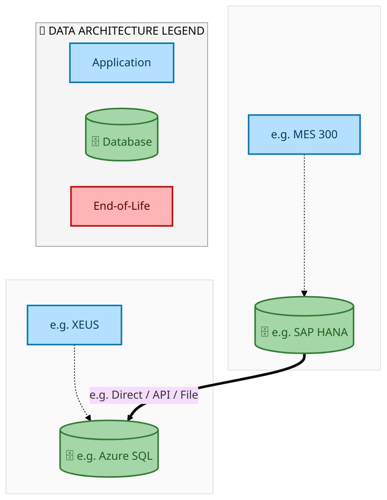
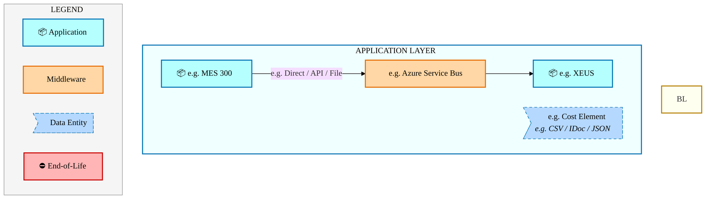
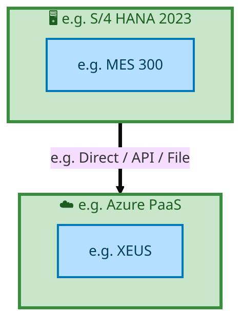

<div style="text-align:center; padding-top:20px;">
  
  <h1 style="font-size:36px; margin-top:24px;">IF_Simplified_PO-SO_Model — IF Simplified PO-SO Model</h1>
  <h2 style="font-size:24px;">Architecture Document (TOGAF BDAT)</h2>
  <p style="font-size:18px; color:#555;">End-to-End Integrated Processes (E2E) Tower<br/>
  Capability IF_Simplified_PO-SO_Model · Order to Cash</p>
  <p style="font-size:14px; color:#888;">IAO Program · Release 2<br/>
  Generated: March 2026<br/>
  Sajiv Francis</p>
  <p style="font-size:12px; color:#aaa;">IAO Architecture Pipeline — Intel Confidential</p>
</div>

<style>
@media print {
  @page { margin: 0.75in; }
  .mermaid { page-break-inside: avoid; overflow: visible; }
  pre, table { page-break-inside: avoid; }
  h2, h3, h4 { page-break-after: avoid; }
}
.mermaid { overflow: visible; }
.mermaid svg { max-width: 100%; height: auto !important; }
.page-footer {
  padding-top: 8px;
  border-top: 1px solid #ddd;
  display: flex;
  justify-content: space-between;
  align-items: center;
  font-size: 11px;
  color: #888;
  position: fixed;
  bottom: 0;
  left: 0;
  right: 0;
  padding: 6px 20px;
  background: #fff;
}
@media print {
  .page-footer { position: fixed; bottom: 0; left: 0.75in; right: 0.75in; }
}
.page-footer a { color: #00aeef; text-decoration: none; font-weight: 500; }
.page-footer a:hover { color: #0071c5; text-decoration: underline; }
</style>

<div class="page-footer"><span>Page 1</span><span><a href="#toc">↑ Back to TOC</a></span><span>IF_Simplified_PO-SO_Model — IF Simplified PO-SO Model</span></div>
<div style="page-break-before: always;"></div>

<a id="toc"></a>

## Table of Contents

1. [Executive Summary](#1-executive-summary)
2. [Business Context & Objectives](#2-business-context--objectives)
   - 2.1 [Classification](#21-classification)
   - 2.2 [Business Drivers](#22-business-drivers)
   - 2.3 [Success Criteria](#23-success-criteria)
   - 2.4 [Companion Documents](#24-companion-documents)
3. [Business Architecture (TOGAF "B")](#3-business-architecture-togaf-b)
   - 3.1 [Business Process Overview](#31-business-process-overview)
   - 3.2 [Business Process Diagrams](#32-business-process-diagrams)
   - 3.3 [Business Roles & Responsibilities](#33-business-roles--responsibilities)
4. [Data Architecture (TOGAF "D")](#4-data-architecture-togaf-d)
   - 4.1 [Data Entities & Ownership](#41-data-entities--ownership)
   - 4.2 [Data Flow Diagrams](#42-data-flow-diagrams)
   - 4.3 [Data Lineage](#43-data-lineage)
   - 4.4 [RICEFW Data Objects](#44-ricefw-data-objects)
   - 4.5 [Data Governance & Quality](#45-data-governance--quality)
5. [Application Architecture (TOGAF "A")](#5-application-architecture-togaf-a)
   - 5.1 [Current-State Application Landscape](#51-current-state--current-state-application-landscape)
   - 5.2 [Future-State Application Landscape](#52-future-state--future-state-application-landscape)
   - 5.3 [Change Impact Summary](#53-change-impact-summary)
   - 5.4 [Component Overview](#54-component-overview)
   - 5.5 [RICEFW Inventory](#55-ricefw-inventory)
   - 5.6 [Integration Patterns](#56-integration-patterns)
6. [Technology Architecture (TOGAF "T")](#6-technology-architecture-togaf-t)
   - 6.1 [Platform & Infrastructure](#61-platform--infrastructure)
   - 6.2 [SAP Development Object Status](#62-sap-development-object-status)
   - 6.3 [NFRs & Design Principles](#63-nfrs--design-principles)
   - 6.4 [Security & Governance](#64-security--governance)
7. [Project Context](#7-project-context)
   - 7.1 [Project Roadmap & Go-Live Plan](#71-project-roadmap--go-live-plan)
   - 7.2 [RAID Log](#72-raid-log)
   - 7.3 [Recommendations & Next Steps](#73-recommendations--next-steps)

<div class="page-footer"><span>Page 2</span><span><a href="#toc">↑ Back to TOC</a></span><span>IF_Simplified_PO-SO_Model — IF Simplified PO-SO Model</span></div>
<div style="page-break-before: always;"></div>

## 1. Executive Summary

This Architecture Document defines the **Business, Data, Application, and Technology** (BDAT) architecture for **IF_Simplified_PO-SO_Model IF Simplified PO-SO Model** within the IAO program. It includes 15 BPMN process diagram(s) in Section 3.
| Dimension | Value |
|-----------|-------|
| **Tower** | End-to-End Integrated Processes (E2E) |
| **Process Group** | Order to Cash |
| **Capability** | IF_Simplified_PO-SO_Model - IF Simplified PO-SO Model |
| **Release** | Release 2 |
| **Total Systems** | 2 |
| **System Status** | 0 Deployed, 0 Developing, 0 EOL, 2 Pending IAPM |
| **RICEFW Objects** | Pending — Smartsheet Object Tracker API integration |
**Change Summary**: 0 new flow chains, 0 removed, 0 modified, 1 unchanged between Current-State and Future-State states.

> All system nodes in architecture diagrams are **IAPM-linked** — click any node to open its IAPM page. Diagrams require `securityLevel: 'loose'` for click events.

<div class="page-footer"><span>Page 3</span><span><a href="#toc">↑ Back to TOC</a></span><span>IF_Simplified_PO-SO_Model — IF Simplified PO-SO Model</span></div>
<div style="page-break-before: always;"></div>

## 2. Business Context & Objectives

### 2.1 Classification

| Level | Value |
|-------|-------|
| **L0 Tower** | End-to-End Integrated Processes |
| **L1 Process** | Order to Cash |
| **L2 Capability** | IF_Simplified_PO-SO_Model - IF Simplified PO-SO Model |

### 2.2 Business Drivers

| # | Driver | Description | Strategic Alignment | Priority |
|---|--------|-------------|---------------------|----------|
| 1 | End-to-End Process Integration | Enable cross-tower integrated processes spanning procurement, manufacturing, and fulfillment | IDM 2.0 Process Excellence | High |
| 2 | Intel Foundry Business Enablement | Stand up foundry-specific business processes for external customer engagement | Intel Foundry Services | High |
| 3 | Process Visibility & Monitoring | Provide end-to-end process visibility across tower boundaries with integrated monitoring | Operational Excellence | Medium |
| 4 | IF_Simplified_PO-SO_Model Process Migration | Migrate IF Simplified PO-SO Model business processes and 2 integrated systems from legacy to S/4 HANA target architecture | IDM 2.0 Cross-Functional / End-to-End | High |

<div class="page-footer"><span>Page 4</span><span><a href="#toc">↑ Back to TOC</a></span><span>IF_Simplified_PO-SO_Model — IF Simplified PO-SO Model</span></div>
<div style="page-break-before: always;"></div>

### 2.3 Success Criteria

| Metric | Target | Measure | Baseline | Owner |
|--------|--------|---------|----------|-------|
| E2E Process Cycle Time | Per process SLA | End-to-end transaction completion within defined SLA per process | Varies by process | E2E Process Owner |
| Cross-Tower Integration Success | > 99% | Transactions completing across tower boundaries without manual intervention | 92% (current) | Integration Lead |
| Process Exception Rate | < 2% | Transactions requiring manual exception handling | 8% (current) | Operations Manager |
| IF_Simplified_PO-SO_Model Migration Completeness | 100% flow chains validated | All 1 flow chains verified in target state | 0% (pre-migration) | Tower Architect |

### 2.4 Companion Documents

| Document | Description |
|----------|-------------|
| **Business Architecture** | Included in this document (Section 3) — process flows from BPMN diagrams |
| **This Document** | Full BDAT Architecture — Business + Data + Application + Technology |

<div class="page-footer"><span>Page 5</span><span><a href="#toc">↑ Back to TOC</a></span><span>IF_Simplified_PO-SO_Model — IF Simplified PO-SO Model</span></div>
<div style="page-break-before: always;"></div>

## 3. Business Architecture (TOGAF "B")

### 3.1 Business Process Overview

This capability includes **15 business process(es)** modeled in BPMN 2.0, covering the end-to-end workflow for IF_Simplified_PO-SO_Model IF Simplified PO-SO Model.

| # | Step ID | Process Name | Lanes | Tasks | Gateways |
|---|---------|--------------|-------|-------|----------|
| 1 | IF_Simplified_PO-SO_Model_-_1A_Intel_Products_-_Wafer_Procurement_from_External_Foundry_and_Shipment | IF_Simplified_PO-SO_Model_-_1A_Intel_Products_-_Wafer_Procurement_from_External_Foundry_and_Shipment | Boundary
Apps
(Intel Prod)
, External Partners/Supplier
, Intel Product
 | 31 | 10 |
| 2 | IF_Simplified_PO-SO_Model_-_1B_Bailment_of_Procured_Wafer_by_Intel_Products_via_External_Foundry | IF_Simplified_PO-SO_Model_-_1B_Bailment_of_Procured_Wafer_by_Intel_Products_via_External_Foundry | External Partners/B2B
, Intel Foundry (LE500) - Ireland
, Intel Product
 | 21 | 3 |
| 3 | IF_Simplified_PO-SO_Model_-_1C_Payment_Process_in_CFIN | IF_Simplified_PO-SO_Model_-_1C_Payment_Process_in_CFIN | Boundary Apps, CFIN, MBC, SAP S/4 (IP & IF) | 15 | 10 |
| 4 | IF_Simplified_PO-SO_Model_-_1D_Intel_Foundry_Standard_Sales_Order_to_Cash_Scenario_for_PROC_&amp;_CO | IF_Simplified_PO-SO_Model_-_1D_Intel_Foundry_Standard_Sales_Order_to_Cash_Scenario_for_PROC_&amp;_CO | Boundary Apps, External Partners/ B2B
, S/4 Intel Product, SAP S/4 Intel Foundry - LE500 Ireland
, SAP S/4 Intel Foundry - LE778 (China)
, SAP S/4 Intel Foundry - LE798 | 66 | 54 |
| 5 | IF_Simplified_PO-SO_Model_-_1E_Intel_Products_–_Bailing_the_Sorted_Die_to_LE778_back_Virtually | IF_Simplified_PO-SO_Model_-_1E_Intel_Products_–_Bailing_the_Sorted_Die_to_LE778_back_Virtually | External Partners/B2B
, Intel Foundry (LE778) – China
, Intel Product
 | 15 | 2 |
| 6 | IF_Simplified_PO-SO_Model_-_1F_IP_IF_Cash_Settlement | IF_Simplified_PO-SO_Model_-_1F_IP_IF_Cash_Settlement | Boundary Apps
Intel Foundry
, External Partners/ B2B
, LE798 – SG -  Virtual
, S/4 Intel Products, SAP CFIN Intel Foundry AR
, SAP CFIN Intel Product AP
, SAP S/4 Intel Foundry - LE778 (China)
 | 15 | 6 |
| 7 | IF_Simplified_PO-SO_Model_-_1G_IP_IF_-_Inhouse_Settlement | IF_Simplified_PO-SO_Model_-_1G_IP_IF_-_Inhouse_Settlement | Boundary Apps
Intel Foundry
, External Partners/ B2B
, LE 101, S/4 Intel Products, SAP CFIN Intel Foundry AR
, SAP CFIN Intel Product AP
, SAP S/4 Intel Foundry - LE778 (China)
 | 14 | 5 |
| 8 | IF_Simplified_PO-SO_Model_-_2A_IP_requests_to_move_the_inventory_from_LE778_to_LE101_(Chandler)_late | IF_Simplified_PO-SO_Model_-_2A_IP_requests_to_move_the_inventory_from_LE778_to_LE101_(Chandler)_late | LE101 – Chandler
, LE778 – China
, Mirror LE101 Chandler
, Mirror LE778 China
 | 14 | 2 |
| 9 | IF_Simplified_PO-SO_Model_-_3A_IF_Sales_Order_Process_for_Sales_to_IP_(PROC_&amp;_COPO) | IF_Simplified_PO-SO_Model_-_3A_IF_Sales_Order_Process_for_Sales_to_IP_(PROC_&amp;_COPO) | Boundary Apps, External Partners/ B2B
, S/4 Intel Product, SAP S/4 Intel Foundry - LE500 Ireland
, SAP S/4 Intel Foundry - LE778 (China)
, SAP S/4 Intel Foundry - LE798 | 68 | 57 |
| 10 | IF_Simplified_PO-SO_Model_-_3B_Intel_Products_Bailing_Sorted_Die_to_LE778_back_virtually | IF_Simplified_PO-SO_Model_-_3B_Intel_Products_Bailing_Sorted_Die_to_LE778_back_virtually | External Partners/B2B
, Intel Foundry (LE778) – China
, Intel Product
 | 15 | 2 |
| 11 | IF_Simplified_PO-SO_Model_-_3C_Intel_Products_requests_to_move_inventory_from_LE778_to_LE101_Chandle | IF_Simplified_PO-SO_Model_-_3C_Intel_Products_requests_to_move_inventory_from_LE778_to_LE101_Chandle | LE101 – Chandler
, LE778 – China
, Mirror LE101 Chandler
, Mirror LE778 China
 | 14 | 2 |
| 12 | IF_Simplified_PO-SO_Model_-_3D_IP_IF_Cash_Settlement | IF_Simplified_PO-SO_Model_-_3D_IP_IF_Cash_Settlement | Boundary Apps
Intel Foundry
, External Partners/ B2B
, LE798 – SG -  Virtual
, S/4 Intel Products, SAP CFIN Intel Foundry AR
, SAP CFIN Intel Product AP
, SAP S/4 Intel Foundry - LE778 (China)
 | 15 | 6 |
| 13 | IF_Simplified_PO-SO_Model_-_3E_IP_IF_Inhouse_Settlement | IF_Simplified_PO-SO_Model_-_3E_IP_IF_Inhouse_Settlement | Boundary Apps
Intel Foundry
, External Partners/ B2B
, LE 101, S/4 Intel Products, SAP CFIN Intel Foundry AR
, SAP CFIN Intel Product AP
, SAP S/4 Intel Foundry - LE778 (China)
 | 14 | 5 |
| 14 | IF_Simplified_PO-SO_Model_-_4A_Month_End_Recon_Intel_Foundry_raising_Debit_Memo_for_Delta_charges | IF_Simplified_PO-SO_Model_-_4A_Month_End_Recon_Intel_Foundry_raising_Debit_Memo_for_Delta_charges | LE798 | 20 | 15 |
| 15 | IF_Simplified_PO-SO_Model_-_4B_Month_End_Recon_-_Intel_Foundry_raising_Cebit_Memo_for_Delta_charges | IF_Simplified_PO-SO_Model_-_4B_Month_End_Recon_-_Intel_Foundry_raising_Cebit_Memo_for_Delta_charges | LE798 | 19 | 15 |

### 3.2 Business Process Diagrams

<div class="page-footer"><span>Page 6</span><span><a href="#toc">↑ Back to TOC</a></span><span>IF_Simplified_PO-SO_Model — IF Simplified PO-SO Model</span></div>
<div style="page-break-before: always;"></div>

#### BUSINESS ARCHITECTURE — 3.2.1 IF_Simplified_PO-SO_Model_-_1A_Intel_Products_-_Wafer_Procurement_from_External_Foundry_and_Shipment — IF_Simplified_PO-SO_Model_-_1A_Intel_Products_-_Wafer_Procurement_from_External_Foundry_and_Shipment

**Swim Lanes**: Boundary
Apps
(Intel Prod)
 · External Partners/Supplier
 · Intel Product
 | **Tasks**: 31 | **Gateways**: 10

> **Legend**: <span style="color:#000;background:#4CAF50;padding:2px 6px;border-radius:10px;font-weight:bold;font-size:9pt">● Start</span> · <span style="color:#fff;background:#C62828;padding:2px 6px;border-radius:10px;font-weight:bold;font-size:9pt">● End</span> · <span style="background:#E3F2FD;padding:2px 6px;border:1px solid #1565C0;font-size:9pt">User Task</span> · <span style="background:#FFF3E0;padding:2px 6px;border:1px solid #E65100;font-size:9pt">Service Task</span> · <span style="background:#FFF9C4;padding:2px 6px;border:1px solid #F57F17;font-size:9pt">◇ Gateway</span> · <span style="background:#F3E5F5;padding:2px 6px;border:1px solid #7B1FA2;font-size:9pt">Sub-Process</span>

```mermaid
%%{init: {'theme': 'base', 'themeVariables': {'fontSize': '14px', 'fontFamily': 'Segoe UI, Arial, sans-serif','primaryColor': '#e8f0fe', 'primaryBorderColor': '#0071c5','lineColor': '#37474F', 'secondaryColor': '#f5f8fc'}, 'flowchart': {'useMaxWidth': false, 'htmlLabels': true, 'curve': 'basis', 'nodeSpacing': 40, 'rankSpacing': 50}} }%%
flowchart TD
    classDef startEvt fill:#4CAF50,stroke:#2E7D32,color:#000,font-weight:bold,stroke-width:2px,rx:20,ry:20
    classDef endEvt fill:#C62828,stroke:#B71C1C,color:#fff,font-weight:bold,stroke-width:2px,rx:20,ry:20
    classDef userTask fill:#E3F2FD,stroke:#1565C0,stroke-width:2px,color:#0D47A1
    classDef serviceTask fill:#FFF3E0,stroke:#E65100,stroke-width:2px,color:#BF360C
    classDef gateway fill:#FFF9C4,stroke:#F57F17,stroke-width:2px,color:#E65100
    classDef subProc fill:#F3E5F5,stroke:#7B1FA2,stroke-width:2px,color:#4A148C
    subgraph Boundary Apps (Intel Prod) 
        n1["Perform Demand Planning IBP"]
        n2["Perform Supply Planning BY"]
        n3["Planning done for Wafer"]
        n4["Alfresco (ACMS)"]
        n5["ECA"]
        n6["Receive updates ReadSoft Validation/Exception Handling based on rules setup"]
        n7["Incoming invoice/ E2Open/Web suite"]
        n8["Manual invoices through OCR"]
        n9["Updates sent to Once source tax app"]
        n33(["fa:fa-stop Wafer Planning Done"])
        n38{{"fa:fa-arrows-alt parallelGateway"}}
        n39{{"fa:fa-arrows-alt parallelGateway"}}
        n44{{"fa:fa-arrows-alt inclusiveGateway"}}
        n45{{"fa:fa-arrows-alt inclusiveGateway"}}
    end
    subgraph External Partners/Supplier 
        n24["Receive PO at Supplier End"]
        n25["Send Acknowledgement"]
        n26["Receive STO prior to 3B2 Signal"]
        n27["ASN/ Order shipment Wrt STO"]
        n28["Trigger Physical Receipt of Bailed Stock at Intel Foundry Site (Ownership..."]
        n29["Goods Receipt Confirmation"]
        n30["Generate Invoicing"]
        n31["Advance Invoice (If Applicable)"]
        n32(["fa:fa-play Advance Invoice Process initiated"])
        n42{{"fa:fa-arrows-alt parallelGateway"}}
        n43{{"fa:fa-arrows-alt parallelGateway"}}
        n46{{"fa:fa-arrows-alt inclusiveGateway"}}
    end
    subgraph Intel Product 
        n10["Create Purchase Order (PO1) Physical IP Plant"]
        n11["Calculate Taxes"]
        n12["Trigger GTS Check"]
        n13["Publish Purchase Order"]
        n14["Acknowledge/Confirm Purchase Order"]
        n15["Create Purchase Requisition"]
        n16["Create STR (wrt PO1)"]
        n17["Create STO Ship To: IF"]
        n18["Inbound Delivery (Wrt PO1)"]
        n19["Virtual Goods Receipt (Unrestricted Stock) on PO Plant"]
        n20["Perform GTS Check"]
        n21["Generate GR against STO"]
        n22["Initiate Evaluated Receipt Settlement (ERS) Self-Billing"]
        n23["Initiate Supplier Invoice Posting"]
        n34(["fa:fa-stop Order Acknowledgement Received"])
        n35(["fa:fa-stop STO Process Completed"])
        n36["Slide 58 CFIN steps"]
        n37{{"fa:fa-code-branch Invoice Accepted?"}}
        n40{{"fa:fa-arrows-alt parallelGateway"}}
        n41{{"fa:fa-arrows-alt parallelGateway"}}
    end
    n10 --> n40
    n40 --> n11
    n40 --> n12
    n11 --> n41
    n12 --> n41
    n41 --> n13
    n24 --> n25
    n1 --> n2
    n2 --> n38
    n38 --> n3
    n38 --> n44
    n4 --> n44
    n44 --> n5
    n3 --> n33
    n5 --> n15
    n15 --> n10
    n14 --> n34
    n13 -->|"EDI 850/Email
RNET 3A4/3A19"| n24
    n38 --> n16
    n16 --> n17
    n25 -->|"EDI  855/Order Confirmation
RNET: 3A4"| n14
    n26 --> n27
    n27 --> n42
    n18 --> n20
    n20 --> n19
    n42 --> n28
    n21 --> n35
    n28 -->|"4B2 (GR)"| n21
    n19 -->|"EDI 861/ Email
RNET 4B2"| n29
    n29 --> n43
    n43 --> n46
    n43 --> n22
    n6 --> n39
    n46 --> n30
    n7 --> n8
    n45 --> n6
    n8 --> n45
    n37 -->|"Yes"| n23
    n37 -->|"No"| n46
    n23 --> n36
    n22 --> n45
    n32 --> n31
    n31 --> n46
    n30 -->|"EDI 857/ Email
RNET: 3C3"| n7
    n39 --> n37
    n39 --> n9
    n9 --> n45
    n17 -->|"Receiving Plant: 
Virtual IF Plant – LE500 Ireland 
PIP 3A13"| n26
    n42 -->|"ASN 
EDI 856 
PIP 3B2"| n18
    class n32 startEvt
    class n33 endEvt
    class n34 endEvt
    class n35 endEvt
    class n36 startEvt
    class n37 gateway
    class n38 gateway
    class n39 gateway
    class n40 gateway
    class n41 gateway
    class n42 gateway
    class n43 gateway
    class n44 gateway
    class n45 gateway
    class n46 gateway
```

<div style="text-align:center; margin:4px 0 8px 0; font-size:11px;"><a href="https://mermaid.live/view#pako:eNqlWFtv4kgW_islWq0QCRpfuT3sCgxkkaYbhOmORss-FHYZSilsT9nOZdP573PKrjK4Qkaanjx0x5_P_XznVDmvrSAJSWvc-vz5lcY0H6PXm_xITuRmjG72OCM3HVQBPzCneM9IdiNkoiTOffr_Usx00mchJrAFPlH2IlCfHBKCvi87aAKKrIMyHGfdjHAa3XRuUk5PmL94CUu4kP5EhpERld7kq2nCQ8LPAoYxMAMXVBmNyRm2B87AWQi9jARJHDaMRm40jIKbNxEcS56CI-Z5GX6Rka_4-Z6G-RGeI8wyAjLH_MR-w3vCRI45LwQWFPxRFYNmwk8MBfNTHND4ALhjAMRx_HCGXOPtDb19_ryLa6doO9vFCH4ChrNsRiKU5QDPH3MUUcbGnxxvsnCNTpbz5IGMP1nzwcy2OoHIZAypGx1R3O4ToYdjPt4nLJSi3SeRw9hKnzv8eWwZHf4C_2q-SByePXl9a2gNa0_TgemZnvIURdE_8gR15VucPUhfc3thLWa1L9Ptu57x3p5Kc-YMJqZeJ8IfaUAujC4WC3t-LtW875rGx0anC7tveJrRA87JE345Gxx5Tm1w4Q4W5uBDg5U_Pcpiv-ZJoAzac3fh1gYHU3MxsT406ExMZygjBDsHjtMjmiZFyWU0SdMMtZdxThgCF-EtqiTFT2z-d9daEx4l_LQrDAMbM3LCcYjWDMcxkBEtp-td638XGtZZA_lFmrKXs_D096asLWTVyzCJCQI1dI8jwpuCDghOWMRJFiSoPfG--rdNARcE5t6kCfYB3JCA0EeCijSElmRoQ3DoJ1GOfmBGAaJJ3Js_ByQVv6H_QG5MBCMWU4gA4QUsJOBIXqRN4wMwvoyD5CTEafyYAId6aG6tUhL37skeKk1z0tQZgs5XHBeYKY0M5UeeFIcjWnmbpvAIhL_LqDMS5yhP0CoOCMqSgsN_OX5GONWisu02qEV4HOFulidpVcxzB2ZQZNC4vVQZvr4qFcx58pR1MctRijlmjLC7ism71tvbpdLoF5Qc56oSjQNWZNCkD7Tcv6kFy0jj-vw5JzyGqq9hJcaEZ72SmRQqc8lc54Iv6xXCOarF5mCzSXPBOB9coUnwECdPjIQHOMPiXBO75KC_XSE4e4Di0Ep7aiGfHiAqTUMQa-J_66GVOJ5QdqSpsIvuYcmDBU1aUGrL6eEgunx8yWgAaZYO0xwlEZpiCqEhP0-CB5FRNecLMfww-z5QFLVXT6Im4OfLly-aeUHCuyQJs9qml8QR5adycjTuGUKYgC3oCDgSBAfOaUJio0zCRyyYXMlABMtIrCEGwcP5r422bZ0pnTLYqbq22Isky5C4XVBwHWoEd6xf4ar9K0r9f0zV8x4ugryxiUV1PU5EbdewAI6woSRF2uuVeXvu_nJdzrvGRFMU3sMsKJgwscXPJNMkrAsu3W195B1J8KDJlCu72DOaHbUwNMFyZZ9Hoyd589dK7pUcN-SPgmb0Pd_M_lna325Q-wkmRJRCExtciq2QD0RH22SMlgtNcFiu9L2YDTQjDBoGI9K-v25VTMYPynOxzJsT0v4ew0GVcxrkavJuxVECK-VKXyzj4sD8oOqWeTlZdxuED5jG2bV9YJU5VIOA5o-YFWIi6th8kues3FOoPd_4twCwqDuFS8W7SbXsS1P1JqynLsny99PtaMdPRVBtRSK5EPVBtV1NW7RLTbeXnFJG3k-3LVjgw1lOkDtE3mL5DW6-JNW4bQ_Okym-R7p7uFEHxzqbSSCuACT8tz7Rxq-sAfPvKdVbAIYcdbv_Em4l4EjANHXAUiqmVFESpqUBjpQwbQlYTgVYrlKRz-p99WgP5bM9lID27DjKg_4sAWXflvrKgCsDqv0rQKVtSgO2smiWJn7CJW-2REPX6M1PcLDt4s23-RbZE6dnT8zRrvVTJKdFafaVjb4EBipP98IoWHV7FV0bR1zpYix8lOZNZd6S1qza2kBWoe6MDEB9w8AvMoCRqpOstKUqbclO2Koy1lCG6MB1oX23ua1yrHs9uixL34QL6EVdQKcSV_6skQxRNcKRnXH6GmCpJGSWdh2yAlRSMmuVgSNbqQwqqtRUGMiIfxfHjwjO1t98S8oXdUyWok8NWLpRxVhVF9vU8rKNBn8GjUJBdz279Kl6actC2TqgyjDSIjBV8NVqE1ftcteP4QhXp8RyUWFoV1gGEPq3uWsYaMkJE19Uu3gNBzfQuIrE6jc48rO8E4JQFX9ficsOm8OLz8WyHurrv4nb8ku9iTpXUfcq2v_A8kB98jbh4XV4dBWG3XYVNq_D1nXYvg4712H3OtxXcKvTOhHYBTRsjV9b5d-pWuNWSCJcsLz11mnhIk_8lzhojcu_57SqD80ZxXCfO1Xg259ZE7s1" title="View in Mermaid Live">&#128065; View in Mermaid Live</a></div>

<div class="page-footer"><span>Page 7</span><span><a href="#toc">↑ Back to TOC</a></span><span>IF_Simplified_PO-SO_Model — IF Simplified PO-SO Model</span></div>
<div style="page-break-before: always;"></div>

#### BUSINESS ARCHITECTURE — 3.2.2 IF_Simplified_PO-SO_Model_-_1B_Bailment_of_Procured_Wafer_by_Intel_Products_via_External_Foundry — IF_Simplified_PO-SO_Model_-_1B_Bailment_of_Procured_Wafer_by_Intel_Products_via_External_Foundry

**Swim Lanes**: External Partners/B2B
 · Intel Foundry (LE500) - Ireland
 · Intel Product
 | **Tasks**: 21 | **Gateways**: 3

> **Legend**: <span style="color:#000;background:#4CAF50;padding:2px 6px;border-radius:10px;font-weight:bold;font-size:9pt">● Start</span> · <span style="color:#fff;background:#C62828;padding:2px 6px;border-radius:10px;font-weight:bold;font-size:9pt">● End</span> · <span style="background:#E3F2FD;padding:2px 6px;border:1px solid #1565C0;font-size:9pt">User Task</span> · <span style="background:#FFF3E0;padding:2px 6px;border:1px solid #E65100;font-size:9pt">Service Task</span> · <span style="background:#FFF9C4;padding:2px 6px;border:1px solid #F57F17;font-size:9pt">◇ Gateway</span> · <span style="background:#F3E5F5;padding:2px 6px;border:1px solid #7B1FA2;font-size:9pt">Sub-Process</span>

```mermaid
%%{init: {'theme': 'base', 'themeVariables': {'fontSize': '14px', 'fontFamily': 'Segoe UI, Arial, sans-serif','primaryColor': '#e8f0fe', 'primaryBorderColor': '#0071c5','lineColor': '#37474F', 'secondaryColor': '#f5f8fc'}, 'flowchart': {'useMaxWidth': false, 'htmlLabels': true, 'curve': 'basis', 'nodeSpacing': 40, 'rankSpacing': 50}} }%%
flowchart LR
    classDef startEvt fill:#4CAF50,stroke:#2E7D32,color:#000,font-weight:bold,stroke-width:2px,rx:20,ry:20
    classDef endEvt fill:#C62828,stroke:#B71C1C,color:#fff,font-weight:bold,stroke-width:2px,rx:20,ry:20
    classDef userTask fill:#E3F2FD,stroke:#1565C0,stroke-width:2px,color:#0D47A1
    classDef serviceTask fill:#FFF3E0,stroke:#E65100,stroke-width:2px,color:#BF360C
    classDef gateway fill:#FFF9C4,stroke:#F57F17,stroke-width:2px,color:#E65100
    classDef subProc fill:#F3E5F5,stroke:#7B1FA2,stroke-width:2px,color:#4A148C
    subgraph External Partners/B2B 
        n10["PO received at Supplier End and committed"]
        n11["ASN/ Order shipment Wrt STO"]
        n12["Bailed Material Pricing Info (clubbed with 3B2)"]
        n13["Receive STO prior to 3B2 Signal"]
    end
    subgraph Intel Foundry (LE500) - Ireland 
        n14["Capture Pricing Details For Bailed Material (Statistical)"]
        n15["Inbound Delivery"]
        n16["Inventory Update (In-Transit)"]
        n17["Goods Receipt (Physical) (Non-Valuated)"]
        n18["Perform GTS Check"]
        n19["Inbound Delivery (EWM)"]
        n20["GR and Put away (EWM)"]
        n21["fa:fa-user Purchase Order (Preceding Doc)"]
        n24(["fa:fa-stop Statistical Price Captured"])
        n25(["fa:fa-stop endEvent"])
        n29{{"fa:fa-arrows-alt parallelGateway"}}
    end
    subgraph Intel Product 
        n1["Create Purchase Order"]
        n2["Create STR (wrt PO1)"]
        n3["Create STO Ship To: IF"]
        n4["Inbound Delivery (Wrt PO1)"]
        n5["Virtual Goods Receipt (Unrestricted Stock) on PO Plant"]
        n6["Outbound Delivery from IP Plant against STO (Partial/Full)"]
        n7["Post Goods Issue against STO from IP plant"]
        n8["Inbound Delivery to Virtual IF Plant against STO"]
        n9["Goods Receipt against STO (in Virtual IF plant)"]
        n22(["fa:fa-play Initiate external foundry procurement process"])
        n23(["fa:fa-stop Bailment Completed"])
        n26["Supplier Invoice Process"]
        n27{{"fa:fa-arrows-alt parallelGateway"}}
        n28{{"fa:fa-arrows-alt parallelGateway"}}
    end
    n1 --> n10
    n10 --> n2
    n2 --> n3
    n13 --> n11
    n4 --> n5
    n5 --> n27
    n27 --> n6
    n6 --> n7
    n7 --> n8
    n8 --> n28
    n12 --> n14
    n14 --> n24
    n21 --> n18
    n15 --> n29
    n16 --> n17
    n18 --> n15
    n29 --> n16
    n29 --> n19
    n19 --> n20
    n20 --> n25
    n28 --> n21
    n3 -->|"Receiving Plant: 
Virtual IF Plant – 
LE500 Ireland"| n13
    n11 -->|"ASN 
EDI 856
RNET 3B2 (ASN)"| n4
    n9 --> n23
    n17 -->|"4B2 (GR)"| n9
    n22 --> n1
    n27 -->|"Supplier Invoice
Process"| n26
    n28 -->|"PIP 3B2
IP – MPN Part Number, 
IF Plant, Supplier Details, 
IP STO as reference"| n12
    class n21 userTask
    class n22 startEvt
    class n23 endEvt
    class n24 endEvt
    class n25 endEvt
    class n26 startEvt
    class n27 gateway
    class n28 gateway
    class n29 gateway
```

<div style="text-align:center; margin:4px 0 8px 0; font-size:11px;"><a href="https://mermaid.live/view#pako:eNqlV21P4zgQ_itWVqhFarVJmjSlH06ipUGVFogou3y43gc3cahFake2A3Sh__3GSZy2oZx0d0hAPZ555sXPjN13K-YJscbW2dk7ZVSN0XtHrcmGdMaos8KSdHqoEvzCguJVRmRH66ScqQX9Xao5Xv6m1bQsxBuabbV0QZ44QT_nPXQJhlkPScxkXxJB006vkwu6wWI75RkXWvsbGaV2WnqrtyZcJETsFWw7cGIfTDPKyF48CLzAC7WdJDFnyRFo6qejNO7sdHAZf43XWKgy_EKSG_z2SBO1hnWKM0lAZ6022Q-8IpnOUYlCy-JCvJhiUKn9MCjYIscxZU8g92wQCcye9yLf3u3Q7uxsyRqn6Mf9kiH4iTMs5RVJkVQgnr0olNIsG3_zppehb_ekEvyZjL-5s-Bq4PZinckYUrd7urj9V0Kf1mq84llSq_ZfdQ5jN3_ribexa_fEFv62fBGW7D1Nh-7IHTWeJoEzdabGU5qm_8sT1FU8YPlc-5oNQje8anw5_tCf2p_xTJpXXnDptOtExAuNyQFoGIaD2b5Us6Hv2F-DTsLB0J62QJ-wIq94uwe8mHoNYOgHoRN8CVj5a0dZrCLBYwM4mPmh3wAGEye8dL8E9C4db1RHCDhPAudrNHtTRDCcoQhowoiQ3yfuBFVK-oc59p9LK7pDgsSEvpAEYYUWRZ5nlAg0Y7CG35hvNlQpkiytvw5tHbC9XNx-R3e6x5Bc03xDmEKPwNTFw11L2wXtCaYZOLmBwuluRpGgmu1ozlKOunFWrFaw_UrVGg0m7nkLYQAI91WgGh9Bi3OBFNe6aEGfINHGAsjaqsWcKZKhkBcsEVvU_THzbfsc9dFckExneejJA09TnKtCkCbGK6IgegkIArXz6C4UVlQqGuOsHbUPWHO20n4BI4PgxbalMixVXqB2HEL7mSeAi7pz1n-AkSCpakMGoH_NeSJRWY5coW603srSO-rectb_hbMCQJK25UgfNxEpFxt0_bBA0zWJn1s6FycCRt3Z400LzNXcub4vKRIVCmHdC6f0NE9SPE5xXzc26AqYZpLUtOlGmnxJWWIet229bmMsFc_RQaHLkyGoPidNzvNDS79lWY4vKHFb7-L93ehhIfir7ONMoRwLnGUku656fGntdv9MLGjcpIjVEY00iwTRh3mccyvHvdri4R51X6F9ojunVYnBodYdWkCzoQc-RvPwWM87eXqPJzE1NX9RoQooZotPP5kgMGpoDCSCovP4-RxxBhgogm5Rxziav3eFajlNBd-geVQZIPyEKZPlYIAjh3EEffM9LLJ2v2huRxwUq4DmUhbkyNjA5p_jGJ3KHeaDyXEefg7mGOHiU2cdxU3ZIVYZQZuw7p52sL8FdlBIFU6NmFmc1iMoh1EPxC1Hpv5MpGxzc9DisJ47pf6Ub_KMqM-s10fRDHCYKVy3SNSgH6oG_474ldHoP3YLc1C__4e-cMzargRuvXar5cBsD2r9-iZnXrX266VfWwfGPKgEw3o9rJZmu94d1ctRbW3WTu3d8YygducagWvib0xMBBdGULt0jE-n9uKYmN2LWjBsCxqMWmBeRPChFjQYJnRTl7JOH-Zi1FO0pPgYBtEn2i8L14bCLll5-Zmbb2l96HqbEJwaEG520JxdzdHIh4Dvb2cP5UXbhY3z0sbUxgTdQAQ1hKfVr-8rbZOja2p9dHIfn2m7ZA1vPzSzjyoA-hEMAQhoyeB_ndlNdFs-ddBtsVkR0YMETPK9_bumvsnL3ahsbCzhBZQSQRi4LcvhHjzNytM3b9Jjudu8wI_lg_q1fCz1Tkr9k9LhF8iBeXYei0enxRdGbPWsDREbTBNr_G6VX8Xg61pCUlxkytr1LFwovtiy2BqXX1msonyFXFEMl9ymEu7-BjZMPqU=" title="View in Mermaid Live">&#128065; View in Mermaid Live</a></div>

<div class="page-footer"><span>Page 8</span><span><a href="#toc">↑ Back to TOC</a></span><span>IF_Simplified_PO-SO_Model — IF Simplified PO-SO Model</span></div>
<div style="page-break-before: always;"></div>

#### BUSINESS ARCHITECTURE — 3.2.3 IF_Simplified_PO-SO_Model_-_1C_Payment_Process_in_CFIN — IF_Simplified_PO-SO_Model_-_1C_Payment_Process_in_CFIN

**Swim Lanes**: Boundary Apps · CFIN · MBC · SAP S/4 (IP & IF) | **Tasks**: 15 | **Gateways**: 10

> **Legend**: <span style="color:#000;background:#4CAF50;padding:2px 6px;border-radius:10px;font-weight:bold;font-size:9pt">● Start</span> · <span style="color:#fff;background:#C62828;padding:2px 6px;border-radius:10px;font-weight:bold;font-size:9pt">● End</span> · <span style="background:#E3F2FD;padding:2px 6px;border:1px solid #1565C0;font-size:9pt">User Task</span> · <span style="background:#FFF3E0;padding:2px 6px;border:1px solid #E65100;font-size:9pt">Service Task</span> · <span style="background:#FFF9C4;padding:2px 6px;border:1px solid #F57F17;font-size:9pt">◇ Gateway</span> · <span style="background:#F3E5F5;padding:2px 6px;border:1px solid #7B1FA2;font-size:9pt">Sub-Process</span>

```mermaid
%%{init: {'theme': 'base', 'themeVariables': {'fontSize': '14px', 'fontFamily': 'Segoe UI, Arial, sans-serif','primaryColor': '#e8f0fe', 'primaryBorderColor': '#0071c5','lineColor': '#37474F', 'secondaryColor': '#f5f8fc'}, 'flowchart': {'useMaxWidth': false, 'htmlLabels': true, 'curve': 'basis', 'nodeSpacing': 40, 'rankSpacing': 50}} }%%
flowchart LR
    classDef startEvt fill:#4CAF50,stroke:#2E7D32,color:#000,font-weight:bold,stroke-width:2px,rx:20,ry:20
    classDef endEvt fill:#C62828,stroke:#B71C1C,color:#fff,font-weight:bold,stroke-width:2px,rx:20,ry:20
    classDef userTask fill:#E3F2FD,stroke:#1565C0,stroke-width:2px,color:#0D47A1
    classDef serviceTask fill:#FFF3E0,stroke:#E65100,stroke-width:2px,color:#BF360C
    classDef gateway fill:#FFF9C4,stroke:#F57F17,stroke-width:2px,color:#E65100
    classDef subProc fill:#F3E5F5,stroke:#7B1FA2,stroke-width:2px,color:#4A148C
    subgraph Boundary Apps
        n1["Receive File in Bank"]
        n2["Update Payment Remittance"]
        n16(["fa:fa-stop Payment Data Updated"])
    end
    subgraph CFIN
        n3["Execute Payment Run"]
        n4["Create APM Memo Record"]
        n5["Process BCM Payment Batching Based on Business Rules"]
        n6["Generate APM Payment File"]
        n7["Route to Approver"]
        n8["Correct APM Correction File"]
        n9["Reverse APP Doc Number and Memo Record Deletion"]
        n10["Fetch Payments Factory (APM, BCM, MBC Monitor)"]
        n11["Review Failed Payment Log"]
        n12["Generate Payment Proposal"]
        n13["Replicate Supplier Invoice Posting"]
        n18(["fa:fa-stop Memo Record Created"])
        n19(["fa:fa-stop APP Doc Reversed"])
        n21{{"fa:fa-code-branch Manual Approval Necessary?"}}
        n22{{"fa:fa-code-branch Approved?"}}
        n23{{"fa:fa-code-branch exclusiveGateway"}}
        n24{{"fa:fa-code-branch Can Be Corrected?"}}
        n25{{"fa:fa-code-branch exclusiveGateway"}}
        n26{{"fa:fa-code-branch exclusiveGateway"}}
        n27{{"fa:fa-code-branch Reversal or Reprocessing?"}}
        n28{{"fa:fa-arrows-alt parallelGateway"}}
        n29{{"fa:fa-arrows-alt parallelGateway"}}
        n30{{"fa:fa-arrows-alt inclusiveGateway"}}
    end
    subgraph MBC
        n14["Multi-Bank Connectivity (host-to-host)"]
        n15["Multi-Bank Connectivity (host-to-host)"]
    end
    subgraph SAP S/4 (IP & IF)
        n17(["fa:fa-stop Payment Details provided back to Source System (IP/IF)"])
        n20["Slide 55,57"]
    end
    n12 --> n3
    n3 --> n28
    n4 --> n18
    n5 --> n21
    n21 -->|"No"| n23
    n7 --> n22
    n23 --> n6
    n25 --> n5
    n24 -->|"No"| n26
    n9 --> n19
    n10 --> n29
    n26 --> n9
    n29 --> n11
    n28 --> n4
    n11 --> n27
    n27 -->|"Reversal"| n26
    n2 --> n16
    n6 --> n14
    n29 --> n2
    n8 --> n25
    n13 --> n12
    n29 --> n17
    n20 --> n13
    n21 -->|"Yes"| n7
    n1 -->|"PAIN.002 (Pay-load file)"| n15
    n14 -->|"PAIN.001 (Pay-load file)"| n1
    n28 -->|"Reprocessing"| n25
    n30 --> n8
    n22 -->|"Yes"| n23
    n22 -->|"No"| n24
    n15 --> n10
    n27 -->|"Reprocessing"| n30
    n24 -->|"Yes"| n30
    class n16 endEvt
    class n17 endEvt
    class n18 endEvt
    class n19 endEvt
    class n20 startEvt
    class n21 gateway
    class n22 gateway
    class n23 gateway
    class n24 gateway
    class n25 gateway
    class n26 gateway
    class n27 gateway
    class n28 gateway
    class n29 gateway
    class n30 gateway
```

<div style="text-align:center; margin:4px 0 8px 0; font-size:11px;"><a href="https://mermaid.live/view#pako:eNqlV9tu4zYQ_RVCi9RZQO7qatl-aOFLtAgQB0bcbVHUfaAlKhYiiwJJOXGz_vcOLVK2ZOWhWz8k4tGZMxfOUNK7EdGYGGPj5uY9zVMxRu89sSU70huj3gZz0jNRBfyOWYo3GeE9yUloLlbpPyea7RVvkiaxEO_S7CDRFXmmBH27N9EEDDMTcZzzPicsTXpmr2DpDrPDjGaUSfYnMkys5ORN3ZpSFhN2JlhWYEc-mGZpTs6wG3iBF0o7TiKaxw3RxE-GSdQ7yuAy-hptMROn8EtOFvjtjzQWW1gnOOMEOFuxyx7whmQyR8FKiUUl2-tipFz6yaFgqwJHaf4MuGcBxHD-coZ863hEx5ubdV47RQ9P6xzBL8ow53OSIC4AvtsLlKRZNv7kzSahb5lcMPpCxp-cu2DuOmYkMxlD6pYpi9t_JenzVow3NIsVtf8qcxg7xZvJ3saOZbID_G35Inl89jQbOENnWHuaBvbMnmlPSZL8L09QV_Yb5i_K150bOuG89mX7A39mXevpNOdeMLHbdSJsn0bkQjQMQ_fuXKq7gW9bH4tOQ3dgzVqiz1iQV3w4C45mXi0Y-kFoBx8KVv7aUZabJaORFnTv_NCvBYOpHU6cDwW9ie0NVYSg88xwsUVTWp56GU2Kglf35C-3_1obTyQi6Z6gMM0ISnM0he5bG39fsBxgfStiyBIt8WFHcoGeyC4VAucRaVLtwS2QEzxOcJ8LWtQGcywwqkRiMPlc2UArtSKdhfePF3ouqN29kai89F3mTacekGaMyPgmywVakB2FACOY-CbPB56sK-EcTWeLWnCKRbSFYYMLTmJEoQYlh2MBaE8lHFFNlQGofCU5YdqflpEFbFIDWV4qYxdUlp7RPWFNylDGThkjkTiJqesUgrjWG522CzS49LxEc-iRx3K3IQzhPL5MHM1JRqRKa3ssUAgJpKuj5ijEkaDQGrfg3pR1MdFiOkMLCuc3ZZ9bAlXH7FPyCoYQYFyn_0CfW1znslKaBhtQUI6zFtc96RZZGknyqizgEtK6z_cU5hUtKRewQy2jYavZLgtQNcRFr1Umo5aJLqMqa5vv2O_vmi8fbf0NHM5QvQXOS5ypPYWLRyK7Cibs17VxPF4KON0CqhviK77bzSdvUQZNuSdfq8OmbeZ1m80wNDPRXdXhzv8xd4MfMwu6zariQxkpg-uiGlHY7qtoh2d7zBh95X2cCVRghrOMZB84Hf2AkWt1GqX5R_ldn2QwRJeNJw-pRZmJtC8PWNiRPJdzvk8FjN4W2rsvaF_-b0-c_98Nr4NZTZZo9cVDt_dL9BO6DxszEXx0ZhMBI86R7NQ0hlHf4OhFHmUrWjIYytWBC7KTml-kYmty5FGzysAO-b7pB9fBwQGB-v1foNhq7VZLZ6jWXrW29dpX99VDHS4k8H1tPNK18V3OjroRKKKjiUp5oNdKyddrryWkiSMVwUhHbCllDTiDCqjX2qKOcVgBnlawlUKgCYHyrYegGYEqka3Xyp_ttRzqVJU7R6dmq9Rtpx1hHYDKyXbbZf1TPvogGM3U-HJy__izZTnoFjqln1EcyzcV8vlEtmvPXpNud9MbdTqV4Tz_VSm0oKsC1e3gOK046_2v7-j9rKuvNt62rqvfcuta7ebQbtzL1zW5NeqNuIkGneiwEx11obAv-q2-idv6hbMJO92w2w173bDfDQ-64aAbHnbDo04YdlXBhmnsCNvhNDbG78bpKxG-JGOSYDj9jKNp4FLQ1SGPjPHpa8ooT6-T8xTDGberwOO_a0tvag==" title="View in Mermaid Live">&#128065; View in Mermaid Live</a></div>

<div class="page-footer"><span>Page 9</span><span><a href="#toc">↑ Back to TOC</a></span><span>IF_Simplified_PO-SO_Model — IF Simplified PO-SO Model</span></div>
<div style="page-break-before: always;"></div>

#### BUSINESS ARCHITECTURE — 3.2.4 IF_Simplified_PO-SO_Model_-_1D_Intel_Foundry_Standard_Sales_Order_to_Cash_Scenario_for_PROC_&amp;_CO — IF_Simplified_PO-SO_Model_-_1D_Intel_Foundry_Standard_Sales_Order_to_Cash_Scenario_for_PROC_&amp;_CO

**Swim Lanes**: Boundary Apps · External Partners/ B2B
 · S/4 Intel Product · SAP S/4 Intel Foundry - LE500 Ireland
 · SAP S/4 Intel Foundry - LE778 (China)
 · SAP S/4 Intel Foundry - LE798 | **Tasks**: 66 | **Gateways**: 54

> **Legend**: <span style="color:#000;background:#4CAF50;padding:2px 6px;border-radius:10px;font-weight:bold;font-size:9pt">● Start</span> · <span style="color:#fff;background:#C62828;padding:2px 6px;border-radius:10px;font-weight:bold;font-size:9pt">● End</span> · <span style="background:#E3F2FD;padding:2px 6px;border:1px solid #1565C0;font-size:9pt">User Task</span> · <span style="background:#FFF3E0;padding:2px 6px;border:1px solid #E65100;font-size:9pt">Service Task</span> · <span style="background:#FFF9C4;padding:2px 6px;border:1px solid #F57F17;font-size:9pt">◇ Gateway</span> · <span style="background:#F3E5F5;padding:2px 6px;border:1px solid #7B1FA2;font-size:9pt">Sub-Process</span>

```mermaid
%%{init: {'theme': 'base', 'themeVariables': {'fontSize': '14px', 'fontFamily': 'Segoe UI, Arial, sans-serif','primaryColor': '#e8f0fe', 'primaryBorderColor': '#0071c5','lineColor': '#37474F', 'secondaryColor': '#f5f8fc'}, 'flowchart': {'useMaxWidth': false, 'htmlLabels': true, 'curve': 'basis', 'nodeSpacing': 40, 'rankSpacing': 50}} }%%
flowchart TD
    classDef startEvt fill:#4CAF50,stroke:#2E7D32,color:#000,font-weight:bold,stroke-width:2px,rx:20,ry:20
    classDef endEvt fill:#C62828,stroke:#B71C1C,color:#fff,font-weight:bold,stroke-width:2px,rx:20,ry:20
    classDef userTask fill:#E3F2FD,stroke:#1565C0,stroke-width:2px,color:#0D47A1
    classDef serviceTask fill:#FFF3E0,stroke:#E65100,stroke-width:2px,color:#BF360C
    classDef gateway fill:#FFF9C4,stroke:#F57F17,stroke-width:2px,color:#E65100
    classDef subProc fill:#F3E5F5,stroke:#7B1FA2,stroke-width:2px,color:#4A148C
    subgraph Boundary Apps
        n18["Perform Allocation Availability Check"]
        n19["Perform Order Confirmation"]
        n20["Perform Order Confirmation"]
        n21["Perform Scheduling in Third Party App (FSCO)"]
        n22["Receive Details in CIBR"]
        n23["Receive Details in CIBR"]
        n72(["fa:fa-stop Details Received"])
        n73(["fa:fa-stop Details Received"])
        n91{{"fa:fa-code-branch exclusiveGateway"}}
        n118{{"fa:fa-arrows-alt parallelGateway"}}
    end
    subgraph External Partners/ B2B 
        n24["Capture Order via EDI/R Net"]
        n25["Receive Data in B4NL"]
        n26["Receive Data in B4NL"]
        n27["Notify Carrier"]
        n74(["fa:fa-stop Data Received"])
        n92{{"fa:fa-code-branch exclusiveGateway"}}
    end
    subgraph S/4 Intel Product
        n63["Create Production Order (PRDOR1)"]
        n64["Text PO for PROC (Build Instruction for PROC + COPO )"]
        n68(["fa:fa-play Sorted Die order Process Initiated"])
        n135{{"fa:fa-arrows-alt inclusiveGateway"}}
    end
    subgraph SAP S/4 Intel Foundry - LE500 Ireland 
        n47["Create IC STR (Sorted Wafer)"]
        n48["Create IC STO (Sorted Wafer)"]
        n49["Receive Planned Order (SGF-01)"]
        n50["Execute Production Order Steps"]
        n51["Capture GR Against Production Order"]
        n52["Capture Unrestricted Stock"]
        n53["Check If the Delivery Quantity is Partial or Full"]
        n54["Ship (Goods Issue)"]
        n55["Export Invoice, Commercial Invoice, GTS"]
        n56["Generate Commercial Invoice (proforma)"]
        n57["Complete Outbound Delivery in Lots"]
        n58["Complete Outbound Delivery in Full Quantity"]
        n59["Perform ATP Check (Unrestricted Stock)"]
        n60["Perform GTS Trade Compliance"]
        n61["Create IC Invoice (Bill To: LE778)"]
        n62["Perform AR Posting and Auto Clearing"]
        n103{{"fa:fa-code-branch exclusiveGateway"}}
        n104{{"fa:fa-code-branch Outbound Delivery to be Performed in Partial Quantity?"}}
        n105{{"fa:fa-code-branch exclusiveGateway"}}
        n106{{"fa:fa-code-branch Is Cross-Border Applicable?"}}
        n107{{"fa:fa-code-branch exclusiveGateway"}}
        n108{{"fa:fa-code-branch Plant is EWM Managed or IM Managed?"}}
        n109{{"fa:fa-code-branch exclusiveGateway"}}
        n110{{"fa:fa-code-branch Shipping Successful?"}}
        n111{{"fa:fa-code-branch exclusiveGateway"}}
        n127{{"fa:fa-arrows-alt parallelGateway"}}
        n128{{"fa:fa-arrows-alt parallelGateway"}}
        n129{{"fa:fa-arrows-alt parallelGateway"}}
        n130{{"fa:fa-arrows-alt parallelGateway"}}
        n131{{"fa:fa-arrows-alt parallelGateway"}}
        n132{{"fa:fa-arrows-alt parallelGateway"}}
        n133{{"fa:fa-arrows-alt parallelGateway"}}
        n134{{"fa:fa-arrows-alt parallelGateway"}}
        n138[["fa:fa-folder-open E2E-18C: SAP TM - Embedded - IM"]]
        n139[["fa:fa-folder-open E2E-18B: SAP TM - Embedded - EWM"]]
    end
    subgraph SAP S/4 Intel Foundry - LE778 (China) 
        n28["Create IC STR (Sorted Wafer)"]
        n29["Create IC STO (Sorted Wafer)"]
        n30["Create Inbound Delivery (Sorted Wafer) wrt STO"]
        n31["Create Goods Receipt (Sorted Wafer)"]
        n32["Perform AP Posting and Auto Clearing"]
        n33["Receive Planned Order PROC+COPO"]
        n34["Execute Production Order Steps"]
        n35["Capture GR Against Production Order"]
        n36["Capture Unrestricted Stock"]
        n37["Complete Outbound Delivery in Lots"]
        n38["Complete Outbound Delivery in Full Quantity"]
        n39["Perform ATP Check (Unrestricted Stock)"]
        n40["Perform GTS Trade Compliance"]
        n41["Ship (Goods Issue) for OD into SiT ( GIOD)"]
        n42["Export Invoice, Commercial Invoice, GTS"]
        n43["Generate Commercial Invoice (proforma)"]
        n44["Create IC Customer Invoice Bill To: LE101"]
        n45["Create IC Sales Order (SO2) COPO"]
        n46["Post GI from Issuing SiT (GIFV) COPO"]
        n75(["fa:fa-stop AR and AP Posting Completed"])
        n81["E2E TBD Slide 43"]
        n93{{"fa:fa-code-branch exclusiveGateway"}}
        n94{{"fa:fa-code-branch Outbound Delivery to be Performed in Partial Quantity?"}}
        n95{{"fa:fa-code-branch exclusiveGateway"}}
        n96{{"fa:fa-code-branch Plant is EWM Managed or IM Managed?"}}
        n97{{"fa:fa-code-branch exclusiveGateway"}}
        n98{{"fa:fa-code-branch Is Cross-Border Applicable?"}}
        n99{{"fa:fa-code-branch exclusiveGateway"}}
        n100{{"fa:fa-code-branch Shipping Successful?"}}
        n101{{"fa:fa-code-branch exclusiveGateway"}}
        n102{{"fa:fa-code-branch exclusiveGateway"}}
        n119{{"fa:fa-arrows-alt parallelGateway"}}
        n120{{"fa:fa-arrows-alt parallelGateway"}}
        n121{{"fa:fa-arrows-alt parallelGateway"}}
        n122{{"fa:fa-arrows-alt parallelGateway"}}
        n123{{"fa:fa-arrows-alt parallelGateway"}}
        n124{{"fa:fa-arrows-alt parallelGateway"}}
        n125{{"fa:fa-arrows-alt parallelGateway"}}
        n126{{"fa:fa-arrows-alt parallelGateway"}}
        n136[["fa:fa-folder-open E2E-18B: SAP TM - Embedded - EWM"]]
        n137[["fa:fa-folder-open E2E-18C: SAP TM - Embedded - IM"]]
    end
    subgraph SAP S/4 Intel Foundry - LE798
        n1["Perform Order Validation"]
        n2["Trigger GTS check"]
        n3["Calculate Taxes"]
        n4["Perform CTP Check on PROC and copy over to COPO"]
        n5["Send Order Confirmation to IP"]
        n6["Update Line-Item Text"]
        n7["Calculate Pricing"]
        n8["Derive MMID from CPN"]
        n9["Perform Credit Check (via FSCM)"]
        n10["Manage Back Orders"]
        n11["Create IC Purchase Order COPO"]
        n12["Put on Hold"]
        n13["Send to Foreign LE for Service and Assembly test Orders"]
        n14["Generate IC Supplier Invoice COPO"]
        n15["Post GR to Storage Location Virtual (GRTS) COPO - Virtual"]
        n16["Initiate Stock Transfer into in-Transit Plant COPO - Virtual"]
        n17["Post GI from in-Transit Plant - Virtual"]
        n65["fa:fa-user Capture Sales Order (SO1)​ PROC + COPO​"]
        n66["fa:fa-user Perform Manual Price Override"]
        n67(["fa:fa-play Manual override initiated"])
        n69(["fa:fa-stop Data Sent"])
        n70(["fa:fa-stop AR and AP Posting Completed"])
        n71(["fa:fa-stop endEvent"])
        n76["Sales Order Unconfirmed"]
        n77["Sales Order Partially Confirmed"]
        n78["Order directed to US Central"]
        n79["Sales Order Confirmed"]
        n80["E2E -TBD Slide 62 and 64 Cash Settlement"]
        n82{{"fa:fa-code-branch exclusiveGateway"}}
        n83{{"fa:fa-code-branch Order Partially Confirmed or Unconfirmed or Confirmed?"}}
        n84{{"fa:fa-code-branch exclusiveGateway"}}
        n85{{"fa:fa-code-branch exclusiveGateway"}}
        n86{{"fa:fa-code-branch Credit Check Successful?"}}
        n87{{"fa:fa-code-branch exclusiveGateway"}}
        n88{{"fa:fa-code-branch Identify Classification Based on item In customer PO?"}}
        n89{{"fa:fa-code-branch GTS Check Successful?"}}
        n90{{"fa:fa-code-branch exclusiveGateway"}}
        n112{{"fa:fa-arrows-alt parallelGateway"}}
        n113{{"fa:fa-arrows-alt parallelGateway"}}
        n114{{"fa:fa-arrows-alt parallelGateway"}}
        n115{{"fa:fa-arrows-alt parallelGateway"}}
        n116{{"fa:fa-arrows-alt parallelGateway"}}
        n117{{"fa:fa-arrows-alt parallelGateway"}}
    end
    n1 --> n8
    n112 --> n66
    n112 --> n6
    n2 --> n89
    n7 --> n3
    n6 --> n113
    n113 --> n82
    n66 --> n113
    n67 --> n112
    n82 --> n7
    n65 --> n87
    n8 --> n9
    n9 --> n86
    n76 --> n84
    n77 --> n114
    n84 --> n10
    n85 --> n4
    n114 --> n84
    n114 --> n115
    n118 --> n21
    n28 --> n29
    n49 --> n103
    n50 --> n51
    n51 --> n52
    n103 --> n50
    n134 --> n30
    n30 --> n31
    n61 --> n62
    n62 --> n32
    n119 --> n22
    n22 --> n72
    n86 -->|"Yes"| n2
    n12 --> n87
    n87 --> n1
    n86 -->|"No"| n90
    n13 --> n69
    n89 -->|"Yes"| n82
    n90 --> n12
    n89 -->|"No"| n90
    n3 --> n85
    n5 --> n117
    n115 --> n5
    n118 --> n102
    n134 --> n25
    n18 -->|"Source Determination and 
other information exchanges"| n85
    n21 --> n103
    n24 --> n92
    n10 --> n18
    n20 --> n118
    n134 --> n61
    n102 --> n28
    n47 --> n48
    n102 --> n47
    n104 -->|"No"| n58
    n127 --> n128
    n55 --> n107
    n128 --> n54
    n106 -->|"No"| n56
    n106 -->|"Yes"| n55
    n56 --> n107
    n104 -->|"Yes"| n57
    n57 --> n105
    n58 --> n105
    n127 --> n106
    n109 --> n127
    n108 -->|"IM"| n138
    n107 --> n128
    n105 --> n133
    n129 --> n104
    n130 --> n59
    n130 --> n60
    n59 --> n131
    n60 --> n131
    n129 --> n130
    n53 --> n132
    n132 -->|"Outbound Delivery 
against STO"| n129
    n52 --> n53
    n48 --> n132
    n29 --> n49
    n133 --> n111
    n131 --> n133
    n54 --> n110
    n32 --> n75
    n31 --> n119
    n33 --> n93
    n34 --> n35
    n35 --> n36
    n93 --> n34
    n119 --> n33
    n118 --> n93
    n94 -->|"No"| n38
    n94 -->|"Yes"| n37
    n37 --> n95
    n38 --> n95
    n136 --> n97
    n96 -->|"EWM"| n136
    n137 --> n97
    n96 -->|"IM"| n137
    n95 --> n123
    n120 --> n94
    n121 --> n39
    n121 --> n40
    n39 --> n122
    n40 --> n122
    n120 --> n121
    n123 --> n101
    n122 --> n123
    n124 --> n125
    n42 --> n99
    n125 --> n41
    n98 -->|"No"| n43
    n98 -->|"Yes"| n42
    n43 --> n99
    n124 --> n98
    n99 --> n125
    n97 --> n124
    n25 --> n74
    n23 --> n73
    n126 --> n23
    n14 --> n70
    n41 --> n100
    n126 --> n44
    n126 --> n26
    n26 --> n27
    n79 --> n116
    n110 -->|"Yes"| n134
    n111 --> n108
    n110 -->|"No"| n111
    n100 -->|"Yes"| n126
    n101 --> n96
    n100 -->|"No"| n101
    n4 --> n83
    n83 -->|"Unconfirmed"| n76
    n83 -->|"Partially
Confirmed"| n77
    n83 -->|"Confirmed"| n115
    n108 -->|"EWM"| n139
    n139 --> n109
    n138 --> n109
    n19 -->|"Feed of confirmed Sales 
Orders to Planning"| n20
    n116 --> n19
    n116 --> n11
    n11 -->|"Sold to LE101 and Ship to Customer"| n45
    n36 --> n120
    n126 --> n46
    n46 --> n15
    n44 --> n14
    n15 --> n16
    n16 --> n17
    n126 --> n81
    n17 --> n71
    n68 --> n63
    n63 --> n135
    n64 --> n91
    n91 --> n24
    n92 --> n88
    n135 --> n64
    n92 --> n135
    n88 -->|"Wafer & related services"| n78
    n88 -->|"Bailment Material 
from Customer"| n13
    n91 --> n65
    n78 --> n65
    n117 --> n79
    n117 --> n135
    n126 --> n80
    class n65 userTask
    class n66 userTask
    class n67 startEvt
    class n68 startEvt
    class n69 endEvt
    class n70 endEvt
    class n71 endEvt
    class n72 endEvt
    class n73 endEvt
    class n74 endEvt
    class n75 endEvt
    class n76 startEvt
    class n77 startEvt
    class n78 startEvt
    class n79 startEvt
    class n80 startEvt
    class n81 startEvt
    class n82 gateway
    class n83 gateway
    class n84 gateway
    class n85 gateway
    class n86 gateway
    class n87 gateway
    class n88 gateway
    class n89 gateway
    class n90 gateway
    class n91 gateway
    class n92 gateway
    class n93 gateway
    class n94 gateway
    class n95 gateway
    class n96 gateway
    class n97 gateway
    class n98 gateway
    class n99 gateway
    class n100 gateway
    class n101 gateway
    class n102 gateway
    class n103 gateway
    class n104 gateway
    class n105 gateway
    class n106 gateway
    class n107 gateway
    class n108 gateway
    class n109 gateway
    class n110 gateway
    class n111 gateway
    class n112 gateway
    class n113 gateway
    class n114 gateway
    class n115 gateway
    class n116 gateway
    class n117 gateway
    class n118 gateway
    class n119 gateway
    class n120 gateway
    class n121 gateway
    class n122 gateway
    class n123 gateway
    class n124 gateway
    class n125 gateway
    class n126 gateway
    class n127 gateway
    class n128 gateway
    class n129 gateway
    class n130 gateway
    class n131 gateway
    class n132 gateway
    class n133 gateway
    class n134 gateway
    class n135 gateway
    class n136 subProc
    class n137 subProc
    class n138 subProc
    class n139 subProc
```

<div style="text-align:center; margin:4px 0 8px 0; font-size:11px;"><a href="https://mermaid.live/view#pako:eNq1W1tv2zoS_iuED7pJcWIckbr7YRfxLWugabyx24PFZh8UmbaFypIhyWmybf77DiWSkimx50Td7UMBjWaGc-PMR8r5NgjTDR2MBu_efYuSqBihbxfFnh7oxQhdPAY5vbhCFeFzkEXBY0zzC8azTZNiFf2nZMPW8ZmxMdo8OETxC6Ou6C6l6NPiCl2DYHyF8iDJhznNou3F1cUxiw5B9jJJ4zRj3L9Qb2tsy9X4q3GabWhWMxiGi0MbROMooTXZdC3XmjO5nIZpsjlTurW33ja8eGXGxenXcB9kRWn-Kae3wfPv0abYw_M2iHMKPPviEH8IHmnMfCyyE6OFp-xJBCPK2ToJBGx1DMIo2QHdMoCUBcmXmmQbr6_o9d27h0QuitbThwTBvzAO8nxKtygvgDx7KtA2iuPRL9bkem4bV3mRpV_o6Bcyc6cmuQqZJyNw3bhiwR1-pdFuX4we03jDWYdfmQ8jcny-yp5HxLjKXuB_ZS2abOqVJg7xiCdXGrt4gidipe12-1MrQVyzdZB_4WvNzDmZT-Va2HbsidHWJ9ycWu41VuNEs6copA2l8_ncnNWhmjk2NvRKx3PTMSaK0l1Q0K_BS63Qn1hS4dx259jVKqzWU608PS6zNBQKzZk9t6VCd4zn10Sr0LrGlsctBD27LDju0Tg9lbWMro_HvHrH_iXY-9fDYEmzbZod0HUcp2FQRGmCrp-CKA4eozgqXtBkT8MvD4N_N-X8htwd21lokibbKDuU8ufMxHgLM24wr8I93Zxgh-5QlKD1Pso2aAmFXvqBLueryd17RZyA-D0NafRE0ZQW4EbOZCeL8b3Caf5ZTpdcAus2GG2DYV6kR8nNpTfA_r7Jb76N38ffvgl-1j6Hj9AAwj2iz2F8ykHgpqqvh8HrazMH2KvlgixLv-bDIC7QMciCOKZxSwr2rVIWs-eCZkkQl0FNaJb_hsZkjJpRssCVSXAsThnluXuKAjSbLn67Rx9pocTUbsY0KAIW0LH18YPC5vw5NhfYPqZFtIUaBAcjmimJsdRAM126KJO3Rrkdr9VvFlokBYWAZenmFBYN_Q6rp0lGQYt4y3ZSFbPL5f307h4rxeqw4K7pc4GWdwgKHi3v7ybocnyK4g2sAzucK5HvfkWTO-BV9Xh1HI4xNKJVmhV0g6YRReXYYwaFNM9BaVREYKEaHGzanbUUJW8IzvWyEaA56zjQcIbow8w2DLTIaBwkm2ZtWW4dscUErdb36JJb_nuwpZnipeUp7Hc_ZvcbRbaEtRNg5NlY3cyHhpoNm7Wp2TMNT10ZXBUUOue5AG7sjZt7dL0LIkhaS1aRIg2pT0lGIc1RyLxYFanaZ-2yqFj_RYstAuAEvSQGhyCw_zgFScHac5SX2xdAESQbzU9xrOhgVbbaR9Awb9J0A0WQ5yeqOm-Xzh8hnpDApxRm5BV06cOBZiHTLGk365UiyTbzDYXuwRLTFkGXxyxl3TxQlyzTnx6OMQXBu1PxyEqmdhB6woe0UGPu_aEQi4CMjiLdHFvX62U12tBlOw3qDmuOMAgBWmfBpvT2GEfQRqjCjs9KVUZiDPMcrdMR7AnX9dQ1SNO4e7RM84JNPrZrrk9FiiYxBdCc7JRRbJj9xodhdcu1gwprP8KWqEyDCEGQRcWJOP-tpd3uaZXTLbfI0SRL83xYAXkGAOIoZCeI9tJuz6W9bjnWPAq2zWa_36LbIAl2EAPYagv51DbB7znSjW45tn2PrBhWp5A18u0pbq2Je8II4r4NRnApr5eU30fKNHpJ4V5SpJeU2UvK6iXl_UtO-y0cqGg2TI80QTMyG2JvMioH8foWJu_s8Eg3GyjWIdQqdI2ztmH6P1Iz7lYDO6DW8xYIAO0OXU72URK8P4OX3psgAPHfBAFMo8GeKE3tXBB9hcEH-hQFjT5ezc4SUByLHy971siXf7aRm6YWsDDs9ytDfoqE9UbEYtp9EIvpvAGxmH2muvlTU93sO9Wtt011C3cCqRKd303BSEjtKlqjS3SzuJuqa5G-AMsyewIsyzrbLZMTnJFAVso10Ag2sCJrn--0IKa5RM935D1qV6PFyoTVOriPtll6KONTDi0WlJvF_HOXmGsrhziAPuVOqTeOqAz11OKxhEC_QuvxFK3iCHJnmefa_X7gyP9_YiO_HzTynf8VPPH7ASTf-1lo5veERcZPwCKjJywySE8I1wvikF4Qh_SCOKQXxCG9IA7pBXGI3UvK6QWnnJ_FQVyP-5Ow7E1wyveaa7fuVz8H0A27blfZhVMW7XbAwwZe2L7aLW8cgjg8xaz3r4Nnqgxrq7HaRE5bgA7lDRVr3WF6fEEptEfWHdsdn42WFXjbcRfMBBZL5VwM7J-OG2bNhyihw0VBD4jdmilz5MzuJYz9FsJiKGNKM4avbm8X02pITZYflZHR9C-jm6gQgILdfM5Xk9v36gkcJKpWi8YBMJZ-KVHD51cCy1MW7oNc3Km2g4RLEHkqWGD_DuWkvDVFDCFg8zSj0Q5w1ayEIqvqE0c1RPOcHh5jGFOAhLrtsprogo36E2vfDZjQYZstJ_09MwCwVcac_yA-H3yOsuIEE_Dy5n69qoY-lC2nKrpYesW1ZIXSGAxLcsDVFaSKkmFJgDxUo-6H6lwVhLTENZKOLbcv--yEBOBVoA9-_3AihvHYvI-tKIo651ydqCioExYZVp-QfNgjGcAWRdRVrnO5TMq5UaS5xXX8rvtwKJNC_UJh9MZcLlZEy6-BHUsw_5ux-5SE1UanSi27rsLJ8RNU7UQjwTZyxbuJMlrieyiUTys0AUMyNbOuryygUesZHE4OazzpkDIwjgX1kENHpkUR00PlblO0H1jwNOhUGweG6xqBZI_ynYp8PKufTf3QqadBp2cdVA_TvH6Q1NNB0g2kqPxuxD6pRtuIN6YxtNwNa6kRGyKLBIXiULS8a5mkAatsbv6RO77REzz2gma4FzTDvaAZ7gXNcC9oht2eHzgTjIbDv0IKxSMmFcFxWhRO4I-ez5_d6tnkj071CKGWCkwuQQRLi8dxBUXweHwZV3DYXIkgeNWzsMLnr4WVLl_DswRBLiEonsUphiDwNSxpuaUokRTIriRxSwgWARIEYZvli4WEv7ZRUWwhY_M82MJ_4OUUYR02-dqmoJhciym0OFyLIyPNo2hKtZjbQgSFiEDLyJeR-_4w-CfDs9-BQ8gSNQUipKrkx7QU9GvTuV0iIp6vrCFrw-c-1YXga5SKqhKJsEVmXOkrJ7VSBUdWNahEMnl8vVUKyLP8wQPNDlFStcXqw2xa7EvMVd4llXRoV_sg2QlvhDKC1cwTvp5fJ5qziC1IBEFSpJEOlkI8F0TwWDwXlqeyWDIehnUeSlvyEpFJqc8W4TSkuKhrW-4GQ0m47bTeiATbMk1OS7G0SzKLV7awy5DinkqpjTfq5cWOI_UiIq_sJPm9_DogX7W8B-2cZMo2RuQulv6LDWj7KsURVWoLqXqTGiqlVi23tm0KSl2phDvQvlp7gBNVdT9dXsx_L1UKTbwMbOGI5amqxfJW7YZYHksbTaxGxJa9UG5J0UtEbqQQFqqFZl9okV1NyvDQmyKbPhcxLbWJ1ckRO1uq9ZVal9n21WIzRYmYvAx8aYmnELDJi9cXMr6o8_KeoywrWYRSX4tZlqB8I8qN1OXGy8SXXotmYvoqxZIJkHUvcmsZKkVqxqQuQJFvoyaRtkki4bJZWpzJr00SM1Qo8r3zRFim-kIkwpI2my2tomvKLPqqKb7cxCJgwhRXErhet_aI57P2kS_kiohasoMbqpBltdRIjCQIIsGusBfXuMpQ_MeNAperei12HsfG1jRamkjdCbkm32lxC0Uy5wLtiGB4Juc8O5F-Z-BK5ZAnsIdkcs7qqqzn7xtASnboei_VDUk235rktUgCKswpO7tsUX38qw61D0l1scPOwOV3w_Lii0EcmVwsxpPfosh4Y4kQ4vI4XX4VKqFB-c2LXeXxw1JV17KfCE2kXUsiopbgkVtMbDpZHKJXyIwKEVfV6kmT-eZw5RDiwXMkApcDRyzsiD0ndzIvJbnBfAEIa6DCbXNUllqtJ7JcfhBGf0Hs527sXoL_4LiqYNdT2cdBFLPrBHQL3OyH7ZDN6lqyGWt5ohDGOmJd11MIWAbFVym1tXUom788Lo8j4ifX53RHQ3flD8_P6Z6G7vMfj59RXaOTijuppJNqdlKtTqrdSXW6LXY1HroaD6EjdtI9Q0PHGjoRvyo_J5vdZKubbHeTnW6y2032usl-JxkOOp1k3E3u9tLv9tLv9tLv9tLv9tLv9tLv9tLv9pJNm2461tCJhm5q6JaGbmvojobuauiehq7xF2v8xRp_scZfrPEXa_zFGn-xxl-s8Rdr_MUaf4nGX6Lxl2j8JRp_icZfovGXaPwlGn-Jxl-i8dfU-Gtq_DU1_poaf02Nv6bGX8AU_G9gFLqroXsaui_og6sBTNNDEG0Go2-D8k_QBqPBhm6DU1wMXq8GwalIVy9JOBiVf6o1OJWfHKdRsMuCQ0V8_S9RTWPt" title="View in Mermaid Live">&#128065; View in Mermaid Live</a></div>

<div class="page-footer"><span>Page 10</span><span><a href="#toc">↑ Back to TOC</a></span><span>IF_Simplified_PO-SO_Model — IF Simplified PO-SO Model</span></div>
<div style="page-break-before: always;"></div>

#### BUSINESS ARCHITECTURE — 3.2.5 IF_Simplified_PO-SO_Model_-_1E_Intel_Products_–_Bailing_the_Sorted_Die_to_LE778_back_Virtually — IF_Simplified_PO-SO_Model_-_1E_Intel_Products_–_Bailing_the_Sorted_Die_to_LE778_back_Virtually

**Swim Lanes**: External Partners/B2B
 · Intel Foundry (LE778) – China
 · Intel Product
 | **Tasks**: 15 | **Gateways**: 2

> **Legend**: <span style="color:#000;background:#4CAF50;padding:2px 6px;border-radius:10px;font-weight:bold;font-size:9pt">● Start</span> · <span style="color:#fff;background:#C62828;padding:2px 6px;border-radius:10px;font-weight:bold;font-size:9pt">● End</span> · <span style="background:#E3F2FD;padding:2px 6px;border:1px solid #1565C0;font-size:9pt">User Task</span> · <span style="background:#FFF3E0;padding:2px 6px;border:1px solid #E65100;font-size:9pt">Service Task</span> · <span style="background:#FFF9C4;padding:2px 6px;border:1px solid #F57F17;font-size:9pt">◇ Gateway</span> · <span style="background:#F3E5F5;padding:2px 6px;border:1px solid #7B1FA2;font-size:9pt">Sub-Process</span>

```mermaid
%%{init: {'theme': 'base', 'themeVariables': {'fontSize': '14px', 'fontFamily': 'Segoe UI, Arial, sans-serif','primaryColor': '#e8f0fe', 'primaryBorderColor': '#0071c5','lineColor': '#37474F', 'secondaryColor': '#f5f8fc'}, 'flowchart': {'useMaxWidth': false, 'htmlLabels': true, 'curve': 'basis', 'nodeSpacing': 40, 'rankSpacing': 50}} }%%
flowchart LR
    classDef startEvt fill:#4CAF50,stroke:#2E7D32,color:#000,font-weight:bold,stroke-width:2px,rx:20,ry:20
    classDef endEvt fill:#C62828,stroke:#B71C1C,color:#fff,font-weight:bold,stroke-width:2px,rx:20,ry:20
    classDef userTask fill:#E3F2FD,stroke:#1565C0,stroke-width:2px,color:#0D47A1
    classDef serviceTask fill:#FFF3E0,stroke:#E65100,stroke-width:2px,color:#BF360C
    classDef gateway fill:#FFF9C4,stroke:#F57F17,stroke-width:2px,color:#E65100
    classDef subProc fill:#F3E5F5,stroke:#7B1FA2,stroke-width:2px,color:#4A148C
    subgraph External Partners/B2B 
        n7["Bailed Material Pricing Info (clubbed with 3B2)"]
        n18{{"fa:fa-arrows-alt parallelGateway"}}
    end
    subgraph Intel Foundry (LE778) – China 
        n8["Capture Pricing Details For Bailed Material (Statistical)"]
        n9["Purchase Order (Preceding Doc) PO3"]
        n10["Inbound Delivery (Virtual)"]
        n11["Inventory Update (In-Transit)"]
        n12["Goods Receipt (Virtual) (Non-Valuated)"]
        n13["Perform GTS Check"]
        n14["Inbound Delivery (EWM)"]
        n15["GR and Put away (EWM)"]
        n16(["fa:fa-stop Pricing Details Captured"])
        n17(["fa:fa-stop Sent for EWM"])
        n19{{"fa:fa-arrows-alt parallelGateway"}}
    end
    subgraph Intel Product 
        n1["STR (based on trigger from BY)"]
        n2["STO Ship To: IF"]
        n3["Outbound Delivery from IP Plant against STO (Partial/Full)"]
        n4["Post Goods Issue against STO from IP plant (Virtual)"]
        n5["Inbound Delivery to Virtual IF Plant against STO"]
        n6["Goods Receipt against STO (in Virtual IF plant)"]
    end
    n1 --> n2
    n2 --> n3
    n3 --> n4
    n4 --> n5
    n5 --> n18
    n7 --> n8
    n18 --> n7
    n9 --> n13
    n10 --> n19
    n11 --> n12
    n12 --> n6
    n8 --> n16
    n13 --> n10
    n19 --> n11
    n19 --> n14
    n14 --> n15
    n15 --> n17
    n18 -->|"PIP 3B2
IP – MPN Part Number, 
IF Plant, Supplier Details, 
IP STO as reference"| n9
    class n16 endEvt
    class n17 endEvt
    class n18 gateway
    class n19 gateway
```

<div style="text-align:center; margin:4px 0 8px 0; font-size:11px;"><a href="https://mermaid.live/view#pako:eNqtVltv4jgU_itWRhVUCpo4EELzsFKhpEJqp6h0ZrQa9sEkDlg1dmQ7vUyH_77HuXBJ26ddHlqdk-985zsXO3lzEplSJ3LOzt6YYCZCbx2zoVvaiVBnRTTtuKhy_CCKkRWnumMxmRRmwX6XMDzIXyzM-mKyZfzVehd0LSn6PnPRJQRyF2kidE9TxbKO28kV2xL1OpFcKov-QkeZl5XZ6kdjqVKqDgDPC3ESQChngh7c_XAQDmIbp2kiRXpCmgXZKEs6OyuOy-dkQ5Qp5Rea3pKXnyw1G7AzwjUFzMZs-Q1ZUW5rNKqwvqRQT00zmLZ5BDRskZOEiTX4Bx64FBGPB1fg7XZod3a2FPuk6OZ-KRD8Ek60vqIZ0gbc0yeDMsZ59GUwuYwDz9VGyUcaffGn4VXfdxNbSQSle65tbu-ZsvXGRCvJ0xrae7Y1RH7-4qqXyPdc9Qp_W7moSA-ZJkN_5I_2mcYhnuBJkynLsv-UCfqqHoh-rHNN-7EfX-1z4WAYTLz3fE2ZV4PwErf7RNUTS-gRaRzH_emhVdNhgL3PScdxf-hNWqRrYugzeT0QXkwGe8I4CGMcfkpY5WurLFZzJZOGsD8N4mBPGI5xfOl_Sji4xINRrRB41orkGzR9MVQJwtEc1kRQpb-O_TGqQPYnwl9LZ0wYpym6hWrsEUNzxewKopnIJOomvFit4PEzMxvUH_vnS-efIwI8entbOhmJMtIjSsln3SPcoJwowjnl11WLls5uVwXBErU0zoShHMWyEKl6Rd2baRiOztGy8D3cR5MNE-RY8AgET0huCkX3Qq-ogRI0cCjULqa7MMQwbVhCeEv6BVDNCwUnS1N0Z68J1J0rmtC0JJXJOZrf9VvlehA0EyurFvJy9kSt6B9MmeJdAoxL8BMVRgLqe56CKtSdid4DHHXNTBvvA_5aylSje5DBcnNgRt1vUvR-EF4AR9oO7NtSqMqk2qLrhwW0jSaPLczgQ-XTn7dtssCquEcEcPPCIGJX_CPcsPurmbw2Mn83jnpMKYSdH8eFrbgF9AeBdAQ52tiL_2e74FSlRWKOF8nOZvFwj7r29ZQiKeCqZus1LEGm5BaN_26V65f4O7TYsBw9yAjN4lOAncFdYVoNLslmczTnBKoka8KENsgSde2ZhBX9Ghe8vTl2VnMJwGobZloX9CS4oc1L2k_2L_ho4kaiGg0VvJd1yjB8t5AnFTBxzFVqOUjYz0Jg1Ov9BR2sTb8y-7XZr8xBbQ4qM6jNoDLxqLbDym5MPKrssLYvanhDjr3acdE4ajG4UYNrOcParglxY-NaH_YaR5MDtx1NCbiuATdF4KaK8ET2HxgyzBAu1aWA__WVdzv_Vl7X6FuxXVHlwtI2g3LRoshzzmBJ60NWPp2X0yAaKZpRRUVCl84f6MXR28UWVL_AT73hh95R8247dV80bsd1tlRtCUud6M0pP-zg4y-lGSm4cXauQwojF68icaLyA8gpyrvvihE4ldvKufsXm4ghRQ==" title="View in Mermaid Live">&#128065; View in Mermaid Live</a></div>

<div class="page-footer"><span>Page 11</span><span><a href="#toc">↑ Back to TOC</a></span><span>IF_Simplified_PO-SO_Model — IF Simplified PO-SO Model</span></div>
<div style="page-break-before: always;"></div>

#### BUSINESS ARCHITECTURE — 3.2.6 IF_Simplified_PO-SO_Model_-_1F_IP_IF_Cash_Settlement — IF_Simplified_PO-SO_Model_-_1F_IP_IF_Cash_Settlement

**Swim Lanes**: Boundary Apps
Intel Foundry
 · External Partners/ B2B
 · LE798 – SG -  Virtual
 · S/4 Intel Products · SAP CFIN Intel Foundry AR
 · SAP CFIN Intel Product AP
 · SAP S/4 Intel Foundry - LE778 (China)
 | **Tasks**: 15 | **Gateways**: 6

> **Legend**: <span style="color:#000;background:#4CAF50;padding:2px 6px;border-radius:10px;font-weight:bold;font-size:9pt">● Start</span> · <span style="color:#fff;background:#C62828;padding:2px 6px;border-radius:10px;font-weight:bold;font-size:9pt">● End</span> · <span style="background:#E3F2FD;padding:2px 6px;border:1px solid #1565C0;font-size:9pt">User Task</span> · <span style="background:#FFF3E0;padding:2px 6px;border:1px solid #E65100;font-size:9pt">Service Task</span> · <span style="background:#FFF9C4;padding:2px 6px;border:1px solid #F57F17;font-size:9pt">◇ Gateway</span> · <span style="background:#F3E5F5;padding:2px 6px;border:1px solid #7B1FA2;font-size:9pt">Sub-Process</span>

```mermaid
%%{init: {'theme': 'base', 'themeVariables': {'fontSize': '14px', 'fontFamily': 'Segoe UI, Arial, sans-serif','primaryColor': '#e8f0fe', 'primaryBorderColor': '#0071c5','lineColor': '#37474F', 'secondaryColor': '#f5f8fc'}, 'flowchart': {'useMaxWidth': false, 'htmlLabels': true, 'curve': 'basis', 'nodeSpacing': 40, 'rankSpacing': 50}} }%%
flowchart LR
    classDef startEvt fill:#4CAF50,stroke:#2E7D32,color:#000,font-weight:bold,stroke-width:2px,rx:20,ry:20
    classDef endEvt fill:#C62828,stroke:#B71C1C,color:#fff,font-weight:bold,stroke-width:2px,rx:20,ry:20
    classDef userTask fill:#E3F2FD,stroke:#1565C0,stroke-width:2px,color:#0D47A1
    classDef serviceTask fill:#FFF3E0,stroke:#E65100,stroke-width:2px,color:#BF360C
    classDef gateway fill:#FFF9C4,stroke:#F57F17,stroke-width:2px,color:#E65100
    classDef subProc fill:#F3E5F5,stroke:#7B1FA2,stroke-width:2px,color:#4A148C
    subgraph Boundary Apps Intel Foundry 
        n4["Payment processed in Banks"]
        n21{{"fa:fa-arrows-alt parallelGateway"}}
    end
    subgraph External Partners/ B2B 
        n5["Initiate Carrier goods movement"]
        n22{{"fa:fa-arrows-alt parallelGateway"}}
    end
    subgraph LE798 – SG -  Virtual 
        n13["Generate POD Receipt"]
        n14["Generate Customer Invoice COPO"]
        n15["Calculate Taxes"]
        n19(["fa:fa-stop Taxes Calculated"])
        n24{{"fa:fa-arrows-alt parallelGateway"}}
    end
    subgraph S/4 Intel Products
        n9["Initiate Inbound Delivery Wrt Text PO COPO"]
        n10["Generate Goods Receipt Against Text PO COPO"]
        n11["Generate Vendor Invoice"]
        n12["Close Production Order PRDOR1"]
        n18(["fa:fa-stop Production Order Closed"])
        n25{{"fa:fa-arrows-alt inclusiveGateway"}}
        n26{{"fa:fa-arrows-alt inclusiveGateway"}}
    end
    subgraph SAP CFIN Intel Foundry AR 
        n6["Perform Payment Receipt (Receiver)"]
        n7["Perform Cash Application"]
        n8["Perform AR Posting"]
        n17(["fa:fa-stop AR Posting Completed"])
    end
    subgraph SAP CFIN Intel Product AP 
        n1["Perform AP Posting"]
        n2["Perform Payment Run (F110)"]
        n3["Perform Payment Receipt (Payer)"]
        n16(["fa:fa-stop Perform Payment Receipt completed for IP AP"])
    end
    subgraph SAP S/4 Intel Foundry - LE778 (China) 
        n20["1D Intel Foundry Standard Sales Order to Cash Scenario for PROC and COPO..."]
        n23{{"fa:fa-arrows-alt parallelGateway"}}
    end
    n20 --> n23
    n23 --> n5
    n22 --> n13
    n25 --> n9
    n9 --> n10
    n22 --> n25
    n5 -->|"Physical movement of
 goods via carrier to customer"| n22
    n11 --> n1
    n1 --> n2
    n2 -->|"Customer Payment
ACH/WIRE"| n4
    n4 --> n21
    n3 --> n16
    n21 --> n3
    n21 --> n6
    n6 --> n7
    n7 -->|"Clearing Process"| n8
    n8 --> n17
    n13 --> n14
    n14 --> n24
    n15 --> n19
    n24 --> n15
    n24 --> n26
    n26 --> n11
    n10 --> n12
    n12 --> n18
    n23 -->|"7B1 ASN"| n25
    class n16 endEvt
    class n17 endEvt
    class n18 endEvt
    class n19 endEvt
    class n20 startEvt
    class n21 gateway
    class n22 gateway
    class n23 gateway
    class n24 gateway
    class n25 gateway
    class n26 gateway
```

<div style="text-align:center; margin:4px 0 8px 0; font-size:11px;"><a href="https://mermaid.live/view#pako:eNqlV12P2jgU_StWqhFTCdo4JAR4WAkCmUVqOwi67UPZB09wBqsmRnHCwE7573ud2CFkmFa75WE0PtyPc8-9_uDZisSaWkPr5uaZJSwboudWtqFb2hqi1gORtNVGJfCFpIw8cCpbyiYWSbZk_xRm2N0dlJnCQrJl_KjQJX0UFP01a6MROPI2kiSRHUlTFrfarV3KtiQ9BoKLVFm_of3Yjots-quxSNc0PRvYto8jD1w5S-gZ7vqu74bKT9JIJOuLoLEX9-OodVLkuHiKNiTNCvq5pB_J4StbZxtYx4RLCjabbMs_kAfKVY1ZmissytO9EYNJlScBwZY7ErHkEXDXBiglyfcz5NmnEzrd3KySKin6sFglCD4RJ1JOaIxkBvB0n6GYcT584waj0LPbMkvFdzp840z9SddpR6qSIZRut5W4nSfKHjfZ8EHwtTbtPKkahs7u0E4PQ8dup0f428hFk_U5U9Bz-k6_yjT2cYADkymO49_KBLqmn4n8rnNNu6ETTqpc2Ot5gf0ynilz4voj3NSJpnsW0VrQMAy707NU056H7deDjsNuzw4aQR9JRp_I8RxwELhVwNDzQ-y_GrDM12SZP8xTEZmA3akXelVAf4zDkfNqQHeE3b5mCHEeU7LboLHIi1lGo91OolmSUY5ChQFUmqpP4n5bWXNy3NIkQzsgQKWka8QSNIaJlCvr75qtg5-fV1ZMhjHpkDQVT7JDOLiRlHBO-V2pyco6nUonmJoGqekho2lCOJrD7CY0le_R2BnX-XjAZwbHCINgKIAsjKboUYi1RFuxp4png5Tzu6Q-TP1BH61yx8ZdtLxDHYS-sDTLgWYtD-4CszsKpBWz-f0ELWhE2a5BB7t1syCXmdhCBbNkL2AIUXA_v284qIoDwqOcK4_P5EAbsuPB7TdTIYTblTao8lmD-du6Iu7vKrJ87-qJgZlc51Ema-EH9Q7Nkgc1U2hCOdtTGK2vcFR9pocMFLpWrF1X565oq5YRjR4JS-RPvXHd-wvwFpWyDUtHicqFpKYCJhJ0r-4DNF9M7he4Yd9vSPzCqwj2QmnvqtIsiXguQY8XUpdevf_odaVBozkKwtmnxr4eLeoT21Nbm6axSLfIbHEj9m3xD3Ts7aUQfs0nIHKjTg_OIqKUuLTs1ywh71zIDC6vhqx-Q9azIQrEdsfpxfT-sk7dFQRoPUudyfw6E-eaFnmCbkOM7YYG3Z_pBsAL0XCvOT2veEemZhSryZ0D3V9Vf96KpskddWD5fXQbbFhC3taVcNT2wpOGwzIj6iZYoyWBx5ee50yU_V1GNIF3mSgYzRf3AQLjYu-9e_euoWH3f54rwAt1On-oCAboloBn1k65xpWBVwIDvR7o7-2Gg2MiFPY_oHGbo4R55dVtgUQMJuUNsmcERfpOAQEifTqvrB8qoo6Esc5l1jqTyawTVUe7bvIqGQV_vv86W0yLcK42d7W3iaYLxz0TTofvNtbm-1659PXSN9k5ha7BNpqXd3aRs6-N-jqHccImqSGFDasK0HJjo7ejLbDXAJyKuGaGK510k3ElpGlq_6LrwB7eM2i0_FTq7tVeQkoY_di8RP2raP8qOriGwgiaB_Mljs1b7hJ2rsPd67B7Hfauwz0DW20LJmhL2NoaPlvFjyT4IbWmMcl5Zp3aFskzsTwmkTUsfkxY-W4NnhNG4IDYluDpX3G5KLc=" title="View in Mermaid Live">&#128065; View in Mermaid Live</a></div>

<div class="page-footer"><span>Page 12</span><span><a href="#toc">↑ Back to TOC</a></span><span>IF_Simplified_PO-SO_Model — IF Simplified PO-SO Model</span></div>
<div style="page-break-before: always;"></div>

#### BUSINESS ARCHITECTURE — 3.2.7 IF_Simplified_PO-SO_Model_-_1G_IP_IF_-_Inhouse_Settlement — IF_Simplified_PO-SO_Model_-_1G_IP_IF_-_Inhouse_Settlement

**Swim Lanes**: Boundary Apps
Intel Foundry
 · External Partners/ B2B
 · LE 101 · S/4 Intel Products · SAP CFIN Intel Foundry AR
 · SAP CFIN Intel Product AP
 · SAP S/4 Intel Foundry - LE778 (China)
 | **Tasks**: 14 | **Gateways**: 5

> **Legend**: <span style="color:#000;background:#4CAF50;padding:2px 6px;border-radius:10px;font-weight:bold;font-size:9pt">● Start</span> · <span style="color:#fff;background:#C62828;padding:2px 6px;border-radius:10px;font-weight:bold;font-size:9pt">● End</span> · <span style="background:#E3F2FD;padding:2px 6px;border:1px solid #1565C0;font-size:9pt">User Task</span> · <span style="background:#FFF3E0;padding:2px 6px;border:1px solid #E65100;font-size:9pt">Service Task</span> · <span style="background:#FFF9C4;padding:2px 6px;border:1px solid #F57F17;font-size:9pt">◇ Gateway</span> · <span style="background:#F3E5F5;padding:2px 6px;border:1px solid #7B1FA2;font-size:9pt">Sub-Process</span>

```mermaid
%%{init: {'theme': 'base', 'themeVariables': {'fontSize': '14px', 'fontFamily': 'Segoe UI, Arial, sans-serif','primaryColor': '#e8f0fe', 'primaryBorderColor': '#0071c5','lineColor': '#37474F', 'secondaryColor': '#f5f8fc'}, 'flowchart': {'useMaxWidth': false, 'htmlLabels': true, 'curve': 'basis', 'nodeSpacing': 40, 'rankSpacing': 50}} }%%
flowchart LR
    classDef startEvt fill:#4CAF50,stroke:#2E7D32,color:#000,font-weight:bold,stroke-width:2px,rx:20,ry:20
    classDef endEvt fill:#C62828,stroke:#B71C1C,color:#fff,font-weight:bold,stroke-width:2px,rx:20,ry:20
    classDef userTask fill:#E3F2FD,stroke:#1565C0,stroke-width:2px,color:#0D47A1
    classDef serviceTask fill:#FFF3E0,stroke:#E65100,stroke-width:2px,color:#BF360C
    classDef gateway fill:#FFF9C4,stroke:#F57F17,stroke-width:2px,color:#E65100
    classDef subProc fill:#F3E5F5,stroke:#7B1FA2,stroke-width:2px,color:#4A148C
    subgraph Boundary Apps Intel Foundry 
        n4["Payment processed via In House Banks"]
        n19{{"fa:fa-arrows-alt parallelGateway"}}
    end
    subgraph External Partners/ B2B 
        n5["Initiate Carrier goods movement"]
        n20{{"fa:fa-arrows-alt parallelGateway"}}
    end
    subgraph LE 101
        n12["Generate POD Receipt"]
        n13["Generate Customer Invoice COPO"]
        n14["Calculate Taxes"]
        n17(["fa:fa-stop Taxes Calculated"])
        n22{{"fa:fa-arrows-alt parallelGateway"}}
    end
    subgraph S/4 Intel Products
        n9["Initiate Inbound Delivery Wrt Text PO COPO"]
        n10["Generate Goods Receipt Against Text PO COPO"]
        n11["Generate Vendor Invoice"]
        n23{{"fa:fa-arrows-alt inclusiveGateway"}}
    end
    subgraph SAP CFIN Intel Foundry AR 
        n6["Perform Payment Receipt (Receiver)"]
        n7["Perform Cash Application"]
        n8["Perform AR Posting"]
        n16(["fa:fa-stop AR Posting Completed"])
    end
    subgraph SAP CFIN Intel Product AP 
        n1["Perform AP Posting"]
        n2["Perform Payment Run (F110)"]
        n3["Perform Payment Receipt (Payer)"]
        n15(["fa:fa-stop Perform Payment Receipt completed for IP AP"])
    end
    subgraph SAP S/4 Intel Foundry - LE778 (China) 
        n18["E2E-TBD Intel Foundry Standard Sales Order to Cash Scenario for PROC and..."]
        n21{{"fa:fa-arrows-alt parallelGateway"}}
    end
    n18 --> n21
    n21 --> n5
    n20 --> n12
    n21 -->|"ASN"| n23
    n23 --> n9
    n9 --> n10
    n20 --> n23
    n5 -->|"Physical movement of
 goods via carrier to customer"| n20
    n11 --> n1
    n1 --> n2
    n2 -->|"Customer Payment
ACH/WIRE"| n4
    n4 --> n19
    n3 --> n15
    n19 --> n3
    n19 --> n6
    n6 --> n7
    n7 -->|"Clearing Process"| n8
    n8 --> n16
    n12 --> n13
    n13 --> n22
    n14 --> n17
    n22 --> n14
    n10 --> n11
    class n15 endEvt
    class n16 endEvt
    class n17 endEvt
    class n18 startEvt
    class n19 gateway
    class n20 gateway
    class n21 gateway
    class n22 gateway
    class n23 gateway
```

<div style="text-align:center; margin:4px 0 8px 0; font-size:11px;"><a href="https://mermaid.live/view#pako:eNqlV12P2jgU_StWqhFTCdo4JIThYSUIZIo020HDbPtQ9sGTOBCNsZGdMLBT_vteEyeElGlXWx4QPtyPc8-9dpxXKxIxtQbW1dVrytNsgF5b2YquaWuAWk9E0VYbFcAXIlPyxKhqaZtE8Gye_nM0w-5mp800FpJ1yvYandOloOivaRsNwZG1kSJcdRSVadJqtzYyXRO5DwQTUlu_o_3ETo7ZzF8jIWMqTwa27ePIA1eWcnqCu77ru6H2UzQSPD4LmnhJP4laB02OiZdoRWR2pJ8r-ifZfU3jbAXrhDBFwWaVrdkdeaJM15jJXGNRLrelGKnSeTgINt-QKOVLwF0bIEn48wny7MMBHa6uFrxKiu4eFhzBJ2JEqTFNkMoAnmwzlKSMDd65wTD07LbKpHimg3fOxB93nXakKxlA6XZbi9t5oelylQ2eBIuNaedF1zBwNru23A0cuy338N3IRXl8yhT0nL7TrzKNfBzgoMyUJMlvZQJd5SNRzybXpBs64bjKhb2eF9g_xivLHLv-EDd1onKbRrQWNAzD7uQk1aTnYfvtoKOw27ODRtAlyegL2Z8C3gRuFTD0_BD7bwYs8jVZ5k8zKaIyYHfihV4V0B_hcOi8GdAdYrdvGEKcpSSbFRqJ_DjLaLjZKDTlGWUo1BhAhan-cPfbwpqR_ZryDG2AAFWKxmibEnBBnwS0A41gNtXC-rvmhW9eXxdWQgYJ6RApxYvqEAYBiCSMUXZbqLOwDofCCeanQW-yy6jkhKEZTDGnUn1EI2dUZ-YBsykcKCkEQwFkSalESyFihdZiSzXjc1KO_buk7iYI27hepwMkbinw0yRm92P0QCOabhqZcbduFuQqE2sgO-VbAZOHgvvZfcNByx4QFuVMezySHW0q7F9_K4uBcJvCBlU-MZi_rxfv_G7x84-uGRMYxDiPMlULf1NvxpQ_6UFCY8rSLYV5-grn0yPdZaDQpWLtujq3xw4aGdFwSVKufuqN695fgLeolG30v3tRgpRHLFdA9L9oMJyhIJx-buyX4UN9MHt6y1CZCLlG5dYp67k-_gBR3p9z82s-AVErvStZGpEsFfzcsl-zhLwzoTJ4KDQ06TWG42SIArHeMHo2IL-s0zQcAVrPUmcyu8zEuaRFztF1iLHd0KD7M90A-EE07DXKfMs7KmtGiR6OGdD9VfWnaS-b3IHt7_t9dB2sUk7enymhmzJxJp3H0bjhNc-IPmZjNCdws0H3-sqBMlE0eR5RDpcecaQ1e7gPEBh_-PChoSH-n1sXeKFO5w8dwQAOLgCvXNvFGjtnBt8X1nD-eWF915um_KdbmN6Y9Y3xtBuhKgfPRJqt9gommVWnMhIJmBQntX6QRObsBlUiczQWqcvQ2LAuqzDLirNJVJ2rpv0LPgw-ffw6fZgcw7nG3DXBykJMXbjUBJvKuo11z6x7xdI3S7_Mzii0EjbYrHhKHnP2jZHpAy5jYMcAVRLDwimLwiXNMo9TupR14LJ39QuNrsPcxs7R3kXUv4j2q7vjOX5TXmvOYGj8RRhfhp3LcLeErbYFPVyTNLYGr9bxxQBeHmKakJxl1qFtkTwT8z2PrMHxAm3lmxg8xymBzbsuwMO_UavZjg==" title="View in Mermaid Live">&#128065; View in Mermaid Live</a></div>

<div class="page-footer"><span>Page 13</span><span><a href="#toc">↑ Back to TOC</a></span><span>IF_Simplified_PO-SO_Model — IF Simplified PO-SO Model</span></div>
<div style="page-break-before: always;"></div>

#### BUSINESS ARCHITECTURE — 3.2.8 IF_Simplified_PO-SO_Model_-_2A_IP_requests_to_move_the_inventory_from_LE778_to_LE101_(Chandler)_late — IF_Simplified_PO-SO_Model_-_2A_IP_requests_to_move_the_inventory_from_LE778_to_LE101_(Chandler)_late

**Swim Lanes**: LE101 – Chandler
 · LE778 – China
 · Mirror LE101 Chandler
 · Mirror LE778 China
 | **Tasks**: 14 | **Gateways**: 2

> **Legend**: <span style="color:#000;background:#4CAF50;padding:2px 6px;border-radius:10px;font-weight:bold;font-size:9pt">● Start</span> · <span style="color:#fff;background:#C62828;padding:2px 6px;border-radius:10px;font-weight:bold;font-size:9pt">● End</span> · <span style="background:#E3F2FD;padding:2px 6px;border:1px solid #1565C0;font-size:9pt">User Task</span> · <span style="background:#FFF3E0;padding:2px 6px;border:1px solid #E65100;font-size:9pt">Service Task</span> · <span style="background:#FFF9C4;padding:2px 6px;border:1px solid #F57F17;font-size:9pt">◇ Gateway</span> · <span style="background:#F3E5F5;padding:2px 6px;border:1px solid #7B1FA2;font-size:9pt">Sub-Process</span>

```mermaid
%%{init: {'theme': 'base', 'themeVariables': {'fontSize': '14px', 'fontFamily': 'Segoe UI, Arial, sans-serif','primaryColor': '#e8f0fe', 'primaryBorderColor': '#0071c5','lineColor': '#37474F', 'secondaryColor': '#f5f8fc'}, 'flowchart': {'useMaxWidth': false, 'htmlLabels': true, 'curve': 'basis', 'nodeSpacing': 40, 'rankSpacing': 50}} }%%
flowchart LR
    classDef startEvt fill:#4CAF50,stroke:#2E7D32,color:#000,font-weight:bold,stroke-width:2px,rx:20,ry:20
    classDef endEvt fill:#C62828,stroke:#B71C1C,color:#fff,font-weight:bold,stroke-width:2px,rx:20,ry:20
    classDef userTask fill:#E3F2FD,stroke:#1565C0,stroke-width:2px,color:#0D47A1
    classDef serviceTask fill:#FFF3E0,stroke:#E65100,stroke-width:2px,color:#BF360C
    classDef gateway fill:#FFF9C4,stroke:#F57F17,stroke-width:2px,color:#E65100
    classDef subProc fill:#F3E5F5,stroke:#7B1FA2,stroke-width:2px,color:#4A148C
    subgraph LE101 – Chandler 
        n9["STR"]
        n10["STO Ship To: IF"]
        n11["Inbound Delivery to LE101 against STO"]
        n12["Inbound Delivery (EWM)"]
        n13["GR and Put away (EWM)"]
        n14["Goods Receipt (Virtual) (Non-Valuated)"]
    end
    subgraph LE778 – China 
        n7["Outbound Delivery from LE778 Plant (Partial/Full)"]
        n8["Post Goods Issue against STO from LE778"]
    end
    subgraph Mirror LE101 Chandler 
        n3["STR (based on trigger from BY)"]
        n4["STO Ship To: IF"]
        n5["Goods Receipt against STO (in IF Mirror Plant)"]
        n6["Inbound Delivery to Mirror LE101 Plant against STO"]
        n15(["fa:fa-play STR request Initiated"])
        n16(["fa:fa-stop Close STO"])
        n17{{"fa:fa-arrows-alt parallelGateway"}}
        n18{{"fa:fa-arrows-alt inclusiveGateway"}}
    end
    subgraph Mirror LE778 China 
        n1["Virtual Outbound Delivery from Mirror LE778 Plant (Partial/Full)"]
        n2["Post Goods Issue against STO from LE778 (Mirror)"]
    end
    n15 --> n3
    n3 --> n4
    n4 --> n17
    n17 --> n1
    n9 --> n10
    n10 --> n7
    n7 --> n8
    n11 --> n12
    n12 --> n13
    n1 --> n2
    n2 --> n6
    n6 --> n18
    n5 --> n16
    n18 --> n5
    n13 --> n14
    n17 -->|"3A13"| n9
    n8 -->|"3B2"| n11
    n14 -->|"4B2"| n18
    class n15 startEvt
    class n16 endEvt
    class n17 gateway
    class n18 gateway
```

<div style="text-align:center; margin:4px 0 8px 0; font-size:11px;"><a href="https://mermaid.live/view#pako:eNqlVttu4zYQ_RVCQWAHkFFRF0vRQwHftAiQdIM4zaKo-0BLlE2EJl2SSuJ6_e-lLDK2lXi3QP1gYM6cOXPhiNLWyXmBndS5vNwSRlQKth21xCvcSUFnjiTuuKABnpAgaE6x7NSckjM1Jf_saTBcv9W0GsvQitBNjU7xgmPw-40LBjqQukAiJnsSC1J23M5akBUSmxGnXNTsC5yUXrnPZlxDLgosDgTPi2Ee6VBKGD7AQRzGYVbHSZxzVpyIllGZlHlnVxdH-Wu-RELty68kvkNv30ihltouEZVYc5ZqRW_RHNO6RyWqGssr8WKHQWSdh-mBTdcoJ2yh8dDTkEDs-QBF3m4HdpeXM_aeFNw-zBjQv5wiKce4BFJpePKiQEkoTS_C0SCLPFcqwZ9xeuFP4nHgu3ndSapb99x6uL1XTBZLlc45LQy191r3kPrrN1e8pb7nio3-b-XCrDhkGvX9xE_eMw1jOIIjm6ksy_-VSc9VPCL5bHJNgszPxu-5YNSPRt5HPdvmOIwHsD0nLF5Ijo9EsywLJodRTfoR9M6LDrOg741aoguk8CvaHASvR-G7YBbFGYzPCjb52lVW83vBcysYTKIseheMhzAb-GcFwwEME1Oh1lkItF6C2wn0IJhVvgcDMFoiVlAsQEOqf-z6z5kzfXyYOX8dgdDbo1_BdEnW4JGn4CZrMaBm3LA5r1gBxpiSFyw2QHGTEC0QYVIBrdGK8z-L606-3V21iIEmfnkAumJwXymA6jl_xgtrHueFBA84x2StQPeJCFUhegW6v3HWe0K00udUHAL1Hn8YUxwnhzERho5nFOsUXyvVKroUfGUC7yliOu-9fhT1FfVLVlHaKjPREvdcT6Qp9UbKCh9P6UjtB2XeESG4MDP-7DSD5jRBt75yC8CZvn7IYqFJe_3hH62ywp-dc_RhusdFdwnTEbas_RRaCfpn1uSkk2Z853cm6mqVEqUl6q2pXoO6Q4H_rrBm3-iXDamPV8dcHQf1D0FS8TUYUS6xET8hxtutJSJd1KvsIarAGglEKaZfmkd85ux2x0HJp0GE5bSSuskPUT84y3qBPqxc_XiZNQZnVu9E4Ocb6P_3DQTdRvuTJ0YfBuj1ftWbZuygMUNjho0JY0uPDWDsa2N61u81gOUbemLd0PB9C_gGsPkNwfqNu2_MvmFbPVM8tH6YNEBkbdMODE_q_z5zgoFO6XzXHRhPYh1Df49D2yIMjSe0nuTolt9P0L60T_G-ecGeorF9y5zCiYUd11lhsUKkcNKts__E0p9hBS5RRZWzcx1UKT7dsNxJ958iTrUudOSYIL2Hqwbc_QsdTfPw" title="View in Mermaid Live">&#128065; View in Mermaid Live</a></div>

<div class="page-footer"><span>Page 14</span><span><a href="#toc">↑ Back to TOC</a></span><span>IF_Simplified_PO-SO_Model — IF Simplified PO-SO Model</span></div>
<div style="page-break-before: always;"></div>

#### BUSINESS ARCHITECTURE — 3.2.9 IF_Simplified_PO-SO_Model_-_3A_IF_Sales_Order_Process_for_Sales_to_IP_(PROC_&amp;_COPO) — IF_Simplified_PO-SO_Model_-_3A_IF_Sales_Order_Process_for_Sales_to_IP_(PROC_&amp;_COPO)

**Swim Lanes**: Boundary Apps · External Partners/ B2B
 · S/4 Intel Product · SAP S/4 Intel Foundry - LE500 Ireland
 · SAP S/4 Intel Foundry - LE778 (China)
 · SAP S/4 Intel Foundry - LE798 | **Tasks**: 68 | **Gateways**: 57

> **Legend**: <span style="color:#000;background:#4CAF50;padding:2px 6px;border-radius:10px;font-weight:bold;font-size:9pt">● Start</span> · <span style="color:#fff;background:#C62828;padding:2px 6px;border-radius:10px;font-weight:bold;font-size:9pt">● End</span> · <span style="background:#E3F2FD;padding:2px 6px;border:1px solid #1565C0;font-size:9pt">User Task</span> · <span style="background:#FFF3E0;padding:2px 6px;border:1px solid #E65100;font-size:9pt">Service Task</span> · <span style="background:#FFF9C4;padding:2px 6px;border:1px solid #F57F17;font-size:9pt">◇ Gateway</span> · <span style="background:#F3E5F5;padding:2px 6px;border:1px solid #7B1FA2;font-size:9pt">Sub-Process</span>

```mermaid
%%{init: {'theme': 'base', 'themeVariables': {'fontSize': '14px', 'fontFamily': 'Segoe UI, Arial, sans-serif','primaryColor': '#e8f0fe', 'primaryBorderColor': '#0071c5','lineColor': '#37474F', 'secondaryColor': '#f5f8fc'}, 'flowchart': {'useMaxWidth': false, 'htmlLabels': true, 'curve': 'basis', 'nodeSpacing': 40, 'rankSpacing': 50}} }%%
flowchart TD
    classDef startEvt fill:#4CAF50,stroke:#2E7D32,color:#000,font-weight:bold,stroke-width:2px,rx:20,ry:20
    classDef endEvt fill:#C62828,stroke:#B71C1C,color:#fff,font-weight:bold,stroke-width:2px,rx:20,ry:20
    classDef userTask fill:#E3F2FD,stroke:#1565C0,stroke-width:2px,color:#0D47A1
    classDef serviceTask fill:#FFF3E0,stroke:#E65100,stroke-width:2px,color:#BF360C
    classDef gateway fill:#FFF9C4,stroke:#F57F17,stroke-width:2px,color:#E65100
    classDef subProc fill:#F3E5F5,stroke:#7B1FA2,stroke-width:2px,color:#4A148C
    subgraph Boundary Apps
        n19["Perform Allocation Availability Check"]
        n20["Perform Order Confirmation"]
        n21["Perform Order Confirmation"]
        n22["Perform Scheduling in Third Party App (FSCO)"]
        n23["Receive Details in CIBR"]
        n24["Receive Details in CIBR"]
        n25["Order Update received"]
        n74(["fa:fa-stop Details Received"])
        n75(["fa:fa-stop Details Received"])
        n93{{"fa:fa-code-branch exclusiveGateway"}}
        n121{{"fa:fa-arrows-alt parallelGateway"}}
        n139{{"fa:fa-arrows-alt inclusiveGateway"}}
    end
    subgraph External Partners/ B2B 
        n26["Capture Order via EDI/R Net"]
        n27["Receive Data in B4NL"]
        n28["Receive Data in B4NL"]
        n29["Notify Carrier"]
        n76(["fa:fa-stop Data Received"])
        n94{{"fa:fa-code-branch exclusiveGateway"}}
    end
    subgraph S/4 Intel Product
        n65["Create Production Order (PRDOR1)"]
        n66["Text PO for PROC (Build Instruction for PROC + COPO )"]
        n70(["fa:fa-play Sorted Die order Process Initiated"])
        n140{{"fa:fa-arrows-alt inclusiveGateway"}}
    end
    subgraph SAP S/4 Intel Foundry - LE500 Ireland 
        n49["Create IC STR (Sorted Wafer)"]
        n50["Create IC STO (Sorted Wafer)"]
        n51["Receive Planned Order (SGF-01)"]
        n52["Execute Production Order Steps"]
        n53["Capture GR Against Production Order"]
        n54["Capture Unrestricted Stock"]
        n55["Check If the Delivery Quantity is Partial or Full"]
        n56["Ship (Goods Issue)"]
        n57["Export Invoice, Commercial Invoice, GTS"]
        n58["Generate Commercial Invoice (proforma)"]
        n59["Complete Outbound Delivery in Lots"]
        n60["Complete Outbound Delivery in Full Quantity"]
        n61["Perform ATP Check (Unrestricted Stock)"]
        n62["Perform GTS Trade Compliance"]
        n63["Create IC Invoice (Bill To: LE778)"]
        n64["Perform AR Posting and Auto Clearing"]
        n105{{"fa:fa-code-branch exclusiveGateway"}}
        n106{{"fa:fa-code-branch Outbound Delivery to be Performed in Partial Quantity?"}}
        n107{{"fa:fa-code-branch exclusiveGateway"}}
        n108{{"fa:fa-code-branch Is Cross-Border Applicable?"}}
        n109{{"fa:fa-code-branch exclusiveGateway"}}
        n110{{"fa:fa-code-branch Plant is EWM Managed or IM Managed?"}}
        n111{{"fa:fa-code-branch exclusiveGateway"}}
        n112{{"fa:fa-code-branch Shipping Successful?"}}
        n113{{"fa:fa-code-branch exclusiveGateway"}}
        n130{{"fa:fa-arrows-alt parallelGateway"}}
        n131{{"fa:fa-arrows-alt parallelGateway"}}
        n132{{"fa:fa-arrows-alt parallelGateway"}}
        n133{{"fa:fa-arrows-alt parallelGateway"}}
        n134{{"fa:fa-arrows-alt parallelGateway"}}
        n135{{"fa:fa-arrows-alt parallelGateway"}}
        n136{{"fa:fa-arrows-alt parallelGateway"}}
        n137{{"fa:fa-arrows-alt parallelGateway"}}
        n143[["fa:fa-folder-open E2E-18C: SAP TM - Embedded - IM"]]
        n144[["fa:fa-folder-open E2E-18B: SAP TM - Embedded - EWM"]]
    end
    subgraph SAP S/4 Intel Foundry - LE778 (China) 
        n30["Create IC STR (Sorted Wafer)"]
        n31["Create IC STO (Sorted Wafer)"]
        n32["Create Inbound Delivery (Sorted Wafer) wrt STO"]
        n33["Create Goods Receipt (Sorted Wafer)"]
        n34["Perform AP Posting and Auto Clearing"]
        n35["Receive Planned Order PROC+COPO"]
        n36["Execute Production Order Steps"]
        n37["Capture GR Against Production Order"]
        n38["Capture Unrestricted Stock"]
        n39["Complete Outbound Delivery in Lots"]
        n40["Complete Outbound Delivery in Full Quantity"]
        n41["Perform ATP Check (Unrestricted Stock)"]
        n42["Perform GTS Trade Compliance"]
        n43["Ship (Goods Issue) for OD into SiT ( GIOD)"]
        n44["Export Invoice, Commercial Invoice, GTS"]
        n45["Generate Commercial Invoice (proforma)"]
        n46["Create IC Customer Invoice Bill To: LE101"]
        n47["Create IC Sales Order (SO2) COPO"]
        n48["Post GI from Issuing SiT (GIFV) COPO"]
        n77(["fa:fa-stop AR and AP Posting Completed"])
        n83["E2E TBD Slide 43"]
        n95{{"fa:fa-code-branch exclusiveGateway"}}
        n96{{"fa:fa-code-branch Outbound Delivery to be Performed in Partial Quantity?"}}
        n97{{"fa:fa-code-branch exclusiveGateway"}}
        n98{{"fa:fa-code-branch Plant is EWM Managed or IM Managed?"}}
        n99{{"fa:fa-code-branch exclusiveGateway"}}
        n100{{"fa:fa-code-branch Is Cross-Border Applicable?"}}
        n101{{"fa:fa-code-branch exclusiveGateway"}}
        n102{{"fa:fa-code-branch Shipping Successful?"}}
        n103{{"fa:fa-code-branch exclusiveGateway"}}
        n104{{"fa:fa-code-branch exclusiveGateway"}}
        n122{{"fa:fa-arrows-alt parallelGateway"}}
        n123{{"fa:fa-arrows-alt parallelGateway"}}
        n124{{"fa:fa-arrows-alt parallelGateway"}}
        n125{{"fa:fa-arrows-alt parallelGateway"}}
        n126{{"fa:fa-arrows-alt parallelGateway"}}
        n127{{"fa:fa-arrows-alt parallelGateway"}}
        n128{{"fa:fa-arrows-alt parallelGateway"}}
        n129{{"fa:fa-arrows-alt parallelGateway"}}
        n141[["fa:fa-folder-open E2E-18B: SAP TM - Embedded - EWM"]]
        n142[["fa:fa-folder-open E2E-18C: SAP TM - Embedded - IM"]]
    end
    subgraph SAP S/4 Intel Foundry - LE798
        n1["Perform Order Validation"]
        n2["Trigger GTS check"]
        n3["Calculate Taxes"]
        n4["Perform CTP Check on PROC and copy over to COPO"]
        n5["Send Order Confirmation to IP"]
        n6["Update Line-Item Text"]
        n7["Calculate Pricing"]
        n8["Derive MMID from CPN"]
        n9["Perform Credit Check (via FSCM)"]
        n10["Manage Back Orders"]
        n11["Create IC Purchase Order COPO"]
        n12["Put on Hold"]
        n13["Send to Foreign LE for Service and Assembly test Orders"]
        n14["Generate IC Supplier Invoice COPO"]
        n15["Post GR to Storage Location Virtual (GRTS) COPO - Virtual"]
        n16["Initiate Stock Transfer into in-Transit Plant COPO - Virtual"]
        n17["Post GI from in-Transit Plant - Virtual"]
        n18["Update UDF (ABR) Table"]
        n67["fa:fa-user Capture Sales Order (SO1)​ PROC + COPO​"]
        n68["fa:fa-user Perform Manual Price Override"]
        n69(["fa:fa-play Manual override initiated"])
        n71(["fa:fa-stop Data Sent"])
        n72(["fa:fa-stop AR and AP Posting Completed"])
        n73(["fa:fa-stop endEvent"])
        n78["Sales Order Unconfirmed"]
        n79["Sales Order Partially Confirmed"]
        n80["Order directed to US Central"]
        n81["Sales Order Confirmed"]
        n82["Cash/Inhouse Settlement"]
        n84{{"fa:fa-code-branch exclusiveGateway"}}
        n85{{"fa:fa-code-branch Order Partially Confirmed or Unconfirmed or Confirmed?"}}
        n86{{"fa:fa-code-branch exclusiveGateway"}}
        n87{{"fa:fa-code-branch exclusiveGateway"}}
        n88{{"fa:fa-code-branch Credit Check Successful?"}}
        n89{{"fa:fa-code-branch exclusiveGateway"}}
        n90{{"fa:fa-code-branch Identify Classification Based on item In customer PO?"}}
        n91{{"fa:fa-code-branch GTS Check Successful?"}}
        n92{{"fa:fa-code-branch exclusiveGateway"}}
        n114{{"fa:fa-arrows-alt parallelGateway"}}
        n115{{"fa:fa-arrows-alt parallelGateway"}}
        n116{{"fa:fa-arrows-alt parallelGateway"}}
        n117{{"fa:fa-arrows-alt parallelGateway"}}
        n118{{"fa:fa-arrows-alt parallelGateway"}}
        n119{{"fa:fa-arrows-alt parallelGateway"}}
        n120{{"fa:fa-arrows-alt parallelGateway"}}
        n138{{"fa:fa-arrows-alt inclusiveGateway"}}
    end
    n1 --> n8
    n114 --> n68
    n114 --> n6
    n2 --> n91
    n7 --> n3
    n6 --> n115
    n115 --> n84
    n68 --> n115
    n69 --> n114
    n84 --> n7
    n67 --> n120
    n8 --> n9
    n9 --> n88
    n78 --> n86
    n79 --> n116
    n86 --> n10
    n87 --> n4
    n116 --> n86
    n116 --> n117
    n121 --> n22
    n30 --> n31
    n51 --> n105
    n52 --> n53
    n53 --> n54
    n105 --> n52
    n137 --> n32
    n32 --> n33
    n63 --> n64
    n64 --> n34
    n122 --> n23
    n23 --> n74
    n88 -->|"Yes"| n2
    n12 --> n89
    n89 --> n1
    n88 -->|"No"| n92
    n13 --> n71
    n91 -->|"Yes"| n84
    n92 --> n12
    n91 -->|"No"| n92
    n3 --> n87
    n5 --> n119
    n117 --> n5
    n121 --> n104
    n137 --> n27
    n19 -->|"Source Determination and 
other information exchanges"| n87
    n22 --> n105
    n26 --> n94
    n10 --> n19
    n21 --> n121
    n137 --> n63
    n104 --> n30
    n49 --> n50
    n104 --> n49
    n106 -->|"No"| n60
    n130 --> n131
    n57 --> n109
    n131 --> n56
    n108 -->|"No"| n58
    n108 -->|"Yes"| n57
    n58 --> n109
    n106 -->|"Yes"| n59
    n59 --> n107
    n60 --> n107
    n130 --> n108
    n111 --> n130
    n110 -->|"IM"| n143
    n109 --> n131
    n107 --> n136
    n132 --> n106
    n133 --> n61
    n133 --> n62
    n61 --> n134
    n62 --> n134
    n132 --> n133
    n55 --> n135
    n135 -->|"Outbound Delivery 
against STO"| n132
    n54 --> n55
    n50 --> n135
    n31 --> n51
    n136 --> n113
    n134 --> n136
    n56 --> n112
    n34 --> n77
    n33 --> n122
    n35 --> n95
    n36 --> n37
    n37 --> n38
    n95 --> n36
    n122 --> n35
    n121 --> n95
    n96 -->|"No"| n40
    n96 -->|"Yes"| n39
    n39 --> n97
    n40 --> n97
    n141 --> n99
    n98 -->|"EWM"| n141
    n142 --> n99
    n98 -->|"IM"| n142
    n97 --> n126
    n123 --> n96
    n124 --> n41
    n124 --> n42
    n41 --> n125
    n42 --> n125
    n123 --> n124
    n126 --> n103
    n125 --> n126
    n127 --> n128
    n44 --> n101
    n128 --> n43
    n100 -->|"No"| n45
    n100 -->|"Yes"| n44
    n45 --> n101
    n127 --> n100
    n101 --> n128
    n99 --> n127
    n27 --> n76
    n24 --> n75
    n129 --> n24
    n14 --> n72
    n43 --> n102
    n129 --> n46
    n129 --> n28
    n28 --> n29
    n81 --> n118
    n112 -->|"Yes"| n137
    n113 --> n110
    n112 -->|"No"| n113
    n102 -->|"Yes"| n129
    n103 --> n98
    n102 -->|"No"| n103
    n4 --> n85
    n85 -->|"Unconfirmed"| n78
    n85 -->|"Partially
Confirmed"| n79
    n85 -->|"Confirmed"| n117
    n110 -->|"EWM"| n144
    n144 --> n111
    n143 --> n111
    n20 -->|"Feed of confirmed Sales 
Orders to Planning"| n139
    n118 --> n20
    n118 --> n11
    n11 -->|"Sold to LE101 and Ship to Customer"| n47
    n38 --> n123
    n129 --> n48
    n48 --> n15
    n46 --> n14
    n15 --> n16
    n16 --> n17
    n129 --> n83
    n17 --> n73
    n70 --> n65
    n65 --> n140
    n66 --> n93
    n93 --> n26
    n94 --> n90
    n140 --> n66
    n94 --> n140
    n119 --> n81
    n119 --> n140
    n129 --> n82
    n90 -->|"Bailment Material 
from Customer"| n13
    n93 -->|"Build Instruction 
and Bailed material"| n138
    n139 --> n21
    n25 --> n139
    n18 --> n25
    n138 --> n67
    n80 --> n138
    n90 -->|"Wafer & related services"| n80
    n120 --> n89
    n120 --> n18
    n47 --> n123
    class n67 userTask
    class n68 userTask
    class n69 startEvt
    class n70 startEvt
    class n71 endEvt
    class n72 endEvt
    class n73 endEvt
    class n74 endEvt
    class n75 endEvt
    class n76 endEvt
    class n77 endEvt
    class n78 startEvt
    class n79 startEvt
    class n80 startEvt
    class n81 startEvt
    class n82 startEvt
    class n83 startEvt
    class n84 gateway
    class n85 gateway
    class n86 gateway
    class n87 gateway
    class n88 gateway
    class n89 gateway
    class n90 gateway
    class n91 gateway
    class n92 gateway
    class n93 gateway
    class n94 gateway
    class n95 gateway
    class n96 gateway
    class n97 gateway
    class n98 gateway
    class n99 gateway
    class n100 gateway
    class n101 gateway
    class n102 gateway
    class n103 gateway
    class n104 gateway
    class n105 gateway
    class n106 gateway
    class n107 gateway
    class n108 gateway
    class n109 gateway
    class n110 gateway
    class n111 gateway
    class n112 gateway
    class n113 gateway
    class n114 gateway
    class n115 gateway
    class n116 gateway
    class n117 gateway
    class n118 gateway
    class n119 gateway
    class n120 gateway
    class n121 gateway
    class n122 gateway
    class n123 gateway
    class n124 gateway
    class n125 gateway
    class n126 gateway
    class n127 gateway
    class n128 gateway
    class n129 gateway
    class n130 gateway
    class n131 gateway
    class n132 gateway
    class n133 gateway
    class n134 gateway
    class n135 gateway
    class n136 gateway
    class n137 gateway
    class n138 gateway
    class n139 gateway
    class n140 gateway
    class n141 subProc
    class n142 subProc
    class n143 subProc
    class n144 subProc
```

<div style="text-align:center; margin:4px 0 8px 0; font-size:11px;"><a href="https://mermaid.live/view#pako:eNq1W21v2zgS_iuEF72k2BgVSb36wx1iO84ZaBpfnHZxuNwHRaZjYWXJkOQ2vTb__YYSScmU2N2od_1QwKOZIef9IaV8G0XZho0mozdvvsVpXE7Qt7Nyx_bsbILOHsOCnV2gmvApzOPwMWHFGefZZmm5jv9TsWH78MzZOG0R7uPkK6eu2VPG0MflBboEweQCFWFajAuWx9uzi7NDHu_D_OssS7Kcc__C_K21rVYTj6ZZvmF5w2BZHo4cEE3ilDVk6tmeveByBYuydHOidOts_W109sI3l2Rfol2Yl9X2jwW7CZ9_izflDn5vw6RgwLMr98n78JEl3MYyP3JadMw_S2fEBV8nBYetD2EUp09Aty0g5WH6e0NyrJcX9PLmzUOqFkX384cUwb8oCYtizraoKIF89blE2zhJJr_Ys8uFY10UZZ79zia_kCtvTslFxC2ZgOnWBXfu-AuLn3bl5DFLNoJ1_IXbMCGH54v8eUKsi_wr_K-txdJNs9LMJT7x1UpTD8_wTK603W5_aiXwa34fFr-Lta7ogizmai3suM7M6uqTZs5t7xLrfmL55zhiLaWLxYJeNa66ch1smZVOF9S1ZprSp7BkX8KvjcJgZiuFC8dbYM-osF5P3-XxcZVnkVRIr5yFoxR6U7y4JEaF9iW2fbFD0POUh4cdmmbHKpfR5eFQ1M_4vxQH_3oYrVi-zfI9ukySLArLOEvR5ecwTsLHOInLr2i2Y9HvD6N_t-SI1ZK75ZWFZlm6jfN9Ja8x49cwkxbzOtqxzREq9AnFKbrfxfkGrSDRKzvQ-WI9u32riVMQv2MRiz8zNGclmFFw2dlyeqdx2n-a0wHOet8fDxuINcprsc0pn2efA-M2nGzDcVFmB6X1rmF_2-Z3Xscf0G_fJD9vs-NHaBTRDrHnKDkWIHBd5-HD6OWlHWOCG7kwz7MvxThMSnQI8zBJWGKQokGvVJyaFoO2oGXd1XPJ8jRMqpilLC_eoSmZorZrXfDALDyUx5yJ1Pgch-hqvnx3hz6wUguE1w5ZWIY8XlP7w3uNzf9zbDz3P2RlvIUUBwtjlmvxdPX4cF2m4NivDU7XX-t3NlqmJQOH5dnmGJUt_S5PwlnOePqJp7xQa5-dr-7mt3dYqwWXO_eePZdodYugntDq7naGzqfHONnAOtBAhBL17Fc0uwVeTY9nNX44JNDn1llesg2axwxVU5VvKGJFAUrjMoYd6s7BtvXTybS-XLUctOANDfrZGL2_ciwLLXOWhOmmnVt20HhsOUPr-zt0Lnb-W7hluWalY2nstz9mx60kW8HaKTCKaKyvF2NLj4bDG9vVM4uOfRFclwwa86kAbdXG9R26fApjCFpHVpOyW1If05xBmOOIW7EuM72NO1VS8faOllsEuAxaUAIGgWP_cQzTknf_uKjKFzAXBBstjkmi6eBZtt7F0I-vs2wDSVAUR6Yb71XGH8CfEMDPGYzgCxgC-z3LI65Z0a7v15okL-ZrBt2DB6Yrgs4PecaHRagvWYU_2x8SBoK3x_KRp0xjIPSE91mp-dy1_lCIe0B5R5NuD7rL-1U9OdF5Nwx6pbaHHrgA3efhprL2kMTQRpjGTk9SVXliCnAB3WcTqAnP8_U17Pbm7tAqK0o-WHnVXB7LDM0SBpg8fToVw5YzbOpYbr9c16mw9iOURL018BA4WWac9PPfOtq9gbvy--WWBZrlWVGM63MCxxdJHPEDSnfpYNjS2OqX482j5GV29dsNugnT8Al8AKW2VL86W8B44BZIvxwv3wNPhvUx4o18e0y6aw5EH9QahD6GYRYySIoOkrIHSTmDpNxBUt4QKZv-S037LZzXWD7ODixFV-RqjP3ZpBrE9zcwea_2j2yzgWQdQ65C1zhpG7b9IzXTfjVQAY2e10AAaHfofLaL0_BtGwJQ61UQgOJXQQBKWuyp1tROBdEXGHygT1PQ6uP17KwAxaH88bInjXz1Zxs5dYyAhWO_Xzny0yTcVyIW6g1BLNR_BWKhQ6a6_VNT3R461e3XTXWb9gKpCp3fzmGTENp1fI_O0fXydq6vZQ8FWLYzEGDZ7km1zI5wRgJZJddCI9jCmqx3WmlhwgqFnm_JW9TNRpunCc91MB9t82xf-acaWtwp18vFpz4xz9MOcQB9qkppCkdmhn5q8XlAoF-h--kcrZMYYmfTU-3BMHAU_D-xUTAMGgX-_wqeBAMBkmX9PDYbCIysnwBG1kBgZNkDr3MGgRwyCOSQQSCHDAI5ZBDIIYNADvEHSQWDABX-WSQk9JCfBGavAlSB3167c4H7KYR-2Hd9y6-c8vjpCXj4yIu6d8f1tUYSHRPe_e_DZ6aP69ZqMzVvATxUd1S8eUfZ4SvKoEHy_tjt-XyircHanstmLrBcaSdjYBcXu-_jlI2XJdsjfm-mTZKTfa9g8HcwFh9Rc5ZzhHVzs5zXY2q2-qANjbZ9OdvEpYQU_O5zsZ7dvNXP4CBRN1s0DYGxskvzGj4Fr6tjHu3CQt6qdp2EK3RyLLlj_w7ppD2l0ofgsEWWs_gJkNVVBUbW9TuUeowWBds_JjCoAAv178tu4ws-7I-8f7eAQs_eHDXr7_gGAF3l3Pj38v3EpzgvjzADz6_v7tf12Ie0FVRNFw-vvJiscRoHYmkByLoGVXE6rggQh3rY_VCdp8OQjrhJ0m_y7ON8gc4vp3dvIf9hjmn56Kk65y_AkMTGGkrCbx-OxLIe21e3NUVT55-qk6kHCcVdyBMZsgSKKQeEo4kG2s2vkMkEN4oNF74e7rs6h3wqdUYyGJ55VBOt3kv2LMHtb_vuYxrVHaHzAifQOAXUgvSe9Uv4lno1tIlzVh0FIKM-rtEMNpLrKeBjbQGT2upkGRa7d8t0l0HUwHVlmbB9bV2bcxiI8A241Wg2R3wtv_Gf6pmOiHx32J6G4VbfgFtPOqsZvvnDwGpgwqobCFH1Rom_y423sWhYU2jFG95qYz5climK5HFpddvBzwYQy-fpH5kTkIE3g4OAHh4E9PAgoIcHAT08COjhQUCPDLvp9Ie-GksxGo__Ciksf2K7JrhdiiCQ-mcgPotIvfo3FT_d-ifEVSlwxBq2ZPF1HjeQFMnji1U9ySGWwfIDj1QoCcRPocGX-_bEc1_u21NrSIov96pUikVstXVXU6IokEuSRIQPCREUagmXSBc5WC4kDXaEFx3pNocKglrbEm5zpFpMpavVQkILVc4XWlzlauFGqtQSIUOkDBEynnJ95bnvD6N_clT9HTiUrPCG9LkvXapLfsgqwaDZulhDcgZYW0MlR0BkoHVWXanQ6ctAODIygQqWcJijhwoOzrpTiYpnINZbZ4B_q-86WL6P07oJ1y-Is3JXIb_qTquiQ3PchemTtEYqk95uIk9EAgVNoAWL3LbaJMH6Jl2qhGRgZe7aIhaOpbPYyh-We-pKV_HKlMVNzsqCs5Q4FRtzVDVYWsAdv_NEBthRYfI7itW-FLN85MgMs1QjsHRKs3mraVrSh8o_uPYzLMLPs9-rtxRq_UC3HrRLkjKWqlg2JFlvuEORWeqqnaiaJDqlUa0q2ZHZTFXyUkcY0L3ie4BzXX1PXr0g-F6plJpEGjiq91i6ahXYxgzV5pSTqK17xFFMqiRl15axke7ATXMUhgVqcaGFKhnZ5mQ0AyHShEKWFe1UtlIbaLluW_oDmWxUJhsVaRDIndiWRsC2XEaNHZnn1W1LlVbKiTYxMasUVE1OjbfGRuG6oKHIgsYditRjq94h_WATnaI0g7giqVGo4k2c7pbULmVobJkUVrMnUd-t8rK0UDidJzIWttyR7XQVq47UtDisbyiQpaz6uRTzFICRSdo4RAg1_pAsyq_SZRbRhWy3o0ZuRrqCqIEp94ubTkU0F2BVCFiOTYytDrvwZatArY4m0nRYmUx-h1sqUpEXtvvSPb7sOyeH3u8cYukc6tT3kM5OWQOd9fR5C06pPt1UVBMWmW64KTKqk4hUsGD8vLRFzZGzPjc_pPUlEz9mV28xq0u4yvUNdJChs3RKszRWQCGpjuzVS6oKIVSv4Pi9ojih1bmtGpzURGgnmVRhSR5Vx7JClTNkhaj8kxyertVX68hakARPdDhXIXGpVfVLVwIWKRMIj6u-EIioBMpXsnG6OkujFmO5OaxTWkzKAtUoZXCnYZzwuwx0A4cb_jk_hLW-K237HJ9umst1Pl2E4Qkh4_ogQ_ZCm5BW5SJng8Jkqj02OSNTppnYguLKiPhq9Pq6PdVrevQXxD9C5FdA4itzgScbh1gaBlcU1VJsT0uv6pvw6gglP4Y_pfsGeqD-JOCEDjnTT8fis_5TKuml0l6q3Ut1eqluL9XrpfqGHRss9A0WQvvupxMDnRrotvze_5Ts9JPdfrLXT_b7yUEvGdKvl4z7yaSfTPvJ_VYG_VYG_VYG_VYG_VYG_VZynNFPxwY6MdCpgW4b6I6B7hronoHuG-gGe7HBXmywFxvsxQZ7scFebLAXG-zFBnuxwV5ssJcY7CUGe4nBXmKwlxjsJQZ7icFeYrCXGOwlBnupwV5qsJca7KUGe6nBXmqwlxrspQZ7qcFearDXNtgLxx3xd04anRjo1EC3JX10MQLssA_jzWjybVT9meFoMtqwbXhMytHLxSg8ltn6axqNJtWf442O1du4eRw-5eG-Jr78F4519F8=" title="View in Mermaid Live">&#128065; View in Mermaid Live</a></div>

<div class="page-footer"><span>Page 15</span><span><a href="#toc">↑ Back to TOC</a></span><span>IF_Simplified_PO-SO_Model — IF Simplified PO-SO Model</span></div>
<div style="page-break-before: always;"></div>

#### BUSINESS ARCHITECTURE — 3.2.10 IF_Simplified_PO-SO_Model_-_3B_Intel_Products_Bailing_Sorted_Die_to_LE778_back_virtually — IF_Simplified_PO-SO_Model_-_3B_Intel_Products_Bailing_Sorted_Die_to_LE778_back_virtually

**Swim Lanes**: External Partners/B2B
 · Intel Foundry (LE778) – China
 · Intel Product
 | **Tasks**: 15 | **Gateways**: 2

> **Legend**: <span style="color:#000;background:#4CAF50;padding:2px 6px;border-radius:10px;font-weight:bold;font-size:9pt">● Start</span> · <span style="color:#fff;background:#C62828;padding:2px 6px;border-radius:10px;font-weight:bold;font-size:9pt">● End</span> · <span style="background:#E3F2FD;padding:2px 6px;border:1px solid #1565C0;font-size:9pt">User Task</span> · <span style="background:#FFF3E0;padding:2px 6px;border:1px solid #E65100;font-size:9pt">Service Task</span> · <span style="background:#FFF9C4;padding:2px 6px;border:1px solid #F57F17;font-size:9pt">◇ Gateway</span> · <span style="background:#F3E5F5;padding:2px 6px;border:1px solid #7B1FA2;font-size:9pt">Sub-Process</span>

```mermaid
%%{init: {'theme': 'base', 'themeVariables': {'fontSize': '14px', 'fontFamily': 'Segoe UI, Arial, sans-serif','primaryColor': '#e8f0fe', 'primaryBorderColor': '#0071c5','lineColor': '#37474F', 'secondaryColor': '#f5f8fc'}, 'flowchart': {'useMaxWidth': false, 'htmlLabels': true, 'curve': 'basis', 'nodeSpacing': 40, 'rankSpacing': 50}} }%%
flowchart LR
    classDef startEvt fill:#4CAF50,stroke:#2E7D32,color:#000,font-weight:bold,stroke-width:2px,rx:20,ry:20
    classDef endEvt fill:#C62828,stroke:#B71C1C,color:#fff,font-weight:bold,stroke-width:2px,rx:20,ry:20
    classDef userTask fill:#E3F2FD,stroke:#1565C0,stroke-width:2px,color:#0D47A1
    classDef serviceTask fill:#FFF3E0,stroke:#E65100,stroke-width:2px,color:#BF360C
    classDef gateway fill:#FFF9C4,stroke:#F57F17,stroke-width:2px,color:#E65100
    classDef subProc fill:#F3E5F5,stroke:#7B1FA2,stroke-width:2px,color:#4A148C
    subgraph External Partners/B2B 
        n7["Bailed Material Pricing Info (clubbed with 3B2)"]
        n18{{"fa:fa-arrows-alt parallelGateway"}}
    end
    subgraph Intel Foundry (LE778) – China 
        n8["Capture Pricing Details For Bailed Material (Statistical)"]
        n9["Purchase Order (Preceding Doc) PO3"]
        n10["Inbound Delivery (Virtual)"]
        n11["Inventory Update (In-Transit)"]
        n12["Goods Receipt (Virtual) (Non-Valuated)"]
        n13["Perform GTS Check"]
        n14["Inbound Delivery (EWM)"]
        n15["GR and Put away (EWM)"]
        n16(["fa:fa-stop Pricing Details Captured"])
        n17(["fa:fa-stop Sent for EWM"])
        n19{{"fa:fa-arrows-alt parallelGateway"}}
    end
    subgraph Intel Product 
        n1["STR (based on trigger from BY)"]
        n2["STO Ship To: IF"]
        n3["Outbound Delivery from IP Plant against STO (Partial/Full)"]
        n4["Post Goods Issue against STO from IP plant (Virtual)"]
        n5["Inbound Delivery to Virtual IF Plant against STO"]
        n6["Goods Receipt against STO (in Virtual IF plant)"]
    end
    n1 --> n2
    n2 --> n3
    n3 --> n4
    n4 --> n5
    n5 --> n18
    n7 --> n8
    n18 --> n7
    n9 --> n13
    n10 --> n19
    n11 --> n12
    n12 --> n6
    n8 --> n16
    n13 --> n10
    n19 --> n11
    n19 --> n14
    n14 --> n15
    n15 --> n17
    n18 -->|"PIP 3B2
IP – MPN Part Number, 
IF Plant, Supplier Details, 
IP STO as reference"| n9
    class n16 endEvt
    class n17 endEvt
    class n18 gateway
    class n19 gateway
```

<div style="text-align:center; margin:4px 0 8px 0; font-size:11px;"><a href="https://mermaid.live/view#pako:eNqtVltv4jgU_itWRhVUCpo4EELzsFKhpEJqp6h0ZrQa9sEkDlg1dmQ7vUyH_77HuXBJ26ddHlqdk-985zsXO3lzEplSJ3LOzt6YYCZCbx2zoVvaiVBnRTTtuKhy_CCKkRWnumMxmRRmwX6XMDzIXyzM-mKyZfzVehd0LSn6PnPRJQRyF2kidE9TxbKO28kV2xL1OpFcKov-QkeZl5XZ6kdjqVKqDgDPC3ESQChngh7c_XAQDmIbp2kiRXpCmgXZKEs6OyuOy-dkQ5Qp5Rea3pKXnyw1G7AzwjUFzMZs-Q1ZUW5rNKqwvqRQT00zmLZ5BDRskZOEiTX4Bx64FBGPB1fg7XZod3a2FPuk6OZ-KRD8Ek60vqIZ0gbc0yeDMsZ59GUwuYwDz9VGyUcaffGn4VXfdxNbSQSle65tbu-ZsvXGRCvJ0xrae7Y1RH7-4qqXyPdc9Qp_W7moSA-ZJkN_5I_2mcYhnuBJkynLsv-UCfqqHoh-rHNN-7EfX-1z4WAYTLz3fE2ZV4PwErf7RNUTS-gRaRzH_emhVdNhgL3PScdxf-hNWqRrYugzeT0QXkwGe8I4CGMcfkpY5WurLFZzJZOGsD8N4mBPGI5xfOl_Sji4xINRrRB41orkGzR9MVQJwtEc1kRQpb-O_TGqQPYnwl9LZ0wYpym6hWrsEUNzxewKopnIJOomvFit4PEzMxvUH_vnS-efIwI8entbOhmJMtIjSsln3SPcoJwowjnl11WLls5uVwXBErU0zoShHMWyEKl6Rd2baRiOztGy8D3cR5MNE-RY8AgET0huCkX3Qq-ogRI0cCjULqa7MMQwbVhCeEv6BVDNCwUnS1N0Z68J1J0rmtC0JJXJOZrf9VvlehA0EyurFvJy9kSt6B9MmeJdAoxL8BMVRgLqe56CKtSdid4DHHXNTBvvA_5aylSje5DBcnNgRt1vUvR-EF4AR9oO7NtSqMqk2qLrhwW0jSaPLczgQ-XTn7dtssCquEcEcPPCIGJX_CPcsPurmbw2Mn83jnpMKYSdH8eFrbgF9AeBdAQ52tiL_2e74FSlRWKOF8nOZvFwj7r29ZQiKeCqZus1LEGm5BaN_26V65f4O7TYsBw9yAjN4lOAncFdYVoNLslmczTnBKoka8KENsgSde2ZhBX9Ghe8vTl2VnMJwGobZloX9CS4oc1L2k_2L_ho4kaiGg0VvJd1yjB8t5AnFTBxzFVqOUjYz0Jg1Ov9BR2sTb8y-7XZr8xBbQ4qM6jNoDLxqLbDym5MPKrssLYvanhDjr3acdE4ajG4UYNrOcParglxY-NaH_YaR5MDtx1NCbiuATdF4KaK8ET2HxgyzBAu1aWA__WVdzv_Vl7X6FuxXVHlwtI2g3LRoshzzmBJ60NWPp2X0yAaKZpRRUVCl84f6MXR28UWVL_AT73hh95R8247dV80bsd1tlRtCUud6M0pP-zg4y-lGSm4cXauQwojF68icaLyA8gpyrvvihE4ldvKufsXm4ghRQ==" title="View in Mermaid Live">&#128065; View in Mermaid Live</a></div>

<div class="page-footer"><span>Page 16</span><span><a href="#toc">↑ Back to TOC</a></span><span>IF_Simplified_PO-SO_Model — IF Simplified PO-SO Model</span></div>
<div style="page-break-before: always;"></div>

#### BUSINESS ARCHITECTURE — 3.2.11 IF_Simplified_PO-SO_Model_-_3C_Intel_Products_requests_to_move_inventory_from_LE778_to_LE101_Chandle — IF_Simplified_PO-SO_Model_-_3C_Intel_Products_requests_to_move_inventory_from_LE778_to_LE101_Chandle

**Swim Lanes**: LE101 – Chandler
 · LE778 – China
 · Mirror LE101 Chandler
 · Mirror LE778 China
 | **Tasks**: 14 | **Gateways**: 2

> **Legend**: <span style="color:#000;background:#4CAF50;padding:2px 6px;border-radius:10px;font-weight:bold;font-size:9pt">● Start</span> · <span style="color:#fff;background:#C62828;padding:2px 6px;border-radius:10px;font-weight:bold;font-size:9pt">● End</span> · <span style="background:#E3F2FD;padding:2px 6px;border:1px solid #1565C0;font-size:9pt">User Task</span> · <span style="background:#FFF3E0;padding:2px 6px;border:1px solid #E65100;font-size:9pt">Service Task</span> · <span style="background:#FFF9C4;padding:2px 6px;border:1px solid #F57F17;font-size:9pt">◇ Gateway</span> · <span style="background:#F3E5F5;padding:2px 6px;border:1px solid #7B1FA2;font-size:9pt">Sub-Process</span>

```mermaid
%%{init: {'theme': 'base', 'themeVariables': {'fontSize': '14px', 'fontFamily': 'Segoe UI, Arial, sans-serif','primaryColor': '#e8f0fe', 'primaryBorderColor': '#0071c5','lineColor': '#37474F', 'secondaryColor': '#f5f8fc'}, 'flowchart': {'useMaxWidth': false, 'htmlLabels': true, 'curve': 'basis', 'nodeSpacing': 40, 'rankSpacing': 50}} }%%
flowchart LR
    classDef startEvt fill:#4CAF50,stroke:#2E7D32,color:#000,font-weight:bold,stroke-width:2px,rx:20,ry:20
    classDef endEvt fill:#C62828,stroke:#B71C1C,color:#fff,font-weight:bold,stroke-width:2px,rx:20,ry:20
    classDef userTask fill:#E3F2FD,stroke:#1565C0,stroke-width:2px,color:#0D47A1
    classDef serviceTask fill:#FFF3E0,stroke:#E65100,stroke-width:2px,color:#BF360C
    classDef gateway fill:#FFF9C4,stroke:#F57F17,stroke-width:2px,color:#E65100
    classDef subProc fill:#F3E5F5,stroke:#7B1FA2,stroke-width:2px,color:#4A148C
    subgraph LE101 – Chandler 
        n9["STR"]
        n10["STO Ship To: IF"]
        n11["Inbound Delivery to LE101 against STO"]
        n12["Inbound Delivery (EWM)"]
        n13["GR and Put away (EWM)"]
        n14["Goods Receipt (Virtual) (Non-Valuated)"]
    end
    subgraph LE778 – China 
        n7["Outbound Delivery from LE778 Plant (Partial/Full)"]
        n8["Post Goods Issue against STO from LE778"]
    end
    subgraph Mirror LE101 Chandler 
        n3["STR (based on trigger from BY)"]
        n4["STO Ship To: IF"]
        n5["Goods Receipt against STO (in IF Mirror Plant)"]
        n6["Inbound Delivery to Mirror LE101 Plant against STO"]
        n15(["fa:fa-play STR request Initiated"])
        n16(["fa:fa-stop Close STO"])
        n17{{"fa:fa-arrows-alt parallelGateway"}}
        n18{{"fa:fa-arrows-alt inclusiveGateway"}}
    end
    subgraph Mirror LE778 China 
        n1["Virtual Outbound Delivery from Mirror LE778 Plant (Partial/Full)"]
        n2["Post Goods Issue against STO from LE778 (Mirror)"]
    end
    n15 --> n3
    n3 --> n4
    n4 --> n17
    n17 --> n1
    n17 --> n9
    n9 --> n10
    n10 --> n7
    n7 --> n8
    n8 --> n11
    n11 --> n12
    n12 --> n13
    n1 --> n2
    n2 --> n6
    n6 --> n18
    n5 --> n16
    n18 --> n5
    n14 --> n18
    n13 --> n14
    class n15 startEvt
    class n16 endEvt
    class n17 gateway
    class n18 gateway
```

<div style="text-align:center; margin:4px 0 8px 0; font-size:11px;"><a href="https://mermaid.live/view#pako:eNqlVl1v4jgU_StWqgoqBW0cEpLmYaUWyKhSu1OVbkejYR9M4oBVY2dtp5RF_Pe1icNHWmZWWh6Q7vG553742s7GyXiOncS5vNwQRlQCNh21wEvcSUBnhiTuuKAGXpAgaEax7BhOwZmakH92NBiU74ZmsBQtCV0bdILnHIM_71xwox2pCyRisiexIEXH7ZSCLJFYDznlwrAvcFx4xS6aXbrlIsfiQPC8CGahdqWE4QPcj4IoSI2fxBln-YloERZxkXW2JjnKV9kCCbVLv5L4Ab1_I7laaLtAVGLNWaglvUczTE2NSlQGyyrx1jSDSBOH6YZNSpQRNtd44GlIIPZ6gEJvuwXby8sp2wcF909TBvQvo0jKES6AVBoevylQEEqTi2B4k4aeK5Xgrzi58MfRqO-7makk0aV7rmlub4XJfKGSGae5pfZWpobEL99d8Z74nivW-r8VC7P8EGk48GM_3ke6jeAQDptIRVH8r0i6r-IZyVcba9xP_XS0jwXDQTj0Puo1ZY6C6Aa2-4TFG8nwkWiapv3xoVXjQQi986K3aX_gDVuic6TwCq0PgtfDYC-YhlEKo7OCdbx2ltXsUfCsEeyPwzTcC0a3ML3xzwoGNzCIbYZaZy5QuQD3Y-hBMK18D_bBcIFYTrEANcn82PWPqTN5fpo6fx2B0NuhX8FkQUrwzBNwl7YYUDPu2IxXLAcjTMkbFmuguA2I5ogwqYDWaPn5n_l1x98erlrEviZ-eQI6Y_BYKYBMnz_jBYbHeS7BE84wKRXovhChKkSvQPcPznoviFZ6n_KDo57jD22KovjQJsLQcY8iHeJrpVpJF4IvreMjRUzHfdRHUV9Rv6UVpa00Yy3xyHVH6lTvpKzwcZeO1H6S5gMRggvb4892s1_vJuiaKzcHnOnrh8znmrTTv_3eSiv41T6HH7p7nHSXMO3RpLXrQivA4MyYnFRSt-_8zIRdrVKgpEC9kuoxMBUK_HeFNftOPzbEbK_2uTp2GhycpOIlGFIusRU_IUabTUNEOqmV7CGqQIkEohTTL_URnzrb7bFT_KkTYRmtpC7yg9dP9tIM0IeRM8fLjjE4M3onAr-eQP-_TyDo1tqfnBi9GaDX-11PmrX7tRlYM6hNGDX0yAIt-9ra13bZa9a9Gmj8LT22ZmzpezloAb8BfAs0-VlCs26XB9YcWHajb4uDzTq0AcPGDloO0NYPg6ObfNel5mE-xQf2ET1Fo-YlOYXjBnZcZ4nFEpHcSTbO7jNKf2rluEAVVc7WdVCl-GTNMifZfW44VZlrzxFBetaWNbj9F5XK6-0=" title="View in Mermaid Live">&#128065; View in Mermaid Live</a></div>

<div class="page-footer"><span>Page 17</span><span><a href="#toc">↑ Back to TOC</a></span><span>IF_Simplified_PO-SO_Model — IF Simplified PO-SO Model</span></div>
<div style="page-break-before: always;"></div>

#### BUSINESS ARCHITECTURE — 3.2.12 IF_Simplified_PO-SO_Model_-_3D_IP_IF_Cash_Settlement — IF_Simplified_PO-SO_Model_-_3D_IP_IF_Cash_Settlement

**Swim Lanes**: Boundary Apps
Intel Foundry
 · External Partners/ B2B
 · LE798 – SG -  Virtual
 · S/4 Intel Products · SAP CFIN Intel Foundry AR
 · SAP CFIN Intel Product AP
 · SAP S/4 Intel Foundry - LE778 (China)
 | **Tasks**: 15 | **Gateways**: 6

> **Legend**: <span style="color:#000;background:#4CAF50;padding:2px 6px;border-radius:10px;font-weight:bold;font-size:9pt">● Start</span> · <span style="color:#fff;background:#C62828;padding:2px 6px;border-radius:10px;font-weight:bold;font-size:9pt">● End</span> · <span style="background:#E3F2FD;padding:2px 6px;border:1px solid #1565C0;font-size:9pt">User Task</span> · <span style="background:#FFF3E0;padding:2px 6px;border:1px solid #E65100;font-size:9pt">Service Task</span> · <span style="background:#FFF9C4;padding:2px 6px;border:1px solid #F57F17;font-size:9pt">◇ Gateway</span> · <span style="background:#F3E5F5;padding:2px 6px;border:1px solid #7B1FA2;font-size:9pt">Sub-Process</span>

```mermaid
%%{init: {'theme': 'base', 'themeVariables': {'fontSize': '14px', 'fontFamily': 'Segoe UI, Arial, sans-serif','primaryColor': '#e8f0fe', 'primaryBorderColor': '#0071c5','lineColor': '#37474F', 'secondaryColor': '#f5f8fc'}, 'flowchart': {'useMaxWidth': false, 'htmlLabels': true, 'curve': 'basis', 'nodeSpacing': 40, 'rankSpacing': 50}} }%%
flowchart LR
    classDef startEvt fill:#4CAF50,stroke:#2E7D32,color:#000,font-weight:bold,stroke-width:2px,rx:20,ry:20
    classDef endEvt fill:#C62828,stroke:#B71C1C,color:#fff,font-weight:bold,stroke-width:2px,rx:20,ry:20
    classDef userTask fill:#E3F2FD,stroke:#1565C0,stroke-width:2px,color:#0D47A1
    classDef serviceTask fill:#FFF3E0,stroke:#E65100,stroke-width:2px,color:#BF360C
    classDef gateway fill:#FFF9C4,stroke:#F57F17,stroke-width:2px,color:#E65100
    classDef subProc fill:#F3E5F5,stroke:#7B1FA2,stroke-width:2px,color:#4A148C
    subgraph Boundary Apps Intel Foundry 
        n4["Payment processed in Banks"]
        n21{{"fa:fa-arrows-alt parallelGateway"}}
    end
    subgraph External Partners/ B2B 
        n5["Initiate Carrier goods movement"]
        n22{{"fa:fa-arrows-alt parallelGateway"}}
    end
    subgraph LE798 – SG -  Virtual 
        n13["Generate POD Receipt"]
        n14["Generate Customer Invoice COPO"]
        n15["Calculate Taxes"]
        n19(["fa:fa-stop Taxes Calculated"])
        n24{{"fa:fa-arrows-alt parallelGateway"}}
    end
    subgraph S/4 Intel Products
        n9["Initiate Inbound Delivery Wrt Text PO COPO"]
        n10["Generate Goods Receipt Against Text PO COPO"]
        n11["Generate Vendor Invoice"]
        n12["Close Production Order PRDOR1"]
        n18(["fa:fa-stop Production Order Closed"])
        n25{{"fa:fa-arrows-alt inclusiveGateway"}}
        n26{{"fa:fa-arrows-alt inclusiveGateway"}}
    end
    subgraph SAP CFIN Intel Foundry AR 
        n6["Perform Payment Receipt (Receiver)"]
        n7["Perform Cash Application"]
        n8["Perform AR Posting"]
        n17(["fa:fa-stop AR Posting Completed"])
    end
    subgraph SAP CFIN Intel Product AP 
        n1["Perform AP Posting"]
        n2["Perform Payment Run (F110)"]
        n3["Perform Payment Receipt (Payer)"]
        n16(["fa:fa-stop Perform Payment Receipt completed for IP AP"])
    end
    subgraph SAP S/4 Intel Foundry - LE778 (China) 
        n20["Slide 71 ,72,73"]
        n23{{"fa:fa-arrows-alt parallelGateway"}}
    end
    n20 --> n23
    n23 --> n5
    n22 --> n13
    n25 --> n9
    n9 --> n10
    n22 --> n25
    n5 -->|"Physical movement of
 goods via carrier to customer"| n22
    n11 --> n1
    n1 --> n2
    n2 -->|"Customer Payment
ACH/WIRE"| n4
    n4 --> n21
    n3 --> n16
    n21 --> n3
    n21 --> n6
    n6 --> n7
    n7 -->|"Clearing Process"| n8
    n8 --> n17
    n13 --> n14
    n14 --> n24
    n15 --> n19
    n24 --> n15
    n24 --> n26
    n26 --> n11
    n23 -->|"ASN"| n25
    n10 --> n12
    n12 --> n18
    class n16 endEvt
    class n17 endEvt
    class n18 endEvt
    class n19 endEvt
    class n20 startEvt
    class n21 gateway
    class n22 gateway
    class n23 gateway
    class n24 gateway
    class n25 gateway
    class n26 gateway
```

<div style="text-align:center; margin:4px 0 8px 0; font-size:11px;"><a href="https://mermaid.live/view#pako:eNqlV12P2jgU_StWqhFTCdQ4HwR4WAkCmUWadtDQbR_KPngSB6yaBNkJAzvlv-81sSFkmFa75WE0Ptx77rnH1054seI8odbAurl5YRkrBuilVazomrYGqPVEJG21UQV8IYKRJ05lS8WkeVbM2T_HMOxtdipMYRFZM75X6Jwuc4r-mrbREBJ5G0mSyY6kgqWtdmsj2JqIfZjzXKjod7SX2umxmv5qlIuEinOAbQc49iGVs4yeYTfwAi9SeZLGeZZckKZ-2kvj1kGJ4_lzvCKiOMovJf1Idl9ZUqxgnRIuKcSsijW_J0-Uqx4LUSosLsXWmMGkqpOBYfMNiVm2BNyzARIk-36GfPtwQIebm0V2KoruHxcZgk_MiZRjmiJZADzZFihlnA_eeeEw8u22LET-nQ7eOZNg7DrtWHUygNbttjK380zZclUMnnKe6NDOs-ph4Gx2bbEbOHZb7OFvoxbNknOlsOv0nN6p0ijAIQ5NpTRNf6sS-Co-E_ld15q4kRONT7Ww3_VD-zWfaXPsBUPc9ImKLYtpjTSKIndytmrS9bH9Nukocrt22CBdkoI-k_2ZsB96J8LIDyIcvElY1WuqLJ9mIo8NoTvxI_9EGIxwNHTeJPSG2OtphcCzFGSzQqO8PM4yGm42Ek2zgnIUKQygKlR9Mu_bwpqR_ZpmBdqAAColTRDL0AgmUi6sv2uxDn55WVgpGaSkQ4TIn2WHcEgjgnBO-V3lycI6HKokmJqGqMmuoCIjHM1gdjMq5Ac0ckZ1PT7omcI1woAMhVCFUYGWeZ5ItM63VOlsiHJ-V9T9JOj30KJ0bOyi-R3qIPSFiaIEmbU62AVldxREK2WzhzF6pDFlm4Yc7NXDwlIW-Ro6mGbbHIYQhQ-zh0aC6jgkPC65yvhMdrRhO-7ffjMdAt2mikGnnATC39cd8X7XkfkHT08MzGRSxoWs0ffrOzTNntRMoTHlbEthtL7CVfWZ7gpw6Fqzdt2du-O2ahvRcElYJn-ajevZX0B3fnK2EekoU3kuqemA5Rl6UM8DNHscPzziRnyvYfGrrCPZK6f9q06zLOalBD9eWV1ldf9j1pUNGs5QGE0_Nc718LE-sV11tKlIc7FG5ogbs2-P_8COvb80IqjlhESu1O3BWUyUE5eRvVok1J3lsoCHV8PWoGHrORCF-XrD6cX0_rJPvSsI0HqVupLZdSXONS_KDN1GGNsND9yf-QbAK9Nwtzk9b2THpmeUqsmdgdxfdX8-imaTO-rCCnroNlyxjLyvO-Go4zXnLKEowKgdOO3Abfjg_s-7AbhRp_OHYjCAWwG-WTvVGp8C_Aro63Vff283EhzDcIz_Aeav9hJmjp9ufJSnEFI9BbaMoFg_F4ocxfqGXVg_FKNmwljXMmtdyVTWhU7Xs96oRTYM__zwdfo4OdJ5OtzT2YZNN467hk7Tu421-b5bLQO9DEx1TuGNGI7CrHruHmv2dFBP1zBJ2BQ1orBRdQK03dj47egI7DcA5yRcK8P4Yk9B23D-qXLU5GK9_fhksdnuXu1NRpmiXxYv0eAq2ruK9q-hMH7mhfcSx-Zd7BJ2rsPuddi7DvvX4a6BrbYF07MmLLEGL9bxRw78EEpoSkpeWIe2Rcoin--z2BocfwxY5SaBzDEjcMDXFXj4FzPnErU=" title="View in Mermaid Live">&#128065; View in Mermaid Live</a></div>

<div class="page-footer"><span>Page 18</span><span><a href="#toc">↑ Back to TOC</a></span><span>IF_Simplified_PO-SO_Model — IF Simplified PO-SO Model</span></div>
<div style="page-break-before: always;"></div>

#### BUSINESS ARCHITECTURE — 3.2.13 IF_Simplified_PO-SO_Model_-_3E_IP_IF_Inhouse_Settlement — IF_Simplified_PO-SO_Model_-_3E_IP_IF_Inhouse_Settlement

**Swim Lanes**: Boundary Apps
Intel Foundry
 · External Partners/ B2B
 · LE 101 · S/4 Intel Products · SAP CFIN Intel Foundry AR
 · SAP CFIN Intel Product AP
 · SAP S/4 Intel Foundry - LE778 (China)
 | **Tasks**: 14 | **Gateways**: 5

> **Legend**: <span style="color:#000;background:#4CAF50;padding:2px 6px;border-radius:10px;font-weight:bold;font-size:9pt">● Start</span> · <span style="color:#fff;background:#C62828;padding:2px 6px;border-radius:10px;font-weight:bold;font-size:9pt">● End</span> · <span style="background:#E3F2FD;padding:2px 6px;border:1px solid #1565C0;font-size:9pt">User Task</span> · <span style="background:#FFF3E0;padding:2px 6px;border:1px solid #E65100;font-size:9pt">Service Task</span> · <span style="background:#FFF9C4;padding:2px 6px;border:1px solid #F57F17;font-size:9pt">◇ Gateway</span> · <span style="background:#F3E5F5;padding:2px 6px;border:1px solid #7B1FA2;font-size:9pt">Sub-Process</span>

```mermaid
%%{init: {'theme': 'base', 'themeVariables': {'fontSize': '14px', 'fontFamily': 'Segoe UI, Arial, sans-serif','primaryColor': '#e8f0fe', 'primaryBorderColor': '#0071c5','lineColor': '#37474F', 'secondaryColor': '#f5f8fc'}, 'flowchart': {'useMaxWidth': false, 'htmlLabels': true, 'curve': 'basis', 'nodeSpacing': 40, 'rankSpacing': 50}} }%%
flowchart LR
    classDef startEvt fill:#4CAF50,stroke:#2E7D32,color:#000,font-weight:bold,stroke-width:2px,rx:20,ry:20
    classDef endEvt fill:#C62828,stroke:#B71C1C,color:#fff,font-weight:bold,stroke-width:2px,rx:20,ry:20
    classDef userTask fill:#E3F2FD,stroke:#1565C0,stroke-width:2px,color:#0D47A1
    classDef serviceTask fill:#FFF3E0,stroke:#E65100,stroke-width:2px,color:#BF360C
    classDef gateway fill:#FFF9C4,stroke:#F57F17,stroke-width:2px,color:#E65100
    classDef subProc fill:#F3E5F5,stroke:#7B1FA2,stroke-width:2px,color:#4A148C
    subgraph Boundary Apps Intel Foundry 
        n4["Payment processed via In House Banks"]
        n19{{"fa:fa-arrows-alt parallelGateway"}}
    end
    subgraph External Partners/ B2B 
        n5["Initiate Carrier goods movement"]
        n20{{"fa:fa-arrows-alt parallelGateway"}}
    end
    subgraph LE 101
        n12["Generate POD Receipt"]
        n13["Generate Customer Invoice COPO"]
        n14["Calculate Taxes"]
        n17(["fa:fa-stop Taxes Calculated"])
        n22{{"fa:fa-arrows-alt parallelGateway"}}
    end
    subgraph S/4 Intel Products
        n9["Initiate Inbound Delivery Wrt Text PO COPO"]
        n10["Generate Goods Receipt Against Text PO COPO"]
        n11["Generate Vendor Invoice"]
        n23{{"fa:fa-arrows-alt inclusiveGateway"}}
    end
    subgraph SAP CFIN Intel Foundry AR 
        n6["Perform Payment Receipt (Receiver)"]
        n7["Perform Cash Application"]
        n8["Perform AR Posting"]
        n16(["fa:fa-stop AR Posting Completed"])
    end
    subgraph SAP CFIN Intel Product AP 
        n1["Perform AP Posting"]
        n2["Perform Payment Run (F110)"]
        n3["Perform Payment Receipt (Payer)"]
        n15(["fa:fa-stop Perform Payment Receipt completed for IP AP"])
    end
    subgraph SAP S/4 Intel Foundry - LE778 (China) 
        n18["E2E-TBD Intel Foundry Standard Sales Order to Cash Scenario for PROC and..."]
        n21{{"fa:fa-arrows-alt parallelGateway"}}
    end
    n18 --> n21
    n21 --> n5
    n20 --> n12
    n21 -->|"ASN"| n23
    n23 --> n9
    n9 --> n10
    n20 --> n23
    n5 -->|"Physical movement of
 goods via carrier to customer"| n20
    n11 --> n1
    n1 --> n2
    n2 -->|"Customer Payment
ACH/WIRE"| n4
    n4 --> n19
    n3 --> n15
    n19 --> n3
    n19 --> n6
    n6 --> n7
    n7 -->|"Clearing Process"| n8
    n8 --> n16
    n12 --> n13
    n13 --> n22
    n14 --> n17
    n22 --> n14
    n10 --> n11
    class n15 endEvt
    class n16 endEvt
    class n17 endEvt
    class n18 startEvt
    class n19 gateway
    class n20 gateway
    class n21 gateway
    class n22 gateway
    class n23 gateway
```

<div style="text-align:center; margin:4px 0 8px 0; font-size:11px;"><a href="https://mermaid.live/view#pako:eNqlV12P2jgU_StWqhFTCdo4JIThYSUIZIo020HDbPtQ9sGTOBCNsZGdMLBT_vteEyeElGlXWx4QPtyPc8-9dpxXKxIxtQbW1dVrytNsgF5b2YquaWuAWk9E0VYbFcAXIlPyxKhqaZtE8Gye_nM0w-5mp800FpJ1yvYandOloOivaRsNwZG1kSJcdRSVadJqtzYyXRO5DwQTUlu_o_3ETo7ZzF8jIWMqTwa27ePIA1eWcnqCu77ru6H2UzQSPD4LmnhJP4laB02OiZdoRWR2pJ8r-ifZfU3jbAXrhDBFwWaVrdkdeaJM15jJXGNRLrelGKnSeTgINt-QKOVLwF0bIEn48wny7MMBHa6uFrxKiu4eFhzBJ2JEqTFNkMoAnmwzlKSMDd65wTD07LbKpHimg3fOxB93nXakKxlA6XZbi9t5oelylQ2eBIuNaedF1zBwNru23A0cuy338N3IRXl8yhT0nL7TrzKNfBzgoMyUJMlvZQJd5SNRzybXpBs64bjKhb2eF9g_xivLHLv-EDd1onKbRrQWNAzD7uQk1aTnYfvtoKOw27ODRtAlyegL2Z8C3gRuFTD0_BD7bwYs8jVZ5k8zKaIyYHfihV4V0B_hcOi8GdAdYrdvGEKcpSSbFRqJ_DjLaLjZKDTlGWUo1BhAhan-cPfbwpqR_ZryDG2AAFWKxmibEnBBnwS0A41gNtXC-rvmhW9eXxdWQgYJ6RApxYvqEAYBiCSMUXZbqLOwDofCCeanQW-yy6jkhKEZTDGnUn1EI2dUZ-YBsykcKCkEQwFkSalESyFihdZiSzXjc1KO_buk7iYI27hepwMkbinw0yRm92P0QCOabhqZcbduFuQqE2sgO-VbAZOHgvvZfcNByx4QFuVMezySHW0q7F9_K4uBcJvCBlU-MZi_rxfv_G7x84-uGRMYxDiPMlULf1NvxpQ_6UFCY8rSLYV5-grn0yPdZaDQpWLtujq3xw4aGdFwSVKufuqN695fgLeolG30v3tRgpRHLFdA9L9oMJyhIJx-buyX4UN9MHt6y1CZCLlG5dYp67k-_gBR3p9z82s-AVErvStZGpEsFfzcsl-zhLwzoTJ4KDQ06TWG42SIArHeMHo2IL-s0zQcAVrPUmcyu8zEuaRFztF1iLHd0KD7M90A-EE07DXKfMs7KmtGiR6OGdD9VfWnaS-b3IHt7_t9dB2sUk7enymhmzJxJp3H0bjhNc-IPmZjNCdws0H3-sqBMlE0eR5RDpcecaQ1e7gPEBh_-PChoSH-n1sXeKFO5w8dwQAOLgCvXNvFGjtnBt8X1nD-eWF915um_KdbmN6Y9Y3xtBuhKgfPRJqt9gommVWnMhIJmBQntX6QRObsBlUiczQWqcvQ2LAuqzDLirNJVJ2rpv0LPgw-ffw6fZgcw7nG3DXBykJMXbjUBJvKuo11z6x7xdI3S7_Mzii0EjbYrHhKHnP2jZHpAy5jYMcAVRLDwimLwiXNMo9TupR14LJ39QuNrsPcxs7R3kXUv4j2q7vjOX5TXmvOYGj8RRhfhp3LcLeErbYFPVyTNLYGr9bxxQBeHmKakJxl1qFtkTwT8z2PrMHxAm3lmxg8xymBzbsuwMO_UavZjg==" title="View in Mermaid Live">&#128065; View in Mermaid Live</a></div>

<div class="page-footer"><span>Page 19</span><span><a href="#toc">↑ Back to TOC</a></span><span>IF_Simplified_PO-SO_Model — IF Simplified PO-SO Model</span></div>
<div style="page-break-before: always;"></div>

#### BUSINESS ARCHITECTURE — 3.2.14 IF_Simplified_PO-SO_Model_-_4A_Month_End_Recon_Intel_Foundry_raising_Debit_Memo_for_Delta_charges — IF_Simplified_PO-SO_Model_-_4A_Month_End_Recon_Intel_Foundry_raising_Debit_Memo_for_Delta_charges

**Swim Lanes**: LE798 | **Tasks**: 20 | **Gateways**: 15

> **Legend**: <span style="color:#000;background:#4CAF50;padding:2px 6px;border-radius:10px;font-weight:bold;font-size:9pt">● Start</span> · <span style="color:#fff;background:#C62828;padding:2px 6px;border-radius:10px;font-weight:bold;font-size:9pt">● End</span> · <span style="background:#E3F2FD;padding:2px 6px;border:1px solid #1565C0;font-size:9pt">User Task</span> · <span style="background:#FFF3E0;padding:2px 6px;border:1px solid #E65100;font-size:9pt">Service Task</span> · <span style="background:#FFF9C4;padding:2px 6px;border:1px solid #F57F17;font-size:9pt">◇ Gateway</span> · <span style="background:#F3E5F5;padding:2px 6px;border:1px solid #7B1FA2;font-size:9pt">Sub-Process</span>


<div style="text-align:center; margin:4px 0 8px 0; font-size:11px;"><a href="https://mermaid.live/view#pako:eNqlWGtv2zYU_SuEisAtYAOiHpasDxv8iIYATVskaYth2QdaomIutKhRsmMv9X8fKZGyxcjD5uVDEB7dc-65lw9RebUSlmIrsq6uXklOqgi8DqoVXuNBBAZLVOLBEDTAN8QJWlJcDmRMxvLqnvxVh0Gv2MkwicVoTeheovf4iWHw9WYIpoJIh6BEeTkqMSfZYDgoOFkjvp8zyriMfofDzM7qbOrRjPEU82OAbQcw8QWVkhwfYTfwAi-WvBInLE87opmfhVkyOEhzlL0kK8Sr2v6mxLdo952k1UqMM0RLLGJW1Zp-REtMZY0V30gs2fCtbgYpZZ5cNOy-QAnJnwTu2QLiKH8-Qr59OIDD1dVj3iYFD4vHHIifhKKyXOAMlJWAr7cVyAil0TtvPo19e1hWnD3j6J1zHSxcZ5jISiJRuj2UzR29YPK0qqIlo6kKHb3IGiKn2A35LnLsId-L30YunKfHTPOxEzphm2kWwDmc60xZlv2vTKKv_AGVzyrXtRs78aLNBf2xP7ff6ukyF14whWafMN-SBJ-IxnHsXh9bdT32oX1edBa7Y3tuiD6hCr-g_VFwMvdawdgPYhicFWzymS43yy-cJVrQvfZjvxUMZjCeOmcFvSn0QuVQ6DxxVKzAx-tgEjaY_Mnhb4_WTYrzimR7sCAYfOGiK2Ca_rEpq7XAS5BxtgZ3chOI3wXj1aP1-4mCIxQ-c_JEckTBXLDYGnNwk2-ZEOqGuiJ0vsKJ6DjjYIGXhFSAY1SyvIxU5pRkGeY4N7me4H4tUtFg8FFsVHBT4TV4wDvDjd9JMd0iQtGSUFLtAcuEf6Xd728syHeYCkMYzETHxbYDM8qS525YIHMgmmyodCNti8BuSNgJeUA7XHYDJjJAlC6eyj5U4BavWTcE2rWdF8afgQhN-4PkBH5i9fTNZ1PjoZybb4iSum3TJGEbMdGmV-ieRvV4hV5jVjpoevv-G0Egvp_ffjAi_dpyQUkitcTy4QSXoGJgHt98MmJltzMUZWgkdzd40w0xW39ucFmB92LapIaaMzNn8K91vpNqxTbVcRmYUmFX6gvmYhWtwS3KN2JxNwv08xZzTlJj6cBJlzotCs62-HTixEqvfRjbxzbsr1D-hHtm2oHv28iCikPmpEJ5RuCyBPJNS0T1qaB-OOU6BldVxFQt54nukSh2dmHsPdDsyDcsz2Dd1XsczMUb7hzFNyid_QfUrnzDGhusevWCeuf1JQmM8JMWFqqFCVsXFPdww-MBpMrRh1gFxGBxe2fM1-T1VSeTd6HRUrzNkxW4Kd8eQ_qgovjnR-twOD0y7X4VvEvopiRb_EvzyjFp8DKa009rVrNYMHIJE7Gk39h0L8vnHWmIc_ZSjhCtQIE4ohTTMyT_EtL4ElJwCSm8hDS5gOTZl5BgL4nk_zhRnnMRy_2PLHGhbP4Qpx0YjX4S56oaq6Grhq7XjD1jDEMdP1YEXwOhAsY6QzPWzx01dltJvwGc0AA8aAKOAjylEeicgRmgJHUZjjLl6KTadVunrerSrl1XRdgm0LrSndMulAlXj13tyjUAXainFMycTttL7Urn9FQE1HXourTERHloe6kCoGMC2pSnckx0Ti2hGVAX3kboNaABbVsN9Xzqx06t-OPR-lVeeH6c9LR98ok1D9rejo0JhapVTjsdjqKqC0BaC3itsm30vilTmgARkFc9-WkH0KaS14XmJrpUb8JlcxP9cboCVVNgOzO6yMD0oy6Sd-oAr3WgtgWdbi_r7496E-kPry4enMHDM_ikHxfd6Mdh-xnbxZ0zuKs-Rbuo14v6vei4Fw160fCMi4n-_uvAYgv3wrAfdvphtx_2-mG_Hx73w0E_HPbD_VV6_VV6_VV6_VV6bZXW0BJfkWtEUit6ter_E1mRleIMbWhlHYaW3CH3-zyxovr_KdamvpktCBKfuesGPPwN792mJg==" title="View in Mermaid Live">&#128065; View in Mermaid Live</a></div>

<div class="page-footer"><span>Page 20</span><span><a href="#toc">↑ Back to TOC</a></span><span>IF_Simplified_PO-SO_Model — IF Simplified PO-SO Model</span></div>
<div style="page-break-before: always;"></div>

#### BUSINESS ARCHITECTURE — 3.2.15 IF_Simplified_PO-SO_Model_-_4B_Month_End_Recon_-_Intel_Foundry_raising_Cebit_Memo_for_Delta_charges — IF_Simplified_PO-SO_Model_-_4B_Month_End_Recon_-_Intel_Foundry_raising_Cebit_Memo_for_Delta_charges

**Swim Lanes**: LE798 | **Tasks**: 19 | **Gateways**: 15

> **Legend**: <span style="color:#000;background:#4CAF50;padding:2px 6px;border-radius:10px;font-weight:bold;font-size:9pt">● Start</span> · <span style="color:#fff;background:#C62828;padding:2px 6px;border-radius:10px;font-weight:bold;font-size:9pt">● End</span> · <span style="background:#E3F2FD;padding:2px 6px;border:1px solid #1565C0;font-size:9pt">User Task</span> · <span style="background:#FFF3E0;padding:2px 6px;border:1px solid #E65100;font-size:9pt">Service Task</span> · <span style="background:#FFF9C4;padding:2px 6px;border:1px solid #F57F17;font-size:9pt">◇ Gateway</span> · <span style="background:#F3E5F5;padding:2px 6px;border:1px solid #7B1FA2;font-size:9pt">Sub-Process</span>


<div style="text-align:center; margin:4px 0 8px 0; font-size:11px;"><a href="https://mermaid.live/view#pako:eNqlWF1v2zYU_SuEisAtYAOiPixZDxv8OQRo2iJJWwzLHmiJsrnQokbJjr3U_32kRMoWIw-b5wcnPLrn3nPvJSnSr1bMEmxF1s3NK8lIGYHXXrnGG9yLQG-JCtzrgxr4hjhBS4qLnrRJWVY-kL8qM-jle2kmsQXaEHqQ6ANeMQy-3vbBWBBpHxQoKwYF5iTt9Xs5JxvED1NGGZfW73CY2mkVTT2aMJ5gfjKw7QDGvqBSkuET7AZe4C0kr8Axy5KW09RPwzTuHaU4yl7iNeJlJX9b4Du0_06Sci3GKaIFFjbrckM_oiWmMseSbyUWb_lOF4MUMk4mCvaQo5hkK4F7toA4yp5PkG8fj-B4c_OUNUHB4-wpA-ITU1QUM5yCohTwfFeClFAavfOm44Vv94uSs2ccvXPmwcx1-rHMJBKp231Z3MELJqt1GS0ZTZTp4EXmEDn5vs_3kWP3-UF8G7FwlpwiTYdO6IRNpEkAp3CqI6Vp-r8iibryR1Q8q1hzd-EsZk0s6A_9qf3Wn05z5gVjaNYJ8x2J8ZnTxWLhzk-lmg99aF92Olm4Q3tqOF2hEr-gw8nhaOo1Dhd-sIDBRYd1PFPldvmFs1g7dOf-wm8cBhO4GDsXHXpj6IVKofCz4ihfg4_zYBTWmPxk8Lcn6zbBWUnSA5gRDL5wURUwTv7YFuVG4AVIOduAe7kIxHfOePlk_X7mwREePnOyIhmiYCpYbIM5uM12TDhqm7rCdLrGsag442CKl6QEHKOCZUWkAickTTHHmUn1BPVrnoj6go9inYLbEm_AI94bYvxWhPEOEYqWhJLyAFgq5Cvf3fKGgnyPqRCEwUQUXKw6MKEsfm6bBTIGovGWSjVStjBsm4Qtk0e0x0XbYCQNROriqfiTiDrc4Q1r20C70vPC-DOYVbXqsJH9-8Sq7k0nY-OhbM03RElVtnEcs63os6kVuudWHVqhV-nIKYmlhZgTnOAClAxMF7efDFvZgBRFKRrIJQve5iia8OcWFyV4L7ohnahWfDAcDf-9o--kXLNteWqv6Sto-_qCuZgdG3CHsq2Ys_XE-7zDnJPEmBIwbFPHec7Zrq2D1zoM4sjQv0bZCnd00LHfN5Y5FXvHqdVALn1cFEC-QIlIPxHUD-dcaHBVRkzlcpnonIhiwebGmgL1SnvDcg3WfbV2wVS8uC5RPIPSWldArbY3LN9gVbMSVCuqK8jQMD_vTq5qGLNNTnEHOTjtLCofuXXUXRCD2d290bDw9VVHk2ecwVK8peM1uC3e7i96B6L45yfreDz3Mur2gvcx3RZkh3-pXyUGzbWvo8FuWj2dxYyRc5iIqpkyXee6eO6JhjhnL8UA0RLkiCNKMb1A8q4h-deQhteQgmtI4TWk0RUkz-4kkewfG-XBq1jOf2SJg2L9j9juwGDwk9gf1RjWQ1cNXbcee8YYBtreVwRtAQMF-DpCPW6GOkITwqsBJzAAzzYBLdJTPhoRQ9NAuXR0UCXK0UEVwW0MRiovLdNVsp2RAbiNKl25oQJ04nrsalWOAYRapfIwNGM2tdQhdF6hMtAqlWq3KZ3SAB0T0IlDnYYW4SofOk-oYrjNjHBNhhKhhmoCOPqxUzn48WT9Kg8uP85K2Dz5xKoHp1L6Rv-gajBsqg8VVb3wk9pBI3pkllrbq_PavdpPKxq0W7lLqSAC0k7e4wDalvIQUZ87l-r9uKzPnT_Op6WqFGzapaedbqinig3Ds2tEtWb0_amNDy_gwQU8vICPunGx1vVttI3DC7ijbpRt1O1EvU7U70SHnWhwQUWor3FteNQJi1XZCcNu2OmG3W7Y64b9bnjYDQfdcHeWbneWXneWXneWXpOl1bfEZXCDSGJFr1b1c48VWQlO0ZaW1rFvybn_cMhiK6p-FrG21UFsRpC4rW5q8Pg3rsiXyg==" title="View in Mermaid Live">&#128065; View in Mermaid Live</a></div>

<div class="page-footer"><span>Page 21</span><span><a href="#toc">↑ Back to TOC</a></span><span>IF_Simplified_PO-SO_Model — IF Simplified PO-SO Model</span></div>
<div style="page-break-before: always;"></div>

### 3.3 Business Roles & Responsibilities

| Role / Lane | Processes Involved | Description |
|------------|-------------------|-------------|
| Boundary
Apps
(Intel Prod)
 | IF_Simplified_PO-SO_Model_-_1A_Intel_Products_-_Wafer_Procurement_from_External_Foundry_and_Shipment,  | |
| External Partners/Supplier
 | IF_Simplified_PO-SO_Model_-_1A_Intel_Products_-_Wafer_Procurement_from_External_Foundry_and_Shipment,  | |
| Intel Product
 | IF_Simplified_PO-SO_Model_-_1A_Intel_Products_-_Wafer_Procurement_from_External_Foundry_and_Shipment, IF_Simplified_PO-SO_Model_-_1B_Bailment_of_Procured_Wafer_by_Intel_Products_via_External_Foundry, IF_Simplified_PO-SO_Model_-_1E_Intel_Products_–_Bailing_the_Sorted_Die_to_LE778_back_Virtually, IF_Simplified_PO-SO_Model_-_3B_Intel_Products_Bailing_Sorted_Die_to_LE778_back_virtually,  | |
| External Partners/B2B
 | IF_Simplified_PO-SO_Model_-_1B_Bailment_of_Procured_Wafer_by_Intel_Products_via_External_Foundry, IF_Simplified_PO-SO_Model_-_1E_Intel_Products_–_Bailing_the_Sorted_Die_to_LE778_back_Virtually, IF_Simplified_PO-SO_Model_-_3B_Intel_Products_Bailing_Sorted_Die_to_LE778_back_virtually,  | |
| Intel Foundry (LE500) - Ireland
 | IF_Simplified_PO-SO_Model_-_1B_Bailment_of_Procured_Wafer_by_Intel_Products_via_External_Foundry,  | |
| Boundary Apps | IF_Simplified_PO-SO_Model_-_1C_Payment_Process_in_CFIN, IF_Simplified_PO-SO_Model_-_1D_Intel_Foundry_Standard_Sales_Order_to_Cash_Scenario_for_PROC_&amp;_CO, IF_Simplified_PO-SO_Model_-_3A_IF_Sales_Order_Process_for_Sales_to_IP_(PROC_&amp;_COPO),  | |
| CFIN | IF_Simplified_PO-SO_Model_-_1C_Payment_Process_in_CFIN,  | |
| MBC | IF_Simplified_PO-SO_Model_-_1C_Payment_Process_in_CFIN,  | |
| SAP S/4 (IP & IF) | IF_Simplified_PO-SO_Model_-_1C_Payment_Process_in_CFIN,  | |
| External Partners/ B2B
 | IF_Simplified_PO-SO_Model_-_1D_Intel_Foundry_Standard_Sales_Order_to_Cash_Scenario_for_PROC_&amp;_CO, IF_Simplified_PO-SO_Model_-_1F_IP_IF_Cash_Settlement, IF_Simplified_PO-SO_Model_-_1G_IP_IF_-_Inhouse_Settlement, IF_Simplified_PO-SO_Model_-_3A_IF_Sales_Order_Process_for_Sales_to_IP_(PROC_&amp;_COPO), IF_Simplified_PO-SO_Model_-_3D_IP_IF_Cash_Settlement, IF_Simplified_PO-SO_Model_-_3E_IP_IF_Inhouse_Settlement,  | |
| S/4 Intel Product | IF_Simplified_PO-SO_Model_-_1D_Intel_Foundry_Standard_Sales_Order_to_Cash_Scenario_for_PROC_&amp;_CO, IF_Simplified_PO-SO_Model_-_3A_IF_Sales_Order_Process_for_Sales_to_IP_(PROC_&amp;_COPO),  | |
| SAP S/4 Intel Foundry - LE500 Ireland
 | IF_Simplified_PO-SO_Model_-_1D_Intel_Foundry_Standard_Sales_Order_to_Cash_Scenario_for_PROC_&amp;_CO, IF_Simplified_PO-SO_Model_-_3A_IF_Sales_Order_Process_for_Sales_to_IP_(PROC_&amp;_COPO),  | |
| SAP S/4 Intel Foundry - LE778 (China)
 | IF_Simplified_PO-SO_Model_-_1D_Intel_Foundry_Standard_Sales_Order_to_Cash_Scenario_for_PROC_&amp;_CO, IF_Simplified_PO-SO_Model_-_1F_IP_IF_Cash_Settlement, IF_Simplified_PO-SO_Model_-_1G_IP_IF_-_Inhouse_Settlement, IF_Simplified_PO-SO_Model_-_3A_IF_Sales_Order_Process_for_Sales_to_IP_(PROC_&amp;_COPO), IF_Simplified_PO-SO_Model_-_3D_IP_IF_Cash_Settlement, IF_Simplified_PO-SO_Model_-_3E_IP_IF_Inhouse_Settlement,  | |
| SAP S/4 Intel Foundry - LE798 | IF_Simplified_PO-SO_Model_-_1D_Intel_Foundry_Standard_Sales_Order_to_Cash_Scenario_for_PROC_&amp;_CO, IF_Simplified_PO-SO_Model_-_3A_IF_Sales_Order_Process_for_Sales_to_IP_(PROC_&amp;_COPO),  | |
| Intel Foundry (LE778) – China
 | IF_Simplified_PO-SO_Model_-_1E_Intel_Products_–_Bailing_the_Sorted_Die_to_LE778_back_Virtually, IF_Simplified_PO-SO_Model_-_3B_Intel_Products_Bailing_Sorted_Die_to_LE778_back_virtually,  | |
| Boundary Apps
Intel Foundry
 | IF_Simplified_PO-SO_Model_-_1F_IP_IF_Cash_Settlement, IF_Simplified_PO-SO_Model_-_1G_IP_IF_-_Inhouse_Settlement, IF_Simplified_PO-SO_Model_-_3D_IP_IF_Cash_Settlement, IF_Simplified_PO-SO_Model_-_3E_IP_IF_Inhouse_Settlement,  | |
| LE798 – SG -  Virtual
 | IF_Simplified_PO-SO_Model_-_1F_IP_IF_Cash_Settlement, IF_Simplified_PO-SO_Model_-_3D_IP_IF_Cash_Settlement,  | |
| S/4 Intel Products | IF_Simplified_PO-SO_Model_-_1F_IP_IF_Cash_Settlement, IF_Simplified_PO-SO_Model_-_1G_IP_IF_-_Inhouse_Settlement, IF_Simplified_PO-SO_Model_-_3D_IP_IF_Cash_Settlement, IF_Simplified_PO-SO_Model_-_3E_IP_IF_Inhouse_Settlement,  | |
| SAP CFIN Intel Foundry AR
 | IF_Simplified_PO-SO_Model_-_1F_IP_IF_Cash_Settlement, IF_Simplified_PO-SO_Model_-_1G_IP_IF_-_Inhouse_Settlement, IF_Simplified_PO-SO_Model_-_3D_IP_IF_Cash_Settlement, IF_Simplified_PO-SO_Model_-_3E_IP_IF_Inhouse_Settlement,  | |
| SAP CFIN Intel Product AP
 | IF_Simplified_PO-SO_Model_-_1F_IP_IF_Cash_Settlement, IF_Simplified_PO-SO_Model_-_1G_IP_IF_-_Inhouse_Settlement, IF_Simplified_PO-SO_Model_-_3D_IP_IF_Cash_Settlement, IF_Simplified_PO-SO_Model_-_3E_IP_IF_Inhouse_Settlement,  | |
| LE 101 | IF_Simplified_PO-SO_Model_-_1G_IP_IF_-_Inhouse_Settlement, IF_Simplified_PO-SO_Model_-_3E_IP_IF_Inhouse_Settlement,  | |
| LE101 – Chandler
 | IF_Simplified_PO-SO_Model_-_2A_IP_requests_to_move_the_inventory_from_LE778_to_LE101_(Chandler)_late, IF_Simplified_PO-SO_Model_-_3C_Intel_Products_requests_to_move_inventory_from_LE778_to_LE101_Chandle,  | |
| LE778 – China
 | IF_Simplified_PO-SO_Model_-_2A_IP_requests_to_move_the_inventory_from_LE778_to_LE101_(Chandler)_late, IF_Simplified_PO-SO_Model_-_3C_Intel_Products_requests_to_move_inventory_from_LE778_to_LE101_Chandle,  | |
| Mirror LE101 Chandler
 | IF_Simplified_PO-SO_Model_-_2A_IP_requests_to_move_the_inventory_from_LE778_to_LE101_(Chandler)_late, IF_Simplified_PO-SO_Model_-_3C_Intel_Products_requests_to_move_inventory_from_LE778_to_LE101_Chandle,  | |
| Mirror LE778 China
 | IF_Simplified_PO-SO_Model_-_2A_IP_requests_to_move_the_inventory_from_LE778_to_LE101_(Chandler)_late, IF_Simplified_PO-SO_Model_-_3C_Intel_Products_requests_to_move_inventory_from_LE778_to_LE101_Chandle,  | |
| LE798 | IF_Simplified_PO-SO_Model_-_4A_Month_End_Recon_Intel_Foundry_raising_Debit_Memo_for_Delta_charges, IF_Simplified_PO-SO_Model_-_4B_Month_End_Recon_-_Intel_Foundry_raising_Cebit_Memo_for_Delta_charges | |

<div class="page-footer"><span>Page 22</span><span><a href="#toc">↑ Back to TOC</a></span><span>IF_Simplified_PO-SO_Model — IF Simplified PO-SO Model</span></div>
<div style="page-break-before: always;"></div>

## 4. Data Architecture (TOGAF "D")

### 4.1 Data Entities & Ownership

| # | Data Entity | Source System | Target System | Data Owner | Classification | Volume | Master/Transaction |
|---|-------------|---------------|---------------|------------|----------------|--------|-------------------|
| 1 | e.g. Cost Element | e.g. MES 300 | e.g. XEUS | Data steward | e.g. Intel Confidential | e.g. 10K rows/day | Master / Transaction |

<div class="page-footer"><span>Page 23</span><span><a href="#toc">↑ Back to TOC</a></span><span>IF_Simplified_PO-SO_Model — IF Simplified PO-SO Model</span></div>
<div style="page-break-before: always;"></div>

### 4.2 Data Flow Diagrams

> **DATA ARCHITECTURE** — Database-to-database data flows. Applications (blue) sit above their hosting databases (green cylinders). Thick arrows show data movement between databases.

#### 4.2.1 Current-State — Current-State Data Flows



<div style="text-align:center; margin:4px 0 8px 0; font-size:11px;"><a href="https://mermaid.live/view#pako:eNqtlQ1v2jAQhv-K5QqxSdClpYE1UisZkqxI6ccauk1qpsgkF7BqkihxVijlv89OgG6sVAXNliJ8Pj95c-8Jz3GQhIANXKvNWcyEgeZ1MYYJ1A1UH9Ic6g1UzyEoMiZmDvwCrjZ4klQ7Zeo3mjE65JDX1ekoiYXLnkrAkZ5OVZqK2XTC-ExFXRglgO76DUTkQV5fqAyePAZjmomSUeRwSaffWSjGch1RnoPMGYsJd-gQuHqRyAoVi6V6N6UBi0cy2NJlKKPxw0voRF8s0KJW8-L1K9Cg68VIjoDTPDchQjRNu8kURYxz46Crm7ZtN3KRJQ9gHGhap9NtL5fNR6XJOE6njSDhSaa2W6a-yQuHvRlf4ohutklnjTu2OmbreCvuqKtbx9oGDhL-Is-2u3pXX_N6PU2Orbx2W217cUXMi-Eoo-kY9W3fZZOUs4hB6N9cu9f-pawk75mk5_jgj3zyVGTgu1-dew8jD_-sAGqELINAsCRe11GNN4ikBP6w7lzJgsPRIVK_JdMwjKry78KYG7o-eNgrws-tUD7D4MQrItBkrRS_TEIyycMf1VtKP3bUipqHzfMd9FR4iMNlqcWMwy51XtlL1Fzba2lq_m3vUTrdw1CX3PgX5Ir8Lz8vLddvadrKUrlEcrmnq2txb5gqc5DK2dPTpd532roStKerq-N7mfpucejs7Px5WX-zdBF9QuSmL5824-Dh5536d6OlHBjJ777_w5Ag1JBJBgSR295Ff2D1Bne3FnKsL9aVuaWlnNuXqOOr5iOpVBNQtft6szi-uaUNTCqoupNe7wDHtyTeisNmEjUdFkGFr_48X_Wx-sKVR7qaa49OT0__MQg38ASyCWUhNua4vPvkzRlCRAsu8KKBaSESdxYH2CivJ1ykIRVgMiorOqmCi9-aEWHe" title="View in Mermaid Live">&#128065; View in Mermaid Live</a></div>

<div class="page-footer"><span>Page 24</span><span><a href="#toc">↑ Back to TOC</a></span><span>IF_Simplified_PO-SO_Model — IF Simplified PO-SO Model</span></div>
<div style="page-break-before: always;"></div>

#### 4.2.2 Future-State — Future-State Data Flows


<div style="text-align:center; margin:4px 0 8px 0; font-size:11px;"><a href="https://mermaid.live/view#pako:eNqtlQ1v2jAQhv-K5QqxSdClpYE1UisZkqxI6ccauk1qpsgkF7BqkihxVijlv89OgG6sVAXNliJ8Pj95c-8Jz3GQhIANXKvNWcyEgeZ1MYYJ1A1UH9Ic6g1UzyEoMiZmDvwCrjZ4klQ7Zeo3mjE65JDX1ekoiYXLnkrAkZ5OVZqK2XTC-ExFXRglgO76DUTkQV5fqAyePAZjmomSUeRwSaffWSjGch1RnoPMGYsJd-gQuHqRyAoVi6V6N6UBi0cy2NJlKKPxw0voRF8s0KJW8-L1K9Cg68VIjoDTPDchQjRNu8kURYxz46Crm7ZtN3KRJQ9gHGhap9NtL5fNR6XJOE6njSDhSaa2W6a-yQuHvRlf4ohutklnjTu2OmbreCvuqKtbx9oGDhL-Is-2u3pXX_N6PU2Orbx2W217cUXMi-Eoo-kY9W3fZZOUs4hB6N9cu9f-pawkt03Sc3zwRz55KjLw3a_OvYeRh39WADVClkEgWBKv66jGG0RSAn9Yd65kweHoEKnfkmkYRlX5d2HMDV0fPOwV4edWKJ9hcOIVEWiyVopfJiGZ5OGP6i2lHztqRc3D5vkOeio8xOGy1GLGYZc6r-wlaq7ttTQ1_7b3KJ3uYahLbvwLckX-l5-Xluu3NG1lqVwiudzT1bW4N0yVOUjl7OnpUu87bV0J2tPV1fG9TH23OHR2dv68rL9Zuog-IXLTl0-bcfDw8079u9FSDozkd9__YUgQasgkA4LIbe-iP7B6g7tbCznWF-vK3NJSzu1L1PFV85FUqgmo2n29WRzf3NIGJhVU3Umvd4DjWxJvxWEziZoOi6DCV3-er_pYfeHKI13NtUenp6f_GIQbeALZhLIQG3Nc3n3y5gwhogUXeNHAtBCJO4sDbJTXEy7SkAowGZUVnVTBxW8qCGII" title="View in Mermaid Live">&#128065; View in Mermaid Live</a></div>

<div class="page-footer"><span>Page 25</span><span><a href="#toc">↑ Back to TOC</a></span><span>IF_Simplified_PO-SO_Model — IF Simplified PO-SO Model</span></div>
<div style="page-break-before: always;"></div>

### 4.3 Data Lineage

| # | Source System | Source Schema/Object | Target System | Target Schema/Object | Transformation |
|---|-------------|---------------------|---------------|---------------------|---------------|
| 1 | e.g. MES 300 | e.g. CKMLHD table | e.g. XEUS | e.g. dbo.CostElements | Lineage notes |

### 4.4 RICEFW Data Objects

Reports and Conversions for this capability will be populated from the Smartsheet Object Tracker via automated API extraction.

| Object ID | Type | Description | Status | Source | Target | Complexity |
|-----------|------|-------------|--------|--------|--------|-----------|
| IF_Simplified_PO-SO_Model-R001 | Report | IF Simplified PO-SO Model operational report | Planned | SAP S/4HANA | Analytics | Medium |
| IF_Simplified_PO-SO_Model-C001 | Conversion | Legacy data migration for IF Simplified PO-SO Model | Planned | Legacy ERP | SAP S/4HANA | High |

> *Pending: Smartsheet API integration to auto-populate live RICEFW data (see Build Requirements).*

### 4.5 Data Governance & Quality

| Concern | Approach |
|---------|----------|
| Data Ownership | Per-entity owners listed in Section 3.1 |
| Data Classification | Financial data classified as Intel Confidential |
| Data Retention | Per Intel corporate retention policies |
| Data Quality | Validated at source; reconciliation at target |

<div class="page-footer"><span>Page 26</span><span><a href="#toc">↑ Back to TOC</a></span><span>IF_Simplified_PO-SO_Model — IF Simplified PO-SO Model</span></div>
<div style="page-break-before: always;"></div>

## 5. Application Architecture (TOGAF "A")

### 5.1 Current-State — Current-State Application Landscape

#### Overview

The Current-State architecture represents the **current / legacy** landscape for IF_Simplified_PO-SO_Model.This view is generated from `CurrentFlows.xlsx` (1 flow hops across 1 flow chains).

#### APPLICATION ARCHITECTURE — Architecture Diagram (ArchiMate-Inspired)

> **Click any system node** to open its IAPM application page.
> **Legend**: <span style="background:#C8E6C9;padding:2px 6px;border:1px solid #2E7D32;font-size:9pt">Deployed</span> · <span style="background:#E3F2FD;padding:2px 6px;border:1px solid #1565C0;font-size:9pt">Developing</span> · <span style="background:#FFCDD2;padding:2px 6px;border:1px solid #C62828;font-size:9pt">End-of-Life</span> · <span style="background:#ECEFF1;padding:2px 6px;border:1px solid #78909C;font-size:9pt;border-style:dashed">No IAPM Match</span>



<div style="text-align:center; margin:4px 0 8px 0; font-size:11px;"><a href="https://mermaid.live/view#pako:eNqVVW1P4kAQ_iubGsIX0PoCYmNICi0XLkWM9eUux6VZulPY3NI23a2KyH-_2RYFUSMuScnOyzOzz8zOLowwYWBYRqWy4DFXFllU1RRmULVIdUwlVGukKiHMM67mHtyD0AqRJKWmML2lGadjAbKqvaMkVj5_KgAOm-mjNtOyHp1xMddSHyYJkJt-jdjoKGpE0ljWJWQ8qi61tUgewinNVIGXSxjQxzvO1BT3ERUS0GaqZsKjYxA6qMpyLYvxJH5KQx5PUHhioiij8b-1qGEul2RZqYzi1xDkujOKCa5KhdTrmFA45QOqoM5jmfIMGJFqLoCEgkoJEm1K82LvQETGueQxSEmKFXEhrL0erk6jJlWW_ANrr9NqNc3Oalt_0CexjtLHWpiIJLP2TNPcwqRpStarxOw0NOorpmmennaa38BkVNH3mE7rC8zDN5gvOkYlkpfROXJKGluRZpwxAQ80g01GnKa9ZsQ9bfbWaDtkD4l4x4jmeIPlbtc0v8IsUWU-nmQ0nRLb-zMyRjlrHTP8suMGsS8vvX7Xvu4PL4hn_3avRsbf0kkvhg0RKp7ExLtaS_u9wOezVPCIAwsuh_4wGGAnim4AwSQYuH5wbJqbgUJoEtif7BPUEdRhDMuysOi7Yv5yb_wPAbXiO2iDuwLPfsozCHzI7nkIQSeXb2g5PC3BCyuysiJoVUZal3uHgI5bBOwmUgWuwNkRq_bmQcKTMpY2ICuD83F20D7n7VLh35ID0neSEP9--sOL8wPeLhPRHV6mADF7qfVOxcFb3X4eGUUAp6gxgtuXffz2uICR8fx9Cr8I_5mbTmWH6uvjrZq5GE8db2P09MyvRs-mq_3qau4yYd5dIg8myPebdmQm8dwf7oWzw-3xArxz281sp3j4kGrjD9rZCwZ32x06WHfhp13pBY673W2OHoturPB12-6i0sUdlkPiqMlO0JDVk6ju8WgVBufSRsutSS1JeSG2oX-vxJ6dnb2bsUbNmEE2o5wZ1sIoXlV8kxlENBfKWNYMmqvEn8ehYRWPnZGnmCg4nGIRZqVw-R968ntp" title="View in Mermaid Live">&#128065; View in Mermaid Live</a></div>

<div class="page-footer"><span>Page 27</span><span><a href="#toc">↑ Back to TOC</a></span><span>IF_Simplified_PO-SO_Model — IF Simplified PO-SO Model</span></div>
<div style="page-break-before: always;"></div>

#### Current-State Flow Narrative

| # | Flow Chain | Path | Interface | Freq |
|---|-----------|------|-----------|------|
| 1 | e.g. MES Route to ICOST | e.g. MES 300 → e.g. XEUS | e.g. Direct / API / File | e.g. Near Real-Time |

<div class="page-footer"><span>Page 28</span><span><a href="#toc">↑ Back to TOC</a></span><span>IF_Simplified_PO-SO_Model — IF Simplified PO-SO Model</span></div>
<div style="page-break-before: always;"></div>

### 5.2 Future-State — Future-State Application Landscape

#### Overview

The Future-State architecture represents the **target** landscape for IF_Simplified_PO-SO_Model.This view is generated from `FutureFlows.xlsx` (1 flow hops across 1 flow chains).

#### APPLICATION ARCHITECTURE — Architecture Diagram (ArchiMate-Inspired)

> **Click any system node** to open its IAPM application page.
> **Legend**: <span style="background:#C8E6C9;padding:2px 6px;border:1px solid #2E7D32;font-size:9pt">Deployed</span> · <span style="background:#E3F2FD;padding:2px 6px;border:1px solid #1565C0;font-size:9pt">Developing</span> · <span style="background:#FFCDD2;padding:2px 6px;border:1px solid #C62828;font-size:9pt">End-of-Life</span> · <span style="background:#ECEFF1;padding:2px 6px;border:1px solid #78909C;font-size:9pt;border-style:dashed">No IAPM Match</span>


<div style="text-align:center; margin:4px 0 8px 0; font-size:11px;"><a href="https://mermaid.live/view#pako:eNqVVXtP4kAQ_yqbGsI_oPXBw8aQFFsuXIoY6-Mux6VZulPY3NI23a2Kyne_2RYBUSMuScnO4zezv5mdfTbChIFhGZXKM4-5sshzVU1hBlWLVMdUQrVGqhLCPONq7sE9CK0QSVJqCtNbmnE6FiCr2jtKYuXzpwLgsJk-ajMt69EZF3Mt9WGSALnp14iNjqJGJI1lXULGo-pCW4vkIZzSTBV4uYQBfbzjTE1xH1EhAW2maiY8Ogahg6os17IYT-KnNOTxBIUnJooyGv9bixrmYkEWlcooXoUg191RTHBVKqRex4TCKR9QBXUey5RnwIhUcwEkFFRKkGhTmhd7ByIyziWPQUpSrIgLYe31cHUbNamy5B9Ye912u2l2l9v6gz6JdZQ-1sJEJJm1Z5rmFiZNU7JeJWa3oVFXmKbZanWb38BkVNH3mE77C8zDN5ivOkYlkpfROXJKGluRZpwxAQ80g01GnKa9ZsRtNXtrtB2yh0S8Y0RzvMHy-blpfoVZosp8PMloOiW292dkjHLWPmb4ZccNYl9eev1z-7o_vCCe_du9Ghl_Sye9GDZEqHgSE-9qLe33Ap_PUsEjDiy4HPrDYICdKHoBBJNg4PrBsWluBgqhSWB_sk9QR1CHMSzLwqLvivnLvfE_BNSK76AN7go8-ynPIPAhu-chBN1cvqHlsFWCF1ZkaUXQqoy0LvcOAR23CHieSBW4AmdHrDqbBwlPyljagCwNzsbZQeeMd0qFf0sOSN9JQvz76Q8vzg54p0xEd3iZAsTstdY7FQdvdedlZBQBnKLGCG5f9vHb4wJGxsv3Kfwi_GduOpUdqq-Pt2zmYjx1vY3R0zO_Gj2brvbK1dxlwry7RB5MkO837chM4rk_3Atnh9vjBXjntpvZTvHwIdXGH7SzFwzutjt0sO7CT7vSCxx3u9scPRbdWOHrtt1FpYs7LIfEUZOdoCGrJ1Hd49EyDM6ljZZbk1qS8kpsQ_9WxJ6enr6bsUbNmEE2o5wZ1rNRvKr4JjOIaC6UsagZNFeJP49DwyoeOyNPMVFwOMUizErh4j_Hn3uB" title="View in Mermaid Live">&#128065; View in Mermaid Live</a></div>

<div class="page-footer"><span>Page 29</span><span><a href="#toc">↑ Back to TOC</a></span><span>IF_Simplified_PO-SO_Model — IF Simplified PO-SO Model</span></div>
<div style="page-break-before: always;"></div>

#### Future-State Flow Narrative

| # | Flow Chain | Path | Interface | Freq |
|---|-----------|------|-----------|------|
| 1 | e.g. MES Route to ICOST | e.g. MES 300 → e.g. XEUS | e.g. Direct / API / File | e.g. Near Real-Time |

<div class="page-footer"><span>Page 30</span><span><a href="#toc">↑ Back to TOC</a></span><span>IF_Simplified_PO-SO_Model — IF Simplified PO-SO Model</span></div>
<div style="page-break-before: always;"></div>

### 5.3 Change Impact Summary

| Change Type | Flow Chain | Detail |
|-------------|-----------|--------|
| **UNCHANGED** | e.g. MES Route to ICOST | No change |

**Totals**: 0 new - 0 removed - 0 modified - 1 unchanged

### 5.4 Component Overview

#### System Inventory

| System | IAPM ID | Status |
|--------|---------|--------|
| e.g. MES 300 | - | N/A |
| e.g. XEUS | - | N/A |

<div class="page-footer"><span>Page 31</span><span><a href="#toc">↑ Back to TOC</a></span><span>IF_Simplified_PO-SO_Model — IF Simplified PO-SO Model</span></div>
<div style="page-break-before: always;"></div>

### 5.5 RICEFW Inventory

RICEFW objects for this capability will be auto-populated from the Smartsheet S/4 Object Tracker.

| Object ID | Type | Description | Status | Source → Target | Middleware | Complexity |
|-----------|------|-------------|--------|----------------|-----------|-----------|
| IF_Simplified_PO-SO_Model-I001 | Interface | IF Simplified PO-SO Model inbound data interface | Planned | Legacy → SAP S/4HANA | MuleSoft / CPI | Medium |
| IF_Simplified_PO-SO_Model-E001 | Enhancement | IF Simplified PO-SO Model custom business logic | Planned | SAP S/4HANA | N/A | Medium |
| IF_Simplified_PO-SO_Model-F001 | Form/Report | IF Simplified PO-SO Model operational output | Planned | SAP S/4HANA | N/A | Low |

> *Pending: Smartsheet API integration to auto-populate live RICEFW inventory (see Build Requirements).*

<div class="page-footer"><span>Page 32</span><span><a href="#toc">↑ Back to TOC</a></span><span>IF_Simplified_PO-SO_Model — IF Simplified PO-SO Model</span></div>
<div style="page-break-before: always;"></div>

### 5.6 Integration Patterns

| # | Pattern | Flow Chain | Middleware | Protocol | Auth |
|---|---------|-----------|-----------|----------|------|
| 1 | e.g. Pub-Sub / P2P / ETL | e.g. MES Route to ICOST | e.g. Azure Service Bus | e.g. REST / RFC / SFTP | e.g. OAuth / NTLM / Cert |

<div class="page-footer"><span>Page 33</span><span><a href="#toc">↑ Back to TOC</a></span><span>IF_Simplified_PO-SO_Model — IF Simplified PO-SO Model</span></div>
<div style="page-break-before: always;"></div>

## 6. Technology Architecture (TOGAF "T")

### 6.1 Platform & Infrastructure

> **TECHNOLOGY / PLATFORM ARCHITECTURE** — Platforms (green) host applications (blue). Thick arrows show platform-to-platform integration flows.

#### 6.1.1 Current-State — Current-State Platform Architecture



<div style="text-align:center; margin:4px 0 8px 0; font-size:11px;"><a href="https://mermaid.live/view#pako:eNqtlGFvmzAQhv-K5SriC2tJCGmG1ElAghYpWaOxbpPGhBw4EqsGIzBr0pT_PhuyZK20SVHrDxZ-7_zc-TXyHsc8AWzjXm9PcypstNfEBjLQbKStSAWajrQK4rqkYjeHX8BUgHHeRdrUr6SkZMWg0tTulOcioI8toD8stipNaT7JKNspNYA1B3Q305EjNzKtURmMP8QbUoqWUVewINtvNBEbuU4Jq0DmbETG5mQFTBUSZa20XHYfFCSm-VqKQ0NKJcnvT5JlNA1qer0wP5ZAX9wwR3LEjFTVBFJEisLlW5RSxuwL15r4vq9XouT3YF8YxvW1Ozos3z2onuxBsdVjznipwubEeskrGBEnoDeejrz3R6A5Hk9N7znQPAH7rjUdGC-AwNmJ5_uu5VpHnucZcvyzwdFIhcO8I1b1al2SYoNmfhTQrGA0pZBEy9vgNlpIL5m3nC8jiNaR81iXEC0JCX6EOKwHI6Mf1ikYspnL9SVqw0iFQ_yzY6uR0BJiQXmO5p9P6n-KOW2x79M7VaYlq2_JtG27u5YOA3lyOIHYMTin_VfdwrmuBdEw-uh8cqKBMTBb45Kxmcg5Idbf9gVXQ6TykMp7CwcX0yAyDeOPiXKJ5PL1Pj470BtYeWbBm5sPT4cjTVpj0BVyljM5-5RBiJ_O-ROwjjMoM0ITbO9x-3bJly-BlNRM4EbHpBY82OUxttvnBddFQgRMKJG3n3Vi8xvv1axa" title="View in Mermaid Live">&#128065; View in Mermaid Live</a></div>

> **Legend**: <span style="background:#C8E6C9;padding:2px 8px;border:2px solid #388E3C;font-size:9pt">🖥️ Platform</span> · <span style="background:#B5DFFF;padding:2px 8px;border:2px solid #0077B6;font-size:9pt">📦 Application</span> · <span style="background:#FFB5B5;padding:2px 8px;border:2px solid #CC0000;font-size:9pt">⛔ End-of-Life</span> · <span style="background:#FFF9C4;padding:2px 8px;border:2px solid #F9A825;font-size:9pt">📋 Unassigned</span>

<div class="page-footer"><span>Page 34</span><span><a href="#toc">↑ Back to TOC</a></span><span>IF_Simplified_PO-SO_Model — IF Simplified PO-SO Model</span></div>
<div style="page-break-before: always;"></div>

#### 6.1.2 Future-State — Future-State Platform Architecture

```mermaid
%%{init: {'theme': 'base', 'securityLevel': 'loose', 'themeVariables': {'fontSize': '14px', 'fontFamily': 'Segoe UI, Arial'}, 'flowchart': {'useMaxWidth': false, 'htmlLabels': true, 'nodeSpacing': 40, 'rankSpacing': 50}} }%%
flowchart TB
    classDef appBox fill:#B5DFFF,stroke:#0077B6,stroke-width:2px,color:#003D5B
    classDef platBox fill:#C8E6C9,stroke:#388E3C,stroke-width:3px,color:#1B5E20
    classDef eolBox fill:#FFB5B5,stroke:#CC0000,stroke-width:2px,color:#660000

    subgraph IF_Simplified_POSO_ModelFPLP_e_g_Azure_PaaS["☁️ e.g. Azure PaaS"]
        direction LR
        IF_Simplified_POSO_ModelFPLA_e_g_XEUS["e.g. XEUS"]:::appBox
    end
    style IF_Simplified_POSO_ModelFPLP_e_g_Azure_PaaS fill:#C8E6C9,stroke:#388E3C,stroke-width:3px,color:#1B5E20

    subgraph IF_Simplified_POSO_ModelFPLP_e_g_S_4_HANA_2023["🖥️ e.g. S/4 HANA 2023"]
        direction LR
        IF_Simplified_POSO_ModelFPLA_e_g_MES_300["e.g. MES 300"]:::appBox
    end
    style IF_Simplified_POSO_ModelFPLP_e_g_S_4_HANA_2023 fill:#C8E6C9,stroke:#388E3C,stroke-width:3px,color:#1B5E20

    IF_Simplified_POSO_ModelFPLP_e_g_S_4_HANA_2023 ==>|"e.g. Direct / API / File"| IF_Simplified_POSO_ModelFPLP_e_g_Azure_PaaS

```

<div style="text-align:center; margin:4px 0 8px 0; font-size:11px;"><a href="https://mermaid.live/view#pako:eNqtlGFvmzAQhv-K5SriC2tJCDRD6iRIghYpWaOxbpPGhBw4EqsGIzBr0pT_PhuyZK20SVHrDxZ-7_zc-TXyHsc8AezgXm9PcyoctNfEBjLQHKStSAWajrQK4rqkYjeHX8BUgHHeRdrUr6SkZMWg0tTulOcioI8toD8stipNaT7JKNspNYA1B3Q305ErNzKtURmMP8QbUoqWUVewINtvNBEbuU4Jq0DmbETG5mQFTBUSZa20XHYfFCSm-VqKQ0NKJcnvT5JlNA1qer0wP5ZAX7wwR3LEjFTVBFJEisLjW5RSxpwLz5r4vq9XouT34FwYxvW1Zx-W7x5UT86g2OoxZ7xUYXNiveQVjIgTcDya2uP3R6A5Gk3N8XOgeQL2PWs6MF4AgbMTz_c9y7OOvPHYkOOfDdq2Cod5R6zq1bokxQbN_CigWcFoSiGJlrfBbbSQXjJ_OV9GEK0j97EuIVoSEvwIcVgPbKMf1ikYspnL9SVqw0iFQ_yzY6uR0BJiQXmO5p9P6n-KuW2x79M7VaYlq2_JdBynu5YOA3lyOIHYMTin_VfdwrmuBdEw-uh-cqOBMTBb45KRmcg5Idbf9gVXQ6TykMp7CwcX0yAyDeOPiXKJ5PL1Pj470BtYeWbBm5sPT4cjTVpj0BVylzM5-5RBiJ_O-ROwjjMoM0IT7Oxx-3bJly-BlNRM4EbHpBY82OUxdtrnBddFQgRMKJG3n3Vi8xsY8axy" title="View in Mermaid Live">&#128065; View in Mermaid Live</a></div>

> **Legend**: <span style="background:#C8E6C9;padding:2px 8px;border:2px solid #388E3C;font-size:9pt">🖥️ Platform</span> · <span style="background:#B5DFFF;padding:2px 8px;border:2px solid #0077B6;font-size:9pt">📦 Application</span> · <span style="background:#FFB5B5;padding:2px 8px;border:2px solid #CC0000;font-size:9pt">⛔ End-of-Life</span> · <span style="background:#FFF9C4;padding:2px 8px;border:2px solid #F9A825;font-size:9pt">📋 Unassigned</span>

#### Platform Inventory

| # | Platform | Type | Systems Using | Environment |
|---|----------|------|--------------|-------------|
| 1 | e.g. Azure PaaS | Cloud / SaaS | e.g. XEUS | DEV,QAS,PRD |
| 2 | e.g. S/4 HANA 2023 | On-Premise | e.g. MES 300 | DEV,QAS,PRD |

<div class="page-footer"><span>Page 35</span><span><a href="#toc">↑ Back to TOC</a></span><span>IF_Simplified_PO-SO_Model — IF Simplified PO-SO Model</span></div>
<div style="page-break-before: always;"></div>

### 6.2 SAP Development Object Status

**RICEFW Status Summary** — E2E Tower (0 objects)
*Data source: Smartsheet Object Tracker (cached 2026-03-27)*

| Status | Count | % |
|--------|------:|----:|
| **Total** | **0** | **100%** |

**RICEFW by Type:**

| Type | Count |
|------|------:|
| **Total** | **0** |

### 6.3 NFRs & Design Principles

| Category | Requirement | Target / SLA | Priority |
|----------|-------------|-------------|----------|
| Performance | Order/transaction processing within interactive SLA | < 3 seconds for online transactions | High |
| Availability | Business-critical systems available during extended hours | 99.9% (06:00-22:00 all time zones) | High |
| Scalability | Support seasonal and promotional volume spikes | Handle 2x baseline transaction volume | Medium |
| Recoverability | Customer-facing systems recover within business impact window | RPO < 30 min, RTO < 2 hours | High |
| Data Volume | Support transactional data growth from business expansion | 10M+ documents/year | Medium |
| Latency | Near-real-time integration for order status updates | < 30 seconds for status propagation | Medium |
| Concurrency | Support global user base across business functions | 300+ concurrent users | Medium |

### 6.4 Security & Governance

| Concern | Approach | Standard / Policy | Owner |
|---------|----------|--------------------|-------|
| Authentication | Single Sign-On (SSO) via Intel corporate Azure AD identity | Intel IT Security Policy - Identity Management | IT Security |
| Authorization | Role-based access control (RBAC) with SAP authorization objects | Intel SAP Security Standards - Role Design | SAP Security Team |
| Data Classification | All financial/operational data classified per Intel Data Classification Standard | Intel Data Classification Policy | Data Governance |
| Data Encryption (at rest) | AES-256 encryption for SAP HANA database and file storage | Intel Encryption Standard | Infrastructure Security |
| Data Encryption (in transit) | TLS 1.3 for all system-to-system and user-to-system communication | Intel Network Security Policy | Network Engineering |
| Network Segmentation | SAP systems in dedicated network zones with firewall controls | Intel Network Architecture Standard | Network Security |
| API Security | OAuth 2.0 / certificate-based authentication for all API integrations | Intel API Security Guidelines | Integration Architecture |
| Audit Logging | Comprehensive audit trail for all data changes and user actions (SAP Security Audit Log) | SOX Compliance / Intel Audit Policy | Internal Audit |
| Certificate Management | Automated certificate lifecycle management for system-to-system trust | Intel PKI Standard | Certificate Authority Team |
| Compliance | SOX controls, export control (EAR/ITAR) screening, data privacy (GDPR) | Intel Corporate Compliance Framework | Compliance Office |

<div class="page-footer"><span>Page 36</span><span><a href="#toc">↑ Back to TOC</a></span><span>IF_Simplified_PO-SO_Model — IF Simplified PO-SO Model</span></div>
<div style="page-break-before: always;"></div>

## 7. Project Context

### 7.1 Project Roadmap & Go-Live Plan

*No timeline data available for this capability.*

### 7.2 RAID Log

*Live data from Smartsheet Master RAID Log — extracted 2026-03-27*

**RAID Summary:** 15 open items (0 capability-specific, 15 tower-level), 56 closed

| Severity | Capability | Tower-Wide | Total Open |
|----------|----------:|-----------:|-----------:|
| P1 - High | 0 | 3 | 3 |
| P2 - Medium | 0 | 10 | 10 |
| P3 - Low | 0 | 2 | 2 |
| **Total** | **0** | **15** | **15** |

**Other E2E Tower RAID Items** (15 open):

| RAID ID | Type | Severity | Title | Status | Assigned To | Due Date |
|---------|------|----------|-------|--------|-------------|----------|
| 03591 | Risk | P1 - High | R3 E2E scenario execution | In Progress | Test Management | 2026-04-03 |
| 03681 | Risk | P1 - High | ITC Execution: Planning run availability - Prerequisite for ... | In Progress | E2E | 2026-03-27 |
| 03762 | Risk | P1 - High | FTS-IF (esp SCP) related test cases/sequencing are not accur... | In Progress | FTS IF | 2026-04-03 |
| 01733 | Risk | P2 - Medium | Tariffs impacts Item/BOM design which is impacting ERP/SCP (... | In Progress | E2E | 2026-03-06 |
| 03592 | Risk | P2 - Medium | Lack of Defined IMO Owner for CBA Mask Billing and Materials... | In Progress | E2E | 2026-03-27 |
| 03625 | Risk | P2 - Medium | Item/ BOM MC1 delta load | In Progress | Cutover | 2026-04-10 |
| 03628 | Risk | P2 - Medium | R3 Returns Rework Process Causing Finance Double Counting in... | In Progress | E2E | 2026-03-27 |
| 03642 | Issue | P2 - Medium | E2E Process with Anafi on order/invoice point.  Need IFS SC ... | In Progress | E2E | 2026-03-24 |
| 03736 | Action | P2 - Medium | Golden Data/Test Data Readiness | In Progress | Master Data | 2026-04-22 |
| 03743 | Issue | P2 - Medium | FD-Share with Entitlements -  Interface File Paths for MC1 | Roadblock / At Risk | PMO | 2026-03-20 |
| 03753 | Risk | P2 - Medium | PDF-SMH IF test cases are not available in JIRA | To Be Reviewed | B-Apps | 2026-03-25 |
| 03756 | Risk | P2 - Medium | LE101-1001 Operation Support Ownership for SIMS/Tester Front... | In Progress | E2E | 2026-04-24 |
| 03769 | Action | P2 - Medium | Need a Labs SPOC owner to define IP Labs enterprise and mate... | In Progress | E2E | 2026-04-17 |
| 03216 | Action | P3 - Low | Mask Expense vs. Invoice | In Progress | E2E | 2026-03-06 |
| 03315 | Risk | P3 - Low | BPMG – SCP L3/L4 flow standards | In Progress | Business Process Mgmt | 2026-03-27 |

### 7.3 Recommendations & Next Steps

| # | Category | Recommendation | Priority | Owner | Target Date | Status |
|---|----------|---------------|----------|-------|-------------|--------|
| 1 | Architecture | Complete extended flow attributes (Data Entity, Integration Pattern, Tech Platform) in Flows tab for full BDAT coverage | High | Tower Architect | 2026-Q2 | Open |
| 2 | Data | Define data ownership and classification for all 1 flow chains to satisfy Data Architecture (TOGAF D) requirements | Medium | Data Architect | 2026-Q3 | Open |
| 3 | Testing | Develop integration test scenarios covering all 1 flow chains for FUT/SIT readiness | High | Test Lead | 2026-Q3 | Open |
| 4 | Business Architecture | Review and validate Business Architecture process steps against latest Signavio/BIC process models | Medium | Business Analyst | 2026-Q2 | Open |
| 5 | Security | Complete security review for API integrations and data flows per Intel Security Architecture standards | Medium | Security Architect | 2026-Q3 | Open |

---
*IF_Simplified_PO-SO_Model — Architecture Document (TOGAF BDAT) · End-to-End Integrated Processes · Generated: March 2026*

