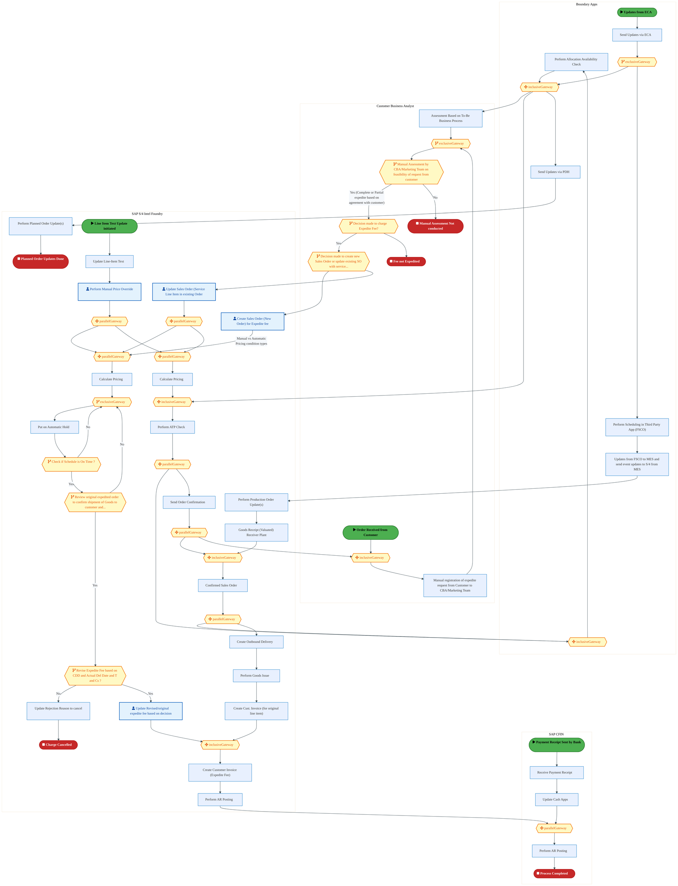
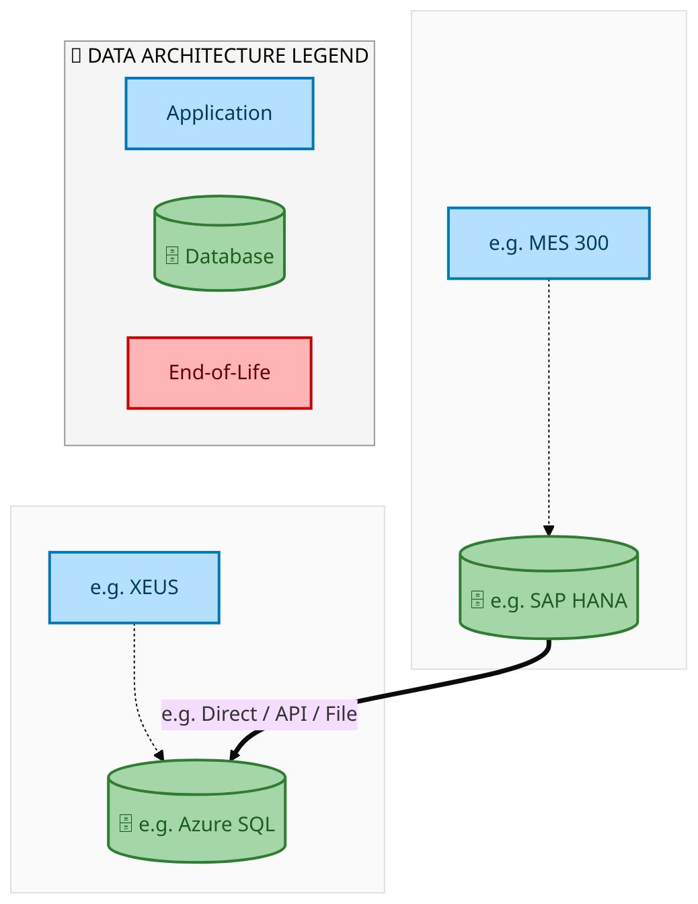
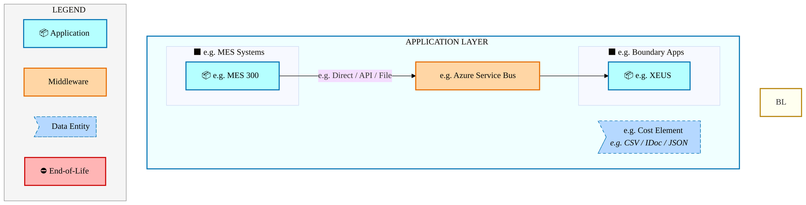
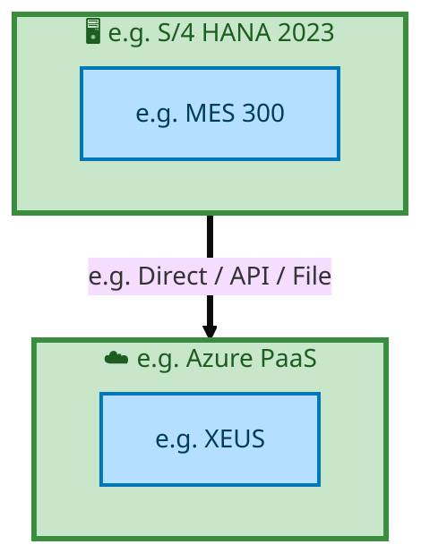

  
  <img src="data:image/svg+xml;base64,PHN2ZyB4bWxucz0iaHR0cDovL3d3dy53My5vcmcvMjAwMC9zdmciIHZpZXdCb3g9IjAgMCA4MDAgNDgwIiB3aWR0aD0iODAwIiBoZWlnaHQ9IjQ4MCI+CiAgPGRlZnM+CiAgICA8bGluZWFyR3JhZGllbnQgaWQ9ImJnIiB4MT0iMCUiIHkxPSIwJSIgeDI9IjEwMCUiIHkyPSIxMDAlIj4KICAgICAgPHN0b3Agb2Zmc2V0PSIwJSIgc3R5bGU9InN0b3AtY29sb3I6IzAwNzFjNTtzdG9wLW9wYWNpdHk6MSIvPgogICAgICA8c3RvcCBvZmZzZXQ9IjEwMCUiIHN0eWxlPSJzdG9wLWNvbG9yOiMwMGFlZWY7c3RvcC1vcGFjaXR5OjEiLz4KICAgIDwvbGluZWFyR3JhZGllbnQ+CiAgICA8bGluZWFyR3JhZGllbnQgaWQ9ImFjY2VudCIgeDE9IjAlIiB5MT0iMCUiIHgyPSIwJSIgeTI9IjEwMCUiPgogICAgICA8c3RvcCBvZmZzZXQ9IjAlIiBzdHlsZT0ic3RvcC1jb2xvcjojZmZmZmZmO3N0b3Atb3BhY2l0eTowLjE1Ii8+CiAgICAgIDxzdG9wIG9mZnNldD0iMTAwJSIgc3R5bGU9InN0b3AtY29sb3I6I2ZmZmZmZjtzdG9wLW9wYWNpdHk6MC4wMiIvPgogICAgPC9saW5lYXJHcmFkaWVudD4KICAgIDxwYXR0ZXJuIGlkPSJncmlkIiB3aWR0aD0iNDAiIGhlaWdodD0iNDAiIHBhdHRlcm5Vbml0cz0idXNlclNwYWNlT25Vc2UiPgogICAgICA8cGF0aCBkPSJNIDQwIDAgTCAwIDAgMCA0MCIgZmlsbD0ibm9uZSIgc3Ryb2tlPSJyZ2JhKDI1NSwyNTUsMjU1LDAuMDcpIiBzdHJva2Utd2lkdGg9IjAuNSIvPgogICAgPC9wYXR0ZXJuPgogIDwvZGVmcz4KCiAgPCEtLSBCYWNrZ3JvdW5kIC0tPgogIDxyZWN0IHdpZHRoPSI4MDAiIGhlaWdodD0iNDgwIiBmaWxsPSJ1cmwoI2JnKSIgcng9IjgiLz4KICA8cmVjdCB3aWR0aD0iODAwIiBoZWlnaHQ9IjQ4MCIgZmlsbD0idXJsKCNncmlkKSIgcng9IjgiLz4KICA8cmVjdCB3aWR0aD0iODAwIiBoZWlnaHQ9IjQ4MCIgZmlsbD0idXJsKCNhY2NlbnQpIiByeD0iOCIvPgoKICA8IS0tIERlY29yYXRpdmUgY2lyY3VpdC9hcmNoaXRlY3R1cmUgbGluZXMgLS0+CiAgPGcgc3Ryb2tlPSJyZ2JhKDI1NSwyNTUsMjU1LDAuMTIpIiBzdHJva2Utd2lkdGg9IjEuNSIgZmlsbD0ibm9uZSI+CiAgICA8cGF0aCBkPSJNIDAgMTAwIEwgMTIwIDEwMCBMIDE2MCAxNDAgTCAyODAgMTQwIi8+CiAgICA8cGF0aCBkPSJNIDAgMjYwIEwgODAgMjYwIEwgMTIwIDIyMCBMIDIwMCAyMjAgTCAyNDAgMjYwIEwgMzYwIDI2MCIvPgogICAgPHBhdGggZD0iTSA1MjAgMTAwIEwgNjAwIDEwMCBMIDY0MCA2MCBMIDgwMCA2MCIvPgogICAgPHBhdGggZD0iTSA0NDAgMzQwIEwgNTYwIDM0MCBMIDYwMCAzMDAgTCA3MjAgMzAwIEwgNzYwIDM0MCBMIDgwMCAzNDAiLz4KICAgIDxwYXRoIGQ9Ik0gNjAwIDQwMCBMIDY4MCA0MDAgTCA3MjAgNDQwIi8+CiAgICA8cGF0aCBkPSJNIDAgNDAwIEwgNDAgNDAwIEwgODAgMzYwIi8+CiAgICA8cGF0aCBkPSJNIDIwMCA0MjAgTCAzMjAgNDIwIEwgMzYwIDM4MCBMIDQ4MCAzODAiLz4KICAgIDxwYXRoIGQ9Ik0gNjUwIDQ0MCBMIDc1MCA0NDAgTCA4MDAgNDgwIi8+CiAgPC9nPgoKICA8IS0tIERlY29yYXRpdmUgbm9kZXMgLS0+CiAgPGcgZmlsbD0icmdiYSgyNTUsMjU1LDI1NSwwLjE4KSI+CiAgICA8Y2lyY2xlIGN4PSIxMjAiIGN5PSIxMDAiIHI9IjQiLz4KICAgIDxjaXJjbGUgY3g9IjI4MCIgY3k9IjE0MCIgcj0iNCIvPgogICAgPGNpcmNsZSBjeD0iMjAwIiBjeT0iMjIwIiByPSI0Ii8+CiAgICA8Y2lyY2xlIGN4PSIzNjAiIGN5PSIyNjAiIHI9IjQiLz4KICAgIDxjaXJjbGUgY3g9IjYwMCIgY3k9IjEwMCIgcj0iNCIvPgogICAgPGNpcmNsZSBjeD0iNzIwIiBjeT0iMzAwIiByPSI0Ii8+CiAgICA8Y2lyY2xlIGN4PSI1NjAiIGN5PSIzNDAiIHI9IjQiLz4KICAgIDxjaXJjbGUgY3g9IjgwIiBjeT0iMzYwIiByPSI0Ii8+CiAgICA8Y2lyY2xlIGN4PSI0ODAiIGN5PSIzODAiIHI9IjQiLz4KICAgIDxjaXJjbGUgY3g9IjMyMCIgY3k9IjQyMCIgcj0iNCIvPgogIDwvZz4KCiAgPCEtLSBUT0dBRiBCREFUIGJveGVzIC0tPgogIDxnIGZvbnQtZmFtaWx5PSJTZWdvZSBVSSwgQXJpYWwsIHNhbnMtc2VyaWYiIGZvbnQtc2l6ZT0iMTQiIGZvbnQtd2VpZ2h0PSI2MDAiPgogICAgPCEtLSBCIC0tPgogICAgPHJlY3QgeD0iMTUwIiB5PSIxNDAiIHdpZHRoPSIxMjAiIGhlaWdodD0iNDAiIHJ4PSI1IiBmaWxsPSJyZ2JhKDI1NSwyNTUsMjU1LDAuMTgpIiBzdHJva2U9InJnYmEoMjU1LDI1NSwyNTUsMC4zKSIgc3Ryb2tlLXdpZHRoPSIxIi8+CiAgICA8dGV4dCB4PSIyMTAiIHk9IjE2NSIgdGV4dC1hbmNob3I9Im1pZGRsZSIgZmlsbD0iI2ZmZiI+QnVzaW5lc3M8L3RleHQ+CiAgICA8IS0tIEQgLS0+CiAgICA8cmVjdCB4PSIyOTAiIHk9IjE0MCIgd2lkdGg9IjEyMCIgaGVpZ2h0PSI0MCIgcng9IjUiIGZpbGw9InJnYmEoMjU1LDI1NSwyNTUsMC4xOCkiIHN0cm9rZT0icmdiYSgyNTUsMjU1LDI1NSwwLjMpIiBzdHJva2Utd2lkdGg9IjEiLz4KICAgIDx0ZXh0IHg9IjM1MCIgeT0iMTY1IiB0ZXh0LWFuY2hvcj0ibWlkZGxlIiBmaWxsPSIjZmZmIj5EYXRhPC90ZXh0PgogICAgPCEtLSBBIC0tPgogICAgPHJlY3QgeD0iNDMwIiB5PSIxNDAiIHdpZHRoPSIxMjAiIGhlaWdodD0iNDAiIHJ4PSI1IiBmaWxsPSJyZ2JhKDI1NSwyNTUsMjU1LDAuMTgpIiBzdHJva2U9InJnYmEoMjU1LDI1NSwyNTUsMC4zKSIgc3Ryb2tlLXdpZHRoPSIxIi8+CiAgICA8dGV4dCB4PSI0OTAiIHk9IjE2NSIgdGV4dC1hbmNob3I9Im1pZGRsZSIgZmlsbD0iI2ZmZiI+QXBwbGljYXRpb248L3RleHQ+CiAgICA8IS0tIFQgLS0+CiAgICA8cmVjdCB4PSI1NzAiIHk9IjE0MCIgd2lkdGg9IjEyMCIgaGVpZ2h0PSI0MCIgcng9IjUiIGZpbGw9InJnYmEoMjU1LDI1NSwyNTUsMC4xOCkiIHN0cm9rZT0icmdiYSgyNTUsMjU1LDI1NSwwLjMpIiBzdHJva2Utd2lkdGg9IjEiLz4KICAgIDx0ZXh0IHg9IjYzMCIgeT0iMTY1IiB0ZXh0LWFuY2hvcj0ibWlkZGxlIiBmaWxsPSIjZmZmIj5UZWNobm9sb2d5PC90ZXh0PgogIDwvZz4KCiAgPCEtLSBDb25uZWN0aW5nIGxpbmVzIGJldHdlZW4gQkRBVCBib3hlcyAtLT4KICA8ZyBzdHJva2U9InJnYmEoMjU1LDI1NSwyNTUsMC4yNSkiIHN0cm9rZS13aWR0aD0iMSI+CiAgICA8bGluZSB4MT0iMjcwIiB5MT0iMTYwIiB4Mj0iMjkwIiB5Mj0iMTYwIi8+CiAgICA8bGluZSB4MT0iNDEwIiB5MT0iMTYwIiB4Mj0iNDMwIiB5Mj0iMTYwIi8+CiAgICA8bGluZSB4MT0iNTUwIiB5MT0iMTYwIiB4Mj0iNTcwIiB5Mj0iMTYwIi8+CiAgPC9nPgoKICA8IS0tIE1haW4gdGl0bGUgLS0+CiAgPHRleHQgeD0iNDAwIiB5PSIyNjAiIHRleHQtYW5jaG9yPSJtaWRkbGUiIGZvbnQtZmFtaWx5PSJTZWdvZSBVSSwgQXJpYWwsIHNhbnMtc2VyaWYiIGZvbnQtc2l6ZT0iMzYiIGZvbnQtd2VpZ2h0PSI3MDAiIGZpbGw9IiNmZmZmZmYiIGxldHRlci1zcGFjaW5nPSIxIj4KICAgIElBTyBBcmNoaXRlY3R1cmUKICA8L3RleHQ+CiAgPHRleHQgeD0iNDAwIiB5PSIzMDAiIHRleHQtYW5jaG9yPSJtaWRkbGUiIGZvbnQtZmFtaWx5PSJTZWdvZSBVSSwgQXJpYWwsIHNhbnMtc2VyaWYiIGZvbnQtc2l6ZT0iMTgiIGZvbnQtd2VpZ2h0PSI0MDAiIGZpbGw9InJnYmEoMjU1LDI1NSwyNTUsMC44KSIgbGV0dGVyLXNwYWNpbmc9IjIiPgogICAgVE9HQUYgQkRBVCDCtyBJQU8gUHJvZ3JhbSDCtyBJRE0gMi4wCiAgPC90ZXh0PgoKICA8IS0tIEJvdHRvbSBhY2NlbnQgYmFyIC0tPgogIDxyZWN0IHg9IjI4MCIgeT0iMzQwIiB3aWR0aD0iMjQwIiBoZWlnaHQ9IjMiIHJ4PSIxLjUiIGZpbGw9InJnYmEoMjU1LDI1NSwyNTUsMC40KSIvPgoKICA8IS0tIEludGVsIHRleHQgLS0+CiAgPHRleHQgeD0iNDAwIiB5PSIzODAiIHRleHQtYW5jaG9yPSJtaWRkbGUiIGZvbnQtZmFtaWx5PSJTZWdvZSBVSSwgQXJpYWwsIHNhbnMtc2VyaWYiIGZvbnQtc2l6ZT0iMTMiIGZpbGw9InJnYmEoMjU1LDI1NSwyNTUsMC41KSIgbGV0dGVyLXNwYWNpbmc9IjMiPgogICAgSU5URUwgQ09ORklERU5USUFMCiAgPC90ZXh0Pgo8L3N2Zz4K" alt="IAO Architecture" style="width:100%; border-radius:8px;" />
  <h1 style="font-size:36px; margin-top:24px;">Order_to_Cash_IF — Order to Cash (IF)</h1>
  <h2 style="font-size:24px;">Architecture Document (TOGAF BDAT)</h2>
  
End-to-End Integrated Processes (E2E) Tower 
  Capability Order_to_Cash_IF · Order to Cash

  
IAO Program · R1 – R5 
  Generated: April 2026 
  Sajiv Francis

  
IAO Architecture Pipeline — Intel Confidential

Page 1<a href="#toc">↑ Back to TOC</a>Order_to_Cash_IF — Order to Cash (IF)

## Table of Contents

<nav class="toc">
<ol>
  <li><a href="#1-executive-summary">1. Executive Summary</a></li>
  <li><a href="#2-business-context-objectives">2. Business Context &amp; Objectives</a>
    <ul>
      <li><a href="#21-classification">2.1 Classification</a></li>
      <li><a href="#22-business-drivers">2.2 Business Drivers</a></li>
      <li><a href="#23-success-criteria">2.3 Success Criteria</a></li>
      <li><a href="#24-companion-documents">2.4 Companion Documents</a></li>
    </ul>
  </li>
  <li><a href="#3-business-architecture-togaf-b">3. Business Architecture (TOGAF &ldquo;B&rdquo;)</a>
    <ul>
      <li><a href="#31-business-process-overview">3.1 Business Process Overview</a></li>
      <li><a href="#32-business-process-diagrams">3.2 Business Process Diagrams</a></li>
      <li><a href="#33-business-roles-responsibilities">3.3 Business Roles &amp; Responsibilities</a></li>
    </ul>
  </li>
  <li><a href="#4-data-architecture-togaf-d">4. Data Architecture (TOGAF &ldquo;D&rdquo;)</a>
    <ul>
      <li><a href="#41-data-entities-ownership">4.1 Data Entities &amp; Ownership</a></li>
      <li><a href="#42-data-flow-diagrams">4.2 Data Flow Diagrams</a></li>
      <li><a href="#43-data-lineage">4.3 Data Lineage</a></li>
      <li><a href="#44-ricefw-data-objects">4.4 RICEFW Data Objects</a></li>
      <li><a href="#45-data-governance-quality">4.5 Data Governance &amp; Quality</a></li>
    </ul>
  </li>
  <li><a href="#5-application-architecture-togaf-a">5. Application Architecture (TOGAF &ldquo;A&rdquo;)</a>
    <ul>
      <li><a href="#51-current-state-current-state-application-landscape">5.1 Current-State Application Landscape</a></li>
      <li><a href="#52-future-state-future-state-application-landscape">5.2 Future-State Application Landscape</a></li>
      <li><a href="#53-change-impact-summary">5.3 Change Impact Summary</a></li>
      <li><a href="#54-component-overview">5.4 Component Overview</a></li>
      <li><a href="#55-ricefw-inventory">5.5 RICEFW Inventory</a></li>
      <li><a href="#56-integration-patterns">5.6 Integration Patterns</a></li>
    </ul>
  </li>
  <li><a href="#6-technology-architecture-togaf-t">6. Technology Architecture (TOGAF &ldquo;T&rdquo;)</a>
    <ul>
      <li><a href="#61-platform-infrastructure">6.1 Platform &amp; Infrastructure</a></li>
      <li><a href="#62-sap-development-object-status">6.2 SAP Development Object Status</a></li>
      <li><a href="#63-nfrs-design-principles">6.3 NFRs &amp; Design Principles</a></li>
      <li><a href="#64-security-governance">6.4 Security &amp; Governance</a></li>
    </ul>
  </li>
  <li><a href="#7-project-context">7. Project Context</a>
    <ul>
      <li><a href="#71-project-roadmap-go-live-plan">7.1 Project Roadmap &amp; Go-Live Plan</a></li>
      <li><a href="#72-raid-log">7.2 RAID Log</a></li>
      <li><a href="#73-recommendations-next-steps">7.3 Recommendations &amp; Next Steps</a></li>
    </ul>
  </li>
</ol>
</nav>

Page 2<a href="#toc">↑ Back to TOC</a>Order_to_Cash_IF — Order to Cash (IF)

## 1. Executive Summary

This Architecture Document defines the **Business, Data, Application, and Technology** (BDAT) architecture for **Order_to_Cash_IF Order to Cash (IF)** within the IAO program. It includes 3 BPMN process diagram(s) in Section 3.

| Dimension | Value |
|-----------|-------|
| **Tower** | End-to-End Integrated Processes (E2E) |
| **Process Group** | Order to Cash |
| **Capability** | Order_to_Cash_IF - Order to Cash (IF) |
| **Release** | R1 – R5 |
| **Total Systems** | 2 |
| **System Status** | 0 Deployed, 0 Developing, 0 EOL, 2 Pending IAPM |
| **RICEFW Objects** | Pending — Smartsheet Object Tracker API integration |

**Change Summary**: 0 new flow chains, 0 removed, 0 modified, 1 unchanged between Current-State and Future-State states.

> All system nodes in architecture diagrams are **IAPM-linked** — click any node to open its IAPM page. Diagrams require `securityLevel: 'loose'` for click events.

Page 3<a href="#toc">↑ Back to TOC</a>Order_to_Cash_IF — Order to Cash (IF)

## 2. Business Context & Objectives

### 2.1 Classification

| Level | Value |
|-------|-------|
| **L0 Tower** | End-to-End Integrated Processes |
| **L1 Process** | Order to Cash |
| **L2 Capability** | Order_to_Cash_IF - Order to Cash (IF) |

### 2.2 Business Drivers

| # | Driver | Description | Strategic Alignment | Priority |
|---|--------|-------------|---------------------|----------|
| 1 | End-to-End Process Integration | Enable cross-tower integrated processes spanning procurement, manufacturing, and fulfillment | IDM 2.0 Process Excellence | High |
| 2 | Intel Foundry Business Enablement | Stand up foundry-specific business processes for external customer engagement | Intel Foundry Services | High |
| 3 | Process Visibility & Monitoring | Provide end-to-end process visibility across tower boundaries with integrated monitoring | Operational Excellence | Medium |
| 4 | Order_to_Cash_IF Process Migration | Migrate Order to Cash (IF) business processes and 2 integrated systems from legacy to S/4 HANA target architecture | IDM 2.0 Cross-Functional / End-to-End | High |

Page 4<a href="#toc">↑ Back to TOC</a>Order_to_Cash_IF — Order to Cash (IF)

### 2.3 Success Criteria

| Metric | Target | Measure | Baseline | Owner |
|--------|--------|---------|----------|-------|
| E2E Process Cycle Time | Per process SLA | End-to-end transaction completion within defined SLA per process | Varies by process | E2E Process Owner |
| Cross-Tower Integration Success | > 99% | Transactions completing across tower boundaries without manual intervention | 92% (current) | Integration Lead |
| Process Exception Rate | < 2% | Transactions requiring manual exception handling | 8% (current) | Operations Manager |
| Order_to_Cash_IF Migration Completeness | 100% flow chains validated | All 1 flow chains verified in target state | 0% (pre-migration) | Tower Architect |

### 2.4 Companion Documents

| Document | Description |
|----------|-------------|
| **Business Architecture** | Included in this document (Section 3) — process flows from BPMN diagrams |
| **This Document** | Full BDAT Architecture — Business + Data + Application + Technology |

Page 5<a href="#toc">↑ Back to TOC</a>Order_to_Cash_IF — Order to Cash (IF)

## 3. Business Architecture (TOGAF "B")

### 3.1 Business Process Overview

This capability includes **3 business process(es)** modeled in BPMN 2.0, covering the end-to-end workflow for Order_to_Cash_IF Order to Cash (IF).

| # | Step ID | Process Name | Lanes | Tasks | Gateways |
|---|---------|--------------|-------|-------|----------|
| 1 | E2E-10__R3_-_Intel_Foundry__RMA_for_Direct_Customers_with_no_physical_receipt_of_the_defective_produ | E2E-10__R3_-_Intel_Foundry__RMA_for_Direct_Customers_with_no_physical_receipt_of_the_defective_produ | Boundary Apps, SAP S/4 Intel Foundry | 14 | 6 |
| 2 | E2E_93__R3_Product_&amp;_Service_Sales_-_'Standard_sales_order_scenario_with_Combined_orders_(Physic | E2E_93__R3_Product_&amp;_Service_Sales_-_'Standard_sales_order_scenario_with_Combined_orders_(Physic | External Partners/ B2B

, SAP CFIN, SAP S/4 Intel Foundry 
, SAP S/4 Intel Foundry - Foreign LE

 | 64 | 33 |
| 3 | R3_E2E-80__Intel_Foundry-_Customer_Requests_Expedite_-_Service_Fee | R3_E2E-80__Intel_Foundry-_Customer_Requests_Expedite_-_Service_Fee | Boundary Apps , Customer Business Analyst, SAP CFIN, SAP S/4 Intel Foundry | 30 | 23 |

Page 6<a href="#toc">↑ Back to TOC</a>Order_to_Cash_IF — Order to Cash (IF)

### 3.2 Business Process Diagrams

#### BUSINESS ARCHITECTURE — 3.2.1 E2E-10__R3_-_Intel_Foundry__RMA_for_Direct_Customers_with_no_physical_receipt_of_the_defective_produ — E2E-10__R3_-_Intel_Foundry__RMA_for_Direct_Customers_with_no_physical_receipt_of_the_defective_produ

**Swim Lanes**: Boundary Apps · SAP S/4 Intel Foundry | **Tasks**: 14 | **Gateways**: 6

> **Legend**: ● Start · ● End · User Task · Service Task · ◇ Gateway · Sub-Process

<a href="https://mermaid.live/view#pako:eNqlV1tz4jYU_isa72TIzsCsr5jw0B3HxNt0NpeG7HY6pdNRbBnUyBaV5SQ0y3_vkS0DNuapPMDo03e-c9HRhXcj5gkxpsbZ2TvNqZyi94FckYwMpmjwhAsyGKIa-I4FxU-MFAPFSXku5_Tfima56zdFU1iEM8o2Cp2TJSfo2_UQBWDIhqjAeTEqiKDpYDhYC5phsQk540KxP5BJaqaVNz11yUVCxJ5gmr4Ve2DKaE72sOO7vhspu4LEPE9aoqmXTtJ4sFXBMf4ar7CQVfhlQW7w2280kSsYp5gVBDgrmbGv-IkwlaMUpcLiUrw0xaCF8pNDweZrHNN8CbhrAiRw_ryHPHO7Rduzs0W-c4oeZ4scwSdmuChmJEWFBPjqRaKUMjb94IZB5JnDQgr-TKYf7Ct_5tjDWGUyhdTNoSru6JXQ5UpOnzhLNHX0qnKY2uu3oXib2uZQbOC744vkyd5TOLYn9mTn6dK3QitsPKVp-r88QV3FIy6eta8rJ7Kj2c6X5Y290DzWa9KcuX5gdetExAuNyYFoFEXO1b5UV2PPMk-LXkbO2Aw7okssySve7AUvQncnGHl-ZPknBWt_3SjLp3vB40bQufIibyfoX1pRYJ8UdAPLnegIQWcp8HqFGM7JX-YfC-OSl1VTo2C9LhbGnzVPfXILpu-JSLnI0L0go6AoSFFkJJdtnn3Au-X5KArQeYQpKwVBQY7ZBhr7Y9vEAZNv6wTKhIKv0cPVPLxTASDQgO0cr-gLZoinKLybdWJSQaV4muKR6gXU-P3l-iFAv5aYUbn5BAHgE7Fa3vlOYM1giR6ILEUOP_-UpJDwGxP6QhKUCp6hsCwkz4gAjY-HIuO9CBDWO2tB_iaxBOu7NFXHCMJ5gkKeZWVOY6wmJD8p6ndEW4Wpi5V0bGzr_b2xUefs6AlOiniFoAB3pYzBy-eFsd3WFrBL-5pAFXQe3KP5Jxdd55IwFKmWEJt24dyDRb5TJyf6DsWGoCjP20wPmD_Dvu6Utk0aA-mhqpamtad9mA4FUf0R3YVAgbWKiVrO2nmbPdmz4SehEt2QjPc7vgDuI34GXc7g9ITCoiA-TsJSe-NR0OUSMv3yOEfhisTPHY7d7kUdgk67LtJ58HDT6X3LaZs1Xh5uArXUgkPvdyzctoVuUhQSIWladZbaLDNIVpRVMtB0eUpF1rM81qTTZ70Fhlagkva0nHXRMT-s-Ckj2zzaMLo16v3Spdv9bU3eYlYWkPmX-nzd93Zt5vSbXRcHtSXJ566Ze2ITdRrkyM7rt6vr97LbHXXrQG0g-ARu8Kqd5mUcwwGVluzzke54r4uF4K_FCDOJ1lhgxgg7yn23r3MLjUY_gYAe2vXQspppDdg7ggbchuBogtMQ3BrwO-OJHl9ofiPga4_N_ESPL_R4rPlm41Dr2WMN6ACsxqHlaUCPNd_aCZhawGsirBR-LIzfCdxmP5QLPeN1k9fBNLFZTfUaX7alpe55AW0N-22Rn8MtnMAWg3sONsoz3nysndhdm1sCbwCwAXxnQ4tDkyZl2-tG7HRnbnk1cZSjxsedjJyDx0OVV_NqauP2Cdw5gbsncG_31mzjY_0ubKN-LzrpRS_6UNvsRa3m0dWG7X7Y6Yfdftjrh8cNbAwNuM8zTBNj-m5U_2bgH09CUlwyaWyHBi4ln2_y2JhWr36jrG7zGcVwD2c1uP0PJjAOEA==" title="View full diagram">&#128065; View Diagram</a>

Page 7<a href="#toc">↑ Back to TOC</a>Order_to_Cash_IF — Order to Cash (IF)

#### BUSINESS ARCHITECTURE — 3.2.2 E2E_93__R3_Product_&amp;_Service_Sales_-_'Standard_sales_order_scenario_with_Combined_orders_(Physic — E2E_93__R3_Product_&amp;_Service_Sales_-_'Standard_sales_order_scenario_with_Combined_orders_(Physic

**Swim Lanes**: External Partners/ B2B
 · SAP CFIN · SAP S/4 Intel Foundry 
 · SAP S/4 Intel Foundry - Foreign LE

 | **Tasks**: 64 | **Gateways**: 33

> **Legend**: ● Start · ● End · User Task · Service Task · ◇ Gateway · Sub-Process

<a href="https://mermaid.live/view#pako:eNqlGmlv28j1rwyUpvYCEsL70IcWso7EQByrkbPbRV0UY3JoDUKRAg_bauL_3jfDeZQ0IpNdNUCC6PHd96P0bRDlMRuMB2_ffuMZr8bk20W1Zht2MSYXD7RkF0PSAH6lBacPKSsvBE6SZ9WK_1eimc72RaAJ2IJueLoT0BV7zBn5cj0kEyBMh6SkWTkqWcGTi-HFtuAbWuymeZoXAvsNCxIjkdLUo6u8iFmxRzAM34xcIE15xvZg23d8ZyHoShblWXzENHGTIIkuXoVyaf4crWlRSfXrkt3Ql994XK3hc0LTkgHOutqkH-kDS4WNVVELWFQXT-gMXgo5GThstaURzx4B7hgAKmj2dQ9yjddX8vr27X3WCiV3s_uMwJ8opWU5YwkpKwDPnyqS8DQdv3Gmk4VrDMuqyL-y8Rtr7s9saxgJS8ZgujEUzh09M_64rsYPeRor1NGzsGFsbV-GxcvYMobFDv7VZLEs3kuaelZgBa2kK9-cmlOUlCTJ_yUJ_Frc0fKrkjW3F9Zi1soyXc-dGqf80MyZ409M3U-seOIRO2C6WCzs-d5Vc881jX6mVwvbM6Ya00dasWe62zMMp07LcOH6C9PvZdjI07WsH5ZFHiFDe-4u3Jahf2UuJlYvQ2diOoHSEPg8FnS7JinN2H-Mf90P5i8VKzKakiXkS8aK8h25sq7I_eDfDYX4k7kWYE7ptqoLRm5F3ZAnTsl8dv3uM_nEKg3bBuzPLGL8iZEZrSjhGblyPn3U0BxA-5RXPNmRKS0KzopjBM-_BIyEjhM62qbgTim5JIp1TJIi35BpXVb5RtL-0hBDOnZZawKz1WRJpovrT8eCnAAeLVmR5MWGgJ8TXtEHnvJqRybgml1ZlxpBeGDhku42LKsatbZVo9UVVKxmrvD2ewYuhuQAg8s1mWy3KY9oxfNMwzUPFJp8Jsu8rKD2Cc1iMqmrnExTBu0yezwm8829w8Ap2xMpBOXHe281lJZG2XqBCy9Q6QVekm2j0wl9aH77hvSi4Y8eoGVFa3K7ZRm5zp5yKLGSLPIaDIBk-CxaaQQellr9_X7w-nrIzOpmxl6itC7B5e-b8tqT9UTcUhFfvXNAiYqljQbFjuj57R7GE2gzyK4mzy9X7xcjw_xFI_Bk6bCohliCr-I6kv5taFYV22oZ4_pSAoSt7CBQDzSSw6y8rasH6b0ZS0HJYnc5_-1GVyo8IFjdfYa_t6eEYNE7R6P0jMMC4NHXd8v316RDhHeYmO_zPC7btL_8laY1I5M4ZrFOZR24V6M6leHbWi4CCowzcCmJ8s02ZafpG9p_NmMkmWl4ezroQPlzOaJpRba0oGnK0j4q_yyqsJOKZz9W0TT-JFlPLdi9tTCC_xUwjjPyca7VxWG0m0yFIPO4o2OJCN8V_PERcN7frUi0ZpHWAG05Q9KoTkUDvKMvTO-qB9Kmd9CoT3mIOl2BhUqbaZ4lvNg0vU20RTULIMebsU6uK7Yh8BDaeSo66EOaR1_19ASmX7ax0Ooj7H4jSXPHXrSx5h_pvyx4dNKARcXOYAOFNL-5uZ6pAbXUxs1hmU4LFvOqMZVciqG6WE31ijBFed5AE35kMFgAsRmEGpIMVl0Jaz_AWqU9tdBz4KaDeIMSBH0lp0tZss1DuiMVK6tuOfYfTgrT-UP-MN3DptKdPKb3c--b_g80k9Zx0T7ksKZiih4lhcbrj4XS_NOxtIyfG2KZmkM6KsGyflZOliw4qUy12zKSJ-0M0BCdHw0aDdfVJoX061IkZVNCpWzp0FRm0OGzCloiXHH6QLC8w_0GS51cfskKSDtwCbR4mKKnpWr5mmfuChrDNiXmAoeWr41QKzjaubA7qIWEXIrsX65hs4nEAtxMZV1iqPtZ62rGwWC_Ugl1JRJKeiZqOhSeGRqt-XP1VHFqWtmW3D-2OZx-Cn0ovADkERzDexj4SKO0j2SekJDLLax-4F6qixRZslrzrZrg12VZ6_a4h7yNv8CUang-82pNspyIWxV6GJRetN_aDxnIKi-YrAzIKeHLlJdaI7b9biy5e2RxvdHQj5JgRVPI0SMX3_w-JL9yVmV0A05c84xqDMKfTq7D_WmSQvSbnjN5ojzFU6KjiJ3TAXs40jTktoVjpckbbDrR0ESAFwwKqPux08VlOfugoR3W-QoaclzLzIbl_W7Ni1ieiztxW5BL6HK3WrI4-5laNq1TIInA38xXsjBKoQJ7Er24VnjwVGwnEh3QNI4i6P-cf1nJ7QUWG-ngj3R3cjXa7fYo3hYQPFubwEsnawTOMQFaDQO3lm1BJMottMKCx1rCe652oSqaXGET8cqLd9xbnqcRHvmqCdoRfqDtxPKshjBWOmKoH3KqQPpWZ9_QCERXhRYA91r_vu3LJNo7lHzJVKNj2t7huxqmyBtoN7BhTHsoROo0uDEvmBwFkBkQ-GkzTzR0XxPQxzY460Tww57Dts8Ykh95Q79tA-MsNQLzPLKeS_poU1nVkQh2Uqcnyp53VgVON9k1dOfmbY94rcUTfClxBaMzFmsrF4v3ddYOB7K8PVHJ7ebdbkk_Msc7zxy_x4lHq5VqLMeUPTl3XUIE8rIcNe-g8Q3NQ8pOVA7PUjk8L8tC54zDNnTPITrn8A7PubvD4Byi8KwL3ziLyjyLyjqLyj6LyjmLyj2LKjj3dUdmktHob1Ay6mPoNJ89Rweoz57ffHYtBbAUAxcJ3AbgI0tPcQgRw1MYIcrwA0WCCLbiaSuAeh6iCPUYVUABSO8rBN_RAaiCr0gCAwGoE9oZGA3ARIxAeap1jKexQECIhruKp9nycBEFDXN9lIJyAVk5GCGOUt5tuSiM0ETVZAy-3w9-Fyv2d4hJy0x3JGJ-yiVi0JrrqAdXsHvLW_8GckZ8RUjuM-0bg-_ixQhKUOH30OjA1XRp8yDw0B06qq5MqLzihxqgdS0mCLLCnMMMCFXGYLxdzNI2I5QyHnoG3e604TSPtfNbtVG4r_vuN5rAXPorKZg4eWI8X5Uf2ggrehN18bT6MFVymi0AE6ll4Wn2O4ZSYZXXBSzeM1g_iw3cZO1LnPssr9agHc_kmSrhMNjWNHtUCrbMAl8x0498-aKveTk4BobirJWpcl9bBlj1KSff1Y0oducRsBNJkH3JbxDlHzWFZQZOILm9NKmENmEpYIxNFUMTs8BUhWAhiaXSG7_whP8oQNucLM1R59oGhpwYB4nxM9tsXSy-NWyldbJ49wHCeMin7WyKDZ5nnxlkHMsipg6uexHdjvcTkss-1VX6uOhZF11toCAXm047GFTWun7LRQXMM3RI2948FQ9fE_1dvpitExqBFcKdzZdCIifvs8sZ2zbvsmgpBl8lFsUFbKqLNH9GT82tOfHFFzLfxdcrKE7lg9eGXykdoqGWMtRCgKcSxEINw1ApuM-HN8SCnGhf8Ql19Oxpuq7zIx6m4JHB0cPbJOplFPyIkQ2MTtNIBritA9VBLGwYFvZe_I4ccBuIjc6zsVTQNUFw3ABtW3-ALd5Gf9u2xgPkKU38Ewh2Nwu7m9G2AgPnVqBDQkOH2GijrWy0UZSt0tFup4aKvteaGGpcQ_QKhtJulUPrbezORjsDDeU629UhbkuF2u49gwXVdrPwRNQJxEU3oOxQCXICfWxhcFpUFwWibRaOWbTesVBeO5qUT5121VJMnH2slFMdpHFM5LJ3R-szVNNRfnXakWa4Oo6v9HPsU5y9G7FRacJEi2ePj6rM0rxq3pTtX3mUopMYD9JHDhI7aC_mkOPrO5zj6Do4uL5aB78_kVss_vDmGO70wN3250fHcK8H7vfAA_XTomNo2AX1jU6o2Qm1OqF2J9Tp1s3vsdHvsdHvsREuBvVroWNw2AmGXb4TbHaDrW6w3Q12usFuN9jrBvvd4G4rg24rw24rw24rw24rw24rw24rw24rw24rw24rw24rw24rxfzohps9cKsHbvfAnR642wP3euB-DzzogffYa7b2DoYDWOs2lMeD8beB_PnnYDyIWULrtBq8Dgfi69nVLosGY_kzyUHzFcGM08eCbhrg6_8AIbrEiw==" title="View full diagram">&#128065; View Diagram</a>

Page 8<a href="#toc">↑ Back to TOC</a>Order_to_Cash_IF — Order to Cash (IF)

#### BUSINESS ARCHITECTURE — 3.2.3 R3_E2E-80__Intel_Foundry-_Customer_Requests_Expedite_-_Service_Fee — R3_E2E-80__Intel_Foundry-_Customer_Requests_Expedite_-_Service_Fee

**Swim Lanes**: Boundary Apps  · Customer Business Analyst · SAP CFIN · SAP S/4 Intel Foundry | **Tasks**: 30 | **Gateways**: 23

> **Legend**: ● Start · ● End · User Task · Service Task · ◇ Gateway · Sub-Process

<a href="https://mermaid.live/view#pako:eNqtWW1v4jge_yoWo1FbCWby5AR4cScIZbfSzgwq3T2ttqeTSRzwNSRcnNBy3X73-zuxAzHu3ix3fdGZ_Px_fnTS116Ux7Q37n38-MoyVo7R61W5oVt6NUZXK8LpVR81wC-kYGSVUn4laJI8K5fs3zWZ7e1eBJnA5mTL0oNAl3SdU_TzXR9NgDHtI04yPuC0YMlV_2pXsC0pDmGe5oWg_kCHiZXU2uTRNC9iWhwJLCuwIwysKcvoEXYDL_Dmgo_TKM_ijtAEJ8MkunoTxqX5c7QhRVmbX3H6hbz8jcXlBp4TknIKNJtym_5EVjQVPpZFJbCoKvYqGIwLPRkEbLkjEcvWgHsWQAXJno4Qtt7e0NvHj49ZqxQ9zB4zBD9RSjif0QTxEuDbfYkSlqbjD144mWOrz8sif6LjD85tMHOdfiQ8GYPrVl8Ed_BM2XpTjld5GkvSwbPwYezsXvrFy9ix-sUBfmu6aBYfNYW-M3SGraZpYId2qDQlSfI_aYK4Fg-EP0ldt-7cmc9aXTb2cWidy1NuzrxgYutxosWeRfRE6Hw-d2-Pobr1sW29L3Q6d30r1ISuSUmfyeEocBR6rcA5DuZ28K7ARp9uZbVaFHmkBLq3eI5bgcHUnk-cdwV6E9sbSgtBzroguw1KSUb_Yf322JvmVV3UaLLbcfTY-3tDKH4yxwGCBS2SvNiiSZrmESlZnqHJnrCUrFjKygMKNzR60vhc4FtCVaCfdzGEgqM9I2gx-1Ej80xkt-FEI8MnViyjDY0raNE1Yhl62LAiRguo9Np-dD1fht9uNHYf2JWCpMi3SBChMkdfbpeIgHYuTKB7mpWoknRwuvzsNeRA1pXoetcgMiHjhAx2KaS5I72x_-aE3hu-vip6MQ0HK-jnaIPoS5RWnO3pD025PPbe3k7YfPvIRooif-YDkpbg9h9zOX-SC5w31YYNLoYVL_MtLdAUWDPKOZpkJD3wshsPQfqFZBVJUUHXDOqwKZMcJsPLjsaspHDwr4rysglRKxfCHE4nn7-Q4omWIqcPlGy19IHwCeegfCsSNIWVESMQ_pAPpvRomOgO-FdLlK0l6psY-eieRhQiEXeN0ZLm4iMvEOzQnFKU5SW6lS7FOoOvMciQnBj_FdjFDqmic3bPMhfJjEaMi2huSUxFwMS8X9PWDGHXX7Ua8OzvlVVQKAeU0We0JLB6ZYDyQjYC5A_SKRKz_IaeWblR4_LTp0-6TueiIvdcM9t58FYHQ62ISkgobE45jKDkOpUWtcntaMXB_6dJRHEuJwsUzu--aj0xOh2d92iR13HUattqRxMKCd_UM1gjEc0lCxYG3aEORf2807rQdbVi16jRUkZxCpcJvXZHWu3KdkJhvt2l9LxasW8M4I4UJE1p-r3xc2X8xKy9y0qaorlYR8VBc03MIpJGVSoitShYdBZK77-T4GOwf4KhMbgr6RaK6EWLo3-auIeFab8Fam817RLmWcKKbT30uoRDYVVzCuPmpMW6ZKJWwqYVv1XlSoQAejWFlOuRsK0T637I85ijO84rqlHZR4FivH2C4O5zaFt0DYzQ3mzNYJAjcdNFMEO22sq0671flaK7JhU0ELgWoR_hrqbRuceQ3tN_0qge-_fQj_CPGC_QyjTVeLyubfUeaM07nWq6Ufg7Oso-zd4CaiyjKkuNnddcFxucchS5GM7Ciz9mEoltwq-66_oXklZAG9-o_VLUBmjV5QRto4m7LJKROJ2-119hHNf_vUEiXW1MEqrl2Rl2hclUdIQtm4FdlzyqSx7uTe1YNxSjM-oKVbGRE1m0FpQpuFewWLPHtYz23NM9g639ua07euIRWqmNHsvtpMl0tLF2dET0rtIh3i0ZMWzlQJtsYbM-w7o003P6oT4JDUXE0SzPqL7APfMmq-cHYom6uoKtkBy4wLAtRWebG5uFiBBCVZxFEAJX2yWarZkziG_Yrp77sAubEhWHqtPgvmvY3f77Wnn3qnFMVzib1bfnSVSKuoB5hWYiEwJ7qH-H_Ny_4LJbwujPrZtm3luXMNmXMDmXMLmXMHmXMOFLmIaXvH3g0UXvLNal1zG44qPB4C_iRicBzxLA74-9XylcpX4Xl2F5Iik9Rz47QwmMJIAlhatkS9Hq3HMkgyLwJYGSiCWBb2uAMi6QDJ58lhZgJRC7ugAJKBNGzaNtKZ8sCSgGT5qoNNrKZqXSkzbYymhbqnAViytl-q0SWwN8pVUJtaVaG6vYShb1AQdupxJQhjpSBvaVqzKatvLVls66o05qxauZkqHirXzxldo2IzLCQyVTKnFbQKVAAY5WJb4E1LPnHusLXav7sXhlEp8hGEzCx6zdb-2wfMzIuqC0nsv1e5QayDdNjVq69K95feCq6HjKs0AHlOFYhsvXDG_LF3uaqy2gZGIZ4LZWpEiszHMCaZ68DOz5yf3wMZPX7vodl9W3qPKwk23YysBYE-p5XZ_b2m0P2lZWifewfuLrJ2fC_O6B7eoHSpbb1j3WS1T1jipqFWI9XrbuawvIpKmcOIoD6-WmzHNk49jKCFdmzVFZclTPq7x6Q60tFOC0jaPsUEJt5VnbBqobg5MvkXUBqE-wXXz4Dj4y4zBjzLjdfrju4s47uPsO7r2DY_mxuov6RjQwokMjOjKhMLDkl-AubJthxwy7Ztgzw9gM-2Y4MMNDMzwywtjsJTZ7ic1eYrOX2OwlNnuJzV5is5fY7CU2e-mbvfTNXvqtl71-D8b8lrC4N37t1X_p6o17MU1IlZa9t36PwABdHrKoN67_ItRrvrzNGCwMsm3At_8AOIJfRA==" title="View full diagram">&#128065; View Diagram</a>

Page 9<a href="#toc">↑ Back to TOC</a>Order_to_Cash_IF — Order to Cash (IF)

### 3.3 Business Roles & Responsibilities

| Role / Lane | Processes Involved | Description |
|------------|-------------------|-------------|
| Boundary Apps | E2E-10__R3_-_Intel_Foundry__RMA_for_Direct_Customers_with_no_physical_receipt_of_the_defective_produ,  | |
| SAP S/4 Intel Foundry | E2E-10__R3_-_Intel_Foundry__RMA_for_Direct_Customers_with_no_physical_receipt_of_the_defective_produ, R3_E2E-80__Intel_Foundry-_Customer_Requests_Expedite_-_Service_Fee | |
| External Partners/ B2B
 | E2E_93__R3_Product_&amp;_Service_Sales_-_'Standard_sales_order_scenario_with_Combined_orders_(Physic,  | |
| SAP CFIN | E2E_93__R3_Product_&amp;_Service_Sales_-_'Standard_sales_order_scenario_with_Combined_orders_(Physic, R3_E2E-80__Intel_Foundry-_Customer_Requests_Expedite_-_Service_Fee | |
| SAP S/4 Intel Foundry 
 | E2E_93__R3_Product_&amp;_Service_Sales_-_'Standard_sales_order_scenario_with_Combined_orders_(Physic,  | |
| SAP S/4 Intel Foundry - Foreign LE
 | E2E_93__R3_Product_&amp;_Service_Sales_-_'Standard_sales_order_scenario_with_Combined_orders_(Physic,  | |
| Boundary Apps  | R3_E2E-80__Intel_Foundry-_Customer_Requests_Expedite_-_Service_Fee | |
| Customer Business Analyst | R3_E2E-80__Intel_Foundry-_Customer_Requests_Expedite_-_Service_Fee | |

Page 10<a href="#toc">↑ Back to TOC</a>Order_to_Cash_IF — Order to Cash (IF)

## 4. Data Architecture (TOGAF "D")

### 4.1 Data Entities & Ownership

| # | Data Entity | Source System | Target System | Data Owner | Classification | Volume | Master/Transaction |
|---|-------------|---------------|---------------|------------|----------------|--------|-------------------|
| 1 | e.g. Cost Element | e.g. MES 300 | e.g. XEUS | Data steward | e.g. Intel Confidential | e.g. 10K rows/day | Master / Transaction |

Page 11<a href="#toc">↑ Back to TOC</a>Order_to_Cash_IF — Order to Cash (IF)

### 4.2 Data Flow Diagrams

> **DATA ARCHITECTURE** — Database-to-database data flows. Applications (blue) sit above their hosting databases (green cylinders). Thick arrows show data movement between databases.

#### 4.2.1 Current-State — Current-State Data Flows

<a href="https://mermaid.live/view#pako:eNqllQ1P2zAQhv-KZVRpk1oWWtKOSCC5-RiVAmOkbJPIFLmJ01q4cZQ40FL632cnaWFdC2Wzpci-Oz--3OvECxjyiEADNhoLmlBhgIUPxYRMiQ8N4MMRzuWoKUc5CYuMirlL7gmrnIzzlbdc8h1nFI8YyZVbcmKeCI8-1qgjPZ1Vwcru4Cll88rjkTEn4GbQBEgCJHxZRjH-EE5wJmpakZMLPPtBIzFRlhiznKi4iZgyF48IK7cVWVFaE_laXopDmoyVuaMrY4aTuxfGY325BMtGw0_We4Fh30-AbCHDeW6RGOA07fMZiCljxkFftxzHaeYi43fEONC0Xq_fraetB5Wa0U5nzZAznil3x9I3edHInLMah3Sri3prXNvuWZ32TtxRX7fb2gaOcPacnuP09b6-5pmmJttOXrer3H5SEfNiNM5wOgFfs4hkgeCBifNJMHBMC5luQIJxgB6LjATeN_fWh7Kav6qFqkU0I6GgPFnXT7UtJFSCfto3nmSQw_EhUGPJMgyjqvSry62NPD740C-iz51IPqPw2C9iosmaKG4ZBGSQDz8qeln3PXMDrcPW2R77VziSRHUJxZyRfeq3kgupvpbL1lT_U64j-c3sL5CHroJzdIn-V58L2ws6mraSSE6BnL5TpXUyr4gkY4CKeadGdX5vyLRK4J0qrZb9k0hvJgNOT8-e6rpapSrgE0BXA_l0KJO_yqe9zt3GkXDJWL7f7YtCh5EGLDREAF2b54OhbQ5vrm3g2l_sS2vH0XCvn61uoA4RSlNGQ6y828V3A2uHvBYWuLo8tinrBrbE20nU4nHLpTGp8NXPbKte1RuuNNFVX2tycnLylyCwCackm2IaQWNRXU_ylotIjAsm5AUDcSG4N09CaJRXBizSCAtiUSwrOq2My98AKEN2" title="View full diagram">&#128065; View Diagram</a>

Page 12<a href="#toc">↑ Back to TOC</a>Order_to_Cash_IF — Order to Cash (IF)

#### 4.2.2 Future-State — Future-State Data Flows

<a href="https://mermaid.live/view#pako:eNqllQ1P2zAQhv-KZVRpk1oWWtKOSCA5X6NSYIyUbRKZIjdxWgs3jhIHWkr_--ykLaxroWy2FNl358eXe514DiMeE2jARmNOUyoMMA-gGJMJCaABAjjEhRw15aggUZlTMfPIPWG1k3G-8lZLvuOc4iEjhXJLTsJT4dPHJepIz6Z1sLK7eELZrPb4ZMQJuOk3AZIACV9UUYw_RGOciyWtLMgFnv6gsRgrS4JZQVTcWEyYh4eEVduKvKysqXwtP8MRTUfK3NGVMcfp3Qvjsb5YgEWjEaTrvcDADFIgW8RwUdgkATjLTD4FCWXMODB123XdZiFyfkeMA03r9czuctp6UKkZ7WzajDjjuXJ3bH2TFw-tGVvikG53UW-Nazs9u9PeiTsydaetbeAIZ8_pua6pm_qaZ1mabDt53a5yB2lNLMrhKMfZGHzNY5KHgocWLsZh33VtZHkhCUcheixzEvrfvNsAymr-qheqFtOcRILydF0_1baQUAX66dz4kkEOR4dAjSXLMIy60q8utzfy-BDAoIw_d2L5jKPjoEyIJmuiuFUQkEEB_KjoVd33zA20Dltne-xf40gaL0soZozsU7-VXEj1tVyOpvqfch3Jb2Z_gXx0FZ6jS_S_-lw4ftjRtJVEcgrk9J0qrZN5RSQZA1TMOzVa5veGTKsE3qnSatk_ifRmMuD09OxpWVe7UgV8AuiqL58uZfJX-bTXuds4Eh4Zyfe7fVHoKNaAjQYIoGvrvD9wrMHNtQM854tzae84Gt71s9UL1SFCWcZohJV3u_heaO-Q18YC15fHNmW90JF4J41bPGl5NCE1vv6ZbdWrfsOVJrrqa01OTk7-EgQ24YTkE0xjaMzr60necjFJcMmEvGAgLgX3Z2kEjerKgGUWY0FsimVFJ7Vx8RuHiEOg" title="View full diagram">&#128065; View Diagram</a>

Page 13<a href="#toc">↑ Back to TOC</a>Order_to_Cash_IF — Order to Cash (IF)

### 4.3 Data Lineage

| # | Source System | Source Schema/Object | Target System | Target Schema/Object | Transformation |
|---|-------------|---------------------|---------------|---------------------|---------------|
| 1 | e.g. MES 300 | e.g. CKMLHD table | e.g. XEUS | e.g. dbo.CostElements | Lineage notes |

### 4.4 RICEFW Data Objects

Reports and Conversions for this capability will be populated from the Smartsheet Object Tracker via automated API extraction.

| Object ID | Type | Description | Status | Source | Target | Complexity |
|-----------|------|-------------|--------|--------|--------|-----------|
| Order_to_Cash_IF-R001 | Report | Order to Cash (IF) operational report | Planned | SAP S/4HANA | Analytics | Medium |
| Order_to_Cash_IF-C001 | Conversion | Legacy data migration for Order to Cash (IF) | Planned | Legacy ERP | SAP S/4HANA | High |

> *Pending: Smartsheet API integration to auto-populate live RICEFW data (see Build Requirements).*

### 4.5 Data Governance & Quality

| Concern | Approach |
|---------|----------|
| Data Ownership | Per-entity owners listed in Section 3.1 |
| Data Classification | Financial data classified as Intel Confidential |
| Data Retention | Per Intel corporate retention policies |
| Data Quality | Validated at source; reconciliation at target |

Page 14<a href="#toc">↑ Back to TOC</a>Order_to_Cash_IF — Order to Cash (IF)

## 5. Application Architecture (TOGAF "A")

### 5.1 Current-State — Current-State Application Landscape

#### Overview

The Current-State architecture represents the **current / legacy** landscape for Order_to_Cash_IF.This view is generated from `CurrentFlows.xlsx` (1 flow hops across 1 flow chains).

#### APPLICATION ARCHITECTURE — Architecture Diagram (ArchiMate-Inspired)

> **Click any system node** to open its IAPM application page.
> **Legend**: Deployed · Developing · End-of-Life · No IAPM Match

<a href="https://mermaid.live/view#pako:eNqlVv1v2jwQ_lesVPwGa_oBbaMKKZDwilehrZZt3bS8ikx8gDWTRLbTlnX87zvHFCisH9NrpJDcnZ_H9-R8zqOTFQwcz2k0HnnOtUceE0fPYA6J45HEGVOFd028U5BVkutFBHcgrFMUxZO3nvKFSk7HApRxI86kyHXMf66gjjrlgw029gGdc7GwnhimBZDPwybxEUA0iaK5aimQfJI4y3qGKO6zGZV6hVwpGNGHW870zFgmVCgwcTM9FxEdg6iXoGVVW3NMMS5pxvOpMZ-6xihp_mPL2HaXS7JsNJJ8zUU-9ZKc4Gg0SKuFa8tmfEQ1tHiuSi6BEaUXAkgmqFKgMMaG188BTMi4UjwHpUg9JlwI72CAo9duKi2LH-Ad9M7PO25v9di6Nwl5x-VDMytEIb0D13V3MGlZks2wmL22QV1juu7ZWa_zF5iMarqPGZy_gXn0DPPJx6hC8SRdoKakvcM054wJuKcSthUJOv5GkfCsM9igvWP1UIg9RYzGWyr3-677FqZFVdV4Kmk5I370PXGSip2fMLyykzbxb26iYd__NLy-IpH_LfyYOP_ZSWYwLIhM8yIn0ceNdQ13LRnIVBdpH-VJh4N-dJVCOk17RZUzKhepX5YKGUlSHY-PxgQ-TD-QJycxzmdsLzOasUdWU30NP8fbOWXQsTTGgeie52FxbZAgZ3-RyCiM03ihNMz30kAXWbn-dxKG5sR1_5iH4UHfW6nsAY9ua2j_ZyUhjUHe8QzSXqWeFcDRmSWpo8gqimCUpdsU9itEQVgT9Qul01Bgw8x1dzuR7NRymACyCrgcy8PuJe9aR_yFHJJhUGT49298fXV5yLt2AWYPW-o6WXv7qobYr7q_EqcGDurXgKD-zRCvAy6waf96v1Qv0L0UbqhfqVKz_NV2rBtsL9pqngP3rea5PdVfT3Xf0yP32kAEU9TzWbkxl0ThP-FV8I79H6XYNXaLFXez4Bk1wX-o1Sgd3e5W3mhTXS9WW5QG4W41Baaxh7nGY3u3SuyU8Nq2ueMOO8VA1iomrYhPVjTYWbdKaiOqFeVJ2Lb5rYW9uLjYOyWcpjMHOaecOd6j_VTALw4GE1oJjQe8QytdxIs8c7z6yHaqEhcKAaf4EubWuPwNBre7rQ==" title="View full diagram">&#128065; View Diagram</a>

Page 15<a href="#toc">↑ Back to TOC</a>Order_to_Cash_IF — Order to Cash (IF)

#### Current-State Flow Narrative

| # | Flow Chain | Path | Interface | Freq |
|---|-----------|------|-----------|------|
| 1 | e.g. MES Route to ICOST | e.g. MES 300 → e.g. XEUS | e.g. Direct / API / File | e.g. Near Real-Time |

Page 16<a href="#toc">↑ Back to TOC</a>Order_to_Cash_IF — Order to Cash (IF)

### 5.2 Future-State — Future-State Application Landscape

#### Overview

The Future-State architecture represents the **target** landscape for Order_to_Cash_IF.This view is generated from `FutureFlows.xlsx` (1 flow hops across 1 flow chains).

#### APPLICATION ARCHITECTURE — Architecture Diagram (ArchiMate-Inspired)

> **Click any system node** to open its IAPM application page.
> **Legend**: Deployed · Developing · End-of-Life · No IAPM Match

<a href="https://mermaid.live/view#pako:eNqlVv1v2jwQ_lesVPwGa_oBbaMKKZDwilehrZZt3bS8ikx8gDWTRLbTlnX87zvHFCisH9NrpJDcnZ_H9-R8zqOTFQwcz2k0HnnOtUceE0fPYA6J45HEGVOFd028U5BVkutFBHcgrFMUxZO3nvKFSk7HApRxI86kyHXMf66gjjrlgw029gGdc7GwnhimBZDPwybxEUA0iaK5aimQfJI4y3qGKO6zGZV6hVwpGNGHW870zFgmVCgwcTM9FxEdg6iXoGVVW3NMMS5pxvOpMZ-6xihp_mPL2HaXS7JsNJJ8zUU-9ZKc4Gg0SKuFa8tmfEQ1tHiuSi6BEaUXAkgmqFKgMMaG188BTMi4UjwHpUg9JlwI72CAo9duKi2LH-Ad9M7PO25v9di6Nwl5x-VDMytEIb0D13V3MGlZks2wmL22QV1juu7ZWa_zF5iMarqPGZy_gXn0DPPJx6hC8SRdoKakvcM054wJuKcSthUJOv5GkfCsM9igvWP1UIg9RYzGWyr3-677FqZFVdV4Kmk5I370PXGSip2fMLyykzbxb26iYd__NLy-IpH_LfyYOP_ZSWYwLIhM8yIn0ceNdQ13LRnIVBdpH-VJh4NBdJVCOk17RZUzKhepX5YKGUlSHY-PxgQ-TD-QJycxzmdsLzOasUdWU30NP8fbOWXQsTTGgeie52FxbZAgZ3-RyCiM03ihNMz30kAXWbn-dxKG5sR1_5iH4UHfW6nsAY9ua2j_ZyUhjUHe8QzSXqWeFcDRmSWpo8gqimCUpdsU9itEQVgT9Qul01Bgw8x1dzuR7NRymACyCrgcy8PuJe9aR_yFHJJhUGT49298fXV5yLt2AWYPW-o6WXv7qobYr7q_EqcGDurXgKD-zRCvAy6waf96v1Qv0L0UbqhfqVKz_NV2rBtsL9pqngP3rea5PdVfT3Xf0yP32kAEU9TzWbkxl0ThP-FV8I79H6XYNXaLFXez4Bk1wX-o1Sgd3e5W3mhTXS9WW5QG4W41Baaxh7nGY3u3SuyU8Nq2ueMOO8VA1iomrYhPVjTYWbdKaiOqFeVJ2Lb5rYW9uLjYOyWcpjMHOaecOd6j_VTALw4GE1oJjQe8QytdxIs8c7z6yHaqEhcKAaf4EubWuPwNb3K7yw==" title="View full diagram">&#128065; View Diagram</a>

Page 17<a href="#toc">↑ Back to TOC</a>Order_to_Cash_IF — Order to Cash (IF)

#### Future-State Flow Narrative

| # | Flow Chain | Path | Interface | Freq |
|---|-----------|------|-----------|------|
| 1 | e.g. MES Route to ICOST | e.g. MES 300 → e.g. XEUS | e.g. Direct / API / File | e.g. Near Real-Time |

Page 18<a href="#toc">↑ Back to TOC</a>Order_to_Cash_IF — Order to Cash (IF)

### 5.3 Change Impact Summary

| Change Type | Flow Chain | Detail |
|-------------|-----------|--------|
| **UNCHANGED** | e.g. MES Route to ICOST | No change |

**Totals**: 0 new - 0 removed - 0 modified - 1 unchanged

### 5.4 Component Overview

#### System Inventory

| System | IAPM ID | Status |
|--------|---------|--------|
| e.g. MES 300 | - | N/A |
| e.g. XEUS | - | N/A |

Page 19<a href="#toc">↑ Back to TOC</a>Order_to_Cash_IF — Order to Cash (IF)

### 5.5 RICEFW Inventory

RICEFW objects for this capability will be auto-populated from the Smartsheet S/4 Object Tracker.

| Object ID | Type | Description | Status | Source → Target | Middleware | Complexity |
|-----------|------|-------------|--------|----------------|-----------|-----------|
| Order_to_Cash_IF-I001 | Interface | Order to Cash (IF) inbound data interface | Planned | Legacy → SAP S/4HANA | MuleSoft / CPI | Medium |
| Order_to_Cash_IF-E001 | Enhancement | Order to Cash (IF) custom business logic | Planned | SAP S/4HANA | N/A | Medium |
| Order_to_Cash_IF-F001 | Form/Report | Order to Cash (IF) operational output | Planned | SAP S/4HANA | N/A | Low |

> *Pending: Smartsheet API integration to auto-populate live RICEFW inventory (see Build Requirements).*

Page 20<a href="#toc">↑ Back to TOC</a>Order_to_Cash_IF — Order to Cash (IF)

### 5.6 Integration Patterns

| # | Pattern | Flow Chain | Middleware | Protocol | Auth |
|---|---------|-----------|-----------|----------|------|
| 1 | e.g. Pub-Sub / P2P / ETL | e.g. MES Route to ICOST | e.g. Azure Service Bus | e.g. REST / RFC / SFTP | e.g. OAuth / NTLM / Cert |

Page 21<a href="#toc">↑ Back to TOC</a>Order_to_Cash_IF — Order to Cash (IF)

## 6. Technology Architecture (TOGAF "T")

### 6.1 Platform & Infrastructure

> **TECHNOLOGY / PLATFORM ARCHITECTURE** — Platforms (green) host applications (blue). Thick arrows show platform-to-platform integration flows.

#### 6.1.1 Current-State — Current-State Platform Architecture

<a href="https://mermaid.live/view#pako:eNqtlGFvmzAQhv-K5SrfspZASDOkTgIStEjpFo11mzQm5MARrBqMjGmTpvnvsyFN2mqTonX-gOz3jufOr6Xb4oSngB3c621pSaWDthGWORQQYQdFeElqteurXQ1JI6jczOEOWBdknD9F21--EUHJkkGtw4qT8VKG9GGPGgyrdZes9YAUlG26SAgrDuhm1keuAij4rs1i_D7JiZB7WlPDNVl_p6nMtZIRVoPOy2XB5mQJrC0rRdOqpbpWWJGElistDw0tClLePhNtY7dDu14vKg-10FcvKpFaCSN1PYEMkary-BpllDHnzLMnQRD0ayn4LThnhnF56Y32x3f3ujXHrNb9hDMudNia2K95FSPyCPTH05H__gC0xuOp5b8EWkfgwLOnpvEKCJwdeUHg2Z594Pm-odZfGxyNdDgqO2LdLFeCVDn6LFIQseSxT-o8ngX-Yr6IIV7F7kMjIF4QEv6McNSYI2MQNRkYqonz1Tlqw0iHI_yrY-qVUgGJpLxE8y9H9Q9F3LbIj-mNxrdEvVcsx3G6Z-h-hzLddyw3DE5p901un-pOGA_jj-4nNzYN02oNSsdWqr4psZ_bFF4Mkc5DOu8tTl1Pw9gyjCez1BGp47_79eIC_8GyEwtdXX143F9h0hqALpC7mKlvQJkaHo-nvDDu4wJEQWiKnW03jtRUSyEjDZNqoGDSSB5uygQ77YjATZUSCRNK1KsWnbj7DYPonw4=" title="View full diagram">&#128065; View Diagram</a>

> **Legend**: 🖥️ Platform · 📦 Application · ⛔ End-of-Life · 📋 Unassigned

Page 22<a href="#toc">↑ Back to TOC</a>Order_to_Cash_IF — Order to Cash (IF)

#### 6.1.2 Future-State — Future-State Platform Architecture

<a href="https://mermaid.live/view#pako:eNqtlGFvmzAQhv-K5SrfspZASDOkTgIStEjpFo11mzQm5MARrBqMjGmTpvnvsyFN2mqTonX-gOz3jufOr6Xb4oSngB3c621pSaWDthGWORQQYQdFeElqteurXQ1JI6jczOEOWBdknD9F21--EUHJkkGtw4qT8VKG9GGPGgyrdZes9YAUlG26SAgrDuhm1keuAij4rs1i_D7JiZB7WlPDNVl_p6nMtZIRVoPOy2XB5mQJrC0rRdOqpbpWWJGElistDw0tClLePhNtY7dDu14vKg-10FcvKpFaCSN1PYEMkary-BpllDHnzLMnQRD0ayn4LThnhnF56Y32x3f3ujXHrNb9hDMudNia2K95FSPyCPTH05H__gC0xuOp5b8EWkfgwLOnpvEKCJwdeUHg2Z594Pm-odZfGxyNdDgqO2LdLFeCVDn6LFIQseSxT-o8ngXBYr6IIV7F7kMjIF4QEv6McNSYI2MQNRkYqonz1Tlqw0iHI_yrY-qVUgGJpLxE8y9H9Q9F3LbIj-mNxrdEvVcsx3G6Z-h-hzLddyw3DE5p901un-pOGA_jj-4nNzYN02oNSsdWqr4psZ_bFF4Mkc5DOu8tTl1Pw9gyjCez1BGp47_79eIC_8GyEwtdXX143F9h0hqALpC7mKlvQJkaHo-nvDDu4wJEQWiKnW03jtRUSyEjDZNqoGDSSB5uygQ77YjATZUSCRNK1KsWnbj7DapVnyY=" title="View full diagram">&#128065; View Diagram</a>

> **Legend**: 🖥️ Platform · 📦 Application · ⛔ End-of-Life · 📋 Unassigned

#### Platform Inventory

| # | Platform | Type | Systems Using | Environment |
|---|----------|------|--------------|-------------|
| 1 | e.g. Azure PaaS | Cloud / SaaS | e.g. XEUS | DEV,QAS,PRD |
| 2 | e.g. S/4 HANA 2023 | On-Premise | e.g. MES 300 | DEV,QAS,PRD |

Page 23<a href="#toc">↑ Back to TOC</a>Order_to_Cash_IF — Order to Cash (IF)

### 6.2 SAP Development Object Status

**RICEFW Active Items** — E2E Tower (0 of 0 objects)
*Data source: Smartsheet Object Tracker (cached 2026-04-06)*

**All 0 objects are completed** — no active items requiring attention.

### 6.3 NFRs & Design Principles

| Category | Requirement | Target / SLA | Priority |
|----------|-------------|-------------|----------|
| Performance | Order/transaction processing within interactive SLA | < 3 seconds for online transactions | High |
| Availability | Business-critical systems available during extended hours | 99.9% (06:00-22:00 all time zones) | High |
| Scalability | Support seasonal and promotional volume spikes | Handle 2x baseline transaction volume | Medium |
| Recoverability | Customer-facing systems recover within business impact window | RPO < 30 min, RTO < 2 hours | High |
| Data Volume | Support transactional data growth from business expansion | 10M+ documents/year | Medium |
| Latency | Near-real-time integration for order status updates | < 30 seconds for status propagation | Medium |
| Concurrency | Support global user base across business functions | 300+ concurrent users | Medium |

### 6.4 Security & Governance

| Concern | Approach | Standard / Policy | Owner |
|---------|----------|--------------------|-------|
| Authentication | Single Sign-On (SSO) via Intel corporate Azure AD identity | Intel IT Security Policy - Identity Management | IT Security |
| Authorization | Role-based access control (RBAC) with SAP authorization objects | Intel SAP Security Standards - Role Design | SAP Security Team |
| Data Classification | All financial/operational data classified per Intel Data Classification Standard | Intel Data Classification Policy | Data Governance |
| Data Encryption (at rest) | AES-256 encryption for SAP HANA database and file storage | Intel Encryption Standard | Infrastructure Security |
| Data Encryption (in transit) | TLS 1.3 for all system-to-system and user-to-system communication | Intel Network Security Policy | Network Engineering |
| Network Segmentation | SAP systems in dedicated network zones with firewall controls | Intel Network Architecture Standard | Network Security |
| API Security | OAuth 2.0 / certificate-based authentication for all API integrations | Intel API Security Guidelines | Integration Architecture |
| Audit Logging | Comprehensive audit trail for all data changes and user actions (SAP Security Audit Log) | SOX Compliance / Intel Audit Policy | Internal Audit |
| Certificate Management | Automated certificate lifecycle management for system-to-system trust | Intel PKI Standard | Certificate Authority Team |
| Compliance | SOX controls, export control (EAR/ITAR) screening, data privacy (GDPR) | Intel Corporate Compliance Framework | Compliance Office |

Page 24<a href="#toc">↑ Back to TOC</a>Order_to_Cash_IF — Order to Cash (IF)

## 7. Project Context

### 7.1 Project Roadmap & Go-Live Plan

*No timeline data available for this capability.*

### 7.2 RAID Log

*Live data from Smartsheet Master RAID Log — extracted 2026-04-06*

**RAID Summary:** 17 open items (0 capability-specific, 17 tower-level), 57 closed

| Severity | Capability | Tower-Wide | Total Open |
|----------|----------:|-----------:|-----------:|
| P1 - High | 0 | 4 | 4 |
| P2 - Medium | 0 | 10 | 10 |
| P3 - Low | 0 | 3 | 3 |
| **Total** | **0** | **17** | **17** |

**Other E2E Tower RAID Items** (17 open):

| RAID ID | Type | Severity | Title | Status | Assigned To | Due Date |
|---------|------|----------|-------|--------|-------------|----------|
| 03591 | Risk | P1 - High | R3 E2E scenario execution | In Progress | Test Management | 2026-04-15 |
| 03681 | Risk | P1 - High | ITC Execution: Planning run availability - Prerequisite for ... | In Progress | E2E | 2026-04-10 |
| 03762 | Risk | P1 - High | FTS-IF (esp SCP) related test cases/sequencing are not accur... | In Progress | FTS IF | 2026-04-10 |
| 03805 | Key Decision | P1 - High | BY - OTC IF : Replace virtual plant on SO with actual plant | Not Started | E2E | 2026-04-03 |
| 01733 | Risk | P2 - Medium | Tariffs impacts Item/BOM design which is impacting ERP/SCP (... | In Progress | E2E | 2026-03-06 |
| 03592 | Risk | P2 - Medium | Lack of Defined IMO Owner for CBA Mask Billing and Materials... | In Progress | E2E | 2026-11-02 |
| 03625 | Risk | P2 - Medium | Item/ BOM MC1 delta load | In Progress | Cutover | 2026-04-10 |
| 03628 | Risk | P2 - Medium | R3 Returns Rework Process Causing Finance Double Counting in... | In Progress | E2E | 2026-03-27 |
| 03642 | Issue | P2 - Medium | E2E Process with Anafi on order/invoice point.  Need IFS SC ... | In Progress | E2E | 2026-03-24 |
| 03736 | Action | P2 - Medium | Golden Data/Test Data Readiness | In Progress | Master Data | 2026-04-22 |
| 03743 | Issue | P2 - Medium | FD-Share with Entitlements -  Interface File Paths for MC1 | Roadblock / At Risk | PMO | 2026-03-20 |
| 03756 | Risk | P2 - Medium | LE101-1001 Operation Support Ownership for SIMS/Tester Front... | In Progress | E2E | 2026-04-24 |
| 03802 | Risk | P2 - Medium | Automated Bailed Value Calculation | In Progress | E2E | 2026-04-10 |
| 03808 | Action | P2 - Medium | Shipping Transformation test strategy is skipping ITC1 | To Be Reviewed | FTS IF | 2026-04-03 |
| 03216 | Action | P3 - Low | Mask Expense vs. Invoice | In Progress | E2E | 2026-03-06 |
| 03315 | Risk | P3 - Low | BPMG – SCP L3/L4 flow standards | In Progress | Business Process Mgmt | 2026-03-27 |
| 03769 | Action | P3 - Low | Need a Labs SPOC owner to define IP Labs enterprise and mate... | In Progress | E2E | 2026-04-17 |

### 7.3 Recommendations & Next Steps

| # | Category | Recommendation | Priority | Owner | Target Date | Status |
|---|----------|---------------|----------|-------|-------------|--------|
| 1 | Architecture | Complete extended flow attributes (Data Entity, Integration Pattern, Tech Platform) in Flows tab for full BDAT coverage | High | Tower Architect | 2026-Q2 | Open |
| 2 | Data | Define data ownership and classification for all 1 flow chains to satisfy Data Architecture (TOGAF D) requirements | Medium | Data Architect | 2026-Q3 | Open |
| 3 | Testing | Develop integration test scenarios covering all 1 flow chains for FUT/SIT readiness | High | Test Lead | 2026-Q3 | Open |
| 4 | Business Architecture | Review and validate Business Architecture process steps against latest Signavio/BIC process models | Medium | Business Analyst | 2026-Q2 | Open |
| 5 | Security | Complete security review for API integrations and data flows per Intel Security Architecture standards | Medium | Security Architect | 2026-Q3 | Open |

---
*Order_to_Cash_IF — Architecture Document (TOGAF BDAT) · End-to-End Integrated Processes · Generated: April 2026*

Page 25<a href="#toc">↑ Back to TOC</a>Order_to_Cash_IF — Order to Cash (IF)

