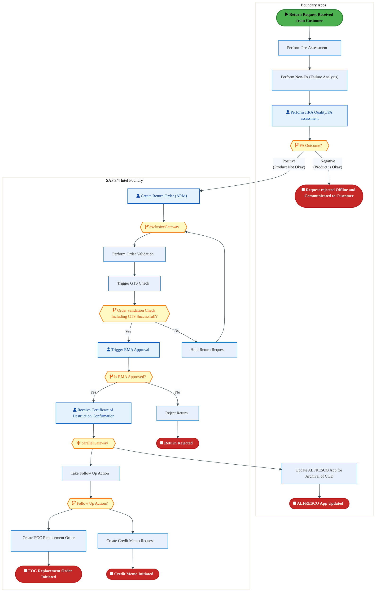
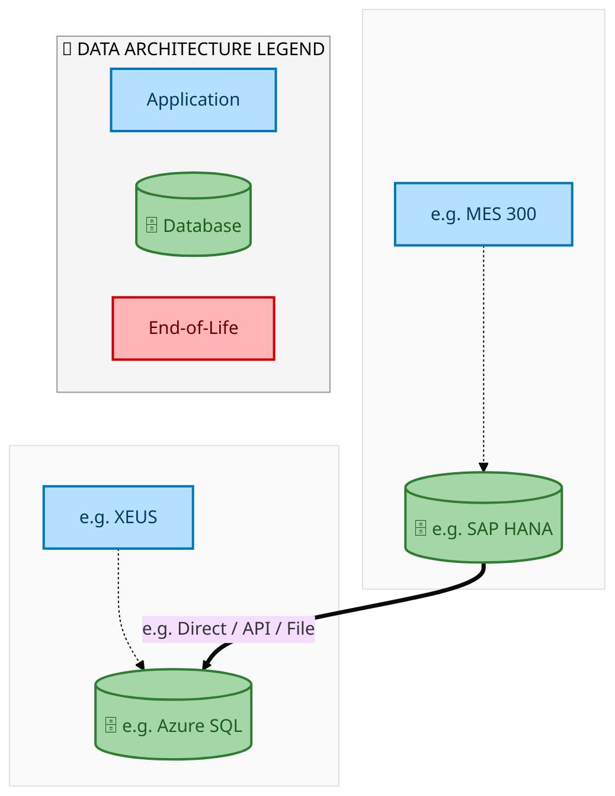
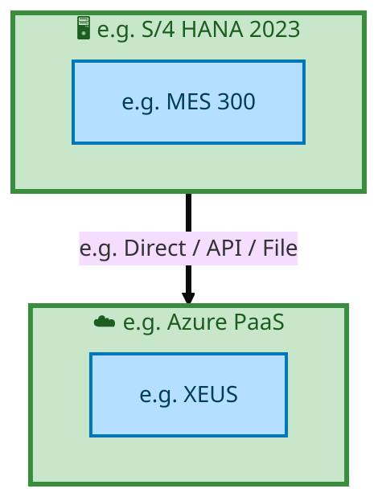

  
  <h1 style="font-size:36px; margin-top:24px;">Order_to_Cash_IF — Order to Cash (IF)</h1>
  <h2 style="font-size:24px;">Architecture Document (TOGAF BDAT)</h2>
  
End-to-End Integrated Processes (E2E) Tower 
  Capability Order_to_Cash_IF · Order to Cash

  
IAO Program · Release 2 
  Generated: March 2026 
  Sajiv Francis

  
IAO Architecture Pipeline — Intel Confidential

Page 1<a href="#toc">↑ Back to TOC</a>Order_to_Cash_IF — Order to Cash (IF)

## Table of Contents

1. [Executive Summary](#1-executive-summary)
2. [Business Context & Objectives](#2-business-context--objectives)
   - 2.1 [Classification](#21-classification)
   - 2.2 [Business Drivers](#22-business-drivers)
   - 2.3 [Success Criteria](#23-success-criteria)
   - 2.4 [Companion Documents](#24-companion-documents)
3. [Business Architecture (TOGAF "B")](#3-business-architecture-togaf-b)
   - 3.1 [Business Process Overview](#31-business-process-overview)
   - 3.2 [Business Process Diagrams](#32-business-process-diagrams)
   - 3.3 [Business Roles & Responsibilities](#33-business-roles--responsibilities)
4. [Data Architecture (TOGAF "D")](#4-data-architecture-togaf-d)
   - 4.1 [Data Entities & Ownership](#41-data-entities--ownership)
   - 4.2 [Data Flow Diagrams](#42-data-flow-diagrams)
   - 4.3 [Data Lineage](#43-data-lineage)
   - 4.4 [RICEFW Data Objects](#44-ricefw-data-objects)
   - 4.5 [Data Governance & Quality](#45-data-governance--quality)
5. [Application Architecture (TOGAF "A")](#5-application-architecture-togaf-a)
   - 5.1 [Current-State Application Landscape](#51-current-state--current-state-application-landscape)
   - 5.2 [Future-State Application Landscape](#52-future-state--future-state-application-landscape)
   - 5.3 [Change Impact Summary](#53-change-impact-summary)
   - 5.4 [Component Overview](#54-component-overview)
   - 5.5 [RICEFW Inventory](#55-ricefw-inventory)
   - 5.6 [Integration Patterns](#56-integration-patterns)
6. [Technology Architecture (TOGAF "T")](#6-technology-architecture-togaf-t)
   - 6.1 [Platform & Infrastructure](#61-platform--infrastructure)
   - 6.2 [SAP Development Object Status](#62-sap-development-object-status)
   - 6.3 [NFRs & Design Principles](#63-nfrs--design-principles)
   - 6.4 [Security & Governance](#64-security--governance)
7. [Project Context](#7-project-context)
   - 7.1 [Project Roadmap & Go-Live Plan](#71-project-roadmap--go-live-plan)
   - 7.2 [RAID Log](#72-raid-log)
   - 7.3 [Recommendations & Next Steps](#73-recommendations--next-steps)

Page 2<a href="#toc">↑ Back to TOC</a>Order_to_Cash_IF — Order to Cash (IF)

## 1. Executive Summary

This Architecture Document defines the **Business, Data, Application, and Technology** (BDAT) architecture for **Order_to_Cash_IF Order to Cash (IF)** within the IAO program. It includes 3 BPMN process diagram(s) in Section 3.
| Dimension | Value |
|-----------|-------|
| **Tower** | End-to-End Integrated Processes (E2E) |
| **Process Group** | Order to Cash |
| **Capability** | Order_to_Cash_IF - Order to Cash (IF) |
| **Release** | Release 2 |
| **Total Systems** | 2 |
| **System Status** | 0 Deployed, 0 Developing, 0 EOL, 2 Pending IAPM |
| **RICEFW Objects** | Pending — Smartsheet Object Tracker API integration |
**Change Summary**: 0 new flow chains, 0 removed, 0 modified, 1 unchanged between Current-State and Future-State states.

> All system nodes in architecture diagrams are **IAPM-linked** — click any node to open its IAPM page. Diagrams require `securityLevel: 'loose'` for click events.

Page 3<a href="#toc">↑ Back to TOC</a>Order_to_Cash_IF — Order to Cash (IF)

## 2. Business Context & Objectives

### 2.1 Classification

| Level | Value |
|-------|-------|
| **L0 Tower** | End-to-End Integrated Processes |
| **L1 Process** | Order to Cash |
| **L2 Capability** | Order_to_Cash_IF - Order to Cash (IF) |

### 2.2 Business Drivers

| # | Driver | Description | Strategic Alignment | Priority |
|---|--------|-------------|---------------------|----------|
| 1 | End-to-End Process Integration | Enable cross-tower integrated processes spanning procurement, manufacturing, and fulfillment | IDM 2.0 Process Excellence | High |
| 2 | Intel Foundry Business Enablement | Stand up foundry-specific business processes for external customer engagement | Intel Foundry Services | High |
| 3 | Process Visibility & Monitoring | Provide end-to-end process visibility across tower boundaries with integrated monitoring | Operational Excellence | Medium |
| 4 | Order_to_Cash_IF Process Migration | Migrate Order to Cash (IF) business processes and 2 integrated systems from legacy to S/4 HANA target architecture | IDM 2.0 Cross-Functional / End-to-End | High |

Page 4<a href="#toc">↑ Back to TOC</a>Order_to_Cash_IF — Order to Cash (IF)

### 2.3 Success Criteria

| Metric | Target | Measure | Baseline | Owner |
|--------|--------|---------|----------|-------|
| E2E Process Cycle Time | Per process SLA | End-to-end transaction completion within defined SLA per process | Varies by process | E2E Process Owner |
| Cross-Tower Integration Success | > 99% | Transactions completing across tower boundaries without manual intervention | 92% (current) | Integration Lead |
| Process Exception Rate | < 2% | Transactions requiring manual exception handling | 8% (current) | Operations Manager |
| Order_to_Cash_IF Migration Completeness | 100% flow chains validated | All 1 flow chains verified in target state | 0% (pre-migration) | Tower Architect |

### 2.4 Companion Documents

| Document | Description |
|----------|-------------|
| **Business Architecture** | Included in this document (Section 3) — process flows from BPMN diagrams |
| **This Document** | Full BDAT Architecture — Business + Data + Application + Technology |

Page 5<a href="#toc">↑ Back to TOC</a>Order_to_Cash_IF — Order to Cash (IF)

## 3. Business Architecture (TOGAF "B")

### 3.1 Business Process Overview

This capability includes **3 business process(es)** modeled in BPMN 2.0, covering the end-to-end workflow for Order_to_Cash_IF Order to Cash (IF).

| # | Step ID | Process Name | Lanes | Tasks | Gateways |
|---|---------|--------------|-------|-------|----------|
| 1 | E2E-10__R3_-_Intel_Foundry__RMA_for_Direct_Customers_with_no_physical_receipt_of_the_defective_produ | E2E-10__R3_-_Intel_Foundry__RMA_for_Direct_Customers_with_no_physical_receipt_of_the_defective_produ | Boundary Apps, SAP S/4 Intel Foundry | 14 | 6 |
| 2 | E2E_93__R3_Product_&amp;_Service_Sales_-_'Standard_sales_order_scenario_with_Combined_orders_(Physic | E2E_93__R3_Product_&amp;_Service_Sales_-_'Standard_sales_order_scenario_with_Combined_orders_(Physic | External Partners/ B2B
, SAP CFIN, SAP S/4 Intel Foundry 
, SAP S/4 Intel Foundry - Foreign LE
 | 64 | 33 |
| 3 | R3_E2E-80__Intel_Foundry-_Customer_Requests_Expedite_-_Service_Fee | R3_E2E-80__Intel_Foundry-_Customer_Requests_Expedite_-_Service_Fee | Boundary Apps , Customer Business Analyst, SAP CFIN, SAP S/4 Intel Foundry | 30 | 23 |

### 3.2 Business Process Diagrams

Page 6<a href="#toc">↑ Back to TOC</a>Order_to_Cash_IF — Order to Cash (IF)

#### BUSINESS ARCHITECTURE — 3.2.1 E2E-10__R3_-_Intel_Foundry__RMA_for_Direct_Customers_with_no_physical_receipt_of_the_defective_produ — E2E-10__R3_-_Intel_Foundry__RMA_for_Direct_Customers_with_no_physical_receipt_of_the_defective_produ

**Swim Lanes**: Boundary Apps · SAP S/4 Intel Foundry | **Tasks**: 14 | **Gateways**: 6

> **Legend**: ● Start · ● End · User Task · Service Task · ◇ Gateway · Sub-Process

<a href="https://mermaid.live/view#pako:eNqlV1tz4jYU_isa72TIzsCs5QsmPHTHMbhNZ7NJQ3Y7ndIHxZZBjS9UkpPQLP-9R7YM2Jin8gCjT9_5zkVHF96NqIipMTUuLt5ZzuQUvQ_kmmZ0MEWDJyLoYIhq4DvhjDylVAwUJylyuWD_VjTsbN4UTWEhyVi6VeiCrgqKvt0MkQ-G6RAJkouRoJwlg-Fgw1lG-DYo0oIr9gc6Scyk8qanrgseU34gmKaHIxdMU5bTA2x7jueEyk7QqMjjlmjiJpMkGuxUcGnxGq0Jl1X4paC35O13Fss1jBOSCgqctczSL-SJpipHyUuFRSV_aYrBhPKTQ8EWGxKxfAW4YwLESf58gFxzt0O7i4tlvneKHmfLHMEnSokQM5ogIQGev0iUsDSdfnACP3TNoZC8eKbTD9bcm9nWMFKZTCF1c6iKO3qlbLWW06cijTV19KpymFqbtyF_m1rmkG_hu-OL5vHBUzC2JtZk7-nawwEOGk9JkvwvT1BX_kjEs_Y1t0MrnO19YXfsBuapXpPmzPF83K0T5S8sokeiYRja80Op5mMXm-dFr0N7bAYd0RWR9JVsD4JXgbMXDF0vxN5ZwdpfN8ry6Z4XUSNoz93Q3Qt61zj0rbOCjo-diY4QdFacbNbouiirXkb-ZiPqOfXJ8Z9L457ypOAZuud05AtBhchoLpfGX0c864j3tchHoY8uQ8LSklPk5yTdQjN_bJvYYPJtE0NpkP8lfJgvgjvlHYEGbOFozV5IiooEBXeztiFWQSVkmpCRWn_U-P315sFHv5UkZXL7CQIgZ2LF7uVeYJPCsjxQWfIcfv4pqZDwG1H2QmOU8CJDQSlkkVEOGh-PRcYHESBs9tac_k0jCdZ3SaKODkTyGAVFlpU5i4iakMVZUa8j2ipMXay4Y2Ph9_fGRp2toyc4HaI1ggLclTICL5-Xxm5XW8DO7Cz8wr9Hi08OusklTVGo2oBvj-Sdo4W9Uyck-g4FhkBYkbfL6gLzF9i_nXK2SWMgPVQV0rT2tAfTAaeqJ8K7ACiwPhFVS1g7b7MnBzb8xEyiW5oV_Y6vgPtInkG3SOGUhGIiPzpNApuKx9lqBZn-_LhAwZpGzx2O1e4_HYJOuy7Spf9w2-l3bLfNGi8Pt75aXl5Av3csnLaFbkwUUC5ZUnWT2iAzSJaXVTLQaHnCeNazPHjS6a3eAkMfMMl62gxfdcyPK37OyDJPNolujXqPdOlWfyvTtygtBWT-c32OHvq5NrP7zW7EUW1p_Llr5pzZOJ0GObFz--3q-r3sd0fdOlAbCD6Gm7pqp0UZRXAoJWX6-UR3fNAlnBevYkRSiTaEkzSl6Unu-72cYzQa_QQCemjVQ4ybaQ1Ye4IGnIZga4LdEJwa8DrjiR5faX4j4GmPzfxEj6_0eKz5ZuNQ61ljDegAcOMQuxrQY83HewFTC7hNhJXCj6XxBxVL44dyoWfcbvI6mCY23FSv8WVhLXVfCGhr2G_L_BJu2xi2GNxtsFGeyfZj7cTq2nylcNeDDeB7GyaOTZqULbcbsd2d-VpUEyc5anzcycg-eiRUeTWvozZuncHtM7hzBnf3b8o2Ptbvvzbq9aKTXvSqD7XMXhQ3j6s2bPXDdj_s9MNuPzxuYGNowB2eERYb03ej-tcC_2ximpAylcZuaJBSFottHhnT6nVvlNUNPmME7t6sBnf_AXD-Bkk=" title="View Full Diagram">&#128065; View Full Diagram</a>

Page 7<a href="#toc">↑ Back to TOC</a>Order_to_Cash_IF — Order to Cash (IF)

#### BUSINESS ARCHITECTURE — 3.2.2 E2E_93__R3_Product_&amp;_Service_Sales_-_'Standard_sales_order_scenario_with_Combined_orders_(Physic — E2E_93__R3_Product_&amp;_Service_Sales_-_'Standard_sales_order_scenario_with_Combined_orders_(Physic

**Swim Lanes**: External Partners/ B2B
 · SAP CFIN · SAP S/4 Intel Foundry 
 · SAP S/4 Intel Foundry - Foreign LE
 | **Tasks**: 64 | **Gateways**: 33

```mermaid
%%{init: {'theme': 'base', 'themeVariables': {'fontSize': '14px', 'fontFamily': 'Segoe UI, Arial, sans-serif','primaryColor': '#e8f0fe', 'primaryBorderColor': '#0071c5','lineColor': '#37474F', 'secondaryColor': '#f5f8fc'}, 'flowchart': {'useMaxWidth': false, 'htmlLabels': true, 'curve': 'basis', 'nodeSpacing': 40, 'rankSpacing': 50}} }%%
flowchart TD
    classDef startEvt fill:#4CAF50,stroke:#2E7D32,color:#000,font-weight:bold,stroke-width:2px,rx:20,ry:20
    classDef endEvt fill:#C62828,stroke:#B71C1C,color:#fff,font-weight:bold,stroke-width:2px,rx:20,ry:20
    classDef userTask fill:#E3F2FD,stroke:#1565C0,stroke-width:2px,color:#0D47A1
    classDef serviceTask fill:#FFF3E0,stroke:#E65100,stroke-width:2px,color:#BF360C
    classDef gateway fill:#FFF9C4,stroke:#F57F17,stroke-width:2px,color:#E65100
    classDef subProc fill:#F3E5F5,stroke:#7B1FA2,stroke-width:2px,color:#4A148C
    subgraph External Partners/ B2B 
        n52["Capture Order via EDI/R Net"]
        n53["Receive Data in B4NL"]
        n54["Notify Carrier"]
        n67(["fa:fa-play Orders Received from Customer"])
    end
    subgraph SAP CFIN
        n48["Perform Profitability Analysus"]
        n49["Receive Payment Receipt from Bank"]
        n50["Generate Cash Application"]
        n51["Perform AR Posting and Auto Clearing"]
        n71(["fa:fa-stop Cash Application Generated"])
        n72(["fa:fa-stop Profitabiiity analysis performed"])
        n91{{"fa:fa-code-branch Open Invoices Found in Reconciliation?"}}
        n92{{"fa:fa-code-branch exclusiveGateway"}}
    end
    subgraph SAP S/4 Intel Foundry  
        n55["Receive Planned Order (SGF-01)"]
        n56["Execute Production Order Steps"]
        n57["Release Production Order Release"]
        n58["Perform Outbound Delivery(EWM)"]
        n59["Perform STR STO Outbound Delivery (S/4)"]
        n60["Perform Pick/PGI (EWM)"]
        n61["Perform Goods Receipt (Value Added)"]
        n62["Receive Goods Receipt (EWM)"]
        n73(["fa:fa-stop EWM steps completed"])
        n93{{"fa:fa-code-branch exclusiveGateway"}}
        n106{{"fa:fa-arrows-alt parallelGateway"}}
        n107{{"fa:fa-arrows-alt parallelGateway"}}
        n109{{"fa:fa-arrows-alt inclusiveGateway"}}
        n110{{"fa:fa-arrows-alt inclusiveGateway"}}
    end
    subgraph SAP S/4 Intel Foundry - Foreign LE 
        n1["Perform Order Validation"]
        n2["Trigger GTS check"]
        n3["Calculate Taxes"]
        n4["Perform CTP Check"]
        n5["Send Order Confirmation to Customer (Service Item on billing block)"]
        n6["Update Line-Item Text"]
        n7["Calculate Pricing"]
        n8["Derive MMID from CPN"]
        n9["Perform Credit Check (via FSCM)"]
        n10["Manage Back Orders"]
        n11["Put on Hold"]
        n12["Send to Foreign LE for Service and Assembly test Orders"]
        n13["Perform Order Validation"]
        n14["Derive MMID from CPN"]
        n15["Perform GTS check"]
        n16["Calculate Pricing"]
        n17["Perform Order Validation and implement auto billing block"]
        n18["Derive MMID from CPN"]
        n19["Perform Credit Check (via FSCM)"]
        n20["Calculate Pricing"]
        n21["Perform GTS Check"]
        n22["Calculate Taxes"]
        n23["Check type of Delivery"]
        n24["Perform Outbound Delivery"]
        n25["Perform Pick and Pack Updates (EWM - Decentralized)"]
        n26["Perform ATP Check (Unrestricted Stock)"]
        n27["Perform GTS Trade Compliance"]
        n28["Generate Customer Invoice (for Physical Product)"]
        n29["Calculate Tax"]
        n30["Release Billing Block and confirm service"]
        n31["Generate Customer Invoice (for Service)"]
        n32["Export Invoice, Commercial Invoice, GTS"]
        n33["Generate Commercial Invoice (proforma)"]
        n34["Ship Goods Issue"]
        n35["Generate 0$ invoice with no charge to customer"]
        n36["Create Packing list"]
        n37["Create Packing list Addendum"]
        n38["Generate Sales Invoice (for MY, Vietnam, China"]
        n39["Calculate Taxes"]
        n40["Perform Allocation Availability Check"]
        n41["Perform Order Confirmation"]
        n42["Send Updates via ECA"]
        n43["Feed via ECA"]
        n44["Send Updates via PDH"]
        n45["Perform Scheduling in Third Party App (FSCO)"]
        n46["Updates from FSCO to MES and send event updates to S/4 from MES"]
        n47["XEUS Integration Layer"]
        n63["fa:fa-user Capture Sales Order"]
        n64["fa:fa-user Perform Manual Price Override"]
        n65(["fa:fa-play Manual override initiated"])
        n66(["fa:fa-play Updates from ECA"])
        n68(["fa:fa-stop Data Sent"])
        n69(["fa:fa-stop Packing completed"])
        n70(["fa:fa-stop GTS process completed"])
        n74["Sales Order Unconfirmed"]
        n75["Sales Order Partially Confirmed"]
        n76["Order directed to US Central"]
        n77["Sales Order Confirmed"]
        n78{{"fa:fa-code-branch exclusiveGateway"}}
        n79{{"fa:fa-code-branch Order Partially Confirmed or Unconfirmed?"}}
        n80{{"fa:fa-code-branch exclusiveGateway"}}
        n81{{"fa:fa-code-branch exclusiveGateway"}}
        n82{{"fa:fa-code-branch Credit Check Successful?"}}
        n83{{"fa:fa-code-branch exclusiveGateway"}}
        n84{{"fa:fa-code-branch Identify Classification Based on item In customer PO?"}}
        n85{{"fa:fa-code-branch GTS Check Successful?"}}
        n86{{"fa:fa-code-branch exclusiveGateway"}}
        n87{{"fa:fa-code-branch Check type of Order"}}
        n88{{"fa:fa-code-branch Is Cross-Border Applicable?"}}
        n89{{"fa:fa-code-branch exclusiveGateway"}}
        n90{{"fa:fa-code-branch exclusiveGateway"}}
        n94{{"fa:fa-arrows-alt parallelGateway"}}
        n95{{"fa:fa-arrows-alt parallelGateway"}}
        n96{{"fa:fa-arrows-alt parallelGateway"}}
        n97{{"fa:fa-arrows-alt parallelGateway"}}
        n98{{"fa:fa-arrows-alt parallelGateway"}}
        n99{{"fa:fa-arrows-alt parallelGateway"}}
        n100{{"fa:fa-arrows-alt parallelGateway"}}
        n101{{"fa:fa-arrows-alt parallelGateway"}}
        n102{{"fa:fa-arrows-alt parallelGateway"}}
        n103{{"fa:fa-arrows-alt parallelGateway"}}
        n104{{"fa:fa-arrows-alt parallelGateway"}}
        n105{{"fa:fa-arrows-alt parallelGateway"}}
        n108{{"fa:fa-arrows-alt inclusiveGateway"}}
    end
    n1 --> n8
    n94 --> n64
    n94 --> n6
    n67 --> n52
    n2 --> n85
    n95 --> n78
    n64 --> n95
    n65 --> n94
    n78 --> n7
    n63 --> n83
    n8 --> n9
    n9 --> n82
    n4 --> n97
    n79 --> n74
    n79 --> n75
    n74 --> n80
    n75 --> n96
    n80 --> n10
    n81 --> n4
    n96 --> n80
    n96 --> n98
    n55 --> n110
    n56 --> n93
    n57 --> n106
    n110 --> n56
    n49 --> n50
    n50 --> n91
    n82 -->|"Yes"| n2
    n11 --> n83
    n82 -->|"No"| n86
    n84 -->|"Bailment Material 
from Customer"| n12
    n12 --> n68
    n85 -->|"Yes"| n78
    n86 --> n11
    n85 -->|"No"| n86
    n97 --> n79
    n97 --> n98
    n3 --> n81
    n5 --> n77
    n98 --> n5
    n52 --> n84
    n76 --> n63
    n10 --> n40
    n91 -->|"No"| n71
    n83 --> n87
    n84 -->|"Wafer & related services"| n76
    n13 --> n14
    n6 --> n95
    n14 --> n15
    n15 --> n16
    n16 --> n81
    n40 -->|"Source Determination and 
other information exchanges"| n81
    n87 -->|"Physical Product Line Item : 
Shipment – No | Invoicing -
 Yes
UoM – Quantity Based"| n1
    n17 --> n18
    n18 --> n19
    n19 --> n21
    n21 --> n20
    n20 --> n22
    n22 --> n81
    n87 -->|"Physical Product Line Item : 
Shipment – Yes | Invoicing -
 No
UoM – Quantity Based"| n13
    n87 -->|"Service Line Item
UoM – Quantity/Hour Based"| n17
    n7 -->|"Capture Reference Price 
for Commercial Invoice"| n3
    n106 --> n59
    n58 --> n107
    n59 --> n58
    n93 --> n57
    n107 --> n60
    n107 --> n93
    n60 --> n73
    n106 -->|"Manufacturing Execution 
(Depicted as part of FTS Flow – E2E 74)"| n61
    n61 --> n62
    n23 --> n99
    n28 --> n29
    n62 --> n23
    n99 -->|"Line Item # 2 : Outbound  of Physical Product"| n24
    n99 -->|"Line Item # 1 : Only invoicing of Physical Product"| n28
    n99 -->|"Line Item # 3 : Service Line Item"| n30
    n24 --> n26
    n26 --> n100
    n30 --> n31
    n32 --> n89
    n88 -->|"No"| n33
    n88 -->|"Yes"| n32
    n33 --> n89
    n100 --> n27
    n100 --> n25
    n25 --> n101
    n101 --> n88
    n101 --> n90
    n101 --> n36
    n36 --> n37
    n37 --> n38
    n38 --> n69
    n89 --> n90
    n90 --> n34
    n35 --> n103
    n34 --> n102
    n102 --> n35
    n102 --> n53
    n31 --> n39
    n103 --> n51
    n29 --> n103
    n39 --> n103
    n51 --> n92
    n92 --> n48
    n91 -->|"Yes"| n92
    n53 --> n54
    n27 --> n70
    n42 --> n104
    n66 --> n42
    n43 --> n41
    n108 --> n44
    n41 --> n105
    n104 --> n108
    n45 --> n46
    n105 --> n108
    n77 --> n43
    n105 --> n109
    n109 --> n55
    n104 -->|"Pegging of lots to Sales Orders​"| n45
    n46 --> n47
    n47 --> n110
    n44 --> n109
    n48 --> n72
    class n63 userTask
    class n64 userTask
    class n65 startEvt
    class n66 startEvt
    class n67 startEvt
    class n68 endEvt
    class n69 endEvt
    class n70 endEvt
    class n71 endEvt
    class n72 endEvt
    class n73 endEvt
    class n74 startEvt
    class n75 startEvt
    class n76 startEvt
    class n77 startEvt
    class n78 gateway
    class n79 gateway
    class n80 gateway
    class n81 gateway
    class n82 gateway
    class n83 gateway
    class n84 gateway
    class n85 gateway
    class n86 gateway
    class n87 gateway
    class n88 gateway
    class n89 gateway
    class n90 gateway
    class n91 gateway
    class n92 gateway
    class n93 gateway
    class n94 gateway
    class n95 gateway
    class n96 gateway
    class n97 gateway
    class n98 gateway
    class n99 gateway
    class n100 gateway
    class n101 gateway
    class n102 gateway
    class n103 gateway
    class n104 gateway
    class n105 gateway
    class n106 gateway
    class n107 gateway
    class n108 gateway
    class n109 gateway
    class n110 gateway
```

> **Legend**: ● Start · ● End · User Task · Service Task · ◇ Gateway · Sub-Process

<a href="https://mermaid.live/view#pako:eNqlWllv20gS_isNZbP2ABLC-9DDLmQdGQOxrY2cyQ7W-9AmmxIRihR42NYk_u9b3eyiqBaZQxsgQVSs86vqqmpKXwdBFrLBePD27dc4jcsx-XpRbtiWXYzJxSMt2MWQ1IQ_aB7Tx4QVF5wnytJyFf8l2HRr98LZOG1Bt3Gy59QVW2eMfLoekgkIJkNS0LQYFSyPo4vhxS6PtzTfT7Mkyzn3G-ZFWiSsyUdXWR6y_MCgaa4e2CCaxCk7kE3Xcq0FlytYkKXhkdLIjrwouHjlziXZc7CheSncrwp2Q18-x2G5gc8RTQoGPJtym3ygjyzhMZZ5xWlBlT8hGHHB7aQA2GpHgzhdA93SgJTT9MuBZGuvr-T17duHtDFK7mcPKYE_QUKLYsYiUpRAnj-VJIqTZPzGmk4WtjYsyjz7wsZvjLk7M41hwCMZQ-jakIM7embxelOOH7MklKyjZx7D2Ni9DPOXsaEN8z38q9hiaXiwNHUMz_AaS1euPtWnaCmKov_LEuCa39Pii7Q1NxfGYtbY0m3Hnmqn-jDMmeVOdBUnlj_FAWspXSwW5vwA1dyxda1f6dXCdLSponRNS_ZM9weF_tRqFC5sd6G7vQpre6qX1eMyzwJUaM7thd0odK_0xcToVWhNdMuTHoKedU53GzJ_KVme0oQsoUxSlhfvyJVxRWou_ie1jf88DKZ0V1Y5I3f8rJCnmJL57PrdR3LLyofBf9vcJnB_ZAGLnxiZ0ZKSOCVX1u0Hhc0CttusjKM9mdI8j1l-zOC4l8AR0XFER7sEIBSWCyJVhyTKsy2ZVkWZbYXsb7UwlKAS4WqyJNPF9W1LueWB7iXLoyzfEsAzikv6GCdxuScTwGJfVMWxN5bfimpJ91uWlrUru7L25ApOphKiBjLvGWAKRQBBFhsy2e2SOKBlnKUKr95yaPKRLLOihDNOaBqSSVVmZJowaIvp-ljM1Q8gARC7EysE7YcHhGpJQ5FsUIg5ClSgEBdkV_t0Iu_rX7-iPG_so0doTcGG3O1YSq7TpwyOUkEWWQUBQAF85C0zAISFV_98GLy-tpUZ3crYS5BUBUD-vj5GB7HuLK_eWWC7ZEltON-Tozq22zlMaJpCFdX1fLl6vxhp-m9KUhwQmL-woIL8AT5hFQhMa5lVyXZKldiusACpKjoE5ANFpF2Jd1X5KBCbsQSczPeX8883qlN-S2B1_xH-3p0KQkTvLEXS0dpFHwdf3i3fX5MOE067GN9nWVg0pX75B00qRiZhyEJVymjBq0id2nBNpf6ABUYVQEqCbLtL2GnJ-uavVokQ0zXnIAedJnsuRjQpyY7mNElY0iflniXld0rF6fdd1LVfFPvZ-h_B_3KYsCn5MG-fhXaG6-qExMZhR2fiWb3P4_UaeN7fr0iwYYHS6EwxH5KgSniju6cvTO2eLWvTe-jGpzr42VxBVNKbaZZGcb6texhvf7LPQ13XY5pcl2xL4CG07YR3ysckC76oJQlKP-1C7tUH2OVGQuaevSgjyz3yf5nHwUmj5ad0BhsllPbNzfVMDp_l7TFX-2hOcxbGZR0queQDc7GaqqdA50fyBprtmsEAAcZ6yClMIllVyaP9HdYk5amByAFMrWSDEwSxElOkKNj2MdmTkhVltx3zp4tCt34KD91uN5Lu4tGdH6Ovu9_xTEQX85YhhjLl0_KoKBRdP5dK_ZdzaWg_DsTQFUA6ToJh_Og4GeLACWfK_Y6RLGr6vsJofW-4KLy2Mh0ErktelPURKkQbh44yg66eltAG4VamDgHDae8xeNTJ5ac0h7IDSKCtw-Q8PaqGqyBzn9MQtiY-C2Jo88rYNLyj3Qq7g1w8yCWv_uUGNpiAb7b1JFYt-irOSlfTWsP8ShbUFS8ogUxQdyi8Niiy-o_dk4dT8co0xM6xy-AqJ9mHHAUQD-Bye6ABRoqkeWTzRIRc7mDFA3ipapJXyWoT7-TUvi6KSo3HbuvW_gaTqdb5HJcbkmaE3z2hh8HRCw4beVuBOOU5EycDaopjmcSF0ohNt5tL7BtpWG0V9qMiWNEEavQI4ps_h-SPmJUp3QKImziligL_h5OrvTNNEsh-3XMmTzRO8MrQcYit0wHbHmkKc9PC8aSJ-9V0orDxBC8YHKDux1aXluXsd4Wtfc5X0JDDSlQ2LOn3mzgPxT1wz-8Q5BK63J1SLNZhphZ16-RMPPE385U4GAV3gT3xXlxJPnjKVxPBDmyKRp70f88_rcTqAsuMAPgD3Z_cCM1mY-S3f4JX0jrxAmRFwDoWwKhh4FaiLfBCuYNWmMehUvCOrdw-pUwmuQl_hRV33KscRxE8wqpO2hG_p-zB4soMaSxVRl-9sMkD0rcuu5oiwLsqtAC4l_Xv2K4oogOg5FMqGx1T9g7XVjh53UC7gQ1j2iPBS6fmDeOciVEAlQGJn9bzRGF3FQN9ar2zrgWu33OB7QuGZEdoqHdYTzvLDU8_T6znxny0qayqgCc7qpITZ8-7SnlWt9g1dOf6TQ5_TRVH-PLhCkZnyNfWmC_e12kzHMjy7sQlu1t3syV9LxznvHDcHhCPVivZWI4le2ruuoAMZEUxqt8p45uYx4SduOyf5bJ_XpX51hmXWd8-R-icy7Z_zl3b984R8s-61WtnSelnSRlnSZlnSVlnSdlnSXnnvuJIdTIa_QOOjPzoW_Vnx1IJ8rPj1p9tQxIMqcBGAbsmuKjSkRp85HAkh482XE-KIIMpdZqSIJ_7aEI-RhfQAMq7ksG1VAK64EoRT0MC-oRxelpN0JHDk0g1wDiKCiT4GLgtdeqNDhtZMDDbRStoF5glwEixpPN2o0Vy-Dq6JnLw7WHwJ1-xv0FOGmUqkMh5mwlGrwnXkg-uYPcWd_0bqBn-lR95SJVvA77xFyNoQabfwaA9W_GlqQPPQThUVtUZX6Li-gqhgRYLBFVhzWEF-LJiMN82VmlTEdIZB5FB2K0mnfqxd27jNhp3Vew-0wjm0t9JzviVJ8Trq8ShybCU19EXRzkfuixOvSFgITUqHCV-S5MurLIqh8V7ButnvoU7WfMS5yHNyg14F6fimiroMNg2NF1LBxtlniuVqZd88aKvfjk4BoX8WitK5aEyNIjqNiPf5B2R784jUMeLIP2U3SDLvyoKywxcgcT2UpcSxoRHAXOsyxzqWAW6PAgGihiyvPELTPiPJDTNyVCAOjc2COQkOCiMH8VmqmbxrWFjrVPFu98hjW09TWeTavB69pFBxbE0YPLC9cCz2_F-Qmg5lLosHxuRtRFqDQ3Z2HSawSCr1nYbLTJhjqZSmvbmyHy4iulv4sVsFdEAouBw1l8E8Zp8SC9nbFe_y6IFH3wlXxQXsKkukuwZkZobc-LyL2G-8a9U0JysB6dJv3Tax0ANGaiBBEcWiIEe-r508FAPb4gBNdG84uPuqNVTd13rezp0riOFS0_cFFGvIu97ikxQdFpGIsHNOZAdxMCGYWDvxe-8gbemmAieiUcFofG84wZomuoDbPEm4m2aig6wJz1xTyjY3QzsblrTCjScW55K8TWVYmKMpozRRFOmLEezmRoy-04Toq9o9REVTKXZOIfRm9idtWYGahI601YpdiOF3h6QwQPVdDP_xNQJxUYY0LYvDVmeOrYwOQ2rjQYxNgPHLEZvGWivGU0SU6tZtaQS65ArCaqFMpaOWg5wNJihm5bE1WpGmmarPK70zzJPeQ4wYqNSjPEWz9ZrecySrKzflB1eeRS8k2iPAiMLhS2MF2vIctUdzrJUHyxcX43W70nEFos_pDmmWz10u_k50THd6aG7PXRP_lTomOp3UV2tk6p3Uo1OqtlJtbp9c3tidHtidHtihBuD_PXPMdnvJMMu30nWu8lGN9nsJlvdZLub7HST3W5yd5Red5R-d5R-d5R-d5R-d5R-d5R-d5R-d5R-d5R-d5R-d5R8fnTT9R660UM3e-hWD93uoTs9dLeH7vXQe-LVm3gHwwGsdVsah4Px14H4OedgPAhZRKukHLwOB_zr2dU-DQZj8bPHQf0VwSym65xua-Lr_wBon7T5" title="View Full Diagram">&#128065; View Full Diagram</a>

Page 8<a href="#toc">↑ Back to TOC</a>Order_to_Cash_IF — Order to Cash (IF)

#### BUSINESS ARCHITECTURE — 3.2.3 R3_E2E-80__Intel_Foundry-_Customer_Requests_Expedite_-_Service_Fee — R3_E2E-80__Intel_Foundry-_Customer_Requests_Expedite_-_Service_Fee

**Swim Lanes**: Boundary Apps  · Customer Business Analyst · SAP CFIN · SAP S/4 Intel Foundry | **Tasks**: 30 | **Gateways**: 23

> **Legend**: ● Start · ● End · User Task · Service Task · ◇ Gateway · Sub-Process

<a href="https://mermaid.live/view#pako:eNqlWdty4jgafhUVXV1JqqDbJ9nAxW6BgZlUTXdTITNTU8teCFsGbYzN-EDCZvLu-8uWjC2U2R4mF-n2p_98lJ3XXpCGtDfuffz4yhJWjNHrTbGje3ozRjcbktObPqqBX0jGyCam-Q2nidKkWLH_VmSmc3jhZBxbkD2LTxxd0W1K0c_3fTQBxriPcpLkg5xmLLrp3xwytifZyU_jNOPUH-gwMqJKmziapllIszOBYXhmgIE1Zgk9w7bneM6C8-U0SJOwIzTC0TAKbt64cXH6HOxIVlTmlzn9Ql5-ZWGxg-eIxDkFml2xj38iGxpzH4us5FhQZkcZDJZzPQkEbHUgAUu2gDsGQBlJns4QNt7e0NvHj-ukUYoeZ-sEwU8Qkzyf0QjlBcDzY4EiFsfjD44_WWCjnxdZ-kTHH6y5N7OtfsA9GYPrRp8Hd_BM2XZXjDdpHArSwTP3YWwdXvrZy9gy-tkJfiu6aBKeNfmuNbSGjaapZ_qmLzVFUfS3NEFcs0eSPwldc3thLWaNLhO72Dcu5Uk3Z443MdU40ezIAtoSulgs7Pk5VHMXm8b7QqcL2zV8ReiWFPSZnM4CR77TCFxgb2F67wqs9alWlptllgZSoD3HC9wI9KbmYmK9K9CZmM5QWAhythk57NA0LataRpPDIUf1If9JLOtf696SZlGa7dEkjtOAFCxN0ORIWEw2LGbFCfk7Gjyte_9u89nAt4JKQD8fQnA_R0dG0HL2o0Lm6Mjm_kQhwy0rVsGOhiW05RaxBD3uWBaiJVR3ZTy6Xaz8b3cKuwvsUkGUpXvEiVCRoi_zFSKgPecm0CNNClQKOjhdfXZqciDrSrSdWxAZkXFEBocYUtuRXtt_16J3hq-vkp5PwMEGejjYIfoSxGXOjvSHukTWvbe3FptrntlIlqXP-YDEBbj951zWX-QC55V68Mu8SPc0Q1PgSGieo0lC4lNetNSYEIEvJClJjDK6ZVBvdWmkMAFeDjRkBYWD30uaF3VYGqEQWn86-fyFZE-04Hl8pGSvpAyET_IcNO95UqawGkIEwh_TwZSereJdAP8qyTGV5Hzjox090ICC92HXGCVRNj7zAsEBLShFSVqguXApVBlchUGEpGX8V2Dnu6IMLtkdQ18YMxqwnEdzT0LKA8bn-pY2ZnC7_qnk3TG_V1ZGoQRQQp_RisCKFQFKM1H8kD9IJ0_M6ht6ZsVOjsVPnz6pOq2rCtux9WyXwducNLXCKyGisCHFAIKS61Ra0CS3oxV7f7sxVpMl8hf3X9t9MGqPyAe0TKvYKfVsNCMI-STfVYNWIeENJYoUBtqpcr96PhRKgdtKgSvUaCUiN4WLglqvI6VeRQshP90fYnpZodjVBu1AMhLHNP7OmPFRep8UNEYLvmqyU9skMMgncVDGPDrLjAUX4XP-Pwk-B_gnGA6D-4LuoVhelNi57WQ9LnW7y5M7qW4LP00ilu2r4dYlHHKr6lMYK61W6pLx-vDrlvtWFhvuP_RkDGmGMHQoTaNl3Q9pGuboPs9LqlCZZ4F8jH2CyB5TaE90C4zQxmzLYFojfnNFMCv2yjo0q51eFryLJiU0CrgWoB_h7qXQ2eeQPtD_0KAa7w_Qd_APHyPQsjRWeJyubdW8b8xrTy_VKPwdXWS2s7eMSZJQmaXazttcFeu1ObKUD2HuxZ8z8cTW4ZcddfsLiUugDe_kHskqA5TqsrymufjdFIlItKfs7VcYu9V_7xBPVxOTiCp5toZdYSIVHWGrejBXJY-qkoc7UTO-NcVojbpCZWzE5OWtBWUK7mUsVOyxDa09D_TIYDt_buqOtjxCG7m5Q7GFFJmWMsrOjvDelTr4uyIjmu3rKdPMr9ekX5VmfEk_VKefpohyNEsTqi5qR7-xqvmBWCSvpWArJAcuKmxP0cWGxnohPIRQFRcRhMBVdvFmq-cMynfsUM162Hl1ifJD2Wlwl9XsaPd9rXn3SnFOlz-bVTfjSVDwuoB5hWY8Exx7rH77-aV_3nW3gdFfWzH1vDeuYTKvYbKuYbKvYXKuYcLXMA2vebPAo6veR4xrr11wlUeDwT_4zU0AjsGBP9a93yhcn_7gl15xIigdSzxbQwGMBIAFhS1lC9Hy3LEEgyRwBYGUiAWBayqANM4TDI54FhZgKRDbqgABSBNG9aNpSJ8MAUgGR5goNZrSZqnSETaY0mhTqLAliy1kuo0SUwFcqVUKNYVaE8vYChb5QQZupAKQhlpCBnalqyKapvTVFM7ao05q-SuYlCHjLX1xpdomIyLCQylTKLEbQKZAApZSJa4A5LNjn-sL3co7MX814p8YGEzCddLst2ZYrhOyzSit5nL1viQH8l1do4Yq_WtaHdgyOo70zFMBaTgW4XIVw5vyxY7iagNImVgEuKkVIRJL8yxPmCcuA8e8dT9cJ-LaXb3LsuoWVZwOog0bGRgrQh2n63NTu81B08oy8Q5WT1z15EKY2z0wbfVAyrKbusdqicrekUUtQ6zGy1R9bQCRNJkTS3JgtdykeZZoHFMaYYusWTJLlux5mVdnqLSFBKymcaQdUqgpPWvaQHaj1_qyWBWA_KTaxYfv4CM9DjNGj5vNh-gubr2D2-_gzjs4Fh-fu6irRT0tOtSiIx0KA0t82e3Cph629LCthx09jPWwq4c9PTzUwyMtjPVeYr2XWO8l1nuJ9V5ivZdY7yXWe4n1XmK9l67eS1fvpdt42ev3YMzvCQt749de9Zer3rgX0oiUcdF76_cIDNDVKQl64-ovPL36C9uMwcIg-xp8-x9oSU-y" title="View Full Diagram">&#128065; View Full Diagram</a>

Page 9<a href="#toc">↑ Back to TOC</a>Order_to_Cash_IF — Order to Cash (IF)

### 3.3 Business Roles & Responsibilities

| Role / Lane | Processes Involved | Description |
|------------|-------------------|-------------|
| Boundary Apps | E2E-10__R3_-_Intel_Foundry__RMA_for_Direct_Customers_with_no_physical_receipt_of_the_defective_produ,  | |
| SAP S/4 Intel Foundry | E2E-10__R3_-_Intel_Foundry__RMA_for_Direct_Customers_with_no_physical_receipt_of_the_defective_produ, R3_E2E-80__Intel_Foundry-_Customer_Requests_Expedite_-_Service_Fee | |
| External Partners/ B2B
 | E2E_93__R3_Product_&amp;_Service_Sales_-_'Standard_sales_order_scenario_with_Combined_orders_(Physic,  | |
| SAP CFIN | E2E_93__R3_Product_&amp;_Service_Sales_-_'Standard_sales_order_scenario_with_Combined_orders_(Physic, R3_E2E-80__Intel_Foundry-_Customer_Requests_Expedite_-_Service_Fee | |
| SAP S/4 Intel Foundry 
 | E2E_93__R3_Product_&amp;_Service_Sales_-_'Standard_sales_order_scenario_with_Combined_orders_(Physic,  | |
| SAP S/4 Intel Foundry - Foreign LE
 | E2E_93__R3_Product_&amp;_Service_Sales_-_'Standard_sales_order_scenario_with_Combined_orders_(Physic,  | |
| Boundary Apps  | R3_E2E-80__Intel_Foundry-_Customer_Requests_Expedite_-_Service_Fee | |
| Customer Business Analyst | R3_E2E-80__Intel_Foundry-_Customer_Requests_Expedite_-_Service_Fee | |

Page 10<a href="#toc">↑ Back to TOC</a>Order_to_Cash_IF — Order to Cash (IF)

## 4. Data Architecture (TOGAF "D")

### 4.1 Data Entities & Ownership

| # | Data Entity | Source System | Target System | Data Owner | Classification | Volume | Master/Transaction |
|---|-------------|---------------|---------------|------------|----------------|--------|-------------------|
| 1 | e.g. Cost Element | e.g. MES 300 | e.g. XEUS | Data steward | e.g. Intel Confidential | e.g. 10K rows/day | Master / Transaction |

Page 11<a href="#toc">↑ Back to TOC</a>Order_to_Cash_IF — Order to Cash (IF)

### 4.2 Data Flow Diagrams

> **DATA ARCHITECTURE** — Database-to-database data flows. Applications (blue) sit above their hosting databases (green cylinders). Thick arrows show data movement between databases.

#### 4.2.1 Current-State — Current-State Data Flows

<a href="https://mermaid.live/view#pako:eNqllYtu2jAUhl_FcoXYJOhSaGCN1EomlxUp7bqGbpOaKTKJA1ZNHCXOCqW8--wE6Maghc2Wovhcfp-cz4rnMOQRgQas1eY0ocIA87oYkwmpG6A-xDmpN0A9J2GRUTFzyU_ClINxXnnK0K84o3jISF5X2TFPhEefSoETPZ2qMGVz8ISymbJ6ZMQJuOs3AJKJrL5QEYw_hmOciVKjyMkVnn6jkRjLdYxZTmTMWEyYi4eEqY1EVihbIqv3UhzSZCSNbV2aMpw8vJhO9cUCLGo1P1lvAQY9PwFyhAznuUVigNO0x6cgpowZRz3dchynkYuMPxDjSNO63V5nuWw-qpqMVjpthJzxTLnblr6pFw3NGVvKId3qoO5armV3rXZrp9xJT7db2oYc4eylPMfp6T19rWeamhw79Tod5faTSjEvhqMMp2PwOYtIFggemDgfB33HtJDpBiQYBeipyEjgfXHvfQh8-KNKVCOiGQkF5cm6f2psUUKl0Hf7zpMa5Hh0DNS71DIMo-r0q-nWRh3vfOgX0cd2JJ9ReOoXMdFkT5RuGQRkkA_fK_Wy73vWBprHzYs99q_kSBItWyhmjOzTvxUupOYal62p-Seuk3R6ACAP3QSX6Br9L58r2wvamrZCJJdALg-ktC7mFUgyBqiYAxkt63sD06qAAymt0v4J0pvFgPPzi-dlX62SCvgA0E1fPh3KiA-f9zp3G0fCJSP5ffe_NTqMNGChAQLo1rzsD2xzcHdrA9f-ZF9bO46Ge_tidQN1iFCaMhpi5d0O3w2sHXgtLLC6I7aTdQNbyttJ1ORx06UxqeSrn9lWXtUXrpjoaq6ZnJ2d_QUENuCEZBNMI2jMYXkXyZssIjEumICLBsSF4N4sCaFRXhewSCMsiEWx7OikMi5-Ae2YOfI=" title="View Full Diagram">&#128065; View Full Diagram</a>

Page 12<a href="#toc">↑ Back to TOC</a>Order_to_Cash_IF — Order to Cash (IF)

#### 4.2.2 Future-State — Future-State Data Flows

<a href="https://mermaid.live/view#pako:eNqllYtu2jAUhl_FcoXYJOhSaGCN1EqGJCtS2nUN3SY1U2QSB6yaOEqcFUp599kJpBuDFjZbiuJz-X1yPitewICHBBqwVlvQmAoDLOpiQqakboD6CGek3gD1jAR5SsXcIT8JUw7GeekpQr_ilOIRI1ldZUc8Fi59KgRO9GSmwpTNxlPK5srqkjEn4G7QAEgmsvpSRTD-GExwKgqNPCNXePaNhmIi1xFmGZExEzFlDh4RpjYSaa5ssazeTXBA47E0tnVpSnH88GI61ZdLsKzVvLjaAgx7XgzkCBjOMpNEACdJj89ARBkzjnq6adt2IxMpfyDGkaZ1u73Oatl8VDUZrWTWCDjjqXK3TX1TLxz152wlh3Szg7qVXMvqmu3WTrmTnm61tA05wtlLebbd03t6pdfva3Ls1Ot0lNuLS8UsH41TnEzA5zQkqS-438fZxB_Yton6jk_8sY-e8pT47hfn3oPAgz_KRDVCmpJAUB5X_VNjixIqhL5bd67UIMfjY6DepZZhGGWnX003N-p450EvDz-2Q_kMg1Mvj4gme6J0iyAggzz4XqkXfd-zNtA8bl7ssX8pR-Jw1UIxZ2Sf_q1xITUrXJam5p-4TpLZAYBcdONfomv0v3yuLNdva9oakVwCuTyQUlXMK5BkDFAxBzJa1fcGpnUBB1Jap_0TpDeLAefnF8-rvpoFFfABoJuBfNqUEQ8-73XuNo6EQ8by--5_a3QQasBEQwTQbf9yMLT6w7tbCzjWJ-va3HE0nNsXq-OrQ4SShNEAK-92-I5v7sBrYoHVHbGdrONbUt6KwyaPmg6NSClf_sy28iq_cM1EV7NicnZ29hcQ2IBTkk4xDaGxgMVdJG-ykEQ4ZwIuGxDngrvzOIBGcV3APAmxICbFsqPT0rj8BXUHOhw=" title="View Full Diagram">&#128065; View Full Diagram</a>

Page 13<a href="#toc">↑ Back to TOC</a>Order_to_Cash_IF — Order to Cash (IF)

### 4.3 Data Lineage

| # | Source System | Source Schema/Object | Target System | Target Schema/Object | Transformation |
|---|-------------|---------------------|---------------|---------------------|---------------|
| 1 | e.g. MES 300 | e.g. CKMLHD table | e.g. XEUS | e.g. dbo.CostElements | Lineage notes |

### 4.4 RICEFW Data Objects

Reports and Conversions for this capability will be populated from the Smartsheet Object Tracker via automated API extraction.

| Object ID | Type | Description | Status | Source | Target | Complexity |
|-----------|------|-------------|--------|--------|--------|-----------|
| Order_to_Cash_IF-R001 | Report | Order to Cash (IF) operational report | Planned | SAP S/4HANA | Analytics | Medium |
| Order_to_Cash_IF-C001 | Conversion | Legacy data migration for Order to Cash (IF) | Planned | Legacy ERP | SAP S/4HANA | High |

> *Pending: Smartsheet API integration to auto-populate live RICEFW data (see Build Requirements).*

### 4.5 Data Governance & Quality

| Concern | Approach |
|---------|----------|
| Data Ownership | Per-entity owners listed in Section 3.1 |
| Data Classification | Financial data classified as Intel Confidential |
| Data Retention | Per Intel corporate retention policies |
| Data Quality | Validated at source; reconciliation at target |

Page 14<a href="#toc">↑ Back to TOC</a>Order_to_Cash_IF — Order to Cash (IF)

## 5. Application Architecture (TOGAF "A")

### 5.1 Current-State — Current-State Application Landscape

#### Overview

The Current-State architecture represents the **current / legacy** landscape for Order_to_Cash_IF.This view is generated from `CurrentFlows.xlsx` (1 flow hops across 1 flow chains).

#### APPLICATION ARCHITECTURE — Architecture Diagram (ArchiMate-Inspired)

> **Click any system node** to open its IAPM application page.
> **Legend**: Deployed · Developing · End-of-Life · No IAPM Match

<a href="https://mermaid.live/view#pako:eNqVVWtv4jAQ_CtWKsQXaNMHtI0qpEDCiVNoq6aPOx2nyMQLWDVJZDttact_v3VCC6UvzkhB2R3POuPx-smKUwaWY1UqTzzh2iFPVT2BKVQdUh1SBdUaqSqIc8n1LIA7ECYh0rTMFNBrKjkdClBVM3uUJjrkjwXBbjN7MDAT69IpFzMTDWGcArnq1YiLE0WNKJqougLJR9W5QYv0Pp5QqQu-XEGfPtxwpif4PqJCAWImeioCOgRhimqZm1iCXxJmNObJGIMHNoYkTW6XoYY9n5N5pTJIXkuQy_YgITgqFVKv44LiCe9TDXWeqIxLYETpmQASC6oUKMSU8OLdgxEZ5oonoBQpxogL4Wx1cbQbNaVlegvOVvvoqGm3F6_1e_Mlzl72UItTkUpny7btNU6aZWQ5Ss52w7C-ctr24WG7-R-cjGr6ntM7-oZz9w3nS45RheJJOkNNSWOt0pQzJuCeSlhVxGu6S0X8w2Z3ybbB6iEV7xQxGq-o3OnY9necJavKh2NJswlxgz8Da5Czo32GT7bfIO75edDruJe9s1MSuL_9i4H1t5xkBkNDxJqnCQkultEzyUBGOo06qErU63YiiMZR3w-jfdteLRBDk8D2eJtgjmAOuR3Hwc3-juuXfxV-SGQSm7D0bwoe9zGXEIUg73gMUTtXbz5_97AkLVBkgSKIKisst_WLQp5fFOqkSke-wN6Q6NbqwuODsoYBkAXgZCh3Wie8VSbCa7JDel4a49_P8Oz0ZIe3ygUYB5elIWEve_ml-HhaW88DqyD2ir1DUve8h88uFzCwnjeX6pNyn8FN6S920yx_YcaivbSDldbRtb9rHatT3dep9iYd4t0hCGCMer6xF7NJ4P_wT70N3B9EeGbWzelmmeAxNeAP7BlE_Zt15_WX7vrUbUHk-etu8kxb8xONt9O6S8op_ll5yPea7ACBrJ6O6gEfLcpgX1mx1FLUUpQXYRvm9yrs8fHxux5p1awpyCnlzHKerOJWxDuVwYjmQlvzmkVznYazJLac4rKy8gwXCh6nuAnTMjj_B5iHZJk=" title="View Full Diagram">&#128065; View Full Diagram</a>

Page 15<a href="#toc">↑ Back to TOC</a>Order_to_Cash_IF — Order to Cash (IF)

#### Current-State Flow Narrative

| # | Flow Chain | Path | Interface | Freq |
|---|-----------|------|-----------|------|
| 1 | e.g. MES Route to ICOST | e.g. MES 300 → e.g. XEUS | e.g. Direct / API / File | e.g. Near Real-Time |

Page 16<a href="#toc">↑ Back to TOC</a>Order_to_Cash_IF — Order to Cash (IF)

### 5.2 Future-State — Future-State Application Landscape

#### Overview

The Future-State architecture represents the **target** landscape for Order_to_Cash_IF.This view is generated from `FutureFlows.xlsx` (1 flow hops across 1 flow chains).

#### APPLICATION ARCHITECTURE — Architecture Diagram (ArchiMate-Inspired)

> **Click any system node** to open its IAPM application page.
> **Legend**: Deployed · Developing · End-of-Life · No IAPM Match

<a href="https://mermaid.live/view#pako:eNqVVWtv4jAQ_CtWKsQXaNMHtI0qpEDCiVNoq6aPOx2nyMQLWDVJZDttact_v3VCC6UvzkhB2R3POuPx-smKUwaWY1UqTzzh2iFPVT2BKVQdUh1SBdUaqSqIc8n1LIA7ECYh0rTMFNBrKjkdClBVM3uUJjrkjwXBbjN7MDAT69IpFzMTDWGcArnq1YiLE0WNKJqougLJR9W5QYv0Pp5QqQu-XEGfPtxwpif4PqJCAWImeioCOgRhimqZm1iCXxJmNObJGIMHNoYkTW6XoYY9n5N5pTJIXkuQy_YgITgqFVKv44LiCe9TDXWeqIxLYETpmQASC6oUKMSU8OLdgxEZ5oonoBQpxogL4Wx1cbQbNaVlegvOVvvoqGm3F6_1e_Mlzl72UItTkUpny7btNU6aZWQ5Ss52w7C-ctr24WG7-R-cjGr6ntM7-oZz9w3nS45RheJJOkNNSWOt0pQzJuCeSlhVxGu6S0X8w2Z3ybbB6iEV7xQxGq-o3OnY9necJavKh2NJswlxgz8Da5Czo32GT7bfIO75edDruJe9s1MSuL_9i4H1t5xkBkNDxJqnCQkultEzyUBGOo06qErU63YjiMZR3w-jfdteLRBDk8D2eJtgjmAOuR3Hwc3-juuXfxV-SGQSm7D0bwoe9zGXEIUg73gMUTtXbz5_97AkLVBkgSKIKisst_WLQp5fFOqkSke-wN6Q6NbqwuODsoYBkAXgZCh3Wie8VSbCa7JDel4a49_P8Oz0ZIe3ygUYB5elIWEve_ml-HhaW88DqyD2ir1DUve8h88uFzCwnjeX6pNyn8FN6S920yx_YcaivbSDldbRtb9rHatT3dep9iYd4t0hCGCMer6xF7NJ4P_wT70N3B9EeGbWzelmmeAxNeAP7BlE_Zt15_WX7vrUbUHk-etu8kxb8xONt9O6S8op_ll5yPea7ACBrJ6O6gEfLcpgX1mx1FLUUpQXYRvm9yrs8fHxux5p1awpyCnlzHKerOJWxDuVwYjmQlvzmkVznYazJLac4rKy8gwXCh6nuAnTMjj_B-KUZLE=" title="View Full Diagram">&#128065; View Full Diagram</a>

Page 17<a href="#toc">↑ Back to TOC</a>Order_to_Cash_IF — Order to Cash (IF)

#### Future-State Flow Narrative

| # | Flow Chain | Path | Interface | Freq |
|---|-----------|------|-----------|------|
| 1 | e.g. MES Route to ICOST | e.g. MES 300 → e.g. XEUS | e.g. Direct / API / File | e.g. Near Real-Time |

Page 18<a href="#toc">↑ Back to TOC</a>Order_to_Cash_IF — Order to Cash (IF)

### 5.3 Change Impact Summary

| Change Type | Flow Chain | Detail |
|-------------|-----------|--------|
| **UNCHANGED** | e.g. MES Route to ICOST | No change |

**Totals**: 0 new - 0 removed - 0 modified - 1 unchanged

### 5.4 Component Overview

#### System Inventory

| System | IAPM ID | Status |
|--------|---------|--------|
| e.g. MES 300 | - | N/A |
| e.g. XEUS | - | N/A |

Page 19<a href="#toc">↑ Back to TOC</a>Order_to_Cash_IF — Order to Cash (IF)

### 5.5 RICEFW Inventory

RICEFW objects for this capability will be auto-populated from the Smartsheet S/4 Object Tracker.

| Object ID | Type | Description | Status | Source → Target | Middleware | Complexity |
|-----------|------|-------------|--------|----------------|-----------|-----------|
| Order_to_Cash_IF-I001 | Interface | Order to Cash (IF) inbound data interface | Planned | Legacy → SAP S/4HANA | MuleSoft / CPI | Medium |
| Order_to_Cash_IF-E001 | Enhancement | Order to Cash (IF) custom business logic | Planned | SAP S/4HANA | N/A | Medium |
| Order_to_Cash_IF-F001 | Form/Report | Order to Cash (IF) operational output | Planned | SAP S/4HANA | N/A | Low |

> *Pending: Smartsheet API integration to auto-populate live RICEFW inventory (see Build Requirements).*

Page 20<a href="#toc">↑ Back to TOC</a>Order_to_Cash_IF — Order to Cash (IF)

### 5.6 Integration Patterns

| # | Pattern | Flow Chain | Middleware | Protocol | Auth |
|---|---------|-----------|-----------|----------|------|
| 1 | e.g. Pub-Sub / P2P / ETL | e.g. MES Route to ICOST | e.g. Azure Service Bus | e.g. REST / RFC / SFTP | e.g. OAuth / NTLM / Cert |

Page 21<a href="#toc">↑ Back to TOC</a>Order_to_Cash_IF — Order to Cash (IF)

## 6. Technology Architecture (TOGAF "T")

### 6.1 Platform & Infrastructure

> **TECHNOLOGY / PLATFORM ARCHITECTURE** — Platforms (green) host applications (blue). Thick arrows show platform-to-platform integration flows.

#### 6.1.1 Current-State — Current-State Platform Architecture

<a href="https://mermaid.live/view#pako:eNqtlGFvmzAQhv-K5SriC2tJCGmG1ElAghYp3aKxbpPGhBw4EqsORsa0SVP--2zImrXapGidP1jce-fnjteS9zjlGWAX93p7WlDpor0h17ABw0XGklRgmMioIK0Flbs53AHTCcZ5l2lLvxBByZJBZejTOS9kRB9aQH9YbnWZ1kKyoWyn1QhWHNDNzESeOsiMRlcwfp-uiZAto67gmmy_0kyuVZwTVoGqWcsNm5MlMN1IilprhZo-KklKi5USh5aSBCluj5JjNQ1qer24eGqBPvtxgdRKGamqCeSIlKXPtyinjLlnvjMJw9CspOC34J5Z1uWlPzqEb-71TO6g3JopZ1zotD1xXvJKRuQRGIyno-DtE9Aej6d28BxoH4F935kOrBdA4OzIC0Pf8Z0nXhBYav11wNFIp-OiI1b1ciVIuUYfRQYikTwJSLVOZmGwmC8SSFaJ91ALSBaERN9jHNeDkdWP6xwsNcT56hy1aaTTMf7RMfXKqIBUUl6g-aej-ocmXtvk2_RG41ui_lYs13W7a-iOQ5EdJpY7BqeM-yq3T3UnSobJe--Dlwysgd0alI3tTO0ZcX63KboYIl2HdN1rnLqeRoltWb_MUiFS4b_79ewH_oNlJza6unr3ePiFSWsAukDeYqb2kDKI8eMpN4xNvAGxITTD7h63b496uTLISc0kbkxMasmjXZFit30ecF1mRMKEEnWrm05sfgIS6pWK" title="View Full Diagram">&#128065; View Full Diagram</a>

> **Legend**: 🖥️ Platform · 📦 Application · ⛔ End-of-Life · 📋 Unassigned

Page 22<a href="#toc">↑ Back to TOC</a>Order_to_Cash_IF — Order to Cash (IF)

#### 6.1.2 Future-State — Future-State Platform Architecture

<a href="https://mermaid.live/view#pako:eNqtlGFvmzAQhv-K5SriC2tJCGmG1EmQBC1SukVj3SaNCTlwCVYNRsa0SVP--2zImrXapGidP1jce-fnjteS9zjhKWAX93p7WlDpor0hM8jBcJGxIhUYJjIqSGpB5W4Bd8B0gnHeZdrSL0RQsmJQGfr0mhcypA8toD8st7pMawHJKdtpNYQNB3QzN5GnDjKj0RWM3ycZEbJl1BVck-1XmspMxWvCKlA1mczZgqyA6UZS1For1PRhSRJabJQ4tJQkSHF7lByraVDT60XFUwv02Y8KpFbCSFVNYY1IWfp8i9aUMffMd6ZBEJiVFPwW3DPLurz0R4fwzb2eyR2UWzPhjAudtqfOS17JiDwCJ-PZaPL2CWiPxzN78hxoH4F935kNrBdA4OzICwLf8Z0n3mRiqfXXAUcjnY6KjljVq40gZYY-ihRELHk8IVUWz4NguVjGEG9i76EWEC8JCb9HOKoHI6sf1Wuw1BDnm3PUppFOR_hHx9QrpQISSXmBFp-O6h-aeG2Tb7MbjW-J-luxXNftrqE7DkV6mFjuGJwy7qvcPtWdMB7G770PXjywBnZrUDq2U7WnxPndpvBiiHQd0nWvcep6Fsa2Zf0yS4VIhf_u17Mf-A-Wndjo6urd4-EXpq0B6AJ5y7naA8ogwo-n3DA2cQ4iJzTF7h63b496uVJYk5pJ3JiY1JKHuyLBbvs84LpMiYQpJepW805sfgI5V5Wi" title="View Full Diagram">&#128065; View Full Diagram</a>

> **Legend**: 🖥️ Platform · 📦 Application · ⛔ End-of-Life · 📋 Unassigned

#### Platform Inventory

| # | Platform | Type | Systems Using | Environment |
|---|----------|------|--------------|-------------|
| 1 | e.g. Azure PaaS | Cloud / SaaS | e.g. XEUS | DEV,QAS,PRD |
| 2 | e.g. S/4 HANA 2023 | On-Premise | e.g. MES 300 | DEV,QAS,PRD |

Page 23<a href="#toc">↑ Back to TOC</a>Order_to_Cash_IF — Order to Cash (IF)

### 6.2 SAP Development Object Status

**RICEFW Status Summary** — E2E Tower (0 objects)
*Data source: Smartsheet Object Tracker (cached 2026-03-27)*

| Status | Count | % |
|--------|------:|----:|
| **Total** | **0** | **100%** |

**RICEFW by Type:**

| Type | Count |
|------|------:|
| **Total** | **0** |

### 6.3 NFRs & Design Principles

| Category | Requirement | Target / SLA | Priority |
|----------|-------------|-------------|----------|
| Performance | Order/transaction processing within interactive SLA | < 3 seconds for online transactions | High |
| Availability | Business-critical systems available during extended hours | 99.9% (06:00-22:00 all time zones) | High |
| Scalability | Support seasonal and promotional volume spikes | Handle 2x baseline transaction volume | Medium |
| Recoverability | Customer-facing systems recover within business impact window | RPO < 30 min, RTO < 2 hours | High |
| Data Volume | Support transactional data growth from business expansion | 10M+ documents/year | Medium |
| Latency | Near-real-time integration for order status updates | < 30 seconds for status propagation | Medium |
| Concurrency | Support global user base across business functions | 300+ concurrent users | Medium |

### 6.4 Security & Governance

| Concern | Approach | Standard / Policy | Owner |
|---------|----------|--------------------|-------|
| Authentication | Single Sign-On (SSO) via Intel corporate Azure AD identity | Intel IT Security Policy - Identity Management | IT Security |
| Authorization | Role-based access control (RBAC) with SAP authorization objects | Intel SAP Security Standards - Role Design | SAP Security Team |
| Data Classification | All financial/operational data classified per Intel Data Classification Standard | Intel Data Classification Policy | Data Governance |
| Data Encryption (at rest) | AES-256 encryption for SAP HANA database and file storage | Intel Encryption Standard | Infrastructure Security |
| Data Encryption (in transit) | TLS 1.3 for all system-to-system and user-to-system communication | Intel Network Security Policy | Network Engineering |
| Network Segmentation | SAP systems in dedicated network zones with firewall controls | Intel Network Architecture Standard | Network Security |
| API Security | OAuth 2.0 / certificate-based authentication for all API integrations | Intel API Security Guidelines | Integration Architecture |
| Audit Logging | Comprehensive audit trail for all data changes and user actions (SAP Security Audit Log) | SOX Compliance / Intel Audit Policy | Internal Audit |
| Certificate Management | Automated certificate lifecycle management for system-to-system trust | Intel PKI Standard | Certificate Authority Team |
| Compliance | SOX controls, export control (EAR/ITAR) screening, data privacy (GDPR) | Intel Corporate Compliance Framework | Compliance Office |

Page 24<a href="#toc">↑ Back to TOC</a>Order_to_Cash_IF — Order to Cash (IF)

## 7. Project Context

### 7.1 Project Roadmap & Go-Live Plan

*No timeline data available for this capability.*

### 7.2 RAID Log

*Live data from Smartsheet Master RAID Log — extracted 2026-03-27*

**RAID Summary:** 15 open items (0 capability-specific, 15 tower-level), 56 closed

| Severity | Capability | Tower-Wide | Total Open |
|----------|----------:|-----------:|-----------:|
| P1 - High | 0 | 3 | 3 |
| P2 - Medium | 0 | 10 | 10 |
| P3 - Low | 0 | 2 | 2 |
| **Total** | **0** | **15** | **15** |

**Other E2E Tower RAID Items** (15 open):

| RAID ID | Type | Severity | Title | Status | Assigned To | Due Date |
|---------|------|----------|-------|--------|-------------|----------|
| 03591 | Risk | P1 - High | R3 E2E scenario execution | In Progress | Test Management | 2026-04-03 |
| 03681 | Risk | P1 - High | ITC Execution: Planning run availability - Prerequisite for ... | In Progress | E2E | 2026-03-27 |
| 03762 | Risk | P1 - High | FTS-IF (esp SCP) related test cases/sequencing are not accur... | In Progress | FTS IF | 2026-04-03 |
| 01733 | Risk | P2 - Medium | Tariffs impacts Item/BOM design which is impacting ERP/SCP (... | In Progress | E2E | 2026-03-06 |
| 03592 | Risk | P2 - Medium | Lack of Defined IMO Owner for CBA Mask Billing and Materials... | In Progress | E2E | 2026-03-27 |
| 03625 | Risk | P2 - Medium | Item/ BOM MC1 delta load | In Progress | Cutover | 2026-04-10 |
| 03628 | Risk | P2 - Medium | R3 Returns Rework Process Causing Finance Double Counting in... | In Progress | E2E | 2026-03-27 |
| 03642 | Issue | P2 - Medium | E2E Process with Anafi on order/invoice point.  Need IFS SC ... | In Progress | E2E | 2026-03-24 |
| 03736 | Action | P2 - Medium | Golden Data/Test Data Readiness | In Progress | Master Data | 2026-04-22 |
| 03743 | Issue | P2 - Medium | FD-Share with Entitlements -  Interface File Paths for MC1 | Roadblock / At Risk | PMO | 2026-03-20 |
| 03753 | Risk | P2 - Medium | PDF-SMH IF test cases are not available in JIRA | To Be Reviewed | B-Apps | 2026-03-25 |
| 03756 | Risk | P2 - Medium | LE101-1001 Operation Support Ownership for SIMS/Tester Front... | In Progress | E2E | 2026-04-24 |
| 03769 | Action | P2 - Medium | Need a Labs SPOC owner to define IP Labs enterprise and mate... | In Progress | E2E | 2026-04-17 |
| 03216 | Action | P3 - Low | Mask Expense vs. Invoice | In Progress | E2E | 2026-03-06 |
| 03315 | Risk | P3 - Low | BPMG – SCP L3/L4 flow standards | In Progress | Business Process Mgmt | 2026-03-27 |

### 7.3 Recommendations & Next Steps

| # | Category | Recommendation | Priority | Owner | Target Date | Status |
|---|----------|---------------|----------|-------|-------------|--------|
| 1 | Architecture | Complete extended flow attributes (Data Entity, Integration Pattern, Tech Platform) in Flows tab for full BDAT coverage | High | Tower Architect | 2026-Q2 | Open |
| 2 | Data | Define data ownership and classification for all 1 flow chains to satisfy Data Architecture (TOGAF D) requirements | Medium | Data Architect | 2026-Q3 | Open |
| 3 | Testing | Develop integration test scenarios covering all 1 flow chains for FUT/SIT readiness | High | Test Lead | 2026-Q3 | Open |
| 4 | Business Architecture | Review and validate Business Architecture process steps against latest Signavio/BIC process models | Medium | Business Analyst | 2026-Q2 | Open |
| 5 | Security | Complete security review for API integrations and data flows per Intel Security Architecture standards | Medium | Security Architect | 2026-Q3 | Open |

---
*Order_to_Cash_IF — Architecture Document (TOGAF BDAT) · End-to-End Integrated Processes · Generated: March 2026*

