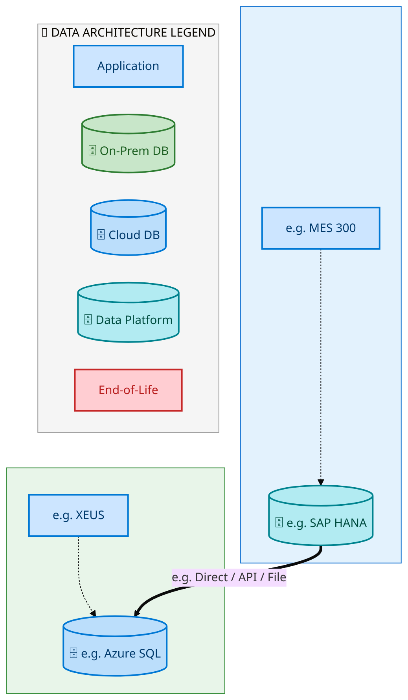
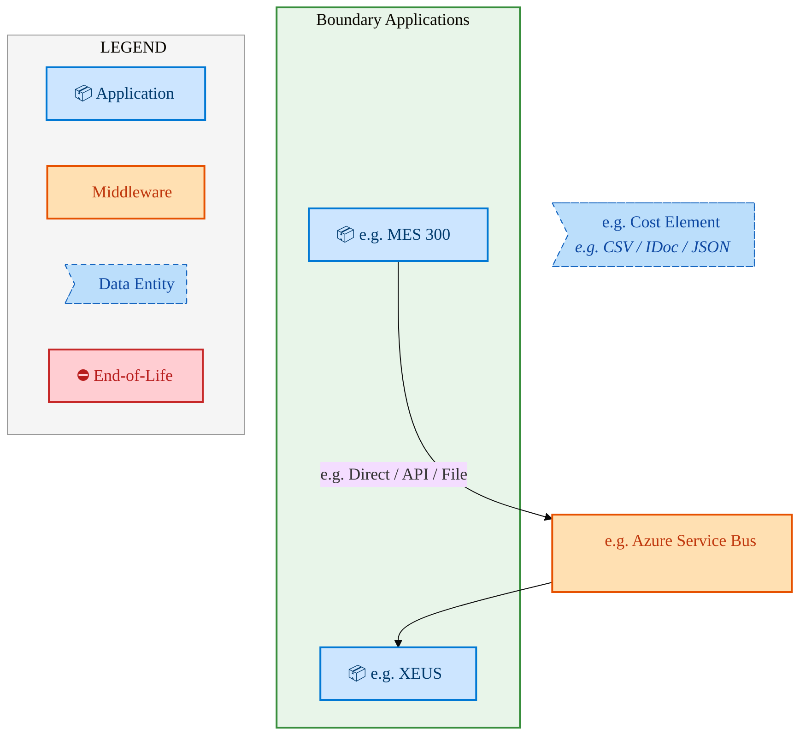
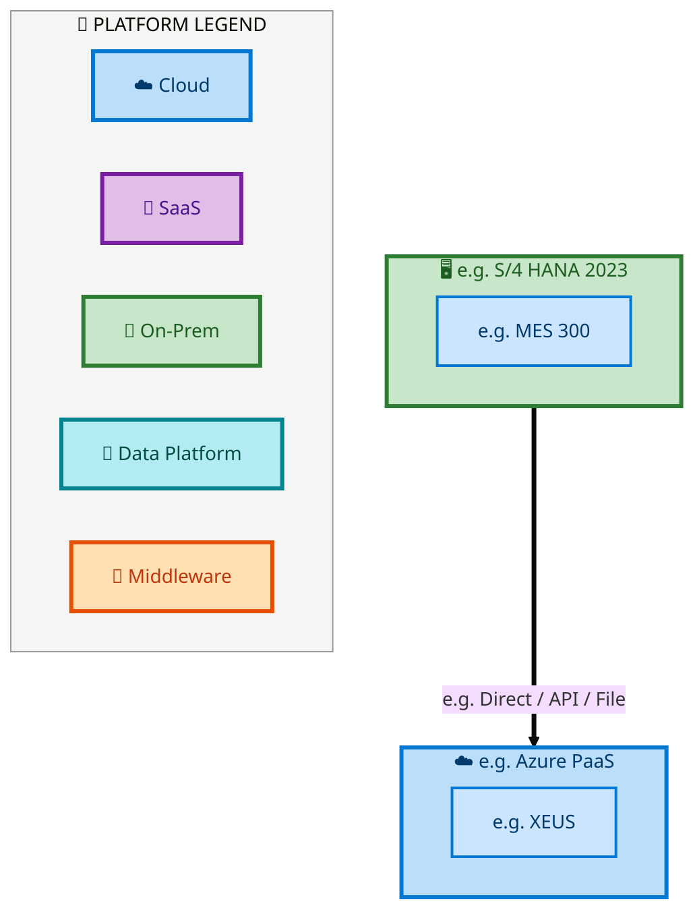

  <img src="data:image/svg+xml;base64,PHN2ZyB4bWxucz0iaHR0cDovL3d3dy53My5vcmcvMjAwMC9zdmciIHZpZXdCb3g9IjAgMCA4MDAgNDgwIiB3aWR0aD0iODAwIiBoZWlnaHQ9IjQ4MCI+DQogIDxkZWZzPg0KICAgIDxsaW5lYXJHcmFkaWVudCBpZD0iYmciIHgxPSIwJSIgeTE9IjAlIiB4Mj0iMTAwJSIgeTI9IjEwMCUiPg0KICAgICAgPHN0b3Agb2Zmc2V0PSIwJSIgc3R5bGU9InN0b3AtY29sb3I6IzAwNzFjNTtzdG9wLW9wYWNpdHk6MSIvPg0KICAgICAgPHN0b3Agb2Zmc2V0PSIxMDAlIiBzdHlsZT0ic3RvcC1jb2xvcjojMDBhZWVmO3N0b3Atb3BhY2l0eToxIi8+DQogICAgPC9saW5lYXJHcmFkaWVudD4NCiAgICA8bGluZWFyR3JhZGllbnQgaWQ9ImFjY2VudCIgeDE9IjAlIiB5MT0iMCUiIHgyPSIwJSIgeTI9IjEwMCUiPg0KICAgICAgPHN0b3Agb2Zmc2V0PSIwJSIgc3R5bGU9InN0b3AtY29sb3I6I2ZmZmZmZjtzdG9wLW9wYWNpdHk6MC4xNSIvPg0KICAgICAgPHN0b3Agb2Zmc2V0PSIxMDAlIiBzdHlsZT0ic3RvcC1jb2xvcjojZmZmZmZmO3N0b3Atb3BhY2l0eTowLjAyIi8+DQogICAgPC9saW5lYXJHcmFkaWVudD4NCiAgICA8cGF0dGVybiBpZD0iZ3JpZCIgd2lkdGg9IjQwIiBoZWlnaHQ9IjQwIiBwYXR0ZXJuVW5pdHM9InVzZXJTcGFjZU9uVXNlIj4NCiAgICAgIDxwYXRoIGQ9Ik0gNDAgMCBMIDAgMCAwIDQwIiBmaWxsPSJub25lIiBzdHJva2U9InJnYmEoMjU1LDI1NSwyNTUsMC4wNykiIHN0cm9rZS13aWR0aD0iMC41Ii8+DQogICAgPC9wYXR0ZXJuPg0KICA8L2RlZnM+DQoNCiAgPCEtLSBCYWNrZ3JvdW5kIC0tPg0KICA8cmVjdCB3aWR0aD0iODAwIiBoZWlnaHQ9IjQ4MCIgZmlsbD0idXJsKCNiZykiIHJ4PSI4Ii8+DQogIDxyZWN0IHdpZHRoPSI4MDAiIGhlaWdodD0iNDgwIiBmaWxsPSJ1cmwoI2dyaWQpIiByeD0iOCIvPg0KICA8cmVjdCB3aWR0aD0iODAwIiBoZWlnaHQ9IjQ4MCIgZmlsbD0idXJsKCNhY2NlbnQpIiByeD0iOCIvPg0KDQogIDwhLS0gRGVjb3JhdGl2ZSBjaXJjdWl0L2FyY2hpdGVjdHVyZSBsaW5lcyAtLT4NCiAgPGcgc3Ryb2tlPSJyZ2JhKDI1NSwyNTUsMjU1LDAuMTIpIiBzdHJva2Utd2lkdGg9IjEuNSIgZmlsbD0ibm9uZSI+DQogICAgPHBhdGggZD0iTSAwIDEwMCBMIDEyMCAxMDAgTCAxNjAgMTQwIEwgMjgwIDE0MCIvPg0KICAgIDxwYXRoIGQ9Ik0gMCAyNjAgTCA4MCAyNjAgTCAxMjAgMjIwIEwgMjAwIDIyMCBMIDI0MCAyNjAgTCAzNjAgMjYwIi8+DQogICAgPHBhdGggZD0iTSA1MjAgMTAwIEwgNjAwIDEwMCBMIDY0MCA2MCBMIDgwMCA2MCIvPg0KICAgIDxwYXRoIGQ9Ik0gNDQwIDM0MCBMIDU2MCAzNDAgTCA2MDAgMzAwIEwgNzIwIDMwMCBMIDc2MCAzNDAgTCA4MDAgMzQwIi8+DQogICAgPHBhdGggZD0iTSA2MDAgNDAwIEwgNjgwIDQwMCBMIDcyMCA0NDAiLz4NCiAgICA8cGF0aCBkPSJNIDAgNDAwIEwgNDAgNDAwIEwgODAgMzYwIi8+DQogICAgPHBhdGggZD0iTSAyMDAgNDIwIEwgMzIwIDQyMCBMIDM2MCAzODAgTCA0ODAgMzgwIi8+DQogICAgPHBhdGggZD0iTSA2NTAgNDQwIEwgNzUwIDQ0MCBMIDgwMCA0ODAiLz4NCiAgPC9nPg0KDQogIDwhLS0gRGVjb3JhdGl2ZSBub2RlcyAtLT4NCiAgPGcgZmlsbD0icmdiYSgyNTUsMjU1LDI1NSwwLjE4KSI+DQogICAgPGNpcmNsZSBjeD0iMTIwIiBjeT0iMTAwIiByPSI0Ii8+DQogICAgPGNpcmNsZSBjeD0iMjgwIiBjeT0iMTQwIiByPSI0Ii8+DQogICAgPGNpcmNsZSBjeD0iMjAwIiBjeT0iMjIwIiByPSI0Ii8+DQogICAgPGNpcmNsZSBjeD0iMzYwIiBjeT0iMjYwIiByPSI0Ii8+DQogICAgPGNpcmNsZSBjeD0iNjAwIiBjeT0iMTAwIiByPSI0Ii8+DQogICAgPGNpcmNsZSBjeD0iNzIwIiBjeT0iMzAwIiByPSI0Ii8+DQogICAgPGNpcmNsZSBjeD0iNTYwIiBjeT0iMzQwIiByPSI0Ii8+DQogICAgPGNpcmNsZSBjeD0iODAiIGN5PSIzNjAiIHI9IjQiLz4NCiAgICA8Y2lyY2xlIGN4PSI0ODAiIGN5PSIzODAiIHI9IjQiLz4NCiAgICA8Y2lyY2xlIGN4PSIzMjAiIGN5PSI0MjAiIHI9IjQiLz4NCiAgPC9nPg0KDQogIDwhLS0gVE9HQUYgQkRBVCBib3hlcyAtLT4NCiAgPGcgZm9udC1mYW1pbHk9IlNlZ29lIFVJLCBBcmlhbCwgc2Fucy1zZXJpZiIgZm9udC1zaXplPSIxNCIgZm9udC13ZWlnaHQ9IjYwMCI+DQogICAgPCEtLSBCIC0tPg0KICAgIDxyZWN0IHg9IjE1MCIgeT0iMTQwIiB3aWR0aD0iMTIwIiBoZWlnaHQ9IjQwIiByeD0iNSIgZmlsbD0icmdiYSgyNTUsMjU1LDI1NSwwLjE4KSIgc3Ryb2tlPSJyZ2JhKDI1NSwyNTUsMjU1LDAuMykiIHN0cm9rZS13aWR0aD0iMSIvPg0KICAgIDx0ZXh0IHg9IjIxMCIgeT0iMTY1IiB0ZXh0LWFuY2hvcj0ibWlkZGxlIiBmaWxsPSIjZmZmIj5CdXNpbmVzczwvdGV4dD4NCiAgICA8IS0tIEQgLS0+DQogICAgPHJlY3QgeD0iMjkwIiB5PSIxNDAiIHdpZHRoPSIxMjAiIGhlaWdodD0iNDAiIHJ4PSI1IiBmaWxsPSJyZ2JhKDI1NSwyNTUsMjU1LDAuMTgpIiBzdHJva2U9InJnYmEoMjU1LDI1NSwyNTUsMC4zKSIgc3Ryb2tlLXdpZHRoPSIxIi8+DQogICAgPHRleHQgeD0iMzUwIiB5PSIxNjUiIHRleHQtYW5jaG9yPSJtaWRkbGUiIGZpbGw9IiNmZmYiPkRhdGE8L3RleHQ+DQogICAgPCEtLSBBIC0tPg0KICAgIDxyZWN0IHg9IjQzMCIgeT0iMTQwIiB3aWR0aD0iMTIwIiBoZWlnaHQ9IjQwIiByeD0iNSIgZmlsbD0icmdiYSgyNTUsMjU1LDI1NSwwLjE4KSIgc3Ryb2tlPSJyZ2JhKDI1NSwyNTUsMjU1LDAuMykiIHN0cm9rZS13aWR0aD0iMSIvPg0KICAgIDx0ZXh0IHg9IjQ5MCIgeT0iMTY1IiB0ZXh0LWFuY2hvcj0ibWlkZGxlIiBmaWxsPSIjZmZmIj5BcHBsaWNhdGlvbjwvdGV4dD4NCiAgICA8IS0tIFQgLS0+DQogICAgPHJlY3QgeD0iNTcwIiB5PSIxNDAiIHdpZHRoPSIxMjAiIGhlaWdodD0iNDAiIHJ4PSI1IiBmaWxsPSJyZ2JhKDI1NSwyNTUsMjU1LDAuMTgpIiBzdHJva2U9InJnYmEoMjU1LDI1NSwyNTUsMC4zKSIgc3Ryb2tlLXdpZHRoPSIxIi8+DQogICAgPHRleHQgeD0iNjMwIiB5PSIxNjUiIHRleHQtYW5jaG9yPSJtaWRkbGUiIGZpbGw9IiNmZmYiPlRlY2hub2xvZ3k8L3RleHQ+DQogIDwvZz4NCg0KICA8IS0tIENvbm5lY3RpbmcgbGluZXMgYmV0d2VlbiBCREFUIGJveGVzIC0tPg0KICA8ZyBzdHJva2U9InJnYmEoMjU1LDI1NSwyNTUsMC4yNSkiIHN0cm9rZS13aWR0aD0iMSI+DQogICAgPGxpbmUgeDE9IjI3MCIgeTE9IjE2MCIgeDI9IjI5MCIgeTI9IjE2MCIvPg0KICAgIDxsaW5lIHgxPSI0MTAiIHkxPSIxNjAiIHgyPSI0MzAiIHkyPSIxNjAiLz4NCiAgICA8bGluZSB4MT0iNTUwIiB5MT0iMTYwIiB4Mj0iNTcwIiB5Mj0iMTYwIi8+DQogIDwvZz4NCg0KICA8IS0tIE1haW4gdGl0bGUgLS0+DQogIDx0ZXh0IHg9IjQwMCIgeT0iMjYwIiB0ZXh0LWFuY2hvcj0ibWlkZGxlIiBmb250LWZhbWlseT0iU2Vnb2UgVUksIEFyaWFsLCBzYW5zLXNlcmlmIiBmb250LXNpemU9IjM2IiBmb250LXdlaWdodD0iNzAwIiBmaWxsPSIjZmZmZmZmIiBsZXR0ZXItc3BhY2luZz0iMSI+DQogICAgSUFPIEFyY2hpdGVjdHVyZQ0KICA8L3RleHQ+DQogIDx0ZXh0IHg9IjQwMCIgeT0iMzAwIiB0ZXh0LWFuY2hvcj0ibWlkZGxlIiBmb250LWZhbWlseT0iU2Vnb2UgVUksIEFyaWFsLCBzYW5zLXNlcmlmIiBmb250LXNpemU9IjE4IiBmb250LXdlaWdodD0iNDAwIiBmaWxsPSJyZ2JhKDI1NSwyNTUsMjU1LDAuOCkiIGxldHRlci1zcGFjaW5nPSIyIj4NCiAgICBUT0dBRiBCREFUIMK3IElBTyBQcm9ncmFtIMK3IElETSAyLjANCiAgPC90ZXh0Pg0KDQogIDwhLS0gQm90dG9tIGFjY2VudCBiYXIgLS0+DQogIDxyZWN0IHg9IjI4MCIgeT0iMzQwIiB3aWR0aD0iMjQwIiBoZWlnaHQ9IjMiIHJ4PSIxLjUiIGZpbGw9InJnYmEoMjU1LDI1NSwyNTUsMC40KSIvPg0KDQogIDwhLS0gSW50ZWwgdGV4dCAtLT4NCiAgPHRleHQgeD0iNDAwIiB5PSIzODAiIHRleHQtYW5jaG9yPSJtaWRkbGUiIGZvbnQtZmFtaWx5PSJTZWdvZSBVSSwgQXJpYWwsIHNhbnMtc2VyaWYiIGZvbnQtc2l6ZT0iMTMiIGZpbGw9InJnYmEoMjU1LDI1NSwyNTUsMC41KSIgbGV0dGVyLXNwYWNpbmc9IjMiPg0KICAgIElOVEVMIENPTkZJREVOVElBTA0KICA8L3RleHQ+DQo8L3N2Zz4NCg==" alt="IAO Architecture" style="width:100%; border-radius:8px;" />
  <h1 style="font-size:36px; margin-top:24px;">Order_to_Cash_IF — Order to Cash (IF)</h1>
  <h2 style="font-size:24px;">Architecture Document (TOGAF BDAT)</h2>
  
End-to-End Integrated Processes (E2E) Tower 
  Capability Order_to_Cash_IF · Order to Cash

  
IAO Program · R1 – R5 
  Generated: April 2026 
  Sajiv Francis

  
IAO Architecture Pipeline — Intel Confidential

Page 1<a href="#toc">↑ Back to TOC</a>Order_to_Cash_IF — Order to Cash (IF)

## Table of Contents

<nav class="toc">
<ol>
  <li><a href="#1-executive-summary">1. Executive Summary</a></li>
  <li><a href="#2-business-context-objectives">2. Business Context &amp; Objectives</a>
    <ul>
      <li><a href="#21-classification">2.1 Classification</a></li>
      <li><a href="#22-business-drivers">2.2 Business Drivers</a></li>
      <li><a href="#23-success-criteria">2.3 Success Criteria</a></li>
      <li><a href="#24-companion-documents">2.4 Companion Documents</a></li>
    </ul>
  </li>
  <li><a href="#3-business-architecture-togaf-b">3. Business Architecture (TOGAF &ldquo;B&rdquo;)</a>
    <ul>
      <li><a href="#31-business-process-overview">3.1 Business Process Overview</a></li>
      <li><a href="#32-business-process-diagrams">3.2 Business Process Diagrams</a></li>
      <li><a href="#33-business-roles-responsibilities">3.3 Business Roles &amp; Responsibilities</a></li>
    </ul>
  </li>
  <li><a href="#4-data-architecture-togaf-d">4. Data Architecture (TOGAF &ldquo;D&rdquo;)</a>
    <ul>
      <li><a href="#41-data-entities-ownership">4.1 Data Entities &amp; Ownership</a></li>
      <li><a href="#42-data-flow-diagrams">4.2 Data Flow Diagrams</a></li>
      <li><a href="#43-data-lineage">4.3 Data Lineage</a></li>
      <li><a href="#44-ricefw-data-objects">4.4 RICEFW Data Objects</a></li>
      <li><a href="#45-data-governance-quality">4.5 Data Governance &amp; Quality</a></li>
    </ul>
  </li>
  <li><a href="#5-application-architecture-togaf-a">5. Application Architecture (TOGAF &ldquo;A&rdquo;)</a>
    <ul>
      <li><a href="#51-current-state-current-state-application-landscape">5.1 Current-State Application Landscape</a></li>
      <li><a href="#52-future-state-future-state-application-landscape">5.2 Future-State Application Landscape</a></li>
      <li><a href="#53-change-impact-summary">5.3 Change Impact Summary</a></li>
      <li><a href="#54-component-overview">5.4 Component Overview</a></li>
      <li><a href="#55-ricefw-inventory">5.5 RICEFW Inventory</a>
        <ul>
          <li><a href="#551-eca-dependencies">5.5.1 ECA Dependencies</a></li>
          <li><a href="#552-boundary-application-dependencies">5.5.2 Boundary Application Dependencies</a></li>
        </ul>
      </li>
      <li><a href="#56-integration-patterns">5.6 Integration Patterns</a></li>
    </ul>
  </li>
  <li><a href="#6-technology-architecture-togaf-t">6. Technology Architecture (TOGAF &ldquo;T&rdquo;)</a>
    <ul>
      <li><a href="#61-platform-infrastructure">6.1 Platform &amp; Infrastructure</a></li>
      <li><a href="#62-sap-development-object-status">6.2 SAP Development Object Status</a></li>
      <li><a href="#63-nfrs-design-principles">6.3 NFRs &amp; Design Principles</a></li>
      <li><a href="#64-security-governance">6.4 Security &amp; Governance</a></li>
    </ul>
  </li>
  <li><a href="#7-project-context">7. Project Context</a>
    <ul>
      <li><a href="#71-project-roadmap-go-live-plan">7.1 Project Roadmap &amp; Go-Live Plan</a></li>
      <li><a href="#72-raid-log">7.2 RAID Log</a></li>
      <li><a href="#73-recommendations-next-steps">7.3 Recommendations &amp; Next Steps</a></li>
    </ul>
  </li>
</ol>
</nav>

Page 2<a href="#toc">↑ Back to TOC</a>Order_to_Cash_IF — Order to Cash (IF)

## 1. Executive Summary

This Architecture Document defines the **Business, Data, Application, and Technology** (BDAT) architecture for **Order_to_Cash_IF Order to Cash (IF)** within the IAO program. It includes 3 BPMN process diagram(s) in Section 3.

| Dimension | Value |
|-----------|-------|
| **Tower** | End-to-End Integrated Processes (E2E) |
| **Process Group** | Order to Cash |
| **Capability** | Order_to_Cash_IF - Order to Cash (IF) |
| **Release** | R1 – R5 |
| **Total Systems** | 2 |
| **System Status** | 0 Deployed, 0 Developing, 0 EOL, 2 Pending IAPM |
| **RICEFW Objects** | Pending — Smartsheet Object Tracker API integration |

**Change Summary**: 0 new flow chains, 0 removed, 0 modified, 1 unchanged between Current-State and Future-State states.

> All system nodes in architecture diagrams are **IAPM-linked** — click any node to open its IAPM page. Diagrams require `securityLevel: 'loose'` for click events.

Page 3<a href="#toc">↑ Back to TOC</a>Order_to_Cash_IF — Order to Cash (IF)

## 2. Business Context & Objectives

### 2.1 Classification

| Level | Value |
|-------|-------|
| **L0 Tower** | End-to-End Integrated Processes |
| **L1 Process** | Order to Cash |
| **L2 Capability** | Order_to_Cash_IF - Order to Cash (IF) |

### 2.2 Business Drivers

| # | Driver | Description | Strategic Alignment | Priority |
|---|--------|-------------|---------------------|----------|
| 1 | End-to-End Process Integration | Enable cross-tower integrated processes spanning procurement, manufacturing, and fulfillment | IDM 2.0 Process Excellence | High |
| 2 | Intel Foundry Business Enablement | Stand up foundry-specific business processes for external customer engagement | Intel Foundry Services | High |
| 3 | Process Visibility & Monitoring | Provide end-to-end process visibility across tower boundaries with integrated monitoring | Operational Excellence | Medium |
| 4 | Order_to_Cash_IF Process Migration | Migrate Order to Cash (IF) business processes and 2 integrated systems from legacy to S/4 HANA target architecture | IDM 2.0 Cross-Functional / End-to-End | High |

Page 4<a href="#toc">↑ Back to TOC</a>Order_to_Cash_IF — Order to Cash (IF)

### 2.3 Success Criteria

| Metric | Target | Measure | Baseline | Owner |
|--------|--------|---------|----------|-------|
| E2E Process Cycle Time | Per process SLA | End-to-end transaction completion within defined SLA per process | Varies by process | E2E Process Owner |
| Cross-Tower Integration Success | > 99% | Transactions completing across tower boundaries without manual intervention | 92% (current) | Integration Lead |
| Process Exception Rate | < 2% | Transactions requiring manual exception handling | 8% (current) | Operations Manager |
| Order_to_Cash_IF Migration Completeness | 100% flow chains validated | All 1 flow chains verified in target state | 0% (pre-migration) | Tower Architect |

### 2.4 Companion Documents

| Document | Description |
|----------|-------------|
| **Business Architecture** | Included in this document (Section 3) — process flows from BPMN diagrams |
| **This Document** | Full BDAT Architecture — Business + Data + Application + Technology |

Page 5<a href="#toc">↑ Back to TOC</a>Order_to_Cash_IF — Order to Cash (IF)

## 3. Business Architecture (TOGAF "B")

### 3.1 Business Process Overview

This capability includes **3 business process(es)** modeled in BPMN 2.0, covering the end-to-end workflow for Order_to_Cash_IF Order to Cash (IF).

| # | Step ID | Process Name | Lanes | Tasks | Gateways |
|---|---------|--------------|-------|-------|----------|
| 1 | E2E-10__R3_-_Intel_Foundry__RMA_for_Direct_Customers_with_no_physical_receipt_of_the_defective_produ | E2E-10__R3_-_Intel_Foundry__RMA_for_Direct_Customers_with_no_physical_receipt_of_the_defective_produ | Boundary Apps, SAP S/4 Intel Foundry | 14 | 6 |
| 2 | E2E_93__R3_Product_&amp;_Service_Sales_-_'Standard_sales_order_scenario_with_Combined_orders_(Physic | E2E_93__R3_Product_&amp;_Service_Sales_-_'Standard_sales_order_scenario_with_Combined_orders_(Physic | External Partners/ B2B

, SAP CFIN, SAP S/4 Intel Foundry 
, SAP S/4 Intel Foundry - Foreign LE

 | 64 | 33 |
| 3 | R3_E2E-80__Intel_Foundry-_Customer_Requests_Expedite_-_Service_Fee | R3_E2E-80__Intel_Foundry-_Customer_Requests_Expedite_-_Service_Fee | Boundary Apps , Customer Business Analyst, SAP CFIN, SAP S/4 Intel Foundry | 30 | 23 |

Page 6<a href="#toc">↑ Back to TOC</a>Order_to_Cash_IF — Order to Cash (IF)

### 3.2 Business Process Diagrams

#### BUSINESS ARCHITECTURE — 3.2.1 E2E-10__R3_-_Intel_Foundry__RMA_for_Direct_Customers_with_no_physical_receipt_of_the_defective_produ — E2E-10__R3_-_Intel_Foundry__RMA_for_Direct_Customers_with_no_physical_receipt_of_the_defective_produ

**Swim Lanes**: Boundary Apps · SAP S/4 Intel Foundry | **Tasks**: 14 | **Gateways**: 6

> **Legend**: ● Start · ● End · User Task · Service Task · ◇ Gateway · Sub-Process

<a href="https://mermaid.live/view#pako:eNqlV1tz4jYU_isa72TIzsCsr5jw0B3HxNt0NpeG7HY6pdNRbBnUyBaV5SQ0y3_vkS0DNuapPMDo03e-c9HRhXcj5gkxpsbZ2TvNqZyi94FckYwMpmjwhAsyGKIa-I4FxU-MFAPFSXku5_Tfima56zdFU1iEM8o2Cp2TJSfo2_UQBWDIhqjAeTEqiKDpYDhYC5phsQk540KxP5BJaqaVNz11yUVCxJ5gmr4Ve2DKaE72sOO7vhspu4LEPE9aoqmXTtJ4sFXBMf4ar7CQVfhlQW7w2280kSsYp5gVBDgrmbGv-IkwlaMUpcLiUrw0xaCF8pNDweZrHNN8CbhrAiRw_ryHPHO7Rduzs0W-c4oeZ4scwSdmuChmJEWFBPjqRaKUMjb94IZB5JnDQgr-TKYf7Ct_5tjDWGUyhdTNoSru6JXQ5UpOnzhLNHX0qnKY2uu3oXib2uZQbOC744vkyd5TOLYn9mTn6dK3QitsPKVp-r88QV3FIy6eta8rJ7Kj2c6X5Y290DzWa9KcuX5gdetExAuNyYFoFEXO1b5UV2PPMk-LXkbO2Aw7okssySve7AUvQncnGHl-ZPknBWt_3SjLp3vB40bQufIibyfoX1pRYJ8UdAPLnegIQWcp8HqFGM7JX-YfC-OSl1VTo2C9LhbGnzVPfXILpu-JSLnI0L0go6AoSFFkJJdtnn3Au-X5KArQeYQpKwVBQY7ZBhr7Y9vEAZNv6wTKhIKv0cPVPLxTASDQgO0cr-gLZoinKLybdWJSQaV4muKR6gXU-P3l-iFAv5aYUbn5BAHgE7Fa3vlOYM1giR6ILEUOP_-UpJDwGxP6QhKUCp6hsCwkz4gAjY-HIuO9CBDWO2tB_iaxBOu7NFXHCMJ5gkKeZWVOY6wmJD8p6ndEW4Wpi5V0bGzr_b2xUefs6AlOiniFoAB3pYzBy-eFsd3WFrBL-5pAFXQe3KP5Jxdd55IwFKmWEJt24dyDRb5TJyf6DsWGoCjP20wPmD_Dvu6Utk0aA-mhqpamtad9mA4FUf0R3YVAgbWKiVrO2nmbPdmz4SehEt2QjPc7vgDuI34GXc7g9ITCoiA-TsJSe-NR0OUSMv3yOEfhisTPHY7d7kUdgk67LtJ58HDT6X3LaZs1Xh5uArXUgkPvdyzctoVuUhQSIWladZbaLDNIVpRVMtB0eUpF1rM81qTTZ70Fhlagkva0nHXRMT-s-Ckj2zzaMLo16v3Spdv9bU3eYlYWkPmX-nzd93Zt5vSbXRcHtSXJ566Ze2ITdRrkyM7rt6vr97LbHXXrQG0g-ARu8Kqd5mUcwwGVluzzke54r4uF4K_FCDOJ1lhgxgg7yn23r3MLjUY_gYAe2vXQspppDdg7ggbchuBogtMQ3BrwO-OJHl9ofiPga4_N_ESPL_R4rPlm41Dr2WMN6ACsxqHlaUCPNd_aCZhawGsirBR-LIzfCdxmP5QLPeN1k9fBNLFZTfUaX7alpe55AW0N-22Rn8MtnMAWg3sONsoz3nysndhdm1sCbwCwAXxnQ4tDkyZl2-tG7HRnbnk1cZSjxsedjJyDx0OVV_NqauP2Cdw5gbsncG_31mzjY_0ubKN-LzrpRS_6UNvsRa3m0dWG7X7Y6Yfdftjrh8cNbAwNuM8zTBNj-m5U_2bgH09CUlwyaWyHBi4ln2_y2JhWr36jrG7zGcVwD2c1uP0PJjAOEA==" title="View full diagram">&#128065; View Diagram</a>

Page 7<a href="#toc">↑ Back to TOC</a>Order_to_Cash_IF — Order to Cash (IF)

#### BUSINESS ARCHITECTURE — 3.2.2 E2E_93__R3_Product_&amp;_Service_Sales_-_'Standard_sales_order_scenario_with_Combined_orders_(Physic — E2E_93__R3_Product_&amp;_Service_Sales_-_'Standard_sales_order_scenario_with_Combined_orders_(Physic

**Swim Lanes**: External Partners/ B2B
 · SAP CFIN · SAP S/4 Intel Foundry 
 · SAP S/4 Intel Foundry - Foreign LE

 | **Tasks**: 64 | **Gateways**: 33

> **Legend**: ● Start · ● End · User Task · Service Task · ◇ Gateway · Sub-Process

<a href="https://mermaid.live/view#pako:eNqlGmlv28j1rwyUpvYCEsL70IcWso7EQByrkZN0URfFmBxaRChS4OFYTfzf-2Y4bySNyGRXDZAgenz3PUN-H0RFzAbjwevX39M8rcfk-0W9Zht2MSYXD7RiF0PSAj7TMqUPGasuOE5S5PUq_a9AM53tM0fjsAXdpNmOQ1fssWDk0_WQTIAwG5KK5tWoYmWaXAwvtmW6oeVuWmRFybFfsSAxEiFNProqypiVewTD8M3IBdIszdkebPuO7yw4XcWiIo-PmCZuEiTRxQtXLiu-RWta1kL9pmI39PlLGtdr-J3QrGKAs6432Xv6wDJuY102HBY15RM6I624nBwcttrSKM0fAe4YACpp_nUPco2XF_Ly-vV9roSSu9l9TuBPlNGqmrGEVDWA5081SdIsG79yppOFawyruiy-svEra-7PbGsYcUvGYLox5M4dfWPp47oePxRZLFFH37gNY2v7PCyfx5YxLHfwryaL5fFe0tSzAitQkq58c2pOUVKSJP-XJPBreUerr1LW3F5Yi5mSZbqeOzVO-aGZM8efmLqfWPmURuyA6WKxsOd7V8091zT6mV4tbM-Yakwfac2-0d2eYTh1FMOF6y9Mv5dhK0_XsnlYlkWEDO25u3AVQ__KXEysXobOxHQCqSHweSzpdk0ymrP_GP-6H8yfa1bmNCNLyJecldUbcmVdkfvBv1sK_id3LcCc0m3dlIzc8rohTykl89n1m4_kA6s1bBuwP7KIpU-MzGhNSZqTK-fDew3NAbQPRZ0mOzKlZZmy8hjB8y8BI6HjhI62GbhTSK6IZB2TpCw2ZNpUdbERtL-1xJCOXdaawGw1WZLp4vrDsSAngEdLViZFuSHg5ySt6UOapfWOTMA1u6qpNILwwMIl3W1YXrdqbetWqyuoWM1c7u23DFwMyQEGV2sy2W6zNKJ1WuQarnmg0OQjWRZVDbVPaB6TSVMXZJoxaJf54zGZb-4dBk7ZnkghKD_ee6ultDRK5YWUe4EKL6QV2bY6ndCH5vfvSM8b_ugBWla0JrdblpPr_KmAEqvIomjAAEiGj7yVRuBhodXf7wcvL4fMrG5m7DnKmgpc_rYtrz1ZT8QtGfHVGweUqFnWalDuiJ7f7mE8gTaH7Grz_HL1djEyzN80Ak-UDosaiCX4Km4i4d-WZlWzrZYxri8kQNiqDgL5QCM5zMrbpn4Q3puxDJQsd5fzLze6UuEBweruI_y9PSUEi944GqVnHBZAGn19s3x7TTpEeIeJ-bYo4kql_eVnmjWMTOKYxTqVdeBejepUhm9ruQgoMM7ApSQqNtuMnaZvaP_ZjBFkpuHt6aADFd-qEc1qsqUlzTKW9VH5Z1GFnVRp_nMVTeNPkvXUgt1bCyP4XwnjOCfv51pdHEa7zVQIchp3dCwe4bsyfXwEnLd3KxKtWaQ1QFvMkCxqMt4A7-gz07vqgbTpHTTqUx68TldgodRmWuRJWm7a3sbbopwFkOPtWCfXNdsQeAjtPOMd9CEroq96egLTT9uYa_Uedr-RoLljz9pY84_0X5ZpdNKAecXOYAOFNL-5uZ7JAbXUxs1hmU5LFqd1ayq55EN1sZrqFWHy8ryBJvzIYLAAYjsINSQRrKbm1r6DtUp7aqHnwE0H8QYlCPpKTJeqYpuHbEdqVtXdcuw_nBSm84f8YbqHTaU7eUzv1943_Z9oJqxLefsQw5ryKXqUFBqvPxZK80_H0jJ-bYhlag7pqATL-lU5WaLghDL1bstIkagZoCE6Pxs0Gq6rTQrh1yVPyraEKtHSoanMoMPnNbREOMXpA8HyDvcbLHVy-SkvIe3AJdDiYYqelqrla565K2kM2xSfCym0fG2EWsHRzoXdQS4k5JJn_3INm03EF-B2KusSQ93PWlczDgb7lUyoK55QwjNR26HwmKHRmr9WTxanppVtif1jW8DRT6IPuReAPILD8B4GPtIo7SOZJyTkcgurH7iX6iJ5lqzW6VZO8OuqanR73EPexl9gSrU8v6X1muQF4WdV6GFQetF-az9kIKq8ZKIyIKe4L7O00hqx7Xdjid0jj5uNhn6UBCsKVwzHLr75fUg-p6zO6QacuE5zqjEIfzm5DvenSQbRb3vO5ImmGR4lOorYOR2whyNNQ1YtHCtNnMGmEw2NB3jBoIC6HztdXJazdxraYZ2voCHHjchsWN7v1mkZi-Pijp8tyCV0uVstWZz9TK3a1smReOBv5itRGBVXgT3xXtxIPHjKtxOBDmgaRx70f84_rcT2AouNcPB7ujs5Ndpqe-S3BQSPrW3ghZM1AueYAK2GgduItsAT5RZaYZnGWsJ7rnZClTSFxCb8yivtOG95nkZ45Ks2aEf4gbYTi2M1hLHWEUP9ICcLpG919g2NgHdVaAFwXuvft32RRHuHkk-5bHRM2zt8V8PkeQPtBjaMaQ8FT50WN05LJkYBZAYEftrOEw3d1wT0sQ3OOiL4Yc_Bts8YUhx5Qz_bBsZZagTmeWQ9J-mjTWXVRDzYSZOdKHvesSpwusmuoTu3tz38WitN8FLiCkZnzNfWlC_e17kaDmR5e6KS281bbUk_M8c7zxy_x4lHq5VsLMeUPTl3XUEEiqoatXfQeEMDl98nKodnqRyel2Whc8bBNnTPITrn4B2ec-4Og3OIwrNO-MZZVOZZVNZZVPZZVM5ZVO5ZVMG51x25SUajv0HJyJ-h0_72HB0gf3t--9u1JMCSDFwkcFuAjyw9ySFEDE9ihCjDDyQJItiSpy0B8nmIIuRjVAEFIL0vEXxHB6AKviQJDASgTmhnYLQAEzEC6SnlGE9jgYAQDXclT1PxcBEFDXN9lIJyAVk6GCGOVN5VXCRGaKJqIgY_7ge_8xX7B8REMdMdiZgfCoEYKHMd-eAKdm9x1r-BnOGvCAm8MDt-Y_CDX4ygBBl-D40OXE0XlQeBh-7QUXVlQukVP9QAyrWYIMgKcw4zIJQZg_F2MUtVRkhlPPQMut1R4TSPtfOV2ijc1333hSYwl_5KSsaPPDEeX6UfVIQlvYm6eFp9mDI5TQXARFIsPM1-x5AqrIqmhMV7ButnuYEzmbrEuc8LeGFcQk8Qx1QBh8G2pvmjVFAxC3zJTD_ki4u-9nJwDAz5sVakyn1jGWDVh4L8kGdEvjuPgB1PgvxTcYMo_2goLDNwBBLbS5tKaBOWAsbYlDE0MQtMWQgWklgyvfGFJ_xHAlRzsjRHnWsbGHJiHCTGr2yzdbF4a6ikdbJ48w7CeMhHdTbJBo9nHxlkHIMbHHnguufR7bifEFz2qS7Tx0XPuuhqAwW52HTUYJBZ6_qKiwyYZ-gQ1d48GQ9fE_1DXMw2CY3ACu7O9qUQz8n7_HLGtu1dFq344Kv5oriATXUB7-3RU3NrTnz-QuYHf72C4mQ-eCr8UukQDbWkoRYCPJkgFmoYhlLBfT68IhbkhLri4-ro2dN2XednPEzOI4dDT6qSqJdR8DNGNjA6TSMRYFUHsoNY2DAs7L34jhxwW4iNzrOxVNA1QXDcAG1bf4At3kZ_27bGA-RJTfwTCHY3C7uboVqBgXMr0CGhoUNstNGWNtooypbpaKupIaPvKRNDjWuIXsFQ2ko5tN7G7myoGWhI19muDnEVFWq79wwWlOpm4YmoE4iLbkDZoRTkBPrYwuAoVBcFom0Wjlm03rFQnhpN0qeOWrUkE2cfK-lUB2kcE7ns3aF8hmo60q-OGmmGq-P4Uj_HPsXZuxEblSaMt3j2-CjLLCvq9qZsf-VR8U5iPAgfOUjsoL2YQ46v73COo-vg4PpqHXx_IrZY_PDmGO70wF31-dEx3OuB-z3wQH5adAwNu6C-0Qk1O6FWJ9TuhDrduvk9Nvo9Nvo9NsKJQX4tdAwOO8Gwy3eCzW6w1Q22u8FON9jtBnvdYL8b3G1l0G1l2G1l2G1l2G1l2G1l2G1l2G1l2G1l2G1l2G1l2G0lnx_dcLMHbvXA7R640wN3e-BeD9zvgQc98B57TWXvYDiAtW5D03gw_j4Qn3_CJ6IxS2iT1YOX4YC_nl3t8mgwFp9JDtpXBLOUwsX_pgW-_A8husSL" title="View full diagram">&#128065; View Diagram</a>

Page 8<a href="#toc">↑ Back to TOC</a>Order_to_Cash_IF — Order to Cash (IF)

#### BUSINESS ARCHITECTURE — 3.2.3 R3_E2E-80__Intel_Foundry-_Customer_Requests_Expedite_-_Service_Fee — R3_E2E-80__Intel_Foundry-_Customer_Requests_Expedite_-_Service_Fee

**Swim Lanes**: Boundary Apps  · Customer Business Analyst · SAP CFIN · SAP S/4 Intel Foundry | **Tasks**: 30 | **Gateways**: 23

> **Legend**: ● Start · ● End · User Task · Service Task · ◇ Gateway · Sub-Process

<a href="https://mermaid.live/view#pako:eNqtWW1v4jge_yoWo1FbCWby5AR4cScIZbfSzgwq3T2ttqeTSRzwNSRcnNBy3X73-zuxAzHu3ix3fdGWn__Pj0547UV5THvj3sePryxj5Ri9XpUbuqVXY3S1Ipxe9VED_EIKRlYp5VeCJsmzcsn-XZPZ3u5FkAlsTrYsPQh0Sdc5RT_f9dEEGNM-4iTjA04Lllz1r3YF25LiEOZpXgjqD3SYWEmtTR5N8yKmxZHAsgI7wsCasoweYTfwAm8u-DiN8izuCE1wMkyiqzdhXJo_RxtSlLX5FadfyMvfWFxu4HNCUk6BZlNu05_IiqbCx7KoBBZVxV4Fg3GhJ4OALXckYtkacM8CqCDZ0xHC1tsbevv48TFrlaKH2WOG4CdKCeczmiBeAny7L1HC0nT8wQsnc2z1eVnkT3T8wbkNZq7Tj4QnY3Dd6ovgDp4pW2_K8SpPY0k6eBY-jJ3dS794GTtWvzjAb00XzeKjptB3hs6w1TQN7NAOlaYkSf4nTRDX4oHwJ6nr1p0781mry8Y-Dq1zecrNmRdMbD1OtNiziJ4Inc_n7u0xVLc-tq33hU7nrm-FmtA1KekzORwFjkKvFTjHwdwO3hXY6NOtrFaLIo-UQPcWz3ErMJja84nzrkBvYntDaSHIWRdkt0Epyeg_rN8ee9O8qosaTXY7jh57f28IxU_mOECwoEWSF1s0SdM8IiXLMzTZE5aSFUtZeUDhhkZPGp8LfEuoCvTzLoZQcLRnBC1mP2pknonsNpxoZPjEimW0oXEFLbpGLEMPG1bEaAGVXtuPrufL8NuNxu4Du1KQFPkWCSJU5ujL7RIR0M6FCXRPsxJVkg5Ol5-9hhzIuhJd7xpEJmSckMEuhTR3pDf235zQe8PXV0UvpuFgBf0cbRB9idKKsz39oSmXx97b2wmbbx_ZSFHkz3xA0hLc_mMu509ygfOm2rDBxbDiZb6lBZoCa0Y5R5OMpAdeduMhSL-QrCIpKuiaQR02ZZLDZHjZ0ZiVFA7-VVFeNiFq5UKYw-nk8xdSPNFS5PSBkq2WPhA-4RyUb0WCprAyYgTCH_LBlB4NE90Bf7VE2VqivomRj-5pRCEScdcYLWkuPvICwQ7NKUVZXqJb6VKsM_gagwzJifFfgV3skCo6Z_csc5HMaMS4iOaWxFQETMz7NW3NEHb9VasBz_5eWQWFckAZfUZLAqtXBigvZCNA_iCdIjHLb-iZlRs1Lj99-qTrdC4qcs81s50Hb3Uw1IqohITC5pTDCEquU2lRm9yOVhz8f5pEFOdyskDh_O6r1hOj09F5jxZ5HUettq12NKGQ8E09gzUS0VyyYGHQHepQ1J93Whe6rlbsGjVayihO4TKh1-5Iq13ZTijMt7uUnlcr9o0B3JGCpClNvzd-royfmLV3WUlTNBfrqDhorolZRNKoSkWkFgWLzkLp_XcSfAz2TzA0Bncl3UIRvWhx9E8T97Aw7bdA7a2mXcI8S1ixrYdel3AorGpOYdyctFiXTNRK2LTit6pciRBAr6aQcj0StnVi3Q95HnN0x3lFNSr7KFCMt08Q3H0ObYuugRHam60ZDHIkbroIZshWW5l2vferUnTXpIIGAtci9CPc1TQ69xjSe_pPGtVj_x76Ef6I8QKtTFONx-vaVu-B1rzTqaYbhb-jo-zT7C2gxjKqstTYec11scEpR5GL4Sy8-GMmkdgm_Kq7rn8haQW08Y3aL0VtgFZdTtA2mrjLIhmJ0-l7_RXGcf3vDRLpamOSUC3PzrArTKaiI2zZDOy65FFd8nBvase6oRidUVeoio2cyKK1oEzBvYLFmj2uZbTnnu4ZbO3Pbd3RE4_QSm30WG4nTaajjbWjI6J3lQ7xbMmIYSsH2mQLm_UZ1qWZntMP9UloKCKOZnlG9QXumTdZPT8QS9TVFWyF5MAFhm0pOtvc2CxEhBCq4iyCELjaLtFszZxBfMN29dyHXdiUqDhUnQb3XcPu9t_XyrtXjWO6wtmsvj1PolLUBcwrNBOZENhD_Tvk5_4Fl90SRn9u3TTz3rqEyb6EybmEyb2EybuECV_CNLzk6QOPLnpmsS69jsEVHw0GfxE3Ogl4lgB-f-z9SuEq9bu4DMsTSek58rMzlMBIAlhSuEq2FK3OPUcyKAJfEiiJWBL4tgYo4wLJ4MnP0gKsBGJXFyABZcKo-WhbyidLAorBkyYqjbayWan0pA22MtqWKlzF4kqZfqvE1gBfaVVCbanWxiq2kkW9wIHbqQSUoY6UgX3lqoymrXy1pbPuqJNa8WimZKh4K198pbbNiIzwUMmUStwWUClQgKNViS8B9dlzj_WFrtX9WDwyidcQ8CISPWbtfmuH5WNG1gWl9Vyun6PUQL5patTSpX_N6wNXRcdTngU6oAzHMly-ZnhbvtjTXG0BJRPLALe1IkViZZ4TSPPkZWDPT-6Hj5m8dtfPuKy-RZWHnWzDVgbGmlDP6_rc1m570LaySryH9RNfPzkT5ncPbFc_ULLctu6xXqKqd1RRqxDr8bJ1X1tAJk3lxFEcWC83ZZ4jG8dWRrgya47KkqN6XuXVG2ptoQCnbRxlhxJqK8_aNlDdGJy8iawLQL2C7eLDd_CRGYcZY8bt9sV1F3fewd13cO8dHMuX1V3UN6KBER0a0ZEJhYEl3wR3YdsMO2bYNcOeGcZm2DfDgRkemuGREcZmL7HZS2z2Epu9xGYvsdlLbPYSm73EZi-x2Uvf7KVv9tJvvez1ezDmt4TFvfFrr_6mC74Ni2lCqrTsvfV7BAbo8pBFvXH9jVCvefM2Y7AwyLYB3_4DOIJfRA==" title="View full diagram">&#128065; View Diagram</a>

Page 9<a href="#toc">↑ Back to TOC</a>Order_to_Cash_IF — Order to Cash (IF)

### 3.3 Business Roles & Responsibilities

| Role / Lane | Processes Involved | Description |
|------------|-------------------|-------------|
| Boundary Apps | E2E-10__R3_-_Intel_Foundry__RMA_for_Direct_Customers_with_no_physical_receipt_of_the_defective_produ,  | |
| SAP S/4 Intel Foundry | E2E-10__R3_-_Intel_Foundry__RMA_for_Direct_Customers_with_no_physical_receipt_of_the_defective_produ, R3_E2E-80__Intel_Foundry-_Customer_Requests_Expedite_-_Service_Fee | |
| External Partners/ B2B
 | E2E_93__R3_Product_&amp;_Service_Sales_-_'Standard_sales_order_scenario_with_Combined_orders_(Physic,  | |
| SAP CFIN | E2E_93__R3_Product_&amp;_Service_Sales_-_'Standard_sales_order_scenario_with_Combined_orders_(Physic, R3_E2E-80__Intel_Foundry-_Customer_Requests_Expedite_-_Service_Fee | |
| SAP S/4 Intel Foundry 
 | E2E_93__R3_Product_&amp;_Service_Sales_-_'Standard_sales_order_scenario_with_Combined_orders_(Physic,  | |
| SAP S/4 Intel Foundry - Foreign LE
 | E2E_93__R3_Product_&amp;_Service_Sales_-_'Standard_sales_order_scenario_with_Combined_orders_(Physic,  | |
| Boundary Apps  | R3_E2E-80__Intel_Foundry-_Customer_Requests_Expedite_-_Service_Fee | |
| Customer Business Analyst | R3_E2E-80__Intel_Foundry-_Customer_Requests_Expedite_-_Service_Fee | |

Page 10<a href="#toc">↑ Back to TOC</a>Order_to_Cash_IF — Order to Cash (IF)

## 4. Data Architecture (TOGAF "D")

### 4.1 Data Flows — Source to Target

| # | Flow Chain | Hop | Source App | Source DB | Target App | Target DB | Data Description | Frequency | Classification |
|---|-----------|-----|-----------|----------|-----------|----------|-----------------|-----------|---------------|
| 1 | e.g. MES Route to ICOST | 1 | e.g. MES 300 | e.g. SAP HANA | e.g. XEUS | e.g. Azure SQL | What data moves | e.g. Near Real-Time | e.g. Intel Confidential |

Page 11<a href="#toc">↑ Back to TOC</a>Order_to_Cash_IF — Order to Cash (IF)

### 4.2 Data Flow Diagrams

> **DATA ARCHITECTURE** — Database-to-database data flows. Applications (blue) sit above their hosting databases (green cylinders). Thick arrows show data movement between databases.

#### 4.2.1 Current-State — Current-State Data Flows

<a href="https://mermaid.live/view#pako:eNqllgtvmzAQx7-KxRRpk5IugTwIUisBNmsk2mZNu00qE3LAJKgORmDWpGm--2zIo6-0qepICM53P5_9P9tZKgELiWIotdoyTmJugKWn8CmZEU8xgKeMcS7e6uItJ0GRxXzhkn-EVp2UsU1vGfILZzEeU5LLbsGJWMJH8f0a1eqk88pZ2h08i-mi6hmRCSPgelAHpgAI-Kr0ouwumOKMr2lFTs7w_Hcc8qm0RJjmRPpN-Yy6eExoOSzPitKaiGmNUhzEyUSatY40Zji5fWRsd1YrsKrVvGQ7FriyvASIFlCc55BEAKepxeYgiik1vtg26jhOPecZuyXGl2azp8P2-rNxJ1Mz1HReDxhlmezWzK79jBeO7QXd4HTUtftbnIp6UFP34lpWB6nNlzjKinANtCyIHOuT-UHM8YanIstRH_F0TXfe4LVh-3mChNHd-jmODeGOZ3dVXdX38qxey26J_CpiXownGU6n4CILSeZz5ts4n_oDgTRt1yf-xDfvi4z4o5_ujacIuf9WgbKFcUYCHrNkK7Bsr5DMEvQHXY8EgxxNjoB8FyzDMKpSeDMcPsvjq6d4RahroXiGQdsrItIUayK5pRMQTp7yTdLXSh6YHWgcNU4OyKDCkWTNzfmCkkNWcC0Y0p0O2lWoputIs58K1hLb-nCJRubQPzXPzc8qdIZGvtZsbkQSn0B8flCnbTJvyCR8gPTZqiS3x-EJvqPTJoMPyrQJ26ikOaoDtyq1-r0uVPeq9G4y4Pj45GG9sLCUBXwH5nAgnk5MxXH-cFDhPasJl0zE_G4erXQQNgE0r0xgXtqngytkX11fIuCiH-gc7qkN93JndX1ZRWaa0jjAsvd19V0f7tH3ImkMMzID0NptwQV9EmnvCa0O3ceBT_euCN03anm8DinmEctme6rK9ZGYGkrCBosabhyRamrVWfpqrVSruzlmO_K3rYd-v_-iGJS6MiPZDMehYiyr61v8CwhJhAvKxQWs4IKz0SIJFKO8UpUiDTEnMMZCzVllXP0HkVuccQ==" title="View full diagram">&#128065; View Diagram</a>

Page 12<a href="#toc">↑ Back to TOC</a>Order_to_Cash_IF — Order to Cash (IF)

#### 4.2.2 Future-State — Future-State Data Flows

<a href="https://mermaid.live/view#pako:eNqllgtvmzAQx7-KxRRpk5IugTwIUisBNmsk2mZNu00qE3LAJKgORmDWpGm--2zIo6-0qepICM53P5_9P9tZKgELiWIotdoyTmJugKWn8CmZEU8xgKeMcS7e6uItJ0GRxXzhkn-EVp2UsU1vGfILZzEeU5LLbsGJWMJH8f0a1eqk88pZ2h08i-mi6hmRCSPgelAHpgAI-Kr0ouwumOKMr2lFTs7w_Hcc8qm0RJjmRPpN-Yy6eExoOSzPitKaiGmNUhzEyUSatY40Zji5fWRsd1YrsKrVvGQ7FriyvASIFlCc55BEAKepxeYgiik1vtg26jhOPecZuyXGl2azp8P2-rNxJ1Mz1HReDxhlmezWzK79jBeO7QXd4HTUtftbnIp6UFP34lpWB6nNlzjKinANtCyIHOuT-UHM8YanIstRH_F0TXfe4LVh-3mChNHd-jmODeGOZ3dVXdX38qxey26J_CpiXownGU6n4CILSeZz5ts4n_oDx4Gm7frEn_jmfZERf_TTvfEUIfffKlC2MM5IwGOWbAWW7RWSWYL-oOuRYJCjyRGQ74JlGEZVCm-Gw2d5fPUUrwh1LRTPMGh7RUSaYk0kt3QCwslTvkn6WskDswONo8bJARlUOJKsuTlfUHLICq4FQ7rTQbsK1XQdafZTwVpiWx8u0cgc-qfmuflZhc7QyNeazY1I4hOIzw_qtE3mDZmED5A-W5Xk9jg8wXd02mTwQZk2YRuVNEd14FalVr_Xhepeld5NBhwfnzysFxaWsoDvwBwOxNOJqTjOHw4qvGc14ZKJmN_No5UOwiaA5pUJzEv7dHCF7KvrSwRc9AOdwz214V7urK4vq8hMUxoHWPa-rr7rwz36XiSNYUZmAFq7LbigTyLtPaHVofs48OneFaH7Ri2P1yHFPGLZbE9VuT4SU0NJ2GBRw40jUk2tOktfrZVqdTfHbEf-tvXQ7_dfFINSV2Ykm-E4VIxldX2LfwEhiXBBubiAFVxwNlokgWKUV6pSpCHmBMZYqDmrjKv_LU-cmw==" title="View full diagram">&#128065; View Diagram</a>

Page 13<a href="#toc">↑ Back to TOC</a>Order_to_Cash_IF — Order to Cash (IF)

### 4.3 Data Lineage

| # | Source System | Source Schema/Object | Target System | Target Schema/Object | Transformation |
|---|-------------|---------------------|---------------|---------------------|---------------|
| 1 | e.g. MES 300 | e.g. CKMLHD table | e.g. XEUS | e.g. dbo.CostElements | Lineage notes |

### 4.4 RICEFW Data Objects

*RICEFW data objects (Reports and Conversions) will be auto-populated from the Smartsheet Object Tracker when matched to this capability.*

### 4.5 Data Governance & Quality

| Concern | Approach |
|---------|----------|
| Data Ownership | Per-entity owners listed in Section 3.1 |
| Data Classification | Financial data classified as Intel Confidential |
| Data Retention | Per Intel corporate retention policies |
| Data Quality | Validated at source; reconciliation at target |

Page 14<a href="#toc">↑ Back to TOC</a>Order_to_Cash_IF — Order to Cash (IF)

## 5. Application Architecture (TOGAF "A")

### 5.1 Current-State — Current-State Application Landscape

#### Overview

The Current-State architecture represents the **current / legacy** landscape for Order_to_Cash_IF.This view is generated from `CurrentFlows.xlsx` (1 flow hops across 1 flow chains).

#### APPLICATION ARCHITECTURE — Architecture Diagram

> **Click any system node** to open its IAPM application page.
> **Legend**: Deployed · Developing · End-of-Life · No IAPM Match

<a href="https://mermaid.live/view#pako:eNqVlm1vozgQgP-KxSqfLmmBhISgqhIv5tQTaavL7fak5YQc7CTWOoBss222m_9-BvLCkma360gEZsbP2OOZgVctzTHRHK3Xe6UZlQ54jTW5JhsSaw6ItQUS6q6v7gRJS07lNiJfCWuULM8P2nrKJ8QpWjAiKrXiLPNMzum3Pcqwi5fGuJKHaEPZttHMySon4ONdH7gKwPpAoEwMBOF0GWu7egbLn9M14nJPLgWZoZcniuW6kiwRE6SyW8sNi9CCsHoJkpe1NFNbnBcopdmqElt6JeQo-9ISjvXdDux6vTg7-gL_eHEG1Oj1wGCg1pau6QxJAoZXJvgDuN9KToCQW0ZAypAQRCizZkb9HJAlWJSCZkQIUI8lZcz5EKrhDftC8vwLUY9T1zat_ePgudqTYxYv_TRnOXc-6LreYaKiAKfRMH0fWmF4ZOr6xA5GP2EO3bHfwWIkURfreQEMvSPWsMaWr_-INVrYYDRxjYMaI6GiyNFWRRxYHWcbijEjz0hFsBUXqHvm0RkcW4auX9yDFw7HencPJGdnoQlDPwhOWH9s2qZ9GTsxfKOLFQiJLhYaHoSTI3biGaFrXsSOXGNkd7Epy0v8-xE3uxHvYPOs4GTTyQ8bjv3pEWvCSTC8vFrDs6Cp0q4Bi3Kx4qhYgweOCU9knvjqaJO70I_uEy8vM4z4NnGLgtEUSZpn4nOsgYMCtBWx9l_DrAamnKSVGER_n6RnThKSrJIZnCdDXVfguMT2EKtrSsaAXK2ugNIBpVNsx3FUcfyK9S_8OH8TVCk6FJLhQxjOYLOnGlf3gWRO-FeaksQrRZuNjUnDbrrF3gooq8bRqQ4uOAlg7cTPhUwgU002k7fttaejhl8ZgL3BzYJf397Q20Yx_wSuwV2Qp-rvr_nD_c01vW2cVxV_cXftsKu-dvs91mpeUJ-aYrmPd-oaUqb6-_f3R-c3g1m5_sk5VsvfZ2ndiN-doocqtkMLnupiaNtw6J_VxVklRGSlMuOHJMI6iOCf8D54R45Hifv42E3B1ureSOUomT11E2t2Sp43k6mZF8BuwgRVp4eZVG_zdiKcpsCHqPZljvFIGeJBvhxEdLl3o5psqzhOsW-Ccui6VvU7BnY6nZ69NrS-tiF8gyjWnNfmC0J9iGCyRCWT6r2voVLm822Wak79JtfKQi2UBBSpQ9g0wt3_TdnKWw==" title="View full diagram">&#128065; View Diagram</a>

Page 15<a href="#toc">↑ Back to TOC</a>Order_to_Cash_IF — Order to Cash (IF)

#### Current-State Flow Narrative

| # | Flow Chain | Path | Interface | Freq |
|---|-----------|------|-----------|------|
| 1 | e.g. MES Route to ICOST | e.g. MES 300 → e.g. XEUS | e.g. Direct / API / File | e.g. Near Real-Time |

Page 16<a href="#toc">↑ Back to TOC</a>Order_to_Cash_IF — Order to Cash (IF)

### 5.2 Future-State — Future-State Application Landscape

#### Overview

The Future-State architecture represents the **target** landscape for Order_to_Cash_IF.This view is generated from `FutureFlows.xlsx` (1 flow hops across 1 flow chains).

#### APPLICATION ARCHITECTURE — Architecture Diagram

> **Click any system node** to open its IAPM application page.
> **Legend**: Deployed · Developing · End-of-Life · No IAPM Match

<a href="https://mermaid.live/view#pako:eNqVlm1vozgQgP-KxSqfLmmBhISgqhIv5tQTaavL7fak5YQccBJrHYxss222m_9-BvLCkma360gEZsbP2OOZgVctZRnWHK3XeyU5kQ54jTW5xhscaw6ItQUS6q6v7gROS07kNsJfMW2UlLGDtp7yCXGCFhSLSq04S5bLOfm2Rxl28dIYV_IQbQjdNpo5XjEMPt71gasAtA8EysVAYE6WsbarZ1D2nK4Rl3tyKfAMvTyRTK4ryRJRgSu7tdzQCC0wrZcgeVlLc7XFeYFSkq8qsaVXQo7yLy3hWN_twK7Xi_OjL_CPF-dAjV4PDAZqbemazJDEYHhlgj-A-63kGAi5pRikFAmBhTJrZtTPAV6CRSlIjoUA9VgSSp0PoRresC8kZ1-wepy6tmntHwfP1Z4cs3jpp4wy7nzQdb3DREUBTqNh-j60wvDI1PWJHYx-why6Y7-DzZBEXaznBTD0jljDGlu-_iPWaGGD0cQ1DuoMCRVFjrYq4sDqONuQLKP4GakItuICdc88OoNjy9D1i3vwwuFY7-4BM3oWmjD0g-CE9cembdqXsRPDN7pYgZDoYqHhQTg5YieeEbrmRezINUZ2F5tSVma_H3GzG_EOluUFx5tOfthw7E-PWBNOguHl1RqeBU2Vdg1YlIsVR8UaPPAM80SyxFdHm9yFYXSfeKzMM8S3iVsUlKRIEpaLz7EGDgrQVsTafw2zGhnhOK3EIPr7JD1zkuBklczgPBnqugLHZWYPM3VN8Rjgq9UVUDqgdIrtOI4qjl-x_oUf52-CKkWHgvPsEIYz2OypxtV9IJlj_pWkOPFK0WZnxqRhN91ibwWUVePoVAcXnASwduIzIRNIVZPN5W177emo4VcGYG9ws-DXtzfktlHMP4FrcBewVP39NX-4v7kmt43zquIv7q4ddtXXbr_HWs0L6lNTLPfxTl1DQlV___7-6PxmMCvXPznHavn7LK0b8btT9FDFdmjBU10MbRsO_bO6OKuECK9UZvyQRJkOIvgnvA_ekeNR4j4-dlOwtbo3UjlKZk_dxJqdkufNZGrmBbCbMEHV6WEu1du8nQinKfAhqn2Z42ykDLMBWw4isty7UU22VRyn2DdBOXRdq_odAzudTs9eG1pf22C-QSTTnNfmC0J9iGR4iUoq1XtfQ6Vk822eak79JtfKQi0UBwSpQ9g0wt3_qM_KeQ==" title="View full diagram">&#128065; View Diagram</a>

Page 17<a href="#toc">↑ Back to TOC</a>Order_to_Cash_IF — Order to Cash (IF)

#### Future-State Flow Narrative

| # | Flow Chain | Path | Interface | Freq |
|---|-----------|------|-----------|------|
| 1 | e.g. MES Route to ICOST | e.g. MES 300 → e.g. XEUS | e.g. Direct / API / File | e.g. Near Real-Time |

Page 18<a href="#toc">↑ Back to TOC</a>Order_to_Cash_IF — Order to Cash (IF)

### 5.3 Change Impact Summary

| Change Type | Flow Chain | Detail |
|-------------|-----------|--------|
| **UNCHANGED** | e.g. MES Route to ICOST | No change |

**Totals**: 0 new - 0 removed - 0 modified - 1 unchanged

### 5.4 Component Overview

#### System Inventory

| System | IAPM ID | Status |
|--------|---------|--------|
| e.g. MES 300 | - | N/A |
| e.g. XEUS | - | N/A |

### 5.5 RICEFW Inventory

*RICEFW inventory will be auto-populated from the Smartsheet S/4 Object Tracker when matched to this capability.*

### 5.6 Integration Patterns

| # | Pattern | Flow Chain | Middleware | Protocol | Auth |
|---|---------|-----------|-----------|----------|------|
| 1 | e.g. Pub-Sub / P2P / ETL | e.g. MES Route to ICOST | e.g. Azure Service Bus | e.g. REST / RFC / SFTP | e.g. OAuth / NTLM / Cert |

Page 19<a href="#toc">↑ Back to TOC</a>Order_to_Cash_IF — Order to Cash (IF)

## 6. Technology Architecture (TOGAF "T")

### 6.1 Platform & Infrastructure

> **TECHNOLOGY / PLATFORM ARCHITECTURE** — Platforms (green) host applications (blue). Thick arrows show platform-to-platform integration flows.

#### 6.1.1 Current-State — Current-State Platform Architecture

<a href="https://mermaid.live/view#pako:eNqllmtvmzAUhv-KxZRvacstCUHqJK5bpaSJSrtNGhNywCSoDkbGrEnT_PcZyH1NEzUgITjH5_Hxe3xhIYQkQoIuNBqLJE2YDha-wCZoinxBB74wgjl_a_K3HIUFTdi8h_4iXDsxIWtvFfID0gSOMMpLN-fEJGVe8rpCSWo2qxuXdhdOEzyvPR4aEwSe7prA4AAOX1atMHkJJ5CyFa3IUR_OfiYRm5SWGOIcle0mbIp7cIRw1S2jRWVN-bC8DIZJOi7NqlgaKUyfd4wtcbkEy0bDTzd9gUfTTwG_Qgzz3EYxgFlmkhmIE4z1L5bltFy3mTNKnpH-RRQ7mq2uPq9eytR0OZs1Q4IJLd2K0bYOeBmGbAeoOW2ruwHKTsdW5H2gsgVKZsuRxQMgInjLc13LtuUNz2rLmqwdTdDsSJbEE6yJeTEaU5hNwIBGiAaMBBbMJ8Gdaw17wwAF48B4LSgKhhB6v33BL-S2KPlFjESexPX4GlRuULp94U_NLK8ooShkCUlB72FrfacTo-rkl_NU4iti-c5Zuq7XZajDURqtMmZzjM5Jd6WOadqOa35YPuX_8p2rjheowXfj3ghkUVYqgSJNifgzgq1dmbwbFZTtQNnuEqX6jhcoorgWi38C_vl5vfYGcNEErbs7s6Pb269vqyHYlQDgBhjDO_50E8w3j7dzKnxOmXpozKXYrUwYiYCr-egOHvqg53xz7u3PFaRnHa4IC5Mi2oO9F-btzRMZAe9w9bwXNVhHhfwZIxkM0qshRdOTgfbe4EcI2JBBMORbUkzo6fD-XrZSB_STKMLoBVK0iT092eoyrDesVnlv5le3292fXFI2O4WzLlrdH7PXO4cjmY7T2bA7puQax5eBakiqdpI9uPgMOM6215rIjunKO5poiuZ-oIlqqyfZ_c1Z44jmlu20W5IoHmWbrtIWLaEpTBGdwiQS9EX918B_PiIUwwIzfu4LsGDEm6ehoFcnuVBkEWTITiBf1dPauPwH-4vKWg==" title="View full diagram">&#128065; View Diagram</a>

> **Legend**: 🖥️ Platform · 📦 Application · ⛔ End-of-Life · 📋 Unassigned

Page 20<a href="#toc">↑ Back to TOC</a>Order_to_Cash_IF — Order to Cash (IF)

#### 6.1.2 Future-State — Future-State Platform Architecture

<a href="https://mermaid.live/view#pako:eNqllmtvmzAUhv-KxZRvacstCUHqJK5bpaSJSrtNGhNywCSoDkbGrEnT_PcZyH1NEzUgITjH5_Hxe3xhIYQkQoIuNBqLJE2YDha-wCZoinxBB74wgjl_a_K3HIUFTdi8h_4iXDsxIWtvFfID0gSOMMpLN-fEJGVe8rpCSWo2qxuXdhdOEzyvPR4aEwSe7prA4AAOX1atMHkJJ5CyFa3IUR_OfiYRm5SWGOIcle0mbIp7cIRw1S2jRWVN-bC8DIZJOi7NqlgaKUyfd4wtcbkEy0bDTzd9gUfTTwG_Qgzz3EYxgFlmkhmIE4z1L5bltFy3mTNKnpH-RRQ7mq2uPq9eytR0OZs1Q4IJLd2K0bYOeBmGbAeoOW2ruwHKTsdW5H2gsgVKZsuRxQMgInjLc13LtuUNz2rLmqwdTdDsSJbEE6yJeTEaU5hNwIBGiAaMBBbMJ8Gd6w57wwAF48B4LSgKhhB6v33BL-S2KPlFjESexPX4GlRuULp94U_NLK8ooShkCUlB72FrfacTo-rkl_NU4iti-c5Zuq7XZajDURqtMmZzjM5Jd6WOadqOa35YPuX_8p2rjheowXfj3ghkUVYqgSJNifgzgq1dmbwbFZTtQNnuEqX6jhcoorgWi38C_vl5vfYGcNEErbs7s6Pb269vqyHYlQDgBhjDO_50E8w3j7dzKnxOmXpozKXYrUwYiYCr-egOHvqg53xz7u3PFaRnHa4IC5Mi2oO9F-btzRMZAe9w9bwXNVhHhfwZIxkM0qshRdOTgfbe4EcI2JBBMORbUkzo6fD-XrZSB_STKMLoBVK0iT092eoyrDesVnlv5le3292fXFI2O4WzLlrdH7PXO4cjmY7T2bA7puQax5eBakiqdpI9uPgMOM6215rIjunKO5poiuZ-oIlqqyfZ_c1Z44jmlu20W5IoHmWbrtIWLaEpTBGdwiQS9EX918B_PiIUwwIzfu4LsGDEm6ehoFcnuVBkEWTITiBf1dPauPwHy3LKlg==" title="View full diagram">&#128065; View Diagram</a>

> **Legend**: 🖥️ Platform · 📦 Application · ⛔ End-of-Life · 📋 Unassigned

#### Platform Inventory

| # | Platform | Type | Systems Using | Environment |
|---|----------|------|--------------|-------------|
| 1 | e.g. Azure PaaS | Cloud / SaaS | e.g. XEUS | DEV,QAS,PRD |
| 2 | e.g. S/4 HANA 2023 | On-Premise | e.g. MES 300 | DEV,QAS,PRD |

Page 21<a href="#toc">↑ Back to TOC</a>Order_to_Cash_IF — Order to Cash (IF)

### 6.2 SAP Development Object Status

| Metric | DEV | QAS | PRD |
|--------|-----|-----|-----|
| Transport Requests | — | — | — |
| Custom Code Objects | — | — | — |
| CDS Views | — | — | — |
| Fiori Apps | — | — | — |
| BAdIs / Enhancements | — | — | — |

### 6.3 NFRs & Design Principles

| Category | Requirement | Target / SLA | Priority |
|----------|-------------|-------------|----------|
| Performance | Order/transaction processing within interactive SLA | < 3 seconds for online transactions | High |
| Availability | Business-critical systems available during extended hours | 99.9% (06:00-22:00 all time zones) | High |
| Scalability | Support seasonal and promotional volume spikes | Handle 2x baseline transaction volume | Medium |
| Recoverability | Customer-facing systems recover within business impact window | RPO < 30 min, RTO < 2 hours | High |
| Data Volume | Support transactional data growth from business expansion | 10M+ documents/year | Medium |
| Latency | Near-real-time integration for order status updates | < 30 seconds for status propagation | Medium |
| Concurrency | Support global user base across business functions | 300+ concurrent users | Medium |

### 6.4 Security & Governance

| Concern | Approach | Standard / Policy | Owner |
|---------|----------|--------------------|-------|
| Authentication | Single Sign-On (SSO) via Intel corporate Azure AD identity | Intel IT Security Policy - Identity Management | IT Security |
| Authorization | Role-based access control (RBAC) with SAP authorization objects | Intel SAP Security Standards - Role Design | SAP Security Team |
| Data Classification | All financial/operational data classified per Intel Data Classification Standard | Intel Data Classification Policy | Data Governance |
| Data Encryption (at rest) | AES-256 encryption for SAP HANA database and file storage | Intel Encryption Standard | Infrastructure Security |
| Data Encryption (in transit) | TLS 1.3 for all system-to-system and user-to-system communication | Intel Network Security Policy | Network Engineering |
| Network Segmentation | SAP systems in dedicated network zones with firewall controls | Intel Network Architecture Standard | Network Security |
| API Security | OAuth 2.0 / certificate-based authentication for all API integrations | Intel API Security Guidelines | Integration Architecture |
| Audit Logging | Comprehensive audit trail for all data changes and user actions (SAP Security Audit Log) | SOX Compliance / Intel Audit Policy | Internal Audit |
| Certificate Management | Automated certificate lifecycle management for system-to-system trust | Intel PKI Standard | Certificate Authority Team |
| Compliance | SOX controls, export control (EAR/ITAR) screening, data privacy (GDPR) | Intel Corporate Compliance Framework | Compliance Office |

Page 22<a href="#toc">↑ Back to TOC</a>Order_to_Cash_IF — Order to Cash (IF)

## 7. Project Context

### 7.1 Project Roadmap & Go-Live Plan

*Project roadmap and RICEFW timelines will be auto-populated from the Smartsheet Object Tracker when matched to this capability.*

### 7.2 RAID Log

*RAID items will be auto-populated from the Smartsheet RAID log when matched to this capability.*

### 7.3 Recommendations & Next Steps

| # | Category | Recommendation | Priority | Owner | Target Date | Status |
|---|----------|---------------|----------|-------|-------------|--------|
| 1 | Architecture | Complete extended flow attributes (Data Entity, Integration Pattern, Tech Platform) in Flows tab for full BDAT coverage | High | Tower Architect | 2026-Q2 | Open |
| 2 | Data | Define data ownership and classification for all 1 flow chains to satisfy Data Architecture (TOGAF D) requirements | Medium | Data Architect | 2026-Q3 | Open |
| 3 | Testing | Develop integration test scenarios covering all 1 flow chains for FUT/SIT readiness | High | Test Lead | 2026-Q3 | Open |
| 4 | Business Architecture | Review and validate Business Architecture process steps against latest Signavio/BIC process models | Medium | Business Analyst | 2026-Q2 | Open |
| 5 | Security | Complete security review for API integrations and data flows per Intel Security Architecture standards | Medium | Security Architect | 2026-Q3 | Open |

---
*Order_to_Cash_IF — Architecture Document (TOGAF BDAT) · End-to-End Integrated Processes · Generated: April 2026*

Page 23<a href="#toc">↑ Back to TOC</a>Order_to_Cash_IF — Order to Cash (IF)

