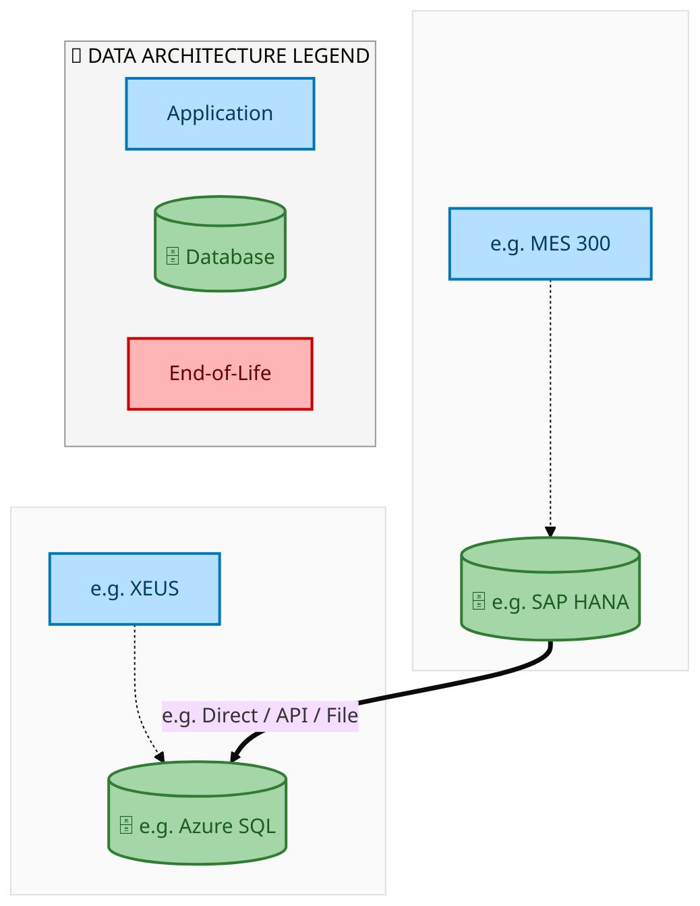
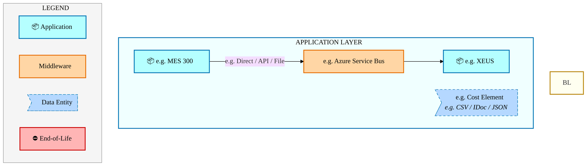
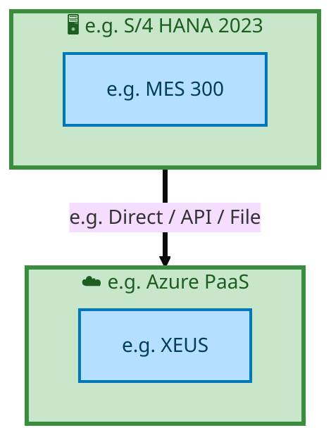

  <img src="data:image/svg+xml;base64,PHN2ZyB4bWxucz0iaHR0cDovL3d3dy53My5vcmcvMjAwMC9zdmciIHZpZXdCb3g9IjAgMCA4MDAgNDgwIiB3aWR0aD0iODAwIiBoZWlnaHQ9IjQ4MCI+DQogIDxkZWZzPg0KICAgIDxsaW5lYXJHcmFkaWVudCBpZD0iYmciIHgxPSIwJSIgeTE9IjAlIiB4Mj0iMTAwJSIgeTI9IjEwMCUiPg0KICAgICAgPHN0b3Agb2Zmc2V0PSIwJSIgc3R5bGU9InN0b3AtY29sb3I6IzAwNzFjNTtzdG9wLW9wYWNpdHk6MSIvPg0KICAgICAgPHN0b3Agb2Zmc2V0PSIxMDAlIiBzdHlsZT0ic3RvcC1jb2xvcjojMDBhZWVmO3N0b3Atb3BhY2l0eToxIi8+DQogICAgPC9saW5lYXJHcmFkaWVudD4NCiAgICA8bGluZWFyR3JhZGllbnQgaWQ9ImFjY2VudCIgeDE9IjAlIiB5MT0iMCUiIHgyPSIwJSIgeTI9IjEwMCUiPg0KICAgICAgPHN0b3Agb2Zmc2V0PSIwJSIgc3R5bGU9InN0b3AtY29sb3I6I2ZmZmZmZjtzdG9wLW9wYWNpdHk6MC4xNSIvPg0KICAgICAgPHN0b3Agb2Zmc2V0PSIxMDAlIiBzdHlsZT0ic3RvcC1jb2xvcjojZmZmZmZmO3N0b3Atb3BhY2l0eTowLjAyIi8+DQogICAgPC9saW5lYXJHcmFkaWVudD4NCiAgICA8cGF0dGVybiBpZD0iZ3JpZCIgd2lkdGg9IjQwIiBoZWlnaHQ9IjQwIiBwYXR0ZXJuVW5pdHM9InVzZXJTcGFjZU9uVXNlIj4NCiAgICAgIDxwYXRoIGQ9Ik0gNDAgMCBMIDAgMCAwIDQwIiBmaWxsPSJub25lIiBzdHJva2U9InJnYmEoMjU1LDI1NSwyNTUsMC4wNykiIHN0cm9rZS13aWR0aD0iMC41Ii8+DQogICAgPC9wYXR0ZXJuPg0KICA8L2RlZnM+DQoNCiAgPCEtLSBCYWNrZ3JvdW5kIC0tPg0KICA8cmVjdCB3aWR0aD0iODAwIiBoZWlnaHQ9IjQ4MCIgZmlsbD0idXJsKCNiZykiIHJ4PSI4Ii8+DQogIDxyZWN0IHdpZHRoPSI4MDAiIGhlaWdodD0iNDgwIiBmaWxsPSJ1cmwoI2dyaWQpIiByeD0iOCIvPg0KICA8cmVjdCB3aWR0aD0iODAwIiBoZWlnaHQ9IjQ4MCIgZmlsbD0idXJsKCNhY2NlbnQpIiByeD0iOCIvPg0KDQogIDwhLS0gRGVjb3JhdGl2ZSBjaXJjdWl0L2FyY2hpdGVjdHVyZSBsaW5lcyAtLT4NCiAgPGcgc3Ryb2tlPSJyZ2JhKDI1NSwyNTUsMjU1LDAuMTIpIiBzdHJva2Utd2lkdGg9IjEuNSIgZmlsbD0ibm9uZSI+DQogICAgPHBhdGggZD0iTSAwIDEwMCBMIDEyMCAxMDAgTCAxNjAgMTQwIEwgMjgwIDE0MCIvPg0KICAgIDxwYXRoIGQ9Ik0gMCAyNjAgTCA4MCAyNjAgTCAxMjAgMjIwIEwgMjAwIDIyMCBMIDI0MCAyNjAgTCAzNjAgMjYwIi8+DQogICAgPHBhdGggZD0iTSA1MjAgMTAwIEwgNjAwIDEwMCBMIDY0MCA2MCBMIDgwMCA2MCIvPg0KICAgIDxwYXRoIGQ9Ik0gNDQwIDM0MCBMIDU2MCAzNDAgTCA2MDAgMzAwIEwgNzIwIDMwMCBMIDc2MCAzNDAgTCA4MDAgMzQwIi8+DQogICAgPHBhdGggZD0iTSA2MDAgNDAwIEwgNjgwIDQwMCBMIDcyMCA0NDAiLz4NCiAgICA8cGF0aCBkPSJNIDAgNDAwIEwgNDAgNDAwIEwgODAgMzYwIi8+DQogICAgPHBhdGggZD0iTSAyMDAgNDIwIEwgMzIwIDQyMCBMIDM2MCAzODAgTCA0ODAgMzgwIi8+DQogICAgPHBhdGggZD0iTSA2NTAgNDQwIEwgNzUwIDQ0MCBMIDgwMCA0ODAiLz4NCiAgPC9nPg0KDQogIDwhLS0gRGVjb3JhdGl2ZSBub2RlcyAtLT4NCiAgPGcgZmlsbD0icmdiYSgyNTUsMjU1LDI1NSwwLjE4KSI+DQogICAgPGNpcmNsZSBjeD0iMTIwIiBjeT0iMTAwIiByPSI0Ii8+DQogICAgPGNpcmNsZSBjeD0iMjgwIiBjeT0iMTQwIiByPSI0Ii8+DQogICAgPGNpcmNsZSBjeD0iMjAwIiBjeT0iMjIwIiByPSI0Ii8+DQogICAgPGNpcmNsZSBjeD0iMzYwIiBjeT0iMjYwIiByPSI0Ii8+DQogICAgPGNpcmNsZSBjeD0iNjAwIiBjeT0iMTAwIiByPSI0Ii8+DQogICAgPGNpcmNsZSBjeD0iNzIwIiBjeT0iMzAwIiByPSI0Ii8+DQogICAgPGNpcmNsZSBjeD0iNTYwIiBjeT0iMzQwIiByPSI0Ii8+DQogICAgPGNpcmNsZSBjeD0iODAiIGN5PSIzNjAiIHI9IjQiLz4NCiAgICA8Y2lyY2xlIGN4PSI0ODAiIGN5PSIzODAiIHI9IjQiLz4NCiAgICA8Y2lyY2xlIGN4PSIzMjAiIGN5PSI0MjAiIHI9IjQiLz4NCiAgPC9nPg0KDQogIDwhLS0gVE9HQUYgQkRBVCBib3hlcyAtLT4NCiAgPGcgZm9udC1mYW1pbHk9IlNlZ29lIFVJLCBBcmlhbCwgc2Fucy1zZXJpZiIgZm9udC1zaXplPSIxNCIgZm9udC13ZWlnaHQ9IjYwMCI+DQogICAgPCEtLSBCIC0tPg0KICAgIDxyZWN0IHg9IjE1MCIgeT0iMTQwIiB3aWR0aD0iMTIwIiBoZWlnaHQ9IjQwIiByeD0iNSIgZmlsbD0icmdiYSgyNTUsMjU1LDI1NSwwLjE4KSIgc3Ryb2tlPSJyZ2JhKDI1NSwyNTUsMjU1LDAuMykiIHN0cm9rZS13aWR0aD0iMSIvPg0KICAgIDx0ZXh0IHg9IjIxMCIgeT0iMTY1IiB0ZXh0LWFuY2hvcj0ibWlkZGxlIiBmaWxsPSIjZmZmIj5CdXNpbmVzczwvdGV4dD4NCiAgICA8IS0tIEQgLS0+DQogICAgPHJlY3QgeD0iMjkwIiB5PSIxNDAiIHdpZHRoPSIxMjAiIGhlaWdodD0iNDAiIHJ4PSI1IiBmaWxsPSJyZ2JhKDI1NSwyNTUsMjU1LDAuMTgpIiBzdHJva2U9InJnYmEoMjU1LDI1NSwyNTUsMC4zKSIgc3Ryb2tlLXdpZHRoPSIxIi8+DQogICAgPHRleHQgeD0iMzUwIiB5PSIxNjUiIHRleHQtYW5jaG9yPSJtaWRkbGUiIGZpbGw9IiNmZmYiPkRhdGE8L3RleHQ+DQogICAgPCEtLSBBIC0tPg0KICAgIDxyZWN0IHg9IjQzMCIgeT0iMTQwIiB3aWR0aD0iMTIwIiBoZWlnaHQ9IjQwIiByeD0iNSIgZmlsbD0icmdiYSgyNTUsMjU1LDI1NSwwLjE4KSIgc3Ryb2tlPSJyZ2JhKDI1NSwyNTUsMjU1LDAuMykiIHN0cm9rZS13aWR0aD0iMSIvPg0KICAgIDx0ZXh0IHg9IjQ5MCIgeT0iMTY1IiB0ZXh0LWFuY2hvcj0ibWlkZGxlIiBmaWxsPSIjZmZmIj5BcHBsaWNhdGlvbjwvdGV4dD4NCiAgICA8IS0tIFQgLS0+DQogICAgPHJlY3QgeD0iNTcwIiB5PSIxNDAiIHdpZHRoPSIxMjAiIGhlaWdodD0iNDAiIHJ4PSI1IiBmaWxsPSJyZ2JhKDI1NSwyNTUsMjU1LDAuMTgpIiBzdHJva2U9InJnYmEoMjU1LDI1NSwyNTUsMC4zKSIgc3Ryb2tlLXdpZHRoPSIxIi8+DQogICAgPHRleHQgeD0iNjMwIiB5PSIxNjUiIHRleHQtYW5jaG9yPSJtaWRkbGUiIGZpbGw9IiNmZmYiPlRlY2hub2xvZ3k8L3RleHQ+DQogIDwvZz4NCg0KICA8IS0tIENvbm5lY3RpbmcgbGluZXMgYmV0d2VlbiBCREFUIGJveGVzIC0tPg0KICA8ZyBzdHJva2U9InJnYmEoMjU1LDI1NSwyNTUsMC4yNSkiIHN0cm9rZS13aWR0aD0iMSI+DQogICAgPGxpbmUgeDE9IjI3MCIgeTE9IjE2MCIgeDI9IjI5MCIgeTI9IjE2MCIvPg0KICAgIDxsaW5lIHgxPSI0MTAiIHkxPSIxNjAiIHgyPSI0MzAiIHkyPSIxNjAiLz4NCiAgICA8bGluZSB4MT0iNTUwIiB5MT0iMTYwIiB4Mj0iNTcwIiB5Mj0iMTYwIi8+DQogIDwvZz4NCg0KICA8IS0tIE1haW4gdGl0bGUgLS0+DQogIDx0ZXh0IHg9IjQwMCIgeT0iMjYwIiB0ZXh0LWFuY2hvcj0ibWlkZGxlIiBmb250LWZhbWlseT0iU2Vnb2UgVUksIEFyaWFsLCBzYW5zLXNlcmlmIiBmb250LXNpemU9IjM2IiBmb250LXdlaWdodD0iNzAwIiBmaWxsPSIjZmZmZmZmIiBsZXR0ZXItc3BhY2luZz0iMSI+DQogICAgSUFPIEFyY2hpdGVjdHVyZQ0KICA8L3RleHQ+DQogIDx0ZXh0IHg9IjQwMCIgeT0iMzAwIiB0ZXh0LWFuY2hvcj0ibWlkZGxlIiBmb250LWZhbWlseT0iU2Vnb2UgVUksIEFyaWFsLCBzYW5zLXNlcmlmIiBmb250LXNpemU9IjE4IiBmb250LXdlaWdodD0iNDAwIiBmaWxsPSJyZ2JhKDI1NSwyNTUsMjU1LDAuOCkiIGxldHRlci1zcGFjaW5nPSIyIj4NCiAgICBUT0dBRiBCREFUIMK3IElBTyBQcm9ncmFtIMK3IElETSAyLjANCiAgPC90ZXh0Pg0KDQogIDwhLS0gQm90dG9tIGFjY2VudCBiYXIgLS0+DQogIDxyZWN0IHg9IjI4MCIgeT0iMzQwIiB3aWR0aD0iMjQwIiBoZWlnaHQ9IjMiIHJ4PSIxLjUiIGZpbGw9InJnYmEoMjU1LDI1NSwyNTUsMC40KSIvPg0KDQogIDwhLS0gSW50ZWwgdGV4dCAtLT4NCiAgPHRleHQgeD0iNDAwIiB5PSIzODAiIHRleHQtYW5jaG9yPSJtaWRkbGUiIGZvbnQtZmFtaWx5PSJTZWdvZSBVSSwgQXJpYWwsIHNhbnMtc2VyaWYiIGZvbnQtc2l6ZT0iMTMiIGZpbGw9InJnYmEoMjU1LDI1NSwyNTUsMC41KSIgbGV0dGVyLXNwYWNpbmc9IjMiPg0KICAgIElOVEVMIENPTkZJREVOVElBTA0KICA8L3RleHQ+DQo8L3N2Zz4NCg==" alt="IAO Architecture" style="width:100%; border-radius:8px;" />
  <h1 style="font-size:36px; margin-top:24px;">Order_to_Cash_IF — Order to Cash (IF)</h1>
  <h2 style="font-size:24px;">Architecture Document (TOGAF BDAT)</h2>
  
End-to-End Integrated Processes (E2E) Tower 
  Capability Order_to_Cash_IF · Order to Cash

  
IAO Program · Release 2 
  Generated: March 2026 
  Sajiv Francis

  
IAO Architecture Pipeline — Intel Confidential

Page 1<a href="#toc">↑ Back to TOC</a>Order_to_Cash_IF — Order to Cash (IF)

## Table of Contents

<nav class="toc">
<ol>
  <li><a href="#1-executive-summary">1. Executive Summary</a></li>
  <li><a href="#2-business-context-objectives">2. Business Context &amp; Objectives</a>
    <ul>
      <li><a href="#21-classification">2.1 Classification</a></li>
      <li><a href="#22-business-drivers">2.2 Business Drivers</a></li>
      <li><a href="#23-success-criteria">2.3 Success Criteria</a></li>
      <li><a href="#24-companion-documents">2.4 Companion Documents</a></li>
    </ul>
  </li>
  <li><a href="#3-business-architecture-togaf-b">3. Business Architecture (TOGAF &ldquo;B&rdquo;)</a>
    <ul>
      <li><a href="#31-business-process-overview">3.1 Business Process Overview</a></li>
      <li><a href="#32-business-process-diagrams">3.2 Business Process Diagrams</a></li>
      <li><a href="#33-business-roles-responsibilities">3.3 Business Roles &amp; Responsibilities</a></li>
    </ul>
  </li>
  <li><a href="#4-data-architecture-togaf-d">4. Data Architecture (TOGAF &ldquo;D&rdquo;)</a>
    <ul>
      <li><a href="#41-data-entities-ownership">4.1 Data Entities &amp; Ownership</a></li>
      <li><a href="#42-data-flow-diagrams">4.2 Data Flow Diagrams</a></li>
      <li><a href="#43-data-lineage">4.3 Data Lineage</a></li>
      <li><a href="#44-ricefw-data-objects">4.4 RICEFW Data Objects</a></li>
      <li><a href="#45-data-governance-quality">4.5 Data Governance &amp; Quality</a></li>
    </ul>
  </li>
  <li><a href="#5-application-architecture-togaf-a">5. Application Architecture (TOGAF &ldquo;A&rdquo;)</a>
    <ul>
      <li><a href="#51-current-state-current-state-application-landscape">5.1 Current-State Application Landscape</a></li>
      <li><a href="#52-future-state-future-state-application-landscape">5.2 Future-State Application Landscape</a></li>
      <li><a href="#53-change-impact-summary">5.3 Change Impact Summary</a></li>
      <li><a href="#54-component-overview">5.4 Component Overview</a></li>
      <li><a href="#55-ricefw-inventory">5.5 RICEFW Inventory</a></li>
      <li><a href="#56-integration-patterns">5.6 Integration Patterns</a></li>
    </ul>
  </li>
  <li><a href="#6-technology-architecture-togaf-t">6. Technology Architecture (TOGAF &ldquo;T&rdquo;)</a>
    <ul>
      <li><a href="#61-platform-infrastructure">6.1 Platform &amp; Infrastructure</a></li>
      <li><a href="#62-sap-development-object-status">6.2 SAP Development Object Status</a></li>
      <li><a href="#63-nfrs-design-principles">6.3 NFRs &amp; Design Principles</a></li>
      <li><a href="#64-security-governance">6.4 Security &amp; Governance</a></li>
    </ul>
  </li>
  <li><a href="#7-project-context">7. Project Context</a>
    <ul>
      <li><a href="#71-project-roadmap-go-live-plan">7.1 Project Roadmap &amp; Go-Live Plan</a></li>
      <li><a href="#72-raid-log">7.2 RAID Log</a></li>
      <li><a href="#73-recommendations-next-steps">7.3 Recommendations &amp; Next Steps</a></li>
    </ul>
  </li>
</ol>
</nav>

Page 2<a href="#toc">↑ Back to TOC</a>Order_to_Cash_IF — Order to Cash (IF)

## 1. Executive Summary

This Architecture Document defines the **Business, Data, Application, and Technology** (BDAT) architecture for **Order_to_Cash_IF Order to Cash (IF)** within the IAO program. It includes 3 BPMN process diagram(s) in Section 3.

| Dimension | Value |
|-----------|-------|
| **Tower** | End-to-End Integrated Processes (E2E) |
| **Process Group** | Order to Cash |
| **Capability** | Order_to_Cash_IF - Order to Cash (IF) |
| **Release** | Release 2 |
| **Total Systems** | 2 |
| **System Status** | 0 Deployed, 0 Developing, 0 EOL, 2 Pending IAPM |
| **RICEFW Objects** | Pending — Smartsheet Object Tracker API integration |

**Change Summary**: 0 new flow chains, 0 removed, 0 modified, 1 unchanged between Current-State and Future-State states.

> All system nodes in architecture diagrams are **IAPM-linked** — click any node to open its IAPM page. Diagrams require `securityLevel: 'loose'` for click events.

Page 3<a href="#toc">↑ Back to TOC</a>Order_to_Cash_IF — Order to Cash (IF)

## 2. Business Context & Objectives

### 2.1 Classification

| Level | Value |
|-------|-------|
| **L0 Tower** | End-to-End Integrated Processes |
| **L1 Process** | Order to Cash |
| **L2 Capability** | Order_to_Cash_IF - Order to Cash (IF) |

### 2.2 Business Drivers

| # | Driver | Description | Strategic Alignment | Priority |
|---|--------|-------------|---------------------|----------|
| 1 | End-to-End Process Integration | Enable cross-tower integrated processes spanning procurement, manufacturing, and fulfillment | IDM 2.0 Process Excellence | High |
| 2 | Intel Foundry Business Enablement | Stand up foundry-specific business processes for external customer engagement | Intel Foundry Services | High |
| 3 | Process Visibility & Monitoring | Provide end-to-end process visibility across tower boundaries with integrated monitoring | Operational Excellence | Medium |
| 4 | Order_to_Cash_IF Process Migration | Migrate Order to Cash (IF) business processes and 2 integrated systems from legacy to S/4 HANA target architecture | IDM 2.0 Cross-Functional / End-to-End | High |

Page 4<a href="#toc">↑ Back to TOC</a>Order_to_Cash_IF — Order to Cash (IF)

### 2.3 Success Criteria

| Metric | Target | Measure | Baseline | Owner |
|--------|--------|---------|----------|-------|
| E2E Process Cycle Time | Per process SLA | End-to-end transaction completion within defined SLA per process | Varies by process | E2E Process Owner |
| Cross-Tower Integration Success | > 99% | Transactions completing across tower boundaries without manual intervention | 92% (current) | Integration Lead |
| Process Exception Rate | < 2% | Transactions requiring manual exception handling | 8% (current) | Operations Manager |
| Order_to_Cash_IF Migration Completeness | 100% flow chains validated | All 1 flow chains verified in target state | 0% (pre-migration) | Tower Architect |

### 2.4 Companion Documents

| Document | Description |
|----------|-------------|
| **Business Architecture** | Included in this document (Section 3) — process flows from BPMN diagrams |
| **This Document** | Full BDAT Architecture — Business + Data + Application + Technology |

Page 5<a href="#toc">↑ Back to TOC</a>Order_to_Cash_IF — Order to Cash (IF)

## 3. Business Architecture (TOGAF "B")

### 3.1 Business Process Overview

This capability includes **3 business process(es)** modeled in BPMN 2.0, covering the end-to-end workflow for Order_to_Cash_IF Order to Cash (IF).

| # | Step ID | Process Name | Lanes | Tasks | Gateways |
|---|---------|--------------|-------|-------|----------|
| 1 | E2E-10__R3_-_Intel_Foundry__RMA_for_Direct_Customers_with_no_physical_receipt_of_the_defective_produ | E2E-10__R3_-_Intel_Foundry__RMA_for_Direct_Customers_with_no_physical_receipt_of_the_defective_produ | Boundary Apps, SAP S/4 Intel Foundry | 14 | 6 |
| 2 | E2E_93__R3_Product_&amp;_Service_Sales_-_'Standard_sales_order_scenario_with_Combined_orders_(Physic | E2E_93__R3_Product_&amp;_Service_Sales_-_'Standard_sales_order_scenario_with_Combined_orders_(Physic | External Partners/ B2B

, SAP CFIN, SAP S/4 Intel Foundry 
, SAP S/4 Intel Foundry - Foreign LE

 | 64 | 33 |
| 3 | R3_E2E-80__Intel_Foundry-_Customer_Requests_Expedite_-_Service_Fee | R3_E2E-80__Intel_Foundry-_Customer_Requests_Expedite_-_Service_Fee | Boundary Apps , Customer Business Analyst, SAP CFIN, SAP S/4 Intel Foundry | 30 | 23 |

Page 6<a href="#toc">↑ Back to TOC</a>Order_to_Cash_IF — Order to Cash (IF)

### 3.2 Business Process Diagrams

#### BUSINESS ARCHITECTURE — 3.2.1 E2E-10__R3_-_Intel_Foundry__RMA_for_Direct_Customers_with_no_physical_receipt_of_the_defective_produ — E2E-10__R3_-_Intel_Foundry__RMA_for_Direct_Customers_with_no_physical_receipt_of_the_defective_produ

**Swim Lanes**: Boundary Apps · SAP S/4 Intel Foundry | **Tasks**: 14 | **Gateways**: 6

> **Legend**: ● Start · ● End · User Task · Service Task · ◇ Gateway · Sub-Process

<a href="https://mermaid.live/view#pako:eNqlV1tz4jYU_isa72TIzsCs5QsmPHTHMbhNZ7NJQ3Y7ndIHxZZBjS9UkpPQLP-9R7YM2Jin8gCjT9_5zkVHF96NqIipMTUuLt5ZzuQUvQ_kmmZ0MEWDJyLoYIhq4DvhjDylVAwUJylyuWD_VjTsbN4UTWEhyVi6VeiCrgqKvt0MkQ-G6RAJkouRoJwlg-Fgw1lG-DYo0oIr9gc6Scyk8qanrgseU34gmKaHIxdMU5bTA2x7jueEyk7QqMjjlmjiJpMkGuxUcGnxGq0Jl1X4paC35O13Fss1jBOSCgqctczSL-SJpipHyUuFRSV_aYrBhPKTQ8EWGxKxfAW4YwLESf58gFxzt0O7i4tlvneKHmfLHMEnSokQM5ogIQGev0iUsDSdfnACP3TNoZC8eKbTD9bcm9nWMFKZTCF1c6iKO3qlbLWW06cijTV19KpymFqbtyF_m1rmkG_hu-OL5vHBUzC2JtZk7-nawwEOGk9JkvwvT1BX_kjEs_Y1t0MrnO19YXfsBuapXpPmzPF83K0T5S8sokeiYRja80Op5mMXm-dFr0N7bAYd0RWR9JVsD4JXgbMXDF0vxN5ZwdpfN8ry6Z4XUSNoz93Q3Qt61zj0rbOCjo-diY4QdFacbNbouiirXkb-ZiPqOfXJ8Z9L457ypOAZuud05AtBhchoLpfGX0c864j3tchHoY8uQ8LSklPk5yTdQjN_bJvYYPJtE0NpkP8lfJgvgjvlHYEGbOFozV5IiooEBXeztiFWQSVkmpCRWn_U-P315sFHv5UkZXL7CQIgZ2LF7uVeYJPCsjxQWfIcfv4pqZDwG1H2QmOU8CJDQSlkkVEOGh-PRcYHESBs9tac_k0jCdZ3SaKODkTyGAVFlpU5i4iakMVZUa8j2ipMXay4Y2Ph9_fGRp2toyc4HaI1ggLclTICL5-Xxm5XW8DO7Cz8wr9Hi08OusklTVGo2oBvj-Sdo4W9Uyck-g4FhkBYkbfL6gLzF9i_nXK2SWMgPVQV0rT2tAfTAaeqJ8K7ACiwPhFVS1g7b7MnBzb8xEyiW5oV_Y6vgPtInkG3SOGUhGIiPzpNApuKx9lqBZn-_LhAwZpGzx2O1e4_HYJOuy7Spf9w2-l3bLfNGi8Pt75aXl5Av3csnLaFbkwUUC5ZUnWT2iAzSJaXVTLQaHnCeNazPHjS6a3eAkMfMMl62gxfdcyPK37OyDJPNolujXqPdOlWfyvTtygtBWT-c32OHvq5NrP7zW7EUW1p_Llr5pzZOJ0GObFz--3q-r3sd0fdOlAbCD6Gm7pqp0UZRXAoJWX6-UR3fNAlnBevYkRSiTaEkzSl6Unu-72cYzQa_QQCemjVQ4ybaQ1Ye4IGnIZga4LdEJwa8DrjiR5faX4j4GmPzfxEj6_0eKz5ZuNQ61ljDegAcOMQuxrQY83HewFTC7hNhJXCj6XxBxVL44dyoWfcbvI6mCY23FSv8WVhLXVfCGhr2G_L_BJu2xi2GNxtsFGeyfZj7cTq2nylcNeDDeB7GyaOTZqULbcbsd2d-VpUEyc5anzcycg-eiRUeTWvozZuncHtM7hzBnf3b8o2Ptbvvzbq9aKTXvSqD7XMXhQ3j6s2bPXDdj_s9MNuPzxuYGNowB2eERYb03ej-tcC_2ximpAylcZuaJBSFottHhnT6nVvlNUNPmME7t6sBnf_AXD-Bkk=" title="View full diagram">&#128065; View Full Diagram</a>

Page 7<a href="#toc">↑ Back to TOC</a>Order_to_Cash_IF — Order to Cash (IF)

#### BUSINESS ARCHITECTURE — 3.2.2 E2E_93__R3_Product_&amp;_Service_Sales_-_'Standard_sales_order_scenario_with_Combined_orders_(Physic — E2E_93__R3_Product_&amp;_Service_Sales_-_'Standard_sales_order_scenario_with_Combined_orders_(Physic

**Swim Lanes**: External Partners/ B2B
 · SAP CFIN · SAP S/4 Intel Foundry 
 · SAP S/4 Intel Foundry - Foreign LE

 | **Tasks**: 64 | **Gateways**: 33

> **Legend**: ● Start · ● End · User Task · Service Task · ◇ Gateway · Sub-Process

<a href="https://mermaid.live/view#pako:eNqlGtlu20jyVxrKZu0BJIT3oYddyDoyBmJbGzkzO1jvQ5tsWkQoUuDhWJP437e62UWRLTLJaAMkiIp1V3UdTX4dBVnIRtPR27df4zQup-TrRbllO3YxJRePtGAXY1IDfqN5TB8TVlxwnChLy038p0DTrf0LR-OwFd3FyYFDN-wpY-TT9ZjMgDAZk4KmxaRgeRxdjC_2ebyj-WGeJVnOsd8wL9IiIU0-usrykOVHBE1z9cAG0iRO2RFsupZrrThdwYIsDTtMIzvyouDilSuXZF-CLc1LoX5VsBv68nscllv4HdGkYICzLXfJB_rIEm5jmVccFlT5MzojLricFBy22dMgTp8AbmkAymn6-QiytddX8vr27UPaCCX3i4eUwJ8goUWxYBEpSgAvn0sSxUkyfWPNZytbGxdlnn1m0zfG0l2YxjjglkzBdG3MnTv5wuKnbTl9zJJQok6-cBumxv5lnL9MDW2cH-BfRRZLw6OkuWN4htdIunL1uT5HSVEU_V-SwK_5PS0-S1lLc2WsFo0s3XbsuXbKD81cWO5MV_3E8uc4YC2mq9XKXB5dtXRsXRtmerUyHW2uMH2iJftCD0eG_txqGK5sd6W7gwxreaqW1eM6zwJkaC7tld0wdK_01cwYZGjNdMuTGgKfp5zut2T5UrI8pQlZQ5qkLC_ekSvjitRY_E9qG_95GM3pvqxyRu74WSHPMSXLxfW7j-SWlQ-j_7axTcD-yAIWPzOyoCUlcUqurNsPCpoFaLdZGUcHMqd5HrO8i-C4l4AR0WlEJ_sEXCgkF0SyDkmUZzsyr4oy2wnaX2piSEHFws1sTear69sWc8sD3muWR1m-I-DPKC7pY5zE5YHMwBeHoiq62lh-y6o1PexYWtaq7Mtakys4mYqJGtC8Z-BTSAIwstiS2X6fxAEt4yxVcPWWQrOPZJ0VJZxxQtOQzKoyI_OEQVlMn7pkrn50EjhifyKFoPzw6KGa0lAoGy_E3AtUeCEuyL7W6YTe179-RXpe2CePUJqCLbnbs5Rcp88ZHKWCrLIKDIAE-MhLZgAeFlr982H0-tpmZvQzYy9BUhXg8vf1MTqS9Ud5884C2SVLasH5gXTy2G7HMKFpCllU5_Pl5v1qoum_KEFxgGD5woIK4gf-CatA-LSm2ZRsr2SJ7QoJEKqih0A-UEjamXhXlY_CYwuWgJL54XL5-42qlN8i2Nx_hL93p4Rg0TtLoXS0dtLHwed36_fXpEeE007G91kWFk2qX_5Gk4qRWRiyUKUyWu5VqE5luKaSf4ACrQpcSoJst0_Yacr65l_NEkGma86RDipN9qWY0KQke5rTJGHJEJV7FpXfSxWn31dR1_4i2c_m_wT-l0OHTcmHZfsstCNcZycENg57KhOP6n0ePz0Bzvv7DQm2LFAKnSn6QxJUCS909_SFqdWzJW1-D9X4lAc_mxuwSmozz9Ioznd1DePlT9Z5yOu6TZPrku0IPISynfBK-ZhkwWc1JYHpp33ItfoAs9xE0NyzF6VluR3913kcnBRafkoXMFFCat_cXC9k81nfdrHaR3OeszAua1PJJW-Yq81cPQU6P5I3UGyfGDQQQKybnIIkglWV3NpfYUxSnhroOXBTK9igBEFfiS5SFGz3mBxIyYqyX47500mhWz_lD91uF5L-5NGdH3tfd7-jmbAu5iVDNGXKu2UnKRRePxdK_S_H0tB-bIihKw7pOQmG8aPjZIgDJ5QpD3tGsqip-wqi9b3mouDaSncQfl3zpKyPUCHKOFSUBVT1tIQyCFuZ2gQMpz3H4FEnl5_SHNIOXAJlHTrn6VE1XMUz9zkNYWrivSCGMq-0TcPrzFZYHeTgQS559q-3MMEEfLKtO7Eq0Vf9rFQ1rdXMr2RCXfGEEp4J6gqFa4NCq_9YPXk4Fa1MQ8wc-wxWOYk-5l4A8gCW2yMMfKRQmh2ZJyTkcg8jHriXqiJ5lmy28V527euiqFR77DZv7W_QmWqeX-JyS9KM8N0TahgcveA4kbcZiFOeM3EyIKe4L5O4UAqx6fZjiXkjDaudgt5Jgg2FK4Oui2_-GJPfYlamdAdO3MYpVRj4P-xc7ZlplkD065oze6ZxgitDzyG2Thtsu6UpyE0Jx5Mm9qv5TEHjAV4xOED9j60-LuvFrwpa-5xvoCCHlchsGNLvt3Eeij3wwHcIcglV7k5JFuvYU4u6dHIkHvib5UYcjIKrwJ55La4kHjzlo4lABzSFIw_6v5efNmJ0gWFGOPgDPZxshGYzMfLtn-BKWgdeOFkhsLoEaDU03EqUBZ4od1AK8zhUEt6xle1T0mQSm_ArrLhnr3IchbDjqzpoHXxPmYPFygxhLFVEX13Y5AEZGpddTSHgVRVKAOxlwzO2K5Lo6FDyKZWFjilzh2srmDxvoNzAhDEfoOCpU-OGcc5EK4DMgMDP636ioLuKgCG23llrgesPLLBDxpCs4w11h_W0s9Tw9PPIBjbmzqSyqQIe7KhKTpQ9b5XyrH6ya6jO9U0Ov6aKI7x8uILWGfKxNeaD93XaNAeyvjtRye7n3UxJ3zPHOc8cd8CJndFKFpYu5UDOXRcQgawoJvWdMt7EwGX2icr-WSr752WZb52xzPr2OUTnLNv-Obu2751D5J-11WtnUelnURlnUZlnUVlnUdlnUXnnXnGkOplM_gFHRv70rfq3Y6kA-dtx69-2IQGGZGAjgV0DXGTpSA4-YjgSw0cZridJEMGUPE0JkM99FCEfowooAOldieBaKgBVcCWJpyEAdUI7Pa0G6IjhSU81jnEUFgjw0XBb8tQbHjaioGG2i1JQLiBLByPEksrbDReJ4euomojBt4fRH3zE_gYxaZipjkTM20wgeo25lnxwBbO32PVvIGf4Kz-42VLeBnzjFyMoQYbfQaM9W9GlyQPPQXeoqKoyvvSK6yuAxrWYIMgKcw4zwJcZg_G2MUubjJDKOOgZdLvVhFPvauc2aqNwV_Xd7zSCvvR3kjO-8oS4vko_NBGW9Drq4ijnQ5fJqTcATKSGhaPYb2lShU1W5TB4L2D8zHewkzWXOA9pBi-Ac6gJYk0VcGhsW5o-SQUbZp4rmalLvrjoqy8Hp8CQr7UiVR4qQwOrbjPyTe6IfHaeADueBOmn7AZR_lVRGGZgBRLTS51KaBMeBYyxLmOoYxbo8iAYSGLI9MYXmPAfCWiKk6E46lzbwJAT4yAxfmSbqYrFW8NGWi-Ld79CGNt8msom2eB69pFBxjG4wZEL1wOPbs_9hOByTHWZPjZ61kZXayjIxqLTNAaZtbbbcJEBczQV0pQ3R8bDVUR_ExezVUQDsIK7s34RxHPyIb1csH19l0UL3vhKPiiuYFJdwXt49NTSWBKXv4T5xl-poDiZD04Tfqm0j4Ya0lADAY5MEAM19H2p4DEf3hADcqK54uPqqNlTV13rezx0ziOFpSdukmiQkfc9RiYwOk0jEeDmHMgKYmDBMLD24jtvwK0hJjrPxKOCrvG8bgE0TfUBlngT_W2aCg-QJzVxTyBY3QysblpTCjTsW54K8TUVYqKNprTRRFGmTEez6Roy-k5joq9w9dErGEqzUQ6tN7E6a00P1KTrTFuF2A0Vanv0DB6oppr5J6JOIDa6AWX7UpDlqW0Lg9Og2igQbTOwzaL1loHymtYkfWo1o5ZkYh1jJZ1qIY2lI5ejOxqfoZqW9KvVtDTNVnFcqZ9lnuIc3YiFShHGSzx7epLHLMnK-qbseOVR8EqiPQofWUhsob2YQ5arznCWpepg4fhqtL4nEVMsfkjThVsDcLv5nKgLdwbg7gDck58KdaF-H9TVeqF6L9TohZq9UKtfN3fARnfARnfARtgY5Nc_XbDfC4ZZvhes94ONfrDZD7b6wXY_2OkHu_3gfiu9fiv9fiv9fiv9fiv9fiv9fiv9fiv9fiv9fiv9fiv9fit5_-iH6wNwYwBuDsCtAbg9AHcG4O4A3BuAD9irN_aOxiMY63Y0DkfTryPxOSd88hmyiFZJOXodj_jr2c0hDUZT8dnjqH5FsIgpXPzvauDr_wBon7T5" title="View full diagram">&#128065; View Full Diagram</a>

Page 8<a href="#toc">↑ Back to TOC</a>Order_to_Cash_IF — Order to Cash (IF)

#### BUSINESS ARCHITECTURE — 3.2.3 R3_E2E-80__Intel_Foundry-_Customer_Requests_Expedite_-_Service_Fee — R3_E2E-80__Intel_Foundry-_Customer_Requests_Expedite_-_Service_Fee

**Swim Lanes**: Boundary Apps  · Customer Business Analyst · SAP CFIN · SAP S/4 Intel Foundry | **Tasks**: 30 | **Gateways**: 23

> **Legend**: ● Start · ● End · User Task · Service Task · ◇ Gateway · Sub-Process

<a href="https://mermaid.live/view#pako:eNqlWW1z4jYe_yoadnaSzMCun2QDL-4GTGgz091lQtpO53IvhC2DLsamliHh0nz3-8uWjC2U3pbmRRJ--j8_yua1F-Ux7Y17Hz--soyVY_R6VW7oll6N0dWKcHrVRzXwCykYWaWUXwmaJM_KJftvRWZ7uxdBJrA52bL0KNAlXecU_XzXRxNgTPuIk4wPOC1YctW_2hVsS4pjmKd5Iag_0GFiJZU2eTTNi5gWJwLLCuwIA2vKMnqC3cALvLng4zTKs7gjNMHJMImu3oRxaf4cbUhRVubvOf1CXn5lcbmBzwlJOQWaTblNfyIrmgofy2IvsGhfHFQwGBd6MgjYckcilq0B9yyACpI9nSBsvb2ht48fH7NGKXqYPWYIfqKUcD6jCeIlwLeHEiUsTccfvHAyx1afl0X-RMcfnNtg5jr9SHgyBtetvgju4Jmy9aYcr_I0lqSDZ-HD2Nm99IuXsWP1iyP81nTRLD5pCn1n6AwbTdPADu1QaUqS5G9pgrgWD4Q_SV237tyZzxpdNvZxaJ3LU27OvGBi63GixYFFtCV0Pp-7t6dQ3frYtt4XOp27vhVqQtekpM_keBI4Cr1G4BwHczt4V2CtT7dyv1oUeaQEurd4jhuBwdSeT5x3BXoT2xtKC0HOuiC7DZrm-6qW0WS346g-FD-Z4_zrsbegRZIXWzRJ0zwiJcszNDkQlpIVS1l5ROGGRk-PvX-3-VzgW0IloJ93MbjP0YERtJj9qJF5JrLbcKKR4ZYVy2hD4z205RqxDD1sWBGjBVR3ZTy6ni_Dbzcauw_sSkFS5FskiFCZoy-3S0RAOxcm0APNSrSXdHC6_OzV5EDWleh61yAyIeOEDHYppLYjvbb_pkXvDV9fFb2YgIMV9HC0QfQlSvecHegPdYk89t7eWmy-fWIjRZE_8wFJS3D7z7mcv8gFzmv1EO55mW9pgabAkVHO0SQj6ZGXLTU2ROALyfYkRQVdM6i3ujRymAAvOxqzksLB73vKyzosjVAIbTidfP5Ciidaijw-ULLVUgbCJ5yD5q1IyhRWQ4xA-EM-mNKTVaIL4K-WHFtLzjcx2tE9jSh4H3eN0RLl4hMvEOzQnFKU5SW6lS7FOoOvMciQtIz_CuxiV-yjc3bPMhfGjEaMi2huSUxFwMRcX9PGDGHXP7W8e_b3yioolADK6DNaElixMkB5IYsf8gfpFIlZfkPPrNyosfjp0yddp3NRYXuume08eKujoVZEJSQUNqQcQFBynUqLmuR2tOLgbzfGcrJA4fzua7sPRu0ReY8WeRU7rZ6tZgShkPBNNWg1EtFQskhhoB0r96vPu1IrcFcrcI0aLWXkpnBR0Ot1pNWrbCEU5ttdSs8rFPvGoO1IQdKUpt8ZMzFK77KSpmguVk1xbJsEBoUkjfapiM6iYNFZ-Lz_T4JPAf4JhsPgrqRbKJYXLXZ-O1kPC9PuCtROqtsizLOEFdtquHUJh8Kq-hTGSquVumSiPsK65b7ty5XwH3oyhTRDGDqUttWy7oc8jzm643xPNSr7JFCMsU8Q2UMO7YmugRHamK0ZTGskbq4IZsVWW4d2tdP3peiiyR4aBVyL0I9w99Lo3FNI7-l_aFSN93voO_gjxgi0LE01Hq9rWzXvG_Pa00s3Cn9HF9nt7C1SkmVUZam285rrYoM2R5GLISy8-HMmkdg6_Kqjrn8h6R5o4xu1R4rKAK26nKBpLnE3RTIS7Sl7_RXGbvXvDRLpamKSUC3PzrArTKaiI2xZD-aq5FFV8nAnasa3oRidUVeoio2cvKK1oEzBvYLFmj2uZbTnnh4YbOfPTd3RlkdopTZ3LLeQJtPRRtnJEdG7Sod4VmTEsH0DbZqF9ZoMq9JMz-mH-vQzFBFHszyj-qL2zBurmh-IJepaCrZCcuCiwrYUnW1obBYiQghVcRZBCFxll2i2es4gvmG7atbDzqtLVByqToO7rGFH--9r5d0rxSld4WxW3YwnUSnqAuYVmolMCOyh-h3yc_-Cy24Do7-2Yup5b13CZF_C5FzC5F7C5F3ChC9hGl7yZIFHFz2PWJdeu-AqjwaDf4ibmwQ8SwB_PPZ-o3B9-kNceuWJpPQc-dkZSmAkASwpXCVbilbnniMZFIEvCZRELAl8WwOUcYFk8ORnaQFWArGrC5CAMmFUf7Qt5ZMlAcXgSROVRlvZrFR60gZbGW1LFa5icaVMv1Fia4CvtCqhtlRrYxVbyaJeyMCNVALKUEfKwL5yVUbTVr7a0ll31EmteARTMlS8lS--UttkREZ4qGRKJW4DqBQowNGqxJeA-uy5p_pC1-pOLB6NxCsGeLEIL0ea_dYMy8eMrAtKq7lcPS-pgXxT16ilS_-aVweuio6nPAt0QBmOZbh8zfCmfLGnudoASiaWAW5qRYrEyjwnkObJy8CBt-6Hj5m8dlfPsqy6RZXHnWzDRgbGmlDP6_rc1G5z0LSySryH9RNfPzkT5ncPbFc_ULLcpu6xXqKqd1RRqxDr8bJ1XxtAJk3lxFEcWC83ZZ4jG8dWRrgya47KkqN6XuXVG2ptoQCnaRxlhxJqK8-aNlDdGLTeLFYFoF6pdvHhO_jIjMOMMeN28yK6izvv4O47uPcOjuXL5y7qG9HAiA6N6MiEwsCSb3a7sG2GHTPsmmHPDGMz7JvhwAwPzfDICGOzl9jsJTZ7ic1eYrOX2OwlNnuJzV5is5fY7KVv9tI3e-k3Xvb6PRjzW8Li3vi1V31zBd9uxTQh-7TsvfV7BAbo8phFvXH1DU-vfsM2Y7AwyLYG3_4HaElPsg==" title="View full diagram">&#128065; View Full Diagram</a>

Page 9<a href="#toc">↑ Back to TOC</a>Order_to_Cash_IF — Order to Cash (IF)

### 3.3 Business Roles & Responsibilities

| Role / Lane | Processes Involved | Description |
|------------|-------------------|-------------|
| Boundary Apps | E2E-10__R3_-_Intel_Foundry__RMA_for_Direct_Customers_with_no_physical_receipt_of_the_defective_produ,  | |
| SAP S/4 Intel Foundry | E2E-10__R3_-_Intel_Foundry__RMA_for_Direct_Customers_with_no_physical_receipt_of_the_defective_produ, R3_E2E-80__Intel_Foundry-_Customer_Requests_Expedite_-_Service_Fee | |
| External Partners/ B2B
 | E2E_93__R3_Product_&amp;_Service_Sales_-_'Standard_sales_order_scenario_with_Combined_orders_(Physic,  | |
| SAP CFIN | E2E_93__R3_Product_&amp;_Service_Sales_-_'Standard_sales_order_scenario_with_Combined_orders_(Physic, R3_E2E-80__Intel_Foundry-_Customer_Requests_Expedite_-_Service_Fee | |
| SAP S/4 Intel Foundry 
 | E2E_93__R3_Product_&amp;_Service_Sales_-_'Standard_sales_order_scenario_with_Combined_orders_(Physic,  | |
| SAP S/4 Intel Foundry - Foreign LE
 | E2E_93__R3_Product_&amp;_Service_Sales_-_'Standard_sales_order_scenario_with_Combined_orders_(Physic,  | |
| Boundary Apps  | R3_E2E-80__Intel_Foundry-_Customer_Requests_Expedite_-_Service_Fee | |
| Customer Business Analyst | R3_E2E-80__Intel_Foundry-_Customer_Requests_Expedite_-_Service_Fee | |

Page 10<a href="#toc">↑ Back to TOC</a>Order_to_Cash_IF — Order to Cash (IF)

## 4. Data Architecture (TOGAF "D")

### 4.1 Data Entities & Ownership

| # | Data Entity | Source System | Target System | Data Owner | Classification | Volume | Master/Transaction |
|---|-------------|---------------|---------------|------------|----------------|--------|-------------------|
| 1 | e.g. Cost Element | e.g. MES 300 | e.g. XEUS | Data steward | e.g. Intel Confidential | e.g. 10K rows/day | Master / Transaction |

Page 11<a href="#toc">↑ Back to TOC</a>Order_to_Cash_IF — Order to Cash (IF)

### 4.2 Data Flow Diagrams

> **DATA ARCHITECTURE** — Database-to-database data flows. Applications (blue) sit above their hosting databases (green cylinders). Thick arrows show data movement between databases.

#### 4.2.1 Current-State — Current-State Data Flows

<a href="https://mermaid.live/view#pako:eNqllQ1P2zAQhv-KZVRpk1oWWtKOSCC5-RiVAmOkbJPIFLmJ01q4cZQ40FL632cnaWFdC2Wzpci-Oz--3OvECxjyiEADNhoLmlBhgIUPxYRMiQ8N4MMRzuWoKUc5CYuMirlL7gmrnIzzlbdc8h1nFI8YyZVbcmKeCI8-1qgjPZ1Vwcru4Cll88rjkTEn4GbQBEgCJHxZRjH-EE5wJmpakZMLPPtBIzFRlhiznKi4iZgyF48IK7cVWVFaE_laXopDmoyVuaMrY4aTuxfGY325BMtGw0_We4Fh30-AbCHDeW6RGOA07fMZiCljxkFftxzHaeYi43fEONC0Xq_fraetB5Wa0U5nzZAznil3x9I3edHInLMah3Sri3prXNvuWZ32TtxRX7fb2gaOcPacnuP09b6-5pmmJttOXrer3H5SEfNiNM5wOgFfs4hkgeCBifNJMHBMC5luQIJxgB6LjATeN_fWh7Kav6qFqkU0I6GgPFnXT7UtJFSCfto3nmSQw_EhUGPJMgyjqvSry62NPD740C-iz51IPqPw2C9iosmaKG4ZBGSQDz8qeln3PXMDrcPW2R77VziSRHUJxZyRfeq3kgupvpbL1lT_U64j-c3sL5CHroJzdIn-V58L2ws6mraSSE6BnL5TpXUyr4gkY4CKeadGdX5vyLRK4J0qrZb9k0hvJgNOT8-e6rpapSrgE0BXA_l0KJO_yqe9zt3GkXDJWL7f7YtCh5EGLDREAF2b54OhbQ5vrm3g2l_sS2vH0XCvn61uoA4RSlNGQ6y828V3A2uHvBYWuLo8tinrBrbE20nU4nHLpTGp8NXPbKte1RuuNNFVX2tycnLylyCwCackm2IaQWNRXU_ylotIjAsm5AUDcSG4N09CaJRXBizSCAtiUSwrOq2My98AKEN2" title="View full diagram">&#128065; View Full Diagram</a>

Page 12<a href="#toc">↑ Back to TOC</a>Order_to_Cash_IF — Order to Cash (IF)

#### 4.2.2 Future-State — Future-State Data Flows

<a href="https://mermaid.live/view#pako:eNqllQ1P2zAQhv-KZVRpk1oWWtKOSCA5X6NSYIyUbRKZIjdxWgs3jhIHWkr_--ykLaxroWy2FNl358eXe514DiMeE2jARmNOUyoMMA-gGJMJCaABAjjEhRw15aggUZlTMfPIPWG1k3G-8lZLvuOc4iEjhXJLTsJT4dPHJepIz6Z1sLK7eELZrPb4ZMQJuOk3AZIACV9UUYw_RGOciyWtLMgFnv6gsRgrS4JZQVTcWEyYh4eEVduKvKysqXwtP8MRTUfK3NGVMcfp3Qvjsb5YgEWjEaTrvcDADFIgW8RwUdgkATjLTD4FCWXMODB123XdZiFyfkeMA03r9czuctp6UKkZ7WzajDjjuXJ3bH2TFw-tGVvikG53UW-Nazs9u9PeiTsydaetbeAIZ8_pua6pm_qaZ1mabDt53a5yB2lNLMrhKMfZGHzNY5KHgocWLsZh33VtZHkhCUcheixzEvrfvNsAymr-qheqFtOcRILydF0_1baQUAX66dz4kkEOR4dAjSXLMIy60q8utzfy-BDAoIw_d2L5jKPjoEyIJmuiuFUQkEEB_KjoVd33zA20Dltne-xf40gaL0soZozsU7-VXEj1tVyOpvqfch3Jb2Z_gXx0FZ6jS_S_-lw4ftjRtJVEcgrk9J0qrZN5RSQZA1TMOzVa5veGTKsE3qnSatk_ifRmMuD09OxpWVe7UgV8AuiqL58uZfJX-bTXuds4Eh4Zyfe7fVHoKNaAjQYIoGvrvD9wrMHNtQM854tzae84Gt71s9UL1SFCWcZohJV3u_heaO-Q18YC15fHNmW90JF4J41bPGl5NCE1vv6ZbdWrfsOVJrrqa01OTk7-EgQ24YTkE0xjaMzr60necjFJcMmEvGAgLgX3Z2kEjerKgGUWY0FsimVFJ7Vx8RuHiEOg" title="View full diagram">&#128065; View Full Diagram</a>

Page 13<a href="#toc">↑ Back to TOC</a>Order_to_Cash_IF — Order to Cash (IF)

### 4.3 Data Lineage

| # | Source System | Source Schema/Object | Target System | Target Schema/Object | Transformation |
|---|-------------|---------------------|---------------|---------------------|---------------|
| 1 | e.g. MES 300 | e.g. CKMLHD table | e.g. XEUS | e.g. dbo.CostElements | Lineage notes |

### 4.4 RICEFW Data Objects

Reports and Conversions for this capability will be populated from the Smartsheet Object Tracker via automated API extraction.

| Object ID | Type | Description | Status | Source | Target | Complexity |
|-----------|------|-------------|--------|--------|--------|-----------|
| Order_to_Cash_IF-R001 | Report | Order to Cash (IF) operational report | Planned | SAP S/4HANA | Analytics | Medium |
| Order_to_Cash_IF-C001 | Conversion | Legacy data migration for Order to Cash (IF) | Planned | Legacy ERP | SAP S/4HANA | High |

> *Pending: Smartsheet API integration to auto-populate live RICEFW data (see Build Requirements).*

### 4.5 Data Governance & Quality

| Concern | Approach |
|---------|----------|
| Data Ownership | Per-entity owners listed in Section 3.1 |
| Data Classification | Financial data classified as Intel Confidential |
| Data Retention | Per Intel corporate retention policies |
| Data Quality | Validated at source; reconciliation at target |

Page 14<a href="#toc">↑ Back to TOC</a>Order_to_Cash_IF — Order to Cash (IF)

## 5. Application Architecture (TOGAF "A")

### 5.1 Current-State — Current-State Application Landscape

#### Overview

The Current-State architecture represents the **current / legacy** landscape for Order_to_Cash_IF.This view is generated from `CurrentFlows.xlsx` (1 flow hops across 1 flow chains).

#### APPLICATION ARCHITECTURE — Architecture Diagram (ArchiMate-Inspired)

> **Click any system node** to open its IAPM application page.
> **Legend**: Deployed · Developing · End-of-Life · No IAPM Match

<a href="https://mermaid.live/view#pako:eNqVVWFP2zAQ_StWUL-1IwxaIEKV0iadOqWACBublily42trzU0i2wE61v--c1xoKQM6V0qTu_O78_Pz-cHJCgaO5zQaDzzn2iMPiaNnMIfE8UjijKnCtya-KcgqyfUiglsQ1imK4tFbT_lKJadjAcq4EWdS5Drmv1dQB53y3gYb-4DOuVhYTwzTAsiXYZP4CCCaRNFctRRIPkmcZT1DFHfZjEq9Qq4UjOj9DWd6ZiwTKhSYuJmei4iOQdQlaFnV1hyXGJc04_nUmI9cY5Q0_7VhbLvLJVk2Gkn-lItc95Kc4Gg0SKuFtWUzPqIaWjxXJZfAiNILASQTVClQGGPD6-8AJmRcKZ6DUqQeEy6EtzfA0Ws3lZbFL_D2eicnHbe3-mzdmQV5H8v7ZlaIQnp7rutuYdKyJOthMXttg_qE6brHx73Of2AyqulLzODkHcyDZ5iPPkYVkifpAjkl7a1Mc86YgDsqYZORoOOvGQmPO4M12g7VQyFeMGI43mC533fd9zAtqqrGU0nLGfGjH4mTVOzkkOGTHbaJf3kZDfv-9fDinET-9_AqcX7aSWYwFESmeZGT6GptvZAMZKqLtI-spMNBP4V0mo7COD103c0EGXQIfJh-IOgj6ENsz_Nws9_D-hZ-if8JZBy7oIxuahz_dyUhjUHe8gzSXqWeLf_g2ILWUWQVRTDKZlhv6xuJgrBO1C-UTkOB7SLX3c3CsyObwwSQVcDZWO53z3jXOuKvZJ8MgyLDv8_xxfnZPu_aAoyCbWrI2eNevkk-ntbun8SpgYN67xDUvxzic8AFtqw_u1P1SrrXwk3qN3bTlL8SY91eetFG6xi477WOzan-01R3lw7x4hBEMEU-n8mLuSQKP4XnwQ7qj1I8M9vi9MtS8Iya4H_IM0pHN9vKG63V9araojQIt9UUmLYW5hovrW2V2CnhhT3kHzvsCANZq5i0Ij5ZpcG-siGpNamWlEdi2-b3ROzp6emLHuk0nTnIOeXM8R7sRYn3LYMJrYTG682hlS7iRZ45Xn1hOVWJhULAKW7C3BqXfwHOs24d" title="View full diagram">&#128065; View Full Diagram</a>

Page 15<a href="#toc">↑ Back to TOC</a>Order_to_Cash_IF — Order to Cash (IF)

#### Current-State Flow Narrative

| # | Flow Chain | Path | Interface | Freq |
|---|-----------|------|-----------|------|
| 1 | e.g. MES Route to ICOST | e.g. MES 300 → e.g. XEUS | e.g. Direct / API / File | e.g. Near Real-Time |

Page 16<a href="#toc">↑ Back to TOC</a>Order_to_Cash_IF — Order to Cash (IF)

### 5.2 Future-State — Future-State Application Landscape

#### Overview

The Future-State architecture represents the **target** landscape for Order_to_Cash_IF.This view is generated from `FutureFlows.xlsx` (1 flow hops across 1 flow chains).

#### APPLICATION ARCHITECTURE — Architecture Diagram (ArchiMate-Inspired)

> **Click any system node** to open its IAPM application page.
> **Legend**: Deployed · Developing · End-of-Life · No IAPM Match

<a href="https://mermaid.live/view#pako:eNqVVWFP2zAQ_StWUL-1IwxaIEKV0iadOqWACBublily42trzU0i2wE61v--c1xoKQM6V0qTu_O78_Pz-cHJCgaO5zQaDzzn2iMPiaNnMIfE8UjijKnCtya-KcgqyfUiglsQ1imK4tFbT_lKJadjAcq4EWdS5Drmv1dQB53y3gYb-4DOuVhYTwzTAsiXYZP4CCCaRNFctRRIPkmcZT1DFHfZjEq9Qq4UjOj9DWd6ZiwTKhSYuJmei4iOQdQlaFnV1hyXGJc04_nUmI9cY5Q0_7VhbLvLJVk2Gkn-lItc95Kc4Gg0SKuFtWUzPqIaWjxXJZfAiNILASQTVClQGGPD6-8AJmRcKZ6DUqQeEy6EtzfA0Ws3lZbFL_D2eicnHbe3-mzdmQV5H8v7ZlaIQnp7rutuYdKyJOthMXttg_qE6brHx73Of2AyqulLzODkHcyDZ5iPPkYVkifpAjkl7a1Mc86YgDsqYZORoOOvGQmPO4M12g7VQyFeMGI43mC533fd9zAtqqrGU0nLGfGjH4mTVOzkkOGTHbaJf3kZDfv-9fDinET-9_AqcX7aSWYwFESmeZGT6GptvZAMZKqLtI-spMPBIIV0mo7COD103c0EGXQIfJh-IOgj6ENsz_Nws9_D-hZ-if8JZBy7oIxuahz_dyUhjUHe8gzSXqWeLf_g2ILWUWQVRTDKZlhv6xuJgrBO1C-UTkOB7SLX3c3CsyObwwSQVcDZWO53z3jXOuKvZJ8MgyLDv8_xxfnZPu_aAoyCbWrI2eNevkk-ntbun8SpgYN67xDUvxzic8AFtqw_u1P1SrrXwk3qN3bTlL8SY91eetFG6xi477WOzan-01R3lw7x4hBEMEU-n8mLuSQKP4XnwQ7qj1I8M9vi9MtS8Iya4H_IM0pHN9vKG63V9araojQIt9UUmLYW5hovrW2V2CnhhT3kHzvsCANZq5i0Ij5ZpcG-siGpNamWlEdi2-b3ROzp6emLHuk0nTnIOeXM8R7sRYn3LYMJrYTG682hlS7iRZ45Xn1hOVWJhULAKW7C3BqXfwEYz241" title="View full diagram">&#128065; View Full Diagram</a>

Page 17<a href="#toc">↑ Back to TOC</a>Order_to_Cash_IF — Order to Cash (IF)

#### Future-State Flow Narrative

| # | Flow Chain | Path | Interface | Freq |
|---|-----------|------|-----------|------|
| 1 | e.g. MES Route to ICOST | e.g. MES 300 → e.g. XEUS | e.g. Direct / API / File | e.g. Near Real-Time |

Page 18<a href="#toc">↑ Back to TOC</a>Order_to_Cash_IF — Order to Cash (IF)

### 5.3 Change Impact Summary

| Change Type | Flow Chain | Detail |
|-------------|-----------|--------|
| **UNCHANGED** | e.g. MES Route to ICOST | No change |

**Totals**: 0 new - 0 removed - 0 modified - 1 unchanged

### 5.4 Component Overview

#### System Inventory

| System | IAPM ID | Status |
|--------|---------|--------|
| e.g. MES 300 | - | N/A |
| e.g. XEUS | - | N/A |

Page 19<a href="#toc">↑ Back to TOC</a>Order_to_Cash_IF — Order to Cash (IF)

### 5.5 RICEFW Inventory

RICEFW objects for this capability will be auto-populated from the Smartsheet S/4 Object Tracker.

| Object ID | Type | Description | Status | Source → Target | Middleware | Complexity |
|-----------|------|-------------|--------|----------------|-----------|-----------|
| Order_to_Cash_IF-I001 | Interface | Order to Cash (IF) inbound data interface | Planned | Legacy → SAP S/4HANA | MuleSoft / CPI | Medium |
| Order_to_Cash_IF-E001 | Enhancement | Order to Cash (IF) custom business logic | Planned | SAP S/4HANA | N/A | Medium |
| Order_to_Cash_IF-F001 | Form/Report | Order to Cash (IF) operational output | Planned | SAP S/4HANA | N/A | Low |

> *Pending: Smartsheet API integration to auto-populate live RICEFW inventory (see Build Requirements).*

Page 20<a href="#toc">↑ Back to TOC</a>Order_to_Cash_IF — Order to Cash (IF)

### 5.6 Integration Patterns

| # | Pattern | Flow Chain | Middleware | Protocol | Auth |
|---|---------|-----------|-----------|----------|------|
| 1 | e.g. Pub-Sub / P2P / ETL | e.g. MES Route to ICOST | e.g. Azure Service Bus | e.g. REST / RFC / SFTP | e.g. OAuth / NTLM / Cert |

Page 21<a href="#toc">↑ Back to TOC</a>Order_to_Cash_IF — Order to Cash (IF)

## 6. Technology Architecture (TOGAF "T")

### 6.1 Platform & Infrastructure

> **TECHNOLOGY / PLATFORM ARCHITECTURE** — Platforms (green) host applications (blue). Thick arrows show platform-to-platform integration flows.

#### 6.1.1 Current-State — Current-State Platform Architecture

<a href="https://mermaid.live/view#pako:eNqtlGFvmzAQhv-K5SrfspZASDOkTgIStEjpFo11mzQm5MARrBqMjGmTpvnvsyFN2mqTonX-gOz3jufOr6Xb4oSngB3c621pSaWDthGWORQQYQdFeElqteurXQ1JI6jczOEOWBdknD9F21--EUHJkkGtw4qT8VKG9GGPGgyrdZes9YAUlG26SAgrDuhm1keuAij4rs1i_D7JiZB7WlPDNVl_p6nMtZIRVoPOy2XB5mQJrC0rRdOqpbpWWJGElistDw0tClLePhNtY7dDu14vKg-10FcvKpFaCSN1PYEMkary-BpllDHnzLMnQRD0ayn4LThnhnF56Y32x3f3ujXHrNb9hDMudNia2K95FSPyCPTH05H__gC0xuOp5b8EWkfgwLOnpvEKCJwdeUHg2Z594Pm-odZfGxyNdDgqO2LdLFeCVDn6LFIQseSxT-o8ngX-Yr6IIV7F7kMjIF4QEv6McNSYI2MQNRkYqonz1Tlqw0iHI_yrY-qVUgGJpLxE8y9H9Q9F3LbIj-mNxrdEvVcsx3G6Z-h-hzLddyw3DE5p901un-pOGA_jj-4nNzYN02oNSsdWqr4psZ_bFF4Mkc5DOu8tTl1Pw9gyjCez1BGp47_79eIC_8GyEwtdXX143F9h0hqALpC7mKlvQJkaHo-nvDDu4wJEQWiKnW03jtRUSyEjDZNqoGDSSB5uygQ77YjATZUSCRNK1KsWnbj7DYPonw4=" title="View full diagram">&#128065; View Full Diagram</a>

> **Legend**: 🖥️ Platform · 📦 Application · ⛔ End-of-Life · 📋 Unassigned

Page 22<a href="#toc">↑ Back to TOC</a>Order_to_Cash_IF — Order to Cash (IF)

#### 6.1.2 Future-State — Future-State Platform Architecture

<a href="https://mermaid.live/view#pako:eNqtlGFvmzAQhv-K5SrfspZASDOkTgIStEjpFo11mzQm5MARrBqMjGmTpvnvsyFN2mqTonX-gOz3jufOr6Xb4oSngB3c621pSaWDthGWORQQYQdFeElqteurXQ1JI6jczOEOWBdknD9F21--EUHJkkGtw4qT8VKG9GGPGgyrdZes9YAUlG26SAgrDuhm1keuAij4rs1i_D7JiZB7WlPDNVl_p6nMtZIRVoPOy2XB5mQJrC0rRdOqpbpWWJGElistDw0tClLePhNtY7dDu14vKg-10FcvKpFaCSN1PYEMkary-BpllDHnzLMnQRD0ayn4LThnhnF56Y32x3f3ujXHrNb9hDMudNia2K95FSPyCPTH05H__gC0xuOp5b8EWkfgwLOnpvEKCJwdeUHg2Z594Pm-odZfGxyNdDgqO2LdLFeCVDn6LFIQseSxT-o8ngXBYr6IIV7F7kMjIF4QEv6McNSYI2MQNRkYqonz1Tlqw0iHI_yrY-qVUgGJpLxE8y9H9Q9F3LbIj-mNxrdEvVcsx3G6Z-h-hzLddyw3DE5p901un-pOGA_jj-4nNzYN02oNSsdWqr4psZ_bFF4Mkc5DOu8tTl1Pw9gyjCez1BGp47_79eIC_8GyEwtdXX143F9h0hqALpC7mKlvQJkaHo-nvDDu4wJEQWiKnW03jtRUSyEjDZNqoGDSSB5uygQ77YjATZUSCRNK1KsWnbj7DapVnyY=" title="View full diagram">&#128065; View Full Diagram</a>

> **Legend**: 🖥️ Platform · 📦 Application · ⛔ End-of-Life · 📋 Unassigned

#### Platform Inventory

| # | Platform | Type | Systems Using | Environment |
|---|----------|------|--------------|-------------|
| 1 | e.g. Azure PaaS | Cloud / SaaS | e.g. XEUS | DEV,QAS,PRD |
| 2 | e.g. S/4 HANA 2023 | On-Premise | e.g. MES 300 | DEV,QAS,PRD |

Page 23<a href="#toc">↑ Back to TOC</a>Order_to_Cash_IF — Order to Cash (IF)

### 6.2 SAP Development Object Status

| Metric | DEV | QAS | PRD |
|--------|-----|-----|-----|
| Transport Requests | — | — | — |
| Custom Code Objects | — | — | — |
| CDS Views | — | — | — |
| Fiori Apps | — | — | — |
| BAdIs / Enhancements | — | — | — |

### 6.3 NFRs & Design Principles

| Category | Requirement | Target / SLA | Priority |
|----------|-------------|-------------|----------|
| Performance | Order/transaction processing within interactive SLA | < 3 seconds for online transactions | High |
| Availability | Business-critical systems available during extended hours | 99.9% (06:00-22:00 all time zones) | High |
| Scalability | Support seasonal and promotional volume spikes | Handle 2x baseline transaction volume | Medium |
| Recoverability | Customer-facing systems recover within business impact window | RPO < 30 min, RTO < 2 hours | High |
| Data Volume | Support transactional data growth from business expansion | 10M+ documents/year | Medium |
| Latency | Near-real-time integration for order status updates | < 30 seconds for status propagation | Medium |
| Concurrency | Support global user base across business functions | 300+ concurrent users | Medium |

### 6.4 Security & Governance

| Concern | Approach | Standard / Policy | Owner |
|---------|----------|--------------------|-------|
| Authentication | Single Sign-On (SSO) via Intel corporate Azure AD identity | Intel IT Security Policy - Identity Management | IT Security |
| Authorization | Role-based access control (RBAC) with SAP authorization objects | Intel SAP Security Standards - Role Design | SAP Security Team |
| Data Classification | All financial/operational data classified per Intel Data Classification Standard | Intel Data Classification Policy | Data Governance |
| Data Encryption (at rest) | AES-256 encryption for SAP HANA database and file storage | Intel Encryption Standard | Infrastructure Security |
| Data Encryption (in transit) | TLS 1.3 for all system-to-system and user-to-system communication | Intel Network Security Policy | Network Engineering |
| Network Segmentation | SAP systems in dedicated network zones with firewall controls | Intel Network Architecture Standard | Network Security |
| API Security | OAuth 2.0 / certificate-based authentication for all API integrations | Intel API Security Guidelines | Integration Architecture |
| Audit Logging | Comprehensive audit trail for all data changes and user actions (SAP Security Audit Log) | SOX Compliance / Intel Audit Policy | Internal Audit |
| Certificate Management | Automated certificate lifecycle management for system-to-system trust | Intel PKI Standard | Certificate Authority Team |
| Compliance | SOX controls, export control (EAR/ITAR) screening, data privacy (GDPR) | Intel Corporate Compliance Framework | Compliance Office |

Page 24<a href="#toc">↑ Back to TOC</a>Order_to_Cash_IF — Order to Cash (IF)

## 7. Project Context

### 7.1 Project Roadmap & Go-Live Plan

Project delivery milestones for Order_to_Cash_IF RICEFW objects:

| Phase | Planned Start | Planned End | Status | Notes |
|-------|---------------|-------------|--------|-------|
| Functional Specification (FS) | Per project plan | Per project plan | In Progress | Tower-level FS schedule |
| Technical Design (TDD) | FS + 2 weeks | FS + 6 weeks | Planned | Dependent on FS completion |
| Build & Unit Test (TUT) | TDD + 1 week | TDD + 8 weeks | Planned | Includes S/4 + Middleware |
| Functional User Test (FUT) | Build + 1 week | Build + 4 weeks | Planned | Tower-led validation |
| Go-Live (Release 2) | Per release plan | Per release plan | Planned | End-to-End Integrated Processes release |

> *Detailed object-level timelines will be auto-populated from the Smartsheet Object Tracker via API integration.*

Page 25<a href="#toc">↑ Back to TOC</a>Order_to_Cash_IF — Order to Cash (IF)

### 7.2 RAID Log

Standard RAID items for Order_to_Cash_IF (End-to-End Integrated Processes):

| # | Category | Description | Status | Owner | Priority |
|---|----------|-------------|--------|-------|----------|
| 1 | Risk | Data migration completeness — validate all legacy Order to Cash (IF) data maps to S/4 target structures | Open | Tower Architect | High |
| 2 | Risk | Integration testing coverage — ensure all 2 integrated systems are validated end-to-end | Open | Integration Lead | High |
| 3 | Assumption | Target SAP S/4HANA system available in DEV/QAS per release schedule | Active | SAP Basis | Medium |
| 4 | Issue | API access provisioning — SAP OData, Smartsheet, and IAPM API credentials required for automation | Open | EA Pipeline Team | High |
| 5 | Dependency | Upstream BPMN process models validated and signed off by business process owners | Active | Process Owner | Medium |

> *Live RAID data will be auto-populated from the Smartsheet RAID log via API integration.*

### 7.3 Recommendations & Next Steps

| # | Category | Recommendation | Priority | Owner | Target Date | Status |
|---|----------|---------------|----------|-------|-------------|--------|
| 1 | Architecture | Complete extended flow attributes (Data Entity, Integration Pattern, Tech Platform) in Flows tab for full BDAT coverage | High | Tower Architect | 2026-Q2 | Open |
| 2 | Data | Define data ownership and classification for all 1 flow chains to satisfy Data Architecture (TOGAF D) requirements | Medium | Data Architect | 2026-Q3 | Open |
| 3 | Testing | Develop integration test scenarios covering all 1 flow chains for FUT/SIT readiness | High | Test Lead | 2026-Q3 | Open |
| 4 | Business Architecture | Review and validate Business Architecture process steps against latest Signavio/BIC process models | Medium | Business Analyst | 2026-Q2 | Open |
| 5 | Security | Complete security review for API integrations and data flows per Intel Security Architecture standards | Medium | Security Architect | 2026-Q3 | Open |

---
*Order_to_Cash_IF — Architecture Document (TOGAF BDAT) · End-to-End Integrated Processes · Generated: March 2026*

Page 26<a href="#toc">↑ Back to TOC</a>Order_to_Cash_IF — Order to Cash (IF)

