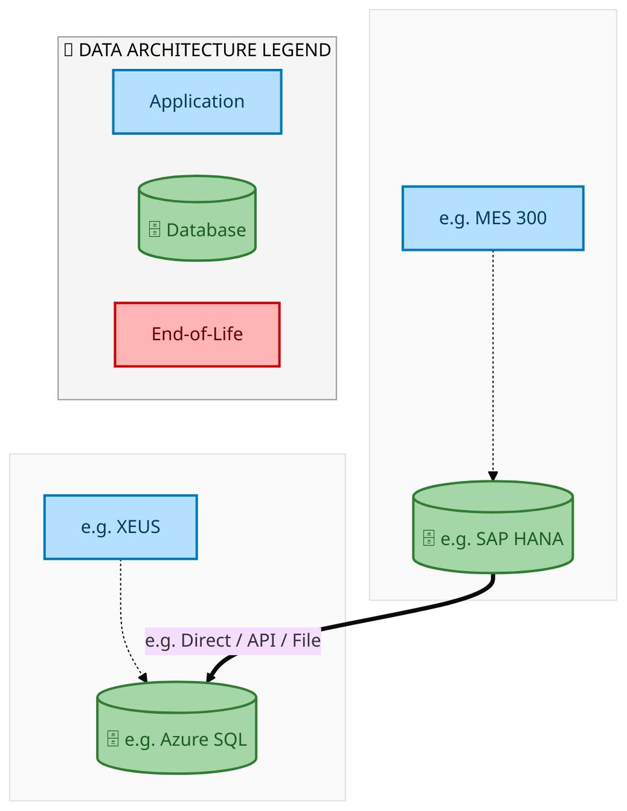
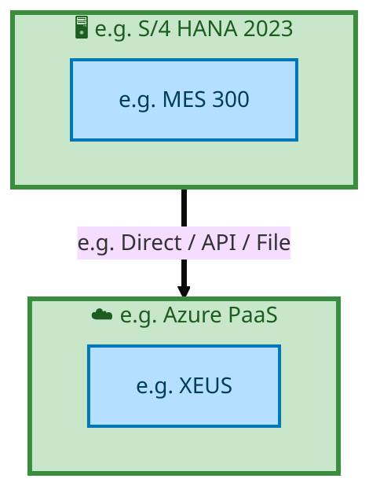

  <img src="data:image/svg+xml;base64,PHN2ZyB4bWxucz0iaHR0cDovL3d3dy53My5vcmcvMjAwMC9zdmciIHZpZXdCb3g9IjAgMCA4MDAgNDgwIiB3aWR0aD0iODAwIiBoZWlnaHQ9IjQ4MCI+DQogIDxkZWZzPg0KICAgIDxsaW5lYXJHcmFkaWVudCBpZD0iYmciIHgxPSIwJSIgeTE9IjAlIiB4Mj0iMTAwJSIgeTI9IjEwMCUiPg0KICAgICAgPHN0b3Agb2Zmc2V0PSIwJSIgc3R5bGU9InN0b3AtY29sb3I6IzAwNzFjNTtzdG9wLW9wYWNpdHk6MSIvPg0KICAgICAgPHN0b3Agb2Zmc2V0PSIxMDAlIiBzdHlsZT0ic3RvcC1jb2xvcjojMDBhZWVmO3N0b3Atb3BhY2l0eToxIi8+DQogICAgPC9saW5lYXJHcmFkaWVudD4NCiAgICA8bGluZWFyR3JhZGllbnQgaWQ9ImFjY2VudCIgeDE9IjAlIiB5MT0iMCUiIHgyPSIwJSIgeTI9IjEwMCUiPg0KICAgICAgPHN0b3Agb2Zmc2V0PSIwJSIgc3R5bGU9InN0b3AtY29sb3I6I2ZmZmZmZjtzdG9wLW9wYWNpdHk6MC4xNSIvPg0KICAgICAgPHN0b3Agb2Zmc2V0PSIxMDAlIiBzdHlsZT0ic3RvcC1jb2xvcjojZmZmZmZmO3N0b3Atb3BhY2l0eTowLjAyIi8+DQogICAgPC9saW5lYXJHcmFkaWVudD4NCiAgICA8cGF0dGVybiBpZD0iZ3JpZCIgd2lkdGg9IjQwIiBoZWlnaHQ9IjQwIiBwYXR0ZXJuVW5pdHM9InVzZXJTcGFjZU9uVXNlIj4NCiAgICAgIDxwYXRoIGQ9Ik0gNDAgMCBMIDAgMCAwIDQwIiBmaWxsPSJub25lIiBzdHJva2U9InJnYmEoMjU1LDI1NSwyNTUsMC4wNykiIHN0cm9rZS13aWR0aD0iMC41Ii8+DQogICAgPC9wYXR0ZXJuPg0KICA8L2RlZnM+DQoNCiAgPCEtLSBCYWNrZ3JvdW5kIC0tPg0KICA8cmVjdCB3aWR0aD0iODAwIiBoZWlnaHQ9IjQ4MCIgZmlsbD0idXJsKCNiZykiIHJ4PSI4Ii8+DQogIDxyZWN0IHdpZHRoPSI4MDAiIGhlaWdodD0iNDgwIiBmaWxsPSJ1cmwoI2dyaWQpIiByeD0iOCIvPg0KICA8cmVjdCB3aWR0aD0iODAwIiBoZWlnaHQ9IjQ4MCIgZmlsbD0idXJsKCNhY2NlbnQpIiByeD0iOCIvPg0KDQogIDwhLS0gRGVjb3JhdGl2ZSBjaXJjdWl0L2FyY2hpdGVjdHVyZSBsaW5lcyAtLT4NCiAgPGcgc3Ryb2tlPSJyZ2JhKDI1NSwyNTUsMjU1LDAuMTIpIiBzdHJva2Utd2lkdGg9IjEuNSIgZmlsbD0ibm9uZSI+DQogICAgPHBhdGggZD0iTSAwIDEwMCBMIDEyMCAxMDAgTCAxNjAgMTQwIEwgMjgwIDE0MCIvPg0KICAgIDxwYXRoIGQ9Ik0gMCAyNjAgTCA4MCAyNjAgTCAxMjAgMjIwIEwgMjAwIDIyMCBMIDI0MCAyNjAgTCAzNjAgMjYwIi8+DQogICAgPHBhdGggZD0iTSA1MjAgMTAwIEwgNjAwIDEwMCBMIDY0MCA2MCBMIDgwMCA2MCIvPg0KICAgIDxwYXRoIGQ9Ik0gNDQwIDM0MCBMIDU2MCAzNDAgTCA2MDAgMzAwIEwgNzIwIDMwMCBMIDc2MCAzNDAgTCA4MDAgMzQwIi8+DQogICAgPHBhdGggZD0iTSA2MDAgNDAwIEwgNjgwIDQwMCBMIDcyMCA0NDAiLz4NCiAgICA8cGF0aCBkPSJNIDAgNDAwIEwgNDAgNDAwIEwgODAgMzYwIi8+DQogICAgPHBhdGggZD0iTSAyMDAgNDIwIEwgMzIwIDQyMCBMIDM2MCAzODAgTCA0ODAgMzgwIi8+DQogICAgPHBhdGggZD0iTSA2NTAgNDQwIEwgNzUwIDQ0MCBMIDgwMCA0ODAiLz4NCiAgPC9nPg0KDQogIDwhLS0gRGVjb3JhdGl2ZSBub2RlcyAtLT4NCiAgPGcgZmlsbD0icmdiYSgyNTUsMjU1LDI1NSwwLjE4KSI+DQogICAgPGNpcmNsZSBjeD0iMTIwIiBjeT0iMTAwIiByPSI0Ii8+DQogICAgPGNpcmNsZSBjeD0iMjgwIiBjeT0iMTQwIiByPSI0Ii8+DQogICAgPGNpcmNsZSBjeD0iMjAwIiBjeT0iMjIwIiByPSI0Ii8+DQogICAgPGNpcmNsZSBjeD0iMzYwIiBjeT0iMjYwIiByPSI0Ii8+DQogICAgPGNpcmNsZSBjeD0iNjAwIiBjeT0iMTAwIiByPSI0Ii8+DQogICAgPGNpcmNsZSBjeD0iNzIwIiBjeT0iMzAwIiByPSI0Ii8+DQogICAgPGNpcmNsZSBjeD0iNTYwIiBjeT0iMzQwIiByPSI0Ii8+DQogICAgPGNpcmNsZSBjeD0iODAiIGN5PSIzNjAiIHI9IjQiLz4NCiAgICA8Y2lyY2xlIGN4PSI0ODAiIGN5PSIzODAiIHI9IjQiLz4NCiAgICA8Y2lyY2xlIGN4PSIzMjAiIGN5PSI0MjAiIHI9IjQiLz4NCiAgPC9nPg0KDQogIDwhLS0gVE9HQUYgQkRBVCBib3hlcyAtLT4NCiAgPGcgZm9udC1mYW1pbHk9IlNlZ29lIFVJLCBBcmlhbCwgc2Fucy1zZXJpZiIgZm9udC1zaXplPSIxNCIgZm9udC13ZWlnaHQ9IjYwMCI+DQogICAgPCEtLSBCIC0tPg0KICAgIDxyZWN0IHg9IjE1MCIgeT0iMTQwIiB3aWR0aD0iMTIwIiBoZWlnaHQ9IjQwIiByeD0iNSIgZmlsbD0icmdiYSgyNTUsMjU1LDI1NSwwLjE4KSIgc3Ryb2tlPSJyZ2JhKDI1NSwyNTUsMjU1LDAuMykiIHN0cm9rZS13aWR0aD0iMSIvPg0KICAgIDx0ZXh0IHg9IjIxMCIgeT0iMTY1IiB0ZXh0LWFuY2hvcj0ibWlkZGxlIiBmaWxsPSIjZmZmIj5CdXNpbmVzczwvdGV4dD4NCiAgICA8IS0tIEQgLS0+DQogICAgPHJlY3QgeD0iMjkwIiB5PSIxNDAiIHdpZHRoPSIxMjAiIGhlaWdodD0iNDAiIHJ4PSI1IiBmaWxsPSJyZ2JhKDI1NSwyNTUsMjU1LDAuMTgpIiBzdHJva2U9InJnYmEoMjU1LDI1NSwyNTUsMC4zKSIgc3Ryb2tlLXdpZHRoPSIxIi8+DQogICAgPHRleHQgeD0iMzUwIiB5PSIxNjUiIHRleHQtYW5jaG9yPSJtaWRkbGUiIGZpbGw9IiNmZmYiPkRhdGE8L3RleHQ+DQogICAgPCEtLSBBIC0tPg0KICAgIDxyZWN0IHg9IjQzMCIgeT0iMTQwIiB3aWR0aD0iMTIwIiBoZWlnaHQ9IjQwIiByeD0iNSIgZmlsbD0icmdiYSgyNTUsMjU1LDI1NSwwLjE4KSIgc3Ryb2tlPSJyZ2JhKDI1NSwyNTUsMjU1LDAuMykiIHN0cm9rZS13aWR0aD0iMSIvPg0KICAgIDx0ZXh0IHg9IjQ5MCIgeT0iMTY1IiB0ZXh0LWFuY2hvcj0ibWlkZGxlIiBmaWxsPSIjZmZmIj5BcHBsaWNhdGlvbjwvdGV4dD4NCiAgICA8IS0tIFQgLS0+DQogICAgPHJlY3QgeD0iNTcwIiB5PSIxNDAiIHdpZHRoPSIxMjAiIGhlaWdodD0iNDAiIHJ4PSI1IiBmaWxsPSJyZ2JhKDI1NSwyNTUsMjU1LDAuMTgpIiBzdHJva2U9InJnYmEoMjU1LDI1NSwyNTUsMC4zKSIgc3Ryb2tlLXdpZHRoPSIxIi8+DQogICAgPHRleHQgeD0iNjMwIiB5PSIxNjUiIHRleHQtYW5jaG9yPSJtaWRkbGUiIGZpbGw9IiNmZmYiPlRlY2hub2xvZ3k8L3RleHQ+DQogIDwvZz4NCg0KICA8IS0tIENvbm5lY3RpbmcgbGluZXMgYmV0d2VlbiBCREFUIGJveGVzIC0tPg0KICA8ZyBzdHJva2U9InJnYmEoMjU1LDI1NSwyNTUsMC4yNSkiIHN0cm9rZS13aWR0aD0iMSI+DQogICAgPGxpbmUgeDE9IjI3MCIgeTE9IjE2MCIgeDI9IjI5MCIgeTI9IjE2MCIvPg0KICAgIDxsaW5lIHgxPSI0MTAiIHkxPSIxNjAiIHgyPSI0MzAiIHkyPSIxNjAiLz4NCiAgICA8bGluZSB4MT0iNTUwIiB5MT0iMTYwIiB4Mj0iNTcwIiB5Mj0iMTYwIi8+DQogIDwvZz4NCg0KICA8IS0tIE1haW4gdGl0bGUgLS0+DQogIDx0ZXh0IHg9IjQwMCIgeT0iMjYwIiB0ZXh0LWFuY2hvcj0ibWlkZGxlIiBmb250LWZhbWlseT0iU2Vnb2UgVUksIEFyaWFsLCBzYW5zLXNlcmlmIiBmb250LXNpemU9IjM2IiBmb250LXdlaWdodD0iNzAwIiBmaWxsPSIjZmZmZmZmIiBsZXR0ZXItc3BhY2luZz0iMSI+DQogICAgSUFPIEFyY2hpdGVjdHVyZQ0KICA8L3RleHQ+DQogIDx0ZXh0IHg9IjQwMCIgeT0iMzAwIiB0ZXh0LWFuY2hvcj0ibWlkZGxlIiBmb250LWZhbWlseT0iU2Vnb2UgVUksIEFyaWFsLCBzYW5zLXNlcmlmIiBmb250LXNpemU9IjE4IiBmb250LXdlaWdodD0iNDAwIiBmaWxsPSJyZ2JhKDI1NSwyNTUsMjU1LDAuOCkiIGxldHRlci1zcGFjaW5nPSIyIj4NCiAgICBUT0dBRiBCREFUIMK3IElBTyBQcm9ncmFtIMK3IElETSAyLjANCiAgPC90ZXh0Pg0KDQogIDwhLS0gQm90dG9tIGFjY2VudCBiYXIgLS0+DQogIDxyZWN0IHg9IjI4MCIgeT0iMzQwIiB3aWR0aD0iMjQwIiBoZWlnaHQ9IjMiIHJ4PSIxLjUiIGZpbGw9InJnYmEoMjU1LDI1NSwyNTUsMC40KSIvPg0KDQogIDwhLS0gSW50ZWwgdGV4dCAtLT4NCiAgPHRleHQgeD0iNDAwIiB5PSIzODAiIHRleHQtYW5jaG9yPSJtaWRkbGUiIGZvbnQtZmFtaWx5PSJTZWdvZSBVSSwgQXJpYWwsIHNhbnMtc2VyaWYiIGZvbnQtc2l6ZT0iMTMiIGZpbGw9InJnYmEoMjU1LDI1NSwyNTUsMC41KSIgbGV0dGVyLXNwYWNpbmc9IjMiPg0KICAgIElOVEVMIENPTkZJREVOVElBTA0KICA8L3RleHQ+DQo8L3N2Zz4NCg==" alt="IAO Architecture" style="width:100%; border-radius:8px;" />
  <h1 style="font-size:36px; margin-top:24px;">Order_to_Cash_IP — Order to Cash (IP)</h1>
  <h2 style="font-size:24px;">Architecture Document (TOGAF BDAT)</h2>
  
End-to-End Integrated Processes (E2E) Tower 
  Capability Order_to_Cash_IP · Order to Cash

  
IAO Program · Release 2 
  Generated: March 2026 
  Sajiv Francis

  
IAO Architecture Pipeline — Intel Confidential

Page 1<a href="#toc">↑ Back to TOC</a>Order_to_Cash_IP — Order to Cash (IP)

## Table of Contents

<nav class="toc">
<ol>
  <li><a href="#1-executive-summary">1. Executive Summary</a></li>
  <li><a href="#2-business-context-objectives">2. Business Context &amp; Objectives</a>
    <ul>
      <li><a href="#21-classification">2.1 Classification</a></li>
      <li><a href="#22-business-drivers">2.2 Business Drivers</a></li>
      <li><a href="#23-success-criteria">2.3 Success Criteria</a></li>
      <li><a href="#24-companion-documents">2.4 Companion Documents</a></li>
    </ul>
  </li>
  <li><a href="#3-business-architecture-togaf-b">3. Business Architecture (TOGAF &ldquo;B&rdquo;)</a>
    <ul>
      <li><a href="#31-business-process-overview">3.1 Business Process Overview</a></li>
      <li><a href="#32-business-process-diagrams">3.2 Business Process Diagrams</a></li>
      <li><a href="#33-business-roles-responsibilities">3.3 Business Roles &amp; Responsibilities</a></li>
    </ul>
  </li>
  <li><a href="#4-data-architecture-togaf-d">4. Data Architecture (TOGAF &ldquo;D&rdquo;)</a>
    <ul>
      <li><a href="#41-data-entities-ownership">4.1 Data Entities &amp; Ownership</a></li>
      <li><a href="#42-data-flow-diagrams">4.2 Data Flow Diagrams</a></li>
      <li><a href="#43-data-lineage">4.3 Data Lineage</a></li>
      <li><a href="#44-ricefw-data-objects">4.4 RICEFW Data Objects</a></li>
      <li><a href="#45-data-governance-quality">4.5 Data Governance &amp; Quality</a></li>
    </ul>
  </li>
  <li><a href="#5-application-architecture-togaf-a">5. Application Architecture (TOGAF &ldquo;A&rdquo;)</a>
    <ul>
      <li><a href="#51-current-state-current-state-application-landscape">5.1 Current-State Application Landscape</a></li>
      <li><a href="#52-future-state-future-state-application-landscape">5.2 Future-State Application Landscape</a></li>
      <li><a href="#53-change-impact-summary">5.3 Change Impact Summary</a></li>
      <li><a href="#54-component-overview">5.4 Component Overview</a></li>
      <li><a href="#55-ricefw-inventory">5.5 RICEFW Inventory</a></li>
      <li><a href="#56-integration-patterns">5.6 Integration Patterns</a></li>
    </ul>
  </li>
  <li><a href="#6-technology-architecture-togaf-t">6. Technology Architecture (TOGAF &ldquo;T&rdquo;)</a>
    <ul>
      <li><a href="#61-platform-infrastructure">6.1 Platform &amp; Infrastructure</a></li>
      <li><a href="#62-sap-development-object-status">6.2 SAP Development Object Status</a></li>
      <li><a href="#63-nfrs-design-principles">6.3 NFRs &amp; Design Principles</a></li>
      <li><a href="#64-security-governance">6.4 Security &amp; Governance</a></li>
    </ul>
  </li>
  <li><a href="#7-project-context">7. Project Context</a>
    <ul>
      <li><a href="#71-project-roadmap-go-live-plan">7.1 Project Roadmap &amp; Go-Live Plan</a></li>
      <li><a href="#72-raid-log">7.2 RAID Log</a></li>
      <li><a href="#73-recommendations-next-steps">7.3 Recommendations &amp; Next Steps</a></li>
    </ul>
  </li>
</ol>
</nav>

Page 2<a href="#toc">↑ Back to TOC</a>Order_to_Cash_IP — Order to Cash (IP)

## 1. Executive Summary

This Architecture Document defines the **Business, Data, Application, and Technology** (BDAT) architecture for **Order_to_Cash_IP Order to Cash (IP)** within the IAO program. It includes 2 BPMN process diagram(s) in Section 3.

| Dimension | Value |
|-----------|-------|
| **Tower** | End-to-End Integrated Processes (E2E) |
| **Process Group** | Order to Cash |
| **Capability** | Order_to_Cash_IP - Order to Cash (IP) |
| **Release** | Release 2 |
| **Total Systems** | 2 |
| **System Status** | 0 Deployed, 0 Developing, 0 EOL, 2 Pending IAPM |
| **RICEFW Objects** | Pending — Smartsheet Object Tracker API integration |

**Change Summary**: 0 new flow chains, 0 removed, 0 modified, 1 unchanged between Current-State and Future-State states.

> All system nodes in architecture diagrams are **IAPM-linked** — click any node to open its IAPM page. Diagrams require `securityLevel: 'loose'` for click events.

Page 3<a href="#toc">↑ Back to TOC</a>Order_to_Cash_IP — Order to Cash (IP)

## 2. Business Context & Objectives

### 2.1 Classification

| Level | Value |
|-------|-------|
| **L0 Tower** | End-to-End Integrated Processes |
| **L1 Process** | Order to Cash |
| **L2 Capability** | Order_to_Cash_IP - Order to Cash (IP) |

### 2.2 Business Drivers

| # | Driver | Description | Strategic Alignment | Priority |
|---|--------|-------------|---------------------|----------|
| 1 | End-to-End Process Integration | Enable cross-tower integrated processes spanning procurement, manufacturing, and fulfillment | IDM 2.0 Process Excellence | High |
| 2 | Intel Foundry Business Enablement | Stand up foundry-specific business processes for external customer engagement | Intel Foundry Services | High |
| 3 | Process Visibility & Monitoring | Provide end-to-end process visibility across tower boundaries with integrated monitoring | Operational Excellence | Medium |
| 4 | Order_to_Cash_IP Process Migration | Migrate Order to Cash (IP) business processes and 2 integrated systems from legacy to S/4 HANA target architecture | IDM 2.0 Cross-Functional / End-to-End | High |

Page 4<a href="#toc">↑ Back to TOC</a>Order_to_Cash_IP — Order to Cash (IP)

### 2.3 Success Criteria

| Metric | Target | Measure | Baseline | Owner |
|--------|--------|---------|----------|-------|
| E2E Process Cycle Time | Per process SLA | End-to-end transaction completion within defined SLA per process | Varies by process | E2E Process Owner |
| Cross-Tower Integration Success | > 99% | Transactions completing across tower boundaries without manual intervention | 92% (current) | Integration Lead |
| Process Exception Rate | < 2% | Transactions requiring manual exception handling | 8% (current) | Operations Manager |
| Order_to_Cash_IP Migration Completeness | 100% flow chains validated | All 1 flow chains verified in target state | 0% (pre-migration) | Tower Architect |

### 2.4 Companion Documents

| Document | Description |
|----------|-------------|
| **Business Architecture** | Included in this document (Section 3) — process flows from BPMN diagrams |
| **This Document** | Full BDAT Architecture — Business + Data + Application + Technology |

Page 5<a href="#toc">↑ Back to TOC</a>Order_to_Cash_IP — Order to Cash (IP)

## 3. Business Architecture (TOGAF "B")

### 3.1 Business Process Overview

This capability includes **2 business process(es)** modeled in BPMN 2.0, covering the end-to-end workflow for Order_to_Cash_IP Order to Cash (IP).

| # | Step ID | Process Name | Lanes | Tasks | Gateways |
|---|---------|--------------|-------|-------|----------|
| 1 | E2E-10__R3_-_Intel_Product_-_RMA_for_Direct_Customers_without_physical_receipt_of_the_defective_prod | E2E-10__R3_-_Intel_Product_-_RMA_for_Direct_Customers_without_physical_receipt_of_the_defective_prod | Boundary Apps, SAP S/4 Intel Product | 17 | 7 |
| 2 | R3_E2E-80__Intel_Product_-_Customer_requests_expedite_-_service_fee | R3_E2E-80__Intel_Product_-_Customer_requests_expedite_-_service_fee | Boundary Apps, SAP CFIN, SAP S/4 Intel Product | 22 | 18 |

Page 6<a href="#toc">↑ Back to TOC</a>Order_to_Cash_IP — Order to Cash (IP)

### 3.2 Business Process Diagrams

#### BUSINESS ARCHITECTURE — 3.2.1 E2E-10__R3_-_Intel_Product_-_RMA_for_Direct_Customers_without_physical_receipt_of_the_defective_prod — E2E-10__R3_-_Intel_Product_-_RMA_for_Direct_Customers_without_physical_receipt_of_the_defective_prod

**Swim Lanes**: Boundary Apps · SAP S/4 Intel Product | **Tasks**: 17 | **Gateways**: 7

> **Legend**: ● Start · ● End · User Task · Service Task · ◇ Gateway · Sub-Process

<a href="https://mermaid.live/view#pako:eNqlV-9v4jYY_lesVBU9CbQkJASQtokG0lW77iro3Wka--AmDlg1cc522rIe__teJzGQFD7s1g9V38fP-9OPHffNinlCrLF1eflGM6rG6K2j1mRDOmPUecSSdLqoAr5gQfEjI7KjOSnP1IL-U9IcL3_VNI1FeEPZVqMLsuIEfb7togk4si6SOJM9SQRNO91OLugGi23IGReafUGGqZ2W2eqlay4SIg4E2w6c2AdXRjNygPuBF3iR9pMk5lnSCJr66TCNOztdHOMv8RoLVZZfSHKHX7_SRK3BTjGTBDhrtWEf8SNhukclCo3FhXg2w6BS58lgYIscxzRbAe7ZAAmcPR0g397t0O7ycpntk6KH6TJD8BMzLOWUpEgqgGfPCqWUsfGFF04i3-5KJfgTGV-4s2Dad7ux7mQMrdtdPdzeC6GrtRo_cpbU1N6L7mHs5q9d8Tp27a7Ywu9WLpIlh0zhwB26w32m68AJndBkStP0f2WCuYoHLJ_qXLN-5EbTfS7HH_ih_T6eaXPqBROnPScinmlMjoJGUdSfHUY1G_iOfT7oddQf2GEr6Aor8oK3h4Cj0NsHjPwgcoKzAat87SqLx3vBYxOwP_Mjfx8wuHaiiXs2oDdxvGFdIcRZCZyv0TUvSi2jSZ7Lak3_ZM5fS2tOYkKfCZpihRHN0ALDqUy5iAmaeyG6mt_ffVhafx95uSe8br_OJ_dNWh9on_MEhoNmmaKKwbHPFPok4jWB6rGiPEMf8ZaIpp932u8OZ3hV_bmY3KPZ3aLp5oPbg6CrFRFofjfRrQr-jFmTNQBWKIgOPieqEBnUAxdD2bjXpAaHOmB1wlJBZMybHEfHS_E4xT0tVtQMPSffCmi15TK82vvkDGSjt5pIiW7hwqTgnQD_w7HD6OAgFc91Z6gqrE11_bc3Q8VC8BfZw0yhHAvMGGE3lVCX1m537DT4b05w_lvy0vux-MmDDhRhup-kiNVRhuGZoV9N5m1tjYB6TwTob1OTvmBGk1IsrTnamlooBCr6DS6W1qqW9qRQvNdMPCUMZCu2LbaWdMizlELakAhFUxprL56CB4gV-nlfQP-o1imVOZe01LTiaBHDYNBHHlcqv_pChSowazXraKk_4CeCIs7gcoddRZNTmfxqgAmFY0A2_IywgqYW77lU6IbzRKLytObqXB2u3VLYcTch3-SMKNKWmtPyOa7vnJRd9yA1_VLoPcK3Ll6_22m0KGJ9JtKC_dpWa_90CPIas0LC3p4RuXfarR58YQb_Ll3wIydq-IMnCi4H1Ov9og9yDbi1PTC2XwMtu1_b_cr0atNruw8qwDH5atOsO_W6SV9HN8vl6nc4WOXdShIjRLTMXqhaI5xtkagO2jIrX1xgYgkbCocEIAH3d7JFP6NFWH4uvsPdUIc2jZtG3LqTkbHdOvcfvPRzbFOy3fY0zD-JrKim21HNNMNzTPt7wIw7MLGCCjB2bTqjxjrkupmjW4k-_V4lNHSn5rumS7du0-m3AbNjjtmyPVAPwryOYKV2MZvkGE0cv3bKvTQPqCYenMGH-2dkEx_VT74G6tonUeck6po3UhPun4a907B_Gh6choPT8NDAVtfaELHBNLHGb1b5Pwn835KQFBdMWbuuheHjsdhmsTUu3-5WUX5xpxTDN29Tgbt_AdMR90c=" title="View full diagram">&#128065; View Diagram</a>

Page 7<a href="#toc">↑ Back to TOC</a>Order_to_Cash_IP — Order to Cash (IP)

#### BUSINESS ARCHITECTURE — 3.2.2 R3_E2E-80__Intel_Product_-_Customer_requests_expedite_-_service_fee — R3_E2E-80__Intel_Product_-_Customer_requests_expedite_-_service_fee

**Swim Lanes**: Boundary Apps · SAP CFIN · SAP S/4 Intel Product | **Tasks**: 22 | **Gateways**: 18

> **Legend**: ● Start · ● End · User Task · Service Task · ◇ Gateway · Sub-Process

<a href="https://mermaid.live/view#pako:eNqtWFtv47gV_iuEB4PMAPaMKFGW7YcWjmxvA-zMGHF2F4umD7RExezQkktJSdxM_nsPJVKWaBndTZuHJPp4rt-5mNbLIMpiNpgN3r9_4SkvZujlqtixPbuaoastzdnVENXAr1RyuhUsv1IySZYWG_7vSgyTw7MSU9iK7rk4KnTDHjKGfrkZojkoiiHKaZqPciZ5cjW8Oki-p_IYZiKTSvodmyROUnnTR9eZjJk8CThOgCMfVAVP2Qn2AhKQldLLWZSlccdo4ieTJLp6VcGJ7CnaUVlU4Zc5-0Kff-NxsYPnhIqcgcyu2Iuf6ZYJlWMhS4VFpXw0ZPBc-UmBsM2BRjx9AJw4AEmafj9BvvP6il7fv79PG6fobnGfIviJBM3zBUtQXgC8fCxQwoWYvSPhfOU7w7yQ2Xc2e-cug4XnDiOVyQxSd4aK3NET4w-7YrbNRKxFR08qh5l7eB7K55nrDOURflu-WBqfPIVjd-JOGk_XAQ5xaDwlSfI_eQJe5R3Nv2tfS2_lrhaNL-yP_dA5t2fSXJBgjm2emHzkEWsZXa1W3vJE1XLsY-ey0euVN3ZCy-gDLdgTPZ4MTkPSGFz5wQoHFw3W_uwoy-1aZpEx6C39ld8YDK7xau5eNEjmmEx0hGDnQdLDDl1nZdXLaH445PWZ-knx3-8Htyxi_JGhb2pAUCKzPQrLvMj28MRT9Nu3L5-Xi5vP4fX8fvCPlq4Lumsmk0zu0VyILKIFz1I0f6Rc0C0XvDiicMei75aa9wEUEzpL6OgggLXar44i7gYAqh9bup7z8mJ01aIZbWFUoh1iz5Eoc1D_qa7E_eD1tVaDXrWo2MzXKFzdfG2zELRTuUXrLC9g9rpx4wkI_XKIwQMKab6rqeyKTFt0rulxz9KiTuxQWCT4FgmWNNqoh-0RXcMqsEhwpyddYOmAVKuwPEdhtj8IVrDYUiDu_4e1zWeCbtKCCeUxLqOiXRkIKZRMkbOhsNV1VT98ZU_1vx8RsIuWzwcWcxBKGOsyQk7sdgxs6oFFP8OaRjcF26ueZM-8qlAt1DXkq0ioiEqhbK0lj85KOf7vIp2OuFv3NbLqByhTrCMNszThcl8NQVdwagS1CDR5K0WrhZwTkd_KYqvmFi2YgCrJoyWKWzH-lGVxjm7yvLR4xe7JoJqqT1DCx0wx-kEVJJP8gadUIPUxiKAy-4-WvqrsuiyQGu0ShhISjNDfYJFbcq0C3rJ_sqhaBreM5vCnyFAELceEpeN3Y6tWThNe0ysrxuygxn9gYF2nGRP1OYKM_BeallRUZQeOgVfJY4s0F3dVdV6qB0dVD96xZ3ui3V6VW_bIcxZ_bnhmrQlA6kYUK2ZjFvH8rHFcYm0JHXqmg0bqisXp-cS7Y2tFhHBreFB7SxVBnMsHljxQjtKsaOb1TGFiKdyyQyaLvFK6rrKiOYD_Krk8U_Zw_z6a5zmsMb0Ga3NUtkiC_TNEy3A-RGtB01TN_zIFVln-19Pqqj1c2HgLTTPaU2BPdWXNS7vVzmx5f9RW3cgpbLz2BoMhK-teaLbW5ht64sXOXEY-ffpk-yR_dmPXav7b1Mb9atXOQzxBm2jH4lJAv0FSKbrje4bOaAr6jWx2_FCVNEv0kjptQQq7bQebRBW3up4jyfbQ3PGZ8Um_8Xbd9Kid2iVcLCoP86hQQwNLFC1UGRR2V_0Ozxtn-iYGifM2Nfw2tVZHUimzp3xERYEOVFKYbXFBibxFyX-L0vgtSsGfU2puKHCfRKPRX-AzQT97WD3_uB_8zuB69kMtA3Pi2ieePsG1CY_oZ1I_E3NOtA9inBAtMTam9TmxFRrArwHzFecEGJOuDoIYm65jAyYs39jQKs3z2PY6tuLWTgNj0crb0x48Ix9ofaNANOA5FjDRz5P6cWoM6hxMCaZa3UTs-ZY9A2ADYG0Bm5CwThobmzpHz_jEmnuvKY72ik05vcBuBBO-N7ZPAvvka1YfTG1jZweT7gEm9oFx4ppUsObfbUquK0QaOmyAGH4MpdgwaGxgk75J0jUSDWO6asTEQbQXbLLHJvsVXGLSiKv7U33nQvcpfFgLHumL74-WGaybw20o8bQZfemDbwc1Z_a5vj0t9SdmbbYzxurS0pl4dSlpfY2u5se8P-ji-ALuXsC95u1KFycXcP8CPtZvTrpo0ItOetFpHwozpl9AdGHcD7v9sNcPk37Y74fH_XDQD0_64WkvTPqzJP1Zkv4sSX-WpD9L0p8l6c-SNFkOhgP4IrOnPB7MXgbV2054IxqzhJaiGLwOBxS-R22OaTSYVW8FB_X9cMEpfNfe1-DrfwBVsYZk" title="View full diagram">&#128065; View Diagram</a>

Page 8<a href="#toc">↑ Back to TOC</a>Order_to_Cash_IP — Order to Cash (IP)

### 3.3 Business Roles & Responsibilities

| Role / Lane | Processes Involved | Description |
|------------|-------------------|-------------|
| Boundary Apps | E2E-10__R3_-_Intel_Product_-_RMA_for_Direct_Customers_without_physical_receipt_of_the_defective_prod, R3_E2E-80__Intel_Product_-_Customer_requests_expedite_-_service_fee | |
| SAP S/4 Intel Product | E2E-10__R3_-_Intel_Product_-_RMA_for_Direct_Customers_without_physical_receipt_of_the_defective_prod, R3_E2E-80__Intel_Product_-_Customer_requests_expedite_-_service_fee | |
| SAP CFIN | R3_E2E-80__Intel_Product_-_Customer_requests_expedite_-_service_fee | |

Page 9<a href="#toc">↑ Back to TOC</a>Order_to_Cash_IP — Order to Cash (IP)

## 4. Data Architecture (TOGAF "D")

### 4.1 Data Entities & Ownership

| # | Data Entity | Source System | Target System | Data Owner | Classification | Volume | Master/Transaction |
|---|-------------|---------------|---------------|------------|----------------|--------|-------------------|
| 1 | e.g. Cost Element | e.g. MES 300 | e.g. XEUS | Data steward | e.g. Intel Confidential | e.g. 10K rows/day | Master / Transaction |

Page 10<a href="#toc">↑ Back to TOC</a>Order_to_Cash_IP — Order to Cash (IP)

### 4.2 Data Flow Diagrams

> **DATA ARCHITECTURE** — Database-to-database data flows. Applications (blue) sit above their hosting databases (green cylinders). Thick arrows show data movement between databases.

#### 4.2.1 Current-State — Current-State Data Flows

<a href="https://mermaid.live/view#pako:eNqllQ1P2zAQhv-KZVRpk1oWWtKOSCA5X6NSYIyUbRKZIjdxWgs3jhIHWkr_--ykLaxroWy2FNl358eXe514DiMeE2jARmNOUyoMMA-gGJMJCaABAjjEhRw15aggUZlTMfPIPWG1k3G-8lZLvuOc4iEjhXJLTsJT4dPHJepIz6Z1sLK7eELZrPb4ZMQJuOk3AZIACV9UUYw_RGOciyWtLMgFnv6gsRgrS4JZQVTcWEyYh4eEVduKvKysqXwtP8MRTUfK3NGVMcfp3Qvjsb5YgEWjEaTrvcDADFIgW8RwUdgkATjLTD4FCWXMODB123XdZiFyfkeMA03r9czuctp6UKkZ7WzajDjjuXJ3bH2TFw-tGVvikG53UW-Nazs9u9PeiTsydaetbeAIZ8_pua6pm_qaZ1mabDt53a5yB2lNLMrhKMfZGHzNY5KHgocWLsZh_8qykeWFJByF6LHMSeh_824DKKv5q16oWkxzEgnK03X9VNtCQhXop3PjSwY5HB0CNZYswzDqSr-63N7I40MAgzL-3InlM46OgzIhmqyJ4lZBQAYF8KOiV3XfMzfQOmyd7bF_jSNpvCyhmDGyT_1WciHV13I5mup_ynUkv5n9BfLRVXiOLtH_6nPh-GFH01YSySmQ03eqtE7mFZFkDFAx79Romd8bMq0SeKdKq2X_JNKbyYDT07OnZV3tShXwCaCrvny6lMlf5dNe527jSHhkJN_v9kWho1gDNhoggK6t8_7AsQY31w7wnC_Opb3jaHjXz1YvVIcIZRmjEVbe7eJ7ob1DXhsLXF8e25T1QkfinTRu8aTl0YTU-PpntlWv-g1XmuiqrzU5OTn5SxDYhBOSTzCNoTGvryd5y8UkwSUT8oKBuBTcn6URNKorA5ZZjAWxKZYVndTGxW_EA0QC" title="View full diagram">&#128065; View Diagram</a>

Page 11<a href="#toc">↑ Back to TOC</a>Order_to_Cash_IP — Order to Cash (IP)

#### 4.2.2 Future-State — Future-State Data Flows

<a href="https://mermaid.live/view#pako:eNqllQ1P2zAQhv-KZVRpk1oWWtKOSCA5X6NSYIyUbRKZIjdxWgs3jhIHWkr_--ykLaxroWy2FNl358eXe514DiMeE2jARmNOUyoMMA-gGJMJCaABAjjEhRw15aggUZlTMfPIPWG1k3G-8lZLvuOc4iEjhXJLTsJT4dPHJepIz6Z1sLK7eELZrPb4ZMQJuOk3AZIACV9UUYw_RGOciyWtLMgFnv6gsRgrS4JZQVTcWEyYh4eEVduKvKysqXwtP8MRTUfK3NGVMcfp3Qvjsb5YgEWjEaTrvcDADFIgW8RwUdgkATjLTD4FCWXMODB123XdZiFyfkeMA03r9czuctp6UKkZ7WzajDjjuXJ3bH2TFw-tGVvikG53UW-Nazs9u9PeiTsydaetbeAIZ8_pua6pm_qaZ1mabDt53a5yB2lNLMrhKMfZGHzNY5KHgocWLsZh_8q1keWFJByF6LHMSeh_824DKKv5q16oWkxzEgnK03X9VNtCQhXop3PjSwY5HB0CNZYswzDqSr-63N7I40MAgzL-3InlM46OgzIhmqyJ4lZBQAYF8KOiV3XfMzfQOmyd7bF_jSNpvCyhmDGyT_1WciHV13I5mup_ynUkv5n9BfLRVXiOLtH_6nPh-GFH01YSySmQ03eqtE7mFZFkDFAx79Romd8bMq0SeKdKq2X_JNKbyYDT07OnZV3tShXwCaCrvny6lMlf5dNe527jSHhkJN_v9kWho1gDNhoggK6t8_7AsQY31w7wnC_Opb3jaHjXz1YvVIcIZRmjEVbe7eJ7ob1DXhsLXF8e25T1QkfinTRu8aTl0YTU-PpntlWv-g1XmuiqrzU5OTn5SxDYhBOSTzCNoTGvryd5y8UkwSUT8oKBuBTcn6URNKorA5ZZjAWxKZYVndTGxW9LckQs" title="View full diagram">&#128065; View Diagram</a>

Page 12<a href="#toc">↑ Back to TOC</a>Order_to_Cash_IP — Order to Cash (IP)

### 4.3 Data Lineage

| # | Source System | Source Schema/Object | Target System | Target Schema/Object | Transformation |
|---|-------------|---------------------|---------------|---------------------|---------------|
| 1 | e.g. MES 300 | e.g. CKMLHD table | e.g. XEUS | e.g. dbo.CostElements | Lineage notes |

### 4.4 RICEFW Data Objects

Reports and Conversions for this capability will be populated from the Smartsheet Object Tracker via automated API extraction.

| Object ID | Type | Description | Status | Source | Target | Complexity |
|-----------|------|-------------|--------|--------|--------|-----------|
| Order_to_Cash_IP-R001 | Report | Order to Cash (IP) operational report | Planned | SAP S/4HANA | Analytics | Medium |
| Order_to_Cash_IP-C001 | Conversion | Legacy data migration for Order to Cash (IP) | Planned | Legacy ERP | SAP S/4HANA | High |

> *Pending: Smartsheet API integration to auto-populate live RICEFW data (see Build Requirements).*

### 4.5 Data Governance & Quality

| Concern | Approach |
|---------|----------|
| Data Ownership | Per-entity owners listed in Section 3.1 |
| Data Classification | Financial data classified as Intel Confidential |
| Data Retention | Per Intel corporate retention policies |
| Data Quality | Validated at source; reconciliation at target |

Page 13<a href="#toc">↑ Back to TOC</a>Order_to_Cash_IP — Order to Cash (IP)

## 5. Application Architecture (TOGAF "A")

### 5.1 Current-State — Current-State Application Landscape

#### Overview

The Current-State architecture represents the **current / legacy** landscape for Order_to_Cash_IP.This view is generated from `CurrentFlows.xlsx` (1 flow hops across 1 flow chains).

#### APPLICATION ARCHITECTURE — Architecture Diagram (ArchiMate-Inspired)

> **Click any system node** to open its IAPM application page.
> **Legend**: Deployed · Developing · End-of-Life · No IAPM Match

<a href="https://mermaid.live/view#pako:eNqVVWFP2zAQ_StWUL-1IwxaIEKV0iadOqWACBublily42trzU0i2wE61v--c1xoKQM6V0qTu_O78_Pz-cHJCgaO5zQaDzzn2iMPiaNnMIfE8UjijKnCtya-KcgqyfUiglsQ1imK4tFbT_lKJadjAcq4EWdS5Drmv1dQB53y3gYb-4DOuVhYTwzTAsiXYZP4CCCaRNFctRRIPkmcZT1DFHfZjEq9Qq4UjOj9DWd6ZiwTKhSYuJmei4iOQdQlaFnV1hyXGJc04_nUmI9cY5Q0_7VhbLvLJVk2Gkn-lItc95Kc4Gg0SKuFtWUzPqIaWjxXJZfAiNILASQTVClQGGPD6-8AJmRcKZ6DUqQeEy6EtzfA0Ws3lZbFL_D2eicnHbe3-mzdmQV5H8v7ZlaIQnp7rutuYdKyJOthMXttg_qE6brHx73Of2AyqulLzODkHcyDZ5iPPkYVkifpAjkl7a1Mc86YgDsqYZORoOOvGQmPO4M12g7VQyFeMGI43mC533fd9zAtqqrGU0nLGfGjH4mTVOzkkOGTHbaJf3kZDfv-9fDinET-9_AqcX7aSWYwFESmeZGT6GptvZAMZKqLtI-spMPLfgrpNB2FcXroupsJMugQ-DD9QNBH0IfYnufhZr-H9S38Ev8TyDh2QRnd1Dj-70pCGoO85RmkvUo9W_7BsQWto8gqimCUzbDe1jcSBWGdqF8onYYC20Wuu5uFZ0c2hwkgq4CzsdzvnvGudcRfyT4ZBkWGf5_ji_Ozfd61BRgF29SQs8e9fJN8PK3dP4lTAwf13iGofznE54ALbFl_dqfqlXSvhZvUb-ymKX8lxrq99KKN1jFw32sdm1P9p6nuLh3ixSGIYIp8PpMXc0kUfgrPgx3UH6V4ZrbF6Zel4Bk1wf-QZ5SObraVN1qr61W1RWkQbqspMG0tzDVeWtsqsVPCC3vIP3bYEQayVjFpRXyySoN9ZUNSa1ItKY_Ets3vidjT09MXPdJpOnOQc8qZ4z3YixLvWwYTWgmN15tDK13EizxzvPrCcqoSC4WAU9yEuTUu_wLF6G5t" title="View full diagram">&#128065; View Diagram</a>

Page 14<a href="#toc">↑ Back to TOC</a>Order_to_Cash_IP — Order to Cash (IP)

#### Current-State Flow Narrative

| # | Flow Chain | Path | Interface | Freq |
|---|-----------|------|-----------|------|
| 1 | e.g. MES Route to ICOST | e.g. MES 300 → e.g. XEUS | e.g. Direct / API / File | e.g. Near Real-Time |

Page 15<a href="#toc">↑ Back to TOC</a>Order_to_Cash_IP — Order to Cash (IP)

### 5.2 Future-State — Future-State Application Landscape

#### Overview

The Future-State architecture represents the **target** landscape for Order_to_Cash_IP.This view is generated from `FutureFlows.xlsx` (1 flow hops across 1 flow chains).

#### APPLICATION ARCHITECTURE — Architecture Diagram (ArchiMate-Inspired)

> **Click any system node** to open its IAPM application page.
> **Legend**: Deployed · Developing · End-of-Life · No IAPM Match

<a href="https://mermaid.live/view#pako:eNqVVWFP2zAQ_StWUL-1IwxaIEKV0iadOqWACBublily42trzU0i2wE61v--c1xoKQM6V0qTu_O78_Pz-cHJCgaO5zQaDzzn2iMPiaNnMIfE8UjijKnCtya-KcgqyfUiglsQ1imK4tFbT_lKJadjAcq4EWdS5Drmv1dQB53y3gYb-4DOuVhYTwzTAsiXYZP4CCCaRNFctRRIPkmcZT1DFHfZjEq9Qq4UjOj9DWd6ZiwTKhSYuJmei4iOQdQlaFnV1hyXGJc04_nUmI9cY5Q0_7VhbLvLJVk2Gkn-lItc95Kc4Gg0SKuFtWUzPqIaWjxXJZfAiNILASQTVClQGGPD6-8AJmRcKZ6DUqQeEy6EtzfA0Ws3lZbFL_D2eicnHbe3-mzdmQV5H8v7ZlaIQnp7rutuYdKyJOthMXttg_qE6brHx73Of2AyqulLzODkHcyDZ5iPPkYVkifpAjkl7a1Mc86YgDsqYZORoOOvGQmPO4M12g7VQyFeMGI43mC533fd9zAtqqrGU0nLGfGjH4mTVOzkkOGTHbaJf3kZDfv-9fDinET-9_AqcX7aSWYwFESmeZGT6GptvZAMZKqLtI-spMPLQQrpNB2FcXroupsJMugQ-DD9QNBH0IfYnufhZr-H9S38Ev8TyDh2QRnd1Dj-70pCGoO85RmkvUo9W_7BsQWto8gqimCUzbDe1jcSBWGdqF8onYYC20Wuu5uFZ0c2hwkgq4CzsdzvnvGudcRfyT4ZBkWGf5_ji_Ozfd61BRgF29SQs8e9fJN8PK3dP4lTAwf13iGofznE54ALbFl_dqfqlXSvhZvUb-ymKX8lxrq99KKN1jFw32sdm1P9p6nuLh3ixSGIYIp8PpMXc0kUfgrPgx3UH6V4ZrbF6Zel4Bk1wf-QZ5SObraVN1qr61W1RWkQbqspMG0tzDVeWtsqsVPCC3vIP3bYEQayVjFpRXyySoN9ZUNSa1ItKY_Ets3vidjT09MXPdJpOnOQc8qZ4z3YixLvWwYTWgmN15tDK13EizxzvPrCcqoSC4WAU9yEuTUu_wIQBG6F" title="View full diagram">&#128065; View Diagram</a>

Page 16<a href="#toc">↑ Back to TOC</a>Order_to_Cash_IP — Order to Cash (IP)

#### Future-State Flow Narrative

| # | Flow Chain | Path | Interface | Freq |
|---|-----------|------|-----------|------|
| 1 | e.g. MES Route to ICOST | e.g. MES 300 → e.g. XEUS | e.g. Direct / API / File | e.g. Near Real-Time |

Page 17<a href="#toc">↑ Back to TOC</a>Order_to_Cash_IP — Order to Cash (IP)

### 5.3 Change Impact Summary

| Change Type | Flow Chain | Detail |
|-------------|-----------|--------|
| **UNCHANGED** | e.g. MES Route to ICOST | No change |

**Totals**: 0 new - 0 removed - 0 modified - 1 unchanged

### 5.4 Component Overview

#### System Inventory

| System | IAPM ID | Status |
|--------|---------|--------|
| e.g. MES 300 | - | N/A |
| e.g. XEUS | - | N/A |

Page 18<a href="#toc">↑ Back to TOC</a>Order_to_Cash_IP — Order to Cash (IP)

### 5.5 RICEFW Inventory

RICEFW objects for this capability will be auto-populated from the Smartsheet S/4 Object Tracker.

| Object ID | Type | Description | Status | Source → Target | Middleware | Complexity |
|-----------|------|-------------|--------|----------------|-----------|-----------|
| Order_to_Cash_IP-I001 | Interface | Order to Cash (IP) inbound data interface | Planned | Legacy → SAP S/4HANA | MuleSoft / CPI | Medium |
| Order_to_Cash_IP-E001 | Enhancement | Order to Cash (IP) custom business logic | Planned | SAP S/4HANA | N/A | Medium |
| Order_to_Cash_IP-F001 | Form/Report | Order to Cash (IP) operational output | Planned | SAP S/4HANA | N/A | Low |

> *Pending: Smartsheet API integration to auto-populate live RICEFW inventory (see Build Requirements).*

Page 19<a href="#toc">↑ Back to TOC</a>Order_to_Cash_IP — Order to Cash (IP)

### 5.6 Integration Patterns

| # | Pattern | Flow Chain | Middleware | Protocol | Auth |
|---|---------|-----------|-----------|----------|------|
| 1 | e.g. Pub-Sub / P2P / ETL | e.g. MES Route to ICOST | e.g. Azure Service Bus | e.g. REST / RFC / SFTP | e.g. OAuth / NTLM / Cert |

Page 20<a href="#toc">↑ Back to TOC</a>Order_to_Cash_IP — Order to Cash (IP)

## 6. Technology Architecture (TOGAF "T")

### 6.1 Platform & Infrastructure

> **TECHNOLOGY / PLATFORM ARCHITECTURE** — Platforms (green) host applications (blue). Thick arrows show platform-to-platform integration flows.

#### 6.1.1 Current-State — Current-State Platform Architecture

<a href="https://mermaid.live/view#pako:eNqtlGFvmzAQhv-K5SrfspZASDOkTgIStEjpFo11mzQm5MARrBqMjGmTpvnvsyFN2mqTonX-gOz3jufOr6Xb4oSngB3c621pSaWDthGWORQQYQdFeElqteurXQ1JI6jczOEOWBdknD9F21--EUHJkkGtw4qT8VKG9GGPGgyrdZes9YAUlG26SAgrDuhm1keuAij4rs1i_D7JiZB7WlPDNVl_p6nMtZIRVoPOy2XB5mQJrC0rRdOqpbpWWJGElistDw0tClLePhNtY7dDu14vKg-10FcvKpFaCSN1PYEMkary-BpllDHnzLMnQRD0ayn4LThnhnF56Y32x3f3ujXHrNb9hDMudNia2K95FSPyCPTH05H__gC0xuOp5b8EWkfgwLOnpvEKCJwdeUHg2Z594Pm-odZfGxyNdDgqO2LdLFeCVDn6LFIQseSxT-o8ni38xXwRQ7yK3YdGQLwgJPwZ4agxR8YgajIwVBPnq3PUhpEOR_hXx9QrpQISSXmJ5l-O6h-KuG2RH9MbjW-Jeq9YjuN0z9D9DmW671huGJzS7pvcPtWdMB7GH91PbmwaptUalI6tVH1TYj-3KbwYIp2HdN5bnLqehrFlGE9mqSNSx3_368UF_oNlJxa6uvrwuL_CpDUAXSB3MVPfgDI1PB5PeWHcxwWIgtAUO9tuHKmplkJGGibVQMGkkTzclAl22hGBmyolEiaUqFctOnH3GwRdn14=" title="View full diagram">&#128065; View Diagram</a>

> **Legend**: 🖥️ Platform · 📦 Application · ⛔ End-of-Life · 📋 Unassigned

Page 21<a href="#toc">↑ Back to TOC</a>Order_to_Cash_IP — Order to Cash (IP)

#### 6.1.2 Future-State — Future-State Platform Architecture

<a href="https://mermaid.live/view#pako:eNqtlGFvmzAQhv-K5SrfspZASDOkTgIStEjpFo11mzQm5MARrBqMjGmTpvnvsyFN2mqTonX-gOz3jufOr6Xb4oSngB3c621pSaWDthGWORQQYQdFeElqteurXQ1JI6jczOEOWBdknD9F21--EUHJkkGtw4qT8VKG9GGPGgyrdZes9YAUlG26SAgrDuhm1keuAij4rs1i_D7JiZB7WlPDNVl_p6nMtZIRVoPOy2XB5mQJrC0rRdOqpbpWWJGElistDw0tClLePhNtY7dDu14vKg-10FcvKpFaCSN1PYEMkary-BpllDHnzLMnQRD0ayn4LThnhnF56Y32x3f3ujXHrNb9hDMudNia2K95FSPyCPTH05H__gC0xuOp5b8EWkfgwLOnpvEKCJwdeUHg2Z594Pm-odZfGxyNdDgqO2LdLFeCVDn6LFIQseSxT-o8ni2CxXwRQ7yK3YdGQLwgJPwZ4agxR8YgajIwVBPnq3PUhpEOR_hXx9QrpQISSXmJ5l-O6h-KuG2RH9MbjW-Jeq9YjuN0z9D9DmW671huGJzS7pvcPtWdMB7GH91PbmwaptUalI6tVH1TYj-3KbwYIp2HdN5bnLqehrFlGE9mqSNSx3_368UF_oNlJxa6uvrwuL_CpDUAXSB3MVPfgDI1PB5PeWHcxwWIgtAUO9tuHKmplkJGGibVQMGkkTzclAl22hGBmyolEiaUqFctOnH3GyrKn3Y=" title="View full diagram">&#128065; View Diagram</a>

> **Legend**: 🖥️ Platform · 📦 Application · ⛔ End-of-Life · 📋 Unassigned

#### Platform Inventory

| # | Platform | Type | Systems Using | Environment |
|---|----------|------|--------------|-------------|
| 1 | e.g. Azure PaaS | Cloud / SaaS | e.g. XEUS | DEV,QAS,PRD |
| 2 | e.g. S/4 HANA 2023 | On-Premise | e.g. MES 300 | DEV,QAS,PRD |

Page 22<a href="#toc">↑ Back to TOC</a>Order_to_Cash_IP — Order to Cash (IP)

### 6.2 SAP Development Object Status

| Metric | DEV | QAS | PRD |
|--------|-----|-----|-----|
| Transport Requests | — | — | — |
| Custom Code Objects | — | — | — |
| CDS Views | — | — | — |
| Fiori Apps | — | — | — |
| BAdIs / Enhancements | — | — | — |

### 6.3 NFRs & Design Principles

| Category | Requirement | Target / SLA | Priority |
|----------|-------------|-------------|----------|
| Performance | Order/transaction processing within interactive SLA | < 3 seconds for online transactions | High |
| Availability | Business-critical systems available during extended hours | 99.9% (06:00-22:00 all time zones) | High |
| Scalability | Support seasonal and promotional volume spikes | Handle 2x baseline transaction volume | Medium |
| Recoverability | Customer-facing systems recover within business impact window | RPO < 30 min, RTO < 2 hours | High |
| Data Volume | Support transactional data growth from business expansion | 10M+ documents/year | Medium |
| Latency | Near-real-time integration for order status updates | < 30 seconds for status propagation | Medium |
| Concurrency | Support global user base across business functions | 300+ concurrent users | Medium |

### 6.4 Security & Governance

| Concern | Approach | Standard / Policy | Owner |
|---------|----------|--------------------|-------|
| Authentication | Single Sign-On (SSO) via Intel corporate Azure AD identity | Intel IT Security Policy - Identity Management | IT Security |
| Authorization | Role-based access control (RBAC) with SAP authorization objects | Intel SAP Security Standards - Role Design | SAP Security Team |
| Data Classification | All financial/operational data classified per Intel Data Classification Standard | Intel Data Classification Policy | Data Governance |
| Data Encryption (at rest) | AES-256 encryption for SAP HANA database and file storage | Intel Encryption Standard | Infrastructure Security |
| Data Encryption (in transit) | TLS 1.3 for all system-to-system and user-to-system communication | Intel Network Security Policy | Network Engineering |
| Network Segmentation | SAP systems in dedicated network zones with firewall controls | Intel Network Architecture Standard | Network Security |
| API Security | OAuth 2.0 / certificate-based authentication for all API integrations | Intel API Security Guidelines | Integration Architecture |
| Audit Logging | Comprehensive audit trail for all data changes and user actions (SAP Security Audit Log) | SOX Compliance / Intel Audit Policy | Internal Audit |
| Certificate Management | Automated certificate lifecycle management for system-to-system trust | Intel PKI Standard | Certificate Authority Team |
| Compliance | SOX controls, export control (EAR/ITAR) screening, data privacy (GDPR) | Intel Corporate Compliance Framework | Compliance Office |

Page 23<a href="#toc">↑ Back to TOC</a>Order_to_Cash_IP — Order to Cash (IP)

## 7. Project Context

### 7.1 Project Roadmap & Go-Live Plan

Project delivery milestones for Order_to_Cash_IP RICEFW objects:

| Phase | Planned Start | Planned End | Status | Notes |
|-------|---------------|-------------|--------|-------|
| Functional Specification (FS) | Per project plan | Per project plan | In Progress | Tower-level FS schedule |
| Technical Design (TDD) | FS + 2 weeks | FS + 6 weeks | Planned | Dependent on FS completion |
| Build & Unit Test (TUT) | TDD + 1 week | TDD + 8 weeks | Planned | Includes S/4 + Middleware |
| Functional User Test (FUT) | Build + 1 week | Build + 4 weeks | Planned | Tower-led validation |
| Go-Live (Release 2) | Per release plan | Per release plan | Planned | End-to-End Integrated Processes release |

> *Detailed object-level timelines will be auto-populated from the Smartsheet Object Tracker via API integration.*

Page 24<a href="#toc">↑ Back to TOC</a>Order_to_Cash_IP — Order to Cash (IP)

### 7.2 RAID Log

Standard RAID items for Order_to_Cash_IP (End-to-End Integrated Processes):

| # | Category | Description | Status | Owner | Priority |
|---|----------|-------------|--------|-------|----------|
| 1 | Risk | Data migration completeness — validate all legacy Order to Cash (IP) data maps to S/4 target structures | Open | Tower Architect | High |
| 2 | Risk | Integration testing coverage — ensure all 2 integrated systems are validated end-to-end | Open | Integration Lead | High |
| 3 | Assumption | Target SAP S/4HANA system available in DEV/QAS per release schedule | Active | SAP Basis | Medium |
| 4 | Issue | API access provisioning — SAP OData, Smartsheet, and IAPM API credentials required for automation | Open | EA Pipeline Team | High |
| 5 | Dependency | Upstream BPMN process models validated and signed off by business process owners | Active | Process Owner | Medium |

> *Live RAID data will be auto-populated from the Smartsheet RAID log via API integration.*

### 7.3 Recommendations & Next Steps

| # | Category | Recommendation | Priority | Owner | Target Date | Status |
|---|----------|---------------|----------|-------|-------------|--------|
| 1 | Architecture | Complete extended flow attributes (Data Entity, Integration Pattern, Tech Platform) in Flows tab for full BDAT coverage | High | Tower Architect | 2026-Q2 | Open |
| 2 | Data | Define data ownership and classification for all 1 flow chains to satisfy Data Architecture (TOGAF D) requirements | Medium | Data Architect | 2026-Q3 | Open |
| 3 | Testing | Develop integration test scenarios covering all 1 flow chains for FUT/SIT readiness | High | Test Lead | 2026-Q3 | Open |
| 4 | Business Architecture | Review and validate Business Architecture process steps against latest Signavio/BIC process models | Medium | Business Analyst | 2026-Q2 | Open |
| 5 | Security | Complete security review for API integrations and data flows per Intel Security Architecture standards | Medium | Security Architect | 2026-Q3 | Open |

---
*Order_to_Cash_IP — Architecture Document (TOGAF BDAT) · End-to-End Integrated Processes · Generated: March 2026*

Page 25<a href="#toc">↑ Back to TOC</a>Order_to_Cash_IP — Order to Cash (IP)

