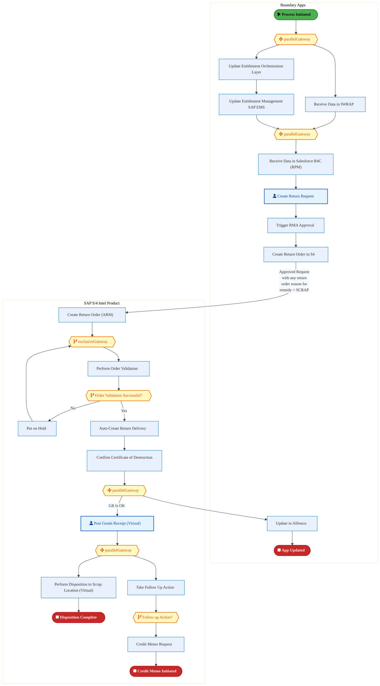
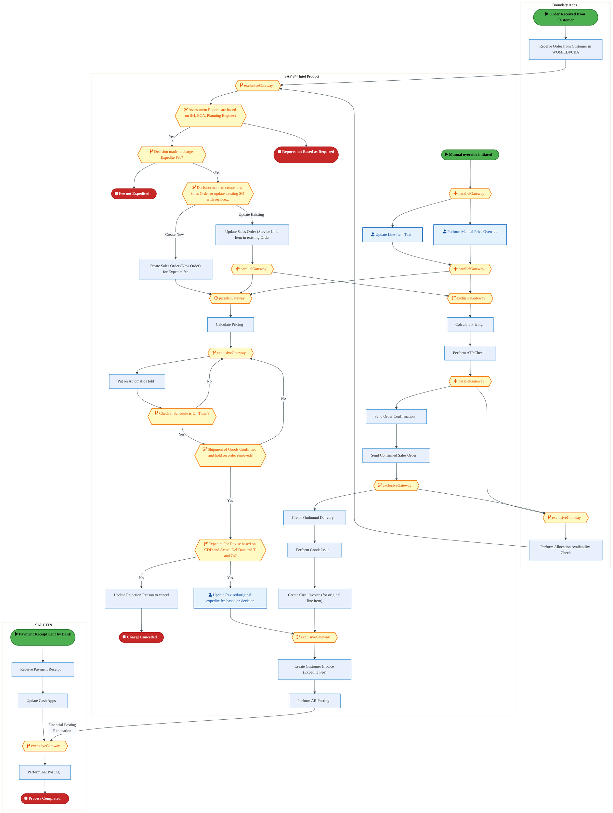
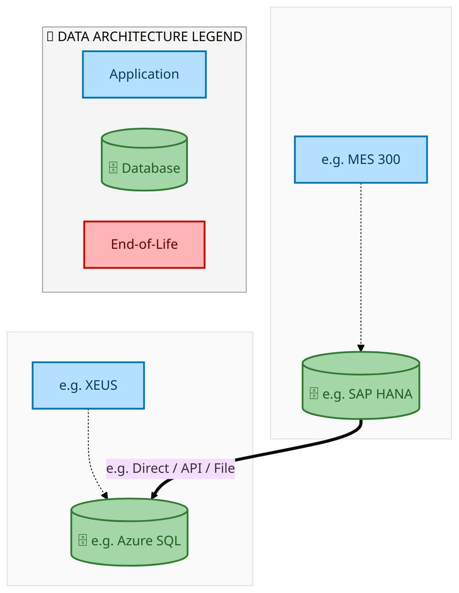
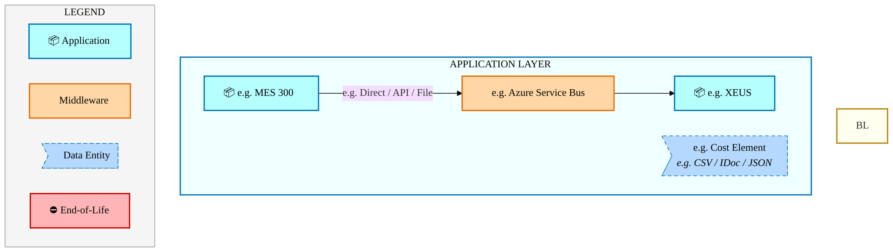
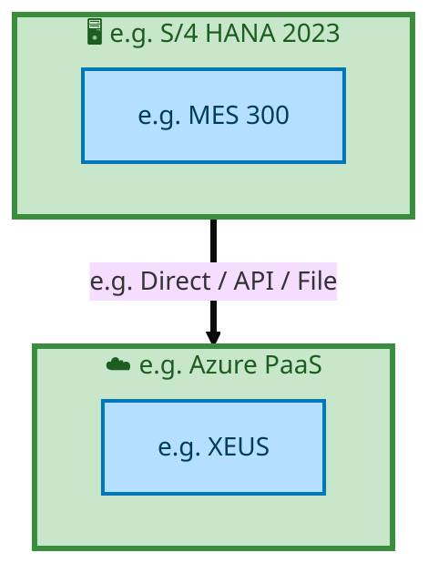

  
  <h1 style="font-size:36px; margin-top:24px;">Order_to_Cash_IP — Order to Cash (IP)</h1>
  <h2 style="font-size:24px;">Architecture Document (TOGAF BDAT)</h2>
  
End-to-End Integrated Processes (E2E) Tower 
  Capability Order_to_Cash_IP · Order to Cash

  
IAO Program · Release 2 
  Generated: March 2026 
  Sajiv Francis

  
IAO Architecture Pipeline — Intel Confidential

Page 1<a href="#toc">↑ Back to TOC</a>Order_to_Cash_IP — Order to Cash (IP)

## Table of Contents

1. [Executive Summary](#1-executive-summary)
2. [Business Context & Objectives](#2-business-context--objectives)
   - 2.1 [Classification](#21-classification)
   - 2.2 [Business Drivers](#22-business-drivers)
   - 2.3 [Success Criteria](#23-success-criteria)
   - 2.4 [Companion Documents](#24-companion-documents)
3. [Business Architecture (TOGAF "B")](#3-business-architecture-togaf-b)
   - 3.1 [Business Process Overview](#31-business-process-overview)
   - 3.2 [Business Process Diagrams](#32-business-process-diagrams)
   - 3.3 [Business Roles & Responsibilities](#33-business-roles--responsibilities)
4. [Data Architecture (TOGAF "D")](#4-data-architecture-togaf-d)
   - 4.1 [Data Entities & Ownership](#41-data-entities--ownership)
   - 4.2 [Data Flow Diagrams](#42-data-flow-diagrams)
   - 4.3 [Data Lineage](#43-data-lineage)
   - 4.4 [RICEFW Data Objects](#44-ricefw-data-objects)
   - 4.5 [Data Governance & Quality](#45-data-governance--quality)
5. [Application Architecture (TOGAF "A")](#5-application-architecture-togaf-a)
   - 5.1 [Current-State Application Landscape](#51-current-state--current-state-application-landscape)
   - 5.2 [Future-State Application Landscape](#52-future-state--future-state-application-landscape)
   - 5.3 [Change Impact Summary](#53-change-impact-summary)
   - 5.4 [Component Overview](#54-component-overview)
   - 5.5 [RICEFW Inventory](#55-ricefw-inventory)
   - 5.6 [Integration Patterns](#56-integration-patterns)
6. [Technology Architecture (TOGAF "T")](#6-technology-architecture-togaf-t)
   - 6.1 [Platform & Infrastructure](#61-platform--infrastructure)
   - 6.2 [SAP Development Object Status](#62-sap-development-object-status)
   - 6.3 [NFRs & Design Principles](#63-nfrs--design-principles)
   - 6.4 [Security & Governance](#64-security--governance)
7. [Project Context](#7-project-context)
   - 7.1 [Project Roadmap & Go-Live Plan](#71-project-roadmap--go-live-plan)
   - 7.2 [RAID Log](#72-raid-log)
   - 7.3 [Recommendations & Next Steps](#73-recommendations--next-steps)

Page 2<a href="#toc">↑ Back to TOC</a>Order_to_Cash_IP — Order to Cash (IP)

## 1. Executive Summary

This Architecture Document defines the **Business, Data, Application, and Technology** (BDAT) architecture for **Order_to_Cash_IP Order to Cash (IP)** within the IAO program. It includes 2 BPMN process diagram(s) in Section 3.
| Dimension | Value |
|-----------|-------|
| **Tower** | End-to-End Integrated Processes (E2E) |
| **Process Group** | Order to Cash |
| **Capability** | Order_to_Cash_IP - Order to Cash (IP) |
| **Release** | Release 2 |
| **Total Systems** | 2 |
| **System Status** | 0 Deployed, 0 Developing, 0 EOL, 2 Pending IAPM |
| **RICEFW Objects** | Pending — Smartsheet Object Tracker API integration |
**Change Summary**: 0 new flow chains, 0 removed, 0 modified, 1 unchanged between Current-State and Future-State states.

> All system nodes in architecture diagrams are **IAPM-linked** — click any node to open its IAPM page. Diagrams require `securityLevel: 'loose'` for click events.

Page 3<a href="#toc">↑ Back to TOC</a>Order_to_Cash_IP — Order to Cash (IP)

## 2. Business Context & Objectives

### 2.1 Classification

| Level | Value |
|-------|-------|
| **L0 Tower** | End-to-End Integrated Processes |
| **L1 Process** | Order to Cash |
| **L2 Capability** | Order_to_Cash_IP - Order to Cash (IP) |

### 2.2 Business Drivers

| # | Driver | Description | Strategic Alignment | Priority |
|---|--------|-------------|---------------------|----------|
| 1 | End-to-End Process Integration | Enable cross-tower integrated processes spanning procurement, manufacturing, and fulfillment | IDM 2.0 Process Excellence | High |
| 2 | Intel Foundry Business Enablement | Stand up foundry-specific business processes for external customer engagement | Intel Foundry Services | High |
| 3 | Process Visibility & Monitoring | Provide end-to-end process visibility across tower boundaries with integrated monitoring | Operational Excellence | Medium |
| 4 | Order_to_Cash_IP Process Migration | Migrate Order to Cash (IP) business processes and 2 integrated systems from legacy to S/4 HANA target architecture | IDM 2.0 Cross-Functional / End-to-End | High |

Page 4<a href="#toc">↑ Back to TOC</a>Order_to_Cash_IP — Order to Cash (IP)

### 2.3 Success Criteria

| Metric | Target | Measure | Baseline | Owner |
|--------|--------|---------|----------|-------|
| E2E Process Cycle Time | Per process SLA | End-to-end transaction completion within defined SLA per process | Varies by process | E2E Process Owner |
| Cross-Tower Integration Success | > 99% | Transactions completing across tower boundaries without manual intervention | 92% (current) | Integration Lead |
| Process Exception Rate | < 2% | Transactions requiring manual exception handling | 8% (current) | Operations Manager |
| Order_to_Cash_IP Migration Completeness | 100% flow chains validated | All 1 flow chains verified in target state | 0% (pre-migration) | Tower Architect |

### 2.4 Companion Documents

| Document | Description |
|----------|-------------|
| **Business Architecture** | Included in this document (Section 3) — process flows from BPMN diagrams |
| **This Document** | Full BDAT Architecture — Business + Data + Application + Technology |

Page 5<a href="#toc">↑ Back to TOC</a>Order_to_Cash_IP — Order to Cash (IP)

## 3. Business Architecture (TOGAF "B")

### 3.1 Business Process Overview

This capability includes **2 business process(es)** modeled in BPMN 2.0, covering the end-to-end workflow for Order_to_Cash_IP Order to Cash (IP).

| # | Step ID | Process Name | Lanes | Tasks | Gateways |
|---|---------|--------------|-------|-------|----------|
| 1 | E2E-10__R3_-_Intel_Product_-_RMA_for_Direct_Customers_without_physical_receipt_of_the_defective_prod | E2E-10__R3_-_Intel_Product_-_RMA_for_Direct_Customers_without_physical_receipt_of_the_defective_prod | Boundary Apps, SAP S/4 Intel Product | 17 | 7 |
| 2 | R3_E2E-80__Intel_Product_-_Customer_requests_expedite_-_service_fee | R3_E2E-80__Intel_Product_-_Customer_requests_expedite_-_service_fee | Boundary Apps, SAP CFIN, SAP S/4 Intel Product | 22 | 18 |

### 3.2 Business Process Diagrams

Page 6<a href="#toc">↑ Back to TOC</a>Order_to_Cash_IP — Order to Cash (IP)

#### BUSINESS ARCHITECTURE — 3.2.1 E2E-10__R3_-_Intel_Product_-_RMA_for_Direct_Customers_without_physical_receipt_of_the_defective_prod — E2E-10__R3_-_Intel_Product_-_RMA_for_Direct_Customers_without_physical_receipt_of_the_defective_prod

**Swim Lanes**: Boundary Apps · SAP S/4 Intel Product | **Tasks**: 17 | **Gateways**: 7

> **Legend**: ● Start · ● End · User Task · Service Task · ◇ Gateway · Sub-Process

<a href="https://mermaid.live/view#pako:eNqlV-9v4jYY_lesVBU9CbQkJASQtokG0lW77iro3Wka--AmDlg1cc522rIe__teJzGQFD7s1g9V38fP-9OPHffNinlCrLF1eflGM6rG6K2j1mRDOmPUecSSdLqoAr5gQfEjI7KjOSnP1IL-U9IcL3_VNI1FeEPZVqMLsuIEfb7togk4si6SOJM9SQRNO91OLugGi23IGReafUGGqZ2W2eqlay4SIg4E2w6c2AdXRjNygPuBF3iR9pMk5lnSCJr66TCNOztdHOMv8RoLVZZfSHKHX7_SRK3BTjGTBDhrtWEf8SNhukclCo3FhXg2w6BS58lgYIscxzRbAe7ZAAmcPR0g397t0O7ycpntk6KH6TJD8BMzLOWUpEgqgGfPCqWUsfGFF04i3-5KJfgTGV-4s2Dad7ux7mQMrdtdPdzeC6GrtRo_cpbU1N6L7mHs5q9d8Tp27a7Ywu9WLpIlh0zhwB26w32m68AJndBkStP0f2WCuYoHLJ_qXLN-5EbTfS7HH_ih_T6eaXPqBROnPScinmlMjoJGUdSfHUY1G_iOfT7oddQf2GEr6Aor8oK3h4Cj0NsHjPwgcoKzAat87SqLx3vBYxOwP_Mjfx8wuHaiiXs2oDdxvGFdIcRZCZyv0TUvSi2jSZ7Lak3_ZM5fS2tOYkKfCZpihRHN0ALDqUy5iAmaeyG6mt_ffVhafx95uSe8br_OJ_dNWh9on_MEhoNmmaKKwbHPFPok4jWB6rGiPEMf8ZaIpp932u8OZ3hV_bmY3KPZ3aLp5oPbg6CrFRFofjfRrQr-jFmTNQBWKIgOPieqEBnUAxdD2bjXpAaHOmB1wlJBZMybHEfHS_E4xT0tVtQMPSffCmi15TK82vvkDGSjt5pIiW7hwqTgnQD_w7HD6OAgFc91Z6gqrE11_bc3Q8VC8BfZw0yhHAvMGGE3lVCX1m537DT4b05w_lvy0vux-MmDDhRhup-kiNVRhuGZoV9N5m1tjYB6TwTob1OTvmBGk1IsrTnamlooBCr6DS6W1qqW9qRQvNdMPCUMZCu2LbaWdMizlELakAhFUxprL56CB4gV-nlfQP-o1imVOZe01LTiaBHDYNBHHlcqv_pChSowazXraKk_4CeCIs7gcoddRZNTmfxqgAmFY0A2_IywgqYW77lU6IbzRKLytObqXB2u3VLYcTch3-SMKNKWmtPyOa7vnJRd9yA1_VLoPcK3Ll6_22m0KGJ9JtKC_dpWa_90CPIas0LC3p4RuXfarR58YQb_Ll3wIydq-IMnCi4H1Ov9og9yDbi1PTC2XwMtu1_b_cr0atNruw8qwDH5atOsO_W6SV9HN8vl6nc4WOXdShIjRLTMXqhaI5xtkagO2jIrX1xgYgkbCocEIAH3d7JFP6NFWH4uvsPdUIc2jZtG3LqTkbHdOvcfvPRzbFOy3fY0zD-JrKim21HNNMNzTPt7wIw7MLGCCjB2bTqjxjrkupmjW4k-_V4lNHSn5rumS7du0-m3AbNjjtmyPVAPwryOYKV2MZvkGE0cv3bKvTQPqCYenMGH-2dkEx_VT74G6tonUeck6po3UhPun4a907B_Gh6choPT8NDAVtfaELHBNLHGb1b5Pwn835KQFBdMWbuuheHjsdhmsTUu3-5WUX5xpxTDN29Tgbt_AdMR90c=" title="View in Mermaid Live">&#128065; View in Mermaid Live</a>

Page 7<a href="#toc">↑ Back to TOC</a>Order_to_Cash_IP — Order to Cash (IP)

#### BUSINESS ARCHITECTURE — 3.2.2 R3_E2E-80__Intel_Product_-_Customer_requests_expedite_-_service_fee — R3_E2E-80__Intel_Product_-_Customer_requests_expedite_-_service_fee

**Swim Lanes**: Boundary Apps · SAP CFIN · SAP S/4 Intel Product | **Tasks**: 22 | **Gateways**: 18

> **Legend**: ● Start · ● End · User Task · Service Task · ◇ Gateway · Sub-Process

<a href="https://mermaid.live/view#pako:eNqtWFtv47gV_iuEBoPMAPaMKFGW7YcWjmxvA-zMGHF2F4umD7RExezo4lJSEjeT_95DiZQlWkZ30-YhiT6e63cupvxihXnErLn1_v0Lz3g5Ry9X5Z6l7GqOrna0YFcj1AC_UsHpLmHFlZSJ86zc8n_XYpgcnqWYxNY05clRolv2kDP0y80ILUAxGaGCZsW4YILHV6Org-ApFccgT3Ihpd-xaWzHtTd1dJ2LiImTgG37OPRANeEZO8GuT3yylnoFC_Ms6hmNvXgah1evMrgkfwr3VJR1-FXBvtDn33hU7uE5pknBQGZfpsnPdMcSmWMpKomFlXjUZPBC-smAsO2Bhjx7AJzYAAmafT9Bnv36il7fv7_PWqfobnmfIfgJE1oUSxajogR49ViimCfJ_B0JFmvPHhWlyL-z-Ttn5S9dZxTKTOaQuj2S5I6fGH_Yl_NdnkRKdPwkc5g7h-eReJ479kgc4bfhi2XRyVMwcabOtPV07eMAB9pTHMf_kyfgVdzR4rvytXLXznrZ-sLexAvsc3s6zSXxF9jkiYlHHrKO0fV67a5OVK0mHrYvG71euxM7MIw-0JI90ePJ4CwgrcG156-xf9Fg48-MstptRB5qg-7KW3utQf8arxfORYNkgclURQh2HgQ97NF1XtW9jBaHQ9GcyZ8M__3eumUh448MfZMDgmKRpyioijJP4Yln6LdvXz6vljefg-vFvfWPjq4Duhsm4lykaJEkeUhLnmdo8Uh5Qnc84eURBXsWfjfU3A-gGNN5TMeHBFhr_Kooon4AoPqxo-vaLy9aVy6a8Q5GJdwj9hwmVQHqPzWVuLdeXxs16FWDiu1ig4L1zdcuC343lVu0yYsSZq8fN56C0C-HCDyggBb7hsq-yKxD54YeU5aVTWKH0iDBM0gwpNFWPuyO6BpWgUGCMzvpAksHJFuFFQUK8vSQsJJFhgJx_j-sbT8TdJOVLJEeoyosu5WBkALBJDlbCltdVfXDV_bU_PsRAbto9XxgEQehmLE-I-TEbs_AthlY9DOsaXRTslT2JHvmdYUaob4hT0ZCk7BKpK2N4OFZKSf_XaTXEXeboUaW_QBlilSkQZ7FXKT1EPQFZ1pQiUCTd1I0Wsg-EfmtKndybtGSJVAlcTREcSfGn_I8KtBNUVQGr9g5GZRT9QlK-JhLRj_IguSCP_CMJkh-DCKoTPrR0JeV3VQlkqNdwVBCgiH6GyxyQ65TwFv2TxbWy-CW0QL-lDkKoeVYYuh4_djqldOG1_bKmjEzqMkfGFjHbsdEfo4gLf-FZhVN6rIDx8Cr4JFBmoP7qiov2YPjugfv2LM50c6gyi175AWLPrc8s84EIHkjiiSzEQt5cdY4DjG2hAo9V0EjecXi9HzinYmxIgK4NTzIvSWLkJzL-4Y8UI6yvGzn9UxhaijcskMuyqJWuq6zogWA_6q4OFN28fA-WhQFrDG1BhtzVHRIgv0zQqtgMUKbhGaZnP9VBqyy4q-n1dV4uLDxlopmlFJgT3Zlw0u31c5suX_UVtPIGWy87gaDIauaXmi31vYbeuLlXl9GPn36ZPokf3ZjN2re29Qmw2r1zkM8Rttwz6IqgX6DpDJ0x1OGzmjyh41s9_xQlzSP1ZI6bUEKu20Pm0QWt76eI8FSaO7ozPh02Hi3bmrUTu0SLJe1h0VYyqGBJYqWsgwSu6t_B-eNM3sTg8R-mxp-m1qnI6kQ-VMxpkmJDlRQmO3kghJ5i5L3FqXJW5T8P6fU3lDgPonG47_AZ4J6drF8_nFv_c7gevZDLgN94pgnrjrBjQmXqGfSPBN9TpQPop0QJTHRptU5MRVawGsA_YpzArRJRwVBtE3HNgEdlqdtKJX2eWJ6nRhxK6e-tmjk7SoPrpb3lb5WIApwbQOYqudp8zjTBlUOugQzpa4jdj3DngawBrCygHVIWCWNtU2Vo6t9YsW92xZHecW6nK5vNoIO352YJ7558jVvDmamsbODaf8AE_NAO3F0Kljx77QlVxUiLR0mQDQ_mlKsGdQ2sE5fJ-loiZYxVTWi4yDKC9bZY539Gi4xWcjl_am5c6H7DD6sEx6qi--PjhmsmsNpKXGVGXXpg7eDhjPzXN2eVuoTszHbG2N5aelNvLyUdF6j6_nR3x_0cXwBdy7gbvvtSh8nF3DvAj5R35z0UX8QnQ6isyEUZkx9AdGH8TDsDMPuMEyGYW8YngzD_jA8HYZngzAZzpIMZ0mGsyTDWZLhLMlwlmQ4S9JmaY0seJFJKY-s-YtVf9tpza2IxbRKSut1ZFF4j9oes9Ca198KWs39cMkpvGunDfj6H1WxhmQ=" title="View in Mermaid Live">&#128065; View in Mermaid Live</a>

Page 8<a href="#toc">↑ Back to TOC</a>Order_to_Cash_IP — Order to Cash (IP)

### 3.3 Business Roles & Responsibilities

| Role / Lane | Processes Involved | Description |
|------------|-------------------|-------------|
| Boundary Apps | E2E-10__R3_-_Intel_Product_-_RMA_for_Direct_Customers_without_physical_receipt_of_the_defective_prod, R3_E2E-80__Intel_Product_-_Customer_requests_expedite_-_service_fee | |
| SAP S/4 Intel Product | E2E-10__R3_-_Intel_Product_-_RMA_for_Direct_Customers_without_physical_receipt_of_the_defective_prod, R3_E2E-80__Intel_Product_-_Customer_requests_expedite_-_service_fee | |
| SAP CFIN | R3_E2E-80__Intel_Product_-_Customer_requests_expedite_-_service_fee | |

Page 9<a href="#toc">↑ Back to TOC</a>Order_to_Cash_IP — Order to Cash (IP)

## 4. Data Architecture (TOGAF "D")

### 4.1 Data Entities & Ownership

| # | Data Entity | Source System | Target System | Data Owner | Classification | Volume | Master/Transaction |
|---|-------------|---------------|---------------|------------|----------------|--------|-------------------|
| 1 | e.g. Cost Element | e.g. MES 300 | e.g. XEUS | Data steward | e.g. Intel Confidential | e.g. 10K rows/day | Master / Transaction |

Page 10<a href="#toc">↑ Back to TOC</a>Order_to_Cash_IP — Order to Cash (IP)

### 4.2 Data Flow Diagrams

> **DATA ARCHITECTURE** — Database-to-database data flows. Applications (blue) sit above their hosting databases (green cylinders). Thick arrows show data movement between databases.

#### 4.2.1 Current-State — Current-State Data Flows

<a href="https://mermaid.live/view#pako:eNqllYtu2jAUhl_FcoXYJOhSaGCN1EomCStS2nUN3SY1U2QSB6yaOEqcFUp599kJpBuDFjZbiuJz-X1yPitewICHBBqwVlvQmAoDLOpiQqakboD6CGek3gD1jAR5SsXcIT8JUw7GeekpQr_ilOIRI1ldZUc8Fi59KgRO9GSmwpStj6eUzZXVJWNOwN2gAZBMZPWlimD8MZjgVBQaeUau8OwbDcVEriPMMiJjJmLKHDwiTG0k0lzZYlm9m-CAxmNpbOvSlOL44cV0qi-XYFmreXG1BRj2vBjIETCcZRaJAE6SHp-BiDJmHPV0q9_vNzKR8gdiHGlat9vrrJbNR1WT0UpmjYAznip329I39cKROWcrOaRbHdSt5Fp212q3dsqd9HS7pW3IEc5eyuv3e3pPr_RMU5Njp16no9xeXCpm-Wic4mQCPqchSX3BfRNnE39wY1rIdHzij330lKfEd7849x4EHvxRJqoR0pQEgvK46p8aW5RQIfTdvnOlBjkeHwP1LrUMwyg7_Wq6tVHHOw96efixHcpnGJx6eUQ02ROlWwQBGeTB90q96PuetYHmcfNij_1LORKHqxaKOSP79G-NC6lZ4bI1Nf_EdZLMDgDkohv_El2j_-VzZbt-W9PWiOQSyOWBlKpiXoEkY4CKOZDRqr43MK0LOJDSOu2fIL1ZDDg_v3he9dUqqIAPAN0M5LNPGfHg817nbuNIOGQsv-_-t0YHoQYsNEQA3ZqXg6FtDu9ubeDYn-xra8fRcG5frI6vDhFKEkYDrLzb4Tu-tQOvhQVWd8R2so5vS3k7Dps8ajo0IqV8-TPbyqv8wjUTXc2KydnZ2V9AYANOSTrFNITGAhZ3kbzJQhLhnAm4bECcC-7O4wAaxXUB8yTEglgUy45OS-PyF7GCOn4=" title="View in Mermaid Live">&#128065; View in Mermaid Live</a>

Page 11<a href="#toc">↑ Back to TOC</a>Order_to_Cash_IP — Order to Cash (IP)

#### 4.2.2 Future-State — Future-State Data Flows

<a href="https://mermaid.live/view#pako:eNqllYtu2jAUhl_FcoXYJOhSaGCN1EqGJCtS2nUN3SY1U2QSB6yaOEqcFUp599kJpBuDFjZbiuJz-X1yPitewICHBBqwVlvQmAoDLOpiQqakboD6CGek3gD1jAR5SsXcIT8JUw7GeekpQr_ilOIRI1ldZUc8Fi59KgRO9GSmwpTNxlPK5srqkjEn4G7QAEgmsvpSRTD-GExwKgqNPCNXePaNhmIi1xFmGZExEzFlDh4RpjYSaa5ssazeTXBA47E0tnVpSnH88GI61ZdLsKzVvLjaAgx7XgzkCBjOMpNEACdJj89ARBkzjnq6adt2IxMpfyDGkaZ1u73Oatl8VDUZrWTWCDjjqXK3TX1TLxz152wlh3Szg7qVXMvqmu3WTrmTnm61tA05wtlLebbd03t6pdfva3Ls1Ot0lNuLS8UsH41TnEzA5zQkqS-438fZxB_c2CbqOz7xxz56ylPiu1-cew8CD_4oE9UIaUoCQXlc9U-NLUqoEPpu3blSgxyPj4F6l1qGYZSdfjXd3KjjnQe9PPzYDuUzDE69PCKa7InSLYKADPLge6Ve9H3P2kDzuHmxx_6lHInDVQvFnJF9-rfGhdSscFmamn_iOklmBwBy0Y1_ia7R__K5sly_rWlrRHIJ5PJASlUxr0CSMUDFHMhoVd8bmNYFHEhpnfZPkN4sBpyfXzyv-moWVMAHgG4G8mlTRjz4vNe52zgSDhnL77v_rdFBqAETDRFAt_3LwdDqD-9uLeBYn6xrc8fRcG5frI6vDhFKEkYDrLzb4Tu-uQOviQVWd8R2so5vSXkrDps8ajo0IqV8-TPbyqv8wjUTXc2KydnZ2V9AYANOSTrFNITGAhZ3kbzJQhLhnAm4bECcC-7O4wAaxXUB8yTEgpgUy45OS-PyFzjxOqg=" title="View in Mermaid Live">&#128065; View in Mermaid Live</a>

Page 12<a href="#toc">↑ Back to TOC</a>Order_to_Cash_IP — Order to Cash (IP)

### 4.3 Data Lineage

| # | Source System | Source Schema/Object | Target System | Target Schema/Object | Transformation |
|---|-------------|---------------------|---------------|---------------------|---------------|
| 1 | e.g. MES 300 | e.g. CKMLHD table | e.g. XEUS | e.g. dbo.CostElements | Lineage notes |

### 4.4 RICEFW Data Objects

Reports and Conversions for this capability will be populated from the Smartsheet Object Tracker via automated API extraction.

| Object ID | Type | Description | Status | Source | Target | Complexity |
|-----------|------|-------------|--------|--------|--------|-----------|
| Order_to_Cash_IP-R001 | Report | Order to Cash (IP) operational report | Planned | SAP S/4HANA | Analytics | Medium |
| Order_to_Cash_IP-C001 | Conversion | Legacy data migration for Order to Cash (IP) | Planned | Legacy ERP | SAP S/4HANA | High |

> *Pending: Smartsheet API integration to auto-populate live RICEFW data (see Build Requirements).*

### 4.5 Data Governance & Quality

| Concern | Approach |
|---------|----------|
| Data Ownership | Per-entity owners listed in Section 3.1 |
| Data Classification | Financial data classified as Intel Confidential |
| Data Retention | Per Intel corporate retention policies |
| Data Quality | Validated at source; reconciliation at target |

Page 13<a href="#toc">↑ Back to TOC</a>Order_to_Cash_IP — Order to Cash (IP)

## 5. Application Architecture (TOGAF "A")

### 5.1 Current-State — Current-State Application Landscape

#### Overview

The Current-State architecture represents the **current / legacy** landscape for Order_to_Cash_IP.This view is generated from `CurrentFlows.xlsx` (1 flow hops across 1 flow chains).

#### APPLICATION ARCHITECTURE — Architecture Diagram (ArchiMate-Inspired)

> **Click any system node** to open its IAPM application page.
> **Legend**: Deployed · Developing · End-of-Life · No IAPM Match

<a href="https://mermaid.live/view#pako:eNqVVWtv4jAQ_CtWKsQXaNMHtI0qpEDCiVNoq6aPOx2nyMQLWDVJZDttact_v3VCC6UvzkhB2R3POuPx-smKUwaWY1UqTzzh2iFPVT2BKVQdUh1SBdUaqSqIc8n1LIA7ECYh0rTMFNBrKjkdClBVM3uUJjrkjwXBbjN7MDAT69IpFzMTDWGcArnq1YiLE0WNKJqougLJR9W5QYv0Pp5QqQu-XEGfPtxwpif4PqJCAWImeioCOgRhimqZm1iCXxJmNObJGIMHNoYkTW6XoYY9n5N5pTJIXkuQy_YgITgqFVKv44LiCe9TDXWeqIxLYETpmQASC6oUKMSU8OLdgxEZ5oonoBQpxogL4Wx1cbQbNaVlegvOVvvoqGm3F6_1e_Mlzl72UItTkUpny7btNU6aZWQ5Ss52w7C-ctr24WG7-R-cjGr6ntM7-oZz9w3nS45RheJJOkNNSWOt0pQzJuCeSlhVxGu6S0X8w2Z3ybbB6iEV7xQxGq-o3OnY9necJavKh2NJswlxgz8Da5Czo32GT7bfIO75edDruJe9s1MSuL_9i4H1t5xkBkNDxJqnCQkultEzyUBGOo06qErUO-9EEI2jvh9G-7a9WiCGJoHt8TbBHMEccjuOg5v9Hdcv_yr8kMgkNmHp3xQ87mMuIQpB3vEYonau3nz-7mFJWqDIAkUQVVZYbusXhTy_KNRJlY58gb0h0a3VhccHZQ0DIAvAyVDutE54q0yE12SH9Lw0xr-f4dnpyQ5vlQswDi5LQ8Je9vJL8fG0tp4HVkHsFXuHpO55D59dLmBgPW8u1SflPoOb0l_spln-woxFe2kHK62ja3_XOlanuq9T7U06xLtDEMAY9XxjL2aTwP_hn3obuD-I8Mysm9PNMsFjasAf2DOI-jfrzusv3fWp24LI89fd5Jm25icab6d1l5RT_LPykO812QECWT0d1QM-WpTBvrJiqaWopSgvwjbM71XY4-Pjdz3SqllTkFPKmeU8WcWtiHcqgxHNhbbmNYvmOg1nSWw5xWVl5RkuFDxOcROmZXD-D4-8ZOk=" title="View in Mermaid Live">&#128065; View in Mermaid Live</a>

Page 14<a href="#toc">↑ Back to TOC</a>Order_to_Cash_IP — Order to Cash (IP)

#### Current-State Flow Narrative

| # | Flow Chain | Path | Interface | Freq |
|---|-----------|------|-----------|------|
| 1 | e.g. MES Route to ICOST | e.g. MES 300 → e.g. XEUS | e.g. Direct / API / File | e.g. Near Real-Time |

Page 15<a href="#toc">↑ Back to TOC</a>Order_to_Cash_IP — Order to Cash (IP)

### 5.2 Future-State — Future-State Application Landscape

#### Overview

The Future-State architecture represents the **target** landscape for Order_to_Cash_IP.This view is generated from `FutureFlows.xlsx` (1 flow hops across 1 flow chains).

#### APPLICATION ARCHITECTURE — Architecture Diagram (ArchiMate-Inspired)

> **Click any system node** to open its IAPM application page.
> **Legend**: Deployed · Developing · End-of-Life · No IAPM Match

<a href="https://mermaid.live/view#pako:eNqVVWtv4jAQ_CtWKsQXaNMHtI0qpEDCiVNoq6aPOx2nyMQLWDVJZDttact_v3VCC6UvzkhB2R3POuPx-smKUwaWY1UqTzzh2iFPVT2BKVQdUh1SBdUaqSqIc8n1LIA7ECYh0rTMFNBrKjkdClBVM3uUJjrkjwXBbjN7MDAT69IpFzMTDWGcArnq1YiLE0WNKJqougLJR9W5QYv0Pp5QqQu-XEGfPtxwpif4PqJCAWImeioCOgRhimqZm1iCXxJmNObJGIMHNoYkTW6XoYY9n5N5pTJIXkuQy_YgITgqFVKv44LiCe9TDXWeqIxLYETpmQASC6oUKMSU8OLdgxEZ5oonoBQpxogL4Wx1cbQbNaVlegvOVvvoqGm3F6_1e_Mlzl72UItTkUpny7btNU6aZWQ5Ss52w7C-ctr24WG7-R-cjGr6ntM7-oZz9w3nS45RheJJOkNNSWOt0pQzJuCeSlhVxGu6S0X8w2Z3ybbB6iEV7xQxGq-o3OnY9necJavKh2NJswlxgz8Da5Czo32GT7bfIO75edDruJe9s1MSuL_9i4H1t5xkBkNDxJqnCQkultEzyUBGOo06qErUO-9GEI2jvh9G-7a9WiCGJoHt8TbBHMEccjuOg5v9Hdcv_yr8kMgkNmHp3xQ87mMuIQpB3vEYonau3nz-7mFJWqDIAkUQVVZYbusXhTy_KNRJlY58gb0h0a3VhccHZQ0DIAvAyVDutE54q0yE12SH9Lw0xr-f4dnpyQ5vlQswDi5LQ8Je9vJL8fG0tp4HVkHsFXuHpO55D59dLmBgPW8u1SflPoOb0l_spln-woxFe2kHK62ja3_XOlanuq9T7U06xLtDEMAY9XxjL2aTwP_hn3obuD-I8Mysm9PNMsFjasAf2DOI-jfrzusv3fWp24LI89fd5Jm25icab6d1l5RT_LPykO812QECWT0d1QM-WpTBvrJiqaWopSgvwjbM71XY4-Pjdz3SqllTkFPKmeU8WcWtiHcqgxHNhbbmNYvmOg1nSWw5xWVl5RkuFDxOcROmZXD-D9nJZQE=" title="View in Mermaid Live">&#128065; View in Mermaid Live</a>

Page 16<a href="#toc">↑ Back to TOC</a>Order_to_Cash_IP — Order to Cash (IP)

#### Future-State Flow Narrative

| # | Flow Chain | Path | Interface | Freq |
|---|-----------|------|-----------|------|
| 1 | e.g. MES Route to ICOST | e.g. MES 300 → e.g. XEUS | e.g. Direct / API / File | e.g. Near Real-Time |

Page 17<a href="#toc">↑ Back to TOC</a>Order_to_Cash_IP — Order to Cash (IP)

### 5.3 Change Impact Summary

| Change Type | Flow Chain | Detail |
|-------------|-----------|--------|
| **UNCHANGED** | e.g. MES Route to ICOST | No change |

**Totals**: 0 new - 0 removed - 0 modified - 1 unchanged

### 5.4 Component Overview

#### System Inventory

| System | IAPM ID | Status |
|--------|---------|--------|
| e.g. MES 300 | - | N/A |
| e.g. XEUS | - | N/A |

Page 18<a href="#toc">↑ Back to TOC</a>Order_to_Cash_IP — Order to Cash (IP)

### 5.5 RICEFW Inventory

RICEFW objects for this capability will be auto-populated from the Smartsheet S/4 Object Tracker.

| Object ID | Type | Description | Status | Source → Target | Middleware | Complexity |
|-----------|------|-------------|--------|----------------|-----------|-----------|
| Order_to_Cash_IP-I001 | Interface | Order to Cash (IP) inbound data interface | Planned | Legacy → SAP S/4HANA | MuleSoft / CPI | Medium |
| Order_to_Cash_IP-E001 | Enhancement | Order to Cash (IP) custom business logic | Planned | SAP S/4HANA | N/A | Medium |
| Order_to_Cash_IP-F001 | Form/Report | Order to Cash (IP) operational output | Planned | SAP S/4HANA | N/A | Low |

> *Pending: Smartsheet API integration to auto-populate live RICEFW inventory (see Build Requirements).*

Page 19<a href="#toc">↑ Back to TOC</a>Order_to_Cash_IP — Order to Cash (IP)

### 5.6 Integration Patterns

| # | Pattern | Flow Chain | Middleware | Protocol | Auth |
|---|---------|-----------|-----------|----------|------|
| 1 | e.g. Pub-Sub / P2P / ETL | e.g. MES Route to ICOST | e.g. Azure Service Bus | e.g. REST / RFC / SFTP | e.g. OAuth / NTLM / Cert |

Page 20<a href="#toc">↑ Back to TOC</a>Order_to_Cash_IP — Order to Cash (IP)

## 6. Technology Architecture (TOGAF "T")

### 6.1 Platform & Infrastructure

> **TECHNOLOGY / PLATFORM ARCHITECTURE** — Platforms (green) host applications (blue). Thick arrows show platform-to-platform integration flows.

#### 6.1.1 Current-State — Current-State Platform Architecture

<a href="https://mermaid.live/view#pako:eNqtlGFvmzAQhv-K5SriC2tJCGmG1EmBBC1SukVj3SaNCTlwBKsGI2PapGn--2zImrXapGidP1jce-fnjteSdzjhKWAX93o7WlLpop0hcyjAcJGxIjUYJjJqSBpB5XYBd8B0gnHeZdrSL0RQsmJQG_p0xksZ0ocW0B9WG12mtYAUlG21GsKaA7qZm2iiDjJjrysYv09yImTLaGq4JpuvNJW5ijPCalA1uSzYgqyA6UZSNFor1fRhRRJarpU4tJQkSHl7lBxrv0f7Xi8qn1qgz15UIrUSRup6ChkiVeXxDcooY-6Z50yDIDBrKfgtuGeWdXnpjQ7hm3s9kzuoNmbCGRc6bU-dl7yKEXkE-uPZyH_7BLTH45ntPwfaR2Dfc2YD6wUQODvygsBzPOeJ5_uWWn8dcDTS6ajsiHWzWgtS5eijSEHEksc-qfN4vvSXi2UM8TqePDQC4iUh4fcIR81gZPWjJgNLDXG-PkdtGul0hH90TL1SKiCRlJdo8emo_qHJpG3ybXaj8S1RfyuW67rdNXTHoUwPE8stg1PGfZXbp7oTxsP4_eTDJB5YA7s1KB3bqdpT4vxuU3gxRLoO6brXOHU9C2Pbsn6ZpUKkwn_369kP_AfLTmx0dfXu8fAL09YAdIEmy7naA8ogwo-n3DA2cQGiIDTF7g63b496uVLISMMk3puYNJKH2zLBbvs84KZKiYQpJepWi07c_wSTUJXa" title="View in Mermaid Live">&#128065; View in Mermaid Live</a>

> **Legend**: 🖥️ Platform · 📦 Application · ⛔ End-of-Life · 📋 Unassigned

Page 21<a href="#toc">↑ Back to TOC</a>Order_to_Cash_IP — Order to Cash (IP)

#### 6.1.2 Future-State — Future-State Platform Architecture

<a href="https://mermaid.live/view#pako:eNqtlGFvmzAQhv-K5SriC2tJCGmG1EmQBC1SukVj3SaNCTlwCVYNRsa0SVP--2zImrXapGidP1jce-fnjteS9zjhKWAX93p7WlDpor0hM8jBcJGxIhUYJjIqSGpB5W4Bd8B0gnHeZdrSL0RQsmJQGfr0mhcypA8toD8st7pMawHJKdtpNYQNB3QzN5GnDjKj0RWM3ycZEbJl1BVck-1XmspMxWvCKlA1mczZgqyA6UZS1For1PRhSRJabJQ4tJQkSHF7lByraVDT60XFUwv02Y8KpFbCSFVNYY1IWfp8i9aUMffMd6ZBEJiVFPwW3DPLurz0R4fwzb2eyR2UWzPhjAudtqfOS17JiDwCJ-PZaPL2CWiPxzN78hxoH4F935kNrBdA4OzICwLf8Z0n3mRiqfXXAUcjnY6KjljVq40gZYY-ihRELHk8IVUWz5fBcrGMId7E3kMtIF4SEn6PcFQPRlY_qtdgqSHON-eoTSOdjvCPjqlXSgUkkvICLT4d1T808dom32Y3Gt8S9bdiua7bXUN3HIr0MLHcMThl3Fe5fao7YTyM33sfvHhgDezWoHRsp2pPifO7TeHFEOk6pOte49T1LIxty_pllgqRCv_dr2c_8B8sO7HR1dW7x8MvTFsD0AXylnO1B5RBhB9PuWFs4hxETmiK3T1u3x71cqWwJjWTuDExqSUPd0WC3fZ5wHWZEglTStSt5p3Y_AS5vZXy" title="View in Mermaid Live">&#128065; View in Mermaid Live</a>

> **Legend**: 🖥️ Platform · 📦 Application · ⛔ End-of-Life · 📋 Unassigned

#### Platform Inventory

| # | Platform | Type | Systems Using | Environment |
|---|----------|------|--------------|-------------|
| 1 | e.g. Azure PaaS | Cloud / SaaS | e.g. XEUS | DEV,QAS,PRD |
| 2 | e.g. S/4 HANA 2023 | On-Premise | e.g. MES 300 | DEV,QAS,PRD |

Page 22<a href="#toc">↑ Back to TOC</a>Order_to_Cash_IP — Order to Cash (IP)

### 6.2 SAP Development Object Status

**RICEFW Status Summary** — E2E Tower (0 objects)
*Data source: Smartsheet Object Tracker (cached 2026-03-27)*

| Status | Count | % |
|--------|------:|----:|
| **Total** | **0** | **100%** |

**RICEFW by Type:**

| Type | Count |
|------|------:|
| **Total** | **0** |

### 6.3 NFRs & Design Principles

| Category | Requirement | Target / SLA | Priority |
|----------|-------------|-------------|----------|
| Performance | Order/transaction processing within interactive SLA | < 3 seconds for online transactions | High |
| Availability | Business-critical systems available during extended hours | 99.9% (06:00-22:00 all time zones) | High |
| Scalability | Support seasonal and promotional volume spikes | Handle 2x baseline transaction volume | Medium |
| Recoverability | Customer-facing systems recover within business impact window | RPO < 30 min, RTO < 2 hours | High |
| Data Volume | Support transactional data growth from business expansion | 10M+ documents/year | Medium |
| Latency | Near-real-time integration for order status updates | < 30 seconds for status propagation | Medium |
| Concurrency | Support global user base across business functions | 300+ concurrent users | Medium |

### 6.4 Security & Governance

| Concern | Approach | Standard / Policy | Owner |
|---------|----------|--------------------|-------|
| Authentication | Single Sign-On (SSO) via Intel corporate Azure AD identity | Intel IT Security Policy - Identity Management | IT Security |
| Authorization | Role-based access control (RBAC) with SAP authorization objects | Intel SAP Security Standards - Role Design | SAP Security Team |
| Data Classification | All financial/operational data classified per Intel Data Classification Standard | Intel Data Classification Policy | Data Governance |
| Data Encryption (at rest) | AES-256 encryption for SAP HANA database and file storage | Intel Encryption Standard | Infrastructure Security |
| Data Encryption (in transit) | TLS 1.3 for all system-to-system and user-to-system communication | Intel Network Security Policy | Network Engineering |
| Network Segmentation | SAP systems in dedicated network zones with firewall controls | Intel Network Architecture Standard | Network Security |
| API Security | OAuth 2.0 / certificate-based authentication for all API integrations | Intel API Security Guidelines | Integration Architecture |
| Audit Logging | Comprehensive audit trail for all data changes and user actions (SAP Security Audit Log) | SOX Compliance / Intel Audit Policy | Internal Audit |
| Certificate Management | Automated certificate lifecycle management for system-to-system trust | Intel PKI Standard | Certificate Authority Team |
| Compliance | SOX controls, export control (EAR/ITAR) screening, data privacy (GDPR) | Intel Corporate Compliance Framework | Compliance Office |

Page 23<a href="#toc">↑ Back to TOC</a>Order_to_Cash_IP — Order to Cash (IP)

## 7. Project Context

### 7.1 Project Roadmap & Go-Live Plan

*No timeline data available for this capability.*

### 7.2 RAID Log

*Live data from Smartsheet Master RAID Log — extracted 2026-03-27*

**RAID Summary:** 15 open items (0 capability-specific, 15 tower-level), 56 closed

| Severity | Capability | Tower-Wide | Total Open |
|----------|----------:|-----------:|-----------:|
| P1 - High | 0 | 3 | 3 |
| P2 - Medium | 0 | 10 | 10 |
| P3 - Low | 0 | 2 | 2 |
| **Total** | **0** | **15** | **15** |

**Other E2E Tower RAID Items** (15 open):

| RAID ID | Type | Severity | Title | Status | Assigned To | Due Date |
|---------|------|----------|-------|--------|-------------|----------|
| 03591 | Risk | P1 - High | R3 E2E scenario execution | In Progress | Test Management | 2026-04-03 |
| 03681 | Risk | P1 - High | ITC Execution: Planning run availability - Prerequisite for ... | In Progress | E2E | 2026-03-27 |
| 03762 | Risk | P1 - High | FTS-IF (esp SCP) related test cases/sequencing are not accur... | In Progress | FTS IF | 2026-04-03 |
| 01733 | Risk | P2 - Medium | Tariffs impacts Item/BOM design which is impacting ERP/SCP (... | In Progress | E2E | 2026-03-06 |
| 03592 | Risk | P2 - Medium | Lack of Defined IMO Owner for CBA Mask Billing and Materials... | In Progress | E2E | 2026-03-27 |
| 03625 | Risk | P2 - Medium | Item/ BOM MC1 delta load | In Progress | Cutover | 2026-04-10 |
| 03628 | Risk | P2 - Medium | R3 Returns Rework Process Causing Finance Double Counting in... | In Progress | E2E | 2026-03-27 |
| 03642 | Issue | P2 - Medium | E2E Process with Anafi on order/invoice point.  Need IFS SC ... | In Progress | E2E | 2026-03-24 |
| 03736 | Action | P2 - Medium | Golden Data/Test Data Readiness | In Progress | Master Data | 2026-04-22 |
| 03743 | Issue | P2 - Medium | FD-Share with Entitlements -  Interface File Paths for MC1 | Roadblock / At Risk | PMO | 2026-03-20 |
| 03753 | Risk | P2 - Medium | PDF-SMH IF test cases are not available in JIRA | To Be Reviewed | B-Apps | 2026-03-25 |
| 03756 | Risk | P2 - Medium | LE101-1001 Operation Support Ownership for SIMS/Tester Front... | In Progress | E2E | 2026-04-24 |
| 03769 | Action | P2 - Medium | Need a Labs SPOC owner to define IP Labs enterprise and mate... | In Progress | E2E | 2026-04-17 |
| 03216 | Action | P3 - Low | Mask Expense vs. Invoice | In Progress | E2E | 2026-03-06 |
| 03315 | Risk | P3 - Low | BPMG – SCP L3/L4 flow standards | In Progress | Business Process Mgmt | 2026-03-27 |

### 7.3 Recommendations & Next Steps

| # | Category | Recommendation | Priority | Owner | Target Date | Status |
|---|----------|---------------|----------|-------|-------------|--------|
| 1 | Architecture | Complete extended flow attributes (Data Entity, Integration Pattern, Tech Platform) in Flows tab for full BDAT coverage | High | Tower Architect | 2026-Q2 | Open |
| 2 | Data | Define data ownership and classification for all 1 flow chains to satisfy Data Architecture (TOGAF D) requirements | Medium | Data Architect | 2026-Q3 | Open |
| 3 | Testing | Develop integration test scenarios covering all 1 flow chains for FUT/SIT readiness | High | Test Lead | 2026-Q3 | Open |
| 4 | Business Architecture | Review and validate Business Architecture process steps against latest Signavio/BIC process models | Medium | Business Analyst | 2026-Q2 | Open |
| 5 | Security | Complete security review for API integrations and data flows per Intel Security Architecture standards | Medium | Security Architect | 2026-Q3 | Open |

---
*Order_to_Cash_IP — Architecture Document (TOGAF BDAT) · End-to-End Integrated Processes · Generated: March 2026*

