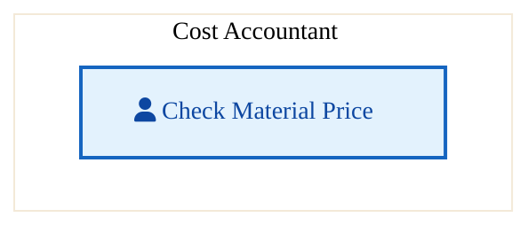
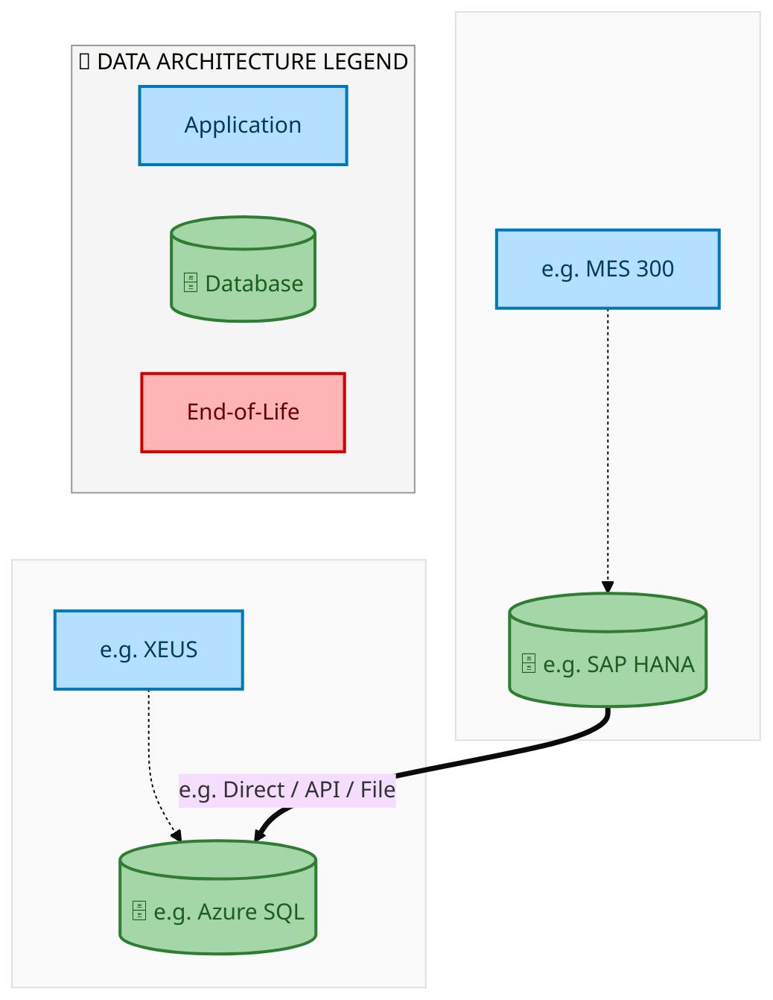
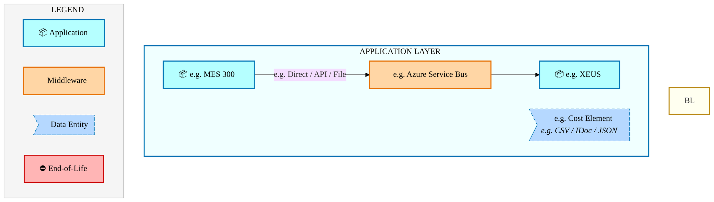
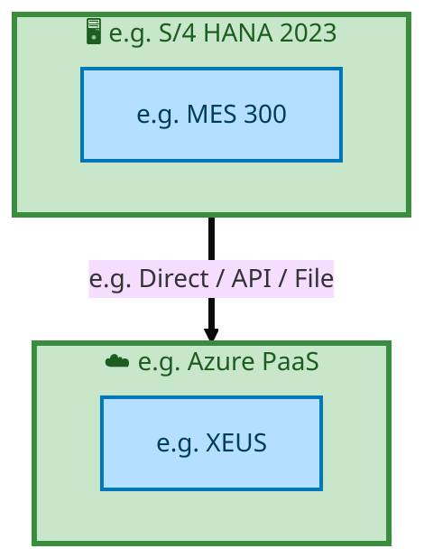

  
  <h1 style="font-size:36px; margin-top:24px;">E2E-107 — R3 - Partner Owned Equipment Order</h1>
  <h2 style="font-size:24px;">Architecture Document (TOGAF BDAT)</h2>
  
End-to-End Integrated Processes (E2E) Tower 
  Capability E2E-107 · Procure to Pay

  
IAO Program · Release 2 
  Generated: March 2026 
  Sajiv Francis

  
IAO Architecture Pipeline — Intel Confidential

Page 1<a href="#toc">↑ Back to TOC</a>E2E-107 — R3 - Partner Owned Equipment Order

## Table of Contents

1. [Executive Summary](#1-executive-summary)
2. [Business Context & Objectives](#2-business-context--objectives)
   - 2.1 [Classification](#21-classification)
   - 2.2 [Business Drivers](#22-business-drivers)
   - 2.3 [Success Criteria](#23-success-criteria)
   - 2.4 [Companion Documents](#24-companion-documents)
3. [Business Architecture (TOGAF "B")](#3-business-architecture-togaf-b)
   - 3.1 [Business Process Overview](#31-business-process-overview)
   - 3.2 [Business Process Diagrams](#32-business-process-diagrams)
   - 3.3 [Business Roles & Responsibilities](#33-business-roles--responsibilities)
4. [Data Architecture (TOGAF "D")](#4-data-architecture-togaf-d)
   - 4.1 [Data Entities & Ownership](#41-data-entities--ownership)
   - 4.2 [Data Flow Diagrams](#42-data-flow-diagrams)
   - 4.3 [Data Lineage](#43-data-lineage)
   - 4.4 [RICEFW Data Objects](#44-ricefw-data-objects)
   - 4.5 [Data Governance & Quality](#45-data-governance--quality)
5. [Application Architecture (TOGAF "A")](#5-application-architecture-togaf-a)
   - 5.1 [Current-State Application Landscape](#51-current-state--current-state-application-landscape)
   - 5.2 [Future-State Application Landscape](#52-future-state--future-state-application-landscape)
   - 5.3 [Change Impact Summary](#53-change-impact-summary)
   - 5.4 [Component Overview](#54-component-overview)
   - 5.5 [RICEFW Inventory](#55-ricefw-inventory)
   - 5.6 [Integration Patterns](#56-integration-patterns)
6. [Technology Architecture (TOGAF "T")](#6-technology-architecture-togaf-t)
   - 6.1 [Platform & Infrastructure](#61-platform--infrastructure)
   - 6.2 [SAP Development Object Status](#62-sap-development-object-status)
   - 6.3 [NFRs & Design Principles](#63-nfrs--design-principles)
   - 6.4 [Security & Governance](#64-security--governance)
7. [Project Context](#7-project-context)
   - 7.1 [Project Roadmap & Go-Live Plan](#71-project-roadmap--go-live-plan)
   - 7.2 [RAID Log](#72-raid-log)
   - 7.3 [Recommendations & Next Steps](#73-recommendations--next-steps)

Page 2<a href="#toc">↑ Back to TOC</a>E2E-107 — R3 - Partner Owned Equipment Order

## 1. Executive Summary

This Architecture Document defines the **Business, Data, Application, and Technology** (BDAT) architecture for **E2E-107 R3 - Partner Owned Equipment Order** within the IAO program. It includes 1 BPMN process diagram(s) in Section 3.
| Dimension | Value |
|-----------|-------|
| **Tower** | End-to-End Integrated Processes (E2E) |
| **Process Group** | Procure to Pay |
| **Capability** | E2E-107 - R3 - Partner Owned Equipment Order |
| **Release** | Release 2 |
| **Total Systems** | 2 |
| **System Status** | 0 Deployed, 0 Developing, 0 EOL, 2 Pending IAPM |
| **RICEFW Objects** | Pending — Smartsheet Object Tracker API integration |
**Change Summary**: 0 new flow chains, 0 removed, 0 modified, 1 unchanged between Current-State and Future-State states.

> All system nodes in architecture diagrams are **IAPM-linked** — click any node to open its IAPM page. Diagrams require `securityLevel: 'loose'` for click events.

Page 3<a href="#toc">↑ Back to TOC</a>E2E-107 — R3 - Partner Owned Equipment Order

## 2. Business Context & Objectives

### 2.1 Classification

| Level | Value |
|-------|-------|
| **L0 Tower** | End-to-End Integrated Processes |
| **L1 Process** | Procure to Pay |
| **L2 Capability** | E2E-107 - R3 - Partner Owned Equipment Order |

### 2.2 Business Drivers

| # | Driver | Description | Strategic Alignment | Priority |
|---|--------|-------------|---------------------|----------|
| 1 | End-to-End Process Integration | Enable cross-tower integrated processes spanning procurement, manufacturing, and fulfillment | IDM 2.0 Process Excellence | High |
| 2 | Intel Foundry Business Enablement | Stand up foundry-specific business processes for external customer engagement | Intel Foundry Services | High |
| 3 | Process Visibility & Monitoring | Provide end-to-end process visibility across tower boundaries with integrated monitoring | Operational Excellence | Medium |
| 4 | E2E-107 Process Migration | Migrate R3 - Partner Owned Equipment Order business processes and 2 integrated systems from legacy to S/4 HANA target architecture | IDM 2.0 Cross-Functional / End-to-End | High |

Page 4<a href="#toc">↑ Back to TOC</a>E2E-107 — R3 - Partner Owned Equipment Order

### 2.3 Success Criteria

| Metric | Target | Measure | Baseline | Owner |
|--------|--------|---------|----------|-------|
| E2E Process Cycle Time | Per process SLA | End-to-end transaction completion within defined SLA per process | Varies by process | E2E Process Owner |
| Cross-Tower Integration Success | > 99% | Transactions completing across tower boundaries without manual intervention | 92% (current) | Integration Lead |
| Process Exception Rate | < 2% | Transactions requiring manual exception handling | 8% (current) | Operations Manager |
| E2E-107 Migration Completeness | 100% flow chains validated | All 1 flow chains verified in target state | 0% (pre-migration) | Tower Architect |

### 2.4 Companion Documents

| Document | Description |
|----------|-------------|
| **Business Architecture** | Included in this document (Section 3) — process flows from BPMN diagrams |
| **This Document** | Full BDAT Architecture — Business + Data + Application + Technology |

Page 5<a href="#toc">↑ Back to TOC</a>E2E-107 — R3 - Partner Owned Equipment Order

## 3. Business Architecture (TOGAF "B")

### 3.1 Business Process Overview

This capability includes **1 business process(es)** modeled in BPMN 2.0, covering the end-to-end workflow for E2E-107 R3 - Partner Owned Equipment Order.

| # | Step ID | Process Name | Lanes | Tasks | Gateways |
|---|---------|--------------|-------|-------|----------|
| 1 | e.g | e.g | Cost Accountant | 1 | 0 |

### 3.2 Business Process Diagrams

Page 6<a href="#toc">↑ Back to TOC</a>E2E-107 — R3 - Partner Owned Equipment Order

#### BUSINESS ARCHITECTURE — 3.2.1 e.g — e.g

**Swim Lanes**: Cost Accountant | **Tasks**: 1 | **Gateways**: 0

> **Legend**: ● Start · ● End · User Task · Service Task · ◇ Gateway · Sub-Process

<a href="https://mermaid.live/view#pako:eNqlVE2P2yAU_CuIVeSLI9mOHae-JU6QKnWllbLdHpoeCIYYBUMEOB-N8t8L-fI2VU7lgORh3sx7g_ARElVRWMBe78gltwU4BramDQ0KECyxoUEILsAH1hwvBTWB5zAl7Zz_PtPidLP3NI8h3HBx8OicrhQF37-GYOwKRQgMlqZvqOYsCION5g3Wh1IJpT37hY5YxM5u16OJ0hXVHSGK8phkrlRwSTt4kKd5inydoUTJ6i9RlrERI8HJNyfUjtRY23P7raGveP-DV7Z23wwLQx2nto34hpdU-Bmtbj1GWr29hcGN95EusPkGEy5XDk8jB2ks1x2URacTOPV6C3k3Be_ThQRuEYGNmVIGjHXwbGsB40IUL2k5RlkUGqvVmhYvySyfDpKQ-EkKN3oU-nD7O8pXtS2WSlRXan_nZyiSzT7U-yKJQn1w-4MXlVXnVA6TUTK6O03yuIzLmxNj7L-cXK76HZv11Ws2QAma3r3ibJiV0b96tzGnaT6OH3OiessJ_SSKEBrMuqhmwyyOnotO0GAYlQ-iK2zpDh86wS9lehdEWY7i_Kngxe-xy3b5phW5CQ5mGcrugvkkRuPkqWA6jtPRtUOns9J4U4NSGQvGhKhWWizt5dQvGf9cQIYLhvs-bFDWlKzBqxvIvzLwpl1YC_jrUuAu_lOjrvZ-QTCEDdUN5hUsjvD8wN1PoKIMt8LCUwhxa9X8IAkszg8BtpvKeUw5dv01F_D0B1EcX54=" title="View in Mermaid Live">&#128065; View in Mermaid Live</a>

Page 7<a href="#toc">↑ Back to TOC</a>E2E-107 — R3 - Partner Owned Equipment Order

### 3.3 Business Roles & Responsibilities

| Role / Lane | Processes Involved | Description |
|------------|-------------------|-------------|
| Cost Accountant | e.g | |

Page 8<a href="#toc">↑ Back to TOC</a>E2E-107 — R3 - Partner Owned Equipment Order

## 4. Data Architecture (TOGAF "D")

### 4.1 Data Entities & Ownership

| # | Data Entity | Source System | Target System | Data Owner | Classification | Volume | Master/Transaction |
|---|-------------|---------------|---------------|------------|----------------|--------|-------------------|
| 1 | e.g. Cost Element | e.g. MES 300 | e.g. XEUS | Data steward | e.g. Intel Confidential | e.g. 10K rows/day | Master / Transaction |

Page 9<a href="#toc">↑ Back to TOC</a>E2E-107 — R3 - Partner Owned Equipment Order

### 4.2 Data Flow Diagrams

> **DATA ARCHITECTURE** — Database-to-database data flows. Applications (blue) sit above their hosting databases (green cylinders). Thick arrows show data movement between databases.

#### 4.2.1 Current-State — Current-State Data Flows

<a href="https://mermaid.live/view#pako:eNqdlYFumzAQhl_FchVlk5KOJCVZkVrJCWStRKuupNukMiEHjsSqAwjMmjTNu8-GhG5Z6KraEsLnu__O3yGzxn4cADZwo7FmERMGWjfFHBbQNFBzSjNotlAzAz9PmVjZ8Au42uBxXO4Urt9oyuiUQ9ZU0WEcCYc9FQIdPVkqN2Ub0wXjK2V1YBYDurtsISIDeXOjPHj86M9pKgqNPIMruvzOAjGX65DyDKTPXCy4TafAVSKR5soWyeqdhPosmkljT5emlEYPL6YTfbNBm0bDjaoUaDJ0IySHz2mWmRAimiTDeIlCxrlxNNTN8XjcykQaP4BxpGmDwbC_XbYfVU1GN1m2_JjHqdrumfq-XjAdrfhWjuhmnwwqua41MHvdWrnOULe62p4cxPylvPF4qA_1Sm800uSo1ev31bYblYpZPp2lNJkjq2t1tMHIJCPbA2_mkac8Bc_5at-7GLn4Z-muRsBS8AWLo4qaGlU8KcJ_WHeOjITj2TFS71LBMIyS6oEgcy_nBxe7efC5F8hn4J-4eQiaPLVSK5yQdHLxR6VZkH21DtQ-bp_X5ipDIQq2QMSKQz2NHXKiZoXc0tT8G3knWf4XskNuvAtyTd7H-MpyvJ6m7TDLJZLLN5GuEr8CWvog5fMmzttaDqLeJXsT6Z3zu0DXJEZnZ-fPW0pmQRZ9QuTmUj7HjIOLn1_5OvZaaMNMnuD-D2x-oCGTTAgit6OLy4k1mtzdWsi2vljXZk1T7dsXq-2p9pMk4cynavdwA23PrGmWSQVV9_LhPtmeJeWtKGjHYdtmIZTy5QVysCPlCXf8dTUr_qenp__Axy28gHRBWYCNNS7uf_n3CCCkORd408I0F7GzinxsFFc0zpOACjAZlUQXpXHzG4CO9-8=" title="View in Mermaid Live">&#128065; View in Mermaid Live</a>

Page 10<a href="#toc">↑ Back to TOC</a>E2E-107 — R3 - Partner Owned Equipment Order

#### 4.2.2 Future-State — Future-State Data Flows

<a href="https://mermaid.live/view#pako:eNqdlYFumzAQhl_FchVlk5KOJCVZkVrJCbBWolVX0m1SmZADR2LVAQRmTZrm3WdDQrcs6araEsLnu__O3yGzwkESAjZwo7FiMRMGWjXFDObQNFBzQnNotlAzh6DImFg68Au42uBJUu2Urt9oxuiEQ95U0VESC5c9lQIdPV0oN2Wz6ZzxpbK6ME0A3V22EJGBvLlWHjx5DGY0E6VGkcMVXXxnoZjJdUR5DtJnJubcoRPgKpHICmWLZfVuSgMWT6Wxp0tTRuOHF9OJvl6jdaPhxXUKNB56MZIj4DTPTYgQTdNhskAR49w4GuqmbdutXGTJAxhHmjYYDPubZftR1WR000UrSHiSqe2eqe_qhZPRkm_kiG72yaCW61oDs9c9KNcZ6lZX25GDhL-UZ9tDfajXeqORJsdBvX5fbXtxpZgXk2lG0xmyulZHG9gmGTk--FOfPBUZ-O5X597DyMM_K3c1QpZBIFgS19TUqONJGf7DunNlJBxPj5F6lwqGYVRU9wSZOzk_eNgrws-9UD7D4MQrItDkqZVa6YSkk4c_Ks2S7Kt1oPZx-_xgrioU4nADRCw5HKaxRU7UrJFbmpp_I--ki_9CdsmNf0GuyfsYX1mu39O0LWa5RHL5JtJ14ldASx-kfN7EeVPLXtTbZG8ivXV-F-gDidHZ2fnzhpJZkkWfELm5lE-bcfDw8ytfx04LHZjKE9z_gS0INWSSMUHkdnRxObZG47tbCznWF-vaPNBU5_bF6viq_SRNOQuo2t3fQMc3DzTLpIKqe3l_nxzfkvJWHLaTqO2wCCr56gLZ25HqhFv-upo1_9PT03_g4xaeQzanLMTGCpf3v_x7hBDRggu8bmFaiMRdxgE2yisaF2lIBZiMSqLzyrj-Df1E-Bk=" title="View in Mermaid Live">&#128065; View in Mermaid Live</a>

Page 11<a href="#toc">↑ Back to TOC</a>E2E-107 — R3 - Partner Owned Equipment Order

### 4.3 Data Lineage

| # | Source System | Source Schema/Object | Target System | Target Schema/Object | Transformation |
|---|-------------|---------------------|---------------|---------------------|---------------|
| 1 | e.g. MES 300 | e.g. CKMLHD table | e.g. XEUS | e.g. dbo.CostElements | Lineage notes |

### 4.4 RICEFW Data Objects

Reports and Conversions for this capability will be populated from the Smartsheet Object Tracker via automated API extraction.

| Object ID | Type | Description | Status | Source | Target | Complexity |
|-----------|------|-------------|--------|--------|--------|-----------|
| E2E-107-R001 | Report | R3 - Partner Owned Equipment Order operational report | Planned | SAP S/4HANA | Analytics | Medium |
| E2E-107-C001 | Conversion | Legacy data migration for R3 - Partner Owned Equipment Order | Planned | Legacy ERP | SAP S/4HANA | High |

> *Pending: Smartsheet API integration to auto-populate live RICEFW data (see Build Requirements).*

### 4.5 Data Governance & Quality

| Concern | Approach |
|---------|----------|
| Data Ownership | Per-entity owners listed in Section 3.1 |
| Data Classification | Financial data classified as Intel Confidential |
| Data Retention | Per Intel corporate retention policies |
| Data Quality | Validated at source; reconciliation at target |

Page 12<a href="#toc">↑ Back to TOC</a>E2E-107 — R3 - Partner Owned Equipment Order

## 5. Application Architecture (TOGAF "A")

### 5.1 Current-State — Current-State Application Landscape

#### Overview

The Current-State architecture represents the **current / legacy** landscape for E2E-107.This view is generated from `CurrentFlows.xlsx` (1 flow hops across 1 flow chains).

#### APPLICATION ARCHITECTURE — Architecture Diagram (ArchiMate-Inspired)

> **Click any system node** to open its IAPM application page.
> **Legend**: Deployed · Developing · End-of-Life · No IAPM Match

<a href="https://mermaid.live/view#pako:eNqVVWlv4jAQ_StWKsQXaNODo1GFlJCwYhXaqumxq2UVmXgCVk0SxU5bSvnvayeUcFV0jRSU8Zs3zptne64FMQHN0CqVOY2oMNC8KiYwhaqBqiPMoVpDVQ5BllIxc-EFmJpgcVzM5NBHnFI8YsCrKjuMI-HR95zgtJm8KZiK9fCUspmKejCOAT30a8iUiayGOI54nUNKw-pCoVn8GkxwKnK-jMMAvz1RIibyPcSMg8RMxJS5eARMFRVppmKR_BIvwQGNxjJ4octQiqPnMtTQFwu0qFSG0aoEureGEZKjUkH1ulxQMKEDLKBOI57QFAjiYsYABQxzDlxiCnj-bkOIRhmnEXCO8hFSxoyjnhxWo8ZFGj-DcWS1203dWr7WX9WXGGfJWy2IWZwaR7qub3HiJEHlKDithmJdcep6q2U1_4OTYIF3Oe32Ac7TDc7POYK5FC_FM6kpamxVmlJCGLziFNYVsZtmqYjTavZKtm-sHmK2o4jSeE3lblfXD3EWrDwbjVOcTJDp_hlqw4y0z4l8kvMGMm9v3X7XvO_fXCPX_O3cDbW_RZIaRBoiEDSOkHtXRp0z51RvdX3wx_7A8fxzXV-nDaCJ4Hh8jOQcknOS0TAM2eL9DL-cB29vupr4OnfwlGeb71kKvgfpCw3AtzK-8YGnrYIqR6ElCklUwVs2bofednL6bsyF7zC55yPRWV9kcFEwKwBaAq5G6UnninaKCe8RnaC-HQfy76d3c311QjtFWeXMoiBE5LNHe0SVe6_zMdRyOjvvhKQyb_vy2aMMhtrHITE2qL8CqTI7HVHLWponPw4sd22r9_RDW3091Vyl6t_Z0TumdWEsddqwCNGR6_xwru1vuNX1pce3DWYmCaMBVuA9FnP9wdO2jwalV770juvbzrZLbHUMOZGQt8l294sU56bYlGdNciGBpB6HdZeGyzLyHFizSilqIcqnsA31Wwl7eXm5c6ZpNW0K6RRTohlzLb_F5B1IIMQZE9qipuFMxN4sCjQjv1y0LJELBZti2YRpEVz8A6-kPuk=" title="View in Mermaid Live">&#128065; View in Mermaid Live</a>

Page 13<a href="#toc">↑ Back to TOC</a>E2E-107 — R3 - Partner Owned Equipment Order

#### Current-State Flow Narrative

| # | Flow Chain | Path | Interface | Freq |
|---|-----------|------|-----------|------|
| 1 | e.g. MES Route to ICOST | e.g. MES 300 → e.g. XEUS | e.g. Direct / API / File | e.g. Near Real-Time |

Page 14<a href="#toc">↑ Back to TOC</a>E2E-107 — R3 - Partner Owned Equipment Order

### 5.2 Future-State — Future-State Application Landscape

#### Overview

The Future-State architecture represents the **target** landscape for E2E-107.This view is generated from `FutureFlows.xlsx` (1 flow hops across 1 flow chains).

#### APPLICATION ARCHITECTURE — Architecture Diagram (ArchiMate-Inspired)

> **Click any system node** to open its IAPM application page.
> **Legend**: Deployed · Developing · End-of-Life · No IAPM Match

<a href="https://mermaid.live/view#pako:eNqVVWtv4jAQ_CtWKsQXaENbHo0qpKQJJ06hrZo-7nScIhNvwKpJothpSyn__eyEEl4VPSMFZT0768yO7bkWxAQ0Q6tU5jSiwkDzqpjAFKoGqo4wh2oNVTkEWUrFzIUXYGqCxXExk0MfcUrxiAGvquwwjoRH33OCRit5UzAV6-EpZTMV9WAcA3ro15ApE1kNcRzxOoeUhtWFQrP4NZjgVOR8GYcBfnuiREzke4gZB4mZiClz8QiYKirSTMUi-SVeggMajWXwXJehFEfPZaipLxZoUakMo1UJdG8NIyRHpYLqdbmgYEIHWECdRjyhKRDExYwBChjmHLjEFPD83YYQjTJOI-Ac5SOkjBlHPTmsZo2LNH4G48jqdFq6tXytv6ovMU6Tt1oQszg1jnRd3-LESYLKUXBaTcW64tT1dttq_QcnwQLvctqdA5yNDc7POYK5FC_FM6kpam5VmlJCGLziFNYVsVtmqYjTbvVKtm-sHmK2o4jSeE3lqytdP8RZsPJsNE5xMkGm-2eoDTPSOSPySc6ayLy9dftX5n3_5hq55m_nbqj9LZLUINIQgaBxhNy7MuqcOg293fPBH_sDx_PPdH2dNoAWguPxMZJzSM5JRsMwZIv3M_xyHry96Wri69zBU55tvmcp-B6kLzQA38r4xgc22gVVjkJLFJKogrds3A697eT0VzEXvsPkno9Ed32RwXnBrABoCbgcpSfdS9otJrxHdIL6dhzIv5_ezfXlCe0WZZUzi4IQkc8e7RFV7r3ux1DL6ey8E5LKvO3LZ48yGGofh8TYoP4KpMrsdEQta2me_Diw3LWt3tMPbfX1VHOVqn9nR--Y1oWx1GnDIkRHrvPDuba_4VbXlx7fNpiZJIwGWIH3WMz1B0_bPhqUXvnSO65vO9susdUx5ERC3ibb3S9SnJtiU562yLkEknoc1l0aLsvIc2DNKqWohSifwjbVbyXsxcXFzpmm1bQppFNMiWbMtfwWk3cggRBnTGiLmoYzEXuzKNCM_HLRskQuFGyKZROmRXDxD_ZpPwE=" title="View in Mermaid Live">&#128065; View in Mermaid Live</a>

Page 15<a href="#toc">↑ Back to TOC</a>E2E-107 — R3 - Partner Owned Equipment Order

#### Future-State Flow Narrative

| # | Flow Chain | Path | Interface | Freq |
|---|-----------|------|-----------|------|
| 1 | e.g. MES Route to ICOST | e.g. MES 300 → e.g. XEUS | e.g. Direct / API / File | e.g. Near Real-Time |

Page 16<a href="#toc">↑ Back to TOC</a>E2E-107 — R3 - Partner Owned Equipment Order

### 5.3 Change Impact Summary

| Change Type | Flow Chain | Detail |
|-------------|-----------|--------|
| **UNCHANGED** | e.g. MES Route to ICOST | No change |

**Totals**: 0 new - 0 removed - 0 modified - 1 unchanged

### 5.4 Component Overview

#### System Inventory

| System | IAPM ID | Status |
|--------|---------|--------|
| e.g. MES 300 | - | N/A |
| e.g. XEUS | - | N/A |

Page 17<a href="#toc">↑ Back to TOC</a>E2E-107 — R3 - Partner Owned Equipment Order

### 5.5 RICEFW Inventory

RICEFW objects for this capability will be auto-populated from the Smartsheet S/4 Object Tracker.

| Object ID | Type | Description | Status | Source → Target | Middleware | Complexity |
|-----------|------|-------------|--------|----------------|-----------|-----------|
| E2E-107-I001 | Interface | R3 - Partner Owned Equipment Order inbound data interface | Planned | Legacy → SAP S/4HANA | MuleSoft / CPI | Medium |
| E2E-107-E001 | Enhancement | R3 - Partner Owned Equipment Order custom business logic | Planned | SAP S/4HANA | N/A | Medium |
| E2E-107-F001 | Form/Report | R3 - Partner Owned Equipment Order operational output | Planned | SAP S/4HANA | N/A | Low |

> *Pending: Smartsheet API integration to auto-populate live RICEFW inventory (see Build Requirements).*

Page 18<a href="#toc">↑ Back to TOC</a>E2E-107 — R3 - Partner Owned Equipment Order

### 5.6 Integration Patterns

| # | Pattern | Flow Chain | Middleware | Protocol | Auth |
|---|---------|-----------|-----------|----------|------|
| 1 | e.g. Pub-Sub / P2P / ETL | e.g. MES Route to ICOST | e.g. Azure Service Bus | e.g. REST / RFC / SFTP | e.g. OAuth / NTLM / Cert |

Page 19<a href="#toc">↑ Back to TOC</a>E2E-107 — R3 - Partner Owned Equipment Order

## 6. Technology Architecture (TOGAF "T")

### 6.1 Platform & Infrastructure

> **TECHNOLOGY / PLATFORM ARCHITECTURE** — Platforms (green) host applications (blue). Thick arrows show platform-to-platform integration flows.

#### 6.1.1 Current-State — Current-State Platform Architecture

<a href="https://mermaid.live/view#pako:eNqtlGFvmzAQhv-K5SriC2sJhCRD6iQgoFVKp2is26QxIQeOxKqDEZg1acp_nw1ZslZKpWrzB4t77_z4_Fp4j1OeAXbwYLCnBRUO2mtiDRvQHKQtSQ2ajrQa0qaiYjeHX8BUgnHeZ7rSr6SiZMmg1tTqnBcioo8dYDgqt6pMaSHZULZTagQrDujuRkeuXMi0VlUw_pCuSSU6RlPDLdl-o5lYyzgnrAZZsxYbNidLYGojUTVKK2T3UUlSWqykODKkVJHi_iTZRtuidjCIi-MW6IsXF0iOlJG6nkGOSFl6fItyyphz4dmzMAz1WlT8HpwLw5hMvPEhfPegenLMcqunnPFKpa2Z_ZJXMiJOQH8ajP33R6A1nQaW_xxonYBDzw5M4wUQODvxwtCzPfvI831DjrMNjscqHRc9sW6Wq4qUaxSYwdCY-Iv5IoFklbiPTQXJgpDoR4zjxhwbw7jJwZBbX64uUZdGKh3jnz1JjYxWkArKCzT_fFKPaLdDfw_uFLTjqG9JcBynt7xfBEV26E7sGJxv7Z_8fP38UTJKPrqf3MQ0TKuzIJtamZwzYv9tRHQ1QqoOqbq3e3EbRIllGH_skCGS4VsdedbsfzDlVfz19YenQ7uz7ojoCrmLGzmHlEGMn87fF9bxBqoNoRl29rh7K-RLk0FOGiZwq2PSCB7tihQ73e-MmzIjAmaUyDva9GL7G47rb9o=" title="View in Mermaid Live">&#128065; View in Mermaid Live</a>

> **Legend**: 🖥️ Platform · 📦 Application · ⛔ End-of-Life · 📋 Unassigned

Page 20<a href="#toc">↑ Back to TOC</a>E2E-107 — R3 - Partner Owned Equipment Order

#### 6.1.2 Future-State — Future-State Platform Architecture

<a href="https://mermaid.live/view#pako:eNqtlGFvmzAQhv-K5SriC2sJhCRD6iRIQKuUTtFYt0ljQg4ciVWDEZg1acp_nw1ZslZKpWrzB4t77_z4_Fp4jxOeAnbwYLCnBRUO2mtiAzloDtJWpAZNR1oNSVNRsVvAL2AqwTjvM13pV1JRsmJQa2p1xgsR0scOMByVW1WmtIDklO2UGsKaA7q70ZErFzKtVRWMPyQbUomO0dRwS7bfaCo2Ms4Iq0HWbETOFmQFTG0kqkZphew-LElCi7UUR4aUKlLcnyTbaFvUDgZRcdwCffGiAsmRMFLXc8gQKUuPb1FGGXMuPHseBIFei4rfg3NhGJOJNz6E7x5UT45ZbvWEM16ptDW3X_JKRsQJOJv649n7I9CaTn1r9hxonYBDz_ZN4wUQODvxgsCzPfvIm80MOc42OB6rdFT0xLpZrStSbpBv-kNjEiwXyxjidew-NhXES0LCHxGOGnNsDKMmA0Nufbm-RF0aqXSEf_YkNVJaQSIoL9Di80k9ot0O_d2_U9COo74lwXGc3vJ-ERTpoTuxY3C-tX_y8_Xzh_Eo_uh-cmPTMK3OgnRqpXJOif23EeHVCKk6pOre7sWtH8aWYfyxQ4ZIhm915Fmz_8GUV_HX1x-eDu3OuyOiK-Qub-QcUAYRfjp_X1jHOVQ5oSl29rh7K-RLk0JGGiZwq2PSCB7uigQ73e-MmzIlAuaUyDvKe7H9DbIQb_I=" title="View in Mermaid Live">&#128065; View in Mermaid Live</a>

> **Legend**: 🖥️ Platform · 📦 Application · ⛔ End-of-Life · 📋 Unassigned

#### Platform Inventory

| # | Platform | Type | Systems Using | Environment |
|---|----------|------|--------------|-------------|
| 1 | e.g. Azure PaaS | Cloud / SaaS | e.g. XEUS | DEV,QAS,PRD |
| 2 | e.g. S/4 HANA 2023 | On-Premise | e.g. MES 300 | DEV,QAS,PRD |

Page 21<a href="#toc">↑ Back to TOC</a>E2E-107 — R3 - Partner Owned Equipment Order

### 6.2 SAP Development Object Status

**RICEFW Status Summary** — E2E Tower (0 objects)
*Data source: Smartsheet Object Tracker (cached 2026-03-27)*

| Status | Count | % |
|--------|------:|----:|
| **Total** | **0** | **100%** |

**RICEFW by Type:**

| Type | Count |
|------|------:|
| **Total** | **0** |

### 6.3 NFRs & Design Principles

| Category | Requirement | Target / SLA | Priority |
|----------|-------------|-------------|----------|
| Performance | Order/transaction processing within interactive SLA | < 3 seconds for online transactions | High |
| Availability | Business-critical systems available during extended hours | 99.9% (06:00-22:00 all time zones) | High |
| Scalability | Support seasonal and promotional volume spikes | Handle 2x baseline transaction volume | Medium |
| Recoverability | Customer-facing systems recover within business impact window | RPO < 30 min, RTO < 2 hours | High |
| Data Volume | Support transactional data growth from business expansion | 10M+ documents/year | Medium |
| Latency | Near-real-time integration for order status updates | < 30 seconds for status propagation | Medium |
| Concurrency | Support global user base across business functions | 300+ concurrent users | Medium |

### 6.4 Security & Governance

| Concern | Approach | Standard / Policy | Owner |
|---------|----------|--------------------|-------|
| Authentication | Single Sign-On (SSO) via Intel corporate Azure AD identity | Intel IT Security Policy - Identity Management | IT Security |
| Authorization | Role-based access control (RBAC) with SAP authorization objects | Intel SAP Security Standards - Role Design | SAP Security Team |
| Data Classification | All financial/operational data classified per Intel Data Classification Standard | Intel Data Classification Policy | Data Governance |
| Data Encryption (at rest) | AES-256 encryption for SAP HANA database and file storage | Intel Encryption Standard | Infrastructure Security |
| Data Encryption (in transit) | TLS 1.3 for all system-to-system and user-to-system communication | Intel Network Security Policy | Network Engineering |
| Network Segmentation | SAP systems in dedicated network zones with firewall controls | Intel Network Architecture Standard | Network Security |
| API Security | OAuth 2.0 / certificate-based authentication for all API integrations | Intel API Security Guidelines | Integration Architecture |
| Audit Logging | Comprehensive audit trail for all data changes and user actions (SAP Security Audit Log) | SOX Compliance / Intel Audit Policy | Internal Audit |
| Certificate Management | Automated certificate lifecycle management for system-to-system trust | Intel PKI Standard | Certificate Authority Team |
| Compliance | SOX controls, export control (EAR/ITAR) screening, data privacy (GDPR) | Intel Corporate Compliance Framework | Compliance Office |

Page 22<a href="#toc">↑ Back to TOC</a>E2E-107 — R3 - Partner Owned Equipment Order

## 7. Project Context

### 7.1 Project Roadmap & Go-Live Plan

*No timeline data available for this capability.*

### 7.2 RAID Log

*Live data from Smartsheet Master RAID Log — extracted 2026-03-27*

**RAID Summary:** 15 open items (0 capability-specific, 15 tower-level), 56 closed

| Severity | Capability | Tower-Wide | Total Open |
|----------|----------:|-----------:|-----------:|
| P1 - High | 0 | 3 | 3 |
| P2 - Medium | 0 | 10 | 10 |
| P3 - Low | 0 | 2 | 2 |
| **Total** | **0** | **15** | **15** |

**Other E2E Tower RAID Items** (15 open):

| RAID ID | Type | Severity | Title | Status | Assigned To | Due Date |
|---------|------|----------|-------|--------|-------------|----------|
| 03591 | Risk | P1 - High | R3 E2E scenario execution | In Progress | Test Management | 2026-04-03 |
| 03681 | Risk | P1 - High | ITC Execution: Planning run availability - Prerequisite for ... | In Progress | E2E | 2026-03-27 |
| 03762 | Risk | P1 - High | FTS-IF (esp SCP) related test cases/sequencing are not accur... | In Progress | FTS IF | 2026-04-03 |
| 01733 | Risk | P2 - Medium | Tariffs impacts Item/BOM design which is impacting ERP/SCP (... | In Progress | E2E | 2026-03-06 |
| 03592 | Risk | P2 - Medium | Lack of Defined IMO Owner for CBA Mask Billing and Materials... | In Progress | E2E | 2026-03-27 |
| 03625 | Risk | P2 - Medium | Item/ BOM MC1 delta load | In Progress | Cutover | 2026-04-10 |
| 03628 | Risk | P2 - Medium | R3 Returns Rework Process Causing Finance Double Counting in... | In Progress | E2E | 2026-03-27 |
| 03642 | Issue | P2 - Medium | E2E Process with Anafi on order/invoice point.  Need IFS SC ... | In Progress | E2E | 2026-03-24 |
| 03736 | Action | P2 - Medium | Golden Data/Test Data Readiness | In Progress | Master Data | 2026-04-22 |
| 03743 | Issue | P2 - Medium | FD-Share with Entitlements -  Interface File Paths for MC1 | Roadblock / At Risk | PMO | 2026-03-20 |
| 03753 | Risk | P2 - Medium | PDF-SMH IF test cases are not available in JIRA | To Be Reviewed | B-Apps | 2026-03-25 |
| 03756 | Risk | P2 - Medium | LE101-1001 Operation Support Ownership for SIMS/Tester Front... | In Progress | E2E | 2026-04-24 |
| 03769 | Action | P2 - Medium | Need a Labs SPOC owner to define IP Labs enterprise and mate... | In Progress | E2E | 2026-04-17 |
| 03216 | Action | P3 - Low | Mask Expense vs. Invoice | In Progress | E2E | 2026-03-06 |
| 03315 | Risk | P3 - Low | BPMG – SCP L3/L4 flow standards | In Progress | Business Process Mgmt | 2026-03-27 |

### 7.3 Recommendations & Next Steps

| # | Category | Recommendation | Priority | Owner | Target Date | Status |
|---|----------|---------------|----------|-------|-------------|--------|
| 1 | Architecture | Complete extended flow attributes (Data Entity, Integration Pattern, Tech Platform) in Flows tab for full BDAT coverage | High | Tower Architect | 2026-Q2 | Open |
| 2 | Data | Define data ownership and classification for all 1 flow chains to satisfy Data Architecture (TOGAF D) requirements | Medium | Data Architect | 2026-Q3 | Open |
| 3 | Testing | Develop integration test scenarios covering all 1 flow chains for FUT/SIT readiness | High | Test Lead | 2026-Q3 | Open |
| 4 | Business Architecture | Review and validate Business Architecture process steps against latest Signavio/BIC process models | Medium | Business Analyst | 2026-Q2 | Open |
| 5 | Security | Complete security review for API integrations and data flows per Intel Security Architecture standards | Medium | Security Architect | 2026-Q3 | Open |

---
*E2E-107 — Architecture Document (TOGAF BDAT) · End-to-End Integrated Processes · Generated: March 2026*

