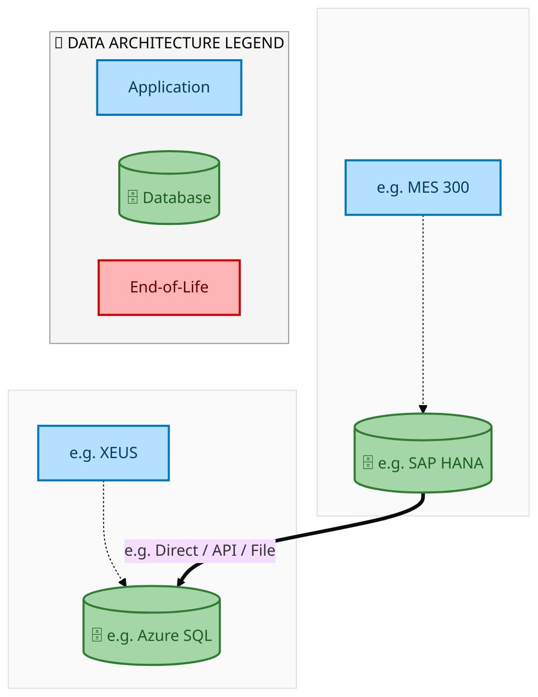
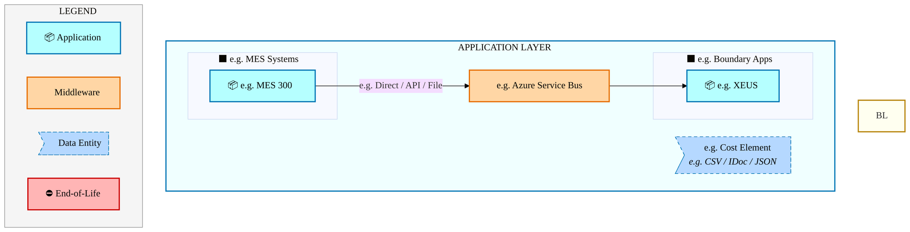
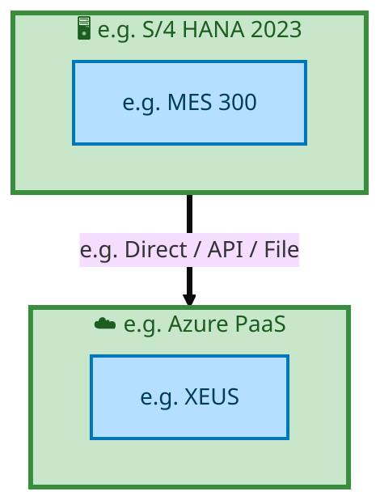

  <img src="data:image/svg+xml;base64,PHN2ZyB4bWxucz0iaHR0cDovL3d3dy53My5vcmcvMjAwMC9zdmciIHZpZXdCb3g9IjAgMCA4MDAgNDgwIiB3aWR0aD0iODAwIiBoZWlnaHQ9IjQ4MCI+DQogIDxkZWZzPg0KICAgIDxsaW5lYXJHcmFkaWVudCBpZD0iYmciIHgxPSIwJSIgeTE9IjAlIiB4Mj0iMTAwJSIgeTI9IjEwMCUiPg0KICAgICAgPHN0b3Agb2Zmc2V0PSIwJSIgc3R5bGU9InN0b3AtY29sb3I6IzAwNzFjNTtzdG9wLW9wYWNpdHk6MSIvPg0KICAgICAgPHN0b3Agb2Zmc2V0PSIxMDAlIiBzdHlsZT0ic3RvcC1jb2xvcjojMDBhZWVmO3N0b3Atb3BhY2l0eToxIi8+DQogICAgPC9saW5lYXJHcmFkaWVudD4NCiAgICA8bGluZWFyR3JhZGllbnQgaWQ9ImFjY2VudCIgeDE9IjAlIiB5MT0iMCUiIHgyPSIwJSIgeTI9IjEwMCUiPg0KICAgICAgPHN0b3Agb2Zmc2V0PSIwJSIgc3R5bGU9InN0b3AtY29sb3I6I2ZmZmZmZjtzdG9wLW9wYWNpdHk6MC4xNSIvPg0KICAgICAgPHN0b3Agb2Zmc2V0PSIxMDAlIiBzdHlsZT0ic3RvcC1jb2xvcjojZmZmZmZmO3N0b3Atb3BhY2l0eTowLjAyIi8+DQogICAgPC9saW5lYXJHcmFkaWVudD4NCiAgICA8cGF0dGVybiBpZD0iZ3JpZCIgd2lkdGg9IjQwIiBoZWlnaHQ9IjQwIiBwYXR0ZXJuVW5pdHM9InVzZXJTcGFjZU9uVXNlIj4NCiAgICAgIDxwYXRoIGQ9Ik0gNDAgMCBMIDAgMCAwIDQwIiBmaWxsPSJub25lIiBzdHJva2U9InJnYmEoMjU1LDI1NSwyNTUsMC4wNykiIHN0cm9rZS13aWR0aD0iMC41Ii8+DQogICAgPC9wYXR0ZXJuPg0KICA8L2RlZnM+DQoNCiAgPCEtLSBCYWNrZ3JvdW5kIC0tPg0KICA8cmVjdCB3aWR0aD0iODAwIiBoZWlnaHQ9IjQ4MCIgZmlsbD0idXJsKCNiZykiIHJ4PSI4Ii8+DQogIDxyZWN0IHdpZHRoPSI4MDAiIGhlaWdodD0iNDgwIiBmaWxsPSJ1cmwoI2dyaWQpIiByeD0iOCIvPg0KICA8cmVjdCB3aWR0aD0iODAwIiBoZWlnaHQ9IjQ4MCIgZmlsbD0idXJsKCNhY2NlbnQpIiByeD0iOCIvPg0KDQogIDwhLS0gRGVjb3JhdGl2ZSBjaXJjdWl0L2FyY2hpdGVjdHVyZSBsaW5lcyAtLT4NCiAgPGcgc3Ryb2tlPSJyZ2JhKDI1NSwyNTUsMjU1LDAuMTIpIiBzdHJva2Utd2lkdGg9IjEuNSIgZmlsbD0ibm9uZSI+DQogICAgPHBhdGggZD0iTSAwIDEwMCBMIDEyMCAxMDAgTCAxNjAgMTQwIEwgMjgwIDE0MCIvPg0KICAgIDxwYXRoIGQ9Ik0gMCAyNjAgTCA4MCAyNjAgTCAxMjAgMjIwIEwgMjAwIDIyMCBMIDI0MCAyNjAgTCAzNjAgMjYwIi8+DQogICAgPHBhdGggZD0iTSA1MjAgMTAwIEwgNjAwIDEwMCBMIDY0MCA2MCBMIDgwMCA2MCIvPg0KICAgIDxwYXRoIGQ9Ik0gNDQwIDM0MCBMIDU2MCAzNDAgTCA2MDAgMzAwIEwgNzIwIDMwMCBMIDc2MCAzNDAgTCA4MDAgMzQwIi8+DQogICAgPHBhdGggZD0iTSA2MDAgNDAwIEwgNjgwIDQwMCBMIDcyMCA0NDAiLz4NCiAgICA8cGF0aCBkPSJNIDAgNDAwIEwgNDAgNDAwIEwgODAgMzYwIi8+DQogICAgPHBhdGggZD0iTSAyMDAgNDIwIEwgMzIwIDQyMCBMIDM2MCAzODAgTCA0ODAgMzgwIi8+DQogICAgPHBhdGggZD0iTSA2NTAgNDQwIEwgNzUwIDQ0MCBMIDgwMCA0ODAiLz4NCiAgPC9nPg0KDQogIDwhLS0gRGVjb3JhdGl2ZSBub2RlcyAtLT4NCiAgPGcgZmlsbD0icmdiYSgyNTUsMjU1LDI1NSwwLjE4KSI+DQogICAgPGNpcmNsZSBjeD0iMTIwIiBjeT0iMTAwIiByPSI0Ii8+DQogICAgPGNpcmNsZSBjeD0iMjgwIiBjeT0iMTQwIiByPSI0Ii8+DQogICAgPGNpcmNsZSBjeD0iMjAwIiBjeT0iMjIwIiByPSI0Ii8+DQogICAgPGNpcmNsZSBjeD0iMzYwIiBjeT0iMjYwIiByPSI0Ii8+DQogICAgPGNpcmNsZSBjeD0iNjAwIiBjeT0iMTAwIiByPSI0Ii8+DQogICAgPGNpcmNsZSBjeD0iNzIwIiBjeT0iMzAwIiByPSI0Ii8+DQogICAgPGNpcmNsZSBjeD0iNTYwIiBjeT0iMzQwIiByPSI0Ii8+DQogICAgPGNpcmNsZSBjeD0iODAiIGN5PSIzNjAiIHI9IjQiLz4NCiAgICA8Y2lyY2xlIGN4PSI0ODAiIGN5PSIzODAiIHI9IjQiLz4NCiAgICA8Y2lyY2xlIGN4PSIzMjAiIGN5PSI0MjAiIHI9IjQiLz4NCiAgPC9nPg0KDQogIDwhLS0gVE9HQUYgQkRBVCBib3hlcyAtLT4NCiAgPGcgZm9udC1mYW1pbHk9IlNlZ29lIFVJLCBBcmlhbCwgc2Fucy1zZXJpZiIgZm9udC1zaXplPSIxNCIgZm9udC13ZWlnaHQ9IjYwMCI+DQogICAgPCEtLSBCIC0tPg0KICAgIDxyZWN0IHg9IjE1MCIgeT0iMTQwIiB3aWR0aD0iMTIwIiBoZWlnaHQ9IjQwIiByeD0iNSIgZmlsbD0icmdiYSgyNTUsMjU1LDI1NSwwLjE4KSIgc3Ryb2tlPSJyZ2JhKDI1NSwyNTUsMjU1LDAuMykiIHN0cm9rZS13aWR0aD0iMSIvPg0KICAgIDx0ZXh0IHg9IjIxMCIgeT0iMTY1IiB0ZXh0LWFuY2hvcj0ibWlkZGxlIiBmaWxsPSIjZmZmIj5CdXNpbmVzczwvdGV4dD4NCiAgICA8IS0tIEQgLS0+DQogICAgPHJlY3QgeD0iMjkwIiB5PSIxNDAiIHdpZHRoPSIxMjAiIGhlaWdodD0iNDAiIHJ4PSI1IiBmaWxsPSJyZ2JhKDI1NSwyNTUsMjU1LDAuMTgpIiBzdHJva2U9InJnYmEoMjU1LDI1NSwyNTUsMC4zKSIgc3Ryb2tlLXdpZHRoPSIxIi8+DQogICAgPHRleHQgeD0iMzUwIiB5PSIxNjUiIHRleHQtYW5jaG9yPSJtaWRkbGUiIGZpbGw9IiNmZmYiPkRhdGE8L3RleHQ+DQogICAgPCEtLSBBIC0tPg0KICAgIDxyZWN0IHg9IjQzMCIgeT0iMTQwIiB3aWR0aD0iMTIwIiBoZWlnaHQ9IjQwIiByeD0iNSIgZmlsbD0icmdiYSgyNTUsMjU1LDI1NSwwLjE4KSIgc3Ryb2tlPSJyZ2JhKDI1NSwyNTUsMjU1LDAuMykiIHN0cm9rZS13aWR0aD0iMSIvPg0KICAgIDx0ZXh0IHg9IjQ5MCIgeT0iMTY1IiB0ZXh0LWFuY2hvcj0ibWlkZGxlIiBmaWxsPSIjZmZmIj5BcHBsaWNhdGlvbjwvdGV4dD4NCiAgICA8IS0tIFQgLS0+DQogICAgPHJlY3QgeD0iNTcwIiB5PSIxNDAiIHdpZHRoPSIxMjAiIGhlaWdodD0iNDAiIHJ4PSI1IiBmaWxsPSJyZ2JhKDI1NSwyNTUsMjU1LDAuMTgpIiBzdHJva2U9InJnYmEoMjU1LDI1NSwyNTUsMC4zKSIgc3Ryb2tlLXdpZHRoPSIxIi8+DQogICAgPHRleHQgeD0iNjMwIiB5PSIxNjUiIHRleHQtYW5jaG9yPSJtaWRkbGUiIGZpbGw9IiNmZmYiPlRlY2hub2xvZ3k8L3RleHQ+DQogIDwvZz4NCg0KICA8IS0tIENvbm5lY3RpbmcgbGluZXMgYmV0d2VlbiBCREFUIGJveGVzIC0tPg0KICA8ZyBzdHJva2U9InJnYmEoMjU1LDI1NSwyNTUsMC4yNSkiIHN0cm9rZS13aWR0aD0iMSI+DQogICAgPGxpbmUgeDE9IjI3MCIgeTE9IjE2MCIgeDI9IjI5MCIgeTI9IjE2MCIvPg0KICAgIDxsaW5lIHgxPSI0MTAiIHkxPSIxNjAiIHgyPSI0MzAiIHkyPSIxNjAiLz4NCiAgICA8bGluZSB4MT0iNTUwIiB5MT0iMTYwIiB4Mj0iNTcwIiB5Mj0iMTYwIi8+DQogIDwvZz4NCg0KICA8IS0tIE1haW4gdGl0bGUgLS0+DQogIDx0ZXh0IHg9IjQwMCIgeT0iMjYwIiB0ZXh0LWFuY2hvcj0ibWlkZGxlIiBmb250LWZhbWlseT0iU2Vnb2UgVUksIEFyaWFsLCBzYW5zLXNlcmlmIiBmb250LXNpemU9IjM2IiBmb250LXdlaWdodD0iNzAwIiBmaWxsPSIjZmZmZmZmIiBsZXR0ZXItc3BhY2luZz0iMSI+DQogICAgSUFPIEFyY2hpdGVjdHVyZQ0KICA8L3RleHQ+DQogIDx0ZXh0IHg9IjQwMCIgeT0iMzAwIiB0ZXh0LWFuY2hvcj0ibWlkZGxlIiBmb250LWZhbWlseT0iU2Vnb2UgVUksIEFyaWFsLCBzYW5zLXNlcmlmIiBmb250LXNpemU9IjE4IiBmb250LXdlaWdodD0iNDAwIiBmaWxsPSJyZ2JhKDI1NSwyNTUsMjU1LDAuOCkiIGxldHRlci1zcGFjaW5nPSIyIj4NCiAgICBUT0dBRiBCREFUIMK3IElBTyBQcm9ncmFtIMK3IElETSAyLjANCiAgPC90ZXh0Pg0KDQogIDwhLS0gQm90dG9tIGFjY2VudCBiYXIgLS0+DQogIDxyZWN0IHg9IjI4MCIgeT0iMzQwIiB3aWR0aD0iMjQwIiBoZWlnaHQ9IjMiIHJ4PSIxLjUiIGZpbGw9InJnYmEoMjU1LDI1NSwyNTUsMC40KSIvPg0KDQogIDwhLS0gSW50ZWwgdGV4dCAtLT4NCiAgPHRleHQgeD0iNDAwIiB5PSIzODAiIHRleHQtYW5jaG9yPSJtaWRkbGUiIGZvbnQtZmFtaWx5PSJTZWdvZSBVSSwgQXJpYWwsIHNhbnMtc2VyaWYiIGZvbnQtc2l6ZT0iMTMiIGZpbGw9InJnYmEoMjU1LDI1NSwyNTUsMC41KSIgbGV0dGVyLXNwYWNpbmc9IjMiPg0KICAgIElOVEVMIENPTkZJREVOVElBTA0KICA8L3RleHQ+DQo8L3N2Zz4NCg==" alt="IAO Architecture" style="width:100%; border-radius:8px;" />
  <h1 style="font-size:36px; margin-top:24px;">E2E-114 — R4 SIMS Harvest Process</h1>
  <h2 style="font-size:24px;">Architecture Document (TOGAF BDAT)</h2>
  
End-to-End Integrated Processes (E2E) Tower 
  Capability E2E-114 · Procure to Pay

  
IAO Program · R1 – R5 
  Generated: April 2026 
  Sajiv Francis

  
IAO Architecture Pipeline — Intel Confidential

Page 1<a href="#toc">↑ Back to TOC</a>E2E-114 — R4 SIMS Harvest Process

## Table of Contents

<nav class="toc">
<ol>
  <li><a href="#1-executive-summary">1. Executive Summary</a></li>
  <li><a href="#2-business-context-objectives">2. Business Context &amp; Objectives</a>
    <ul>
      <li><a href="#21-classification">2.1 Classification</a></li>
      <li><a href="#22-business-drivers">2.2 Business Drivers</a></li>
      <li><a href="#23-success-criteria">2.3 Success Criteria</a></li>
      <li><a href="#24-companion-documents">2.4 Companion Documents</a></li>
    </ul>
  </li>
  <li><a href="#3-business-architecture-togaf-b">3. Business Architecture (TOGAF &ldquo;B&rdquo;)</a>
    <ul>
      <li><a href="#31-business-process-overview">3.1 Business Process Overview</a></li>
      <li><a href="#32-business-process-diagrams">3.2 Business Process Diagrams</a></li>
      <li><a href="#33-business-roles-responsibilities">3.3 Business Roles &amp; Responsibilities</a></li>
    </ul>
  </li>
  <li><a href="#4-data-architecture-togaf-d">4. Data Architecture (TOGAF &ldquo;D&rdquo;)</a>
    <ul>
      <li><a href="#41-data-entities-ownership">4.1 Data Entities &amp; Ownership</a></li>
      <li><a href="#42-data-flow-diagrams">4.2 Data Flow Diagrams</a></li>
      <li><a href="#43-data-lineage">4.3 Data Lineage</a></li>
      <li><a href="#44-ricefw-data-objects">4.4 RICEFW Data Objects</a></li>
      <li><a href="#45-data-governance-quality">4.5 Data Governance &amp; Quality</a></li>
    </ul>
  </li>
  <li><a href="#5-application-architecture-togaf-a">5. Application Architecture (TOGAF &ldquo;A&rdquo;)</a>
    <ul>
      <li><a href="#51-current-state-current-state-application-landscape">5.1 Current-State Application Landscape</a></li>
      <li><a href="#52-future-state-future-state-application-landscape">5.2 Future-State Application Landscape</a></li>
      <li><a href="#53-change-impact-summary">5.3 Change Impact Summary</a></li>
      <li><a href="#54-component-overview">5.4 Component Overview</a></li>
      <li><a href="#55-ricefw-inventory">5.5 RICEFW Inventory</a></li>
      <li><a href="#56-integration-patterns">5.6 Integration Patterns</a></li>
    </ul>
  </li>
  <li><a href="#6-technology-architecture-togaf-t">6. Technology Architecture (TOGAF &ldquo;T&rdquo;)</a>
    <ul>
      <li><a href="#61-platform-infrastructure">6.1 Platform &amp; Infrastructure</a></li>
      <li><a href="#62-sap-development-object-status">6.2 SAP Development Object Status</a></li>
      <li><a href="#63-nfrs-design-principles">6.3 NFRs &amp; Design Principles</a></li>
      <li><a href="#64-security-governance">6.4 Security &amp; Governance</a></li>
    </ul>
  </li>
  <li><a href="#7-project-context">7. Project Context</a>
    <ul>
      <li><a href="#71-project-roadmap-go-live-plan">7.1 Project Roadmap &amp; Go-Live Plan</a></li>
      <li><a href="#72-raid-log">7.2 RAID Log</a></li>
      <li><a href="#73-recommendations-next-steps">7.3 Recommendations &amp; Next Steps</a></li>
    </ul>
  </li>
</ol>
</nav>

Page 2<a href="#toc">↑ Back to TOC</a>E2E-114 — R4 SIMS Harvest Process

## 1. Executive Summary

This Architecture Document defines the **Business, Data, Application, and Technology** (BDAT) architecture for **E2E-114 R4 SIMS Harvest Process** within the IAO program. It includes 4 BPMN process diagram(s) in Section 3.

| Dimension | Value |
|-----------|-------|
| **Tower** | End-to-End Integrated Processes (E2E) |
| **Process Group** | Procure to Pay |
| **Capability** | E2E-114 - R4 SIMS Harvest Process |
| **Release** | R1 – R5 |
| **Total Systems** | 2 |
| **System Status** | 0 Deployed, 0 Developing, 0 EOL, 2 Pending IAPM |
| **RICEFW Objects** | Pending — Smartsheet Object Tracker API integration |

**Change Summary**: 0 new flow chains, 0 removed, 0 modified, 1 unchanged between Current-State and Future-State states.

> All system nodes in architecture diagrams are **IAPM-linked** — click any node to open its IAPM page. Diagrams require `securityLevel: 'loose'` for click events.

Page 3<a href="#toc">↑ Back to TOC</a>E2E-114 — R4 SIMS Harvest Process

## 2. Business Context & Objectives

### 2.1 Classification

| Level | Value |
|-------|-------|
| **L0 Tower** | End-to-End Integrated Processes |
| **L1 Process** | Procure to Pay |
| **L2 Capability** | E2E-114 - R4 SIMS Harvest Process |

### 2.2 Business Drivers

| # | Driver | Description | Strategic Alignment | Priority |
|---|--------|-------------|---------------------|----------|
| 1 | End-to-End Process Integration | Enable cross-tower integrated processes spanning procurement, manufacturing, and fulfillment | IDM 2.0 Process Excellence | High |
| 2 | Intel Foundry Business Enablement | Stand up foundry-specific business processes for external customer engagement | Intel Foundry Services | High |
| 3 | Process Visibility & Monitoring | Provide end-to-end process visibility across tower boundaries with integrated monitoring | Operational Excellence | Medium |
| 4 | E2E-114 Process Migration | Migrate R4 SIMS Harvest Process business processes and 2 integrated systems from legacy to S/4 HANA target architecture | IDM 2.0 Cross-Functional / End-to-End | High |

Page 4<a href="#toc">↑ Back to TOC</a>E2E-114 — R4 SIMS Harvest Process

### 2.3 Success Criteria

| Metric | Target | Measure | Baseline | Owner |
|--------|--------|---------|----------|-------|
| E2E Process Cycle Time | Per process SLA | End-to-end transaction completion within defined SLA per process | Varies by process | E2E Process Owner |
| Cross-Tower Integration Success | > 99% | Transactions completing across tower boundaries without manual intervention | 92% (current) | Integration Lead |
| Process Exception Rate | < 2% | Transactions requiring manual exception handling | 8% (current) | Operations Manager |
| E2E-114 Migration Completeness | 100% flow chains validated | All 1 flow chains verified in target state | 0% (pre-migration) | Tower Architect |

### 2.4 Companion Documents

| Document | Description |
|----------|-------------|
| **Business Architecture** | Included in this document (Section 3) — process flows from BPMN diagrams |
| **This Document** | Full BDAT Architecture — Business + Data + Application + Technology |

Page 5<a href="#toc">↑ Back to TOC</a>E2E-114 — R4 SIMS Harvest Process

## 3. Business Architecture (TOGAF "B")

### 3.1 Business Process Overview

This capability includes **4 business process(es)** modeled in BPMN 2.0, covering the end-to-end workflow for E2E-114 R4 SIMS Harvest Process.

| # | Step ID | Process Name | Lanes | Tasks | Gateways |
|---|---------|--------------|-------|-------|----------|
| 1 | E2E-114A_SIMS_Harvest_Process | E2E-114A_SIMS_Harvest_Process | External Partners/Supplier , LE750 ODM Virtual

, LEXXX (E.g.- Costa-Rica)

 | 15 | 4 |
| 2 | E2E-114B_SIMS_Harvest_Process | E2E-114B_SIMS_Harvest_Process | External Partners/Supplier

, LE750 ODM Virtual

 | 17 | 4 |
| 3 | E2E-114C_SIMS_Harvest_Process | E2E-114C_SIMS_Harvest_Process | External Partners/Suppliers, LE570 Front Office , LE750 ODM Virtual  | 12 | 3 |
| 4 | E2E-114D_SIMS_Harvest_Process | E2E-114D_SIMS_Harvest_Process | Boundary Apps, External Partners/Suppliers, LE570 ODM Virtual, LEXXX (E.g. - Costa Rica) | 20 | 6 |

Page 6<a href="#toc">↑ Back to TOC</a>E2E-114 — R4 SIMS Harvest Process

### 3.2 Business Process Diagrams

#### BUSINESS ARCHITECTURE — 3.2.1 E2E-114A_SIMS_Harvest_Process — E2E-114A_SIMS_Harvest_Process

**Swim Lanes**: External Partners/Supplier  · LE750 ODM Virtual
 · LEXXX (E.g.- Costa-Rica)

 | **Tasks**: 15 | **Gateways**: 4

> **Legend**: ● Start · ● End · User Task · Service Task · ◇ Gateway · Sub-Process

<a href="https://mermaid.live/view#pako:eNqlV2tv4jgU_StWRhUdCTpJSAjwYaWWRxepqFVpZ0ZaViuTOBDV2FnbaWE7_Pe9TmIeaRjtox_a3pN7z7kvm_BuhTwiVt-6uHhPWKL66L2hVmRNGn3UWGBJGk1UAF-xSPCCEtnQPjFnapb8lbs5XrrRbhob43VCtxqdkSUn6HnSRNcQSJtIYiZbkogkbjQbqUjWWGwHnHKhvT-RbmzHuVr56IaLiIiDg20HTuhDKE0YOcDtwAu8sY6TJOQsOiGN_bgbh42dTo7yt3CFhcrTzySZ4s23JFIrsGNMJQGflVrTO7wgVNeoRKaxMBOvphmJ1DoMGjZLcZiwJeCeDZDA7OUA-fZuh3YXF3O2F0V3j3OG4CekWMohiZFUAI9eFYoTSvufvMH12LebUgn-Qvqf3FEwbLvNUFfSh9Ltpm5u640ky5XqLziNStfWm66h76abptj0XbsptvC7okVYdFAadNyu290r3QTOwBkYpTiO_5cS9FU8YflSao3aY3c83Gs5fscf2B_5TJlDL7h2qn0i4jUJyRHpeDxujw6tGnV8xz5PejNud-xBhXSJFXnD2wNhb-DtCcd-MHaCs4SFXjXLbPEgeGgI2yN_7O8JgxtnfO2eJfSuHa9bZgg8S4HTFaKYkT_s3-bWaKOIYJiiB9gXRoT8MsvSlCZEoLn1exGlf5ijvR9JeIV-xbCyUpEoj5EIK3Q_nCITtw-DtahTdYDnbhT4dh71NREqA_mKmHYaCAJ9RBO24BmL0JDQ5JWIbcXTBc8HLhW65TySCDIkSarQMxOQo0hCnedM8fAFXZZanysM7YPWDMMFhO71zVBx8sEpxv0Yt_QOIpPblwGaPd23HPSWqFXegiv0AGUqhCW6G33__r3C073cE6UUVmQCl2KSS-c5PsFRlzEI5DkgPXQiJXB8PiJxvQOJVDw9msiEvRKmuNgWjXgFqBzPHQ-xSjircunCbtBsMp0ZmiPVY8fe-7sRxULwN9nCVKEUC0wpobfFys-t3e6n03fz6UNf0OXoannVQgOYHW49JiH-XF0CcH1OKcdRbYF5x4ckgkj9YDqdDNHlty8cKocGEhaSyqDdw5zvM_WzpdIb8TRFo_WCRBGJTh96euGS8AUuY4SZPgTF_89pBNSVrvmn2zmRMiOnHh3wuCVw8sw-QYUcbqRTr-CQ-0Mm4M6XpG5NuzpxkSyXsDu3TzM0WJHw5dSlp5kwDTOqyZ7wppqy49Wu-l72kfx5hS4fSZqJlIMN2xJloaqeqs65Ra-bZTHmymo6wTmK41xQzAU6ZJMW2VSpepUTk5-zlAuVnwk0xQwv4SUEzu1oQ8JMkWoyrv0PzlxRxsdYpxI7YXDphnydYrY180ZmCT5Eu9Xc9cxQiGlWDPFDQLsSoDch1JuAtCYlNSGdf3e4i6DgvwR1_-M1AhuFWq1f4K-x_cJ2S9stzY6xS_92xfZKu13S9UrbK2y_NA17YMKDAuhUbMepArZJ0CkpjILbKz1Myk6paTRKBrdrAroFULUNoWNr-8fc8m7cufXjSMopq3NNOSaXfXIllWMcyu64-_aafpp-OaY-r5KNYzpcluea8srnbvvobSYv2rzGneL-Gbyzf5k9xYMzePcM3itfVE9Q165FnVrUrUXbtahXi_r1ucFulu-Mp3BQD3fr4Z6Braa1JmKNk8jqv1v51yv4ChaRGGdUWbumhTPFZ1sWWv38a4iV5Z9dwwTDJ_W6AHd_AxsoOFM=" title="View full diagram">&#128065; View Diagram</a>

Page 7<a href="#toc">↑ Back to TOC</a>E2E-114 — R4 SIMS Harvest Process

#### BUSINESS ARCHITECTURE — 3.2.2 E2E-114B_SIMS_Harvest_Process — E2E-114B_SIMS_Harvest_Process

**Swim Lanes**: External Partners/Supplier
 · LE750 ODM Virtual

 | **Tasks**: 17 | **Gateways**: 4

> **Legend**: ● Start · ● End · User Task · Service Task · ◇ Gateway · Sub-Process

<a href="https://mermaid.live/view#pako:eNqlVltv4jgU_itWqoqOBNPYJITmYSUayGylIlBhuw_b1cokDlh1nKzjAB3Ef1-bXCCZoh3t8oB0vnznfOfi28EIkpAYrnF7e6CcShccOnJDYtJxQWeFM9LpggJ4xYLiFSNZR3OihMsF_X6iQSvda5rGfBxT9qHRBVknBPz21AUj5ci6IMM862VE0KjT7aSCxlh8eAlLhGbfkGFkRie18tNjIkIizgTTdGBgK1dGOTnDfcdyLF_7ZSRIeNgIGtnRMAo6R50cS3bBBgt5Sj_PyBTvf6eh3Cg7wiwjirORMXvGK8J0jVLkGgtysa2aQTOtw1XDFikOKF8r3DIVJDB_P0O2eTyC4-3tG69FwXL8xoH6BQxn2ZhEIJMKnmwliChj7o3ljXzb7GZSJO_EvUETZ9xH3UBX4qrSza5ubm9H6Hoj3VXCwpLa2-kaXJTuu2LvIrMrPtR_S4vw8KzkDdAQDWulRwd60KuUoij6X0qqr2KJs_dSa9L3kT-utaA9sD3zx3hVmWPLGcF2n4jY0oBcBPV9vz85t2oysKF5Peij3x-YXivoGkuywx_ngA-eVQf0bceHztWAhV47y3w1F0lQBexPbN-uAzqP0B-hqwGtEbSGZYYqzlrgdAMY5uQv8483Y7KXRHDMwFytF05Edr_I05RRIsCb8WfhpX8cKvILCQjdEjCfASzBbDwFFbnJRYo7JyJKRAxmepuBUfDOkx0j4VptdS7vvSSOqay91Ar6LEGt-TxxbPOk9UqFzFWmTa3-D1qvmNEQS5rwJtNSzLE6H1QB0yl4GgN9_oQg4SDIM5nEyjXVe4nn8apdkX2h4gkSUgm8DQnewd2WYuAvvOmXpsNAOSwFXa9V1G_LRcFuUhxF8TALcqaWC5gLqvd3kzK8kJ1irqvXPAJmWyIEDUmT_nBBHy3nVYp1nc8Eh0DSmLSShXoleAmPaNXE1nc9CFW2znORrxQTzHOhTp6MgBfy91dw90LSXKRJputIwjyQbQV0EWH50kOnlfMVzNWcJcAZKMbsC3U4gFkUqRpbAfrXUyjG3pvPUMvH-vchQLsxhSXek6zF0KO8WL_3VaOa-i0nPdxWgsEp-7BFHN4pZoTdCPdSps6MJ3VLUp3KtXl_ufTWE_fA4mm6AL9idZNkUg8gIFmrCKQnPP4Zoh716GeI6HCoEtd3fG-lbqlgA8g-YHmmNtm34hB8M47HS7f-2Q0LkeyyHmZSbzzMGGFXnKz_4mR_6kT5tfzqQ4j3Qa_3izowStMqTLs07cIclOagMBEqbTgsgGFpI1TYTmkPW3ynsB9K86EwoVmFM0t-v4pXZgdhG6gzKAFUFQDLFGAlgsqSYM0oPdrfq5pRSaiSgKUN66xKu-oKrNpS11G2DVUhodUCUMmAVadg2ZrLO_vU3-px08QfPseReQWHV3BU3d9NuP85bH0O2xVsdA11s8SYhoZ7ME5PXfUcDkmEcyaNY9fAuUwWHzww3NOT0MhTdXmRMcXqIowL8PgP_G9utQ==" title="View full diagram">&#128065; View Diagram</a>

Page 8<a href="#toc">↑ Back to TOC</a>E2E-114 — R4 SIMS Harvest Process

#### BUSINESS ARCHITECTURE — 3.2.3 E2E-114C_SIMS_Harvest_Process — E2E-114C_SIMS_Harvest_Process

**Swim Lanes**: External Partners/Suppliers · LE570 Front Office  · LE750 ODM Virtual  | **Tasks**: 12 | **Gateways**: 3

> **Legend**: ● Start · ● End · User Task · Service Task · ◇ Gateway · Sub-Process

<a href="https://mermaid.live/view#pako:eNqlVm1vozgQ_isWVZVdKbkFAiHlw0nNC3uRGjVq2r0Pl9PJAZNYNTayTdtsNv_9bDB5YclJd8eHiHkyzzOe8Xjw3opZgqzQur3dY4plCPYduUUZ6oSgs4YCdbqgAr5BjuGaINHRPimjcom_l26Ol39oN41FMMNkp9El2jAEXmZdcK-IpAsEpKInEMdpp9vJOc4g340ZYVx736BhaqdlNPPXiPEE8ZODbQdO7CsqwRSd4H7gBV6keQLFjCYXoqmfDtO4c9CLI-w93kIuy-UXAs3hx-84kVtlp5AIpHy2MiMPcI2IzlHyQmNxwd_qYmCh41BVsGUOY0w3CvdsBXFIX0-Qbx8O4HB7u6LHoODhaUWBemIChZigFAip4OmbBCkmJLzxxveRb3eF5OwVhTfuNJj03W6sMwlV6nZXF7f3jvBmK8M1I4lx7b3rHEI3_-jyj9C1u3ynfhuxEE1OkcYDd-gOj5FGgTN2xnWkNE3_VyRVV_4MxauJNe1HbjQ5xnL8gT-2f9ar05x4wb3TrBPibzhGZ6JRFPWnp1JNB75jXxcdRf2BPW6IbqBE73B3Erwbe0fByA8iJ7gqWMVrrrJYLziLa8H-1I_8o2AwcqJ796qgd-94Q7NCpbPhMN8CAin6y_5jZU0_JOIUErBQ_UIRF1-WRZ4TrN5W1p8VSz90oJyfUIzwGwJjluWMIioFgBI8TuagJq0K17bXl8ygDIPiQiIwf1qAp4Jq2rJYjxn9otlTmrQRh4r4kieqmOAJQdKTONOxqSiyXGJG2zhO_5NipTBMYS8nag_qiDM1fbCSSpT_54qg-ratLI4SeJj6gQ0irnoVPKap6hBwGedOOY050mt7LOSaFTQBE0RUdfiusSJd5meVZLZGSYJaM3V0zAWOX9UJB1BJLWD1XqUvWjmu5jAhwVfGEgFmQhSo4TI4FUNIloNnNUlEzriEun5gDincqNmrkqw2SBf1WJ5K4m6_ryUg5-xd9CCRIIccEoLI16rTV9bhcEZy7X9HurIRbrkRgW-XLfYNc1moRm2keNqH5fNjzwVVqcqG_AUslI4EUIBK5nw_20rqnsRm9J_2tK9Lj3jKeGaqXx6NXIIXypE6iThWnQaWksWv4JNZ-WfQFtP7SarcSMBSEJ-O2VHDpLd4dNvE_Lolzk4JmLO3ao99r9_aSF6jS47H-0LGtCIwQyBpNop_TcVklADJLmdFQ0DPiRFYzuZL8BtUX0WVhh56SDQmkTP8j91F70Cv96vuaWM7NWA3AacGHAO4NeBWQP1pUi8VMGjYNcH4O8NaYFgBfWMPtPljZXkjd2X9OHPsV36eMYPKPMpUZp2JEfWN6ZugNdkzdv2_Y8SD2jaLduosHBPu_HNZ0up7xSXumTvAJeq3ooNWNLiiPKw_ppfwXSusam9gq2tliGcQJ1a4t8oLprqEJiiFBZHWoWvBQrLljsZWWF7ErKLs7gmGav5kFXj4GxhiUFw=" title="View full diagram">&#128065; View Diagram</a>

Page 9<a href="#toc">↑ Back to TOC</a>E2E-114 — R4 SIMS Harvest Process

#### BUSINESS ARCHITECTURE — 3.2.4 E2E-114D_SIMS_Harvest_Process — E2E-114D_SIMS_Harvest_Process

**Swim Lanes**: Boundary Apps · External Partners/Suppliers · LE570 ODM Virtual · LEXXX (E.g. - Costa Rica) | **Tasks**: 20 | **Gateways**: 6

> **Legend**: ● Start · ● End · User Task · Service Task · ◇ Gateway · Sub-Process

<a href="https://mermaid.live/view#pako:eNqlV21v4jgQ_itWVhWtBNu8EKB8uBXQ0EVqlwq6256W08kkDkRr4shxWnpd_vuNEztAGk53e_1Q4SeeZ8Yzz0ycN8NnATH6xtnZWxRHoo_eGmJNNqTRR40lTkmjiQrgG-YRXlKSNuSekMViHv2Vb7PayVZuk9gYbyL6KtE5WTGCvk6aaACGtIlSHKetlPAobDQbCY82mL-OGGVc7v5AeqEZ5t7UoyHjAeH7DabZtXwXTGkUkz3sdNvd9ljapcRncXBEGrphL_QbOxkcZS_-GnORh5-l5A5vH6NArGEdYpoS2LMWG3qLl4TKMwqeSczP-LNORpRKPzEkbJ5gP4pXgLdNgDiOf-wh19zt0O7sbBGXTtHtbBEj-PMpTtNrEqJUAOw9CxRGlPY_tEeDsWs2U8HZD9L_YHvda8du-vIkfTi62ZTJbb2QaLUW_SWjgdraepFn6NvJtsm3fdts8lf4X_FF4mDvadSxe3av9DTsWiNrpD2FYfi_PEFe-QNOfyhfnjO2x9elL8vtuCPzPZ8-5nW7O7CqeSL8OfLJAel4PHa8faq8jmuZp0mHY6djjiqkKyzIC37dE16N2iXh2O2Ore5JwsJfNcpsec-Zrwkdzx27JWF3aI0H9knC9sBq91SEwLPiOFkjimPyp_l9YQxZlosaDZIkXRh_FPvkX2x14fmUr3AMjYgeQIRpwrhoTWJBKJqxTIAe0U0WBQSdT2Y3F4vMNs1lhaQHJDOCgzkLBfqGaRRgEbH40tv6JJG_0GccB1RSyXkQIEB4BnMASiOypMJ2lbP5JHomaJ4lCY0IR5P4mUENL5FnTxMSXz6SJZw0EuTY2DYPjO9wnGGqTVP0sOYsW63RdDSrWF29vS2MEPdD3JKzrLWERPhrRLY-zVKguimKvTB2uwMzx6w3G9pDxLh082lvAQ1UVx8L4vW2gvAYIr2Hfo4JTy_1sSvVasPme8JDxjdohDmXiZkTSvw8x88RRnV1W7NUQM5hpFG8ZDwvDbqHKmNaV033wMkNY0GK7iP_B8oSdK58XqDCDk3leEXpOko2JBbHNB2gmcMTJBi69Z6enpD3cfURooCp1ZpFPj7eLnU4w1FKdLlQyNkGTa_vSg1UaiYdDNF8cjcHdcGATQWS_UPSfdJO5NwGy1vP7Zo5_beIC5DJMXvvXRJyUSVCHR2vcBSDx3m29GU2p-hc8VwcE10dEE3ipexEdE0oaAr68SUSa_SZwcRDg4g_wjQZQvOjL9lmCXk9_zx4HNY3nFT5wx3yYF8QkKDy1Drw6T1jmmFZf32AORGCElkwdO7N5hdSQWFLOgbJVJjsA6ZpJirhjzjJxVQxcg6MpHSkEqH9Qd3F768JjAdSHUS5tkEcKt2TNM3IqaRaUqM3BFoFiNDkclSKphAbArWdS7m1DvRW5ZD6UYJ5N2YqUmuff9d9ngqWvNuO7vMWA6uLQzO3YlaO16IFYTzhVVEIb0v8TKXyiKL7S4PJ7tWb6XAHvpzLoIlP1Ylm7Q2h19lL2sJUoARzTCmhJ8ag_d-MTnSlk3flky4dUrVDdbU72Z1YqGGjG_R-2rIq1fzXdXf-oXcrnFal1MdR1cvD_jVVORUzHVmg2zIpQj60LFMet1Gr9Zt876u11S0AV62viqWj7lDwowB6lbVlVoCOWveKpa0d2MqBZVUBW4fgKKCtARWko3fYKipLR2FpLxqwc-DnwvhdDpafsr2rT76w_IGOy7EVp1sBHO2jo3zosGwFlGGaaoNmsCzlymnJWb7BAnouZvDOiLEsrS-_fRDUBsHczYOxr7Spjqb0rrjLOpiKO7-8SFOz-gSuHcXRS1KVttKLbVYBtS5L4SpArVWpHO3L1Qcc2vDexHAZQ_I2lrvVnCpLZeCK0Tm47spzqS-KY9SuRZ1atF2LurVop_xWOsa7-hp_DPfq4ataGPJfC1v1sK1ho2lsCN_gKDD6b0b-fQzf0AEJcUaFsWsaOBNs_hr7Rj__jjSy_L15HWEYmpsC3P0N3RXB5g==" title="View full diagram">&#128065; View Diagram</a>

Page 10<a href="#toc">↑ Back to TOC</a>E2E-114 — R4 SIMS Harvest Process

### 3.3 Business Roles & Responsibilities

| Role / Lane | Processes Involved | Description |
|------------|-------------------|-------------|
| External Partners/Supplier  | E2E-114A_SIMS_Harvest_Process,  | |
| LE750 ODM Virtual
 | E2E-114A_SIMS_Harvest_Process, E2E-114B_SIMS_Harvest_Process,  | |
| LEXXX (E.g.- Costa-Rica)
 | E2E-114A_SIMS_Harvest_Process,  | |
| External Partners/Supplier
 | E2E-114B_SIMS_Harvest_Process,  | |
| External Partners/Suppliers | E2E-114C_SIMS_Harvest_Process, E2E-114D_SIMS_Harvest_Process | |
| LE570 Front Office  | E2E-114C_SIMS_Harvest_Process,  | |
| LE750 ODM Virtual  | E2E-114C_SIMS_Harvest_Process,  | |
| Boundary Apps | E2E-114D_SIMS_Harvest_Process | |
| LE570 ODM Virtual | E2E-114D_SIMS_Harvest_Process | |
| LEXXX (E.g. - Costa Rica) | E2E-114D_SIMS_Harvest_Process | |

Page 11<a href="#toc">↑ Back to TOC</a>E2E-114 — R4 SIMS Harvest Process

## 4. Data Architecture (TOGAF "D")

### 4.1 Data Entities & Ownership

| # | Data Entity | Source System | Target System | Data Owner | Classification | Volume | Master/Transaction |
|---|-------------|---------------|---------------|------------|----------------|--------|-------------------|
| 1 | e.g. Cost Element | e.g. MES 300 | e.g. XEUS | Data steward | e.g. Intel Confidential | e.g. 10K rows/day | Master / Transaction |

Page 12<a href="#toc">↑ Back to TOC</a>E2E-114 — R4 SIMS Harvest Process

### 4.2 Data Flow Diagrams

> **DATA ARCHITECTURE** — Database-to-database data flows. Applications (blue) sit above their hosting databases (green cylinders). Thick arrows show data movement between databases.

#### 4.2.1 Current-State — Current-State Data Flows

<a href="https://mermaid.live/view#pako:eNqdlYtumzAUhl_F8hRpk5KOJCVZkVrJXLJWolVX0m1SmZADJrHqYARmTZrm3WcDoV0Wuqq2hMy5_Mf-DjIbGPKIQAN2OhuaUGGAjQ_FgiyJDw3gwxnO5aorVzkJi4yKtUt-E1Y5Gec7b5nyHWcUzxjJlVvqxDwRHn2spfp6uqqClX2Cl5StK49H5pyA24suQFJAim_LKMYfwgXORK1W5OQSr37QSCyUJcYsJypuIZbMxTPCyrIiK0prIo_lpTikyVyZh7oyZji5f2E81rdbsO10_KSpBaamnwA5Qobz3CYxwGlq8hWIKWPGB1O3J5NJNxcZvyfGB00bj81R_dp7UFszBumqG3LGM-Ue2vq-XjSz1qyWQ7o9QuNGbuCM7eGgVa5v6s5A25MjnD1vbzIxdVNv9CxLk6NVbzRSbj-pFPNiNs9wugDOwOn3jy0bWW5AgnmAHouMBN43986HkuGvKlyNiGYkFJQnDTU1mnxUpv90bj2ZSY7mR0CtpYJhGBXVA0n2Xs2PPvSL6Mswks8oPPaLmGjy1EqtDAIyyIeflGZJ9tV9gN5R76y1VpVKkqgGItaMtNPYIUdqNsgdTc2_kffld_8_yB66Ds7RFXof40vHC4aatsMsX4F8fRPppvAroGUMUDFv4lzv5SDqXbE3kd4Fvwt0S2Fwenr2VFOyS7LgM0DXF_I5oUxeVE-vfB17LXTJXJ7g7gW2MNKAjaYIoBvr_GLqWNPbGwe4zlfnym5pqnvzbHUD1X6UpoyGWHkPN9AN7JZm2Vjg6sI-1Cc3cKS8k0Q9HvdcGpNKvrpADnakOuGOv65mw__k5OQf-LALlyRbYhpBY1P9EuSfJSIxLpiQlzrEheDeOgmhUV7TsEgjLIhNsSS6rIzbPwtiAWY=" title="View full diagram">&#128065; View Diagram</a>

Page 13<a href="#toc">↑ Back to TOC</a>E2E-114 — R4 SIMS Harvest Process

#### 4.2.2 Future-State — Future-State Data Flows

<a href="https://mermaid.live/view#pako:eNqdlYtumzAUhl_F8hRpk5KOJCVZkVrJBFgr0aor6TapTMgBk1h1MAKzJk3z7rOB0C4LXVVbQuZc_mN_B5kNDHlEoAE7nQ1NqDDAxodiQZbEhwbw4QznctWVq5yERUbF2iW_CaucjPOdt0z5jjOKZ4zkyi11Yp4Ijz7WUn09XVXByu7gJWXryuOROSfg9qILkBSQ4tsyivGHcIEzUasVObnEqx80EgtliTHLiYpbiCVz8YywsqzIitKayGN5KQ5pMlfmoa6MGU7uXxiP9e0WbDsdP2lqganpJ0COkOE8t0gMcJqafAViypjxwdQtx3G6ucj4PTE-aNp4bI7q196D2poxSFfdkDOeKffQ0vf1otlkzWo5pFsjNG7kBvbYGg5a5fqmbg-0PTnC2fP2HMfUTb3Rm0w0OVr1RiPl9pNKMS9m8wynC2AP7H7_2LHQxA1IMA_QY5GRwPvm3vlQMvxVhasR0YyEgvKkoaZGk4_K9J_2rSczydH8CKi1VDAMo6J6IMnaq_nRh34RfRlG8hmFx34RE02eWqmVQUAG-fCT0izJvroP0DvqnbXWqlJJEtVAxJqRdho75EjNBrmtqfk38r787v8H2UPXwTm6Qu9jfGl7wVDTdpjlK5CvbyLdFH4FtIwBKuZNnOu9HES9K_Ym0rvgd4FuKQxOT8-eakpWSRZ8Buj6Qj4dyuRF9fTK17HXQpfM5QnuXmALIw1YaIoAupmcX0ztyfT2xgau_dW-slqa6t48W91AtR-lKaMhVt7DDXQDq6VZFha4urAP9ckNbClvJ1GPxz2XxqSSry6Qgx2pTrjjr6vZ8D85OfkHPuzCJcmWmEbQ2FS_BPlniUiMCybkpQ5xIbi3TkJolNc0LNIIC2JRLIkuK-P2D4gYAZA=" title="View full diagram">&#128065; View Diagram</a>

Page 14<a href="#toc">↑ Back to TOC</a>E2E-114 — R4 SIMS Harvest Process

### 4.3 Data Lineage

| # | Source System | Source Schema/Object | Target System | Target Schema/Object | Transformation |
|---|-------------|---------------------|---------------|---------------------|---------------|
| 1 | e.g. MES 300 | e.g. CKMLHD table | e.g. XEUS | e.g. dbo.CostElements | Lineage notes |

### 4.4 RICEFW Data Objects

Reports and Conversions for this capability will be populated from the Smartsheet Object Tracker via automated API extraction.

| Object ID | Type | Description | Status | Source | Target | Complexity |
|-----------|------|-------------|--------|--------|--------|-----------|
| E2E-114-R001 | Report | R4 SIMS Harvest Process operational report | Planned | SAP S/4HANA | Analytics | Medium |
| E2E-114-C001 | Conversion | Legacy data migration for R4 SIMS Harvest Process | Planned | Legacy ERP | SAP S/4HANA | High |

> *Pending: Smartsheet API integration to auto-populate live RICEFW data (see Build Requirements).*

### 4.5 Data Governance & Quality

| Concern | Approach |
|---------|----------|
| Data Ownership | Per-entity owners listed in Section 3.1 |
| Data Classification | Financial data classified as Intel Confidential |
| Data Retention | Per Intel corporate retention policies |
| Data Quality | Validated at source; reconciliation at target |

Page 15<a href="#toc">↑ Back to TOC</a>E2E-114 — R4 SIMS Harvest Process

## 5. Application Architecture (TOGAF "A")

### 5.1 Current-State — Current-State Application Landscape

#### Overview

The Current-State architecture represents the **current / legacy** landscape for E2E-114.This view is generated from `CurrentFlows.xlsx` (1 flow hops across 1 flow chains).

#### APPLICATION ARCHITECTURE — Architecture Diagram (ArchiMate-Inspired)

> **Click any system node** to open its IAPM application page.
> **Legend**: Deployed · Developing · End-of-Life · No IAPM Match

<a href="https://mermaid.live/view#pako:eNqdln1v2jwQwL-KlYr_YA1toW1UIQUSJqbQVsu2bnryKDLxAdZMEsXOWtbx3XeOU15b0ecxEiT38rvL5Xzm2UoyBpZjNRrPPOXKIc-RpeawgMhySGRNqMSrJl5JSMqCq2UAv0AYpciyF23l8o0WnE4ESK1GzjRLVch_16h2N38yxlo-pAsulkYTwiwD8nXUJC4CRJNImsqWhIJPI2tVeYjsMZnTQtXkUsKYPj1wpuZaMqVCgrabq4UI6ARElYIqykqa4iOGOU14OtPiC1sLC5r-3BJ27NWKrBqNKF3HIl_6UUpwNRqk1cLckjkfUwUtnsqcF8CIVEsBJBFUSpBoY8yrew-mZFJKnoKUpFpTLoRzMsTV7zSlKrKf4Jz0r666dr--bT3qB3LO8qdmkomscE5s295j0jwnm2WY_Y6mrpm2fXnZ7_4HJqOKHjK9qyPM9g7zRceoxOIVdIk1JZ29SAvOmIBHWsB2Rbyuu6mIf9kdbmjvyB4ycVARXeOtKg8Gtn2MaaiynMwKms-JG_wTWVHJrs4ZfrPzDnHv74PRwP0yurslgfvD_xxZ_xonvRg2RKJ4lpLg80a6xvlnfrt9MQhuY4hncT8rU0aLZezmucQ4JCrPJu0JgQ-zD-RFSbRyJ8bbcfSqQ1QBvvtfw-38E-gauFYg03EcbKSNP6TsaNJjP4zDpVSwOEgZVaRW_c-ENfzctl_NWdNRdyztGjd-qIDu77KAOITiF08g7pdy53W2Lw26siK1FUErE2TTpgd4z6_wg0yq2Bc49FLV2046uTBkbUBqg5tJcdq74T2jCL-RUzLysgR_PoV3tzenvGfC6n1oAlYPZi5fqRJOmt6fyKpwXlVeRLn3I_wecoHj9s-xYuyg3zLSYQ66SqdVb5Vq-PWDrcE2tI8Ntm1Xd-1qv2d-HWzRAGZYp52WYTYJ_I_-rfeOvRnEuKP3Gw73nOAJ1cav9FsQjx_2-2i86ZU3eyeIPX-_Szw9dP1U4ZG6__aNi39nRtBZl12gIWtl01bAp3UYnHpbrbIpqinKS2E7-rMu7PX19cEEt5rWAooF5cxyns0xjv8GGExpKRQevhYtVRYu08RyquPUKnNMFDxO8SUsjHD1FzYRjH0=" title="View full diagram">&#128065; View Diagram</a>

Page 16<a href="#toc">↑ Back to TOC</a>E2E-114 — R4 SIMS Harvest Process

#### Current-State Flow Narrative

| # | Flow Chain | Path | Interface | Freq |
|---|-----------|------|-----------|------|
| 1 | e.g. MES Route to ICOST | e.g. MES 300 → e.g. XEUS | e.g. Direct / API / File | e.g. Near Real-Time |

Page 17<a href="#toc">↑ Back to TOC</a>E2E-114 — R4 SIMS Harvest Process

### 5.2 Future-State — Future-State Application Landscape

#### Overview

The Future-State architecture represents the **target** landscape for E2E-114.This view is generated from `FutureFlows.xlsx` (1 flow hops across 1 flow chains).

#### APPLICATION ARCHITECTURE — Architecture Diagram (ArchiMate-Inspired)

> **Click any system node** to open its IAPM application page.
> **Legend**: Deployed · Developing · End-of-Life · No IAPM Match

<a href="https://mermaid.live/view#pako:eNqdlm1vozgQgP-KRZVvyZa0TdqiKhIUcsqJtNWyu73TcUIOniTWOoCw2TbbzX_fMaZ5bZXeOVIC8_LMMIzHebHSnIHlWK3WC8-4cshLbKk5LCC2HBJbEyrxqo1XEtKq5GoZwg8QRiny_FVbu3yjJacTAVKrkTPNMxXxnw2q2y-ejbGWD-mCi6XRRDDLgXwdtYmLANEmkmayI6Hk09ha1R4if0rntFQNuZIwps-PnKm5lkypkKDt5mohQjoBUaegyqqWZviIUUFTns20-MLWwpJm37eEPXu1IqtWK87WscgXL84IrlaLdDqYWzrnY6qgwzNZ8BIYkWopgKSCSgkSbYx5fe_DlEwqyTOQktRryoVwToa4vF5bqjL_Ds6Jd3XVt73mtvOkH8g5K57baS7y0jmxbXuPSYuCbJZhej1NXTNt-_LS6_8HJqOKHjL9qyPM7g7zVceoxOKVdIk1Jb29SAvOmIAnWsJ2Rfy-u6lIcNkfbmgfyB5ycVARXeOtKt_e2vYxpqHKajIraTEnbvhPbMUVuzpn-M3Oe8R9eAhHt-6X0f0dCd2_g8-x9a9x0othQ6SK5xkJP2-ka1xwFnS7F8PwLoFklnh5lTFaLhO3KCTGIXF1NulOCHyafSKvSqKVOzHej6NXE6IO8FfwNdrOP4W-gWsFMh3HwUba-EPGjiY9DqIkWkoFi4OUUUUa1f9MWMPPbfvNnDUddcfSbnDjxxro_qxKSCIof_AUEq-SO6-ze2nQtRVprAhamSCbNj3A-0GNv82lSgKBQy9Tg-2k0wtD1gakMbiZlKeDGz4wiugbOSUjP0_x58_o_u7mlA9MWL0PTcD6wczlG1XCSTP4FVs1zq_Liyj3YYTfQy5w3P46Vowd9HtGOsxBV-m0mq1SDz8v3BpsQ_vYYNt2ddeu9kfm18EWDWGGddppGWaTMPgjuPM_sDfDBHf0fsPhnhM8pdr4jX4Lk_Hjfh-NN73ybu-EiR_sd4mvh26QKTxS99--cQnuzQg667MLNGSdfNoJ-bQJg1Nvq1U2RTVFeS1sT3_Whb2-vj6Y4FbbWkC5oJxZzos5xvHfAIMprYTCw9eilcqjZZZaTn2cWlWBiYLPKb6EhRGufgOZhoyb" title="View full diagram">&#128065; View Diagram</a>

Page 18<a href="#toc">↑ Back to TOC</a>E2E-114 — R4 SIMS Harvest Process

#### Future-State Flow Narrative

| # | Flow Chain | Path | Interface | Freq |
|---|-----------|------|-----------|------|
| 1 | e.g. MES Route to ICOST | e.g. MES 300 → e.g. XEUS | e.g. Direct / API / File | e.g. Near Real-Time |

Page 19<a href="#toc">↑ Back to TOC</a>E2E-114 — R4 SIMS Harvest Process

### 5.3 Change Impact Summary

| Change Type | Flow Chain | Detail |
|-------------|-----------|--------|
| **UNCHANGED** | e.g. MES Route to ICOST | No change |

**Totals**: 0 new - 0 removed - 0 modified - 1 unchanged

### 5.4 Component Overview

#### System Inventory

| System | IAPM ID | Status |
|--------|---------|--------|
| e.g. MES 300 | - | N/A |
| e.g. XEUS | - | N/A |

Page 20<a href="#toc">↑ Back to TOC</a>E2E-114 — R4 SIMS Harvest Process

### 5.5 RICEFW Inventory

RICEFW objects for this capability will be auto-populated from the Smartsheet S/4 Object Tracker.

| Object ID | Type | Description | Status | Source → Target | Middleware | Complexity |
|-----------|------|-------------|--------|----------------|-----------|-----------|
| E2E-114-I001 | Interface | R4 SIMS Harvest Process inbound data interface | Planned | Legacy → SAP S/4HANA | MuleSoft / CPI | Medium |
| E2E-114-E001 | Enhancement | R4 SIMS Harvest Process custom business logic | Planned | SAP S/4HANA | N/A | Medium |
| E2E-114-F001 | Form/Report | R4 SIMS Harvest Process operational output | Planned | SAP S/4HANA | N/A | Low |

> *Pending: Smartsheet API integration to auto-populate live RICEFW inventory (see Build Requirements).*

Page 21<a href="#toc">↑ Back to TOC</a>E2E-114 — R4 SIMS Harvest Process

### 5.6 Integration Patterns

| # | Pattern | Flow Chain | Middleware | Protocol | Auth |
|---|---------|-----------|-----------|----------|------|
| 1 | e.g. Pub-Sub / P2P / ETL | e.g. MES Route to ICOST | e.g. Azure Service Bus | e.g. REST / RFC / SFTP | e.g. OAuth / NTLM / Cert |

Page 22<a href="#toc">↑ Back to TOC</a>E2E-114 — R4 SIMS Harvest Process

## 6. Technology Architecture (TOGAF "T")

### 6.1 Platform & Infrastructure

> **TECHNOLOGY / PLATFORM ARCHITECTURE** — Platforms (green) host applications (blue). Thick arrows show platform-to-platform integration flows.

#### 6.1.1 Current-State — Current-State Platform Architecture

<a href="https://mermaid.live/view#pako:eNqtlNFq2zAUhl9FqOQuax07TjNDB7Zjs0I6wrxug3kYxT5ORGXLyPKaNM27T7LdpC2kUDZdCOn_jz4dHSHtcMozwA4eDHa0pNJBuxjLNRQQYwfFeElqNRqqUQ1pI6jczuEPsM5knD-57ZLvRFCyZFBrW3FyXsqIPvSo0bjadMFaD0lB2bZzIlhxQLfXQ-QqgILv2yjG79M1EbKnNTXckM0Pmsm1VnLCatBxa1mwOVkCa7eVomnVUh0rqkhKy5WWx4YWBSnvnom2sd-j_WAQl4e90DcvLpFqKSN1PYMckary-AbllDHnzLNnYRgOayn4HThnhnF56U366Yd7nZpjVpthyhkX2rZm9mtexYg8Av1pMPE_HoDWdBpY_kugdQSOPDswjVdA4OzIC0PP9uwDz_cN1U4mOJloOy47Yt0sV4JUaxSYwWg09hfzRQLJKnEfGgHJgpDoV4zjxpwYo7jJwVBbn6_OUWsjbcf4d0fSLaMCUkl5ieZfj-oB7bbon8GthrYcPVYEx3G6kneLoMz67OSWwenU_qmeb58_SsbJZ_eLm5iGabUlyKZWpvqM2M8LEV2MkY5DOu79tbgJosQyjKdyqClS0_dW5EWy_6Eob-Kvrj499unO2iOiC-QurlUfUqae_ePp-8JDXIAoCM2ws-u-D_ULZZCThkn1AWDSSB5tyxQ77ZPGTZURCTNK1B0Vnbj_C-8GeU4=" title="View full diagram">&#128065; View Diagram</a>

> **Legend**: 🖥️ Platform · 📦 Application · ⛔ End-of-Life · 📋 Unassigned

Page 23<a href="#toc">↑ Back to TOC</a>E2E-114 — R4 SIMS Harvest Process

#### 6.1.2 Future-State — Future-State Platform Architecture

<a href="https://mermaid.live/view#pako:eNqtlNFq2zAUhl9FqOQuaxU7TjNDB3Zis0I6wrxug3kYxT5ORGXJ2PKaNM27T7LTpC2kUDZdCOn_jz4dHSFtcSozwC7u9bZMMOWibYzVCgqIsYtivKC1HvX1qIa0qZjazOAP8M7kUj657ZLvtGJ0waE2tubkUqiIPexRg2G57oKNHtKC8U3nRLCUgG6v-8jTAA3ftVFc3qcrWqk9ranhhq5_sEytjJJTXoOJW6mCz-gCeLutqppWFfpYUUlTJpZGHhIjVlTcPRMdstuhXa8Xi8Ne6JsfC6RbymldTyFHtCx9uUY549w9851pGIb9WlXyDtwzQi4v_dF--uHepOZa5bqfSi4rY9tT5zWv5FQdgZNxMJp8PADt8TiwJy-B9hE48J3AIq-AIPmRF4a-4zsH3mRCdDuZ4Ghk7Fh0xLpZLCtarlBgBYPBMJzP5gkky8R7aCpI5pRGv2IcN9aIDOImB6K3Pl-eo9ZGxo7x745kWsYqSBWTAs2-HtUD2mvRP4NbA205ZqwJrut2Je8Wgcj22akNh9Op_VM93z5_lAyTz94XL7GIZbclyMZ2pvuMOs8LEV0MkYlDJu79tbgJosQm5Kkceor09L0VeZHsfyjKm_irq0-P-3Sn7RHRBfLm17oPGdfP_vH0feE-LqAqKMuwu-2-D_0LZZDThiv9AWDaKBltRIrd9knjpsyogimj-o6KTtz9BRI6eWY=" title="View full diagram">&#128065; View Diagram</a>

> **Legend**: 🖥️ Platform · 📦 Application · ⛔ End-of-Life · 📋 Unassigned

#### Platform Inventory

| # | Platform | Type | Systems Using | Environment |
|---|----------|------|--------------|-------------|
| 1 | e.g. Azure PaaS | Cloud / SaaS | e.g. XEUS | DEV,QAS,PRD |
| 2 | e.g. S/4 HANA 2023 | On-Premise | e.g. MES 300 | DEV,QAS,PRD |

Page 24<a href="#toc">↑ Back to TOC</a>E2E-114 — R4 SIMS Harvest Process

### 6.2 SAP Development Object Status

| Metric | DEV | QAS | PRD |
|--------|-----|-----|-----|
| Transport Requests | — | — | — |
| Custom Code Objects | — | — | — |
| CDS Views | — | — | — |
| Fiori Apps | — | — | — |
| BAdIs / Enhancements | — | — | — |

### 6.3 NFRs & Design Principles

| Category | Requirement | Target / SLA | Priority |
|----------|-------------|-------------|----------|
| Performance | Order/transaction processing within interactive SLA | < 3 seconds for online transactions | High |
| Availability | Business-critical systems available during extended hours | 99.9% (06:00-22:00 all time zones) | High |
| Scalability | Support seasonal and promotional volume spikes | Handle 2x baseline transaction volume | Medium |
| Recoverability | Customer-facing systems recover within business impact window | RPO < 30 min, RTO < 2 hours | High |
| Data Volume | Support transactional data growth from business expansion | 10M+ documents/year | Medium |
| Latency | Near-real-time integration for order status updates | < 30 seconds for status propagation | Medium |
| Concurrency | Support global user base across business functions | 300+ concurrent users | Medium |

### 6.4 Security & Governance

| Concern | Approach | Standard / Policy | Owner |
|---------|----------|--------------------|-------|
| Authentication | Single Sign-On (SSO) via Intel corporate Azure AD identity | Intel IT Security Policy - Identity Management | IT Security |
| Authorization | Role-based access control (RBAC) with SAP authorization objects | Intel SAP Security Standards - Role Design | SAP Security Team |
| Data Classification | All financial/operational data classified per Intel Data Classification Standard | Intel Data Classification Policy | Data Governance |
| Data Encryption (at rest) | AES-256 encryption for SAP HANA database and file storage | Intel Encryption Standard | Infrastructure Security |
| Data Encryption (in transit) | TLS 1.3 for all system-to-system and user-to-system communication | Intel Network Security Policy | Network Engineering |
| Network Segmentation | SAP systems in dedicated network zones with firewall controls | Intel Network Architecture Standard | Network Security |
| API Security | OAuth 2.0 / certificate-based authentication for all API integrations | Intel API Security Guidelines | Integration Architecture |
| Audit Logging | Comprehensive audit trail for all data changes and user actions (SAP Security Audit Log) | SOX Compliance / Intel Audit Policy | Internal Audit |
| Certificate Management | Automated certificate lifecycle management for system-to-system trust | Intel PKI Standard | Certificate Authority Team |
| Compliance | SOX controls, export control (EAR/ITAR) screening, data privacy (GDPR) | Intel Corporate Compliance Framework | Compliance Office |

Page 25<a href="#toc">↑ Back to TOC</a>E2E-114 — R4 SIMS Harvest Process

## 7. Project Context

### 7.1 Project Roadmap & Go-Live Plan

Project delivery milestones for E2E-114 RICEFW objects:

| Phase | Planned Start | Planned End | Status | Notes |
|-------|---------------|-------------|--------|-------|
| Functional Specification (FS) | Per project plan | Per project plan | In Progress | Tower-level FS schedule |
| Technical Design (TDD) | FS + 2 weeks | FS + 6 weeks | Planned | Dependent on FS completion |
| Build & Unit Test (TUT) | TDD + 1 week | TDD + 8 weeks | Planned | Includes S/4 + Middleware |
| Functional User Test (FUT) | Build + 1 week | Build + 4 weeks | Planned | Tower-led validation |
| Go-Live (R1 – R5) | Per release plan | Per release plan | Planned | End-to-End Integrated Processes release |

> *Detailed object-level timelines will be auto-populated from the Smartsheet Object Tracker via API integration.*

Page 26<a href="#toc">↑ Back to TOC</a>E2E-114 — R4 SIMS Harvest Process

### 7.2 RAID Log

Standard RAID items for E2E-114 (End-to-End Integrated Processes):

| # | Category | Description | Status | Owner | Priority |
|---|----------|-------------|--------|-------|----------|
| 1 | Risk | Data migration completeness — validate all legacy R4 SIMS Harvest Process data maps to S/4 target structures | Open | Tower Architect | High |
| 2 | Risk | Integration testing coverage — ensure all 2 integrated systems are validated end-to-end | Open | Integration Lead | High |
| 3 | Assumption | Target SAP S/4HANA system available in DEV/QAS per release schedule | Active | SAP Basis | Medium |
| 4 | Issue | API access provisioning — SAP OData, Smartsheet, and IAPM API credentials required for automation | Open | EA Pipeline Team | High |
| 5 | Dependency | Upstream BPMN process models validated and signed off by business process owners | Active | Process Owner | Medium |

> *Live RAID data will be auto-populated from the Smartsheet RAID log via API integration.*

### 7.3 Recommendations & Next Steps

| # | Category | Recommendation | Priority | Owner | Target Date | Status |
|---|----------|---------------|----------|-------|-------------|--------|
| 1 | Architecture | Complete extended flow attributes (Data Entity, Integration Pattern, Tech Platform) in Flows tab for full BDAT coverage | High | Tower Architect | 2026-Q2 | Open |
| 2 | Data | Define data ownership and classification for all 1 flow chains to satisfy Data Architecture (TOGAF D) requirements | Medium | Data Architect | 2026-Q3 | Open |
| 3 | Testing | Develop integration test scenarios covering all 1 flow chains for FUT/SIT readiness | High | Test Lead | 2026-Q3 | Open |
| 4 | Business Architecture | Review and validate Business Architecture process steps against latest Signavio/BIC process models | Medium | Business Analyst | 2026-Q2 | Open |
| 5 | Security | Complete security review for API integrations and data flows per Intel Security Architecture standards | Medium | Security Architect | 2026-Q3 | Open |

---
*E2E-114 — Architecture Document (TOGAF BDAT) · End-to-End Integrated Processes · Generated: April 2026*

Page 27<a href="#toc">↑ Back to TOC</a>E2E-114 — R4 SIMS Harvest Process

