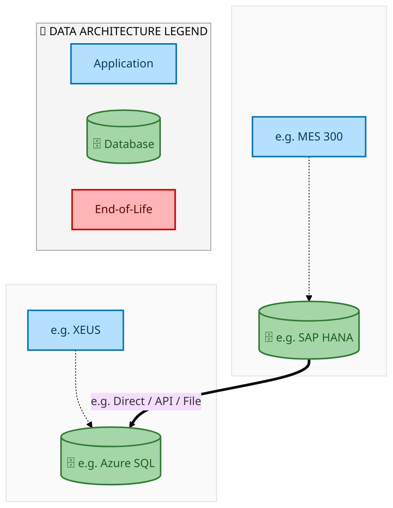
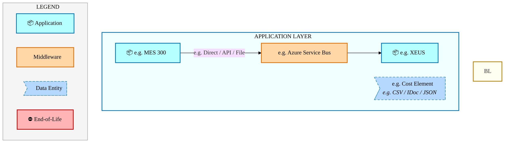
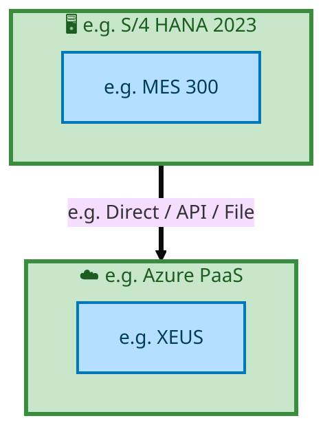

<div style="text-align:center; padding-top:20px;">
  <img src="data:image/svg+xml;base64,PHN2ZyB4bWxucz0iaHR0cDovL3d3dy53My5vcmcvMjAwMC9zdmciIHZpZXdCb3g9IjAgMCA4MDAgNDgwIiB3aWR0aD0iODAwIiBoZWlnaHQ9IjQ4MCI+DQogIDxkZWZzPg0KICAgIDxsaW5lYXJHcmFkaWVudCBpZD0iYmciIHgxPSIwJSIgeTE9IjAlIiB4Mj0iMTAwJSIgeTI9IjEwMCUiPg0KICAgICAgPHN0b3Agb2Zmc2V0PSIwJSIgc3R5bGU9InN0b3AtY29sb3I6IzAwNzFjNTtzdG9wLW9wYWNpdHk6MSIvPg0KICAgICAgPHN0b3Agb2Zmc2V0PSIxMDAlIiBzdHlsZT0ic3RvcC1jb2xvcjojMDBhZWVmO3N0b3Atb3BhY2l0eToxIi8+DQogICAgPC9saW5lYXJHcmFkaWVudD4NCiAgICA8bGluZWFyR3JhZGllbnQgaWQ9ImFjY2VudCIgeDE9IjAlIiB5MT0iMCUiIHgyPSIwJSIgeTI9IjEwMCUiPg0KICAgICAgPHN0b3Agb2Zmc2V0PSIwJSIgc3R5bGU9InN0b3AtY29sb3I6I2ZmZmZmZjtzdG9wLW9wYWNpdHk6MC4xNSIvPg0KICAgICAgPHN0b3Agb2Zmc2V0PSIxMDAlIiBzdHlsZT0ic3RvcC1jb2xvcjojZmZmZmZmO3N0b3Atb3BhY2l0eTowLjAyIi8+DQogICAgPC9saW5lYXJHcmFkaWVudD4NCiAgICA8cGF0dGVybiBpZD0iZ3JpZCIgd2lkdGg9IjQwIiBoZWlnaHQ9IjQwIiBwYXR0ZXJuVW5pdHM9InVzZXJTcGFjZU9uVXNlIj4NCiAgICAgIDxwYXRoIGQ9Ik0gNDAgMCBMIDAgMCAwIDQwIiBmaWxsPSJub25lIiBzdHJva2U9InJnYmEoMjU1LDI1NSwyNTUsMC4wNykiIHN0cm9rZS13aWR0aD0iMC41Ii8+DQogICAgPC9wYXR0ZXJuPg0KICA8L2RlZnM+DQoNCiAgPCEtLSBCYWNrZ3JvdW5kIC0tPg0KICA8cmVjdCB3aWR0aD0iODAwIiBoZWlnaHQ9IjQ4MCIgZmlsbD0idXJsKCNiZykiIHJ4PSI4Ii8+DQogIDxyZWN0IHdpZHRoPSI4MDAiIGhlaWdodD0iNDgwIiBmaWxsPSJ1cmwoI2dyaWQpIiByeD0iOCIvPg0KICA8cmVjdCB3aWR0aD0iODAwIiBoZWlnaHQ9IjQ4MCIgZmlsbD0idXJsKCNhY2NlbnQpIiByeD0iOCIvPg0KDQogIDwhLS0gRGVjb3JhdGl2ZSBjaXJjdWl0L2FyY2hpdGVjdHVyZSBsaW5lcyAtLT4NCiAgPGcgc3Ryb2tlPSJyZ2JhKDI1NSwyNTUsMjU1LDAuMTIpIiBzdHJva2Utd2lkdGg9IjEuNSIgZmlsbD0ibm9uZSI+DQogICAgPHBhdGggZD0iTSAwIDEwMCBMIDEyMCAxMDAgTCAxNjAgMTQwIEwgMjgwIDE0MCIvPg0KICAgIDxwYXRoIGQ9Ik0gMCAyNjAgTCA4MCAyNjAgTCAxMjAgMjIwIEwgMjAwIDIyMCBMIDI0MCAyNjAgTCAzNjAgMjYwIi8+DQogICAgPHBhdGggZD0iTSA1MjAgMTAwIEwgNjAwIDEwMCBMIDY0MCA2MCBMIDgwMCA2MCIvPg0KICAgIDxwYXRoIGQ9Ik0gNDQwIDM0MCBMIDU2MCAzNDAgTCA2MDAgMzAwIEwgNzIwIDMwMCBMIDc2MCAzNDAgTCA4MDAgMzQwIi8+DQogICAgPHBhdGggZD0iTSA2MDAgNDAwIEwgNjgwIDQwMCBMIDcyMCA0NDAiLz4NCiAgICA8cGF0aCBkPSJNIDAgNDAwIEwgNDAgNDAwIEwgODAgMzYwIi8+DQogICAgPHBhdGggZD0iTSAyMDAgNDIwIEwgMzIwIDQyMCBMIDM2MCAzODAgTCA0ODAgMzgwIi8+DQogICAgPHBhdGggZD0iTSA2NTAgNDQwIEwgNzUwIDQ0MCBMIDgwMCA0ODAiLz4NCiAgPC9nPg0KDQogIDwhLS0gRGVjb3JhdGl2ZSBub2RlcyAtLT4NCiAgPGcgZmlsbD0icmdiYSgyNTUsMjU1LDI1NSwwLjE4KSI+DQogICAgPGNpcmNsZSBjeD0iMTIwIiBjeT0iMTAwIiByPSI0Ii8+DQogICAgPGNpcmNsZSBjeD0iMjgwIiBjeT0iMTQwIiByPSI0Ii8+DQogICAgPGNpcmNsZSBjeD0iMjAwIiBjeT0iMjIwIiByPSI0Ii8+DQogICAgPGNpcmNsZSBjeD0iMzYwIiBjeT0iMjYwIiByPSI0Ii8+DQogICAgPGNpcmNsZSBjeD0iNjAwIiBjeT0iMTAwIiByPSI0Ii8+DQogICAgPGNpcmNsZSBjeD0iNzIwIiBjeT0iMzAwIiByPSI0Ii8+DQogICAgPGNpcmNsZSBjeD0iNTYwIiBjeT0iMzQwIiByPSI0Ii8+DQogICAgPGNpcmNsZSBjeD0iODAiIGN5PSIzNjAiIHI9IjQiLz4NCiAgICA8Y2lyY2xlIGN4PSI0ODAiIGN5PSIzODAiIHI9IjQiLz4NCiAgICA8Y2lyY2xlIGN4PSIzMjAiIGN5PSI0MjAiIHI9IjQiLz4NCiAgPC9nPg0KDQogIDwhLS0gVE9HQUYgQkRBVCBib3hlcyAtLT4NCiAgPGcgZm9udC1mYW1pbHk9IlNlZ29lIFVJLCBBcmlhbCwgc2Fucy1zZXJpZiIgZm9udC1zaXplPSIxNCIgZm9udC13ZWlnaHQ9IjYwMCI+DQogICAgPCEtLSBCIC0tPg0KICAgIDxyZWN0IHg9IjE1MCIgeT0iMTQwIiB3aWR0aD0iMTIwIiBoZWlnaHQ9IjQwIiByeD0iNSIgZmlsbD0icmdiYSgyNTUsMjU1LDI1NSwwLjE4KSIgc3Ryb2tlPSJyZ2JhKDI1NSwyNTUsMjU1LDAuMykiIHN0cm9rZS13aWR0aD0iMSIvPg0KICAgIDx0ZXh0IHg9IjIxMCIgeT0iMTY1IiB0ZXh0LWFuY2hvcj0ibWlkZGxlIiBmaWxsPSIjZmZmIj5CdXNpbmVzczwvdGV4dD4NCiAgICA8IS0tIEQgLS0+DQogICAgPHJlY3QgeD0iMjkwIiB5PSIxNDAiIHdpZHRoPSIxMjAiIGhlaWdodD0iNDAiIHJ4PSI1IiBmaWxsPSJyZ2JhKDI1NSwyNTUsMjU1LDAuMTgpIiBzdHJva2U9InJnYmEoMjU1LDI1NSwyNTUsMC4zKSIgc3Ryb2tlLXdpZHRoPSIxIi8+DQogICAgPHRleHQgeD0iMzUwIiB5PSIxNjUiIHRleHQtYW5jaG9yPSJtaWRkbGUiIGZpbGw9IiNmZmYiPkRhdGE8L3RleHQ+DQogICAgPCEtLSBBIC0tPg0KICAgIDxyZWN0IHg9IjQzMCIgeT0iMTQwIiB3aWR0aD0iMTIwIiBoZWlnaHQ9IjQwIiByeD0iNSIgZmlsbD0icmdiYSgyNTUsMjU1LDI1NSwwLjE4KSIgc3Ryb2tlPSJyZ2JhKDI1NSwyNTUsMjU1LDAuMykiIHN0cm9rZS13aWR0aD0iMSIvPg0KICAgIDx0ZXh0IHg9IjQ5MCIgeT0iMTY1IiB0ZXh0LWFuY2hvcj0ibWlkZGxlIiBmaWxsPSIjZmZmIj5BcHBsaWNhdGlvbjwvdGV4dD4NCiAgICA8IS0tIFQgLS0+DQogICAgPHJlY3QgeD0iNTcwIiB5PSIxNDAiIHdpZHRoPSIxMjAiIGhlaWdodD0iNDAiIHJ4PSI1IiBmaWxsPSJyZ2JhKDI1NSwyNTUsMjU1LDAuMTgpIiBzdHJva2U9InJnYmEoMjU1LDI1NSwyNTUsMC4zKSIgc3Ryb2tlLXdpZHRoPSIxIi8+DQogICAgPHRleHQgeD0iNjMwIiB5PSIxNjUiIHRleHQtYW5jaG9yPSJtaWRkbGUiIGZpbGw9IiNmZmYiPlRlY2hub2xvZ3k8L3RleHQ+DQogIDwvZz4NCg0KICA8IS0tIENvbm5lY3RpbmcgbGluZXMgYmV0d2VlbiBCREFUIGJveGVzIC0tPg0KICA8ZyBzdHJva2U9InJnYmEoMjU1LDI1NSwyNTUsMC4yNSkiIHN0cm9rZS13aWR0aD0iMSI+DQogICAgPGxpbmUgeDE9IjI3MCIgeTE9IjE2MCIgeDI9IjI5MCIgeTI9IjE2MCIvPg0KICAgIDxsaW5lIHgxPSI0MTAiIHkxPSIxNjAiIHgyPSI0MzAiIHkyPSIxNjAiLz4NCiAgICA8bGluZSB4MT0iNTUwIiB5MT0iMTYwIiB4Mj0iNTcwIiB5Mj0iMTYwIi8+DQogIDwvZz4NCg0KICA8IS0tIE1haW4gdGl0bGUgLS0+DQogIDx0ZXh0IHg9IjQwMCIgeT0iMjYwIiB0ZXh0LWFuY2hvcj0ibWlkZGxlIiBmb250LWZhbWlseT0iU2Vnb2UgVUksIEFyaWFsLCBzYW5zLXNlcmlmIiBmb250LXNpemU9IjM2IiBmb250LXdlaWdodD0iNzAwIiBmaWxsPSIjZmZmZmZmIiBsZXR0ZXItc3BhY2luZz0iMSI+DQogICAgSUFPIEFyY2hpdGVjdHVyZQ0KICA8L3RleHQ+DQogIDx0ZXh0IHg9IjQwMCIgeT0iMzAwIiB0ZXh0LWFuY2hvcj0ibWlkZGxlIiBmb250LWZhbWlseT0iU2Vnb2UgVUksIEFyaWFsLCBzYW5zLXNlcmlmIiBmb250LXNpemU9IjE4IiBmb250LXdlaWdodD0iNDAwIiBmaWxsPSJyZ2JhKDI1NSwyNTUsMjU1LDAuOCkiIGxldHRlci1zcGFjaW5nPSIyIj4NCiAgICBUT0dBRiBCREFUIMK3IElBTyBQcm9ncmFtIMK3IElETSAyLjANCiAgPC90ZXh0Pg0KDQogIDwhLS0gQm90dG9tIGFjY2VudCBiYXIgLS0+DQogIDxyZWN0IHg9IjI4MCIgeT0iMzQwIiB3aWR0aD0iMjQwIiBoZWlnaHQ9IjMiIHJ4PSIxLjUiIGZpbGw9InJnYmEoMjU1LDI1NSwyNTUsMC40KSIvPg0KDQogIDwhLS0gSW50ZWwgdGV4dCAtLT4NCiAgPHRleHQgeD0iNDAwIiB5PSIzODAiIHRleHQtYW5jaG9yPSJtaWRkbGUiIGZvbnQtZmFtaWx5PSJTZWdvZSBVSSwgQXJpYWwsIHNhbnMtc2VyaWYiIGZvbnQtc2l6ZT0iMTMiIGZpbGw9InJnYmEoMjU1LDI1NSwyNTUsMC41KSIgbGV0dGVyLXNwYWNpbmc9IjMiPg0KICAgIElOVEVMIENPTkZJREVOVElBTA0KICA8L3RleHQ+DQo8L3N2Zz4NCg==" alt="IAO Architecture" style="width:100%; border-radius:8px;" />
  <h1 style="font-size:36px; margin-top:24px;">E2E-114 — R4 SIMS Harvest Process</h1>
  <h2 style="font-size:24px;">Architecture Document (TOGAF BDAT)</h2>
  <p style="font-size:18px; color:#555;">End-to-End Integrated Processes (E2E) Tower<br/>
  Capability E2E-114 · Procure to Pay</p>
  <p style="font-size:14px; color:#888;">IAO Program · Release 2<br/>
  Generated: March 2026<br/>
  Sajiv Francis</p>
  <p style="font-size:12px; color:#aaa;">IAO Architecture Pipeline — Intel Confidential</p>
</div>

<style>
@media print {
  @page { margin: 0.75in; }
  .mermaid { page-break-inside: avoid; overflow: visible; }
  pre, table { page-break-inside: avoid; }
  h2, h3, h4 { page-break-after: avoid; }
}
.mermaid { overflow: visible; }
.mermaid svg { max-width: 100%; height: auto !important; }
nav.toc { margin: 16px 0 24px 0; }
nav.toc ol, nav.toc ul { list-style: none; padding-left: 0; margin: 0; }
nav.toc > ol > li { margin-bottom: 6px; font-weight: 600; font-size: 14px; }
nav.toc > ol > li > ul { padding-left: 28px; margin-top: 4px; }
nav.toc > ol > li > ul > li { font-weight: 400; font-size: 13px; margin-bottom: 2px; }
nav.toc a { color: #0071c5; text-decoration: none; }
nav.toc a:hover { text-decoration: underline; }
</style>


<div class="page-footer"><span>Page 1</span><span><a href="#toc">↑ Back to TOC</a></span><span>E2E-114 — R4 SIMS Harvest Process</span></div>
<div style="page-break-before: always;"></div>


<a id="toc"></a>

## Table of Contents

<nav class="toc">
<ol>
  <li><a href="#1-executive-summary">1. Executive Summary</a></li>
  <li><a href="#2-business-context-objectives">2. Business Context &amp; Objectives</a>
    <ul>
      <li><a href="#21-classification">2.1 Classification</a></li>
      <li><a href="#22-business-drivers">2.2 Business Drivers</a></li>
      <li><a href="#23-success-criteria">2.3 Success Criteria</a></li>
      <li><a href="#24-companion-documents">2.4 Companion Documents</a></li>
    </ul>
  </li>
  <li><a href="#3-business-architecture-togaf-b">3. Business Architecture (TOGAF &ldquo;B&rdquo;)</a>
    <ul>
      <li><a href="#31-business-process-overview">3.1 Business Process Overview</a></li>
      <li><a href="#32-business-process-diagrams">3.2 Business Process Diagrams</a></li>
      <li><a href="#33-business-roles-responsibilities">3.3 Business Roles &amp; Responsibilities</a></li>
    </ul>
  </li>
  <li><a href="#4-data-architecture-togaf-d">4. Data Architecture (TOGAF &ldquo;D&rdquo;)</a>
    <ul>
      <li><a href="#41-data-entities-ownership">4.1 Data Entities &amp; Ownership</a></li>
      <li><a href="#42-data-flow-diagrams">4.2 Data Flow Diagrams</a></li>
      <li><a href="#43-data-lineage">4.3 Data Lineage</a></li>
      <li><a href="#44-ricefw-data-objects">4.4 RICEFW Data Objects</a></li>
      <li><a href="#45-data-governance-quality">4.5 Data Governance &amp; Quality</a></li>
    </ul>
  </li>
  <li><a href="#5-application-architecture-togaf-a">5. Application Architecture (TOGAF &ldquo;A&rdquo;)</a>
    <ul>
      <li><a href="#51-current-state-current-state-application-landscape">5.1 Current-State Application Landscape</a></li>
      <li><a href="#52-future-state-future-state-application-landscape">5.2 Future-State Application Landscape</a></li>
      <li><a href="#53-change-impact-summary">5.3 Change Impact Summary</a></li>
      <li><a href="#54-component-overview">5.4 Component Overview</a></li>
      <li><a href="#55-ricefw-inventory">5.5 RICEFW Inventory</a></li>
      <li><a href="#56-integration-patterns">5.6 Integration Patterns</a></li>
    </ul>
  </li>
  <li><a href="#6-technology-architecture-togaf-t">6. Technology Architecture (TOGAF &ldquo;T&rdquo;)</a>
    <ul>
      <li><a href="#61-platform-infrastructure">6.1 Platform &amp; Infrastructure</a></li>
      <li><a href="#62-sap-development-object-status">6.2 SAP Development Object Status</a></li>
      <li><a href="#63-nfrs-design-principles">6.3 NFRs &amp; Design Principles</a></li>
      <li><a href="#64-security-governance">6.4 Security &amp; Governance</a></li>
    </ul>
  </li>
  <li><a href="#7-project-context">7. Project Context</a>
    <ul>
      <li><a href="#71-project-roadmap-go-live-plan">7.1 Project Roadmap &amp; Go-Live Plan</a></li>
      <li><a href="#72-raid-log">7.2 RAID Log</a></li>
      <li><a href="#73-recommendations-next-steps">7.3 Recommendations &amp; Next Steps</a></li>
    </ul>
  </li>
</ol>
</nav>


<div class="page-footer"><span>Page 2</span><span><a href="#toc">↑ Back to TOC</a></span><span>E2E-114 — R4 SIMS Harvest Process</span></div>
<div style="page-break-before: always;"></div>


## 1. Executive Summary

This Architecture Document defines the **Business, Data, Application, and Technology** (BDAT) architecture for **E2E-114 R4 SIMS Harvest Process** within the IAO program. It includes 4 BPMN process diagram(s) in Section 3.

| Dimension | Value |
|-----------|-------|
| **Tower** | End-to-End Integrated Processes (E2E) |
| **Process Group** | Procure to Pay |
| **Capability** | E2E-114 - R4 SIMS Harvest Process |
| **Release** | Release 2 |
| **Total Systems** | 2 |
| **System Status** | 0 Deployed, 0 Developing, 0 EOL, 2 Pending IAPM |
| **RICEFW Objects** | Pending — Smartsheet Object Tracker API integration |

**Change Summary**: 0 new flow chains, 0 removed, 0 modified, 1 unchanged between Current-State and Future-State states.

> All system nodes in architecture diagrams are **IAPM-linked** — click any node to open its IAPM page. Diagrams require `securityLevel: 'loose'` for click events.


<div class="page-footer"><span>Page 3</span><span><a href="#toc">↑ Back to TOC</a></span><span>E2E-114 — R4 SIMS Harvest Process</span></div>
<div style="page-break-before: always;"></div>


## 2. Business Context & Objectives

### 2.1 Classification

| Level | Value |
|-------|-------|
| **L0 Tower** | End-to-End Integrated Processes |
| **L1 Process** | Procure to Pay |
| **L2 Capability** | E2E-114 - R4 SIMS Harvest Process |

### 2.2 Business Drivers

| # | Driver | Description | Strategic Alignment | Priority |
|---|--------|-------------|---------------------|----------|
| 1 | End-to-End Process Integration | Enable cross-tower integrated processes spanning procurement, manufacturing, and fulfillment | IDM 2.0 Process Excellence | High |
| 2 | Intel Foundry Business Enablement | Stand up foundry-specific business processes for external customer engagement | Intel Foundry Services | High |
| 3 | Process Visibility & Monitoring | Provide end-to-end process visibility across tower boundaries with integrated monitoring | Operational Excellence | Medium |
| 4 | E2E-114 Process Migration | Migrate R4 SIMS Harvest Process business processes and 2 integrated systems from legacy to S/4 HANA target architecture | IDM 2.0 Cross-Functional / End-to-End | High |


<div class="page-footer"><span>Page 4</span><span><a href="#toc">↑ Back to TOC</a></span><span>E2E-114 — R4 SIMS Harvest Process</span></div>
<div style="page-break-before: always;"></div>


### 2.3 Success Criteria

| Metric | Target | Measure | Baseline | Owner |
|--------|--------|---------|----------|-------|
| E2E Process Cycle Time | Per process SLA | End-to-end transaction completion within defined SLA per process | Varies by process | E2E Process Owner |
| Cross-Tower Integration Success | > 99% | Transactions completing across tower boundaries without manual intervention | 92% (current) | Integration Lead |
| Process Exception Rate | < 2% | Transactions requiring manual exception handling | 8% (current) | Operations Manager |
| E2E-114 Migration Completeness | 100% flow chains validated | All 1 flow chains verified in target state | 0% (pre-migration) | Tower Architect |

### 2.4 Companion Documents

| Document | Description |
|----------|-------------|
| **Business Architecture** | Included in this document (Section 3) — process flows from BPMN diagrams |
| **This Document** | Full BDAT Architecture — Business + Data + Application + Technology |


<div class="page-footer"><span>Page 5</span><span><a href="#toc">↑ Back to TOC</a></span><span>E2E-114 — R4 SIMS Harvest Process</span></div>
<div style="page-break-before: always;"></div>


## 3. Business Architecture (TOGAF "B")

### 3.1 Business Process Overview

This capability includes **4 business process(es)** modeled in BPMN 2.0, covering the end-to-end workflow for E2E-114 R4 SIMS Harvest Process.

| # | Step ID | Process Name | Lanes | Tasks | Gateways |
|---|---------|--------------|-------|-------|----------|
| 1 | E2E-114A_SIMS_Harvest_Process | E2E-114A_SIMS_Harvest_Process | External Partners/Supplier , LE750 ODM Virtual

, LEXXX (E.g.- Costa-Rica)

 | 15 | 4 |
| 2 | E2E-114B_SIMS_Harvest_Process | E2E-114B_SIMS_Harvest_Process | External Partners/Supplier

, LE750 ODM Virtual

 | 17 | 4 |
| 3 | E2E-114C_SIMS_Harvest_Process | E2E-114C_SIMS_Harvest_Process | External Partners/Suppliers, LE570 Front Office , LE750 ODM Virtual  | 12 | 3 |
| 4 | E2E-114D_SIMS_Harvest_Process | E2E-114D_SIMS_Harvest_Process | Boundary Apps, External Partners/Suppliers, LE570 ODM Virtual, LEXXX (E.g. - Costa Rica) | 20 | 6 |


<div class="page-footer"><span>Page 6</span><span><a href="#toc">↑ Back to TOC</a></span><span>E2E-114 — R4 SIMS Harvest Process</span></div>
<div style="page-break-before: always;"></div>


### 3.2 Business Process Diagrams


#### BUSINESS ARCHITECTURE — 3.2.1 E2E-114A_SIMS_Harvest_Process — E2E-114A_SIMS_Harvest_Process

**Swim Lanes**: External Partners/Supplier  · LE750 ODM Virtual
 · LEXXX (E.g.- Costa-Rica)

 | **Tasks**: 15 | **Gateways**: 4

> **Legend**: <span style="color:#000;background:#4CAF50;padding:2px 6px;border-radius:10px;font-weight:bold;font-size:9pt">● Start</span> · <span style="color:#fff;background:#C62828;padding:2px 6px;border-radius:10px;font-weight:bold;font-size:9pt">● End</span> · <span style="background:#E3F2FD;padding:2px 6px;border:1px solid #1565C0;font-size:9pt">User Task</span> · <span style="background:#FFF3E0;padding:2px 6px;border:1px solid #E65100;font-size:9pt">Service Task</span> · <span style="background:#FFF9C4;padding:2px 6px;border:1px solid #F57F17;font-size:9pt">◇ Gateway</span> · <span style="background:#F3E5F5;padding:2px 6px;border:1px solid #7B1FA2;font-size:9pt">Sub-Process</span>

```mermaid
%%{init: {'theme': 'base', 'themeVariables': {'fontSize': '14px', 'fontFamily': 'Segoe UI, Arial, sans-serif','primaryColor': '#e8f0fe', 'primaryBorderColor': '#0071c5','lineColor': '#37474F', 'secondaryColor': '#f5f8fc'}, 'flowchart': {'useMaxWidth': false, 'htmlLabels': true, 'curve': 'basis', 'nodeSpacing': 40, 'rankSpacing': 50}} }%%
flowchart LR
    classDef startEvt fill:#4CAF50,stroke:#2E7D32,color:#000,font-weight:bold,stroke-width:2px,rx:20,ry:20
    classDef endEvt fill:#C62828,stroke:#B71C1C,color:#fff,font-weight:bold,stroke-width:2px,rx:20,ry:20
    classDef userTask fill:#E3F2FD,stroke:#1565C0,stroke-width:2px,color:#0D47A1
    classDef serviceTask fill:#FFF3E0,stroke:#E65100,stroke-width:2px,color:#BF360C
    classDef gateway fill:#FFF9C4,stroke:#F57F17,stroke-width:2px,color:#E65100
    classDef subProc fill:#F3E5F5,stroke:#7B1FA2,stroke-width:2px,color:#4A148C
    subgraph External Partners/Supplier 
        n10["Rec. Harvested Parts at ODM Supplier"]
    end
    subgraph LE750 ODM Virtual 
        n11["Create Inbound Delivery"]
        n12["Post Goods Receipt Unrestricted Stock (Virtual)"]
        n13["Create Sales Order"]
        n15["fa:fa-user Create I/C STO-1 with Supp. Plant as LEXXX"]
        n18(["fa:fa-play Initiate Stock Transfer Order Process"])
        n24(["fa:fa-stop Harvested Inventory Received at ODM Location"])
        n25["B SIMS Harvest Process"]
        n29{{"fa:fa-arrows-alt parallelGateway"}}
    end
    subgraph LEXXX (E.g.- Costa-Rica) 
        n1["Upload Harvested Inventory with Dedicated MMID (W/o Reference)"]
        n2["Create Outbound Delivery"]
        n3["TM Embedded"]
        n4["Picking and Packing Updates"]
        n5["Post Goods Issue"]
        n6["Generate I/C Invoice"]
        n7["Create Purchase Order"]
        n8["Trigger GTS Check"]
        n9["Calculate Taxes"]
        n14["fa:fa-user Create Purchase Req. (Repurpose Product)"]
        n16(["fa:fa-play Initiate Harvested Inventory Upload"])
        n17(["fa:fa-play Initiate Purchase Req for Repurpose product"])
        n19(["fa:fa-stop Transportation Management Executed"])
        n20(["fa:fa-stop Harvested Inventory Uploaded"])
        n21(["fa:fa-stop Intercompany Invoice Generated"])
        n22(["fa:fa-stop Taxes caluculated"])
        n23(["fa:fa-stop GTS check completed"])
        n26{{"fa:fa-arrows-alt parallelGateway"}}
        n27{{"fa:fa-arrows-alt parallelGateway"}}
        n28{{"fa:fa-arrows-alt parallelGateway"}}
    end
    n16 --> n1
    n15 --> n2
    n2 --> n26
    n26 --> n3
    n26 --> n4
    n3 --> n19
    n4 --> n5
    n5 --> n27
    n27 --> n6
    n27 --> n11
    n27 --> n10
    n11 --> n29
    n29 --> n12
    n14 --> n7
    n7 --> n28
    n28 --> n8
    n28 --> n9
    n10 -->|"4B2"| n29
    n13 --> n25
    n1 --> n20
    n18 --> n15
    n6 --> n21
    n12 --> n24
    n17 --> n14
    n28 --> n13
    n9 --> n22
    n8 --> n23
    class n14 userTask
    class n15 userTask
    class n16 startEvt
    class n17 startEvt
    class n18 startEvt
    class n19 endEvt
    class n20 endEvt
    class n21 endEvt
    class n22 endEvt
    class n23 endEvt
    class n24 endEvt
    class n25 startEvt
    class n26 gateway
    class n27 gateway
    class n28 gateway
    class n29 gateway
```

<div style="text-align:center; margin:4px 0 8px 0; font-size:11px;"><a href="https://mermaid.live/view#pako:eNqlV1tv4jgU_itWRhUdCTpJSAjwsFLLpYtU1Kq0MyMt-2ASB6yaOGs7LUyH_77HScwlDavd2T60PV_O-b5zswnvVsgjYvWti4t3mlDVR-8NtSJr0uijxgJL0miiAviKBcULRmRD-8Q8UTP6I3dzvHSj3TQ2xmvKthqdkSUn6HnSRNcQyJpI4kS2JBE0bjQbqaBrLLYDzrjQ3p9IN7bjXK18dMNFRMTBwbYDJ_QhlNGEHOB24AXeWMdJEvIkOiGN_bgbh42dTo7xt3CFhcrTzySZ4s03GqkV2DFmkoDPSq3ZHV4QpmtUItNYmIlX0wwqtU4CDZulOKTJEnDPBkjg5OUA-fZuh3YXF_NkL4ruHucJgp-QYSmHJEZSATx6VSimjPU_eYPrsW83pRL8hfQ_uaNg2Haboa6kD6XbTd3c1huhy5XqLziLStfWm66h76abptj0XbsptvC7okWS6KA06Lhdt7tXugmcgTMwSnEc_y8l6Kt4wvKl1Bq1x-54uNdy_I4_sD_ymTKHXnDtVPtExCsNyRHpeDxujw6tGnV8xz5PejNud-xBhXSJFXnD2wNhb-DtCcd-MHaCs4SFXjXLbPEgeGgI2yN_7O8JgxtnfO2eJfSuHa9bZgg8S4HTFRptFBEJZugB1iQhQn6ZZWnKKBGo8NQ_iWP_MbceSXiFfsewplKRKA-QCCt0P5wiEzS3_izCYBUqSnejwLdz569UqAwkjwUcEBgIAv1Ck2TBsyRCQ8LoKxHbPWfh6YLnA5cK3XIeSQRZEZoq9JwIyEvQUOc2Uzx8QZel0OcKQ_ugNcNw0aB7fQNUnHxwinE_xi29a8jk9mWAZk_3LQe9UbXKy75CDwwnCmEJJX7__r3C073cE6UMVmEClx_NpfMcn-BIyxgE8hyQHi6REjg-H5G43oFEKp4eTWGSvJJEcbEtGvEKUDmSOx5iRXlS5dKF3aDZZDozNEeqx46993cjioXgb7KFmUIpFpgxwm6L1Z5bu935iUM70OXoannVQgMYGW490hB_Phk8ZPOcMo6j2qLyLg9JBGH6wXQ6GaLLb184VAtNI0lIKsN1D7O9z9Q_LZLegqcpGq0XJIpIdPrQ00tGwxe4aBFO9LIX_z-nEVBXOuWfbuREyoycenTA45bA8TI7BBVyuG1OvYJD7g-ZgPtckrrV7OrEBV0uYV9un2ZosCLhy6lLTzNhFmZMkz3hTTVlx6td773sI_nrCl0-kjQTKQcbNiTKQlU9SZ1zy103y2LMlXV0gnMUx7mgmAt0yCYtsqlS9SqnJD9bKRcqPwdoihO8hBcMOKujDQkzRarJuPa_OGdFGR9jnUrsJIGbNeTrFCdbM29kluBDtFvNXc8MhZhlxRA_BLQrAXoTQr0JSGsyUhPS-W8HuggKfiWo-4tXB2wUarV-g7_G9gvbLW23NDvGLv3bFdsr7XZJ1yttr7D90jTsgQkPCqBTsR2nCtgmQaekMApur_QwKTulptEoGdyuCegWQNU2hI6t7Z9zy7tx59bPIymnrM415Zhc9smVVI5xKLvj7ttr-mn65Zj6vEo2julwWZ5ryiufu-2jN5W8aPOKdor7Z_DO_kX1FA_O4N0zeK98CT1BXbsWdWpRtxZt16JeLerX5wa7Wb4PnsJBPdyth3sGtprWmog1ppHVf7fyr07w9SoiMc6YsnZNC2eKz7ZJaPXzrxhWln92DSmGT-d1Ae7-BhJlLKc=" title="View full diagram">&#128065; View Diagram</a></div>


<div class="page-footer"><span>Page 7</span><span><a href="#toc">↑ Back to TOC</a></span><span>E2E-114 — R4 SIMS Harvest Process</span></div>
<div style="page-break-before: always;"></div>


#### BUSINESS ARCHITECTURE — 3.2.2 E2E-114B_SIMS_Harvest_Process — E2E-114B_SIMS_Harvest_Process

**Swim Lanes**: External Partners/Supplier
 · LE750 ODM Virtual

 | **Tasks**: 17 | **Gateways**: 4

> **Legend**: <span style="color:#000;background:#4CAF50;padding:2px 6px;border-radius:10px;font-weight:bold;font-size:9pt">● Start</span> · <span style="color:#fff;background:#C62828;padding:2px 6px;border-radius:10px;font-weight:bold;font-size:9pt">● End</span> · <span style="background:#E3F2FD;padding:2px 6px;border:1px solid #1565C0;font-size:9pt">User Task</span> · <span style="background:#FFF3E0;padding:2px 6px;border:1px solid #E65100;font-size:9pt">Service Task</span> · <span style="background:#FFF9C4;padding:2px 6px;border:1px solid #F57F17;font-size:9pt">◇ Gateway</span> · <span style="background:#F3E5F5;padding:2px 6px;border:1px solid #7B1FA2;font-size:9pt">Sub-Process</span>


<div style="text-align:center; margin:4px 0 8px 0; font-size:11px;"><a href="https://mermaid.live/view#pako:eNqlVl1v6jgQ_StWrip6JbiNTUJoHlaigdytVAQqbPdhuw8mccCq42QdB-hW_Pe1iRMgt2ivdnlAmpMzM2dm_PVhRVlMLN-6ufmgnEoffHTkhqSk44POChek0wUV8IIFxStGio7mJBmXC_r3kQadfK9pGgtxStm7RhdknRHw22MXjJQj64IC86JXEEGTTreTC5pi8R5kLBOa_YUMEzs5ZjOfHjIRE3Ei2LYHI1e5MsrJCe57jueE2q8gUcbji6CJmwyTqHPQ4li2izZYyKP8siBTvP-dxnKj7ASzgijORqbsCa8I0zVKUWosKsW2bgYtdB6uGrbIcUT5WuGOrSCB-dsJcu3DARxubl55kxQsx68cqF_EcFGMSQIKqeDJVoKEMuZ_cYJR6NrdQorsjfhf0MQb91E30pX4qnS7q5vb2xG63kh_lbHYUHs7XYOP8n1X7H1kd8W7-m_lIjw-ZQoGaIiGTaYHDwYwqDMlSfK_Mqm-iiUu3kyuST9E4bjJBd2BG9g_xqvLHDveCLb7RMSWRuQsaBiG_cmpVZOBC-3rQR_C_sAOWkHXWJIdfj8FvA-cJmDoeiH0rgas8rVVlqu5yKI6YH_ihm4T0HuA4QhdDeiMoDM0ClWctcD5Bkz2kgiOGZirZcKJKO4WZZ4zSgSomPrH4R-v1jOJCN0SMJ8BLMFsPAU189X684yLFHdORJKJFMz01gKj6I1nO0bitdreXN4FWZpS2XipVdMS9TTxXPuY4oUKWSp1Z_H7P8R_wYzGWNKMXypxFHOszgElejoFj2Ogz5kYZBxEZSGzVLnmes_wMl21q3DPsgSCxFSCYEOiN3C7pRiEi2D69dJhoByWgq7XKur35aJiX1I8RQkwi0qmlgWYC6r38SVleJZ2irkuXfMImG2JEDQml_T7M_poOa8lNnU-ERwDSVPSEgttLSXjCa2b2PquB67K1joX5UoxwbwU6oQpCHgmf30Dt88kL0WeFbqOLC4j2c6AziIsn3vouFq-gTnDXAJcmBmHQh0CYJYkqsZWgP51CdXYe_MZavk4_z4E6F5MYYn3pGgx9CjP1uxd3ajL_C0nPdyWwOioPm4Rh7eKmWA_wb2cqbPhUd2GVEu5Nu-v59564gFYPE4X4FesboxC6gFEpGgVgfSExz9D1KMe_QwRfXzUwvVd3lup2yjaALKPWFmoTfa9OuxercPh3K1_csNCZLuih5nUGw8zRtgVJ-e_OLmfOlF-TV9z8PA-6PV-UQeGMZ3KdI3pVubAmIPKRMjYcFgBQ2MjVNmesYctvlfZ98a8r0xo1-Fsw-_X8Yw6CNtAo8AAqC4AGgmwToJMSbBhGI_297pmZAi1CGhs2Kgydt0VWLelqcO0DdUhodMCkGHAulPQtOb8bj72t37EXOL3n-PIvoLDKziq7-lLuP857HwOuzVsdS11s6SYxpb_YR2ftOrZG5MEl0xah66FS5kt3nlk-cenn1Xm6vIiY4rV5ZdW4OEfuGBm7g==" title="View full diagram">&#128065; View Diagram</a></div>


<div class="page-footer"><span>Page 8</span><span><a href="#toc">↑ Back to TOC</a></span><span>E2E-114 — R4 SIMS Harvest Process</span></div>
<div style="page-break-before: always;"></div>


#### BUSINESS ARCHITECTURE — 3.2.3 E2E-114C_SIMS_Harvest_Process — E2E-114C_SIMS_Harvest_Process

**Swim Lanes**: External Partners/Suppliers · LE570 Front Office  · LE750 ODM Virtual  | **Tasks**: 12 | **Gateways**: 3

```mermaid
%%{init: {'theme': 'base', 'themeVariables': {'fontSize': '14px', 'fontFamily': 'Segoe UI, Arial, sans-serif','primaryColor': '#e8f0fe', 'primaryBorderColor': '#0071c5','lineColor': '#37474F', 'secondaryColor': '#f5f8fc'}, 'flowchart': {'useMaxWidth': false, 'htmlLabels': true, 'curve': 'basis', 'nodeSpacing': 40, 'rankSpacing': 50}} }%%
flowchart LR
    classDef startEvt fill:#4CAF50,stroke:#2E7D32,color:#000,font-weight:bold,stroke-width:2px,rx:20,ry:20
    classDef endEvt fill:#C62828,stroke:#B71C1C,color:#fff,font-weight:bold,stroke-width:2px,rx:20,ry:20
    classDef userTask fill:#E3F2FD,stroke:#1565C0,stroke-width:2px,color:#0D47A1
    classDef serviceTask fill:#FFF3E0,stroke:#E65100,stroke-width:2px,color:#BF360C
    classDef gateway fill:#FFF9C4,stroke:#F57F17,stroke-width:2px,color:#E65100
    classDef subProc fill:#F3E5F5,stroke:#7B1FA2,stroke-width:2px,color:#4A148C
    subgraph External Partners/Suppliers
        n6["Receive Components at ODM Supplier​"]
        n7["Execute MRP Run at SubCon/ODM End​"]
        n8["Update Real-time Consumption​"]
        n13(["fa:fa-play MRP Run Initiated"])
    end
    subgraph LE570 Front Office 
        n9["Create Outbound Delivery"]
        n10["TM Embedded​"]
        n11["Picking and Packing Updates​"]
        n12["Post Goods Issue"]
        n16(["fa:fa-stop Transportation Management Execution"])
        n19{{"fa:fa-arrows-alt parallelGateway"}}
        n20{{"fa:fa-arrows-alt parallelGateway"}}
    end
    subgraph LE750 ODM Virtual 
        n1["Create STO-2 ​ Supp. Plant as LE750 Front Office​"]
        n2["Create Inbound Delivery"]
        n3["Perform Goods Receipt Unrestricted Stock (Virtual) ​"]
        n4["Perform Goods Issue of components (Virtual)​ PO2​"]
        n5["Post Consumption Movement 543​"]
        n14(["fa:fa-stop Component Consumption Updates Received"])
        n15(["fa:fa-stop Components Issued to ODM Supplier"])
        n17["B SIMS Harvest Process"]
        n18{{"fa:fa-arrows-alt parallelGateway"}}
    end
    n9 --> n19
    n19 --> n10
    n19 --> n11
    n11 --> n12
    n12 --> n20
    n20 --> n6
    n20 --> n2
    n2 --> n18
    n18 --> n3
    n6 -->|"4B2"| n18
    n3 --> n4
    n7 --> n8
    n1 --> n9
    n8 --> n5
    n5 --> n14
    n4 --> n15
    n13 --> n7
    n10 --> n16
    n17 --> n1
    class n13 startEvt
    class n14 endEvt
    class n15 endEvt
    class n16 endEvt
    class n17 startEvt
    class n18 gateway
    class n19 gateway
    class n20 gateway
```

> **Legend**: <span style="color:#000;background:#4CAF50;padding:2px 6px;border-radius:10px;font-weight:bold;font-size:9pt">● Start</span> · <span style="color:#fff;background:#C62828;padding:2px 6px;border-radius:10px;font-weight:bold;font-size:9pt">● End</span> · <span style="background:#E3F2FD;padding:2px 6px;border:1px solid #1565C0;font-size:9pt">User Task</span> · <span style="background:#FFF3E0;padding:2px 6px;border:1px solid #E65100;font-size:9pt">Service Task</span> · <span style="background:#FFF9C4;padding:2px 6px;border:1px solid #F57F17;font-size:9pt">◇ Gateway</span> · <span style="background:#F3E5F5;padding:2px 6px;border:1px solid #7B1FA2;font-size:9pt">Sub-Process</span>



<div style="text-align:center; margin:4px 0 8px 0; font-size:11px;"><a href="https://mermaid.live/view#pako:eNqlVttu4zYQ_RVCi8C7gN3V1XL0UCCWrW2AGDHiZPtQ94GWKJsIRQokldj1-t9LWpQvWqVAWz0YmuOZMzOHQ1J7K2UZsiLr5maPKZYR2PfkBhWoF4HeCgrU64Ma-A45hiuCRE_75IzKBf7r6Ob45Va7aSyBBSY7jS7QmiHwct8HdyqQ9IGAVAwE4jjv9XslxwXku5gRxrX3JzTK7fyYzfw1ZjxD_Oxg26GTBiqUYIrOsBf6oZ_oOIFSRrMr0jzIR3naO-jiCHtPN5DLY_mVQDO4_R1ncqPsHBKBlM9GFuQBrhDRPUpeaSyt-FsjBhY6D1WCLUqYYrpWuG8riEP6eoYC-3AAh5ubJT0lBQ9PSwrUkxIoxATlQEgFT98kyDEh0Sc_vksCuy8kZ68o-uROw4nn9lPdSaRat_ta3ME7wuuNjFaMZMZ18K57iNxy2-fbyLX7fKd-W7kQzc6Z4qE7ckenTOPQiZ24yZTn-f_KpHTlz1C8mlxTL3GTySmXEwyD2P6Zr2lz4od3TlsnxN9wii5IkyTxpmeppsPAsT8mHSfe0I5bpGso0TvcnQlvY_9EmARh4oQfEtb52lVWqzlnaUPoTYMkOBGGYye5cz8k9O8cf2QqVDxrDssNmG4l4hQSMFdjQhEXXxdVWRKs3mpP_dDhH0vrCaUIvyEQs6JkFFEpAJTgcTIDTcSycm17tbT-vIgMVeR0i9JKIjB7moOniuqwRbWKGf2qo6c06wocqcCXMlMCgicEyUDiQuemoipKiRntinG8zyoqh1EOByVRujcZ79WJgxVVpvy_1AFqVltSPEyD0AYJV2MJHvNcDQO44L5VzDFHup7HSq5YRTMwQUQpwnetKmzl-qwaK1Yoy1Bnd46jfOY4fVU7GUBFNYf1e92y6IxxdQwTEnxjLBPgXogKtVyGZwGEZCV4VieGKBmXUGsGZpDCtTpjVYf1omghT5LUFLf7fUMBOWfvYgCJBCXkkBBEvtUTvbQOh4sg1_53QV3ih4F9nKbvmMtKDeRlTWftF8-PAxfU8hwH7xcwJ1D1A4XhuFzALhndM9k9_ad19LTciOeMF0bx4xYoJXihHKldhlM1UWAhWfoKPpuyv4CunP5PVMfFAywH6Xk7nThMe_NHt4ssaMbgYjeAGXur1zXwvc7h8VuTcdrGVzRm_IDZ7Fl7OIKPWExHGZDs-kxoEejzYAwW97MF-A2qG0-1oQ80JESr3tF_nCh6CwaDX_UcG9tpALsNOA3gGMBtALcGmmtHvdTAsGU3AcbfGTUEoxrwjD3U5o-l5Y_dpfXjwtGr_XxjhrV5oqnNphNDGhgzMEmbYN_Yzf-OIQ8b2xTtNF04Jt3lVXgMa74ZrnHf3O_XaNCJDjvR8APmUXNRXsO3nbDS3sBW3yoQLyDOrGhvHT8e1QdmhnJYEWkd-hasJFvsaGpFx48sqzpO9wRDdeYUNXj4GyHSRLA=" title="View full diagram">&#128065; View Diagram</a></div>


<div class="page-footer"><span>Page 9</span><span><a href="#toc">↑ Back to TOC</a></span><span>E2E-114 — R4 SIMS Harvest Process</span></div>
<div style="page-break-before: always;"></div>


#### BUSINESS ARCHITECTURE — 3.2.4 E2E-114D_SIMS_Harvest_Process — E2E-114D_SIMS_Harvest_Process

**Swim Lanes**: Boundary Apps · External Partners/Suppliers · LE570 ODM Virtual · LEXXX (E.g. - Costa Rica) | **Tasks**: 20 | **Gateways**: 6

> **Legend**: <span style="color:#000;background:#4CAF50;padding:2px 6px;border-radius:10px;font-weight:bold;font-size:9pt">● Start</span> · <span style="color:#fff;background:#C62828;padding:2px 6px;border-radius:10px;font-weight:bold;font-size:9pt">● End</span> · <span style="background:#E3F2FD;padding:2px 6px;border:1px solid #1565C0;font-size:9pt">User Task</span> · <span style="background:#FFF3E0;padding:2px 6px;border:1px solid #E65100;font-size:9pt">Service Task</span> · <span style="background:#FFF9C4;padding:2px 6px;border:1px solid #F57F17;font-size:9pt">◇ Gateway</span> · <span style="background:#F3E5F5;padding:2px 6px;border:1px solid #7B1FA2;font-size:9pt">Sub-Process</span>

```mermaid
%%{init: {'theme': 'base', 'themeVariables': {'fontSize': '14px', 'fontFamily': 'Segoe UI, Arial, sans-serif','primaryColor': '#e8f0fe', 'primaryBorderColor': '#0071c5','lineColor': '#37474F', 'secondaryColor': '#f5f8fc'}, 'flowchart': {'useMaxWidth': false, 'htmlLabels': true, 'curve': 'basis', 'nodeSpacing': 40, 'rankSpacing': 50}} }%%
flowchart LR
    classDef startEvt fill:#4CAF50,stroke:#2E7D32,color:#000,font-weight:bold,stroke-width:2px,rx:20,ry:20
    classDef endEvt fill:#C62828,stroke:#B71C1C,color:#fff,font-weight:bold,stroke-width:2px,rx:20,ry:20
    classDef userTask fill:#E3F2FD,stroke:#1565C0,stroke-width:2px,color:#0D47A1
    classDef serviceTask fill:#FFF3E0,stroke:#E65100,stroke-width:2px,color:#BF360C
    classDef gateway fill:#FFF9C4,stroke:#F57F17,stroke-width:2px,color:#E65100
    classDef subProc fill:#F3E5F5,stroke:#7B1FA2,stroke-width:2px,color:#4A148C
    subgraph Boundary Apps
        n17["Organize Transport-Intel Routing Guide (IRG)​"]
        n18["ReadSoft Validation/Exception Handling based on rules setup"]
        n19["Receive Supplier Invoice/ E2Open/Web suite"]
        n20["Receive Manual Invoices Through OCR"]
        n29{{"fa:fa-code-branch exclusiveGateway"}}
        n30{{"fa:fa-code-branch B2B or OCR?"}}
    end
    subgraph External Partners/Suppliers
        n4["Perform Carrier Selection via Intel Routing Guide hosted Collaboration Portal​"]
        n5["Perform Goods Pick up (Carrier) ​ Order shipment"]
        n6["Ship to LEXXX E.g. Costa-Rica"]
        n7["Raise Invoice from ODM Supplier"]
        n26["B SIMS Harvest Process"]
    end
    subgraph LE570 ODM Virtual
        n8["Perform Goods Receipt ​against Subcon PO (Virtual)"]
        n9["Perform Inbound Delivery with House AirWay Bill Number (HAWB)​"]
        n10["TM Embedded"]
        n11["Perform Evaluated Receipt Settlement (ERS) Self-Billing"]
        n12["Perform Outbound Delivery Creation"]
        n13["Perform Picking and Packing Updates"]
        n14["Post Goods Issue (Virtual)"]
        n15["Generate I/C Invoice to LEX XX (E.g.- Costa-Rica)"]
        n16["Process Supplier Invoice"]
        n24(["fa:fa-stop Supplier Invoice Posted"])
        n25(["fa:fa-stop Transportation Management Execution"])
        n27{{"fa:fa-code-branch exclusiveGateway"}}
        n28{{"fa:fa-code-branch Invoice Accepted ?"}}
        n31{{"fa:fa-arrows-alt parallelGateway"}}
        n32{{"fa:fa-arrows-alt parallelGateway"}}
    end
    subgraph LEXXX (E.g. - Costa Rica)
        n1["Perform Goods Receipt at LEXXX against PO-1"]
        n2["Process Supplier Invoice"]
        n3["Perform Inbound Delivery"]
        n21(["fa:fa-stop Goods Receipt Posted"])
        n22(["fa:fa-stop Supplier Invoice Posted"])
        n23(["fa:fa-stop Inbound delivery performed"])
    end
    n4 --> n17
    n17 --> n5
    n9 --> n31
    n31 --> n8
    n31 --> n10
    n31 --> n6
    n8 --> n27
    n27 --> n11
    n27 --> n12
    n13 --> n14
    n14 --> n32
    n29 --> n18
    n18 --> n28
    n28 -->|"Yes"| n16
    n28 -->|"No"| n7
    n32 --> n15
    n32 --> n3
    n16 --> n24
    n26 --> n4
    n10 --> n25
    n11 -->|"3-Way match not 
applicable for ERS"| n29
    n12 --> n13
    n1 --> n21
    n30 -->|"OCR"| n20
    n30 -->|"B2B"| n19
    n19 --> n29
    n20 --> n29
    n2 --> n22
    n15 --> n2
    n7 --> n30
    n5 -->|"3B2 Via E2 Open"| n9
    n6 --> n1
    n3 --> n23
    class n21 endEvt
    class n22 endEvt
    class n23 endEvt
    class n24 endEvt
    class n25 endEvt
    class n26 startEvt
    class n27 gateway
    class n28 gateway
    class n29 gateway
    class n30 gateway
    class n31 gateway
    class n32 gateway
```

<div style="text-align:center; margin:4px 0 8px 0; font-size:11px;"><a href="https://mermaid.live/view#pako:eNqlV21v4jgQ_itWVhWtBNu8EKB8uBPQ0EVqlwq6256W-2ASB6KGOLIdSq_Lf79xYoeQ0tPdXj9U-InnmfHMMxPnzfBpQIy-cXb2FiWR6KO3hliTDWn0UWOJOWk0UQF8xyzCy5jwhtwT0kTMo7_ybVY73cltEhvjTRS_SnROVpSgb5MmGoBh3EQcJ7zFCYvCRrORsmiD2euIxpTJ3Z9ILzTD3Jt6NKQsIOywwTS7lu-CaRwl5AA73Xa3PZZ2nPg0CY5IQzfshX5jL4OL6Yu_xkzk4Wec3OHdYxSINaxDHHMCe9ZiE9_iJYnlGQXLJOZnbKuTEXHpJ4GEzVPsR8kK8LYJEMPJ8wFyzf0e7c_OFknpFN3OFgmCPz_GnF-TEHEBsLcVKIziuP-pPRqMXbPJBaPPpP_J9rrXjt305Un6cHSzKZPbeiHRai36SxoHamvrRZ6hb6e7Jtv1bbPJXuF_zRdJgoOnUcfu2b3S07BrjayR9hSG4f_yBHllD5g_K1-eM7bH16Uvy-24I_M9nz7mdbs7sOp5Imwb-aRCOh6PHe-QKq_jWubHpMOx0zFHNdIVFuQFvx4Ir0btknDsdsdW90PCwl89ymx5z6ivCR3PHbslYXdojQf2h4TtgdXuqQiBZ8VwukZDmuVaRoM05cUz-ZdY3R8LY8pWOIHmQw8gPJ5SJlqTRJAYzWgmQIPoJosCgs4ns5uLRWab5nJh_Fkl6QHJjOBgTkOBvuM4CrCIaHLp7XySyl_oC06CWFLJGRAgQFgGvQ_lEFlaY7vK2XwSbQmaZ2kaR4ShSbKlULdL5NnTlCSXj2QJp4sEOTa2zYrxHU4yHGtTjh7WjGarNZqOZjWrq7e3hRHifohbcn61lpAIf43Izo8zDlQ3RYEXxn5fMXPM02ZDe4gok25-P1hA09Rq4u0EYQkEeA-tmxDGL_VpqxVqw4HuCQsp26ARZkwmY05i4ud53UYYnarVmnIBeYbRFeMlZXk50D1UFsenKuhWnNxQGnB0H_nPKEvRufJ5gQo7NJVjFPF1lG5IIo5pOkAzhydIUHTrPT09Ie_z6jNEAdOpNYt8fLxdam-GI050iVDI6AZNr-_KutfqJB0M0XxyNwdFwSDlAsk-IZyXG9_n-dZzu2bO-j1iAhRRYey9O3gunlSo4-IVjhLwMs-WvszgFJ0rkovj0K4qRJNkKdsNXZMYtANN9xKJNfpCYZqhQcQeYVIMobHR12yzhFyefxk8Dk83llTzwx3yYF8QkKD21Kr49LY4zrCsuT7AnAgRE1kkdO7N5hdSNWFLOgaZ1JjsCtM0E7XwR4zkAqoZORUjKRepPmhzkHPx-1sKY4DwmlWuZxCESveE84x8lFRL6vKGQG8AEZpcjkqhFAJDoLBzKbFWRWN1DqkZJZJ346Qmr_b5D93PXND03XZ0n7cVWF1UzdyaWTlGi7aDMYRXRSG8HfEzlcojiu4vDSC7d9pMhzvw5fwFTfxen1zWwRD6m77wFo4FSjHDcUziD8ad_d-MTnXik64YUiVDRckq9fqwI7FQBLop76ctq1bBf11r5x_6tcZp1cp7HNVpSdi_piSnZqYjC3QrpkXIVcsyzUkbtVq_yXe6WlvdAnDV-qpYOupOBD8KoFdbW2YN6Kh1r1ja2oGtHFhWHbB1CI4C2hpQQTp6h62isnQUlvaiATsHfi6MP-Qw-Slbuv7kK80f6LgcW3G6NcDRPjrKhw7LVkAZpqk2aAbLUq6clpzfGyygzxIK74kEy9L68lsGQW0QzNo8GPtKm-poSu-Ku6yDqbjzi4k0NetP4EpRHL0kVWkrvdhmHVDrshSuAtRalcrRvlx9wKENL0oMFy0kb1q5W82pslQGrhidyvVVnkt9IRyj9knUOYm2T6LuSbRTfvsc4119LT-Ge6fhq5Mw5P8kbJ2GbQ0bTWND2AZHgdF_M_LvXfgmDkiIs1gY-6aBM0Hnr4lv9PPvQiPL35XXEYZBuSnA_d_3LLJU" title="View full diagram">&#128065; View Diagram</a></div>


<div class="page-footer"><span>Page 10</span><span><a href="#toc">↑ Back to TOC</a></span><span>E2E-114 — R4 SIMS Harvest Process</span></div>
<div style="page-break-before: always;"></div>


### 3.3 Business Roles & Responsibilities

| Role / Lane | Processes Involved | Description |
|------------|-------------------|-------------|
| External Partners/Supplier  | E2E-114A_SIMS_Harvest_Process,  | |
| LE750 ODM Virtual
 | E2E-114A_SIMS_Harvest_Process, E2E-114B_SIMS_Harvest_Process,  | |
| LEXXX (E.g.- Costa-Rica)
 | E2E-114A_SIMS_Harvest_Process,  | |
| External Partners/Supplier
 | E2E-114B_SIMS_Harvest_Process,  | |
| External Partners/Suppliers | E2E-114C_SIMS_Harvest_Process, E2E-114D_SIMS_Harvest_Process | |
| LE570 Front Office  | E2E-114C_SIMS_Harvest_Process,  | |
| LE750 ODM Virtual  | E2E-114C_SIMS_Harvest_Process,  | |
| Boundary Apps | E2E-114D_SIMS_Harvest_Process | |
| LE570 ODM Virtual | E2E-114D_SIMS_Harvest_Process | |
| LEXXX (E.g. - Costa Rica) | E2E-114D_SIMS_Harvest_Process | |


<div class="page-footer"><span>Page 11</span><span><a href="#toc">↑ Back to TOC</a></span><span>E2E-114 — R4 SIMS Harvest Process</span></div>
<div style="page-break-before: always;"></div>


## 4. Data Architecture (TOGAF "D")

### 4.1 Data Entities & Ownership

| # | Data Entity | Source System | Target System | Data Owner | Classification | Volume | Master/Transaction |
|---|-------------|---------------|---------------|------------|----------------|--------|-------------------|
| 1 | e.g. Cost Element | e.g. MES 300 | e.g. XEUS | Data steward | e.g. Intel Confidential | e.g. 10K rows/day | Master / Transaction |


<div class="page-footer"><span>Page 12</span><span><a href="#toc">↑ Back to TOC</a></span><span>E2E-114 — R4 SIMS Harvest Process</span></div>
<div style="page-break-before: always;"></div>


### 4.2 Data Flow Diagrams

> **DATA ARCHITECTURE** — Database-to-database data flows. Applications (blue) sit above their hosting databases (green cylinders). Thick arrows show data movement between databases.


#### 4.2.1 Current-State — Current-State Data Flows



<div style="text-align:center; margin:4px 0 8px 0; font-size:11px;"><a href="https://mermaid.live/view#pako:eNqdlYtumzAUhl_F8hRpk5KOJCVZkVrJXLJWolVX0m1SmZADJrHqYARmTZrm3WcDoV0Wuqq2hMy5_Mf-DjIbGPKIQAN2OhuaUGGAjQ_FgiyJDw3gwxnO5aorVzkJi4yKtUt-E1Y5Gec7b5nyHWcUzxjJlVvqxDwRHn2spfp6uqqClX2Cl5StK49H5pyA24suQFJAim_LKMYfwgXORK1W5OQSr37QSCyUJcYsJypuIZbMxTPCyrIiK0prIo_lpTikyVyZh7oyZji5f2E81rdbsO10_KSpBaamnwA5Qobz3CYxwGlq8hWIKWPGB1O3J5NJNxcZvyfGB00bj81R_dp7UFszBumqG3LGM-Ue2vq-XjSz1qyWQ7o9QuNGbuCM7eGgVa5v6s5A25MjnD1vbzIxdVNv9CxLk6NVbzRSbj-pFPNiNs9wugDOwOn3jy0bWW5AgnmAHouMBN43986HkuGvKlyNiGYkFJQnDTU1mnxUpv90bj2ZSY7mR0CtpYJhGBXVA0n2Xs2PPvSL6Mswks8oPPaLmGjy1EqtDAIyyIeflGZJ9tV9gN5R76y1VpVKkqgGItaMtNPYIUdqNsgdTc2_kffld_8_yB66Ds7RFXof40vHC4aatsMsX4F8fRPppvAroGUMUDFv4lzv5SDqXbE3kd4Fvwt0S2Fwenr2VFOyS7LgM0DXF_I5oUxeVE-vfB17LXTJXJ7g7gW2MNKAjaYIoBvr_GLqWNPbGwe4zlfnym5pqnvzbHUD1X6UpoyGWHkPN9AN7JZm2Vjg6sI-1Cc3cKS8k0Q9HvdcGpNKvrpADnakOuGOv65mw__k5OQf-LALlyRbYhpBY1P9EuSfJSIxLpiQlzrEheDeOgmhUV7TsEgjLIhNsSS6rIzbPwtiAWY=" title="View full diagram">&#128065; View Diagram</a></div>


<div class="page-footer"><span>Page 13</span><span><a href="#toc">↑ Back to TOC</a></span><span>E2E-114 — R4 SIMS Harvest Process</span></div>
<div style="page-break-before: always;"></div>


#### 4.2.2 Future-State — Future-State Data Flows


<div style="text-align:center; margin:4px 0 8px 0; font-size:11px;"><a href="https://mermaid.live/view#pako:eNqdlYtumzAUhl_F8hRpk5KOJCVZkVrJBFgr0aor6TapTMgBk1h1MAKzJk3z7rOB0C4LXVVbQuZc_mN_B5kNDHlEoAE7nQ1NqDDAxodiQZbEhwbw4QznctWVq5yERUbF2iW_CaucjPOdt0z5jjOKZ4zkyi11Yp4Ijz7WUn09XVXByu7gJWXryuOROSfg9qILkBSQ4tsyivGHcIEzUasVObnEqx80EgtliTHLiYpbiCVz8YywsqzIitKayGN5KQ5pMlfmoa6MGU7uXxiP9e0WbDsdP2lqganpJ0COkOE8t0gMcJqafAViypjxwdQtx3G6ucj4PTE-aNp4bI7q196D2poxSFfdkDOeKffQ0vf1otlkzWo5pFsjNG7kBvbYGg5a5fqmbg-0PTnC2fP2HMfUTb3Rm0w0OVr1RiPl9pNKMS9m8wynC2AP7H7_2LHQxA1IMA_QY5GRwPvm3vlQMvxVhasR0YyEgvKkoaZGk4_K9J_2rSczydH8CKi1VDAMo6J6IMnaq_nRh34RfRlG8hmFx34RE02eWqmVQUAG-fCT0izJvroP0DvqnbXWqlJJEtVAxJqRdho75EjNBrmtqfk38r787v8H2UPXwTm6Qu9jfGl7wVDTdpjlK5CvbyLdFH4FtIwBKuZNnOu9HES9K_Ym0rvgd4FuKQxOT8-eakpWSRZ8Buj6Qj4dyuRF9fTK17HXQpfM5QnuXmALIw1YaIoAupmcX0ztyfT2xgau_dW-slqa6t48W91AtR-lKaMhVt7DDXQDq6VZFha4urAP9ckNbClvJ1GPxz2XxqSSry6Qgx2pTrjjr6vZ8D85OfkHPuzCJcmWmEbQ2FS_BPlniUiMCybkpQ5xIbi3TkJolNc0LNIIC2JRLIkuK-P2D4gYAZA=" title="View full diagram">&#128065; View Diagram</a></div>


<div class="page-footer"><span>Page 14</span><span><a href="#toc">↑ Back to TOC</a></span><span>E2E-114 — R4 SIMS Harvest Process</span></div>
<div style="page-break-before: always;"></div>


### 4.3 Data Lineage

| # | Source System | Source Schema/Object | Target System | Target Schema/Object | Transformation |
|---|-------------|---------------------|---------------|---------------------|---------------|
| 1 | e.g. MES 300 | e.g. CKMLHD table | e.g. XEUS | e.g. dbo.CostElements | Lineage notes |

### 4.4 RICEFW Data Objects

Reports and Conversions for this capability will be populated from the Smartsheet Object Tracker via automated API extraction.

| Object ID | Type | Description | Status | Source | Target | Complexity |
|-----------|------|-------------|--------|--------|--------|-----------|
| E2E-114-R001 | Report | R4 SIMS Harvest Process operational report | Planned | SAP S/4HANA | Analytics | Medium |
| E2E-114-C001 | Conversion | Legacy data migration for R4 SIMS Harvest Process | Planned | Legacy ERP | SAP S/4HANA | High |

> *Pending: Smartsheet API integration to auto-populate live RICEFW data (see Build Requirements).*

### 4.5 Data Governance & Quality

| Concern | Approach |
|---------|----------|
| Data Ownership | Per-entity owners listed in Section 3.1 |
| Data Classification | Financial data classified as Intel Confidential |
| Data Retention | Per Intel corporate retention policies |
| Data Quality | Validated at source; reconciliation at target |


<div class="page-footer"><span>Page 15</span><span><a href="#toc">↑ Back to TOC</a></span><span>E2E-114 — R4 SIMS Harvest Process</span></div>
<div style="page-break-before: always;"></div>


## 5. Application Architecture (TOGAF "A")

### 5.1 Current-State — Current-State Application Landscape

#### Overview

The Current-State architecture represents the **current / legacy** landscape for E2E-114.This view is generated from `CurrentFlows.xlsx` (1 flow hops across 1 flow chains).

#### APPLICATION ARCHITECTURE — Architecture Diagram (ArchiMate-Inspired)

> **Click any system node** to open its IAPM application page.
> **Legend**: <span style="background:#C8E6C9;padding:2px 6px;border:1px solid #2E7D32;font-size:9pt">Deployed</span> · <span style="background:#E3F2FD;padding:2px 6px;border:1px solid #1565C0;font-size:9pt">Developing</span> · <span style="background:#FFCDD2;padding:2px 6px;border:1px solid #C62828;font-size:9pt">End-of-Life</span> · <span style="background:#ECEFF1;padding:2px 6px;border:1px solid #78909C;font-size:9pt;border-style:dashed">No IAPM Match</span>


<div style="text-align:center; margin:4px 0 8px 0; font-size:11px;"><a href="https://mermaid.live/view#pako:eNqVVW1P6jAU_ivNDN9AhwrqYkgGGzfcDDXOl3tzd7OU9QCNZVvWTkXlv9_TFQVBo7ckYzsvz2mf87R9tpKMgeVYtdozT7lyyHNkqSnMILIcElkjKvGtjm8SkrLgah7APQjjFFn26q1SbmjB6UiA1G7EGWepCvnTEqrZzh9NsLb36YyLufGEMMmAXA_qxEUAUSeSprIhoeDjyFpUGSJ7SKa0UEvkUsKQPt5ypqbaMqZCgo6bqpkI6AhENQVVlJU1xSWGOU14OtHmQ1sbC5rerRlb9mJBFrValL7VIlfdKCU4ajXSaODckikfUgUNnsqcF8CIVHMBJBFUSpAYY8Krbw_GZFRKnoKUpBpjLoSz08fRbdWlKrI7cHa6x8dtu7v8bDzoBTn7-WM9yURWODu2bW9g0jwnq2Ewuy2N-oZp20dH3fZ_YDKq6Damd_wFZvMd5quPUYnkFXSOnJLWRqUZZ0zAAy1gnRGv7a4Y8Y_a_RXaN2YPmdhiRHO8xnKvZ9tfYRpUWY4mBc2nxA3-RFZUsuMDhk920CLuxUUw6LlXg_MzEri__cvI-muS9GAoiETxLCXB5crq7_vN5mEvhngSD_0wPrDtddgE2gR2J7sEfQR9iOg4Drb4Y4Rf_nX4Ybp2fJ47vK2y3aeygDiE4p4nEHdL-W6BzSMDVUWRZRTBKIO7atwWvOdX8L1MqtgXeAykqrM-yeTQIOsAsgw4HRV7nVPeMY7whuyRgZcl-PczPD873eMdU1Yr0xSElL326ANSce91XiKrgvOqTiCUezHAZ58LPIBeviLjHfRnQbrMVkf0tJbiqY6DbrC21fv2V1t9PdV9S7W_s6O3RBvABHl6JxFmk8D_4Z9531BrEKPGNwXm5rngCdXBH0gsiIe3mzoarrTyqXaC2PM3VeLpY8hPFV4ym903Kf652ZT7bXaIgayRjRsBHy_L4DmwJpUVqYaUV2Jb-vdG7MnJydaZZtWtGRQzypnlPJuLDe9HBmNaCoXXkUVLlYXzNLGc6oKxyhwnCh6n2ISZMS7-Ab0tSF0=" title="View full diagram">&#128065; View Diagram</a></div>


<div class="page-footer"><span>Page 16</span><span><a href="#toc">↑ Back to TOC</a></span><span>E2E-114 — R4 SIMS Harvest Process</span></div>
<div style="page-break-before: always;"></div>


#### Current-State Flow Narrative

| # | Flow Chain | Path | Interface | Freq |
|---|-----------|------|-----------|------|
| 1 | e.g. MES Route to ICOST | e.g. MES 300 → e.g. XEUS | e.g. Direct / API / File | e.g. Near Real-Time |


<div class="page-footer"><span>Page 17</span><span><a href="#toc">↑ Back to TOC</a></span><span>E2E-114 — R4 SIMS Harvest Process</span></div>
<div style="page-break-before: always;"></div>


### 5.2 Future-State — Future-State Application Landscape

#### Overview

The Future-State architecture represents the **target** landscape for E2E-114.This view is generated from `FutureFlows.xlsx` (1 flow hops across 1 flow chains).

#### APPLICATION ARCHITECTURE — Architecture Diagram (ArchiMate-Inspired)

> **Click any system node** to open its IAPM application page.
> **Legend**: <span style="background:#C8E6C9;padding:2px 6px;border:1px solid #2E7D32;font-size:9pt">Deployed</span> · <span style="background:#E3F2FD;padding:2px 6px;border:1px solid #1565C0;font-size:9pt">Developing</span> · <span style="background:#FFCDD2;padding:2px 6px;border:1px solid #C62828;font-size:9pt">End-of-Life</span> · <span style="background:#ECEFF1;padding:2px 6px;border:1px solid #78909C;font-size:9pt;border-style:dashed">No IAPM Match</span>



<div style="text-align:center; margin:4px 0 8px 0; font-size:11px;"><a href="https://mermaid.live/view#pako:eNqVVW1P6jAU_ivNDN9AhwroYkiGGzfcDDXOl3tzd7OU9QCNZVvWTkXlv9_TFQVBo7ckYzsvz2mf87R9tpKMgeVYtdozT7lyyHNkqSnMILIcElkjKvGtjm8SkrLgah7APQjjFFn26q1SbmjB6UiA1G7EGWepCvnTEqrZzh9NsLb36YyLufGEMMmAXA_qxEUAUSeSprIhoeDjyFpUGSJ7SKa0UEvkUsKQPt5ypqbaMqZCgo6bqpkI6AhENQVVlJU1xSWGOU14OtHmQ1sbC5rerRlb9mJBFrValL7VIle9KCU4ajXSaODckikfUgUNnsqcF8CIVHMBJBFUSpAYY8Krbw_GZFRKnoKUpBpjLoSz08fRa9WlKrI7cHZ6R0dtu7f8bDzoBTn7-WM9yURWODu2bW9g0jwnq2Ewey2N-oZp251Or_0fmIwquo3pHX2B2XyH-epjVCJ5BZ0jp6S1UWnGGRPwQAtYZ8RruytG_E67v0L7xuwhE1uMaI7XWD49te2vMA2qLEeTguZT4gZ_Iisq2dEBwyc7aBH34iIYnLpXg_MzEri__cvI-muS9GAoiETxLCXB5crq7_vN5mE_hngSD_0wPrDtddgE2gR2J7sEfQR9iOg4Drb4Y4Rf_nX4Ybp2fJ47vK2y3aeygDiE4p4nEPdK-W6BzY6BqqLIMopglMFdNW4L3vMr-NNMqtgXeAykqrs-yeTQIOsAsgw4GRV73RPeNY7whuyRgZcl-PczPD872eNdU1Yr0xSElL326ANSce91XyKrgvOqTiCUezHAZ58LPIBeviLjHfRnQbrMVkf0tJbiqY6DXrC21fv2V1t9PdV9S7W_s6O3RBvABHl6JxFmk8D_4Z9531BrEKPGNwXm5rngCdXBH0gsiIe3mzoarrTyqXaC2PM3VeLpY8hPFV4ym903Kf652ZT7bXaIgayRjRsBHy_L4DmwJpUVqYaUV2Jb-vdG7PHx8daZZtWtGRQzypnlPJuLDe9HBmNaCoXXkUVLlYXzNLGc6oKxyhwnCh6n2ISZMS7-AQQBSHU=" title="View full diagram">&#128065; View Diagram</a></div>


<div class="page-footer"><span>Page 18</span><span><a href="#toc">↑ Back to TOC</a></span><span>E2E-114 — R4 SIMS Harvest Process</span></div>
<div style="page-break-before: always;"></div>


#### Future-State Flow Narrative

| # | Flow Chain | Path | Interface | Freq |
|---|-----------|------|-----------|------|
| 1 | e.g. MES Route to ICOST | e.g. MES 300 → e.g. XEUS | e.g. Direct / API / File | e.g. Near Real-Time |


<div class="page-footer"><span>Page 19</span><span><a href="#toc">↑ Back to TOC</a></span><span>E2E-114 — R4 SIMS Harvest Process</span></div>
<div style="page-break-before: always;"></div>


### 5.3 Change Impact Summary

| Change Type | Flow Chain | Detail |
|-------------|-----------|--------|
| **UNCHANGED** | e.g. MES Route to ICOST | No change |

**Totals**: 0 new - 0 removed - 0 modified - 1 unchanged

### 5.4 Component Overview

#### System Inventory

| System | IAPM ID | Status |
|--------|---------|--------|
| e.g. MES 300 | - | N/A |
| e.g. XEUS | - | N/A |


<div class="page-footer"><span>Page 20</span><span><a href="#toc">↑ Back to TOC</a></span><span>E2E-114 — R4 SIMS Harvest Process</span></div>
<div style="page-break-before: always;"></div>


### 5.5 RICEFW Inventory

RICEFW objects for this capability will be auto-populated from the Smartsheet S/4 Object Tracker.

| Object ID | Type | Description | Status | Source → Target | Middleware | Complexity |
|-----------|------|-------------|--------|----------------|-----------|-----------|
| E2E-114-I001 | Interface | R4 SIMS Harvest Process inbound data interface | Planned | Legacy → SAP S/4HANA | MuleSoft / CPI | Medium |
| E2E-114-E001 | Enhancement | R4 SIMS Harvest Process custom business logic | Planned | SAP S/4HANA | N/A | Medium |
| E2E-114-F001 | Form/Report | R4 SIMS Harvest Process operational output | Planned | SAP S/4HANA | N/A | Low |

> *Pending: Smartsheet API integration to auto-populate live RICEFW inventory (see Build Requirements).*


<div class="page-footer"><span>Page 21</span><span><a href="#toc">↑ Back to TOC</a></span><span>E2E-114 — R4 SIMS Harvest Process</span></div>
<div style="page-break-before: always;"></div>


### 5.6 Integration Patterns

| # | Pattern | Flow Chain | Middleware | Protocol | Auth |
|---|---------|-----------|-----------|----------|------|
| 1 | e.g. Pub-Sub / P2P / ETL | e.g. MES Route to ICOST | e.g. Azure Service Bus | e.g. REST / RFC / SFTP | e.g. OAuth / NTLM / Cert |


<div class="page-footer"><span>Page 22</span><span><a href="#toc">↑ Back to TOC</a></span><span>E2E-114 — R4 SIMS Harvest Process</span></div>
<div style="page-break-before: always;"></div>


## 6. Technology Architecture (TOGAF "T")

### 6.1 Platform & Infrastructure

> **TECHNOLOGY / PLATFORM ARCHITECTURE** — Platforms (green) host applications (blue). Thick arrows show platform-to-platform integration flows.


#### 6.1.1 Current-State — Current-State Platform Architecture



<div style="text-align:center; margin:4px 0 8px 0; font-size:11px;"><a href="https://mermaid.live/view#pako:eNqtlNFq2zAUhl9FqOQuax07TjNDB7Zjs0I6wrxug3kYxT5ORGXLyPKaNM27T7LdpC2kUDZdCOn_jz4dHSHtcMozwA4eDHa0pNJBuxjLNRQQYwfFeElqNRqqUQ1pI6jczuEPsM5knD-57ZLvRFCyZFBrW3FyXsqIPvSo0bjadMFaD0lB2bZzIlhxQLfXQ-QqgILv2yjG79M1EbKnNTXckM0Pmsm1VnLCatBxa1mwOVkCa7eVomnVUh0rqkhKy5WWx4YWBSnvnom2sd-j_WAQl4e90DcvLpFqKSN1PYMckary-AbllDHnzLNnYRgOayn4HThnhnF56U366Yd7nZpjVpthyhkX2rZm9mtexYg8Av1pMPE_HoDWdBpY_kugdQSOPDswjVdA4OzIC0PP9uwDz_cN1U4mOJloOy47Yt0sV4JUaxSYwWg09hfzRQLJKnEfGgHJgpDoV4zjxpwYo7jJwVBbn6_OUWsjbcf4d0fSLaMCUkl5ieZfj-oB7bbon8GthrYcPVYEx3G6kneLoMz67OSWwenU_qmeb58_SsbJZ_eLm5iGabUlyKZWpvqM2M8LEV2MkY5DOu79tbgJosQyjKdyqClS0_dW5EWy_6Eob-Kvrj499unO2iOiC-QurlUfUqae_ePp-8JDXIAoCM2ws-u-D_ULZZCThkn1AWDSSB5tyxQ77ZPGTZURCTNK1B0Vnbj_C-8GeU4=" title="View full diagram">&#128065; View Diagram</a></div>


> **Legend**: <span style="background:#C8E6C9;padding:2px 8px;border:2px solid #388E3C;font-size:9pt">🖥️ Platform</span> · <span style="background:#B5DFFF;padding:2px 8px;border:2px solid #0077B6;font-size:9pt">📦 Application</span> · <span style="background:#FFB5B5;padding:2px 8px;border:2px solid #CC0000;font-size:9pt">⛔ End-of-Life</span> · <span style="background:#FFF9C4;padding:2px 8px;border:2px solid #F9A825;font-size:9pt">📋 Unassigned</span>


<div class="page-footer"><span>Page 23</span><span><a href="#toc">↑ Back to TOC</a></span><span>E2E-114 — R4 SIMS Harvest Process</span></div>
<div style="page-break-before: always;"></div>


#### 6.1.2 Future-State — Future-State Platform Architecture


<div style="text-align:center; margin:4px 0 8px 0; font-size:11px;"><a href="https://mermaid.live/view#pako:eNqtlNFq2zAUhl9FqOQuaxU7TjNDB3Zis0I6wrxug3kYxT5ORGXJ2PKaNM27T7LTpC2kUDZdCOn_jz4dHSFtcSozwC7u9bZMMOWibYzVCgqIsYtivKC1HvX1qIa0qZjazOAP8M7kUj657ZLvtGJ0waE2tubkUqiIPexRg2G57oKNHtKC8U3nRLCUgG6v-8jTAA3ftVFc3qcrWqk9ranhhq5_sEytjJJTXoOJW6mCz-gCeLutqppWFfpYUUlTJpZGHhIjVlTcPRMdstuhXa8Xi8Ne6JsfC6RbymldTyFHtCx9uUY549w9851pGIb9WlXyDtwzQi4v_dF--uHepOZa5bqfSi4rY9tT5zWv5FQdgZNxMJp8PADt8TiwJy-B9hE48J3AIq-AIPmRF4a-4zsH3mRCdDuZ4Ghk7Fh0xLpZLCtarlBgBYPBMJzP5gkky8R7aCpI5pRGv2IcN9aIDOImB6K3Pl-eo9ZGxo7x745kWsYqSBWTAs2-HtUD2mvRP4NbA205ZqwJrut2Je8Wgcj22akNh9Op_VM93z5_lAyTz94XL7GIZbclyMZ2pvuMOs8LEV0MkYlDJu79tbgJosQm5Kkceor09L0VeZHsfyjKm_irq0-P-3Sn7RHRBfLm17oPGdfP_vH0feE-LqAqKMuwu-2-D_0LZZDThiv9AWDaKBltRIrd9knjpsyogimj-o6KTtz9BRI6eWY=" title="View full diagram">&#128065; View Diagram</a></div>


> **Legend**: <span style="background:#C8E6C9;padding:2px 8px;border:2px solid #388E3C;font-size:9pt">🖥️ Platform</span> · <span style="background:#B5DFFF;padding:2px 8px;border:2px solid #0077B6;font-size:9pt">📦 Application</span> · <span style="background:#FFB5B5;padding:2px 8px;border:2px solid #CC0000;font-size:9pt">⛔ End-of-Life</span> · <span style="background:#FFF9C4;padding:2px 8px;border:2px solid #F9A825;font-size:9pt">📋 Unassigned</span>


#### Platform Inventory

| # | Platform | Type | Systems Using | Environment |
|---|----------|------|--------------|-------------|
| 1 | e.g. Azure PaaS | Cloud / SaaS | e.g. XEUS | DEV,QAS,PRD |
| 2 | e.g. S/4 HANA 2023 | On-Premise | e.g. MES 300 | DEV,QAS,PRD |


<div class="page-footer"><span>Page 24</span><span><a href="#toc">↑ Back to TOC</a></span><span>E2E-114 — R4 SIMS Harvest Process</span></div>
<div style="page-break-before: always;"></div>


### 6.2 SAP Development Object Status

| Metric | DEV | QAS | PRD |
|--------|-----|-----|-----|
| Transport Requests | — | — | — |
| Custom Code Objects | — | — | — |
| CDS Views | — | — | — |
| Fiori Apps | — | — | — |
| BAdIs / Enhancements | — | — | — |

### 6.3 NFRs & Design Principles

| Category | Requirement | Target / SLA | Priority |
|----------|-------------|-------------|----------|
| Performance | Order/transaction processing within interactive SLA | < 3 seconds for online transactions | High |
| Availability | Business-critical systems available during extended hours | 99.9% (06:00-22:00 all time zones) | High |
| Scalability | Support seasonal and promotional volume spikes | Handle 2x baseline transaction volume | Medium |
| Recoverability | Customer-facing systems recover within business impact window | RPO < 30 min, RTO < 2 hours | High |
| Data Volume | Support transactional data growth from business expansion | 10M+ documents/year | Medium |
| Latency | Near-real-time integration for order status updates | < 30 seconds for status propagation | Medium |
| Concurrency | Support global user base across business functions | 300+ concurrent users | Medium |

### 6.4 Security & Governance

| Concern | Approach | Standard / Policy | Owner |
|---------|----------|--------------------|-------|
| Authentication | Single Sign-On (SSO) via Intel corporate Azure AD identity | Intel IT Security Policy - Identity Management | IT Security |
| Authorization | Role-based access control (RBAC) with SAP authorization objects | Intel SAP Security Standards - Role Design | SAP Security Team |
| Data Classification | All financial/operational data classified per Intel Data Classification Standard | Intel Data Classification Policy | Data Governance |
| Data Encryption (at rest) | AES-256 encryption for SAP HANA database and file storage | Intel Encryption Standard | Infrastructure Security |
| Data Encryption (in transit) | TLS 1.3 for all system-to-system and user-to-system communication | Intel Network Security Policy | Network Engineering |
| Network Segmentation | SAP systems in dedicated network zones with firewall controls | Intel Network Architecture Standard | Network Security |
| API Security | OAuth 2.0 / certificate-based authentication for all API integrations | Intel API Security Guidelines | Integration Architecture |
| Audit Logging | Comprehensive audit trail for all data changes and user actions (SAP Security Audit Log) | SOX Compliance / Intel Audit Policy | Internal Audit |
| Certificate Management | Automated certificate lifecycle management for system-to-system trust | Intel PKI Standard | Certificate Authority Team |
| Compliance | SOX controls, export control (EAR/ITAR) screening, data privacy (GDPR) | Intel Corporate Compliance Framework | Compliance Office |


<div class="page-footer"><span>Page 25</span><span><a href="#toc">↑ Back to TOC</a></span><span>E2E-114 — R4 SIMS Harvest Process</span></div>
<div style="page-break-before: always;"></div>


## 7. Project Context

### 7.1 Project Roadmap & Go-Live Plan

Project delivery milestones for E2E-114 RICEFW objects:

| Phase | Planned Start | Planned End | Status | Notes |
|-------|---------------|-------------|--------|-------|
| Functional Specification (FS) | Per project plan | Per project plan | In Progress | Tower-level FS schedule |
| Technical Design (TDD) | FS + 2 weeks | FS + 6 weeks | Planned | Dependent on FS completion |
| Build & Unit Test (TUT) | TDD + 1 week | TDD + 8 weeks | Planned | Includes S/4 + Middleware |
| Functional User Test (FUT) | Build + 1 week | Build + 4 weeks | Planned | Tower-led validation |
| Go-Live (Release 2) | Per release plan | Per release plan | Planned | End-to-End Integrated Processes release |

> *Detailed object-level timelines will be auto-populated from the Smartsheet Object Tracker via API integration.*


<div class="page-footer"><span>Page 26</span><span><a href="#toc">↑ Back to TOC</a></span><span>E2E-114 — R4 SIMS Harvest Process</span></div>
<div style="page-break-before: always;"></div>


### 7.2 RAID Log

Standard RAID items for E2E-114 (End-to-End Integrated Processes):

| # | Category | Description | Status | Owner | Priority |
|---|----------|-------------|--------|-------|----------|
| 1 | Risk | Data migration completeness — validate all legacy R4 SIMS Harvest Process data maps to S/4 target structures | Open | Tower Architect | High |
| 2 | Risk | Integration testing coverage — ensure all 2 integrated systems are validated end-to-end | Open | Integration Lead | High |
| 3 | Assumption | Target SAP S/4HANA system available in DEV/QAS per release schedule | Active | SAP Basis | Medium |
| 4 | Issue | API access provisioning — SAP OData, Smartsheet, and IAPM API credentials required for automation | Open | EA Pipeline Team | High |
| 5 | Dependency | Upstream BPMN process models validated and signed off by business process owners | Active | Process Owner | Medium |

> *Live RAID data will be auto-populated from the Smartsheet RAID log via API integration.*

### 7.3 Recommendations & Next Steps

| # | Category | Recommendation | Priority | Owner | Target Date | Status |
|---|----------|---------------|----------|-------|-------------|--------|
| 1 | Architecture | Complete extended flow attributes (Data Entity, Integration Pattern, Tech Platform) in Flows tab for full BDAT coverage | High | Tower Architect | 2026-Q2 | Open |
| 2 | Data | Define data ownership and classification for all 1 flow chains to satisfy Data Architecture (TOGAF D) requirements | Medium | Data Architect | 2026-Q3 | Open |
| 3 | Testing | Develop integration test scenarios covering all 1 flow chains for FUT/SIT readiness | High | Test Lead | 2026-Q3 | Open |
| 4 | Business Architecture | Review and validate Business Architecture process steps against latest Signavio/BIC process models | Medium | Business Analyst | 2026-Q2 | Open |
| 5 | Security | Complete security review for API integrations and data flows per Intel Security Architecture standards | Medium | Security Architect | 2026-Q3 | Open |

---
*E2E-114 — Architecture Document (TOGAF BDAT) · End-to-End Integrated Processes · Generated: March 2026*

<div class="page-footer"><span>Page 27</span><span><a href="#toc">↑ Back to TOC</a></span><span>E2E-114 — R4 SIMS Harvest Process</span></div>
