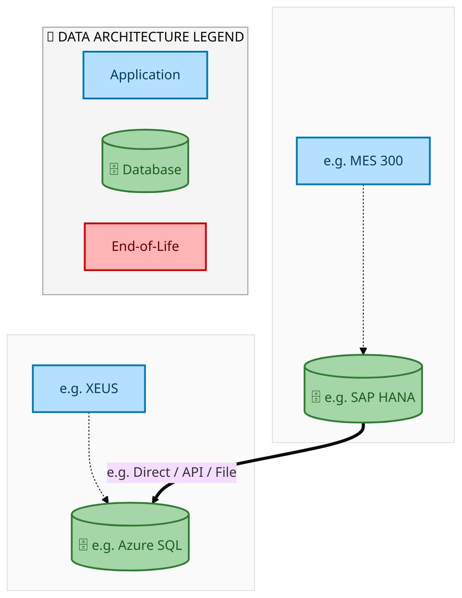
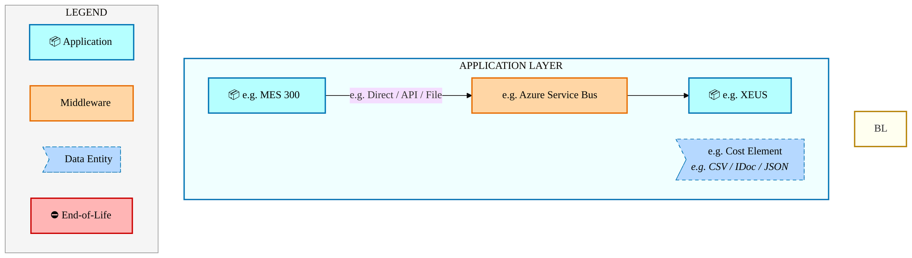
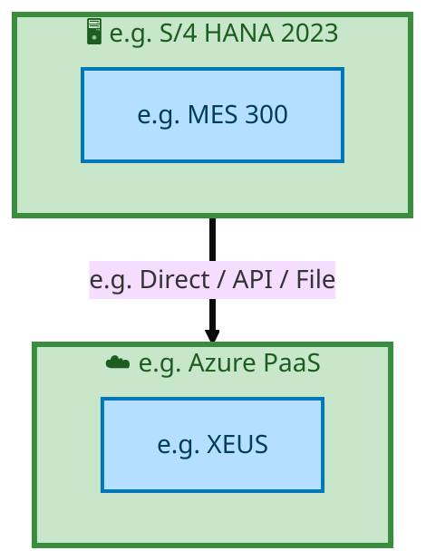

<div style="text-align:center; padding-top:20px;">
  <img src="data:image/svg+xml;base64,PHN2ZyB4bWxucz0iaHR0cDovL3d3dy53My5vcmcvMjAwMC9zdmciIHZpZXdCb3g9IjAgMCA4MDAgNDgwIiB3aWR0aD0iODAwIiBoZWlnaHQ9IjQ4MCI+DQogIDxkZWZzPg0KICAgIDxsaW5lYXJHcmFkaWVudCBpZD0iYmciIHgxPSIwJSIgeTE9IjAlIiB4Mj0iMTAwJSIgeTI9IjEwMCUiPg0KICAgICAgPHN0b3Agb2Zmc2V0PSIwJSIgc3R5bGU9InN0b3AtY29sb3I6IzAwNzFjNTtzdG9wLW9wYWNpdHk6MSIvPg0KICAgICAgPHN0b3Agb2Zmc2V0PSIxMDAlIiBzdHlsZT0ic3RvcC1jb2xvcjojMDBhZWVmO3N0b3Atb3BhY2l0eToxIi8+DQogICAgPC9saW5lYXJHcmFkaWVudD4NCiAgICA8bGluZWFyR3JhZGllbnQgaWQ9ImFjY2VudCIgeDE9IjAlIiB5MT0iMCUiIHgyPSIwJSIgeTI9IjEwMCUiPg0KICAgICAgPHN0b3Agb2Zmc2V0PSIwJSIgc3R5bGU9InN0b3AtY29sb3I6I2ZmZmZmZjtzdG9wLW9wYWNpdHk6MC4xNSIvPg0KICAgICAgPHN0b3Agb2Zmc2V0PSIxMDAlIiBzdHlsZT0ic3RvcC1jb2xvcjojZmZmZmZmO3N0b3Atb3BhY2l0eTowLjAyIi8+DQogICAgPC9saW5lYXJHcmFkaWVudD4NCiAgICA8cGF0dGVybiBpZD0iZ3JpZCIgd2lkdGg9IjQwIiBoZWlnaHQ9IjQwIiBwYXR0ZXJuVW5pdHM9InVzZXJTcGFjZU9uVXNlIj4NCiAgICAgIDxwYXRoIGQ9Ik0gNDAgMCBMIDAgMCAwIDQwIiBmaWxsPSJub25lIiBzdHJva2U9InJnYmEoMjU1LDI1NSwyNTUsMC4wNykiIHN0cm9rZS13aWR0aD0iMC41Ii8+DQogICAgPC9wYXR0ZXJuPg0KICA8L2RlZnM+DQoNCiAgPCEtLSBCYWNrZ3JvdW5kIC0tPg0KICA8cmVjdCB3aWR0aD0iODAwIiBoZWlnaHQ9IjQ4MCIgZmlsbD0idXJsKCNiZykiIHJ4PSI4Ii8+DQogIDxyZWN0IHdpZHRoPSI4MDAiIGhlaWdodD0iNDgwIiBmaWxsPSJ1cmwoI2dyaWQpIiByeD0iOCIvPg0KICA8cmVjdCB3aWR0aD0iODAwIiBoZWlnaHQ9IjQ4MCIgZmlsbD0idXJsKCNhY2NlbnQpIiByeD0iOCIvPg0KDQogIDwhLS0gRGVjb3JhdGl2ZSBjaXJjdWl0L2FyY2hpdGVjdHVyZSBsaW5lcyAtLT4NCiAgPGcgc3Ryb2tlPSJyZ2JhKDI1NSwyNTUsMjU1LDAuMTIpIiBzdHJva2Utd2lkdGg9IjEuNSIgZmlsbD0ibm9uZSI+DQogICAgPHBhdGggZD0iTSAwIDEwMCBMIDEyMCAxMDAgTCAxNjAgMTQwIEwgMjgwIDE0MCIvPg0KICAgIDxwYXRoIGQ9Ik0gMCAyNjAgTCA4MCAyNjAgTCAxMjAgMjIwIEwgMjAwIDIyMCBMIDI0MCAyNjAgTCAzNjAgMjYwIi8+DQogICAgPHBhdGggZD0iTSA1MjAgMTAwIEwgNjAwIDEwMCBMIDY0MCA2MCBMIDgwMCA2MCIvPg0KICAgIDxwYXRoIGQ9Ik0gNDQwIDM0MCBMIDU2MCAzNDAgTCA2MDAgMzAwIEwgNzIwIDMwMCBMIDc2MCAzNDAgTCA4MDAgMzQwIi8+DQogICAgPHBhdGggZD0iTSA2MDAgNDAwIEwgNjgwIDQwMCBMIDcyMCA0NDAiLz4NCiAgICA8cGF0aCBkPSJNIDAgNDAwIEwgNDAgNDAwIEwgODAgMzYwIi8+DQogICAgPHBhdGggZD0iTSAyMDAgNDIwIEwgMzIwIDQyMCBMIDM2MCAzODAgTCA0ODAgMzgwIi8+DQogICAgPHBhdGggZD0iTSA2NTAgNDQwIEwgNzUwIDQ0MCBMIDgwMCA0ODAiLz4NCiAgPC9nPg0KDQogIDwhLS0gRGVjb3JhdGl2ZSBub2RlcyAtLT4NCiAgPGcgZmlsbD0icmdiYSgyNTUsMjU1LDI1NSwwLjE4KSI+DQogICAgPGNpcmNsZSBjeD0iMTIwIiBjeT0iMTAwIiByPSI0Ii8+DQogICAgPGNpcmNsZSBjeD0iMjgwIiBjeT0iMTQwIiByPSI0Ii8+DQogICAgPGNpcmNsZSBjeD0iMjAwIiBjeT0iMjIwIiByPSI0Ii8+DQogICAgPGNpcmNsZSBjeD0iMzYwIiBjeT0iMjYwIiByPSI0Ii8+DQogICAgPGNpcmNsZSBjeD0iNjAwIiBjeT0iMTAwIiByPSI0Ii8+DQogICAgPGNpcmNsZSBjeD0iNzIwIiBjeT0iMzAwIiByPSI0Ii8+DQogICAgPGNpcmNsZSBjeD0iNTYwIiBjeT0iMzQwIiByPSI0Ii8+DQogICAgPGNpcmNsZSBjeD0iODAiIGN5PSIzNjAiIHI9IjQiLz4NCiAgICA8Y2lyY2xlIGN4PSI0ODAiIGN5PSIzODAiIHI9IjQiLz4NCiAgICA8Y2lyY2xlIGN4PSIzMjAiIGN5PSI0MjAiIHI9IjQiLz4NCiAgPC9nPg0KDQogIDwhLS0gVE9HQUYgQkRBVCBib3hlcyAtLT4NCiAgPGcgZm9udC1mYW1pbHk9IlNlZ29lIFVJLCBBcmlhbCwgc2Fucy1zZXJpZiIgZm9udC1zaXplPSIxNCIgZm9udC13ZWlnaHQ9IjYwMCI+DQogICAgPCEtLSBCIC0tPg0KICAgIDxyZWN0IHg9IjE1MCIgeT0iMTQwIiB3aWR0aD0iMTIwIiBoZWlnaHQ9IjQwIiByeD0iNSIgZmlsbD0icmdiYSgyNTUsMjU1LDI1NSwwLjE4KSIgc3Ryb2tlPSJyZ2JhKDI1NSwyNTUsMjU1LDAuMykiIHN0cm9rZS13aWR0aD0iMSIvPg0KICAgIDx0ZXh0IHg9IjIxMCIgeT0iMTY1IiB0ZXh0LWFuY2hvcj0ibWlkZGxlIiBmaWxsPSIjZmZmIj5CdXNpbmVzczwvdGV4dD4NCiAgICA8IS0tIEQgLS0+DQogICAgPHJlY3QgeD0iMjkwIiB5PSIxNDAiIHdpZHRoPSIxMjAiIGhlaWdodD0iNDAiIHJ4PSI1IiBmaWxsPSJyZ2JhKDI1NSwyNTUsMjU1LDAuMTgpIiBzdHJva2U9InJnYmEoMjU1LDI1NSwyNTUsMC4zKSIgc3Ryb2tlLXdpZHRoPSIxIi8+DQogICAgPHRleHQgeD0iMzUwIiB5PSIxNjUiIHRleHQtYW5jaG9yPSJtaWRkbGUiIGZpbGw9IiNmZmYiPkRhdGE8L3RleHQ+DQogICAgPCEtLSBBIC0tPg0KICAgIDxyZWN0IHg9IjQzMCIgeT0iMTQwIiB3aWR0aD0iMTIwIiBoZWlnaHQ9IjQwIiByeD0iNSIgZmlsbD0icmdiYSgyNTUsMjU1LDI1NSwwLjE4KSIgc3Ryb2tlPSJyZ2JhKDI1NSwyNTUsMjU1LDAuMykiIHN0cm9rZS13aWR0aD0iMSIvPg0KICAgIDx0ZXh0IHg9IjQ5MCIgeT0iMTY1IiB0ZXh0LWFuY2hvcj0ibWlkZGxlIiBmaWxsPSIjZmZmIj5BcHBsaWNhdGlvbjwvdGV4dD4NCiAgICA8IS0tIFQgLS0+DQogICAgPHJlY3QgeD0iNTcwIiB5PSIxNDAiIHdpZHRoPSIxMjAiIGhlaWdodD0iNDAiIHJ4PSI1IiBmaWxsPSJyZ2JhKDI1NSwyNTUsMjU1LDAuMTgpIiBzdHJva2U9InJnYmEoMjU1LDI1NSwyNTUsMC4zKSIgc3Ryb2tlLXdpZHRoPSIxIi8+DQogICAgPHRleHQgeD0iNjMwIiB5PSIxNjUiIHRleHQtYW5jaG9yPSJtaWRkbGUiIGZpbGw9IiNmZmYiPlRlY2hub2xvZ3k8L3RleHQ+DQogIDwvZz4NCg0KICA8IS0tIENvbm5lY3RpbmcgbGluZXMgYmV0d2VlbiBCREFUIGJveGVzIC0tPg0KICA8ZyBzdHJva2U9InJnYmEoMjU1LDI1NSwyNTUsMC4yNSkiIHN0cm9rZS13aWR0aD0iMSI+DQogICAgPGxpbmUgeDE9IjI3MCIgeTE9IjE2MCIgeDI9IjI5MCIgeTI9IjE2MCIvPg0KICAgIDxsaW5lIHgxPSI0MTAiIHkxPSIxNjAiIHgyPSI0MzAiIHkyPSIxNjAiLz4NCiAgICA8bGluZSB4MT0iNTUwIiB5MT0iMTYwIiB4Mj0iNTcwIiB5Mj0iMTYwIi8+DQogIDwvZz4NCg0KICA8IS0tIE1haW4gdGl0bGUgLS0+DQogIDx0ZXh0IHg9IjQwMCIgeT0iMjYwIiB0ZXh0LWFuY2hvcj0ibWlkZGxlIiBmb250LWZhbWlseT0iU2Vnb2UgVUksIEFyaWFsLCBzYW5zLXNlcmlmIiBmb250LXNpemU9IjM2IiBmb250LXdlaWdodD0iNzAwIiBmaWxsPSIjZmZmZmZmIiBsZXR0ZXItc3BhY2luZz0iMSI+DQogICAgSUFPIEFyY2hpdGVjdHVyZQ0KICA8L3RleHQ+DQogIDx0ZXh0IHg9IjQwMCIgeT0iMzAwIiB0ZXh0LWFuY2hvcj0ibWlkZGxlIiBmb250LWZhbWlseT0iU2Vnb2UgVUksIEFyaWFsLCBzYW5zLXNlcmlmIiBmb250LXNpemU9IjE4IiBmb250LXdlaWdodD0iNDAwIiBmaWxsPSJyZ2JhKDI1NSwyNTUsMjU1LDAuOCkiIGxldHRlci1zcGFjaW5nPSIyIj4NCiAgICBUT0dBRiBCREFUIMK3IElBTyBQcm9ncmFtIMK3IElETSAyLjANCiAgPC90ZXh0Pg0KDQogIDwhLS0gQm90dG9tIGFjY2VudCBiYXIgLS0+DQogIDxyZWN0IHg9IjI4MCIgeT0iMzQwIiB3aWR0aD0iMjQwIiBoZWlnaHQ9IjMiIHJ4PSIxLjUiIGZpbGw9InJnYmEoMjU1LDI1NSwyNTUsMC40KSIvPg0KDQogIDwhLS0gSW50ZWwgdGV4dCAtLT4NCiAgPHRleHQgeD0iNDAwIiB5PSIzODAiIHRleHQtYW5jaG9yPSJtaWRkbGUiIGZvbnQtZmFtaWx5PSJTZWdvZSBVSSwgQXJpYWwsIHNhbnMtc2VyaWYiIGZvbnQtc2l6ZT0iMTMiIGZpbGw9InJnYmEoMjU1LDI1NSwyNTUsMC41KSIgbGV0dGVyLXNwYWNpbmc9IjMiPg0KICAgIElOVEVMIENPTkZJREVOVElBTA0KICA8L3RleHQ+DQo8L3N2Zz4NCg==" alt="IAO Architecture" style="width:100%; border-radius:8px;" />
  <h1 style="font-size:36px; margin-top:24px;">E2E-115 — R3 Inter-company Asset Transfer Process</h1>
  <h2 style="font-size:24px;">Architecture Document (TOGAF BDAT)</h2>
  <p style="font-size:18px; color:#555;">End-to-End Integrated Processes (E2E) Tower<br/>
  Capability E2E-115 · Procure to Pay</p>
  <p style="font-size:14px; color:#888;">IAO Program · Release 2<br/>
  Generated: March 2026<br/>
  Sajiv Francis</p>
  <p style="font-size:12px; color:#aaa;">IAO Architecture Pipeline — Intel Confidential</p>
</div>

<style>
@media print {
  @page { margin: 0.75in; }
  .mermaid { page-break-inside: avoid; overflow: visible; }
  pre, table { page-break-inside: avoid; }
  h2, h3, h4 { page-break-after: avoid; }
}
.mermaid { overflow: visible; }
.mermaid svg { max-width: 100%; height: auto !important; }
nav.toc { margin: 16px 0 24px 0; }
nav.toc ol, nav.toc ul { list-style: none; padding-left: 0; margin: 0; }
nav.toc > ol > li { margin-bottom: 6px; font-weight: 600; font-size: 14px; }
nav.toc > ol > li > ul { padding-left: 28px; margin-top: 4px; }
nav.toc > ol > li > ul > li { font-weight: 400; font-size: 13px; margin-bottom: 2px; }
nav.toc a { color: #0071c5; text-decoration: none; }
nav.toc a:hover { text-decoration: underline; }
</style>


<div class="page-footer"><span>Page 1</span><span><a href="#toc">↑ Back to TOC</a></span><span>E2E-115 — R3 Inter-company Asset Transfer Process</span></div>
<div style="page-break-before: always;"></div>


<a id="toc"></a>

## Table of Contents

<nav class="toc">
<ol>
  <li><a href="#1-executive-summary">1. Executive Summary</a></li>
  <li><a href="#2-business-context-objectives">2. Business Context &amp; Objectives</a>
    <ul>
      <li><a href="#21-classification">2.1 Classification</a></li>
      <li><a href="#22-business-drivers">2.2 Business Drivers</a></li>
      <li><a href="#23-success-criteria">2.3 Success Criteria</a></li>
      <li><a href="#24-companion-documents">2.4 Companion Documents</a></li>
    </ul>
  </li>
  <li><a href="#3-business-architecture-togaf-b">3. Business Architecture (TOGAF &ldquo;B&rdquo;)</a>
    <ul>
      <li><a href="#31-business-process-overview">3.1 Business Process Overview</a></li>
      <li><a href="#32-business-process-diagrams">3.2 Business Process Diagrams</a></li>
      <li><a href="#33-business-roles-responsibilities">3.3 Business Roles &amp; Responsibilities</a></li>
    </ul>
  </li>
  <li><a href="#4-data-architecture-togaf-d">4. Data Architecture (TOGAF &ldquo;D&rdquo;)</a>
    <ul>
      <li><a href="#41-data-entities-ownership">4.1 Data Entities &amp; Ownership</a></li>
      <li><a href="#42-data-flow-diagrams">4.2 Data Flow Diagrams</a></li>
      <li><a href="#43-data-lineage">4.3 Data Lineage</a></li>
      <li><a href="#44-ricefw-data-objects">4.4 RICEFW Data Objects</a></li>
      <li><a href="#45-data-governance-quality">4.5 Data Governance &amp; Quality</a></li>
    </ul>
  </li>
  <li><a href="#5-application-architecture-togaf-a">5. Application Architecture (TOGAF &ldquo;A&rdquo;)</a>
    <ul>
      <li><a href="#51-current-state-current-state-application-landscape">5.1 Current-State Application Landscape</a></li>
      <li><a href="#52-future-state-future-state-application-landscape">5.2 Future-State Application Landscape</a></li>
      <li><a href="#53-change-impact-summary">5.3 Change Impact Summary</a></li>
      <li><a href="#54-component-overview">5.4 Component Overview</a></li>
      <li><a href="#55-ricefw-inventory">5.5 RICEFW Inventory</a></li>
      <li><a href="#56-integration-patterns">5.6 Integration Patterns</a></li>
    </ul>
  </li>
  <li><a href="#6-technology-architecture-togaf-t">6. Technology Architecture (TOGAF &ldquo;T&rdquo;)</a>
    <ul>
      <li><a href="#61-platform-infrastructure">6.1 Platform &amp; Infrastructure</a></li>
      <li><a href="#62-sap-development-object-status">6.2 SAP Development Object Status</a></li>
      <li><a href="#63-nfrs-design-principles">6.3 NFRs &amp; Design Principles</a></li>
      <li><a href="#64-security-governance">6.4 Security &amp; Governance</a></li>
    </ul>
  </li>
  <li><a href="#7-project-context">7. Project Context</a>
    <ul>
      <li><a href="#71-project-roadmap-go-live-plan">7.1 Project Roadmap &amp; Go-Live Plan</a></li>
      <li><a href="#72-raid-log">7.2 RAID Log</a></li>
      <li><a href="#73-recommendations-next-steps">7.3 Recommendations &amp; Next Steps</a></li>
    </ul>
  </li>
</ol>
</nav>


<div class="page-footer"><span>Page 2</span><span><a href="#toc">↑ Back to TOC</a></span><span>E2E-115 — R3 Inter-company Asset Transfer Process</span></div>
<div style="page-break-before: always;"></div>


## 1. Executive Summary

This Architecture Document defines the **Business, Data, Application, and Technology** (BDAT) architecture for **E2E-115 R3 Inter-company Asset Transfer Process** within the IAO program. It includes 2 BPMN process diagram(s) in Section 3.

| Dimension | Value |
|-----------|-------|
| **Tower** | End-to-End Integrated Processes (E2E) |
| **Process Group** | Procure to Pay |
| **Capability** | E2E-115 - R3 Inter-company Asset Transfer Process |
| **Release** | Release 2 |
| **Total Systems** | 2 |
| **System Status** | 0 Deployed, 0 Developing, 0 EOL, 2 Pending IAPM |
| **RICEFW Objects** | Pending — Smartsheet Object Tracker API integration |

**Change Summary**: 0 new flow chains, 0 removed, 0 modified, 1 unchanged between Current-State and Future-State states.

> All system nodes in architecture diagrams are **IAPM-linked** — click any node to open its IAPM page. Diagrams require `securityLevel: 'loose'` for click events.


<div class="page-footer"><span>Page 3</span><span><a href="#toc">↑ Back to TOC</a></span><span>E2E-115 — R3 Inter-company Asset Transfer Process</span></div>
<div style="page-break-before: always;"></div>


## 2. Business Context & Objectives

### 2.1 Classification

| Level | Value |
|-------|-------|
| **L0 Tower** | End-to-End Integrated Processes |
| **L1 Process** | Procure to Pay |
| **L2 Capability** | E2E-115 - R3 Inter-company Asset Transfer Process |

### 2.2 Business Drivers

| # | Driver | Description | Strategic Alignment | Priority |
|---|--------|-------------|---------------------|----------|
| 1 | End-to-End Process Integration | Enable cross-tower integrated processes spanning procurement, manufacturing, and fulfillment | IDM 2.0 Process Excellence | High |
| 2 | Intel Foundry Business Enablement | Stand up foundry-specific business processes for external customer engagement | Intel Foundry Services | High |
| 3 | Process Visibility & Monitoring | Provide end-to-end process visibility across tower boundaries with integrated monitoring | Operational Excellence | Medium |
| 4 | E2E-115 Process Migration | Migrate R3 Inter-company Asset Transfer Process business processes and 2 integrated systems from legacy to S/4 HANA target architecture | IDM 2.0 Cross-Functional / End-to-End | High |


<div class="page-footer"><span>Page 4</span><span><a href="#toc">↑ Back to TOC</a></span><span>E2E-115 — R3 Inter-company Asset Transfer Process</span></div>
<div style="page-break-before: always;"></div>


### 2.3 Success Criteria

| Metric | Target | Measure | Baseline | Owner |
|--------|--------|---------|----------|-------|
| E2E Process Cycle Time | Per process SLA | End-to-end transaction completion within defined SLA per process | Varies by process | E2E Process Owner |
| Cross-Tower Integration Success | > 99% | Transactions completing across tower boundaries without manual intervention | 92% (current) | Integration Lead |
| Process Exception Rate | < 2% | Transactions requiring manual exception handling | 8% (current) | Operations Manager |
| E2E-115 Migration Completeness | 100% flow chains validated | All 1 flow chains verified in target state | 0% (pre-migration) | Tower Architect |

### 2.4 Companion Documents

| Document | Description |
|----------|-------------|
| **Business Architecture** | Included in this document (Section 3) — process flows from BPMN diagrams |
| **This Document** | Full BDAT Architecture — Business + Data + Application + Technology |


<div class="page-footer"><span>Page 5</span><span><a href="#toc">↑ Back to TOC</a></span><span>E2E-115 — R3 Inter-company Asset Transfer Process</span></div>
<div style="page-break-before: always;"></div>


## 3. Business Architecture (TOGAF "B")

### 3.1 Business Process Overview

This capability includes **2 business process(es)** modeled in BPMN 2.0, covering the end-to-end workflow for E2E-115 R3 Inter-company Asset Transfer Process.

| # | Step ID | Process Name | Lanes | Tasks | Gateways |
|---|---------|--------------|-------|-------|----------|
| 1 | E2E-115A_R3_Inter-Company_Asset_Transfer_using_AMT_&amp;_ISM_Fiori_Apps | E2E-115A_R3_Inter-Company_Asset_Transfer_using_AMT_&amp;_ISM_Fiori_Apps | Boundary Apps

, SAP S/4 Intel Foundry 
(Receiving Company)
B
, SAP S/4 Intel Foundry 
(Sending Company)
A

 | 18 | 3 |
| 2 | E2E-115B_R3_Detail-out_on_TM_Embedded_Steps | E2E-115B_R3_Detail-out_on_TM_Embedded_Steps | Boundary Apps, External Partners/B2B, SAP S/4 Intel Foundry
 | 19 | 12 |


<div class="page-footer"><span>Page 6</span><span><a href="#toc">↑ Back to TOC</a></span><span>E2E-115 — R3 Inter-company Asset Transfer Process</span></div>
<div style="page-break-before: always;"></div>


### 3.2 Business Process Diagrams


#### BUSINESS ARCHITECTURE — 3.2.1 E2E-115A_R3_Inter-Company_Asset_Transfer_using_AMT_&amp;_ISM_Fiori_Apps — E2E-115A_R3_Inter-Company_Asset_Transfer_using_AMT_&amp;_ISM_Fiori_Apps

**Swim Lanes**: Boundary Apps
 · SAP S/4 Intel Foundry 
(Receiving Company)
B
 · SAP S/4 Intel Foundry 
(Sending Company)
A

 | **Tasks**: 18 | **Gateways**: 3

> **Legend**: <span style="color:#000;background:#4CAF50;padding:2px 6px;border-radius:10px;font-weight:bold;font-size:9pt">● Start</span> · <span style="color:#fff;background:#C62828;padding:2px 6px;border-radius:10px;font-weight:bold;font-size:9pt">● End</span> · <span style="background:#E3F2FD;padding:2px 6px;border:1px solid #1565C0;font-size:9pt">User Task</span> · <span style="background:#FFF3E0;padding:2px 6px;border:1px solid #E65100;font-size:9pt">Service Task</span> · <span style="background:#FFF9C4;padding:2px 6px;border:1px solid #F57F17;font-size:9pt">◇ Gateway</span> · <span style="background:#F3E5F5;padding:2px 6px;border:1px solid #7B1FA2;font-size:9pt">Sub-Process</span>

```mermaid
%%{init: {'theme': 'base', 'themeVariables': {'fontSize': '14px', 'fontFamily': 'Segoe UI, Arial, sans-serif','primaryColor': '#e8f0fe', 'primaryBorderColor': '#0071c5','lineColor': '#37474F', 'secondaryColor': '#f5f8fc'}, 'flowchart': {'useMaxWidth': false, 'htmlLabels': true, 'curve': 'basis', 'nodeSpacing': 40, 'rankSpacing': 50}} }%%
flowchart LR
    classDef startEvt fill:#4CAF50,stroke:#2E7D32,color:#000,font-weight:bold,stroke-width:2px,rx:20,ry:20
    classDef endEvt fill:#C62828,stroke:#B71C1C,color:#fff,font-weight:bold,stroke-width:2px,rx:20,ry:20
    classDef userTask fill:#E3F2FD,stroke:#1565C0,stroke-width:2px,color:#0D47A1
    classDef serviceTask fill:#FFF3E0,stroke:#E65100,stroke-width:2px,color:#BF360C
    classDef gateway fill:#FFF9C4,stroke:#F57F17,stroke-width:2px,color:#E65100
    classDef subProc fill:#F3E5F5,stroke:#7B1FA2,stroke-width:2px,color:#4A148C
    subgraph Boundary Apps 
        n1["Initiate iSTART Approval Process (Factory Team)​"]
        n2["Return EQ on WO – Return Reason Code Transfer in UI Determine Final Asset or..."]
        n3["Initiate Asset Transfer Process"]
        n19(["fa:fa-play Initiate Asset Transfer Request"])
        n20(["fa:fa-play Initiate asset transfer"])
        n21(["fa:fa-stop endEvent"])
    end
    subgraph SAP S/4 Intel Foundry  (Receiving Company) B 
        n17["Acquire Asset in Receiving Company"]
        n18["Update maintenance plant and location after transfer completed in Equipment..."]
        n22(["fa:fa-stop Asset Received at Receiving Company Code"])
    end
    subgraph SAP S/4 Intel Foundry  (Sending Company) A 
        n4["Initiate Inter-Company Asset Transfer"]
        n5["Update Transfer Details and Shipment Flag"]
        n6["Validate Transfer"]
        n7["Request Submitted for Approval"]
        n8["Approve via My Inbox App"]
        n9["Generate ISM Number (ZISM Delivery Doc)"]
        n10["Update ISM Number in request line of AMT Table"]
        n11["TM Embedded"]
        n12["Generate Shipping/ Commercial Docs"]
        n13["Post Goods Issue Against ISM Delivery Doc"]
        n14["Approve Asset Transfer Request"]
        n15["Post Financial Entry (Via Batch Job)"]
        n16["Retire Asset in Sending Company"]
        n23["B R3 Detail-out on TM Embedded Steps"]
        n24{{"fa:fa-code-branch Shipment Flag?"}}
        n25{{"fa:fa-arrows-alt parallelGateway"}}
        n26{{"fa:fa-arrows-alt inclusiveGateway"}}
    end
    n2 --> n4
    n4 --> n5
    n5 --> n6
    n6 --> n7
    n7 --> n8
    n8 --> n24
    n24 -->|"Yes"| n9
    n9 --> n25
    n25 --> n10
    n25 --> n11
    n11 --> n23
    n10 --> n12
    n12 --> n13
    n13 --> n26
    n26 --> n14
    n25 --> n26
    n14 --> n15
    n15 --> n16
    n16 --> n17
    n24 -->|"No"| n26
    n19 --> n1
    n17 --> n18
    n18 --> n22
    n3 --> n2
    n1 --> n21
    n20 --> n3
    class n19 startEvt
    class n20 startEvt
    class n21 endEvt
    class n22 endEvt
    class n23 startEvt
    class n24 gateway
    class n25 gateway
    class n26 gateway
```

<div style="text-align:center; margin:4px 0 8px 0; font-size:11px;"><a href="https://mermaid.live/view#pako:eNqlV22T2jYQ_isaZ264m4HUNjbm-NAOb86kk0tTIMm0pR-ELYMmRnIk-V564b93ZcvG9h1fWj4waL3P7j6PdmXxbEU8JtbEurp6poyqCXruqQM5kt4E9XZYkl4flYYvWFC8S4nsaZ-EM7Wm_xRujpc9ajdtC_GRpk_auiZ7TtDn9300BWDaRxIzOZBE0KTX72WCHrF4mvOUC-39howTOymymUczLmIizg62HTiRD9CUMnI2DwMv8EKNkyTiLG4FTfxknES9ky4u5Q_RAQtVlJ9Lcocfv9JYHWCd4FQS8DmoY_oB70iqOSqRa1uUi_tKDCp1HgaCrTMcUbYHu2eDSWD27Wzy7dMJna6utqxOij6stgzBJ0qxlAuSIKnAvLxXKKFpOnnjzaehb_elEvwbmbxxl8Fi6PYjzWQC1O2-FnfwQOj-oCY7nsbGdfCgOUzc7LEvHieu3RdP8N3JRVh8zjQfuWN3XGeaBc7cmVeZkiT5X5lAV7HB8pvJtRyGbrioczn-yJ_bL-NVNBdeMHW6OhFxTyPSCBqG4XB5lmo58h37ctBZOBzZ807QPVbkAT-dA97OvTpg6AehE1wMWObrVpnvPgkeVQGHSz_064DBzAmn7sWA3tTxxqZCiLMXODugGc-LXkbTLJOofKg_zPlra72HQaVAAdH1ZrraaB_B73GKdA1ESnQd4khxQG8IPt5sc9e2d1vr70YYF8KsiMoFQ8vfEWfo629I-zlDZMwrgiXY59DtaAMNLhMiEGUw0WhBFBFHGEMUUgZpp1IShbh4-_ZtO8uwWWzpVYcytbYBzu01QBI8SfAgS2GHLqFX5HtOpAL0TZOVfQmOC7gy8C7MOcOk4lk5MIQ1woOls0Pr6Se0_smDFIqkKNT7BYKj6xWJCL2HkwCkO2aYPd2gWWsDA8g1jb7nVFSsqFa7g-roMgbQ5yzWVI6YQkqGWUQQkGQKYRajlEdYUdgwnMDm1ExRBOFS2K9YZ1lC1uwIxF7slOt2JCgrK8sCMFYvSyx6479ItAbXlkDTpkBes2k0VAyqhO0maDPwzwrVXQKNimkqC4HWh5I6ClO8b0NHAP2CU9oCt12CYl6KnkPrfHekSkuacFEPX9tf71f5hKB7itGd7sUdf9Tubc9b8HxHGBEF3fUd-pgfd1D79Z96sSAp6A-qLXh00-kJ-8y4gYNtFqZQ_aZEPEHTuw3a6Hd3J4A-SzZ3aAm4OCZx56nbLEyrl8Ge_aQ37UhEBK90XVN3fvXEf-KQ-x3nsUTvpcyhy_fQsmDrEupgvYZmF8e9CfCrZPoYYkVJS6Yg9vUXkHyGVXRAv_JdV7dRefa15q_Tkp3h0KxmaDU0DTXgudJnZkM7tFYk64jhes_P1UzpW9ZgB3SgpFYn_rK1TqcmyD-DsBD8QQ5wqlCGBU5Tkr4r31xd0OhVEGVRmkuQ-wWqnlXmosHgZxg6s_TKpW-WfrkcmeWoXAZmGZTLsVmOy6VbxXKLYD-21h8ElPkBrW4e3BrHKotr0jh212BuA_DDQIaVwTYebmUwRJzaY2ggVfGuqd7xOllqD8ewd6rCnKqO2qOKEXQ5fuQFxXMsQ7JmYMRyKrWcSq6KQVVv9dwsqwCuYTxsXD2KNNVNsmUH79ftjrkNtq3uq9bhhRhedYFqm_3XzaPKbPUtODng9RVbk2er-FMBfzxikuA8Vdapb-Fc8fUTi6xJcfm28uJwW1AMr5NjaTz9C8y85uI=" title="View full diagram">&#128065; View Diagram</a></div>


<div class="page-footer"><span>Page 7</span><span><a href="#toc">↑ Back to TOC</a></span><span>E2E-115 — R3 Inter-company Asset Transfer Process</span></div>
<div style="page-break-before: always;"></div>


#### BUSINESS ARCHITECTURE — 3.2.2 E2E-115B_R3_Detail-out_on_TM_Embedded_Steps — E2E-115B_R3_Detail-out_on_TM_Embedded_Steps

**Swim Lanes**: Boundary Apps · External Partners/B2B · SAP S/4 Intel Foundry

 | **Tasks**: 19 | **Gateways**: 12

> **Legend**: <span style="color:#000;background:#4CAF50;padding:2px 6px;border-radius:10px;font-weight:bold;font-size:9pt">● Start</span> · <span style="color:#fff;background:#C62828;padding:2px 6px;border-radius:10px;font-weight:bold;font-size:9pt">● End</span> · <span style="background:#E3F2FD;padding:2px 6px;border:1px solid #1565C0;font-size:9pt">User Task</span> · <span style="background:#FFF3E0;padding:2px 6px;border:1px solid #E65100;font-size:9pt">Service Task</span> · <span style="background:#FFF9C4;padding:2px 6px;border:1px solid #F57F17;font-size:9pt">◇ Gateway</span> · <span style="background:#F3E5F5;padding:2px 6px;border:1px solid #7B1FA2;font-size:9pt">Sub-Process</span>


<div style="text-align:center; margin:4px 0 8px 0; font-size:11px;"><a href="https://mermaid.live/view#pako:eNqlWG1v4jgQ_isWq722EizkjVA-nMTrLlK7RU13V7rjPrjBAWuNk7MdWq7b_37jxA6Q0g_H9UMVT2aemXlmPHZ4acTpkjT6jY8fXyinqo9eLtSabMhFH108YkkumqgUfMeC4kdG5IXWSVKuIvpPoeb42bNW07Ip3lC209KIrFKCvs2aaACGrIkk5rIliaDJRfMiE3SDxW6UslRo7Q-kl3SSwpt5NUzFkoi9QqcTOnEApoxyshd7oR_6U20nSZzy5RFoEiS9JL541cGx9CleY6GK8HNJbvHzD7pUa1gnmEkCOmu1YTf4kTCdoxK5lsW52FoyqNR-OBAWZTimfAVyvwMigfnPvSjovL6i148fF7xyim7uFxzBX8ywlGOSIKlAPNkqlFDG-h_80WAadJpSifQn6X9wJ-HYc5uxzqQPqXeamtzWE6Grteo_pmxpVFtPOoe-mz03xXPf7TTFDv7XfBG-3Hsadd2e26s8DUNn5IyspyRJ_pcn4FU8YPnT-Jp4U3c6rnw5QTcYdd7i2TTHfjhw6jwRsaUxOQCdTqfeZE_VpBs4nfdBh1Ov2xnVQFdYkSe82wNej_wKcBqEUyd8F7D0V48yf5yLNLaA3iSYBhVgOHSmA_ddQH_g-D0TIeCsBM7WaJjmRS-jQZbJ8p3-407w56IxeohmaISFoESgGd-mQBC61-0fU0axoilvozGVWa4IusUcr2D_crVo_FUiQT_U3E2eFREcMzSHruREyPbQHR667YLbCOyQSlE0mKOh__WmwitVQlD5miqa7FBcxlZT6OnQcaZyQcAhiXMdKCJbCE2iLcVo-NW_aX1-eKjZXYMdZEfolqD5eidpDIEKLcgUwqp83AIVcbrJMN8hlsYFCcc4rnsJQAnuJ7iVMaj-GCuMOCFLqbN6JAgSVPrRJHd1YOz5Ly_WGJJLn2QLM4UyLDBjhH0uG2rReH09NArOMer-N6O3xdT1ido-dIYiDE11J0EjHTKqCyEIIKE_ZtEtusvVo9ZCY8I0kTt0CfZXNfoqo_a3bKltp6IYEugbnBsIg7kV3OnJfWztgfWciCQVm6pzI8JIXPSANh5hFudM445gYq6IPAbwbQPeg4psG532INcF-zL4MUSwFemK60bvV5GAvyeso5Ho8gdVa8rRw20tMb2jojXN0OXnNIVemEmZk5qObv-yZclxlkXoho9IYZVLNE-lQp9nxwDhnvIDCwsVEaVYsUfROI3zo81amPf25lE5ENH8ro0mXEGxojUhNX29ZYo4BnEsctguQJJ1NnnOCJdEv4Kiq0tZy9XpgPGAFZtoH-II0Ip9UvXITJEN0Dq6a88HVygVMGlgiMBRj75jlp_YgI7uuzmNfxYUzDE8lDwAyqxeFUf3m6HpFlNoZY65TpthXnbbjdnlCCfgFz3AISwTeBjBFGBEkSWCak_-zmmm-fz06VPNgW7JSJ_CCLChlHB4t6P8EaaoEhj6kq_edmoNwj-YTMLMX7Ksj-Y3DLud2iQ66uliJB1MpNokcp2a8Qy2H9U0Pdg06hbe3kKqNKuaQncIuDrcumWZbfWXdSS_jiQlUVAfqStQVmuJnmCjVdWpI-jdNkD3XjGdRGtkRnYJVNUwl5r-we1DEZyeUVOaClqehsdcds-YsW54jlHvHKPrc46AzjlGzjlG7jlG3jlGpymnPGZQ7C15_1zjLmq1fteVNuugXHuufW8UPN8Iusbg2ipcGwXPCDy_FDgW0jUmXmgEYbnumWXPvO5YgE4puK6tHavgGIFn7rP8urb2jAcbkmPXNiTPpOnYGDyTZqVgYnaqIByTt1eDqLLyvFJg14YG165dE7Ul0g1rANaDXZp1YNeWxuAI4Nei8eZALmeeHnP6Nrto_NIbzIZpEnPq9bNxOT0DO78bo3tzE5yUF8kFvzy8S14V0FWvVKyGNRYr545x5lRJ2v6rvPu1dnK8Gk2u4cWxGq51W-u3yqtrOsypqAwsc3fo0rK34MWl4wr9Bo_60gPJfknhowuWAyr0J80QvkCuYHmLs6w4Cn7pgA8-V4oq26_PY7nzjtx9R-6ZL8tjqX9SGryD0bUfY8fi8LS4d1p8fVIMm_Kk2Dktdk-LvdNi_7Q4OC0-naVXZdloNjZEbDBdNvovjeL3FvhNZkkSnDPVeG02cK7SaMfjRr_4XaKRF2ftmGK48m9K4eu_W_N9kw==" title="View full diagram">&#128065; View Diagram</a></div>


<div class="page-footer"><span>Page 8</span><span><a href="#toc">↑ Back to TOC</a></span><span>E2E-115 — R3 Inter-company Asset Transfer Process</span></div>
<div style="page-break-before: always;"></div>


### 3.3 Business Roles & Responsibilities

| Role / Lane | Processes Involved | Description |
|------------|-------------------|-------------|
| Boundary Apps
 | E2E-115A_R3_Inter-Company_Asset_Transfer_using_AMT_&amp;_ISM_Fiori_Apps,  | |
| SAP S/4 Intel Foundry 

(Receiving Company)
B

 | E2E-115A_R3_Inter-Company_Asset_Transfer_using_AMT_&amp;_ISM_Fiori_Apps,  | |
| SAP S/4 Intel Foundry 

(Sending Company)
A

 | E2E-115A_R3_Inter-Company_Asset_Transfer_using_AMT_&amp;_ISM_Fiori_Apps,  | |
| Boundary Apps | E2E-115B_R3_Detail-out_on_TM_Embedded_Steps | |
| External Partners/B2B | E2E-115B_R3_Detail-out_on_TM_Embedded_Steps | |
| SAP S/4 Intel Foundry
 | E2E-115B_R3_Detail-out_on_TM_Embedded_Steps | |


<div class="page-footer"><span>Page 9</span><span><a href="#toc">↑ Back to TOC</a></span><span>E2E-115 — R3 Inter-company Asset Transfer Process</span></div>
<div style="page-break-before: always;"></div>


## 4. Data Architecture (TOGAF "D")

### 4.1 Data Entities & Ownership

| # | Data Entity | Source System | Target System | Data Owner | Classification | Volume | Master/Transaction |
|---|-------------|---------------|---------------|------------|----------------|--------|-------------------|
| 1 | e.g. Cost Element | e.g. MES 300 | e.g. XEUS | Data steward | e.g. Intel Confidential | e.g. 10K rows/day | Master / Transaction |


<div class="page-footer"><span>Page 10</span><span><a href="#toc">↑ Back to TOC</a></span><span>E2E-115 — R3 Inter-company Asset Transfer Process</span></div>
<div style="page-break-before: always;"></div>


### 4.2 Data Flow Diagrams

> **DATA ARCHITECTURE** — Database-to-database data flows. Applications (blue) sit above their hosting databases (green cylinders). Thick arrows show data movement between databases.


#### 4.2.1 Current-State — Current-State Data Flows



<div style="text-align:center; margin:4px 0 8px 0; font-size:11px;"><a href="https://mermaid.live/view#pako:eNqdlYtumzAUhl_F8hRpk5KOJCVZkVrJXLJWolVX0m1SmZADJrHqYARmTZrm3WcDoV0Wuqq2hMy5_Mf-DjIbGPKIQAN2OhuaUGGAjQ_FgiyJDw3gwxnO5aorVzkJi4yKtUt-E1Y5Gec7b5nyHWcUzxjJlVvqxDwRHn2spfp6uqqClX2Cl5StK49H5pyA24suQFJAim_LKMYfwgXORK1W5OQSr37QSCyUJcYsJypuIZbMxTPCyrIiK0prIo_lpTikyVyZh7oyZji5f2E81rdbsO10_KSpBaamnwA5Qobz3CYxwGlq8hWIKWPGB1O3J5NJNxcZvyfGB00bj81R_dp7UFszBumqG3LGM-Ue2vq-XjSz1qyWQ7o9QuNGbuCM7eGgVa5v6s5A25MjnD1vbzIxdVNv9CxLk6NVbzRSbj-pFPNiNs9wugDOwOn3dctGlhuQYB6gxyIjgffNvfOhZPirClcjohkJBeVJQ02NJh-V6T-dW09mkqP5EVBrqWAYRkX1QJK9V_OjD_0i-jKM5DMKj_0iJpo8tVIrg4AM8uEnpVmSfXUfoHfUO2utVaWSJKqBiDUj7TR2yJGaDXJHU_Nv5H353f8Psoeug3N0hd7H-NLxgqGm7TDLVyBf30S6KfwKaBkDVMybONd7OYh6V-xNpHfB7wLdUhicnp491ZTskiz4DND1hXxOKJMX1dMrX8deC10ylye4e4EtjDRgoykC6MY6v5g61vT2xgGu89W5slua6t48W91AtR-lKaMhVt7DDXQDu6VZNha4urAP9ckNHCnvJFGPxz2XxqSSry6Qgx2pTrjjr6vZ8D85OfkHPuzCJcmWmEbQ2FS_BPlniUiMCybkpQ5xIbi3TkJolNc0LNIIC2JTLIkuK-P2DzUCAXQ=" title="View full diagram">&#128065; View Diagram</a></div>


<div class="page-footer"><span>Page 11</span><span><a href="#toc">↑ Back to TOC</a></span><span>E2E-115 — R3 Inter-company Asset Transfer Process</span></div>
<div style="page-break-before: always;"></div>


#### 4.2.2 Future-State — Future-State Data Flows


<div style="text-align:center; margin:4px 0 8px 0; font-size:11px;"><a href="https://mermaid.live/view#pako:eNqdlYtumzAUhl_F8hRpk5KOJCVZkVrJBFgr0aor6TapTMgBk1h1MAKzJk3z7rOB0C4LXVVbQuZc_mN_B5kNDHlEoAE7nQ1NqDDAxodiQZbEhwbw4QznctWVq5yERUbF2iW_CaucjPOdt0z5jjOKZ4zkyi11Yp4Ijz7WUn09XVXByu7gJWXryuOROSfg9qILkBSQ4tsyivGHcIEzUasVObnEqx80EgtliTHLiYpbiCVz8YywsqzIitKayGN5KQ5pMlfmoa6MGU7uXxiP9e0WbDsdP2lqganpJ0COkOE8t0gMcJqafAViypjxwdQtx3G6ucj4PTE-aNp4bI7q196D2poxSFfdkDOeKffQ0vf1otlkzWo5pFsjNG7kBvbYGg5a5fqmbg-0PTnC2fP2HMfUTb3Rm0w0OVr1RiPl9pNKMS9m8wynC2AP7H5fdyw0cQMSzAP0WGQk8L65dz6UDH9V4WpENCOhoDxpqKnR5KMy_ad968lMcjQ_AmotFQzDqKgeSLL2an70oV9EX4aRfEbhsV_ERJOnVmplEJBBPvykNEuyr-4D9I56Z621qlSSRDUQsWakncYOOVKzQW5rav6NvC-_-_9B9tB1cI6u0PsYX9peMNS0HWb5CuTrm0g3hV8BLWOAinkT53ovB1Hvir2J9C74XaBbCoPT07OnmpJVkgWfAbq-kE-HMnlRPb3ydey10CVzeYK7F9jCSAMWmiKAbibnF1N7Mr29sYFrf7WvrJamujfPVjdQ7UdpymiIlfdwA93AammWhQWuLuxDfXIDW8rbSdTjcc-lMankqwvkYEeqE-7462o2_E9OTv6BD7twSbIlphE0NtUvQf5ZIhLjggl5qUNcCO6tkxAa5TUNizTCglgUS6LLyrj9A7G4AZ4=" title="View full diagram">&#128065; View Diagram</a></div>


<div class="page-footer"><span>Page 12</span><span><a href="#toc">↑ Back to TOC</a></span><span>E2E-115 — R3 Inter-company Asset Transfer Process</span></div>
<div style="page-break-before: always;"></div>


### 4.3 Data Lineage

| # | Source System | Source Schema/Object | Target System | Target Schema/Object | Transformation |
|---|-------------|---------------------|---------------|---------------------|---------------|
| 1 | e.g. MES 300 | e.g. CKMLHD table | e.g. XEUS | e.g. dbo.CostElements | Lineage notes |

### 4.4 RICEFW Data Objects

Reports and Conversions for this capability will be populated from the Smartsheet Object Tracker via automated API extraction.

| Object ID | Type | Description | Status | Source | Target | Complexity |
|-----------|------|-------------|--------|--------|--------|-----------|
| E2E-115-R001 | Report | R3 Inter-company Asset Transfer Process operational report | Planned | SAP S/4HANA | Analytics | Medium |
| E2E-115-C001 | Conversion | Legacy data migration for R3 Inter-company Asset Transfer Process | Planned | Legacy ERP | SAP S/4HANA | High |

> *Pending: Smartsheet API integration to auto-populate live RICEFW data (see Build Requirements).*

### 4.5 Data Governance & Quality

| Concern | Approach |
|---------|----------|
| Data Ownership | Per-entity owners listed in Section 3.1 |
| Data Classification | Financial data classified as Intel Confidential |
| Data Retention | Per Intel corporate retention policies |
| Data Quality | Validated at source; reconciliation at target |


<div class="page-footer"><span>Page 13</span><span><a href="#toc">↑ Back to TOC</a></span><span>E2E-115 — R3 Inter-company Asset Transfer Process</span></div>
<div style="page-break-before: always;"></div>


## 5. Application Architecture (TOGAF "A")

### 5.1 Current-State — Current-State Application Landscape

#### Overview

The Current-State architecture represents the **current / legacy** landscape for E2E-115.This view is generated from `CurrentFlows.xlsx` (1 flow hops across 1 flow chains).

#### APPLICATION ARCHITECTURE — Architecture Diagram (ArchiMate-Inspired)

> **Click any system node** to open its IAPM application page.
> **Legend**: <span style="background:#C8E6C9;padding:2px 6px;border:1px solid #2E7D32;font-size:9pt">Deployed</span> · <span style="background:#E3F2FD;padding:2px 6px;border:1px solid #1565C0;font-size:9pt">Developing</span> · <span style="background:#FFCDD2;padding:2px 6px;border:1px solid #C62828;font-size:9pt">End-of-Life</span> · <span style="background:#ECEFF1;padding:2px 6px;border:1px solid #78909C;font-size:9pt;border-style:dashed">No IAPM Match</span>


<div style="text-align:center; margin:4px 0 8px 0; font-size:11px;"><a href="https://mermaid.live/view#pako:eNqVVW1P6jAU_ivNDN9AhwrqYkgGGzfcDDXOl3tzd7OU9QCNZVvWTkXlv9_TFQVBo7ckYzsvz2mf87R9tpKMgeVYtdozT7lyyHNkqSnMILIcElkjKvGtjm8SkrLgah7APQjjFFn26q1SbmjB6UiA1G7EGWepCvnTEqrZzh9NsLb36YyLufGEMMmAXA_qxEUAUSeSprIhoeDjyFpUGSJ7SKa0UEvkUsKQPt5ypqbaMqZCgo6bqpkI6AhENQVVlJU1xSWGOU14OtHmQ1sbC5rerRlb9mJBFrValL7VIlfdKCU4ajXSaODckikfUgUNnsqcF8CIVHMBJBFUSpAYY8Krbw_GZFRKnoKUpBpjLoSz08fRbdWlKrI7cHa6x8dtu7v8bDzoBTn7-WM9yURWODu2bW9g0jwnq2Ewuy2N-oZp20dH3fZ_YDKq6Damd_wFZvMd5quPUYnkFXSOnJLWRqUZZ0zAAy1gnRGv7a4Y8Y_a_RXaN2YPmdhiRHO8xnKvZ9tfYRpUWY4mBc2nxA3-RFZUsuMDhk920CLuxUUw6LlXg_MzEri__cvI-muS9GAoiETxLCXB5crq7_vNZqsXQzyJh34YH9j2OmwCbQK7k12CPoI-RHQcB1v8McIv_zr8MF07Ps8d3lbZ7lNZQBxCcc8TiLulfLfA5pGBqqLIMopglMFdNW4L3vMr-F4mVewLPAZS1VmfZHJokHUAWQacjoq9zinvGEd4Q_bIwMsS_PsZnp-d7vGOKauVaQpCyl579AGpuPc6L5FVwXlVJxDKvRjgs88FHkAvX5HxDvqzIF1mqyN6WkvxVMdBN1jb6n37q62-nuq-pdrf2dFbog1ggjy9kwizSeD_8M-8b6g1iFHjmwJz81zwhOrgDyQWxMPbTR0NV1r5VDtB7PmbKvH0MeSnCi-Zze6bFP_cbMr9NjvEQNbIxo2Aj5dl8BxYk8qKVEPKK7Et_Xsj9uTkZOtMs-rWDIoZ5cxyns3FhvcjgzEthcLryKKlysJ5mlhOdcFYZY4TBY9TbMLMGBf_ANTMSGU=" title="View full diagram">&#128065; View Diagram</a></div>


<div class="page-footer"><span>Page 14</span><span><a href="#toc">↑ Back to TOC</a></span><span>E2E-115 — R3 Inter-company Asset Transfer Process</span></div>
<div style="page-break-before: always;"></div>


#### Current-State Flow Narrative

| # | Flow Chain | Path | Interface | Freq |
|---|-----------|------|-----------|------|
| 1 | e.g. MES Route to ICOST | e.g. MES 300 → e.g. XEUS | e.g. Direct / API / File | e.g. Near Real-Time |


<div class="page-footer"><span>Page 15</span><span><a href="#toc">↑ Back to TOC</a></span><span>E2E-115 — R3 Inter-company Asset Transfer Process</span></div>
<div style="page-break-before: always;"></div>


### 5.2 Future-State — Future-State Application Landscape

#### Overview

The Future-State architecture represents the **target** landscape for E2E-115.This view is generated from `FutureFlows.xlsx` (1 flow hops across 1 flow chains).

#### APPLICATION ARCHITECTURE — Architecture Diagram (ArchiMate-Inspired)

> **Click any system node** to open its IAPM application page.
> **Legend**: <span style="background:#C8E6C9;padding:2px 6px;border:1px solid #2E7D32;font-size:9pt">Deployed</span> · <span style="background:#E3F2FD;padding:2px 6px;border:1px solid #1565C0;font-size:9pt">Developing</span> · <span style="background:#FFCDD2;padding:2px 6px;border:1px solid #C62828;font-size:9pt">End-of-Life</span> · <span style="background:#ECEFF1;padding:2px 6px;border:1px solid #78909C;font-size:9pt;border-style:dashed">No IAPM Match</span>



<div style="text-align:center; margin:4px 0 8px 0; font-size:11px;"><a href="https://mermaid.live/view#pako:eNqVVW1P6jAU_ivNDN9AhwroYkiGGzfcDDXOl3tzd7OU9QCNZVvWTkXlv9_TFQVBo7ckYzsvz2mf87R9tpKMgeVYtdozT7lyyHNkqSnMILIcElkjKvGtjm8SkrLgah7APQjjFFn26q1SbmjB6UiA1G7EGWepCvnTEqrZzh9NsLb36YyLufGEMMmAXA_qxEUAUSeSprIhoeDjyFpUGSJ7SKa0UEvkUsKQPt5ypqbaMqZCgo6bqpkI6AhENQVVlJU1xSWGOU14OtHmQ1sbC5rerRlb9mJBFrValL7VIle9KCU4ajXSaODckikfUgUNnsqcF8CIVHMBJBFUSpAYY8Krbw_GZFRKnoKUpBpjLoSz08fRa9WlKrI7cHZ6R0dtu7f8bDzoBTn7-WM9yURWODu2bW9g0jwnq2Ewey2N-oZp251Or_0fmIwquo3pHX2B2XyH-epjVCJ5BZ0jp6S1UWnGGRPwQAtYZ8RruytG_E67v0L7xuwhE1uMaI7XWD49te2vMA2qLEeTguZT4gZ_Iisq2dEBwyc7aBH34iIYnLpXg_MzEri__cvI-muS9GAoiETxLCXB5crq7_vNZqsfQzyJh34YH9j2OmwCbQK7k12CPoI-RHQcB1v8McIv_zr8MF07Ps8d3lbZ7lNZQBxCcc8TiHulfLfAZsdAVVFkGUUwyuCuGrcF7_kV_GkmVewLPAZS1V2fZHJokHUAWQacjIq97gnvGkd4Q_bIwMsS_PsZnp-d7PGuKauVaQpCyl579AGpuPe6L5FVwXlVJxDKvRjgs88FHkAvX5HxDvqzIF1mqyN6WkvxVMdBL1jb6n37q62-nuq-pdrf2dFbog1ggjy9kwizSeD_8M-8b6g1iFHjmwJz81zwhOrgDyQWxMPbTR0NV1r5VDtB7PmbKvH0MeSnCi-Zze6bFP_cbMr9NjvEQNbIxo2Aj5dl8BxYk8qKVEPKK7Et_Xsj9vj4eOtMs-rWDIoZ5cxyns3FhvcjgzEthcLryKKlysJ5mlhOdcFYZY4TBY9TbMLMGBf_ABugSH0=" title="View full diagram">&#128065; View Diagram</a></div>


<div class="page-footer"><span>Page 16</span><span><a href="#toc">↑ Back to TOC</a></span><span>E2E-115 — R3 Inter-company Asset Transfer Process</span></div>
<div style="page-break-before: always;"></div>


#### Future-State Flow Narrative

| # | Flow Chain | Path | Interface | Freq |
|---|-----------|------|-----------|------|
| 1 | e.g. MES Route to ICOST | e.g. MES 300 → e.g. XEUS | e.g. Direct / API / File | e.g. Near Real-Time |


<div class="page-footer"><span>Page 17</span><span><a href="#toc">↑ Back to TOC</a></span><span>E2E-115 — R3 Inter-company Asset Transfer Process</span></div>
<div style="page-break-before: always;"></div>


### 5.3 Change Impact Summary

| Change Type | Flow Chain | Detail |
|-------------|-----------|--------|
| **UNCHANGED** | e.g. MES Route to ICOST | No change |

**Totals**: 0 new - 0 removed - 0 modified - 1 unchanged

### 5.4 Component Overview

#### System Inventory

| System | IAPM ID | Status |
|--------|---------|--------|
| e.g. MES 300 | - | N/A |
| e.g. XEUS | - | N/A |


<div class="page-footer"><span>Page 18</span><span><a href="#toc">↑ Back to TOC</a></span><span>E2E-115 — R3 Inter-company Asset Transfer Process</span></div>
<div style="page-break-before: always;"></div>


### 5.5 RICEFW Inventory

RICEFW objects for this capability will be auto-populated from the Smartsheet S/4 Object Tracker.

| Object ID | Type | Description | Status | Source → Target | Middleware | Complexity |
|-----------|------|-------------|--------|----------------|-----------|-----------|
| E2E-115-I001 | Interface | R3 Inter-company Asset Transfer Process inbound data interface | Planned | Legacy → SAP S/4HANA | MuleSoft / CPI | Medium |
| E2E-115-E001 | Enhancement | R3 Inter-company Asset Transfer Process custom business logic | Planned | SAP S/4HANA | N/A | Medium |
| E2E-115-F001 | Form/Report | R3 Inter-company Asset Transfer Process operational output | Planned | SAP S/4HANA | N/A | Low |

> *Pending: Smartsheet API integration to auto-populate live RICEFW inventory (see Build Requirements).*


<div class="page-footer"><span>Page 19</span><span><a href="#toc">↑ Back to TOC</a></span><span>E2E-115 — R3 Inter-company Asset Transfer Process</span></div>
<div style="page-break-before: always;"></div>


### 5.6 Integration Patterns

| # | Pattern | Flow Chain | Middleware | Protocol | Auth |
|---|---------|-----------|-----------|----------|------|
| 1 | e.g. Pub-Sub / P2P / ETL | e.g. MES Route to ICOST | e.g. Azure Service Bus | e.g. REST / RFC / SFTP | e.g. OAuth / NTLM / Cert |


<div class="page-footer"><span>Page 20</span><span><a href="#toc">↑ Back to TOC</a></span><span>E2E-115 — R3 Inter-company Asset Transfer Process</span></div>
<div style="page-break-before: always;"></div>


## 6. Technology Architecture (TOGAF "T")

### 6.1 Platform & Infrastructure

> **TECHNOLOGY / PLATFORM ARCHITECTURE** — Platforms (green) host applications (blue). Thick arrows show platform-to-platform integration flows.


#### 6.1.1 Current-State — Current-State Platform Architecture



<div style="text-align:center; margin:4px 0 8px 0; font-size:11px;"><a href="https://mermaid.live/view#pako:eNqtlNFq2zAUhl9FqOQuaxU7TjNDB7Zjs0I6wrxug3kYxT5ORGXL2PKaNM27T7LdpC2kUDZdCOn_jz4dHSHtcCJSwDYeDHasYNJGuwjLNeQQYRtFeElrNRqqUQ1JUzG5ncMf4J3JhXhy2yXfacXokkOtbcXJRCFD9tCjRuNy0wVrPaA549vOCWElAN1eD5GjAAq-b6O4uE_WtJI9ranhhm5-sFSutZJRXoOOW8ucz-kSeLutrJpWLdSxwpImrFhpeUy0WNHi7plokf0e7QeDqDjshb65UYFUSzit6xlkiJalKzYoY5zbZ641C4JgWMtK3IF9RsjlpTvppx_udWq2UW6GieCi0rY5s17zSk7lEehN_Yn38QA0p1Pf9F4CzSNw5Fq-QV4BQfAjLwhcy7UOPM8jqp1McDLRdlR0xLpZriparpFv-KOR5S3mixjiVew8NBXEC0rDXxGOGmNCRlGTAVFbn6_OUWsjbUf4d0fSLWUVJJKJAs2_HtUD2mnRP_1bDW05eqwItm13Je8WQZH22ckth9Op_VM93z5_GI_jz84XJzaIYbYlSKdmqvqUWs8LEV6MkY5DOu79tbjxw9gk5KkcaorU9L0VeZHsfyjKm_irq0-Pfbqz9ojoAjmLa9UHjKtn_3j6vvAQ51DllKXY3nXfh_qFUshow6X6ADBtpAi3RYLt9knjpkyphBmj6o7yTtz_BfrFeVY=" title="View full diagram">&#128065; View Diagram</a></div>


> **Legend**: <span style="background:#C8E6C9;padding:2px 8px;border:2px solid #388E3C;font-size:9pt">🖥️ Platform</span> · <span style="background:#B5DFFF;padding:2px 8px;border:2px solid #0077B6;font-size:9pt">📦 Application</span> · <span style="background:#FFB5B5;padding:2px 8px;border:2px solid #CC0000;font-size:9pt">⛔ End-of-Life</span> · <span style="background:#FFF9C4;padding:2px 8px;border:2px solid #F9A825;font-size:9pt">📋 Unassigned</span>


<div class="page-footer"><span>Page 21</span><span><a href="#toc">↑ Back to TOC</a></span><span>E2E-115 — R3 Inter-company Asset Transfer Process</span></div>
<div style="page-break-before: always;"></div>


#### 6.1.2 Future-State — Future-State Platform Architecture


<div style="text-align:center; margin:4px 0 8px 0; font-size:11px;"><a href="https://mermaid.live/view#pako:eNqtlNFq2zAUhl9FqOQuaxU7TjNDB3Zis0I6wrxug3kYxT5ORGXLyPKaNM27T7LTpC2kUDZdCOn_jz4dHSFtcSoywC7u9basZMpF2xirFRQQYxfFeEFrPerrUQ1pI5nazOAP8M7kQjy57ZLvVDK64FAbW3NyUaqIPexRg2G17oKNHtKC8U3nRLAUgG6v-8jTAA3ftVFc3KcrKtWe1tRwQ9c_WKZWRskpr8HErVTBZ3QBvN1WyaZVS32sqKIpK5dGHhIjSlrePRMdstuhXa8Xl4e90Dc_LpFuKad1PYUc0aryxRrljHP3zHemYRj2ayXFHbhnhFxe-qP99MO9Sc21qnU_FVxIY9tT5zWv4lQdgZNxMJp8PADt8TiwJy-B9hE48J3AIq-AIPiRF4a-4zsH3mRCdDuZ4Ghk7LjsiHWzWEparVBgBYOBE85n8wSSZeI9NBKSOaXRrxjHjTUig7jJgeitz5fnqLWRsWP8uyOZljEJqWKiRLOvR_WA9lr0z-DWQFuOGWuC67pdybtFUGb77NSGw-nU_qmeb58_SobJZ--Ll1jEstsSZGM7031GneeFiC6GyMQhE_f-WtwEUWIT8lQOPUV6-t6KvEj2PxTlTfzV1afHfbrT9ojoAnnza92HjOtn_3j6vnAfFyALyjLsbrvvQ_9CGeS04Up_AJg2SkSbMsVu-6RxU2VUwZRRfUdFJ-7-Ah35eW4=" title="View full diagram">&#128065; View Diagram</a></div>


> **Legend**: <span style="background:#C8E6C9;padding:2px 8px;border:2px solid #388E3C;font-size:9pt">🖥️ Platform</span> · <span style="background:#B5DFFF;padding:2px 8px;border:2px solid #0077B6;font-size:9pt">📦 Application</span> · <span style="background:#FFB5B5;padding:2px 8px;border:2px solid #CC0000;font-size:9pt">⛔ End-of-Life</span> · <span style="background:#FFF9C4;padding:2px 8px;border:2px solid #F9A825;font-size:9pt">📋 Unassigned</span>


#### Platform Inventory

| # | Platform | Type | Systems Using | Environment |
|---|----------|------|--------------|-------------|
| 1 | e.g. Azure PaaS | Cloud / SaaS | e.g. XEUS | DEV,QAS,PRD |
| 2 | e.g. S/4 HANA 2023 | On-Premise | e.g. MES 300 | DEV,QAS,PRD |


<div class="page-footer"><span>Page 22</span><span><a href="#toc">↑ Back to TOC</a></span><span>E2E-115 — R3 Inter-company Asset Transfer Process</span></div>
<div style="page-break-before: always;"></div>


### 6.2 SAP Development Object Status

| Metric | DEV | QAS | PRD |
|--------|-----|-----|-----|
| Transport Requests | — | — | — |
| Custom Code Objects | — | — | — |
| CDS Views | — | — | — |
| Fiori Apps | — | — | — |
| BAdIs / Enhancements | — | — | — |

### 6.3 NFRs & Design Principles

| Category | Requirement | Target / SLA | Priority |
|----------|-------------|-------------|----------|
| Performance | Order/transaction processing within interactive SLA | < 3 seconds for online transactions | High |
| Availability | Business-critical systems available during extended hours | 99.9% (06:00-22:00 all time zones) | High |
| Scalability | Support seasonal and promotional volume spikes | Handle 2x baseline transaction volume | Medium |
| Recoverability | Customer-facing systems recover within business impact window | RPO < 30 min, RTO < 2 hours | High |
| Data Volume | Support transactional data growth from business expansion | 10M+ documents/year | Medium |
| Latency | Near-real-time integration for order status updates | < 30 seconds for status propagation | Medium |
| Concurrency | Support global user base across business functions | 300+ concurrent users | Medium |

### 6.4 Security & Governance

| Concern | Approach | Standard / Policy | Owner |
|---------|----------|--------------------|-------|
| Authentication | Single Sign-On (SSO) via Intel corporate Azure AD identity | Intel IT Security Policy - Identity Management | IT Security |
| Authorization | Role-based access control (RBAC) with SAP authorization objects | Intel SAP Security Standards - Role Design | SAP Security Team |
| Data Classification | All financial/operational data classified per Intel Data Classification Standard | Intel Data Classification Policy | Data Governance |
| Data Encryption (at rest) | AES-256 encryption for SAP HANA database and file storage | Intel Encryption Standard | Infrastructure Security |
| Data Encryption (in transit) | TLS 1.3 for all system-to-system and user-to-system communication | Intel Network Security Policy | Network Engineering |
| Network Segmentation | SAP systems in dedicated network zones with firewall controls | Intel Network Architecture Standard | Network Security |
| API Security | OAuth 2.0 / certificate-based authentication for all API integrations | Intel API Security Guidelines | Integration Architecture |
| Audit Logging | Comprehensive audit trail for all data changes and user actions (SAP Security Audit Log) | SOX Compliance / Intel Audit Policy | Internal Audit |
| Certificate Management | Automated certificate lifecycle management for system-to-system trust | Intel PKI Standard | Certificate Authority Team |
| Compliance | SOX controls, export control (EAR/ITAR) screening, data privacy (GDPR) | Intel Corporate Compliance Framework | Compliance Office |


<div class="page-footer"><span>Page 23</span><span><a href="#toc">↑ Back to TOC</a></span><span>E2E-115 — R3 Inter-company Asset Transfer Process</span></div>
<div style="page-break-before: always;"></div>


## 7. Project Context

### 7.1 Project Roadmap & Go-Live Plan

Project delivery milestones for E2E-115 RICEFW objects:

| Phase | Planned Start | Planned End | Status | Notes |
|-------|---------------|-------------|--------|-------|
| Functional Specification (FS) | Per project plan | Per project plan | In Progress | Tower-level FS schedule |
| Technical Design (TDD) | FS + 2 weeks | FS + 6 weeks | Planned | Dependent on FS completion |
| Build & Unit Test (TUT) | TDD + 1 week | TDD + 8 weeks | Planned | Includes S/4 + Middleware |
| Functional User Test (FUT) | Build + 1 week | Build + 4 weeks | Planned | Tower-led validation |
| Go-Live (Release 2) | Per release plan | Per release plan | Planned | End-to-End Integrated Processes release |

> *Detailed object-level timelines will be auto-populated from the Smartsheet Object Tracker via API integration.*


<div class="page-footer"><span>Page 24</span><span><a href="#toc">↑ Back to TOC</a></span><span>E2E-115 — R3 Inter-company Asset Transfer Process</span></div>
<div style="page-break-before: always;"></div>


### 7.2 RAID Log

Standard RAID items for E2E-115 (End-to-End Integrated Processes):

| # | Category | Description | Status | Owner | Priority |
|---|----------|-------------|--------|-------|----------|
| 1 | Risk | Data migration completeness — validate all legacy R3 Inter-company Asset Transfer Process data maps to S/4 target structures | Open | Tower Architect | High |
| 2 | Risk | Integration testing coverage — ensure all 2 integrated systems are validated end-to-end | Open | Integration Lead | High |
| 3 | Assumption | Target SAP S/4HANA system available in DEV/QAS per release schedule | Active | SAP Basis | Medium |
| 4 | Issue | API access provisioning — SAP OData, Smartsheet, and IAPM API credentials required for automation | Open | EA Pipeline Team | High |
| 5 | Dependency | Upstream BPMN process models validated and signed off by business process owners | Active | Process Owner | Medium |

> *Live RAID data will be auto-populated from the Smartsheet RAID log via API integration.*

### 7.3 Recommendations & Next Steps

| # | Category | Recommendation | Priority | Owner | Target Date | Status |
|---|----------|---------------|----------|-------|-------------|--------|
| 1 | Architecture | Complete extended flow attributes (Data Entity, Integration Pattern, Tech Platform) in Flows tab for full BDAT coverage | High | Tower Architect | 2026-Q2 | Open |
| 2 | Data | Define data ownership and classification for all 1 flow chains to satisfy Data Architecture (TOGAF D) requirements | Medium | Data Architect | 2026-Q3 | Open |
| 3 | Testing | Develop integration test scenarios covering all 1 flow chains for FUT/SIT readiness | High | Test Lead | 2026-Q3 | Open |
| 4 | Business Architecture | Review and validate Business Architecture process steps against latest Signavio/BIC process models | Medium | Business Analyst | 2026-Q2 | Open |
| 5 | Security | Complete security review for API integrations and data flows per Intel Security Architecture standards | Medium | Security Architect | 2026-Q3 | Open |

---
*E2E-115 — Architecture Document (TOGAF BDAT) · End-to-End Integrated Processes · Generated: March 2026*

<div class="page-footer"><span>Page 25</span><span><a href="#toc">↑ Back to TOC</a></span><span>E2E-115 — R3 Inter-company Asset Transfer Process</span></div>
