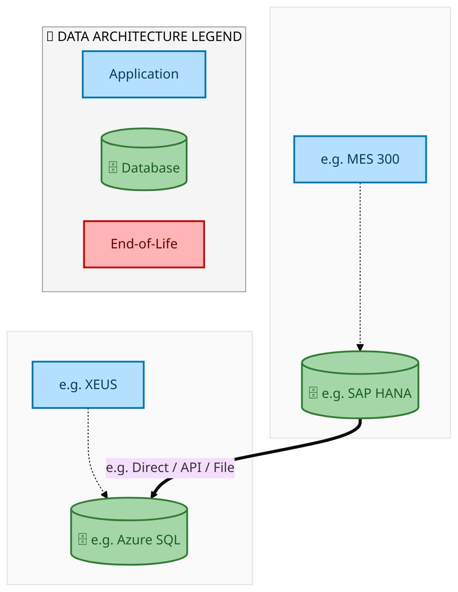
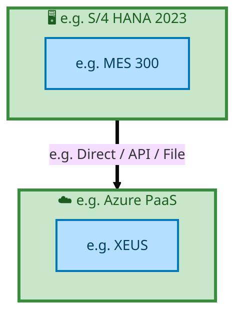

<div style="text-align:center; padding-top:20px;">
  
  <h1 style="font-size:36px; margin-top:24px;">E2E-115 — R3 Inter-company Asset Transfer Process</h1>
  <h2 style="font-size:24px;">Architecture Document (TOGAF BDAT)</h2>
  <p style="font-size:18px; color:#555;">End-to-End Integrated Processes (E2E) Tower<br/>
  Capability E2E-115 · Procure to Pay</p>
  <p style="font-size:14px; color:#888;">IAO Program · Release 2<br/>
  Generated: March 2026<br/>
  Sajiv Francis</p>
  <p style="font-size:12px; color:#aaa;">IAO Architecture Pipeline — Intel Confidential</p>
</div>

<style>
@media print {
  @page { margin: 0.75in; }
  .mermaid { page-break-inside: avoid; overflow: visible; }
  pre, table { page-break-inside: avoid; }
  h2, h3, h4 { page-break-after: avoid; }
}
.mermaid { overflow: visible; }
.mermaid svg { max-width: 100%; height: auto !important; }
.page-footer {
  padding-top: 8px;
  border-top: 1px solid #ddd;
  display: flex;
  justify-content: space-between;
  align-items: center;
  font-size: 11px;
  color: #888;
  position: fixed;
  bottom: 0;
  left: 0;
  right: 0;
  padding: 6px 20px;
  background: #fff;
}
@media print {
  .page-footer { position: fixed; bottom: 0; left: 0.75in; right: 0.75in; }
}
.page-footer a { color: #00aeef; text-decoration: none; font-weight: 500; }
.page-footer a:hover { color: #0071c5; text-decoration: underline; }
</style>

<div class="page-footer"><span>Page 1</span><span><a href="#toc">↑ Back to TOC</a></span><span>E2E-115 — R3 Inter-company Asset Transfer Process</span></div>
<div style="page-break-before: always;"></div>

<a id="toc"></a>

## Table of Contents

1. [Executive Summary](#1-executive-summary)
2. [Business Context & Objectives](#2-business-context--objectives)
   - 2.1 [Classification](#21-classification)
   - 2.2 [Business Drivers](#22-business-drivers)
   - 2.3 [Success Criteria](#23-success-criteria)
   - 2.4 [Companion Documents](#24-companion-documents)
3. [Business Architecture (TOGAF "B")](#3-business-architecture-togaf-b)
   - 3.1 [Business Process Overview](#31-business-process-overview)
   - 3.2 [Business Process Diagrams](#32-business-process-diagrams)
   - 3.3 [Business Roles & Responsibilities](#33-business-roles--responsibilities)
4. [Data Architecture (TOGAF "D")](#4-data-architecture-togaf-d)
   - 4.1 [Data Entities & Ownership](#41-data-entities--ownership)
   - 4.2 [Data Flow Diagrams](#42-data-flow-diagrams)
   - 4.3 [Data Lineage](#43-data-lineage)
   - 4.4 [RICEFW Data Objects](#44-ricefw-data-objects)
   - 4.5 [Data Governance & Quality](#45-data-governance--quality)
5. [Application Architecture (TOGAF "A")](#5-application-architecture-togaf-a)
   - 5.1 [Current-State Application Landscape](#51-current-state--current-state-application-landscape)
   - 5.2 [Future-State Application Landscape](#52-future-state--future-state-application-landscape)
   - 5.3 [Change Impact Summary](#53-change-impact-summary)
   - 5.4 [Component Overview](#54-component-overview)
   - 5.5 [RICEFW Inventory](#55-ricefw-inventory)
   - 5.6 [Integration Patterns](#56-integration-patterns)
6. [Technology Architecture (TOGAF "T")](#6-technology-architecture-togaf-t)
   - 6.1 [Platform & Infrastructure](#61-platform--infrastructure)
   - 6.2 [SAP Development Object Status](#62-sap-development-object-status)
   - 6.3 [NFRs & Design Principles](#63-nfrs--design-principles)
   - 6.4 [Security & Governance](#64-security--governance)
7. [Project Context](#7-project-context)
   - 7.1 [Project Roadmap & Go-Live Plan](#71-project-roadmap--go-live-plan)
   - 7.2 [RAID Log](#72-raid-log)
   - 7.3 [Recommendations & Next Steps](#73-recommendations--next-steps)

<div class="page-footer"><span>Page 2</span><span><a href="#toc">↑ Back to TOC</a></span><span>E2E-115 — R3 Inter-company Asset Transfer Process</span></div>
<div style="page-break-before: always;"></div>

## 1. Executive Summary

This Architecture Document defines the **Business, Data, Application, and Technology** (BDAT) architecture for **E2E-115 R3 Inter-company Asset Transfer Process** within the IAO program. It includes 2 BPMN process diagram(s) in Section 3.
| Dimension | Value |
|-----------|-------|
| **Tower** | End-to-End Integrated Processes (E2E) |
| **Process Group** | Procure to Pay |
| **Capability** | E2E-115 - R3 Inter-company Asset Transfer Process |
| **Release** | Release 2 |
| **Total Systems** | 2 |
| **System Status** | 0 Deployed, 0 Developing, 0 EOL, 2 Pending IAPM |
| **RICEFW Objects** | Pending — Smartsheet Object Tracker API integration |
**Change Summary**: 0 new flow chains, 0 removed, 0 modified, 1 unchanged between Current-State and Future-State states.

> All system nodes in architecture diagrams are **IAPM-linked** — click any node to open its IAPM page. Diagrams require `securityLevel: 'loose'` for click events.

<div class="page-footer"><span>Page 3</span><span><a href="#toc">↑ Back to TOC</a></span><span>E2E-115 — R3 Inter-company Asset Transfer Process</span></div>
<div style="page-break-before: always;"></div>

## 2. Business Context & Objectives

### 2.1 Classification

| Level | Value |
|-------|-------|
| **L0 Tower** | End-to-End Integrated Processes |
| **L1 Process** | Procure to Pay |
| **L2 Capability** | E2E-115 - R3 Inter-company Asset Transfer Process |

### 2.2 Business Drivers

| # | Driver | Description | Strategic Alignment | Priority |
|---|--------|-------------|---------------------|----------|
| 1 | End-to-End Process Integration | Enable cross-tower integrated processes spanning procurement, manufacturing, and fulfillment | IDM 2.0 Process Excellence | High |
| 2 | Intel Foundry Business Enablement | Stand up foundry-specific business processes for external customer engagement | Intel Foundry Services | High |
| 3 | Process Visibility & Monitoring | Provide end-to-end process visibility across tower boundaries with integrated monitoring | Operational Excellence | Medium |
| 4 | E2E-115 Process Migration | Migrate R3 Inter-company Asset Transfer Process business processes and 2 integrated systems from legacy to S/4 HANA target architecture | IDM 2.0 Cross-Functional / End-to-End | High |

<div class="page-footer"><span>Page 4</span><span><a href="#toc">↑ Back to TOC</a></span><span>E2E-115 — R3 Inter-company Asset Transfer Process</span></div>
<div style="page-break-before: always;"></div>

### 2.3 Success Criteria

| Metric | Target | Measure | Baseline | Owner |
|--------|--------|---------|----------|-------|
| E2E Process Cycle Time | Per process SLA | End-to-end transaction completion within defined SLA per process | Varies by process | E2E Process Owner |
| Cross-Tower Integration Success | > 99% | Transactions completing across tower boundaries without manual intervention | 92% (current) | Integration Lead |
| Process Exception Rate | < 2% | Transactions requiring manual exception handling | 8% (current) | Operations Manager |
| E2E-115 Migration Completeness | 100% flow chains validated | All 1 flow chains verified in target state | 0% (pre-migration) | Tower Architect |

### 2.4 Companion Documents

| Document | Description |
|----------|-------------|
| **Business Architecture** | Included in this document (Section 3) — process flows from BPMN diagrams |
| **This Document** | Full BDAT Architecture — Business + Data + Application + Technology |

<div class="page-footer"><span>Page 5</span><span><a href="#toc">↑ Back to TOC</a></span><span>E2E-115 — R3 Inter-company Asset Transfer Process</span></div>
<div style="page-break-before: always;"></div>

## 3. Business Architecture (TOGAF "B")

### 3.1 Business Process Overview

This capability includes **2 business process(es)** modeled in BPMN 2.0, covering the end-to-end workflow for E2E-115 R3 Inter-company Asset Transfer Process.

| # | Step ID | Process Name | Lanes | Tasks | Gateways |
|---|---------|--------------|-------|-------|----------|
| 1 | E2E-115A_R3_Inter-Company_Asset_Transfer_using_AMT_&amp;_ISM_Fiori_Apps | E2E-115A_R3_Inter-Company_Asset_Transfer_using_AMT_&amp;_ISM_Fiori_Apps | Boundary Apps
, SAP S/4 Intel Foundry 
(Receiving Company)
B
, SAP S/4 Intel Foundry 
(Sending Company)
A
 | 18 | 3 |
| 2 | E2E-115B_R3_Detail-out_on_TM_Embedded_Steps | E2E-115B_R3_Detail-out_on_TM_Embedded_Steps | Boundary Apps, External Partners/B2B, SAP S/4 Intel Foundry
 | 19 | 12 |

### 3.2 Business Process Diagrams

<div class="page-footer"><span>Page 6</span><span><a href="#toc">↑ Back to TOC</a></span><span>E2E-115 — R3 Inter-company Asset Transfer Process</span></div>
<div style="page-break-before: always;"></div>

#### BUSINESS ARCHITECTURE — 3.2.1 E2E-115A_R3_Inter-Company_Asset_Transfer_using_AMT_&amp;_ISM_Fiori_Apps — E2E-115A_R3_Inter-Company_Asset_Transfer_using_AMT_&amp;_ISM_Fiori_Apps

**Swim Lanes**: Boundary Apps
 · SAP S/4 Intel Foundry 
(Receiving Company)
B
 · SAP S/4 Intel Foundry 
(Sending Company)
A
 | **Tasks**: 18 | **Gateways**: 3

> **Legend**: <span style="color:#000;background:#4CAF50;padding:2px 6px;border-radius:10px;font-weight:bold;font-size:9pt">● Start</span> · <span style="color:#fff;background:#C62828;padding:2px 6px;border-radius:10px;font-weight:bold;font-size:9pt">● End</span> · <span style="background:#E3F2FD;padding:2px 6px;border:1px solid #1565C0;font-size:9pt">User Task</span> · <span style="background:#FFF3E0;padding:2px 6px;border:1px solid #E65100;font-size:9pt">Service Task</span> · <span style="background:#FFF9C4;padding:2px 6px;border:1px solid #F57F17;font-size:9pt">◇ Gateway</span> · <span style="background:#F3E5F5;padding:2px 6px;border:1px solid #7B1FA2;font-size:9pt">Sub-Process</span>

```mermaid
%%{init: {'theme': 'base', 'themeVariables': {'fontSize': '14px', 'fontFamily': 'Segoe UI, Arial, sans-serif','primaryColor': '#e8f0fe', 'primaryBorderColor': '#0071c5','lineColor': '#37474F', 'secondaryColor': '#f5f8fc'}, 'flowchart': {'useMaxWidth': false, 'htmlLabels': true, 'curve': 'basis', 'nodeSpacing': 40, 'rankSpacing': 50}} }%%
flowchart LR
    classDef startEvt fill:#4CAF50,stroke:#2E7D32,color:#000,font-weight:bold,stroke-width:2px,rx:20,ry:20
    classDef endEvt fill:#C62828,stroke:#B71C1C,color:#fff,font-weight:bold,stroke-width:2px,rx:20,ry:20
    classDef userTask fill:#E3F2FD,stroke:#1565C0,stroke-width:2px,color:#0D47A1
    classDef serviceTask fill:#FFF3E0,stroke:#E65100,stroke-width:2px,color:#BF360C
    classDef gateway fill:#FFF9C4,stroke:#F57F17,stroke-width:2px,color:#E65100
    classDef subProc fill:#F3E5F5,stroke:#7B1FA2,stroke-width:2px,color:#4A148C
    subgraph Boundary Apps 
        n1["Initiate iSTART Approval Process (Factory Team)​"]
        n2["Return EQ on WO – Return Reason Code Transfer in UI Determine Final Asset or..."]
        n3["Initiate Asset Transfer Process"]
        n19(["fa:fa-play Initiate Asset Transfer Request"])
        n20(["fa:fa-play Initiate asset transfer"])
        n21(["fa:fa-stop endEvent"])
    end
    subgraph SAP S/4 Intel Foundry  (Receiving Company) B 
        n17["Acquire Asset in Receiving Company"]
        n18["Update maintenance plant and location after transfer completed in Equipment..."]
        n22(["fa:fa-stop Asset Received at Receiving Company Code"])
    end
    subgraph SAP S/4 Intel Foundry  (Sending Company) A 
        n4["Initiate Inter-Company Asset Transfer"]
        n5["Update Transfer Details and Shipment Flag"]
        n6["Validate Transfer"]
        n7["Request Submitted for Approval"]
        n8["Approve via My Inbox App"]
        n9["Generate ISM Number (ZISM Delivery Doc)"]
        n10["Update ISM Number in request line of AMT Table"]
        n11["TM Embedded"]
        n12["Generate Shipping/ Commercial Docs"]
        n13["Post Goods Issue Against ISM Delivery Doc"]
        n14["Approve Asset Transfer Request"]
        n15["Post Financial Entry (Via Batch Job)"]
        n16["Retire Asset in Sending Company"]
        n23["B R3 Detail-out on TM Embedded Steps"]
        n24{{"fa:fa-code-branch Shipment Flag?"}}
        n25{{"fa:fa-arrows-alt parallelGateway"}}
        n26{{"fa:fa-arrows-alt inclusiveGateway"}}
    end
    n2 --> n4
    n4 --> n5
    n5 --> n6
    n6 --> n7
    n7 --> n8
    n8 --> n24
    n24 -->|"Yes"| n9
    n9 --> n25
    n25 --> n10
    n25 --> n11
    n11 --> n23
    n10 --> n12
    n12 --> n13
    n13 --> n26
    n26 --> n14
    n25 --> n26
    n14 --> n15
    n15 --> n16
    n16 --> n17
    n24 -->|"No"| n26
    n19 --> n1
    n17 --> n18
    n18 --> n22
    n3 --> n2
    n1 --> n21
    n20 --> n3
    class n19 startEvt
    class n20 startEvt
    class n21 endEvt
    class n22 endEvt
    class n23 startEvt
    class n24 gateway
    class n25 gateway
    class n26 gateway
```

<div style="text-align:center; margin:4px 0 8px 0; font-size:11px;"><a href="https://mermaid.live/view#pako:eNqlV22T2jYQ_isaZ264m4HUNjbm-NAOb86kk0tTIMm0pR-ELYMmRnIk-V564b93ZcvG9h1fWj4waL3P7j6PdmXxbEU8JtbEurp6poyqCXruqQM5kt4E9XZYkl4flYYvWFC8S4nsaZ-EM7Wm_xRujpc9ajdtC_GRpk_auiZ7TtDn9300BWDaRxIzOZBE0KTX72WCHrF4mvOUC-39howTOymymUczLmIizg62HTiRD9CUMnI2DwMv8EKNkyTiLG4FTfxknES9ky4u5Q_RAQtVlJ9Lcocfv9JYHWCd4FQS8DmoY_oB70iqOSqRa1uUi_tKDCp1HgaCrTMcUbYHu2eDSWD27Wzy7dMJna6utqxOij6stgzBJ0qxlAuSIKnAvLxXKKFpOnnjzaehb_elEvwbmbxxl8Fi6PYjzWQC1O2-FnfwQOj-oCY7nsbGdfCgOUzc7LEvHieu3RdP8N3JRVh8zjQfuWN3XGeaBc7cmVeZkiT5X5lAV7HB8pvJtRyGbrioczn-yJ_bL-NVNBdeMHW6OhFxTyPSCBqG4XB5lmo58h37ctBZOBzZ807QPVbkAT-dA97OvTpg6AehE1wMWObrVpnvPgkeVQGHSz_064DBzAmn7sWA3tTxxqZCiLMXODugGc-LXkbTLJOofKg_zPlra72HQaVAAdH1ZrraaB_B73GKdA1ESnQd4khxQG8IPt5sc9e2d1vr70YYF8KsiMoFQ8vfEWfo629I-zlDZMwrgiXY59DtaAMNLhMiEGUw0WhBFBFHGEMUUgZpp1IShbh4-_ZtO8uwWWzpVYcytbYBzu01QBI8SfAgS2GHLqFX5HtOpAL0TZOVfQmOC7gy8C7MOcOk4lk5MIQ1woOls0Pr6Se0_smDFIqkKNT7BYKj6xWJCL2HkwCkO2aYPd2gWWsDA8g1jb7nVFSsqFa7g-roMgbQ5yzWVI6YQkqGWUQQkGQKYRajlEdYUdgwnMDm1ExRBOFS2K9YZ1lC1uwIxF7slOt2JCgrK8sCMFYvSyx6479ItAbXlkDTpkBes2k0VAyqhO0maDPwzwrVXQKNimkqC4HWh5I6ClO8b0NHAP2CU9oCt12CYl6KnkPrfHekSkuacFEPX9tf71f5hKB7itGd7sUdf9Tubc9b8HxHGBEF3fUd-pgfd1D79Z96sSAp6A-qLXh00-kJ-8y4gYNtFqZQ_aZEPEHTuw3a6Hd3J4A-SzZ3aAm4OCZx56nbLEyrl8Ge_aQ37UhEBK90XVN3fvXEf-KQ-x3nsUTvpcyhy_fQsmDrEupgvYZmF8e9CfCrZPoYYkVJS6Yg9vUXkHyGVXRAv_JdV7dRefa15q_Tkp3h0KxmaDU0DTXgudJnZkM7tFYk64jhes_P1UzpW9ZgB3SgpFYn_rK1TqcmyD-DsBD8QQ5wqlCGBU5Tkr4r31xd0OhVEGVRmkuQ-wWqnlXmosHgZxg6s_TKpW-WfrkcmeWoXAZmGZTLsVmOy6VbxXKLYD-21h8ElPkBrW4e3BrHKotr0jh212BuA_DDQIaVwTYebmUwRJzaY2ggVfGuqd7xOllqD8ewd6rCnKqO2qOKEXQ5fuQFxXMsQ7JmYMRyKrWcSq6KQVVv9dwsqwCuYTxsXD2KNNVNsmUH79ftjrkNtq3uq9bhhRhedYFqm_3XzaPKbPUtODng9RVbk2er-FMBfzxikuA8Vdapb-Fc8fUTi6xJcfm28uJwW1AMr5NjaTz9C8y85uI=" title="View in Mermaid Live">&#128065; View in Mermaid Live</a></div>

<div class="page-footer"><span>Page 7</span><span><a href="#toc">↑ Back to TOC</a></span><span>E2E-115 — R3 Inter-company Asset Transfer Process</span></div>
<div style="page-break-before: always;"></div>

#### BUSINESS ARCHITECTURE — 3.2.2 E2E-115B_R3_Detail-out_on_TM_Embedded_Steps — E2E-115B_R3_Detail-out_on_TM_Embedded_Steps

**Swim Lanes**: Boundary Apps · External Partners/B2B · SAP S/4 Intel Foundry
 | **Tasks**: 19 | **Gateways**: 12

> **Legend**: <span style="color:#000;background:#4CAF50;padding:2px 6px;border-radius:10px;font-weight:bold;font-size:9pt">● Start</span> · <span style="color:#fff;background:#C62828;padding:2px 6px;border-radius:10px;font-weight:bold;font-size:9pt">● End</span> · <span style="background:#E3F2FD;padding:2px 6px;border:1px solid #1565C0;font-size:9pt">User Task</span> · <span style="background:#FFF3E0;padding:2px 6px;border:1px solid #E65100;font-size:9pt">Service Task</span> · <span style="background:#FFF9C4;padding:2px 6px;border:1px solid #F57F17;font-size:9pt">◇ Gateway</span> · <span style="background:#F3E5F5;padding:2px 6px;border:1px solid #7B1FA2;font-size:9pt">Sub-Process</span>


<div style="text-align:center; margin:4px 0 8px 0; font-size:11px;"><a href="https://mermaid.live/view#pako:eNqlWG1v4jgQ_itWVr22EizkjQAfTuJ1F6ndoqa7K91xH9zggNXg5GyHluv2v984sQOk9MNx_VDFk5lnZp4Zjx1erShdEqtvXVy8UkZlH71eyjXZkMs-unzEglw2UCn4gTnFjwkRl0onTpkM6T-Fmu1lL0pNyaZ4Q5OdkoZklRL0fdZAAzBMGkhgJpqCcBpfNi4zTjeY70ZpknKl_Yl043ZceNOvhilfEr5XaLcDO_LBNKGM7MVu4AXeVNkJEqVseQQa-3E3ji7fVHBJ-hytMZdF-Lkgt_jlJ13KNaxjnAgCOmu5SW7wI0lUjpLnShblfGvIoEL5YUBYmOGIshXIvTaIOGZPe5HffntDbxcXC1Y5RTf3C4bgL0qwEGMSIyFBPNlKFNMk6X_yRoOp324IydMn0v_kTIKx6zQilUkfUm83FLnNZ0JXa9l_TJOlVm0-qxz6TvbS4C99p93gO_hf80XYcu9p1HG6TrfyNAzskT0ynuI4_l-egFf-gMWT9jVxp850XPmy_Y4_ar_HM2mOvWBg13kifEsjcgA6nU7dyZ6qSce32x-DDqdupz2qga6wJM94twfsjbwKcOoHUzv4ELD0V48yf5zzNDKA7sSf-hVgMLSnA-dDQG9ge10dIeCsOM7WaJjmRS-jQZaJ8p36Y7b_58IaPYQzNMKcU8LRjG1TIAjdq_aPaEKxpClroTEVWS4JusUMr2D_Mrmw_iqRoB9q7iYvknCGEzSHrmSEi9bQGR667YDbEOyQTFE4mKOh9-2mwitVAlD5lkoa71BUxlZT6KrQcSZzTsAhiXIVKCJbCE2gLcVo-M27aX55eKjZ9cAOsiN0S9B8vRM0gkC5EmQSYVk-boGKKN1kmO1QkkYFCcc4jnMFQDHux7iZJVD9MZYYMUKWQmX1SBAkKNWjTu76wNj1Xl-NMSSXPosmTiTKMMdJQpIvZUMtrLe3QyP_HKPOfzN6X0xVn7DlQWdIkqCp6iRopENGVSE4AST0xyy8RXe5fFRaaEwSReQOXYH9dY2-yqj1PVsq2ykvhgT6DucGwmBuBHdqch9bu2A9JzxO-abq3JAkJCp6QBmPcBLlicIdwcRcEXEM4JkGvAcV0dI6rUGuCvZ18HOIYCvSFVON3q8iAX_PWEUj0NVPKteUoYfbWmJqR4VrmqGrL2kKvTATIic1HdX-ZcuS4yyL0DUfocQyF2ieCom-zI4Bgj3lBxYGKiRSJsUeReM0yo82a2He3ZuH5UBE87sWmjAJxQrXhNT01ZYp4hhEEc9huwBJxtnkJSNMEPUKii6vRC1Xuw3Gg6TYRPsQR4BW7JOqR2aSbIDW0V1rPrhGKYdJA0MEjnr0Ayf5iQ1oq76b0-ipoGCO4aHkAVBm9arYqt80TbeYQiszzFTaCWZlt93oXY5wDH7RAxzCIoaHEUyBhEiyRFDtyd85zRSfnz9_rjlQLRmqUxgBNpQSDu9WmD_CFJUcQ1-y1ftOrUF4B5OJ6_lLlvXR_I5hp12bREc9XYykg4lUm0SOXTOewfajiqYHk0bdwt1bCJlmVVOoDgFXh1u3LLOp_rKO5NWRhCAS6iNUBcpqLdEzbLSqOnUEtdsG6N4tphNvjvTILoGqGuZC0T-4fSiCUzNqSlNOy9PwmMvOGTPWCc4x6p5j1DvnCGifY2SfY-ScY-SeY3SacsqiBIq9JR-fa8xBzebvqtJ67Zdr1zHvtYLraUFHG_SMQk8ruFrgeqXANpCONnEDLQjKdVcvu_p12wC0S0GvtraNgq0Frr7Psl5t7WoPJiTbrE1Irk7TNjG4Os1KQcdsV0HYOm-3BlFl5bqlwKw1DY5ZOzpqQ6QT1ACMB7PUa9-sDY3-EcCvhfXuQC5nnhpz6ja7sH6pDWbC1InZ9fqZuOyuhp3fjdG9vglOyovkgl0d3iWvC-iqVypWgxqLlXNbO7OrJE3_Vd69WjvZbo0mR_NiGw3HuK31W-XV0R1mV1T6hrk7dGXYW7Di0nGNfoNHdemBZL-m8NEFywHl6pNmCF8g17C8xVlWHAW_VMAHnytFlc3X57Hc_kDufCB39ZflsdQ7KfU_wOiYj7FjcXBa3D0t7p0Uw6Y8KbZPi53TYve02Dst9k-LT2fpVllaDWtD-AbTpdV_tYrfW6y-tSQxzhNpvTUsnMs03LHI6he_S1h5cdaOKYYr_6YUvv0LW_N9kw==" title="View in Mermaid Live">&#128065; View in Mermaid Live</a></div>

<div class="page-footer"><span>Page 8</span><span><a href="#toc">↑ Back to TOC</a></span><span>E2E-115 — R3 Inter-company Asset Transfer Process</span></div>
<div style="page-break-before: always;"></div>

### 3.3 Business Roles & Responsibilities

| Role / Lane | Processes Involved | Description |
|------------|-------------------|-------------|
| Boundary Apps
 | E2E-115A_R3_Inter-Company_Asset_Transfer_using_AMT_&amp;_ISM_Fiori_Apps,  | |
| SAP S/4 Intel Foundry 
(Receiving Company)
B
 | E2E-115A_R3_Inter-Company_Asset_Transfer_using_AMT_&amp;_ISM_Fiori_Apps,  | |
| SAP S/4 Intel Foundry 
(Sending Company)
A
 | E2E-115A_R3_Inter-Company_Asset_Transfer_using_AMT_&amp;_ISM_Fiori_Apps,  | |
| Boundary Apps | E2E-115B_R3_Detail-out_on_TM_Embedded_Steps | |
| External Partners/B2B | E2E-115B_R3_Detail-out_on_TM_Embedded_Steps | |
| SAP S/4 Intel Foundry
 | E2E-115B_R3_Detail-out_on_TM_Embedded_Steps | |

<div class="page-footer"><span>Page 9</span><span><a href="#toc">↑ Back to TOC</a></span><span>E2E-115 — R3 Inter-company Asset Transfer Process</span></div>
<div style="page-break-before: always;"></div>

## 4. Data Architecture (TOGAF "D")

### 4.1 Data Entities & Ownership

| # | Data Entity | Source System | Target System | Data Owner | Classification | Volume | Master/Transaction |
|---|-------------|---------------|---------------|------------|----------------|--------|-------------------|
| 1 | e.g. Cost Element | e.g. MES 300 | e.g. XEUS | Data steward | e.g. Intel Confidential | e.g. 10K rows/day | Master / Transaction |

<div class="page-footer"><span>Page 10</span><span><a href="#toc">↑ Back to TOC</a></span><span>E2E-115 — R3 Inter-company Asset Transfer Process</span></div>
<div style="page-break-before: always;"></div>

### 4.2 Data Flow Diagrams

> **DATA ARCHITECTURE** — Database-to-database data flows. Applications (blue) sit above their hosting databases (green cylinders). Thick arrows show data movement between databases.

#### 4.2.1 Current-State — Current-State Data Flows



<div style="text-align:center; margin:4px 0 8px 0; font-size:11px;"><a href="https://mermaid.live/view#pako:eNqdlYFumzAQhl_FchVlk5KOJCVZkVrJCWStRKuupNukMiEHjsSqAwjMmjTNu8-GhG5Z6KraEsLnu__O3yGzxn4cADZwo7FmERMGWjfFHBbQNFBzSjNotlAzAz9PmVjZ8Au42uBxXO4Urt9oyuiUQ9ZU0WEcCYc9FQIdPVkqN2Ub0wXjK2V1YBYDurtsISIDeXOjPHj86M9pKgqNPIMruvzOAjGX65DyDKTPXCy4TafAVSKR5soWyeqdhPosmkljT5emlEYPL6YTfbNBm0bDjaoUaDJ0IySHz2mWmRAimiTDeIlCxrlxNNTN8XjcykQaP4BxpGmDwbC_XbYfVU1GN1m2_JjHqdrumfq-XjAdrfhWjuhmnwwqua41MHvdWrnOULe62p4cxPylvPF4qA_1Sm800uSo1ev31bYblYpZPp2lNJkjq2t1OvrIJCPbA2_mkac8Bc_5at-7GLn4Z-muRsBS8AWLo4qaGlU8KcJ_WHeOjITj2TFS71LBMIyS6oEgcy_nBxe7efC5F8hn4J-4eQiaPLVSK5yQdHLxR6VZkH21DtQ-bp_X5ipDIQq2QMSKQz2NHXKiZoXc0tT8G3knWf4XskNuvAtyTd7H-MpyvJ6m7TDLJZLLN5GuEr8CWvog5fMmzttaDqLeJXsT6Z3zu0DXJEZnZ-fPW0pmQRZ9QuTmUj7HjIOLn1_5OvZaaMNMnuD-D2x-oCGTTAgit6OLy4k1mtzdWsi2vljXZk1T7dsXq-2p9pMk4cynavdwA23PrGmWSQVV9_LhPtmeJeWtKGjHYdtmIZTy5QVysCPlCXf8dTUr_qenp__Axy28gHRBWYCNNS7uf_n3CCCkORd408I0F7GzinxsFFc0zpOACjAZlUQXpXHzG1b89-E=" title="View in Mermaid Live">&#128065; View in Mermaid Live</a></div>

<div class="page-footer"><span>Page 11</span><span><a href="#toc">↑ Back to TOC</a></span><span>E2E-115 — R3 Inter-company Asset Transfer Process</span></div>
<div style="page-break-before: always;"></div>

#### 4.2.2 Future-State — Future-State Data Flows


<div style="text-align:center; margin:4px 0 8px 0; font-size:11px;"><a href="https://mermaid.live/view#pako:eNqdlYFumzAQhl_FchVlk5KOJCVZkVrJCbBWolVX0m1SmZADR2LVAQRmTZrm3WdDQrcs6araEsLnu__O3yGzwkESAjZwo7FiMRMGWjXFDObQNFBzQnNotlAzh6DImFg68Au42uBJUu2Urt9oxuiEQ95U0VESC5c9lQIdPV0oN2Wz6ZzxpbK6ME0A3V22EJGBvLlWHjx5DGY0E6VGkcMVXXxnoZjJdUR5DtJnJubcoRPgKpHICmWLZfVuSgMWT6Wxp0tTRuOHF9OJvl6jdaPhxXUKNB56MZIj4DTPTYgQTdNhskAR49w4GuqmbdutXGTJAxhHmjYYDPubZftR1WR000UrSHiSqe2eqe_qhZPRkm_kiG72yaCW61oDs9c9KNcZ6lZX25GDhL-UZ9tDfajXeqORJsdBvX5fbXtxpZgXk2lG0xmyulano9smGTk--FOfPBUZ-O5X597DyMM_K3c1QpZBIFgS19TUqONJGf7DunNlJBxPj5F6lwqGYVRU9wSZOzk_eNgrws-9UD7D4MQrItDkqZVa6YSkk4c_Ks2S7Kt1oPZx-_xgrioU4nADRCw5HKaxRU7UrJFbmpp_I--ki_9CdsmNf0GuyfsYX1mu39O0LWa5RHL5JtJ14ldASx-kfN7EeVPLXtTbZG8ivXV-F-gDidHZ2fnzhpJZkkWfELm5lE-bcfDw8ytfx04LHZjKE9z_gS0INWSSMUHkdnRxObZG47tbCznWF-vaPNBU5_bF6viq_SRNOQuo2t3fQMc3DzTLpIKqe3l_nxzfkvJWHLaTqO2wCCr56gLZ25HqhFv-upo1_9PT03_g4xaeQzanLMTGCpf3v_x7hBDRggu8bmFaiMRdxgE2yisaF2lIBZiMSqLzyrj-DdOy-As=" title="View in Mermaid Live">&#128065; View in Mermaid Live</a></div>

<div class="page-footer"><span>Page 12</span><span><a href="#toc">↑ Back to TOC</a></span><span>E2E-115 — R3 Inter-company Asset Transfer Process</span></div>
<div style="page-break-before: always;"></div>

### 4.3 Data Lineage

| # | Source System | Source Schema/Object | Target System | Target Schema/Object | Transformation |
|---|-------------|---------------------|---------------|---------------------|---------------|
| 1 | e.g. MES 300 | e.g. CKMLHD table | e.g. XEUS | e.g. dbo.CostElements | Lineage notes |

### 4.4 RICEFW Data Objects

Reports and Conversions for this capability will be populated from the Smartsheet Object Tracker via automated API extraction.

| Object ID | Type | Description | Status | Source | Target | Complexity |
|-----------|------|-------------|--------|--------|--------|-----------|
| E2E-115-R001 | Report | R3 Inter-company Asset Transfer Process operational report | Planned | SAP S/4HANA | Analytics | Medium |
| E2E-115-C001 | Conversion | Legacy data migration for R3 Inter-company Asset Transfer Process | Planned | Legacy ERP | SAP S/4HANA | High |

> *Pending: Smartsheet API integration to auto-populate live RICEFW data (see Build Requirements).*

### 4.5 Data Governance & Quality

| Concern | Approach |
|---------|----------|
| Data Ownership | Per-entity owners listed in Section 3.1 |
| Data Classification | Financial data classified as Intel Confidential |
| Data Retention | Per Intel corporate retention policies |
| Data Quality | Validated at source; reconciliation at target |

<div class="page-footer"><span>Page 13</span><span><a href="#toc">↑ Back to TOC</a></span><span>E2E-115 — R3 Inter-company Asset Transfer Process</span></div>
<div style="page-break-before: always;"></div>

## 5. Application Architecture (TOGAF "A")

### 5.1 Current-State — Current-State Application Landscape

#### Overview

The Current-State architecture represents the **current / legacy** landscape for E2E-115.This view is generated from `CurrentFlows.xlsx` (1 flow hops across 1 flow chains).

#### APPLICATION ARCHITECTURE — Architecture Diagram (ArchiMate-Inspired)

> **Click any system node** to open its IAPM application page.
> **Legend**: <span style="background:#C8E6C9;padding:2px 6px;border:1px solid #2E7D32;font-size:9pt">Deployed</span> · <span style="background:#E3F2FD;padding:2px 6px;border:1px solid #1565C0;font-size:9pt">Developing</span> · <span style="background:#FFCDD2;padding:2px 6px;border:1px solid #C62828;font-size:9pt">End-of-Life</span> · <span style="background:#ECEFF1;padding:2px 6px;border:1px solid #78909C;font-size:9pt;border-style:dashed">No IAPM Match</span>


<div style="text-align:center; margin:4px 0 8px 0; font-size:11px;"><a href="https://mermaid.live/view#pako:eNqVVWtv4jAQ_CtWKsQXaENbHo0qpISEE6fQVk0fdzpOkYk3YNUkUey0pZT_fnZCCa-qPSMFZT0768yO7YUWxAQ0Q6tUFjSiwkCLqpjCDKoGqo4xh2oNVTkEWUrF3IVnYGqCxXExk0MfcErxmAGvquwwjoRH33KCRit5VTAV6-MZZXMV9WASA7of1JApE1kNcRzxOoeUhtWlQrP4JZjiVOR8GYchfn2kREzle4gZB4mZihlz8RiYKirSTMUi-SVeggMaTWTwXJehFEdPZaipL5doWamMonUJdGeNIiRHpYLqdbmgYEqHWECdRjyhKRDExZwBChjmHLjEFPD83YYQjTNOI-Ac5SOkjBlHfTmsZo2LNH4C48jqdFq6tXqtv6gvMU6T11oQszg1jnRd3-HESYLKUXBaTcW65tT1dttq_QcnwQLvc9qdLzgbW5wfcwRzKV6K51JT1NypNKOEMHjBKWwqYrfMUhGn3eqXbN9YPcRsTxGl8YbKvZ6uf8VZsPJsPElxMkWm-2ekjTLSOSPySc6ayLy5cQc9825wfYVc87dzO9L-FklqEGmIQNA4Qu5tGXVOnUaj2fPBn_hDx_PPdH2TNoAWguPJMZJzSM5JRsMwZIsPM_xy7r2D6Wri89zhY55tvmUp-B6kzzQA38r41gc22gVVjkIrFJKogrds3B697eT0vZgL32Fyz0eiu7nI4LxgVgC0AlyO05PuJe0WE94DOkEDOw7k30_v-uryhHaLssqZRUGIyEePDogq9173faTldHbeCUll3gzks08ZjLT3r8TYov4MpMrsdUQta2We_Diw3I2t3te_2uqbqeY6Vf_Ojt4zrQsTqdOWRYiOXOeHc2V_w62uLz2-azAzSRgNsAIfsJjrDx93fTQsvfKpd1zfdnZdYqtjyImEvE12u1-kONfFpjxtkXMJJPU4rLs0XJWR58CGVUpRC1E-hG2q31rYi4uLvTNNq2kzSGeYEs1YaPktJu9AAiHOmNCWNQ1nIvbmUaAZ-eWiZYlcKNgUyybMiuDyH5gNPuE=" title="View in Mermaid Live">&#128065; View in Mermaid Live</a></div>

<div class="page-footer"><span>Page 14</span><span><a href="#toc">↑ Back to TOC</a></span><span>E2E-115 — R3 Inter-company Asset Transfer Process</span></div>
<div style="page-break-before: always;"></div>

#### Current-State Flow Narrative

| # | Flow Chain | Path | Interface | Freq |
|---|-----------|------|-----------|------|
| 1 | e.g. MES Route to ICOST | e.g. MES 300 → e.g. XEUS | e.g. Direct / API / File | e.g. Near Real-Time |

<div class="page-footer"><span>Page 15</span><span><a href="#toc">↑ Back to TOC</a></span><span>E2E-115 — R3 Inter-company Asset Transfer Process</span></div>
<div style="page-break-before: always;"></div>

### 5.2 Future-State — Future-State Application Landscape

#### Overview

The Future-State architecture represents the **target** landscape for E2E-115.This view is generated from `FutureFlows.xlsx` (1 flow hops across 1 flow chains).

#### APPLICATION ARCHITECTURE — Architecture Diagram (ArchiMate-Inspired)

> **Click any system node** to open its IAPM application page.
> **Legend**: <span style="background:#C8E6C9;padding:2px 6px;border:1px solid #2E7D32;font-size:9pt">Deployed</span> · <span style="background:#E3F2FD;padding:2px 6px;border:1px solid #1565C0;font-size:9pt">Developing</span> · <span style="background:#FFCDD2;padding:2px 6px;border:1px solid #C62828;font-size:9pt">End-of-Life</span> · <span style="background:#ECEFF1;padding:2px 6px;border:1px solid #78909C;font-size:9pt;border-style:dashed">No IAPM Match</span>


<div style="text-align:center; margin:4px 0 8px 0; font-size:11px;"><a href="https://mermaid.live/view#pako:eNqVVWtv4jAQ_CtWKsQXaENbHo0qpKQJJ06hrZo-7nScIhNvwKpJothpSyn__eyEEl4VPSMFZT0768yO7bkWxAQ0Q6tU5jSiwkDzqpjAFKoGqo4wh2oNVTkEWUrFzIUXYGqCxXExk0MfcUrxiAGvquwwjoRH33OCRit5UzAV6-EpZTMV9WAcA3ro15ApE1kNcRzxOoeUhtWFQrP4NZjgVOR8GYcBfnuiREzke4gZB4mZiClz8QiYKirSTMUi-SVeggMajWXwXJehFEfPZaipLxZoUakMo1UJdG8NIyRHpYLqdbmgYEIHWECdRjyhKRDExYwBChjmHLjEFPD83YYQjTJOI-Ac5SOkjBlHPTmsZo2LNH4G48jqdFq6tXytv6ovMU6Tt1oQszg1jnRd3-LESYLKUXBaTcW64tT1dttq_QcnwQLvctqdA5yNDc7POYK5FC_FM6kpam5VmlJCGLziFNYVsVtmqYjTbvVKtm-sHmK2o4jSeE3lqytdP8RZsPJsNE5xMkGm-2eoDTPSOSPySc6ayLy9dftX5n3_5hq55m_nbqj9LZLUINIQgaBxhNy7MuqcOo1Gs-eDP_YHjuef6fo6bQAtBMfjYyTnkJyTjIZhyBbvZ_jlPHh709XE17mDpzzbfM9S8D1IX2gAvpXxjQ9stAuqHIWWKCRRBW_ZuB1628npr2IufIfJPR-J7voig_OCWQHQEnA5Sk-6l7RbTHiP6AT17TiQfz-9m-vLE9otyipnFgUhIp892iOq3Hvdj6GW09l5JySVeduXzx5lMNQ-DomxQf0VSJXZ6Yha1tI8-XFguWtbvacf2urrqeYqVf_Ojt4xrQtjqdOGRYiOXOeHc21_w62uLz2-bTAzSRgNsALvsZjrD562fTQovfKld1zfdrZdYqtjyImEvE22u1-kODfFpjxtkXMJJPU4rLs0XJaR58CaVUpRC1E-hW2q30rYi4uLnTNNq2lTSKeYEs2Ya_ktJu9AAiHOmNAWNQ1nIvZmUaAZ-eWiZYlcKNgUyyZMi-DiH97SPvk=" title="View in Mermaid Live">&#128065; View in Mermaid Live</a></div>

<div class="page-footer"><span>Page 16</span><span><a href="#toc">↑ Back to TOC</a></span><span>E2E-115 — R3 Inter-company Asset Transfer Process</span></div>
<div style="page-break-before: always;"></div>

#### Future-State Flow Narrative

| # | Flow Chain | Path | Interface | Freq |
|---|-----------|------|-----------|------|
| 1 | e.g. MES Route to ICOST | e.g. MES 300 → e.g. XEUS | e.g. Direct / API / File | e.g. Near Real-Time |

<div class="page-footer"><span>Page 17</span><span><a href="#toc">↑ Back to TOC</a></span><span>E2E-115 — R3 Inter-company Asset Transfer Process</span></div>
<div style="page-break-before: always;"></div>

### 5.3 Change Impact Summary

| Change Type | Flow Chain | Detail |
|-------------|-----------|--------|
| **UNCHANGED** | e.g. MES Route to ICOST | No change |

**Totals**: 0 new - 0 removed - 0 modified - 1 unchanged

### 5.4 Component Overview

#### System Inventory

| System | IAPM ID | Status |
|--------|---------|--------|
| e.g. MES 300 | - | N/A |
| e.g. XEUS | - | N/A |

<div class="page-footer"><span>Page 18</span><span><a href="#toc">↑ Back to TOC</a></span><span>E2E-115 — R3 Inter-company Asset Transfer Process</span></div>
<div style="page-break-before: always;"></div>

### 5.5 RICEFW Inventory

RICEFW objects for this capability will be auto-populated from the Smartsheet S/4 Object Tracker.

| Object ID | Type | Description | Status | Source → Target | Middleware | Complexity |
|-----------|------|-------------|--------|----------------|-----------|-----------|
| E2E-115-I001 | Interface | R3 Inter-company Asset Transfer Process inbound data interface | Planned | Legacy → SAP S/4HANA | MuleSoft / CPI | Medium |
| E2E-115-E001 | Enhancement | R3 Inter-company Asset Transfer Process custom business logic | Planned | SAP S/4HANA | N/A | Medium |
| E2E-115-F001 | Form/Report | R3 Inter-company Asset Transfer Process operational output | Planned | SAP S/4HANA | N/A | Low |

> *Pending: Smartsheet API integration to auto-populate live RICEFW inventory (see Build Requirements).*

<div class="page-footer"><span>Page 19</span><span><a href="#toc">↑ Back to TOC</a></span><span>E2E-115 — R3 Inter-company Asset Transfer Process</span></div>
<div style="page-break-before: always;"></div>

### 5.6 Integration Patterns

| # | Pattern | Flow Chain | Middleware | Protocol | Auth |
|---|---------|-----------|-----------|----------|------|
| 1 | e.g. Pub-Sub / P2P / ETL | e.g. MES Route to ICOST | e.g. Azure Service Bus | e.g. REST / RFC / SFTP | e.g. OAuth / NTLM / Cert |

<div class="page-footer"><span>Page 20</span><span><a href="#toc">↑ Back to TOC</a></span><span>E2E-115 — R3 Inter-company Asset Transfer Process</span></div>
<div style="page-break-before: always;"></div>

## 6. Technology Architecture (TOGAF "T")

### 6.1 Platform & Infrastructure

> **TECHNOLOGY / PLATFORM ARCHITECTURE** — Platforms (green) host applications (blue). Thick arrows show platform-to-platform integration flows.

#### 6.1.1 Current-State — Current-State Platform Architecture



<div style="text-align:center; margin:4px 0 8px 0; font-size:11px;"><a href="https://mermaid.live/view#pako:eNqtlGFvmzAQhv-K5SriC2sJhDRD6iQgoFVKp2is26QxIQeOxKrBCMyaNOW_z4YuWSulUrX5g8W9d358fi28xynPADt4NNrTkgoH7TWxgQI0B2kr0oCmI62BtK2p2C3gFzCVYJwPmb70K6kpWTFoNLU656WI6EMPGE-qrSpTWkgKynZKjWDNAd1e68iVC5nWqQrG79MNqUXPaBu4IdtvNBMbGeeENSBrNqJgC7ICpjYSdau0UnYfVSSl5VqKE0NKNSnvjpJtdB3qRqO4PGyBvnhxieRIGWmaOeSIVJXHtyinjDlnnj0Pw1BvRM3vwDkzjMtLb_oUvrtXPTlmtdVTznit0tbcfsmrGBFHoD8Lpv77A9CazQLLfw60jsCxZwem8QIInB15YejZnn3g-b4hx8kGp1OVjsuB2LSrdU2qDQrMYDy2_eVimUCyTtyHtoZkSUj0I8Zxa06NcdzmYMitz9fnqE8jlY7xz4GkRkZrSAXlJVp8PqoHtNujvwe3Ctpz1LckOI4zWD4sgjJ76k7sGJxu7Z_8fP38UTJJPrqf3MQ0TKu3IJtZmZwzYv9tRHQxQaoOqbq3e3ETRIllGH_skCGS4VsdedbsfzDlVfzV1YfHp3bn_RHRBXKX13IOKYMYP56-L6zjAuqC0Aw7e9y_FfKlySAnLRO40zFpBY92ZYqd_nfGbZURAXNK5B0Vg9j9BoM0b9I=" title="View in Mermaid Live">&#128065; View in Mermaid Live</a></div>

> **Legend**: <span style="background:#C8E6C9;padding:2px 8px;border:2px solid #388E3C;font-size:9pt">🖥️ Platform</span> · <span style="background:#B5DFFF;padding:2px 8px;border:2px solid #0077B6;font-size:9pt">📦 Application</span> · <span style="background:#FFB5B5;padding:2px 8px;border:2px solid #CC0000;font-size:9pt">⛔ End-of-Life</span> · <span style="background:#FFF9C4;padding:2px 8px;border:2px solid #F9A825;font-size:9pt">📋 Unassigned</span>

<div class="page-footer"><span>Page 21</span><span><a href="#toc">↑ Back to TOC</a></span><span>E2E-115 — R3 Inter-company Asset Transfer Process</span></div>
<div style="page-break-before: always;"></div>

#### 6.1.2 Future-State — Future-State Platform Architecture


<div style="text-align:center; margin:4px 0 8px 0; font-size:11px;"><a href="https://mermaid.live/view#pako:eNqtlGFvmzAQhv-K5SriC2sJhDRDaiVIQKuUTtFYt0mjQg4ciVWDEZg1acp_nw1ZslZKpWrzB4t77_z4_Fp4hxOeAnbwYLCjBRUO2mliDTloDtKWpAZNR1oNSVNRsZ3DL2AqwTjvM13pN1JRsmRQa2p1xgsR0qcOMByVG1WmtIDklG2VGsKKA7q70ZErFzKtVRWMPyZrUomO0dRwSzbfaSrWMs4Iq0HWrEXO5mQJTG0kqkZphew-LElCi5UUR4aUKlI8HCXbaFvUDgZRcdgCffWiAsmRMFLXM8gQKUuPb1BGGXPOPHsWBIFei4o_gHNmGJeX3ngffnhUPTlmudETznil0tbMfs0rGRFH4HTij6cfD0BrMvGt6UugdQQOPds3jVdA4OzICwLP9uwDbzo15DjZ4His0lHRE-tmuapIuUa-6Q-HdrCYL2KIV7H71FQQLwgJf0Y4asyxMYyaDAy59fnqHHVppNIRvu9JaqS0gkRQXqD5l6N6QLsd-od_p6AdR31LguM4veX9IijSfXdiy-B0a__k59vnD-NR_Mn97MamYVqdBenESuWcEvtvI8KLEVJ1SNW934tbP4wtw_hjhwyRDN_ryItm_4Mpb-Kvrq6f9-3OuiOiC-QubuQcUAYRfj59X1jHOVQ5oSl2drh7K-RLk0JGGiZwq2PSCB5uiwQ73e-MmzIlAmaUyDvKe7H9DaZZb-o=" title="View in Mermaid Live">&#128065; View in Mermaid Live</a></div>

> **Legend**: <span style="background:#C8E6C9;padding:2px 8px;border:2px solid #388E3C;font-size:9pt">🖥️ Platform</span> · <span style="background:#B5DFFF;padding:2px 8px;border:2px solid #0077B6;font-size:9pt">📦 Application</span> · <span style="background:#FFB5B5;padding:2px 8px;border:2px solid #CC0000;font-size:9pt">⛔ End-of-Life</span> · <span style="background:#FFF9C4;padding:2px 8px;border:2px solid #F9A825;font-size:9pt">📋 Unassigned</span>

#### Platform Inventory

| # | Platform | Type | Systems Using | Environment |
|---|----------|------|--------------|-------------|
| 1 | e.g. Azure PaaS | Cloud / SaaS | e.g. XEUS | DEV,QAS,PRD |
| 2 | e.g. S/4 HANA 2023 | On-Premise | e.g. MES 300 | DEV,QAS,PRD |

<div class="page-footer"><span>Page 22</span><span><a href="#toc">↑ Back to TOC</a></span><span>E2E-115 — R3 Inter-company Asset Transfer Process</span></div>
<div style="page-break-before: always;"></div>

### 6.2 SAP Development Object Status

**RICEFW Status Summary** — E2E Tower (0 objects)
*Data source: Smartsheet Object Tracker (cached 2026-03-27)*

| Status | Count | % |
|--------|------:|----:|
| **Total** | **0** | **100%** |

**RICEFW by Type:**

| Type | Count |
|------|------:|
| **Total** | **0** |

### 6.3 NFRs & Design Principles

| Category | Requirement | Target / SLA | Priority |
|----------|-------------|-------------|----------|
| Performance | Order/transaction processing within interactive SLA | < 3 seconds for online transactions | High |
| Availability | Business-critical systems available during extended hours | 99.9% (06:00-22:00 all time zones) | High |
| Scalability | Support seasonal and promotional volume spikes | Handle 2x baseline transaction volume | Medium |
| Recoverability | Customer-facing systems recover within business impact window | RPO < 30 min, RTO < 2 hours | High |
| Data Volume | Support transactional data growth from business expansion | 10M+ documents/year | Medium |
| Latency | Near-real-time integration for order status updates | < 30 seconds for status propagation | Medium |
| Concurrency | Support global user base across business functions | 300+ concurrent users | Medium |

### 6.4 Security & Governance

| Concern | Approach | Standard / Policy | Owner |
|---------|----------|--------------------|-------|
| Authentication | Single Sign-On (SSO) via Intel corporate Azure AD identity | Intel IT Security Policy - Identity Management | IT Security |
| Authorization | Role-based access control (RBAC) with SAP authorization objects | Intel SAP Security Standards - Role Design | SAP Security Team |
| Data Classification | All financial/operational data classified per Intel Data Classification Standard | Intel Data Classification Policy | Data Governance |
| Data Encryption (at rest) | AES-256 encryption for SAP HANA database and file storage | Intel Encryption Standard | Infrastructure Security |
| Data Encryption (in transit) | TLS 1.3 for all system-to-system and user-to-system communication | Intel Network Security Policy | Network Engineering |
| Network Segmentation | SAP systems in dedicated network zones with firewall controls | Intel Network Architecture Standard | Network Security |
| API Security | OAuth 2.0 / certificate-based authentication for all API integrations | Intel API Security Guidelines | Integration Architecture |
| Audit Logging | Comprehensive audit trail for all data changes and user actions (SAP Security Audit Log) | SOX Compliance / Intel Audit Policy | Internal Audit |
| Certificate Management | Automated certificate lifecycle management for system-to-system trust | Intel PKI Standard | Certificate Authority Team |
| Compliance | SOX controls, export control (EAR/ITAR) screening, data privacy (GDPR) | Intel Corporate Compliance Framework | Compliance Office |

<div class="page-footer"><span>Page 23</span><span><a href="#toc">↑ Back to TOC</a></span><span>E2E-115 — R3 Inter-company Asset Transfer Process</span></div>
<div style="page-break-before: always;"></div>

## 7. Project Context

### 7.1 Project Roadmap & Go-Live Plan

*No timeline data available for this capability.*

### 7.2 RAID Log

*Live data from Smartsheet Master RAID Log — extracted 2026-03-27*

**RAID Summary:** 15 open items (0 capability-specific, 15 tower-level), 56 closed

| Severity | Capability | Tower-Wide | Total Open |
|----------|----------:|-----------:|-----------:|
| P1 - High | 0 | 3 | 3 |
| P2 - Medium | 0 | 10 | 10 |
| P3 - Low | 0 | 2 | 2 |
| **Total** | **0** | **15** | **15** |

**Other E2E Tower RAID Items** (15 open):

| RAID ID | Type | Severity | Title | Status | Assigned To | Due Date |
|---------|------|----------|-------|--------|-------------|----------|
| 03591 | Risk | P1 - High | R3 E2E scenario execution | In Progress | Test Management | 2026-04-03 |
| 03681 | Risk | P1 - High | ITC Execution: Planning run availability - Prerequisite for ... | In Progress | E2E | 2026-03-27 |
| 03762 | Risk | P1 - High | FTS-IF (esp SCP) related test cases/sequencing are not accur... | In Progress | FTS IF | 2026-04-03 |
| 01733 | Risk | P2 - Medium | Tariffs impacts Item/BOM design which is impacting ERP/SCP (... | In Progress | E2E | 2026-03-06 |
| 03592 | Risk | P2 - Medium | Lack of Defined IMO Owner for CBA Mask Billing and Materials... | In Progress | E2E | 2026-03-27 |
| 03625 | Risk | P2 - Medium | Item/ BOM MC1 delta load | In Progress | Cutover | 2026-04-10 |
| 03628 | Risk | P2 - Medium | R3 Returns Rework Process Causing Finance Double Counting in... | In Progress | E2E | 2026-03-27 |
| 03642 | Issue | P2 - Medium | E2E Process with Anafi on order/invoice point.  Need IFS SC ... | In Progress | E2E | 2026-03-24 |
| 03736 | Action | P2 - Medium | Golden Data/Test Data Readiness | In Progress | Master Data | 2026-04-22 |
| 03743 | Issue | P2 - Medium | FD-Share with Entitlements -  Interface File Paths for MC1 | Roadblock / At Risk | PMO | 2026-03-20 |
| 03753 | Risk | P2 - Medium | PDF-SMH IF test cases are not available in JIRA | To Be Reviewed | B-Apps | 2026-03-25 |
| 03756 | Risk | P2 - Medium | LE101-1001 Operation Support Ownership for SIMS/Tester Front... | In Progress | E2E | 2026-04-24 |
| 03769 | Action | P2 - Medium | Need a Labs SPOC owner to define IP Labs enterprise and mate... | In Progress | E2E | 2026-04-17 |
| 03216 | Action | P3 - Low | Mask Expense vs. Invoice | In Progress | E2E | 2026-03-06 |
| 03315 | Risk | P3 - Low | BPMG – SCP L3/L4 flow standards | In Progress | Business Process Mgmt | 2026-03-27 |

### 7.3 Recommendations & Next Steps

| # | Category | Recommendation | Priority | Owner | Target Date | Status |
|---|----------|---------------|----------|-------|-------------|--------|
| 1 | Architecture | Complete extended flow attributes (Data Entity, Integration Pattern, Tech Platform) in Flows tab for full BDAT coverage | High | Tower Architect | 2026-Q2 | Open |
| 2 | Data | Define data ownership and classification for all 1 flow chains to satisfy Data Architecture (TOGAF D) requirements | Medium | Data Architect | 2026-Q3 | Open |
| 3 | Testing | Develop integration test scenarios covering all 1 flow chains for FUT/SIT readiness | High | Test Lead | 2026-Q3 | Open |
| 4 | Business Architecture | Review and validate Business Architecture process steps against latest Signavio/BIC process models | Medium | Business Analyst | 2026-Q2 | Open |
| 5 | Security | Complete security review for API integrations and data flows per Intel Security Architecture standards | Medium | Security Architect | 2026-Q3 | Open |

---
*E2E-115 — Architecture Document (TOGAF BDAT) · End-to-End Integrated Processes · Generated: March 2026*

