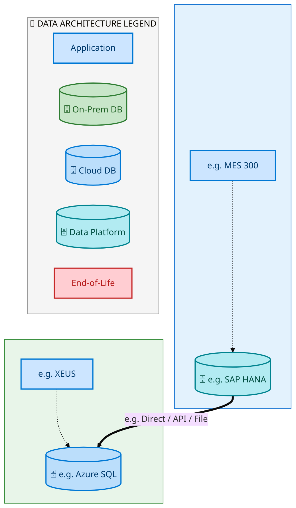
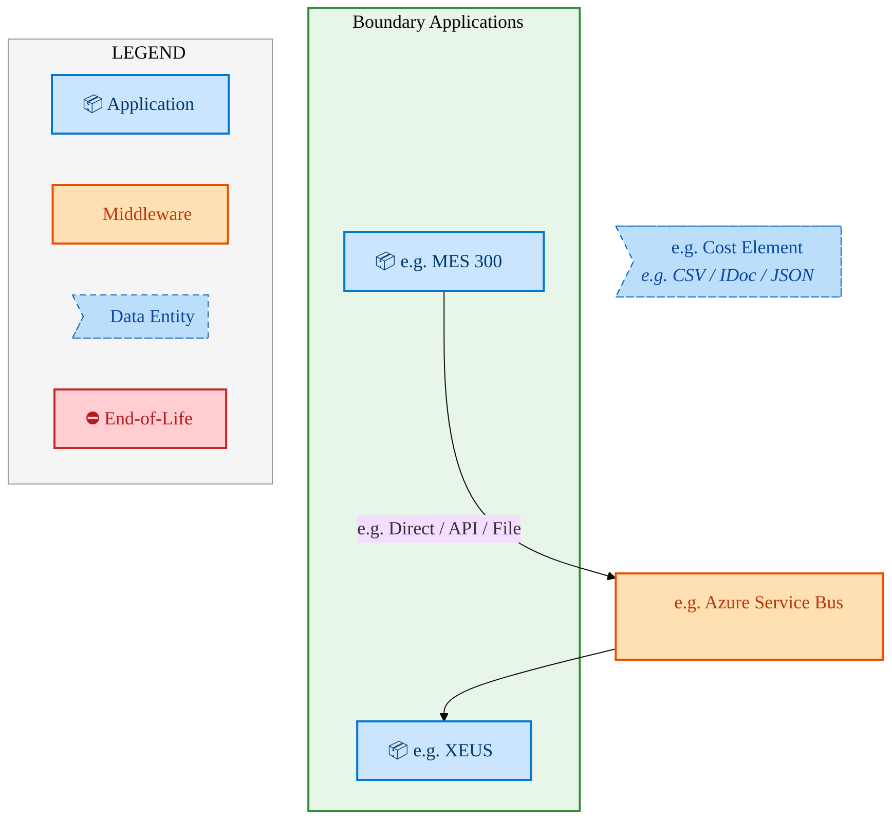
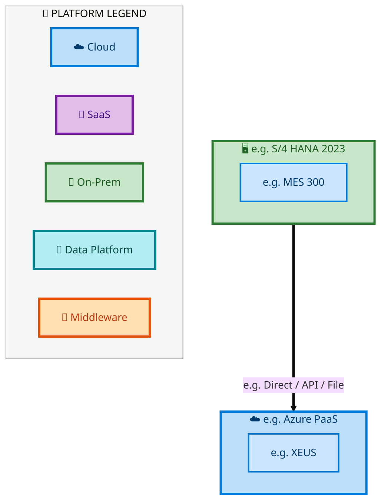

  <img src="data:image/svg+xml;base64,PHN2ZyB4bWxucz0iaHR0cDovL3d3dy53My5vcmcvMjAwMC9zdmciIHZpZXdCb3g9IjAgMCA4MDAgNDgwIiB3aWR0aD0iODAwIiBoZWlnaHQ9IjQ4MCI+DQogIDxkZWZzPg0KICAgIDxsaW5lYXJHcmFkaWVudCBpZD0iYmciIHgxPSIwJSIgeTE9IjAlIiB4Mj0iMTAwJSIgeTI9IjEwMCUiPg0KICAgICAgPHN0b3Agb2Zmc2V0PSIwJSIgc3R5bGU9InN0b3AtY29sb3I6IzAwNzFjNTtzdG9wLW9wYWNpdHk6MSIvPg0KICAgICAgPHN0b3Agb2Zmc2V0PSIxMDAlIiBzdHlsZT0ic3RvcC1jb2xvcjojMDBhZWVmO3N0b3Atb3BhY2l0eToxIi8+DQogICAgPC9saW5lYXJHcmFkaWVudD4NCiAgICA8bGluZWFyR3JhZGllbnQgaWQ9ImFjY2VudCIgeDE9IjAlIiB5MT0iMCUiIHgyPSIwJSIgeTI9IjEwMCUiPg0KICAgICAgPHN0b3Agb2Zmc2V0PSIwJSIgc3R5bGU9InN0b3AtY29sb3I6I2ZmZmZmZjtzdG9wLW9wYWNpdHk6MC4xNSIvPg0KICAgICAgPHN0b3Agb2Zmc2V0PSIxMDAlIiBzdHlsZT0ic3RvcC1jb2xvcjojZmZmZmZmO3N0b3Atb3BhY2l0eTowLjAyIi8+DQogICAgPC9saW5lYXJHcmFkaWVudD4NCiAgICA8cGF0dGVybiBpZD0iZ3JpZCIgd2lkdGg9IjQwIiBoZWlnaHQ9IjQwIiBwYXR0ZXJuVW5pdHM9InVzZXJTcGFjZU9uVXNlIj4NCiAgICAgIDxwYXRoIGQ9Ik0gNDAgMCBMIDAgMCAwIDQwIiBmaWxsPSJub25lIiBzdHJva2U9InJnYmEoMjU1LDI1NSwyNTUsMC4wNykiIHN0cm9rZS13aWR0aD0iMC41Ii8+DQogICAgPC9wYXR0ZXJuPg0KICA8L2RlZnM+DQoNCiAgPCEtLSBCYWNrZ3JvdW5kIC0tPg0KICA8cmVjdCB3aWR0aD0iODAwIiBoZWlnaHQ9IjQ4MCIgZmlsbD0idXJsKCNiZykiIHJ4PSI4Ii8+DQogIDxyZWN0IHdpZHRoPSI4MDAiIGhlaWdodD0iNDgwIiBmaWxsPSJ1cmwoI2dyaWQpIiByeD0iOCIvPg0KICA8cmVjdCB3aWR0aD0iODAwIiBoZWlnaHQ9IjQ4MCIgZmlsbD0idXJsKCNhY2NlbnQpIiByeD0iOCIvPg0KDQogIDwhLS0gRGVjb3JhdGl2ZSBjaXJjdWl0L2FyY2hpdGVjdHVyZSBsaW5lcyAtLT4NCiAgPGcgc3Ryb2tlPSJyZ2JhKDI1NSwyNTUsMjU1LDAuMTIpIiBzdHJva2Utd2lkdGg9IjEuNSIgZmlsbD0ibm9uZSI+DQogICAgPHBhdGggZD0iTSAwIDEwMCBMIDEyMCAxMDAgTCAxNjAgMTQwIEwgMjgwIDE0MCIvPg0KICAgIDxwYXRoIGQ9Ik0gMCAyNjAgTCA4MCAyNjAgTCAxMjAgMjIwIEwgMjAwIDIyMCBMIDI0MCAyNjAgTCAzNjAgMjYwIi8+DQogICAgPHBhdGggZD0iTSA1MjAgMTAwIEwgNjAwIDEwMCBMIDY0MCA2MCBMIDgwMCA2MCIvPg0KICAgIDxwYXRoIGQ9Ik0gNDQwIDM0MCBMIDU2MCAzNDAgTCA2MDAgMzAwIEwgNzIwIDMwMCBMIDc2MCAzNDAgTCA4MDAgMzQwIi8+DQogICAgPHBhdGggZD0iTSA2MDAgNDAwIEwgNjgwIDQwMCBMIDcyMCA0NDAiLz4NCiAgICA8cGF0aCBkPSJNIDAgNDAwIEwgNDAgNDAwIEwgODAgMzYwIi8+DQogICAgPHBhdGggZD0iTSAyMDAgNDIwIEwgMzIwIDQyMCBMIDM2MCAzODAgTCA0ODAgMzgwIi8+DQogICAgPHBhdGggZD0iTSA2NTAgNDQwIEwgNzUwIDQ0MCBMIDgwMCA0ODAiLz4NCiAgPC9nPg0KDQogIDwhLS0gRGVjb3JhdGl2ZSBub2RlcyAtLT4NCiAgPGcgZmlsbD0icmdiYSgyNTUsMjU1LDI1NSwwLjE4KSI+DQogICAgPGNpcmNsZSBjeD0iMTIwIiBjeT0iMTAwIiByPSI0Ii8+DQogICAgPGNpcmNsZSBjeD0iMjgwIiBjeT0iMTQwIiByPSI0Ii8+DQogICAgPGNpcmNsZSBjeD0iMjAwIiBjeT0iMjIwIiByPSI0Ii8+DQogICAgPGNpcmNsZSBjeD0iMzYwIiBjeT0iMjYwIiByPSI0Ii8+DQogICAgPGNpcmNsZSBjeD0iNjAwIiBjeT0iMTAwIiByPSI0Ii8+DQogICAgPGNpcmNsZSBjeD0iNzIwIiBjeT0iMzAwIiByPSI0Ii8+DQogICAgPGNpcmNsZSBjeD0iNTYwIiBjeT0iMzQwIiByPSI0Ii8+DQogICAgPGNpcmNsZSBjeD0iODAiIGN5PSIzNjAiIHI9IjQiLz4NCiAgICA8Y2lyY2xlIGN4PSI0ODAiIGN5PSIzODAiIHI9IjQiLz4NCiAgICA8Y2lyY2xlIGN4PSIzMjAiIGN5PSI0MjAiIHI9IjQiLz4NCiAgPC9nPg0KDQogIDwhLS0gVE9HQUYgQkRBVCBib3hlcyAtLT4NCiAgPGcgZm9udC1mYW1pbHk9IlNlZ29lIFVJLCBBcmlhbCwgc2Fucy1zZXJpZiIgZm9udC1zaXplPSIxNCIgZm9udC13ZWlnaHQ9IjYwMCI+DQogICAgPCEtLSBCIC0tPg0KICAgIDxyZWN0IHg9IjE1MCIgeT0iMTQwIiB3aWR0aD0iMTIwIiBoZWlnaHQ9IjQwIiByeD0iNSIgZmlsbD0icmdiYSgyNTUsMjU1LDI1NSwwLjE4KSIgc3Ryb2tlPSJyZ2JhKDI1NSwyNTUsMjU1LDAuMykiIHN0cm9rZS13aWR0aD0iMSIvPg0KICAgIDx0ZXh0IHg9IjIxMCIgeT0iMTY1IiB0ZXh0LWFuY2hvcj0ibWlkZGxlIiBmaWxsPSIjZmZmIj5CdXNpbmVzczwvdGV4dD4NCiAgICA8IS0tIEQgLS0+DQogICAgPHJlY3QgeD0iMjkwIiB5PSIxNDAiIHdpZHRoPSIxMjAiIGhlaWdodD0iNDAiIHJ4PSI1IiBmaWxsPSJyZ2JhKDI1NSwyNTUsMjU1LDAuMTgpIiBzdHJva2U9InJnYmEoMjU1LDI1NSwyNTUsMC4zKSIgc3Ryb2tlLXdpZHRoPSIxIi8+DQogICAgPHRleHQgeD0iMzUwIiB5PSIxNjUiIHRleHQtYW5jaG9yPSJtaWRkbGUiIGZpbGw9IiNmZmYiPkRhdGE8L3RleHQ+DQogICAgPCEtLSBBIC0tPg0KICAgIDxyZWN0IHg9IjQzMCIgeT0iMTQwIiB3aWR0aD0iMTIwIiBoZWlnaHQ9IjQwIiByeD0iNSIgZmlsbD0icmdiYSgyNTUsMjU1LDI1NSwwLjE4KSIgc3Ryb2tlPSJyZ2JhKDI1NSwyNTUsMjU1LDAuMykiIHN0cm9rZS13aWR0aD0iMSIvPg0KICAgIDx0ZXh0IHg9IjQ5MCIgeT0iMTY1IiB0ZXh0LWFuY2hvcj0ibWlkZGxlIiBmaWxsPSIjZmZmIj5BcHBsaWNhdGlvbjwvdGV4dD4NCiAgICA8IS0tIFQgLS0+DQogICAgPHJlY3QgeD0iNTcwIiB5PSIxNDAiIHdpZHRoPSIxMjAiIGhlaWdodD0iNDAiIHJ4PSI1IiBmaWxsPSJyZ2JhKDI1NSwyNTUsMjU1LDAuMTgpIiBzdHJva2U9InJnYmEoMjU1LDI1NSwyNTUsMC4zKSIgc3Ryb2tlLXdpZHRoPSIxIi8+DQogICAgPHRleHQgeD0iNjMwIiB5PSIxNjUiIHRleHQtYW5jaG9yPSJtaWRkbGUiIGZpbGw9IiNmZmYiPlRlY2hub2xvZ3k8L3RleHQ+DQogIDwvZz4NCg0KICA8IS0tIENvbm5lY3RpbmcgbGluZXMgYmV0d2VlbiBCREFUIGJveGVzIC0tPg0KICA8ZyBzdHJva2U9InJnYmEoMjU1LDI1NSwyNTUsMC4yNSkiIHN0cm9rZS13aWR0aD0iMSI+DQogICAgPGxpbmUgeDE9IjI3MCIgeTE9IjE2MCIgeDI9IjI5MCIgeTI9IjE2MCIvPg0KICAgIDxsaW5lIHgxPSI0MTAiIHkxPSIxNjAiIHgyPSI0MzAiIHkyPSIxNjAiLz4NCiAgICA8bGluZSB4MT0iNTUwIiB5MT0iMTYwIiB4Mj0iNTcwIiB5Mj0iMTYwIi8+DQogIDwvZz4NCg0KICA8IS0tIE1haW4gdGl0bGUgLS0+DQogIDx0ZXh0IHg9IjQwMCIgeT0iMjYwIiB0ZXh0LWFuY2hvcj0ibWlkZGxlIiBmb250LWZhbWlseT0iU2Vnb2UgVUksIEFyaWFsLCBzYW5zLXNlcmlmIiBmb250LXNpemU9IjM2IiBmb250LXdlaWdodD0iNzAwIiBmaWxsPSIjZmZmZmZmIiBsZXR0ZXItc3BhY2luZz0iMSI+DQogICAgSUFPIEFyY2hpdGVjdHVyZQ0KICA8L3RleHQ+DQogIDx0ZXh0IHg9IjQwMCIgeT0iMzAwIiB0ZXh0LWFuY2hvcj0ibWlkZGxlIiBmb250LWZhbWlseT0iU2Vnb2UgVUksIEFyaWFsLCBzYW5zLXNlcmlmIiBmb250LXNpemU9IjE4IiBmb250LXdlaWdodD0iNDAwIiBmaWxsPSJyZ2JhKDI1NSwyNTUsMjU1LDAuOCkiIGxldHRlci1zcGFjaW5nPSIyIj4NCiAgICBUT0dBRiBCREFUIMK3IElBTyBQcm9ncmFtIMK3IElETSAyLjANCiAgPC90ZXh0Pg0KDQogIDwhLS0gQm90dG9tIGFjY2VudCBiYXIgLS0+DQogIDxyZWN0IHg9IjI4MCIgeT0iMzQwIiB3aWR0aD0iMjQwIiBoZWlnaHQ9IjMiIHJ4PSIxLjUiIGZpbGw9InJnYmEoMjU1LDI1NSwyNTUsMC40KSIvPg0KDQogIDwhLS0gSW50ZWwgdGV4dCAtLT4NCiAgPHRleHQgeD0iNDAwIiB5PSIzODAiIHRleHQtYW5jaG9yPSJtaWRkbGUiIGZvbnQtZmFtaWx5PSJTZWdvZSBVSSwgQXJpYWwsIHNhbnMtc2VyaWYiIGZvbnQtc2l6ZT0iMTMiIGZpbGw9InJnYmEoMjU1LDI1NSwyNTUsMC41KSIgbGV0dGVyLXNwYWNpbmc9IjMiPg0KICAgIElOVEVMIENPTkZJREVOVElBTA0KICA8L3RleHQ+DQo8L3N2Zz4NCg==" alt="IAO Architecture" style="width:100%; border-radius:8px;" />
  <h1 style="font-size:36px; margin-top:24px;">E2E-115 — R3 Inter-company Asset Transfer Process</h1>
  <h2 style="font-size:24px;">Architecture Document (TOGAF BDAT)</h2>
  
End-to-End Integrated Processes (E2E) Tower 
  Capability E2E-115 · Procure to Pay

  
IAO Program · R1 – R5 
  Generated: April 2026 
  Sajiv Francis

  
IAO Architecture Pipeline — Intel Confidential

Page 1<a href="#toc">↑ Back to TOC</a>E2E-115 — R3 Inter-company Asset Transfer Process

## Table of Contents

<nav class="toc">
<ol>
  <li><a href="#1-executive-summary">1. Executive Summary</a></li>
  <li><a href="#2-business-context-objectives">2. Business Context &amp; Objectives</a>
    <ul>
      <li><a href="#21-classification">2.1 Classification</a></li>
      <li><a href="#22-business-drivers">2.2 Business Drivers</a></li>
      <li><a href="#23-success-criteria">2.3 Success Criteria</a></li>
      <li><a href="#24-companion-documents">2.4 Companion Documents</a></li>
    </ul>
  </li>
  <li><a href="#3-business-architecture-togaf-b">3. Business Architecture (TOGAF &ldquo;B&rdquo;)</a>
    <ul>
      <li><a href="#31-business-process-overview">3.1 Business Process Overview</a></li>
      <li><a href="#32-business-process-diagrams">3.2 Business Process Diagrams</a></li>
      <li><a href="#33-business-roles-responsibilities">3.3 Business Roles &amp; Responsibilities</a></li>
    </ul>
  </li>
  <li><a href="#4-data-architecture-togaf-d">4. Data Architecture (TOGAF &ldquo;D&rdquo;)</a>
    <ul>
      <li><a href="#41-data-entities-ownership">4.1 Data Entities &amp; Ownership</a></li>
      <li><a href="#42-data-flow-diagrams">4.2 Data Flow Diagrams</a></li>
      <li><a href="#43-data-lineage">4.3 Data Lineage</a></li>
      <li><a href="#44-ricefw-data-objects">4.4 RICEFW Data Objects</a></li>
      <li><a href="#45-data-governance-quality">4.5 Data Governance &amp; Quality</a></li>
    </ul>
  </li>
  <li><a href="#5-application-architecture-togaf-a">5. Application Architecture (TOGAF &ldquo;A&rdquo;)</a>
    <ul>
      <li><a href="#51-current-state-current-state-application-landscape">5.1 Current-State Application Landscape</a></li>
      <li><a href="#52-future-state-future-state-application-landscape">5.2 Future-State Application Landscape</a></li>
      <li><a href="#53-change-impact-summary">5.3 Change Impact Summary</a></li>
      <li><a href="#54-component-overview">5.4 Component Overview</a></li>
      <li><a href="#55-ricefw-inventory">5.5 RICEFW Inventory</a>
        <ul>
          <li><a href="#551-eca-dependencies">5.5.1 ECA Dependencies</a></li>
          <li><a href="#552-boundary-application-dependencies">5.5.2 Boundary Application Dependencies</a></li>
        </ul>
      </li>
      <li><a href="#56-integration-patterns">5.6 Integration Patterns</a></li>
    </ul>
  </li>
  <li><a href="#6-technology-architecture-togaf-t">6. Technology Architecture (TOGAF &ldquo;T&rdquo;)</a>
    <ul>
      <li><a href="#61-platform-infrastructure">6.1 Platform &amp; Infrastructure</a></li>
      <li><a href="#62-sap-development-object-status">6.2 SAP Development Object Status</a></li>
      <li><a href="#63-nfrs-design-principles">6.3 NFRs &amp; Design Principles</a></li>
      <li><a href="#64-security-governance">6.4 Security &amp; Governance</a></li>
    </ul>
  </li>
  <li><a href="#7-project-context">7. Project Context</a>
    <ul>
      <li><a href="#71-project-roadmap-go-live-plan">7.1 Project Roadmap &amp; Go-Live Plan</a></li>
      <li><a href="#72-raid-log">7.2 RAID Log</a></li>
      <li><a href="#73-recommendations-next-steps">7.3 Recommendations &amp; Next Steps</a></li>
    </ul>
  </li>
</ol>
</nav>

Page 2<a href="#toc">↑ Back to TOC</a>E2E-115 — R3 Inter-company Asset Transfer Process

## 1. Executive Summary

This Architecture Document defines the **Business, Data, Application, and Technology** (BDAT) architecture for **E2E-115 R3 Inter-company Asset Transfer Process** within the IAO program. It includes 2 BPMN process diagram(s) in Section 3.

| Dimension | Value |
|-----------|-------|
| **Tower** | End-to-End Integrated Processes (E2E) |
| **Process Group** | Procure to Pay |
| **Capability** | E2E-115 - R3 Inter-company Asset Transfer Process |
| **Release** | R1 – R5 |
| **Total Systems** | 2 |
| **System Status** | 0 Deployed, 0 Developing, 0 EOL, 2 Pending IAPM |
| **RICEFW Objects** | Pending — Smartsheet Object Tracker API integration |

**Change Summary**: 0 new flow chains, 0 removed, 0 modified, 1 unchanged between Current-State and Future-State states.

> All system nodes in architecture diagrams are **IAPM-linked** — click any node to open its IAPM page. Diagrams require `securityLevel: 'loose'` for click events.

Page 3<a href="#toc">↑ Back to TOC</a>E2E-115 — R3 Inter-company Asset Transfer Process

## 2. Business Context & Objectives

### 2.1 Classification

| Level | Value |
|-------|-------|
| **L0 Tower** | End-to-End Integrated Processes |
| **L1 Process** | Procure to Pay |
| **L2 Capability** | E2E-115 - R3 Inter-company Asset Transfer Process |

### 2.2 Business Drivers

| # | Driver | Description | Strategic Alignment | Priority |
|---|--------|-------------|---------------------|----------|
| 1 | End-to-End Process Integration | Enable cross-tower integrated processes spanning procurement, manufacturing, and fulfillment | IDM 2.0 Process Excellence | High |
| 2 | Intel Foundry Business Enablement | Stand up foundry-specific business processes for external customer engagement | Intel Foundry Services | High |
| 3 | Process Visibility & Monitoring | Provide end-to-end process visibility across tower boundaries with integrated monitoring | Operational Excellence | Medium |
| 4 | E2E-115 Process Migration | Migrate R3 Inter-company Asset Transfer Process business processes and 2 integrated systems from legacy to S/4 HANA target architecture | IDM 2.0 Cross-Functional / End-to-End | High |

Page 4<a href="#toc">↑ Back to TOC</a>E2E-115 — R3 Inter-company Asset Transfer Process

### 2.3 Success Criteria

| Metric | Target | Measure | Baseline | Owner |
|--------|--------|---------|----------|-------|
| E2E Process Cycle Time | Per process SLA | End-to-end transaction completion within defined SLA per process | Varies by process | E2E Process Owner |
| Cross-Tower Integration Success | > 99% | Transactions completing across tower boundaries without manual intervention | 92% (current) | Integration Lead |
| Process Exception Rate | < 2% | Transactions requiring manual exception handling | 8% (current) | Operations Manager |
| E2E-115 Migration Completeness | 100% flow chains validated | All 1 flow chains verified in target state | 0% (pre-migration) | Tower Architect |

### 2.4 Companion Documents

| Document | Description |
|----------|-------------|
| **Business Architecture** | Included in this document (Section 3) — process flows from BPMN diagrams |
| **This Document** | Full BDAT Architecture — Business + Data + Application + Technology |

Page 5<a href="#toc">↑ Back to TOC</a>E2E-115 — R3 Inter-company Asset Transfer Process

## 3. Business Architecture (TOGAF "B")

### 3.1 Business Process Overview

This capability includes **2 business process(es)** modeled in BPMN 2.0, covering the end-to-end workflow for E2E-115 R3 Inter-company Asset Transfer Process.

| # | Step ID | Process Name | Lanes | Tasks | Gateways |
|---|---------|--------------|-------|-------|----------|
| 1 | E2E-115A_R3_Inter-Company_Asset_Transfer_using_AMT_&amp;_ISM_Fiori_Apps | E2E-115A_R3_Inter-Company_Asset_Transfer_using_AMT_&amp;_ISM_Fiori_Apps | Boundary Apps

, SAP S/4 Intel Foundry 
(Receiving Company)
B
, SAP S/4 Intel Foundry 
(Sending Company)
A

 | 18 | 3 |
| 2 | E2E-115B_R3_Detail-out_on_TM_Embedded_Steps | E2E-115B_R3_Detail-out_on_TM_Embedded_Steps | Boundary Apps, External Partners/B2B, SAP S/4 Intel Foundry
 | 19 | 12 |

Page 6<a href="#toc">↑ Back to TOC</a>E2E-115 — R3 Inter-company Asset Transfer Process

### 3.2 Business Process Diagrams

#### BUSINESS ARCHITECTURE — 3.2.1 E2E-115A_R3_Inter-Company_Asset_Transfer_using_AMT_&amp;_ISM_Fiori_Apps — E2E-115A_R3_Inter-Company_Asset_Transfer_using_AMT_&amp;_ISM_Fiori_Apps

**Swim Lanes**: Boundary Apps
 · SAP S/4 Intel Foundry 
(Receiving Company)
B
 · SAP S/4 Intel Foundry 
(Sending Company)
A

 | **Tasks**: 18 | **Gateways**: 3

```mermaid
%%{init: {'theme': 'base', 'themeVariables': {'fontSize': '14px', 'fontFamily': 'Segoe UI, Arial, sans-serif','primaryColor': '#e8f0fe', 'primaryBorderColor': '#0071c5','lineColor': '#37474F', 'secondaryColor': '#f5f8fc'}, 'flowchart': {'useMaxWidth': false, 'htmlLabels': true, 'curve': 'basis', 'nodeSpacing': 40, 'rankSpacing': 50}} }%%
flowchart LR
    classDef startEvt fill:#4CAF50,stroke:#2E7D32,color:#000,font-weight:bold,stroke-width:2px,rx:20,ry:20
    classDef endEvt fill:#C62828,stroke:#B71C1C,color:#fff,font-weight:bold,stroke-width:2px,rx:20,ry:20
    classDef userTask fill:#E3F2FD,stroke:#1565C0,stroke-width:2px,color:#0D47A1
    classDef serviceTask fill:#FFF3E0,stroke:#E65100,stroke-width:2px,color:#BF360C
    classDef gateway fill:#FFF9C4,stroke:#F57F17,stroke-width:2px,color:#E65100
    classDef subProc fill:#F3E5F5,stroke:#7B1FA2,stroke-width:2px,color:#4A148C
    subgraph lane_0["Boundary Apps "]
        n1["Initiate iSTART Approval Process (Factory Team)​"]
        n2["Return EQ on WO – Return Reason Code Transfer in UI Determine Final Asset or..."]
        n3["Initiate Asset Transfer Process"]
        n19(["fa:fa-play Initiate Asset Transfer Request"])
        n20(["fa:fa-play Initiate asset transfer"])
        n21(["fa:fa-stop endEvent"])
    end
    subgraph lane_1["SAP S/4 Intel Foundry  (Receiving Company) B "]
        n17["Acquire Asset in Receiving Company"]
        n18["Update maintenance plant and location after transfer completed in Equipment..."]
        n22(["fa:fa-stop Asset Received at Receiving Company Code"])
    end
    subgraph lane_2["SAP S/4 Intel Foundry  (Sending Company) A "]
        n4["Initiate Inter-Company Asset Transfer"]
        n5["Update Transfer Details and Shipment Flag"]
        n6["Validate Transfer"]
        n7["Request Submitted for Approval"]
        n8["Approve via My Inbox App"]
        n9["Generate ISM Number (ZISM Delivery Doc)"]
        n10["Update ISM Number in request line of AMT Table"]
        n11["TM Embedded"]
        n12["Generate Shipping/ Commercial Docs"]
        n13["Post Goods Issue Against ISM Delivery Doc"]
        n14["Approve Asset Transfer Request"]
        n15["Post Financial Entry (Via Batch Job)"]
        n16["Retire Asset in Sending Company"]
        n23["B R3 Detail-out on TM Embedded Steps"]
        n24{{"fa:fa-code-branch Shipment Flag?"}}
        n25{{"fa:fa-arrows-alt parallelGateway"}}
        n26{{"fa:fa-arrows-alt inclusiveGateway"}}
    end
    n2 --> n4
    n4 --> n5
    n5 --> n6
    n6 --> n7
    n7 --> n8
    n8 --> n24
    n24 -->|"Yes"| n9
    n9 --> n25
    n25 --> n10
    n25 --> n11
    n11 --> n23
    n10 --> n12
    n12 --> n13
    n13 --> n26
    n26 --> n14
    n25 --> n26
    n14 --> n15
    n15 --> n16
    n16 --> n17
    n24 -->|"No"| n26
    n19 --> n1
    n17 --> n18
    n18 --> n22
    n3 --> n2
    n1 --> n21
    n20 --> n3
    class n19 startEvt
    class n20 startEvt
    class n21 endEvt
    class n22 endEvt
    class n23 startEvt
    class n24 gateway
    class n25 gateway
    class n26 gateway
```

> **Legend**: ● Start · ● End · User Task · Service Task · ◇ Gateway · Sub-Process

<a href="https://mermaid.live/view#pako:eNqlV22T2jYQ_isaZ264m4HENjbm-NAOb84kk0tTIMm0pdMRtnxoIiRHku-lF_57V7YM2He0H8oHBq33eXb32ZUsnpxEpMQZORcXT5RTPUJPHb0lO9IZoc4GK9LposrwBUuKN4yojvHJBNdL-nfp5gX5g3EzthjvKHs01iW5FQR9ftdFYwCyLlKYq54ikmadbieXdIfl41QwIY33KzLM3KyMZh9NhEyJPDq4buQlIUAZ5eRo7kdBFMQGp0gieNogzcJsmCWdvUmOiftki6Uu0y8UucEPX2mqt7DOMFMEfLZ6xz7gDWGmRi0LY0sKeVeLQZWJw0GwZY4Tym_BHrhgkph_O5pCd79H-4uLNT8ERR8Wa47gkzCs1IxkSGkwz-80yihjo1fBdByHbldpKb6R0St_Hs36fjcxlYygdLdrxO3dE3q71aONYKl17d2bGkZ-_tCVDyPf7cpH-G7FIjw9RpoO_KE_PESaRN7Um9aRsiz7X5FAV7nC6puNNe_Hfjw7xPLCQTh1n_PVZc6CaOy1dSLyjibkhDSO4_78KNV8EHruedJJ3B-40xbpLdbkHj8eCa-nwYEwDqPYi84SVvHaWRabT1IkNWF_HsbhgTCaePHYP0sYjL1gaDMEnluJ8y1imJO_3D_WzkQU5VCjcZ4rtHb-rBzNh3vw_B1sWgrlILpcjRcr4ybFHWbI5EOUQpcxTrQAghXBu6t14bvupknjA82C6EJyNP8VCY6-_oKMn9dH1rwgWIF9CpOPVjDsKiMSUQ67G82IJnIHWxLFlEPYsVJEIyFfv37djNI_TbbyOlDZXFvVXV8CJMOjDPdyBt06h16Q7wVRGtBXp1W55-C4hGsLb8O8I0xpkVebh_ATerC81C3TjeX4E1q-CSCWJgzFpnegPLpckITQOzgeQMNdjvnjFZq0mxkBfpx8L6isK6RG-RawBRoC6HOemrJ2mEJUjnlCEBTMNcI8RUwkWFNoHs6gUYeqUQJ0DHqXmihziJrvoMhnXfP9lhxVZlVaAMb6eYrlnPynXP6_yLUETEOscUus4HSYDFr26uDN4WjCwqNah-mBAcaUqVKs5baSAcUM3zahA4B-wYw2wE2XqNxH5SyiZbHZUW3kzYQ8bMqmv-ld9YSgO4rRjZnRjXgw7k3Pa_B8SziRZbnLG_Sx2G0g98vfzWJGGPQChJuJ5Ko1H-6x4hMctFzaRM3bFIkMjW9WaGXe7y0CM9WrGzQHXJqStPXUP03MqJdD296Yvu2ITOC1b3Jq72tzEnwSEPutEKlC75QqYOJvYXzB1i6ohQ1ONDt7DJwCwjqYOZ54mdKca-C-_AKST7BOtui92LR1G1RnYmMvtqaytVFMVRO06NuB6olCm7P0RDu01CRvieEHT0_1_jI3sd4GyoGUGpP489rZ709B4RGEpRT3qoeZRjmWmDHC3lZvtzZo8CKI8oQVCuR-hjrsW-6jXu8n2HR2GVTL0C7Dajmwy0G1jOwyqpZDuxxWS7_m8kuyH2vnNwLK_IBRtw-urWMdxbdhPLdtsDcG-GEh_drgWg-_NthCvINH30Lq5H2bvRe0ohw8PFu9Vyfm1XkcPGqOqF3jR1GWeOSyRR4qsGJ5tVpeLVddQZ1v_dwuawLfVtw_uZ6UYerbZsMO3i_bPXtjbFr9F639MxxBfclqmsOXzYPa7HQdODngVZY6oyen_OMBf05SkuGCaWffdXChxfKRJ86ovKA7RXm4zSiGV8uuMu7_AVBd8o4=" title="View full diagram">&#128065; View Diagram</a>

Page 7<a href="#toc">↑ Back to TOC</a>E2E-115 — R3 Inter-company Asset Transfer Process

#### BUSINESS ARCHITECTURE — 3.2.2 E2E-115B_R3_Detail-out_on_TM_Embedded_Steps — E2E-115B_R3_Detail-out_on_TM_Embedded_Steps

**Swim Lanes**: Boundary Apps · External Partners/B2B · SAP S/4 Intel Foundry

 | **Tasks**: 19 | **Gateways**: 12

```mermaid
%%{init: {'theme': 'base', 'themeVariables': {'fontSize': '14px', 'fontFamily': 'Segoe UI, Arial, sans-serif','primaryColor': '#e8f0fe', 'primaryBorderColor': '#0071c5','lineColor': '#37474F', 'secondaryColor': '#f5f8fc'}, 'flowchart': {'useMaxWidth': false, 'htmlLabels': true, 'curve': 'basis', 'nodeSpacing': 40, 'rankSpacing': 50}} }%%
flowchart LR
    classDef startEvt fill:#4CAF50,stroke:#2E7D32,color:#000,font-weight:bold,stroke-width:2px,rx:20,ry:20
    classDef endEvt fill:#C62828,stroke:#B71C1C,color:#fff,font-weight:bold,stroke-width:2px,rx:20,ry:20
    classDef userTask fill:#E3F2FD,stroke:#1565C0,stroke-width:2px,color:#0D47A1
    classDef serviceTask fill:#FFF3E0,stroke:#E65100,stroke-width:2px,color:#BF360C
    classDef gateway fill:#FFF9C4,stroke:#F57F17,stroke-width:2px,color:#E65100
    classDef subProc fill:#F3E5F5,stroke:#7B1FA2,stroke-width:2px,color:#4A148C
    subgraph lane_0["Boundary Apps"]
        n15["CTSI Carrier Invoice Reconciliation/ Dispute Management"]
    end
    subgraph lane_1["External Partners/B2B"]
        n16["Send to SAP B4NL"]
        n17["Notify carrier"]
        n18["Capture Execution events via BN4L-GTT"]
        n19["Receive Physical receipt at receiver company location"]
        n22(["fa:fa-play Data needs to be Sent to B4NL"])
        n34{{"fa:fa-arrows-alt parallelGateway"}}
        n35{{"fa:fa-arrows-alt parallelGateway"}}
        n36{{"fa:fa-arrows-alt parallelGateway"}}
    end
    subgraph lane_2["SAP S/4 Intel Foundry "]
        n1["Create ZISM Outbound Delivery (S/4)"]
        n2["Create/Update Freight Unit and Freight Order"]
        n3["Perform Carrier Selection and Calculate Charges"]
        n4["Send Rates/Charges/Au to HAWB assignment: Freight forwarders (Within TM)"]
        n5["Ship (Goods Issue)"]
        n6["Execute Freight Order and Update Status Post GI"]
        n7["Create and Update Freight Settlement Document"]
        n8["Create Service PO/ Entry Sheet"]
        n9["Post Accrual to Freight Expense Account(s)"]
        n10["Allocate Freight Costs to Delivery Items (CO/PA) or Material Valuation"]
        n11["Pick and Pack Updates (IM)"]
        n12["Update Maintenance Plant and Location after Transfer Completed in Equipment..."]
        n13["Start tendering/Subcontracting Carrier Selection"]
        n14["Receive reconciled Carrier Invoice(s)"]
        n20(["fa:fa-play Rates/Charges need to be Sent"])
        n21(["fa:fa-play Initiate Tendering"])
        n23(["fa:fa-stop Accrual Posted and Freight Costs Allocated"])
        n24(["fa:fa-stop Asset Master Updated with Location"])
        n25["A R3 Inter-Company Asset Transfer using AMT and ISM Fiori Apps"]
        n26{{"fa:fa-arrows-alt parallelGateway"}}
        n27{{"fa:fa-arrows-alt parallelGateway"}}
        n28{{"fa:fa-arrows-alt parallelGateway"}}
        n29{{"fa:fa-arrows-alt parallelGateway"}}
        n30{{"fa:fa-arrows-alt parallelGateway"}}
        n31{{"fa:fa-arrows-alt parallelGateway"}}
        n32{{"fa:fa-arrows-alt parallelGateway"}}
        n33{{"fa:fa-arrows-alt parallelGateway"}}
        n37{{"fa:fa-arrows-alt inclusiveGateway"}}
    end
    n2 --> n26
    n5 --> n32
    n22 --> n34
    n6 --> n29
    n29 --> n33
    n34 --> n16
    n26 --> n37
    n7 --> n8
    n8 --> n30
    n30 --> n9
    n30 --> n10
    n10 --> n31
    n9 --> n31
    n37 --> n3
    n17 --> n36
    n35 --> n18
    n32 --> n6
    n36 --> n19
    n31 --> n23
    n35 --> n37
    n33 --> n7
    n4 --> n27
    n20 --> n4
    n27 --> n37
    n1 --> n2
    n11 --> n5
    n16 --> n35
    n27 -->|"Freight forwarder Rates to CTSI"| n28
    n3 --> n11
    n29 --> n34
    n18 -->|"POD Receipt Events 
(via BN4L-GTT)"| n32
    n35 --> n17
    n36 --> n28
    n19 --> n12
    n12 --> n24
    n14 --> n33
    n13 --> n37
    n21 --> n13
    n25 --> n1
    n26 --> n28
    n28 --> n15
    n15 -->|"FO (Freight 
Order) & 
HAWB
(House 
Airway Bill) 
Mapping"| n14
    class n20 startEvt
    class n21 startEvt
    class n22 startEvt
    class n23 endEvt
    class n24 endEvt
    class n25 startEvt
    class n26 gateway
    class n27 gateway
    class n28 gateway
    class n29 gateway
    class n30 gateway
    class n31 gateway
    class n32 gateway
    class n33 gateway
    class n34 gateway
    class n35 gateway
    class n36 gateway
    class n37 gateway
```

> **Legend**: ● Start · ● End · User Task · Service Task · ◇ Gateway · Sub-Process

<a href="https://mermaid.live/view#pako:eNqlWG1v4jgQ_isWq15bCRbyRigfTuJ1F6ndoqZ7K91xOrnBAWuDk7MdWq7b_37jxA7gpR-O64cqM5l55n3s8NqIsyVp9BsXF6-UUdlHr5dyTTbkso8un7Agl01UMX7DnOKnlIhLJZNkTEb0n1LM8fMXJaZ4U7yh6U5xI7LKCPo6a6IBKKZNJDATLUE4TS6blzmnG8x3oyzNuJL-QHpJJymt6VfDjC8J3wt0OqETB6CaUkb2bC_0Q3-q9ASJM7Y8Ak2CpJfEl2_KuTR7jteYy9L9QpA7_PKNLuUa6ASngoDMWm7SW_xEUhWj5IXixQXfmmRQoewwSFiU45iyFfD9DrA4Zt_3rKDz9obeLi4WrDaKbh8WDMFfnGIhxiRBQgJ7spUooWna_-CPBtOg0xSSZ99J_4M7Ccee24xVJH0IvdNUyW09E7pay_5Tli61aOtZxdB385cmf-m7nSbfwX_LFmHLvaVR1-25vdrSMHRGzshYSpLkf1mCvPJHLL5rWxNv6k7HtS0n6Aajzs94JsyxHw4cO0-Eb2lMDkCn06k32adq0g2czvugw6nX7Yws0BWW5Bnv9oA3I78GnAbh1AnfBazs2V4WT3OexQbQmwTToAYMh8504L4L6A8cv6c9BJwVx_kapZiRvzp_LBrDrCibGg3yXCwaf1Zy6o85AbwfPUYzNMKcU8LRjG0zSBZ6UKMQ05RiSTPWRmMq8kISdIcZXsEsM1kjQW-cMu0A9ORFEs5wiubQqoxw0R66Q8uFLshFgIFkhqLBHA39L7eWSAgiXzJJkx2KKz8tgZ4KA-ey4ARNXkhcKKcR2YKbAm0pRsMv_m3r0-OjpXcDehApoVuC5uudoDH4yhUjlwjL6nELaYmzTY7ZDqVZXCbkGMd1rwAowf0Et_IUumKMJUaMkKVQUT0RBAFK9aiDuz5Q9vzXV6MMwWXPooVTiXLMcZqS9FPVaIvG29uhUnCOUve_Kb1TWFcVDAoVtX1oF0lSNFUdBg1mZVcVhRNARb_Pojt0X8gnJYjGJFVJ3aErgLi2Ulkrtb_mS6U75eUiQV_hbEEY1A3jXm33Y20PtOeEJxnf1B0dkZTEZT8o5RFO4yJVuCPYqitiDYRvmvEBRERby7QHhSre58G3IYJxpSumBqBfewL2nrHyRqCrb1SuKUOPd1ZgatKiNc3R1acsg76YCVEQS6ZbjoxqX3IcZem6zkcksSwEmmdCok-zY4Bwn_IDDQMVESnTcnbROIuLoyEu1Xt79ahammh-30YTJqFY0ZoQS16NT-nHII55AaMDSTLGJi85YYKoV1B0eSWsWB21mgZpOVB7F0eAVs5M3SMzSTaQ1tF9ez64RhmHDQQ7Ba4D6DecFieG0VF9N6fx9zIFcwwPVR4AZWZXxVH9ptN0hyl0M8NMhQ2dXnXbrZ54hBOwix7hoBYJPIxgI6REkiWCak_-Lmiu8vnx40fLgGrJSJ3UCLChlHDAt6PiCbar5Bj6kq1-7lQLwj_YUlzvZbK0V_ZPGXY71lY66ulyPR1sJ2sruY6lPIPxoypNjyYMW8PbawiZ5XVTqA4BU4ejW5XZVH9pI_k2khBEQn2EqkBVrSV6hkGrq2MjqGkboAevXFC8NdLruwKqa1gIlf7B3WPpnNpRU5pxeuKgdLtn7Fs3PEepd47SzTnHQeccJeccJfccJe8cpdMppyxOodhb8v4Zx1zUav2qKq3poKI917zXAp6vGV2tcGMEbrSApxmeXzEcA-lqFS_UjLCie5rs6dcdA9CpGDcW7RgBRzM8fedlNxbtaQvGJcfQxiVPh-kYHzwdZi2gfXZqJxwdt2dB1FF5XsUwtE6Da2hXe20S6YYWgLFgSE0HhjZpDI4AfiwaPx3I1c5Ta07dcheNH2rAjJs6MMeun_HL6WnY-f0YPehb4aS6VC7Y1eG98rqErnulzmpoZbE27mhjTh2k6b_aum-1k-NZaXJ1Xhwj4RqzVr_VVl3dYU6dysBk7h5dmewtWHnpuEa_wKO69ECwnzP4MANyQLn67BnCV8o1kHc4z8uj4Idy-OCTpqyy-UI95jvv8N13-J7--jzm-ie5wTsYXfPBdswOT7N7p9k3J9kwlCfZzmm2e5rtnWb7p9nBafbpKL06ykazsSF8g-my0X9tlL_JwO82S5LgIpWNt2YDFzKLdixu9MvfLhpFedaOKYbr_6Zivv0LtBmJPw==" title="View full diagram">&#128065; View Diagram</a>

Page 8<a href="#toc">↑ Back to TOC</a>E2E-115 — R3 Inter-company Asset Transfer Process

### 3.3 Business Roles & Responsibilities

| Role / Lane | Processes Involved | Description |
|------------|-------------------|-------------|
| Boundary Apps
 | E2E-115A_R3_Inter-Company_Asset_Transfer_using_AMT_&amp;_ISM_Fiori_Apps,  | |
| SAP S/4 Intel Foundry 

(Receiving Company)
B

 | E2E-115A_R3_Inter-Company_Asset_Transfer_using_AMT_&amp;_ISM_Fiori_Apps,  | |
| SAP S/4 Intel Foundry 

(Sending Company)
A

 | E2E-115A_R3_Inter-Company_Asset_Transfer_using_AMT_&amp;_ISM_Fiori_Apps,  | |
| Boundary Apps | E2E-115B_R3_Detail-out_on_TM_Embedded_Steps | |
| External Partners/B2B | E2E-115B_R3_Detail-out_on_TM_Embedded_Steps | |
| SAP S/4 Intel Foundry
 | E2E-115B_R3_Detail-out_on_TM_Embedded_Steps | |

Page 9<a href="#toc">↑ Back to TOC</a>E2E-115 — R3 Inter-company Asset Transfer Process

## 4. Data Architecture (TOGAF "D")

### 4.1 Data Flows — Source to Target

| # | Flow Chain | Hop | Source App | Source DB | Target App | Target DB | Data Description | Frequency | Classification |
|---|-----------|-----|-----------|----------|-----------|----------|-----------------|-----------|---------------|
| 1 | e.g. MES Route to ICOST | 1 | e.g. MES 300 | e.g. SAP HANA | e.g. XEUS | e.g. Azure SQL | What data moves | e.g. Near Real-Time | e.g. Intel Confidential |

Page 10<a href="#toc">↑ Back to TOC</a>E2E-115 — R3 Inter-company Asset Transfer Process

### 4.2 Data Flow Diagrams

> **DATA ARCHITECTURE** — Database-to-database data flows. Applications (blue) sit above their hosting databases (green cylinders). Thick arrows show data movement between databases.

#### 4.2.1 Current-State — Current-State Data Flows

<a href="https://mermaid.live/view#pako:eNqlVYtumzAU_RWLKtImJV0CeRCkVgJs1kq0y0q6TSoTcsAkqA4gHmvSNP8-G0KSpiGtNiMh-_rec6_P8WMluJFHBEVoNFZBGGQKWNlCNiNzYgsKsIUJTlmvyXopcfMkyJYm-UNoOUmjqJotQn7gJMATSlI-zXD8KMys4HkD1enFi9KZ2w08D-iynLHINCLg_roJVAbAwNeFF42e3BlOsg1anpIbvPgZeNmMW3xMU8L9ZtmcmnhCaJE2S_LCGrJlWTF2g3DKzVKPGxMcPu4Zu731GqwbDTvc5gJjzQ4Bay7FaQqJD3Aca9EC-AGlypmuo55hNNMsiR6JctZuD2TY3QxbT7w0RYwXTTeiUcKnJbWvH-B5E31JKzgZ9fXhFk5EAyiJtXAdrYfE9ls4GuXeBlDTIDK0_6wP4gxXeCLSDHEPT5Zk4wReF3YPCyQR3fFnGDqEOzy9L8qiXIunDTp6h9VXIqb5ZJrgeAaQiDqdng5V3XSIM3XU5zwhjvXdfLAFJvLv0p03L0iImwVRuJWVt228WoT_QvcWiyTn03PA-wxBUZRS9iNB8CDnJ1uwc0-WPPb33K6d-6TNVs3RCifAnGzhM8fcaHWyEtA6b13WZitDSbjBSLMlJfV8bEhHstFDu10myTKS9Nekd9jRfI9mSx05V-qt-m8s3yDLkdrtimg2BGz4Ia63iU9QzXwA99kyzTfxe8Uc5brK9iGqK-eKackQDbhlujMc9KFYy3RNYnBxcfmyoQkW1IIvQB1ds78RUHaZvpzYHgcammTKVvCwx5vrtQFUxypQ7_Sr6zHSx_d3CJjoK7qFNaqadzur6XD91TimgYv57HEFTQfWqPUtbI0SMgdQ2x2KJX0VqdeElhfdfuDr08RC67IWV9qI4syPknnNHjEdxJaGQq8V-S0z8Em5tPL-OrobSnarq63Hv632w-HwjfBCU5iTZI4DT1BW5ZPJXl6P-DinGXv0BJxnkbUMXUEpnjEhjz2cERhgpua8NK7_AiceWm8=" title="View full diagram">&#128065; View Diagram</a>

Page 11<a href="#toc">↑ Back to TOC</a>E2E-115 — R3 Inter-company Asset Transfer Process

#### 4.2.2 Future-State — Future-State Data Flows

<a href="https://mermaid.live/view#pako:eNqlVYtumzAU_RWLKtImJV0CeRCkVgJs1kq0y0q6TSoTcsAkqA4gHmvSNP8-G0KSpiGtNiMh-_rec6_P8WMluJFHBEVoNFZBGGQKWNlCNiNzYgsKsIUJTlmvyXopcfMkyJYm-UNoOUmjqJotQn7gJMATSlI-zXD8KMys4HkD1enFi9KZ2w08D-iynLHINCLg_roJVAbAwNeFF42e3BlOsg1anpIbvPgZeNmMW3xMU8L9ZtmcmnhCaJE2S_LCGrJlWTF2g3DKzVKPGxMcPu4Zu731GqwbDTvc5gJjzQ4Bay7FaQqJD3Aca9EC-AGlypmuo55hNNMsiR6JctZuD2TY3QxbT7w0RYwXTTeiUcKnJbWvH-B5E31JKzgZ9fXhFk5EAyiJtXAdrYfE9ls4GuXeBlDTIDK0_6wP4gxXeCLSDHEPT5Zk4wReF3YPCyQR3fFnGDqEOzy9L8qiXIunDTp6h9VXIqb5ZJrgeAaQiDqdngFV3XSIM3XU5zwhjvXdfLAFJvLv0p03L0iImwVRuJWVt228WoT_QvcWiyTn03PA-wxBUZRS9iNB8CDnJ1uwc0-WPPb33K6d-6TNVs3RCifAnGzhM8fcaHWyEtA6b13WZitDSbjBSLMlJfV8bEhHstFDu10myTKS9Nekd9jRfI9mSx05V-qt-m8s3yDLkdrtimg2BGz4Ia63iU9QzXwA99kyzTfxe8Uc5brK9iGqK-eKackQDbhlujMc9KFYy3RNYnBxcfmyoQkW1IIvQB1ds78RUHaZvpzYHgcammTKVvCwx5vrtQFUxypQ7_Sr6zHSx_d3CJjoK7qFNaqadzur6XD91TimgYv57HEFTQfWqPUtbI0SMgdQ2x2KJX0VqdeElhfdfuDr08RC67IWV9qI4syPknnNHjEdxJaGQq8V-S0z8Em5tPL-OrobSnarq63Hv632w-HwjfBCU5iTZI4DT1BW5ZPJXl6P-DinGXv0BJxnkbUMXUEpnjEhjz2cERhgpua8NK7_ArhZWpk=" title="View full diagram">&#128065; View Diagram</a>

Page 12<a href="#toc">↑ Back to TOC</a>E2E-115 — R3 Inter-company Asset Transfer Process

### 4.3 Data Lineage

| # | Source System | Source Schema/Object | Target System | Target Schema/Object | Transformation |
|---|-------------|---------------------|---------------|---------------------|---------------|
| 1 | e.g. MES 300 | e.g. CKMLHD table | e.g. XEUS | e.g. dbo.CostElements | Lineage notes |

### 4.4 RICEFW Data Objects

*RICEFW data objects (Reports and Conversions) will be auto-populated from the Smartsheet Object Tracker when matched to this capability.*

### 4.5 Data Governance & Quality

| Concern | Approach |
|---------|----------|
| Data Ownership | Per-entity owners listed in Section 3.1 |
| Data Classification | Financial data classified as Intel Confidential |
| Data Retention | Per Intel corporate retention policies |
| Data Quality | Validated at source; reconciliation at target |

Page 13<a href="#toc">↑ Back to TOC</a>E2E-115 — R3 Inter-company Asset Transfer Process

## 5. Application Architecture (TOGAF "A")

### 5.1 Current-State — Current-State Application Landscape

#### Overview

The Current-State architecture represents the **current / legacy** landscape for E2E-115.This view is generated from `CurrentFlows.xlsx` (1 flow hops across 1 flow chains).

#### APPLICATION ARCHITECTURE — Architecture Diagram

> **Click any system node** to open its IAPM application page.
> **Legend**: Deployed · Developing · End-of-Life · No IAPM Match

<a href="https://mermaid.live/view#pako:eNqVlvtvmzoUx_8Viyk_LWl5BEJQFYmHueoV6arL3Xqly4QccBJrDiBs1mZd_veZRxJK2j0cKYFzjj-2j78-zrOU5CmWLGk0eiYZ4RZ4jiS-xTscSRaIpBVi4mksnhhOqpLwfYC_Yto6aZ4fvU2XT6gkaEUxq92Cs84zHpJvHUoxi6c2uLb7aEfovvWEeJNj8PF2DGwBoGPAUMYmDJdkHUmHpgfNH5MtKnlHrhheoqcHkvJtbVkjynAdt-U7GqAVps0UeFk11kwsMSxQQrJNbdbl2lii7EvPaMiHAziMRlF2Ggv860QZEG00ApOJmFuyJUvEMdCuVPAe2N-qEgPG9xSDhCLGMBNhbY_m3cNrsKoYyTBjoGlrQqn1zhfN0caMl_kXLF7ntqnq3evksV6TpRZP4ySneWm9k2V5wERFAc6tZbou1H3_xJTlmelNf8LUbMMdYFPE0RDrOB70nRNW0Q3dlV9ilR7Wm85s5ehOERNZLNFeZBzog8F2JE0pfkQig728QNlRT4NBQ1dk-c01OL5myMM14JxepMb3Xc87Y11DNVXzbexMcZUhliHEhlioOBDOTtiZo_i2-iZ2aitTc4hNaF6lf55xdZjxATbPihLvBvowoeHOT1gVzjzt7dkqjg5VIbsWzKrVpkTFFkAVKoruBnexk1dZisp9bBcFJQniJM_Y_5EEjg7Qd0TS55ZUt5SUOKnNIPjnbO3QMY438RKGsSbLAhdVqaml4jvBBsBXmysgfED4BNGyLHEQXif8Bz-Gr3avHYO-OEuPC-0Qy4cG0pzvOMTlV5Lg2KlYn5gqs5bYVoEuCoioFn_W9wu0Bxu0mzMeQypKZsYX_Xkm05ZaB4Au4GZVXi9uyKJ1hJ_ANbj18kT8_B1-uLu5Jot2yPr8DlbST6eoTYvvkdRQvGYPBMG-vxXfPqGiRn__1fp_K0n1MBd7UU-r01JTLn8hpOMJM30dnjWrmSbU3AvNXqg0wBuxpy-2P5VBAP-Cd95vKDGI7fv7oXh6s3tFekG8fBiKY3kWwKuCaPt5cLj9Xl2FYcbFTdvf1nMX-CFoxlKNdCoC00m-ngRk3Q0jCmBP1ueMt0k5VkS9_pwSO5_PL0q6NJZ2uNwhkkrWc3u7iz8JKV6jinJxJ0uo4nm4zxLJam5ZqSrERLFHkNiEXWs8_AC_zJs1" title="View full diagram">&#128065; View Diagram</a>

Page 14<a href="#toc">↑ Back to TOC</a>E2E-115 — R3 Inter-company Asset Transfer Process

#### Current-State Flow Narrative

| # | Flow Chain | Path | Interface | Freq |
|---|-----------|------|-----------|------|
| 1 | e.g. MES Route to ICOST | e.g. MES 300 → e.g. XEUS | e.g. Direct / API / File | e.g. Near Real-Time |

Page 15<a href="#toc">↑ Back to TOC</a>E2E-115 — R3 Inter-company Asset Transfer Process

### 5.2 Future-State — Future-State Application Landscape

#### Overview

The Future-State architecture represents the **target** landscape for E2E-115.This view is generated from `FutureFlows.xlsx` (1 flow hops across 1 flow chains).

#### APPLICATION ARCHITECTURE — Architecture Diagram

> **Click any system node** to open its IAPM application page.
> **Legend**: Deployed · Developing · End-of-Life · No IAPM Match

<a href="https://mermaid.live/view#pako:eNqVlvtvmzoUx_8Viyk_LWl5BEJQFYmHueoV6arL3Xqly4QccBJrDiBs1mZd_veZRxJK2j0cKYFzjj-2j78-zrOU5CmWLGk0eiYZ4RZ4jiS-xTscSRaIpBVi4mksnhhOqpLwfYC_Yto6aZ4fvU2XT6gkaEUxq92Cs84zHpJvHUoxi6c2uLb7aEfovvWEeJNj8PF2DGwBoGPAUMYmDJdkHUmHpgfNH5MtKnlHrhheoqcHkvJtbVkjynAdt-U7GqAVps0UeFk11kwsMSxQQrJNbdbl2lii7EvPaMiHAziMRlF2Ggv860QZEG00ApOJmFuyJUvEMdCuVPAe2N-qEgPG9xSDhCLGMBNhbY_m3cNrsKoYyTBjoGlrQqn1zhfN0caMl_kXLF7ntqnq3evksV6TpRZP4ySneWm9k2V5wERFAc6tZbou1H3_xJTlmelNf8LUbMMdYFPE0RDrOB70nRNW0Q3dlV9ilR7Wm85s5ehOERNZLNFeZBzog8F2JE0pfkQig728QNlRT4NBQ1dk-c01OL5myMM14JxepMb3Xc87Y11DNVXzbexMcZUhliHEhlioOBDOTtiZo_i2-iZ2aitTc4hNaF6lf55xdZjxATbPihLvBvowoeHOT1gVzjzt7dkqjg5VIbsWzKrVpkTFFkAVKoruB3exk1dZisp9bBcFJQniJM_Y_5EEjg7Qd0TS55ZUt5SUOKnNIPjnbO3QMY438RKGsSbLAhdVqaml4jvBBsBXmysgfED4BNGyLHEQXif8Bz-Gr3avHYO-OEuPC-0Qy4cG0pzvOMTlV5Lg2KlYn5gqs5bYVoEuCoioFn_W9wu0Bxu0mzMeQypKZsYX_Xkm05ZaB4Au4GZVXi9uyKJ1hJ_ANbj18kT8_B1-uLu5Jot2yPr8DlbST6eoTYvvkdRQvGYPBMG-vxXfPqGiRn__1fp_K0n1MBd7UU-r01JTLn8hpOMJM30dnjWrmSbU3AvNXqg0wBuxpy-2P5VBAP-Cd95vKDGI7fv7oXh6s3tFekG8fBiKY3kWwKuCaPt5cLj9Xl2FYcbFTdvf1nMX-CFoxlKNdCoC00m-ngRk3Q0jCmBP1ueMt0k5VkS9_pwSO5_PL0q6NJZ2uNwhkkrWc3u7iz8JKV6jinJxJ0uo4nm4zxLJam5ZqSrERLFHkNiEXWs8_AAVi5tT" title="View full diagram">&#128065; View Diagram</a>

Page 16<a href="#toc">↑ Back to TOC</a>E2E-115 — R3 Inter-company Asset Transfer Process

#### Future-State Flow Narrative

| # | Flow Chain | Path | Interface | Freq |
|---|-----------|------|-----------|------|
| 1 | e.g. MES Route to ICOST | e.g. MES 300 → e.g. XEUS | e.g. Direct / API / File | e.g. Near Real-Time |

Page 17<a href="#toc">↑ Back to TOC</a>E2E-115 — R3 Inter-company Asset Transfer Process

### 5.3 Change Impact Summary

| Change Type | Flow Chain | Detail |
|-------------|-----------|--------|
| **UNCHANGED** | e.g. MES Route to ICOST | No change |

**Totals**: 0 new - 0 removed - 0 modified - 1 unchanged

### 5.4 Component Overview

#### System Inventory

| System | IAPM ID | Status |
|--------|---------|--------|
| e.g. MES 300 | - | N/A |
| e.g. XEUS | - | N/A |

Page 18<a href="#toc">↑ Back to TOC</a>E2E-115 — R3 Inter-company Asset Transfer Process

### 5.5 RICEFW Inventory

*RICEFW inventory will be auto-populated from the Smartsheet S/4 Object Tracker when matched to this capability.*

Page 19<a href="#toc">↑ Back to TOC</a>E2E-115 — R3 Inter-company Asset Transfer Process

### 5.6 Integration Patterns

| # | Pattern | Flow Chain | Middleware | Protocol | Auth |
|---|---------|-----------|-----------|----------|------|
| 1 | e.g. Pub-Sub / P2P / ETL | e.g. MES Route to ICOST | e.g. Azure Service Bus | e.g. REST / RFC / SFTP | e.g. OAuth / NTLM / Cert |

Page 20<a href="#toc">↑ Back to TOC</a>E2E-115 — R3 Inter-company Asset Transfer Process

## 6. Technology Architecture (TOGAF "T")

### 6.1 Platform & Infrastructure

> **TECHNOLOGY / PLATFORM ARCHITECTURE** — Platforms (green) host applications (blue). Thick arrows show platform-to-platform integration flows.

#### 6.1.1 Current-State — Current-State Platform Architecture

<a href="https://mermaid.live/view#pako:eNqllXtvmzAQwL-KRZX_0pZXEoLUSTzMNilpotJuk8aEHDCJVQcQmDVpmu8-Awl5rESqCpJl351_vjuf7Y0QJCEWdKHT2ZCYMB1sPIEt8BJ7gg48YYZy3uvyXo6DIiNsPcJ_Ma2VNEn22mrKD5QRNKM4L9WcEyUxc8nrDiWp6ao2LuUOWhK6rjUunicYPH3vAoMDOHxbWdHkJVigjO1oRY7HaPWThGxRSiJEc1zaLdiSjtAM02pZlhWVNOZhuSkKSDwvxapYCjMUPx8Je-J2C7adjhc3a4FH04sB_wKK8tzGEUBpaiYrEBFK9SvLgj3H6eYsS56xfiWKA81Wd8Prl9I1XU5X3SChSVaqFaNvnfFSitgRUIN9a9gAZTiwFfkUqByAktmDsngGxAk98BzHsm254Vl9WZO1VgfNgWRJ3MGamBezeYbSBYAylKSeNR1NfezPfeO1yLA_Rcj97QleIfdFySsiLPKlb-Y3oFKDUu0Jf2pS-YUkwwEjSQxGDwdpgzYq9C_4VEIrTtnnBF3X65TXk3Ac7rxja4rbXdvFb5o2dMyLG6T8v0GX43d91f9m3Bu-LMpKlYJQU0Lehqh3nAj3VgWlHSjtPp6LMXR9RRT36eBDwIcfzciJs58qsnqRi_i7uy9vO3ftKkRwC4zpd946hPJj_9a-X-1JH-E5D_E4z0EoAp6lR2fyMAYj-BXe2x9J78g6r1uLJkV4gjgYuyc7LGPgnlf2wXaytw14G2EZTOLraYaXLeb2SVAzDGzEEJjyCyFKsrZJ4xN_pAEYkzCk-AVluJnRVhJ1KvdXQ6_8myoYDoenJSClq_ch1qfO1nvE_WmFkgnhoCEOTMkx2gtTNSRVayFOPn2fnhPtfdQyNB35KGpN0ZwLUau22kIcN3c0FM0DEfZ7kii2Ek1H6YuW0BWWOFsiEgr6pn5t-aMd4ggVlPH3UkAFS9x1HAh69QIKRRoihm2C-Ola1sLtP_5LbA4=" title="View full diagram">&#128065; View Diagram</a>

> **Legend**: 🖥️ Platform · 📦 Application · ⛔ End-of-Life · 📋 Unassigned

Page 21<a href="#toc">↑ Back to TOC</a>E2E-115 — R3 Inter-company Asset Transfer Process

#### 6.1.2 Future-State — Future-State Platform Architecture

<a href="https://mermaid.live/view#pako:eNqllXtvmzAQwL-KRZX_0pZXEoLUSTzMNilpotJuk8aEHDCJVQcQmDVpmu8-Awl5rESqCpJl351_vjuf7Y0QJCEWdKHT2ZCYMB1sPIEt8BJ7gg48YYZy3uvyXo6DIiNsPcJ_Ma2VNEn22mrKD5QRNKM4L9WcEyUxc8nrDiWp6ao2LuUOWhK6rjUunicYPH3vAoMDOHxbWdHkJVigjO1oRY7HaPWThGxRSiJEc1zaLdiSjtAM02pZlhWVNOZhuSkKSDwvxapYCjMUPx8Je-J2C7adjhc3a4FH04sB_wKK8tzGEUBpaiYrEBFK9SvLgj3H6eYsS56xfiWKA81Wd8Prl9I1XU5X3SChSVaqFaNvnfFSitgRUIN9a9gAZTiwFfkUqByAktmDsngGxAk98BzHsm254Vl9WZO1VgfNgWRJ3MGamBezeYbSBYAylKSeMx1NfezPfeO1yLA_Rcj97QleIfdFySsiLPKlb-Y3oFKDUu0Jf2pS-YUkwwEjSQxGDwdpgzYq9C_4VEIrTtnnBF3X65TXk3Ac7rxja4rbXdvFb5o2dMyLG6T8v0GX43d91f9m3Bu-LMpKlYJQU0Lehqh3nAj3VgWlHSjtPp6LMXR9RRT36eBDwIcfzciJs58qsnqRi_i7uy9vO3ftKkRwC4zpd946hPJj_9a-X-1JH-E5D_E4z0EoAp6lR2fyMAYj-BXe2x9J78g6r1uLJkV4gjgYuyc7LGPgnlf2wXaytw14G2EZTOLraYaXLeb2SVAzDGzEEJjyCyFKsrZJ4xN_pAEYkzCk-AVluJnRVhJ1KvdXQ6_8myoYDoenJSClq_ch1qfO1nvE_WmFkgnhoCEOTMkx2gtTNSRVayFOPn2fnhPtfdQyNB35KGpN0ZwLUau22kIcN3c0FM0DEfZ7kii2Ek1H6YuW0BWWOFsiEgr6pn5t-aMd4ggVlPH3UkAFS9x1HAh69QIKRRoihm2C-Ola1sLtP7fubEo=" title="View full diagram">&#128065; View Diagram</a>

> **Legend**: 🖥️ Platform · 📦 Application · ⛔ End-of-Life · 📋 Unassigned

#### Platform Inventory

| # | Platform | Type | Systems Using | Environment |
|---|----------|------|--------------|-------------|
| 1 | e.g. Azure PaaS | Cloud / SaaS | e.g. XEUS | DEV,QAS,PRD |
| 2 | e.g. S/4 HANA 2023 | On-Premise | e.g. MES 300 | DEV,QAS,PRD |

Page 22<a href="#toc">↑ Back to TOC</a>E2E-115 — R3 Inter-company Asset Transfer Process

### 6.2 SAP Development Object Status

| Metric | DEV | QAS | PRD |
|--------|-----|-----|-----|
| Transport Requests | — | — | — |
| Custom Code Objects | — | — | — |
| CDS Views | — | — | — |
| Fiori Apps | — | — | — |
| BAdIs / Enhancements | — | — | — |

### 6.3 NFRs & Design Principles

| Category | Requirement | Target / SLA | Priority |
|----------|-------------|-------------|----------|
| Performance | Order/transaction processing within interactive SLA | < 3 seconds for online transactions | High |
| Availability | Business-critical systems available during extended hours | 99.9% (06:00-22:00 all time zones) | High |
| Scalability | Support seasonal and promotional volume spikes | Handle 2x baseline transaction volume | Medium |
| Recoverability | Customer-facing systems recover within business impact window | RPO < 30 min, RTO < 2 hours | High |
| Data Volume | Support transactional data growth from business expansion | 10M+ documents/year | Medium |
| Latency | Near-real-time integration for order status updates | < 30 seconds for status propagation | Medium |
| Concurrency | Support global user base across business functions | 300+ concurrent users | Medium |

### 6.4 Security & Governance

| Concern | Approach | Standard / Policy | Owner |
|---------|----------|--------------------|-------|
| Authentication | Single Sign-On (SSO) via Intel corporate Azure AD identity | Intel IT Security Policy - Identity Management | IT Security |
| Authorization | Role-based access control (RBAC) with SAP authorization objects | Intel SAP Security Standards - Role Design | SAP Security Team |
| Data Classification | All financial/operational data classified per Intel Data Classification Standard | Intel Data Classification Policy | Data Governance |
| Data Encryption (at rest) | AES-256 encryption for SAP HANA database and file storage | Intel Encryption Standard | Infrastructure Security |
| Data Encryption (in transit) | TLS 1.3 for all system-to-system and user-to-system communication | Intel Network Security Policy | Network Engineering |
| Network Segmentation | SAP systems in dedicated network zones with firewall controls | Intel Network Architecture Standard | Network Security |
| API Security | OAuth 2.0 / certificate-based authentication for all API integrations | Intel API Security Guidelines | Integration Architecture |
| Audit Logging | Comprehensive audit trail for all data changes and user actions (SAP Security Audit Log) | SOX Compliance / Intel Audit Policy | Internal Audit |
| Certificate Management | Automated certificate lifecycle management for system-to-system trust | Intel PKI Standard | Certificate Authority Team |
| Compliance | SOX controls, export control (EAR/ITAR) screening, data privacy (GDPR) | Intel Corporate Compliance Framework | Compliance Office |

Page 23<a href="#toc">↑ Back to TOC</a>E2E-115 — R3 Inter-company Asset Transfer Process

## 7. Project Context

### 7.1 Project Roadmap & Go-Live Plan

*Project roadmap and RICEFW timelines will be auto-populated from the Smartsheet Object Tracker when matched to this capability.*

Page 24<a href="#toc">↑ Back to TOC</a>E2E-115 — R3 Inter-company Asset Transfer Process

### 7.2 RAID Log

*RAID items will be auto-populated from the Smartsheet RAID log when matched to this capability.*

### 7.3 Recommendations & Next Steps

| # | Category | Recommendation | Priority | Owner | Target Date | Status |
|---|----------|---------------|----------|-------|-------------|--------|
| 1 | Architecture | Complete extended flow attributes (Data Entity, Integration Pattern, Tech Platform) in Flows tab for full BDAT coverage | High | Tower Architect | 2026-Q2 | Open |
| 2 | Data | Define data ownership and classification for all 1 flow chains to satisfy Data Architecture (TOGAF D) requirements | Medium | Data Architect | 2026-Q3 | Open |
| 3 | Testing | Develop integration test scenarios covering all 1 flow chains for FUT/SIT readiness | High | Test Lead | 2026-Q3 | Open |
| 4 | Business Architecture | Review and validate Business Architecture process steps against latest Signavio/BIC process models | Medium | Business Analyst | 2026-Q2 | Open |
| 5 | Security | Complete security review for API integrations and data flows per Intel Security Architecture standards | Medium | Security Architect | 2026-Q3 | Open |

---
*E2E-115 — Architecture Document (TOGAF BDAT) · End-to-End Integrated Processes · Generated: April 2026*

Page 25<a href="#toc">↑ Back to TOC</a>E2E-115 — R3 Inter-company Asset Transfer Process

