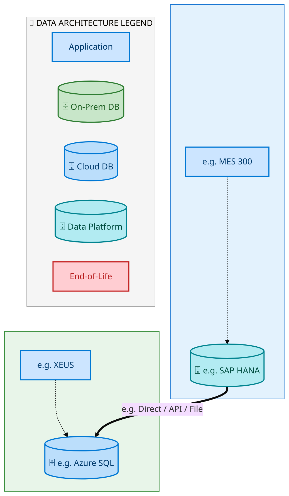
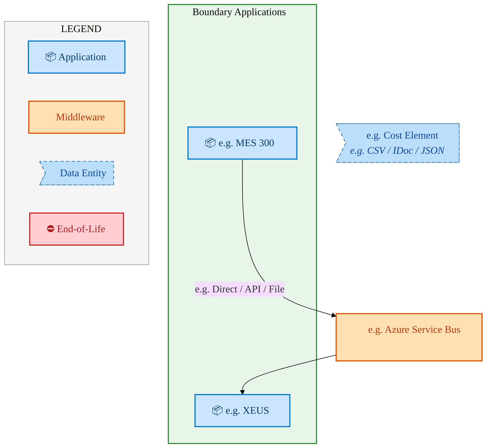
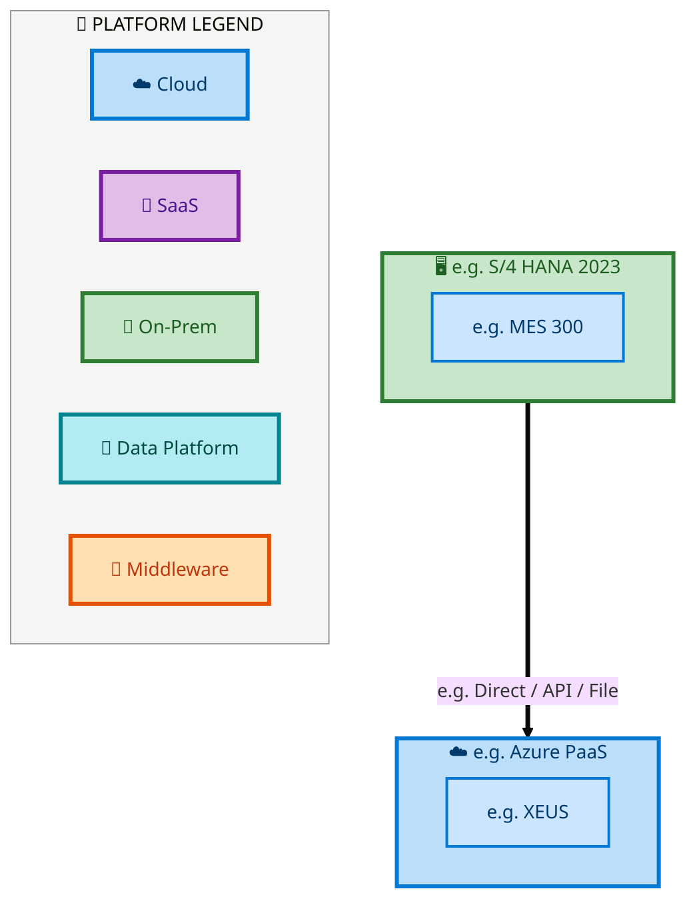

  <img src="data:image/svg+xml;base64,PHN2ZyB4bWxucz0iaHR0cDovL3d3dy53My5vcmcvMjAwMC9zdmciIHZpZXdCb3g9IjAgMCA4MDAgNDgwIiB3aWR0aD0iODAwIiBoZWlnaHQ9IjQ4MCI+DQogIDxkZWZzPg0KICAgIDxsaW5lYXJHcmFkaWVudCBpZD0iYmciIHgxPSIwJSIgeTE9IjAlIiB4Mj0iMTAwJSIgeTI9IjEwMCUiPg0KICAgICAgPHN0b3Agb2Zmc2V0PSIwJSIgc3R5bGU9InN0b3AtY29sb3I6IzAwNzFjNTtzdG9wLW9wYWNpdHk6MSIvPg0KICAgICAgPHN0b3Agb2Zmc2V0PSIxMDAlIiBzdHlsZT0ic3RvcC1jb2xvcjojMDBhZWVmO3N0b3Atb3BhY2l0eToxIi8+DQogICAgPC9saW5lYXJHcmFkaWVudD4NCiAgICA8bGluZWFyR3JhZGllbnQgaWQ9ImFjY2VudCIgeDE9IjAlIiB5MT0iMCUiIHgyPSIwJSIgeTI9IjEwMCUiPg0KICAgICAgPHN0b3Agb2Zmc2V0PSIwJSIgc3R5bGU9InN0b3AtY29sb3I6I2ZmZmZmZjtzdG9wLW9wYWNpdHk6MC4xNSIvPg0KICAgICAgPHN0b3Agb2Zmc2V0PSIxMDAlIiBzdHlsZT0ic3RvcC1jb2xvcjojZmZmZmZmO3N0b3Atb3BhY2l0eTowLjAyIi8+DQogICAgPC9saW5lYXJHcmFkaWVudD4NCiAgICA8cGF0dGVybiBpZD0iZ3JpZCIgd2lkdGg9IjQwIiBoZWlnaHQ9IjQwIiBwYXR0ZXJuVW5pdHM9InVzZXJTcGFjZU9uVXNlIj4NCiAgICAgIDxwYXRoIGQ9Ik0gNDAgMCBMIDAgMCAwIDQwIiBmaWxsPSJub25lIiBzdHJva2U9InJnYmEoMjU1LDI1NSwyNTUsMC4wNykiIHN0cm9rZS13aWR0aD0iMC41Ii8+DQogICAgPC9wYXR0ZXJuPg0KICA8L2RlZnM+DQoNCiAgPCEtLSBCYWNrZ3JvdW5kIC0tPg0KICA8cmVjdCB3aWR0aD0iODAwIiBoZWlnaHQ9IjQ4MCIgZmlsbD0idXJsKCNiZykiIHJ4PSI4Ii8+DQogIDxyZWN0IHdpZHRoPSI4MDAiIGhlaWdodD0iNDgwIiBmaWxsPSJ1cmwoI2dyaWQpIiByeD0iOCIvPg0KICA8cmVjdCB3aWR0aD0iODAwIiBoZWlnaHQ9IjQ4MCIgZmlsbD0idXJsKCNhY2NlbnQpIiByeD0iOCIvPg0KDQogIDwhLS0gRGVjb3JhdGl2ZSBjaXJjdWl0L2FyY2hpdGVjdHVyZSBsaW5lcyAtLT4NCiAgPGcgc3Ryb2tlPSJyZ2JhKDI1NSwyNTUsMjU1LDAuMTIpIiBzdHJva2Utd2lkdGg9IjEuNSIgZmlsbD0ibm9uZSI+DQogICAgPHBhdGggZD0iTSAwIDEwMCBMIDEyMCAxMDAgTCAxNjAgMTQwIEwgMjgwIDE0MCIvPg0KICAgIDxwYXRoIGQ9Ik0gMCAyNjAgTCA4MCAyNjAgTCAxMjAgMjIwIEwgMjAwIDIyMCBMIDI0MCAyNjAgTCAzNjAgMjYwIi8+DQogICAgPHBhdGggZD0iTSA1MjAgMTAwIEwgNjAwIDEwMCBMIDY0MCA2MCBMIDgwMCA2MCIvPg0KICAgIDxwYXRoIGQ9Ik0gNDQwIDM0MCBMIDU2MCAzNDAgTCA2MDAgMzAwIEwgNzIwIDMwMCBMIDc2MCAzNDAgTCA4MDAgMzQwIi8+DQogICAgPHBhdGggZD0iTSA2MDAgNDAwIEwgNjgwIDQwMCBMIDcyMCA0NDAiLz4NCiAgICA8cGF0aCBkPSJNIDAgNDAwIEwgNDAgNDAwIEwgODAgMzYwIi8+DQogICAgPHBhdGggZD0iTSAyMDAgNDIwIEwgMzIwIDQyMCBMIDM2MCAzODAgTCA0ODAgMzgwIi8+DQogICAgPHBhdGggZD0iTSA2NTAgNDQwIEwgNzUwIDQ0MCBMIDgwMCA0ODAiLz4NCiAgPC9nPg0KDQogIDwhLS0gRGVjb3JhdGl2ZSBub2RlcyAtLT4NCiAgPGcgZmlsbD0icmdiYSgyNTUsMjU1LDI1NSwwLjE4KSI+DQogICAgPGNpcmNsZSBjeD0iMTIwIiBjeT0iMTAwIiByPSI0Ii8+DQogICAgPGNpcmNsZSBjeD0iMjgwIiBjeT0iMTQwIiByPSI0Ii8+DQogICAgPGNpcmNsZSBjeD0iMjAwIiBjeT0iMjIwIiByPSI0Ii8+DQogICAgPGNpcmNsZSBjeD0iMzYwIiBjeT0iMjYwIiByPSI0Ii8+DQogICAgPGNpcmNsZSBjeD0iNjAwIiBjeT0iMTAwIiByPSI0Ii8+DQogICAgPGNpcmNsZSBjeD0iNzIwIiBjeT0iMzAwIiByPSI0Ii8+DQogICAgPGNpcmNsZSBjeD0iNTYwIiBjeT0iMzQwIiByPSI0Ii8+DQogICAgPGNpcmNsZSBjeD0iODAiIGN5PSIzNjAiIHI9IjQiLz4NCiAgICA8Y2lyY2xlIGN4PSI0ODAiIGN5PSIzODAiIHI9IjQiLz4NCiAgICA8Y2lyY2xlIGN4PSIzMjAiIGN5PSI0MjAiIHI9IjQiLz4NCiAgPC9nPg0KDQogIDwhLS0gVE9HQUYgQkRBVCBib3hlcyAtLT4NCiAgPGcgZm9udC1mYW1pbHk9IlNlZ29lIFVJLCBBcmlhbCwgc2Fucy1zZXJpZiIgZm9udC1zaXplPSIxNCIgZm9udC13ZWlnaHQ9IjYwMCI+DQogICAgPCEtLSBCIC0tPg0KICAgIDxyZWN0IHg9IjE1MCIgeT0iMTQwIiB3aWR0aD0iMTIwIiBoZWlnaHQ9IjQwIiByeD0iNSIgZmlsbD0icmdiYSgyNTUsMjU1LDI1NSwwLjE4KSIgc3Ryb2tlPSJyZ2JhKDI1NSwyNTUsMjU1LDAuMykiIHN0cm9rZS13aWR0aD0iMSIvPg0KICAgIDx0ZXh0IHg9IjIxMCIgeT0iMTY1IiB0ZXh0LWFuY2hvcj0ibWlkZGxlIiBmaWxsPSIjZmZmIj5CdXNpbmVzczwvdGV4dD4NCiAgICA8IS0tIEQgLS0+DQogICAgPHJlY3QgeD0iMjkwIiB5PSIxNDAiIHdpZHRoPSIxMjAiIGhlaWdodD0iNDAiIHJ4PSI1IiBmaWxsPSJyZ2JhKDI1NSwyNTUsMjU1LDAuMTgpIiBzdHJva2U9InJnYmEoMjU1LDI1NSwyNTUsMC4zKSIgc3Ryb2tlLXdpZHRoPSIxIi8+DQogICAgPHRleHQgeD0iMzUwIiB5PSIxNjUiIHRleHQtYW5jaG9yPSJtaWRkbGUiIGZpbGw9IiNmZmYiPkRhdGE8L3RleHQ+DQogICAgPCEtLSBBIC0tPg0KICAgIDxyZWN0IHg9IjQzMCIgeT0iMTQwIiB3aWR0aD0iMTIwIiBoZWlnaHQ9IjQwIiByeD0iNSIgZmlsbD0icmdiYSgyNTUsMjU1LDI1NSwwLjE4KSIgc3Ryb2tlPSJyZ2JhKDI1NSwyNTUsMjU1LDAuMykiIHN0cm9rZS13aWR0aD0iMSIvPg0KICAgIDx0ZXh0IHg9IjQ5MCIgeT0iMTY1IiB0ZXh0LWFuY2hvcj0ibWlkZGxlIiBmaWxsPSIjZmZmIj5BcHBsaWNhdGlvbjwvdGV4dD4NCiAgICA8IS0tIFQgLS0+DQogICAgPHJlY3QgeD0iNTcwIiB5PSIxNDAiIHdpZHRoPSIxMjAiIGhlaWdodD0iNDAiIHJ4PSI1IiBmaWxsPSJyZ2JhKDI1NSwyNTUsMjU1LDAuMTgpIiBzdHJva2U9InJnYmEoMjU1LDI1NSwyNTUsMC4zKSIgc3Ryb2tlLXdpZHRoPSIxIi8+DQogICAgPHRleHQgeD0iNjMwIiB5PSIxNjUiIHRleHQtYW5jaG9yPSJtaWRkbGUiIGZpbGw9IiNmZmYiPlRlY2hub2xvZ3k8L3RleHQ+DQogIDwvZz4NCg0KICA8IS0tIENvbm5lY3RpbmcgbGluZXMgYmV0d2VlbiBCREFUIGJveGVzIC0tPg0KICA8ZyBzdHJva2U9InJnYmEoMjU1LDI1NSwyNTUsMC4yNSkiIHN0cm9rZS13aWR0aD0iMSI+DQogICAgPGxpbmUgeDE9IjI3MCIgeTE9IjE2MCIgeDI9IjI5MCIgeTI9IjE2MCIvPg0KICAgIDxsaW5lIHgxPSI0MTAiIHkxPSIxNjAiIHgyPSI0MzAiIHkyPSIxNjAiLz4NCiAgICA8bGluZSB4MT0iNTUwIiB5MT0iMTYwIiB4Mj0iNTcwIiB5Mj0iMTYwIi8+DQogIDwvZz4NCg0KICA8IS0tIE1haW4gdGl0bGUgLS0+DQogIDx0ZXh0IHg9IjQwMCIgeT0iMjYwIiB0ZXh0LWFuY2hvcj0ibWlkZGxlIiBmb250LWZhbWlseT0iU2Vnb2UgVUksIEFyaWFsLCBzYW5zLXNlcmlmIiBmb250LXNpemU9IjM2IiBmb250LXdlaWdodD0iNzAwIiBmaWxsPSIjZmZmZmZmIiBsZXR0ZXItc3BhY2luZz0iMSI+DQogICAgSUFPIEFyY2hpdGVjdHVyZQ0KICA8L3RleHQ+DQogIDx0ZXh0IHg9IjQwMCIgeT0iMzAwIiB0ZXh0LWFuY2hvcj0ibWlkZGxlIiBmb250LWZhbWlseT0iU2Vnb2UgVUksIEFyaWFsLCBzYW5zLXNlcmlmIiBmb250LXNpemU9IjE4IiBmb250LXdlaWdodD0iNDAwIiBmaWxsPSJyZ2JhKDI1NSwyNTUsMjU1LDAuOCkiIGxldHRlci1zcGFjaW5nPSIyIj4NCiAgICBUT0dBRiBCREFUIMK3IElBTyBQcm9ncmFtIMK3IElETSAyLjANCiAgPC90ZXh0Pg0KDQogIDwhLS0gQm90dG9tIGFjY2VudCBiYXIgLS0+DQogIDxyZWN0IHg9IjI4MCIgeT0iMzQwIiB3aWR0aD0iMjQwIiBoZWlnaHQ9IjMiIHJ4PSIxLjUiIGZpbGw9InJnYmEoMjU1LDI1NSwyNTUsMC40KSIvPg0KDQogIDwhLS0gSW50ZWwgdGV4dCAtLT4NCiAgPHRleHQgeD0iNDAwIiB5PSIzODAiIHRleHQtYW5jaG9yPSJtaWRkbGUiIGZvbnQtZmFtaWx5PSJTZWdvZSBVSSwgQXJpYWwsIHNhbnMtc2VyaWYiIGZvbnQtc2l6ZT0iMTMiIGZpbGw9InJnYmEoMjU1LDI1NSwyNTUsMC41KSIgbGV0dGVyLXNwYWNpbmc9IjMiPg0KICAgIElOVEVMIENPTkZJREVOVElBTA0KICA8L3RleHQ+DQo8L3N2Zz4NCg==" alt="IAO Architecture" style="width:100%; border-radius:8px;" />
  <h1 style="font-size:36px; margin-top:24px;">E2E-116 — R3 Wafer Reclaim Process</h1>
  <h2 style="font-size:24px;">Architecture Document (TOGAF BDAT)</h2>
  
End-to-End Integrated Processes (E2E) Tower 
  Capability E2E-116 · Procure to Pay

  
IAO Program · R1 – R5 
  Generated: April 2026 
  Sajiv Francis

  
IAO Architecture Pipeline — Intel Confidential

Page 1<a href="#toc">↑ Back to TOC</a>E2E-116 — R3 Wafer Reclaim Process

## Table of Contents

<nav class="toc">
<ol>
  <li><a href="#1-executive-summary">1. Executive Summary</a></li>
  <li><a href="#2-business-context-objectives">2. Business Context &amp; Objectives</a>
    <ul>
      <li><a href="#21-classification">2.1 Classification</a></li>
      <li><a href="#22-business-drivers">2.2 Business Drivers</a></li>
      <li><a href="#23-success-criteria">2.3 Success Criteria</a></li>
      <li><a href="#24-companion-documents">2.4 Companion Documents</a></li>
    </ul>
  </li>
  <li><a href="#3-business-architecture-togaf-b">3. Business Architecture (TOGAF &ldquo;B&rdquo;)</a>
    <ul>
      <li><a href="#31-business-process-overview">3.1 Business Process Overview</a></li>
      <li><a href="#32-business-process-diagrams">3.2 Business Process Diagrams</a></li>
      <li><a href="#33-business-roles-responsibilities">3.3 Business Roles &amp; Responsibilities</a></li>
    </ul>
  </li>
  <li><a href="#4-data-architecture-togaf-d">4. Data Architecture (TOGAF &ldquo;D&rdquo;)</a>
    <ul>
      <li><a href="#41-data-entities-ownership">4.1 Data Entities &amp; Ownership</a></li>
      <li><a href="#42-data-flow-diagrams">4.2 Data Flow Diagrams</a></li>
      <li><a href="#43-data-lineage">4.3 Data Lineage</a></li>
      <li><a href="#44-ricefw-data-objects">4.4 RICEFW Data Objects</a></li>
      <li><a href="#45-data-governance-quality">4.5 Data Governance &amp; Quality</a></li>
    </ul>
  </li>
  <li><a href="#5-application-architecture-togaf-a">5. Application Architecture (TOGAF &ldquo;A&rdquo;)</a>
    <ul>
      <li><a href="#51-current-state-current-state-application-landscape">5.1 Current-State Application Landscape</a></li>
      <li><a href="#52-future-state-future-state-application-landscape">5.2 Future-State Application Landscape</a></li>
      <li><a href="#53-change-impact-summary">5.3 Change Impact Summary</a></li>
      <li><a href="#54-component-overview">5.4 Component Overview</a></li>
      <li><a href="#55-development-object-inventory">5.5 Development Object Inventory</a>
        <ul>
          <li><a href="#551-sap-development-objects">5.5.1 SAP Development Objects</a></li>
          <li><a href="#552-eca-development-objects">5.5.2 ECA Development Objects</a></li>
          <li><a href="#553-interface-objects">5.5.3 Interface Objects</a></li>
          <li><a href="#554-middleware-objects">5.5.4 Middleware Objects</a></li>
          <li><a href="#555-scheduling-batch-objects">5.5.5 Scheduling &amp; Batch Objects</a></li>
          <li><a href="#556-boundary-application-dependencies">5.5.6 Boundary Application Dependencies</a></li>
        </ul>
      </li>
      <li><a href="#56-integration-patterns">5.6 Integration Patterns</a></li>
    </ul>
  </li>
  <li><a href="#6-technology-architecture-togaf-t">6. Technology Architecture (TOGAF &ldquo;T&rdquo;)</a>
    <ul>
      <li><a href="#61-platform-infrastructure">6.1 Platform &amp; Infrastructure</a></li>
      <li><a href="#62-sap-development-object-status">6.2 SAP Development Object Status</a></li>
      <li><a href="#63-nfrs-design-principles">6.3 NFRs &amp; Design Principles</a></li>
      <li><a href="#64-security-governance">6.4 Security &amp; Governance</a></li>
      <li><a href="#65-eca-development-object-status">6.5 ECA Development Object Status</a></li>
    </ul>
  </li>
  <li><a href="#7-project-context">7. Project Context</a>
    <ul>
      <li><a href="#71-project-roadmap-go-live-plan">7.1 Project Roadmap &amp; Go-Live Plan</a></li>
      <li><a href="#72-raid-log">7.2 RAID Log</a></li>
      <li><a href="#73-recommendations-next-steps">7.3 Recommendations &amp; Next Steps</a></li>
    </ul>
  </li>
</ol>
</nav>

Page 2<a href="#toc">↑ Back to TOC</a>E2E-116 — R3 Wafer Reclaim Process

## 1. Executive Summary

This Architecture Document defines the **Business, Data, Application, and Technology** (BDAT) architecture for **E2E-116 R3 Wafer Reclaim Process** within the IAO program. It includes 2 BPMN process diagram(s) in Section 3.

| Dimension | Value |
|-----------|-------|
| **Tower** | End-to-End Integrated Processes (E2E) |
| **Process Group** | Procure to Pay |
| **Capability** | E2E-116 - R3 Wafer Reclaim Process |
| **Release** | R1 – R5 |
| **Total Systems** | 2 |
| **System Status** | 0 Deployed, 0 Developing, 0 EOL, 2 Pending IAPM |
| **RICEFW Objects** | Pending — Smartsheet Object Tracker API integration |

**Change Summary**: 0 new flow chains, 0 removed, 0 modified, 1 unchanged between Current-State and Future-State states.

> All system nodes in architecture diagrams are **IAPM-linked** — click any node to open its IAPM page. Diagrams require `securityLevel: 'loose'` for click events.

Page 3<a href="#toc">↑ Back to TOC</a>E2E-116 — R3 Wafer Reclaim Process

## 2. Business Context & Objectives

### 2.1 Classification

| Level | Value |
|-------|-------|
| **L0 Tower** | End-to-End Integrated Processes |
| **L1 Process** | Procure to Pay |
| **L2 Capability** | E2E-116 - R3 Wafer Reclaim Process |

### 2.2 Business Drivers

| # | Driver | Description | Strategic Alignment | Priority |
|---|--------|-------------|---------------------|----------|
| 1 | End-to-End Process Integration | Enable cross-tower integrated processes spanning procurement, manufacturing, and fulfillment | IDM 2.0 Process Excellence | High |
| 2 | Intel Foundry Business Enablement | Stand up foundry-specific business processes for external customer engagement | Intel Foundry Services | High |
| 3 | Process Visibility & Monitoring | Provide end-to-end process visibility across tower boundaries with integrated monitoring | Operational Excellence | Medium |
| 4 | E2E-116 Process Migration | Migrate R3 Wafer Reclaim Process business processes and 2 integrated systems from legacy to S/4 HANA target architecture | IDM 2.0 Cross-Functional / End-to-End | High |

Page 4<a href="#toc">↑ Back to TOC</a>E2E-116 — R3 Wafer Reclaim Process

### 2.3 Success Criteria

| Metric | Target | Measure | Baseline | Owner |
|--------|--------|---------|----------|-------|
| E2E Process Cycle Time | Per process SLA | End-to-end transaction completion within defined SLA per process | Varies by process | E2E Process Owner |
| Cross-Tower Integration Success | > 99% | Transactions completing across tower boundaries without manual intervention | 92% (current) | Integration Lead |
| Process Exception Rate | < 2% | Transactions requiring manual exception handling | 8% (current) | Operations Manager |
| E2E-116 Migration Completeness | 100% flow chains validated | All 1 flow chains verified in target state | 0% (pre-migration) | Tower Architect |

### 2.4 Companion Documents

| Document | Description |
|----------|-------------|
| **Business Architecture** | Included in this document (Section 3) — process flows from BPMN diagrams |
| **This Document** | Full BDAT Architecture — Business + Data + Application + Technology |

Page 5<a href="#toc">↑ Back to TOC</a>E2E-116 — R3 Wafer Reclaim Process

## 3. Business Architecture (TOGAF "B")

### 3.1 Business Process Overview

This capability includes **2 business process(es)** modeled in BPMN 2.0, covering the end-to-end workflow for E2E-116 R3 Wafer Reclaim Process.

| # | Step ID | Process Name | Lanes | Tasks | Gateways |
|---|---------|--------------|-------|-------|----------|
| 1 | E2E-116A_R3__Outbound_(Return)_Straddle_&amp;_End_State | E2E-116A_R3__Outbound_(Return)_Straddle_&amp;_End_State | EWM, External Partners/ Supplier, SAP S/4 Intel Foundry | 21 | 4 |
| 2 | E2E-116B_R3__Inbound_(Reclaim) | E2E-116B_R3__Inbound_(Reclaim) | Boundary Apps, EWM, External Partners/ Supplier, SAP S/4 Intel Foundry | 18 | 5 |

Page 6<a href="#toc">↑ Back to TOC</a>E2E-116 — R3 Wafer Reclaim Process

### 3.2 Business Process Diagrams

#### BUSINESS ARCHITECTURE — 3.2.1 E2E-116A_R3__Outbound_(Return)_Straddle_&amp;_End_State — E2E-116A_R3__Outbound_(Return)_Straddle_&amp;_End_State

**Swim Lanes**: EWM · External Partners/ Supplier · SAP S/4 Intel Foundry | **Tasks**: 21 | **Gateways**: 4

```mermaid
%%{init: {'theme': 'base', 'themeVariables': {'fontSize': '14px', 'fontFamily': 'Segoe UI, Arial, sans-serif','primaryColor': '#e8f0fe', 'primaryBorderColor': '#0071c5','lineColor': '#37474F', 'secondaryColor': '#f5f8fc'}, 'flowchart': {'useMaxWidth': false, 'htmlLabels': true, 'curve': 'basis', 'nodeSpacing': 40, 'rankSpacing': 50}} }%%
flowchart LR
    classDef startEvt fill:#4CAF50,stroke:#2E7D32,color:#000,font-weight:bold,stroke-width:2px,rx:20,ry:20
    classDef endEvt fill:#C62828,stroke:#B71C1C,color:#fff,font-weight:bold,stroke-width:2px,rx:20,ry:20
    classDef userTask fill:#E3F2FD,stroke:#1565C0,stroke-width:2px,color:#0D47A1
    classDef serviceTask fill:#FFF3E0,stroke:#E65100,stroke-width:2px,color:#BF360C
    classDef gateway fill:#FFF9C4,stroke:#F57F17,stroke-width:2px,color:#E65100
    classDef subProc fill:#F3E5F5,stroke:#7B1FA2,stroke-width:2px,color:#4A148C
    subgraph lane_0["EWM"]
        n3["Inbound Delivery EWM"]
        n4["Unloading EWM"]
        n5["Post Goods Receipt EWM"]
        n6["Post Goods Receipt EWM"]
        n7["Put-Away Confirmation with exception Codes"]
        n8["Create /Confirm Put-Away Task EWM"]
        n9["Outbound Delivery Order (EWM)"]
        n10["Create and Confirm Picking and Packing (EWM)"]
        n11["Post Goods Issue (EWM)"]
        n24(["fa:fa-stop Put-Away Task created/Confirmed"])
        n26{{"fa:fa-arrows-alt parallelGateway"}}
    end
    subgraph lane_1["External Partners/ Supplier"]
        n1["PO received at Supplier End"]
        n2["Shipment notification to Supplier"]
        n23(["fa:fa-stop Supplier Notified"])
    end
    subgraph lane_2["SAP S/4 Intel Foundry"]
        n12["Wafer to be reclaimed Inventory Updated"]
        n13["Custom FIORI App to enter Lot details"]
        n14["Inventory Transfer from IM S.Loc.(F501) to S.Loc (EWM) RS2 or AS1"]
        n15["Inventory updated at Rec. S.Loc"]
        n16["Create Return Purchase Order (Generic MMID)"]
        n17["Trigger GTS Check"]
        n18["Calculate Taxes"]
        n19["Purchase Order created"]
        n20["Return Delivery"]
        n21["Post Goods Issue/ Returns"]
        n22(["fa:fa-play Initiate Return"])
        n25(["fa:fa-stop Inventory Updated"])
        n27{{"fa:fa-arrows-alt parallelGateway"}}
        n28{{"fa:fa-arrows-alt parallelGateway"}}
        n29{{"fa:fa-arrows-alt inclusiveGateway"}}
    end
    n3 --> n4
    n4 --> n5
    n5 --> n26
    n26 --> n6
    n15 --> n25
    n6 --> n7
    n7 --> n8
    n8 --> n24
    n16 --> n27
    n27 --> n18
    n27 --> n17
    n19 --> n28
    n22 --> n16
    n9 --> n10
    n10 --> n11
    n2 --> n23
    n26 --> n15
    n14 --> n3
    n13 --> n12
    n17 --> n29
    n18 --> n29
    n29 --> n19
    n20 --> n9
    n11 --> n21
    n21 -->|"Via Websuite"| n2
    n28 --> n20
    n28 --> n1
    n12 --> n14
    class n22 startEvt
    class n23 endEvt
    class n24 endEvt
    class n25 endEvt
    class n26 gateway
    class n27 gateway
    class n28 gateway
    class n29 gateway
```

> **Legend**: ● Start · ● End · User Task · Service Task · ◇ Gateway · Sub-Process

<a href="https://mermaid.live/view#pako:eNqlV11v4jgU_StWRhUzEkzjkBDgYSUaSIXUbqvS2T4sq5VJHLBq7MhxWtgO_33txA4lpdJ-8FD1npxzv3xvMG9OwlPsjJ2LizfCiByDt47c4C3ujEFnhQrc6YIa-A0JglYUFx3NyTiTC_JXRYN-vtM0jcVoS-heowu85hj8mHfBRAlpFxSIFb0CC5J1up1ckC0S-4hTLjT7Cx5mblZFM4-uuEixOBJcN4RJoKSUMHyE-6Ef-rHWFTjhLD1xmgXZMEs6B50c5a_JBglZpV8W-BbtnkgqN8rOEC2w4mzklt6gFaa6RilKjSWleLHNIIWOw1TDFjlKCFsr3HcVJBB7PkKBeziAw8XFkjVBwc3DkgH1SSgqiinOQCEVPHuRICOUjr_40SQO3G4hBX_G4y_eLJz2vW6iKxmr0t2ubm7vFZP1Ro5XnKaG2nvVNYy9fNcVu7HndsVe_W3Fwiw9RooG3tAbNpGuQhjByEbKsux_RVJ9FY-oeDaxZv3Yi6dNLBgMgsj96M-WOfXDCWz3CYsXkuB3TuM47s-OrZoNAuh-7vQq7g_cqOV0jSR-Rfujw1HkNw7jIIxh-KnDOl47y3J1L3hiHfZnQRw0DsMrGE-8Tx36E-gPTYbKz1qgfAMoYvhP9_elM3u6XTp_1E_1h_UVOGcrXrIUTDElL1jswQeWr1g_GOUoVTP58XGgHt_zQoJrztMCPOAEk1x-5A3-IS_UvFL2JrqrEWcZEVskCWfglcgNwLsE55UZqeUpTrVDpY0EVkcCLo0UNL6qc_8QbqQkd6VsNeFOvzDAV8X-dkqH7jEEUoomCkmedXs0do_q_8_J4WkX5kVR4nNEz_-qmBkaZ6hXSJ63ykiqDFJbJE6V-tt7-eDtzcqREPy16CEqQY4EohTT63pol87hUIvUWp-bGp3tbCexYIiqsoRkWBSXYFHmOSVYtGrTpd0BoQ_2BacAyYYIZixt1afIiw3Jt5hJwLgkGUnqU5b8E_9ev9WSxvuvlf59Ez6pp4o6uQeLSx_MmcQUxPrcxb5VieY9oUy5VtmssK6JIqLarFQvKmOuRuRHnuojaCn1SkWlSm8L4vndwxxM8lw7USLl7YZLkGKJCG0NLvSrVbS-H9W3QKHDZ0I5mt-Cxfcbnnz_qt7r8FvVIW3XcwMeFh7gAkwWsOUzOPFZ1vnqY1G797120VIMjsP9gGUpmBo7ob51Cmw34hqrESAJuL2dT9uzrTf3UZD1WhGvHxcg2uDkucWpNhTRpKQ6yCPatVcYjqr9P4lqpr01DnoTTZZ2b1uMc8t2aSprhfW843DlVK3ZXN1gyLER7f0KWrN4bi5OBOG_W8haNPwvotFZEWEJLQvVpc93n_VBr_eLeuEb06_NwJhBbXoDY3uDGrA2tAQrMM9DY4a1OTTm0LBtNGjonuV7RgCHbcAy4MhIGoZnGDYnQ4CuVbgGgFZhPPRbRUFbBDRdsARomgQ9C5isvJEFhi3As1k0gMmiUUCjaLKqgJ9L5zeCwBNeFSWReOn8VE8swwZxW4B1AW0r_Hf3i6pD9rp4ivfN1e4U9c-iwVl0YO9Cp3B4Hh6eh0cWdrrOFqtvfpI64zen-tmgflqkOEMllc6h66BS8sWeJc64ul479fttSpB6329r8PA3e_PRlA==" title="View full diagram">&#128065; View Diagram</a>

Page 7<a href="#toc">↑ Back to TOC</a>E2E-116 — R3 Wafer Reclaim Process

#### BUSINESS ARCHITECTURE — 3.2.2 E2E-116B_R3__Inbound_(Reclaim) — E2E-116B_R3__Inbound_(Reclaim)

**Swim Lanes**: Boundary Apps · EWM · External Partners/ Supplier · SAP S/4 Intel Foundry | **Tasks**: 18 | **Gateways**: 5

```mermaid
%%{init: {'theme': 'base', 'themeVariables': {'fontSize': '14px', 'fontFamily': 'Segoe UI, Arial, sans-serif','primaryColor': '#e8f0fe', 'primaryBorderColor': '#0071c5','lineColor': '#37474F', 'secondaryColor': '#f5f8fc'}, 'flowchart': {'useMaxWidth': false, 'htmlLabels': true, 'curve': 'basis', 'nodeSpacing': 40, 'rankSpacing': 50}} }%%
flowchart LR
    classDef startEvt fill:#4CAF50,stroke:#2E7D32,color:#000,font-weight:bold,stroke-width:2px,rx:20,ry:20
    classDef endEvt fill:#C62828,stroke:#B71C1C,color:#fff,font-weight:bold,stroke-width:2px,rx:20,ry:20
    classDef userTask fill:#E3F2FD,stroke:#1565C0,stroke-width:2px,color:#0D47A1
    classDef serviceTask fill:#FFF3E0,stroke:#E65100,stroke-width:2px,color:#BF360C
    classDef gateway fill:#FFF9C4,stroke:#F57F17,stroke-width:2px,color:#E65100
    classDef subProc fill:#F3E5F5,stroke:#7B1FA2,stroke-width:2px,color:#4A148C
    subgraph lane_0["Boundary Apps"]
        n1["Receive Manual invoices through OCR"]
        n2["Receive Incoming invoice/ B2B/OpenText/Web suite"]
        n3["ReadSoft Validation/Exception Handling based on rules setup"]
        n24{{"fa:fa-code-branch B2B or OCR?"}}
        n25{{"fa:fa-code-branch exclusiveGateway"}}
    end
    subgraph lane_1["EWM"]
        n8["Inbound Delivery distribution to EWM"]
        n9["Unloading EWM"]
        n10["Post Goods Receipt EWM"]
        n11["Put-Away Confirmation with Exception Codes"]
        n12["Create/Confirm Put-Away Task EWM"]
        n22(["fa:fa-stop Put-Away task Created/Confirmed"])
        n28{{"fa:fa-arrows-alt parallelGateway"}}
    end
    subgraph lane_2["External Partners/ Supplier"]
        n4["Raise Invoice (Supplier End)"]
        n5["Purchase order received at Supplier End"]
        n6["Acknowledgement/ Review Purchase order"]
        n7["Goods Picked up (Carrier) Order Shipment"]
        n19(["fa:fa-play Acknowledge/ Review PO"])
        n20(["fa:fa-play Initiate Goods Pickup"])
        n21(["fa:fa-stop PO received"])
        n26{{"fa:fa-code-branch exclusiveGateway"}}
    end
    subgraph lane_3["SAP S/4 Intel Foundry"]
        n13["Post Supplier invoice"]
        n14["Blanket Purchase Order"]
        n15["IBD against Blanket PO"]
        n16["GR against Inbound Delivery"]
        n17["Post Goods Receipt EWM"]
        n18["Evaluated Receipt Settlement (ERS) Self-Billing"]
        n23(["fa:fa-stop Invoice posted"])
        n27{{"fa:fa-code-branch Invoice Accepted?"}}
    end
    n25 --> n3
    n1 --> n25
    n24 -->|"OCR"| n1
    n3 --> n27
    n26 --> n4
    n4 --> n24
    n2 --> n25
    n27 -->|"Yes"| n13
    n24 -->|"B2B"| n2
    n27 -->|"No"| n26
    n5 --> n21
    n19 --> n6
    n20 --> n7
    n6 -->|"Via Web Suite"| n14
    n14 -->|"Via Web Suite"| n5
    n7 -->|"ASN via Web Suite"| n15
    n15 --> n8
    n8 --> n9
    n9 --> n10
    n10 --> n28
    n28 --> n11
    n28 --> n16
    n17 --> n18
    n18 --> n25
    n11 --> n12
    n12 --> n22
    n13 --> n23
    class n19 startEvt
    class n20 startEvt
    class n21 endEvt
    class n22 endEvt
    class n23 endEvt
    class n24 gateway
    class n25 gateway
    class n26 gateway
    class n27 gateway
    class n28 gateway
```

> **Legend**: ● Start · ● End · User Task · Service Task · ◇ Gateway · Sub-Process

<a href="https://mermaid.live/view#pako:eNqtV22P2jgQ_itWqhW7EogkJITlw1W89lZqy2rpi07ldDKJA9YaO3IcYLvlv984iQkEVqp0tx-q-vE8z4xnxuPwaoUiIlbfurl5pZyqPnptqDXZkEYfNZY4JY0mKoBvWFK8ZCRtaJtYcDWnP3Mzx0v22kxjU7yh7EWjc7ISBH19aKIBEFkTpZinrZRIGjeajUTSDZYvI8GE1NbvSC-249xbuTUUMiKyMrDtwAl9oDLKSQV3Ai_wppqXklDw6Ew09uNeHDYOOjgmduEaS5WHn6XkE95_p5FawzrGLCVgs1Yb9hEvCdNnVDLTWJjJrUkGTbUfDgmbJzikfAW4ZwMkMX-uIN8-HNDh5mbBj07Rx6cFR_AXMpymYxKjVAE82SoUU8b677zRYOrbzVRJ8Uz679xJMO64zVCfpA9Ht5s6ua0doau16i8Fi0rT1k6foe8m-6bc9127KV_g35ovwqPK06jr9tze0dMwcEbOyHiK4_g_eYK8yi84fS59TTpTdzo--nL8rj-yL_XMMcdeMHDqeSJyS0NyIjqdTjuTKlWTru_Yb4sOp52uPaqJrrAiO_xSCd6PvKPg1A-mTvCmYOGvHmW2fJQiNIKdiT_1j4LB0JkO3DcFvYHj9coIQWclcbJGDHPyj_1jYQ1Fljc1GiRJurD-Luz0H3dg-4mEhG4J-oR5hhmifCsgWylSaymy1RrNRk_nJPeE9MBDsYGeNbQ2GrrD9iwh_AvZq_Z3soSAqCLnCp1cAUdzESv0DTMaYUUFb0_2IUn0_9CfmEdM6-oBEiFAZAaDA2qpsqQWjvf6urBi3I9xS0-i1hLuUrjWgSAhdfjvF9bhcMrwrzPIPmRZCsf6UBS3okH7X8uuTt_k-6fzeHoAPvClTjoaEwZykPqIQu3oMssPpwS6YN0D6ytnAkf61Bfbji7ko0gV-iBElKI8_4m6YqhjesxUa6C7cyR4TOUmzy7aUbVGVYpHcPJ6O-jSjiSB47dLKjpq5ffnwp_r3v4wuUyVSCp7pe0LsciokQjYd6f0XlUKLKXYpS3MFEqwxIwR9ruF0HFP9opIDh38CGORE5m20TxLEkaJPA_Z092Haaq7N29adGsM0YRHd-fWfp5PCTMYCPmDgmTR_BHCCp0yz4ldIA7CZy52jEQreP64akPdtpTs0LngOS8AXlHkRxo-g5csQbcjSA54uUOzPIL5miZasFa--6oWCYMSnLivXM_qJbBrrAd4xCkkHlVR5HfujOTUyz47pqVu2v2fbpueGvPBI5q3PYhREYam-pLJl1oWOuaqHGtTDqeane6DISg_E1UVZHZZEEe3wMNwjPAKUw66R9KsZqhL_uHpaFefAjXr4HevtJ4oky1mmb5KR7s5UYrlbYVuJ0_zOwBY3BrC8wETpHZJO7VqmcZPwP1lwYLrBTOkQahHCIneX6kYzFbUav0BI75cO8XS9c2-p4FfCyt_Vn6BQbnRKQ0DY9gtAK9ce-W-Wbt14aAU_ktPNS3cqbuEFyHfceuUz6LAu-VGeQbXxObcF4DZd-1ibWLtljrfKEb6yZsXT54OwoTreG_amBOYaAbzz2h7qWTMnDK6XrnuFcv7clmG6tjGvIzVNfZuSXCcOmCO5wQlYChOr5ZspyyrY1LpmHIcAVPPzsl3Tp5J89l6hkNGr-NO-el5jrpX0c5V1DPfauewfx3uXoeD63DPwFbT2hB4aGlk9V-t_NcO_CKKSIwzpqxD08KZEvMXHlr9_FeBlSXwzUPGFMOA2xTg4V84ABaZ" title="View full diagram">&#128065; View Diagram</a>

Page 8<a href="#toc">↑ Back to TOC</a>E2E-116 — R3 Wafer Reclaim Process

### 3.3 Business Roles & Responsibilities

| Role / Lane | Processes Involved | Description |
|------------|-------------------|-------------|
| EWM | E2E-116A_R3__Outbound_(Return)_Straddle_&amp;_End_State, E2E-116B_R3__Inbound_(Reclaim) | |
| External Partners/ Supplier | E2E-116A_R3__Outbound_(Return)_Straddle_&amp;_End_State, E2E-116B_R3__Inbound_(Reclaim) | |
| SAP S/4 Intel Foundry | E2E-116A_R3__Outbound_(Return)_Straddle_&amp;_End_State, E2E-116B_R3__Inbound_(Reclaim) | |
| Boundary Apps | E2E-116B_R3__Inbound_(Reclaim) | |

Page 9<a href="#toc">↑ Back to TOC</a>E2E-116 — R3 Wafer Reclaim Process

## 4. Data Architecture (TOGAF "D")

### 4.1 Data Flows — Source to Target

| # | Flow Chain | Hop | Source App | Target App | Data Description | Frequency |
|---|-----------|-----|-----------|-----------|-----------------|----------|
| 1 | e.g. MES Route to ICOST | 1 | e.g. MES 300 | e.g. XEUS | What data moves | e.g. Near Real-Time |

Page 10<a href="#toc">↑ Back to TOC</a>E2E-116 — R3 Wafer Reclaim Process

### 4.2 Data Flow Diagrams

> **DATA ARCHITECTURE** — Database-to-database data flows. Applications (blue) sit above their hosting databases (green cylinders). Thick arrows show data movement between databases.

#### 4.2.1 Current-State — Current-State Data Flows

<a href="https://mermaid.live/view#pako:eNqlVYtumzAU_RWLKtImJV2APAhSKwE2ayXaZU26TSoTcsAkqA4gHmvSNP8-G0KSpiGtNiMh-_rec6_P8WMluJFHBFVoNFZBGGQqWNlCNiNzYgsqsIUJTlmvyXopcfMkyJYW-UNoOUmjqJotQn7gJMATSlI-zXD8KMxGwfMGSuzGi9KZ2008D-iynBmRaUTA_XUTaAyAga8LLxo9uTOcZBu0PCU3ePEz8LIZt_iYpoT7zbI5tfCE0CJtluSFNWTLGsXYDcIpN8tdbkxw-Lhn7HTXa7BuNOxwmwuMdTsErLkUpykkPsBxrEcL4AeUqmeGgbqm2UyzJHok6lm73VdgZzNsPfHSVCleNN2IRgmflrWecYDnTYwlreAU1DMGWzgJ9aEs1cKJehdJ7bdwNMq9DaCuQ2Tq_1kfxBmu8CSkm9IeniIr5gm8DuwcFkgiuuPPNA0Id3hGT1IkpRZP74uGyOorEdN8Mk1wPANIQqLYM6BmWA5xpo72nCfEGX23HmyBify7dOfNCxLiZkEUbmXlbRuvFeG_0P2IRZLz6TngfYagqmop-5EgeJDzky3YuafIHvt7bsfOfdJmq-ZohRNgTrbwmWNutDpZCWidty5rs5WhJNxgpNmSkno-NqQjxeyi3S6TFQXJxmvSRXY036N5pA2dK-1W-zeWb9DIkdvtimg2BGz4Ia63iU9QzXwA99kyzTfxe8Uc5brK9iGqK-eKadmUTLhlWhz0e1CqZbomMbi4uHzZ0AQLasEXoA2v2d8MKLtMX05sjwMNLTJlK3jY48312gBqYw1od8bV9RgZ4_s7BCz0Fd3CGlWtu53Vcrj-WhzTwMV89riClgNr1PoWtoYJmQOo7w7Fkr6KNGpCy4tuP_D1aWKhdVmLK21IceZHybxmj1gOYktDodeK_JYV-KRcWnl_Hd0NJbvV1dbl31b7wWDwRnihKcxJMseBJ6ir8slkL69HfJzTjD16As6zaLQMXUEtnjEhjz2cERhgpua8NK7_AleVWn0=" title="View full diagram">&#128065; View Diagram</a>

Page 11<a href="#toc">↑ Back to TOC</a>E2E-116 — R3 Wafer Reclaim Process

#### 4.2.2 Future-State — Future-State Data Flows

<a href="https://mermaid.live/view#pako:eNqlVYtumzAU_RWLKtImJV2APAhSKwE2ayXaZU26TSoTcsAkqA4gHmvSNP8-G0KSpiGtNiMh-_rec6_P8WMluJFHBFVoNFZBGGQqWNlCNiNzYgsqsIUJTlmvyXopcfMkyJYW-UNoOUmjqJotQn7gJMATSlI-zXD8KMxGwfMGSuzGi9KZ2008D-iynBmRaUTA_XUTaAyAga8LLxo9uTOcZBu0PCU3ePEz8LIZt_iYpoT7zbI5tfCE0CJtluSFNWTLGsXYDcIpN8tdbkxw-Lhn7HTXa7BuNOxwmwuMdTsErLkUpykkPsBxrEcL4AeUqmeGgbqm2UyzJHok6lm73VdgZzNsPfHSVCleNN2IRgmflrWecYDnTYwlreAU1DMGWzgJ9aEs1cKJehdJ7bdwNMq9DaCuQ2Tq_1kfxBmu8CSkm9IeniIr5gm8DuwcFkgiuuPPNA0Id3hGT1IkpRZP74uGyOorEdN8Mk1wPANIQqLYM6FmWA5xpo72nCfEGX23HmyBify7dOfNCxLiZkEUbmXlbRuvFeG_0P2IRZLz6TngfYagqmop-5EgeJDzky3YuafIHvt7bsfOfdJmq-ZohRNgTrbwmWNutDpZCWidty5rs5WhJNxgpNmSkno-NqQjxeyi3S6TFQXJxmvSRXY036N5pA2dK-1W-zeWb9DIkdvtimg2BGz4Ia63iU9QzXwA99kyzTfxe8Uc5brK9iGqK-eKadmUTLhlWhz0e1CqZbomMbi4uHzZ0AQLasEXoA2v2d8MKLtMX05sjwMNLTJlK3jY48312gBqYw1od8bV9RgZ4_s7BCz0Fd3CGlWtu53Vcrj-WhzTwMV89riClgNr1PoWtoYJmQOo7w7Fkr6KNGpCy4tuP_D1aWKhdVmLK21IceZHybxmj1gOYktDodeK_JYV-KRcWnl_Hd0NJbvV1dbl31b7wWDwRnihKcxJMseBJ6ir8slkL69HfJzTjD16As6zaLQMXUEtnjEhjz2cERhgpua8NK7_AujQWqc=" title="View full diagram">&#128065; View Diagram</a>

Page 12<a href="#toc">↑ Back to TOC</a>E2E-116 — R3 Wafer Reclaim Process

### 4.3 Data Lineage

| # | Source System | Source Schema/Object | Target System | Target Schema/Object | Transformation |
|---|-------------|---------------------|---------------|---------------------|---------------|
| 1 | e.g. MES 300 | e.g. CKMLHD table | e.g. XEUS | e.g. dbo.CostElements | Lineage notes |

### 4.4 RICEFW Data Objects

*RICEFW data objects (Reports and Conversions) will be auto-populated from the Smartsheet Object Tracker when matched to this capability.*

### 4.5 Data Governance & Quality

| Concern | Approach |
|---------|----------|
| Data Ownership | Per-entity owners listed in Section 3.1 |
| Data Classification | Financial data classified as Intel Confidential |
| Data Retention | Per Intel corporate retention policies |
| Data Quality | Validated at source; reconciliation at target |

Page 13<a href="#toc">↑ Back to TOC</a>E2E-116 — R3 Wafer Reclaim Process

## 5. Application Architecture (TOGAF "A")

### 5.1 Current-State — Current-State Application Landscape

#### Overview

The Current-State architecture represents the **current / legacy** landscape for E2E-116.This view is generated from `CurrentFlows.xlsx` (1 flow hops across 1 flow chains).

#### APPLICATION ARCHITECTURE — Architecture Diagram

> **Click any system node** to open its IAPM application page.
> **Legend**: Deployed · Developing · End-of-Life · No IAPM Match

<a href="https://mermaid.live/view#pako:eNqVlvtvmzoUx_8Viyk_LWl5BEJQFYmHueoV6arL3Xqly4QccBJrDiBs1mZd_veZRxJK2j0cKYFzjj-2j78-zrOU5CmWLGk0eiYZ4RZ4jiS-xTscSRaIpBVi4mksnhhOqpLwfYC_Yto6aZ4fvU2XT6gkaEUxq92Cs84zHpJvHUoxi6c2uLb7aEfovvWEeJNj8PF2DGwBoGPAUMYmDJdkHUmHpgfNH5MtKnlHrhheoqcHkvJtbVkjynAdt-U7GqAVps0UeFk11kwsMSxQQrJNbdbl2lii7EvPaMiHAziMRlF2Ggv860QZEG00ApOJmFuyJUvEMdCuVPAe2N-qEgPG9xSDhCLGMBNhbY_m3cNrsKoYyTBjoGlrQqn1zhfN0caMl_kXLF7ntqnq3evksV6TpRZP4ySneWm9k2V5wERFAc6tZbou1H3_xJTlmelNf8LUbMMdYFPE0RDrOB70nRNW0Q3dlV9ilR7Wm85s5ehOERNZLNFeZBzog8F2JE0pfkQig728QNlRT4NBQ1dk-c01OL5myMM14JxepMb3Xc87Y11DNVXzbexMcZUhliHEhlioOBDOTtiZo_i2-iZ2aitTc4hNaF6lf55xdZjxATbPihLvBvowoeHOT1gVzjzt7dkqjg5VIbsWzKrVpkTFFkAVKorhBnexk1dZisp9bBcFJQniJM_Y_5EEjg7Qd0TS55ZUt5SUOKnNIPjnbO3QMY438RKGsSbLAhdVqaml4jvBBsBXmysgfED4BNGyLHEQXif8Bz-Gr3avHYO-OEuPC-0Qy4cG0pzvOMTlV5Lg2KlYn5gqs5bYVoEuCoioFn_W9wu0Bxu0mzMeQypKZsYX_Xkm05ZaB4Au4GZVXi9uyKJ1hJ_ANbj18kT8_B1-uLu5Jot2yPr8DlbST6eoTYvvkdRQvGYPBMG-vxXfPqGiRn__1fp_K0n1MBd7UU-r01JTLn8hpOMJM30dnjWrmSbU3AvNXqg0wBuxpy-2P5VBAP-Cd95vKDGI7fv7oXh6s3tFekG8fBiKY3kWwKuCaPt5cLj9Xl2FYcbFTdvf1nMX-CFoxlKNdCoC00m-ngRk3Q0jCmBP1ueMt0k5VkS9_pwSO5_PL0q6NJZ2uNwhkkrWc3u7iz8JKV6jinJxJ0uo4nm4zxLJam5ZqSrERLFHkNiEXWs8_ADcZps_" title="View full diagram">&#128065; View Diagram</a>

Page 14<a href="#toc">↑ Back to TOC</a>E2E-116 — R3 Wafer Reclaim Process

#### Current-State Flow Narrative

| # | Flow Chain | Path | Interface | Freq |
|---|-----------|------|-----------|------|
| 1 | e.g. MES Route to ICOST | e.g. MES 300 → e.g. XEUS | e.g. Direct / API / File | e.g. Near Real-Time |

Page 15<a href="#toc">↑ Back to TOC</a>E2E-116 — R3 Wafer Reclaim Process

### 5.2 Future-State — Future-State Application Landscape

#### Overview

The Future-State architecture represents the **target** landscape for E2E-116.This view is generated from `FutureFlows.xlsx` (1 flow hops across 1 flow chains).

#### APPLICATION ARCHITECTURE — Architecture Diagram

> **Click any system node** to open its IAPM application page.
> **Legend**: Deployed · Developing · End-of-Life · No IAPM Match

<a href="https://mermaid.live/view#pako:eNqVlvtvmzoUx_8Viyk_LWl5BEJQFYmHueoV6arL3Xqly4QccBJrDiBs1mZd_veZRxJK2j0cKYFzjj-2j78-zrOU5CmWLGk0eiYZ4RZ4jiS-xTscSRaIpBVi4mksnhhOqpLwfYC_Yto6aZ4fvU2XT6gkaEUxq92Cs84zHpJvHUoxi6c2uLb7aEfovvWEeJNj8PF2DGwBoGPAUMYmDJdkHUmHpgfNH5MtKnlHrhheoqcHkvJtbVkjynAdt-U7GqAVps0UeFk11kwsMSxQQrJNbdbl2lii7EvPaMiHAziMRlF2Ggv860QZEG00ApOJmFuyJUvEMdCuVPAe2N-qEgPG9xSDhCLGMBNhbY_m3cNrsKoYyTBjoGlrQqn1zhfN0caMl_kXLF7ntqnq3evksV6TpRZP4ySneWm9k2V5wERFAc6tZbou1H3_xJTlmelNf8LUbMMdYFPE0RDrOB70nRNW0Q3dlV9ilR7Wm85s5ehOERNZLNFeZBzog8F2JE0pfkQig728QNlRT4NBQ1dk-c01OL5myMM14JxepMb3Xc87Y11DNVXzbexMcZUhliHEhlioOBDOTtiZo_i2-iZ2aitTc4hNaF6lf55xdZjxATbPihLvBvowoeHOT1gVzjzt7dkqjg5VIbsWzKrVpkTFFkAVKorhB3exk1dZisp9bBcFJQniJM_Y_5EEjg7Qd0TS55ZUt5SUOKnNIPjnbO3QMY438RKGsSbLAhdVqaml4jvBBsBXmysgfED4BNGyLHEQXif8Bz-Gr3avHYO-OEuPC-0Qy4cG0pzvOMTlV5Lg2KlYn5gqs5bYVoEuCoioFn_W9wu0Bxu0mzMeQypKZsYX_Xkm05ZaB4Au4GZVXi9uyKJ1hJ_ANbj18kT8_B1-uLu5Jot2yPr8DlbST6eoTYvvkdRQvGYPBMG-vxXfPqGiRn__1fp_K0n1MBd7UU-r01JTLn8hpOMJM30dnjWrmSbU3AvNXqg0wBuxpy-2P5VBAP-Cd95vKDGI7fv7oXh6s3tFekG8fBiKY3kWwKuCaPt5cLj9Xl2FYcbFTdvf1nMX-CFoxlKNdCoC00m-ngRk3Q0jCmBP1ueMt0k5VkS9_pwSO5_PL0q6NJZ2uNwhkkrWc3u7iz8JKV6jinJxJ0uo4nm4zxLJam5ZqSrERLFHkNiEXWs8_AAyJZtd" title="View full diagram">&#128065; View Diagram</a>

Page 16<a href="#toc">↑ Back to TOC</a>E2E-116 — R3 Wafer Reclaim Process

#### Future-State Flow Narrative

| # | Flow Chain | Path | Interface | Freq |
|---|-----------|------|-----------|------|
| 1 | e.g. MES Route to ICOST | e.g. MES 300 → e.g. XEUS | e.g. Direct / API / File | e.g. Near Real-Time |

Page 17<a href="#toc">↑ Back to TOC</a>E2E-116 — R3 Wafer Reclaim Process

### 5.3 Change Impact Summary

| Change Type | Flow Chain | Detail |
|-------------|-----------|--------|
| **UNCHANGED** | e.g. MES Route to ICOST | No change |

**Totals**: 0 new - 0 removed - 0 modified - 1 unchanged

### 5.4 Component Overview

#### System Inventory

| System | IAPM ID | Status |
|--------|---------|--------|
| e.g. MES 300 | - | N/A |
| e.g. XEUS | - | N/A |

### 5.5 Development Object Inventory

*Development object inventory will be auto-populated from the Smartsheet S/4 Object Tracker when matched to this capability.*

### 5.6 Integration Patterns

| # | Pattern | Flow Chain | Middleware | Protocol | Auth |
|---|---------|-----------|-----------|----------|------|
| 1 | e.g. Pub-Sub / P2P / ETL | e.g. MES Route to ICOST | e.g. Azure Service Bus | e.g. REST / RFC / SFTP | e.g. OAuth / NTLM / Cert |

Page 18<a href="#toc">↑ Back to TOC</a>E2E-116 — R3 Wafer Reclaim Process

## 6. Technology Architecture (TOGAF "T")

### 6.1 Platform & Infrastructure

> **TECHNOLOGY / PLATFORM ARCHITECTURE** — Platforms (green) host applications (blue). Thick arrows show platform-to-platform integration flows.

#### 6.1.1 Current-State — Current-State Platform Architecture

<a href="https://mermaid.live/view#pako:eNqllXtvmzAQwL-KRZX_0pZXEoLUSTzMNilpotJuk8aEHDCJVQcQmDVpmu8-Awl5rESqCpJl351_vjuf7Y0QJCEWdKHT2ZCYMB1sPIEt8BJ7gg48YYZy3uvyXo6DIiNsPcJ_Ma2VNEn22mrKD5QRNKM4L9WcEyUxc8nrDiWp6ao2LuUOWhK6rjUunicYPH3vAoMDOHxbWdHkJVigjO1oRY7HaPWThGxRSiJEc1zaLdiSjtAM02pZlhWVNOZhuSkKSDwvxapYCjMUPx8Je-J2C7adjhc3a4FH04sB_wKK8tzGEUBpaiYrEBFK9SvLgj3H6eYsS56xfiWKA81Wd8Prl9I1XU5X3SChSVaqFaNvnfFSitgRUIN9a9gAZTiwFfkUqByAktmDsngGxAk98BzHsm254Vl9WZO1VgfNgWRJ3MGamBezeYbSBYAylKS-NR1NfezPfeO1yLA_Rcj97QleIfdFySsiLPKlb-Y3oFKDUu0Jf2pS-YUkwwEjSQxGDwdpgzYq9C_4VEIrTtnnBF3X65TXk3Ac7rxja4rbXdvFb5o2dMyLG6T8v0GX43d91f9m3Bu-LMpKlYJQU0Lehqh3nAj3VgWlHSjtPp6LMXR9RRT36eBDwIcfzciJs58qsnqRi_i7uy9vO3ftKkRwC4zpd946hPJj_9a-X-1JH-E5D_E4z0EoAp6lR2fyMAYj-BXe2x9J78g6r1uLJkV4gjgYuyc7LGPgnlf2wXaytw14G2EZTOLraYaXLeb2SVAzDGzEEJjyCyFKsrZJ4xN_pAEYkzCk-AVluJnRVhJ1KvdXQ6_8myoYDoenJSClq_ch1qfO1nvE_WmFkgnhoCEOTMkx2gtTNSRVayFOPn2fnhPtfdQyNB35KGpN0ZwLUau22kIcN3c0FM0DEfZ7kii2Ek1H6YuW0BWWOFsiEgr6pn5t-aMd4ggVlPH3UkAFS9x1HAh69QIKRRoihm2C-Ola1sLtPzxKbCI=" title="View full diagram">&#128065; View Diagram</a>

> **Legend**: 🖥️ Platform · 📦 Application · ⛔ End-of-Life · 📋 Unassigned

Page 19<a href="#toc">↑ Back to TOC</a>E2E-116 — R3 Wafer Reclaim Process

#### 6.1.2 Future-State — Future-State Platform Architecture

<a href="https://mermaid.live/view#pako:eNqllXtvmzAQwL-KRZX_0pZXEoLUSTzMNilpotJuk8aEHDCJVQcQmDVpmu8-Awl5rESqCpJl351_vjuf7Y0QJCEWdKHT2ZCYMB1sPIEt8BJ7gg48YYZy3uvyXo6DIiNsPcJ_Ma2VNEn22mrKD5QRNKM4L9WcEyUxc8nrDiWp6ao2LuUOWhK6rjUunicYPH3vAoMDOHxbWdHkJVigjO1oRY7HaPWThGxRSiJEc1zaLdiSjtAM02pZlhWVNOZhuSkKSDwvxapYCjMUPx8Je-J2C7adjhc3a4FH04sB_wKK8tzGEUBpaiYrEBFK9SvLgj3H6eYsS56xfiWKA81Wd8Prl9I1XU5X3SChSVaqFaNvnfFSitgRUIN9a9gAZTiwFfkUqByAktmDsngGxAk98BzHsm254Vl9WZO1VgfNgWRJ3MGamBezeYbSBYAylKS-Mx1NfezPfeO1yLA_Rcj97QleIfdFySsiLPKlb-Y3oFKDUu0Jf2pS-YUkwwEjSQxGDwdpgzYq9C_4VEIrTtnnBF3X65TXk3Ac7rxja4rbXdvFb5o2dMyLG6T8v0GX43d91f9m3Bu-LMpKlYJQU0Lehqh3nAj3VgWlHSjtPp6LMXR9RRT36eBDwIcfzciJs58qsnqRi_i7uy9vO3ftKkRwC4zpd946hPJj_9a-X-1JH-E5D_E4z0EoAp6lR2fyMAYj-BXe2x9J78g6r1uLJkV4gjgYuyc7LGPgnlf2wXaytw14G2EZTOLraYaXLeb2SVAzDGzEEJjyCyFKsrZJ4xN_pAEYkzCk-AVluJnRVhJ1KvdXQ6_8myoYDoenJSClq_ch1qfO1nvE_WmFkgnhoCEOTMkx2gtTNSRVayFOPn2fnhPtfdQyNB35KGpN0ZwLUau22kIcN3c0FM0DEfZ7kii2Ek1H6YuW0BWWOFsiEgr6pn5t-aMd4ggVlPH3UkAFS9x1HAh69QIKRRoihm2C-Ola1sLtP_XebF4=" title="View full diagram">&#128065; View Diagram</a>

> **Legend**: 🖥️ Platform · 📦 Application · ⛔ End-of-Life · 📋 Unassigned

#### Platform Inventory

| # | Platform | Type | Systems Using | Environment |
|---|----------|------|--------------|-------------|
| 1 | e.g. Azure PaaS | Cloud / SaaS | e.g. XEUS | DEV,QAS,PRD |
| 2 | e.g. S/4 HANA 2023 | On-Premise | e.g. MES 300 | DEV,QAS,PRD |

Page 20<a href="#toc">↑ Back to TOC</a>E2E-116 — R3 Wafer Reclaim Process

### 6.2 SAP Development Object Status

| Metric | DEV | QAS | PRD |
|--------|-----|-----|-----|
| Transport Requests | — | — | — |
| Custom Code Objects | — | — | — |
| CDS Views | — | — | — |
| Fiori Apps | — | — | — |
| BAdIs / Enhancements | — | — | — |

### 6.3 NFRs & Design Principles

| Category | Requirement | Target / SLA | Priority |
|----------|-------------|-------------|----------|
| Performance | Order/transaction processing within interactive SLA | < 3 seconds for online transactions | High |
| Availability | Business-critical systems available during extended hours | 99.9% (06:00-22:00 all time zones) | High |
| Scalability | Support seasonal and promotional volume spikes | Handle 2x baseline transaction volume | Medium |
| Recoverability | Customer-facing systems recover within business impact window | RPO < 30 min, RTO < 2 hours | High |
| Data Volume | Support transactional data growth from business expansion | 10M+ documents/year | Medium |
| Latency | Near-real-time integration for order status updates | < 30 seconds for status propagation | Medium |
| Concurrency | Support global user base across business functions | 300+ concurrent users | Medium |

### 6.4 Security & Governance

| Concern | Approach | Standard / Policy | Owner |
|---------|----------|--------------------|-------|
| Authentication | Single Sign-On (SSO) via Intel corporate Azure AD identity | Intel IT Security Policy - Identity Management | IT Security |
| Authorization | Role-based access control (RBAC) with SAP authorization objects | Intel SAP Security Standards - Role Design | SAP Security Team |
| Data Classification | All financial/operational data classified per Intel Data Classification Standard | Intel Data Classification Policy | Data Governance |
| Data Encryption (at rest) | AES-256 encryption for SAP HANA database and file storage | Intel Encryption Standard | Infrastructure Security |
| Data Encryption (in transit) | TLS 1.3 for all system-to-system and user-to-system communication | Intel Network Security Policy | Network Engineering |
| Network Segmentation | SAP systems in dedicated network zones with firewall controls | Intel Network Architecture Standard | Network Security |
| API Security | OAuth 2.0 / certificate-based authentication for all API integrations | Intel API Security Guidelines | Integration Architecture |
| Audit Logging | Comprehensive audit trail for all data changes and user actions (SAP Security Audit Log) | SOX Compliance / Intel Audit Policy | Internal Audit |
| Certificate Management | Automated certificate lifecycle management for system-to-system trust | Intel PKI Standard | Certificate Authority Team |
| Compliance | SOX controls, export control (EAR/ITAR) screening, data privacy (GDPR) | Intel Corporate Compliance Framework | Compliance Office |

### 6.5 ECA Development Object Status

*ECA development object status will be auto-populated when Snowflake SELECT access is provisioned for the PDH-IF and PDH-IP curated layers. This section will provide a DEV/QAS/PRD maturity assessment equivalent to §6.2 for SAP objects.*

Page 21<a href="#toc">↑ Back to TOC</a>E2E-116 — R3 Wafer Reclaim Process

## 7. Project Context

### 7.1 Project Roadmap & Go-Live Plan

*Project roadmap and RICEFW timelines will be auto-populated from the Smartsheet Object Tracker when matched to this capability.*

### 7.2 RAID Log

*RAID items will be auto-populated from the Smartsheet RAID log when matched to this capability.*

### 7.3 Recommendations & Next Steps

| # | Category | Recommendation | Priority | Owner | Target Date | Status |
|---|----------|---------------|----------|-------|-------------|--------|
| 1 | Architecture | Complete extended flow attributes (Data Entity, Integration Pattern, Tech Platform) in Flows tab for full BDAT coverage | High | Tower Architect | 2026-Q2 | Open |
| 2 | Data | Define data ownership and classification for all 1 flow chains to satisfy Data Architecture (TOGAF D) requirements | Medium | Data Architect | 2026-Q3 | Open |
| 3 | Testing | Develop integration test scenarios covering all 1 flow chains for FUT/SIT readiness | High | Test Lead | 2026-Q3 | Open |
| 4 | Business Architecture | Review and validate Business Architecture process steps against latest Signavio/BIC process models | Medium | Business Analyst | 2026-Q2 | Open |
| 5 | Security | Complete security review for API integrations and data flows per Intel Security Architecture standards | Medium | Security Architect | 2026-Q3 | Open |

---
*E2E-116 — Architecture Document (TOGAF BDAT) · End-to-End Integrated Processes · Generated: April 2026*

Page 22<a href="#toc">↑ Back to TOC</a>E2E-116 — R3 Wafer Reclaim Process

