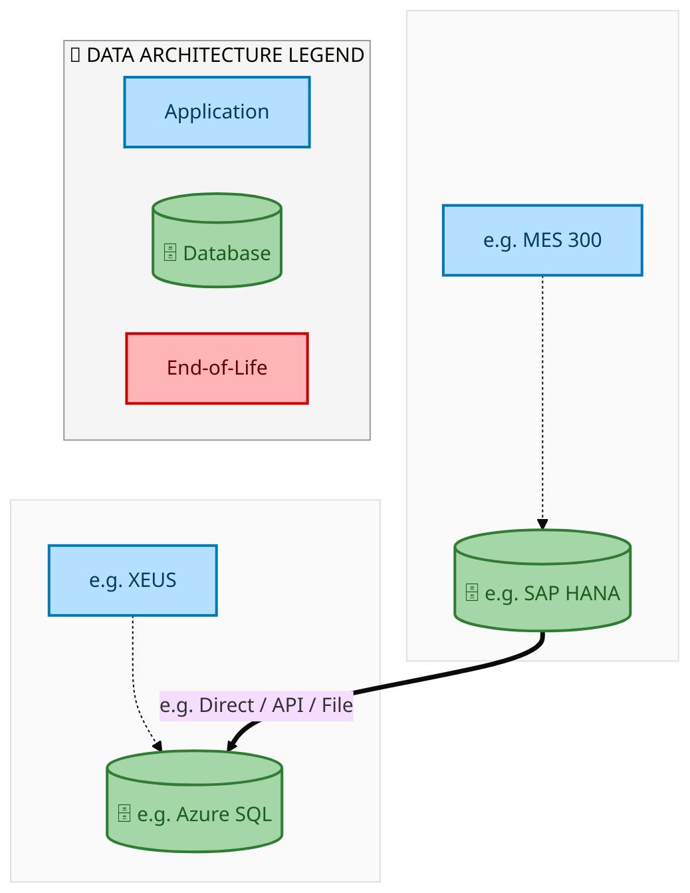
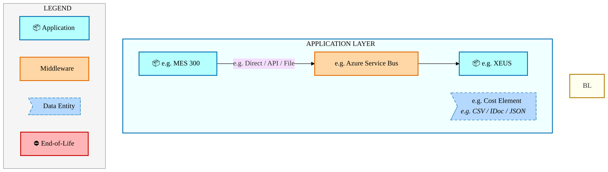
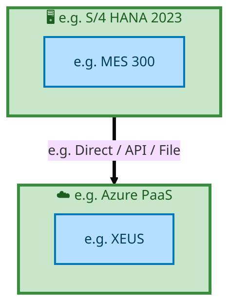

  <img src="data:image/svg+xml;base64,PHN2ZyB4bWxucz0iaHR0cDovL3d3dy53My5vcmcvMjAwMC9zdmciIHZpZXdCb3g9IjAgMCA4MDAgNDgwIiB3aWR0aD0iODAwIiBoZWlnaHQ9IjQ4MCI+DQogIDxkZWZzPg0KICAgIDxsaW5lYXJHcmFkaWVudCBpZD0iYmciIHgxPSIwJSIgeTE9IjAlIiB4Mj0iMTAwJSIgeTI9IjEwMCUiPg0KICAgICAgPHN0b3Agb2Zmc2V0PSIwJSIgc3R5bGU9InN0b3AtY29sb3I6IzAwNzFjNTtzdG9wLW9wYWNpdHk6MSIvPg0KICAgICAgPHN0b3Agb2Zmc2V0PSIxMDAlIiBzdHlsZT0ic3RvcC1jb2xvcjojMDBhZWVmO3N0b3Atb3BhY2l0eToxIi8+DQogICAgPC9saW5lYXJHcmFkaWVudD4NCiAgICA8bGluZWFyR3JhZGllbnQgaWQ9ImFjY2VudCIgeDE9IjAlIiB5MT0iMCUiIHgyPSIwJSIgeTI9IjEwMCUiPg0KICAgICAgPHN0b3Agb2Zmc2V0PSIwJSIgc3R5bGU9InN0b3AtY29sb3I6I2ZmZmZmZjtzdG9wLW9wYWNpdHk6MC4xNSIvPg0KICAgICAgPHN0b3Agb2Zmc2V0PSIxMDAlIiBzdHlsZT0ic3RvcC1jb2xvcjojZmZmZmZmO3N0b3Atb3BhY2l0eTowLjAyIi8+DQogICAgPC9saW5lYXJHcmFkaWVudD4NCiAgICA8cGF0dGVybiBpZD0iZ3JpZCIgd2lkdGg9IjQwIiBoZWlnaHQ9IjQwIiBwYXR0ZXJuVW5pdHM9InVzZXJTcGFjZU9uVXNlIj4NCiAgICAgIDxwYXRoIGQ9Ik0gNDAgMCBMIDAgMCAwIDQwIiBmaWxsPSJub25lIiBzdHJva2U9InJnYmEoMjU1LDI1NSwyNTUsMC4wNykiIHN0cm9rZS13aWR0aD0iMC41Ii8+DQogICAgPC9wYXR0ZXJuPg0KICA8L2RlZnM+DQoNCiAgPCEtLSBCYWNrZ3JvdW5kIC0tPg0KICA8cmVjdCB3aWR0aD0iODAwIiBoZWlnaHQ9IjQ4MCIgZmlsbD0idXJsKCNiZykiIHJ4PSI4Ii8+DQogIDxyZWN0IHdpZHRoPSI4MDAiIGhlaWdodD0iNDgwIiBmaWxsPSJ1cmwoI2dyaWQpIiByeD0iOCIvPg0KICA8cmVjdCB3aWR0aD0iODAwIiBoZWlnaHQ9IjQ4MCIgZmlsbD0idXJsKCNhY2NlbnQpIiByeD0iOCIvPg0KDQogIDwhLS0gRGVjb3JhdGl2ZSBjaXJjdWl0L2FyY2hpdGVjdHVyZSBsaW5lcyAtLT4NCiAgPGcgc3Ryb2tlPSJyZ2JhKDI1NSwyNTUsMjU1LDAuMTIpIiBzdHJva2Utd2lkdGg9IjEuNSIgZmlsbD0ibm9uZSI+DQogICAgPHBhdGggZD0iTSAwIDEwMCBMIDEyMCAxMDAgTCAxNjAgMTQwIEwgMjgwIDE0MCIvPg0KICAgIDxwYXRoIGQ9Ik0gMCAyNjAgTCA4MCAyNjAgTCAxMjAgMjIwIEwgMjAwIDIyMCBMIDI0MCAyNjAgTCAzNjAgMjYwIi8+DQogICAgPHBhdGggZD0iTSA1MjAgMTAwIEwgNjAwIDEwMCBMIDY0MCA2MCBMIDgwMCA2MCIvPg0KICAgIDxwYXRoIGQ9Ik0gNDQwIDM0MCBMIDU2MCAzNDAgTCA2MDAgMzAwIEwgNzIwIDMwMCBMIDc2MCAzNDAgTCA4MDAgMzQwIi8+DQogICAgPHBhdGggZD0iTSA2MDAgNDAwIEwgNjgwIDQwMCBMIDcyMCA0NDAiLz4NCiAgICA8cGF0aCBkPSJNIDAgNDAwIEwgNDAgNDAwIEwgODAgMzYwIi8+DQogICAgPHBhdGggZD0iTSAyMDAgNDIwIEwgMzIwIDQyMCBMIDM2MCAzODAgTCA0ODAgMzgwIi8+DQogICAgPHBhdGggZD0iTSA2NTAgNDQwIEwgNzUwIDQ0MCBMIDgwMCA0ODAiLz4NCiAgPC9nPg0KDQogIDwhLS0gRGVjb3JhdGl2ZSBub2RlcyAtLT4NCiAgPGcgZmlsbD0icmdiYSgyNTUsMjU1LDI1NSwwLjE4KSI+DQogICAgPGNpcmNsZSBjeD0iMTIwIiBjeT0iMTAwIiByPSI0Ii8+DQogICAgPGNpcmNsZSBjeD0iMjgwIiBjeT0iMTQwIiByPSI0Ii8+DQogICAgPGNpcmNsZSBjeD0iMjAwIiBjeT0iMjIwIiByPSI0Ii8+DQogICAgPGNpcmNsZSBjeD0iMzYwIiBjeT0iMjYwIiByPSI0Ii8+DQogICAgPGNpcmNsZSBjeD0iNjAwIiBjeT0iMTAwIiByPSI0Ii8+DQogICAgPGNpcmNsZSBjeD0iNzIwIiBjeT0iMzAwIiByPSI0Ii8+DQogICAgPGNpcmNsZSBjeD0iNTYwIiBjeT0iMzQwIiByPSI0Ii8+DQogICAgPGNpcmNsZSBjeD0iODAiIGN5PSIzNjAiIHI9IjQiLz4NCiAgICA8Y2lyY2xlIGN4PSI0ODAiIGN5PSIzODAiIHI9IjQiLz4NCiAgICA8Y2lyY2xlIGN4PSIzMjAiIGN5PSI0MjAiIHI9IjQiLz4NCiAgPC9nPg0KDQogIDwhLS0gVE9HQUYgQkRBVCBib3hlcyAtLT4NCiAgPGcgZm9udC1mYW1pbHk9IlNlZ29lIFVJLCBBcmlhbCwgc2Fucy1zZXJpZiIgZm9udC1zaXplPSIxNCIgZm9udC13ZWlnaHQ9IjYwMCI+DQogICAgPCEtLSBCIC0tPg0KICAgIDxyZWN0IHg9IjE1MCIgeT0iMTQwIiB3aWR0aD0iMTIwIiBoZWlnaHQ9IjQwIiByeD0iNSIgZmlsbD0icmdiYSgyNTUsMjU1LDI1NSwwLjE4KSIgc3Ryb2tlPSJyZ2JhKDI1NSwyNTUsMjU1LDAuMykiIHN0cm9rZS13aWR0aD0iMSIvPg0KICAgIDx0ZXh0IHg9IjIxMCIgeT0iMTY1IiB0ZXh0LWFuY2hvcj0ibWlkZGxlIiBmaWxsPSIjZmZmIj5CdXNpbmVzczwvdGV4dD4NCiAgICA8IS0tIEQgLS0+DQogICAgPHJlY3QgeD0iMjkwIiB5PSIxNDAiIHdpZHRoPSIxMjAiIGhlaWdodD0iNDAiIHJ4PSI1IiBmaWxsPSJyZ2JhKDI1NSwyNTUsMjU1LDAuMTgpIiBzdHJva2U9InJnYmEoMjU1LDI1NSwyNTUsMC4zKSIgc3Ryb2tlLXdpZHRoPSIxIi8+DQogICAgPHRleHQgeD0iMzUwIiB5PSIxNjUiIHRleHQtYW5jaG9yPSJtaWRkbGUiIGZpbGw9IiNmZmYiPkRhdGE8L3RleHQ+DQogICAgPCEtLSBBIC0tPg0KICAgIDxyZWN0IHg9IjQzMCIgeT0iMTQwIiB3aWR0aD0iMTIwIiBoZWlnaHQ9IjQwIiByeD0iNSIgZmlsbD0icmdiYSgyNTUsMjU1LDI1NSwwLjE4KSIgc3Ryb2tlPSJyZ2JhKDI1NSwyNTUsMjU1LDAuMykiIHN0cm9rZS13aWR0aD0iMSIvPg0KICAgIDx0ZXh0IHg9IjQ5MCIgeT0iMTY1IiB0ZXh0LWFuY2hvcj0ibWlkZGxlIiBmaWxsPSIjZmZmIj5BcHBsaWNhdGlvbjwvdGV4dD4NCiAgICA8IS0tIFQgLS0+DQogICAgPHJlY3QgeD0iNTcwIiB5PSIxNDAiIHdpZHRoPSIxMjAiIGhlaWdodD0iNDAiIHJ4PSI1IiBmaWxsPSJyZ2JhKDI1NSwyNTUsMjU1LDAuMTgpIiBzdHJva2U9InJnYmEoMjU1LDI1NSwyNTUsMC4zKSIgc3Ryb2tlLXdpZHRoPSIxIi8+DQogICAgPHRleHQgeD0iNjMwIiB5PSIxNjUiIHRleHQtYW5jaG9yPSJtaWRkbGUiIGZpbGw9IiNmZmYiPlRlY2hub2xvZ3k8L3RleHQ+DQogIDwvZz4NCg0KICA8IS0tIENvbm5lY3RpbmcgbGluZXMgYmV0d2VlbiBCREFUIGJveGVzIC0tPg0KICA8ZyBzdHJva2U9InJnYmEoMjU1LDI1NSwyNTUsMC4yNSkiIHN0cm9rZS13aWR0aD0iMSI+DQogICAgPGxpbmUgeDE9IjI3MCIgeTE9IjE2MCIgeDI9IjI5MCIgeTI9IjE2MCIvPg0KICAgIDxsaW5lIHgxPSI0MTAiIHkxPSIxNjAiIHgyPSI0MzAiIHkyPSIxNjAiLz4NCiAgICA8bGluZSB4MT0iNTUwIiB5MT0iMTYwIiB4Mj0iNTcwIiB5Mj0iMTYwIi8+DQogIDwvZz4NCg0KICA8IS0tIE1haW4gdGl0bGUgLS0+DQogIDx0ZXh0IHg9IjQwMCIgeT0iMjYwIiB0ZXh0LWFuY2hvcj0ibWlkZGxlIiBmb250LWZhbWlseT0iU2Vnb2UgVUksIEFyaWFsLCBzYW5zLXNlcmlmIiBmb250LXNpemU9IjM2IiBmb250LXdlaWdodD0iNzAwIiBmaWxsPSIjZmZmZmZmIiBsZXR0ZXItc3BhY2luZz0iMSI+DQogICAgSUFPIEFyY2hpdGVjdHVyZQ0KICA8L3RleHQ+DQogIDx0ZXh0IHg9IjQwMCIgeT0iMzAwIiB0ZXh0LWFuY2hvcj0ibWlkZGxlIiBmb250LWZhbWlseT0iU2Vnb2UgVUksIEFyaWFsLCBzYW5zLXNlcmlmIiBmb250LXNpemU9IjE4IiBmb250LXdlaWdodD0iNDAwIiBmaWxsPSJyZ2JhKDI1NSwyNTUsMjU1LDAuOCkiIGxldHRlci1zcGFjaW5nPSIyIj4NCiAgICBUT0dBRiBCREFUIMK3IElBTyBQcm9ncmFtIMK3IElETSAyLjANCiAgPC90ZXh0Pg0KDQogIDwhLS0gQm90dG9tIGFjY2VudCBiYXIgLS0+DQogIDxyZWN0IHg9IjI4MCIgeT0iMzQwIiB3aWR0aD0iMjQwIiBoZWlnaHQ9IjMiIHJ4PSIxLjUiIGZpbGw9InJnYmEoMjU1LDI1NSwyNTUsMC40KSIvPg0KDQogIDwhLS0gSW50ZWwgdGV4dCAtLT4NCiAgPHRleHQgeD0iNDAwIiB5PSIzODAiIHRleHQtYW5jaG9yPSJtaWRkbGUiIGZvbnQtZmFtaWx5PSJTZWdvZSBVSSwgQXJpYWwsIHNhbnMtc2VyaWYiIGZvbnQtc2l6ZT0iMTMiIGZpbGw9InJnYmEoMjU1LDI1NSwyNTUsMC41KSIgbGV0dGVyLXNwYWNpbmc9IjMiPg0KICAgIElOVEVMIENPTkZJREVOVElBTA0KICA8L3RleHQ+DQo8L3N2Zz4NCg==" alt="IAO Architecture" style="width:100%; border-radius:8px;" />
  <h1 style="font-size:36px; margin-top:24px;">E2E-116 — R3 Wafer Reclaim Process</h1>
  <h2 style="font-size:24px;">Architecture Document (TOGAF BDAT)</h2>
  
End-to-End Integrated Processes (E2E) Tower 
  Capability E2E-116 · Procure to Pay

  
IAO Program · Release 2 
  Generated: March 2026 
  Sajiv Francis

  
IAO Architecture Pipeline — Intel Confidential

Page 1<a href="#toc">↑ Back to TOC</a>E2E-116 — R3 Wafer Reclaim Process

## Table of Contents

<nav class="toc">
<ol>
  <li><a href="#1-executive-summary">1. Executive Summary</a></li>
  <li><a href="#2-business-context-objectives">2. Business Context &amp; Objectives</a>
    <ul>
      <li><a href="#21-classification">2.1 Classification</a></li>
      <li><a href="#22-business-drivers">2.2 Business Drivers</a></li>
      <li><a href="#23-success-criteria">2.3 Success Criteria</a></li>
      <li><a href="#24-companion-documents">2.4 Companion Documents</a></li>
    </ul>
  </li>
  <li><a href="#3-business-architecture-togaf-b">3. Business Architecture (TOGAF &ldquo;B&rdquo;)</a>
    <ul>
      <li><a href="#31-business-process-overview">3.1 Business Process Overview</a></li>
      <li><a href="#32-business-process-diagrams">3.2 Business Process Diagrams</a></li>
      <li><a href="#33-business-roles-responsibilities">3.3 Business Roles &amp; Responsibilities</a></li>
    </ul>
  </li>
  <li><a href="#4-data-architecture-togaf-d">4. Data Architecture (TOGAF &ldquo;D&rdquo;)</a>
    <ul>
      <li><a href="#41-data-entities-ownership">4.1 Data Entities &amp; Ownership</a></li>
      <li><a href="#42-data-flow-diagrams">4.2 Data Flow Diagrams</a></li>
      <li><a href="#43-data-lineage">4.3 Data Lineage</a></li>
      <li><a href="#44-ricefw-data-objects">4.4 RICEFW Data Objects</a></li>
      <li><a href="#45-data-governance-quality">4.5 Data Governance &amp; Quality</a></li>
    </ul>
  </li>
  <li><a href="#5-application-architecture-togaf-a">5. Application Architecture (TOGAF &ldquo;A&rdquo;)</a>
    <ul>
      <li><a href="#51-current-state-current-state-application-landscape">5.1 Current-State Application Landscape</a></li>
      <li><a href="#52-future-state-future-state-application-landscape">5.2 Future-State Application Landscape</a></li>
      <li><a href="#53-change-impact-summary">5.3 Change Impact Summary</a></li>
      <li><a href="#54-component-overview">5.4 Component Overview</a></li>
      <li><a href="#55-ricefw-inventory">5.5 RICEFW Inventory</a></li>
      <li><a href="#56-integration-patterns">5.6 Integration Patterns</a></li>
    </ul>
  </li>
  <li><a href="#6-technology-architecture-togaf-t">6. Technology Architecture (TOGAF &ldquo;T&rdquo;)</a>
    <ul>
      <li><a href="#61-platform-infrastructure">6.1 Platform &amp; Infrastructure</a></li>
      <li><a href="#62-sap-development-object-status">6.2 SAP Development Object Status</a></li>
      <li><a href="#63-nfrs-design-principles">6.3 NFRs &amp; Design Principles</a></li>
      <li><a href="#64-security-governance">6.4 Security &amp; Governance</a></li>
    </ul>
  </li>
  <li><a href="#7-project-context">7. Project Context</a>
    <ul>
      <li><a href="#71-project-roadmap-go-live-plan">7.1 Project Roadmap &amp; Go-Live Plan</a></li>
      <li><a href="#72-raid-log">7.2 RAID Log</a></li>
      <li><a href="#73-recommendations-next-steps">7.3 Recommendations &amp; Next Steps</a></li>
    </ul>
  </li>
</ol>
</nav>

Page 2<a href="#toc">↑ Back to TOC</a>E2E-116 — R3 Wafer Reclaim Process

## 1. Executive Summary

This Architecture Document defines the **Business, Data, Application, and Technology** (BDAT) architecture for **E2E-116 R3 Wafer Reclaim Process** within the IAO program. It includes 2 BPMN process diagram(s) in Section 3.

| Dimension | Value |
|-----------|-------|
| **Tower** | End-to-End Integrated Processes (E2E) |
| **Process Group** | Procure to Pay |
| **Capability** | E2E-116 - R3 Wafer Reclaim Process |
| **Release** | Release 2 |
| **Total Systems** | 2 |
| **System Status** | 0 Deployed, 0 Developing, 0 EOL, 2 Pending IAPM |
| **RICEFW Objects** | Pending — Smartsheet Object Tracker API integration |

**Change Summary**: 0 new flow chains, 0 removed, 0 modified, 1 unchanged between Current-State and Future-State states.

> All system nodes in architecture diagrams are **IAPM-linked** — click any node to open its IAPM page. Diagrams require `securityLevel: 'loose'` for click events.

Page 3<a href="#toc">↑ Back to TOC</a>E2E-116 — R3 Wafer Reclaim Process

## 2. Business Context & Objectives

### 2.1 Classification

| Level | Value |
|-------|-------|
| **L0 Tower** | End-to-End Integrated Processes |
| **L1 Process** | Procure to Pay |
| **L2 Capability** | E2E-116 - R3 Wafer Reclaim Process |

### 2.2 Business Drivers

| # | Driver | Description | Strategic Alignment | Priority |
|---|--------|-------------|---------------------|----------|
| 1 | End-to-End Process Integration | Enable cross-tower integrated processes spanning procurement, manufacturing, and fulfillment | IDM 2.0 Process Excellence | High |
| 2 | Intel Foundry Business Enablement | Stand up foundry-specific business processes for external customer engagement | Intel Foundry Services | High |
| 3 | Process Visibility & Monitoring | Provide end-to-end process visibility across tower boundaries with integrated monitoring | Operational Excellence | Medium |
| 4 | E2E-116 Process Migration | Migrate R3 Wafer Reclaim Process business processes and 2 integrated systems from legacy to S/4 HANA target architecture | IDM 2.0 Cross-Functional / End-to-End | High |

Page 4<a href="#toc">↑ Back to TOC</a>E2E-116 — R3 Wafer Reclaim Process

### 2.3 Success Criteria

| Metric | Target | Measure | Baseline | Owner |
|--------|--------|---------|----------|-------|
| E2E Process Cycle Time | Per process SLA | End-to-end transaction completion within defined SLA per process | Varies by process | E2E Process Owner |
| Cross-Tower Integration Success | > 99% | Transactions completing across tower boundaries without manual intervention | 92% (current) | Integration Lead |
| Process Exception Rate | < 2% | Transactions requiring manual exception handling | 8% (current) | Operations Manager |
| E2E-116 Migration Completeness | 100% flow chains validated | All 1 flow chains verified in target state | 0% (pre-migration) | Tower Architect |

### 2.4 Companion Documents

| Document | Description |
|----------|-------------|
| **Business Architecture** | Included in this document (Section 3) — process flows from BPMN diagrams |
| **This Document** | Full BDAT Architecture — Business + Data + Application + Technology |

Page 5<a href="#toc">↑ Back to TOC</a>E2E-116 — R3 Wafer Reclaim Process

## 3. Business Architecture (TOGAF "B")

### 3.1 Business Process Overview

This capability includes **2 business process(es)** modeled in BPMN 2.0, covering the end-to-end workflow for E2E-116 R3 Wafer Reclaim Process.

| # | Step ID | Process Name | Lanes | Tasks | Gateways |
|---|---------|--------------|-------|-------|----------|
| 1 | E2E-116A_R3__Outbound_(Return)_Straddle_&amp;_End_State | E2E-116A_R3__Outbound_(Return)_Straddle_&amp;_End_State | EWM, External Partners/ Supplier, SAP S/4 Intel Foundry | 21 | 4 |
| 2 | E2E-116B_R3__Inbound_(Reclaim) | E2E-116B_R3__Inbound_(Reclaim) | Boundary Apps, EWM, External Partners/ Supplier, SAP S/4 Intel Foundry | 18 | 5 |

Page 6<a href="#toc">↑ Back to TOC</a>E2E-116 — R3 Wafer Reclaim Process

### 3.2 Business Process Diagrams

#### BUSINESS ARCHITECTURE — 3.2.1 E2E-116A_R3__Outbound_(Return)_Straddle_&amp;_End_State — E2E-116A_R3__Outbound_(Return)_Straddle_&amp;_End_State

**Swim Lanes**: EWM · External Partners/ Supplier · SAP S/4 Intel Foundry | **Tasks**: 21 | **Gateways**: 4

> **Legend**: ● Start · ● End · User Task · Service Task · ◇ Gateway · Sub-Process

<a href="https://mermaid.live/view#pako:eNqlV11v4jgU_StWRhUzEkzjkBDgYSUaSIXUbqvSmT5s98EkDlg1duQ4LWyH_752YgdIqbQfPFS9J-fcL99rwruT8BQ7Y-fi4p0wIsfgvSPXeIM7Y9BZogJ3uqAGfiJB0JLioqM5GWdyQf6qaNDPt5qmsRhtCN1pdIFXHIMf8y6YKCHtggKxoldgQbJOt5MLskFiF3HKhWZ_wcPMzapo5tEVFykWB4LrhjAJlJQShg9wP_RDP9a6AiecpSdOsyAbZklnr5Oj_C1ZIyGr9MsC36LtE0nlWtkZogVWnLXc0Bu0xFTXKEWpsaQUr7YZpNBxmGrYIkcJYSuF-66CBGIvByhw93uwv7h4Zk1QcPPwzID6JBQVxRRnoJAKnr1KkBFKx1_8aBIHbreQgr_g8RdvFk77XjfRlYxV6W5XN7f3hslqLcdLTlND7b3pGsZevu2K7dhzu2Kn_rZiYZYeIkUDb-gNm0hXIYxgZCNlWfa_Iqm-ikdUvJhYs37sxdMmFgwGQeR-9GfLnPrhBLb7hMUrSfCR0ziO-7NDq2aDALqfO72K-wM3ajldIYnf0O7gcBT5jcM4CGMYfuqwjtfOslzeC55Yh_1ZEAeNw_AKxhPvU4f-BPpDk6HysxIoX4PZ022N6A_r__HszNmSlywFU0zJKxa7iuL8ecTyFesHoxylag4_Pg7U43teSHDNeVqAB5xgksuPvME_5IWaV8reRHcy4iwjYoMk4Qy8EbkGeJvgvDIjtTDFqXaotJHA6hjApZGCxld11h_CjZTkrpStJtzpSwJ8Vexvp3ToHkIgpWiikORFt0dj96j-_5wcnnZhXhQlPkf0_K-KmaFxhnqF5HmrjKTKILVF4lSpvx3LB-_vVo6E4G9FD1EJciQQpZhe14P67Oz3tUitcntSthILhqiqRkiGRXEJFmWeU4LFcT26nDsg9GG-4hQg2bDAjKWtmhR5sSb5BjMJGJckI0l9spIfnJ9K-q02NN5_r_THhX-sYTG5B4tLH8yZxBTE-ojF7jh7ndETypQ7lcES6zooIqqdSvKqsuRqFH7kqW516xz16kSlSmkD4vndwxxM8lw7USLl7YZLkGKJCG0NKPSrlbO-H9UNX-jwmVCO5rdg8f2GJ9-_qjsbfqu6ou16PsDDwgNcgMkCtnwGJz7LOl99FGrHvtcuWorBYYgfsCwFU-Ml1DdKge3kX2N15iQBt7fzaXuG9YY-CrJaKeL14wJEa5y8tDjVJiKalFQHeUTb9qrCUbXnJ1HNVLdGQG-cydLuZ4txbqkuTWWtsJ53GKicqnWaq7cTcmhEe4-C1vydm4sTQfjvFq8WDf-LaHRWRFhCy0J16fMdZ33Q6_2mLnZj-rUZGDOoTW9gbG9QA9aGlmAF5nlozLA2h8YcGraNBg3ds3zPCOCwDVgGHBlJw_AMw-ZkCNC1CtcA0CqMh36rKGiLgKYLlgBNk6BnAZOVN7LAsAV4NosGMFk0CmgUTVYV8OvZ-UkQeMLLoiQSPzu_1BPLsEHcFmBdQNsK_-jdoeqQfRU8xfvmte0U9c-iwVl0YN9zTuHwPDw8D48s7HSdDVbf8CR1xu9O9ZNA_WxIcYZKKp1910Gl5IsdS5xx9ers1PfblCB1x29qcP83lDDF6A==" title="View full diagram">&#128065; View Full Diagram</a>

Page 7<a href="#toc">↑ Back to TOC</a>E2E-116 — R3 Wafer Reclaim Process

#### BUSINESS ARCHITECTURE — 3.2.2 E2E-116B_R3__Inbound_(Reclaim) — E2E-116B_R3__Inbound_(Reclaim)

**Swim Lanes**: Boundary Apps · EWM · External Partners/ Supplier · SAP S/4 Intel Foundry | **Tasks**: 18 | **Gateways**: 5

> **Legend**: ● Start · ● End · User Task · Service Task · ◇ Gateway · Sub-Process

<a href="https://mermaid.live/view#pako:eNqlV1tv4jgU_itWqopWApGEhFAedsQt3UrToSpz0WrYB5M4YNXYkeMA3Q7_fY-TmEtKpZGmD1X9-XzfudnH6ZsViZhYfev6-o1yqvroraFWZE0afdRY4Iw0mqgEvmNJ8YKRrKFtEsHVjP5XmDleutNmGgvxmrJXjc7IUhD07aGJBkBkTZRhnrUyImnSaDZSSddYvo4EE1JbX5FeYieFt2prKGRM5NHAtgMn8oHKKCdHuBN4gRdqXkYiweMz0cRPeknU2OvgmNhGKyxVEX6ekUe8-0FjtYJ1gllGwGal1uwzXhCmc1Qy11iUy40pBs20Hw4Fm6U4onwJuGcDJDF_OUK-vd-j_fX1nB-cos_Pc47gJ2I4y8YkQZkCeLJRKKGM9a-80SD07WampHgh_St3Eow7bjPSmfQhdbupi9vaErpcqf5CsLgybW11Dn033TXlru_aTfkKv2u-CI-PnkZdt-f2Dp6GgTNyRsZTkiR_5AnqKr_i7KXyNemEbjg--HL8rj-y3-uZNMdeMHDqdSJyQyNyIhqGYWdyLNWk6zv2x6LDsNO1RzXRJVZki1-Pgncj7yAY-kHoBB8Klv7qUeaLJykiI9iZ-KF_EAyGTjhwPxT0Bo7XqyIEnaXE6QoNRV6cZTRI06zc0z_c-Tm3nklE6IagR8xzzBDlGwEVypBaSZEvV2g6ep5b_56Q3BPSA4_EGs6pobXR0B22pynhX8lOtX-QBQRBFTlX6BQKOJ6JRKHvmNEYKyp4e7KLSKr_Qn9jHjOtq4dGjACROQwL6J_K01o43tvb3EpwP8EtPX1aC7g_0UoHgoTU4X-aW_v9KcO_zCC7iOUZpHVfNvRIgyNfq-jkx-OJYg8SeuALXWU0JgwkoNYxhR7RRV4kpERBOYv8DljfOBM41pm-23Zs2H8SmUL3QsQZKmqeqguGuo1PuWoN9CkcCZ5QuS4qirZUQayHso4g26xG1u0cSQIptysqOmgV9-SdP9e9-WnqlymRHu2Vti_FYqNGYmDfntJ7x_JjKcU2a2GmUIolZoyw3yn-ThHJ4bA-wdTjRGZtNMvTlFEiT_x4-pRhmulTWhxOdGOs0ITHt-dJ-UUNJcxXIBSPBZLlIY8RVuiUeU7sAnEQvXCxZSRewtPGVRt6taFki84Fz3kB8MrGPtHoBbzkKboZQUHAyy2aFhHMVjTVgrWW3R3rnzIo-4n7o-tpvex2jfUADzSFYqNjFMXdOiM59VZPD2Wpm3b__FbNBk9o1vYgNEUYCvV9kq-nmXfMlTj0oxo8tQrp3g8ZvKNEHZswfd8ER7f9YThGeIkpB90DaVoz1G2-fz7Y1W97zTr43aurJ8dkg1mur8zBbkaUYsVRQjeT59ktACxpDeE5gElRu4ydWofMYU_B_fsmBZebZEiDSI8KEn-60CWYm6jV-gvGd7V2yqXrm31PA7_mVvFk_AKDaqNTGQbGsFsCXrX2qn2zduvCQSX8j55eWrhTdwnTvthx65QvosS71UaVg2tic-5KwOy7drk2sXYrne8UI_2czcrnTAdhwnW8D21MBiaawewL2rxXMmZOFV2vWvfK5V21rEJ1bGNexeoae7ciOE4dMOk5QQUYitOrFdup2uqYUjqmHQfA9LNz8t1SVNJ8hp7hUNHLuFN9Sp6j7kW0cxH1zLfXOexfhruX4eAy3DOw1bTWBB5UGlv9N6v47wX-w4lJgnOmrH3TwrkSs1ceWf3iK9_KU_ieIWOKYaitS3D_P3F1Bwc=" title="View full diagram">&#128065; View Full Diagram</a>

Page 8<a href="#toc">↑ Back to TOC</a>E2E-116 — R3 Wafer Reclaim Process

### 3.3 Business Roles & Responsibilities

| Role / Lane | Processes Involved | Description |
|------------|-------------------|-------------|
| EWM | E2E-116A_R3__Outbound_(Return)_Straddle_&amp;_End_State, E2E-116B_R3__Inbound_(Reclaim) | |
| External Partners/ Supplier | E2E-116A_R3__Outbound_(Return)_Straddle_&amp;_End_State, E2E-116B_R3__Inbound_(Reclaim) | |
| SAP S/4 Intel Foundry | E2E-116A_R3__Outbound_(Return)_Straddle_&amp;_End_State, E2E-116B_R3__Inbound_(Reclaim) | |
| Boundary Apps | E2E-116B_R3__Inbound_(Reclaim) | |

Page 9<a href="#toc">↑ Back to TOC</a>E2E-116 — R3 Wafer Reclaim Process

## 4. Data Architecture (TOGAF "D")

### 4.1 Data Entities & Ownership

| # | Data Entity | Source System | Target System | Data Owner | Classification | Volume | Master/Transaction |
|---|-------------|---------------|---------------|------------|----------------|--------|-------------------|
| 1 | e.g. Cost Element | e.g. MES 300 | e.g. XEUS | Data steward | e.g. Intel Confidential | e.g. 10K rows/day | Master / Transaction |

Page 10<a href="#toc">↑ Back to TOC</a>E2E-116 — R3 Wafer Reclaim Process

### 4.2 Data Flow Diagrams

> **DATA ARCHITECTURE** — Database-to-database data flows. Applications (blue) sit above their hosting databases (green cylinders). Thick arrows show data movement between databases.

#### 4.2.1 Current-State — Current-State Data Flows

<a href="https://mermaid.live/view#pako:eNqdlYtumzAUhl_F8hRpk5KOJCVZkVrJXLJWolVX0m1SmZADJrHqYARmTZrm3WcDoV0Wuqq2hMy5_Mf-DjIbGPKIQAN2OhuaUGGAjQ_FgiyJDw3gwxnO5aorVzkJi4yKtUt-E1Y5Gec7b5nyHWcUzxjJlVvqxDwRHn2spfp6uqqClX2Cl5StK49H5pyA24suQFJAim_LKMYfwgXORK1W5OQSr37QSCyUJcYsJypuIZbMxTPCyrIiK0prIo_lpTikyVyZh7oyZji5f2E81rdbsO10_KSpBaamnwA5Qobz3CYxwGlq8hWIKWPGB1O3J5NJNxcZvyfGB00bj81R_dp7UFszBumqG3LGM-Ue2vq-XjSz1qyWQ7o9QuNGbuCM7eGgVa5v6s5A25MjnD1vbzIxdVNv9CxLk6NVbzRSbj-pFPNiNs9wugDOwOn3R5aNLDcgwTxAj0VGAu-be-dDyfBXFa5GRDMSCsqThpoaTT4q0386t57MJEfzI6DWUsEwjIrqgSR7r-ZHH_pF9GUYyWcUHvtFTDR5aqVWBgEZ5MNPSrMk--o-QO-od9Zaq0olSVQDEWtG2mnskCM1G-SOpubfyPvyu_8fZA9dB-foCr2P8aXjBUNN22GWr0C-vol0U_gV0DIGqJg3ca73chD1rtibSO-C3wW6pTA4PT17qinZJVnwGaDrC_mcUCYvqqdXvo69FrpkLk9w9wJbGGnARlME0I11fjF1rOntjQNc56tzZbc01b15trqBaj9KU0ZDrLyHG-gGdkuzbCxwdWEf6pMbOFLeSaIej3sujUklX10gBztSnXDHX1ez4X9ycvIPfNiFS5ItMY2gsal-CfLPEpEYF0zISx3iQnBvnYTQKK9pWKQRFsSmWBJdVsbtH16iAYI=" title="View full diagram">&#128065; View Full Diagram</a>

Page 11<a href="#toc">↑ Back to TOC</a>E2E-116 — R3 Wafer Reclaim Process

#### 4.2.2 Future-State — Future-State Data Flows

<a href="https://mermaid.live/view#pako:eNqdlYtumzAUhl_F8hRpk5KOJCVZkVrJBFgr0aor6TapTMgBk1h1MAKzJk3z7rOB0C4LXVVbQuZc_mN_B5kNDHlEoAE7nQ1NqDDAxodiQZbEhwbw4QznctWVq5yERUbF2iW_CaucjPOdt0z5jjOKZ4zkyi11Yp4Ijz7WUn09XVXByu7gJWXryuOROSfg9qILkBSQ4tsyivGHcIEzUasVObnEqx80EgtliTHLiYpbiCVz8YywsqzIitKayGN5KQ5pMlfmoa6MGU7uXxiP9e0WbDsdP2lqganpJ0COkOE8t0gMcJqafAViypjxwdQtx3G6ucj4PTE-aNp4bI7q196D2poxSFfdkDOeKffQ0vf1otlkzWo5pFsjNG7kBvbYGg5a5fqmbg-0PTnC2fP2HMfUTb3Rm0w0OVr1RiPl9pNKMS9m8wynC2AP7H5_5Fho4gYkmAfoschI4H1z73woGf6qwtWIaEZCQXnSUFOjyUdl-k_71pOZ5Gh-BNRaKhiGUVE9kGTt1fzoQ7-Ivgwj-YzCY7-IiSZPrdTKICCDfPhJaZZkX90H6B31zlprVakkiWogYs1IO40dcqRmg9zW1PwbeV9-9_-D7KHr4BxdofcxvrS9YKhpO8zyFcjXN5FuCr8CWsYAFfMmzvVeDqLeFXsT6V3wu0C3FAanp2dPNSWrJAs-A3R9IZ8OZfKienrl69hroUvm8gR3L7CFkQYsNEUA3UzOL6b2ZHp7YwPX_mpfWS1NdW-erW6g2o_SlNEQK-_hBrqB1dIsCwtcXdiH-uQGtpS3k6jH455LY1LJVxfIwY5UJ9zx19Vs-J-cnPwDH3bhkmRLTCNobKpfgvyzRCTGBRPyUoe4ENxbJyE0ymsaFmmEBbEolkSXlXH7B9tYAaw=" title="View full diagram">&#128065; View Full Diagram</a>

Page 12<a href="#toc">↑ Back to TOC</a>E2E-116 — R3 Wafer Reclaim Process

### 4.3 Data Lineage

| # | Source System | Source Schema/Object | Target System | Target Schema/Object | Transformation |
|---|-------------|---------------------|---------------|---------------------|---------------|
| 1 | e.g. MES 300 | e.g. CKMLHD table | e.g. XEUS | e.g. dbo.CostElements | Lineage notes |

### 4.4 RICEFW Data Objects

Reports and Conversions for this capability will be populated from the Smartsheet Object Tracker via automated API extraction.

| Object ID | Type | Description | Status | Source | Target | Complexity |
|-----------|------|-------------|--------|--------|--------|-----------|
| E2E-116-R001 | Report | R3 Wafer Reclaim Process operational report | Planned | SAP S/4HANA | Analytics | Medium |
| E2E-116-C001 | Conversion | Legacy data migration for R3 Wafer Reclaim Process | Planned | Legacy ERP | SAP S/4HANA | High |

> *Pending: Smartsheet API integration to auto-populate live RICEFW data (see Build Requirements).*

### 4.5 Data Governance & Quality

| Concern | Approach |
|---------|----------|
| Data Ownership | Per-entity owners listed in Section 3.1 |
| Data Classification | Financial data classified as Intel Confidential |
| Data Retention | Per Intel corporate retention policies |
| Data Quality | Validated at source; reconciliation at target |

Page 13<a href="#toc">↑ Back to TOC</a>E2E-116 — R3 Wafer Reclaim Process

## 5. Application Architecture (TOGAF "A")

### 5.1 Current-State — Current-State Application Landscape

#### Overview

The Current-State architecture represents the **current / legacy** landscape for E2E-116.This view is generated from `CurrentFlows.xlsx` (1 flow hops across 1 flow chains).

#### APPLICATION ARCHITECTURE — Architecture Diagram (ArchiMate-Inspired)

> **Click any system node** to open its IAPM application page.
> **Legend**: Deployed · Developing · End-of-Life · No IAPM Match

<a href="https://mermaid.live/view#pako:eNqVVW1P6jAU_ivNDN9AhwrqYkgGGzfcDDXOl3tzd7OU9QCNZVvWTkXlv9_TFQVBo7ckYzsvz2mf87R9tpKMgeVYtdozT7lyyHNkqSnMILIcElkjKvGtjm8SkrLgah7APQjjFFn26q1SbmjB6UiA1G7EGWepCvnTEqrZzh9NsLb36YyLufGEMMmAXA_qxEUAUSeSprIhoeDjyFpUGSJ7SKa0UEvkUsKQPt5ypqbaMqZCgo6bqpkI6AhENQVVlJU1xSWGOU14OtHmQ1sbC5rerRlb9mJBFrValL7VIlfdKCU4ajXSaODckikfUgUNnsqcF8CIVHMBJBFUSpAYY8Krbw_GZFRKnoKUpBpjLoSz08fRbdWlKrI7cHa6x8dtu7v8bDzoBTn7-WM9yURWODu2bW9g0jwnq2Ewuy2N-oZp20dH3fZ_YDKq6Damd_wFZvMd5quPUYnkFXSOnJLWRqUZZ0zAAy1gnRGv7a4Y8Y_a_RXaN2YPmdhiRHO8xnKvZ9tfYRpUWY4mBc2nxA3-RFZUsuMDhk920CLuxUUw6LlXg_MzEri__cvI-muS9GAoiETxLCXB5crq7_vNZrsXQzyJh34YH9j2OmwCbQK7k12CPoI-RHQcB1v8McIv_zr8MF07Ps8d3lbZ7lNZQBxCcc8TiLulfLfA5pGBqqLIMopglMFdNW4L3vMr-F4mVewLPAZS1VmfZHJokHUAWQacjoq9zinvGEd4Q_bIwMsS_PsZnp-d7vGOKauVaQpCyl579AGpuPc6L5FVwXlVJxDKvRjgs88FHkAvX5HxDvqzIF1mqyN6WkvxVMdBN1jb6n37q62-nuq-pdrf2dFbog1ggjy9kwizSeD_8M-8b6g1iFHjmwJz81zwhOrgDyQWxMPbTR0NV1r5VDtB7PmbKvH0MeSnCi-Zze6bFP_cbMr9NjvEQNbIxo2Aj5dl8BxYk8qKVEPKK7Et_Xsj9uTkZOtMs-rWDIoZ5cxyns3FhvcjgzEthcLryKKlysJ5mlhOdcFYZY4TBY9TbMLMGBf_AOxrSG0=" title="View full diagram">&#128065; View Full Diagram</a>

Page 14<a href="#toc">↑ Back to TOC</a>E2E-116 — R3 Wafer Reclaim Process

#### Current-State Flow Narrative

| # | Flow Chain | Path | Interface | Freq |
|---|-----------|------|-----------|------|
| 1 | e.g. MES Route to ICOST | e.g. MES 300 → e.g. XEUS | e.g. Direct / API / File | e.g. Near Real-Time |

Page 15<a href="#toc">↑ Back to TOC</a>E2E-116 — R3 Wafer Reclaim Process

### 5.2 Future-State — Future-State Application Landscape

#### Overview

The Future-State architecture represents the **target** landscape for E2E-116.This view is generated from `FutureFlows.xlsx` (1 flow hops across 1 flow chains).

#### APPLICATION ARCHITECTURE — Architecture Diagram (ArchiMate-Inspired)

> **Click any system node** to open its IAPM application page.
> **Legend**: Deployed · Developing · End-of-Life · No IAPM Match

<a href="https://mermaid.live/view#pako:eNqVVW1P6jAU_ivNDN9AhwroYkiGGzfcDDXOl3tzd7OU9QCNZVvWTkXlv9_TFQVBo7ckYzsvz2mf87R9tpKMgeVYtdozT7lyyHNkqSnMILIcElkjKvGtjm8SkrLgah7APQjjFFn26q1SbmjB6UiA1G7EGWepCvnTEqrZzh9NsLb36YyLufGEMMmAXA_qxEUAUSeSprIhoeDjyFpUGSJ7SKa0UEvkUsKQPt5ypqbaMqZCgo6bqpkI6AhENQVVlJU1xSWGOU14OtHmQ1sbC5rerRlb9mJBFrValL7VIle9KCU4ajXSaODckikfUgUNnsqcF8CIVHMBJBFUSpAYY8Krbw_GZFRKnoKUpBpjLoSz08fRa9WlKrI7cHZ6R0dtu7f8bDzoBTn7-WM9yURWODu2bW9g0jwnq2Ewey2N-oZp251Or_0fmIwquo3pHX2B2XyH-epjVCJ5BZ0jp6S1UWnGGRPwQAtYZ8RruytG_E67v0L7xuwhE1uMaI7XWD49te2vMA2qLEeTguZT4gZ_Iisq2dEBwyc7aBH34iIYnLpXg_MzEri__cvI-muS9GAoiETxLCXB5crq7_vNZrsfQzyJh34YH9j2OmwCbQK7k12CPoI-RHQcB1v8McIv_zr8MF07Ps8d3lbZ7lNZQBxCcc8TiHulfLfAZsdAVVFkGUUwyuCuGrcF7_kV_GkmVewLPAZS1V2fZHJokHUAWQacjIq97gnvGkd4Q_bIwMsS_PsZnp-d7PGuKauVaQpCyl579AGpuPe6L5FVwXlVJxDKvRjgs88FHkAvX5HxDvqzIF1mqyN6WkvxVMdBL1jb6n37q62-nuq-pdrf2dFbog1ggjy9kwizSeD_8M-8b6g1iFHjmwJz81zwhOrgDyQWxMPbTR0NV1r5VDtB7PmbKvH0MeSnCi-Zze6bFP_cbMr9NjvEQNbIxo2Aj5dl8BxYk8qKVEPKK7Et_Xsj9vj4eOtMs-rWDIoZ5cxyns3FhvcjgzEthcLryKKlysJ5mlhOdcFYZY4TBY9TbMLMGBf_ADM_SIU=" title="View full diagram">&#128065; View Full Diagram</a>

Page 16<a href="#toc">↑ Back to TOC</a>E2E-116 — R3 Wafer Reclaim Process

#### Future-State Flow Narrative

| # | Flow Chain | Path | Interface | Freq |
|---|-----------|------|-----------|------|
| 1 | e.g. MES Route to ICOST | e.g. MES 300 → e.g. XEUS | e.g. Direct / API / File | e.g. Near Real-Time |

Page 17<a href="#toc">↑ Back to TOC</a>E2E-116 — R3 Wafer Reclaim Process

### 5.3 Change Impact Summary

| Change Type | Flow Chain | Detail |
|-------------|-----------|--------|
| **UNCHANGED** | e.g. MES Route to ICOST | No change |

**Totals**: 0 new - 0 removed - 0 modified - 1 unchanged

### 5.4 Component Overview

#### System Inventory

| System | IAPM ID | Status |
|--------|---------|--------|
| e.g. MES 300 | - | N/A |
| e.g. XEUS | - | N/A |

Page 18<a href="#toc">↑ Back to TOC</a>E2E-116 — R3 Wafer Reclaim Process

### 5.5 RICEFW Inventory

RICEFW objects for this capability will be auto-populated from the Smartsheet S/4 Object Tracker.

| Object ID | Type | Description | Status | Source → Target | Middleware | Complexity |
|-----------|------|-------------|--------|----------------|-----------|-----------|
| E2E-116-I001 | Interface | R3 Wafer Reclaim Process inbound data interface | Planned | Legacy → SAP S/4HANA | MuleSoft / CPI | Medium |
| E2E-116-E001 | Enhancement | R3 Wafer Reclaim Process custom business logic | Planned | SAP S/4HANA | N/A | Medium |
| E2E-116-F001 | Form/Report | R3 Wafer Reclaim Process operational output | Planned | SAP S/4HANA | N/A | Low |

> *Pending: Smartsheet API integration to auto-populate live RICEFW inventory (see Build Requirements).*

Page 19<a href="#toc">↑ Back to TOC</a>E2E-116 — R3 Wafer Reclaim Process

### 5.6 Integration Patterns

| # | Pattern | Flow Chain | Middleware | Protocol | Auth |
|---|---------|-----------|-----------|----------|------|
| 1 | e.g. Pub-Sub / P2P / ETL | e.g. MES Route to ICOST | e.g. Azure Service Bus | e.g. REST / RFC / SFTP | e.g. OAuth / NTLM / Cert |

Page 20<a href="#toc">↑ Back to TOC</a>E2E-116 — R3 Wafer Reclaim Process

## 6. Technology Architecture (TOGAF "T")

### 6.1 Platform & Infrastructure

> **TECHNOLOGY / PLATFORM ARCHITECTURE** — Platforms (green) host applications (blue). Thick arrows show platform-to-platform integration flows.

#### 6.1.1 Current-State — Current-State Platform Architecture

<a href="https://mermaid.live/view#pako:eNqtlNFq2zAUhl9FqOQuaxU7djNDB7Zjs0I6wrxug3kYxT5ORGXL2PKaNM27T7LTpC2kUDZdCOn_jz4dHSFtcSoywA4eDLasZNJB2xjLFRQQYwfFeEEbNRqqUQNpWzO5mcEf4L3JhXhyuyXfac3ogkOjbcXJRSkj9rBHjcbVug_WekgLxje9E8FSALq9HiJXARR810VxcZ-uaC33tLaBG7r-wTK50kpOeQM6biULPqML4N22sm47tVTHiiqasnKp5THRYk3Lu2eiRXY7tBsM4vKwF_rmxSVSLeW0aaaQI1pVnlijnHHunHnWNAzDYSNrcQfOGSGXl569n36416k5RrUepoKLWtvm1HrNqziVR6A_CWz_4wFoTiaB6b8EmkfgyLMCg7wCguBHXhh6lmcdeL5PVDuZoG1rOy57YtMuljWtVigwgtHI9uezeQLJMnEf2hqSOaXRrxjHrWGTUdzmQNTW58tz1NlI2zH-3ZN0y1gNqWSiRLOvR_WAdjv0z-BWQzuOHiuC4zh9yftFUGb77OSGw-nU_qmeb58_SsbJZ_eLmxjEMLsSZBMzU31GreeFiC7GSMchHff-WtwEUWIS8lQONUVq-t6KvEj2PxTlTfzV1afHfbrT7ojoArnza9WHjKtn_3j6vvAQF1AXlGXY2fbfh_qFMshpy6X6ADBtpYg2ZYqd7knjtsqohCmj6o6KXtz9BQaTeV4=" title="View full diagram">&#128065; View Full Diagram</a>

> **Legend**: 🖥️ Platform · 📦 Application · ⛔ End-of-Life · 📋 Unassigned

Page 21<a href="#toc">↑ Back to TOC</a>E2E-116 — R3 Wafer Reclaim Process

#### 6.1.2 Future-State — Future-State Platform Architecture

<a href="https://mermaid.live/view#pako:eNqtlNFq2zAUhl9FqOQuaxU7djNDB3Zis0I6wrxug3kYxT5ORGXL2PKaNM27T7LdpC2kUDZdCOn_jz4dHSHtcCJSwA4eDHasYNJBuwjLNeQQYQdFeElrNRqqUQ1JUzG5ncMf4J3JhXhy2yXfacXokkOtbcXJRCFD9tCjRuNy0wVrPaA549vOCWElAN1eD5GrAAq-b6O4uE_WtJI9ranhhm5-sFSutZJRXoOOW8ucz-kSeLutrJpWLdSxwpImrFhpeUy0WNHi7plokf0e7QeDqDjshb55UYFUSzit6xlkiJalJzYoY5w7Z541C4JgWMtK3IFzRsjlpWf30w_3OjXHKDfDRHBRaducWa95JafyCJxOfHv68QA0JxPfnL4EmkfgyLN8g7wCguBHXhB4lmcdeNMpUe1kgrat7ajoiHWzXFW0XCPf8EcjO1jMFzHEq9h9aCqIF5SGvyIcNYZNRlGTAVFbn6_OUWsjbUf4d0fSLWUVJJKJAs2_HtUD2m3RP_1bDW05eqwIjuN0Je8WQZH22ckth9Op_VM93z5_GI_jz-4XNzaIYbYlSCdmqvqUWs8LEV6MkY5DOu79tbjxw9gk5KkcaorU9L0VeZHsfyjKm_irq0-Pfbqz9ojoArmLa9UHjKtn_3j6vvAQ51DllKXY2XXfh_qFUshow6X6ADBtpAi3RYKd9knjpkyphBmj6o7yTtz_BSm4eXY=" title="View full diagram">&#128065; View Full Diagram</a>

> **Legend**: 🖥️ Platform · 📦 Application · ⛔ End-of-Life · 📋 Unassigned

#### Platform Inventory

| # | Platform | Type | Systems Using | Environment |
|---|----------|------|--------------|-------------|
| 1 | e.g. Azure PaaS | Cloud / SaaS | e.g. XEUS | DEV,QAS,PRD |
| 2 | e.g. S/4 HANA 2023 | On-Premise | e.g. MES 300 | DEV,QAS,PRD |

Page 22<a href="#toc">↑ Back to TOC</a>E2E-116 — R3 Wafer Reclaim Process

### 6.2 SAP Development Object Status

| Metric | DEV | QAS | PRD |
|--------|-----|-----|-----|
| Transport Requests | — | — | — |
| Custom Code Objects | — | — | — |
| CDS Views | — | — | — |
| Fiori Apps | — | — | — |
| BAdIs / Enhancements | — | — | — |

### 6.3 NFRs & Design Principles

| Category | Requirement | Target / SLA | Priority |
|----------|-------------|-------------|----------|
| Performance | Order/transaction processing within interactive SLA | < 3 seconds for online transactions | High |
| Availability | Business-critical systems available during extended hours | 99.9% (06:00-22:00 all time zones) | High |
| Scalability | Support seasonal and promotional volume spikes | Handle 2x baseline transaction volume | Medium |
| Recoverability | Customer-facing systems recover within business impact window | RPO < 30 min, RTO < 2 hours | High |
| Data Volume | Support transactional data growth from business expansion | 10M+ documents/year | Medium |
| Latency | Near-real-time integration for order status updates | < 30 seconds for status propagation | Medium |
| Concurrency | Support global user base across business functions | 300+ concurrent users | Medium |

### 6.4 Security & Governance

| Concern | Approach | Standard / Policy | Owner |
|---------|----------|--------------------|-------|
| Authentication | Single Sign-On (SSO) via Intel corporate Azure AD identity | Intel IT Security Policy - Identity Management | IT Security |
| Authorization | Role-based access control (RBAC) with SAP authorization objects | Intel SAP Security Standards - Role Design | SAP Security Team |
| Data Classification | All financial/operational data classified per Intel Data Classification Standard | Intel Data Classification Policy | Data Governance |
| Data Encryption (at rest) | AES-256 encryption for SAP HANA database and file storage | Intel Encryption Standard | Infrastructure Security |
| Data Encryption (in transit) | TLS 1.3 for all system-to-system and user-to-system communication | Intel Network Security Policy | Network Engineering |
| Network Segmentation | SAP systems in dedicated network zones with firewall controls | Intel Network Architecture Standard | Network Security |
| API Security | OAuth 2.0 / certificate-based authentication for all API integrations | Intel API Security Guidelines | Integration Architecture |
| Audit Logging | Comprehensive audit trail for all data changes and user actions (SAP Security Audit Log) | SOX Compliance / Intel Audit Policy | Internal Audit |
| Certificate Management | Automated certificate lifecycle management for system-to-system trust | Intel PKI Standard | Certificate Authority Team |
| Compliance | SOX controls, export control (EAR/ITAR) screening, data privacy (GDPR) | Intel Corporate Compliance Framework | Compliance Office |

Page 23<a href="#toc">↑ Back to TOC</a>E2E-116 — R3 Wafer Reclaim Process

## 7. Project Context

### 7.1 Project Roadmap & Go-Live Plan

Project delivery milestones for E2E-116 RICEFW objects:

| Phase | Planned Start | Planned End | Status | Notes |
|-------|---------------|-------------|--------|-------|
| Functional Specification (FS) | Per project plan | Per project plan | In Progress | Tower-level FS schedule |
| Technical Design (TDD) | FS + 2 weeks | FS + 6 weeks | Planned | Dependent on FS completion |
| Build & Unit Test (TUT) | TDD + 1 week | TDD + 8 weeks | Planned | Includes S/4 + Middleware |
| Functional User Test (FUT) | Build + 1 week | Build + 4 weeks | Planned | Tower-led validation |
| Go-Live (Release 2) | Per release plan | Per release plan | Planned | End-to-End Integrated Processes release |

> *Detailed object-level timelines will be auto-populated from the Smartsheet Object Tracker via API integration.*

Page 24<a href="#toc">↑ Back to TOC</a>E2E-116 — R3 Wafer Reclaim Process

### 7.2 RAID Log

Standard RAID items for E2E-116 (End-to-End Integrated Processes):

| # | Category | Description | Status | Owner | Priority |
|---|----------|-------------|--------|-------|----------|
| 1 | Risk | Data migration completeness — validate all legacy R3 Wafer Reclaim Process data maps to S/4 target structures | Open | Tower Architect | High |
| 2 | Risk | Integration testing coverage — ensure all 2 integrated systems are validated end-to-end | Open | Integration Lead | High |
| 3 | Assumption | Target SAP S/4HANA system available in DEV/QAS per release schedule | Active | SAP Basis | Medium |
| 4 | Issue | API access provisioning — SAP OData, Smartsheet, and IAPM API credentials required for automation | Open | EA Pipeline Team | High |
| 5 | Dependency | Upstream BPMN process models validated and signed off by business process owners | Active | Process Owner | Medium |

> *Live RAID data will be auto-populated from the Smartsheet RAID log via API integration.*

### 7.3 Recommendations & Next Steps

| # | Category | Recommendation | Priority | Owner | Target Date | Status |
|---|----------|---------------|----------|-------|-------------|--------|
| 1 | Architecture | Complete extended flow attributes (Data Entity, Integration Pattern, Tech Platform) in Flows tab for full BDAT coverage | High | Tower Architect | 2026-Q2 | Open |
| 2 | Data | Define data ownership and classification for all 1 flow chains to satisfy Data Architecture (TOGAF D) requirements | Medium | Data Architect | 2026-Q3 | Open |
| 3 | Testing | Develop integration test scenarios covering all 1 flow chains for FUT/SIT readiness | High | Test Lead | 2026-Q3 | Open |
| 4 | Business Architecture | Review and validate Business Architecture process steps against latest Signavio/BIC process models | Medium | Business Analyst | 2026-Q2 | Open |
| 5 | Security | Complete security review for API integrations and data flows per Intel Security Architecture standards | Medium | Security Architect | 2026-Q3 | Open |

---
*E2E-116 — Architecture Document (TOGAF BDAT) · End-to-End Integrated Processes · Generated: March 2026*

Page 25<a href="#toc">↑ Back to TOC</a>E2E-116 — R3 Wafer Reclaim Process

