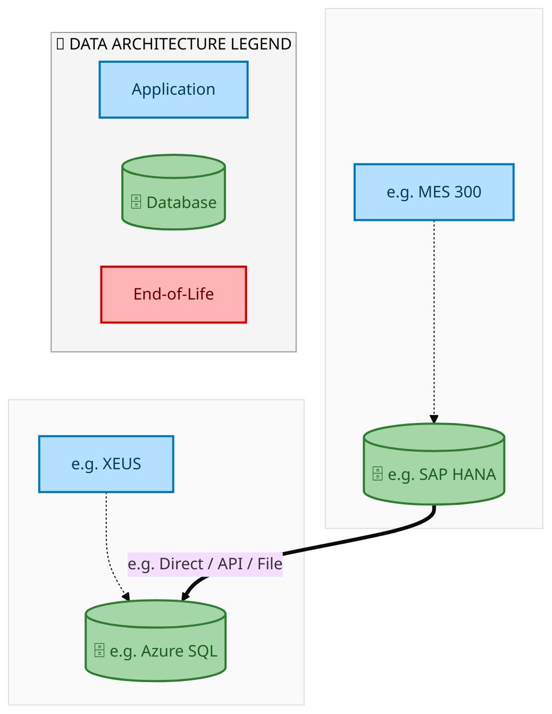
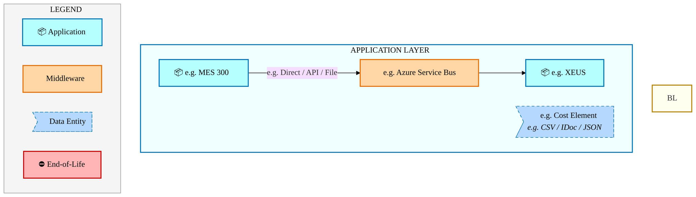
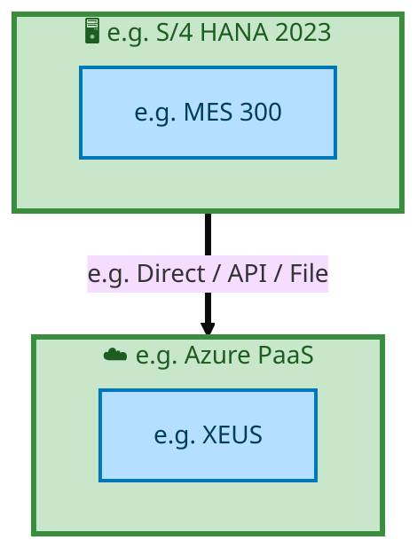

  
  <h1 style="font-size:36px; margin-top:24px;">E2E-41 — R3 Sourcing Request</h1>
  <h2 style="font-size:24px;">Architecture Document (TOGAF BDAT)</h2>
  
End-to-End Integrated Processes (E2E) Tower 
  Capability E2E-41 · Procure to Pay

  
IAO Program · Release 2 
  Generated: March 2026 
  Sajiv Francis

  
IAO Architecture Pipeline — Intel Confidential

Page 1<a href="#toc">↑ Back to TOC</a>E2E-41 — R3 Sourcing Request

## Table of Contents

1. [Executive Summary](#1-executive-summary)
2. [Business Context & Objectives](#2-business-context--objectives)
   - 2.1 [Classification](#21-classification)
   - 2.2 [Business Drivers](#22-business-drivers)
   - 2.3 [Success Criteria](#23-success-criteria)
   - 2.4 [Companion Documents](#24-companion-documents)
3. [Business Architecture (TOGAF "B")](#3-business-architecture-togaf-b)
   - 3.1 [Business Process Overview](#31-business-process-overview)
   - 3.2 [Business Process Diagrams](#32-business-process-diagrams)
   - 3.3 [Business Roles & Responsibilities](#33-business-roles--responsibilities)
4. [Data Architecture (TOGAF "D")](#4-data-architecture-togaf-d)
   - 4.1 [Data Entities & Ownership](#41-data-entities--ownership)
   - 4.2 [Data Flow Diagrams](#42-data-flow-diagrams)
   - 4.3 [Data Lineage](#43-data-lineage)
   - 4.4 [RICEFW Data Objects](#44-ricefw-data-objects)
   - 4.5 [Data Governance & Quality](#45-data-governance--quality)
5. [Application Architecture (TOGAF "A")](#5-application-architecture-togaf-a)
   - 5.1 [Current-State Application Landscape](#51-current-state--current-state-application-landscape)
   - 5.2 [Future-State Application Landscape](#52-future-state--future-state-application-landscape)
   - 5.3 [Change Impact Summary](#53-change-impact-summary)
   - 5.4 [Component Overview](#54-component-overview)
   - 5.5 [RICEFW Inventory](#55-ricefw-inventory)
   - 5.6 [Integration Patterns](#56-integration-patterns)
6. [Technology Architecture (TOGAF "T")](#6-technology-architecture-togaf-t)
   - 6.1 [Platform & Infrastructure](#61-platform--infrastructure)
   - 6.2 [SAP Development Object Status](#62-sap-development-object-status)
   - 6.3 [NFRs & Design Principles](#63-nfrs--design-principles)
   - 6.4 [Security & Governance](#64-security--governance)
7. [Project Context](#7-project-context)
   - 7.1 [Project Roadmap & Go-Live Plan](#71-project-roadmap--go-live-plan)
   - 7.2 [RAID Log](#72-raid-log)
   - 7.3 [Recommendations & Next Steps](#73-recommendations--next-steps)

Page 2<a href="#toc">↑ Back to TOC</a>E2E-41 — R3 Sourcing Request

## 1. Executive Summary

This Architecture Document defines the **Business, Data, Application, and Technology** (BDAT) architecture for **E2E-41 R3 Sourcing Request** within the IAO program. It includes 1 BPMN process diagram(s) in Section 3.
| Dimension | Value |
|-----------|-------|
| **Tower** | End-to-End Integrated Processes (E2E) |
| **Process Group** | Procure to Pay |
| **Capability** | E2E-41 - R3 Sourcing Request |
| **Release** | Release 2 |
| **Total Systems** | 2 |
| **System Status** | 0 Deployed, 0 Developing, 0 EOL, 2 Pending IAPM |
| **RICEFW Objects** | Pending — Smartsheet Object Tracker API integration |
**Change Summary**: 0 new flow chains, 0 removed, 0 modified, 1 unchanged between Current-State and Future-State states.

> All system nodes in architecture diagrams are **IAPM-linked** — click any node to open its IAPM page. Diagrams require `securityLevel: 'loose'` for click events.

Page 3<a href="#toc">↑ Back to TOC</a>E2E-41 — R3 Sourcing Request

## 2. Business Context & Objectives

### 2.1 Classification

| Level | Value |
|-------|-------|
| **L0 Tower** | End-to-End Integrated Processes |
| **L1 Process** | Procure to Pay |
| **L2 Capability** | E2E-41 - R3 Sourcing Request |

### 2.2 Business Drivers

| # | Driver | Description | Strategic Alignment | Priority |
|---|--------|-------------|---------------------|----------|
| 1 | End-to-End Process Integration | Enable cross-tower integrated processes spanning procurement, manufacturing, and fulfillment | IDM 2.0 Process Excellence | High |
| 2 | Intel Foundry Business Enablement | Stand up foundry-specific business processes for external customer engagement | Intel Foundry Services | High |
| 3 | Process Visibility & Monitoring | Provide end-to-end process visibility across tower boundaries with integrated monitoring | Operational Excellence | Medium |
| 4 | E2E-41 Process Migration | Migrate R3 Sourcing Request business processes and 2 integrated systems from legacy to S/4 HANA target architecture | IDM 2.0 Cross-Functional / End-to-End | High |

Page 4<a href="#toc">↑ Back to TOC</a>E2E-41 — R3 Sourcing Request

### 2.3 Success Criteria

| Metric | Target | Measure | Baseline | Owner |
|--------|--------|---------|----------|-------|
| E2E Process Cycle Time | Per process SLA | End-to-end transaction completion within defined SLA per process | Varies by process | E2E Process Owner |
| Cross-Tower Integration Success | > 99% | Transactions completing across tower boundaries without manual intervention | 92% (current) | Integration Lead |
| Process Exception Rate | < 2% | Transactions requiring manual exception handling | 8% (current) | Operations Manager |
| E2E-41 Migration Completeness | 100% flow chains validated | All 1 flow chains verified in target state | 0% (pre-migration) | Tower Architect |

### 2.4 Companion Documents

| Document | Description |
|----------|-------------|
| **Business Architecture** | Included in this document (Section 3) — process flows from BPMN diagrams |
| **This Document** | Full BDAT Architecture — Business + Data + Application + Technology |

Page 5<a href="#toc">↑ Back to TOC</a>E2E-41 — R3 Sourcing Request

## 3. Business Architecture (TOGAF "B")

### 3.1 Business Process Overview

This capability includes **1 business process(es)** modeled in BPMN 2.0, covering the end-to-end workflow for E2E-41 R3 Sourcing Request.

| # | Step ID | Process Name | Lanes | Tasks | Gateways |
|---|---------|--------------|-------|-------|----------|
| 1 | Project_to_Contracts_for_Ariba_buying_Use_Cases | Project_to_Contracts_for_Ariba_buying_Use_Cases | CWB/RFXUi, SAP Ariba Buying
, SAP Ariba Network, SAP Ariba Strategic Sourcing | 19 | 5 |

### 3.2 Business Process Diagrams

Page 6<a href="#toc">↑ Back to TOC</a>E2E-41 — R3 Sourcing Request

#### BUSINESS ARCHITECTURE — 3.2.1 Project_to_Contracts_for_Ariba_buying_Use_Cases — Project_to_Contracts_for_Ariba_buying_Use_Cases

**Swim Lanes**: CWB/RFXUi · SAP Ariba Buying
 · SAP Ariba Network · SAP Ariba Strategic Sourcing | **Tasks**: 19 | **Gateways**: 5

```mermaid
%%{init: {'theme': 'base', 'themeVariables': {'fontSize': '14px', 'fontFamily': 'Segoe UI, Arial, sans-serif','primaryColor': '#e8f0fe', 'primaryBorderColor': '#0071c5','lineColor': '#37474F', 'secondaryColor': '#f5f8fc'}, 'flowchart': {'useMaxWidth': false, 'htmlLabels': true, 'curve': 'basis', 'nodeSpacing': 40, 'rankSpacing': 50}} }%%
flowchart LR
    classDef startEvt fill:#4CAF50,stroke:#2E7D32,color:#000,font-weight:bold,stroke-width:2px,rx:20,ry:20
    classDef endEvt fill:#C62828,stroke:#B71C1C,color:#fff,font-weight:bold,stroke-width:2px,rx:20,ry:20
    classDef userTask fill:#E3F2FD,stroke:#1565C0,stroke-width:2px,color:#0D47A1
    classDef serviceTask fill:#FFF3E0,stroke:#E65100,stroke-width:2px,color:#BF360C
    classDef gateway fill:#FFF9C4,stroke:#F57F17,stroke-width:2px,color:#E65100
    classDef subProc fill:#F3E5F5,stroke:#7B1FA2,stroke-width:2px,color:#4A148C
    subgraph CWB/RFXUi
        n8["Trigger/Initiate RFx Event"]
        n20(["fa:fa-play RFx Event to be Initiated"])
        n24{{"fa:fa-code-branch Line Item Level Catalog Available?"}}
    end
    subgraph SAP Ariba Buying 
        n4["Create Catalog from Contract Line Item"]
        n5["Connect Contract Workspace to Existing Activated Catalog"]
        n6["Create Catalog PR in Ariba Guided Buying"]
        n7["Create Purchase Order"]
        n22(["fa:fa-stop Purchase Order Created"])
        n23{{"fa:fa-code-branch exclusiveGateway"}}
    end
    subgraph SAP Ariba Network
        n1["Publish Event to Supplier"]
        n2["Contract Information Sent to Supplier (BPO-IAC/IAC)"]
        n3["Post Supplier Invoice Against Contract"]
        n21(["fa:fa-stop Invoice Posted"])
    end
    subgraph SAP Ariba Strategic Sourcing
        n9["Create RFx Event"]
        n10["Create Price Quote Event"]
        n11["Initiate RFx Approvals"]
        n12["Review Event Rules and Timing"]
        n13["Select Suppliers to be invited"]
        n14["Publish Event"]
        n15["Award Supplier"]
        n16["Review Supplier Response"]
        n17["Identify Optimized Award Scenario"]
        n18["Create Contract Workspace and Update Contract line Items"]
        n19["Monitor Event"]
        n25{{"fa:fa-code-branch Check if BPO-IAC or IAC ?"}}
        n26{{"fa:fa-arrows-alt parallelGateway"}}
        n27{{"fa:fa-arrows-alt parallelGateway"}}
    end
    n10 --> n11
    n11 --> n12
    n12 --> n13
    n17 --> n15
    n13 --> n14
    n8 --> n9
    n15 --> n18
    n18 --> n25
    n24 -->|"No"| n5
    n5 --> n23
    n23 --> n6
    n6 --> n7
    n9 --> n10
    n2 --> n3
    n7 --> n22
    n26 --> n19
    n1 --> n27
    n24 -->|"Yes"| n4
    n14 --> n26
    n20 --> n8
    n26 --> n1
    n16 --> n17
    n3 --> n21
    n4 --> n23
    n19 --> n27
    n27 --> n16
    n25 -->|"Yes"| n2
    n25 -->|"No"| n24
    class n20 startEvt
    class n21 endEvt
    class n22 endEvt
    class n23 gateway
    class n24 gateway
    class n25 gateway
    class n26 gateway
    class n27 gateway
```

> **Legend**: ● Start · ● End · User Task · Service Task · ◇ Gateway · Sub-Process

<a href="https://mermaid.live/edit#pako:eNqlV21v4jgQ_itWVhW7EmiTkBDKhztBSlZI3d0ubK93ut4Hkzhg1diR7fCyXf772cQmEOjpTocErR_PPDPzjMeEVydlGXIGzs3NK6ZYDsBrSy7RCrUGoDWHArXaoAJ-gxzDOUGipW1yRuUM_ziYeUGx1WYaS-AKk51GZ2jBEHictMFQOZI2EJCKjkAc5612q-B4BfkuZoRxbf0O9XM3P0QzWyPGM8RrA9eNvDRUrgRTVMPdKIiCRPsJlDKanZHmYd7P09ZeJ0fYJl1CLg_plwJ9htsnnMmlWueQCKRslnJF7uEcEV2j5KXG0pKvrRhY6DhUCTYrYIrpQuGBqyAO6UsNhe5-D_Y3N8_0GBTcT58pUK-UQCHuUA6EVPB4LUGOCRm8C-JhErptITl7QYN3_ji66_rtVFcyUKW7bS1uZ4PwYikHc0YyY9rZ6BoGfrFt8-3Ad9t8pz4bsRDN6khxz-_7_WOkUeTFXmwj5Xn-vyIpXfl3KF5MrHE38ZO7Yywv7IWxe8lny7wLoqHX1AnxNU7RCWmSJN1xLdW4F3ru26SjpNtz4wbpAkq0gbua8DYOjoRJGCVe9CZhFa-ZZTl_4Cy1hN1xmIRHwmjkJUP_TcJg6AV9k6HiWXBYLEH8NPo4TX5_xBWuX7T_57PznePFAvGPEzWrWFUBpskWjNeIymfnrxNb332vrHM4yGGnIKrUox2QDMwRsASZ8vtw6hi8vlpHfTV05upwp0twr6YOTCRagXu0RgTEUELCFmC4hpjoe-HXZ2e_r4jUeWuUMxs-6GtgDsGo3KkpAScRA5VozJEuxpLmnK1ArM4hh6msQ5-XGGo_RilSJkfbJ8ZfhJpEpMscb7GQOtowlXiti7URzpl6lxk8TAGmJuVPJc6Ua5X5uWdUez6UXI26QOCrvrca3fDrbgjJioYxqCguWtG93gq0TUkp8Bp9qo7xvxP-C5IbJc4Jv6dyeijnBItlfTRmZVEQfFFApXWl8YTmjK-gxIyCWcMNvB89fO1MhvFH9f5wTtLV8ZiQtfGErpkabjBcQExF3cZGcK-hnnXTZKeq_VP5M0Us0QKnYMaU-LqTdYTbuo1vzJPnnnSa6-DfSqb-v2aqdT2bz2FRcLZWXzINQ63qFK0x2hj9p6X6fgWQZuA7Xl0cNk8LOENEH3groTDjjOkaV1qcOgTNDjf29QgNN5Bnb7Td69UZHps2RaJgVKCGqR6FSaZi4HwHvhZSFfBDTY2hTxFVzw-s4dM_GbzLCdY6PBbZ2S6xd0FTS93Cz0ypzvjV-zC8PkvxEqUvAOfAHFug3PWfk9us8u_V_pBzthEdSCQoIIeEIHIxiZVT9N-cjudXHTfQ6fyiz5IFPAP4FvAN0LVAZIDQAl0DBAboV-tbux-a_b4FjIFvGfxAAz-fnS-qcT_VjWtw4-jb0L6J1DPrXrWMzPLWxHGtebW23iZv31bmG3fvmKgxiJpp_YHEIS9boBcYS5uIb2TsN6mtg11balOIbw2CRqXebTMXq_oxZNhIzm9uGDH94OQZ4pCqfSQ8xz3z-HaO-lfRrn2yOYeD63B4He5dhyMLO21nhdT9jzNn8Oocfhuo3w8ZymFJpLNvO7CUbLajqTM4PEM75WGG7zBUd_KqAvd_A7PE0Gs=" title="Edit in Mermaid Live">&#9998; Edit in Mermaid Live</a>

Page 7<a href="#toc">↑ Back to TOC</a>E2E-41 — R3 Sourcing Request

### 3.3 Business Roles & Responsibilities

| Role / Lane | Processes Involved | Description |
|------------|-------------------|-------------|
| CWB/RFXUi | Project_to_Contracts_for_Ariba_buying_Use_Cases | |
| SAP Ariba Buying
 | Project_to_Contracts_for_Ariba_buying_Use_Cases | |
| SAP Ariba Network | Project_to_Contracts_for_Ariba_buying_Use_Cases | |
| SAP Ariba Strategic Sourcing | Project_to_Contracts_for_Ariba_buying_Use_Cases | |

Page 8<a href="#toc">↑ Back to TOC</a>E2E-41 — R3 Sourcing Request

## 4. Data Architecture (TOGAF "D")

### 4.1 Data Entities & Ownership

| # | Data Entity | Source System | Target System | Data Owner | Classification | Volume | Master/Transaction |
|---|-------------|---------------|---------------|------------|----------------|--------|-------------------|
| 1 | e.g. Cost Element | e.g. MES 300 | e.g. XEUS | Data steward | e.g. Intel Confidential | e.g. 10K rows/day | Master / Transaction |

Page 9<a href="#toc">↑ Back to TOC</a>E2E-41 — R3 Sourcing Request

### 4.2 Data Flow Diagrams

> **DATA ARCHITECTURE** — Database-to-database data flows. Applications (blue) sit above their hosting databases (green cylinders). Thick arrows show data movement between databases.

#### 4.2.1 Current-State — Current-State Data Flows

<a href="https://mermaid.live/edit#pako:eNqdlQ1v2jAQhv-K5QmxSdAFaGCN1ErOB2ultOoauk1qpsgkF7BqkihxVijlv89OgG4Uuqq2FOH7eO_yXGSWOEwjwAZuNJYsYcJAy6aYwgyaBmqOaQHNFmoWEJY5EwsXfgNXDp6mtacK_U5zRscciqbKjtNEeOyxEujo2VyFKduQzhhfKKsHkxTQ7UULEZnImysVwdOHcEpzUWmUBVzS-Q8Wiak8x5QXIGOmYsZdOgauCom8VLZEdu9lNGTJRBp7ujTlNLl_Nh3rqxVaNRp-si2BRqafILlCTovChhjRLDPTOYoZ58YHU7eHw2GrEHl6D8YHTRsMzP762H5QPRndbN4KU57myt2z9V29aGwt-FqO6HafDLZyXWdg97oH5Tqm7nS1HTlI-XN7w6Gpm_pWz7I0uQ7q9fvK7Se1YlGOJznNpsjpOscdyyaWG0AwCchjmUPgfXPvfIx8_KuOVitiOYSCpckWmlqbdFJl_3RuPZkIR5MjpH5LAcMwaqYvc-ydih997JfRl14kn1F47JcxaPKVlVgVhGSQjz8pyQrra12g9lH77FClOhGSaM1CLDgcBLGBTdTewnY0tf-F3cnm_8PrkevgnFyRd9G9dLygp2kbwPKI5PEtjLdlX0EsY5CKeQvhdSf7IG9KvYXxJvZdiPeXRaenZ09rQHbFFH1G5PpCPoeMg4-fDn8UO6NzYSLbv_uLWBhpyCYjgsiNdX4xcqzR7Y2DXOerc2UfmKZ782x1AzV3kmWchVR594_ODewDc7KpoOom3j8iN3CkvJNE7TRuuyyGWr6-MvaOo37DDX1d7S39k5OTF-hxC88gn1EWYWOJqxtf_l9EENOSC7xqYVqK1FskITaqSxmXWUQF2IxKorPauPoDTVf1JQ==" title="Edit in Mermaid Live">&#9998; Edit in Mermaid Live</a>

Page 10<a href="#toc">↑ Back to TOC</a>E2E-41 — R3 Sourcing Request

#### 4.2.2 Future-State — Future-State Data Flows

<a href="https://mermaid.live/edit#pako:eNqdlY9vmkAUx_-Vyy3GLdEOtehK0ianwNqENl2x25KykBMeeukJBI5Va_3fdwdKN6td07uEeO_H9z0-j5wrHCQhYAM3GisWM2GgVVPMYA5NAzUnNIdmCzVzCIqMiaUDv4ErB0-SylOGfqcZoxMOeVNlR0ksXPZYCnT0dKHClM2mc8aXyurCNAF0e9FCRCby5lpF8OQhmNFMlBpFDpd08YOFYibPEeU5yJiZmHOHToCrQiIrlC2W3bspDVg8lcaeLk0Zje-fTcf6eo3WjYYX1yXQeOjFSK6A0zw3IUI0TYfJAkWMc-PDUDdt227lIkvuwfigaYPBsL85th9UT0Y3XbSChCeZcvdMfVcvnIyWfCNHdLNPBrVc1xqYve5Buc5Qt7rajhwk_Lk92x7qQ73WG400uQ7q9fvK7cWVYl5MphlNZ8jqWscd2yQjxwd_6pPHIgPf_ebceRh5-FcVrVbIMggES-IamlrbdFJm_7RuXZkIR9MjpH5LAcMwKqYvc8ydih897BXhl14on2Fw7BURaPKVlVgZhGSQhz8pyRLra12g9lH77FClKhHicMNCLDkcBLGFTdSuYVua2v_C7qSL_-F1ybV_Tq7Iu-heWq7f07QtYHlE8vgWxnXZVxDLGKRi3kJ408k-yNtSb2G8jX0X4v1l0enp2dMGkFkyRZ8Rub6QT5tx8PDT4Y9iZ3QOTGX7d38RC0INmWRMELkZnV-MrdH49sZCjvXVujIPTNO5ebY6vpo7SVPOAqq8-0fn-OaBOZlUUHUT7x-R41tS3orDdhK1HRZBJV9dGXvHUb3hlr6udk3_5OTkBXrcwnPI5pSF2Fjh8saX_xchRLTgAq9bmBYicZdxgI3yUsZFGlIBJqOS6Lwyrv8AyPz1Tw==" title="Edit in Mermaid Live">&#9998; Edit in Mermaid Live</a>

Page 11<a href="#toc">↑ Back to TOC</a>E2E-41 — R3 Sourcing Request

### 4.3 Data Lineage

| # | Source System | Source Schema/Object | Target System | Target Schema/Object | Transformation |
|---|-------------|---------------------|---------------|---------------------|---------------|
| 1 | e.g. MES 300 | e.g. CKMLHD table | e.g. XEUS | e.g. dbo.CostElements | Lineage notes |

### 4.4 RICEFW Data Objects

Reports and Conversions for this capability will be populated from the Smartsheet Object Tracker via automated API extraction.

| Object ID | Type | Description | Status | Source | Target | Complexity |
|-----------|------|-------------|--------|--------|--------|-----------|
| E2E-41-R001 | Report | R3 Sourcing Request operational report | Planned | SAP S/4HANA | Analytics | Medium |
| E2E-41-C001 | Conversion | Legacy data migration for R3 Sourcing Request | Planned | Legacy ERP | SAP S/4HANA | High |

> *Pending: Smartsheet API integration to auto-populate live RICEFW data (see Build Requirements).*

### 4.5 Data Governance & Quality

| Concern | Approach |
|---------|----------|
| Data Ownership | Per-entity owners listed in Section 3.1 |
| Data Classification | Financial data classified as Intel Confidential |
| Data Retention | Per Intel corporate retention policies |
| Data Quality | Validated at source; reconciliation at target |

Page 12<a href="#toc">↑ Back to TOC</a>E2E-41 — R3 Sourcing Request

## 5. Application Architecture (TOGAF "A")

### 5.1 Current-State — Current-State Application Landscape

#### Overview

The Current-State architecture represents the **current / legacy** landscape for E2E-41.This view is generated from `CurrentFlows.xlsx` (1 flow hops across 1 flow chains).

#### APPLICATION ARCHITECTURE — Architecture Diagram (ArchiMate-Inspired)

> **Click any system node** to open its IAPM application page.
> **Legend**: Deployed · Developing · End-of-Life · No IAPM Match

<a href="https://mermaid.live/edit#pako:eNqVVW1P4kAQ_iubGsIX0KK82RiSlpYLl6LG-nKX49Is3QE2Lm3T3aqI_PfbbZFi0eAtSUlnnnlm-8zM7koLIgKaoVUqKxpSYaBVVcxhAVUDVSeYQ7WGqhyCNKFi6cITMOVgUZR7Mug9TiieMOBVFT2NQuHR14yg0Y5fFEzZBnhB2VJZPZhFgO6GNWTKQFZDHIe8ziGh0-paoVn0HMxxIjK-lMMIvzxQIubyfYoZB4mZiwVz8QSYSiqSVNlC-SVejAMazqSxqUtTgsPHwtTS12u0rlTG4TYFurXGIZKrUkH1utxQMKcjLKBOQx7TBAjiYskABQxzDlxicnj2bsMUTVJOQ-AcZWtKGTOOBnJZrRoXSfQIxpHV7bZ1a_Naf1ZfYpzGL7UgYlFiHOm6XuLEcYyKlXNaLcW65dT1Tsdq_wcnwQLvc9rdA5yND5zvPoK5FC_BS6kpapUyLSghDJ5xAruK2G2zUMTptAcF2zd2DxHbU0RpvKNyv6_rhzhzVp5OZgmO58h0_4y1cUq6Z0Q-yVkLmdfX7rBv3g6vLpFr_nZuxtrfPEgtIhsiEDQKkXtTWJ1Tp9no--DP_JHj-We6vssaQBvB8ewYSR-SPkloGIas8KcEv5w779No5fgydPSQBZuvaQK-B8kTDcC3Uv7h6xqdnClDoQ0KSVROW1StzG47GXs_4sJ3mJz3UPR2txg0c2IFQBvAxSQ56V3QXu7w7tEJGtpRIP9-eleXFye0l2dVXZnng5C812dfUDl2vbexlrHZWREkk3k9lM8BZTDW3g4osUv8FUYlKddCbWnTNNkxYLk7Iz7QD434bqi5DdW_M8l7zerCTGr0oTmIjlznh3Npf6NLXV_2drm1zDhmNMAK_Elzuf7oodxCo6JNvmwb17edcofY6vhxQiFvkXLl8xDnKh_G0zZpSiCpR9O6S6ebNHL-d9qkEDUX5V3YlvpthT0_P987y7SatoBkgSnRjJWW3V7y7iMwxSkT2rqm4VRE3jIMNCO7VLQ0lhsFm2JZhEVuXP8DdQY9UQ==" title="Edit in Mermaid Live">&#9998; Edit in Mermaid Live</a>

Page 13<a href="#toc">↑ Back to TOC</a>E2E-41 — R3 Sourcing Request

#### Current-State Flow Narrative

| # | Flow Chain | Path | Interface | Freq |
|---|-----------|------|-----------|------|
| 1 | e.g. MES Route to ICOST | e.g. MES 300 → e.g. XEUS | e.g. Direct / API / File | e.g. Near Real-Time |

Page 14<a href="#toc">↑ Back to TOC</a>E2E-41 — R3 Sourcing Request

### 5.2 Future-State — Future-State Application Landscape

#### Overview

The Future-State architecture represents the **target** landscape for E2E-41.This view is generated from `FutureFlows.xlsx` (1 flow hops across 1 flow chains).

#### APPLICATION ARCHITECTURE — Architecture Diagram (ArchiMate-Inspired)

> **Click any system node** to open its IAPM application page.
> **Legend**: Deployed · Developing · End-of-Life · No IAPM Match

<a href="https://mermaid.live/edit#pako:eNqVVW1P4kAQ_iubGsIX0KK82RiSlpYLl6LG-nKX49Is3QE2Lm3T3aqI_PfbbZFi0eAtSUlnnnlm-8zM7koLIgKaoVUqKxpSYaBVVcxhAVUDVSeYQ7WGqhyCNKFi6cITMOVgUZR7Mug9TiieMOBVFT2NQuHR14yg0Y5fFEzZBnhB2VJZPZhFgO6GNWTKQFZDHIe8ziGh0-paoVn0HMxxIjK-lMMIvzxQIubyfYoZB4mZiwVz8QSYSiqSVNlC-SVejAMazqSxqUtTgsPHwtTS12u0rlTG4TYFurXGIZKrUkH1utxQMKcjLKBOQx7TBAjiYskABQxzDlxicnj2bsMUTVJOQ-AcZWtKGTOOBnJZrRoXSfQIxpHV7bZ1a_Naf1ZfYpzGL7UgYlFiHOm6XuLEcYyKlXNaLcW65dT1Tsdq_wcnwQLvc9rdA5yND5zvPoK5FC_BS6kpapUyLSghDJ5xAruK2G2zUMTptAcF2zd2DxHbU0RpvKNyv6_rhzhzVp5OZgmO58h0_4y1cUq6Z0Q-yVkLmdfX7rBv3g6vLpFr_nZuxtrfPEgtIhsiEDQKkXtTWJ1Tp9kY-ODP_JHj-We6vssaQBvB8ewYSR-SPkloGIas8KcEv5w779No5fgydPSQBZuvaQK-B8kTDcC3Uv7h6xqdnClDoQ0KSVROW1StzG47GXs_4sJ3mJz3UPR2txg0c2IFQBvAxSQ56V3QXu7w7tEJGtpRIP9-eleXFye0l2dVXZnng5C812dfUDl2vbexlrHZWREkk3k9lM8BZTDW3g4osUv8FUYlKddCbWnTNNkxYLk7Iz7QD434bqi5DdW_M8l7zerCTGr0oTmIjlznh3Npf6NLXV_2drm1zDhmNMAK_Elzuf7oodxCo6JNvmwb17edcofY6vhxQiFvkXLl8xDnKh_G0zZpSiCpR9O6S6ebNHL-d9qkEDUX5V3YlvpthT0_P987y7SatoBkgSnRjJWW3V7y7iMwxSkT2rqm4VRE3jIMNCO7VLQ0lhsFm2JZhEVuXP8Du3c9aQ==" title="Edit in Mermaid Live">&#9998; Edit in Mermaid Live</a>

Page 15<a href="#toc">↑ Back to TOC</a>E2E-41 — R3 Sourcing Request

#### Future-State Flow Narrative

| # | Flow Chain | Path | Interface | Freq |
|---|-----------|------|-----------|------|
| 1 | e.g. MES Route to ICOST | e.g. MES 300 → e.g. XEUS | e.g. Direct / API / File | e.g. Near Real-Time |

Page 16<a href="#toc">↑ Back to TOC</a>E2E-41 — R3 Sourcing Request

### 5.3 Change Impact Summary

| Change Type | Flow Chain | Detail |
|-------------|-----------|--------|
| **UNCHANGED** | e.g. MES Route to ICOST | No change |

**Totals**: 0 new - 0 removed - 0 modified - 1 unchanged

### 5.4 Component Overview

#### System Inventory

| System | IAPM ID | Status |
|--------|---------|--------|
| e.g. MES 300 | - | N/A |
| e.g. XEUS | - | N/A |

Page 17<a href="#toc">↑ Back to TOC</a>E2E-41 — R3 Sourcing Request

### 5.5 RICEFW Inventory

RICEFW objects for this capability will be auto-populated from the Smartsheet S/4 Object Tracker.

| Object ID | Type | Description | Status | Source → Target | Middleware | Complexity |
|-----------|------|-------------|--------|----------------|-----------|-----------|
| E2E-41-I001 | Interface | R3 Sourcing Request inbound data interface | Planned | Legacy → SAP S/4HANA | MuleSoft / CPI | Medium |
| E2E-41-E001 | Enhancement | R3 Sourcing Request custom business logic | Planned | SAP S/4HANA | N/A | Medium |
| E2E-41-F001 | Form/Report | R3 Sourcing Request operational output | Planned | SAP S/4HANA | N/A | Low |

> *Pending: Smartsheet API integration to auto-populate live RICEFW inventory (see Build Requirements).*

Page 18<a href="#toc">↑ Back to TOC</a>E2E-41 — R3 Sourcing Request

### 5.6 Integration Patterns

| # | Pattern | Flow Chain | Middleware | Protocol | Auth |
|---|---------|-----------|-----------|----------|------|
| 1 | e.g. Pub-Sub / P2P / ETL | e.g. MES Route to ICOST | e.g. Azure Service Bus | e.g. REST / RFC / SFTP | e.g. OAuth / NTLM / Cert |

Page 19<a href="#toc">↑ Back to TOC</a>E2E-41 — R3 Sourcing Request

## 6. Technology Architecture (TOGAF "T")

### 6.1 Platform & Infrastructure

> **TECHNOLOGY / PLATFORM ARCHITECTURE** — Platforms (green) host applications (blue). Thick arrows show platform-to-platform integration flows.

#### 6.1.1 Current-State — Current-State Platform Architecture

<a href="https://mermaid.live/edit#pako:eNqtlGFvmzAQhv-K5SriC2sJhDRD6iQgoFVKp2is26QxIQeOxKqDEZg2acp_nw1pslZKpWrzB4t77_z49Vl4h1OeAXbwYLCjBRUO2mliBWvQHKQtSA2ajrQa0qaiYjuDe2AqwTjvM13pd1JRsmBQa2p1zgsR0ccOMByVG1WmtJCsKdsqNYIlB3R7rSNXLmRaqyoYf0hXpBIdo6nhhmx-0EysZJwTVoOsWYk1m5EFMLWRqBqlFdJ9VJKUFkspjgwpVaS4O0q20baoHQzi4rAF-ubFBZIjZaSup5AjUpYe36CcMuacefY0DEO9FhW_A-fMMC4vvfE-_PCgPDlmudFTznil0tbUfs0rGRFHoD8Jxv7HA9CaTALLfwm0jsChZwem8QoInB15YejZnn3g-b4hx0mD47FKx0VPrJvFsiLlCgVmMBr689k8gWSZuI9NBcmckOhXjOPGHBvDuMnBkDufL89Rl0YqHePfPUiNjFaQCsoLNPt6VJ_Jbkf-GdwqZodR3xLgOE7f8H4NFNnem9gyOGnsn5r55uGjZJR8dr-4iWmYVnf-bGJlcs6I_XcXoosRUnVI1b27ETdBlFiG8dwLGSIZvrMdL6z-h468Rb-6-vS0NzvtzocukDu_lnNIGcT46eRVYR2voVoTmmFnh7s3Qr4wGeSkYQK3OiaN4NG2SLHT_ca4KTMiYEqJvJ51L7Z_AFbnbkI=" title="Edit in Mermaid Live">&#9998; Edit in Mermaid Live</a>

> **Legend**: 🖥️ Platform · 📦 Application · ⛔ End-of-Life · 📋 Unassigned

Page 20<a href="#toc">↑ Back to TOC</a>E2E-41 — R3 Sourcing Request

#### 6.1.2 Future-State — Future-State Platform Architecture

<a href="https://mermaid.live/edit#pako:eNqtlGFvmzAQhv-K5SriC2sJhDRD6iRIQKuUTtFYt0ljQg4ciVWDEZg2acp_nw1pslZKpWrzB4t77_z49Vl4hxOeAnbwYLCjBRUO2mliDTloDtKWpAZNR1oNSVNRsZ3DPTCVYJz3ma70O6koWTKoNbU644UI6WMHGI7KjSpTWkByyrZKDWHFAd1e68iVC5nWqgrGH5I1qUTHaGq4IZsfNBVrGWeE1SBr1iJnc7IEpjYSVaO0QroPS5LQYiXFkSGlihR3R8k22ha1g0FUHLZA37yoQHIkjNT1DDJEytLjG5RRxpwzz54FQaDXouJ34JwZxuWlN96HHx6UJ8csN3rCGa9U2prZr3klI-IInE788fTjAWhNJr41fQm0jsChZ_um8QoInB15QeDZnn3gTaeGHCcNjscqHRU9sW6Wq4qUa-Sb_mgYLOaLGOJV7D42FcQLQsJfEY4ac2wMoyYDQ-58vjpHXRqpdIR_9yA1UlpBIigv0PzrUX0mux35p3-rmB1GfUuA4zh9w_s1UKR7b2LL4KSxf2rmm4cP41H82f3ixqZhWt3504mVyjkl9t9dCC9GSNUhVffuRtz4YWwZxnMvZIhk-M52vLD6HzryFv3q6tPT3uysOx-6QO7iWs4BZRDhp5NXhXWcQ5UTmmJnh7s3Qr4wKWSkYQK3OiaN4OG2SLDT_ca4KVMiYEaJvJ68F9s_ebhuWg==" title="Edit in Mermaid Live">&#9998; Edit in Mermaid Live</a>

> **Legend**: 🖥️ Platform · 📦 Application · ⛔ End-of-Life · 📋 Unassigned

#### Platform Inventory

| # | Platform | Type | Systems Using | Environment |
|---|----------|------|--------------|-------------|
| 1 | e.g. Azure PaaS | Cloud / SaaS | e.g. XEUS | DEV,QAS,PRD |
| 2 | e.g. S/4 HANA 2023 | On-Premise | e.g. MES 300 | DEV,QAS,PRD |

Page 21<a href="#toc">↑ Back to TOC</a>E2E-41 — R3 Sourcing Request

### 6.2 SAP Development Object Status

**RICEFW Status Summary** — E2E Tower (0 objects)
*Data source: Smartsheet Object Tracker (cached 2026-03-27)*

| Status | Count | % |
|--------|------:|----:|
| **Total** | **0** | **100%** |

**RICEFW by Type:**

| Type | Count |
|------|------:|
| **Total** | **0** |

### 6.3 NFRs & Design Principles

| Category | Requirement | Target / SLA | Priority |
|----------|-------------|-------------|----------|
| Performance | Order/transaction processing within interactive SLA | < 3 seconds for online transactions | High |
| Availability | Business-critical systems available during extended hours | 99.9% (06:00-22:00 all time zones) | High |
| Scalability | Support seasonal and promotional volume spikes | Handle 2x baseline transaction volume | Medium |
| Recoverability | Customer-facing systems recover within business impact window | RPO < 30 min, RTO < 2 hours | High |
| Data Volume | Support transactional data growth from business expansion | 10M+ documents/year | Medium |
| Latency | Near-real-time integration for order status updates | < 30 seconds for status propagation | Medium |
| Concurrency | Support global user base across business functions | 300+ concurrent users | Medium |

### 6.4 Security & Governance

| Concern | Approach | Standard / Policy | Owner |
|---------|----------|--------------------|-------|
| Authentication | Single Sign-On (SSO) via Intel corporate Azure AD identity | Intel IT Security Policy - Identity Management | IT Security |
| Authorization | Role-based access control (RBAC) with SAP authorization objects | Intel SAP Security Standards - Role Design | SAP Security Team |
| Data Classification | All financial/operational data classified per Intel Data Classification Standard | Intel Data Classification Policy | Data Governance |
| Data Encryption (at rest) | AES-256 encryption for SAP HANA database and file storage | Intel Encryption Standard | Infrastructure Security |
| Data Encryption (in transit) | TLS 1.3 for all system-to-system and user-to-system communication | Intel Network Security Policy | Network Engineering |
| Network Segmentation | SAP systems in dedicated network zones with firewall controls | Intel Network Architecture Standard | Network Security |
| API Security | OAuth 2.0 / certificate-based authentication for all API integrations | Intel API Security Guidelines | Integration Architecture |
| Audit Logging | Comprehensive audit trail for all data changes and user actions (SAP Security Audit Log) | SOX Compliance / Intel Audit Policy | Internal Audit |
| Certificate Management | Automated certificate lifecycle management for system-to-system trust | Intel PKI Standard | Certificate Authority Team |
| Compliance | SOX controls, export control (EAR/ITAR) screening, data privacy (GDPR) | Intel Corporate Compliance Framework | Compliance Office |

Page 22<a href="#toc">↑ Back to TOC</a>E2E-41 — R3 Sourcing Request

## 7. Project Context

### 7.1 Project Roadmap & Go-Live Plan

*No timeline data available for this capability.*

### 7.2 RAID Log

*Live data from Smartsheet Master RAID Log — extracted 2026-03-27*

**RAID Summary:** 15 open items (0 capability-specific, 15 tower-level), 56 closed

| Severity | Capability | Tower-Wide | Total Open |
|----------|----------:|-----------:|-----------:|
| P1 - High | 0 | 3 | 3 |
| P2 - Medium | 0 | 10 | 10 |
| P3 - Low | 0 | 2 | 2 |
| **Total** | **0** | **15** | **15** |

**Other E2E Tower RAID Items** (15 open):

| RAID ID | Type | Severity | Title | Status | Assigned To | Due Date |
|---------|------|----------|-------|--------|-------------|----------|
| 03591 | Risk | P1 - High | R3 E2E scenario execution | In Progress | Test Management | 2026-04-03 |
| 03681 | Risk | P1 - High | ITC Execution: Planning run availability - Prerequisite for ... | In Progress | E2E | 2026-03-27 |
| 03762 | Risk | P1 - High | FTS-IF (esp SCP) related test cases/sequencing are not accur... | In Progress | FTS IF | 2026-04-03 |
| 01733 | Risk | P2 - Medium | Tariffs impacts Item/BOM design which is impacting ERP/SCP (... | In Progress | E2E | 2026-03-06 |
| 03592 | Risk | P2 - Medium | Lack of Defined IMO Owner for CBA Mask Billing and Materials... | In Progress | E2E | 2026-03-27 |
| 03625 | Risk | P2 - Medium | Item/ BOM MC1 delta load | In Progress | Cutover | 2026-04-10 |
| 03628 | Risk | P2 - Medium | R3 Returns Rework Process Causing Finance Double Counting in... | In Progress | E2E | 2026-03-27 |
| 03642 | Issue | P2 - Medium | E2E Process with Anafi on order/invoice point.  Need IFS SC ... | In Progress | E2E | 2026-03-24 |
| 03736 | Action | P2 - Medium | Golden Data/Test Data Readiness | In Progress | Master Data | 2026-04-22 |
| 03743 | Issue | P2 - Medium | FD-Share with Entitlements -  Interface File Paths for MC1 | Roadblock / At Risk | PMO | 2026-03-20 |
| 03753 | Risk | P2 - Medium | PDF-SMH IF test cases are not available in JIRA | To Be Reviewed | B-Apps | 2026-03-25 |
| 03756 | Risk | P2 - Medium | LE101-1001 Operation Support Ownership for SIMS/Tester Front... | In Progress | E2E | 2026-04-24 |
| 03769 | Action | P2 - Medium | Need a Labs SPOC owner to define IP Labs enterprise and mate... | In Progress | E2E | 2026-04-17 |
| 03216 | Action | P3 - Low | Mask Expense vs. Invoice | In Progress | E2E | 2026-03-06 |
| 03315 | Risk | P3 - Low | BPMG – SCP L3/L4 flow standards | In Progress | Business Process Mgmt | 2026-03-27 |

### 7.3 Recommendations & Next Steps

| # | Category | Recommendation | Priority | Owner | Target Date | Status |
|---|----------|---------------|----------|-------|-------------|--------|
| 1 | Architecture | Complete extended flow attributes (Data Entity, Integration Pattern, Tech Platform) in Flows tab for full BDAT coverage | High | Tower Architect | 2026-Q2 | Open |
| 2 | Data | Define data ownership and classification for all 1 flow chains to satisfy Data Architecture (TOGAF D) requirements | Medium | Data Architect | 2026-Q3 | Open |
| 3 | Testing | Develop integration test scenarios covering all 1 flow chains for FUT/SIT readiness | High | Test Lead | 2026-Q3 | Open |
| 4 | Business Architecture | Review and validate Business Architecture process steps against latest Signavio/BIC process models | Medium | Business Analyst | 2026-Q2 | Open |
| 5 | Security | Complete security review for API integrations and data flows per Intel Security Architecture standards | Medium | Security Architect | 2026-Q3 | Open |

---
*E2E-41 — Architecture Document (TOGAF BDAT) · End-to-End Integrated Processes · Generated: March 2026*

