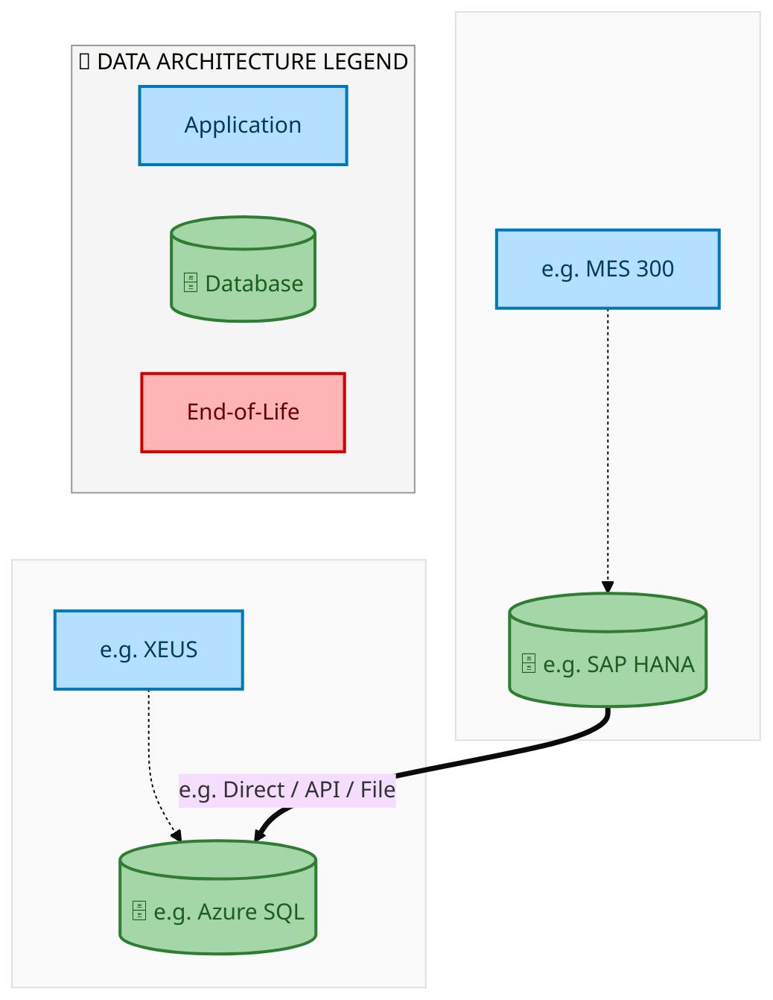
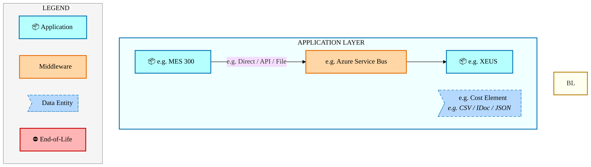
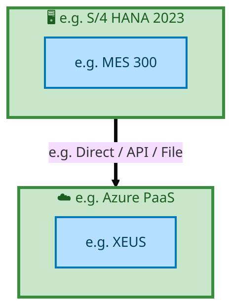

  
  <h1 style="font-size:36px; margin-top:24px;">E2E-43 — Process Procurement Card Invoice</h1>
  <h2 style="font-size:24px;">Architecture Document (TOGAF BDAT)</h2>
  
End-to-End Integrated Processes (E2E) Tower 
  Capability E2E-43 · Procure to Pay

  
IAO Program · Release 2 
  Generated: March 2026 
  Sajiv Francis

  
IAO Architecture Pipeline — Intel Confidential

Page 1<a href="#toc">↑ Back to TOC</a>E2E-43 — Process Procurement Card Invoice

## Table of Contents

1. [Executive Summary](#1-executive-summary)
2. [Business Context & Objectives](#2-business-context--objectives)
   - 2.1 [Classification](#21-classification)
   - 2.2 [Business Drivers](#22-business-drivers)
   - 2.3 [Success Criteria](#23-success-criteria)
   - 2.4 [Companion Documents](#24-companion-documents)
3. [Business Architecture (TOGAF "B")](#3-business-architecture-togaf-b)
   - 3.1 [Business Process Overview](#31-business-process-overview)
   - 3.2 [Business Process Diagrams](#32-business-process-diagrams)
   - 3.3 [Business Roles & Responsibilities](#33-business-roles--responsibilities)
4. [Data Architecture (TOGAF "D")](#4-data-architecture-togaf-d)
   - 4.1 [Data Entities & Ownership](#41-data-entities--ownership)
   - 4.2 [Data Flow Diagrams](#42-data-flow-diagrams)
   - 4.3 [Data Lineage](#43-data-lineage)
   - 4.4 [RICEFW Data Objects](#44-ricefw-data-objects)
   - 4.5 [Data Governance & Quality](#45-data-governance--quality)
5. [Application Architecture (TOGAF "A")](#5-application-architecture-togaf-a)
   - 5.1 [Current-State Application Landscape](#51-current-state--current-state-application-landscape)
   - 5.2 [Future-State Application Landscape](#52-future-state--future-state-application-landscape)
   - 5.3 [Change Impact Summary](#53-change-impact-summary)
   - 5.4 [Component Overview](#54-component-overview)
   - 5.5 [RICEFW Inventory](#55-ricefw-inventory)
   - 5.6 [Integration Patterns](#56-integration-patterns)
6. [Technology Architecture (TOGAF "T")](#6-technology-architecture-togaf-t)
   - 6.1 [Platform & Infrastructure](#61-platform--infrastructure)
   - 6.2 [SAP Development Object Status](#62-sap-development-object-status)
   - 6.3 [NFRs & Design Principles](#63-nfrs--design-principles)
   - 6.4 [Security & Governance](#64-security--governance)
7. [Project Context](#7-project-context)
   - 7.1 [Project Roadmap & Go-Live Plan](#71-project-roadmap--go-live-plan)
   - 7.2 [RAID Log](#72-raid-log)
   - 7.3 [Recommendations & Next Steps](#73-recommendations--next-steps)

Page 2<a href="#toc">↑ Back to TOC</a>E2E-43 — Process Procurement Card Invoice

## 1. Executive Summary

This Architecture Document defines the **Business, Data, Application, and Technology** (BDAT) architecture for **E2E-43 Process Procurement Card Invoice** within the IAO program. It includes 1 BPMN process diagram(s) in Section 3.
| Dimension | Value |
|-----------|-------|
| **Tower** | End-to-End Integrated Processes (E2E) |
| **Process Group** | Procure to Pay |
| **Capability** | E2E-43 - Process Procurement Card Invoice |
| **Release** | Release 2 |
| **Total Systems** | 2 |
| **System Status** | 0 Deployed, 0 Developing, 0 EOL, 2 Pending IAPM |
| **RICEFW Objects** | Pending — Smartsheet Object Tracker API integration |
**Change Summary**: 0 new flow chains, 0 removed, 0 modified, 1 unchanged between Current-State and Future-State states.

> All system nodes in architecture diagrams are **IAPM-linked** — click any node to open its IAPM page. Diagrams require `securityLevel: 'loose'` for click events.

Page 3<a href="#toc">↑ Back to TOC</a>E2E-43 — Process Procurement Card Invoice

## 2. Business Context & Objectives

### 2.1 Classification

| Level | Value |
|-------|-------|
| **L0 Tower** | End-to-End Integrated Processes |
| **L1 Process** | Procure to Pay |
| **L2 Capability** | E2E-43 - Process Procurement Card Invoice |

### 2.2 Business Drivers

| # | Driver | Description | Strategic Alignment | Priority |
|---|--------|-------------|---------------------|----------|
| 1 | End-to-End Process Integration | Enable cross-tower integrated processes spanning procurement, manufacturing, and fulfillment | IDM 2.0 Process Excellence | High |
| 2 | Intel Foundry Business Enablement | Stand up foundry-specific business processes for external customer engagement | Intel Foundry Services | High |
| 3 | Process Visibility & Monitoring | Provide end-to-end process visibility across tower boundaries with integrated monitoring | Operational Excellence | Medium |
| 4 | E2E-43 Process Migration | Migrate Process Procurement Card Invoice business processes and 2 integrated systems from legacy to S/4 HANA target architecture | IDM 2.0 Cross-Functional / End-to-End | High |

Page 4<a href="#toc">↑ Back to TOC</a>E2E-43 — Process Procurement Card Invoice

### 2.3 Success Criteria

| Metric | Target | Measure | Baseline | Owner |
|--------|--------|---------|----------|-------|
| E2E Process Cycle Time | Per process SLA | End-to-end transaction completion within defined SLA per process | Varies by process | E2E Process Owner |
| Cross-Tower Integration Success | > 99% | Transactions completing across tower boundaries without manual intervention | 92% (current) | Integration Lead |
| Process Exception Rate | < 2% | Transactions requiring manual exception handling | 8% (current) | Operations Manager |
| E2E-43 Migration Completeness | 100% flow chains validated | All 1 flow chains verified in target state | 0% (pre-migration) | Tower Architect |

### 2.4 Companion Documents

| Document | Description |
|----------|-------------|
| **Business Architecture** | Included in this document (Section 3) — process flows from BPMN diagrams |
| **This Document** | Full BDAT Architecture — Business + Data + Application + Technology |

Page 5<a href="#toc">↑ Back to TOC</a>E2E-43 — Process Procurement Card Invoice

## 3. Business Architecture (TOGAF "B")

### 3.1 Business Process Overview

This capability includes **1 business process(es)** modeled in BPMN 2.0, covering the end-to-end workflow for E2E-43 Process Procurement Card Invoice.

| # | Step ID | Process Name | Lanes | Tasks | Gateways |
|---|---------|--------------|-------|-------|----------|
| 1 | E2E-43_Process_Procurement_Card_Invoice | E2E-43_Process_Procurement_Card_Invoice | Boundary Apps, MBC, SAP CFIN, SAP S/4HANA | 26 | 12 |

### 3.2 Business Process Diagrams

Page 6<a href="#toc">↑ Back to TOC</a>E2E-43 — Process Procurement Card Invoice

#### BUSINESS ARCHITECTURE — 3.2.1 E2E-43_Process_Procurement_Card_Invoice — E2E-43_Process_Procurement_Card_Invoice

**Swim Lanes**: Boundary Apps · MBC · SAP CFIN · SAP S/4HANA | **Tasks**: 26 | **Gateways**: 12

> **Legend**: ● Start · ● End · User Task · Service Task · ◇ Gateway · Sub-Process

<a href="https://mermaid.live/edit#pako:eNqlWFtT6zYQ_isan2GAmaT4lgt5aCcxMYcZoBkC50yn9EGxZeLBsVxJDqQc_ntXtuTEwjz0NA8QrXe_3f32YjtvVkRjYk2so6O3NE_FBL0dizXZkOMJOl5hTo57qBZ8wyzFq4zwY6mT0Fws038qNccvXqWalIV4k2Y7KV2SJ0rQw1UPTcEw6yGOc97nhKXJce-4YOkGs11AM8qk9hcyTuyk8qYuzSiLCdsr2PbIiQZgmqU52Yu9kT_yQ2nHSUTzuAWaDJJxEh2_y-Ay-hKtMRNV-CUnN_j1exqLNZwTnHECOmuxya7ximQyR8FKKYtKttVkpFz6yYGwZYGjNH8CuW-DiOH8eS8a2O_v6P3o6DFvnKLru8ccwSfKMOcXJEFcgHi-FShJs2zyxQ-m4cDuccHoM5l8ceejC8_tRTKTCaRu9yS5_ReSPq3FZEWzWKn2X2QOE7d47bHXiWv32A7-Gr5IHu89BUN37I4bT7OREziB9pQkyf_yBLyye8yfla-5F7rhRePLGQwHgf0RT6d54Y-mjskTYds0IgegYRh68z1V8-HAsT8HnYXe0A4M0CcsyAve7QHPA78BDAej0Bl9Clj7M6MsVwtGIw3ozQfhoAEczZxw6n4K6E8df6wiBJwnhos1mtGy6mU0LQpeX5Of3Pnz0bqKSS7SZIfuyN9lymA2c8HRNINmgwZEMpCylqIAsxg9cPxEHq2_DmBcgJmWYk0ZzDAKFkGt-RXKTVhb1QPVRcmgjTmMM-_y0DbwwWD-WpCck7MbnINvtOhX8BqGtw0GYHBHKi5lVkswjTk6ubw-CygHD-CGMH7aNhqC0ZLIMFCYZgTdwwzyhDAEadENFinN2wYjMHgoMopjFMBIPhF-VhvhSCqjCywwSnNB0Vz6gy3EDdLGkrRIlDiTpLXDU1G3Dc7B4Btox1U4Z_PXiBSVr684jzPJpNywMQIJK2GzQrOLsmhjOHbNDkm3KtM0RzPYN4aabIzvZLUsUwF8411VHMgveibsDC2nCzQroXiEc3RLxAtlz-gM_Q5B35NX0RjckU0qBM4js19GJ4Cf4EmC-0UGk6PWF9iA4umh5nivyQUtGuiK34cCuCCxYeN7b2_aBjNGX3gfZwISjTKIeUsu63F9tN7fayug2piXm1lwyIbs75syE2lfUoUCmucEyrxNxQ6drKFsfUH78r_RVY733w0_BiPZDsKr20PgYVXGIksjSAYtywK-Qttc5VsK6w0tABIawohG9uwlyQnDB0WF6Ssox5mhO67GDibiQPWuNIbAkS0ZMCLxposbdEM2FIoeUXOIXdl2cs5lw8yCmwZyhkW0lq07063b9NWd7GEDxjnMQHrUOLKVDV1ZtDsq44chhL3H6NZcRq6sT0AZg6JUcOq7HKoORL8iHVC4dL5AF7Cib8vNCoiHCTzMHl2QjHxcGq7cTSGBlHXgHIWwMChs5hPw35Pc9GT3oRsKj0-UGQ3l1nXfpuQFDCHCuGHgmhrl9mxjdA7jq4tmTo7nGCY6S5X1B_2DSZMPfv0VbEBIDvY0rDVFOny5JbLwcP_5bT90NYDfDaDKFX_QH3Trk9fPZrs2G3abBRj6jeiqd7gb_Zy78c-Znf-UmW93m9U1A_Ypg-9FPXwwamaSvtO5LgvMcJaR7BOn7n8z6t5qyzP_6_R2erhR_Or5gK_1XVUO7-U1uq_eFWC_CfIkhz9GL6lYo_ndwthIcsLk9kPfwCVkntYb0Rij88_uKkTAVHEkuy-NwcsK7ngyhCWFhw1YtDsuyAadXC3OrsJTcxrc7kLopTyN5A271WUNLbmD-v1fITJ1dOujp45effTVcVAfh-o4rI8jdRzVR0drexXYj0frD7lPf0iS1JVz5cU1NW9ppehr_47GHGvBWEXkaIHGUs-ycEVhHfZeherpQF1b2TRpem3_ng7U1Xw0OSkKXO3f8w1TTY6nQtcvF3DF0NQ5ub5yojFd5cRv-FFZu00YKmtXZ-CrQN1hiwbJj5mjrobrminoK_v0VYX9hly7Ibce8nYmB5dN7nUYrmqpphiO8uE0Ag2ymF7d_mLbLjqBMelXj7zwYkJO615qWkSR5ejMHd3SY4MbxzHJOjdL0zCgrzhuOxinO5iGnxq44U-3r0ZT15vK6yLpUjiKHVcj-Eqg49Ht7x28uVV-9It4Wz5WL81t6XmX1LM7pU6n1NXvnm2x1y32u8WDbvGwWzzqFo-7xeedYujPTrHTLe7O0m-ytHrWhrANTmNr8mZVPy9ZEysmCYZHb-u9Z2F4iVvu8siaVD_DWGX13nCRYriXbGrh-79XJ7eP" title="Edit in Mermaid Live">&#9998; Edit in Mermaid Live</a>

Page 7<a href="#toc">↑ Back to TOC</a>E2E-43 — Process Procurement Card Invoice

### 3.3 Business Roles & Responsibilities

| Role / Lane | Processes Involved | Description |
|------------|-------------------|-------------|
| Boundary Apps | E2E-43_Process_Procurement_Card_Invoice | |
| MBC | E2E-43_Process_Procurement_Card_Invoice | |
| SAP CFIN | E2E-43_Process_Procurement_Card_Invoice | |
| SAP S/4HANA | E2E-43_Process_Procurement_Card_Invoice | |

Page 8<a href="#toc">↑ Back to TOC</a>E2E-43 — Process Procurement Card Invoice

## 4. Data Architecture (TOGAF "D")

### 4.1 Data Entities & Ownership

| # | Data Entity | Source System | Target System | Data Owner | Classification | Volume | Master/Transaction |
|---|-------------|---------------|---------------|------------|----------------|--------|-------------------|
| 1 | e.g. Cost Element | e.g. MES 300 | e.g. XEUS | Data steward | e.g. Intel Confidential | e.g. 10K rows/day | Master / Transaction |

Page 9<a href="#toc">↑ Back to TOC</a>E2E-43 — Process Procurement Card Invoice

### 4.2 Data Flow Diagrams

> **DATA ARCHITECTURE** — Database-to-database data flows. Applications (blue) sit above their hosting databases (green cylinders). Thick arrows show data movement between databases.

#### 4.2.1 Current-State — Current-State Data Flows

<a href="https://mermaid.live/edit#pako:eNqdlY9P2kAUx_-VyxnCloCrYGE20eRoyzSpxlncltilOdpXuHi0TXtVEPnfd9cCbkid8S5puPfj-14_rzmWOEhCwAZuNJYsZsJAy6aYwgyaBmqOaQ7NFmrmEBQZEwsHHoArB0-SylOG_qAZo2MOeVNlR0ksXPZUChzp6VyFKduQzhhfKKsLkwTQ7UULEZnImysVwZPHYEozUWoUOVzS-U8Wiqk8R5TnIGOmYsYdOgauComsULZYdu-mNGDxRBq7ujRlNL5_MR3rqxVaNRpevC2BRgMvRnIFnOa5BRGiaTpI5ihinBsHA90aDoetXGTJPRgHmtbvD3rrY_tR9WR00nkrSHiSKXfX0nf1wrG54Gs5ols90t_Kdey-1e3Uyh0NdLuj7chBwl_aGw4H-kDf6pmmJletXq-n3F5cKebFeJLRdIrsjn3cNS1iOj74E588FRn47nfnzsPIw7-raLVClkEgWBJvoam1SSdl9i_71pWJcDg5ROq3FDAMo2L6OsfaqfjJw14Rfu2G8hkGx14RgSZfWYmVQUgGefizkiyxvtUFah-2z-oqVYkQh2sWYsGhFsQGNlF7C9vW1P4X9lE6_x9el1z75-SKfIjupe36XU3bAJZHJI_vYbwt-wZiGYNUzHsIrzvZB3lT6j2MN7EfQry_LDo9PXteA7JKpugLItcX8jlkHDz8XP9R7IzOgYls_-4vYkGoIYuMCCI35vnFyDZHtzc2cuxv9pVVM03n5sXq-GruJE05C6jy7h-d41s1c7KooOom3j8ix7elvB2H7SRqOyyCSr66MvaOo3rDDX1d7S39k5OTV-hxC88gm1EWYmOJyxtf_l-EENGCC7xqYVqIxF3EATbKSxkXaUgFWIxKorPKuPoDn-H1QQ==" title="Edit in Mermaid Live">&#9998; Edit in Mermaid Live</a>

Page 10<a href="#toc">↑ Back to TOC</a>E2E-43 — Process Procurement Card Invoice

#### 4.2.2 Future-State — Future-State Data Flows

<a href="https://mermaid.live/edit#pako:eNqdlY9P2kAUx_-VyxnCloCrYGE20eSg7TSpxlncltilOdpXuHi0TXtVEPnfd9dC3RCc8S5puPfj-14_rzmWOEhCwAZuNJYsZsJAy6aYwgyaBmqOaQ7NFmrmEBQZEwsHHoArB0-SylOG_qAZo2MOeVNlR0ksXPZUChzp6VyFKZtNZ4wvlNWFSQLo9qKFiEzkzZWK4MljMKWZKDWKHC7p_CcLxVSeI8pzkDFTMeMOHQNXhURWKFssu3dTGrB4Io1dXZoyGt-_mI711QqtGg0vrkug0cCLkVwBp3luQoRomg6SOYoY58bBQDdt227lIkvuwTjQtH5_0Fsf24-qJ6OTzltBwpNMubumvq0XjocLvpYjutkj_VquY_XNbmev3NFAtzralhwk_KU92x7oA73WGw41ufbq9XrK7cWVYl6MJxlNp8jqWMdd2yRDxwd_4pOnIgPf_e7ceRh5-HcVrVbIMggES-IamlqbdFJm_7JuXZkIh5NDpH5LAcMwKqavc8ytip887BXh124on2Fw7BURaPKVlVgZhGSQhz8ryRLrW12g9mH7bF-lKhHicM1CLDjsBbGBTdSuYVua2v_CPkrn_8Prkmv_nFyRD9G9tFy_q2kbwPKI5PE9jOuybyCWMUjFvIfwupNdkDel3sN4E_shxLvLotPTs-c1ILNkir4gcn0hnzbj4OHn_R_F1ugcmMj27_4iFoQaMsmIIHIzPL8YWcPR7Y2FHOubdWXumaZz82J1fDV3kqacBVR5d4_O8c09czKpoOom3j0ix7ekvBWH7SRqOyyCSr66MnaOo3rDDX1d7Zr-ycnJK_S4hWeQzSgLsbHE5Y0v_y9CiGjBBV61MC1E4i7iABvlpYyLNKQCTEYl0VllXP0BG5X1aw==" title="Edit in Mermaid Live">&#9998; Edit in Mermaid Live</a>

Page 11<a href="#toc">↑ Back to TOC</a>E2E-43 — Process Procurement Card Invoice

### 4.3 Data Lineage

| # | Source System | Source Schema/Object | Target System | Target Schema/Object | Transformation |
|---|-------------|---------------------|---------------|---------------------|---------------|
| 1 | e.g. MES 300 | e.g. CKMLHD table | e.g. XEUS | e.g. dbo.CostElements | Lineage notes |

### 4.4 RICEFW Data Objects

Reports and Conversions for this capability will be populated from the Smartsheet Object Tracker via automated API extraction.

| Object ID | Type | Description | Status | Source | Target | Complexity |
|-----------|------|-------------|--------|--------|--------|-----------|
| E2E-43-R001 | Report | Process Procurement Card Invoice operational report | Planned | SAP S/4HANA | Analytics | Medium |
| E2E-43-C001 | Conversion | Legacy data migration for Process Procurement Card Invoice | Planned | Legacy ERP | SAP S/4HANA | High |

> *Pending: Smartsheet API integration to auto-populate live RICEFW data (see Build Requirements).*

### 4.5 Data Governance & Quality

| Concern | Approach |
|---------|----------|
| Data Ownership | Per-entity owners listed in Section 3.1 |
| Data Classification | Financial data classified as Intel Confidential |
| Data Retention | Per Intel corporate retention policies |
| Data Quality | Validated at source; reconciliation at target |

Page 12<a href="#toc">↑ Back to TOC</a>E2E-43 — Process Procurement Card Invoice

## 5. Application Architecture (TOGAF "A")

### 5.1 Current-State — Current-State Application Landscape

#### Overview

The Current-State architecture represents the **current / legacy** landscape for E2E-43.This view is generated from `CurrentFlows.xlsx` (1 flow hops across 1 flow chains).

#### APPLICATION ARCHITECTURE — Architecture Diagram (ArchiMate-Inspired)

> **Click any system node** to open its IAPM application page.
> **Legend**: Deployed · Developing · End-of-Life · No IAPM Match

<a href="https://mermaid.live/edit#pako:eNqVVW1P4kAQ_iubGsIX0CqvNoakpeXCpaixvtzluDRLd4CNS9t0tyoi__12W6RYNHhLUtKZZ57ZPjOzu9KCiIBmaJXKioZUGGhVFXNYQNVA1QnmUK2hKocgTahYuvAETDlYFOWeDHqPE4onDHhVRU-jUHj0NSM4bccvCqZsA7ygbKmsHswiQHfDGjJlIKshjkNe55DQaXWt0Cx6DuY4ERlfymGEXx4oEXP5PsWMg8TMxYK5eAJMJRVJqmyh_BIvxgENZ9LY1KUpweFjYWrp6zVaVyrjcJsC3VrjEMlVqaB6XW4omNMRFlCnIY9pAgRxsWSAAoY5By4xOTx7t2GKJimnIXCOsjWljBlHA7msVo2LJHoE48jqdtu6tXmtP6svMc7il1oQsSgxjnRdL3HiOEbFyjmtlmLdcup6p2O1_4OTYIH3Oe3uAc7TD5zvPoK5FC_BS6kpapUyLSghDJ5xAruK2G2zUMTptAcF2zd2DxHbU0RpvKNyv6_rhzhzVp5OZgmO58h0_4y1cUq6DSKfpNFC5vW1O-ybt8OrS-Sav52bsfY3D1KLyIYIBI1C5N4UVufMaTb6Pvgzf-R4fkPXd1kDaCM4nh0j6UPSJwkNw5AV_pTgl3PnfRqtHF-Gjh6yYPM1TcD3IHmiAfhWyj983WknZ8pQaINCEpXTFlUrs9tOxt6PuPAdJuc9FL3dLQbNnFgB0AZwMUlOehe0lzu8e3SChnYUyL-f3tXlxQnt5VlVV-b5ICTv9dkXVI5d722sZWx2VgTJZF4P5XNAGYy1twNK7BJ_hVFJyrVQW9o0TXYMWO7OiA_0QyO-G2puQ_XvTPJes7owkxp9aA6iI9f54Vza3-hS15e9XW4tM44ZDbACf9Jcrj96KLfQqGiTL9vG9W2n3CG2On6cUMhbpFz5PMS5yofxrE2aEkjq0bTu0ukmjZz_nTYpRM1FeRe2pX5bYc_Pz_fOMq2mLSBZYEo0Y6Vlt5e8-whMccqEtq5pOBWRtwwDzcguFS2N5UbBplgWYZEb1_8ApAw9YQ==" title="Edit in Mermaid Live">&#9998; Edit in Mermaid Live</a>

Page 13<a href="#toc">↑ Back to TOC</a>E2E-43 — Process Procurement Card Invoice

#### Current-State Flow Narrative

| # | Flow Chain | Path | Interface | Freq |
|---|-----------|------|-----------|------|
| 1 | e.g. MES Route to ICOST | e.g. MES 300 → e.g. XEUS | e.g. Direct / API / File | e.g. Near Real-Time |

Page 14<a href="#toc">↑ Back to TOC</a>E2E-43 — Process Procurement Card Invoice

### 5.2 Future-State — Future-State Application Landscape

#### Overview

The Future-State architecture represents the **target** landscape for E2E-43.This view is generated from `FutureFlows.xlsx` (1 flow hops across 1 flow chains).

#### APPLICATION ARCHITECTURE — Architecture Diagram (ArchiMate-Inspired)

> **Click any system node** to open its IAPM application page.
> **Legend**: Deployed · Developing · End-of-Life · No IAPM Match

<a href="https://mermaid.live/edit#pako:eNqVVW1P4kAQ_iubGsIX0CqvNoakpeXCpaixvtzluDRLd4CNS9t0tyoi__12W6RYNHhLUtKZZ57ZPjOzu9KCiIBmaJXKioZUGGhVFXNYQNVA1QnmUK2hKocgTahYuvAETDlYFOWeDHqPE4onDHhVRU-jUHj0NSM4bccvCqZsA7ygbKmsHswiQHfDGjJlIKshjkNe55DQaXWt0Cx6DuY4ERlfymGEXx4oEXP5PsWMg8TMxYK5eAJMJRVJqmyh_BIvxgENZ9LY1KUpweFjYWrp6zVaVyrjcJsC3VrjEMlVqaB6XW4omNMRFlCnIY9pAgRxsWSAAoY5By4xOTx7t2GKJimnIXCOsjWljBlHA7msVo2LJHoE48jqdtu6tXmtP6svMc7il1oQsSgxjnRdL3HiOEbFyjmtlmLdcup6p2O1_4OTYIH3Oe3uAc7TD5zvPoK5FC_BS6kpapUyLSghDJ5xAruK2G2zUMTptAcF2zd2DxHbU0RpvKNyv6_rhzhzVp5OZgmO58h0_4y1cUq6DSKfpNFC5vW1O-ybt8OrS-Sav52bsfY3D1KLyIYIBI1C5N4UVufMaTYGPvgzf-R4fkPXd1kDaCM4nh0j6UPSJwkNw5AV_pTgl3PnfRqtHF-Gjh6yYPM1TcD3IHmiAfhWyj983WknZ8pQaINCEpXTFlUrs9tOxt6PuPAdJuc9FL3dLQbNnFgB0AZwMUlOehe0lzu8e3SChnYUyL-f3tXlxQnt5VlVV-b5ICTv9dkXVI5d722sZWx2VgTJZF4P5XNAGYy1twNK7BJ_hVFJyrVQW9o0TXYMWO7OiA_0QyO-G2puQ_XvTPJes7owkxp9aA6iI9f54Vza3-hS15e9XW4tM44ZDbACf9Jcrj96KLfQqGiTL9vG9W2n3CG2On6cUMhbpFz5PMS5yofxrE2aEkjq0bTu0ukmjZz_nTYpRM1FeRe2pX5bYc_Pz_fOMq2mLSBZYEo0Y6Vlt5e8-whMccqEtq5pOBWRtwwDzcguFS2N5UbBplgWYZEb1_8A6n09eQ==" title="Edit in Mermaid Live">&#9998; Edit in Mermaid Live</a>

Page 15<a href="#toc">↑ Back to TOC</a>E2E-43 — Process Procurement Card Invoice

#### Future-State Flow Narrative

| # | Flow Chain | Path | Interface | Freq |
|---|-----------|------|-----------|------|
| 1 | e.g. MES Route to ICOST | e.g. MES 300 → e.g. XEUS | e.g. Direct / API / File | e.g. Near Real-Time |

Page 16<a href="#toc">↑ Back to TOC</a>E2E-43 — Process Procurement Card Invoice

### 5.3 Change Impact Summary

| Change Type | Flow Chain | Detail |
|-------------|-----------|--------|
| **UNCHANGED** | e.g. MES Route to ICOST | No change |

**Totals**: 0 new - 0 removed - 0 modified - 1 unchanged

### 5.4 Component Overview

#### System Inventory

| System | IAPM ID | Status |
|--------|---------|--------|
| e.g. MES 300 | - | N/A |
| e.g. XEUS | - | N/A |

Page 17<a href="#toc">↑ Back to TOC</a>E2E-43 — Process Procurement Card Invoice

### 5.5 RICEFW Inventory

RICEFW objects for this capability will be auto-populated from the Smartsheet S/4 Object Tracker.

| Object ID | Type | Description | Status | Source → Target | Middleware | Complexity |
|-----------|------|-------------|--------|----------------|-----------|-----------|
| E2E-43-I001 | Interface | Process Procurement Card Invoice inbound data interface | Planned | Legacy → SAP S/4HANA | MuleSoft / CPI | Medium |
| E2E-43-E001 | Enhancement | Process Procurement Card Invoice custom business logic | Planned | SAP S/4HANA | N/A | Medium |
| E2E-43-F001 | Form/Report | Process Procurement Card Invoice operational output | Planned | SAP S/4HANA | N/A | Low |

> *Pending: Smartsheet API integration to auto-populate live RICEFW inventory (see Build Requirements).*

Page 18<a href="#toc">↑ Back to TOC</a>E2E-43 — Process Procurement Card Invoice

### 5.6 Integration Patterns

| # | Pattern | Flow Chain | Middleware | Protocol | Auth |
|---|---------|-----------|-----------|----------|------|
| 1 | e.g. Pub-Sub / P2P / ETL | e.g. MES Route to ICOST | e.g. Azure Service Bus | e.g. REST / RFC / SFTP | e.g. OAuth / NTLM / Cert |

Page 19<a href="#toc">↑ Back to TOC</a>E2E-43 — Process Procurement Card Invoice

## 6. Technology Architecture (TOGAF "T")

### 6.1 Platform & Infrastructure

> **TECHNOLOGY / PLATFORM ARCHITECTURE** — Platforms (green) host applications (blue). Thick arrows show platform-to-platform integration flows.

#### 6.1.1 Current-State — Current-State Platform Architecture

<a href="https://mermaid.live/edit#pako:eNqtlGFvmzAQhv-K5SriC2sJhDRD6iQgoFVKp2is26QxIQeOxKqDEZg2acp_nw1pslZKpWrzB4t77_z49Vl4h1OeAXbwYLCjBRUO2mliBWvQHKQtSA2ajrQa0qaiYjuDe2AqwTjvM13pd1JRsmBQa2p1zgsR0ccOMByVG1WmtJCsKdsqNYIlB3R7rSNXLmRaqyoYf0hXpBIdo6nhhmx-0EysZJwTVoOsWYk1m5EFMLWRqBqlFdJ9VJKUFkspjgwpVaS4O0q20baoHQzi4rAF-ubFBZIjZaSup5AjUpYe36CcMuacefY0DEO9FhW_A-fMMC4vvfE-_PCgPDlmudFTznil0tbUfs0rGRFHoD8Jxv7HA9CaTALLfwm0jsChZwem8QoInB15YejZnn3g-b4hx0mD47FKx0VPrJvFsiLlCgVmMLL8-WyeQLJM3MemgmROSPQrxnFjjo1h3ORgyJ3Pl-eoSyOVjvHvHqRGRitIBeUFmn09qs9ktyP_DG4Vs8OobwlwHKdveL8GimzvTWwZnDT2T8188_BRMko-u1_cxDRMqzt_NrEyOWfE_rsL0cUIqTqk6t7diJsgSizDeO6FDJEM39mOF1b_Q0feol9dfXram51250MXyJ1fyzmkDGL8dPKqsI7XUK0JzbCzw90bIV-YDHLSMIFbHZNG8GhbpNjpfmPclBkRMKVEXs-6F9s_bi1uUg==" title="Edit in Mermaid Live">&#9998; Edit in Mermaid Live</a>

> **Legend**: 🖥️ Platform · 📦 Application · ⛔ End-of-Life · 📋 Unassigned

Page 20<a href="#toc">↑ Back to TOC</a>E2E-43 — Process Procurement Card Invoice

#### 6.1.2 Future-State — Future-State Platform Architecture

<a href="https://mermaid.live/edit#pako:eNqtlGFvmzAQhv-K5SriC2sJhDRD6iRIQKuUTtFYt0ljQg4ciVWDEZg2acp_nw1pslZKpWrzB4t77_z49Vl4hxOeAnbwYLCjBRUO2mliDTloDtKWpAZNR1oNSVNRsZ3DPTCVYJz3ma70O6koWTKoNbU644UI6WMHGI7KjSpTWkByyrZKDWHFAd1e68iVC5nWqgrGH5I1qUTHaGq4IZsfNBVrGWeE1SBr1iJnc7IEpjYSVaO0QroPS5LQYiXFkSGlihR3R8k22ha1g0FUHLZA37yoQHIkjNT1DDJEytLjG5RRxpwzz54FQaDXouJ34JwZxuWlN96HHx6UJ8csN3rCGa9U2prZr3klI-IInE788fTjAWhNJr41fQm0jsChZ_um8QoInB15QeDZnn3gTaeGHCcNjscqHRU9sW6Wq4qUa-Sb_sgKFvNFDPEqdh-bCuIFIeGvCEeNOTaGUZOBIXc-X52jLo1UOsK_e5AaKa0gEZQXaP71qD6T3Y78079VzA6jviXAcZy-4f0aKNK9N7FlcNLYPzXzzcOH8Sj-7H5xY9Mwre786cRK5ZwS--8uhBcjpOqQqnt3I278MLYM47kXMkQyfGc7Xlj9Dx15i3519elpb3bWnQ9dIHdxLeeAMojw08mrwjrOocoJTbGzw90bIV-YFDLSMIFbHZNG8HBbJNjpfmPclCkRMKNEXk_ei-0fkP5uag==" title="Edit in Mermaid Live">&#9998; Edit in Mermaid Live</a>

> **Legend**: 🖥️ Platform · 📦 Application · ⛔ End-of-Life · 📋 Unassigned

#### Platform Inventory

| # | Platform | Type | Systems Using | Environment |
|---|----------|------|--------------|-------------|
| 1 | e.g. Azure PaaS | Cloud / SaaS | e.g. XEUS | DEV,QAS,PRD |
| 2 | e.g. S/4 HANA 2023 | On-Premise | e.g. MES 300 | DEV,QAS,PRD |

Page 21<a href="#toc">↑ Back to TOC</a>E2E-43 — Process Procurement Card Invoice

### 6.2 SAP Development Object Status

**RICEFW Status Summary** — E2E Tower (0 objects)
*Data source: Smartsheet Object Tracker (cached 2026-03-27)*

| Status | Count | % |
|--------|------:|----:|
| **Total** | **0** | **100%** |

**RICEFW by Type:**

| Type | Count |
|------|------:|
| **Total** | **0** |

### 6.3 NFRs & Design Principles

| Category | Requirement | Target / SLA | Priority |
|----------|-------------|-------------|----------|
| Performance | Order/transaction processing within interactive SLA | < 3 seconds for online transactions | High |
| Availability | Business-critical systems available during extended hours | 99.9% (06:00-22:00 all time zones) | High |
| Scalability | Support seasonal and promotional volume spikes | Handle 2x baseline transaction volume | Medium |
| Recoverability | Customer-facing systems recover within business impact window | RPO < 30 min, RTO < 2 hours | High |
| Data Volume | Support transactional data growth from business expansion | 10M+ documents/year | Medium |
| Latency | Near-real-time integration for order status updates | < 30 seconds for status propagation | Medium |
| Concurrency | Support global user base across business functions | 300+ concurrent users | Medium |

### 6.4 Security & Governance

| Concern | Approach | Standard / Policy | Owner |
|---------|----------|--------------------|-------|
| Authentication | Single Sign-On (SSO) via Intel corporate Azure AD identity | Intel IT Security Policy - Identity Management | IT Security |
| Authorization | Role-based access control (RBAC) with SAP authorization objects | Intel SAP Security Standards - Role Design | SAP Security Team |
| Data Classification | All financial/operational data classified per Intel Data Classification Standard | Intel Data Classification Policy | Data Governance |
| Data Encryption (at rest) | AES-256 encryption for SAP HANA database and file storage | Intel Encryption Standard | Infrastructure Security |
| Data Encryption (in transit) | TLS 1.3 for all system-to-system and user-to-system communication | Intel Network Security Policy | Network Engineering |
| Network Segmentation | SAP systems in dedicated network zones with firewall controls | Intel Network Architecture Standard | Network Security |
| API Security | OAuth 2.0 / certificate-based authentication for all API integrations | Intel API Security Guidelines | Integration Architecture |
| Audit Logging | Comprehensive audit trail for all data changes and user actions (SAP Security Audit Log) | SOX Compliance / Intel Audit Policy | Internal Audit |
| Certificate Management | Automated certificate lifecycle management for system-to-system trust | Intel PKI Standard | Certificate Authority Team |
| Compliance | SOX controls, export control (EAR/ITAR) screening, data privacy (GDPR) | Intel Corporate Compliance Framework | Compliance Office |

Page 22<a href="#toc">↑ Back to TOC</a>E2E-43 — Process Procurement Card Invoice

## 7. Project Context

### 7.1 Project Roadmap & Go-Live Plan

*No timeline data available for this capability.*

### 7.2 RAID Log

*Live data from Smartsheet Master RAID Log — extracted 2026-03-27*

**RAID Summary:** 15 open items (0 capability-specific, 15 tower-level), 56 closed

| Severity | Capability | Tower-Wide | Total Open |
|----------|----------:|-----------:|-----------:|
| P1 - High | 0 | 3 | 3 |
| P2 - Medium | 0 | 10 | 10 |
| P3 - Low | 0 | 2 | 2 |
| **Total** | **0** | **15** | **15** |

**Other E2E Tower RAID Items** (15 open):

| RAID ID | Type | Severity | Title | Status | Assigned To | Due Date |
|---------|------|----------|-------|--------|-------------|----------|
| 03591 | Risk | P1 - High | R3 E2E scenario execution | In Progress | Test Management | 2026-04-03 |
| 03681 | Risk | P1 - High | ITC Execution: Planning run availability - Prerequisite for ... | In Progress | E2E | 2026-03-27 |
| 03762 | Risk | P1 - High | FTS-IF (esp SCP) related test cases/sequencing are not accur... | In Progress | FTS IF | 2026-04-03 |
| 01733 | Risk | P2 - Medium | Tariffs impacts Item/BOM design which is impacting ERP/SCP (... | In Progress | E2E | 2026-03-06 |
| 03592 | Risk | P2 - Medium | Lack of Defined IMO Owner for CBA Mask Billing and Materials... | In Progress | E2E | 2026-03-27 |
| 03625 | Risk | P2 - Medium | Item/ BOM MC1 delta load | In Progress | Cutover | 2026-04-10 |
| 03628 | Risk | P2 - Medium | R3 Returns Rework Process Causing Finance Double Counting in... | In Progress | E2E | 2026-03-27 |
| 03642 | Issue | P2 - Medium | E2E Process with Anafi on order/invoice point.  Need IFS SC ... | In Progress | E2E | 2026-03-24 |
| 03736 | Action | P2 - Medium | Golden Data/Test Data Readiness | In Progress | Master Data | 2026-04-22 |
| 03743 | Issue | P2 - Medium | FD-Share with Entitlements -  Interface File Paths for MC1 | Roadblock / At Risk | PMO | 2026-03-20 |
| 03753 | Risk | P2 - Medium | PDF-SMH IF test cases are not available in JIRA | To Be Reviewed | B-Apps | 2026-03-25 |
| 03756 | Risk | P2 - Medium | LE101-1001 Operation Support Ownership for SIMS/Tester Front... | In Progress | E2E | 2026-04-24 |
| 03769 | Action | P2 - Medium | Need a Labs SPOC owner to define IP Labs enterprise and mate... | In Progress | E2E | 2026-04-17 |
| 03216 | Action | P3 - Low | Mask Expense vs. Invoice | In Progress | E2E | 2026-03-06 |
| 03315 | Risk | P3 - Low | BPMG – SCP L3/L4 flow standards | In Progress | Business Process Mgmt | 2026-03-27 |

### 7.3 Recommendations & Next Steps

| # | Category | Recommendation | Priority | Owner | Target Date | Status |
|---|----------|---------------|----------|-------|-------------|--------|
| 1 | Architecture | Complete extended flow attributes (Data Entity, Integration Pattern, Tech Platform) in Flows tab for full BDAT coverage | High | Tower Architect | 2026-Q2 | Open |
| 2 | Data | Define data ownership and classification for all 1 flow chains to satisfy Data Architecture (TOGAF D) requirements | Medium | Data Architect | 2026-Q3 | Open |
| 3 | Testing | Develop integration test scenarios covering all 1 flow chains for FUT/SIT readiness | High | Test Lead | 2026-Q3 | Open |
| 4 | Business Architecture | Review and validate Business Architecture process steps against latest Signavio/BIC process models | Medium | Business Analyst | 2026-Q2 | Open |
| 5 | Security | Complete security review for API integrations and data flows per Intel Security Architecture standards | Medium | Security Architect | 2026-Q3 | Open |

---
*E2E-43 — Architecture Document (TOGAF BDAT) · End-to-End Integrated Processes · Generated: March 2026*

