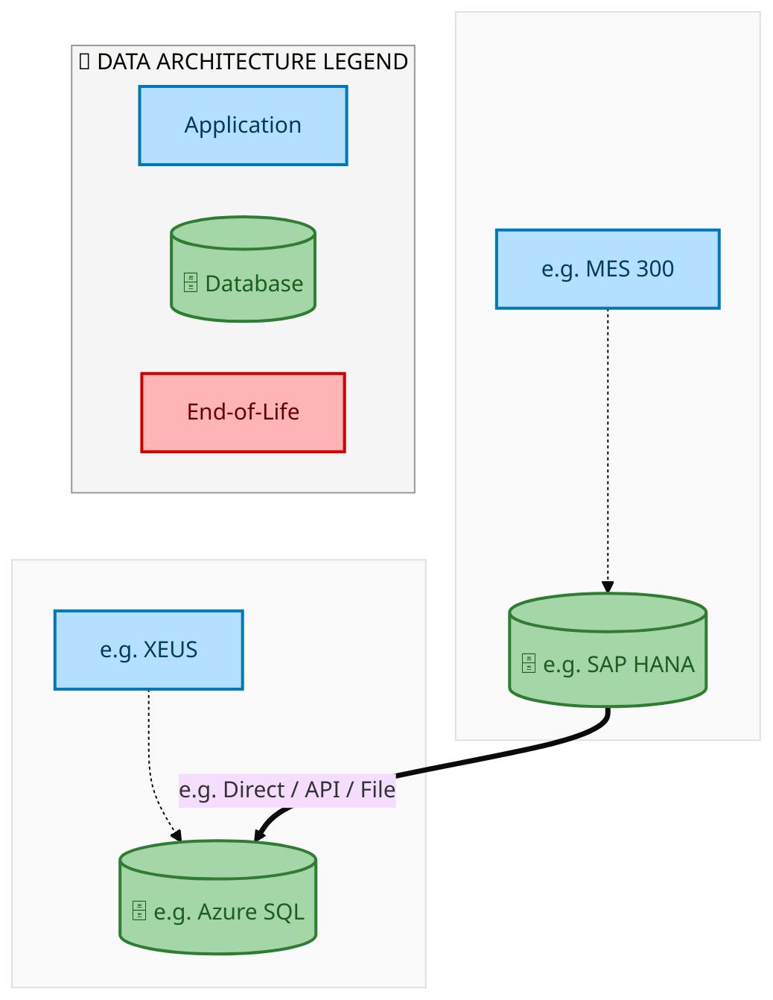
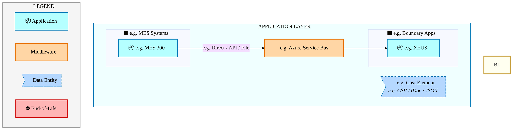
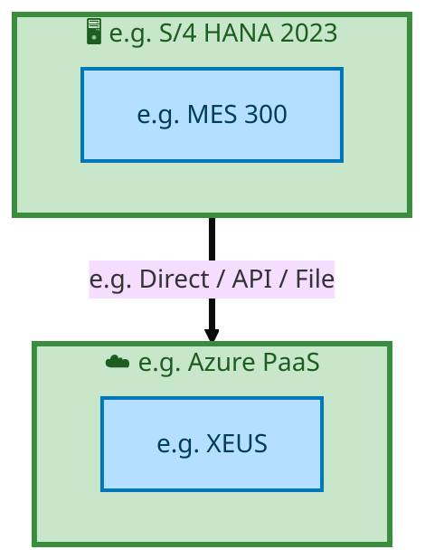

  
  <img src="data:image/svg+xml;base64,PHN2ZyB4bWxucz0iaHR0cDovL3d3dy53My5vcmcvMjAwMC9zdmciIHZpZXdCb3g9IjAgMCA4MDAgNDgwIiB3aWR0aD0iODAwIiBoZWlnaHQ9IjQ4MCI+CiAgPGRlZnM+CiAgICA8bGluZWFyR3JhZGllbnQgaWQ9ImJnIiB4MT0iMCUiIHkxPSIwJSIgeDI9IjEwMCUiIHkyPSIxMDAlIj4KICAgICAgPHN0b3Agb2Zmc2V0PSIwJSIgc3R5bGU9InN0b3AtY29sb3I6IzAwNzFjNTtzdG9wLW9wYWNpdHk6MSIvPgogICAgICA8c3RvcCBvZmZzZXQ9IjEwMCUiIHN0eWxlPSJzdG9wLWNvbG9yOiMwMGFlZWY7c3RvcC1vcGFjaXR5OjEiLz4KICAgIDwvbGluZWFyR3JhZGllbnQ+CiAgICA8bGluZWFyR3JhZGllbnQgaWQ9ImFjY2VudCIgeDE9IjAlIiB5MT0iMCUiIHgyPSIwJSIgeTI9IjEwMCUiPgogICAgICA8c3RvcCBvZmZzZXQ9IjAlIiBzdHlsZT0ic3RvcC1jb2xvcjojZmZmZmZmO3N0b3Atb3BhY2l0eTowLjE1Ii8+CiAgICAgIDxzdG9wIG9mZnNldD0iMTAwJSIgc3R5bGU9InN0b3AtY29sb3I6I2ZmZmZmZjtzdG9wLW9wYWNpdHk6MC4wMiIvPgogICAgPC9saW5lYXJHcmFkaWVudD4KICAgIDxwYXR0ZXJuIGlkPSJncmlkIiB3aWR0aD0iNDAiIGhlaWdodD0iNDAiIHBhdHRlcm5Vbml0cz0idXNlclNwYWNlT25Vc2UiPgogICAgICA8cGF0aCBkPSJNIDQwIDAgTCAwIDAgMCA0MCIgZmlsbD0ibm9uZSIgc3Ryb2tlPSJyZ2JhKDI1NSwyNTUsMjU1LDAuMDcpIiBzdHJva2Utd2lkdGg9IjAuNSIvPgogICAgPC9wYXR0ZXJuPgogIDwvZGVmcz4KCiAgPCEtLSBCYWNrZ3JvdW5kIC0tPgogIDxyZWN0IHdpZHRoPSI4MDAiIGhlaWdodD0iNDgwIiBmaWxsPSJ1cmwoI2JnKSIgcng9IjgiLz4KICA8cmVjdCB3aWR0aD0iODAwIiBoZWlnaHQ9IjQ4MCIgZmlsbD0idXJsKCNncmlkKSIgcng9IjgiLz4KICA8cmVjdCB3aWR0aD0iODAwIiBoZWlnaHQ9IjQ4MCIgZmlsbD0idXJsKCNhY2NlbnQpIiByeD0iOCIvPgoKICA8IS0tIERlY29yYXRpdmUgY2lyY3VpdC9hcmNoaXRlY3R1cmUgbGluZXMgLS0+CiAgPGcgc3Ryb2tlPSJyZ2JhKDI1NSwyNTUsMjU1LDAuMTIpIiBzdHJva2Utd2lkdGg9IjEuNSIgZmlsbD0ibm9uZSI+CiAgICA8cGF0aCBkPSJNIDAgMTAwIEwgMTIwIDEwMCBMIDE2MCAxNDAgTCAyODAgMTQwIi8+CiAgICA8cGF0aCBkPSJNIDAgMjYwIEwgODAgMjYwIEwgMTIwIDIyMCBMIDIwMCAyMjAgTCAyNDAgMjYwIEwgMzYwIDI2MCIvPgogICAgPHBhdGggZD0iTSA1MjAgMTAwIEwgNjAwIDEwMCBMIDY0MCA2MCBMIDgwMCA2MCIvPgogICAgPHBhdGggZD0iTSA0NDAgMzQwIEwgNTYwIDM0MCBMIDYwMCAzMDAgTCA3MjAgMzAwIEwgNzYwIDM0MCBMIDgwMCAzNDAiLz4KICAgIDxwYXRoIGQ9Ik0gNjAwIDQwMCBMIDY4MCA0MDAgTCA3MjAgNDQwIi8+CiAgICA8cGF0aCBkPSJNIDAgNDAwIEwgNDAgNDAwIEwgODAgMzYwIi8+CiAgICA8cGF0aCBkPSJNIDIwMCA0MjAgTCAzMjAgNDIwIEwgMzYwIDM4MCBMIDQ4MCAzODAiLz4KICAgIDxwYXRoIGQ9Ik0gNjUwIDQ0MCBMIDc1MCA0NDAgTCA4MDAgNDgwIi8+CiAgPC9nPgoKICA8IS0tIERlY29yYXRpdmUgbm9kZXMgLS0+CiAgPGcgZmlsbD0icmdiYSgyNTUsMjU1LDI1NSwwLjE4KSI+CiAgICA8Y2lyY2xlIGN4PSIxMjAiIGN5PSIxMDAiIHI9IjQiLz4KICAgIDxjaXJjbGUgY3g9IjI4MCIgY3k9IjE0MCIgcj0iNCIvPgogICAgPGNpcmNsZSBjeD0iMjAwIiBjeT0iMjIwIiByPSI0Ii8+CiAgICA8Y2lyY2xlIGN4PSIzNjAiIGN5PSIyNjAiIHI9IjQiLz4KICAgIDxjaXJjbGUgY3g9IjYwMCIgY3k9IjEwMCIgcj0iNCIvPgogICAgPGNpcmNsZSBjeD0iNzIwIiBjeT0iMzAwIiByPSI0Ii8+CiAgICA8Y2lyY2xlIGN4PSI1NjAiIGN5PSIzNDAiIHI9IjQiLz4KICAgIDxjaXJjbGUgY3g9IjgwIiBjeT0iMzYwIiByPSI0Ii8+CiAgICA8Y2lyY2xlIGN4PSI0ODAiIGN5PSIzODAiIHI9IjQiLz4KICAgIDxjaXJjbGUgY3g9IjMyMCIgY3k9IjQyMCIgcj0iNCIvPgogIDwvZz4KCiAgPCEtLSBUT0dBRiBCREFUIGJveGVzIC0tPgogIDxnIGZvbnQtZmFtaWx5PSJTZWdvZSBVSSwgQXJpYWwsIHNhbnMtc2VyaWYiIGZvbnQtc2l6ZT0iMTQiIGZvbnQtd2VpZ2h0PSI2MDAiPgogICAgPCEtLSBCIC0tPgogICAgPHJlY3QgeD0iMTUwIiB5PSIxNDAiIHdpZHRoPSIxMjAiIGhlaWdodD0iNDAiIHJ4PSI1IiBmaWxsPSJyZ2JhKDI1NSwyNTUsMjU1LDAuMTgpIiBzdHJva2U9InJnYmEoMjU1LDI1NSwyNTUsMC4zKSIgc3Ryb2tlLXdpZHRoPSIxIi8+CiAgICA8dGV4dCB4PSIyMTAiIHk9IjE2NSIgdGV4dC1hbmNob3I9Im1pZGRsZSIgZmlsbD0iI2ZmZiI+QnVzaW5lc3M8L3RleHQ+CiAgICA8IS0tIEQgLS0+CiAgICA8cmVjdCB4PSIyOTAiIHk9IjE0MCIgd2lkdGg9IjEyMCIgaGVpZ2h0PSI0MCIgcng9IjUiIGZpbGw9InJnYmEoMjU1LDI1NSwyNTUsMC4xOCkiIHN0cm9rZT0icmdiYSgyNTUsMjU1LDI1NSwwLjMpIiBzdHJva2Utd2lkdGg9IjEiLz4KICAgIDx0ZXh0IHg9IjM1MCIgeT0iMTY1IiB0ZXh0LWFuY2hvcj0ibWlkZGxlIiBmaWxsPSIjZmZmIj5EYXRhPC90ZXh0PgogICAgPCEtLSBBIC0tPgogICAgPHJlY3QgeD0iNDMwIiB5PSIxNDAiIHdpZHRoPSIxMjAiIGhlaWdodD0iNDAiIHJ4PSI1IiBmaWxsPSJyZ2JhKDI1NSwyNTUsMjU1LDAuMTgpIiBzdHJva2U9InJnYmEoMjU1LDI1NSwyNTUsMC4zKSIgc3Ryb2tlLXdpZHRoPSIxIi8+CiAgICA8dGV4dCB4PSI0OTAiIHk9IjE2NSIgdGV4dC1hbmNob3I9Im1pZGRsZSIgZmlsbD0iI2ZmZiI+QXBwbGljYXRpb248L3RleHQ+CiAgICA8IS0tIFQgLS0+CiAgICA8cmVjdCB4PSI1NzAiIHk9IjE0MCIgd2lkdGg9IjEyMCIgaGVpZ2h0PSI0MCIgcng9IjUiIGZpbGw9InJnYmEoMjU1LDI1NSwyNTUsMC4xOCkiIHN0cm9rZT0icmdiYSgyNTUsMjU1LDI1NSwwLjMpIiBzdHJva2Utd2lkdGg9IjEiLz4KICAgIDx0ZXh0IHg9IjYzMCIgeT0iMTY1IiB0ZXh0LWFuY2hvcj0ibWlkZGxlIiBmaWxsPSIjZmZmIj5UZWNobm9sb2d5PC90ZXh0PgogIDwvZz4KCiAgPCEtLSBDb25uZWN0aW5nIGxpbmVzIGJldHdlZW4gQkRBVCBib3hlcyAtLT4KICA8ZyBzdHJva2U9InJnYmEoMjU1LDI1NSwyNTUsMC4yNSkiIHN0cm9rZS13aWR0aD0iMSI+CiAgICA8bGluZSB4MT0iMjcwIiB5MT0iMTYwIiB4Mj0iMjkwIiB5Mj0iMTYwIi8+CiAgICA8bGluZSB4MT0iNDEwIiB5MT0iMTYwIiB4Mj0iNDMwIiB5Mj0iMTYwIi8+CiAgICA8bGluZSB4MT0iNTUwIiB5MT0iMTYwIiB4Mj0iNTcwIiB5Mj0iMTYwIi8+CiAgPC9nPgoKICA8IS0tIE1haW4gdGl0bGUgLS0+CiAgPHRleHQgeD0iNDAwIiB5PSIyNjAiIHRleHQtYW5jaG9yPSJtaWRkbGUiIGZvbnQtZmFtaWx5PSJTZWdvZSBVSSwgQXJpYWwsIHNhbnMtc2VyaWYiIGZvbnQtc2l6ZT0iMzYiIGZvbnQtd2VpZ2h0PSI3MDAiIGZpbGw9IiNmZmZmZmYiIGxldHRlci1zcGFjaW5nPSIxIj4KICAgIElBTyBBcmNoaXRlY3R1cmUKICA8L3RleHQ+CiAgPHRleHQgeD0iNDAwIiB5PSIzMDAiIHRleHQtYW5jaG9yPSJtaWRkbGUiIGZvbnQtZmFtaWx5PSJTZWdvZSBVSSwgQXJpYWwsIHNhbnMtc2VyaWYiIGZvbnQtc2l6ZT0iMTgiIGZvbnQtd2VpZ2h0PSI0MDAiIGZpbGw9InJnYmEoMjU1LDI1NSwyNTUsMC44KSIgbGV0dGVyLXNwYWNpbmc9IjIiPgogICAgVE9HQUYgQkRBVCDCtyBJQU8gUHJvZ3JhbSDCtyBJRE0gMi4wCiAgPC90ZXh0PgoKICA8IS0tIEJvdHRvbSBhY2NlbnQgYmFyIC0tPgogIDxyZWN0IHg9IjI4MCIgeT0iMzQwIiB3aWR0aD0iMjQwIiBoZWlnaHQ9IjMiIHJ4PSIxLjUiIGZpbGw9InJnYmEoMjU1LDI1NSwyNTUsMC40KSIvPgoKICA8IS0tIEludGVsIHRleHQgLS0+CiAgPHRleHQgeD0iNDAwIiB5PSIzODAiIHRleHQtYW5jaG9yPSJtaWRkbGUiIGZvbnQtZmFtaWx5PSJTZWdvZSBVSSwgQXJpYWwsIHNhbnMtc2VyaWYiIGZvbnQtc2l6ZT0iMTMiIGZpbGw9InJnYmEoMjU1LDI1NSwyNTUsMC41KSIgbGV0dGVyLXNwYWNpbmc9IjMiPgogICAgSU5URUwgQ09ORklERU5USUFMCiAgPC90ZXh0Pgo8L3N2Zz4K" alt="IAO Architecture" style="width:100%; border-radius:8px;" />
  <h1 style="font-size:36px; margin-top:24px;">E2E-43 — Process Procurement Card Invoice</h1>
  <h2 style="font-size:24px;">Architecture Document (TOGAF BDAT)</h2>
  
End-to-End Integrated Processes (E2E) Tower 
  Capability E2E-43 · Procure to Pay

  
IAO Program · R1 – R5 
  Generated: April 2026 
  Sajiv Francis

  
IAO Architecture Pipeline — Intel Confidential

Page 1<a href="#toc">↑ Back to TOC</a>E2E-43 — Process Procurement Card Invoice

## Table of Contents

<nav class="toc">
<ol>
  <li><a href="#1-executive-summary">1. Executive Summary</a></li>
  <li><a href="#2-business-context-objectives">2. Business Context &amp; Objectives</a>
    <ul>
      <li><a href="#21-classification">2.1 Classification</a></li>
      <li><a href="#22-business-drivers">2.2 Business Drivers</a></li>
      <li><a href="#23-success-criteria">2.3 Success Criteria</a></li>
      <li><a href="#24-companion-documents">2.4 Companion Documents</a></li>
    </ul>
  </li>
  <li><a href="#3-business-architecture-togaf-b">3. Business Architecture (TOGAF &ldquo;B&rdquo;)</a>
    <ul>
      <li><a href="#31-business-process-overview">3.1 Business Process Overview</a></li>
      <li><a href="#32-business-process-diagrams">3.2 Business Process Diagrams</a></li>
      <li><a href="#33-business-roles-responsibilities">3.3 Business Roles &amp; Responsibilities</a></li>
    </ul>
  </li>
  <li><a href="#4-data-architecture-togaf-d">4. Data Architecture (TOGAF &ldquo;D&rdquo;)</a>
    <ul>
      <li><a href="#41-data-entities-ownership">4.1 Data Entities &amp; Ownership</a></li>
      <li><a href="#42-data-flow-diagrams">4.2 Data Flow Diagrams</a></li>
      <li><a href="#43-data-lineage">4.3 Data Lineage</a></li>
      <li><a href="#44-ricefw-data-objects">4.4 RICEFW Data Objects</a></li>
      <li><a href="#45-data-governance-quality">4.5 Data Governance &amp; Quality</a></li>
    </ul>
  </li>
  <li><a href="#5-application-architecture-togaf-a">5. Application Architecture (TOGAF &ldquo;A&rdquo;)</a>
    <ul>
      <li><a href="#51-current-state-current-state-application-landscape">5.1 Current-State Application Landscape</a></li>
      <li><a href="#52-future-state-future-state-application-landscape">5.2 Future-State Application Landscape</a></li>
      <li><a href="#53-change-impact-summary">5.3 Change Impact Summary</a></li>
      <li><a href="#54-component-overview">5.4 Component Overview</a></li>
      <li><a href="#55-ricefw-inventory">5.5 RICEFW Inventory</a></li>
      <li><a href="#56-integration-patterns">5.6 Integration Patterns</a></li>
    </ul>
  </li>
  <li><a href="#6-technology-architecture-togaf-t">6. Technology Architecture (TOGAF &ldquo;T&rdquo;)</a>
    <ul>
      <li><a href="#61-platform-infrastructure">6.1 Platform &amp; Infrastructure</a></li>
      <li><a href="#62-sap-development-object-status">6.2 SAP Development Object Status</a></li>
      <li><a href="#63-nfrs-design-principles">6.3 NFRs &amp; Design Principles</a></li>
      <li><a href="#64-security-governance">6.4 Security &amp; Governance</a></li>
    </ul>
  </li>
  <li><a href="#7-project-context">7. Project Context</a>
    <ul>
      <li><a href="#71-project-roadmap-go-live-plan">7.1 Project Roadmap &amp; Go-Live Plan</a></li>
      <li><a href="#72-raid-log">7.2 RAID Log</a></li>
      <li><a href="#73-recommendations-next-steps">7.3 Recommendations &amp; Next Steps</a></li>
    </ul>
  </li>
</ol>
</nav>

Page 2<a href="#toc">↑ Back to TOC</a>E2E-43 — Process Procurement Card Invoice

## 1. Executive Summary

This Architecture Document defines the **Business, Data, Application, and Technology** (BDAT) architecture for **E2E-43 Process Procurement Card Invoice** within the IAO program. It includes 1 BPMN process diagram(s) in Section 3.

| Dimension | Value |
|-----------|-------|
| **Tower** | End-to-End Integrated Processes (E2E) |
| **Process Group** | Procure to Pay |
| **Capability** | E2E-43 - Process Procurement Card Invoice |
| **Release** | R1 – R5 |
| **Total Systems** | 2 |
| **System Status** | 0 Deployed, 0 Developing, 0 EOL, 2 Pending IAPM |
| **RICEFW Objects** | Pending — Smartsheet Object Tracker API integration |

**Change Summary**: 0 new flow chains, 0 removed, 0 modified, 1 unchanged between Current-State and Future-State states.

> All system nodes in architecture diagrams are **IAPM-linked** — click any node to open its IAPM page. Diagrams require `securityLevel: 'loose'` for click events.

Page 3<a href="#toc">↑ Back to TOC</a>E2E-43 — Process Procurement Card Invoice

## 2. Business Context & Objectives

### 2.1 Classification

| Level | Value |
|-------|-------|
| **L0 Tower** | End-to-End Integrated Processes |
| **L1 Process** | Procure to Pay |
| **L2 Capability** | E2E-43 - Process Procurement Card Invoice |

### 2.2 Business Drivers

| # | Driver | Description | Strategic Alignment | Priority |
|---|--------|-------------|---------------------|----------|
| 1 | End-to-End Process Integration | Enable cross-tower integrated processes spanning procurement, manufacturing, and fulfillment | IDM 2.0 Process Excellence | High |
| 2 | Intel Foundry Business Enablement | Stand up foundry-specific business processes for external customer engagement | Intel Foundry Services | High |
| 3 | Process Visibility & Monitoring | Provide end-to-end process visibility across tower boundaries with integrated monitoring | Operational Excellence | Medium |
| 4 | E2E-43 Process Migration | Migrate Process Procurement Card Invoice business processes and 2 integrated systems from legacy to S/4 HANA target architecture | IDM 2.0 Cross-Functional / End-to-End | High |

Page 4<a href="#toc">↑ Back to TOC</a>E2E-43 — Process Procurement Card Invoice

### 2.3 Success Criteria

| Metric | Target | Measure | Baseline | Owner |
|--------|--------|---------|----------|-------|
| E2E Process Cycle Time | Per process SLA | End-to-end transaction completion within defined SLA per process | Varies by process | E2E Process Owner |
| Cross-Tower Integration Success | > 99% | Transactions completing across tower boundaries without manual intervention | 92% (current) | Integration Lead |
| Process Exception Rate | < 2% | Transactions requiring manual exception handling | 8% (current) | Operations Manager |
| E2E-43 Migration Completeness | 100% flow chains validated | All 1 flow chains verified in target state | 0% (pre-migration) | Tower Architect |

### 2.4 Companion Documents

| Document | Description |
|----------|-------------|
| **Business Architecture** | Included in this document (Section 3) — process flows from BPMN diagrams |
| **This Document** | Full BDAT Architecture — Business + Data + Application + Technology |

Page 5<a href="#toc">↑ Back to TOC</a>E2E-43 — Process Procurement Card Invoice

## 3. Business Architecture (TOGAF "B")

### 3.1 Business Process Overview

This capability includes **1 business process(es)** modeled in BPMN 2.0, covering the end-to-end workflow for E2E-43 Process Procurement Card Invoice.

| # | Step ID | Process Name | Lanes | Tasks | Gateways |
|---|---------|--------------|-------|-------|----------|
| 1 | E2E-43_Process_Procurement_Card_Invoice | E2E-43_Process_Procurement_Card_Invoice | Boundary Apps, MBC, SAP CFIN, SAP S/4HANA | 26 | 12 |

Page 6<a href="#toc">↑ Back to TOC</a>E2E-43 — Process Procurement Card Invoice

### 3.2 Business Process Diagrams

#### BUSINESS ARCHITECTURE — 3.2.1 E2E-43_Process_Procurement_Card_Invoice — E2E-43_Process_Procurement_Card_Invoice

**Swim Lanes**: Boundary Apps · MBC · SAP CFIN · SAP S/4HANA | **Tasks**: 26 | **Gateways**: 12

```mermaid
%%{init: {'theme': 'base', 'themeVariables': {'fontSize': '14px', 'fontFamily': 'Segoe UI, Arial, sans-serif','primaryColor': '#e8f0fe', 'primaryBorderColor': '#0071c5','lineColor': '#37474F', 'secondaryColor': '#f5f8fc'}, 'flowchart': {'useMaxWidth': false, 'htmlLabels': true, 'curve': 'basis', 'nodeSpacing': 40, 'rankSpacing': 50}} }%%
flowchart LR
    classDef startEvt fill:#4CAF50,stroke:#2E7D32,color:#000,font-weight:bold,stroke-width:2px,rx:20,ry:20
    classDef endEvt fill:#C62828,stroke:#B71C1C,color:#fff,font-weight:bold,stroke-width:2px,rx:20,ry:20
    classDef userTask fill:#E3F2FD,stroke:#1565C0,stroke-width:2px,color:#0D47A1
    classDef serviceTask fill:#FFF3E0,stroke:#E65100,stroke-width:2px,color:#BF360C
    classDef gateway fill:#FFF9C4,stroke:#F57F17,stroke-width:2px,color:#E65100
    classDef subProc fill:#F3E5F5,stroke:#7B1FA2,stroke-width:2px,color:#4A148C
    subgraph lane_0["Boundary Apps"]
        n1["Identify Requirements Allowing Procurement Card Usage"]
        n2["Authorize CPC Card Holder"]
        n3["Purchase Using Procurement Card"]
        n4["Expense/Manage P-Card Purchases"]
        n5["Reclassify Spends (GL/Cost Centers)"]
        n6["Secure File Transfer Automation"]
        n7["Upload Charges/ Transaction Data into Enterprise"]
        n8["Actualize GL/Cost Center Spends"]
        n9["Validation/Exception Handling based on rules setup"]
        n10["Receive File in Bank"]
        n11["WebSuite Payment Tracker/ SAP Business Network / OpenText Payment Remittance"]
        n27(["fa:fa-play startEvent"])
        n28(["fa:fa-stop Payment Data Updated"])
        n43{{"fa:fa-arrows-alt inclusiveGateway"}}
    end
    subgraph lane_1["MBC"]
        n12["Multi-Bank Connectivity (host-to-host)"]
        n13["Multi-Bank Connectivity (host-to-host)"]
    end
    subgraph lane_2["SAP CFIN"]
        n16["Replicate Supplier Invoice Posting"]
        n17["Generate Payment Proposal"]
        n18["Execute Payment Run"]
        n19["Create APM Memo Record"]
        n20["Process BCM Payment Batching Based on Business Rules"]
        n21["Generate APM Payment File"]
        n22["Route to Approver"]
        n23["Correct APM Correction File"]
        n24["Reverse APP Doc Number and Memo Record Deletion"]
        n25["Fetch Payments Factory (APM, BCM, MBC Monitor)"]
        n26["Review Failed Payment Log"]
        n30(["fa:fa-stop Memo Record Created"])
        n31(["fa:fa-stop APP Doc Reversed"])
        n33{{"fa:fa-code-branch Manual Approval Necessary?"}}
        n34{{"fa:fa-code-branch Approved?"}}
        n35{{"fa:fa-code-branch exclusiveGateway"}}
        n36{{"fa:fa-code-branch Can Be Corrected?"}}
        n37{{"fa:fa-code-branch exclusiveGateway"}}
        n38{{"fa:fa-code-branch exclusiveGateway"}}
        n39{{"fa:fa-code-branch exclusiveGateway"}}
        n40{{"fa:fa-code-branch Reversal or Reprocessing?"}}
        n41{{"fa:fa-arrows-alt parallelGateway"}}
        n42{{"fa:fa-arrows-alt parallelGateway"}}
    end
    subgraph lane_3["SAP S/4HANA"]
        n14["Push Charges to GL Tables Integrated with ERP"]
        n15["Post Vendor invoice"]
        n29(["fa:fa-stop Payment Details provided back to Source System (IP/IF)"])
        n32{{"fa:fa-code-branch Invoice Accepted?"}}
    end
    n1 --> n2
    n2 --> n3
    n3 --> n4
    n5 --> n6
    n6 --> n7
    n7 --> n14
    n32 -->|"Yes"| n15
    n9 --> n32
    n32 -->|"No"| n43
    n17 --> n18
    n18 --> n41
    n19 --> n30
    n41 -->|"Reprocessing"| n37
    n20 --> n33
    n33 -->|"No"| n35
    n22 --> n34
    n35 --> n21
    n34 -->|"No"| n36
    n37 --> n20
    n36 -->|"No"| n38
    n24 --> n31
    n25 --> n42
    n38 --> n24
    n39 --> n23
    n42 --> n26
    n41 --> n19
    n33 -->|"Yes"| n22
    n34 -->|"Yes"| n35
    n26 --> n40
    n40 -->|"Reversal"| n38
    n40 -->|"Reprocessing"| n39
    n23 --> n37
    n16 --> n17
    n10 -->|"PAIN.002 (Pay-load file)"| n13
    n15 --> n16
    n11 --> n28
    n42 --> n11
    n42 --> n29
    n36 -->|"Yes"| n39
    n12 -->|"PAIN.001 (Pay-load file)"| n10
    n4 --> n5
    n27 --> n1
    n14 --> n8
    n21 --> n12
    n13 --> n25
    n43 --> n9
    n8 --> n43
    class n27 startEvt
    class n28 endEvt
    class n29 endEvt
    class n30 endEvt
    class n31 endEvt
    class n32 gateway
    class n33 gateway
    class n34 gateway
    class n35 gateway
    class n36 gateway
    class n37 gateway
    class n38 gateway
    class n39 gateway
    class n40 gateway
    class n41 gateway
    class n42 gateway
    class n43 gateway
```

> **Legend**: ● Start · ● End · User Task · Service Task · ◇ Gateway · Sub-Process

<a href="https://mermaid.live/view#pako:eNqlWG1P4zgQ_itWVghWao-89YV-uFMbGhYJuKqFXZ2O08lNHBqRxjnbKfTY_vcbJ3bamvBh9_oB6snMMzPPvCTpmxXRmFgj6-TkLc1TMUJvp2JF1uR0hE6XmJPTDqoFXzFL8TIj_FTqJDQXi_TfSs3xi1epJmUhXqfZVkoX5IkS9HDdQWMwzDqI45x3OWFpcto5LVi6xmwb0Iwyqf2JDBM7qbypSxPKYsL2CrY9cKIemGZpTvZib-AP_FDacRLRPD4CTXrJMIlOdzK4jL5EK8xEFX7JyS1-_ZbGYgXnBGecgM5KrLMbvCSZzFGwUsqikm00GSmXfnIgbFHgKM2fQO7bIGI4f96LevZuh3YnJ4954xTdzB9zBJ8ow5xfkgRxAeLpRqAkzbLRJz8Yhz27wwWjz2T0yZ0OLj23E8lMRpC63ZHkdl9I-rQSoyXNYqXafZE5jNzitcNeR67dYVv4a_giebz3FPTdoTtsPE0GTuAE2lOSJP_LE_DK7jF_Vr6mXuiGl40vp9fvBfZ7PJ3mpT8YOyZPhG3SiByAhmHoTfdUTfs9x_4YdBJ6fTswQJ-wIC94uwe8CPwGMOwNQmfwIWDtz4yyXM4YjTSgN-2FvQZwMHHCsfshoD92_KGKEHCeGC5WKMM5-dv-89Ga0LJqajQuCv5o_VXryU_uwOXrmOQiTbZoTv4pUwZzmguOxhk0HjQjkkGVtRQFmMXogeMncgzjAsy4FCvKYJ5RMAtqzS9QesKOVT1QnZUMWprDaPM2D8cGPhhMXwuSc3J-i3PwjWbdCl7DGDn1wGBOKl5lVgswjTk6u7o5DygHD-CGMP752KgPRgsiw0BhmhF0D_PIE8IQpEXXWKQ0PzYYgMFDkVEcowDG84nw89oIR1IZXWKBUZoLiqbSH2wkbpA2lKRFosSZJO04PBX1scEFGHwF7bgK53z6GpGi8vUF53EmmZTbNkYgYSVsWWh8URZGwe2aHZJuVKZpjiaweww12RjfyHJRpgL4xtuqOJBf9EzYOVqMZ2hSQvEI5-iOiBfKntE5-h2CvievojGYk3UqBM4js18GZ4Cf4FGCu0UGU6RWGdiA4udDzeFekwtaNNAVvw8FcEFiw8b33t60DWaMvvAuzgQkGmUQ84Zc1aP7aO12tRVQ3TY7koPbSWAwI3v9tsxE2pW0oYDmOYGSb1KxRWcrKGFX0K78b3SY4_244QeByRBkCYLw-s5w0q_KW2RpBEmiRVnAV2in63xDYQWiGcBDoxhGspevSE4YPig2TGVBOc4M3WE1jjApB6rz0hgOR7ZqwIjEG89u0S1ZU2iGiJrD7cp2lPMvG2kS3DaQEyyilWzpiW7ppt_msrcNGOcwA-lR48gWN3Qle3Mq44fhhJXI6MZcUq6sVUAZgwJVcOq7HLYWRL8iHVC4dD5Dl7DG78r1EoiHyTzMHl2SjLxfJq7cWSGBlHXgHIWwSCgs7TPw35HcdBA0I7ql8IhFmdFcbl33TUpewBAijBsGbqhRbs82Ruowvrpo5kR5jmGis1RZv9M_mED5cNhdwmaE5GB_w7pTpMOXOyILD7em3_bDWAP47QCqXPE7_V67Pnn9aOZrs367WYCh34iueou7wc-5G_6c2cVPmfl2u1ldM2CfMvhe1MMHo2Ym6Tuta7TADGcZyT5w6v6Y0QcbzlMbbnHufxnfjY3t4lfPEHyl77xykK9u0H31bgG7TpAnuQhi9JKKFZrOZ4a9nDa5CdFXcA8spPV2NEbq4qM7DxEwYRzJTkxj8LKEu6IMYUHhgQSW7pYLskZn17Pz6_CzORlue1H0gh5H8qZ-1HENRbmDut1fITJ1dOujp45effTVsVcf--rYr48DdRzUR0drexXY90frD7lbv0uS1JUL5cU1Ne9opehr_47GHGrBUEXkaIHGUs--cEVhHfZhherpQF1b2TRpesf-PR2oq_loclIUuNq_5xummhxPha5fRuCKoalzcn3lRGO6yonf8KOydpswVNauzsBXgbr9IxokP2aOuhqua6agr-zTVxX2G3Lthtx64I8zObhscq_DcFVLNcVwlA-nEWiQ2fj67hfbdtEZjEm3eiyGFxnyue6lpkUUWY7O3NEtPTS4cRyTrAuzNA0D-orjHgfjtAfT8FMDN_zp9tVo6npTeV0kXQpHseNqBF8JdDy6_b2DN73Kj35xP5YP1Uv2sfSiTerZrVKnVerqd9Vjsdcu9tvFvXZxv108aBcP28UXrWLoz1ax0y5uz9JvsrQ61pqwNU5ja_RmVT9HWSMrJgmGR3Jr17EwvOgttnlkjaqfbayyere4TDHcS9a1cPcfaIfHIQ==" title="View full diagram">&#128065; View Diagram</a>

Page 7<a href="#toc">↑ Back to TOC</a>E2E-43 — Process Procurement Card Invoice

### 3.3 Business Roles & Responsibilities

| Role / Lane | Processes Involved | Description |
|------------|-------------------|-------------|
| Boundary Apps | E2E-43_Process_Procurement_Card_Invoice | |
| MBC | E2E-43_Process_Procurement_Card_Invoice | |
| SAP CFIN | E2E-43_Process_Procurement_Card_Invoice | |
| SAP S/4HANA | E2E-43_Process_Procurement_Card_Invoice | |

Page 8<a href="#toc">↑ Back to TOC</a>E2E-43 — Process Procurement Card Invoice

## 4. Data Architecture (TOGAF "D")

### 4.1 Data Entities & Ownership

| # | Data Entity | Source System | Target System | Data Owner | Classification | Volume | Master/Transaction |
|---|-------------|---------------|---------------|------------|----------------|--------|-------------------|
| 1 | e.g. Cost Element | e.g. MES 300 | e.g. XEUS | Data steward | e.g. Intel Confidential | e.g. 10K rows/day | Master / Transaction |

Page 9<a href="#toc">↑ Back to TOC</a>E2E-43 — Process Procurement Card Invoice

### 4.2 Data Flow Diagrams

> **DATA ARCHITECTURE** — Database-to-database data flows. Applications (blue) sit above their hosting databases (green cylinders). Thick arrows show data movement between databases.

#### 4.2.1 Current-State — Current-State Data Flows

<a href="https://mermaid.live/view#pako:eNqdlYtO2zAUhl_FMqq0SS0LLWlHJJCc20AKiJGyTSJT5CZOa-EmUeKMltJ3n50brDQMYUuRfS7_cb4TORsYJCGBGuz1NjSmXAMbD_IFWRIPasCDM5yLVV-schIUGeVrh_whrHKyJGm8ZcoPnFE8YySXbqETJTF36WMtdaSmqypY2m28pGxdeVwyTwi4vegDJASE-LaMYslDsMAZr9WKnFzi1U8a8oW0RJjlRMYt-JI5eEZYWZZnRWmNxWu5KQ5oPJfmkSqNGY7vXxiP1e0WbHs9L25rganuxUCMgOE8N0kEcJrqyQpElDHtQFdN27b7Oc-Se6IdKMpkoo_r7eBBHk0bpqt-kLAkk-6Rqe7qhTNjzWo5pJpjNGnlhtbEHA075Y501RoqO3IkYc_Hs21d1dVWzzAUMTr1xmPp9uJKMS9m8wynC2ANreORYSLD8Yk_99FjkRHf_e7ceVAg_F1FyxHSjAScJnELTY4mHZXZv6xbVySSw_khkGshoGlaxfR1jrlT8ZMHvSL8OgrFMwyOvSIiinhlKVYGARHkwc9SssT61inA4HBw1lWpSiRxWLPga0Y6QTSwkZwtbEuR81_YR-KL_w9eF1375-gKfYjupeX6I0VpAIstENv3MG7LvoFYxAAZ8x7C9Un2QW5KvYdxE_shxPvLgtPTs6cakFkyBV8Aur4QT5sycTc9dX8UO61zyFwc_-4FsSBUgImmCKAb4_xiahnT2xsLONY368rs6KZz82x1fNl3lKaMBlh697fO8c2OPpmY4-qK3tcix7eEvBWHgyQaODQilXx1ZextR_WGDX1Vzpb-ycnJK_SwD5ckW2IaQm1T_QTEvyQkES4YF9c4xAVP3HUcQK28mGGRhpgTk2JBdFkZt38B-KD-xQ==" title="View full diagram">&#128065; View Diagram</a>

Page 10<a href="#toc">↑ Back to TOC</a>E2E-43 — Process Procurement Card Invoice

#### 4.2.2 Future-State — Future-State Data Flows

<a href="https://mermaid.live/view#pako:eNqdlQ1L4zAYx79KiAzuYPPqZrezoJCt7SlU8ey8O7BHydp0C2ZNadNzc-67X9I3vbl6YgIleV7-T_p7SrqBAQ8JNGCns6ExFQbYeFAsyJJ40AAenOFMrrpylZEgT6lYO-QPYaWTcV57i5QfOKV4xkim3FIn4rFw6WMldaQnqzJY2W28pGxdelwy5wTcXnQBkgJSfFtEMf4QLHAqKrU8I5d49ZOGYqEsEWYZUXELsWQOnhFWlBVpXlhj-VpuggMaz5V5oCtjiuP7F8ZjfbsF207Hi5taYDr2YiBHwHCWmSQCOEnGfAUiyphxMNZN27a7mUj5PTEONG00Gg-rbe9BHc3oJ6tuwBlPlXtg6rt64WyyZpUc0s0hGjVyfWtkDvqtckdj3eprO3KEs-fj2fZYH-uN3mSiydGqNxwqtxeXilk-m6c4WQCrbx0PbBNNHJ_4cx895inx3e_OnQclwt9ltBohTUkgKI8baGrU6ajI_mXdujKRHM4PgVpLAcMwSqavc8ydip886OXh10Eon2Fw7OUR0eQrK7EiCMggD35WkgXWt04Beoe9s7ZKZSKJw4qFWDPSCqKGjdRsYFuamv_CPpJf_H_wuujaP0dX6EN0Ly3XH2haDVhugdy-h3FT9g3EMgaomPcQrk6yD3Jd6j2M69gPId5fFpyenj1VgMyCKfgC0PWFfNqUybvpqf2j2GmdQ-by-HcviAWhBkw0RQDdTM4vptZkentjAcf6Zl2ZLd10bp6tjq_6jpKE0QAr7_7WOb7Z0icTC1xe0fta5PiWlLfisMejnkMjUsqXV8bedpRvWNPX1Wzon5ycvEIPu3BJ0iWmITQ25U9A_ktCEuGcCXmNQ5wL7q7jABrFxQzzJMSCmBRLosvSuP0LdFT-7w==" title="View full diagram">&#128065; View Diagram</a>

Page 11<a href="#toc">↑ Back to TOC</a>E2E-43 — Process Procurement Card Invoice

### 4.3 Data Lineage

| # | Source System | Source Schema/Object | Target System | Target Schema/Object | Transformation |
|---|-------------|---------------------|---------------|---------------------|---------------|
| 1 | e.g. MES 300 | e.g. CKMLHD table | e.g. XEUS | e.g. dbo.CostElements | Lineage notes |

### 4.4 RICEFW Data Objects

Reports and Conversions for this capability will be populated from the Smartsheet Object Tracker via automated API extraction.

| Object ID | Type | Description | Status | Source | Target | Complexity |
|-----------|------|-------------|--------|--------|--------|-----------|
| E2E-43-R001 | Report | Process Procurement Card Invoice operational report | Planned | SAP S/4HANA | Analytics | Medium |
| E2E-43-C001 | Conversion | Legacy data migration for Process Procurement Card Invoice | Planned | Legacy ERP | SAP S/4HANA | High |

> *Pending: Smartsheet API integration to auto-populate live RICEFW data (see Build Requirements).*

### 4.5 Data Governance & Quality

| Concern | Approach |
|---------|----------|
| Data Ownership | Per-entity owners listed in Section 3.1 |
| Data Classification | Financial data classified as Intel Confidential |
| Data Retention | Per Intel corporate retention policies |
| Data Quality | Validated at source; reconciliation at target |

Page 12<a href="#toc">↑ Back to TOC</a>E2E-43 — Process Procurement Card Invoice

## 5. Application Architecture (TOGAF "A")

### 5.1 Current-State — Current-State Application Landscape

#### Overview

The Current-State architecture represents the **current / legacy** landscape for E2E-43.This view is generated from `CurrentFlows.xlsx` (1 flow hops across 1 flow chains).

#### APPLICATION ARCHITECTURE — Architecture Diagram (ArchiMate-Inspired)

> **Click any system node** to open its IAPM application page.
> **Legend**: Deployed · Developing · End-of-Life · No IAPM Match

<a href="https://mermaid.live/view#pako:eNqdln1v2jwQwL-KlYr_YE1foG1UISUkPOJRaKtlW59HyxSZ-ABrJolipy3r-O47xxRSWEU3I0FyL7-7XM5nnq00Z2A5Vqv1zDOuHPIcW2oOC4gth8TWhEq8auOVhLQquVqG8ADCKEWev2hrly-05HQiQGo1cqZ5piL-Y4066RVPxljLh3TBxdJoIpjlQD6P2sRFgGgTSTPZkVDyaWytag-RP6ZzWqo1uZIwpk_3nKm5lkypkKDt5mohQjoBUaegyqqWZviIUUFTns20-NzWwpJm3xvCrr1akVWrFWebWOSTF2cEV6tFOh3MLZ3zMVXQ4ZkseAmMSLUUQFJBpQSJNsa8vvdhSiaV5BlISeo15UI4R0NcXrctVZl_B-fIu7zs2d76tvOoH8g5LZ7aaS7y0jmybXuHSYuCbJdhel1N3TBt--LC6_0Bk1FF95n-5QHmySvmi45RicUr6RJrSro7kRacMQGPtIRmRfyeu61IcNEbbmnvyB5ysVcRXeNGlQcD2z7ENFRZTWYlLebEDb_GVlyxyzOG3-ysS9y7u3A0cD-Nbm9I6P4ffIytb8ZJL4YNkSqeZyT8uJVucMFpcH42CG8SSGaJl1cZo-UycYtCYhgSV6eTkwmBD7MP5EVJtPJViLfD6GUi1Pz_gs9RM_sUeoatFYh0HAfbaOsOGTuU8jiIkmgpFSz2EkYVWav-Ll3NPrPt32as4ag7lLShje9rnvujKiGJoHzgKSReJV-9yZMLQ66tyNqKoJWJse3QXbof1PRBLlUSCBx3meo3U07PDVgbkLXB9aQ87l_zvlFEX8gxGfl5ij__Rrc318e8b6LqHWji1Y9lLvdLhCOm_zO2appflxZJ7t0Iv4dc4Jz9eaASTfBbNjrIbjfplNYbpB55XtgYZ0P70DhrurobV_s9U2tvY4Ywwxq9ahZmkzD4J7jx37EjwwT38W6r4VYTPKXa-DedFibj-90WGm_b5M22CRM_2O0QX4_aIFN4kO6-eeMS3JrBc9pj52jIOvm0E_LpOgzOukabbItqivJS2K7-bAp7dXW1N7ettrWAckE5s5xnc3jjfwAGU1oJhUeuRSuVR8sstZz6ELWqAhMFn1N8CQsjXP0C_RSKpw==" title="View full diagram">&#128065; View Diagram</a>

Page 13<a href="#toc">↑ Back to TOC</a>E2E-43 — Process Procurement Card Invoice

#### Current-State Flow Narrative

| # | Flow Chain | Path | Interface | Freq |
|---|-----------|------|-----------|------|
| 1 | e.g. MES Route to ICOST | e.g. MES 300 → e.g. XEUS | e.g. Direct / API / File | e.g. Near Real-Time |

Page 14<a href="#toc">↑ Back to TOC</a>E2E-43 — Process Procurement Card Invoice

### 5.2 Future-State — Future-State Application Landscape

#### Overview

The Future-State architecture represents the **target** landscape for E2E-43.This view is generated from `FutureFlows.xlsx` (1 flow hops across 1 flow chains).

#### APPLICATION ARCHITECTURE — Architecture Diagram (ArchiMate-Inspired)

> **Click any system node** to open its IAPM application page.
> **Legend**: Deployed · Developing · End-of-Life · No IAPM Match

<a href="https://mermaid.live/view#pako:eNqdlm1v2jAQgP-KlYpvsKYv0DaqkJImTEyhrZZt3bRMkYkPsGaSKHbaso7_vnNMIYVVdDMSJPfy3OVyPvNkpTkDy7FarSeeceWQp9hSM5hDbDkktsZU4lUbrySkVcnVIoR7EEYp8vxZW7t8oSWnYwFSq5EzyTMV8V8r1FGveDTGWj6gcy4WRhPBNAfyedgmLgJEm0iayY6Ekk9ia1l7iPwhndFSrciVhBF9vONMzbRkQoUEbTdTcxHSMYg6BVVWtTTDR4wKmvJsqsWnthaWNPvZEHbt5ZIsW604W8cin7w4I7haLdLpYG7pjI-ogg7PZMFLYESqhQCSCiolSLQx5vW9DxMyriTPQEpSrwkXwjkY4PK6banK_Cc4B975ec_2VredB_1AznHx2E5zkZfOgW3bW0xaFGSzDNPrauqaadtnZ17vH5iMKrrL9M_3MI9eMJ91jEosXkkXWFPS3Yo054wJeKAlNCvi99xNRYKz3mBDe0P2kIudiugaN6p8dWXb-5iGKqvxtKTFjLjh99iKK3Z-wvCbnXSJe3sbDq_cT8ObaxK634KPsfXDOOnFsCFSxfOMhB830jUuOA5OTwbhdQLJNPHyKmO0XCRuUUgMQ-LqeHw0JvBu-o48K4lWvgjxehi9TISa_zX4HDWzT6Fn2FqBSMdxsI027pCxfSmPgiiJFlLBfCdhVJGV6v_S1ewT2_5rxhqOun1JG9rorua5v6oSkgjKe55C4lXyxZs8OjPk2oqsrAhamRibDt2m-0FNv8qlSgKB4y5T_WbK6akBawOyMrgcl4f9S943iugLOSRDP0_x50N0c315yPsmqt6BJl79WOZyt0Q4Yvq_Y6um-XVpkeTeDvF7wAXO2d97KtEEv2ajg2x3k05ptUHqkeeFjXE2sPeNs6aru3a13zK1djZmCFOs0YtmYTYJg_fBtf-GHRkmuI-3Ww23muAp1cZ_6bQwGd1tt9Bo0yavtk2Y-MF2h_h61AaZwoN0-80bl-DGDJ7jHjtFQ9bJJ52QT1ZhcNY12mRTVFOU58J29Wdd2IuLi525bbWtOZRzypnlPJnDG_8DMJjQSig8ci1aqTxaZKnl1IeoVRWYKPic4kuYG-HyD2ARisU=" title="View full diagram">&#128065; View Diagram</a>

Page 15<a href="#toc">↑ Back to TOC</a>E2E-43 — Process Procurement Card Invoice

#### Future-State Flow Narrative

| # | Flow Chain | Path | Interface | Freq |
|---|-----------|------|-----------|------|
| 1 | e.g. MES Route to ICOST | e.g. MES 300 → e.g. XEUS | e.g. Direct / API / File | e.g. Near Real-Time |

Page 16<a href="#toc">↑ Back to TOC</a>E2E-43 — Process Procurement Card Invoice

### 5.3 Change Impact Summary

| Change Type | Flow Chain | Detail |
|-------------|-----------|--------|
| **UNCHANGED** | e.g. MES Route to ICOST | No change |

**Totals**: 0 new - 0 removed - 0 modified - 1 unchanged

### 5.4 Component Overview

#### System Inventory

| System | IAPM ID | Status |
|--------|---------|--------|
| e.g. MES 300 | - | N/A |
| e.g. XEUS | - | N/A |

Page 17<a href="#toc">↑ Back to TOC</a>E2E-43 — Process Procurement Card Invoice

### 5.5 RICEFW Inventory

RICEFW objects for this capability will be auto-populated from the Smartsheet S/4 Object Tracker.

| Object ID | Type | Description | Status | Source → Target | Middleware | Complexity |
|-----------|------|-------------|--------|----------------|-----------|-----------|
| E2E-43-I001 | Interface | Process Procurement Card Invoice inbound data interface | Planned | Legacy → SAP S/4HANA | MuleSoft / CPI | Medium |
| E2E-43-E001 | Enhancement | Process Procurement Card Invoice custom business logic | Planned | SAP S/4HANA | N/A | Medium |
| E2E-43-F001 | Form/Report | Process Procurement Card Invoice operational output | Planned | SAP S/4HANA | N/A | Low |

> *Pending: Smartsheet API integration to auto-populate live RICEFW inventory (see Build Requirements).*

Page 18<a href="#toc">↑ Back to TOC</a>E2E-43 — Process Procurement Card Invoice

### 5.6 Integration Patterns

| # | Pattern | Flow Chain | Middleware | Protocol | Auth |
|---|---------|-----------|-----------|----------|------|
| 1 | e.g. Pub-Sub / P2P / ETL | e.g. MES Route to ICOST | e.g. Azure Service Bus | e.g. REST / RFC / SFTP | e.g. OAuth / NTLM / Cert |

Page 19<a href="#toc">↑ Back to TOC</a>E2E-43 — Process Procurement Card Invoice

## 6. Technology Architecture (TOGAF "T")

### 6.1 Platform & Infrastructure

> **TECHNOLOGY / PLATFORM ARCHITECTURE** — Platforms (green) host applications (blue). Thick arrows show platform-to-platform integration flows.

#### 6.1.1 Current-State — Current-State Platform Architecture

<a href="https://mermaid.live/view#pako:eNqtlF1r2zAUhv-KUMld1jp2nKaCDmzHZoV0hLndBvMwin2ciMqWseU1aZr_PsnOR1tIoWy6ENL7Hj06OkLa4ESkgAnu9TasYJKgTYTlEnKIMEERntNajfpqVEPSVEyup_AHeGdyIfZuu-Q7rRidc6i1rTiZKGTInnaowbBcdcFaD2jO-LpzQlgIQPc3feQogIJv2yguHpMlreSO1tRwS1c_WCqXWskor0HHLWXOp3QOvN1WVk2rFupYYUkTViy0PDS0WNHi4YVoG9st2vZ6UXHYC925UYFUSzit6wlkiJalK1YoY5yTM9eeBEHQr2UlHoCcGcblpTvaTT896tSIWa76ieCi0rY1sd_ySk7lEeiN_ZF3dQBa47Fvea-B1hE4cG3fNN4AQfAjLwhc27UPPM8zVDuZ4Gik7ajoiHUzX1S0XCLf9IeWN5vOYogXsfPUVBDPKA1_RThqzJExiJoMDLXz-eIctTbSdoR_dyDdUlZBIpko0PTbUd2TnZb807_XzBajxwpACOkK3q2BIt3lJtccTib2T8V89_BhPIy_OF-d2DRMqz1_OrZS1afUflmF8GKIdBzScR8uxK0fxpZh7GuhpkhNP1iOV6n-h4q8R7--_vy8S3bSng9dIGd2o_qAcfXen09eFe7jHKqcshSTTfdtqN8nhYw2XKqHj2kjRbguEkzap4ybMqUSJoyq68k7cfsXmZ531g==" title="View full diagram">&#128065; View Diagram</a>

> **Legend**: 🖥️ Platform · 📦 Application · ⛔ End-of-Life · 📋 Unassigned

Page 20<a href="#toc">↑ Back to TOC</a>E2E-43 — Process Procurement Card Invoice

#### 6.1.2 Future-State — Future-State Platform Architecture

<a href="https://mermaid.live/view#pako:eNqtlF1r2zAUhv-KUMld1ip2nGaCDuzEZoV0hHndBvMwin2ciMqWseU1aZr_PsnOR1tooWy6ENL7Hj06OkLa4kSmgCnu9ba84IqibYTVCnKIMEURXrBaj_p6VEPSVFxtZvAHRGcKKQ9uu-Q7qzhbCKiNrTmZLFTIH_aowbBcd8FGD1jOxaZzQlhKQLfXfeRqgIbv2igh75MVq9Se1tRww9Y_eKpWRsmYqMHErVQuZmwBot1WVU2rFvpYYckSXiyNPCRGrFhx90R0yG6Hdr1eVBz3Qt-8qEC6JYLV9RQyxMrSk2uUcSHomedMgyDo16qSd0DPCLm89Eb76Yd7kxq1ynU_kUJWxranzkteKZg6ASdjfzT5eATa47FvT54D7RNw4Dm-RV4AQYoTLwg8x3OOvMmE6PZqgqORsaOiI9bNYlmxcoV8yx_awXw2jyFexu5DU0E8Zyz8FeGosUZkEDUZEL3z-fIctTYydoR_dyDTUl5Borgs0OzrST2Q3Zb80781zBZjxhpAKe0K3q2BIt3npjYCXk3sn4r55uHDeBh_dr-4sUUsuz1_OrZT3afMeVqF8GKITBwyce8uxI0fxjYhh1roKdLTd5bjWar_oSJv0a-uPj3uk52250MXyJ1f6z7gQr_3x1evCvdxDlXOeIrptvs29O-TQsYaofTDx6xRMtwUCabtU8ZNmTIFU8709eSduPsLvG937g==" title="View full diagram">&#128065; View Diagram</a>

> **Legend**: 🖥️ Platform · 📦 Application · ⛔ End-of-Life · 📋 Unassigned

#### Platform Inventory

| # | Platform | Type | Systems Using | Environment |
|---|----------|------|--------------|-------------|
| 1 | e.g. Azure PaaS | Cloud / SaaS | e.g. XEUS | DEV,QAS,PRD |
| 2 | e.g. S/4 HANA 2023 | On-Premise | e.g. MES 300 | DEV,QAS,PRD |

Page 21<a href="#toc">↑ Back to TOC</a>E2E-43 — Process Procurement Card Invoice

### 6.2 SAP Development Object Status

**RICEFW Active Items** — E2E Tower (0 of 0 objects)
*Data source: Smartsheet Object Tracker (cached 2026-04-06)*

**All 0 objects are completed** — no active items requiring attention.

### 6.3 NFRs & Design Principles

| Category | Requirement | Target / SLA | Priority |
|----------|-------------|-------------|----------|
| Performance | Order/transaction processing within interactive SLA | < 3 seconds for online transactions | High |
| Availability | Business-critical systems available during extended hours | 99.9% (06:00-22:00 all time zones) | High |
| Scalability | Support seasonal and promotional volume spikes | Handle 2x baseline transaction volume | Medium |
| Recoverability | Customer-facing systems recover within business impact window | RPO < 30 min, RTO < 2 hours | High |
| Data Volume | Support transactional data growth from business expansion | 10M+ documents/year | Medium |
| Latency | Near-real-time integration for order status updates | < 30 seconds for status propagation | Medium |
| Concurrency | Support global user base across business functions | 300+ concurrent users | Medium |

### 6.4 Security & Governance

| Concern | Approach | Standard / Policy | Owner |
|---------|----------|--------------------|-------|
| Authentication | Single Sign-On (SSO) via Intel corporate Azure AD identity | Intel IT Security Policy - Identity Management | IT Security |
| Authorization | Role-based access control (RBAC) with SAP authorization objects | Intel SAP Security Standards - Role Design | SAP Security Team |
| Data Classification | All financial/operational data classified per Intel Data Classification Standard | Intel Data Classification Policy | Data Governance |
| Data Encryption (at rest) | AES-256 encryption for SAP HANA database and file storage | Intel Encryption Standard | Infrastructure Security |
| Data Encryption (in transit) | TLS 1.3 for all system-to-system and user-to-system communication | Intel Network Security Policy | Network Engineering |
| Network Segmentation | SAP systems in dedicated network zones with firewall controls | Intel Network Architecture Standard | Network Security |
| API Security | OAuth 2.0 / certificate-based authentication for all API integrations | Intel API Security Guidelines | Integration Architecture |
| Audit Logging | Comprehensive audit trail for all data changes and user actions (SAP Security Audit Log) | SOX Compliance / Intel Audit Policy | Internal Audit |
| Certificate Management | Automated certificate lifecycle management for system-to-system trust | Intel PKI Standard | Certificate Authority Team |
| Compliance | SOX controls, export control (EAR/ITAR) screening, data privacy (GDPR) | Intel Corporate Compliance Framework | Compliance Office |

Page 22<a href="#toc">↑ Back to TOC</a>E2E-43 — Process Procurement Card Invoice

## 7. Project Context

### 7.1 Project Roadmap & Go-Live Plan

*No timeline data available for this capability.*

### 7.2 RAID Log

*Live data from Smartsheet Master RAID Log — extracted 2026-04-06*

**RAID Summary:** 17 open items (0 capability-specific, 17 tower-level), 57 closed

| Severity | Capability | Tower-Wide | Total Open |
|----------|----------:|-----------:|-----------:|
| P1 - High | 0 | 4 | 4 |
| P2 - Medium | 0 | 10 | 10 |
| P3 - Low | 0 | 3 | 3 |
| **Total** | **0** | **17** | **17** |

**Other E2E Tower RAID Items** (17 open):

| RAID ID | Type | Severity | Title | Status | Assigned To | Due Date |
|---------|------|----------|-------|--------|-------------|----------|
| 03591 | Risk | P1 - High | R3 E2E scenario execution | In Progress | Test Management | 2026-04-15 |
| 03681 | Risk | P1 - High | ITC Execution: Planning run availability - Prerequisite for ... | In Progress | E2E | 2026-04-10 |
| 03762 | Risk | P1 - High | FTS-IF (esp SCP) related test cases/sequencing are not accur... | In Progress | FTS IF | 2026-04-10 |
| 03805 | Key Decision | P1 - High | BY - OTC IF : Replace virtual plant on SO with actual plant | Not Started | E2E | 2026-04-03 |
| 01733 | Risk | P2 - Medium | Tariffs impacts Item/BOM design which is impacting ERP/SCP (... | In Progress | E2E | 2026-03-06 |
| 03592 | Risk | P2 - Medium | Lack of Defined IMO Owner for CBA Mask Billing and Materials... | In Progress | E2E | 2026-11-02 |
| 03625 | Risk | P2 - Medium | Item/ BOM MC1 delta load | In Progress | Cutover | 2026-04-10 |
| 03628 | Risk | P2 - Medium | R3 Returns Rework Process Causing Finance Double Counting in... | In Progress | E2E | 2026-03-27 |
| 03642 | Issue | P2 - Medium | E2E Process with Anafi on order/invoice point.  Need IFS SC ... | In Progress | E2E | 2026-03-24 |
| 03736 | Action | P2 - Medium | Golden Data/Test Data Readiness | In Progress | Master Data | 2026-04-22 |
| 03743 | Issue | P2 - Medium | FD-Share with Entitlements -  Interface File Paths for MC1 | Roadblock / At Risk | PMO | 2026-03-20 |
| 03756 | Risk | P2 - Medium | LE101-1001 Operation Support Ownership for SIMS/Tester Front... | In Progress | E2E | 2026-04-24 |
| 03802 | Risk | P2 - Medium | Automated Bailed Value Calculation | In Progress | E2E | 2026-04-10 |
| 03808 | Action | P2 - Medium | Shipping Transformation test strategy is skipping ITC1 | To Be Reviewed | FTS IF | 2026-04-03 |
| 03216 | Action | P3 - Low | Mask Expense vs. Invoice | In Progress | E2E | 2026-03-06 |
| 03315 | Risk | P3 - Low | BPMG – SCP L3/L4 flow standards | In Progress | Business Process Mgmt | 2026-03-27 |
| 03769 | Action | P3 - Low | Need a Labs SPOC owner to define IP Labs enterprise and mate... | In Progress | E2E | 2026-04-17 |

### 7.3 Recommendations & Next Steps

| # | Category | Recommendation | Priority | Owner | Target Date | Status |
|---|----------|---------------|----------|-------|-------------|--------|
| 1 | Architecture | Complete extended flow attributes (Data Entity, Integration Pattern, Tech Platform) in Flows tab for full BDAT coverage | High | Tower Architect | 2026-Q2 | Open |
| 2 | Data | Define data ownership and classification for all 1 flow chains to satisfy Data Architecture (TOGAF D) requirements | Medium | Data Architect | 2026-Q3 | Open |
| 3 | Testing | Develop integration test scenarios covering all 1 flow chains for FUT/SIT readiness | High | Test Lead | 2026-Q3 | Open |
| 4 | Business Architecture | Review and validate Business Architecture process steps against latest Signavio/BIC process models | Medium | Business Analyst | 2026-Q2 | Open |
| 5 | Security | Complete security review for API integrations and data flows per Intel Security Architecture standards | Medium | Security Architect | 2026-Q3 | Open |

---
*E2E-43 — Architecture Document (TOGAF BDAT) · End-to-End Integrated Processes · Generated: April 2026*

Page 23<a href="#toc">↑ Back to TOC</a>E2E-43 — Process Procurement Card Invoice

