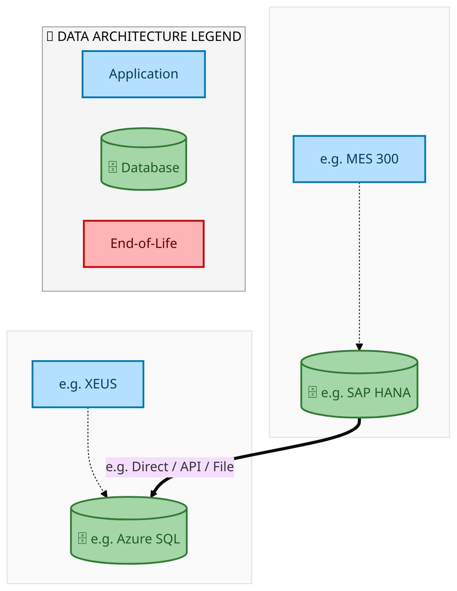
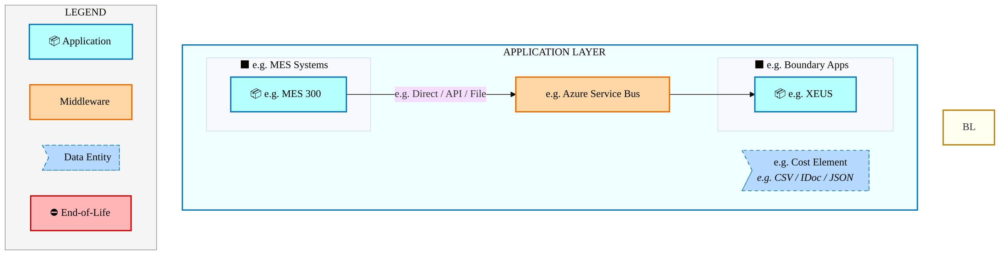
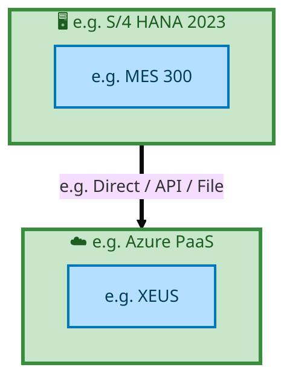

  
  <img src="data:image/svg+xml;base64,PHN2ZyB4bWxucz0iaHR0cDovL3d3dy53My5vcmcvMjAwMC9zdmciIHZpZXdCb3g9IjAgMCA4MDAgNDgwIiB3aWR0aD0iODAwIiBoZWlnaHQ9IjQ4MCI+CiAgPGRlZnM+CiAgICA8bGluZWFyR3JhZGllbnQgaWQ9ImJnIiB4MT0iMCUiIHkxPSIwJSIgeDI9IjEwMCUiIHkyPSIxMDAlIj4KICAgICAgPHN0b3Agb2Zmc2V0PSIwJSIgc3R5bGU9InN0b3AtY29sb3I6IzAwNzFjNTtzdG9wLW9wYWNpdHk6MSIvPgogICAgICA8c3RvcCBvZmZzZXQ9IjEwMCUiIHN0eWxlPSJzdG9wLWNvbG9yOiMwMGFlZWY7c3RvcC1vcGFjaXR5OjEiLz4KICAgIDwvbGluZWFyR3JhZGllbnQ+CiAgICA8bGluZWFyR3JhZGllbnQgaWQ9ImFjY2VudCIgeDE9IjAlIiB5MT0iMCUiIHgyPSIwJSIgeTI9IjEwMCUiPgogICAgICA8c3RvcCBvZmZzZXQ9IjAlIiBzdHlsZT0ic3RvcC1jb2xvcjojZmZmZmZmO3N0b3Atb3BhY2l0eTowLjE1Ii8+CiAgICAgIDxzdG9wIG9mZnNldD0iMTAwJSIgc3R5bGU9InN0b3AtY29sb3I6I2ZmZmZmZjtzdG9wLW9wYWNpdHk6MC4wMiIvPgogICAgPC9saW5lYXJHcmFkaWVudD4KICAgIDxwYXR0ZXJuIGlkPSJncmlkIiB3aWR0aD0iNDAiIGhlaWdodD0iNDAiIHBhdHRlcm5Vbml0cz0idXNlclNwYWNlT25Vc2UiPgogICAgICA8cGF0aCBkPSJNIDQwIDAgTCAwIDAgMCA0MCIgZmlsbD0ibm9uZSIgc3Ryb2tlPSJyZ2JhKDI1NSwyNTUsMjU1LDAuMDcpIiBzdHJva2Utd2lkdGg9IjAuNSIvPgogICAgPC9wYXR0ZXJuPgogIDwvZGVmcz4KCiAgPCEtLSBCYWNrZ3JvdW5kIC0tPgogIDxyZWN0IHdpZHRoPSI4MDAiIGhlaWdodD0iNDgwIiBmaWxsPSJ1cmwoI2JnKSIgcng9IjgiLz4KICA8cmVjdCB3aWR0aD0iODAwIiBoZWlnaHQ9IjQ4MCIgZmlsbD0idXJsKCNncmlkKSIgcng9IjgiLz4KICA8cmVjdCB3aWR0aD0iODAwIiBoZWlnaHQ9IjQ4MCIgZmlsbD0idXJsKCNhY2NlbnQpIiByeD0iOCIvPgoKICA8IS0tIERlY29yYXRpdmUgY2lyY3VpdC9hcmNoaXRlY3R1cmUgbGluZXMgLS0+CiAgPGcgc3Ryb2tlPSJyZ2JhKDI1NSwyNTUsMjU1LDAuMTIpIiBzdHJva2Utd2lkdGg9IjEuNSIgZmlsbD0ibm9uZSI+CiAgICA8cGF0aCBkPSJNIDAgMTAwIEwgMTIwIDEwMCBMIDE2MCAxNDAgTCAyODAgMTQwIi8+CiAgICA8cGF0aCBkPSJNIDAgMjYwIEwgODAgMjYwIEwgMTIwIDIyMCBMIDIwMCAyMjAgTCAyNDAgMjYwIEwgMzYwIDI2MCIvPgogICAgPHBhdGggZD0iTSA1MjAgMTAwIEwgNjAwIDEwMCBMIDY0MCA2MCBMIDgwMCA2MCIvPgogICAgPHBhdGggZD0iTSA0NDAgMzQwIEwgNTYwIDM0MCBMIDYwMCAzMDAgTCA3MjAgMzAwIEwgNzYwIDM0MCBMIDgwMCAzNDAiLz4KICAgIDxwYXRoIGQ9Ik0gNjAwIDQwMCBMIDY4MCA0MDAgTCA3MjAgNDQwIi8+CiAgICA8cGF0aCBkPSJNIDAgNDAwIEwgNDAgNDAwIEwgODAgMzYwIi8+CiAgICA8cGF0aCBkPSJNIDIwMCA0MjAgTCAzMjAgNDIwIEwgMzYwIDM4MCBMIDQ4MCAzODAiLz4KICAgIDxwYXRoIGQ9Ik0gNjUwIDQ0MCBMIDc1MCA0NDAgTCA4MDAgNDgwIi8+CiAgPC9nPgoKICA8IS0tIERlY29yYXRpdmUgbm9kZXMgLS0+CiAgPGcgZmlsbD0icmdiYSgyNTUsMjU1LDI1NSwwLjE4KSI+CiAgICA8Y2lyY2xlIGN4PSIxMjAiIGN5PSIxMDAiIHI9IjQiLz4KICAgIDxjaXJjbGUgY3g9IjI4MCIgY3k9IjE0MCIgcj0iNCIvPgogICAgPGNpcmNsZSBjeD0iMjAwIiBjeT0iMjIwIiByPSI0Ii8+CiAgICA8Y2lyY2xlIGN4PSIzNjAiIGN5PSIyNjAiIHI9IjQiLz4KICAgIDxjaXJjbGUgY3g9IjYwMCIgY3k9IjEwMCIgcj0iNCIvPgogICAgPGNpcmNsZSBjeD0iNzIwIiBjeT0iMzAwIiByPSI0Ii8+CiAgICA8Y2lyY2xlIGN4PSI1NjAiIGN5PSIzNDAiIHI9IjQiLz4KICAgIDxjaXJjbGUgY3g9IjgwIiBjeT0iMzYwIiByPSI0Ii8+CiAgICA8Y2lyY2xlIGN4PSI0ODAiIGN5PSIzODAiIHI9IjQiLz4KICAgIDxjaXJjbGUgY3g9IjMyMCIgY3k9IjQyMCIgcj0iNCIvPgogIDwvZz4KCiAgPCEtLSBUT0dBRiBCREFUIGJveGVzIC0tPgogIDxnIGZvbnQtZmFtaWx5PSJTZWdvZSBVSSwgQXJpYWwsIHNhbnMtc2VyaWYiIGZvbnQtc2l6ZT0iMTQiIGZvbnQtd2VpZ2h0PSI2MDAiPgogICAgPCEtLSBCIC0tPgogICAgPHJlY3QgeD0iMTUwIiB5PSIxNDAiIHdpZHRoPSIxMjAiIGhlaWdodD0iNDAiIHJ4PSI1IiBmaWxsPSJyZ2JhKDI1NSwyNTUsMjU1LDAuMTgpIiBzdHJva2U9InJnYmEoMjU1LDI1NSwyNTUsMC4zKSIgc3Ryb2tlLXdpZHRoPSIxIi8+CiAgICA8dGV4dCB4PSIyMTAiIHk9IjE2NSIgdGV4dC1hbmNob3I9Im1pZGRsZSIgZmlsbD0iI2ZmZiI+QnVzaW5lc3M8L3RleHQ+CiAgICA8IS0tIEQgLS0+CiAgICA8cmVjdCB4PSIyOTAiIHk9IjE0MCIgd2lkdGg9IjEyMCIgaGVpZ2h0PSI0MCIgcng9IjUiIGZpbGw9InJnYmEoMjU1LDI1NSwyNTUsMC4xOCkiIHN0cm9rZT0icmdiYSgyNTUsMjU1LDI1NSwwLjMpIiBzdHJva2Utd2lkdGg9IjEiLz4KICAgIDx0ZXh0IHg9IjM1MCIgeT0iMTY1IiB0ZXh0LWFuY2hvcj0ibWlkZGxlIiBmaWxsPSIjZmZmIj5EYXRhPC90ZXh0PgogICAgPCEtLSBBIC0tPgogICAgPHJlY3QgeD0iNDMwIiB5PSIxNDAiIHdpZHRoPSIxMjAiIGhlaWdodD0iNDAiIHJ4PSI1IiBmaWxsPSJyZ2JhKDI1NSwyNTUsMjU1LDAuMTgpIiBzdHJva2U9InJnYmEoMjU1LDI1NSwyNTUsMC4zKSIgc3Ryb2tlLXdpZHRoPSIxIi8+CiAgICA8dGV4dCB4PSI0OTAiIHk9IjE2NSIgdGV4dC1hbmNob3I9Im1pZGRsZSIgZmlsbD0iI2ZmZiI+QXBwbGljYXRpb248L3RleHQ+CiAgICA8IS0tIFQgLS0+CiAgICA8cmVjdCB4PSI1NzAiIHk9IjE0MCIgd2lkdGg9IjEyMCIgaGVpZ2h0PSI0MCIgcng9IjUiIGZpbGw9InJnYmEoMjU1LDI1NSwyNTUsMC4xOCkiIHN0cm9rZT0icmdiYSgyNTUsMjU1LDI1NSwwLjMpIiBzdHJva2Utd2lkdGg9IjEiLz4KICAgIDx0ZXh0IHg9IjYzMCIgeT0iMTY1IiB0ZXh0LWFuY2hvcj0ibWlkZGxlIiBmaWxsPSIjZmZmIj5UZWNobm9sb2d5PC90ZXh0PgogIDwvZz4KCiAgPCEtLSBDb25uZWN0aW5nIGxpbmVzIGJldHdlZW4gQkRBVCBib3hlcyAtLT4KICA8ZyBzdHJva2U9InJnYmEoMjU1LDI1NSwyNTUsMC4yNSkiIHN0cm9rZS13aWR0aD0iMSI+CiAgICA8bGluZSB4MT0iMjcwIiB5MT0iMTYwIiB4Mj0iMjkwIiB5Mj0iMTYwIi8+CiAgICA8bGluZSB4MT0iNDEwIiB5MT0iMTYwIiB4Mj0iNDMwIiB5Mj0iMTYwIi8+CiAgICA8bGluZSB4MT0iNTUwIiB5MT0iMTYwIiB4Mj0iNTcwIiB5Mj0iMTYwIi8+CiAgPC9nPgoKICA8IS0tIE1haW4gdGl0bGUgLS0+CiAgPHRleHQgeD0iNDAwIiB5PSIyNjAiIHRleHQtYW5jaG9yPSJtaWRkbGUiIGZvbnQtZmFtaWx5PSJTZWdvZSBVSSwgQXJpYWwsIHNhbnMtc2VyaWYiIGZvbnQtc2l6ZT0iMzYiIGZvbnQtd2VpZ2h0PSI3MDAiIGZpbGw9IiNmZmZmZmYiIGxldHRlci1zcGFjaW5nPSIxIj4KICAgIElBTyBBcmNoaXRlY3R1cmUKICA8L3RleHQ+CiAgPHRleHQgeD0iNDAwIiB5PSIzMDAiIHRleHQtYW5jaG9yPSJtaWRkbGUiIGZvbnQtZmFtaWx5PSJTZWdvZSBVSSwgQXJpYWwsIHNhbnMtc2VyaWYiIGZvbnQtc2l6ZT0iMTgiIGZvbnQtd2VpZ2h0PSI0MDAiIGZpbGw9InJnYmEoMjU1LDI1NSwyNTUsMC44KSIgbGV0dGVyLXNwYWNpbmc9IjIiPgogICAgVE9HQUYgQkRBVCDCtyBJQU8gUHJvZ3JhbSDCtyBJRE0gMi4wCiAgPC90ZXh0PgoKICA8IS0tIEJvdHRvbSBhY2NlbnQgYmFyIC0tPgogIDxyZWN0IHg9IjI4MCIgeT0iMzQwIiB3aWR0aD0iMjQwIiBoZWlnaHQ9IjMiIHJ4PSIxLjUiIGZpbGw9InJnYmEoMjU1LDI1NSwyNTUsMC40KSIvPgoKICA8IS0tIEludGVsIHRleHQgLS0+CiAgPHRleHQgeD0iNDAwIiB5PSIzODAiIHRleHQtYW5jaG9yPSJtaWRkbGUiIGZvbnQtZmFtaWx5PSJTZWdvZSBVSSwgQXJpYWwsIHNhbnMtc2VyaWYiIGZvbnQtc2l6ZT0iMTMiIGZpbGw9InJnYmEoMjU1LDI1NSwyNTUsMC41KSIgbGV0dGVyLXNwYWNpbmc9IjMiPgogICAgSU5URUwgQ09ORklERU5USUFMCiAgPC90ZXh0Pgo8L3N2Zz4K" alt="IAO Architecture" style="width:100%; border-radius:8px;" />
  <h1 style="font-size:36px; margin-top:24px;">E2E-44 — R3 - Intel Owned Consignment with Planning Integration</h1>
  <h2 style="font-size:24px;">Architecture Document (TOGAF BDAT)</h2>
  
End-to-End Integrated Processes (E2E) Tower 
  Capability E2E-44 · Procure to Pay

  
IAO Program · R1 – R5 
  Generated: April 2026 
  Sajiv Francis

  
IAO Architecture Pipeline — Intel Confidential

Page 1<a href="#toc">↑ Back to TOC</a>E2E-44 — R3 - Intel Owned Consignment with Planning Integration

## Table of Contents

<nav class="toc">
<ol>
  <li><a href="#1-executive-summary">1. Executive Summary</a></li>
  <li><a href="#2-business-context-objectives">2. Business Context &amp; Objectives</a>
    <ul>
      <li><a href="#21-classification">2.1 Classification</a></li>
      <li><a href="#22-business-drivers">2.2 Business Drivers</a></li>
      <li><a href="#23-success-criteria">2.3 Success Criteria</a></li>
      <li><a href="#24-companion-documents">2.4 Companion Documents</a></li>
    </ul>
  </li>
  <li><a href="#3-business-architecture-togaf-b">3. Business Architecture (TOGAF &ldquo;B&rdquo;)</a>
    <ul>
      <li><a href="#31-business-process-overview">3.1 Business Process Overview</a></li>
      <li><a href="#32-business-process-diagrams">3.2 Business Process Diagrams</a></li>
      <li><a href="#33-business-roles-responsibilities">3.3 Business Roles &amp; Responsibilities</a></li>
    </ul>
  </li>
  <li><a href="#4-data-architecture-togaf-d">4. Data Architecture (TOGAF &ldquo;D&rdquo;)</a>
    <ul>
      <li><a href="#41-data-entities-ownership">4.1 Data Entities &amp; Ownership</a></li>
      <li><a href="#42-data-flow-diagrams">4.2 Data Flow Diagrams</a></li>
      <li><a href="#43-data-lineage">4.3 Data Lineage</a></li>
      <li><a href="#44-ricefw-data-objects">4.4 RICEFW Data Objects</a></li>
      <li><a href="#45-data-governance-quality">4.5 Data Governance &amp; Quality</a></li>
    </ul>
  </li>
  <li><a href="#5-application-architecture-togaf-a">5. Application Architecture (TOGAF &ldquo;A&rdquo;)</a>
    <ul>
      <li><a href="#51-current-state-current-state-application-landscape">5.1 Current-State Application Landscape</a></li>
      <li><a href="#52-future-state-future-state-application-landscape">5.2 Future-State Application Landscape</a></li>
      <li><a href="#53-change-impact-summary">5.3 Change Impact Summary</a></li>
      <li><a href="#54-component-overview">5.4 Component Overview</a></li>
      <li><a href="#55-ricefw-inventory">5.5 RICEFW Inventory</a></li>
      <li><a href="#56-integration-patterns">5.6 Integration Patterns</a></li>
    </ul>
  </li>
  <li><a href="#6-technology-architecture-togaf-t">6. Technology Architecture (TOGAF &ldquo;T&rdquo;)</a>
    <ul>
      <li><a href="#61-platform-infrastructure">6.1 Platform &amp; Infrastructure</a></li>
      <li><a href="#62-sap-development-object-status">6.2 SAP Development Object Status</a></li>
      <li><a href="#63-nfrs-design-principles">6.3 NFRs &amp; Design Principles</a></li>
      <li><a href="#64-security-governance">6.4 Security &amp; Governance</a></li>
    </ul>
  </li>
  <li><a href="#7-project-context">7. Project Context</a>
    <ul>
      <li><a href="#71-project-roadmap-go-live-plan">7.1 Project Roadmap &amp; Go-Live Plan</a></li>
      <li><a href="#72-raid-log">7.2 RAID Log</a></li>
      <li><a href="#73-recommendations-next-steps">7.3 Recommendations &amp; Next Steps</a></li>
    </ul>
  </li>
</ol>
</nav>

Page 2<a href="#toc">↑ Back to TOC</a>E2E-44 — R3 - Intel Owned Consignment with Planning Integration

## 1. Executive Summary

This Architecture Document defines the **Business, Data, Application, and Technology** (BDAT) architecture for **E2E-44 R3 - Intel Owned Consignment with Planning Integration** within the IAO program. It includes 5 BPMN process diagram(s) in Section 3.

| Dimension | Value |
|-----------|-------|
| **Tower** | End-to-End Integrated Processes (E2E) |
| **Process Group** | Procure to Pay |
| **Capability** | E2E-44 - R3 - Intel Owned Consignment with Planning Integration |
| **Release** | R1 – R5 |
| **Total Systems** | 2 |
| **System Status** | 0 Deployed, 0 Developing, 0 EOL, 2 Pending IAPM |
| **RICEFW Objects** | Pending — Smartsheet Object Tracker API integration |

**Change Summary**: 0 new flow chains, 0 removed, 0 modified, 1 unchanged between Current-State and Future-State states.

> All system nodes in architecture diagrams are **IAPM-linked** — click any node to open its IAPM page. Diagrams require `securityLevel: 'loose'` for click events.

Page 3<a href="#toc">↑ Back to TOC</a>E2E-44 — R3 - Intel Owned Consignment with Planning Integration

## 2. Business Context & Objectives

### 2.1 Classification

| Level | Value |
|-------|-------|
| **L0 Tower** | End-to-End Integrated Processes |
| **L1 Process** | Procure to Pay |
| **L2 Capability** | E2E-44 - R3 - Intel Owned Consignment with Planning Integration |

### 2.2 Business Drivers

| # | Driver | Description | Strategic Alignment | Priority |
|---|--------|-------------|---------------------|----------|
| 1 | End-to-End Process Integration | Enable cross-tower integrated processes spanning procurement, manufacturing, and fulfillment | IDM 2.0 Process Excellence | High |
| 2 | Intel Foundry Business Enablement | Stand up foundry-specific business processes for external customer engagement | Intel Foundry Services | High |
| 3 | Process Visibility & Monitoring | Provide end-to-end process visibility across tower boundaries with integrated monitoring | Operational Excellence | Medium |
| 4 | E2E-44 Process Migration | Migrate R3 - Intel Owned Consignment with Planning Integration business processes and 2 integrated systems from legacy to S/4 HANA target architecture | IDM 2.0 Cross-Functional / End-to-End | High |

Page 4<a href="#toc">↑ Back to TOC</a>E2E-44 — R3 - Intel Owned Consignment with Planning Integration

### 2.3 Success Criteria

| Metric | Target | Measure | Baseline | Owner |
|--------|--------|---------|----------|-------|
| E2E Process Cycle Time | Per process SLA | End-to-end transaction completion within defined SLA per process | Varies by process | E2E Process Owner |
| Cross-Tower Integration Success | > 99% | Transactions completing across tower boundaries without manual intervention | 92% (current) | Integration Lead |
| Process Exception Rate | < 2% | Transactions requiring manual exception handling | 8% (current) | Operations Manager |
| E2E-44 Migration Completeness | 100% flow chains validated | All 1 flow chains verified in target state | 0% (pre-migration) | Tower Architect |

### 2.4 Companion Documents

| Document | Description |
|----------|-------------|
| **Business Architecture** | Included in this document (Section 3) — process flows from BPMN diagrams |
| **This Document** | Full BDAT Architecture — Business + Data + Application + Technology |

Page 5<a href="#toc">↑ Back to TOC</a>E2E-44 — R3 - Intel Owned Consignment with Planning Integration

## 3. Business Architecture (TOGAF "B")

### 3.1 Business Process Overview

This capability includes **5 business process(es)** modeled in BPMN 2.0, covering the end-to-end workflow for E2E-44 R3 - Intel Owned Consignment with Planning Integration.

| # | Step ID | Process Name | Lanes | Tasks | Gateways |
|---|---------|--------------|-------|-------|----------|
| 1 | E2E-44_R3_CFIN | E2E-44_R3_CFIN | Boundary Apps, CFIN, MBC, SAP S/4 (IP & IF) | 15 | 10 |
| 2 | E2E-44_R3_SAP_Transportation_Management | E2E-44_R3_SAP_Transportation_Management | Boundary Apps, External Partners/

Supplier
, SAP S/4 (IP & IF) | 12 | 6 |

| 3 | E2E_44A_R3_Intel_Owned_Consignment_with_Planning_Integration-Procurement_from_Component_supplier_and | E2E_44A_R3_Intel_Owned_Consignment_with_Planning_Integration-Procurement_from_Component_supplier_and | Boundary Apps, External Partners/Suppliers, SAP S/4HANA IP | 26 | 10 |
| 4 | E2E_44B_R3_-_Intel_Owned_Consignment_with_Planning_Integration-Shipment_of_components_from_Intel_War | E2E_44B_R3_-_Intel_Owned_Consignment_with_Planning_Integration-Shipment_of_components_from_Intel_War | Boundary Apps, External Partner/Supplier, SAP S/4HANA IP | 45 | 28 |
| 5 | E2E_44C_R3_Intel_Owned_Consignment_with_Planning_Integration_-_Subcontracting_Process_with_ODM_Suppl | E2E_44C_R3_Intel_Owned_Consignment_with_Planning_Integration_-_Subcontracting_Process_with_ODM_Suppl | Boundary Apps, External Partners/Supplier, SAP S/4HANA IP | 34 | 14 |

Page 6<a href="#toc">↑ Back to TOC</a>E2E-44 — R3 - Intel Owned Consignment with Planning Integration

### 3.2 Business Process Diagrams

#### BUSINESS ARCHITECTURE — 3.2.1 E2E-44_R3_CFIN — E2E-44_R3_CFIN

**Swim Lanes**: Boundary Apps · CFIN · MBC · SAP S/4 (IP & IF) | **Tasks**: 15 | **Gateways**: 10

> **Legend**: ● Start · ● End · User Task · Service Task · ◇ Gateway · Sub-Process

<a href="https://mermaid.live/view#pako:eNqlV21v2zYQ_iuEiswJYK96tWR_2OA3FQHq1IjXDcM8DLRExUJkUaAoJ27q_76jRMqWIn9Ylw-t-Oi5547HuxP9pgU0JNpYu7l5i9OYj9Fbj-_InvTGqLfFOen1UQX8jlmMtwnJe4IT0ZSv428lzbCzV0ETmI_3cXIU6Jo8UYK-3vfRBAyTPspxmg9ywuKo1-9lLN5jdpzRhDLB_kC8SI9Kb_LVlLKQsDNB110jcMA0iVNyhi3Xdm1f2OUkoGnYEI2cyIuC3kkEl9CXYIcZL8MvcrLEr3_EId_BOsJJToCz4_vkM96SROyRs0JgQcEOKhlxLvykkLB1hoM4fQLc1gFiOH0-Q45-OqHTzc0mrZ2iz4-bFMFfkOA8n5MI5RzgxYGjKE6S8Qd7NvEdvZ9zRp_J-IO5cOeW2Q_ETsawdb0vkjt4IfHTjo-3NAkldfAi9jA2s9c-ex2bep8d4d-WL5KGZ0-zoemZXu1p6hozY6Y8RVH0vzxBXtlvOH-WvhaWb_rz2pfhDJ2Z_l5PbXNuuxOjnSfCDnFALkR937cW51Qtho6hXxed-tZQn7VEnzAnL_h4FhzN7FrQd1zfcK8KVv7aURbbFaOBErQWju_Ugu7U8CfmVUF7YtiejBB0nhjOdijBKflH_2ujTWlRFjWaZFm-0f6ueOIvNeD1IwlIfCDIjxOC4hRNoRKbLBNYX7MQdoxW-LgnKUePZB9zjtOAtATdWyBHeBzhQc5pVhvMMceoEgnB5K6ygbLqilqENfPvH5raFqCLVxIUl3EUaZNkC1NGRKyT1RItyZ5CsAFMgibPAZ7IN8lzNJ0ta8Ep5sEOmhAechIiCvkochgXQHssYHQ1VYag8omkhCl_SkYks0l1RaqpiJ1TcRKMHghrUjwRO2WMBLwUk88xBPFeb1QeHWjkwvMKzaF2Hor9ljCE0_By42hOEiJUWkclasMnsF0VdY58HHAKlXIL7vsiL320nM7QksJcp-yuJVBVzyEmL2AIAYb19j_TpxbXvMyUosEBZDTHSYtrlbpZEgeCvC4yeIRt3acHCn2MVjTncEIto1Gr8C4TUBXERd1VZa23TFQaZVrf8Y23N8UXn7zBFoY2ZG-J0wIn8kzh4YGIqoKG-3WjnU6XAma3gKyG8B3f6uaT1yCBojyQT9UQapvZ3WYzDMVMVFV1uHN-zN3wx8zcbrMq-ZBGyuA5q1oUjvtdtN7ZHjNGX_IBTjjKMMNJQpIrTkc_YGTpnUZxem1_V6aaaAHoplbdioG1LBIeD8TghdNJU9Hzh5hDG-6g1AecDsT_7e5z_rvhlcBEv60nK7T-aKPb-xX6Cd37bW_Dc69kCXz3OrsSJsDtjO4zmpbd_aWcROtiC7GhVcHgHgPD6ou4lIkh-GW-vGu1mOFd-3wQDhMmR6JR4hD8bHHwLETWFHRhSBzB-15E_7GKvf2BgQmEBoNf4DTl2qqWpifXdrU2RnLtyPfyNgEPAvi-0R7oRvsumlO-cCXRVESpPFRrqeSotd0SUsSRFNJVxLoEVEjmsALqtbQw6hi9CrCVgiEVXEVwpW_VZc0IZIoMRZf-DLvlUG1VujPV1gy5dcNsR-i1s_in-JSCb-VK4avJ_cPPum6iWzj6QUJxKG5E5K4kG7Uju0k3uumNtJS7Ps-TaudK0JK5ruM0W3HWx12_UcdXJ1ues6G_T3bLraW3a0G5qd8YKvfWxT2xhNW1v4m78oreRL1OdNSFmnonaqibbhM2u2GrG7a7YacbHnbDbjfsdcOjThiOWcJaX9sTtsdxqI3ftPLnKfyEDUmEYaRqp76GC07XxzTQxuXPOK0o767zGMPg3Ffg6V_Ci5jv" title="View full diagram">&#128065; View Diagram</a>

Page 7<a href="#toc">↑ Back to TOC</a>E2E-44 — R3 - Intel Owned Consignment with Planning Integration

#### BUSINESS ARCHITECTURE — 3.2.2 E2E-44_R3_SAP_Transportation_Management — E2E-44_R3_SAP_Transportation_Management

**Swim Lanes**: Boundary Apps · External Partners/
Supplier
 · SAP S/4 (IP & IF) | **Tasks**: 12 | **Gateways**: 6

> **Legend**: ● Start · ● End · User Task · Service Task · ◇ Gateway · Sub-Process

<a href="https://mermaid.live/view#pako:eNqlVm1v4jgQ_itWqh67ErRJSAjlw0kQyKrSrhY13bsPy-lkEgesNXZkO1C2y3-_cV6gpPTu9o4PVefJzDMzT2YcP1uJSIk1sq6vnymneoSeO3pNNqQzQp0lVqTTRRXwG5YULxlRHeOTCa5j-r10c7z8ybgZLMIbyvYGjclKEPTlvovGEMi6SGGueopImnW6nVzSDZb7UDAhjfcVGWZ2VmarH02ETIk8Odh24CQ-hDLKyQnuB17gRSZOkUTw9Iw087NhlnQOpjgmdskaS12WXyjyCT_9TlO9BjvDTBHwWesN-4iXhJketSwMlhRy24hBlcnDQbA4xwnlK8A9GyCJ-bcT5NuHAzpcXy_4MSn6-LDgCH4Jw0pNSYaUBni21SijjI2uvHAc-XZXaSm-kdGVOwumfbebmE5G0LrdNeL2doSu1nq0FCytXXs708PIzZ-68mnk2l25h7-tXISnp0zhwB26w2OmSeCETthkyrLsf2UCXeUjVt_qXLN-5EbTYy7HH_ih_ZqvaXPqBWOnrRORW5qQF6RRFPVnJ6lmA9-x3yadRP2BHbZIV1iTHd6fCO9C70gY-UHkBG8SVvnaVRbLuRRJQ9if-ZF_JAwmTjR23yT0xo43rCsEnpXE-RoxzMmf9teFNRFFOdRonOdqYf1R-Zkfd-DxA0kI3ZLbGN4xuueZkBusqeCIchRiKSmRAG8FSIgezIIklNHS43ZKVV5ocnNzc07rAu1sS7hGRZ6CUAphSZCsEqWG-MPjY6uS4Pl5YWV4lOGeOU96S9iIZI3IU8IKBWEfKsEX1uFQhUG5lzo2Lc2eNJEcMzSHDeFEqlsUF3nOTCuttMY9IlDUg6nzNoRVW0G991wTINVCKtSXKcqBaN9MEloUru30QY10J0TaYjTN17q1nnjvvjYt5gxmx7xvokwyqkFRKGICx2WKQHtTzbGY8RZTZg5O4Hv_ktBvEZaaKzQvloyqNUlb_q590hgKFDvVw0yb3jBjhL1SuApyfi7ojddiVInHcxTfeujd_Rz9gu6j9-f69MHlA4HXBZQokuXxgb6ANujd46eWr2dEluSl52dz2F9w9cF1TqSZ6-M8f2nGEkY-xCwpmGGq9T4PH5TzRJLiX6QKTCqh9NExJloz-PLBJkxFUpT_vA4bnpqJ6wmbf0ZQMIri6QX_uyZNPIvRjuo1GhdawDgyAvNzIcCxTxlCEwiLqyVdFuUWj1eEJ3s0gTXjZhz_plKn35q4UGxywY0zVGzUjItlCPML1v1kelwjSNOe3cGJSWmRo8dPKK_3AUbo1ew6w589H6qwu_8U5roXh57yfzyMeB_1er_CgNamX5nOsLaDym5M566y_dr2ave72q4fO3bjb9fAoAGcCnCPHg2F0wB1yqPdlOQ2gFtTNB5uzekEDWC3gSZr26Gpu6T80XwFqnVbWD9eCOEMq5CmkdpsCJxax35tD-qEx6Jbtls3Ebz4rJYszS3pHPfewP038EF9AzpHg-YacA4PL8N3F2GQ7iLsXIbdBra61obAp5qm1ujZKu_XcAdPSYYLpq1D18JwJsR7nlij8h5qVZ_iKcWwkJsKPPwFcMugtA==" title="View full diagram">&#128065; View Diagram</a>

Page 8<a href="#toc">↑ Back to TOC</a>E2E-44 — R3 - Intel Owned Consignment with Planning Integration

#### BUSINESS ARCHITECTURE — 3.2.3 E2E_44A_R3_Intel_Owned_Consignment_with_Planning_Integration-Procurement_from_Component_supplier_and — E2E_44A_R3_Intel_Owned_Consignment_with_Planning_Integration-Procurement_from_Component_supplier_and

**Swim Lanes**: Boundary Apps · External Partners/Suppliers · SAP S/4HANA IP | **Tasks**: 26 | **Gateways**: 10

> **Legend**: ● Start · ● End · User Task · Service Task · ◇ Gateway · Sub-Process

<a href="https://mermaid.live/view#pako:eNqlWFtv4jgU_itWRqN2JBC5AuVhV0ChizRtUenMaDWsViZxwKqxs47T0u30v-9xYkPJpHNbHqr487l85-LjpE9OLBLiDJy3b58op2qAnk7UhmzJyQCdrHBOTlqoAj5iSfGKkfxEy6SCqwX9txTzwmynxTQ2xVvKHjW6IGtB0IdZCw1BkbVQjnnezomk6UnrJJN0i-XjWDAhtfQb0k_dtPRmtkZCJkQeBFy358URqDLKyQEOemEvnGq9nMSCJ0dG0yjtp_HJsybHxEO8wVKV9IucXOLdJ5qoDaxTzHICMhu1Ze_xijAdo5KFxuJC3ttk0Fz74ZCwRYZjyteAhy5AEvO7AxS5z8_o-e3bJd87Re9vlhzBL2Y4z89JinIF8OReoZQyNngTjofTyG3lSoo7MnjjT3rngd-KdSQDCN1t6eS2Hwhdb9RgJVhiRNsPOoaBn-1acjfw3ZZ8hL81X4QnB0_jrt_3-3tPo5439sbWU5qm_8sT5FXe4vzO-JoEU396vvflRd1o7H5tz4Z5HvaGXj1PRN7TmLwwOp1Og8khVZNu5LmvGx1Ng647rhldY0Ue8OPB4Nk43BucRr2p13vVYOWvzrJYzaWIrcFgEk2jvcHeyJsO_VcNhkMv7BuGYGctcbZBDHPyt_t56YxEUTY1GmZZvnT-quT0j3sR7F_LNeZwENEtNGGeCanaM64IQzeiUNCP6KKgCUGns5uLdzX1LqjfEJwsRKrQR8xoghUVvDPZxSTTT-gPzBOmjehJkCBAZAETAIqiiqxmrQfWZjwWWy1P-b2AqnXQyB91rjPCb8lOdT6RFURIFamp9kH1EvMCM6uYI7WRolhv0PX45lg6CJ6elk6KBylu69nVXkHg8QaRXcyKnN6Ti6q4S-f5-aVa2KymCVa-f69rRD_rCM5ZUxk9CG-yU0RyCHAOx54TmXcWRZYxCk-1ZJyB9IcMSkHQVEgS41yhsdhuC07jsj4IilIiVB2r-m5Z0JgANzS_RrhUzAQnXCHrrqaiuVW20LWet2gY33HxwEiyhpnP6x58EF9AmNp8fERKCXR9fvmam6DUYyQGSlhKEED3FKOmTt2IXBEdIGN4JWRlfQ59jVnNaGjJVMwXG5o1UI5eJmXzmANhcKmBTCGRokvItL6gEF5jyiHZVea-EYw-N3YLQtANC_RrQv3Tz7Z5ciWy7yYMLSrq714YCd1DB0LWxEPexkyhDEvMGGE_2n9l0YZztOiEfwyvhmg2r7Wc7gFJdMfNCwn3VU4gQf8UNKeaaS2wg7A5st_X0dWH8SXF_Y94CBvolBU-FtN1vZV0vYbcXdwu0HhD4rtjEV2oMWZxwbSxW7wjtcNWzSzgoPeHBZRkxld64KJzwqBh5OOxfP9FL10IkeT7Rjr9SKWCbNRm7NkLkreXaLJdkSQhSS3_-txO7jErNA1rcUGUYuUZRKeTm8U7AFjaHsEF81WzebqCszwvyKGb6-11GoVe_QLQtZzDcUO1bq7PZ12_ebFiNN98sySeLt2LAdIZC55Suf2mkt87nJSMwaXc1CGobAj9YMuV1M6Kr1M98SftMEQ3AdL9vr8RK01oV9w01AL3SHM8nV3VBLzmi8AkC0amvi9J8tUF4v_aTdX9uVNfKfV-Ran_K0pnvziUuI_a7d_AgF2atd83QNCtgMgKhHr9BVpqcYUmvn6NWPJq6CydL3q0W8GoUuyZdc84suvAAP3a-sys-0Z-v28Az60DngUCA3QN4FmfllNgOAU23CA0Kv06YGl6bl3FMwn4Uw-uL_rE1neuRJUKy8M3OQxCa7RfI2YFbPBRbe2Z0EIbvGd4-vvCGZ6-zYZvs2F9nBmBvU1berdWaks7MBqe9RG6JkB4Z5xfd5bc1L8Mds_McPf3wdrgLDNDPejWzVZt1DFtBfbn4gHm32hWebB59j3Da-_BGNwXwkRm933TB_v9Y_nyg6GUst9_x3jffKsdo2fN0oH7Cu7ZD5xj2G-Gg2Y4bIajZrjbDPea4X4zfNYIQ80M7LScLZFbTBNn8OSU_5VwBk5CUlww5Ty3HAxX-OKRx86g_Hp3ivI9-pxieBvaVuDzf-mXMYo=" title="View full diagram">&#128065; View Diagram</a>

Page 9<a href="#toc">↑ Back to TOC</a>E2E-44 — R3 - Intel Owned Consignment with Planning Integration

#### BUSINESS ARCHITECTURE — 3.2.4 E2E_44B_R3_-_Intel_Owned_Consignment_with_Planning_Integration-Shipment_of_components_from_Intel_War — E2E_44B_R3_-_Intel_Owned_Consignment_with_Planning_Integration-Shipment_of_components_from_Intel_War

**Swim Lanes**: Boundary Apps · External Partner/Supplier · SAP S/4HANA IP | **Tasks**: 45 | **Gateways**: 28

> **Legend**: ● Start · ● End · User Task · Service Task · ◇ Gateway · Sub-Process

<a href="https://mermaid.live/view#pako:eNqtWltv2zgW_iuEi25SwGmsu-yHGTi-ZAI0jRG7LRaTxYCRaVuILGkpKpdN89_3UOKRY4aeaTXTh6I6PPfLx2Opz50oW7LOoPP-_XOcxmJAno_Ehm3Z0YAc3dKCHXVJTfhKeUxvE1YcSZ5Vlop5_L-KzXLzR8kmaVO6jZMnSZ2zdcbIl4suGYJg0iUFTYuTgvF4ddQ9ynm8pfxplCUZl9zvWLjqrSpr6ugs40vGdwy9XmBFHogmccp2ZCdwA3cq5QoWZelyT-nKW4Wr6OhFOpdkD9GGclG5Xxbskj5-i5diA88rmhQMeDZim3yityyRMQpeSlpU8ntMRlxIOykkbJ7TKE7XQHd7QOI0vduRvN7LC3l5__4mbYySxfgmJfAnSmhRjNmKFALIk3tBVnGSDN65o-HU63ULwbM7NnhnT4KxY3cjGckAQu91ZXJPHli83ojBbZYsFevJg4xhYOePXf44sHtd_gR_a7ZYutxZGvl2aIeNpbPAGlkjtLRarf6WJcgrX9DiTtmaOFN7Om5sWZ7vjXpv9WGYYzcYWnqeGL-PI_ZK6XQ6dSa7VE18z-odVno2dfzeSFO6poI90Kedwv7IbRROvWBqBQcV1vZ0L8vbGc8iVOhMvKnXKAzOrOnQPqjQHVpuqDwEPWtO8w1JaMr-6P1-0znLyqqpyTDPi5vOf2o--Sd1PDi_ZhGL79npHIpMLtJVxrdUxFlK4pSMKOcx40C-zyCH5FpOSBQnccVxOo6LvBTs48eP-3p9__n5prOigxU9kehwcgv9HW0Ie4ySsgBj53X6bjovL7UY2Db5b4F_k0fBeEoTMoN-Txk_nZd5noBXWiw-8KK_oyxdxRjHdVYKmCtyXsZLdjq6vtQEAxCcxdEd8GgnoTyhppM-nHzK6PLNiStTPssKQWabpyKOwO8qwbkg2YpcQtwSywhd0zgFpvniilBBrsaXxByWaynvyJVEMzLfxPmWpYKcZ9myIMcq4g-alA1SU8aW5BosFqcjgJA1K6COgkF6RcYL4vAlySGlTzgh5Ka0e5YD_i4fQLmm0alaKbs7XUCtwBGRNd1xH1Ny9tn9pEm4IDEfzkxH3q5W2kl4_Dt2Tp7AgMmhYIX0PBbQdRDRGdwpSyLrCo9NZMN7GifydgF9H14r7GsKUZHJ-9eCXk8TnNxD2gsyK2-TuNiwpc7v7_gLkeVk8siismpAVkuioZPzxQKs56Lkb7T4wc9OTi0WthIL-jsxyEb2UJzQRMiuoEnCErNQ2GsjZLURstsIOW2E3J8TOgBXtur4-an72_DzkFzM9rtbzvKIM9l9c5HBTC-gTEWewfVeTfc-dzXDMSAfbEnV5CbYs8VuCABANGgCqQWP12to7fPFnIw2LLrThmznxlUpbuX9QMYsgTbhT_uc9ZwmUZlI5gV9ZNoNIkF3cUkm21u2XDINMxBYu0SCKKFg5ku-BE37bCEiZg1pF0VRahz96hqo8oQ30fGM8eqq0pDPkvg7yrZbxiMJtDt-nhn5q5rIHJHhYlaxLctIkGGSZFF9fyhogVsPsLJi1XXYu4QOSwDGi_TPkmo5u1tXxayuiOOvMRclTXT9smBVWnYXCFh5fWmQY8-1dDFZvYtRkwJoNnlfQevxj-BaLnE8FZqM_1cVt4Im2FNVTjLl1bJHvgC2VmU2dLMlyzxnCYPkGqHf6u-ZVsCujUTPeK8NGg-gxA9UGoerUU7i4lJLil2vFBKad37XV6t0fC6oKAsVV0Hyqi0vNBX2q_rhRgQuacvScaGbdg5nbs6ESFh1sY-zqNy-KYz9amjn6r6eXZ2SSSpgtZtvGNMFZPVVF-_sjCCgQjYPtia5EGwr94ir09nwA8n4rsW-0qSsJkBT7OO8DqOIl3Uvon6YUpYWTB7BBIi3OQh-ooDfYrGBJfRtDWUrnTPYBX8USWVrNRe_RMVjBSdjBhs4r6LUjDg1kFR7pAFlZRtd0pSumeHQPozz1-y_JSu0Wjm7zoD0pzKnPyYnmwLWep7d_6Al1_-n96vg0H7154GQKty6ufbWKEtbowxYjqV_s4LZb1awymT8V3KOJteMQAW6Sx1sdXFXE_-huSByhN664mm6_tbg4i321syBNXPEM-iF-sXJr9qO5LXbMb1-u422107MaidmtxNzzGKHl4iE6Wn13XamvXZibTb-oM3GH7TZ-IM2G3_QZuMP3DZCXhshv41Q0EYobPkrJrXIyckvsjvUs9-vCY56duvHQL21gn8oAXxW5xY-K4VeoAhexfH9pvNvudJ9l7Cgn3zOqgMLbThKqRMiIVRWGlFFQIYAvdbD8F2MQ_nlohHLUTpt1GHXBMtDDhW7h7mwMNiGQ7lhoVlLmcWXm_APJYJ-2MqPABNoK7M2WrGVY3YjgjVAjgA50A_bU54iwVVKQyyLqzx1MVrfVxlDkRA7oamsqxM8jeCj66jUQQ4kuMqKjd1gqxT6jWMqltDW_Wg4sAxo1lM5dZtoPdVI0yvyL_Lb8NsZ3Ih5Xr2h-_7KX-Vd0DiDbYVtFCrNYZN6VU8PnQmVu16oE7AFlE4fjQQqYrtpZs2LQEnY2oSFTQ-pSmEYFmYI-8F3tBFzmkmytDFoWNXMOZY2MJ7mld-o6mkEnPSG4GNd8FkVzkIbjq9FFrpaspDgIMHpK39fvSHAV6g3abMRpZl8tfBdlkPHIUy7pbyzGwxB1VXDUCFotIGN70a-B4dfHrgfYxc1yKLq6WJUFuKGowNJkwj1HOiD1CRfOWs1zioOq5k9pcMPtem0LZ3D1lGiQRrF4aFfoa0y0LxahmW9euctvxjITPBsS64d-Ekgf5nVvdV44KqOcZ09da_DQtBpQLinDLpnNjm_rlG_AQ_lr4PcDupr5hzvBbTouBqHj3lTz9jU9t49AQ5Un-qgxHEqsMDBq-8yFXLhZ7Z9enCAHh6g9810ADEz3VKf3PaptpHqGKmukeoZqb6RGuBXrn1yaCb3jWRAAyPZMpNtM9kxk10z2TOTfTPZHKVvjtI3RxmYowzMUQbmKANzlIE5ysAcZWCOMjBHGZijDMxRhuYoQ3OUoTnK0Bxl2ETZ6Xbg9_6WxsvO4LlT_ceBzqCzZCtaJqLz0u3QUmTzpzTqDKoP7J2yepM2juma021NfPk_5R_hBw==" title="View full diagram">&#128065; View Diagram</a>

Page 10<a href="#toc">↑ Back to TOC</a>E2E-44 — R3 - Intel Owned Consignment with Planning Integration

#### BUSINESS ARCHITECTURE — 3.2.5 E2E_44C_R3_Intel_Owned_Consignment_with_Planning_Integration_-_Subcontracting_Process_with_ODM_Suppl — E2E_44C_R3_Intel_Owned_Consignment_with_Planning_Integration_-_Subcontracting_Process_with_ODM_Suppl

**Swim Lanes**: Boundary Apps · External Partners/Supplier · SAP S/4HANA IP | **Tasks**: 34 | **Gateways**: 14

> **Legend**: ● Start · ● End · User Task · Service Task · ◇ Gateway · Sub-Process

<a href="https://mermaid.live/view#pako:eNqlWNtu4zgS_RVCjUbSgD3W1beHXdiOnRjoJIadnmAxXixoibKJyKKGonLZdP59ixKp2Iw8mM7modEq1anrqSKtVytkEbGG1tevrzSlYohez8SO7MnZEJ1tcE7OWqgS_I45xZuE5GdSJ2apWNH_lmqOnz1LNSmb4T1NXqR0RbaMoB_zFhoBMGmhHKd5Oyecxmets4zTPeYvE5YwLrW_kH5sx6U39WrMeET4u4Jt95wwAGhCU_Iu9np-z59JXE5ClkZHRuMg7sfh2ZsMLmFP4Q5zUYZf5OQaP9_TSOzgOcZJTkBnJ_bJd7whicxR8ELKwoI_6mLQXPpJoWCrDIc03YLct0HEcfrwLgrstzf09vXrOq2doruLdYrgL0xwnl-QGOUCxNNHgWKaJMMv_mQ0C-xWLjh7IMMv7rR34bmtUGYyhNTtlixu-4nQ7U4MNyyJlGr7SeYwdLPnFn8eunaLv8C_hi-SRu-eJl237_ZrT-OeM3Em2lMcx_-XJ6grv8P5g_I19Wbu7KL25QTdYGJ_tKfTvPB7I8esE-GPNCQHRmezmTd9L9W0Gzj2aaPjmde1J4bRLRbkCb-8GxxM_NrgLOjNnN5Jg5U_M8pis-As1Aa9aTALaoO9sTMbuScN-iPH76sIwc6W42yHEpyS_9h_rK0xK0pSo1GW5Wvr35We_Es9B97f8i1OYRDRHZAwzxgX7XkqSIKWrBDAR3RZ0Iig8_ny8psBdwG-JDhasVig33FCIywoSzvT55Bk8n_oCqdRIo3ITRAhkPACNgA0RRSZYc0Da_M0ZHupT9NHBl3roLE77txmJL0jz6JzTzaQIRXEgPoAvcZpgRMNzJHYcVZsd-h2sjzW9vuvr2srxsMYt-Xuam8g8XCHyHOYFDl9JJdVc9fW29shbNAMkwFWvv9pIAL7Vx3BnDW1UbZp-iwITyHBBYx9SnjeWRVZllDCj7NzBmVTQgL20eIWYYFuL65Rs7IrCTJh-z0FLbkt0Sh8SNlTQqItbOxUGOoykBUEKQ1Do_ZFSkPZcpQiwZC3-G7ou6V-QkKBJphz8I8eKUZN_NqxXABDYPUmeMN4SSS0ADbixDAqebKg4QP6kaFLxqIcnSvj31QS-Y5mDdFLliyLFF0vF7osUyj4sVJQ1pqEhSAIuJ20Bd0TCCvNi33JaUO_W1Ywg_Fa3TQXoXfYkN1LDiWD5KUgEzKOj4i-LvNKJSINTydl7W7vJiiDTUHyHMWMo4hyWV6ZMloXru14qGKjYVPSYkE4QPZHhIBmyIGBRhgzZR8UYsbACc6hiwdNTxEMN6rYY2C7539o4mcJrMk5XAwolhVtKv-3Q2jPgEq1HxksFhhpVcUPmME7JhcsM9mpyYlWFScOsb5tYOuSNyl3P7c5ep-CBf47DPjNnvI2TgTKMMdJQpIToOAzoO6vgU6sqXLaRwu06vhXo5sRmi-M1SRHhRPJg1WxCeV8FxxuNzmp5tZgLGjfcbrdAkcv71ZosiPhg8EzaRAnYZFIm3f4mRgHnJz4BSwWoEM9v2jPHsvdhgLfO1YPyhNoIw9MdEES6Awcm09U7NAVg4sJGlGO7vHLBs5odFPsNxDZ-dXofmyci3Il3AG5QSGKiLFgDrdBtb0OVoEk-3dWkfYYVq4EwWDr1ce0WnblIL_IRQrI3_QOAEsdafi3Slpt3PurY6OHR0WjcaN_9oH-hzpB-M1eHOdkypXTHykncLehoTwAzrURo6iO5MP0ESdFuUe0ASJEUnXzfLpcfQNBErfH0KAPC83xNBmM1WdcJpySNMUmofnuLwnqSLocnJcdOCRiCuv1L0Hd00OwJH8WNKcfm-_0_hYInVeb36yc5A5c_jh7_AWfXnBqh5eBSHcs_rvRHG3rvrFxD85WdK1nc1FeB8z9W16E3Gnb99HSQ5PZ_MaYd_dIQS6jmtFVzBATbrra-N7nVrvfDFPMguuUvAmTyLwa-sHnjgTnM9vd_QzI--SRkDqo3f6HDFU9B0rgqmdXPXsDDRgoBVtr-EoQKIF69vpaIZCCn2vrhjyh5Xwynd2vrZ-gp10qgMYH6lGHELiVoKvtdatnv2sofBR4GtJTNmsfyolbB9lXEJ2WQuj36rWugiqCo7UdWwl0HR1VN0dn4fuqCv-Sx95PueG0qqdca6yvfLsDE3vDqsr11AtdCdfonjatLAd1HYxnR5deV87Rdan7ryBeTZCuigV-3S1uO-t06soffFVKA1OpWiodVCmB9oI9wSofz0t9t85YldfTbj0duS5woArs64b4qgWebwrq5H3DhuMaNlwF8eu4lVtHG_X0ONRGVcldreHqSE06u12DazUbfW1Dt9FXNvSzpwhQ99nTkddeNd80oR0FcXRujuaG1vBUGI426vQNDV9rHHztKHH649WxvHtC3jsh76sPU8fSQZPUtxulTrNl3z0h9_SXn2Ox3ywOmsXdZnGvWdxvFg8axUDqRrHTLHabxc1ZBs1ZBs1ZBnWWVsvaE77HNLKGr1b5KdgaWhGJcZEI661l4UKw1UsaWsPyk6lVlD_3LiiG3xb7Svj2P6BEzZM=" title="View full diagram">&#128065; View Diagram</a>

Page 11<a href="#toc">↑ Back to TOC</a>E2E-44 — R3 - Intel Owned Consignment with Planning Integration

### 3.3 Business Roles & Responsibilities

| Role / Lane | Processes Involved | Description |
|------------|-------------------|-------------|
| Boundary Apps | E2E-44_R3_CFIN, E2E-44_R3_SAP_Transportation_Management, E2E_44A_R3_Intel_Owned_Consignment_with_Planning_Integration-Procurement_from_Component_supplier_and, E2E_44B_R3_-_Intel_Owned_Consignment_with_Planning_Integration-Shipment_of_components_from_Intel_War, E2E_44C_R3_Intel_Owned_Consignment_with_Planning_Integration_-_Subcontracting_Process_with_ODM_Suppl | |
| CFIN | E2E-44_R3_CFIN,  | |
| MBC | E2E-44_R3_CFIN,  | |
| SAP S/4 (IP & IF) | E2E-44_R3_CFIN, E2E-44_R3_SAP_Transportation_Management,  | |
| External Partners/

Supplier

 | E2E-44_R3_SAP_Transportation_Management,  | |
| External Partners/Suppliers | E2E_44A_R3_Intel_Owned_Consignment_with_Planning_Integration-Procurement_from_Component_supplier_and,  | |
| SAP S/4HANA IP | E2E_44A_R3_Intel_Owned_Consignment_with_Planning_Integration-Procurement_from_Component_supplier_and, E2E_44B_R3_-_Intel_Owned_Consignment_with_Planning_Integration-Shipment_of_components_from_Intel_War, E2E_44C_R3_Intel_Owned_Consignment_with_Planning_Integration_-_Subcontracting_Process_with_ODM_Suppl | |
| External Partner/Supplier | E2E_44B_R3_-_Intel_Owned_Consignment_with_Planning_Integration-Shipment_of_components_from_Intel_War,  | |
| External Partners/Supplier | E2E_44C_R3_Intel_Owned_Consignment_with_Planning_Integration_-_Subcontracting_Process_with_ODM_Suppl | |

Page 12<a href="#toc">↑ Back to TOC</a>E2E-44 — R3 - Intel Owned Consignment with Planning Integration

## 4. Data Architecture (TOGAF "D")

### 4.1 Data Entities & Ownership

| # | Data Entity | Source System | Target System | Data Owner | Classification | Volume | Master/Transaction |
|---|-------------|---------------|---------------|------------|----------------|--------|-------------------|
| 1 | e.g. Cost Element | e.g. MES 300 | e.g. XEUS | Data steward | e.g. Intel Confidential | e.g. 10K rows/day | Master / Transaction |

Page 13<a href="#toc">↑ Back to TOC</a>E2E-44 — R3 - Intel Owned Consignment with Planning Integration

### 4.2 Data Flow Diagrams

> **DATA ARCHITECTURE** — Database-to-database data flows. Applications (blue) sit above their hosting databases (green cylinders). Thick arrows show data movement between databases.

#### 4.2.1 Current-State — Current-State Data Flows

<a href="https://mermaid.live/view#pako:eNqdlQ1rozAYx79KyCjcQbtzbW1vwgbx7VZwYze7u4N5SKqxDUtVNN7adf3ul6h1u67uxhKQ5Hn5P_H3SNzAIAkJ1GCns6Ex5RrYeJAvyJJ4UAMenOFcrLpilZOgyChfO-QPYZWTJcnOW6b8wBnFM0Zy6RY6URJzlz7WUidquqqCpd3GS8rWlccl84SA20kXICEgxLdlFEseggXOeK1W5OQSr37SkC-kJcIsJzJuwZfMwTPCyrI8K0prLF7LTXFA47k0D1RpzHB8_8I4VLdbsO10vLipBaa6FwMxAobz3CQRwGmqJysQUca0I101bdvu5jxL7ol2pCjjsT6qt70HeTStn666QcKSTLoHprqvF86MNavlkGqO0LiR61tjc9BvlTvRVauv7MmRhD0fz7Z1VVcbPcNQxGjVG42k24srxbyYzTOcLoDVt4ZDw0SG4xN_7qPHIiO--92586BA-LuKliOkGQk4TeIGmhy7dFRm_7JuXZFIjufHQK6FgKZpFdPXOeZexU8e9Irw6yAUzzAYekVEFPHKUqwMAiLIg5-lZIn1rVOA3nHvvK1SlUjisGbB14y0gtjBRnI2sC1Fzn9hn4gv_j94XXTtX6Ar9CG6l5brDxRlB1hsgdi-h3FT9g3EIgbImPcQrk9yCPKu1HsY72I_hPhwWXB2dv5UAzJLpuALQNcT8bQpE3fTU_tHsdc6h8zF8e9eEAtCBZhoigC6MS4mU8uY3t5YwLG-WVdmSzedm2er48u-ozRlNMDSe7h1jm-29MnEHFdX9KEWOb4l5K047CVRz6ERqeSrK-NgO6o33NFX5Wzon56evkIPu3BJsiWmIdQ21U9A_EtCEuGCcXGNQ1zwxF3HAdTKixkWaYg5MSkWRJeVcfsXIfT-0w==" title="View full diagram">&#128065; View Diagram</a>

Page 14<a href="#toc">↑ Back to TOC</a>E2E-44 — R3 - Intel Owned Consignment with Planning Integration

#### 4.2.2 Future-State — Future-State Data Flows

<a href="https://mermaid.live/view#pako:eNqdlQ1rozAYx79KyCjcQbtzbW1vwgax6q3gxm52dwfzkFRjG5aqaLy16_rdL_Ftu67uxhKQ5Hn5P_H3SNxCPw4I1GCns6UR5RrYupAvyYq4UAMunONMrLpilRE_Tynf2OQPYaWTxXHtLVJ-4JTiOSOZdAudMI64Qx8rqRM1WZfB0m7hFWWb0uOQRUzA7bQLkBAQ4rsiisUP_hKnvFLLM3KJ1z9pwJfSEmKWERm35Ctm4zlhRVme5oU1Eq_lJNin0UKaB6o0pji6f2Ecqrsd2HU6btTUAjPdjYAYPsNZZpAQ4CTR4zUIKWPaka4almV1M57G90Q7UpTxWB9V296DPJrWT9ZdP2ZxKt0DQ93XC-aTDavkkGqM0LiR65tjY9BvlTvRVbOv7MmRmD0fz7J0VVcbvclEEaNVbzSSbjcqFbN8vkhxsgRm3xwOLQNNbI94Cw895inxnO_2nQsFwt9ltBwBTYnPaRw10OSo01GR_cu8dUQiOV4cA7kWApqmlUxf5xh7FT-50M2Dr4NAPAN_6OYhUcQrS7EiCIggF36WkgXWt04Bese987ZKZSKJgooF3zDSCqKGjeRsYJuKnP_CPhFf_H_wOujau0BX6EN0L03HGyhKDVhsgdi-h3FT9g3EIgbImPcQrk5yCHJd6j2M69gPIT5cFpydnT9VgIyCKfgC0PVUPC3KxN301P5R7LXOJgtx_LsXxPxAAQaaIYBuJhfTmTmZ3d6YwDa_mVdGSzftm2er7cm-oyRh1MfSe7h1tme09MnAHJdX9KEW2Z4p5M0o6MVhz6YhKeXLK-NgO8o3rOmrcjb0T09PX6GHXbgi6QrTAGrb8icg_iUBCXHOuLjGIc557GwiH2rFxQzzJMCcGBQLoqvSuPsLnZn-_Q==" title="View full diagram">&#128065; View Diagram</a>

Page 15<a href="#toc">↑ Back to TOC</a>E2E-44 — R3 - Intel Owned Consignment with Planning Integration

### 4.3 Data Lineage

| # | Source System | Source Schema/Object | Target System | Target Schema/Object | Transformation |
|---|-------------|---------------------|---------------|---------------------|---------------|
| 1 | e.g. MES 300 | e.g. CKMLHD table | e.g. XEUS | e.g. dbo.CostElements | Lineage notes |

### 4.4 RICEFW Data Objects

Reports and Conversions for this capability will be populated from the Smartsheet Object Tracker via automated API extraction.

| Object ID | Type | Description | Status | Source | Target | Complexity |
|-----------|------|-------------|--------|--------|--------|-----------|
| E2E-44-R001 | Report | R3 - Intel Owned Consignment with Planning Integration operational report | Planned | SAP S/4HANA | Analytics | Medium |
| E2E-44-C001 | Conversion | Legacy data migration for R3 - Intel Owned Consignment with Planning Integration | Planned | Legacy ERP | SAP S/4HANA | High |

> *Pending: Smartsheet API integration to auto-populate live RICEFW data (see Build Requirements).*

### 4.5 Data Governance & Quality

| Concern | Approach |
|---------|----------|
| Data Ownership | Per-entity owners listed in Section 3.1 |
| Data Classification | Financial data classified as Intel Confidential |
| Data Retention | Per Intel corporate retention policies |
| Data Quality | Validated at source; reconciliation at target |

Page 16<a href="#toc">↑ Back to TOC</a>E2E-44 — R3 - Intel Owned Consignment with Planning Integration

## 5. Application Architecture (TOGAF "A")

### 5.1 Current-State — Current-State Application Landscape

#### Overview

The Current-State architecture represents the **current / legacy** landscape for E2E-44.This view is generated from `CurrentFlows.xlsx` (1 flow hops across 1 flow chains).

#### APPLICATION ARCHITECTURE — Architecture Diagram (ArchiMate-Inspired)

> **Click any system node** to open its IAPM application page.
> **Legend**: Deployed · Developing · End-of-Life · No IAPM Match

<a href="https://mermaid.live/view#pako:eNqdlv9v2joQwP8VKxW_wZq2QNuoQkpIeOIptNWyre_pZYpMfIA1k0Sxs5Z1_O87xxRSWEXfjATJffnc5XI-82ylOQPLsVqtZ55x5ZDn2FILWEJsOSS2plTiVRuvJKRVydUqhO8gjFLk-Yu2dvlCS06nAqRWI2eWZyriPzaos37xZIy1fESXXKyMJoJ5DuTzuE1cBIg2kTSTHQkln8XWuvYQ-WO6oKXakCsJE_r0wJlaaMmMCgnabqGWIqRTEHUKqqxqaYaPGBU05dlci7u2FpY0-9YQ9uz1mqxbrTjbxiKfvDgjuFot0ulgbumCT6iCDs9kwUtgRKqVAJIKKiVItDHm9b0PMzKtJM9ASlKvGRfCORnh8nptqcr8Gzgn3tVV3_Y2t51H_UDOefHUTnORl86Jbdt7TFoUZLcM0-tp6pZp25eXXv9_MBlV9JDpXx1hnr1ivugYlVi8kq6wpqS3F2nJGRPwSEtoVsTvu7uKBJf90Y72juwhFwcV0TVuVHk4tO1jTEOV1XRe0mJB3PC_2IordnXB8Jtd9Ih7fx-Oh-6n8d0tCd1_g4-x9dU46cWwIVLF84yEH3fSLS44D7rdYXibQDJPvLzKGC1XiVsUEsOQuDqfnk0JfJh_IC9KopWvQrwdRi8Toeb_E3yOmtmn0DdsrUCk4zjYRjt3yNixlCdBlEQrqWB5kDCqyEb1Z-lq9oVt_zZjDUfdsaQNbfJQ89wfVQlJBOV3nkLiVfLVmzy7NOTaimysCFqZGLsO3af7QU0f5lIlgcBxl6lBM-W0a8DagGwMbqbl6eCGD4wi-kJOydjPU_z5O7q7vTnlAxNV70ATr34sc3lYIhwxg5-xVdP8urRIcu_H-D3iAufszyOVaILfstFB9rtJp7TZIPXI88LGOBvZx8ZZ09XdutrvmVoHGzOEOdboVbMwm4TBX8Gt_44dGSa4j_dbDbea4CnVxr_ptDCZPOy30GTXJm-2TZj4wX6H-HrUBpnCg3T_zRuX4M4MnvM-66Ih6-SzTshnmzA46xptsiuqKcpLYXv6sy3s9fX1wdy22tYSyiXlzHKezeGN_wEYzGglFB65Fq1UHq2y1HLqQ9SqCkwUfE7xJSyNcP0LHieKsQ==" title="View full diagram">&#128065; View Diagram</a>

Page 17<a href="#toc">↑ Back to TOC</a>E2E-44 — R3 - Intel Owned Consignment with Planning Integration

#### Current-State Flow Narrative

| # | Flow Chain | Path | Interface | Freq |
|---|-----------|------|-----------|------|
| 1 | e.g. MES Route to ICOST | e.g. MES 300 → e.g. XEUS | e.g. Direct / API / File | e.g. Near Real-Time |

Page 18<a href="#toc">↑ Back to TOC</a>E2E-44 — R3 - Intel Owned Consignment with Planning Integration

### 5.2 Future-State — Future-State Application Landscape

#### Overview

The Future-State architecture represents the **target** landscape for E2E-44.This view is generated from `FutureFlows.xlsx` (1 flow hops across 1 flow chains).

#### APPLICATION ARCHITECTURE — Architecture Diagram (ArchiMate-Inspired)

> **Click any system node** to open its IAPM application page.
> **Legend**: Deployed · Developing · End-of-Life · No IAPM Match

<a href="https://mermaid.live/view#pako:eNqdlv9v2joQwP8VKxW_wZq2QNuoQkqa8MRTaKtlW9_TMkUmPsCaSaLYacs6_vedYwoprKKbkSC5L5-7XM5nnq00Z2A5Vqv1zDOuHPIcW2oOC4gth8TWhEq8auOVhLQquVqG8ADCKEWev2hrly-05HQiQGo1cqZ5piL-Y4066RdPxljLh3TBxdJoIpjlQD6P2sRFgGgTSTPZkVDyaWytag-RP6ZzWqo1uZIwpk_3nKm5lkypkKDt5mohQjoBUaegyqqWZviIUUFTns20uGtrYUmz7w1hz16tyKrVirNNLPLJizOCq9UinQ7mls75mCro8EwWvARGpFoKIKmgUoJEG2Ne3_swJZNK8gykJPWaciGcoyEur9eWqsy_g3PkXVz0bW9923nUD-ScFk_tNBd56RzZtr3DpEVBtsswvZ6mbpi2fX7u9f-Ayaii-0z_4gDz5BXzRceoxOKVdIk1Jb2dSAvOmIBHWkKzIn7f3VYkOO8Pt7R3ZA-52KuIrnGjytfXtn2IaaiymsxKWsyJG36NrbhiF2cMv9lZj7h3d-Ho2v00ur0hoft_8DG2vhknvRg2RKp4npHw41a6wQWnQbc7DG8SSGaJl1cZo-UycYtCYhgSV6eTkwmBD7MP5EVJtPJViLfD6GUi1Pz_gs9RM_sU-oatFYh0HAfbaOsOGTuU8jiIkmgpFSz2EkYVWav-Ll3NPrPt32as4ag7lLShje9rnvujKiGJoHzgKSReJV-9yZNzQ66tyNqKoJWJse3QXbof1PTrXKokEDjuMjVoppx2DVgbkLXB1aQ8HlzxgVFEX8gxGfl5ij__Rrc3V8d8YKLqHWji1Y9lLvdLhCNm8DO2appflxZJ7t0Iv4dc4Jz9eaASTfBbNjrIbjfplNYbpB55XtgYZ0P70DhrurobV_s9U2tvY4Ywwxq9ahZmkzD4J7jx37EjwwT38W6r4VYTPKXa-DedFibj-90WGm_b5M22CRM_2O0QX4_aIFN4kO6-eeMS3JrBc9pnXTRknXzaCfl0HQZnXaNNtkU1RXkpbE9_NoW9vLzcm9tW21pAuaCcWc6zObzxPwCDKa2EwiPXopXKo2WWWk59iFpVgYmCzym-hIURrn4BgRWKzw==" title="View full diagram">&#128065; View Diagram</a>

Page 19<a href="#toc">↑ Back to TOC</a>E2E-44 — R3 - Intel Owned Consignment with Planning Integration

#### Future-State Flow Narrative

| # | Flow Chain | Path | Interface | Freq |
|---|-----------|------|-----------|------|
| 1 | e.g. MES Route to ICOST | e.g. MES 300 → e.g. XEUS | e.g. Direct / API / File | e.g. Near Real-Time |

Page 20<a href="#toc">↑ Back to TOC</a>E2E-44 — R3 - Intel Owned Consignment with Planning Integration

### 5.3 Change Impact Summary

| Change Type | Flow Chain | Detail |
|-------------|-----------|--------|
| **UNCHANGED** | e.g. MES Route to ICOST | No change |

**Totals**: 0 new - 0 removed - 0 modified - 1 unchanged

### 5.4 Component Overview

#### System Inventory

| System | IAPM ID | Status |
|--------|---------|--------|
| e.g. MES 300 | - | N/A |
| e.g. XEUS | - | N/A |

Page 21<a href="#toc">↑ Back to TOC</a>E2E-44 — R3 - Intel Owned Consignment with Planning Integration

### 5.5 RICEFW Inventory

RICEFW objects for this capability will be auto-populated from the Smartsheet S/4 Object Tracker.

| Object ID | Type | Description | Status | Source → Target | Middleware | Complexity |
|-----------|------|-------------|--------|----------------|-----------|-----------|
| E2E-44-I001 | Interface | R3 - Intel Owned Consignment with Planning Integration inbound data interface | Planned | Legacy → SAP S/4HANA | MuleSoft / CPI | Medium |
| E2E-44-E001 | Enhancement | R3 - Intel Owned Consignment with Planning Integration custom business logic | Planned | SAP S/4HANA | N/A | Medium |
| E2E-44-F001 | Form/Report | R3 - Intel Owned Consignment with Planning Integration operational output | Planned | SAP S/4HANA | N/A | Low |

> *Pending: Smartsheet API integration to auto-populate live RICEFW inventory (see Build Requirements).*

Page 22<a href="#toc">↑ Back to TOC</a>E2E-44 — R3 - Intel Owned Consignment with Planning Integration

### 5.6 Integration Patterns

| # | Pattern | Flow Chain | Middleware | Protocol | Auth |
|---|---------|-----------|-----------|----------|------|
| 1 | e.g. Pub-Sub / P2P / ETL | e.g. MES Route to ICOST | e.g. Azure Service Bus | e.g. REST / RFC / SFTP | e.g. OAuth / NTLM / Cert |

Page 23<a href="#toc">↑ Back to TOC</a>E2E-44 — R3 - Intel Owned Consignment with Planning Integration

## 6. Technology Architecture (TOGAF "T")

### 6.1 Platform & Infrastructure

> **TECHNOLOGY / PLATFORM ARCHITECTURE** — Platforms (green) host applications (blue). Thick arrows show platform-to-platform integration flows.

#### 6.1.1 Current-State — Current-State Platform Architecture

<a href="https://mermaid.live/view#pako:eNqtlGtr2zAUhv-KUMm3rHV8STNDB7Zjs0I6wrxug3kYxT5ORGXJ2PKaNM1_n2Tn0hZaKJs-COl9jx4dHSFtcSZywC4eDLaUU-mibYLlCkpIsIsSvCCNGg3VqIGsranczOAPsN5kQhzcbsl3UlOyYNBoW3EKwWVMH_aokV2t-2CtR6SkbNM7MSwFoNvrIfIUQMF3XRQT99mK1HJPaxu4IesfNJcrrRSENaDjVrJkM7IA1m0r67ZTuTpWXJGM8qWWbUOLNeF3T0TH2O3QbjBI-HEv9M1POFItY6RpplAgUlW-WKOCMuae-c40iqJhI2txB-6ZYVxe-uP99MO9Ts01q_UwE0zU2ramzktexYg8AYNJOA4-HoHWZBJawXOgdQKOfCc0jRdAEOzEiyLf8Z0jLwgM1V5NcDzWdsJ7YtMuljWpVig0Q9sO5rN5Cuky9R7aGtI5IfGvBCetOTZGSVuAoXY-X56jzkbaTvDvHqRbTmvIJBUczb6e1APZ68g_w1vN7DB6rACu6_YF79cAz_e5yQ2DVxP7p2K-efg4tdPP3hcvNQ3T6s6fT6xc9TlxnlYhvrCRjkM67t2FuAnj1DKMQy3UFKnpO8vxLNX_UJG36FdXnx73yU6786EL5M2vVR9Rpt7746tXhYe4hLokNMfutv821O-TQ0FaJtXDx6SVIt7wDLvdU8ZtlRMJU0rU9ZS9uPsLpUF33g==" title="View full diagram">&#128065; View Diagram</a>

> **Legend**: 🖥️ Platform · 📦 Application · ⛔ End-of-Life · 📋 Unassigned

Page 24<a href="#toc">↑ Back to TOC</a>E2E-44 — R3 - Intel Owned Consignment with Planning Integration

#### 6.1.2 Future-State — Future-State Platform Architecture

<a href="https://mermaid.live/view#pako:eNqtlGtr2zAUhv-KUMm3rHV8SVNDB3Zis0I6wtxug3kYxT5ORGXLyPKaNM1_n2Tn0hZSKJs-COl9jx4dHSFtcMozwC7u9Ta0pNJFmxjLJRQQYxfFeE5qNeqrUQ1pI6hcT-EPsM5knO_ddsl3IiiZM6i1rTg5L2VEn3aogV2tumCth6SgbN05ESw4oPubPvIUQMG3bRTjj-mSCLmjNTXcktUPmsmlVnLCatBxS1mwKZkDa7eVomnVUh0rqkhKy4WWbUOLgpQPL0TH2G7RtteLy8Ne6M6PS6RaykhdTyBHpKp8vkI5Zcw9851JGIb9Wgr-AO6ZYVxe-sPd9NOjTs01q1U_5YwLbVsT5y2vYkQegeNRMBxfHYDWaBRY49dA6wgc-E5gGm-AwNmRF4a-4zsH3nhsqHYyweFQ23HZEetmvhCkWqLADGw7nE1nCSSLxHtqBCQzQqJfMY4bc2gM4iYHQ-18vjhHrY20HePfHUi3jApIJeUlmn47qnuy15J_Bvea2WL0WAFc1-0K3q2BMtvlJtcMTib2T8V89_BRYidfvK9eYhqm1Z4_G1mZ6jPivKxCdGEjHYd03IcLcRtEiWUY-1qoKVLTD5bjVar_oSLv0a-vPz_vkp2050MXyJvdqD6kTL3355NXhfu4AFEQmmF3030b6vfJICcNk-rhY9JIHq3LFLvtU8ZNlREJE0rU9RSduP0LyBJ39g==" title="View full diagram">&#128065; View Diagram</a>

> **Legend**: 🖥️ Platform · 📦 Application · ⛔ End-of-Life · 📋 Unassigned

#### Platform Inventory

| # | Platform | Type | Systems Using | Environment |
|---|----------|------|--------------|-------------|
| 1 | e.g. Azure PaaS | Cloud / SaaS | e.g. XEUS | DEV,QAS,PRD |
| 2 | e.g. S/4 HANA 2023 | On-Premise | e.g. MES 300 | DEV,QAS,PRD |

Page 25<a href="#toc">↑ Back to TOC</a>E2E-44 — R3 - Intel Owned Consignment with Planning Integration

### 6.2 SAP Development Object Status

**RICEFW Active Items** — E2E Tower (0 of 0 objects)
*Data source: Smartsheet Object Tracker (cached 2026-04-06)*

**All 0 objects are completed** — no active items requiring attention.

### 6.3 NFRs & Design Principles

| Category | Requirement | Target / SLA | Priority |
|----------|-------------|-------------|----------|
| Performance | Order/transaction processing within interactive SLA | < 3 seconds for online transactions | High |
| Availability | Business-critical systems available during extended hours | 99.9% (06:00-22:00 all time zones) | High |
| Scalability | Support seasonal and promotional volume spikes | Handle 2x baseline transaction volume | Medium |
| Recoverability | Customer-facing systems recover within business impact window | RPO < 30 min, RTO < 2 hours | High |
| Data Volume | Support transactional data growth from business expansion | 10M+ documents/year | Medium |
| Latency | Near-real-time integration for order status updates | < 30 seconds for status propagation | Medium |
| Concurrency | Support global user base across business functions | 300+ concurrent users | Medium |

### 6.4 Security & Governance

| Concern | Approach | Standard / Policy | Owner |
|---------|----------|--------------------|-------|
| Authentication | Single Sign-On (SSO) via Intel corporate Azure AD identity | Intel IT Security Policy - Identity Management | IT Security |
| Authorization | Role-based access control (RBAC) with SAP authorization objects | Intel SAP Security Standards - Role Design | SAP Security Team |
| Data Classification | All financial/operational data classified per Intel Data Classification Standard | Intel Data Classification Policy | Data Governance |
| Data Encryption (at rest) | AES-256 encryption for SAP HANA database and file storage | Intel Encryption Standard | Infrastructure Security |
| Data Encryption (in transit) | TLS 1.3 for all system-to-system and user-to-system communication | Intel Network Security Policy | Network Engineering |
| Network Segmentation | SAP systems in dedicated network zones with firewall controls | Intel Network Architecture Standard | Network Security |
| API Security | OAuth 2.0 / certificate-based authentication for all API integrations | Intel API Security Guidelines | Integration Architecture |
| Audit Logging | Comprehensive audit trail for all data changes and user actions (SAP Security Audit Log) | SOX Compliance / Intel Audit Policy | Internal Audit |
| Certificate Management | Automated certificate lifecycle management for system-to-system trust | Intel PKI Standard | Certificate Authority Team |
| Compliance | SOX controls, export control (EAR/ITAR) screening, data privacy (GDPR) | Intel Corporate Compliance Framework | Compliance Office |

Page 26<a href="#toc">↑ Back to TOC</a>E2E-44 — R3 - Intel Owned Consignment with Planning Integration

## 7. Project Context

### 7.1 Project Roadmap & Go-Live Plan

*No timeline data available for this capability.*

### 7.2 RAID Log

*Live data from Smartsheet Master RAID Log — extracted 2026-04-06*

**RAID Summary:** 17 open items (0 capability-specific, 17 tower-level), 57 closed

| Severity | Capability | Tower-Wide | Total Open |
|----------|----------:|-----------:|-----------:|
| P1 - High | 0 | 4 | 4 |
| P2 - Medium | 0 | 10 | 10 |
| P3 - Low | 0 | 3 | 3 |
| **Total** | **0** | **17** | **17** |

**Other E2E Tower RAID Items** (17 open):

| RAID ID | Type | Severity | Title | Status | Assigned To | Due Date |
|---------|------|----------|-------|--------|-------------|----------|
| 03591 | Risk | P1 - High | R3 E2E scenario execution | In Progress | Test Management | 2026-04-15 |
| 03681 | Risk | P1 - High | ITC Execution: Planning run availability - Prerequisite for ... | In Progress | E2E | 2026-04-10 |
| 03762 | Risk | P1 - High | FTS-IF (esp SCP) related test cases/sequencing are not accur... | In Progress | FTS IF | 2026-04-10 |
| 03805 | Key Decision | P1 - High | BY - OTC IF : Replace virtual plant on SO with actual plant | Not Started | E2E | 2026-04-03 |
| 01733 | Risk | P2 - Medium | Tariffs impacts Item/BOM design which is impacting ERP/SCP (... | In Progress | E2E | 2026-03-06 |
| 03592 | Risk | P2 - Medium | Lack of Defined IMO Owner for CBA Mask Billing and Materials... | In Progress | E2E | 2026-11-02 |
| 03625 | Risk | P2 - Medium | Item/ BOM MC1 delta load | In Progress | Cutover | 2026-04-10 |
| 03628 | Risk | P2 - Medium | R3 Returns Rework Process Causing Finance Double Counting in... | In Progress | E2E | 2026-03-27 |
| 03642 | Issue | P2 - Medium | E2E Process with Anafi on order/invoice point.  Need IFS SC ... | In Progress | E2E | 2026-03-24 |
| 03736 | Action | P2 - Medium | Golden Data/Test Data Readiness | In Progress | Master Data | 2026-04-22 |
| 03743 | Issue | P2 - Medium | FD-Share with Entitlements -  Interface File Paths for MC1 | Roadblock / At Risk | PMO | 2026-03-20 |
| 03756 | Risk | P2 - Medium | LE101-1001 Operation Support Ownership for SIMS/Tester Front... | In Progress | E2E | 2026-04-24 |
| 03802 | Risk | P2 - Medium | Automated Bailed Value Calculation | In Progress | E2E | 2026-04-10 |
| 03808 | Action | P2 - Medium | Shipping Transformation test strategy is skipping ITC1 | To Be Reviewed | FTS IF | 2026-04-03 |
| 03216 | Action | P3 - Low | Mask Expense vs. Invoice | In Progress | E2E | 2026-03-06 |
| 03315 | Risk | P3 - Low | BPMG – SCP L3/L4 flow standards | In Progress | Business Process Mgmt | 2026-03-27 |
| 03769 | Action | P3 - Low | Need a Labs SPOC owner to define IP Labs enterprise and mate... | In Progress | E2E | 2026-04-17 |

### 7.3 Recommendations & Next Steps

| # | Category | Recommendation | Priority | Owner | Target Date | Status |
|---|----------|---------------|----------|-------|-------------|--------|
| 1 | Architecture | Complete extended flow attributes (Data Entity, Integration Pattern, Tech Platform) in Flows tab for full BDAT coverage | High | Tower Architect | 2026-Q2 | Open |
| 2 | Data | Define data ownership and classification for all 1 flow chains to satisfy Data Architecture (TOGAF D) requirements | Medium | Data Architect | 2026-Q3 | Open |
| 3 | Testing | Develop integration test scenarios covering all 1 flow chains for FUT/SIT readiness | High | Test Lead | 2026-Q3 | Open |
| 4 | Business Architecture | Review and validate Business Architecture process steps against latest Signavio/BIC process models | Medium | Business Analyst | 2026-Q2 | Open |
| 5 | Security | Complete security review for API integrations and data flows per Intel Security Architecture standards | Medium | Security Architect | 2026-Q3 | Open |

---
*E2E-44 — Architecture Document (TOGAF BDAT) · End-to-End Integrated Processes · Generated: April 2026*

Page 27<a href="#toc">↑ Back to TOC</a>E2E-44 — R3 - Intel Owned Consignment with Planning Integration

