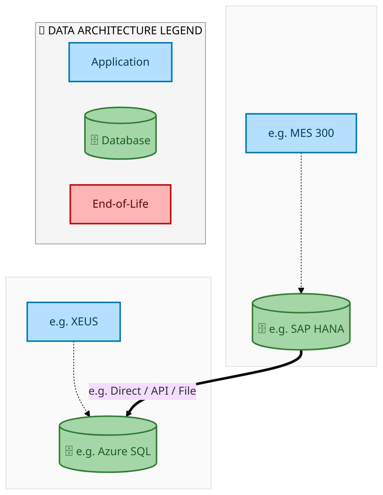
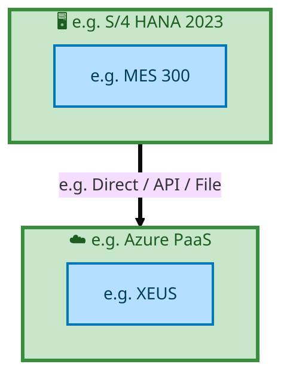

<div style="text-align:center; padding-top:20px;">
  
  <h1 style="font-size:36px; margin-top:24px;">E2E-44 — R3 - Intel Owned Consignment with Planning Integration</h1>
  <h2 style="font-size:24px;">Architecture Document (TOGAF BDAT)</h2>
  <p style="font-size:18px; color:#555;">End-to-End Integrated Processes (E2E) Tower<br/>
  Capability E2E-44 · Procure to Pay</p>
  <p style="font-size:14px; color:#888;">IAO Program · Release 2<br/>
  Generated: March 2026<br/>
  Sajiv Francis</p>
  <p style="font-size:12px; color:#aaa;">IAO Architecture Pipeline — Intel Confidential</p>
</div>

<style>
@media print {
  @page { margin: 0.75in; }
  .mermaid { page-break-inside: avoid; overflow: hidden; }
  pre, table { page-break-inside: avoid; }
  h2, h3, h4 { page-break-after: avoid; }
}
.mermaid { overflow-x: auto; overflow-y: auto; }
.mermaid svg { height: auto !important; }
.page-footer {
  padding-top: 8px;
  border-top: 1px solid #ddd;
  display: flex;
  justify-content: space-between;
  align-items: center;
  font-size: 11px;
  color: #888;
  position: fixed;
  bottom: 0;
  left: 0;
  right: 0;
  padding: 6px 20px;
  background: #fff;
}
@media print {
  .page-footer { position: fixed; bottom: 0; left: 0.75in; right: 0.75in; }
}
.page-footer a { color: #00aeef; text-decoration: none; font-weight: 500; }
.page-footer a:hover { color: #0071c5; text-decoration: underline; }
</style>

<div class="page-footer"><span>Page 1</span><span><a href="#toc">↑ Back to TOC</a></span><span>E2E-44 — R3 - Intel Owned Consignment with Planning Integration</span></div>
<div style="page-break-before: always;"></div>

<a id="toc"></a>

## Table of Contents

1. [Executive Summary](#1-executive-summary)
2. [Business Context & Objectives](#2-business-context--objectives)
   - 2.1 [Classification](#21-classification)
   - 2.2 [Business Drivers](#22-business-drivers)
   - 2.3 [Success Criteria](#23-success-criteria)
   - 2.4 [Companion Documents](#24-companion-documents)
3. [Business Architecture (TOGAF "B")](#3-business-architecture-togaf-b)
   - 3.1 [Business Process Overview](#31-business-process-overview)
   - 3.2 [Business Process Diagrams](#32-business-process-diagrams)
   - 3.3 [Business Roles & Responsibilities](#33-business-roles--responsibilities)
4. [Data Architecture (TOGAF "D")](#4-data-architecture-togaf-d)
   - 4.1 [Data Entities & Ownership](#41-data-entities--ownership)
   - 4.2 [Data Flow Diagrams](#42-data-flow-diagrams)
   - 4.3 [Data Lineage](#43-data-lineage)
   - 4.4 [RICEFW Data Objects](#44-ricefw-data-objects)
   - 4.5 [Data Governance & Quality](#45-data-governance--quality)
5. [Application Architecture (TOGAF "A")](#5-application-architecture-togaf-a)
   - 5.1 [Current-State Application Landscape](#51-current-state--current-state-application-landscape)
   - 5.2 [Future-State Application Landscape](#52-future-state--future-state-application-landscape)
   - 5.3 [Change Impact Summary](#53-change-impact-summary)
   - 5.4 [Component Overview](#54-component-overview)
   - 5.5 [RICEFW Inventory](#55-ricefw-inventory)
   - 5.6 [Integration Patterns](#56-integration-patterns)
6. [Technology Architecture (TOGAF "T")](#6-technology-architecture-togaf-t)
   - 6.1 [Platform & Infrastructure](#61-platform--infrastructure)
   - 6.2 [SAP Development Object Status](#62-sap-development-object-status)
   - 6.3 [NFRs & Design Principles](#63-nfrs--design-principles)
   - 6.4 [Security & Governance](#64-security--governance)
7. [Project Context](#7-project-context)
   - 7.1 [Project Roadmap & Go-Live Plan](#71-project-roadmap--go-live-plan)
   - 7.2 [RAID Log](#72-raid-log)
   - 7.3 [Recommendations & Next Steps](#73-recommendations--next-steps)

<div class="page-footer"><span>Page 2</span><span><a href="#toc">↑ Back to TOC</a></span><span>E2E-44 — R3 - Intel Owned Consignment with Planning Integration</span></div>
<div style="page-break-before: always;"></div>

## 1. Executive Summary

This Architecture Document defines the **Business, Data, Application, and Technology** (BDAT) architecture for **E2E-44 R3 - Intel Owned Consignment with Planning Integration** within the IAO program. It includes 5 BPMN process diagram(s) in Section 3.
| Dimension | Value |
|-----------|-------|
| **Tower** | End-to-End Integrated Processes (E2E) |
| **Process Group** | Procure to Pay |
| **Capability** | E2E-44 - R3 - Intel Owned Consignment with Planning Integration |
| **Release** | Release 2 |
| **Total Systems** | 2 |
| **System Status** | 0 Deployed, 0 Developing, 0 EOL, 2 Pending IAPM |
| **RICEFW Objects** | Pending — Smartsheet Object Tracker API integration |
**Change Summary**: 0 new flow chains, 0 removed, 0 modified, 1 unchanged between Current-State and Future-State states.

> All system nodes in architecture diagrams are **IAPM-linked** — click any node to open its IAPM page. Diagrams require `securityLevel: 'loose'` for click events.

<div class="page-footer"><span>Page 3</span><span><a href="#toc">↑ Back to TOC</a></span><span>E2E-44 — R3 - Intel Owned Consignment with Planning Integration</span></div>
<div style="page-break-before: always;"></div>

## 2. Business Context & Objectives

### 2.1 Classification

| Level | Value |
|-------|-------|
| **L0 Tower** | End-to-End Integrated Processes |
| **L1 Process** | Procure to Pay |
| **L2 Capability** | E2E-44 - R3 - Intel Owned Consignment with Planning Integration |

### 2.2 Business Drivers

| # | Driver | Description | Strategic Alignment | Priority |
|---|--------|-------------|---------------------|----------|
| 1 | End-to-End Process Integration | Enable cross-tower integrated processes spanning procurement, manufacturing, and fulfillment | IDM 2.0 Process Excellence | High |
| 2 | Intel Foundry Business Enablement | Stand up foundry-specific business processes for external customer engagement | Intel Foundry Services | High |
| 3 | Process Visibility & Monitoring | Provide end-to-end process visibility across tower boundaries with integrated monitoring | Operational Excellence | Medium |
| 4 | E2E-44 Process Migration | Migrate R3 - Intel Owned Consignment with Planning Integration business processes and 2 integrated systems from legacy to S/4 HANA target architecture | IDM 2.0 Cross-Functional / End-to-End | High |

<div class="page-footer"><span>Page 4</span><span><a href="#toc">↑ Back to TOC</a></span><span>E2E-44 — R3 - Intel Owned Consignment with Planning Integration</span></div>
<div style="page-break-before: always;"></div>

### 2.3 Success Criteria

| Metric | Target | Measure | Baseline | Owner |
|--------|--------|---------|----------|-------|
| E2E Process Cycle Time | Per process SLA | End-to-end transaction completion within defined SLA per process | Varies by process | E2E Process Owner |
| Cross-Tower Integration Success | > 99% | Transactions completing across tower boundaries without manual intervention | 92% (current) | Integration Lead |
| Process Exception Rate | < 2% | Transactions requiring manual exception handling | 8% (current) | Operations Manager |
| E2E-44 Migration Completeness | 100% flow chains validated | All 1 flow chains verified in target state | 0% (pre-migration) | Tower Architect |

### 2.4 Companion Documents

| Document | Description |
|----------|-------------|
| **Business Architecture** | Included in this document (Section 3) — process flows from BPMN diagrams |
| **This Document** | Full BDAT Architecture — Business + Data + Application + Technology |

<div class="page-footer"><span>Page 5</span><span><a href="#toc">↑ Back to TOC</a></span><span>E2E-44 — R3 - Intel Owned Consignment with Planning Integration</span></div>
<div style="page-break-before: always;"></div>

## 3. Business Architecture (TOGAF "B")

### 3.1 Business Process Overview

This capability includes **5 business process(es)** modeled in BPMN 2.0, covering the end-to-end workflow for E2E-44 R3 - Intel Owned Consignment with Planning Integration.

| # | Step ID | Process Name | Lanes | Tasks | Gateways |
|---|---------|--------------|-------|-------|----------|
| 1 | E2E-44_R3_CFIN | E2E-44_R3_CFIN | Boundary Apps, CFIN, MBC, SAP S/4 (IP & IF) | 15 | 10 |
| 2 | E2E-44_R3_SAP_Transportation_Management | E2E-44_R3_SAP_Transportation_Management | Boundary Apps, External Partners/
Supplier
, SAP S/4 (IP & IF) | 12 | 6 |
| 3 | E2E_44A_R3_Intel_Owned_Consignment_with_Planning_Integration-Procurement_from_Component_supplier_and | E2E_44A_R3_Intel_Owned_Consignment_with_Planning_Integration-Procurement_from_Component_supplier_and | Boundary Apps, External Partners/Suppliers, SAP S/4HANA IP | 26 | 10 |
| 4 | E2E_44B_R3_-_Intel_Owned_Consignment_with_Planning_Integration-Shipment_of_components_from_Intel_War | E2E_44B_R3_-_Intel_Owned_Consignment_with_Planning_Integration-Shipment_of_components_from_Intel_War | Boundary Apps, External Partner/Supplier, SAP S/4HANA IP | 45 | 28 |
| 5 | E2E_44C_R3_Intel_Owned_Consignment_with_Planning_Integration_-_Subcontracting_Process_with_ODM_Suppl | E2E_44C_R3_Intel_Owned_Consignment_with_Planning_Integration_-_Subcontracting_Process_with_ODM_Suppl | Boundary Apps, External Partners/Supplier, SAP S/4HANA IP | 34 | 14 |

### 3.2 Business Process Diagrams

<div class="page-footer"><span>Page 6</span><span><a href="#toc">↑ Back to TOC</a></span><span>E2E-44 — R3 - Intel Owned Consignment with Planning Integration</span></div>
<div style="page-break-before: always;"></div>

#### BUSINESS ARCHITECTURE — 3.2.1 E2E-44_R3_CFIN — E2E-44_R3_CFIN

**Swim Lanes**: Boundary Apps · CFIN · MBC · SAP S/4 (IP & IF) | **Tasks**: 15 | **Gateways**: 10

> **Legend**: <span style="color:#000;background:#4CAF50;padding:2px 6px;border-radius:10px;font-weight:bold;font-size:9pt">● Start</span> · <span style="color:#fff;background:#C62828;padding:2px 6px;border-radius:10px;font-weight:bold;font-size:9pt">● End</span> · <span style="background:#E3F2FD;padding:2px 6px;border:1px solid #1565C0;font-size:9pt">User Task</span> · <span style="background:#FFF3E0;padding:2px 6px;border:1px solid #E65100;font-size:9pt">Service Task</span> · <span style="background:#FFF9C4;padding:2px 6px;border:1px solid #F57F17;font-size:9pt">◇ Gateway</span> · <span style="background:#F3E5F5;padding:2px 6px;border:1px solid #7B1FA2;font-size:9pt">Sub-Process</span>

```mermaid
%%{init: {'theme': 'base', 'themeVariables': {'fontSize': '14px', 'fontFamily': 'Segoe UI, Arial, sans-serif','primaryColor': '#e8f0fe', 'primaryBorderColor': '#0071c5','lineColor': '#37474F', 'secondaryColor': '#f5f8fc'}, 'flowchart': {'useMaxWidth': false, 'htmlLabels': true, 'curve': 'basis', 'nodeSpacing': 40, 'rankSpacing': 50}} }%%
flowchart LR
    classDef startEvt fill:#4CAF50,stroke:#2E7D32,color:#000,font-weight:bold,stroke-width:2px,rx:20,ry:20
    classDef endEvt fill:#C62828,stroke:#B71C1C,color:#fff,font-weight:bold,stroke-width:2px,rx:20,ry:20
    classDef userTask fill:#E3F2FD,stroke:#1565C0,stroke-width:2px,color:#0D47A1
    classDef serviceTask fill:#FFF3E0,stroke:#E65100,stroke-width:2px,color:#BF360C
    classDef gateway fill:#FFF9C4,stroke:#F57F17,stroke-width:2px,color:#E65100
    classDef subProc fill:#F3E5F5,stroke:#7B1FA2,stroke-width:2px,color:#4A148C
    subgraph Boundary Apps
        n1["Receive File in Bank"]
        n2["Update Payment Remittance"]
        n17(["fa:fa-stop Payment Data Updated"])
    end
    subgraph CFIN
        n3["Execute Payment Run"]
        n4["Create APM Memo Record"]
        n5["Process BCM Payment Batching Based on Business Rules"]
        n6["Generate APM Payment File"]
        n7["Route to Approver"]
        n8["Correct APM Correction File"]
        n9["Reverse APP Doc Number and Memo Record Deletion"]
        n10["Fetch Payments Factory (APM, BCM, MBC Monitor)"]
        n11["Review Failed Payment Log"]
        n12["Generate Payment Proposal"]
        n13["Replicate Supplier Invoice Posting"]
        n19(["fa:fa-stop Memo Record Created"])
        n20(["fa:fa-stop APP Doc Reversed"])
        n21{{"fa:fa-code-branch Manual Approval Necessary?"}}
        n22{{"fa:fa-code-branch Approved?"}}
        n23{{"fa:fa-code-branch exclusiveGateway"}}
        n24{{"fa:fa-code-branch Can Be Corrected?"}}
        n25{{"fa:fa-code-branch exclusiveGateway"}}
        n26{{"fa:fa-code-branch exclusiveGateway"}}
        n27{{"fa:fa-code-branch Reversal or Reprocessing?"}}
        n28{{"fa:fa-arrows-alt parallelGateway"}}
        n29{{"fa:fa-arrows-alt parallelGateway"}}
        n30{{"fa:fa-arrows-alt inclusiveGateway"}}
    end
    subgraph MBC
        n14["Multi-Bank Connectivity (host-to-host)"]
        n15["Multi-Bank Connectivity (host-to-host)"]
    end
    subgraph SAP S/4 (IP & IF)
        n16(["fa:fa-play Supplier Invoice Posted (Component PO and SubCon Purchase Order to ODM)"])
        n18(["fa:fa-stop Payment Details provided back to Source System (IP/IF)"])
    end
    n12 --> n3
    n3 --> n28
    n4 --> n19
    n5 --> n21
    n21 -->|"No"| n23
    n7 --> n22
    n23 --> n6
    n25 --> n5
    n24 -->|"No"| n26
    n9 --> n20
    n10 --> n29
    n26 --> n9
    n29 --> n11
    n28 --> n4
    n11 --> n27
    n27 -->|"Reversal"| n26
    n2 --> n17
    n6 --> n14
    n29 --> n2
    n8 --> n25
    n13 --> n12
    n29 --> n18
    n21 -->|"Yes"| n7
    n1 -->|"PAIN.002 (Pay-load file)"| n15
    n14 -->|"PAIN.001 (Pay-load file)"| n1
    n28 -->|"Reprocessing"| n25
    n30 --> n8
    n22 -->|"Yes"| n23
    n22 -->|"No"| n24
    n15 --> n10
    n27 -->|"Reprocessing"| n30
    n24 -->|"Yes"| n30
    n16 --> n13
    class n16 startEvt
    class n17 endEvt
    class n18 endEvt
    class n19 endEvt
    class n20 endEvt
    class n21 gateway
    class n22 gateway
    class n23 gateway
    class n24 gateway
    class n25 gateway
    class n26 gateway
    class n27 gateway
    class n28 gateway
    class n29 gateway
    class n30 gateway
```

<div style="text-align:center; margin:4px 0 8px 0; font-size:11px;"><a href="https://mermaid.live/edit#pako:eNqlV99z4jYQ_lc0vklJZqDnnxh4aAcMvslMyDGh106n9EHYcvDEWB5ZJqE5_veubMlg4zz0moc76_O3365Wu2vxrgU0JNpEu7l5j9OYT9B7j-_InvQmqLfFOen1UQX8jlmMtwnJe4IT0ZSv439KmmFnb4ImMB_v4-Qo0DV5pgR9u--jKRgmfZTjNB_khMVRr9_LWLzH7OjRhDLB_kRGkR6V3uSrGWUhYWeCrrtG4IBpEqfkDFuu7dq-sMtJQNOwIRo50SgKeicRXEJfgx1mvAy_yMkSv_0Rh3wH6wgnOQHOju-TB7wlidgjZ4XAgoIdVDLiXPhJIWHrDAdx-gy4rQPEcPpyhhz9dEKnm5tNWjtFD0-bFMFfkOA8n5MI5RzgxYGjKE6SySfbm_qO3s85oy9k8slcuHPL7AdiJxPYut4XyR28kvh5xydbmoSSOngVe5iY2VufvU1Mvc-O8G_LF0nDsydvaI7MUe1p5hqe4SlPURT9L0-QV_Ybzl-kr4Xlm_689mU4Q8fTr_XUNue2OzXaeSLsEAfkQtT3fWtxTtVi6Bj6x6Iz3xrqXkv0GXPyio9nwbFn14K-4_qG-6Fg5a8dZbFdMRooQWvh-E4t6M4Mf2p-KGhPDXskIwSdZ4azHZrRoqxlNM2yvHon_lLjr432RAISHwjy44SgOEUzqL6N9vcFywTWtyyEXaIVPu5JytET2cec4zQgTarh3gI5wpMID3JOs9pgjjlGlUgIJneVDZRSK1LPv3-80LNAbfFGguLSd5E2ndpA8hgR8U1XS7QkewoBBtDxTZ4DPJFXkudo5i1rwRnmwQ6aDR5yEiIKOShyGAtAeypgRDVVhqDyhaSEKX9KRiSwSXVFeqmInVORekYPhDUpIxE7ZYwEvBSTzzEEca03Lo8LNHLheYXmUCOPxX5LGMJpeLlxNCcJESqt49FBwSewXRV1jnwccAqlcQvu-yIvfbSceWhJYX5TdtcSqCrmEJNXMIQAw3r7D_S5xTUvM6VocAAZzXHS4lqlbpbEgSCviwweYVv36YFCv6IVzTmcUMto3Cq2ywRUBXFRa1Up6y0TlUaZ1iu-8f6u-OLTNtjCcIbsLXFa4ESeKTw8ElFV0GG_brTT6VLA7BaQ1RBe8a1uPnkLEijKA_lSDZu2md1t5mEoZqKqqsOd82Puhj9m5nabVcmHNFIGz1nVonDcV9GOzvaYMfqaD3DCUYYZThKSfOB0_ANGlt5pFKcf7e96kkETXdaqGFLLIuHxQAxYOJE0FX1-iDm03g7Ke8DpQPzf7jjnvxteB7OertD6s41u71foJ3TvX9a4MTz3RJbAd6yz-6DTbz26z2hadvHXcuKsiy3Eg1YFg3sJDKWv4pIlht3X-fKu1UrG6KNPA-EwSXIkGiIOwc8WBy9CZE1BF4bBEbzvReifReDXHw-YNGgw-AVOTa6tammO5Nqu1sZYrh35Xt4O4EEA3zfaI91o30UTyheuJJqKKJWHai2VHLW2W0KKOJZCuopYl4AKyRxWQL2WFkYd46gCbKVgSAVXEVzpW3VTMwKZIkPRpT_DbjlUW5XuTLU1Q27dMNsRjtpZ_FN8MsG3cqXw1fT-8WddN9EtHP0goTgUNxxyV5KN2pHdpBvd9EZayl2f50a1cyVoyVzXcZqtOOvjrt-o46uTLc_Z0K-T3XJr6e1aUG7qN4bKvXVx7ythdY1v4q68cjfRUSc67kJNvRM11M21CZvdsNUN292w0w0Pu2G3Gx51w-NOGI5Zwlpf2xO2x3GoTd618ucm_CQNSYRhjGqnvoYLTtfHNNAm5c8yrSjvpfMYw7DcV-DpX1SFiV0=" title="Edit in Mermaid Live">&#9998; Edit in Mermaid Live</a></div>

<div class="page-footer"><span>Page 7</span><span><a href="#toc">↑ Back to TOC</a></span><span>E2E-44 — R3 - Intel Owned Consignment with Planning Integration</span></div>
<div style="page-break-before: always;"></div>

#### BUSINESS ARCHITECTURE — 3.2.2 E2E-44_R3_SAP_Transportation_Management — E2E-44_R3_SAP_Transportation_Management

**Swim Lanes**: Boundary Apps · External Partners/
Supplier
 · SAP S/4 (IP & IF) | **Tasks**: 12 | **Gateways**: 6

> **Legend**: <span style="color:#000;background:#4CAF50;padding:2px 6px;border-radius:10px;font-weight:bold;font-size:9pt">● Start</span> · <span style="color:#fff;background:#C62828;padding:2px 6px;border-radius:10px;font-weight:bold;font-size:9pt">● End</span> · <span style="background:#E3F2FD;padding:2px 6px;border:1px solid #1565C0;font-size:9pt">User Task</span> · <span style="background:#FFF3E0;padding:2px 6px;border:1px solid #E65100;font-size:9pt">Service Task</span> · <span style="background:#FFF9C4;padding:2px 6px;border:1px solid #F57F17;font-size:9pt">◇ Gateway</span> · <span style="background:#F3E5F5;padding:2px 6px;border:1px solid #7B1FA2;font-size:9pt">Sub-Process</span>

```mermaid
%%{init: {'theme': 'base', 'themeVariables': {'fontSize': '14px', 'fontFamily': 'Segoe UI, Arial, sans-serif','primaryColor': '#e8f0fe', 'primaryBorderColor': '#0071c5','lineColor': '#37474F', 'secondaryColor': '#f5f8fc'}, 'flowchart': {'useMaxWidth': false, 'htmlLabels': true, 'curve': 'basis', 'nodeSpacing': 40, 'rankSpacing': 50}} }%%
flowchart LR
    classDef startEvt fill:#4CAF50,stroke:#2E7D32,color:#000,font-weight:bold,stroke-width:2px,rx:20,ry:20
    classDef endEvt fill:#C62828,stroke:#B71C1C,color:#fff,font-weight:bold,stroke-width:2px,rx:20,ry:20
    classDef userTask fill:#E3F2FD,stroke:#1565C0,stroke-width:2px,color:#0D47A1
    classDef serviceTask fill:#FFF3E0,stroke:#E65100,stroke-width:2px,color:#BF360C
    classDef gateway fill:#FFF9C4,stroke:#F57F17,stroke-width:2px,color:#E65100
    classDef subProc fill:#F3E5F5,stroke:#7B1FA2,stroke-width:2px,color:#4A148C
    subgraph Boundary Apps
        n1["Receive/Send Information in Carrier Invoice Reconciliation/Dispute..."]
        n2["Event updates are received in GTT"]
        n17{{"fa:fa-code-branch exclusiveGateway"}}
    end
    subgraph External Partners/ Supplier 
        n11["Feed Rates/Charges Integrators 3rd party service – Redwood"]
        n12["Carrier"]
        n14(["fa:fa-play Process Initiated Based on Rate/Charges Available"])
        n15(["fa:fa-play Events Published"])
        n20{{"fa:fa-arrows-alt parallelGateway"}}
        n21{{"fa:fa-arrows-alt parallelGateway"}}
    end
    subgraph SAP S/4 (IP & IF)
        n3["Generate Freight Unit (TM)"]
        n4["Create Freight Order (TM)"]
        n5["Perform Carrier Updates and Calculate Charges"]
        n6["Execute Freight Order (TM)"]
        n7["Post Freight Settlement Document (TM)"]
        n8["Create Service PO for FSD (TM)"]
        n9["Post SES with Auto Release (TM)"]
        n10["Create Cost Distribution/Agency Business Document (TM)"]
        n13(["fa:fa-play Component PO and SubCon PO IBD Integration"])
        n16(["fa:fa-stop TM process ended"])
        n18{{"fa:fa-code-branch exclusiveGateway"}}
        n19{{"fa:fa-code-branch exclusiveGateway"}}
        n22{{"fa:fa-arrows-alt inclusiveGateway"}}
    end
    n3 --> n4
    n5 --> n18
    n7 --> n8
    n19 --> n5
    n4 --> n19
    n9 --> n10
    n10 --> n16
    n11 --> n20
    n14 --> n11
    n17 --> n1
    n15 --> n12
    n12 --> n21
    n21 --> n17
    n20 --> n17
    n21 --> n2
    n20 --> n19
    n2 -->|"Event Update"| n18
    n18 --> n6
    n8 --> n9
    n13 --> n3
    n6 --> n22
    n1 --> n22
    n22 --> n7
    class n13 startEvt
    class n14 startEvt
    class n15 startEvt
    class n16 endEvt
    class n17 gateway
    class n18 gateway
    class n19 gateway
    class n20 gateway
    class n21 gateway
    class n22 gateway
```

<div style="text-align:center; margin:4px 0 8px 0; font-size:11px;"><a href="https://mermaid.live/edit#pako:eNqlVttu4zYQ_RVCQeosYCeiLFmOHwrYshUE2GCNKGkf1n2gJcomQksCSfnSrP-9Q118UZy22_ohyBzNnJk5miH1boRpRI2BcX39zhKmBui9pZZ0RVsD1JoTSVttVAK_EcHInFPZ0j5xmqiA_Vm4YTvbajeN-WTF-E6jAV2kFL0-ttEQAnkbSZLIjqSCxa12KxNsRcTOS3kqtPcV7cdmXGSrHo1SEVFxdDBNF4cOhHKW0CPcdW3X9nWcpGGaRGeksRP347C118XxdBMuiVBF-bmkT2T7O4vUEuyYcEnBZ6lW_CuZU657VCLXWJiLdS0GkzpPAoIFGQlZsgDcNgESJHk7Qo6536P99fUsOSRFX59nCYJfyImUYxojqQCerBWKGeeDK9sb-o7Zlkqkb3RwZU3ccddqh7qTAbRutrW4nQ1li6UazFMeVa6dje5hYGXbttgOLLMtdvC3kYsm0TGT17P6Vv-QaeRiD3t1pjiO_1cm0FW8EPlW5Zp0fcsfH3Jhp-d45ke-us2x7Q5xUycq1iykJ6S-73cnR6kmPQebn5OO_G7P9BqkC6LohuyOhPeefSD0HdfH7qeEZb5mlfl8KtKwJuxOHN85ELoj7A-tTwntIbb7VYXAsxAkW6JRmhezjIZZJstn-pfg7zPjmYaUreldAO8VPSZxKlZEsTRBLEEeEYJRAfA6BdnQs16KkHFWeNyNmcxyRW9vb2fGHye0FtBO1jRRKM8iEEciIigSZaJIEz-8vJyHYPf9fWbEZBCTjj5DOnPYgnCJ6DbkuYSwh1LkmbHfl2FQbqPLyVZRkRCOprAMCRXyDgV5lnHdwWkq3bVPoZBnXdudByu1gBofE0WBSKVCoq6IUAYsu3pi0Cy3TNwFBaJNmkaN4nXDlVaNJ_bN97qtjMOM6PdKpU7GFKgIRYzgWIwQ6K2rORQzXBPG9QEJfF9OCZ0GYaGzRNN8zplc0qjhb5lHXaHAdCM7hCvdG-Gc8g-qlkH454I-vopgOEXBnY1uHqfoF_Ton5bUhQYeKLwfoEG-KI4G9Ap6oJuXpy_n-tlaWEFPPb_pg_yCqwOuUyr0_B7m9rUePxhtj_Aw55qp0vg8vKdndkvD_F-kcnWqVKqDY0CV4nCrwcSP0zAv_vkY1j82E1RTNf2GoGDkB-ML_vd1mmASoA1TSzTMVQojyCnMzIUAbB4zeDoQFlQJNs-LbR0uaBLu0AjWKdEj-DeV4m5jyrx0laWJdoaKtZpBPvdgZsF6HI0PqwNpmvPaOzJJlWbo5Qll1Q7A2HyYV9z_2XOgDLv_T2GWdXHQWfKPh07SRZ3OrzCglemUJu5XtlvatYnvS9upbLtyv6_s6jE2a3-zAno1gEvAOnjUFLgGqpQHuy7JqgGroqg9rIoTuzVgNoE6a9Ohrrug_FGf9uW6zYwfJ0LgfhlSN1KZNQGudOxWdq9KeCi6YVtVE-7JlVmw1F9A57j9Ce58gveqr5tz1K2v-HO4fxm-vwiDdBdhfBm2athoGysKVzKLjMG7UXw7w_d1RGOSc2Xs2waBMyHYJaExKL4xjfLKHTMCC7kqwf1fVJKVCA==" title="Edit in Mermaid Live">&#9998; Edit in Mermaid Live</a></div>

<div class="page-footer"><span>Page 8</span><span><a href="#toc">↑ Back to TOC</a></span><span>E2E-44 — R3 - Intel Owned Consignment with Planning Integration</span></div>
<div style="page-break-before: always;"></div>

#### BUSINESS ARCHITECTURE — 3.2.3 E2E_44A_R3_Intel_Owned_Consignment_with_Planning_Integration-Procurement_from_Component_supplier_and — E2E_44A_R3_Intel_Owned_Consignment_with_Planning_Integration-Procurement_from_Component_supplier_and

**Swim Lanes**: Boundary Apps · External Partners/Suppliers · SAP S/4HANA IP | **Tasks**: 26 | **Gateways**: 10

> **Legend**: <span style="color:#000;background:#4CAF50;padding:2px 6px;border-radius:10px;font-weight:bold;font-size:9pt">● Start</span> · <span style="color:#fff;background:#C62828;padding:2px 6px;border-radius:10px;font-weight:bold;font-size:9pt">● End</span> · <span style="background:#E3F2FD;padding:2px 6px;border:1px solid #1565C0;font-size:9pt">User Task</span> · <span style="background:#FFF3E0;padding:2px 6px;border:1px solid #E65100;font-size:9pt">Service Task</span> · <span style="background:#FFF9C4;padding:2px 6px;border:1px solid #F57F17;font-size:9pt">◇ Gateway</span> · <span style="background:#F3E5F5;padding:2px 6px;border:1px solid #7B1FA2;font-size:9pt">Sub-Process</span>


<div style="text-align:center; margin:4px 0 8px 0; font-size:11px;"><a href="https://mermaid.live/edit#pako:eNqlWFtv4jgU_isWo6odCUSuQHnYFVDoIE1bVDozWg37YBIHrBo76ziUbof_vseJzSVD59LlAeHP5_Kdi48TXmqRiEmtWzs7e6Gcqi56OVdLsiLnXXQ-xxk5r6MS-IwlxXNGsnMtkwiupvTfQswN0o0W09gIryh71uiULARBn8Z11ANFVkcZ5lkjI5Im5_XzVNIVls8DwYTU0u9IJ3GSwpvZ6gsZE7kXcJy2G4Wgyigne9hvB-1gpPUyEgkeHxlNwqSTROdbTY6Jp2iJpSro5xm5wZsvNFZLWCeYZQRklmrFPuI5YTpGJXONRblc22TQTPvhkLBpiiPKF4AHDkAS88c9FDrbLdqenc34zin6eD_jCD4Rw1l2RRKUKYCHa4USylj3XTDojUKnnikpHkn3nTdsX_lePdKRdCF0p66T23gidLFU3blgsRFtPOkYul66qctN13Pq8hm-K74Ij_eeBi2v43V2nvptd-AOrKckSf6XJ8irfMDZo_E19Efe6Grnyw1b4cD53p4N8ypo99xqnohc04gcGB2NRv5wn6phK3Sd1432R37LGVSMLrAiT_h5b_ByEOwMjsL2yG2_arD0V2WZzydSRNagPwxH4c5gu--Oet6rBoOeG3QMQ7CzkDhdor7Ii15GvTTNyj394W74dVa7kwvM4fChB2i8LBVSNcZcEYbuRa6gB9F1TmOCLsb31-9ntb8P1Vugfk9wPBWJQp8xozFWVPDmcBORVP9CHzCPmTaiT3-MAJE5nHoohMrTirU2WBvzSKy0POVrAZVqor7Xb96lhD-QjWp-IXOIiipSUe2A6g3mOWZWMUNqKUW-WKK7wf2xtO-_vMxqCe4muKHnVWMOgUdLRDYRyzO6JtdlQWe17fZQLTitpgmWvv-saoS_6wjOVqV0w40ikkNcEzjhnMisOc3TlFH4dZiAS0jApxTST9BISBLhTKGBWK1yTqOiJggKUSBUHWfDc4oiRgT4oMkdwoViKjjhCllfFRUXVEpb6E7PVdSLHrl4YiRewGznVQ8eiE8hNG0-OiKlBLq7unnNjV_oMRIBJSwlCKA1xehUdy5FpogOkDE8F7K0PoFexqxiNLBkSubTJU1PUA4Pk7J8zoAwuNRAqpBI0A1kWl9ECC8w5ZDsMnM_CEafFbsFIegmBfoVoc7FV9swmRLpTxOGpiX19wdGAmffdZA18ZQ1MFMoxRIzRtgv9Ny0N0HTZvChd9tD48lhm-m6S6K7bJJLuIsyAkn5J6cZ1ewqweyFzdH8uY6uOMwoKda_4iE4Qaeo6rGYruWDpIsF5Ov6YYoGSxI9Hovo4gwwi3KmjT3gDcmOBcrZBBz0fi-HMoz5XE9VdEUYNIl8PpbvHPTPtRBxtmuei89UKshGZZZeHpB8uEHD1ZzEMYkrc06f1eEas1zTsBanRClWnDt0MbyfvgeAJY0-XB7fNZirKzjOspzsO7jaUhdh4FYHva7lBI4YqnRwdQ7r-k3yOaPZ8oclcXXpDoZGcyB4QuXqh0pee386UgYX7qkOQUVD6B-2XHHlfHg61UNv2AgCdO8Xzb67-UpNaFd8apD5zpHmYDS-rQi4pwe-SRaMSX0vkvi7i8J7243U-r2TXiq136LUeYvS5RsHEfdQo_EHGLBLs_Y6BvBbJRBagUCvv0FLTW_R0NOPCzNeDp1Z7Zse51YwLBXbZt02juzaN0Cnsr40646R3-0bwHWqgGsB3wAtA7jWp-XkG06-DdcPjEqnCliarlNVcU0C_tKD65s-sdWdW1GmwvLwTA79wBrtVIhZARt8WFm7JrTABu8ant6ucIanZ7Ph2WxYH5dGYGfTlt6plNrS9o2Ga30EjgkQng0nd80ZN_Uvgt0xM9y9XbA2OMvMUPdbVbNlGzVNW4H9iXiC-dcflx5snj3X8Np5MAZ3hTCR2X3P9MFu_1i-eBkopOy73THeMe9hx-jlaWnfeQV37cvLMeydhv3TcHAaDk_DrdNw-zTcOQ1fnoShZgau1WsrIleYxrXuS634xwH-lYhJgnOmatt6DcMVPn3mUa1bvJnX8uLZ-YpieAJaleD2PwrtJd4=" title="Edit in Mermaid Live">&#9998; Edit in Mermaid Live</a></div>

<div class="page-footer"><span>Page 9</span><span><a href="#toc">↑ Back to TOC</a></span><span>E2E-44 — R3 - Intel Owned Consignment with Planning Integration</span></div>
<div style="page-break-before: always;"></div>

#### BUSINESS ARCHITECTURE — 3.2.4 E2E_44B_R3_-_Intel_Owned_Consignment_with_Planning_Integration-Shipment_of_components_from_Intel_War — E2E_44B_R3_-_Intel_Owned_Consignment_with_Planning_Integration-Shipment_of_components_from_Intel_War

**Swim Lanes**: Boundary Apps · External Partner/Supplier · SAP S/4HANA IP | **Tasks**: 45 | **Gateways**: 28

```mermaid
%%{init: {'theme': 'base', 'themeVariables': {'fontSize': '14px', 'fontFamily': 'Segoe UI, Arial, sans-serif','primaryColor': '#e8f0fe', 'primaryBorderColor': '#0071c5','lineColor': '#37474F', 'secondaryColor': '#f5f8fc'}, 'flowchart': {'useMaxWidth': false, 'htmlLabels': true, 'curve': 'basis', 'nodeSpacing': 40, 'rankSpacing': 50}} }%%
flowchart TD
    classDef startEvt fill:#4CAF50,stroke:#2E7D32,color:#000,font-weight:bold,stroke-width:2px,rx:20,ry:20
    classDef endEvt fill:#C62828,stroke:#B71C1C,color:#fff,font-weight:bold,stroke-width:2px,rx:20,ry:20
    classDef userTask fill:#E3F2FD,stroke:#1565C0,stroke-width:2px,color:#0D47A1
    classDef serviceTask fill:#FFF3E0,stroke:#E65100,stroke-width:2px,color:#BF360C
    classDef gateway fill:#FFF9C4,stroke:#F57F17,stroke-width:2px,color:#E65100
    classDef subProc fill:#F3E5F5,stroke:#7B1FA2,stroke-width:2px,color:#4A148C
    subgraph Boundary Apps
        n35["Receive/Send Information in Carrier Invoice Reconciliation/Dispute..."]
        n66{{"fa:fa-code-branch exclusiveGateway"}}
    end
    subgraph External Partner/Supplier
        n36["Carrier Confirmation Routing Guide/CRM"]
        n37["Picking"]
        n38["Packing"]
        n39["Loading"]
        n40["Post Physical Receipt of Material against STO at ODM Supplier"]
        n41["Pick Order Shipment Goods (Carrier)"]
        n42["Feed Rates/Charges Integrators 3rd party service – Redwood"]
        n43["Book/Tender to Carrier via BN4L"]
        n44["SAP BN4L"]
        n45["Carrier"]
        n48(["fa:fa-play Process Initiated Based on Rate/Charges Available"])
        n49(["fa:fa-play Initiate Carrier via BN4L"])
        n50(["fa:fa-play Events Published"])
        n56(["fa:fa-stop Execution events via BN4L-GTT Captured"])
        n67{{"fa:fa-code-branch exclusiveGateway"}}
        n68{{"fa:fa-code-branch exclusiveGateway"}}
        n79{{"fa:fa-arrows-alt parallelGateway"}}
        n80{{"fa:fa-arrows-alt parallelGateway"}}
        n81{{"fa:fa-arrows-alt parallelGateway"}}
        n82{{"fa:fa-arrows-alt parallelGateway"}}
        n83{{"fa:fa-arrows-alt parallelGateway"}}
        n84{{"fa:fa-arrows-alt parallelGateway"}}
    end
    subgraph SAP S/4HANA IP
        n1["Create Stock Transport Order"]
        n2["Finalize Intel Carriers Based on STO"]
        n3["Trigger GTS Check"]
        n4["Create Outbound Delivery"]
        n5["Calculate Taxes"]
        n6["TM Embedded"]
        n7["Pick, Pack and Update"]
        n8["Post Goods Issue"]
        n9["Export Invoice (Performa)"]
        n10["Commercial Invoice (Proforma)"]
        n11["Check ATP (Product Allocation Availability Check)"]
        n12["Create Auto Inbound Delivery"]
        n13["Receive Goods Receipt(Virtual)"]
        n14["Issue Material to ODM Supplier (541)"]
        n15["IC Invoice Trading Str. Dependent"]
        n16["Calculate Taxes"]
        n17["Create/ Update Freight Unit and Order"]
        n18["Select Carrier"]
        n19["Calculate Charges"]
        n20["Feed Rates/Charges: Freight forwarders (SAP TM)"]
        n21["Execute Freight Order and Status Updates post GI"]
        n22["Receive Reconciled Carrier Invoice(s)"]
        n23["Create/ Update Freight Settlement Document"]
        n24["Create Service PO/ Entry Sheet"]
        n25["Allocate Freight Costs to Delivery Items (CO/PA) or Material Valuation"]
        n26["Post Accrual to Freight Expense Account(s)"]
        n27["Feed Rates/Charges: Freight forwarders (Within TM)"]
        n28["Generate Stock Transport Order"]
        n29["Initiate GTS (Export Declaration)"]
        n30["Confirm STO"]
        n31["Manage STO"]
        n32["Create Stock Transport Request"]
        n33["Create Manual Stock Transport Request"]
        n34["Approve Stock Transport Request"]
        n46(["fa:fa-play Process Initiated Based on Rate/Charges Available"])
        n47(["fa:fa-play Initiate Manual Stock Transport Request Creation"])
        n51(["fa:fa-stop Commercial Invoice Generated"])
        n52(["fa:fa-stop Export invoice Generated"])
        n53(["fa:fa-stop Material Issued to ODM Supplier"])
        n54(["fa:fa-stop Accrual to Freight Expense Account(s) Posted"])
        n55(["fa:fa-stop Freight Costs to Delivery Items (CO/PA) or Material Valuation Allocated"])
        n57{{"fa:fa-code-branch Cross Border?"}}
        n58{{"fa:fa-code-branch exclusiveGateway"}}
        n59{{"fa:fa-code-branch exclusiveGateway"}}
        n60{{"fa:fa-code-branch exclusiveGateway"}}
        n61{{"fa:fa-code-branch exclusiveGateway"}}
        n62{{"fa:fa-code-branch exclusiveGateway"}}
        n63{{"fa:fa-code-branch Product Allocation Available?"}}
        n64{{"fa:fa-code-branch exclusiveGateway"}}
        n65{{"fa:fa-code-branch exclusiveGateway"}}
        n69{{"fa:fa-arrows-alt parallelGateway"}}
        n70{{"fa:fa-arrows-alt parallelGateway"}}
        n71{{"fa:fa-arrows-alt parallelGateway"}}
        n72{{"fa:fa-arrows-alt parallelGateway"}}
        n73{{"fa:fa-arrows-alt parallelGateway"}}
        n74{{"fa:fa-arrows-alt parallelGateway"}}
        n75{{"fa:fa-arrows-alt parallelGateway"}}
        n76{{"fa:fa-arrows-alt parallelGateway"}}
        n77{{"fa:fa-arrows-alt parallelGateway"}}
        n78{{"fa:fa-arrows-alt parallelGateway"}}
    end
    n1 --> n69
    n69 --> n3
    n4 --> n70
    n70 --> n6
    n7 --> n71
    n71 --> n57
    n57 -->|"Yes"| n59
    n57 -->|"No"| n10
    n37 --> n38
    n38 --> n79
    n58 --> n8
    n79 --> n39
    n69 --> n64
    n41 --> n40
    n13 --> n72
    n72 --> n15
    n14 --> n53
    n17 --> n75
    n18 --> n19
    n19 --> n20
    n20 --> n74
    n21 --> n76
    n22 --> n23
    n23 --> n24
    n24 --> n73
    n73 --> n25
    n25 --> n55
    n42 --> n81
    n48 --> n42
    n66 --> n35
    n81 --> n66
    n74 --> n66
    n75 --> n66
    n62 --> n22
    n35 --> n62
    n46 --> n27
    n27 --> n61
    n43 --> n82
    n81 --> n61
    n44 --> n56
    n50 --> n45
    n45 -->|"FO & HAWB Mapping"| n66
    n5 --> n77
    n28 --> n78
    n80 --> n84
    n29 --> n51
    n83 --> n58
    n83 --> n59
    n8 --> n67
    n77 --> n28
    n3 --> n77
    n78 --> n2
    n70 --> n80
    n2 --> n36
    n11 --> n63
    n63 -->|"Yes"| n30
    n31 --> n64
    n63 -->|"No"| n31
    n69 --> n5
    n78 --> n60
    n30 --> n60
    n71 --> n60
    n60 --> n4
    n64 --> n11
    n36 --> n80
    n84 --> n67
    n84 --> n37
    n39 -->|"Goods Issue against
Delivery note"| n83
    n71 --> n58
    n10 --> n29
    n59 -->|"HAWB attached 
for TM Processing"| n9
    n67 --> n41
    n12 --> n13
    n72 --> n14
    n6 --> n17
    n75 --> n61
    n61 --> n18
    n15 --> n16
    n76 --> n68
    n74 --> n21
    n76 --> n62
    n73 --> n26
    n26 --> n54
    n82 -->|"Shipment Tracking App 
from R3 onwards"| n68
    n49 --> n43
    n82 --> n61
    n68 --> n44
    n40 -->|"4B2 GR"| n12
    n33 --> n34
    n32 --> n65
    n47 --> n33
    n34 --> n65
    n65 --> n1
    n9 --> n52
    n79 -->|"Label Printing"| n7
    class n46 startEvt
    class n47 startEvt
    class n48 startEvt
    class n49 startEvt
    class n50 startEvt
    class n51 endEvt
    class n52 endEvt
    class n53 endEvt
    class n54 endEvt
    class n55 endEvt
    class n56 endEvt
    class n57 gateway
    class n58 gateway
    class n59 gateway
    class n60 gateway
    class n61 gateway
    class n62 gateway
    class n63 gateway
    class n64 gateway
    class n65 gateway
    class n66 gateway
    class n67 gateway
    class n68 gateway
    class n69 gateway
    class n70 gateway
    class n71 gateway
    class n72 gateway
    class n73 gateway
    class n74 gateway
    class n75 gateway
    class n76 gateway
    class n77 gateway
    class n78 gateway
    class n79 gateway
    class n80 gateway
    class n81 gateway
    class n82 gateway
    class n83 gateway
    class n84 gateway
```

> **Legend**: <span style="color:#000;background:#4CAF50;padding:2px 6px;border-radius:10px;font-weight:bold;font-size:9pt">● Start</span> · <span style="color:#fff;background:#C62828;padding:2px 6px;border-radius:10px;font-weight:bold;font-size:9pt">● End</span> · <span style="background:#E3F2FD;padding:2px 6px;border:1px solid #1565C0;font-size:9pt">User Task</span> · <span style="background:#FFF3E0;padding:2px 6px;border:1px solid #E65100;font-size:9pt">Service Task</span> · <span style="background:#FFF9C4;padding:2px 6px;border:1px solid #F57F17;font-size:9pt">◇ Gateway</span> · <span style="background:#F3E5F5;padding:2px 6px;border:1px solid #7B1FA2;font-size:9pt">Sub-Process</span>



<div style="text-align:center; margin:4px 0 8px 0; font-size:11px;"><a href="https://mermaid.live/edit#pako:eNqtWllv20gS_isNBVk7gByLZ9N62IWsw2MgjgVLSbAY70ObbFlEKJJDNn2s4_--1WQXJbXaMwln_WCYxTq-OrvU8ksvzCLeG_bev3-J01gMycuRWPMNPxqSoztW8qM-aQhfWRGzu4SXR5JnlaViEf-3ZrPc_EmySdqMbeLkWVIX_D7j5Mtln4xAMOmTkqXlScmLeHXUP8qLeMOK53GWZIXkfseD1WBVW1OvzrMi4sWWYTCgVuiBaBKnfEt2qEvdmZQreZil0Z7SlbcKVuHRqwSXZI_hmhWihl-V_Io9fYsjsYbnFUtKDjxrsUk-sTueSB9FUUlaWBUPGIy4lHZSCNgiZ2Gc3gPdHQCpYOn3LckbvL6S1_fvb9PWKFlOblMCP2HCynLCV6QUQJ4-CLKKk2T4zh2PZt6gX4oi-86H7-wpnTh2P5SeDMH1QV8G9-SRx_drMbzLkkixnjxKH4Z2_tQvnob2oF88w2_NFk-jraWxbwd20Fo6p9bYGqOl1Wr1tyxBXIslK78rW1NnZs8mrS3L873x4FAfujlx6cjS48SLhzjkO0pns5kz3YZq6nvW4G2l5zPHH4w1pfdM8Ef2vFV4NnZbhTOPziz6psLGno6yupsXWYgKnak381qF9Nyajew3Fbojyw0UQtBzX7B8Tc6zqq5lMsrzsnknf1LH-_22d8NDHj_w0wUkllymq6zYMBFnKYlTMmZFEfMCyA8ZxI3cyK4I4ySuOU4ncZlXgn_8-PG2958dvb7_8nLbW7Hhip3IiXByBzUdrgl_CpOqBGMXTchue6-vjRjY1jBPnwQvUpaQOZR2yovTRZXnCYDZxe8DfsQ4ztJVjNhvskpA_5CLKo746fjmah-gQ0FwHoffgUd7E8g3zPTmDN58ylh08MYdSJmsFGS-fi7jEEDXQc0FyVbkCnyVM4uwexanwLRYXhMmyPXkirQ-7euzFDpyLacWWazjfMNTQS6yLCrJsfL4gyZlg9SM84jcgMXydAyj4p6XkDvBIaQiK0riFBHJIZ7P2AnktrIHlgN4o0dQrml0QON5ln0_XUJ-AIjI2op4iBk5_-x-0iRckFiM5qZX3jZX2pvg-HesljyBRpLFz0uJPBZQaeDROZwdEZF5hcfWs9EDixN5ioC-D7sKzzSFqMiEflfQG2iC0wcIe0nm1V0Sl2se6fz-lr8UWQ5Fy8OqLkDeSKKhk4vlEqznoioOtPj0V7ulEQs6idGzrRhEI3ssT1giZFWwJOGJWSgYdBGyugjZXYScLkLurwkdjihZ6ItT97fR5xG5nO-olv07LrisuIXIoI-XkJoyz-Dorjt6v_7rvo1h1MEGVHdrgnVabgsfhoY2jkBqWcT391DOF8sFGa95-F1rrC2M60rcyUOATHgCpVE873M2vZmEVSKZl-yJl9pEl9auyHRzx6OIa3MCh2mfyMFJGJj5kkegaZ8twCnZjLHLsqw0Djlhp091nPDEOZ7zoj6StGlnyZk7zjYbXoRyuG75i8zIX-dExoiMlvOaLapCQUZJkoXNmaHGCZxuMB9rVl2HvQ3oqIJheJn-WVAtZ3u6Kp_VsXD8NS5ExRJdv0xYHZbtoQFWdg8Kcuy5li4ms3c5bkMAxSbPKCi94iNAy-XsToUm4_9Vxi3aOnuq0klmRb3IkS8wT-s0G6rZkmle8IRDcI3j3jrbM62GudYSA-NZNmwRQIofmTQOx6Fsw-WVFhTbqmtJjuMt7uY4lcAXgomqVH6VJK_L8lJTYe_kDzcfgKQtRcelbtp5O3ILLkTC68N8koXV5iAx9k7TLtQZPb8-JdNUwP62WHOuC8jsqyre2hmDQ6UsHixNcin4Ru4O16fz0QeSFdsS-8qSqu4ATbGP_ToKw6JqahH1Q5fytOTyFXSAOIwB_YUEfovFGpbNwxzKUrrgsPz97CSVpdUe9nIqHqtxMuGwXRe1l5oRpxkk9e5omLKyjK5Yyu654aX99py_4X9UvNRy5WwrA8Kfypj-nJwsCtjdi-zhJy25_v97p6Jv7VR_7gip3W2Ka291srTVyTDLMfUHa5d9sHbVJuO_knM0ubYF6qEb6cNWF3c18Z_qCyJb6BCKp-n6W42Lp9ihmTdWy3GRQS00lyL_0vYir9te6Z1122IH3cSsbmJ2NzHHLPb2EpFwPay-2820102sy5ZPu2z5tMuWT7ts-bTLlk_dLkJeFyG_ixDtIhR0_OSSWuTk5J-yOtSzf9YQHPXsNo9U3UjBH0oAn9V7C5-VQo8qgldz_Ljt_VuudD_kWNDffM7qFxbacJRSJ0BCoKy0ooqADBRR6274LvqhcLloBK44Gp026rAbguUhh_Ldw1hY6GzLoWBYaNZSZvHiEv5QIojDVjgoBtBWZm20YitgdiuCOUAOihyIw_YUUiS4SmmAaXEVUhe99X0VMRQJsBLazLo6wdMIPkJHpQ5yIMFVVmysBluF0G-BKV8CW8fRcmAa0KynYuq23nqqkGbX5B_kt9G3czgR87y-lfuxg1ehoy0YLCsso0BpDtrQq3x6CCZQcL1AJ2AJKJ0-GqHKY7stZg0FVRK21mFBW0MqU-iGhRHCevAdrcWctpMsrQ1aVtVzjqU1jKeh8ltVA42And4SfMwLPqvEWWjD8TXPAlcLFhIcJDhnCu_ODQFem96m7UaUZvJq4YdMhz6HMOyWQme3MwRV1wXDhGAh3OeRW3nfDZ88cD_GKmoni8qni15ZODccfZC0gVDPVG-kNvgKrNWCVRxW23tKhx9o3WlbOoetT4l20igOD3EFtopAe50My3p9zy2_FpCRKLINuXHgI4H8ZNbUVovAVRXjOnvqdt3CodMO4YEy6J7b5OKmmfrt8FB4HeR2UF_b53guoEXH1Th8jJt6xqK2984JAFB_DQcpjlOBCaY737nUkwu_Qtun0zfowRv0MzMdhpiZbqmv0_aptpHqGKmukeoZqb6RSvEbrH1yYCafGckwDYxky0y2zWTHTHbNZM9M9s1ks5e-2Uvf7CU1e0nNXlKzl9TsJTV7Sc1eUrOX1OwlNXtJzV4GZi8Ds5eB2cvA7GXQetnr9-Dz_obFUW_40qv_KQD-cSDiK1Ylovfa7zG4YV08p2FvWH953qvqm7RJzODyfdMQX_8HqIDVWw==" title="Edit in Mermaid Live">&#9998; Edit in Mermaid Live</a></div>

<div class="page-footer"><span>Page 10</span><span><a href="#toc">↑ Back to TOC</a></span><span>E2E-44 — R3 - Intel Owned Consignment with Planning Integration</span></div>
<div style="page-break-before: always;"></div>

#### BUSINESS ARCHITECTURE — 3.2.5 E2E_44C_R3_Intel_Owned_Consignment_with_Planning_Integration_-_Subcontracting_Process_with_ODM_Suppl — E2E_44C_R3_Intel_Owned_Consignment_with_Planning_Integration_-_Subcontracting_Process_with_ODM_Suppl

**Swim Lanes**: Boundary Apps · External Partners/Supplier · SAP S/4HANA IP | **Tasks**: 34 | **Gateways**: 14

> **Legend**: <span style="color:#000;background:#4CAF50;padding:2px 6px;border-radius:10px;font-weight:bold;font-size:9pt">● Start</span> · <span style="color:#fff;background:#C62828;padding:2px 6px;border-radius:10px;font-weight:bold;font-size:9pt">● End</span> · <span style="background:#E3F2FD;padding:2px 6px;border:1px solid #1565C0;font-size:9pt">User Task</span> · <span style="background:#FFF3E0;padding:2px 6px;border:1px solid #E65100;font-size:9pt">Service Task</span> · <span style="background:#FFF9C4;padding:2px 6px;border:1px solid #F57F17;font-size:9pt">◇ Gateway</span> · <span style="background:#F3E5F5;padding:2px 6px;border:1px solid #7B1FA2;font-size:9pt">Sub-Process</span>


<div style="text-align:center; margin:4px 0 8px 0; font-size:11px;"><a href="https://mermaid.live/edit#pako:eNqlWG1v4rgW_isWo1E7EixxXnj7sFdAoa00bRF0trpa7gcTHLAa4lzHaent9L_f48ROwQ2rnW4_jCYn5zmvzzk2eW2EfE0bg8bXr68sYXKAXs_klu7o2QCdrUhGz5qoFPxBBCOrmGZnSifiiVyw_xVq2E_3Sk3JpmTH4hclXdANp-jHdRMNARg3UUaSrJVRwaKz5lkq2I6IlzGPuVDaX2gvcqLCm3414mJNxbuC43RxGAA0Zgl9F3tdv-tPFS6jIU_WR0ajIOpF4dmbCi7mz-GWCFmEn2f0huwf2Fpu4TkicUZBZyt38XeyorHKUYpcycJcPJlisEz5SaBgi5SELNmA3HdAJEjy-C4KnLc39Pb16zKpnKL7i2WC4C-MSZZd0AhlEsSTJ4kiFseDL_54OA2cZiYFf6SDL-6ke-G5zVBlMoDUnaYqbuuZss1WDlY8XmvV1rPKYeCm-6bYD1ynKV7gX8sXTdbvnsYdt-f2Kk-jLh7jsfEURdE_8gR1Ffcke9S-Jt7UnV5UvnDQCcbOR3smzQu_O8R2nah4YiE9MDqdTr3Je6kmnQA7p42Opl7HGVtGN0TSZ_LybrA_9iuD06A7xd2TBkt_dpT5aiZ4aAx6k2AaVAa7IzwduicN-kPs93SEYGcjSLpFI54XXEbDNM3Kd-ov8fCfy8ad2JAEhg_dA_GylAvZuk4kjdGc5xI4iC5ztqbo_Hp--W3Z-M8h3AX4nJL1gkcS_UFitiaS8aQ92Yc0Vf9DVyRZx8qImv41AonIYeqhETJPLWseWLtOQr5T-ix54tCpNhq5o_ZdSpN7upftB7qCrJikFtQH6A1JchIbYIbkVvB8s0V34_mxtt97fV02IjKISEvtq9YKEg-3iO7DOM_YE70sG7psvL0dwvr1MBVg6ftfFiJwftURzJbVusleUpFAXjOY8ISKrL3I0zRmVBw4wv2iESEFm2h2h4hEdxc3qNI8St91QHnMdzsGWmoromH4mPDnmK43sJkTaakrjiwgMGUYmrPLExaqNqMESY682XdL3y30YxpKNCZCgH_0xAiq49SWZxJYASs2JisuCvKgGTCQxJZRxY0ZCx_RjxRdcr7O0Lk2_k0nkW1ZWhO9YsY8T9DNfGbKMoEiHysFoDTZ0zCXFAGf45ZkOwphJVm-K3hs6XeKCqYwT4vb-iJ0DxuyfcmgZJC8EqRSxfER0TNlXuhElOHJuKjd3f0YpbARaJahiAu0ZkKVV6WMlrnrYA-VDLRsKlrMqADI7ogQ0Aw1JNAIa46cg0JMOTghGXTxoOkJgoFGJXssbOf8T0P2NIZ1eA0XAEZURevK_-0Q2rWgSu1HCssExlhX8QOm_47JJE9tdhpyokXJiUOs71jYquR1yp3PbYvup2CB_w4DfvPnrEViiVIiSBzT-AQo-Ayo82ugj6tpMZyhRdu_Gt4O0fXscB2p8RBU9X6Rr0I107mAm0tGy1m1WAra94JtNsDLy_sFGm9p-GhxSxkkcZjHyuY92dPMWumK6LBMgALVzKIdfyr2GQp871g9KE6alToV0QWNoRtwNj4zuUVXHC4daMgEeiAvKzh_0W2-W0Fk51fDh5F1_qk1cA-EBoX1mlpL5XADlBvrYPwVwb_zkqjHsGINSA6brjqO9YIrhvdFLU9A_mbmHiy1leHfSmm5ZR-ujo0eHg-1xo_VsXOg_6FOEH69F4xPplw6_ZEICvcWFqqlf26MWEXFig-TJxLnxe4wBqiUcdnN88l88Q0EcdQaQYM-LDHsGTJY6866NOCCNPkqZtn2LwmKFV0Ozsg2HAwRg5X6l6DO6SGY0__mLGMfm4-7fwuEzsttb1dOcQdueII__YJPLzi1t4tAlDse_d1ojjZ0z9qyB-cpujGzOSuuAPbOVUyauJOW76O5h8bT61tr3t0jBbWJKkaXMUNMpO4643ufW-d-PUwzC65Q6sZL1_YV0A8-dwzgz2x09zMg75PHQIJRq_W7ClU_B1rg6mdXP3t9A-hrBcdo-FoQaIF-9npGIVCCn8vGLX1G8-vxZPqwbPwEPeNSAww-0I8mhMAtBR1jr1M--x1L4aPAM5Cutln50E7cKsiehpi0NMK8169NFXQRsNHGjhaYOmJdN2yy8H1dhX-rY--n2nBG1dOuDdbXvt2-jb3lZeW6-oWphGt1z5jWloOqDtYzNqU3lcOmLlX_NcSrCNLRscCvuNlde5lMXPXDrkypbyuVS6WNSiXQnvFnWOWj60LfrTLW5fWMW89Ebgoc6AL7piG-boHn24Iqed-ygV3LhqshfhW3douNUc-MQ2VUl9w1Gq6J1Kaz27G4VrHRNzZMG31twzx7mgBVnz0TeeXV8M0QGmsINrlhww2j4ekwsDGKe5aGbzQOvmQUOPNh6ljeOSHvnpD39EenY2m_Tuo7tVJcb9l3T8g981XnWOzXi4N6cade3K0X9-rF_VoxkLpWjOvFbr24PsugPsugPsugyrLRbOyo2BG2bgxeG8VnXvgUvKYRyWPZeGs2SC754iUJG4Pic2gjL37iXTACvyd2pfDt_4lHwec=" title="Edit in Mermaid Live">&#9998; Edit in Mermaid Live</a></div>

<div class="page-footer"><span>Page 11</span><span><a href="#toc">↑ Back to TOC</a></span><span>E2E-44 — R3 - Intel Owned Consignment with Planning Integration</span></div>
<div style="page-break-before: always;"></div>

### 3.3 Business Roles & Responsibilities

| Role / Lane | Processes Involved | Description |
|------------|-------------------|-------------|
| Boundary Apps | E2E-44_R3_CFIN, E2E-44_R3_SAP_Transportation_Management, E2E_44A_R3_Intel_Owned_Consignment_with_Planning_Integration-Procurement_from_Component_supplier_and, E2E_44B_R3_-_Intel_Owned_Consignment_with_Planning_Integration-Shipment_of_components_from_Intel_War, E2E_44C_R3_Intel_Owned_Consignment_with_Planning_Integration_-_Subcontracting_Process_with_ODM_Suppl | |
| CFIN | E2E-44_R3_CFIN,  | |
| MBC | E2E-44_R3_CFIN,  | |
| SAP S/4 (IP & IF) | E2E-44_R3_CFIN, E2E-44_R3_SAP_Transportation_Management,  | |
| External Partners/
Supplier
 | E2E-44_R3_SAP_Transportation_Management,  | |
| External Partners/Suppliers | E2E_44A_R3_Intel_Owned_Consignment_with_Planning_Integration-Procurement_from_Component_supplier_and,  | |
| SAP S/4HANA IP | E2E_44A_R3_Intel_Owned_Consignment_with_Planning_Integration-Procurement_from_Component_supplier_and, E2E_44B_R3_-_Intel_Owned_Consignment_with_Planning_Integration-Shipment_of_components_from_Intel_War, E2E_44C_R3_Intel_Owned_Consignment_with_Planning_Integration_-_Subcontracting_Process_with_ODM_Suppl | |
| External Partner/Supplier | E2E_44B_R3_-_Intel_Owned_Consignment_with_Planning_Integration-Shipment_of_components_from_Intel_War,  | |
| External Partners/Supplier | E2E_44C_R3_Intel_Owned_Consignment_with_Planning_Integration_-_Subcontracting_Process_with_ODM_Suppl | |

<div class="page-footer"><span>Page 12</span><span><a href="#toc">↑ Back to TOC</a></span><span>E2E-44 — R3 - Intel Owned Consignment with Planning Integration</span></div>
<div style="page-break-before: always;"></div>

## 4. Data Architecture (TOGAF "D")

### 4.1 Data Entities & Ownership

| # | Data Entity | Source System | Target System | Data Owner | Classification | Volume | Master/Transaction |
|---|-------------|---------------|---------------|------------|----------------|--------|-------------------|
| 1 | e.g. Cost Element | e.g. MES 300 | e.g. XEUS | Data steward | e.g. Intel Confidential | e.g. 10K rows/day | Master / Transaction |

<div class="page-footer"><span>Page 13</span><span><a href="#toc">↑ Back to TOC</a></span><span>E2E-44 — R3 - Intel Owned Consignment with Planning Integration</span></div>
<div style="page-break-before: always;"></div>

### 4.2 Data Flow Diagrams

> **DATA ARCHITECTURE** — Database-to-database data flows. Applications (blue) sit above their hosting databases (green cylinders). Thick arrows show data movement between databases.

#### 4.2.1 Current-State — Current-State Data Flows



<div style="text-align:center; margin:4px 0 8px 0; font-size:11px;"><a href="https://mermaid.live/edit#pako:eNqdlY9vmkAUx_-Vyy3GLdGOquhK0iaH4NqENl2x25KykBMeeukJBI5Va_3fdwdKN6td07uEeO_H9z0-j5wrHCQhYAM3GisWM2GgVVPMYA5NAzUnNIdmCzVzCIqMiaUDv4ErB0-SylOGfqcZoxMOeVNlR0ksXPZYChzr6UKFKduIzhlfKqsL0wTQ7UULEZnIm2sVwZOHYEYzUWoUOVzSxQ8Wipk8R5TnIGNmYs4dOgGuComsULZYdu-mNGDxVBq7ujRlNL5_NvX09RqtGw0vrkugsenFSK6A0zy3IEI0Tc1kgSLGufHB1K3RaNTKRZbcg_FB0wYDs785th9UT0YnXbSChCeZcnctfVcvnAyXfCNHdKtPBrVcxx5Y3c5BuWNTtzvajhwk_Lm90cjUTb3WGw41uQ7q9fvK7cWVYl5MphlNZ8ju2L3e0CJDxwd_6pPHIgPf_ebceRh5-FcVrVbIMggES-IamlrbdFJm_7RvXZkIR9MjpH5LAcMwKqYvc6ydih897BXhl24on2HQ84oINPnKSqwMQjLIw5-UZIn1tS5Q-6h9dqhSlQhxuGEhlhwOgtjCJmrXsG1N7X9hH6eL_-F1ybV_Tq7Iu-he2q7f1bQtYHlE8vgWxnXZVxDLGKRi3kJ408k-yNtSb2G8jX0X4v1l0enp2dMGkFUyRZ8Rub6QzxHj4OGnwx_FzugcmMr27_4iFoQassiYIHIzPL8Y28Px7Y2NHPurfWUdmKZz82x1fDV3kqacBVR594_O8a0Dc7KooOom3j8ix7elvB2H7SRqOyyCSr66MvaOo3rDLX1d7Zr-ycnJC_S4heeQzSkLsbHC5Y0v_y9CiGjBBV63MC1E4i7jABvlpYyLNKQCLEYl0XllXP8BySb1Tw==" title="Edit in Mermaid Live">&#9998; Edit in Mermaid Live</a></div>

<div class="page-footer"><span>Page 14</span><span><a href="#toc">↑ Back to TOC</a></span><span>E2E-44 — R3 - Intel Owned Consignment with Planning Integration</span></div>
<div style="page-break-before: always;"></div>

#### 4.2.2 Future-State — Future-State Data Flows


<div style="text-align:center; margin:4px 0 8px 0; font-size:11px;"><a href="https://mermaid.live/edit#pako:eNqdlY9vmkAUx_-Vyy3GLdGOquhK0ianwNqENl2x25KykBMeeukJBI5Va_3fdwdKN6td07uEeO_H9z0-j5wrHCQhYAM3GisWM2GgVVPMYA5NAzUnNIdmCzVzCIqMiaUDv4ErB0-SylOGfqcZoxMOeVNlR0ksXPZYChzr6UKFKZtN54wvldWFaQLo9qKFiEzkzbWK4MlDMKOZKDWKHC7p4gcLxUyeI8pzkDEzMecOnQBXhURWKFssu3dTGrB4Ko1dXZoyGt8_m3r6eo3WjYYX1yXQeOjFSK6A0zw3IUI0TYfJAkWMc-PDUDdt227lIkvuwfigaYPBsL85th9UT0YnXbSChCeZcndNfVcvnIyWfCNHdLNPBrVcxxqY3c5BueOhbnW0HTlI-HN7tj3Uh3qtNxppch3U6_eV24srxbyYTDOazpDVsXo92yQjxwd_6pPHIgPf_ebceRh5-FcVrVbIMggES-IamlrbdFJm_7RuXZkIR9MjpH5LAcMwKqYvc8ydih897BXhl24on2HQ84oINPnKSqwMQjLIw5-UZIn1tS5Q-6h9dqhSlQhxuGEhlhwOgtjCJmrXsC1N7X9hH6eL_-F1ybV_Tq7Iu-heWq7f1bQtYHlE8vgWxnXZVxDLGKRi3kJ408k-yNtSb2G8jX0X4v1l0enp2dMGkFkyRZ8Rub6QT5tx8PDT4Y9iZ3QOTGX7d38RC0INmWRMELkZnV-MrdH49sZCjvXVujIPTNO5ebY6vpo7SVPOAqq8-0fn-OaBOZlUUHUT7x-R41tS3orDdhK1HRZBJV9dGXvHUb3hlr6udk3_5OTkBXrcwnPI5pSF2Fjh8saX_xchRLTgAq9bmBYicZdxgI3yUsZFGlIBJqOS6Lwyrv8ARNr1eQ==" title="Edit in Mermaid Live">&#9998; Edit in Mermaid Live</a></div>

<div class="page-footer"><span>Page 15</span><span><a href="#toc">↑ Back to TOC</a></span><span>E2E-44 — R3 - Intel Owned Consignment with Planning Integration</span></div>
<div style="page-break-before: always;"></div>

### 4.3 Data Lineage

| # | Source System | Source Schema/Object | Target System | Target Schema/Object | Transformation |
|---|-------------|---------------------|---------------|---------------------|---------------|
| 1 | e.g. MES 300 | e.g. CKMLHD table | e.g. XEUS | e.g. dbo.CostElements | Lineage notes |

### 4.4 RICEFW Data Objects

Reports and Conversions for this capability will be populated from the Smartsheet Object Tracker via automated API extraction.

| Object ID | Type | Description | Status | Source | Target | Complexity |
|-----------|------|-------------|--------|--------|--------|-----------|
| E2E-44-R001 | Report | R3 - Intel Owned Consignment with Planning Integration operational report | Planned | SAP S/4HANA | Analytics | Medium |
| E2E-44-C001 | Conversion | Legacy data migration for R3 - Intel Owned Consignment with Planning Integration | Planned | Legacy ERP | SAP S/4HANA | High |

> *Pending: Smartsheet API integration to auto-populate live RICEFW data (see Build Requirements).*

### 4.5 Data Governance & Quality

| Concern | Approach |
|---------|----------|
| Data Ownership | Per-entity owners listed in Section 3.1 |
| Data Classification | Financial data classified as Intel Confidential |
| Data Retention | Per Intel corporate retention policies |
| Data Quality | Validated at source; reconciliation at target |

<div class="page-footer"><span>Page 16</span><span><a href="#toc">↑ Back to TOC</a></span><span>E2E-44 — R3 - Intel Owned Consignment with Planning Integration</span></div>
<div style="page-break-before: always;"></div>

## 5. Application Architecture (TOGAF "A")

### 5.1 Current-State — Current-State Application Landscape

#### Overview

The Current-State architecture represents the **current / legacy** landscape for E2E-44.This view is generated from `CurrentFlows.xlsx` (1 flow hops across 1 flow chains).

#### APPLICATION ARCHITECTURE — Architecture Diagram (ArchiMate-Inspired)

> **Click any system node** to open its IAPM application page.
> **Legend**: <span style="background:#C8E6C9;padding:2px 6px;border:1px solid #2E7D32;font-size:9pt">Deployed</span> · <span style="background:#E3F2FD;padding:2px 6px;border:1px solid #1565C0;font-size:9pt">Developing</span> · <span style="background:#FFCDD2;padding:2px 6px;border:1px solid #C62828;font-size:9pt">End-of-Life</span> · <span style="background:#ECEFF1;padding:2px 6px;border:1px solid #78909C;font-size:9pt;border-style:dashed">No IAPM Match</span>


<div style="text-align:center; margin:4px 0 8px 0; font-size:11px;"><a href="https://mermaid.live/edit#pako:eNqVVW1P4kAQ_iubGsIX0Kq82RiSlpYLl6LG-nKX49Is3SlsXNqmu1UR-e-32yLFotFbkpLOPPPM9pmZ3ZUWxAQ0Q6vVVjSiwkCrupjDAuoGqk8xh3oD1TkEWUrF0oVHYMrB4rjw5NA7nFI8ZcDrKjqMI-HRl5zguJM8K5iyDfGCsqWyejCLAd2OGsiUgayBOI54k0NKw_paoVn8FMxxKnK-jMMYP99TIubyPcSMg8TMxYK5eApMJRVppmyR_BIvwQGNZtLY0qUpxdFDaWrr6zVa12qTaJsC3ViTCMlVq6FmU24omNMxFtCkEU9oCgRxsWSAAoY5By4xBTx_tyFE04zTCDhH-QopY8bBUC6r3eAijR_AOLB6vY5ubV6bT-pLjJPkuRHELE6NA13XK5w4SVC5Ck6rrVi3nLre7Vqd_-AkWOB9Trv3BefxO843H8FcipfipdQUtSuZFpQQBk84hV1F7I5ZKuJ0O8OS7Ru7h5jtKaI03lF5MND1rzgLVp5NZylO5sh0_0y0SUZ6p0Q-yWkbmVdX7mhg3owuL5Br_nauJ9rfIkgtIhsiEDSOkHtdWp0Tp9Ua-ODP_LHj-ae6vssaQAfB4ewQSR-SPkloGIas8IcEv5xb78No5fg0dHyfB5svWQq-B-kjDcC3Mv7u6467BVOOQhsUkqiCtqxald12cvZBzIXvMDnvkejvbjFoFcQKgDaA82l61D-n_cLh3aEjNLLjQP799C4vzo9ov8iqurLIBxF5q8--oHLs-q8TLWez8yJIJvNqJJ9DymCivX6hxC7xZxiVpFoLtaVN0-THgOXujPhQ_2rEd0PNbaj-nUnea1YXZlKjd81BdOQ6P5wL-xtd6vqyt6utZSYJowFW4A-ay_XH99UWGpdt8mnbuL7tVDvEVsePEwl5i1QrX4Q4l8UwnnRISwJJMw6bLg03aeT877RJKWohypuwbfXbCnt2drZ3lmkNbQHpAlOiGSstv73k3UcgxBkT2rqh4UzE3jIKNCO_VLQskRsFm2JZhEVhXP8Du489aQ==" title="Edit in Mermaid Live">&#9998; Edit in Mermaid Live</a></div>

<div class="page-footer"><span>Page 17</span><span><a href="#toc">↑ Back to TOC</a></span><span>E2E-44 — R3 - Intel Owned Consignment with Planning Integration</span></div>
<div style="page-break-before: always;"></div>

#### Current-State Flow Narrative

| # | Flow Chain | Path | Interface | Freq |
|---|-----------|------|-----------|------|
| 1 | e.g. MES Route to ICOST | e.g. MES 300 → e.g. XEUS | e.g. Direct / API / File | e.g. Near Real-Time |

<div class="page-footer"><span>Page 18</span><span><a href="#toc">↑ Back to TOC</a></span><span>E2E-44 — R3 - Intel Owned Consignment with Planning Integration</span></div>
<div style="page-break-before: always;"></div>

### 5.2 Future-State — Future-State Application Landscape

#### Overview

The Future-State architecture represents the **target** landscape for E2E-44.This view is generated from `FutureFlows.xlsx` (1 flow hops across 1 flow chains).

#### APPLICATION ARCHITECTURE — Architecture Diagram (ArchiMate-Inspired)

> **Click any system node** to open its IAPM application page.
> **Legend**: <span style="background:#C8E6C9;padding:2px 6px;border:1px solid #2E7D32;font-size:9pt">Deployed</span> · <span style="background:#E3F2FD;padding:2px 6px;border:1px solid #1565C0;font-size:9pt">Developing</span> · <span style="background:#FFCDD2;padding:2px 6px;border:1px solid #C62828;font-size:9pt">End-of-Life</span> · <span style="background:#ECEFF1;padding:2px 6px;border:1px solid #78909C;font-size:9pt;border-style:dashed">No IAPM Match</span>


<div style="text-align:center; margin:4px 0 8px 0; font-size:11px;"><a href="https://mermaid.live/edit#pako:eNqVVW1P4kAQ_iubGsIX0Kq82RiS1pYLl6LG-nKX49Is3SlsXNqmu1UR-e-32yLFosFbkpLOPPPM9pmZ3aUWxAQ0Q6vVljSiwkDLupjBHOoGqk8wh3oD1TkEWUrFwoUnYMrB4rjw5NB7nFI8YcDrKjqMI-HR15zguJO8KJiyDfCcsoWyejCNAd0NG8iUgayBOI54k0NKw_pKoVn8HMxwKnK-jMMIvzxQImbyPcSMg8TMxJy5eAJMJRVppmyR_BIvwQGNptLY0qUpxdFjaWrrqxVa1WrjaJMC3VrjCMlVq6FmU24omNERFtCkEU9oCgRxsWCAAoY5By4xBTx_tyFEk4zTCDhH-QopY8bBQC6r3eAijR_BOLB6vY5urV-bz-pLjJPkpRHELE6NA13XK5w4SVC5Ck6rrVg3nLre7Vqd_-AkWOBdTru3h_P4A-e7j2AuxUvxQmqK2pVMc0oIg2ecwrYidscsFXG6nUHJ9o3dQ8x2FFEab6l8caHr-zgLVp5NpilOZsh0_4y1cUZ6p0Q-yWkbmdfX7vDCvB1eXSLX_O3cjLW_RZBaRDZEIGgcIfemtDonTqs18MGf-iPH8091fZs1gA6Cw-khkj4kfZLQMAxZ4U8Jfjl33qfRyvFl6OghDzZfsxR8D9InGoBvZfzD1x13C6YchdYoJFEFbVm1Krvt5OwXMRe-w-S8R6K_vcWgVRArAFoDzifpUf-c9guHd4-O0NCOA_n307u6PD-i_SKr6soiH0TkvT67gsqx67-NtZzNzosgmczroXwOKIOx9rZHiW3irzAqSbUWakvrpsmPAcvdGvGBvm_Et0PNTaj-nUneaVYXplKjD81BdOQ6P5xL-xtd6vqyt6utZSYJowFW4E-ay_VHD9UWGpVt8mXbuL7tVDvEVsePEwl5i1QrX4Q4V8UwnnRISwJJMw6bLg3XaeT8b7VJKWohyruwbfXbCHt2drZzlmkNbQ7pHFOiGUstv73k3UcgxBkT2qqh4UzE3iIKNCO_VLQskRsFm2JZhHlhXP0DAg89gQ==" title="Edit in Mermaid Live">&#9998; Edit in Mermaid Live</a></div>

<div class="page-footer"><span>Page 19</span><span><a href="#toc">↑ Back to TOC</a></span><span>E2E-44 — R3 - Intel Owned Consignment with Planning Integration</span></div>
<div style="page-break-before: always;"></div>

#### Future-State Flow Narrative

| # | Flow Chain | Path | Interface | Freq |
|---|-----------|------|-----------|------|
| 1 | e.g. MES Route to ICOST | e.g. MES 300 → e.g. XEUS | e.g. Direct / API / File | e.g. Near Real-Time |

<div class="page-footer"><span>Page 20</span><span><a href="#toc">↑ Back to TOC</a></span><span>E2E-44 — R3 - Intel Owned Consignment with Planning Integration</span></div>
<div style="page-break-before: always;"></div>

### 5.3 Change Impact Summary

| Change Type | Flow Chain | Detail |
|-------------|-----------|--------|
| **UNCHANGED** | e.g. MES Route to ICOST | No change |

**Totals**: 0 new - 0 removed - 0 modified - 1 unchanged

### 5.4 Component Overview

#### System Inventory

| System | IAPM ID | Status |
|--------|---------|--------|
| e.g. MES 300 | - | N/A |
| e.g. XEUS | - | N/A |

<div class="page-footer"><span>Page 21</span><span><a href="#toc">↑ Back to TOC</a></span><span>E2E-44 — R3 - Intel Owned Consignment with Planning Integration</span></div>
<div style="page-break-before: always;"></div>

### 5.5 RICEFW Inventory

RICEFW objects for this capability will be auto-populated from the Smartsheet S/4 Object Tracker.

| Object ID | Type | Description | Status | Source → Target | Middleware | Complexity |
|-----------|------|-------------|--------|----------------|-----------|-----------|
| E2E-44-I001 | Interface | R3 - Intel Owned Consignment with Planning Integration inbound data interface | Planned | Legacy → SAP S/4HANA | MuleSoft / CPI | Medium |
| E2E-44-E001 | Enhancement | R3 - Intel Owned Consignment with Planning Integration custom business logic | Planned | SAP S/4HANA | N/A | Medium |
| E2E-44-F001 | Form/Report | R3 - Intel Owned Consignment with Planning Integration operational output | Planned | SAP S/4HANA | N/A | Low |

> *Pending: Smartsheet API integration to auto-populate live RICEFW inventory (see Build Requirements).*

<div class="page-footer"><span>Page 22</span><span><a href="#toc">↑ Back to TOC</a></span><span>E2E-44 — R3 - Intel Owned Consignment with Planning Integration</span></div>
<div style="page-break-before: always;"></div>

### 5.6 Integration Patterns

| # | Pattern | Flow Chain | Middleware | Protocol | Auth |
|---|---------|-----------|-----------|----------|------|
| 1 | e.g. Pub-Sub / P2P / ETL | e.g. MES Route to ICOST | e.g. Azure Service Bus | e.g. REST / RFC / SFTP | e.g. OAuth / NTLM / Cert |

<div class="page-footer"><span>Page 23</span><span><a href="#toc">↑ Back to TOC</a></span><span>E2E-44 — R3 - Intel Owned Consignment with Planning Integration</span></div>
<div style="page-break-before: always;"></div>

## 6. Technology Architecture (TOGAF "T")

### 6.1 Platform & Infrastructure

> **TECHNOLOGY / PLATFORM ARCHITECTURE** — Platforms (green) host applications (blue). Thick arrows show platform-to-platform integration flows.

#### 6.1.1 Current-State — Current-State Platform Architecture



<div style="text-align:center; margin:4px 0 8px 0; font-size:11px;"><a href="https://mermaid.live/edit#pako:eNqtlGFvmzAQhv-K5SriC2sJhDRD6iQgoFVKp2is26QxIQeOxKqDEZg2acp_nw1pslZKpWrzB4t77_z49Vl4h1OeAXbwYLCjBRUO2mliBWvQHKQtSA2ajrQa0qaiYjuDe2AqwTjvM13pd1JRsmBQa2p1zgsR0ccOMByVG1WmtJCsKdsqNYIlB3R7rSNXLmRaqyoYf0hXpBIdo6nhhmx-0EysZJwTVoOsWYk1m5EFMLWRqBqlFdJ9VJKUFkspjgwpVaS4O0q20baoHQzi4rAF-ubFBZIjZaSup5AjUpYe36CcMuacefY0DEO9FhW_A-fMMC4vvfE-_PCgPDlmudFTznil0tbUfs0rGRFHoD8Jxv7HA9CaTALLfwm0jsChZwem8QoInB15YejZnn3g-b4hx0mD47FKx0VPrJvFsiLlCgVmMBr589k8gWSZuI9NBcmckOhXjOPGHBvDuMnBkDufL89Rl0YqHePfPUiNjFaQCsoLNPt6VJ_Jbkf-GdwqZodR3xLgOE7f8H4NFNnem9gyOGnsn5r55uGjZJR8dr-4iWmYVnf-bGJlcs6I_XcXoosRUnVI1b27ETdBlFiG8dwLGSIZvrMdL6z-h468Rb-6-vS0NzvtzocukDu_lnNIGcT46eRVYR2voVoTmmFnh7s3Qr4wGeSkYQK3OiaN4NG2SLHT_ca4KTMiYEqJvJ51L7Z_AHnQblo=" title="Edit in Mermaid Live">&#9998; Edit in Mermaid Live</a></div>

> **Legend**: <span style="background:#C8E6C9;padding:2px 8px;border:2px solid #388E3C;font-size:9pt">🖥️ Platform</span> · <span style="background:#B5DFFF;padding:2px 8px;border:2px solid #0077B6;font-size:9pt">📦 Application</span> · <span style="background:#FFB5B5;padding:2px 8px;border:2px solid #CC0000;font-size:9pt">⛔ End-of-Life</span> · <span style="background:#FFF9C4;padding:2px 8px;border:2px solid #F9A825;font-size:9pt">📋 Unassigned</span>

<div class="page-footer"><span>Page 24</span><span><a href="#toc">↑ Back to TOC</a></span><span>E2E-44 — R3 - Intel Owned Consignment with Planning Integration</span></div>
<div style="page-break-before: always;"></div>

#### 6.1.2 Future-State — Future-State Platform Architecture


<div style="text-align:center; margin:4px 0 8px 0; font-size:11px;"><a href="https://mermaid.live/edit#pako:eNqtlGFvmzAQhv-K5SriC2sJhDRD6iRIQKuUTtFYt0ljQg4ciVWDEZg2acp_nw1pslZKpWrzB4t77_z49Vl4hxOeAnbwYLCjBRUO2mliDTloDtKWpAZNR1oNSVNRsZ3DPTCVYJz3ma70O6koWTKoNbU644UI6WMHGI7KjSpTWkByyrZKDWHFAd1e68iVC5nWqgrGH5I1qUTHaGq4IZsfNBVrGWeE1SBr1iJnc7IEpjYSVaO0QroPS5LQYiXFkSGlihR3R8k22ha1g0FUHLZA37yoQHIkjNT1DDJEytLjG5RRxpwzz54FQaDXouJ34JwZxuWlN96HHx6UJ8csN3rCGa9U2prZr3klI-IInE788fTjAWhNJr41fQm0jsChZ_um8QoInB15QeDZnn3gTaeGHCcNjscqHRU9sW6Wq4qUa-Sb_mgULOaLGOJV7D42FcQLQsJfEY4ac2wMoyYDQ-58vjpHXRqpdIR_9yA1UlpBIigv0PzrUX0mux35p3-rmB1GfUuA4zh9w_s1UKR7b2LL4KSxf2rmm4cP41H82f3ixqZhWt3504mVyjkl9t9dCC9GSNUhVffuRtz4YWwZxnMvZIhk-M52vLD6HzryFv3q6tPT3uysOx-6QO7iWs4BZRDhp5NXhXWcQ5UTmmJnh7s3Qr4wKWSkYQK3OiaN4OG2SLDT_ca4KVMiYEaJvJ68F9s_nKFucg==" title="Edit in Mermaid Live">&#9998; Edit in Mermaid Live</a></div>

> **Legend**: <span style="background:#C8E6C9;padding:2px 8px;border:2px solid #388E3C;font-size:9pt">🖥️ Platform</span> · <span style="background:#B5DFFF;padding:2px 8px;border:2px solid #0077B6;font-size:9pt">📦 Application</span> · <span style="background:#FFB5B5;padding:2px 8px;border:2px solid #CC0000;font-size:9pt">⛔ End-of-Life</span> · <span style="background:#FFF9C4;padding:2px 8px;border:2px solid #F9A825;font-size:9pt">📋 Unassigned</span>

#### Platform Inventory

| # | Platform | Type | Systems Using | Environment |
|---|----------|------|--------------|-------------|
| 1 | e.g. Azure PaaS | Cloud / SaaS | e.g. XEUS | DEV,QAS,PRD |
| 2 | e.g. S/4 HANA 2023 | On-Premise | e.g. MES 300 | DEV,QAS,PRD |

<div class="page-footer"><span>Page 25</span><span><a href="#toc">↑ Back to TOC</a></span><span>E2E-44 — R3 - Intel Owned Consignment with Planning Integration</span></div>
<div style="page-break-before: always;"></div>

### 6.2 SAP Development Object Status

**RICEFW Status Summary** — E2E Tower (0 objects)
*Data source: Smartsheet Object Tracker (cached 2026-03-26)*

| Status | Count | % |
|--------|------:|----:|
| **Total** | **0** | **100%** |

**RICEFW by Type:**

| Type | Count |
|------|------:|
| **Total** | **0** |

### 6.3 NFRs & Design Principles

| Category | Requirement | Target / SLA | Priority |
|----------|-------------|-------------|----------|
| Performance | Order/transaction processing within interactive SLA | < 3 seconds for online transactions | High |
| Availability | Business-critical systems available during extended hours | 99.9% (06:00-22:00 all time zones) | High |
| Scalability | Support seasonal and promotional volume spikes | Handle 2x baseline transaction volume | Medium |
| Recoverability | Customer-facing systems recover within business impact window | RPO < 30 min, RTO < 2 hours | High |
| Data Volume | Support transactional data growth from business expansion | 10M+ documents/year | Medium |
| Latency | Near-real-time integration for order status updates | < 30 seconds for status propagation | Medium |
| Concurrency | Support global user base across business functions | 300+ concurrent users | Medium |

### 6.4 Security & Governance

| Concern | Approach | Standard / Policy | Owner |
|---------|----------|--------------------|-------|
| Authentication | Single Sign-On (SSO) via Intel corporate Azure AD identity | Intel IT Security Policy - Identity Management | IT Security |
| Authorization | Role-based access control (RBAC) with SAP authorization objects | Intel SAP Security Standards - Role Design | SAP Security Team |
| Data Classification | All financial/operational data classified per Intel Data Classification Standard | Intel Data Classification Policy | Data Governance |
| Data Encryption (at rest) | AES-256 encryption for SAP HANA database and file storage | Intel Encryption Standard | Infrastructure Security |
| Data Encryption (in transit) | TLS 1.3 for all system-to-system and user-to-system communication | Intel Network Security Policy | Network Engineering |
| Network Segmentation | SAP systems in dedicated network zones with firewall controls | Intel Network Architecture Standard | Network Security |
| API Security | OAuth 2.0 / certificate-based authentication for all API integrations | Intel API Security Guidelines | Integration Architecture |
| Audit Logging | Comprehensive audit trail for all data changes and user actions (SAP Security Audit Log) | SOX Compliance / Intel Audit Policy | Internal Audit |
| Certificate Management | Automated certificate lifecycle management for system-to-system trust | Intel PKI Standard | Certificate Authority Team |
| Compliance | SOX controls, export control (EAR/ITAR) screening, data privacy (GDPR) | Intel Corporate Compliance Framework | Compliance Office |

<div class="page-footer"><span>Page 26</span><span><a href="#toc">↑ Back to TOC</a></span><span>E2E-44 — R3 - Intel Owned Consignment with Planning Integration</span></div>
<div style="page-break-before: always;"></div>

## 7. Project Context

### 7.1 Project Roadmap & Go-Live Plan

*No timeline data available for this capability.*

### 7.2 RAID Log

*Live data from Smartsheet Master RAID Log — extracted 2026-03-26*

**RAID Summary:** 15 open items (0 capability-specific, 15 tower-level), 56 closed

| Severity | Capability | Tower-Wide | Total Open |
|----------|----------:|-----------:|-----------:|
| P1 - High | 0 | 3 | 3 |
| P2 - Medium | 0 | 10 | 10 |
| P3 - Low | 0 | 2 | 2 |
| **Total** | **0** | **15** | **15** |

**Other E2E Tower RAID Items** (15 open):

| RAID ID | Type | Severity | Title | Status | Assigned To | Due Date |
|---------|------|----------|-------|--------|-------------|----------|
| 03591 | Risk | P1 - High | R3 E2E scenario execution | In Progress | Test Management | 2026-04-03 |
| 03681 | Risk | P1 - High | ITC Execution: Planning run availability - Prerequisite for ... | In Progress | E2E | 2026-03-27 |
| 03762 | Risk | P1 - High | FTS-IF (esp SCP) related test cases/sequencing are not accur... | In Progress | FTS IF | 2026-04-03 |
| 01733 | Risk | P2 - Medium | Tariffs impacts Item/BOM design which is impacting ERP/SCP (... | In Progress | E2E | 2026-03-06 |
| 03592 | Risk | P2 - Medium | Lack of Defined IMO Owner for CBA Mask Billing and Materials... | In Progress | E2E | 2026-03-27 |
| 03625 | Risk | P2 - Medium | Item/ BOM MC1 delta load | In Progress | Cutover | 2026-04-10 |
| 03628 | Risk | P2 - Medium | R3 Returns Rework Process Causing Finance Double Counting in... | In Progress | E2E | 2026-03-27 |
| 03642 | Issue | P2 - Medium | E2E Process with Anafi on order/invoice point.  Need IFS SC ... | In Progress | E2E | 2026-03-24 |
| 03736 | Action | P2 - Medium | Golden Data/Test Data Readiness | In Progress | Master Data | 2026-04-22 |
| 03743 | Issue | P2 - Medium | FD-Share with Entitlements -  Interface File Paths for MC1 | Roadblock / At Risk | PMO | 2026-03-20 |
| 03753 | Risk | P2 - Medium | PDF-SMH IF test cases are not available in JIRA | To Be Reviewed | B-Apps | 2026-03-25 |
| 03756 | Risk | P2 - Medium | LE101-1001 Operation Support Ownership for SIMS/Tester Front... | In Progress | E2E | 2026-04-24 |
| 03769 | Action | P2 - Medium | Need a Labs SPOC owner to define IP Labs enterprise and mate... | In Progress | E2E | 2026-04-17 |
| 03216 | Action | P3 - Low | Mask Expense vs. Invoice | In Progress | E2E | 2026-03-06 |
| 03315 | Risk | P3 - Low | BPMG – SCP L3/L4 flow standards | In Progress | Business Process Mgmt | 2026-03-27 |

### 7.3 Recommendations & Next Steps

| # | Category | Recommendation | Priority | Owner | Target Date | Status |
|---|----------|---------------|----------|-------|-------------|--------|
| 1 | Architecture | Complete extended flow attributes (Data Entity, Integration Pattern, Tech Platform) in Flows tab for full BDAT coverage | High | Tower Architect | 2026-Q2 | Open |
| 2 | Data | Define data ownership and classification for all 1 flow chains to satisfy Data Architecture (TOGAF D) requirements | Medium | Data Architect | 2026-Q3 | Open |
| 3 | Testing | Develop integration test scenarios covering all 1 flow chains for FUT/SIT readiness | High | Test Lead | 2026-Q3 | Open |
| 4 | Business Architecture | Review and validate Business Architecture process steps against latest Signavio/BIC process models | Medium | Business Analyst | 2026-Q2 | Open |
| 5 | Security | Complete security review for API integrations and data flows per Intel Security Architecture standards | Medium | Security Architect | 2026-Q3 | Open |

---
*E2E-44 — Architecture Document (TOGAF BDAT) · End-to-End Integrated Processes · Generated: March 2026*

